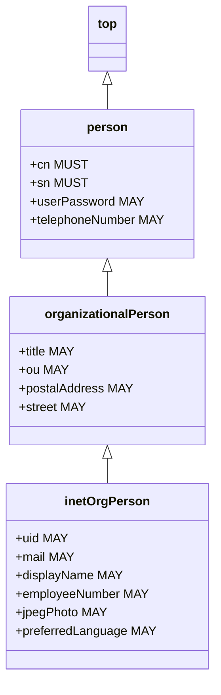
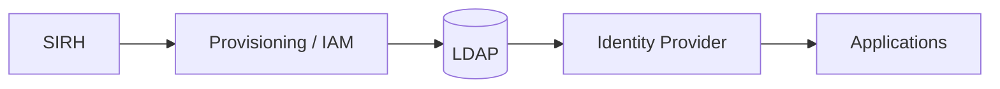

# inetOrgPerson dans LDAP

## Objectifs du cours

À la fin de ce cours, on doit être capable de :

- expliquer le rôle de la classe d'objet `inetOrgPerson` dans un annuaire LDAP ;
- distinguer une **classe d'objet**, un **attribut**, une **syntaxe**, une **matching rule** et une **contrainte applicative** ;
- comprendre l'héritage `top → person → organizationalPerson → inetOrgPerson` ;
- connaître les attributs obligatoires et optionnels réellement disponibles ;
- choisir correctement le DN et le RDN d'une personne ;
- comprendre pourquoi `uid`, `mail` ou `employeeNumber` ne sont **pas automatiquement uniques** ;
- écrire, rechercher et modifier des entrées `inetOrgPerson` en LDIF ;
- concevoir des index et contraintes adaptées dans OpenLDAP ;
- protéger les données personnelles contenues dans l'annuaire ;
- intégrer `inetOrgPerson` à une architecture d'identité, un SSO ou une application ;
- éviter les erreurs de modélisation les plus fréquentes.

> [!important]
> `inetOrgPerson` est un **schéma de données pour représenter une personne**. Ce n'est ni un protocole d'authentification, ni un système de comptes Unix, ni une base RH complète, ni un fournisseur OIDC.

## Prérequis

Ce cours suppose les bases vues dans [[LDAP]] :

- DIT ;
- DN et RDN ;
- classes d'objet ;
- attributs ;
- LDIF ;
- opérations LDAP ;
- filtres de recherche.

---

# 1. Positionnement et normes

## 1.1 Qu'est-ce que `inetOrgPerson` ?

`inetOrgPerson` est une classe d'objet LDAP **structurelle** conçue pour représenter une personne associée à une organisation.

Elle a été publiée en avril 2000 dans la **RFC 2798**.

Son OID est :

```text
2.16.840.1.113730.3.2.2
```

Sa définition historique est :

```text
( 2.16.840.1.113730.3.2.2
  NAME 'inetOrgPerson'
  SUP organizationalPerson
  STRUCTURAL
  MAY (
    audio $ businessCategory $ carLicense $ departmentNumber $
    displayName $ employeeNumber $ employeeType $ givenName $
    homePhone $ homePostalAddress $ initials $ jpegPhoto $
    labeledURI $ mail $ manager $ mobile $ o $ pager $
    photo $ roomNumber $ secretary $ uid $ userCertificate $
    x500uniqueIdentifier $ preferredLanguage $
    userSMIMECertificate $ userPKCS12
  )
)
```

La RFC 2798 est une RFC **Informational**. Elle a ensuite été mise à jour par plusieurs RFC, notamment :

- RFC 3698 pour certaines matching rules ;
- RFC 4519 pour le schéma LDAP destiné aux applications utilisateur ;
- RFC 4524 pour les éléments historiques COSINE, notamment `mail`.

Il faut donc lire `inetOrgPerson` dans le contexte du corpus LDAPv3 moderne, pas isolément comme si tous les détails de l'an 2000 étaient encore la meilleure référence opérationnelle.

## 1.2 Pourquoi cette classe existe-t-elle ?

Les classes X.500 historiques `person` et `organizationalPerson` ne contenaient pas tous les attributs devenus utiles dans les annuaires Internet et intranet :

- adresse électronique ;
- identifiant utilisateur ;
- numéro d'employé ;
- photo JPEG ;
- langue préférée ;
- numéro de mobile ;
- responsable hiérarchique ;
- URI associée à la personne.

`inetOrgPerson` complète donc le modèle existant plutôt que de repartir de zéro.

## 1.3 Une classe très stable

L'âge de la RFC ne signifie pas que le schéma est obsolète.

Un schéma d'annuaire est volontairement stable : modifier le sens d'un attribut existant casserait l'interopérabilité de nombreux systèmes.

La bonne stratégie est généralement :

1. conserver les attributs standard quand ils correspondent au besoin ;
2. ajouter des classes **AUXILIARY** ou un schéma privé pour les besoins spécifiques ;
3. ne pas réinterpréter un attribut standard avec un sens local incompatible.

---

# 2. Rappels : comment fonctionne un schéma LDAP ?

## 2.1 Classe d'objet

Une classe d'objet définit :

- son nom ;
- son OID ;
- son éventuelle classe parente (`SUP`) ;
- son type (`STRUCTURAL`, `AUXILIARY` ou `ABSTRACT`) ;
- les attributs autorisés ou obligatoires.

Exemple conceptuel :

```text
objectClass
    ├── attributs MUST
    └── attributs MAY
```

## 2.2 Attribut

Un attribut possède sa propre définition indépendante de la classe d'objet :

- OID ;
- nom ;
- syntaxe ;
- matching rules ;
- caractère mono ou multivalué ;
- éventuellement un supertype.

Par exemple, `employeeNumber` est défini comme `SINGLE-VALUE`.

Cela signifie :

> une entrée ne peut contenir qu'une seule valeur `employeeNumber`.

Cela **ne signifie pas** :

> deux entrées différentes ne peuvent pas avoir le même `employeeNumber`.

La cardinalité et l'unicité sont deux concepts différents.

## 2.3 Syntaxe

La syntaxe détermine la forme de la valeur LDAP.

Exemples :

| Syntaxe | Exemple |
|---|---|
| Directory String | `Élodie Martin` |
| IA5 String | `elodie@example.org` |
| Telephone Number | `+33 3 20 00 00 00` |
| DN | `uid=alice,ou=people,dc=example,dc=org` |
| JPEG | contenu binaire |
| Octet String | contenu binaire |

Une syntaxe LDAP ne doit pas être confondue avec une validation métier complète.

## 2.4 Matching rule

Une matching rule précise comment le serveur compare les valeurs.

Exemples :

```text
caseIgnoreMatch
caseExactMatch
telephoneNumberMatch
distinguishedNameMatch
```

Ainsi, deux chaînes peuvent être considérées égales par LDAP même si leurs octets ne sont pas strictement identiques.

## 2.5 Schéma vs règles métier

Le schéma répond à des questions comme :

- cet attribut est-il permis ?
- est-il multivalué ?
- quelle syntaxe possède-t-il ?

Il ne répond pas automatiquement à :

- `uid` doit-il être unique dans toute l'organisation ?
- le mail doit-il appartenir au domaine `example.org` ?
- `employeeNumber` doit-il correspondre à un enregistrement RH ?
- un stagiaire peut-il avoir deux responsables ?

Ces règles appartiennent à la politique d'annuaire ou aux applications.

---

# 3. Héritage de `inetOrgPerson`

## 3.1 Hiérarchie


```mermaid
classDiagram
    top <|-- person
    person <|-- organizationalPerson
    organizationalPerson <|-- inetOrgPerson

    class person {
      +cn MUST
      +sn MUST
      +userPassword MAY
      +telephoneNumber MAY
    }

    class organizationalPerson {
      +title MAY
      +ou MAY
      +postalAddress MAY
      +street MAY
    }

    class inetOrgPerson {
      +uid MAY
      +mail MAY
      +displayName MAY
      +employeeNumber MAY
      +jpegPhoto MAY
      +preferredLanguage MAY
    }
```

## 3.2 La classe `person`

La classe `person` fournit notamment :

```text
MUST: sn, cn
MAY: userPassword, telephoneNumber, seeAlso, description
```

Ainsi, une entrée `inetOrgPerson` doit indirectement fournir au minimum :

- `objectClass` ;
- `cn` ;
- `sn`.

## 3.3 `organizationalPerson`

`organizationalPerson` enrichit `person` avec des informations liées à l'organisation :

- `title` ;
- `ou` ;
- `postalAddress` ;
- `postalCode` ;
- `street` ;
- `facsimileTelephoneNumber` ;
- etc.

## 3.4 `inetOrgPerson`

`inetOrgPerson` ajoute les informations Internet/intranet et RH légères :

- `uid` ;
- `mail` ;
- `displayName` ;
- `givenName` ;
- `employeeNumber` ;
- `employeeType` ;
- `departmentNumber` ;
- `manager` ;
- `jpegPhoto` ;
- `preferredLanguage` ;
- etc.

## 3.5 Faut-il lister toutes les classes parentes dans `objectClass` ?

On voit souvent :

```ldif
objectClass: top
objectClass: person
objectClass: organizationalPerson
objectClass: inetOrgPerson
```

C'est extrêmement courant et très lisible.

Cependant, la sémantique d'héritage signifie que `inetOrgPerson` dérive déjà de `organizationalPerson`, qui dérive de `person`.

Il faut respecter les conventions du serveur et du parc logiciel avec lequel on interopère.

---

# 4. Les attributs obligatoires

## 4.1 `cn`

`cn`, *common name*, représente un nom usuel ou une désignation de la personne.

Exemple :

```ldif
cn: Alice Martin
```

`cn` peut être multivalué.

Exemple :

```ldif
cn: Alice Martin
cn: Alice M. Martin
```

Ne pas supposer que `cn` constitue un identifiant technique stable.

Un changement de nom peut le modifier.

## 4.2 `sn`

`sn`, *surname*, correspond au nom de famille.

```ldif
sn: Martin
```

C'est un attribut requis par `person`.

Pour les usages réels, il faut prévoir les cas internationaux :

- plusieurs noms ;
- noms composés ;
- absence de séparation simple prénom/nom ;
- changement de nom ;
- caractères Unicode.

## 4.3 `objectClass`

`objectClass` décrit les classes auxquelles appartient l'entrée.

Exemple :

```ldif
objectClass: top
objectClass: person
objectClass: organizationalPerson
objectClass: inetOrgPerson
```

L'attribut `objectClass` n'est pas un champ métier modifiable arbitrairement : sa valeur commande le schéma applicable à l'entrée.

---

# 5. Attributs d'identité et d'affichage

## 5.1 `givenName`

```ldif
givenName: Alice
```

Le prénom n'est pas obligatoire.

Il ne faut pas reconstruire automatiquement toutes les identités humaines en supposant :

```text
givenName + " " + sn
```

Cette hypothèse échoue dans de nombreuses cultures et situations.

## 5.2 `displayName`

`displayName` représente le nom préféré pour l'affichage.

```ldif
displayName: Alice Martin
```

Il est `SINGLE-VALUE` dans la définition historique.

Bon usage :

```text
Interface utilisateur → displayName
Identifiant technique → uid ou identifiant applicatif
Nom légal/RH → attribut métier dédié si nécessaire
```

## 5.3 `initials`

```ldif
initials: AM
```

Cet attribut est surtout utile pour des applications historiques ou métiers spécifiques.

Il ne faut pas l'utiliser comme identifiant.

## 5.4 `uid`

```ldif
uid: alice
```

`uid` est souvent utilisé comme :

- login ;
- identifiant court ;
- RDN ;
- clé de rapprochement applicative.

Mais :

> [!danger]
> LDAP ne garantit pas automatiquement que `uid` soit unique.

Une définition d'attribut ne constitue pas une contrainte d'unicité globale.

On peut parfaitement avoir, sans politique supplémentaire :

```text
uid=alice,ou=employees,dc=example,dc=org
uid=alice,ou=contractors,dc=example,dc=org
```

Si l'organisation exige une unicité globale, elle doit l'imposer explicitement.

## 5.5 Identifiant immutable

Un bon annuaire distingue généralement :

- identifiant humain : `displayName` ;
- login : `uid` ;
- identifiant RH : `employeeNumber` ;
- identifiant technique immutable : attribut interne ou UUID opérationnel.

Le DN lui-même ne doit pas nécessairement servir d'identifiant applicatif permanent, puisqu'une opération `Modify DN` peut le modifier.

---

# 6. Attributs organisationnels

## 6.1 `employeeNumber`

```ldif
employeeNumber: 004281
```

La RFC le définit comme un attribut `SINGLE-VALUE` destiné à identifier numériquement un employé dans une organisation.

Deux précisions :

1. sa syntaxe LDAP est une **Directory String**, pas un entier ;
2. `SINGLE-VALUE` ne garantit aucune unicité entre entrées.

Il est donc valide de conserver des zéros initiaux :

```text
004281
```

Il ne faut pas convertir cet identifiant en entier si ces zéros ont une signification métier.

## 6.2 `employeeType`

```ldif
employeeType: permanent
```

ou :

```ldif
employeeType: contractor
```

Cet attribut est libre dans le schéma.

Pour garantir l'interopérabilité interne, définir une taxonomie contrôlée :

```text
permanent
fixed-term
contractor
intern
external
```

Éviter un mélange du type :

```text
CDI
Permanent
permanent employee
full-time
salarié
```

si ces valeurs désignent la même catégorie métier.

## 6.3 `departmentNumber`

```ldif
departmentNumber: IT-OPS
```

Il peut être multivalué.

Le nom peut induire en erreur : ce n'est pas nécessairement un nombre au sens arithmétique.

## 6.4 `title`

Hérité de `organizationalPerson` :

```ldif
title: Ingénieure plateforme
```

Un intitulé de poste n'est généralement pas un bon attribut d'autorisation.

Ne pas faire :

```text
si title == "Administrateur" alors accès root
```

Préférer des groupes, rôles ou claims dédiés.

## 6.5 `manager`

`manager` contient un **DN**, pas un `uid`.

Correct :

```ldif
manager: uid=bob,ou=people,dc=example,dc=org
```

Incorrect :

```ldif
manager: bob
```

Le serveur compare cet attribut avec la matching rule des DN.

## 6.6 `secretary`

Même logique : il s'agit d'une référence sous forme de DN.

```ldif
secretary: uid=chloe,ou=people,dc=example,dc=org
```

---

# 7. Adresses électroniques et URI

## 7.1 `mail`

Exemple :

```ldif
mail: alice@example.org
```

Le schéma standard définit `mail` avec une syntaxe **IA5 String** et une comparaison insensible à la casse.

La RFC 4524 précise un point important :

> le serveur LDAP ne garantit pas que la valeur respecte réellement la grammaire complète d'une adresse électronique.

La validation du format reste donc une responsabilité applicative.

### Mauvaise hypothèse

```text
"le serveur a accepté mail, donc l'adresse est valide"
```

Faux.

### Validation pratique

Vérifier au minimum :

- syntaxe acceptée par la politique de messagerie ;
- normalisation choisie ;
- domaine autorisé ;
- unicité si nécessaire ;
- état de provisionnement de la boîte.

## 7.2 `mail` peut être multivalué

Une personne peut avoir plusieurs adresses :

```ldif
mail: alice@example.org
mail: a.martin@example.org
```

Si une application a besoin de distinguer :

- adresse principale ;
- alias ;
- adresse personnelle ;
- adresse de notification ;

`mail` seul peut être insuffisant.

Il faut alors définir une convention ou un schéma plus riche.

## 7.3 `labeledURI`

Exemple :

```ldif
labeledURI: https://people.example.org/alice Profil public
```

Il peut contenir une URI et un libellé.

Cas d'usage :

- page personnelle ;
- profil d'annuaire ;
- documentation ;
- ressource associée.

Ne pas y mettre un secret ou une URL comportant un token d'accès.

---

# 8. Téléphone et localisation

## 8.1 Téléphones

Attributs utiles :

```text
telephoneNumber
mobile
homePhone
facsimileTelephoneNumber
pager
```

Exemple :

```ldif
telephoneNumber: +33 3 20 00 00 00
mobile: +33 6 12 34 56 78
```

Pour les échanges entre systèmes modernes, une représentation proche d'E.164 facilite généralement l'interopérabilité :

```text
+33612345678
```

Le schéma LDAP ne transforme pas automatiquement les numéros dans ce format.

## 8.2 Adresse professionnelle

Attributs hérités :

```text
street
l
st
postalCode
postalAddress
physicalDeliveryOfficeName
postOfficeBox
```

Exemple :

```ldif
street: 42 rue des Réseaux
l: Lille
postalCode: 59000
```

## 8.3 Données personnelles

Les coordonnées :

- domicile ;
- téléphone personnel ;
- mobile ;
- photo ;

sont des données personnelles.

Le fait qu'un attribut soit autorisé par `inetOrgPerson` ne signifie pas qu'il soit pertinent de le collecter ou de le rendre lisible par tous les utilisateurs de l'annuaire.

Voir [[Règlement Général sur la Protection des Données (RGPD)]].

---

# 9. Photos et données binaires

## 9.1 `jpegPhoto`

`jpegPhoto` contient directement des octets JPEG.

Dans un fichier LDIF, le binaire est généralement représenté en Base64.

Exemple de principe :

```ldif
jpegPhoto:: /9j/4AAQSkZJRgABAQ...
```

Deux `:` après le nom de l'attribut signalent une valeur encodée en Base64 dans le LDIF.

## 9.2 Référencer un fichier avec `ldapmodify`

Certaines implémentations/outils LDIF permettent une URL de fichier :

```ldif
jpegPhoto:< file:///tmp/alice.jpg
```

Le client lit alors le fichier et transmet sa valeur.

## 9.3 Faut-il stocker les photos dans LDAP ?

Cela dépend :

### Raisons pour

- petites photos de profil ;
- réplication avec l'identité ;
- applications d'annuaire traditionnelles.

### Raisons contre

- augmentation importante de la base ;
- réplication plus coûteuse ;
- cache CDN impossible directement ;
- droits d'accès plus difficiles ;
- fichiers de grande taille.

Pour une plateforme moderne, on peut stocker :

```text
LDAP → métadonnées / identifiant
Object storage → image
```

plutôt que de transformer LDAP en stockage de blobs généraliste.

## 9.4 `photo` historique

`photo` est un attribut historique utilisant un format de télécopie G3/X.500.

Pour une photo moderne, préférer généralement `jpegPhoto` lorsque l'interopérabilité LDAP le permet.

---

# 10. Langue préférée

## 10.1 `preferredLanguage`

Exemple simple :

```ldif
preferredLanguage: fr
```

Exemple avec préférences pondérées :

```ldif
preferredLanguage: fr, en-GB;q=0.8, en;q=0.7
```

La RFC 2798 a défini cet attribut sur la logique du champ HTTP `Accept-Language` de son époque.

Pour les applications modernes :

- employer des tags de langue standardisés ;
- respecter la casse/normalisation choisie par l'application ;
- ne pas inventer des codes locaux si une étiquette BCP 47 convient ;
- prévoir un fallback côté application.

## 10.2 Erreur de l'ancien modèle

`preferredLanguage` n'est pas limité à un code ISO 639-1 de deux caractères.

Des valeurs comme :

```text
fr-FR
en-GB
zh-Hant
```

peuvent être beaucoup plus expressives qu'un simple `fr`, `en` ou `zh`.

---

# 11. Certificats et attributs cryptographiques

`inetOrgPerson` autorise historiquement :

```text
userCertificate
userSMIMECertificate
userPKCS12
x500UniqueIdentifier
```

## 11.1 `userCertificate`

Il peut contenir un certificat public X.509.

La gestion LDAP des certificats a ensuite été précisée par des RFC spécialisées telles que RFC 4523.

## 11.2 `userPKCS12`

PKCS#12 peut contenir des informations d'identité très sensibles, potentiellement y compris des clés privées selon le contenu du conteneur.

> [!danger]
> Le fait que l'attribut existe dans le schéma ne signifie pas qu'il soit judicieux d'y stocker des clés privées dans un annuaire généraliste.

En 2026, il est souvent préférable de gérer :

- clés privées dans un HSM, TPM, secure element ou keystore dédié ;
- secrets dans un gestionnaire de secrets ;
- certificats publics dans un annuaire si le cas d'usage le justifie.

## 11.3 Données héritées

Certains attributs reflètent les usages PKI et S/MIME de la fin des années 1990.

Il faut distinguer :

- compatibilité avec un système historique ;
- pertinence d'un nouveau design.

---

# 12. Choisir le DN et le RDN

## 12.1 Exemple basé sur `uid`

```text
uid=alice,ou=people,dc=example,dc=org
```

Avantages :

- lisible ;
- court ;
- stable si le login ne change jamais.

Inconvénient :

- si le login change, il faut renommer l'entrée.

## 12.2 Exemple basé sur `cn`

```text
cn=Alice Martin,ou=people,dc=example,dc=org
```

Très lisible, mais fragile en cas de :

- changement de nom ;
- homonymie ;
- accents ou conventions d'échappement ;
- internationalisation.

## 12.3 Exemple basé sur un identifiant opaque

```text
entryUUID=...
```

Attention : `entryUUID` est généralement un attribut **opérationnel** généré par le serveur, et n'est pas nécessairement disponible comme choix direct de RDN selon le design de l'annuaire.

On peut à la place introduire un identifiant métier dédié :

```text
personId=01J...
```

avec un schéma privé bien défini.

## 12.4 Le DN n'est pas une clé primaire SQL

Une entrée LDAP est nommée dans un DIT.

Une opération de renommage peut transformer :

```text
uid=alice,ou=people,dc=example,dc=org
```

en :

```text
uid=alice.martin,ou=people,dc=example,dc=org
```

Une application qui stocke le DN comme identifiant immuable peut donc rencontrer des problèmes.

---

# 13. Entrée minimale

Voici une entrée `inetOrgPerson` simple :

```ldif
version: 1

dn: uid=alice,ou=people,dc=example,dc=org
objectClass: top
objectClass: person
objectClass: organizationalPerson
objectClass: inetOrgPerson
cn: Alice Martin
sn: Martin
uid: alice
```

## 13.1 Pourquoi cela fonctionne-t-il ?

Les attributs `cn` et `sn` satisfont les exigences héritées de `person`.

`uid` est utile pour le nommage, mais ce n'est pas un attribut MUST d'`inetOrgPerson`.

---

# 14. Entrée complète réaliste

```ldif
version: 1

dn: uid=alice,ou=people,dc=example,dc=org
objectClass: top
objectClass: person
objectClass: organizationalPerson
objectClass: inetOrgPerson
cn: Alice Martin
sn: Martin
givenName: Alice
displayName: Alice Martin
uid: alice
mail: alice@example.org
mail: a.martin@example.org
employeeNumber: 004281
employeeType: permanent
departmentNumber: PLATFORM
title: Ingénieure plateforme
telephoneNumber: +33 3 20 00 00 00
mobile: +33 6 12 34 56 78
preferredLanguage: fr, en;q=0.8
manager: uid=bob,ou=people,dc=example,dc=org
labeledURI: https://people.example.org/alice Profil public
```

## 14.1 Ce qui n'est volontairement pas stocké

Par exemple :

- mot de passe en clair ;
- token OAuth ;
- clé SSH privée ;
- secret API ;
- numéro de carte bancaire ;
- données de santé non nécessaires ;
- informations personnelles sans finalité.

Le schéma ne doit jamais devenir une excuse pour collecter toutes les données possibles.

---

# 15. Ajouter une entrée avec OpenLDAP

Fichier `alice.ldif` :

```ldif
dn: uid=alice,ou=people,dc=example,dc=org
objectClass: top
objectClass: person
objectClass: organizationalPerson
objectClass: inetOrgPerson
cn: Alice Martin
sn: Martin
uid: alice
mail: alice@example.org
```

Ajout :

```bash
ldapadd -x \
  -H ldaps://ldap.example.org \
  -D 'cn=provisioner,dc=example,dc=org' \
  -W \
  -f alice.ldif
```

En automatisation, éviter `-w motdepasse`, qui expose facilement le secret dans :

- l'historique du shell ;
- la liste des processus ;
- les logs ;
- les scripts.

Préférer un mécanisme de secret approprié ou une authentification SASL/certificat lorsque possible.

---

# 16. Rechercher des personnes

## 16.1 Par `uid`

```bash
ldapsearch -LLL -x \
  -H ldaps://ldap.example.org \
  -b 'ou=people,dc=example,dc=org' \
  '(&(objectClass=inetOrgPerson)(uid=alice))' \
  dn cn displayName mail employeeNumber
```

## 16.2 Par mail

```bash
ldapsearch -LLL -x \
  -H ldaps://ldap.example.org \
  -b 'ou=people,dc=example,dc=org' \
  '(&(objectClass=inetOrgPerson)(mail=alice@example.org))' \
  dn uid cn mail
```

## 16.3 Recherche partielle

```bash
ldapsearch -LLL -x \
  -H ldaps://ldap.example.org \
  -b 'ou=people,dc=example,dc=org' \
  '(&(objectClass=inetOrgPerson)(cn=*Martin*))' \
  dn cn uid
```

## 16.4 Toujours limiter la recherche au bon type

Un filtre :

```text
(uid=alice)
```

peut aussi correspondre à d'autres classes contenant `uid`.

Un filtre plus explicite :

```text
(&(objectClass=inetOrgPerson)(uid=alice))
```

rend souvent l'intention plus claire.

---

# 17. Modifier une entrée

Fichier `change-mail.ldif` :

```ldif
dn: uid=alice,ou=people,dc=example,dc=org
changetype: modify
replace: mail
mail: alice.martin@example.org
mail: alice@example.org
-
replace: displayName
displayName: Alice Martin
```

Application :

```bash
ldapmodify -x \
  -H ldaps://ldap.example.org \
  -D 'cn=provisioner,dc=example,dc=org' \
  -W \
  -f change-mail.ldif
```

## 17.1 `add`, `delete`, `replace`

Exemple ajout d'une valeur :

```ldif
dn: uid=alice,ou=people,dc=example,dc=org
changetype: modify
add: mail
mail: a.martin@example.org
```

Suppression d'une valeur :

```ldif
dn: uid=alice,ou=people,dc=example,dc=org
changetype: modify
delete: mail
mail: a.martin@example.org
```

---

# 18. Unicité : ce que le schéma ne fait pas

## 18.1 `uid`

Rien dans `inetOrgPerson` ne déclare :

```text
UNIQUE uid
```

LDAP n'a pas un équivalent universel direct du :

```sql
UNIQUE(uid)
```

dans la définition standard de la classe.

## 18.2 `employeeNumber`

Il est `SINGLE-VALUE`, donc :

```ldif
employeeNumber: 001
employeeNumber: 002
```

sur une **même entrée** n'est pas conforme.

Mais :

```text
Alice → employeeNumber=001
Bob   → employeeNumber=001
```

n'est pas interdit par la seule définition de l'attribut.

## 18.3 Overlay `unique` d'OpenLDAP

OpenLDAP propose l'overlay `unique` pour imposer certaines contraintes d'unicité.

Exemple conceptuel :

```text
overlay unique
unique_uri ldap:///?uid?sub?
unique_uri ldap:///?mail?sub?
```

La syntaxe exacte doit être adaptée au backend et à la configuration dynamique `cn=config` du serveur.

## 18.4 Concevoir le domaine d'unicité

Questions à poser :

- unique dans une OU ?
- unique dans tout le suffixe ?
- unique uniquement pour les personnes actives ?
- faut-il inclure les comptes de service ?
- les alias mail doivent-ils être uniques ?

Exemple :

```text
uid unique dans dc=example,dc=org
employeeNumber unique parmi les employés
mail unique parmi toutes les identités actives
```

---

# 19. Indexation

Une application peut souvent rechercher par :

```text
uid
mail
employeeNumber
cn
sn
```

Ces attributs peuvent mériter des index.

Exemple conceptuel OpenLDAP :

```text
olcDbIndex: objectClass eq
olcDbIndex: uid eq
olcDbIndex: mail eq,sub
olcDbIndex: employeeNumber eq
olcDbIndex: cn,sn eq,sub
```

> [!warning]
> Ajouter tous les index possibles n'améliore pas automatiquement les performances.

Un index coûte :

- de l'espace ;
- du temps d'écriture ;
- de la maintenance.

Choisir les index à partir des requêtes réelles.

---

# 20. Matching rules et pièges de comparaison

## 20.1 `mail`

La matching rule historique de `mail` est insensible à la casse.

Cela signifie que le serveur peut considérer :

```text
Alice@example.org
alice@example.org
```

comme égaux pour une recherche LDAP.

La RFC 4524 avertit que ces règles de comparaison LDAP ne reproduisent pas nécessairement toutes les subtilités sémantiques des boîtes mail.

## 20.2 `uid`

`uid` utilise également une comparaison insensible à la casse dans le schéma standard.

Avant de créer une convention de login sensible à la casse, vérifier les conséquences de bout en bout.

## 20.3 DN

Les attributs tels que :

```text
manager
secretary
seeAlso
```

sont des DN.

Il ne faut pas les comparer comme de simples chaînes de caractères.

---

# 21. Filtres LDAP et sécurité

## 21.1 Injection LDAP

Ne jamais construire :

```python
filter_str = f"(uid={user_input})"
```

avec une entrée utilisateur non échappée.

Un attaquant peut introduire des métacaractères tels que :

```text
*
(
)
\\
NUL
```

## 21.2 Avec `ldap3`

```python
from ldap3.utils.conv import escape_filter_chars

uid = escape_filter_chars(user_input)
search_filter = f"(&(objectClass=inetOrgPerson)(uid={uid}))"
```

Toujours utiliser la fonction d'échappement correspondant au **contexte** :

- filtre LDAP ;
- DN/RDN ;
- URL LDAP.

Ce ne sont pas les mêmes règles.

---

# 22. Contrôle d'accès et confidentialité

## 22.1 Tous les attributs ne doivent pas être publics

On peut vouloir rendre visibles :

```text
cn
displayName
mail professionnel
telephoneNumber professionnel
```

mais restreindre :

```text
homePhone
homePostalAddress
employeeNumber
manager
jpegPhoto
userCertificate
userPassword
```

selon le contexte.

## 22.2 ACL

LDAP n'impose pas un modèle universel d'ACL : le contrôle d'accès est dépendant du serveur.

Avec OpenLDAP, on définit des règles `olcAccess` adaptées au DIT.

Exemple conceptuel :

```text
to attrs=userPassword
  by self write
  by anonymous auth
  by * none
```

Puis des règles séparées pour les attributs de profil.

## 22.3 Moindre privilège

Un service d'annuaire public n'a pas besoin de lire :

```text
employeeNumber
homePostalAddress
userPKCS12
```

Une application RH n'a pas nécessairement besoin d'écrire `userPassword`.

Créer des comptes de service avec les droits minimaux.

## 22.4 RGPD

Pour chaque attribut, poser :

1. quelle est la finalité ?
2. quelle est la base juridique ?
3. qui peut le lire ?
4. qui peut le modifier ?
5. combien de temps est-il conservé ?
6. est-il répliqué hors de la zone prévue ?
7. apparaît-il dans des logs ou exports ?

Voir [[Règlement Général sur la Protection des Données (RGPD)]].

---

# 23. `inetOrgPerson` et authentification

## 23.1 Une personne n'est pas automatiquement un compte

Une entrée peut représenter une personne dans l'annuaire sans permettre aucune authentification.

Exemple :

```ldif
objectClass: inetOrgPerson
cn: Alice Martin
sn: Martin
mail: alice@example.org
```

Aucun `userPassword` n'est nécessaire.

## 23.2 `userPassword`

`userPassword` est hérité de `person`, mais :

- ce n'est pas un attribut introduit par `inetOrgPerson` ;
- un serveur peut authentifier autrement ;
- la présence de l'attribut ne garantit pas un mécanisme de hash particulier ;
- il doit être fortement protégé par ACL ;
- une authentification simple doit être protégée par TLS.

La RFC 4513 déconseille fortement l'envoi de mots de passe non protégés et prévoit la protection de l'authentification par TLS.

## 23.3 Architecture SSO moderne

Une architecture fréquente :


```mermaid
flowchart LR
    App[Application] -->|OIDC / OAuth| IdP[Identity Provider]
    IdP -->|LDAP| LDAP[(OpenLDAP)]
    LDAP --> Person[inetOrgPerson]
```

L'application ne manipule alors pas directement le mot de passe LDAP.

Elle reçoit des claims OIDC tels que :

```json
{
  "sub": "01JXYZ...",
  "preferred_username": "alice",
  "name": "Alice Martin",
  "email": "alice@example.org"
}
```

Voir [[OAuth OpenID]].

---

# 24. `inetOrgPerson` et comptes Unix

`inetOrgPerson` ne contient pas à lui seul :

```text
uidNumber
gidNumber
homeDirectory
loginShell
```

Ces attributs appartiennent à d'autres schémas, par exemple les classes POSIX/NIS utilisées par certains environnements Unix.

Une entrée peut combiner plusieurs classes si le schéma le permet :

```ldif
objectClass: inetOrgPerson
objectClass: posixAccount
```

avec les attributs supplémentaires requis.

## 24.1 Composition de schéma

Conceptuellement :

```text
inetOrgPerson
    → identité humaine

posixAccount
    → compte Unix

classe auxiliaire métier
    → informations spécifiques à l'organisation
```

Ne pas surcharger `employeeNumber` pour contenir un UID numérique Unix.

---

# 25. Groupes et autorisations

## 25.1 La personne n'est pas le groupe

`inetOrgPerson` représente une personne.

Les groupes utilisent généralement d'autres classes :

```text
groupOfNames
groupOfUniqueNames
posixGroup
```

selon le besoin.

## 25.2 Membres par DN

Exemple :

```ldif
dn: cn=developers,ou=groups,dc=example,dc=org
objectClass: top
objectClass: groupOfNames
cn: developers
member: uid=alice,ou=people,dc=example,dc=org
member: uid=bob,ou=people,dc=example,dc=org
```

## 25.3 Rôles applicatifs

Ne pas utiliser automatiquement :

```text
title
employeeType
departmentNumber
```

comme rôles de sécurité.

Préférer des groupes ou attributs de rôle explicitement conçus pour l'autorisation.

---

# 26. Provisionnement et cycle de vie

## 26.1 Source de vérité

Avant d'écrire LDAP, déterminer la source de vérité :

```text
SIRH ?
IAM ?
LDAP ?
Application métier ?
```

Un design sain évite les mises à jour bidirectionnelles incontrôlées.

## 26.2 Exemple de flux


```mermaid
flowchart LR
    HR[SIRH] --> IAM[Provisioning / IAM]
    IAM --> LDAP[(LDAP)]
    LDAP --> IdP[Identity Provider]
    IdP --> Apps[Applications]
```

## 26.3 Création

À l'arrivée d'une personne :

1. générer l'identifiant immutable ;
2. attribuer l'`employeeNumber` si applicable ;
3. créer `uid` ;
4. créer l'entrée LDAP ;
5. attribuer les groupes ;
6. provisionner la messagerie ;
7. synchroniser l'IdP ;
8. journaliser les opérations.

## 26.4 Changement de nom

Ne pas recréer une nouvelle identité uniquement parce que :

```text
sn
cn
displayName
mail
```

changent.

Conserver l'identité stable et mettre à jour les attributs appropriés.

## 26.5 Départ

À la sortie :

- désactiver l'authentification ;
- révoquer sessions/tokens ;
- retirer les groupes ;
- traiter la boîte mail selon la politique ;
- conserver ou supprimer les données selon les obligations ;
- ne pas réattribuer trop vite un identifiant stable ;
- gérer les références `manager`, groupes et applications.

---

# 27. Modélisation d'un schéma métier complémentaire

## 27.1 Ne pas détourner un attribut standard

Mauvais exemple :

```text
employeeType = niveau de permission Kubernetes
```

`employeeType` représente un type d'emploi, pas un rôle Kubernetes.

## 27.2 Ajouter une classe AUXILIARY

Supposons un besoin interne :

```text
personId
costCenter
accountStatus
```

On peut créer un schéma privé avec un PEN/OID de l'organisation.

Exemple conceptuel :

```text
objectClass: inetOrgPerson
objectClass: examplePerson
personId: 01JABC...
costCenter: CC-042
accountStatus: active
```

## 27.3 Pourquoi AUXILIARY ?

Une entrée LDAP ne possède en principe qu'une chaîne structurelle principale cohérente.

Une classe auxiliaire permet d'ajouter proprement un ensemble d'attributs sans remplacer `inetOrgPerson` comme classe structurelle de la personne.

Voir [[LDAP]] pour la création d'un schéma personnalisé et l'attribution d'OID.

---

# 28. Introspection du schéma

## 28.1 Root DSE

Découvrir l'entrée de subschema :

```bash
ldapsearch -LLL -x \
  -H ldaps://ldap.example.org \
  -b '' -s base \
  '(objectClass=*)' subschemaSubentry
```

On obtient typiquement :

```text
subschemaSubentry: cn=Subschema
```

## 28.2 Lire la définition

```bash
ldapsearch -LLL -x \
  -H ldaps://ldap.example.org \
  -b 'cn=Subschema' -s base \
  '(objectClass=*)' objectClasses attributeTypes
```

Puis rechercher l'OID ou le nom :

```text
inetOrgPerson
2.16.840.1.113730.3.2.2
```

## 28.3 Ne pas supposer le schéma exact

Un serveur peut :

- supporter des extensions ;
- avoir des classes privées ;
- ne pas charger tous les schémas disponibles ;
- imposer des overlays et ACL locales.

L'introspection permet de vérifier le serveur réel.

---

# 29. Python avec `ldap3`

## 29.1 Recherche sécurisée

```python
from ldap3 import Connection, Server, Tls, ALL
from ldap3.utils.conv import escape_filter_chars
import ssl

server = Server(
    "ldap.example.org",
    port=636,
    use_ssl=True,
    get_info=ALL,
)

conn = Connection(
    server,
    user="cn=reader,dc=example,dc=org",
    password="SECRET_FROM_VAULT",
    auto_bind=True,
)

user_input = "alice"
uid = escape_filter_chars(user_input)

conn.search(
    "ou=people,dc=example,dc=org",
    f"(&(objectClass=inetOrgPerson)(uid={uid}))",
    attributes=["cn", "displayName", "mail", "employeeNumber"],
)

for entry in conn.entries:
    print(entry.entry_dn)
    print(entry.displayName)
```

En production :

- valider le certificat TLS ;
- obtenir le secret depuis un gestionnaire de secrets ;
- configurer des timeouts ;
- utiliser un compte en lecture seule si l'écriture n'est pas nécessaire ;
- ne jamais logger le mot de passe.

## 29.2 Ajouter une entrée

```python
attributes = {
    "objectClass": [
        "top",
        "person",
        "organizationalPerson",
        "inetOrgPerson",
    ],
    "cn": "Alice Martin",
    "sn": "Martin",
    "givenName": "Alice",
    "uid": "alice",
    "mail": ["alice@example.org"],
}

conn.add(
    "uid=alice,ou=people,dc=example,dc=org",
    attributes=attributes,
)

if not conn.result["description"] == "success":
    raise RuntimeError(conn.result)
```

## 29.3 Ne pas concaténer un DN

Si une valeur utilisateur participe au RDN, elle doit être échappée avec une fonction dédiée aux DN.

L'échappement d'un filtre LDAP n'est pas interchangeable avec celui d'un DN.

---

# 30. Validation applicative

## 30.1 Schéma LDAP

Le serveur peut vérifier :

```text
attribut autorisé
syntaxe LDAP
single/multivalué
MUST/MAY
classe structurelle
```

## 30.2 Application

L'application doit souvent vérifier :

```text
format du mail
valeur employeeType autorisée
unicité métier
cohérence departmentNumber
existence du manager
politique de nommage uid
normalisation téléphone
```

## 30.3 Source RH

Le SIRH peut imposer :

```text
employeeNumber immutable
manager valide
centre de coût existant
contrat actif
```

Le modèle de validation est donc multicouche.

---

# 31. Interopérabilité

## 31.1 Pourquoi utiliser les attributs standard ?

Une application tierce sait souvent comprendre :

```text
cn
sn
givenName
displayName
uid
mail
telephoneNumber
```

Elle ne comprend pas forcément :

```text
myCorpFancyLogin
primaryElectronicPostbox
staffHumanIdentifier
```

sans adaptation.

## 31.2 Standard ne signifie pas sémantique parfaite

`uid` peut être :

- login ;
- matricule ;
- identifiant applicatif ;

selon les déploiements.

L'organisation doit documenter précisément sa convention.

## 31.3 Contrat de schéma

Documenter au minimum :

| Attribut | Obligatoire localement ? | Unique ? | Source | Mutable ? | Public ? |
|---|---:|---:|---|---:|---:|
| `uid` | oui | oui | IAM | parfois | oui |
| `cn` | oui | non | RH | oui | oui |
| `sn` | oui | non | RH | oui | oui |
| `mail` | oui | oui | mail | oui | oui |
| `employeeNumber` | employés | oui | RH | non | non |
| `manager` | non | non | RH | oui | interne |

Ce tableau est souvent plus utile opérationnellement qu'une simple liste des attributs de la RFC.

---

# 32. Migration d'un ancien annuaire

## 32.1 Inventaire

Identifier :

- classes réellement utilisées ;
- attributs privés ;
- attributs détournés ;
- doublons de `uid` ;
- doublons de `mail` ;
- DN instables ;
- valeurs invalides ;
- photos/blobs volumineux ;
- mots de passe et mécanismes de hash ;
- ACL.

## 32.2 Recherche de doublons

Exporter les identifiants :

```bash
ldapsearch -LLL -x \
  -H ldaps://ldap.example.org \
  -b 'ou=people,dc=example,dc=org' \
  '(objectClass=inetOrgPerson)' uid \
  > people.ldif
```

Puis analyser les valeurs avec un script contrôlé.

## 32.3 Migration progressive

Approche :

```text
1. documenter le modèle cible
2. ajouter les attributs nouveaux
3. backfill des données
4. valider
5. faire migrer les consommateurs
6. imposer les contraintes
7. supprimer les anciens attributs seulement en dernier
```

Ne pas commencer par supprimer les champs historiques dont des applications dépendent encore.

---

# 33. Anti-patterns

## 33.1 `uid` = clé primaire magique

Faux.

Le schéma ne rend pas `uid` unique ni immutable.

## 33.2 Tout mettre dans `description`

```ldif
description: contractor;admin;CC42;Paris;active
```

C'est difficile à requêter, valider et faire évoluer.

Créer des attributs sémantiques adaptés.

## 33.3 `title` comme autorisation

Un titre RH ne doit pas être utilisé comme rôle de sécurité implicite.

## 33.4 Stocker des secrets dans des attributs libres

Exemple catastrophique :

```ldif
description: github_token=ghp_...
```

Un annuaire n'est pas un gestionnaire de secrets.

## 33.5 Exposer tout l'annuaire anonymement

Le fait que l'annuaire soit interrogeable ne signifie pas que tous les attributs doivent être publiés.

## 33.6 Authentification simple sans TLS

À proscrire.

## 33.7 Utiliser le DN comme identifiant immutable dans toutes les applications

Un DN peut changer lors d'un renommage ou déplacement.

## 33.8 Dupliquer des données sans source de vérité

Si :

```text
RH → LDAP → application → LDAP → RH
```

chacun écrit les mêmes champs, la convergence devient difficile.

## 33.9 Créer un schéma privé pour un attribut déjà standard

Avant d'inventer :

```text
corpEmail
```

vérifier si :

```text
mail
```

répond déjà au besoin.

## 33.10 Réutiliser un attribut standard avec un nouveau sens

C'est pire qu'un attribut privé, car cela crée une fausse interopérabilité.

---

# 34. Modèle recommandé pour une organisation

Exemple de profil local :

## Identité

```text
personId        obligatoire, unique, immutable
uid             obligatoire, unique, mutable sous contrôle
cn              obligatoire
sn              obligatoire
givenName       recommandé
displayName     recommandé
```

## Contact

```text
mail            obligatoire pour comptes humains actifs, unique
telephoneNumber optionnel
mobile          optionnel, accès restreint
```

## Organisation

```text
employeeNumber  unique pour employés
employeeType    vocabulaire contrôlé
departmentNumber référentiel contrôlé
manager         DN existant
```

## Sécurité

```text
aucun secret applicatif
userPassword protégé par ACL si utilisé
TLS obligatoire pour authentification simple
lecture minimale par compte de service
```

---

# 35. TP 1 — Lire la définition du schéma

## Objectif

Identifier les caractéristiques d'`inetOrgPerson` sur un serveur réel.

## Travail

1. interroger le Root DSE ;
2. retrouver `subschemaSubentry` ;
3. rechercher `inetOrgPerson` dans `objectClasses` ;
4. relever son OID ;
5. identifier sa classe parente ;
6. relever ses attributs `MAY` ;
7. comparer avec la RFC 2798.

## Questions

- la définition du serveur correspond-elle exactement au texte historique ?
- quelles extensions locales sont chargées ?

---

# 36. TP 2 — Créer une personne minimale

Créer :

```text
uid=student01,ou=people,dc=example,dc=org
```

avec :

```text
cn
sn
uid
mail
```

Puis vérifier avec `ldapsearch`.

Tester volontairement une création sans `sn` et observer l'erreur de schéma.

---

# 37. TP 3 — Attribut mono ou multivalué

Tester :

```ldif
mail: a@example.org
mail: alias@example.org
```

puis :

```ldif
employeeNumber: 1
employeeNumber: 2
```

Comparer les résultats.

Expliquer pourquoi :

```text
multi-valué ≠ non unique
single-valued ≠ unique
```

---

# 38. TP 4 — Unicité de `uid`

Créer deux entrées dans deux OU différentes avec :

```text
uid=alex
```

Observer le comportement sans overlay d'unicité.

Puis concevoir une politique d'unicité globale.

Ne déployer la contrainte sur un annuaire de production qu'après analyse des doublons existants.

---

# 39. TP 5 — Recherches et index

Préparer des filtres :

```text
(&(objectClass=inetOrgPerson)(uid=alice))
(&(objectClass=inetOrgPerson)(mail=*@example.org))
(&(objectClass=inetOrgPerson)(departmentNumber=PLATFORM))
(&(objectClass=inetOrgPerson)(cn=*Martin*))
```

Pour chacun :

1. déterminer l'index pertinent ;
2. mesurer avant/après sur un jeu de test ;
3. expliquer le coût de l'index en écriture.

---

# 40. TP 6 — `manager` et références DN

Créer :

```text
Alice → manager=DN de Bob
Bob   → manager=DN de Chloé
```

Puis écrire une requête ou un script affichant :

```text
Alice → Bob → Chloé
```

Tester ce qui se passe si Bob est renommé ou supprimé selon les overlays/configurations du serveur.

---

# 41. TP 7 — Confidentialité

Classer les attributs suivants :

```text
cn
mail
mobile
homePhone
employeeNumber
title
jpegPhoto
userPassword
manager
```

par visibilité :

```text
public annuaire
interne authentifié
RH seulement
self seulement
jamais exposé
```

Concevoir ensuite les ACL correspondantes.

---

# 42. TP 8 — Intégration OIDC

Architecture :

```text
OpenLDAP → Keycloak/IdP → OIDC → application
```

Définir le mapping :

| LDAP | Claim OIDC |
|---|---|
| identifiant immutable | `sub` |
| `uid` | `preferred_username` |
| `displayName` | `name` |
| `mail` | `email` |
| groupes | `groups` ou rôles dédiés |

Expliquer pourquoi `employeeType` ne doit pas devenir automatiquement un rôle administrateur.

---

# 43. TP 9 — Client Python sécurisé

Écrire un programme qui :

1. reçoit un `uid` ;
2. échappe correctement la valeur ;
3. effectue une recherche LDAP ;
4. retourne uniquement `displayName` et `mail` ;
5. refuse plusieurs résultats lorsqu'un seul est attendu ;
6. utilise TLS ;
7. ne logge aucun secret.

Ajouter des tests pour :

```text
alice
*
*)(uid=*)
alice\\2a
```

---

# 44. TP 10 — Schéma métier auxiliaire

Concevoir une classe :

```text
examplePerson
```

avec :

```text
personId
costCenter
accountStatus
```

Contraintes :

- OID sous le PEN de l'organisation ;
- classe `AUXILIARY` ;
- `personId` mono-valué ;
- vocabulaire de `accountStatus` documenté ;
- aucune redéfinition de `mail`, `uid` ou `employeeNumber`.

---

# 45. TP 11 — Audit d'un ancien annuaire

À partir d'un export LDIF anonymisé, rechercher :

- `uid` dupliqués ;
- mails dupliqués ;
- entrées sans `sn` ;
- `employeeNumber` vides ou incohérents ;
- managers inexistants ;
- données sensibles trop exposées ;
- attributs libres détournés ;
- blobs trop volumineux.

Produire un plan de remédiation sans casser les applications consommatrices.

---

# 46. TP 12 — Cycle de vie complet

Simuler :

1. arrivée d'Alice ;
2. création LDAP ;
3. ajout au groupe `developers` ;
4. changement de manager ;
5. changement de nom ;
6. changement de mail ;
7. suspension du compte ;
8. départ de l'organisation.

Pour chaque étape, distinguer :

- données d'identité ;
- authentification ;
- autorisations ;
- ressources externes ;
- audit ;
- rétention.

---

# 47. Projet final — Concevoir un annuaire d'identités

## Contexte

Une organisation possède :

- 2 000 salariés ;
- 500 prestataires ;
- plusieurs applications internes ;
- un Identity Provider OIDC ;
- des serveurs Linux ;
- une messagerie ;
- un SIRH.

## Travail attendu

Concevoir :

1. le DIT ;
2. le profil `inetOrgPerson` local ;
3. la politique de DN/RDN ;
4. les contraintes d'unicité ;
5. les attributs publics et privés ;
6. les groupes ;
7. un schéma auxiliaire si nécessaire ;
8. les ACL ;
9. les index ;
10. les flux de provisioning ;
11. le mapping OIDC ;
12. la procédure d'offboarding ;
13. la sauvegarde/restauration ;
14. les contrôles RGPD ;
15. les tests automatisés de cohérence.

## Livrables

```text
architecture.md
schema.md
DIT.mmd
people-example.ldif
groups-example.ldif
acl.md
indexes.md
provisioning.md
security.md
tests/
```

---

# 48. Checklist de conception

## Schéma

- [ ] `inetOrgPerson` est utilisé pour des personnes.
- [ ] Les classes complémentaires ont un rôle documenté.
- [ ] Aucun attribut standard n'est détourné.
- [ ] Les attributs privés utilisent des OID contrôlés.

## Identité

- [ ] L'identifiant immutable est défini.
- [ ] `uid` possède une politique documentée.
- [ ] L'unicité n'est pas supposée implicitement.
- [ ] Le changement de nom est supporté.

## Données

- [ ] Les valeurs multivaluées sont traitées comme telles.
- [ ] `mail` est validé côté application.
- [ ] `employeeNumber` est traité comme une chaîne.
- [ ] `manager` contient un DN.

## Sécurité

- [ ] TLS est utilisé.
- [ ] Les mots de passe ne transitent pas en clair.
- [ ] Les comptes de service appliquent le moindre privilège.
- [ ] Les secrets ne sont pas stockés dans des attributs libres.
- [ ] Les attributs sensibles sont protégés par ACL.

## Exploitation

- [ ] Les index correspondent aux requêtes réelles.
- [ ] Les contraintes sont testées avant activation.
- [ ] Les sauvegardes sont testées.
- [ ] Les références DN sont gérées lors des renommages/suppressions.
- [ ] Le provisioning possède une source de vérité claire.

## RGPD

- [ ] Chaque donnée possède une finalité.
- [ ] La visibilité est minimale.
- [ ] La durée de conservation est définie.
- [ ] Les exports et logs sont contrôlés.
- [ ] L'offboarding est documenté.

---

# 49. Aide-mémoire

## Classe

```text
NAME       inetOrgPerson
OID        2.16.840.1.113730.3.2.2
TYPE       STRUCTURAL
SUP        organizationalPerson
RFC        2798
```

## Attributs fondamentaux effectifs

```text
cn           requis via person
sn           requis via person
objectClass  requis par le modèle LDAP
uid          optionnel dans inetOrgPerson
mail         optionnel
```

## Rappels

```text
SINGLE-VALUE ≠ UNIQUE
uid ≠ clé primaire LDAP
DN ≠ identifiant forcément immutable
mail accepté par LDAP ≠ adresse mail métier valide
inetOrgPerson ≠ compte Unix
inetOrgPerson ≠ protocole d'authentification
inetOrgPerson ≠ fournisseur OIDC
```

## Commandes

```bash
# Lire une personne
ldapsearch -LLL -x -H ldaps://ldap.example.org \
  -b 'ou=people,dc=example,dc=org' \
  '(&(objectClass=inetOrgPerson)(uid=alice))'

# Ajouter
ldapadd -x -H ldaps://ldap.example.org -D 'cn=admin,dc=example,dc=org' -W -f alice.ldif

# Modifier
ldapmodify -x -H ldaps://ldap.example.org -D 'cn=admin,dc=example,dc=org' -W -f change.ldif
```

---

# 50. Glossaire

**Attribut**
: Type de donnée nommé dans le schéma LDAP.

**DIT**
: *Directory Information Tree*, arborescence des entrées.

**DN**
: *Distinguished Name*, nom complet d'une entrée dans le DIT.

**RDN**
: *Relative Distinguished Name*, composant local du DN.

**Object class**
: Définition qui détermine les attributs permis/obligatoires d'une entrée.

**STRUCTURAL**
: Classe qui participe à la nature structurelle principale de l'entrée.

**AUXILIARY**
: Classe permettant d'ajouter des attributs complémentaires.

**MUST**
: Attribut exigé par le schéma de la classe.

**MAY**
: Attribut autorisé mais non requis.

**Syntaxe LDAP**
: Représentation et contraintes de forme d'une valeur.

**Matching rule**
: Règle utilisée pour comparer les valeurs lors des recherches et opérations.

**SINGLE-VALUE**
: Une seule valeur de cet attribut par entrée ; ne signifie pas unique dans l'annuaire.

**OID**
: *Object Identifier*, identifiant numérique global d'un élément de schéma.

**LDIF**
: Format texte d'échange et de modification des données LDAP.

**ACL**
: Règles de contrôle d'accès mises en œuvre par le serveur.

---

# 51. Références

## Normes principales

- RFC 2798 — *Definition of the inetOrgPerson LDAP Object Class* : https://www.rfc-editor.org/rfc/rfc2798
- RFC 4510 — *LDAP: Technical Specification Road Map* : https://www.rfc-editor.org/rfc/rfc4510
- RFC 4511 — *LDAP: The Protocol* : https://www.rfc-editor.org/rfc/rfc4511
- RFC 4512 — *LDAP: Directory Information Models* : https://www.rfc-editor.org/rfc/rfc4512
- RFC 4513 — *LDAP: Authentication Methods and Security Mechanisms* : https://www.rfc-editor.org/rfc/rfc4513
- RFC 4514 — *LDAP: String Representation of Distinguished Names* : https://www.rfc-editor.org/rfc/rfc4514
- RFC 4515 — *LDAP: String Representation of Search Filters* : https://www.rfc-editor.org/rfc/rfc4515
- RFC 4517 — *LDAP: Syntaxes and Matching Rules* : https://www.rfc-editor.org/rfc/rfc4517
- RFC 4519 — *LDAP: Schema for User Applications* : https://www.rfc-editor.org/rfc/rfc4519
- RFC 4523 — *LDAP Schema Definitions for X.509 Certificates* : https://www.rfc-editor.org/rfc/rfc4523
- RFC 4524 — *COSINE LDAP/X.500 Schema* : https://www.rfc-editor.org/rfc/rfc4524

## OpenLDAP

- OpenLDAP Administrator's Guide : https://www.openldap.org/doc/admin26/
- Overlays, notamment `unique` : https://www.openldap.org/doc/admin26/overlays.html

## Cours liés

- [[LDAP]]
- [[OAuth OpenID]]
- [[Règlement Général sur la Protection des Données (RGPD)]]
- [[Sécurité avancée sous Linux]]

---

# Conclusion

`inetOrgPerson` est une classe d'objet ancienne mais toujours très utile parce qu'elle fournit un **vocabulaire commun et stable** pour représenter des personnes dans LDAP.

La difficulté n'est pas d'apprendre une liste d'attributs. Elle consiste à comprendre la séparation entre :

```text
schéma LDAP
    ↓
ce qui est techniquement autorisé

politique d'annuaire
    ↓
ce qui est obligatoire, unique ou visible dans l'organisation

applications / IAM
    ↓
ce qui est utilisé pour l'identité, l'authentification et l'autorisation
```

Une bonne implémentation conserve les attributs standard lorsqu'ils conviennent, documente précisément leur sémantique locale, ajoute des contraintes explicites lorsqu'elles sont nécessaires et protège les données personnelles selon le principe du moindre privilège.
