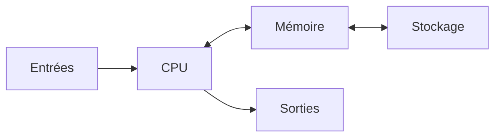
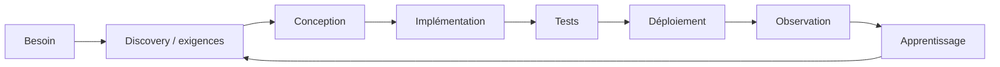
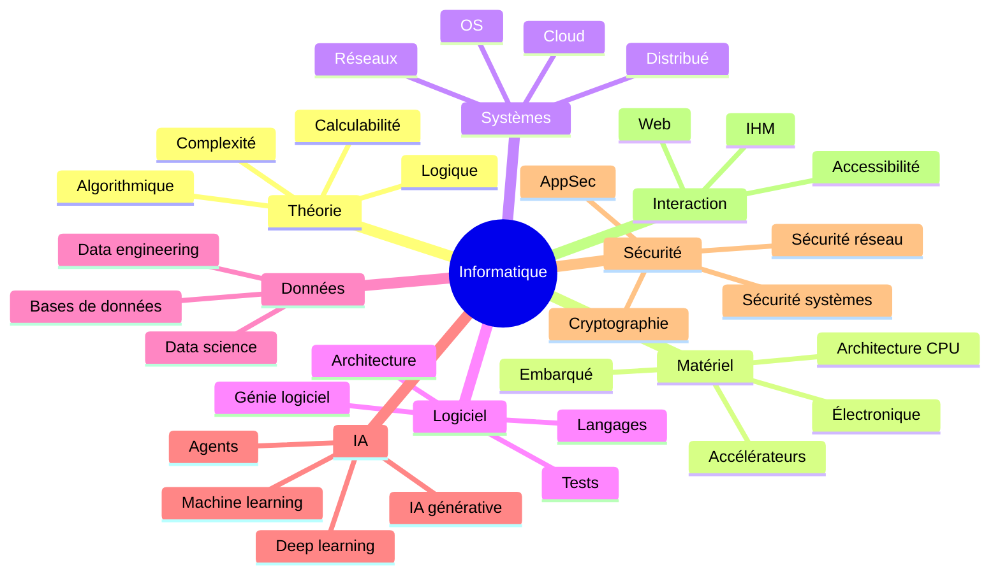
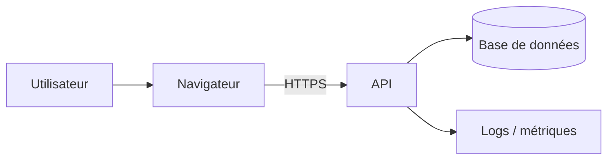

# Informatique

> [!abstract] Objectif
> Ce cours fournit une **vue d'ensemble cohérente de l'informatique**. Il ne remplace pas les cours spécialisés du dépôt : il donne le vocabulaire, les modèles mentaux et les liens nécessaires pour savoir **où approfondir**.

L'informatique ne se réduit ni à « savoir utiliser un ordinateur », ni à « savoir programmer ».

Elle étudie notamment :

- la **représentation de l'information** ;
- les **algorithmes** et la calculabilité ;
- les **machines** qui exécutent les calculs ;
- les **systèmes d'exploitation** ;
- les **réseaux** ;
- les **langages de programmation** ;
- les **données** ;
- la **construction et l'évolution des logiciels** ;
- la **sécurité** ;
- l'**intelligence artificielle** ;
- les interactions entre systèmes informatiques, organisations et société.

---

# Sommaire

1. Qu'est-ce que l'informatique ?
2. Représenter l'information
3. Une histoire condensée de l'informatique
4. Architecture matérielle
5. Logique numérique
6. Systèmes d'exploitation
7. Réseaux
8. Langages de programmation
9. Algorithmique
10. Théorie du calcul
11. Données et bases de données
12. Génie logiciel
13. Méthodes de développement
14. Versionnement et collaboration
15. Architecture logicielle
16. Web
17. Systèmes distribués et cloud
18. Cybersécurité
19. Vie privée et droit
20. Logiciel libre et open source
21. Intelligence artificielle
22. Données, statistique et science des données
23. Parallélisme et concurrence
24. Embarqué, IoT et temps réel
25. Informatique quantique et autres architectures émergentes
26. Systèmes d'information et organisations
27. Modélisation et systémique
28. Qualité et dette technique
29. Débogage et résolution de problèmes
30. Sécurité opérationnelle de base
31. Éthique, accessibilité et impacts
32. Une carte des disciplines informatiques
33. Boîte à outils minimale
34. Comment apprendre l'informatique
35. Travaux pratiques
36. Projet final — Comprendre un système de bout en bout
37. Checklist de culture informatique générale
38. Glossaire
39. Références et cours liés

# 1. Qu'est-ce que l'informatique ?

## 1.1 Une science de l'information et du calcul

Le mot français *informatique* a été popularisé dans les années 1960 à partir des mots **information** et **automatique**.

Une définition utile est :

> L'informatique étudie la représentation, le traitement, la transmission et la conservation automatisés de l'information.

Cette définition inclut aussi bien :

- un microcontrôleur dans un thermostat ;
- un serveur Web ;
- une base de données ;
- un compilateur ;
- un système de fichiers ;
- un smartphone ;
- un cluster de calcul ;
- un modèle de langage ;
- un réseau distribué.

## 1.2 Informatique, Computer Science, IT et génie logiciel

Les frontières varient selon les pays et les cursus.

| Domaine | Question centrale |
|---|---|
| **Computer Science** | Quels calculs peut-on effectuer et comment ? |
| **Software Engineering** | Comment construire et faire évoluer des logiciels fiables ? |
| **Information Technology (IT)** | Comment déployer, exploiter et maintenir les systèmes numériques ? |
| **Information Systems** | Comment les systèmes d'information soutiennent-ils les organisations ? |
| **Computer Engineering** | Comment concevoir les systèmes matériels et logiciels proches du matériel ? |
| **Data Science / AI** | Comment extraire de l'information, apprendre et produire des décisions à partir de données ? |

Le rapport **CS2023 ACM/IEEE-CS/AAAI** organise aujourd'hui l'enseignement de l'informatique par domaines de connaissances et compétences plutôt que comme une simple liste de langages.

## 1.3 Trois niveaux à distinguer

Une grande partie de l'informatique devient plus claire si l'on distingue :

```text
Problème métier ou scientifique
            ↓
Modèles, algorithmes et logiciels
            ↓
Système d'exploitation / runtime
            ↓
Architecture matérielle
            ↓
Électronique et physique
```

Une abstraction cache des détails sans les faire disparaître.

Exemple :

```python
print("Bonjour")
```

semble simple, mais implique notamment :

1. un langage et un runtime Python ;
2. des appels système ;
3. un terminal ;
4. un noyau ;
5. des pilotes ;
6. un processeur ;
7. de la mémoire ;
8. un périphérique d'affichage.

---

# 2. Représenter l'information

## 2.1 Information et symbole

Un ordinateur ne « comprend » pas naturellement les nombres, les lettres ou les images.

Il manipule des **états physiques** auxquels nous attribuons une signification.

Dans les ordinateurs numériques modernes, ces états sont généralement représentés par des **bits**.

## 2.2 Bit et octet

Un **bit** (*binary digit*) vaut :

```text
0 ou 1
```

Un **octet** contient 8 bits.

```text
1 octet = 8 bits
```

Avec `n` bits, on peut représenter :

```text
2^n états distincts
```

Exemple :

```text
8 bits → 256 combinaisons
```

## 2.3 Préfixes décimaux et binaires

Ne pas confondre :

| Préfixe | Valeur |
|---|---:|
| kB | 1 000 octets |
| MB | 1 000² octets |
| GB | 1 000³ octets |
| KiB | 1 024 octets |
| MiB | 1 024² octets |
| GiB | 1 024³ octets |

Les constructeurs de disques emploient généralement les préfixes décimaux.

## 2.4 Bases numériques

Les bases fréquentes sont :

- binaire : base 2 ;
- décimale : base 10 ;
- hexadécimale : base 16.

Exemple :

```text
42₁₀ = 101010₂ = 2A₁₆
```

L'hexadécimal est pratique car un chiffre hexadécimal représente exactement 4 bits.

## 2.5 Entiers signés

Les processeurs modernes utilisent généralement le **complément à deux** pour les entiers signés.

Pour un entier signé sur 8 bits :

```text
-128 à +127
```

## 2.6 Nombres flottants

Les nombres à virgule flottante sont des approximations finies.

Ainsi :

```python
0.1 + 0.2 == 0.3
```

peut être faux dans de nombreux langages utilisant IEEE 754.

Cela ne constitue pas un bug du langage : `0.1` n'a pas de représentation binaire finie exacte.

Pour la monnaie, il faut souvent préférer :

- des entiers représentant les plus petites unités ;
- ou un type décimal adapté.

## 2.7 Texte : Unicode

ASCII ne suffit pas pour représenter les systèmes d'écriture du monde.

**Unicode** associe des points de code aux caractères.

UTF-8 est aujourd'hui l'encodage dominant sur le Web et dans les systèmes Unix modernes.

Important :

```text
caractère ≠ octet
```

et parfois même :

```text
grapheme affiché ≠ un seul point de code
```

## 2.8 Images

Une image matricielle peut être vue comme une grille de pixels.

Chaque pixel encode typiquement :

```text
R, G, B
```

éventuellement avec un canal alpha.

Une image vectorielle décrit au contraire des formes mathématiques.

Voir aussi :

- raster : PNG, JPEG, WebP, AVIF ;
- vectoriel : SVG.

## 2.9 Son et vidéo

Un signal audio numérique provient d'un **échantillonnage** d'un signal continu.

Concepts fondamentaux :

- fréquence d'échantillonnage ;
- profondeur en bits ;
- canaux ;
- compression avec ou sans perte.

La vidéo ajoute une succession d'images, généralement compressées à l'aide de prédictions temporelles et spatiales.

## 2.10 Compression

Deux familles :

### Sans perte

La donnée originale est reconstruite exactement.

Exemples :

- DEFLATE ;
- gzip ;
- zstd ;
- PNG.

### Avec perte

Certaines informations sont volontairement éliminées.

Exemples :

- JPEG ;
- Opus/AAC ;
- codecs vidéo modernes.

---

# 3. Une histoire condensée de l'informatique

> [!warning]
> Une histoire de l'informatique n'est pas une ligne droite allant mécaniquement de l'abaque au smartphone. Plusieurs traditions — calcul, logique, automatisation, télécommunications, électronique et théorie de l'information — se rejoignent progressivement.

## 3.1 Écriture, nombres et mémoire externe

Bien avant les machines de calcul, les sociétés développent :

- systèmes numériques ;
- écritures ;
- tables ;
- instruments comptables.

Les tablettes mésopotamiennes et les bulles-enveloppes montrent déjà qu'une société complexe dépend de systèmes fiables de **représentation et conservation de l'information**.

## 3.2 Machines de calcul antiques

La **machine d'Anticythère**, conçue dans l'Antiquité grecque, est un mécanisme astronomique à engrenages capable de modéliser des cycles célestes.

On peut la considérer comme un remarquable calculateur mécanique analogique spécialisé, pas comme un ordinateur programmable moderne.

## 3.3 Pascaline

Blaise Pascal construit au XVIIe siècle des machines arithmétiques destinées principalement à automatiser l'addition et la soustraction.

Les multiplications et divisions peuvent être obtenues par des procédures répétées, mais ne doivent pas être décrites comme quatre opérations matérielles équivalentes.

## 3.4 Jacquard et les cartes perforées

Le métier Jacquard du début du XIXe siècle utilise des cartes perforées pour commander le motif du tissage.

Il illustre une idée fondamentale :

> séparer la machine de la description de ce qu'elle doit effectuer.

## 3.5 Babbage et Lovelace

Charles Babbage conçoit notamment :

- la Difference Engine ;
- l'Analytical Engine.

L'Analytical Engine prévoit des concepts étonnamment modernes :

- unité de calcul ;
- mémoire ;
- instructions ;
- entrée/sortie ;
- branchements et répétitions.

Ada Lovelace publie en 1843 des notes sur cette machine, dont un algorithme destiné au calcul de nombres de Bernoulli.

Elle est souvent présentée comme l'une des premières personnes à avoir décrit un programme destiné à une machine générale.

## 3.6 Hollerith

Pour le recensement américain de 1890, Herman Hollerith développe des équipements électromécaniques utilisant des cartes perforées.

Cette mécanographie contribue à l'histoire industrielle qui mènera plus tard à IBM.

## 3.7 Fondations mathématiques

Plusieurs idées changent la nature même de la question : « qu'est-ce qu'un calcul ? »

Parmi elles :

- algèbre de Boole ;
- logique formelle ;
- calculabilité ;
- machine de Turing ;
- théorie de l'information de Shannon.

## 3.8 Premiers ordinateurs électroniques

Les années 1940 voient apparaître plusieurs machines majeures.

ENIAC, achevé au milieu des années 1940, est un ordinateur électronique numérique généraliste parmi les premiers de son genre.

Attention : le **PDP-11 date de 1970**, pas de 1945.

## 3.9 Architecture de programme enregistré

Une idée déterminante consiste à stocker en mémoire :

- les données ;
- les instructions.

Elle est associée au modèle dit **von Neumann**, même si son histoire réelle implique plusieurs chercheurs et projets.

## 3.10 Transistor et circuits intégrés

L'électronique passe progressivement :

```text
tubes à vide
→ transistors
→ circuits intégrés
→ microprocesseurs
```

Cette évolution permet :

- miniaturisation ;
- fiabilité ;
- baisse du coût ;
- augmentation spectaculaire des performances.

## 3.11 Mini-ordinateurs

Le PDP-11 de DEC, commercialisé à partir de 1970, marque profondément l'informatique des années 1970.

Il est notamment important dans l'histoire d'Unix.

## 3.12 Micro-ordinateurs et PC

Dans les années 1970 et 1980, le microprocesseur rend possible l'ordinateur personnel.

L'IBM PC 5150 de 1981 utilise notamment un Intel 8088 à environ **4,77 MHz**, et non 1,77 MHz.

## 3.13 Interfaces graphiques

La diffusion :

- de la souris ;
- des fenêtres ;
- des icônes ;
- des interfaces graphiques

modifie profondément l'accès à l'informatique.

## 3.14 Internet et Web

Internet est un réseau de réseaux fondé sur la famille TCP/IP.

Le **World Wide Web** est une application construite au-dessus d'Internet.

Il repose historiquement sur trois briques essentielles :

- URL/URI ;
- HTTP ;
- HTML.

Voir [[HTTP]], [[HTML]] et [[Les protocoles de communications]].

## 3.15 Smartphone, cloud et informatique omniprésente

Le smartphone combine notamment :

- calcul ;
- réseau ;
- capteurs ;
- géolocalisation ;
- caméra ;
- stockage ;
- interface tactile.

Le cloud industrialise de son côté l'accès à des capacités informatiques via des datacenters et des API.

## 3.16 Accélérateurs et IA

Les GPU, puis divers accélérateurs dédiés, jouent un rôle croissant dans :

- calcul scientifique ;
- graphisme ;
- machine learning ;
- IA générative.

---

# 4. Architecture matérielle

## 4.1 Un ordinateur est un système

Un ordinateur moderne réunit typiquement :

```text
CPU
RAM
stockage
contrôleurs
bus/interconnexions
périphériques
firmware
```

## 4.2 Modèle de von Neumann

Le schéma conceptuel simplifié :



Le processeur exécute un cycle conceptuel :

```text
fetch → decode → execute
```

En pratique, les processeurs modernes sont beaucoup plus complexes :

- pipeline ;
- exécution superscalaire ;
- prédiction de branchement ;
- exécution spéculative ;
- plusieurs niveaux de cache ;
- plusieurs cœurs ;
- simultanéité matérielle.

## 4.3 Architecture Harvard

Le modèle Harvard sépare conceptuellement mémoire/instructions et mémoire/données.

De nombreux processeurs modernes combinent des idées des modèles Harvard et von Neumann, par exemple avec des caches L1 instructions et données distincts.

## 4.4 ISA : langage du processeur

Une **Instruction Set Architecture** définit l'interface visible entre logiciel bas niveau et processeur :

- instructions ;
- registres ;
- modes d'adressage ;
- conventions d'état ;
- niveaux de privilège.

Exemples :

- x86-64 ;
- Arm ;
- RISC-V.

Une ISA n'est pas une microarchitecture.

Deux processeurs peuvent exécuter la même ISA avec des conceptions internes très différentes.

## 4.5 RISC et CISC

La distinction historique RISC/CISC reste utile pédagogiquement mais ne suffit plus à décrire les processeurs modernes.

Un cœur x86 moderne peut par exemple décoder ses instructions complexes en micro-opérations internes plus simples.

## 4.6 Mémoire et hiérarchie

Plus une mémoire est rapide, plus elle est généralement coûteuse et limitée.

```text
registres
↓
L1
↓
L2
↓
L3
↓
RAM
↓
SSD
↓
stockage distant / archive
```

Les performances d'un programme dépendent donc beaucoup de la **localité des accès mémoire**.

## 4.7 RAM et mémoire virtuelle

La RAM contient les données actives.

Le système d'exploitation fournit généralement une **mémoire virtuelle** qui :

- isole les processus ;
- traduit les adresses virtuelles vers des pages physiques ;
- permet le mapping de fichiers ;
- facilite le partage contrôlé de mémoire.

## 4.8 Stockage

On distingue notamment :

- HDD ;
- SSD SATA ;
- SSD NVMe ;
- stockage réseau ;
- objet ;
- archives.

Le stockage persistant n'est pas une extension transparente de la RAM : latence, débit, atomicité et durabilité sont différents.

## 4.9 GPU et NPU

Un CPU est conçu pour être généraliste et efficace sur des tâches variées.

Un GPU privilégie un très grand parallélisme sur de nombreux éléments de données.

Les NPU/TPU et autres accélérateurs ciblent des opérations courantes de l'apprentissage automatique.

## 4.10 Firmware, BIOS et UEFI

Le firmware initialise la machine et permet de lancer le système d'exploitation.

Sur les PC modernes, **UEFI** a largement remplacé le BIOS historique.

La spécification UEFI courante est la **2.11**.

Voir aussi [[Initialisation système et des services]].

## 4.11 Loi de Moore : ce qu'elle dit réellement

La loi de Moore est une observation historique sur la croissance du nombre de composants intégrables économiquement sur un circuit, pas une loi physique promettant un doublement éternel des performances tous les 18 mois.

Aujourd'hui, les gains viennent aussi :

- du parallélisme ;
- des accélérateurs ;
- du packaging 3D/chiplets ;
- des améliorations d'architecture ;
- des logiciels.

---

# 5. Logique numérique

## 5.1 Portes logiques

Les briques classiques :

- NOT ;
- AND ;
- OR ;
- XOR ;
- NAND ;
- NOR.

Elles permettent de construire :

- additionneurs ;
- multiplexeurs ;
- registres ;
- compteurs ;
- mémoires ;
- processeurs.

## 5.2 Algèbre de Boole

Les expressions booléennes sont fondamentales pour :

- logique matérielle ;
- conditions ;
- filtres ;
- requêtes ;
- circuits.

Voir [[Systèmes numériques]] et [[Logique]].

---

# 6. Systèmes d'exploitation

## 6.1 Rôle

Un système d'exploitation fournit une abstraction et une politique de partage des ressources matérielles.

Il gère notamment :

- CPU ;
- mémoire ;
- périphériques ;
- stockage ;
- réseau ;
- utilisateurs ;
- sécurité ;
- processus.

## 6.2 Noyau et espace utilisateur

Sur un système comme GNU/Linux :

```text
applications
    ↓
bibliothèques / runtimes
    ↓
appels système
    ↓
noyau Linux
    ↓
matériel
```

Voir [[GNULinux]].

## 6.3 Processus et threads

Un **processus** possède notamment :

- un espace d'adressage ;
- des ressources ;
- un contexte d'exécution.

Un processus peut contenir plusieurs **threads** partageant une partie de ces ressources.

## 6.4 Ordonnancement

L'ordonnanceur répartit le temps CPU entre les tâches exécutables.

Concepts :

- préemption ;
- priorité ;
- temps réel ;
- affinité CPU ;
- starvation.

## 6.5 Systèmes de fichiers

Un système de fichiers organise :

- noms ;
- répertoires ;
- métadonnées ;
- droits ;
- blocs de données.

Exemples :

- ext4 ;
- XFS ;
- Btrfs ;
- NTFS ;
- APFS.

## 6.6 Isolation et conteneurs

Sous Linux, les conteneurs s'appuient notamment sur :

- namespaces ;
- cgroups ;
- capabilities ;
- systèmes de fichiers ;
- mécanismes de sécurité du noyau.

Voir [[Les namespaces Linux]] et [[Docker]].

---

# 7. Réseaux

## 7.1 Pourquoi un réseau ?

Un réseau permet à plusieurs systèmes d'échanger de l'information.

Les problèmes fondamentaux comprennent :

- adressage ;
- routage ;
- fiabilité ;
- congestion ;
- sécurité ;
- découverte ;
- nommage.

## 7.2 Modèle en couches

Une représentation simplifiée :

```text
Application      HTTP, DNS, SSH, SMTP...
Transport        TCP, UDP, QUIC
Internet         IP, ICMP
Accès réseau     Ethernet, Wi-Fi...
Physique         cuivre, fibre, radio...
```

## 7.3 Adresse IP et port

Une adresse IP identifie une interface logique sur un réseau IP.

Un port permet de distinguer des endpoints de transport.

Exemple :

```text
192.0.2.10:443
```

## 7.4 DNS

DNS associe notamment des noms à des informations :

```text
example.org → adresses IP
```

Il s'agit d'un système distribué, hiérarchique et mis en cache.

## 7.5 TCP, UDP et QUIC

### TCP

Fournit un **flux d'octets fiable et ordonné**.

### UDP

Fournit des datagrammes sans garantie de livraison ou d'ordre.

### QUIC

Fournit un transport sécurisé moderne au-dessus d'UDP et sert notamment de base à HTTP/3.

Voir [[Les protocoles de communications]] et [[HTTP]].

---

# 8. Langages de programmation

## 8.1 Un langage n'est pas un ordinateur

Un langage permet d'exprimer des calculs ou transformations à un niveau d'abstraction donné.

Le programme doit ensuite être :

- interprété ;
- compilé ;
- traduit en bytecode ;
- JIT-compilé ;
- ou combiner plusieurs de ces stratégies.

## 8.2 Chronologie très synthétique

Quelques repères :

| Langage | Repère historique |
|---|---:|
| FORTRAN | années 1950 |
| Lisp | 1958 |
| COBOL | 1959 |
| Simula | années 1960 |
| C | début des années 1970 |
| Smalltalk | années 1970 |
| Prolog | 1972 |
| SQL | années 1970 |
| C++ | années 1980 |
| Perl | 1987 |
| Haskell | 1990 |
| Python | 1991 |
| Lua | 1993 |
| Java | 1995 |
| JavaScript | 1995 |
| PHP | 1995 |
| C# | 2000 |
| Go | annoncé publiquement en **2009**, Go 1 en 2012 |
| Rust | projet commencé en 2006, Rust 1.0 en 2015 |
| TypeScript | 2012 |
| Kotlin | 2011, version 1.0 en 2016 |

Pour une chronologie détaillée, voir [[Histoire des langages de programmation]].

## 8.3 Paradigmes

### Impératif

Le programme décrit une suite d'opérations qui modifient un état.

### Procédural

Organisation autour de procédures/fonctions.

### Orienté objet

Organisation autour d'objets, responsabilités et interactions.

### Fonctionnel

Accent sur :

- fonctions ;
- expressions ;
- immutabilité ;
- composition.

### Logique

Le programme exprime des faits et règles, puis un moteur cherche des solutions.

### Dataflow / réactif

Le calcul est organisé autour de flux de données et de dépendances.

Un langage moderne peut supporter plusieurs paradigmes.

## 8.4 Statique ou dynamique

Ne pas confondre :

- langage compilé/interprété ;
- typage statique/dynamique ;
- typage fort/faible.

Ces axes sont différents.

---

# 9. Algorithmique

## 9.1 Algorithme

Un algorithme est une procédure finie permettant de résoudre une classe de problèmes.

Il doit être décrit indépendamment d'un langage particulier lorsque cela est utile.

Exemple : recherche du maximum d'une liste.

```text
maximum ← premier élément
pour chaque élément suivant :
    si élément > maximum :
        maximum ← élément
retourner maximum
```

## 9.2 Correction

Deux questions différentes :

1. le programme termine-t-il ?
2. produit-il le bon résultat ?

## 9.3 Complexité

La notation asymptotique permet d'étudier comment les ressources évoluent avec la taille `n` de l'entrée.

Ordres courants :

```text
O(1)
O(log n)
O(n)
O(n log n)
O(n²)
O(2^n)
```

## 9.4 Structures de données

Exemples :

- tableau ;
- liste chaînée ;
- pile ;
- file ;
- table de hachage ;
- arbre ;
- tas ;
- graphe.

Le choix dépend des opérations prioritaires.

Voir [[Algorithmes avancés en Python]].

## 9.5 Compromis temps/mémoire

Une solution plus rapide peut consommer plus de mémoire, et inversement.

Un cache est un exemple classique de compromis :

```text
plus de mémoire
contre
moins de calcul ou moins d'I/O
```

---

# 10. Théorie du calcul

## 10.1 Calculabilité

Tous les problèmes mathématiquement formulables ne sont pas nécessairement calculables par un algorithme général.

Le **problème de l'arrêt** montre par exemple qu'il n'existe pas de programme universel capable de décider pour tout programme et toute entrée si celui-ci terminera.

## 10.2 Machine de Turing

La machine de Turing est un modèle mathématique abstrait du calcul.

Elle ne décrit pas la construction pratique d'un ordinateur moderne, mais permet de raisonner sur ce qui est calculable.

## 10.3 Décidabilité et complexité

Ne pas confondre :

- **décidable** : il existe un algorithme qui termine toujours ;
- **tractable en pratique** : cet algorithme peut être suffisamment efficace pour la taille considérée.

## 10.4 Incomplétude

Les théorèmes d'incomplétude de Gödel portent sur certains systèmes formels suffisamment expressifs.

Ils ne signifient pas « les ordinateurs ne peuvent jamais tout savoir » au sens vague souvent rencontré dans la vulgarisation.

---

# 11. Données et bases de données

## 11.1 Donnée, information et connaissance

Une donnée est une représentation.

Son interprétation dépend :

- d'un schéma ;
- d'un contexte ;
- de conventions ;
- de métadonnées.

## 11.2 Données structurées

Exemples :

- tables relationnelles ;
- JSON ;
- XML ;
- RDF ;
- formats colonnes.

## 11.3 Modèle relationnel

Le modèle relationnel organise les données sous forme de relations.

SQL permet notamment :

- définir ;
- interroger ;
- modifier ;
- contraindre les données.

Voir [[Bases de données relationnelles]].

## 11.4 Transactions

Les transactions permettent de regrouper des opérations qui doivent respecter certaines propriétés de cohérence et d'isolation.

Concepts à connaître :

- ACID ;
- isolation ;
- concurrence ;
- verrouillage ;
- MVCC.

## 11.5 NoSQL

« NoSQL » regroupe plusieurs familles différentes :

- clé-valeur ;
- document ;
- colonnes distribuées ;
- graphes.

Ce n'est pas « SQL contre NoSQL » : le choix dépend du modèle et des contraintes.

---

# 12. Génie logiciel

## 12.1 Qu'est-ce qu'un logiciel ?

Un logiciel de production ne se limite pas au code source.

Il comprend aussi :

- exigences ;
- configuration ;
- données ;
- dépendances ;
- tests ;
- documentation ;
- scripts de déploiement ;
- observabilité ;
- procédures d'exploitation ;
- processus de maintenance.

## 12.2 Le coût principal vient souvent après la première version

Un logiciel vivant doit :

- évoluer ;
- être corrigé ;
- être sécurisé ;
- rester compatible ;
- être compris par de nouvelles personnes ;
- survivre à des changements d'environnement.

La **maintenabilité** est donc une propriété majeure.

## 12.3 Cycle de vie

Une vision moderne :



Il ne s'agit généralement pas d'une chaîne effectuée une seule fois.

## 12.4 Exigences

On distingue notamment :

### Fonctionnelles

Ce que le système doit faire.

### Non fonctionnelles / attributs de qualité

Exemples :

- performance ;
- sécurité ;
- disponibilité ;
- maintenabilité ;
- compatibilité ;
- accessibilité.

La norme **ISO/IEC 25010:2023** propose un modèle de qualité produit comportant **neuf caractéristiques**.

## 12.5 Conception

La conception traite notamment :

- responsabilités ;
- modules ;
- interfaces ;
- dépendances ;
- modèle de données ;
- flux ;
- contraintes opérationnelles.

Voir [[Architecture des logiciels]] et [[Design patterns]].

## 12.6 Implémentation

Une implémentation robuste implique davantage que « faire marcher le code » :

- lisibilité ;
- tests ;
- gestion des erreurs ;
- observabilité ;
- sécurité ;
- documentation ;
- automatisation.

## 12.7 Vérification et validation

### Vérification

> Construisons-nous le produit correctement ?

### Validation

> Construisons-nous le bon produit ?

## 12.8 Niveaux de test

On peut distinguer :

- tests unitaires ;
- tests d'intégration ;
- tests de contrat ;
- tests système ;
- tests end-to-end ;
- tests d'acceptation ;
- tests de performance ;
- tests de sécurité.

## 12.9 Déploiement

Un déploiement moderne peut inclure :

- CI/CD ;
- containers ;
- Infrastructure as Code ;
- migrations de données ;
- feature flags ;
- canary release ;
- rollback.

## 12.10 Maintenance

Types utiles :

- corrective ;
- adaptative ;
- perfective ;
- préventive.

Le terme « curative » est parfois utilisé informellement, mais *corrective* est plus standard en génie logiciel.

## 12.11 Qualité

Une définition utile :

> la qualité est l'aptitude d'un système à satisfaire les besoins explicites et implicites dans son contexte d'utilisation.

Elle ne se résume pas au nombre de bugs.

---

# 13. Méthodes de développement

## 13.1 Cycle en V

Le cycle en V met en correspondance activités de spécification/conception et niveaux de validation/test.

Il peut être pertinent lorsque :

- exigences stabilisées ;
- forte traçabilité ;
- contexte réglementé ;
- matériel coûteux à modifier.

Il devient problématique s'il est compris comme :

> « on ne teste qu'à la fin ».

## 13.2 Itératif et incrémental

### Itératif

On améliore progressivement une solution.

### Incrémental

On ajoute progressivement des capacités utilisables.

Les deux notions sont différentes mais souvent combinées.

## 13.3 Agile

L'agilité met l'accent sur :

- feedback rapide ;
- collaboration ;
- adaptation ;
- livraison fréquente de valeur.

Voir [[Les méthodes agiles]].

## 13.4 Unified Process

Le Unified Process organise traditionnellement le projet en quatre phases :

1. Inception ;
2. Élaboration ;
3. Construction ;
4. Transition.

Il est :

- itératif ;
- incrémental ;
- piloté par les risques ;
- centré sur l'architecture.

Voir [[Agile Unified Process (AUP)]].

## 13.5 MVP

Un **Minimum Viable Product** n'est pas « un produit bâclé ».

Il s'agit d'une version minimale permettant d'apprendre quelque chose d'important auprès d'utilisateurs ou du marché.

## 13.6 « Méthode RACHE »

La « méthode RACHE » est une plaisanterie du milieu informatique, pas une méthode d'ingénierie sérieuse.

Elle caricature le fait de produire vite sans méthode ni contrôle.

Elle peut servir d'anti-pattern pédagogique :

```text
pas d'exigences
+ pas de tests
+ pas de versionnement
+ déploiement improvisé
= dette et risque élevés
```

---

# 14. Versionnement et collaboration

## 14.1 Pourquoi versionner ?

Le versionnement permet :

- historique ;
- collaboration ;
- expérimentation ;
- revue ;
- retour arrière ;
- traçabilité.

## 14.2 Git

Git est un système de contrôle de versions distribué.

Concepts essentiels :

```text
working tree
index
commit
branch
remote
merge/rebase
```

Voir [[git]].

## 14.3 Une sauvegarde n'est pas Git

Git protège l'historique logique du code, mais ne remplace pas :

- sauvegarde du serveur ;
- réplication ;
- archivage ;
- récupération après sinistre.

---

# 15. Architecture logicielle

## 15.1 Pourquoi une architecture ?

L'architecture correspond aux décisions structurantes difficiles ou coûteuses à changer.

Exemples :

- frontières de modules ;
- modèle de données ;
- protocoles ;
- déploiement ;
- sécurité ;
- dépendances externes.

## 15.2 Quelques styles

- monolithe modulaire ;
- client/serveur ;
- couches ;
- ports/adapters ;
- événementiel ;
- microservices ;
- pipeline.

Aucun style n'est « le meilleur » en soi.

Voir [[Architecture des logiciels]].

## 15.3 Couplage et cohésion

Une bonne modularité recherche généralement :

```text
forte cohésion interne
+
faible couplage externe
```

---

# 16. Web

## 16.1 Client et serveur

Architecture Web simplifiée :

```text
Navigateur
    |
  HTTPS
    |
Serveur / API
    |
Services / Base de données
```

## 16.2 HTML, CSS et JavaScript

- HTML : structure et sémantique ;
- CSS : présentation ;
- JavaScript : comportement et programmation côté client.

Voir :

- [[HTML]] ;
- [[CSS]] ;
- [[Javascript]].

## 16.3 HTTP

HTTP définit la sémantique des échanges :

- méthodes ;
- statuts ;
- en-têtes ;
- cache ;
- représentations.

Voir [[HTTP]].

## 16.4 Frontend et backend

### Frontend

Code exécuté ou rendu pour l'utilisateur.

### Backend

Services exécutés côté serveur.

Mais la frontière est devenue moins rigide avec :

- SSR ;
- edge computing ;
- WebAssembly ;
- BFF ;
- applications hybrides.

---

# 17. Systèmes distribués et cloud

## 17.1 Distribué ne signifie pas simplement « plusieurs serveurs »

Un système distribué doit gérer :

- latence ;
- pannes partielles ;
- concurrence ;
- horloges imparfaites ;
- duplication ;
- cohérence.

## 17.2 Une panne réseau est normale

Dans un système distribué, il faut supposer que :

- un message peut être retardé ;
- un service peut être indisponible ;
- une réponse peut être perdue ;
- une opération peut être répétée.

D'où l'importance de :

- timeouts ;
- retries contrôlés ;
- idempotence ;
- observabilité.

## 17.3 Cloud

Le cloud fournit des ressources via des interfaces automatisables.

Modèles classiques :

- IaaS ;
- PaaS ;
- SaaS.

Il ne faut pas confondre :

```text
cloud ≠ automatiquement serverless
cloud ≠ automatiquement microservices
cloud ≠ absence de serveurs physiques
```

## 17.4 Conteneurs

Les conteneurs facilitent le packaging et l'isolation d'applications.

Voir [[Docker]].

---

# 18. Cybersécurité

## 18.1 La sécurité est une propriété du système

Un système n'est pas « sécurisé » parce qu'il utilise du chiffrement.

La sécurité dépend de :

- conception ;
- configuration ;
- identités ;
- secrets ;
- dépendances ;
- mises à jour ;
- exploitation ;
- utilisateurs.

## 18.2 CIA

Trois objectifs classiques :

### Confidentialité

Seules les entités autorisées accèdent à l'information.

### Intégrité

Les données et systèmes ne sont pas modifiés de façon non autorisée.

### Disponibilité

Le service reste accessible selon les besoins.

## 18.3 Authentification et autorisation

### Authentification

> Qui es-tu ?

### Autorisation

> As-tu le droit d'effectuer cette action ?

Voir [[OAuth OpenID]] et [[LDAP]].

## 18.4 Chiffrement, hash et signature

### Chiffrement

Réversible avec la clé appropriée.

### Hash cryptographique

Transformation à sens unique destinée à produire une empreinte.

### Signature numérique

Permet notamment de vérifier authenticité et intégrité avec une clé publique.

Ces mécanismes ne sont pas interchangeables.

## 18.5 Défense en profondeur

On combine plusieurs barrières indépendantes :

```text
identité
+ moindre privilège
+ segmentation
+ mises à jour
+ validation
+ chiffrement
+ journalisation
+ sauvegardes
+ détection
```

## 18.6 Gestion du risque

Le **NIST Cybersecurity Framework 2.0** organise les résultats autour de six fonctions :

```text
Govern
Identify
Protect
Detect
Respond
Recover
```

Voir [[Sécurité avancée sous Linux]] et [[Sécurité avec Python]].

---

# 19. Vie privée et droit

## 19.1 Donnée personnelle

Une donnée personnelle ne signifie pas seulement « nom et prénom ».

Il peut s'agir de toute information se rapportant à une personne identifiable directement ou indirectement.

Voir [[Règlement Général sur la Protection des Données (RGPD)]].

## 19.2 Privacy by design

La protection de la vie privée doit être considérée dès la conception :

- minimisation ;
- finalité ;
- durée de conservation ;
- contrôle d'accès ;
- transparence ;
- sécurité.

## 19.3 Propriété intellectuelle

Le code, la documentation, les données et certains modèles peuvent relever de régimes juridiques différents.

Voir [[Droits d'auteur]].

---

# 20. Logiciel libre et open source

## 20.1 Code visible ne signifie pas automatiquement logiciel libre

Une licence doit accorder explicitement les droits nécessaires.

## 20.2 Familles de licences

Exemples :

### Permissives

- MIT ;
- BSD ;
- Apache-2.0.

### Copyleft

- GPL ;
- LGPL ;
- AGPL.

Le choix dépend de l'objectif du projet.

## 20.3 Dépendances

Un logiciel moderne dépend souvent de centaines de composants.

Il faut donc gérer :

- versions ;
- licences ;
- vulnérabilités ;
- provenance ;
- SBOM.

---

# 21. Intelligence artificielle

## 21.1 IA : terme large

L'intelligence artificielle regroupe de nombreuses approches :

- systèmes à règles ;
- recherche ;
- planification ;
- optimisation ;
- machine learning ;
- réseaux neuronaux ;
- modèles génératifs.

Il ne faut pas réduire toute l'IA aux LLM.

## 21.2 Machine Learning

Le machine learning apprend des paramètres à partir de données.

Schéma simplifié :

```text
données
   ↓
entraînement
   ↓
modèle
   ↓
prédictions
```

Voir [[Machine Learning]].

## 21.3 Deep Learning

Le deep learning utilise des réseaux de neurones comportant de nombreuses couches ou transformations apprises.

Voir :

- [[Pytorch]] ;
- [[Les CNN et RNN]] ;
- [[Les transformers]].

## 21.4 Modèles de langage

Un LLM produit des distributions sur des **tokens**, pas directement sur des « idées vraies ».

Un modèle peut donc générer une réponse :

- syntaxiquement convaincante ;
- mais factuellement incorrecte.

Voir [[LLM]].

## 21.5 RAG

Le Retrieval-Augmented Generation combine typiquement :

```text
question
  ↓
recherche de documents
  ↓
contexte récupéré
  ↓
modèle génératif
```

Voir [[RAG]].

## 21.6 Agents

Un agent combine généralement :

```text
modèle
+ contexte
+ outils
+ boucle de décision
+ permissions
```

La sécurité dépend alors autant du **harness** et des outils que du modèle lui-même.

Voir :

- [[Travailler avec Claude]] ;
- [[DeepSeek Harness]] ;
- [[Hermes Agent]].

## 21.7 Risque IA

Le **NIST AI RMF 1.0** fournit un cadre de gestion volontaire du risque lié à l'IA.

Pour l'IA générative, NIST a également publié un profil spécifique en 2024.

Risques courants :

- erreurs factuelles ;
- biais ;
- fuite de données ;
- prompt injection ;
- dépendance excessive ;
- erreurs d'automatisation ;
- opacité ;
- dérive du système.

---

# 22. Données, statistique et science des données

## 22.1 Du brut au résultat

Un pipeline typique :

```text
collecte
→ validation
→ nettoyage
→ transformation
→ analyse
→ modélisation
→ évaluation
→ communication
```

## 22.2 Corrélation et causalité

Une corrélation ne prouve pas une relation causale.

Cette distinction est fondamentale en data science et en IA.

## 22.3 Biais de données

Un modèle peut reproduire ou amplifier :

- biais de collecte ;
- biais d'échantillonnage ;
- erreurs de mesure ;
- biais historiques.

## 22.4 Reproductibilité

Une analyse sérieuse documente :

- données ;
- versions ;
- transformations ;
- code ;
- graines aléatoires ;
- environnement.

Voir [[Jupyter Notebook et Google Colab]], [[Pandas]] et [[Numpy]].

---

# 23. Parallélisme et concurrence

## 23.1 Concurrence

Plusieurs tâches progressent pendant une même période.

## 23.2 Parallélisme

Plusieurs opérations s'exécutent réellement simultanément.

Les deux notions ne sont pas identiques.

## 23.3 Risques

- race conditions ;
- deadlocks ;
- starvation ;
- ordre non déterministe ;
- corruption d'état partagé.

## 23.4 Modèles

Approches possibles :

- threads ;
- processus ;
- async/await ;
- actor model ;
- data parallelism ;
- message passing.

---

# 24. Embarqué, IoT et temps réel

## 24.1 Système embarqué

Un système embarqué est intégré dans un produit ou équipement pour remplir une fonction dédiée.

Contraintes fréquentes :

- consommation ;
- mémoire ;
- coût ;
- latence ;
- sûreté ;
- temps réel.

## 24.2 Temps réel

Temps réel ne signifie pas « très rapide ».

Cela signifie que le respect d'une **échéance temporelle** fait partie de la correction du système.

## 24.3 IoT

Les objets connectés ajoutent :

- réseau ;
- identité ;
- mise à jour distante ;
- télémétrie ;
- risques de sécurité.

Voir [[Sécurité des IOT en python avec SCADA]].

---

# 25. Informatique quantique et autres architectures émergentes

## 25.1 Informatique quantique

Un ordinateur quantique exploite des phénomènes quantiques pour certains calculs.

Il ne remplace pas un ordinateur classique pour toutes les tâches.

Concepts :

- qubit ;
- superposition ;
- intrication ;
- mesure ;
- portes quantiques ;
- correction d'erreurs.

## 25.2 Attention au marketing

Il faut distinguer :

- démonstration scientifique ;
- prototype ;
- accélérateur spécialisé ;
- produit industriel généraliste.

La même prudence vaut pour :

- photonique ;
- spintronique ;
- informatique neuromorphique ;
- nouvelles technologies de mémoire.

---

# 26. Systèmes d'information et organisations

## 26.1 Un système d'information n'est pas qu'un logiciel

Il comprend :

```text
personnes
+ processus
+ règles
+ données
+ logiciels
+ infrastructures
```

## 26.2 Besoin vs solution

Erreur classique :

> commencer par choisir une technologie avant d'avoir compris le problème.

Ordre préférable :

```text
besoin
→ contraintes
→ critères de succès
→ options
→ décision technique
```

## 26.3 QQOQCCP

Le questionnement :

- Qui ?
- Quoi ?
- Où ?
- Quand ?
- Comment ?
- Combien ?
- Pourquoi ?

reste utile pour explorer un problème, mais ne remplace ni l'analyse des exigences ni la validation utilisateur.

## 26.4 CRUD

CRUD désigne quatre opérations courantes :

```text
Create
Read
Update
Delete
```

Ce n'est pas une architecture logicielle complète.

## 26.5 KISS

**Keep It Simple** rappelle qu'une solution plus complexe doit justifier sa complexité.

La simplicité ne signifie pas :

- absence d'architecture ;
- absence de tests ;
- absence de sécurité.

---

# 27. Modélisation et systémique

## 27.1 Modèle

Un modèle est une représentation volontairement simplifiée d'un système.

Un bon modèle :

- répond à une question ;
- omet les détails inutiles ;
- explicite ses hypothèses.

## 27.2 Boîte noire et boîte blanche

### Boîte noire

On étudie le comportement observable sans connaître les détails internes.

### Boîte blanche

On exploite la connaissance de la structure interne.

Ces notions sont utiles en :

- tests ;
- sécurité ;
- analyse système ;
- reverse engineering.

## 27.3 Feedback

La cybernétique, notamment associée à Norbert Wiener, insiste sur les boucles de rétroaction.

En informatique moderne, on retrouve cette idée dans :

- contrôle ;
- monitoring ;
- autoscaling ;
- apprentissage ;
- systèmes adaptatifs.

---

# 28. Qualité et dette technique

## 28.1 Dette technique

Une dette technique est un compromis dont le coût sera payé plus tard.

Elle peut être :

- volontaire ;
- accidentelle ;
- devenue dette à cause d'un changement de contexte.

## 28.2 Complexité accidentelle et essentielle

### Essentielle

Vient du problème lui-même.

### Accidentelle

Vient de la manière dont nous avons construit la solution.

Une bonne architecture cherche surtout à réduire la complexité accidentelle.

## 28.3 Observabilité

Une application en production doit permettre de répondre à :

```text
Que se passe-t-il ?
Pourquoi ?
Depuis quand ?
Qui est affecté ?
```

Les trois signaux classiques :

- logs ;
- métriques ;
- traces.

---

# 29. Débogage et résolution de problèmes

## 29.1 Ne pas modifier au hasard

Une méthode générale :

1. reproduire ;
2. observer ;
3. réduire ;
4. formuler une hypothèse ;
5. concevoir un test discriminant ;
6. mesurer ;
7. corriger ;
8. vérifier qu'il n'y a pas de régression.

## 29.2 Lire le message d'erreur

Cela paraît évident mais reste l'une des étapes les plus rentables.

Noter :

- type ;
- message ;
- stack trace ;
- contexte ;
- entrée ;
- version du logiciel.

## 29.3 Réduire le problème

Créer un **minimal reproducible example** réduit :

- le nombre de variables ;
- le bruit ;
- le temps d'investigation.

## 29.4 Dichotomie

Git fournit par exemple :

```bash
git bisect
```

pour trouver le commit ayant introduit une régression.

## 29.5 Comparer attendu et observé

```text
Attendu : X
Observé : Y
Différence : ?
```

Cette formulation simple est souvent plus efficace qu'une longue description du symptôme.

---

# 30. Sécurité opérationnelle de base

Tout étudiant ou développeur devrait maîtriser au minimum :

- mises à jour ;
- sauvegardes ;
- gestionnaire de mots de passe ;
- MFA ;
- clés SSH ;
- moindre privilège ;
- chiffrement du disque ;
- validation TLS ;
- secrets hors du dépôt Git ;
- dépendances vérifiées ;
- logs et alertes.

Exemple de secret à **ne jamais** committer :

```text
API_KEY=sk-...
```

Si un secret a été publié dans Git, le supprimer du dernier commit ne suffit pas : il faut aussi **le révoquer**.

---

# 31. Éthique, accessibilité et impacts

## 31.1 Une décision technique a des effets humains

Exemples :

- collecte de données ;
- scoring automatique ;
- accessibilité ;
- consommation d'énergie ;
- dépendance à un fournisseur ;
- surveillance ;
- exclusions algorithmiques.

## 31.2 Accessibilité

L'accessibilité n'est pas une finition graphique.

Elle concerne notamment :

- clavier ;
- lecteurs d'écran ;
- contrastes ;
- structure sémantique ;
- cognition ;
- motricité.

Un produit inaccessible est un produit fonctionnellement incomplet pour une partie de ses utilisateurs.

## 31.3 Sobriété

Réduire les ressources inutiles peut améliorer simultanément :

- coût ;
- performance ;
- autonomie ;
- impact environnemental.

Mais il faut mesurer : une optimisation locale peut déplacer le coût ailleurs.

---

# 32. Une carte des disciplines informatiques

Une représentation non exhaustive :



Les frontières se recouvrent largement.

---

# 33. Boîte à outils minimale

Une personne débutant sérieusement en informatique devrait progressivement maîtriser :

## Système

```text
Linux ou autre OS en comprenant fichiers/processus/réseau
```

Voir [[GNULinux]].

## Shell

Commandes de base :

```bash
pwd
ls
cd
cp
mv
rm
mkdir
cat
less
grep
find
ps
ss
curl
```

## Éditeur

Voir [[Visual studio code]].

## Git

Voir [[git]].

## Langage généraliste

Python est un excellent langage pédagogique et professionnel.

Voir [[Python]].

## SQL

Voir [[Bases de données relationnelles]].

## Réseau

Savoir utiliser au minimum :

```bash
ip
ss
dig
curl
ping
tracepath
```

## Documentation

Savoir :

- lire une documentation officielle ;
- distinguer version stable et preview ;
- vérifier la date ;
- lire un changelog ;
- rechercher un bug minimalement.

---

# 34. Comment apprendre l'informatique

## 34.1 Construire des modèles mentaux

Éviter d'apprendre uniquement des commandes par cœur.

Pour chaque outil, demander :

```text
Quel problème résout-il ?
Quel est son modèle ?
Quelles sont ses abstractions ?
Quelles sont ses limites ?
```

## 34.2 Alterner théorie et pratique

Cycle efficace :

```text
concept
→ petit exercice
→ erreur
→ diagnostic
→ correction
→ reformulation
```

## 34.3 Lire du code

On apprend beaucoup en lisant :

- petits projets bien conçus ;
- bibliothèques ;
- tests ;
- changelogs ;
- pull requests.

## 34.4 Écrire

Expliquer un concept oblige à détecter les zones mal comprises.

Créer ses propres notes est donc une activité d'apprentissage, pas seulement d'archivage.

## 34.5 Utiliser l'IA sans déléguer sa compréhension

Une IA peut aider à :

- expliquer ;
- générer un exemple ;
- proposer des tests ;
- critiquer un design ;
- rechercher une documentation.

Mais elle peut aussi :

- inventer une API ;
- utiliser une version obsolète ;
- masquer une erreur derrière une réponse plausible.

Une bonne pratique :

```text
IA → hypothèse / accélérateur
Documentation + tests → validation
```

---

# 35. Travaux pratiques

## TP 1 — Représenter une information

Objectif : comprendre bits, octets et encodage.

1. convertir `42` en binaire et hexadécimal ;
2. encoder quelques caractères en UTF-8 ;
3. comparer taille en caractères et taille en octets ;
4. expliquer pourquoi un emoji peut utiliser plusieurs points de code.

## TP 2 — Observer sa machine

Sous GNU/Linux :

```bash
lscpu
free -h
lsblk
uname -a
lspci
```

Identifier :

- ISA ;
- nombre de cœurs ;
- mémoire ;
- stockage ;
- noyau.

## TP 3 — Processus

```bash
ps aux
pstree
```

Puis lancer :

```bash
sleep 300 &
```

Retrouver :

- PID ;
- PPID ;
- état ;
- processus parent.

## TP 4 — Réseau

```bash
ip addr
ip route
ss -lntup
dig example.org
curl -I https://example.org
```

Dessiner la chaîne :

```text
application → DNS → TCP/QUIC → TLS → HTTP
```

## TP 5 — Petit algorithme

Écrire en pseudo-code puis en Python :

- minimum ;
- maximum ;
- moyenne ;
- médiane.

Comparer les coûts en temps et mémoire.

## TP 6 — Git

Créer un dépôt :

```bash
git init
```

Puis :

1. trois commits ;
2. une branche ;
3. une modification concurrente ;
4. un merge ;
5. inspection avec `git log --graph`.

## TP 7 — Base de données

Avec SQLite :

1. créer `users` et `orders` ;
2. définir PK et FK ;
3. ajouter des contraintes ;
4. écrire une jointure ;
5. expliquer ce que garantit une transaction.

## TP 8 — Mini application Web

Construire :

```text
formulaire HTML
→ API
→ validation
→ base de données
→ réponse
```

Identifier à chaque couche :

- données entrantes ;
- responsabilités ;
- erreurs possibles ;
- frontière de sécurité.

## TP 9 — Analyse de sécurité

Choisir une petite application et identifier :

- actifs ;
- acteurs ;
- frontières de confiance ;
- secrets ;
- risques ;
- mesures de défense.

## TP 10 — Débogage

Prendre un bug réel et produire une fiche :

```text
Symptôme
Étapes de reproduction
Résultat attendu
Résultat observé
Hypothèses
Tests
Cause
Correction
Test de non-régression
```

## TP 11 — IA

Comparer sur une même question :

1. réponse d'un LLM sans source ;
2. réponse avec documentation fournie ;
3. vérification manuelle.

Lister :

- erreurs ;
- omissions ;
- affirmations non vérifiées.

## TP 12 — Carte de compétences

Créer une carte personnelle :

```text
Je connais
Je pratique avec aide
Je pratique seul
Je peux expliquer
Je peux diagnostiquer
```

pour :

- système ;
- réseau ;
- programmation ;
- algorithmes ;
- Git ;
- SQL ;
- sécurité ;
- Web ;
- IA.

---

# 36. Projet final — Comprendre un système de bout en bout

Choisir une application simple, par exemple une liste de tâches Web.

## 36.1 Architecture minimale



## 36.2 Livrables

Produire :

1. diagramme d'architecture ;
2. modèle de données ;
3. dépôt Git ;
4. petite implémentation ;
5. tests ;
6. procédure de lancement ;
7. analyse de sécurité ;
8. procédure de sauvegarde ;
9. observabilité minimale ;
10. courte rétrospective.

## 36.3 Questions à savoir répondre

### Matériel

Où le calcul s'exécute-t-il ?

### OS

Quels processus tournent ?

### Réseau

Quels ports/protocoles sont utilisés ?

### Données

Où sont-elles stockées ?

### Sécurité

Qui peut faire quoi ?

### Logiciel

Quelles sont les frontières de modules ?

### Exploitation

Comment détecter une panne ?

### Maintenance

Comment faire évoluer le schéma sans perdre les données ?

---

# 37. Checklist de culture informatique générale

## Fondamentaux

- [ ] Je sais expliquer bit, octet, encodage et Unicode.
- [ ] Je distingue CPU, RAM et stockage.
- [ ] Je distingue ISA et microarchitecture.
- [ ] Je comprends processus, thread et mémoire virtuelle.
- [ ] Je sais expliquer adresse IP, port, DNS, TCP, UDP et HTTP.
- [ ] Je sais ce qu'est un algorithme et une complexité asymptotique.
- [ ] Je distingue langage, compilateur, runtime et OS.
- [ ] Je comprends table, clé, contrainte et transaction.

## Génie logiciel

- [ ] J'utilise Git.
- [ ] Je sais écrire et exécuter des tests.
- [ ] Je comprends CI/CD.
- [ ] Je distingue vérification et validation.
- [ ] Je comprends la dette technique.
- [ ] Je sais qu'une architecture est une série de compromis.

## Sécurité

- [ ] Je distingue authentification et autorisation.
- [ ] Je distingue chiffrement, hash et signature.
- [ ] Je ne mets pas de secrets dans Git.
- [ ] Je connais le principe du moindre privilège.
- [ ] Je sais qu'une sauvegarde doit être restaurable et testée.

## IA

- [ ] Je distingue IA, ML, deep learning et LLM.
- [ ] Je sais qu'un LLM prédit des tokens et peut halluciner.
- [ ] Je sais que les outils d'un agent créent une nouvelle frontière de sécurité.
- [ ] Je vérifie les affirmations importantes sur des sources ou par des tests.

---

# 38. Glossaire

**API**
Interface de programmation permettant à des composants d'interagir selon un contrat.

**Algorithme**
Procédure finie de résolution d'une classe de problèmes.

**Byte / octet**
Groupe de huit bits dans l'usage moderne.

**CPU**
Processeur généraliste exécutant des instructions machine.

**Firmware**
Logiciel bas niveau intégré à un équipement.

**ISA**
Interface d'instructions visible par le logiciel bas niveau.

**Kernel / noyau**
Composant central d'un OS gérant les ressources et exposant des appels système.

**LLM**
Grand modèle de langage entraîné principalement à modéliser des séquences de tokens.

**Processus**
Instance d'un programme en exécution avec son contexte et ses ressources.

**Runtime**
Environnement d'exécution fournissant les services nécessaires à un programme.

**Système distribué**
Système dont plusieurs composants communiquent par réseau et peuvent tomber en panne indépendamment.

**Thread**
Flux d'exécution partageant généralement l'espace mémoire de son processus.

**Transaction**
Ensemble d'opérations traitées selon des garanties définies par le système de données.

---

# 39. Références et cours liés

## Références générales

- [CS2023 — ACM/IEEE-CS/AAAI Computer Science Curricula](https://csed.acm.org/)
- [ISO/IEC 25010:2023 — Product quality model](https://www.iso.org/standard/78176.html)
- [NIST Cybersecurity Framework 2.0](https://www.nist.gov/cyberframework)
- [NIST AI Risk Management Framework](https://www.nist.gov/itl/ai-risk-management-framework)
- [UEFI Specification](https://uefi.org/specifications)

## Cours du dépôt à approfondir

### Systèmes

- [[GNULinux]]
- [[Initialisation système et des services]]
- [[Les namespaces Linux]]
- [[proc]]
- [[Docker]]

### Réseau et Web

- [[Les protocoles de communications]]
- [[HTTP]]
- [[HTML]]
- [[CSS]]
- [[Javascript]]

### Programmation

- [[Histoire des langages de programmation]]
- [[Python]]
- [[C++]]
- [[Algorithmes avancés en Python]]
- [[Design patterns]]

### Données

- [[Bases de données relationnelles]]
- [[Pandas]]
- [[Numpy]]
- [[Data Mining en Python]]

### Génie logiciel

- [[Architecture des logiciels]]
- [[git]]
- [[Les méthodes agiles]]
- [[Agile Unified Process (AUP)]]
- [[TOGAF]]

### Sécurité et identité

- [[Sécurité avancée sous Linux]]
- [[Sécurité avec Python]]
- [[OAuth OpenID]]
- [[LDAP]]
- [[Règlement Général sur la Protection des Données (RGPD)]]

### IA

- [[Machine Learning]]
- [[Pytorch]]
- [[Les CNN et RNN]]
- [[Les transformers]]
- [[LLM]]
- [[RAG]]
- [[DeepSeek Harness]]
- [[Hermes Agent]]
- [[Travailler avec Claude]]
