# Installation

Le choix d'une distribution doit se faire en fonction :

> -   du besoin technique,
> -   des performances voulues,
> -   de la pérennité désirée,
> -   du niveau de sécurisation attendu.

Une fois ces exigences connues, il ne reste plus qu'à se procurer les images des distributions adéquates, soit directement sur les sites des distributions, soit sur un miroir.

## Installation de GNU/Linux Ubuntu version pc de bureau

Les versions desktop d'Ubuntu sont fournies avec l'environnement graphique Gnome, des outils de maintenance, la suite open-office, le lecteur de courrier evolution, le logiciel de dessin Gimp, le navigateur firefox, un client vnc permettant de se connecter à distance, des jeux, des logiciels multimédias.

Elles conviennent parfaitement à un poste de travail, mais sont à proscrire pour un serveur en raison du nombre de services fonctionnant par défaut.

#### Installation d'Ubuntu 22.04

Choisir l'image \"iso\" d'Ubuntu correspondant à sa machine à l'adresse <https://releases.ubuntu.com/22.04/>

La différence entre Desktop et Server est que dans la Desktop nous aurons tout l'environnement graphique, alors que la version Server suppose une utilisation en ligne de commande.

Créer un disque d'amorçage en suivant <https://help.ubuntu.com/community/BurningIsoHowto>

Insérer la clé dans notre lecteur usb. Redémarrer notre ordinateur pour pouvoir modifier les paramètres du **bios**.
Selon la marque de notre ordinateur la touche pour entrer dans le bios lors du démarrage est soit Ech, Entrée, F2, ou Suppr.
Modifier notre bios pour qu'il démarre sur la clé usb (généralement le menu boot). Enregistrer et quitter le bios.
L'ordinateur va alors démarrer sur la clé et charger Ubuntu comme système d'exploitation. Ubuntu commence par vérifier qu'il n'y a pas eu de corruption de la clé.
Puis il affiche différents écrans que nous allons expliquer ici.

### Étape 01
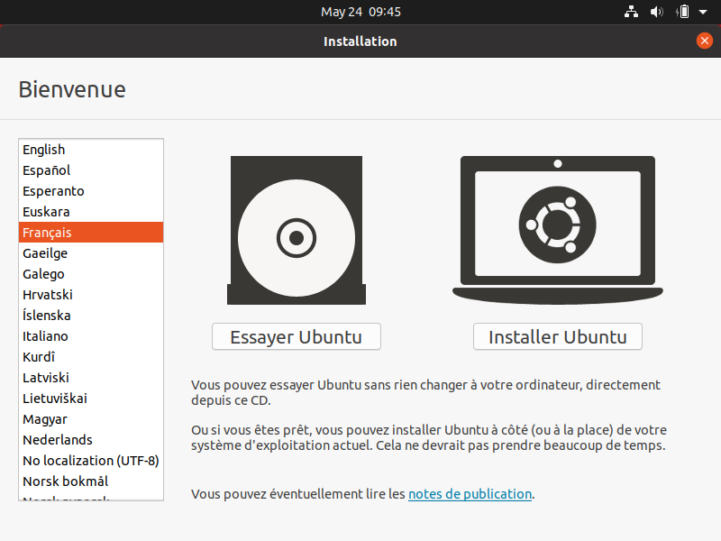

Si nous cliquons sur le bouton \"Essayer Ubuntu\" nous pourrons tester Ubuntu sans rien installer sur notre machine, les logiciels utilisés seront ceux présents sur la clé usb (nous pourrons en installer d'autres). C'est un excellent moyen de dépanner une machine pour par
exemple accéder à nos disques lorsque notre l'OS de notre machine ne fonctionne plus.

### Étape 02

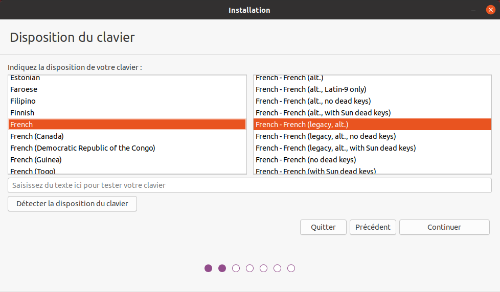

Les différents choix déterminent comment nous allons pouvoir saisir les caractères comme œ. Par exemple avec le choix de clavier \"alt.\" il suffira de faire \"Alt Gr\" \"o\", pour avoir œ. Nous pouvons tester les touches du clavier dans la zone de saisie du texte.

### Étape 03

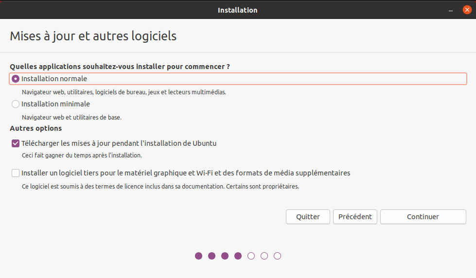

L'installation minimale n'installe pas les logiciels comme libre office nous laissant le faire par la suite. Demander la mise à jour lors de l'installation suppose d'être relié à internet.

### Étape 04

Par défaut le disque sera formaté et une partition racine sera créée ainsi qu'une partition swap. La partition de swap est utilisée pour stocker temporairement la mémoire d'un programme qui s'exécutait, mais qui n'est pas celui en cours d'utilisation.
Par exemple si nous n'avons que très peu de mémoire et que nous lancons plusieurs programmes, celui avec lequel nous interagissons sera en mémoire et les autres
peuvent être dans le swap.

Si notre swap a la même taille que notre mémoire vive nous pourrons \"hiberner\" notre ordinateur, ainsi toute la mémoire vive sera copiée dans le swap et l'ordinateur sera éteint, lorsqu'il sera rallumé tout le swap sera recopié en mémoire vive et les programmes reprendront là où ils en étaient.

C'est pour cela qu'il est intéressant de créer et paramétrer ses partitions et au minimum de créer une partition \"/home\" pour préserver le contenu de ses données en cas de crash sévère de l'OS, nous allons voir comment partitionner le disque.

Nous détaillerons le partitionnement ci-après.

### Étape 05

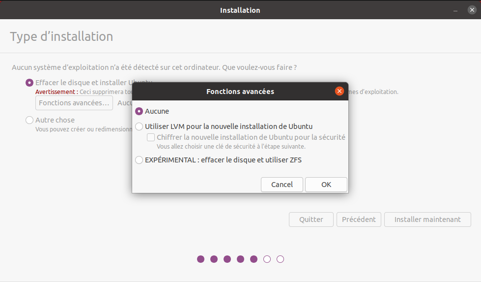

LVM (Logical Volume Manager) est un gestionnaire de volumes logiques qui nous permettra de créer des partitions virtuelles afin de pouvoir les retailler ou d'en créer de nouvelles. Linux crée alors une couche intermédiaire entre le(s) disque(s) physique(s) et l'OS, c'est dans cette couche virtuelle que nous aurons nos partitions virtuelles qui seront écrites dans la partition réelle.
Toutefois si la partition physique est abîmée, nous perdons les partitions virtuelles écrites dessus,
c'est pourquoi il faut faire des copies de sauvegardes ou avoir des disques montés en raid. nous pouvons également chiffrer la partition LVM.

### Étape 06

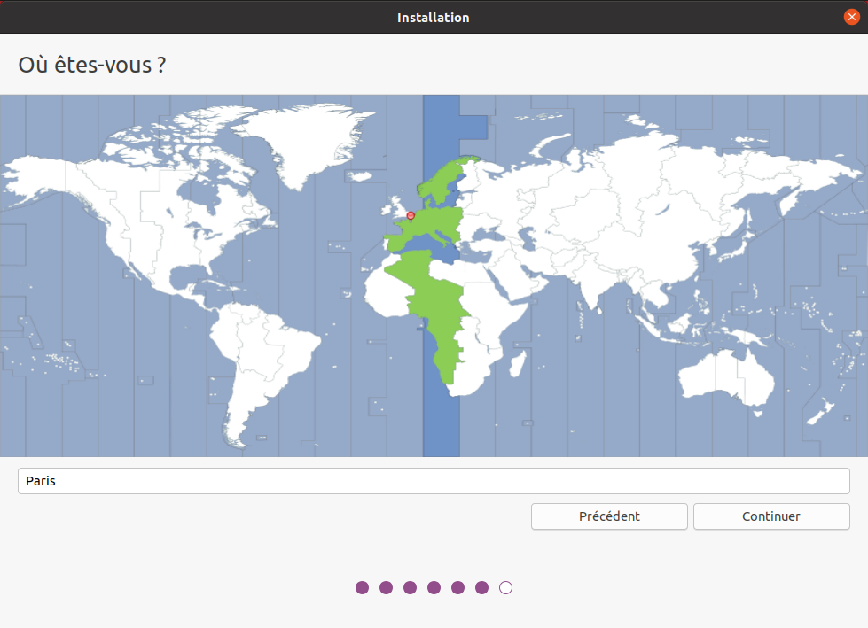

Si nous êtes en France métropolitaine, choisissons le fuseau passant par la France.

### Étape 07

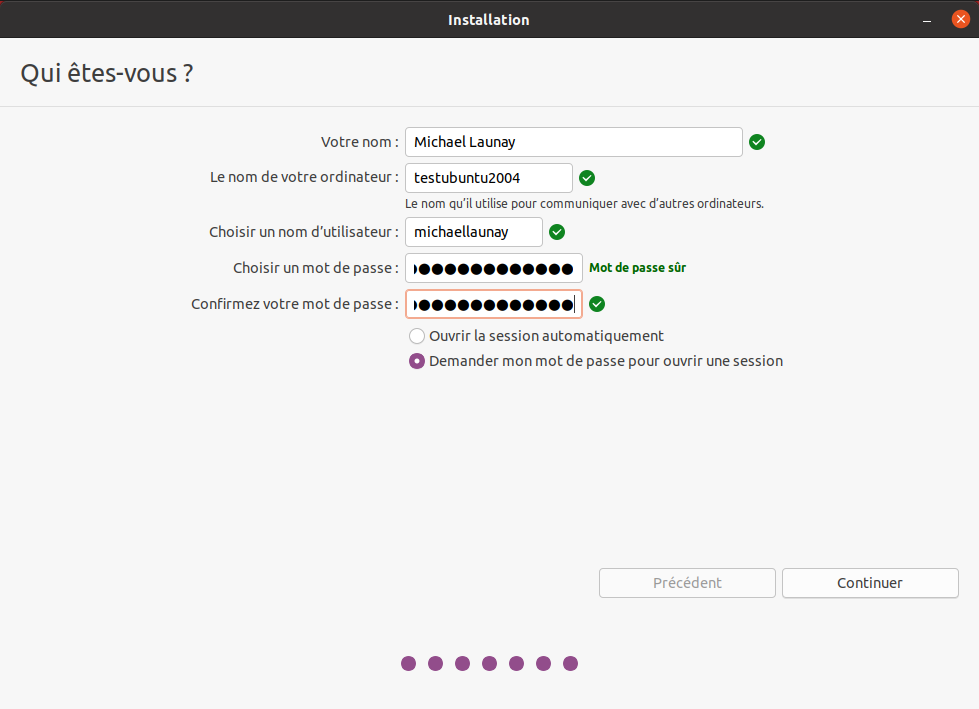

Sous Ubuntu cet utilisateur aura la particularité de pouvoir mettre à jour le système et plus généralement de pouvoir devenir super utilisateur (root).

### Étape 08

Ubuntu affiche un récapitulatif des choix réalisés, la confirmation lance alors le  partitionnement des disques, leur formatage puis l'installation du système.

En fin d'installation un écran nous invite à retirer la clé usb et à redémarrer l'ordinateur.

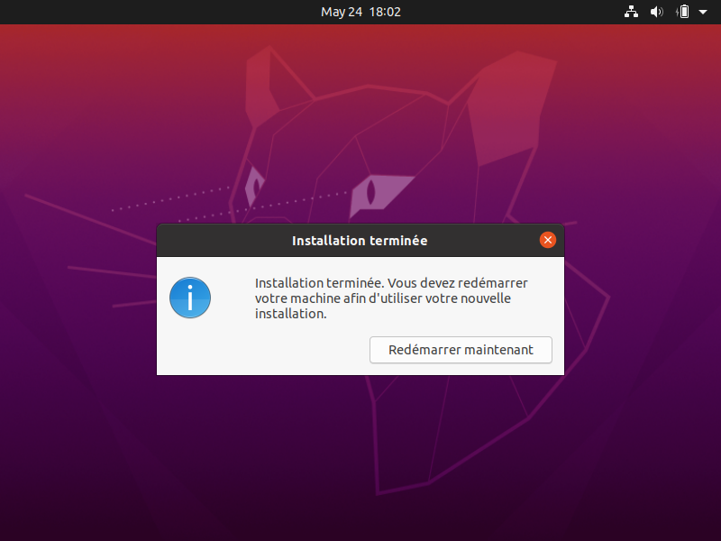

Une fois redémarré saisissons notre identifiant et notre mot de passe (ceux donnés à l'étape 07)

nous pouvons alors associer notre machine à nos comptes google et microsoft pour par exemple voir nos agendas et recevoir nos notifications.

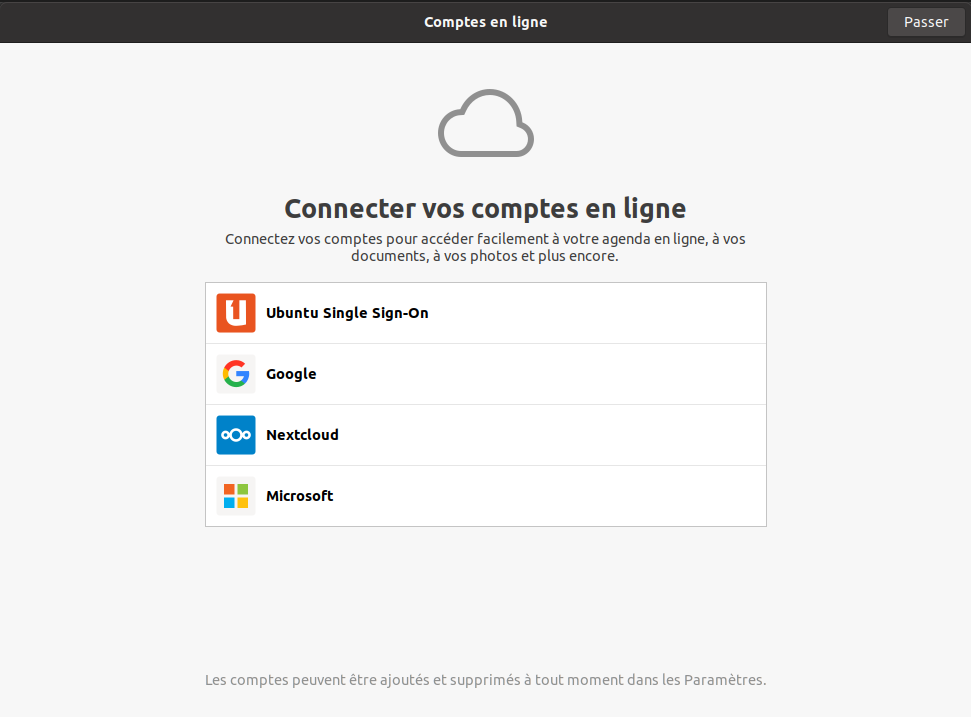

nous pouvons associer notre machine au mécanisme livepatch de Canonical l'éditeur d'Ubuntu pour faire automatiquement la mise à jour de notre machine.

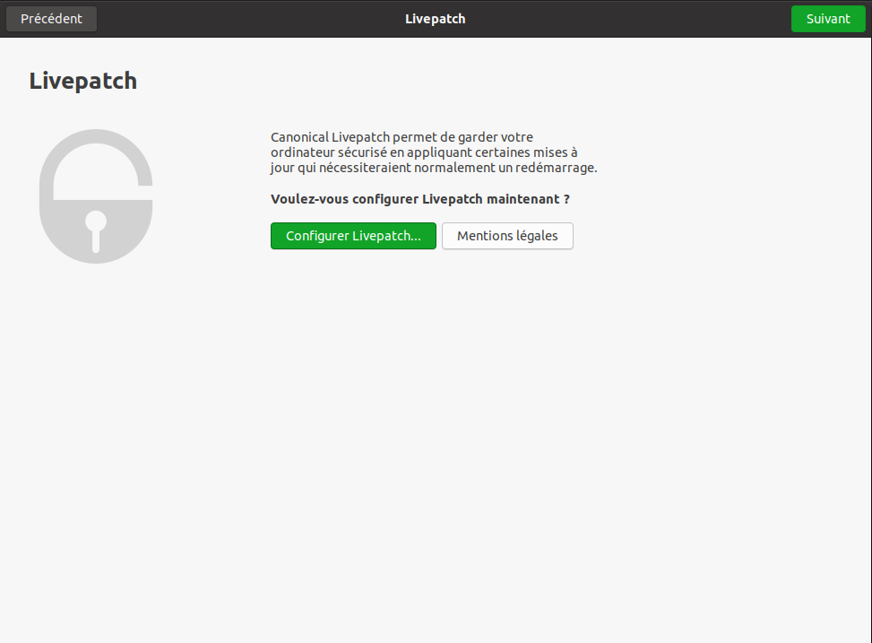

nous pouvons aider Canonical à corriger les bogues en autorisant la remontée des incidents.

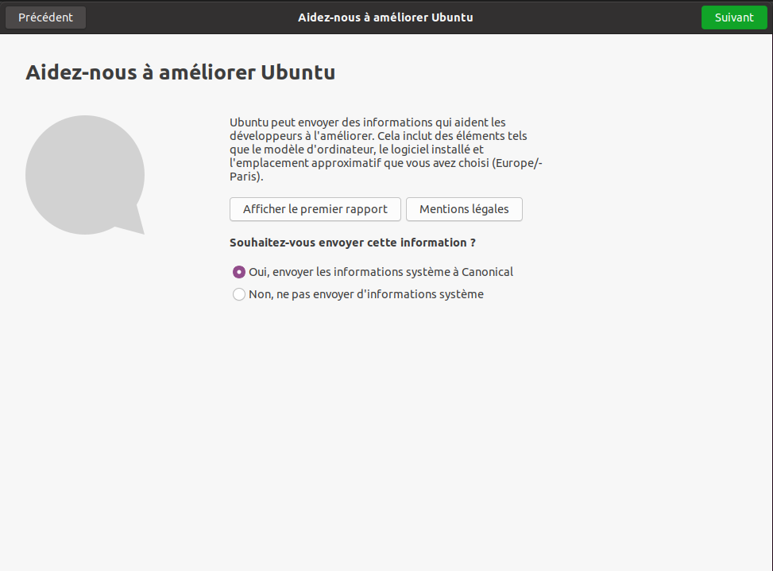

Il est possible de permettre la géolocalisation.

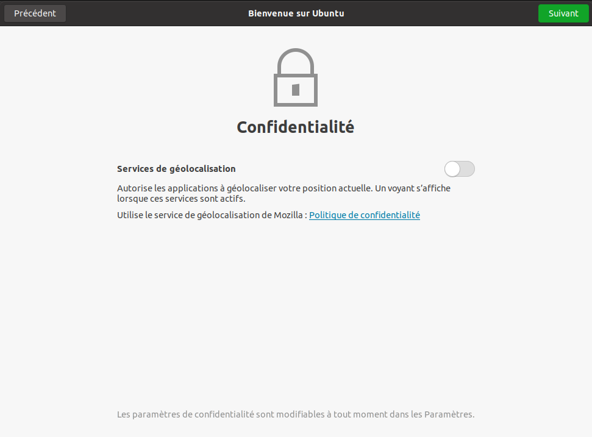

On peut installer immédiatement les applications compatibles avec Ubuntu 22.04

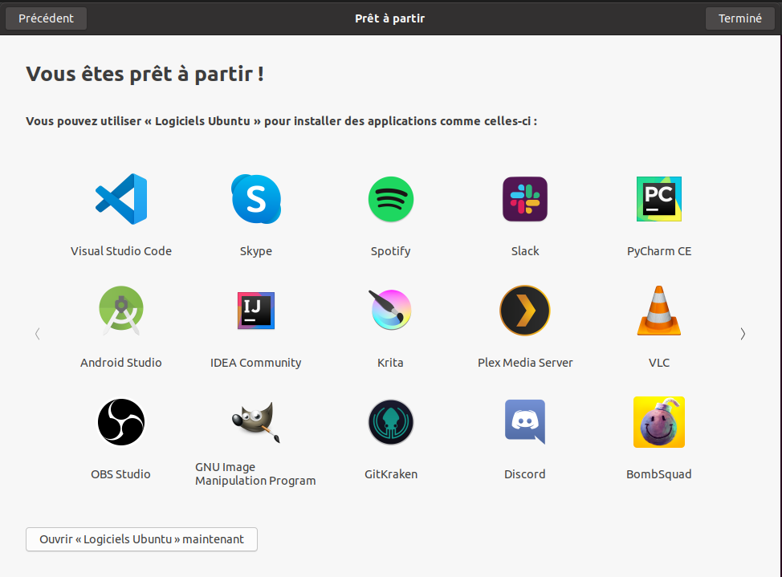

### Étape alternative 04 bis

Le partitionnement est l'étape la plus importante, car il est difficile de corriger les erreurs.

Pour les serveurs cette étape influence directement la sécurité du système (/var/lib, /var/log, /var/spool, /var/www, /tmp), la sécurité est alors physique et ne repose pas seulement sur le mécanisme des quotas.
De plus, l'analyse post-mortem d'une partition dédiée est plus facile que celle d'un énorme fourre-tout.

Au minimum, il est recommandé d'avoir une partition /, /home et swap.

Pour activer le partitionnement manuel, il suffit de cocher sur le bouton \"Autre chose\" à l'étape 04.

Il faut alors choisir un disque.

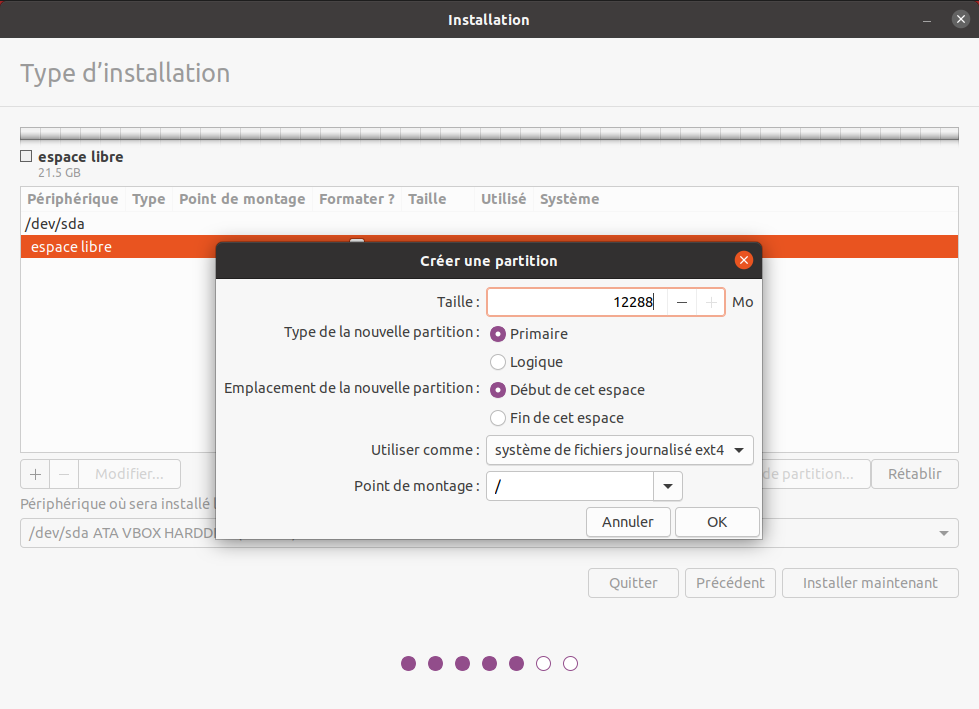

Le bouton \"+\" permet de créer de nouvelle partition

Dans notre cas nous allons créer 3 partitions /, /home et swap.

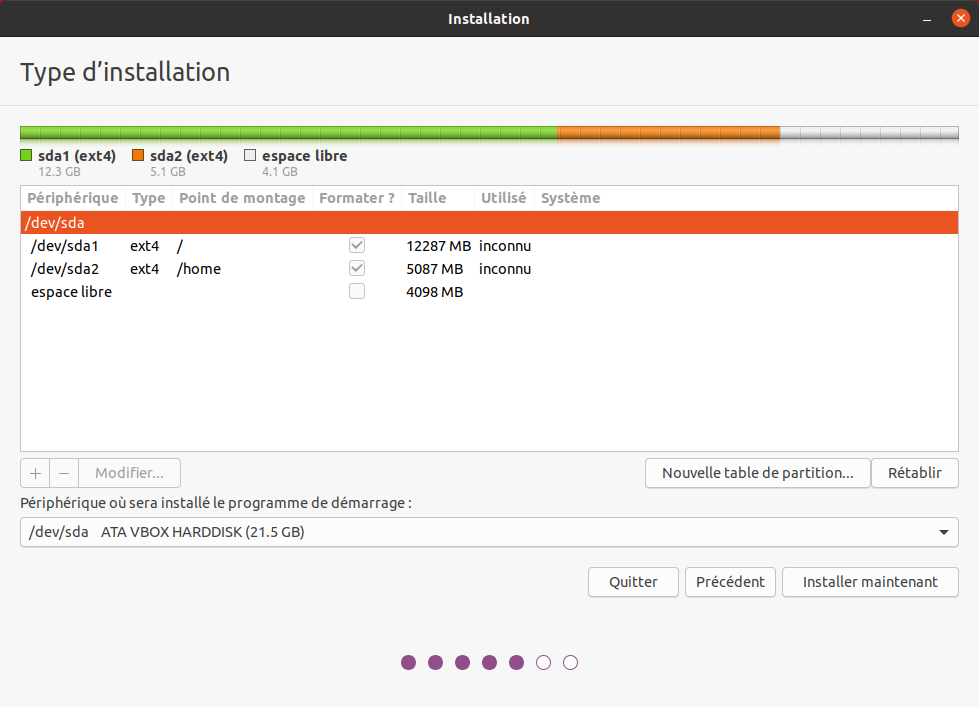

Sur le même principe, nous créons \"/home\" Nous pouvons cocher la case \"formater\" pour purger le disque de ce qu'il contenait avant.

Puis vient la partition de \"swap\".

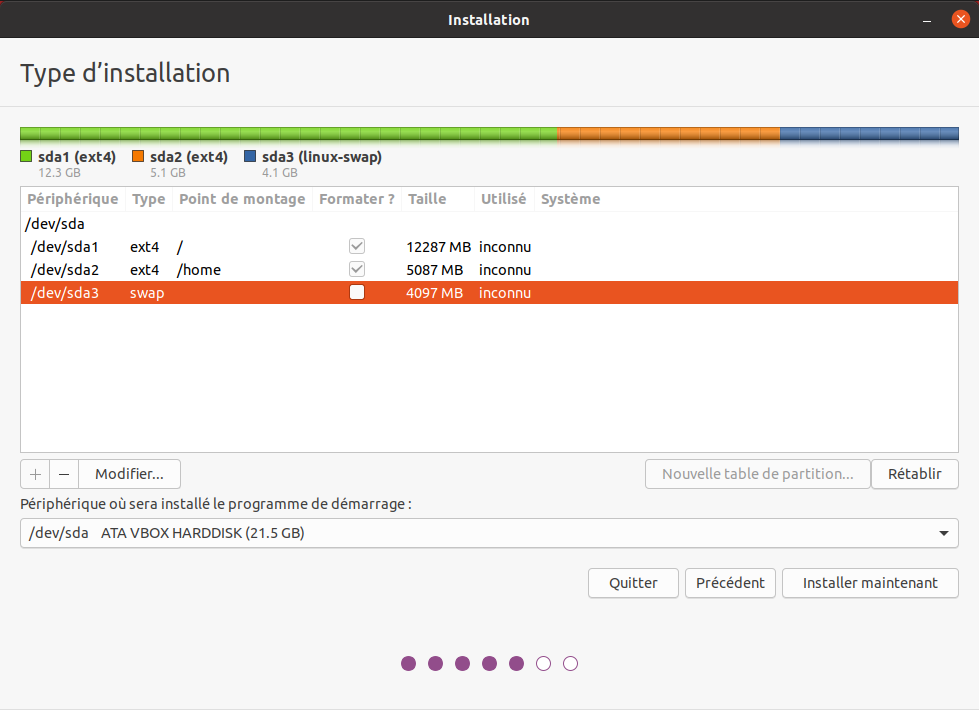

N'oublions pas que la taille du swap doit être au moins égale à celle de la mémoire vive (RAM) pour permettre l'hibernation.

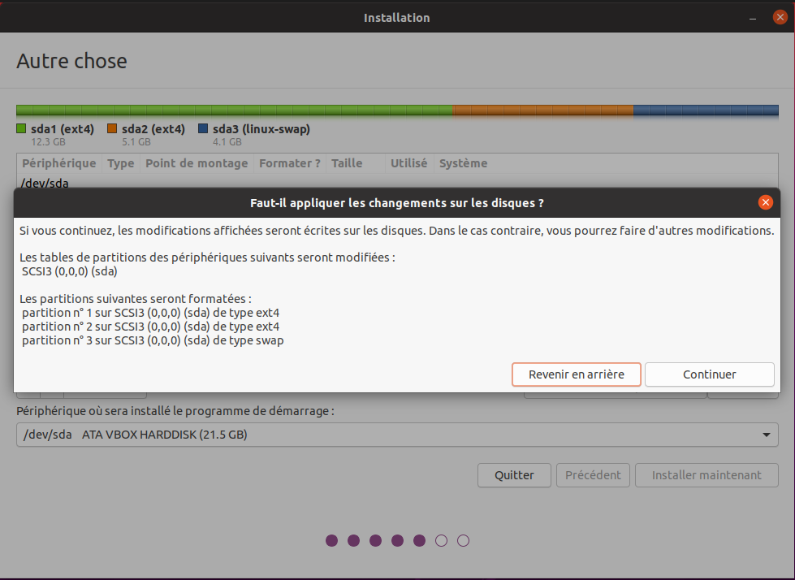

## Installation de GNU/Linux Ubuntu en version serveur

La philosophie des distributions serveur est : moins il y a de programmes installés, plus le système est stable et moins il y a de failles de sécurité.

En conséquence, les interfaces graphiques ne sont disponibles qu'en option et le moyen privilégié d'administrer le système est la ligne de commande.

Pour un serveur il vaut mieux opter pour les versions LTS (Long Term Support) des distributions.

Les différences entre \"Debian server\" et \"Ubuntu server\" sont liées aux versions du noyau et des bibliothèques utilisées, aux dépôts et fichiers de configurations par défaut.

# Attention

Sous Ubuntu, il n'est pas possible de créer une partition /var, car le système y stocke des fichiers au démarrage, alors que les points de montage ne sont pas encore installés, ce qui provoque un plantage du système difficile à comprendre.

# Travaux pratiques
Installation d'une Ubuntu server LTS