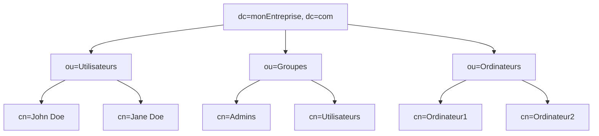

# Présentation

LDAP est l'acronyme de Lightweight Directory Access Protocol. Il s'agit d'un protocole standard de l'industrie pour accéder et maintenir des services d'annuaire distribués sur Internet.
Un annuaire, est une sorte de base de données optimisée pour la lecture, la recherche et la navigation, plutôt que pour les opérations d'écriture et de modification.

# OpenLDAP

OpenLDAP est une implémentation libre et ouverte du protocole LDAP. Il est utilisé pour développer des applications de gestion d'annuaires. OpenLDAP permet de centraliser les informations des utilisateurs, telles que les identifiants, les coordonnées et les autorisations d'accès. Cela facilite grandement l'administration des systèmes et des applications.

# Structure de l'annuaire LDAP

Un annuaire LDAP est structuré comme un arbre, avec un nœud racine appelé Base Distinguished Name (ou Base DN). Sous cette racine, nous pouvons avoir plusieurs branches représentant des organisations, des unités organisationnelles, des individus, etc.

# Représentation

LDAP peut représenter les objets dans une hiérarchie ou une arborescence, ce qui le rend idéal pour les organisations qui ont une structure hiérarchique claire.

Voici un exemple simplifié de ce à quoi une arborescence LDAP pourrait ressembler :



Dans cet exemple, `dc=monEntreprise, dc=com` est le sommet de l'arborescence, qui se divise ensuite en plusieurs unités organisationnelles (ou=) : "Utilisateurs", "Groupes" et "Ordinateurs". Chaque unité organisationnelle contient des noms communs (cn=), qui sont les entrées individuelles dans l'annuaire.

- Sous "Utilisateurs", nous avons "John Doe" et "Jane Doe".
- Sous "Groupes", nous avons les groupes "Admins" et "Utilisateurs".
- Sous "Ordinateurs", nous avons "Ordinateur1" et "Ordinateur2".

# Opérations LDAP

Les opérations les plus courantes en LDAP sont : 
1. **Recherche (Search)** : Chercher et retrouver des entrées dans l'annuaire.
2. **Ajout (Add)** : Ajouter des entrées à l'annuaire.
3. **Suppression (Delete)** : Supprimer des entrées de l'annuaire.
4. **Modification (Modify)** : Modifier des entrées existantes dans l'annuaire.

Ces opérations sont effectuées à l'aide des outils et commandes fournis par OpenLDAP, tels que `ldapsearch`, `ldapadd`, `ldapdelete`, et `ldapmodify`.

# Le format LDIF

LDIF signifie "LDAP Data Interchange Format". Il s'agit d'un format standard utilisé pour représenter les données LDAP sous forme de texte ASCII. Les fichiers LDIF sont utilisés pour l'échange de données entre différents serveurs LDAP, pour l'importation et l'exportation de données, et pour la gestion des modifications des données.

Un fichier LDIF est une collection d'enregistrements séparés par des lignes vides. Chaque enregistrement représente soit une entrée LDAP, soit une modification d'une entrée existante. 

Une entrée typique pourrait ressembler à ceci :

```ldif
dn: cn=John Doe,dc=example,dc=com
objectClass: inetOrgPerson
cn: John Doe
sn: Doe
mail: john.doe@example.com
```

## Les mots clés du format LDIF

- `dn`: "Distinguished Name". C'est l'identifiant unique de l'entrée dans l'annuaire. Il est généralement composé de plusieurs parties, telles que `cn` (Common Name), `dc` (Domain Component), `ou` (Organizational Unit), etc.
  
- `objectClass`: C'est le type d'objet de l'entrée. Il définit les attributs que l'entrée peut ou doit avoir. Les classes d'objet courantes comprennent `top`, `person`, `inetOrgPerson`, `organizationalPerson`, etc.

- `cn`: "Common Name". C'est souvent le nom de l'utilisateur ou de l'objet.
  
- `sn`: "Surname". Il représente généralement le nom de famille d'une personne.
  
- `mail`: L'adresse e-mail de l'utilisateur.

Dans le cadre de modifications, les fichiers LDIF peuvent également inclure les instructions suivantes :

- `add`: Ajoute un nouvel attribut à une entrée existante.
- `delete`: Supprime un attribut d'une entrée existante.
- `replace`: Remplace la valeur d'un attribut existant.
- `changetype`: Spécifie le type de modification à effectuer.

Un exemple de modification pourrait être :

```ldif
dn: cn=John Doe,dc=example,dc=com
changetype: modify
replace: mail
mail: john.newmail@example.com
```
Ceci remplacera l'adresse e-mail de l'utilisateur "John Doe". 

# Les classes d'objets

Les classes d'objets en LDAP sont définies dans les schémas LDAP. Un schéma LDAP est une collection de définitions et de règles concernant les types d'informations qui peuvent être stockées dans l'annuaire.

Dans le contexte de LDAP, un schéma définit plusieurs types d'informations :

- Les **classes d'objets**, qui déterminent les types d'objets que nous pouvons créer dans l'annuaire.
- Les **attributs** disponibles pour chaque classe d'objet.
- Les règles concernant les attributs requis et optionnels pour chaque classe d'objet.

Les classes d'objets comme `top`, `person`, `inetOrgPerson`, `organizationalPerson`, etc., sont définies dans des fichiers de schéma standard inclus avec la plupart des distributions de serveurs LDAP, y compris OpenLDAP.

Par exemple, dans le cas d'OpenLDAP, ces définitions de classes d'objets se trouvent généralement dans des fichiers de schéma dans le répertoire `/etc/ldap/schema/` ou `/etc/openldap/schema/` selon notre installation.

Chaque fichier de schéma contient des définitions pour une ou plusieurs classes d'objets et attributs. Ces définitions incluent le nom de la classe d'objet, la description, l'OID (Object Identifier), la liste des attributs obligatoires (MUST) et la liste des attributs optionnels (MAY).

Par exemple, la définition de la classe d'objet `person` peut ressembler à ceci :
```schema
objectclass ( 2.5.6.6 NAME 'person'
    DESC 'RFC2256: a person'
    SUP top STRUCTURAL
    MUST ( sn $ cn )
    MAY ( userPassword $ telephoneNumber $ seeAlso $ description ) )
```

Dans cet exemple, `sn` et `cn` sont des attributs obligatoires, tandis que `userPassword`, `telephoneNumber`, `seeAlso`, et `description` sont des attributs optionnels pour la classe d'objet `person`.

# Les RFC de LDAP et LDIF

LDAP et LDIF sont définis par plusieurs documents de la série RFC (Request for Comments), qui est une série de notes techniques et d'organisations qui décrit les différents aspects des technologies Internet.
Ces documents sont le cœur des standards pour LDAP et LDIF, mais il y a beaucoup d'autres documents RFC qui décrivent des extensions et des améliorations à ces protocoles.
Voici quelques-uns des plus importants pour LDAP et LDIF :

## RFC pour LDAP (Lightweight Directory Access Protocol)

1. RFC 4510 : "Lightweight Directory Access Protocol (LDAP): Technical Specification Road Map". C'est le document qui résume les différents documents techniques qui définissent LDAP. Lien : [https://tools.ietf.org/html/rfc4510](https://tools.ietf.org/html/rfc4510)

2. RFC 4511 : "Lightweight Directory Access Protocol (LDAP): The Protocol". Ce document définit le protocole LDAP lui-même. Lien : [https://tools.ietf.org/html/rfc4511](https://tools.ietf.org/html/rfc4511)

3. RFC 4512 : "Lightweight Directory Access Protocol (LDAP): Directory Information Models". Ce document décrit les modèles d'information de l'annuaire utilisés par LDAP. Lien : [https://tools.ietf.org/html/rfc4512](https://tools.ietf.org/html/rfc4512)

4. RFC 4513 : "Lightweight Directory Access Protocol (LDAP): Authentication Methods and Security Mechanisms". Ce document définit les méthodes d'authentification et les mécanismes de sécurité utilisés par LDAP. Lien : [https://tools.ietf.org/html/rfc4513](https://tools.ietf.org/html/rfc4513)

Il existe également d'autres RFCs qui décrivent d'autres aspects de LDAP, comme la recherche de chaînes, la syntaxe des filtres de recherche, etc.

## RFC pour LDIF (LDAP Data Interchange Format)

RFC 2849 : "The LDAP Data Interchange Format (LDIF) - Technical Specification". Ce document définit le format LDIF utilisé pour représenter les données LDAP en tant que texte ASCII. Lien : [https://tools.ietf.org/html/rfc2849](https://tools.ietf.org/html/rfc2849)

# Installation et configuration d'OpenLDAP

Ldap est un annuaire qui permet de gérer l'utilisateur d'un service
sans créer un compte unix.

1. Mettons à jour la liste des paquets disponibles sur notre système:

```bash
sudo apt-get update
```

2. Installons le paquet OpenLDAP:

```bash
sudo apt-get install slapd ldap-utils
```

4. Pendant l'installation, on nous demandera de définir un mot de passe pour l'administrateur du serveur LDAP.

5. Une fois l'installation terminée, nous pouvons vérifier que le serveur LDAP fonctionne correctement en exécutant la commande suivante:

```bash
sudo service slapd status
```

Nous devrions voir que le service slapd est en cours d'exécution.
   
6. Modification de la configuration
```bash
dpkg-reconfigure slapd
```

Suivons les instructions à l'écran pour configurer notre serveur. Nous aurons besoin de définir un DN de base pour notre annuaire, par exemple, "dc=monentreprise,dc=com".

Par exemple pour ecreall.com :
- saisie de "ecreall.com" comme domaine
- saisie de "people" comme organization
- saisie du mot de passe (un truc super compliqué comme celui de l'utilisateur michaellaunay, mais pour LDAP)


Attention ! Configurer LTS pour chiffrer les connexions si elles sont extérieures à la machine, car les mots de passe circulent en clair (voir <https://wiki.debian.org/LDAP/OpenLDAPSetup#Enable_TLS.2FSSL>)!

Activer le service au démarrage :

```bash
systemctl enable slapd
```

Rendre \"ldap\" accessible en éditant \"/etc/ldap/ldap.conf\" en ajoutant :
```
BASE    dc=ecreall,dc=com
URI     ldap://127.0.0.1
```

## Vérifications

Vérifions que nous avons bien installé les paquets nécessaires. Si ce n'est pas le cas, voici les pré-requis pour l'installation d'OpenLDAP:

- Un système Linux ou Unix : OpenLDAP est généralement utilisé sur ces systèmes, bien qu'il soit possible de l'utiliser sur d'autres systèmes d'exploitation.
- Les paquets slapd et ldap-utils : Ces paquets sont nécessaires pour installer OpenLDAP.

Dans OpenLDAP, la configuration est stockée dans un format spécial appelé LDIF (LDAP Data Interchange Format). La configuration est stockée dans un sous-arbre de l'annuaire LDAP lui-même, généralement sous "cn=config" (c'est le nom du répertoire).

Pour afficher la configuration actuelle, nous pouvons utiliser la commande suivante:

```bash
sudo ldapsearch -Q -LLL -Y EXTERNAL -H ldapi:/// -b cn=config
```

Cela devrait afficher une grande quantité de données en format LDIF. Ne nous inquiétons pas, nous allons passer en revue ces informations et les comprendre ensemble.

# Comprendre le schéma de données LDAP

## Qu'est-ce qu'un schéma de données LDAP et pourquoi est-il important ?

Un schéma LDAP est une collection de définitions et de règles qui déterminent la structure des données du service d'annuaire LDAP. Il sert de "plan" pour les données et définit les attributs et les types d'objets qui peuvent être créés et stockés dans l'annuaire.

## Exploration des composants clés d'un schéma de données LDAP : objets, attributs, classes.

Un schéma LDAP comprend des définitions pour les éléments suivants :
   - **Attributs :** Ce sont les informations de base stockées pour un objet. Par exemple, un attribut pourrait être "mail" pour stocker une adresse e-mail, ou "cn" pour le nom commun d'un objet.
   - **Classes d'objets :** Une classe d'objet est un regroupement d'attributs qui définissent un type d'objet particulier. Par exemple, une classe d'objet "personne" peut inclure des attributs comme le nom, le prénom et l'adresse e-mail.
   - **Types de données :** Chaque attribut a un type de données associé qui contrôle le type d'information qu'il peut stocker.

## Comment définir et modifier un schéma de données LDAP dans OpenLDAP.

Dans OpenLDAP, nous pouvons définir et modifier notre schéma de données en utilisant le format LDIF que nous avons introduit. Par exemple, pour ajouter une nouvelle classe d'objet à notre schéma, nous pourrions utiliser une entrée LDIF comme celle-ci :

```ldif
dn: cn={5}custom,cn=schema,cn=config
objectClass: olcSchemaConfig
cn: {5}custom
olcAttributeTypes: ( 1.3.6.1.4.1.99999.1 NAME 'customAttribute' SYNTAX 1.3.6.1.4.1.1466.115.121.1.15 SINGLE-VALUE )
olcObjectClasses: ( 1.3.6.1.4.1.99999.2 NAME 'customObject' SUP inetOrgPerson STRUCTURAL MUST customAttribute )
```

Cela crée une nouvelle classe d'objet "customObject" qui hérite de la classe "inetOrgPerson" et qui a un nouvel attribut obligatoire "customAttribute".

# Ajout d'une Organisation à LDAP

Prenons l'exemple d'Ecréall
Créer un fichier ecreall.ldif contenant :
```
dn: ou=People,dc=ecreall,dc=com
ou: People
objectClass: top
objectClass: organizationalUnit

dn: ou=Group,dc=ecreall,dc=com
ou: Group
objectClass: top
objectClass: organizationalUnit

dn: cn=Gérant,dc=ecreall,dc=com
objectclass: organizationalRole
cn: Gérant
```

```bash
ldapadd -x -D "cn=admin,dc=ecreall,dc=com" -W -f ecreall.ldif
```

Mettre à jour l'index (cache) :
```bash
systemctl stop slapd
slapindex
chown -R openldap:openldap /var/lib/ldap
chown -R openldap:openldap /var/lib/ldap
chmod -R 700 /var/lib/ldap
systemctl start slapd
```

Vérification :
```bash
ldapsearch -x -b 'dc=ecreall,dc=com' '(objectclass=*)'
```

# Ajouter une OrganizationUnit

Créer un fichier \"e-services.ldif\" et y mettre :

```ldif
dn: ou=Etudes,dc=ecreall,dc=com
objectClass: organizationalUnit
ou: Etudes
```
>
```bash
ldapadd -x -D "cn=admin,dc=ecreall,dc=com" -W -f e-services.ldif
```

# Ajouter une personne

## Version non optimisée

Exemple "non optimisé" pour ajouter Michaël Launay, créer un fichier
> \"ldif\_files/michaellaunay.ldif\" :
```ldif
dn: uid=michaellaunay,ou=Etudes,dc=ecreall,dc=com
objectclass: top
objectclass: person
objectclass: organizationalPerson
objectclass: inetorgperson
cn: Michael Launay
sn: Launay
gn: Michael
uid: michaellaunay
title: Gerant
mail: michaellaunay@ecreall.com
telephoneNumber: 0320793290
postalAddress: 11 A Avenue de l'Harmonie
postalCode: 59650
l: Villeneuve d ASCQ
```
Il y a une certaine redondance dans ce fichier LDIF, en particulier dans la déclaration des classes d'objet (objectClass).
Voici pourquoi :
1. `inetOrgPerson` est une classe d'objet qui hérite des classes d'objet `organizationalPerson` et `person`. Donc, si nous déclarons `inetOrgPerson`, nous n'avons pas besoin de déclarer également `person` et `organizationalPerson`.

2. De même, `organizationalPerson` hérite de la classe `person`, donc si nous déclarons `organizationalPerson`, nous n'avons pas besoin de déclarer `person`.

3. Enfin, toutes les entrées LDAP doivent inclure la classe `top`, mais celle-ci est généralement incluse automatiquement lorsque nous déclarons une autre classe d'objet. Donc, en pratique, nous n'avons pas besoin de déclarer explicitement `top`.

## Version otpimisée du fichier LDIF

Nous pouvons simplifier le fichier LDIF comme suit :
```ldif
dn: uid=michaellaunay,ou=Etudes,dc=ecreall,dc=com
objectClass: inetOrgPerson
cn: Michael Launay
sn: Launay
gn: Michael
uid: michaellaunay
title: Gerant
mail: michaellaunay@ecreall.com
telephoneNumber: 0320793290
postalAddress: 11 A Avenue de l'Harmonie
postalCode: 59650
l: Villeneuve d ASCQ
```

De cette façon, l'entrée conserve les mêmes propriétés, mais sans redondance dans le fichier LDIF.

## Ajouter l'entrée à l'annuaire
```bash
ldapadd -x -D "cn=admin,dc=ecreall,dc=com" -W -f ldif_files/michaellaunay.ldif
```

## Enregistrer le mot de passe du nouvel utilisateur :
```bash
ldappasswd -D "cn=admin,dc=ecreall,dc=com" -W "cn=Prenom Nom,ou=People,dc=ecreall,dc=com" -S
```

## Modifier le mot de passe d'un utilisateur existant

Pour modifier le mot de passe d'un utilisateur existant dans LDAP, nous pouvons utiliser la commande `ldappasswd`. Voici la syntaxe générale de cette commande :

```bash
ldappasswd -H ldap://localhost -x -D "cn=admin,dc=ecreall,dc=com" -W -S "uid=utilisateur,ou=People,dc=ecreall,dc=com"
```

Dans le cas de l'utilisateur michaellaunay, nous avons :
```bash
ldappasswd -D "cn=admin,dc=ecreall,dc=com" -W "uid=michaellaunay,ou=Etudes,dc=ecreall,dc=com" -S
# Que l'on peut vérifier
ldapwhoami -x -D  "uid=michaellaunay,ou=Etudes,dc=ecreall,dc=com" -W
```
Décortiquons cette commande :

- `-H ldap://localhost` spécifie l'URI du serveur LDAP.
- `-x` utilise une authentification simple au lieu de SASL.
- `-D "cn=admin,dc=ecreall,dc=com"` spécifie l'identifiant de l'utilisateur qui a les droits d'administrateur pour effectuer les modifications.
- `-W` demande le mot de passe de l'utilisateur spécifié après `-D`.
- `-S "uid=utilisateur,ou=People,dc=ecreall,dc=com"` spécifie l'utilisateur dont nous voulons changer le mot de passe. Vous devrez remplacer "utilisateur" par le nom d'utilisateur réel.

Après avoir exécuté cette commande, elle vous demandera d'entrer le nouveau mot de passe deux fois pour confirmation. Si tout se passe bien, le mot de passe de l'utilisateur sera changé.

# Stockage du login et du nom complet de l'utilisateur
Généralement l'entrée `uid` permet de gérer le login il doit être unique et ne pas contenir d'espace.
`cn` peut contenir des espaces et peut être multi-valeurs, il suffit alors de répéter l'entrée `cn` au temps de fois que nécessaire.
# Stockage des mots de passe dans OpenLDAP

OpenLDAP stocke les mots de passe en utilisant des hachages plutôt qu'en clair, conformément aux exigences de sécurité et de confidentialité, y compris celles du Règlement Général sur la Protection des Données (RGPD).

Lorsqu'un mot de passe est fourni à OpenLDAP (par exemple, lors de la création ou de la modification d'un compte utilisateur), le serveur LDAP ne stocke pas le mot de passe lui-même. Au lieu de cela, il utilise une fonction de hachage pour transformer le mot de passe en une "empreinte" de hachage, qui est ce qui est réellement stocké. Lorsque l'utilisateur se connecte, le mot de passe qu'il fournit est à nouveau haché et comparé à l'empreinte de hachage stockée.

Ce processus de hachage est unidirectionnel, ce qui signifie qu'il n'est pas possible de retrouver le mot de passe original à partir de l'empreinte de hachage. Ainsi, même si quelqu'un parvenait à accéder aux données stockées par le serveur LDAP, il ne pourrait pas retrouver les mots de passe des utilisateurs.

OpenLDAP supporte plusieurs schémas de hachage, y compris SHA-2, SHA-1, et MD5. Il est recommandé d'utiliser le schéma de hachage le plus fort possible pour améliorer la sécurité. À partir de la version 2.4, OpenLDAP utilise par défaut SSHA (Salted SHA), une variante de SHA qui inclut un "sel" pour rendre les attaques par force brute ou par table de hachage plus difficiles.

Le hachage des mots de passe ne dispense pas de l'importance de l'utilisation du chiffrement (par exemple, TLS) pour les connexions au serveur LDAP. Le hachage protège les mots de passe stockés, mais sans chiffrement, les mots de passe peuvent être interceptés en clair lors de leur transmission au serveur.

# Enrichir LDAP

Pour enrichir le schéma ldap, il faut obtenir un numéro d'entreprise unique dont le numéro s'obtient au prés de l'IANA.

Pour ajouter un nouvel attribut `CandidatureType` à notre fichier de schéma LDIF, nous devrons ajouter une nouvelle entrée `attributeTypes`. `CandidatureType` sera stocké comme une chaîne de caractères et utilisons la syntaxe `1.3.6.1.4.1.1466.115.121.1.15` qui est pour `DirectoryString`.

```ldif
attributeTypes: ( 1.3.6.1.4.1.OUR_OID_NUMBER.1
  NAME 'candidatureNumber'
  DESC 'Candidature Number for the user'
  EQUALITY numericStringMatch
  SYNTAX 1.3.6.1.4.1.1466.115.121.1.36
  SINGLE-VALUE )

attributeTypes: ( 1.3.6.1.4.1.OUR_OID_NUMBER.2
  NAME 'CandidatureType'
  DESC 'Type of Candidature for the user'
  EQUALITY caseIgnoreMatch
  SYNTAX 1.3.6.1.4.1.1466.115.121.1.15
  SINGLE-VALUE )
```

Ici le OID a été modifié en `.2` pour `CandidatureType` afin de le distinguer de `candidatureNumber` qui a `.1`. Chaque OID doit être unique !

Explication du fichier LDIF :

1. **attributeTypes**: Il définit un nouvel attribut pour le schéma LDAP. C'est une extension standard pour décrire les objets dans un annuaire LDAP.

2. **NAME**: Le nom de l'attribut tel qu'il apparaîtra dans les entrées LDAP.

3. **DESC**: Une brève description de ce que fait cet attribut.

4. **EQUALITY**: Cela détermine comment les valeurs de cet attribut seront comparées. Par exemple, `caseIgnoreMatch` est couramment utilisé pour les chaînes de caractères où la casse n'a pas d'importance.

5. **SYNTAX**: Ceci spécifie le type de données pour l'attribut. Par exemple, `1.3.6.1.4.1.1466.115.121.1.15` est pour une chaîne de caractères.

6. **SINGLE-VALUE**: Cela signifie que l'attribut ne peut avoir qu'une seule valeur. Si nous voulons que l'attribut puisse avoir plusieurs valeurs, il faudra omettre cette option.

N'oublions pas de remplacer `OUR_OID_NUMBER` par le nombre OID que nous avons obtenu pour notre organisation ou application. L'OID doit être unique à votre organisation pour éviter les conflits avec d'autres extensions de schéma.

## ldapvi
`ldapvi` est un outil très pratique est simple d'utilisation de LDAP.
exemple:
```bash
ldapvi --discover
```

Pour modifier les entrées ldap, il faut se connecter en tant qu'administrateur :
```
ldapvi --discover --host ldap://127.0.0.1 -D "cn=admin,dc=ecreall,dc=com" -w "Un mot de passe"
```

Après modification dans vim et une fois enregistré les modifications avec `w`, `ldapvi` demande `Action? [yYqQvVebB*rsf+?]`, car `ldapvi` propose différentes options pour agir sur les changements apportés. Voici leur signification :

1. **y** : Oui, appliquer les changements.
2. **Y** : Oui, appliquer les changements et quittez.
3. **q** : Quitter sans appliquer les changements.
4. **Q** : Quitter immédiatement sans appliquer les changements, même s'il y a des modifications non enregistrées.
5. **v** : Ouvrir un éditeur pour revoir et éventuellement modifier les modifications en attente.
6. **V** : Afficher les modifications en attente dans un format plus détaillé pour examen.
7. **e** : Rééditer les entrées (retourne à l'écran d'édition).
8. **b** : Annuler le dernier changement (comme un retour en arrière).
9. **B** : Annuler tous les changements.
10. **\*** : Sauvegarder les modifications dans un fichier.
11. **r** : Rafraîchisser les entrées depuis le serveur LDAP (utile si d'autres modifications ont été faites sur le serveur pendant que vous étiez en train d'éditer).
12. **s** : Basculer entre l'affichage simple et l'affichage LDIF. LDIF est un format standard pour représenter les entrées LDAP sous forme de texte.
13. **f** : Force l'application des changements sans demander de confirmation pour chaque entrée.
14. **+** : Appliquer les changements et continuer à éditer.
15. **?** : Afficher l'aide sur ces options.

## Comment avoir un OID unique

L'OID (Object Identifier) est une chaîne de nombres qui identifie de manière unique un type d'objet ou un attribut dans divers standards, dont LDAP. 

Pour une entreprise nous devons faire une demande 
2. **IANA Private Enterprise Numbers**: Si nous ne disposons pas d'un préfixe OID, une solution courante est d'utiliser notre Private Enterprise Number (PEN) attribué par l'Internet Assigned Numbers Authority (IANA). Vous pouvez demander un PEN gratuitement auprès de l'IANA. Une fois que vous avez un PEN, vous pouvez utiliser ce nombre comme base pour vos OIDs en ajoutant vos propres sous-identifiants. Par exemple, si votre PEN est `12345`, vous pourriez avoir des OIDs comme `1.3.6.1.4.1.77777.1`, `1.3.6.1.4.1.77777.2`, etc.

   - Pour demander un PEN, allons sur le [site de l'IANA](https://www.iana.org/assignments/enterprise-numbers/).

3. **Générer un OID temporaire**: Si nous développons uniquement pour des tests internes et n'avons pas l'intention de publier ou de partager notre schéma, nous pourrions utiliser un OID généré de manière arbitraire. Cependant, c'est risqué pour la production ou pour des environnements où le schéma pourrait être partagé, car il pourrait y avoir des collisions.

4. **Registres nationaux**: Certains pays ont des registres nationaux où vous pouvez demander un OID. Cependant, les processus et la disponibilité peuvent varier.

Il faut obtenir un OID officiel pour publier son code en open source sans risque de conflit ou si nous prévoyons de déployer notre schéma dans un environnement de production.

Disponibilité des PEN

Lorsque nous demandons un PEN, nous pouvons utiliser un PEN libre comme 77777 tant qu'il n'est pas attribué (à vérifier sur le site de l'IANA.
Exemple
```ldif
attributeTypes: ( 1.3.6.1.4.1.77777.1
  NAME 'candidatureNumber'
  DESC 'Candidature Number for the user'
  EQUALITY numericStringMatch
  SYNTAX 1.3.6.1.4.1.1466.115.121.1.36
  SINGLE-VALUE )
```
Les numéros indiqués sont des Object Identifiers (OIDs), qui sont définis dans plusieurs normes et RFCs.

## Signification de 1.3.6.1.4.1
   - `1.3.6.1.4.1` est le préfixe d'OID pour les Private Enterprise Numbers, qui sont attribués par l'Internet Assigned Numbers Authority (IANA). Ce préfixe est défini dans la [RFC 1155](https://datatracker.ietf.org/doc/html/rfc1155), qui spécifie la structure de management information (SMI).

## Signification de 1.3.6.1.4.1.1466.115.121.1.36
   - Cet OID est lié à la syntaxe des attributs LDAP, et est défini dans la [RFC 4517](https://datatracker.ietf.org/doc/html/rfc4517), qui est une partie des normes LDAPv3. La partie `1.3.6.1.4.1.1466.115.121.1` est le préfixe pour les syntaxes d'attributs LDAP, et `36` est l'identifiant pour la syntaxe de chaîne numérique (`Numeric String`).

Pour travailler avec des schémas LDAP et pour comprendre les détails des OIDs utilisés, la RFC 4517 (et les autres RFCs liées à LDAPv3, comme la [RFC 4519](https://datatracker.ietf.org/doc/html/rfc4519) qui définit des types d'attributs standards) peuvent être utiles.
# Liens

> <https://wiki.debian.org/LDAP/OpenLDAPSetup>
> <https://guide.ubuntu-fr.org/server/openldap-server.html>
> <http://www-sop.inria.fr/members/Laurent.Mirtain/ldap-livre.html>