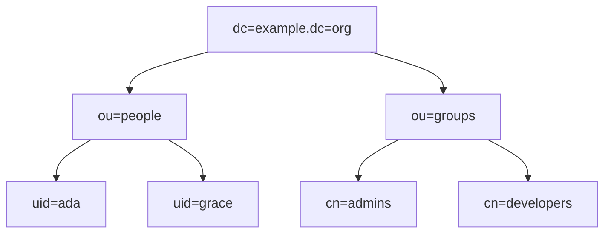
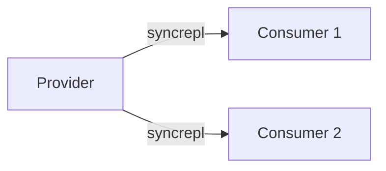
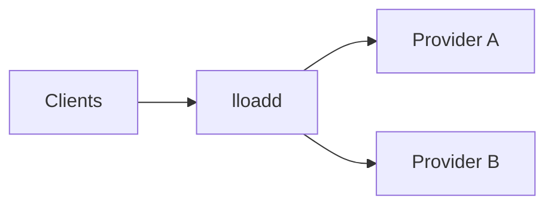
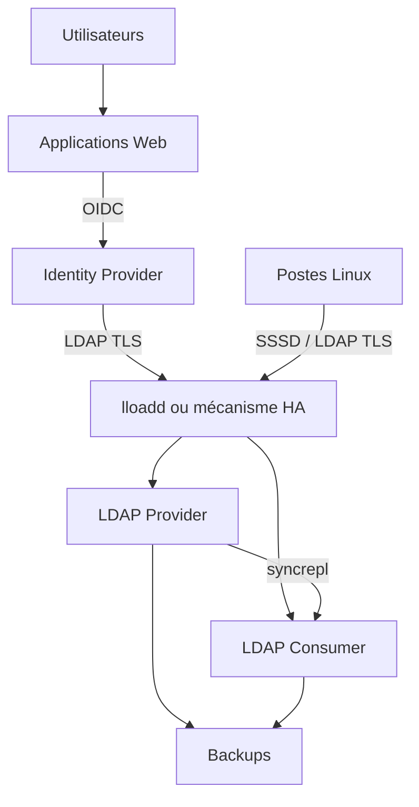

# LDAP et OpenLDAP

LDAP signifie **Lightweight Directory Access Protocol**. LDAPv3 est un protocole standard permettant de consulter et de modifier un **service d'annuaire**.

Un annuaire n'est pas simplement une base SQL exposée autrement. Il est particulièrement adapté aux données :

- fortement structurées ;
- organisées hiérarchiquement ;
- très souvent lues ;
- partagées entre de nombreuses applications ;
- associées à des identités, groupes, machines, services ou politiques.

Exemples classiques :

- annuaire des utilisateurs d'une organisation ;
- carnet d'adresses ;
- groupes et rôles ;
- inventaire de machines ;
- paramètres d'authentification ;
- backend d'identités pour un serveur SSO.

> [!important]
> LDAP est un **protocole d'annuaire**, pas un protocole SSO moderne. Pour une application Web, on préfère souvent exposer l'identité via **OpenID Connect** et laisser l'Identity Provider interroger LDAP en arrière-plan. Voir [[OAuth OpenID]].

## Versions de référence en 2026

Au 29 août 2026 :

- **OpenLDAP 2.6.14** est la branche **LTS** ;
- **OpenLDAP 2.7.0** est la branche **Feature Release** ;
- LDAPv3 reste défini principalement par la famille de RFC 4510 à 4519.

Pour un serveur de production, la version fournie et maintenue par la distribution reste généralement le choix le plus simple. Il faut distinguer la version *upstream* d'OpenLDAP de la version maintenue par Debian, Ubuntu, Red Hat, etc.

# Sommaire

1. [[#1. Comprendre un service d'annuaire]]
2. [[#2. Le modèle LDAP]]
3. [[#3. DIT, DN, RDN et attributs]]
4. [[#4. Schémas LDAP]]
5. [[#5. Les opérations LDAP]]
6. [[#6. Rechercher avec LDAP]]
7. [[#7. Le format LDIF]]
8. [[#8. Installation d'OpenLDAP]]
9. [[#9. cn=config et configuration dynamique]]
10. [[#10. Construire un annuaire propre]]
11. [[#11. Gérer les utilisateurs et groupes]]
12. [[#12. Authentification LDAP]]
13. [[#13. TLS, StartTLS et LDAPS]]
14. [[#14. Contrôle d'accès ACL]]
15. [[#15. Mots de passe et politiques de mot de passe]]
16. [[#16. Index et performances]]
17. [[#17. Contraintes d'unicité et intégrité]]
18. [[#18. Étendre le schéma et gérer les OID]]
19. [[#19. Réplication avec syncrepl]]
20. [[#20. Sauvegarde et restauration]]
21. [[#21. Supervision et diagnostic]]
22. [[#22. Haute disponibilité et lloadd]]
23. [[#23. Intégration Linux, applications et SSO]]
24. [[#24. LDAP dans une application Python]]
25. [[#25. Sécurité et durcissement]]
26. [[#26. Migration d'un ancien OpenLDAP]]
27. [[#27. Travaux pratiques]]
28. [[#28. Projet final]]
29. [[#29. Checklist de production]]
30. [[#30. RFC et références]]

# 1. Comprendre un service d'annuaire

## 1.1 Annuaire vs base relationnelle

Une base relationnelle organise principalement ses données en tables reliées entre elles. LDAP organise les entrées dans un **arbre d'information**, le **DIT** (*Directory Information Tree*).

| Besoin | LDAP | SGBD relationnel |
|---|---:|---:|
| Recherche d'identités | Excellent | Possible |
| Lecture fréquente | Excellent | Excellent |
| Hiérarchie naturelle | Native | À modéliser |
| Transactions complexes | Limité | Excellent |
| Agrégations analytiques | Faible | Excellent |
| Jointures arbitraires | Non | Oui |
| Schéma standard d'identités | Oui | Non imposé |
| Réplication d'annuaire | Native selon serveur | Variable |

LDAP n'est donc pas un remplacement universel de PostgreSQL ou MariaDB.

## 1.2 Quand LDAP est pertinent

LDAP est pertinent lorsqu'une même identité doit être reconnue par plusieurs systèmes :

```text
                       +------------------+
                       |   Identity       |
                       |   Provider       |
                       +---------+--------+
                                 |
                              LDAP
                                 |
                +----------------+----------------+
                |                                 |
        +-------v-------+                 +-------v-------+
        |   OpenLDAP    |                 | Replica LDAP  |
        +-------+-------+                 +---------------+
                |
       +--------+--------+----------------+
       |                 |                |
+------v------+   +------v------+  +------v------+
| application |   | Unix/PAM    |  | outils     |
| métier      |   | NSS         |  | internes   |
+-------------+   +-------------+  +-------------+
```

## 1.3 Quand LDAP n'est pas le meilleur choix

Éviter d'utiliser LDAP comme :

- base de données métier générale ;
- stockage de gros blobs ;
- moteur analytique ;
- queue de messages ;
- remplacement direct d'OAuth 2.0/OIDC ;
- stockage de secrets sans architecture dédiée.

# 2. Le modèle LDAP

LDAPv3 définit un ensemble de modèles complémentaires :

- **modèle d'information** : entrées, attributs, schémas ;
- **modèle de nommage** : DN et RDN ;
- **modèle fonctionnel** : Search, Add, Modify, Delete, Bind… ;
- **modèle de sécurité** : authentification, autorisation, TLS, SASL.

Une entrée LDAP est un ensemble d'attributs identifié par un DN.

Exemple conceptuel :

```ldif
dn: uid=ada,ou=people,dc=example,dc=org
objectClass: inetOrgPerson
uid: ada
cn: Ada Lovelace
sn: Lovelace
givenName: Ada
mail: ada@example.org
```

# 3. DIT, DN, RDN et attributs

## 3.1 DIT

Le **DIT** est l'arbre logique des entrées.


```mermaid
graph TD
  A["dc=example,dc=org"]
  B["ou=people"]
  C["ou=groups"]
  D["uid=ada"]
  E["uid=grace"]
  F["cn=admins"]
  G["cn=developers"]
  A --> B
  A --> C
  B --> D
  B --> E
  C --> F
  C --> G
```

## 3.2 Distinguished Name

Le **DN** identifie une entrée dans le DIT :

```text
uid=ada,ou=people,dc=example,dc=org
```

Il est formé de plusieurs **RDN** (*Relative Distinguished Names*).

Pour l'entrée précédente :

```text
RDN = uid=ada
parent = ou=people,dc=example,dc=org
DN = uid=ada,ou=people,dc=example,dc=org
```

Le DN n'est pas une simple chaîne à concaténer naïvement : des règles d'échappement et de normalisation s'appliquent. Les bibliothèques LDAP doivent être utilisées pour construire ou analyser des DN lorsque les valeurs viennent d'utilisateurs.

## 3.3 Attributs mono et multivalués

Un attribut LDAP peut être multivalué :

```ldif
cn: Jean Dupont
cn: Jean P. Dupont
cn: Dr Jean Dupont
```

Il ne faut donc pas modéliser mentalement une entrée LDAP comme un dictionnaire `clé -> chaîne`, mais plutôt comme :

```text
attribut -> ensemble ordonné ou non de valeurs selon les usages
```

## 3.4 `uid` n'est pas automatiquement unique

L'attribut `uid` sert très souvent d'identifiant de connexion, mais le protocole LDAP n'impose pas qu'une valeur `uid` soit globalement unique dans tout le DIT.

Pour obtenir une vraie contrainte d'unicité dans OpenLDAP, utiliser notamment l'overlay **unique** et choisir son périmètre.

# 4. Schémas LDAP

Un schéma définit :

- les **attribute types** ;
- les **object classes** ;
- les syntaxes ;
- les matching rules ;
- les relations d'héritage ;
- les attributs `MUST` et `MAY`.

## 4.1 Classes STRUCTURAL, AUXILIARY et ABSTRACT

Une objectClass peut être :

- **ABSTRACT** : sert de base à d'autres classes ;
- **STRUCTURAL** : représente la nature principale de l'entrée ;
- **AUXILIARY** : ajoute des attributs complémentaires.

Une entrée possède une chaîne de classes structurelles cohérente et peut recevoir plusieurs classes auxiliaires.

## 4.2 `person`, `organizationalPerson`, `inetOrgPerson`

La hiérarchie classique est :

```text
top
└── person
    └── organizationalPerson
        └── inetOrgPerson
```

`inetOrgPerson` hérite donc des classes précédentes. Dans un LDIF, il est généralement suffisant d'écrire :

```ldif
objectClass: inetOrgPerson
```

Le serveur connaît l'héritage du schéma.

Voir aussi [[InetOrgPerson]].

## 4.3 MUST et MAY

Exemple simplifié :

```schema
objectclass ( 2.5.6.6
    NAME 'person'
    SUP top
    STRUCTURAL
    MUST ( sn $ cn )
    MAY ( userPassword $ telephoneNumber $ seeAlso $ description ) )
```

`MUST` signifie que l'attribut doit être présent. `MAY` signifie qu'il est autorisé mais facultatif.

## 4.4 OID

Les définitions de schéma utilisent des **Object Identifiers** uniques.

Exemple :

```text
1.3.6.1.4.1.<PEN>.<branche>.<objet>
```

Le préfixe `1.3.6.1.4.1` correspond aux **Private Enterprise Numbers** de l'IANA.

> [!warning]
> Ne jamais choisir un PEN arbitraire comme `77777` pour un schéma publié ou de production sous prétexte qu'il semble libre. Vérifier le registre et demander son propre PEN, l'attribution étant gratuite.

# 5. Les opérations LDAP

Les principales opérations LDAPv3 sont :

- **Bind** : établir une identité d'authentification ;
- **Unbind** : terminer proprement la session ;
- **Search** : rechercher des entrées ;
- **Compare** : tester une valeur ;
- **Add** : ajouter une entrée ;
- **Delete** : supprimer une entrée ;
- **Modify** : modifier des attributs ;
- **Modify DN** : renommer ou déplacer une entrée ;
- **Extended Operation** : extension générique, par exemple StartTLS ou Password Modify.

La commande OpenLDAP associée n'est pas le protocole lui-même :

| Opération | Outil courant |
|---|---|
| Search | `ldapsearch` |
| Add | `ldapadd` |
| Modify | `ldapmodify` |
| Delete | `ldapdelete` |
| Modify DN | `ldapmodrdn` |
| Password Modify | `ldappasswd` |
| Who am I? | `ldapwhoami` |

# 6. Rechercher avec LDAP

## 6.1 Base et scope

Une recherche comporte notamment :

- un **base DN** ;
- un **scope** ;
- un **filter** ;
- une liste d'attributs à retourner.

Les scopes principaux sont :

```text
base      : l'entrée de base uniquement
one       : enfants directs
sub       : tout le sous-arbre
children  : descendants, sans l'entrée de base
```

Exemple :

```bash
ldapsearch -LLL -x \
  -H ldap://127.0.0.1 \
  -b 'ou=people,dc=example,dc=org' \
  -s sub \
  '(objectClass=inetOrgPerson)' \
  uid cn mail
```

## 6.2 Filtres LDAP

Syntaxe de base :

```text
(uid=ada)
(mail=*@example.org)
(&(objectClass=inetOrgPerson)(uid=ada))
(|(uid=ada)(uid=grace))
(!(accountStatus=disabled))
```

Un filtre plus complet :

```text
(&(objectClass=inetOrgPerson)(|(uid=ada)(mail=ada@example.org)))
```

## 6.3 Ne jamais concaténer un filtre utilisateur

Mauvais :

```python
filterstr = f"(uid={username})"
```

Une valeur contrôlée par l'utilisateur doit être **échappée selon la syntaxe des filtres LDAP**. Une injection LDAP n'est pas une injection SQL, mais le principe de défense est analogue.

Avec `ldap3` :

```python
from ldap3.utils.conv import escape_filter_chars

safe_uid = escape_filter_chars(username)
filterstr = f"(uid={safe_uid})"
```

## 6.4 Recherche paginée

Les serveurs imposent souvent une limite de taille. Pour de gros annuaires, préférer le contrôle **Simple Paged Results** plutôt que d'augmenter sans fin `sizelimit`.

# 7. Le format LDIF

LDIF signifie **LDAP Data Interchange Format** et est défini par la RFC 2849.

Il sert à :

- importer/exporter des entrées ;
- décrire des modifications ;
- sauvegarder des données logiquement ;
- versionner des changements de configuration ou de schéma.

## 7.1 Ajouter une entrée

```ldif
dn: uid=ada,ou=people,dc=example,dc=org
objectClass: inetOrgPerson
uid: ada
cn: Ada Lovelace
sn: Lovelace
givenName: Ada
mail: ada@example.org
```

## 7.2 Modifier une entrée

```ldif
dn: uid=ada,ou=people,dc=example,dc=org
changetype: modify
replace: mail
mail: ada.lovelace@example.org
-
add: description
description: Compte de démonstration
```

Le tiret `-` sépare les modifications d'une même entrée.

## 7.3 Supprimer un attribut

```ldif
dn: uid=ada,ou=people,dc=example,dc=org
changetype: modify
delete: telephoneNumber
```

## 7.4 Base64 dans LDIF

Une ligne utilisant `::` contient une valeur encodée en Base64 :

```ldif
description:: w4l0dWRlIGLDqW7DqWZpY2U=
```

L'encodage Base64 **n'est pas du chiffrement**.

# 8. Installation d'OpenLDAP

Les commandes exactes dépendent de la distribution. Sur Debian/Ubuntu :

```bash
sudo apt update
sudo apt install slapd ldap-utils
```

État du service :

```bash
systemctl status slapd
```

Activation au démarrage si nécessaire :

```bash
sudo systemctl enable --now slapd
```

Sur Debian/Ubuntu, l'assistant peut être relancé avec :

```bash
sudo dpkg-reconfigure slapd
```

Il faut choisir soigneusement :

- le suffixe, par exemple `dc=example,dc=org` ;
- le nom d'organisation ;
- les secrets administratifs ;
- la politique de sauvegarde ;
- la stratégie TLS.

> [!warning]
> Éviter de construire un nouveau DIT à partir du nom juridique ou de l'organigramme si ceux-ci changent souvent. Un suffixe basé sur un domaine stable est généralement plus durable.

# 9. cn=config et configuration dynamique

OpenLDAP moderne utilise principalement la configuration **runtime** `cn=config`.

`cn=config` n'est pas « le nom du répertoire de configuration ». Il s'agit d'un **DIT spécial de configuration**, persisté par `slapd` dans des fichiers LDIF gérés par le serveur.

## 9.1 Lire la configuration locale

L'interface Unix `ldapi:///` combinée à SASL EXTERNAL permet généralement d'administrer `cn=config` localement sans envoyer de mot de passe :

```bash
sudo ldapsearch -Q -LLL \
  -Y EXTERNAL \
  -H ldapi:/// \
  -b cn=config dn
```

## 9.2 Trouver la base MDB

Ne pas supposer qu'elle s'appelle forcément `{1}mdb` :

```bash
sudo ldapsearch -Q -LLL \
  -Y EXTERNAL \
  -H ldapi:/// \
  -b cn=config \
  '(olcDatabase=*)' \
  dn olcDatabase olcSuffix
```

Les indices `{0}`, `{1}`, etc. dépendent de la configuration réelle.

## 9.3 Modifier `cn=config`

Préparer un LDIF :

```ldif
dn: olcDatabase={1}mdb,cn=config
changetype: modify
replace: olcSizeLimit
olcSizeLimit: 5000
```

Puis, **après avoir remplacé le DN par celui découvert sur le serveur** :

```bash
sudo ldapmodify -Q -Y EXTERNAL -H ldapi:/// -f change.ldif
```

> [!danger]
> Ne pas éditer directement les fichiers internes de `slapd.d` avec un éditeur tant que `slapd` les gère. Utiliser LDAP (`ldapmodify`) ou les outils prévus pour une restauration hors ligne.

# 10. Construire un annuaire propre

## 10.1 Une structure simple

```text
dc=example,dc=org
├── ou=people
├── ou=groups
├── ou=services
└── ou=policies
```

LDIF :

```ldif
dn: dc=example,dc=org
objectClass: top
objectClass: dcObject
objectClass: organization
dc: example
o: Example Organization

dn: ou=people,dc=example,dc=org
objectClass: organizationalUnit
ou: people

dn: ou=groups,dc=example,dc=org
objectClass: organizationalUnit
ou: groups

dn: ou=services,dc=example,dc=org
objectClass: organizationalUnit
ou: services

dn: ou=policies,dc=example,dc=org
objectClass: organizationalUnit
ou: policies
```

## 10.2 Ne pas recopier l'organigramme

Un DIT trop proche de l'organisation humaine entraîne des renommages de DN lors de chaque restructuration.

Préférer parfois :

```text
ou=people
ou=groups
ou=applications
```

et stocker les informations organisationnelles dans des attributs.

## 10.3 Choisir un RDN stable

Pour une personne :

```text
uid=ada,ou=people,dc=example,dc=org
```

est souvent plus stable que :

```text
cn=Ada Lovelace,ou=people,dc=example,dc=org
```

car un nom complet peut changer et peut contenir des caractères nécessitant un échappement.

# 11. Gérer les utilisateurs et groupes

## 11.1 `inetOrgPerson`

Exemple minimal :

```ldif
dn: uid=ada,ou=people,dc=example,dc=org
objectClass: inetOrgPerson
uid: ada
cn: Ada Lovelace
sn: Lovelace
givenName: Ada
mail: ada@example.org
```

`inetOrgPerson` exige notamment `cn` et `sn`. `uid` est ici une convention de nommage et d'identification applicative.

## 11.2 Ajouter l'entrée

```bash
ldapadd -x \
  -H ldaps://ldap.example.org \
  -D 'cn=admin,dc=example,dc=org' \
  -W \
  -f ada.ldif
```

Pour l'administration distante, **TLS est obligatoire en pratique** si un secret de bind est utilisé.

## 11.3 Groupes

Deux schémas fréquents :

### `groupOfNames`

```ldif
dn: cn=developers,ou=groups,dc=example,dc=org
objectClass: groupOfNames
cn: developers
member: uid=ada,ou=people,dc=example,dc=org
member: uid=grace,ou=people,dc=example,dc=org
```

Les membres sont des DN.

### `posixGroup`

Utilisé dans certains environnements Unix avec `gidNumber` et éventuellement `memberUid`.

Le choix dépend des clients : il ne faut pas supposer que tous les logiciels comprennent les mêmes classes de groupe.

## 11.4 Renommer une entrée

```bash
ldapmodrdn -x \
  -H ldaps://ldap.example.org \
  -D 'cn=admin,dc=example,dc=org' \
  -W \
  'uid=old,ou=people,dc=example,dc=org' \
  'uid=new'
```

Tester l'impact sur les références : les attributs contenant des DN ne sont pas nécessairement tous réécrits automatiquement.

# 12. Authentification LDAP

## 12.1 Bind anonyme

Un serveur peut autoriser certaines lectures anonymes. En production, limiter fortement ce qui est visible sans authentification.

## 12.2 Simple Bind

Le **Simple Bind** envoie un DN/identifiant et un mot de passe. Le mécanisme ne protège pas lui-même le secret contre l'écoute réseau.

Il doit donc être utilisé :

- sur `ldapi:///` local ;
- ou sur une session TLS vérifiée.

Test :

```bash
ldapwhoami -x \
  -H ldaps://ldap.example.org \
  -D 'uid=ada,ou=people,dc=example,dc=org' \
  -W
```

## 12.3 SASL

LDAP peut utiliser SASL pour différents mécanismes d'authentification.

Le cas local le plus utile avec OpenLDAP est souvent :

```bash
sudo ldapwhoami -Q -Y EXTERNAL -H ldapi:///
```

Le serveur peut alors utiliser les credentials Unix du socket local.

D'autres environnements peuvent utiliser Kerberos/GSSAPI.

## 12.4 Bind DN de service

Une application qui recherche un utilisateur peut utiliser un compte de service dédié :

```text
uid=app-directory-reader,ou=services,dc=example,dc=org
```

Ce compte doit avoir :

- un mot de passe ou mécanisme d'authentification distinct ;
- les droits de lecture strictement nécessaires ;
- aucun droit d'administration global ;
- une rotation de secret ;
- une journalisation adaptée.

# 13. TLS, StartTLS et LDAPS

LDAP peut être protégé de deux façons courantes :

### StartTLS

Connexion initiale LDAP puis négociation TLS :

```text
ldap://ldap.example.org:389
            |
         StartTLS
            v
      canal TLS
```

Commande exigeant le succès de StartTLS :

```bash
ldapsearch -x -ZZ \
  -H ldap://ldap.example.org \
  -b 'dc=example,dc=org' \
  '(objectClass=*)'
```

### LDAPS

TLS est établi dès l'ouverture :

```bash
ldapsearch -x \
  -H ldaps://ldap.example.org \
  -b 'dc=example,dc=org' \
  '(objectClass=*)'
```

## 13.1 Ne jamais désactiver la vérification de certificat en production

Mauvais :

```text
TLS_REQCERT never
```

ou toute option équivalente contournant la chaîne de confiance.

Le certificat doit :

- être émis par une CA reconnue par le client ;
- correspondre au nom utilisé pour joindre le serveur ;
- normalement contenir ce nom dans le **Subject Alternative Name** ;
- être renouvelé avant expiration.

## 13.2 Configuration TLS côté serveur

Exemple conceptuel `cn=config` :

```ldif
dn: cn=config
changetype: modify
replace: olcTLSCertificateFile
olcTLSCertificateFile: /etc/ldap/tls/ldap.example.org.crt
-
replace: olcTLSCertificateKeyFile
olcTLSCertificateKeyFile: /etc/ldap/tls/ldap.example.org.key
-
replace: olcTLSCACertificateFile
olcTLSCACertificateFile: /etc/ldap/tls/ca.crt
```

Les chemins, permissions et options exactes dépendent de la distribution et de la bibliothèque TLS utilisée.

## 13.3 Tester TLS

```bash
openssl s_client \
  -connect ldap.example.org:636 \
  -servername ldap.example.org \
  -showcerts
```

Pour StartTLS LDAP :

```bash
openssl s_client \
  -connect ldap.example.org:389 \
  -starttls ldap \
  -servername ldap.example.org
```

# 14. Contrôle d'accès ACL

Une authentification réussie ne donne pas automatiquement le droit de tout lire ou modifier.

OpenLDAP applique des **ACL**.

## 14.1 Protéger `userPassword`

Exemple conceptuel :

```ldif
olcAccess: to attrs=userPassword
  by self write
  by anonymous auth
  by * none
```

L'anonyme peut avoir le droit `auth` nécessaire à un bind sans pour autant pouvoir lire la valeur.

## 14.2 Lecture de son propre profil

```text
to dn.subtree="ou=people,dc=example,dc=org"
  by self read
  by dn.exact="uid=directory-reader,ou=services,dc=example,dc=org" read
  by * none
```

## 14.3 Ordre des ACL

Les ACL OpenLDAP sont évaluées selon leur ordre et leur logique propre. Une ACL trop large placée trop tôt peut rendre les règles suivantes inutiles.

Toujours :

1. documenter l'intention ;
2. tester avec plusieurs identités ;
3. vérifier les attributs sensibles séparément ;
4. versionner les LDIF de configuration ;
5. prévoir un accès local d'administration pour la récupération.

## 14.4 Le rootDN n'est pas un utilisateur ordinaire

Le `olcRootDN` d'une base possède des privilèges particuliers et n'est pas soumis aux ACL normales de cette base.

Ne jamais l'utiliser comme compte d'une application.

# 15. Mots de passe et politiques de mot de passe

## 15.1 Hash stocké vs protection réseau

Deux problèmes différents :

```text
mot de passe en transit  -> TLS / SASL protège le canal
mot de passe au repos    -> stockage / hash / contrôle d'accès
```

Un bon hash ne protège pas un mot de passe envoyé sur une connexion LDAP non chiffrée.

## 15.2 `userPassword`

`userPassword` est un attribut LDAP sensible. OpenLDAP peut y stocker différentes formes, souvent préfixées :

```text
{SSHA}...
{CRYPT}...
```

> [!warning]
> Les schémas historiques rapides comme SHA-1/SSHA, SHA ou MD5 ne correspondent plus aux recommandations modernes de dérivation de mots de passe. Ne pas écrire « SSHA est fort » simplement parce qu'il est salé.

OpenLDAP dispose de mécanismes et modules variables selon la version et la distribution, notamment des modules contrib pour des schémas plus modernes comme Argon2. Il faut vérifier ce que **le paquet réellement déployé** supporte.

Dans une architecture moderne, il peut aussi être préférable de déléguer l'authentification interactive à un Identity Provider dédié, LDAP restant l'annuaire d'identités.

## 15.3 Générer un hash

`slappasswd` génère une valeur reconnue par le serveur :

```bash
slappasswd
```

Éviter :

```bash
slappasswd -s 'mot-de-passe-en-clair'
```

car le secret peut apparaître dans l'historique shell ou dans la liste des processus selon le contexte.

## 15.4 Modifier le mot de passe via l'opération dédiée

```bash
ldappasswd -x \
  -H ldaps://ldap.example.org \
  -D 'uid=ada,ou=people,dc=example,dc=org' \
  -W \
  -S
```

Pour qu'un administrateur réinitialise un autre compte :

```bash
ldappasswd -x \
  -H ldaps://ldap.example.org \
  -D 'cn=admin,dc=example,dc=org' \
  -W \
  -S \
  'uid=ada,ou=people,dc=example,dc=org'
```

## 15.5 Overlay `ppolicy`

Le Password Policy overlay permet notamment :

- âge minimal/maximal ;
- longueur minimale ;
- historique ;
- compteur d'échecs ;
- verrouillage ;
- expiration ;
- changement obligatoire.

Il ne remplace pas :

- TLS ;
- MFA ;
- surveillance ;
- protections anti-bruteforce en amont ;
- politiques de mots de passe adaptées au contexte.

OpenLDAP 2.7 ajoute notamment des améliorations autour du rehash de mots de passe lors d'un Simple Bind, mais les paramètres disponibles doivent être vérifiés dans la documentation de la version déployée.

# 16. Index et performances

## 16.1 Pourquoi indexer

Un index évite que le serveur doive parcourir un grand nombre d'entrées pour certaines recherches.

Exemples d'attributs fréquemment indexés :

```text
objectClass
uid
mail
entryUUID
```

Mais « indexer tout » est une mauvaise stratégie :

- consommation disque ;
- coût supplémentaire lors des écritures ;
- temps de maintenance ;
- index inutilisés.

## 16.2 Exemple `olcDbIndex`

```ldif
dn: olcDatabase={1}mdb,cn=config
changetype: modify
replace: olcDbIndex
olcDbIndex: objectClass eq
olcDbIndex: uid eq
olcDbIndex: mail eq,sub
```

Le DN `{1}mdb` est à remplacer par celui de la machine.

## 16.3 `slapindex`

`slapindex` reconstruit des index hors ligne dans des situations précises.

Il **ne faut pas** arrêter `slapd` et exécuter `slapindex` après chaque simple `ldapadd`. Les écritures normales maintiennent les index elles-mêmes.

Une utilisation hors ligne typique nécessite :

```bash
sudo systemctl stop slapd
sudo -u openldap slapindex
sudo systemctl start slapd
```

Les options et l'utilisateur dépendent du packaging. Sauvegarder avant une opération de maintenance lourde.

## 16.4 Lire les logs et mesurer

Une recherche lente peut venir de :

- filtre non indexable ;
- mauvais scope ;
- pagination absente ;
- index manquant ;
- ACL complexes ;
- backend saturé ;
- réplication en difficulté ;
- limites de ressources.

# 17. Contraintes d'unicité et intégrité

## 17.1 Overlay `unique`

Un attribut `uid` ou `mail` peut être rendu unique dans un sous-arbre avec l'overlay `unique`.

Le point important est le **périmètre** de la contrainte :

```text
uid unique dans ou=people
mail unique dans ou=people
```

n'est pas la même chose qu'une unicité sur tout le suffixe.

## 17.2 Références

Des attributs contenant des DN peuvent devenir incohérents lors de suppressions/renommages si aucune logique ne les maintient.

Selon le besoin, étudier les overlays tels que :

- `refint` ;
- `memberof` ;
- `unique`.

Ne les activer qu'après avoir compris leur modèle et leur coût.

# 18. Étendre le schéma et gérer les OID

## 18.1 Avant de créer un attribut

Vérifier d'abord si un attribut standard existe déjà :

- RFC 4519 ;
- inetOrgPerson ;
- schémas POSIX ;
- schémas applicatifs reconnus.

Réutiliser une définition standard améliore l'interopérabilité.

## 18.2 Obtenir un Private Enterprise Number

L'IANA attribue gratuitement des **PEN**.

Avec un PEN hypothétique `12345` :

```text
1.3.6.1.4.1.12345.1       attributs
1.3.6.1.4.1.12345.2       objectClasses
1.3.6.1.4.1.12345.3       autres objets
```

Ne pas réutiliser le PEN d'une autre organisation.

## 18.3 Exemple d'attribut

```schema
attributetype ( 1.3.6.1.4.1.12345.1.1
  NAME 'exampleAccountStatus'
  DESC 'Account lifecycle status'
  EQUALITY caseIgnoreMatch
  SUBSTR caseIgnoreSubstringsMatch
  SYNTAX 1.3.6.1.4.1.1466.115.121.1.15
  SINGLE-VALUE )
```

## 18.4 Exemple d'objectClass auxiliaire

Lorsqu'on veut **enrichir** une personne standard, une classe `AUXILIARY` peut être plus appropriée qu'une nouvelle classe `STRUCTURAL` héritant d'`inetOrgPerson` :

```schema
objectclass ( 1.3.6.1.4.1.12345.2.1
  NAME 'examplePersonExtensions'
  DESC 'Example application attributes for a person'
  SUP top
  AUXILIARY
  MAY ( exampleAccountStatus ) )
```

Cette approche évite de redéfinir inutilement la nature structurelle de l'entrée.

## 18.5 `cn=config` et schémas

Les schémas chargés dynamiquement apparaissent sous :

```text
cn=schema,cn=config
```

Lister :

```bash
sudo ldapsearch -Q -LLL \
  -Y EXTERNAL \
  -H ldapi:/// \
  -b 'cn=schema,cn=config' \
  '(objectClass=olcSchemaConfig)' \
  dn cn
```

> [!warning]
> Modifier un schéma déjà utilisé est délicat. Les OID et la sémantique des attributs publiés doivent être considérés comme une interface durable.

# 19. Réplication avec syncrepl

La réplication OpenLDAP moderne utilise principalement **LDAP Sync / syncrepl**.

La terminologie actuelle préfère :

- **provider** ;
- **consumer** ;
- **multi-provider**.

Les anciens termes *master/slave* et même *multimaster* sont dépréciés dans la documentation OpenLDAP au profit de ces rôles plus précis.

## 19.1 Principe


```mermaid
graph LR
  P[Provider]
  C1[Consumer 1]
  C2[Consumer 2]
  P -->|syncrepl| C1
  P -->|syncrepl| C2
```

Le consumer maintient un état de synchronisation et récupère les changements du provider.

## 19.2 Modes

### `refreshOnly`

Le consumer interroge périodiquement le provider.

### `refreshAndPersist`

Après le rafraîchissement initial, la connexion reste active pour recevoir les changements.

## 19.3 Exemple conceptuel

```text
olcSyncrepl: rid=001
  provider=ldaps://ldap1.example.org
  bindmethod=simple
  binddn="uid=replicator,ou=services,dc=example,dc=org"
  credentials=<secret>
  searchbase="dc=example,dc=org"
  type=refreshAndPersist
  retry="5 5 300 +"
```

En production :

- ne pas stocker un secret en clair dans un document partagé ;
- utiliser TLS avec validation de certificat ;
- donner au compte de réplication uniquement les droits nécessaires ;
- surveiller le retard de réplication ;
- tester les scénarios de panne.

## 19.4 Réplication ≠ sauvegarde

Une suppression accidentelle peut être répliquée immédiatement.

Il faut donc **à la fois** :

- réplication ;
- sauvegardes indépendantes ;
- restauration testée.

# 20. Sauvegarde et restauration

## 20.1 Sauvegarde logique avec `slapcat`

```bash
sudo slapcat -n 1 -l data-$(date +%F).ldif
```

L'indice de base doit être vérifié :

```bash
sudo slapcat -n 0 | head
```

Selon le packaging, `-n 0` peut correspondre à `cn=config` et les autres numéros aux bases de données ; **ne pas deviner**.

## 20.2 Sauvegarder aussi la configuration

Exemple :

```bash
sudo slapcat -n 0 -l config-$(date +%F).ldif
```

Une sauvegarde des données sans les schémas, ACL, overlays et paramètres TLS peut être insuffisante pour reconstruire le service.

## 20.3 Restauration hors ligne

Principe :

1. sauvegarder l'état actuel ;
2. arrêter `slapd` ;
3. vider ou déplacer proprement le backend ciblé ;
4. utiliser `slapadd` avec les bons paramètres ;
5. restaurer ownership/permissions ;
6. redémarrer ;
7. vérifier les index et la réplication ;
8. tester fonctionnellement.

Ne pas recopier une recette aveuglément : les chemins et numéros de base diffèrent selon les distributions.

## 20.4 LMDB et OpenLDAP 2.7

Le backend **MDB** est le backend principal moderne d'OpenLDAP. OpenLDAP 2.7 s'appuie sur LMDB 1.0 et ajoute notamment des capacités nouvelles côté backend, mais une migration de version doit rester précédée d'une sauvegarde logique testée.

# 21. Supervision et diagnostic

## 21.1 Vérifications simples

```bash
systemctl status slapd
journalctl -u slapd --since today
ss -ltnp | grep -E ':(389|636)\b'
```

## 21.2 Vérifier le Root DSE

```bash
ldapsearch -LLL -x \
  -H ldaps://ldap.example.org \
  -b '' \
  -s base \
  '(objectClass=*)' \
  namingContexts supportedLDAPVersion supportedExtension supportedControl
```

Le **Root DSE** donne des capacités importantes du serveur.

## 21.3 Tester l'identité

```bash
ldapwhoami -x \
  -H ldaps://ldap.example.org \
  -D 'uid=ada,ou=people,dc=example,dc=org' \
  -W
```

## 21.4 Codes de résultat

Quelques erreurs fréquentes :

| Code / message | Signification courante |
|---|---|
| `Invalid credentials (49)` | identité/secret incorrect ou compte verrouillé |
| `No such object (32)` | base DN ou parent absent |
| `Insufficient access (50)` | ACL |
| `Object class violation (65)` | schéma non respecté |
| `Already exists (68)` | DN déjà présent |
| `Constraint violation (19)` | contrainte schéma/overlay |
| `Confidentiality required (13)` | opération exigeant un canal protégé |

## 21.5 `ldapsearch -d`

Pour du diagnostic client ponctuel :

```bash
ldapsearch -d 1 ...
```

Attention : les logs de debug peuvent exposer des informations sensibles.

# 22. Haute disponibilité et lloadd

OpenLDAP fournit **`lloadd`**, un proxy/load balancer LDAP dédié.

Architecture possible :


```mermaid
graph LR
  C[Clients]
  L[lloadd]
  P1[Provider A]
  P2[Provider B]
  C --> L
  L --> P1
  L --> P2
```

OpenLDAP 2.7 continue de faire évoluer `lloadd`.

La haute disponibilité nécessite toutefois une conception complète :

- placement des écritures ;
- réplication ;
- cohérence attendue ;
- health checks ;
- TLS de bout en bout ;
- bascule ;
- DNS/VIP/load balancer ;
- comportement des clients lors d'une panne.

Un load balancer ne rend pas automatiquement deux annuaires cohérents.

# 23. Intégration Linux, applications et SSO

## 23.1 PAM/NSS

Un système Linux peut utiliser LDAP pour certaines identités Unix via des composants tels que SSSD ou nslcd selon l'architecture.

Cela demande notamment :

- schémas POSIX (`uidNumber`, `gidNumber`, etc.) ;
- TLS ;
- cache offline selon le besoin ;
- politique claire si LDAP est indisponible ;
- comptes locaux de secours.

## 23.2 Applications Web

Deux architectures :

### Bind LDAP direct

```text
Application -> LDAP
```

Simple, mais chaque application doit gérer :

- recherche de DN ;
- bind ;
- TLS ;
- groupes ;
- erreurs ;
- éventuellement MFA hors LDAP.

### Identity Provider devant LDAP

```text
Application
    |
  OIDC
    |
Identity Provider
    |
  LDAP
    |
 OpenLDAP
```

Cette seconde architecture est généralement préférable pour des applications Web modernes :

- SSO ;
- MFA ;
- passkeys ;
- sessions centralisées ;
- protocoles modernes ;
- LDAP reste caché derrière l'IdP.

Voir [[OAuth OpenID]].

# 24. LDAP dans une application Python

Deux bibliothèques courantes dans l'écosystème Python sont notamment `ldap3` (pur Python) et `python-ldap` (bindings natifs OpenLDAP).

## 24.1 Exemple avec `ldap3`

```python
import os
from ldap3 import Server, Connection, Tls
from ldap3.utils.conv import escape_filter_chars
import ssl

LDAP_URI = "ldap.example.org"
BIND_DN = "uid=app-reader,ou=services,dc=example,dc=org"
BASE_DN = "ou=people,dc=example,dc=org"


def find_user(username: str):
    tls = Tls(validate=ssl.CERT_REQUIRED)
    server = Server(LDAP_URI, port=636, use_ssl=True, tls=tls)

    with Connection(
        server,
        user=BIND_DN,
        password=os.environ["LDAP_BIND_PASSWORD"],
        auto_bind=True,
    ) as conn:
        safe = escape_filter_chars(username)
        conn.search(
            BASE_DN,
            f"(&(objectClass=inetOrgPerson)(uid={safe}))",
            attributes=["uid", "cn", "mail"],
            size_limit=2,
        )
        return conn.entries
```

Points importants :

- secret hors du code ;
- validation TLS ;
- filtre échappé ;
- attributs explicitement demandés ;
- limite de résultats ;
- compte de service en lecture seule.

## 24.2 Vérifier un mot de passe utilisateur

Une méthode classique consiste à :

1. chercher le DN avec un compte de service ;
2. vérifier qu'il existe exactement un résultat ;
3. effectuer un bind séparé avec ce DN et le secret fourni ;
4. ne jamais comparer soi-même `userPassword`.

```text
username
   |
search sécurisé
   v
DN exact
   |
bind avec secret utilisateur
   v
succès / échec
```

## 24.3 Pooling et résilience

Pour une application à fort trafic :

- configurer des timeouts ;
- limiter les retries ;
- utiliser du pooling si la bibliothèque le permet ;
- prévoir la panne de l'annuaire ;
- ne pas faire une recherche LDAP lourde à chaque requête HTTP si un cache d'identité sûr suffit ;
- surveiller la latence.

# 25. Sécurité et durcissement

## 25.1 Menaces principales

- interception d'un Simple Bind sans TLS ;
- injection de filtres LDAP ;
- ACL trop permissives ;
- compte applicatif administrateur ;
- fuite du `userPassword` ;
- exposition publique inutile de 389/636 ;
- mots de passe faibles ;
- brute force ;
- réplication non chiffrée ;
- sauvegardes non protégées ;
- certificat non vérifié ;
- schéma personnalisé mal conçu ;
- DoS par recherches coûteuses.

## 25.2 Checklist de durcissement

- [ ] TLS avec vérification de certificat ;
- [ ] aucun simple bind sensible en clair ;
- [ ] bind anonyme limité ou désactivé selon besoin ;
- [ ] ACL minimales ;
- [ ] `userPassword` non lisible ;
- [ ] comptes de services distincts ;
- [ ] secrets rotatifs ;
- [ ] politique de mot de passe ;
- [ ] protections anti-bruteforce ;
- [ ] limites de taille/temps ;
- [ ] réseau segmenté ;
- [ ] réplication chiffrée ;
- [ ] sauvegardes chiffrées et testées ;
- [ ] logs sans secrets ;
- [ ] mises à jour de sécurité ;
- [ ] accès administratif via `ldapi:///` privilégié lorsque possible.

Voir également [[Sécurité avancée sous Linux]].

## 25.3 Pare-feu

Ne publier LDAP que vers les réseaux et systèmes qui en ont réellement besoin.

Exemple conceptuel :

```text
Internet
   X
   |
[firewall]
   |
réseau applicatif ----> LDAP
réseau administration -> LDAP
```

Un annuaire interne n'a généralement aucune raison d'être accessible à tout Internet.

# 26. Migration d'un ancien OpenLDAP

Une mise à niveau majeure ne se réduit pas à remplacer le paquet.

## 26.1 Avant migration

Inventorier :

```text
version OpenLDAP
backend utilisé
schémas personnalisés
overlays
ACL
index
TLS
SASL
réplication
clients
bind DNs
extensions LDAP
sauvegardes
```

## 26.2 De vieux backends

Le backend **MDB** est la cible moderne. Certaines fonctionnalités historiques ont été retirées au fil des versions.

OpenLDAP 2.7 retire notamment :

- `back-sql` ;
- `back-perl`.

GnuTLS est également annoncé comme déprécié dans 2.7 upstream et prévu pour retrait ultérieur ; cela concerne la manière dont OpenLDAP est compilé et ne signifie pas qu'il faille désactiver TLS.

## 26.3 Procédure générale

1. mettre à jour l'ancien serveur dans une version supportée si nécessaire ;
2. produire des sauvegardes `slapcat` ;
3. sauvegarder certificats et secrets séparément ;
4. documenter tous les modules ;
5. construire un serveur de test ;
6. charger les schémas ;
7. restaurer la configuration et les données de manière contrôlée ;
8. vérifier les ACL ;
9. tester tous les clients ;
10. tester la réplication ;
11. tester les performances ;
12. prévoir le rollback.

# 27. Travaux pratiques

## TP 1 — Explorer un DIT

Objectif : savoir lire un annuaire sans le modifier.

1. interroger le Root DSE ;
2. identifier les `namingContexts` ;
3. rechercher le suffixe ;
4. comparer les scopes `base`, `one`, `sub` ;
5. limiter les attributs retournés.

## TP 2 — Construire un mini-annuaire

Créer :

```text
dc=lab,dc=example
├── ou=people
├── ou=groups
└── ou=services
```

Ajouter trois utilisateurs et deux groupes.

## TP 3 — Filtres

Écrire des filtres pour :

1. tous les `inetOrgPerson` ;
2. une adresse `@example.org` ;
3. `ada` ou `grace` ;
4. les comptes actifs ;
5. une recherche combinée par groupe et service selon le schéma choisi.

## TP 4 — LDIF de modification

Modifier :

- `mail` ;
- `description` ;
- un attribut multivalué ;
- supprimer un ancien numéro de téléphone.

Effectuer un rollback avec un second LDIF.

## TP 5 — TLS

1. configurer une CA de laboratoire ;
2. produire un certificat serveur avec SAN ;
3. configurer OpenLDAP ;
4. tester LDAPS ;
5. tester StartTLS avec `-ZZ` ;
6. vérifier qu'un certificat invalide est refusé.

## TP 6 — ACL

Créer :

- un utilisateur ;
- un compte lecteur ;
- un compte administrateur de sous-arbre.

Vérifier précisément ce que chacun peut lire/modifier.

## TP 7 — Sécurité des mots de passe

1. protéger `userPassword` avec les ACL ;
2. configurer `ppolicy` en laboratoire ;
3. provoquer plusieurs échecs ;
4. observer le verrouillage ;
5. documenter les différences entre hash, TLS et MFA.

## TP 8 — Index

1. créer un jeu de données significatif ;
2. effectuer une recherche non optimisée ;
3. ajouter l'index utile ;
4. mesurer l'effet ;
5. vérifier le coût des écritures.

## TP 9 — Schéma personnalisé

1. demander ou utiliser un PEN de laboratoire réservé à l'exercice ;
2. définir un attribut ;
3. définir une classe `AUXILIARY` ;
4. charger le schéma ;
5. créer une entrée ;
6. provoquer volontairement une violation de schéma.

> [!warning]
> Pour un schéma réellement publié, utiliser un PEN officiellement attribué, pas une valeur inventée.

## TP 10 — Réplication

Déployer deux instances de laboratoire :

```text
provider -> consumer
```

Tester :

- ajout ;
- modification ;
- suppression ;
- panne du consumer ;
- resynchronisation ;
- monitoring.

## TP 11 — Sauvegarde et restauration

1. `slapcat` des données ;
2. `slapcat` de `cn=config` ;
3. détruire volontairement l'instance de laboratoire ;
4. reconstruire ;
5. restaurer ;
6. comparer le nombre d'entrées ;
7. vérifier les ACL et TLS.

## TP 12 — Application Python

Créer une petite API qui :

- reçoit un `uid` ;
- échappe correctement le filtre ;
- recherche l'utilisateur ;
- retourne seulement `uid`, `cn` et `mail` ;
- applique des timeouts ;
- ne logue aucun mot de passe ;
- vérifie TLS.

Ajouter des tests contre un serveur LDAP de laboratoire.

# 28. Projet final

## Objectif

Concevoir un service d'annuaire pour une organisation fictive comportant :

- 500 utilisateurs ;
- 50 groupes ;
- 10 applications ;
- deux serveurs LDAP ;
- un Identity Provider OIDC ;
- des postes Linux ;
- une politique de sauvegarde.

## Architecture cible


```mermaid
graph TD
  U[Utilisateurs]
  A1[Applications Web]
  L[Postes Linux]
  IDP[Identity Provider]
  LB[lloadd ou mécanisme HA]
  P[LDAP Provider]
  C[LDAP Consumer]
  B[Backups]

  U --> A1
  A1 -->|OIDC| IDP
  IDP -->|LDAP TLS| LB
  L -->|SSSD / LDAP TLS| LB
  LB --> P
  LB --> C
  P -->|syncrepl| C
  P --> B
  C --> B
```

## Livrables

1. diagramme d'architecture ;
2. description du DIT ;
3. choix de schémas ;
4. LDIF initial ;
5. stratégie de nommage ;
6. ACL ;
7. TLS ;
8. comptes de service ;
9. politique de mot de passe ;
10. réplication ;
11. sauvegarde/restauration ;
12. monitoring ;
13. procédure de migration ;
14. tests d'intégration ;
15. analyse des risques.

## Critères de réussite

- aucun secret en clair dans Git ;
- aucun bind sensible non chiffré ;
- privilèges minimaux ;
- filtres applicatifs échappés ;
- `userPassword` non lisible ;
- restauration testée ;
- panne d'un nœud prévue ;
- schéma documenté ;
- SSO séparé de LDAP ;
- procédure d'exploitation reproductible.

# 29. Checklist de production

## Conception

- [ ] suffixe stable ;
- [ ] DIT simple ;
- [ ] RDN stables ;
- [ ] schémas standards privilégiés ;
- [ ] OID officiels pour les extensions ;
- [ ] attributs sensibles identifiés.

## Sécurité

- [ ] TLS activé ;
- [ ] certificat vérifié ;
- [ ] Simple Bind non protégé refusé ou impossible ;
- [ ] ACL revues ;
- [ ] rootDN jamais utilisé par une application ;
- [ ] comptes de service distincts ;
- [ ] secrets rotatifs ;
- [ ] filtre LDAP échappé côté application ;
- [ ] `userPassword` protégé ;
- [ ] politique anti-bruteforce.

## Exploitation

- [ ] logs centralisés ;
- [ ] limites de recherche ;
- [ ] index adaptés aux requêtes réelles ;
- [ ] supervision de la capacité ;
- [ ] monitoring de réplication ;
- [ ] certificats surveillés ;
- [ ] sauvegardes automatiques ;
- [ ] restauration régulièrement testée ;
- [ ] documentation des dépendances clientes.

## Mise à jour

- [ ] branche OpenLDAP supportée ;
- [ ] changelog lu avant upgrade ;
- [ ] modules/overlays vérifiés ;
- [ ] compatibilité des schémas testée ;
- [ ] rollback disponible.

# 30. RFC et références

## Standards LDAP

- [RFC 4510 — LDAP Technical Specification Road Map](https://www.rfc-editor.org/rfc/rfc4510)
- [RFC 4511 — LDAP: The Protocol](https://www.rfc-editor.org/rfc/rfc4511)
- [RFC 4512 — Directory Information Models](https://www.rfc-editor.org/rfc/rfc4512)
- [RFC 4513 — Authentication Methods and Security Mechanisms](https://www.rfc-editor.org/rfc/rfc4513)
- [RFC 4514 — String Representation of Distinguished Names](https://www.rfc-editor.org/rfc/rfc4514)
- [RFC 4515 — String Representation of Search Filters](https://www.rfc-editor.org/rfc/rfc4515)
- [RFC 4516 — LDAP URLs](https://www.rfc-editor.org/rfc/rfc4516)
- [RFC 4517 — Syntaxes and Matching Rules](https://www.rfc-editor.org/rfc/rfc4517)
- [RFC 4519 — Schema for User Applications](https://www.rfc-editor.org/rfc/rfc4519)
- [RFC 2849 — LDIF](https://www.rfc-editor.org/rfc/rfc2849)
- [RFC 4533 — LDAP Content Synchronization Operation](https://www.rfc-editor.org/rfc/rfc4533)

## OpenLDAP

- [Documentation OpenLDAP](https://www.openldap.org/doc/)
- [OpenLDAP 2.7 Administrator's Guide](https://www.openldap.org/doc/admin27/)
- [OpenLDAP 2.6 Administrator's Guide](https://www.openldap.org/doc/admin26/)
- [OpenLDAP downloads et versions supportées](https://www.openldap.org/software/download/)

## OID

- [IANA Private Enterprise Numbers](https://www.iana.org/assignments/enterprise-numbers/)
- [Demander un PEN IANA](https://www.iana.org/assignments/enterprise-numbers/assignment/apply/)

# Conclusion

LDAP reste une technologie très pertinente pour les **annuaires d'identités et de ressources**, mais son bon usage en 2026 demande de le replacer dans une architecture moderne :

```text
LDAP        = annuaire et protocole de directory
OpenLDAP    = implémentation serveur/client
TLS/SASL    = protection et authentification du transport/session
ACL         = autorisation LDAP
OIDC        = protocole moderne pour exposer l'identité aux applications Web
IdP         = couche SSO/MFA pouvant utiliser LDAP comme source d'identités
```

Les points essentiels à retenir sont :

1. concevoir un DIT stable et simple ;
2. utiliser les schémas standards avant d'en inventer ;
3. comprendre précisément DN, RDN, scope et filtres ;
4. protéger **tous les secrets en transit avec TLS** ;
5. appliquer le moindre privilège avec les ACL ;
6. ne jamais confondre hash de mot de passe et chiffrement du canal ;
7. sauvegarder `cn=config` autant que les données ;
8. considérer la réplication comme de la disponibilité, pas comme une sauvegarde ;
9. tester les restaurations et les scénarios de panne ;
10. utiliser OIDC/SSO devant LDAP lorsque les applications Web modernes le justifient.
