Ceci est un **cours de niveau Master** sur les **CNN** et **RNN**, pensé comme une progression pédagogique complète.

# Partie I — Les réseaux de neurones convolutifs (CNN)

---

# Chapitre A — Le principe des CNN

## A.1. Objectif du chapitre

Dans cette première partie du cours, nous allons étudier une famille de réseaux de neurones fondamentaux pour le traitement des données à structure spatiale : les **CNN**, ou **réseaux de neurones convolutifs** (de l'anglais *Convolutional Neural Networks*).

Nous allons comprendre :

- pourquoi un réseau dense classique est insuffisant pour traiter une image ;

- ce qu'est une convolution et pourquoi elle est adaptée aux données spatiales ;

- comment un filtre extrait des motifs locaux ;

- ce qu'est une carte d'activation ;

- comment plusieurs couches permettent d'extraire des représentations de plus en plus abstraites ;

- à quoi sert le pooling ;

- comment l'architecture générale d'un CNN est organisée ;

- quelles sont les limites de cette architecture.

L'objectif est de poser une base solide sur les CNN avant d'aborder les RNN, afin de comprendre pourquoi certaines architectures sont adaptées à certains types de données.

---

## A.2. Rappel : les données à structure spatiale

Avant de définir les CNN, il est important de comprendre ce que nous entendons par **données à structure spatiale**.

Une image numérique en niveaux de gris peut être représentée comme une grille de nombres.

Exemple d'image 4×4 :

```txt
 12  45  78  90
 34  56  89 102
  8  23  67  44
 55  71  33  19
```

Chaque nombre correspond à un pixel.

Dans une image en couleur (RGB), nous avons trois grilles de ce type, une par canal.

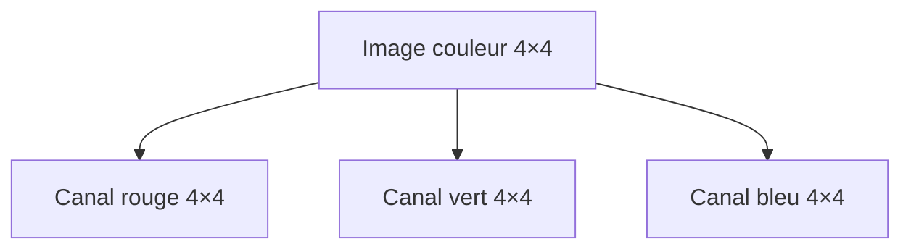

Ce qui rend cette représentation particulière, c'est que les pixels voisins sont **structurellement liés** : ils partagent un contexte spatial.

Un pixel isolé ne signifie rien de précis. C'est sa relation avec ses voisins qui contient l'information : une arête, une texture, un contour.

---

## A.3. Pourquoi un réseau dense est insuffisant

Un réseau dense classique traite chaque entrée comme un vecteur sans structure.

Si nous prenons une image de 64×64 pixels en RGB, nous obtenons un vecteur de :

$$64 \times 64 \times 3 = 12\,288 \text{ valeurs}$$

Un réseau dense connecté à ce vecteur crée des connexions entre **toutes** les entrées et **tous** les neurones de la couche suivante.

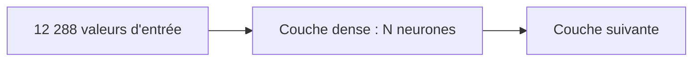

Ce type de réseau pose plusieurs problèmes avec des images.

### A.3.1 Explosion du nombre de paramètres

Une image de 224×224×3 pixels connectée à une couche de 1000 neurones nécessite :

$$224 \times 224 \times 3 \times 1000 = 150\,528\,000 \text{ paramètres}$$

C'est uniquement pour la première couche.

Ce nombre explose très rapidement avec la taille des images.

### A.3.2 Ignorance de la structure spatiale

Un réseau dense traite chaque pixel indépendamment.

Il ne tire pas parti du fait que des pixels voisins sont probablement liés.

Si nous décalons un objet de quelques pixels, le réseau dense voit une entrée complètement différente.

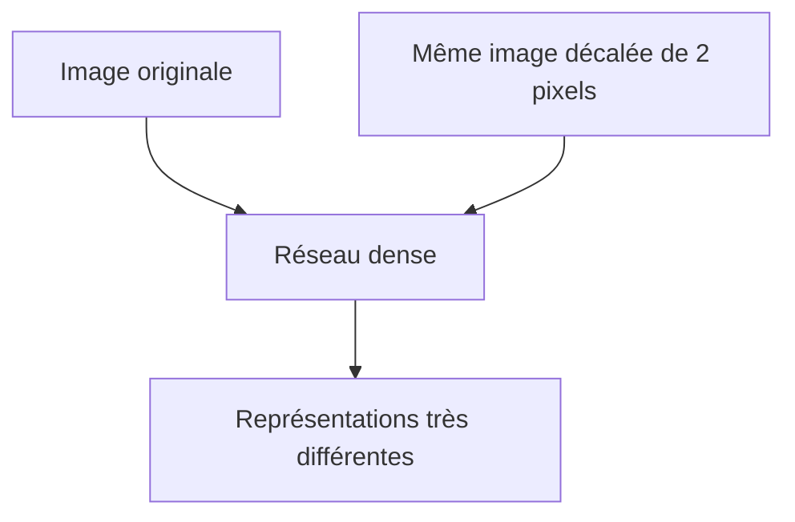

Cela rend l'apprentissage beaucoup plus coûteux.

### A.3.3 Absence d'invariance spatiale

Le réseau dense doit apprendre séparément à reconnaître un chat en haut à gauche, en bas à droite, au centre, etc.

Les CNN vont résoudre ces problèmes.

---

## A.4. L'idée fondamentale : la convolution

La **convolution** est l'opération centrale d'un CNN.

L'idée est simple :

> Au lieu de connecter chaque neurone à toute l'image, nous appliquons un petit filtre localement, en le faisant glisser sur toute l'image.

Ce filtre est une petite matrice de nombres appris, appelée **noyau** ou **kernel**.

Exemple de filtre 3×3 :

```txt
 1  0 -1
 1  0 -1
 1  0 -1
```

Nous faisons glisser ce filtre sur l'image et calculons, à chaque position, le produit scalaire entre le filtre et la région locale de l'image.

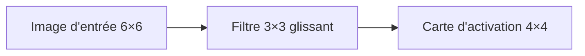

Ce mécanisme de glissement s'appelle la **convolution discrète** en traitement du signal.

---

## A.5. Le calcul d'une convolution

Prenons une image d'entrée simple de 4×4 :

```txt
 1  2  3  4
 5  6  7  8
 9 10 11 12
13 14 15 16
```

Et un filtre 2×2 :

```txt
 1  0
 0 -1
```

Nous appliquons ce filtre en position (1,1), c'est-à-dire sur les pixels :

```txt
 1  2
 5  6
```

Le produit scalaire donne :

$$1 \times 1 + 2 \times 0 + 5 \times 0 + 6 \times (-1) = 1 + 0 + 0 - 6 = -5$$

Nous faisons de même pour toutes les positions valides.

La valeur calculée à chaque position forme la **carte d'activation** (ou *feature map*).

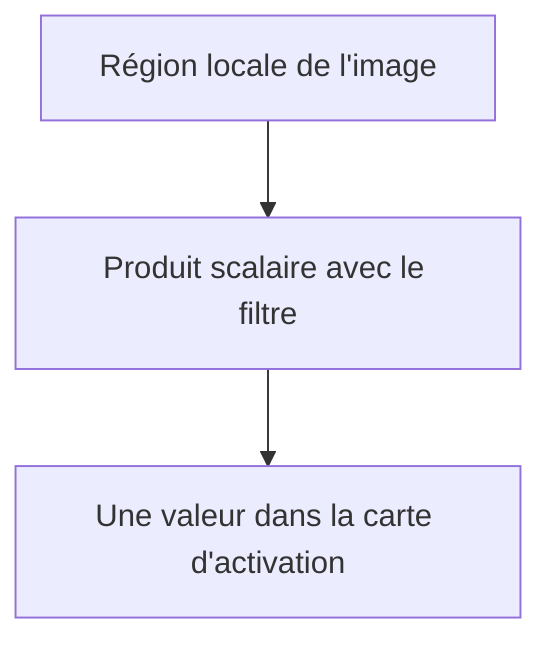

---

## A.6. La carte d'activation

La **carte d'activation** contient les réponses du filtre à chaque position de l'image.

Si le filtre est conçu pour détecter les bords verticaux, la carte d'activation aura des valeurs élevées là où l'image contient des bords verticaux.

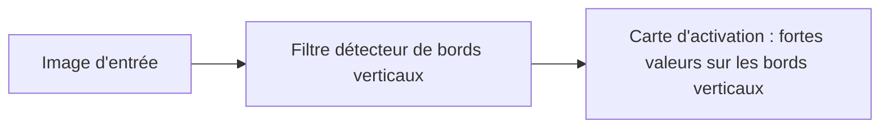

Un CNN apprend automatiquement les filtres qui lui sont utiles pour la tâche.

Il ne faut pas définir manuellement les filtres : ils sont appris par rétropropagation, exactement comme les poids d'un réseau dense.

---

## A.7. Le partage des poids

Un filtre est appliqué à **toutes** les positions de l'image.

Les poids du filtre sont donc partagés dans l'espace, de la même façon que les poids d'un RNN sont partagés dans le temps.

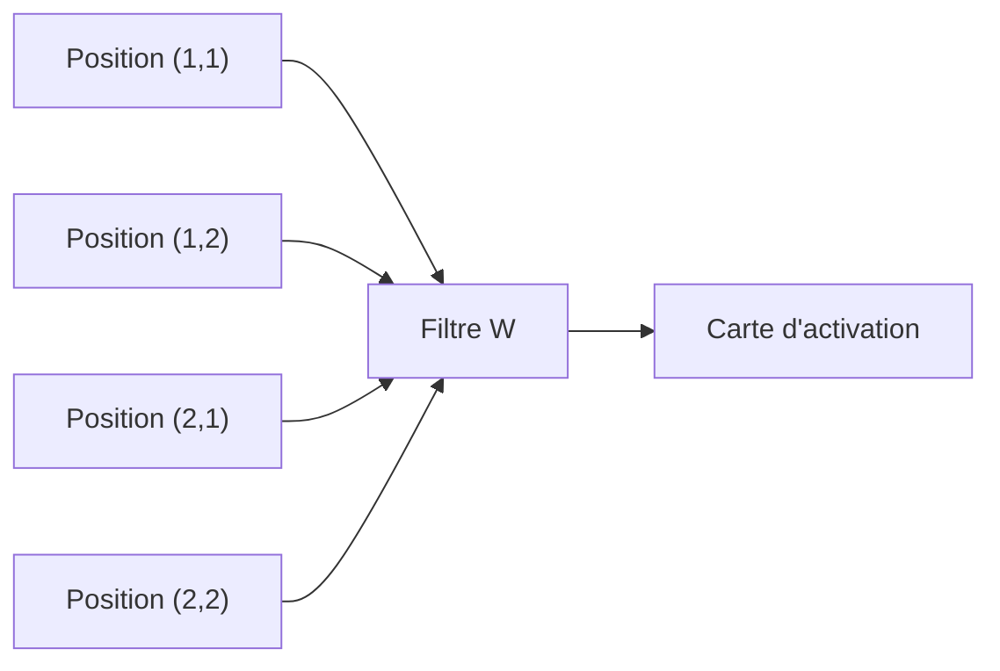

Ce partage a deux avantages majeurs :

1. le nombre de paramètres est indépendant de la taille de l'image ;

2. si un motif est appris à une position, il est reconnu partout ailleurs dans l'image.

C'est l'**invariance par translation** : le filtre sait reconnaître un motif où qu'il se trouve.

---

## A.8. Plusieurs filtres en parallèle

En pratique, une couche de convolution utilise non pas un seul filtre, mais plusieurs filtres en parallèle.

Chaque filtre produit une carte d'activation différente.

Si nous utilisons 32 filtres de taille 3×3, nous obtenons 32 cartes d'activation.

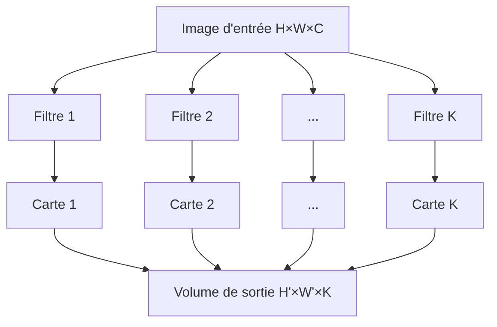

L'ensemble des cartes d'activation forme un **volume** de sortie, avec une profondeur égale au nombre de filtres.

---

## A.9. Les dimensions d'une couche de convolution

Notons :

- $H$ la hauteur de l'entrée ;
- $W$ la largeur de l'entrée ;
- $C$ le nombre de canaux de l'entrée ;
- $K$ le nombre de filtres ;
- $F$ la taille du filtre (par exemple 3 pour un filtre 3×3) ;
- $S$ le **stride**, c'est-à-dire le pas de déplacement du filtre ;
- $P$ le **padding**, c'est-à-dire le rembourrage ajouté autour de l'image.

Alors la sortie a les dimensions :

$$H' = \frac{H - F + 2P}{S} + 1$$

$$W' = \frac{W - F + 2P}{S} + 1$$

La sortie a donc la forme $H' \times W' \times K$.

Le nombre de paramètres de cette couche est :

$$F \times F \times C \times K + K$$

où $K$ est le nombre de biais.

---

## A.10. Le stride

Le **stride** contrôle le pas de déplacement du filtre.

Avec un stride de 1, le filtre se décale d'un pixel à la fois.

Avec un stride de 2, il se décale de deux pixels à la fois.

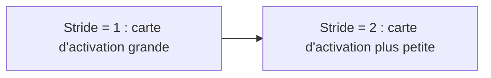

Un stride plus grand réduit la taille de la sortie et diminue le coût de calcul.

Mais il perd aussi de l'information spatiale fine.

---

## A.11. Le padding

Lorsque nous appliquons un filtre, les pixels de bord participent à moins de calculs que les pixels centraux.

Si nous ne faisons rien, la carte d'activation est plus petite que l'entrée.

Le **padding** consiste à ajouter une bordure de zéros autour de l'image.

```txt
Entrée originale 4×4 avec padding=1 :

0  0  0  0  0  0
0  1  2  3  4  0
0  5  6  7  8  0
0  9 10 11 12  0
0 13 14 15 16  0
0  0  0  0  0  0
```

Cela permet de conserver les dimensions spatiales entre l'entrée et la sortie (*same padding*), ou de contrôler finement la réduction.

---

## A.12. La fonction d'activation

Après la convolution, nous appliquons une **fonction d'activation non linéaire** à chaque valeur de la carte d'activation.

La plus utilisée est la **ReLU** (*Rectified Linear Unit*) :

$$\text{ReLU}(x) = \max(0, x)$$

Elle met à zéro toutes les valeurs négatives.

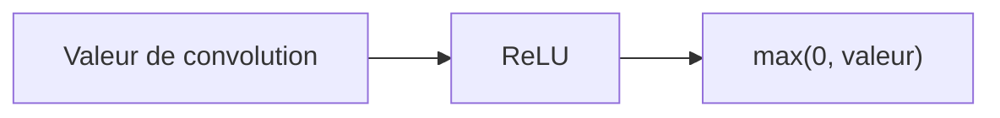

Sans cette non-linéarité, empiler plusieurs couches de convolution ne serait pas plus puissant qu'une seule couche.

La ReLU est simple, efficace et évite certains problèmes de gradient.

---

## A.13. L'opération de pooling

Après une ou plusieurs couches de convolution, on insère souvent une couche de **pooling**.

Le pooling réduit les dimensions spatiales de la carte d'activation.

### A.13.1 Max pooling

Le **max pooling** découpe la carte d'activation en régions et garde la valeur maximale de chaque région.

Exemple avec un max pooling 2×2 et stride 2 sur une carte 4×4 :

```txt
Carte d'activation :
 1  3  2  4
 5  6  7  8
 9  2  3  4
 1  8  7  6

Résultat max pooling 2×2 :
 6  8
 9  7
```

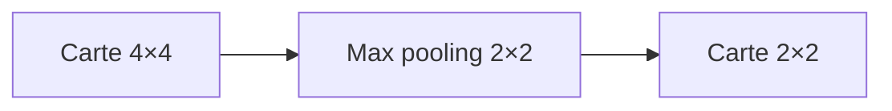

### A.13.2 Average pooling

L'**average pooling** calcule la moyenne de chaque région plutôt que le maximum.

### A.13.3 Rôle du pooling

Le pooling sert à :

- réduire la taille des cartes d'activation ;

- diminuer le nombre de calculs ;

- rendre les représentations légèrement invariantes aux petites translations.

---

## A.14. Architecture générale d'un CNN

Un CNN classique s'organise en deux parties principales.

### A.14.1 La partie extraction de caractéristiques

Cette partie est composée de couches alternant convolution, activation et pooling.

Elle transforme l'image d'entrée en une représentation de plus en plus abstraite.

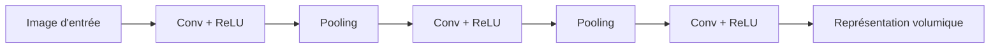

### A.14.2 La partie classification

À la fin des couches convolutives, on **aplatit** le volume de caractéristiques en un vecteur.

Ce vecteur est ensuite traité par des couches denses classiques, qui produisent la prédiction finale.

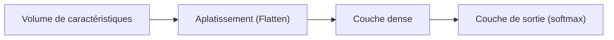

---

## A.15. Ce que les couches apprennent

Les couches profondes d'un CNN n'apprennent pas toutes les mêmes choses.

Il existe une hiérarchie de représentations.

### A.15.1 Premières couches

Les premières couches apprennent des **motifs simples et locaux** :

- bords ;

- coins ;

- couleurs simples ;

- textures de base.

### A.15.2 Couches intermédiaires

Les couches intermédiaires combinent ces motifs pour former des **motifs plus complexes** :

- yeux, oreilles ;

- roues, fenêtres ;

- formes géométriques.

### A.15.3 Couches profondes

Les couches profondes apprennent des **représentations sémantiques** :

- visage complet ;

- voiture entière ;

- type de scène.

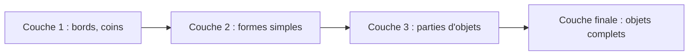

Cette hiérarchie est une des raisons du succès des CNN : ils apprennent une représentation de plus en plus abstraite de façon automatique.

---

## A.16. Exemple : classification d'images

Prenons une tâche classique : reconnaître si une image contient un chat ou un chien.

```txt
Entrée : image 224×224×3
```

Un CNN peut être organisé ainsi :

```txt
Conv 3×3, 32 filtres → ReLU → MaxPool 2×2
Conv 3×3, 64 filtres → ReLU → MaxPool 2×2
Conv 3×3, 128 filtres → ReLU → MaxPool 2×2
Flatten
Dense 256 → ReLU
Dense 2 → Softmax
```

À chaque couche de convolution, le réseau détecte des caractéristiques de plus en plus complexes.

À la fin, le vecteur dense est projeté sur deux classes.

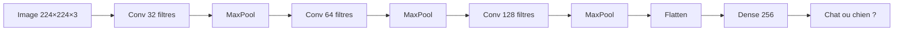

---

## A.17. Comparaison réseau dense vs CNN

Résumons la différence fondamentale :

| Critère | Réseau dense | CNN |
|---|---|---|
| Connexions | Toutes les entrées | Région locale (filtre) |
| Poids | Un par connexion | Partagés sur toute l'image |
| Structure spatiale | Ignorée | Exploitée |
| Invariance à la translation | Non | Oui (partielle) |
| Nombre de paramètres | Très élevé | Bien plus faible |

---

## A.18. Limites des CNN classiques

Les CNN ont des limites importantes.

### A.18.1 Invariance globale non garantie

Le max pooling donne une invariance locale aux petites translations.

Mais un objet très décalé ou tourné peut ne pas être reconnu.

### A.18.2 Taille d'entrée fixe

Les couches denses en fin de réseau exigent souvent une taille d'entrée fixe.

### A.18.3 Données séquentielles

Les CNN sont bien adaptés aux données spatiales, mais moins aux données séquentielles (texte, parole, séries temporelles).

Pour ces cas, les RNN et leurs dérivés offrent une meilleure inductive bias.

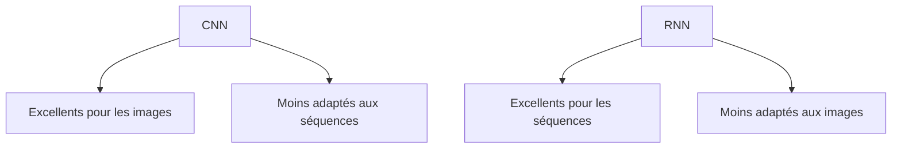

---

## A.19. Résumé du chapitre

Dans ce chapitre, nous avons posé les bases des **CNN**.

Nous avons vu que :

- une image est une donnée à structure spatiale ;

- un réseau dense est insuffisant car il ignore cette structure et crée trop de paramètres ;

- la convolution applique un filtre local qui glisse sur toute l'image ;

- les poids du filtre sont partagés dans l'espace, ce qui réduit les paramètres et confère une invariance à la translation ;

- plusieurs filtres en parallèle produisent plusieurs cartes d'activation ;

- le pooling réduit les dimensions spatiales ;

- les couches profondes apprennent des représentations de plus en plus abstraites.

---

## A.20. Schéma de synthèse

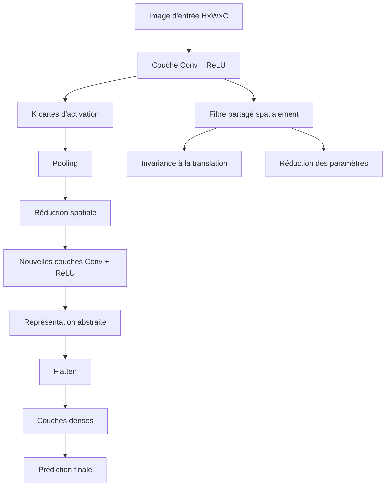

---

## A.21. Questions de compréhension

### Question 1

Pourquoi un réseau dense est-il inadapté au traitement d'images haute résolution ?

Réponse attendue : parce qu'il connecte chaque pixel à chaque neurone, ce qui produit un nombre de paramètres qui explose avec la résolution, et parce qu'il ignore la structure spatiale locale.

### Question 2

Qu'est-ce qu'un filtre convolutif ?

Réponse attendue : c'est une petite matrice de poids appris qui est appliquée localement à chaque position de l'image par produit scalaire.

### Question 3

Qu'est-ce que le partage des poids dans un CNN ?

Réponse attendue : le même filtre est appliqué à toutes les positions de l'image, ce qui signifie que les poids sont partagés spatialement.

### Question 4

Qu'est-ce qu'une carte d'activation ?

Réponse attendue : c'est la réponse d'un filtre à chaque position de l'image, formant une nouvelle représentation spatiale.

### Question 5

Quel est le rôle du stride ?

Réponse attendue : le stride contrôle le pas de déplacement du filtre ; un stride plus grand réduit la taille de la sortie.

### Question 6

Quel est le rôle du pooling ?

Réponse attendue : réduire les dimensions spatiales des cartes d'activation, diminuer le coût de calcul, et conférer une légère invariance aux petites translations.

### Question 7

Que signifie la hiérarchie de représentations dans un CNN ?

Réponse attendue : les premières couches apprennent des motifs simples comme des bords, tandis que les couches plus profondes apprennent des représentations plus abstraites comme des parties d'objets ou des objets entiers.

### Question 8

Pourquoi les CNN sont-ils moins adaptés aux données séquentielles ?

Réponse attendue : parce que les CNN exploitent la structure spatiale locale, mais ne modélisent pas naturellement l'ordre temporel ou la dépendance à distance caractéristiques des séquences.

---

## A.22. Transition vers le chapitre suivant

Nous avons maintenant une bonne compréhension du fonctionnement des CNN.

Nous savons qu'ils sont particulièrement efficaces pour exploiter la structure spatiale des données, notamment les images.

Mais certaines données n'ont pas de structure spatiale : elles ont une structure **temporelle** ou **séquentielle**.

Dans le texte, un mot dépend de ceux qui le précèdent.

Dans une série temporelle, une valeur dépend des valeurs passées.

C'est précisément pour ce type de données que les **RNN**, ou réseaux de neurones récurrents, ont été conçus.

Dans le chapitre suivant, nous allons donc entrer dans le principe des RNN.

---

# Chapitre B — Les convolutions en profondeur

## B.1. Objectif du chapitre

Dans le chapitre précédent, nous avons posé les bases de la convolution et de l'architecture CNN.

Dans ce chapitre, nous allons aller plus loin et comprendre :

- comment les convolutions s'enchaînent pour construire un champ récepteur progressivement plus grand ;

- ce qu'est le champ récepteur d'un neurone ;

- comment les CNN s'adaptent au traitement multi-échelle ;

- ce que sont les convolutions dilatées ;

- ce que sont les convolutions dépthwise et pointwise ;

- comment les CNN peuvent traiter des séquences.

Ce chapitre approfondit la compréhension des CNN et prépare la comparaison avec les RNN.

---

## B.2. Le champ récepteur

Le **champ récepteur** d'un neurone dans une couche intermédiaire est la région de l'image d'entrée qui influence sa valeur.

Pour un neurone de la première carte d'activation avec un filtre 3×3, le champ récepteur est 3×3.

Mais pour un neurone de la deuxième couche de convolution (avec encore un filtre 3×3), chaque position couvrait déjà 3×3 pixels.

Donc le champ récepteur dans l'image d'entrée est maintenant :

$$(3-1) + 3 = 5 \times 5$$

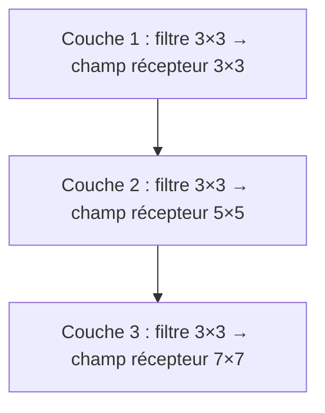

En empilant des couches, le champ récepteur grandit.

Les couches profondes voient donc une plus grande région de l'image.

C'est une façon d'extraire des informations globales sans augmenter la taille des filtres.

---

## B.3. Formule du champ récepteur

Pour $L$ couches de convolution avec des filtres de taille $F$ et un stride de 1, le champ récepteur est :

$$r_L = 1 + L \times (F - 1)$$

Avec $L=3$ couches et $F=3$ :

$$r_3 = 1 + 3 \times 2 = 7$$

Si nous ajoutons un stride $S > 1$, le champ récepteur grandit encore plus vite.

---

## B.4. Convolutions dilatées

Une façon d'augmenter le champ récepteur sans ajouter de couches est d'utiliser des **convolutions dilatées** (ou *atrous convolutions*).

L'idée est d'espacer les entrées du filtre avec un facteur de dilatation $d$.

Avec $d=1$ (standard) :

```txt
x x x
x x x
x x x
```

Avec $d=2$ (dilatation) :

```txt
x . x . x
. . . . .
x . x . x
. . . . .
x . x . x
```

Le filtre couvre une région plus grande de l'entrée, mais avec le même nombre de paramètres.

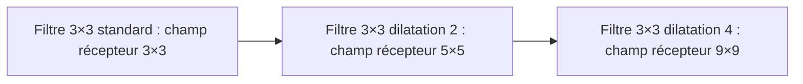

Les convolutions dilatées sont très utilisées pour des tâches de segmentation sémantique (comme dans DeepLab).

---

## B.5. Convolutions depthwise et pointwise

Dans les architectures modernes légères, on distingue souvent deux types de convolutions.

### B.5.1 Convolution depthwise

La **convolution depthwise** applique un filtre séparé à chaque canal d'entrée, sans mélanger les canaux.

Pour une entrée de dimensions $H \times W \times C$, elle produit une sortie de dimensions $H' \times W' \times C$.

Chaque canal est traité indépendamment.

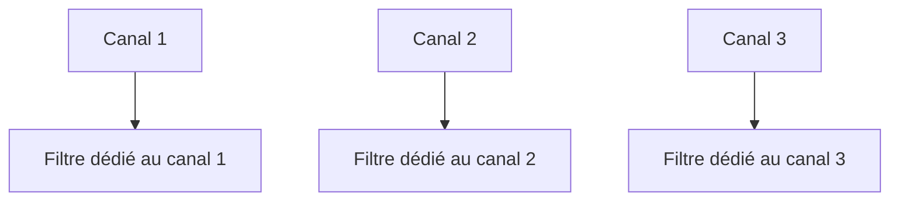

### B.5.2 Convolution pointwise

La **convolution pointwise** est une convolution 1×1 qui mélange les canaux.

Elle combine les informations de tous les canaux en chaque position spatiale.

```mermaid
flowchart TD
    A["Canaux C séparés"] --> B["Convolution 1×1"]
    B --> C["K nouveaux canaux combinés"]
```

### B.5.3 Convolution separable en profondeur

La combinaison depthwise + pointwise est appelée **separable depthwise convolution**.

Elle réduit le nombre de paramètres et de calculs tout en maintenant une expressivité comparable.

C'est le cœur des architectures légères comme **MobileNet**.

---

## B.6. CNN appliqués aux séquences

Les CNN ne sont pas limités aux images bidimensionnelles.

Ils peuvent aussi être appliqués à des séquences avec des convolutions 1D.

### B.6.1 Convolution 1D

Au lieu de glisser un filtre sur une grille 2D, on le glisse sur une séquence 1D.

Exemple : une phrase de $T$ tokens, chacun représenté par un vecteur de dimension $d$.

```txt
Entrée : T × d
Filtre : F × d × K
Sortie : T' × K
```

```mermaid
flowchart LR
    A["Séquence T×d"] --> B["Filtre 1D de taille F"]
    B --> C["K cartes d'activation T'×K"]
```

### B.6.2 Avantage des CNN sur les séquences

Les convolutions 1D sur des séquences présentent un avantage important par rapport aux RNN : elles sont **parallélisables**.

Toutes les positions peuvent être calculées en même temps.

```mermaid
flowchart LR
    A["RNN : calcul séquentiel h_1 → h_2 → h_3"]
    B["CNN 1D : calcul parallèle de toutes les positions"]
```

Mais les CNN 1D ont une limite : le champ récepteur est local et de taille fixe.

Pour capturer des dépendances très longues, il faudrait soit de nombreuses couches, soit des filtres très larges.

---

## B.7. Résumé du chapitre

Dans ce chapitre, nous avons approfondi notre compréhension des CNN.

Nous avons vu que :

- le champ récepteur grandit avec la profondeur du réseau ;

- les convolutions dilatées permettent d'agrandir le champ récepteur sans ajouter de paramètres ;

- les convolutions depthwise et pointwise permettent de réduire le coût computationnel ;

- les convolutions 1D permettent d'appliquer les CNN à des séquences.

Ces outils montrent que les CNN sont polyvalents.

Mais pour les données à dépendances longues ou à structure temporelle forte, les RNN ont été historiquement plus adaptés.

C'est cette complémentarité entre CNN et RNN qui justifie de les étudier ensemble avant d'aborder les Transformers, qui cherchent à combiner le meilleur des deux.

---

## B.8. Questions de compréhension

### Question 1

Qu'est-ce que le champ récepteur d'un neurone dans un CNN ?

Réponse attendue : c'est la région de l'image d'entrée qui influence la valeur de ce neurone.

### Question 2

Comment le champ récepteur évolue-t-il avec la profondeur du réseau ?

Réponse attendue : il grandit à chaque couche supplémentaire de convolution, permettant aux couches profondes de capturer des informations à plus grande échelle.

### Question 3

Qu'est-ce qu'une convolution dilatée ?

Réponse attendue : une convolution où les éléments du filtre sont espacés par un facteur de dilatation, augmentant le champ récepteur sans augmenter le nombre de paramètres.

### Question 4

Quelle est la différence entre une convolution depthwise et une convolution pointwise ?

Réponse attendue : la convolution depthwise traite chaque canal indépendamment ; la convolution pointwise combine les canaux sans tenir compte de la dimension spatiale.

### Question 5

Quel est l'avantage principal des CNN 1D sur les RNN pour le traitement de séquences ?

Réponse attendue : les CNN 1D permettent un calcul parallèle de toutes les positions de la séquence, alors que les RNN doivent les traiter séquentiellement.

---

## B.9. Transition vers la partie RNN

Nous avons maintenant une vision solide des CNN, de leur fonctionnement spatial, et de leurs extensions.

Nous avons vu qu'ils sont bien adaptés aux données spatiales et qu'ils peuvent aussi traiter des séquences, mais avec des champs récepteurs locaux et sans véritable mémoire du passé.

Pour les données où l'ordre et la dépendance temporelle sont centraux — comme le texte ou la parole — nous avons besoin d'une architecture différente.

C'est l'objet de la partie suivante : les **RNN**, ou réseaux de neurones récurrents.

---

# Partie II — Les réseaux de neurones récurrents (RNN)

---

# Chapitre 1 — Le principe des RNN

## 1.1. Objectif du chapitre

Dans le chapitre précédent, nous avons commencé à comprendre comment les modèles de traitement séquentiel fonctionnent avant l’arrivée des Transformers.

Nous avons vu que les **RNN**, ou **réseaux de neurones récurrents**, lisent une séquence élément par élément.

Dans ce chapitre, nous allons entrer plus précisément dans leur fonctionnement interne.

Nous allons comprendre :

- ce qu’est une cellule RNN ;
    
- ce qu’est un état caché ;
    
- comment le modèle transporte une mémoire ;
    
- comment une séquence est traitée pas à pas ;
    
- pourquoi cette mémoire est utile ;
    
- pourquoi elle reste limitée ;
    
- en quoi cette limite préparera l’arrivée des Transformers.
    

L’objectif est simple : nous devons comprendre le fonctionnement des RNN pour mieux comprendre ensuite pourquoi les Transformers ont proposé une rupture.

---

## 1.2. Rappel : une séquence se lit étape par étape

Un RNN traite une séquence dans l’ordre.

Prenons la phrase :

```txt
Le chat dort sur le canapé.
```

Après tokenisation, nous pouvons obtenir :

```txt
["Le", "chat", "dort", "sur", "le", "canapé", "."]
```

Le RNN lit alors les tokens un par un :

```txt
Le → chat → dort → sur → le → canapé → .
```

À chaque étape, il met à jour une représentation interne que nous appelons **état caché**.

```mermaid
flowchart LR
    X1["Le"] --> R1["RNN"]
    R1 --> R2["RNN"]
    X2["chat"] --> R2
    R2 --> R3["RNN"]
    X3["dort"] --> R3
    R3 --> R4["RNN"]
    X4["sur"] --> R4
    R4 --> R5["RNN"]
    X5["le canapé"] --> R5
    R5 --> H["Représentation finale"]
```

Nous pouvons donc voir le RNN comme un lecteur qui avance dans la phrase en gardant une mémoire de ce qu’il a déjà lu.

---

## 1.3. La cellule RNN

Le cœur d’un RNN est la **cellule récurrente**.

À chaque position $t$, cette cellule reçoit deux informations :

1. l’entrée actuelle $x_t$ ;
    
2. l’état caché précédent $h_{t-1}$.
    

Elle produit ensuite :

1. un nouvel état caché $h_t$ ;
    
2. éventuellement une sortie $y_t$.
    

```mermaid
flowchart TD
    A["Entrée actuelle x_t"] --> C["Cellule RNN"]
    B["État précédent h_(t-1)"] --> C
    C --> D["Nouvel état h_t"]
    C --> E["Sortie éventuelle y_t"]
```

L’idée est très importante :

> Le RNN ne regarde pas seulement le token actuel. Il regarde aussi une mémoire de ce qui a été lu avant.

C’est ce qui distingue un RNN d’un simple réseau dense appliqué indépendamment à chaque mot.

---

## 1.4. La formule fondamentale

Mathématiquement, nous pouvons écrire :


$$h_t = f(x_t, h_{t-1})$$

où :

- $x_t$ est l’entrée au temps $t$ ;
    
- $h_{t-1}$ est l’état caché précédent ;
    
- $h_t$ est le nouvel état caché ;
    
-$f$est une fonction apprise par le réseau.
    

Cette formule dit simplement :

> Le nouvel état dépend à la fois de l’entrée actuelle et de la mémoire précédente.

Dans un RNN classique, on utilise souvent une formule de ce type :

$$h_t = \tanh(W_x x_t + W_h h_{t-1} + b)$$

où :

- $W_x$ est la matrice de poids appliquée à l’entrée actuelle ;
    
- $W_h$ est la matrice de poids appliquée à l’état précédent ;
    
- $b$ est un biais ;
    
- $\tanh$ est une fonction d’activation non linéaire.
    

Nous pouvons la lire ainsi :

```txt
nouvel état = activation(entrée transformée + mémoire transformée + biais)
```

---

## 1.5. Exemple intuitif avec une phrase

Prenons la phrase :

```txt
Le chat dort.
```

Nous pouvons noter :

```txt
x1 = "Le"
x2 = "chat"
x3 = "dort"
x4 = "."
```

Le RNN calcule successivement :

$$h_1 = f(x_1, h_0)$$

$$h_2 = f(x_2, h_1)$$

$$h_3 = f(x_3, h_2)$$

$$h_4 = f(x_4, h_3)$$

L’état initial (h_0) est souvent un vecteur de zéros ou un vecteur appris.

```mermaid
flowchart LR
    H0["h0 mémoire initiale"] --> R1["RNN"]
    X1["x1 = Le"] --> R1
    R1 --> H1["h1"]

    H1 --> R2["RNN"]
    X2["x2 = chat"] --> R2
    R2 --> H2["h2"]

    H2 --> R3["RNN"]
    X3["x3 = dort"] --> R3
    R3 --> H3["h3"]

    H3 --> R4["RNN"]
    X4["x4 = ."] --> R4
    R4 --> H4["h4"]
```

Chaque état contient donc une représentation partielle de la séquence lue jusqu’ici.

---

## 1.6. Ce que contient l’état caché

L’état caché $h_t$ est un vecteur.

Il ne contient pas les mots sous forme lisible.

Il contient une représentation numérique apprise.

Par exemple, après avoir lu :

```txt
Le chat
```

l’état caché peut contenir implicitement des informations comme :

- nous parlons probablement d’un animal ;
    
- le sujet est au singulier ;
    
- une action peut suivre ;
    
- le contexte grammatical est en cours de construction.
    

Évidemment, le modèle ne stocke pas ces informations sous forme de phrases humaines. Il les encode dans des nombres.

Nous pouvons représenter cela ainsi :

```mermaid
flowchart TD
    A["Tokens déjà lus : Le chat"] --> B["État caché h_t"]
    B --> C["Informations grammaticales"]
    B --> D["Informations sémantiques"]
    B --> E["Contexte partiel"]
```

L’état caché est donc une forme de mémoire compressée.

---

## 1.7. RNN déroulé dans le temps

Quand nous dessinons un RNN, nous pouvons le représenter de deux façons.

La première est compacte :

```mermaid
flowchart TD
    X["Entrée x_t"] --> R["Cellule RNN"]
    Hprev["h_(t-1)"] --> R
    R --> H["h_t"]
```

Mais pour comprendre son traitement d’une séquence, nous le **déroulons dans le temps**.

```mermaid
flowchart LR
    X1["x1"] --> R1["RNN"]
    H0["h0"] --> R1
    R1 --> H1["h1"]

    X2["x2"] --> R2["RNN"]
    H1 --> R2
    R2 --> H2["h2"]

    X3["x3"] --> R3["RNN"]
    H2 --> R3
    R3 --> H3["h3"]

    X4["x4"] --> R4["RNN"]
    H3 --> R4
    R4 --> H4["h4"]
```

Il faut bien comprendre que les cellules dessinées (R1), (R2), (R3), (R4) représentent généralement **la même cellule RNN réutilisée à chaque étape**.

Autrement dit, les poids sont partagés dans le temps.

---

## 1.8. Partage des poids dans le temps

Un RNN n’apprend pas une matrice différente pour chaque position.

Il utilise les mêmes poids à chaque étape.

Cela signifie que la même transformation est appliquée à :

```txt
x1 avec h0
x2 avec h1
x3 avec h2
x4 avec h3
```

```mermaid
flowchart LR
    A["Étape 1 : mêmes poids W"] --> B["Étape 2 : mêmes poids W"]
    B --> C["Étape 3 : mêmes poids W"]
    C --> D["Étape 4 : mêmes poids W"]
```

Ce partage des poids a deux avantages :

1. le modèle peut traiter des séquences de longueurs variables ;
    
2. le nombre de paramètres ne dépend pas directement de la longueur de la séquence.
    

C’est une idée élégante : nous apprenons une règle générale de mise à jour de la mémoire, puis nous l’appliquons autant de fois que nécessaire.

---

## 1.9. Dimensions dans un RNN

Supposons que chaque token soit représenté par un embedding de dimension :

$$d_{input}$$

et que l’état caché ait une dimension :

$$d_{hidden}$$

Alors :

$$x_t \in \mathbb{R}^{d_{input}}$$

$$h_t \in \mathbb{R}^{d_{hidden}}$$

La matrice $W_x$ transforme l’entrée vers l’espace caché :

$$W_x \in \mathbb{R}^{d_{hidden} \times d_{input}}$$

La matrice $W_h$ transforme l’état précédent vers le nouvel état caché :

$$W_h \in \mathbb{R}^{d_{hidden} \times d_{hidden}}$$

La formule complète est donc :

$$h_t = \tanh(W_x x_t + W_h h_{t-1} + b)$$

avec :

$$b \in \mathbb{R}^{d_{hidden}}$$

Nous devons retenir que l’état caché est un vecteur de taille fixe, même si la séquence est longue.

C’est un point qui deviendra important pour comprendre les limites des RNN.

---

## 1.10. Sortie à chaque étape ou sortie finale

Un RNN peut être utilisé de plusieurs manières.

### 1.10.1 Sortie finale uniquement

Pour une tâche de classification de phrase, nous pouvons utiliser uniquement le dernier état caché.

Exemple :

```txt
Phrase : Ce film est excellent.
Tâche : sentiment positif ou négatif
```

```mermaid
flowchart LR
    X1["Ce"] --> R1["RNN"]
    R1 --> R2["RNN"]
    X2["film"] --> R2
    R2 --> R3["RNN"]
    X3["est"] --> R3
    R3 --> R4["RNN"]
    X4["excellent"] --> R4
    R4 --> C["Classification positive/négative"]
```

Ici, le dernier état doit résumer toute la phrase.

---

### 1.10.2 Sortie à chaque étape

Pour une tâche d’étiquetage de séquence, nous pouvons produire une sortie à chaque token.

Exemple :

```txt
Phrase : Marie habite Paris.
Tâche : reconnaissance d'entités nommées
```

Nous voulons prédire :

```txt
Marie  → PERSONNE
habite → O
Paris  → LIEU
```

```mermaid
flowchart LR
    X1["Marie"] --> R1["RNN"]
    R1 --> Y1["PERSONNE"]
    R1 --> R2["RNN"]

    X2["habite"] --> R2
    R2 --> Y2["O"]
    R2 --> R3["RNN"]

    X3["Paris"] --> R3
    R3 --> Y3["LIEU"]
```

Dans ce cas, chaque état caché sert à produire une prédiction locale.

---

## 1.11. Les grandes configurations des RNN

Nous pouvons classer les usages des RNN selon la forme de l’entrée et de la sortie.

### 1.11.1 One-to-one

Un seul input donne un seul output.

Ce n’est pas vraiment le cas typique des RNN, mais cela correspond à un réseau classique.

```mermaid
flowchart LR
    A["Entrée"] --> B["Modèle"] --> C["Sortie"]
```

---

### 1.11.2 One-to-many

Une seule entrée produit une séquence.

Exemple : génération de légende d’image.

```mermaid
flowchart LR
    A["Image"] --> B["RNN Decoder"]
    B --> C["Un"]
    C --> D["chat"]
    D --> E["dort"]
```

---

### 1.11.3 Many-to-one

Une séquence produit une seule sortie.

Exemple : classification de sentiment.

```mermaid
flowchart LR
    A["Ce"] --> B["film"] --> C["est"] --> D["excellent"]
    D --> E["Sentiment positif"]
```

---

### 1.11.4 Many-to-many aligné

Une séquence produit une sortie à chaque position.

Exemple : étiquetage grammatical.

```mermaid
flowchart LR
    A["Le"] --> A2["DET"]
    B["chat"] --> B2["NOM"]
    C["dort"] --> C2["VERBE"]
```

---

### 1.11.5 Many-to-many non aligné

Une séquence produit une autre séquence de longueur différente.

Exemple : traduction automatique.

```mermaid
flowchart LR
    A["I love cats"] --> B["Encoder RNN"]
    B --> C["Decoder RNN"]
    C --> D["J'aime les chats"]
```

Cette dernière configuration a joué un rôle central avant les Transformers.

---

## 1.12. Le RNN comme mémoire compressée

Nous pouvons maintenant formuler une idée essentielle :

> Dans un RNN, l’état caché est une mémoire compressée de tous les tokens précédents.

Après avoir lu une longue phrase, le dernier état doit contenir les informations nécessaires à la tâche.

Prenons :

```txt
Le livre que Paul a acheté hier dans une petite librairie du centre-ville est passionnant.
```

Si nous voulons classifier cette phrase ou la traduire, le dernier état doit contenir beaucoup d’informations :

- le sujet principal : `Le livre` ;
    
- l’action secondaire : `Paul a acheté` ;
    
- le lieu : `librairie du centre-ville` ;
    
- le prédicat principal : `est passionnant`.
    

```mermaid
flowchart TD
    A["Phrase longue"] --> B["RNN"]
    B --> C["Dernier état caché"]
    C --> D["Résumé compressé de toute la phrase"]
```

Le problème est que cette mémoire a une taille fixe.

Même si la phrase contient 10 tokens, 100 tokens ou 1000 tokens, l’état caché garde la même dimension.

---

## 1.13. Pourquoi cette mémoire est limitée

La limite principale vient du fait que l’information est transmise étape après étape.

Si une information importante apparaît au début de la séquence, elle doit survivre à toutes les mises à jour successives.

```mermaid
flowchart LR
    A["Information importante au début"] --> B["Étape 1"]
    B --> C["Étape 2"]
    C --> D["Étape 3"]
    D --> E["..."]
    E --> F["Étape 50"]
    F --> G["Utilisation finale"]
```

À chaque étape, le modèle peut modifier, écraser ou diluer cette information.

C’est un peu comme si nous devions retenir une phrase longue tout en recevant constamment de nouveaux mots.

Certaines informations anciennes peuvent se perdre.

---

## 1.14. Exemple de dépendance longue

Prenons la phrase :

```txt
Les clés que mon frère a laissées hier dans la voiture de notre voisin sont sur la table.
```

Le verbe `sont` dépend du sujet `Les clés`.

Mais entre les deux, nous avons une longue proposition relative :

```txt
que mon frère a laissées hier dans la voiture de notre voisin
```

Pour comprendre correctement la phrase, le modèle doit conserver l’information :

```txt
sujet = Les clés
nombre = pluriel
```

jusqu’au mot :

```txt
sont
```

```mermaid
flowchart LR
    A["Les clés"] -. "information à conserver : pluriel" .-> G["sont"]
    B["mon frère"] --> C["a laissées"]
    C --> D["hier"]
    D --> E["dans la voiture"]
    E --> F["de notre voisin"]
    F --> G
```

Un RNN peut théoriquement apprendre cette dépendance.

Mais en pratique, plus la distance augmente, plus cela devient difficile.

---

## 1.15. Le problème du gradient

Pour apprendre, un réseau de neurones utilise la rétropropagation.

Dans un RNN, comme la même cellule est répétée dans le temps, nous devons rétropropager l’erreur à travers toutes les étapes.

C’est ce que nous appelons la **Backpropagation Through Time**, ou **BPTT**.

```mermaid
flowchart RL
    L["Erreur finale"] --> H5["h5"]
    H5 --> H4["h4"]
    H4 --> H3["h3"]
    H3 --> H2["h2"]
    H2 --> H1["h1"]
```

Le problème est que le gradient peut :

- devenir très petit ;
    
- devenir très grand.
    

Nous parlons alors de :

- **vanishing gradient** : gradient qui disparaît ;
    
- **exploding gradient** : gradient qui explose.
    

---

## 1.16. Vanishing gradient

Le **vanishing gradient** se produit quand le signal d’apprentissage devient de plus en plus faible en remontant dans le temps.

Conséquence : les premiers tokens reçoivent un signal de correction très faible.

```mermaid
flowchart RL
    A["Erreur finale"] --> B["Gradient fort"]
    B --> C["Gradient moyen"]
    C --> D["Gradient faible"]
    D --> E["Gradient presque nul"]
    E --> F["Début de séquence"]
```

Le modèle apprend donc difficilement que des éléments très anciens influencent la sortie finale.

Cela explique pourquoi les RNN classiques ont du mal avec les dépendances longues.

---

## 1.17. Exploding gradient

À l’inverse, le gradient peut aussi devenir très grand.

Dans ce cas, les poids du modèle peuvent être mis à jour de manière trop brutale.

Cela rend l’entraînement instable.

```mermaid
flowchart RL
    A["Erreur finale"] --> B["Gradient normal"]
    B --> C["Gradient grand"]
    C --> D["Gradient très grand"]
    D --> E["Explosion numérique"]
```

Une technique classique pour limiter ce problème est le **gradient clipping**.

L’idée est de limiter la norme du gradient pour éviter des mises à jour trop importantes.

---

## 1.18. Pourquoi utiliser une fonction tanh ?

Dans un RNN classique, nous utilisons souvent :

$$h_t = \tanh(W_x x_t + W_h h_{t-1} + b)$$

La fonction $\tanh$ renvoie des valeurs entre (-1) et (1).

Cela permet de garder l’état caché dans une plage contrôlée.

```mermaid
flowchart LR
    A["Combinaison linéaire"] --> B["tanh"]
    B --> C["Valeurs entre -1 et 1"]
```

Mais cette saturation peut aussi contribuer au vanishing gradient.

Quand $\tanh$ est saturée, sa dérivée devient très faible.

Donc le signal d’apprentissage peut diminuer rapidement.

---

## 1.19. RNN bidirectionnels

Pour certaines tâches, il est utile de connaître à la fois le contexte gauche et le contexte droit.

Par exemple, dans la phrase :

```txt
Il mange une pomme verte.
```

Pour comprendre `pomme`, il est utile de savoir ce qui vient avant :

```txt
Il mange une
```

mais aussi ce qui vient après :

```txt
verte
```

Les **RNN bidirectionnels** lisent donc la séquence dans les deux sens :

- un RNN de gauche à droite ;
    
- un RNN de droite à gauche.
    

```mermaid
flowchart LR
    A["Token 1"] --> B["Token 2"] --> C["Token 3"] --> D["Token 4"]
    D --> E["RNN backward"]
    C --> E
    B --> E
    A --> E

    A --> F["RNN forward"]
    B --> F
    C --> F
    D --> F
```

Une représentation finale combine alors les deux directions.

```mermaid
flowchart TD
    A["Contexte gauche → droite"] --> C["Représentation du token"]
    B["Contexte droite → gauche"] --> C
```

Les RNN bidirectionnels sont utiles pour des tâches de compréhension, mais ils ne conviennent pas directement à la génération autoregressive, car dans la génération nous ne devons pas regarder les tokens futurs.

---

## 1.20. RNN profonds

Nous pouvons aussi empiler plusieurs couches RNN.

La sortie d’une couche devient l’entrée de la couche suivante.

```mermaid
flowchart TD
    X["Séquence d'entrée"] --> R1["Couche RNN 1"]
    R1 --> R2["Couche RNN 2"]
    R2 --> R3["Couche RNN 3"]
    R3 --> Y["Sortie"]
```

Cela augmente la capacité du modèle.

La première couche peut apprendre des motifs simples.

Les couches supérieures peuvent apprendre des représentations plus abstraites.

Mais cela rend aussi l’entraînement plus difficile, notamment à cause des gradients et du coût séquentiel.

---

## 1.21. RNN pour la génération de texte

Un RNN peut être utilisé pour générer du texte.

L’idée est de prédire le prochain token à partir des tokens précédents.

Par exemple :

```txt
Le chat
```

Le modèle peut prédire :

```txt
dort
```

Puis il réinjecte ce token dans le modèle pour prédire le suivant :

```txt
Le chat dort
```

```mermaid
flowchart LR
    A["Le"] --> R1["RNN"]
    R1 --> B["prédit : chat"]
    B --> R2["RNN"]
    R2 --> C["prédit : dort"]
    C --> R3["RNN"]
    R3 --> D["prédit : ."]
```

Cette logique autoregressive sera aussi présente dans les modèles GPT, mais avec une architecture Transformer decoder-only.

---

## 1.22. Entraînement d’un RNN génératif

Pendant l’entraînement, nous donnons au modèle une séquence réelle et nous lui demandons de prédire le token suivant.

Pour la phrase :

```txt
Le chat dort.
```

Nous créons les couples :

```txt
Entrée : Le       → cible : chat
Entrée : Le chat  → cible : dort
Entrée : Le chat dort → cible : .
```

En pratique, le modèle prédit à chaque position le token suivant.

```mermaid
flowchart TD
    A["Entrée : Le chat dort"] --> B["RNN"]
    B --> C["Prédictions à chaque position"]
    C --> D["Cibles : chat dort ."]
    D --> E["Calcul de la loss"]
```

Cette idée de prédiction du prochain token reste centrale dans les grands modèles de langage modernes.

---

## 1.23. RNN Seq2Seq

Les RNN ont aussi été très utilisés dans les architectures **Seq2Seq**.

Une architecture Seq2Seq comporte deux parties :

1. un encodeur ;
    
2. un décodeur.
    

L’encodeur lit la séquence source.

Le décodeur produit la séquence cible.

Exemple :

```txt
Source : I love cats.
Cible  : J'aime les chats.
```

```mermaid
flowchart LR
    A["I"] --> E1["Encoder RNN"]
    E1 --> E2["Encoder RNN"]
    B["love"] --> E2
    E2 --> E3["Encoder RNN"]
    C["cats"] --> E3
    E3 --> H["Vecteur de contexte"]

    H --> D1["Decoder RNN"]
    D1 --> Y1["J'"]
    D1 --> D2["Decoder RNN"]
    D2 --> Y2["aime"]
    D2 --> D3["Decoder RNN"]
    D3 --> Y3["les chats"]
```

Le vecteur de contexte sert de résumé de la phrase source.

C’est précisément ce résumé unique qui deviendra une limite importante.

---

## 1.24. Limite du vecteur de contexte

Dans un Seq2Seq RNN classique, l’encodeur compresse toute la phrase source dans un seul vecteur.

Pour une phrase courte, cela peut fonctionner :

```txt
I love cats.
```

Mais pour une phrase longue, cela devient difficile :

```txt
Although the committee initially rejected the proposal, it later accepted a revised version after several months of discussion.
```

```mermaid
flowchart LR
    A["Phrase source longue"] --> B["Encoder RNN"]
    B --> C["Vecteur unique"]
    C --> D["Decoder RNN"]
    D --> E["Traduction"]
```

Le décodeur doit produire toute la traduction à partir d’un seul résumé.

Nous avons donc un goulot d’étranglement informationnel.

L’attention est apparue en partie pour résoudre ce problème.

---

## 1.25. Comparaison avec un modèle non récurrent

Pour mieux comprendre le rôle du RNN, comparons deux approches.

### 1.25.1 Modèle sans mémoire

Si nous appliquons un réseau indépendamment à chaque token, le modèle voit seulement le token actuel.

```mermaid
flowchart TD
    A["Token actuel"] --> B["Réseau dense"]
    B --> C["Sortie"]
```

Il ne sait pas ce qui a été lu avant.

### 1.25.2 Modèle récurrent

Un RNN reçoit le token actuel et l’état précédent.

```mermaid
flowchart TD
    A["Token actuel"] --> C["RNN"]
    B["Mémoire précédente"] --> C
    C --> D["Nouvelle mémoire"]
```

Il peut donc accumuler de l’information.

La récurrence est précisément ce mécanisme de réutilisation de l’état précédent.

---

## 1.26. Ce que les RNN ont apporté

Les RNN ont été fondamentaux dans l’histoire du deep learning.

Ils ont permis de traiter des données séquentielles comme :

- le texte ;
    
- la parole ;
    
- les séries temporelles ;
    
- les signaux ;
    
- la musique ;
    
- les logs ;
    
- les séquences biologiques.
    

Ils ont introduit une idée essentielle :

> Une donnée n’est pas toujours indépendante : son interprétation dépend de ce qui précède.

Cette idée reste fondamentale dans les Transformers.

La différence est que les Transformers ne transportent pas l’information de proche en proche de la même façon.

---

## 1.27. Ce que les RNN ne résolvent pas bien

Les RNN classiques ont trois limites majeures.

### 1.27.1 Dépendances longues

Ils ont du mal à conserver des informations importantes pendant de nombreuses étapes.

### 1.27.2 Faible parallélisation

Le calcul de $h_t$ dépend de $h_{t-1}$.

Donc nous ne pouvons pas facilement calculer toutes les positions en parallèle.

```mermaid
flowchart LR
    H1["h1"] --> H2["h2"] --> H3["h3"] --> H4["h4"]
```

### 1.27.3 Compression excessive

Dans les modèles Seq2Seq classiques, toute la séquence source peut devoir être compressée dans un seul vecteur.

Ces trois limites ouvriront la voie :

- aux LSTM et GRU ;
    
- aux mécanismes d’attention ;
    
- puis aux Transformers.
    

---

## 1.28. L’idée clé à retenir

Nous pouvons résumer le principe des RNN ainsi :

> Un RNN lit une séquence pas à pas et met à jour une mémoire interne appelée état caché.

Cette mémoire permet au modèle de tenir compte du contexte précédent.

Mais cette mémoire est :

- compressée ;
    
- mise à jour à chaque étape ;
    
- difficile à préserver sur de longues distances ;
    
- coûteuse à calculer séquentiellement.
    

C’est pourquoi les RNN sont élégants, mais limités pour les très grands modèles de langage.

---

## 1.29. Schéma de synthèse

```mermaid
flowchart TD
    A["Entrée actuelle x_t"] --> C["Cellule RNN"]
    B["État précédent h_(t-1)"] --> C

    C --> D["Nouvel état h_t"]
    D --> E["Mémoire mise à jour"]

    E --> F["Étape suivante"]
    F --> G["Traitement séquentiel"]

    G --> H["Avantage : contexte précédent"]
    G --> I["Limite : dépendances longues"]
    G --> J["Limite : faible parallélisation"]
    G --> K["Limite : mémoire compressée"]
```

---

## 1.30. Questions de compréhension

### Question 1

Quelles sont les deux entrées principales d’une cellule RNN à l’étape $t$ ?

Réponse attendue : l’entrée actuelle $x_t$ et l’état caché précédent $h_{t-1}$.

### Question 2

Que représente l’état caché $h_t$ ?

Réponse attendue : il représente une mémoire numérique de la séquence lue jusqu’à l’étape $t$.

### Question 3

Pourquoi dit-on que les poids d’un RNN sont partagés dans le temps ?

Réponse attendue : parce que la même cellule, avec les mêmes matrices de poids, est appliquée à chaque étape de la séquence.

### Question 4

Quelle est la formule simple d’un RNN ?

Réponse attendue :

$$h_t = f(x_t, h_{t-1})$$

ou, dans une version classique :

$$h_t = \tanh(W_x x_t + W_h h_{t-1} + b)$$
### Question 5

Pourquoi les RNN peuvent-ils traiter des séquences de longueurs variables ?

Réponse attendue : parce que la même cellule peut être appliquée autant de fois qu’il y a de tokens dans la séquence.

### Question 6

Pourquoi les RNN ont-ils du mal avec les dépendances longues ?

Réponse attendue : parce que l’information doit traverser de nombreuses étapes successives, ce qui peut entraîner une perte d’information et un affaiblissement du gradient.

### Question 7

Qu’est-ce que la Backpropagation Through Time ?

Réponse attendue : c’est la rétropropagation du gradient à travers les différentes étapes temporelles d’un RNN déroulé.

### Question 8

Quelle différence faisons-nous entre une sortie finale et une sortie à chaque étape ?

Réponse attendue : une sortie finale est utilisée quand toute la séquence produit une seule prédiction, tandis qu’une sortie à chaque étape est utilisée quand chaque token doit recevoir une prédiction.

---

## 1.31. Transition vers le chapitre suivant

Nous savons maintenant comment fonctionne un RNN classique.

Nous avons compris que son état caché joue le rôle d’une mémoire.

Mais nous avons aussi vu que cette mémoire est limitée, surtout lorsque les dépendances sont longues.

Dans le chapitre suivant, nous allons donc étudier plus précisément le problème des dépendances longues.

Nous verrons pourquoi une information située au début d’une séquence peut être difficile à utiliser beaucoup plus tard, et pourquoi cette difficulté a motivé l’apparition des LSTM, des GRU, puis de l’attention.


---

# Chapitre 2 — Le problème des dépendances longues

## 2.1. Objectif du chapitre

Dans le chapitre précédent, nous avons étudié le principe des **RNN**.

Nous avons vu qu’un RNN lit une séquence étape par étape, en mettant à jour un **état caché** :

$$h_t = f(x_t, h_{t-1})$$

Cette idée est puissante, car le modèle possède une forme de mémoire.

Mais cette mémoire pose un problème important :

> Plus une information doit être conservée longtemps, plus elle risque d’être perdue, déformée ou écrasée.

Dans ce chapitre, nous allons donc comprendre le problème des **dépendances longues**.

Nous verrons pourquoi ce problème est central dans le traitement du langage naturel, pourquoi les RNN classiques y sont particulièrement sensibles, et pourquoi cette difficulté a motivé l’apparition des LSTM, des GRU, puis des mécanismes d’attention.

---

## 2.2. Une phrase simple : dépendance courte

Commençons par une phrase très simple :

```txt
Le chat dort.
```

Ici, la relation entre le sujet et le verbe est courte :

```txt
Le chat → dort
```

Le modèle doit comprendre que :

- `Le chat` est le sujet ;
    
- `dort` est le verbe ;
    
- l’action de dormir concerne le chat.
    

```mermaid
flowchart LR
    A["Le chat"] --> B["dort"]
```

Dans ce cas, un RNN classique peut souvent gérer correctement la relation.

L’information importante n’a pas besoin de traverser beaucoup d’étapes.

---

## 2.3. Une phrase plus longue : dépendance longue

Prenons maintenant une phrase plus complexe :

```txt
Le livre que Paul a acheté hier dans une petite librairie du centre-ville est passionnant.
```

Le sujet principal est :

```txt
Le livre
```

Le verbe associé est :

```txt
est
```

Mais entre les deux, nous avons beaucoup d’informations intermédiaires :

```txt
que Paul a acheté hier dans une petite librairie du centre-ville
```

Le modèle doit comprendre que :

```txt
Le livre ... est passionnant.
```

et non :

```txt
Paul ... est passionnant.
la librairie ... est passionnant.
le centre-ville ... est passionnant.
```

Le problème est que les RNN doivent transporter l’information importante à travers plusieurs étapes successives.

```mermaid
flowchart LR
    A["Le livre"] --> B["que"]
    B --> C["Paul"]
    C --> D["a acheté"]
    D --> E["hier"]
    E --> F["dans une librairie"]
    F --> G["du centre-ville"]
    G --> H["est passionnant"]

    A -. "dépendance longue" .-> H
```

Plus la séquence est longue, plus il devient difficile de conserver les informations importantes.

C’est ce que nous appelons le problème des **dépendances longues**.

---

## 2.4. Qu’est-ce qu’une dépendance longue ?

Une **dépendance longue** apparaît lorsqu’un élément d’une séquence doit être relié à un autre élément éloigné.

Dans le langage naturel, cela arrive très souvent.

Par exemple :

```txt
Les clés que mon frère a laissées dans la voiture sont sur la table.
```

Le sujet principal est :

```txt
Les clés
```

Le verbe principal est :

```txt
sont
```

Le modèle doit donc garder en mémoire que le sujet est pluriel.

```mermaid
flowchart LR
    A["Les clés"] -. "pluriel" .-> F["sont"]
    B["mon frère"] --> C["a laissées"]
    C --> D["dans la voiture"]
    D --> F
```

Si le modèle se laisse influencer par `mon frère`, il pourrait produire une mauvaise analyse grammaticale.

Il doit donc être capable de distinguer :

- l’information principale ;
    
- les informations secondaires ;
    
- les groupes syntaxiques imbriqués ;
    
- les relations éloignées mais importantes.
    

---

## 2.5. Pourquoi les dépendances longues sont importantes ?

Les dépendances longues ne sont pas un détail.

Elles sont essentielles pour comprendre correctement :

- la grammaire ;
    
- le sens d’une phrase ;
    
- les références pronominales ;
    
- les accords ;
    
- la structure logique ;
    
- les relations de cause à effet ;
    
- les textes longs ;
    
- les dialogues ;
    
- les programmes informatiques.
    

Prenons un exemple avec un pronom :

```txt
Marie a donné son livre à Julie parce qu’elle partait en voyage.
```

Le pronom :

```txt
elle
```

peut théoriquement désigner :

```txt
Marie
```

ou :

```txt
Julie
```

Pour interpréter correctement la phrase, le modèle doit utiliser le contexte.

```mermaid
flowchart TD
    A["Marie"] --> C["elle ?"]
    B["Julie"] --> C
    C --> D["Résolution de référence selon le contexte"]
```

La compréhension du langage dépend donc fortement de la capacité à relier des éléments parfois très éloignés.

---

## 2.6. Le RNN face à une dépendance longue

Dans un RNN, l’information est transmise de proche en proche.

Si une information apparaît au temps (t = 1), mais qu’elle est utile au temps (t = 20), elle doit passer par tous les états intermédiaires :

$$h_1 \rightarrow h_2 \rightarrow h_3 \rightarrow \dots \rightarrow h_{20}$$

```mermaid
flowchart LR
    H1["h1 : information initiale"] --> H2["h2"]
    H2 --> H3["h3"]
    H3 --> H4["h4"]
    H4 --> H5["..."]
    H5 --> H20["h20 : information utilisée"]
```

À chaque étape, l’état caché est recalculé :

$$h_t = f(x_t, h_{t-1})$$

Cela signifie que l’information ancienne est constamment mélangée avec une nouvelle entrée.

Le modèle doit apprendre à préserver ce qui est important et à oublier ce qui ne l’est pas.

Mais dans un RNN classique, ce contrôle est assez faible.

---

## 2.7. La mémoire cachée comme résumé compressé

L’état caché d’un RNN a une taille fixe.

Par exemple, il peut avoir une dimension de 256, 512 ou 1024.

Mais la phrase peut être courte ou très longue.

Cela signifie qu’un même vecteur doit parfois résumer beaucoup d’informations.

```mermaid
flowchart TD
    A["Séquence courte"] --> C["État caché de taille fixe"]
    B["Séquence longue"] --> C
    C --> D["Résumé compressé"]
```

Pour une phrase courte, ce résumé peut suffire.

Pour une phrase longue, il devient difficile de tout conserver.

C’est comme essayer de résumer un roman entier dans une seule phrase : certaines informations seront forcément perdues.

---

## 2.8. Exemple détaillé : sujet et verbe éloignés

Reprenons la phrase :

```txt
Le livre que Paul a acheté hier dans une petite librairie du centre-ville est passionnant.
```

Nous pouvons découper la phrase ainsi :

```txt
[Le livre] [que Paul a acheté hier dans une petite librairie du centre-ville] [est passionnant]
```

La structure principale est :

```txt
Le livre est passionnant.
```

Mais le RNN lit la phrase linéairement :

```txt
Le → livre → que → Paul → a → acheté → hier → dans → une → petite → librairie → du → centre-ville → est → passionnant
```

Quand il arrive à `est`, il doit encore avoir conservé l’information :

```txt
Le livre = sujet principal
```

```mermaid
flowchart LR
    A["Le"] --> B["livre"]
    B --> C["que"]
    C --> D["Paul"]
    D --> E["a acheté"]
    E --> F["hier"]
    F --> G["dans une petite librairie"]
    G --> H["du centre-ville"]
    H --> I["est"]
    I --> J["passionnant"]

    B -. "information sujet à conserver" .-> I
```

Mais plusieurs informations concurrentes sont apparues entre-temps :

- `Paul` ;
    
- `hier` ;
    
- `librairie` ;
    
- `centre-ville`.
    

Le modèle doit donc ne pas confondre le sujet principal avec les éléments intermédiaires.

---

## 2.9. Dépendance longue et accord grammatical

Les dépendances longues sont particulièrement visibles dans les accords.

Exemple :

```txt
Les propositions que le directeur a présentées pendant la réunion sont intéressantes.
```

Le sujet est :

```txt
Les propositions
```

Le verbe est :

```txt
sont
```

Le modèle doit comprendre que le verbe doit être au pluriel.

Pourtant, plusieurs mots singuliers apparaissent entre les deux :

```txt
le directeur
la réunion
```

```mermaid
flowchart LR
    A["Les propositions"] -. "pluriel" .-> F["sont"]
    B["le directeur"] --> C["a présentées"]
    C --> D["pendant"]
    D --> E["la réunion"]
    E --> F
```

Un modèle faible pourrait être attiré par le nom le plus proche, par exemple `réunion`, et perdre la structure grammaticale globale.

---

## 2.10. Dépendance longue et référence pronominale

Les dépendances longues apparaissent aussi avec les pronoms.

Exemple :

```txt
Thomas a rangé le dossier dans l’armoire avant de partir, mais il ne l’a pas fermé correctement.
```

Le pronom :

```txt
l’
```

renvoie probablement à :

```txt
le dossier
```

Mais plusieurs mots sont apparus entre les deux.

```mermaid
flowchart LR
    A["le dossier"] -. "référence" .-> F["l’a"]
    B["l’armoire"] --> C["avant de partir"]
    C --> D["il"]
    D --> F
```

Pour comprendre le texte, le modèle doit résoudre cette référence.

Cela demande une mémoire du contexte, mais aussi une capacité à distinguer les entités mentionnées.

---

## 2.11. Dépendance longue et logique du discours

Dans un texte plus long, une information introduite au début peut être nécessaire beaucoup plus tard.

Exemple :

```txt
Au début du chapitre, nous avons défini la notion d’état caché. Nous allons maintenant expliquer pourquoi cette notion devient problématique lorsque les séquences deviennent longues.
```

Pour comprendre `cette notion`, le modèle doit relier l’expression à :

```txt
la notion d’état caché
```

```mermaid
flowchart LR
    A["notion d’état caché"] -. "référence longue" .-> B["cette notion"]
```

Dans un dialogue, un rapport, un article scientifique ou un document juridique, les dépendances peuvent s’étendre sur plusieurs paragraphes.

C’est une difficulté majeure pour les modèles séquentiels classiques.

---

## 2.12. Pourquoi les RNN oublient-ils ?

Un RNN n’oublie pas volontairement comme un humain.

Mais à chaque étape, il recalcule son état :

$$h_t = \tanh(W_x x_t + W_h h_{t-1} + b)$$

Cela signifie que l’ancien état (h_{t-1}) est transformé puis mélangé avec la nouvelle entrée (x_t).

Si une information ancienne n’est pas renforcée ou protégée, elle peut être progressivement diluée.

```mermaid
flowchart TD
    A["Information ancienne"] --> B["Mélange avec nouveau token"]
    B --> C["Nouvel état"]
    C --> D["Mélange avec token suivant"]
    D --> E["Information diluée"]
```

Cette dilution est une des causes pratiques de la difficulté à conserver des dépendances longues.

---

## 2.13. Le lien avec le gradient qui disparaît

Le problème des dépendances longues est aussi lié au problème du **gradient qui disparaît**.

Pendant l’entraînement, si une erreur à la fin de la séquence dépend d’un mot au début, le gradient doit remonter sur beaucoup d’étapes.

```mermaid
flowchart RL
    A["Erreur à la fin"] --> B["h_t"]
    B --> C["h_(t-1)"]
    C --> D["h_(t-2)"]
    D --> E["..."]
    E --> F["h_1"]
```

À chaque étape, le gradient peut être multiplié par des valeurs qui le réduisent.

Résultat :

> Le début de la séquence reçoit un signal d’apprentissage très faible.

Donc le modèle apprend difficilement que les premiers mots peuvent être importants pour une décision prise beaucoup plus tard.

---

## 2.14. Exemple pédagogique du gradient

Imaginons que le modèle fasse une erreur sur le verbe :

```txt
Les clés ... est sur la table.
```

au lieu de :

```txt
Les clés ... sont sur la table.
```

L’erreur apparaît au moment de prédire :

```txt
sont
```

Mais pour corriger cette erreur, le modèle doit comprendre que l’information importante était au début :

```txt
Les clés
```

```mermaid
flowchart RL
    A["Erreur : mauvais accord sur sont"] --> B["Position du verbe"]
    B --> C["Mots intermédiaires"]
    C --> D["Sujet : Les clés"]
```

Si le gradient ne remonte pas correctement jusqu’au début, le modèle ne corrige pas bien son comportement.

---

## 2.15. Une difficulté mathématique simple

Dans une chaîne de calculs répétitifs, les gradients sont multipliés plusieurs fois.

Si nous multiplions plusieurs fois par un nombre inférieur à 1, le résultat devient très petit.

Par exemple :

$$0.5^{10} = 0.0009765625$$

$$0.5^{20} = 0.0000009536743164$$

Cela illustre intuitivement pourquoi un signal peut disparaître quand il traverse beaucoup d’étapes.

Inversement, si nous multiplions plusieurs fois par un nombre supérieur à 1, le signal peut exploser.

Par exemple :

$$2^{10} = 1024$$

$$2^{20} = 1,048,576$$

Dans les RNN, les dépendances temporelles longues entraînent ce type de phénomènes lors de la rétropropagation.

---

## 2.16. Dépendance longue et coût séquentiel

Le problème n’est pas seulement la mémoire.

Il est aussi computationnel.

Dans un RNN, pour atteindre le token numéro 100, nous devons avoir calculé les 99 états précédents.

```mermaid
flowchart LR
    H1["h1"] --> H2["h2"]
    H2 --> H3["h3"]
    H3 --> H4["..."]
    H4 --> H100["h100"]
```

Nous ne pouvons pas facilement calculer (h_{100}) directement.

Cela limite la parallélisation.

Donc les RNN souffrent de deux difficultés liées :

1. ils transportent difficilement l’information sur de longues distances ;
    
2. ils calculent les états dans un ordre strictement séquentiel.
    

Ces deux points seront précisément remis en question par les Transformers.

---

## 2.17. Les LSTM et GRU : une réponse partielle

Les **LSTM** et les **GRU** ont été conçus pour mieux gérer les dépendances longues.

Ils introduisent des mécanismes de portes.

Ces portes permettent au modèle de décider :

- ce qu’il faut oublier ;
    
- ce qu’il faut conserver ;
    
- ce qu’il faut ajouter ;
    
- ce qu’il faut transmettre.
    

```mermaid
flowchart TD
    A["Entrée actuelle"] --> B["Cellule LSTM / GRU"]
    C["Mémoire précédente"] --> B

    B --> D["Porte d'oubli"]
    B --> E["Porte de mise à jour"]
    B --> F["Nouvelle mémoire"]
```

L’idée est de protéger certaines informations importantes contre l’effacement progressif.

Par exemple, si le modèle lit :

```txt
Les clés ...
```

il peut apprendre à conserver l’information :

```txt
sujet pluriel
```

jusqu’au verbe.

Mais même les LSTM et GRU restent fondamentalement séquentiels.

Ils améliorent la mémoire, mais ne suppriment pas complètement le problème.

---

## 2.18. L’attention : une autre manière de résoudre le problème

L’attention propose une idée différente.

Au lieu de forcer le modèle à transporter toute l’information de proche en proche, nous lui permettons de regarder directement les éléments utiles.

Dans une phrase comme :

```txt
Le livre que Paul a acheté hier dans une petite librairie du centre-ville est passionnant.
```

le mot `est` pourrait directement regarder `Le livre`.

```mermaid
flowchart LR
    A["Le livre"] -. "attention directe" .-> H["est passionnant"]
    B["Paul"] --> C["a acheté"]
    C --> D["hier"]
    D --> E["dans une librairie"]
    E --> F["du centre-ville"]
```

C’est une rupture importante.

Nous ne dépendons plus uniquement d’une mémoire transmise étape par étape.

Nous créons des connexions directes entre les positions pertinentes.

---

## 2.19. Comparaison : RNN contre attention

Dans un RNN, l’information doit suivre un chemin long :

```mermaid
flowchart LR
    A["Token important"] --> B["h1"]
    B --> C["h2"]
    C --> D["h3"]
    D --> E["..."]
    E --> F["Token qui en a besoin"]
```

Avec l’attention, le chemin peut être direct :

```mermaid
flowchart LR
    A["Token important"] -. "connexion directe" .-> F["Token qui en a besoin"]
```

Cette différence est fondamentale.

Le Transformer utilisera précisément cette idée :

> Chaque token peut regarder directement les autres tokens de la séquence.

Cela ne signifie pas que tout est résolu, mais cela rend les dépendances longues plus accessibles.

---

## 2.20. Exemple avec une matrice d’attention

Imaginons une phrase simplifiée :

```txt
Le livre est passionnant.
```

Nous pouvons représenter les relations entre tokens sous forme de matrice.

Chaque ligne correspond au token qui regarde.

Chaque colonne correspond au token regardé.

```txt
                 Le   livre   est   passionnant
Le              0.2    0.5   0.1       0.2
livre           0.3    0.4   0.1       0.2
est             0.1    0.7   0.1       0.1
passionnant     0.1    0.6   0.2       0.1
```

Ici, nous pouvons imaginer que `est` accorde beaucoup d’attention à `livre`.

```mermaid
flowchart LR
    A["est"] -. "poids fort" .-> B["livre"]
    C["passionnant"] -. "poids fort" .-> B
```

L’attention permet donc au modèle de construire des relations explicites entre positions, même éloignées.

---

## 2.21. Les dépendances longues dans le code informatique

Les dépendances longues ne concernent pas seulement le langage naturel.

Elles sont aussi très importantes dans le code.

Exemple :

```js
function calculerTotal(prix, quantite) {
    const total = prix * quantite;

    // beaucoup de lignes intermédiaires

    return total;
}
```

Le `return total` dépend de la déclaration :

```js
const total = prix * quantite;
```

qui peut être située plusieurs lignes avant.

```mermaid
flowchart LR
    A["const total = ..."] -. "référence variable" .-> B["return total"]
```

Pour comprendre ou générer du code, un modèle doit pouvoir relier :

- une variable à sa déclaration ;
    
- une fonction à ses appels ;
    
- une classe à ses méthodes ;
    
- une parenthèse ouvrante à sa parenthèse fermante ;
    
- une condition à son bloc associé.
    

Cela explique pourquoi les dépendances longues sont aussi centrales dans les modèles de génération de code.

---

## 2.22. Les dépendances longues dans les séries temporelles

Dans les séries temporelles, un événement ancien peut influencer un événement futur.

Exemple :

```txt
Une anomalie faible apparaît au début d’un signal, puis une panne se produit beaucoup plus tard.
```

Le modèle doit pouvoir relier :

```txt
anomalie faible
```

à :

```txt
panne future
```

```mermaid
flowchart LR
    A["t = 1 : anomalie faible"] -. "influence retardée" .-> B["t = 100 : panne"]
```

Les RNN ont longtemps été utilisés pour ce type de données, mais les architectures attentionnelles sont devenues très intéressantes lorsque les dépendances temporelles sont longues.

---

## 2.23. Les dépendances longues dans un document

Dans un document complet, une information peut être introduite très tôt, puis réutilisée beaucoup plus tard.

Exemple :

```txt
Au début du rapport, nous définissons une politique de confidentialité stricte.
...
Plus loin, nous analysons les conséquences de cette politique sur le traitement des données utilisateurs.
```

L’expression :

```txt
cette politique
```

renvoie à une information précédente.

```mermaid
flowchart TD
    A["Définition initiale"] --> B["Plusieurs paragraphes intermédiaires"]
    B --> C["Référence ultérieure : cette politique"]
    A -. "dépendance documentaire longue" .-> C
```

C’est un problème majeur pour les systèmes de question-réponse, de résumé automatique et de RAG.

---

## 2.24. Pourquoi ce problème prépare les Transformers

Nous pouvons maintenant comprendre pourquoi les Transformers sont apparus.

Les RNN imposent un chemin séquentiel :

```txt
token 1 → token 2 → token 3 → ... → token n
```

Les Transformers proposent une approche différente :

```txt
chaque token peut interagir avec chaque autre token
```

```mermaid
flowchart TD
    A["RNN"] --> B["Information transmise étape par étape"]
    B --> C["Difficulté avec les dépendances longues"]

    D["Transformer"] --> E["Attention entre tous les tokens"]
    E --> F["Accès plus direct aux relations éloignées"]
```

Le problème des dépendances longues est donc l’une des motivations majeures de l’attention et des Transformers.

---

## 2.25. Attention : les Transformers ne sont pas magiques

Il faut toutefois rester prudent.

Les Transformers facilitent les dépendances longues, mais ils ne les résolvent pas parfaitement.

Ils ont leurs propres limites :

- coût quadratique de l’attention ;
    
- longueur de contexte limitée ;
    
- difficulté à hiérarchiser les informations très longues ;
    
- risque de se concentrer sur des corrélations superficielles ;
    
- besoin de beaucoup de données.
    

Mais ils suppriment une contrainte majeure des RNN :

> l’obligation de transmettre toute l’information uniquement de proche en proche.

C’est ce qui explique leur succès dans de nombreuses tâches.

---

## 2.26. Résumé du chapitre

Dans ce chapitre, nous avons étudié le problème des **dépendances longues**.

Nous avons vu qu’une dépendance longue apparaît lorsqu’un élément d’une séquence doit être relié à un autre élément éloigné.

Dans le langage naturel, cela se produit souvent avec :

- les accords sujet-verbe ;
    
- les pronoms ;
    
- les propositions relatives ;
    
- les références dans un texte ;
    
- les relations logiques entre phrases.
    

Les RNN ont du mal avec ces situations, car ils transmettent l’information étape par étape à travers un état caché de taille fixe.

Plus la distance augmente, plus l’information risque d’être diluée, écrasée ou mal transmise.

Ce problème est lié à deux limites majeures :

- la mémoire compressée ;
    
- le gradient qui disparaît.
    

Les LSTM et GRU améliorent la situation grâce à des mécanismes de portes, mais ils restent séquentiels.

L’attention propose une autre solution : permettre à un token de regarder directement les tokens pertinents, même s’ils sont éloignés.

C’est cette idée qui préparera l’architecture Transformer.

---

## 2.27. Schéma de synthèse

```mermaid
flowchart TD
    A["Séquence longue"] --> B["Information importante au début"]
    B --> C["RNN : transmission étape par étape"]
    C --> D["Risque de dilution"]
    C --> E["Gradient qui disparaît"]
    C --> F["Difficulté à apprendre"]

    D --> G["Dépendance longue mal capturée"]
    E --> G
    F --> G

    G --> H["LSTM / GRU"]
    H --> I["Meilleure mémoire mais toujours séquentielle"]

    G --> J["Attention"]
    J --> K["Connexion directe entre tokens éloignés"]

    K --> L["Transformer"]
```

---

## 2.28. Questions de compréhension

### Question 1

Qu’est-ce qu’une dépendance longue ?

Réponse attendue : c’est une relation entre deux éléments éloignés dans une séquence, par exemple un sujet au début d’une phrase et son verbe beaucoup plus loin.

### Question 2

Pourquoi les RNN ont-ils du mal avec les dépendances longues ?

Réponse attendue : parce que l’information doit être transportée étape par étape dans l’état caché, ce qui peut la diluer ou l’effacer progressivement.

### Question 3

Pourquoi l’état caché d’un RNN est-il une mémoire compressée ?

Réponse attendue : parce qu’il doit résumer la séquence déjà lue dans un vecteur de taille fixe.

### Question 4

Quel est le lien entre dépendances longues et vanishing gradient ?

Réponse attendue : pour apprendre une dépendance longue, le gradient doit remonter sur beaucoup d’étapes ; il peut devenir très faible avant d’atteindre les premiers tokens.

### Question 5

Comment les LSTM et GRU améliorent-ils les RNN classiques ?

Réponse attendue : ils ajoutent des mécanismes de portes qui permettent de mieux contrôler ce qui est conservé, oublié ou mis à jour dans la mémoire.

### Question 6

Pourquoi l’attention est-elle intéressante pour les dépendances longues ?

Réponse attendue : parce qu’elle permet à un token de regarder directement un autre token pertinent, même s’il est éloigné dans la séquence.

### Question 7

Pourquoi les Transformers ne résolvent-ils pas tout ?

Réponse attendue : parce que l’attention complète coûte cher en mémoire et en calcul, notamment pour les longues séquences, et parce que la compréhension de très longs contextes reste difficile.

---

## 2.29. Transition vers le chapitre suivant

Nous avons maintenant compris pourquoi les dépendances longues posent problème aux RNN classiques.

Dans le chapitre suivant, nous allons étudier plus précisément le **problème du gradient qui disparaît**.

Nous verrons pourquoi l’apprentissage devient difficile lorsque le signal d’erreur doit traverser de nombreuses étapes, et pourquoi cette difficulté a poussé les chercheurs à concevoir des architectures plus stables comme les LSTM et GRU.

---

# Chapitre 3 — Le problème du gradient qui disparaît

## 3.1. Objectif du chapitre

Dans le chapitre précédent, nous avons étudié le problème des **dépendances longues**.

Nous avons vu qu’un RNN peut avoir du mal à relier deux informations éloignées dans une séquence, par exemple :

```txt
Le chat que j’ai vu hier dans la rue près de la gare était noir.
```

Dans cette phrase, le modèle doit comprendre que :

```txt
Le chat ... était noir.
```

Même si beaucoup de mots apparaissent entre `chat` et `était noir`.

Dans ce chapitre, nous allons expliquer une cause majeure de cette difficulté : le **gradient qui disparaît**, appelé en anglais **vanishing gradient**.

Nous allons comprendre :

- ce qu’est un gradient ;
    
- pourquoi il est nécessaire pour apprendre ;
    
- comment fonctionne la rétropropagation dans un RNN ;
    
- pourquoi le signal d’apprentissage peut devenir trop faible ;
    
- pourquoi cela empêche le modèle d’apprendre les dépendances longues ;
    
- comment les LSTM, GRU et Transformers répondent partiellement à ce problème.
    

---

## 3.2. Rappel : comment un modèle apprend-il ?

Un réseau de neurones apprend en corrigeant progressivement ses erreurs.

Prenons une tâche simple : prédire le prochain mot.

Entrée :

```txt
Le chat
```

Cible attendue :

```txt
dort
```

Le modèle produit une prédiction :

```txt
mange
```

Il y a donc une erreur.

Nous calculons alors une fonction de perte, appelée **loss**, qui mesure l’écart entre la prédiction et la bonne réponse.

```mermaid
flowchart LR
    A["Entrée : Le chat"] --> B["Modèle"]
    B --> C["Prédiction : mange"]
    D["Cible : dort"] --> E["Loss"]
    C --> E
    E --> F["Correction des poids"]
```

L’objectif de l’entraînement est de modifier les poids du réseau pour réduire cette loss.

---

## 3.3. Qu’est-ce qu’un gradient ?

Le **gradient** indique dans quelle direction modifier les paramètres du modèle pour réduire l’erreur.

Nous pouvons l’imaginer comme une pente.

Si nous sommes sur une montagne et que nous voulons descendre vers une vallée, nous regardons la pente locale pour savoir dans quelle direction aller.

```mermaid
flowchart TD
    A["Position actuelle du modèle"] --> B["Calcul de la loss"]
    B --> C["Calcul du gradient"]
    C --> D["Direction de correction"]
    D --> E["Mise à jour des poids"]
```

Dans un réseau de neurones, le gradient indique comment chaque poids contribue à l’erreur finale.

Si un poids contribue beaucoup à l’erreur, il doit être corrigé davantage.

Si un poids contribue peu, il est peu modifié.

---

## 3.4. La rétropropagation du gradient

Pour entraîner un réseau de neurones, nous utilisons la **rétropropagation**.

L’idée est la suivante :

1. nous faisons passer les données dans le réseau ;
    
2. le modèle produit une sortie ;
    
3. nous calculons l’erreur ;
    
4. nous faisons remonter cette erreur dans le réseau ;
    
5. nous ajustons les poids.
    

```mermaid
flowchart LR
    A["Entrée"] --> B["Couche 1"]
    B --> C["Couche 2"]
    C --> D["Couche 3"]
    D --> E["Sortie"]
    E --> F["Loss"]

    F -. "rétropropagation" .-> D
    D -. "gradient" .-> C
    C -. "gradient" .-> B
    B -. "gradient" .-> A
```

Dans un réseau classique, la rétropropagation traverse les couches.

Dans un RNN, elle traverse aussi les étapes temporelles.

---

## 3.5. Rétropropagation dans un RNN

Dans un RNN, une séquence est traitée étape par étape.

Par exemple :

```txt
Le → chat → dort → .
```

Le RNN calcule :

$$h_1, h_2, h_3, h_4$$

Si l’erreur apparaît à la fin, le gradient doit revenir en arrière à travers les états cachés.

```mermaid
flowchart RL
    L["Erreur finale"] --> H4["h4"]
    H4 --> H3["h3"]
    H3 --> H2["h2"]
    H2 --> H1["h1"]
    H1 --> X1["Premier token"]
```

Cette rétropropagation à travers les étapes temporelles s’appelle :

```txt
Backpropagation Through Time
```

ou **BPTT**.

Nous pouvons la traduire par :

> rétropropagation à travers le temps.

---

## 3.6. Pourquoi parle-t-on de “temps” ?

Dans les RNN, le mot **temps** ne désigne pas forcément le temps réel.

Il désigne surtout la position dans la séquence.

Pour une phrase :

```txt
Le chat dort.
```

nous avons :

```txt
t = 1 → Le
t = 2 → chat
t = 3 → dort
t = 4 → .
```

Chaque token correspond à une étape temporelle.

```mermaid
flowchart LR
    T1["t=1 : Le"] --> T2["t=2 : chat"]
    T2 --> T3["t=3 : dort"]
    T3 --> T4["t=4 : ."]
```

Dans une série temporelle, cela peut correspondre à du vrai temps.

Dans une phrase, cela correspond simplement à l’ordre des tokens.

---

## 3.7. Le problème central

Le problème apparaît lorsque la séquence est longue.

Si une erreur à la fin dépend d’une information au début, le gradient doit traverser beaucoup d’étapes.

Exemple :

```txt
Le chat que j’ai vu hier dans la rue près de la gare était noir.
```

La relation importante est :

```txt
Le chat → était noir
```

Mais entre les deux, le gradient doit traverser de nombreuses positions.

```mermaid
flowchart RL
    A["Erreur sur : était noir"] --> B["près de la gare"]
    B --> C["dans la rue"]
    C --> D["hier"]
    D --> E["que j’ai vu"]
    E --> F["Le chat"]
```

Plus le chemin est long, plus le signal peut s’affaiblir.

---

## 3.8. Définition du vanishing gradient

Le **vanishing gradient** désigne le cas où le gradient devient extrêmement faible pendant la rétropropagation.

Autrement dit, le signal de correction arrive presque nul aux premières étapes.

```mermaid
flowchart RL
    A["Erreur finale"] --> B["Gradient fort"]
    B --> C["Gradient moyen"]
    C --> D["Gradient faible"]
    D --> E["Gradient très faible"]
    E --> F["Gradient presque nul"]
```

Conséquence :

> Les premiers tokens reçoivent très peu de correction, même s’ils sont importants pour la prédiction finale.

Le modèle apprend donc mal les dépendances longues.

---

## 3.9. Exemple intuitif

Imaginons que le modèle doive apprendre cette relation :

```txt
Les clés ... sont
```

Phrase complète :

```txt
Les clés que mon frère a laissées hier dans la voiture sont sur la table.
```

Si le modèle prédit incorrectement :

```txt
Les clés ... est sur la table.
```

la correction doit remonter jusqu’à :

```txt
Les clés
```

car c’est cette information qui indique le pluriel.

```mermaid
flowchart RL
    A["Erreur : est au lieu de sont"] --> B["voiture"]
    B --> C["hier"]
    C --> D["a laissées"]
    D --> E["mon frère"]
    E --> F["Les clés"]
```

Mais si le gradient disparaît avant d’atteindre `Les clés`, le modèle ne comprend pas bien pourquoi il s’est trompé.

Il risque alors de continuer à faire ce type d’erreur.

---

## 3.10. Pourquoi le gradient diminue-t-il ?

Pour comprendre simplement, nous devons regarder ce qui se passe dans une chaîne de calculs.

Dans un RNN, chaque état dépend de l’état précédent :

$$h_t = f(h_{t-1}, x_t)$$

Donc, pour savoir comment une erreur finale dépend d’un état ancien, nous devons appliquer la règle de dérivation en chaîne.

Cela produit une multiplication de plusieurs termes.

Schématiquement :

 $$  
\frac{\partial L}{\partial h_1}

\frac{\partial L}{\partial h_T}  
\times  
\frac{\partial h_T}{\partial h_{T-1}}  
\times  
\frac{\partial h_{T-1}}{\partial h_{T-2}}  
\times  
\dots  
\times  
\frac{\partial h_2}{\partial h_1}  
$$

Cette formule signifie :

> Pour corriger le début de la séquence, le gradient doit traverser toutes les transformations intermédiaires.

Si beaucoup de facteurs sont inférieurs à 1, le produit devient très petit.

---

## 3.11. Exemple numérique simple

Prenons un exemple simplifié.

Supposons qu’à chaque étape, le gradient soit multiplié par :

$$0.5$$

Après 1 étape :

$$0.5$$

Après 2 étapes :

$$0.5 \times 0.5 = 0.25$$

Après 5 étapes :

$$0.5^5 = 0.03125$$

Après 10 étapes :

$$0.5^{10} = 0.0009765625$$

Après 20 étapes :

$$0.5^{20} \approx 0.00000095$$

Le signal devient quasiment nul.

```mermaid
flowchart LR
    A["Gradient initial : 1"] --> B["×0.5 = 0.5"]
    B --> C["×0.5 = 0.25"]
    C --> D["×0.5 = 0.125"]
    D --> E["..."]
    E --> F["Presque 0"]
```

C’est l’intuition fondamentale du vanishing gradient.

---

## 3.12. Le rôle de la fonction d’activation

Dans un RNN classique, nous avons souvent :

$$h_t = \tanh(W_x x_t + W_h h_{t-1} + b)$$

La fonction (\tanh) transforme les valeurs pour les ramener entre (-1) et (1).

```mermaid
flowchart LR
    A["Valeur quelconque"] --> B["tanh"]
    B --> C["Valeur entre -1 et 1"]
```

C’est utile pour stabiliser les activations.

Mais cela peut aussi poser problème.

Quand (\tanh) est saturée, sa dérivée devient très faible.

Autrement dit, si les valeurs sont trop grandes ou trop petites, la fonction devient presque plate.

Une fonction presque plate donne un gradient presque nul.

```mermaid
flowchart TD
    A["Valeurs très positives ou très négatives"] --> B["tanh saturée"]
    B --> C["Dérivée faible"]
    C --> D["Gradient faible"]
    D --> E["Apprentissage difficile"]
```

---

## 3.13. Conséquence sur l’apprentissage

Le vanishing gradient ne signifie pas que le modèle ne peut plus rien apprendre.

Il peut encore apprendre des relations courtes.

Par exemple :

```txt
un chat noir
```

Ici, `chat` et `noir` sont proches.

Le gradient n’a pas besoin de traverser beaucoup d’étapes.

```mermaid
flowchart LR
    A["chat"] --> B["noir"]
```

Mais pour une phrase plus longue :

```txt
Le chat que j’ai vu hier dans la rue près de la gare était noir.
```

la relation est plus éloignée :

```txt
chat → noir
```

```mermaid
flowchart LR
    A["Le chat"] --> B["que j’ai vu"]
    B --> C["hier"]
    C --> D["dans la rue"]
    D --> E["près de la gare"]
    E --> F["était noir"]

    A -. "dépendance longue" .-> F
```

Le modèle peut donc apprendre correctement certaines régularités locales, mais échouer à capturer les dépendances globales.

---

## 3.14. Vanishing gradient et mémoire courte

Le vanishing gradient donne aux RNN classiques une forme de **mémoire courte effective**.

Théoriquement, un RNN peut transporter de l’information sur une séquence très longue.

Mais en pratique, il apprend surtout à exploiter les informations proches.

Nous pouvons résumer ainsi :

```mermaid
flowchart TD
    A["RNN théorique"] --> B["Peut utiliser tout le passé"]
    C["RNN entraîné en pratique"] --> D["Utilise surtout le passé proche"]
    D --> E["Dépendances longues difficiles"]
```

C’est une distinction importante :

> Le problème n’est pas seulement ce que l’architecture peut représenter théoriquement, mais ce qu’elle peut apprendre efficacement.

---

## 3.15. Le problème inverse : exploding gradient

Le gradient peut aussi faire l’inverse : devenir trop grand.

C’est le problème de l’**exploding gradient**, ou **gradient qui explose**.

Si, à chaque étape, le gradient est multiplié par un facteur supérieur à 1, il peut croître très vite.

Par exemple :

$$2^{10} = 1024$$

$$2^{20} = 1,048,576$$

```mermaid
flowchart RL
    A["Erreur finale"] --> B["Gradient normal"]
    B --> C["Gradient grand"]
    C --> D["Gradient très grand"]
    D --> E["Instabilité numérique"]
```

Dans ce cas, les mises à jour des poids deviennent trop importantes.

Le modèle peut devenir instable, voire produire des valeurs numériques invalides.

---

## 3.16. Gradient clipping

Pour limiter l’exploding gradient, on utilise souvent le **gradient clipping**.

L’idée est simple :

> Si le gradient devient trop grand, nous le réduisons avant de mettre à jour les poids.

```mermaid
flowchart TD
    A["Gradient calculé"] --> B{"Gradient trop grand ?"}
    B -->|Oui| C["On limite sa norme"]
    B -->|Non| D["On le garde"]
    C --> E["Mise à jour des poids"]
    D --> E
```

Le gradient clipping ne résout pas vraiment le vanishing gradient.

Il aide surtout contre l’explosion du gradient.

Pour le gradient qui disparaît, il faut modifier l’architecture ou les chemins de gradient.

---

## 3.17. LSTM : une réponse au vanishing gradient

Les **LSTM** ont été conçus pour mieux conserver l’information sur de longues distances.

LSTM signifie :

```txt
Long Short-Term Memory
```

L’idée centrale est d’ajouter une mémoire plus stable, appelée souvent **cell state**.

Cette mémoire peut transporter de l’information avec moins de transformations destructrices.

```mermaid
flowchart LR
    A["Mémoire précédente c_(t-1)"] --> B["Cellule LSTM"]
    B --> C["Nouvelle mémoire c_t"]

    D["Entrée x_t"] --> B
    E["État caché h_(t-1)"] --> B
    B --> F["Sortie h_t"]
```

Les LSTM utilisent des portes pour contrôler :

- ce qui est oublié ;
    
- ce qui est ajouté ;
    
- ce qui est transmis.
    

---

## 3.18. Les portes dans un LSTM

Un LSTM contient principalement trois portes :

|Porte|Rôle|
|---|---|
|Porte d’oubli|décide quoi supprimer de la mémoire|
|Porte d’entrée|décide quoi ajouter à la mémoire|
|Porte de sortie|décide quoi exposer comme état caché|

```mermaid
flowchart TD
    A["Entrée x_t"] --> L["Cellule LSTM"]
    B["État précédent h_(t-1)"] --> L
    C["Mémoire précédente c_(t-1)"] --> L

    L --> F["Porte d'oubli"]
    L --> I["Porte d'entrée"]
    L --> O["Porte de sortie"]

    F --> M["Mémoire mise à jour c_t"]
    I --> M
    M --> O
    O --> H["État caché h_t"]
```

Ces portes permettent au modèle de mieux protéger certaines informations importantes.

Par exemple, dans :

```txt
Les clés que mon frère a laissées dans la voiture sont sur la table.
```

un LSTM peut apprendre à conserver l’information :

```txt
sujet pluriel
```

jusqu’au verbe `sont`.

---

## 3.19. GRU : une version plus compacte

Les **GRU**, ou **Gated Recurrent Units**, sont une autre réponse aux limites des RNN classiques.

Ils sont souvent plus simples que les LSTM.

Ils utilisent notamment :

- une porte de mise à jour ;
    
- une porte de réinitialisation.
    

```mermaid
flowchart TD
    A["Entrée x_t"] --> G["Cellule GRU"]
    B["État précédent h_(t-1)"] --> G

    G --> U["Porte de mise à jour"]
    G --> R["Porte de réinitialisation"]
    G --> H["Nouvel état h_t"]
```

Les GRU cherchent le même objectif général :

> mieux contrôler la circulation de l’information dans le temps.

Ils peuvent être plus rapides à entraîner que les LSTM, tout en donnant souvent de bonnes performances.

---

## 3.20. Limite des LSTM et GRU

Les LSTM et GRU améliorent fortement les RNN classiques.

Mais ils ne suppriment pas toutes les difficultés.

Ils restent :

- séquentiels ;
    
- difficiles à paralléliser ;
    
- coûteux pour les très longues séquences ;
    
- dépendants d’un état transmis étape par étape.
    

```mermaid
flowchart TD
    A["RNN classique"] --> B["Vanishing gradient important"]
    B --> C["LSTM / GRU"]
    C --> D["Meilleure mémoire"]
    D --> E["Mais traitement toujours séquentiel"]
```

Même avec des portes, l’information circule encore principalement dans l’ordre de la séquence.

C’est précisément ce que les Transformers vont changer.

---

## 3.21. L’attention comme chemin plus court pour le gradient

Avec l’attention, un token peut regarder directement un autre token.

Cela crée des chemins plus courts entre des positions éloignées.

Dans une phrase comme :

```txt
Le chat que j’ai vu hier dans la rue près de la gare était noir.
```

le token `noir` peut accorder de l’attention directement à `chat`.

```mermaid
flowchart LR
    A["Le chat"] -. "attention directe" .-> F["était noir"]
    B["que j’ai vu"] --> C["hier"]
    C --> D["dans la rue"]
    D --> E["près de la gare"]
```

Cela ne signifie pas que le gradient ne pose plus jamais problème, mais cela réduit fortement la dépendance à une chaîne temporelle longue.

Le chemin entre deux tokens importants peut devenir beaucoup plus direct.

---

## 3.22. RNN contre Transformer : chemin de gradient

Dans un RNN, pour relier le token 1 au token 10, le signal passe par toutes les étapes :

```mermaid
flowchart LR
    A["Token 1"] --> B["Token 2"]
    B --> C["Token 3"]
    C --> D["..."]
    D --> E["Token 10"]
```

Dans un Transformer avec self-attention, le token 10 peut accéder directement au token 1 :

```mermaid
flowchart LR
    A["Token 1"] -. "attention" .-> E["Token 10"]
```

Cette différence est une motivation majeure du Transformer.

---

## 3.23. Le lien avec “Attention Is All You Need”

Le papier **Attention Is All You Need** propose de supprimer complètement la récurrence.

Cela signifie que nous n’avons plus besoin de propager l’information uniquement ainsi :

```txt
h1 → h2 → h3 → h4 → ... → hn
```

À la place, nous construisons des représentations où chaque token peut interagir avec les autres via l’attention.

```mermaid
flowchart TD
    A["RNN"] --> B["Chaîne temporelle"]
    B --> C["Gradient traverse de nombreuses étapes"]

    D["Transformer"] --> E["Self-attention"]
    E --> F["Relations directes entre positions"]
```

C’est l’une des raisons pour lesquelles les Transformers ont permis de meilleurs résultats sur les longues séquences et un entraînement plus efficace sur matériel parallèle.

---

## 3.24. Attention : le problème n’est pas entièrement supprimé

Il serait faux de dire que les Transformers n’ont plus aucun problème de gradient.

Les grands modèles profonds peuvent encore rencontrer :

- des problèmes de stabilité ;
    
- des gradients mal conditionnés ;
    
- des difficultés d’optimisation ;
    
- des problèmes liés à la profondeur ;
    
- des problèmes liés à la longueur de contexte.
    

C’est pourquoi les Transformers utilisent aussi :

- des connexions résiduelles ;
    
- de la normalisation ;
    
- des initialisations adaptées ;
    
- des optimiseurs comme Adam ;
    
- des schedules de learning rate ;
    
- parfois du gradient clipping.
    

Mais ils évitent une limite majeure des RNN :

> l’obligation de transmettre toute l’information dans une chaîne temporelle strictement séquentielle.

---

## 3.25. Exemple comparatif complet

Prenons la phrase :

```txt
La décision que le comité a longuement discutée pendant plusieurs réunions a été validée.
```

La relation principale est :

```txt
La décision → a été validée
```

### Avec un RNN

L’information `La décision` doit traverser :

```txt
que → le comité → a longuement discutée → pendant → plusieurs réunions
```

avant d’être utilisée.

```mermaid
flowchart LR
    A["La décision"] --> B["que"]
    B --> C["le comité"]
    C --> D["a discutée"]
    D --> E["pendant plusieurs réunions"]
    E --> F["a été validée"]

    A -. "information à conserver longtemps" .-> F
```

### Avec l’attention

Le token correspondant à `validée` peut apprendre à regarder directement `La décision`.

```mermaid
flowchart LR
    A["La décision"] -. "attention directe" .-> F["validée"]
    B["le comité"] --> C["a discutée"]
    C --> D["pendant plusieurs réunions"]
```

Cette connexion directe facilite l’apprentissage de la relation.

---

## 3.26. Ce qu’il faut retenir mathématiquement

Le point mathématique essentiel est que le gradient dans un RNN traverse une chaîne de dépendances.

Si la sortie finale dépend d’un état ancien, la correction doit passer par beaucoup de dérivées intermédiaires.

Schématiquement :

$$  
\frac{\partial L}{\partial h_1}

\frac{\partial L}{\partial h_T}  
\prod_{t=2}^{T}  
\frac{\partial h_t}{\partial h_{t-1}}  
$$

Cette multiplication répétée peut rendre le gradient :

- très petit : vanishing gradient ;
    
- très grand : exploding gradient.
    

Dans le cas du vanishing gradient, les premières étapes n’apprennent presque plus.

---

## 3.27. Ce qu’il faut retenir intuitivement

Nous pouvons retenir l’image suivante.

Un RNN doit transmettre un message de personne en personne.

```mermaid
flowchart LR
    A["Message initial"] --> B["Personne 1"]
    B --> C["Personne 2"]
    C --> D["Personne 3"]
    D --> E["..."]
    E --> F["Personne 20"]
```

À chaque transmission, le message peut être légèrement modifié ou affaibli.

Au bout d’un grand nombre de transmissions, le message original peut être perdu.

L’attention, elle, permettrait à la personne 20 de demander directement l’information à la personne 1.

```mermaid
flowchart LR
    A["Personne 1"] -. "connexion directe" .-> F["Personne 20"]
```

C’est cette intuition qui nous aidera à comprendre le cœur des Transformers.

---

## 3.28. Résumé du chapitre

Dans ce chapitre, nous avons étudié le **gradient qui disparaît**.

Nous avons vu que les RNN apprennent grâce à la rétropropagation à travers le temps.

Quand une erreur finale dépend d’un élément ancien de la séquence, le gradient doit remonter à travers de nombreuses étapes.

À chaque étape, le signal peut être réduit.

Si cette réduction se répète plusieurs fois, le gradient devient presque nul.

Conséquence :

> Le modèle apprend mal les relations éloignées.

Il peut apprendre correctement des dépendances courtes comme :

```txt
un chat noir
```

mais il aura plus de difficulté avec :

```txt
Le chat que j’ai vu hier dans la rue près de la gare était noir.
```

Les LSTM et GRU améliorent cette situation en ajoutant des mécanismes de portes.

Mais ils restent séquentiels.

Les Transformers proposent une autre solution : utiliser l’attention pour créer des relations directes entre tokens éloignés.

---

## 3.29. Schéma de synthèse

```mermaid
flowchart TD
    A["Erreur finale"] --> B["Rétropropagation dans le temps"]
    B --> C["Gradient traverse de nombreuses étapes"]
    C --> D{"Multiplications répétées"}

    D --> E["Facteurs < 1"]
    E --> F["Gradient qui disparaît"]
    F --> G["Début de séquence peu corrigé"]
    G --> H["Dépendances longues mal apprises"]

    D --> I["Facteurs > 1"]
    I --> J["Gradient qui explose"]
    J --> K["Entraînement instable"]

    H --> L["LSTM / GRU"]
    L --> M["Meilleure mémoire"]

    H --> N["Attention"]
    N --> O["Chemins plus directs entre tokens"]
```

---

## 3.30. Questions de compréhension

### Question 1

Qu’est-ce que la rétropropagation du gradient ?

Réponse attendue : c’est le mécanisme qui permet de calculer comment modifier les poids du modèle pour réduire l’erreur.

### Question 2

Pourquoi parle-t-on de Backpropagation Through Time dans les RNN ?

Réponse attendue : parce que le RNN est déroulé sur les différentes étapes de la séquence, et que le gradient doit remonter à travers ces étapes temporelles.

### Question 3

Qu’est-ce que le vanishing gradient ?

Réponse attendue : c’est le phénomène où le gradient devient très faible pendant la rétropropagation, au point que les premières couches ou premières étapes apprennent très peu.

### Question 4

Pourquoi le vanishing gradient gêne-t-il l’apprentissage des dépendances longues ?

Réponse attendue : parce que les informations anciennes reçoivent un signal de correction trop faible, même si elles sont importantes pour une erreur observée plus tard.

### Question 5

Quelle est la différence entre vanishing gradient et exploding gradient ?

Réponse attendue : dans le vanishing gradient, le gradient devient trop petit ; dans l’exploding gradient, il devient trop grand et rend l’entraînement instable.

### Question 6

Quel est le rôle du gradient clipping ?

Réponse attendue : il limite la taille du gradient lorsqu’il devient trop grand, afin d’éviter les mises à jour instables.

### Question 7

Pourquoi les LSTM et GRU aident-ils ?

Réponse attendue : ils ajoutent des portes qui contrôlent mieux la mémoire et permettent de conserver certaines informations plus longtemps.

### Question 8

Pourquoi l’attention aide-t-elle aussi ?

Réponse attendue : elle permet de créer des connexions directes entre tokens éloignés, ce qui réduit la dépendance à une transmission étape par étape.

---

## 3.31. Transition vers le chapitre suivant

Nous avons maintenant compris pourquoi les RNN classiques ont du mal à apprendre les relations éloignées : le signal d’apprentissage peut disparaître en remontant dans le temps.

Dans le chapitre suivant, nous allons étudier les **LSTM et GRU**, qui ont été conçus précisément pour améliorer la mémoire des RNN.

Nous verrons comment ces architectures ajoutent des portes de contrôle pour décider :

- quoi oublier ;
    
- quoi conserver ;
    
- quoi ajouter ;
    
- quoi transmettre.
    

Cela nous permettra de comprendre pourquoi les LSTM ont représenté une étape importante avant l’arrivée des Transformers.

---

# Chapitre 4 — Les LSTM et GRU : une amélioration des RNN

## 4.1. Objectif du chapitre

Dans les chapitres précédents, nous avons étudié deux limites majeures des RNN classiques :

1. le problème des **dépendances longues** ;
    
2. le problème du **gradient qui disparaît**.
    

Nous avons vu qu’un RNN classique possède une mémoire sous forme d’état caché :

$$h_t = f(x_t, h_{t-1})$$

Mais cette mémoire est fragile.

À chaque étape, elle est modifiée, mélangée avec une nouvelle entrée, puis transmise à l’étape suivante.

Cela rend difficile la conservation d’une information importante pendant longtemps.

Pour limiter ces problèmes, des architectures plus avancées ont été proposées, notamment :

- les **LSTM** ;
    
- les **GRU**.
    

Ces modèles ajoutent des mécanismes de contrôle de la mémoire.

L’idée est de permettre au réseau de décider :

- quoi oublier ;
    
- quoi conserver ;
    
- quoi mettre à jour ;
    
- quoi transmettre.
    

```mermaid
flowchart TD
    A["Entrée x_t"] --> L["Cellule LSTM / GRU"]
    B["Mémoire précédente"] --> L
    L --> C["Nouvelle mémoire"]
    L --> D["Sortie"]
    
    L --> E["Porte d'oubli"]
    L --> F["Porte d'entrée"]
    L --> G["Porte de sortie"]
```

Les LSTM et GRU ont beaucoup amélioré la capacité des réseaux à traiter des séquences.

Mais ils conservent une limite importante :

> Ils traitent toujours les éléments principalement les uns après les autres.

Cette nature séquentielle devient un problème lorsque nous voulons entraîner de grands modèles sur beaucoup de données.

---

## 4.2. Pourquoi les RNN classiques sont insuffisants ?

Reprenons la formule simplifiée d’un RNN classique :

$$h_t = \tanh(W_x x_t + W_h h_{t-1} + b)$$

À chaque étape, le nouvel état caché (h_t) dépend :

- du token actuel (x_t) ;
    
- de l’état caché précédent (h_{t-1}).
    

Le problème est que cette mise à jour est assez brutale.

L’état précédent est transformé, combiné avec la nouvelle entrée, puis passé dans une fonction d’activation.

```mermaid
flowchart LR
    A["Mémoire précédente h_(t-1)"] --> C["Transformation"]
    B["Entrée actuelle x_t"] --> C
    C --> D["tanh"]
    D --> E["Nouvelle mémoire h_t"]
```

Le modèle n’a pas de mécanisme explicite pour dire :

```txt
Cette information est très importante, il faut la garder longtemps.
```

ou :

```txt
Cette information n’est plus utile, nous pouvons l’oublier.
```

Tout passe par la même mise à jour.

Les LSTM et GRU introduisent donc une idée centrale :

> Nous allons ajouter des portes qui contrôlent le flux d’information.

---

## 4.3. L’idée des portes

Une **porte**, dans un réseau récurrent, est un mécanisme qui décide quelle quantité d’information doit passer.

Nous pouvons l’imaginer comme un robinet.

- Si la porte vaut près de 0, l’information est bloquée.
    
- Si la porte vaut près de 1, l’information passe.
    
- Si la porte vaut une valeur intermédiaire, l’information passe partiellement.
    

Mathématiquement, une porte est souvent calculée avec une fonction sigmoïde :

$$\sigma(z) = \frac{1}{1 + e^{-z}}$$

Cette fonction renvoie une valeur entre 0 et 1.

```mermaid
flowchart LR
    A["Information"] --> B{"Porte"}
    B -->|Valeur proche de 0| C["Information bloquée"]
    B -->|Valeur proche de 1| D["Information transmise"]
    B -->|Valeur intermédiaire| E["Information partiellement transmise"]
```

Dans les LSTM et GRU, ces portes sont apprises automatiquement pendant l’entraînement.

Le modèle apprend donc à contrôler sa mémoire.

---

## 4.4. Intuition générale des LSTM

LSTM signifie :

```txt
Long Short-Term Memory
```

En français, nous pourrions traduire par :

```txt
mémoire à long et court terme
```

Le LSTM a été conçu pour mieux conserver les informations importantes sur de longues distances.

L’idée centrale est d’ajouter une mémoire plus stable appelée :

$$c_t$$

Cette mémoire est souvent appelée **cell state**.

Nous avons donc deux états principaux :

- (h_t) : l’état caché, utilisé comme sortie de la cellule ;
    
- (c_t) : l’état de cellule, qui transporte la mémoire à plus long terme.
    

```mermaid
flowchart TD
    A["Entrée x_t"] --> L["Cellule LSTM"]
    B["État caché précédent h_(t-1)"] --> L
    C["Mémoire précédente c_(t-1)"] --> L

    L --> D["Nouvel état caché h_t"]
    L --> E["Nouvelle mémoire c_t"]
```

La différence avec un RNN classique est importante.

Dans un RNN classique, nous avons principalement :

$$h_t$$

Dans un LSTM, nous avons :

$$h_t \quad \text{et} \quad c_t$$

Le LSTM sépare donc davantage :

- la mémoire interne ;
    
- la sortie exposée à l’étape suivante.
    

---

## 4.5. Pourquoi ajouter une mémoire de cellule ?

Dans un RNN classique, la mémoire est constamment recalculée.

Dans un LSTM, la mémoire de cellule (c_t) peut être transmise plus directement d’une étape à l’autre.

```mermaid
flowchart LR
    C1["c_(t-1)"] --> C2["c_t"]
    C2 --> C3["c_(t+1)"]
    C3 --> C4["c_(t+2)"]
```

Cette circulation plus directe facilite le passage du gradient.

Autrement dit, l’information importante peut survivre plus longtemps.

Cela ne rend pas le modèle parfait, mais cela améliore fortement la capacité à apprendre des dépendances longues.

---

## 4.6. Les trois portes principales du LSTM

Un LSTM utilise principalement trois portes :

1. la **porte d’oubli** ;
    
2. la **porte d’entrée** ;
    
3. la **porte de sortie**.
    

```mermaid
flowchart TD
    A["Entrée x_t"] --> L["Cellule LSTM"]
    B["h_(t-1)"] --> L
    C["c_(t-1)"] --> L

    L --> F["Porte d'oubli"]
    L --> I["Porte d'entrée"]
    L --> O["Porte de sortie"]

    F --> M["Mise à jour de la mémoire"]
    I --> M
    M --> O
    O --> H["h_t"]
```

Ces trois portes répondent à trois questions :

|Porte|Question posée|
|---|---|
|Porte d’oubli|Que devons-nous supprimer de l’ancienne mémoire ?|
|Porte d’entrée|Quelle nouvelle information devons-nous ajouter ?|
|Porte de sortie|Quelle partie de la mémoire devons-nous exposer en sortie ?|

---

## 4.7. La porte d’oubli

La **porte d’oubli** décide quelle partie de l’ancienne mémoire doit être conservée ou supprimée.

Elle prend en compte :

- l’entrée actuelle (x_t) ;
    
- l’état caché précédent (h_{t-1}).
    

Elle produit un vecteur (f_t), dont les valeurs sont entre 0 et 1.

$$f_t = \sigma(W_f [h_{t-1}, x_t] + b_f)$$

où :

- (f_t) est la porte d’oubli ;
    
- (W_f) est une matrice de poids ;
    
- (b_f) est un biais ;
    
- (\sigma) est la fonction sigmoïde ;
    
- ([h_{t-1}, x_t]) représente la concaténation de l’état précédent et de l’entrée actuelle.
    

Si une composante de (f_t) est proche de 0, l’information correspondante est oubliée.

Si elle est proche de 1, elle est conservée.

```mermaid
flowchart LR
    A["Ancienne mémoire c_(t-1)"] --> B{"Porte d'oubli f_t"}
    B -->|0| C["Oubli"]
    B -->|1| D["Conservation"]
    B -->|entre 0 et 1| E["Conservation partielle"]
```

Exemple intuitif :

Si nous lisons :

```txt
Marie habitait à Lille. Elle a ensuite déménagé à Toulouse.
```

Quand le modèle lit `Toulouse`, il peut apprendre à diminuer l’importance de l’ancienne information `Lille` pour la résidence actuelle.

---

## 4.8. La porte d’entrée

La **porte d’entrée** décide quelles nouvelles informations doivent être ajoutées à la mémoire.

Elle est généralement associée à deux calculs :

1. une porte d’entrée (i_t) ;
    
2. une mémoire candidate (\tilde{c}_t).
    

La porte d’entrée :

$$i_t = \sigma(W_i [h_{t-1}, x_t] + b_i)$$

La mémoire candidate :

$$\tilde{c}_t = \tanh(W_c [h_{t-1}, x_t] + b_c)$$

Puis nous décidons quelle partie de cette mémoire candidate est ajoutée.

```mermaid
flowchart TD
    A["Entrée x_t et h_(t-1)"] --> B["Mémoire candidate c~_t"]
    A --> C["Porte d'entrée i_t"]
    B --> D["Nouvelle information possible"]
    C --> E["Quantité à ajouter"]
    D --> F["Ajout contrôlé à la mémoire"]
    E --> F
```

Exemple intuitif :

Si la phrase introduit une nouvelle entité importante :

```txt
Le contrat signé par l’entreprise prévoit une clause de confidentialité.
```

Le modèle peut apprendre à ajouter à sa mémoire :

```txt
entité importante = le contrat
```

---

## 4.9. Mise à jour de la mémoire dans un LSTM

La nouvelle mémoire (c_t) combine :

1. l’ancienne mémoire, filtrée par la porte d’oubli ;
    
2. la nouvelle mémoire candidate, filtrée par la porte d’entrée.
    

La formule est :

$$c_t = f_t \odot c_{t-1} + i_t \odot \tilde{c}_t$$

où (\odot) désigne la multiplication élément par élément.

Nous pouvons lire cette formule ainsi :

```txt
nouvelle mémoire =
ce que nous gardons de l’ancienne mémoire
+
ce que nous ajoutons comme nouvelle information
```

```mermaid
flowchart LR
    A["Ancienne mémoire c_(t-1)"] --> B["× porte d'oubli f_t"]
    C["Mémoire candidate c~_t"] --> D["× porte d'entrée i_t"]

    B --> E["Addition"]
    D --> E
    E --> F["Nouvelle mémoire c_t"]
```

Cette formule est le cœur du LSTM.

Elle permet à la mémoire de se modifier de manière plus contrôlée que dans un RNN classique.

---

## 4.10. La porte de sortie

La **porte de sortie** décide quelle partie de la mémoire interne doit être exposée comme état caché (h_t).

Elle est calculée ainsi :

$$o_t = \sigma(W_o [h_{t-1}, x_t] + b_o)$$

Puis l’état caché est :

$$h_t = o_t \odot \tanh(c_t)$$

Autrement dit :

```txt
état caché =
partie visible de la mémoire interne
```

```mermaid
flowchart LR
    A["Mémoire c_t"] --> B["tanh"]
    B --> C["× porte de sortie o_t"]
    C --> D["État caché h_t"]
```

Le LSTM peut donc conserver une information dans sa mémoire interne sans forcément l’exposer entièrement en sortie à chaque étape.

---

## 4.11. Résumé du fonctionnement d’un LSTM

Nous pouvons résumer une cellule LSTM ainsi :

```mermaid
flowchart TD
    A["Entrée x_t"] --> L["Cellule LSTM"]
    B["État caché précédent h_(t-1)"] --> L
    C["Mémoire précédente c_(t-1)"] --> L

    L --> F["1. Porte d'oubli : quoi garder de c_(t-1) ?"]
    L --> I["2. Porte d'entrée : quoi ajouter ?"]
    L --> O["3. Porte de sortie : quoi exposer ?"]

    F --> M["Nouvelle mémoire c_t"]
    I --> M
    M --> O
    O --> H["Nouvel état caché h_t"]
```

Le LSTM est donc une cellule récurrente avec une mémoire contrôlée.

Nous pouvons le voir comme une version améliorée du RNN classique, capable de mieux préserver certaines informations.

---

## 4.12. Exemple pédagogique : accord sujet-verbe

Prenons la phrase :

```txt
Les clés que mon frère a laissées dans la voiture sont sur la table.
```

Le modèle doit retenir que le sujet principal est :

```txt
Les clés
```

et que ce sujet est pluriel.

Plus tard, lorsqu’il arrive à :

```txt
sont
```

il doit utiliser cette information.

```mermaid
flowchart LR
    A["Les clés"] -. "information à conserver : pluriel" .-> F["sont"]
    B["mon frère"] --> C["a laissées"]
    C --> D["dans la voiture"]
    D --> F
```

Dans un RNN classique, l’information `pluriel` peut être diluée.

Dans un LSTM, la mémoire de cellule peut apprendre à conserver cette information plus longtemps.

```mermaid
flowchart LR
    A["Les clés : pluriel"] --> B["Mémoire LSTM"]
    B --> C["mots intermédiaires"]
    C --> D["Mémoire encore disponible"]
    D --> E["sont"]
```

---

## 4.13. Exemple pédagogique : changement de sujet

Prenons maintenant :

```txt
Pierre vivait à Lille. Après ses études, il a déménagé à Lyon.
```

Au début, la mémoire peut contenir :

```txt
Pierre → ville actuelle : Lille
```

Puis, quand nous lisons :

```txt
a déménagé à Lyon
```

le modèle doit mettre à jour cette information.

```mermaid
flowchart TD
    A["Pierre vivait à Lille"] --> B["Mémoire : ville = Lille"]
    B --> C["a déménagé à Lyon"]
    C --> D["Porte d'oubli : réduire Lille"]
    C --> E["Porte d'entrée : ajouter Lyon"]
    D --> F["Mémoire mise à jour"]
    E --> F
    F --> G["ville actuelle = Lyon"]
```

Le LSTM permet ce type de mise à jour contrôlée.

---

## 4.14. Les GRU : une autre amélioration

Les **GRU**, ou **Gated Recurrent Units**, sont une autre architecture récurrente avec des portes.

Ils poursuivent le même objectif général que les LSTM :

> mieux contrôler la circulation de l’information dans le temps.

Mais ils sont plus simples.

Un GRU n’a pas de mémoire de cellule séparée (c_t).

Il utilise seulement un état caché (h_t), mais avec des portes de contrôle.

```mermaid
flowchart TD
    A["Entrée x_t"] --> G["Cellule GRU"]
    B["État précédent h_(t-1)"] --> G

    G --> C["Porte de mise à jour"]
    G --> D["Porte de réinitialisation"]
    G --> E["Nouvel état h_t"]
```

Cette architecture est souvent plus légère que le LSTM.

---

## 4.15. Les deux portes principales du GRU

Un GRU utilise principalement deux portes :

|Porte|Rôle|
|---|---|
|Porte de mise à jour|décide combien de l’ancien état conserver|
|Porte de réinitialisation|décide combien de l’ancien état utiliser pour calculer la nouvelle information|

Ces portes sont :

- la porte de mise à jour (z_t) ;
    
- la porte de réinitialisation (r_t).
    

---

## 4.16. La porte de mise à jour du GRU

La porte de mise à jour (z_t) décide dans quelle mesure nous gardons l’ancien état caché.

$$z_t = \sigma(W_z [h_{t-1}, x_t])$$

Si (z_t) est proche de 1, nous conservons beaucoup de l’ancien état.

Si (z_t) est proche de 0, nous remplaçons davantage l’ancien état par une nouvelle information.

```mermaid
flowchart LR
    A["Ancien état h_(t-1)"] --> B{"Porte de mise à jour z_t"}
    B -->|proche de 1| C["On conserve l'ancien état"]
    B -->|proche de 0| D["On accepte davantage la nouvelle information"]
```

Cette porte joue un rôle proche de la combinaison entre la porte d’oubli et la porte d’entrée du LSTM.

---

## 4.17. La porte de réinitialisation du GRU

La porte de réinitialisation (r_t) décide combien de l’ancien état doit être utilisé pour calculer la mémoire candidate.

$$r_t = \sigma(W_r [h_{t-1}, x_t])$$

Si (r_t) est proche de 0, le modèle ignore largement l’ancien contexte pour calculer la nouvelle information.

Si (r_t) est proche de 1, il utilise fortement l’ancien contexte.

```mermaid
flowchart LR
    A["Ancien état h_(t-1)"] --> B{"Porte de réinitialisation r_t"}
    B -->|proche de 0| C["Ancien contexte ignoré"]
    B -->|proche de 1| D["Ancien contexte utilisé"]
```

Cela permet au GRU de décider quand repartir presque de zéro, par exemple lorsqu’un nouveau segment de phrase ou un nouveau sujet commence.

---

## 4.18. Mise à jour de l’état dans un GRU

Le GRU calcule d’abord une mémoire candidate (\tilde{h}_t) :

$$\tilde{h}_t = \tanh(W [r_t \odot h_{t-1}, x_t])$$

Puis il combine l’ancien état et le nouvel état candidat :

$$h_t = (1 - z_t) \odot h_{t-1} + z_t \odot \tilde{h}_t$$

Selon les conventions, on peut parfois trouver une formule inversée sur le rôle de (z_t), mais l’idée reste la même :

> le GRU apprend à mélanger l’ancienne mémoire et la nouvelle information.

```mermaid
flowchart LR
    A["Ancien état h_(t-1)"] --> B["Conservation contrôlée"]
    C["État candidat h~_t"] --> D["Ajout contrôlé"]
    B --> E["Nouvel état h_t"]
    D --> E
```

Le GRU est donc plus simple que le LSTM, mais il conserve l’idée fondamentale des portes.

---

## 4.19. LSTM contre GRU

Nous pouvons comparer les deux architectures.

|Critère|LSTM|GRU|
|---|---|---|
|Mémoire séparée|Oui, (c_t) et (h_t)|Non, principalement (h_t)|
|Nombre de portes|3 principales|2 principales|
|Complexité|Plus élevée|Plus compacte|
|Coût calculatoire|Plus important|Souvent plus faible|
|Capacité mémoire|Très bonne|Très bonne aussi dans beaucoup de cas|
|Usage historique|Très utilisé en NLP, parole, séries temporelles|Très utilisé aussi, souvent plus simple|

Il n’y a pas de gagnant absolu.

Le choix dépend :

- de la tâche ;
    
- de la taille du dataset ;
    
- du coût acceptable ;
    
- de la longueur des séquences ;
    
- de l’architecture globale.
    

---

## 4.20. Pourquoi les portes aident contre le gradient qui disparaît ?

Les portes aident parce qu’elles créent des chemins plus contrôlés pour l’information et le gradient.

Dans un RNN classique, l’état est transformé à chaque étape par une fonction non linéaire.

Dans un LSTM, une partie de la mémoire peut être transmise plus directement.

```mermaid
flowchart TD
    A["RNN classique"] --> B["Mémoire transformée à chaque étape"]
    B --> C["Gradient peut disparaître rapidement"]

    D["LSTM / GRU"] --> E["Mémoire contrôlée par portes"]
    E --> F["Information mieux conservée"]
    F --> G["Dépendances longues mieux apprises"]
```

L’idée n’est pas que le gradient ne disparaît plus jamais.

L’idée est que l’architecture rend plus facile la conservation d’informations importantes.

---

## 4.21. Exemple comparatif RNN / LSTM

Prenons la phrase :

```txt
La maison que les ouvriers ont rénovée pendant l’été est magnifique.
```

La relation importante est :

```txt
La maison → est magnifique
```

## Avec un RNN classique

```mermaid
flowchart LR
    A["La maison"] --> B["que"]
    B --> C["les ouvriers"]
    C --> D["ont rénovée"]
    D --> E["pendant l’été"]
    E --> F["est magnifique"]

    A -. "information fragile" .-> F
```

L’information `La maison` peut être progressivement diluée.

## Avec un LSTM

```mermaid
flowchart LR
    A["La maison"] --> B["Mémoire LSTM"]
    B --> C["mots intermédiaires"]
    C --> D["Mémoire conservée"]
    D --> E["est magnifique"]
```

Grâce aux portes, le modèle peut mieux préserver l’information principale.

---

## 4.22. Les LSTM et GRU dans les modèles Seq2Seq

Avant les Transformers, les LSTM et GRU ont été très utilisés dans les modèles **Seq2Seq**.

Un encodeur lit une phrase source.

Un décodeur produit une phrase cible.

```mermaid
flowchart LR
    A["Phrase source"] --> B["Encodeur LSTM / GRU"]
    B --> C["Représentation de contexte"]
    C --> D["Décodeur LSTM / GRU"]
    D --> E["Phrase cible"]
```

Exemple :

```txt
Source : I love machine learning.
Cible  : J’aime l’apprentissage automatique.
```

Les LSTM et GRU ont permis de meilleurs résultats que les RNN classiques, notamment parce qu’ils géraient mieux les séquences longues.

Mais ils restaient confrontés au problème du **vecteur de contexte unique**.

---

## 4.23. LSTM, GRU et attention

L’attention a d’abord été ajoutée aux modèles récurrents.

L’idée était de permettre au décodeur de regarder directement les états de l’encodeur.

```mermaid
flowchart LR
    A["Phrase source"] --> B["Encodeur LSTM"]
    B --> C["États cachés h1, h2, h3, ..."]
    C --> D["Mécanisme d'attention"]
    D --> E["Décodeur LSTM"]
    E --> F["Phrase cible"]
```

Cela a beaucoup amélioré les modèles Seq2Seq.

Le décodeur n’était plus obligé de dépendre uniquement d’un seul vecteur de contexte.

À chaque étape, il pouvait sélectionner les parties utiles de la phrase source.

```mermaid
flowchart TD
    A["États encodeur"] --> B["Attention"]
    C["État courant du décodeur"] --> B
    B --> D["Contexte dynamique"]
    D --> E["Prédiction du prochain token"]
```

Cette combinaison RNN + attention prépare directement l’arrivée du Transformer.

---

## 4.24. La limite fondamentale restante : le traitement séquentiel

Même avec LSTM ou GRU, le modèle reste récurrent.

Cela signifie que pour calculer l’état (h_t), nous devons connaître (h_{t-1}).

Donc :

$$h_1 \rightarrow h_2 \rightarrow h_3 \rightarrow \dots \rightarrow h_t$$

```mermaid
flowchart LR
    H1["h1"] --> H2["h2"]
    H2 --> H3["h3"]
    H3 --> H4["h4"]
    H4 --> H5["..."]
    H5 --> HT["h_t"]
```

Nous ne pouvons pas facilement calculer tous les états en parallèle.

C’est une limite très importante lorsque nous voulons entraîner de grands modèles sur des corpus massifs.

---

## 4.25. Pourquoi la séquentialité limite le passage à l’échelle ?

Les GPU et TPU sont très efficaces lorsqu’ils peuvent effectuer beaucoup d’opérations en parallèle.

Mais les LSTM et GRU imposent une dépendance temporelle forte.

Pour calculer (h_{50}), il faut avoir calculé :

```txt
h1, h2, h3, ..., h49
```

Cela crée une forme d’attente.

```mermaid
flowchart TD
    A["GPU / TPU"] --> B["Très efficace pour calculs parallèles"]
    C["LSTM / GRU"] --> D["Calcul séquentiel étape par étape"]
    D --> E["Parallélisation limitée"]
    E --> F["Passage à l'échelle plus difficile"]
```

Même si les calculs internes d’une cellule peuvent être parallélisés, la dépendance entre étapes reste un goulot d’étranglement.

---

## 4.26. Comparaison avec l’attention

L’attention propose une autre approche.

Au lieu de transmettre l’information token par token, nous calculons directement les relations entre les tokens.

```mermaid
flowchart TD
    A["Token 1"] <--> B["Token 2"]
    A <--> C["Token 3"]
    A <--> D["Token 4"]
    B <--> C
    B <--> D
    C <--> D
```

Cela permet une parallélisation beaucoup plus forte pendant l’entraînement.

Tous les tokens d’une séquence peuvent être projetés en même temps, puis comparés via des opérations matricielles.

C’est exactement le type d’opérations que les GPU savent très bien faire.

---

## 4.27. Pourquoi les LSTM et GRU restent importants historiquement ?

Même si les Transformers dominent aujourd’hui de nombreuses tâches de NLP, les LSTM et GRU restent importants à comprendre.

Ils représentent une étape majeure dans l’histoire des architectures séquentielles.

Ils ont montré que la mémoire devait être contrôlée explicitement.

Ils ont aussi préparé plusieurs idées reprises ensuite :

- importance des chemins de gradient ;
    
- contrôle du flux d’information ;
    
- traitement des dépendances longues ;
    
- modélisation de séquences ;
    
- architectures encodeur-décodeur ;
    
- génération autoregressive.
    

```mermaid
flowchart LR
    A["RNN"] --> B["LSTM / GRU"]
    B --> C["Seq2Seq"]
    C --> D["Seq2Seq + Attention"]
    D --> E["Transformer"]
```

Nous ne devons donc pas les voir comme des architectures dépassées sans intérêt.

Nous devons les voir comme une étape essentielle pour comprendre pourquoi les Transformers ont été une rupture.

---

## 4.28. LSTM et GRU sont-ils encore utilisés ?

Oui, même si les Transformers sont devenus dominants dans beaucoup de tâches de langage.

Les LSTM et GRU peuvent encore être utiles lorsque :

- les données sont de taille modérée ;
    
- les séquences ne sont pas trop longues ;
    
- le coût de calcul doit rester faible ;
    
- nous travaillons sur des séries temporelles simples ;
    
- nous avons besoin d’un modèle plus léger ;
    
- nous ne disposons pas d’une infrastructure lourde ;
    
- nous voulons un modèle embarqué ou rapide.
    

Dans certains contextes, un LSTM bien conçu peut être plus approprié qu’un Transformer trop coûteux.

Mais pour le NLP massif, la traduction moderne, les LLM et les modèles multimodaux, les Transformers sont devenus l’architecture dominante.

---

## 4.29. Résumé du chapitre

Dans ce chapitre, nous avons étudié les **LSTM** et les **GRU**.

Nous avons vu que ces architectures ont été conçues pour améliorer les RNN classiques, notamment face au problème des dépendances longues et du gradient qui disparaît.

Les LSTM introduisent une mémoire de cellule (c_t), distincte de l’état caché (h_t).

Ils utilisent trois portes principales :

- une porte d’oubli ;
    
- une porte d’entrée ;
    
- une porte de sortie.
    

Ces portes permettent de contrôler ce qui est conservé, ajouté ou exposé.

Les GRU proposent une version plus compacte, avec principalement :

- une porte de mise à jour ;
    
- une porte de réinitialisation.
    

Ces architectures améliorent fortement les RNN classiques.

Mais elles conservent une limite majeure :

> Elles restent fondamentalement séquentielles.

C’est cette limite qui prépare l’arrivée des architectures fondées sur l’attention, puis des Transformers.

---

## 4.30. Schéma de synthèse

```mermaid
flowchart TD
    A["RNN classique"] --> B["Mémoire fragile h_t"]
    B --> C["Dépendances longues difficiles"]
    B --> D["Gradient qui disparaît"]

    C --> E["LSTM"]
    D --> E
    E --> F["Mémoire de cellule c_t"]
    E --> G["Porte d'oubli"]
    E --> H["Porte d'entrée"]
    E --> I["Porte de sortie"]

    C --> J["GRU"]
    D --> J
    J --> K["Porte de mise à jour"]
    J --> L["Porte de réinitialisation"]

    E --> M["Meilleure mémoire"]
    J --> M

    M --> N["Mais traitement toujours séquentiel"]
    N --> O["Besoin d'attention"]
    O --> P["Transformer"]
```

---

## 4.31. Questions de compréhension

### Question 1

Pourquoi les LSTM et GRU ont-ils été proposés ?

Réponse attendue : ils ont été proposés pour améliorer les RNN classiques, notamment face aux dépendances longues et au problème du gradient qui disparaît.

### Question 2

Quelle est l’idée principale des portes ?

Réponse attendue : une porte contrôle la quantité d’information qui doit passer, être conservée, oubliée ou ajoutée.

### Question 3

Quelle est la différence principale entre un RNN classique et un LSTM ?

Réponse attendue : un LSTM possède une mémoire de cellule (c_t) et plusieurs portes de contrôle, alors qu’un RNN classique met simplement à jour un état caché (h_t).

### Question 4

Quelles sont les trois portes principales d’un LSTM ?

Réponse attendue : la porte d’oubli, la porte d’entrée et la porte de sortie.

### Question 5

Quel est le rôle de la porte d’oubli ?

Réponse attendue : elle décide quelle partie de l’ancienne mémoire doit être conservée ou supprimée.

### Question 6

Quel est le rôle de la porte d’entrée ?

Réponse attendue : elle décide quelle nouvelle information doit être ajoutée à la mémoire.

### Question 7

Quel est le rôle de la porte de sortie ?

Réponse attendue : elle décide quelle partie de la mémoire interne doit être exposée comme état caché.

### Question 8

Quelle est la différence principale entre LSTM et GRU ?

Réponse attendue : le GRU est plus compact, avec moins de portes et sans mémoire de cellule séparée.

### Question 9

Pourquoi les LSTM et GRU restent-ils limités malgré leurs améliorations ?

Réponse attendue : parce qu’ils restent séquentiels : le calcul de l’état courant dépend de l’état précédent.

### Question 10

Pourquoi cette limite est-elle importante pour les grands modèles ?

Réponse attendue : parce qu’elle limite la parallélisation sur GPU/TPU et rend plus difficile l’entraînement sur de très grandes quantités de données.

---

## 4.32. Transition vers le chapitre suivant

Nous avons maintenant compris pourquoi les LSTM et GRU ont constitué une amélioration majeure des RNN classiques.

Ils permettent de mieux contrôler la mémoire et de mieux apprendre certaines dépendances longues.

Mais ils restent prisonniers d’une contrainte fondamentale :

```txt
nous devons traiter la séquence étape par étape
```

Dans le chapitre suivant, nous allons donc étudier le **problème de la parallélisation**.

Nous verrons pourquoi le traitement séquentiel devient un obstacle majeur lorsque nous voulons entraîner des modèles très grands sur de très grands corpus, et pourquoi cette difficulté a fortement motivé l’abandon progressif de la récurrence au profit de l’attention.

---

# Chapitre 5 — Le problème de la parallélisation

## 5.1. Objectif du chapitre

Dans les chapitres précédents, nous avons étudié les limites des RNN classiques, puis les améliorations apportées par les LSTM et les GRU.

Nous avons vu que ces architectures permettent de mieux gérer la mémoire, notamment grâce à des mécanismes de portes.

Mais une limite fondamentale demeure :

> Les RNN, LSTM et GRU traitent les séquences principalement étape par étape.

Dans ce chapitre, nous allons comprendre pourquoi cette nature séquentielle devient un problème majeur lorsque nous voulons entraîner de grands modèles sur de très grandes quantités de données.

Nous allons donc étudier :

- pourquoi un RNN est difficile à paralléliser ;
    
- pourquoi les GPU et TPU préfèrent les calculs massivement parallèles ;
    
- pourquoi la dépendance (h_t \leftarrow h_{t-1}) ralentit l’entraînement ;
    
- comment cela limite le passage à l’échelle ;
    
- pourquoi les Transformers ont été conçus pour mieux exploiter le parallélisme matériel.
    

---

## 5.2. Rappel : le calcul récurrent

Dans un RNN, chaque état caché dépend de l’état précédent.

La formule générale est :

$$h_t = f(x_t, h_{t-1})$$

Cela signifie que, pour calculer (h_t), nous avons besoin de deux éléments :

- l’entrée actuelle (x_t) ;
    
- l’état précédent (h_{t-1}).
    

```mermaid
flowchart TD
    A["Entrée actuelle x_t"] --> C["Cellule RNN"]
    B["État précédent h_(t-1)"] --> C
    C --> D["Nouvel état h_t"]
```

Cette relation est au cœur des RNN.

Elle permet au modèle de transporter une mémoire, mais elle impose aussi un ordre strict de calcul.

---

## 5.3. Le calcul étape par étape

Un RNN doit calculer l’état (h_t) à partir de l’état (h_{t-1}).

Cela signifie que nous ne pouvons pas facilement calculer tous les états en même temps.

Pour calculer le mot 4, nous devons avoir calculé le mot 3.

Pour calculer le mot 3, nous devons avoir calculé le mot 2.

Pour calculer le mot 2, nous devons avoir calculé le mot 1.

```mermaid
flowchart LR
    X1["x1"] --> H1["h1"]
    H1 --> H2["h2"]
    X2["x2"] --> H2
    H2 --> H3["h3"]
    X3["x3"] --> H3
    H3 --> H4["h4"]
    X4["x4"] --> H4
```

Le calcul est donc fortement séquentiel.

Or, les GPU et TPU sont très efficaces quand nous pouvons faire beaucoup de calculs en parallèle.

Les RNN utilisent mal cette capacité de parallélisation.

C’est une limite majeure pour entraîner des modèles très grands.

---

## 5.4. Exemple concret avec une phrase

Prenons la phrase :

```txt
Le chat dort sur le canapé.
```

Après tokenisation, nous obtenons :

```txt
["Le", "chat", "dort", "sur", "le", "canapé", "."]
```

Le RNN calcule :

$$h_1 = f(x_1, h_0)$$

$$h_2 = f(x_2, h_1)$$

$$h_3 = f(x_3, h_2)$$

$$h_4 = f(x_4, h_3)$$

et ainsi de suite.

```mermaid
flowchart LR
    A["Le"] --> H1["h1"]
    H1 --> H2["h2"]
    B["chat"] --> H2
    H2 --> H3["h3"]
    C["dort"] --> H3
    H3 --> H4["h4"]
    D["sur"] --> H4
    H4 --> H5["h5"]
    E["le"] --> H5
    H5 --> H6["h6"]
    F["canapé"] --> H6
```

Le point important est le suivant :

> Même si nous avons tous les tokens disponibles dès le départ, le RNN ne peut pas calculer (h_6) avant d’avoir calculé (h_5).

Cette contrainte limite fortement le parallélisme.

---

## 5.5. Pourquoi le parallélisme est-il important ?

L’apprentissage profond moderne repose sur de très grands volumes de calcul.

Pour entraîner un modèle, nous devons effectuer des opérations sur :

- des millions ou milliards de paramètres ;
    
- des millions ou milliards de tokens ;
    
- de grands batches ;
    
- plusieurs couches ;
    
- plusieurs époques d’entraînement.
    

Si chaque opération doit attendre la précédente, l’entraînement devient très lent.

Au contraire, si nous pouvons effectuer beaucoup d’opérations en même temps, nous pouvons mieux exploiter le matériel.

```mermaid
flowchart TD
    A["Grand modèle"] --> B["Beaucoup de paramètres"]
    A --> C["Beaucoup de données"]
    A --> D["Beaucoup d'opérations"]

    B --> E["Besoin de parallélisme"]
    C --> E
    D --> E
```

Le parallélisme est donc une condition essentielle du passage à l’échelle.

---

## 5.6. CPU, GPU et TPU : intuition

Un CPU est très polyvalent.

Il est excellent pour exécuter des tâches variées, complexes et parfois séquentielles.

Un GPU, lui, est conçu pour exécuter beaucoup d’opérations similaires en parallèle.

Un TPU est également conçu pour accélérer massivement les calculs matriciels utilisés en apprentissage profond.

Nous pouvons simplifier ainsi :

|Matériel|Point fort|
|---|---|
|CPU|Flexibilité, logique générale, tâches séquentielles|
|GPU|Calculs parallèles massifs, matrices, tenseurs|
|TPU|Calculs tensoriels spécialisés pour le deep learning|

Les réseaux de neurones modernes utilisent énormément de multiplications de matrices.

Les GPU et TPU sont donc particulièrement adaptés.

---

## 5.7. Le calcul matriciel est naturellement parallèle

Une opération matricielle peut souvent être découpée en de très nombreux petits calculs indépendants.

Par exemple, pour multiplier deux matrices, chaque élément du résultat peut être calculé à partir d’une combinaison de lignes et de colonnes.

```mermaid
flowchart TD
    A["Matrice A"] --> C["Multiplication matricielle"]
    B["Matrice B"] --> C
    C --> D["Matrice résultat"]
    C --> E["Beaucoup d'opérations parallèles"]
```

Les GPU excellent dans ce type d’opérations.

C’est pourquoi les architectures qui transforment le maximum de calculs en opérations matricielles parallèles sont très efficaces.

Les Transformers reposent beaucoup sur cette idée.

---

## 5.8. Le problème particulier des RNN

Dans un RNN, même si chaque étape contient des multiplications de matrices, les étapes elles-mêmes dépendent les unes des autres.

Nous pouvons paralléliser une partie du calcul interne à une cellule, mais pas facilement la progression temporelle complète.

```mermaid
flowchart TD
    A["Calcul interne de h_t"] --> B["Partiellement parallélisable"]
    C["Dépendance h_t après h_(t-1)"] --> D["Difficile à paralléliser"]
```

Autrement dit :

- le calcul à l’intérieur d’un pas temporel peut utiliser le GPU ;
    
- mais le passage de (h_1) à (h_2), puis (h_3), puis (h_4), reste séquentiel.
    

C’est ce qui limite fortement les RNN sur de longues séquences.

---

## 5.9. Exemple avec une séquence longue

Supposons que nous ayons une séquence de 1 000 tokens.

Un RNN doit effectuer 1 000 étapes successives :

```txt
h1 → h2 → h3 → ... → h1000
```

```mermaid
flowchart LR
    H1["h1"] --> H2["h2"]
    H2 --> H3["h3"]
    H3 --> H4["..."]
    H4 --> H1000["h1000"]
```

Même si chaque étape est rapide, l’accumulation de 1 000 dépendances successives devient coûteuse.

Le problème est encore plus fort si nous empilons plusieurs couches récurrentes.

```mermaid
flowchart TD
    A["Séquence de 1000 tokens"] --> B["Couche RNN 1"]
    B --> C["Couche RNN 2"]
    C --> D["Couche RNN 3"]
    D --> E["Beaucoup d'étapes séquentielles"]
```

Le temps d’entraînement augmente fortement avec la longueur de séquence.

---

## 5.10. Batch parallèle, temps séquentiel

Il faut être précis : les RNN peuvent quand même exploiter une forme de parallélisme.

Nous pouvons traiter plusieurs séquences en batch.

Par exemple, nous pouvons traiter 64 phrases en même temps.

```mermaid
flowchart TD
    A["Batch de 64 phrases"] --> B["RNN"]
    B --> C["Calcul parallèle entre exemples du batch"]
```

Mais à l’intérieur de chaque phrase, la progression temporelle reste séquentielle.

```mermaid
flowchart LR
    A["Phrase 1 : h1"] --> B["Phrase 1 : h2"] --> C["Phrase 1 : h3"]
    D["Phrase 2 : h1"] --> E["Phrase 2 : h2"] --> F["Phrase 2 : h3"]
```

Donc nous avons :

- parallélisme entre exemples du batch ;
    
- mais dépendance séquentielle dans chaque exemple.
    

C’est mieux que rien, mais insuffisant pour exploiter pleinement les accélérateurs modernes.

---

## 5.11. Le problème de la latence

La nature séquentielle des RNN pose aussi un problème de latence.

Si nous devons attendre chaque étape avant de calculer la suivante, nous accumulons du temps d’attente.

Pour une phrase courte, cela peut être acceptable.

Pour une longue séquence, cela devient problématique.

```mermaid
gantt
    title Calcul séquentiel simplifié d'un RNN
    dateFormat X
    axisFormat %s

    section RNN
    Calcul h1 :0, 1
    Calcul h2 :1, 1
    Calcul h3 :2, 1
    Calcul h4 :3, 1
    Calcul h5 :4, 1
```

Chaque calcul commence après le précédent.

Nous ne pouvons pas les lancer tous simultanément.

---

## 5.12. Parallélisme idéal

Dans un modèle plus parallélisable, nous voudrions calculer plusieurs représentations en même temps.

```mermaid
gantt
    title Calcul parallèle simplifié
    dateFormat X
    axisFormat %s

    section Calcul parallèle
    Calcul position 1 :0, 1
    Calcul position 2 :0, 1
    Calcul position 3 :0, 1
    Calcul position 4 :0, 1
    Calcul position 5 :0, 1
```

Toutes les positions commencent au même moment.

Ce type de structure exploite beaucoup mieux les GPU et TPU.

C’est précisément l’un des grands avantages des Transformers pendant l’entraînement.

---

## 5.13. Pourquoi les Transformers sont plus parallélisables ?

Dans un Transformer, nous ne calculons pas un état caché (h_t) à partir de (h_{t-1}).

Nous partons d’une matrice d’embeddings pour toute la séquence.

Par exemple, une phrase de (n) tokens devient :

$$X \in \mathbb{R}^{n \times d_{model}}$$

Nous pouvons projeter tous les tokens en même temps vers des représentations internes.

```mermaid
flowchart TD
    A["Tous les embeddings de la séquence"] --> B["Projections matricielles"]
    B --> C["Q, K, V pour tous les tokens"]
    C --> D["Attention"]
```

Les calculs principaux se font sous forme d’opérations matricielles.

Cela permet une parallélisation massive.

---

## 5.14. Différence clé : dépendance temporelle contre dépendance matricielle

Dans un RNN :

$$h_t = f(x_t, h_{t-1})$$

Le calcul de (h_t) dépend du résultat précédent.

Dans un Transformer, pour une couche donnée, les représentations des positions peuvent être calculées ensemble à partir de matrices.

```mermaid
flowchart TD
    A["RNN"] --> B["Dépendance temporelle"]
    B --> C["Calcul étape par étape"]

    D["Transformer"] --> E["Dépendance par attention"]
    E --> F["Calcul matriciel parallèle"]
```

Le Transformer a bien sûr des dépendances entre couches : la couche 2 dépend de la couche 1.

Mais à l’intérieur d’une couche, toutes les positions peuvent être traitées beaucoup plus simultanément.

---

## 5.15. Comparaison visuelle

## RNN

```mermaid
flowchart LR
    X1["x1"] --> H1["h1"]
    H1 --> H2["h2"]
    X2["x2"] --> H2
    H2 --> H3["h3"]
    X3["x3"] --> H3
    H3 --> H4["h4"]
    X4["x4"] --> H4
```

## Transformer

```mermaid
flowchart TD
    X1["x1"] --> A["Self-attention"]
    X2["x2"] --> A
    X3["x3"] --> A
    X4["x4"] --> A

    A --> Y1["y1"]
    A --> Y2["y2"]
    A --> Y3["y3"]
    A --> Y4["y4"]
```

Dans le RNN, la progression est linéaire.

Dans le Transformer, la couche d’attention reçoit toute la séquence et produit toutes les représentations contextualisées.

---

## 5.16. Le coût caché du Transformer

Il ne faut pas croire que le Transformer est simplement moins coûteux.

Il est plus parallélisable, mais son attention complète a un coût important.

Si chaque token regarde tous les autres, nous construisons une matrice d’attention de taille :

$$n \times n$$

où (n) est la longueur de la séquence.

```mermaid
flowchart TD
    A["n tokens"] --> B["Chaque token regarde tous les autres"]
    B --> C["Matrice d'attention n x n"]
    C --> D["Coût O(n²)"]
```

Donc les Transformers ont une autre limite :

> Ils sont très parallélisables, mais leur coût mémoire et calculatoire augmente rapidement avec la longueur de contexte.

Nous reviendrons sur ce problème plus loin dans le cours.

---

## 5.17. Parallélisation et entraînement des grands modèles

Pourquoi cette différence a-t-elle été aussi importante historiquement ?

Parce que les grands modèles modernes sont entraînés sur des volumes massifs de données.

Pour entraîner un grand modèle de langage, nous devons traiter énormément de tokens.

Si le modèle est fortement séquentiel, l’entraînement devient trop lent.

Si le modèle est fortement parallélisable, nous pouvons mieux utiliser :

- plusieurs GPU ;
    
- plusieurs TPU ;
    
- des calculs matriciels optimisés ;
    
- des batches plus grands ;
    
- du data parallelism ;
    
- du tensor parallelism ;
    
- du pipeline parallelism.
    

```mermaid
flowchart TD
    A["Architecture parallélisable"] --> B["Meilleure utilisation GPU/TPU"]
    B --> C["Entraînement plus rapide"]
    C --> D["Modèles plus grands"]
    D --> E["Plus de données"]
    E --> F["LLM modernes"]
```

La parallélisation a donc été une condition technique importante de l’explosion des Transformers.

---

## 5.18. La différence entre entraînement et génération

Nous devons cependant distinguer deux situations :

1. l’entraînement ;
    
2. la génération autoregressive.
    

Pendant l’entraînement d’un Transformer decoder-only, nous pouvons calculer les prédictions pour tous les tokens d’une séquence en parallèle grâce au masque causal.

Par exemple, pour :

```txt
Le chat dort sur le canapé
```

le modèle apprend à prédire :

```txt
chat, dort, sur, le, canapé
```

en une seule passe parallèle.

```mermaid
flowchart TD
    A["Séquence complète"] --> B["Transformer avec masque causal"]
    B --> C["Prédictions pour toutes les positions"]
```

Mais pendant la génération, nous produisons souvent les tokens un par un.

```mermaid
flowchart LR
    A["Le"] --> B["prédit : chat"]
    B --> C["prédit : dort"]
    C --> D["prédit : sur"]
    D --> E["..."]
```

Donc les Transformers sont très parallélisables à l’entraînement, mais la génération autoregressive reste en partie séquentielle.

C’est une nuance importante.

---

## 5.19. Pourquoi le masque causal permet l’entraînement parallèle ?

Dans un modèle autoregressif, le token à la position (t) ne doit pas voir les tokens futurs.

Par exemple, pour prédire `dort`, le modèle peut voir :

```txt
Le chat
```

mais pas :

```txt
sur le canapé
```

Le masque causal interdit l’accès au futur.

```mermaid
flowchart TD
    A["Séquence complète disponible"] --> B["Masque causal"]
    B --> C["Chaque position voit seulement le passé"]
    C --> D["Calcul parallèle des prédictions"]
```

Grâce à ce masque, nous pouvons fournir toute la séquence au modèle pendant l’entraînement, tout en respectant la logique autoregressive.

Cela permet de calculer beaucoup de prédictions en parallèle.

---

## 5.0. Exemple comparatif d’entraînement

## RNN génératif

Pour entraîner un RNN génératif, les états doivent être calculés dans l’ordre :

```mermaid
flowchart LR
    A["Le"] --> H1["h1"]
    H1 --> H2["h2"]
    B["chat"] --> H2
    H2 --> H3["h3"]
    C["dort"] --> H3
    H3 --> H4["h4"]
    D["sur"] --> H4
```

## Transformer génératif

Pour entraîner un Transformer génératif, nous pouvons traiter toute la séquence en parallèle avec un masque causal :

```mermaid
flowchart TD
    A["Le"] --> T["Transformer masqué"]
    B["chat"] --> T
    C["dort"] --> T
    D["sur"] --> T

    T --> P1["prédit chat"]
    T --> P2["prédit dort"]
    T --> P3["prédit sur"]
    T --> P4["prédit ..."]
```

Cette différence rend les Transformers beaucoup plus efficaces à entraîner sur de grands corpus.

---

## 5.21. Parallélisme et taille des batches

Un autre avantage des Transformers est qu’ils s’intègrent bien aux gros batches.

Un batch peut être représenté par un tenseur :

$$B \times n \times d_{model}$$

où :

- (B) est la taille du batch ;
    
- (n) est la longueur de séquence ;
    
- (d_{model}) est la dimension du modèle.
    

```mermaid
flowchart TD
    A["Batch de séquences"] --> B["Tenseur B x n x d_model"]
    B --> C["Calculs matriciels massifs"]
    C --> D["GPU/TPU bien utilisés"]
```

Les calculs d’attention, de projections linéaires et de feed-forward networks s’expriment naturellement en opérations tensorisées.

Cela rend l’architecture très compatible avec les bibliothèques modernes comme PyTorch, TensorFlow ou JAX.

---

## 5.22. La parallélisation entre couches

Même dans un Transformer, toutes les opérations ne sont pas parallélisables.

La couche 2 dépend de la sortie de la couche 1.

La couche 3 dépend de la sortie de la couche 2.

```mermaid
flowchart TD
    A["Entrée"] --> B["Couche Transformer 1"]
    B --> C["Couche Transformer 2"]
    C --> D["Couche Transformer 3"]
    D --> E["Sortie"]
```

Donc il reste une profondeur séquentielle.

Mais la différence avec les RNN est que cette séquentialité dépend du nombre de couches, pas directement du nombre de tokens.

Dans un RNN, la profondeur temporelle dépend de la longueur de la séquence.

Dans un Transformer, pour une couche donnée, les tokens sont traités ensemble.

---

## 5.23. Comparaison : longueur de séquence et profondeur de calcul

Supposons une séquence de 1 000 tokens.

Un RNN doit traverser 1 000 étapes temporelles.

Un Transformer avec 12 couches doit traverser 12 couches.

Bien sûr, chaque couche Transformer coûte plus cher, notamment à cause de l’attention (O(n^2)).

Mais la profondeur séquentielle liée aux tokens est beaucoup plus faible.

|Architecture|Dépendance séquentielle principale|
|---|---|
|RNN|Longueur de séquence|
|LSTM / GRU|Longueur de séquence|
|Transformer|Nombre de couches|

Cela explique pourquoi les Transformers peuvent mieux exploiter le calcul parallèle.

---

## 5.24. Impact sur la recherche en NLP

Cette capacité de parallélisation a changé l’échelle des modèles entraînables.

Avant les Transformers, les modèles récurrents étaient performants, mais plus difficiles à entraîner massivement.

Avec les Transformers, il est devenu plus réaliste d’entraîner des modèles :

- plus profonds ;
    
- plus larges ;
    
- sur plus de données ;
    
- avec plus de contexte ;
    
- sur des infrastructures distribuées.
    

```mermaid
flowchart LR
    A["RNN / LSTM"] --> B["Bon traitement séquentiel"]
    B --> C["Mais parallélisation limitée"]

    D["Transformer"] --> E["Attention parallélisable"]
    E --> F["Passage à l'échelle"]
    F --> G["BERT, GPT, T5, LLM"]
```

La rupture n’est donc pas seulement conceptuelle.

Elle est aussi matérielle et industrielle.

---

## 5.25. Attention et opérations matricielles

Dans l’attention, nous calculons notamment :

$$QK^T$$

où :

- (Q) représente les queries ;
    
- (K) représente les keys ;
    
- (V) représente les values.
    

Même sans encore entrer dans les détails, nous devons retenir que ce calcul est une multiplication matricielle.

```mermaid
flowchart LR
    Q["Matrice Q"] --> M["QK^T"]
    K["Matrice K"] --> M
    M --> S["Scores d'attention"]
    S --> V["Combinaison avec V"]
```

Les multiplications matricielles sont précisément le type d’opérations très bien optimisées sur GPU et TPU.

C’est une des raisons pratiques du succès des Transformers.

---

## 5.26. Mais pourquoi les RNN ne peuvent-ils pas faire pareil ?

Un RNN utilise aussi des matrices.

Par exemple :

$$W_x x_t + W_h h_{t-1}$$

Mais le problème est la dépendance sur (h_{t-1}).

Même si la multiplication matricielle est rapide, nous devons attendre le résultat précédent.

```mermaid
flowchart TD
    A["Multiplication rapide à l'étape t"] --> B["Produit h_t"]
    B --> C["Nécessaire pour l'étape t+1"]
    C --> D["Attente séquentielle"]
```

Le goulot d’étranglement n’est donc pas seulement le type d’opération.

C’est la structure de dépendance entre les opérations.

---

## 5.27. Analogie : chaîne de montage contre équipe parallèle

Nous pouvons utiliser une analogie.

Un RNN ressemble à une chaîne où chaque personne doit attendre le travail de la personne précédente.

```mermaid
flowchart LR
    A["Personne 1"] --> B["Personne 2"]
    B --> C["Personne 3"]
    C --> D["Personne 4"]
```

Si la personne 2 n’a pas terminé, la personne 3 ne peut pas commencer.

Un Transformer ressemble davantage à une équipe qui reçoit toutes les informations en même temps et calcule les relations entre elles.

```mermaid
flowchart TD
    A["Information 1"] --> E["Équipe"]
    B["Information 2"] --> E
    C["Information 3"] --> E
    D["Information 4"] --> E
    E --> F["Résultat collectif"]
```

Cette analogie simplifie beaucoup, mais elle capture bien l’idée :

> Les Transformers permettent davantage de travail simultané.

---

## 5.28. Conséquence sur l’entraînement de modèles très grands

Quand nous entraînons un modèle de quelques milliers ou millions de paramètres, la parallélisation est déjà utile.

Mais quand nous passons à des centaines de millions ou milliards de paramètres, elle devient indispensable.

Un modèle très grand nécessite :

- beaucoup d’opérations ;
    
- beaucoup de mémoire ;
    
- beaucoup de données ;
    
- beaucoup de temps d’entraînement.
    

Sans parallélisme, l’entraînement devient rapidement impraticable.

```mermaid
flowchart TD
    A["Modèle très grand"] --> B["Coût énorme"]
    B --> C["Besoin de GPU/TPU"]
    C --> D["Besoin d'opérations parallèles"]
    D --> E["Architecture adaptée : Transformer"]
```

C’est pourquoi le passage des RNN aux Transformers est aussi un passage vers une architecture mieux adaptée aux infrastructures modernes.

---

##7.29. Limite actuelle : les longues séquences

Même si les Transformers sont plus parallélisables, ils ont un problème avec les très longues séquences.

La self-attention complète demande de comparer tous les tokens entre eux.

Pour (n) tokens, cela donne :

$$n^2$$

relations.

Si (n = 1,000), cela fait :

$$1,000,000$$

relations.

Si (n = 10,000), cela fait :

$$100,000,000$$

relations.

```mermaid
flowchart TD
    A["Longueur n"] --> B["Relations d'attention n²"]
    B --> C["n=1 000 → 1 000 000"]
    B --> D["n=10 000 → 100 000 000"]
    C --> E["Coût mémoire"]
    D --> E
```

Cela explique pourquoi de nombreuses recherches cherchent à optimiser l’attention :

- attention sparse ;
    
- attention locale ;
    
- sliding window attention ;
    
- FlashAttention ;
    
- linear attention ;
    
- architectures hybrides ;
    
- state-space models.
    

Nous reviendrons sur ces sujets plus loin dans le cours.

---

## 5.30. Le compromis fondamental

Nous pouvons maintenant formuler le compromis.

Les RNN ont un coût séquentiel important, mais ils traitent chaque étape de manière relativement locale.

Les Transformers sont beaucoup plus parallélisables, mais l’attention complète coûte cher pour les longues séquences.

|Architecture|Avantage|Limite|
|---|---|---|
|RNN / LSTM / GRU|Mémoire séquentielle naturelle|Faible parallélisation|
|Transformer|Forte parallélisation|Attention coûteuse en (O(n^2))|

Le succès des Transformers vient du fait que, pour beaucoup de tâches modernes, la parallélisation massive compense largement le coût de l’attention.

---

## 5.31. Résumé du chapitre

Dans ce chapitre, nous avons étudié le problème de la parallélisation.

Nous avons vu qu’un RNN calcule chaque état caché à partir de l’état précédent :

$$h_t = f(x_t, h_{t-1})$$

Cette dépendance impose un traitement étape par étape.

Même si nous pouvons paralléliser certains calculs internes et traiter plusieurs séquences en batch, la progression temporelle reste séquentielle.

Cette contrainte limite l’utilisation efficace des GPU et TPU.

Or, les grands modèles modernes nécessitent énormément de calcul et doivent donc exploiter le parallélisme matériel.

Les Transformers répondent à cette limite en remplaçant la récurrence par des opérations d’attention et des calculs matriciels appliqués à toute la séquence.

Cela rend l’entraînement beaucoup plus parallélisable.

Mais cette parallélisation a un coût : l’attention complète nécessite une matrice de taille (n \times n), donc un coût quadratique en longueur de séquence.

---

## 5.32. Schéma de synthèse

```mermaid
flowchart TD
    A["RNN / LSTM / GRU"] --> B["h_t dépend de h_(t-1)"]
    B --> C["Calcul étape par étape"]
    C --> D["Faible parallélisation temporelle"]
    D --> E["Mauvaise exploitation GPU/TPU"]
    E --> F["Passage à l'échelle difficile"]

    G["Transformer"] --> H["Toute la séquence en entrée"]
    H --> I["Calculs matriciels"]
    I --> J["Self-attention"]
    J --> K["Forte parallélisation"]
    K --> L["Entraînement de grands modèles"]

    J --> M["Coût O(n²)"]
    M --> N["Limite pour longues séquences"]
```

---

## 5.33. Questions de compréhension

### Question 1

Pourquoi un RNN est-il difficile à paralléliser sur la dimension temporelle ?

Réponse attendue : parce que le calcul de (h_t) dépend de (h_{t-1}), donc il faut calculer les états dans l’ordre.

### Question 2

Quelle est la différence entre paralléliser un batch et paralléliser une séquence ?

Réponse attendue : paralléliser un batch signifie traiter plusieurs exemples en même temps ; paralléliser une séquence signifie traiter plusieurs positions d’une même séquence en même temps. Les RNN parallélisent mieux le batch que la séquence.

### Question 3

Pourquoi les GPU et TPU sont-ils importants pour les grands modèles ?

Réponse attendue : parce qu’ils accélèrent massivement les calculs matriciels et tensoriels utilisés dans l’apprentissage profond.

### Question 4

Pourquoi les Transformers exploitent-ils mieux les GPU/TPU ?

Réponse attendue : parce qu’ils utilisent de grandes opérations matricielles sur toute la séquence, notamment dans les projections et l’attention.

### Question 5

Pourquoi un Transformer n’est-il pas totalement sans contrainte séquentielle ?

Réponse attendue : parce que les couches restent empilées : la couche suivante dépend de la couche précédente. En génération autoregressive, les tokens sont aussi produits un par un.

### Question 6

Quelle est la différence importante entre entraînement et génération autoregressive ?

Réponse attendue : pendant l’entraînement, les prédictions de plusieurs positions peuvent être calculées en parallèle grâce au masque causal ; pendant la génération, les tokens sont souvent produits un par un.

### Question 7

Quelle est la principale limite de la self-attention complète ?

Réponse attendue : son coût mémoire et calculatoire augmente en (O(n^2)) avec la longueur de la séquence.

### Question 8

Pourquoi cette question de parallélisation a-t-elle été décisive pour les LLM ?

Réponse attendue : parce que les LLM nécessitent un entraînement massif sur énormément de tokens, ce qui impose une architecture capable d’exploiter fortement les GPU/TPU.

---

## 34. Transition vers le chapitre suivant

Nous avons maintenant compris une limite fondamentale des RNN, LSTM et GRU : leur traitement séquentiel freine la parallélisation.

Dans le chapitre suivant, nous allons étudier les **modèles Seq2Seq**, qui ont joué un rôle central avant les Transformers, notamment en traduction automatique.

Nous verrons comment un encodeur lit une séquence source, comment un décodeur produit une séquence cible, et pourquoi le vecteur de contexte unique est devenu un goulot d’étranglement.

Ce sera l’étape nécessaire avant d’introduire l’attention comme mécanisme de dépassement.

---

# Chapitre 6 — Les modèles Seq2Seq

## 6.1. Objectif du chapitre

Dans les chapitres précédents, nous avons étudié les RNN, les LSTM, les GRU, ainsi que leurs limites principales :

- difficulté à apprendre les dépendances longues ;
    
- problème du gradient qui disparaît ;
    
- traitement séquentiel difficile à paralléliser.
    

Dans ce chapitre, nous allons étudier une architecture très importante dans l’histoire du traitement automatique du langage : les modèles **sequence-to-sequence**, souvent abrégés en **Seq2Seq**.

Avant les Transformers, les architectures Seq2Seq ont joué un rôle central, notamment pour :

- la traduction automatique ;
    
- le résumé automatique ;
    
- la génération de texte ;
    
- la transcription ;
    
- les systèmes de dialogue ;
    
- la conversion d’une séquence en une autre séquence.
    

L’idée générale est simple :

> Nous utilisons un encodeur pour lire une séquence d’entrée, puis un décodeur pour générer une séquence de sortie.

---

## 6.2. Pourquoi avons-nous besoin de Seq2Seq ?

Certaines tâches ne consistent pas à produire une seule réponse à partir d’une séquence.

Par exemple, dans une tâche de classification de sentiment, nous avons :

```txt
Entrée : Ce film est excellent.
Sortie : positif
```

La sortie est une seule étiquette.

Mais dans une tâche de traduction, nous avons :

```txt
Entrée : I love machine learning.
Sortie : J’aime l’apprentissage automatique.
```

La sortie est elle-même une séquence.

Nous devons donc transformer une séquence en une autre séquence.

C’est précisément le problème **sequence-to-sequence**.

```mermaid
flowchart LR
    A["Séquence d'entrée"] --> B["Modèle Seq2Seq"]
    B --> C["Séquence de sortie"]
```

Nous ne cherchons pas simplement à classer une phrase.

Nous cherchons à générer une nouvelle phrase.

---

## 6.3. Exemples de tâches Seq2Seq

Les modèles Seq2Seq peuvent être utilisés pour de nombreuses tâches.

|Tâche|Séquence source|Séquence cible|
|---|---|---|
|Traduction|`I love cats.`|`J’aime les chats.`|
|Résumé|Article long|Résumé court|
|Dialogue|Message utilisateur|Réponse du système|
|Transcription|Signal audio|Texte|
|Correction grammaticale|Phrase incorrecte|Phrase corrigée|
|Génération de code|Description en langage naturel|Code|
|Reformulation|Phrase initiale|Phrase reformulée|

Le point commun est toujours le même :

> Nous avons une entrée séquentielle et nous devons produire une sortie séquentielle.

---

## 6.4. Le principe général d’un modèle Seq2Seq

Avant les Transformers, une architecture très utilisée pour la traduction automatique était le modèle **sequence-to-sequence**, ou **Seq2Seq**.

L’idée est simple :

- un encodeur lit la phrase source ;
    
- il produit une représentation ;
    
- un décodeur génère la phrase cible.
    

Par exemple :

```txt
Source : I love machine learning.
Cible  : J'aime l'apprentissage automatique.
```

```mermaid
flowchart LR
    A["Phrase source"] --> B["Encodeur RNN"]
    B --> C["Vecteur de contexte"]
    C --> D["Décodeur RNN"]
    D --> E["Phrase cible"]
```

Le problème est que toute la phrase source doit être compressée dans un seul vecteur de contexte.

Pour une phrase courte, cela peut fonctionner.

Pour une phrase longue, c’est beaucoup plus difficile.

---

## 6.5. L’encodeur

L’encodeur est généralement un RNN, un LSTM ou un GRU.

Son rôle est de lire la phrase source token par token.

Prenons la phrase source :

```txt
I love machine learning.
```

Après tokenisation, nous pouvons obtenir :

```txt
["I", "love", "machine", "learning", "."]
```

L’encodeur lit alors :

```txt
I → love → machine → learning → .
```

À chaque étape, il met à jour son état caché.

```mermaid
flowchart LR
    X1["I"] --> E1["Encoder RNN"]
    E1 --> E2["Encoder RNN"]
    X2["love"] --> E2
    E2 --> E3["Encoder RNN"]
    X3["machine"] --> E3
    E3 --> E4["Encoder RNN"]
    X4["learning"] --> E4
    E4 --> C["Vecteur de contexte"]
```

Le dernier état caché est souvent utilisé comme résumé de toute la phrase source.

Nous l’appelons le **vecteur de contexte**.

---

## 6.6. Le vecteur de contexte

Le vecteur de contexte est la représentation produite par l’encodeur après lecture de toute la séquence source.

Nous pouvons le voir comme un résumé numérique de la phrase.

```mermaid
flowchart TD
    A["Phrase source complète"] --> B["Encodeur"]
    B --> C["Vecteur de contexte"]
    C --> D["Résumé numérique de la phrase"]
```

Par exemple, pour :

```txt
I love machine learning.
```

le vecteur de contexte doit contenir implicitement :

- le sujet : `I` ;
    
- le verbe : `love` ;
    
- l’objet : `machine learning` ;
    
- le sens global : une appréciation positive ou une préférence ;
    
- les informations nécessaires pour produire la traduction française.
    

Mais ce vecteur n’est pas lisible directement par un humain.

Il s’agit d’un vecteur numérique appris.

---

## 6.7. Le décodeur

Le décodeur est lui aussi souvent un RNN, LSTM ou GRU.

Son rôle est de produire la phrase cible, token par token.

Pour la cible :

```txt
J'aime l'apprentissage automatique.
```

le décodeur génère par exemple :

```txt
J' → aime → l' → apprentissage → automatique → .
```

```mermaid
flowchart LR
    C["Vecteur de contexte"] --> D1["Decoder RNN"]
    D1 --> Y1["J'"]
    D1 --> D2["Decoder RNN"]
    D2 --> Y2["aime"]
    D2 --> D3["Decoder RNN"]
    D3 --> Y3["l'apprentissage"]
    D3 --> D4["Decoder RNN"]
    D4 --> Y4["automatique"]
```

À chaque étape, le décodeur utilise :

- son état précédent ;
    
- le token généré précédemment ;
    
- le vecteur de contexte fourni par l’encodeur.
    

---

## 6.8. Génération token par token

Le décodeur génère la sortie de manière autoregressive.

Cela signifie que chaque token généré dépend des tokens précédents.

Par exemple :

```txt
Début → J'
J' → aime
J' aime → l'
J' aime l' → apprentissage
J' aime l'apprentissage → automatique
```

```mermaid
flowchart LR
    A["<bos>"] --> B["J'"]
    B --> C["aime"]
    C --> D["l'apprentissage"]
    D --> E["automatique"]
    E --> F["<eos>"]
```

Nous utilisons souvent deux tokens spéciaux :

- `<bos>` : début de séquence ;
    
- `<eos>` : fin de séquence.
    

Le décodeur commence avec `<bos>` et s’arrête lorsqu’il produit `<eos>`.

---

## 6.9. Exemple complet : traduction

Prenons l’exemple :

```txt
Source : I love machine learning.
Cible  : J'aime l'apprentissage automatique.
```

Le modèle fonctionne en deux grandes phases.

### 6.9.1 Phase d’encodage

L’encodeur lit la phrase source :

```txt
I → love → machine → learning → .
```

et produit un vecteur de contexte.

```mermaid
flowchart LR
    A["I"] --> B["love"]
    B --> C["machine"]
    C --> D["learning"]
    D --> E["."]
    E --> F["Vecteur de contexte"]
```

### 6.9.2 Phase de décodage

Le décodeur utilise ce vecteur pour générer la phrase cible :

```txt
J' → aime → l'apprentissage → automatique → .
```

```mermaid
flowchart LR
    A["Vecteur de contexte"] --> B["J'"]
    B --> C["aime"]
    C --> D["l'apprentissage"]
    D --> E["automatique"]
    E --> F["."]
```

Le modèle apprend donc une correspondance entre deux séquences.

---

## 6.10. Architecture globale détaillée

Nous pouvons représenter le modèle Seq2Seq complet ainsi :

```mermaid
flowchart LR
    subgraph Encoder["Encodeur"]
        X1["x1"] --> H1["h1"]
        H1 --> H2["h2"]
        X2["x2"] --> H2
        H2 --> H3["h3"]
        X3["x3"] --> H3
        H3 --> C["Contexte"]
    end

    subgraph Decoder["Décodeur"]
        C --> S0["s0"]
        S0 --> S1["s1"]
        Y0["<bos>"] --> S1
        S1 --> Y1["y1"]

        S1 --> S2["s2"]
        Y1 --> S2
        S2 --> Y2["y2"]

        S2 --> S3["s3"]
        Y2 --> S3
        S3 --> Y3["y3"]
    end
```

Ici :

- (x_1, x_2, x_3) sont les tokens source ;
    
- (h_1, h_2, h_3) sont les états de l’encodeur ;
    
- (C) est le vecteur de contexte ;
    
- (s_1, s_2, s_3) sont les états du décodeur ;
    
- (y_1, y_2, y_3) sont les tokens générés.
    

---

## 6.11. Formalisation simple

Soit une séquence source :

$$X = (x_1, x_2, \dots, x_n)$$

et une séquence cible :

$$Y = (y_1, y_2, \dots, y_m)$$

L’encodeur produit une représentation :

$$C = Encoder(X)$$

Le décodeur génère ensuite :

$$P(Y|X)$$

c’est-à-dire la probabilité de la séquence cible sachant la séquence source.

On peut décomposer cette probabilité token par token :

$$P(Y|X) = \prod_{t=1}^{m} P(y_t | y_1, \dots, y_{t-1}, C)$$

Cela signifie :

> À chaque étape, le décodeur prédit le prochain token à partir des tokens déjà générés et du contexte source.

---

## 6.12. Teacher forcing

Pendant l’entraînement, nous utilisons souvent une technique appelée **teacher forcing**.

L’idée est la suivante :

> Au lieu de donner au décodeur sa propre prédiction précédente, nous lui donnons le vrai token précédent.

Par exemple, pour la cible :

```txt
J'aime l'apprentissage automatique.
```

Pendant l’entraînement, le modèle reçoit :

```txt
Entrée décodeur : <bos> J'aime l'apprentissage automatique
Cible attendue  : J'aime l'apprentissage automatique <eos>
```

```mermaid
flowchart TD
    A["Phrase cible réelle décalée"] --> B["Décodeur"]
    C["Vecteur de contexte"] --> B
    B --> D["Prédictions"]
    E["Phrase cible réelle"] --> F["Loss"]
    D --> F
```

Le teacher forcing rend l’entraînement plus stable et plus rapide, car le décodeur reçoit des entrées correctes pendant l’apprentissage.

---

## 6.13. Différence entre entraînement et inférence

Il faut distinguer deux moments.

### 6.13.1 Pendant l’entraînement

Nous connaissons la bonne réponse.

Nous pouvons donc fournir au décodeur les vrais tokens précédents.

```mermaid
flowchart LR
    A["<bos>"] --> B["Décodeur prédit J'"]
    C["vrai token J'"] --> D["Décodeur prédit aime"]
    E["vrai token aime"] --> F["Décodeur prédit apprentissage"]
```

### 6.13.2 Pendant l’inférence

Nous ne connaissons pas la phrase cible.

Le modèle doit utiliser ses propres prédictions précédentes.

```mermaid
flowchart LR
    A["<bos>"] --> B["prédit J'"]
    B --> C["prédit aime"]
    C --> D["prédit l'apprentissage"]
    D --> E["prédit automatique"]
```

Cela peut poser un problème : si le modèle fait une erreur tôt, cette erreur peut influencer toutes les prédictions suivantes.

---

## 6.14. Erreur accumulée pendant la génération

Supposons que le modèle doive traduire :

```txt
I love machine learning.
```

La bonne sortie est :

```txt
J'aime l'apprentissage automatique.
```

Mais si le modèle commence par générer :

```txt
Je déteste
```

alors la suite risque d’être fortement influencée par cette mauvaise prédiction.

```mermaid
flowchart TD
    A["Erreur au début"] --> B["Mauvais contexte généré"]
    B --> C["Prédictions suivantes perturbées"]
    C --> D["Sortie finale dégradée"]
```

C’est une difficulté classique des modèles génératifs autoregressifs.

---

## 6.15. Beam search

Pour améliorer la génération, on utilise souvent une stratégie appelée **beam search**.

Au lieu de garder uniquement le token le plus probable à chaque étape, nous gardons plusieurs hypothèses.

Par exemple, avec un beam de taille 3, nous gardons les 3 meilleures séquences partielles.

```mermaid
flowchart TD
    A["<bos>"] --> B1["Hypothèse 1"]
    A --> B2["Hypothèse 2"]
    A --> B3["Hypothèse 3"]

    B1 --> C1["Suite 1.1"]
    B1 --> C2["Suite 1.2"]

    B2 --> C3["Suite 2.1"]
    B2 --> C4["Suite 2.2"]

    B3 --> C5["Suite 3.1"]
    B3 --> C6["Suite 3.2"]

    C1 --> D["On garde les meilleures"]
    C2 --> D
    C3 --> D
    C4 --> D
    C5 --> D
    C6 --> D
```

Cela permet parfois d’éviter de choisir trop tôt une mauvaise suite.

Mais beam search augmente aussi le coût de génération.

---

## 6.16. Le problème du vecteur de contexte unique

Le grand problème des premiers modèles Seq2Seq est le vecteur de contexte unique.

L’encodeur lit toute la phrase source et la compresse dans un seul vecteur (C).

```mermaid
flowchart LR
    A["Phrase source complète"] --> B["Encodeur"]
    B --> C["Un seul vecteur C"]
    C --> D["Décodeur"]
```

Ce vecteur doit contenir toutes les informations nécessaires à la génération de la phrase cible.

Pour une phrase courte, cela peut fonctionner.

Exemple :

```txt
I sleep.
Je dors.
```

Mais pour une phrase longue, c’est beaucoup plus difficile.

---

## 6.17. Exemple de phrase longue

Prenons la phrase :

```txt
Although the committee had initially rejected the proposal, it later accepted a revised version after several months of discussion.
```

Une traduction française pourrait être :

```txt
Bien que le comité ait initialement rejeté la proposition, il a ensuite accepté une version révisée après plusieurs mois de discussion.
```

Le modèle doit conserver :

- le connecteur logique `Although` ;
    
- le sujet `the committee` ;
    
- l’action initiale `had rejected` ;
    
- l’objet `the proposal` ;
    
- le contraste avec `later accepted` ;
    
- l’objet final `a revised version` ;
    
- le complément temporel `after several months of discussion`.
    

Compresser tout cela dans un seul vecteur fixe est difficile.

```mermaid
flowchart LR
    A["Phrase longue et riche"] --> B["Encodeur RNN"]
    B --> C["Vecteur unique de taille fixe"]
    C --> D["Décodeur"]
    D --> E["Traduction complète"]
```

Le vecteur de contexte devient un **goulot d’étranglement informationnel**.

---

## 6.18. Goulot d’étranglement informationnel

Un goulot d’étranglement informationnel apparaît quand beaucoup d’informations doivent passer par une représentation trop limitée.

Ici, toute la phrase source doit passer par un seul vecteur.

```mermaid
flowchart TD
    A["Beaucoup d'informations source"] --> B["Vecteur de contexte unique"]
    B --> C["Peu d'espace pour tout encoder"]
    C --> D["Perte d'information possible"]
```

Nous pouvons faire une analogie simple.

C’est comme demander à quelqu’un de résumer un long article scientifique en une seule phrase, puis de reconstruire l’article complet à partir de cette phrase.

Pour une information courte, cela peut marcher.

Pour une information complexe, c’est insuffisant.

---

## 6.19. Longueur variable, vecteur fixe

Un autre problème est que la longueur de la phrase source varie.

Nous pouvons avoir :

```txt
I sleep.
```

ou :

```txt
Although the committee had initially rejected the proposal, it later accepted a revised version after several months of discussion.
```

Mais dans les deux cas, le vecteur de contexte a la même taille.

```mermaid
flowchart TD
    A["Phrase courte"] --> C["Même taille de vecteur"]
    B["Phrase longue"] --> C
    C --> D["Capacité fixe"]
```

Cela signifie que plus la phrase est longue, plus la compression est forte.

---

## 6.20. Perte des détails fins

Dans une traduction, certains détails sont essentiels.

Par exemple :

```txt
The researcher did not confirm that the treatment was effective.
```

La négation `not` est cruciale.

Si le vecteur de contexte encode mal cette négation, la traduction peut devenir dangereusement incorrecte :

```txt
Le chercheur a confirmé que le traitement était efficace.
```

au lieu de :

```txt
Le chercheur n’a pas confirmé que le traitement était efficace.
```

```mermaid
flowchart LR
    A["not"] -. "information cruciale" .-> B["sens de la phrase"]
    B --> C["Traduction correcte ou incorrecte"]
```

Le goulot d’étranglement du vecteur de contexte peut donc entraîner la perte d’informations importantes.

---

## 6.21. Les difficultés avec les phrases longues

Les premiers modèles Seq2Seq avaient tendance à moins bien fonctionner lorsque les phrases devenaient longues.

Les erreurs pouvaient être :

- omissions ;
    
- répétitions ;
    
- mauvaise traduction des dépendances longues ;
    
- perte de négation ;
    
- confusion des sujets ;
    
- mauvaise gestion des propositions relatives ;
    
- oubli de certains compléments ;
    
- terminaison trop rapide de la phrase.
    

```mermaid
flowchart TD
    A["Phrase source longue"] --> B["Compression difficile"]
    B --> C["Décodeur reçoit un contexte incomplet"]
    C --> D["Omissions"]
    C --> E["Confusions"]
    C --> F["Traduction approximative"]
```

Cela a motivé l’introduction de l’attention.

---

## 6.22. L’idée qui va résoudre partiellement le problème

Le problème est le suivant :

> Pourquoi obliger le décodeur à utiliser un seul vecteur de contexte ?

Au lieu de cela, nous pourrions donner au décodeur accès à tous les états de l’encodeur.

L’encodeur ne produirait donc plus seulement :

```txt
un seul vecteur final
```

mais une séquence d’états :

```txt
h1, h2, h3, ..., hn
```

```mermaid
flowchart LR
    A["Phrase source"] --> B["Encodeur"]
    B --> H1["h1"]
    B --> H2["h2"]
    B --> H3["h3"]
    B --> HN["hn"]

    H1 --> D["Décodeur avec attention"]
    H2 --> D
    H3 --> D
    HN --> D
```

À chaque étape, le décodeur pourrait choisir les états source les plus utiles.

C’est précisément l’idée de l’attention.

---

## 6.23. Avant attention : contexte fixe

Dans le Seq2Seq classique, le contexte est fixe.

Le même vecteur (C) est utilisé pour générer toute la phrase cible.

```mermaid
flowchart TD
    C["Vecteur de contexte unique"] --> Y1["Générer y1"]
    C --> Y2["Générer y2"]
    C --> Y3["Générer y3"]
    C --> Y4["Générer y4"]
```

Mais tous les mots cible n’ont pas besoin des mêmes informations.

Quand nous traduisons :

```txt
The black cat sleeps.
```

Pour générer `chat`, nous avons surtout besoin de `cat`.

Pour générer `noir`, nous avons surtout besoin de `black`.

Pour générer `dort`, nous avons surtout besoin de `sleeps`.

Un contexte fixe est donc trop rigide.

---

## 6.24. Avec attention : contexte dynamique

Avec l’attention, le décodeur peut construire un contexte différent à chaque étape.

```mermaid
flowchart TD
    H1["État source : The"] --> A1["Attention étape 1"]
    H2["État source : black"] --> A1
    H3["État source : cat"] --> A1
    H4["État source : sleeps"] --> A1

    H1 --> A2["Attention étape 2"]
    H2 --> A2
    H3 --> A2
    H4 --> A2

    A1 --> Y1["Générer : Le"]
    A2 --> Y2["Générer : chat / noir / dort"]
```

Le contexte devient donc dynamique.

Il dépend :

- de la phrase source ;
    
- des états de l’encodeur ;
    
- de l’état courant du décodeur ;
    
- du token que nous sommes en train de générer.
    

Cette idée sera étudiée dans le chapitre suivant.

---

## 6.25. Seq2Seq et traduction automatique neuronale

Les modèles Seq2Seq ont marqué une étape majeure dans la traduction automatique neuronale.

Avant eux, de nombreux systèmes de traduction utilisaient des approches statistiques avec des alignements explicites.

Avec Seq2Seq, nous apprenons directement une fonction de transformation entre séquences.

```mermaid
flowchart LR
    A["Traduction statistique"] --> B["Alignements et règles probabilistes"]
    C["Seq2Seq neuronal"] --> D["Représentations apprises de bout en bout"]
```

L’avantage est que le modèle peut apprendre des représentations continues et généraliser à partir de nombreux exemples.

Mais sans attention, le modèle reste limité par la compression dans un vecteur unique.

---

## 6.26. Seq2Seq avec LSTM ou GRU

En pratique, les modèles Seq2Seq utilisaient souvent des LSTM ou des GRU plutôt que des RNN simples.

Pourquoi ?

Parce que les LSTM et GRU gèrent mieux les dépendances longues et le gradient qui disparaît.

```mermaid
flowchart LR
    A["Seq2Seq avec RNN simple"] --> B["Mémoire limitée"]
    B --> C["Seq2Seq avec LSTM / GRU"]
    C --> D["Meilleure mémoire"]
    D --> E["Meilleure traduction"]
```

Mais même avec LSTM ou GRU, le problème du vecteur de contexte unique reste important.

---

## 6.27. Encodeur bidirectionnel

Dans certains modèles Seq2Seq, l’encodeur est bidirectionnel.

Cela signifie qu’il lit la phrase source :

- de gauche à droite ;
    
- de droite à gauche.
    

```mermaid
flowchart LR
    A["x1"] --> B["x2"] --> C["x3"] --> D["x4"]
    D --> E["backward"]
    C --> E
    B --> E
    A --> E

    A --> F["forward"]
    B --> F
    C --> F
    D --> F
```

Cela permet à chaque position source d’avoir un contexte à gauche et à droite.

C’est très utile pour comprendre la phrase source.

Mais le décodeur, lui, génère toujours la phrase cible de manière séquentielle.

---

## 6.28. Seq2Seq et résumé automatique

Les modèles Seq2Seq ne servent pas seulement à la traduction.

Ils peuvent aussi produire un résumé.

Exemple :

```txt
Entrée : long article
Sortie : résumé court
```

```mermaid
flowchart LR
    A["Article long"] --> B["Encodeur"]
    B --> C["Vecteur de contexte"]
    C --> D["Décodeur"]
    D --> E["Résumé"]
```

Mais ici encore, le problème du contexte unique devient encore plus fort.

Résumer un long article à partir d’un seul vecteur est très difficile.

Cela explique pourquoi l’attention est devenue indispensable pour ces tâches.

---

## 6.29. Seq2Seq et dialogue

Un modèle Seq2Seq peut aussi être utilisé pour générer une réponse dans un dialogue.

Exemple :

```txt
Utilisateur : Bonjour, comment allez-vous ?
Modèle      : Je vais bien, merci.
```

```mermaid
flowchart LR
    A["Message utilisateur"] --> B["Encodeur"]
    B --> C["Contexte"]
    C --> D["Décodeur"]
    D --> E["Réponse générée"]
```

Mais un dialogue exige souvent de conserver des informations plus larges :

- contexte précédent ;
    
- intention de l’utilisateur ;
    
- sujet discuté ;
    
- contraintes ;
    
- mémoire éventuelle.
    

Les modèles Seq2Seq simples étaient donc limités pour des conversations longues.

---

## 6.30. Les limites principales des modèles Seq2Seq classiques

Nous pouvons résumer les limites ainsi :

### 6.30.1 Vecteur de contexte unique

Toute la phrase source est compressée dans un seul vecteur.

C’est le problème principal.

### 6.30.2 Dépendances longues

Les longues phrases restent difficiles, même avec LSTM ou GRU.

### 6.30.3 Traitement séquentiel

L’encodeur et le décodeur restent souvent récurrents.

Donc la parallélisation reste limitée.

### 6.30.4 Génération autoregressive

Le décodeur génère token par token.

Les erreurs peuvent s’accumuler.

### 6.30.5 Difficulté d’alignement

Le modèle doit apprendre implicitement quels mots source correspondent aux mots cible.

Sans attention, cet alignement est difficile.

```mermaid
flowchart TD
    A["Seq2Seq classique"] --> B["Contexte unique"]
    A --> C["RNN / LSTM / GRU"]
    A --> D["Génération séquentielle"]
    A --> E["Alignement difficile"]

    B --> F["Phrases longues difficiles"]
    C --> G["Parallélisation limitée"]
    D --> H["Erreurs accumulées"]
    E --> I["Traduction moins précise"]
```

---

## 6.31. Pourquoi ce chapitre est important pour comprendre les Transformers

Les Transformers ne surgissent pas de nulle part.

Ils répondent à une série de problèmes rencontrés dans les architectures précédentes.

Les modèles Seq2Seq ont posé une structure importante :

```txt
encodeur → représentation → décodeur
```

Le Transformer original reprend cette structure encoder-decoder.

Mais il remplace les RNN par des blocs d’attention.

```mermaid
flowchart LR
    A["Seq2Seq RNN"] --> B["Encodeur RNN"]
    A --> C["Décodeur RNN"]

    D["Transformer original"] --> E["Encodeur Transformer"]
    D --> F["Décodeur Transformer"]

    B --> G["Même idée générale : encoder puis décoder"]
    E --> G
```

Le papier **Attention Is All You Need** s’inscrit donc dans cette continuité :

- il conserve l’idée encodeur-décodeur ;
    
- il supprime la récurrence ;
    
- il remplace le traitement séquentiel par l’attention ;
    
- il améliore la parallélisation ;
    
- il rend les dépendances longues plus accessibles.
    

---

## 6.32. Résumé du chapitre

Dans ce chapitre, nous avons étudié les modèles **Seq2Seq**.

Nous avons vu qu’ils permettent de transformer une séquence source en une séquence cible.

Ils sont composés de deux parties :

- un **encodeur**, qui lit la séquence source ;
    
- un **décodeur**, qui génère la séquence cible.
    

Avant les Transformers, ces composants étaient souvent des RNN, LSTM ou GRU.

Les modèles Seq2Seq ont été très importants, notamment pour la traduction automatique neuronale.

Mais les premiers modèles Seq2Seq souffraient d’une limite majeure :

> toute la phrase source devait être compressée dans un seul vecteur de contexte.

Ce vecteur devenait un goulot d’étranglement, surtout pour les phrases longues ou complexes.

L’attention a été introduite pour permettre au décodeur de regarder directement les états de l’encodeur à chaque étape de génération.

Cette transition entre Seq2Seq classique et Seq2Seq avec attention prépare directement l’arrivée des Transformers.

---

## 6.33. Schéma de synthèse

```mermaid
flowchart TD
    A["Tâche : transformer une séquence en une autre"] --> B["Seq2Seq"]
    B --> C["Encodeur"]
    B --> D["Décodeur"]

    C --> E["Lit la phrase source"]
    E --> F["Produit un vecteur de contexte"]

    D --> G["Génère la phrase cible token par token"]
    F --> G

    F --> H["Problème : contexte unique"]
    H --> I["Goulot d'étranglement informationnel"]
    I --> J["Phrases longues difficiles"]

    J --> K["Solution partielle : attention"]
    K --> L["Le décodeur regarde directement les états source"]

    L --> M["Préparation des Transformers"]
```

---

## 6.34. Questions de compréhension

### Question 1

Qu’est-ce qu’un modèle Seq2Seq ?

Réponse attendue : c’est un modèle qui transforme une séquence d’entrée en une séquence de sortie, par exemple une phrase anglaise en phrase française.

### Question 2

Quels sont les deux composants principaux d’un modèle Seq2Seq ?

Réponse attendue : l’encodeur et le décodeur.

### Question 3

Quel est le rôle de l’encodeur ?

Réponse attendue : lire la séquence source et produire une représentation, souvent appelée vecteur de contexte.

### Question 4

Quel est le rôle du décodeur ?

Réponse attendue : générer la séquence cible token par token à partir du contexte produit par l’encodeur.

### Question 5

Pourquoi les premiers modèles Seq2Seq avaient-ils du mal avec les phrases longues ?

Réponse attendue : parce que toute la phrase source devait être compressée dans un seul vecteur de contexte de taille fixe.

### Question 6

Qu’est-ce que le teacher forcing ?

Réponse attendue : c’est une technique d’entraînement où l’on donne au décodeur le vrai token précédent au lieu de sa propre prédiction précédente.

### Question 7

Quelle est la différence entre entraînement et inférence dans un modèle Seq2Seq ?

Réponse attendue : pendant l’entraînement, nous connaissons la cible et pouvons utiliser les vrais tokens précédents ; pendant l’inférence, le modèle doit utiliser ses propres prédictions précédentes.

### Question 8

Pourquoi l’attention est-elle devenue importante dans les modèles Seq2Seq ?

Réponse attendue : parce qu’elle permet au décodeur de regarder directement les états de l’encodeur, au lieu de dépendre uniquement d’un seul vecteur de contexte.

### Question 9

Quel lien existe entre Seq2Seq et le Transformer original ?

Réponse attendue : le Transformer original conserve l’idée encodeur-décodeur, mais remplace les RNN par des mécanismes d’attention.

---

## 6.35. Transition vers le chapitre suivant

Nous avons maintenant compris le fonctionnement général des modèles Seq2Seq.

Nous avons aussi identifié leur limite principale : le **goulot d’étranglement du vecteur de contexte unique**.

Ce problème a été corrigé par les transformer détaillés dans le cours : [[Les transformers]].