> [!tip] Version longue
> Ce cours existe aussi sous forme de livre complet : [[Les CNN et RNN — livre complet]].

---

# Les CNN et RNN : des motifs locaux aux séquences

Les **réseaux convolutifs** (CNN) et les **réseaux récurrents** (RNN) appartiennent à deux moments majeurs de l'histoire du deep learning, mais il serait trompeur de les présenter comme de simples architectures « anciennes » remplacées par les Transformers.

Un CNN encode directement une hypothèse très forte : **les motifs locaux comptent et les mêmes détecteurs doivent pouvoir être réutilisés à différents endroits**. Un RNN encode une autre hypothèse : **une séquence peut être traitée en mettant à jour un état compact au fil du temps**. Ces biais inductifs restent extrêmement utiles lorsque les données, la latence, la mémoire ou l'énergie sont contraintes.

Le but du cours est double. Nous allons d'abord reconstruire les mécanismes à partir d'exemples simples, avec suffisamment de détail pour comprendre les formules et les tenseurs. Nous verrons ensuite comment ces idées se retrouvent dans des architectures plus récentes et comment les implémenter proprement avec PyTorch.

Pour les bases générales de l'optimisation et des boucles d'entraînement, voir [[Pytorch]]. Pour l'attention moderne et les Transformers, voir [[Les transformers]].

## Plan

1. Pourquoi les CNN exploitent mieux une image qu'un MLP.
2. Géométrie d'une convolution : kernel, stride, padding, dilation, groupes et champ réceptif.
3. Blocs et architectures CNN modernes.
4. Tâches de vision et entraînement.
5. Principe d'un RNN et état caché.
6. Dépendances longues, BPTT et gradients.
7. LSTM et GRU.
8. Séquences de longueur variable et RNN bidirectionnels/profonds.
9. Seq2Seq, teacher forcing, décodage et attention.
10. Où CNN et RNN restent pertinents en 2026.
11. Patrons PyTorch modernes.
12. Évaluation, robustesse et exploitation.
13. Travaux pratiques, projet et aide-mémoire.

---

---

# Partie I — Réseaux convolutifs (CNN)

---

## Chapitre 1 — Pourquoi la convolution ?

---

### Rappel : les données à structure spatiale

Avant de définir les CNN, il est important de comprendre ce que nous entendons par **données à structure spatiale**.

Une image numérique en niveaux de gris peut être représentée comme une grille de nombres.

Exemple d'image 4×4 :

```txt
 12  45  78  90
 34  56  89 102
  8  23  67  44
 55  71  33  19
```

Chaque nombre correspond à un pixel.

Dans une image en couleur (RGB), nous avons trois grilles de ce type, une par canal.

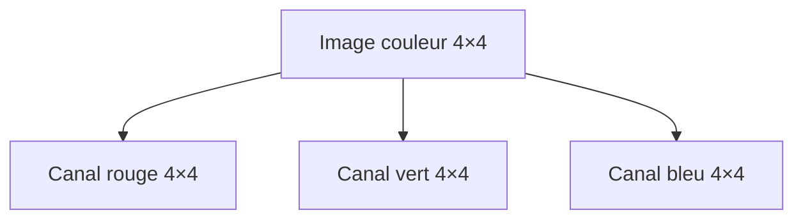
```mermaid
flowchart TD
    A["Image couleur 4×4"] --> B["Canal rouge 4×4"]
    A --> C["Canal vert 4×4"]
    A --> D["Canal bleu 4×4"]
```

Ce qui rend cette représentation particulière, c'est que les pixels voisins sont **structurellement liés** : ils partagent un contexte spatial.

Un pixel isolé ne signifie rien de précis. C'est sa relation avec ses voisins qui contient l'information : une arête, une texture, un contour.

---

### Pourquoi un réseau dense est insuffisant

Un réseau dense classique traite chaque entrée comme un vecteur sans structure.

Si nous prenons une image de 64×64 pixels en RGB, nous obtenons un vecteur de :

$$64 \times 64 \times 3 = 12\,288 \text{ valeurs}$$

Un réseau dense connecté à ce vecteur crée des connexions entre **toutes** les entrées et **tous** les neurones de la couche suivante.

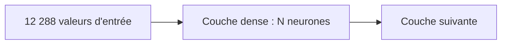
```mermaid
flowchart LR
    A["12 288 valeurs d'entrée"] --> B["Couche dense : N neurones"]
    B --> C["Couche suivante"]
```

Ce type de réseau pose plusieurs problèmes avec des images.

#### Explosion du nombre de paramètres

Une image de 224×224×3 pixels connectée à une couche de 1000 neurones nécessite :

$$224 \times 224 \times 3 \times 1000 = 150\,528\,000 \text{ paramètres}$$

C'est uniquement pour la première couche.

Ce nombre explose très rapidement avec la taille des images.

#### Ignorance de la structure spatiale

Un réseau dense traite chaque pixel indépendamment.

Il ne tire pas parti du fait que des pixels voisins sont probablement liés.

Si nous décalons un objet de quelques pixels, le réseau dense voit une entrée complètement différente.

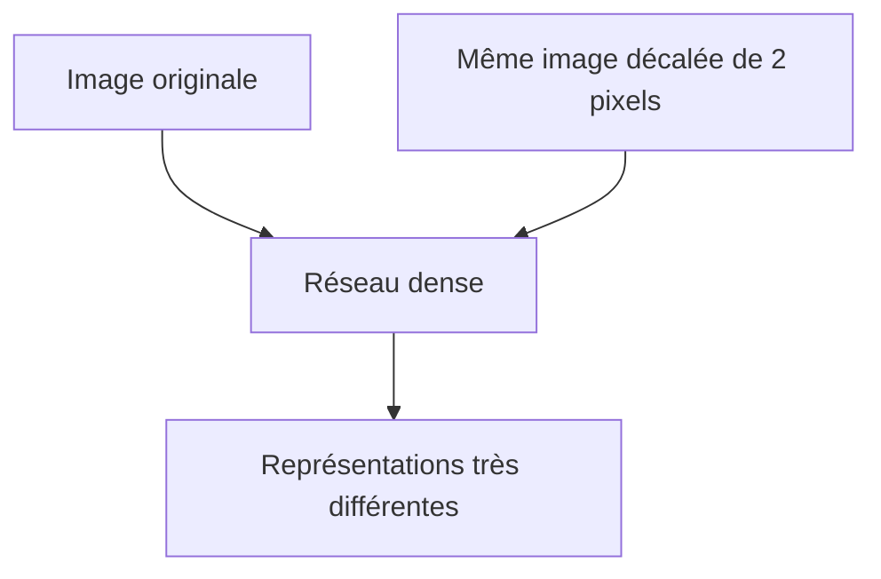
```mermaid
flowchart TD
    A["Image originale"] --> C["Réseau dense"]
    B["Même image décalée de 2 pixels"] --> C
    C --> D["Représentations très différentes"]
```

Cela rend l'apprentissage beaucoup plus coûteux.

#### Absence d'invariance spatiale

Le réseau dense doit apprendre séparément à reconnaître un chat en haut à gauche, en bas à droite, au centre, etc.

Les CNN vont résoudre ces problèmes.

---

### L'idée fondamentale : la convolution

La **convolution** est l'opération centrale d'un CNN.

L'idée est simple :

> Au lieu de connecter chaque neurone à toute l'image, nous appliquons un petit filtre localement, en le faisant glisser sur toute l'image.

Ce filtre est une petite matrice de nombres appris, appelée **noyau** ou **kernel**.

Exemple de filtre 3×3 :

```txt
 1  0 -1
 1  0 -1
 1  0 -1
```

Nous faisons glisser ce filtre sur l'image et calculons, à chaque position, le produit scalaire entre le filtre et la région locale de l'image.

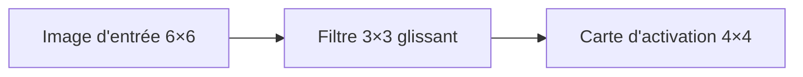
```mermaid
flowchart LR
    A["Image d'entrée 6×6"] --> B["Filtre 3×3 glissant"]
    B --> C["Carte d'activation 4×4"]
```

Ce mécanisme de glissement s'appelle la **convolution discrète** en traitement du signal.

---

### Le calcul d'une convolution

Prenons une image d'entrée simple de 4×4 :

```txt
 1  2  3  4
 5  6  7  8
 9 10 11 12
13 14 15 16
```

Et un filtre 2×2 :

```txt
 1  0
 0 -1
```

Nous appliquons ce filtre en position (1,1), c'est-à-dire sur les pixels :

```txt
 1  2
 5  6
```

Le produit scalaire donne :

$$1 \times 1 + 2 \times 0 + 5 \times 0 + 6 \times (-1) = 1 + 0 + 0 - 6 = -5$$

Nous faisons de même pour toutes les positions valides.

La valeur calculée à chaque position forme la **carte d'activation** (ou *feature map*).

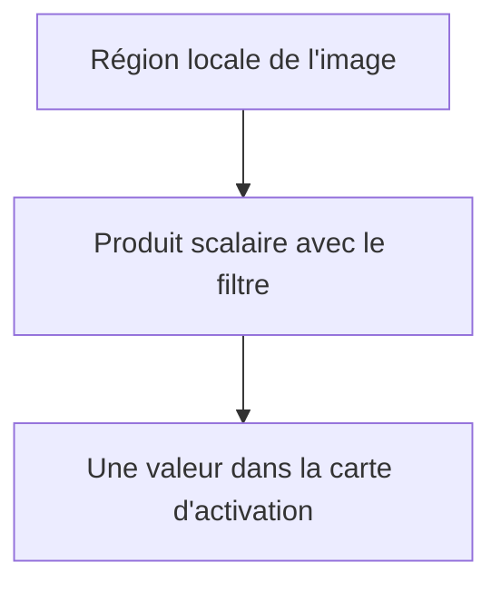
```mermaid
flowchart TD
    A["Région locale de l'image"] --> B["Produit scalaire avec le filtre"]
    B --> C["Une valeur dans la carte d'activation"]
```

---

### La carte d'activation

La **carte d'activation** contient les réponses du filtre à chaque position de l'image.

Si le filtre est conçu pour détecter les bords verticaux, la carte d'activation aura des valeurs élevées là où l'image contient des bords verticaux.

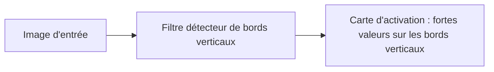
```mermaid
flowchart LR
    A["Image d'entrée"] --> B["Filtre détecteur de bords verticaux"]
    B --> C["Carte d'activation : fortes valeurs sur les bords verticaux"]
```

Un CNN apprend automatiquement les filtres qui lui sont utiles pour la tâche.

Il ne faut pas définir manuellement les filtres : ils sont appris par rétropropagation, exactement comme les poids d'un réseau dense.

---

### Le partage des poids

Un filtre est appliqué à **toutes** les positions de l'image.

Les poids du filtre sont donc partagés dans l'espace, de la même façon que les poids d'un RNN sont partagés dans le temps.

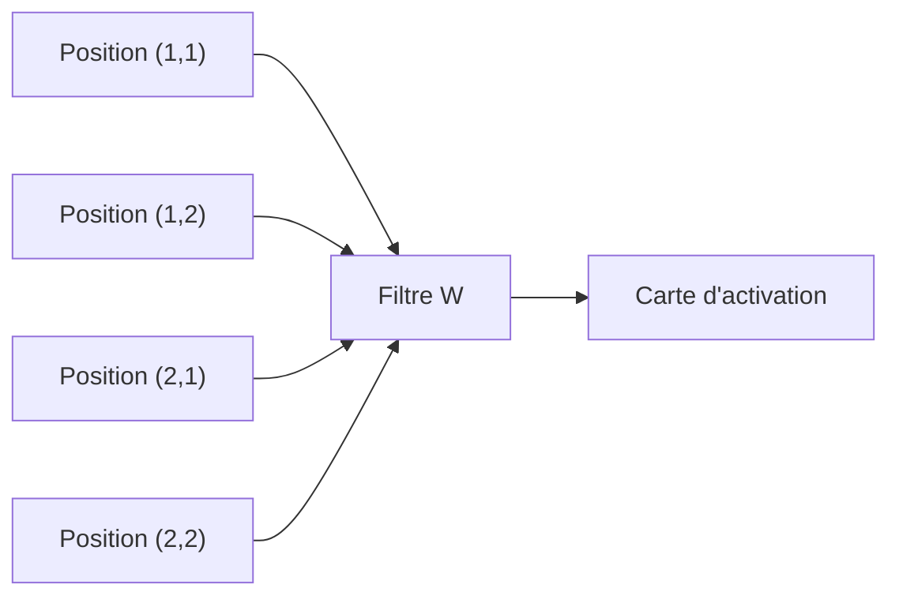
```mermaid
flowchart LR
    A["Position (1,1)"] --> F["Filtre W"]
    B["Position (1,2)"] --> F
    C["Position (2,1)"] --> F
    D["Position (2,2)"] --> F
    F --> E["Carte d'activation"]
```

Ce partage a deux avantages majeurs :

1. le nombre de paramètres est indépendant de la taille de l'image ;

2. si un motif est appris à une position, il est reconnu partout ailleurs dans l'image.

C'est l'**invariance par translation** : le filtre sait reconnaître un motif où qu'il se trouve.

---

### Plusieurs filtres en parallèle

En pratique, une couche de convolution utilise non pas un seul filtre, mais plusieurs filtres en parallèle.

Chaque filtre produit une carte d'activation différente.

Si nous utilisons 32 filtres de taille 3×3, nous obtenons 32 cartes d'activation.

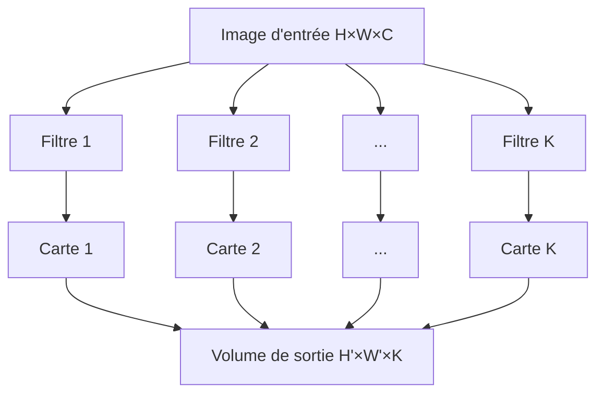
```mermaid
flowchart TD
    A["Image d'entrée H×W×C"] --> B["Filtre 1"]
    A --> C["Filtre 2"]
    A --> D["..."]
    A --> E["Filtre K"]
    B --> F["Carte 1"]
    C --> G["Carte 2"]
    D --> H["..."]
    E --> I["Carte K"]
    F --> J["Volume de sortie H'×W'×K"]
    G --> J
    H --> J
    I --> J
```

L'ensemble des cartes d'activation forme un **volume** de sortie, avec une profondeur égale au nombre de filtres.

---

---

## Chapitre 2 — Géométrie, pooling et champ réceptif

---

### Les dimensions d'une couche de convolution

Notons :

- $H$ la hauteur de l'entrée ;
- $W$ la largeur de l'entrée ;
- $C$ le nombre de canaux de l'entrée ;
- $K$ le nombre de filtres ;
- $F$ la taille du filtre (par exemple 3 pour un filtre 3×3) ;
- $S$ le **stride**, c'est-à-dire le pas de déplacement du filtre ;
- $P$ le **padding**, c'est-à-dire le rembourrage ajouté autour de l'image.

Alors la sortie a les dimensions :

$$H' = \frac{H - F + 2P}{S} + 1$$

$$W' = \frac{W - F + 2P}{S} + 1$$

La sortie a donc la forme $H' \times W' \times K$.

Le nombre de paramètres de cette couche est :

$$F \times F \times C \times K + K$$

où $K$ est le nombre de biais.

---

### Le stride

Le **stride** contrôle le pas de déplacement du filtre.

Avec un stride de 1, le filtre se décale d'un pixel à la fois.

Avec un stride de 2, il se décale de deux pixels à la fois.

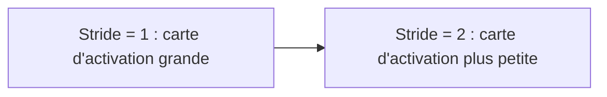
```mermaid
flowchart LR
    A["Stride = 1 : carte d'activation grande"] --> B["Stride = 2 : carte d'activation plus petite"]
```

Un stride plus grand réduit la taille de la sortie et diminue le coût de calcul.

Mais il perd aussi de l'information spatiale fine.

---

### Le padding

Lorsque nous appliquons un filtre, les pixels de bord participent à moins de calculs que les pixels centraux.

Si nous ne faisons rien, la carte d'activation est plus petite que l'entrée.

Le **padding** consiste à ajouter une bordure de zéros autour de l'image.

```txt
Entrée originale 4×4 avec padding=1 :

0  0  0  0  0  0
0  1  2  3  4  0
0  5  6  7  8  0
0  9 10 11 12  0
0 13 14 15 16  0
0  0  0  0  0  0
```

Cela permet de conserver les dimensions spatiales entre l'entrée et la sortie (*same padding*), ou de contrôler finement la réduction.

---

### La fonction d'activation

Après la convolution, nous appliquons une **fonction d'activation non linéaire** à chaque valeur de la carte d'activation.

La plus utilisée est la **ReLU** (*Rectified Linear Unit*) :

$$\text{ReLU}(x) = \max(0, x)$$

Elle met à zéro toutes les valeurs négatives.

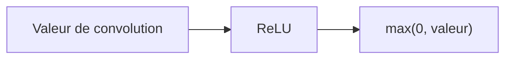
```mermaid
flowchart LR
    A["Valeur de convolution"] --> B["ReLU"]
    B --> C["max(0, valeur)"]
```

Sans cette non-linéarité, empiler plusieurs couches de convolution ne serait pas plus puissant qu'une seule couche.

La ReLU est simple, efficace et évite certains problèmes de gradient.

---

### L'opération de pooling

Après une ou plusieurs couches de convolution, on insère souvent une couche de **pooling**.

Le pooling réduit les dimensions spatiales de la carte d'activation.

#### Max pooling

Le **max pooling** découpe la carte d'activation en régions et garde la valeur maximale de chaque région.

Exemple avec un max pooling 2×2 et stride 2 sur une carte 4×4 :

```txt
Carte d'activation :
 1  3  2  4
 5  6  7  8
 9  2  3  4
 1  8  7  6

Résultat max pooling 2×2 :
 6  8
 9  7
```

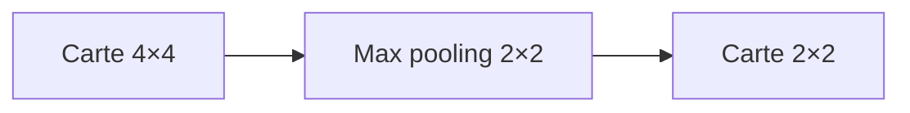
```mermaid
flowchart LR
    A["Carte 4×4"] --> B["Max pooling 2×2"]
    B --> C["Carte 2×2"]
```

#### Average pooling

L'**average pooling** calcule la moyenne de chaque région plutôt que le maximum.

#### Rôle du pooling

Le pooling sert à :

- réduire la taille des cartes d'activation ;

- diminuer le nombre de calculs ;

- rendre les représentations légèrement invariantes aux petites translations.

---

### Architecture générale d'un CNN

Un CNN classique s'organise en deux parties principales.

#### La partie extraction de caractéristiques

Cette partie est composée de couches alternant convolution, activation et pooling.

Elle transforme l'image d'entrée en une représentation de plus en plus abstraite.

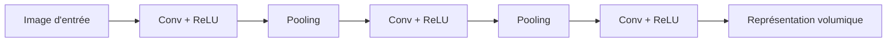
```mermaid
flowchart LR
    A["Image d'entrée"] --> B["Conv + ReLU"]
    B --> C["Pooling"]
    C --> D["Conv + ReLU"]
    D --> E["Pooling"]
    E --> F["Conv + ReLU"]
    F --> G["Représentation volumique"]
```

#### La partie classification

À la fin des couches convolutives, on **aplatit** le volume de caractéristiques en un vecteur.

Ce vecteur est ensuite traité par des couches denses classiques, qui produisent la prédiction finale.

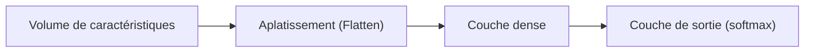
```mermaid
flowchart LR
    A["Volume de caractéristiques"] --> B["Aplatissement (Flatten)"]
    B --> C["Couche dense"]
    C --> D["Couche de sortie (softmax)"]
```

---

### Ce que les couches apprennent

Les couches profondes d'un CNN n'apprennent pas toutes les mêmes choses.

Il existe une hiérarchie de représentations.

#### Premières couches

Les premières couches apprennent des **motifs simples et locaux** :

- bords ;

- coins ;

- couleurs simples ;

- textures de base.

#### Couches intermédiaires

Les couches intermédiaires combinent ces motifs pour former des **motifs plus complexes** :

- yeux, oreilles ;

- roues, fenêtres ;

- formes géométriques.

#### Couches profondes

Les couches profondes apprennent des **représentations sémantiques** :

- visage complet ;

- voiture entière ;

- type de scène.

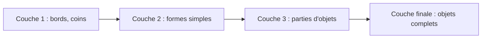
```mermaid
flowchart LR
    A["Couche 1 : bords, coins"] --> B["Couche 2 : formes simples"]
    B --> C["Couche 3 : parties d'objets"]
    C --> D["Couche finale : objets complets"]
```

Cette hiérarchie est une des raisons du succès des CNN : ils apprennent une représentation de plus en plus abstraite de façon automatique.

---

### Exemple : classification d'images

Prenons une tâche classique : reconnaître si une image contient un chat ou un chien.

```txt
Entrée : image 224×224×3
```

Un CNN peut être organisé ainsi :

```txt
Conv 3×3, 32 filtres → ReLU → MaxPool 2×2
Conv 3×3, 64 filtres → ReLU → MaxPool 2×2
Conv 3×3, 128 filtres → ReLU → MaxPool 2×2
Flatten
Dense 256 → ReLU
Dense 2 → Softmax
```

À chaque couche de convolution, le réseau détecte des caractéristiques de plus en plus complexes.

À la fin, le vecteur dense est projeté sur deux classes.

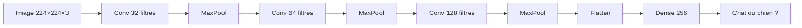
```mermaid
flowchart LR
    A["Image 224×224×3"] --> B["Conv 32 filtres"]
    B --> C["MaxPool"]
    C --> D["Conv 64 filtres"]
    D --> E["MaxPool"]
    E --> F["Conv 128 filtres"]
    F --> G["MaxPool"]
    G --> H["Flatten"]
    H --> I["Dense 256"]
    I --> J["Chat ou chien ?"]
```

---

### Comparaison réseau dense vs CNN

Résumons la différence fondamentale :

| Critère | Réseau dense | CNN |
|---|---|---|
| Connexions | Toutes les entrées | Région locale (filtre) |
| Poids | Un par connexion | Partagés sur toute l'image |
| Structure spatiale | Ignorée | Exploitée |
| Invariance à la translation | Non | Oui (partielle) |
| Nombre de paramètres | Très élevé | Bien plus faible |

---

### Limites des CNN classiques

Les CNN ont des limites importantes.

#### Invariance globale non garantie

Le max pooling donne une invariance locale aux petites translations.

Mais un objet très décalé ou tourné peut ne pas être reconnu.

#### Taille d'entrée fixe

Les couches denses en fin de réseau exigent souvent une taille d'entrée fixe.

#### Données séquentielles

Les CNN sont bien adaptés aux données spatiales, mais moins aux données séquentielles (texte, parole, séries temporelles).

Pour ces cas, les RNN et leurs dérivés offrent une meilleure inductive bias.

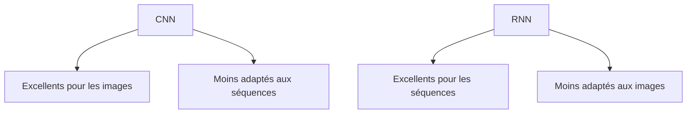
```mermaid
flowchart TD
    A["CNN"] --> B["Excellents pour les images"]
    A --> C["Moins adaptés aux séquences"]
    D["RNN"] --> E["Excellents pour les séquences"]
    D --> F["Moins adaptés aux images"]
```

---

---

### Le champ récepteur

Le **champ récepteur** d'un neurone dans une couche intermédiaire est la région de l'image d'entrée qui influence sa valeur.

Pour un neurone de la première carte d'activation avec un filtre 3×3, le champ récepteur est 3×3.

Mais pour un neurone de la deuxième couche de convolution (avec encore un filtre 3×3), chaque position couvrait déjà 3×3 pixels.

Donc le champ récepteur dans l'image d'entrée est maintenant :

$$(3-1) + 3 = 5 \times 5$$

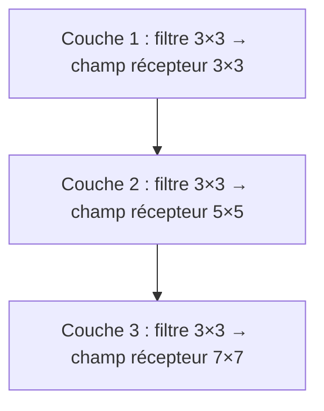
```mermaid
flowchart TD
    A["Couche 1 : filtre 3×3 → champ récepteur 3×3"]
    B["Couche 2 : filtre 3×3 → champ récepteur 5×5"]
    C["Couche 3 : filtre 3×3 → champ récepteur 7×7"]
    A --> B --> C
```

En empilant des couches, le champ récepteur grandit.

Les couches profondes voient donc une plus grande région de l'image.

C'est une façon d'extraire des informations globales sans augmenter la taille des filtres.

---

### Formule du champ récepteur

Pour $L$ couches de convolution avec des filtres de taille $F$ et un stride de 1, le champ récepteur est :

$$r_L = 1 + L \times (F - 1)$$

Avec $L=3$ couches et $F=3$ :

$$r_3 = 1 + 3 \times 2 = 7$$

Si nous ajoutons un stride $S > 1$, le champ récepteur grandit encore plus vite.

---

### Convolutions dilatées

Une façon d'augmenter le champ récepteur sans ajouter de couches est d'utiliser des **convolutions dilatées** (ou *atrous convolutions*).

L'idée est d'espacer les entrées du filtre avec un facteur de dilatation $d$.

Avec $d=1$ (standard) :

```txt
x x x
x x x
x x x
```

Avec $d=2$ (dilatation) :

```txt
x . x . x
. . . . .
x . x . x
. . . . .
x . x . x
```

Le filtre couvre une région plus grande de l'entrée, mais avec le même nombre de paramètres.

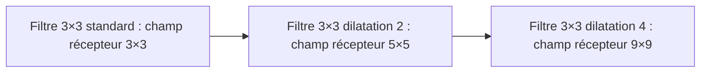
```mermaid
flowchart LR
    A["Filtre 3×3 standard : champ récepteur 3×3"] --> B["Filtre 3×3 dilatation 2 : champ récepteur 5×5"]
    B --> C["Filtre 3×3 dilatation 4 : champ récepteur 9×9"]
```

Les convolutions dilatées sont très utilisées pour des tâches de segmentation sémantique (comme dans DeepLab).

---

### Convolutions depthwise et pointwise

Dans les architectures modernes légères, on distingue souvent deux types de convolutions.

#### Convolution depthwise

La **convolution depthwise** applique un filtre séparé à chaque canal d'entrée, sans mélanger les canaux.

Pour une entrée de dimensions $H \times W \times C$, elle produit une sortie de dimensions $H' \times W' \times C$.

Chaque canal est traité indépendamment.

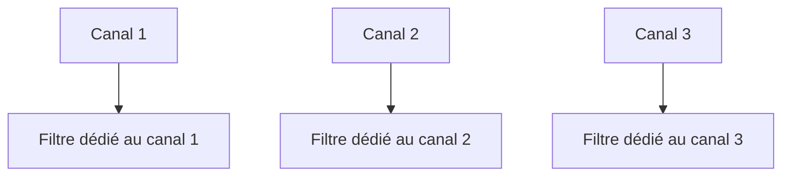
```mermaid
flowchart TD
    A["Canal 1"] --> B["Filtre dédié au canal 1"]
    C["Canal 2"] --> D["Filtre dédié au canal 2"]
    E["Canal 3"] --> F["Filtre dédié au canal 3"]
```

#### Convolution pointwise

La **convolution pointwise** est une convolution 1×1 qui mélange les canaux.

Elle combine les informations de tous les canaux en chaque position spatiale.

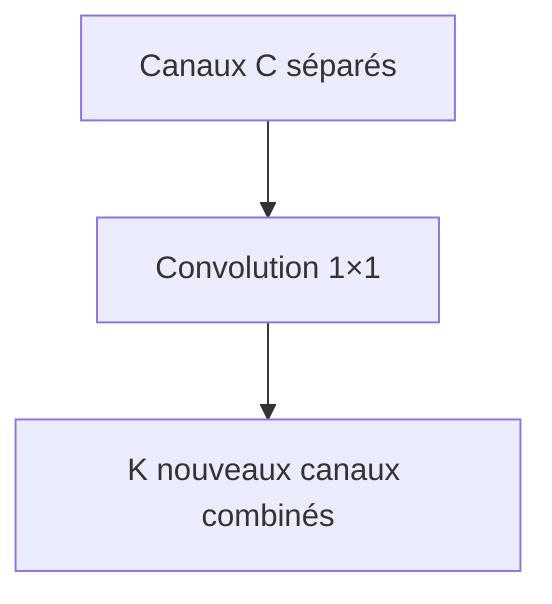
```mermaid
flowchart TD
    A["Canaux C séparés"] --> B["Convolution 1×1"]
    B --> C["K nouveaux canaux combinés"]
```

#### Convolution separable en profondeur

La combinaison depthwise + pointwise est appelée **separable depthwise convolution**.

Elle réduit le nombre de paramètres et de calculs tout en maintenant une expressivité comparable.

C'est le cœur des architectures légères comme **MobileNet**.

---

### CNN appliqués aux séquences

Les CNN ne sont pas limités aux images bidimensionnelles.

Ils peuvent aussi être appliqués à des séquences avec des convolutions 1D.

#### Convolution 1D

Au lieu de glisser un filtre sur une grille 2D, on le glisse sur une séquence 1D.

Exemple : une phrase de $T$ tokens, chacun représenté par un vecteur de dimension $d$.

```txt
Entrée : T × d
Filtre : F × d × K
Sortie : T' × K
```

```mermaid
flowchart LR
    A["Séquence T×d"] --> B["Filtre 1D de taille F"]
    B --> C["K cartes d'activation T'×K"]
```

#### Avantage des CNN sur les séquences

Les convolutions 1D sur des séquences présentent un avantage important par rapport aux RNN : elles sont **parallélisables**.

Toutes les positions peuvent être calculées en même temps.

```mermaid
flowchart LR
    A["RNN : calcul séquentiel h_1 → h_2 → h_3"]
    B["CNN 1D : calcul parallèle de toutes les positions"]
```

Mais les CNN 1D ont une limite : le champ récepteur est local et de taille fixe.

Pour capturer des dépendances très longues, il faudrait soit de nombreuses couches, soit des filtres très larges.

---

---

### Champ réceptif théorique vs effectif

Même si une architecture peut théoriquement utiliser une grande zone, les contributions réelles ne sont pas uniformes.

Il faut distinguer :

- champ réceptif théorique ;
- champ réceptif effectif ;
- contexte réellement exploité par le modèle.

### Équivariance et invariance

La convolution est approximativement **équivariante à la translation** : déplacer l'entrée déplace la carte produite.

L'invariance demande davantage : pooling, agrégation globale, augmentation de données ou structure de tâche.

Ne pas confondre :

```text
équivariance : transformation entrée → transformation sortie
invariance   : transformation entrée → sortie identique
```

---

---

## Chapitre 3 — Blocs et architectures CNN modernes

---

### Activation

Les activations fréquentes incluent :

- ReLU ;
- GELU ;
- SiLU/Swish.

ReLU reste une excellente référence simple :

$$
\operatorname{ReLU}(x)=\max(0,x)
$$

### Pooling

Le pooling réduit la résolution.

#### Max pooling

Conserve la valeur maximale d'une fenêtre.

#### Average pooling

Conserve la moyenne.

#### Global average pooling

Produit une valeur par canal :

```python
import torch.nn as nn

pool = nn.AdaptiveAvgPool2d((1, 1))
```

Il évite souvent une énorme couche dense en fin de CNN.

### Batch Normalization

`BatchNorm2d` normalise les activations à partir des statistiques du batch pendant l'entraînement et utilise des statistiques accumulées à l'évaluation.

```python
block = nn.Sequential(
    nn.Conv2d(64, 64, 3, padding=1, bias=False),
    nn.BatchNorm2d(64),
    nn.ReLU(inplace=True),
)
```

> [!warning]
> Toujours utiliser `model.eval()` en évaluation. Sinon BatchNorm et Dropout conservent leur comportement d'entraînement.

### GroupNorm et LayerNorm

BatchNorm peut être moins pratique lorsque le batch est très petit.

Alternatives :

- GroupNorm ;
- LayerNorm ;
- RMSNorm dans d'autres familles d'architectures.

ConvNeXt a notamment contribué à populariser des blocs convolutionnels modernisés utilisant LayerNorm.

### Dropout

Dropout désactive aléatoirement des activations pendant l'entraînement.

Il n'est pas systématiquement nécessaire dans tous les CNN modernes ; augmentation, weight decay, architecture et volume de données peuvent jouer un rôle plus important.

### Connexions résiduelles

Un bloc résiduel apprend :

$$
y = F(x) + x
$$

plutôt que seulement $F(x)$.

Cette idée a permis d'entraîner des CNN très profonds.

```mermaid
flowchart LR
    X[x] --> F[F(x)]
    X --> ADD((+))
    F --> ADD
    ADD --> Y[y]
```

### Bottleneck

Un bloc bottleneck peut utiliser :

```text
1×1 réduction
   ↓
3×3 spatial
   ↓
1×1 expansion
```

L'objectif est de concentrer le calcul spatial sur une représentation moins coûteuse.

### Squeeze-and-Excitation et attention de canaux

Un module SE calcule une importance dynamique par canal.

Il illustre une idée générale : l'attention n'est pas réservée aux Transformers. Des mécanismes d'attention peuvent être insérés dans des CNN.

---

---

### Pourquoi connaître les familles historiques ?

L'objectif n'est pas de mémoriser chaque détail, mais de voir comment les idées ont évolué.

| Architecture | Idée marquante |
|---|---|
| LeNet | CNN classique précoce |
| AlexNet | GPU, ReLU, deep CNN à grande échelle |
| VGG | Empilement régulier de 3×3 |
| Inception | Branches multi-échelles |
| ResNet | Connexions résiduelles |
| DenseNet | Connexions denses entre blocs |
| MobileNet | Depthwise separable convolutions |
| EfficientNet | Scaling coordonné |
| ConvNeXt | Modernisation des ConvNets après les ViT |

### ResNet

ResNet reste une excellente architecture pédagogique et un backbone très utilisé.

La connexion résiduelle facilite la circulation du gradient.

```python
class ResidualBlock(nn.Module):
    def __init__(self, channels: int):
        super().__init__()
        self.net = nn.Sequential(
            nn.Conv2d(channels, channels, 3, padding=1, bias=False),
            nn.BatchNorm2d(channels),
            nn.ReLU(inplace=True),
            nn.Conv2d(channels, channels, 3, padding=1, bias=False),
            nn.BatchNorm2d(channels),
        )
        self.act = nn.ReLU(inplace=True)

    def forward(self, x):
        return self.act(x + self.net(x))
```

### MobileNet

MobileNet vise l'efficacité sur appareils contraints.

Idées centrales :

- depthwise separable convolution ;
- bottlenecks ;
- faible coût mémoire/compute ;
- adaptation mobile/edge.

### EfficientNet

EfficientNet étudie le compromis entre :

- profondeur ;
- largeur ;
- résolution.

Leçon générale : augmenter uniquement la profondeur n'est pas toujours le meilleur scaling.

### ConvNeXt

ConvNeXt montre qu'un CNN pur peut intégrer de nombreuses pratiques popularisées dans l'ère des Vision Transformers :

- grands kernels depthwise ;
- normalisation adaptée ;
- blocs résiduels modernisés ;
- stratégies d'entraînement contemporaines.

ConvNeXt V2 ajoute notamment un apprentissage auto-supervisé par masked autoencoding et une couche Global Response Normalization.

> [!note]
> Les Vision Transformers ont changé la vision moderne, mais ils n'ont pas rendu les CNN inutiles. Les ConvNets restent pertinents pour l'edge, l'efficacité, certains backbones et de nombreux systèmes hybrides.

---

---

## Chapitre 4 — Tâches et entraînement d'un CNN

---

### Classification

Une architecture simple :

```text
image
 ↓
backbone CNN
 ↓
global average pooling
 ↓
linear
 ↓
classes
```

Pour une classification multi-classe avec logits :

```python
loss_fn = nn.CrossEntropyLoss()
```

Ne pas appliquer manuellement `softmax` avant `CrossEntropyLoss`.

### Détection d'objets

Une détection prédit au minimum :

- classe ;
- boîte englobante ;
- score.

Familles historiques/modernes :

- Faster R-CNN ;
- RetinaNet ;
- YOLO ;
- DETR et variantes Transformer.

Le backbone peut rester convolutionnel même si la tête utilise d'autres mécanismes.

### Segmentation

Chaque pixel reçoit une classe ou une représentation.

U-Net est un exemple fondamental :

```text
encodeur ↓
    bottleneck
     ↑ décodeur
skip connections
```

Les connexions latérales préservent l'information spatiale fine.

### CNN 1D

Une convolution 1D convient à :

- signaux ;
- audio ;
- séries temporelles ;
- séquences de caractéristiques.

```python
conv = nn.Conv1d(in_channels=16, out_channels=64, kernel_size=5)
```

La shape PyTorch attend typiquement :

```text
(N, C, L)
```

### CNN 3D

`Conv3d` peut traiter :

- volumes médicaux ;
- données voxel ;
- clips vidéo courts.

Le coût mémoire augmente rapidement.

### Temporal Convolutional Network

Une TCN peut utiliser :

- convolutions 1D causales ;
- dilation ;
- résidus.

Elle offre un traitement parallèle pendant l'entraînement, contrairement à un RNN récurrent classique.

---

---

### Prétraitement

Un pipeline doit distinguer :

```text
train transforms ≠ validation transforms
```

En validation/test, éviter les transformations aléatoires modifiant l'étiquette ou rendant la métrique instable.

### Data augmentation

Exemples :

- random crop ;
- flip ;
- rotation raisonnable ;
- color jitter ;
- MixUp ;
- CutMix ;
- Random Erasing.

Le choix dépend du domaine. Retourner horizontalement une radiographie ou un chiffre peut changer le sens.

### Transfer learning

Souvent, il vaut mieux partir d'un backbone pré-entraîné.

```python
from torchvision.models import resnet50, ResNet50_Weights

weights = ResNet50_Weights.DEFAULT
model = resnet50(weights=weights)
```

Les poids TorchVision exposent aussi les transformations attendues :

```python
preprocess = weights.transforms()
```

Avantages :

- convergence plus rapide ;
- moins de données nécessaires ;
- meilleure représentation initiale.

### Freeze puis fine-tuning

Approche simple :

1. remplacer la tête ;
2. entraîner la tête ;
3. débloquer progressivement le backbone ;
4. utiliser éventuellement un learning rate plus faible pour les couches pré-entraînées.

### Déséquilibre des classes

Options :

- pondération de la loss ;
- sampler équilibré ;
- augmentation ;
- focal loss selon la tâche ;
- métriques macro plutôt que seule accuracy globale.

### Fuite de données

Une augmentation ou normalisation calculée à partir de tout le dataset peut introduire une fuite.

Séparer d'abord :

```text
train / validation / test
```

puis ajuster tout prétraitement appris uniquement sur `train`.

---

---

# Partie II — Réseaux récurrents (RNN)

---

## Chapitre 5 — Principe de la récurrence

---

### Rappel : une séquence se lit étape par étape

Un RNN traite une séquence dans l’ordre.

Prenons la phrase :

```txt
Le chat dort sur le canapé.
```

Après tokenisation, nous pouvons obtenir :

```txt
["Le", "chat", "dort", "sur", "le", "canapé", "."]
```

Le RNN lit alors les tokens un par un :

```txt
Le → chat → dort → sur → le → canapé → .
```

À chaque étape, il met à jour une représentation interne que nous appelons **état caché**.

```mermaid
flowchart LR
    X1["Le"] --> R1["RNN"]
    R1 --> R2["RNN"]
    X2["chat"] --> R2
    R2 --> R3["RNN"]
    X3["dort"] --> R3
    R3 --> R4["RNN"]
    X4["sur"] --> R4
    R4 --> R5["RNN"]
    X5["le canapé"] --> R5
    R5 --> H["Représentation finale"]
```

Nous pouvons donc voir le RNN comme un lecteur qui avance dans la phrase en gardant une mémoire de ce qu’il a déjà lu.

---

### La cellule RNN

Le cœur d’un RNN est la **cellule récurrente**.

À chaque position $t$, cette cellule reçoit deux informations :

1. l’entrée actuelle $x_t$ ;

2. l’état caché précédent $h_{t-1}$.


Elle produit ensuite :

1. un nouvel état caché $h_t$ ;

2. éventuellement une sortie $y_t$.


```mermaid
flowchart TD
    A["Entrée actuelle x_t"] --> C["Cellule RNN"]
    B["État précédent h_(t-1)"] --> C
    C --> D["Nouvel état h_t"]
    C --> E["Sortie éventuelle y_t"]
```

L’idée est très importante :

> Le RNN ne regarde pas seulement le token actuel. Il regarde aussi une mémoire de ce qui a été lu avant.

C’est ce qui distingue un RNN d’un simple réseau dense appliqué indépendamment à chaque mot.

---

### La formule fondamentale

Mathématiquement, nous pouvons écrire :


$$h_t = f(x_t, h_{t-1})$$

où :

- $x_t$ est l’entrée au temps $t$ ;

- $h_{t-1}$ est l’état caché précédent ;

- $h_t$ est le nouvel état caché ;

-$f$est une fonction apprise par le réseau.


Cette formule dit simplement :

> Le nouvel état dépend à la fois de l’entrée actuelle et de la mémoire précédente.

Dans un RNN classique, on utilise souvent une formule de ce type :

$$h_t = \tanh(W_x x_t + W_h h_{t-1} + b)$$

où :

- $W_x$ est la matrice de poids appliquée à l’entrée actuelle ;

- $W_h$ est la matrice de poids appliquée à l’état précédent ;

- $b$ est un biais ;

- $\tanh$ est une fonction d’activation non linéaire.


Nous pouvons la lire ainsi :

```txt
nouvel état = activation(entrée transformée + mémoire transformée + biais)
```

---

### Exemple intuitif avec une phrase

Prenons la phrase :

```txt
Le chat dort.
```

Nous pouvons noter :

```txt
x1 = "Le"
x2 = "chat"
x3 = "dort"
x4 = "."
```

Le RNN calcule successivement :

$$h_1 = f(x_1, h_0)$$

$$h_2 = f(x_2, h_1)$$

$$h_3 = f(x_3, h_2)$$

$$h_4 = f(x_4, h_3)$$

L’état initial (h_0) est souvent un vecteur de zéros ou un vecteur appris.

```mermaid
flowchart LR
    H0["h0 mémoire initiale"] --> R1["RNN"]
    X1["x1 = Le"] --> R1
    R1 --> H1["h1"]

    H1 --> R2["RNN"]
    X2["x2 = chat"] --> R2
    R2 --> H2["h2"]

    H2 --> R3["RNN"]
    X3["x3 = dort"] --> R3
    R3 --> H3["h3"]

    H3 --> R4["RNN"]
    X4["x4 = ."] --> R4
    R4 --> H4["h4"]
```

Chaque état contient donc une représentation partielle de la séquence lue jusqu’ici.

---

### Ce que contient l’état caché

L’état caché $h_t$ est un vecteur.

Il ne contient pas les mots sous forme lisible.

Il contient une représentation numérique apprise.

Par exemple, après avoir lu :

```txt
Le chat
```

l’état caché peut contenir implicitement des informations comme :

- nous parlons probablement d’un animal ;

- le sujet est au singulier ;

- une action peut suivre ;

- le contexte grammatical est en cours de construction.


Évidemment, le modèle ne stocke pas ces informations sous forme de phrases humaines. Il les encode dans des nombres.

Nous pouvons représenter cela ainsi :

```mermaid
flowchart TD
    A["Tokens déjà lus : Le chat"] --> B["État caché h_t"]
    B --> C["Informations grammaticales"]
    B --> D["Informations sémantiques"]
    B --> E["Contexte partiel"]
```

L’état caché est donc une forme de mémoire compressée.

---

### RNN déroulé dans le temps

Quand nous dessinons un RNN, nous pouvons le représenter de deux façons.

La première est compacte :

```mermaid
flowchart TD
    X["Entrée x_t"] --> R["Cellule RNN"]
    Hprev["h_(t-1)"] --> R
    R --> H["h_t"]
```

Mais pour comprendre son traitement d’une séquence, nous le **déroulons dans le temps**.

```mermaid
flowchart LR
    X1["x1"] --> R1["RNN"]
    H0["h0"] --> R1
    R1 --> H1["h1"]

    X2["x2"] --> R2["RNN"]
    H1 --> R2
    R2 --> H2["h2"]

    X3["x3"] --> R3["RNN"]
    H2 --> R3
    R3 --> H3["h3"]

    X4["x4"] --> R4["RNN"]
    H3 --> R4
    R4 --> H4["h4"]
```

Il faut bien comprendre que les cellules dessinées (R1), (R2), (R3), (R4) représentent généralement **la même cellule RNN réutilisée à chaque étape**.

Autrement dit, les poids sont partagés dans le temps.

---

### Partage des poids dans le temps

Un RNN n’apprend pas une matrice différente pour chaque position.

Il utilise les mêmes poids à chaque étape.

Cela signifie que la même transformation est appliquée à :

```txt
x1 avec h0
x2 avec h1
x3 avec h2
x4 avec h3
```

```mermaid
flowchart LR
    A["Étape 1 : mêmes poids W"] --> B["Étape 2 : mêmes poids W"]
    B --> C["Étape 3 : mêmes poids W"]
    C --> D["Étape 4 : mêmes poids W"]
```

Ce partage des poids a deux avantages :

1. le modèle peut traiter des séquences de longueurs variables ;

2. le nombre de paramètres ne dépend pas directement de la longueur de la séquence.


C’est une idée élégante : nous apprenons une règle générale de mise à jour de la mémoire, puis nous l’appliquons autant de fois que nécessaire.

---

### Dimensions dans un RNN

Supposons que chaque token soit représenté par un embedding de dimension :

$$d_{input}$$

et que l’état caché ait une dimension :

$$d_{hidden}$$

Alors :

$$x_t \in \mathbb{R}^{d_{input}}$$

$$h_t \in \mathbb{R}^{d_{hidden}}$$

La matrice $W_x$ transforme l’entrée vers l’espace caché :

$$W_x \in \mathbb{R}^{d_{hidden} \times d_{input}}$$

La matrice $W_h$ transforme l’état précédent vers le nouvel état caché :

$$W_h \in \mathbb{R}^{d_{hidden} \times d_{hidden}}$$

La formule complète est donc :

$$h_t = \tanh(W_x x_t + W_h h_{t-1} + b)$$

avec :

$$b \in \mathbb{R}^{d_{hidden}}$$

Nous devons retenir que l’état caché est un vecteur de taille fixe, même si la séquence est longue.

C’est un point qui deviendra important pour comprendre les limites des RNN.

---

### Sortie à chaque étape ou sortie finale

Un RNN peut être utilisé de plusieurs manières.

#### Sortie finale uniquement

Pour une tâche de classification de phrase, nous pouvons utiliser uniquement le dernier état caché.

Exemple :

```txt
Phrase : Ce film est excellent.
Tâche : sentiment positif ou négatif
```

```mermaid
flowchart LR
    X1["Ce"] --> R1["RNN"]
    R1 --> R2["RNN"]
    X2["film"] --> R2
    R2 --> R3["RNN"]
    X3["est"] --> R3
    R3 --> R4["RNN"]
    X4["excellent"] --> R4
    R4 --> C["Classification positive/négative"]
```

Ici, le dernier état doit résumer toute la phrase.

---

#### Sortie à chaque étape

Pour une tâche d’étiquetage de séquence, nous pouvons produire une sortie à chaque token.

Exemple :

```txt
Phrase : Marie habite Paris.
Tâche : reconnaissance d'entités nommées
```

Nous voulons prédire :

```txt
Marie  → PERSONNE
habite → O
Paris  → LIEU
```

```mermaid
flowchart LR
    X1["Marie"] --> R1["RNN"]
    R1 --> Y1["PERSONNE"]
    R1 --> R2["RNN"]

    X2["habite"] --> R2
    R2 --> Y2["O"]
    R2 --> R3["RNN"]

    X3["Paris"] --> R3
    R3 --> Y3["LIEU"]
```

Dans ce cas, chaque état caché sert à produire une prédiction locale.

---

### Les grandes configurations des RNN

Nous pouvons classer les usages des RNN selon la forme de l’entrée et de la sortie.

#### One-to-one

Un seul input donne un seul output.

Ce n’est pas vraiment le cas typique des RNN, mais cela correspond à un réseau classique.

```mermaid
flowchart LR
    A["Entrée"] --> B["Modèle"] --> C["Sortie"]
```

---

#### One-to-many

Une seule entrée produit une séquence.

Exemple : génération de légende d’image.

```mermaid
flowchart LR
    A["Image"] --> B["RNN Decoder"]
    B --> C["Un"]
    C --> D["chat"]
    D --> E["dort"]
```

---

#### Many-to-one

Une séquence produit une seule sortie.

Exemple : classification de sentiment.

```mermaid
flowchart LR
    A["Ce"] --> B["film"] --> C["est"] --> D["excellent"]
    D --> E["Sentiment positif"]
```

---

#### Many-to-many aligné

Une séquence produit une sortie à chaque position.

Exemple : étiquetage grammatical.

```mermaid
flowchart LR
    A["Le"] --> A2["DET"]
    B["chat"] --> B2["NOM"]
    C["dort"] --> C2["VERBE"]
```

---

#### Many-to-many non aligné

Une séquence produit une autre séquence de longueur différente.

Exemple : traduction automatique.

```mermaid
flowchart LR
    A["I love cats"] --> B["Encoder RNN"]
    B --> C["Decoder RNN"]
    C --> D["J'aime les chats"]
```

Cette dernière configuration a joué un rôle central avant les Transformers.

---

### Le RNN comme mémoire compressée

Nous pouvons maintenant formuler une idée essentielle :

> Dans un RNN, l’état caché est une mémoire compressée de tous les tokens précédents.

Après avoir lu une longue phrase, le dernier état doit contenir les informations nécessaires à la tâche.

Prenons :

```txt
Le livre que Paul a acheté hier dans une petite librairie du centre-ville est passionnant.
```

Si nous voulons classifier cette phrase ou la traduire, le dernier état doit contenir beaucoup d’informations :

- le sujet principal : `Le livre` ;

- l’action secondaire : `Paul a acheté` ;

- le lieu : `librairie du centre-ville` ;

- le prédicat principal : `est passionnant`.


```mermaid
flowchart TD
    A["Phrase longue"] --> B["RNN"]
    B --> C["Dernier état caché"]
    C --> D["Résumé compressé de toute la phrase"]
```

Le problème est que cette mémoire a une taille fixe.

Même si la phrase contient 10 tokens, 100 tokens ou 1000 tokens, l’état caché garde la même dimension.

---

### Pourquoi cette mémoire est limitée

La limite principale vient du fait que l’information est transmise étape après étape.

Si une information importante apparaît au début de la séquence, elle doit survivre à toutes les mises à jour successives.

```mermaid
flowchart LR
    A["Information importante au début"] --> B["Étape 1"]
    B --> C["Étape 2"]
    C --> D["Étape 3"]
    D --> E["..."]
    E --> F["Étape 50"]
    F --> G["Utilisation finale"]
```

À chaque étape, le modèle peut modifier, écraser ou diluer cette information.

C’est un peu comme si nous devions retenir une phrase longue tout en recevant constamment de nouveaux mots.

Certaines informations anciennes peuvent se perdre.

---

### Exemple de dépendance longue

Prenons la phrase :

```txt
Les clés que mon frère a laissées hier dans la voiture de notre voisin sont sur la table.
```

Le verbe `sont` dépend du sujet `Les clés`.

Mais entre les deux, nous avons une longue proposition relative :

```txt
que mon frère a laissées hier dans la voiture de notre voisin
```

Pour comprendre correctement la phrase, le modèle doit conserver l’information :

```txt
sujet = Les clés
nombre = pluriel
```

jusqu’au mot :

```txt
sont
```

```mermaid
flowchart LR
    A["Les clés"] -. "information à conserver : pluriel" .-> G["sont"]
    B["mon frère"] --> C["a laissées"]
    C --> D["hier"]
    D --> E["dans la voiture"]
    E --> F["de notre voisin"]
    F --> G
```

Un RNN peut théoriquement apprendre cette dépendance.

Mais en pratique, plus la distance augmente, plus cela devient difficile.

---

### Le problème du gradient

Pour apprendre, un réseau de neurones utilise la rétropropagation.

Dans un RNN, comme la même cellule est répétée dans le temps, nous devons rétropropager l’erreur à travers toutes les étapes.

C’est ce que nous appelons la **Backpropagation Through Time**, ou **BPTT**.

```mermaid
flowchart RL
    L["Erreur finale"] --> H5["h5"]
    H5 --> H4["h4"]
    H4 --> H3["h3"]
    H3 --> H2["h2"]
    H2 --> H1["h1"]
```

Le problème est que le gradient peut :

- devenir très petit ;

- devenir très grand.


Nous parlons alors de :

- **vanishing gradient** : gradient qui disparaît ;

- **exploding gradient** : gradient qui explose.


---

### Vanishing gradient

Le **vanishing gradient** se produit quand le signal d’apprentissage devient de plus en plus faible en remontant dans le temps.

Conséquence : les premiers tokens reçoivent un signal de correction très faible.

```mermaid
flowchart RL
    A["Erreur finale"] --> B["Gradient fort"]
    B --> C["Gradient moyen"]
    C --> D["Gradient faible"]
    D --> E["Gradient presque nul"]
    E --> F["Début de séquence"]
```

Le modèle apprend donc difficilement que des éléments très anciens influencent la sortie finale.

Cela explique pourquoi les RNN classiques ont du mal avec les dépendances longues.

---

### Exploding gradient

À l’inverse, le gradient peut aussi devenir très grand.

Dans ce cas, les poids du modèle peuvent être mis à jour de manière trop brutale.

Cela rend l’entraînement instable.

```mermaid
flowchart RL
    A["Erreur finale"] --> B["Gradient normal"]
    B --> C["Gradient grand"]
    C --> D["Gradient très grand"]
    D --> E["Explosion numérique"]
```

Une technique classique pour limiter ce problème est le **gradient clipping**.

L’idée est de limiter la norme du gradient pour éviter des mises à jour trop importantes.

---

### Pourquoi utiliser une fonction tanh ?

Dans un RNN classique, nous utilisons souvent :

$$h_t = \tanh(W_x x_t + W_h h_{t-1} + b)$$

La fonction $\tanh$ renvoie des valeurs entre (-1) et (1).

Cela permet de garder l’état caché dans une plage contrôlée.

```mermaid
flowchart LR
    A["Combinaison linéaire"] --> B["tanh"]
    B --> C["Valeurs entre -1 et 1"]
```

Mais cette saturation peut aussi contribuer au vanishing gradient.

Quand $\tanh$ est saturée, sa dérivée devient très faible.

Donc le signal d’apprentissage peut diminuer rapidement.

---

### RNN bidirectionnels

Pour certaines tâches, il est utile de connaître à la fois le contexte gauche et le contexte droit.

Par exemple, dans la phrase :

```txt
Il mange une pomme verte.
```

Pour comprendre `pomme`, il est utile de savoir ce qui vient avant :

```txt
Il mange une
```

mais aussi ce qui vient après :

```txt
verte
```

Les **RNN bidirectionnels** lisent donc la séquence dans les deux sens :

- un RNN de gauche à droite ;

- un RNN de droite à gauche.


```mermaid
flowchart LR
    A["Token 1"] --> B["Token 2"] --> C["Token 3"] --> D["Token 4"]
    D --> E["RNN backward"]
    C --> E
    B --> E
    A --> E

    A --> F["RNN forward"]
    B --> F
    C --> F
    D --> F
```

Une représentation finale combine alors les deux directions.

```mermaid
flowchart TD
    A["Contexte gauche → droite"] --> C["Représentation du token"]
    B["Contexte droite → gauche"] --> C
```

Les RNN bidirectionnels sont utiles pour des tâches de compréhension, mais ils ne conviennent pas directement à la génération autoregressive, car dans la génération nous ne devons pas regarder les tokens futurs.

---

### RNN profonds

Nous pouvons aussi empiler plusieurs couches RNN.

La sortie d’une couche devient l’entrée de la couche suivante.

```mermaid
flowchart TD
    X["Séquence d'entrée"] --> R1["Couche RNN 1"]
    R1 --> R2["Couche RNN 2"]
    R2 --> R3["Couche RNN 3"]
    R3 --> Y["Sortie"]
```

Cela augmente la capacité du modèle.

La première couche peut apprendre des motifs simples.

Les couches supérieures peuvent apprendre des représentations plus abstraites.

Mais cela rend aussi l’entraînement plus difficile, notamment à cause des gradients et du coût séquentiel.

---

### RNN pour la génération de texte

Un RNN peut être utilisé pour générer du texte.

L’idée est de prédire le prochain token à partir des tokens précédents.

Par exemple :

```txt
Le chat
```

Le modèle peut prédire :

```txt
dort
```

Puis il réinjecte ce token dans le modèle pour prédire le suivant :

```txt
Le chat dort
```

```mermaid
flowchart LR
    A["Le"] --> R1["RNN"]
    R1 --> B["prédit : chat"]
    B --> R2["RNN"]
    R2 --> C["prédit : dort"]
    C --> R3["RNN"]
    R3 --> D["prédit : ."]
```

Cette logique autoregressive sera aussi présente dans les modèles GPT, mais avec une architecture Transformer decoder-only.

---

### Entraînement d’un RNN génératif

Pendant l’entraînement, nous donnons au modèle une séquence réelle et nous lui demandons de prédire le token suivant.

Pour la phrase :

```txt
Le chat dort.
```

Nous créons les couples :

```txt
Entrée : Le       → cible : chat
Entrée : Le chat  → cible : dort
Entrée : Le chat dort → cible : .
```

En pratique, le modèle prédit à chaque position le token suivant.

```mermaid
flowchart TD
    A["Entrée : Le chat dort"] --> B["RNN"]
    B --> C["Prédictions à chaque position"]
    C --> D["Cibles : chat dort ."]
    D --> E["Calcul de la loss"]
```

Cette idée de prédiction du prochain token reste centrale dans les grands modèles de langage modernes.

---

### RNN Seq2Seq

Les RNN ont aussi été très utilisés dans les architectures **Seq2Seq**.

Une architecture Seq2Seq comporte deux parties :

1. un encodeur ;

2. un décodeur.


L’encodeur lit la séquence source.

Le décodeur produit la séquence cible.

Exemple :

```txt
Source : I love cats.
Cible  : J'aime les chats.
```

```mermaid
flowchart LR
    A["I"] --> E1["Encoder RNN"]
    E1 --> E2["Encoder RNN"]
    B["love"] --> E2
    E2 --> E3["Encoder RNN"]
    C["cats"] --> E3
    E3 --> H["Vecteur de contexte"]

    H --> D1["Decoder RNN"]
    D1 --> Y1["J'"]
    D1 --> D2["Decoder RNN"]
    D2 --> Y2["aime"]
    D2 --> D3["Decoder RNN"]
    D3 --> Y3["les chats"]
```

Le vecteur de contexte sert de résumé de la phrase source.

C’est précisément ce résumé unique qui deviendra une limite importante.

---

### Limite du vecteur de contexte

Dans un Seq2Seq RNN classique, l’encodeur compresse toute la phrase source dans un seul vecteur.

Pour une phrase courte, cela peut fonctionner :

```txt
I love cats.
```

Mais pour une phrase longue, cela devient difficile :

```txt
Although the committee initially rejected the proposal, it later accepted a revised version after several months of discussion.
```

```mermaid
flowchart LR
    A["Phrase source longue"] --> B["Encoder RNN"]
    B --> C["Vecteur unique"]
    C --> D["Decoder RNN"]
    D --> E["Traduction"]
```

Le décodeur doit produire toute la traduction à partir d’un seul résumé.

Nous avons donc un goulot d’étranglement informationnel.

L’attention est apparue en partie pour résoudre ce problème.

---

### Comparaison avec un modèle non récurrent

Pour mieux comprendre le rôle du RNN, comparons deux approches.

#### Modèle sans mémoire

Si nous appliquons un réseau indépendamment à chaque token, le modèle voit seulement le token actuel.

```mermaid
flowchart TD
    A["Token actuel"] --> B["Réseau dense"]
    B --> C["Sortie"]
```

Il ne sait pas ce qui a été lu avant.

#### Modèle récurrent

Un RNN reçoit le token actuel et l’état précédent.

```mermaid
flowchart TD
    A["Token actuel"] --> C["RNN"]
    B["Mémoire précédente"] --> C
    C --> D["Nouvelle mémoire"]
```

Il peut donc accumuler de l’information.

La récurrence est précisément ce mécanisme de réutilisation de l’état précédent.

---

### Ce que les RNN ont apporté

Les RNN ont été fondamentaux dans l’histoire du deep learning.

Ils ont permis de traiter des données séquentielles comme :

- le texte ;

- la parole ;

- les séries temporelles ;

- les signaux ;

- la musique ;

- les logs ;

- les séquences biologiques.


Ils ont introduit une idée essentielle :

> Une donnée n’est pas toujours indépendante : son interprétation dépend de ce qui précède.

Cette idée reste fondamentale dans les Transformers.

La différence est que les Transformers ne transportent pas l’information de proche en proche de la même façon.

---

### Ce que les RNN ne résolvent pas bien

Les RNN classiques ont trois limites majeures.

#### Dépendances longues

Ils ont du mal à conserver des informations importantes pendant de nombreuses étapes.

#### Faible parallélisation

Le calcul de $h_t$ dépend de $h_{t-1}$.

Donc nous ne pouvons pas facilement calculer toutes les positions en parallèle.

```mermaid
flowchart LR
    H1["h1"] --> H2["h2"] --> H3["h3"] --> H4["h4"]
```

#### Compression excessive

Dans les modèles Seq2Seq classiques, toute la séquence source peut devoir être compressée dans un seul vecteur.

Ces trois limites ouvriront la voie :

- aux LSTM et GRU ;

- aux mécanismes d’attention ;

- puis aux Transformers.


---

---

## Chapitre 6 — Dépendances longues, BPTT et gradients

---

### Une phrase simple : dépendance courte

Commençons par une phrase très simple :

```txt
Le chat dort.
```

Ici, la relation entre le sujet et le verbe est courte :

```txt
Le chat → dort
```

Le modèle doit comprendre que :

- `Le chat` est le sujet ;

- `dort` est le verbe ;

- l’action de dormir concerne le chat.


```mermaid
flowchart LR
    A["Le chat"] --> B["dort"]
```

Dans ce cas, un RNN classique peut souvent gérer correctement la relation.

L’information importante n’a pas besoin de traverser beaucoup d’étapes.

---

### Une phrase plus longue : dépendance longue

Prenons maintenant une phrase plus complexe :

```txt
Le livre que Paul a acheté hier dans une petite librairie du centre-ville est passionnant.
```

Le sujet principal est :

```txt
Le livre
```

Le verbe associé est :

```txt
est
```

Mais entre les deux, nous avons beaucoup d’informations intermédiaires :

```txt
que Paul a acheté hier dans une petite librairie du centre-ville
```

Le modèle doit comprendre que :

```txt
Le livre ... est passionnant.
```

et non :

```txt
Paul ... est passionnant.
la librairie ... est passionnant.
le centre-ville ... est passionnant.
```

Le problème est que les RNN doivent transporter l’information importante à travers plusieurs étapes successives.

```mermaid
flowchart LR
    A["Le livre"] --> B["que"]
    B --> C["Paul"]
    C --> D["a acheté"]
    D --> E["hier"]
    E --> F["dans une librairie"]
    F --> G["du centre-ville"]
    G --> H["est passionnant"]

    A -. "dépendance longue" .-> H
```

Plus la séquence est longue, plus il devient difficile de conserver les informations importantes.

C’est ce que nous appelons le problème des **dépendances longues**.

---

### Qu’est-ce qu’une dépendance longue ?

Une **dépendance longue** apparaît lorsqu’un élément d’une séquence doit être relié à un autre élément éloigné.

Dans le langage naturel, cela arrive très souvent.

Par exemple :

```txt
Les clés que mon frère a laissées dans la voiture sont sur la table.
```

Le sujet principal est :

```txt
Les clés
```

Le verbe principal est :

```txt
sont
```

Le modèle doit donc garder en mémoire que le sujet est pluriel.

```mermaid
flowchart LR
    A["Les clés"] -. "pluriel" .-> F["sont"]
    B["mon frère"] --> C["a laissées"]
    C --> D["dans la voiture"]
    D --> F
```

Si le modèle se laisse influencer par `mon frère`, il pourrait produire une mauvaise analyse grammaticale.

Il doit donc être capable de distinguer :

- l’information principale ;

- les informations secondaires ;

- les groupes syntaxiques imbriqués ;

- les relations éloignées mais importantes.


---

### Pourquoi les dépendances longues sont importantes ?

Les dépendances longues ne sont pas un détail.

Elles sont essentielles pour comprendre correctement :

- la grammaire ;

- le sens d’une phrase ;

- les références pronominales ;

- les accords ;

- la structure logique ;

- les relations de cause à effet ;

- les textes longs ;

- les dialogues ;

- les programmes informatiques.


Prenons un exemple avec un pronom :

```txt
Marie a donné son livre à Julie parce qu’elle partait en voyage.
```

Le pronom :

```txt
elle
```

peut théoriquement désigner :

```txt
Marie
```

ou :

```txt
Julie
```

Pour interpréter correctement la phrase, le modèle doit utiliser le contexte.

```mermaid
flowchart TD
    A["Marie"] --> C["elle ?"]
    B["Julie"] --> C
    C --> D["Résolution de référence selon le contexte"]
```

La compréhension du langage dépend donc fortement de la capacité à relier des éléments parfois très éloignés.

---

### Le RNN face à une dépendance longue

Dans un RNN, l’information est transmise de proche en proche.

Si une information apparaît au temps (t = 1), mais qu’elle est utile au temps (t = 20), elle doit passer par tous les états intermédiaires :

$$h_1 \rightarrow h_2 \rightarrow h_3 \rightarrow \dots \rightarrow h_{20}$$

```mermaid
flowchart LR
    H1["h1 : information initiale"] --> H2["h2"]
    H2 --> H3["h3"]
    H3 --> H4["h4"]
    H4 --> H5["..."]
    H5 --> H20["h20 : information utilisée"]
```

À chaque étape, l’état caché est recalculé :

$$h_t = f(x_t, h_{t-1})$$

Cela signifie que l’information ancienne est constamment mélangée avec une nouvelle entrée.

Le modèle doit apprendre à préserver ce qui est important et à oublier ce qui ne l’est pas.

Mais dans un RNN classique, ce contrôle est assez faible.

---

### La mémoire cachée comme résumé compressé

L’état caché d’un RNN a une taille fixe.

Par exemple, il peut avoir une dimension de 256, 512 ou 1024.

Mais la phrase peut être courte ou très longue.

Cela signifie qu’un même vecteur doit parfois résumer beaucoup d’informations.

```mermaid
flowchart TD
    A["Séquence courte"] --> C["État caché de taille fixe"]
    B["Séquence longue"] --> C
    C --> D["Résumé compressé"]
```

Pour une phrase courte, ce résumé peut suffire.

Pour une phrase longue, il devient difficile de tout conserver.

C’est comme essayer de résumer un roman entier dans une seule phrase : certaines informations seront forcément perdues.

---

### Exemple détaillé : sujet et verbe éloignés

Reprenons la phrase :

```txt
Le livre que Paul a acheté hier dans une petite librairie du centre-ville est passionnant.
```

Nous pouvons découper la phrase ainsi :

```txt
[Le livre] [que Paul a acheté hier dans une petite librairie du centre-ville] [est passionnant]
```

La structure principale est :

```txt
Le livre est passionnant.
```

Mais le RNN lit la phrase linéairement :

```txt
Le → livre → que → Paul → a → acheté → hier → dans → une → petite → librairie → du → centre-ville → est → passionnant
```

Quand il arrive à `est`, il doit encore avoir conservé l’information :

```txt
Le livre = sujet principal
```

```mermaid
flowchart LR
    A["Le"] --> B["livre"]
    B --> C["que"]
    C --> D["Paul"]
    D --> E["a acheté"]
    E --> F["hier"]
    F --> G["dans une petite librairie"]
    G --> H["du centre-ville"]
    H --> I["est"]
    I --> J["passionnant"]

    B -. "information sujet à conserver" .-> I
```

Mais plusieurs informations concurrentes sont apparues entre-temps :

- `Paul` ;

- `hier` ;

- `librairie` ;

- `centre-ville`.


Le modèle doit donc ne pas confondre le sujet principal avec les éléments intermédiaires.

---

---

### Pourquoi les RNN oublient-ils ?

Un RNN n’oublie pas volontairement comme un humain.

Mais à chaque étape, il recalcule son état :

$$h_t = \tanh(W_x x_t + W_h h_{t-1} + b)$$

Cela signifie que l’ancien état (h_{t-1}) est transformé puis mélangé avec la nouvelle entrée (x_t).

Si une information ancienne n’est pas renforcée ou protégée, elle peut être progressivement diluée.

```mermaid
flowchart TD
    A["Information ancienne"] --> B["Mélange avec nouveau token"]
    B --> C["Nouvel état"]
    C --> D["Mélange avec token suivant"]
    D --> E["Information diluée"]
```

Cette dilution est une des causes pratiques de la difficulté à conserver des dépendances longues.

---

### Le lien avec le gradient qui disparaît

Le problème des dépendances longues est aussi lié au problème du **gradient qui disparaît**.

Pendant l’entraînement, si une erreur à la fin de la séquence dépend d’un mot au début, le gradient doit remonter sur beaucoup d’étapes.

```mermaid
flowchart RL
    A["Erreur à la fin"] --> B["h_t"]
    B --> C["h_(t-1)"]
    C --> D["h_(t-2)"]
    D --> E["..."]
    E --> F["h_1"]
```

À chaque étape, le gradient peut être multiplié par des valeurs qui le réduisent.

Résultat :

> Le début de la séquence reçoit un signal d’apprentissage très faible.

Donc le modèle apprend difficilement que les premiers mots peuvent être importants pour une décision prise beaucoup plus tard.

---

### Exemple pédagogique du gradient

Imaginons que le modèle fasse une erreur sur le verbe :

```txt
Les clés ... est sur la table.
```

au lieu de :

```txt
Les clés ... sont sur la table.
```

L’erreur apparaît au moment de prédire :

```txt
sont
```

Mais pour corriger cette erreur, le modèle doit comprendre que l’information importante était au début :

```txt
Les clés
```

```mermaid
flowchart RL
    A["Erreur : mauvais accord sur sont"] --> B["Position du verbe"]
    B --> C["Mots intermédiaires"]
    C --> D["Sujet : Les clés"]
```

Si le gradient ne remonte pas correctement jusqu’au début, le modèle ne corrige pas bien son comportement.

---

### Une difficulté mathématique simple

Dans une chaîne de calculs répétitifs, les gradients sont multipliés plusieurs fois.

Si nous multiplions plusieurs fois par un nombre inférieur à 1, le résultat devient très petit.

Par exemple :

$$0.5^{10} = 0.0009765625$$

$$0.5^{20} = 0.0000009536743164$$

Cela illustre intuitivement pourquoi un signal peut disparaître quand il traverse beaucoup d’étapes.

Inversement, si nous multiplions plusieurs fois par un nombre supérieur à 1, le signal peut exploser.

Par exemple :

$$2^{10} = 1024$$

$$2^{20} = 1,048,576$$

Dans les RNN, les dépendances temporelles longues entraînent ce type de phénomènes lors de la rétropropagation.

---

### Dépendance longue et coût séquentiel

Le problème n’est pas seulement la mémoire.

Il est aussi computationnel.

Dans un RNN, pour atteindre le token numéro 100, nous devons avoir calculé les 99 états précédents.

```mermaid
flowchart LR
    H1["h1"] --> H2["h2"]
    H2 --> H3["h3"]
    H3 --> H4["..."]
    H4 --> H100["h100"]
```

Nous ne pouvons pas facilement calculer (h_{100}) directement.

Cela limite la parallélisation.

Donc les RNN souffrent de deux difficultés liées :

1. ils transportent difficilement l’information sur de longues distances ;

2. ils calculent les états dans un ordre strictement séquentiel.


Ces deux points seront précisément remis en question par les Transformers.

---

### Les LSTM et GRU : une réponse partielle

Les **LSTM** et les **GRU** ont été conçus pour mieux gérer les dépendances longues.

Ils introduisent des mécanismes de portes.

Ces portes permettent au modèle de décider :

- ce qu’il faut oublier ;

- ce qu’il faut conserver ;

- ce qu’il faut ajouter ;

- ce qu’il faut transmettre.


```mermaid
flowchart TD
    A["Entrée actuelle"] --> B["Cellule LSTM / GRU"]
    C["Mémoire précédente"] --> B

    B --> D["Porte d'oubli"]
    B --> E["Porte de mise à jour"]
    B --> F["Nouvelle mémoire"]
```

L’idée est de protéger certaines informations importantes contre l’effacement progressif.

Par exemple, si le modèle lit :

```txt
Les clés ...
```

il peut apprendre à conserver l’information :

```txt
sujet pluriel
```

jusqu’au verbe.

Mais même les LSTM et GRU restent fondamentalement séquentiels.

Ils améliorent la mémoire, mais ne suppriment pas complètement le problème.

---

### L’attention : une autre manière de résoudre le problème

L’attention propose une idée différente.

Au lieu de forcer le modèle à transporter toute l’information de proche en proche, nous lui permettons de regarder directement les éléments utiles.

Dans une phrase comme :

```txt
Le livre que Paul a acheté hier dans une petite librairie du centre-ville est passionnant.
```

le mot `est` pourrait directement regarder `Le livre`.

```mermaid
flowchart LR
    A["Le livre"] -. "attention directe" .-> H["est passionnant"]
    B["Paul"] --> C["a acheté"]
    C --> D["hier"]
    D --> E["dans une librairie"]
    E --> F["du centre-ville"]
```

C’est une rupture importante.

Nous ne dépendons plus uniquement d’une mémoire transmise étape par étape.

Nous créons des connexions directes entre les positions pertinentes.

---

---

### Pourquoi ce problème prépare les Transformers

Nous pouvons maintenant comprendre pourquoi les Transformers sont apparus.

Les RNN imposent un chemin séquentiel :

```txt
token 1 → token 2 → token 3 → ... → token n
```

Les Transformers proposent une approche différente :

```txt
chaque token peut interagir avec chaque autre token
```

```mermaid
flowchart TD
    A["RNN"] --> B["Information transmise étape par étape"]
    B --> C["Difficulté avec les dépendances longues"]

    D["Transformer"] --> E["Attention entre tous les tokens"]
    E --> F["Accès plus direct aux relations éloignées"]
```

Le problème des dépendances longues est donc l’une des motivations majeures de l’attention et des Transformers.

---

### Attention : les Transformers ne sont pas magiques

Il faut toutefois rester prudent.

Les Transformers facilitent les dépendances longues, mais ils ne les résolvent pas parfaitement.

Ils ont leurs propres limites :

- coût quadratique de l’attention ;

- longueur de contexte limitée ;

- difficulté à hiérarchiser les informations très longues ;

- risque de se concentrer sur des corrélations superficielles ;

- besoin de beaucoup de données.


Mais ils suppriment une contrainte majeure des RNN :

> l’obligation de transmettre toute l’information uniquement de proche en proche.

C’est ce qui explique leur succès dans de nombreuses tâches.

---

---

### Rappel : comment un modèle apprend-il ?

Un réseau de neurones apprend en corrigeant progressivement ses erreurs.

Prenons une tâche simple : prédire le prochain mot.

Entrée :

```txt
Le chat
```

Cible attendue :

```txt
dort
```

Le modèle produit une prédiction :

```txt
mange
```

Il y a donc une erreur.

Nous calculons alors une fonction de perte, appelée **loss**, qui mesure l’écart entre la prédiction et la bonne réponse.

```mermaid
flowchart LR
    A["Entrée : Le chat"] --> B["Modèle"]
    B --> C["Prédiction : mange"]
    D["Cible : dort"] --> E["Loss"]
    C --> E
    E --> F["Correction des poids"]
```

L’objectif de l’entraînement est de modifier les poids du réseau pour réduire cette loss.

---

### Qu’est-ce qu’un gradient ?

Le **gradient** indique dans quelle direction modifier les paramètres du modèle pour réduire l’erreur.

Nous pouvons l’imaginer comme une pente.

Si nous sommes sur une montagne et que nous voulons descendre vers une vallée, nous regardons la pente locale pour savoir dans quelle direction aller.

```mermaid
flowchart TD
    A["Position actuelle du modèle"] --> B["Calcul de la loss"]
    B --> C["Calcul du gradient"]
    C --> D["Direction de correction"]
    D --> E["Mise à jour des poids"]
```

Dans un réseau de neurones, le gradient indique comment chaque poids contribue à l’erreur finale.

Si un poids contribue beaucoup à l’erreur, il doit être corrigé davantage.

Si un poids contribue peu, il est peu modifié.

---

### La rétropropagation du gradient

Pour entraîner un réseau de neurones, nous utilisons la **rétropropagation**.

L’idée est la suivante :

1. nous faisons passer les données dans le réseau ;

2. le modèle produit une sortie ;

3. nous calculons l’erreur ;

4. nous faisons remonter cette erreur dans le réseau ;

5. nous ajustons les poids.


```mermaid
flowchart LR
    A["Entrée"] --> B["Couche 1"]
    B --> C["Couche 2"]
    C --> D["Couche 3"]
    D --> E["Sortie"]
    E --> F["Loss"]

    F -. "rétropropagation" .-> D
    D -. "gradient" .-> C
    C -. "gradient" .-> B
    B -. "gradient" .-> A
```

Dans un réseau classique, la rétropropagation traverse les couches.

Dans un RNN, elle traverse aussi les étapes temporelles.

---

### Rétropropagation dans un RNN

Dans un RNN, une séquence est traitée étape par étape.

Par exemple :

```txt
Le → chat → dort → .
```

Le RNN calcule :

$$h_1, h_2, h_3, h_4$$

Si l’erreur apparaît à la fin, le gradient doit revenir en arrière à travers les états cachés.

```mermaid
flowchart RL
    L["Erreur finale"] --> H4["h4"]
    H4 --> H3["h3"]
    H3 --> H2["h2"]
    H2 --> H1["h1"]
    H1 --> X1["Premier token"]
```

Cette rétropropagation à travers les étapes temporelles s’appelle :

```txt
Backpropagation Through Time
```

ou **BPTT**.

Nous pouvons la traduire par :

> rétropropagation à travers le temps.

---

### Pourquoi parle-t-on de “temps” ?

Dans les RNN, le mot **temps** ne désigne pas forcément le temps réel.

Il désigne surtout la position dans la séquence.

Pour une phrase :

```txt
Le chat dort.
```

nous avons :

```txt
t = 1 → Le
t = 2 → chat
t = 3 → dort
t = 4 → .
```

Chaque token correspond à une étape temporelle.

```mermaid
flowchart LR
    T1["t=1 : Le"] --> T2["t=2 : chat"]
    T2 --> T3["t=3 : dort"]
    T3 --> T4["t=4 : ."]
```

Dans une série temporelle, cela peut correspondre à du vrai temps.

Dans une phrase, cela correspond simplement à l’ordre des tokens.

---

### Le problème central

Le problème apparaît lorsque la séquence est longue.

Si une erreur à la fin dépend d’une information au début, le gradient doit traverser beaucoup d’étapes.

Exemple :

```txt
Le chat que j’ai vu hier dans la rue près de la gare était noir.
```

La relation importante est :

```txt
Le chat → était noir
```

Mais entre les deux, le gradient doit traverser de nombreuses positions.

```mermaid
flowchart RL
    A["Erreur sur : était noir"] --> B["près de la gare"]
    B --> C["dans la rue"]
    C --> D["hier"]
    D --> E["que j’ai vu"]
    E --> F["Le chat"]
```

Plus le chemin est long, plus le signal peut s’affaiblir.

---

### Définition du vanishing gradient

Le **vanishing gradient** désigne le cas où le gradient devient extrêmement faible pendant la rétropropagation.

Autrement dit, le signal de correction arrive presque nul aux premières étapes.

```mermaid
flowchart RL
    A["Erreur finale"] --> B["Gradient fort"]
    B --> C["Gradient moyen"]
    C --> D["Gradient faible"]
    D --> E["Gradient très faible"]
    E --> F["Gradient presque nul"]
```

Conséquence :

> Les premiers tokens reçoivent très peu de correction, même s’ils sont importants pour la prédiction finale.

Le modèle apprend donc mal les dépendances longues.

---

### Exemple intuitif

Imaginons que le modèle doive apprendre cette relation :

```txt
Les clés ... sont
```

Phrase complète :

```txt
Les clés que mon frère a laissées hier dans la voiture sont sur la table.
```

Si le modèle prédit incorrectement :

```txt
Les clés ... est sur la table.
```

la correction doit remonter jusqu’à :

```txt
Les clés
```

car c’est cette information qui indique le pluriel.

```mermaid
flowchart RL
    A["Erreur : est au lieu de sont"] --> B["voiture"]
    B --> C["hier"]
    C --> D["a laissées"]
    D --> E["mon frère"]
    E --> F["Les clés"]
```

Mais si le gradient disparaît avant d’atteindre `Les clés`, le modèle ne comprend pas bien pourquoi il s’est trompé.

Il risque alors de continuer à faire ce type d’erreur.

---

### Pourquoi le gradient diminue-t-il ?

Pour comprendre simplement, nous devons regarder ce qui se passe dans une chaîne de calculs.

Dans un RNN, chaque état dépend de l’état précédent :

$$h_t = f(h_{t-1}, x_t)$$

Donc, pour savoir comment une erreur finale dépend d’un état ancien, nous devons appliquer la règle de dérivation en chaîne.

Cela produit une multiplication de plusieurs termes.

Schématiquement :

 $$
\frac{\partial L}{\partial h_1}

\frac{\partial L}{\partial h_T}
\times
\frac{\partial h_T}{\partial h_{T-1}}
\times
\frac{\partial h_{T-1}}{\partial h_{T-2}}
\times
\dots
\times
\frac{\partial h_2}{\partial h_1}
$$

Cette formule signifie :

> Pour corriger le début de la séquence, le gradient doit traverser toutes les transformations intermédiaires.

Si beaucoup de facteurs sont inférieurs à 1, le produit devient très petit.

---

### Exemple numérique simple

Prenons un exemple simplifié.

Supposons qu’à chaque étape, le gradient soit multiplié par :

$$0.5$$

Après 1 étape :

$$0.5$$

Après 2 étapes :

$$0.5 \times 0.5 = 0.25$$

Après 5 étapes :

$$0.5^5 = 0.03125$$

Après 10 étapes :

$$0.5^{10} = 0.0009765625$$

Après 20 étapes :

$$0.5^{20} \approx 0.00000095$$

Le signal devient quasiment nul.

```mermaid
flowchart LR
    A["Gradient initial : 1"] --> B["×0.5 = 0.5"]
    B --> C["×0.5 = 0.25"]
    C --> D["×0.5 = 0.125"]
    D --> E["..."]
    E --> F["Presque 0"]
```

C’est l’intuition fondamentale du vanishing gradient.

---

### Le rôle de la fonction d’activation

Dans un RNN classique, nous avons souvent :

$$h_t = \tanh(W_x x_t + W_h h_{t-1} + b)$$

La fonction (\tanh) transforme les valeurs pour les ramener entre (-1) et (1).

```mermaid
flowchart LR
    A["Valeur quelconque"] --> B["tanh"]
    B --> C["Valeur entre -1 et 1"]
```

C’est utile pour stabiliser les activations.

Mais cela peut aussi poser problème.

Quand (\tanh) est saturée, sa dérivée devient très faible.

Autrement dit, si les valeurs sont trop grandes ou trop petites, la fonction devient presque plate.

Une fonction presque plate donne un gradient presque nul.

```mermaid
flowchart TD
    A["Valeurs très positives ou très négatives"] --> B["tanh saturée"]
    B --> C["Dérivée faible"]
    C --> D["Gradient faible"]
    D --> E["Apprentissage difficile"]
```

---

### Conséquence sur l’apprentissage

Le vanishing gradient ne signifie pas que le modèle ne peut plus rien apprendre.

Il peut encore apprendre des relations courtes.

Par exemple :

```txt
un chat noir
```

Ici, `chat` et `noir` sont proches.

Le gradient n’a pas besoin de traverser beaucoup d’étapes.

```mermaid
flowchart LR
    A["chat"] --> B["noir"]
```

Mais pour une phrase plus longue :

```txt
Le chat que j’ai vu hier dans la rue près de la gare était noir.
```

la relation est plus éloignée :

```txt
chat → noir
```

```mermaid
flowchart LR
    A["Le chat"] --> B["que j’ai vu"]
    B --> C["hier"]
    C --> D["dans la rue"]
    D --> E["près de la gare"]
    E --> F["était noir"]

    A -. "dépendance longue" .-> F
```

Le modèle peut donc apprendre correctement certaines régularités locales, mais échouer à capturer les dépendances globales.

---

### Vanishing gradient et mémoire courte

Le vanishing gradient donne aux RNN classiques une forme de **mémoire courte effective**.

Théoriquement, un RNN peut transporter de l’information sur une séquence très longue.

Mais en pratique, il apprend surtout à exploiter les informations proches.

Nous pouvons résumer ainsi :

```mermaid
flowchart TD
    A["RNN théorique"] --> B["Peut utiliser tout le passé"]
    C["RNN entraîné en pratique"] --> D["Utilise surtout le passé proche"]
    D --> E["Dépendances longues difficiles"]
```

C’est une distinction importante :

> Le problème n’est pas seulement ce que l’architecture peut représenter théoriquement, mais ce qu’elle peut apprendre efficacement.

---

### Le problème inverse : exploding gradient

Le gradient peut aussi faire l’inverse : devenir trop grand.

C’est le problème de l’**exploding gradient**, ou **gradient qui explose**.

Si, à chaque étape, le gradient est multiplié par un facteur supérieur à 1, il peut croître très vite.

Par exemple :

$$2^{10} = 1024$$

$$2^{20} = 1,048,576$$

```mermaid
flowchart RL
    A["Erreur finale"] --> B["Gradient normal"]
    B --> C["Gradient grand"]
    C --> D["Gradient très grand"]
    D --> E["Instabilité numérique"]
```

Dans ce cas, les mises à jour des poids deviennent trop importantes.

Le modèle peut devenir instable, voire produire des valeurs numériques invalides.

---

### Gradient clipping

Pour limiter l’exploding gradient, on utilise souvent le **gradient clipping**.

L’idée est simple :

> Si le gradient devient trop grand, nous le réduisons avant de mettre à jour les poids.

```mermaid
flowchart TD
    A["Gradient calculé"] --> B{"Gradient trop grand ?"}
    B -->|Oui| C["On limite sa norme"]
    B -->|Non| D["On le garde"]
    C --> E["Mise à jour des poids"]
    D --> E
```

Le gradient clipping ne résout pas vraiment le vanishing gradient.

Il aide surtout contre l’explosion du gradient.

Pour le gradient qui disparaît, il faut modifier l’architecture ou les chemins de gradient.

---

---

### L’attention comme chemin plus court pour le gradient

Avec l’attention, un token peut regarder directement un autre token.

Cela crée des chemins plus courts entre des positions éloignées.

Dans une phrase comme :

```txt
Le chat que j’ai vu hier dans la rue près de la gare était noir.
```

le token `noir` peut accorder de l’attention directement à `chat`.

```mermaid
flowchart LR
    A["Le chat"] -. "attention directe" .-> F["était noir"]
    B["que j’ai vu"] --> C["hier"]
    C --> D["dans la rue"]
    D --> E["près de la gare"]
```

Cela ne signifie pas que le gradient ne pose plus jamais problème, mais cela réduit fortement la dépendance à une chaîne temporelle longue.

Le chemin entre deux tokens importants peut devenir beaucoup plus direct.

---

### RNN contre Transformer : chemin de gradient

Dans un RNN, pour relier le token 1 au token 10, le signal passe par toutes les étapes :

```mermaid
flowchart LR
    A["Token 1"] --> B["Token 2"]
    B --> C["Token 3"]
    C --> D["..."]
    D --> E["Token 10"]
```

Dans un Transformer avec self-attention, le token 10 peut accéder directement au token 1 :

```mermaid
flowchart LR
    A["Token 1"] -. "attention" .-> E["Token 10"]
```

Cette différence est une motivation majeure du Transformer.

---

### Le lien avec “Attention Is All You Need”

Le papier **Attention Is All You Need** propose de supprimer complètement la récurrence.

Cela signifie que nous n’avons plus besoin de propager l’information uniquement ainsi :

```txt
h1 → h2 → h3 → h4 → ... → hn
```

À la place, nous construisons des représentations où chaque token peut interagir avec les autres via l’attention.

```mermaid
flowchart TD
    A["RNN"] --> B["Chaîne temporelle"]
    B --> C["Gradient traverse de nombreuses étapes"]

    D["Transformer"] --> E["Self-attention"]
    E --> F["Relations directes entre positions"]
```

C’est l’une des raisons pour lesquelles les Transformers ont permis de meilleurs résultats sur les longues séquences et un entraînement plus efficace sur matériel parallèle.

---

### Attention : le problème n’est pas entièrement supprimé

Il serait faux de dire que les Transformers n’ont plus aucun problème de gradient.

Les grands modèles profonds peuvent encore rencontrer :

- des problèmes de stabilité ;

- des gradients mal conditionnés ;

- des difficultés d’optimisation ;

- des problèmes liés à la profondeur ;

- des problèmes liés à la longueur de contexte.


C’est pourquoi les Transformers utilisent aussi :

- des connexions résiduelles ;

- de la normalisation ;

- des initialisations adaptées ;

- des optimiseurs comme Adam ;

- des schedules de learning rate ;

- parfois du gradient clipping.


Mais ils évitent une limite majeure des RNN :

> l’obligation de transmettre toute l’information dans une chaîne temporelle strictement séquentielle.

---

---

## Chapitre 7 — LSTM et GRU

---

### Pourquoi les RNN classiques sont insuffisants ?

Reprenons la formule simplifiée d’un RNN classique :

$$h_t = \tanh(W_x x_t + W_h h_{t-1} + b)$$

À chaque étape, le nouvel état caché (h_t) dépend :

- du token actuel (x_t) ;

- de l’état caché précédent (h_{t-1}).


Le problème est que cette mise à jour est assez brutale.

L’état précédent est transformé, combiné avec la nouvelle entrée, puis passé dans une fonction d’activation.

```mermaid
flowchart LR
    A["Mémoire précédente h_(t-1)"] --> C["Transformation"]
    B["Entrée actuelle x_t"] --> C
    C --> D["tanh"]
    D --> E["Nouvelle mémoire h_t"]
```

Le modèle n’a pas de mécanisme explicite pour dire :

```txt
Cette information est très importante, il faut la garder longtemps.
```

ou :

```txt
Cette information n’est plus utile, nous pouvons l’oublier.
```

Tout passe par la même mise à jour.

Les LSTM et GRU introduisent donc une idée centrale :

> Nous allons ajouter des portes qui contrôlent le flux d’information.

---

### L’idée des portes

Une **porte**, dans un réseau récurrent, est un mécanisme qui décide quelle quantité d’information doit passer.

Nous pouvons l’imaginer comme un robinet.

- Si la porte vaut près de 0, l’information est bloquée.

- Si la porte vaut près de 1, l’information passe.

- Si la porte vaut une valeur intermédiaire, l’information passe partiellement.


Mathématiquement, une porte est souvent calculée avec une fonction sigmoïde :

$$\sigma(z) = \frac{1}{1 + e^{-z}}$$

Cette fonction renvoie une valeur entre 0 et 1.

```mermaid
flowchart LR
    A["Information"] --> B{"Porte"}
    B -->|Valeur proche de 0| C["Information bloquée"]
    B -->|Valeur proche de 1| D["Information transmise"]
    B -->|Valeur intermédiaire| E["Information partiellement transmise"]
```

Dans les LSTM et GRU, ces portes sont apprises automatiquement pendant l’entraînement.

Le modèle apprend donc à contrôler sa mémoire.

---

### Intuition générale des LSTM

LSTM signifie :

```txt
Long Short-Term Memory
```

En français, nous pourrions traduire par :

```txt
mémoire à long et court terme
```

Le LSTM a été conçu pour mieux conserver les informations importantes sur de longues distances.

L’idée centrale est d’ajouter une mémoire plus stable appelée :

$$c_t$$

Cette mémoire est souvent appelée **cell state**.

Nous avons donc deux états principaux :

- (h_t) : l’état caché, utilisé comme sortie de la cellule ;

- (c_t) : l’état de cellule, qui transporte la mémoire à plus long terme.


```mermaid
flowchart TD
    A["Entrée x_t"] --> L["Cellule LSTM"]
    B["État caché précédent h_(t-1)"] --> L
    C["Mémoire précédente c_(t-1)"] --> L

    L --> D["Nouvel état caché h_t"]
    L --> E["Nouvelle mémoire c_t"]
```

La différence avec un RNN classique est importante.

Dans un RNN classique, nous avons principalement :

$$h_t$$

Dans un LSTM, nous avons :

$$h_t \quad \text{et} \quad c_t$$

Le LSTM sépare donc davantage :

- la mémoire interne ;

- la sortie exposée à l’étape suivante.


---

### Pourquoi ajouter une mémoire de cellule ?

Dans un RNN classique, la mémoire est constamment recalculée.

Dans un LSTM, la mémoire de cellule (c_t) peut être transmise plus directement d’une étape à l’autre.

```mermaid
flowchart LR
    C1["c_(t-1)"] --> C2["c_t"]
    C2 --> C3["c_(t+1)"]
    C3 --> C4["c_(t+2)"]
```

Cette circulation plus directe facilite le passage du gradient.

Autrement dit, l’information importante peut survivre plus longtemps.

Cela ne rend pas le modèle parfait, mais cela améliore fortement la capacité à apprendre des dépendances longues.

---

### Les trois portes principales du LSTM

Un LSTM utilise principalement trois portes :

1. la **porte d’oubli** ;

2. la **porte d’entrée** ;

3. la **porte de sortie**.


```mermaid
flowchart TD
    A["Entrée x_t"] --> L["Cellule LSTM"]
    B["h_(t-1)"] --> L
    C["c_(t-1)"] --> L

    L --> F["Porte d'oubli"]
    L --> I["Porte d'entrée"]
    L --> O["Porte de sortie"]

    F --> M["Mise à jour de la mémoire"]
    I --> M
    M --> O
    O --> H["h_t"]
```

Ces trois portes répondent à trois questions :

|Porte|Question posée|
|---|---|
|Porte d’oubli|Que devons-nous supprimer de l’ancienne mémoire ?|
|Porte d’entrée|Quelle nouvelle information devons-nous ajouter ?|
|Porte de sortie|Quelle partie de la mémoire devons-nous exposer en sortie ?|

---

### La porte d’oubli

La **porte d’oubli** décide quelle partie de l’ancienne mémoire doit être conservée ou supprimée.

Elle prend en compte :

- l’entrée actuelle (x_t) ;

- l’état caché précédent (h_{t-1}).


Elle produit un vecteur (f_t), dont les valeurs sont entre 0 et 1.

$$f_t = \sigma(W_f [h_{t-1}, x_t] + b_f)$$

où :

- (f_t) est la porte d’oubli ;

- (W_f) est une matrice de poids ;

- (b_f) est un biais ;

- (\sigma) est la fonction sigmoïde ;

- ([h_{t-1}, x_t]) représente la concaténation de l’état précédent et de l’entrée actuelle.


Si une composante de (f_t) est proche de 0, l’information correspondante est oubliée.

Si elle est proche de 1, elle est conservée.

```mermaid
flowchart LR
    A["Ancienne mémoire c_(t-1)"] --> B{"Porte d'oubli f_t"}
    B -->|0| C["Oubli"]
    B -->|1| D["Conservation"]
    B -->|entre 0 et 1| E["Conservation partielle"]
```

Exemple intuitif :

Si nous lisons :

```txt
Marie habitait à Lille. Elle a ensuite déménagé à Toulouse.
```

Quand le modèle lit `Toulouse`, il peut apprendre à diminuer l’importance de l’ancienne information `Lille` pour la résidence actuelle.

---

### La porte d’entrée

La **porte d’entrée** décide quelles nouvelles informations doivent être ajoutées à la mémoire.

Elle est généralement associée à deux calculs :

1. une porte d’entrée (i_t) ;

2. une mémoire candidate (\tilde{c}_t).


La porte d’entrée :

$$i_t = \sigma(W_i [h_{t-1}, x_t] + b_i)$$

La mémoire candidate :

$$\tilde{c}_t = \tanh(W_c [h_{t-1}, x_t] + b_c)$$

Puis nous décidons quelle partie de cette mémoire candidate est ajoutée.

```mermaid
flowchart TD
    A["Entrée x_t et h_(t-1)"] --> B["Mémoire candidate c~_t"]
    A --> C["Porte d'entrée i_t"]
    B --> D["Nouvelle information possible"]
    C --> E["Quantité à ajouter"]
    D --> F["Ajout contrôlé à la mémoire"]
    E --> F
```

Exemple intuitif :

Si la phrase introduit une nouvelle entité importante :

```txt
Le contrat signé par l’entreprise prévoit une clause de confidentialité.
```

Le modèle peut apprendre à ajouter à sa mémoire :

```txt
entité importante = le contrat
```

---

### Mise à jour de la mémoire dans un LSTM

La nouvelle mémoire (c_t) combine :

1. l’ancienne mémoire, filtrée par la porte d’oubli ;

2. la nouvelle mémoire candidate, filtrée par la porte d’entrée.


La formule est :

$$c_t = f_t \odot c_{t-1} + i_t \odot \tilde{c}_t$$

où (\odot) désigne la multiplication élément par élément.

Nous pouvons lire cette formule ainsi :

```txt
nouvelle mémoire =
ce que nous gardons de l’ancienne mémoire
+
ce que nous ajoutons comme nouvelle information
```

```mermaid
flowchart LR
    A["Ancienne mémoire c_(t-1)"] --> B["× porte d'oubli f_t"]
    C["Mémoire candidate c~_t"] --> D["× porte d'entrée i_t"]

    B --> E["Addition"]
    D --> E
    E --> F["Nouvelle mémoire c_t"]
```

Cette formule est le cœur du LSTM.

Elle permet à la mémoire de se modifier de manière plus contrôlée que dans un RNN classique.

---

### La porte de sortie

La **porte de sortie** décide quelle partie de la mémoire interne doit être exposée comme état caché (h_t).

Elle est calculée ainsi :

$$o_t = \sigma(W_o [h_{t-1}, x_t] + b_o)$$

Puis l’état caché est :

$$h_t = o_t \odot \tanh(c_t)$$

Autrement dit :

```txt
état caché =
partie visible de la mémoire interne
```

```mermaid
flowchart LR
    A["Mémoire c_t"] --> B["tanh"]
    B --> C["× porte de sortie o_t"]
    C --> D["État caché h_t"]
```

Le LSTM peut donc conserver une information dans sa mémoire interne sans forcément l’exposer entièrement en sortie à chaque étape.

---

### Résumé du fonctionnement d’un LSTM

Nous pouvons résumer une cellule LSTM ainsi :

```mermaid
flowchart TD
    A["Entrée x_t"] --> L["Cellule LSTM"]
    B["État caché précédent h_(t-1)"] --> L
    C["Mémoire précédente c_(t-1)"] --> L

    L --> F["1. Porte d'oubli : quoi garder de c_(t-1) ?"]
    L --> I["2. Porte d'entrée : quoi ajouter ?"]
    L --> O["3. Porte de sortie : quoi exposer ?"]

    F --> M["Nouvelle mémoire c_t"]
    I --> M
    M --> O
    O --> H["Nouvel état caché h_t"]
```

Le LSTM est donc une cellule récurrente avec une mémoire contrôlée.

Nous pouvons le voir comme une version améliorée du RNN classique, capable de mieux préserver certaines informations.

---

### Exemple pédagogique : accord sujet-verbe

Prenons la phrase :

```txt
Les clés que mon frère a laissées dans la voiture sont sur la table.
```

Le modèle doit retenir que le sujet principal est :

```txt
Les clés
```

et que ce sujet est pluriel.

Plus tard, lorsqu’il arrive à :

```txt
sont
```

il doit utiliser cette information.

```mermaid
flowchart LR
    A["Les clés"] -. "information à conserver : pluriel" .-> F["sont"]
    B["mon frère"] --> C["a laissées"]
    C --> D["dans la voiture"]
    D --> F
```

Dans un RNN classique, l’information `pluriel` peut être diluée.

Dans un LSTM, la mémoire de cellule peut apprendre à conserver cette information plus longtemps.

```mermaid
flowchart LR
    A["Les clés : pluriel"] --> B["Mémoire LSTM"]
    B --> C["mots intermédiaires"]
    C --> D["Mémoire encore disponible"]
    D --> E["sont"]
```

---

### Exemple pédagogique : changement de sujet

Prenons maintenant :

```txt
Pierre vivait à Lille. Après ses études, il a déménagé à Lyon.
```

Au début, la mémoire peut contenir :

```txt
Pierre → ville actuelle : Lille
```

Puis, quand nous lisons :

```txt
a déménagé à Lyon
```

le modèle doit mettre à jour cette information.

```mermaid
flowchart TD
    A["Pierre vivait à Lille"] --> B["Mémoire : ville = Lille"]
    B --> C["a déménagé à Lyon"]
    C --> D["Porte d'oubli : réduire Lille"]
    C --> E["Porte d'entrée : ajouter Lyon"]
    D --> F["Mémoire mise à jour"]
    E --> F
    F --> G["ville actuelle = Lyon"]
```

Le LSTM permet ce type de mise à jour contrôlée.

---

### Les GRU : une autre amélioration

Les **GRU**, ou **Gated Recurrent Units**, sont une autre architecture récurrente avec des portes.

Ils poursuivent le même objectif général que les LSTM :

> mieux contrôler la circulation de l’information dans le temps.

Mais ils sont plus simples.

Un GRU n’a pas de mémoire de cellule séparée (c_t).

Il utilise seulement un état caché (h_t), mais avec des portes de contrôle.

```mermaid
flowchart TD
    A["Entrée x_t"] --> G["Cellule GRU"]
    B["État précédent h_(t-1)"] --> G

    G --> C["Porte de mise à jour"]
    G --> D["Porte de réinitialisation"]
    G --> E["Nouvel état h_t"]
```

Cette architecture est souvent plus légère que le LSTM.

---

### Les deux portes principales du GRU

Un GRU utilise principalement deux portes :

|Porte|Rôle|
|---|---|
|Porte de mise à jour|décide combien de l’ancien état conserver|
|Porte de réinitialisation|décide combien de l’ancien état utiliser pour calculer la nouvelle information|

Ces portes sont :

- la porte de mise à jour (z_t) ;

- la porte de réinitialisation (r_t).


---

### La porte de mise à jour du GRU

La porte de mise à jour (z_t) décide dans quelle mesure nous gardons l’ancien état caché.

$$z_t = \sigma(W_z [h_{t-1}, x_t])$$

Si (z_t) est proche de 1, nous conservons beaucoup de l’ancien état.

Si (z_t) est proche de 0, nous remplaçons davantage l’ancien état par une nouvelle information.

```mermaid
flowchart LR
    A["Ancien état h_(t-1)"] --> B{"Porte de mise à jour z_t"}
    B -->|proche de 1| C["On conserve l'ancien état"]
    B -->|proche de 0| D["On accepte davantage la nouvelle information"]
```

Cette porte joue un rôle proche de la combinaison entre la porte d’oubli et la porte d’entrée du LSTM.

---

### La porte de réinitialisation du GRU

La porte de réinitialisation (r_t) décide combien de l’ancien état doit être utilisé pour calculer la mémoire candidate.

$$r_t = \sigma(W_r [h_{t-1}, x_t])$$

Si (r_t) est proche de 0, le modèle ignore largement l’ancien contexte pour calculer la nouvelle information.

Si (r_t) est proche de 1, il utilise fortement l’ancien contexte.

```mermaid
flowchart LR
    A["Ancien état h_(t-1)"] --> B{"Porte de réinitialisation r_t"}
    B -->|proche de 0| C["Ancien contexte ignoré"]
    B -->|proche de 1| D["Ancien contexte utilisé"]
```

Cela permet au GRU de décider quand repartir presque de zéro, par exemple lorsqu’un nouveau segment de phrase ou un nouveau sujet commence.

---

### Mise à jour de l’état dans un GRU

Le GRU calcule d’abord une mémoire candidate (\tilde{h}_t) :

$$\tilde{h}_t = \tanh(W [r_t \odot h_{t-1}, x_t])$$

Puis il combine l’ancien état et le nouvel état candidat :

$$h_t = (1 - z_t) \odot h_{t-1} + z_t \odot \tilde{h}_t$$

Selon les conventions, on peut parfois trouver une formule inversée sur le rôle de (z_t), mais l’idée reste la même :

> le GRU apprend à mélanger l’ancienne mémoire et la nouvelle information.

```mermaid
flowchart LR
    A["Ancien état h_(t-1)"] --> B["Conservation contrôlée"]
    C["État candidat h~_t"] --> D["Ajout contrôlé"]
    B --> E["Nouvel état h_t"]
    D --> E
```

Le GRU est donc plus simple que le LSTM, mais il conserve l’idée fondamentale des portes.

---

### LSTM contre GRU

Nous pouvons comparer les deux architectures.

|Critère|LSTM|GRU|
|---|---|---|
|Mémoire séparée|Oui, (c_t) et (h_t)|Non, principalement (h_t)|
|Nombre de portes|3 principales|2 principales|
|Complexité|Plus élevée|Plus compacte|
|Coût calculatoire|Plus important|Souvent plus faible|
|Capacité mémoire|Très bonne|Très bonne aussi dans beaucoup de cas|
|Usage historique|Très utilisé en NLP, parole, séries temporelles|Très utilisé aussi, souvent plus simple|

Il n’y a pas de gagnant absolu.

Le choix dépend :

- de la tâche ;

- de la taille du dataset ;

- du coût acceptable ;

- de la longueur des séquences ;

- de l’architecture globale.


---

### Pourquoi les portes aident contre le gradient qui disparaît ?

Les portes aident parce qu’elles créent des chemins plus contrôlés pour l’information et le gradient.

Dans un RNN classique, l’état est transformé à chaque étape par une fonction non linéaire.

Dans un LSTM, une partie de la mémoire peut être transmise plus directement.

```mermaid
flowchart TD
    A["RNN classique"] --> B["Mémoire transformée à chaque étape"]
    B --> C["Gradient peut disparaître rapidement"]

    D["LSTM / GRU"] --> E["Mémoire contrôlée par portes"]
    E --> F["Information mieux conservée"]
    F --> G["Dépendances longues mieux apprises"]
```

L’idée n’est pas que le gradient ne disparaît plus jamais.

L’idée est que l’architecture rend plus facile la conservation d’informations importantes.

---

### Exemple comparatif RNN / LSTM

Prenons la phrase :

```txt
La maison que les ouvriers ont rénovée pendant l’été est magnifique.
```

La relation importante est :

```txt
La maison → est magnifique
```

### Avec un RNN classique

```mermaid
flowchart LR
    A["La maison"] --> B["que"]
    B --> C["les ouvriers"]
    C --> D["ont rénovée"]
    D --> E["pendant l’été"]
    E --> F["est magnifique"]

    A -. "information fragile" .-> F
```

L’information `La maison` peut être progressivement diluée.

### Avec un LSTM

```mermaid
flowchart LR
    A["La maison"] --> B["Mémoire LSTM"]
    B --> C["mots intermédiaires"]
    C --> D["Mémoire conservée"]
    D --> E["est magnifique"]
```

Grâce aux portes, le modèle peut mieux préserver l’information principale.

---

### Les LSTM et GRU dans les modèles Seq2Seq

Avant les Transformers, les LSTM et GRU ont été très utilisés dans les modèles **Seq2Seq**.

Un encodeur lit une phrase source.

Un décodeur produit une phrase cible.

```mermaid
flowchart LR
    A["Phrase source"] --> B["Encodeur LSTM / GRU"]
    B --> C["Représentation de contexte"]
    C --> D["Décodeur LSTM / GRU"]
    D --> E["Phrase cible"]
```

Exemple :

```txt
Source : I love machine learning.
Cible  : J’aime l’apprentissage automatique.
```

Les LSTM et GRU ont permis de meilleurs résultats que les RNN classiques, notamment parce qu’ils géraient mieux les séquences longues.

Mais ils restaient confrontés au problème du **vecteur de contexte unique**.

---

### LSTM, GRU et attention

L’attention a d’abord été ajoutée aux modèles récurrents.

L’idée était de permettre au décodeur de regarder directement les états de l’encodeur.

```mermaid
flowchart LR
    A["Phrase source"] --> B["Encodeur LSTM"]
    B --> C["États cachés h1, h2, h3, ..."]
    C --> D["Mécanisme d'attention"]
    D --> E["Décodeur LSTM"]
    E --> F["Phrase cible"]
```

Cela a beaucoup amélioré les modèles Seq2Seq.

Le décodeur n’était plus obligé de dépendre uniquement d’un seul vecteur de contexte.

À chaque étape, il pouvait sélectionner les parties utiles de la phrase source.

```mermaid
flowchart TD
    A["États encodeur"] --> B["Attention"]
    C["État courant du décodeur"] --> B
    B --> D["Contexte dynamique"]
    D --> E["Prédiction du prochain token"]
```

Cette combinaison RNN + attention prépare directement l’arrivée du Transformer.

---

### La limite fondamentale restante : le traitement séquentiel

Même avec LSTM ou GRU, le modèle reste récurrent.

Cela signifie que pour calculer l’état (h_t), nous devons connaître (h_{t-1}).

Donc :

$$h_1 \rightarrow h_2 \rightarrow h_3 \rightarrow \dots \rightarrow h_t$$

```mermaid
flowchart LR
    H1["h1"] --> H2["h2"]
    H2 --> H3["h3"]
    H3 --> H4["h4"]
    H4 --> H5["..."]
    H5 --> HT["h_t"]
```

Nous ne pouvons pas facilement calculer tous les états en parallèle.

C’est une limite très importante lorsque nous voulons entraîner de grands modèles sur des corpus massifs.

---

### Pourquoi la séquentialité limite le passage à l’échelle ?

Les GPU et TPU sont très efficaces lorsqu’ils peuvent effectuer beaucoup d’opérations en parallèle.

Mais les LSTM et GRU imposent une dépendance temporelle forte.

Pour calculer (h_{50}), il faut avoir calculé :

```txt
h1, h2, h3, ..., h49
```

Cela crée une forme d’attente.

```mermaid
flowchart TD
    A["GPU / TPU"] --> B["Très efficace pour calculs parallèles"]
    C["LSTM / GRU"] --> D["Calcul séquentiel étape par étape"]
    D --> E["Parallélisation limitée"]
    E --> F["Passage à l'échelle plus difficile"]
```

Même si les calculs internes d’une cellule peuvent être parallélisés, la dépendance entre étapes reste un goulot d’étranglement.

---

### Comparaison avec l’attention

L’attention propose une autre approche.

Au lieu de transmettre l’information token par token, nous calculons directement les relations entre les tokens.

```mermaid
flowchart TD
    A["Token 1"] <--> B["Token 2"]
    A <--> C["Token 3"]
    A <--> D["Token 4"]
    B <--> C
    B <--> D
    C <--> D
```

Cela permet une parallélisation beaucoup plus forte pendant l’entraînement.

Tous les tokens d’une séquence peuvent être projetés en même temps, puis comparés via des opérations matricielles.

C’est exactement le type d’opérations que les GPU savent très bien faire.

---

### Pourquoi les LSTM et GRU restent importants historiquement ?

Même si les Transformers dominent aujourd’hui de nombreuses tâches de NLP, les LSTM et GRU restent importants à comprendre.

Ils représentent une étape majeure dans l’histoire des architectures séquentielles.

Ils ont montré que la mémoire devait être contrôlée explicitement.

Ils ont aussi préparé plusieurs idées reprises ensuite :

- importance des chemins de gradient ;

- contrôle du flux d’information ;

- traitement des dépendances longues ;

- modélisation de séquences ;

- architectures encodeur-décodeur ;

- génération autoregressive.


```mermaid
flowchart LR
    A["RNN"] --> B["LSTM / GRU"]
    B --> C["Seq2Seq"]
    C --> D["Seq2Seq + Attention"]
    D --> E["Transformer"]
```

Nous ne devons donc pas les voir comme des architectures dépassées sans intérêt.

Nous devons les voir comme une étape essentielle pour comprendre pourquoi les Transformers ont été une rupture.

---

### LSTM et GRU sont-ils encore utilisés ?

Oui, même si les Transformers sont devenus dominants dans beaucoup de tâches de langage.

Les LSTM et GRU peuvent encore être utiles lorsque :

- les données sont de taille modérée ;

- les séquences ne sont pas trop longues ;

- le coût de calcul doit rester faible ;

- nous travaillons sur des séries temporelles simples ;

- nous avons besoin d’un modèle plus léger ;

- nous ne disposons pas d’une infrastructure lourde ;

- nous voulons un modèle embarqué ou rapide.


Dans certains contextes, un LSTM bien conçu peut être plus approprié qu’un Transformer trop coûteux.

Mais pour le NLP massif, la traduction moderne, les LLM et les modèles multimodaux, les Transformers sont devenus l’architecture dominante.

---

---

## Chapitre 8 — Longueurs variables, bidirectionnalité et architectures hybrides

---

### Padding

Dans un batch, les séquences ont souvent des longueurs différentes.

```text
A B C D E
F G H <pad> <pad>
I J K L <pad>
```

Le padding permet d'obtenir un tenseur rectangulaire.

### Pourquoi le padding pose problème

Si le modèle traite `<pad>` comme de vraies données :

- état final faussé ;
- loss faussée ;
- calcul inutile.

### Packed sequences en PyTorch

PyTorch propose :

```python
from torch.nn.utils.rnn import pack_padded_sequence

packed = pack_padded_sequence(
    embeddings,
    lengths.cpu(),
    batch_first=True,
    enforce_sorted=False,
)

output, hidden = lstm(packed)
```

Puis :

```python
from torch.nn.utils.rnn import pad_packed_sequence

output, lengths = pad_packed_sequence(output, batch_first=True)
```

### Masquer la loss

Pour un problème token par token, il faut souvent ignorer le padding :

```python
loss_fn = nn.CrossEntropyLoss(ignore_index=PAD_ID)
```

### État final correct

Avec une séquence paddée, `output[:, -1]` n'est pas forcément le dernier état valide.

Solutions :

- packed sequences ;
- utiliser `h_n` correctement ;
- indexer avec les longueurs ;
- agréger avec un masque.

---

---

### RNN bidirectionnel

Un BiRNN lit :

```text
→ sens avant
← sens arrière
```

Puis combine les représentations.

```python
lstm = nn.LSTM(
    input_size=128,
    hidden_size=256,
    batch_first=True,
    bidirectional=True,
)
```

La sortie a alors typiquement une dimension `2 * hidden_size`.

> [!warning]
> Un modèle bidirectionnel utilise le futur de la séquence. Il n'est donc pas causal et n'est pas adapté tel quel à une prédiction strictement temps réel.

### RNN multi-couches

```python
lstm = nn.LSTM(
    input_size=128,
    hidden_size=256,
    num_layers=3,
    dropout=0.2,
    batch_first=True,
)
```

Dans PyTorch, le `dropout` intégré est appliqué entre couches lorsque `num_layers > 1`, pas comme dropout récurrent universel sur chaque transition temporelle.

### CNN + RNN

Architecture classique pour séquences locales + contexte :

```text
Conv1D → features locales → LSTM/GRU → sortie
```

Exemples historiques :

- audio ;
- OCR ;
- séries temporelles ;
- reconnaissance de gestes.

### CNN + attention

Un CNN peut extraire des features visuelles puis les transmettre à un mécanisme d'attention.

Inversement, un Transformer peut aussi contenir des convolutions.

Les frontières entre familles sont donc moins rigides qu'un catalogue d'architectures pourrait le laisser croire.

---

---

## Chapitre 9 — Seq2Seq et attention

---

### Pourquoi avons-nous besoin de Seq2Seq ?

Certaines tâches ne consistent pas à produire une seule réponse à partir d’une séquence.

Par exemple, dans une tâche de classification de sentiment, nous avons :

```txt
Entrée : Ce film est excellent.
Sortie : positif
```

La sortie est une seule étiquette.

Mais dans une tâche de traduction, nous avons :

```txt
Entrée : I love machine learning.
Sortie : J’aime l’apprentissage automatique.
```

La sortie est elle-même une séquence.

Nous devons donc transformer une séquence en une autre séquence.

C’est précisément le problème **sequence-to-sequence**.

```mermaid
flowchart LR
    A["Séquence d'entrée"] --> B["Modèle Seq2Seq"]
    B --> C["Séquence de sortie"]
```

Nous ne cherchons pas simplement à classer une phrase.

Nous cherchons à générer une nouvelle phrase.

---

### Exemples de tâches Seq2Seq

Les modèles Seq2Seq peuvent être utilisés pour de nombreuses tâches.

|Tâche|Séquence source|Séquence cible|
|---|---|---|
|Traduction|`I love cats.`|`J’aime les chats.`|
|Résumé|Article long|Résumé court|
|Dialogue|Message utilisateur|Réponse du système|
|Transcription|Signal audio|Texte|
|Correction grammaticale|Phrase incorrecte|Phrase corrigée|
|Génération de code|Description en langage naturel|Code|
|Reformulation|Phrase initiale|Phrase reformulée|

Le point commun est toujours le même :

> Nous avons une entrée séquentielle et nous devons produire une sortie séquentielle.

---

### Le principe général d’un modèle Seq2Seq

Avant les Transformers, une architecture très utilisée pour la traduction automatique était le modèle **sequence-to-sequence**, ou **Seq2Seq**.

L’idée est simple :

- un encodeur lit la phrase source ;

- il produit une représentation ;

- un décodeur génère la phrase cible.


Par exemple :

```txt
Source : I love machine learning.
Cible  : J'aime l'apprentissage automatique.
```

```mermaid
flowchart LR
    A["Phrase source"] --> B["Encodeur RNN"]
    B --> C["Vecteur de contexte"]
    C --> D["Décodeur RNN"]
    D --> E["Phrase cible"]
```

Le problème est que toute la phrase source doit être compressée dans un seul vecteur de contexte.

Pour une phrase courte, cela peut fonctionner.

Pour une phrase longue, c’est beaucoup plus difficile.

---

### L’encodeur

L’encodeur est généralement un RNN, un LSTM ou un GRU.

Son rôle est de lire la phrase source token par token.

Prenons la phrase source :

```txt
I love machine learning.
```

Après tokenisation, nous pouvons obtenir :

```txt
["I", "love", "machine", "learning", "."]
```

L’encodeur lit alors :

```txt
I → love → machine → learning → .
```

À chaque étape, il met à jour son état caché.

```mermaid
flowchart LR
    X1["I"] --> E1["Encoder RNN"]
    E1 --> E2["Encoder RNN"]
    X2["love"] --> E2
    E2 --> E3["Encoder RNN"]
    X3["machine"] --> E3
    E3 --> E4["Encoder RNN"]
    X4["learning"] --> E4
    E4 --> C["Vecteur de contexte"]
```

Le dernier état caché est souvent utilisé comme résumé de toute la phrase source.

Nous l’appelons le **vecteur de contexte**.

---

### Le vecteur de contexte

Le vecteur de contexte est la représentation produite par l’encodeur après lecture de toute la séquence source.

Nous pouvons le voir comme un résumé numérique de la phrase.

```mermaid
flowchart TD
    A["Phrase source complète"] --> B["Encodeur"]
    B --> C["Vecteur de contexte"]
    C --> D["Résumé numérique de la phrase"]
```

Par exemple, pour :

```txt
I love machine learning.
```

le vecteur de contexte doit contenir implicitement :

- le sujet : `I` ;

- le verbe : `love` ;

- l’objet : `machine learning` ;

- le sens global : une appréciation positive ou une préférence ;

- les informations nécessaires pour produire la traduction française.


Mais ce vecteur n’est pas lisible directement par un humain.

Il s’agit d’un vecteur numérique appris.

---

### Le décodeur

Le décodeur est lui aussi souvent un RNN, LSTM ou GRU.

Son rôle est de produire la phrase cible, token par token.

Pour la cible :

```txt
J'aime l'apprentissage automatique.
```

le décodeur génère par exemple :

```txt
J' → aime → l' → apprentissage → automatique → .
```

```mermaid
flowchart LR
    C["Vecteur de contexte"] --> D1["Decoder RNN"]
    D1 --> Y1["J'"]
    D1 --> D2["Decoder RNN"]
    D2 --> Y2["aime"]
    D2 --> D3["Decoder RNN"]
    D3 --> Y3["l'apprentissage"]
    D3 --> D4["Decoder RNN"]
    D4 --> Y4["automatique"]
```

À chaque étape, le décodeur utilise :

- son état précédent ;

- le token généré précédemment ;

- le vecteur de contexte fourni par l’encodeur.


---

### Génération token par token

Le décodeur génère la sortie de manière autoregressive.

Cela signifie que chaque token généré dépend des tokens précédents.

Par exemple :

```txt
Début → J'
J' → aime
J' aime → l'
J' aime l' → apprentissage
J' aime l'apprentissage → automatique
```

```mermaid
flowchart LR
    A["<bos>"] --> B["J'"]
    B --> C["aime"]
    C --> D["l'apprentissage"]
    D --> E["automatique"]
    E --> F["<eos>"]
```

Nous utilisons souvent deux tokens spéciaux :

- `<bos>` : début de séquence ;

- `<eos>` : fin de séquence.


Le décodeur commence avec `<bos>` et s’arrête lorsqu’il produit `<eos>`.

---

### Exemple complet : traduction

Prenons l’exemple :

```txt
Source : I love machine learning.
Cible  : J'aime l'apprentissage automatique.
```

Le modèle fonctionne en deux grandes phases.

#### Phase d’encodage

L’encodeur lit la phrase source :

```txt
I → love → machine → learning → .
```

et produit un vecteur de contexte.

```mermaid
flowchart LR
    A["I"] --> B["love"]
    B --> C["machine"]
    C --> D["learning"]
    D --> E["."]
    E --> F["Vecteur de contexte"]
```

#### Phase de décodage

Le décodeur utilise ce vecteur pour générer la phrase cible :

```txt
J' → aime → l'apprentissage → automatique → .
```

```mermaid
flowchart LR
    A["Vecteur de contexte"] --> B["J'"]
    B --> C["aime"]
    C --> D["l'apprentissage"]
    D --> E["automatique"]
    E --> F["."]
```

Le modèle apprend donc une correspondance entre deux séquences.

---

### Architecture globale détaillée

Nous pouvons représenter le modèle Seq2Seq complet ainsi :

```mermaid
flowchart LR
    subgraph Encoder["Encodeur"]
        X1["x1"] --> H1["h1"]
        H1 --> H2["h2"]
        X2["x2"] --> H2
        H2 --> H3["h3"]
        X3["x3"] --> H3
        H3 --> C["Contexte"]
    end

    subgraph Decoder["Décodeur"]
        C --> S0["s0"]
        S0 --> S1["s1"]
        Y0["<bos>"] --> S1
        S1 --> Y1["y1"]

        S1 --> S2["s2"]
        Y1 --> S2
        S2 --> Y2["y2"]

        S2 --> S3["s3"]
        Y2 --> S3
        S3 --> Y3["y3"]
    end
```

Ici :

- (x_1, x_2, x_3) sont les tokens source ;

- (h_1, h_2, h_3) sont les états de l’encodeur ;

- (C) est le vecteur de contexte ;

- (s_1, s_2, s_3) sont les états du décodeur ;

- (y_1, y_2, y_3) sont les tokens générés.


---

### Formalisation simple

Soit une séquence source :

$$X = (x_1, x_2, \dots, x_n)$$

et une séquence cible :

$$Y = (y_1, y_2, \dots, y_m)$$

L’encodeur produit une représentation :

$$C = Encoder(X)$$

Le décodeur génère ensuite :

$$P(Y|X)$$

c’est-à-dire la probabilité de la séquence cible sachant la séquence source.

On peut décomposer cette probabilité token par token :

$$P(Y|X) = \prod_{t=1}^{m} P(y_t | y_1, \dots, y_{t-1}, C)$$

Cela signifie :

> À chaque étape, le décodeur prédit le prochain token à partir des tokens déjà générés et du contexte source.

---

### Teacher forcing

Pendant l’entraînement, nous utilisons souvent une technique appelée **teacher forcing**.

L’idée est la suivante :

> Au lieu de donner au décodeur sa propre prédiction précédente, nous lui donnons le vrai token précédent.

Par exemple, pour la cible :

```txt
J'aime l'apprentissage automatique.
```

Pendant l’entraînement, le modèle reçoit :

```txt
Entrée décodeur : <bos> J'aime l'apprentissage automatique
Cible attendue  : J'aime l'apprentissage automatique <eos>
```

```mermaid
flowchart TD
    A["Phrase cible réelle décalée"] --> B["Décodeur"]
    C["Vecteur de contexte"] --> B
    B --> D["Prédictions"]
    E["Phrase cible réelle"] --> F["Loss"]
    D --> F
```

Le teacher forcing rend l’entraînement plus stable et plus rapide, car le décodeur reçoit des entrées correctes pendant l’apprentissage.

---

### Différence entre entraînement et inférence

Il faut distinguer deux moments.

#### Pendant l’entraînement

Nous connaissons la bonne réponse.

Nous pouvons donc fournir au décodeur les vrais tokens précédents.

```mermaid
flowchart LR
    A["<bos>"] --> B["Décodeur prédit J'"]
    C["vrai token J'"] --> D["Décodeur prédit aime"]
    E["vrai token aime"] --> F["Décodeur prédit apprentissage"]
```

#### Pendant l’inférence

Nous ne connaissons pas la phrase cible.

Le modèle doit utiliser ses propres prédictions précédentes.

```mermaid
flowchart LR
    A["<bos>"] --> B["prédit J'"]
    B --> C["prédit aime"]
    C --> D["prédit l'apprentissage"]
    D --> E["prédit automatique"]
```

Cela peut poser un problème : si le modèle fait une erreur tôt, cette erreur peut influencer toutes les prédictions suivantes.

---

### Erreur accumulée pendant la génération

Supposons que le modèle doive traduire :

```txt
I love machine learning.
```

La bonne sortie est :

```txt
J'aime l'apprentissage automatique.
```

Mais si le modèle commence par générer :

```txt
Je déteste
```

alors la suite risque d’être fortement influencée par cette mauvaise prédiction.

```mermaid
flowchart TD
    A["Erreur au début"] --> B["Mauvais contexte généré"]
    B --> C["Prédictions suivantes perturbées"]
    C --> D["Sortie finale dégradée"]
```

C’est une difficulté classique des modèles génératifs autoregressifs.

---

### Beam search

Pour améliorer la génération, on utilise souvent une stratégie appelée **beam search**.

Au lieu de garder uniquement le token le plus probable à chaque étape, nous gardons plusieurs hypothèses.

Par exemple, avec un beam de taille 3, nous gardons les 3 meilleures séquences partielles.

```mermaid
flowchart TD
    A["<bos>"] --> B1["Hypothèse 1"]
    A --> B2["Hypothèse 2"]
    A --> B3["Hypothèse 3"]

    B1 --> C1["Suite 1.1"]
    B1 --> C2["Suite 1.2"]

    B2 --> C3["Suite 2.1"]
    B2 --> C4["Suite 2.2"]

    B3 --> C5["Suite 3.1"]
    B3 --> C6["Suite 3.2"]

    C1 --> D["On garde les meilleures"]
    C2 --> D
    C3 --> D
    C4 --> D
    C5 --> D
    C6 --> D
```

Cela permet parfois d’éviter de choisir trop tôt une mauvaise suite.

Mais beam search augmente aussi le coût de génération.

---

### Le problème du vecteur de contexte unique

Le grand problème des premiers modèles Seq2Seq est le vecteur de contexte unique.

L’encodeur lit toute la phrase source et la compresse dans un seul vecteur (C).

```mermaid
flowchart LR
    A["Phrase source complète"] --> B["Encodeur"]
    B --> C["Un seul vecteur C"]
    C --> D["Décodeur"]
```

Ce vecteur doit contenir toutes les informations nécessaires à la génération de la phrase cible.

Pour une phrase courte, cela peut fonctionner.

Exemple :

```txt
I sleep.
Je dors.
```

Mais pour une phrase longue, c’est beaucoup plus difficile.

---

### Exemple de phrase longue

Prenons la phrase :

```txt
Although the committee had initially rejected the proposal, it later accepted a revised version after several months of discussion.
```

Une traduction française pourrait être :

```txt
Bien que le comité ait initialement rejeté la proposition, il a ensuite accepté une version révisée après plusieurs mois de discussion.
```

Le modèle doit conserver :

- le connecteur logique `Although` ;

- le sujet `the committee` ;

- l’action initiale `had rejected` ;

- l’objet `the proposal` ;

- le contraste avec `later accepted` ;

- l’objet final `a revised version` ;

- le complément temporel `after several months of discussion`.


Compresser tout cela dans un seul vecteur fixe est difficile.

```mermaid
flowchart LR
    A["Phrase longue et riche"] --> B["Encodeur RNN"]
    B --> C["Vecteur unique de taille fixe"]
    C --> D["Décodeur"]
    D --> E["Traduction complète"]
```

Le vecteur de contexte devient un **goulot d’étranglement informationnel**.

---

### Goulot d’étranglement informationnel

Un goulot d’étranglement informationnel apparaît quand beaucoup d’informations doivent passer par une représentation trop limitée.

Ici, toute la phrase source doit passer par un seul vecteur.

```mermaid
flowchart TD
    A["Beaucoup d'informations source"] --> B["Vecteur de contexte unique"]
    B --> C["Peu d'espace pour tout encoder"]
    C --> D["Perte d'information possible"]
```

Nous pouvons faire une analogie simple.

C’est comme demander à quelqu’un de résumer un long article scientifique en une seule phrase, puis de reconstruire l’article complet à partir de cette phrase.

Pour une information courte, cela peut marcher.

Pour une information complexe, c’est insuffisant.

---

---

### L’idée qui va résoudre partiellement le problème

Le problème est le suivant :

> Pourquoi obliger le décodeur à utiliser un seul vecteur de contexte ?

Au lieu de cela, nous pourrions donner au décodeur accès à tous les états de l’encodeur.

L’encodeur ne produirait donc plus seulement :

```txt
un seul vecteur final
```

mais une séquence d’états :

```txt
h1, h2, h3, ..., hn
```

```mermaid
flowchart LR
    A["Phrase source"] --> B["Encodeur"]
    B --> H1["h1"]
    B --> H2["h2"]
    B --> H3["h3"]
    B --> HN["hn"]

    H1 --> D["Décodeur avec attention"]
    H2 --> D
    H3 --> D
    HN --> D
```

À chaque étape, le décodeur pourrait choisir les états source les plus utiles.

C’est précisément l’idée de l’attention.

---

### Avant attention : contexte fixe

Dans le Seq2Seq classique, le contexte est fixe.

Le même vecteur (C) est utilisé pour générer toute la phrase cible.

```mermaid
flowchart TD
    C["Vecteur de contexte unique"] --> Y1["Générer y1"]
    C --> Y2["Générer y2"]
    C --> Y3["Générer y3"]
    C --> Y4["Générer y4"]
```

Mais tous les mots cible n’ont pas besoin des mêmes informations.

Quand nous traduisons :

```txt
The black cat sleeps.
```

Pour générer `chat`, nous avons surtout besoin de `cat`.

Pour générer `noir`, nous avons surtout besoin de `black`.

Pour générer `dort`, nous avons surtout besoin de `sleeps`.

Un contexte fixe est donc trop rigide.

---

### Avec attention : contexte dynamique

Avec l’attention, le décodeur peut construire un contexte différent à chaque étape.

```mermaid
flowchart TD
    H1["État source : The"] --> A1["Attention étape 1"]
    H2["État source : black"] --> A1
    H3["État source : cat"] --> A1
    H4["État source : sleeps"] --> A1

    H1 --> A2["Attention étape 2"]
    H2 --> A2
    H3 --> A2
    H4 --> A2

    A1 --> Y1["Générer : Le"]
    A2 --> Y2["Générer : chat / noir / dort"]
```

Le contexte devient donc dynamique.

Il dépend :

- de la phrase source ;

- des états de l’encodeur ;

- de l’état courant du décodeur ;

- du token que nous sommes en train de générer.


Cette idée sera étudiée dans le chapitre suivant.

---

### Seq2Seq et traduction automatique neuronale

Les modèles Seq2Seq ont marqué une étape majeure dans la traduction automatique neuronale.

Avant eux, de nombreux systèmes de traduction utilisaient des approches statistiques avec des alignements explicites.

Avec Seq2Seq, nous apprenons directement une fonction de transformation entre séquences.

```mermaid
flowchart LR
    A["Traduction statistique"] --> B["Alignements et règles probabilistes"]
    C["Seq2Seq neuronal"] --> D["Représentations apprises de bout en bout"]
```

L’avantage est que le modèle peut apprendre des représentations continues et généraliser à partir de nombreux exemples.

Mais sans attention, le modèle reste limité par la compression dans un vecteur unique.

---

### Seq2Seq avec LSTM ou GRU

En pratique, les modèles Seq2Seq utilisaient souvent des LSTM ou des GRU plutôt que des RNN simples.

Pourquoi ?

Parce que les LSTM et GRU gèrent mieux les dépendances longues et le gradient qui disparaît.

```mermaid
flowchart LR
    A["Seq2Seq avec RNN simple"] --> B["Mémoire limitée"]
    B --> C["Seq2Seq avec LSTM / GRU"]
    C --> D["Meilleure mémoire"]
    D --> E["Meilleure traduction"]
```

Mais même avec LSTM ou GRU, le problème du vecteur de contexte unique reste important.

---

### Encodeur bidirectionnel

Dans certains modèles Seq2Seq, l’encodeur est bidirectionnel.

Cela signifie qu’il lit la phrase source :

- de gauche à droite ;

- de droite à gauche.


```mermaid
flowchart LR
    A["x1"] --> B["x2"] --> C["x3"] --> D["x4"]
    D --> E["backward"]
    C --> E
    B --> E
    A --> E

    A --> F["forward"]
    B --> F
    C --> F
    D --> F
```

Cela permet à chaque position source d’avoir un contexte à gauche et à droite.

C’est très utile pour comprendre la phrase source.

Mais le décodeur, lui, génère toujours la phrase cible de manière séquentielle.

---

### Seq2Seq et résumé automatique

Les modèles Seq2Seq ne servent pas seulement à la traduction.

Ils peuvent aussi produire un résumé.

Exemple :

```txt
Entrée : long article
Sortie : résumé court
```

```mermaid
flowchart LR
    A["Article long"] --> B["Encodeur"]
    B --> C["Vecteur de contexte"]
    C --> D["Décodeur"]
    D --> E["Résumé"]
```

Mais ici encore, le problème du contexte unique devient encore plus fort.

Résumer un long article à partir d’un seul vecteur est très difficile.

Cela explique pourquoi l’attention est devenue indispensable pour ces tâches.

---

### Seq2Seq et dialogue

Un modèle Seq2Seq peut aussi être utilisé pour générer une réponse dans un dialogue.

Exemple :

```txt
Utilisateur : Bonjour, comment allez-vous ?
Modèle      : Je vais bien, merci.
```

```mermaid
flowchart LR
    A["Message utilisateur"] --> B["Encodeur"]
    B --> C["Contexte"]
    C --> D["Décodeur"]
    D --> E["Réponse générée"]
```

Mais un dialogue exige souvent de conserver des informations plus larges :

- contexte précédent ;

- intention de l’utilisateur ;

- sujet discuté ;

- contraintes ;

- mémoire éventuelle.


Les modèles Seq2Seq simples étaient donc limités pour des conversations longues.

---

### Les limites principales des modèles Seq2Seq classiques

Nous pouvons résumer les limites ainsi :

#### Vecteur de contexte unique

Toute la phrase source est compressée dans un seul vecteur.

C’est le problème principal.

#### Dépendances longues

Les longues phrases restent difficiles, même avec LSTM ou GRU.

#### Traitement séquentiel

L’encodeur et le décodeur restent souvent récurrents.

Donc la parallélisation reste limitée.

#### Génération autoregressive

Le décodeur génère token par token.

Les erreurs peuvent s’accumuler.

#### Difficulté d’alignement

Le modèle doit apprendre implicitement quels mots source correspondent aux mots cible.

Sans attention, cet alignement est difficile.

```mermaid
flowchart TD
    A["Seq2Seq classique"] --> B["Contexte unique"]
    A --> C["RNN / LSTM / GRU"]
    A --> D["Génération séquentielle"]
    A --> E["Alignement difficile"]

    B --> F["Phrases longues difficiles"]
    C --> G["Parallélisation limitée"]
    D --> H["Erreurs accumulées"]
    E --> I["Traduction moins précise"]
```

---

---

# Partie III — Pratique moderne et choix d'architecture

---

## Chapitre 10 — Où utiliser CNN et RNN en 2026 ?

---

### CNN : cas typiques

#### CNN : très bons candidats

- vision embarquée ;
- classification avec budget limité ;
- traitement de signaux 1D ;
- segmentation ;
- features locales ;
- edge/mobile ;
- systèmes hybrides.

#### À comparer avec d'autres familles

- très grands modèles de vision ;
- tâches multimodales ;
- dépendances globales complexes.

### RNN/LSTM/GRU : cas typiques

#### RNN : très bons candidats

- flux capteurs ;
- séries temporelles ;
- streaming ;
- état compact à mettre à jour en O(1) par pas ;
- appareils contraints ;
- petits modèles de séquence.

#### Moins naturels

- pré-entraînement massif sur texte avec besoin de parallélisme extrême ;
- accès global à toutes les positions à chaque couche.

### xLSTM

Les travaux xLSTM (2024) revisitent le LSTM avec :

- gating exponentiel ;
- nouvelles structures de mémoire ;
- blocs résiduels à grande échelle.

Cela montre que la recherche sur la récurrence n'est pas figée.

> [!note]
> xLSTM est une famille de recherche distincte des `nn.LSTM` classiques. Ne pas remplacer automatiquement un LSTM par xLSTM sans évaluer implémentation, maturité et coût.

### State Space Models

Les modèles d'espace d'état modernes (par exemple la famille Mamba) proposent une autre manière de traiter les longues séquences avec des coûts différents de l'attention globale et des RNN classiques.

Leçon importante :

```text
RNN vs Transformer
```

n'est plus la seule comparaison pertinente.

### Tableau de décision

| Besoin | Première famille à tester |
|---|---|
| Image edge/mobile | CNN léger |
| Classification vision standard | pretrained CNN ou ViT selon contraintes |
| Signal temporel local | Conv1D / TCN |
| Streaming avec état compact | GRU/LSTM/RNN ou SSM |
| Texte massif pré-entraîné | Transformer/SSM modernes |
| Séquence + motifs locaux | CNN + RNN/attention |
| Très peu de données | architecture avec biais inductif fort + transfert |

---

---

## Chapitre 11 — Patrons PyTorch modernes

---

### Petit CNN

```python
import torch
from torch import nn


class SmallCNN(nn.Module):
    def __init__(self, num_classes: int = 10):
        super().__init__()
        self.features = nn.Sequential(
            nn.Conv2d(3, 32, 3, padding=1, bias=False),
            nn.BatchNorm2d(32),
            nn.ReLU(inplace=True),
            nn.MaxPool2d(2),
            nn.Conv2d(32, 64, 3, padding=1, bias=False),
            nn.BatchNorm2d(64),
            nn.ReLU(inplace=True),
            nn.MaxPool2d(2),
            nn.Conv2d(64, 128, 3, padding=1, bias=False),
            nn.BatchNorm2d(128),
            nn.ReLU(inplace=True),
            nn.AdaptiveAvgPool2d(1),
        )
        self.classifier = nn.Linear(128, num_classes)

    def forward(self, x: torch.Tensor) -> torch.Tensor:
        x = self.features(x)
        x = torch.flatten(x, 1)
        return self.classifier(x)
```

### Vérifier les shapes

```python
model = SmallCNN()
x = torch.randn(8, 3, 64, 64)
y = model(x)
print(y.shape)  # (8, 10)
```

Ajouter ce type de test avant l'entraînement évite beaucoup d'erreurs.

### Classifieur GRU

```python
import torch
from torch import nn


class GRUClassifier(nn.Module):
    def __init__(
        self,
        input_size: int,
        hidden_size: int,
        num_classes: int,
    ):
        super().__init__()
        self.gru = nn.GRU(
            input_size=input_size,
            hidden_size=hidden_size,
            batch_first=True,
        )
        self.head = nn.Linear(hidden_size, num_classes)

    def forward(self, x: torch.Tensor) -> torch.Tensor:
        _, h_n = self.gru(x)
        last_hidden = h_n[-1]
        return self.head(last_hidden)
```

### Bidirectional GRU

```python
self.gru = nn.GRU(
    input_size=input_size,
    hidden_size=hidden_size,
    batch_first=True,
    bidirectional=True,
)
self.head = nn.Linear(2 * hidden_size, num_classes)
```

Attention à la shape de `h_n` :

```text
(num_layers * num_directions, batch, hidden_size)
```

### Initialiser l'état ou laisser PyTorch le faire ?

Si `h_0`/`c_0` ne sont pas fournis, PyTorch utilise des zéros.

Il n'est donc pas nécessaire de recréer manuellement des tenseurs zéro dans chaque `forward()` sauf besoin particulier.

### Ne pas détacher l'état sans comprendre pourquoi

```python
hidden = hidden.detach()
```

est utile pour TBPTT ou streaming, mais coupe le graphe de gradient.

Le faire systématiquement peut empêcher l'apprentissage de dépendances voulues.

### Train vs eval

```python
model.train()
```

pour l'entraînement.

```python
model.eval()
with torch.inference_mode():
    logits = model(x)
```

pour l'évaluation.

Voir [[Pytorch]] pour les boucles d'entraînement complètes, AMP, compilation et déploiement.

---

---

### Entraînement en précision mixte

Sur accélérateur, la précision mixte est souvent utile pour les CNN et peut aussi accélérer de nombreux calculs récurrents. L'API actuelle de PyTorch est `torch.autocast` / `torch.amp.GradScaler`. Les anciens espaces de noms `torch.cuda.amp.*` et `torch.cpu.amp.*` sont dépréciés.

```python
scaler = torch.amp.GradScaler("cuda")

for x, y in loader:
    optimizer.zero_grad(set_to_none=True)

    with torch.autocast(device_type="cuda"):
        logits = model(x)
        loss = criterion(logits, y)

    scaler.scale(loss).backward()
    scaler.step(optimizer)
    scaler.update()
```

La rétropropagation est volontairement exécutée en dehors du contexte `autocast`. En `float16`, le `GradScaler` réduit le risque d'underflow des gradients. La précision mixte ne dispense pas de surveiller les `NaN`, les gradients et les métriques de validation.

---

## Chapitre 12 — Évaluation, diagnostic, robustesse et exploitation

---

### Ne pas juger uniquement la loss train

Il faut suivre :

```text
train loss
validation loss
métrique métier
```

Une baisse continue de train loss avec une validation qui se dégrade indique probablement de l'overfitting.

### Classification

Mesures possibles :

- accuracy ;
- precision ;
- recall ;
- F1 ;
- macro F1 ;
- ROC-AUC selon le cas ;
- PR-AUC pour classes rares ;
- matrice de confusion.

### Segmentation

Mesures typiques :

- IoU/Jaccard ;
- Dice ;
- métriques par classe.

### Séries temporelles

Selon le problème :

- MAE ;
- RMSE ;
- MAPE avec prudence ;
- métriques de détection d'événements ;
- latence et coût mémoire.

### Debugger un CNN

Checklist :

1. shapes correctes ?
2. plage des valeurs d'entrée correcte ?
3. normalisation compatible avec les poids pré-entraînés ?
4. labels corrects ?
5. loss compatible avec les logits ?
6. `train()`/`eval()` corrects ?
7. gradients non nuls/non NaN ?
8. augmentation trop agressive ?
9. fuite train/test ?

### Debugger un RNN

1. ordre des dimensions correct ?
2. `batch_first` cohérent ?
3. padding traité ?
4. longueur réelle des séquences connue ?
5. état réinitialisé ou conservé volontairement ?
6. état détaché au bon moment ?
7. gradient clipping si nécessaire ?
8. bidirectionnalité compatible avec la causalité ?
9. métrique évaluée sans fuite du futur ?

### Overfit un mini-batch

Excellent test de plomberie : essayer de surapprendre volontairement un tout petit sous-ensemble.

Si le modèle ne peut pas mémoriser quelques exemples :

- bug de données ;
- mauvaise loss ;
- modèle mal connecté ;
- learning rate inadéquat ;
- gradients cassés.

---

---

### Distribution shift

Un excellent score de validation n'implique pas un bon fonctionnement après changement de :

- caméra ;
- saison ;
- appareil ;
- population ;
- fréquence d'échantillonnage ;
- protocole de collecte.

### Adversarial examples

Les modèles de vision peuvent être sensibles à de petites perturbations spécialement conçues.

Ne pas confondre robustesse à une augmentation naturelle et robustesse adversariale.

### Fuites temporelles

Pour une série temporelle, un split aléatoire peut fuiter du futur vers le passé.

Préférer selon le problème :

```text
train = passé
validation = futur proche
test = futur encore plus récent
```

### Données sensibles

Images, audio et séries de capteurs peuvent contenir :

- biométrie ;
- géolocalisation ;
- données médicales ;
- habitudes ;
- secrets industriels.

Voir [[Règlement Général sur la Protection des Données (RGPD)]].

### Modèles pré-entraînés

Un checkpoint externe est un artefact logiciel.

Bonnes pratiques :

- provenance ;
- hash/digest ;
- licence ;
- version ;
- format sûr ;
- éviter les désérialisations arbitraires non fiables.

### Mesurer le système entier

En production, mesurer aussi :

- latence p50/p95/p99 ;
- mémoire ;
- consommation ;
- débit ;
- taux d'erreur ;
- dérive ;
- qualité par sous-population.

Un modèle légèrement moins précis mais beaucoup plus petit peut être le meilleur système.

---

---

## Chapitre 13 — Travaux pratiques, projet et synthèse

---

### TP 1 — Calcul manuel d'une convolution

Objectif : calculer à la main la sortie d'une image 4×4 avec un kernel 3×3.

À rendre :

- calcul de chaque position ;
- shape de sortie ;
- comparaison avec PyTorch.

### TP 2 — Formule de dimension

Écrire une fonction Python calculant `H_out` et `W_out` avec kernel, stride, padding et dilation, puis comparer à `nn.Conv2d`.

### TP 3 — Visualiser des feature maps

Entraîner un petit CNN et afficher les activations de la première couche.

Questions :

- quelles features semblent sensibles aux contours ?
- que devient la résolution ?

### TP 4 — CNN classique vs depthwise separable

Comparer :

- nombre de paramètres ;
- FLOPs approximatifs ;
- accuracy ;
- latence.

### TP 5 — Transfer learning

Fine-tuner un ResNet ou ConvNeXt pré-entraîné sur un petit dataset.

Comparer :

```text
from scratch
vs
backbone gelé
vs
fine-tuning complet
```

### TP 6 — RNN simple

Construire un `nn.RNN` pour prédire une propriété d'une séquence synthétique.

Observer les gradients lorsque la dépendance est éloignée.

### TP 7 — RNN vs GRU vs LSTM

Même dataset, mêmes budgets approximatifs.

Comparer :

- convergence ;
- métrique ;
- temps ;
- paramètres.

### TP 8 — Gradient clipping

Créer volontairement une configuration instable et tracer la norme des gradients avec et sans clipping.

### TP 9 — Padding et packed sequences

Créer des séquences de longueurs différentes.

Comparer :

- padding naïf ;
- masking ;
- `pack_padded_sequence`.

### TP 10 — Série temporelle

Construire :

1. un Conv1D ;
2. un GRU.

Comparer accuracy, latence et mémoire sur une classification de séquences.

### TP 11 — Seq2Seq minimal

Construire un petit encodeur-décodeur LSTM sur une tâche synthétique de transformation de séquence.

Étudier teacher forcing et exposition à ses propres erreurs.

### TP 12 — Architecture sous contraintes

Choisir une architecture pour un capteur edge disposant de :

- 256 Mo de RAM ;
- faible puissance ;
- réponse en moins de 20 ms ;
- séquence de 100 mesures.

Justifier CNN1D, GRU, Transformer compact ou autre choix par des mesures.

---

---

### Sujet

Concevoir un système de classification de séries temporelles multivariées.

Exemples :

- détection d'activité ;
- maintenance prédictive ;
- classification ECG ;
- anomalie de capteur.

### Modèles à comparer

Minimum :

1. baseline statistique/ML ;
2. Conv1D ;
3. GRU ou LSTM ;
4. architecture moderne de comparaison au choix.

### Protocole

Documenter :

- split temporel ou par sujet ;
- normalisation ;
- seed ;
- métriques ;
- nombre de paramètres ;
- latence ;
- mémoire ;
- matériel ;
- coût d'inférence.

### Critère de réussite

Le meilleur modèle n'est pas nécessairement celui ayant le meilleur score brut.

Construire un tableau :

| Modèle | Qualité | Params | Latence | RAM | Complexité d'exploitation |
|---|---:|---:|---:|---:|---|
| Baseline | | | | | |
| Conv1D | | | | | |
| GRU/LSTM | | | | | |
| Moderne | | | | | |

### Analyse d'erreurs

Étudier au moins :

- faux positifs ;
- faux négatifs ;
- segments rares ;
- changements de distribution ;
- sensibilité au bruit ;
- séquences plus longues que celles d'entraînement.

---

---

### CNN

```text
Input image PyTorch : (N, C, H, W)
```

Taille de sortie :

$$
O=\left\lfloor\frac{I+2P-D(K-1)-1}{S}+1\right\rfloor
$$

Paramètres Conv2D classique :

$$
C_{out}C_{in}K_hK_w + C_{out}
$$

À retenir :

```text
stride   → déplacement / downsampling
dilation → espace dans le kernel
padding  → gestion des bords
groups   → connexions par groupes
depthwise → un filtrage spatial par canal
1×1      → mélange des canaux
```

### RNN

Shape avec `batch_first=True` :

```text
input = (N, L, D)
```

`nn.RNN` / `nn.GRU` :

```text
output = (N, L, num_directions * H)
h_n    = (num_layers * num_directions, N, H)
```

`nn.LSTM` ajoute :

```text
c_n = (num_layers * num_directions, N, H_cell)
```

### Choix rapide

```text
motifs locaux → convolution
état streaming compact → RNN/GRU/LSTM
interactions globales et gros pré-entraînement → Transformer ou autre architecture moderne
```

---

---

**Activation** — Valeur intermédiaire produite par une couche.

**BPTT** — *Backpropagation Through Time*, rétropropagation à travers le graphe temporel d'un RNN.

**Channel** — Axe de caractéristiques d'un tenseur convolutionnel.

**CNN** — Réseau de neurones convolutif.

**Cross-correlation** — Opération réellement calculée par de nombreuses couches nommées « convolution » en deep learning.

**Dilation** — Espacement entre éléments d'un kernel.

**Depthwise convolution** — Convolution séparée par canal d'entrée.

**Feature map** — Carte de caractéristiques produite par un filtre.

**GRU** — *Gated Recurrent Unit*.

**Hidden state** — État récurrent transportant l'information entre pas temporels.

**Kernel** — Petit tenseur de poids partagé appliqué localement.

**LSTM** — *Long Short-Term Memory*.

**Padding** — Valeurs ajoutées autour d'une entrée ou dans une séquence pour contrôler les dimensions.

**Pooling** — Opération d'agrégation spatiale.

**Receptive field** — Région de l'entrée pouvant influencer une activation.

**RNN** — Réseau de neurones récurrent.

**Seq2Seq** — Architecture transformant une séquence en une autre.

**Stride** — Pas de déplacement d'une convolution.

**Teacher forcing** — Utilisation du token cible précédent comme entrée du décodeur pendant l'entraînement.

**TBPTT** — BPTT tronquée.

---

---

### Références historiques

- LeCun et al., *Gradient-Based Learning Applied to Document Recognition*, 1998.
- Krizhevsky, Sutskever & Hinton, *ImageNet Classification with Deep Convolutional Neural Networks*, 2012.
- He et al., *Deep Residual Learning for Image Recognition*, 2015.
- Hochreiter & Schmidhuber, *Long Short-Term Memory*, 1997.
- Cho et al., *Learning Phrase Representations using RNN Encoder-Decoder for Statistical Machine Translation*, 2014.
- Sutskever, Vinyals & Le, *Sequence to Sequence Learning with Neural Networks*, 2014.
- Bahdanau, Cho & Bengio, *Neural Machine Translation by Jointly Learning to Align and Translate*, 2014.
- Vaswani et al., *Attention Is All You Need*, 2017.

### CNN modernes

- Liu et al., *A ConvNet for the 2020s* (ConvNeXt), 2022.
- Woo et al., *ConvNeXt V2: Co-designing and Scaling ConvNets with Masked Autoencoders*, 2023.
- Howard et al., MobileNet family.
- Tan & Le, EfficientNet.

### Récurrence moderne

- Beck et al., *xLSTM: Extended Long Short-Term Memory*, 2024.
- Gu & Dao, *Mamba: Linear-Time Sequence Modeling with Selective State Spaces*, 2023/2024.

### Documentation technique

- PyTorch 2.13 — `torch.nn.Conv1d`, `Conv2d`, `Conv3d`, `RNN`, `LSTM`, `GRU` : https://docs.pytorch.org/docs/stable/nn.html
- TorchVision — modèles pré-entraînés : https://docs.pytorch.org/vision/stable/models.html

### Cours liés

- [[Pytorch]]
- [[Les transformers]]
- [[LLM]]
- [[RAG]]
