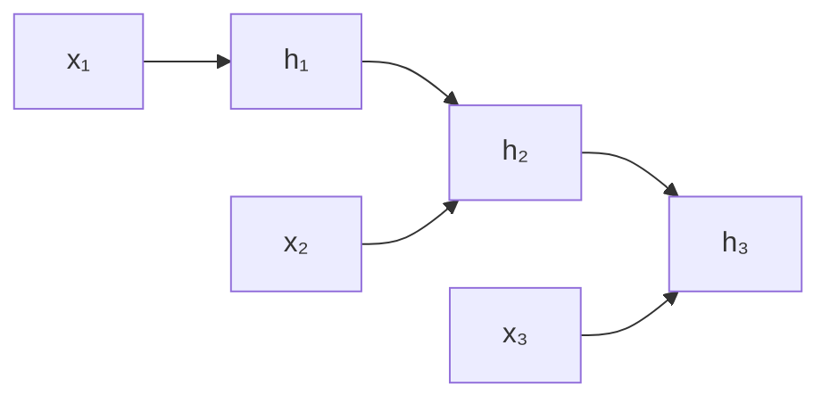
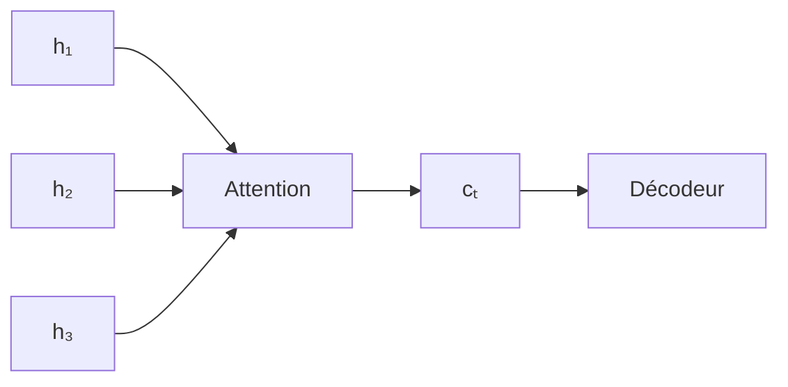

Ce cours étudie deux grandes familles historiques et toujours utiles du deep learning :

- les **CNN** (*Convolutional Neural Networks*), qui exploitent une structure locale et un partage de paramètres ;
- les **RNN** (*Recurrent Neural Networks*), qui maintiennent un état au fil d'une séquence.

L'objectif n'est pas de présenter CNN et RNN comme les seules architectures modernes. Les Transformers, modèles d'espace d'état et architectures hybrides occupent aujourd'hui une place importante. Il faut plutôt comprendre **quel biais inductif chaque famille apporte**, quelles tâches elle traite efficacement et pourquoi certaines idées ont survécu dans les architectures récentes.

> [!important]
> Les CNN et RNN restent des outils importants. « Plus ancien » ne signifie pas « obsolète » : un petit CNN ou GRU peut être plus adapté qu'un Transformer lorsque les données, la mémoire, la latence ou l'énergie sont contraintes.

Pour les bases générales d'entraînement, d'optimisation et d'utilisation de PyTorch, voir [[Pytorch]]. Pour l'attention et les architectures Transformer, voir [[Les transformers]].

# Sommaire

1. [[#1. Modèle mental commun]]
2. [[#2. CNN — principe de la convolution]]
3. [[#3. Géométrie d'une convolution]]
4. [[#4. Représentations et champs réceptifs]]
5. [[#5. Blocs CNN modernes]]
6. [[#6. Grandes architectures convolutionnelles]]
7. [[#7. CNN selon la tâche]]
8. [[#8. Entraîner un CNN proprement]]
9. [[#9. RNN — principe de la récurrence]]
10. [[#10. BPTT, gradients et mémoire]]
11. [[#11. LSTM et GRU]]
12. [[#12. Séquences de longueur variable]]
13. [[#13. RNN bidirectionnels, profonds et hybrides]]
14. [[#14. Seq2Seq et décodage]]
15. [[#15. De Seq2Seq à l'attention]]
16. [[#16. Où utiliser CNN et RNN en 2026 ?]]
17. [[#17. PyTorch : patrons d'implémentation]]
18. [[#18. Évaluation et diagnostic]]
19. [[#19. Sécurité, robustesse et exploitation]]
20. [[#20. Travaux pratiques]]
21. [[#21. Projet final]]
22. [[#22. Aide-mémoire]]
23. [[#23. Glossaire]]
24. [[#24. Références]]

---

# 1. Modèle mental commun

## 1.1. Un réseau apprend une fonction paramétrée

Un réseau de neurones apprend une fonction :

$$
\hat y = f_\theta(x)
$$

où $\theta$ représente les paramètres appris.

La différence entre un MLP, un CNN, un RNN ou un Transformer n'est donc pas « l'apprentissage » lui-même, mais surtout :

- la manière dont l'information circule ;
- les paramètres qui sont partagés ;
- les invariances ou dépendances supposées ;
- la complexité de calcul ;
- la facilité à exploiter le parallélisme matériel.

## 1.2. Le biais inductif

Un **biais inductif** est une hypothèse intégrée à l'architecture qui facilite l'apprentissage de certaines structures.

| Architecture | Biais inductif principal |
|---|---|
| MLP | Peu de structure imposée |
| CNN | Localité + partage spatial des poids |
| RNN | État récurrent + partage temporel des poids |
| Transformer | Interactions globales par attention |

Un bon biais inductif réduit parfois fortement le nombre de données et de paramètres nécessaires.

## 1.3. Tenseur et dimensions

En vision avec PyTorch, une image batched est généralement :

```text
(N, C, H, W)
```

avec :

- `N` : taille du batch ;
- `C` : nombre de canaux ;
- `H` : hauteur ;
- `W` : largeur.

Pour une séquence avec `batch_first=True` :

```text
(N, L, D)
```

avec :

- `N` : batch ;
- `L` : longueur de séquence ;
- `D` : dimension des caractéristiques.

> [!warning]
> Une grande proportion des erreurs CNN/RNN sont simplement des erreurs de dimensions. Toujours écrire les shapes attendues avant de coder.

## 1.4. Paramètres, activations et gradients

Il faut distinguer :

- **paramètres** : poids appris et persistants ;
- **activations** : valeurs intermédiaires d'un passage avant ;
- **gradients** : dérivées calculées lors de la rétropropagation.

Le coût mémoire de l'entraînement ne dépend donc pas seulement du nombre de paramètres. Les activations peuvent dominer, particulièrement pour des images ou séquences longues.

---

# 2. CNN — principe de la convolution

## 2.1. Pourquoi ne pas aplatir immédiatement une image ?

Une image RGB de taille $224\times224$ contient :

$$
224 \times 224 \times 3 = 150\,528
$$

valeurs.

Une couche dense de 1 000 neurones directement connectée à ces valeurs posséderait plus de 150 millions de poids, sans exploiter le fait que les pixels voisins sont liés.

Un CNN exploite deux idées :

1. **connectivité locale** : un neurone regarde une petite région ;
2. **partage des poids** : le même filtre est appliqué à toutes les positions.

## 2.2. Filtre ou kernel

Un kernel 3×3 possède une petite grille de paramètres appris.

Exemple pédagogique de détecteur vertical :

```text
 1  0 -1
 1  0 -1
 1  0 -1
```

Dans un réseau réel, ces valeurs ne sont généralement pas écrites à la main : elles sont apprises par descente de gradient.

## 2.3. Convolution ou corrélation croisée ?

En mathématiques, une convolution renverse le noyau. Les bibliothèques de deep learning calculent généralement une **corrélation croisée** sans retournement du kernel.

PyTorch documente par exemple `torch.nn.Conv2d` en utilisant l'opérateur de corrélation croisée.

Pourquoi continue-t-on à dire « convolution » ? Parce que le kernel est appris : renverser sa convention ne change pas la capacité du modèle.

> [!important]
> Dans le deep learning, « couche de convolution » désigne donc souvent une corrélation croisée paramétrée.

## 2.4. Plusieurs canaux d'entrée

Pour une image RGB, un filtre 2D possède une profondeur égale au nombre de canaux d'entrée.

Un kernel 3×3 sur RGB a donc une forme conceptuelle :

```text
(3 canaux, 3, 3)
```

PyTorch stocke les poids de `Conv2d` sous la forme :

```text
(C_out, C_in / groups, K_h, K_w)
```

Chaque filtre produit un canal de sortie.

## 2.5. Nombre de paramètres

Pour une convolution classique :

$$
\text{paramètres} = C_{out}\times C_{in}\times K_h\times K_w + C_{out}
$$

si un biais est utilisé.

Exemple :

```text
Conv2d(3, 64, kernel_size=3)
```

possède :

$$
64\times3\times3\times3 + 64 = 1\,792
$$

paramètres.

C'est très inférieur à une couche dense traitant directement chaque pixel.

---

# 3. Géométrie d'une convolution

## 3.1. Taille de sortie

Pour une dimension d'entrée $H_{in}$ :

$$
H_{out} = \left\lfloor
\frac{H_{in} + 2P - D(K-1) - 1}{S} + 1
\right\rfloor
$$

avec :

- $K$ : kernel ;
- $S$ : stride ;
- $P$ : padding ;
- $D$ : dilation.

Même formule pour la largeur.

## 3.2. Stride

Le **stride** indique de combien de positions le kernel se déplace.

- `stride=1` : toutes les positions ;
- `stride=2` : sous-échantillonnage approximativement par deux.

Une convolution stride 2 peut remplacer certains poolings.

## 3.3. Padding

Le padding ajoute des valeurs autour de l'entrée.

```python
import torch.nn as nn

conv = nn.Conv2d(32, 64, kernel_size=3, padding=1)
```

Pour un kernel 3×3, `padding=1` et `stride=1` conservent généralement hauteur et largeur.

PyTorch accepte également `padding="same"` dans les cas pris en charge.

## 3.4. Dilation

La dilation espace les coefficients du kernel.

```text
kernel 3, dilation 1 : x x x
kernel 3, dilation 2 : x . x . x
```

Elle augmente le champ réceptif sans augmenter autant le nombre de paramètres.

Usages :

- segmentation ;
- audio ;
- séries temporelles ;
- Temporal Convolutional Networks.

## 3.5. Groups

`groups` contrôle les connexions entre canaux.

- `groups=1` : convolution classique ;
- `groups>1` : canaux divisés en groupes ;
- `groups=C_in` : convolution depthwise si les dimensions sont compatibles.

## 3.6. Convolution depthwise separable

Une convolution séparée en profondeur décompose souvent :

1. **depthwise convolution** : filtrage spatial séparé par canal ;
2. **pointwise convolution 1×1** : mélange des canaux.

Cette idée est centrale dans des architectures mobiles comme MobileNet.

Le coût d'une convolution classique $K\times K$ est approximativement :

$$
K^2 C_{in}C_{out}
$$

contre :

$$
K^2C_{in} + C_{in}C_{out}
$$

pour depthwise + pointwise.

## 3.7. Convolution 1×1

Une convolution 1×1 ne mélange pas spatialement les pixels voisins, mais elle mélange leurs **canaux**.

Elle sert notamment à :

- réduire/augmenter le nombre de canaux ;
- créer des bottlenecks ;
- effectuer une projection ;
- réduire le coût des blocs suivants.

## 3.8. Convolution transposée

`ConvTranspose2d` augmente la résolution spatiale apprise.

> [!warning]
> « Transposed convolution » ne signifie pas « convolution inverse » au sens général. Le terme historique « deconvolution » est trompeur.

Elle peut provoquer des artefacts en damier. Une alternative fréquente est :

```text
upsampling → convolution classique
```

---

# 4. Représentations et champs réceptifs

## 4.1. Carte de caractéristiques

La sortie d'un filtre est une **feature map**.

Des couches successives apprennent généralement des caractéristiques de plus en plus composées :

```text
pixels
  ↓
contrastes / orientations
  ↓
textures / motifs
  ↓
parties d'objets
  ↓
représentations de haut niveau
```

Cette hiérarchie est une intuition utile, pas une règle stricte pour chaque neurone.

## 4.2. Champ réceptif

Le **champ réceptif** d'une activation désigne la région de l'entrée pouvant l'influencer.

Empiler des convolutions 3×3 augmente progressivement ce champ.

Deux convolutions 3×3 stride 1 donnent un champ réceptif théorique de 5×5.

Trois donnent 7×7.

## 4.3. Champ réceptif théorique vs effectif

Même si une architecture peut théoriquement utiliser une grande zone, les contributions réelles ne sont pas uniformes.

Il faut distinguer :

- champ réceptif théorique ;
- champ réceptif effectif ;
- contexte réellement exploité par le modèle.

## 4.4. Équivariance et invariance

La convolution est approximativement **équivariante à la translation** : déplacer l'entrée déplace la carte produite.

L'invariance demande davantage : pooling, agrégation globale, augmentation de données ou structure de tâche.

Ne pas confondre :

```text
équivariance : transformation entrée → transformation sortie
invariance   : transformation entrée → sortie identique
```

---

# 5. Blocs CNN modernes

## 5.1. Activation

Les activations fréquentes incluent :

- ReLU ;
- GELU ;
- SiLU/Swish.

ReLU reste une excellente référence simple :

$$
\operatorname{ReLU}(x)=\max(0,x)
$$

## 5.2. Pooling

Le pooling réduit la résolution.

### Max pooling

Conserve la valeur maximale d'une fenêtre.

### Average pooling

Conserve la moyenne.

### Global average pooling

Produit une valeur par canal :

```python
import torch.nn as nn

pool = nn.AdaptiveAvgPool2d((1, 1))
```

Il évite souvent une énorme couche dense en fin de CNN.

## 5.3. Batch Normalization

`BatchNorm2d` normalise les activations à partir des statistiques du batch pendant l'entraînement et utilise des statistiques accumulées à l'évaluation.

```python
block = nn.Sequential(
    nn.Conv2d(64, 64, 3, padding=1, bias=False),
    nn.BatchNorm2d(64),
    nn.ReLU(inplace=True),
)
```

> [!warning]
> Toujours utiliser `model.eval()` en évaluation. Sinon BatchNorm et Dropout conservent leur comportement d'entraînement.

## 5.4. GroupNorm et LayerNorm

BatchNorm peut être moins pratique lorsque le batch est très petit.

Alternatives :

- GroupNorm ;
- LayerNorm ;
- RMSNorm dans d'autres familles d'architectures.

ConvNeXt a notamment contribué à populariser des blocs convolutionnels modernisés utilisant LayerNorm.

## 5.5. Dropout

Dropout désactive aléatoirement des activations pendant l'entraînement.

Il n'est pas systématiquement nécessaire dans tous les CNN modernes ; augmentation, weight decay, architecture et volume de données peuvent jouer un rôle plus important.

## 5.6. Connexions résiduelles

Un bloc résiduel apprend :

$$
y = F(x) + x
$$

plutôt que seulement $F(x)$.

Cette idée a permis d'entraîner des CNN très profonds.

```mermaid
flowchart LR
    X[x] --> F[F(x)]
    X --> ADD((+))
    F --> ADD
    ADD --> Y[y]
```

## 5.7. Bottleneck

Un bloc bottleneck peut utiliser :

```text
1×1 réduction
   ↓
3×3 spatial
   ↓
1×1 expansion
```

L'objectif est de concentrer le calcul spatial sur une représentation moins coûteuse.

## 5.8. Squeeze-and-Excitation et attention de canaux

Un module SE calcule une importance dynamique par canal.

Il illustre une idée générale : l'attention n'est pas réservée aux Transformers. Des mécanismes d'attention peuvent être insérés dans des CNN.

---

# 6. Grandes architectures convolutionnelles

## 6.1. Pourquoi connaître les familles historiques ?

L'objectif n'est pas de mémoriser chaque détail, mais de voir comment les idées ont évolué.

| Architecture | Idée marquante |
|---|---|
| LeNet | CNN classique précoce |
| AlexNet | GPU, ReLU, deep CNN à grande échelle |
| VGG | Empilement régulier de 3×3 |
| Inception | Branches multi-échelles |
| ResNet | Connexions résiduelles |
| DenseNet | Connexions denses entre blocs |
| MobileNet | Depthwise separable convolutions |
| EfficientNet | Scaling coordonné |
| ConvNeXt | Modernisation des ConvNets après les ViT |

## 6.2. ResNet

ResNet reste une excellente architecture pédagogique et un backbone très utilisé.

La connexion résiduelle facilite la circulation du gradient.

```python
class ResidualBlock(nn.Module):
    def __init__(self, channels: int):
        super().__init__()
        self.net = nn.Sequential(
            nn.Conv2d(channels, channels, 3, padding=1, bias=False),
            nn.BatchNorm2d(channels),
            nn.ReLU(inplace=True),
            nn.Conv2d(channels, channels, 3, padding=1, bias=False),
            nn.BatchNorm2d(channels),
        )
        self.act = nn.ReLU(inplace=True)

    def forward(self, x):
        return self.act(x + self.net(x))
```

## 6.3. MobileNet

MobileNet vise l'efficacité sur appareils contraints.

Idées centrales :

- depthwise separable convolution ;
- bottlenecks ;
- faible coût mémoire/compute ;
- adaptation mobile/edge.

## 6.4. EfficientNet

EfficientNet étudie le compromis entre :

- profondeur ;
- largeur ;
- résolution.

Leçon générale : augmenter uniquement la profondeur n'est pas toujours le meilleur scaling.

## 6.5. ConvNeXt

ConvNeXt montre qu'un CNN pur peut intégrer de nombreuses pratiques popularisées dans l'ère des Vision Transformers :

- grands kernels depthwise ;
- normalisation adaptée ;
- blocs résiduels modernisés ;
- stratégies d'entraînement contemporaines.

ConvNeXt V2 ajoute notamment un apprentissage auto-supervisé par masked autoencoding et une couche Global Response Normalization.

> [!note]
> Les Vision Transformers ont changé la vision moderne, mais ils n'ont pas rendu les CNN inutiles. Les ConvNets restent pertinents pour l'edge, l'efficacité, certains backbones et de nombreux systèmes hybrides.

---

# 7. CNN selon la tâche

## 7.1. Classification

Une architecture simple :

```text
image
 ↓
backbone CNN
 ↓
global average pooling
 ↓
linear
 ↓
classes
```

Pour une classification multi-classe avec logits :

```python
loss_fn = nn.CrossEntropyLoss()
```

Ne pas appliquer manuellement `softmax` avant `CrossEntropyLoss`.

## 7.2. Détection d'objets

Une détection prédit au minimum :

- classe ;
- boîte englobante ;
- score.

Familles historiques/modernes :

- Faster R-CNN ;
- RetinaNet ;
- YOLO ;
- DETR et variantes Transformer.

Le backbone peut rester convolutionnel même si la tête utilise d'autres mécanismes.

## 7.3. Segmentation

Chaque pixel reçoit une classe ou une représentation.

U-Net est un exemple fondamental :

```text
encodeur ↓
    bottleneck
     ↑ décodeur
skip connections
```

Les connexions latérales préservent l'information spatiale fine.

## 7.4. CNN 1D

Une convolution 1D convient à :

- signaux ;
- audio ;
- séries temporelles ;
- séquences de caractéristiques.

```python
conv = nn.Conv1d(in_channels=16, out_channels=64, kernel_size=5)
```

La shape PyTorch attend typiquement :

```text
(N, C, L)
```

## 7.5. CNN 3D

`Conv3d` peut traiter :

- volumes médicaux ;
- données voxel ;
- clips vidéo courts.

Le coût mémoire augmente rapidement.

## 7.6. Temporal Convolutional Network

Une TCN peut utiliser :

- convolutions 1D causales ;
- dilation ;
- résidus.

Elle offre un traitement parallèle pendant l'entraînement, contrairement à un RNN récurrent classique.

---

# 8. Entraîner un CNN proprement

## 8.1. Prétraitement

Un pipeline doit distinguer :

```text
train transforms ≠ validation transforms
```

En validation/test, éviter les transformations aléatoires modifiant l'étiquette ou rendant la métrique instable.

## 8.2. Data augmentation

Exemples :

- random crop ;
- flip ;
- rotation raisonnable ;
- color jitter ;
- MixUp ;
- CutMix ;
- Random Erasing.

Le choix dépend du domaine. Retourner horizontalement une radiographie ou un chiffre peut changer le sens.

## 8.3. Transfer learning

Souvent, il vaut mieux partir d'un backbone pré-entraîné.

```python
from torchvision.models import resnet50, ResNet50_Weights

weights = ResNet50_Weights.DEFAULT
model = resnet50(weights=weights)
```

Les poids TorchVision exposent aussi les transformations attendues :

```python
preprocess = weights.transforms()
```

Avantages :

- convergence plus rapide ;
- moins de données nécessaires ;
- meilleure représentation initiale.

## 8.4. Freeze puis fine-tuning

Approche simple :

1. remplacer la tête ;
2. entraîner la tête ;
3. débloquer progressivement le backbone ;
4. utiliser éventuellement un learning rate plus faible pour les couches pré-entraînées.

## 8.5. Déséquilibre des classes

Options :

- pondération de la loss ;
- sampler équilibré ;
- augmentation ;
- focal loss selon la tâche ;
- métriques macro plutôt que seule accuracy globale.

## 8.6. Fuite de données

Une augmentation ou normalisation calculée à partir de tout le dataset peut introduire une fuite.

Séparer d'abord :

```text
train / validation / test
```

puis ajuster tout prétraitement appris uniquement sur `train`.

---

# 9. RNN — principe de la récurrence

## 9.1. Pourquoi une mémoire séquentielle ?

Une séquence possède un ordre :

```text
x1 → x2 → x3 → ... → xT
```

Un RNN met à jour un état caché :

$$
h_t = \phi(W_{xh}x_t + W_{hh}h_{t-1} + b_h)
$$

et éventuellement une sortie :

$$
y_t = W_{hy}h_t + b_y
$$

Les mêmes matrices sont réutilisées à chaque pas de temps.

## 9.2. Déroulement dans le temps


```mermaid
flowchart LR
    X1[x₁] --> H1[h₁]
    H1 --> H2[h₂]
    X2[x₂] --> H2
    H2 --> H3[h₃]
    X3[x₃] --> H3
```

Le graphe est conceptuellement déroulé pour la rétropropagation.

## 9.3. Partage temporel des poids

Le même `W_hh` est utilisé à $t=1$, $t=2$, etc.

Cela permet :

- de traiter des longueurs variables ;
- de réutiliser la même règle d'évolution ;
- de limiter le nombre de paramètres.

## 9.4. Many-to-one, many-to-many

### Many-to-one

```text
séquence → label
```

Exemple : classification d'une série temporelle.

### Many-to-many aligné

```text
x1 x2 x3
↓  ↓  ↓
y1 y2 y3
```

Exemple : étiquetage de séquence.

### Seq2Seq non aligné

```text
séquence source → séquence cible
```

Exemple historique : traduction.

## 9.5. RNN Elman

`nn.RNN` implémente une récurrence simple avec `tanh` ou ReLU.

Elle est utile pédagogiquement, mais LSTM/GRU sont souvent plus robustes pour des dépendances plus longues.

---

# 10. BPTT, gradients et mémoire

## 10.1. Backpropagation Through Time

L'apprentissage d'un RNN déroule la récurrence et applique la rétropropagation à travers les pas temporels : **BPTT**.

Le gradient implique des produits successifs de Jacobiennes.

Schématiquement :

$$
\frac{\partial h_T}{\partial h_t}
=
\prod_{k=t+1}^{T}
\frac{\partial h_k}{\partial h_{k-1}}
$$

Selon les valeurs propres et activations, ce produit peut diminuer ou augmenter rapidement.

## 10.2. Vanishing gradient

Si les facteurs ont une norme durablement inférieure à 1 :

```text
0.5 × 0.5 × ... × 0.5 → 0
```

le gradient provenant d'un événement lointain devient minuscule.

Conséquence : le modèle apprend difficilement certaines dépendances longues.

## 10.3. Exploding gradient

À l'inverse :

```text
1.5 × 1.5 × ... × 1.5 → très grand
```

Le gradient peut exploser.

Solution pratique fréquente : gradient clipping.

```python
import torch

torch.nn.utils.clip_grad_norm_(model.parameters(), max_norm=1.0)
```

## 10.4. Truncated BPTT

Sur des séquences très longues, on peut détacher périodiquement l'état :

```python
hidden = hidden.detach()
```

Cela limite la profondeur du graphe de calcul.

Compromis :

```text
moins de mémoire / calcul
mais
moins de dépendances très longues apprises directement
```

## 10.5. Dépendance statistique vs chemin de gradient

Une séquence peut contenir une dépendance longue sans que le modèle arrive à l'apprendre.

Il faut distinguer :

- information théoriquement présente ;
- capacité du modèle ;
- chemin du gradient ;
- données d'entraînement ;
- optimisation.

---

# 11. LSTM et GRU

## 11.1. Pourquoi des portes ?

LSTM et GRU ajoutent des mécanismes multiplicatifs permettant de contrôler :

- ce qui est conservé ;
- ce qui est oublié ;
- ce qui est ajouté ;
- ce qui est exposé à la sortie.

## 11.2. LSTM

Un LSTM maintient :

- un état caché $h_t$ ;
- un état de cellule $c_t$.

Équations classiques :

$$
i_t = \sigma(W_{ii}x_t + W_{hi}h_{t-1} + b_i)
$$

$$
f_t = \sigma(W_{if}x_t + W_{hf}h_{t-1} + b_f)
$$

$$
g_t = \tanh(W_{ig}x_t + W_{hg}h_{t-1} + b_g)
$$

$$
o_t = \sigma(W_{io}x_t + W_{ho}h_{t-1} + b_o)
$$

$$
c_t = f_t\odot c_{t-1} + i_t\odot g_t
$$

$$
h_t = o_t\odot\tanh(c_t)
$$

## 11.3. Intuition des portes

### Forget gate

```text
Que faut-il conserver de l'ancienne mémoire ?
```

### Input gate

```text
Quelle nouvelle information doit être écrite ?
```

### Output gate

```text
Quelle partie de la mémoire devient visible dans h_t ?
```

## 11.4. GRU

Le GRU simplifie la structure en supprimant l'état de cellule séparé.

Il utilise notamment :

- update gate ;
- reset gate.

Il possède généralement moins de paramètres qu'un LSTM à taille cachée comparable.

## 11.5. LSTM ou GRU ?

Il n'existe pas de gagnant universel.

| Critère | LSTM | GRU |
|---|---|---|
| États | `h` + `c` | `h` |
| Paramètres | plus | moins |
| Structure | plus complexe | plus compacte |
| Performance | dépend de la tâche | dépend de la tâche |

Tester sur les données réelles est souvent plus utile qu'une règle absolue.

## 11.6. LSTM avec projection

PyTorch `nn.LSTM` propose `proj_size` pour utiliser un LSTM projeté.

Cela peut réduire la dimension de la sortie récurrente tout en conservant une mémoire interne plus grande.

---

# 12. Séquences de longueur variable

## 12.1. Padding

Dans un batch, les séquences ont souvent des longueurs différentes.

```text
A B C D E
F G H <pad> <pad>
I J K L <pad>
```

Le padding permet d'obtenir un tenseur rectangulaire.

## 12.2. Pourquoi le padding pose problème

Si le modèle traite `<pad>` comme de vraies données :

- état final faussé ;
- loss faussée ;
- calcul inutile.

## 12.3. Packed sequences en PyTorch

PyTorch propose :

```python
from torch.nn.utils.rnn import pack_padded_sequence

packed = pack_padded_sequence(
    embeddings,
    lengths.cpu(),
    batch_first=True,
    enforce_sorted=False,
)

output, hidden = lstm(packed)
```

Puis :

```python
from torch.nn.utils.rnn import pad_packed_sequence

output, lengths = pad_packed_sequence(output, batch_first=True)
```

## 12.4. Masquer la loss

Pour un problème token par token, il faut souvent ignorer le padding :

```python
loss_fn = nn.CrossEntropyLoss(ignore_index=PAD_ID)
```

## 12.5. État final correct

Avec une séquence paddée, `output[:, -1]` n'est pas forcément le dernier état valide.

Solutions :

- packed sequences ;
- utiliser `h_n` correctement ;
- indexer avec les longueurs ;
- agréger avec un masque.

---

# 13. RNN bidirectionnels, profonds et hybrides

## 13.1. RNN bidirectionnel

Un BiRNN lit :

```text
→ sens avant
← sens arrière
```

Puis combine les représentations.

```python
lstm = nn.LSTM(
    input_size=128,
    hidden_size=256,
    batch_first=True,
    bidirectional=True,
)
```

La sortie a alors typiquement une dimension `2 * hidden_size`.

> [!warning]
> Un modèle bidirectionnel utilise le futur de la séquence. Il n'est donc pas causal et n'est pas adapté tel quel à une prédiction strictement temps réel.

## 13.2. RNN multi-couches

```python
lstm = nn.LSTM(
    input_size=128,
    hidden_size=256,
    num_layers=3,
    dropout=0.2,
    batch_first=True,
)
```

Dans PyTorch, le `dropout` intégré est appliqué entre couches lorsque `num_layers > 1`, pas comme dropout récurrent universel sur chaque transition temporelle.

## 13.3. CNN + RNN

Architecture classique pour séquences locales + contexte :

```text
Conv1D → features locales → LSTM/GRU → sortie
```

Exemples historiques :

- audio ;
- OCR ;
- séries temporelles ;
- reconnaissance de gestes.

## 13.4. CNN + attention

Un CNN peut extraire des features visuelles puis les transmettre à un mécanisme d'attention.

Inversement, un Transformer peut aussi contenir des convolutions.

Les frontières entre familles sont donc moins rigides qu'un catalogue d'architectures pourrait le laisser croire.

---

# 14. Seq2Seq et décodage

## 14.1. Encodeur-décodeur

Un modèle Seq2Seq transforme :

```text
x₁ ... xₙ → y₁ ... yₘ
```

Architecture historique :

```text
encodeur RNN/LSTM/GRU
        ↓
     contexte
        ↓
décodeur RNN/LSTM/GRU
```

## 14.2. Goulot d'étranglement du contexte fixe

Les premiers Seq2Seq compressaient toute la source dans un vecteur fixe.

Pour une longue séquence, c'est un goulot d'étranglement sévère.

L'attention a été introduite pour permettre au décodeur d'accéder directement aux états de l'encodeur.

## 14.3. Teacher forcing

Pendant l'entraînement, on peut fournir au décodeur le vrai token précédent :

```text
cible vraie y_{t-1} → décodeur → prédiction y_t
```

Avantage : apprentissage plus stable et parallèle selon l'architecture.

Inconvénient : différence entre entraînement et inférence, appelée souvent **exposure bias**.

## 14.4. Décodage glouton

À chaque pas :

$$
y_t = \arg\max p(y_t\mid y_{<t},x)
$$

Simple mais pas toujours optimal au niveau de la séquence entière.

## 14.5. Beam search

Beam search conserve les $k$ meilleures hypothèses partielles.

Il améliore parfois la qualité mais :

- coûte plus cher ;
- peut favoriser certaines longueurs ;
- ne garantit pas la meilleure sortie selon une métrique humaine.

## 14.6. Sampling

Pour une génération non déterministe :

- temperature ;
- top-k ;
- top-p.

Ces techniques ne sont pas propres aux Transformers.

---

# 15. De Seq2Seq à l'attention

## 15.1. Contexte dynamique

Au lieu d'un seul vecteur de contexte :

$$
c_t = \sum_i \alpha_{t,i} h_i
$$

où $\alpha_{t,i}$ mesure l'importance de l'état encodeur $h_i$ pour le pas de décodage $t$.

## 15.2. Alignement appris

L'attention peut apprendre qu'un token cible dépend surtout de certaines positions sources.


```mermaid
flowchart LR
    H1[h₁] --> A[Attention]
    H2[h₂] --> A
    H3[h₃] --> A
    A --> C[cₜ]
    C --> D[Décodeur]
```

## 15.3. Pourquoi le Transformer change l'échelle

Le Transformer supprime la récurrence comme mécanisme principal.

Pendant l'entraînement, les positions d'une couche peuvent être traitées de manière beaucoup plus parallèle que dans un RNN classique.

Mais :

- l'attention globale peut être coûteuse en longueur de contexte ;
- le décodage autoregressif reste séquentiel ;
- la mémoire du KV cache devient importante.

Voir [[Les transformers]].

## 15.4. Les RNN n'ont pas « disparu »

Les RNN peuvent encore être intéressants pour :

- streaming à faible mémoire ;
- séries temporelles ;
- dispositifs edge ;
- contrôle ;
- petites données ;
- latence incrémentale ;
- modèles hybrides.

L'architecture doit répondre au besoin, pas suivre une mode.

---

# 16. Où utiliser CNN et RNN en 2026 ?

## 16.1. CNN : cas typiques

### CNN : très bons candidats

- vision embarquée ;
- classification avec budget limité ;
- traitement de signaux 1D ;
- segmentation ;
- features locales ;
- edge/mobile ;
- systèmes hybrides.

### À comparer avec d'autres familles

- très grands modèles de vision ;
- tâches multimodales ;
- dépendances globales complexes.

## 16.2. RNN/LSTM/GRU : cas typiques

### RNN : très bons candidats

- flux capteurs ;
- séries temporelles ;
- streaming ;
- état compact à mettre à jour en O(1) par pas ;
- appareils contraints ;
- petits modèles de séquence.

### Moins naturels

- pré-entraînement massif sur texte avec besoin de parallélisme extrême ;
- accès global à toutes les positions à chaque couche.

## 16.3. xLSTM

Les travaux xLSTM (2024) revisitent le LSTM avec :

- gating exponentiel ;
- nouvelles structures de mémoire ;
- blocs résiduels à grande échelle.

Cela montre que la recherche sur la récurrence n'est pas figée.

> [!note]
> xLSTM est une famille de recherche distincte des `nn.LSTM` classiques. Ne pas remplacer automatiquement un LSTM par xLSTM sans évaluer implémentation, maturité et coût.

## 16.4. State Space Models

Les modèles d'espace d'état modernes (par exemple la famille Mamba) proposent une autre manière de traiter les longues séquences avec des coûts différents de l'attention globale et des RNN classiques.

Leçon importante :

```text
RNN vs Transformer
```

n'est plus la seule comparaison pertinente.

## 16.5. Tableau de décision

| Besoin | Première famille à tester |
|---|---|
| Image edge/mobile | CNN léger |
| Classification vision standard | pretrained CNN ou ViT selon contraintes |
| Signal temporel local | Conv1D / TCN |
| Streaming avec état compact | GRU/LSTM/RNN ou SSM |
| Texte massif pré-entraîné | Transformer/SSM modernes |
| Séquence + motifs locaux | CNN + RNN/attention |
| Très peu de données | architecture avec biais inductif fort + transfert |

---

# 17. PyTorch : patrons d'implémentation

## 17.1. Petit CNN

```python
import torch
from torch import nn


class SmallCNN(nn.Module):
    def __init__(self, num_classes: int = 10):
        super().__init__()
        self.features = nn.Sequential(
            nn.Conv2d(3, 32, 3, padding=1, bias=False),
            nn.BatchNorm2d(32),
            nn.ReLU(inplace=True),
            nn.MaxPool2d(2),
            nn.Conv2d(32, 64, 3, padding=1, bias=False),
            nn.BatchNorm2d(64),
            nn.ReLU(inplace=True),
            nn.MaxPool2d(2),
            nn.Conv2d(64, 128, 3, padding=1, bias=False),
            nn.BatchNorm2d(128),
            nn.ReLU(inplace=True),
            nn.AdaptiveAvgPool2d(1),
        )
        self.classifier = nn.Linear(128, num_classes)

    def forward(self, x: torch.Tensor) -> torch.Tensor:
        x = self.features(x)
        x = torch.flatten(x, 1)
        return self.classifier(x)
```

## 17.2. Vérifier les shapes

```python
model = SmallCNN()
x = torch.randn(8, 3, 64, 64)
y = model(x)
print(y.shape)  # (8, 10)
```

Ajouter ce type de test avant l'entraînement évite beaucoup d'erreurs.

## 17.3. Classifieur GRU

```python
import torch
from torch import nn


class GRUClassifier(nn.Module):
    def __init__(
        self,
        input_size: int,
        hidden_size: int,
        num_classes: int,
    ):
        super().__init__()
        self.gru = nn.GRU(
            input_size=input_size,
            hidden_size=hidden_size,
            batch_first=True,
        )
        self.head = nn.Linear(hidden_size, num_classes)

    def forward(self, x: torch.Tensor) -> torch.Tensor:
        _, h_n = self.gru(x)
        last_hidden = h_n[-1]
        return self.head(last_hidden)
```

## 17.4. Bidirectional GRU

```python
self.gru = nn.GRU(
    input_size=input_size,
    hidden_size=hidden_size,
    batch_first=True,
    bidirectional=True,
)
self.head = nn.Linear(2 * hidden_size, num_classes)
```

Attention à la shape de `h_n` :

```text
(num_layers * num_directions, batch, hidden_size)
```

## 17.5. Initialiser l'état ou laisser PyTorch le faire ?

Si `h_0`/`c_0` ne sont pas fournis, PyTorch utilise des zéros.

Il n'est donc pas nécessaire de recréer manuellement des tenseurs zéro dans chaque `forward()` sauf besoin particulier.

## 17.6. Ne pas détacher l'état sans comprendre pourquoi

```python
hidden = hidden.detach()
```

est utile pour TBPTT ou streaming, mais coupe le graphe de gradient.

Le faire systématiquement peut empêcher l'apprentissage de dépendances voulues.

## 17.7. Train vs eval

```python
model.train()
```

pour l'entraînement.

```python
model.eval()
with torch.inference_mode():
    logits = model(x)
```

pour l'évaluation.

Voir [[Pytorch]] pour les boucles d'entraînement complètes, AMP, compilation et déploiement.

---

# 18. Évaluation et diagnostic

## 18.1. Ne pas juger uniquement la loss train

Il faut suivre :

```text
train loss
validation loss
métrique métier
```

Une baisse continue de train loss avec une validation qui se dégrade indique probablement de l'overfitting.

## 18.2. Classification

Mesures possibles :

- accuracy ;
- precision ;
- recall ;
- F1 ;
- macro F1 ;
- ROC-AUC selon le cas ;
- PR-AUC pour classes rares ;
- matrice de confusion.

## 18.3. Segmentation

Mesures typiques :

- IoU/Jaccard ;
- Dice ;
- métriques par classe.

## 18.4. Séries temporelles

Selon le problème :

- MAE ;
- RMSE ;
- MAPE avec prudence ;
- métriques de détection d'événements ;
- latence et coût mémoire.

## 18.5. Debugger un CNN

Checklist :

1. shapes correctes ?
2. plage des valeurs d'entrée correcte ?
3. normalisation compatible avec les poids pré-entraînés ?
4. labels corrects ?
5. loss compatible avec les logits ?
6. `train()`/`eval()` corrects ?
7. gradients non nuls/non NaN ?
8. augmentation trop agressive ?
9. fuite train/test ?

## 18.6. Debugger un RNN

1. ordre des dimensions correct ?
2. `batch_first` cohérent ?
3. padding traité ?
4. longueur réelle des séquences connue ?
5. état réinitialisé ou conservé volontairement ?
6. état détaché au bon moment ?
7. gradient clipping si nécessaire ?
8. bidirectionnalité compatible avec la causalité ?
9. métrique évaluée sans fuite du futur ?

## 18.7. Overfit un mini-batch

Excellent test de plomberie : essayer de surapprendre volontairement un tout petit sous-ensemble.

Si le modèle ne peut pas mémoriser quelques exemples :

- bug de données ;
- mauvaise loss ;
- modèle mal connecté ;
- learning rate inadéquat ;
- gradients cassés.

---

# 19. Sécurité, robustesse et exploitation

## 19.1. Distribution shift

Un excellent score de validation n'implique pas un bon fonctionnement après changement de :

- caméra ;
- saison ;
- appareil ;
- population ;
- fréquence d'échantillonnage ;
- protocole de collecte.

## 19.2. Adversarial examples

Les modèles de vision peuvent être sensibles à de petites perturbations spécialement conçues.

Ne pas confondre robustesse à une augmentation naturelle et robustesse adversariale.

## 19.3. Fuites temporelles

Pour une série temporelle, un split aléatoire peut fuiter du futur vers le passé.

Préférer selon le problème :

```text
train = passé
validation = futur proche
test = futur encore plus récent
```

## 19.4. Données sensibles

Images, audio et séries de capteurs peuvent contenir :

- biométrie ;
- géolocalisation ;
- données médicales ;
- habitudes ;
- secrets industriels.

Voir [[Règlement Général sur la Protection des Données (RGPD)]].

## 19.5. Modèles pré-entraînés

Un checkpoint externe est un artefact logiciel.

Bonnes pratiques :

- provenance ;
- hash/digest ;
- licence ;
- version ;
- format sûr ;
- éviter les désérialisations arbitraires non fiables.

## 19.6. Mesurer le système entier

En production, mesurer aussi :

- latence p50/p95/p99 ;
- mémoire ;
- consommation ;
- débit ;
- taux d'erreur ;
- dérive ;
- qualité par sous-population.

Un modèle légèrement moins précis mais beaucoup plus petit peut être le meilleur système.

---

# 20. Travaux pratiques

## TP 1 — Calcul manuel d'une convolution

Objectif : calculer à la main la sortie d'une image 4×4 avec un kernel 3×3.

À rendre :

- calcul de chaque position ;
- shape de sortie ;
- comparaison avec PyTorch.

## TP 2 — Formule de dimension

Écrire une fonction Python calculant `H_out` et `W_out` avec kernel, stride, padding et dilation, puis comparer à `nn.Conv2d`.

## TP 3 — Visualiser des feature maps

Entraîner un petit CNN et afficher les activations de la première couche.

Questions :

- quelles features semblent sensibles aux contours ?
- que devient la résolution ?

## TP 4 — CNN classique vs depthwise separable

Comparer :

- nombre de paramètres ;
- FLOPs approximatifs ;
- accuracy ;
- latence.

## TP 5 — Transfer learning

Fine-tuner un ResNet ou ConvNeXt pré-entraîné sur un petit dataset.

Comparer :

```text
from scratch
vs
backbone gelé
vs
fine-tuning complet
```

## TP 6 — RNN simple

Construire un `nn.RNN` pour prédire une propriété d'une séquence synthétique.

Observer les gradients lorsque la dépendance est éloignée.

## TP 7 — RNN vs GRU vs LSTM

Même dataset, mêmes budgets approximatifs.

Comparer :

- convergence ;
- métrique ;
- temps ;
- paramètres.

## TP 8 — Gradient clipping

Créer volontairement une configuration instable et tracer la norme des gradients avec et sans clipping.

## TP 9 — Padding et packed sequences

Créer des séquences de longueurs différentes.

Comparer :

- padding naïf ;
- masking ;
- `pack_padded_sequence`.

## TP 10 — Série temporelle

Construire :

1. un Conv1D ;
2. un GRU.

Comparer accuracy, latence et mémoire sur une classification de séquences.

## TP 11 — Seq2Seq minimal

Construire un petit encodeur-décodeur LSTM sur une tâche synthétique de transformation de séquence.

Étudier teacher forcing et exposition à ses propres erreurs.

## TP 12 — Architecture sous contraintes

Choisir une architecture pour un capteur edge disposant de :

- 256 Mo de RAM ;
- faible puissance ;
- réponse en moins de 20 ms ;
- séquence de 100 mesures.

Justifier CNN1D, GRU, Transformer compact ou autre choix par des mesures.

---

# 21. Projet final

## 21.1. Sujet

Concevoir un système de classification de séries temporelles multivariées.

Exemples :

- détection d'activité ;
- maintenance prédictive ;
- classification ECG ;
- anomalie de capteur.

## 21.2. Modèles à comparer

Minimum :

1. baseline statistique/ML ;
2. Conv1D ;
3. GRU ou LSTM ;
4. architecture moderne de comparaison au choix.

## 21.3. Protocole

Documenter :

- split temporel ou par sujet ;
- normalisation ;
- seed ;
- métriques ;
- nombre de paramètres ;
- latence ;
- mémoire ;
- matériel ;
- coût d'inférence.

## 21.4. Critère de réussite

Le meilleur modèle n'est pas nécessairement celui ayant le meilleur score brut.

Construire un tableau :

| Modèle | Qualité | Params | Latence | RAM | Complexité d'exploitation |
|---|---:|---:|---:|---:|---|
| Baseline | | | | | |
| Conv1D | | | | | |
| GRU/LSTM | | | | | |
| Moderne | | | | | |

## 21.5. Analyse d'erreurs

Étudier au moins :

- faux positifs ;
- faux négatifs ;
- segments rares ;
- changements de distribution ;
- sensibilité au bruit ;
- séquences plus longues que celles d'entraînement.

---

# 22. Aide-mémoire

## CNN

```text
Input image PyTorch : (N, C, H, W)
```

Taille de sortie :

$$
O=\left\lfloor\frac{I+2P-D(K-1)-1}{S}+1\right\rfloor
$$

Paramètres Conv2D classique :

$$
C_{out}C_{in}K_hK_w + C_{out}
$$

À retenir :

```text
stride   → déplacement / downsampling
dilation → espace dans le kernel
padding  → gestion des bords
groups   → connexions par groupes
depthwise → un filtrage spatial par canal
1×1      → mélange des canaux
```

## RNN

Shape avec `batch_first=True` :

```text
input = (N, L, D)
```

`nn.RNN` / `nn.GRU` :

```text
output = (N, L, num_directions * H)
h_n    = (num_layers * num_directions, N, H)
```

`nn.LSTM` ajoute :

```text
c_n = (num_layers * num_directions, N, H_cell)
```

## Choix rapide

```text
motifs locaux → convolution
état streaming compact → RNN/GRU/LSTM
interactions globales et gros pré-entraînement → Transformer ou autre architecture moderne
```

---

# 23. Glossaire

**Activation** — Valeur intermédiaire produite par une couche.

**BPTT** — *Backpropagation Through Time*, rétropropagation à travers le graphe temporel d'un RNN.

**Channel** — Axe de caractéristiques d'un tenseur convolutionnel.

**CNN** — Réseau de neurones convolutif.

**Cross-correlation** — Opération réellement calculée par de nombreuses couches nommées « convolution » en deep learning.

**Dilation** — Espacement entre éléments d'un kernel.

**Depthwise convolution** — Convolution séparée par canal d'entrée.

**Feature map** — Carte de caractéristiques produite par un filtre.

**GRU** — *Gated Recurrent Unit*.

**Hidden state** — État récurrent transportant l'information entre pas temporels.

**Kernel** — Petit tenseur de poids partagé appliqué localement.

**LSTM** — *Long Short-Term Memory*.

**Padding** — Valeurs ajoutées autour d'une entrée ou dans une séquence pour contrôler les dimensions.

**Pooling** — Opération d'agrégation spatiale.

**Receptive field** — Région de l'entrée pouvant influencer une activation.

**RNN** — Réseau de neurones récurrent.

**Seq2Seq** — Architecture transformant une séquence en une autre.

**Stride** — Pas de déplacement d'une convolution.

**Teacher forcing** — Utilisation du token cible précédent comme entrée du décodeur pendant l'entraînement.

**TBPTT** — BPTT tronquée.

---

# 24. Références

## Références historiques

- LeCun et al., *Gradient-Based Learning Applied to Document Recognition*, 1998.
- Krizhevsky, Sutskever & Hinton, *ImageNet Classification with Deep Convolutional Neural Networks*, 2012.
- He et al., *Deep Residual Learning for Image Recognition*, 2015.
- Hochreiter & Schmidhuber, *Long Short-Term Memory*, 1997.
- Cho et al., *Learning Phrase Representations using RNN Encoder-Decoder for Statistical Machine Translation*, 2014.
- Sutskever, Vinyals & Le, *Sequence to Sequence Learning with Neural Networks*, 2014.
- Bahdanau, Cho & Bengio, *Neural Machine Translation by Jointly Learning to Align and Translate*, 2014.
- Vaswani et al., *Attention Is All You Need*, 2017.

## CNN modernes

- Liu et al., *A ConvNet for the 2020s* (ConvNeXt), 2022.
- Woo et al., *ConvNeXt V2: Co-designing and Scaling ConvNets with Masked Autoencoders*, 2023.
- Howard et al., MobileNet family.
- Tan & Le, EfficientNet.

## Récurrence moderne

- Beck et al., *xLSTM: Extended Long Short-Term Memory*, 2024.
- Gu & Dao, *Mamba: Linear-Time Sequence Modeling with Selective State Spaces*, 2023/2024.

## Documentation technique

- PyTorch 2.13 — `torch.nn.Conv1d`, `Conv2d`, `Conv3d`, `RNN`, `LSTM`, `GRU` : https://docs.pytorch.org/docs/stable/nn.html
- TorchVision — modèles pré-entraînés : https://docs.pytorch.org/vision/stable/models.html

## Cours liés

- [[Pytorch]]
- [[Les transformers]]
- [[LLM]]
- [[RAG]]
