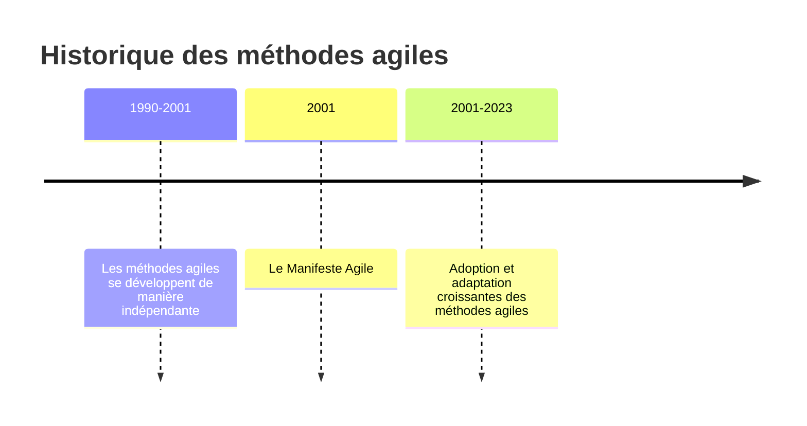
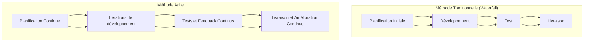
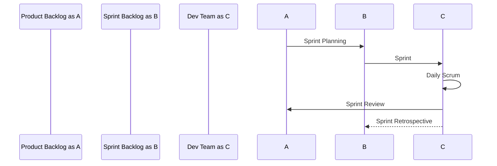
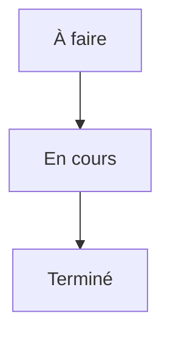

Plan du cours sur les méthodes agiles et à leur utilisation dans la gestion de projets informatiques. 

I. Introduction aux méthodes agiles
   1. Définition et historique
   2. Les principes du Manifeste Agile
   3. Comparaison avec les méthodes traditionnelles

II. Les différentes méthodes agiles
   1. Scrum
       1. Les rôles : Product Owner, Scrum Master, Équipe de développement
       2. Les événements : Sprint, Sprint Planning, Daily Scrum, Sprint Review, Sprint Retrospective
       3. Les artefacts : Product Backlog, Sprint Backlog, Increment
   2. Extreme Programming (XP)
       1. Les valeurs de XP : Communication, Simplicité, Feedback, Courage, Respect
       2. Les pratiques de XP : les 12 pratiques originales et les nouvelles pratiques
   3. Kanban
       1. Les principes de Kanban : visualiser le travail, limiter le travail en cours, améliorer de manière continue
       2. Le tableau Kanban : À faire, En cours, Terminé
   4. DSDM (Dynamic Systems Development Method)
   5. Crystal
   6. Feature Driven Development (FDD)
   7. Lean Software Development

III. Les outils de gestion Agile
   1. Les tableaux Kanban physiques et numériques
   2. Les logiciels de suivi de projets : JIRA, Trello, etc.
   3. Les outils de communication et de collaboration : Slack, Microsoft Teams, etc.

IV. Les défis et solutions dans l'application des méthodes agiles
   1. La résistance au changement
   2. L’importance de la communication et de la collaboration
   3. Le rôle du management dans un environnement agile
   4. Comment adapter les méthodes agiles à différents contextes

# 1. Introduction aux méthodes agiles

# 1.1 Définition et historique

Les méthodes agiles sont des pratiques de gestion de projet qui encouragent la flexibilité, la collaboration et l'amélioration continue. Elles ont été popularisées par le Manifeste Agile, publié en 2001 par un groupe de professionnels de l'informatique cherchant une alternative aux approches traditionnelles de gestion de projet, souvent considérées comme rigides et lentes.

On trouve des prémisses dès 1968 [ces-archives-chamboulent-la-tech](https://ingenioz.it/blog/ces-archives-chamboulent-la-tech)  
L'agilité, les tdd, la conception incrémentale ont tous été décrits en 1968 lors d'une réunion des plus grands informaticiens de l'époque par l'Otan.

## 1.2 Les principes du Manifeste Agile

Le Manifeste Agile énonce quatre valeurs fondamentales et douze principes qui guident l'application des méthodes agiles. Les valeurs sont :

- Les individus et leurs interactions plus que les processus et les outils
- Un logiciel opérationnel plus qu'une documentation exhaustive
- La collaboration avec le client plus que la négociation contractuelle
- L'adaptation au changement plus que le suivi d'un plan

Ces valeurs sont complétées par douze principes, qui détaillent comment ces valeurs peuvent être mises en œuvre dans la pratique.

## 1.3 Comparaison avec les méthodes traditionnelles

Par rapport aux méthodes traditionnelles, aussi connues sous le nom de méthodes "en cascade" ou "waterfall", les méthodes agiles privilégient l'adaptabilité et l'itération rapide. Au lieu de suivre un plan détaillé établi dès le début du projet, les méthodes agiles encouragent une planification continue et la capacité à s'adapter aux changements.
@TODO debugger diagramme

# 2. Les différentes méthodes agiles
# 2.1 Scrum

Scrum est une des méthodes agiles les plus largement utilisées dans le monde du développement de logiciel. Développée initialement par Jeff Sutherland et Ken Schwaber dans les années 1990, Scrum est conçue pour gérer et contrôler les processus de développement de logiciels et de produits complexes. Elle est basée sur un système itératif et incrémental qui favorise l'adaptabilité et la collaboration.

La méthode Scrum se compose des éléments suivants :

1. **Le Product Backlog** : C'est la liste de toutes les fonctionnalités, changements et corrections que le produit pourrait nécessiter. Ces éléments sont souvent appelés "user stories". Le Product Owner est responsable de la maintenance et de la priorisation de cet inventaire.

2. **Les Sprints** : Les sprints sont des cycles de travail d'une durée généralement de deux à quatre semaines où l'équipe Scrum travaille pour compléter un ensemble défini de user stories du backlog. Chaque sprint commence par une réunion de planification de sprint et se termine par une revue de sprint et une rétrospective.

3. **La réunion de planification du sprint (Sprint Planning)** : L'équipe Scrum se réunit au début de chaque sprint pour choisir quelles user stories du Product Backlog seront réalisées pendant ce sprint.

4. **Le Sprint Backlog** : C'est l'ensemble de user stories sélectionnées pour le sprint en cours. Ces user stories sont décomposées en tâches à accomplir par l'équipe de développement.

5. **Le Daily Scrum** : C'est une réunion quotidienne de 15 minutes où l'équipe de développement synchronise ses activités et planifie le travail pour les prochaines 24 heures.

6. **La revue de sprint (Sprint Review)** : À la fin du sprint, l'équipe Scrum présente le travail accompli au cours du sprint à toutes les parties prenantes. Cette réunion permet de recueillir des feedbacks et de s'assurer que le travail effectué est aligné avec les objectifs du produit.

7. **La rétrospective de sprint** : C'est la dernière activité d'un sprint. L'équipe Scrum se réunit pour réfléchir à la manière dont le dernier sprint s'est déroulé et identifier les opportunités d'amélioration pour le prochain sprint.

Scrum est un cadre de travail qui favorise l'adaptabilité, l'itération rapide, l'implication du client et le travail d'équipe pour livrer un produit de haute qualité.

# 2.2 Extreme Programming (XP)

L'Extreme Programming (XP) est une méthode agile qui met l'accent sur l'excellence technique et la livraison continue de valeur. Elle a été créée par Kent Beck au milieu des années 1990 et est particulièrement adaptée au développement de logiciels dans des environnements incertains ou qui changent rapidement.

XP repose sur cinq valeurs fondamentales :

1. **Communication** : XP encourage une collaboration étroite entre tous les membres de l'équipe. Les développeurs travaillent ensemble en binôme et partagent leurs connaissances, tandis que les clients sont également intégrés au processus de développement pour communiquer leurs besoins et leurs commentaires.

2. **Simplicité** : XP promeut le concept de "faire ce qui est nécessaire et pas plus". Cela signifie que l'équipe doit toujours chercher la solution la plus simple qui répond aux besoins actuels, sans essayer de prévoir trop loin dans le futur.

3. **Feedback** : L'équipe doit chercher à obtenir un retour d'information constant pour s'assurer que le produit répond aux attentes du client. Cela se fait par des tests automatisés, des livraisons fréquentes de nouvelles versions du logiciel, et une communication constante avec le client.

4. **Courage** : Les membres de l'équipe doivent avoir le courage de faire face à des problèmes difficiles, de remettre en question les décisions existantes si nécessaire, et de changer de direction si cela s'avère être dans le meilleur intérêt du projet.

5. **Respect** : Chaque membre de l'équipe doit respecter les autres et leurs contributions. Cela crée une culture d'équipe saine et productive où les gens se sentent valorisés et motivés à faire de leur mieux.

En plus de ces valeurs, XP met en pratique une série de pratiques spécifiques, telles que le développement piloté par les tests (Test-Driven Development - TDD), l'intégration continue, la programmation en binôme, le refactoring régulier, et d'autres.

L'objectif d'XP est de développer un logiciel de haute qualité qui répond aux besoins des clients, et de le faire de manière efficace et durable.

# 2.3 Kanban

Kanban est une méthode agile qui met l'accent sur le flux de travail et l'efficacité. Le nom Kanban est d'origine japonaise et signifie littéralement "carte" ou "panneau". Cette approche est née dans l'industrie automobile chez Toyota, dans le but de gérer efficacement le flux de production.

Dans le domaine du développement logiciel, Kanban est utilisé pour visualiser le travail, limiter le travail en cours et optimiser le flux de travail. Le processus de travail est représenté sous forme d'étapes (par exemple, "À faire", "En cours", "Terminé") et les tâches sont représentées par des cartes qui sont déplacées d'une étape à l'autre.

Les principes clés de Kanban sont :

1. Visualiser le travail : Un tableau Kanban est utilisé pour visualiser le travail et l'avancement des tâches. Cela permet à toute l'équipe de voir l'état actuel du travail.

2. Limiter le travail en cours : Le nombre de tâches en cours à un moment donné est limité. Cela permet d'éviter le surmenage et d'assurer que le travail est complété avant de passer à la prochaine tâche.

3. Améliorer de manière continue : L'équipe doit constamment chercher des moyens d'améliorer le processus de travail. Cela peut se faire par des réunions régulières pour discuter des problèmes et proposer des solutions.

Kanban est une méthode flexible et adaptable qui peut être utilisée en conjonction avec d'autres méthodes agiles. Elle convient particulièrement bien aux projets où les exigences peuvent changer fréquemment et où la livraison rapide est importante.

## 2.4 DSDM (Dynamic Systems Development Method)

Le DSDM est une méthode agile centrée sur le développement rapide d'applications (RAD). Il a été initialement développé dans les années 1990 pour offrir une structure plus détaillée aux méthodes de développement rapide d'applications, et a évolué pour incorporer des principes et des pratiques agiles.

Voici les principaux éléments du DSDM :

1. **Les principes directeurs** : DSDM est basé sur neuf principes qui doivent toujours être respectés. Ils comprennent l'implication active des utilisateurs, la livraison fréquente, la collaboration entre les parties prenantes, l'approche itérative et incrémentale, et d'autres.

2. **Le cycle de vie du projet** : Le DSDM présente un cycle de vie de projet détaillé qui se compose de cinq phases : l'étude de faisabilité, l'étude d'entreprise, le modèle fonctionnel itératif, la conception et la construction itératives, et l'implémentation.

3. **Les rôles et responsabilités** : Le DSDM définit un ensemble clair de rôles et de responsabilités, comprenant le Sponsor de l'entreprise, le Visionnaire, l'Ambassadeur de l'utilisateur, le Coordinateur de projet, le Gestionnaire de projet, le Développeur, et l'Analyste d'affaires.

4. **Les produits de travail** : Le DSDM identifie plusieurs "produits" ou "livrables" clés qui doivent être produits tout au long du projet. Ils peuvent comprendre un plan de projet, une description de l'architecture du système, des scénarios d'utilisation, des modèles de données et d'autres.

5. **Les techniques** : Le DSDM utilise un certain nombre de techniques spécifiques pour faciliter le développement du projet, y compris l'analyse des besoins, la modélisation de données, le prototypage fonctionnel, la gestion du temps (timeboxing), et d'autres.

L'une des particularités du DSDM est son engagement à respecter les délais et les budgets. Pour y parvenir, il utilise une approche appelée "fixer le temps et les ressources, ajuster la fonctionnalité", qui implique d'ajuster la portée du projet pour respecter les contraintes de temps et de ressources, tout en s'assurant que le système répond aux besoins essentiels de l'entreprise.

## 2.5 Crystal

Crystal est une famille de méthodes de développement de logiciels agiles conçues par Alistair Cockburn. Plutôt qu'une approche monolithique unique, Crystal se compose d'un ensemble de cadres méthodologiques, chacun adapté à des équipes de différentes tailles et à différents types de projets. Les différentes méthodologies Crystal sont désignées par une couleur, par exemple Crystal Clear, Crystal Yellow, Crystal Orange et Crystal Red, chaque couleur reflétant la taille du projet et le degré de criticité.

Les aspects clés de Crystal sont les suivants :

1. **Les principes et valeurs** : Crystal met l'accent sur les personnes, les interactions, la communauté, les compétences, les talents et les communications. Les valeurs clés comprennent la sécurité, l'efficacité, la simplicité et l'augmentation de la portée de la communication.

2. **Cycle de développement** : Crystal préconise un cycle de développement itératif et incrémental, avec des cycles généralement d'une durée d'un à trois mois. Chaque cycle se termine par une version livrable du logiciel qui a une valeur d'usage pour les utilisateurs.

3. **Rôles** : Dans Crystal, les rôles varient en fonction de la taille et de la criticité du projet. Cependant, il y a des rôles communs comme le sponsor (qui fournit les ressources et l'orientation), le lead designer ou programmeur (qui guide le développement technique), les utilisateurs (qui spécifient les exigences), et les programmeurs/équipe de développement (qui développent le logiciel).

4. **Rituels** : Crystal préconise des rituels tels que les réunions de lancement, où les exigences et la planification sont discutées, les sessions de réflexion pour discuter de l'amélioration continue, et les réunions de clôture pour discuter de ce qui a été accompli et de ce qui doit être fait ensuite.

5. **Artefacts** : Les artefacts dans Crystal peuvent inclure des diagrammes d'architecture, des scénarios d'utilisation, des feuilles de temps pour suivre le temps passé sur les tâches, et des listes de tâches pour la prochaine itération.

La flexibilité est au cœur de Crystal, permettant aux équipes d'adapter la méthodologie à leurs besoins spécifiques. Elle reconnaît que chaque équipe, chaque projet et chaque organisation est unique et nécessite une approche adaptée à leur contexte spécifique.

## 2.6 Feature Driven Development (FDD)

Le Feature Driven Development (FDD) est une méthode de développement de logiciels agile qui se concentre sur la construction de fonctionnalités. Le FDD a été développé par Jeff De Luca et Peter Coad à la fin des années 1990, et est conçu pour s'adapter aux projets de développement de logiciels de grande envergure.

Voici les composants clés du FDD :

1. **Les fonctionnalités** : Dans le FDD, une fonctionnalité est une petite, concrète, et orientée client unité de travail dans le logiciel. Les fonctionnalités sont généralement exprimées dans la forme "action - résultat - objet", par exemple, "calculer - le total de la facture - pour un client".

2. **Le processus de développement** : Le processus de développement du FDD est découpé en cinq étapes : Développer une compréhension globale, construire une liste de fonctionnalités, planifier par fonctionnalité, concevoir par fonctionnalité, et construire par fonctionnalité.

3. **Les rôles** : Le FDD définit un certain nombre de rôles, dont le chef de projet, l'architecte en chef, les programmeurs, les propriétaires de classe, les écrivains de fonctionnalités, et d'autres.

4. **Les livrables** : En plus du code source lui-même, le FDD prévoit la création de plusieurs livrables, notamment un modèle de domaine de haut niveau, une liste de fonctionnalités, des plans de construction de fonctionnalités, et des rapports d'avancement.

5. **Les normes de codage** : Le FDD insiste sur l'importance des normes de codage et de la documentation, afin de garantir que le code est uniforme, compréhensible, et maintenable.

L'objectif du FDD est de produire un logiciel fonctionnel et de haute qualité de manière efficace et prévisible. Pour y parvenir, il met l'accent sur le développement de fonctionnalités spécifiques, la planification et la conception détaillées, la collaboration étroite au sein de l'équipe, et l'obtention de commentaires réguliers sur l'avancement du projet.

# 2.7 Lean Software Development

Le Lean Software Development (LSD) est une méthode de développement de logiciels qui applique les principes du lean manufacturing et de la production juste-à-temps au domaine du développement de logiciels. Il a été développé par Mary et Tom Poppendieck au début des années 2000.

Voici les principaux éléments du Lean Software Development :

1. **Les principes** : Le LSD est basé sur sept principes fondamentaux : Éliminer les déchets, Améliorer l'apprentissage, Décider le plus tard possible, Livrer le plus vite possible, Autonomiser l'équipe, Construire l'intégrité, et Voir le tout.

2. **Éliminer les déchets** : Tout ce qui n'ajoute pas de valeur au client est considéré comme un déchet. Cela peut inclure des choses comme l'écriture de code ou de fonctionnalités inutiles, le fait d'attendre d'autres parties du projet, le passage de tâches non nécessaires, etc.

3. **Améliorer l'apprentissage** : Le LSD valorise l'apprentissage continu et l'adaptation à la réalité changeante d'un projet. Cela peut être réalisé par des réunions d'équipe régulières, des revues de code, l'utilisation de tests automatisés, etc.

4. **Décider le plus tard possible** : En retardant les décisions jusqu'à ce que vous ayez le plus d'informations possible, vous pouvez faire des choix plus informés et éviter de vous enfermer dans une direction incorrecte.

5. **Livrer le plus vite possible** : En livrant rapidement et souvent, vous pouvez obtenir un feedback plus tôt, ce qui vous permet d'apprendre et de vous adapter plus rapidement.

6. **Autonomiser l'équipe** : Les membres de l'équipe devraient avoir la liberté de prendre des décisions et de contrôler leur propre travail. Cela nécessite de leur donner non seulement les responsabilités, mais aussi les compétences et l'autorité nécessaires pour prendre des décisions.

7. **Construire l'intégrité** : Le LSD souligne l'importance de construire des systèmes qui ont à la fois une intégrité conceptuelle (c'est-à-dire qu'ils fonctionnent bien ensemble en tant que système) et une intégrité perceptive (c'est-à-dire qu'ils fonctionnent bien pour l'utilisateur).

8. **Voir le tout** : Plutôt que de se concentrer uniquement sur les parties individuelles d'un projet, le LSD met l'accent sur l'importance de comprendre et d'optimiser le système dans son ensemble.

L'objectif du Lean Software Development est de maximiser la valeur pour le client tout en minimisant le gaspillage. Pour y parvenir, il met l'accent sur l'amélioration continue, le respect des personnes et l'amélioration de la productivité globale.

# 3. Les outils de gestion Agile

# 3.1 Les tableaux Kanban physiques et numériques

Les tableaux Kanban sont une caractéristique fondamentale de la méthodologie Kanban. Ils représentent l'état d'avancement des tâches et des projets, permettant une visibilité et une transparence accrues du travail en cours. 

## 3.1.1 Les tableaux Kanban physiques

Un tableau Kanban physique est souvent un tableau blanc divisé en différentes colonnes, chacune représentant une phase différente du flux de travail. Par exemple, un tableau Kanban de base pourrait être divisé en trois colonnes : "À faire", "En cours" et "Terminé". 

Les tâches sont représentées par des cartes, généralement des post-its, qui sont déplacées d'une colonne à l'autre à mesure qu'elles progressent. C'est une méthode simple mais puissante pour visualiser le travail en cours et pour voir où se produisent les goulots d'étranglement.

L'avantage d'un tableau Kanban physique est sa simplicité et sa visibilité. Il n'y a pas besoin de logiciel ou de formation spécialisée pour l'utiliser, et toute personne qui passe peut voir rapidement l'état d'avancement du projet. Cependant, il peut être plus difficile à gérer pour les grandes équipes ou les projets complexes, et il n'est pas pratique pour les équipes à distance.

## 3.1.2 Les tableaux Kanban numériques

Un tableau Kanban numérique offre les mêmes fonctionnalités qu'un tableau physique, mais il est hébergé en ligne, généralement comme une application web ou mobile. Les tâches sont représentées par des cartes numériques qui peuvent être déplacées entre les colonnes, ajoutées, modifiées ou supprimées.

Les tableaux Kanban numériques offrent plusieurs avantages par rapport aux tableaux physiques. Ils sont plus flexibles et évolutifs, permettant de gérer de grandes quantités de tâches et de flux de travail plus complexes. Ils peuvent intégrer des fonctionnalités supplémentaires, comme les notifications, les commentaires, les pièces jointes, et l'intégration avec d'autres outils. De plus, ils sont accessibles à distance, ce qui est essentiel pour les équipes distribuées ou le travail à distance.

Cependant, les tableaux Kanban numériques peuvent aussi être plus compliqués à utiliser, nécessitant une formation et une familiarisation. De plus, ils peuvent introduire des distractions supplémentaires, comme les notifications incessantes, et ils nécessitent une connexion internet pour être utilisés.

Dans l'ensemble, le choix entre un tableau Kanban physique et numérique dépendra des besoins spécifiques de votre équipe et de votre projet. Certaines équipes peuvent même choisir d'utiliser une combinaison des deux pour bénéficier des avantages de chacun.

@TODO mettre un exemple de backlog avec comme ticket la réalisation des tâches de conception d'un logiciel (plant uml n'ont pas de diagramme permettant d'avoir un résultat correcte)

# 3.2 Les logiciels de suivi de projets: JIRA, Trello, etc.

Dans le cadre des projets informatiques, et particulièrement ceux utilisant les méthodologies agiles, les outils de suivi de projets sont essentiels. Ils permettent non seulement d'organiser et de prioriser les tâches, mais également de suivre l'avancement des travaux, de communiquer au sein de l'équipe et avec les parties prenantes, et enfin, d'obtenir des métriques sur la performance du projet. Voici quelques exemples parmi les plus populaires :

1. **JIRA** : C'est un produit phare d'Atlassian, largement utilisé dans l'industrie du logiciel. Il est spécialement conçu pour le suivi des bugs, les demandes d'amélioration, et d'autres types de tâches de développement de logiciels. JIRA offre des fonctionnalités robustes pour la gestion de projets, y compris la création et le suivi de tickets, la gestion de workflows personnalisables, des tableaux Kanban et Scrum, des rapports, etc. Il dispose également d'intégrations avec d'autres produits Atlassian comme Confluence et Bitbucket, et d'autres outils de développement tels que Slack, GitHub, etc.

2. **Trello** : Trello est un outil de gestion de projets plus léger et plus visuel que JIRA. Il est basé sur le concept de tableaux Kanban. Chaque tableau représente un projet et est subdivisé en listes (qui représentent généralement les phases d'un projet ou les différentes catégories de tâches), et chaque liste contient des cartes (qui représentent des tâches). Les utilisateurs peuvent déplacer les cartes entre les listes pour représenter l'avancement du travail. Trello est particulièrement populaire parmi les petites équipes et pour des projets moins complexes.

3. **Asana** : Asana est un autre outil de gestion de projets qui offre une grande flexibilité. Il permet de créer des projets, des tâches et des sous-tâches, et offre une variété de vues, dont une vue en liste, une vue en tableau (style Kanban), une vue de calendrier, et une vue de chronologie (style Gantt). Asana est utilisé par diverses équipes, pas seulement pour le développement de logiciels, mais aussi pour le marketing, les ressources humaines, la gestion de produits, etc.

Ces outils, et d'autres similaires, sont essentiels pour gérer efficacement les projets informatiques, surtout lorsque vous travaillez en équipe. Ils facilitent la communication, l'organisation et le suivi du travail, et contribuent à améliorer la transparence et la productivité.

# 3.3 Les outils de communication et de collaboration: Slack, Microsoft Teams, Discord, etc.

Dans le contexte actuel de travail, où les équipes sont souvent réparties sur plusieurs sites, voire à travers le monde, la communication et la collaboration sont essentielles. Heureusement, plusieurs outils sont disponibles pour faciliter ces aspects du travail d'équipe. Voici quelques exemples :

1. **Slack** : C'est une plateforme de communication d'équipe qui offre des canaux de discussion organisés, la messagerie directe, les appels vidéo et audio, et le partage de fichiers. Les équipes peuvent créer des canaux pour différents sujets, projets, équipes ou tout ce qui nécessite une conversation séparée. Slack permet également d'intégrer un grand nombre d'autres outils et services, tels que Google Drive, Trello, GitHub, JIRA, etc., facilitant ainsi le flux de travail.

2. **Microsoft Teams** : C'est la réponse de Microsoft à Slack. Il offre des fonctionnalités similaires, mais est plus intégré à l'écosystème Microsoft, ce qui le rend particulièrement utile pour les équipes qui utilisent déjà des produits Microsoft tels que Office 365. En plus des discussions et des appels, Teams permet également de collaborer sur des documents en temps réel, de planifier des réunions, et plus encore.

3. **Discord** : Initialement conçu pour les communautés de joueurs, Discord est devenu une plateforme de communication populaire pour une variété de groupes, y compris les équipes de développement de logiciels. Il propose des salons textuels, des canaux vocaux, et le partage de fichiers, avec une interface conviviale et une bonne qualité d'audio. Bien que Discord n'ait pas autant de fonctionnalités d'intégration d'entreprise que Slack ou Teams, il est gratuit et plus facile à configurer, ce qui le rend attrayant pour les petites équipes ou les projets avec un budget limité.

Ces outils de communication et de collaboration sont essentiels pour maintenir les équipes synchronisées, favoriser la collaboration et augmenter la productivité. Ils permettent non seulement de communiquer rapidement et efficacement, mais aussi de centraliser les informations, de réduire les e-mails, et de faciliter le travail à distance.

# 4. Les défis et solutions dans l'application des méthodes agiles

## 4.1 La résistance au changement

L'un des défis majeurs dans l'adoption des méthodes agiles est la résistance au changement. Les membres de l'équipe qui sont habitués à des méthodologies plus traditionnelles peuvent avoir du mal à s'adapter à une nouvelle façon de travailler.

**Solution** : La communication ouverte et honnête est la clé pour surmonter cette résistance. Il est important de souligner les avantages des méthodes agiles, tels que la livraison plus rapide, l'amélioration de la qualité du produit et une meilleure satisfaction du client. Des formations et des ateliers peuvent également aider les membres de l'équipe à comprendre et à s'adapter aux méthodes agiles.

## 4.2 L’importance de la communication et de la collaboration

L'agilité repose fortement sur la communication et la collaboration, ce qui peut être un défi, surtout dans les équipes distantes ou dispersées.

**Solution** : L'utilisation d'outils de communication et de collaboration, tels que Slack, Microsoft Teams, JIRA, Trello, etc., peut faciliter la communication et la collaboration au sein de l'équipe. Il est également important de promouvoir une culture d'ouverture et de partage d'informations.

## 4.3 Le rôle du management dans un environnement agile

Dans un environnement agile, le rôle du management change. Au lieu de diriger et de contrôler, le management doit plutôt faciliter et soutenir l'équipe.

**Solution** : La formation des managers sur les principes et les pratiques agiles peut les aider à comprendre leur nouveau rôle. Les managers doivent être encouragés à adopter une approche de leadership serviteur, où leur objectif principal est de servir l'équipe en éliminant les obstacles et en fournissant les ressources nécessaires.

## 4.4 Comment adapter les méthodes agiles à différents contextes

Tous les projets ou organisations ne sont pas identiques. Par conséquent, l'application stricte des méthodes agiles peut ne pas fonctionner dans tous les contextes.

**Solution** : L'agilité est plus une mentalité qu'un ensemble de règles rigides. Il est important d'adapter les méthodes agiles en fonction du contexte de l'organisation ou du projet. Cela peut impliquer de modifier certaines pratiques ou d'adopter une approche hybride qui combine les méthodes agiles avec d'autres méthodologies. Le plus important est de rester fidèle aux principes agiles de collaboration, d'amélioration continue, et de livraison de valeur au client.

