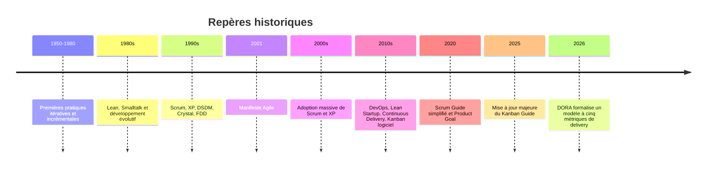
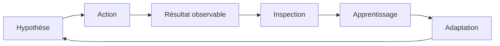

# Les méthodes agiles

> [!abstract] Objectif
> Comprendre l'agilité comme une manière de décider sous incertitude plutôt qu'un rituel : Manifeste, Scrum 2020, XP, Kanban, Lean et discovery produit, estimation et prévision, métriques de flux et DORA, pratiques d'ingénierie et DevOps, leadership et mise à l'échelle — avec un regard critique sur ce qui marche et ce qui a dérivé.

Voir aussi : [[Agile Unified Process (AUP)]], [[git]], [[Docker]], [[Architecture des logiciels]], [[TOGAF]].

> [!important]
> **Agile n'est ni un outil de ticketing, ni une succession de réunions, ni un synonyme de Scrum.**
> L'agilité est une manière de travailler dans l'incertitude en raccourcissant les boucles de feedback, en livrant de la valeur par petits incréments et en adaptant les décisions à ce que l'on apprend.

Ce cours présente les fondements de l'agilité et les principaux cadres et méthodes utilisés dans le développement de produits numériques. Il distingue volontairement :

- les **valeurs et principes** de l'agilité ;
- les **frameworks** comme Scrum ;
- les **stratégies de flux** comme Kanban ;
- les **pratiques d'ingénierie** comme XP, TDD ou l'intégration continue ;
- les pratiques de **product discovery** ;
- les pratiques de **delivery** et DevOps ;
- les métriques de **résultat, de flux et de qualité**.

Le but n'est pas de suivre une méthode « pure », mais de comprendre les mécanismes qui permettent de réduire le risque et d'augmenter la valeur livrée.

Voir aussi :

- [[Agile Unified Process (AUP)]] ;
- [[Architecture des logiciels]] ;
- [[Design patterns]] ;
- [[git]] ;
- [[Docker]].

---

# Sommaire

1. Fondements de l'agilité
2. Complexité, empirisme et pensée produit
3. Scrum
4. Extreme Programming (XP)
5. Kanban
6. Lean Software Development
7. DSDM, Crystal, FDD et AUP
8. Product discovery et dual-track
9. Backlog, user stories et découpage vertical
10. Estimation, engagement et prévision
11. Mesures : valeur, flux et DORA
12. Pratiques d'ingénierie favorisant l'agilité
13. DevOps, CI/CD et livraison continue
14. Qualité, tests et Definition of Done
15. Équipe, collaboration et facilitation
16. Leadership et organisation
17. Agilité à l'échelle
18. Agilité, contraintes réglementaires et approches hybrides
19. Travail distribué et asynchrone
20. Outils de gestion et de collaboration
21. IA générative et équipes agiles
22. Anti-patterns et fausses agilités
23. Choisir et adapter une approche
24. Étude de cas complète
25. Travaux pratiques
26. Projet final
27. Checklists
28. Glossaire
29. Références

---

# 1. Fondements de l'agilité

## 1.1 Définition

L'agilité est une approche de développement adaptée aux environnements dans lesquels :

- le besoin est imparfaitement connu au départ ;
- les priorités peuvent changer ;
- les solutions doivent être expérimentées ;
- la qualité technique doit être maintenue malgré les changements ;
- le feedback des utilisateurs permet d'améliorer la direction prise.

L'idée essentielle est de **réduire la taille et la durée des paris**.

Plutôt que :

```text
18 mois de spécification
        ↓
12 mois de développement
        ↓
3 mois de recette
        ↓
Découverte tardive que le produit ne répond pas au besoin
```

on cherche plutôt :

```text
Hypothèse
   ↓
Petit incrément
   ↓
Validation
   ↓
Mesure
   ↓
Apprentissage
   ↓
Adaptation
```

## 1.2 Historique

L'agilité n'est pas apparue soudainement en 2001. Elle est issue de plusieurs mouvements :

- développement itératif et incrémental ;
- prototypage ;
- Lean et système de production Toyota ;
- programmation structurée ;
- Smalltalk et communautés orientées objet ;
- Rapid Application Development ;
- Scrum ;
- Extreme Programming ;
- Crystal ;
- DSDM ;
- pratiques de livraison incrémentale.


```mermaid
timeline
    title Repères historiques
    1950-1980 : Premières pratiques itératives et incrémentales
    1980s : Lean, Smalltalk et développement évolutif
    1990s : Scrum, XP, DSDM, Crystal, FDD
    2001 : Manifeste Agile
    2000s : Adoption massive de Scrum et XP
    2010s : DevOps, Lean Startup, Continuous Delivery, Kanban logiciel
    2020 : Scrum Guide simplifié et Product Goal
    2025 : Mise à jour majeure du Kanban Guide
    2026 : DORA formalise un modèle à cinq métriques de delivery
```

## 1.3 Le Manifeste Agile

Le **Manifesto for Agile Software Development** est publié en février 2001 par 17 praticiens.

Il contient quatre valeurs. L'idée fondamentale n'est pas de supprimer les éléments de droite, mais de valoriser davantage ceux de gauche :

| On valorise davantage | Sans supprimer |
|---|---|
| individus et interactions | processus et outils |
| logiciel opérationnel | documentation exhaustive |
| collaboration avec le client | négociation contractuelle |
| adaptation au changement | suivi d'un plan |

> [!warning]
> Le Manifeste Agile ne dit donc pas : « pas de documentation », « pas de processus », « pas de contrat » ou « pas de plan ».

## 1.4 Les 12 principes

Les douze principes peuvent être regroupés en six idées :

### Livrer tôt et souvent

La valeur doit parvenir rapidement aux utilisateurs, plutôt que d'attendre la fin d'un grand projet.

### Accepter l'apprentissage

Un changement de besoin n'est pas automatiquement un échec de planification. Il peut être le résultat d'une meilleure compréhension du problème.

### Collaboration étroite

Produit, métier, utilisateurs et développement doivent construire ensemble la solution.

### Équipes responsables

Les équipes ont besoin d'autonomie, de compétences, d'informations et d'un environnement leur permettant d'agir.

### Excellence technique

La capacité à changer rapidement dépend directement de la qualité du logiciel.

### Amélioration continue

Une équipe inspecte régulièrement sa manière de travailler puis expérimente des améliorations.

## 1.5 Agile n'est pas synonyme de Scrum

```text
Agilité
├── valeurs et principes
├── Scrum
├── Kanban
├── Extreme Programming
├── Lean
├── Crystal
├── DSDM
├── FDD
└── nombreuses pratiques complémentaires
```

Une équipe peut être très agile sans Scrum.

À l'inverse, une équipe peut organiser tous les événements Scrum et rester profondément non agile si :

- elle ne livre jamais réellement ;
- le feedback utilisateur arrive trop tard ;
- toutes les décisions restent centralisées ;
- les sprints sont simplement des mini-phases waterfall ;
- la qualité technique se dégrade continuellement.

---

# 2. Complexité, empirisme et pensée produit

## 2.1 Travail compliqué et travail complexe

Il est utile de distinguer :

- un problème **simple** : solution largement connue ;
- un problème **compliqué** : expertise nécessaire mais solution analysable ;
- un problème **complexe** : relation cause-effet difficile à connaître à l'avance ;
- une crise **chaotique** : stabiliser avant d'optimiser.

Le développement de produit contient souvent une forte composante complexe :

- on ne sait pas exactement ce que veulent les utilisateurs ;
- on ignore quelle solution fonctionnera ;
- la technologie interagit avec l'organisation ;
- les concurrents et le marché évoluent.

Dans ce cas, l'expérimentation est souvent plus fiable qu'un plan détaillé à long terme.

## 2.2 Empirisme

Scrum formalise trois piliers :

1. **transparence** ;
2. **inspection** ;
3. **adaptation**.

On retrouve ce cycle dans la plupart des approches agiles :


```mermaid
flowchart LR
    A[Hypothèse] --> B[Action]
    B --> C[Résultat observable]
    C --> D[Inspection]
    D --> E[Apprentissage]
    E --> F[Adaptation]
    F --> A
```

## 2.3 Projet et produit

Un projet possède classiquement :

- une date de début ;
- une date de fin ;
- un budget ;
- un périmètre.

Un produit vit tant qu'il crée de la valeur.

La pensée produit privilégie donc :

```text
output  → ce que nous fabriquons
outcome → ce qui change pour l'utilisateur ou l'organisation
impact  → résultat durable recherché
```

Exemple :

```text
Output : ajouter une fonctionnalité de recherche
Outcome : les utilisateurs trouvent plus rapidement un document
Impact : réduction de 30 % du temps moyen de traitement d'un dossier
```

## 2.4 Incertitude et taille de lot

Une technique centrale de l'agilité consiste à réduire la **batch size**.

Un petit changement est généralement :

- plus rapide à développer ;
- plus simple à relire ;
- plus facile à tester ;
- moins risqué à déployer ;
- plus simple à annuler ;
- plus rapide à valider avec les utilisateurs.

## 2.5 Boucles de feedback

Une équipe cherche à réduire plusieurs délais :

| Feedback | Exemple |
|---|---|
| compilation | secondes |
| tests unitaires | secondes/minutes |
| CI | minutes |
| code review | heures |
| intégration | heures |
| déploiement | heures/jours |
| utilisateur | jours |
| marché | semaines/mois |

L'agilité réelle dépend beaucoup de ces boucles techniques.

---

# 3. Scrum

## 3.1 Scrum aujourd'hui

Au 29 août 2026, la version officielle courante du **Scrum Guide reste celle de novembre 2020**.

Scrum est un framework léger pour résoudre des problèmes complexes et générer de la valeur par des solutions adaptatives.

Il est volontairement peu prescriptif.

## 3.2 Théorie de Scrum

Scrum repose sur :

- empirisme ;
- pensée Lean.

Ses trois piliers sont :

- transparence ;
- inspection ;
- adaptation.

Ses cinq valeurs sont :

- commitment ;
- focus ;
- openness ;
- respect ;
- courage.

## 3.3 Une seule Scrum Team

Depuis le Scrum Guide 2020, on ne parle plus d'une « équipe de développement » séparée du Product Owner et du Scrum Master.

La **Scrum Team** possède trois accountabilities :

```text
Scrum Team
├── Product Owner
├── Scrum Master
└── Developers
```

Le guide indique qu'une Scrum Team est généralement composée de **10 personnes ou moins**.

Elle est :

- cross-functional ;
- self-managing ;
- focalisée sur un seul Product Goal à la fois.

## 3.4 Product Owner

Le Product Owner est responsable de **maximiser la valeur du produit**.

Il est également accountable de la gestion efficace du Product Backlog, notamment :

- développer et communiquer le Product Goal ;
- créer ou faire créer des éléments de backlog compréhensibles ;
- ordonner le Product Backlog ;
- rendre le backlog transparent et compris.

Le Product Owner peut déléguer des activités mais reste accountable.

> [!important]
> Le Product Owner est **une personne**, pas un comité.

## 3.5 Scrum Master

Le Scrum Master est accountable de l'efficacité de Scrum.

Il aide :

- la Scrum Team ;
- le Product Owner ;
- l'organisation.

Il ne doit pas devenir :

- secrétaire des réunions ;
- chef de projet traditionnel renommé ;
- responsable hiérarchique des Developers ;
- personne chargée d'assigner les tâches.

## 3.6 Developers

Les Developers sont les personnes engagées à créer un Increment utilisable chaque Sprint.

Ils sont accountable de :

- créer le plan du Sprint ;
- respecter la Definition of Done ;
- adapter leur plan quotidiennement ;
- se tenir mutuellement responsables comme professionnels.

## 3.7 Le Sprint

Le Sprint est le conteneur de tous les autres événements Scrum.

Il possède une durée fixe de **un mois ou moins**.

Un nouveau Sprint commence immédiatement à la fin du précédent.

Pendant un Sprint :

- aucune modification ne doit mettre en danger le Sprint Goal ;
- la qualité ne doit pas diminuer ;
- le Product Backlog peut être raffiné ;
- le périmètre peut être renégocié avec le Product Owner à mesure que l'on apprend.

## 3.8 Sprint Planning

Pour un Sprint d'un mois, la Sprint Planning est timeboxée à **8 heures maximum**.

Elle répond à trois sujets :

1. **Pourquoi** ce Sprint est-il utile ?
2. **Quoi** peut être réalisé ?
3. **Comment** le travail choisi sera-t-il effectué ?

Le Sprint Goal est produit pendant cette planification.

## 3.9 Daily Scrum

Le Daily Scrum est un événement de **15 minutes pour les Developers**.

Son objectif est d'inspecter la progression vers le Sprint Goal et d'adapter le Sprint Backlog.

Le Scrum Guide 2020 ne prescrit plus les trois questions historiques :

- qu'ai-je fait hier ?
- que vais-je faire aujourd'hui ?
- ai-je un blocage ?

Elles peuvent être utilisées, mais elles ne constituent pas une obligation Scrum.

> [!warning]
> Le Daily Scrum n'est pas un compte-rendu de statut donné au manager ou au Scrum Master.

## 3.10 Sprint Review

Pour un Sprint d'un mois, la Sprint Review dure au maximum **4 heures**.

Ce n'est pas seulement une démonstration.

C'est une session de travail permettant :

- d'inspecter le résultat du Sprint ;
- d'évaluer les changements de contexte ;
- de collaborer avec les parties prenantes ;
- d'adapter le Product Backlog.

## 3.11 Sprint Retrospective

Pour un Sprint d'un mois, elle dure au maximum **3 heures**.

L'équipe inspecte :

- interactions ;
- processus ;
- outils ;
- qualité ;
- problèmes ;
- hypothèses ;
- améliorations réalisées.

Une bonne rétrospective se termine par **une ou quelques expérimentations concrètes**, pas par une longue liste de bonnes intentions.

## 3.12 Les trois artefacts

Scrum définit trois artefacts :

| Artefact | Engagement associé |
|---|---|
| Product Backlog | Product Goal |
| Sprint Backlog | Sprint Goal |
| Increment | Definition of Done |

### Product Backlog

Liste émergente et ordonnée de ce qui est nécessaire pour améliorer le produit.

### Sprint Backlog

Il contient :

```text
Sprint Goal → pourquoi
éléments sélectionnés → quoi
plan d'action → comment
```

### Increment

Un Increment doit être :

- utilisable ;
- intégré aux Increments précédents ;
- conforme à la Definition of Done.

Un Increment peut être livré **avant la Sprint Review**.

La Review n'est donc pas une « porte de release ».

## 3.13 Product Goal

Le Product Goal décrit un état futur du produit servant de cible à la Scrum Team.

Il est plus durable qu'un Sprint Goal.

```text
Vision
  ↓
Product Goal
  ↓
Sprint Goals successifs
  ↓
Increments
```

## 3.14 Definition of Done

La Definition of Done est une description formelle de l'état que doit atteindre l'Increment pour satisfaire les mesures de qualité du produit.

Exemple :

```text
- code relu
- tests automatisés verts
- sécurité statique sans vulnérabilité bloquante
- migrations compatibles
- documentation utile mise à jour
- observabilité ajoutée si nécessaire
- déployable en production
```

Elle ne doit pas être confondue avec des **critères d'acceptation**, spécifiques à un élément de backlog.

## 3.15 Refinement

Le refinement est utile pour :

- clarifier ;
- découper ;
- réordonner ;
- estimer si cela apporte de la valeur ;
- préparer les prochains éléments.

Mais :

> [!important]
> **Le Product Backlog Refinement n'est pas un événement Scrum officiel.**

C'est une activité continue.

## 3.16 User stories et story points ne sont pas obligatoires

Scrum n'impose pas :

- les user stories ;
- les story points ;
- Planning Poker ;
- Jira ;
- vélocité ;
- burndown chart.

Ces techniques sont complémentaires.

## 3.17 Erreurs Scrum courantes

### Sprint = mini waterfall

```text
Semaine 1 : analyse
Semaine 2 : développement
Semaine 3 : tests
Semaine 4 : intégration
```

Ce modèle conserve de grandes files d'attente internes.

On préfère des tranches verticales :

```text
fonction A : analyse + dev + test + intégration
fonction B : analyse + dev + test + intégration
...
```

### Story points comme KPI individuel

À éviter absolument.

### Sprint Goal absent

Sans objectif, le sprint devient une simple liste de tickets indépendants.

### Product Owner proxy

Si le Product Owner n'a aucune autorité sur l'ordre du backlog, la boucle de décision reste lente.

### Definition of Done faible

Un élément déclaré « fini » mais nécessitant ensuite une phase de test ou d'intégration produit une fausse transparence.

---

# 4. Extreme Programming (XP)

## 4.1 Pourquoi XP reste important

Scrum structure surtout l'empirisme et l'organisation du travail.

Il dit peu sur **comment écrire le logiciel**.

XP apporte précisément les pratiques techniques nécessaires pour pouvoir changer fréquemment sans dégrader le système.

## 4.2 Les cinq valeurs

XP repose sur :

- communication ;
- simplicité ;
- feedback ;
- courage ;
- respect.

## 4.3 Principales pratiques XP

### Test-Driven Development

Cycle :

```text
Red → Green → Refactor
```

### Pair Programming

Deux personnes travaillent ensemble sur le même problème avec des rôles dynamiques.

### Mob / Ensemble Programming

Toute l'équipe travaille sur un même problème à un moment donné.

### Continuous Integration

Les modifications sont intégrées très fréquemment dans une branche partagée et validées automatiquement.

### Refactoring

Améliorer la conception du code sans modifier son comportement observable.

### Simple Design

Construire la solution la plus simple satisfaisant les besoins actuels tout en gardant le code facilement modifiable.

### Collective Code Ownership

Le code appartient à l'équipe, pas à une personne.

### Coding Standards

Un style commun réduit les frictions.

### Sustainable Pace

La vitesse obtenue par épuisement de l'équipe n'est pas durable.

### Small Releases

De petits incréments réduisent le risque et accélèrent le feedback.

### Whole Team

Les compétences nécessaires à la création de valeur doivent pouvoir collaborer directement.

## 4.4 XP et architecture

XP ne signifie pas absence d'architecture.

Il favorise :

- décisions réversibles ;
- tests ;
- refactoring continu ;
- simplicité ;
- architecture évolutive.

Voir [[Architecture des logiciels]].

---

# 5. Kanban

## 5.1 Kanban aujourd'hui

Le **Kanban Guide courant est celui de mai 2025**.

Il définit Kanban comme une stratégie d'optimisation du **flux de valeur** dans un processus.

Kanban n'impose pas :

- des sprints ;
- des rôles spécifiques ;
- un type particulier de ticket ;
- une fréquence de réunion universelle.

## 5.2 Les trois pratiques de Kanban

Le guide 2025 retient trois pratiques :

1. **définir et visualiser le workflow** ;
2. **gérer activement les éléments dans le workflow** ;
3. **améliorer le workflow**.

## 5.3 Definition of Workflow

Le système Kanban doit définir explicitement son **Definition of Workflow (DoW)**.

Au minimum :

1. l'unité de valeur qui traverse le workflow ;
2. le point où le travail est considéré comme démarré ;
3. le point où il est considéré comme terminé ;
4. les états traversés ;
5. la manière dont le WIP est contrôlé ;
6. les politiques explicites ;
7. une **Service Level Expectation**.

## 5.4 Tableau Kanban

Un tableau ne doit pas forcément se limiter à :

```text
Todo → Doing → Done
```

Un exemple plus informatif :


```mermaid
flowchart LR
    A[Options] --> B[Ready]
    B --> C[Development]
    C --> D[Review]
    D --> E[Validation]
    E --> F[Done]
```

On peut visualiser :

- limites de WIP ;
- éléments bloqués ;
- classes de service ;
- SLE ;
- âge des éléments.

## 5.5 Limites de WIP

Le **Work In Progress** correspond au travail démarré mais non terminé.

Limiter le WIP réduit :

- multitâche ;
- files d'attente ;
- temps de cycle ;
- travail oublié.

Exemple :

```text
Development    WIP ≤ 3
Review         WIP ≤ 2
Validation     WIP ≤ 2
```

Quand une colonne atteint sa limite, l'équipe ne doit pas simplement démarrer un nouvel élément ailleurs.

Elle cherche d'abord à **terminer** le travail déjà engagé.

## 5.6 Système tiré

Dans un système pull :

```text
capacité disponible
        ↓
élément suivant tiré
```

et non :

```text
nouveau travail poussé en permanence
        ↓
files d'attente croissantes
```

## 5.7 Les quatre métriques minimales de flux

Le Kanban Guide 2025 impose au minimum :

### WIP

Nombre d'éléments démarrés mais non terminés.

### Throughput

Nombre d'éléments terminés par unité de temps.

```text
17 éléments / semaine
```

### Work Item Age

Âge actuel d'un élément encore en cours.

### Cycle Time

Durée entre le démarrage et la fin d'un élément.

## 5.8 Service Level Expectation

Une SLE est une **prévision probabiliste**, par exemple :

```text
85 % des éléments terminés en 8 jours ou moins
```

Elle ne signifie pas :

```text
chaque ticket sera fini en 8 jours
```

## 5.9 Cumulative Flow Diagram

Le CFD aide à observer :

- WIP ;
- débit ;
- files d'attente ;
- stabilité du système.

```text
Élargissement durable d'une bande
        ↓
Accumulation de travail dans cet état
        ↓
Probable goulot d'étranglement
```

## 5.10 Scatterplot de cycle time

Chaque élément terminé est représenté par sa durée.

Cela permet d'utiliser les percentiles :

```text
50e percentile : 3 jours
85e percentile : 7 jours
95e percentile : 12 jours
```

## 5.11 Monte Carlo

À partir de l'historique du throughput, on peut simuler :

```text
Quand finirons-nous 40 éléments ?
```

ou :

```text
Combien d'éléments pouvons-nous terminer avant le 30 septembre ?
```

La réponse doit être probabiliste :

```text
50 % de probabilité : 28 septembre
85 % de probabilité : 7 octobre
95 % de probabilité : 15 octobre
```

## 5.12 Scrum + Kanban

Kanban peut compléter Scrum :

- Sprint Goal conservé ;
- événements Scrum conservés ;
- flux visualisé ;
- WIP limité ;
- cycle time mesuré ;
- SLE utilisée pour améliorer la prévisibilité.

---

# 6. Lean Software Development

## 6.1 Origines

Lean Software Development adapte au logiciel des idées issues notamment du Toyota Production System.

Mary et Tom Poppendieck ont largement popularisé cette adaptation.

## 6.2 Sept principes classiques

1. éliminer le gaspillage ;
2. amplifier l'apprentissage ;
3. décider aussi tard que raisonnablement possible ;
4. livrer aussi vite que possible ;
5. donner de l'autonomie aux équipes ;
6. construire la qualité et l'intégrité ;
7. optimiser le système dans son ensemble.

## 6.3 Les gaspillages dans le logiciel

Exemples :

- fonctionnalités inutilisées ;
- attentes ;
- handoffs ;
- tâches partiellement terminées ;
- multitâche ;
- défauts ;
- processus manuels répétitifs ;
- surproduction documentaire ;
- longues files de validation.

## 6.4 Value Stream Mapping

On cartographie :

```text
Demande utilisateur
    ↓
Analyse
    ↓ attente
Développement
    ↓ attente
Review
    ↓ attente
Tests
    ↓ attente
Déploiement
```

Puis on compare :

```text
Touch time = temps réellement travaillé
Lead time  = durée totale
```

Un workflow peut avoir :

```text
Touch time : 8 heures
Lead time  : 21 jours
```

Le principal problème est alors le système d'attente, pas la vitesse individuelle des développeurs.

## 6.5 Optimiser le système

Améliorer un poste localement peut dégrader l'ensemble.

Exemple :

```text
Développement deux fois plus rapide
        ↓
Review inchangée
        ↓
Queue de review multipliée
        ↓
Lead time global dégradé
```

---

# 7. DSDM, Crystal, FDD et AUP

Ces approches sont aujourd'hui moins fréquentes que Scrum/Kanban dans de nombreuses équipes logicielles, mais elles restent intéressantes historiquement et pédagogiquement.

## 7.1 DSDM

**Dynamic Systems Development Method** est issu du mouvement RAD britannique des années 1990.

Il insiste notamment sur :

- implication métier ;
- livraison fréquente ;
- collaboration ;
- qualité ;
- développement itératif ;
- timeboxing ;
- priorisation MoSCoW.

### MoSCoW

```text
Must have
Should have
Could have
Won't have this time
```

Cette priorisation est particulièrement utile lorsque :

```text
temps et coût ≈ fixes
scope = variable d'ajustement
```

## 7.2 Crystal

Crystal est une famille d'approches créée par Alistair Cockburn.

Elle insiste sur :

- personnes ;
- communication ;
- sécurité psychologique ;
- adaptation au contexte ;
- fréquence de livraison ;
- criticité du système.

Le niveau de formalisme peut augmenter avec :

- taille d'équipe ;
- conséquences d'une défaillance ;
- contraintes réglementaires.

## 7.3 Feature Driven Development

FDD structure le travail autour de petites fonctionnalités orientées valeur.

Son processus classique comprend :

1. développer un modèle global ;
2. construire la liste de fonctionnalités ;
3. planifier par fonctionnalité ;
4. concevoir par fonctionnalité ;
5. construire par fonctionnalité.

## 7.4 Agile Unified Process

AUP simplifie les idées du Rational Unified Process tout en conservant des phases et disciplines.

Voir le cours dédié : [[Agile Unified Process (AUP)]].

## 7.5 Pourquoi les connaître ?

Elles montrent que :

> [!important]
> Il n'existe pas une unique recette agile.

Le contexte compte :

- équipe ;
- criticité ;
- domaine ;
- contraintes ;
- maturité technique ;
- fréquence de livraison nécessaire.

---

# 8. Product discovery et dual-track

## 8.1 Le problème du backlog de fonctionnalités

Une équipe peut être très efficace à construire des fonctionnalités inutiles.

Le delivery répond à :

```text
Construisons-nous correctement la solution ?
```

La discovery répond à :

```text
Construisons-nous la bonne solution ?
```

## 8.2 Hypothèses

Une fonctionnalité devrait souvent commencer par une hypothèse :

```text
Nous pensons que...
Pour...
Cela produira...
Nous saurons que c'est vrai si...
```

Exemple :

```text
Nous pensons qu'une recherche plein texte
réduira le temps de traitement des dossiers
pour les agents administratifs.

Nous considérerons l'hypothèse validée
si le temps médian passe de 4 min à moins de 2 min.
```

## 8.3 Dual-track

On peut organiser deux flux fortement connectés :

```text
Discovery                    Delivery
─────────                    ────────
problème                     conception détaillée
recherche                    code
prototype        →           tests
expérience                   déploiement
validation                   exploitation
```

Il ne s'agit pas nécessairement de deux équipes séparées.

## 8.4 Techniques de discovery

- interviews ;
- observation ;
- analytics ;
- prototype ;
- fake door ;
- concierge test ;
- Wizard of Oz ;
- test d'utilisabilité ;
- A/B test lorsque pertinent ;
- analyse qualitative des tickets support.

## 8.5 Risques à réduire

On peut distinguer :

- **value risk** : les utilisateurs en veulent-ils ?
- **usability risk** : sauront-ils l'utiliser ?
- **feasibility risk** : pouvons-nous le construire ?
- **viability risk** : est-ce viable pour l'organisation ?

---

# 9. Backlog, user stories et découpage vertical

## 9.1 Un backlog n'est pas une spécification figée

Le backlog est émergent.

Les éléments lointains peuvent rester plus grossiers que ceux proches de la réalisation.

## 9.2 User stories

Forme classique :

```text
En tant que <persona>,
je veux <capacité>,
afin de <bénéfice>.
```

Exemple :

```text
En tant qu'administrateur,
je veux révoquer une session active,
afin de protéger un compte compromis.
```

La forme n'est pas obligatoire.

Une user story est surtout une **invitation à la conversation**.

## 9.3 Critères d'acceptation

Exemple :

```text
Given un utilisateur possédant 3 sessions actives
When l'administrateur révoque la session mobile
Then cette session ne peut plus appeler l'API
And les deux autres sessions restent valides
```

## 9.4 Definition of Ready

Une Definition of Ready peut être une convention locale utile.

Mais :

> [!warning]
> **Elle ne fait pas partie de Scrum.**

Elle devient nuisible si elle sert de barrière bureaucratique retardant l'apprentissage.

## 9.5 Découpage vertical

À éviter :

```text
Story 1 : créer la base
Story 2 : créer l'API
Story 3 : créer l'interface
Story 4 : écrire les tests
```

Préférer :

```text
Story 1 : utilisateur peut créer un dossier simple
Story 2 : utilisateur peut ajouter une pièce jointe
Story 3 : utilisateur peut soumettre le dossier
```

Chaque tranche traverse les couches nécessaires.

## 9.6 Techniques de slicing

Découper par :

- scénario ;
- règle métier ;
- type de données ;
- rôle utilisateur ;
- workflow heureux puis erreurs ;
- opération CRUD ;
- complexité ;
- performance ;
- zone géographique ;
- niveau d'automatisation.

## 9.7 INVEST

Un bon rappel pour une story :

```text
Independent
Negotiable
Valuable
Estimable
Small
Testable
```

Ce n'est pas une loi universelle.

---

# 10. Estimation, engagement et prévision

## 10.1 Estimer n'est pas prédire exactement

Une estimation exprime une incertitude.

```text
« 5 jours exactement »
```

est rarement une information réaliste pour un travail complexe.

On préfère parfois :

```text
50 % : ≤ 4 jours
85 % : ≤ 8 jours
95 % : ≤ 13 jours
```

## 10.2 Story points

Les story points peuvent représenter une estimation relative combinant :

- effort ;
- complexité ;
- risque ;
- incertitude.

Ils ne possèdent **aucune unité universelle**.

## 10.3 Velocity

```text
velocity = points terminés par sprint
```

Elle peut aider une équipe à prévoir son propre travail.

Elle ne doit pas servir à :

- comparer des équipes ;
- fixer un objectif de performance ;
- évaluer des individus ;
- rémunérer selon les points.

Sinon la métrique devient immédiatement manipulable.

## 10.4 Planning Poker

Les participants choisissent une estimation indépendamment, puis discutent surtout des divergences.

La vraie valeur n'est pas le nombre final mais la **conversation sur les hypothèses**.

## 10.5 No Estimates

Dans certains contextes, on peut obtenir une bonne prévision par :

- éléments suffisamment petits ;
- historique de throughput ;
- cycle time ;
- simulation Monte Carlo.

Cela ne signifie pas « aucune prévision ».

## 10.6 Prévision probabiliste

Exemple :

```text
Question : pouvons-nous livrer 25 éléments avant le 30 novembre ?

Simulation :
50 % → 17 novembre
85 % → 28 novembre
95 % → 7 décembre
```

Une décision peut alors être prise avec le risque explicite.

## 10.7 Engagement

On doit distinguer :

```text
forecast   ≠ commitment
estimate   ≠ deadline
scope      ≠ outcome
```

Une équipe peut s'engager sur :

- qualité ;
- transparence ;
- objectifs ;
- investigation ;
- gestion du risque.

Elle ne contrôle pas toujours exactement la date à laquelle toute inconnue disparaîtra.

---

# 11. Mesures : valeur, flux et DORA

## 11.1 Trois niveaux de mesure

Une bonne stratégie combine :

### Outcome

Le résultat pour l'utilisateur ou l'organisation.

### Flow

La capacité du système à transformer les idées en valeur.

### Quality / reliability

La qualité et la stabilité de ce qui est livré.

## 11.2 Métriques à éviter comme objectifs

- lignes de code ;
- nombre de commits ;
- nombre de tickets fermés ;
- story points individuels ;
- taux d'occupation à 100 % ;
- vélocité comparée entre équipes.

## 11.3 Loi de Goodhart

> Lorsqu'une mesure devient une cible, elle cesse souvent d'être une bonne mesure.

Exemple :

```text
Objectif : augmenter le nombre de tickets fermés
        ↓
Découpage artificiel des tickets
        ↓
Score meilleur
        ↓
Aucune amélioration de valeur
```

## 11.4 Métriques de flux

- cycle time ;
- lead time ;
- WIP ;
- throughput ;
- work item age ;
- temps bloqué ;
- percentiles.

## 11.5 DORA en 2026

DORA utilise désormais **cinq métriques de performance de delivery logiciel**.

### Throughput

1. **Change lead time** : délai entre commit et déploiement production ;
2. **Deployment frequency** : fréquence de déploiement ;
3. **Failed deployment recovery time** : temps nécessaire pour récupérer après un déploiement ayant échoué.

### Instability

4. **Change fail rate** : proportion de déploiements nécessitant une intervention immédiate ;
5. **Deployment rework rate** : proportion de déploiements non planifiés provoqués par un incident de production.

> [!note]
> Le modèle DORA a évolué par rapport aux « Four Keys » historiques. En 2026, DORA documente explicitement un modèle à cinq métriques.

## 11.6 Vitesse et stabilité

Une idée importante issue des recherches DORA :

> [!important]
> **Vitesse de delivery et stabilité ne sont pas nécessairement des compromis opposés.**

Des pratiques comme :

- petits changements ;
- CI ;
- automatisation ;
- tests ;
- observabilité ;
- rollback rapide ;

peuvent améliorer les deux.

## 11.7 Evidence-Based Management

L'**Evidence-Based Management Guide 2024** définit quatre Key Value Areas :

- **Current Value** ;
- **Unrealized Value** ;
- **Time to Market** ;
- **Ability to Innovate**.

L'objectif est d'éviter de piloter uniquement par l'output.

## 11.8 Exemple de tableau équilibré

```text
Valeur
- taux d'activation
- satisfaction
- conversion

Flux
- cycle time p50/p85
- throughput
- WIP

Delivery
- deployment frequency
- change lead time
- change fail rate

Qualité
- incidents
- bugs échappés
- disponibilité
- vulnérabilités critiques
```

---

# 12. Pratiques d'ingénierie favorisant l'agilité

Sans qualité technique, l'agilité finit souvent par ralentir.

## 12.1 Contrôle de version

Le dépôt Git est la base de collaboration.

Voir [[git]].

## 12.2 Branches courtes

De longues branches augmentent :

- divergence ;
- conflits ;
- délai de feedback ;
- risque d'intégration.

Les approches modernes privilégient souvent :

- trunk-based development ;
- branches courtes ;
- intégration fréquente.

## 12.3 Feature flags

Ils dissocient :

```text
deploy ≠ release
```

On peut déployer le code avant de l'exposer aux utilisateurs.

## 12.4 TDD

Le TDD réduit le délai entre conception, implémentation et feedback technique.

## 12.5 Refactoring continu

Accumuler les refactorings dans un « grand chantier plus tard » crée un risque.

Une petite amélioration continue est généralement plus compatible avec l'agilité.

## 12.6 Code review

Optimiser :

- petits changements ;
- revue rapide ;
- automatisation des vérifications mécaniques ;
- discussion humaine sur design, risque et lisibilité.

## 12.7 Architecture évolutive

Utiliser :

- décisions explicites ;
- ADR ;
- modularité ;
- tests ;
- observabilité ;
- fitness functions.

Voir [[Architecture des logiciels]].

---

# 13. DevOps, CI/CD et livraison continue

## 13.1 Agile et DevOps

L'agilité réduit le délai d'apprentissage produit.

DevOps réduit notamment le délai entre :

```text
code terminé
    ↓
logiciel réellement exploité
```

## 13.2 Continuous Integration

Une vraie CI implique :

- intégration fréquente ;
- build automatisé ;
- tests rapides ;
- feedback rapide.

## 13.3 Continuous Delivery

Le logiciel est maintenu dans un état **déployable**.

```text
commit
  ↓
build
  ↓
tests
  ↓
security checks
  ↓
artefact
  ↓
staging
  ↓
production possible à tout moment
```

## 13.4 Continuous Deployment

Chaque changement satisfaisant la pipeline peut être déployé automatiquement en production.

Ce n'est pas adapté à tous les contextes.

## 13.5 Progressive Delivery

Techniques :

- canary release ;
- blue/green ;
- feature flags ;
- progressive rollout ;
- A/B test.

## 13.6 Infrastructure as Code

L'environnement doit autant que possible être :

- reproductible ;
- versionné ;
- testable ;
- auditable.

Voir [[Docker]].

---

# 14. Qualité, tests et Definition of Done

## 14.1 Qualité intégrée

Une phase de qualité finale produit une file d'attente.

On préfère :

```text
code → test → intégration → feedback
```

sur chaque petit incrément.

## 14.2 Pyramide de tests

Modèle classique :

```text
        E2E
       /   \
  intégration
  /         \
     unitaires
```

La forme exacte dépend du système.

## 14.3 Test Trophy

Pour certaines applications web, davantage de tests d'intégration peuvent être pertinents.

Le principe reste :

> choisir le niveau fournissant le meilleur rapport confiance/coût.

## 14.4 Shift left / shift right

### Shift left

Feedback plus tôt :

- lint ;
- tests ;
- SAST ;
- dépendances ;
- IaC scanning.

### Shift right

Validation en exploitation :

- observabilité ;
- canary ;
- synthetic monitoring ;
- chaos experiments ;
- feedback utilisateur.

## 14.5 Dette technique

La dette technique n'est pas simplement du « mauvais code ».

Elle représente un compromis dont le coût futur doit être compris.

On peut suivre :

- friction ;
- lead time ;
- défauts ;
- coûts de modification ;
- zones à risque.

---

# 15. Équipe, collaboration et facilitation

## 15.1 Cross-functional team

Une équipe doit disposer collectivement des compétences nécessaires pour transformer une idée en valeur.

Cela réduit les handoffs.

## 15.2 T-shaped skills

Une personne peut posséder :

```text
profondeur forte dans un domaine
+
capacité à collaborer dans plusieurs domaines
```

## 15.3 Pairing et ensemble programming

Ces pratiques peuvent améliorer :

- partage de connaissance ;
- qualité ;
- bus factor ;
- onboarding ;
- conception collective.

## 15.4 Sécurité psychologique

Une équipe doit pouvoir :

- signaler un problème ;
- reconnaître une erreur ;
- demander de l'aide ;
- challenger une décision ;

sans peur disproportionnée de sanctions.

## 15.5 Working agreements

Exemples :

```text
- review < 1 jour ouvré
- pas de réunion sans objectif
- décisions importantes consignées
- plages de concentration protégées
- urgence production explicitement prioritaire
```

## 15.6 Facilitation

Techniques utiles :

- 1-2-4-All ;
- dot voting ;
- silent writing ;
- Lean Coffee ;
- round robin ;
- Five Whys ;
- diagramme causes-effets ;
- retrospective Start/Stop/Continue.

## 15.7 Rétrospective orientée expérience

Une amélioration doit être formulée comme une expérience :

```text
Hypothèse : limiter les PR à ~300 lignes réduira le délai de review.

Mesure : délai médian request → first review.

Durée : 3 semaines.

Décision : conserver / adapter / abandonner.
```

---

# 16. Leadership et organisation

## 16.1 Du contrôle au contexte

Le management traditionnel peut chercher à optimiser :

```text
utilisation individuelle
```

alors qu'une organisation agile cherche plutôt :

```text
flux de valeur global
```

## 16.2 Leadership serviteur

Le terme ne signifie pas absence de leadership.

Un leader agile doit notamment :

- clarifier la direction ;
- supprimer les obstacles systémiques ;
- développer les compétences ;
- créer un cadre de décision ;
- protéger la qualité ;
- rendre les contraintes visibles.

## 16.3 Autonomie alignée

```text
faible alignement + forte autonomie = chaos
fort alignement + faible autonomie = bureaucratie
fort alignement + forte autonomie = autonomie efficace
```

## 16.4 Conway

Les systèmes tendent à refléter les structures de communication des organisations.

L'architecture et la structure d'équipe doivent donc être étudiées ensemble.

## 16.5 Files d'attente organisationnelles

Exemples :

- comité architecture mensuel ;
- équipe sécurité centrale saturée ;
- équipe DBA obligatoire ;
- release train trimestriel ;
- validation juridique manuelle tardive.

Une transformation agile doit réduire ces délais, pas seulement ajouter des stand-ups.

---

# 17. Agilité à l'échelle

## 17.1 Avant de scaler

Première question :

> Pourquoi avons-nous besoin d'autant de coordination ?

Parfois la meilleure solution est de réduire les dépendances plutôt que de créer une couche de coordination supplémentaire.

## 17.2 Un produit, plusieurs équipes

Points essentiels :

- Product Goal commun ;
- backlog produit cohérent ;
- intégration fréquente ;
- Definition of Done commune ;
- architecture réduisant les dépendances.

## 17.3 Nexus

Nexus étend Scrum pour plusieurs équipes travaillant sur un produit commun.

Il met fortement l'accent sur l'intégration.

## 17.4 LeSS

Large-Scale Scrum cherche à conserver le plus possible la simplicité de Scrum tout en travaillant avec plusieurs équipes.

## 17.5 Scrum@Scale

Approche de coordination de plusieurs Scrum Teams.

## 17.6 SAFe

SAFe propose un ensemble beaucoup plus large de rôles, niveaux, événements et pratiques.

Il peut répondre à des contraintes de grandes organisations, mais :

> [!warning]
> Plus un framework de scaling ajoute de couches et de dépendances, plus il existe un risque de recréer une bureaucratie sous vocabulaire agile.

## 17.7 Team Topologies comme complément

Concepts utiles :

- stream-aligned team ;
- platform team ;
- enabling team ;
- complicated-subsystem team.

L'objectif est de réduire la charge cognitive et les dépendances.

---

# 18. Agilité, contraintes réglementaires et approches hybrides

## 18.1 Agile ne signifie pas « aucune gouvernance »

Dans un contexte réglementé, il faut souvent conserver :

- preuves ;
- traçabilité ;
- validation ;
- documentation ;
- séparation de responsabilités ;
- audits.

La question est :

> Comment produire ces éléments continuellement plutôt qu'en fin de projet ?

## 18.2 Documentation vivante

Exemples :

- docs-as-code ;
- ADR ;
- modèles versionnés ;
- tests de conformité ;
- SBOM automatisée ;
- pipelines d'audit.

## 18.3 Modèles hybrides

Un projet peut comporter :

```text
jalons contractuels
+
construction itérative
+
validation réglementaire
+
releases progressives
```

Hybride n'est pas automatiquement mauvais.

Le problème apparaît lorsque l'organisation prétend être agile tout en conservant :

- scope verrouillé ;
- solution verrouillée ;
- aucun feedback réel ;
- intégration finale ;
- équipe sans autonomie.

---

# 19. Travail distribué et asynchrone

## 19.1 Le problème des réunions permanentes

Une équipe distribuée ne doit pas remplacer chaque interaction de bureau par une visioconférence.

## 19.2 Async-first

Préférer l'écrit pour :

- information ;
- décisions ;
- statut ;
- compte rendu ;
- contexte durable.

Réserver le synchrone aux sujets nécessitant une forte interaction.

## 19.3 Daily asynchrone ?

Dans Scrum, le Daily Scrum est un événement de 15 minutes pour les Developers.

Une équipe internationale peut adapter son fonctionnement, mais si elle affirme suivre Scrum elle doit comprendre qu'une simple mise à jour Slack n'est pas le Daily Scrum défini par le guide.

## 19.4 Outils

- issue tracker ;
- dépôt Git ;
- documentation ;
- chat ;
- vidéo ;
- tableau blanc collaboratif ;
- observabilité partagée.

L'outil ne doit pas devenir la source de vérité de décisions qui ne sont visibles nulle part ailleurs.

---

# 20. Outils de gestion et de collaboration

## 20.1 Outils de suivi

Exemples :

- Jira ;
- Linear ;
- GitHub Issues/Projects ;
- GitLab ;
- Azure DevOps ;
- YouTrack ;
- Trello ;
- Plane.

Choisir selon :

- workflow ;
- intégrations ;
- reporting ;
- coût ;
- souveraineté ;
- simplicité ;
- API ;
- automatisation.

## 20.2 L'outil doit refléter le workflow

Erreur fréquente :

```text
configurer le processus pour correspondre à Jira
```

Meilleure logique :

```text
comprendre le flux réel
        ↓
le simplifier
        ↓
configurer l'outil
```

## 20.3 Colonnes utiles

Exemple :

```text
Options
Ready
Development
Review
Validation
Ready for production
Done
```

Chaque colonne doit correspondre à un état réel et observable.

## 20.4 Automatisation

Exemples :

- PR ouverte → ticket lié ;
- merge → passage en « ready for deploy » ;
- déploiement → annotation ;
- incident → lien vers changement ;
- métriques de flux extraites automatiquement.

## 20.5 Outils de collaboration

- Slack ;
- Microsoft Teams ;
- Mattermost ;
- Matrix ;
- Discord selon contexte ;
- Confluence ;
- Notion ;
- Obsidian/Git ;
- Miro ;
- Excalidraw.

---

# 21. IA générative et équipes agiles

## 21.1 L'IA modifie le coût de certaines activités

Les agents de développement peuvent accélérer :

- exploration ;
- rédaction de tests ;
- refactoring mécanique ;
- documentation ;
- investigation ;
- génération de prototypes.

Cela ne supprime pas :

- le besoin de comprendre le problème ;
- la validation ;
- la responsabilité ;
- la revue ;
- la sécurité.

## 21.2 Le goulot d'étranglement se déplace

Si le code est généré plus vite :

```text
code ↑
        ↓
review devient goulot
        ↓
tests deviennent goulot
        ↓
validation produit devient goulot
```

Accélérer uniquement la génération peut augmenter le WIP et ralentir le flux total.

## 21.3 Petits changements encore plus importants

Un agent peut générer des milliers de lignes en quelques minutes.

La discipline doit donc augmenter :

- scope réduit ;
- diff lisible ;
- tests ;
- revue humaine ;
- commits cohérents ;
- retour arrière facile.

## 21.4 IA dans la discovery

Usages :

- synthèse d'entretiens ;
- regroupement de feedbacks ;
- recherche documentaire ;
- génération d'hypothèses ;
- prototypes.

Risques :

- hallucination ;
- biais ;
- perte du contexte utilisateur ;
- fuite de données ;
- faux consensus produit.

## 21.5 IA dans les cérémonies

Elle peut aider à :

- synthétiser une rétrospective ;
- préparer un backlog ;
- extraire les décisions ;
- produire des métriques.

Elle ne doit pas remplacer la conversation humaine lorsque celle-ci est précisément l'objectif de l'événement.

---

# 22. Anti-patterns et fausses agilités

## 22.1 Cargo Cult Agile

Reproduire :

- stand-up ;
- post-its ;
- Jira ;
- story points ;

sans boucle de feedback ni autonomie.

## 22.2 Water-Scrum-Fall

```text
Planification annuelle waterfall
        ↓
Développement Scrum
        ↓
Intégration/release waterfall
```

L'équipe locale devient agile mais le lead time global reste long.

## 22.3 Sprint comme deadline permanente

Chaque Sprint devient une période de crunch.

Conséquences :

- dette ;
- baisse de qualité ;
- fatigue ;
- estimations manipulées.

## 22.4 Vélocité comme objectif

La vélocité augmente simplement parce que l'équipe change l'échelle des points.

## 22.5 Product Owner sans pouvoir

Il transmet les décisions d'un comité mais ne peut rien prioriser.

## 22.6 Daily status meeting

Chacun parle au manager au lieu de collaborer avec l'équipe.

## 22.7 Backlog infini

Des milliers de tickets non revalidés créent un stock d'options dont le coût cognitif dépasse la valeur.

## 22.8 100 % d'utilisation

Chercher à occuper tout le monde à 100 % maximise les files d'attente.

Un système de flux a besoin de capacité pour :

- absorber les variations ;
- aider ;
- résoudre les incidents ;
- améliorer le système.

## 22.9 Réunions sans inspection/adaptation

Une cérémonie sans décision ou apprentissage devient un rituel vide.

## 22.10 « Agile = plus vite »

L'agilité cherche surtout :

- apprendre plus vite ;
- réduire les risques plus vite ;
- livrer de la valeur plus tôt ;
- changer de direction à moindre coût.

---

# 23. Choisir et adapter une approche

## 23.1 Tableau d'aide

| Contexte | Approche souvent utile |
|---|---|
| produit complexe avec cadence stable | Scrum |
| flux continu/support/ops | Kanban |
| besoin fort d'excellence technique | XP |
| workflow existant à améliorer sans réorganisation brutale | Kanban |
| découverte produit forte | discovery + delivery |
| organisation fortement réglementée | agile + contrôles automatisés + gouvernance adaptée |
| plusieurs équipes sur un produit | Scrum + Nexus/LeSS ou autre mécanisme de coordination |

## 23.2 Questions avant de choisir

1. Quelle valeur cherchons-nous ?
2. Où est l'incertitude ?
3. Quel est notre lead time ?
4. Où sont les files d'attente ?
5. À quelle fréquence pouvons-nous intégrer ?
6. À quelle fréquence pouvons-nous livrer ?
7. À quelle fréquence avons-nous du feedback utilisateur ?
8. Quelle est notre qualité actuelle ?
9. Quelles sont les dépendances organisationnelles ?
10. Quelles contraintes réglementaires existent ?

## 23.3 Commencer petit

Exemple de transformation :

```text
1. visualiser le flux actuel
2. mesurer cycle time et WIP
3. identifier le plus gros blocage
4. mener une expérience
5. mesurer
6. conserver ou abandonner
7. recommencer
```

---

# 24. Étude de cas complète

## 24.1 Contexte

Une université veut moderniser son portail étudiant.

Problèmes :

- release tous les 6 mois ;
- bugs d'intégration ;
- besoins remontés par plusieurs directions ;
- équipe de 8 personnes ;
- tests manuels ;
- backlog de 1 400 tickets ;
- délai moyen idée → production : 110 jours.

## 24.2 Objectif produit

```text
Réduire de moitié le temps nécessaire à un étudiant
pour effectuer ses principales démarches administratives.
```

## 24.3 Mesures initiales

```text
Lead time médian : 110 jours
Cycle time médian : 24 jours
WIP : 37 éléments
Déploiement : tous les 6 mois
Change fail rate : 28 %
```

## 24.4 Première étape : visualisation

Workflow :

```text
Demandé
↓
Analyse
↓
Ready
↓
Dev
↓
Review
↓
Recette
↓
Attente release
↓
Production
```

Le CFD montre une accumulation massive dans :

```text
Attente release
```

## 24.5 Première expérience

Objectif : passer à un déploiement hebdomadaire.

Actions :

- pipeline CI ;
- tests automatiques critiques ;
- feature flags ;
- petits lots ;
- revue de code rapide.

## 24.6 Deuxième expérience

Limiter :

```text
Dev WIP ≤ 3
Review WIP ≤ 2
```

L'équipe se concentre sur le fait de terminer avant de commencer.

## 24.7 Discovery

Interviews utilisateurs : le besoin supposé n°1 était faux.

La recherche et le téléchargement d'attestations représentent davantage de friction que la fonctionnalité initialement prévue.

Le backlog est réordonné.

## 24.8 Six mois plus tard

Exemple de résultat :

```text
Lead time médian : 18 jours
Cycle time médian : 5 jours
WIP : 9 éléments
Déploiement : 2 à 5 fois/semaine
Change fail rate : 9 %
```

Le point important :

> les gains ne viennent pas du fait d'avoir ajouté plus de cérémonies, mais d'avoir réduit les lots, amélioré le système technique et raccourci le feedback utilisateur.

---

# 25. Travaux pratiques

## TP 1 — Identifier le cargo cult

À partir d'une équipe fictive qui fait :

- Sprint Planning ;
- Daily ;
- Review ;
- Retro ;

mais livre tous les 4 mois, identifier ce qui manque réellement pour être agile.

## TP 2 — Construire un Product Goal

Transformer :

```text
« refaire le portail client »
```

en objectif produit observable et mesurable.

## TP 3 — Écrire un Sprint Goal

À partir de 15 éléments de backlog, créer un Sprint Goal cohérent et sélectionner uniquement les éléments qui y contribuent.

## TP 4 — Construire une Definition of Done

Créer une Definition of Done pour une API web incluant :

- tests ;
- sécurité ;
- observabilité ;
- documentation ;
- déploiement.

## TP 5 — Découpage vertical

Découper la fonctionnalité :

```text
« gestion complète des utilisateurs »
```

en 8 à 12 incréments verticaux indépendamment utiles.

## TP 6 — Kanban et WIP

Créer un workflow contenant :

```text
Ready → Dev → Review → Validation → Done
```

Définir :

- started ;
- finished ;
- limites WIP ;
- politiques ;
- SLE.

## TP 7 — Analyse de cycle time

Données :

```text
2, 3, 3, 4, 4, 5, 5, 6, 7, 9, 12, 18 jours
```

Calculer :

- médiane ;
- 85e percentile approximatif ;
- éléments atypiques ;
- SLE raisonnable.

## TP 8 — Value Stream Mapping

Pour un changement ayant :

```text
analyse       3 h
attente       5 j
code          7 h
attente       2 j
review        1 h
attente       4 j
test          2 h
attente       7 j
release       1 h
```

calculer :

- touch time ;
- lead time ;
- principale source de délai.

## TP 9 — DORA

Construire un tableau de bord minimal pour une API et expliquer pourquoi les cinq métriques DORA ne doivent pas être utilisées pour classer individuellement les développeurs.

## TP 10 — Rétrospective expérimentale

Transformer :

```text
« les reviews sont trop lentes »
```

en hypothèse, expérience, métrique et critère de décision.

## TP 11 — IA et flux

Une équipe passe de 10 à 30 PR par jour grâce à des agents IA, mais la capacité de review reste à 12 PR/jour.

Expliquer :

- l'effet sur WIP ;
- le cycle time ;
- la qualité ;
- les mesures correctives.

## TP 12 — Choisir un modèle

Choisir entre Scrum, Kanban ou une combinaison pour :

1. une équipe produit SaaS ;
2. une équipe SRE ;
3. une équipe de maintenance réglementée ;
4. un laboratoire de R&D.

Justifier les choix.

---

# 26. Projet final

## Objectif

Construire un système de fonctionnement agile pour une équipe de 7 à 10 personnes développant un produit numérique.

## Livrables

### Vision et objectif

- problème utilisateur ;
- Product Goal ;
- métriques d'outcome.

### Workflow

- Definition of Workflow ;
- tableau ;
- WIP ;
- SLE ;
- politiques explicites.

### Delivery

- stratégie Git ;
- CI ;
- tests ;
- release ;
- Definition of Done.

### Discovery

- hypothèses ;
- méthodes de validation ;
- boucle utilisateur.

### Métriques

Au minimum :

- cycle time ;
- throughput ;
- WIP ;
- Work Item Age ;
- deux métriques d'outcome ;
- cinq métriques DORA lorsque pertinentes.

### Amélioration continue

Définir trois expériences d'amélioration avec :

```text
hypothèse
mesure initiale
changement
fenêtre d'observation
critère de décision
```

---

# 27. Checklists

## 27.1 Checklist Scrum

- [ ] Un Product Goal existe.
- [ ] La Scrum Team fonctionne comme une seule équipe.
- [ ] Product Owner, Scrum Master et Developers sont compris comme accountabilities.
- [ ] Sprint ≤ un mois.
- [ ] Chaque Sprint possède un Sprint Goal.
- [ ] Le Daily Scrum sert l'adaptation vers le Sprint Goal.
- [ ] La Review est une session de travail avec les parties prenantes.
- [ ] La Retrospective produit de vraies améliorations.
- [ ] La Definition of Done garantit un Increment utilisable.
- [ ] Les user stories ne sont pas traitées comme obligatoires.
- [ ] La vélocité n'est pas utilisée pour comparer les équipes.

## 27.2 Checklist Kanban

- [ ] Unité de travail définie.
- [ ] Started défini.
- [ ] Finished défini.
- [ ] États de workflow explicites.
- [ ] WIP contrôlé.
- [ ] Politiques explicites.
- [ ] SLE définie.
- [ ] WIP mesuré.
- [ ] Throughput mesuré.
- [ ] Work Item Age mesuré.
- [ ] Cycle Time mesuré.
- [ ] Blocages rendus visibles.
- [ ] Workflow amélioré régulièrement.

## 27.3 Checklist ingénierie

- [ ] Petits changements.
- [ ] Intégration fréquente.
- [ ] Pipeline CI rapide.
- [ ] Tests automatisés adaptés.
- [ ] Revue rapide.
- [ ] Refactoring continu.
- [ ] Observabilité.
- [ ] Déploiement reproductible.
- [ ] Rollback ou mitigation rapide.
- [ ] Dette technique rendue visible par son impact.

## 27.4 Checklist leadership

- [ ] Objectifs clairs.
- [ ] Autonomie réelle.
- [ ] Dépendances organisationnelles visibles.
- [ ] Sécurité psychologique.
- [ ] Amélioration basée sur des preuves.
- [ ] Métriques non utilisées comme outil de surveillance individuelle.
- [ ] Capacité réservée aux incidents et améliorations.

---

# 28. Glossaire

**Agile**
Approche adaptative basée sur des boucles de feedback rapides, collaboration et livraison incrémentale.

**Backlog**
Ensemble ordonné et évolutif d'options de travail.

**Cycle Time**
Durée entre le démarrage et la fin d'un élément.

**Definition of Done**
État de qualité exigé pour qu'un Increment soit considéré terminé dans Scrum.

**Definition of Workflow**
Définition explicite du fonctionnement d'un système Kanban.

**Deployment frequency**
Fréquence à laquelle des changements sont déployés.

**Empirisme**
Prise de décision à partir de ce qui est observé et appris.

**Increment**
Étape concrète et utilisable vers le Product Goal.

**Lead Time**
Durée entre une demande ou un point de départ défini et sa livraison.

**Outcome**
Changement observable produit pour un utilisateur ou l'organisation.

**Output**
Artefact ou fonctionnalité produite.

**Product Goal**
Objectif long terme courant de la Scrum Team.

**SLE**
Service Level Expectation : prévision probabiliste de délai dans Kanban.

**Sprint Goal**
But unique du Sprint.

**Throughput**
Nombre d'éléments terminés par unité de temps.

**Velocity**
Quantité de points terminés par Sprint, métrique locale à une équipe utilisant les story points.

**WIP**
Travail démarré mais non terminé.

**Work Item Age**
Âge actuel d'un élément encore en cours.

---

# 29. Références

## Fondements

- Agile Manifesto : https://agilemanifesto.org/
- Principes : https://agilemanifesto.org/principles

## Scrum

- Scrum Guide — version officielle courante, novembre 2020 : https://scrumguides.org/
- Historique des révisions : https://scrumguides.org/revisions.html

## Kanban

- The Kanban Guide — May 2025 : https://kanbanguides.org/the-kanban-guide/
- Open Guide to Kanban : https://kanbanguides.org/open-guide-to-kanban/

## Evidence-Based Management

- EBM Guide 2024 : https://www.scrum.org/resources/evidence-based-management-guide

## DORA

- DORA software delivery performance metrics : https://dora.dev/guides/dora-metrics/
- DORA Quick Check updates 2026 : https://dora.dev/insights/quickcheck-updates/

## Extreme Programming

- Kent Beck, *Extreme Programming Explained*.
- Martin Fowler : https://martinfowler.com/

## Lean

- Mary Poppendieck, Tom Poppendieck, *Lean Software Development*.

---

# Conclusion

Les méthodes agiles ne fournissent pas une formule magique permettant de « faire plus vite ».

Elles apportent surtout un ensemble de mécanismes pour **gérer l'incertitude** :

```text
petits lots
+ feedback rapide
+ qualité technique
+ collaboration
+ transparence
+ mesure
+ adaptation
```

Une organisation est réellement agile lorsqu'elle peut :

1. transformer rapidement une hypothèse en expérience ;
2. livrer un petit changement de manière sûre ;
3. observer son effet ;
4. apprendre ;
5. changer de direction sans coût prohibitif.

La meilleure question n'est donc pas :

> « Sommes-nous Scrum ? »

mais plutôt :

> **« À quelle vitesse pouvons-nous apprendre quelque chose de fiable et transformer cet apprentissage en valeur sans sacrifier la qualité ? »**
