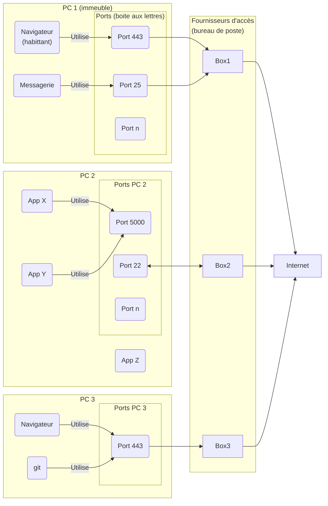
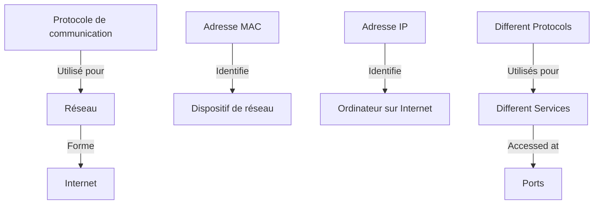

# 1. Qu'est ce qu'un protocole de communication ?

Quand nous croisons une connaissance, il est courant de commencer par un salut, souvent "Bonjour", puis d'engager une conversation. Une fois l'échange terminé, nous concluons généralement par un "Au revoir". Cette pratique, qui définit l'ouverture et la clôture d'une conversation avec des formules familières à chaque participant, est en fait un exemple de protocole de communication. Cette convention, que l'on peut appeler la "politesse", sert à instaurer un contexte propice à l'échange d'informations, informations qui ne font pas partie du protocole en tant que tel. D'autres protocoles humains existent, comme l'échange de courrier postal, qui est une analogie utile pour introduire le concept de protocole dans le domaine informatique. Tout comme les livres dont l'organisation suit généralement des standards "implicites" permettant au lecteur de savoir comment accéder à l'information contenue et qui dépend de la nature du livre selon qu'il s'agisse d'un roman, dictionnaire ou journal. Les protocoles informatiques ne font qu'émuler ces habitudes humaines extrêmement efficaces en les rationalisant.

Ainsi, un protocole de communication en informatique peut être défini comme un ensemble de règles standardisées, comportant une syntaxe et une grammaire spécifiques, des états et des actions attendues, qui régissent le mode de communication entre les ordinateurs. Pour illustrer cette idée, on peut comparer un protocole de communication informatique à la manière dont une lettre est structurée : il existe un format standard pour l'adresse, la date, le contenu de la lettre, pour son envoi et des conditions à sa réception, etc.
Les protocoles informatiques sont conçus pour être imbriqués ou "encapsulés", ce qui permet à un protocole d'être transporté au sein d'un autre. Cela facilite la circulation des informations sur des supports variés. Par exemple, lorsqu'on envoie une clé USB par la poste, on utilise en réalité deux protocoles de communication : le protocole de la clé USB qui stocke les données et le protocole du système postal pour transporter cette clé d'un endroit à un autre. L'encapsulation des protocoles informatiques permet une grande flexibilité et efficacité dans la transmission des données, indépendamment du support utilisé, mais elle permet surtout de compartimenter la complexité et ainsi d'établir des protocoles simples dont l'usage sera versatile par imbrication.

# 2. Qu'est ce qu'un réseau ?

Depuis fort longtemps, l'homme a dû concevoir des réseaux, qu'ils soient de chemins, de voies routières, de voies ferrées, de voies navigables, postaux, électriques ou téléphoniques. Pour y parvenir, il a fallu imaginer des infrastructures, comme les routes et les voies ferrées, développer des politiques pour les réaliser, effectuer des travaux pour les construire et les entretenir, et établir des protocoles pour gérer leur interconnexion et guider les utilisateurs sur la manière de les utiliser (par exemple, la taille des bateaux pour un canal, les types de véhicules pour une route).

De la même manière, un réseau informatique est un ensemble d'ordinateurs interconnectés qui peuvent communiquer entre eux pour partager des informations et des ressources. En utilisant l'analogie d'un système postal, nous pouvons imaginer chaque ordinateur comme un immeuble habité par différentes applications (les résidents). Ces applications communiquent avec l'extérieur en utilisant les boîtes aux lettres (les ports) de l'immeuble. Le concierge de l'immeuble (le système d'exploitation) est responsable de la distribution des lettres, que ce soit en les envoyant à l'extérieur ou en les distribuant aux boîtes appropriées lorsqu'elles arrivent de l'extérieur. Le concierge (le système d'exploitation) donne ou reçoit les lettres du bureau de poste (le fournisseur d'accès à Internet), qui connecte l'immeuble à d'autres bureaux de poste (d'autres réseaux) et facilite ainsi la circulation des lettres (informations).

C'est une simplification du processus, mais elle donne une idée de la complexité et de la précision nécessaires pour gérer la communication entre ordinateurs sur un réseau.

# 3. Internet

## 3.1 Présentation
Internet est le réseau qui relie des ordinateurs du monde entier. C'est comme un système postal international où les bureaux de poste de différents pays peuvent envoyer et recevoir des lettres les uns aux autres.

## 3.2 Le commencement : ARPANET (1960-1980)

Le prédécesseur direct d'Internet est l'ARPANET, un projet lancé en 1969 par la Defense Advanced Research Projects Agency (DARPA) aux États-Unis. ARPANET a été le premier réseau à mettre en œuvre le protocole TCP/IP, qui est toujours le cœur des communications sur Internet aujourd'hui.

## 3.3 La naissance d'Internet et le protocole TCP/IP (1980-1990)

En 1983, l'ARPANET a adopté le protocole TCP/IP, et le réseau est devenu fonctionnel. C'est l'année que beaucoup considèrent comme la naissance d'Internet. Le TCP/IP a permis à différents types de réseaux de se connecter, jetant les bases de l'Internet mondial que nous connaissons aujourd'hui.

## 3.4 L'expansion d'Internet et le World Wide Web (1990-2000)

En 1990, l'ARPANET a officiellement été démantelé, mais Internet était déjà en pleine expansion. La même année, Tim Berners-Lee a inventé le World Wide Web, qui a transformé Internet d'un système de messagerie et de téléchargement de fichiers en une plateforme multimédia interactive.

## 3.5 L'ère du .com et la bulle Internet (2000-2010)

Au début du nouveau millénaire, Internet est devenu une force économique majeure, conduisant à la bulle Internet. Des millions de personnes ont commencé à utiliser Internet pour la communication, l'information, le commerce, le divertissement et plus encore.

## 3.6 L'Internet mobile et l'IoT (2010-présent)

Avec l'essor des smartphones et des tablettes, l'Internet mobile a pris son envol. La prochaine grande phase de l'Internet est l'Internet des objets (IoT), où des milliards de dispositifs connectés communiquent et partagent des informations.

# ## 4. Adresses MAC

Une adresse MAC (Media Access Control) est un identifiant unique attribué à un dispositif de réseau pour sa communication au niveau de la couche de liaison de données, qui est le deuxième niveau du modèle OSI (Open Systems Interconnection), un modèle conceptuel utilisé pour décrire les fonctions d'un système de communication en réseau. 

Une adresse MAC est composée de six octets (48 bits), généralement exprimés en hexadécimal. Par exemple, une adresse MAC pourrait ressembler à ceci : 00:0a:95:9d:68:16.

Chaque carte réseau (ou interface réseau) produite possède une adresse MAC unique gravée en dur par le fabricant. Cette unicité permet à chaque dispositif sur le réseau d'être identifié de manière unique à ce niveau.

En termes simples, nous pouvons penser à l'adresse MAC comme l'identifiant unique d'un bureau de poste. Tout comme chaque bureau de poste a un code postal unique pour identifier sa localisation spécifique, chaque dispositif sur un réseau a une adresse MAC unique pour identifier son interface réseau spécifique. 

Cependant, bien qu'une adresse MAC soit unique et fixée par le fabricant, elle peut être modifiée ou "usurpée" par un utilisateur à l'aide de logiciels spécifiques. Cela peut être fait pour des raisons légitimes, comme la configuration de certaines formes de sécurité réseau, mais cela peut aussi être exploité à des fins malveillantes.

C'est donc une composante essentielle des communications sur les réseaux locaux (LAN), mais son utilisation reste limitée à ce périmètre. En effet, dans le cadre d'Internet, ce sont plutôt les adresses IP qui sont utilisées pour acheminer les paquets de données. L'adresse MAC est donc principalement utilisée pour la communication entre les appareils sur le même réseau local.

## 5. Adresses IP

Une adresse IP (Internet Protocol) est un identifiant numérique unique attribué à chaque dispositif connecté à un réseau IP (comme Internet). C'est un peu comme l'adresse postale d'un immeuble : c'est par cette adresse que les paquets de données (ou "lettres") sont envoyés et reçus.

Il existe deux versions du protocole IP actuellement en usage : IPv4 et IPv6.

**IPv4** est la version la plus couramment utilisée du protocole Internet. Une adresse IPv4 est constituée de quatre nombres de 0 à 255, séparés par des points. Par exemple, "192.168.0.1". Ce format offre environ 4,3 milliards d'adresses IP uniques, ce qui, à l'époque de sa création, semblait suffisant. Cependant, avec l'explosion du nombre d'appareils connectés à Internet, nous avons commencé à manquer d'adresses IPv4.

**IPv6** a été développé pour résoudre ce problème. Une adresse IPv6 est beaucoup plus longue et est composée de huit groupes de quatre chiffres hexadécimaux, séparés par des deux-points. Par exemple, "2001:0db8:85a3:0000:0000:8a2e:0370:7334". Cette structure offre un nombre presque illimité d'adresses - 2^128 pour être exact, soit environ 340 sextillions (ou 340 milliards de milliards de milliards) d'adresses.

Il est important de noter que notre adresse IP peut changer en fonction de notre réseau et de notre situation. Par exemple, notre ordinateur à la maison aura une adresse IP différente de celle qu'il a au travail. De plus, la plupart des FAI attribuent des adresses IP dynamiques, ce qui signifie qu'elles peuvent changer à chaque fois que nous redémarrons notre routeur.

L'adresse IP est l'un des éléments fondamentaux de l'Internet "centralisé", car sans elle, il serait impossible d'acheminer les données de manière fiable à leur destination.

Voir https://fr.wikipedia.org/wiki/Adresse_IP pour plus de détails.

# 6. Les différents protocoles et les ports

Les différents protocoles de communication, tels que le protocole de messagerie (SMTP), le protocole de transfert de fichiers (FTP), le protocole de gestion de réseau (SNMP), le web ([[HTTP]]), etc., sont comme différents types de services disponibles dans un bureau de poste, comme l'envoi de lettres, de colis, de télégrammes, etc. Chacun de ces services a son propre guichet (port) dans le bureau de poste (ordinateur).

## 6.1 Liste des protocoles utilisés par les outils et services réseau courants

1. **Ping** : Ping utilise le protocole ICMP (Internet Control Message Protocol). C'est un protocole de niveau réseau (couche 3 dans le modèle OSI) utilisé principalement pour envoyer des messages d'erreur et d'opération. [[GNULinux#ping]]

2. **Route** : Le terme "route" fait généralement référence à la gestion du routage des paquets dans les réseaux IP. Cela implique l'utilisation de plusieurs protocoles, tels que ICMP pour les messages d'erreur et de diagnostic, et des protocoles de routage comme OSPF (Open Shortest Path First), BGP (Border Gateway Protocol), RIP (Routing Information Protocol), etc. Voir [[GNULinux#Traceroute]].

3. **DNS** : Le service DNS (Domain Name System) utilise principalement le protocole UDP (User Datagram Protocol) pour ses requêtes. Toutefois, pour les requêtes plus volumineuses ou pour les transferts de zone, le DNS peut également utiliser le protocole TCP (Transmission Control Protocol). Le DNS fonctionne généralement sur le port 53 pour les deux protocoles.

4. **SSH** : SSH (Secure Shell) utilise le protocole TCP (Transmission Control Protocol) pour établir une connexion sécurisée. Il fonctionne généralement sur le port 22. Voir [[GNULinux#ssh]].

5. **Navigateur web** : Les navigateurs web utilisent le protocole [[HTTP]] (Hypertext Transfer Protocol) qui utilise également TCP pour le transfert de données web. Il fonctionne généralement sur le port 80 pour HTTP et le port 443 pour HTTPS (HTTP Secure), qui est la version sécurisée de HTTP.

6. **Téléchargement de fichier** : Les outils de téléchargement utilisent souvent le protocole FTP (File Transfer Protocol) qui utilise également TCP pour le transfert de fichiers entre un client et un serveur. Il utilise habituellement les ports 20 et 21. Mais ils peuvent aussi utiliser le protocole BitTorrent.

Tous ces protocoles fonctionnent au-dessus du protocole IP (Internet Protocol) qui gère l'acheminement des paquets de données de leur source à leur destination.

## 6.2 Liste des protocoles courants

Voici un détail sur chacun des protocoles mentionnés précédemment :

1. **ICMP (Internet Control Message Protocol)** : ICMP est principalement utilisé par les systèmes d'exploitation des ordinateurs en réseau pour envoyer des messages d'erreur indiquant, par exemple, qu'un service particulier n'est pas disponible ou qu'un hôte ou une route ne peut être atteint. Ping est un exemple d'outil qui utilise ICMP.

2. **OSPF (Open Shortest Path First)** : OSPF est un protocole de routage dynamique pour les réseaux IP. Il utilise un algorithme de chemin le plus court pour le routage, qui utilise les "coûts" des routes comme métrique. OSPF est un protocole interne, ce qui signifie qu'il opère à l'intérieur d'un seul système autonome.

3. **BGP (Border Gateway Protocol)** : BGP est utilisé pour le routage entre les systèmes autonomes (AS). Il s'agit du protocole qui fait fonctionner l'Internet de manière globale. BGP n'examine pas l'intérieur de l'AS, mais se préoccupe de la manière dont les paquets passent d'un AS à un autre.

4. **RIP (Routing Information Protocol)** : RIP est un protocole de routage dynamique utilisé dans les réseaux locaux et métropolitains. Il utilise le comptage de sauts comme métrique de routage et a une limite de 15 sauts, ce qui limite sa taille.

5. **UDP (User Datagram Protocol)** : UDP est un protocole de communication simple utilisé principalement pour les services où la vitesse est plus critique que la fiabilité. Contrairement à TCP, UDP ne garantit pas la livraison en fournissant des accusés de réception et des retransmissions. Les applications typiques qui utilisent UDP sont le DNS, le streaming vidéo, le VoIP.

6. **TCP (Transmission Control Protocol)** : TCP est largement utilisé par de nombreuses applications sur Internet, comme le transfert de fichiers, le courrier électronique et le web. Il est fiable car il garantit la livraison des paquets dans l'ordre correct.

7. **IP (Internet Protocol)** : IP est un protocole de communication utilisé pour acheminer les paquets de données d'une source à une destination dans un réseau. Il ne garantit pas la livraison et ne fournit pas de mécanismes pour éviter les doublons ou la réorganisation des paquets. Ces fonctionnalités sont fournies par TCP.

8. **HTTP (Hypertext Transfer Protocol)** : HTTP est un protocole de niveau application pour la transmission d'informations hypertextuelles, comme les documents HTML. Il est le protocole de données de base pour le web.

9. **FTP (File Transfer Protocol)** : FTP est un protocole de transfert de fichiers entre un client et un serveur sur un réseau informatique. FTP est basé sur une architecture client-serveur et utilise des connexions de données distinctes entre le client et le serveur.

10. **DNS (Domain Name System)** : DNS est un service qui traduit les noms de domaine en adresses IP et vice versa. Par exemple, quand nous tapons "www.google.com" dans notre navigateur, le DNS convertit ce nom de domaine en une adresse IP qui peut être routée sur Internet.

12. **BitTorrent** : BitTorrent est un protocole de communication de partage de fichiers peer-to-peer (P2P) qui permet aux utilisateurs de distribuer des données et des fichiers numériques sur Internet de manière décentralisée. Voici comment il fonctionne :

# 7. Les protocoles décentralisés

## 7.1 Bittorent

1. **Décentralisation** : Contrairement à la méthode traditionnelle de téléchargement d'un fichier à partir d'un seul serveur central (téléchargement direct), BitTorrent divise les fichiers en petites parties et les distribue à partir de nombreux emplacements différents. Chaque utilisateur qui télécharge un fichier en devient également un "seeder" (distributeur), ce qui permet d'augmenter la disponibilité et la vitesse de téléchargement du fichier.

2. **Communication** : Les clients BitTorrent communiquent entre eux via le protocole TCP (Transmission Control Protocol) pour demander et transmettre les parties de fichiers. Le tracker, un serveur spécial qui gère le torrent, aide à orchestrer cette communication en conservant une liste des clients et des parties de fichiers qu'ils possèdent. Cependant, les versions plus récentes de BitTorrent incluent des méthodes pour trouver des pairs sans avoir besoin d'un tracker central.

3. **Efficacité** : L'approche de BitTorrent à la distribution de fichiers est très efficace car elle répartit la charge entre plusieurs pairs, au lieu de dépendre d'un seul serveur central. Cela permet d'éviter les goulets d'étranglement et de maintenir des vitesses de téléchargement élevées même lorsque de nombreux utilisateurs téléchargent le même fichier.

4. **Contrôle de la congestion** : BitTorrent utilise des algorithmes de contrôle de la congestion pour éviter de surcharger les réseaux et les serveurs. Il ajuste dynamiquement la vitesse à laquelle les parties de fichiers sont demandées et transmises en fonction de la capacité du réseau.

5. **Sécurité** : Les fichiers torrent comprennent également des informations de hachage pour chaque partie du fichier. Ces hachages sont utilisés pour vérifier l'intégrité des données et s'assurer qu'elles n'ont pas été modifiées lors de leur transmission.

Il convient de noter que bien que le protocole BitTorrent lui-même soit légal, il a été associé à la distribution de contenu protégé par le droit d'auteur, ce qui est illégal dans de nombreux pays. Il est donc important de faire preuve de prudence et de responsabilité lors de l'utilisation de BitTorrent ou de tout autre protocole de partage de fichiers P2P.

## 7.2 IPFS

L'IPFS est une approche révolutionnaire du stockage et du partage de fichiers. Il s'agit d'un protocole peer-to-peer qui permet à tous les ordinateurs du réseau de conserver une copie du même système de fichiers, créant ainsi un réseau décentralisé et résilient.

Voici comment cela fonctionne :

1. **Hashage des contenus** : Chaque fichier et tous les blocs au sein de ce fichier reçoivent un identifiant unique appelé hash. Ce hash est généré à partir du contenu du fichier lui-même. Deux fichiers identiques auront le même hash, même s'ils sont stockés sur des ordinateurs différents.

2. **Adresse basée sur le contenu** : Lorsqu'un fichier est recherché sur IPFS, il n'est pas localisé par son emplacement (comme avec une URL traditionnelle), mais par son hash. Cela signifie que tant que le contenu ne change pas, l'adresse ne changera pas non plus, peu importe où le fichier est stocké.

3. **Résilience** : IPFS est conçu pour être résilient. Même si une partie du réseau tombe, les fichiers peuvent toujours être accessibles depuis d'autres parties du réseau qui possèdent des copies.

4. **Efficacité** : IPFS peut également augmenter l'efficacité du réseau en permettant aux ordinateurs proches de partager des ressources. Par exemple, si deux ordinateurs sur le même réseau local recherchent le même fichier, ils pourront le partager directement entre eux au lieu de le télécharger deux fois depuis Internet.

5. **Historique des versions** : IPFS garde également un historique des versions de chaque fichier, ce qui facilite le suivi des modifications et la restauration des versions précédentes.

## 7.3 Les protocoles derrière la Blockchain

La blockchain, technologie sous-jacente de nombreuses crypto-monnaies comme le Bitcoin, utilise une variété de protocoles pour garantir son fonctionnement. Voici une description de certains des principaux protocoles utilisés :

1. **Protocole de consensus** : Dans une blockchain, tous les participants doivent s'accorder sur l'état de la chaîne, c'est-à-dire quelles transactions ont eu lieu et dans quel ordre. Différentes blockchains utilisent différents protocoles de consensus pour parvenir à cet accord. Par exemple, Bitcoin utilise le Proof of Work (PoW), où les nœuds (ou "mineurs") doivent résoudre un problème mathématique complexe pour ajouter un nouveau bloc à la chaîne. D'autres blockchains utilisent le Proof of Stake (PoS), où le droit d'ajouter un nouveau bloc est proportionnel à la quantité de crypto-monnaie que possède un nœud.

2. **Protocole de réseau peer-to-peer (P2P)** : Les blockchains sont généralement décentralisées et distribuées sur un réseau de nœuds. Ces nœuds communiquent entre eux en utilisant un protocole P2P, qui permet de partager des informations de manière efficace et résiliente, sans point central de défaillance.

3. **Protocole de cryptographie** : La blockchain utilise des protocoles de cryptographie pour garantir la sécurité et l'intégrité des données. Par exemple, Bitcoin utilise l'algorithme SHA-256 pour le hachage, et l'algorithme ECDSA pour les signatures numériques, qui permettent de vérifier l'authenticité des transactions.

4. **Protocoles de contrats intelligents** : Certaines blockchains, comme Ethereum, permettent d'exécuter des "contrats intelligents", qui sont essentiellement des programmes qui s'exécutent automatiquement lorsque certaines conditions sont remplies. Ces contrats intelligents sont régis par leurs propres protocoles, qui définissent comment ils doivent être écrits et exécutés.

Ces protocoles travaillent tous ensemble pour assurer que la blockchain fonctionne de manière sécurisée, efficace et transparente.

# 8. Le Futur : Vers un Internet décentralisé

L'histoire d'Internet est une série de transformations et de développements rapides. Depuis les premiers jours de l'ARPANET dans les années 1960 jusqu'à l'Internet omniprésent d'aujourd'hui, la capacité d'Internet à connecter et partager des informations a profondément transformé la société.

Aujourd'hui, nous assistons à une initiative ambitieuse visant à libérer le Web du contrôle des géants de la technologie, communément appelés GAFAM (Google, Apple, Facebook, Amazon et Microsoft). Cette initiative est en grande partie menée par les pionniers d'Internet, dont Tim Berners-Lee, le créateur du World Wide Web.

Berners-Lee est à la tête du projet [SOLID](https://fr.wikipedia.org/wiki/Solid_(projet_de_web_d%C3%A9centralis%C3%A9)), qui vise à décentraliser le Web. [[SOLID]] est un ensemble de conventions et d'outils pour la construction de sites web et d'applications décentralisés. L'objectif est de permettre aux utilisateurs de contrôler leurs propres données, plutôt que de les confier à des entreprises centralisées. 

Dans ce contexte, SOLID est souvent associé à la notion de [Web3](https://fr.wikipedia.org/wiki/Web3), une vision du futur d'Internet qui met l'accent sur la décentralisation et la souveraineté numérique des utilisateurs. Dans un Web3, les données sont interconnectées et contrôlées par les utilisateurs, plutôt que par des intermédiaires centralisés.

Si ces initiatives réussissent, elles pourraient bien marquer le prochain grand tournant dans l'histoire d'Internet, en rendant le Web plus équitable, plus respectueux de la vie privée, et plus résilient. Ainsi, l'Internet du futur pourrait bien ressembler à une version améliorée de la vision originale d'un réseau ouvert et décentralisé.

[[SPARQL et RDF]] (Resource Description Framework) sont deux technologies clés qui jouent un rôle essentiel dans le projet SOLID, un initiative qui vise à décentraliser le web dans l'ère du web 3.0.

**RDF** est un cadre standardisé pour décrire les ressources sur le web de manière à ce qu'elles soient compréhensibles par les machines. Chaque ressource, qui peut être n'importe quoi d'une page web à une image en passant par un service, est identifiée par une URI (Uniform Resource Identifier). Ces ressources peuvent être liées à d'autres ressources via des triplets RDF, qui sont des déclarations de la forme "sujet-prédicat-objet". Par exemple, "John (sujet) a pour ami (prédicat) Mary (objet)".

**SPARQL**, d'autre part, est un langage de requête utilisé pour récupérer et manipuler les données stockées en RDF. De la même manière que SQL est utilisé pour interroger les bases de données relationnelles, SPARQL est utilisé pour interroger les données RDF.

Dans le contexte de SOLID, RDF et SPARQL sont utilisés pour permettre aux utilisateurs de contrôler leurs propres données. Dans le système SOLID, chaque utilisateur a son propre "Pod" (Personal Online Datastore), qui est essentiellement un espace de stockage personnel sur le web où ils peuvent stocker leurs données sous forme de graphes RDF. 

Les utilisateurs peuvent donner à d'autres personnes ou applications l'autorisation de lire ou d'écrire certaines données dans leur Pod. Par exemple, un utilisateur pourrait permettre à une application de calendrier de lire et d'écrire des données dans la partie de son Pod qui stocke son emploi du temps, tout en empêchant cette application d'accéder à d'autres données.

En utilisant SPARQL, les utilisateurs et les applications peuvent ensuite interroger ces données RDF de manière efficace, en permettant des opérations complexes telles que la récupération de toutes les photos prises par l'utilisateur au cours du mois dernier, ou la recherche de tous les contacts qui vivent dans une certaine ville. Grâce à l'utilisation de RDF et de SPARQL, SOLID vise à donner aux utilisateurs un contrôle total sur leurs données, tout en permettant un web plus interconnecté et plus intelligent.