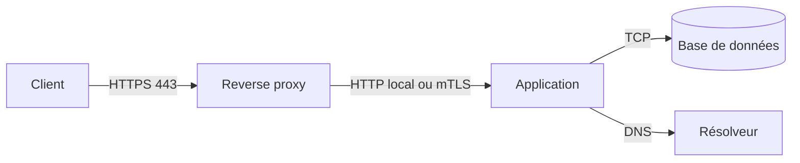

> [!info] Livre GNU/Linux
> Ce cours est repris dans le livre [[GNU Linux — Sommaire]] — chapitre [[GNU Linux — 14 — Réseau et outils TCP IP|14]].

# Les protocoles de communication

> [!abstract] Objectif
> Comprendre comment les machines se parlent, couche par couche : modèles OSI et TCP/IP, Ethernet et Wi-Fi, IPv4 et IPv6, routage, TCP, UDP et QUIC, DNS et DHCP, TLS, HTTP, messagerie, VPN, protocoles de l'IoT et protocoles décentralisés, avec les outils de diagnostic et les réflexes de sécurité.

Voir aussi : [[HTTP]], [[IPFS]], [[Sécurité des IOT en python avec SCADA]], [[Sécurité avancée sous Linux]], [[Postfix]], [[Docker]].

# Sommaire

1. Qu'est-ce qu'un protocole de communication ?
2. Qu'est-ce qu'un réseau ?
3. Pourquoi les protocoles sont-ils organisés en couches ?
4. Les modèles OSI et TCP/IP
5. Encapsulation et unités de données
6. Une courte histoire d'Internet
7. Couche physique et liaison
8. Wi-Fi
9. ARP et Neighbor Discovery
10. Le protocole IP
11. IPv4
12. IPv6
13. ICMP et ICMPv6
14. Routage IP
15. Ports et sockets
16. TCP
17. UDP
18. TCP ou UDP ?
19. QUIC
20. DNS
21. DHCP
22. TLS
23. HTTP
24. Courrier électronique
25. SSH et transfert de fichiers
26. NTP et synchronisation du temps
27. VPN et tunnels
28. Protocoles IoT et messagerie applicative
29. Protocoles pair-à-pair et décentralisés
30. Multicast, broadcast et anycast
31. Unicast, client-serveur et publish/subscribe
32. RPC et protocoles d'API
33. Compression et encodage
34. Ports courants
35. Sécurité réseau : principes fondamentaux
36. Attaques et problèmes fréquents
37. Diagnostic réseau sous Linux
38. Capture avec tcpdump
39. Wireshark
40. Méthode de diagnostic par couches
41. Comment choisir un protocole ?
42. Protocoles et conteneurs
43. Protocoles et Kubernetes
44. Protocoles et cloud
45. Observabilité réseau
46. Performance réseau
47. Erreurs conceptuelles fréquentes
48. TP 1 — Observer sa configuration réseau
49. TP 2 — Comprendre le DNS
50. TP 3 — TCP avec netcat
51. TP 4 — UDP avec netcat
52. TP 5 — Observer TLS
53. TP 6 — Analyser HTTP
54. TP 7 — Capture DNS
55. TP 8 — Tracer un chemin
56. TP 9 — IPv6
57. TP 10 — Mini-service TCP en Python
58. TP 11 — Comparer TCP et QUIC conceptuellement
59. TP 12 — Diagnostiquer une panne complète
60. Projet final — Construire et documenter un service réseau
61. Checklist d'analyse d'un protocole
62. Tableau de synthèse
63. Glossaire
64. Références principales
65. Conclusion

# 1. Qu'est-ce qu'un protocole de communication ?

Un **protocole de communication** est un ensemble de règles permettant à plusieurs systèmes de communiquer de manière prévisible et interopérable.

Un protocole définit généralement :

- la **syntaxe** des messages ;
- leur **sémantique** ;
- l'ordre des échanges ;
- la manière de signaler les erreurs ;
- les délais et retransmissions éventuelles ;
- les règles d'ouverture et de fermeture d'une communication ;
- parfois les mécanismes d'authentification, de chiffrement ou de négociation de capacités.

L'analogie avec une conversation humaine reste utile :

1. une personne prend contact ;
2. l'autre confirme qu'elle écoute ;
3. les informations sont échangées ;
4. les erreurs ou incompréhensions sont éventuellement signalées ;
5. l'échange est clôturé.

La différence est qu'un protocole informatique doit définir ces règles avec suffisamment de précision pour que deux implémentations écrites par des équipes différentes puissent fonctionner ensemble.

## 1.1 Standard, protocole, format et API

Ces notions sont liées, mais distinctes.

| Notion | Rôle | Exemple |
|---|---|---|
| Protocole | Règles d'échange entre pairs | TCP, HTTP, DNS |
| Format | Organisation de données | JSON, CBOR, PNG |
| API | Interface exposée par un logiciel | API REST, POSIX |
| Standard | Spécification commune | RFC, IEEE 802.3, TLS 1.3 |

JSON n'est donc pas, à lui seul, un protocole réseau. Une application peut cependant définir un protocole applicatif qui transporte des messages JSON sur HTTP, WebSocket, QUIC ou un autre transport.

## 1.2 Les RFC

Une grande partie des protocoles d'Internet est décrite dans des documents appelés **RFC** (*Request for Comments*), publiés notamment par l'IETF.

Toutes les RFC n'ont pas le même statut. Certaines sont :

- des standards Internet ;
- des standards proposés ;
- des bonnes pratiques ;
- des documents informatifs ;
- des documents historiques.

Il faut donc éviter de penser que « RFC » signifie automatiquement « norme obligatoire et actuelle ».

# 2. Qu'est-ce qu'un réseau ?

Un réseau informatique est un ensemble de systèmes capables d'échanger des données par l'intermédiaire d'un ou plusieurs supports de communication.

Ces systèmes peuvent être :

- des ordinateurs ;
- des serveurs ;
- des smartphones ;
- des routeurs ;
- des commutateurs ;
- des objets connectés ;
- des automates industriels ;
- des machines virtuelles ;
- des conteneurs ;
- des équipements réseau spécialisés.

## 2.1 Une analogie postale

On peut approximer :

- une **adresse IP** par une adresse postale ;
- un **port** par un service ou une boîte aux lettres dans le bâtiment ;
- un **routeur** par un centre de tri ;
- un **nom DNS** par le nom d'un destinataire enregistré dans un annuaire ;
- TCP par un service de transport fiable avec suivi ;
- UDP par l'envoi de datagrammes sans garantie de réception ;
- TLS par une enveloppe cryptographique protégeant le contenu.

L'analogie devient rapidement imparfaite, mais elle aide à séparer les fonctions.

## 2.2 Réseaux locaux et réseaux étendus

On distingue souvent :

- **LAN** : réseau local ;
- **WLAN** : réseau local sans fil ;
- **WAN** : réseau étendu ;
- **VPN** : réseau privé construit logiquement au-dessus d'un autre réseau ;
- **PAN** : réseau personnel ;
- **MAN** : réseau métropolitain.

Internet est un **réseau de réseaux** interconnectés.

# 3. Pourquoi les protocoles sont-ils organisés en couches ?

La communication réseau est décomposée en couches afin de séparer les responsabilités.

Par exemple :

- Ethernet ne doit pas connaître le fonctionnement de HTTP ;
- IP ne doit pas comprendre le contenu d'un message SMTP ;
- une application HTTP n'a généralement pas besoin de connaître le détail du signal Wi-Fi qui transporte ses paquets.

Cette séparation permet :

- la modularité ;
- l'interopérabilité ;
- le remplacement d'une technologie sans réécrire toutes les couches ;
- le diagnostic par niveau ;
- la spécialisation des protocoles.

# 4. Les modèles OSI et TCP/IP

## 4.1 Le modèle OSI

Le modèle OSI comporte sept couches conceptuelles.

| Couche | Nom | Exemples |
|---:|---|---|
| 7 | Application | HTTP, DNS, SMTP, SSH |
| 6 | Présentation | encodage, formats, chiffrement selon le contexte |
| 5 | Session | gestion logique de sessions |
| 4 | Transport | TCP, UDP, QUIC |
| 3 | Réseau | IPv4, IPv6, ICMP |
| 2 | Liaison | Ethernet, Wi-Fi, VLAN |
| 1 | Physique | cuivre, fibre, radio |

Le modèle OSI est surtout un outil pédagogique. Les protocoles réels ne suivent pas toujours parfaitement cette séparation.

## 4.2 Le modèle TCP/IP

Le modèle Internet est généralement présenté avec moins de couches :

```text
Application
Transport
Internet
Accès réseau
```

Exemple :

```text
HTTP
  ↓
TLS
  ↓
TCP
  ↓
IP
  ↓
Ethernet / Wi-Fi
```

Pour HTTP/3 :

```text
HTTP/3
  ↓
QUIC + TLS 1.3
  ↓
UDP
  ↓
IP
  ↓
Ethernet / Wi-Fi
```

# 5. Encapsulation et unités de données

Lorsqu'une application envoie des données, chaque couche ajoute ses propres informations.

```text
Données applicatives
        ↓
segment TCP / datagramme UDP
        ↓
paquet IP
        ↓
trame Ethernet ou Wi-Fi
        ↓
signal physique
```

À la réception, l'opération inverse est appelée **désencapsulation**.

## 5.1 En-têtes

Un en-tête peut contenir :

- adresses source/destination ;
- ports ;
- numéros de séquence ;
- longueur ;
- type de protocole transporté ;
- indicateurs de contrôle ;
- sommes de contrôle ;
- paramètres de sécurité.

## 5.2 MTU

La **MTU** (*Maximum Transmission Unit*) est la taille maximale d'un paquet transportable directement sur un lien donné.

Ethernet utilise traditionnellement une MTU IP de 1500 octets.

Une mauvaise compréhension de la MTU peut provoquer :

- fragmentation ;
- pertes ;
- problèmes de tunnels/VPN ;
- pannes difficiles à diagnostiquer lorsque certains paquets passent et d'autres non.

# 6. Une courte histoire d'Internet

## 6.1 ARPANET

ARPANET apparaît à la fin des années 1960. Le premier échange entre deux nœuds du réseau a lieu en 1969.

Il faut éviter une erreur historique fréquente : **ARPANET n'utilisait pas TCP/IP dès 1969**. Les premières versions utilisaient notamment NCP.

## 6.2 TCP/IP

Les travaux de Vint Cerf, Bob Kahn et d'autres chercheurs conduisent à la famille TCP/IP.

Le **1er janvier 1983**, ARPANET bascule officiellement de NCP vers TCP/IP. Cette date est souvent retenue comme une étape majeure dans la naissance de l'Internet moderne.

## 6.3 DNS

Au fur et à mesure de la croissance du réseau, maintenir manuellement un fichier global associant noms et adresses devient impraticable.

Le DNS apparaît dans les années 1980 pour fournir un système de noms distribué et hiérarchique.

## 6.4 Le Web

À la fin des années 1980 et au début des années 1990, Tim Berners-Lee développe au CERN :

- HTTP ;
- HTML ;
- les URL ;
- les premiers outils du World Wide Web.

Le **Web n'est pas Internet** : c'est un ensemble de services et protocoles fonctionnant au-dessus d'Internet.

## 6.5 Internet moderne

Internet combine aujourd'hui notamment :

- IPv4 et IPv6 ;
- BGP ;
- DNS ;
- TLS ;
- HTTP/1.1, HTTP/2 et HTTP/3 ;
- réseaux mobiles ;
- CDN ;
- cloud ;
- IoT ;
- réseaux pair-à-pair ;
- réseaux privés superposés.

# 7. Couche physique et liaison

## 7.1 Ethernet

Ethernet est une famille de technologies normalisées principalement par IEEE 802.3.

Une trame Ethernet contient notamment :

- adresse MAC destination ;
- adresse MAC source ;
- EtherType ou longueur selon le format ;
- données ;
- contrôle d'intégrité de trame.

## 7.2 Adresse MAC

Une adresse MAC Ethernet classique fait 48 bits et s'écrit souvent :

```text
00:1a:2b:3c:4d:5e
```

Il faut nuancer l'affirmation « chaque carte possède une adresse MAC unique gravée en dur » :

- les fabricants attribuent généralement une adresse matérielle ;
- elle peut être remplacée logiciellement ;
- de nombreux systèmes utilisent aujourd'hui la **randomisation d'adresse MAC**, notamment pour limiter le pistage Wi-Fi.

Une adresse MAC n'est pas routée de bout en bout sur Internet.

Lorsqu'un paquet traverse un routeur, les adresses de couche 2 utilisées sur le lien suivant changent.

## 7.3 Switch

Un commutateur Ethernet apprend les associations entre :

```text
adresse MAC ↔ port physique/logique
```

Il utilise cette table pour transférer les trames vers le bon port.

## 7.4 VLAN

Un **VLAN** permet de créer plusieurs domaines de couche 2 logiquement séparés sur une même infrastructure de commutation.

IEEE 802.1Q ajoute un tag VLAN dans la trame Ethernet.

Usages :

- isoler postes utilisateurs et serveurs ;
- séparer réseau invité et réseau interne ;
- segmenter téléphonie, IoT ou administration ;
- limiter les domaines de broadcast.

Un VLAN n'est pas, à lui seul, un mécanisme complet de sécurité : les flux entre VLAN doivent aussi être filtrés au niveau routage/pare-feu.

# 8. Wi-Fi

Le Wi-Fi repose sur la famille IEEE 802.11.

Il conserve plusieurs concepts proches d'Ethernet, mais fonctionne sur un média radio partagé.

Notions importantes :

- SSID ;
- point d'accès ;
- association ;
- bandes de fréquence ;
- canaux ;
- WPA2/WPA3 ;
- roaming ;
- puissance et interférences.

La sécurité Wi-Fi ne remplace pas la sécurité applicative. Une connexion HTTPS doit rester protégée par TLS même sur un réseau Wi-Fi WPA3.

# 9. ARP et Neighbor Discovery

## 9.1 ARP en IPv4

ARP permet de déterminer l'adresse MAC correspondant à une adresse IPv4 présente sur le même lien.

Exemple conceptuel :

```text
Qui possède 192.168.1.42 ?
Réponse : 192.168.1.42 est à 3c:52:82:aa:bb:cc
```

Sous Linux :

```bash
ip neigh
```

ARP ne possède pas d'authentification native. Cela rend possibles certaines attaques d'usurpation sur un LAN.

## 9.2 IPv6 n'utilise pas ARP

IPv6 utilise **Neighbor Discovery**, défini autour d'ICMPv6.

Il sert notamment à :

- découvrir les voisins ;
- découvrir les routeurs ;
- résoudre les adresses de couche 2 ;
- détecter certains voisins injoignables ;
- autoconfigurer des adresses.

# 10. Le protocole IP

IP fournit un service de livraison de paquets entre réseaux.

Il est **sans connexion** : chaque paquet peut être traité indépendamment.

IP ne garantit pas :

- la réception ;
- l'ordre ;
- l'absence de duplication ;
- la retransmission en cas de perte.

Ces propriétés sont fournies par d'autres couches lorsqu'elles sont nécessaires.

# 11. IPv4

Une adresse IPv4 fait 32 bits.

Exemple :

```text
192.168.1.10
```

## 11.1 CIDR

Une notation CIDR :

```text
192.168.1.0/24
```

signifie que les 24 premiers bits désignent le préfixe réseau.

Un `/24` contient 256 adresses au total.

## 11.2 Réseaux privés

Les plages privées IPv4 courantes sont :

```text
10.0.0.0/8
172.16.0.0/12
192.168.0.0/16
```

Elles ne sont pas routées comme des adresses publiques sur Internet.

## 11.3 Loopback

```text
127.0.0.0/8
```

est réservé au loopback IPv4.

L'adresse la plus souvent utilisée est :

```text
127.0.0.1
```

## 11.4 NAT

Le NAT modifie certaines informations d'adressage au passage d'un routeur ou pare-feu.

Le cas courant est le **source NAT** permettant à plusieurs machines privées de partager une adresse IPv4 publique.

Le NAT :

- a contribué à prolonger la durée de vie d'IPv4 ;
- complique le modèle de connectivité de bout en bout ;
- n'est pas équivalent à un pare-feu ;
- n'est pas requis par IPv6 dans son architecture normale.

# 12. IPv6

IPv6 utilise des adresses de 128 bits.

Exemple :

```text
2001:db8:1234::42
```

Le préfixe `2001:db8::/32` est réservé à la documentation.

## 12.1 Types d'adresses

On rencontre notamment :

- global unicast ;
- link-local ;
- multicast ;
- loopback `::1`.

Une adresse link-local commence généralement par :

```text
fe80::/10
```

## 12.2 Pas de broadcast IPv6

IPv6 n'utilise pas le broadcast IPv4 traditionnel.

Il repose notamment sur le multicast pour plusieurs fonctions de découverte.

## 12.3 SLAAC et DHCPv6

IPv6 peut configurer les hôtes via :

- SLAAC ;
- DHCPv6 ;
- ou une combinaison des deux.

Les **Router Advertisements** sont fondamentaux pour la découverte du réseau IPv6.

## 12.4 IPv6 n'est pas « IPv4 avec plus d'adresses »

IPv6 modifie plusieurs aspects :

- format d'en-tête ;
- fragmentation ;
- Neighbor Discovery ;
- autoconfiguration ;
- multicast ;
- architecture de routage et d'adressage.

La spécification de référence est RFC 8200.

# 13. ICMP et ICMPv6

ICMP transporte des informations de contrôle et d'erreur pour IP.

Exemples :

- destination inaccessible ;
- TTL expiré ;
- echo request/reply ;
- messages nécessaires à la découverte de MTU.

## 13.1 Ping

`ping` utilise généralement ICMP Echo.

```bash
ping example.org
```

Le fait qu'un hôte ne réponde pas à `ping` ne prouve pas qu'il est hors ligne : ICMP peut être filtré.

## 13.2 Traceroute

`traceroute` exploite la diminution du TTL/Hop Limit pour révéler progressivement les routeurs traversés.

```bash
traceroute example.org
```

ou :

```bash
tracepath example.org
```

## 13.3 ICMP ne doit pas être bloqué aveuglément

Bloquer tout ICMP est une mauvaise pratique.

Certains messages sont indispensables à :

- Path MTU Discovery ;
- IPv6 Neighbor Discovery ;
- diagnostic ;
- signalement d'erreurs.

# 14. Routage IP

Un routeur choisit le prochain saut en fonction de sa table de routage.

Sous Linux :

```bash
ip route
ip -6 route
```

## 14.1 Route par défaut

Exemple :

```text
default via 192.168.1.1
```

Elle est utilisée lorsqu'aucune route plus spécifique ne correspond.

## 14.2 Routage statique

Une route peut être définie manuellement.

C'est simple pour les petites architectures, mais difficile à maintenir à grande échelle.

## 14.3 OSPF

OSPF est un protocole de routage **IGP** utilisé à l'intérieur d'un système autonome.

Il repose sur un état de liens et calcule les meilleurs chemins à partir d'une topologie connue.

## 14.4 BGP

BGP est le protocole de routage inter-domaines d'Internet.

Internet est divisé en **systèmes autonomes** identifiés par des ASN.

BGP échange des informations de joignabilité et permet l'application de politiques de routage.

Il ne recherche pas simplement « le chemin le plus court » : la sélection BGP dépend de nombreux attributs et politiques.

## 14.5 RPKI

RPKI permet de publier des autorisations cryptographiquement vérifiables indiquant quels systèmes autonomes sont autorisés à annoncer certains préfixes IP.

Cela contribue à limiter certaines erreurs ou attaques d'annonces BGP.

# 15. Ports et sockets

Les ports appartiennent à la couche transport, principalement TCP et UDP.

Ils permettent de distinguer plusieurs services sur une même adresse IP.

Un socket réseau est souvent décrit par :

```text
protocole + adresse locale + port local + adresse distante + port distant
```

## 15.1 Plages de ports

Les ports sont codés sur 16 bits :

```text
0 à 65535
```

On distingue usuellement :

- ports système / well-known ;
- ports enregistrés ;
- ports dynamiques/éphémères.

Il ne faut pas mémoriser une liste de ports comme si elle était une règle absolue : un service peut souvent être configuré sur un autre port.

# 16. TCP

TCP fournit un **flux d'octets fiable et ordonné** entre deux extrémités.

La spécification de référence actuelle est RFC 9293.

## 16.1 Établissement de connexion

Le handshake classique :

```text
Client                  Serveur
  | ---- SYN ----------> |
  | <--- SYN, ACK ------ |
  | ---- ACK ----------> |
```

## 16.2 Numéros de séquence

TCP utilise des numéros de séquence afin de :

- reconstruire le flux ;
- détecter les pertes ;
- gérer les retransmissions ;
- remettre les octets dans l'ordre.

## 16.3 Accusés de réception

Les ACK indiquent les données reçues.

Lorsque des données sont perdues, TCP peut les retransmettre.

## 16.4 Fenêtre et contrôle de flux

Le récepteur annonce une fenêtre indiquant la quantité de données qu'il peut accepter.

Cela empêche un émetteur rapide de saturer un récepteur plus lent.

## 16.5 Contrôle de congestion

TCP adapte également son débit à l'état supposé du réseau.

Il faut distinguer :

- **contrôle de flux** : protège le récepteur ;
- **contrôle de congestion** : protège le réseau.

## 16.6 TCP est un flux, pas un protocole de messages

Deux appels `send()` ne correspondent pas nécessairement à deux appels `recv()`.

Une application doit définir sa propre délimitation :

- longueur ;
- séparateur ;
- framing binaire ;
- protocole applicatif.

# 17. UDP

UDP fournit un service de datagrammes simple.

Il ne fournit pas nativement :

- connexion ;
- retransmission ;
- ordre ;
- contrôle de congestion applicatif complet ;
- garantie de livraison.

Cela ne signifie pas qu'une application UDP est forcément « non fiable ». Elle peut implémenter les mécanismes nécessaires elle-même.

Usages courants :

- DNS ;
- VoIP ;
- jeux ;
- télémétrie ;
- QUIC ;
- certains VPN.

# 18. TCP ou UDP ?

| Besoin | TCP | UDP |
|---|---:|---:|
| Flux fiable ordonné | Oui | Non natif |
| Datagrammes indépendants | Non | Oui |
| Retransmission native | Oui | Non |
| Faible overhead de base | Moyen | Faible |
| Multicast | Non | Possible |
| Contrôle fin par l'application | Moins | Plus |

La réponse n'est pas simplement « TCP fiable, UDP rapide ». La performance réelle dépend de l'application et du protocole construit au-dessus.

# 19. QUIC

QUIC est un protocole de transport standardisé par RFC 9000.

Il fonctionne au-dessus d'UDP, mais implémente lui-même :

- connexions ;
- flux multiplexés ;
- fiabilité par flux ;
- contrôle de flux ;
- contrôle de congestion ;
- migration de chemin ;
- intégration de TLS 1.3.

## 19.1 Pourquoi QUIC ?

Avec HTTP/2 sur TCP, une perte TCP peut bloquer temporairement les données de plusieurs flux multiplexés.

QUIC rend les flux plus indépendants au niveau transport.

## 19.2 Connection ID

QUIC peut identifier une connexion indépendamment du seul tuple IP/port.

Cela facilite certains changements de réseau, par exemple le passage Wi-Fi → réseau mobile.

## 19.3 QUIC n'est pas « UDP sans fiabilité »

UDP est simplement le substrat permettant à QUIC d'être déployé dans l'espace utilisateur et de traverser l'infrastructure IP existante.

QUIC fournit au-dessus une sémantique de transport riche.

# 20. DNS

DNS est le système de noms distribué d'Internet.

Il associe des noms à différents types de données.

## 20.1 Résolution

Lorsqu'une application demande :

```text
www.example.org
```

elle interroge généralement un **résolveur récursif**.

Celui-ci peut ensuite consulter :

```text
racine DNS
   ↓
serveurs du TLD
   ↓
serveur faisant autorité
```

## 20.2 Principaux enregistrements

| Type | Usage |
|---|---|
| A | adresse IPv4 |
| AAAA | adresse IPv6 |
| CNAME | alias |
| MX | messagerie |
| TXT | texte, SPF, vérifications diverses |
| NS | serveurs faisant autorité |
| SOA | métadonnées de zone |
| PTR | résolution inverse |
| SRV | découverte de services |
| CAA | autorités de certification autorisées |
| HTTPS | paramètres de service HTTPS et découverte moderne |

## 20.3 DNS utilise UDP et TCP

Le vieux raccourci « DNS = UDP/53 » est incomplet.

DNS peut utiliser :

- UDP ;
- TCP ;
- TLS ;
- HTTPS ;
- QUIC selon les extensions et déploiements.

TCP est notamment utilisé lorsque nécessaire pour certaines réponses ou opérations.

## 20.4 DNS over TLS

DoT transporte DNS dans TLS.

Référence classique : RFC 7858.

Port habituel :

```text
853/TCP
```

## 20.5 DNS over HTTPS

DoH transporte les requêtes DNS dans HTTPS.

Référence : RFC 8484.

Il utilise généralement :

```text
443/TCP ou HTTP/3 selon le transport HTTPS
```

DoH améliore la confidentialité sur le trajet jusqu'au résolveur, mais ne rend pas les requêtes « anonymes ».

Le résolveur voit toujours les requêtes qu'il traite.

## 20.6 DNSSEC

DNSSEC fournit une validation cryptographique de l'authenticité et de l'intégrité de données DNS signées.

DNSSEC ne chiffre pas les requêtes DNS.

Il répond à une question différente de DoT/DoH :

- DNSSEC : authenticité/intégrité des données ;
- DoT/DoH : confidentialité du transport vers le résolveur.

# 21. DHCP

DHCP automatise la configuration réseau d'un client.

Pour IPv4, un échange simplifié est souvent résumé par **DORA** :

```text
Discover
Offer
Request
Acknowledgement
```

Un serveur DHCP peut fournir :

- adresse IP ;
- masque/préfixe ;
- passerelle ;
- DNS ;
- durée du bail ;
- autres options.

## 21.1 DHCP et sécurité

DHCP ne doit pas être considéré comme un mécanisme d'authentification.

Un serveur DHCP pirate sur un LAN peut tenter de fournir :

- une mauvaise passerelle ;
- un résolveur DNS malveillant ;
- des paramètres réseau détournés.

Les commutateurs administrables peuvent fournir des mécanismes tels que DHCP snooping selon l'environnement.

# 22. TLS

TLS protège un protocole applicatif ou transporté par une couche supérieure en fournissant principalement :

- confidentialité ;
- intégrité ;
- authentification du serveur via certificat dans les usages classiques ;
- éventuellement authentification du client par certificat.

Au 29 août 2026, la spécification de référence de **TLS 1.3 est RFC 9846**, qui remplace RFC 8446.

## 22.1 TLS n'est pas HTTPS

HTTPS signifie :

```text
HTTP sur une connexion protégée par TLS
```

TLS est également utilisé par :

- SMTP ;
- IMAP ;
- LDAP ;
- MQTT ;
- DNS ;
- PostgreSQL ;
- de nombreux protocoles applicatifs.

## 22.2 Certificats

Dans le Web public, un serveur présente généralement un certificat X.509 reliant une clé publique à un nom.

Le client vérifie notamment :

- la chaîne de certification ;
- les dates de validité ;
- le nom demandé ;
- les contraintes de la chaîne ;
- la signature.

## 22.3 SNI

SNI permet au client d'indiquer le nom du serveur auquel il souhaite se connecter pendant la négociation TLS.

Cela permet à plusieurs sites HTTPS de partager une même adresse IP.

## 22.4 ALPN

ALPN permet de négocier un protocole applicatif au-dessus de TLS.

Exemples :

```text
h2
http/1.1
```

Pour HTTP/3, la négociation se déroule dans le contexte QUIC/TLS.

## 22.5 TLS ne sécurise pas tout

TLS protège la communication sur le trajet entre les extrémités TLS.

Il ne protège pas automatiquement contre :

- une application serveur compromise ;
- une injection SQL ;
- une XSS ;
- des identifiants volés ;
- une mauvaise autorisation ;
- une fuite dans les logs.

# 23. HTTP

HTTP est traité en détail dans [[HTTP]].

Il s'agit d'un protocole applicatif fondé sur un modèle requête/réponse et une sémantique de ressources.

## 23.1 HTTP/1.1

HTTP/1.1 utilise une représentation textuelle des lignes d'en-tête et repose généralement sur TCP.

## 23.2 HTTP/2

HTTP/2 :

- utilise un framing binaire ;
- multiplexe plusieurs flux ;
- compresse les champs d'en-tête avec HPACK ;
- fonctionne généralement sur TLS/TCP dans les navigateurs.

## 23.3 HTTP/3

HTTP/3 est défini par RFC 9114.

Il transporte la sémantique HTTP au-dessus de QUIC.

```text
HTTP/3
  ↓
QUIC
  ↓
UDP
  ↓
IP
```

HTTP/3 n'est donc pas simplement « HTTP/2 sur UDP ».

## 23.4 Méthodes

Méthodes courantes :

```text
GET
HEAD
POST
PUT
PATCH
DELETE
OPTIONS
CONNECT
TRACE
QUERY
```

Depuis 2026, la méthode **QUERY** est standardisée par RFC 10008 pour certaines consultations avec un contenu de requête.

# 24. Courrier électronique

La messagerie utilise plusieurs protocoles différents.

## 24.1 SMTP

SMTP sert à transmettre du courrier électronique.

Il peut être utilisé :

- entre client et serveur de soumission ;
- entre serveurs de messagerie.

Ports courants :

```text
25   SMTP serveur à serveur
587  submission
465  submission avec TLS implicite selon déploiement
```

Le port seul ne suffit pas à déterminer la sécurité d'un service.

## 24.2 IMAP

IMAP permet à un client de consulter et organiser les messages conservés sur un serveur.

Ports courants :

```text
143
993 avec TLS implicite
```

## 24.3 POP3

POP3 est plus simple et historiquement centré sur la récupération de messages.

Il reste utilisé, mais IMAP est généralement plus adapté à la synchronisation multi-appareils.

## 24.4 JMAP

JMAP est un protocole moderne destiné à fournir des API structurées pour des fonctions de messagerie et de synchronisation.

## 24.5 Sécurité du courrier

La messagerie moderne mobilise aussi :

- SPF ;
- DKIM ;
- DMARC ;
- MTA-STS ;
- TLS-RPT ;
- DANE selon l'architecture.

Ces mécanismes ne remplissent pas tous la même fonction.

# 25. SSH et transfert de fichiers

## 25.1 SSH

SSH fournit un canal chiffré pour l'administration distante et d'autres usages.

Port usuel :

```text
22/TCP
```

SSH peut transporter :

- shell distant ;
- commandes ;
- tunnels ;
- SFTP ;
- Git ;
- redirections de ports.

## 25.2 SFTP

SFTP est un protocole de transfert de fichiers fonctionnant dans l'écosystème SSH.

Il ne faut pas le confondre avec **FTPS**.

```text
SFTP = protocole SSH
FTPS = FTP protégé par TLS
```

## 25.3 FTP

FTP est un protocole historique qui sépare canal de contrôle et canal de données.

Il existe encore dans certains environnements, mais il est inadapté lorsqu'il est utilisé en clair sur un réseau non fiable.

Il faut préférer selon le besoin :

- SFTP ;
- HTTPS ;
- un stockage objet sécurisé ;
- FTPS lorsque des contraintes d'interopérabilité l'imposent.

## 25.4 TFTP

TFTP est extrêmement simple et repose sur UDP.

Il peut être utilisé dans des réseaux maîtrisés, par exemple certains mécanismes de boot réseau historiques ou équipements embarqués.

Il ne doit pas être exposé comme un service de transfert sécurisé sur Internet.

# 26. NTP et synchronisation du temps

De nombreux mécanismes de sécurité dépendent d'une heure correcte :

- certificats TLS ;
- Kerberos ;
- journaux ;
- signatures ;
- tokens ;
- corrélation d'incidents.

NTP sert à synchroniser les horloges.

Sous Linux moderne, on peut rencontrer :

- chrony ;
- systemd-timesyncd ;
- ntpd selon les distributions.

Commande utile :

```bash
timedatectl
```

# 27. VPN et tunnels

Un tunnel encapsule un protocole dans un autre chemin logique.

## 27.1 IPsec

IPsec fournit des mécanismes de sécurité au niveau IP.

Il est largement utilisé pour :

- VPN site-à-site ;
- certains accès distants ;
- infrastructures réseau.

## 27.2 WireGuard

WireGuard est un VPN moderne conçu autour d'une architecture relativement compacte et de primitives cryptographiques fixes.

Il transporte ses paquets sur UDP.

Exemple d'inspection Linux :

```bash
wg show
```

## 27.3 OpenVPN

OpenVPN fonctionne en espace utilisateur et peut utiliser UDP ou TCP.

Il reste très répandu et bénéficie d'un large écosystème.

## 27.4 Un VPN n'annule pas le besoin de TLS

Même à travers un VPN, les applications doivent idéalement conserver :

- authentification ;
- chiffrement applicatif lorsque nécessaire ;
- vérification des certificats ;
- autorisation.

Le VPN protège un périmètre ou un chemin, pas automatiquement l'intégralité de l'application.

# 28. Protocoles IoT et messagerie applicative

Le domaine IoT/OT est approfondi dans [[Sécurité des IOT en python avec SCADA]].

## 28.1 MQTT

MQTT est un protocole de messagerie **publish/subscribe**.

Architecture :

```text
Publisher
    ↓
  Broker
    ↓
Subscribers
```

Il offre plusieurs niveaux de QoS.

MQTT peut être protégé avec TLS et authentification/ACL adaptées.

## 28.2 CoAP

CoAP est conçu pour des équipements contraints et utilise un modèle proche de ressources/méthodes, généralement au-dessus d'UDP.

Il existe des mécanismes de sécurité adaptés à son environnement.

## 28.3 AMQP

AMQP est un protocole de messagerie riche utilisé dans des infrastructures de queues/brokers.

## 28.4 Modbus

Modbus est largement utilisé dans l'industrie.

Le protocole historique n'a pas été conçu avec les exigences modernes de sécurité en tête.

Les réseaux OT doivent donc combiner :

- segmentation ;
- contrôle d'accès ;
- tunnels/protections adaptées ;
- variantes sécurisées lorsqu'elles sont disponibles ;
- supervision.

## 28.5 OPC UA

OPC UA fournit un modèle industriel riche incluant :

- modélisation de données ;
- découverte ;
- sessions ;
- politiques de sécurité ;
- certificats.

# 29. Protocoles pair-à-pair et décentralisés

## 29.1 BitTorrent

BitTorrent permet de distribuer des données entre de nombreux pairs.

Un fichier est découpé et peut être téléchargé depuis plusieurs sources.

La découverte des pairs peut utiliser :

- trackers ;
- DHT ;
- échange de pairs selon l'écosystème.

Les clients peuvent utiliser TCP, uTP/UDP et d'autres mécanismes selon les implémentations.

Il est donc inexact de résumer BitTorrent à « les clients communiquent tous en TCP via un tracker central ».

Les hashes de pièces permettent de vérifier l'intégrité des données reçues, mais ne prouvent pas à eux seuls la légitimité ou l'innocuité du contenu.

## 29.2 IPFS

IPFS est traité en détail dans [[IPFS]].

Il repose notamment sur :

- adressage par contenu ;
- CID ;
- IPLD ;
- libp2p ;
- mécanismes de routage ;
- protocoles de récupération de contenu.

Deux corrections importantes par rapport à une présentation simplifiée :

1. IPFS **ne garantit pas automatiquement la persistance** d'un contenu ;
2. IPFS **ne conserve pas automatiquement un historique de versions de chaque fichier**.

La persistance nécessite qu'un ou plusieurs nœuds conservent/pinnent le contenu.

Pour des noms mutables, on peut utiliser des mécanismes tels qu'IPNS ou DNSLink.

## 29.3 Blockchain

Une blockchain n'est pas un protocole unique.

Une architecture blockchain combine souvent :

- protocole P2P ;
- format de blocs/transactions ;
- consensus ;
- cryptographie ;
- mécanismes de propagation ;
- machine virtuelle ou scripts selon le système.

Bitcoin et Ethereum ne fonctionnent pas de la même manière et ne doivent pas être décrits comme des implémentations interchangeables d'un unique « protocole blockchain ».

# 30. Multicast, broadcast et anycast

## 30.1 Broadcast

Le broadcast envoie une trame ou un paquet à tous les participants d'un domaine donné.

Il est très utilisé dans certains mécanismes IPv4 locaux.

IPv6 n'utilise pas le broadcast traditionnel.

## 30.2 Multicast

Le multicast permet d'adresser un groupe de récepteurs.

Usages possibles :

- découverte ;
- streaming ;
- protocoles de routage ;
- services locaux.

## 30.3 Anycast

Plusieurs serveurs annoncent la même adresse IP ; le routage dirige généralement un client vers une instance topologiquement favorable.

Anycast est très utilisé pour :

- DNS ;
- CDN ;
- services distribués.

# 31. Unicast, client-serveur et publish/subscribe

Il faut distinguer le **transport** du **modèle applicatif**.

### Client-serveur

```text
Client → Serveur
```

### Pair-à-pair

```text
Pair ↔ Pair ↔ Pair
```

### Publish/subscribe

```text
Publisher → Broker → Subscribers
```

### Streaming

```text
Producteur → flux continu → consommateur
```

Une application peut combiner plusieurs de ces modèles.

# 32. RPC et protocoles d'API

## 32.1 REST n'est pas un protocole réseau

REST est un **style architectural**.

Les API dites REST utilisent généralement HTTP, mais REST n'est pas une couche de transport.

## 32.2 gRPC

gRPC est un framework RPC utilisant notamment Protocol Buffers et HTTP/2 dans son usage classique.

Il fournit :

- appels unary ;
- streaming client ;
- streaming serveur ;
- streaming bidirectionnel.

## 32.3 WebSocket

WebSocket fournit un canal bidirectionnel persistant entre client et serveur.

Après une phase de négociation HTTP dans le cas classique, les échanges utilisent le framing WebSocket.

## 32.4 Server-Sent Events

SSE permet au serveur d'envoyer un flux d'événements vers un client HTTP.

Il est unidirectionnel serveur → client, contrairement à WebSocket.

# 33. Compression et encodage

Il faut distinguer :

- **encodage de caractères** : UTF-8 ;
- **sérialisation** : JSON, CBOR, Protocol Buffers ;
- **compression** : gzip, Brotli, Zstandard ;
- **chiffrement** : TLS ;
- **hachage** : SHA-256 ;
- **signature** : mécanisme cryptographique d'authenticité/intégrité.

Ces opérations ne sont pas interchangeables.

Base64, par exemple, **n'est pas du chiffrement**.

# 34. Ports courants

Table à utiliser comme aide-mémoire, pas comme vérité absolue :

| Port | Transport | Usage courant |
|---:|---|---|
| 20/21 | TCP | FTP historique |
| 22 | TCP | SSH/SFTP |
| 25 | TCP | SMTP serveur à serveur |
| 53 | UDP/TCP | DNS classique |
| 67/68 | UDP | DHCPv4 |
| 80 | TCP | HTTP |
| 123 | UDP | NTP |
| 143 | TCP | IMAP |
| 161/162 | UDP | SNMP selon usage |
| 389 | TCP/UDP selon usage | LDAP |
| 443 | TCP/UDP | HTTPS ; HTTP/3 utilise QUIC/UDP |
| 465 | TCP | submission TLS implicite selon service |
| 587 | TCP | message submission |
| 636 | TCP | LDAP TLS implicite |
| 853 | TCP | DNS over TLS |
| 993 | TCP | IMAP TLS implicite |
| 1883 | TCP | MQTT sans TLS dans de nombreux déploiements |
| 8883 | TCP | MQTT sur TLS dans de nombreux déploiements |

Toujours vérifier :

- configuration réelle ;
- registre IANA ;
- documentation du service.

# 35. Sécurité réseau : principes fondamentaux

## 35.1 Ne jamais considérer le réseau interne comme « sûr »

Un réseau local peut contenir :

- poste compromis ;
- équipement IoT vulnérable ;
- utilisateur malveillant ;
- point d'accès pirate ;
- mauvaise configuration.

Les applications doivent donc conserver une authentification et une autorisation solides.

## 35.2 Chiffrement en transit

Privilégier :

- TLS ;
- SSH ;
- VPN correctement configurés ;
- protocoles sécurisés natifs.

Éviter les protocoles en clair lorsqu'ils transportent des secrets sur un réseau non maîtrisé.

## 35.3 Authentification n'est pas autorisation

Authentifier répond à :

> Qui est l'utilisateur ou le système ?

Autoriser répond à :

> Que peut-il faire ?

Un protocole de communication peut assurer l'un sans assurer correctement l'autre.

## 35.4 Segmentation

Une architecture moderne peut séparer :

- utilisateurs ;
- serveurs ;
- administration ;
- IoT ;
- invités ;
- sauvegardes ;
- OT.

Puis appliquer une politique explicite entre zones.

## 35.5 Principe du moindre privilège réseau

Ne pas exposer un service :

```text
0.0.0.0:port
```

si une écoute sur :

```text
127.0.0.1:port
```

ou une interface privée suffit.

# 36. Attaques et problèmes fréquents

## 36.1 Spoofing

Un attaquant peut tenter d'usurper :

- adresse MAC ;
- adresse IP ;
- DNS ;
- identité applicative.

Les protections diffèrent selon la couche.

## 36.2 MITM

Une attaque *Man-in-the-Middle* consiste à intercepter/modifier une communication entre deux systèmes.

TLS correctement validé est une défense majeure pour les protocoles applicatifs.

## 36.3 DNS poisoning

Une donnée DNS falsifiée peut rediriger une application vers un mauvais serveur.

DNSSEC, TLS applicatif et autres mécanismes se complètent.

## 36.4 SYN flood

Un attaquant peut abuser de l'établissement TCP pour consommer des ressources.

Les piles modernes possèdent plusieurs mécanismes de défense, dont les SYN cookies dans certains scénarios.

## 36.5 Amplification UDP

Certains protocoles UDP peuvent être détournés pour produire une réponse plus volumineuse que la requête et amplifier une attaque DDoS lorsqu'une adresse source est usurpée.

La défense nécessite notamment :

- configuration correcte des services ;
- filtrage anti-spoofing ;
- limitation de débit ;
- ne pas exposer de résolveurs ou services inutiles.

# 37. Diagnostic réseau sous Linux

## 37.1 Interfaces et adresses

```bash
ip addr
ip link
```

## 37.2 Routes

```bash
ip route
ip -6 route
```

## 37.3 Voisins

```bash
ip neigh
```

## 37.4 Sockets

```bash
ss -lntup
```

Exemples :

```bash
ss -ltn
ss -lun
ss -tp
```

## 37.5 DNS

```bash
dig example.org
dig AAAA example.org
dig MX example.org
```

Pour voir la délégation :

```bash
dig +trace example.org
```

## 37.6 Connectivité

```bash
ping 1.1.1.1
ping example.org
```

Comparer ces deux commandes permet notamment de distinguer certains problèmes de connectivité IP de problèmes DNS.

## 37.7 Chemin réseau

```bash
tracepath example.org
```

ou :

```bash
traceroute example.org
```

## 37.8 Test TCP

```bash
nc -vz example.org 443
```

## 37.9 HTTP

```bash
curl -v https://example.org/
```

Pour négocier HTTP/2 selon la version de curl :

```bash
curl --http2 -I https://example.org/
```

## 37.10 TLS

```bash
openssl s_client -connect example.org:443 -servername example.org
```

Vérifier notamment :

- certificat ;
- chaîne ;
- version TLS ;
- cipher suite ;
- ALPN.

# 38. Capture avec tcpdump

Afficher les interfaces :

```bash
tcpdump -D
```

Capturer sur une interface :

```bash
sudo tcpdump -i eth0
```

Filtrer DNS :

```bash
sudo tcpdump -i any port 53
```

Filtrer un hôte :

```bash
sudo tcpdump -i any host 192.0.2.10
```

Enregistrer dans un fichier PCAP :

```bash
sudo tcpdump -i any -w capture.pcap
```

> [!warning]
> Une capture réseau peut contenir des données sensibles, des identifiants, des métadonnées et parfois du contenu en clair. Elle doit être protégée comme une donnée potentiellement confidentielle.

# 39. Wireshark

Wireshark permet de décoder de nombreux protocoles et d'examiner leurs champs.

Filtres d'affichage typiques :

```text
dns
http
http2
tcp.port == 443
ip.addr == 192.0.2.10
ipv6
quic
```

Il faut distinguer :

- **capture filter** : limite ce qui est enregistré ;
- **display filter** : limite ce qui est affiché après capture.

# 40. Méthode de diagnostic par couches

Lorsqu'un service ne répond pas, éviter de tester au hasard.

Une méthode progressive :

1. l'interface est-elle active ?
2. l'adresse IP est-elle correcte ?
3. la route existe-t-elle ?
4. la passerelle est-elle joignable ?
5. le DNS résout-il le nom ?
6. le port distant répond-il ?
7. TLS fonctionne-t-il ?
8. le protocole applicatif répond-il ?
9. l'authentification est-elle correcte ?
10. l'application a-t-elle une erreur interne ?

Exemple :

```bash
ip addr
ip route
ping 192.168.1.1
dig app.example.org
nc -vz app.example.org 443
openssl s_client -connect app.example.org:443 -servername app.example.org
curl -v https://app.example.org/
```

Cette progression localise la couche en défaut.

# 41. Comment choisir un protocole ?

Le choix dépend notamment :

- latence ;
- fiabilité ;
- volume ;
- nombre de clients ;
- topologie ;
- mobilité ;
- sécurité ;
- contraintes énergétiques ;
- navigateurs ;
- traversée NAT/pare-feu ;
- compatibilité historique ;
- simplicité opérationnelle.

## 41.1 Quelques exemples

### API Web classique

```text
HTTPS + HTTP/2 ou HTTP/3
```

### Administration distante

```text
SSH
```

### Messagerie IoT

```text
MQTT + TLS
```

### Appels RPC internes typés

```text
gRPC + HTTP/2 + TLS
```

### Temps réel navigateur bidirectionnel

```text
WebSocket
```

### Flux serveur → navigateur

```text
SSE
```

### VPN léger

```text
WireGuard
```

Le choix d'un protocole connu, standardisé et bien implémenté est généralement préférable à la création d'un protocole maison.

# 42. Protocoles et conteneurs

Dans Docker ou Kubernetes, les mêmes notions réseau restent présentes :

- adresse ;
- port ;
- route ;
- DNS ;
- interface virtuelle ;
- NAT selon architecture ;
- politiques réseau.

Un port `EXPOSE` dans un Dockerfile n'ouvre pas automatiquement un port sur Internet.

De même, publier un port :

```bash
docker run -p 8080:80 image
```

crée une exposition qui doit ensuite être comprise dans le contexte de l'hôte et du pare-feu.

Voir [[Docker]].

# 43. Protocoles et Kubernetes

Kubernetes ajoute des abstractions :

- Pod ;
- Service ;
- Ingress/Gateway ;
- NetworkPolicy ;
- DNS de cluster.

Mais les paquets continuent d'utiliser les mêmes familles de protocoles IP, TCP, UDP, TLS et HTTP.

Comprendre les couches classiques reste donc indispensable dans les architectures cloud natives.

# 44. Protocoles et cloud

Les services cloud cachent souvent une partie de la topologie physique, mais exposent toujours des concepts équivalents :

- VPC/VNet ;
- subnet ;
- route table ;
- security group ;
- load balancer ;
- DNS ;
- NAT gateway ;
- private endpoint.

Les noms changent selon les fournisseurs, mais les principes réseau restent similaires.

# 45. Observabilité réseau

L'observabilité combine plusieurs types de données.

## 45.1 Métriques

Exemples :

- débit ;
- erreurs ;
- retransmissions ;
- latence ;
- connexions ;
- pertes ;
- saturation.

## 45.2 Logs

Les logs réseau peuvent provenir de :

- pare-feu ;
- reverse proxy ;
- DNS ;
- VPN ;
- application ;
- système.

## 45.3 Traces distribuées

Une trace distribuée suit une requête à travers plusieurs services applicatifs.

Elle complète les captures réseau, mais ne les remplace pas.

# 46. Performance réseau

## 46.1 Latence

La latence est souvent plus importante que le débit pour de nombreuses applications interactives.

## 46.2 Bande passante

La bande passante représente la quantité de données transportable par unité de temps.

## 46.3 Produit bande passante-latence

Une connexion à très haut débit mais forte latence nécessite suffisamment de données en vol pour exploiter sa capacité.

C'est une notion importante pour TCP et les transferts longue distance.

## 46.4 Pertes

Des pertes peuvent provoquer :

- retransmissions ;
- réduction du débit ;
- latence ;
- dégradation multimédia.

## 46.5 Jitter

Le jitter est la variation de délai.

Il est particulièrement important pour :

- VoIP ;
- visioconférence ;
- audio/vidéo temps réel ;
- jeux.

# 47. Erreurs conceptuelles fréquentes

## « Internet = Web »

Faux.

Le Web est un service au-dessus d'Internet.

## « Une adresse MAC identifie toujours physiquement une machine »

Faux.

Elle peut être modifiée ou randomisée.

## « NAT = pare-feu »

Faux.

Le NAT et le filtrage sont deux fonctions différentes.

## « TCP transmet des messages »

Faux.

TCP expose un flux d'octets.

## « UDP est forcément plus rapide »

Trop simpliste.

L'application doit éventuellement reconstruire elle-même fiabilité et contrôle de congestion.

## « DNS fonctionne uniquement sur UDP/53 »

Faux.

DNS utilise aussi TCP et des transports chiffrés comme DoT et DoH.

## « TLS = HTTPS »

Faux.

HTTPS est HTTP protégé par TLS.

## « Un VPN rend inutile HTTPS »

Faux.

Il s'agit de couches de protection différentes.

## « HTTP/3 = HTTP/2 sur UDP »

Faux.

HTTP/3 est une nouvelle adaptation de la sémantique HTTP sur QUIC.

## « IPFS garde automatiquement tous les fichiers »

Faux.

Un contenu doit être conservé par un ou plusieurs nœuds.

# 48. TP 1 — Observer sa configuration réseau

Objectif : identifier les interfaces, adresses et routes.

```bash
ip addr
ip link
ip route
ip -6 route
ip neigh
```

Questions :

1. Quelle interface possède la route par défaut ?
2. Quelle est l'adresse IPv4 ?
3. Une adresse IPv6 globale est-elle présente ?
4. Quelle est la passerelle ?
5. Quels voisins sont connus ?

# 49. TP 2 — Comprendre le DNS

Tester :

```bash
dig example.org
dig A example.org
dig AAAA example.org
dig MX example.org
dig NS example.org
```

Puis :

```bash
dig +trace example.org
```

Objectifs :

- identifier les serveurs faisant autorité ;
- distinguer A et AAAA ;
- observer TTL et cache ;
- comprendre la délégation.

# 50. TP 3 — TCP avec netcat

Terminal 1 :

```bash
nc -l 127.0.0.1 9000
```

Terminal 2 :

```bash
nc 127.0.0.1 9000
```

Échanger quelques lignes.

Puis observer :

```bash
ss -tnp
```

Objectifs :

- comprendre écoute et connexion ;
- repérer ports client/serveur ;
- observer les sockets TCP.

# 51. TP 4 — UDP avec netcat

Terminal 1 :

```bash
nc -u -l 127.0.0.1 9001
```

Terminal 2 :

```bash
nc -u 127.0.0.1 9001
```

Comparer avec TCP.

Questions :

1. Existe-t-il un handshake visible ?
2. Que signifie « connexion » dans netcat lorsqu'UDP est utilisé ?
3. Comment l'application pourrait-elle détecter une perte ?

# 52. TP 5 — Observer TLS

```bash
openssl s_client \
  -connect example.org:443 \
  -servername example.org \
  -alpn h2,http/1.1
```

Repérer :

- certificat ;
- issuer ;
- protocole TLS ;
- cipher suite ;
- ALPN.

# 53. TP 6 — Analyser HTTP

```bash
curl -v https://example.org/
```

Puis :

```bash
curl -I https://example.org/
```

Repérer :

- résolution DNS ;
- connexion ;
- TLS ;
- version HTTP ;
- status ;
- headers.

Voir ensuite [[HTTP]].

# 54. TP 7 — Capture DNS

Lancer :

```bash
sudo tcpdump -ni any port 53
```

Dans un autre terminal :

```bash
dig example.org
```

Observer la requête et la réponse.

> [!important]
> Faire uniquement des captures sur un réseau et des systèmes que vous êtes autorisé à analyser.

# 55. TP 8 — Tracer un chemin

```bash
tracepath example.org
```

Comparer avec :

```bash
traceroute example.org
```

Questions :

- combien de sauts sont visibles ?
- certains routeurs ne répondent-ils pas ?
- pourquoi l'absence de réponse à un saut n'implique-t-elle pas nécessairement une panne ?

# 56. TP 9 — IPv6

```bash
ip -6 addr
ip -6 route
ping -6 ::1
```

Si une connectivité IPv6 globale est disponible :

```bash
ping -6 example.org
```

Identifier :

- loopback ;
- link-local ;
- adresse globale éventuelle ;
- route par défaut IPv6.

# 57. TP 10 — Mini-service TCP en Python

Serveur :

```python
import socket

HOST = "127.0.0.1"
PORT = 9100

with socket.socket(socket.AF_INET, socket.SOCK_STREAM) as server:
    server.setsockopt(socket.SOL_SOCKET, socket.SO_REUSEADDR, 1)
    server.bind((HOST, PORT))
    server.listen()

    conn, addr = server.accept()
    with conn:
        print("Client :", addr)
        data = conn.recv(4096)
        conn.sendall(b"echo: " + data)
```

Client :

```python
import socket

with socket.create_connection(("127.0.0.1", 9100), timeout=5) as sock:
    sock.sendall(b"bonjour\n")
    print(sock.recv(4096).decode())
```

Questions :

- où se situe le framing applicatif ?
- que se passe-t-il si le message dépasse la taille du `recv()` ?
- pourquoi faut-il définir un vrai protocole applicatif au-dessus du flux TCP ?

# 58. TP 11 — Comparer TCP et QUIC conceptuellement

Construire un tableau comparant :

- handshake ;
- chiffrement ;
- multiplexage ;
- migration de réseau ;
- head-of-line blocking ;
- déploiement noyau/espace utilisateur.

Puis relier les concepts :

```text
HTTP/1.1 → TCP
HTTP/2   → TCP
HTTP/3   → QUIC → UDP
```

# 59. TP 12 — Diagnostiquer une panne complète

Scénario :

> `https://app.example.org` ne fonctionne plus.

Construire une procédure ordonnée utilisant :

```bash
ip addr
ip route
ping
dig
nc
openssl s_client
curl -v
ss
journalctl
```

L'objectif n'est pas de lancer toutes les commandes, mais de justifier l'ordre des tests.

# 60. Projet final — Construire et documenter un service réseau

Construire un petit service comportant :

```text
Client
  |
HTTPS
  |
Reverse proxy
  |
Application
  |
Base de données
```

Le projet doit documenter :

1. noms DNS ;
2. adresses et sous-réseaux ;
3. ports exposés ;
4. version HTTP ;
5. TLS ;
6. authentification ;
7. filtrage réseau ;
8. logs ;
9. sauvegarde ;
10. procédure de diagnostic.

Schéma possible :


```mermaid
graph LR
    U[Client] -->|HTTPS 443| P[Reverse proxy]
    P -->|HTTP local ou mTLS| A[Application]
    A -->|TCP| D[(Base de données)]
    A -->|DNS| R[Résolveur]
```

Le rapport doit répondre à :

- quelle couche assure chaque fonction ?
- quelles données sont chiffrées ?
- quels services sont exposés publiquement ?
- quels services ne doivent être accessibles qu'en interne ?
- que se passe-t-il si le DNS tombe ?
- que se passe-t-il si le certificat expire ?
- comment observer une panne réseau ?

# 61. Checklist d'analyse d'un protocole

Pour étudier un protocole inconnu, répondre à :

- [ ] À quelle couche appartient-il ?
- [ ] Quel problème résout-il ?
- [ ] Est-il standardisé ?
- [ ] Quel est son document de référence actuel ?
- [ ] Utilise-t-il TCP, UDP, QUIC ou autre chose ?
- [ ] Quels ports utilise-t-il par défaut ?
- [ ] Les ports sont-ils configurables ?
- [ ] Est-il orienté flux ou messages ?
- [ ] Est-il connecté ou sans connexion ?
- [ ] Gère-t-il la fiabilité ?
- [ ] Gère-t-il l'ordre ?
- [ ] Gère-t-il le contrôle de congestion ?
- [ ] Chiffre-t-il les données ?
- [ ] Authentifie-t-il les pairs ?
- [ ] Comment découvre-t-il les services ?
- [ ] Comment signale-t-il les erreurs ?
- [ ] Quels sont ses risques de sécurité ?
- [ ] Comment l'observer avec tcpdump/Wireshark ?
- [ ] Existe-t-il une version plus récente ?

# 62. Tableau de synthèse

| Protocole | Couche approximative | Transport / support | Fonction principale |
|---|---|---|---|
| Ethernet | Liaison | support physique | réseau local filaire |
| Wi-Fi | Liaison/physique | radio | réseau local sans fil |
| ARP | Liaison/réseau | Ethernet | résolution IPv4 → MAC |
| IPv4 | Réseau | L2 | routage |
| IPv6 | Réseau | L2 | routage moderne |
| ICMP | Réseau | IP | contrôle/erreurs |
| TCP | Transport | IP | flux fiable |
| UDP | Transport | IP | datagrammes |
| QUIC | Transport | UDP/IP | flux sécurisés multiplexés |
| DNS | Application | UDP/TCP/TLS/HTTPS... | noms |
| DHCP | Application | UDP/IP | configuration réseau |
| TLS | Sécurité/présentation selon modèle | TCP ou intégré à QUIC selon usage | chiffrement/authentification |
| HTTP | Application | TCP ou QUIC | Web/API |
| SMTP | Application | TCP | transport mail |
| IMAP | Application | TCP | accès mail |
| SSH | Application | TCP | administration distante |
| MQTT | Application | TCP/TLS selon usage | pub/sub IoT |
| WireGuard | Tunnel/VPN | UDP | VPN |
| BitTorrent | Application/P2P | plusieurs transports | distribution pair-à-pair |
| IPFS | Application/P2P | libp2p | adressage/récupération par contenu |

# 63. Glossaire

**ACK** : accusé de réception.

**ALPN** : négociation du protocole applicatif dans TLS.

**ARP** : résolution d'adresse IPv4 en adresse de couche 2 sur un lien local.

**ASN** : numéro identifiant un système autonome.

**BGP** : protocole de routage inter-domaines.

**CIDR** : notation de préfixes IP.

**DHCP** : configuration dynamique des hôtes.

**DNS** : système de noms distribué.

**DoH** : DNS over HTTPS.

**DoT** : DNS over TLS.

**Frame / trame** : unité de données de couche liaison.

**Gateway** : passerelle permettant d'atteindre d'autres réseaux.

**Hop** : saut entre équipements de routage.

**ICMP** : protocole de contrôle associé à IP.

**LAN** : réseau local.

**MAC** : identifiant de couche liaison, notamment Ethernet/Wi-Fi.

**MTU** : taille maximale d'une unité transportable sur un lien.

**NAT** : traduction d'adresses réseau.

**OSI** : modèle conceptuel en sept couches.

**Packet / paquet** : unité de données réseau, notamment IP.

**Port** : identifiant transport permettant de distinguer les services.

**QUIC** : protocole de transport sécurisé et multiplexé au-dessus d'UDP.

**RPKI** : infrastructure de certification pour certaines informations de routage Internet.

**SNI** : indication du nom du serveur pendant TLS.

**Socket** : extrémité logicielle de communication réseau.

**TCP** : transport fiable orienté flux.

**TLS** : protocole cryptographique protégeant les communications.

**TTL** : champ limitant la durée de circulation d'un paquet IPv4 ; en IPv6, le champ équivalent est Hop Limit.

**UDP** : transport par datagrammes.

**VLAN** : segmentation logique de couche 2.

**VPN** : réseau privé superposé à un autre réseau.

# 64. Références principales

Références à privilégier lorsqu'une information doit être vérifiée :

- IETF / RFC Editor — RFC 8200 : IPv6 ;
- IETF / RFC Editor — RFC 9293 : TCP ;
- IETF / RFC Editor — RFC 768 : UDP ;
- IETF / RFC Editor — RFC 9000 : QUIC ;
- IETF / RFC Editor — RFC 9114 : HTTP/3 ;
- IETF / RFC Editor — RFC 9846 : TLS 1.3 ;
- IETF / RFC Editor — RFC 1034 et RFC 1035 : DNS ;
- IETF / RFC Editor — RFC 8484 : DNS over HTTPS ;
- IETF / RFC Editor — RFC 7858 : DNS over TLS ;
- IANA — Service Name and Transport Protocol Port Number Registry ;
- IEEE — famille 802 pour Ethernet et Wi-Fi ;
- Wireshark — documentation officielle ;
- `man ip`, `man ss`, `man tcpdump`, `man dig` selon les outils installés.

# 65. Conclusion

Comprendre les protocoles réseau ne consiste pas à apprendre une liste de ports par cœur.

Il faut surtout savoir répondre à quatre questions :

1. **quelle couche réalise quelle fonction ?**
2. **quelles garanties fournit réellement le protocole ?**
3. **où sont placées l'authentification et la sécurité ?**
4. **comment observer et diagnostiquer le trafic ?**

Une communication Web moderne peut par exemple être résumée par :

```text
Application Web
    ↓
HTTP/3
    ↓
QUIC + TLS 1.3
    ↓
UDP
    ↓
IPv4 / IPv6
    ↓
Ethernet / Wi-Fi / réseau mobile
```

ou :

```text
Application Web
    ↓
HTTP/2
    ↓
TLS 1.3
    ↓
TCP
    ↓
IPv4 / IPv6
    ↓
Ethernet / Wi-Fi / réseau mobile
```

Chaque couche résout un problème différent. C'est cette composition qui permet à Internet d'évoluer sans devoir reconstruire l'ensemble de la pile à chaque nouvelle technologie.
