Ceci est un **cours de niveau Master** sur les **Transformers**, pensé comme une progression pédagogique complète.

# Cours Master — Comprendre les Transformers

## Objectif général du cours

Nous allons comprendre pourquoi les Transformers ont profondément changé l’apprentissage profond moderne, en particulier en traitement automatique du langage, en vision, en audio, en génération de code et dans les grands modèles de langage.

Nous partirons des limites des réseaux récurrents, puis nous construirons progressivement l’architecture Transformer, jusqu’à comprendre en détail le papier fondateur **“Attention Is All You Need”** publié par Vaswani et al. en 2017.

Nous utiliserons régulièrement des **diagrammes Mermaid** pour représenter les architectures, les flux de données, les mécanismes d’attention et les variantes modernes.

---

# Chapitre 1 — Pourquoi les Transformers ?

## 1.1. Objectif du chapitre

Dans ce premier chapitre, nous allons comprendre **pourquoi les Transformers sont apparus** et **quel problème ils ont résolu**.

Nous ne commencerons pas directement par les équations. Nous allons d’abord replacer les Transformers dans l’histoire des modèles de traitement de séquences.

Une **séquence**, en informatique et en apprentissage automatique, est une donnée composée d’éléments ordonnés :

- une phrase ;
    
- un paragraphe ;
    
- une suite de mots ;
    
- une suite de caractères ;
    
- une série temporelle ;
    
- une séquence audio ;
    
- une vidéo découpée en images ;
    
- une suite d’instructions de code.
    

Le problème général est donc le suivant :

> Comment construire un modèle capable de comprendre une suite d’éléments dont le sens dépend à la fois du contenu et de l’ordre ?

Par exemple, les phrases suivantes contiennent presque les mêmes mots, mais n’ont pas le même sens :

```txt
Le chien mord l’homme.
L’homme mord le chien.
```

Le modèle doit donc comprendre :

- les mots ;
    
- leur ordre ;
    
- leurs relations ;
    
- leur contexte ;
    
- les dépendances longues ;
    
- les ambiguïtés.
    

C’est précisément ce type de problème qui a conduit à l’apparition des architectures de type Transformer.

---

## 1.2. Avant les Transformers : le traitement séquentiel

Avant les Transformers, les modèles dominants pour traiter les séquences étaient les **réseaux de neurones récurrents**, appelés **[RNN][https://fr.wikipedia.org/wiki/R%C3%A9seau_de_neurones_r%C3%A9currents)**.

Un RNN lit une séquence élément par élément. À chaque étape, il reçoit un nouvel élément et met à jour un état interne.

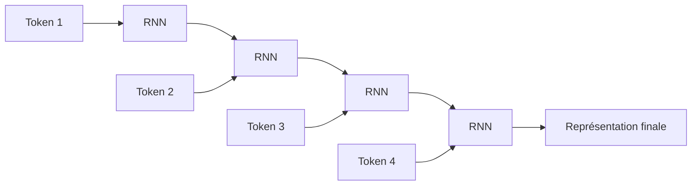

Nous pouvons résumer l’idée ainsi :

> Le RNN lit la phrase de gauche à droite et transporte une mémoire interne au fur et à mesure.

Par exemple, pour la phrase :

```txt
Le chat dort sur le canapé.
```

Le modèle lit :

```txt
Le → chat → dort → sur → le → canapé
```

À chaque mot, il met à jour son état.

---

## 1.3. Le principe des RNN

Un RNN reçoit deux informations à chaque étape :

1. l’entrée actuelle ;
    
2. l’état précédent.
    

Il produit ensuite :

1. un nouvel état ;
    
2. éventuellement une sortie.
    

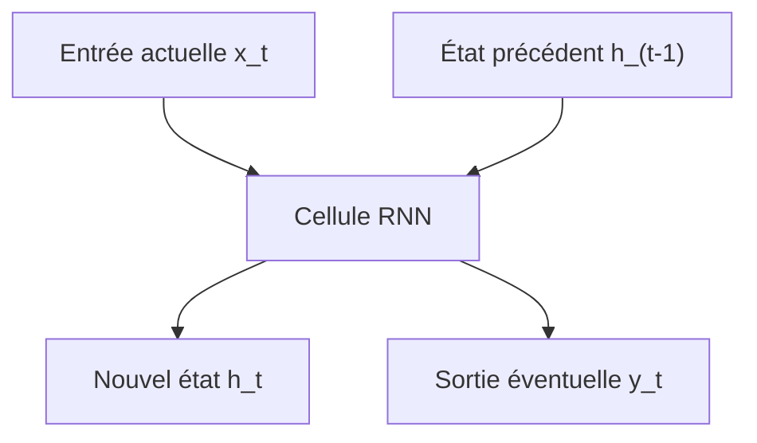

Mathématiquement, on peut écrire :

$$
h_t = f(x_t, h_{t-1})  
$$

où :

- $x_t$ est l’entrée au temps $t$ ;
    
- $h_{t-1}$ est l’état précédent ;
    
- $h_t$ est le nouvel état ;
    
-$f$est une fonction apprise par le réseau.
    

L’idée est élégante : le modèle possède une forme de mémoire.

Mais cette mémoire est limitée.

---

## 1.4. Le problème des dépendances longues

Prenons une phrase comme :

```txt
Le livre que Paul a acheté hier dans une petite librairie du centre-ville est passionnant.
```

Le sujet principal est :

```txt
Le livre
```

Le verbe associé est :

```txt
est
```

Mais entre les deux, nous avons beaucoup d’informations intermédiaires :

```txt
que Paul a acheté hier dans une petite librairie du centre-ville
```

Un modèle doit comprendre que :

```txt
Le livre ... est passionnant.
```

et non :

```txt
Paul ... est passionnant.
la librairie ... est passionnant.
le centre-ville ... est passionnant.
```

Le problème est que les RNN doivent transporter l’information importante à travers plusieurs étapes successives.

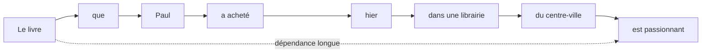

Plus la séquence est longue, plus il devient difficile de conserver les informations importantes.

C’est ce que nous appelons le problème des **dépendances longues**.

---

## 1.5. Le problème du gradient qui disparaît

Pendant l’entraînement, le modèle apprend en corrigeant ses erreurs. Cette correction se fait par un mécanisme appelé **[rétropropagation du gradient](https://fr.wikipedia.org/wiki/R%C3%A9tropropagation_du_gradient)**.

Dans un RNN, la rétropropagation doit traverser toutes les étapes temporelles.

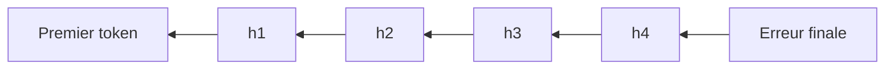

Quand la séquence est longue, le signal d’apprentissage peut devenir très faible en remontant vers les premiers tokens.

C’est le problème du **vanishing gradient**, ou **gradient qui disparaît**.

Conséquence :

> Le modèle apprend mal les relations éloignées dans la séquence.

Il peut très bien apprendre des dépendances courtes :

```txt
un chat noir
```

Mais il peut avoir plus de difficulté avec :

```txt
Le chat que j’ai vu hier dans la rue près de la gare était noir.
```

---

## 1.6. Les LSTM et GRU : une amélioration des RNN

Pour limiter ces problèmes, des architectures plus avancées ont été proposées, notamment :

- les **LSTM** ([Long short-term memory](https://fr.wikipedia.org/wiki/R%C3%A9seau_de_neurones_r%C3%A9currents#Long_short-term_memory));
    
- les **GRU** ([Gate Recurrent Unit](https://fr.wikipedia.org/wiki/Unit%C3%A9_r%C3%A9currente_ferm%C3%A9e)).
    

Ces modèles ajoutent des mécanismes de contrôle de la mémoire.

L’idée est de permettre au réseau de décider :

- quoi oublier ;
    
- quoi conserver ;
    
- quoi mettre à jour ;
    
- quoi transmettre.
    

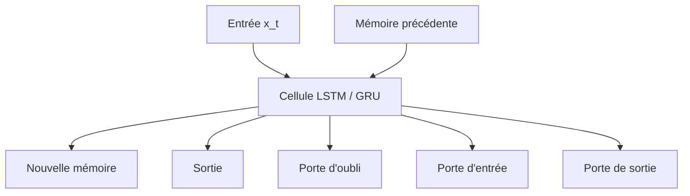

Les LSTM et GRU ont beaucoup amélioré la capacité des réseaux à traiter des séquences.

Mais ils conservent une limite importante :

> Ils traitent toujours les éléments principalement les uns après les autres.

Cette nature séquentielle devient un problème lorsque nous voulons entraîner de grands modèles sur beaucoup de données.

---

## 1.7. Le problème de la parallélisation

Un RNN doit calculer l’état $h_t$ à partir de l’état $h_{t-1}$.

Cela signifie que nous ne pouvons pas facilement calculer tous les états en même temps.

Pour calculer le mot 4, nous devons avoir calculé le mot 3.

Pour calculer le mot 3, nous devons avoir calculé le mot 2.

Pour calculer le mot 2, nous devons avoir calculé le mot 1.

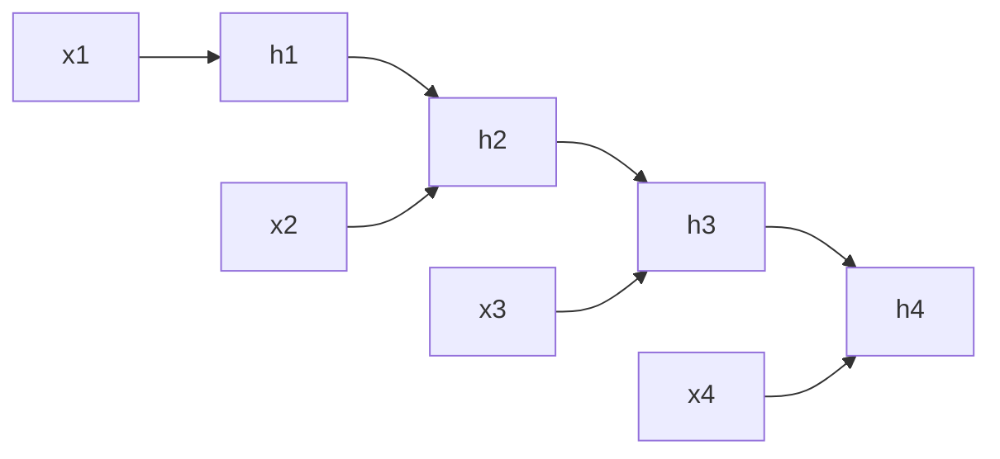

Le calcul est donc fortement séquentiel.

Or, les GPU et TPU sont très efficaces quand nous pouvons faire beaucoup de calculs en parallèle.

Les RNN utilisent mal cette capacité de parallélisation.

C’est une limite majeure pour entraîner des modèles très grands.

---

## 1.8. Les modèles Seq2Seq

Avant les Transformers, une architecture très utilisée pour la traduction automatique était le modèle **sequence-to-sequence**, ou **Seq2Seq**.

L’idée est simple :

- un encodeur lit la phrase source ;
    
- il produit une représentation ;
    
- un décodeur génère la phrase cible.
    

Par exemple :

```txt
Source : I love machine learning.
Cible  : J'aime l'apprentissage automatique.
```

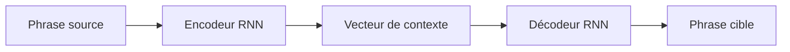

Le problème est que toute la phrase source doit être compressée dans un seul vecteur de contexte.

Pour une phrase courte, cela peut fonctionner.

Pour une phrase longue, c’est beaucoup plus difficile.

---

## 1.9. Le goulot d’étranglement du vecteur de contexte

Dans les premiers modèles Seq2Seq, l’encodeur devait résumer toute la phrase dans un vecteur unique.

Imaginons que nous devions traduire :

```txt
Although the committee had initially rejected the proposal, it later accepted a revised version after several months of discussion.
```

Il est difficile de condenser toutes les informations importantes dans une seule représentation fixe.

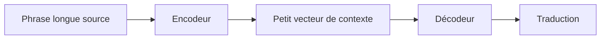

Ce vecteur devient un **goulot d’étranglement informationnel**.

Le décodeur doit générer une phrase complète à partir d’un résumé compact, alors qu’il aurait parfois besoin de regarder directement certaines parties précises de la phrase source.

C’est ici que l’attention va devenir importante.

---

## 1.10. L’arrivée de l’attention

L’idée de l’attention est de permettre au décodeur de ne pas dépendre uniquement d’un seul vecteur global.

Au lieu de cela, à chaque étape de génération, le décodeur peut regarder différentes parties de la phrase source.

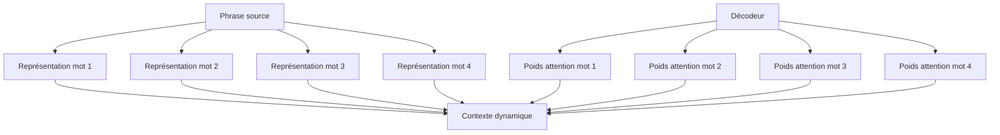

Nous pouvons décrire l’attention ainsi :

> L’attention permet au modèle de sélectionner dynamiquement les informations utiles dans une séquence.

Dans une tâche de traduction, lorsqu’il génère un mot français, le modèle peut regarder les mots anglais les plus pertinents.

Par exemple :

```txt
The black cat sleeps.
Le chat noir dort.
```

Quand le modèle génère :

```txt
chat
```

il doit surtout regarder :

```txt
cat
```

Quand il génère :

```txt
noir
```

il doit surtout regarder :

```txt
black
```

---

## 1.11. L’attention comme alignement

Dans la traduction automatique, l’attention peut être vue comme une forme d’alignement entre les mots source et les mots cible.

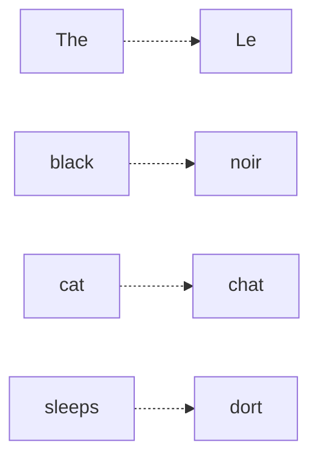

Ce point est important historiquement.

Avant les modèles neuronaux modernes, la traduction automatique utilisait souvent des mécanismes explicites d’alignement statistique.

L’attention a permis de retrouver une forme d’alignement, mais apprise automatiquement par le réseau.

---

## 1.12. Première rupture : l’attention améliore les RNN

Dans un premier temps, l’attention n’a pas remplacé les RNN.

Elle les a complétés.

Nous avions donc des architectures de ce type :

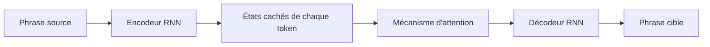

Cela a permis de grandes améliorations, car le décodeur pouvait accéder à tous les états de l’encodeur, et pas seulement au dernier.

Mais le modèle restait encore partiellement séquentiel.

L’encodeur était souvent récurrent.

Le décodeur était récurrent.

La parallélisation restait limitée.

---

## 1.13. La question centrale

À ce stade, une question devient naturelle :

> Si l’attention est si utile, avons-nous encore besoin des RNN ?

C’est exactement la rupture proposée par le papier **Attention Is All You Need**.

L’idée fondamentale est :

> Nous pouvons construire un modèle de séquence uniquement à partir de mécanismes d’attention, sans récurrence et sans convolution.

Autrement dit, au lieu de lire la phrase mot par mot, nous la traitons globalement.

---

## 1.14. La rupture Transformer

Le Transformer remplace le traitement séquentiel par un traitement fondé sur l’attention entre tous les tokens.

Dans un RNN, chaque token dépend surtout de l’état précédent.

Dans un Transformer, chaque token peut directement interagir avec tous les autres tokens.

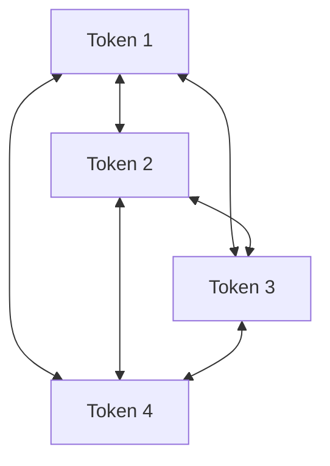

Cela change profondément la manière de traiter les séquences.

Nous ne sommes plus dans une lecture strictement linéaire.

Nous sommes dans une mise en relation globale.

---

## 1.15. Exemple intuitif

Prenons la phrase :

```txt
La souris que le chat poursuit court très vite.
```

Le mot :

```txt
court
```

doit être relié à :

```txt
La souris
```

et non à :

```txt
le chat
```

Un Transformer peut apprendre à faire regarder le token `court` vers les tokens utiles :

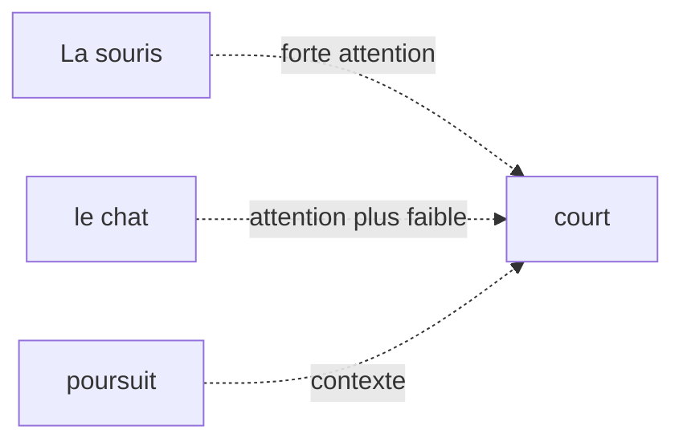

Le modèle apprend donc des relations grammaticales, sémantiques et contextuelles à partir des données.

---

## 1.16. Comparaison RNN vs Transformer

Nous pouvons comparer les deux approches simplement.

|Critère|RNN / LSTM / GRU|Transformer|
|---|---|---|
|Traitement|Séquentiel|Global et parallélisable|
|Dépendances longues|Difficiles|Plus directes|
|Parallélisation|Limitée|Très forte|
|Mémoire du contexte|Compressée dans des états successifs|Relations directes entre tokens|
|Architecture dominante aujourd’hui|Moins utilisée pour NLP massif|Dominante dans les LLM|

Le point clé est le suivant :

> Le Transformer rend beaucoup plus efficace l’apprentissage sur de grands corpus grâce à sa parallélisation et à son accès direct aux relations entre tokens.

---

## 1.17. Ce que le Transformer gagne

Le Transformer apporte plusieurs avantages majeurs.

### 1.17.1 Meilleure parallélisation

Comme tous les tokens d’une séquence peuvent être traités en même temps dans certaines parties du modèle, l’entraînement devient beaucoup plus efficace sur GPU ou TPU.

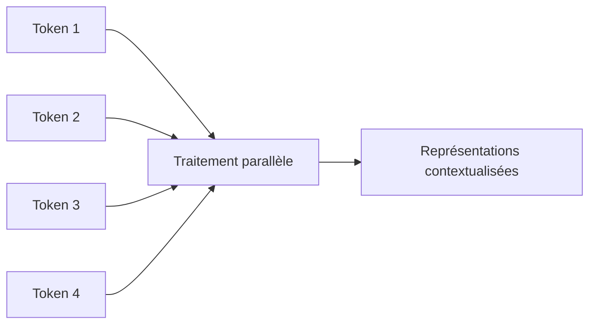

Cela permet d’entraîner des modèles plus grands sur davantage de données.

---

### 1.17.2 Meilleure gestion des dépendances longues

Dans un Transformer, deux tokens éloignés peuvent interagir directement via l’attention.

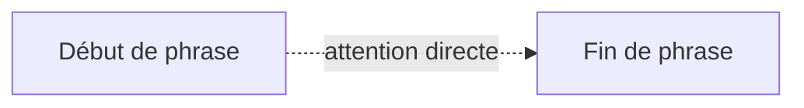

Dans un RNN, l’information doit passer par tous les états intermédiaires.

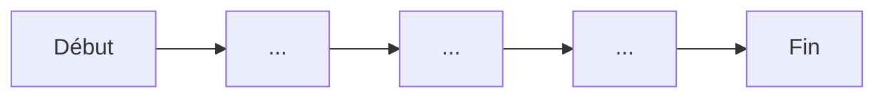

La différence est essentielle.

---

### 1.17.3 Représentations contextualisées

Dans un Transformer, le vecteur associé à un mot dépend des autres mots de la phrase.

Le mot `banque` n’a pas la même représentation dans :

```txt
Je vais à la banque déposer un chèque.
```

et :

```txt
Nous nous asseyons sur la banque au bord de la rivière.
```

Même mot, mais contexte différent.

Le Transformer produit donc une représentation contextualisée.

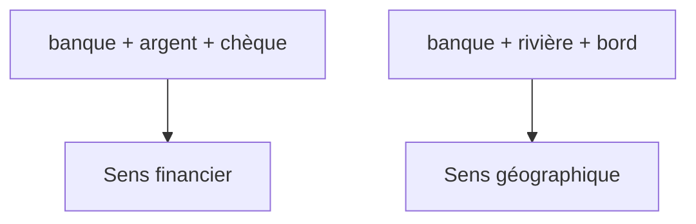

---

## 1.18. Ce que le Transformer perd ou complique

Il ne faut pas présenter les Transformers comme une solution magique.

Ils ont aussi des limites.

### 1.18.1 Coût quadratique de l’attention

Si chaque token regarde tous les autres tokens, alors le nombre de relations à calculer augmente très vite.

Pour une séquence de longueur $n$, la matrice d’attention contient :

$$n \times n$$


relations.

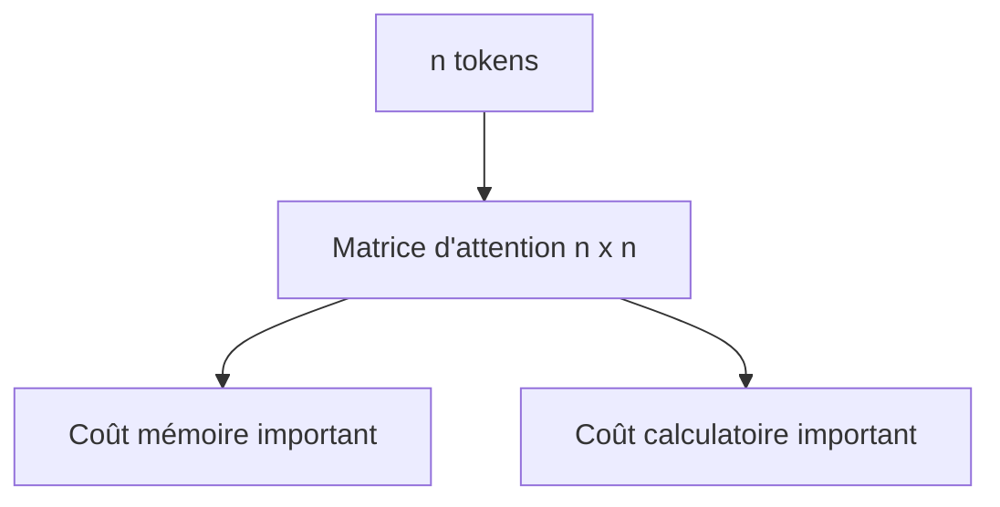

C’est pourquoi les longues séquences sont coûteuses.

Nous reviendrons sur ce point dans le chapitre consacré à la complexité.

---

### 1.18.2 Absence d’ordre naturel

Un RNN lit les mots dans l’ordre. L’ordre est donc intégré naturellement dans le processus.

Un Transformer, lui, regarde tous les tokens en parallèle.

Il faut donc lui ajouter explicitement une information de position.

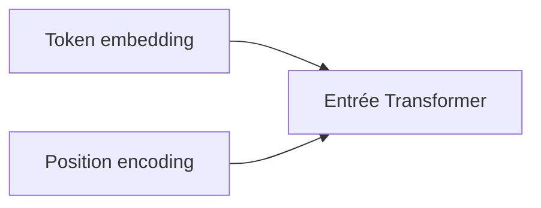

Sans information de position, le Transformer ne saurait pas distinguer :

```txt
Le chien mord l’homme.
```

de :

```txt
L’homme mord le chien.
```

Nous étudierons ce problème en détail dans le chapitre 3.

---

### 1.18.3 Besoin massif de données

Les Transformers modernes sont très puissants, mais ils nécessitent souvent :

- beaucoup de données ;
    
- beaucoup de calcul ;
    
- beaucoup de mémoire ;
    
- une infrastructure matérielle importante.
    

C’est particulièrement vrai pour les grands modèles de langage.

---

## 1.19. Transformer et changement d’échelle

Le succès des Transformers ne vient pas seulement de leur élégance théorique.

Il vient aussi de leur compatibilité avec le passage à l’échelle.

Autrement dit, les Transformers se sont révélés très efficaces lorsque nous augmentons :

- la taille des données ;
    
- la taille du modèle ;
    
- la durée d’entraînement ;
    
- la puissance de calcul.
    

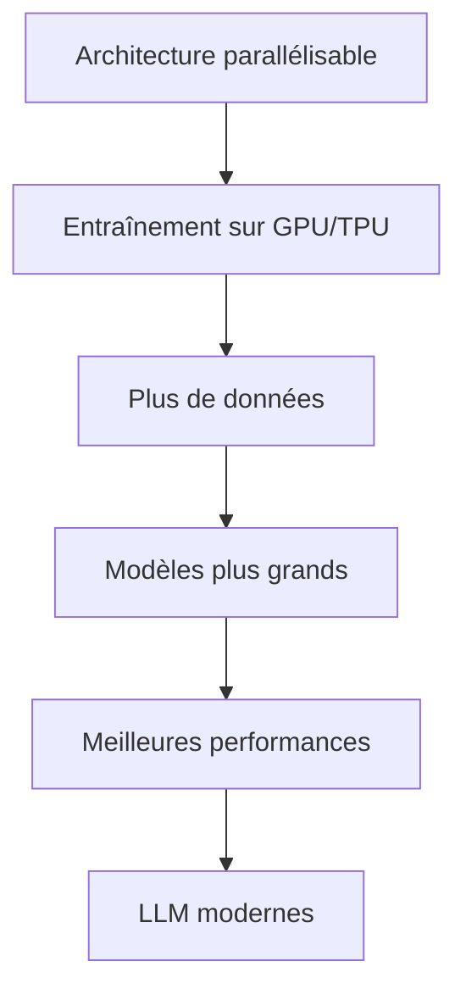

C’est ce qui a permis l’émergence des grands modèles de langage modernes.

---

## 1.20. Les grandes étapes historiques

Nous pouvons résumer l’évolution des architectures de séquences ainsi :

```mermaid
timeline
    title Évolution des modèles de séquences
    RNN : Lecture séquentielle simple
    LSTM / GRU : Meilleure mémoire
    Seq2Seq : Traduction neuronale
    Attention : Accès dynamique au contexte
    Transformer : Attention sans récurrence
    BERT / GPT : Pré-entraînement massif
    LLM modernes : Passage à l'échelle
```

Cette progression montre que les Transformers ne sont pas apparus de nulle part.

Ils sont la réponse à plusieurs limites accumulées :

- les RNN traitaient mal les dépendances longues ;
    
- les modèles Seq2Seq compressaient trop l’information ;
    
- les modèles récurrents étaient difficiles à paralléliser ;
    
- l’attention avait déjà montré son efficacité ;
    
- les GPU/TPU favorisaient les architectures parallélisables.
    

---

## 1.21. L’idée centrale du chapitre

Nous pouvons maintenant formuler l’idée centrale :

> Le Transformer est une architecture conçue pour traiter les séquences en reliant directement les éléments entre eux grâce à l’attention, au lieu de les traiter uniquement dans un ordre séquentiel.

Cela permet :

- de mieux capturer les dépendances longues ;
    
- de paralléliser fortement l’entraînement ;
    
- de produire des représentations contextualisées ;
    
- de construire des modèles très grands ;
    
- de généraliser l’architecture à de nombreux domaines.
    

---

## 1.22. Exemple global : d’une phrase à une représentation contextualisée

Prenons la phrase :

```txt
Le chat noir dort sur le canapé.
```

Un Transformer ne se contente pas d’associer un vecteur fixe à chaque mot.

Il construit une représentation de chaque mot en fonction de tous les autres.

```mermaid
flowchart TD
    A["Le"] --> T["Transformer"]
    B["chat"] --> T
    C["noir"] --> T
    D["dort"] --> T
    E["sur"] --> T
    F["le"] --> T
    G["canapé"] --> T

    T --> A2["Représentation contextualisée de Le"]
    T --> B2["Représentation contextualisée de chat"]
    T --> C2["Représentation contextualisée de noir"]
    T --> D2["Représentation contextualisée de dort"]
    T --> G2["Représentation contextualisée de canapé"]
```

Le mot `chat` sera influencé par :

- `Le`, qui indique le déterminant ;
    
- `noir`, qui apporte une propriété ;
    
- `dort`, qui indique l’action ;
    
- `canapé`, qui donne le contexte de la scène.
    

---

## 1.23. Attention : ce que nous ne savons pas encore

À ce stade du cours, nous comprenons pourquoi les Transformers sont nécessaires, mais nous n’avons pas encore détaillé comment ils fonctionnent.

Nous ne savons pas encore précisément :

- comment un mot devient un vecteur ;
    
- comment le modèle encode l’ordre ;
    
- ce que sont Query, Key et Value ;
    
- comment l’attention est calculée ;
    
- pourquoi on parle de multi-head attention ;
    
- comment fonctionne un bloc encoder ;
    
- comment fonctionne un bloc decoder ;
    
- comment le modèle est entraîné.
    

Ces éléments seront construits progressivement dans les chapitres suivants.

---

## 1.24. Résumé du chapitre

Nous avons vu que les Transformers répondent à plusieurs limites des architectures précédentes.

Les **RNN** lisent les séquences pas à pas, ce qui rend les dépendances longues difficiles et limite la parallélisation.

Les **LSTM** et **GRU** améliorent la mémoire, mais restent fondamentalement séquentiels.

Les modèles **Seq2Seq** ont permis de grandes avancées, notamment en traduction automatique, mais ils souffraient du goulot d’étranglement du vecteur de contexte.

L’**attention** a permis au modèle de sélectionner dynamiquement les parties pertinentes d’une séquence.

Le **Transformer** pousse cette idée plus loin :

> Nous supprimons la récurrence et nous construisons une architecture entièrement fondée sur l’attention.

Cela permet de traiter les séquences de manière plus globale, plus parallélisable et plus adaptée au passage à l’échelle.

---

## 1.25. Schéma de synthèse

```mermaid
flowchart TD
    A["Problème : traiter des séquences"] --> B["RNN"]
    B --> C["Limite : dépendances longues"]
    B --> D["Limite : faible parallélisation"]

    C --> E["LSTM / GRU"]
    D --> E

    E --> F["Seq2Seq"]
    F --> G["Limite : vecteur de contexte unique"]

    G --> H["Attention"]
    H --> I["Meilleur accès au contexte"]

    I --> J["Transformer"]
    J --> K["Attention sans récurrence"]
    J --> L["Parallélisation"]
    J --> M["Dépendances longues"]
    J --> N["LLM modernes"]
```

---

## 1.26. Questions de compréhension

Pour vérifier que nous avons compris ce chapitre, nous pouvons répondre aux questions suivantes.

### Question 1

Pourquoi les RNN sont-ils naturellement adaptés aux séquences ?

Réponse attendue : parce qu’ils lisent les éléments les uns après les autres et maintiennent un état interne qui transporte l’information au fil du temps.

### Question 2

Pourquoi les RNN ont-ils du mal avec les dépendances longues ?

Réponse attendue : parce que l’information doit traverser de nombreuses étapes successives, ce qui peut entraîner une perte d’information et un affaiblissement du gradient.

### Question 3

Quel problème les LSTM et GRU cherchent-ils à résoudre ?

Réponse attendue : ils cherchent à améliorer la mémoire des RNN grâce à des mécanismes de portes permettant de contrôler ce qui est conservé, oublié ou transmis.

### Question 4

Quel est le problème du vecteur de contexte unique dans les premiers modèles Seq2Seq ?

Réponse attendue : toute la phrase source doit être compressée dans une seule représentation, ce qui devient insuffisant pour les phrases longues ou complexes.

### Question 5

Quelle est l’idée principale de l’attention ?

Réponse attendue : permettre au modèle de regarder dynamiquement les parties pertinentes de la séquence au lieu de dépendre d’une seule représentation globale.

### Question 6

Quelle est la rupture introduite par le Transformer ?

Réponse attendue : le Transformer supprime la récurrence et repose principalement sur l’attention pour relier directement les tokens entre eux.

### Question 7

Pourquoi les Transformers sont-ils plus faciles à paralléliser que les RNN ?

Réponse attendue : parce que les représentations des tokens peuvent être calculées simultanément dans les couches d’attention, alors que les RNN nécessitent de calculer les états dans l’ordre.

### Question 8

Quelle est une limite importante des Transformers ?

Réponse attendue : le coût de l’attention augmente quadratiquement avec la longueur de la séquence, car chaque token peut regarder tous les autres tokens.

---

## 1.27. Transition vers le chapitre 2

Dans ce chapitre, nous avons compris pourquoi les Transformers ont été proposés.

Dans le chapitre suivant, nous allons préparer les bases nécessaires pour entrer dans leur fonctionnement interne.

Nous verrons comment passer de ceci :

```txt
Le chat dort.
```

à ceci :

```txt
[154, 932, 421, 13]
```

puis à des vecteurs numériques manipulables par un réseau de neurones.

Autrement dit, nous allons étudier :

- la tokenisation ;
    
- les tokens ;
    
- les embeddings ;
    
- les tenseurs ;
    
- les dimensions utilisées dans un Transformer.
    

Le chapitre 2 construira donc le pont entre le texte brut et l’entrée numérique du modèle.

---

# Chapitre 2 Rappels nécessaires : tenseurs, embeddings et séquences

## 2.1. Objectif du chapitre

Dans le chapitre précédent, nous avons compris **pourquoi les Transformers ont été introduits** : ils répondent aux limites des architectures séquentielles comme les RNN, LSTM et GRU.

Dans ce deuxième chapitre, nous allons préparer les bases techniques nécessaires pour comprendre l’entrée d’un Transformer.

Un Transformer ne manipule pas directement du texte brut comme :

```txt
Le chat dort sur le canapé.
```

Il manipule des **nombres**, organisés dans des **vecteurs**, eux-mêmes regroupés dans des **matrices** ou des **tenseurs**.

Nous allons donc comprendre comment nous passons de ceci :

```txt
Le chat dort sur le canapé.
```

à ceci :

```txt
[154, 932, 421, 78, 154, 2356]
```

puis à ceci :

```txt
[
  [0.12, -0.45, 0.88, ...],
  [0.31,  0.07, -0.22, ...],
  ...
]
```

Autrement dit, nous allons étudier :

- la tokenisation ;
    
- les tokens ;
    
- les identifiants de tokens ;
    
- les embeddings ;
    
- les tenseurs ;
    
- les dimensions utilisées dans les Transformers ;
    
- la différence entre représentation symbolique et représentation vectorielle.
    

---

## 2.2. Du texte brut aux données numériques

Un réseau de neurones ne comprend pas directement les mots.

Pour un humain, cette phrase est lisible :

```txt
Le chat dort.
```

Mais pour une machine learning model, ce texte doit être converti en nombres.

Nous avons donc une chaîne de transformation :

```mermaid
flowchart LR
    A["Texte brut"] --> B["Tokenisation"]
    B --> C["Tokens"]
    C --> D["IDs de tokens"]
    D --> E["Embeddings"]
    E --> F["Tenseur d'entrée du Transformer"]
```

L’idée générale est la suivante :

1. nous découpons le texte en morceaux ;
    
2. nous associons chaque morceau à un identifiant numérique ;
    
3. nous transformons chaque identifiant en vecteur dense ;
    
4. nous envoyons ces vecteurs dans le Transformer.
    

---

## 2.3. Qu’est-ce qu’un token ?

Un **token** est une unité de texte manipulée par le modèle.

Un token peut être :

- un mot ;
    
- une partie de mot ;
    
- un caractère ;
    
- un symbole ;
    
- un signe de ponctuation ;
    
- un espace ou une marque spéciale selon le tokenizer.
    

Par exemple, la phrase :

```txt
Le chat dort.
```

peut être découpée ainsi :

```txt
["Le", "chat", "dort", "."]
```

Mais selon le tokenizer, elle pourrait aussi être découpée différemment.

Par exemple :

```txt
["Le", "Ġchat", "Ġdort", "."]
```

ou encore :

```txt
["L", "e", "chat", "dort", "."]
```

Le token n’est donc pas forcément un mot.

C’est un point fondamental.

---

## 2.4. Pourquoi ne pas utiliser directement les mots ?

Nous pourrions imaginer un modèle qui manipule directement les mots du dictionnaire.

Mais cela pose plusieurs problèmes.

### 2.4.1 Vocabulaire énorme

Une langue contient énormément de mots :

```txt
chat, chats, chatte, chaton, chatière, etc.
```

Si nous ajoutons :

- les conjugaisons ;
    
- les accords ;
    
- les noms propres ;
    
- les fautes de frappe ;
    
- les mots rares ;
    
- les termes techniques ;
    
- les mots étrangers ;
    

le vocabulaire devient gigantesque.

### 2.4.2 Mots inconnus

Si le modèle rencontre un mot absent de son vocabulaire, il ne sait pas quoi faire.

Par exemple :

```txt
anticonstitutionnellement
```

ou :

```txt
GmodIntegration
```

ou encore :

```txt
docker-compose.override.yml
```

Un tokenizer moderne doit pouvoir traiter ces formes rares ou nouvelles.

### 2.4.3 Sous-mots

Pour résoudre ce problème, beaucoup de modèles utilisent des tokens de type **sous-mots**.

Par exemple :

```txt
anticonstitutionnellement
```

pourrait être découpé en :

```txt
["anti", "constitution", "nelle", "ment"]
```

L’avantage est que le modèle peut comprendre un mot rare à partir de morceaux plus fréquents.

---

## 2.5. Tokenisation par mots, caractères et sous-mots

Nous pouvons distinguer trois grandes approches.

### 2.5.1 Tokenisation par mots

La phrase :

```txt
Le chat dort.
```

devient :

```txt
["Le", "chat", "dort", "."]
```

Avantage : c’est intuitif.

Inconvénient : le vocabulaire devient très grand et les mots rares posent problème.

---

### 2.5.2 Tokenisation par caractères

La phrase :

```txt
chat
```

devient :

```txt
["c", "h", "a", "t"]
```

Avantage : presque aucun mot inconnu.

Inconvénient : les séquences deviennent beaucoup plus longues.

Le modèle doit reconstruire lui-même les mots à partir des caractères.

---

### 2.5.3 Tokenisation par sous-mots

La phrase :

```txt
reconstruction
```

peut devenir :

```txt
["re", "construction"]
```

ou :

```txt
["recon", "struction"]
```

ou encore :

```txt
["re", "construct", "ion"]
```

C’est l’approche la plus utilisée dans les grands modèles de langage modernes.

Elle offre un bon compromis entre :

- vocabulaire raisonnable ;
    
- capacité à traiter les mots rares ;
    
- longueur de séquence acceptable.
    

```mermaid
flowchart TD
    A["Texte brut"] --> B1["Tokenisation par mots"]
    A --> B2["Tokenisation par caractères"]
    A --> B3["Tokenisation par sous-mots"]

    B1 --> C1["Simple mais vocabulaire énorme"]
    B2 --> C2["Robuste mais séquences longues"]
    B3 --> C3["Compromis utilisé par beaucoup de LLM"]
```

---

## 2.6. Le vocabulaire du modèle

Un modèle de langage possède un **vocabulaire**, c’est-à-dire une liste finie de tokens qu’il connaît.

Par exemple, un vocabulaire simplifié pourrait être :

|ID|Token|
|--:|---|
|0|`<pad>`|
|1|`<unk>`|
|2|`Le`|
|3|`chat`|
|4|`dort`|
|5|`sur`|
|6|`canapé`|
|7|`.`|

La phrase :

```txt
Le chat dort sur le canapé.
```

pourrait alors devenir :

```txt
[2, 3, 4, 5, 2, 6, 7]
```

Nous avons remplacé les tokens par des identifiants numériques.

Mais attention : ces identifiants ne portent pas encore de sens mathématique.

Le fait que `chat = 3` et `dort = 4` ne signifie pas que `dort` est “plus grand” que `chat`.

Ces IDs sont seulement des indices dans une table.

---

## 2.7. Tokens spéciaux

Les modèles utilisent souvent des tokens spéciaux.

Par exemple :

|Token spécial|Rôle|
|---|---|
|`<pad>`|Remplissage pour obtenir des séquences de même longueur|
|`<unk>`|Token inconnu|
|`<bos>`|Début de séquence|
|`<eos>`|Fin de séquence|
|`<mask>`|Token masqué, utilisé notamment dans BERT|
|`<sep>`|Séparateur entre deux segments|
|`<cls>`|Token de classification, utilisé notamment dans BERT|

Par exemple, pour une tâche de classification, nous pourrions avoir :

```txt
[CLS] Le chat dort. [SEP]
```

Pour une tâche de génération, nous pourrions avoir :

```txt
[BOS] Le chat dort. [EOS]
```

Ces tokens spéciaux permettent au modèle de repérer la structure de l’entrée.

---

# 2.8. Padding : pourquoi compléter les séquences ?

Dans un batch, nous entraînons souvent le modèle sur plusieurs phrases en même temps.

Mais les phrases n’ont pas toutes la même longueur.

Par exemple :

```txt
Phrase 1 : Le chat dort.
Phrase 2 : Le petit chat noir dort sur le canapé.
```

Après tokenisation :

```txt
Phrase 1 : [2, 3, 4, 7]
Phrase 2 : [2, 8, 3, 9, 4, 5, 2, 6, 7]
```

Pour les mettre dans un même tenseur, nous devons souvent les compléter avec un token de padding :

```txt
Phrase 1 : [2, 3, 4, 7, 0, 0, 0, 0, 0]
Phrase 2 : [2, 8, 3, 9, 4, 5, 2, 6, 7]
```

Ici, `0` correspond à `<pad>`.

```mermaid
flowchart TD
    A["Séquences de longueurs différentes"] --> B["Ajout de tokens <pad>"]
    B --> C["Séquences de même longueur"]
    C --> D["Batch tensoriel"]
```

Cependant, le modèle ne doit pas considérer les tokens `<pad>` comme du vrai texte.

Nous utiliserons donc plus tard un **padding mask** pour les ignorer dans l’attention.

---

# 2.9. Représentation symbolique contre représentation distribuée

Une fois que nous avons des IDs de tokens, nous avons une représentation symbolique :

```txt
Le    → 2
chat  → 3
dort  → 4
```

Mais cette représentation est pauvre.

Elle ne dit pas que :

- `chat` est proche de `chien` ;
    
- `dort` est proche de `sommeille` ;
    
- `canapé` est proche de `fauteuil` ;
    
- `manger` est différent de `dormir`.
    

Pour que le modèle apprenne des relations sémantiques, chaque token est transformé en vecteur.

C’est le rôle des **embeddings**.

---

## 2.10. Qu’est-ce qu’un embedding ?

Un **embedding** est un vecteur dense associé à un token.

Par exemple, le token `chat` peut être représenté par un vecteur :

```txt
chat → [0.21, -0.38, 0.74, 0.12, ...]
```

Dans un vrai Transformer, ce vecteur peut avoir une dimension comme :

```txt
768, 1024, 4096, 8192, ...
```

selon la taille du modèle.

Nous appelons souvent cette dimension :

$$d_{model}$$
C’est la dimension principale des représentations internes du Transformer.

---

## 2.11. Table d’embeddings

Concrètement, le modèle contient une grande matrice appelée **table d’embeddings**.

Si le vocabulaire contient (V) tokens et que chaque embedding a une dimension $d_{model}$, alors la table d’embeddings a la forme :

$$V \times d_{model}$$

Par exemple, avec :

```txt
V = 50 000 tokens
d_model = 768
```

la matrice d’embeddings contient :

```txt
50 000 × 768
```

valeurs apprises.

```mermaid
flowchart LR
    A["ID du token"] --> B["Table d'embeddings"]
    B --> C["Vecteur dense de dimension d_model"]
```

Exemple simplifié :

|Token|ID|Embedding simplifié|
|---|--:|---|
|Le|2|`[0.1, 0.4, -0.2]`|
|chat|3|`[0.7, -0.1, 0.5]`|
|dort|4|`[-0.3, 0.8, 0.2]`|

Donc :

```txt
[2, 3, 4]
```

devient :

```txt
[
  [0.1, 0.4, -0.2],
  [0.7, -0.1, 0.5],
  [-0.3, 0.8, 0.2]
]
```

---

## 2.12. Les embeddings sont appris

Les embeddings ne sont pas écrits à la main.

Ils sont appris pendant l’entraînement.

Au début, ils peuvent être initialisés aléatoirement.

Puis, au fil de l’apprentissage, le modèle ajuste les vecteurs pour mieux résoudre sa tâche.

Par exemple, dans un modèle de langage, le modèle apprend progressivement que certains tokens apparaissent dans des contextes similaires.

Ainsi, les embeddings de mots proches sémantiquement peuvent finir par se rapprocher dans l’espace vectoriel.

```mermaid
flowchart TD
    A["Initialisation aléatoire"] --> B["Entraînement"]
    B --> C["Correction par gradient"]
    C --> D["Embeddings plus utiles"]
    D --> E["Représentations sémantiques apprises"]
```

---

## 2.13. Intuition géométrique des embeddings

Nous pouvons voir les embeddings comme des points dans un espace multidimensionnel.

Dans un espace très simplifié à deux dimensions, nous pourrions imaginer :

```mermaid
quadrantChart
    title Espace d'embeddings simplifié
    x-axis "animal" --> "objet"
    y-axis "repos" --> "action"
    quadrant-1 "Objets actifs"
    quadrant-2 "Animaux actifs"
    quadrant-3 "Animaux au repos"
    quadrant-4 "Objets au repos"
    "chat": [0.2, 0.3]
    "chien": [0.25, 0.35]
    "canapé": [0.8, 0.2]
    "dormir": [0.3, 0.15]
```

Bien sûr, dans un vrai modèle, l’espace n’a pas deux dimensions mais souvent plusieurs centaines ou milliers.

L’important est l’idée suivante :

> Les embeddings permettent de représenter les tokens dans un espace où les relations entre vecteurs peuvent porter du sens.

---

## 2.14. Embedding statique et embedding contextualisé

Il faut distinguer deux notions.

### 2.14.1 Embedding statique

La table d’embeddings donne une représentation initiale du token.

Par exemple :

```txt
banque → [0.18, -0.22, 0.91, ...]
```

Cette représentation est la même au départ, quel que soit le contexte.

### 2.14.2 Représentation contextualisée

Après passage dans le Transformer, le vecteur du token dépend du contexte.

Le mot `banque` dans :

```txt
Je vais à la banque déposer un chèque.
```

n’aura pas la même représentation finale que dans :

```txt
Nous marchons sur la banque de sable.
```

```mermaid
flowchart TD
    A["Embedding initial de banque"] --> T1["Transformer avec contexte financier"]
    A --> T2["Transformer avec contexte géographique"]

    T1 --> B["Représentation contextualisée : établissement financier"]
    T2 --> C["Représentation contextualisée : bord / dépôt naturel"]
```

Donc :

> L’embedding initial donne un point de départ, mais le Transformer construit ensuite une représentation dépendante du contexte.

---

## 2.15. Qu’est-ce qu’un tenseur ?

Un **tenseur** est une généralisation des scalaires, vecteurs et matrices.

Nous pouvons retenir simplement :

|Objet|Exemple|Nombre de dimensions|
|---|---|--:|
|Scalaire|`3.14`|0D|
|Vecteur|`[0.1, 0.2, 0.3]`|1D|
|Matrice|`[[1, 2], [3, 4]]`|2D|
|Tenseur|batch de matrices|3D ou plus|

Dans les Transformers, nous manipulons très souvent des tenseurs à trois dimensions :

```txt
(batch_size, sequence_length, d_model)
```

---

## 2.16. Dimensions classiques dans un Transformer

Prenons un exemple.

Nous avons un batch de 32 phrases.

Chaque phrase est tronquée ou complétée à 128 tokens.

Chaque token est représenté par un embedding de dimension 768.

Le tenseur d’entrée a donc la forme :

```txt
(32, 128, 768)
```

Ce qui signifie :

```txt
32 phrases
128 tokens par phrase
768 valeurs par token
```

```mermaid
flowchart TD
    A["Batch size = 32"] --> D["Tenseur d'entrée"]
    B["Sequence length = 128"] --> D
    C["d_model = 768"] --> D
    D --> E["Shape : 32 x 128 x 768"]
```

Nous retrouverons ces dimensions tout au long du cours.

---

## 2.17. Dimension batch

La dimension **batch** correspond au nombre d’exemples traités en même temps.

Par exemple :

```txt
batch_size = 4
```

signifie que nous envoyons 4 séquences en parallèle au modèle.

```txt
Phrase 1 : Le chat dort.
Phrase 2 : Le chien aboie.
Phrase 3 : Il pleut aujourd’hui.
Phrase 4 : J’aime les Transformers.
```

Le batch permet :

- d’accélérer l’entraînement ;
    
- de mieux utiliser le GPU ;
    
- de stabiliser l’estimation du gradient.
    

---

## 2.18. Dimension sequence length

La dimension **sequence length** correspond au nombre de tokens dans chaque séquence.

Par exemple :

```txt
Le chat dort.
```

peut devenir :

```txt
["Le", "chat", "dort", "."]
```

Donc :

```txt
sequence_length = 4
```

Mais dans un batch, nous fixons souvent une longueur maximale :

```txt
max_sequence_length = 128
```

Les phrases plus courtes sont complétées avec du padding.

Les phrases plus longues sont tronquées ou découpées.

---

## 2.19. Dimension d_model

La dimension $d_{model}$ est la taille du vecteur associé à chaque token.

Par exemple :

```txt
d_model = 768
```

signifie que chaque token est représenté par 768 nombres.

Le choix de $d_{model}$ influence :

- la capacité du modèle ;
    
- le nombre de paramètres ;
    
- le coût mémoire ;
    
- le coût calculatoire.
    

Un modèle avec un $d_{model}$ plus grand peut représenter plus d’informations, mais coûte plus cher à entraîner et à utiliser.

---

## 2.20. Exemple complet de transformation

Prenons la phrase :

```txt
Le chat dort.
```

Étape 1 : tokenisation

```txt
["Le", "chat", "dort", "."]
```

Étape 2 : conversion en IDs

```txt
[2, 3, 4, 7]
```

Étape 3 : embeddings simplifiés

```txt
[
  [0.1, 0.4, -0.2],
  [0.7, -0.1, 0.5],
  [-0.3, 0.8, 0.2],
  [0.0, -0.5, 0.9]
]
```

Ici, nous avons :

```txt
sequence_length = 4
d_model = 3
```

Donc la forme est :

```txt
(4, 3)
```

Si nous ajoutons un batch de taille 1, la forme devient :

```txt
(1, 4, 3)
```

```mermaid
flowchart LR
    A["Le chat dort."] --> B["Tokens"]
    B --> C["IDs : [2, 3, 4, 7]"]
    C --> D["Embeddings"]
    D --> E["Shape : 1 x 4 x 3"]
```

---

## 2.21. Pourquoi les embeddings ne suffisent pas ?

Les embeddings initiaux ne connaissent pas encore le contexte précis.

Par exemple, dans :

```txt
Le chat dort.
```

le token `chat` reçoit un vecteur initial.

Dans :

```txt
Le chat de discussion est ouvert.
```

le token `chat` peut avoir une signification différente selon le contexte.

L’embedding initial ne suffit donc pas.

Le rôle du Transformer sera de transformer ces embeddings initiaux en représentations contextualisées.

```mermaid
flowchart LR
    A["Embeddings initiaux"] --> B["Transformer"]
    B --> C["Représentations contextualisées"]
```

---

## 2.22. Séquence d’entrée dans un Transformer

L’entrée d’un Transformer est donc une matrice de vecteurs.

Pour une phrase de $n$ tokens, nous avons :
 
$$X \in \mathbb{R}^{n \times d_{model}}$$

où :

- $n$ est la longueur de la séquence ;
    
- $d_{model}$ est la dimension des embeddings.
    

Pour un batch, nous avons :

$$X \in \mathbb{R}^{B \times n \times d_{model}}$$
où :

- $B$ est la taille du batch ;
    
- $n$ est la longueur de séquence ;
    
- $d_{model}$ est la dimension du modèle.
    

C’est ce tenseur qui sera envoyé dans les couches du Transformer.

---

## 2.23. Le problème restant : l’ordre

À ce stade, nous avons transformé les tokens en vecteurs.

Mais nous avons un problème majeur.

Si nous envoyons simplement une liste de vecteurs au Transformer, l’architecture d’attention ne connaît pas naturellement l’ordre des tokens.

La phrase :

```txt
Le chien mord l’homme.
```

et la phrase :

```txt
L’homme mord le chien.
```

contiennent presque les mêmes tokens.

Mais le sens est différent.

```mermaid
flowchart TD
    A["Même ensemble de mots"] --> B["Ordre différent"]
    B --> C["Sens différent"]
    C --> D["Il faut encoder la position"]
```

Un RNN encode implicitement l’ordre car il lit la phrase de gauche à droite.

Un Transformer, lui, traite les tokens en parallèle.

Nous devrons donc ajouter explicitement une information de position.

C’est le sujet du chapitre suivant.

---

## 2.24. Résumé du chapitre

Dans ce chapitre, nous avons construit le pipeline d’entrée d’un Transformer.

Nous avons vu que le texte brut doit être transformé en nombres.

La première étape est la **tokenisation**, qui découpe le texte en tokens.

Ces tokens sont ensuite convertis en **IDs**, c’est-à-dire en indices dans le vocabulaire du modèle.

Ces IDs sont transformés en **embeddings**, c’est-à-dire en vecteurs denses appris pendant l’entraînement.

Ces vecteurs sont regroupés dans un **tenseur** de forme typique :

```txt
(batch_size, sequence_length, d_model)
```

Nous avons aussi distingué :

- l’embedding initial, associé au token ;
    
- la représentation contextualisée, produite ensuite par le Transformer.
    

Enfin, nous avons identifié le problème suivant :

> Les Transformers ne connaissent pas naturellement l’ordre des tokens.

Nous devrons donc ajouter une information de position.

---

# 25. Schéma de synthèse

```mermaid
flowchart TD
    A["Texte brut"] --> B["Tokenisation"]
    B --> C["Tokens"]
    C --> D["IDs de tokens"]
    D --> E["Table d'embeddings"]
    E --> F["Vecteurs denses"]
    F --> G["Tenseur : batch x séquence x d_model"]
    G --> H["Entrée du Transformer"]

    H --> I["Problème restant : ordre des tokens"]
    I --> J["Chapitre 3 : positional encoding"]
```

---

## 2.26. Questions de compréhension

### Question 1

Pourquoi un Transformer ne peut-il pas manipuler directement du texte brut ?

Réponse attendue : parce qu’un réseau de neurones manipule des nombres, pas des chaînes de caractères. Le texte doit donc être converti en tokens, puis en IDs, puis en vecteurs.

### Question 2

Qu’est-ce qu’un token ?

Réponse attendue : un token est une unité de texte manipulée par le modèle. Il peut correspondre à un mot, un sous-mot, un caractère, une ponctuation ou un symbole spécial.

### Question 3

Pourquoi utilise-t-on souvent des sous-mots plutôt que des mots entiers ?

Réponse attendue : parce que les sous-mots permettent de limiter la taille du vocabulaire tout en traitant correctement les mots rares, composés ou inconnus.

### Question 4

Quelle est la différence entre un ID de token et un embedding ?

Réponse attendue : un ID est simplement un indice numérique dans le vocabulaire. Un embedding est un vecteur dense appris qui représente le token dans un espace numérique.

### Question 5

Quelle est la forme typique d’un tenseur d’entrée dans un Transformer ?

Réponse attendue :

```txt
(batch_size, sequence_length, d_model)
```

### Question 6

Que signifie $d_{model}$ ?

Réponse attendue : $d_{model}$ est la dimension des vecteurs internes du Transformer, donc la taille de la représentation associée à chaque token.

### Question 7

Pourquoi les tokens `<pad>` sont-ils nécessaires ?

Réponse attendue : ils permettent de compléter les séquences plus courtes afin d’obtenir des séquences de même longueur dans un batch.

### Question 8

Pourquoi les embeddings initiaux ne suffisent-ils pas ?

Réponse attendue : parce qu’ils ne dépendent pas encore du contexte précis de la phrase. Le Transformer doit ensuite produire des représentations contextualisées.

### Question 9

Quel problème reste à résoudre à la fin du chapitre ?

Réponse attendue : il reste à représenter l’ordre des tokens, car le Transformer ne lit pas naturellement la séquence de gauche à droite comme un RNN.

---

## 2.27. Transition vers le chapitre 3

Nous savons maintenant comment transformer du texte brut en tenseur d’entrée.

Mais nous avons identifié un problème fondamental : une simple collection de vecteurs ne suffit pas à représenter une phrase.

L’ordre des mots est essentiel.

Dans le chapitre suivant, nous allons donc étudier :

- pourquoi le Transformer ne connaît pas naturellement les positions ;
    
- comment ajouter une information de position ;
    
- les positional encodings sinusoïdaux du papier original ;
    
- les positional embeddings appris ;
    
- les méthodes modernes comme RoPE et ALiBi.
    

Le chapitre 3 répondra donc à cette question :

> Comment un Transformer sait-il où se trouve chaque token dans la séquence ?

---
# Chapitre 3 — Le problème de l’ordre dans les séquences

## 3.1 Objectif du chapitre

Dans le chapitre précédent, nous avons vu comment transformer un texte brut en entrée numérique pour un Transformer.

Nous avons suivi cette chaîne :

```mermaid
flowchart LR
    A["Texte brut"] --> B["Tokenisation"]
    B --> C["IDs de tokens"]
    C --> D["Embeddings"]
    D --> E["Vecteurs continus"]
    E --> F["Entrée du Transformer"]
```

Nous avons donc obtenu une séquence de vecteurs.

Mais une question fondamentale reste ouverte :

> Comment le Transformer sait-il dans quel ordre les tokens apparaissent ?

Cette question est essentielle, car le sens d’une phrase dépend très fortement de l’ordre des mots.

Par exemple :

```txt
Le chien mord l’homme.
```

et :

```txt
L’homme mord le chien.
```

contiennent presque les mêmes mots, mais ne veulent pas dire la même chose.

Dans ce chapitre, nous allons comprendre pourquoi l’ordre n’est pas naturellement intégré dans l’attention, puis nous verrons comment les Transformers injectent une information de position.

Nous étudierons :

- pourquoi l’ordre est indispensable ;
    
- pourquoi l’attention seule ne suffit pas ;
    
- les positional encodings sinusoïdaux ;
    
- les positional embeddings appris ;
    
- les encodages relatifs de position ;
    
- RoPE ;
    
- ALiBi ;
    
- les enjeux modernes liés aux longues fenêtres de contexte.
    

---

## 3.2 Pourquoi l’ordre est indispensable

Une séquence n’est pas seulement un ensemble d’éléments.

C’est un ensemble **ordonné**.

La phrase :

```txt
Marie aime Paul.
```

n’a pas le même sens que :

```txt
Paul aime Marie.
```

Les tokens sont presque identiques :

```txt
["Marie", "aime", "Paul"]
["Paul", "aime", "Marie"]
```

Mais les rôles syntaxiques changent.

Dans la première phrase :

```txt
Marie = sujet
Paul = complément
```

Dans la seconde :

```txt
Paul = sujet
Marie = complément
```

Le modèle doit donc comprendre que la position d’un token influence son rôle.

```mermaid
flowchart TD
    A["Même vocabulaire"] --> B["Ordre différent"]
    B --> C["Rôles syntaxiques différents"]
    C --> D["Sens différent"]
```

Nous ne pouvons donc pas représenter une phrase uniquement comme un sac de mots.

---

## 3.3 Le modèle sac de mots : ce qu’il perd

Un modèle très simple pourrait représenter une phrase uniquement par les mots qu’elle contient, sans tenir compte de l’ordre.

C’est ce qu’on appelle parfois une représentation **bag-of-words**, ou **sac de mots**.

Par exemple, les deux phrases suivantes :

```txt
Le chat poursuit la souris.
La souris poursuit le chat.
```

auraient presque la même représentation si nous ne regardons que les mots présents :

```txt
{le, chat, poursuit, la, souris}
```

Mais leur sens est opposé.

Dans la première phrase :

```txt
chat → poursuit → souris
```

Dans la seconde :

```txt
souris → poursuit → chat
```

```mermaid
flowchart LR
    A["Le chat poursuit la souris"] --> C["Mêmes mots"]
    B["La souris poursuit le chat"] --> C
    C --> D["Mais relations différentes"]
```

Le Transformer doit donc être capable de représenter non seulement les tokens, mais aussi leur position dans la séquence.

---

## 3.4 RNN et ordre naturel

Les réseaux récurrents, comme les RNN, LSTM et GRU, lisent naturellement les tokens dans l’ordre.

Ils traitent la séquence étape par étape :

```txt
Token 1 → Token 2 → Token 3 → Token 4
```

```mermaid
flowchart LR
    X1["Token 1"] --> H1["État h1"]
    H1 --> H2["État h2"]
    X2["Token 2"] --> H2
    H2 --> H3["État h3"]
    X3["Token 3"] --> H3
    H3 --> H4["État h4"]
    X4["Token 4"] --> H4
```

Dans ce type d’architecture, l’ordre est intégré par construction.

Le modèle sait qu’un token arrive après un autre, parce que le calcul lui-même se fait dans cet ordre.

Mais le Transformer fonctionne différemment.

Il traite les tokens en parallèle, ce qui est très efficace pour l’entraînement, mais cela signifie que l’ordre n’est pas automatiquement présent dans le mécanisme de base.

---

## 3.5 Le Transformer ne lit pas naturellement de gauche à droite

Dans un Transformer, les tokens sont représentés comme une matrice.

Par exemple, une phrase de 5 tokens avec des embeddings de dimension 4 peut être représentée comme :

```txt
[
  [0.2, -0.1,  0.7,  0.4],
  [0.5,  0.3, -0.2,  0.8],
  [0.1,  0.9,  0.6, -0.5],
  [0.7, -0.4,  0.2,  0.3],
  [0.0,  0.1, -0.8,  0.6]
]
```

Cette matrice contient une ligne par token.

Mais si nous ne donnons aucune information de position, le modèle voit surtout un ensemble de vecteurs.

Il ne sait pas intrinsèquement que la première ligne correspond au premier token, que la deuxième correspond au deuxième, etc.

```mermaid
flowchart TD
    A["Token embeddings"] --> B["Attention"]
    B --> C["Relations entre tokens"]

    D["Problème"] --> E["Aucune position explicite"]
    E --> F["L'ordre doit être ajouté"]
```

Nous devons donc ajouter une information supplémentaire : la position.

---

## 3.6 Pourquoi l’attention seule ne suffit pas

Le mécanisme d’attention compare les tokens entre eux.

Il répond à une question du type :

> À quels autres tokens ce token doit-il prêter attention ?

Mais si les embeddings ne contiennent aucune information de position, l’attention ne sait pas distinguer clairement deux séquences qui contiennent les mêmes tokens dans un ordre différent.

Prenons deux séquences :

```txt
A B C
C B A
```

Si nous donnons seulement les embeddings de `A`, `B`, `C`, sans position, le modèle connaît les tokens présents, mais pas leur rang exact.

L’attention peut apprendre des relations entre `A`, `B` et `C`, mais il lui manque l’information :

```txt
A est en position 1
B est en position 2
C est en position 3
```

```mermaid
flowchart LR
    A["Embedding token"] --> C["Attention"]
    B["Position inconnue"] --> D["Ambiguïté"]
    C --> D
```

Nous devons donc enrichir chaque token avec une information indiquant sa place dans la séquence.

---

## 3.7 L’idée générale : ajouter une information de position

L’idée la plus simple est la suivante :

> Pour chaque token, nous ajoutons à son embedding une représentation de sa position.

Autrement dit, l’entrée du Transformer n’est pas seulement :

```txt
embedding(token)
```

mais plutôt :

```txt
embedding(token) + encoding(position)
```

```mermaid
flowchart TD
    A["Token"] --> B["Token embedding"]
    C["Position"] --> D["Position encoding"]
    B --> E["Addition"]
    D --> E
    E --> F["Entrée du Transformer"]
```

Par exemple, pour la phrase :

```txt
Le chat dort.
```

nous pouvons représenter :

```txt
Le    = embedding("Le")    + position(0)
chat  = embedding("chat")  + position(1)
dort  = embedding("dort")  + position(2)
.     = embedding(".")     + position(3)
```

Cela permet au modèle de savoir non seulement quel token est présent, mais aussi où il se trouve.

---

## 3.8 Forme des embeddings de position

L’embedding de position doit avoir la même dimension que l’embedding du token.

Si :

```txt
d_model = 512
```

alors chaque token embedding est un vecteur de dimension 512.

L’encodage de position doit donc également être un vecteur de dimension 512, afin que nous puissions les additionner.

$$
x_i = token_embedding_i + position_encoding_i  
$$

où :

- (x_i) est l’entrée finale du token en position $i$ ;
    
- (token_embedding_i) représente le contenu du token ;
    
- (position_encoding_i) représente sa position.
    

```mermaid
flowchart LR
    A["Vecteur token : d_model"] --> C["Addition"]
    B["Vecteur position : d_model"] --> C
    C --> D["Vecteur final : d_model"]
```

Cette addition est simple, efficace et conserve la même dimension d’entrée pour le Transformer.

---

## 3.9 Exemple numérique simplifié

Supposons que nous ayons un embedding de token en dimension 3.

Pour le token `chat`, nous avons :

```txt
embedding("chat") = [0.7, -0.1, 0.9]
```

Pour la position 1, nous avons :

```txt
position(1) = [0.05, 0.20, -0.10]
```

L’entrée finale devient :

```txt
x = [0.7, -0.1, 0.9] + [0.05, 0.20, -0.10]
```

Donc :

```txt
x = [0.75, 0.10, 0.80]
```

Le modèle reçoit donc un vecteur qui mélange deux informations :

- le contenu : `chat` ;
    
- la position : `position 1`.
    

```mermaid
flowchart TD
    A["chat"] --> B["[0.7, -0.1, 0.9]"]
    C["position 1"] --> D["[0.05, 0.20, -0.10]"]
    B --> E["Addition"]
    D --> E
    E --> F["[0.75, 0.10, 0.80]"]
```

---

## 3.10 Deux grandes familles d’encodages de position

Nous pouvons distinguer deux grandes familles.

```mermaid
flowchart TD
    A["Encodages de position"] --> B["Encodages fixes"]
    A --> C["Encodages appris"]

    B --> D["Sinus / cosinus"]
    B --> E["ALiBi, certaines variantes"]

    C --> F["Position embeddings appris"]
    C --> G["BERT, GPT classiques"]
```

### 3.10.1 Encodages fixes

Dans un encodage fixe, les vecteurs de position ne sont pas appris.

Ils sont calculés à partir d’une formule.

C’est le cas des **positional encodings sinusoïdaux** du papier _Attention Is All You Need_.

### 3.10.2 Encodages appris

Dans un encodage appris, chaque position possède un vecteur appris pendant l’entraînement.

C’est une méthode très utilisée dans de nombreux modèles modernes.

---

## 3.11 Les positional encodings sinusoïdaux

Dans le Transformer original, les auteurs utilisent des fonctions sinus et cosinus pour représenter les positions.

L’idée est d’associer à chaque position un vecteur déterministe, calculé avec des fréquences différentes.

La formule donnée dans le papier est :

$$
PE_{(pos, 2i)} = \sin\left(\frac{pos}{10000^{2i/d_{model}}}\right)  
$$

$$
PE_{(pos, 2i+1)} = \cos\left(\frac{pos}{10000^{2i/d_{model}}}\right)  
$$

où :

- (pos) est la position du token dans la séquence ;
    
- $i$ est l’indice de la dimension ;
    
- $d_{model}$ est la dimension totale du modèle ;
    
- les dimensions paires utilisent sinus ;
    
- les dimensions impaires utilisent cosinus.
    

```mermaid
flowchart TD
    A["Position pos"] --> B["Dimensions paires"]
    A --> C["Dimensions impaires"]
    B --> D["sin(pos / fréquence)"]
    C --> E["cos(pos / fréquence)"]
    D --> F["Vecteur positionnel"]
    E --> F
```

---

## 3.12 Intuition des sinus et cosinus

Pourquoi utiliser sinus et cosinus ?

L’idée est de représenter chaque position avec plusieurs fréquences.

Certaines dimensions varient rapidement avec la position.

D’autres dimensions varient lentement.

Cela permet au modèle de disposer d’informations à plusieurs échelles.

```mermaid
flowchart TD
    A["Position dans la séquence"] --> B["Fréquences rapides"]
    A --> C["Fréquences moyennes"]
    A --> D["Fréquences lentes"]

    B --> E["Différences locales"]
    C --> F["Relations intermédiaires"]
    D --> G["Positions éloignées"]
```

Nous pouvons faire une analogie avec une horloge.

Sur une horloge :

- l’aiguille des secondes change très vite ;
    
- l’aiguille des minutes change plus lentement ;
    
- l’aiguille des heures change encore plus lentement.
    

En combinant plusieurs rythmes, nous pouvons identifier une position temporelle.

Les positional encodings sinusoïdaux fonctionnent avec une idée similaire : plusieurs fréquences permettent de distinguer les positions.

---

## 3.13 Pourquoi alterner sinus et cosinus ?

L’utilisation conjointe de sinus et cosinus permet de mieux représenter les relations de décalage entre positions.

Deux fonctions sinus seules peuvent être ambiguës.

Le couple sinus/cosinus encode une position comme un point sur un cercle.

Pour une fréquence donnée, nous pouvons voir :

$$
(\sin(pos), \cos(pos))  
$$

comme une position angulaire.

```mermaid
flowchart TD
    A["Position pos"] --> B["sin(pos)"]
    A --> C["cos(pos)"]
    B --> D["Coordonnée sur un cercle"]
    C --> D
```

Cette structure rend les relations entre positions plus faciles à exploiter mathématiquement.

En particulier, elle permet au modèle d’apprendre plus facilement des relations relatives du type :

```txt
le token actuel regarde le token situé 3 positions avant
```

ou :

```txt
le token actuel regarde le token situé 5 positions après
```

---

## 3.14 Exemple simplifié de positional encoding

Prenons une dimension très petite, uniquement pour comprendre.

Supposons que (d_{model} = 4).

Pour chaque position, nous allons produire un vecteur de 4 valeurs :

```txt
[position_dim_0, position_dim_1, position_dim_2, position_dim_3]
```

Les dimensions 0 et 2 utiliseront sinus.

Les dimensions 1 et 3 utiliseront cosinus.

Exemple conceptuel :

|Position|Dimension 0|Dimension 1|Dimension 2|Dimension 3|
|--:|--:|--:|--:|--:|
|0|sin(...)|cos(...)|sin(...)|cos(...)|
|1|sin(...)|cos(...)|sin(...)|cos(...)|
|2|sin(...)|cos(...)|sin(...)|cos(...)|
|3|sin(...)|cos(...)|sin(...)|cos(...)|

Chaque position obtient donc une signature vectorielle différente.

```mermaid
flowchart LR
    P0["Position 0"] --> V0["Vecteur PE0"]
    P1["Position 1"] --> V1["Vecteur PE1"]
    P2["Position 2"] --> V2["Vecteur PE2"]
    P3["Position 3"] --> V3["Vecteur PE3"]
```

---

## 3.15 Avantage des encodages sinusoïdaux

Le premier avantage est qu’ils ne nécessitent pas de paramètres appris.

Ils sont calculés directement.

Cela signifie qu’ils n’ajoutent pas de poids supplémentaires au modèle.

Deuxième avantage : ils peuvent théoriquement généraliser à des longueurs de séquence plus grandes que celles vues pendant l’entraînement, car nous pouvons calculer les valeurs pour n’importe quelle position.

```mermaid
flowchart TD
    A["Positional encoding sinusoïdal"] --> B["Pas de paramètres appris"]
    A --> C["Calculable pour toute position"]
    A --> D["Structure régulière"]
    A --> E["Relations relatives plus accessibles"]
```

Cela dit, cette généralisation théorique ne signifie pas toujours que le modèle fonctionnera parfaitement sur des contextes beaucoup plus longs que ceux vus pendant l’entraînement.

---

## 3.16 Limites des encodages sinusoïdaux

Les positional encodings sinusoïdaux sont élégants, mais ils ont aussi des limites.

Ils imposent une structure fixe.

Le modèle ne choisit pas lui-même la meilleure manière de représenter les positions.

Dans certains cas, des embeddings de position appris peuvent mieux s’adapter aux données.

Autre limite : pour les très longues séquences, la gestion de la position devient plus complexe. Les modèles modernes utilisent souvent d’autres méthodes, comme RoPE ou ALiBi.

```mermaid
flowchart TD
    A["Sinus / cosinus"] --> B["Structure fixe"]
    A --> C["Peu flexible"]
    A --> D["Pas toujours optimal pour contexte long"]
```

---

## 3.17 Les positional embeddings appris

Une autre approche consiste à apprendre directement un vecteur pour chaque position.

Supposons que le modèle accepte des séquences de longueur maximale 512.

Nous créons alors une table de positions :

```txt
position 0   → vecteur appris
position 1   → vecteur appris
position 2   → vecteur appris
...
position 511 → vecteur appris
```

Cette table a la forme :

$$
max_seq_len \times d_{model}  
$$

Par exemple :

```txt
max_seq_len = 512
d_model = 768
```

La table de positions a donc :

```txt
512 × 768
```

paramètres.

```mermaid
flowchart TD
    A["Position ID"] --> B["Table de positional embeddings"]
    B --> C["Vecteur de position appris"]
    C --> D["Addition avec token embedding"]
```

---

## 3.18 Exemple d’embeddings de position appris

Pour une phrase :

```txt
Le chat dort.
```

Nous avons :

```txt
Le    → position 0
chat  → position 1
dort  → position 2
.     → position 3
```

Chaque position est associée à un vecteur appris :

```txt
position 0 → p0
position 1 → p1
position 2 → p2
position 3 → p3
```

L’entrée finale est :

```txt
x0 = embedding("Le")   + p0
x1 = embedding("chat") + p1
x2 = embedding("dort") + p2
x3 = embedding(".")    + p3
```

```mermaid
flowchart LR
    A["Token embedding"] --> C["Addition"]
    B["Position embedding appris"] --> C
    C --> D["Entrée finale"]
```

---

## 3.19 Avantages des embeddings appris

Les embeddings de position appris sont flexibles.

Le modèle peut apprendre la représentation positionnelle la plus utile pour sa tâche.

C’est particulièrement intéressant lorsque la structure des données possède des régularités propres.

Par exemple, dans certains modèles de langage, les premières positions peuvent avoir des rôles particuliers :

- début de prompt ;
    
- instruction ;
    
- contexte système ;
    
- question utilisateur ;
    
- réponse attendue.
    

Un embedding appris peut s’adapter statistiquement à ces usages.

```mermaid
flowchart TD
    A["Embeddings appris"] --> B["Flexibles"]
    A --> C["Optimisés avec la tâche"]
    A --> D["Faciles à implémenter"]
```

---

## 3.20 Limites des embeddings appris

La limite principale est que le modèle apprend seulement les positions prévues dans sa fenêtre maximale.

Si le modèle a été entraîné avec :

```txt
max_seq_len = 512
```

alors il possède des vecteurs appris pour les positions de 0 à 511.

Mais que faire pour la position 800 ?

Il n’existe pas forcément de vecteur appris.

```mermaid
flowchart TD
    A["Positions apprises : 0 à 511"] --> B["Position 800"]
    B --> C["Problème : pas d'embedding appris"]
```

Cela rend l’extrapolation vers des séquences plus longues plus difficile.

Pour cette raison, les modèles modernes ont beaucoup travaillé sur des encodages positionnels plus robustes.

---

## 3.21 Position absolue et position relative

Jusqu’ici, nous avons surtout parlé de position absolue.

La position absolue indique :

```txt
ce token est en position 0
ce token est en position 1
ce token est en position 2
```

Mais dans beaucoup de tâches, ce qui compte le plus n’est pas seulement la position absolue, mais la distance entre deux tokens.

Par exemple :

```txt
Le chat noir dort.
```

Le lien entre `chat` et `noir` dépend surtout du fait qu’ils sont proches.

Nous pouvons donc vouloir représenter :

```txt
noir est 1 token après chat
dort est 2 tokens après chat
Le est 1 token avant chat
```

C’est ce qu’on appelle la **position relative**.

```mermaid
flowchart LR
    A["chat"] --> B["noir"]
    A -. "+1" .-> B
    A --> C["dort"]
    A -. "+2" .-> C
    D["Le"] -. "-1" .-> A
```

---

## 3.22 Encodage absolu vs relatif

Nous pouvons résumer la différence ainsi :

|Type|Question représentée|
|---|---|
|Position absolue|Où est ce token dans la séquence ?|
|Position relative|À quelle distance sont deux tokens ?|

Exemple :

```txt
Position absolue :
"chat" est en position 1

Position relative :
"noir" est à +1 de "chat"
```

Les encodages relatifs sont souvent très utiles parce que de nombreuses structures linguistiques dépendent des distances locales.

Par exemple :

- adjectif proche du nom ;
    
- sujet proche ou éloigné du verbe ;
    
- parenthèses ;
    
- blocs de code ;
    
- indentation ;
    
- dépendances syntaxiques.
    

---

## 3.23 Pourquoi les positions relatives sont importantes

Dans une phrase longue, deux tokens peuvent avoir une relation forte même si leur position absolue change.

Prenons :

```txt
Le chat noir dort.
```

et :

```txt
Hier soir, le chat noir dort.
```

Dans les deux cas, `chat` et `noir` sont proches.

Mais leur position absolue change.

Dans la première phrase :

```txt
chat = position 1
noir = position 2
```

Dans la deuxième :

```txt
chat = position 3
noir = position 4
```

La relation importante est :

```txt
noir est juste après chat
```

pas nécessairement :

```txt
noir est en position 2 ou 4
```

```mermaid
flowchart TD
    A["Phrase 1 : chat position 1, noir position 2"] --> C["Distance relative +1"]
    B["Phrase 2 : chat position 3, noir position 4"] --> C
    C --> D["Relation similaire"]
```

Les encodages relatifs permettent donc de mieux capturer certaines régularités transférables.

---

## 3.24 Position et attention

La position intervient directement dans l’attention.

Rappelons l’idée de l’attention : chaque token calcule des scores avec les autres tokens.

Mais pour bien interpréter ces scores, le modèle doit savoir si un token est :

- avant ;
    
- après ;
    
- proche ;
    
- loin ;
    
- au début ;
    
- à la fin.
    

Exemple avec la phrase :

```txt
Le chat que le chien poursuit dort.
```

Le token `dort` doit comprendre que son sujet est `chat`, même si d’autres noms apparaissent entre les deux.

```mermaid
flowchart LR
    A["Le chat"] -. "sujet de dort" .-> E["dort"]
    B["le chien"] -. "distracteur" .-> E
    C["poursuit"] -. "subordonnée" .-> E
```

Les informations de position aident le modèle à structurer ces relations.

---

## 3.25 RoPE : Rotary Position Embedding

Les modèles modernes utilisent souvent des variantes plus sophistiquées que les encodages absolus classiques.

Une méthode très importante est **RoPE**, pour **Rotary Position Embedding**.

L’idée de RoPE est différente d’une simple addition :

> Au lieu d’ajouter un vecteur de position, nous appliquons une rotation aux vecteurs de requête et de clé selon leur position.

Nous verrons les requêtes et les clés en détail dans le chapitre sur l’attention.

Pour l’instant, retenons simplement que RoPE injecte la position dans le calcul d’attention lui-même.

```mermaid
flowchart TD
    A["Token embedding"] --> B["Projection en Query / Key"]
    C["Position"] --> D["Rotation dépendante de la position"]
    B --> D
    D --> E["Attention avec information positionnelle"]
```

RoPE est notamment utilisé dans plusieurs familles de modèles de langage modernes, car il permet de mieux gérer les relations relatives entre tokens.

---

## 3.26 Intuition de RoPE

Pour comprendre intuitivement RoPE, imaginons que chaque position fasse tourner les vecteurs dans l’espace.

Un token en position 0 garde une certaine orientation.

Un token en position 1 est légèrement tourné.

Un token en position 2 est un peu plus tourné.

Ainsi, quand deux tokens interagissent dans l’attention, leur relation dépend aussi de leur écart de position.

```mermaid
flowchart LR
    A["Position 0"] --> B["Rotation 0"]
    C["Position 1"] --> D["Petite rotation"]
    E["Position 2"] --> F["Rotation plus grande"]
    G["Position n"] --> H["Rotation selon n"]
```

L’intérêt est que le produit scalaire entre queries et keys incorpore naturellement une information relative.

Cela rend RoPE très intéressant pour les modèles autoregressifs de type GPT.

---

## 3.27 ALiBi : Attention with Linear Biases

Une autre approche moderne est **ALiBi**, pour **Attention with Linear Biases**.

L’idée est d’ajouter un biais directement aux scores d’attention selon la distance entre les tokens.

Plus un token est éloigné, plus son score peut être pénalisé.

Conceptuellement :

```txt
score_attention = score_original + biais_positionnel
```

Le biais dépend de la distance.

```mermaid
flowchart TD
    A["Scores d'attention"] --> B["Distance entre tokens"]
    B --> C["Biais linéaire"]
    A --> D["Score modifié"]
    C --> D
    D --> E["Softmax"]
```

ALiBi est intéressant parce qu’il ne nécessite pas d’apprendre une table de positions et qu’il peut mieux extrapoler vers des séquences plus longues dans certains contextes.

---

## 3.28 Comparaison des principales méthodes

Nous pouvons comparer les approches principales.

|Méthode|Principe|Avantage|Limite|
|---|---|---|---|
|Sinus/cosinus|Encodage fixe ajouté aux embeddings|Pas de paramètres, extrapolable|Moins flexible|
|Position embeddings appris|Table de positions apprise|Très flexible|Difficile d’extrapoler|
|Position relative|Encode les distances entre tokens|Bonne généralisation locale|Plus complexe|
|RoPE|Rotation des queries/keys|Très adapté aux LLM modernes|Plus difficile à comprendre|
|ALiBi|Biais linéaire dans l’attention|Simple, extrapolation intéressante|Hypothèse de pénalité avec distance|

Il n’existe pas une seule méthode parfaite.

Le choix dépend :

- du type de modèle ;
    
- de la longueur de contexte ;
    
- du type de tâche ;
    
- de la stabilité d’entraînement ;
    
- du coût de calcul ;
    
- de la capacité d’extrapolation souhaitée.
    

---

## 3.29 Positions dans un modèle encoder-only

Dans un modèle encoder-only, comme BERT, le modèle voit toute la séquence en même temps.

Il peut regarder à gauche et à droite.

Exemple :

```txt
Le chat [MASK] sur le canapé.
```

Pour prédire `[MASK]`, le modèle peut utiliser :

- les tokens avant ;
    
- les tokens après.
    

```mermaid
flowchart LR
    A["Tokens gauche"] --> B["Token masqué"]
    C["Tokens droite"] --> B
    B --> D["Prédiction"]
```

Dans ce cas, l’information de position aide le modèle à comprendre l’organisation globale de la phrase.

---

## 3.30 Positions dans un modèle decoder-only

Dans un modèle decoder-only, comme les modèles GPT, le modèle génère du texte de gauche à droite.

Il ne doit pas voir les tokens futurs.

Exemple :

```txt
Le chat dort sur le
```

Le modèle doit prédire le token suivant, par exemple :

```txt
canapé
```

Il utilise donc uniquement le contexte passé.

```mermaid
flowchart LR
    A["Le"] --> E["Prédiction prochain token"]
    B["chat"] --> E
    C["dort"] --> E
    D["sur le"] --> E
    F["Tokens futurs"] -. "interdits" .-> E
```

Dans ce cas, la position est combinée avec un **masque causal**, que nous étudierons en détail dans un chapitre ultérieur.

---

## 3.31 Positions dans un modèle encoder-decoder

Dans le Transformer original, nous avons une architecture encoder-decoder.

L’encoder reçoit la phrase source.

Le decoder génère la phrase cible.

Il y a donc deux séquences :

- la séquence source ;
    
- la séquence cible.
    

Chaque séquence a ses propres positions.

```mermaid
flowchart TD
    A["Phrase source"] --> B["Token embeddings source"]
    B --> C["Positions source"]
    C --> D["Encoder"]

    E["Phrase cible"] --> F["Token embeddings cible"]
    F --> G["Positions cible"]
    G --> H["Decoder"]

    D --> H
```

Cela est essentiel en traduction automatique, car l’ordre des mots peut être différent entre les langues.

---

## 3.32 Ordre source et ordre cible en traduction

Prenons une traduction simple :

```txt
The black cat sleeps.
Le chat noir dort.
```

En anglais, l’adjectif `black` vient avant le nom `cat`.

En français, l’adjectif `noir` vient après le nom `chat`.

```mermaid
flowchart LR
    A["black"] -. "correspond à" .-> D["noir"]
    B["cat"] -. "correspond à" .-> C["chat"]

    A --> B
    C --> D
```

Le modèle doit donc comprendre :

- l’ordre dans la phrase source ;
    
- l’ordre dans la phrase cible ;
    
- les correspondances entre les deux.
    

Les encodages positionnels sont donc indispensables pour la traduction.

---

## 3.33 Le cas du code informatique

Les positions sont également importantes pour le code.

Prenons :

```js
if (x > 0) {
  return x;
}
```

Dans du code, l’ordre des tokens, les blocs et l’indentation sont cruciaux.

Un changement de position peut changer le programme.

```js
return x;
if (x > 0) {
}
```

Ce second exemple n’a pas du tout la même structure.

```mermaid
flowchart TD
    A["Code source"] --> B["Ordre des tokens"]
    A --> C["Structure des blocs"]
    A --> D["Portée des variables"]
    A --> E["Contrôle du flux"]
```

Pour les modèles de génération de code, la position est donc aussi importante que pour le langage naturel.

---

## 3.34 Le cas de la vision

Les Transformers ne sont pas utilisés uniquement pour le texte.

Dans les Vision Transformers, une image est découpée en patches.

Chaque patch devient un token.

Mais là encore, l’ordre spatial est indispensable.

Un patch en haut à gauche n’a pas le même rôle qu’un patch en bas à droite.

```mermaid
flowchart TD
    A["Image"] --> B["Découpage en patches"]
    B --> C["Patch tokens"]
    C --> D["Position spatiale"]
    D --> E["Transformer"]
```

Sans information de position, le modèle verrait seulement un ensemble de morceaux d’image sans connaître leur disposition spatiale.

---

## 3.35 Longueur de contexte et extrapolation

Dans les LLM modernes, la longueur de contexte est devenue un enjeu majeur.

Nous voulons parfois traiter :

- 4 000 tokens ;
    
- 16 000 tokens ;
    
- 128 000 tokens ;
    
- parfois davantage.
    

Mais les encodages de position doivent rester fiables sur ces longues distances.

```mermaid
flowchart TD
    A["Contexte court"] --> B["Positions faciles à gérer"]
    C["Contexte long"] --> D["Positions nombreuses"]
    D --> E["Extrapolation difficile"]
    D --> F["Coût mémoire élevé"]
    D --> G["Relations longues plus rares"]
```

Un modèle entraîné sur des séquences courtes peut ne pas savoir utiliser correctement des positions beaucoup plus grandes.

Cela explique pourquoi les techniques positionnelles modernes sont si importantes.

---

## 3.36 Attention locale et biais de proximité

Dans beaucoup de données, les tokens proches sont souvent plus pertinents que les tokens très éloignés.

Par exemple, dans une phrase :

```txt
Le très vieux chat noir dort.
```

Les mots proches de `chat` sont souvent importants :

```txt
vieux
noir
dort
```

Mais cela n’est pas toujours vrai.

Dans certains cas, une dépendance longue est essentielle :

```txt
Le livre que Paul a acheté hier dans une librairie ancienne du centre-ville est passionnant.
```

Ici, `livre` est relié à `est passionnant`, malgré la distance.

```mermaid
flowchart TD
    A["Relations locales"] --> C["Souvent utiles"]
    B["Relations longues"] --> D["Parfois essentielles"]
    C --> E["Le modèle doit gérer les deux"]
    D --> E
```

Les encodages de position doivent donc permettre au modèle de combiner proximité locale et dépendances longues.

---

## 3.37 Erreur fréquente : confondre ordre et causalité

Il faut distinguer deux notions :

|Notion|Signification|
|---|---|
|Position|Où se trouve un token dans la séquence|
|Causalité|Quels tokens le modèle a le droit de regarder|

Un modèle peut connaître la position de tous les tokens, mais être empêché de regarder les tokens futurs.

C’est le cas des modèles autoregressifs.

```mermaid
flowchart TD
    A["Position"] --> B["Information sur le rang du token"]
    C["Masque causal"] --> D["Interdiction de voir le futur"]
```

Dans un GPT, le token en position 5 sait qu’il est en position 5, mais il ne doit pas accéder au contenu de la position 6 pendant la prédiction.

Nous reviendrons à ce point dans le chapitre sur les masques d’attention.

---

## 3.38 Erreur fréquente : penser que l’addition détruit l’information

Une question naturelle est :

> Si nous additionnons l’embedding du token et l’embedding de position, ne mélangeons-nous pas trop les informations ?

En pratique, cette addition fonctionne bien, car les dimensions du modèle sont apprises pour exploiter cette combinaison.

Le Transformer reçoit un vecteur qui contient à la fois :

- une composante liée au contenu ;
    
- une composante liée à la position.
    

Les couches suivantes peuvent apprendre à séparer ou combiner ces informations selon les besoins.

```mermaid
flowchart LR
    A["Contenu lexical"] --> C["Vecteur final"]
    B["Position"] --> C
    C --> D["Couches Transformer"]
    D --> E["Interprétation apprise"]
```

L’addition est donc un choix simple, mais efficace.

---

## 3.39 Erreur fréquente : croire que les positions suffisent à comprendre la syntaxe

Les encodages de position donnent une information d’ordre.

Mais ils ne donnent pas directement une analyse grammaticale.

Ils ne disent pas explicitement :

```txt
ce mot est le sujet
ce mot est le complément
ce mot est un verbe
```

Ils fournissent seulement une information permettant au modèle d’apprendre ces relations.

```mermaid
flowchart TD
    A["Position"] --> B["Information d'ordre"]
    B --> C["Attention + apprentissage"]
    C --> D["Relations syntaxiques apprises"]
```

La syntaxe émerge de l’apprentissage, des données, de l’architecture et de l’objectif d’entraînement.

---

## 3.40 Synthèse : ce que nous ajoutons au Transformer

Nous pouvons maintenant résumer l’entrée réelle d’un Transformer.

Pour chaque token, nous construisons :

$$ 
x_i = e_i + p_i  
$$

où :

- (e_i) est l’embedding du token ;
    
- (p_i) est l’information de position ;
    
- (x_i) est le vecteur final envoyé au Transformer.
    

```mermaid
flowchart TD
    A["Token brut"] --> B["Tokenisation"]
    B --> C["ID de token"]
    C --> D["Token embedding e_i"]

    E["Indice de position i"] --> F["Position encoding p_i"]

    D --> G["Addition"]
    F --> G
    G --> H["x_i = e_i + p_i"]
    H --> I["Transformer"]
```

C’est cette entrée enrichie qui permet au Transformer de traiter les tokens comme une séquence ordonnée plutôt que comme un simple ensemble de vecteurs.

---

## 3.41 Résumé du chapitre

Nous avons vu que les Transformers ne possèdent pas naturellement une notion d’ordre comparable à celle des RNN.

Les RNN lisent les tokens les uns après les autres, ce qui intègre l’ordre dans le calcul.

Les Transformers, eux, traitent les tokens en parallèle et utilisent l’attention pour mettre les tokens en relation.

Cette parallélisation est une grande force, mais elle impose d’ajouter explicitement une information de position.

Nous avons étudié plusieurs approches :

- les encodages sinusoïdaux du Transformer original ;
    
- les embeddings de position appris ;
    
- les encodages relatifs ;
    
- RoPE ;
    
- ALiBi.
    

Nous avons aussi distingué :

- position absolue ;
    
- position relative ;
    
- information de position ;
    
- masque causal.
    

Le point central est le suivant :

> Un Transformer ne comprend une séquence comme une séquence ordonnée que si nous lui fournissons une information de position exploitable.

---

## 3.42 Schéma de synthèse

```mermaid
flowchart TD
    A["Texte brut"] --> B["Tokenisation"]
    B --> C["IDs"]
    C --> D["Token embeddings"]

    E["Positions"] --> F["Position encodings"]

    D --> G["Addition ou intégration positionnelle"]
    F --> G

    G --> H["Entrée ordonnée du Transformer"]

    H --> I["Attention"]
    I --> J["Relations entre tokens"]

    K["Sans position"] --> L["Risque de perte de l'ordre"]
    F --> M["Ordre explicite"]
```

---

## 3.43 Questions de compréhension

### 3.43.1 Question 1

Pourquoi l’ordre est-il indispensable dans le traitement du langage ?

Réponse attendue : parce que deux phrases contenant les mêmes mots peuvent avoir des sens différents si l’ordre change.

### 3.43.2 Question 2

Pourquoi un RNN connaît-il naturellement l’ordre des tokens ?

Réponse attendue : parce qu’il traite les tokens séquentiellement, un par un, en mettant à jour un état interne à chaque étape.

### 3.43.3 Question 3

Pourquoi l’attention seule ne suffit-elle pas à représenter l’ordre ?

Réponse attendue : parce que l’attention compare les tokens entre eux, mais ne sait pas automatiquement à quelle position chaque token apparaît si cette information n’est pas fournie.

### 3.43.4 Question 4

Quelle est l’idée générale d’un positional encoding ?

Réponse attendue : associer à chaque position un vecteur qui est combiné avec l’embedding du token.

### 3.43.5 Question 5

Quelle est la différence entre position absolue et position relative ?

Réponse attendue : la position absolue indique le rang exact d’un token dans la séquence, tandis que la position relative indique la distance entre deux tokens.

### 3.43.6 Question 6

Pourquoi les positional embeddings appris peuvent-ils poser problème avec les longues séquences ?

Réponse attendue : parce qu’ils sont généralement appris pour une longueur maximale donnée et n’ont pas forcément de représentation prévue pour les positions au-delà.

### 3.43.7 Question 7

Quelle est l’idée générale de RoPE ?

Réponse attendue : injecter l’information de position en appliquant une rotation dépendante de la position aux vecteurs utilisés dans l’attention.

### 3.43.8 Question 8

Quelle est l’idée générale d’ALiBi ?

Réponse attendue : ajouter un biais aux scores d’attention en fonction de la distance entre les tokens.

### 3.43.9 Question 9

Quelle est la différence entre position et masque causal ?

Réponse attendue : la position indique où se trouve un token, tandis que le masque causal indique quels tokens le modèle a le droit de regarder.

---

## 3.44 Transition vers le chapitre 4

Nous savons maintenant comment un Transformer reçoit une séquence de vecteurs enrichis par une information de position.

Nous avons donc une entrée de la forme :

$$ 
X \in \mathbb{R}^{B \times T \times d_{model}}  
$$

où chaque vecteur contient :

- une information sur le token ;
    
- une information sur sa position.
    

Nous pouvons maintenant entrer dans le cœur du Transformer : **le mécanisme d’attention**.

Dans le chapitre suivant, nous verrons comment chaque token peut regarder les autres tokens de la séquence pour construire une représentation contextualisée.

Nous introduirons les notions fondamentales de :

- Query ;
    
- Key ;
    
- Value ;
    
- score d’attention ;
    
- softmax ;
    
- somme pondérée ;
    
- contexte.
    

C’est à partir de ce mécanisme que nous comprendrons vraiment pourquoi le Transformer a révolutionné le traitement des séquences.

# Chapitre 4 — Le mécanisme d’attention : intuition et formulation

## 4.1 Objectif du chapitre

Dans les chapitres précédents, nous avons construit les bases nécessaires pour comprendre les Transformers.

Nous avons vu :

- pourquoi les Transformers ont remplacé progressivement les architectures récurrentes ;
    
- comment un texte brut devient une séquence de vecteurs ;
    
- pourquoi nous devons ajouter une information de position aux embeddings.
    

Nous avons donc maintenant une entrée de la forme :

$$ 
X \in \mathbb{R}^{B \times T \times d_{model}}  
$$

où :

- $B$ est la taille du batch ;
    
- $T$ est la longueur de séquence ;
    
- $d_{model}$ est la dimension des vecteurs ;
    
- chaque token est représenté par un vecteur enrichi avec une information de position.
    

Nous pouvons maintenant entrer dans le cœur du Transformer : **le mécanisme d’attention**.

Dans ce chapitre, nous allons comprendre l’idée fondamentale :

> Pour construire la représentation d’un token, le modèle apprend à regarder les autres tokens utiles dans la séquence.

Ce chapitre correspond au chapitre prévu dans notre plan de cours sur les Transformers : nous y introduisons l’intuition de l’attention, les notions de Query, Key et Value, les scores d’attention, le softmax, la pondération des valeurs et la notion de contexte.

---

## 4.2 Le problème : un token n’a pas de sens seul

Prenons le mot :

```txt
banc
```

Pris isolément, ce mot est ambigu.

Il peut désigner :

- un banc pour s’asseoir ;
    
- un banc de poissons ;
    
- un banc de sable ;
    
- un banc d’essai.
    

Le sens dépend du contexte.

Exemples :

```txt
Nous nous asseyons sur le banc.
```

```txt
Le bateau approche d’un banc de sable.
```

```txt
Un banc de poissons traverse la baie.
```

Dans chaque cas, le mot `banc` doit être interprété à partir des mots autour de lui.

```mermaid
flowchart TD
    A["banc"] --> B["contexte : s'asseoir"]
    A --> C["contexte : sable"]
    A --> D["contexte : poissons"]

    B --> E["objet pour s'asseoir"]
    C --> F["formation géographique"]
    D --> G["groupe d'animaux"]
```

L’attention sert précisément à cela :

> Elle permet à chaque token de construire son sens en fonction des autres tokens.

---

## 4.3 L’idée intuitive de l’attention

L’attention répond à une question simple :

> Quand nous traitons un token, quels autres tokens devons-nous regarder ?

Prenons la phrase :

```txt
Le chat noir dort sur le canapé.
```

Quand le modèle traite le token `chat`, il peut être utile de regarder :

- `Le`, pour l’accord et le groupe nominal ;
    
- `noir`, pour la description ;
    
- `dort`, pour l’action ;
    
- `canapé`, pour le contexte de la scène.
    

```mermaid
flowchart LR
    A["Le"] -.-> B["chat"]
    C["noir"] -.-> B
    D["dort"] -.-> B
    E["canapé"] -.-> B
```

Mais tous ces mots n’ont pas la même importance.

Pour comprendre `chat`, `noir` est probablement plus directement utile que `canapé`.

L’attention consiste donc à attribuer des **poids** aux autres tokens.

```mermaid
flowchart TD
    A["Token traité : chat"] --> B["Le : poids faible/moyen"]
    A --> C["noir : poids fort"]
    A --> D["dort : poids moyen"]
    A --> E["canapé : poids faible"]
```

---

## 4.4 L’attention comme sélection souple

L’attention peut être vue comme une forme de recherche d’information.

Quand nous lisons une phrase, nous ne donnons pas exactement la même importance à chaque mot.

Nous focalisons notre attention sur les éléments utiles.

Mais contrairement à une sélection stricte, l’attention du Transformer est **souple**.

Le modèle ne choisit pas un seul token.

Il attribue une distribution de poids sur plusieurs tokens.

Par exemple, pour le token `dort`, dans :

```txt
Le chat noir dort sur le canapé.
```

nous pourrions avoir conceptuellement :

|Token regardé|Poids d’attention|
|---|--:|
|Le|0.05|
|chat|0.45|
|noir|0.15|
|dort|0.20|
|sur|0.05|
|le|0.03|
|canapé|0.07|

Ces poids indiquent que, pour construire la représentation de `dort`, le modèle regarde surtout `chat`.

```mermaid
flowchart LR
    A["Le"] -. "0.05" .-> D["dort"]
    B["chat"] -. "0.45" .-> D
    C["noir"] -. "0.15" .-> D
    D -. "0.20" .-> D
    E["canapé"] -. "0.07" .-> D
```

---

## 4.5 Attention et représentation contextualisée

Dans le chapitre 2, nous avons distingué :

- l’embedding initial ;
    
- la représentation contextualisée.
    

L’embedding initial du mot `avocat` est le même dans toutes les phrases.

Mais après attention, sa représentation dépend du contexte.

Exemple :

```txt
L’avocat plaide devant le tribunal.
```

```txt
L’avocat est mûr et délicieux.
```

Dans le premier cas, `avocat` doit regarder des mots comme :

```txt
plaide
tribunal
```

Dans le second cas, il doit regarder :

```txt
mûr
délicieux
```

```mermaid
flowchart TD
    A["Embedding initial : avocat"] --> B["Attention au contexte juridique"]
    A --> C["Attention au contexte alimentaire"]

    B --> D["Représentation : métier juridique"]
    C --> E["Représentation : fruit"]
```

L’attention permet donc de transformer un vecteur initial relativement général en un vecteur contextualisé.

---

## 4.6 Self-attention

Dans un Transformer, nous parlons souvent de **self-attention**.

Le terme est important.

La self-attention signifie que les tokens d’une même séquence s’observent entre eux.

Autrement dit, la séquence se sert d’elle-même comme contexte.

Pour la phrase :

```txt
Le chat dort.
```

chaque token peut regarder les autres tokens de la même phrase.

```mermaid
flowchart TD
    A["Le"] <--> B["chat"]
    A <--> C["dort"]
    A <--> D["."]
    B <--> C
    B <--> D
    C <--> D
```

Le mot **self** indique donc :

> La séquence construit ses propres représentations internes en mettant ses éléments en relation les uns avec les autres.

---

## 4.7 Attention globale entre tous les tokens

Dans la self-attention standard, chaque token peut théoriquement regarder tous les autres tokens.

Pour une séquence de longueur $T$, nous calculons donc des relations entre chaque paire de positions.

Si (T = 5), nous avons une matrice d’attention de taille :

$$ 
5 \times 5  
$$

Si (T = 128), nous avons :

$$
128 \times 128  
$$

relations d’attention.

```mermaid
flowchart TD
    A["T tokens"] --> B["Chaque token regarde T tokens"]
    B --> C["Matrice d'attention T x T"]
    C --> D["Coût en O(T²)"]
```

C’est très puissant, car les dépendances longues deviennent directes.

Mais cela a aussi un coût calculatoire important.

Nous reviendrons en détail sur ce coût dans le chapitre consacré à la complexité.

---

## 4.8 Exemple : dépendance longue

Prenons la phrase :

```txt
Le livre que Paul a acheté hier dans une petite librairie du centre-ville est passionnant.
```

Le token `est` doit se relier à `livre`.

Pour un RNN, l’information doit traverser de nombreuses étapes.

Pour un Transformer, `est` peut directement regarder `livre`.

```mermaid
flowchart LR
    A["Le livre"] --> B["que Paul a acheté hier"]
    B --> C["dans une petite librairie"]
    C --> D["du centre-ville"]
    D --> E["est passionnant"]

    A -. "attention directe possible" .-> E
```

C’est l’un des avantages majeurs de l’attention.

Elle donne au modèle un chemin direct entre tokens éloignés.

---

## 4.9 Les trois rôles : Query, Key, Value

Pour calculer l’attention, le Transformer transforme chaque token en trois vecteurs différents :

- une **Query** ;
    
- une **Key** ;
    
- une **Value**.
    

Ces trois termes peuvent paraître abstraits, mais nous pouvons les comprendre avec une analogie de recherche d’information.

Imaginons une bibliothèque.

Quand nous cherchons un livre :

- notre requête correspond à une **Query** ;
    
- les étiquettes ou descriptions des livres correspondent aux **Keys** ;
    
- le contenu réel des livres correspond aux **Values**.
    

```mermaid
flowchart TD
    A["Question posée"] --> Q["Query"]
    B["Descriptions des documents"] --> K["Keys"]
    C["Contenu des documents"] --> V["Values"]

    Q --> S["Comparaison Query-Key"]
    K --> S
    S --> W["Poids de pertinence"]
    W --> O["Mélange des Values"]
    V --> O
```

Dans un Transformer, chaque token produit sa propre Query, sa propre Key et sa propre Value.

---

## 4.10 Intuition de Query

La **Query** représente ce que le token courant cherche.

Par exemple, dans la phrase :

```txt
Le chat noir dort.
```

Quand nous traitons le token `dort`, sa Query peut chercher une information du type :

```txt
Quel est le sujet de cette action ?
```

Elle va donc être comparée aux Keys des autres tokens.

```mermaid
flowchart LR
    A["dort"] --> Q["Query : que dois-je chercher ?"]
    Q --> B["Cherche un sujet potentiel"]
```

La Query est donc le vecteur qui exprime le besoin informationnel du token courant.

---

## 4.11 Intuition de Key

La **Key** représente ce qu’un token offre comme information pour être retrouvé.

Si `chat` est un nom susceptible d’être sujet du verbe `dort`, sa Key peut indiquer qu’il est pertinent pour répondre à une Query cherchant un sujet.

```mermaid
flowchart LR
    A["chat"] --> K["Key : ce que je peux apporter"]
    K --> B["nom / sujet potentiel / entité"]
```

La Key est donc ce qui permet de mesurer la compatibilité entre deux tokens.

---

## 4.12 Intuition de Value

La **Value** représente l’information qui sera réellement transmise si le token est jugé pertinent.

Une fois que le modèle a décidé que `chat` est important pour `dort`, il utilise la Value de `chat` pour enrichir la représentation de `dort`.

```mermaid
flowchart LR
    A["chat"] --> V["Value : information transmise"]
    V --> B["Contribution au contexte de dort"]
```

Nous pouvons résumer ainsi :

|Élément|Rôle intuitif|
|---|---|
|Query|Ce que le token cherche|
|Key|Ce que chaque token propose pour être trouvé|
|Value|L’information réellement transmise|

---

## 4.13 Calculer la compatibilité entre Query et Key

Pour savoir si un token doit prêter attention à un autre token, nous comparons sa Query avec la Key de l’autre token.

Dans le Transformer, cette comparaison se fait généralement par un **produit scalaire**.

Si la Query et la Key pointent dans une direction similaire, leur produit scalaire est grand.

Si elles sont peu compatibles, le produit scalaire est plus faible.

```mermaid
flowchart TD
    Q["Query du token courant"] --> S["Produit scalaire"]
    K["Key d'un autre token"] --> S
    S --> R["Score d'attention"]
```

Ce score est un nombre réel.

Plus le score est élevé, plus le token correspondant est jugé pertinent.

---

## 4.14 Exemple conceptuel de scores

Supposons que nous traitions le token `dort` dans la phrase :

```txt
Le chat noir dort.
```

Le modèle compare la Query de `dort` aux Keys des autres tokens.

|Token regardé|Score brut|
|---|--:|
|Le|0.8|
|chat|3.2|
|noir|1.4|
|dort|1.0|
|.|0.1|

Le score le plus élevé correspond ici à `chat`.

Cela signifie que, pour construire la représentation de `dort`, le modèle considère `chat` comme très pertinent.

Mais ces scores bruts ne sont pas encore des poids d’attention.

Nous devons les transformer en probabilités.

---

## 4.15 Le rôle du softmax

Le softmax transforme une liste de scores en une distribution de poids positifs dont la somme vaut 1.

Par exemple, si nous avons des scores :

```txt
[0.8, 3.2, 1.4, 1.0, 0.1]
```

le softmax peut produire une distribution du type :

```txt
[0.06, 0.67, 0.12, 0.09, 0.06]
```

La somme vaut :

```txt
0.06 + 0.67 + 0.12 + 0.09 + 0.06 = 1.00
```

```mermaid
flowchart LR
    A["Scores bruts"] --> B["Softmax"]
    B --> C["Poids positifs"]
    C --> D["Somme = 1"]
```

Le softmax permet donc d’interpréter les scores comme des poids d’attention.

---

## 4.16 Formule du softmax

Pour une liste de scores (s_1, s_2, ..., s_n), le softmax est défini par :

$$ 
softmax(s_i) = \frac{e^{s_i}}{\sum_{j=1}^{n} e^{s_j}}  
$$

Cette formule donne un poids positif à chaque score.

Les scores les plus élevés reçoivent des poids beaucoup plus importants.

Par exemple, si un score est nettement supérieur aux autres, son poids après softmax dominera la distribution.

```mermaid
flowchart TD
    A["Score élevé"] --> B["Exponentielle élevée"]
    B --> C["Poids softmax élevé"]

    D["Score faible"] --> E["Exponentielle faible"]
    E --> F["Poids softmax faible"]
```

Le softmax rend donc l’attention différentiable, continue et entraînable par descente de gradient.

---

## 4.17 De la compatibilité aux poids d’attention

Le calcul se déroule en trois étapes.

Première étape : nous calculons les scores entre une Query et toutes les Keys.

Deuxième étape : nous appliquons le softmax.

Troisième étape : nous obtenons les poids d’attention.

```mermaid
flowchart TD
    A["Query du token courant"] --> B["Comparaison avec toutes les Keys"]
    B --> C["Scores bruts"]
    C --> D["Softmax"]
    D --> E["Poids d'attention"]
```

Ces poids indiquent combien chaque token doit contribuer à la nouvelle représentation du token courant.

---

## 4.18 Mélanger les Values

Une fois que nous avons les poids d’attention, nous les utilisons pour faire une somme pondérée des Values.

Si un token reçoit un poids élevé, sa Value contribue fortement.

Si un token reçoit un poids faible, sa Value contribue peu.

$$ 
contexte = \sum_{j=1}^{T} \alpha_j V_j  
$$

où :

- (\alpha_j) est le poids d’attention attribué au token (j) ;
    
- (V_j) est la Value du token (j) ;
    
- $T$ est la longueur de la séquence.
    

```mermaid
flowchart TD
    A["Poids d'attention"] --> C["Somme pondérée"]
    B["Values"] --> C
    C --> D["Vecteur de contexte"]
```

Le résultat est un nouveau vecteur : la représentation contextualisée du token courant.

---

## 4.19 Exemple simplifié de somme pondérée

Supposons que nous ayons trois tokens :

```txt
Le chat dort
```

Pour le token `dort`, le modèle calcule les poids :

|Token|Poids|
|---|--:|
|Le|0.1|
|chat|0.7|
|dort|0.2|

Supposons que les Values soient en dimension 2 :

```txt
Value(Le)   = [1.0, 0.0]
Value(chat) = [0.0, 2.0]
Value(dort) = [1.0, 1.0]
```

La somme pondérée donne :

$$ 
0.1[1.0, 0.0] + 0.7[0.0, 2.0] + 0.2[1.0, 1.0]  
$$

Calcul :

```txt
0.1[1.0, 0.0] = [0.1, 0.0]
0.7[0.0, 2.0] = [0.0, 1.4]
0.2[1.0, 1.0] = [0.2, 0.2]
```

Somme :

```txt
[0.3, 1.6]
```

Ce vecteur devient la nouvelle représentation contextualisée de `dort`.

---

## 4.20 Schéma complet pour un token

Nous pouvons maintenant résumer le mécanisme pour un seul token.

```mermaid
flowchart TD
    A["Token courant"] --> Q["Query"]
    B["Tous les tokens"] --> K["Keys"]
    B --> V["Values"]

    Q --> S["Scores Query · Key"]
    K --> S

    S --> SM["Softmax"]
    SM --> W["Poids d'attention"]

    W --> O["Somme pondérée"]
    V --> O

    O --> C["Représentation contextualisée"]
```

Ce schéma est au cœur du Transformer.

Chaque token répète ce processus.

---

## 4.21 Self-attention pour toute la séquence

Jusqu’ici, nous avons raisonné pour un seul token.

Mais en pratique, le Transformer calcule l’attention pour tous les tokens en parallèle.

Pour chaque token, nous avons :

- une Query ;
    
- une Key ;
    
- une Value.
    

```mermaid
flowchart TD
    X["Entrée X : tous les tokens"] --> Q["Matrice Q"]
    X --> K["Matrice K"]
    X --> V["Matrice V"]

    Q --> A["Attention"]
    K --> A
    V --> A

    A --> Y["Sortie contextualisée"]
```

Au lieu de traiter les tokens un par un avec des boucles, nous utilisons des opérations matricielles.

C’est l’une des raisons pour lesquelles les Transformers sont efficaces sur GPU.

---

## 4.22 Les matrices Q, K et V

Soit une entrée :

$$ 
X \in \mathbb{R}^{T \times d_{model}}  
$$

pour une séquence de longueur $T$.

Nous calculons :

$$ 
Q = XW_Q  
$$

$$ 
K = XW_K  
$$

$$
V = XW_V  
$$

où :

- $W_Q$ est une matrice apprise pour produire les Queries ;
    
- (W_K) est une matrice apprise pour produire les Keys ;
    
- (W_V) est une matrice apprise pour produire les Values.
    

```mermaid
flowchart LR
    X["X"] --> WQ["W_Q"]
    X --> WK["W_K"]
    X --> WV["W_V"]

    WQ --> Q["Q"]
    WK --> K["K"]
    WV --> V["V"]
```

Ces matrices sont apprises pendant l’entraînement.

Le modèle apprend donc lui-même comment produire les bonnes Queries, Keys et Values.

---

## 4.23 Dimensions de Q, K et V

Dans une version simplifiée, nous pouvons dire :

$$ 
X \in \mathbb{R}^{T \times d_{model}}  
$$

$$ 
W_Q \in \mathbb{R}^{d_{model} \times d_k}  
$$

$$ 
W_K \in \mathbb{R}^{d_{model} \times d_k}  
$$

$$ 
W_V \in \mathbb{R}^{d_{model} \times d_v}  
$$

Alors :

$$ 
Q \in \mathbb{R}^{T \times d_k}  
$$

$$ 
K \in \mathbb{R}^{T \times d_k}  
$$

$$ 
V \in \mathbb{R}^{T \times d_v}  
$$

Le point important est que (Q) et (K) doivent avoir la même dimension (d_k), car nous allons calculer leurs produits scalaires.

```mermaid
flowchart TD
    A["Q : T x d_k"] --> C["QK^T"]
    B["K : T x d_k"] --> C
    C --> D["Scores : T x T"]

    E["V : T x d_v"] --> F["Sortie : T x d_v"]
```

---

## 4.24 La matrice de scores $QK^T$

Le produit :

$$ 
QK^T  
$$

calcule tous les scores de compatibilité entre toutes les Queries et toutes les Keys.

Si :

$$ 
Q \in \mathbb{R}^{T \times d_k}  
$$

et :

$$ 
K^T \in \mathbb{R}^{d_k \times T}  
$$

alors :

$$ 
QK^T \in \mathbb{R}^{T \times T}  
$$

Chaque case $(i,j)$ indique le score entre :

- la Query du token $i$ ;
    
- la Key du token (j).
    

```mermaid
flowchart TD
    A["Q : T x d_k"] --> C["QK^T"]
    B["K^T : d_k x T"] --> C
    C --> D["Scores : T x T"]
    D --> E["Score i,j = token i regarde token j"]
```

Cette matrice est la matrice d’attention brute.

---

## 4.25 Lecture d’une matrice d’attention

Imaginons une phrase :

```txt
Le chat noir dort
```

Nous avons 4 tokens.

La matrice d’attention est de taille :

$$ 
4 \times 4  
$$

Conceptuellement :

|Token qui regarde → / Token regardé ↓|Le|chat|noir|dort|
|---|--:|--:|--:|--:|
|Le|score|score|score|score|
|chat|score|score|score|score|
|noir|score|score|score|score|
|dort|score|score|score|score|

Chaque ligne correspond au token qui cherche de l’information.

Chaque colonne correspond au token regardé.

La ligne `dort` indique donc quels tokens sont utilisés pour construire la représentation de `dort`.

```mermaid
flowchart TD
    A["Ligne i"] --> B["Token i qui regarde"]
    C["Colonne j"] --> D["Token j regardé"]
    B --> E["Case i,j = importance de j pour i"]
    D --> E
```

---

## 4.26 Pourquoi diviser par (\sqrt{d_k}) ?

Dans le Transformer, on ne calcule pas simplement :

$$ 
softmax$QK^T$V  
$$

On calcule :

$$ 
softmax\left(\frac{QK^T}{\sqrt{d_k}}\right)V  
$$

La division par (\sqrt{d_k}) permet de stabiliser les scores.

Quand la dimension (d_k) est grande, les produits scalaires peuvent devenir très grands en valeur absolue.

Si les scores deviennent trop grands, le softmax devient trop saturé.

Cela signifie qu’il donne presque tout le poids à un seul token, et presque zéro aux autres.

```mermaid
flowchart TD
    A["d_k grand"] --> B["Produits scalaires plus grands"]
    B --> C["Softmax saturé"]
    C --> D["Gradients moins utiles"]
    D --> E["Entraînement moins stable"]

    B --> F["Division par sqrt(d_k)"]
    F --> G["Scores stabilisés"]
```

Nous reviendrons plus formellement sur cette formule dans le chapitre 5.

---

## 4.27 Formule générale de l’attention

La formule centrale est :

$$ 
Attention(Q,K,V) = softmax\left(\frac{QK^T}{\sqrt{d_k}}\right)V  
$$

Elle contient tout le mécanisme :

1. $QK^T$ calcule les compatibilités ;
    
2. la division par (\sqrt{d_k}) stabilise les scores ;
    
3. le softmax transforme les scores en poids ;
    
4. la multiplication par (V) produit les représentations contextualisées.
    

```mermaid
flowchart LR
    Q["Q"] --> A["QK^T"]
    K["K"] --> A
    A --> B["/ sqrt(d_k)"]
    B --> C["Softmax"]
    C --> D["Poids d'attention"]
    D --> E["× V"]
    V --> E
    E --> F["Sortie"]
```

Cette formule sera étudiée en détail au chapitre suivant.

---

## 4.28 Le rôle de la différentiabilité

L’attention est entièrement différentiable.

Cela signifie que nous pouvons entraîner les matrices $W_Q$, (W_K), (W_V) par rétropropagation.

Le modèle apprend donc :

- quelles Queries produire ;
    
- quelles Keys produire ;
    
- quelles Values transmettre ;
    
- quelles relations entre tokens sont utiles.
    

```mermaid
flowchart TD
    A["Erreur de prédiction"] --> B["Rétropropagation"]
    B --> C["Mise à jour de W_Q"]
    B --> D["Mise à jour de W_K"]
    B --> E["Mise à jour de W_V"]
    C --> F["Meilleures Queries"]
    D --> G["Meilleures Keys"]
    E --> H["Meilleures Values"]
```

L’attention n’est donc pas programmée manuellement.

Elle est apprise à partir des données.

---

## 4.29 Attention et interprétabilité

Il est tentant de dire :

> Les poids d’attention expliquent ce que le modèle regarde.

C’est partiellement vrai, mais il faut être prudent.

Les matrices d’attention peuvent donner des indices intéressants.

Par exemple, une tête d’attention peut sembler relier :

- un verbe à son sujet ;
    
- un pronom à son antécédent ;
    
- une parenthèse ouvrante à une parenthèse fermante ;
    
- un token à la ponctuation.
    

Mais les poids d’attention ne sont pas toujours une explication complète du raisonnement du modèle.

```mermaid
flowchart TD
    A["Poids d'attention"] --> B["Indications utiles"]
    A --> C["Visualisations possibles"]
    A --> D["Pas une explication complète"]
```

L’attention est un mécanisme interne, mais l’interpréter naïvement peut être trompeur.

---

## 4.30 Exemple : pronom et antécédent

Prenons la phrase :

```txt
Marie a donné son livre à Julie parce qu’elle partait.
```

Le pronom `elle` est ambigu.

Il peut se référer à :

- Marie ;
    
- Julie.
    

Le modèle doit utiliser le contexte pour décider.

L’attention peut apprendre à relier `elle` à un antécédent probable.

```mermaid
flowchart LR
    A["Marie"] -. "antécédent possible" .-> E["elle"]
    B["Julie"] -. "antécédent possible" .-> E
    C["partait"] -. "indice contextuel" .-> E
```

Ce type de relation est précisément ce que l’attention aide à modéliser.

---

## 4.31 Exemple : code source

Dans du code informatique, l’attention peut relier des éléments structurels.

Exemple :

```js
function add(a, b) {
  return a + b;
}
```

Le modèle peut apprendre à relier :

- `function` au nom de fonction ;
    
- les paramètres `a`, `b` à leur usage ;
    
- l’accolade ouvrante à l’accolade fermante ;
    
- `return` à l’expression retournée.
    

```mermaid
flowchart TD
    A["function"] --> B["add"]
    C["paramètre a"] -.-> D["usage a"]
    E["paramètre b"] -.-> F["usage b"]
    G["{"] -.-> H["}"]
    I["return"] --> J["a + b"]
```

Cela explique pourquoi les Transformers sont très adaptés aux tâches de génération et compréhension de code.

---

## 4.32 Attention bidirectionnelle et attention causale

Toutes les attentions ne regardent pas les mêmes directions.

Dans un modèle encoder-only, comme BERT, chaque token peut regarder à gauche et à droite.

C’est une attention bidirectionnelle.

```mermaid
flowchart LR
    A["Token gauche"] <--> B["Token courant"]
    B <--> C["Token droite"]
```

Dans un modèle decoder-only, comme GPT, un token ne doit regarder que les tokens précédents.

C’est une attention causale.

```mermaid
flowchart LR
    A["Token 1"] --> D["Token courant"]
    B["Token 2"] --> D
    C["Token 3"] --> D
    E["Token futur"] -. "masqué" .-> D
```

La différence ne vient pas de (Q), (K), (V), mais du **masque d’attention**, que nous étudierons plus tard.

---

## 4.33 Attention et parallélisation

L’un des grands avantages de l’attention est que les scores entre tokens peuvent être calculés par grandes multiplications matricielles.

Les GPU sont très efficaces pour ces opérations.

```mermaid
flowchart TD
    A["Tous les tokens"] --> B["Matrices Q, K, V"]
    B --> C["Multiplication QK^T"]
    C --> D["Softmax"]
    D --> E["Multiplication par V"]
    E --> F["Sortie contextualisée"]
```

Contrairement aux RNN, nous n’avons pas besoin d’attendre que l’état du token précédent soit calculé pour traiter le token suivant.

Cette parallélisation est une des raisons du succès des Transformers à grande échelle.

---

## 4.34 Attention et complexité quadratique

L’attention globale entre tous les tokens a cependant un coût.

Si nous avons $T$ tokens, la matrice d’attention contient :

$$ 
T \times T  
$$

scores.

Donc le coût augmente approximativement comme :

$$ 
O(T^2)  
$$

Exemples :

|Longueur $T$|Nombre de scores (T^2)|
|--:|--:|
|128|16 384|
|1 024|1 048 576|
|8 192|67 108 864|
|32 768|1 073 741 824|

```mermaid
flowchart TD
    A["Longueur T"] --> B["Matrice T x T"]
    B --> C["Mémoire O(T²)"]
    B --> D["Calcul O(T²)"]
    C --> E["Problème des longs contextes"]
    D --> E
```

C’est pourquoi les longs contextes sont coûteux pour les Transformers classiques.

---

## 4.35 Attention comme routage d’information

Nous pouvons aussi comprendre l’attention comme un mécanisme de routage.

Chaque token décide quelles informations doivent être acheminées vers lui.

Par exemple :

```txt
Le chat noir dort sur le canapé.
```

Le token `dort` peut recevoir de l’information de `chat`.

Le token `noir` peut recevoir de l’information de `chat`.

Le token `canapé` peut recevoir de l’information de `sur`.

```mermaid
flowchart TD
    A["chat"] --> D["dort"]
    A --> C["noir"]
    E["sur"] --> F["canapé"]
    B["Le"] --> A
```

L’attention permet donc de construire progressivement une représentation riche de la séquence.

---

## 4.36 Plusieurs types de relations

Une seule couche d’attention peut apprendre différents types de relations.

Par exemple :

- relation sujet-verbe ;
    
- relation déterminant-nom ;
    
- relation adjectif-nom ;
    
- relation pronom-antécédent ;
    
- relation parenthèse ouvrante/fermante ;
    
- relation fonction/appel de fonction ;
    
- relation question/réponse.
    

```mermaid
flowchart TD
    A["Attention"] --> B["Relations syntaxiques"]
    A --> C["Relations sémantiques"]
    A --> D["Relations de référence"]
    A --> E["Relations structurelles"]
```

Cependant, dans la pratique, une seule attention n’est pas toujours suffisante.

C’est pourquoi les Transformers utilisent la **multi-head attention**, que nous étudierons au chapitre 6.

---

## 4.37 Pourquoi plusieurs couches ?

Une couche d’attention construit une première représentation contextualisée.

Mais les modèles profonds empilent plusieurs couches.

Chaque couche peut raffiner les représentations.

```mermaid
flowchart TD
    A["Embeddings initiaux"] --> B["Attention couche 1"]
    B --> C["Relations simples"]
    C --> D["Attention couche 2"]
    D --> E["Relations plus abstraites"]
    E --> F["Attention couche 3"]
    F --> G["Représentations complexes"]
```

Dans les premières couches, le modèle peut apprendre des relations locales ou lexicales.

Dans les couches plus profondes, il peut apprendre des relations plus abstraites.

Cette idée est à prendre avec prudence, mais elle donne une bonne intuition pédagogique.

---

## 4.38 Attention et contexte dynamique

Une idée essentielle est que le contexte n’est pas fixe.

Pour chaque token, le modèle construit un contexte différent.

Dans la phrase :

```txt
Le chat noir dort sur le canapé.
```

Le contexte utile pour `chat` n’est pas exactement le même que pour `canapé`.

```mermaid
flowchart TD
    A["Token : chat"] --> B["Contexte : Le, noir, dort"]
    C["Token : canapé"] --> D["Contexte : sur, le, dort"]
    E["Token : dort"] --> F["Contexte : chat, canapé"]
```

L’attention produit donc un contexte **spécifique à chaque position**.

C’est très différent d’une représentation globale unique de la phrase.

---

## 4.39 Attention et traduction automatique

Historiquement, l’attention a été très importante en traduction automatique.

Prenons :

```txt
The black cat sleeps.
```

et sa traduction :

```txt
Le chat noir dort.
```

Quand le modèle génère `chat`, il doit regarder `cat`.

Quand il génère `noir`, il doit regarder `black`.

Quand il génère `dort`, il doit regarder `sleeps`.

```mermaid
flowchart LR
    A["The"] -.-> E["Le"]
    B["black"] -.-> G["noir"]
    C["cat"] -.-> F["chat"]
    D["sleeps"] -.-> H["dort"]
```

L’attention permet donc de construire des alignements souples entre les tokens source et cible.

Dans le Transformer original, cette idée sera généralisée et intégrée partout.

---

## 4.40 Self-attention vs cross-attention

Nous devons distinguer deux formes d’attention.

### Self-attention

Les tokens d’une même séquence se regardent entre eux.

```mermaid
flowchart LR
    A["Séquence X"] --> B["Q, K, V issus de X"]
    B --> C["Self-attention"]
```

### Cross-attention

Une séquence regarde une autre séquence.

Dans un modèle encoder-decoder, le decoder produit les Queries, tandis que l’encoder fournit les Keys et les Values.

```mermaid
flowchart LR
    A["Decoder states"] --> Q["Queries"]
    B["Encoder states"] --> K["Keys"]
    B --> V["Values"]
    Q --> C["Cross-attention"]
    K --> C
    V --> C
```

La cross-attention est essentielle pour la traduction, le résumé et les modèles multimodaux.

---

## 4.41 Attention dans le Transformer original

Dans le Transformer original, nous trouvons plusieurs usages de l’attention :

- self-attention dans l’encoder ;
    
- masked self-attention dans le decoder ;
    
- encoder-decoder attention dans le decoder.
    

```mermaid
flowchart TD
    A["Encoder"] --> B["Self-attention bidirectionnelle"]
    C["Decoder"] --> D["Masked self-attention"]
    C --> E["Encoder-decoder attention"]
    A --> E
```

Nous détaillerons cette architecture dans les chapitres suivants.

Pour l’instant, nous devons bien maîtriser le mécanisme de base.

---

## 4.42 Résumé intuitif de Query, Key, Value

Nous pouvons retenir cette analogie :

```txt
Query = ce que je cherche
Key   = ce que les autres annoncent comme contenu
Value = ce que les autres transmettent réellement
```

Pour chaque token :

1. nous produisons une Query ;
    
2. nous comparons cette Query aux Keys de tous les tokens ;
    
3. nous obtenons des scores ;
    
4. nous transformons ces scores en poids ;
    
5. nous mélangeons les Values selon ces poids ;
    
6. nous obtenons une nouvelle représentation contextualisée.
    

```mermaid
flowchart TD
    A["Je cherche"] --> B["Query"]
    C["Les autres décrivent ce qu'ils peuvent fournir"] --> D["Keys"]
    B --> E["Compatibilité"]
    D --> E
    E --> F["Poids"]
    G["Informations transmises"] --> H["Values"]
    F --> I["Mélange"]
    H --> I
    I --> J["Contexte"]
```

---

## 4.43 Mini-exemple complet

Prenons une phrase courte :

```txt
Le chat dort
```

Nous voulons construire la représentation contextualisée de `dort`.

### Étape 1 : produire Query, Keys, Values

Le token `dort` produit une Query.

Tous les tokens produisent des Keys et Values.

```mermaid
flowchart TD
    A["dort"] --> Q["Query de dort"]

    B["Le"] --> K1["Key Le"]
    C["chat"] --> K2["Key chat"]
    D["dort"] --> K3["Key dort"]

    B --> V1["Value Le"]
    C --> V2["Value chat"]
    D --> V3["Value dort"]
```

### Étape 2 : comparer Query et Keys

```txt
score(dort, Le)
score(dort, chat)
score(dort, dort)
```

### Étape 3 : appliquer softmax

```txt
scores → poids d’attention
```

### Étape 4 : mélanger les Values

```txt
nouveau vecteur de dort =
poids_Le × Value(Le)
+ poids_chat × Value(chat)
+ poids_dort × Value(dort)
```

Le résultat est une représentation de `dort` qui contient du contexte.

---

## 4.44 Attention et apprentissage statistique

Il est important de comprendre que le modèle ne reçoit pas explicitement des règles comme :

```txt
Un verbe doit regarder son sujet.
```

Il apprend ces régularités à partir des données.

Pendant l’entraînement, si regarder le sujet aide à mieux prédire, traduire ou compléter une phrase, alors les paramètres $W_Q$, (W_K), (W_V) seront ajustés pour rendre cette relation plus facile à utiliser.

```mermaid
flowchart TD
    A["Données d'entraînement"] --> B["Prédictions"]
    B --> C["Erreur"]
    C --> D["Rétropropagation"]
    D --> E["Paramètres d'attention ajustés"]
    E --> F["Relations utiles mieux capturées"]
```

L’attention est donc un mécanisme appris, pas un ensemble de règles linguistiques codées à la main.

---

## 4.45 Ce que l’attention ne fait pas seule

L’attention est puissante, mais elle ne constitue pas tout le Transformer.

Elle permet surtout de mélanger les informations entre tokens.

Mais un bloc Transformer contient aussi :

- des projections linéaires ;
    
- des connexions résiduelles ;
    
- de la normalisation ;
    
- un réseau feed-forward ;
    
- parfois du dropout ;
    
- des masques ;
    
- plusieurs têtes d’attention.
    

```mermaid
flowchart TD
    A["Attention"] --> B["Mélange d'informations entre tokens"]
    C["Feed-forward"] --> D["Transformation non linéaire par token"]
    E["Résidus"] --> F["Stabilité du gradient"]
    G["Normalisation"] --> H["Stabilité de l'entraînement"]
```

Il ne faut donc pas réduire tout le Transformer à l’attention, même si l’attention est son mécanisme central.

---

## 4.46 Erreur fréquente : croire que l’attention est une mémoire parfaite

L’attention permet à un token de regarder d’autres tokens, mais cela ne veut pas dire que le modèle comprend tout parfaitement.

Plusieurs limites existent :

- les scores peuvent être mal répartis ;
    
- les longues séquences restent coûteuses ;
    
- certaines relations peuvent être ignorées ;
    
- l’attention dépend des données d’entraînement ;
    
- les représentations internes restent difficiles à interpréter.
    

```mermaid
flowchart TD
    A["Attention"] --> B["Accès direct aux tokens"]
    A --> C["Mais pas compréhension parfaite"]
    C --> D["Limites d'entraînement"]
    C --> E["Limites de contexte"]
    C --> F["Limites d'interprétation"]
```

L’attention est un outil puissant, pas une garantie de raisonnement fiable.

---

## 4.47 Erreur fréquente : confondre poids d’attention et importance réelle

Un poids d’attention élevé peut indiquer qu’un token contribue fortement à une représentation.

Mais cela ne signifie pas toujours que ce token est la cause principale de la décision finale.

Les représentations passent ensuite par :

- d’autres couches ;
    
- d’autres têtes ;
    
- des feed-forward networks ;
    
- des normalisations ;
    
- une tête de sortie.
    

```mermaid
flowchart TD
    A["Poids d'attention"] --> B["Contribution locale"]
    B --> C["Couches suivantes"]
    C --> D["Décision finale"]
    E["Interprétation prudente"] --> A
```

Nous devons donc être prudents quand nous visualisons des cartes d’attention.

---

## 4.48 Schéma global du chapitre

```mermaid
flowchart TD
    A["Entrée X"] --> B["Projections linéaires"]
    B --> Q["Queries Q"]
    B --> K["Keys K"]
    B --> V["Values V"]

    Q --> S["Scores QK^T"]
    K --> S
    S --> N["Division par sqrt(d_k)"]
    N --> SM["Softmax"]
    SM --> W["Poids d'attention"]
    W --> O["Somme pondérée des Values"]
    V --> O
    O --> Y["Sortie contextualisée"]
```

Ce schéma est la base de presque tous les Transformers.

---

## 4.49 Résumé du chapitre

Nous avons introduit le mécanisme d’attention, qui permet à chaque token de construire une représentation contextualisée en regardant les autres tokens de la séquence.

Nous avons vu que l’attention repose sur trois rôles :

- **Query** : ce que le token cherche ;
    
- **Key** : ce que chaque token propose pour être retrouvé ;
    
- **Value** : l’information transmise.
    

Nous avons compris que les Queries sont comparées aux Keys pour produire des scores d’attention.

Ces scores sont transformés par softmax en poids positifs dont la somme vaut 1.

Ces poids servent ensuite à calculer une somme pondérée des Values.

Le résultat est une nouvelle représentation de chaque token, enrichie par le contexte.

La formule générale est :

$$ 
Attention(Q,K,V) = softmax\left(\frac{QK^T}{\sqrt{d_k}}\right)V  
$$

Nous avons aussi introduit plusieurs distinctions importantes :

- self-attention ;
    
- cross-attention ;
    
- attention bidirectionnelle ;
    
- attention causale ;
    
- matrice d’attention ;
    
- poids d’attention ;
    
- représentation contextualisée.
    

Le point central du chapitre est le suivant :

> L’attention est un mécanisme différentiable qui permet à chaque token de sélectionner et combiner les informations pertinentes provenant des autres tokens.

---

## 4.50 Questions de compréhension

### 4.50.1 Question 1

Pourquoi un token ne peut-il pas toujours être interprété seul ?

Réponse attendue : parce que son sens dépend souvent du contexte dans lequel il apparaît.

### 4.50.2 Question 2

Que signifie self-attention ?

Réponse attendue : cela signifie que les tokens d’une même séquence se regardent entre eux pour construire leurs représentations contextualisées.

### 4.50.3 Question 3

Quel est le rôle d’une Query ?

Réponse attendue : la Query représente ce que le token courant cherche comme information.

### 4.50.4 Question 4

Quel est le rôle d’une Key ?

Réponse attendue : la Key représente ce qu’un token propose comme information pour être comparé à une Query.

### 4.50.5 Question 5

Quel est le rôle d’une Value ?

Réponse attendue : la Value contient l’information effectivement transmise lorsque le token reçoit un poids d’attention.

### 4.50.6 Question 6

Pourquoi utilise-t-on un produit scalaire entre Query et Key ?

Réponse attendue : pour mesurer leur compatibilité ou leur similarité.

### 4.50.7 Question 7

À quoi sert le softmax ?

Réponse attendue : il transforme les scores bruts en poids positifs dont la somme vaut 1.

### 4.50.8 Question 8

Que représente une matrice d’attention de taille (T \times T) ?

Réponse attendue : elle représente les scores ou poids d’attention entre chaque paire de tokens d’une séquence de longueur $T$.

### 4.50.9 Question 9

Pourquoi divise-t-on les scores par (\sqrt{d_k}) ?

Réponse attendue : pour éviter que les produits scalaires deviennent trop grands lorsque la dimension augmente, ce qui stabilise le softmax et l’entraînement.

### 4.50.10 Question 10

Quelle est la différence entre self-attention et cross-attention ?

Réponse attendue : en self-attention, une séquence se regarde elle-même ; en cross-attention, une séquence utilise les Queries d’une source et les Keys/Values d’une autre source.

---

## 4.51 Transition vers le chapitre 5

Nous avons maintenant compris l’intuition générale de l’attention.

Nous savons que le mécanisme repose sur :

$$ 
Q,\ K,\ V  
$$

et sur la formule :

$$ 
Attention(Q,K,V) = softmax\left(\frac{QK^T}{\sqrt{d_k}}\right)V  
$$

Dans le chapitre suivant, nous allons formaliser complètement cette opération.

Nous détaillerons :

- les dimensions exactes des matrices ;
    
- le calcul de $QK^T$ ;
    
- la division par (\sqrt{d_k}) ;
    
- l’application du softmax ligne par ligne ;
    
- la multiplication par (V) ;
    
- un exemple numérique complet ;
    
- le lien avec l’implémentation en code.
    

Le chapitre 5 sera donc consacré à la **Scaled Dot-Product Attention**, c’est-à-dire la forme précise d’attention utilisée dans le Transformer original.

# Chapitre 5 — Scaled Dot-Product Attention

## 5.1 Objectif du chapitre

Dans le chapitre précédent, nous avons introduit le mécanisme général d’attention.

Nous avons vu que chaque token produit trois vecteurs :

- une **Query** ;
    
- une **Key** ;
    
- une **Value**.
    

Nous avons aussi introduit la formule centrale :

$$ 
Attention(Q,K,V) = softmax\left(\frac{QK^T}{\sqrt{d_k}}\right)V  
$$

Dans ce chapitre, nous allons entrer dans le détail mathématique de cette formule. C’est une étape essentielle du cours, car la **Scaled Dot-Product Attention** est le mécanisme d’attention utilisé dans le Transformer original, tel que prévu dans notre plan de cours.

Nous allons comprendre :

- pourquoi nous utilisons un produit scalaire ;
    
- pourquoi nous calculons $QK^T$ ;
    
- pourquoi nous divisons par (\sqrt{d_k}) ;
    
- comment le softmax transforme les scores en poids ;
    
- comment la multiplication par (V) produit une représentation contextualisée ;
    
- quelles sont les dimensions exactes des matrices ;
    
- comment faire un exemple numérique simplifié.
    

Le but est qu’à la fin du chapitre, nous soyons capables de lire cette formule sans la voir comme une boîte noire.

---

## 5.2 Rappel : de l’attention intuitive à l’attention formelle

Dans le chapitre 4, nous avons compris l’attention avec une intuition simple :

> Pour construire la représentation d’un token, nous regardons les autres tokens avec des poids différents.

Par exemple, dans la phrase :

```txt
Le chat noir dort.
```

pour construire la représentation du token `dort`, le modèle peut accorder un poids important à `chat`.

```mermaid
flowchart LR
    A["Le"] -. "faible" .-> D["dort"]
    B["chat"] -. "fort" .-> D
    C["noir"] -. "moyen" .-> D
    D -. "moyen" .-> D
```

Mais cette intuition doit maintenant être traduite en calculs matriciels.

La question devient donc :

> Comment calculer automatiquement ces poids d’attention à partir des vecteurs des tokens ?

La réponse est la Scaled Dot-Product Attention.

---

## 5.3 Vue d’ensemble de la formule

La formule complète est :

$$ 
Attention(Q,K,V) = softmax\left(\frac{QK^T}{\sqrt{d_k}}\right)V  
$$

Nous pouvons la lire en quatre étapes.

```mermaid
flowchart TD
    Q["Q : Queries"] --> M["QK^T"]
    K["K : Keys"] --> M

    M --> S["Division par sqrt(d_k)"]
    S --> SM["Softmax"]
    SM --> P["Poids d'attention"]

    P --> O["Multiplication par V"]
    V["V : Values"] --> O

    O --> Y["Sortie contextualisée"]
```

Étape par étape :

1. $QK^T$ calcule les scores de compatibilité entre tokens.
    
2. (\frac{QK^T}{\sqrt{d_k}}) stabilise l’échelle des scores.
    
3. (softmax(...)) transforme les scores en poids d’attention.
    
4. La multiplication par (V) mélange les informations des tokens selon ces poids.
    

---

## 5.4 Les entrées du mécanisme : (Q), (K), (V)

Nous partons d’une séquence représentée par une matrice :

$$
X \in \mathbb{R}^{T \times d_{model}}  
$$

où :

- $T$ est le nombre de tokens ;
    
- $d_{model}$ est la dimension du modèle.
    

Pour obtenir (Q), (K) et (V), nous appliquons trois projections linéaires apprises :

$$
Q = XW_Q  
$$

$$ 
K = XW_K  
$$

$$
V = XW_V  
$$

avec :

$$
W_Q \in \mathbb{R}^{d_{model} \times d_k}  
$$

$$
W_K \in \mathbb{R}^{d_{model} \times d_k}  
$$

$$
W_V \in \mathbb{R}^{d_{model} \times d_v}  
$$

Donc :

$$
Q \in \mathbb{R}^{T \times d_k}  
$$

$$
K \in \mathbb{R}^{T \times d_k}  
$$

$$
V \in \mathbb{R}^{T \times d_v}  
$$

```mermaid
flowchart LR
    X["X : T x d_model"] --> WQ["W_Q"]
    X --> WK["W_K"]
    X --> WV["W_V"]

    WQ --> Q["Q : T x d_k"]
    WK --> K["K : T x d_k"]
    WV --> V["V : T x d_v"]
```

Les matrices $W_Q$, (W_K) et (W_V) sont apprises pendant l’entraînement.

---

## 5.5 Pourquoi trois projections différentes ?

Une question naturelle est :

> Pourquoi ne pas utiliser directement $X$ pour tout ?

Nous pourrions imaginer comparer les tokens directement entre eux avec leurs embeddings.

Mais le Transformer apprend trois rôles différents :

| Matrice | Rôle                                                     |
| ------- | -------------------------------------------------------- |
| $Q$     | Ce que chaque token cherche                              |
| $K$     | Ce que chaque token annonce comme information disponible |
| $V$     | Ce que chaque token transmet effectivement               |

Ces rôles ne doivent pas forcément être représentés dans le même espace.

Par exemple, un token peut être très utile comme information transmise, mais ne pas être recherché de la même manière selon le contexte.

```mermaid
flowchart TD
    X["Représentation du token"] --> Q["Query : chercher"]
    X --> K["Key : être trouvé"]
    X --> V["Value : transmettre"]
```

Les projections $W_Q$, (W_K), (W_V) donnent donc au modèle la liberté d’apprendre des espaces spécialisés.

---

## 5.6 Le produit scalaire : mesurer une compatibilité

Le produit scalaire entre deux vecteurs mesure leur compatibilité.

Si nous avons :

$$
q_i \in \mathbb{R}^{d_k}  
$$

et :

$$
k_j \in \mathbb{R}^{d_k}  
$$

alors leur produit scalaire est :

$$
q_i \cdot k_j = \sum_{\ell=1}^{d_k} q_{i,\ell}k_{j,\ell}  
$$

Ce nombre indique à quel point la Query du token $i$ est compatible avec la Key du token (j).

```mermaid
flowchart TD
    A["Query du token i"] --> C["Produit scalaire"]
    B["Key du token j"] --> C
    C --> D["Score de compatibilité i,j"]
```

Si le score est élevé, le token $i$ doit probablement prêter attention au token (j).

---

## 5.7 Exemple intuitif de compatibilité

Supposons que nous traitions la phrase :

```txt
Le chat dort.
```

Pour le token `dort`, la Query peut chercher :

```txt
Quel est le sujet de l’action ?
```

La Key du token `chat` peut correspondre à :

```txt
Je suis un nom, sujet potentiel.
```

La compatibilité est donc forte.

La Key du token `.` est moins pertinente.

```mermaid
flowchart LR
    Q["Query de dort : cherche sujet"] --> K1["Key de chat : sujet possible"]
    Q --> K2["Key du point : ponctuation"]

    K1 --> S1["Score élevé"]
    K2 --> S2["Score faible"]
```

Le produit scalaire est la manière numérique de calculer cette compatibilité.

---

## 5.8 Calculer tous les scores avec $QK^T$

Pour une séquence de $T$ tokens, nous devons comparer chaque Query avec chaque Key.

Nous pourrions faire cela paire par paire, mais ce serait inefficace.

À la place, nous utilisons une multiplication matricielle :

$$
QK^T  
$$

Si :

$$
Q \in \mathbb{R}^{T \times d_k}  
$$

et :

$$
K^T \in \mathbb{R}^{d_k \times T}  
$$

alors :

$$
QK^T \in \mathbb{R}^{T \times T}  
$$

Chaque élément de cette matrice est :

$$
$QK^T$_{ij} = q_i \cdot k_j  
$$

```mermaid
flowchart TD
    Q["Q : T x d_k"] --> M["QK^T"]
    KT["K^T : d_k x T"] --> M
    M --> S["Scores : T x T"]
```

La case $(i,j)$ signifie :

> À quel point le token *$i$* doit-il regarder le token $j$ ?

---

## 5.9 Interpréter la matrice $QK^T$

Prenons une séquence de 4 tokens :

```txt
Le chat noir dort
```

La matrice $QK^T$ contient les scores suivants :

|Token qui regarde / Token regardé|Le|chat|noir|dort|
|---|--:|--:|--:|--:|
|Le|score|score|score|score|
|chat|score|score|score|score|
|noir|score|score|score|score|
|dort|score|score|score|score|

Chaque ligne correspond à un token qui cherche de l’information.

Chaque colonne correspond à un token qui peut être regardé.

```mermaid
flowchart TD
    A["Ligne i"] --> B["Token i qui cherche"]
    C["Colonne j"] --> D["Token j regardé"]
    B --> E["Score i,j"]
    D --> E
```

La ligne correspondant à `dort` nous dit quels tokens sont importants pour construire la représentation de `dort`.

---

## 5.10 Pourquoi parle-t-on de Dot-Product Attention ?

On parle de **Dot-Product Attention** parce que les scores d’attention sont calculés avec des produits scalaires.

En anglais :

```txt
dot product = produit scalaire
```

La partie :

$$
QK^T  
$$

est donc la partie **dot-product** de la formule.

```mermaid
flowchart LR
    A["Query"] --> C["Dot product"]
    B["Key"] --> C
    C --> D["Score d'attention"]
```

Cette méthode est simple, rapide et très efficace sur GPU, car elle se ramène à des multiplications matricielles.

---

## 5.11 Pourquoi parle-t-on de Scaled Attention ?

On parle de **Scaled Dot-Product Attention** parce que les scores sont divisés par :

$$
\sqrt{d_k}  
$$

Le terme **scaled** signifie donc que nous redimensionnons l’échelle des scores avant le softmax.

La formule sans scaling serait :

$$
softmax$QK^T$V  
$$

La formule réelle est :

$$
softmax\left(\frac{QK^T}{\sqrt{d_k}}\right)V  
$$

```mermaid
flowchart LR
    A["QK^T"] --> B["Scores bruts"]
    B --> C["Division par sqrt(d_k)"]
    C --> D["Scores stabilisés"]
```

Nous allons maintenant comprendre pourquoi cette division est nécessaire.

---

## 5.12 Le problème des grands produits scalaires

Quand la dimension (d_k) augmente, les produits scalaires ont tendance à devenir plus grands en valeur absolue.

Pourquoi ?

Parce qu’un produit scalaire additionne (d_k) termes :

$$
q_i \cdot k_j = \sum_{\ell=1}^{d_k} q_{i,\ell}k_{j,\ell}  
$$

Plus $d_k$ est grand, plus nous additionnons de termes.

Même si chaque terme est modéré, la somme peut devenir grande.

```mermaid
flowchart TD
    A["d_k petit"] --> B["Peu de termes additionnés"]
    B --> C["Scores modérés"]

    D["d_k grand"] --> E["Beaucoup de termes additionnés"]
    E --> F["Scores plus grands"]
```

Des scores trop grands posent un problème au softmax.

---

## 5.13 Softmax saturé

Le softmax transforme les scores en poids.

Si les scores sont modérés, il produit une distribution relativement exploitable.

Exemple :

```txt
scores = [1, 2, 3]
softmax ≈ [0.09, 0.24, 0.67]
```

Mais si les scores sont très grands :

```txt
scores = [10, 20, 30]
softmax ≈ [0.00, 0.00, 1.00]
```

Le softmax devient saturé : presque tout le poids va au plus grand score.

```mermaid
flowchart TD
    A["Scores très grands"] --> B["Softmax saturé"]
    B --> C["Un poids ≈ 1"]
    B --> D["Autres poids ≈ 0"]
    C --> E["Gradient moins informatif"]
    D --> E
```

Cela peut rendre l’apprentissage moins stable.

---

## 5.14 Pourquoi diviser par (\sqrt{d_k}) ?

La division par (\sqrt{d_k}) sert à garder les scores dans une échelle raisonnable.

Intuitivement :

- le produit scalaire additionne (d_k) contributions ;
    
- sa variance augmente avec (d_k) ;
    
- diviser par (\sqrt{d_k}) compense cette augmentation.
    

Ainsi, les scores envoyés au softmax restent plus stables.

```mermaid
flowchart TD
    A["Produit scalaire QK^T"] --> B["Scores trop grands si d_k élevé"]
    B --> C["Division par sqrt(d_k)"]
    C --> D["Scores mieux calibrés"]
    D --> E["Softmax moins saturé"]
    E --> F["Entraînement plus stable"]
```

Ce facteur de normalisation est une petite modification, mais elle est très importante dans la pratique.

---

## 5.15 Une intuition statistique simple

Supposons que les composantes de (q) et (k) soient des variables de moyenne 0 et de variance 1.

Le produit scalaire est :

$$ 
q \cdot k = \sum_{\ell=1}^{d_k} q_\ell k_\ell  
$$

Chaque terme $q_\ell k_\ell$ a une variance approximativement constante.

Quand nous additionnons $d_k$ termes, la variance totale augmente proportionnellement à $d_k$.

L’écart-type augmente donc comme :

$$ 
\sqrt{d_k}  
$$

Diviser par $\sqrt{d_k}$ permet de ramener l’écart-type à une échelle plus stable.

```mermaid
flowchart LR
    A["Somme de d_k termes"] --> B["Variance augmente avec d_k"]
    B --> C["Écart-type augmente avec sqrt(d_k)"]
    C --> D["Division par sqrt(d_k)"]
    D --> E["Échelle stabilisée"]
```

Nous n’avons pas besoin de retenir toute la démonstration, mais nous devons retenir l’idée :

> Le scaling évite que les scores d’attention deviennent trop grands quand la dimension augmente.

---

## 5.16 Le rôle du softmax ligne par ligne

Après la division par $\sqrt{d_k}$, nous appliquons le softmax.

Mais attention : le softmax est appliqué **ligne par ligne** sur la matrice des scores.

Pourquoi ?

Parce que chaque ligne correspond à un token qui regarde tous les autres tokens.

Pour chaque token $i$, nous voulons une distribution de poids sur les tokens (j).

Donc, pour chaque ligne :

$$
\sum_{j=1}^{T} \alpha_{ij} = 1  
$$

où (\alpha_{ij}) est le poids d’attention du token $i$ vers le token (j).

```mermaid
flowchart TD
    A["Scores : T x T"] --> B["Softmax ligne par ligne"]
    B --> C["Poids : T x T"]
    C --> D["Chaque ligne somme à 1"]
```

Chaque token possède donc sa propre distribution d’attention.

---

## 5.17 Exemple de matrice de poids d’attention

Supposons que nous ayons la phrase :

```txt
Le chat dort
```

Après softmax, nous pouvons obtenir une matrice conceptuelle :

|Token qui regarde / Token regardé|Le|chat|dort|
|---|--:|--:|--:|
|Le|0.60|0.30|0.10|
|chat|0.20|0.50|0.30|
|dort|0.10|0.70|0.20|

Interprétation :

- `Le` regarde surtout `Le` lui-même ;
    
- `chat` regarde surtout `chat`, mais aussi `dort` ;
    
- `dort` regarde surtout `chat`.
    

Chaque ligne somme à 1.

```mermaid
flowchart TD
    A["Ligne Le"] --> B["Distribution sur Le, chat, dort"]
    C["Ligne chat"] --> D["Distribution sur Le, chat, dort"]
    E["Ligne dort"] --> F["Distribution sur Le, chat, dort"]
```

---

## 5.18 Multiplier les poids par (V)

Une fois que nous avons les poids d’attention :

$$
A = softmax\left(\frac{QK^T}{\sqrt{d_k}}\right)  
$$

nous calculons :

$$
AV  
$$

Si :

$$
A \in \mathbb{R}^{T \times T}  
$$

et :

$$
V \in \mathbb{R}^{T \times d_v}  
$$

alors :

$$
AV \in \mathbb{R}^{T \times d_v}  
$$

```mermaid
flowchart LR
    A["A : T x T"] --> O["AV"]
    V["V : T x d_v"] --> O
    O --> Y["Sortie : T x d_v"]
```

Chaque ligne de (AV) est une somme pondérée des Values.

---

## 5.19 Interprétation de (AV)

La sortie pour le token $i$ est :

$$
y_i = \sum_{j=1}^{T} \alpha_{ij}v_j  
$$

où :

- $y_i$ est la nouvelle représentation du token $i$ ;
    
- $\alpha_{ij}$ est le poids donné par le token $i$ au token $j$ ;
    
- $v_j$ est la Value du token $j$.
    

Autrement dit :

> La nouvelle représentation d’un token est un mélange des informations portées par tous les tokens, pondéré par leur pertinence.

```mermaid
flowchart TD
    A["Poids alpha_i1"] --> S["Somme pondérée"]
    B["Value v1"] --> S

    C["Poids alpha_i2"] --> S
    D["Value v2"] --> S

    E["Poids alpha_i3"] --> S
    F["Value v3"] --> S

    S --> Y["Sortie y_i"]
```

C’est ici que l’attention produit véritablement une représentation contextualisée.

---

## 5.20 Dimensions complètes sans batch

Récapitulons les dimensions dans le cas d’une seule séquence.

Nous avons :

$$ 
X \in \mathbb{R}^{T \times d_{model}}  
$$

Projections :

$$
W_Q \in \mathbb{R}^{d_{model} \times d_k}  
$$

$$
W_K \in \mathbb{R}^{d_{model} \times d_k}  
$$

$$
W_V \in \mathbb{R}^{d_{model} \times d_v}  
$$

Donc :

$$
Q \in \mathbb{R}^{T \times d_k}  
$$

$$
K \in \mathbb{R}^{T \times d_k}  
$$

$$
V \in \mathbb{R}^{T \times d_v}  
$$

Scores :

$$
QK^T \in \mathbb{R}^{T \times T}  
$$

Poids :

$$
A \in \mathbb{R}^{T \times T}  
$$

Sortie :

$$
Y = AV \in \mathbb{R}^{T \times d_v}  
$$

```mermaid
flowchart TD
    X["X : T x d_model"] --> Q["Q : T x d_k"]
    X --> K["K : T x d_k"]
    X --> V["V : T x d_v"]

    Q --> S["QK^T : T x T"]
    K --> S

    S --> A["A : T x T"]
    A --> Y["Y : T x d_v"]
    V --> Y
```

---

## 5.21 Dimensions complètes avec batch

En pratique, nous traitons plusieurs séquences en parallèle.

L’entrée a donc souvent la forme :

$$
X \in \mathbb{R}^{B \times T \times d_{model}}  
$$

où :

- $B$ est la taille du batch ;
    
- $T$ est la longueur de séquence ;
    
- $d_{model}$ est la dimension du modèle.
    

Après projection :

$$
Q \in \mathbb{R}^{B \times T \times d_k}  
$$

$$
K \in \mathbb{R}^{B \times T \times d_k}  
$$

$$
V \in \mathbb{R}^{B \times T \times d_v}  
$$

Pour chaque élément du batch, nous calculons une matrice d’attention :

$$
A \in \mathbb{R}^{B \times T \times T}  
$$

La sortie est :

$$
Y \in \mathbb{R}^{B \times T \times d_v}  
$$

```mermaid
flowchart TD
    X["X : B x T x d_model"] --> Q["Q : B x T x d_k"]
    X --> K["K : B x T x d_k"]
    X --> V["V : B x T x d_v"]

    Q --> S["Scores : B x T x T"]
    K --> S

    S --> A["Poids : B x T x T"]
    A --> Y["Y : B x T x d_v"]
    V --> Y
```

Le batch ajoute donc une dimension externe, mais le mécanisme reste le même.

---

## 5.22 Exemple numérique complet

Prenons une séquence très courte de deux tokens :

```txt
A B
```

Nous allons utiliser une dimension très petite :

$$
d_k = 2  
$$

et :

$$
d_v = 2  
$$

Supposons que nous ayons :

$$
Q =  
\begin{bmatrix}  
1 & 0 \  
0 & 1  
\end{bmatrix}  
$$

$$
K =  
\begin{bmatrix}  
1 & 0 \  
1 & 1  
\end{bmatrix}  
$$

$$
V =  
\begin{bmatrix}  
2 & 0 \  
0 & 4  
\end{bmatrix}  
$$

Nous allons calculer :

$$
Attention(Q,K,V) = softmax\left(\frac{QK^T}{\sqrt{2}}\right)V  
$$

---

## 5.23 Étape 1 : calcul de $K^T$

Nous avons :

$$
K =  
\begin{bmatrix}  
1 & 0 \  
1 & 1  
\end{bmatrix}  
$$

Donc :

$$
K^T =  
\begin{bmatrix}  
1 & 1 \  
0 & 1  
\end{bmatrix}  
$$

```mermaid
flowchart LR
    K["K"] --> KT["K^T"]
```

La transposition transforme les lignes en colonnes.

---

## 5.24 Étape 2 : calcul de $QK^T$

Nous avons :

$$
Q =  
\begin{bmatrix}  
1 & 0 \  
0 & 1  
\end{bmatrix}  
$$

et :

$$
K^T =  
\begin{bmatrix}  
1 & 1 \  
0 & 1  
\end{bmatrix}  
$$

Donc :

$$
QK^T =  
\begin{bmatrix}  
1 & 1 \  
0 & 1  
\end{bmatrix}  
$$

Interprétation :

- le token 1 a un score 1 avec le token 1 ;
    
- le token 1 a un score 1 avec le token 2 ;
    
- le token 2 a un score 0 avec le token 1 ;
    
- le token 2 a un score 1 avec le token 2.
    

```mermaid
flowchart TD
    Q["Q"] --> S["QK^T"]
    KT["K^T"] --> S
    S --> R["Scores bruts"]
```

---

## 5.25 Étape 3 : division par (\sqrt{d_k})

Ici :

$$
d_k = 2  
$$

donc :

$$
\sqrt{d_k} = \sqrt{2} \approx 1.414  
$$

Nous divisons les scores :

$$
\frac{QK^T}{\sqrt{2}} =  
\begin{bmatrix}  
0.707 & 0.707 \  
0 & 0.707  
\end{bmatrix}  
$$

```mermaid
flowchart LR
    A["Scores bruts"] --> B["Division par sqrt(2)"]
    B --> C["Scores stabilisés"]
```

---

## 5.26 Étape 4 : softmax ligne par ligne

Nous appliquons maintenant le softmax à chaque ligne.

Première ligne :

$$
[0.707, 0.707]  
$$

Les deux scores sont égaux, donc :

$$
softmax([0.707, 0.707]) = [0.5, 0.5]  
$$

Deuxième ligne :

$$
[0, 0.707]  
$$

Calcul approximatif :

$$
e^0 = 1  
$$

$$
e^{0.707} \approx 2.028  
$$

Somme :

$$
1 + 2.028 = 3.028  
$$

Donc :

$$
softmax([0, 0.707]) \approx [0.330, 0.670]  
$$

La matrice d’attention devient donc :

$$
A =  
\begin{bmatrix}  
0.5 & 0.5 \  
0.330 & 0.670  
\end{bmatrix}  
$$

```mermaid
flowchart TD
    S["Scores stabilisés"] --> SM["Softmax ligne par ligne"]
    SM --> A["Poids d'attention"]
```

---

## 5.27 Étape 5 : multiplication par (V)

Nous avons :

$$
A =  
\begin{bmatrix}  
0.5 & 0.5 \  
0.330 & 0.670  
\end{bmatrix}  
$$

et :

$$
V =  
\begin{bmatrix}  
2 & 0 \  
0 & 4  
\end{bmatrix}  
$$

Nous calculons :

$$
AV =  
\begin{bmatrix}  
0.5 & 0.5 \  
0.330 & 0.670  
\end{bmatrix}  
\begin{bmatrix}  
2 & 0 \  
0 & 4  
\end{bmatrix}  
$$

Première ligne :

$$
0.5[2,0] + 0.5[0,4] = [1,2]  
$$

Deuxième ligne :

$$
0.330[2,0] + 0.670[0,4] = [0.660,2.680]  
$$

Donc :

$$
Y =  
\begin{bmatrix}  
1 & 2 \  
0.660 & 2.680  
\end{bmatrix}  
$$

```mermaid
flowchart TD
    A["Poids d'attention A"] --> M["A x V"]
    V["Values V"] --> M
    M --> Y["Sortie Y"]
```

Nous avons obtenu une nouvelle représentation pour chacun des deux tokens.

---

## 5.28 Interprétation de l’exemple

Dans cet exemple :

- le premier token regarde les deux tokens avec le même poids ;
    
- le second token regarde davantage le second token ;
    
- la sortie est un mélange pondéré des Values.
    

La première sortie :

$$
[1,2]  
$$

est exactement la moyenne de :

$$
[2,0]  
$$

et :

$$
[0,4]  
$$

La deuxième sortie :

$$
[0.660,2.680]  
$$

est plus proche de la deuxième Value, car le poids 0.670 est plus fort.

Cela illustre le principe fondamental :

> L’attention ne copie pas simplement un token ; elle mélange les informations selon des poids appris.

---

## 5.29 Pourquoi la sortie est contextualisée

Chaque ligne de sortie dépend potentiellement de toutes les lignes de (V).

Autrement dit, la représentation finale d’un token dépend des autres tokens.

Si nous modifions un token dans la séquence, ses Key et Value changent, donc les sorties peuvent changer.

```mermaid
flowchart TD
    A["Token 1"] --> QKV["Q, K, V"]
    B["Token 2"] --> QKV
    C["Token 3"] --> QKV

    QKV --> ATT["Attention"]
    ATT --> Y1["Sortie token 1 contextualisée"]
    ATT --> Y2["Sortie token 2 contextualisée"]
    ATT --> Y3["Sortie token 3 contextualisée"]
```

C’est cette dépendance mutuelle qui rend l’attention si puissante pour représenter les séquences.

---

## 5.30 Attention et parallélisation matricielle

L’une des grandes forces de la Scaled Dot-Product Attention est qu’elle se formule avec des opérations matricielles.

Ces opérations sont très efficaces sur GPU :

- multiplication $QK^T$ ;
    
- softmax ;
    
- multiplication par $V$.
    

```mermaid
flowchart LR
    A["Multiplication matricielle"] --> B["GPU efficace"]
    C["Softmax vectorisé"] --> B
    D["Multiplication par V"] --> B
    B --> E["Entraînement parallèle"]
```

Contrairement aux RNN, nous n’avons pas besoin de calculer un état après l’autre dans le temps.

Cela explique une partie majeure du succès des Transformers.

---

## 5.31 Lien avec la complexité (O(T^2))

La matrice $QK^T$ a une taille :

$$
T \times T  
$$

Donc le nombre de scores d’attention augmente comme :

$$
T^2  
$$

Si (T = 1,000), nous avons :

$$
1,000,000  
$$

scores.

Si (T = 10,000), nous avons :

$$
100,000,000  
$$

scores.

```mermaid
flowchart TD
    A["Longueur de séquence T"] --> B["Scores T x T"]
    B --> C["Coût mémoire O(T²)"]
    B --> D["Coût calculatoire O(T²)"]
```

L’attention est donc très parallélisable, mais pas gratuite.

Le coût quadratique est l’un des grands problèmes des Transformers pour les longs contextes.

---

## 5.32 Attention avec masque

Dans certains cas, nous ne voulons pas que tous les tokens puissent regarder tous les autres tokens.

Par exemple, dans un modèle génératif, le token en position $i$ ne doit pas regarder les tokens futurs.

Nous appliquons alors un masque avant le softmax.

```mermaid
flowchart TD
    A["Scores QK^T / sqrt(d_k)"] --> B["Application du masque"]
    B --> C["Positions interdites = -inf"]
    C --> D["Softmax"]
    D --> E["Poids d'attention autorisés"]
```

Le masque modifie les scores avant le softmax.

Les positions interdites reçoivent une valeur très négative, souvent représentée par :

$$ 
-\infty  
$$

Après softmax, leur poids devient 0.

Nous détaillerons les masques dans un chapitre spécifique, mais il est important de savoir dès maintenant où ils interviennent.

---

## 5.33 Exemple de masque causal

Dans une séquence de 4 tokens :

```txt
t1 t2 t3 t4
```

un modèle causal autorise :

- (t1) à regarder seulement (t1) ;
    
- (t2) à regarder (t1, t2) ;
    
- (t3) à regarder (t1, t2, t3) ;
    
- (t4) à regarder (t1, t2, t3, t4).
    

Matrice autorisée :

|Token qui regarde / Token regardé|t1|t2|t3|t4|
|---|--:|--:|--:|--:|
|t1|oui|non|non|non|
|t2|oui|oui|non|non|
|t3|oui|oui|oui|non|
|t4|oui|oui|oui|oui|

```mermaid
flowchart TD
    A["Scores complets"] --> B["Masque causal triangulaire"]
    B --> C["Les tokens futurs sont interdits"]
```

Cela permet au modèle de générer du texte sans tricher.

---

## 5.34 Attention bidirectionnelle sans masque causal

Dans un encoder classique, comme dans le Transformer original côté encoder ou dans BERT, chaque token peut regarder tous les autres tokens.

La matrice d’attention n’est donc pas masquée causalement.

```mermaid
flowchart LR
    A["Token 1"] <--> B["Token 2"]
    A <--> C["Token 3"]
    B <--> C
    C <--> D["Token 4"]
    A <--> D
```

Cela est utile pour les tâches de compréhension :

- classification ;
    
- extraction d’information ;
    
- prédiction de token masqué ;
    
- représentation de phrase ;
    
- analyse de texte.
    

Mais ce n’est pas adapté tel quel à la génération autoregressive, car le modèle verrait le futur.

---

## 5.35 L’attention comme moyenne pondérée adaptative

Nous pouvons aussi comprendre la Scaled Dot-Product Attention comme une moyenne pondérée adaptative.

Pour chaque token :

1. nous calculons quels tokens sont pertinents ;
    
2. nous transformons cette pertinence en poids ;
    
3. nous faisons une moyenne pondérée des informations.
    

```mermaid
flowchart TD
    A["Pertinence Query-Key"] --> B["Poids d'attention"]
    B --> C["Moyenne pondérée des Values"]
    C --> D["Représentation contextualisée"]
```

Le mot important est **adaptative**.

Les poids dépendent :

- du token courant ;
    
- des autres tokens ;
    
- du contexte ;
    
- des paramètres appris.
    

---

## 5.36 Différence entre attention et simple moyenne

Si nous faisions une simple moyenne des embeddings, chaque token contribuerait de manière identique.

Par exemple :

```txt
nouvelle représentation = moyenne de tous les tokens
```

Ce serait trop pauvre.

L’attention apprend des poids différents selon la situation.

```mermaid
flowchart TD
    A["Moyenne simple"] --> B["Tous les tokens ont le même poids"]
    C["Attention"] --> D["Poids différents selon le contexte"]
```

Dans :

```txt
Le chat dort.
```

pour le token `dort`, `chat` doit probablement compter davantage que le point final.

L’attention permet cette pondération dynamique.

---

## 5.37 Pourquoi le softmax donne une distribution

Le softmax impose deux propriétés importantes :

1. chaque poids est positif ;
    
2. la somme des poids vaut 1.
    

Cela rend les poids interprétables comme une distribution.

$$ 
\alpha_{ij} \ge 0  
$$

$$ 
\sum_j \alpha_{ij} = 1  
$$

```mermaid
flowchart TD
    A["Scores quelconques"] --> B["Softmax"]
    B --> C["Poids positifs"]
    B --> D["Somme = 1"]
```

Ainsi, la sortie d’attention est une combinaison convexe des Values.

C’est-à-dire une forme de mélange pondéré.

---

## 5.38 Pourquoi pas une autre fonction que softmax ?

On pourrait imaginer d’autres fonctions de normalisation.

Mais le softmax a plusieurs avantages :

- il est différentiable ;
    
- il accentue les scores les plus élevés ;
    
- il produit des poids positifs ;
    
- il normalise chaque ligne ;
    
- il est simple à implémenter ;
    
- il fonctionne bien empiriquement.
    

Cela dit, des variantes modernes explorent parfois d’autres formes d’attention, notamment pour réduire le coût sur les longues séquences.

Nous les aborderons plus tard dans le cours.

---

## 5.39 Lien avec la mémoire associative

L’attention peut être vue comme une forme de mémoire associative.

Nous avons :

- une Query qui interroge la mémoire ;
    
- des Keys qui servent d’adresses ;
    
- des Values qui servent de contenus.
    

```mermaid
flowchart TD
    Q["Query : requête"] --> K["Keys : adresses"]
    K --> S["Scores de correspondance"]
    S --> W["Poids"]
    W --> V["Values : contenus"]
    V --> O["Réponse mémoire"]
```

Cette analogie est très utile :

> Les Keys permettent de retrouver les informations, les Values contiennent les informations retrouvées.

Le Transformer apprend donc à créer et interroger une mémoire contextuelle à chaque couche.

---

## 5.40 Attention et récupération d’information

Nous pouvons aussi faire le lien avec un moteur de recherche.

Quand nous faisons une recherche :

```txt
meilleur restaurant italien Lille
```

le moteur compare notre requête avec les documents indexés.

Il attribue un score aux documents, puis retourne les plus pertinents.

Dans l’attention :

- la Query est la recherche ;
    
- les Keys sont les représentations indexées ;
    
- les scores indiquent la pertinence ;
    
- les Values sont les contenus utilisés pour produire la réponse.
    

```mermaid
flowchart LR
    A["Requête"] --> B["Comparaison avec index"]
    B --> C["Scores"]
    C --> D["Documents pondérés"]
    D --> E["Réponse"]

    F["Query"] --> G["Keys"]
    G --> H["Scores attention"]
    H --> I["Values pondérées"]
    I --> J["Sortie"]
```

La différence est que tout cela se passe à l’intérieur du modèle, de manière différentiable.

---

## 5.41 Stabilité numérique du softmax

En pratique, le softmax est souvent calculé avec une astuce de stabilité numérique.

Au lieu de calculer directement :

$$ 
softmax(s_i) = \frac{e^{s_i}}{\sum_j e^{s_j}}  
$$

on soustrait d’abord le maximum de la ligne :

$$ 
softmax(s_i) = \frac{e^{s_i - m}}{\sum_j e^{s_j - m}}  
$$

où :

$$ 
m = \max_j(s_j)  
$$

Cela évite que les exponentielles deviennent trop grandes.

```mermaid
flowchart TD
    A["Scores"] --> B["Soustraction du maximum"]
    B --> C["Exponentielles plus stables"]
    C --> D["Softmax"]
```

Cette astuce ne change pas le résultat mathématique, mais elle évite des problèmes de calcul informatique.

---

## 5.42 Implémentation conceptuelle en pseudo-code

Nous pouvons écrire la Scaled Dot-Product Attention en pseudo-code :

```python
def scaled_dot_product_attention(Q, K, V, mask=None):
    scores = Q @ K.transpose(-2, -1)
    scores = scores / sqrt(d_k)

    if mask is not None:
        scores = scores.masked_fill(mask == 0, -inf)

    weights = softmax(scores, dim=-1)
    output = weights @ V

    return output, weights
```

Les dimensions typiques sont :

```txt
Q : batch x seq_len x d_k
K : batch x seq_len x d_k
V : batch x seq_len x d_v
scores : batch x seq_len x seq_len
weights : batch x seq_len x seq_len
output : batch x seq_len x d_v
```

Ce pseudo-code est très proche de ce que nous retrouverons dans les bibliothèques de deep learning.

---

## 5.43 Version PyTorch simplifiée

En PyTorch, nous pourrions écrire une version simplifiée :

```python
import torch
import math

def scaled_dot_product_attention(Q, K, V, mask=None):
    d_k = Q.size(-1)

    scores = torch.matmul(Q, K.transpose(-2, -1)) / math.sqrt(d_k)

    if mask is not None:
        scores = scores.masked_fill(mask == 0, float("-inf"))

    weights = torch.softmax(scores, dim=-1)
    output = torch.matmul(weights, V)

    return output, weights
```

Cette fonction ne gère pas encore tous les détails industriels :

- dropout ;
    
- multi-head attention ;
    
- optimisations mémoire ;
    
- types flottants réduits ;
    
- FlashAttention ;
    
- masques complexes.
    

Mais elle contient le cœur mathématique.

---

## 5.44 Vérification des dimensions en pseudo-code

Supposons :

```python
B = 2
T = 4
d_k = 3
d_v = 5
```

Alors :

```python
Q.shape == (2, 4, 3)
K.shape == (2, 4, 3)
V.shape == (2, 4, 5)
```

Calcul :

```python
scores = Q @ K.transpose(-2, -1)
```

Dimensions :

```txt
Q                  : (2, 4, 3)
K.transpose(-2,-1): (2, 3, 4)
scores             : (2, 4, 4)
```

Puis :

```python
weights = softmax(scores, dim=-1)
output = weights @ V
```

Dimensions :

```txt
weights : (2, 4, 4)
V       : (2, 4, 5)
output  : (2, 4, 5)
```

```mermaid
flowchart TD
    Q["Q : B x T x d_k"] --> S["Scores : B x T x T"]
    K["K : B x T x d_k"] --> S
    S --> W["Weights : B x T x T"]
    W --> O["Output : B x T x d_v"]
    V["V : B x T x d_v"] --> O
```

---

## 5.45 Attention et gradient

Comme toutes les opérations sont différentiables, le gradient peut traverser :

- la multiplication par (V) ;
    
- le softmax ;
    
- la division par (\sqrt{d_k}) ;
    
- le produit $QK^T$ ;
    
- les projections $W_Q$, (W_K), (W_V).
    

```mermaid
flowchart RL
    L["Loss"] --> O["Output"]
    O --> W["Weights"]
    W --> SM["Softmax"]
    SM --> S["Scores"]
    S --> Q["Q"]
    S --> K["K"]
    O --> V["V"]
    Q --> WQ["W_Q"]
    K --> WK["W_K"]
    V --> WV["W_V"]
```

Cela signifie que le modèle apprend automatiquement à produire de meilleures Queries, Keys et Values.

---

## 5.46 Attention et apprentissage des relations

Pendant l’entraînement, si une relation entre deux tokens aide à réduire la loss, les paramètres peuvent s’ajuster pour augmenter la compatibilité entre leurs Query et Key.

Exemple :

```txt
Le chat dort.
```

Si relier `dort` à `chat` aide à prédire correctement ou à construire une meilleure représentation, le modèle peut apprendre à augmenter le score :

$$ 
q_{dort} \cdot k_{chat}  
$$

```mermaid
flowchart TD
    A["Relation utile : dort -> chat"] --> B["Réduction de la loss"]
    B --> C["Gradient"]
    C --> D["Ajustement de W_Q et W_K"]
    D --> E["Compatibilité plus forte"]
```

L’attention n’est donc pas une règle écrite à la main.

C’est une structure qui permet au modèle d’apprendre des relations utiles.

---

## 5.47 Erreur fréquente : oublier que (Q), (K), (V) sont appris

Une erreur fréquente consiste à croire que (Q), (K), (V) sont donnés directement.

En réalité, ils sont produits par des projections apprises.

Nous partons de (X), puis nous calculons :

$$ 
Q = XW_Q  
$$

$$ 
K = XW_K  
$$

$$ 
V = XW_V  
$$

Les matrices $W_Q$, (W_K), (W_V) sont des paramètres du modèle.

```mermaid
flowchart TD
    A["X"] --> B["W_Q appris"]
    A --> C["W_K appris"]
    A --> D["W_V appris"]

    B --> E["Q"]
    C --> F["K"]
    D --> G["V"]
```

C’est le modèle qui apprend comment poser les bonnes questions, comment indexer les tokens, et quelles informations transmettre.

---

## 5.48 Erreur fréquente : confondre (K) et (V)

Les Keys et les Values ont des rôles différents.

Les Keys servent à calculer les scores.

Les Values servent à construire la sortie.

```mermaid
flowchart TD
    K["Keys"] --> S["Scores avec Queries"]
    S --> W["Poids d'attention"]
    V["Values"] --> O["Somme pondérée"]
    W --> O
```

Autrement dit :

- (K) sert à décider **où regarder** ;
    
- (V) sert à décider **ce qu’on récupère**.
    

Cette distinction est fondamentale pour comprendre les architectures encoder-decoder et la cross-attention.

---

## 5.49 Erreur fréquente : croire que les poids d’attention sont les sorties

Les poids d’attention ne sont pas la sortie finale de l’attention.

Ils sont une étape intermédiaire.

La sortie finale est obtenue après multiplication par (V).

$$ 
A = softmax\left(\frac{QK^T}{\sqrt{d_k}}\right)  
$$

$$ 
Y = AV  
$$

```mermaid
flowchart LR
    A["Poids d'attention"] --> B["Multiplication par V"]
    B --> C["Sortie contextualisée"]
```

Les poids nous disent où le modèle regarde.

La sortie contient l’information récupérée.

---

## 5.50 Erreur fréquente : oublier le softmax ligne par ligne

Le softmax ne s’applique pas à toute la matrice en une seule distribution globale.

Il s’applique ligne par ligne.

Chaque token possède sa propre distribution d’attention.

```mermaid
flowchart TD
    A["Matrice scores T x T"] --> B["Ligne 1 : softmax"]
    A --> C["Ligne 2 : softmax"]
    A --> D["Ligne 3 : softmax"]
    A --> E["..."]
```

Si nous appliquions le softmax sur toute la matrice, nous mélangerions les distributions de tous les tokens, ce qui ne correspondrait pas au mécanisme voulu.

---

## 5.51 Erreur fréquente : oublier le scaling

Si nous oublions la division par (\sqrt{d_k}), le modèle peut encore fonctionner dans certains petits exemples.

Mais pour des dimensions plus grandes, les scores risquent d’être trop grands, ce qui rend le softmax trop saturé.

```mermaid
flowchart TD
    A["Pas de scaling"] --> B["Scores élevés"]
    B --> C["Softmax saturé"]
    C --> D["Apprentissage moins stable"]
```

Le scaling est donc une partie importante de la formule, pas un détail décoratif.

---

## 5.52 Synthèse mathématique

Nous pouvons résumer tout le mécanisme ainsi.

Entrée :

$$ 
X \in \mathbb{R}^{B \times T \times d_{model}}  
$$

Projections :

$$ 
Q = XW_Q  
$$

$$ 
K = XW_K  
$$

$$ 
V = XW_V  
$$

Scores :

$$ 
S = \frac{QK^T}{\sqrt{d_k}}  
$$

Poids :

$$ 
A = softmax(S)  
$$

Sortie :

$$ 
Y = AV  
$$

Formule compacte :

$$ 
Attention(Q,K,V) = softmax\left(\frac{QK^T}{\sqrt{d_k}}\right)V  
$$

---

## 5.53 Schéma global de synthèse

```mermaid
flowchart TD
    X["Entrée X"] --> WQ["Projection W_Q"]
    X --> WK["Projection W_K"]
    X --> WV["Projection W_V"]

    WQ --> Q["Q"]
    WK --> K["K"]
    WV --> V["V"]

    Q --> S["QK^T"]
    K --> S

    S --> SCALE["Division par sqrt(d_k)"]
    SCALE --> MASK["Masque éventuel"]
    MASK --> SM["Softmax ligne par ligne"]
    SM --> A["Poids d'attention"]

    A --> OUT["Multiplication par V"]
    V --> OUT

    OUT --> Y["Sortie contextualisée"]
```

Ce schéma est probablement l’un des plus importants du cours.

---

## 5.54 Résumé du chapitre

Nous avons étudié en détail la **Scaled Dot-Product Attention**.

Nous sommes partis des matrices (Q), (K) et (V), produites par des projections linéaires apprises à partir de l’entrée (X).

Nous avons vu que :

$$ 
QK^T  
$$

calcule tous les scores de compatibilité entre les Queries et les Keys.

Nous avons compris pourquoi nous divisons par :

$$ 
\sqrt{d_k}  
$$

afin de stabiliser l’échelle des scores et d’éviter un softmax trop saturé.

Nous avons vu que le softmax est appliqué ligne par ligne pour produire une distribution d’attention par token.

Enfin, nous avons vu que la multiplication par (V) produit une nouvelle représentation contextualisée pour chaque token.

Le point central est :

> La Scaled Dot-Product Attention transforme une séquence de vecteurs en une nouvelle séquence de vecteurs, où chaque token contient un mélange pondéré d’informations provenant des autres tokens.

---

## 5.55 Questions de compréhension

### 5.55.1 Question 1

Que signifie **Dot-Product Attention** ?

Réponse attendue : cela signifie que les scores d’attention sont calculés avec des produits scalaires entre Queries et Keys.

### 5.55.2 Question 2

Pourquoi calcule-t-on $QK^T$ ?

Réponse attendue : pour obtenir tous les scores de compatibilité entre chaque Query et chaque Key de la séquence.

### 5.55.3 Question 3

Quelle est la forme de $QK^T$ si (Q) et (K) ont la forme (T \times d_k) ?

Réponse attendue :

$$ 
QK^T \in \mathbb{R}^{T \times T}  
$$

### 5.55.4 Question 4

Pourquoi divise-t-on par (\sqrt{d_k}) ?

Réponse attendue : pour stabiliser l’échelle des scores et éviter que le softmax devienne trop saturé lorsque (d_k) est grand.

### 5.55.5 Question 5

Pourquoi applique-t-on le softmax ligne par ligne ?

Réponse attendue : parce que chaque ligne correspond à un token qui distribue son attention sur tous les tokens regardés.

### 5.55.6 Question 6

Quel est le rôle de (V) dans la formule ?

Réponse attendue : (V) contient les informations qui sont mélangées selon les poids d’attention pour produire la sortie contextualisée.

### 5.55.7 Question 7

Quelle est la différence entre (K) et (V) ?

Réponse attendue : (K) sert à calculer les scores de pertinence, tandis que (V) contient l’information effectivement transmise.

### 5.55.8 Question 8

Quelle est la forme de la sortie si (A) a la forme (T \times T) et (V) la forme (T \times d_v) ?

Réponse attendue :

$$ 
AV \in \mathbb{R}^{T \times d_v}  
$$

### 5.55.9 Question 9

Où intervient le masque d’attention ?

Réponse attendue : le masque intervient après le calcul des scores et avant le softmax.

### 5.55.10 Question 10

Pourquoi la Scaled Dot-Product Attention est-elle efficace sur GPU ?

Réponse attendue : parce qu’elle repose principalement sur de grandes multiplications matricielles, qui sont très bien parallélisées sur GPU.

---

## 5.56 Transition vers le chapitre 6

Nous savons maintenant calculer une attention complète avec :

$$ 
Attention(Q,K,V) = softmax\left(\frac{QK^T}{\sqrt{d_k}}\right)V  
$$

Mais dans le Transformer, nous n’utilisons pas une seule attention.

Nous utilisons plusieurs attentions en parallèle.

C’est le principe de la **Multi-Head Attention**.

Dans le chapitre suivant, nous verrons pourquoi une seule tête d’attention peut être insuffisante, puis comment plusieurs têtes permettent au modèle d’apprendre différents types de relations en parallèle.

Nous étudierons :

- le principe des têtes multiples ;
    
- les projections propres à chaque tête ;
    
- la concaténation des résultats ;
    
- la projection finale ;
    
- les dimensions utilisées dans le papier original ;
    
- l’interprétation pédagogique des têtes d’attention ;
    
- les limites de cette interprétation.