Ceci est un **cours de niveau Master** sur les **Transformers**, pensé comme une progression pédagogique complète.

# Cours Master — Comprendre les Transformers

## Objectif général du cours

Nous allons comprendre pourquoi les Transformers ont profondément changé l’apprentissage profond moderne, en particulier en traitement automatique du langage, en vision, en audio, en génération de code et dans les grands modèles de langage.

Nous partirons des limites des réseaux récurrents, puis nous construirons progressivement l’architecture Transformer, jusqu’à comprendre en détail le papier fondateur **“Attention Is All You Need”** publié par Vaswani et al. en 2017.

Nous utiliserons régulièrement des **diagrammes Mermaid** pour représenter les architectures, les flux de données, les mécanismes d’attention et les variantes modernes.

---

# Chapitre 1 — Pourquoi les Transformers ?

## 1.1. Objectif du chapitre

Dans ce premier chapitre, nous allons comprendre **pourquoi les Transformers sont apparus** et **quel problème ils ont résolu**.

Nous ne commencerons pas directement par les équations. Nous allons d’abord replacer les Transformers dans l’histoire des modèles de traitement de séquences.

Une **séquence**, en informatique et en apprentissage automatique, est une donnée composée d’éléments ordonnés :

- une phrase ;
    
- un paragraphe ;
    
- une suite de mots ;
    
- une suite de caractères ;
    
- une série temporelle ;
    
- une séquence audio ;
    
- une vidéo découpée en images ;
    
- une suite d’instructions de code.
    

Le problème général est donc le suivant :

> Comment construire un modèle capable de comprendre une suite d’éléments dont le sens dépend à la fois du contenu et de l’ordre ?

Par exemple, les phrases suivantes contiennent presque les mêmes mots, mais n’ont pas le même sens :

```txt
Le chien mord l’homme.
L’homme mord le chien.
```

Le modèle doit donc comprendre :

- les mots ;
    
- leur ordre ;
    
- leurs relations ;
    
- leur contexte ;
    
- les dépendances longues ;
    
- les ambiguïtés.
    

C’est précisément ce type de problème qui a conduit à l’apparition des architectures de type Transformer.

---

## 1.2. Avant les Transformers : le traitement séquentiel

Avant les Transformers, les modèles dominants pour traiter les séquences étaient les **réseaux de neurones récurrents**, appelés **[RNN][https://fr.wikipedia.org/wiki/R%C3%A9seau_de_neurones_r%C3%A9currents)**.

Un RNN lit une séquence élément par élément. À chaque étape, il reçoit un nouvel élément et met à jour un état interne.

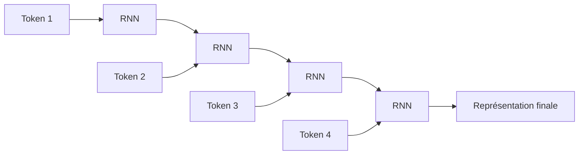

Nous pouvons résumer l’idée ainsi :

> Le RNN lit la phrase de gauche à droite et transporte une mémoire interne au fur et à mesure.

Par exemple, pour la phrase :

```txt
Le chat dort sur le canapé.
```

Le modèle lit :

```txt
Le → chat → dort → sur → le → canapé
```

À chaque mot, il met à jour son état.

---

## 1.3. Le principe des RNN

Un RNN reçoit deux informations à chaque étape :

1. l’entrée actuelle ;
    
2. l’état précédent.
    

Il produit ensuite :

1. un nouvel état ;
    
2. éventuellement une sortie.
    

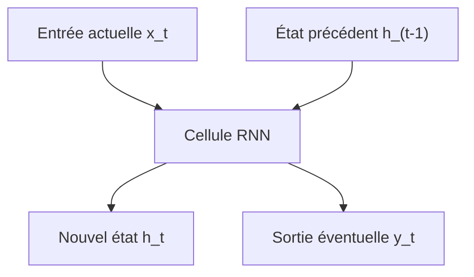

Mathématiquement, on peut écrire :

[  
h_t = f(x_t, h_{t-1})  
]

où :

- $x_t$ est l’entrée au temps $t$ ;
    
- $h_{t-1}$ est l’état précédent ;
    
- $h_t$ est le nouvel état ;
    
-$f$est une fonction apprise par le réseau.
    

L’idée est élégante : le modèle possède une forme de mémoire.

Mais cette mémoire est limitée.

---

## 1.4. Le problème des dépendances longues

Prenons une phrase comme :

```txt
Le livre que Paul a acheté hier dans une petite librairie du centre-ville est passionnant.
```

Le sujet principal est :

```txt
Le livre
```

Le verbe associé est :

```txt
est
```

Mais entre les deux, nous avons beaucoup d’informations intermédiaires :

```txt
que Paul a acheté hier dans une petite librairie du centre-ville
```

Un modèle doit comprendre que :

```txt
Le livre ... est passionnant.
```

et non :

```txt
Paul ... est passionnant.
la librairie ... est passionnant.
le centre-ville ... est passionnant.
```

Le problème est que les RNN doivent transporter l’information importante à travers plusieurs étapes successives.

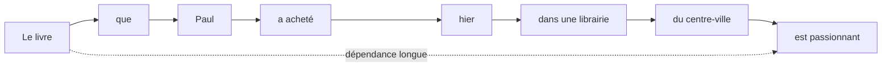

Plus la séquence est longue, plus il devient difficile de conserver les informations importantes.

C’est ce que nous appelons le problème des **dépendances longues**.

---

## 1.5. Le problème du gradient qui disparaît

Pendant l’entraînement, le modèle apprend en corrigeant ses erreurs. Cette correction se fait par un mécanisme appelé **[rétropropagation du gradient](https://fr.wikipedia.org/wiki/R%C3%A9tropropagation_du_gradient)**.

Dans un RNN, la rétropropagation doit traverser toutes les étapes temporelles.

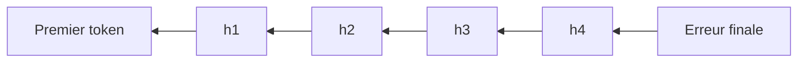

Quand la séquence est longue, le signal d’apprentissage peut devenir très faible en remontant vers les premiers tokens.

C’est le problème du **vanishing gradient**, ou **gradient qui disparaît**.

Conséquence :

> Le modèle apprend mal les relations éloignées dans la séquence.

Il peut très bien apprendre des dépendances courtes :

```txt
un chat noir
```

Mais il peut avoir plus de difficulté avec :

```txt
Le chat que j’ai vu hier dans la rue près de la gare était noir.
```

---

## 1.6. Les LSTM et GRU : une amélioration des RNN

Pour limiter ces problèmes, des architectures plus avancées ont été proposées, notamment :

- les **LSTM** ([Long short-term memory](https://fr.wikipedia.org/wiki/R%C3%A9seau_de_neurones_r%C3%A9currents#Long_short-term_memory));
    
- les **GRU** ([Gate Recurrent Unit](https://fr.wikipedia.org/wiki/Unit%C3%A9_r%C3%A9currente_ferm%C3%A9e)).
    

Ces modèles ajoutent des mécanismes de contrôle de la mémoire.

L’idée est de permettre au réseau de décider :

- quoi oublier ;
    
- quoi conserver ;
    
- quoi mettre à jour ;
    
- quoi transmettre.
    

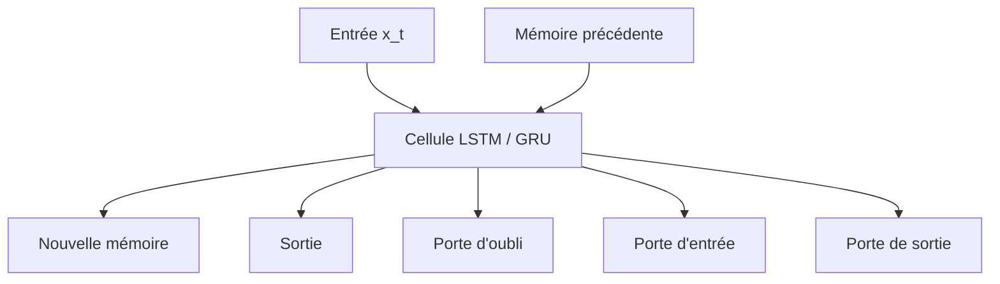

Les LSTM et GRU ont beaucoup amélioré la capacité des réseaux à traiter des séquences.

Mais ils conservent une limite importante :

> Ils traitent toujours les éléments principalement les uns après les autres.

Cette nature séquentielle devient un problème lorsque nous voulons entraîner de grands modèles sur beaucoup de données.

---

## 1.7. Le problème de la parallélisation

Un RNN doit calculer l’état $h_t$ à partir de l’état $h_{t-1}$.

Cela signifie que nous ne pouvons pas facilement calculer tous les états en même temps.

Pour calculer le mot 4, nous devons avoir calculé le mot 3.

Pour calculer le mot 3, nous devons avoir calculé le mot 2.

Pour calculer le mot 2, nous devons avoir calculé le mot 1.

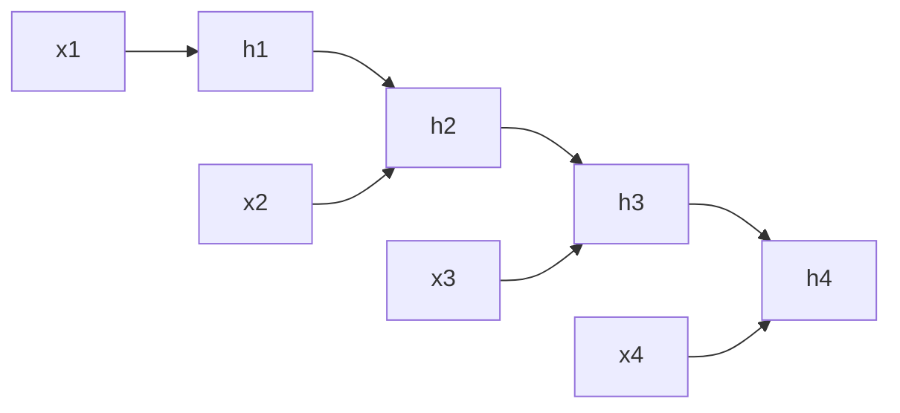

Le calcul est donc fortement séquentiel.

Or, les GPU et TPU sont très efficaces quand nous pouvons faire beaucoup de calculs en parallèle.

Les RNN utilisent mal cette capacité de parallélisation.

C’est une limite majeure pour entraîner des modèles très grands.

---

## 1.8. Les modèles Seq2Seq

Avant les Transformers, une architecture très utilisée pour la traduction automatique était le modèle **sequence-to-sequence**, ou **Seq2Seq**.

L’idée est simple :

- un encodeur lit la phrase source ;
    
- il produit une représentation ;
    
- un décodeur génère la phrase cible.
    

Par exemple :

```txt
Source : I love machine learning.
Cible  : J'aime l'apprentissage automatique.
```

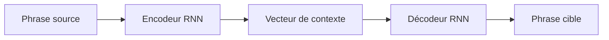

Le problème est que toute la phrase source doit être compressée dans un seul vecteur de contexte.

Pour une phrase courte, cela peut fonctionner.

Pour une phrase longue, c’est beaucoup plus difficile.

---

## 1.9. Le goulot d’étranglement du vecteur de contexte

Dans les premiers modèles Seq2Seq, l’encodeur devait résumer toute la phrase dans un vecteur unique.

Imaginons que nous devions traduire :

```txt
Although the committee had initially rejected the proposal, it later accepted a revised version after several months of discussion.
```

Il est difficile de condenser toutes les informations importantes dans une seule représentation fixe.

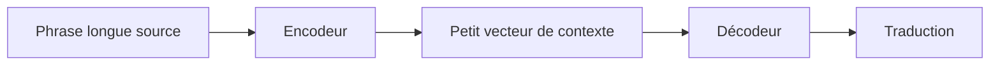

Ce vecteur devient un **goulot d’étranglement informationnel**.

Le décodeur doit générer une phrase complète à partir d’un résumé compact, alors qu’il aurait parfois besoin de regarder directement certaines parties précises de la phrase source.

C’est ici que l’attention va devenir importante.

---

## 1.10. L’arrivée de l’attention

L’idée de l’attention est de permettre au décodeur de ne pas dépendre uniquement d’un seul vecteur global.

Au lieu de cela, à chaque étape de génération, le décodeur peut regarder différentes parties de la phrase source.

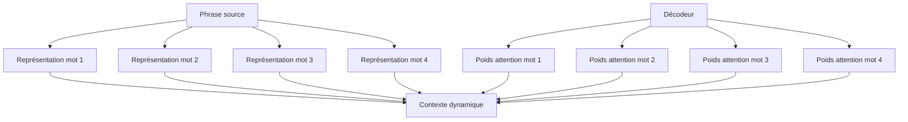

Nous pouvons décrire l’attention ainsi :

> L’attention permet au modèle de sélectionner dynamiquement les informations utiles dans une séquence.

Dans une tâche de traduction, lorsqu’il génère un mot français, le modèle peut regarder les mots anglais les plus pertinents.

Par exemple :

```txt
The black cat sleeps.
Le chat noir dort.
```

Quand le modèle génère :

```txt
chat
```

il doit surtout regarder :

```txt
cat
```

Quand il génère :

```txt
noir
```

il doit surtout regarder :

```txt
black
```

---

## 1.11. L’attention comme alignement

Dans la traduction automatique, l’attention peut être vue comme une forme d’alignement entre les mots source et les mots cible.

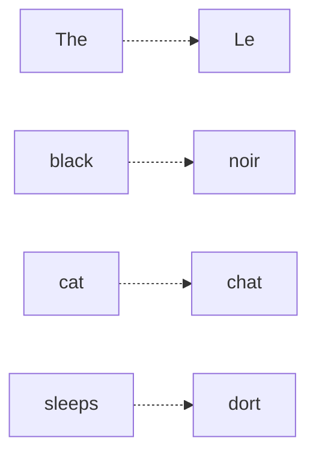

Ce point est important historiquement.

Avant les modèles neuronaux modernes, la traduction automatique utilisait souvent des mécanismes explicites d’alignement statistique.

L’attention a permis de retrouver une forme d’alignement, mais apprise automatiquement par le réseau.

---

## 1.12. Première rupture : l’attention améliore les RNN

Dans un premier temps, l’attention n’a pas remplacé les RNN.

Elle les a complétés.

Nous avions donc des architectures de ce type :

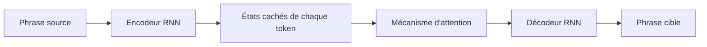

Cela a permis de grandes améliorations, car le décodeur pouvait accéder à tous les états de l’encodeur, et pas seulement au dernier.

Mais le modèle restait encore partiellement séquentiel.

L’encodeur était souvent récurrent.

Le décodeur était récurrent.

La parallélisation restait limitée.

---

## 1.13. La question centrale

À ce stade, une question devient naturelle :

> Si l’attention est si utile, avons-nous encore besoin des RNN ?

C’est exactement la rupture proposée par le papier **Attention Is All You Need**.

L’idée fondamentale est :

> Nous pouvons construire un modèle de séquence uniquement à partir de mécanismes d’attention, sans récurrence et sans convolution.

Autrement dit, au lieu de lire la phrase mot par mot, nous la traitons globalement.

---

## 1.14. La rupture Transformer

Le Transformer remplace le traitement séquentiel par un traitement fondé sur l’attention entre tous les tokens.

Dans un RNN, chaque token dépend surtout de l’état précédent.

Dans un Transformer, chaque token peut directement interagir avec tous les autres tokens.

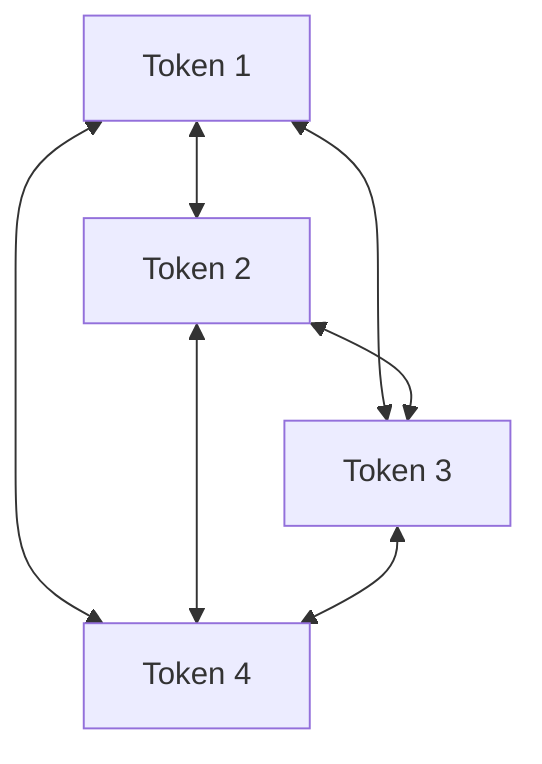

Cela change profondément la manière de traiter les séquences.

Nous ne sommes plus dans une lecture strictement linéaire.

Nous sommes dans une mise en relation globale.

---

## 1.15. Exemple intuitif

Prenons la phrase :

```txt
La souris que le chat poursuit court très vite.
```

Le mot :

```txt
court
```

doit être relié à :

```txt
La souris
```

et non à :

```txt
le chat
```

Un Transformer peut apprendre à faire regarder le token `court` vers les tokens utiles :

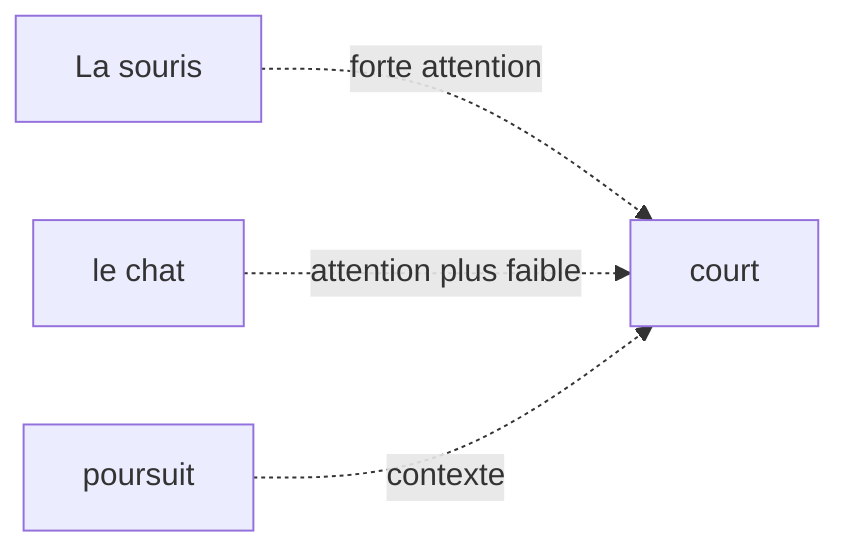

Le modèle apprend donc des relations grammaticales, sémantiques et contextuelles à partir des données.

---

## 1.16. Comparaison RNN vs Transformer

Nous pouvons comparer les deux approches simplement.

|Critère|RNN / LSTM / GRU|Transformer|
|---|---|---|
|Traitement|Séquentiel|Global et parallélisable|
|Dépendances longues|Difficiles|Plus directes|
|Parallélisation|Limitée|Très forte|
|Mémoire du contexte|Compressée dans des états successifs|Relations directes entre tokens|
|Architecture dominante aujourd’hui|Moins utilisée pour NLP massif|Dominante dans les LLM|

Le point clé est le suivant :

> Le Transformer rend beaucoup plus efficace l’apprentissage sur de grands corpus grâce à sa parallélisation et à son accès direct aux relations entre tokens.

---

## 1.17. Ce que le Transformer gagne

Le Transformer apporte plusieurs avantages majeurs.

### 1.17.1 Meilleure parallélisation

Comme tous les tokens d’une séquence peuvent être traités en même temps dans certaines parties du modèle, l’entraînement devient beaucoup plus efficace sur GPU ou TPU.

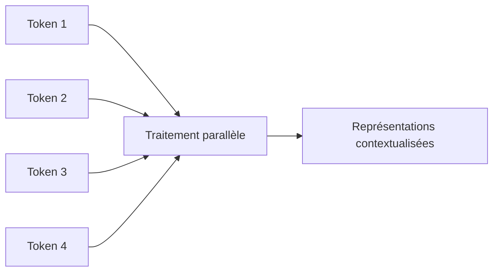

Cela permet d’entraîner des modèles plus grands sur davantage de données.

---

### 1.17.2 Meilleure gestion des dépendances longues

Dans un Transformer, deux tokens éloignés peuvent interagir directement via l’attention.

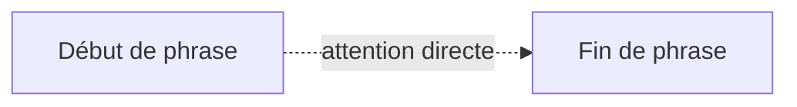

Dans un RNN, l’information doit passer par tous les états intermédiaires.

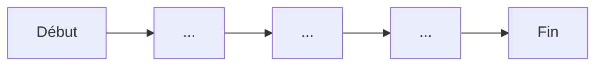

La différence est essentielle.

---

### 1.17.3 Représentations contextualisées

Dans un Transformer, le vecteur associé à un mot dépend des autres mots de la phrase.

Le mot `banque` n’a pas la même représentation dans :

```txt
Je vais à la banque déposer un chèque.
```

et :

```txt
Nous nous asseyons sur la banque au bord de la rivière.
```

Même mot, mais contexte différent.

Le Transformer produit donc une représentation contextualisée.

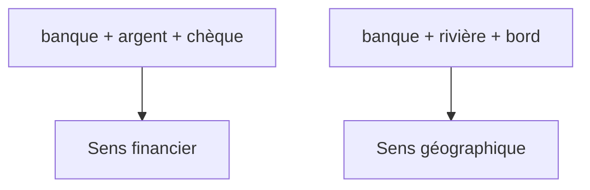

---

## 1.18. Ce que le Transformer perd ou complique

Il ne faut pas présenter les Transformers comme une solution magique.

Ils ont aussi des limites.

### 1.18.1 Coût quadratique de l’attention

Si chaque token regarde tous les autres tokens, alors le nombre de relations à calculer augmente très vite.

Pour une séquence de longueur $n$, la matrice d’attention contient :

$$n \times n$$


relations.

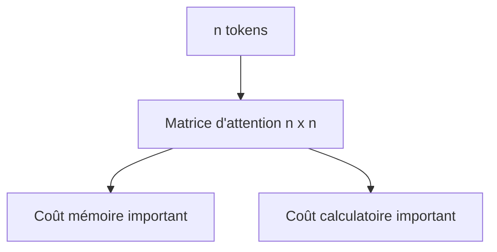

C’est pourquoi les longues séquences sont coûteuses.

Nous reviendrons sur ce point dans le chapitre consacré à la complexité.

---

### 1.18.2 Absence d’ordre naturel

Un RNN lit les mots dans l’ordre. L’ordre est donc intégré naturellement dans le processus.

Un Transformer, lui, regarde tous les tokens en parallèle.

Il faut donc lui ajouter explicitement une information de position.

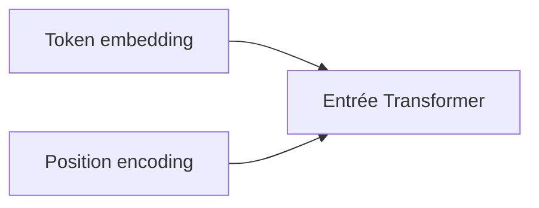

Sans information de position, le Transformer ne saurait pas distinguer :

```txt
Le chien mord l’homme.
```

de :

```txt
L’homme mord le chien.
```

Nous étudierons ce problème en détail dans le chapitre 3.

---

### 1.18.3 Besoin massif de données

Les Transformers modernes sont très puissants, mais ils nécessitent souvent :

- beaucoup de données ;
    
- beaucoup de calcul ;
    
- beaucoup de mémoire ;
    
- une infrastructure matérielle importante.
    

C’est particulièrement vrai pour les grands modèles de langage.

---

## 1.19. Transformer et changement d’échelle

Le succès des Transformers ne vient pas seulement de leur élégance théorique.

Il vient aussi de leur compatibilité avec le passage à l’échelle.

Autrement dit, les Transformers se sont révélés très efficaces lorsque nous augmentons :

- la taille des données ;
    
- la taille du modèle ;
    
- la durée d’entraînement ;
    
- la puissance de calcul.
    

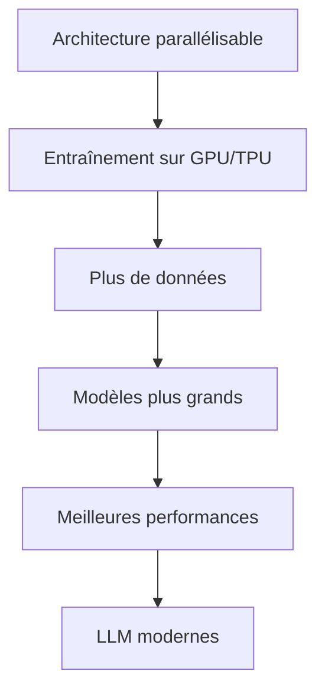

C’est ce qui a permis l’émergence des grands modèles de langage modernes.

---

## 1.20. Les grandes étapes historiques

Nous pouvons résumer l’évolution des architectures de séquences ainsi :

```mermaid
timeline
    title Évolution des modèles de séquences
    RNN : Lecture séquentielle simple
    LSTM / GRU : Meilleure mémoire
    Seq2Seq : Traduction neuronale
    Attention : Accès dynamique au contexte
    Transformer : Attention sans récurrence
    BERT / GPT : Pré-entraînement massif
    LLM modernes : Passage à l'échelle
```

Cette progression montre que les Transformers ne sont pas apparus de nulle part.

Ils sont la réponse à plusieurs limites accumulées :

- les RNN traitaient mal les dépendances longues ;
    
- les modèles Seq2Seq compressaient trop l’information ;
    
- les modèles récurrents étaient difficiles à paralléliser ;
    
- l’attention avait déjà montré son efficacité ;
    
- les GPU/TPU favorisaient les architectures parallélisables.
    

---

## 1.21. L’idée centrale du chapitre

Nous pouvons maintenant formuler l’idée centrale :

> Le Transformer est une architecture conçue pour traiter les séquences en reliant directement les éléments entre eux grâce à l’attention, au lieu de les traiter uniquement dans un ordre séquentiel.

Cela permet :

- de mieux capturer les dépendances longues ;
    
- de paralléliser fortement l’entraînement ;
    
- de produire des représentations contextualisées ;
    
- de construire des modèles très grands ;
    
- de généraliser l’architecture à de nombreux domaines.
    

---

## 1.22. Exemple global : d’une phrase à une représentation contextualisée

Prenons la phrase :

```txt
Le chat noir dort sur le canapé.
```

Un Transformer ne se contente pas d’associer un vecteur fixe à chaque mot.

Il construit une représentation de chaque mot en fonction de tous les autres.

```mermaid
flowchart TD
    A["Le"] --> T["Transformer"]
    B["chat"] --> T
    C["noir"] --> T
    D["dort"] --> T
    E["sur"] --> T
    F["le"] --> T
    G["canapé"] --> T

    T --> A2["Représentation contextualisée de Le"]
    T --> B2["Représentation contextualisée de chat"]
    T --> C2["Représentation contextualisée de noir"]
    T --> D2["Représentation contextualisée de dort"]
    T --> G2["Représentation contextualisée de canapé"]
```

Le mot `chat` sera influencé par :

- `Le`, qui indique le déterminant ;
    
- `noir`, qui apporte une propriété ;
    
- `dort`, qui indique l’action ;
    
- `canapé`, qui donne le contexte de la scène.
    

---

## 1.23. Attention : ce que nous ne savons pas encore

À ce stade du cours, nous comprenons pourquoi les Transformers sont nécessaires, mais nous n’avons pas encore détaillé comment ils fonctionnent.

Nous ne savons pas encore précisément :

- comment un mot devient un vecteur ;
    
- comment le modèle encode l’ordre ;
    
- ce que sont Query, Key et Value ;
    
- comment l’attention est calculée ;
    
- pourquoi on parle de multi-head attention ;
    
- comment fonctionne un bloc encoder ;
    
- comment fonctionne un bloc decoder ;
    
- comment le modèle est entraîné.
    

Ces éléments seront construits progressivement dans les chapitres suivants.

---

## 1.24. Résumé du chapitre

Nous avons vu que les Transformers répondent à plusieurs limites des architectures précédentes.

Les **RNN** lisent les séquences pas à pas, ce qui rend les dépendances longues difficiles et limite la parallélisation.

Les **LSTM** et **GRU** améliorent la mémoire, mais restent fondamentalement séquentiels.

Les modèles **Seq2Seq** ont permis de grandes avancées, notamment en traduction automatique, mais ils souffraient du goulot d’étranglement du vecteur de contexte.

L’**attention** a permis au modèle de sélectionner dynamiquement les parties pertinentes d’une séquence.

Le **Transformer** pousse cette idée plus loin :

> Nous supprimons la récurrence et nous construisons une architecture entièrement fondée sur l’attention.

Cela permet de traiter les séquences de manière plus globale, plus parallélisable et plus adaptée au passage à l’échelle.

---

## 1.25. Schéma de synthèse

```mermaid
flowchart TD
    A["Problème : traiter des séquences"] --> B["RNN"]
    B --> C["Limite : dépendances longues"]
    B --> D["Limite : faible parallélisation"]

    C --> E["LSTM / GRU"]
    D --> E

    E --> F["Seq2Seq"]
    F --> G["Limite : vecteur de contexte unique"]

    G --> H["Attention"]
    H --> I["Meilleur accès au contexte"]

    I --> J["Transformer"]
    J --> K["Attention sans récurrence"]
    J --> L["Parallélisation"]
    J --> M["Dépendances longues"]
    J --> N["LLM modernes"]
```

---

## 1.26. Questions de compréhension

Pour vérifier que nous avons compris ce chapitre, nous pouvons répondre aux questions suivantes.

### Question 1

Pourquoi les RNN sont-ils naturellement adaptés aux séquences ?

Réponse attendue : parce qu’ils lisent les éléments les uns après les autres et maintiennent un état interne qui transporte l’information au fil du temps.

### Question 2

Pourquoi les RNN ont-ils du mal avec les dépendances longues ?

Réponse attendue : parce que l’information doit traverser de nombreuses étapes successives, ce qui peut entraîner une perte d’information et un affaiblissement du gradient.

### Question 3

Quel problème les LSTM et GRU cherchent-ils à résoudre ?

Réponse attendue : ils cherchent à améliorer la mémoire des RNN grâce à des mécanismes de portes permettant de contrôler ce qui est conservé, oublié ou transmis.

### Question 4

Quel est le problème du vecteur de contexte unique dans les premiers modèles Seq2Seq ?

Réponse attendue : toute la phrase source doit être compressée dans une seule représentation, ce qui devient insuffisant pour les phrases longues ou complexes.

### Question 5

Quelle est l’idée principale de l’attention ?

Réponse attendue : permettre au modèle de regarder dynamiquement les parties pertinentes de la séquence au lieu de dépendre d’une seule représentation globale.

### Question 6

Quelle est la rupture introduite par le Transformer ?

Réponse attendue : le Transformer supprime la récurrence et repose principalement sur l’attention pour relier directement les tokens entre eux.

### Question 7

Pourquoi les Transformers sont-ils plus faciles à paralléliser que les RNN ?

Réponse attendue : parce que les représentations des tokens peuvent être calculées simultanément dans les couches d’attention, alors que les RNN nécessitent de calculer les états dans l’ordre.

### Question 8

Quelle est une limite importante des Transformers ?

Réponse attendue : le coût de l’attention augmente quadratiquement avec la longueur de la séquence, car chaque token peut regarder tous les autres tokens.

---

## 1.27. Transition vers le chapitre 2

Dans ce chapitre, nous avons compris pourquoi les Transformers ont été proposés.

Dans le chapitre suivant, nous allons préparer les bases nécessaires pour entrer dans leur fonctionnement interne.

Nous verrons comment passer de ceci :

```txt
Le chat dort.
```

à ceci :

```txt
[154, 932, 421, 13]
```

puis à des vecteurs numériques manipulables par un réseau de neurones.

Autrement dit, nous allons étudier :

- la tokenisation ;
    
- les tokens ;
    
- les embeddings ;
    
- les tenseurs ;
    
- les dimensions utilisées dans un Transformer.
    

Le chapitre 2 construira donc le pont entre le texte brut et l’entrée numérique du modèle.

---

# Chapitre 2 Rappels nécessaires : tenseurs, embeddings et séquences

## 2.1. Objectif du chapitre

Dans le chapitre précédent, nous avons compris **pourquoi les Transformers ont été introduits** : ils répondent aux limites des architectures séquentielles comme les RNN, LSTM et GRU.

Dans ce deuxième chapitre, nous allons préparer les bases techniques nécessaires pour comprendre l’entrée d’un Transformer.

Un Transformer ne manipule pas directement du texte brut comme :

```txt
Le chat dort sur le canapé.
```

Il manipule des **nombres**, organisés dans des **vecteurs**, eux-mêmes regroupés dans des **matrices** ou des **tenseurs**.

Nous allons donc comprendre comment nous passons de ceci :

```txt
Le chat dort sur le canapé.
```

à ceci :

```txt
[154, 932, 421, 78, 154, 2356]
```

puis à ceci :

```txt
[
  [0.12, -0.45, 0.88, ...],
  [0.31,  0.07, -0.22, ...],
  ...
]
```

Autrement dit, nous allons étudier :

- la tokenisation ;
    
- les tokens ;
    
- les identifiants de tokens ;
    
- les embeddings ;
    
- les tenseurs ;
    
- les dimensions utilisées dans les Transformers ;
    
- la différence entre représentation symbolique et représentation vectorielle.
    

---

## 2.2. Du texte brut aux données numériques

Un réseau de neurones ne comprend pas directement les mots.

Pour un humain, cette phrase est lisible :

```txt
Le chat dort.
```

Mais pour une machine learning model, ce texte doit être converti en nombres.

Nous avons donc une chaîne de transformation :

```mermaid
flowchart LR
    A["Texte brut"] --> B["Tokenisation"]
    B --> C["Tokens"]
    C --> D["IDs de tokens"]
    D --> E["Embeddings"]
    E --> F["Tenseur d'entrée du Transformer"]
```

L’idée générale est la suivante :

1. nous découpons le texte en morceaux ;
    
2. nous associons chaque morceau à un identifiant numérique ;
    
3. nous transformons chaque identifiant en vecteur dense ;
    
4. nous envoyons ces vecteurs dans le Transformer.
    

---

## 2.3. Qu’est-ce qu’un token ?

Un **token** est une unité de texte manipulée par le modèle.

Un token peut être :

- un mot ;
    
- une partie de mot ;
    
- un caractère ;
    
- un symbole ;
    
- un signe de ponctuation ;
    
- un espace ou une marque spéciale selon le tokenizer.
    

Par exemple, la phrase :

```txt
Le chat dort.
```

peut être découpée ainsi :

```txt
["Le", "chat", "dort", "."]
```

Mais selon le tokenizer, elle pourrait aussi être découpée différemment.

Par exemple :

```txt
["Le", "Ġchat", "Ġdort", "."]
```

ou encore :

```txt
["L", "e", "chat", "dort", "."]
```

Le token n’est donc pas forcément un mot.

C’est un point fondamental.

---

## 2.4. Pourquoi ne pas utiliser directement les mots ?

Nous pourrions imaginer un modèle qui manipule directement les mots du dictionnaire.

Mais cela pose plusieurs problèmes.

### 2.4.1 Vocabulaire énorme

Une langue contient énormément de mots :

```txt
chat, chats, chatte, chaton, chatière, etc.
```

Si nous ajoutons :

- les conjugaisons ;
    
- les accords ;
    
- les noms propres ;
    
- les fautes de frappe ;
    
- les mots rares ;
    
- les termes techniques ;
    
- les mots étrangers ;
    

le vocabulaire devient gigantesque.

### 2.4.2 Mots inconnus

Si le modèle rencontre un mot absent de son vocabulaire, il ne sait pas quoi faire.

Par exemple :

```txt
anticonstitutionnellement
```

ou :

```txt
GmodIntegration
```

ou encore :

```txt
docker-compose.override.yml
```

Un tokenizer moderne doit pouvoir traiter ces formes rares ou nouvelles.

### 2.4.3 Sous-mots

Pour résoudre ce problème, beaucoup de modèles utilisent des tokens de type **sous-mots**.

Par exemple :

```txt
anticonstitutionnellement
```

pourrait être découpé en :

```txt
["anti", "constitution", "nelle", "ment"]
```

L’avantage est que le modèle peut comprendre un mot rare à partir de morceaux plus fréquents.

---

## 2.5. Tokenisation par mots, caractères et sous-mots

Nous pouvons distinguer trois grandes approches.

### 2.5.1 Tokenisation par mots

La phrase :

```txt
Le chat dort.
```

devient :

```txt
["Le", "chat", "dort", "."]
```

Avantage : c’est intuitif.

Inconvénient : le vocabulaire devient très grand et les mots rares posent problème.

---

### 2.5.2 Tokenisation par caractères

La phrase :

```txt
chat
```

devient :

```txt
["c", "h", "a", "t"]
```

Avantage : presque aucun mot inconnu.

Inconvénient : les séquences deviennent beaucoup plus longues.

Le modèle doit reconstruire lui-même les mots à partir des caractères.

---

### 2.5.3 Tokenisation par sous-mots

La phrase :

```txt
reconstruction
```

peut devenir :

```txt
["re", "construction"]
```

ou :

```txt
["recon", "struction"]
```

ou encore :

```txt
["re", "construct", "ion"]
```

C’est l’approche la plus utilisée dans les grands modèles de langage modernes.

Elle offre un bon compromis entre :

- vocabulaire raisonnable ;
    
- capacité à traiter les mots rares ;
    
- longueur de séquence acceptable.
    

```mermaid
flowchart TD
    A["Texte brut"] --> B1["Tokenisation par mots"]
    A --> B2["Tokenisation par caractères"]
    A --> B3["Tokenisation par sous-mots"]

    B1 --> C1["Simple mais vocabulaire énorme"]
    B2 --> C2["Robuste mais séquences longues"]
    B3 --> C3["Compromis utilisé par beaucoup de LLM"]
```

---

## 2.6. Le vocabulaire du modèle

Un modèle de langage possède un **vocabulaire**, c’est-à-dire une liste finie de tokens qu’il connaît.

Par exemple, un vocabulaire simplifié pourrait être :

|ID|Token|
|--:|---|
|0|`<pad>`|
|1|`<unk>`|
|2|`Le`|
|3|`chat`|
|4|`dort`|
|5|`sur`|
|6|`canapé`|
|7|`.`|

La phrase :

```txt
Le chat dort sur le canapé.
```

pourrait alors devenir :

```txt
[2, 3, 4, 5, 2, 6, 7]
```

Nous avons remplacé les tokens par des identifiants numériques.

Mais attention : ces identifiants ne portent pas encore de sens mathématique.

Le fait que `chat = 3` et `dort = 4` ne signifie pas que `dort` est “plus grand” que `chat`.

Ces IDs sont seulement des indices dans une table.

---

## 2.7. Tokens spéciaux

Les modèles utilisent souvent des tokens spéciaux.

Par exemple :

|Token spécial|Rôle|
|---|---|
|`<pad>`|Remplissage pour obtenir des séquences de même longueur|
|`<unk>`|Token inconnu|
|`<bos>`|Début de séquence|
|`<eos>`|Fin de séquence|
|`<mask>`|Token masqué, utilisé notamment dans BERT|
|`<sep>`|Séparateur entre deux segments|
|`<cls>`|Token de classification, utilisé notamment dans BERT|

Par exemple, pour une tâche de classification, nous pourrions avoir :

```txt
[CLS] Le chat dort. [SEP]
```

Pour une tâche de génération, nous pourrions avoir :

```txt
[BOS] Le chat dort. [EOS]
```

Ces tokens spéciaux permettent au modèle de repérer la structure de l’entrée.

---

# 2.8. Padding : pourquoi compléter les séquences ?

Dans un batch, nous entraînons souvent le modèle sur plusieurs phrases en même temps.

Mais les phrases n’ont pas toutes la même longueur.

Par exemple :

```txt
Phrase 1 : Le chat dort.
Phrase 2 : Le petit chat noir dort sur le canapé.
```

Après tokenisation :

```txt
Phrase 1 : [2, 3, 4, 7]
Phrase 2 : [2, 8, 3, 9, 4, 5, 2, 6, 7]
```

Pour les mettre dans un même tenseur, nous devons souvent les compléter avec un token de padding :

```txt
Phrase 1 : [2, 3, 4, 7, 0, 0, 0, 0, 0]
Phrase 2 : [2, 8, 3, 9, 4, 5, 2, 6, 7]
```

Ici, `0` correspond à `<pad>`.

```mermaid
flowchart TD
    A["Séquences de longueurs différentes"] --> B["Ajout de tokens <pad>"]
    B --> C["Séquences de même longueur"]
    C --> D["Batch tensoriel"]
```

Cependant, le modèle ne doit pas considérer les tokens `<pad>` comme du vrai texte.

Nous utiliserons donc plus tard un **padding mask** pour les ignorer dans l’attention.

---

# 2.9. Représentation symbolique contre représentation distribuée

Une fois que nous avons des IDs de tokens, nous avons une représentation symbolique :

```txt
Le    → 2
chat  → 3
dort  → 4
```

Mais cette représentation est pauvre.

Elle ne dit pas que :

- `chat` est proche de `chien` ;
    
- `dort` est proche de `sommeille` ;
    
- `canapé` est proche de `fauteuil` ;
    
- `manger` est différent de `dormir`.
    

Pour que le modèle apprenne des relations sémantiques, chaque token est transformé en vecteur.

C’est le rôle des **embeddings**.

---

## 2.10. Qu’est-ce qu’un embedding ?

Un **embedding** est un vecteur dense associé à un token.

Par exemple, le token `chat` peut être représenté par un vecteur :

```txt
chat → [0.21, -0.38, 0.74, 0.12, ...]
```

Dans un vrai Transformer, ce vecteur peut avoir une dimension comme :

```txt
768, 1024, 4096, 8192, ...
```

selon la taille du modèle.

Nous appelons souvent cette dimension :

$$d_{model}$$
C’est la dimension principale des représentations internes du Transformer.

---

## 2.11. Table d’embeddings

Concrètement, le modèle contient une grande matrice appelée **table d’embeddings**.

Si le vocabulaire contient (V) tokens et que chaque embedding a une dimension $d_{model}$, alors la table d’embeddings a la forme :

$$V \times d_{model}$$

Par exemple, avec :

```txt
V = 50 000 tokens
d_model = 768
```

la matrice d’embeddings contient :

```txt
50 000 × 768
```

valeurs apprises.

```mermaid
flowchart LR
    A["ID du token"] --> B["Table d'embeddings"]
    B --> C["Vecteur dense de dimension d_model"]
```

Exemple simplifié :

|Token|ID|Embedding simplifié|
|---|--:|---|
|Le|2|`[0.1, 0.4, -0.2]`|
|chat|3|`[0.7, -0.1, 0.5]`|
|dort|4|`[-0.3, 0.8, 0.2]`|

Donc :

```txt
[2, 3, 4]
```

devient :

```txt
[
  [0.1, 0.4, -0.2],
  [0.7, -0.1, 0.5],
  [-0.3, 0.8, 0.2]
]
```

---

## 2.12. Les embeddings sont appris

Les embeddings ne sont pas écrits à la main.

Ils sont appris pendant l’entraînement.

Au début, ils peuvent être initialisés aléatoirement.

Puis, au fil de l’apprentissage, le modèle ajuste les vecteurs pour mieux résoudre sa tâche.

Par exemple, dans un modèle de langage, le modèle apprend progressivement que certains tokens apparaissent dans des contextes similaires.

Ainsi, les embeddings de mots proches sémantiquement peuvent finir par se rapprocher dans l’espace vectoriel.

```mermaid
flowchart TD
    A["Initialisation aléatoire"] --> B["Entraînement"]
    B --> C["Correction par gradient"]
    C --> D["Embeddings plus utiles"]
    D --> E["Représentations sémantiques apprises"]
```

---

## 2.13. Intuition géométrique des embeddings

Nous pouvons voir les embeddings comme des points dans un espace multidimensionnel.

Dans un espace très simplifié à deux dimensions, nous pourrions imaginer :

```mermaid
quadrantChart
    title Espace d'embeddings simplifié
    x-axis "animal" --> "objet"
    y-axis "repos" --> "action"
    quadrant-1 "Objets actifs"
    quadrant-2 "Animaux actifs"
    quadrant-3 "Animaux au repos"
    quadrant-4 "Objets au repos"
    "chat": [0.2, 0.3]
    "chien": [0.25, 0.35]
    "canapé": [0.8, 0.2]
    "dormir": [0.3, 0.15]
```

Bien sûr, dans un vrai modèle, l’espace n’a pas deux dimensions mais souvent plusieurs centaines ou milliers.

L’important est l’idée suivante :

> Les embeddings permettent de représenter les tokens dans un espace où les relations entre vecteurs peuvent porter du sens.

---

## 2.14. Embedding statique et embedding contextualisé

Il faut distinguer deux notions.

### 2.14.1 Embedding statique

La table d’embeddings donne une représentation initiale du token.

Par exemple :

```txt
banque → [0.18, -0.22, 0.91, ...]
```

Cette représentation est la même au départ, quel que soit le contexte.

### 2.14.2 Représentation contextualisée

Après passage dans le Transformer, le vecteur du token dépend du contexte.

Le mot `banque` dans :

```txt
Je vais à la banque déposer un chèque.
```

n’aura pas la même représentation finale que dans :

```txt
Nous marchons sur la banque de sable.
```

```mermaid
flowchart TD
    A["Embedding initial de banque"] --> T1["Transformer avec contexte financier"]
    A --> T2["Transformer avec contexte géographique"]

    T1 --> B["Représentation contextualisée : établissement financier"]
    T2 --> C["Représentation contextualisée : bord / dépôt naturel"]
```

Donc :

> L’embedding initial donne un point de départ, mais le Transformer construit ensuite une représentation dépendante du contexte.

---

## 2.15. Qu’est-ce qu’un tenseur ?

Un **tenseur** est une généralisation des scalaires, vecteurs et matrices.

Nous pouvons retenir simplement :

|Objet|Exemple|Nombre de dimensions|
|---|---|--:|
|Scalaire|`3.14`|0D|
|Vecteur|`[0.1, 0.2, 0.3]`|1D|
|Matrice|`[[1, 2], [3, 4]]`|2D|
|Tenseur|batch de matrices|3D ou plus|

Dans les Transformers, nous manipulons très souvent des tenseurs à trois dimensions :

```txt
(batch_size, sequence_length, d_model)
```

---

## 2.16. Dimensions classiques dans un Transformer

Prenons un exemple.

Nous avons un batch de 32 phrases.

Chaque phrase est tronquée ou complétée à 128 tokens.

Chaque token est représenté par un embedding de dimension 768.

Le tenseur d’entrée a donc la forme :

```txt
(32, 128, 768)
```

Ce qui signifie :

```txt
32 phrases
128 tokens par phrase
768 valeurs par token
```

```mermaid
flowchart TD
    A["Batch size = 32"] --> D["Tenseur d'entrée"]
    B["Sequence length = 128"] --> D
    C["d_model = 768"] --> D
    D --> E["Shape : 32 x 128 x 768"]
```

Nous retrouverons ces dimensions tout au long du cours.

---

## 2.17. Dimension batch

La dimension **batch** correspond au nombre d’exemples traités en même temps.

Par exemple :

```txt
batch_size = 4
```

signifie que nous envoyons 4 séquences en parallèle au modèle.

```txt
Phrase 1 : Le chat dort.
Phrase 2 : Le chien aboie.
Phrase 3 : Il pleut aujourd’hui.
Phrase 4 : J’aime les Transformers.
```

Le batch permet :

- d’accélérer l’entraînement ;
    
- de mieux utiliser le GPU ;
    
- de stabiliser l’estimation du gradient.
    

---

## 2.18. Dimension sequence length

La dimension **sequence length** correspond au nombre de tokens dans chaque séquence.

Par exemple :

```txt
Le chat dort.
```

peut devenir :

```txt
["Le", "chat", "dort", "."]
```

Donc :

```txt
sequence_length = 4
```

Mais dans un batch, nous fixons souvent une longueur maximale :

```txt
max_sequence_length = 128
```

Les phrases plus courtes sont complétées avec du padding.

Les phrases plus longues sont tronquées ou découpées.

---

## 2.19. Dimension d_model

La dimension $d_{model}$ est la taille du vecteur associé à chaque token.

Par exemple :

```txt
d_model = 768
```

signifie que chaque token est représenté par 768 nombres.

Le choix de $d_{model}$ influence :

- la capacité du modèle ;
    
- le nombre de paramètres ;
    
- le coût mémoire ;
    
- le coût calculatoire.
    

Un modèle avec un $d_{model}$ plus grand peut représenter plus d’informations, mais coûte plus cher à entraîner et à utiliser.

---

## 2.20. Exemple complet de transformation

Prenons la phrase :

```txt
Le chat dort.
```

Étape 1 : tokenisation

```txt
["Le", "chat", "dort", "."]
```

Étape 2 : conversion en IDs

```txt
[2, 3, 4, 7]
```

Étape 3 : embeddings simplifiés

```txt
[
  [0.1, 0.4, -0.2],
  [0.7, -0.1, 0.5],
  [-0.3, 0.8, 0.2],
  [0.0, -0.5, 0.9]
]
```

Ici, nous avons :

```txt
sequence_length = 4
d_model = 3
```

Donc la forme est :

```txt
(4, 3)
```

Si nous ajoutons un batch de taille 1, la forme devient :

```txt
(1, 4, 3)
```

```mermaid
flowchart LR
    A["Le chat dort."] --> B["Tokens"]
    B --> C["IDs : [2, 3, 4, 7]"]
    C --> D["Embeddings"]
    D --> E["Shape : 1 x 4 x 3"]
```

---

## 2.21. Pourquoi les embeddings ne suffisent pas ?

Les embeddings initiaux ne connaissent pas encore le contexte précis.

Par exemple, dans :

```txt
Le chat dort.
```

le token `chat` reçoit un vecteur initial.

Dans :

```txt
Le chat de discussion est ouvert.
```

le token `chat` peut avoir une signification différente selon le contexte.

L’embedding initial ne suffit donc pas.

Le rôle du Transformer sera de transformer ces embeddings initiaux en représentations contextualisées.

```mermaid
flowchart LR
    A["Embeddings initiaux"] --> B["Transformer"]
    B --> C["Représentations contextualisées"]
```

---

## 2.22. Séquence d’entrée dans un Transformer

L’entrée d’un Transformer est donc une matrice de vecteurs.

Pour une phrase de $n$ tokens, nous avons :
 
$$X \in \mathbb{R}^{n \times d_{model}}$$

où :

- $n$ est la longueur de la séquence ;
    
- $d_{model}$ est la dimension des embeddings.
    

Pour un batch, nous avons :

$$X \in \mathbb{R}^{B \times n \times d_{model}}$$
où :

- $B$ est la taille du batch ;
    
- $n$ est la longueur de séquence ;
    
- $d_{model}$ est la dimension du modèle.
    

C’est ce tenseur qui sera envoyé dans les couches du Transformer.

---

## 2.23. Le problème restant : l’ordre

À ce stade, nous avons transformé les tokens en vecteurs.

Mais nous avons un problème majeur.

Si nous envoyons simplement une liste de vecteurs au Transformer, l’architecture d’attention ne connaît pas naturellement l’ordre des tokens.

La phrase :

```txt
Le chien mord l’homme.
```

et la phrase :

```txt
L’homme mord le chien.
```

contiennent presque les mêmes tokens.

Mais le sens est différent.

```mermaid
flowchart TD
    A["Même ensemble de mots"] --> B["Ordre différent"]
    B --> C["Sens différent"]
    C --> D["Il faut encoder la position"]
```

Un RNN encode implicitement l’ordre car il lit la phrase de gauche à droite.

Un Transformer, lui, traite les tokens en parallèle.

Nous devrons donc ajouter explicitement une information de position.

C’est le sujet du chapitre suivant.

---

## 2.24. Résumé du chapitre

Dans ce chapitre, nous avons construit le pipeline d’entrée d’un Transformer.

Nous avons vu que le texte brut doit être transformé en nombres.

La première étape est la **tokenisation**, qui découpe le texte en tokens.

Ces tokens sont ensuite convertis en **IDs**, c’est-à-dire en indices dans le vocabulaire du modèle.

Ces IDs sont transformés en **embeddings**, c’est-à-dire en vecteurs denses appris pendant l’entraînement.

Ces vecteurs sont regroupés dans un **tenseur** de forme typique :

```txt
(batch_size, sequence_length, d_model)
```

Nous avons aussi distingué :

- l’embedding initial, associé au token ;
    
- la représentation contextualisée, produite ensuite par le Transformer.
    

Enfin, nous avons identifié le problème suivant :

> Les Transformers ne connaissent pas naturellement l’ordre des tokens.

Nous devrons donc ajouter une information de position.

---

# 25. Schéma de synthèse

```mermaid
flowchart TD
    A["Texte brut"] --> B["Tokenisation"]
    B --> C["Tokens"]
    C --> D["IDs de tokens"]
    D --> E["Table d'embeddings"]
    E --> F["Vecteurs denses"]
    F --> G["Tenseur : batch x séquence x d_model"]
    G --> H["Entrée du Transformer"]

    H --> I["Problème restant : ordre des tokens"]
    I --> J["Chapitre 3 : positional encoding"]
```

---

## 2.26. Questions de compréhension

### Question 1

Pourquoi un Transformer ne peut-il pas manipuler directement du texte brut ?

Réponse attendue : parce qu’un réseau de neurones manipule des nombres, pas des chaînes de caractères. Le texte doit donc être converti en tokens, puis en IDs, puis en vecteurs.

### Question 2

Qu’est-ce qu’un token ?

Réponse attendue : un token est une unité de texte manipulée par le modèle. Il peut correspondre à un mot, un sous-mot, un caractère, une ponctuation ou un symbole spécial.

### Question 3

Pourquoi utilise-t-on souvent des sous-mots plutôt que des mots entiers ?

Réponse attendue : parce que les sous-mots permettent de limiter la taille du vocabulaire tout en traitant correctement les mots rares, composés ou inconnus.

### Question 4

Quelle est la différence entre un ID de token et un embedding ?

Réponse attendue : un ID est simplement un indice numérique dans le vocabulaire. Un embedding est un vecteur dense appris qui représente le token dans un espace numérique.

### Question 5

Quelle est la forme typique d’un tenseur d’entrée dans un Transformer ?

Réponse attendue :

```txt
(batch_size, sequence_length, d_model)
```

### Question 6

Que signifie $d_{model}$ ?

Réponse attendue : $d_{model}$ est la dimension des vecteurs internes du Transformer, donc la taille de la représentation associée à chaque token.

### Question 7

Pourquoi les tokens `<pad>` sont-ils nécessaires ?

Réponse attendue : ils permettent de compléter les séquences plus courtes afin d’obtenir des séquences de même longueur dans un batch.

### Question 8

Pourquoi les embeddings initiaux ne suffisent-ils pas ?

Réponse attendue : parce qu’ils ne dépendent pas encore du contexte précis de la phrase. Le Transformer doit ensuite produire des représentations contextualisées.

### Question 9

Quel problème reste à résoudre à la fin du chapitre ?

Réponse attendue : il reste à représenter l’ordre des tokens, car le Transformer ne lit pas naturellement la séquence de gauche à droite comme un RNN.

---

## 2.27. Transition vers le chapitre 3

Nous savons maintenant comment transformer du texte brut en tenseur d’entrée.

Mais nous avons identifié un problème fondamental : une simple collection de vecteurs ne suffit pas à représenter une phrase.

L’ordre des mots est essentiel.

Dans le chapitre suivant, nous allons donc étudier :

- pourquoi le Transformer ne connaît pas naturellement les positions ;
    
- comment ajouter une information de position ;
    
- les positional encodings sinusoïdaux du papier original ;
    
- les positional embeddings appris ;
    
- les méthodes modernes comme RoPE et ALiBi.
    

Le chapitre 3 répondra donc à cette question :

> Comment un Transformer sait-il où se trouve chaque token dans la séquence ?

---
# Chapitre 3 — Le principe des RNN

## 3.1. Objectif du chapitre

Dans le chapitre précédent, nous avons commencé à comprendre comment les modèles de traitement séquentiel fonctionnent avant l’arrivée des Transformers.

Nous avons vu que les **RNN**, ou **réseaux de neurones récurrents**, lisent une séquence élément par élément.

Dans ce chapitre, nous allons entrer plus précisément dans leur fonctionnement interne.

Nous allons comprendre :

- ce qu’est une cellule RNN ;
    
- ce qu’est un état caché ;
    
- comment le modèle transporte une mémoire ;
    
- comment une séquence est traitée pas à pas ;
    
- pourquoi cette mémoire est utile ;
    
- pourquoi elle reste limitée ;
    
- en quoi cette limite préparera l’arrivée des Transformers.
    

L’objectif est simple : nous devons comprendre le fonctionnement des RNN pour mieux comprendre ensuite pourquoi les Transformers ont proposé une rupture.

---

## 3.2. Rappel : une séquence se lit étape par étape

Un RNN traite une séquence dans l’ordre.

Prenons la phrase :

```txt
Le chat dort sur le canapé.
```

Après tokenisation, nous pouvons obtenir :

```txt
["Le", "chat", "dort", "sur", "le", "canapé", "."]
```

Le RNN lit alors les tokens un par un :

```txt
Le → chat → dort → sur → le → canapé → .
```

À chaque étape, il met à jour une représentation interne que nous appelons **état caché**.

```mermaid
flowchart LR
    X1["Le"] --> R1["RNN"]
    R1 --> R2["RNN"]
    X2["chat"] --> R2
    R2 --> R3["RNN"]
    X3["dort"] --> R3
    R3 --> R4["RNN"]
    X4["sur"] --> R4
    R4 --> R5["RNN"]
    X5["le canapé"] --> R5
    R5 --> H["Représentation finale"]
```

Nous pouvons donc voir le RNN comme un lecteur qui avance dans la phrase en gardant une mémoire de ce qu’il a déjà lu.

---

## 3.3. La cellule RNN

Le cœur d’un RNN est la **cellule récurrente**.

À chaque position $t$, cette cellule reçoit deux informations :

1. l’entrée actuelle $x_t$ ;
    
2. l’état caché précédent $h_{t-1}$.
    

Elle produit ensuite :

1. un nouvel état caché $h_t$ ;
    
2. éventuellement une sortie $y_t$.
    

```mermaid
flowchart TD
    A["Entrée actuelle x_t"] --> C["Cellule RNN"]
    B["État précédent h_(t-1)"] --> C
    C --> D["Nouvel état h_t"]
    C --> E["Sortie éventuelle y_t"]
```

L’idée est très importante :

> Le RNN ne regarde pas seulement le token actuel. Il regarde aussi une mémoire de ce qui a été lu avant.

C’est ce qui distingue un RNN d’un simple réseau dense appliqué indépendamment à chaque mot.

---

## 3.4. La formule fondamentale

Mathématiquement, nous pouvons écrire :


$$h_t = f(x_t, h_{t-1})$$

où :

- $x_t$ est l’entrée au temps $t$ ;
    
- $h_{t-1}$ est l’état caché précédent ;
    
- $h_t$ est le nouvel état caché ;
    
-$f$est une fonction apprise par le réseau.
    

Cette formule dit simplement :

> Le nouvel état dépend à la fois de l’entrée actuelle et de la mémoire précédente.

Dans un RNN classique, on utilise souvent une formule de ce type :

$$h_t = \tanh(W_x x_t + W_h h_{t-1} + b)$$

où :

- $W_x$ est la matrice de poids appliquée à l’entrée actuelle ;
    
- $W_h$ est la matrice de poids appliquée à l’état précédent ;
    
- $b$ est un biais ;
    
- $\tanh$ est une fonction d’activation non linéaire.
    

Nous pouvons la lire ainsi :

```txt
nouvel état = activation(entrée transformée + mémoire transformée + biais)
```

---

## 3.5. Exemple intuitif avec une phrase

@TODO corriger les expressions tex

Prenons la phrase :

```txt
Le chat dort.
```

Nous pouvons noter :

```txt
x1 = "Le"
x2 = "chat"
x3 = "dort"
x4 = "."
```

Le RNN calcule successivement :

[  
h_1 = f(x_1, h_0)  
]

[  
h_2 = f(x_2, h_1)  
]

[  
h_3 = f(x_3, h_2)  
]

[  
h_4 = f(x_4, h_3)  
]

L’état initial (h_0) est souvent un vecteur de zéros ou un vecteur appris.

```mermaid
flowchart LR
    H0["h0 mémoire initiale"] --> R1["RNN"]
    X1["x1 = Le"] --> R1
    R1 --> H1["h1"]

    H1 --> R2["RNN"]
    X2["x2 = chat"] --> R2
    R2 --> H2["h2"]

    H2 --> R3["RNN"]
    X3["x3 = dort"] --> R3
    R3 --> H3["h3"]

    H3 --> R4["RNN"]
    X4["x4 = ."] --> R4
    R4 --> H4["h4"]
```

Chaque état contient donc une représentation partielle de la séquence lue jusqu’ici.

---

## 3.6. Ce que contient l’état caché

L’état caché $h_t$ est un vecteur.

Il ne contient pas les mots sous forme lisible.

Il contient une représentation numérique apprise.

Par exemple, après avoir lu :

```txt
Le chat
```

l’état caché peut contenir implicitement des informations comme :

- nous parlons probablement d’un animal ;
    
- le sujet est au singulier ;
    
- une action peut suivre ;
    
- le contexte grammatical est en cours de construction.
    

Évidemment, le modèle ne stocke pas ces informations sous forme de phrases humaines. Il les encode dans des nombres.

Nous pouvons représenter cela ainsi :

```mermaid
flowchart TD
    A["Tokens déjà lus : Le chat"] --> B["État caché h_t"]
    B --> C["Informations grammaticales"]
    B --> D["Informations sémantiques"]
    B --> E["Contexte partiel"]
```

L’état caché est donc une forme de mémoire compressée.

---

## 3.7. RNN déroulé dans le temps

Quand nous dessinons un RNN, nous pouvons le représenter de deux façons.

La première est compacte :

```mermaid
flowchart TD
    X["Entrée x_t"] --> R["Cellule RNN"]
    Hprev["h_(t-1)"] --> R
    R --> H["h_t"]
```

Mais pour comprendre son traitement d’une séquence, nous le **déroulons dans le temps**.

```mermaid
flowchart LR
    X1["x1"] --> R1["RNN"]
    H0["h0"] --> R1
    R1 --> H1["h1"]

    X2["x2"] --> R2["RNN"]
    H1 --> R2
    R2 --> H2["h2"]

    X3["x3"] --> R3["RNN"]
    H2 --> R3
    R3 --> H3["h3"]

    X4["x4"] --> R4["RNN"]
    H3 --> R4
    R4 --> H4["h4"]
```

Il faut bien comprendre que les cellules dessinées (R1), (R2), (R3), (R4) représentent généralement **la même cellule RNN réutilisée à chaque étape**.

Autrement dit, les poids sont partagés dans le temps.

---

## 3.8. Partage des poids dans le temps

Un RNN n’apprend pas une matrice différente pour chaque position.

Il utilise les mêmes poids à chaque étape.

Cela signifie que la même transformation est appliquée à :

```txt
x1 avec h0
x2 avec h1
x3 avec h2
x4 avec h3
```

```mermaid
flowchart LR
    A["Étape 1 : mêmes poids W"] --> B["Étape 2 : mêmes poids W"]
    B --> C["Étape 3 : mêmes poids W"]
    C --> D["Étape 4 : mêmes poids W"]
```

Ce partage des poids a deux avantages :

1. le modèle peut traiter des séquences de longueurs variables ;
    
2. le nombre de paramètres ne dépend pas directement de la longueur de la séquence.
    

C’est une idée élégante : nous apprenons une règle générale de mise à jour de la mémoire, puis nous l’appliquons autant de fois que nécessaire.

---

## 3.9. Dimensions dans un RNN

Supposons que chaque token soit représenté par un embedding de dimension :

[  
d_{input}  
]

et que l’état caché ait une dimension :

[  
d_{hidden}  
]

Alors :

[  
x_t \in \mathbb{R}^{d_{input}}  
]

[  
h_t \in \mathbb{R}^{d_{hidden}}  
]

La matrice $W_x$ transforme l’entrée vers l’espace caché :

[  
W_x \in \mathbb{R}^{d_{hidden} \times d_{input}}  
]

La matrice $W_h$ transforme l’état précédent vers le nouvel état caché :

[  
W_h \in \mathbb{R}^{d_{hidden} \times d_{hidden}}  
]

La formule complète est donc :

[  
h_t = \tanh(W_x x_t + W_h h_{t-1} + b)  
]

avec :

[  
b \in \mathbb{R}^{d_{hidden}}  
]

Nous devons retenir que l’état caché est un vecteur de taille fixe, même si la séquence est longue.

C’est un point qui deviendra important pour comprendre les limites des RNN.

---

## 3.10. Sortie à chaque étape ou sortie finale

Un RNN peut être utilisé de plusieurs manières.

### 3.10.1 Sortie finale uniquement

Pour une tâche de classification de phrase, nous pouvons utiliser uniquement le dernier état caché.

Exemple :

```txt
Phrase : Ce film est excellent.
Tâche : sentiment positif ou négatif
```

```mermaid
flowchart LR
    X1["Ce"] --> R1["RNN"]
    R1 --> R2["RNN"]
    X2["film"] --> R2
    R2 --> R3["RNN"]
    X3["est"] --> R3
    R3 --> R4["RNN"]
    X4["excellent"] --> R4
    R4 --> C["Classification positive/négative"]
```

Ici, le dernier état doit résumer toute la phrase.

---

### 3.10.2 Sortie à chaque étape

Pour une tâche d’étiquetage de séquence, nous pouvons produire une sortie à chaque token.

Exemple :

```txt
Phrase : Marie habite Paris.
Tâche : reconnaissance d'entités nommées
```

Nous voulons prédire :

```txt
Marie  → PERSONNE
habite → O
Paris  → LIEU
```

```mermaid
flowchart LR
    X1["Marie"] --> R1["RNN"]
    R1 --> Y1["PERSONNE"]
    R1 --> R2["RNN"]

    X2["habite"] --> R2
    R2 --> Y2["O"]
    R2 --> R3["RNN"]

    X3["Paris"] --> R3
    R3 --> Y3["LIEU"]
```

Dans ce cas, chaque état caché sert à produire une prédiction locale.

---

## 3.11. Les grandes configurations des RNN

Nous pouvons classer les usages des RNN selon la forme de l’entrée et de la sortie.

### 3.11.1 One-to-one

Un seul input donne un seul output.

Ce n’est pas vraiment le cas typique des RNN, mais cela correspond à un réseau classique.

```mermaid
flowchart LR
    A["Entrée"] --> B["Modèle"] --> C["Sortie"]
```

---

### 3.11.2 One-to-many

Une seule entrée produit une séquence.

Exemple : génération de légende d’image.

```mermaid
flowchart LR
    A["Image"] --> B["RNN Decoder"]
    B --> C["Un"]
    C --> D["chat"]
    D --> E["dort"]
```

---

### 3.11.3 Many-to-one

Une séquence produit une seule sortie.

Exemple : classification de sentiment.

```mermaid
flowchart LR
    A["Ce"] --> B["film"] --> C["est"] --> D["excellent"]
    D --> E["Sentiment positif"]
```

---

### 3.11.4 Many-to-many aligné

Une séquence produit une sortie à chaque position.

Exemple : étiquetage grammatical.

```mermaid
flowchart LR
    A["Le"] --> A2["DET"]
    B["chat"] --> B2["NOM"]
    C["dort"] --> C2["VERBE"]
```

---

### 3.11.5 Many-to-many non aligné

Une séquence produit une autre séquence de longueur différente.

Exemple : traduction automatique.

```mermaid
flowchart LR
    A["I love cats"] --> B["Encoder RNN"]
    B --> C["Decoder RNN"]
    C --> D["J'aime les chats"]
```

Cette dernière configuration a joué un rôle central avant les Transformers.

---

## 3.12. Le RNN comme mémoire compressée

Nous pouvons maintenant formuler une idée essentielle :

> Dans un RNN, l’état caché est une mémoire compressée de tous les tokens précédents.

Après avoir lu une longue phrase, le dernier état doit contenir les informations nécessaires à la tâche.

Prenons :

```txt
Le livre que Paul a acheté hier dans une petite librairie du centre-ville est passionnant.
```

Si nous voulons classifier cette phrase ou la traduire, le dernier état doit contenir beaucoup d’informations :

- le sujet principal : `Le livre` ;
    
- l’action secondaire : `Paul a acheté` ;
    
- le lieu : `librairie du centre-ville` ;
    
- le prédicat principal : `est passionnant`.
    

```mermaid
flowchart TD
    A["Phrase longue"] --> B["RNN"]
    B --> C["Dernier état caché"]
    C --> D["Résumé compressé de toute la phrase"]
```

Le problème est que cette mémoire a une taille fixe.

Même si la phrase contient 10 tokens, 100 tokens ou 1000 tokens, l’état caché garde la même dimension.

---

## 3.13. Pourquoi cette mémoire est limitée

La limite principale vient du fait que l’information est transmise étape après étape.

Si une information importante apparaît au début de la séquence, elle doit survivre à toutes les mises à jour successives.

```mermaid
flowchart LR
    A["Information importante au début"] --> B["Étape 1"]
    B --> C["Étape 2"]
    C --> D["Étape 3"]
    D --> E["..."]
    E --> F["Étape 50"]
    F --> G["Utilisation finale"]
```

À chaque étape, le modèle peut modifier, écraser ou diluer cette information.

C’est un peu comme si nous devions retenir une phrase longue tout en recevant constamment de nouveaux mots.

Certaines informations anciennes peuvent se perdre.

---

## 3.14. Exemple de dépendance longue

Prenons la phrase :

```txt
Les clés que mon frère a laissées hier dans la voiture de notre voisin sont sur la table.
```

Le verbe `sont` dépend du sujet `Les clés`.

Mais entre les deux, nous avons une longue proposition relative :

```txt
que mon frère a laissées hier dans la voiture de notre voisin
```

Pour comprendre correctement la phrase, le modèle doit conserver l’information :

```txt
sujet = Les clés
nombre = pluriel
```

jusqu’au mot :

```txt
sont
```

```mermaid
flowchart LR
    A["Les clés"] -. "information à conserver : pluriel" .-> G["sont"]
    B["mon frère"] --> C["a laissées"]
    C --> D["hier"]
    D --> E["dans la voiture"]
    E --> F["de notre voisin"]
    F --> G
```

Un RNN peut théoriquement apprendre cette dépendance.

Mais en pratique, plus la distance augmente, plus cela devient difficile.

---

## 3.15. Le problème du gradient

Pour apprendre, un réseau de neurones utilise la rétropropagation.

Dans un RNN, comme la même cellule est répétée dans le temps, nous devons rétropropager l’erreur à travers toutes les étapes.

C’est ce que nous appelons la **Backpropagation Through Time**, ou **BPTT**.

```mermaid
flowchart RL
    L["Erreur finale"] --> H5["h5"]
    H5 --> H4["h4"]
    H4 --> H3["h3"]
    H3 --> H2["h2"]
    H2 --> H1["h1"]
```

Le problème est que le gradient peut :

- devenir très petit ;
    
- devenir très grand.
    

Nous parlons alors de :

- **vanishing gradient** : gradient qui disparaît ;
    
- **exploding gradient** : gradient qui explose.
    

---

## 3.16. Vanishing gradient

Le **vanishing gradient** se produit quand le signal d’apprentissage devient de plus en plus faible en remontant dans le temps.

Conséquence : les premiers tokens reçoivent un signal de correction très faible.

```mermaid
flowchart RL
    A["Erreur finale"] --> B["Gradient fort"]
    B --> C["Gradient moyen"]
    C --> D["Gradient faible"]
    D --> E["Gradient presque nul"]
    E --> F["Début de séquence"]
```

Le modèle apprend donc difficilement que des éléments très anciens influencent la sortie finale.

Cela explique pourquoi les RNN classiques ont du mal avec les dépendances longues.

---

## 3.17. Exploding gradient

À l’inverse, le gradient peut aussi devenir très grand.

Dans ce cas, les poids du modèle peuvent être mis à jour de manière trop brutale.

Cela rend l’entraînement instable.

```mermaid
flowchart RL
    A["Erreur finale"] --> B["Gradient normal"]
    B --> C["Gradient grand"]
    C --> D["Gradient très grand"]
    D --> E["Explosion numérique"]
```

Une technique classique pour limiter ce problème est le **gradient clipping**.

L’idée est de limiter la norme du gradient pour éviter des mises à jour trop importantes.

---

## 3.18. Pourquoi utiliser une fonction tanh ?

Dans un RNN classique, nous utilisons souvent :

$$h_t = \tanh(W_x x_t + W_h h_{t-1} + b)$$

La fonction $\tanh$ renvoie des valeurs entre (-1) et (1).

Cela permet de garder l’état caché dans une plage contrôlée.

```mermaid
flowchart LR
    A["Combinaison linéaire"] --> B["tanh"]
    B --> C["Valeurs entre -1 et 1"]
```

Mais cette saturation peut aussi contribuer au vanishing gradient.

Quand $\tanh$ est saturée, sa dérivée devient très faible.

Donc le signal d’apprentissage peut diminuer rapidement.

---

## 3.19. RNN bidirectionnels

Pour certaines tâches, il est utile de connaître à la fois le contexte gauche et le contexte droit.

Par exemple, dans la phrase :

```txt
Il mange une pomme verte.
```

Pour comprendre `pomme`, il est utile de savoir ce qui vient avant :

```txt
Il mange une
```

mais aussi ce qui vient après :

```txt
verte
```

Les **RNN bidirectionnels** lisent donc la séquence dans les deux sens :

- un RNN de gauche à droite ;
    
- un RNN de droite à gauche.
    

```mermaid
flowchart LR
    A["Token 1"] --> B["Token 2"] --> C["Token 3"] --> D["Token 4"]
    D --> E["RNN backward"]
    C --> E
    B --> E
    A --> E

    A --> F["RNN forward"]
    B --> F
    C --> F
    D --> F
```

Une représentation finale combine alors les deux directions.

```mermaid
flowchart TD
    A["Contexte gauche → droite"] --> C["Représentation du token"]
    B["Contexte droite → gauche"] --> C
```

Les RNN bidirectionnels sont utiles pour des tâches de compréhension, mais ils ne conviennent pas directement à la génération autoregressive, car dans la génération nous ne devons pas regarder les tokens futurs.

---

## 3.20. RNN profonds

Nous pouvons aussi empiler plusieurs couches RNN.

La sortie d’une couche devient l’entrée de la couche suivante.

```mermaid
flowchart TD
    X["Séquence d'entrée"] --> R1["Couche RNN 1"]
    R1 --> R2["Couche RNN 2"]
    R2 --> R3["Couche RNN 3"]
    R3 --> Y["Sortie"]
```

Cela augmente la capacité du modèle.

La première couche peut apprendre des motifs simples.

Les couches supérieures peuvent apprendre des représentations plus abstraites.

Mais cela rend aussi l’entraînement plus difficile, notamment à cause des gradients et du coût séquentiel.

---

## 3.21. RNN pour la génération de texte

Un RNN peut être utilisé pour générer du texte.

L’idée est de prédire le prochain token à partir des tokens précédents.

Par exemple :

```txt
Le chat
```

Le modèle peut prédire :

```txt
dort
```

Puis il réinjecte ce token dans le modèle pour prédire le suivant :

```txt
Le chat dort
```

```mermaid
flowchart LR
    A["Le"] --> R1["RNN"]
    R1 --> B["prédit : chat"]
    B --> R2["RNN"]
    R2 --> C["prédit : dort"]
    C --> R3["RNN"]
    R3 --> D["prédit : ."]
```

Cette logique autoregressive sera aussi présente dans les modèles GPT, mais avec une architecture Transformer decoder-only.

---

## 3.22. Entraînement d’un RNN génératif

Pendant l’entraînement, nous donnons au modèle une séquence réelle et nous lui demandons de prédire le token suivant.

Pour la phrase :

```txt
Le chat dort.
```

Nous créons les couples :

```txt
Entrée : Le       → cible : chat
Entrée : Le chat  → cible : dort
Entrée : Le chat dort → cible : .
```

En pratique, le modèle prédit à chaque position le token suivant.

```mermaid
flowchart TD
    A["Entrée : Le chat dort"] --> B["RNN"]
    B --> C["Prédictions à chaque position"]
    C --> D["Cibles : chat dort ."]
    D --> E["Calcul de la loss"]
```

Cette idée de prédiction du prochain token reste centrale dans les grands modèles de langage modernes.

---

## 3.23. RNN Seq2Seq

Les RNN ont aussi été très utilisés dans les architectures **Seq2Seq**.

Une architecture Seq2Seq comporte deux parties :

1. un encodeur ;
    
2. un décodeur.
    

L’encodeur lit la séquence source.

Le décodeur produit la séquence cible.

Exemple :

```txt
Source : I love cats.
Cible  : J'aime les chats.
```

```mermaid
flowchart LR
    A["I"] --> E1["Encoder RNN"]
    E1 --> E2["Encoder RNN"]
    B["love"] --> E2
    E2 --> E3["Encoder RNN"]
    C["cats"] --> E3
    E3 --> H["Vecteur de contexte"]

    H --> D1["Decoder RNN"]
    D1 --> Y1["J'"]
    D1 --> D2["Decoder RNN"]
    D2 --> Y2["aime"]
    D2 --> D3["Decoder RNN"]
    D3 --> Y3["les chats"]
```

Le vecteur de contexte sert de résumé de la phrase source.

C’est précisément ce résumé unique qui deviendra une limite importante.

---

## 3.24. Limite du vecteur de contexte

Dans un Seq2Seq RNN classique, l’encodeur compresse toute la phrase source dans un seul vecteur.

Pour une phrase courte, cela peut fonctionner :

```txt
I love cats.
```

Mais pour une phrase longue, cela devient difficile :

```txt
Although the committee initially rejected the proposal, it later accepted a revised version after several months of discussion.
```

```mermaid
flowchart LR
    A["Phrase source longue"] --> B["Encoder RNN"]
    B --> C["Vecteur unique"]
    C --> D["Decoder RNN"]
    D --> E["Traduction"]
```

Le décodeur doit produire toute la traduction à partir d’un seul résumé.

Nous avons donc un goulot d’étranglement informationnel.

L’attention est apparue en partie pour résoudre ce problème.

---

## 3.25. Comparaison avec un modèle non récurrent

Pour mieux comprendre le rôle du RNN, comparons deux approches.

### 3.25.1 Modèle sans mémoire

Si nous appliquons un réseau indépendamment à chaque token, le modèle voit seulement le token actuel.

```mermaid
flowchart TD
    A["Token actuel"] --> B["Réseau dense"]
    B --> C["Sortie"]
```

Il ne sait pas ce qui a été lu avant.

### 3.25.2 Modèle récurrent

Un RNN reçoit le token actuel et l’état précédent.

```mermaid
flowchart TD
    A["Token actuel"] --> C["RNN"]
    B["Mémoire précédente"] --> C
    C --> D["Nouvelle mémoire"]
```

Il peut donc accumuler de l’information.

La récurrence est précisément ce mécanisme de réutilisation de l’état précédent.

---

## 3.26. Ce que les RNN ont apporté

Les RNN ont été fondamentaux dans l’histoire du deep learning.

Ils ont permis de traiter des données séquentielles comme :

- le texte ;
    
- la parole ;
    
- les séries temporelles ;
    
- les signaux ;
    
- la musique ;
    
- les logs ;
    
- les séquences biologiques.
    

Ils ont introduit une idée essentielle :

> Une donnée n’est pas toujours indépendante : son interprétation dépend de ce qui précède.

Cette idée reste fondamentale dans les Transformers.

La différence est que les Transformers ne transportent pas l’information de proche en proche de la même façon.

---

## 3.27. Ce que les RNN ne résolvent pas bien

Les RNN classiques ont trois limites majeures.

### 3.27.1 Dépendances longues

Ils ont du mal à conserver des informations importantes pendant de nombreuses étapes.

### 3.27.2 Faible parallélisation

Le calcul de $h_t$ dépend de $h_{t-1}$.

Donc nous ne pouvons pas facilement calculer toutes les positions en parallèle.

```mermaid
flowchart LR
    H1["h1"] --> H2["h2"] --> H3["h3"] --> H4["h4"]
```

### 3.27.3 Compression excessive

Dans les modèles Seq2Seq classiques, toute la séquence source peut devoir être compressée dans un seul vecteur.

Ces trois limites ouvriront la voie :

- aux LSTM et GRU ;
    
- aux mécanismes d’attention ;
    
- puis aux Transformers.
    

---

## 3.28. L’idée clé à retenir

Nous pouvons résumer le principe des RNN ainsi :

> Un RNN lit une séquence pas à pas et met à jour une mémoire interne appelée état caché.

Cette mémoire permet au modèle de tenir compte du contexte précédent.

Mais cette mémoire est :

- compressée ;
    
- mise à jour à chaque étape ;
    
- difficile à préserver sur de longues distances ;
    
- coûteuse à calculer séquentiellement.
    

C’est pourquoi les RNN sont élégants, mais limités pour les très grands modèles de langage.

---

## 3.29. Schéma de synthèse

```mermaid
flowchart TD
    A["Entrée actuelle x_t"] --> C["Cellule RNN"]
    B["État précédent h_(t-1)"] --> C

    C --> D["Nouvel état h_t"]
    D --> E["Mémoire mise à jour"]

    E --> F["Étape suivante"]
    F --> G["Traitement séquentiel"]

    G --> H["Avantage : contexte précédent"]
    G --> I["Limite : dépendances longues"]
    G --> J["Limite : faible parallélisation"]
    G --> K["Limite : mémoire compressée"]
```

---

## 3.30. Questions de compréhension

### Question 1

Quelles sont les deux entrées principales d’une cellule RNN à l’étape $t$ ?

Réponse attendue : l’entrée actuelle $x_t$ et l’état caché précédent $h_{t-1}$.

### Question 2

Que représente l’état caché $h_t$ ?

Réponse attendue : il représente une mémoire numérique de la séquence lue jusqu’à l’étape $t$.

### Question 3

Pourquoi dit-on que les poids d’un RNN sont partagés dans le temps ?

Réponse attendue : parce que la même cellule, avec les mêmes matrices de poids, est appliquée à chaque étape de la séquence.

### Question 4

Quelle est la formule simple d’un RNN ?

Réponse attendue :

$$h_t = f(x_t, h_{t-1})$$

ou, dans une version classique :

$$h_t = \tanh(W_x x_t + W_h h_{t-1} + b)$$
### Question 5

Pourquoi les RNN peuvent-ils traiter des séquences de longueurs variables ?

Réponse attendue : parce que la même cellule peut être appliquée autant de fois qu’il y a de tokens dans la séquence.

### Question 6

Pourquoi les RNN ont-ils du mal avec les dépendances longues ?

Réponse attendue : parce que l’information doit traverser de nombreuses étapes successives, ce qui peut entraîner une perte d’information et un affaiblissement du gradient.

### Question 7

Qu’est-ce que la Backpropagation Through Time ?

Réponse attendue : c’est la rétropropagation du gradient à travers les différentes étapes temporelles d’un RNN déroulé.

### Question 8

Quelle différence faisons-nous entre une sortie finale et une sortie à chaque étape ?

Réponse attendue : une sortie finale est utilisée quand toute la séquence produit une seule prédiction, tandis qu’une sortie à chaque étape est utilisée quand chaque token doit recevoir une prédiction.

---

## 3.31. Transition vers le chapitre suivant

Nous savons maintenant comment fonctionne un RNN classique.

Nous avons compris que son état caché joue le rôle d’une mémoire.

Mais nous avons aussi vu que cette mémoire est limitée, surtout lorsque les dépendances sont longues.

Dans le chapitre suivant, nous allons donc étudier plus précisément le problème des dépendances longues.

Nous verrons pourquoi une information située au début d’une séquence peut être difficile à utiliser beaucoup plus tard, et pourquoi cette difficulté a motivé l’apparition des LSTM, des GRU, puis de l’attention.


---

# Chapitre 4 — Le problème des dépendances longues

## 4.1. Objectif du chapitre

Dans le chapitre précédent, nous avons étudié le principe des **RNN**.

Nous avons vu qu’un RNN lit une séquence étape par étape, en mettant à jour un **état caché** :

[  
h_t = f(x_t, h_{t-1})  
]

Cette idée est puissante, car le modèle possède une forme de mémoire.

Mais cette mémoire pose un problème important :

> Plus une information doit être conservée longtemps, plus elle risque d’être perdue, déformée ou écrasée.

Dans ce chapitre, nous allons donc comprendre le problème des **dépendances longues**.

Nous verrons pourquoi ce problème est central dans le traitement du langage naturel, pourquoi les RNN classiques y sont particulièrement sensibles, et pourquoi cette difficulté a motivé l’apparition des LSTM, des GRU, puis des mécanismes d’attention.

---

## 4.2. Une phrase simple : dépendance courte

Commençons par une phrase très simple :

```txt
Le chat dort.
```

Ici, la relation entre le sujet et le verbe est courte :

```txt
Le chat → dort
```

Le modèle doit comprendre que :

- `Le chat` est le sujet ;
    
- `dort` est le verbe ;
    
- l’action de dormir concerne le chat.
    

```mermaid
flowchart LR
    A["Le chat"] --> B["dort"]
```

Dans ce cas, un RNN classique peut souvent gérer correctement la relation.

L’information importante n’a pas besoin de traverser beaucoup d’étapes.

---

## 4.3. Une phrase plus longue : dépendance longue

Prenons maintenant une phrase plus complexe :

```txt
Le livre que Paul a acheté hier dans une petite librairie du centre-ville est passionnant.
```

Le sujet principal est :

```txt
Le livre
```

Le verbe associé est :

```txt
est
```

Mais entre les deux, nous avons beaucoup d’informations intermédiaires :

```txt
que Paul a acheté hier dans une petite librairie du centre-ville
```

Le modèle doit comprendre que :

```txt
Le livre ... est passionnant.
```

et non :

```txt
Paul ... est passionnant.
la librairie ... est passionnant.
le centre-ville ... est passionnant.
```

Le problème est que les RNN doivent transporter l’information importante à travers plusieurs étapes successives.

```mermaid
flowchart LR
    A["Le livre"] --> B["que"]
    B --> C["Paul"]
    C --> D["a acheté"]
    D --> E["hier"]
    E --> F["dans une librairie"]
    F --> G["du centre-ville"]
    G --> H["est passionnant"]

    A -. "dépendance longue" .-> H
```

Plus la séquence est longue, plus il devient difficile de conserver les informations importantes.

C’est ce que nous appelons le problème des **dépendances longues**.

---

## 4.4. Qu’est-ce qu’une dépendance longue ?

Une **dépendance longue** apparaît lorsqu’un élément d’une séquence doit être relié à un autre élément éloigné.

Dans le langage naturel, cela arrive très souvent.

Par exemple :

```txt
Les clés que mon frère a laissées dans la voiture sont sur la table.
```

Le sujet principal est :

```txt
Les clés
```

Le verbe principal est :

```txt
sont
```

Le modèle doit donc garder en mémoire que le sujet est pluriel.

```mermaid
flowchart LR
    A["Les clés"] -. "pluriel" .-> F["sont"]
    B["mon frère"] --> C["a laissées"]
    C --> D["dans la voiture"]
    D --> F
```

Si le modèle se laisse influencer par `mon frère`, il pourrait produire une mauvaise analyse grammaticale.

Il doit donc être capable de distinguer :

- l’information principale ;
    
- les informations secondaires ;
    
- les groupes syntaxiques imbriqués ;
    
- les relations éloignées mais importantes.
    

---

## 4.5. Pourquoi les dépendances longues sont importantes ?

Les dépendances longues ne sont pas un détail.

Elles sont essentielles pour comprendre correctement :

- la grammaire ;
    
- le sens d’une phrase ;
    
- les références pronominales ;
    
- les accords ;
    
- la structure logique ;
    
- les relations de cause à effet ;
    
- les textes longs ;
    
- les dialogues ;
    
- les programmes informatiques.
    

Prenons un exemple avec un pronom :

```txt
Marie a donné son livre à Julie parce qu’elle partait en voyage.
```

Le pronom :

```txt
elle
```

peut théoriquement désigner :

```txt
Marie
```

ou :

```txt
Julie
```

Pour interpréter correctement la phrase, le modèle doit utiliser le contexte.

```mermaid
flowchart TD
    A["Marie"] --> C["elle ?"]
    B["Julie"] --> C
    C --> D["Résolution de référence selon le contexte"]
```

La compréhension du langage dépend donc fortement de la capacité à relier des éléments parfois très éloignés.

---

## 4.6. Le RNN face à une dépendance longue

Dans un RNN, l’information est transmise de proche en proche.

Si une information apparaît au temps (t = 1), mais qu’elle est utile au temps (t = 20), elle doit passer par tous les états intermédiaires :

[  
h_1 \rightarrow h_2 \rightarrow h_3 \rightarrow \dots \rightarrow h_{20}  
]

```mermaid
flowchart LR
    H1["h1 : information initiale"] --> H2["h2"]
    H2 --> H3["h3"]
    H3 --> H4["h4"]
    H4 --> H5["..."]
    H5 --> H20["h20 : information utilisée"]
```

À chaque étape, l’état caché est recalculé :

[  
h_t = f(x_t, h_{t-1})  
]

Cela signifie que l’information ancienne est constamment mélangée avec une nouvelle entrée.

Le modèle doit apprendre à préserver ce qui est important et à oublier ce qui ne l’est pas.

Mais dans un RNN classique, ce contrôle est assez faible.

---

## 4.7. La mémoire cachée comme résumé compressé

L’état caché d’un RNN a une taille fixe.

Par exemple, il peut avoir une dimension de 256, 512 ou 1024.

Mais la phrase peut être courte ou très longue.

Cela signifie qu’un même vecteur doit parfois résumer beaucoup d’informations.

```mermaid
flowchart TD
    A["Séquence courte"] --> C["État caché de taille fixe"]
    B["Séquence longue"] --> C
    C --> D["Résumé compressé"]
```

Pour une phrase courte, ce résumé peut suffire.

Pour une phrase longue, il devient difficile de tout conserver.

C’est comme essayer de résumer un roman entier dans une seule phrase : certaines informations seront forcément perdues.

---

## 4.8. Exemple détaillé : sujet et verbe éloignés

Reprenons la phrase :

```txt
Le livre que Paul a acheté hier dans une petite librairie du centre-ville est passionnant.
```

Nous pouvons découper la phrase ainsi :

```txt
[Le livre] [que Paul a acheté hier dans une petite librairie du centre-ville] [est passionnant]
```

La structure principale est :

```txt
Le livre est passionnant.
```

Mais le RNN lit la phrase linéairement :

```txt
Le → livre → que → Paul → a → acheté → hier → dans → une → petite → librairie → du → centre-ville → est → passionnant
```

Quand il arrive à `est`, il doit encore avoir conservé l’information :

```txt
Le livre = sujet principal
```

```mermaid
flowchart LR
    A["Le"] --> B["livre"]
    B --> C["que"]
    C --> D["Paul"]
    D --> E["a acheté"]
    E --> F["hier"]
    F --> G["dans une petite librairie"]
    G --> H["du centre-ville"]
    H --> I["est"]
    I --> J["passionnant"]

    B -. "information sujet à conserver" .-> I
```

Mais plusieurs informations concurrentes sont apparues entre-temps :

- `Paul` ;
    
- `hier` ;
    
- `librairie` ;
    
- `centre-ville`.
    

Le modèle doit donc ne pas confondre le sujet principal avec les éléments intermédiaires.

---

## 4.9. Dépendance longue et accord grammatical

Les dépendances longues sont particulièrement visibles dans les accords.

Exemple :

```txt
Les propositions que le directeur a présentées pendant la réunion sont intéressantes.
```

Le sujet est :

```txt
Les propositions
```

Le verbe est :

```txt
sont
```

Le modèle doit comprendre que le verbe doit être au pluriel.

Pourtant, plusieurs mots singuliers apparaissent entre les deux :

```txt
le directeur
la réunion
```

```mermaid
flowchart LR
    A["Les propositions"] -. "pluriel" .-> F["sont"]
    B["le directeur"] --> C["a présentées"]
    C --> D["pendant"]
    D --> E["la réunion"]
    E --> F
```

Un modèle faible pourrait être attiré par le nom le plus proche, par exemple `réunion`, et perdre la structure grammaticale globale.

---

## 4.10. Dépendance longue et référence pronominale

Les dépendances longues apparaissent aussi avec les pronoms.

Exemple :

```txt
Thomas a rangé le dossier dans l’armoire avant de partir, mais il ne l’a pas fermé correctement.
```

Le pronom :

```txt
l’
```

renvoie probablement à :

```txt
le dossier
```

Mais plusieurs mots sont apparus entre les deux.

```mermaid
flowchart LR
    A["le dossier"] -. "référence" .-> F["l’a"]
    B["l’armoire"] --> C["avant de partir"]
    C --> D["il"]
    D --> F
```

Pour comprendre le texte, le modèle doit résoudre cette référence.

Cela demande une mémoire du contexte, mais aussi une capacité à distinguer les entités mentionnées.

---

## 4.11. Dépendance longue et logique du discours

Dans un texte plus long, une information introduite au début peut être nécessaire beaucoup plus tard.

Exemple :

```txt
Au début du chapitre, nous avons défini la notion d’état caché. Nous allons maintenant expliquer pourquoi cette notion devient problématique lorsque les séquences deviennent longues.
```

Pour comprendre `cette notion`, le modèle doit relier l’expression à :

```txt
la notion d’état caché
```

```mermaid
flowchart LR
    A["notion d’état caché"] -. "référence longue" .-> B["cette notion"]
```

Dans un dialogue, un rapport, un article scientifique ou un document juridique, les dépendances peuvent s’étendre sur plusieurs paragraphes.

C’est une difficulté majeure pour les modèles séquentiels classiques.

---

## 4.12. Pourquoi les RNN oublient-ils ?

Un RNN n’oublie pas volontairement comme un humain.

Mais à chaque étape, il recalcule son état :

[  
h_t = \tanh(W_x x_t + W_h h_{t-1} + b)  
]

Cela signifie que l’ancien état (h_{t-1}) est transformé puis mélangé avec la nouvelle entrée (x_t).

Si une information ancienne n’est pas renforcée ou protégée, elle peut être progressivement diluée.

```mermaid
flowchart TD
    A["Information ancienne"] --> B["Mélange avec nouveau token"]
    B --> C["Nouvel état"]
    C --> D["Mélange avec token suivant"]
    D --> E["Information diluée"]
```

Cette dilution est une des causes pratiques de la difficulté à conserver des dépendances longues.

---

## 4.13. Le lien avec le gradient qui disparaît

Le problème des dépendances longues est aussi lié au problème du **gradient qui disparaît**.

Pendant l’entraînement, si une erreur à la fin de la séquence dépend d’un mot au début, le gradient doit remonter sur beaucoup d’étapes.

```mermaid
flowchart RL
    A["Erreur à la fin"] --> B["h_t"]
    B --> C["h_(t-1)"]
    C --> D["h_(t-2)"]
    D --> E["..."]
    E --> F["h_1"]
```

À chaque étape, le gradient peut être multiplié par des valeurs qui le réduisent.

Résultat :

> Le début de la séquence reçoit un signal d’apprentissage très faible.

Donc le modèle apprend difficilement que les premiers mots peuvent être importants pour une décision prise beaucoup plus tard.

---

## 4.14. Exemple pédagogique du gradient

Imaginons que le modèle fasse une erreur sur le verbe :

```txt
Les clés ... est sur la table.
```

au lieu de :

```txt
Les clés ... sont sur la table.
```

L’erreur apparaît au moment de prédire :

```txt
sont
```

Mais pour corriger cette erreur, le modèle doit comprendre que l’information importante était au début :

```txt
Les clés
```

```mermaid
flowchart RL
    A["Erreur : mauvais accord sur sont"] --> B["Position du verbe"]
    B --> C["Mots intermédiaires"]
    C --> D["Sujet : Les clés"]
```

Si le gradient ne remonte pas correctement jusqu’au début, le modèle ne corrige pas bien son comportement.

---

## 4.15. Une difficulté mathématique simple

Dans une chaîne de calculs répétitifs, les gradients sont multipliés plusieurs fois.

Si nous multiplions plusieurs fois par un nombre inférieur à 1, le résultat devient très petit.

Par exemple :

[  
0.5^{10} = 0.0009765625  
]

[  
0.5^{20} = 0.0000009536743164  
]

Cela illustre intuitivement pourquoi un signal peut disparaître quand il traverse beaucoup d’étapes.

Inversement, si nous multiplions plusieurs fois par un nombre supérieur à 1, le signal peut exploser.

Par exemple :

[  
2^{10} = 1024  
]

[  
2^{20} = 1,048,576  
]

Dans les RNN, les dépendances temporelles longues entraînent ce type de phénomènes lors de la rétropropagation.

---

## 4.16. Dépendance longue et coût séquentiel

Le problème n’est pas seulement la mémoire.

Il est aussi computationnel.

Dans un RNN, pour atteindre le token numéro 100, nous devons avoir calculé les 99 états précédents.

```mermaid
flowchart LR
    H1["h1"] --> H2["h2"]
    H2 --> H3["h3"]
    H3 --> H4["..."]
    H4 --> H100["h100"]
```

Nous ne pouvons pas facilement calculer (h_{100}) directement.

Cela limite la parallélisation.

Donc les RNN souffrent de deux difficultés liées :

1. ils transportent difficilement l’information sur de longues distances ;
    
2. ils calculent les états dans un ordre strictement séquentiel.
    

Ces deux points seront précisément remis en question par les Transformers.

---

## 4.17. Les LSTM et GRU : une réponse partielle

Les **LSTM** et les **GRU** ont été conçus pour mieux gérer les dépendances longues.

Ils introduisent des mécanismes de portes.

Ces portes permettent au modèle de décider :

- ce qu’il faut oublier ;
    
- ce qu’il faut conserver ;
    
- ce qu’il faut ajouter ;
    
- ce qu’il faut transmettre.
    

```mermaid
flowchart TD
    A["Entrée actuelle"] --> B["Cellule LSTM / GRU"]
    C["Mémoire précédente"] --> B

    B --> D["Porte d'oubli"]
    B --> E["Porte de mise à jour"]
    B --> F["Nouvelle mémoire"]
```

L’idée est de protéger certaines informations importantes contre l’effacement progressif.

Par exemple, si le modèle lit :

```txt
Les clés ...
```

il peut apprendre à conserver l’information :

```txt
sujet pluriel
```

jusqu’au verbe.

Mais même les LSTM et GRU restent fondamentalement séquentiels.

Ils améliorent la mémoire, mais ne suppriment pas complètement le problème.

---

## 4.18. L’attention : une autre manière de résoudre le problème

L’attention propose une idée différente.

Au lieu de forcer le modèle à transporter toute l’information de proche en proche, nous lui permettons de regarder directement les éléments utiles.

Dans une phrase comme :

```txt
Le livre que Paul a acheté hier dans une petite librairie du centre-ville est passionnant.
```

le mot `est` pourrait directement regarder `Le livre`.

```mermaid
flowchart LR
    A["Le livre"] -. "attention directe" .-> H["est passionnant"]
    B["Paul"] --> C["a acheté"]
    C --> D["hier"]
    D --> E["dans une librairie"]
    E --> F["du centre-ville"]
```

C’est une rupture importante.

Nous ne dépendons plus uniquement d’une mémoire transmise étape par étape.

Nous créons des connexions directes entre les positions pertinentes.

---

## 4.19. Comparaison : RNN contre attention

Dans un RNN, l’information doit suivre un chemin long :

```mermaid
flowchart LR
    A["Token important"] --> B["h1"]
    B --> C["h2"]
    C --> D["h3"]
    D --> E["..."]
    E --> F["Token qui en a besoin"]
```

Avec l’attention, le chemin peut être direct :

```mermaid
flowchart LR
    A["Token important"] -. "connexion directe" .-> F["Token qui en a besoin"]
```

Cette différence est fondamentale.

Le Transformer utilisera précisément cette idée :

> Chaque token peut regarder directement les autres tokens de la séquence.

Cela ne signifie pas que tout est résolu, mais cela rend les dépendances longues plus accessibles.

---

## 4.20. Exemple avec une matrice d’attention

Imaginons une phrase simplifiée :

```txt
Le livre est passionnant.
```

Nous pouvons représenter les relations entre tokens sous forme de matrice.

Chaque ligne correspond au token qui regarde.

Chaque colonne correspond au token regardé.

```txt
                 Le   livre   est   passionnant
Le              0.2    0.5   0.1       0.2
livre           0.3    0.4   0.1       0.2
est             0.1    0.7   0.1       0.1
passionnant     0.1    0.6   0.2       0.1
```

Ici, nous pouvons imaginer que `est` accorde beaucoup d’attention à `livre`.

```mermaid
flowchart LR
    A["est"] -. "poids fort" .-> B["livre"]
    C["passionnant"] -. "poids fort" .-> B
```

L’attention permet donc au modèle de construire des relations explicites entre positions, même éloignées.

---

## 4.21. Les dépendances longues dans le code informatique

Les dépendances longues ne concernent pas seulement le langage naturel.

Elles sont aussi très importantes dans le code.

Exemple :

```js
function calculerTotal(prix, quantite) {
    const total = prix * quantite;

    // beaucoup de lignes intermédiaires

    return total;
}
```

Le `return total` dépend de la déclaration :

```js
const total = prix * quantite;
```

qui peut être située plusieurs lignes avant.

```mermaid
flowchart LR
    A["const total = ..."] -. "référence variable" .-> B["return total"]
```

Pour comprendre ou générer du code, un modèle doit pouvoir relier :

- une variable à sa déclaration ;
    
- une fonction à ses appels ;
    
- une classe à ses méthodes ;
    
- une parenthèse ouvrante à sa parenthèse fermante ;
    
- une condition à son bloc associé.
    

Cela explique pourquoi les dépendances longues sont aussi centrales dans les modèles de génération de code.

---

## 4.22. Les dépendances longues dans les séries temporelles

Dans les séries temporelles, un événement ancien peut influencer un événement futur.

Exemple :

```txt
Une anomalie faible apparaît au début d’un signal, puis une panne se produit beaucoup plus tard.
```

Le modèle doit pouvoir relier :

```txt
anomalie faible
```

à :

```txt
panne future
```

```mermaid
flowchart LR
    A["t = 1 : anomalie faible"] -. "influence retardée" .-> B["t = 100 : panne"]
```

Les RNN ont longtemps été utilisés pour ce type de données, mais les architectures attentionnelles sont devenues très intéressantes lorsque les dépendances temporelles sont longues.

---

## 4.23. Les dépendances longues dans un document

Dans un document complet, une information peut être introduite très tôt, puis réutilisée beaucoup plus tard.

Exemple :

```txt
Au début du rapport, nous définissons une politique de confidentialité stricte.
...
Plus loin, nous analysons les conséquences de cette politique sur le traitement des données utilisateurs.
```

L’expression :

```txt
cette politique
```

renvoie à une information précédente.

```mermaid
flowchart TD
    A["Définition initiale"] --> B["Plusieurs paragraphes intermédiaires"]
    B --> C["Référence ultérieure : cette politique"]
    A -. "dépendance documentaire longue" .-> C
```

C’est un problème majeur pour les systèmes de question-réponse, de résumé automatique et de RAG.

---

## 4.24. Pourquoi ce problème prépare les Transformers

Nous pouvons maintenant comprendre pourquoi les Transformers sont apparus.

Les RNN imposent un chemin séquentiel :

```txt
token 1 → token 2 → token 3 → ... → token n
```

Les Transformers proposent une approche différente :

```txt
chaque token peut interagir avec chaque autre token
```

```mermaid
flowchart TD
    A["RNN"] --> B["Information transmise étape par étape"]
    B --> C["Difficulté avec les dépendances longues"]

    D["Transformer"] --> E["Attention entre tous les tokens"]
    E --> F["Accès plus direct aux relations éloignées"]
```

Le problème des dépendances longues est donc l’une des motivations majeures de l’attention et des Transformers.

---

## 4.25. Attention : les Transformers ne sont pas magiques

Il faut toutefois rester prudent.

Les Transformers facilitent les dépendances longues, mais ils ne les résolvent pas parfaitement.

Ils ont leurs propres limites :

- coût quadratique de l’attention ;
    
- longueur de contexte limitée ;
    
- difficulté à hiérarchiser les informations très longues ;
    
- risque de se concentrer sur des corrélations superficielles ;
    
- besoin de beaucoup de données.
    

Mais ils suppriment une contrainte majeure des RNN :

> l’obligation de transmettre toute l’information uniquement de proche en proche.

C’est ce qui explique leur succès dans de nombreuses tâches.

---

## 4.26. Résumé du chapitre

Dans ce chapitre, nous avons étudié le problème des **dépendances longues**.

Nous avons vu qu’une dépendance longue apparaît lorsqu’un élément d’une séquence doit être relié à un autre élément éloigné.

Dans le langage naturel, cela se produit souvent avec :

- les accords sujet-verbe ;
    
- les pronoms ;
    
- les propositions relatives ;
    
- les références dans un texte ;
    
- les relations logiques entre phrases.
    

Les RNN ont du mal avec ces situations, car ils transmettent l’information étape par étape à travers un état caché de taille fixe.

Plus la distance augmente, plus l’information risque d’être diluée, écrasée ou mal transmise.

Ce problème est lié à deux limites majeures :

- la mémoire compressée ;
    
- le gradient qui disparaît.
    

Les LSTM et GRU améliorent la situation grâce à des mécanismes de portes, mais ils restent séquentiels.

L’attention propose une autre solution : permettre à un token de regarder directement les tokens pertinents, même s’ils sont éloignés.

C’est cette idée qui préparera l’architecture Transformer.

---

## 4.27. Schéma de synthèse

```mermaid
flowchart TD
    A["Séquence longue"] --> B["Information importante au début"]
    B --> C["RNN : transmission étape par étape"]
    C --> D["Risque de dilution"]
    C --> E["Gradient qui disparaît"]
    C --> F["Difficulté à apprendre"]

    D --> G["Dépendance longue mal capturée"]
    E --> G
    F --> G

    G --> H["LSTM / GRU"]
    H --> I["Meilleure mémoire mais toujours séquentielle"]

    G --> J["Attention"]
    J --> K["Connexion directe entre tokens éloignés"]

    K --> L["Transformer"]
```

---

## 4.28. Questions de compréhension

### Question 1

Qu’est-ce qu’une dépendance longue ?

Réponse attendue : c’est une relation entre deux éléments éloignés dans une séquence, par exemple un sujet au début d’une phrase et son verbe beaucoup plus loin.

### Question 2

Pourquoi les RNN ont-ils du mal avec les dépendances longues ?

Réponse attendue : parce que l’information doit être transportée étape par étape dans l’état caché, ce qui peut la diluer ou l’effacer progressivement.

### Question 3

Pourquoi l’état caché d’un RNN est-il une mémoire compressée ?

Réponse attendue : parce qu’il doit résumer la séquence déjà lue dans un vecteur de taille fixe.

### Question 4

Quel est le lien entre dépendances longues et vanishing gradient ?

Réponse attendue : pour apprendre une dépendance longue, le gradient doit remonter sur beaucoup d’étapes ; il peut devenir très faible avant d’atteindre les premiers tokens.

### Question 5

Comment les LSTM et GRU améliorent-ils les RNN classiques ?

Réponse attendue : ils ajoutent des mécanismes de portes qui permettent de mieux contrôler ce qui est conservé, oublié ou mis à jour dans la mémoire.

### Question 6

Pourquoi l’attention est-elle intéressante pour les dépendances longues ?

Réponse attendue : parce qu’elle permet à un token de regarder directement un autre token pertinent, même s’il est éloigné dans la séquence.

### Question 7

Pourquoi les Transformers ne résolvent-ils pas tout ?

Réponse attendue : parce que l’attention complète coûte cher en mémoire et en calcul, notamment pour les longues séquences, et parce que la compréhension de très longs contextes reste difficile.

---

## 4.29. Transition vers le chapitre suivant

Nous avons maintenant compris pourquoi les dépendances longues posent problème aux RNN classiques.

Dans le chapitre suivant, nous allons étudier plus précisément le **problème du gradient qui disparaît**.

Nous verrons pourquoi l’apprentissage devient difficile lorsque le signal d’erreur doit traverser de nombreuses étapes, et pourquoi cette difficulté a poussé les chercheurs à concevoir des architectures plus stables comme les LSTM et GRU.

---

# Chapitre 5 — Le problème du gradient qui disparaît

## 5.1. Objectif du chapitre

Dans le chapitre précédent, nous avons étudié le problème des **dépendances longues**.

Nous avons vu qu’un RNN peut avoir du mal à relier deux informations éloignées dans une séquence, par exemple :

```txt
Le chat que j’ai vu hier dans la rue près de la gare était noir.
```

Dans cette phrase, le modèle doit comprendre que :

```txt
Le chat ... était noir.
```

Même si beaucoup de mots apparaissent entre `chat` et `était noir`.

Dans ce chapitre, nous allons expliquer une cause majeure de cette difficulté : le **gradient qui disparaît**, appelé en anglais **vanishing gradient**.

Nous allons comprendre :

- ce qu’est un gradient ;
    
- pourquoi il est nécessaire pour apprendre ;
    
- comment fonctionne la rétropropagation dans un RNN ;
    
- pourquoi le signal d’apprentissage peut devenir trop faible ;
    
- pourquoi cela empêche le modèle d’apprendre les dépendances longues ;
    
- comment les LSTM, GRU et Transformers répondent partiellement à ce problème.
    

---

## 5.2. Rappel : comment un modèle apprend-il ?

Un réseau de neurones apprend en corrigeant progressivement ses erreurs.

Prenons une tâche simple : prédire le prochain mot.

Entrée :

```txt
Le chat
```

Cible attendue :

```txt
dort
```

Le modèle produit une prédiction :

```txt
mange
```

Il y a donc une erreur.

Nous calculons alors une fonction de perte, appelée **loss**, qui mesure l’écart entre la prédiction et la bonne réponse.

```mermaid
flowchart LR
    A["Entrée : Le chat"] --> B["Modèle"]
    B --> C["Prédiction : mange"]
    D["Cible : dort"] --> E["Loss"]
    C --> E
    E --> F["Correction des poids"]
```

L’objectif de l’entraînement est de modifier les poids du réseau pour réduire cette loss.

---

## 5.3. Qu’est-ce qu’un gradient ?

Le **gradient** indique dans quelle direction modifier les paramètres du modèle pour réduire l’erreur.

Nous pouvons l’imaginer comme une pente.

Si nous sommes sur une montagne et que nous voulons descendre vers une vallée, nous regardons la pente locale pour savoir dans quelle direction aller.

```mermaid
flowchart TD
    A["Position actuelle du modèle"] --> B["Calcul de la loss"]
    B --> C["Calcul du gradient"]
    C --> D["Direction de correction"]
    D --> E["Mise à jour des poids"]
```

Dans un réseau de neurones, le gradient indique comment chaque poids contribue à l’erreur finale.

Si un poids contribue beaucoup à l’erreur, il doit être corrigé davantage.

Si un poids contribue peu, il est peu modifié.

---

## 5.4. La rétropropagation du gradient

Pour entraîner un réseau de neurones, nous utilisons la **rétropropagation**.

L’idée est la suivante :

1. nous faisons passer les données dans le réseau ;
    
2. le modèle produit une sortie ;
    
3. nous calculons l’erreur ;
    
4. nous faisons remonter cette erreur dans le réseau ;
    
5. nous ajustons les poids.
    

```mermaid
flowchart LR
    A["Entrée"] --> B["Couche 1"]
    B --> C["Couche 2"]
    C --> D["Couche 3"]
    D --> E["Sortie"]
    E --> F["Loss"]

    F -. "rétropropagation" .-> D
    D -. "gradient" .-> C
    C -. "gradient" .-> B
    B -. "gradient" .-> A
```

Dans un réseau classique, la rétropropagation traverse les couches.

Dans un RNN, elle traverse aussi les étapes temporelles.

---

## 5.5. Rétropropagation dans un RNN

Dans un RNN, une séquence est traitée étape par étape.

Par exemple :

```txt
Le → chat → dort → .
```

Le RNN calcule :

[  
h_1, h_2, h_3, h_4  
]

Si l’erreur apparaît à la fin, le gradient doit revenir en arrière à travers les états cachés.

```mermaid
flowchart RL
    L["Erreur finale"] --> H4["h4"]
    H4 --> H3["h3"]
    H3 --> H2["h2"]
    H2 --> H1["h1"]
    H1 --> X1["Premier token"]
```

Cette rétropropagation à travers les étapes temporelles s’appelle :

```txt
Backpropagation Through Time
```

ou **BPTT**.

Nous pouvons la traduire par :

> rétropropagation à travers le temps.

---

## 5.6. Pourquoi parle-t-on de “temps” ?

Dans les RNN, le mot **temps** ne désigne pas forcément le temps réel.

Il désigne surtout la position dans la séquence.

Pour une phrase :

```txt
Le chat dort.
```

nous avons :

```txt
t = 1 → Le
t = 2 → chat
t = 3 → dort
t = 4 → .
```

Chaque token correspond à une étape temporelle.

```mermaid
flowchart LR
    T1["t=1 : Le"] --> T2["t=2 : chat"]
    T2 --> T3["t=3 : dort"]
    T3 --> T4["t=4 : ."]
```

Dans une série temporelle, cela peut correspondre à du vrai temps.

Dans une phrase, cela correspond simplement à l’ordre des tokens.

---

## 5.7. Le problème central

Le problème apparaît lorsque la séquence est longue.

Si une erreur à la fin dépend d’une information au début, le gradient doit traverser beaucoup d’étapes.

Exemple :

```txt
Le chat que j’ai vu hier dans la rue près de la gare était noir.
```

La relation importante est :

```txt
Le chat → était noir
```

Mais entre les deux, le gradient doit traverser de nombreuses positions.

```mermaid
flowchart RL
    A["Erreur sur : était noir"] --> B["près de la gare"]
    B --> C["dans la rue"]
    C --> D["hier"]
    D --> E["que j’ai vu"]
    E --> F["Le chat"]
```

Plus le chemin est long, plus le signal peut s’affaiblir.

---

## 5.8. Définition du vanishing gradient

Le **vanishing gradient** désigne le cas où le gradient devient extrêmement faible pendant la rétropropagation.

Autrement dit, le signal de correction arrive presque nul aux premières étapes.

```mermaid
flowchart RL
    A["Erreur finale"] --> B["Gradient fort"]
    B --> C["Gradient moyen"]
    C --> D["Gradient faible"]
    D --> E["Gradient très faible"]
    E --> F["Gradient presque nul"]
```

Conséquence :

> Les premiers tokens reçoivent très peu de correction, même s’ils sont importants pour la prédiction finale.

Le modèle apprend donc mal les dépendances longues.

---

## 5.9. Exemple intuitif

Imaginons que le modèle doive apprendre cette relation :

```txt
Les clés ... sont
```

Phrase complète :

```txt
Les clés que mon frère a laissées hier dans la voiture sont sur la table.
```

Si le modèle prédit incorrectement :

```txt
Les clés ... est sur la table.
```

la correction doit remonter jusqu’à :

```txt
Les clés
```

car c’est cette information qui indique le pluriel.

```mermaid
flowchart RL
    A["Erreur : est au lieu de sont"] --> B["voiture"]
    B --> C["hier"]
    C --> D["a laissées"]
    D --> E["mon frère"]
    E --> F["Les clés"]
```

Mais si le gradient disparaît avant d’atteindre `Les clés`, le modèle ne comprend pas bien pourquoi il s’est trompé.

Il risque alors de continuer à faire ce type d’erreur.

---

## 5.10. Pourquoi le gradient diminue-t-il ?

Pour comprendre simplement, nous devons regarder ce qui se passe dans une chaîne de calculs.

Dans un RNN, chaque état dépend de l’état précédent :

[  
h_t = f(h_{t-1}, x_t)  
]

Donc, pour savoir comment une erreur finale dépend d’un état ancien, nous devons appliquer la règle de dérivation en chaîne.

Cela produit une multiplication de plusieurs termes.

Schématiquement :

# [  
\frac{\partial L}{\partial h_1}

\frac{\partial L}{\partial h_T}  
\times  
\frac{\partial h_T}{\partial h_{T-1}}  
\times  
\frac{\partial h_{T-1}}{\partial h_{T-2}}  
\times  
\dots  
\times  
\frac{\partial h_2}{\partial h_1}  
]

Cette formule signifie :

> Pour corriger le début de la séquence, le gradient doit traverser toutes les transformations intermédiaires.

Si beaucoup de facteurs sont inférieurs à 1, le produit devient très petit.

---

## 5.11. Exemple numérique simple

Prenons un exemple simplifié.

Supposons qu’à chaque étape, le gradient soit multiplié par :

[  
0.5  
]

Après 1 étape :

[  
0.5  
]

Après 2 étapes :

[  
0.5 \times 0.5 = 0.25  
]

Après 5 étapes :

[  
0.5^5 = 0.03125  
]

Après 10 étapes :

[  
0.5^{10} = 0.0009765625  
]

Après 20 étapes :

[  
0.5^{20} \approx 0.00000095  
]

Le signal devient quasiment nul.

```mermaid
flowchart LR
    A["Gradient initial : 1"] --> B["×0.5 = 0.5"]
    B --> C["×0.5 = 0.25"]
    C --> D["×0.5 = 0.125"]
    D --> E["..."]
    E --> F["Presque 0"]
```

C’est l’intuition fondamentale du vanishing gradient.

---

## 5.12. Le rôle de la fonction d’activation

Dans un RNN classique, nous avons souvent :

[  
h_t = \tanh(W_x x_t + W_h h_{t-1} + b)  
]

La fonction (\tanh) transforme les valeurs pour les ramener entre (-1) et (1).

```mermaid
flowchart LR
    A["Valeur quelconque"] --> B["tanh"]
    B --> C["Valeur entre -1 et 1"]
```

C’est utile pour stabiliser les activations.

Mais cela peut aussi poser problème.

Quand (\tanh) est saturée, sa dérivée devient très faible.

Autrement dit, si les valeurs sont trop grandes ou trop petites, la fonction devient presque plate.

Une fonction presque plate donne un gradient presque nul.

```mermaid
flowchart TD
    A["Valeurs très positives ou très négatives"] --> B["tanh saturée"]
    B --> C["Dérivée faible"]
    C --> D["Gradient faible"]
    D --> E["Apprentissage difficile"]
```

---

## 5.13. Conséquence sur l’apprentissage

Le vanishing gradient ne signifie pas que le modèle ne peut plus rien apprendre.

Il peut encore apprendre des relations courtes.

Par exemple :

```txt
un chat noir
```

Ici, `chat` et `noir` sont proches.

Le gradient n’a pas besoin de traverser beaucoup d’étapes.

```mermaid
flowchart LR
    A["chat"] --> B["noir"]
```

Mais pour une phrase plus longue :

```txt
Le chat que j’ai vu hier dans la rue près de la gare était noir.
```

la relation est plus éloignée :

```txt
chat → noir
```

```mermaid
flowchart LR
    A["Le chat"] --> B["que j’ai vu"]
    B --> C["hier"]
    C --> D["dans la rue"]
    D --> E["près de la gare"]
    E --> F["était noir"]

    A -. "dépendance longue" .-> F
```

Le modèle peut donc apprendre correctement certaines régularités locales, mais échouer à capturer les dépendances globales.

---

## 5.14. Vanishing gradient et mémoire courte

Le vanishing gradient donne aux RNN classiques une forme de **mémoire courte effective**.

Théoriquement, un RNN peut transporter de l’information sur une séquence très longue.

Mais en pratique, il apprend surtout à exploiter les informations proches.

Nous pouvons résumer ainsi :

```mermaid
flowchart TD
    A["RNN théorique"] --> B["Peut utiliser tout le passé"]
    C["RNN entraîné en pratique"] --> D["Utilise surtout le passé proche"]
    D --> E["Dépendances longues difficiles"]
```

C’est une distinction importante :

> Le problème n’est pas seulement ce que l’architecture peut représenter théoriquement, mais ce qu’elle peut apprendre efficacement.

---

## 5.15. Le problème inverse : exploding gradient

Le gradient peut aussi faire l’inverse : devenir trop grand.

C’est le problème de l’**exploding gradient**, ou **gradient qui explose**.

Si, à chaque étape, le gradient est multiplié par un facteur supérieur à 1, il peut croître très vite.

Par exemple :

[  
2^{10} = 1024  
]

[  
2^{20} = 1,048,576  
]

```mermaid
flowchart RL
    A["Erreur finale"] --> B["Gradient normal"]
    B --> C["Gradient grand"]
    C --> D["Gradient très grand"]
    D --> E["Instabilité numérique"]
```

Dans ce cas, les mises à jour des poids deviennent trop importantes.

Le modèle peut devenir instable, voire produire des valeurs numériques invalides.

---

## 5.16. Gradient clipping

Pour limiter l’exploding gradient, on utilise souvent le **gradient clipping**.

L’idée est simple :

> Si le gradient devient trop grand, nous le réduisons avant de mettre à jour les poids.

```mermaid
flowchart TD
    A["Gradient calculé"] --> B{"Gradient trop grand ?"}
    B -->|Oui| C["On limite sa norme"]
    B -->|Non| D["On le garde"]
    C --> E["Mise à jour des poids"]
    D --> E
```

Le gradient clipping ne résout pas vraiment le vanishing gradient.

Il aide surtout contre l’explosion du gradient.

Pour le gradient qui disparaît, il faut modifier l’architecture ou les chemins de gradient.

---

## 5.17. LSTM : une réponse au vanishing gradient

Les **LSTM** ont été conçus pour mieux conserver l’information sur de longues distances.

LSTM signifie :

```txt
Long Short-Term Memory
```

L’idée centrale est d’ajouter une mémoire plus stable, appelée souvent **cell state**.

Cette mémoire peut transporter de l’information avec moins de transformations destructrices.

```mermaid
flowchart LR
    A["Mémoire précédente c_(t-1)"] --> B["Cellule LSTM"]
    B --> C["Nouvelle mémoire c_t"]

    D["Entrée x_t"] --> B
    E["État caché h_(t-1)"] --> B
    B --> F["Sortie h_t"]
```

Les LSTM utilisent des portes pour contrôler :

- ce qui est oublié ;
    
- ce qui est ajouté ;
    
- ce qui est transmis.
    

---

## 5.18. Les portes dans un LSTM

Un LSTM contient principalement trois portes :

|Porte|Rôle|
|---|---|
|Porte d’oubli|décide quoi supprimer de la mémoire|
|Porte d’entrée|décide quoi ajouter à la mémoire|
|Porte de sortie|décide quoi exposer comme état caché|

```mermaid
flowchart TD
    A["Entrée x_t"] --> L["Cellule LSTM"]
    B["État précédent h_(t-1)"] --> L
    C["Mémoire précédente c_(t-1)"] --> L

    L --> F["Porte d'oubli"]
    L --> I["Porte d'entrée"]
    L --> O["Porte de sortie"]

    F --> M["Mémoire mise à jour c_t"]
    I --> M
    M --> O
    O --> H["État caché h_t"]
```

Ces portes permettent au modèle de mieux protéger certaines informations importantes.

Par exemple, dans :

```txt
Les clés que mon frère a laissées dans la voiture sont sur la table.
```

un LSTM peut apprendre à conserver l’information :

```txt
sujet pluriel
```

jusqu’au verbe `sont`.

---

## 5.19. GRU : une version plus compacte

Les **GRU**, ou **Gated Recurrent Units**, sont une autre réponse aux limites des RNN classiques.

Ils sont souvent plus simples que les LSTM.

Ils utilisent notamment :

- une porte de mise à jour ;
    
- une porte de réinitialisation.
    

```mermaid
flowchart TD
    A["Entrée x_t"] --> G["Cellule GRU"]
    B["État précédent h_(t-1)"] --> G

    G --> U["Porte de mise à jour"]
    G --> R["Porte de réinitialisation"]
    G --> H["Nouvel état h_t"]
```

Les GRU cherchent le même objectif général :

> mieux contrôler la circulation de l’information dans le temps.

Ils peuvent être plus rapides à entraîner que les LSTM, tout en donnant souvent de bonnes performances.

---

## 5.20. Limite des LSTM et GRU

Les LSTM et GRU améliorent fortement les RNN classiques.

Mais ils ne suppriment pas toutes les difficultés.

Ils restent :

- séquentiels ;
    
- difficiles à paralléliser ;
    
- coûteux pour les très longues séquences ;
    
- dépendants d’un état transmis étape par étape.
    

```mermaid
flowchart TD
    A["RNN classique"] --> B["Vanishing gradient important"]
    B --> C["LSTM / GRU"]
    C --> D["Meilleure mémoire"]
    D --> E["Mais traitement toujours séquentiel"]
```

Même avec des portes, l’information circule encore principalement dans l’ordre de la séquence.

C’est précisément ce que les Transformers vont changer.

---

## 5.21. L’attention comme chemin plus court pour le gradient

Avec l’attention, un token peut regarder directement un autre token.

Cela crée des chemins plus courts entre des positions éloignées.

Dans une phrase comme :

```txt
Le chat que j’ai vu hier dans la rue près de la gare était noir.
```

le token `noir` peut accorder de l’attention directement à `chat`.

```mermaid
flowchart LR
    A["Le chat"] -. "attention directe" .-> F["était noir"]
    B["que j’ai vu"] --> C["hier"]
    C --> D["dans la rue"]
    D --> E["près de la gare"]
```

Cela ne signifie pas que le gradient ne pose plus jamais problème, mais cela réduit fortement la dépendance à une chaîne temporelle longue.

Le chemin entre deux tokens importants peut devenir beaucoup plus direct.

---

## 5.22. RNN contre Transformer : chemin de gradient

Dans un RNN, pour relier le token 1 au token 10, le signal passe par toutes les étapes :

```mermaid
flowchart LR
    A["Token 1"] --> B["Token 2"]
    B --> C["Token 3"]
    C --> D["..."]
    D --> E["Token 10"]
```

Dans un Transformer avec self-attention, le token 10 peut accéder directement au token 1 :

```mermaid
flowchart LR
    A["Token 1"] -. "attention" .-> E["Token 10"]
```

Cette différence est une motivation majeure du Transformer.

---

## 5.23. Le lien avec “Attention Is All You Need”

Le papier **Attention Is All You Need** propose de supprimer complètement la récurrence.

Cela signifie que nous n’avons plus besoin de propager l’information uniquement ainsi :

```txt
h1 → h2 → h3 → h4 → ... → hn
```

À la place, nous construisons des représentations où chaque token peut interagir avec les autres via l’attention.

```mermaid
flowchart TD
    A["RNN"] --> B["Chaîne temporelle"]
    B --> C["Gradient traverse de nombreuses étapes"]

    D["Transformer"] --> E["Self-attention"]
    E --> F["Relations directes entre positions"]
```

C’est l’une des raisons pour lesquelles les Transformers ont permis de meilleurs résultats sur les longues séquences et un entraînement plus efficace sur matériel parallèle.

---

## 5.24. Attention : le problème n’est pas entièrement supprimé

Il serait faux de dire que les Transformers n’ont plus aucun problème de gradient.

Les grands modèles profonds peuvent encore rencontrer :

- des problèmes de stabilité ;
    
- des gradients mal conditionnés ;
    
- des difficultés d’optimisation ;
    
- des problèmes liés à la profondeur ;
    
- des problèmes liés à la longueur de contexte.
    

C’est pourquoi les Transformers utilisent aussi :

- des connexions résiduelles ;
    
- de la normalisation ;
    
- des initialisations adaptées ;
    
- des optimiseurs comme Adam ;
    
- des schedules de learning rate ;
    
- parfois du gradient clipping.
    

Mais ils évitent une limite majeure des RNN :

> l’obligation de transmettre toute l’information dans une chaîne temporelle strictement séquentielle.

---

## 5.25. Exemple comparatif complet

Prenons la phrase :

```txt
La décision que le comité a longuement discutée pendant plusieurs réunions a été validée.
```

La relation principale est :

```txt
La décision → a été validée
```

### Avec un RNN

L’information `La décision` doit traverser :

```txt
que → le comité → a longuement discutée → pendant → plusieurs réunions
```

avant d’être utilisée.

```mermaid
flowchart LR
    A["La décision"] --> B["que"]
    B --> C["le comité"]
    C --> D["a discutée"]
    D --> E["pendant plusieurs réunions"]
    E --> F["a été validée"]

    A -. "information à conserver longtemps" .-> F
```

### Avec l’attention

Le token correspondant à `validée` peut apprendre à regarder directement `La décision`.

```mermaid
flowchart LR
    A["La décision"] -. "attention directe" .-> F["validée"]
    B["le comité"] --> C["a discutée"]
    C --> D["pendant plusieurs réunions"]
```

Cette connexion directe facilite l’apprentissage de la relation.

---

## 5.26. Ce qu’il faut retenir mathématiquement

Le point mathématique essentiel est que le gradient dans un RNN traverse une chaîne de dépendances.

Si la sortie finale dépend d’un état ancien, la correction doit passer par beaucoup de dérivées intermédiaires.

Schématiquement :

# [  
\frac{\partial L}{\partial h_1}

\frac{\partial L}{\partial h_T}  
\prod_{t=2}^{T}  
\frac{\partial h_t}{\partial h_{t-1}}  
]

Cette multiplication répétée peut rendre le gradient :

- très petit : vanishing gradient ;
    
- très grand : exploding gradient.
    

Dans le cas du vanishing gradient, les premières étapes n’apprennent presque plus.

---

## 5.27. Ce qu’il faut retenir intuitivement

Nous pouvons retenir l’image suivante.

Un RNN doit transmettre un message de personne en personne.

```mermaid
flowchart LR
    A["Message initial"] --> B["Personne 1"]
    B --> C["Personne 2"]
    C --> D["Personne 3"]
    D --> E["..."]
    E --> F["Personne 20"]
```

À chaque transmission, le message peut être légèrement modifié ou affaibli.

Au bout d’un grand nombre de transmissions, le message original peut être perdu.

L’attention, elle, permettrait à la personne 20 de demander directement l’information à la personne 1.

```mermaid
flowchart LR
    A["Personne 1"] -. "connexion directe" .-> F["Personne 20"]
```

C’est cette intuition qui nous aidera à comprendre le cœur des Transformers.

---

## 5.28. Résumé du chapitre

Dans ce chapitre, nous avons étudié le **gradient qui disparaît**.

Nous avons vu que les RNN apprennent grâce à la rétropropagation à travers le temps.

Quand une erreur finale dépend d’un élément ancien de la séquence, le gradient doit remonter à travers de nombreuses étapes.

À chaque étape, le signal peut être réduit.

Si cette réduction se répète plusieurs fois, le gradient devient presque nul.

Conséquence :

> Le modèle apprend mal les relations éloignées.

Il peut apprendre correctement des dépendances courtes comme :

```txt
un chat noir
```

mais il aura plus de difficulté avec :

```txt
Le chat que j’ai vu hier dans la rue près de la gare était noir.
```

Les LSTM et GRU améliorent cette situation en ajoutant des mécanismes de portes.

Mais ils restent séquentiels.

Les Transformers proposent une autre solution : utiliser l’attention pour créer des relations directes entre tokens éloignés.

---

## 5.29. Schéma de synthèse

```mermaid
flowchart TD
    A["Erreur finale"] --> B["Rétropropagation dans le temps"]
    B --> C["Gradient traverse de nombreuses étapes"]
    C --> D{"Multiplications répétées"}

    D --> E["Facteurs < 1"]
    E --> F["Gradient qui disparaît"]
    F --> G["Début de séquence peu corrigé"]
    G --> H["Dépendances longues mal apprises"]

    D --> I["Facteurs > 1"]
    I --> J["Gradient qui explose"]
    J --> K["Entraînement instable"]

    H --> L["LSTM / GRU"]
    L --> M["Meilleure mémoire"]

    H --> N["Attention"]
    N --> O["Chemins plus directs entre tokens"]
```

---

## 5.30. Questions de compréhension

### Question 1

Qu’est-ce que la rétropropagation du gradient ?

Réponse attendue : c’est le mécanisme qui permet de calculer comment modifier les poids du modèle pour réduire l’erreur.

### Question 2

Pourquoi parle-t-on de Backpropagation Through Time dans les RNN ?

Réponse attendue : parce que le RNN est déroulé sur les différentes étapes de la séquence, et que le gradient doit remonter à travers ces étapes temporelles.

### Question 3

Qu’est-ce que le vanishing gradient ?

Réponse attendue : c’est le phénomène où le gradient devient très faible pendant la rétropropagation, au point que les premières couches ou premières étapes apprennent très peu.

### Question 4

Pourquoi le vanishing gradient gêne-t-il l’apprentissage des dépendances longues ?

Réponse attendue : parce que les informations anciennes reçoivent un signal de correction trop faible, même si elles sont importantes pour une erreur observée plus tard.

### Question 5

Quelle est la différence entre vanishing gradient et exploding gradient ?

Réponse attendue : dans le vanishing gradient, le gradient devient trop petit ; dans l’exploding gradient, il devient trop grand et rend l’entraînement instable.

### Question 6

Quel est le rôle du gradient clipping ?

Réponse attendue : il limite la taille du gradient lorsqu’il devient trop grand, afin d’éviter les mises à jour instables.

### Question 7

Pourquoi les LSTM et GRU aident-ils ?

Réponse attendue : ils ajoutent des portes qui contrôlent mieux la mémoire et permettent de conserver certaines informations plus longtemps.

### Question 8

Pourquoi l’attention aide-t-elle aussi ?

Réponse attendue : elle permet de créer des connexions directes entre tokens éloignés, ce qui réduit la dépendance à une transmission étape par étape.

---

## 5.31. Transition vers le chapitre suivant

Nous avons maintenant compris pourquoi les RNN classiques ont du mal à apprendre les relations éloignées : le signal d’apprentissage peut disparaître en remontant dans le temps.

Dans le chapitre suivant, nous allons étudier les **LSTM et GRU**, qui ont été conçus précisément pour améliorer la mémoire des RNN.

Nous verrons comment ces architectures ajoutent des portes de contrôle pour décider :

- quoi oublier ;
    
- quoi conserver ;
    
- quoi ajouter ;
    
- quoi transmettre.
    

Cela nous permettra de comprendre pourquoi les LSTM ont représenté une étape importante avant l’arrivée des Transformers.

---

# 6. Les LSTM et GRU : une amélioration des RNN

Pour limiter ces problèmes, des architectures plus avancées ont été proposées, notamment :

- les **LSTM** ;
    
- les **GRU**.
    

Ces modèles ajoutent des mécanismes de contrôle de la mémoire.

L’idée est de permettre au réseau de décider :

- quoi oublier ;
    
- quoi conserver ;
    
- quoi mettre à jour ;
    
- quoi transmettre.
    

```mermaid
flowchart TD
    A["Entrée x_t"] --> L["Cellule LSTM / GRU"]
    B["Mémoire précédente"] --> L
    L --> C["Nouvelle mémoire"]
    L --> D["Sortie"]
    
    L --> E["Porte d'oubli"]
    L --> F["Porte d'entrée"]
    L --> G["Porte de sortie"]
```

Les LSTM et GRU ont beaucoup amélioré la capacité des réseaux à traiter des séquences.

Mais ils conservent une limite importante :

> Ils traitent toujours les éléments principalement les uns après les autres.

Cette nature séquentielle devient un problème lorsque nous voulons entraîner de grands modèles sur beaucoup de données.

---

# 7. Le problème de la parallélisation

Un RNN doit calculer l’état $h_t$ à partir de l’état $h_{t-1}$.

Cela signifie que nous ne pouvons pas facilement calculer tous les états en même temps.

Pour calculer le mot 4, nous devons avoir calculé le mot 3.

Pour calculer le mot 3, nous devons avoir calculé le mot 2.

Pour calculer le mot 2, nous devons avoir calculé le mot 1.

```mermaid
flowchart LR
    X1["x1"] --> H1["h1"]
    H1 --> H2["h2"]
    X2["x2"] --> H2
    H2 --> H3["h3"]
    X3["x3"] --> H3
    H3 --> H4["h4"]
    X4["x4"] --> H4
```

Le calcul est donc fortement séquentiel.

Or, les GPU et TPU sont très efficaces quand nous pouvons faire beaucoup de calculs en parallèle.

Les RNN utilisent mal cette capacité de parallélisation.

C’est une limite majeure pour entraîner des modèles très grands.

---

# 8. Les modèles Seq2Seq

Avant les Transformers, une architecture très utilisée pour la traduction automatique était le modèle **sequence-to-sequence**, ou **Seq2Seq**.

L’idée est simple :

- un encodeur lit la phrase source ;
    
- il produit une représentation ;
    
- un décodeur génère la phrase cible.
    

Par exemple :

```txt
Source : I love machine learning.
Cible  : J'aime l'apprentissage automatique.
```

```mermaid
flowchart LR
    A["Phrase source"] --> B["Encodeur RNN"]
    B --> C["Vecteur de contexte"]
    C --> D["Décodeur RNN"]
    D --> E["Phrase cible"]
```

Le problème est que toute la phrase source doit être compressée dans un seul vecteur de contexte.

Pour une phrase courte, cela peut fonctionner.

Pour une phrase longue, c’est beaucoup plus difficile.

---

# 9. Le goulot d’étranglement du vecteur de contexte

Dans les premiers modèles Seq2Seq, l’encodeur devait résumer toute la phrase dans un vecteur unique.

Imaginons que nous devions traduire :

```txt
Although the committee had initially rejected the proposal, it later accepted a revised version after several months of discussion.
```

Il est difficile de condenser toutes les informations importantes dans une seule représentation fixe.

```mermaid
flowchart LR
    A["Phrase longue source"] --> B["Encodeur"]
    B --> C["Petit vecteur de contexte"]
    C --> D["Décodeur"]
    D --> E["Traduction"]
```

Ce vecteur devient un **goulot d’étranglement informationnel**.

Le décodeur doit générer une phrase complète à partir d’un résumé compact, alors qu’il aurait parfois besoin de regarder directement certaines parties précises de la phrase source.

C’est ici que l’attention va devenir importante.

---

# 10. L’arrivée de l’attention

L’idée de l’attention est de permettre au décodeur de ne pas dépendre uniquement d’un seul vecteur global.

Au lieu de cela, à chaque étape de génération, le décodeur peut regarder différentes parties de la phrase source.

```mermaid
flowchart TD
    A["Phrase source"] --> E1["Représentation mot 1"]
    A --> E2["Représentation mot 2"]
    A --> E3["Représentation mot 3"]
    A --> E4["Représentation mot 4"]

    D["Décodeur"] --> W1["Poids attention mot 1"]
    D --> W2["Poids attention mot 2"]
    D --> W3["Poids attention mot 3"]
    D --> W4["Poids attention mot 4"]

    E1 --> C["Contexte dynamique"]
    E2 --> C
    E3 --> C
    E4 --> C

    W1 --> C
    W2 --> C
    W3 --> C
    W4 --> C
```

Nous pouvons décrire l’attention ainsi :

> L’attention permet au modèle de sélectionner dynamiquement les informations utiles dans une séquence.

Dans une tâche de traduction, lorsqu’il génère un mot français, le modèle peut regarder les mots anglais les plus pertinents.

Par exemple :

```txt
The black cat sleeps.
Le chat noir dort.
```

Quand le modèle génère :

```txt
chat
```

il doit surtout regarder :

```txt
cat
```

Quand il génère :

```txt
noir
```

il doit surtout regarder :

```txt
black
```

---

# 11. L’attention comme alignement

Dans la traduction automatique, l’attention peut être vue comme une forme d’alignement entre les mots source et les mots cible.

```mermaid
flowchart LR
    A1["The"] -.-> B1["Le"]
    A2["black"] -.-> B3["noir"]
    A3["cat"] -.-> B2["chat"]
    A4["sleeps"] -.-> B4["dort"]
```

Ce point est important historiquement.

Avant les modèles neuronaux modernes, la traduction automatique utilisait souvent des mécanismes explicites d’alignement statistique.

L’attention a permis de retrouver une forme d’alignement, mais apprise automatiquement par le réseau.

---

# 12. Première rupture : l’attention améliore les RNN

Dans un premier temps, l’attention n’a pas remplacé les RNN.

Elle les a complétés.

Nous avions donc des architectures de ce type :

```mermaid
flowchart LR
    A["Phrase source"] --> B["Encodeur RNN"]
    B --> C["États cachés de chaque token"]
    C --> D["Mécanisme d'attention"]
    D --> E["Décodeur RNN"]
    E --> F["Phrase cible"]
```

Cela a permis de grandes améliorations, car le décodeur pouvait accéder à tous les états de l’encodeur, et pas seulement au dernier.

Mais le modèle restait encore partiellement séquentiel.

L’encodeur était souvent récurrent.

Le décodeur était récurrent.

La parallélisation restait limitée.

---

# 13. La question centrale

À ce stade, une question devient naturelle :

> Si l’attention est si utile, avons-nous encore besoin des RNN ?

C’est exactement la rupture proposée par le papier **Attention Is All You Need**.

L’idée fondamentale est :

> Nous pouvons construire un modèle de séquence uniquement à partir de mécanismes d’attention, sans récurrence et sans convolution.

Autrement dit, au lieu de lire la phrase mot par mot, nous la traitons globalement.

---

# 14. La rupture Transformer

Le Transformer remplace le traitement séquentiel par un traitement fondé sur l’attention entre tous les tokens.

Dans un RNN, chaque token dépend surtout de l’état précédent.

Dans un Transformer, chaque token peut directement interagir avec tous les autres tokens.

```mermaid
flowchart TD
    T1["Token 1"] <--> T2["Token 2"]
    T1 <--> T3["Token 3"]
    T1 <--> T4["Token 4"]
    T2 <--> T3
    T2 <--> T4
    T3 <--> T4
```

Cela change profondément la manière de traiter les séquences.

Nous ne sommes plus dans une lecture strictement linéaire.

Nous sommes dans une mise en relation globale.

---

# 15. Exemple intuitif

Prenons la phrase :

```txt
La souris que le chat poursuit court très vite.
```

Le mot :

```txt
court
```

doit être relié à :

```txt
La souris
```

et non à :

```txt
le chat
```

Un Transformer peut apprendre à faire regarder le token `court` vers les tokens utiles :

```mermaid
flowchart LR
    A["La souris"] -. "forte attention" .-> D["court"]
    B["le chat"] -. "attention plus faible" .-> D
    C["poursuit"] -. "contexte" .-> D
```

Le modèle apprend donc des relations grammaticales, sémantiques et contextuelles à partir des données.

---

# 16. Comparaison RNN vs Transformer

Nous pouvons comparer les deux approches simplement.

|Critère|RNN / LSTM / GRU|Transformer|
|---|---|---|
|Traitement|Séquentiel|Global et parallélisable|
|Dépendances longues|Difficiles|Plus directes|
|Parallélisation|Limitée|Très forte|
|Mémoire du contexte|Compressée dans des états successifs|Relations directes entre tokens|
|Architecture dominante aujourd’hui|Moins utilisée pour NLP massif|Dominante dans les LLM|

Le point clé est le suivant :

> Le Transformer rend beaucoup plus efficace l’apprentissage sur de grands corpus grâce à sa parallélisation et à son accès direct aux relations entre tokens.

---

# 17. Ce que le Transformer gagne

Le Transformer apporte plusieurs avantages majeurs.

## 17.1 Meilleure parallélisation

Comme tous les tokens d’une séquence peuvent être traités en même temps dans certaines parties du modèle, l’entraînement devient beaucoup plus efficace sur GPU ou TPU.

```mermaid
flowchart LR
    A["Token 1"] --> P["Traitement parallèle"]
    B["Token 2"] --> P
    C["Token 3"] --> P
    D["Token 4"] --> P
    P --> O["Représentations contextualisées"]
```

Cela permet d’entraîner des modèles plus grands sur davantage de données.

---

## 17.2 Meilleure gestion des dépendances longues

Dans un Transformer, deux tokens éloignés peuvent interagir directement via l’attention.

```mermaid
flowchart LR
    A["Début de phrase"] -. "attention directe" .-> Z["Fin de phrase"]
```

Dans un RNN, l’information doit passer par tous les états intermédiaires.

```mermaid
flowchart LR
    A["Début"] --> B["..."]
    B --> C["..."]
    C --> D["..."]
    D --> Z["Fin"]
```

La différence est essentielle.

---

## 17.3 Représentations contextualisées

Dans un Transformer, le vecteur associé à un mot dépend des autres mots de la phrase.

Le mot `banque` n’a pas la même représentation dans :

```txt
Je vais à la banque déposer un chèque.
```

et :

```txt
Nous nous asseyons sur la banque au bord de la rivière.
```

Même mot, mais contexte différent.

Le Transformer produit donc une représentation contextualisée.

```mermaid
flowchart TD
    A["banque + argent + chèque"] --> B["Sens financier"]
    C["banque + rivière + bord"] --> D["Sens géographique"]
```

---

# 18. Ce que le Transformer perd ou complique

Il ne faut pas présenter les Transformers comme une solution magique.

Ils ont aussi des limites.

## 18.1 Coût quadratique de l’attention

Si chaque token regarde tous les autres tokens, alors le nombre de relations à calculer augmente très vite.

Pour une séquence de longueur $n$, la matrice d’attention contient :

[  
n \times n  
]

relations.

```mermaid
flowchart TD
    A["n tokens"] --> B["Matrice d'attention n x n"]
    B --> C["Coût mémoire important"]
    B --> D["Coût calculatoire important"]
```

C’est pourquoi les longues séquences sont coûteuses.

Nous reviendrons sur ce point dans le chapitre consacré à la complexité.

---

## 18.2 Absence d’ordre naturel

Un RNN lit les mots dans l’ordre. L’ordre est donc intégré naturellement dans le processus.

Un Transformer, lui, regarde tous les tokens en parallèle.

Il faut donc lui ajouter explicitement une information de position.

```mermaid
flowchart LR
    A["Token embedding"] --> C["Entrée Transformer"]
    B["Position encoding"] --> C
```

Sans information de position, le Transformer ne saurait pas distinguer :

```txt
Le chien mord l’homme.
```

de :

```txt
L’homme mord le chien.
```

Nous étudierons ce problème en détail dans le chapitre 3.

---

## 18.3 Besoin massif de données

Les Transformers modernes sont très puissants, mais ils nécessitent souvent :

- beaucoup de données ;
    
- beaucoup de calcul ;
    
- beaucoup de mémoire ;
    
- une infrastructure matérielle importante.
    

C’est particulièrement vrai pour les grands modèles de langage.

---

# 19. Transformer et changement d’échelle

Le succès des Transformers ne vient pas seulement de leur élégance théorique.

Il vient aussi de leur compatibilité avec le passage à l’échelle.

Autrement dit, les Transformers se sont révélés très efficaces lorsque nous augmentons :

- la taille des données ;
    
- la taille du modèle ;
    
- la durée d’entraînement ;
    
- la puissance de calcul.
    

```mermaid
flowchart TD
    A["Architecture parallélisable"] --> B["Entraînement sur GPU/TPU"]
    B --> C["Plus de données"]
    C --> D["Modèles plus grands"]
    D --> E["Meilleures performances"]
    E --> F["LLM modernes"]
```

C’est ce qui a permis l’émergence des grands modèles de langage modernes.

---

# 20. Les grandes étapes historiques

Nous pouvons résumer l’évolution des architectures de séquences ainsi :

```mermaid
timeline
    title Évolution des modèles de séquences
    RNN : Lecture séquentielle simple
    LSTM / GRU : Meilleure mémoire
    Seq2Seq : Traduction neuronale
    Attention : Accès dynamique au contexte
    Transformer : Attention sans récurrence
    BERT / GPT : Pré-entraînement massif
    LLM modernes : Passage à l'échelle
```

Cette progression montre que les Transformers ne sont pas apparus de nulle part.

Ils sont la réponse à plusieurs limites accumulées :

- les RNN traitaient mal les dépendances longues ;
    
- les modèles Seq2Seq compressaient trop l’information ;
    
- les modèles récurrents étaient difficiles à paralléliser ;
    
- l’attention avait déjà montré son efficacité ;
    
- les GPU/TPU favorisaient les architectures parallélisables.
    

---

# 21. L’idée centrale du chapitre

Nous pouvons maintenant formuler l’idée centrale :

> Le Transformer est une architecture conçue pour traiter les séquences en reliant directement les éléments entre eux grâce à l’attention, au lieu de les traiter uniquement dans un ordre séquentiel.

Cela permet :

- de mieux capturer les dépendances longues ;
    
- de paralléliser fortement l’entraînement ;
    
- de produire des représentations contextualisées ;
    
- de construire des modèles très grands ;
    
- de généraliser l’architecture à de nombreux domaines.
    

---

# 22. Exemple global : d’une phrase à une représentation contextualisée

Prenons la phrase :

```txt
Le chat noir dort sur le canapé.
```

Un Transformer ne se contente pas d’associer un vecteur fixe à chaque mot.

Il construit une représentation de chaque mot en fonction de tous les autres.

```mermaid
flowchart TD
    A["Le"] --> T["Transformer"]
    B["chat"] --> T
    C["noir"] --> T
    D["dort"] --> T
    E["sur"] --> T
    F["le"] --> T
    G["canapé"] --> T

    T --> A2["Représentation contextualisée de Le"]
    T --> B2["Représentation contextualisée de chat"]
    T --> C2["Représentation contextualisée de noir"]
    T --> D2["Représentation contextualisée de dort"]
    T --> G2["Représentation contextualisée de canapé"]
```

Le mot `chat` sera influencé par :

- `Le`, qui indique le déterminant ;
    
- `noir`, qui apporte une propriété ;
    
- `dort`, qui indique l’action ;
    
- `canapé`, qui donne le contexte de la scène.
    

---

# 23. Attention : ce que nous ne savons pas encore

À ce stade du cours, nous comprenons pourquoi les Transformers sont nécessaires, mais nous n’avons pas encore détaillé comment ils fonctionnent.

Nous ne savons pas encore précisément :

- comment un mot devient un vecteur ;
    
- comment le modèle encode l’ordre ;
    
- ce que sont Query, Key et Value ;
    
- comment l’attention est calculée ;
    
- pourquoi on parle de multi-head attention ;
    
- comment fonctionne un bloc encoder ;
    
- comment fonctionne un bloc decoder ;
    
- comment le modèle est entraîné.
    

Ces éléments seront construits progressivement dans les chapitres suivants.

---

# 24. Résumé du chapitre

Nous avons vu que les Transformers répondent à plusieurs limites des architectures précédentes.

Les **RNN** lisent les séquences pas à pas, ce qui rend les dépendances longues difficiles et limite la parallélisation.

Les **LSTM** et **GRU** améliorent la mémoire, mais restent fondamentalement séquentiels.

Les modèles **Seq2Seq** ont permis de grandes avancées, notamment en traduction automatique, mais ils souffraient du goulot d’étranglement du vecteur de contexte.

L’**attention** a permis au modèle de sélectionner dynamiquement les parties pertinentes d’une séquence.

Le **Transformer** pousse cette idée plus loin :

> Nous supprimons la récurrence et nous construisons une architecture entièrement fondée sur l’attention.

Cela permet de traiter les séquences de manière plus globale, plus parallélisable et plus adaptée au passage à l’échelle.

---

# 25. Schéma de synthèse

```mermaid
flowchart TD
    A["Problème : traiter des séquences"] --> B["RNN"]
    B --> C["Limite : dépendances longues"]
    B --> D["Limite : faible parallélisation"]

    C --> E["LSTM / GRU"]
    D --> E

    E --> F["Seq2Seq"]
    F --> G["Limite : vecteur de contexte unique"]

    G --> H["Attention"]
    H --> I["Meilleur accès au contexte"]

    I --> J["Transformer"]
    J --> K["Attention sans récurrence"]
    J --> L["Parallélisation"]
    J --> M["Dépendances longues"]
    J --> N["LLM modernes"]
```

---

# 26. Questions de compréhension

Pour vérifier que nous avons compris ce chapitre, nous pouvons répondre aux questions suivantes.

## Question 1

Pourquoi les RNN sont-ils naturellement adaptés aux séquences ?

Réponse attendue : parce qu’ils lisent les éléments les uns après les autres et maintiennent un état interne qui transporte l’information au fil du temps.

## Question 2

Pourquoi les RNN ont-ils du mal avec les dépendances longues ?

Réponse attendue : parce que l’information doit traverser de nombreuses étapes successives, ce qui peut entraîner une perte d’information et un affaiblissement du gradient.

## Question 3

Quel problème les LSTM et GRU cherchent-ils à résoudre ?

Réponse attendue : ils cherchent à améliorer la mémoire des RNN grâce à des mécanismes de portes permettant de contrôler ce qui est conservé, oublié ou transmis.

## Question 4

Quel est le problème du vecteur de contexte unique dans les premiers modèles Seq2Seq ?

Réponse attendue : toute la phrase source doit être compressée dans une seule représentation, ce qui devient insuffisant pour les phrases longues ou complexes.

## Question 5

Quelle est l’idée principale de l’attention ?

Réponse attendue : permettre au modèle de regarder dynamiquement les parties pertinentes de la séquence au lieu de dépendre d’une seule représentation globale.

## Question 6

Quelle est la rupture introduite par le Transformer ?

Réponse attendue : le Transformer supprime la récurrence et repose principalement sur l’attention pour relier directement les tokens entre eux.

## Question 7

Pourquoi les Transformers sont-ils plus faciles à paralléliser que les RNN ?

Réponse attendue : parce que les représentations des tokens peuvent être calculées simultanément dans les couches d’attention, alors que les RNN nécessitent de calculer les états dans l’ordre.

## Question 8

Quelle est une limite importante des Transformers ?

Réponse attendue : le coût de l’attention augmente quadratiquement avec la longueur de la séquence, car chaque token peut regarder tous les autres tokens.

---

# 27. Transition vers le chapitre 2

Dans ce chapitre, nous avons compris pourquoi les Transformers ont été proposés.

Dans le chapitre suivant, nous allons préparer les bases nécessaires pour entrer dans leur fonctionnement interne.

Nous verrons comment passer de ceci :

```txt
Le chat dort.
```

à ceci :

```txt
[154, 932, 421, 13]
```

puis à des vecteurs numériques manipulables par un réseau de neurones.

Autrement dit, nous allons étudier :

- la tokenisation ;
    
- les tokens ;
    
- les embeddings ;
    
- les tenseurs ;
    
- les dimensions utilisées dans un Transformer.
    

Le chapitre 2 construira donc le pont entre le texte brut et l’entrée numérique du modèle.
---

## Chapitre 2 — Rappels nécessaires : tenseurs, embeddings et séquences

Avant d’entrer dans l’architecture Transformer, nous rappellerons les notions fondamentales nécessaires.

Nous verrons comment un texte brut est transformé en données numériques exploitables par un réseau de neurones.

Nous étudierons :

- la tokenisation ;
    
- les tokens ;
    
- les embeddings ;
    
- les tenseurs ;
    
- les dimensions batch, séquence et features ;
    
- la représentation vectorielle des mots ou fragments de mots ;
    
- la différence entre représentation symbolique et représentation distribuée.
    

Diagramme prévu :

```mermaid
flowchart LR
    A["Texte brut"] --> B["Tokenisation"]
    B --> C["IDs de tokens"]
    C --> D["Embedding"]
    D --> E["Vecteurs continus"]
    E --> F["Entrée du Transformer"]
```

---

## Chapitre 3 — Le problème de l’ordre dans les séquences

Les Transformers ne lisent pas naturellement les tokens les uns après les autres comme un RNN. Nous devrons donc comprendre comment l’ordre des mots est injecté dans le modèle.

Nous étudierons :

- pourquoi l’ordre est indispensable ;
    
- pourquoi l’attention seule ne suffit pas à représenter la position ;
    
- les positional encodings sinusoïdaux ;
    
- les positional embeddings appris ;
    
- les encodages relatifs de position ;
    
- les approches modernes comme RoPE et ALiBi.
    

Diagramme prévu :

```mermaid
flowchart TD
    A["Token embedding"] --> C["Représentation finale"]
    B["Position encoding"] --> C
    C --> D["Transformer"]
```

---

## Chapitre 4 — Le mécanisme d’attention : intuition et formulation

Nous entrerons ensuite dans le cœur du Transformer : l’attention.

Nous expliquerons l’idée fondamentale : pour chaque token, le modèle apprend à regarder les autres tokens utiles pour construire une représentation contextualisée.

Nous verrons :

- l’intuition de l’attention ;
    
- les notions de Query, Key et Value ;
    
- le produit scalaire entre queries et keys ;
    
- le rôle du softmax ;
    
- la pondération des values ;
    
- la notion de contexte ;
    
- pourquoi l’attention permet de relier des mots éloignés.
    

Diagramme prévu :

```mermaid
flowchart LR
    A["Token courant"] --> Q["Query"]
    B["Tous les tokens"] --> K["Keys"]
    B --> V["Values"]
    Q --> S["Scores d'attention"]
    K --> S
    S --> SM["Softmax"]
    SM --> W["Poids d'attention"]
    W --> O["Somme pondérée des Values"]
    V --> O
```

---

## Chapitre 5 — Scaled Dot-Product Attention

Nous formaliserons mathématiquement le mécanisme d’attention utilisé dans le papier **Attention Is All You Need**.

Nous détaillerons la formule :

[  
Attention(Q,K,V) = softmax\left(\frac{QK^T}{\sqrt{d_k}}\right)V  
]

Nous expliquerons :

- pourquoi on utilise un produit scalaire ;
    
- pourquoi on divise par (\sqrt{d_k}) ;
    
- le rôle de la matrice (QK^T) ;
    
- le rôle du softmax ;
    
- le calcul final avec (V) ;
    
- les dimensions des matrices ;
    
- un exemple numérique simplifié.
    

Diagramme prévu :

```mermaid
flowchart TD
    Q["Q"] --> M["QK^T"]
    K["K"] --> M
    M --> S["Division par sqrt(d_k)"]
    S --> SM["Softmax"]
    SM --> P["Poids d'attention"]
    P --> O["Multiplication par V"]
    V --> O
```

---

## Chapitre 6 — Multi-Head Attention

Nous verrons ensuite pourquoi une seule attention ne suffit pas toujours.

L’idée de la multi-head attention est de permettre au modèle d’apprendre plusieurs relations différentes en parallèle.

Nous étudierons :

- la limite d’une seule tête d’attention ;
    
- le principe des têtes multiples ;
    
- les projections linéaires de (Q), (K), (V) ;
    
- la concaténation des têtes ;
    
- la projection finale ;
    
- l’interprétation des têtes comme sous-espaces relationnels ;
    
- les limites de l’interprétation trop naïve des têtes d’attention.
    

Diagramme prévu :

```mermaid
flowchart TD
    X["Entrée X"] --> H1["Head 1"]
    X --> H2["Head 2"]
    X --> H3["Head 3"]
    X --> H4["Head 4"]

    H1 --> C["Concaténation"]
    H2 --> C
    H3 --> C
    H4 --> C

    C --> O["Projection linéaire finale"]
```

---

## Chapitre 7 — Architecture Encoder-Decoder du Transformer original

Nous étudierons l’architecture complète proposée dans **Attention Is All You Need**.

Le Transformer original est une architecture **encoder-decoder**, conçue initialement pour la traduction automatique.

Nous verrons :

- le rôle de l’encoder ;
    
- le rôle du decoder ;
    
- l’empilement de plusieurs couches ;
    
- la self-attention dans l’encoder ;
    
- la masked self-attention dans le decoder ;
    
- l’encoder-decoder attention ;
    
- le lien avec les tâches de traduction.
    

Diagramme prévu :

```mermaid
flowchart LR
    A["Phrase source"] --> B["Embedding source"]
    B --> C["Encoder stack"]
    C --> D["Représentations encodées"]

    E["Phrase cible décalée"] --> F["Embedding cible"]
    F --> G["Decoder stack"]
    D --> G
    G --> H["Distribution sur le vocabulaire"]
```

---

## Chapitre 8 — Bloc Encoder en détail

Nous détaillerons chaque composant d’un bloc encoder.

Nous verrons :

- la self-attention ;
    
- les connexions résiduelles ;
    
- la normalisation ;
    
- le feed-forward network ;
    
- l’empilement des blocs ;
    
- le rôle de chaque sous-couche ;
    
- pourquoi le modèle alterne attention et transformation non linéaire.
    

Diagramme prévu :

```mermaid
flowchart TD
    X["Entrée"] --> A["Multi-Head Self-Attention"]
    A --> R1["Add & Norm"]
    X --> R1
    R1 --> F["Feed Forward Network"]
    F --> R2["Add & Norm"]
    R1 --> R2
    R2 --> Y["Sortie du bloc encoder"]
```

---

## Chapitre 9 — Bloc Decoder en détail

Nous détaillerons ensuite le bloc decoder.

Nous expliquerons pourquoi il est plus complexe que le bloc encoder.

Nous étudierons :

- la masked self-attention ;
    
- le masque causal ;
    
- l’attention vers l’encoder ;
    
- la génération token par token ;
    
- le décalage de la séquence cible pendant l’entraînement ;
    
- la différence entre entraînement et inférence.
    

Diagramme prévu :

```mermaid
flowchart TD
    X["Tokens cibles précédents"] --> A["Masked Multi-Head Self-Attention"]
    A --> R1["Add & Norm"]
    R1 --> B["Encoder-Decoder Attention"]
    E["Sortie Encoder"] --> B
    B --> R2["Add & Norm"]
    R2 --> F["Feed Forward Network"]
    F --> R3["Add & Norm"]
    R3 --> Y["Prédiction du prochain token"]
```

---

## Chapitre 10 — Masques d’attention

Nous consacrerons un chapitre aux masques, car ils sont essentiels pour comprendre les Transformers génératifs.

Nous verrons :

- le padding mask ;
    
- le causal mask ;
    
- le look-ahead mask ;
    
- pourquoi le decoder ne doit pas voir le futur ;
    
- comment les masques modifient les scores d’attention ;
    
- le lien avec la génération autoregressive ;
    
- les erreurs fréquentes liées aux masques.
    

Diagramme prévu :

```mermaid
flowchart TD
    A["Scores d'attention"] --> B["Application du masque"]
    B --> C["Valeurs interdites = -inf"]
    C --> D["Softmax"]
    D --> E["Poids d'attention autorisés"]
```

---

## Chapitre 11 — Feed-Forward Network et non-linéarités

Nous verrons que chaque bloc Transformer ne contient pas seulement de l’attention.

Après l’attention, chaque position passe dans un petit réseau dense appliqué indépendamment à chaque token.

Nous étudierons :

- le feed-forward network position-wise ;
    
- les dimensions internes ;
    
- les fonctions d’activation ;
    
- ReLU dans le papier original ;
    
- GELU dans les modèles modernes ;
    
- le rôle de la capacité non linéaire ;
    
- pourquoi l’attention seule n’est pas suffisante.
    

Diagramme prévu :

```mermaid
flowchart LR
    X["Vecteur token"] --> L1["Linear d_model -> d_ff"]
    L1 --> A["Activation"]
    A --> L2["Linear d_ff -> d_model"]
    L2 --> Y["Vecteur transformé"]
```

---

## Chapitre 12 — Résidus, normalisation et stabilité de l’entraînement

Nous expliquerons pourquoi les Transformers profonds ont besoin de mécanismes de stabilisation.

Nous verrons :

- les connexions résiduelles ;
    
- LayerNorm ;
    
- Add & Norm ;
    
- Post-LN dans le Transformer original ;
    
- Pre-LN dans de nombreux modèles modernes ;
    
- le gradient flow ;
    
- les problèmes d’instabilité ;
    
- l’importance de la normalisation dans les grands modèles.
    

Diagramme prévu :

```mermaid
flowchart TD
    X["Entrée"] --> S["Sous-couche"]
    S --> A["Addition résiduelle"]
    X --> A
    A --> N["LayerNorm"]
    N --> Y["Sortie"]
```

---

## Chapitre 13 — Entraînement du Transformer original

Nous étudierons comment le Transformer original est entraîné pour la traduction automatique.

Nous verrons :

- le teacher forcing ;
    
- le décalage de la cible ;
    
- la fonction de perte cross-entropy ;
    
- l’optimiseur Adam ;
    
- le learning rate schedule ;
    
- le warmup ;
    
- le label smoothing ;
    
- le batching ;
    
- la parallélisation.
    

Diagramme prévu :

```mermaid
flowchart LR
    A["Phrase source"] --> T["Transformer"]
    B["Phrase cible décalée"] --> T
    T --> P["Prédictions"]
    C["Phrase cible réelle"] --> L["Loss"]
    P --> L
    L --> O["Optimisation"]
```

---

## Chapitre 14 — Lecture détaillée du papier “Attention Is All You Need”

Ce chapitre sera central.

Nous lirons et expliquerons le papier section par section.

Nous verrons :

- le contexte scientifique de 2017 ;
    
- le problème de la traduction automatique ;
    
- les limites des RNN et CNN ;
    
- l’idée principale : supprimer la récurrence ;
    
- la structure encoder-decoder ;
    
- la scaled dot-product attention ;
    
- la multi-head attention ;
    
- les positional encodings ;
    
- les résultats expérimentaux ;
    
- les performances sur WMT 2014 English-German et English-French ;
    
- les gains en parallélisation ;
    
- les limites du papier ;
    
- ce qui était révolutionnaire ;
    
- ce qui a été dépassé depuis.
    

Diagramme prévu :

```mermaid
flowchart TD
    A["Problème : traduction automatique"] --> B["Limites RNN/CNN"]
    B --> C["Idée : tout faire par attention"]
    C --> D["Architecture Transformer"]
    D --> E["Résultats expérimentaux"]
    E --> F["Impact sur les LLM modernes"]
```

---

## Chapitre 15 — Complexité algorithmique des Transformers

Nous analyserons le coût calculatoire du Transformer.

Nous verrons :

- la complexité de l’attention en (O(n^2)) ;
    
- le coût mémoire ;
    
- le rôle de la longueur de contexte ;
    
- comparaison avec RNN et CNN ;
    
- pourquoi les longues séquences sont difficiles ;
    
- les optimisations modernes ;
    
- FlashAttention ;
    
- sparse attention ;
    
- linear attention ;
    
- sliding window attention.
    

Diagramme prévu :

```mermaid
flowchart LR
    A["Longueur de séquence n"] --> B["Matrice attention n x n"]
    B --> C["Coût mémoire O(n²)"]
    B --> D["Coût calcul O(n²)"]
    C --> E["Limite contexte long"]
    D --> E
```

---

## Chapitre 16 — Grandes familles de Transformers

Nous verrons que le Transformer original a donné naissance à plusieurs familles majeures.

Nous distinguerons :

- les modèles encoder-only ;
    
- les modèles decoder-only ;
    
- les modèles encoder-decoder ;
    
- BERT ;
    
- GPT ;
    
- T5 ;
    
- Vision Transformer ;
    
- multimodal Transformers.
    

Diagramme prévu :

```mermaid
flowchart TD
    A["Transformer"] --> B["Encoder-only"]
    A --> C["Decoder-only"]
    A --> D["Encoder-Decoder"]

    B --> BERT["BERT"]
    C --> GPT["GPT"]
    D --> T5["T5 / Traduction / Résumé"]
```

---

## Chapitre 17 — BERT et les Transformers encoder-only

Nous étudierons les modèles de type BERT.

Nous verrons :

- l’architecture encoder-only ;
    
- le masked language modeling ;
    
- la prédiction de tokens masqués ;
    
- les embeddings de segment ;
    
- la classification avec le token `[CLS]` ;
    
- les usages en compréhension du langage ;
    
- les limites de BERT pour la génération.
    

Diagramme prévu :

```mermaid
flowchart LR
    A["Texte avec token masqué"] --> B["BERT Encoder"]
    B --> C["Représentation contextualisée"]
    C --> D["Prédiction du token masqué"]
    C --> E["Classification"]
```

---

## Chapitre 18 — GPT et les Transformers decoder-only

Nous étudierons les modèles de type GPT.

Nous verrons :

- l’architecture decoder-only ;
    
- la génération autoregressive ;
    
- le causal mask ;
    
- la prédiction du prochain token ;
    
- le pré-entraînement sur grands corpus ;
    
- l’émergence des capacités de génération ;
    
- le lien avec les LLM modernes ;
    
- les différences entre GPT, BERT et T5.
    

Diagramme prévu :

```mermaid
flowchart LR
    A["Tokens précédents"] --> B["Transformer Decoder-only"]
    B --> C["Distribution prochain token"]
    C --> D["Token généré"]
    D --> A
```

---

## Chapitre 19 — T5, traduction, résumé et modèles encoder-decoder modernes

Nous reviendrons aux architectures encoder-decoder modernes.

Nous verrons :

- le paradigme text-to-text ;
    
- T5 ;
    
- BART ;
    
- les tâches de traduction ;
    
- le résumé automatique ;
    
- la reformulation ;
    
- les tâches sequence-to-sequence ;
    
- les avantages et limites face aux modèles decoder-only.
    

Diagramme prévu :

```mermaid
flowchart LR
    A["Entrée textuelle"] --> B["Encoder"]
    B --> C["Decoder"]
    C --> D["Sortie textuelle"]
```

---

## Chapitre 20 — Transformers pour la vision

Nous verrons comment les Transformers ont été adaptés à la vision par ordinateur.

Nous étudierons :

- Vision Transformer ;
    
- découpage de l’image en patches ;
    
- patch embeddings ;
    
- classification d’image ;
    
- comparaison avec CNN ;
    
- Data-efficient Image Transformers ;
    
- Swin Transformer ;
    
- attention locale et hiérarchique.
    

Diagramme prévu :

```mermaid
flowchart LR
    A["Image"] --> B["Découpage en patches"]
    B --> C["Patch embeddings"]
    C --> D["Transformer Encoder"]
    D --> E["Classification"]
```

---

## Chapitre 21 — Transformers multimodaux

Nous aborderons les modèles capables de traiter plusieurs modalités.

Nous verrons :

- texte + image ;
    
- texte + audio ;
    
- texte + vidéo ;
    
- embeddings multimodaux ;
    
- cross-attention ;
    
- modèles vision-language ;
    
- génération d’images ;
    
- modèles multimodaux modernes.
    

Diagramme prévu :

```mermaid
flowchart TD
    A["Texte"] --> E["Espace latent partagé"]
    B["Image"] --> E
    C["Audio"] --> E
    E --> M["Transformer multimodal"]
    M --> O["Sortie : texte, image, action..."]
```

---

## Chapitre 22 — Transformers et modèles de langage modernes

Nous relierons les Transformers aux grands modèles de langage actuels.

Nous verrons :

- scaling laws ;
    
- pré-entraînement ;
    
- instruction tuning ;
    
- RLHF ;
    
- préférences humaines ;
    
- alignement ;
    
- contexte long ;
    
- hallucinations ;
    
- raisonnement ;
    
- limites structurelles des LLM ;
    
- coût énergétique et matériel.
    

Diagramme prévu :

```mermaid
flowchart TD
    A["Pré-entraînement massif"] --> B["Modèle de base"]
    B --> C["Instruction tuning"]
    C --> D["Alignement / RLHF"]
    D --> E["Assistant conversationnel"]
```

---

## Chapitre 23 — Transformers et RAG

Nous étudierons comment les Transformers sont utilisés dans les systèmes de **Retrieval-Augmented Generation**.

Nous verrons :

- pourquoi un LLM seul ne suffit pas toujours ;
    
- embeddings et recherche vectorielle ;
    
- retrieval ;
    
- injection de contexte ;
    
- génération sourcée ;
    
- limites du contexte ;
    
- reranking ;
    
- hybrid search ;
    
- Graph RAG ;
    
- liens entre attention interne et récupération externe.
    

Diagramme prévu :

```mermaid
flowchart LR
    A["Question utilisateur"] --> B["Recherche documentaire"]
    B --> C["Documents pertinents"]
    C --> D["Prompt enrichi"]
    D --> E["LLM Transformer"]
    E --> F["Réponse sourcée"]
```

---

## Chapitre 24 — Implémenter un mini-Transformer

Nous passerons ensuite à une approche pratique.

Nous construirons un mini-Transformer pédagogique.

Nous verrons :

- les embeddings ;
    
- l’attention ;
    
- la multi-head attention ;
    
- les blocs Transformer ;
    
- le masque causal ;
    
- la boucle d’entraînement ;
    
- la génération autoregressive ;
    
- les erreurs classiques d’implémentation.
    

Diagramme prévu :

```mermaid
flowchart TD
    A["Dataset texte"] --> B["Tokenisation"]
    B --> C["Mini-Transformer"]
    C --> D["Loss"]
    D --> E["Backpropagation"]
    E --> C
    C --> F["Génération"]
```

---

## Chapitre 25 — Limites, critiques et perspectives

Nous terminerons le cours par une réflexion critique.

Nous verrons :

- la complexité quadratique ;
    
- la dépendance aux données massives ;
    
- les biais ;
    
- les hallucinations ;
    
- la difficulté du raisonnement fiable ;
    
- le manque d’interprétabilité ;
    
- la consommation énergétique ;
    
- les limites du benchmark ;
    
- les architectures post-Transformer ;
    
- les modèles hybrides ;
    
- les pistes comme Mamba, RWKV, state-space models et architectures mémoire.
    

Diagramme prévu :

```mermaid
flowchart TD
    A["Transformers"] --> B["Succès massif"]
    A --> C["Limites"]
    C --> D["Coût O(n²)"]
    C --> E["Hallucinations"]
    C --> F["Biais"]
    C --> G["Difficulté d'interprétation"]
    C --> H["Nouvelles architectures"]
```

---

# Progression pédagogique proposée

Nous pouvons organiser le cours en quatre grandes parties.

```mermaid
flowchart TD
    A["Partie 1 : Fondations"] --> B["Embeddings, séquences, attention"]
    B --> C["Partie 2 : Transformer original"]
    C --> D["Papier Attention Is All You Need"]
    D --> E["Partie 3 : Familles modernes"]
    E --> F["BERT, GPT, T5, ViT, multimodal"]
    F --> G["Partie 4 : Pratique et critique"]
    G --> H["Implémentation, RAG, limites"]
```

## Partie 1 — Fondations

Elle regroupe les chapitres 1 à 6.

Nous y construisons les bases nécessaires : séquences, embeddings, attention, multi-head attention.

## Partie 2 — Transformer original

Elle regroupe les chapitres 7 à 15.

Nous y détaillons l’architecture complète du papier **Attention Is All You Need**, puis nous analysons son coût, son entraînement et son impact.

## Partie 3 — Transformers modernes

Elle regroupe les chapitres 16 à 23.

Nous voyons comment l’architecture s’est déclinée en BERT, GPT, T5, Vision Transformers, modèles multimodaux et systèmes RAG.

## Partie 4 — Implémentation et regard critique

Elle regroupe les chapitres 24 et 25.

Nous construisons un mini-Transformer, puis nous prenons du recul sur les limites de cette famille de modèles.

---

# Fil conducteur du cours

Le fil conducteur sera le suivant :

```mermaid
flowchart LR
    A["Comment représenter une séquence ?"]
    --> B["Comment chaque token regarde les autres ?"]
    --> C["Comment empiler ces mécanismes ?"]
    --> D["Comment entraîner le modèle ?"]
    --> E["Comment générer du texte ?"]
    --> F["Comment passer aux LLM modernes ?"]
```

À chaque chapitre, nous garderons trois niveaux de lecture :

1. **intuition** : comprendre l’idée simplement ;
    
2. **formalisme** : comprendre les équations et les dimensions ;
    
3. **implémentation** : savoir comment cela se traduit en code.
    

---

# Chapitres particulièrement importants

Pour un cours de Master, les chapitres les plus fondamentaux seront :

- Chapitre 4 — Le mécanisme d’attention ;
    
- Chapitre 5 — Scaled Dot-Product Attention ;
    
- Chapitre 6 — Multi-Head Attention ;
    
- Chapitre 7 — Architecture Encoder-Decoder ;
    
- Chapitre 9 — Bloc Decoder ;
    
- Chapitre 10 — Masques d’attention ;
    
- Chapitre 14 — Lecture détaillée de **Attention Is All You Need** ;
    
- Chapitre 18 — GPT et les Transformers decoder-only ;
    
- Chapitre 24 — Implémenter un mini-Transformer.
    

Ce sont ces chapitres qui permettront vraiment de passer de “je connais le mot Transformer” à “je comprends comment ça fonctionne techniquement”.