> [!tip] Version longue
> Ce cours existe aussi sous forme de livre complet : [[Les transformers — livre complet]].

# Cours Master — Comprendre les Transformers

## Objectif général

Un Transformer peut être résumé en quelques lignes de pseudo-code, mais cette simplicité apparente est trompeuse. Pour comprendre réellement les modèles modernes, il faut savoir répondre à des questions beaucoup plus précises : pourquoi l'attention remplace-t-elle avantageusement une partie du traitement séquentiel ? que représentent exactement les matrices $Q$, $K$ et $V$ ? pourquoi divise-t-on les scores par $\sqrt{d_k}$ ? comment la position entre-t-elle dans le calcul ? que change un masque causal ? où se trouve le coût quadratique ? et pourquoi l'inférence d'un LLM ne se comporte-t-elle pas comme son entraînement ?

Ce cours suit volontairement une progression **du mécanisme vers le système**. Les six premiers chapitres prennent le temps de construire l'intuition et les mathématiques. La seconde partie montre comment ces briques deviennent les Transformers modernes : normalisation pre-norm, RMSNorm, SwiGLU, GQA, KV cache, FlashAttention, Mixture-of-Experts, contexte long, quantification et multimodalité. Enfin, des travaux pratiques permettent de vérifier les dimensions, d'implémenter les opérations essentielles et de profiler un petit modèle.

L'objectif n'est pas de mémoriser une liste de modèles. Il est de pouvoir ouvrir l'article ou le code d'une nouvelle architecture, reconnaître les briques, suivre les tenseurs et comprendre les compromis calcul/mémoire/qualité.

### Prérequis et liens

Les notions de réseau neuronal, rétropropagation, RNN/LSTM/GRU et PyTorch sont détaillées dans [[Les CNN et RNN]] et [[Pytorch]]. Pour l'utilisation des Transformers dans des systèmes complets, voir également [[LLM]] et [[RAG]].

---
# 1. Pourquoi les Transformers ?


## 1.1. Du traitement séquentiel aux mécanismes d’attention

Avant les Transformers, les modèles dominants pour traiter les séquences étaient les **réseaux de neurones récurrents**, appelés **[RNN](https://fr.wikipedia.org/wiki/R%C3%A9seau_de_neurones_r%C3%A9currents)**.

Un RNN lit une séquence élément par élément. À chaque étape, il reçoit un nouvel élément et met à jour un état interne.

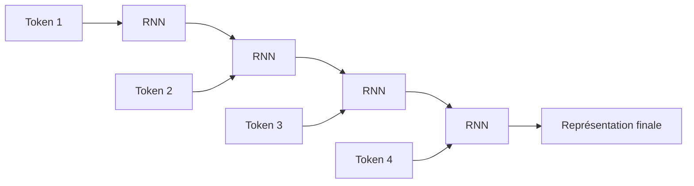
```mermaid
flowchart LR
    X1["Token 1"] --> R1["RNN"]
    R1 --> R2["RNN"]
    X2["Token 2"] --> R2
    R2 --> R3["RNN"]
    X3["Token 3"] --> R3
    R3 --> R4["RNN"]
    X4["Token 4"] --> R4
    R4 --> H["Représentation finale"]
```

Nous pouvons résumer l’idée ainsi :

> Le RNN lit la phrase de gauche à droite et transporte une mémoire interne au fur et à mesure.

Par exemple, pour la phrase :

```txt
Le chat dort sur le canapé.
```

Le modèle lit :

```txt
Le → chat → dort → sur → le → canapé
```

À chaque mot, il met à jour son état.

Un RNN reçoit deux informations à chaque étape :

1. l’entrée actuelle ;

2. l’état précédent.


Il produit ensuite :

1. un nouvel état ;

2. éventuellement une sortie.


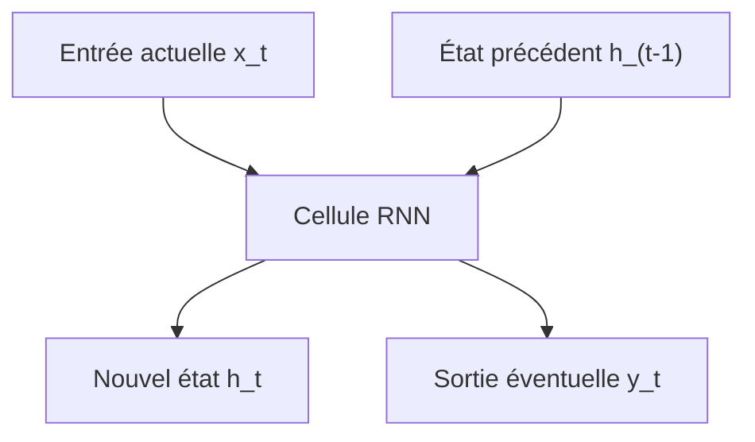
```mermaid
flowchart TD
    A["Entrée actuelle x_t"] --> C["Cellule RNN"]
    B["État précédent h_(t-1)"] --> C
    C --> D["Nouvel état h_t"]
    C --> E["Sortie éventuelle y_t"]
```

Mathématiquement, on peut écrire :

$$
h_t = f(x_t, h_{t-1})
$$

où :

- $x_t$ est l’entrée au temps $t$ ;

- $h_{t-1}$ est l’état précédent ;

- $h_t$ est le nouvel état ;

- $f$ est une fonction apprise par le réseau.


L’idée est élégante : le modèle possède une forme de mémoire.

Mais cette mémoire est limitée.

Prenons une phrase comme :

```txt
Le livre que Paul a acheté hier dans une petite librairie du centre-ville est passionnant.
```

Le sujet principal est :

```txt
Le livre
```

Le verbe associé est :

```txt
est
```

Mais entre les deux, nous avons beaucoup d’informations intermédiaires :

```txt
que Paul a acheté hier dans une petite librairie du centre-ville
```

Un modèle doit comprendre que :

```txt
Le livre ... est passionnant.
```

et non :

```txt
Paul ... est passionnant.
la librairie ... est passionnant.
le centre-ville ... est passionnant.
```

Le problème est que les RNN doivent transporter l’information importante à travers plusieurs étapes successives.

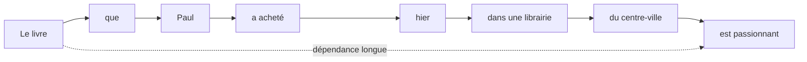
```mermaid
flowchart LR
    A["Le livre"] --> B["que"]
    B --> C["Paul"]
    C --> D["a acheté"]
    D --> E["hier"]
    E --> F["dans une librairie"]
    F --> G["du centre-ville"]
    G --> H["est passionnant"]

    A -. "dépendance longue" .-> H
```

Plus la séquence est longue, plus il devient difficile de conserver les informations importantes.

C’est ce que nous appelons le problème des **dépendances longues**.

Pendant l’entraînement, le modèle apprend en corrigeant ses erreurs. Cette correction se fait par un mécanisme appelé **[rétropropagation du gradient](https://fr.wikipedia.org/wiki/R%C3%A9tropropagation_du_gradient)**.

Dans un RNN, la rétropropagation doit traverser toutes les étapes temporelles.

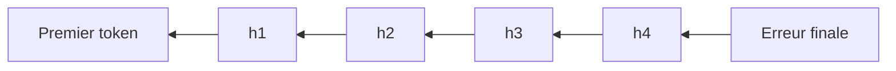
```mermaid
flowchart RL
    L["Erreur finale"] --> H4["h4"]
    H4 --> H3["h3"]
    H3 --> H2["h2"]
    H2 --> H1["h1"]
    H1 --> X1["Premier token"]
```

Quand la séquence est longue, le signal d’apprentissage peut devenir très faible en remontant vers les premiers tokens.

C’est le problème du **vanishing gradient**, ou **gradient qui disparaît**.

Conséquence :

> Le modèle apprend mal les relations éloignées dans la séquence.

Il peut très bien apprendre des dépendances courtes :

```txt
un chat noir
```

Mais il peut avoir plus de difficulté avec :

```txt
Le chat que j’ai vu hier dans la rue près de la gare était noir.
```

Pour limiter ces problèmes, des architectures plus avancées ont été proposées, notamment :

- les **LSTM** ([Long short-term memory](https://fr.wikipedia.org/wiki/R%C3%A9seau_de_neurones_r%C3%A9currents#Long_short-term_memory));

- les **GRU** ([Gate Recurrent Unit](https://fr.wikipedia.org/wiki/Unit%C3%A9_r%C3%A9currente_ferm%C3%A9e)).


Ces modèles ajoutent des mécanismes de contrôle de la mémoire.

L’idée est de permettre au réseau de décider :

- quoi oublier ;

- quoi conserver ;

- quoi mettre à jour ;

- quoi transmettre.


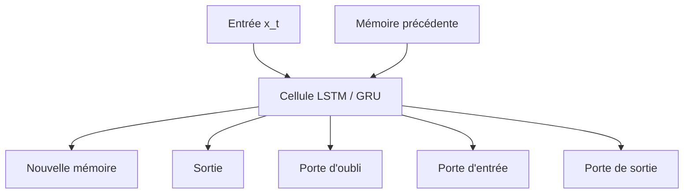
```mermaid
flowchart TD
    A["Entrée x_t"] --> L["Cellule LSTM / GRU"]
    B["Mémoire précédente"] --> L
    L --> C["Nouvelle mémoire"]
    L --> D["Sortie"]

    L --> E["Porte d'oubli"]
    L --> F["Porte d'entrée"]
    L --> G["Porte de sortie"]
```

Les LSTM et GRU ont beaucoup amélioré la capacité des réseaux à traiter des séquences.

Mais ils conservent une limite importante :

> Ils traitent toujours les éléments principalement les uns après les autres.

Cette nature séquentielle devient un problème lorsque nous voulons entraîner de grands modèles sur beaucoup de données.

Un RNN doit calculer l’état $h_t$ à partir de l’état $h_{t-1}$.

Cela signifie que nous ne pouvons pas facilement calculer tous les états en même temps.

Pour calculer le mot 4, nous devons avoir calculé le mot 3.

Pour calculer le mot 3, nous devons avoir calculé le mot 2.

Pour calculer le mot 2, nous devons avoir calculé le mot 1.

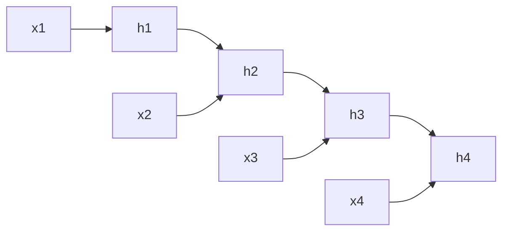
```mermaid
flowchart LR
    X1["x1"] --> H1["h1"]
    H1 --> H2["h2"]
    X2["x2"] --> H2
    H2 --> H3["h3"]
    X3["x3"] --> H3
    H3 --> H4["h4"]
    X4["x4"] --> H4
```

Le calcul est donc fortement séquentiel.

Or, les GPU et TPU sont très efficaces quand nous pouvons faire beaucoup de calculs en parallèle.

Les RNN utilisent mal cette capacité de parallélisation.

C’est une limite majeure pour entraîner des modèles très grands.


## 1.1. Seq2Seq, goulot d’étranglement et naissance de l’attention

Avant les Transformers, une architecture très utilisée pour la traduction automatique était le modèle **sequence-to-sequence**, ou **Seq2Seq**.

L’idée est simple :

- un encodeur lit la phrase source ;

- il produit une représentation ;

- un décodeur génère la phrase cible.


Par exemple :

```txt
Source : I love machine learning.
Cible  : J'aime l'apprentissage automatique.
```

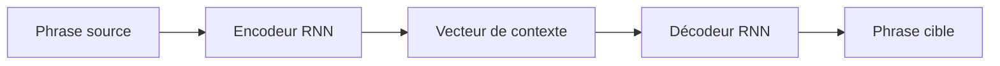
```mermaid
flowchart LR
    A["Phrase source"] --> B["Encodeur RNN"]
    B --> C["Vecteur de contexte"]
    C --> D["Décodeur RNN"]
    D --> E["Phrase cible"]
```

Le problème est que toute la phrase source doit être compressée dans un seul vecteur de contexte.

Pour une phrase courte, cela peut fonctionner.

Pour une phrase longue, c’est beaucoup plus difficile.

Dans les premiers modèles Seq2Seq, l’encodeur devait résumer toute la phrase dans un vecteur unique.

Imaginons que nous devions traduire :

```txt
Although the committee had initially rejected the proposal, it later accepted a revised version after several months of discussion.
```

Il est difficile de condenser toutes les informations importantes dans une seule représentation fixe.

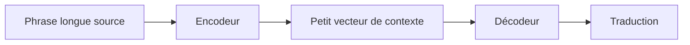
```mermaid
flowchart LR
    A["Phrase longue source"] --> B["Encodeur"]
    B --> C["Petit vecteur de contexte"]
    C --> D["Décodeur"]
    D --> E["Traduction"]
```

Ce vecteur devient un **goulot d’étranglement informationnel**.

Le décodeur doit générer une phrase complète à partir d’un résumé compact, alors qu’il aurait parfois besoin de regarder directement certaines parties précises de la phrase source.

C’est ici que l’attention va devenir importante.

L’idée de l’attention est de permettre au décodeur de ne pas dépendre uniquement d’un seul vecteur global.

Au lieu de cela, à chaque étape de génération, le décodeur peut regarder différentes parties de la phrase source.

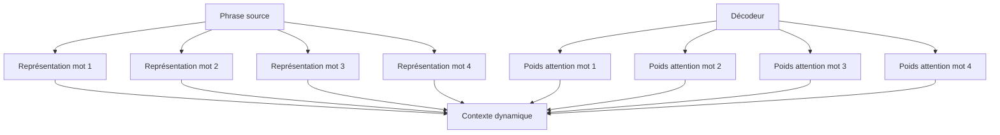
```mermaid
flowchart TD
    A["Phrase source"] --> E1["Représentation mot 1"]
    A --> E2["Représentation mot 2"]
    A --> E3["Représentation mot 3"]
    A --> E4["Représentation mot 4"]

    D["Décodeur"] --> W1["Poids attention mot 1"]
    D --> W2["Poids attention mot 2"]
    D --> W3["Poids attention mot 3"]
    D --> W4["Poids attention mot 4"]

    E1 --> C["Contexte dynamique"]
    E2 --> C
    E3 --> C
    E4 --> C

    W1 --> C
    W2 --> C
    W3 --> C
    W4 --> C
```

Nous pouvons décrire l’attention ainsi :

> L’attention permet au modèle de sélectionner dynamiquement les informations utiles dans une séquence.

Dans une tâche de traduction, lorsqu’il génère un mot français, le modèle peut regarder les mots anglais les plus pertinents.

Par exemple :

```txt
The black cat sleeps.
Le chat noir dort.
```

Quand le modèle génère :

```txt
chat
```

il doit surtout regarder :

```txt
cat
```

Quand il génère :

```txt
noir
```

il doit surtout regarder :

```txt
black
```

Dans la traduction automatique, l’attention peut être vue comme une forme d’alignement entre les mots source et les mots cible.

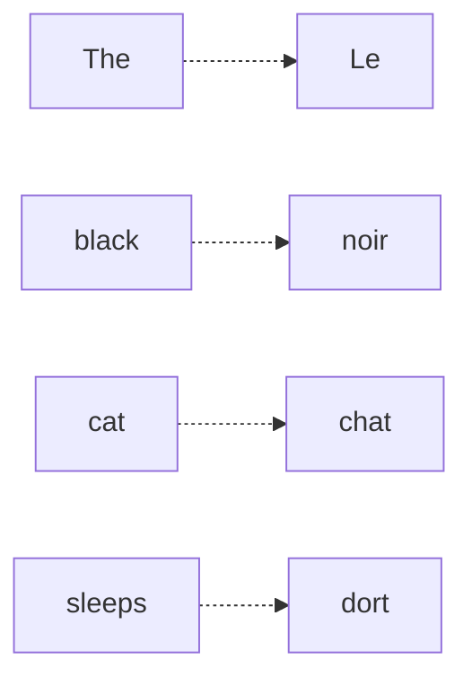
```mermaid
flowchart LR
    A1["The"] -.-> B1["Le"]
    A2["black"] -.-> B3["noir"]
    A3["cat"] -.-> B2["chat"]
    A4["sleeps"] -.-> B4["dort"]
```

Ce point est important historiquement.

Avant les modèles neuronaux modernes, la traduction automatique utilisait souvent des mécanismes explicites d’alignement statistique.

L’attention a permis de retrouver une forme d’alignement, mais apprise automatiquement par le réseau.

Dans un premier temps, l’attention n’a pas remplacé les RNN.

Elle les a complétés.

Nous avions donc des architectures de ce type :

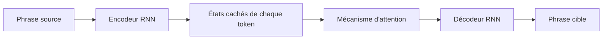
```mermaid
flowchart LR
    A["Phrase source"] --> B["Encodeur RNN"]
    B --> C["États cachés de chaque token"]
    C --> D["Mécanisme d'attention"]
    D --> E["Décodeur RNN"]
    E --> F["Phrase cible"]
```

Cela a permis de grandes améliorations, car le décodeur pouvait accéder à tous les états de l’encodeur, et pas seulement au dernier.

Mais le modèle restait encore partiellement séquentiel.

L’encodeur était souvent récurrent.

Le décodeur était récurrent.

La parallélisation restait limitée.

À ce stade, une question devient naturelle :

> Si l’attention est si utile, avons-nous encore besoin des RNN ?

C’est exactement la rupture proposée par le papier **Attention Is All You Need**.

L’idée fondamentale est :

> Nous pouvons construire un modèle de séquence uniquement à partir de mécanismes d’attention, sans récurrence et sans convolution.

Autrement dit, au lieu de lire la phrase mot par mot, nous la traitons globalement.


## 1.1. La rupture Transformer

Le Transformer remplace le traitement séquentiel par un traitement fondé sur l’attention entre tous les tokens.

Dans un RNN, chaque token dépend surtout de l’état précédent.

Dans un Transformer, chaque token peut directement interagir avec tous les autres tokens.

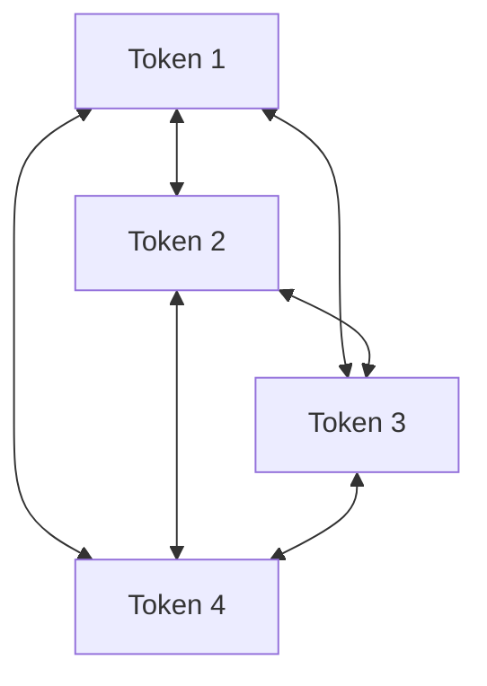
```mermaid
flowchart TD
    T1["Token 1"] <--> T2["Token 2"]
    T1 <--> T3["Token 3"]
    T1 <--> T4["Token 4"]
    T2 <--> T3
    T2 <--> T4
    T3 <--> T4
```

Cela change profondément la manière de traiter les séquences.

Nous ne sommes plus dans une lecture strictement linéaire.

Nous sommes dans une mise en relation globale.

Prenons la phrase :

```txt
La souris que le chat poursuit court très vite.
```

Le mot :

```txt
court
```

doit être relié à :

```txt
La souris
```

et non à :

```txt
le chat
```

Un Transformer peut apprendre à faire regarder le token `court` vers les tokens utiles :

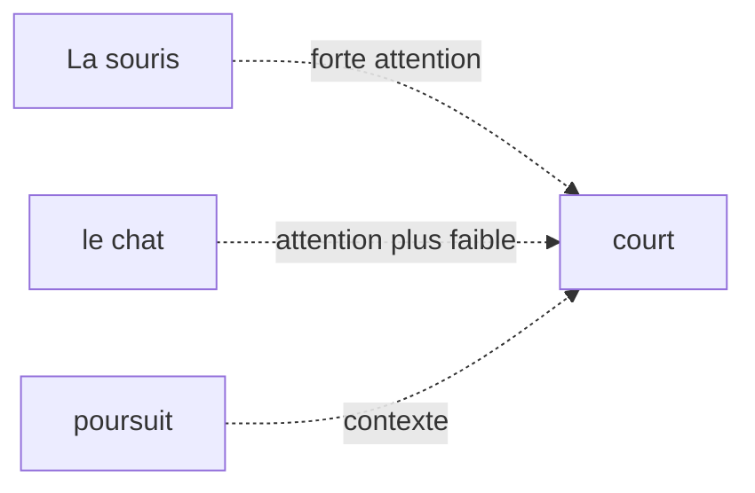
```mermaid
flowchart LR
    A["La souris"] -. "forte attention" .-> D["court"]
    B["le chat"] -. "attention plus faible" .-> D
    C["poursuit"] -. "contexte" .-> D
```

Le modèle apprend donc des relations grammaticales, sémantiques et contextuelles à partir des données.

Nous pouvons comparer les deux approches simplement.

|Critère|RNN / LSTM / GRU|Transformer|
|---|---|---|
|Traitement|Séquentiel|Global et parallélisable|
|Dépendances longues|Difficiles|Plus directes|
|Parallélisation|Limitée|Très forte|
|Mémoire du contexte|Compressée dans des états successifs|Relations directes entre tokens|
|Architecture dominante aujourd’hui|Moins utilisée pour NLP massif|Dominante dans les LLM|

Le point clé est le suivant :

> Le Transformer rend beaucoup plus efficace l’apprentissage sur de grands corpus grâce à sa parallélisation et à son accès direct aux relations entre tokens.


## 1.1. Forces, coûts et changement d’échelle

Le Transformer apporte plusieurs avantages majeurs.

### Meilleure parallélisation

Comme tous les tokens d’une séquence peuvent être traités en même temps dans certaines parties du modèle, l’entraînement devient beaucoup plus efficace sur GPU ou TPU.

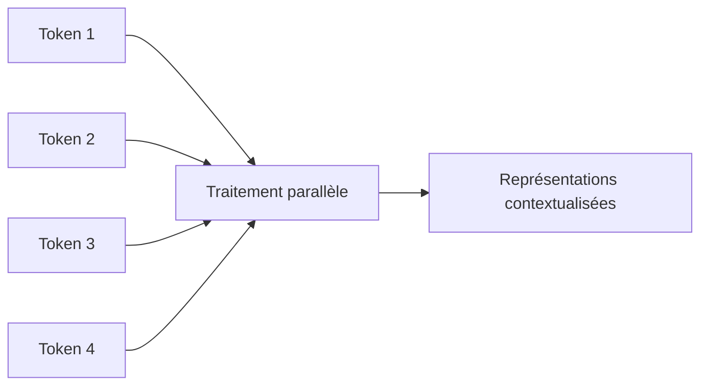
```mermaid
flowchart LR
    A["Token 1"] --> P["Traitement parallèle"]
    B["Token 2"] --> P
    C["Token 3"] --> P
    D["Token 4"] --> P
    P --> O["Représentations contextualisées"]
```

Cela permet d’entraîner des modèles plus grands sur davantage de données.


### Meilleure gestion des dépendances longues

Dans un Transformer, deux tokens éloignés peuvent interagir directement via l’attention.

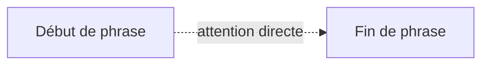
```mermaid
flowchart LR
    A["Début de phrase"] -. "attention directe" .-> Z["Fin de phrase"]
```

Dans un RNN, l’information doit passer par tous les états intermédiaires.

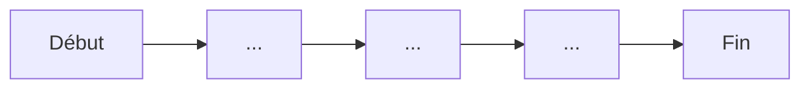
```mermaid
flowchart LR
    A["Début"] --> B["..."]
    B --> C["..."]
    C --> D["..."]
    D --> Z["Fin"]
```

La différence est essentielle.


### Représentations contextualisées

Dans un Transformer, le vecteur associé à un mot dépend des autres mots de la phrase.

Le mot `banque` n’a pas la même représentation dans :

```txt
Je vais à la banque déposer un chèque.
```

et :

```txt
Nous nous asseyons sur la banque au bord de la rivière.
```

Même mot, mais contexte différent.

Le Transformer produit donc une représentation contextualisée.

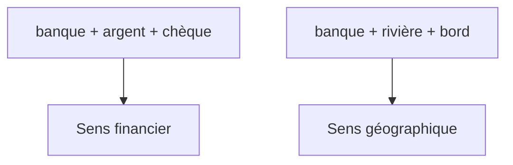
```mermaid
flowchart TD
    A["banque + argent + chèque"] --> B["Sens financier"]
    C["banque + rivière + bord"] --> D["Sens géographique"]
```

Il ne faut pas présenter les Transformers comme une solution magique.

Ils ont aussi des limites.

### Coût quadratique de l’attention

Si chaque token regarde tous les autres tokens, alors le nombre de relations à calculer augmente très vite.

Pour une séquence de longueur $n$, la matrice d’attention contient :

$$n \times n$$


relations.

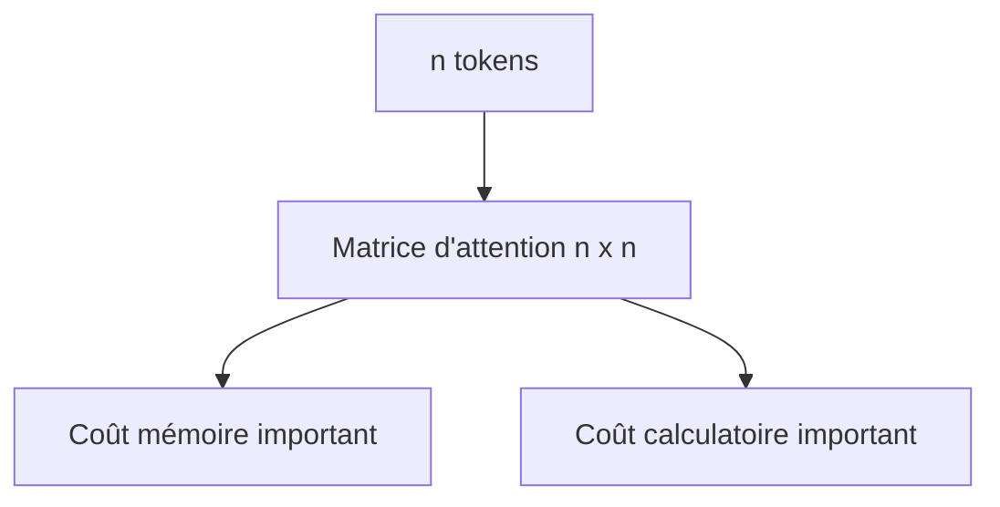
```mermaid
flowchart TD
    A["n tokens"] --> B["Matrice d'attention n x n"]
    B --> C["Coût mémoire important"]
    B --> D["Coût calculatoire important"]
```

C’est pourquoi les longues séquences sont coûteuses.

Nous reviendrons sur ce point dans le chapitre consacré à la complexité.


### Absence d’ordre naturel

Un RNN lit les mots dans l’ordre. L’ordre est donc intégré naturellement dans le processus.

Un Transformer, lui, regarde tous les tokens en parallèle.

Il faut donc lui ajouter explicitement une information de position.

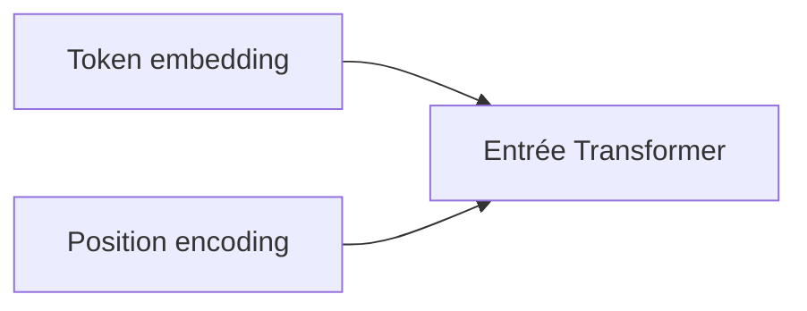
```mermaid
flowchart LR
    A["Token embedding"] --> C["Entrée Transformer"]
    B["Position encoding"] --> C
```

Sans information de position, le Transformer ne saurait pas distinguer :

```txt
Le chien mord l’homme.
```

de :

```txt
L’homme mord le chien.
```

Nous étudierons ce problème en détail dans le chapitre 3.


### Besoin massif de données

Les Transformers modernes sont très puissants, mais ils nécessitent souvent :

- beaucoup de données ;

- beaucoup de calcul ;

- beaucoup de mémoire ;

- une infrastructure matérielle importante.


C’est particulièrement vrai pour les grands modèles de langage.

Le succès des Transformers ne vient pas seulement de leur élégance théorique.

Il vient aussi de leur compatibilité avec le passage à l’échelle.

Autrement dit, les Transformers se sont révélés très efficaces lorsque nous augmentons :

- la taille des données ;

- la taille du modèle ;

- la durée d’entraînement ;

- la puissance de calcul.


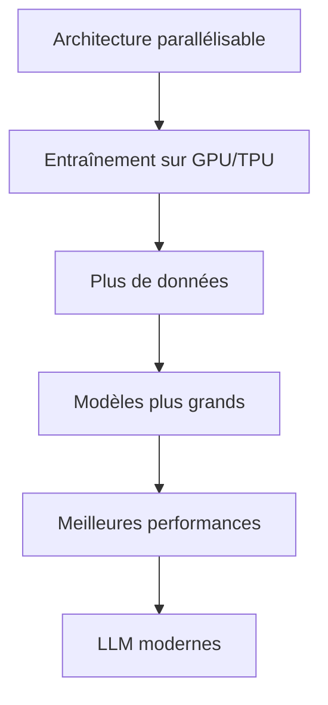
```mermaid
flowchart TD
    A["Architecture parallélisable"] --> B["Entraînement sur GPU/TPU"]
    B --> C["Plus de données"]
    C --> D["Modèles plus grands"]
    D --> E["Meilleures performances"]
    E --> F["LLM modernes"]
```

C’est ce qui a permis l’émergence des grands modèles de langage modernes.

Nous pouvons résumer l’évolution des architectures de séquences ainsi :

```mermaid
timeline
    title Évolution des modèles de séquences
    RNN : Lecture séquentielle simple
    LSTM / GRU : Meilleure mémoire
    Seq2Seq : Traduction neuronale
    Attention : Accès dynamique au contexte
    Transformer : Attention sans récurrence
    BERT / GPT : Pré-entraînement massif
    LLM modernes : Passage à l'échelle
```

Cette progression montre que les Transformers ne sont pas apparus de nulle part.

Ils sont la réponse à plusieurs limites accumulées :

- les RNN traitaient mal les dépendances longues ;

- les modèles Seq2Seq compressaient trop l’information ;

- les modèles récurrents étaient difficiles à paralléliser ;

- l’attention avait déjà montré son efficacité ;

- les GPU/TPU favorisaient les architectures parallélisables.

Nous pouvons maintenant formuler l’idée centrale :

> Le Transformer est une architecture conçue pour traiter les séquences en reliant directement les éléments entre eux grâce à l’attention, au lieu de les traiter uniquement dans un ordre séquentiel.

Cela permet :

- de mieux capturer les dépendances longues ;

- de paralléliser fortement l’entraînement ;

- de produire des représentations contextualisées ;

- de construire des modèles très grands ;

- de généraliser l’architecture à de nombreux domaines.

Prenons la phrase :

```txt
Le chat noir dort sur le canapé.
```

Un Transformer ne se contente pas d’associer un vecteur fixe à chaque mot.

Il construit une représentation de chaque mot en fonction de tous les autres.

```mermaid
flowchart TD
    A["Le"] --> T["Transformer"]
    B["chat"] --> T
    C["noir"] --> T
    D["dort"] --> T
    E["sur"] --> T
    F["le"] --> T
    G["canapé"] --> T

    T --> A2["Représentation contextualisée de Le"]
    T --> B2["Représentation contextualisée de chat"]
    T --> C2["Représentation contextualisée de noir"]
    T --> D2["Représentation contextualisée de dort"]
    T --> G2["Représentation contextualisée de canapé"]
```

Le mot `chat` sera influencé par :

- `Le`, qui indique le déterminant ;

- `noir`, qui apporte une propriété ;

- `dort`, qui indique l’action ;

- `canapé`, qui donne le contexte de la scène.

À ce stade du cours, nous comprenons pourquoi les Transformers sont nécessaires, mais nous n’avons pas encore détaillé comment ils fonctionnent.

Nous ne savons pas encore précisément :

- comment un mot devient un vecteur ;

- comment le modèle encode l’ordre ;

- ce que sont Query, Key et Value ;

- comment l’attention est calculée ;

- pourquoi on parle de multi-head attention ;

- comment fonctionne un bloc encoder ;

- comment fonctionne un bloc decoder ;

- comment le modèle est entraîné.


Ces éléments seront construits progressivement dans les chapitres suivants.


---

# 2. Tokens, embeddings et formes de tenseurs


## 2.1. Du texte aux tokens

Un réseau de neurones ne comprend pas directement les mots.

Pour un humain, cette phrase est lisible :

```txt
Le chat dort.
```

Mais pour une machine learning model, ce texte doit être converti en nombres.

Nous avons donc une chaîne de transformation :

```mermaid
flowchart LR
    A["Texte brut"] --> B["Tokenisation"]
    B --> C["Tokens"]
    C --> D["IDs de tokens"]
    D --> E["Embeddings"]
    E --> F["Tenseur d'entrée du Transformer"]
```

L’idée générale est la suivante :

1. nous découpons le texte en morceaux ;

2. nous associons chaque morceau à un identifiant numérique ;

3. nous transformons chaque identifiant en vecteur dense ;

4. nous envoyons ces vecteurs dans le Transformer.

Un **token** est une unité de texte manipulée par le modèle.

Un token peut être :

- un mot ;

- une partie de mot ;

- un caractère ;

- un symbole ;

- un signe de ponctuation ;

- un espace ou une marque spéciale selon le tokenizer.


Par exemple, la phrase :

```txt
Le chat dort.
```

peut être découpée ainsi :

```txt
["Le", "chat", "dort", "."]
```

Mais selon le tokenizer, elle pourrait aussi être découpée différemment.

Par exemple :

```txt
["Le", "Ġchat", "Ġdort", "."]
```

ou encore :

```txt
["L", "e", "chat", "dort", "."]
```

Le token n’est donc pas forcément un mot.

C’est un point fondamental.

Nous pourrions imaginer un modèle qui manipule directement les mots du dictionnaire.

Mais cela pose plusieurs problèmes.

### Vocabulaire énorme

Une langue contient énormément de mots :

```txt
chat, chats, chatte, chaton, chatière, etc.
```

Si nous ajoutons :

- les conjugaisons ;

- les accords ;

- les noms propres ;

- les fautes de frappe ;

- les mots rares ;

- les termes techniques ;

- les mots étrangers ;


le vocabulaire devient gigantesque.

### Mots inconnus

Si le modèle rencontre un mot absent de son vocabulaire, il ne sait pas quoi faire.

Par exemple :

```txt
anticonstitutionnellement
```

ou :

```txt
GmodIntegration
```

ou encore :

```txt
docker-compose.override.yml
```

Un tokenizer moderne doit pouvoir traiter ces formes rares ou nouvelles.

### Sous-mots

Pour résoudre ce problème, beaucoup de modèles utilisent des tokens de type **sous-mots**.

Par exemple :

```txt
anticonstitutionnellement
```

pourrait être découpé en :

```txt
["anti", "constitution", "nelle", "ment"]
```

L’avantage est que le modèle peut comprendre un mot rare à partir de morceaux plus fréquents.

Nous pouvons distinguer trois grandes approches.

### Tokenisation par mots

La phrase :

```txt
Le chat dort.
```

devient :

```txt
["Le", "chat", "dort", "."]
```

Avantage : c’est intuitif.

Inconvénient : le vocabulaire devient très grand et les mots rares posent problème.


### Tokenisation par caractères

La phrase :

```txt
chat
```

devient :

```txt
["c", "h", "a", "t"]
```

Avantage : presque aucun mot inconnu.

Inconvénient : les séquences deviennent beaucoup plus longues.

Le modèle doit reconstruire lui-même les mots à partir des caractères.


### Tokenisation par sous-mots

La phrase :

```txt
reconstruction
```

peut devenir :

```txt
["re", "construction"]
```

ou :

```txt
["recon", "struction"]
```

ou encore :

```txt
["re", "construct", "ion"]
```

C’est l’approche la plus utilisée dans les grands modèles de langage modernes.

Elle offre un bon compromis entre :

- vocabulaire raisonnable ;

- capacité à traiter les mots rares ;

- longueur de séquence acceptable.


```mermaid
flowchart TD
    A["Texte brut"] --> B1["Tokenisation par mots"]
    A --> B2["Tokenisation par caractères"]
    A --> B3["Tokenisation par sous-mots"]

    B1 --> C1["Simple mais vocabulaire énorme"]
    B2 --> C2["Robuste mais séquences longues"]
    B3 --> C3["Compromis utilisé par beaucoup de LLM"]
```

Un modèle de langage possède un **vocabulaire**, c’est-à-dire une liste finie de tokens qu’il connaît.

Par exemple, un vocabulaire simplifié pourrait être :

|ID|Token|
|--:|---|
|0|`<pad>`|
|1|`<unk>`|
|2|`Le`|
|3|`chat`|
|4|`dort`|
|5|`sur`|
|6|`canapé`|
|7|`.`|

La phrase :

```txt
Le chat dort sur le canapé.
```

pourrait alors devenir :

```txt
[2, 3, 4, 5, 2, 6, 7]
```

Nous avons remplacé les tokens par des identifiants numériques.

Mais attention : ces identifiants ne portent pas encore de sens mathématique.

Le fait que `chat = 3` et `dort = 4` ne signifie pas que `dort` est “plus grand” que `chat`.

Ces IDs sont seulement des indices dans une table.

Les modèles utilisent souvent des tokens spéciaux.

Par exemple :

|Token spécial|Rôle|
|---|---|
|`<pad>`|Remplissage pour obtenir des séquences de même longueur|
|`<unk>`|Token inconnu|
|`<bos>`|Début de séquence|
|`<eos>`|Fin de séquence|
|`<mask>`|Token masqué, utilisé notamment dans BERT|
|`<sep>`|Séparateur entre deux segments|
|`<cls>`|Token de classification, utilisé notamment dans BERT|

Par exemple, pour une tâche de classification, nous pourrions avoir :

```txt
[CLS] Le chat dort. [SEP]
```

Pour une tâche de génération, nous pourrions avoir :

```txt
[BOS] Le chat dort. [EOS]
```

Ces tokens spéciaux permettent au modèle de repérer la structure de l’entrée.


### Padding : pourquoi compléter les séquences ?

Dans un batch, nous entraînons souvent le modèle sur plusieurs phrases en même temps.

Mais les phrases n’ont pas toutes la même longueur.

Par exemple :

```txt
Phrase 1 : Le chat dort.
Phrase 2 : Le petit chat noir dort sur le canapé.
```

Après tokenisation :

```txt
Phrase 1 : [2, 3, 4, 7]
Phrase 2 : [2, 8, 3, 9, 4, 5, 2, 6, 7]
```

Pour les mettre dans un même tenseur, nous devons souvent les compléter avec un token de padding :

```txt
Phrase 1 : [2, 3, 4, 7, 0, 0, 0, 0, 0]
Phrase 2 : [2, 8, 3, 9, 4, 5, 2, 6, 7]
```

Ici, `0` correspond à `<pad>`.

```mermaid
flowchart TD
    A["Séquences de longueurs différentes"] --> B["Ajout de tokens <pad>"]
    B --> C["Séquences de même longueur"]
    C --> D["Batch tensoriel"]
```

Cependant, le modèle ne doit pas considérer les tokens `<pad>` comme du vrai texte.

Nous utiliserons donc plus tard un **padding mask** pour les ignorer dans l’attention.


### Représentation symbolique contre représentation distribuée

Une fois que nous avons des IDs de tokens, nous avons une représentation symbolique :

```txt
Le    → 2
chat  → 3
dort  → 4
```

Mais cette représentation est pauvre.

Elle ne dit pas que :

- `chat` est proche de `chien` ;

- `dort` est proche de `sommeille` ;

- `canapé` est proche de `fauteuil` ;

- `manger` est différent de `dormir`.


Pour que le modèle apprenne des relations sémantiques, chaque token est transformé en vecteur.

C’est le rôle des **embeddings**.


## 2.1. Embeddings : passer des symboles aux vecteurs

Un **embedding** est un vecteur dense associé à un token.

Par exemple, le token `chat` peut être représenté par un vecteur :

```txt
chat → [0.21, -0.38, 0.74, 0.12, ...]
```

Dans un vrai Transformer, ce vecteur peut avoir une dimension comme :

```txt
768, 1024, 4096, 8192, ...
```

selon la taille du modèle.

Nous appelons souvent cette dimension :

$$d_{model}$$
C’est la dimension principale des représentations internes du Transformer.

Concrètement, le modèle contient une grande matrice appelée **table d’embeddings**.

Si le vocabulaire contient $V$ tokens et que chaque embedding a une dimension $d_{model}$, alors la table d’embeddings a la forme :

$$V \times d_{model}$$

Par exemple, avec :

```txt
V = 50 000 tokens
d_model = 768
```

la matrice d’embeddings contient :

```txt
50 000 × 768
```

valeurs apprises.

```mermaid
flowchart LR
    A["ID du token"] --> B["Table d'embeddings"]
    B --> C["Vecteur dense de dimension d_model"]
```

Exemple simplifié :

|Token|ID|Embedding simplifié|
|---|--:|---|
|Le|2|`[0.1, 0.4, -0.2]`|
|chat|3|`[0.7, -0.1, 0.5]`|
|dort|4|`[-0.3, 0.8, 0.2]`|

Donc :

```txt
[2, 3, 4]
```

devient :

```txt
[
  [0.1, 0.4, -0.2],
  [0.7, -0.1, 0.5],
  [-0.3, 0.8, 0.2]
]
```

Les embeddings ne sont pas écrits à la main.

Ils sont appris pendant l’entraînement.

Au début, ils peuvent être initialisés aléatoirement.

Puis, au fil de l’apprentissage, le modèle ajuste les vecteurs pour mieux résoudre sa tâche.

Par exemple, dans un modèle de langage, le modèle apprend progressivement que certains tokens apparaissent dans des contextes similaires.

Ainsi, les embeddings de mots proches sémantiquement peuvent finir par se rapprocher dans l’espace vectoriel.

```mermaid
flowchart TD
    A["Initialisation aléatoire"] --> B["Entraînement"]
    B --> C["Correction par gradient"]
    C --> D["Embeddings plus utiles"]
    D --> E["Représentations sémantiques apprises"]
```

Nous pouvons voir les embeddings comme des points dans un espace multidimensionnel.

Dans un espace très simplifié à deux dimensions, nous pourrions imaginer :

```mermaid
quadrantChart
    title Espace d'embeddings simplifié
    x-axis "animal" --> "objet"
    y-axis "repos" --> "action"
    quadrant-1 "Objets actifs"
    quadrant-2 "Animaux actifs"
    quadrant-3 "Animaux au repos"
    quadrant-4 "Objets au repos"
    "chat": [0.2, 0.3]
    "chien": [0.25, 0.35]
    "canapé": [0.8, 0.2]
    "dormir": [0.3, 0.15]
```

Bien sûr, dans un vrai modèle, l’espace n’a pas deux dimensions mais souvent plusieurs centaines ou milliers.

L’important est l’idée suivante :

> Les embeddings permettent de représenter les tokens dans un espace où les relations entre vecteurs peuvent porter du sens.

Il faut distinguer deux notions.

### Embedding statique

La table d’embeddings donne une représentation initiale du token.

Par exemple :

```txt
banque → [0.18, -0.22, 0.91, ...]
```

Cette représentation est la même au départ, quel que soit le contexte.

### Représentation contextualisée

Après passage dans le Transformer, le vecteur du token dépend du contexte.

Le mot `banque` dans :

```txt
Je vais à la banque déposer un chèque.
```

n’aura pas la même représentation finale que dans :

```txt
Nous marchons sur la banque de sable.
```

```mermaid
flowchart TD
    A["Embedding initial de banque"] --> T1["Transformer avec contexte financier"]
    A --> T2["Transformer avec contexte géographique"]

    T1 --> B["Représentation contextualisée : établissement financier"]
    T2 --> C["Représentation contextualisée : bord / dépôt naturel"]
```

Donc :

> L’embedding initial donne un point de départ, mais le Transformer construit ensuite une représentation dépendante du contexte.


## 2.1. Tenseurs et dimensions à suivre

Un **tenseur** est une généralisation des scalaires, vecteurs et matrices.

Nous pouvons retenir simplement :

|Objet|Exemple|Nombre de dimensions|
|---|---|--:|
|Scalaire|`3.14`|0D|
|Vecteur|`[0.1, 0.2, 0.3]`|1D|
|Matrice|`[[1, 2], [3, 4]]`|2D|
|Tenseur|batch de matrices|3D ou plus|

Dans les Transformers, nous manipulons très souvent des tenseurs à trois dimensions :

```txt
(batch_size, sequence_length, d_model)
```

Prenons un exemple.

Nous avons un batch de 32 phrases.

Chaque phrase est tronquée ou complétée à 128 tokens.

Chaque token est représenté par un embedding de dimension 768.

Le tenseur d’entrée a donc la forme :

```txt
(32, 128, 768)
```

Ce qui signifie :

```txt
32 phrases
128 tokens par phrase
768 valeurs par token
```

```mermaid
flowchart TD
    A["Batch size = 32"] --> D["Tenseur d'entrée"]
    B["Sequence length = 128"] --> D
    C["d_model = 768"] --> D
    D --> E["Shape : 32 x 128 x 768"]
```

Nous retrouverons ces dimensions tout au long du cours.

La dimension **batch** correspond au nombre d’exemples traités en même temps.

Par exemple :

```txt
batch_size = 4
```

signifie que nous envoyons 4 séquences en parallèle au modèle.

```txt
Phrase 1 : Le chat dort.
Phrase 2 : Le chien aboie.
Phrase 3 : Il pleut aujourd’hui.
Phrase 4 : J’aime les Transformers.
```

Le batch permet :

- d’accélérer l’entraînement ;

- de mieux utiliser le GPU ;

- de stabiliser l’estimation du gradient.

La dimension **sequence length** correspond au nombre de tokens dans chaque séquence.

Par exemple :

```txt
Le chat dort.
```

peut devenir :

```txt
["Le", "chat", "dort", "."]
```

Donc :

```txt
sequence_length = 4
```

Mais dans un batch, nous fixons souvent une longueur maximale :

```txt
max_sequence_length = 128
```

Les phrases plus courtes sont complétées avec du padding.

Les phrases plus longues sont tronquées ou découpées.

La dimension $d_{model}$ est la taille du vecteur associé à chaque token.

Par exemple :

```txt
d_model = 768
```

signifie que chaque token est représenté par 768 nombres.

Le choix de $d_{model}$ influence :

- la capacité du modèle ;

- le nombre de paramètres ;

- le coût mémoire ;

- le coût calculatoire.


Un modèle avec un $d_{model}$ plus grand peut représenter plus d’informations, mais coûte plus cher à entraîner et à utiliser.

Prenons la phrase :

```txt
Le chat dort.
```

Étape 1 : tokenisation

```txt
["Le", "chat", "dort", "."]
```

Étape 2 : conversion en IDs

```txt
[2, 3, 4, 7]
```

Étape 3 : embeddings simplifiés

```txt
[
  [0.1, 0.4, -0.2],
  [0.7, -0.1, 0.5],
  [-0.3, 0.8, 0.2],
  [0.0, -0.5, 0.9]
]
```

Ici, nous avons :

```txt
sequence_length = 4
d_model = 3
```

Donc la forme est :

```txt
(4, 3)
```

Si nous ajoutons un batch de taille 1, la forme devient :

```txt
(1, 4, 3)
```

```mermaid
flowchart LR
    A["Le chat dort."] --> B["Tokens"]
    B --> C["IDs : [2, 3, 4, 7]"]
    C --> D["Embeddings"]
    D --> E["Shape : 1 x 4 x 3"]
```


## 2.1. Ce qui manque encore : contexte et ordre

Les embeddings initiaux ne connaissent pas encore le contexte précis.

Par exemple, dans :

```txt
Le chat dort.
```

le token `chat` reçoit un vecteur initial.

Dans :

```txt
Le chat de discussion est ouvert.
```

le token `chat` peut avoir une signification différente selon le contexte.

L’embedding initial ne suffit donc pas.

Le rôle du Transformer sera de transformer ces embeddings initiaux en représentations contextualisées.

```mermaid
flowchart LR
    A["Embeddings initiaux"] --> B["Transformer"]
    B --> C["Représentations contextualisées"]
```

L’entrée d’un Transformer est donc une matrice de vecteurs.

Pour une phrase de $n$ tokens, nous avons :

$$X \in \mathbb{R}^{n \times d_{model}}$$

où :

- $n$ est la longueur de la séquence ;

- $d_{model}$ est la dimension des embeddings.


Pour un batch, nous avons :

$$X \in \mathbb{R}^{B \times n \times d_{model}}$$
où :

- $B$ est la taille du batch ;

- $n$ est la longueur de séquence ;

- $d_{model}$ est la dimension du modèle.


C’est ce tenseur qui sera envoyé dans les couches du Transformer.

À ce stade, nous avons transformé les tokens en vecteurs.

Mais nous avons un problème majeur.

Si nous envoyons simplement une liste de vecteurs au Transformer, l’architecture d’attention ne connaît pas naturellement l’ordre des tokens.

La phrase :

```txt
Le chien mord l’homme.
```

et la phrase :

```txt
L’homme mord le chien.
```

contiennent presque les mêmes tokens.

Mais le sens est différent.

```mermaid
flowchart TD
    A["Même ensemble de mots"] --> B["Ordre différent"]
    B --> C["Sens différent"]
    C --> D["Il faut encoder la position"]
```

Un RNN encode implicitement l’ordre car il lit la phrase de gauche à droite.

Un Transformer, lui, traite les tokens en parallèle.

Nous devrons donc ajouter explicitement une information de position.

C’est le sujet du chapitre suivant.


---

# 3. Représenter l'ordre : positions et contexte


## 3.1. Pourquoi l’ordre doit être représenté explicitement

Une séquence n’est pas seulement un ensemble d’éléments.

C’est un ensemble **ordonné**.

La phrase :

```txt
Marie aime Paul.
```

n’a pas le même sens que :

```txt
Paul aime Marie.
```

Les tokens sont presque identiques :

```txt
["Marie", "aime", "Paul"]
["Paul", "aime", "Marie"]
```

Mais les rôles syntaxiques changent.

Dans la première phrase :

```txt
Marie = sujet
Paul = complément
```

Dans la seconde :

```txt
Paul = sujet
Marie = complément
```

Le modèle doit donc comprendre que la position d’un token influence son rôle.

```mermaid
flowchart TD
    A["Même vocabulaire"] --> B["Ordre différent"]
    B --> C["Rôles syntaxiques différents"]
    C --> D["Sens différent"]
```

Nous ne pouvons donc pas représenter une phrase uniquement comme un sac de mots.

Un modèle très simple pourrait représenter une phrase uniquement par les mots qu’elle contient, sans tenir compte de l’ordre.

C’est ce qu’on appelle parfois une représentation **bag-of-words**, ou **sac de mots**.

Par exemple, les deux phrases suivantes :

```txt
Le chat poursuit la souris.
La souris poursuit le chat.
```

auraient presque la même représentation si nous ne regardons que les mots présents :

```txt
{le, chat, poursuit, la, souris}
```

Mais leur sens est opposé.

Dans la première phrase :

```txt
chat → poursuit → souris
```

Dans la seconde :

```txt
souris → poursuit → chat
```

```mermaid
flowchart LR
    A["Le chat poursuit la souris"] --> C["Mêmes mots"]
    B["La souris poursuit le chat"] --> C
    C --> D["Mais relations différentes"]
```

Le Transformer doit donc être capable de représenter non seulement les tokens, mais aussi leur position dans la séquence.

Les réseaux récurrents, comme les RNN, LSTM et GRU, lisent naturellement les tokens dans l’ordre.

Ils traitent la séquence étape par étape :

```txt
Token 1 → Token 2 → Token 3 → Token 4
```

```mermaid
flowchart LR
    X1["Token 1"] --> H1["État h1"]
    H1 --> H2["État h2"]
    X2["Token 2"] --> H2
    H2 --> H3["État h3"]
    X3["Token 3"] --> H3
    H3 --> H4["État h4"]
    X4["Token 4"] --> H4
```

Dans ce type d’architecture, l’ordre est intégré par construction.

Le modèle sait qu’un token arrive après un autre, parce que le calcul lui-même se fait dans cet ordre.

Mais le Transformer fonctionne différemment.

Il traite les tokens en parallèle, ce qui est très efficace pour l’entraînement, mais cela signifie que l’ordre n’est pas automatiquement présent dans le mécanisme de base.

Dans un Transformer, les tokens sont représentés comme une matrice.

Par exemple, une phrase de 5 tokens avec des embeddings de dimension 4 peut être représentée comme :

```txt
[
  [0.2, -0.1,  0.7,  0.4],
  [0.5,  0.3, -0.2,  0.8],
  [0.1,  0.9,  0.6, -0.5],
  [0.7, -0.4,  0.2,  0.3],
  [0.0,  0.1, -0.8,  0.6]
]
```

Cette matrice contient une ligne par token.

Mais si nous ne donnons aucune information de position, le modèle voit surtout un ensemble de vecteurs.

Il ne sait pas intrinsèquement que la première ligne correspond au premier token, que la deuxième correspond au deuxième, etc.

```mermaid
flowchart TD
    A["Token embeddings"] --> B["Attention"]
    B --> C["Relations entre tokens"]

    D["Problème"] --> E["Aucune position explicite"]
    E --> F["L'ordre doit être ajouté"]
```

Nous devons donc ajouter une information supplémentaire : la position.

Le mécanisme d’attention compare les tokens entre eux.

Il répond à une question du type :

> À quels autres tokens ce token doit-il prêter attention ?

Mais si les embeddings ne contiennent aucune information de position, l’attention ne sait pas distinguer clairement deux séquences qui contiennent les mêmes tokens dans un ordre différent.

Prenons deux séquences :

```txt
A B C
C B A
```

Si nous donnons seulement les embeddings de `A`, `B`, `C`, sans position, le modèle connaît les tokens présents, mais pas leur rang exact.

L’attention peut apprendre des relations entre `A`, `B` et `C`, mais il lui manque l’information :

```txt
A est en position 1
B est en position 2
C est en position 3
```

```mermaid
flowchart LR
    A["Embedding token"] --> C["Attention"]
    B["Position inconnue"] --> D["Ambiguïté"]
    C --> D
```

Nous devons donc enrichir chaque token avec une information indiquant sa place dans la séquence.

L’idée la plus simple est la suivante :

> Pour chaque token, nous ajoutons à son embedding une représentation de sa position.

Autrement dit, l’entrée du Transformer n’est pas seulement :

```txt
embedding(token)
```

mais plutôt :

```txt
embedding(token) + encoding(position)
```

```mermaid
flowchart TD
    A["Token"] --> B["Token embedding"]
    C["Position"] --> D["Position encoding"]
    B --> E["Addition"]
    D --> E
    E --> F["Entrée du Transformer"]
```

Par exemple, pour la phrase :

```txt
Le chat dort.
```

nous pouvons représenter :

```txt
Le    = embedding("Le")    + position(0)
chat  = embedding("chat")  + position(1)
dort  = embedding("dort")  + position(2)
.     = embedding(".")     + position(3)
```

Cela permet au modèle de savoir non seulement quel token est présent, mais aussi où il se trouve.

L’embedding de position doit avoir la même dimension que l’embedding du token.

Si :

```txt
d_model = 512
```

alors chaque token embedding est un vecteur de dimension 512.

L’encodage de position doit donc également être un vecteur de dimension 512, afin que nous puissions les additionner.

$$
x_i = token_embedding_i + position_encoding_i
$$

où :

- $x_i$ est l’entrée finale du token en position $i$ ;

- $token_embedding_i$ représente le contenu du token ;

- $position_encoding_i$ représente sa position.


```mermaid
flowchart LR
    A["Vecteur token : d_model"] --> C["Addition"]
    B["Vecteur position : d_model"] --> C
    C --> D["Vecteur final : d_model"]
```

Cette addition est simple, efficace et conserve la même dimension d’entrée pour le Transformer.

Supposons que nous ayons un embedding de token en dimension 3.

Pour le token `chat`, nous avons :

```txt
embedding("chat") = [0.7, -0.1, 0.9]
```

Pour la position 1, nous avons :

```txt
position(1) = [0.05, 0.20, -0.10]
```

L’entrée finale devient :

```txt
x = [0.7, -0.1, 0.9] + [0.05, 0.20, -0.10]
```

Donc :

```txt
x = [0.75, 0.10, 0.80]
```

Le modèle reçoit donc un vecteur qui mélange deux informations :

- le contenu : `chat` ;

- la position : `position 1`.


```mermaid
flowchart TD
    A["chat"] --> B["[0.7, -0.1, 0.9]"]
    C["position 1"] --> D["[0.05, 0.20, -0.10]"]
    B --> E["Addition"]
    D --> E
    E --> F["[0.75, 0.10, 0.80]"]
```


## 3.1. Encodages absolus : sinus, cosinus et positions apprises

Nous pouvons distinguer deux grandes familles.

```mermaid
flowchart TD
    A["Encodages de position"] --> B["Encodages fixes"]
    A --> C["Encodages appris"]

    B --> D["Sinus / cosinus"]
    B --> E["ALiBi, certaines variantes"]

    C --> F["Position embeddings appris"]
    C --> G["BERT, GPT classiques"]
```

### Encodages fixes

Dans un encodage fixe, les vecteurs de position ne sont pas appris.

Ils sont calculés à partir d’une formule.

C’est le cas des **positional encodings sinusoïdaux** du papier _Attention Is All You Need_.

### Encodages appris

Dans un encodage appris, chaque position possède un vecteur appris pendant l’entraînement.

C’est une méthode très utilisée dans de nombreux modèles modernes.

Dans le Transformer original, les auteurs utilisent des fonctions sinus et cosinus pour représenter les positions.

L’idée est d’associer à chaque position un vecteur déterministe, calculé avec des fréquences différentes.

La formule donnée dans le papier est :

$$
PE_{(pos, 2i)} = \sin\left(\frac{pos}{10000^{2i/d_{model}}}\right)
$$

$$
PE_{(pos, 2i+1)} = \cos\left(\frac{pos}{10000^{2i/d_{model}}}\right)
$$

où :

- $pos$ est la position du token dans la séquence ;

- $i$ est l’indice de la dimension ;

- $d_{model}$ est la dimension totale du modèle ;

- les dimensions paires utilisent sinus ;

- les dimensions impaires utilisent cosinus.


```mermaid
flowchart TD
    A["Position pos"] --> B["Dimensions paires"]
    A --> C["Dimensions impaires"]
    B --> D["sin(pos / fréquence)"]
    C --> E["cos(pos / fréquence)"]
    D --> F["Vecteur positionnel"]
    E --> F
```

Pourquoi utiliser sinus et cosinus ?

L’idée est de représenter chaque position avec plusieurs fréquences.

Certaines dimensions varient rapidement avec la position.

D’autres dimensions varient lentement.

Cela permet au modèle de disposer d’informations à plusieurs échelles.

```mermaid
flowchart TD
    A["Position dans la séquence"] --> B["Fréquences rapides"]
    A --> C["Fréquences moyennes"]
    A --> D["Fréquences lentes"]

    B --> E["Différences locales"]
    C --> F["Relations intermédiaires"]
    D --> G["Positions éloignées"]
```

Nous pouvons faire une analogie avec une horloge.

Sur une horloge :

- l’aiguille des secondes change très vite ;

- l’aiguille des minutes change plus lentement ;

- l’aiguille des heures change encore plus lentement.


En combinant plusieurs rythmes, nous pouvons identifier une position temporelle.

Les positional encodings sinusoïdaux fonctionnent avec une idée similaire : plusieurs fréquences permettent de distinguer les positions.

L’utilisation conjointe de sinus et cosinus permet de mieux représenter les relations de décalage entre positions.

Deux fonctions sinus seules peuvent être ambiguës.

Le couple sinus/cosinus encode une position comme un point sur un cercle.

Pour une fréquence donnée, nous pouvons voir :

$$
(\sin(pos), \cos(pos))
$$

comme une position angulaire.

```mermaid
flowchart TD
    A["Position pos"] --> B["sin(pos)"]
    A --> C["cos(pos)"]
    B --> D["Coordonnée sur un cercle"]
    C --> D
```

Cette structure rend les relations entre positions plus faciles à exploiter mathématiquement.

En particulier, elle permet au modèle d’apprendre plus facilement des relations relatives du type :

```txt
le token actuel regarde le token situé 3 positions avant
```

ou :

```txt
le token actuel regarde le token situé 5 positions après
```

Prenons une dimension très petite, uniquement pour comprendre.

Supposons que (d_{model} = 4).

Pour chaque position, nous allons produire un vecteur de 4 valeurs :

```txt
[position_dim_0, position_dim_1, position_dim_2, position_dim_3]
```

Les dimensions 0 et 2 utiliseront sinus.

Les dimensions 1 et 3 utiliseront cosinus.

Exemple conceptuel :

|Position|Dimension 0|Dimension 1|Dimension 2|Dimension 3|
|--:|--:|--:|--:|--:|
|0|sin(...)|cos(...)|sin(...)|cos(...)|
|1|sin(...)|cos(...)|sin(...)|cos(...)|
|2|sin(...)|cos(...)|sin(...)|cos(...)|
|3|sin(...)|cos(...)|sin(...)|cos(...)|

Chaque position obtient donc une signature vectorielle différente.

```mermaid
flowchart LR
    P0["Position 0"] --> V0["Vecteur PE0"]
    P1["Position 1"] --> V1["Vecteur PE1"]
    P2["Position 2"] --> V2["Vecteur PE2"]
    P3["Position 3"] --> V3["Vecteur PE3"]
```

Le premier avantage est qu’ils ne nécessitent pas de paramètres appris.

Ils sont calculés directement.

Cela signifie qu’ils n’ajoutent pas de poids supplémentaires au modèle.

Deuxième avantage : ils peuvent théoriquement généraliser à des longueurs de séquence plus grandes que celles vues pendant l’entraînement, car nous pouvons calculer les valeurs pour n’importe quelle position.

```mermaid
flowchart TD
    A["Positional encoding sinusoïdal"] --> B["Pas de paramètres appris"]
    A --> C["Calculable pour toute position"]
    A --> D["Structure régulière"]
    A --> E["Relations relatives plus accessibles"]
```

Cela dit, cette généralisation théorique ne signifie pas toujours que le modèle fonctionnera parfaitement sur des contextes beaucoup plus longs que ceux vus pendant l’entraînement.

Les positional encodings sinusoïdaux sont élégants, mais ils ont aussi des limites.

Ils imposent une structure fixe.

Le modèle ne choisit pas lui-même la meilleure manière de représenter les positions.

Dans certains cas, des embeddings de position appris peuvent mieux s’adapter aux données.

Autre limite : pour les très longues séquences, la gestion de la position devient plus complexe. Les modèles modernes utilisent souvent d’autres méthodes, comme RoPE ou ALiBi.

```mermaid
flowchart TD
    A["Sinus / cosinus"] --> B["Structure fixe"]
    A --> C["Peu flexible"]
    A --> D["Pas toujours optimal pour contexte long"]
```

Une autre approche consiste à apprendre directement un vecteur pour chaque position.

Supposons que le modèle accepte des séquences de longueur maximale 512.

Nous créons alors une table de positions :

```txt
position 0   → vecteur appris
position 1   → vecteur appris
position 2   → vecteur appris
...
position 511 → vecteur appris
```

Cette table a la forme :

$$
max_seq_len \times d_{model}
$$

Par exemple :

```txt
max_seq_len = 512
d_model = 768
```

La table de positions a donc :

```txt
512 × 768
```

paramètres.

```mermaid
flowchart TD
    A["Position ID"] --> B["Table de positional embeddings"]
    B --> C["Vecteur de position appris"]
    C --> D["Addition avec token embedding"]
```

Pour une phrase :

```txt
Le chat dort.
```

Nous avons :

```txt
Le    → position 0
chat  → position 1
dort  → position 2
.     → position 3
```

Chaque position est associée à un vecteur appris :

```txt
position 0 → p0
position 1 → p1
position 2 → p2
position 3 → p3
```

L’entrée finale est :

```txt
x0 = embedding("Le")   + p0
x1 = embedding("chat") + p1
x2 = embedding("dort") + p2
x3 = embedding(".")    + p3
```

```mermaid
flowchart LR
    A["Token embedding"] --> C["Addition"]
    B["Position embedding appris"] --> C
    C --> D["Entrée finale"]
```

Les embeddings de position appris sont flexibles.

Le modèle peut apprendre la représentation positionnelle la plus utile pour sa tâche.

C’est particulièrement intéressant lorsque la structure des données possède des régularités propres.

Par exemple, dans certains modèles de langage, les premières positions peuvent avoir des rôles particuliers :

- début de prompt ;

- instruction ;

- contexte système ;

- question utilisateur ;

- réponse attendue.


Un embedding appris peut s’adapter statistiquement à ces usages.

```mermaid
flowchart TD
    A["Embeddings appris"] --> B["Flexibles"]
    A --> C["Optimisés avec la tâche"]
    A --> D["Faciles à implémenter"]
```


## 3.1. Pourquoi l’ordre doit être représenté explicitement

La limite principale est que le modèle apprend seulement les positions prévues dans sa fenêtre maximale.

Si le modèle a été entraîné avec :

```txt
max_seq_len = 512
```

alors il possède des vecteurs appris pour les positions de 0 à 511.

Mais que faire pour la position 800 ?

Il n’existe pas forcément de vecteur appris.

```mermaid
flowchart TD
    A["Positions apprises : 0 à 511"] --> B["Position 800"]
    B --> C["Problème : pas d'embedding appris"]
```

Cela rend l’extrapolation vers des séquences plus longues plus difficile.

Pour cette raison, les modèles modernes ont beaucoup travaillé sur des encodages positionnels plus robustes.


## 3.1. Pourquoi l’ordre doit être représenté explicitement

Jusqu’ici, nous avons surtout parlé de position absolue.

La position absolue indique :

```txt
ce token est en position 0
ce token est en position 1
ce token est en position 2
```

Mais dans beaucoup de tâches, ce qui compte le plus n’est pas seulement la position absolue, mais la distance entre deux tokens.

Par exemple :

```txt
Le chat noir dort.
```

Le lien entre `chat` et `noir` dépend surtout du fait qu’ils sont proches.

Nous pouvons donc vouloir représenter :

```txt
noir est 1 token après chat
dort est 2 tokens après chat
Le est 1 token avant chat
```

C’est ce qu’on appelle la **position relative**.

```mermaid
flowchart LR
    A["chat"] --> B["noir"]
    A -. "+1" .-> B
    A --> C["dort"]
    A -. "+2" .-> C
    D["Le"] -. "-1" .-> A
```


## 3.1. Pourquoi l’ordre doit être représenté explicitement

Nous pouvons résumer la différence ainsi :

|Type|Question représentée|
|---|---|
|Position absolue|Où est ce token dans la séquence ?|
|Position relative|À quelle distance sont deux tokens ?|

Exemple :

```txt
Position absolue :
"chat" est en position 1

Position relative :
"noir" est à +1 de "chat"
```

Les encodages relatifs sont souvent très utiles parce que de nombreuses structures linguistiques dépendent des distances locales.

Par exemple :

- adjectif proche du nom ;

- sujet proche ou éloigné du verbe ;

- parenthèses ;

- blocs de code ;

- indentation ;

- dépendances syntaxiques.


## 3.1. Pourquoi l’ordre doit être représenté explicitement

Dans une phrase longue, deux tokens peuvent avoir une relation forte même si leur position absolue change.

Prenons :

```txt
Le chat noir dort.
```

et :

```txt
Hier soir, le chat noir dort.
```

Dans les deux cas, `chat` et `noir` sont proches.

Mais leur position absolue change.

Dans la première phrase :

```txt
chat = position 1
noir = position 2
```

Dans la deuxième :

```txt
chat = position 3
noir = position 4
```

La relation importante est :

```txt
noir est juste après chat
```

pas nécessairement :

```txt
noir est en position 2 ou 4
```

```mermaid
flowchart TD
    A["Phrase 1 : chat position 1, noir position 2"] --> C["Distance relative +1"]
    B["Phrase 2 : chat position 3, noir position 4"] --> C
    C --> D["Relation similaire"]
```

Les encodages relatifs permettent donc de mieux capturer certaines régularités transférables.


## 3.1. Pourquoi l’ordre doit être représenté explicitement

La position intervient directement dans l’attention.

Rappelons l’idée de l’attention : chaque token calcule des scores avec les autres tokens.

Mais pour bien interpréter ces scores, le modèle doit savoir si un token est :

- avant ;

- après ;

- proche ;

- loin ;

- au début ;

- à la fin.


Exemple avec la phrase :

```txt
Le chat que le chien poursuit dort.
```

Le token `dort` doit comprendre que son sujet est `chat`, même si d’autres noms apparaissent entre les deux.

```mermaid
flowchart LR
    A["Le chat"] -. "sujet de dort" .-> E["dort"]
    B["le chien"] -. "distracteur" .-> E
    C["poursuit"] -. "subordonnée" .-> E
```

Les informations de position aident le modèle à structurer ces relations.


## 3.1. Pourquoi l’ordre doit être représenté explicitement

Les modèles modernes utilisent souvent des variantes plus sophistiquées que les encodages absolus classiques.

Une méthode très importante est **RoPE**, pour **Rotary Position Embedding**.

L’idée de RoPE est différente d’une simple addition :

> Au lieu d’ajouter un vecteur de position, nous appliquons une rotation aux vecteurs de requête et de clé selon leur position.

Nous verrons les requêtes et les clés en détail dans le chapitre sur l’attention.

Pour l’instant, retenons simplement que RoPE injecte la position dans le calcul d’attention lui-même.

```mermaid
flowchart TD
    A["Token embedding"] --> B["Projection en Query / Key"]
    C["Position"] --> D["Rotation dépendante de la position"]
    B --> D
    D --> E["Attention avec information positionnelle"]
```

RoPE est notamment utilisé dans plusieurs familles de modèles de langage modernes, car il permet de mieux gérer les relations relatives entre tokens.


## 3.1. Pourquoi l’ordre doit être représenté explicitement

Pour comprendre intuitivement RoPE, imaginons que chaque position fasse tourner les vecteurs dans l’espace.

Un token en position 0 garde une certaine orientation.

Un token en position 1 est légèrement tourné.

Un token en position 2 est un peu plus tourné.

Ainsi, quand deux tokens interagissent dans l’attention, leur relation dépend aussi de leur écart de position.

```mermaid
flowchart LR
    A["Position 0"] --> B["Rotation 0"]
    C["Position 1"] --> D["Petite rotation"]
    E["Position 2"] --> F["Rotation plus grande"]
    G["Position n"] --> H["Rotation selon n"]
```

L’intérêt est que le produit scalaire entre queries et keys incorpore naturellement une information relative.

Cela rend RoPE très intéressant pour les modèles autoregressifs de type GPT.


## 3.1. Pourquoi l’ordre doit être représenté explicitement

Une autre approche moderne est **ALiBi**, pour **Attention with Linear Biases**.

L’idée est d’ajouter un biais directement aux scores d’attention selon la distance entre les tokens.

Plus un token est éloigné, plus son score peut être pénalisé.

Conceptuellement :

```txt
score_attention = score_original + biais_positionnel
```

Le biais dépend de la distance.

```mermaid
flowchart TD
    A["Scores d'attention"] --> B["Distance entre tokens"]
    B --> C["Biais linéaire"]
    A --> D["Score modifié"]
    C --> D
    D --> E["Softmax"]
```

ALiBi est intéressant parce qu’il ne nécessite pas d’apprendre une table de positions et qu’il peut mieux extrapoler vers des séquences plus longues dans certains contextes.


## 3.1. Pourquoi l’ordre doit être représenté explicitement

Nous pouvons comparer les approches principales.

|Méthode|Principe|Avantage|Limite|
|---|---|---|---|
|Sinus/cosinus|Encodage fixe ajouté aux embeddings|Pas de paramètres, extrapolable|Moins flexible|
|Position embeddings appris|Table de positions apprise|Très flexible|Difficile d’extrapoler|
|Position relative|Encode les distances entre tokens|Bonne généralisation locale|Plus complexe|
|RoPE|Rotation des queries/keys|Très adapté aux LLM modernes|Plus difficile à comprendre|
|ALiBi|Biais linéaire dans l’attention|Simple, extrapolation intéressante|Hypothèse de pénalité avec distance|

Il n’existe pas une seule méthode parfaite.

Le choix dépend :

- du type de modèle ;

- de la longueur de contexte ;

- du type de tâche ;

- de la stabilité d’entraînement ;

- du coût de calcul ;

- de la capacité d’extrapolation souhaitée.


## 3.1. Pourquoi l’ordre doit être représenté explicitement

Dans un modèle encoder-only, comme BERT, le modèle voit toute la séquence en même temps.

Il peut regarder à gauche et à droite.

Exemple :

```txt
Le chat [MASK] sur le canapé.
```

Pour prédire `[MASK]`, le modèle peut utiliser :

- les tokens avant ;

- les tokens après.


```mermaid
flowchart LR
    A["Tokens gauche"] --> B["Token masqué"]
    C["Tokens droite"] --> B
    B --> D["Prédiction"]
```

Dans ce cas, l’information de position aide le modèle à comprendre l’organisation globale de la phrase.

Dans un modèle decoder-only, comme les modèles GPT, le modèle génère du texte de gauche à droite.

Il ne doit pas voir les tokens futurs.

Exemple :

```txt
Le chat dort sur le
```

Le modèle doit prédire le token suivant, par exemple :

```txt
canapé
```

Il utilise donc uniquement le contexte passé.

```mermaid
flowchart LR
    A["Le"] --> E["Prédiction prochain token"]
    B["chat"] --> E
    C["dort"] --> E
    D["sur le"] --> E
    F["Tokens futurs"] -. "interdits" .-> E
```

Dans ce cas, la position est combinée avec un **masque causal**, que nous étudierons en détail dans un chapitre ultérieur.

Dans le Transformer original, nous avons une architecture encoder-decoder.

L’encoder reçoit la phrase source.

Le decoder génère la phrase cible.

Il y a donc deux séquences :

- la séquence source ;

- la séquence cible.


Chaque séquence a ses propres positions.

```mermaid
flowchart TD
    A["Phrase source"] --> B["Token embeddings source"]
    B --> C["Positions source"]
    C --> D["Encoder"]

    E["Phrase cible"] --> F["Token embeddings cible"]
    F --> G["Positions cible"]
    G --> H["Decoder"]

    D --> H
```

Cela est essentiel en traduction automatique, car l’ordre des mots peut être différent entre les langues.

Prenons une traduction simple :

```txt
The black cat sleeps.
Le chat noir dort.
```

En anglais, l’adjectif `black` vient avant le nom `cat`.

En français, l’adjectif `noir` vient après le nom `chat`.

```mermaid
flowchart LR
    A["black"] -. "correspond à" .-> D["noir"]
    B["cat"] -. "correspond à" .-> C["chat"]

    A --> B
    C --> D
```

Le modèle doit donc comprendre :

- l’ordre dans la phrase source ;

- l’ordre dans la phrase cible ;

- les correspondances entre les deux.


Les encodages positionnels sont donc indispensables pour la traduction.

Les positions sont également importantes pour le code.

Prenons :

```js
if (x > 0) {
  return x;
}
```

Dans du code, l’ordre des tokens, les blocs et l’indentation sont cruciaux.

Un changement de position peut changer le programme.

```js
return x;
if (x > 0) {
}
```

Ce second exemple n’a pas du tout la même structure.

```mermaid
flowchart TD
    A["Code source"] --> B["Ordre des tokens"]
    A --> C["Structure des blocs"]
    A --> D["Portée des variables"]
    A --> E["Contrôle du flux"]
```

Pour les modèles de génération de code, la position est donc aussi importante que pour le langage naturel.

Les Transformers ne sont pas utilisés uniquement pour le texte.

Dans les Vision Transformers, une image est découpée en patches.

Chaque patch devient un token.

Mais là encore, l’ordre spatial est indispensable.

Un patch en haut à gauche n’a pas le même rôle qu’un patch en bas à droite.

```mermaid
flowchart TD
    A["Image"] --> B["Découpage en patches"]
    B --> C["Patch tokens"]
    C --> D["Position spatiale"]
    D --> E["Transformer"]
```

Sans information de position, le modèle verrait seulement un ensemble de morceaux d’image sans connaître leur disposition spatiale.


## 3.1. Contexte long et erreurs de compréhension fréquentes

Dans les LLM modernes, la longueur de contexte est devenue un enjeu majeur.

Nous voulons parfois traiter :

- 4 000 tokens ;

- 16 000 tokens ;

- 128 000 tokens ;

- parfois davantage.


Mais les encodages de position doivent rester fiables sur ces longues distances.

```mermaid
flowchart TD
    A["Contexte court"] --> B["Positions faciles à gérer"]
    C["Contexte long"] --> D["Positions nombreuses"]
    D --> E["Extrapolation difficile"]
    D --> F["Coût mémoire élevé"]
    D --> G["Relations longues plus rares"]
```

Un modèle entraîné sur des séquences courtes peut ne pas savoir utiliser correctement des positions beaucoup plus grandes.

Cela explique pourquoi les techniques positionnelles modernes sont si importantes.

Dans beaucoup de données, les tokens proches sont souvent plus pertinents que les tokens très éloignés.

Par exemple, dans une phrase :

```txt
Le très vieux chat noir dort.
```

Les mots proches de `chat` sont souvent importants :

```txt
vieux
noir
dort
```

Mais cela n’est pas toujours vrai.

Dans certains cas, une dépendance longue est essentielle :

```txt
Le livre que Paul a acheté hier dans une librairie ancienne du centre-ville est passionnant.
```

Ici, `livre` est relié à `est passionnant`, malgré la distance.

```mermaid
flowchart TD
    A["Relations locales"] --> C["Souvent utiles"]
    B["Relations longues"] --> D["Parfois essentielles"]
    C --> E["Le modèle doit gérer les deux"]
    D --> E
```

Les encodages de position doivent donc permettre au modèle de combiner proximité locale et dépendances longues.

Il faut distinguer deux notions :

|Notion|Signification|
|---|---|
|Position|Où se trouve un token dans la séquence|
|Causalité|Quels tokens le modèle a le droit de regarder|

Un modèle peut connaître la position de tous les tokens, mais être empêché de regarder les tokens futurs.

C’est le cas des modèles autoregressifs.

```mermaid
flowchart TD
    A["Position"] --> B["Information sur le rang du token"]
    C["Masque causal"] --> D["Interdiction de voir le futur"]
```

Dans un GPT, le token en position 5 sait qu’il est en position 5, mais il ne doit pas accéder au contenu de la position 6 pendant la prédiction.

Nous reviendrons à ce point dans le chapitre sur les masques d’attention.

Une question naturelle est :

> Si nous additionnons l’embedding du token et l’embedding de position, ne mélangeons-nous pas trop les informations ?

En pratique, cette addition fonctionne bien, car les dimensions du modèle sont apprises pour exploiter cette combinaison.

Le Transformer reçoit un vecteur qui contient à la fois :

- une composante liée au contenu ;

- une composante liée à la position.


Les couches suivantes peuvent apprendre à séparer ou combiner ces informations selon les besoins.

```mermaid
flowchart LR
    A["Contenu lexical"] --> C["Vecteur final"]
    B["Position"] --> C
    C --> D["Couches Transformer"]
    D --> E["Interprétation apprise"]
```

L’addition est donc un choix simple, mais efficace.

Les encodages de position donnent une information d’ordre.

Mais ils ne donnent pas directement une analyse grammaticale.

Ils ne disent pas explicitement :

```txt
ce mot est le sujet
ce mot est le complément
ce mot est un verbe
```

Ils fournissent seulement une information permettant au modèle d’apprendre ces relations.

```mermaid
flowchart TD
    A["Position"] --> B["Information d'ordre"]
    B --> C["Attention + apprentissage"]
    C --> D["Relations syntaxiques apprises"]
```

La syntaxe émerge de l’apprentissage, des données, de l’architecture et de l’objectif d’entraînement.

Nous pouvons maintenant résumer l’entrée réelle d’un Transformer.

Pour chaque token, nous construisons :

$$
x_i = e_i + p_i
$$

où :

- $e_i$ est l’embedding du token ;

- $p_i$ est l’information de position ;

- $x_i$ est le vecteur final envoyé au Transformer.


```mermaid
flowchart TD
    A["Token brut"] --> B["Tokenisation"]
    B --> C["ID de token"]
    C --> D["Token embedding e_i"]

    E["Indice de position i"] --> F["Position encoding p_i"]

    D --> G["Addition"]
    F --> G
    G --> H["x_i = e_i + p_i"]
    H --> I["Transformer"]
```

C’est cette entrée enrichie qui permet au Transformer de traiter les tokens comme une séquence ordonnée plutôt que comme un simple ensemble de vecteurs.


---

# 4. Self-attention : de l'intuition à Q/K/V


## 4.1. L’intuition de l’attention

Prenons le mot :

```txt
banc
```

Pris isolément, ce mot est ambigu.

Il peut désigner :

- un banc pour s’asseoir ;

- un banc de poissons ;

- un banc de sable ;

- un banc d’essai.


Le sens dépend du contexte.

Exemples :

```txt
Nous nous asseyons sur le banc.
```

```txt
Le bateau approche d’un banc de sable.
```

```txt
Un banc de poissons traverse la baie.
```

Dans chaque cas, le mot `banc` doit être interprété à partir des mots autour de lui.

```mermaid
flowchart TD
    A["banc"] --> B["contexte : s'asseoir"]
    A --> C["contexte : sable"]
    A --> D["contexte : poissons"]

    B --> E["objet pour s'asseoir"]
    C --> F["formation géographique"]
    D --> G["groupe d'animaux"]
```

L’attention sert précisément à cela :

> Elle permet à chaque token de construire son sens en fonction des autres tokens.

L’attention répond à une question simple :

> Quand nous traitons un token, quels autres tokens devons-nous regarder ?

Prenons la phrase :

```txt
Le chat noir dort sur le canapé.
```

Quand le modèle traite le token `chat`, il peut être utile de regarder :

- `Le`, pour l’accord et le groupe nominal ;

- `noir`, pour la description ;

- `dort`, pour l’action ;

- `canapé`, pour le contexte de la scène.


```mermaid
flowchart LR
    A["Le"] -.-> B["chat"]
    C["noir"] -.-> B
    D["dort"] -.-> B
    E["canapé"] -.-> B
```

Mais tous ces mots n’ont pas la même importance.

Pour comprendre `chat`, `noir` est probablement plus directement utile que `canapé`.

L’attention consiste donc à attribuer des **poids** aux autres tokens.

```mermaid
flowchart TD
    A["Token traité : chat"] --> B["Le : poids faible/moyen"]
    A --> C["noir : poids fort"]
    A --> D["dort : poids moyen"]
    A --> E["canapé : poids faible"]
```

L’attention peut être vue comme une forme de recherche d’information.

Quand nous lisons une phrase, nous ne donnons pas exactement la même importance à chaque mot.

Nous focalisons notre attention sur les éléments utiles.

Mais contrairement à une sélection stricte, l’attention du Transformer est **souple**.

Le modèle ne choisit pas un seul token.

Il attribue une distribution de poids sur plusieurs tokens.

Par exemple, pour le token `dort`, dans :

```txt
Le chat noir dort sur le canapé.
```

nous pourrions avoir conceptuellement :

|Token regardé|Poids d’attention|
|---|--:|
|Le|0.05|
|chat|0.45|
|noir|0.15|
|dort|0.20|
|sur|0.05|
|le|0.03|
|canapé|0.07|

Ces poids indiquent que, pour construire la représentation de `dort`, le modèle regarde surtout `chat`.

```mermaid
flowchart LR
    A["Le"] -. "0.05" .-> D["dort"]
    B["chat"] -. "0.45" .-> D
    C["noir"] -. "0.15" .-> D
    D -. "0.20" .-> D
    E["canapé"] -. "0.07" .-> D
```

Dans le chapitre 2, nous avons distingué :

- l’embedding initial ;

- la représentation contextualisée.


L’embedding initial du mot `avocat` est le même dans toutes les phrases.

Mais après attention, sa représentation dépend du contexte.

Exemple :

```txt
L’avocat plaide devant le tribunal.
```

```txt
L’avocat est mûr et délicieux.
```

Dans le premier cas, `avocat` doit regarder des mots comme :

```txt
plaide
tribunal
```

Dans le second cas, il doit regarder :

```txt
mûr
délicieux
```

```mermaid
flowchart TD
    A["Embedding initial : avocat"] --> B["Attention au contexte juridique"]
    A --> C["Attention au contexte alimentaire"]

    B --> D["Représentation : métier juridique"]
    C --> E["Représentation : fruit"]
```

L’attention permet donc de transformer un vecteur initial relativement général en un vecteur contextualisé.

Dans un Transformer, nous parlons souvent de **self-attention**.

Le terme est important.

La self-attention signifie que les tokens d’une même séquence s’observent entre eux.

Autrement dit, la séquence se sert d’elle-même comme contexte.

Pour la phrase :

```txt
Le chat dort.
```

chaque token peut regarder les autres tokens de la même phrase.

```mermaid
flowchart TD
    A["Le"] <--> B["chat"]
    A <--> C["dort"]
    A <--> D["."]
    B <--> C
    B <--> D
    C <--> D
```

Le mot **self** indique donc :

> La séquence construit ses propres représentations internes en mettant ses éléments en relation les uns avec les autres.

Dans la self-attention standard, chaque token peut théoriquement regarder tous les autres tokens.

Pour une séquence de longueur $T$, nous calculons donc des relations entre chaque paire de positions.

Si (T = 5), nous avons une matrice d’attention de taille :

$$
5 \times 5
$$

Si (T = 128), nous avons :

$$
128 \times 128
$$

relations d’attention.

```mermaid
flowchart TD
    A["T tokens"] --> B["Chaque token regarde T tokens"]
    B --> C["Matrice d'attention T x T"]
    C --> D["Coût en O(T²)"]
```

C’est très puissant, car les dépendances longues deviennent directes.

Mais cela a aussi un coût calculatoire important.

Nous reviendrons en détail sur ce coût dans le chapitre consacré à la complexité.

Prenons la phrase :

```txt
Le livre que Paul a acheté hier dans une petite librairie du centre-ville est passionnant.
```

Le token `est` doit se relier à `livre`.

Pour un RNN, l’information doit traverser de nombreuses étapes.

Pour un Transformer, `est` peut directement regarder `livre`.

```mermaid
flowchart LR
    A["Le livre"] --> B["que Paul a acheté hier"]
    B --> C["dans une petite librairie"]
    C --> D["du centre-ville"]
    D --> E["est passionnant"]

    A -. "attention directe possible" .-> E
```

C’est l’un des avantages majeurs de l’attention.

Elle donne au modèle un chemin direct entre tokens éloignés.


## 4.1. Query, Key, Value : trois rôles différents

Pour calculer l’attention, le Transformer transforme chaque token en trois vecteurs différents :

- une **Query** ;

- une **Key** ;

- une **Value**.


Ces trois termes peuvent paraître abstraits, mais nous pouvons les comprendre avec une analogie de recherche d’information.

Imaginons une bibliothèque.

Quand nous cherchons un livre :

- notre requête correspond à une **Query** ;

- les étiquettes ou descriptions des livres correspondent aux **Keys** ;

- le contenu réel des livres correspond aux **Values**.


```mermaid
flowchart TD
    A["Question posée"] --> Q["Query"]
    B["Descriptions des documents"] --> K["Keys"]
    C["Contenu des documents"] --> V["Values"]

    Q --> S["Comparaison Query-Key"]
    K --> S
    S --> W["Poids de pertinence"]
    W --> O["Mélange des Values"]
    V --> O
```

Dans un Transformer, chaque token produit sa propre Query, sa propre Key et sa propre Value.

La **Query** représente ce que le token courant cherche.

Par exemple, dans la phrase :

```txt
Le chat noir dort.
```

Quand nous traitons le token `dort`, sa Query peut chercher une information du type :

```txt
Quel est le sujet de cette action ?
```

Elle va donc être comparée aux Keys des autres tokens.

```mermaid
flowchart LR
    A["dort"] --> Q["Query : que dois-je chercher ?"]
    Q --> B["Cherche un sujet potentiel"]
```

La Query est donc le vecteur qui exprime le besoin informationnel du token courant.

La **Key** représente ce qu’un token offre comme information pour être retrouvé.

Si `chat` est un nom susceptible d’être sujet du verbe `dort`, sa Key peut indiquer qu’il est pertinent pour répondre à une Query cherchant un sujet.

```mermaid
flowchart LR
    A["chat"] --> K["Key : ce que je peux apporter"]
    K --> B["nom / sujet potentiel / entité"]
```

La Key est donc ce qui permet de mesurer la compatibilité entre deux tokens.

La **Value** représente l’information qui sera réellement transmise si le token est jugé pertinent.

Une fois que le modèle a décidé que `chat` est important pour `dort`, il utilise la Value de `chat` pour enrichir la représentation de `dort`.

```mermaid
flowchart LR
    A["chat"] --> V["Value : information transmise"]
    V --> B["Contribution au contexte de dort"]
```

Nous pouvons résumer ainsi :

|Élément|Rôle intuitif|
|---|---|
|Query|Ce que le token cherche|
|Key|Ce que chaque token propose pour être trouvé|
|Value|L’information réellement transmise|

Pour savoir si un token doit prêter attention à un autre token, nous comparons sa Query avec la Key de l’autre token.

Dans le Transformer, cette comparaison se fait généralement par un **produit scalaire**.

Si la Query et la Key pointent dans une direction similaire, leur produit scalaire est grand.

Si elles sont peu compatibles, le produit scalaire est plus faible.

```mermaid
flowchart TD
    Q["Query du token courant"] --> S["Produit scalaire"]
    K["Key d'un autre token"] --> S
    S --> R["Score d'attention"]
```

Ce score est un nombre réel.

Plus le score est élevé, plus le token correspondant est jugé pertinent.

Supposons que nous traitions le token `dort` dans la phrase :

```txt
Le chat noir dort.
```

Le modèle compare la Query de `dort` aux Keys des autres tokens.

|Token regardé|Score brut|
|---|--:|
|Le|0.8|
|chat|3.2|
|noir|1.4|
|dort|1.0|
|.|0.1|

Le score le plus élevé correspond ici à `chat`.

Cela signifie que, pour construire la représentation de `dort`, le modèle considère `chat` comme très pertinent.

Mais ces scores bruts ne sont pas encore des poids d’attention.

Nous devons les transformer en probabilités.

Le softmax transforme une liste de scores en une distribution de poids positifs dont la somme vaut 1.

Par exemple, si nous avons des scores :

```txt
[0.8, 3.2, 1.4, 1.0, 0.1]
```

le softmax peut produire une distribution du type :

```txt
[0.06, 0.67, 0.12, 0.09, 0.06]
```

La somme vaut :

```txt
0.06 + 0.67 + 0.12 + 0.09 + 0.06 = 1.00
```

```mermaid
flowchart LR
    A["Scores bruts"] --> B["Softmax"]
    B --> C["Poids positifs"]
    C --> D["Somme = 1"]
```

Le softmax permet donc d’interpréter les scores comme des poids d’attention.

Pour une liste de scores (s_1, s_2, ..., s_n), le softmax est défini par :

$$
softmax(s_i) = \frac{e^{s_i}}{\sum_{j=1}^{n} e^{s_j}}
$$

Cette formule donne un poids positif à chaque score.

Les scores les plus élevés reçoivent des poids beaucoup plus importants.

Par exemple, si un score est nettement supérieur aux autres, son poids après softmax dominera la distribution.

```mermaid
flowchart TD
    A["Score élevé"] --> B["Exponentielle élevée"]
    B --> C["Poids softmax élevé"]

    D["Score faible"] --> E["Exponentielle faible"]
    E --> F["Poids softmax faible"]
```

Le softmax rend donc l’attention différentiable, continue et entraînable par descente de gradient.

Le calcul se déroule en trois étapes.

Première étape : nous calculons les scores entre une Query et toutes les Keys.

Deuxième étape : nous appliquons le softmax.

Troisième étape : nous obtenons les poids d’attention.

```mermaid
flowchart TD
    A["Query du token courant"] --> B["Comparaison avec toutes les Keys"]
    B --> C["Scores bruts"]
    C --> D["Softmax"]
    D --> E["Poids d'attention"]
```

Ces poids indiquent combien chaque token doit contribuer à la nouvelle représentation du token courant.

Une fois que nous avons les poids d’attention, nous les utilisons pour faire une somme pondérée des Values.

Si un token reçoit un poids élevé, sa Value contribue fortement.

Si un token reçoit un poids faible, sa Value contribue peu.

$$
contexte = \sum_{j=1}^{T} \alpha_j V_j
$$

où :

- $\alpha_j$ est le poids d’attention attribué au token $j$ ;

- $V_j$ est la Value du token $j$ ;

- $T$ est la longueur de la séquence.


```mermaid
flowchart TD
    A["Poids d'attention"] --> C["Somme pondérée"]
    B["Values"] --> C
    C --> D["Vecteur de contexte"]
```

Le résultat est un nouveau vecteur : la représentation contextualisée du token courant.

Supposons que nous ayons trois tokens :

```txt
Le chat dort
```

Pour le token `dort`, le modèle calcule les poids :

|Token|Poids|
|---|--:|
|Le|0.1|
|chat|0.7|
|dort|0.2|

Supposons que les Values soient en dimension 2 :

```txt
Value(Le)   = [1.0, 0.0]
Value(chat) = [0.0, 2.0]
Value(dort) = [1.0, 1.0]
```

La somme pondérée donne :

$$
0.1[1.0, 0.0] + 0.7[0.0, 2.0] + 0.2[1.0, 1.0]
$$

Calcul :

```txt
0.1[1.0, 0.0] = [0.1, 0.0]
0.7[0.0, 2.0] = [0.0, 1.4]
0.2[1.0, 1.0] = [0.2, 0.2]
```

Somme :

```txt
[0.3, 1.6]
```

Ce vecteur devient la nouvelle représentation contextualisée de `dort`.


## 4.1. L’intuition de l’attention

Nous pouvons maintenant résumer le mécanisme pour un seul token.

```mermaid
flowchart TD
    A["Token courant"] --> Q["Query"]
    B["Tous les tokens"] --> K["Keys"]
    B --> V["Values"]

    Q --> S["Scores Query · Key"]
    K --> S

    S --> SM["Softmax"]
    SM --> W["Poids d'attention"]

    W --> O["Somme pondérée"]
    V --> O

    O --> C["Représentation contextualisée"]
```

Ce schéma est au cœur du Transformer.

Chaque token répète ce processus.


## 4.1. L’intuition de l’attention

Jusqu’ici, nous avons raisonné pour un seul token.

Mais en pratique, le Transformer calcule l’attention pour tous les tokens en parallèle.

Pour chaque token, nous avons :

- une Query ;

- une Key ;

- une Value.


```mermaid
flowchart TD
    X["Entrée X : tous les tokens"] --> Q["Matrice Q"]
    X --> K["Matrice K"]
    X --> V["Matrice V"]

    Q --> A["Attention"]
    K --> A
    V --> A

    A --> Y["Sortie contextualisée"]
```

Au lieu de traiter les tokens un par un avec des boucles, nous utilisons des opérations matricielles.

C’est l’une des raisons pour lesquelles les Transformers sont efficaces sur GPU.


## 4.1. L’intuition de l’attention

Soit une entrée :

$$
X \in \mathbb{R}^{T \times d_{model}}
$$

pour une séquence de longueur $T$.

Nous calculons :

$$
Q = XW_Q
$$

$$
K = XW_K
$$

$$
V = XW_V
$$

où :

- $W_Q$ est une matrice apprise pour produire les Queries ;

- $W_K$ est une matrice apprise pour produire les Keys ;

- $W_V$ est une matrice apprise pour produire les Values.


```mermaid
flowchart LR
    X["X"] --> WQ["W_Q"]
    X --> WK["W_K"]
    X --> WV["W_V"]

    WQ --> Q["Q"]
    WK --> K["K"]
    WV --> V["V"]
```

Ces matrices sont apprises pendant l’entraînement.

Le modèle apprend donc lui-même comment produire les bonnes Queries, Keys et Values.


## 4.1. L’intuition de l’attention

Dans une version simplifiée, nous pouvons dire :

$$
X \in \mathbb{R}^{T \times d_{model}}
$$

$$
W_Q \in \mathbb{R}^{d_{model} \times d_k}
$$

$$
W_K \in \mathbb{R}^{d_{model} \times d_k}
$$

$$
W_V \in \mathbb{R}^{d_{model} \times d_v}
$$

Alors :

$$
Q \in \mathbb{R}^{T \times d_k}
$$

$$
K \in \mathbb{R}^{T \times d_k}
$$

$$
V \in \mathbb{R}^{T \times d_v}
$$

Le point important est que $Q$ et $K$ doivent avoir la même dimension $d_k$, car nous allons calculer leurs produits scalaires.

```mermaid
flowchart TD
    A["Q : T x d_k"] --> C["QK^T"]
    B["K : T x d_k"] --> C
    C --> D["Scores : T x T"]

    E["V : T x d_v"] --> F["Sortie : T x d_v"]
```


## 4.1. L’intuition de l’attention

Le produit :

$$
QK^T
$$

calcule tous les scores de compatibilité entre toutes les Queries et toutes les Keys.

Si :

$$
Q \in \mathbb{R}^{T \times d_k}
$$

et :

$$
K^T \in \mathbb{R}^{d_k \times T}
$$

alors :

$$
QK^T \in \mathbb{R}^{T \times T}
$$

Chaque case $(i,j)$ indique le score entre :

- la Query du token $i$ ;

- la Key du token $j$.


```mermaid
flowchart TD
    A["Q : T x d_k"] --> C["QK^T"]
    B["K^T : d_k x T"] --> C
    C --> D["Scores : T x T"]
    D --> E["Score i,j = token i regarde token j"]
```

Cette matrice est la matrice d’attention brute.


## 4.1. L’intuition de l’attention

Imaginons une phrase :

```txt
Le chat noir dort
```

Nous avons 4 tokens.

La matrice d’attention est de taille :

$$
4 \times 4
$$

Conceptuellement :

|Token qui regarde → / Token regardé ↓|Le|chat|noir|dort|
|---|--:|--:|--:|--:|
|Le|score|score|score|score|
|chat|score|score|score|score|
|noir|score|score|score|score|
|dort|score|score|score|score|

Chaque ligne correspond au token qui cherche de l’information.

Chaque colonne correspond au token regardé.

La ligne `dort` indique donc quels tokens sont utilisés pour construire la représentation de `dort`.

```mermaid
flowchart TD
    A["Ligne i"] --> B["Token i qui regarde"]
    C["Colonne j"] --> D["Token j regardé"]
    B --> E["Case i,j = importance de j pour i"]
    D --> E
```


## 4.1. L’intuition de l’attention

Dans le Transformer, on ne calcule pas simplement :

$$
softmax$QK^T$V
$$

On calcule :

$$
softmax\left(\frac{QK^T}{\sqrt{d_k}}\right)V
$$

La division par $\sqrt{d_k}$ permet de stabiliser les scores.

Quand la dimension $d_k$ est grande, les produits scalaires peuvent devenir très grands en valeur absolue.

Si les scores deviennent trop grands, le softmax devient trop saturé.

Cela signifie qu’il donne presque tout le poids à un seul token, et presque zéro aux autres.

```mermaid
flowchart TD
    A["d_k grand"] --> B["Produits scalaires plus grands"]
    B --> C["Softmax saturé"]
    C --> D["Gradients moins utiles"]
    D --> E["Entraînement moins stable"]

    B --> F["Division par sqrt(d_k)"]
    F --> G["Scores stabilisés"]
```

Nous reviendrons plus formellement sur cette formule dans le chapitre 5.


## 4.1. L’intuition de l’attention

La formule centrale est :

$$
Attention(Q,K,V) = softmax\left(\frac{QK^T}{\sqrt{d_k}}\right)V
$$

Elle contient tout le mécanisme :

1. $QK^T$ calcule les compatibilités ;

2. la division par $\sqrt{d_k}$ stabilise les scores ;

3. le softmax transforme les scores en poids ;

4. la multiplication par $V$ produit les représentations contextualisées.


```mermaid
flowchart LR
    Q["Q"] --> A["QK^T"]
    K["K"] --> A
    A --> B["/ sqrt(d_k)"]
    B --> C["Softmax"]
    C --> D["Poids d'attention"]
    D --> E["× V"]
    V --> E
    E --> F["Sortie"]
```

Cette formule sera étudiée en détail au chapitre suivant.


## 4.1. L’intuition de l’attention

L’attention est entièrement différentiable.

Cela signifie que nous pouvons entraîner les matrices $W_Q$, $W_K$, $W_V$ par rétropropagation.

Le modèle apprend donc :

- quelles Queries produire ;

- quelles Keys produire ;

- quelles Values transmettre ;

- quelles relations entre tokens sont utiles.


```mermaid
flowchart TD
    A["Erreur de prédiction"] --> B["Rétropropagation"]
    B --> C["Mise à jour de W_Q"]
    B --> D["Mise à jour de W_K"]
    B --> E["Mise à jour de W_V"]
    C --> F["Meilleures Queries"]
    D --> G["Meilleures Keys"]
    E --> H["Meilleures Values"]
```

L’attention n’est donc pas programmée manuellement.

Elle est apprise à partir des données.


## 4.1. L’intuition de l’attention

Il est tentant de dire :

> Les poids d’attention expliquent ce que le modèle regarde.

C’est partiellement vrai, mais il faut être prudent.

Les matrices d’attention peuvent donner des indices intéressants.

Par exemple, une tête d’attention peut sembler relier :

- un verbe à son sujet ;

- un pronom à son antécédent ;

- une parenthèse ouvrante à une parenthèse fermante ;

- un token à la ponctuation.


Mais les poids d’attention ne sont pas toujours une explication complète du raisonnement du modèle.

```mermaid
flowchart TD
    A["Poids d'attention"] --> B["Indications utiles"]
    A --> C["Visualisations possibles"]
    A --> D["Pas une explication complète"]
```

L’attention est un mécanisme interne, mais l’interpréter naïvement peut être trompeur.

Prenons la phrase :

```txt
Marie a donné son livre à Julie parce qu’elle partait.
```

Le pronom `elle` est ambigu.

Il peut se référer à :

- Marie ;

- Julie.


Le modèle doit utiliser le contexte pour décider.

L’attention peut apprendre à relier `elle` à un antécédent probable.

```mermaid
flowchart LR
    A["Marie"] -. "antécédent possible" .-> E["elle"]
    B["Julie"] -. "antécédent possible" .-> E
    C["partait"] -. "indice contextuel" .-> E
```

Ce type de relation est précisément ce que l’attention aide à modéliser.

Dans du code informatique, l’attention peut relier des éléments structurels.

Exemple :

```js
function add(a, b) {
  return a + b;
}
```

Le modèle peut apprendre à relier :

- `function` au nom de fonction ;

- les paramètres `a`, `b` à leur usage ;

- l’accolade ouvrante à l’accolade fermante ;

- `return` à l’expression retournée.


```mermaid
flowchart TD
    A["function"] --> B["add"]
    C["paramètre a"] -.-> D["usage a"]
    E["paramètre b"] -.-> F["usage b"]
    G["{"] -.-> H["}"]
    I["return"] --> J["a + b"]
```

Cela explique pourquoi les Transformers sont très adaptés aux tâches de génération et compréhension de code.

Toutes les attentions ne regardent pas les mêmes directions.

Dans un modèle encoder-only, comme BERT, chaque token peut regarder à gauche et à droite.

C’est une attention bidirectionnelle.

```mermaid
flowchart LR
    A["Token gauche"] <--> B["Token courant"]
    B <--> C["Token droite"]
```

Dans un modèle decoder-only, comme GPT, un token ne doit regarder que les tokens précédents.

C’est une attention causale.

```mermaid
flowchart LR
    A["Token 1"] --> D["Token courant"]
    B["Token 2"] --> D
    C["Token 3"] --> D
    E["Token futur"] -. "masqué" .-> D
```

La différence ne vient pas de $Q$, $K$, $V$, mais du **masque d’attention**, que nous étudierons plus tard.

L’un des grands avantages de l’attention est que les scores entre tokens peuvent être calculés par grandes multiplications matricielles.

Les GPU sont très efficaces pour ces opérations.

```mermaid
flowchart TD
    A["Tous les tokens"] --> B["Matrices Q, K, V"]
    B --> C["Multiplication QK^T"]
    C --> D["Softmax"]
    D --> E["Multiplication par V"]
    E --> F["Sortie contextualisée"]
```

Contrairement aux RNN, nous n’avons pas besoin d’attendre que l’état du token précédent soit calculé pour traiter le token suivant.

Cette parallélisation est une des raisons du succès des Transformers à grande échelle.

L’attention globale entre tous les tokens a cependant un coût.

Si nous avons $T$ tokens, la matrice d’attention contient :

$$
T \times T
$$

scores.

Donc le coût augmente approximativement comme :

$$
$O(T^2)$
$$

Exemples :

|Longueur $T$|Nombre de scores (T^2)|
|--:|--:|
|128|16 384|
|1 024|1 048 576|
|8 192|67 108 864|
|32 768|1 073 741 824|

```mermaid
flowchart TD
    A["Longueur T"] --> B["Matrice T x T"]
    B --> C["Mémoire O(T²)"]
    B --> D["Calcul O(T²)"]
    C --> E["Problème des longs contextes"]
    D --> E
```

C’est pourquoi les longs contextes sont coûteux pour les Transformers classiques.

Nous pouvons aussi comprendre l’attention comme un mécanisme de routage.

Chaque token décide quelles informations doivent être acheminées vers lui.

Par exemple :

```txt
Le chat noir dort sur le canapé.
```

Le token `dort` peut recevoir de l’information de `chat`.

Le token `noir` peut recevoir de l’information de `chat`.

Le token `canapé` peut recevoir de l’information de `sur`.

```mermaid
flowchart TD
    A["chat"] --> D["dort"]
    A --> C["noir"]
    E["sur"] --> F["canapé"]
    B["Le"] --> A
```

L’attention permet donc de construire progressivement une représentation riche de la séquence.

Une seule couche d’attention peut apprendre différents types de relations.

Par exemple :

- relation sujet-verbe ;

- relation déterminant-nom ;

- relation adjectif-nom ;

- relation pronom-antécédent ;

- relation parenthèse ouvrante/fermante ;

- relation fonction/appel de fonction ;

- relation question/réponse.


```mermaid
flowchart TD
    A["Attention"] --> B["Relations syntaxiques"]
    A --> C["Relations sémantiques"]
    A --> D["Relations de référence"]
    A --> E["Relations structurelles"]
```

Cependant, dans la pratique, une seule attention n’est pas toujours suffisante.

C’est pourquoi les Transformers utilisent la **multi-head attention**, que nous étudierons au chapitre 6.

Une couche d’attention construit une première représentation contextualisée.

Mais les modèles profonds empilent plusieurs couches.

Chaque couche peut raffiner les représentations.

```mermaid
flowchart TD
    A["Embeddings initiaux"] --> B["Attention couche 1"]
    B --> C["Relations simples"]
    C --> D["Attention couche 2"]
    D --> E["Relations plus abstraites"]
    E --> F["Attention couche 3"]
    F --> G["Représentations complexes"]
```

Dans les premières couches, le modèle peut apprendre des relations locales ou lexicales.

Dans les couches plus profondes, il peut apprendre des relations plus abstraites.

Cette idée est à prendre avec prudence, mais elle donne une bonne intuition pédagogique.

Une idée essentielle est que le contexte n’est pas fixe.

Pour chaque token, le modèle construit un contexte différent.

Dans la phrase :

```txt
Le chat noir dort sur le canapé.
```

Le contexte utile pour `chat` n’est pas exactement le même que pour `canapé`.

```mermaid
flowchart TD
    A["Token : chat"] --> B["Contexte : Le, noir, dort"]
    C["Token : canapé"] --> D["Contexte : sur, le, dort"]
    E["Token : dort"] --> F["Contexte : chat, canapé"]
```

L’attention produit donc un contexte **spécifique à chaque position**.

C’est très différent d’une représentation globale unique de la phrase.

Historiquement, l’attention a été très importante en traduction automatique.

Prenons :

```txt
The black cat sleeps.
```

et sa traduction :

```txt
Le chat noir dort.
```

Quand le modèle génère `chat`, il doit regarder `cat`.

Quand il génère `noir`, il doit regarder `black`.

Quand il génère `dort`, il doit regarder `sleeps`.

```mermaid
flowchart LR
    A["The"] -.-> E["Le"]
    B["black"] -.-> G["noir"]
    C["cat"] -.-> F["chat"]
    D["sleeps"] -.-> H["dort"]
```

L’attention permet donc de construire des alignements souples entre les tokens source et cible.

Dans le Transformer original, cette idée sera généralisée et intégrée partout.

Nous devons distinguer deux formes d’attention.

### Self-attention

Les tokens d’une même séquence se regardent entre eux.

```mermaid
flowchart LR
    A["Séquence X"] --> B["Q, K, V issus de X"]
    B --> C["Self-attention"]
```

### Cross-attention

Une séquence regarde une autre séquence.

Dans un modèle encoder-decoder, le decoder produit les Queries, tandis que l’encoder fournit les Keys et les Values.

```mermaid
flowchart LR
    A["Decoder states"] --> Q["Queries"]
    B["Encoder states"] --> K["Keys"]
    B --> V["Values"]
    Q --> C["Cross-attention"]
    K --> C
    V --> C
```

La cross-attention est essentielle pour la traduction, le résumé et les modèles multimodaux.

Dans le Transformer original, nous trouvons plusieurs usages de l’attention :

- self-attention dans l’encoder ;

- masked self-attention dans le decoder ;

- encoder-decoder attention dans le decoder.


```mermaid
flowchart TD
    A["Encoder"] --> B["Self-attention bidirectionnelle"]
    C["Decoder"] --> D["Masked self-attention"]
    C --> E["Encoder-decoder attention"]
    A --> E
```

Nous détaillerons cette architecture dans les chapitres suivants.

Pour l’instant, nous devons bien maîtriser le mécanisme de base.

Nous pouvons retenir cette analogie :

```txt
Query = ce que je cherche
Key   = ce que les autres annoncent comme contenu
Value = ce que les autres transmettent réellement
```

Pour chaque token :

1. nous produisons une Query ;

2. nous comparons cette Query aux Keys de tous les tokens ;

3. nous obtenons des scores ;

4. nous transformons ces scores en poids ;

5. nous mélangeons les Values selon ces poids ;

6. nous obtenons une nouvelle représentation contextualisée.


```mermaid
flowchart TD
    A["Je cherche"] --> B["Query"]
    C["Les autres décrivent ce qu'ils peuvent fournir"] --> D["Keys"]
    B --> E["Compatibilité"]
    D --> E
    E --> F["Poids"]
    G["Informations transmises"] --> H["Values"]
    F --> I["Mélange"]
    H --> I
    I --> J["Contexte"]
```


## 4.1. Exemple complet et limites de l’interprétation

Prenons une phrase courte :

```txt
Le chat dort
```

Nous voulons construire la représentation contextualisée de `dort`.

### Étape 1 : produire Query, Keys, Values

Le token `dort` produit une Query.

Tous les tokens produisent des Keys et Values.

```mermaid
flowchart TD
    A["dort"] --> Q["Query de dort"]

    B["Le"] --> K1["Key Le"]
    C["chat"] --> K2["Key chat"]
    D["dort"] --> K3["Key dort"]

    B --> V1["Value Le"]
    C --> V2["Value chat"]
    D --> V3["Value dort"]
```

### Étape 2 : comparer Query et Keys

```txt
score(dort, Le)
score(dort, chat)
score(dort, dort)
```

### Étape 3 : appliquer softmax

```txt
scores → poids d’attention
```

### Étape 4 : mélanger les Values

```txt
nouveau vecteur de dort =
poids_Le × Value(Le)
+ poids_chat × Value(chat)
+ poids_dort × Value(dort)
```

Le résultat est une représentation de `dort` qui contient du contexte.

Il est important de comprendre que le modèle ne reçoit pas explicitement des règles comme :

```txt
Un verbe doit regarder son sujet.
```

Il apprend ces régularités à partir des données.

Pendant l’entraînement, si regarder le sujet aide à mieux prédire, traduire ou compléter une phrase, alors les paramètres $W_Q$, $W_K$, $W_V$ seront ajustés pour rendre cette relation plus facile à utiliser.

```mermaid
flowchart TD
    A["Données d'entraînement"] --> B["Prédictions"]
    B --> C["Erreur"]
    C --> D["Rétropropagation"]
    D --> E["Paramètres d'attention ajustés"]
    E --> F["Relations utiles mieux capturées"]
```

L’attention est donc un mécanisme appris, pas un ensemble de règles linguistiques codées à la main.

L’attention est puissante, mais elle ne constitue pas tout le Transformer.

Elle permet surtout de mélanger les informations entre tokens.

Mais un bloc Transformer contient aussi :

- des projections linéaires ;

- des connexions résiduelles ;

- de la normalisation ;

- un réseau feed-forward ;

- parfois du dropout ;

- des masques ;

- plusieurs têtes d’attention.


```mermaid
flowchart TD
    A["Attention"] --> B["Mélange d'informations entre tokens"]
    C["Feed-forward"] --> D["Transformation non linéaire par token"]
    E["Résidus"] --> F["Stabilité du gradient"]
    G["Normalisation"] --> H["Stabilité de l'entraînement"]
```

Il ne faut donc pas réduire tout le Transformer à l’attention, même si l’attention est son mécanisme central.

L’attention permet à un token de regarder d’autres tokens, mais cela ne veut pas dire que le modèle comprend tout parfaitement.

Plusieurs limites existent :

- les scores peuvent être mal répartis ;

- les longues séquences restent coûteuses ;

- certaines relations peuvent être ignorées ;

- l’attention dépend des données d’entraînement ;

- les représentations internes restent difficiles à interpréter.


```mermaid
flowchart TD
    A["Attention"] --> B["Accès direct aux tokens"]
    A --> C["Mais pas compréhension parfaite"]
    C --> D["Limites d'entraînement"]
    C --> E["Limites de contexte"]
    C --> F["Limites d'interprétation"]
```

L’attention est un outil puissant, pas une garantie de raisonnement fiable.

Un poids d’attention élevé peut indiquer qu’un token contribue fortement à une représentation.

Mais cela ne signifie pas toujours que ce token est la cause principale de la décision finale.

Les représentations passent ensuite par :

- d’autres couches ;

- d’autres têtes ;

- des feed-forward networks ;

- des normalisations ;

- une tête de sortie.


```mermaid
flowchart TD
    A["Poids d'attention"] --> B["Contribution locale"]
    B --> C["Couches suivantes"]
    C --> D["Décision finale"]
    E["Interprétation prudente"] --> A
```

Nous devons donc être prudents quand nous visualisons des cartes d’attention.

```mermaid
flowchart TD
    A["Entrée X"] --> B["Projections linéaires"]
    B --> Q["Queries Q"]
    B --> K["Keys K"]
    B --> V["Values V"]

    Q --> S["Scores QK^T"]
    K --> S
    S --> N["Division par sqrt(d_k)"]
    N --> SM["Softmax"]
    SM --> W["Poids d'attention"]
    W --> O["Somme pondérée des Values"]
    V --> O
    O --> Y["Sortie contextualisée"]
```

Ce schéma est la base de presque tous les Transformers.


---

# 5. Scaled Dot-Product Attention en détail


## 5.1. De l’intuition à la formule

Dans le chapitre 4, nous avons compris l’attention avec une intuition simple :

> Pour construire la représentation d’un token, nous regardons les autres tokens avec des poids différents.

Par exemple, dans la phrase :

```txt
Le chat noir dort.
```

pour construire la représentation du token `dort`, le modèle peut accorder un poids important à `chat`.

```mermaid
flowchart LR
    A["Le"] -. "faible" .-> D["dort"]
    B["chat"] -. "fort" .-> D
    C["noir"] -. "moyen" .-> D
    D -. "moyen" .-> D
```

Mais cette intuition doit maintenant être traduite en calculs matriciels.

La question devient donc :

> Comment calculer automatiquement ces poids d’attention à partir des vecteurs des tokens ?

La réponse est la Scaled Dot-Product Attention.

La formule complète est :

$$
Attention(Q,K,V) = softmax\left(\frac{QK^T}{\sqrt{d_k}}\right)V
$$

Nous pouvons la lire en quatre étapes.

```mermaid
flowchart TD
    Q["Q : Queries"] --> M["QK^T"]
    K["K : Keys"] --> M

    M --> S["Division par sqrt(d_k)"]
    S --> SM["Softmax"]
    SM --> P["Poids d'attention"]

    P --> O["Multiplication par V"]
    V["V : Values"] --> O

    O --> Y["Sortie contextualisée"]
```

Étape par étape :

1. $QK^T$ calcule les scores de compatibilité entre tokens.

2. $\frac{QK^T}{\sqrt{d_k}}$ stabilise l’échelle des scores.

3. (softmax(...)) transforme les scores en poids d’attention.

4. La multiplication par $V$ mélange les informations des tokens selon ces poids.

Nous partons d’une séquence représentée par une matrice :

$$
X \in \mathbb{R}^{T \times d_{model}}
$$

où :

- $T$ est le nombre de tokens ;

- $d_{model}$ est la dimension du modèle.


Pour obtenir $Q$, $K$ et $V$, nous appliquons trois projections linéaires apprises :

$$
Q = XW_Q
$$

$$
K = XW_K
$$

$$
V = XW_V
$$

avec :

$$
W_Q \in \mathbb{R}^{d_{model} \times d_k}
$$

$$
W_K \in \mathbb{R}^{d_{model} \times d_k}
$$

$$
W_V \in \mathbb{R}^{d_{model} \times d_v}
$$

Donc :

$$
Q \in \mathbb{R}^{T \times d_k}
$$

$$
K \in \mathbb{R}^{T \times d_k}
$$

$$
V \in \mathbb{R}^{T \times d_v}
$$

```mermaid
flowchart LR
    X["X : T x d_model"] --> WQ["W_Q"]
    X --> WK["W_K"]
    X --> WV["W_V"]

    WQ --> Q["Q : T x d_k"]
    WK --> K["K : T x d_k"]
    WV --> V["V : T x d_v"]
```

Les matrices $W_Q$, $W_K$ et $W_V$ sont apprises pendant l’entraînement.

Une question naturelle est :

> Pourquoi ne pas utiliser directement $X$ pour tout ?

Nous pourrions imaginer comparer les tokens directement entre eux avec leurs embeddings.

Mais le Transformer apprend trois rôles différents :

| Matrice | Rôle                                                     |
| ------- | -------------------------------------------------------- |
| $Q$     | Ce que chaque token cherche                              |
| $K$     | Ce que chaque token annonce comme information disponible |
| $V$     | Ce que chaque token transmet effectivement               |

Ces rôles ne doivent pas forcément être représentés dans le même espace.

Par exemple, un token peut être très utile comme information transmise, mais ne pas être recherché de la même manière selon le contexte.

```mermaid
flowchart TD
    X["Représentation du token"] --> Q["Query : chercher"]
    X --> K["Key : être trouvé"]
    X --> V["Value : transmettre"]
```

Les projections $W_Q$, $W_K$, $W_V$ donnent donc au modèle la liberté d’apprendre des espaces spécialisés.

Le produit scalaire entre deux vecteurs mesure leur compatibilité.

Si nous avons :

$$
q_i \in \mathbb{R}^{d_k}
$$

et :

$$
k_j \in \mathbb{R}^{d_k}
$$

alors leur produit scalaire est :

$$
q_i \cdot k_j = \sum_{\ell=1}^{d_k} q_{i,\ell}k_{j,\ell}
$$

Ce nombre indique à quel point la Query du token $i$ est compatible avec la Key du token $j$.

```mermaid
flowchart TD
    A["Query du token i"] --> C["Produit scalaire"]
    B["Key du token j"] --> C
    C --> D["Score de compatibilité i,j"]
```

Si le score est élevé, le token $i$ doit probablement prêter attention au token $j$.

Supposons que nous traitions la phrase :

```txt
Le chat dort.
```

Pour le token `dort`, la Query peut chercher :

```txt
Quel est le sujet de l’action ?
```

La Key du token `chat` peut correspondre à :

```txt
Je suis un nom, sujet potentiel.
```

La compatibilité est donc forte.

La Key du token `.` est moins pertinente.

```mermaid
flowchart LR
    Q["Query de dort : cherche sujet"] --> K1["Key de chat : sujet possible"]
    Q --> K2["Key du point : ponctuation"]

    K1 --> S1["Score élevé"]
    K2 --> S2["Score faible"]
```

Le produit scalaire est la manière numérique de calculer cette compatibilité.

Pour une séquence de $T$ tokens, nous devons comparer chaque Query avec chaque Key.

Nous pourrions faire cela paire par paire, mais ce serait inefficace.

À la place, nous utilisons une multiplication matricielle :

$$
QK^T
$$

Si :

$$
Q \in \mathbb{R}^{T \times d_k}
$$

et :

$$
K^T \in \mathbb{R}^{d_k \times T}
$$

alors :

$$
QK^T \in \mathbb{R}^{T \times T}
$$

Chaque élément de cette matrice est :

$$
$QK^T$_{ij} = q_i \cdot k_j
$$

```mermaid
flowchart TD
    Q["Q : T x d_k"] --> M["QK^T"]
    KT["K^T : d_k x T"] --> M
    M --> S["Scores : T x T"]
```

La case $(i,j)$ signifie :

> À quel point le token *$i$* doit-il regarder le token $j$ ?

Prenons une séquence de 4 tokens :

```txt
Le chat noir dort
```

La matrice $QK^T$ contient les scores suivants :

|Token qui regarde / Token regardé|Le|chat|noir|dort|
|---|--:|--:|--:|--:|
|Le|score|score|score|score|
|chat|score|score|score|score|
|noir|score|score|score|score|
|dort|score|score|score|score|

Chaque ligne correspond à un token qui cherche de l’information.

Chaque colonne correspond à un token qui peut être regardé.

```mermaid
flowchart TD
    A["Ligne i"] --> B["Token i qui cherche"]
    C["Colonne j"] --> D["Token j regardé"]
    B --> E["Score i,j"]
    D --> E
```

La ligne correspondant à `dort` nous dit quels tokens sont importants pour construire la représentation de `dort`.

On parle de **Dot-Product Attention** parce que les scores d’attention sont calculés avec des produits scalaires.

En anglais :

```txt
dot product = produit scalaire
```

La partie :

$$
QK^T
$$

est donc la partie **dot-product** de la formule.

```mermaid
flowchart LR
    A["Query"] --> C["Dot product"]
    B["Key"] --> C
    C --> D["Score d'attention"]
```

Cette méthode est simple, rapide et très efficace sur GPU, car elle se ramène à des multiplications matricielles.


## 5.1. Pourquoi le facteur d’échelle est nécessaire

On parle de **Scaled Dot-Product Attention** parce que les scores sont divisés par :

$$
\sqrt{d_k}
$$

Le terme **scaled** signifie donc que nous redimensionnons l’échelle des scores avant le softmax.

La formule sans scaling serait :

$$
softmax$QK^T$V
$$

La formule réelle est :

$$
softmax\left(\frac{QK^T}{\sqrt{d_k}}\right)V
$$

```mermaid
flowchart LR
    A["QK^T"] --> B["Scores bruts"]
    B --> C["Division par sqrt(d_k)"]
    C --> D["Scores stabilisés"]
```

Nous allons maintenant comprendre pourquoi cette division est nécessaire.

Quand la dimension $d_k$ augmente, les produits scalaires ont tendance à devenir plus grands en valeur absolue.

Pourquoi ?

Parce qu’un produit scalaire additionne $d_k$ termes :

$$
q_i \cdot k_j = \sum_{\ell=1}^{d_k} q_{i,\ell}k_{j,\ell}
$$

Plus $d_k$ est grand, plus nous additionnons de termes.

Même si chaque terme est modéré, la somme peut devenir grande.

```mermaid
flowchart TD
    A["d_k petit"] --> B["Peu de termes additionnés"]
    B --> C["Scores modérés"]

    D["d_k grand"] --> E["Beaucoup de termes additionnés"]
    E --> F["Scores plus grands"]
```

Des scores trop grands posent un problème au softmax.

Le softmax transforme les scores en poids.

Si les scores sont modérés, il produit une distribution relativement exploitable.

Exemple :

```txt
scores = [1, 2, 3]
softmax ≈ [0.09, 0.24, 0.67]
```

Mais si les scores sont très grands :

```txt
scores = [10, 20, 30]
softmax ≈ [0.00, 0.00, 1.00]
```

Le softmax devient saturé : presque tout le poids va au plus grand score.

```mermaid
flowchart TD
    A["Scores très grands"] --> B["Softmax saturé"]
    B --> C["Un poids ≈ 1"]
    B --> D["Autres poids ≈ 0"]
    C --> E["Gradient moins informatif"]
    D --> E
```

Cela peut rendre l’apprentissage moins stable.

La division par $\sqrt{d_k}$ sert à garder les scores dans une échelle raisonnable.

Intuitivement :

- le produit scalaire additionne $d_k$ contributions ;

- sa variance augmente avec $d_k$ ;

- diviser par $\sqrt{d_k}$ compense cette augmentation.


Ainsi, les scores envoyés au softmax restent plus stables.

```mermaid
flowchart TD
    A["Produit scalaire QK^T"] --> B["Scores trop grands si d_k élevé"]
    B --> C["Division par sqrt(d_k)"]
    C --> D["Scores mieux calibrés"]
    D --> E["Softmax moins saturé"]
    E --> F["Entraînement plus stable"]
```

Ce facteur de normalisation est une petite modification, mais elle est très importante dans la pratique.

Supposons que les composantes de $q$ et $k$ soient des variables de moyenne 0 et de variance 1.

Le produit scalaire est :

$$
q \cdot k = \sum_{\ell=1}^{d_k} q_\ell k_\ell
$$

Chaque terme $q_\ell k_\ell$ a une variance approximativement constante.

Quand nous additionnons $d_k$ termes, la variance totale augmente proportionnellement à $d_k$.

L’écart-type augmente donc comme :

$$
\sqrt{d_k}
$$

Diviser par $\sqrt{d_k}$ permet de ramener l’écart-type à une échelle plus stable.

```mermaid
flowchart LR
    A["Somme de d_k termes"] --> B["Variance augmente avec d_k"]
    B --> C["Écart-type augmente avec sqrt(d_k)"]
    C --> D["Division par sqrt(d_k)"]
    D --> E["Échelle stabilisée"]
```

Nous n’avons pas besoin de retenir toute la démonstration, mais nous devons retenir l’idée :

> Le scaling évite que les scores d’attention deviennent trop grands quand la dimension augmente.

Après la division par $\sqrt{d_k}$, nous appliquons le softmax.

Mais attention : le softmax est appliqué **ligne par ligne** sur la matrice des scores.

Pourquoi ?

Parce que chaque ligne correspond à un token qui regarde tous les autres tokens.

Pour chaque token $i$, nous voulons une distribution de poids sur les tokens $j$.

Donc, pour chaque ligne :

$$
\sum_{j=1}^{T} \alpha_{ij} = 1
$$

où $\alpha_{ij}$ est le poids d’attention du token $i$ vers le token $j$.

```mermaid
flowchart TD
    A["Scores : T x T"] --> B["Softmax ligne par ligne"]
    B --> C["Poids : T x T"]
    C --> D["Chaque ligne somme à 1"]
```

Chaque token possède donc sa propre distribution d’attention.

Supposons que nous ayons la phrase :

```txt
Le chat dort
```

Après softmax, nous pouvons obtenir une matrice conceptuelle :

|Token qui regarde / Token regardé|Le|chat|dort|
|---|--:|--:|--:|
|Le|0.60|0.30|0.10|
|chat|0.20|0.50|0.30|
|dort|0.10|0.70|0.20|

Interprétation :

- `Le` regarde surtout `Le` lui-même ;

- `chat` regarde surtout `chat`, mais aussi `dort` ;

- `dort` regarde surtout `chat`.


Chaque ligne somme à 1.

```mermaid
flowchart TD
    A["Ligne Le"] --> B["Distribution sur Le, chat, dort"]
    C["Ligne chat"] --> D["Distribution sur Le, chat, dort"]
    E["Ligne dort"] --> F["Distribution sur Le, chat, dort"]
```

Une fois que nous avons les poids d’attention :

$$
A = softmax\left(\frac{QK^T}{\sqrt{d_k}}\right)
$$

nous calculons :

$$
AV
$$

Si :

$$
A \in \mathbb{R}^{T \times T}
$$

et :

$$
V \in \mathbb{R}^{T \times d_v}
$$

alors :

$$
AV \in \mathbb{R}^{T \times d_v}
$$

```mermaid
flowchart LR
    A["A : T x T"] --> O["AV"]
    V["V : T x d_v"] --> O
    O --> Y["Sortie : T x d_v"]
```

Chaque ligne de $AV$ est une somme pondérée des Values.

La sortie pour le token $i$ est :

$$
y_i = \sum_{j=1}^{T} \alpha_{ij}v_j
$$

où :

- $y_i$ est la nouvelle représentation du token $i$ ;

- $\alpha_{ij}$ est le poids donné par le token $i$ au token $j$ ;

- $v_j$ est la Value du token $j$.


Autrement dit :

> La nouvelle représentation d’un token est un mélange des informations portées par tous les tokens, pondéré par leur pertinence.

```mermaid
flowchart TD
    A["Poids alpha_i1"] --> S["Somme pondérée"]
    B["Value v1"] --> S

    C["Poids alpha_i2"] --> S
    D["Value v2"] --> S

    E["Poids alpha_i3"] --> S
    F["Value v3"] --> S

    S --> Y["Sortie y_i"]
```

C’est ici que l’attention produit véritablement une représentation contextualisée.


## 5.1. De l’intuition à la formule

Récapitulons les dimensions dans le cas d’une seule séquence.

Nous avons :

$$
X \in \mathbb{R}^{T \times d_{model}}
$$

Projections :

$$
W_Q \in \mathbb{R}^{d_{model} \times d_k}
$$

$$
W_K \in \mathbb{R}^{d_{model} \times d_k}
$$

$$
W_V \in \mathbb{R}^{d_{model} \times d_v}
$$

Donc :

$$
Q \in \mathbb{R}^{T \times d_k}
$$

$$
K \in \mathbb{R}^{T \times d_k}
$$

$$
V \in \mathbb{R}^{T \times d_v}
$$

Scores :

$$
QK^T \in \mathbb{R}^{T \times T}
$$

Poids :

$$
A \in \mathbb{R}^{T \times T}
$$

Sortie :

$$
Y = AV \in \mathbb{R}^{T \times d_v}
$$

```mermaid
flowchart TD
    X["X : T x d_model"] --> Q["Q : T x d_k"]
    X --> K["K : T x d_k"]
    X --> V["V : T x d_v"]

    Q --> S["QK^T : T x T"]
    K --> S

    S --> A["A : T x T"]
    A --> Y["Y : T x d_v"]
    V --> Y
```


## 5.1. De l’intuition à la formule

En pratique, nous traitons plusieurs séquences en parallèle.

L’entrée a donc souvent la forme :

$$
X \in \mathbb{R}^{B \times T \times d_{model}}
$$

où :

- $B$ est la taille du batch ;

- $T$ est la longueur de séquence ;

- $d_{model}$ est la dimension du modèle.


Après projection :

$$
Q \in \mathbb{R}^{B \times T \times d_k}
$$

$$
K \in \mathbb{R}^{B \times T \times d_k}
$$

$$
V \in \mathbb{R}^{B \times T \times d_v}
$$

Pour chaque élément du batch, nous calculons une matrice d’attention :

$$
A \in \mathbb{R}^{B \times T \times T}
$$

La sortie est :

$$
Y \in \mathbb{R}^{B \times T \times d_v}
$$

```mermaid
flowchart TD
    X["X : B x T x d_model"] --> Q["Q : B x T x d_k"]
    X --> K["K : B x T x d_k"]
    X --> V["V : B x T x d_v"]

    Q --> S["Scores : B x T x T"]
    K --> S

    S --> A["Poids : B x T x T"]
    A --> Y["Y : B x T x d_v"]
    V --> Y
```

Le batch ajoute donc une dimension externe, mais le mécanisme reste le même.


## 5.1. De l’intuition à la formule

Prenons une séquence très courte de deux tokens :

```txt
A B
```

Nous allons utiliser une dimension très petite :

$$
d_k = 2
$$

et :

$$
d_v = 2
$$

Supposons que nous ayons :

$$
Q =
\begin{bmatrix}
1 & 0 \
0 & 1
\end{bmatrix}
$$

$$
K =
\begin{bmatrix}
1 & 0 \
1 & 1
\end{bmatrix}
$$

$$
V =
\begin{bmatrix}
2 & 0 \
0 & 4
\end{bmatrix}
$$

Nous allons calculer :

$$
Attention(Q,K,V) = softmax\left(\frac{QK^T}{\sqrt{2}}\right)V
$$


## 5.1. De l’intuition à la formule

Nous avons :

$$
K =
\begin{bmatrix}
1 & 0 \
1 & 1
\end{bmatrix}
$$

Donc :

$$
K^T =
\begin{bmatrix}
1 & 1 \
0 & 1
\end{bmatrix}
$$

```mermaid
flowchart LR
    K["K"] --> KT["K^T"]
```

La transposition transforme les lignes en colonnes.


## 5.1. De l’intuition à la formule

Nous avons :

$$
Q =
\begin{bmatrix}
1 & 0 \
0 & 1
\end{bmatrix}
$$

et :

$$
K^T =
\begin{bmatrix}
1 & 1 \
0 & 1
\end{bmatrix}
$$

Donc :

$$
QK^T =
\begin{bmatrix}
1 & 1 \
0 & 1
\end{bmatrix}
$$

Interprétation :

- le token 1 a un score 1 avec le token 1 ;

- le token 1 a un score 1 avec le token 2 ;

- le token 2 a un score 0 avec le token 1 ;

- le token 2 a un score 1 avec le token 2.


```mermaid
flowchart TD
    Q["Q"] --> S["QK^T"]
    KT["K^T"] --> S
    S --> R["Scores bruts"]
```


## 5.1. De l’intuition à la formule

Ici :

$$
d_k = 2
$$

donc :

$$
\sqrt{d_k} = \sqrt{2} \approx 1.414
$$

Nous divisons les scores :

$$
\frac{QK^T}{\sqrt{2}} =
\begin{bmatrix}
0.707 & 0.707 \
0 & 0.707
\end{bmatrix}
$$

```mermaid
flowchart LR
    A["Scores bruts"] --> B["Division par sqrt(2)"]
    B --> C["Scores stabilisés"]
```


## 5.1. De l’intuition à la formule

Nous appliquons maintenant le softmax à chaque ligne.

Première ligne :

$$
[0.707, 0.707]
$$

Les deux scores sont égaux, donc :

$$
softmax([0.707, 0.707]) = [0.5, 0.5]
$$

Deuxième ligne :

$$
[0, 0.707]
$$

Calcul approximatif :

$$
e^0 = 1
$$

$$
e^{0.707} \approx 2.028
$$

Somme :

$$
1 + 2.028 = 3.028
$$

Donc :

$$
softmax([0, 0.707]) \approx [0.330, 0.670]
$$

La matrice d’attention devient donc :

$$
A =
\begin{bmatrix}
0.5 & 0.5 \
0.330 & 0.670
\end{bmatrix}
$$

```mermaid
flowchart TD
    S["Scores stabilisés"] --> SM["Softmax ligne par ligne"]
    SM --> A["Poids d'attention"]
```


## 5.1. De l’intuition à la formule

Nous avons :

$$
A =
\begin{bmatrix}
0.5 & 0.5 \
0.330 & 0.670
\end{bmatrix}
$$

et :

$$
V =
\begin{bmatrix}
2 & 0 \
0 & 4
\end{bmatrix}
$$

Nous calculons :

$$
AV =
\begin{bmatrix}
0.5 & 0.5 \
0.330 & 0.670
\end{bmatrix}
\begin{bmatrix}
2 & 0 \
0 & 4
\end{bmatrix}
$$

Première ligne :

$$
0.5[2,0] + 0.5[0,4] = [1,2]
$$

Deuxième ligne :

$$
0.330[2,0] + 0.670[0,4] = [0.660,2.680]
$$

Donc :

$$
Y =
\begin{bmatrix}
1 & 2 \
0.660 & 2.680
\end{bmatrix}
$$

```mermaid
flowchart TD
    A["Poids d'attention A"] --> M["A x V"]
    V["Values V"] --> M
    M --> Y["Sortie Y"]
```

Nous avons obtenu une nouvelle représentation pour chacun des deux tokens.


## 5.1. De l’intuition à la formule

Dans cet exemple :

- le premier token regarde les deux tokens avec le même poids ;

- le second token regarde davantage le second token ;

- la sortie est un mélange pondéré des Values.


La première sortie :

$$
[1,2]
$$

est exactement la moyenne de :

$$
[2,0]
$$

et :

$$
[0,4]
$$

La deuxième sortie :

$$
[0.660,2.680]
$$

est plus proche de la deuxième Value, car le poids 0.670 est plus fort.

Cela illustre le principe fondamental :

> L’attention ne copie pas simplement un token ; elle mélange les informations selon des poids appris.


## 5.1. De l’intuition à la formule

Chaque ligne de sortie dépend potentiellement de toutes les lignes de $V$.

Autrement dit, la représentation finale d’un token dépend des autres tokens.

Si nous modifions un token dans la séquence, ses Key et Value changent, donc les sorties peuvent changer.

```mermaid
flowchart TD
    A["Token 1"] --> QKV["Q, K, V"]
    B["Token 2"] --> QKV
    C["Token 3"] --> QKV

    QKV --> ATT["Attention"]
    ATT --> Y1["Sortie token 1 contextualisée"]
    ATT --> Y2["Sortie token 2 contextualisée"]
    ATT --> Y3["Sortie token 3 contextualisée"]
```

C’est cette dépendance mutuelle qui rend l’attention si puissante pour représenter les séquences.

L’une des grandes forces de la Scaled Dot-Product Attention est qu’elle se formule avec des opérations matricielles.

Ces opérations sont très efficaces sur GPU :

- multiplication $QK^T$ ;

- softmax ;

- multiplication par $V$.


```mermaid
flowchart LR
    A["Multiplication matricielle"] --> B["GPU efficace"]
    C["Softmax vectorisé"] --> B
    D["Multiplication par V"] --> B
    B --> E["Entraînement parallèle"]
```

Contrairement aux RNN, nous n’avons pas besoin de calculer un état après l’autre dans le temps.

Cela explique une partie majeure du succès des Transformers.

La matrice $QK^T$ a une taille :

$$
T \times T
$$

Donc le nombre de scores d’attention augmente comme :

$$
T^2
$$

Si (T = 1,000), nous avons :

$$
1,000,000
$$

scores.

Si (T = 10,000), nous avons :

$$
100,000,000
$$

scores.

```mermaid
flowchart TD
    A["Longueur de séquence T"] --> B["Scores T x T"]
    B --> C["Coût mémoire O(T²)"]
    B --> D["Coût calculatoire O(T²)"]
```

L’attention est donc très parallélisable, mais pas gratuite.

Le coût quadratique est l’un des grands problèmes des Transformers pour les longs contextes.


## 5.1. Masques, causalité et moyenne pondérée

Dans certains cas, nous ne voulons pas que tous les tokens puissent regarder tous les autres tokens.

Par exemple, dans un modèle génératif, le token en position $i$ ne doit pas regarder les tokens futurs.

Nous appliquons alors un masque avant le softmax.

```mermaid
flowchart TD
    A["Scores QK^T / sqrt(d_k)"] --> B["Application du masque"]
    B --> C["Positions interdites = -inf"]
    C --> D["Softmax"]
    D --> E["Poids d'attention autorisés"]
```

Le masque modifie les scores avant le softmax.

Les positions interdites reçoivent une valeur très négative, souvent représentée par :

$$
-\infty
$$

Après softmax, leur poids devient 0.

Nous détaillerons les masques dans un chapitre spécifique, mais il est important de savoir dès maintenant où ils interviennent.

Dans une séquence de 4 tokens :

```txt
t1 t2 t3 t4
```

un modèle causal autorise :

- (t1) à regarder seulement (t1) ;

- (t2) à regarder (t1, t2) ;

- (t3) à regarder (t1, t2, t3) ;

- (t4) à regarder (t1, t2, t3, t4).


Matrice autorisée :

|Token qui regarde / Token regardé|t1|t2|t3|t4|
|---|--:|--:|--:|--:|
|t1|oui|non|non|non|
|t2|oui|oui|non|non|
|t3|oui|oui|oui|non|
|t4|oui|oui|oui|oui|

```mermaid
flowchart TD
    A["Scores complets"] --> B["Masque causal triangulaire"]
    B --> C["Les tokens futurs sont interdits"]
```

Cela permet au modèle de générer du texte sans tricher.

Dans un encoder classique, comme dans le Transformer original côté encoder ou dans BERT, chaque token peut regarder tous les autres tokens.

La matrice d’attention n’est donc pas masquée causalement.

```mermaid
flowchart LR
    A["Token 1"] <--> B["Token 2"]
    A <--> C["Token 3"]
    B <--> C
    C <--> D["Token 4"]
    A <--> D
```

Cela est utile pour les tâches de compréhension :

- classification ;

- extraction d’information ;

- prédiction de token masqué ;

- représentation de phrase ;

- analyse de texte.


Mais ce n’est pas adapté tel quel à la génération autoregressive, car le modèle verrait le futur.

Nous pouvons aussi comprendre la Scaled Dot-Product Attention comme une moyenne pondérée adaptative.

Pour chaque token :

1. nous calculons quels tokens sont pertinents ;

2. nous transformons cette pertinence en poids ;

3. nous faisons une moyenne pondérée des informations.


```mermaid
flowchart TD
    A["Pertinence Query-Key"] --> B["Poids d'attention"]
    B --> C["Moyenne pondérée des Values"]
    C --> D["Représentation contextualisée"]
```

Le mot important est **adaptative**.

Les poids dépendent :

- du token courant ;

- des autres tokens ;

- du contexte ;

- des paramètres appris.

Si nous faisions une simple moyenne des embeddings, chaque token contribuerait de manière identique.

Par exemple :

```txt
nouvelle représentation = moyenne de tous les tokens
```

Ce serait trop pauvre.

L’attention apprend des poids différents selon la situation.

```mermaid
flowchart TD
    A["Moyenne simple"] --> B["Tous les tokens ont le même poids"]
    C["Attention"] --> D["Poids différents selon le contexte"]
```

Dans :

```txt
Le chat dort.
```

pour le token `dort`, `chat` doit probablement compter davantage que le point final.

L’attention permet cette pondération dynamique.

Le softmax impose deux propriétés importantes :

1. chaque poids est positif ;

2. la somme des poids vaut 1.


Cela rend les poids interprétables comme une distribution.

$$
\alpha_{ij} \ge 0
$$

$$
\sum_j \alpha_{ij} = 1
$$

```mermaid
flowchart TD
    A["Scores quelconques"] --> B["Softmax"]
    B --> C["Poids positifs"]
    B --> D["Somme = 1"]
```

Ainsi, la sortie d’attention est une combinaison convexe des Values.

C’est-à-dire une forme de mélange pondéré.

On pourrait imaginer d’autres fonctions de normalisation.

Mais le softmax a plusieurs avantages :

- il est différentiable ;

- il accentue les scores les plus élevés ;

- il produit des poids positifs ;

- il normalise chaque ligne ;

- il est simple à implémenter ;

- il fonctionne bien empiriquement.


Cela dit, des variantes modernes explorent parfois d’autres formes d’attention, notamment pour réduire le coût sur les longues séquences.

Nous les aborderons plus tard dans le cours.

L’attention peut être vue comme une forme de mémoire associative.

Nous avons :

- une Query qui interroge la mémoire ;

- des Keys qui servent d’adresses ;

- des Values qui servent de contenus.


```mermaid
flowchart TD
    Q["Query : requête"] --> K["Keys : adresses"]
    K --> S["Scores de correspondance"]
    S --> W["Poids"]
    W --> V["Values : contenus"]
    V --> O["Réponse mémoire"]
```

Cette analogie est très utile :

> Les Keys permettent de retrouver les informations, les Values contiennent les informations retrouvées.

Le Transformer apprend donc à créer et interroger une mémoire contextuelle à chaque couche.

Nous pouvons aussi faire le lien avec un moteur de recherche.

Quand nous faisons une recherche :

```txt
meilleur restaurant italien Lille
```

le moteur compare notre requête avec les documents indexés.

Il attribue un score aux documents, puis retourne les plus pertinents.

Dans l’attention :

- la Query est la recherche ;

- les Keys sont les représentations indexées ;

- les scores indiquent la pertinence ;

- les Values sont les contenus utilisés pour produire la réponse.


```mermaid
flowchart LR
    A["Requête"] --> B["Comparaison avec index"]
    B --> C["Scores"]
    C --> D["Documents pondérés"]
    D --> E["Réponse"]

    F["Query"] --> G["Keys"]
    G --> H["Scores attention"]
    H --> I["Values pondérées"]
    I --> J["Sortie"]
```

La différence est que tout cela se passe à l’intérieur du modèle, de manière différentiable.


## 5.1. Stabilité numérique et implémentation

En pratique, le softmax est souvent calculé avec une astuce de stabilité numérique.

Au lieu de calculer directement :

$$
softmax(s_i) = \frac{e^{s_i}}{\sum_j e^{s_j}}
$$

on soustrait d’abord le maximum de la ligne :

$$
softmax(s_i) = \frac{e^{s_i - m}}{\sum_j e^{s_j - m}}
$$

où :

$$
m = \max_j(s_j)
$$

Cela évite que les exponentielles deviennent trop grandes.

```mermaid
flowchart TD
    A["Scores"] --> B["Soustraction du maximum"]
    B --> C["Exponentielles plus stables"]
    C --> D["Softmax"]
```

Cette astuce ne change pas le résultat mathématique, mais elle évite des problèmes de calcul informatique.

Nous pouvons écrire la Scaled Dot-Product Attention en pseudo-code :

```python
def scaled_dot_product_attention(Q, K, V, mask=None):
    scores = Q @ K.transpose(-2, -1)
    scores = scores / sqrt(d_k)

    if mask is not None:
        scores = scores.masked_fill(mask == 0, -inf)

    weights = softmax(scores, dim=-1)
    output = weights @ V

    return output, weights
```

Les dimensions typiques sont :

```txt
Q : batch x seq_len x d_k
K : batch x seq_len x d_k
V : batch x seq_len x d_v
scores : batch x seq_len x seq_len
weights : batch x seq_len x seq_len
output : batch x seq_len x d_v
```

Ce pseudo-code est très proche de ce que nous retrouverons dans les bibliothèques de deep learning.

En PyTorch, nous pourrions écrire une version simplifiée :

```python
import torch
import math

def scaled_dot_product_attention(Q, K, V, mask=None):
    d_k = Q.size(-1)

    scores = torch.matmul(Q, K.transpose(-2, -1)) / math.sqrt(d_k)

    if mask is not None:
        scores = scores.masked_fill(mask == 0, float("-inf"))

    weights = torch.softmax(scores, dim=-1)
    output = torch.matmul(weights, V)

    return output, weights
```

Cette fonction ne gère pas encore tous les détails industriels :

- dropout ;

- multi-head attention ;

- optimisations mémoire ;

- types flottants réduits ;

- FlashAttention ;

- masques complexes.


Mais elle contient le cœur mathématique.

Supposons :

```python
B = 2
T = 4
d_k = 3
d_v = 5
```

Alors :

```python
Q.shape == (2, 4, 3)
K.shape == (2, 4, 3)
V.shape == (2, 4, 5)
```

Calcul :

```python
scores = Q @ K.transpose(-2, -1)
```

Dimensions :

```txt
Q                  : (2, 4, 3)
K.transpose(-2,-1): (2, 3, 4)
scores             : (2, 4, 4)
```

Puis :

```python
weights = softmax(scores, dim=-1)
output = weights @ V
```

Dimensions :

```txt
weights : (2, 4, 4)
V       : (2, 4, 5)
output  : (2, 4, 5)
```

```mermaid
flowchart TD
    Q["Q : B x T x d_k"] --> S["Scores : B x T x T"]
    K["K : B x T x d_k"] --> S
    S --> W["Weights : B x T x T"]
    W --> O["Output : B x T x d_v"]
    V["V : B x T x d_v"] --> O
```

Comme toutes les opérations sont différentiables, le gradient peut traverser :

- la multiplication par $V$ ;

- le softmax ;

- la division par $\sqrt{d_k}$ ;

- le produit $QK^T$ ;

- les projections $W_Q$, $W_K$, $W_V$.


```mermaid
flowchart RL
    L["Loss"] --> O["Output"]
    O --> W["Weights"]
    W --> SM["Softmax"]
    SM --> S["Scores"]
    S --> Q["Q"]
    S --> K["K"]
    O --> V["V"]
    Q --> WQ["W_Q"]
    K --> WK["W_K"]
    V --> WV["W_V"]
```

Cela signifie que le modèle apprend automatiquement à produire de meilleures Queries, Keys et Values.

Pendant l’entraînement, si une relation entre deux tokens aide à réduire la loss, les paramètres peuvent s’ajuster pour augmenter la compatibilité entre leurs Query et Key.

Exemple :

```txt
Le chat dort.
```

Si relier `dort` à `chat` aide à prédire correctement ou à construire une meilleure représentation, le modèle peut apprendre à augmenter le score :

$$
q_{dort} \cdot k_{chat}
$$

```mermaid
flowchart TD
    A["Relation utile : dort -> chat"] --> B["Réduction de la loss"]
    B --> C["Gradient"]
    C --> D["Ajustement de W_Q et W_K"]
    D --> E["Compatibilité plus forte"]
```

L’attention n’est donc pas une règle écrite à la main.

C’est une structure qui permet au modèle d’apprendre des relations utiles.


## 5.1. Erreurs fréquentes à éviter

Une erreur fréquente consiste à croire que $Q$, $K$, $V$ sont donnés directement.

En réalité, ils sont produits par des projections apprises.

Nous partons de $X$, puis nous calculons :

$$
Q = XW_Q
$$

$$
K = XW_K
$$

$$
V = XW_V
$$

Les matrices $W_Q$, $W_K$, $W_V$ sont des paramètres du modèle.

```mermaid
flowchart TD
    A["X"] --> B["W_Q appris"]
    A --> C["W_K appris"]
    A --> D["W_V appris"]

    B --> E["Q"]
    C --> F["K"]
    D --> G["V"]
```

C’est le modèle qui apprend comment poser les bonnes questions, comment indexer les tokens, et quelles informations transmettre.

Les Keys et les Values ont des rôles différents.

Les Keys servent à calculer les scores.

Les Values servent à construire la sortie.

```mermaid
flowchart TD
    K["Keys"] --> S["Scores avec Queries"]
    S --> W["Poids d'attention"]
    V["Values"] --> O["Somme pondérée"]
    W --> O
```

Autrement dit :

- $K$ sert à décider **où regarder** ;

- $V$ sert à décider **ce qu’on récupère**.


Cette distinction est fondamentale pour comprendre les architectures encoder-decoder et la cross-attention.

Les poids d’attention ne sont pas la sortie finale de l’attention.

Ils sont une étape intermédiaire.

La sortie finale est obtenue après multiplication par $V$.

$$
A = softmax\left(\frac{QK^T}{\sqrt{d_k}}\right)
$$

$$
Y = AV
$$

```mermaid
flowchart LR
    A["Poids d'attention"] --> B["Multiplication par V"]
    B --> C["Sortie contextualisée"]
```

Les poids nous disent où le modèle regarde.

La sortie contient l’information récupérée.

Le softmax ne s’applique pas à toute la matrice en une seule distribution globale.

Il s’applique ligne par ligne.

Chaque token possède sa propre distribution d’attention.

```mermaid
flowchart TD
    A["Matrice scores T x T"] --> B["Ligne 1 : softmax"]
    A --> C["Ligne 2 : softmax"]
    A --> D["Ligne 3 : softmax"]
    A --> E["..."]
```

Si nous appliquions le softmax sur toute la matrice, nous mélangerions les distributions de tous les tokens, ce qui ne correspondrait pas au mécanisme voulu.

Si nous oublions la division par $\sqrt{d_k}$, le modèle peut encore fonctionner dans certains petits exemples.

Mais pour des dimensions plus grandes, les scores risquent d’être trop grands, ce qui rend le softmax trop saturé.

```mermaid
flowchart TD
    A["Pas de scaling"] --> B["Scores élevés"]
    B --> C["Softmax saturé"]
    C --> D["Apprentissage moins stable"]
```

Le scaling est donc une partie importante de la formule, pas un détail décoratif.

Nous pouvons résumer tout le mécanisme ainsi.

Entrée :

$$
X \in \mathbb{R}^{B \times T \times d_{model}}
$$

Projections :

$$
Q = XW_Q
$$

$$
K = XW_K
$$

$$
V = XW_V
$$

Scores :

$$
S = \frac{QK^T}{\sqrt{d_k}}
$$

Poids :

$$
A = softmax(S)
$$

Sortie :

$$
Y = AV
$$

Formule compacte :

$$
Attention(Q,K,V) = softmax\left(\frac{QK^T}{\sqrt{d_k}}\right)V
$$

```mermaid
flowchart TD
    X["Entrée X"] --> WQ["Projection W_Q"]
    X --> WK["Projection W_K"]
    X --> WV["Projection W_V"]

    WQ --> Q["Q"]
    WK --> K["K"]
    WV --> V["V"]

    Q --> S["QK^T"]
    K --> S

    S --> SCALE["Division par sqrt(d_k)"]
    SCALE --> MASK["Masque éventuel"]
    MASK --> SM["Softmax ligne par ligne"]
    SM --> A["Poids d'attention"]

    A --> OUT["Multiplication par V"]
    V --> OUT

    OUT --> Y["Sortie contextualisée"]
```

Ce schéma est probablement l’un des plus importants du cours.


---

# 6. Multi-Head Attention


## 6.1. Pourquoi plusieurs têtes ?

Dans une attention simple, nous partons d’une entrée :

$$
X \in \mathbb{R}^{T \times d_{model}}
$$

Nous calculons :

$$
Q = XW_Q
$$

$$
K = XW_K
$$

$$
V = XW_V
$$

Puis :

$$
Attention(Q,K,V) = softmax\left(\frac{QK^T}{\sqrt{d_k}}\right)V
$$

```mermaid
flowchart TD
    X["Entrée X"] --> Q["Q"]
    X --> K["K"]
    X --> V["V"]

    Q --> A["Scaled Dot-Product Attention"]
    K --> A
    V --> A

    A --> Y["Sortie contextualisée"]
```

Cette attention produit une nouvelle représentation pour chaque token.

Mais elle ne regarde la séquence que selon **un seul espace de relation**.

Une phrase contient souvent plusieurs types de relations en même temps.

Prenons :

```txt
Le petit chat noir dort sur le canapé.
```

Pour comprendre cette phrase, le modèle peut avoir besoin de plusieurs relations :

- `petit` qualifie `chat` ;

- `noir` qualifie `chat` ;

- `chat` est le sujet de `dort` ;

- `sur` introduit un complément de lieu ;

- `canapé` est lié à `sur`.


```mermaid
flowchart TD
    A["chat"] --> B["petit : adjectif"]
    A --> C["noir : adjectif"]
    A --> D["dort : verbe"]
    E["sur"] --> F["canapé : lieu"]
```

Une seule tête d’attention peut apprendre certaines de ces relations, mais elle doit tout représenter dans un seul espace.

Cela peut être limitant.

La **Multi-Head Attention** consiste à calculer plusieurs attentions en parallèle.

Chaque tête possède ses propres projections $W_Q$, $W_K$, $W_V$.

Chaque tête peut donc apprendre une manière différente de représenter les relations entre tokens.

```mermaid
flowchart TD
    X["Entrée X"] --> H1["Tête 1"]
    X --> H2["Tête 2"]
    X --> H3["Tête 3"]
    X --> H4["Tête 4"]

    H1 --> C["Concaténation"]
    H2 --> C
    H3 --> C
    H4 --> C

    C --> O["Projection finale"]
```

Nous pouvons retenir l’intuition suivante :

> Une tête peut regarder les relations syntaxiques, une autre les relations sémantiques, une autre les relations de proximité, une autre les dépendances longues.

Cette interprétation est pédagogique. En pratique, les têtes ne se spécialisent pas toujours de manière aussi propre.

L’attention multi-têtes permet au modèle d’observer la séquence depuis plusieurs points de vue.

Prenons une phrase :

```txt
Marie donne son livre à Paul parce qu’il l’a demandé.
```

Cette phrase contient plusieurs relations :

- `Marie` est le sujet de `donne` ;

- `livre` est l’objet donné ;

- `Paul` est le destinataire ;

- `il` renvoie probablement à `Paul` ;

- `l’` renvoie probablement à `livre`.


```mermaid
flowchart LR
    A["Marie"] -. "sujet" .-> B["donne"]
    C["livre"] -. "objet" .-> B
    D["Paul"] -. "destinataire" .-> B
    D -. "antécédent" .-> E["il"]
    C -. "antécédent" .-> F["l'"]
```

Une tête pourrait apprendre à repérer des sujets.

Une autre pourrait apprendre à repérer des objets.

Une autre pourrait apprendre des références pronominales.

Une autre pourrait apprendre des relations de position locale.

La multi-head attention rend cette diversité possible.

Nous pouvons imaginer la Multi-Head Attention comme plusieurs lecteurs lisant la même phrase avec des objectifs différents.

```mermaid
flowchart TD
    A["Phrase"] --> B["Lecteur 1 : syntaxe"]
    A --> C["Lecteur 2 : références"]
    A --> D["Lecteur 3 : proximité"]
    A --> E["Lecteur 4 : relations longues"]

    B --> F["Analyse combinée"]
    C --> F
    D --> F
    E --> F
```

Chaque lecteur produit une représentation.

Ensuite, nous combinons ces représentations pour obtenir une sortie plus riche.

C’est exactement l’idée de la multi-head attention.


## 6.1. Formule, projections et dimensions

Dans le papier original, la Multi-Head Attention est définie ainsi :

$$
MultiHead(Q,K,V) = Concat(head_1, ..., head_h)W^O
$$

avec :

$$
head_i = Attention(QW_i^Q, KW_i^K, VW_i^V)
$$

où :

- $h$ est le nombre de têtes ;

- $W_i^Q$ est la projection Query de la tête $i$ ;

- $W_i^K$ est la projection Key de la tête $i$ ;

- $W_i^V$ est la projection Value de la tête $i$ ;

- $W^O$ est la projection finale après concaténation.


```mermaid
flowchart TD
    Q["Q"] --> H1["head_1"]
    K["K"] --> H1
    V["V"] --> H1

    Q --> H2["head_2"]
    K --> H2
    V --> H2

    Q --> H3["head_3"]
    K --> H3
    V --> H3

    H1 --> C["Concat"]
    H2 --> C
    H3 --> C

    C --> WO["W^O"]
    WO --> O["Sortie MultiHead"]
```

Cette formule peut sembler dense, mais elle exprime une idée simple : nous faisons plusieurs attentions, puis nous concaténons leurs résultats.

Comparons les deux approches.

### Attention simple

```mermaid
flowchart TD
    X["Entrée X"] --> A["Une seule attention"]
    A --> Y["Sortie"]
```

### Multi-Head Attention

```mermaid
flowchart TD
    X["Entrée X"] --> A1["Attention tête 1"]
    X --> A2["Attention tête 2"]
    X --> A3["Attention tête 3"]
    X --> A4["Attention tête 4"]

    A1 --> C["Concaténation"]
    A2 --> C
    A3 --> C
    A4 --> C

    C --> Y["Sortie"]
```

La différence principale est la diversité des sous-espaces appris.

Avec une seule tête, nous obtenons une seule matrice d’attention.

Avec plusieurs têtes, nous obtenons plusieurs matrices d’attention.

Dans une tête unique, nous avons :

$$
Q = XW_Q
$$

$$
K = XW_K
$$

$$
V = XW_V
$$

Dans la Multi-Head Attention, chaque tête $i$ possède ses propres projections :

$$
Q_i = XW_i^Q
$$

$$
K_i = XW_i^K
$$

$$
V_i = XW_i^V
$$

Puis :

$$
head_i = Attention(Q_i,K_i,V_i)
$$

```mermaid
flowchart TD
    X["Entrée X"] --> WQ1["W_1^Q"]
    X --> WK1["W_1^K"]
    X --> WV1["W_1^V"]

    WQ1 --> Q1["Q_1"]
    WK1 --> K1["K_1"]
    WV1 --> V1["V_1"]

    Q1 --> H1["Head 1"]
    K1 --> H1
    V1 --> H1

    X --> WQ2["W_2^Q"]
    X --> WK2["W_2^K"]
    X --> WV2["W_2^V"]

    WQ2 --> Q2["Q_2"]
    WK2 --> K2["K_2"]
    WV2 --> V2["V_2"]

    Q2 --> H2["Head 2"]
    K2 --> H2
    V2 --> H2
```

Chaque tête apprend donc sa propre manière de poser des questions, d’indexer les tokens et de transmettre l’information.

Dans le Transformer original, les auteurs utilisent notamment :

$$
d_{model} = 512
$$

$$
h = 8
$$

où $h$ est le nombre de têtes.

Chaque tête travaille alors dans une dimension plus petite :

$$
d_k = d_v = \frac{d_{model}}{h}
$$

Donc :

$$
d_k = d_v = \frac{512}{8} = 64
$$

Cela signifie que chaque tête travaille sur un sous-espace de dimension 64.

```mermaid
flowchart TD
    A["d_model = 512"] --> B["8 têtes"]
    B --> C["Chaque tête : d_k = 64"]
    B --> D["Chaque tête : d_v = 64"]
```

La concaténation des 8 têtes redonne :

$$
8 \times 64 = 512
$$

Nous retrouvons donc la dimension du modèle.

Une question importante est :

> Pourquoi chaque tête ne garde-t-elle pas toute la dimension $d_{model}$ ?

Si nous avions 8 têtes de dimension 512 chacune, la concaténation donnerait :

$$
8 \times 512 = 4096
$$

Cela augmenterait énormément le coût.

Au lieu de cela, nous divisons la dimension entre les têtes.

Chaque tête travaille dans un sous-espace plus petit, et la concaténation retrouve la dimension initiale.

```mermaid
flowchart TD
    A["d_model = 512"] --> B["Division en 8 sous-espaces"]
    B --> C["Head 1 : 64"]
    B --> D["Head 2 : 64"]
    B --> E["Head 3 : 64"]
    B --> F["..."]
    B --> G["Head 8 : 64"]

    C --> H["Concaténation"]
    D --> H
    E --> H
    F --> H
    G --> H

    H --> I["512 dimensions"]
```

Cela permet d’avoir plusieurs têtes sans multiplier excessivement la taille de la sortie.

Supposons une seule séquence, sans batch.

Nous avons :

[
X \in \mathbb{R}^{T \times d_{model}}
]

Pour la tête $i$ :

[
W_i^Q \in \mathbb{R}^{d_{model} \times d_k}
]

[
W_i^K \in \mathbb{R}^{d_{model} \times d_k}
]

[
W_i^V \in \mathbb{R}^{d_{model} \times d_v}
]

Donc :

[
Q_i \in \mathbb{R}^{T \times d_k}
]

[
K_i \in \mathbb{R}^{T \times d_k}
]

[
V_i \in \mathbb{R}^{T \times d_v}
]

La sortie d’une tête est :

[
head_i \in \mathbb{R}^{T \times d_v}
]

```mermaid
flowchart TD
    X["X : T x d_model"] --> Q["Q_i : T x d_k"]
    X --> K["K_i : T x d_k"]
    X --> V["V_i : T x d_v"]

    Q --> A["Attention"]
    K --> A
    V --> A

    A --> H["head_i : T x d_v"]
```

Si nous avons $h$ têtes, et que chaque tête produit :

[
head_i \in \mathbb{R}^{T \times d_v}
]

alors la concaténation produit :

[
Concat(head_1, ..., head_h) \in \mathbb{R}^{T \times h d_v}
]

Dans le cas classique :

[
h d_v = d_{model}
]

Donc :

[
Concat(head_1, ..., head_h) \in \mathbb{R}^{T \times d_{model}}
]

```mermaid
flowchart LR
    H1["Head 1 : T x d_v"] --> C["Concat"]
    H2["Head 2 : T x d_v"] --> C
    H3["Head 3 : T x d_v"] --> C
    H4["Head h : T x d_v"] --> C

    C --> O["T x h*d_v"]
```

La concaténation rassemble les informations extraites par chaque tête.

Après concaténation, nous appliquons une projection linéaire finale :

[
W^O \in \mathbb{R}^{h d_v \times d_{model}}
]

La sortie finale est :

[
MultiHead(Q,K,V) = Concat(head_1, ..., head_h)W^O
]

Cette projection permet de mélanger les informations provenant des différentes têtes.

```mermaid
flowchart TD
    A["Head 1"] --> C["Concaténation"]
    B["Head 2"] --> C
    D["Head 3"] --> C
    E["Head h"] --> C

    C --> WO["Projection finale W^O"]
    WO --> Y["Sortie Multi-Head"]
```

La projection $W^O$ est importante : elle ne se contente pas de remettre les dimensions au bon format, elle permet aussi au modèle de combiner les points de vue des têtes.

```mermaid
flowchart TD
    X["Entrée X"] --> P1["Projections tête 1"]
    X --> P2["Projections tête 2"]
    X --> P3["Projections tête 3"]
    X --> P4["Projections tête h"]

    P1 --> H1["Attention tête 1"]
    P2 --> H2["Attention tête 2"]
    P3 --> H3["Attention tête 3"]
    P4 --> H4["Attention tête h"]

    H1 --> C["Concaténation"]
    H2 --> C
    H3 --> C
    H4 --> C

    C --> WO["Projection W^O"]
    WO --> Y["Sortie"]
```

Ce schéma représente la structure générale de la multi-head attention.


## 6.1. Plusieurs sous-espaces de relations

Prenons :

```txt
Le chat que le chien poursuit dort.
```

Cette phrase contient une structure plus complexe.

Le mot `dort` doit être relié à `chat`.

Mais le mot le plus proche avant `dort` est `poursuit`, et un autre nom `chien` apparaît entre les deux.

Une tête peut apprendre une relation sujet-verbe longue :

```mermaid
flowchart LR
    A["chat"] -. "sujet de dort" .-> D["dort"]
```

Une autre tête peut apprendre la structure de la subordonnée :

```mermaid
flowchart LR
    A["chien"] -. "sujet de poursuit" .-> B["poursuit"]
    B -. "verbe de la subordonnée" .-> C["que"]
```

Une autre tête peut regarder les relations locales :

```mermaid
flowchart LR
    A["Le"] --> B["chat"]
    C["le"] --> D["chien"]
```

La Multi-Head Attention permet de représenter toutes ces relations en parallèle.

Certaines têtes peuvent apprendre à regarder les tokens proches.

C’est utile pour les relations locales :

- déterminant-nom ;

- adjectif-nom ;

- préposition-groupe nominal ;

- ponctuation ;

- parenthèses ;

- indentation en code.


```mermaid
flowchart LR
    A["Le"] --> B["chat"]
    C["petit"] --> B
    D["noir"] --> B
```

Ces relations locales sont très fréquentes et très utiles.

D’autres têtes peuvent apprendre à regarder des tokens éloignés.

Exemple :

```txt
Le livre que Marie a acheté hier dans une librairie ancienne est passionnant.
```

Ici, `livre` est lié à `est passionnant`.

```mermaid
flowchart LR
    A["Le livre"] -. "relation longue" .-> E["est passionnant"]
```

L’attention permet ce lien direct, même si de nombreux tokens se trouvent entre les deux.

Dans un texte, certains mots renvoient à d’autres.

Exemple :

```txt
Julie a prêté son vélo à Marie. Elle l’a rendu le lendemain.
```

`Elle` peut renvoyer à `Marie`.

`l’` peut renvoyer à `vélo`.

```mermaid
flowchart LR
    A["Marie"] -. "référence possible" .-> C["Elle"]
    B["vélo"] -. "référence" .-> D["l'"]
```

Une tête peut apprendre à capturer ce type de relation, surtout si cela aide la tâche d’entraînement.


## 6.1. Pourquoi plusieurs têtes ?

Dans les modèles de code, les têtes d’attention peuvent aussi relier des éléments structurels.

Exemple :

```js
function add(a, b) {
  return a + b;
}
```

Relations possibles :

```mermaid
flowchart TD
    A["function"] --> B["add"]
    C["a paramètre"] -.-> D["a utilisé"]
    E["b paramètre"] -.-> F["b utilisé"]
    G["{"] -.-> H["}"]
    I["return"] --> J["a + b"]
```

Ces relations sont cruciales pour la compréhension et la génération de code.


## 6.1. Pourquoi plusieurs têtes ?

Il est tentant de dire :

> La tête 1 apprend la syntaxe, la tête 2 apprend les pronoms, la tête 3 apprend les dépendances longues.

Cette idée est utile pédagogiquement, mais elle est simplificatrice.

En réalité :

- certaines têtes sont difficiles à interpréter ;

- plusieurs têtes peuvent apprendre des comportements redondants ;

- certaines têtes peuvent être peu utiles ;

- les relations ne se répartissent pas toujours proprement ;

- l’information circule ensuite dans les couches suivantes.


```mermaid
flowchart TD
    A["Têtes d'attention"] --> B["Parfois spécialisées"]
    A --> C["Parfois redondantes"]
    A --> D["Parfois difficiles à interpréter"]
    A --> E["Pas une explication complète"]
```

Nous devons donc utiliser l’interprétation des têtes avec prudence.


## 6.1. Pourquoi plusieurs têtes ?

En pratique, nous travaillons avec un batch.

L’entrée a la forme :

[
X \in \mathbb{R}^{B \times T \times d_{model}}
]

Après projection, nous obtenons souvent :

[
Q \in \mathbb{R}^{B \times T \times d_{model}}
]

[
K \in \mathbb{R}^{B \times T \times d_{model}}
]

[
V \in \mathbb{R}^{B \times T \times d_{model}}
]

Puis nous réorganisons les dimensions pour séparer les têtes :

[
Q \in \mathbb{R}^{B \times h \times T \times d_k}
]

[
K \in \mathbb{R}^{B \times h \times T \times d_k}
]

[
V \in \mathbb{R}^{B \times h \times T \times d_v}
]

```mermaid
flowchart TD
    A["B x T x d_model"] --> B["Projection Q,K,V"]
    B --> C["B x T x d_model"]
    C --> D["Reshape"]
    D --> E["B x h x T x d_k"]
```

Cette organisation permet de calculer toutes les têtes en parallèle.


## 6.1. Pourquoi plusieurs têtes ?

Dans une implémentation, nous ne lançons pas vraiment $h$ attentions une par une avec des boucles Python.

Nous utilisons des opérations tensorisées.

Typiquement :

```txt
B x T x d_model
```

devient :

```txt
B x T x h x d_k
```

puis :

```txt
B x h x T x d_k
```

Pourquoi placer $h$ avant $T$ ?

Parce que cela facilite le calcul parallèle des matrices d’attention pour chaque tête.

```mermaid
flowchart LR
    A["B x T x d_model"] --> B["B x T x h x d_k"]
    B --> C["B x h x T x d_k"]
    C --> D["Attention par tête en parallèle"]
```

La tête devient une dimension du tenseur.


## 6.1. Pourquoi plusieurs têtes ?

Avec plusieurs têtes :

[
Q \in \mathbb{R}^{B \times h \times T \times d_k}
]

[
K \in \mathbb{R}^{B \times h \times T \times d_k}
]

Nous calculons :

[
Scores = QK^T
]

La transposition se fait sur les deux dernières dimensions :

[
K^T \in \mathbb{R}^{B \times h \times d_k \times T}
]

Donc :

[
Scores \in \mathbb{R}^{B \times h \times T \times T}
]

```mermaid
flowchart TD
    Q["Q : B x h x T x d_k"] --> S["Scores"]
    K["K : B x h x T x d_k"] --> KT["K^T : B x h x d_k x T"]
    KT --> S
    S --> R["B x h x T x T"]
```

Nous avons donc une matrice d’attention par élément du batch et par tête.


## 6.1. Pourquoi plusieurs têtes ?

Après scaling et éventuel masque, nous appliquons le softmax sur la dernière dimension.

Cela signifie :

> Pour chaque batch, pour chaque tête, pour chaque token, nous produisons une distribution sur les tokens regardés.

```mermaid
flowchart TD
    A["Scores : B x h x T x T"] --> B["Softmax sur la dernière dimension"]
    B --> C["Weights : B x h x T x T"]
```

Chaque ligne de chaque matrice d’attention somme à 1.


## 6.1. Pourquoi plusieurs têtes ?

Les Values ont la forme :

[
V \in \mathbb{R}^{B \times h \times T \times d_v}
]

Les poids d’attention ont la forme :

[
A \in \mathbb{R}^{B \times h \times T \times T}
]

Nous calculons :

[
A V
]

La sortie a la forme :

[
H \in \mathbb{R}^{B \times h \times T \times d_v}
]

```mermaid
flowchart LR
    A["Weights : B x h x T x T"] --> O["Output heads"]
    V["V : B x h x T x d_v"] --> O
    O --> H["B x h x T x d_v"]
```

Nous avons maintenant une sortie pour chaque tête.


## 6.1. Pourquoi plusieurs têtes ?

Après le calcul de l’attention, nous devons recombiner les têtes.

Nous passons de :

[
B \times h \times T \times d_v
]

à :

[
B \times T \times h \times d_v
]

puis nous concaténons :

[
B \times T \times $h d_v$
]

Si :

[
h d_v = d_{model}
]

alors :

[
B \times T \times d_{model}
]

```mermaid
flowchart LR
    A["B x h x T x d_v"] --> B["Transpose"]
    B --> C["B x T x h x d_v"]
    C --> D["Concat"]
    D --> E["B x T x d_model"]
```

Enfin, nous appliquons $W^O$.


## 6.1. Pourquoi plusieurs têtes ?

La projection finale agit sur la dernière dimension.

Si la concaténation donne :

[
Z \in \mathbb{R}^{B \times T \times d_{model}}
]

et :

[
W^O \in \mathbb{R}^{d_{model} \times d_{model}}
]

alors :

[
Y = ZW^O
]

avec :

[
Y \in \mathbb{R}^{B \times T \times d_{model}}
]

```mermaid
flowchart TD
    A["Concat : B x T x d_model"] --> B["Projection W^O"]
    B --> C["Sortie : B x T x d_model"]
```

La sortie conserve donc la même forme que l’entrée.

C’est important pour empiler plusieurs blocs Transformer.


## 6.1. Pourquoi plusieurs têtes ?

Un bloc Transformer reçoit généralement :

[
B \times T \times d_{model}
]

et produit :

[
B \times T \times d_{model}
]

Cela permet d’empiler les couches facilement.

```mermaid
flowchart TD
    A["Entrée : B x T x d_model"] --> B["Bloc Transformer 1"]
    B --> C["B x T x d_model"]
    C --> D["Bloc Transformer 2"]
    D --> E["B x T x d_model"]
    E --> F["Bloc Transformer 3"]
```

Si chaque couche changeait arbitrairement la dimension, l’architecture serait beaucoup plus difficile à construire.

Dans un bloc Transformer, la Multi-Head Attention n’est qu’une sous-couche.

Elle est généralement suivie :

- d’une connexion résiduelle ;

- d’une normalisation ;

- d’un feed-forward network ;

- d’une autre connexion résiduelle ;

- d’une autre normalisation.


```mermaid
flowchart TD
    X["Entrée"] --> MHA["Multi-Head Attention"]
    MHA --> ADD1["Add & Norm"]
    X --> ADD1
    ADD1 --> FFN["Feed-Forward Network"]
    FFN --> ADD2["Add & Norm"]
    ADD1 --> ADD2
    ADD2 --> Y["Sortie du bloc"]
```

Nous détaillerons ces composants dans les chapitres suivants.


## 6.1. Self-attention, cross-attention et masques

Dans la self-attention multi-têtes, $Q$, $K$ et $V$ viennent de la même séquence.

```mermaid
flowchart TD
    X["Séquence X"] --> Q["Q"]
    X --> K["K"]
    X --> V["V"]

    Q --> MHA["Multi-Head Self-Attention"]
    K --> MHA
    V --> MHA
```

C’est le cas dans :

- l’encoder du Transformer ;

- le decoder avec masque causal ;

- les modèles BERT ;

- les modèles GPT.


La différence entre BERT et GPT ne vient pas du principe multi-têtes, mais du masque utilisé.

Dans la cross-attention, $Q$ vient d’une séquence, tandis que $K$ et $V$ viennent d’une autre.

Dans un Transformer encoder-decoder :

- le decoder fournit les Queries ;

- l’encoder fournit les Keys et Values.


```mermaid
flowchart TD
    D["États du decoder"] --> Q["Queries"]
    E["Sorties de l'encoder"] --> K["Keys"]
    E --> V["Values"]

    Q --> MHA["Multi-Head Cross-Attention"]
    K --> MHA
    V --> MHA

    MHA --> O["Sortie decoder enrichie par la source"]
```

Cela permet au decoder de regarder la phrase source pendant qu’il génère la phrase cible.

Prenons :

```txt
Source : The black cat sleeps.
Cible  : Le chat noir dort.
```

Pendant que le decoder génère `chat`, il peut regarder `cat`.

Pendant qu’il génère `noir`, il peut regarder `black`.

Pendant qu’il génère `dort`, il peut regarder `sleeps`.

```mermaid
flowchart LR
    A["The"] -.-> E["Le"]
    B["black"] -.-> G["noir"]
    C["cat"] -.-> F["chat"]
    D["sleeps"] -.-> H["dort"]
```

La cross-attention multi-têtes permet de capturer plusieurs alignements en parallèle.

Une tête peut capturer les correspondances lexicales.

Une autre peut capturer les réordonnancements.

Une autre peut capturer les accords ou relations grammaticales.

Dans les modèles autoregressifs, la Multi-Head Attention est souvent combinée à un masque causal.

Cela empêche chaque position de regarder les positions futures.

```mermaid
flowchart TD
    A["Scores : B x h x T x T"] --> B["Masque causal"]
    B --> C["Scores futurs = -inf"]
    C --> D["Softmax"]
    D --> E["Poids causaux"]
```

Le masque est appliqué à chaque tête.

Ainsi, même avec plusieurs têtes, aucune tête ne peut tricher en regardant le futur.

Pour une séquence :

```txt
t1 t2 t3 t4
```

chaque tête reçoit le même type de contrainte :

|Token qui regarde|Peut regarder|
|---|---|
|t1|t1|
|t2|t1, t2|
|t3|t1, t2, t3|
|t4|t1, t2, t3, t4|

```mermaid
flowchart TD
    A["Tête 1"] --> M["Masque causal"]
    B["Tête 2"] --> M
    C["Tête 3"] --> M
    D["Tête h"] --> M

    M --> E["Aucun accès aux tokens futurs"]
```

Le masque ne supprime pas la diversité des têtes.

Il impose simplement une contrainte de visibilité.

Les têtes d’attention utilisent les représentations qui contiennent déjà une information de position.

Selon les modèles, cette position peut venir :

- d’un positional encoding ajouté aux embeddings ;

- d’un positional embedding appris ;

- de RoPE ;

- d’ALiBi ;

- d’un biais relatif de position.


```mermaid
flowchart TD
    A["Token embeddings"] --> C["Entrée avec position"]
    B["Information de position"] --> C
    C --> D["Multi-Head Attention"]
    D --> E["Relations entre tokens positionnés"]
```

Sans position, les têtes sauraient quels tokens sont présents, mais auraient du mal à exploiter leur ordre.

Imaginons une phrase :

```txt
Le professeur corrige les copies que les étudiants ont rendues.
```

Nous pouvons imaginer plusieurs têtes :

|Tête|Relation possible|
|---|---|
|Tête 1|déterminant → nom|
|Tête 2|sujet → verbe|
|Tête 3|nom → proposition relative|
|Tête 4|verbe → objet|
|Tête 5|dépendance longue entre `copies` et `rendues`|

```mermaid
flowchart TD
    A["Tête 1"] --> B["Relations locales"]
    C["Tête 2"] --> D["Sujet-verbe"]
    E["Tête 3"] --> F["Propositions relatives"]
    G["Tête 4"] --> H["Verbe-objet"]
    I["Tête 5"] --> J["Dépendances longues"]
```

Encore une fois, c’est une interprétation utile pour apprendre, mais elle ne doit pas être prise comme une règle absolue.


## 6.1. Redondance, nombre de têtes et coût

Des recherches empiriques ont montré que certaines têtes peuvent être redondantes ou peu importantes dans certains modèles.

Cela signifie qu’un modèle peut parfois continuer à fonctionner même si certaines têtes sont supprimées ou simplifiées.

Pourquoi ?

Parce que :

- plusieurs têtes peuvent apprendre des choses proches ;

- les couches suivantes peuvent compenser ;

- certaines têtes peuvent être spécialisées dans des cas rares ;

- l’optimisation ne force pas une spécialisation parfaite.


```mermaid
flowchart TD
    A["Plusieurs têtes"] --> B["Diversité utile"]
    A --> C["Redondance possible"]
    A --> D["Certaines têtes moins importantes"]
```

Cela montre que la multi-head attention donne de la capacité au modèle, mais que cette capacité n’est pas toujours utilisée de manière parfaitement organisée.

Le nombre de têtes $h$ est un hyperparamètre du modèle.

Si nous utilisons trop peu de têtes, le modèle peut manquer de diversité relationnelle.

Si nous utilisons trop de têtes, chaque tête peut devenir trop petite si $d_{model}$ reste fixe.

Exemple :

[
d_{model} = 512
]

Si :

[
h = 8
]

alors :

[
d_k = 64
]

Si :

[
h = 16
]

alors :

[
d_k = 32
]

Si :

[
h = 64
]

alors :

[
d_k = 8
]

```mermaid
flowchart TD
    A["d_model fixe"] --> B["Plus de têtes"]
    B --> C["Dimension par tête plus petite"]
    C --> D["Moins de capacité par tête"]
```

Il faut donc équilibrer nombre de têtes et dimension par tête.

Quelques configurations conceptuelles :

|(d_{model})|Nombre de têtes $h$|Dimension par tête $d_k$|
|--:|--:|--:|
|512|8|64|
|768|12|64|
|1024|16|64|
|4096|32|128|

La dimension par tête est souvent choisie pour rester suffisamment grande.

Une tête trop petite peut manquer de capacité pour représenter des relations riches.

Dans une implémentation classique, nous pouvons projeter $X$ vers $Q$, $K$, $V$ avec trois grandes matrices :

[
W_Q \in \mathbb{R}^{d_{model} \times d_{model}}
]

[
W_K \in \mathbb{R}^{d_{model} \times d_{model}}
]

[
W_V \in \mathbb{R}^{d_{model} \times d_{model}}
]

Puis nous découpons chaque résultat en $h$ têtes.

Ensuite, nous appliquons :

[
W^O \in \mathbb{R}^{d_{model} \times d_{model}}
]

```mermaid
flowchart TD
    X["X"] --> WQ["Grande projection W_Q"]
    X --> WK["Grande projection W_K"]
    X --> WV["Grande projection W_V"]

    WQ --> SQ["Découpage en h têtes"]
    WK --> SK["Découpage en h têtes"]
    WV --> SV["Découpage en h têtes"]

    SQ --> A["Attention multi-têtes"]
    SK --> A
    SV --> A

    A --> WO["Projection W^O"]
```

Cette implémentation est plus efficace que créer explicitement une matrice séparée par tête dans le code.

Mathématiquement, c’est équivalent à plusieurs projections par tête.

Voici un pseudo-code simplifié :

```python
def multi_head_attention(X, W_Q, W_K, W_V, W_O, num_heads, mask=None):
    B, T, d_model = X.shape
    d_k = d_model // num_heads

    Q = X @ W_Q
    K = X @ W_K
    V = X @ W_V

    Q = Q.reshape(B, T, num_heads, d_k).transpose(1, 2)
    K = K.reshape(B, T, num_heads, d_k).transpose(1, 2)
    V = V.reshape(B, T, num_heads, d_k).transpose(1, 2)

    scores = Q @ K.transpose(-2, -1)
    scores = scores / sqrt(d_k)

    if mask is not None:
        scores = scores.masked_fill(mask == 0, -inf)

    weights = softmax(scores, dim=-1)
    heads = weights @ V

    heads = heads.transpose(1, 2).reshape(B, T, d_model)

    output = heads @ W_O

    return output
```

Ce code résume les grandes étapes :

1. projection ;

2. séparation en têtes ;

3. attention par tête ;

4. concaténation ;

5. projection finale.

En PyTorch, une version pédagogique pourrait ressembler à ceci :

```python
import torch
import math

def multi_head_attention(X, W_Q, W_K, W_V, W_O, num_heads, mask=None):
    B, T, d_model = X.shape
    d_k = d_model // num_heads

    Q = X @ W_Q
    K = X @ W_K
    V = X @ W_V

    Q = Q.view(B, T, num_heads, d_k).transpose(1, 2)
    K = K.view(B, T, num_heads, d_k).transpose(1, 2)
    V = V.view(B, T, num_heads, d_k).transpose(1, 2)

    scores = torch.matmul(Q, K.transpose(-2, -1)) / math.sqrt(d_k)

    if mask is not None:
        scores = scores.masked_fill(mask == 0, float("-inf"))

    weights = torch.softmax(scores, dim=-1)
    heads = torch.matmul(weights, V)

    heads = heads.transpose(1, 2).contiguous().view(B, T, d_model)

    output = heads @ W_O

    return output, weights
```

Cette version n’inclut pas encore :

- dropout ;

- biais ;

- optimisations mémoire ;

- FlashAttention ;

- gestion avancée des types ;

- KV cache pour génération.


Mais elle expose clairement la logique mathématique.

Après une opération comme :

```python
transpose(1, 2)
```

le tenseur peut ne plus être stocké en mémoire de manière contiguë.

Avant d’utiliser :

```python
view(...)
```

il est souvent nécessaire d’appeler :

```python
contiguous()
```

Conceptuellement, ce n’est pas une opération mathématique du Transformer.

C’est une contrainte pratique liée à l’organisation mémoire des tenseurs dans PyTorch.

```mermaid
flowchart LR
    A["Transpose"] --> B["Mémoire non contiguë"]
    B --> C["contiguous()"]
    C --> D["view() possible"]
```

Ce type de détail devient important quand nous passons de la théorie à l’implémentation.

La Multi-Head Attention ne supprime pas le coût quadratique.

Pour chaque tête, nous avons une matrice :

[
T \times T
]

Avec $h$ têtes, nous avons :

[
h \times T \times T
]

scores.

Cependant, chaque tête travaille avec une dimension plus petite.

```mermaid
flowchart TD
    A["h têtes"] --> B["h matrices d'attention T x T"]
    B --> C["Coût mémoire attention"]
    B --> D["Coût calcul"]

    E["Dimension par tête réduite"] --> D
```

Le coût reste important pour les longues séquences.

C’est pourquoi les optimisations comme FlashAttention ou l’attention sparse sont devenues importantes.

La mémoire nécessaire pour stocker les poids d’attention peut être très élevée.

La forme des poids est :

[
B \times h \times T \times T
]

Si :

[
B = 8
]

[
h = 16
]

[
T = 4096
]

alors le nombre de scores est :

[
8 \times 16 \times 4096 \times 4096
]

Ce qui est énorme.

```mermaid
flowchart TD
    A["B x h x T x T"] --> B["Mémoire importante"]
    B --> C["Limite pour longs contextes"]
```

La Multi-Head Attention est donc expressive, mais coûteuse.

FlashAttention est une optimisation qui permet de calculer l’attention de manière plus efficace en mémoire.

L’idée générale est de ne pas matérialiser toute la matrice d’attention en mémoire de manière naïve.

```mermaid
flowchart TD
    A["Attention standard"] --> B["Stocke grande matrice T x T"]
    C["FlashAttention"] --> D["Calcule par blocs"]
    D --> E["Réduit les accès mémoire"]
```

Nous détaillerons ce type d’optimisation dans le chapitre consacré à la complexité algorithmique.

Pour l’instant, retenons seulement que la multi-head attention classique peut devenir coûteuse sur de longues séquences.

Dans un modèle GPT, nous utilisons une self-attention multi-têtes causale.

Chaque token peut regarder les tokens précédents, mais pas les tokens futurs.

```mermaid
flowchart TD
    X["Tokens précédents"] --> MHA["Masked Multi-Head Self-Attention"]
    MHA --> Y["Représentations contextualisées"]
    Y --> P["Prédiction du prochain token"]
```

La Multi-Head Attention permet au modèle de combiner :

- dépendances locales ;

- dépendances longues ;

- structure grammaticale ;

- références ;

- informations de style ;

- contexte de consigne.

Dans un modèle BERT, nous utilisons une self-attention multi-têtes bidirectionnelle.

Chaque token peut regarder tous les autres tokens.

```mermaid
flowchart TD
    X["Séquence complète"] --> MHA["Multi-Head Self-Attention bidirectionnelle"]
    MHA --> Y["Représentations contextualisées"]
    Y --> Z["Classification / token masqué / extraction"]
```

Cela rend BERT très adapté aux tâches de compréhension du langage.

Dans le Transformer original, la Multi-Head Attention apparaît à trois endroits :

1. dans l’encoder ;

2. dans la masked self-attention du decoder ;

3. dans l’encoder-decoder attention du decoder.


```mermaid
flowchart TD
    A["Encoder"] --> B["Multi-Head Self-Attention"]

    C["Decoder"] --> D["Masked Multi-Head Self-Attention"]
    C --> E["Multi-Head Encoder-Decoder Attention"]

    A --> E
```

Nous détaillerons cette architecture complète dans le chapitre suivant.


## 6.1. Erreurs fréquentes et synthèse

Une tête d’attention ne correspond pas à un seul mot regardé.

Une tête produit une distribution de poids pour chaque token.

Pour une séquence de longueur $T$, une tête produit une matrice :

[
T \times T
]

Chaque ligne est une distribution sur tous les tokens.

```mermaid
flowchart TD
    A["Une tête"] --> B["Matrice T x T"]
    B --> C["Une ligne par token"]
    C --> D["Une distribution sur les tokens regardés"]
```

Une tête ne regarde donc pas un seul endroit ; elle produit un ensemble de distributions.

Ajouter plus de têtes peut augmenter la capacité du modèle, mais ce n’est pas toujours bénéfique.

Si $d_{model}$ reste fixe, augmenter le nombre de têtes réduit la dimension par tête.

Une tête trop petite peut perdre en expressivité.

```mermaid
flowchart TD
    A["Plus de têtes"] --> B["Plus de points de vue"]
    A --> C["Mais dimension par tête plus petite"]
    C --> D["Capacité par tête réduite"]
```

Il faut donc choisir le nombre de têtes en cohérence avec $d_{model}$.

Après avoir concaténé les têtes, nous ne nous arrêtons pas là.

Nous appliquons une projection finale $W^O$.

Cette projection permet de mélanger les informations entre têtes.

```mermaid
flowchart LR
    A["Concat(heads)"] --> B["Projection W^O"]
    B --> C["Sortie finale"]
```

Sans cette projection, les informations resteraient simplement juxtaposées.

La projection finale apprend à les recombiner.

Les têtes sont calculées séparément dans la sous-couche d’attention, mais leurs résultats sont ensuite concaténés puis mélangés par $W^O$.

Ensuite, les couches suivantes continuent de mélanger l’information.

```mermaid
flowchart TD
    A["Têtes séparées"] --> B["Concaténation"]
    B --> C["Projection W^O"]
    C --> D["Mélange des têtes"]
    D --> E["Couches suivantes"]
```

Les têtes ne restent donc pas isolées dans tout le modèle.

Nous pouvons résumer la Multi-Head Attention ainsi.

Pour chaque tête $i$ :

[
head_i = Attention(XW_i^Q, XW_i^K, XW_i^V)
]

Puis :

[
MultiHead(X) = Concat(head_1, ..., head_h)W^O
]

Avec :

[
Attention(Q,K,V) = softmax\left(\frac{QK^T}{\sqrt{d_k}}\right)V
]

Dans le cas courant :

[
d_k = d_v = \frac{d_{model}}{h}
]

et la sortie finale garde la forme :

[
B \times T \times d_{model}
]

```mermaid
flowchart TD
    X["Entrée X : B x T x d_model"] --> QKV["Projections Q,K,V"]

    QKV --> R["Reshape : B x h x T x d_k"]

    R --> H1["Head 1 : attention"]
    R --> H2["Head 2 : attention"]
    R --> H3["Head ..."]
    R --> Hh["Head h : attention"]

    H1 --> C["Concaténation des têtes"]
    H2 --> C
    H3 --> C
    Hh --> C

    C --> WO["Projection finale W^O"]
    WO --> Y["Sortie : B x T x d_model"]
```

Ce schéma résume la structure complète du mécanisme.


## 6.8. De MHA à MQA et GQA : penser aussi à l’inférence


En MQA :

```text
Hq > 1
Hkv = 1
```

Toutes les têtes de query partagent une seule paire de têtes K/V.

Avantage principal : réduire le coût mémoire et la bande passante du KV cache pendant la génération.

## 6.9. Grouped-Query Attention

GQA est intermédiaire :

```text
1 < Hkv < Hq
```

Plusieurs têtes de queries partagent une tête K/V.

Exemple :

```text
Hq  = 32
Hkv = 8
```

Chaque tête K/V dessert un groupe de quatre têtes de query.

GQA recherche un compromis entre qualité de MHA et efficacité de MQA.

## 6.10. PyTorch

PyTorch expose aujourd'hui GQA dans SDPA :

```python
out = F.scaled_dot_product_attention(
    q,
    k,
    v,
    is_causal=True,
    enable_gqa=True,
)
```

Il faut respecter les contraintes de dimensions/têtes de l'API.

---

---

# 7. Le bloc Transformer moderne

## 7.1. Deux sous-couches principales

Un bloc dense classique contient :

1. attention ;
2. réseau feed-forward token-wise.

Autour de ces sous-couches :

- normalisation ;
- connexions résiduelles ;
- dropout éventuel.

## 7.2. Connexion résiduelle

Une connexion résiduelle prend la forme :

$$
y = x + F(x)
$$

Elle facilite la circulation de l'information et du gradient dans les architectures profondes.

## 7.3. LayerNorm et RMSNorm

Le Transformer original utilise LayerNorm.

De nombreux modèles modernes utilisent **RMSNorm**, qui normalise principalement via la moyenne quadratique sans recentrage complet.

L'objectif général est la stabilité numérique et l'optimisation de réseaux très profonds.

## 7.4. Post-Norm et Pre-Norm

Schéma historique post-norm :

```text
x
 ↓
Sublayer
 ↓
+ residual
 ↓
Norm
```

Schéma pre-norm courant :

```text
x ───────────────┐
 ↓               │
Norm             │
 ↓               │
Sublayer         │
 ↓               │
+ ←──────────────┘
```

Pre-norm est souvent plus facile à entraîner à grande profondeur.

## 7.5. Feed-Forward Network

Le FFN s'applique indépendamment à chaque position :

$$
FFN(x)=\sigma(xW_1+b_1)W_2+b_2
$$

La communication entre tokens a lieu dans l'attention ; le FFN transforme chaque représentation localement.

## 7.6. GELU et variantes gated

Le Transformer original utilisait ReLU.

Des architectures modernes utilisent souvent :

- GELU ;
- GEGLU ;
- SwiGLU.

Une forme simplifiée de SwiGLU :

$$
SwiGLU(x)=Swish(xW_a)\odot(xW_b)
$$

suivie d'une projection de sortie.

---

---

# 8. Le Transformer original encoder-decoder

## 8.1. Architecture générale

```mermaid
flowchart LR
    S["Source"] --> E["Encoder × N"]
    E --> M["Mémoire encoder"]
    T["Tokens cible décalés"] --> D["Decoder × N"]
    M --> D
    D --> P["Projection vocabulaire"]
    P --> O["Probabilités du prochain token"]
```

## 8.2. Encoder

Chaque bloc encoder contient essentiellement :

1. self-attention bidirectionnelle ;
2. FFN.

## 8.3. Decoder

Chaque bloc decoder original contient :

1. masked self-attention ;
2. cross-attention vers l'encoder ;
3. FFN.

## 8.4. Teacher forcing

Pendant l'entraînement, le decoder peut recevoir les vrais tokens précédents de la cible décalée.

On calcule la prédiction de toutes les positions en parallèle grâce au masque causal.

C'est différent de l'inférence autoregressive, où les nouveaux tokens sont générés successivement.

---

---

# 9. Les trois grandes familles

## 9.1. Encoder-only

Exemple historique : BERT.

Caractéristiques :

- contexte bidirectionnel ;
- représentation de l'entrée ;
- adapté à classification, extraction, embeddings, compréhension.

## 9.2. Decoder-only

Exemples historiques : famille GPT et nombreux LLM génératifs.

Caractéristiques :

- masque causal ;
- prédiction autoregressive ;
- génération naturelle ;
- possibilité d'apprendre de nombreuses tâches par prompting ou post-entraînement.

## 9.3. Encoder-decoder

Exemples : T5, BART et modèles de traduction.

Caractéristiques :

- encode une entrée ;
- génère une sortie ;
- cross-attention explicite.

## 9.4. Aucun choix n'est universel

Le bon type dépend du problème :

| Besoin | Architecture souvent naturelle |
|---|---|
| représentation d'un document | encoder-only |
| génération libre/code/chat | decoder-only |
| traduction structurée entrée→sortie | encoder-decoder |

Ce tableau est une heuristique, pas une règle absolue.

---

---

# 10. Objectifs d'entraînement

## 10.1. Causal Language Modeling

Pour une séquence :

$$
x_1,x_2,...,x_T
$$

on factorise :

$$
p(x_{1:T})=\prod_{t=1}^{T}p(x_t\mid x_{<t})
$$

C'est l'objectif naturel des decoder-only autoregressifs.

## 10.2. Masked Language Modeling

On masque certaines positions puis on demande au modèle de les reconstruire.

C'est le principe historique de BERT.

## 10.3. Denoising et span corruption

Une architecture encoder-decoder peut apprendre à reconstruire un texte à partir d'une version corrompue.

T5 utilise notamment une corruption par spans.

## 10.4. Préentraînement et post-entraînement

Il faut distinguer :

- apprentissage de représentations/connaissances par préentraînement ;
- adaptation supervisée ;
- preference optimization/RL ;
- spécialisation par fine-tuning.

Pour les détails LLM, voir [[LLM]].

---

---

# 11. Projection vocabulaire et loss

## 11.1. Logits

La représentation finale d'un token est projetée vers le vocabulaire :

$$
z = hW_{vocab} + b
$$

avec :

$$
z \in \mathbb{R}^{|V|}
$$

## 11.2. Cross-entropy

Pour un token cible $y$ :

$$
\mathcal{L}=-\log p(y)
$$

La loss globale est généralement agrégée sur les tokens non masqués.

## 11.3. Weight tying

Certaines architectures partagent les poids entre :

- embedding d'entrée ;
- projection de sortie.

Cela réduit le nombre de paramètres et lie les deux espaces.

## 11.4. Perplexité

Une perplexité peut être dérivée de la cross-entropy :

$$
PPL=e^{\mathcal{L}}
$$

Elle est utile pour comparer des modèles/objectifs compatibles, mais ne résume pas toutes les capacités d'un LLM.

---

---

# 12. Optimisation et stabilité

## 12.1. AdamW

AdamW est très utilisé pour entraîner des Transformers.

Il sépare le weight decay de la mise à jour adaptative d'Adam.

## 12.2. Warmup et scheduler

Au début de l'entraînement, un learning rate trop élevé peut déstabiliser le réseau.

Un schéma fréquent :

```text
warmup → pic → décroissance
```

## 12.3. Mixed precision

Selon le matériel :

- FP32 ;
- BF16 ;
- FP16 ;
- formats plus faibles dans certaines parties.

Le choix dépend du matériel, des kernels et de la stabilité souhaitée.

## 12.4. Gradient clipping

Il peut être utile pour contrôler des gradients trop grands :

```python
import torch

torch.nn.utils.clip_grad_norm_(model.parameters(), max_norm=1.0)
```

## 12.5. Gradient checkpointing

Le checkpointing d'activations réduit la mémoire en recalculant certaines activations lors du backward.

Compromis :

```text
moins de mémoire ↔ plus de calcul
```

## 12.6. Distribué

À grande échelle, on combine éventuellement :

- data parallelism ;
- tensor parallelism ;
- pipeline parallelism ;
- expert parallelism pour MoE ;
- sharding de paramètres/optimiseur.

Ce sont des stratégies de système distribué, pas des propriétés mathématiques du Transformer.

---

---

# 13. Entraînement vs inférence

## 13.1. L'erreur classique

Un decoder-only est entraîné causalement, mais l'entraînement peut calculer les logits de nombreux tokens en parallèle.

L'inférence autoregressive, elle, doit produire :

```text
token 1
  ↓
token 2
  ↓
token 3
  ↓
...
```

## 13.2. Prefill

Le **prefill** traite le prompt/contexte initial.

Cette phase exploite de grandes opérations matricielles sur de nombreux tokens.

## 13.3. Decode

Le **decode** ajoute généralement un token à la fois par séquence.

Le profil de calcul change :

- moins de parallélisme sur l'axe séquence ;
- importance accrue de la bande passante mémoire ;
- KV cache déterminant.

## 13.4. Time to First Token et débit

Deux métriques distinctes :

- **TTFT** : temps avant le premier token ;
- débit de décodage : tokens/s après le prefill.

Optimiser l'une n'optimise pas automatiquement l'autre.

---

---

# 14. KV cache

## 14.1. Pourquoi un cache ?

À chaque nouveau token, les keys et values des tokens précédents ne changent pas.

Sans cache, on recalculerait inutilement leurs projections à chaque étape.

Le KV cache mémorise donc les tenseurs K/V déjà calculés.

## 14.2. Ce qui est mis en cache

Pour chaque couche d'attention autoregressive, on stocke typiquement :

```text
K précédents
V précédents
```

Pas les queries : la nouvelle query est calculée pour le token courant.

## 14.3. Ordre de grandeur mémoire

Schématiquement :

$$
M_{KV}
\approx
2 \times N_{layers} \times L \times H_{kv} \times d_h \times bytes
$$

Le facteur 2 correspond à K et V.

Cela explique pourquoi MQA/GQA sont importants pour l'inférence.

## 14.4. Exemple

Si :

```text
layers = 32
L = 8192
Hkv = 8
dh = 128
BF16 = 2 octets
```

alors :

$$
M_{KV} = 2 \times 32 \times 8192 \times 8 \times 128 \times 2\ \text{octets} = 2^{30}\ \text{octets} = 1\ \text{Gio}
$$

soit environ 1 Gio par séquence, avant même de tenir compte du batching et d'autres allocations.

## 14.5. Caches modernes

Les frameworks exposent plusieurs stratégies :

- cache dynamique ;
- cache statique préalloué ;
- cache offloadé CPU ;
- cache quantifié ;
- sliding-window cache ;
- prefix/prompt caching.

Le meilleur cache dépend du compromis latence, mémoire, compilation et longueur de contexte.

---

---

# 15. Décodage autoregressif

## 15.1. Greedy decoding

On choisit :

$$
\arg\max_i p_i
$$

Déterministe, rapide, mais parfois pauvre pour la génération ouverte.

## 15.2. Température

On transforme les logits :

$$
z'_i = \frac{z_i}{T}
$$

- $T<1$ : distribution plus pointue ;
- $T>1$ : plus de diversité.

## 15.3. Top-k

On échantillonne seulement parmi les $k$ tokens les plus probables.

## 15.4. Top-p

On conserve le plus petit ensemble de tokens dont la masse cumulée dépasse $p$.

## 15.5. Beam search

Beam search maintient plusieurs hypothèses.

Il reste utile pour certaines tâches structurées, notamment traduction, mais n'est pas automatiquement le meilleur choix pour du chat ouvert.

## 15.6. La qualité ne vient pas seulement du sampler

Une sortie médiocre peut provenir :

- du modèle ;
- du prompt ;
- du contexte ;
- d'un mauvais post-entraînement ;
- d'un sampler inadéquat ;
- de contraintes de génération ;
- d'un problème de données.

---

---

# 16. Complexité de l'attention

## 16.1. Matrice d'attention

Pour une séquence de longueur $L$, la matrice :

$$
QK^T
$$

a une taille :

$$
L\times L
$$

La self-attention dense possède donc un terme quadratique en longueur de séquence.

## 16.2. Attention vs FFN

Dire :

> le Transformer coûte toujours $O(L^2)$

est incomplet.

Le coût total dépend aussi fortement :

- de $d_{model}$ ;
- du FFN ;
- du nombre de couches ;
- du batch ;
- de la précision ;
- du matériel.

Pour certaines tailles de modèles et séquences courtes, les projections/FFN dominent.

Pour les contextes très longs, l'attention devient beaucoup plus problématique.

## 16.3. Complexité théorique vs mémoire réelle

Une implémentation naïve matérialise de gros tenseurs intermédiaires.

Un algorithme comme FlashAttention peut calculer **la même attention exacte** tout en évitant de matérialiser l'intégralité de certains intermédiaires en mémoire HBM.

C'est une optimisation d'algorithme/mouvement mémoire, pas une nouvelle définition mathématique de l'attention.

---

---

# 17. FlashAttention et SDPA

## 17.1. Le problème des accès mémoire

Sur GPU, la performance ne dépend pas seulement des FLOPs.

Les transferts entre :

- HBM ;
- SRAM/on-chip memory ;
- registres

peuvent devenir le goulot d'étranglement.

## 17.2. Idée FlashAttention

FlashAttention découpe le calcul en blocs et réorganise le traitement pour réduire les lectures/écritures coûteuses.

Propriété essentielle :

> FlashAttention est une attention exacte, à l'arrondi flottant près ; ce n'est pas une approximation sparse de la formule standard.

## 17.3. PyTorch SDPA

En pratique, utiliser :

```python
F.scaled_dot_product_attention(...)
```

permet au framework de sélectionner un backend approprié lorsqu'il est disponible.

On peut inspecter/contraindre les backends avec `torch.nn.attention`.

## 17.4. FlexAttention

PyTorch propose aussi **FlexAttention** pour exprimer des modifications structurées des scores/masques tout en visant des kernels performants.

C'est utile lorsqu'un simple causal mask n'est pas suffisant.

Dans la documentation PyTorch actuelle, `torch.nn.attention.flex_attention` reste classé comme fonctionnalité **prototype** : son API publique est utilisable, mais il faut éviter de figer une dépendance sur ses options internes de kernel sans tests de compatibilité.

## 17.5. Ne pas coder une attention naïve par réflexe

L'implémentation pédagogique :

```python
softmax(q @ k.T) @ v
```

est parfaite pour apprendre.

Pour un système réel, privilégier les primitives optimisées du framework, puis profiler.

---

---

# 18. Attention locale, sliding window et contexte long

## 18.1. Pourquoi limiter l'attention ?

Une attention globale de longueur $L$ compare toutes les paires de positions.

Pour des séquences très longues, on peut restreindre la structure.

## 18.2. Sliding-window attention

Chaque token consulte seulement une fenêtre locale.

```text
... [i-w ... i ... i+w] ...
```

Le coût dépend alors de la fenêtre plutôt que de toute la séquence.

## 18.3. Chunked attention

Le contexte peut être divisé en blocs avec une politique d'interaction définie entre blocs.

## 18.4. Global + local

Certaines architectures combinent :

- attention locale ;
- quelques tokens globaux ;
- mémoire externe ;
- mécanismes de retrieval.

## 18.5. Long contexte ≠ mémoire parfaite

Une fenêtre de 1 million de tokens ne signifie pas :

> le modèle exploite parfaitement chaque token de cette fenêtre.

Il faut mesurer :

- retrieval à différentes positions ;
- interférences ;
- qualité sur documents multiples ;
- latence ;
- mémoire ;
- coût.

Pour une base documentaire évolutive, [[RAG]] peut être plus pertinent que simplement augmenter le prompt.

---

---

# 19. Mixture of Experts

## 19.1. Dense vs sparse

Dans un FFN dense, tous les paramètres du FFN participent à chaque token.

Un **Mixture of Experts (MoE)** contient plusieurs experts, mais un routeur n'en active qu'une partie pour chaque token.

```mermaid
flowchart LR
    T["Token"] --> R["Router"]
    R --> E1["Expert 1"]
    R --> E2["Expert 2"]
    R -.-> E3["Expert 3 non sélectionné"]
    E1 --> O["Combinaison"]
    E2 --> O
```

## 19.2. Pourquoi ?

Objectif : augmenter la capacité paramétrique sans activer tous les paramètres pour chaque token.

## 19.3. Difficultés

MoE ajoute :

- routage ;
- équilibrage de charge ;
- communication all-to-all en distribué ;
- capacité par expert ;
- risque d'experts sous-utilisés ;
- complexité de déploiement.

## 19.4. Paramètres totaux vs paramètres actifs

Pour un MoE, annoncer uniquement :

```text
nombre total de paramètres
```

peut être trompeur.

Il faut aussi connaître :

```text
paramètres actifs par token
```

et les coûts de communication/mémoire.

---

---

# 20. Transformers pour plusieurs modalités

## 20.1. Vision Transformer

Un ViT découpe l'image en patches :

```text
image
  ↓
patches
  ↓
projection en tokens
  ↓
Transformer
```

Le Transformer ne « sait » pas intrinsèquement qu'une entrée est une image : il reçoit des représentations de tokens/patches avec une structure positionnelle.

## 20.2. Audio

L'audio peut être transformé en :

- frames ;
- spectrogrammes ;
- tokens acoustiques ;
- représentations latentes.

## 20.3. Vidéo

Une vidéo combine dimensions spatiale et temporelle.

Le coût d'une attention globale peut rapidement devenir énorme.

## 20.4. Multimodal

Une architecture multimodale peut combiner :

- encodeurs spécialisés ;
- projections vers un espace commun ;
- cross-attention ;
- tokens multimodaux ;
- decoder autoregressif commun.

Il n'existe pas une unique architecture « Transformer multimodal ».

---

---

# 21. Fine-tuning et adaptation

## 21.1. Full fine-tuning

On modifie tous les paramètres.

Avantages : flexibilité maximale.

Coûts : mémoire, calcul, stockage des checkpoints.

## 21.2. PEFT

Les méthodes Parameter-Efficient Fine-Tuning modifient seulement une petite partie de la paramétrisation.

Exemple : LoRA.

## 21.3. LoRA

On approxime une mise à jour par deux matrices de faible rang :

$$
\Delta W = BA
$$

avec rang $r$ petit.

## 21.4. QLoRA

QLoRA combine typiquement :

- modèle de base quantifié ;
- adapters LoRA entraînables.

Le but est de réduire fortement la mémoire d'adaptation.

Pour l'ensemble du post-entraînement LLM, voir [[LLM]].

---

---

# 22. Quantification

## 22.1. Pourquoi quantifier ?

Réduire la précision de certains poids/activations/cache permet de réduire :

- mémoire ;
- bande passante ;
- parfois latence.

## 22.2. Ne pas confondre trois choses

On peut quantifier :

1. les **poids** ;
2. les **activations** ;
3. le **KV cache**.

Ce sont trois problèmes différents.

## 22.3. Compromis

Une quantification plus agressive peut :

- dégrader la qualité ;
- nécessiter des kernels particuliers ;
- ne pas améliorer la latence sur un matériel donné.

Toujours mesurer sur le hardware cible.

---

---

# 23. Implémentation PyTorch moderne

## 23.1. Attention causale compacte

```python
import torch
from torch import nn
from torch.nn import functional as F


class CausalSelfAttention(nn.Module):
    def __init__(self, d_model: int, n_heads: int, dropout: float = 0.0):
        super().__init__()
        if d_model % n_heads != 0:
            raise ValueError("d_model doit être divisible par n_heads")

        self.n_heads = n_heads
        self.head_dim = d_model // n_heads
        self.dropout = dropout
        self.qkv = nn.Linear(d_model, 3 * d_model, bias=False)
        self.out = nn.Linear(d_model, d_model, bias=False)

    def forward(self, x: torch.Tensor) -> torch.Tensor:
        batch, length, d_model = x.shape

        q, k, v = self.qkv(x).chunk(3, dim=-1)

        def split_heads(t: torch.Tensor) -> torch.Tensor:
            return t.view(batch, length, self.n_heads, self.head_dim).transpose(1, 2)

        q = split_heads(q)
        k = split_heads(k)
        v = split_heads(v)

        y = F.scaled_dot_product_attention(
            q,
            k,
            v,
            dropout_p=self.dropout if self.training else 0.0,
            is_causal=True,
        )

        y = y.transpose(1, 2).contiguous().view(batch, length, d_model)
        return self.out(y)
```

## 23.2. FFN SwiGLU simplifié

```python
class SwiGLU(nn.Module):
    def __init__(self, d_model: int, d_hidden: int):
        super().__init__()
        self.gate = nn.Linear(d_model, d_hidden, bias=False)
        self.up = nn.Linear(d_model, d_hidden, bias=False)
        self.down = nn.Linear(d_hidden, d_model, bias=False)

    def forward(self, x: torch.Tensor) -> torch.Tensor:
        return self.down(F.silu(self.gate(x)) * self.up(x))
```

## 23.3. Bloc pre-norm

```python
class TransformerBlock(nn.Module):
    def __init__(self, d_model: int, n_heads: int, d_hidden: int):
        super().__init__()
        self.norm1 = nn.RMSNorm(d_model)
        self.attn = CausalSelfAttention(d_model, n_heads)
        self.norm2 = nn.RMSNorm(d_model)
        self.ffn = SwiGLU(d_model, d_hidden)

    def forward(self, x: torch.Tensor) -> torch.Tensor:
        x = x + self.attn(self.norm1(x))
        x = x + self.ffn(self.norm2(x))
        return x
```

Cette version ne contient volontairement pas :

- RoPE ;
- KV cache ;
- GQA ;
- tensor parallelism ;
- dropout détaillé ;
- optimisations de serving.

Elle sert de squelette pédagogique.

---

---

# 24. Déboguer les dimensions

## 24.1. Méthode

Avant toute implémentation, écrire les shapes.

Exemple :

```text
x       [B, L, D]
q       [B, Hq, L, Dh]
k       [B, Hkv, S, Dh]
v       [B, Hkv, S, Dh]
scores  [B, Hq, L, S]
out     [B, Hq, L, Dh]
```

## 24.2. Assertions

```python
def check_input(x: torch.Tensor, d_model: int) -> None:
    assert x.ndim == 3
    assert x.shape[-1] == d_model
```

## 24.3. Erreurs fréquentes

- transposer `L` et `H` ;
- oublier `.contiguous()` avant certains `view()` ;
- mauvais broadcasting du masque ;
- masque booléen inversé ;
- appliquer dropout en mode eval ;
- dimensions GQA incompatibles ;
- mauvais décalage des labels ;
- calculer la loss sur le padding.

---

---

# 25. Performance moderne avec PyTorch

## 25.1. Commencer par les primitives natives

Avant d'installer un kernel tiers :

1. utiliser `scaled_dot_product_attention` ;
2. utiliser `torch.compile()` si pertinent ;
3. profiler ;
4. seulement ensuite considérer une optimisation spécifique.

## 25.2. `torch.compile()`

`torch.compile()` peut réduire l'overhead Python/framework et fusionner certaines opérations.

Il ne transforme pas magiquement un mauvais algorithme en bon algorithme.

## 25.3. Nested Tensors

Pour des batches de longueurs très variables, les Nested Tensors peuvent éviter une partie du padding inutile selon les opérateurs et chemins supportés.

## 25.4. Profiler

Mesurer :

- temps GPU ;
- allocations ;
- synchronisations CPU/GPU ;
- kernels dominants ;
- utilisation mémoire ;
- taille des batchs ;
- TTFT ;
- tokens/s.

Voir [[Pytorch]] pour l'outillage de profiling.

---

---

# 26. Contexte long : conception système

## 26.1. Trois problèmes différents

Il faut distinguer :

1. **accepter** une longue séquence ;
2. la traiter avec une mémoire/latence raisonnable ;
3. réellement **utiliser correctement** une information éloignée.

Les trois ne sont pas équivalents.

## 26.2. Stratégies

- RoPE scaling/interpolation ;
- sliding-window ;
- chunking ;
- sparse attention ;
- compression de mémoire ;
- retrieval ;
- cache de préfixes ;
- architectures hybrides.

## 26.3. Mesures

Tester :

- position du fait pertinent ;
- nombre de documents distracteurs ;
- longueur absolue ;
- précision du retrieval ;
- latence prefill ;
- consommation KV ;
- débit avec plusieurs requêtes.

---

---

# 27. Alternatives et architectures hybrides

## 27.1. Le Transformer n'est pas la seule architecture séquentielle

Les recherches modernes explorent également :

- State Space Models ;
- convolutions longues ;
- RNN modernisés ;
- architectures hybrides attention + récurrence/SSM ;
- mémoires externes.

## 27.2. Pourquoi garder l'attention ?

L'attention possède une propriété extrêmement utile :

> fournir une interaction directe, conditionnée par le contenu, entre positions.

## 27.3. Pourquoi l'hybrider ?

Pour réduire :

- coût quadratique ;
- KV cache ;
- latence sur longues séquences.

L'objectif n'est pas forcément de « tuer le Transformer », mais de choisir le meilleur opérateur selon la tâche et le matériel.

---

---

# 28. Interprétabilité

## 28.1. Les poids d'attention ne sont pas une explication complète

Une carte d'attention peut être informative, mais :

- plusieurs couches interagissent ;
- les résidus transportent de l'information ;
- le FFN transforme les représentations ;
- une forte attention ne signifie pas automatiquement forte importance causale.

## 28.2. Outils d'analyse

On peut étudier :

- activations ;
- attention patterns ;
- probes ;
- ablations ;
- activation patching ;
- attribution ;
- interventions causales.

## 28.3. Corrélation vs causalité

Observer une activation corrélée à un concept ne prouve pas qu'elle est causalement nécessaire au comportement.

---

---

# 29. Limites et risques

## 29.1. Hallucination

Un Transformer de langage optimise une distribution sur des tokens ; il ne possède pas une garantie de vérité intégrée.

## 29.2. Biais

Les données, objectifs et processus de sélection peuvent introduire ou amplifier des biais.

## 29.3. Prompt injection

Dès qu'un LLM traite du contenu externe et possède des outils, le texte reçu peut tenter d'influencer son comportement.

Ce problème relève du **système agentique**, pas uniquement de l'architecture Transformer.

## 29.4. Fuite de données

Risques :

- secrets dans prompts ;
- logs ;
- caches ;
- traces ;
- datasets ;
- checkpoints ;
- outils externes.

## 29.5. Coût énergétique et matériel

Il faut mesurer l'ensemble du cycle :

- entraînement ;
- inférence ;
- stockage ;
- réseau ;
- fabrication/renouvellement du matériel.

---

---

# 30. Ce qu'un Transformer n'est pas

## 30.1. Transformer ≠ LLM

Un Transformer est une architecture.

Un LLM est un modèle de langage à grande échelle pouvant utiliser une architecture Transformer ou hybride.

## 30.2. LLM ≠ RAG

Le RAG ajoute un mécanisme de récupération externe autour du modèle.

Voir [[RAG]].

## 30.3. LLM ≠ agent

Un agent ajoute typiquement :

- boucle de décision ;
- outils ;
- état ;
- permissions ;
- orchestration ;
- environnement d'exécution.

## 30.4. Attention ≠ mémoire persistante

Les mécanismes d'attention travaillent sur les représentations disponibles dans le contexte/caches du modèle.

Ils ne constituent pas une base de données persistante.

---

---

# 31. Choisir une architecture

## 31.1. Questions à poser

1. la sortie est-elle générative ?
2. l'entrée complète est-elle disponible avant la sortie ?
3. la dépendance doit-elle être globale ?
4. quelle est la longueur de séquence ?
5. quelle mémoire est disponible ?
6. la latence importe-t-elle plus que le débit ?
7. peut-on utiliser du retrieval ?
8. faut-il du multimodal ?
9. le modèle sera-t-il entraîné ou seulement inféré ?
10. quel matériel sera réellement utilisé ?

## 31.2. Exemples

### Classification de documents

Possibilités :

- encoder-only ;
- petit decoder avec tête de classification ;
- embeddings + classifieur.

Le modèle le plus grand n'est pas automatiquement le meilleur.

### Chat

Decoder-only causal + KV cache est une architecture naturelle.

### Traduction

Encoder-decoder reste conceptuellement très adapté.

### Documents énormes

Comparer :

- contexte long ;
- chunking ;
- retrieval ;
- approche hiérarchique.

---

---

# 32. Chronologie essentielle

| Année | Étape |
|---|---|
| 2014 | attention neural machine translation |
| 2017 | *Attention Is All You Need* |
| 2018 | BERT et premières familles de grands Transformers préentraînés |
| 2020 | Vision Transformer, T5 et accélération de la généralisation multimodale |
| 2021 | RoPE/RoFormer ; essor des MoE de type Switch Transformer |
| 2022 | FlashAttention |
| 2023 | GQA et FlashAttention-2 ; adoption croissante des LLM à contexte élargi |
| 2024–2026 | kernels d'attention intégrés aux frameworks, GQA/MoE/long context/hybrides largement utilisés |

Cette chronologie est volontairement sélective : elle sert à comprendre l'évolution des idées, pas à lister tous les modèles publiés.

---

---

# 33. Travaux pratiques et projet final


## TP 1 — Calculer une attention à la main

Soit :

```text
Q = [[1, 0]]
K = [[1, 0], [0, 1]]
V = [[10, 0], [0, 20]]
```

1. calculer $QK^T$ ;
2. diviser par $\sqrt{2}$ ;
3. calculer le softmax ;
4. calculer la sortie ;
5. interpréter le résultat.

---


## TP 2 — Implémenter SDPA naïve

Implémenter :

```python
def sdpa_naive(q, k, v, causal=False):
    ...
```

Puis comparer numériquement sa sortie à :

```python
F.scaled_dot_product_attention(...)
```

Tolérer les petites différences d'arrondi.

---


## TP 3 — Visualiser un masque causal

Créer un masque pour $L=8$ et afficher :

```text
0     → autorisé
-inf  → interdit
```

Puis vérifier que la position 3 ne peut lire que 0, 1, 2 et 3.

---


## TP 4 — Construire Multi-Head Attention

À partir d'un tenseur :

```text
[B, L, D]
```

implémenter :

1. projection QKV ;
2. split heads ;
3. attention ;
4. concaténation ;
5. projection de sortie.

Ajouter des assertions de shape à chaque étape.

---


## TP 5 — Comparer MHA et GQA

Construire deux configurations avec le même :

```text
Hq = 16
```

mais :

```text
MHA : Hkv = 16
GQA : Hkv = 4
```

Comparer :

- dimensions du cache ;
- nombre d'éléments K/V stockés ;
- sortie de SDPA ;
- intérêt en génération.

---


## TP 6 — Mesurer le KV cache

Écrire une fonction :

```python
def kv_cache_bytes(
    layers: int,
    seq_len: int,
    kv_heads: int,
    head_dim: int,
    bytes_per_value: int,
) -> int:
    return 2 * layers * seq_len * kv_heads * head_dim * bytes_per_value
```

Comparer :

- MHA ;
- GQA ;
- MQA ;
- plusieurs longueurs de contexte.

---


## TP 7 — Profiler SDPA

Avec PyTorch :

1. créer des tenseurs FP16/BF16 sur GPU si disponible ;
2. tester plusieurs longueurs ;
3. utiliser `scaled_dot_product_attention` ;
4. profiler temps et mémoire ;
5. comparer avec une implémentation naïve.

Ne conclure qu'à partir du matériel réellement utilisé.

---


## TP 8 — Bloc Transformer minimal

Construire :

```text
Embedding
  ↓
N × TransformerBlock
  ↓
Norm
  ↓
LM Head
```

Entraîner sur un petit corpus jouet pour prédire le prochain caractère ou token.

Objectif : comprendre le pipeline, pas obtenir un bon LLM.

---


## TP 9 — Tester les positions

Comparer sur une petite tâche synthétique :

- aucune position ;
- embedding positionnel appris ;
- encodage sinusoïdal.

Observer si le modèle peut distinguer des permutations.

---


## TP 10 — Long contexte

Créer une tâche de récupération :

```text
clé = valeur
```

placée :

- au début ;
- au milieu ;
- à la fin

d'un contexte rempli de distracteurs.

Mesurer la précision selon la longueur et la position.

---


## TP 11 — MoE simplifié

Créer quatre petits FFN experts et un routeur :

```python
scores = router(x)
top = scores.topk(k=2, dim=-1)
```

Étudier :

- répartition des tokens ;
- expert surchargé ;
- nécessité d'un équilibrage.

Ne pas chercher à reproduire un moteur distribué de production.

---


## TP 12 — Audit d'un modèle Transformer

Choisir un modèle public et documenter :

- famille : encoder/decoder/encoder-decoder ;
- nombre de couches ;
- `d_model` ;
- nombre de têtes query/KV ;
- position/RoPE ;
- normalisation ;
- FFN ;
- dense ou MoE ;
- fenêtre de contexte ;
- tokenizer ;
- précision ;
- stratégie de cache ;
- licence ;
- limites documentées.

Le but est d'apprendre à lire une architecture au-delà du nombre total de paramètres.

---


## Projet final — Mini Transformer instrumenté

### Objectif

Construire un petit decoder-only pédagogique capable de modéliser un corpus texte limité.

### Contraintes

Le projet doit contenir :

```text
Tokenizer simple
Embedding
Position
N blocs pre-norm
Attention via SDPA
FFN
LM head
Training loop
Validation
Generation
Profiling
Tests
```

### Expériences demandées

Comparer au moins :

1. une vs plusieurs têtes ;
2. deux longueurs de contexte ;
3. deux dimensions de modèle ;
4. avec et sans clipping ;
5. implémentation SDPA vs attention naïve sur le matériel disponible.

### Rapport

Le rapport doit distinguer :

- architecture ;
- nombre de paramètres ;
- données ;
- protocole d'entraînement ;
- métriques ;
- temps ;
- mémoire ;
- limites.

---


---

# 34. Checklist et erreurs fréquentes


## Checklist Transformer

### Compréhension

- [ ] Je peux dériver $softmax(QK^T/\sqrt{d_k})V$.
- [ ] Je connais les shapes de Q/K/V.
- [ ] Je distingue self-attention et cross-attention.
- [ ] Je distingue causal mask et information de position.
- [ ] Je peux expliquer MHA, MQA et GQA.
- [ ] Je comprends les résidus et la normalisation.
- [ ] Je comprends le rôle du FFN.

### Entraînement

- [ ] Je distingue causal LM, MLM et denoising.
- [ ] Je comprends le teacher forcing.
- [ ] Je sais ce que font warmup, mixed precision et checkpointing.
- [ ] Je mesure correctement la loss en ignorant le padding si nécessaire.

### Inférence

- [ ] Je distingue prefill et decode.
- [ ] Je peux estimer le KV cache.
- [ ] Je comprends pourquoi GQA réduit le cache.
- [ ] Je distingue poids quantifiés et cache quantifié.
- [ ] Je mesure TTFT et tokens/s séparément.

### Performance

- [ ] J'utilise d'abord SDPA plutôt qu'une attention Python naïve.
- [ ] Je sais que FlashAttention est une attention exacte optimisée pour les mouvements mémoire.
- [ ] Je profile avant d'optimiser.
- [ ] Je ne confonds pas complexité asymptotique et temps réel sur GPU.

### Système

- [ ] Je ne confonds pas Transformer, LLM, RAG et agent.
- [ ] Je teste réellement le long contexte.
- [ ] Je vérifie licence, provenance et risques du modèle.
- [ ] Je documente les limites.

---


## Erreurs fréquentes

### « L'attention comprend le sens »

Trop anthropomorphique.

Elle calcule des interactions apprises entre représentations.

### « Un poids d'attention élevé prouve l'importance causale »

Faux en général.

### « FlashAttention est une attention approximative »

Faux : le principe de FlashAttention est d'obtenir l'attention exacte en réorganisant le calcul et les accès mémoire.

### « Un decoder entraîne token après token »

Faux : l'entraînement causal peut traiter toutes les positions d'une séquence en parallèle grâce au masque.

### « Le KV cache accélère l'entraînement »

Ce n'est pas son usage normal : il sert surtout au décodage autoregressif où les états passés peuvent être réutilisés.

### « GQA réduit le nombre de queries »

Non. GQA réduit le nombre de **têtes K/V** partagées par les têtes de query.

### « Une fenêtre de contexte plus grande rend toujours le modèle meilleur »

Faux : coût, interférence et capacité d'utilisation effective du contexte doivent être évalués.

### « MoE signifie que tous les experts travaillent ensemble »

Pas nécessairement : le principe des MoE sparsely activated est justement de ne sélectionner qu'une partie des experts par token.

### « Transformer et LLM sont synonymes »

Faux.

---


---

# 35. Glossaire, références et conclusion


## Glossaire

**Attention**
Mécanisme produisant une combinaison de values pondérée par la compatibilité entre queries et keys.

**Self-attention**
Attention où Q, K et V proviennent de la même séquence/représentation.

**Cross-attention**
Attention où les queries et les keys/values proviennent de sources différentes.

**Causal mask**
Masque empêchant une position de consulter le futur dans une génération autoregressive.

**MHA**
Multi-Head Attention.

**MQA**
Multi-Query Attention : plusieurs têtes query partagent une paire K/V.

**GQA**
Grouped-Query Attention : plusieurs groupes de têtes query partagent plusieurs têtes K/V.

**RoPE**
Rotary Position Embedding.

**FFN**
Feed-Forward Network appliqué indépendamment aux positions d'une couche donnée.

**KV cache**
Cache des keys/values déjà calculées pendant une génération autoregressive.

**Prefill**
Traitement initial du contexte avant génération incrémentale.

**Decode**
Phase où de nouveaux tokens sont produits autoregressivement.

**FlashAttention**
Famille d'algorithmes exacts d'attention optimisant les mouvements mémoire et le calcul GPU.

**MoE**
Mixture of Experts.

**TTFT**
Time To First Token.

**SDPA**
Scaled Dot-Product Attention ; également nom de la primitive PyTorch correspondante.

---


## Références principales

### Articles fondateurs et architectures

- Vaswani et al., *Attention Is All You Need*, 2017 : <https://arxiv.org/abs/1706.03762>
- Devlin et al., *BERT*, 2018 : <https://arxiv.org/abs/1810.04805>
- Raffel et al., *Exploring the Limits of Transfer Learning with a Unified Text-to-Text Transformer*, T5 : <https://arxiv.org/abs/1910.10683>
- Dosovitskiy et al., *An Image is Worth 16x16 Words*, ViT : <https://arxiv.org/abs/2010.11929>

### Position et attention efficace

- Su et al., *RoFormer: Enhanced Transformer with Rotary Position Embedding* : <https://arxiv.org/abs/2104.09864>
- Dao et al., *FlashAttention* : <https://arxiv.org/abs/2205.14135>
- Dao, *FlashAttention-2* : <https://arxiv.org/abs/2307.08691>
- Ainslie et al., *GQA: Training Generalized Multi-Query Transformer Models from Multi-Head Checkpoints* : <https://aclanthology.org/2023.emnlp-main.298/>

### Sparse models

- Fedus, Zoph, Shazeer, *Switch Transformers* : <https://arxiv.org/abs/2101.03961>

### PyTorch

- `scaled_dot_product_attention` : <https://docs.pytorch.org/docs/stable/generated/torch.nn.functional.scaled_dot_product_attention>
- `torch.nn.attention` : <https://docs.pytorch.org/docs/stable/nn.attention.html>
- Building Transformers with SDPA, Nested Tensors et `torch.compile` : <https://docs.pytorch.org/tutorials/intermediate/transformer_building_blocks.html>

### Hugging Face

- stratégie de KV cache : <https://huggingface.co/docs/transformers/kv_cache>

---


## Conclusion

Le Transformer est une architecture relativement simple à résumer :

```text
représentations
    ↓
attention
    ↓
résidu + normalisation
    ↓
feed-forward
    ↓
résidu + normalisation
    ↓
répéter
```

Mais les systèmes modernes ajoutent autour de ce noyau :

- tokenisation ;
- positions ;
- GQA/MQA ;
- KV cache ;
- kernels spécialisés ;
- MoE ;
- quantification ;
- serving distribué ;
- RAG ;
- outils ;
- politiques de sécurité.

La compétence importante n'est donc pas de mémoriser le nom de chaque modèle publié.

Elle consiste à savoir raisonner sur :

1. **les tenseurs et les mathématiques** ;
2. **l'architecture** ;
3. **les coûts mémoire/calcul** ;
4. **le comportement en entraînement et en inférence** ;
5. **les compromis système** ;
6. **les limites empiriques**.

C'est cette compréhension qui permet ensuite de lire une architecture nouvelle sans repartir de zéro.
