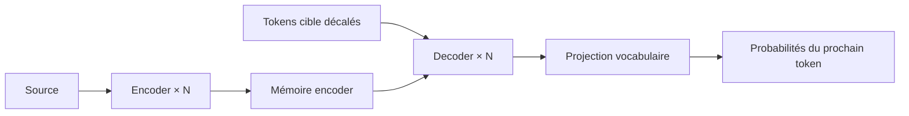
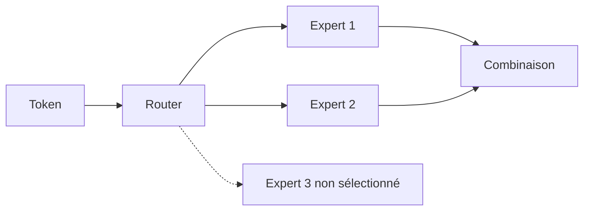

# Cours Master — Comprendre les Transformers

## Objectifs

À la fin de ce cours, nous devons être capables de :

- expliquer pourquoi le Transformer de 2017 a constitué une rupture par rapport aux RNN ;
- dériver la formule de la **scaled dot-product attention** ;
- suivre précisément les dimensions des tenseurs `Q`, `K`, `V` ;
- distinguer self-attention, cross-attention et attention causale ;
- comprendre Multi-Head Attention, MQA et GQA ;
- expliquer les principaux mécanismes de position, notamment **RoPE** ;
- reconstruire un bloc Transformer moderne ;
- distinguer encoder-only, decoder-only et encoder-decoder ;
- comprendre la différence entre **entraînement**, **prefill** et **decode** ;
- expliquer le rôle et le coût du **KV cache** ;
- comprendre ce que FlashAttention accélère réellement ;
- expliquer les modèles Mixture-of-Experts ;
- raisonner sur le contexte long, la mémoire et la complexité ;
- implémenter un petit Transformer en PyTorch ;
- diagnostiquer ses performances et ses erreurs ;
- replacer le Transformer dans l'écosystème moderne sans confondre architecture, LLM, RAG et agent.

Pour les systèmes LLM complets, voir aussi :

- [[LLM]] ;
- [[RAG]] ;
- [[Pytorch]] ;
- [[Les CNN et RNN]].

---

# 1. Pourquoi les Transformers ?

## 1.1. Le problème des séquences

Une séquence est une suite ordonnée d'éléments :

- tokens de texte ;
- caractères ;
- événements ;
- échantillons audio ;
- patches d'image ;
- frames vidéo ;
- symboles musicaux ;
- éléments d'une série temporelle.

L'ordre est essentiel :

```text
Le chien mord l'homme.
L'homme mord le chien.
```

contiennent presque les mêmes tokens, mais pas la même relation.

## 1.2. La solution récurrente

Les RNN, LSTM et GRU traitent naturellement la séquence de façon récurrente :

$$
h_t = f(x_t, h_{t-1})
$$

Ils possèdent des qualités importantes, mais la dépendance séquentielle entre $h_{t-1}$ et $h_t$ limite la parallélisation pendant l'entraînement.

Voir [[Les CNN et RNN]] pour le détail.

## 1.3. Seq2Seq et attention avant le Transformer

L'attention n'a pas été inventée avec le Transformer.

Dans les architectures encoder-decoder récurrentes, l'attention permettait déjà au decoder de consulter plusieurs états de l'encoder au lieu de dépendre d'un unique vecteur de contexte.

La rupture de **Vaswani et al., 2017** est différente :

> construire l'architecture de transduction autour de l'attention, sans récurrence ni convolution comme mécanisme principal de mélange de la séquence.

## 1.4. Ce que gagne le Transformer

Le Transformer apporte notamment :

- une forte parallélisation pendant l'entraînement ;
- un chemin court entre deux positions éloignées ;
- des représentations contextualisées ;
- une architecture modulaire et empilable ;
- une excellente compatibilité avec les accélérateurs matriciels.

## 1.5. Ce qu'il ne résout pas gratuitement

Le Transformer introduit aussi des coûts :

- attention dense en $O(L^2)$ par rapport à la longueur $L$ ;
- mémoire importante ;
- besoin d'encoder la position ;
- coût du KV cache en génération autoregressive ;
- besoin de grandes quantités de données et de calcul à grande échelle ;
- difficulté d'interprétation ;
- aucune garantie intrinsèque de vérité ou de raisonnement correct.

---

# 2. Tokens, embeddings et formes de tenseurs

## 2.1. Des symboles aux identifiants

Un Transformer ne reçoit pas directement des mots. Un tokenizer transforme une entrée en **tokens**, puis en identifiants entiers :

```text
texte
  ↓
tokenizer
  ↓
IDs de tokens
  ↓
embedding
  ↓
vecteurs
```

La tokenisation peut travailler avec :

- mots ;
- caractères ;
- sous-mots ;
- bytes ou unités proches du byte.

La tokenisation est un choix de représentation, pas une propriété du Transformer lui-même.

## 2.2. Embedding

Une table d'embedding associe à chaque token $i$ un vecteur :

$$
E[i] \in \mathbb{R}^{d_{model}}
$$

Pour un batch de $B$ séquences de longueur $L$ :

$$
X \in \mathbb{R}^{B \times L \times d_{model}}
$$

## 2.3. Dimensions à maîtriser

Notation utilisée dans ce cours :

| Symbole | Signification |
|---|---|
| $B$ | taille du batch |
| $L$ | longueur de la séquence requête |
| $S$ | longueur de la séquence clé/valeur |
| $d_{model}$ | dimension du modèle |
| $H_q$ | nombre de têtes de requêtes |
| $H_{kv}$ | nombre de têtes clés/valeurs |
| $d_h$ | dimension par tête |
| $d_{ff}$ | dimension interne du feed-forward |

Pour une MHA classique :

$$
d_{model} = H \times d_h
$$

Cette comptabilité des dimensions est essentielle pour déboguer une implémentation.

## 2.4. Padding et masque

Dans un batch dense, les séquences courtes sont souvent complétées par du padding.

Exemple :

```text
[A B C D]
[E F PAD PAD]
[G H I PAD]
```

Le modèle ne doit pas attribuer d'attention utile aux positions `PAD`.

Il faut distinguer :

- le **padding mask** ;
- le **causal mask** ;
- d'éventuels masques structurels ou locaux.

---

# 3. Self-attention : intuition

## 3.1. Contextualiser un token

Un embedding initial dépend uniquement de l'identité du token.

La self-attention construit une représentation qui dépend des autres positions.

Dans :

```text
La banque est fermée.
La banque de sable disparaît.
```

le token `banque` doit être contextualisé différemment.

## 3.2. Query, Key, Value

Pour chaque représentation d'entrée, le modèle calcule trois projections :

$$
Q = XW_Q
$$

$$
K = XW_K
$$

$$
V = XW_V
$$

Intuition :

- **Query** : ce que cette position cherche ;
- **Key** : ce que cette position annonce comme information adressable ;
- **Value** : l'information qui sera effectivement agrégée.

Ce ne sont pas des objets symboliques explicitement nommés par le modèle : ce sont des vecteurs appris.

## 3.3. Compatibilité

La compatibilité entre une requête $q_i$ et une clé $k_j$ est mesurée par un produit scalaire :

$$
q_i \cdot k_j
$$

Pour toutes les positions à la fois :

$$
QK^T
$$

La cellule $(i,j)$ indique à quel point la requête de la position $i$ est compatible avec la clé de la position $j$.

---

# 4. Scaled Dot-Product Attention

## 4.1. Formule

La formule canonique est :

$$
\mathrm{Attention}(Q,K,V)
=
\mathrm{softmax}\left(\frac{QK^T}{\sqrt{d_k}} + M\right)V
$$

où $M$ représente éventuellement un masque ou biais.

## 4.2. Pourquoi diviser par $\sqrt{d_k}$ ?

Lorsque $d_k$ augmente, la variance du produit scalaire tend à augmenter.

Des logits trop grands font saturer le softmax :

- distribution très pointue ;
- gradients moins favorables ;
- entraînement moins stable.

Le facteur :

$$
\frac{1}{\sqrt{d_k}}
$$

maintient les scores dans une échelle plus raisonnable.

## 4.3. Softmax

Pour une ligne de scores $z$ :

$$
\mathrm{softmax}(z_i)=\frac{e^{z_i}}{\sum_j e^{z_j}}
$$

Les poids obtenus sont positifs et leur somme vaut 1.

La sortie d'une position est donc une combinaison pondérée des values.

## 4.4. Stabilité numérique

On ne calcule normalement pas naïvement :

```python
exp = torch.exp(scores)
weights = exp / exp.sum(dim=-1, keepdim=True)
```

Les bibliothèques utilisent des implémentations stables qui tiennent compte du maximum des logits et, sur GPU, de kernels fusionnés.

## 4.5. Implémentation pédagogique

```python
import math
import torch


def attention_naive(q, k, v, mask=None):
    scores = q @ k.transpose(-2, -1)
    scores = scores / math.sqrt(q.size(-1))

    if mask is not None:
        scores = scores.masked_fill(~mask, float("-inf"))

    weights = torch.softmax(scores, dim=-1)
    return weights @ v
```

Cette version est utile pour comprendre les mathématiques, pas pour obtenir les meilleures performances en production.

## 4.6. API PyTorch moderne

Avec PyTorch moderne :

```python
import torch.nn.functional as F

out = F.scaled_dot_product_attention(
    q,
    k,
    v,
    is_causal=True,
)
```

`scaled_dot_product_attention()` peut sélectionner des kernels fusionnés adaptés au matériel et aux formes utilisées.

---

# 5. Masques et causalité

## 5.1. Attention bidirectionnelle

Un encoder peut permettre à chaque position de consulter l'ensemble de l'entrée :

```text
A ↔ B ↔ C ↔ D
```

C'est adapté à la compréhension d'une séquence complète.

## 5.2. Attention causale

Un decoder autoregressif ne doit pas voir les tokens futurs pendant la prédiction du token courant.

Pour quatre positions :

```text
       K1 K2 K3 K4
Q1      ✓  ×  ×  ×
Q2      ✓  ✓  ×  ×
Q3      ✓  ✓  ✓  ×
Q4      ✓  ✓  ✓  ✓
```

Le masque causal est triangulaire inférieur.

## 5.3. Causalité et ordre ne sont pas synonymes

- le mécanisme de position indique **où** se trouve un token ;
- le masque causal indique **quelles positions sont accessibles**.

Un decoder a besoin des deux concepts.

## 5.4. Attention cross

Dans une architecture encoder-decoder :

- les queries viennent du decoder ;
- les keys et values viennent de l'encoder.

C'est la **cross-attention**.

---

# 6. Multi-Head Attention

## 6.1. Pourquoi plusieurs têtes ?

Une seule attention produit un type de projection relationnelle.

Multi-Head Attention projette l'espace dans plusieurs sous-espaces :

$$
head_i = Attention(QW_i^Q, KW_i^K, VW_i^V)
$$

puis :

$$
MHA(Q,K,V)=Concat(head_1,...,head_H)W_O
$$

## 6.2. Formes

Pour :

```text
B = 8
L = 512
d_model = 1024
H = 16
d_h = 64
```

on transforme typiquement :

```text
[B, L, 1024]
      ↓
[B, L, 16, 64]
      ↓ transpose
[B, 16, L, 64]
```

## 6.3. Ce qu'une tête représente

Il est tentant de dire :

> cette tête détecte la syntaxe, celle-ci les pronoms, etc.

Cela peut parfois être observé, mais ce n'est ni garanti ni stable.

Une tête est une composante computationnelle apprise, pas une règle symbolique explicitement assignée.

---

# 7. MHA, MQA et GQA

## 7.1. Multi-Head Attention classique

En MHA :

```text
Hq = Hkv = H
```

Chaque tête de query possède ses propres têtes key/value.

## 7.2. Multi-Query Attention

En MQA :

```text
Hq > 1
Hkv = 1
```

Toutes les têtes de query partagent une seule paire de têtes K/V.

Avantage principal : réduire le coût mémoire et la bande passante du KV cache pendant la génération.

## 7.3. Grouped-Query Attention

GQA est intermédiaire :

```text
1 < Hkv < Hq
```

Plusieurs têtes de queries partagent une tête K/V.

Exemple :

```text
Hq  = 32
Hkv = 8
```

Chaque tête K/V dessert un groupe de quatre têtes de query.

GQA recherche un compromis entre qualité de MHA et efficacité de MQA.

## 7.4. PyTorch

PyTorch expose aujourd'hui GQA dans SDPA :

```python
out = F.scaled_dot_product_attention(
    q,
    k,
    v,
    is_causal=True,
    enable_gqa=True,
)
```

Il faut respecter les contraintes de dimensions/têtes de l'API.

---

# 8. Position dans les Transformers

## 8.1. Pourquoi faut-il une information de position ?

Sans mécanisme de position, la self-attention ne sait pas naturellement différencier certaines permutations des mêmes éléments.

Il faut donc introduire une information sur l'ordre ou la distance.

## 8.2. Encodage sinusoïdal original

Le Transformer de 2017 utilise :

$$
PE(pos,2i)=\sin\left(pos/10000^{2i/d_{model}}\right)
$$

$$
PE(pos,2i+1)=\cos\left(pos/10000^{2i/d_{model}}\right)
$$

puis :

$$
X' = X + PE
$$

## 8.3. Embeddings positionnels appris

On peut aussi apprendre directement :

$$
P \in \mathbb{R}^{L_{max}\times d_{model}}
$$

Ils sont simples, mais leur extrapolation au-delà de la longueur apprise n'est pas intrinsèque.

## 8.4. Positions relatives

Une autre famille encode davantage la relation :

$$
i-j
$$

plutôt que seulement la position absolue $i$ ou $j$.

## 8.5. RoPE

**Rotary Position Embedding** applique une rotation dépendant de la position aux composantes des queries et keys.

L'idée importante est que le produit scalaire entre deux vecteurs transformés incorpore naturellement une information de position relative.

Schématiquement :

$$
q'_i = R_i q_i
$$

$$
k'_j = R_j k_j
$$

puis :

$$
q_i'^T k_j'
$$

dépend de la relation entre $i$ et $j$.

RoPE est très utilisé dans les LLM decoder-only modernes.

## 8.6. ALiBi

ALiBi ajoute un biais lié à la distance directement dans les scores d'attention.

Cette stratégie évite d'ajouter un embedding positionnel aux représentations.

## 8.7. Extrapolation de contexte

Étendre artificiellement une fenêtre de contexte n'est pas gratuit.

Les stratégies de scaling/interpolation de RoPE peuvent aider, mais :

- la qualité doit être mesurée ;
- la longueur déclarée par une configuration n'est pas une garantie d'utilisation efficace de tout le contexte ;
- un modèle peut accepter une longue entrée tout en ayant une capacité de récupération imparfaite à grande distance.

---

# 9. Le bloc Transformer moderne

## 9.1. Deux sous-couches principales

Un bloc dense classique contient :

1. attention ;
2. réseau feed-forward token-wise.

Autour de ces sous-couches :

- normalisation ;
- connexions résiduelles ;
- dropout éventuel.

## 9.2. Connexion résiduelle

Une connexion résiduelle prend la forme :

$$
y = x + F(x)
$$

Elle facilite la circulation de l'information et du gradient dans les architectures profondes.

## 9.3. LayerNorm et RMSNorm

Le Transformer original utilise LayerNorm.

De nombreux modèles modernes utilisent **RMSNorm**, qui normalise principalement via la moyenne quadratique sans recentrage complet.

L'objectif général est la stabilité numérique et l'optimisation de réseaux très profonds.

## 9.4. Post-Norm et Pre-Norm

Schéma historique post-norm :

```text
x
 ↓
Sublayer
 ↓
+ residual
 ↓
Norm
```

Schéma pre-norm courant :

```text
x ───────────────┐
 ↓               │
Norm             │
 ↓               │
Sublayer         │
 ↓               │
+ ←──────────────┘
```

Pre-norm est souvent plus facile à entraîner à grande profondeur.

## 9.5. Feed-Forward Network

Le FFN s'applique indépendamment à chaque position :

$$
FFN(x)=\sigma(xW_1+b_1)W_2+b_2
$$

La communication entre tokens a lieu dans l'attention ; le FFN transforme chaque représentation localement.

## 9.6. GELU et variantes gated

Le Transformer original utilisait ReLU.

Des architectures modernes utilisent souvent :

- GELU ;
- GEGLU ;
- SwiGLU.

Une forme simplifiée de SwiGLU :

$$
SwiGLU(x)=Swish(xW_a)\odot(xW_b)
$$

suivie d'une projection de sortie.

---

# 10. Le Transformer original encoder-decoder

## 10.1. Architecture générale


```mermaid
flowchart LR
    S["Source"] --> E["Encoder × N"]
    E --> M["Mémoire encoder"]
    T["Tokens cible décalés"] --> D["Decoder × N"]
    M --> D
    D --> P["Projection vocabulaire"]
    P --> O["Probabilités du prochain token"]
```

## 10.2. Encoder

Chaque bloc encoder contient essentiellement :

1. self-attention bidirectionnelle ;
2. FFN.

## 10.3. Decoder

Chaque bloc decoder original contient :

1. masked self-attention ;
2. cross-attention vers l'encoder ;
3. FFN.

## 10.4. Teacher forcing

Pendant l'entraînement, le decoder peut recevoir les vrais tokens précédents de la cible décalée.

On calcule la prédiction de toutes les positions en parallèle grâce au masque causal.

C'est différent de l'inférence autoregressive, où les nouveaux tokens sont générés successivement.

---

# 11. Les trois grandes familles

## 11.1. Encoder-only

Exemple historique : BERT.

Caractéristiques :

- contexte bidirectionnel ;
- représentation de l'entrée ;
- adapté à classification, extraction, embeddings, compréhension.

## 11.2. Decoder-only

Exemples historiques : famille GPT et nombreux LLM génératifs.

Caractéristiques :

- masque causal ;
- prédiction autoregressive ;
- génération naturelle ;
- possibilité d'apprendre de nombreuses tâches par prompting ou post-entraînement.

## 11.3. Encoder-decoder

Exemples : T5, BART et modèles de traduction.

Caractéristiques :

- encode une entrée ;
- génère une sortie ;
- cross-attention explicite.

## 11.4. Aucun choix n'est universel

Le bon type dépend du problème :

| Besoin | Architecture souvent naturelle |
|---|---|
| représentation d'un document | encoder-only |
| génération libre/code/chat | decoder-only |
| traduction structurée entrée→sortie | encoder-decoder |

Ce tableau est une heuristique, pas une règle absolue.

---

# 12. Objectifs d'entraînement

## 12.1. Causal Language Modeling

Pour une séquence :

$$
x_1,x_2,...,x_T
$$

on factorise :

$$
p(x_{1:T})=\prod_{t=1}^{T}p(x_t\mid x_{<t})
$$

C'est l'objectif naturel des decoder-only autoregressifs.

## 12.2. Masked Language Modeling

On masque certaines positions puis on demande au modèle de les reconstruire.

C'est le principe historique de BERT.

## 12.3. Denoising et span corruption

Une architecture encoder-decoder peut apprendre à reconstruire un texte à partir d'une version corrompue.

T5 utilise notamment une corruption par spans.

## 12.4. Préentraînement et post-entraînement

Il faut distinguer :

- apprentissage de représentations/connaissances par préentraînement ;
- adaptation supervisée ;
- preference optimization/RL ;
- spécialisation par fine-tuning.

Pour les détails LLM, voir [[LLM]].

---

# 13. Projection vocabulaire et loss

## 13.1. Logits

La représentation finale d'un token est projetée vers le vocabulaire :

$$
z = hW_{vocab} + b
$$

avec :

$$
z \in \mathbb{R}^{|V|}
$$

## 13.2. Cross-entropy

Pour un token cible $y$ :

$$
\mathcal{L}=-\log p(y)
$$

La loss globale est généralement agrégée sur les tokens non masqués.

## 13.3. Weight tying

Certaines architectures partagent les poids entre :

- embedding d'entrée ;
- projection de sortie.

Cela réduit le nombre de paramètres et lie les deux espaces.

## 13.4. Perplexité

Une perplexité peut être dérivée de la cross-entropy :

$$
PPL=e^{\mathcal{L}}
$$

Elle est utile pour comparer des modèles/objectifs compatibles, mais ne résume pas toutes les capacités d'un LLM.

---

# 14. Optimisation et stabilité

## 14.1. AdamW

AdamW est très utilisé pour entraîner des Transformers.

Il sépare le weight decay de la mise à jour adaptative d'Adam.

## 14.2. Warmup et scheduler

Au début de l'entraînement, un learning rate trop élevé peut déstabiliser le réseau.

Un schéma fréquent :

```text
warmup → pic → décroissance
```

## 14.3. Mixed precision

Selon le matériel :

- FP32 ;
- BF16 ;
- FP16 ;
- formats plus faibles dans certaines parties.

Le choix dépend du matériel, des kernels et de la stabilité souhaitée.

## 14.4. Gradient clipping

Il peut être utile pour contrôler des gradients trop grands :

```python
import torch

torch.nn.utils.clip_grad_norm_(model.parameters(), max_norm=1.0)
```

## 14.5. Gradient checkpointing

Le checkpointing d'activations réduit la mémoire en recalculant certaines activations lors du backward.

Compromis :

```text
moins de mémoire ↔ plus de calcul
```

## 14.6. Distribué

À grande échelle, on combine éventuellement :

- data parallelism ;
- tensor parallelism ;
- pipeline parallelism ;
- expert parallelism pour MoE ;
- sharding de paramètres/optimiseur.

Ce sont des stratégies de système distribué, pas des propriétés mathématiques du Transformer.

---

# 15. Entraînement vs inférence

## 15.1. L'erreur classique

Un decoder-only est entraîné causalement, mais l'entraînement peut calculer les logits de nombreux tokens en parallèle.

L'inférence autoregressive, elle, doit produire :

```text
token 1
  ↓
token 2
  ↓
token 3
  ↓
...
```

## 15.2. Prefill

Le **prefill** traite le prompt/contexte initial.

Cette phase exploite de grandes opérations matricielles sur de nombreux tokens.

## 15.3. Decode

Le **decode** ajoute généralement un token à la fois par séquence.

Le profil de calcul change :

- moins de parallélisme sur l'axe séquence ;
- importance accrue de la bande passante mémoire ;
- KV cache déterminant.

## 15.4. Time to First Token et débit

Deux métriques distinctes :

- **TTFT** : temps avant le premier token ;
- débit de décodage : tokens/s après le prefill.

Optimiser l'une n'optimise pas automatiquement l'autre.

---

# 16. KV cache

## 16.1. Pourquoi un cache ?

À chaque nouveau token, les keys et values des tokens précédents ne changent pas.

Sans cache, on recalculerait inutilement leurs projections à chaque étape.

Le KV cache mémorise donc les tenseurs K/V déjà calculés.

## 16.2. Ce qui est mis en cache

Pour chaque couche d'attention autoregressive, on stocke typiquement :

```text
K précédents
V précédents
```

Pas les queries : la nouvelle query est calculée pour le token courant.

## 16.3. Ordre de grandeur mémoire

Schématiquement :

$$
M_{KV}
\approx
2 \times N_{layers} \times L \times H_{kv} \times d_h \times bytes
$$

Le facteur 2 correspond à K et V.

Cela explique pourquoi MQA/GQA sont importants pour l'inférence.

## 16.4. Exemple

Si :

```text
layers = 32
L = 8192
Hkv = 8
dh = 128
BF16 = 2 octets
```

alors le cache est déjà volumineux par séquence, avant même de tenir compte du batching et d'autres allocations.

## 16.5. Caches modernes

Les frameworks exposent plusieurs stratégies :

- cache dynamique ;
- cache statique préalloué ;
- cache offloadé CPU ;
- cache quantifié ;
- sliding-window cache ;
- prefix/prompt caching.

Le meilleur cache dépend du compromis latence, mémoire, compilation et longueur de contexte.

---

# 17. Décodage autoregressif

## 17.1. Greedy decoding

On choisit :

$$
\arg\max_i p_i
$$

Déterministe, rapide, mais parfois pauvre pour la génération ouverte.

## 17.2. Température

On transforme les logits :

$$
z'_i = \frac{z_i}{T}
$$

- $T<1$ : distribution plus pointue ;
- $T>1$ : plus de diversité.

## 17.3. Top-k

On échantillonne seulement parmi les $k$ tokens les plus probables.

## 17.4. Top-p

On conserve le plus petit ensemble de tokens dont la masse cumulée dépasse $p$.

## 17.5. Beam search

Beam search maintient plusieurs hypothèses.

Il reste utile pour certaines tâches structurées, notamment traduction, mais n'est pas automatiquement le meilleur choix pour du chat ouvert.

## 17.6. La qualité ne vient pas seulement du sampler

Une sortie médiocre peut provenir :

- du modèle ;
- du prompt ;
- du contexte ;
- d'un mauvais post-entraînement ;
- d'un sampler inadéquat ;
- de contraintes de génération ;
- d'un problème de données.

---

# 18. Complexité de l'attention

## 18.1. Matrice d'attention

Pour une séquence de longueur $L$, la matrice :

$$
QK^T
$$

a une taille :

$$
L\times L
$$

La self-attention dense possède donc un terme quadratique en longueur de séquence.

## 18.2. Attention vs FFN

Dire :

> le Transformer coûte toujours $O(L^2)$

est incomplet.

Le coût total dépend aussi fortement :

- de $d_{model}$ ;
- du FFN ;
- du nombre de couches ;
- du batch ;
- de la précision ;
- du matériel.

Pour certaines tailles de modèles et séquences courtes, les projections/FFN dominent.

Pour les contextes très longs, l'attention devient beaucoup plus problématique.

## 18.3. Complexité théorique vs mémoire réelle

Une implémentation naïve matérialise de gros tenseurs intermédiaires.

Un algorithme comme FlashAttention peut calculer **la même attention exacte** tout en évitant de matérialiser l'intégralité de certains intermédiaires en mémoire HBM.

C'est une optimisation d'algorithme/mouvement mémoire, pas une nouvelle définition mathématique de l'attention.

---

# 19. FlashAttention et SDPA

## 19.1. Le problème des accès mémoire

Sur GPU, la performance ne dépend pas seulement des FLOPs.

Les transferts entre :

- HBM ;
- SRAM/on-chip memory ;
- registres

peuvent devenir le goulot d'étranglement.

## 19.2. Idée FlashAttention

FlashAttention découpe le calcul en blocs et réorganise le traitement pour réduire les lectures/écritures coûteuses.

Propriété essentielle :

> FlashAttention est une attention exacte, à l'arrondi flottant près ; ce n'est pas une approximation sparse de la formule standard.

## 19.3. PyTorch SDPA

En pratique, utiliser :

```python
F.scaled_dot_product_attention(...)
```

permet au framework de sélectionner un backend approprié lorsqu'il est disponible.

On peut inspecter/contraindre les backends avec `torch.nn.attention`.

## 19.4. FlexAttention

PyTorch propose aussi **FlexAttention** pour exprimer des modifications structurées des scores/masques tout en visant des kernels performants.

C'est utile lorsqu'un simple causal mask n'est pas suffisant.

## 19.5. Ne pas coder une attention naïve par réflexe

L'implémentation pédagogique :

```python
softmax(q @ k.T) @ v
```

est parfaite pour apprendre.

Pour un système réel, privilégier les primitives optimisées du framework, puis profiler.

---

# 20. Attention locale, sliding window et contexte long

## 20.1. Pourquoi limiter l'attention ?

Une attention globale de longueur $L$ compare toutes les paires de positions.

Pour des séquences très longues, on peut restreindre la structure.

## 20.2. Sliding-window attention

Chaque token consulte seulement une fenêtre locale.

```text
... [i-w ... i ... i+w] ...
```

Le coût dépend alors de la fenêtre plutôt que de toute la séquence.

## 20.3. Chunked attention

Le contexte peut être divisé en blocs avec une politique d'interaction définie entre blocs.

## 20.4. Global + local

Certaines architectures combinent :

- attention locale ;
- quelques tokens globaux ;
- mémoire externe ;
- mécanismes de retrieval.

## 20.5. Long contexte ≠ mémoire parfaite

Une fenêtre de 1 million de tokens ne signifie pas :

> le modèle exploite parfaitement chaque token de cette fenêtre.

Il faut mesurer :

- retrieval à différentes positions ;
- interférences ;
- qualité sur documents multiples ;
- latence ;
- mémoire ;
- coût.

Pour une base documentaire évolutive, [[RAG]] peut être plus pertinent que simplement augmenter le prompt.

---

# 21. Mixture of Experts

## 21.1. Dense vs sparse

Dans un FFN dense, tous les paramètres du FFN participent à chaque token.

Un **Mixture of Experts (MoE)** contient plusieurs experts, mais un routeur n'en active qu'une partie pour chaque token.


```mermaid
flowchart LR
    T["Token"] --> R["Router"]
    R --> E1["Expert 1"]
    R --> E2["Expert 2"]
    R -.-> E3["Expert 3 non sélectionné"]
    E1 --> O["Combinaison"]
    E2 --> O
```

## 21.2. Pourquoi ?

Objectif : augmenter la capacité paramétrique sans activer tous les paramètres pour chaque token.

## 21.3. Difficultés

MoE ajoute :

- routage ;
- équilibrage de charge ;
- communication all-to-all en distribué ;
- capacité par expert ;
- risque d'experts sous-utilisés ;
- complexité de déploiement.

## 21.4. Paramètres totaux vs paramètres actifs

Pour un MoE, annoncer uniquement :

```text
nombre total de paramètres
```

peut être trompeur.

Il faut aussi connaître :

```text
paramètres actifs par token
```

et les coûts de communication/mémoire.

---

# 22. Transformers pour plusieurs modalités

## 22.1. Vision Transformer

Un ViT découpe l'image en patches :

```text
image
  ↓
patches
  ↓
projection en tokens
  ↓
Transformer
```

Le Transformer ne « sait » pas intrinsèquement qu'une entrée est une image : il reçoit des représentations de tokens/patches avec une structure positionnelle.

## 22.2. Audio

L'audio peut être transformé en :

- frames ;
- spectrogrammes ;
- tokens acoustiques ;
- représentations latentes.

## 22.3. Vidéo

Une vidéo combine dimensions spatiale et temporelle.

Le coût d'une attention globale peut rapidement devenir énorme.

## 22.4. Multimodal

Une architecture multimodale peut combiner :

- encodeurs spécialisés ;
- projections vers un espace commun ;
- cross-attention ;
- tokens multimodaux ;
- decoder autoregressif commun.

Il n'existe pas une unique architecture « Transformer multimodal ».

---

# 23. Fine-tuning et adaptation

## 23.1. Full fine-tuning

On modifie tous les paramètres.

Avantages : flexibilité maximale.

Coûts : mémoire, calcul, stockage des checkpoints.

## 23.2. PEFT

Les méthodes Parameter-Efficient Fine-Tuning modifient seulement une petite partie de la paramétrisation.

Exemple : LoRA.

## 23.3. LoRA

On approxime une mise à jour par deux matrices de faible rang :

$$
\Delta W = BA
$$

avec rang $r$ petit.

## 23.4. QLoRA

QLoRA combine typiquement :

- modèle de base quantifié ;
- adapters LoRA entraînables.

Le but est de réduire fortement la mémoire d'adaptation.

Pour l'ensemble du post-entraînement LLM, voir [[LLM]].

---

# 24. Quantification

## 24.1. Pourquoi quantifier ?

Réduire la précision de certains poids/activations/cache permet de réduire :

- mémoire ;
- bande passante ;
- parfois latence.

## 24.2. Ne pas confondre trois choses

On peut quantifier :

1. les **poids** ;
2. les **activations** ;
3. le **KV cache**.

Ce sont trois problèmes différents.

## 24.3. Compromis

Une quantification plus agressive peut :

- dégrader la qualité ;
- nécessiter des kernels particuliers ;
- ne pas améliorer la latence sur un matériel donné.

Toujours mesurer sur le hardware cible.

---

# 25. Implémentation PyTorch moderne

## 25.1. Attention causale compacte

```python
import torch
from torch import nn
from torch.nn import functional as F


class CausalSelfAttention(nn.Module):
    def __init__(self, d_model: int, n_heads: int, dropout: float = 0.0):
        super().__init__()
        if d_model % n_heads != 0:
            raise ValueError("d_model doit être divisible par n_heads")

        self.n_heads = n_heads
        self.head_dim = d_model // n_heads
        self.dropout = dropout
        self.qkv = nn.Linear(d_model, 3 * d_model, bias=False)
        self.out = nn.Linear(d_model, d_model, bias=False)

    def forward(self, x: torch.Tensor) -> torch.Tensor:
        batch, length, d_model = x.shape

        q, k, v = self.qkv(x).chunk(3, dim=-1)

        def split_heads(t: torch.Tensor) -> torch.Tensor:
            return t.view(batch, length, self.n_heads, self.head_dim).transpose(1, 2)

        q = split_heads(q)
        k = split_heads(k)
        v = split_heads(v)

        y = F.scaled_dot_product_attention(
            q,
            k,
            v,
            dropout_p=self.dropout if self.training else 0.0,
            is_causal=True,
        )

        y = y.transpose(1, 2).contiguous().view(batch, length, d_model)
        return self.out(y)
```

## 25.2. FFN SwiGLU simplifié

```python
class SwiGLU(nn.Module):
    def __init__(self, d_model: int, d_hidden: int):
        super().__init__()
        self.gate = nn.Linear(d_model, d_hidden, bias=False)
        self.up = nn.Linear(d_model, d_hidden, bias=False)
        self.down = nn.Linear(d_hidden, d_model, bias=False)

    def forward(self, x: torch.Tensor) -> torch.Tensor:
        return self.down(F.silu(self.gate(x)) * self.up(x))
```

## 25.3. Bloc pre-norm

```python
class TransformerBlock(nn.Module):
    def __init__(self, d_model: int, n_heads: int, d_hidden: int):
        super().__init__()
        self.norm1 = nn.RMSNorm(d_model)
        self.attn = CausalSelfAttention(d_model, n_heads)
        self.norm2 = nn.RMSNorm(d_model)
        self.ffn = SwiGLU(d_model, d_hidden)

    def forward(self, x: torch.Tensor) -> torch.Tensor:
        x = x + self.attn(self.norm1(x))
        x = x + self.ffn(self.norm2(x))
        return x
```

Cette version ne contient volontairement pas :

- RoPE ;
- KV cache ;
- GQA ;
- tensor parallelism ;
- dropout détaillé ;
- optimisations de serving.

Elle sert de squelette pédagogique.

---

# 26. Déboguer les dimensions

## 26.1. Méthode

Avant toute implémentation, écrire les shapes.

Exemple :

```text
x       [B, L, D]
q       [B, Hq, L, Dh]
k       [B, Hkv, S, Dh]
v       [B, Hkv, S, Dh]
scores  [B, Hq, L, S]
out     [B, Hq, L, Dh]
```

## 26.2. Assertions

```python
def check_input(x: torch.Tensor, d_model: int) -> None:
    assert x.ndim == 3
    assert x.shape[-1] == d_model
```

## 26.3. Erreurs fréquentes

- transposer `L` et `H` ;
- oublier `.contiguous()` avant certains `view()` ;
- mauvais broadcasting du masque ;
- masque booléen inversé ;
- appliquer dropout en mode eval ;
- dimensions GQA incompatibles ;
- mauvais décalage des labels ;
- calculer la loss sur le padding.

---

# 27. Performance moderne avec PyTorch

## 27.1. Commencer par les primitives natives

Avant d'installer un kernel tiers :

1. utiliser `scaled_dot_product_attention` ;
2. utiliser `torch.compile()` si pertinent ;
3. profiler ;
4. seulement ensuite considérer une optimisation spécifique.

## 27.2. `torch.compile()`

`torch.compile()` peut réduire l'overhead Python/framework et fusionner certaines opérations.

Il ne transforme pas magiquement un mauvais algorithme en bon algorithme.

## 27.3. Nested Tensors

Pour des batches de longueurs très variables, les Nested Tensors peuvent éviter une partie du padding inutile selon les opérateurs et chemins supportés.

## 27.4. Profiler

Mesurer :

- temps GPU ;
- allocations ;
- synchronisations CPU/GPU ;
- kernels dominants ;
- utilisation mémoire ;
- taille des batchs ;
- TTFT ;
- tokens/s.

Voir [[Pytorch]] pour l'outillage de profiling.

---

# 28. Contexte long : conception système

## 28.1. Trois problèmes différents

Il faut distinguer :

1. **accepter** une longue séquence ;
2. la traiter avec une mémoire/latence raisonnable ;
3. réellement **utiliser correctement** une information éloignée.

Les trois ne sont pas équivalents.

## 28.2. Stratégies

- RoPE scaling/interpolation ;
- sliding-window ;
- chunking ;
- sparse attention ;
- compression de mémoire ;
- retrieval ;
- cache de préfixes ;
- architectures hybrides.

## 28.3. Mesures

Tester :

- position du fait pertinent ;
- nombre de documents distracteurs ;
- longueur absolue ;
- précision du retrieval ;
- latence prefill ;
- consommation KV ;
- débit avec plusieurs requêtes.

---

# 29. Alternatives et architectures hybrides

## 29.1. Le Transformer n'est pas la seule architecture séquentielle

Les recherches modernes explorent également :

- State Space Models ;
- convolutions longues ;
- RNN modernisés ;
- architectures hybrides attention + récurrence/SSM ;
- mémoires externes.

## 29.2. Pourquoi garder l'attention ?

L'attention possède une propriété extrêmement utile :

> fournir une interaction directe, conditionnée par le contenu, entre positions.

## 29.3. Pourquoi l'hybrider ?

Pour réduire :

- coût quadratique ;
- KV cache ;
- latence sur longues séquences.

L'objectif n'est pas forcément de « tuer le Transformer », mais de choisir le meilleur opérateur selon la tâche et le matériel.

---

# 30. Interprétabilité

## 30.1. Les poids d'attention ne sont pas une explication complète

Une carte d'attention peut être informative, mais :

- plusieurs couches interagissent ;
- les résidus transportent de l'information ;
- le FFN transforme les représentations ;
- une forte attention ne signifie pas automatiquement forte importance causale.

## 30.2. Outils d'analyse

On peut étudier :

- activations ;
- attention patterns ;
- probes ;
- ablations ;
- activation patching ;
- attribution ;
- interventions causales.

## 30.3. Corrélation vs causalité

Observer une activation corrélée à un concept ne prouve pas qu'elle est causalement nécessaire au comportement.

---

# 31. Limites et risques

## 31.1. Hallucination

Un Transformer de langage optimise une distribution sur des tokens ; il ne possède pas une garantie de vérité intégrée.

## 31.2. Biais

Les données, objectifs et processus de sélection peuvent introduire ou amplifier des biais.

## 31.3. Prompt injection

Dès qu'un LLM traite du contenu externe et possède des outils, le texte reçu peut tenter d'influencer son comportement.

Ce problème relève du **système agentique**, pas uniquement de l'architecture Transformer.

## 31.4. Fuite de données

Risques :

- secrets dans prompts ;
- logs ;
- caches ;
- traces ;
- datasets ;
- checkpoints ;
- outils externes.

## 31.5. Coût énergétique et matériel

Il faut mesurer l'ensemble du cycle :

- entraînement ;
- inférence ;
- stockage ;
- réseau ;
- fabrication/renouvellement du matériel.

---

# 32. Ce qu'un Transformer n'est pas

## 32.1. Transformer ≠ LLM

Un Transformer est une architecture.

Un LLM est un modèle de langage à grande échelle pouvant utiliser une architecture Transformer ou hybride.

## 32.2. LLM ≠ RAG

Le RAG ajoute un mécanisme de récupération externe autour du modèle.

Voir [[RAG]].

## 32.3. LLM ≠ agent

Un agent ajoute typiquement :

- boucle de décision ;
- outils ;
- état ;
- permissions ;
- orchestration ;
- environnement d'exécution.

## 32.4. Attention ≠ mémoire persistante

Les mécanismes d'attention travaillent sur les représentations disponibles dans le contexte/caches du modèle.

Ils ne constituent pas une base de données persistante.

---

# 33. Choisir une architecture

## 33.1. Questions à poser

1. la sortie est-elle générative ?
2. l'entrée complète est-elle disponible avant la sortie ?
3. la dépendance doit-elle être globale ?
4. quelle est la longueur de séquence ?
5. quelle mémoire est disponible ?
6. la latence importe-t-elle plus que le débit ?
7. peut-on utiliser du retrieval ?
8. faut-il du multimodal ?
9. le modèle sera-t-il entraîné ou seulement inféré ?
10. quel matériel sera réellement utilisé ?

## 33.2. Exemples

### Classification de documents

Possibilités :

- encoder-only ;
- petit decoder avec tête de classification ;
- embeddings + classifieur.

Le modèle le plus grand n'est pas automatiquement le meilleur.

### Chat

Decoder-only causal + KV cache est une architecture naturelle.

### Traduction

Encoder-decoder reste conceptuellement très adapté.

### Documents énormes

Comparer :

- contexte long ;
- chunking ;
- retrieval ;
- approche hiérarchique.

---

# 34. Chronologie essentielle

| Année | Étape |
|---|---|
| 2014 | attention neural machine translation |
| 2017 | *Attention Is All You Need* |
| 2018 | BERT et premières familles de grands Transformers préentraînés |
| 2020 | Vision Transformer, T5 et accélération de la généralisation multimodale |
| 2021 | RoPE/RoFormer ; essor des MoE de type Switch Transformer |
| 2022 | FlashAttention |
| 2023 | GQA et FlashAttention-2 ; adoption croissante des LLM à contexte élargi |
| 2024–2026 | kernels d'attention intégrés aux frameworks, GQA/MoE/long context/hybrides largement utilisés |

Cette chronologie est volontairement sélective : elle sert à comprendre l'évolution des idées, pas à lister tous les modèles publiés.

---

# 35. TP 1 — Calculer une attention à la main

Soit :

```text
Q = [[1, 0]]
K = [[1, 0], [0, 1]]
V = [[10, 0], [0, 20]]
```

1. calculer $QK^T$ ;
2. diviser par $\sqrt{2}$ ;
3. calculer le softmax ;
4. calculer la sortie ;
5. interpréter le résultat.

---

# 36. TP 2 — Implémenter SDPA naïve

Implémenter :

```python
def sdpa_naive(q, k, v, causal=False):
    ...
```

Puis comparer numériquement sa sortie à :

```python
F.scaled_dot_product_attention(...)
```

Tolérer les petites différences d'arrondi.

---

# 37. TP 3 — Visualiser un masque causal

Créer un masque pour $L=8$ et afficher :

```text
0     → autorisé
-inf  → interdit
```

Puis vérifier que la position 3 ne peut lire que 0, 1, 2 et 3.

---

# 38. TP 4 — Construire Multi-Head Attention

À partir d'un tenseur :

```text
[B, L, D]
```

implémenter :

1. projection QKV ;
2. split heads ;
3. attention ;
4. concaténation ;
5. projection de sortie.

Ajouter des assertions de shape à chaque étape.

---

# 39. TP 5 — Comparer MHA et GQA

Construire deux configurations avec le même :

```text
Hq = 16
```

mais :

```text
MHA : Hkv = 16
GQA : Hkv = 4
```

Comparer :

- dimensions du cache ;
- nombre d'éléments K/V stockés ;
- sortie de SDPA ;
- intérêt en génération.

---

# 40. TP 6 — Mesurer le KV cache

Écrire une fonction :

```python
def kv_cache_bytes(
    layers: int,
    seq_len: int,
    kv_heads: int,
    head_dim: int,
    bytes_per_value: int,
) -> int:
    return 2 * layers * seq_len * kv_heads * head_dim * bytes_per_value
```

Comparer :

- MHA ;
- GQA ;
- MQA ;
- plusieurs longueurs de contexte.

---

# 41. TP 7 — Profiler SDPA

Avec PyTorch :

1. créer des tenseurs FP16/BF16 sur GPU si disponible ;
2. tester plusieurs longueurs ;
3. utiliser `scaled_dot_product_attention` ;
4. profiler temps et mémoire ;
5. comparer avec une implémentation naïve.

Ne conclure qu'à partir du matériel réellement utilisé.

---

# 42. TP 8 — Bloc Transformer minimal

Construire :

```text
Embedding
  ↓
N × TransformerBlock
  ↓
Norm
  ↓
LM Head
```

Entraîner sur un petit corpus jouet pour prédire le prochain caractère ou token.

Objectif : comprendre le pipeline, pas obtenir un bon LLM.

---

# 43. TP 9 — Tester les positions

Comparer sur une petite tâche synthétique :

- aucune position ;
- embedding positionnel appris ;
- encodage sinusoïdal.

Observer si le modèle peut distinguer des permutations.

---

# 44. TP 10 — Long contexte

Créer une tâche de récupération :

```text
clé = valeur
```

placée :

- au début ;
- au milieu ;
- à la fin

d'un contexte rempli de distracteurs.

Mesurer la précision selon la longueur et la position.

---

# 45. TP 11 — MoE simplifié

Créer quatre petits FFN experts et un routeur :

```python
scores = router(x)
top = scores.topk(k=2, dim=-1)
```

Étudier :

- répartition des tokens ;
- expert surchargé ;
- nécessité d'un équilibrage.

Ne pas chercher à reproduire un moteur distribué de production.

---

# 46. TP 12 — Audit d'un modèle Transformer

Choisir un modèle public et documenter :

- famille : encoder/decoder/encoder-decoder ;
- nombre de couches ;
- `d_model` ;
- nombre de têtes query/KV ;
- position/RoPE ;
- normalisation ;
- FFN ;
- dense ou MoE ;
- fenêtre de contexte ;
- tokenizer ;
- précision ;
- stratégie de cache ;
- licence ;
- limites documentées.

Le but est d'apprendre à lire une architecture au-delà du nombre total de paramètres.

---

# 47. Projet final — Mini Transformer instrumenté

## Objectif

Construire un petit decoder-only pédagogique capable de modéliser un corpus texte limité.

## Contraintes

Le projet doit contenir :

```text
Tokenizer simple
Embedding
Position
N blocs pre-norm
Attention via SDPA
FFN
LM head
Training loop
Validation
Generation
Profiling
Tests
```

## Expériences demandées

Comparer au moins :

1. une vs plusieurs têtes ;
2. deux longueurs de contexte ;
3. deux dimensions de modèle ;
4. avec et sans clipping ;
5. implémentation SDPA vs attention naïve sur le matériel disponible.

## Rapport

Le rapport doit distinguer :

- architecture ;
- nombre de paramètres ;
- données ;
- protocole d'entraînement ;
- métriques ;
- temps ;
- mémoire ;
- limites.

---

# 48. Checklist Transformer

## Compréhension

- [ ] Je peux dériver $softmax(QK^T/\sqrt{d_k})V$.
- [ ] Je connais les shapes de Q/K/V.
- [ ] Je distingue self-attention et cross-attention.
- [ ] Je distingue causal mask et information de position.
- [ ] Je peux expliquer MHA, MQA et GQA.
- [ ] Je comprends les résidus et la normalisation.
- [ ] Je comprends le rôle du FFN.

## Entraînement

- [ ] Je distingue causal LM, MLM et denoising.
- [ ] Je comprends le teacher forcing.
- [ ] Je sais ce que font warmup, mixed precision et checkpointing.
- [ ] Je mesure correctement la loss en ignorant le padding si nécessaire.

## Inférence

- [ ] Je distingue prefill et decode.
- [ ] Je peux estimer le KV cache.
- [ ] Je comprends pourquoi GQA réduit le cache.
- [ ] Je distingue poids quantifiés et cache quantifié.
- [ ] Je mesure TTFT et tokens/s séparément.

## Performance

- [ ] J'utilise d'abord SDPA plutôt qu'une attention Python naïve.
- [ ] Je sais que FlashAttention est une attention exacte optimisée pour les mouvements mémoire.
- [ ] Je profile avant d'optimiser.
- [ ] Je ne confonds pas complexité asymptotique et temps réel sur GPU.

## Système

- [ ] Je ne confonds pas Transformer, LLM, RAG et agent.
- [ ] Je teste réellement le long contexte.
- [ ] Je vérifie licence, provenance et risques du modèle.
- [ ] Je documente les limites.

---

# 49. Erreurs fréquentes

## « L'attention comprend le sens »

Trop anthropomorphique.

Elle calcule des interactions apprises entre représentations.

## « Un poids d'attention élevé prouve l'importance causale »

Faux en général.

## « FlashAttention est une attention approximative »

Faux : le principe de FlashAttention est d'obtenir l'attention exacte en réorganisant le calcul et les accès mémoire.

## « Un decoder entraîne token après token »

Faux : l'entraînement causal peut traiter toutes les positions d'une séquence en parallèle grâce au masque.

## « Le KV cache accélère l'entraînement »

Ce n'est pas son usage normal : il sert surtout au décodage autoregressif où les états passés peuvent être réutilisés.

## « GQA réduit le nombre de queries »

Non. GQA réduit le nombre de **têtes K/V** partagées par les têtes de query.

## « Une fenêtre de contexte plus grande rend toujours le modèle meilleur »

Faux : coût, interférence et capacité d'utilisation effective du contexte doivent être évalués.

## « MoE signifie que tous les experts travaillent ensemble »

Pas nécessairement : le principe des MoE sparsely activated est justement de ne sélectionner qu'une partie des experts par token.

## « Transformer et LLM sont synonymes »

Faux.

---

# 50. Glossaire

**Attention**
Mécanisme produisant une combinaison de values pondérée par la compatibilité entre queries et keys.

**Self-attention**
Attention où Q, K et V proviennent de la même séquence/représentation.

**Cross-attention**
Attention où les queries et les keys/values proviennent de sources différentes.

**Causal mask**
Masque empêchant une position de consulter le futur dans une génération autoregressive.

**MHA**
Multi-Head Attention.

**MQA**
Multi-Query Attention : plusieurs têtes query partagent une paire K/V.

**GQA**
Grouped-Query Attention : plusieurs groupes de têtes query partagent plusieurs têtes K/V.

**RoPE**
Rotary Position Embedding.

**FFN**
Feed-Forward Network appliqué indépendamment aux positions d'une couche donnée.

**KV cache**
Cache des keys/values déjà calculées pendant une génération autoregressive.

**Prefill**
Traitement initial du contexte avant génération incrémentale.

**Decode**
Phase où de nouveaux tokens sont produits autoregressivement.

**FlashAttention**
Famille d'algorithmes exacts d'attention optimisant les mouvements mémoire et le calcul GPU.

**MoE**
Mixture of Experts.

**TTFT**
Time To First Token.

**SDPA**
Scaled Dot-Product Attention ; également nom de la primitive PyTorch correspondante.

---

# 51. Références principales

## Articles fondateurs et architectures

- Vaswani et al., *Attention Is All You Need*, 2017 : <https://arxiv.org/abs/1706.03762>
- Devlin et al., *BERT*, 2018 : <https://arxiv.org/abs/1810.04805>
- Raffel et al., *Exploring the Limits of Transfer Learning with a Unified Text-to-Text Transformer*, T5 : <https://arxiv.org/abs/1910.10683>
- Dosovitskiy et al., *An Image is Worth 16x16 Words*, ViT : <https://arxiv.org/abs/2010.11929>

## Position et attention efficace

- Su et al., *RoFormer: Enhanced Transformer with Rotary Position Embedding* : <https://arxiv.org/abs/2104.09864>
- Dao et al., *FlashAttention* : <https://arxiv.org/abs/2205.14135>
- Dao, *FlashAttention-2* : <https://arxiv.org/abs/2307.08691>
- Ainslie et al., *GQA: Training Generalized Multi-Query Transformer Models from Multi-Head Checkpoints* : <https://aclanthology.org/2023.emnlp-main.298/>

## Sparse models

- Fedus, Zoph, Shazeer, *Switch Transformers* : <https://arxiv.org/abs/2101.03961>

## PyTorch

- `scaled_dot_product_attention` : <https://docs.pytorch.org/docs/stable/generated/torch.nn.functional.scaled_dot_product_attention>
- `torch.nn.attention` : <https://docs.pytorch.org/docs/stable/nn.attention.html>
- Building Transformers with SDPA, Nested Tensors et `torch.compile` : <https://docs.pytorch.org/tutorials/intermediate/transformer_building_blocks.html>

## Hugging Face

- stratégie de KV cache : <https://huggingface.co/docs/transformers/kv_cache>

---

# 52. Conclusion

Le Transformer est une architecture relativement simple à résumer :

```text
représentations
    ↓
attention
    ↓
résidu + normalisation
    ↓
feed-forward
    ↓
résidu + normalisation
    ↓
répéter
```

Mais les systèmes modernes ajoutent autour de ce noyau :

- tokenisation ;
- positions ;
- GQA/MQA ;
- KV cache ;
- kernels spécialisés ;
- MoE ;
- quantification ;
- serving distribué ;
- RAG ;
- outils ;
- politiques de sécurité.

La compétence importante n'est donc pas de mémoriser le nom de chaque modèle publié.

Elle consiste à savoir raisonner sur :

1. **les tenseurs et les mathématiques** ;
2. **l'architecture** ;
3. **les coûts mémoire/calcul** ;
4. **le comportement en entraînement et en inférence** ;
5. **les compromis système** ;
6. **les limites empiriques**.

C'est cette compréhension qui permet ensuite de lire une architecture nouvelle sans repartir de zéro.
