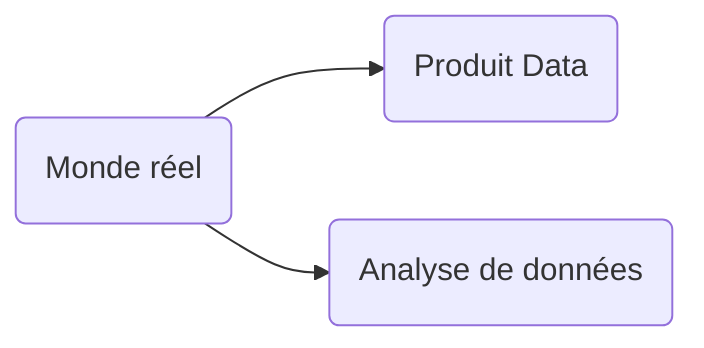
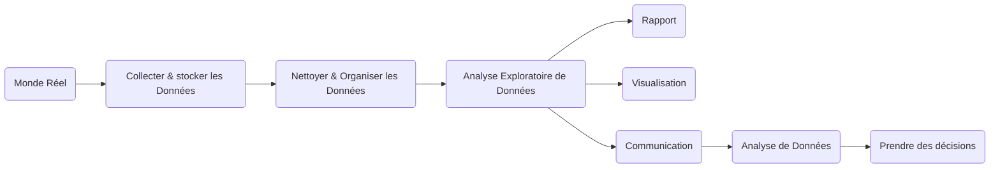
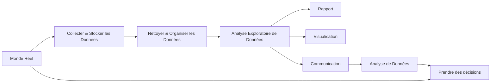

# Flux de travail de type Analyse de données

Le diagramme suivant représente un flux de travail typique dans la data science. Chaque étape, de la collecte des données à la prise de décision, joue un rôle crucial dans l'exploitation des données et la génération de connaissances exploitables.

### 1. **Monde Réel → Collecter et Stocker les Données**

Le point de départ du processus est le **monde réel**, où les données sont générées à partir de diverses sources, telles que les interactions en ligne, les transactions, ou les capteurs IoT. L'objectif de cette première étape est de **collecter** ces données et de les **stocker** dans un environnement approprié (bases de données, data lakes, systèmes cloud, etc.). Ces données peuvent être de différents types : structurées, non structurées, ou semi-structurées.

### 2. **Nettoyer et Organiser les Données**

Une fois les données collectées, elles doivent être **nettoyées** et **organisées**. Cette phase est essentielle, car les données brutes sont souvent incomplètes, redondantes, ou erronées. Les activités de nettoyage consistent à supprimer les doublons, corriger les valeurs aberrantes, et gérer les données manquantes. Ensuite, les données sont transformées dans un format structuré et cohérent pour être prêtes à l'analyse.

### 3. **Analyse Exploratoire des Données**

L'**analyse exploratoire des données** permet de comprendre la structure et les caractéristiques des données nettoyées. Cette étape inclut l'utilisation de méthodes statistiques et de visualisations pour identifier des tendances, des corrélations, ou des anomalies. L'objectif est de mieux appréhender les données et de poser des hypothèses en vue d'analyses plus approfondies ou de la création de modèles prédictifs.

### 4. **Rapport, Visualisation, Communication**

Après l'analyse exploratoire, les résultats doivent être communiqués de manière claire et concise. Trois moyens principaux permettent cette communication :

- **Rapport** : Un document rédigé présentant les résultats de l'analyse de manière détaillée.
- **Visualisation** : Utilisation de graphiques et de représentations visuelles des données pour faciliter la compréhension des résultats.
- **Communication** : Présentation orale ou écrite des conclusions, souvent à l'aide d'outils interactifs comme des dashboards ou des rapports automatisés.

### 5. **Analyse de Données**

Une fois les résultats communiqués, une nouvelle phase d'**analyse de données** peut être engagée pour approfondir certaines questions ou affiner les modèles utilisés. Cette étape permet d'optimiser l'interprétation des données et de fournir des recommandations plus précises.

### 6. **Prendre des Décisions**

Enfin, les données analysées sont utilisées pour **prendre des décisions**. Ces décisions peuvent concerner divers domaines, comme l'amélioration d'une stratégie commerciale, l'optimisation des processus, ou l'anticipation des tendances futures à travers des modèles prédictifs.

# Machine learning

Ce diagramme illustre un **flux de travail typique en Data Science et Machine Learning**, montrant les étapes nécessaires pour transformer des données brutes en décisions éclairées. Nous allons expliquer chaque étape en suivant le parcours de gauche à droite.

### 1. **Monde Réel → Collecter et Stocker les Données**

Tout commence dans le **monde réel**, où les données sont générées à partir de différentes sources : interactions humaines, machines, capteurs, transactions, etc. Ces données peuvent être structurées (tableaux, bases de données), non structurées (textes, images, vidéos), ou semi-structurées (JSON, XML).

- **Objectif** : **Collecter** ces données provenant de sources variées et les **stocker** dans un environnement adapté pour les traiter par la suite. Cela inclut des bases de données, des data lakes, ou des services cloud (comme AWS, Google Cloud ou Azure).

### 2. **Nettoyer et Organiser les Données**

Une fois les données collectées, elles doivent être **nettoyées** et **organisées**. En effet, les données brutes peuvent contenir des erreurs, des valeurs manquantes, des doublons, ou être mal formatées. Cette étape est cruciale pour garantir la qualité des données avant toute analyse.

- **Objectif** : Corriger ou supprimer les erreurs, organiser les données dans un format structuré, et les rendre exploitables pour les étapes suivantes. Les outils et bibliothèques comme **Pandas** ou **NumPy** sont souvent utilisés pour ces tâches.

### 3. **Analyse Exploratoire des Données**

Une fois les données nettoyées, on passe à l'**analyse exploratoire**. Il s'agit de mieux comprendre les données, de découvrir des tendances, des modèles, des corrélations ou des anomalies à travers des techniques statistiques et des visualisations.

- **Objectif** : Extraire des informations utiles des données, en identifier les caractéristiques importantes, et déterminer les prochaines étapes. Cette analyse est souvent accompagnée de visualisations, ce qui permet d'explorer les données de manière plus intuitive.

### 4. **Rapport, Visualisation, Communication**

L'étape suivante consiste à **communiquer** les résultats de l'analyse exploratoire. Cela peut se faire sous plusieurs formes :
- **Rapport** : Document détaillant les résultats, les analyses, et les conclusions à destination des décideurs ou des parties prenantes.
- **Visualisation** : Création de graphiques et d'illustrations pour rendre les résultats plus accessibles et compréhensibles (par exemple, des graphiques de répartition, des courbes, des diagrammes en barres).
- **Communication** : Présentation des résultats à des équipes ou à des décideurs pour qu'ils puissent comprendre les conclusions et prendre des décisions éclairées.

Les outils utilisés pour ces tâches incluent des bibliothèques de visualisation comme **Matplotlib**, **Seaborn**, ou des outils de reporting interactifs comme **Tableau** ou **Power BI**.

### 5. **Analyse de Données**

Suite à la communication des résultats, il peut y avoir une nouvelle phase d'**analyse de données**. Cela consiste à approfondir certaines observations, à utiliser des modèles de machine learning pour prédire des résultats futurs, ou à tester des hypothèses avancées.

- **Objectif** : Raffiner les résultats, tester des modèles prédictifs, et fournir des analyses plus détaillées pour des prises de décisions optimisées.

### 6. **Prendre des Décisions**

Enfin, toutes ces étapes mènent à la **prise de décision**. Les informations et les insights obtenus à partir de l'analyse des données permettent aux décideurs de prendre des actions concrètes. Ces décisions peuvent inclure l'optimisation des opérations, l'ajustement de la stratégie marketing, l'amélioration des processus, ou d'autres actions basées sur des données factuelles.

- **Objectif** : Utiliser les résultats analytiques pour guider les décisions stratégiques et opérationnelles, avec un impact direct dans le **monde réel**.

### Retour au Monde Réel

Il est important de noter que le **monde réel** est aussi connecté directement à la prise de décision, illustrant que les décisions prises basées sur l'analyse des données doivent être mises en application dans la réalité. Cela peut inclure des ajustements dans les processus ou les stratégies, ou des modifications dans les actions à entreprendre.

