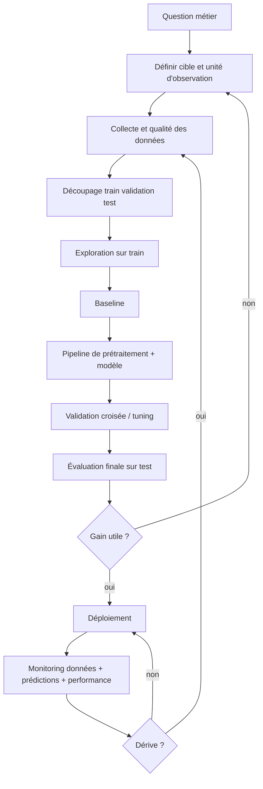

# Machine Learning — de la question métier au modèle exploité

> [!abstract] Objectif
> Comprendre **comment construire, évaluer et exploiter un modèle de machine learning de manière méthodologiquement correcte**, et pas seulement comment appeler `fit()` puis `predict()`.

Ce cours traite principalement du **machine learning classique** avec Python et scikit-learn. Il ne cherche pas à remplacer les cours spécialisés sur les réseaux de neurones, les Transformers ou les RAG. Il fournit le socle méthodologique qui reste indispensable dans ces domaines : définition de la cible, séparation entraînement/test, métriques, validation, lutte contre les fuites de données, reproductibilité et surveillance.

Voir aussi : [[Python]], [[Numpy]], [[Pandas]], [[Mathplotlib]], [[Data Mining en Python]], [[cours CNN RNN]], [[cours Transformers]], [[Les RAGs]].

> [!important] Version de référence
> Au 31 août 2026, la documentation stable de scikit-learn est celle de **scikit-learn 1.9.0**, publié en juin 2026. La branche 1.10 est en développement. Les principes de ce cours sont volontairement plus stables que les détails d'API.

# 1. Qu'est-ce que le machine learning ?

Le machine learning consiste à construire un système dont une partie du comportement est **apprise à partir de données** plutôt qu'entièrement écrite sous forme de règles explicites.

Une formulation très simple est :

```text
exemples observés
      │
      ▼
algorithme d'apprentissage
      │
      ▼
modèle paramétré
      │
      ▼
nouvelles données → prédiction / score / structure
```

Le mot **modèle** désigne ici une fonction paramétrée ou une structure apprise. Il ne faut pas le confondre avec :

- le code qui prépare les données ;
- le jeu de données ;
- le processus métier utilisant la prédiction ;
- le service HTTP qui expose le modèle ;
- la décision finale prise par un humain ou un autre système.

# 2. Machine learning, statistique, data science et intelligence artificielle

Ces domaines se recouvrent sans être synonymes.

| Domaine | Question typique |
|---|---|
| statistique | quelle relation peut-on estimer et avec quelle incertitude ? |
| machine learning | comment généraliser au mieux à de nouvelles observations ? |
| data science | comment transformer les données en information et en décision ? |
| intelligence artificielle | comment construire des systèmes réalisant des tâches associées à l'intelligence ? |
| deep learning | comment apprendre des représentations au moyen de réseaux de neurones profonds ? |

La frontière est souvent floue. Une régression logistique peut être présentée comme un modèle statistique ou comme un algorithme de machine learning selon le contexte et l'objectif.

# 3. Les grandes familles d'apprentissage

## 3.1 Apprentissage supervisé

On dispose d'entrées `X` et d'une cible `y` connue pendant l'entraînement.

Exemples :

- prédire le prix d'un logement ;
- détecter un défaut de fabrication ;
- classer un courriel ;
- prédire un risque de churn ;
- estimer le temps restant avant une panne.

Deux tâches principales :

```text
classification → y appartient à une catégorie
régression      → y est une quantité numérique
```

## 3.2 Apprentissage non supervisé

On ne dispose pas d'une cible explicite à prédire.

Exemples :

- regrouper des observations similaires ;
- réduire la dimension ;
- rechercher des anomalies ;
- explorer la structure des données.

## 3.3 Apprentissage semi-supervisé

Une petite partie des données possède un label et une grande partie n'en possède pas.

## 3.4 Auto-supervision

La supervision est créée à partir des données elles-mêmes. Cette idée est devenue centrale pour l'apprentissage de représentations, notamment en traitement du langage et en vision.

## 3.5 Apprentissage par renforcement

Un agent apprend à agir dans un environnement à partir de récompenses. Ce paradigme est distinct du flux scikit-learn classique présenté ici.

# 4. Le véritable cycle de vie d'un projet ML

L'ancienne représentation linéaire :

```text
collecter → nettoyer → entraîner → prédire
```

est insuffisante. Un projet réel est itératif :


```mermaid
graph TD
    A[Question métier] --> B[Définir cible et unité d'observation]
    B --> C[Collecte et qualité des données]
    C --> D[Découpage train validation test]
    D --> E[Exploration sur train]
    E --> F[Baseline]
    F --> G[Pipeline de prétraitement + modèle]
    G --> H[Validation croisée / tuning]
    H --> I[Évaluation finale sur test]
    I --> J{Gain utile ?}
    J -- non --> B
    J -- oui --> K[Déploiement]
    K --> L[Monitoring données + prédictions + performance]
    L --> M{Dérive ?}
    M -- oui --> C
    M -- non --> K
```

> [!important]
> Le **jeu de test final n'est pas un tableau de bord que l'on consulte à chaque essai**. Il sert à estimer la performance finale après que les choix de modélisation ont été arrêtés.

# 5. Commencer par la question, pas par l'algorithme

Avant de choisir Random Forest, XGBoost ou un réseau de neurones, répondre à cinq questions :

1. **Quelle décision souhaite-t-on améliorer ?**
2. **Quelle est l'unité d'observation ?**
3. **Que veut-on prédire ?**
4. **À quel instant la prédiction est-elle faite ?**
5. **Quelles informations sont réellement disponibles à cet instant ?**

Cette dernière question est fondamentale pour éviter les fuites de données.

## 5.1 Exemple : churn

Mauvaise formulation :

> Prédire quels clients vont partir.

Meilleure formulation :

> Chaque lundi, attribuer aux clients actifs depuis au moins 30 jours une probabilité de résiliation dans les 30 prochains jours, à partir des informations disponibles dimanche soir.

On obtient alors :

- une population clairement définie ;
- un instant de prédiction ;
- une fenêtre de features ;
- une fenêtre de label ;
- une cible testable.

# 6. L'unité d'observation

Une ligne du tableau doit représenter quelque chose de précis :

```text
une ligne = un client à une date donnée
```

ou :

```text
une ligne = une transaction
```

ou :

```text
une ligne = une machine sur une fenêtre de 10 minutes
```

Des lignes apparemment indépendantes peuvent en réalité appartenir au même individu, patient, appareil, site ou groupe. Cela influence directement la méthode de validation.

# 7. Features, cible et métadonnées

On note habituellement :

- `X` : matrice des variables explicatives ;
- `y` : variable cible ;
- `n_samples` : nombre d'observations ;
- `n_features` : nombre de variables.

En Python :

```python
X = df.drop(columns="target")
y = df["target"]
```

Toutes les colonnes ne doivent pas nécessairement devenir des features. Un identifiant technique peut être utile pour regrouper les données sans être un signal que le modèle doit exploiter.

# 8. La qualité de la cible

Un modèle ne peut pas être meilleur que la définition de ce qu'on lui demande d'apprendre.

Problèmes fréquents :

- label bruité ;
- label construit à partir d'un événement mal enregistré ;
- proxy imparfait du phénomène réel ;
- délai important avant disponibilité du label ;
- politique humaine ayant influencé le label ;
- changement de définition historique.

> [!warning]
> Un score élevé sur une mauvaise cible reste un mauvais système.

# 9. Le découpage train / validation / test

## 9.1 Pourquoi séparer les données ?

Évaluer un modèle sur les observations utilisées pour l'entraîner mesure sa capacité à **reproduire ce qu'il a vu**, pas sa capacité à généraliser.

## 9.2 Découpage simple

```python
from sklearn.model_selection import train_test_split

X_train, X_test, y_train, y_test = train_test_split(
    X,
    y,
    test_size=0.20,
    random_state=42,
    stratify=y,
)
```

`stratify=y` est souvent utile en classification lorsque les classes doivent conserver une proportion comparable dans train et test.

## 9.3 Train, validation et test

Conceptuellement :

```text
train      → apprendre les paramètres
validation → choisir hyperparamètres / variantes
final test → estimation finale
```

La validation croisée permet souvent de remplacer un jeu de validation fixe.

# 10. Le jeu de test est un coffre-fort

Les opérations suivantes **ne doivent pas utiliser le jeu de test** :

- calculer moyenne et écart-type d'un scaler ;
- imputer des valeurs ;
- sélectionner des variables ;
- faire une PCA ;
- choisir les hyperparamètres ;
- décider d'un seuil de classification ;
- choisir le meilleur modèle ;
- sélectionner une transformation après avoir regardé le score test.

Sinon, le test n'est plus réellement indépendant.

# 11. Data leakage : la fuite de données

Une fuite apparaît quand le modèle dispose pendant l'entraînement d'une information qui ne serait pas réellement disponible au moment de la prédiction.

## 11.1 Fuite de prétraitement

Mauvais :

```python
from sklearn.preprocessing import StandardScaler

X_scaled = StandardScaler().fit_transform(X)
X_train, X_test, y_train, y_test = train_test_split(X_scaled, y)
```

Le scaler a appris des informations sur tout `X`, y compris le futur jeu de test.

Correct : utiliser un `Pipeline`.

```python
from sklearn.pipeline import make_pipeline
from sklearn.preprocessing import StandardScaler
from sklearn.linear_model import LogisticRegression

model = make_pipeline(
    StandardScaler(),
    LogisticRegression(max_iter=1000),
)
```

## 11.2 Target leakage

Exemples :

- utiliser la date de clôture pour prédire qu'un ticket sera clôturé ;
- utiliser une facture de résiliation pour prédire la résiliation ;
- utiliser le diagnostic final pour prédire le diagnostic initial ;
- agréger des événements postérieurs à l'instant de prédiction.

## 11.3 Leakage temporel

La séparation doit reproduire le futur réel :

```text
passé → entraînement
futur → test
```

Un `train_test_split(shuffle=True)` peut être complètement faux pour certaines séries temporelles.

# 12. Exploration des données : seulement avec la partie entraînement

Après avoir isolé le test :

```python
train_df = X_train.assign(target=y_train)
```

Examiner :

```python
train_df.info()
train_df.describe(include="all")
train_df.isna().mean().sort_values(ascending=False)
```

Questions :

- valeurs manquantes ?
- doublons ?
- distributions très asymétriques ?
- catégories rares ?
- variables quasi constantes ?
- variables impossibles au moment de l'inférence ?
- groupes ou dépendances entre lignes ?
- timestamps ?
- unités incohérentes ?

# 13. Toujours construire une baseline

Une baseline sert à vérifier que le modèle apporte réellement quelque chose.

Classification :

```python
from sklearn.dummy import DummyClassifier

baseline = DummyClassifier(strategy="prior")
baseline.fit(X_train, y_train)
```

Régression :

```python
from sklearn.dummy import DummyRegressor

baseline = DummyRegressor(strategy="median")
baseline.fit(X_train, y_train)
```

Un modèle complexe qui ne bat pas clairement une baseline simple est un signal d'alarme.

# 14. Prétraiter des variables hétérogènes

Dans un tableau réel, on trouve souvent :

- numériques ;
- catégorielles ;
- booléennes ;
- dates ;
- texte ;
- valeurs manquantes.

`ColumnTransformer` permet d'appliquer des traitements différents selon les colonnes.

```python
from sklearn.compose import ColumnTransformer
from sklearn.impute import SimpleImputer
from sklearn.pipeline import Pipeline
from sklearn.preprocessing import OneHotEncoder, StandardScaler
from sklearn.linear_model import LogisticRegression

numeric_features = ["age", "income", "tenure"]
categorical_features = ["country", "plan"]

numeric_pipeline = Pipeline([
    ("imputer", SimpleImputer(strategy="median")),
    ("scaler", StandardScaler()),
])

categorical_pipeline = Pipeline([
    ("imputer", SimpleImputer(strategy="most_frequent")),
    ("onehot", OneHotEncoder(handle_unknown="ignore")),
])

preprocessor = ColumnTransformer([
    ("num", numeric_pipeline, numeric_features),
    ("cat", categorical_pipeline, categorical_features),
])

model = Pipeline([
    ("preprocess", preprocessor),
    ("classifier", LogisticRegression(max_iter=1000)),
])
```

La grande idée est :

```text
prétraitement + modèle = un seul estimateur
```

# 15. Valeurs manquantes

Trois stratégies générales :

1. supprimer certaines observations/variables ;
2. imputer ;
3. utiliser un estimateur qui sait gérer certaines valeurs manquantes nativement.

## 15.1 Imputation simple

```python
SimpleImputer(strategy="median")
```

ou :

```python
SimpleImputer(strategy="most_frequent")
```

## 15.2 Ajouter un indicateur de missingness

Une valeur manquante peut porter une information :

```python
SimpleImputer(strategy="median", add_indicator=True)
```

Mais attention : le mécanisme de données manquantes peut lui-même changer entre entraînement et production.

# 16. Mise à l'échelle

Les modèles ne réagissent pas tous de la même manière aux échelles.

Souvent important :

- régression logistique régularisée ;
- SVM ;
- k-NN ;
- PCA ;
- méthodes basées sur les distances.

Souvent moins nécessaire pour :

- arbres de décision ;
- Random Forest ;
- Gradient Boosting basé sur des arbres.

Standardisation :

```python
StandardScaler()
```

La standardisation n'implique pas que la distribution devient normale.

# 17. Variables catégorielles

## 17.1 One-hot encoding

```python
OneHotEncoder(handle_unknown="ignore")
```

Avantage : ne crée pas un ordre artificiel.

## 17.2 Ordinal encoding

À réserver aux catégories réellement ordonnées ou aux modèles qui peuvent en tirer parti avec prudence.

```text
faible < moyen < élevé
```

Ne pas encoder arbitrairement :

```text
France=0, Allemagne=1, Espagne=2
```

puis supposer que `Espagne > Allemagne > France` a un sens.

# 18. Texte dans un pipeline classique

Pour de nombreux problèmes, TF-IDF + modèle linéaire reste une baseline extrêmement forte.

```python
from sklearn.feature_extraction.text import TfidfVectorizer
from sklearn.linear_model import LogisticRegression
from sklearn.pipeline import make_pipeline

text_model = make_pipeline(
    TfidfVectorizer(ngram_range=(1, 2), min_df=2),
    LogisticRegression(max_iter=1000),
)
```

Un Transformer n'est pas automatiquement nécessaire.

# 19. Feature engineering

Créer une feature consiste à représenter explicitement une information utile.

Exemples :

```text
timestamp        → heure, jour de semaine, ancienneté
prix + quantité  → montant
événements       → nombre sur les 7 derniers jours
coordonnées      → distance à un point
texte court      → longueur, mots-clés, TF-IDF
```

> [!warning]
> Une feature calculée à partir du futur crée une fuite, même si la formule est parfaitement correcte.

# 20. Estimator, transformer, predictor : API scikit-learn

Objet entraînable :

```python
obj.fit(X_train, y_train)
```

Transformer :

```python
X2 = transformer.transform(X)
```

Prédicteur :

```python
y_pred = model.predict(X)
```

Probabilités :

```python
y_proba = model.predict_proba(X)
```

Score brut de décision :

```python
score = model.decision_function(X)
```

La cohérence de cette API permet de composer les traitements.

# 21. Paramètres appris et hyperparamètres

Paramètres appris :

- coefficients d'une régression ;
- seuils d'un arbre ;
- centroïdes de K-Means.

Hyperparamètres :

- `C` d'une régression logistique/SVM ;
- profondeur maximale d'un arbre ;
- nombre d'arbres ;
- nombre de voisins ;
- nombre de composantes PCA.

Les hyperparamètres sont choisis **sans consulter le test final**.

# 22. Sous-apprentissage et surapprentissage

## 22.1 Underfitting

Le modèle est trop simple pour capturer le signal.

```text
train faible
validation faible
```

## 22.2 Overfitting

Le modèle apprend trop finement le train.

```text
train très bon
validation nettement moins bonne
```

## 22.3 Compromis biais-variance

Une représentation utile :

```text
modèle trop simple ───────── modèle adapté ───────── modèle trop flexible
      biais ↑                     équilibre                  variance ↑
```

# 23. Régularisation

La régularisation limite la complexité effective du modèle.

## 23.1 Ridge / L2

Pénalise les grands coefficients au carré.

## 23.2 Lasso / L1

Peut conduire certains coefficients à zéro.

## 23.3 Elastic Net

Combine L1 et L2.

Dans les modèles linéaires scikit-learn, les conventions de paramètres diffèrent selon les classes. Toujours vérifier l'API de l'estimateur utilisé.

# 24. Validation croisée

La validation croisée évalue plusieurs découpages du jeu d'entraînement.

```python
from sklearn.model_selection import cross_validate

scores = cross_validate(
    model,
    X_train,
    y_train,
    cv=5,
    scoring=["accuracy", "f1"],
)
```

Ne rapporter qu'un score moyen peut masquer la variabilité :

```python
scores["test_f1"].mean()
scores["test_f1"].std()
```

# 25. Choisir le bon splitter

| Structure des données | Splitter typique |
|---|---|
| observations indépendantes | KFold |
| classification à proportions de classes à préserver | StratifiedKFold |
| plusieurs lignes par patient/client/machine | GroupKFold |
| groupes + classes | StratifiedGroupKFold |
| ordre temporel | TimeSeriesSplit ou split temporel métier |

## 25.1 Groupes

```python
from sklearn.model_selection import GroupKFold, cross_val_score

cv = GroupKFold(n_splits=5)
scores = cross_val_score(model, X, y, groups=customer_id, cv=cv)
```

Même client dans train et validation peut produire une estimation irréaliste si le système doit généraliser à de nouveaux clients.

# 26. Séries temporelles

Le futur ne doit pas entraîner le passé.

Exemple conceptuel :

```text
fold 1 : [train train] [validation]
fold 2 : [train train train] [validation]
fold 3 : [train train train train] [validation]
```

Avec scikit-learn :

```python
from sklearn.model_selection import TimeSeriesSplit

cv = TimeSeriesSplit(n_splits=5)
```

Mais un split métier explicite par date est parfois plus lisible et plus fidèle au déploiement réel.

# 27. Validation imbriquée

Si l'on veut comparer proprement des procédures de tuning, on peut utiliser une validation croisée imbriquée :

```text
boucle externe → estime la généralisation
boucle interne → choisit les hyperparamètres
```

C'est particulièrement utile dans les petits jeux de données et les expériences scientifiques.

# 28. Recherche d'hyperparamètres

## 28.1 GridSearchCV

Teste une grille explicite.

```python
from sklearn.model_selection import GridSearchCV

search = GridSearchCV(
    model,
    param_grid={
        "classifier__C": [0.01, 0.1, 1, 10],
    },
    scoring="roc_auc",
    cv=5,
    n_jobs=-1,
)
```

## 28.2 RandomizedSearchCV

Souvent plus efficace lorsque l'espace est grand.

```python
from scipy.stats import loguniform
from sklearn.model_selection import RandomizedSearchCV

search = RandomizedSearchCV(
    model,
    param_distributions={
        "classifier__C": loguniform(1e-4, 1e2),
    },
    n_iter=30,
    scoring="roc_auc",
    cv=5,
    random_state=42,
    n_jobs=-1,
)
```

Le tuning ne remplace pas une bonne formulation du problème.

# 29. Métriques : choisir ce qui correspond au coût réel

Une métrique n'est pas seulement une formule. C'est une traduction approximative de ce que l'on considère comme une bonne erreur.

# 30. Matrice de confusion

Pour une classification binaire :

```text
                   prédit négatif    prédit positif
réel négatif             TN                FP
réel positif             FN                TP
```

Les métriques suivantes en dérivent.

# 31. Accuracy

```text
(TP + TN) / total
```

Simple mais potentiellement trompeuse en cas de classes déséquilibrées.

Exemple : 99,9 % de transactions normales.

Un modèle qui prédit toujours « normal » obtient 99,9 % d'accuracy et détecte 0 fraude.

# 32. Precision

Parmi les positifs prédits, combien sont réellement positifs ?

```text
TP / (TP + FP)
```

À privilégier quand les faux positifs coûtent cher.

# 33. Recall

Parmi les positifs réels, combien ont été détectés ?

```text
TP / (TP + FN)
```

À privilégier quand manquer un positif coûte cher.

# 34. F1-score

Moyenne harmonique precision/recall :

```text
F1 = 2 × precision × recall / (precision + recall)
```

Il ne tient pas explicitement compte des vrais négatifs.

# 35. ROC-AUC

Mesure la capacité de classement sur l'ensemble des seuils.

Bon outil général, mais peut donner une impression trop favorable lorsque la classe positive est très rare.

# 36. Precision-Recall AUC

Souvent informative lorsque la classe positive est rare.

Le niveau de référence dépend de la prévalence de la classe positive.

# 37. Log loss

Évalue les probabilités prédites et pénalise fortement les prédictions confiantes mais fausses.

Elle est utile lorsque l'on veut de bonnes probabilités plutôt qu'une classe finale uniquement.

# 38. Brier score

Pour une classification probabiliste binaire, mesure l'erreur quadratique des probabilités.

Il est utile pour discuter la calibration.

# 39. Métriques multiclasses

Les moyennes peuvent être :

- `macro` : chaque classe pèse autant ;
- `weighted` : pondérée par le support ;
- `micro` : agrégation globale des décisions.

Ces variantes répondent à des questions différentes.

# 40. Métriques de régression

## 40.1 MAE

```text
mean absolute error
```

Interprétable dans l'unité de la cible et relativement robuste aux gros écarts.

## 40.2 MSE

Les grandes erreurs sont davantage pénalisées.

## 40.3 RMSE

Racine du MSE, donc exprimée dans l'unité de la cible.

## 40.4 R²

Compare le modèle à une référence basée sur la moyenne. Un R² peut être négatif sur un jeu d'évaluation.

## 40.5 MAPE

Peut devenir instable lorsque la vraie valeur est proche de zéro. Ne pas l'utiliser machinalement.

# 41. Le seuil de classification est une décision

`predict()` applique un choix de seuil implicite ou une règle propre à l'estimateur. Mais le seuil utile dépend du métier.

```python
proba = model.predict_proba(X_valid)[:, 1]
y_pred = proba >= 0.30
```

Choisir `0.30` parce qu'il optimise un compromis métier est très différent de supposer que `0.5` est universel.

> [!warning]
> Le seuil doit être choisi sur validation, pas sur le jeu de test final.

# 42. Calibration des probabilités

Un modèle est bien calibré si, parmi les observations auxquelles il attribue environ 0,8, approximativement 80 % sont positives sur le long terme.

Scikit-learn fournit notamment :

```python
from sklearn.calibration import CalibratedClassifierCV

calibrated = CalibratedClassifierCV(base_model, method="sigmoid", cv=5)
```

Les versions récentes proposent aussi des méthodes de calibration supplémentaires. Toujours vérifier la documentation de la version utilisée.

# 43. Régression linéaire

Modèle :

```text
y ≈ β0 + β1 x1 + β2 x2 + ... + βp xp
```

Forces :

- simple ;
- rapide ;
- baseline solide ;
- interprétable avec précautions.

Limites :

- relations principalement linéaires sans transformations ;
- sensible aux variables redondantes selon l'objectif ;
- extrapolation potentiellement dangereuse.

# 44. Ridge, Lasso, ElasticNet

Exemples scikit-learn :

```python
from sklearn.linear_model import Ridge, Lasso, ElasticNet
```

Ces modèles sont utiles quand il y a beaucoup de variables ou de la colinéarité.

# 45. Régression logistique

Malgré son nom, c'est un modèle de **classification**.

```python
from sklearn.linear_model import LogisticRegression

clf = LogisticRegression(max_iter=1000)
```

Forces :

- excellente baseline ;
- sortie probabiliste ;
- rapide ;
- coefficients inspectables ;
- efficace avec représentation sparse comme TF-IDF.

# 46. k plus proches voisins — k-NN

```python
from sklearn.neighbors import KNeighborsClassifier
```

Idée : prédire à partir des voisins les plus proches.

Sensibilités :

- mise à l'échelle ;
- choix de distance ;
- grande dimension ;
- coût d'inférence ;
- densité variable.

# 47. Naive Bayes

Famille probabiliste supposant une indépendance conditionnelle forte entre features.

Très utile dans certains problèmes de texte et comme baseline rapide.

```python
from sklearn.naive_bayes import MultinomialNB
```

# 48. Support Vector Machines

```python
from sklearn.svm import SVC, LinearSVC
```

Points forts :

- modèles puissants sur données de taille petite à moyenne ;
- noyaux pour frontières non linéaires ;
- version linéaire efficace en haute dimension sparse.

Points de vigilance :

- scaling ;
- coût sur gros jeux ;
- probabilities de `SVC` ont un coût supplémentaire ;
- tuning de `C`, `gamma`, noyau.

# 49. Arbre de décision

```python
from sklearn.tree import DecisionTreeClassifier
```

Atouts :

- relations non linéaires ;
- interactions ;
- pas de scaling obligatoire ;
- explicable visuellement pour petits arbres.

Limites :

- forte variance ;
- surapprentissage facile ;
- frontière par morceaux.

# 50. Random Forest

```python
from sklearn.ensemble import RandomForestClassifier
```

Combine de nombreux arbres construits sur des échantillons et sous-ensembles de variables.

Atouts :

- robuste ;
- bonne baseline tabulaire ;
- peu de prétraitement numérique ;
- interactions non linéaires.

Limites :

- modèles volumineux ;
- probabilités parfois mal calibrées ;
- importance impurity-based facilement mal interprétée.

# 51. Extra Trees

```python
from sklearn.ensemble import ExtraTreesClassifier
```

Ajoute davantage de randomisation dans les séparations que Random Forest. Peut être une excellente baseline tabulaire.

# 52. Gradient Boosting

Le boosting construit des modèles séquentiellement pour corriger les erreurs des précédents.

Scikit-learn propose notamment :

```python
from sklearn.ensemble import GradientBoostingClassifier
from sklearn.ensemble import HistGradientBoostingClassifier
```

`HistGradientBoosting*` est particulièrement intéressant pour les jeux plus grands.

# 53. XGBoost, LightGBM et CatBoost

Ces bibliothèques externes sont très populaires pour les données tabulaires.

Elles ne font pas partie de scikit-learn, mais fournissent souvent une API compatible.

Ne pas les choisir uniquement parce qu'elles sont réputées performantes :

- vérifier licences et contraintes de déploiement ;
- comparer à une baseline scikit-learn ;
- valider de la même manière ;
- contrôler les types catégoriels et valeurs manquantes ;
- enregistrer précisément les versions.

# 54. Voting et Stacking

Ensembles de modèles hétérogènes :

```python
from sklearn.ensemble import VotingClassifier, StackingClassifier
```

Un ensemble peut améliorer la performance, mais augmente :

- complexité ;
- coût de calcul ;
- surface de monitoring ;
- difficulté d'explication.

# 55. Clustering

Le clustering cherche des groupes sans labels supervisés.

Attention : un cluster n'est pas automatiquement une catégorie métier « réelle ».

# 56. K-Means

```python
from sklearn.cluster import KMeans
```

Hypothèses implicites : groupes plutôt compacts et représentables par des centroïdes dans l'espace choisi.

Sensibilité :

- scaling ;
- variables non pertinentes ;
- choix de `k` ;
- outliers.

# 57. DBSCAN

```python
from sklearn.cluster import DBSCAN
```

Avantages :

- ne demande pas `k` ;
- détecte du bruit ;
- clusters de formes non sphériques.

Difficultés :

- choix de `eps` ;
- densités variables ;
- distances peu discriminantes en haute dimension.

# 58. HDBSCAN

Scikit-learn fournit un estimateur HDBSCAN dans ses versions modernes.

Il gère mieux des densités variables dans de nombreux cas, mais reste dépendant de la représentation et des hyperparamètres.

# 59. PCA

Analyse en composantes principales : réduction linéaire de dimension.

```python
from sklearn.decomposition import PCA
```

Utilisations :

- visualisation exploratoire ;
- compression ;
- débruitage ;
- réduction de colinéarité.

La PCA doit être apprise **dans la pipeline**, donc uniquement sur les folds d'entraînement.

# 60. TruncatedSVD

Souvent plus adapté aux matrices sparse, par exemple TF-IDF :

```python
from sklearn.decomposition import TruncatedSVD
```

# 61. Détection d'anomalies

Exemples :

```python
from sklearn.ensemble import IsolationForest
from sklearn.neighbors import LocalOutlierFactor
from sklearn.svm import OneClassSVM
```

Une anomalie mathématique n'est pas forcément une fraude, une panne ou une attaque. Il faut relier le score au phénomène métier.

# 62. Classes déséquilibrées

Solutions possibles :

- choisir les bonnes métriques ;
- ajuster le seuil ;
- `class_weight` ;
- sous-échantillonnage ;
- sur-échantillonnage ;
- algorithmes adaptés ;
- collecte de davantage de cas rares.

> [!warning]
> Le rééchantillonnage doit être effectué **dans les folds d'entraînement**, jamais avant le split de validation.

Pour des méthodes comme SMOTE, utiliser par exemple `imbalanced-learn` et ses pipelines adaptés.

# 63. Pourquoi accuracy n'est pas la solution au déséquilibre

Le problème n'est pas que le déséquilibre « casse » tous les modèles. Il casse surtout certaines intuitions et rend plusieurs métriques peu informatives.

Il faut demander :

```text
quel type d'erreur coûte combien ?
```

# 64. Coût métier et matrice de décision

Exemple :

| Événement | Coût |
|---|---:|
| faux positif | 5 € |
| faux négatif | 500 € |
| vrai positif traité | 20 € |
| investigation manuelle | 10 € |

On peut alors choisir un seuil qui minimise un coût attendu au lieu d'optimiser mécaniquement F1.

# 65. Interprétabilité : de quoi parle-t-on ?

Plusieurs niveaux :

- compréhension globale du modèle ;
- importance globale des variables ;
- explication d'une prédiction ;
- sensibilité du score ;
- audit de comportement par sous-population.

Aucune technique ne transforme automatiquement une corrélation prédictive en causalité.

# 66. Coefficients des modèles linéaires

Les coefficients peuvent être interprétés seulement en tenant compte :

- du scaling ;
- de l'encodage ;
- des interactions ;
- de la colinéarité ;
- du lien entre modèle et phénomène causal.

# 67. Feature importance des arbres

L'importance basée sur la diminution d'impureté peut favoriser certaines variables, notamment à cardinalité élevée.

Ne pas la lire comme :

```text
importance élevée = cause importante
```

# 68. Permutation importance

Scikit-learn fournit :

```python
from sklearn.inspection import permutation_importance

result = permutation_importance(
    model,
    X_valid,
    y_valid,
    n_repeats=20,
    random_state=42,
)
```

Principe : mélanger une variable et mesurer la baisse de performance.

Les variables corrélées peuvent rendre l'interprétation délicate.

# 69. Partial Dependence et ICE

```python
from sklearn.inspection import PartialDependenceDisplay
```

Ces outils visualisent la réponse moyenne ou individuelle du modèle en faisant varier certaines features.

Attention aux combinaisons de valeurs irréalistes et aux features fortement corrélées.

# 70. SHAP et outils externes

SHAP peut être utile pour expliquer localement ou globalement certains modèles.

Mais :

- ce n'est pas une preuve causale ;
- le choix du background compte ;
- les variables corrélées compliquent les attributions ;
- le coût peut devenir élevé.

# 71. Corrélation n'est pas causalité

Un modèle prédictif peut exploiter :

- un proxy ;
- une conséquence ;
- un biais de sélection ;
- une politique historique ;
- une variable confondante.

Pour répondre à « que se passerait-il si l'on intervenait ? », la prédiction standard ne suffit généralement pas. Il faut des outils d'inférence causale ou une expérimentation appropriée.

# 72. Robustesse par sous-groupes

Un bon score global peut cacher de mauvaises performances sur certains groupes.

Évaluer :

- classes ;
- régions ;
- équipements ;
- périodes ;
- groupes démographiques lorsque légalement et éthiquement approprié ;
- niveaux de qualité des données.

# 73. Fairness

La fairness n'est pas une seule métrique universelle.

Des critères peuvent être incompatibles entre eux lorsque les taux de base diffèrent.

Démarche minimale :

1. définir le dommage que l'on veut éviter ;
2. identifier les groupes concernés ;
3. mesurer les écarts ;
4. analyser les causes ;
5. documenter les compromis ;
6. surveiller après déploiement.

Bibliothèque utile : Fairlearn.

# 74. Reproductibilité

Une expérience reproductible enregistre :

- code Git ;
- version des données ou requête d'extraction ;
- versions des bibliothèques ;
- paramètres ;
- seeds ;
- splitter ;
- métriques ;
- modèle final ;
- date et environnement.

# 75. `random_state` n'est pas une baguette magique

Fixer un seed améliore la reproductibilité mais ne garantit pas :

- bitwise determinism sur toutes plateformes ;
- stabilité face à une nouvelle version de bibliothèque ;
- validité méthodologique ;
- robustesse statistique.

Il faut comprendre quelles étapes sont aléatoires.

# 76. Préparer un environnement Python

Exemple avec `venv` :

```bash
python3 -m venv .venv
source .venv/bin/activate
python -m pip install --upgrade pip
python -m pip install scikit-learn pandas numpy matplotlib jupyter
```

Vérifier :

```bash
python -c "import sklearn; print(sklearn.__version__)"
```

Pour figer l'environnement :

```bash
python -m pip freeze > requirements-lock.txt
```

Dans un vrai projet, préférer un outil de gestion de dépendances et un lockfile adapté au workflow choisi plutôt qu'un `freeze` non maîtrisé.

# 77. Inspection des versions

Scikit-learn peut afficher des informations système :

```python
import sklearn
sklearn.show_versions()
```

Conserver ces informations avec une expérience importante facilite le diagnostic.

# 78. Construire une pipeline tabulaire complète

```python
from sklearn.compose import ColumnTransformer
from sklearn.impute import SimpleImputer
from sklearn.linear_model import LogisticRegression
from sklearn.pipeline import Pipeline
from sklearn.preprocessing import OneHotEncoder, StandardScaler

numeric = ["age", "amount", "tenure"]
categorical = ["country", "segment"]

preprocess = ColumnTransformer([
    (
        "num",
        Pipeline([
            ("imputer", SimpleImputer(strategy="median")),
            ("scaler", StandardScaler()),
        ]),
        numeric,
    ),
    (
        "cat",
        Pipeline([
            ("imputer", SimpleImputer(strategy="most_frequent")),
            ("onehot", OneHotEncoder(handle_unknown="ignore")),
        ]),
        categorical,
    ),
])

pipeline = Pipeline([
    ("preprocess", preprocess),
    ("model", LogisticRegression(max_iter=2000)),
])
```

# 79. Évaluer plusieurs modèles sans dupliquer le prétraitement

```python
from sklearn.base import clone
from sklearn.ensemble import RandomForestClassifier
from sklearn.linear_model import LogisticRegression
from sklearn.model_selection import cross_validate, StratifiedKFold

candidates = {
    "logreg": LogisticRegression(max_iter=2000),
    "rf": RandomForestClassifier(n_estimators=400, random_state=42),
}

cv = StratifiedKFold(n_splits=5, shuffle=True, random_state=42)

for name, estimator in candidates.items():
    candidate = clone(pipeline)
    candidate.set_params(model=estimator)
    scores = cross_validate(
        candidate,
        X_train,
        y_train,
        cv=cv,
        scoring=["roc_auc", "average_precision"],
        n_jobs=-1,
    )
    print(name, scores["test_roc_auc"].mean())
```

# 80. Ne pas choisir le meilleur modèle sur une différence minuscule

Si deux modèles ont :

```text
AUC 0.842 ± 0.019
AUC 0.844 ± 0.022
```

il est rarement raisonnable de déclarer le second « meilleur » uniquement à cause de `0.002`.

Considérer également :

- incertitude ;
- latence ;
- mémoire ;
- explicabilité ;
- complexité opérationnelle ;
- stabilité ;
- coût de maintenance.

# 81. Courbes d'apprentissage

Elles permettent de voir l'effet de la quantité de données.

Questions :

- plus de données semblent-elles utiles ?
- le modèle est-il limité par son biais ?
- la variance est-elle forte ?

Scikit-learn fournit `learning_curve` et des visualisations associées.

# 82. Courbes de validation

Elles montrent le score train/validation en fonction d'un hyperparamètre.

Elles sont utiles pédagogiquement pour visualiser le compromis de complexité.

# 83. Erreur d'entraînement ≠ erreur de généralisation

Ne jamais rapporter uniquement :

```python
model.score(X_train, y_train)
```

comme preuve qu'un modèle fonctionne.

# 84. Évaluation finale

Après avoir figé :

- pipeline ;
- variables ;
- hyperparamètres ;
- seuil ;
- métriques principales ;

réentraîner selon le protocole décidé et évaluer **une fois** sur le test final.

Conserver aussi les intervalles/incertitudes lorsque cela est pertinent.

# 85. Analyse d'erreurs

Après un score global, examiner les cas d'échec :

```text
faux positifs
faux négatifs
erreurs extrêmes
sous-groupes faibles
périodes faibles
valeurs manquantes
cas hors distribution
```

Cette étape donne souvent plus d'idées que changer d'algorithme au hasard.

# 86. Split aléatoire ou split réaliste ?

Le bon test est celui qui ressemble au scénario de déploiement.

Exemples :

- nouveau patient → split par patient ;
- mois futur → split temporel ;
- nouveau site → split par site ;
- nouvelle machine → split par machine ;
- nouvelles lignes indépendantes → split aléatoire éventuellement acceptable.

# 87. Distribution shift

En production, la distribution peut changer.

Types courants :

- covariate shift : `P(X)` change ;
- prior shift : `P(y)` change ;
- concept drift : relation entre `X` et `y` change ;
- changement de collecte ou de schéma.

Un modèle valide en laboratoire peut devenir mauvais sans qu'aucun fichier de modèle ne soit modifié.

# 88. Out-of-distribution

Un modèle est souvent contraint d'émettre une prédiction même pour une observation très éloignée de son domaine d'entraînement.

Il faut parfois prévoir :

```text
si hors domaine → abstention / revue humaine / fallback
```

# 89. Abstention

Exemple :

```text
p < 0.2          → classe négative
0.2 ≤ p ≤ 0.8    → revue humaine
p > 0.8          → classe positive
```

L'abstention peut être plus sûre que forcer une décision binaire partout.

# 90. Persistance d'un modèle

Plusieurs options existent :

| Format | Usage | Point de vigilance |
|---|---|---|
| ONNX | inférence indépendante de Python | couverture partielle des modèles |
| skops.io | objet scikit-learn avec chargement plus contrôlable | dépendances Python nécessaires |
| joblib | pratique et efficace sur gros tableaux | basé sur pickle |
| pickle | natif Python | exécution de code possible au chargement |
| cloudpickle | objets Python personnalisés | mêmes risques + compatibilité |

> [!danger]
> **Ne jamais charger un `pickle`, `joblib` ou `cloudpickle` non fiable.** Leur désérialisation peut exécuter du code arbitraire.

# 91. Exemple `skops.io`

```python
import skops.io as sio

sio.dump(model, "model.skops")
```

Avant de charger un fichier externe, inspecter les types non approuvés conformément à la documentation de `skops.io`.

# 92. Exemple ONNX

ONNX est intéressant lorsque l'on veut uniquement servir les prédictions sans reconstruire l'objet Python complet.

Toutes les pipelines ou extensions ne sont pas forcément convertibles.

# 93. Compatibilité des modèles sérialisés

Scikit-learn ne garantit pas le chargement d'un modèle dans une version différente de celle ayant servi à l'entraîner.

Conserver :

```text
artifact + environnement + versions + code + schéma des features
```

# 94. Le modèle n'est qu'une partie du produit

En production :


```mermaid
graph LR
    A[Source de données] --> B[Validation schéma]
    B --> C[Feature pipeline]
    C --> D[Modèle]
    D --> E[Post-traitement / seuil]
    E --> F[Décision]
    F --> G[Logs / feedback]
    G --> H[Monitoring]
```

Une erreur de schéma ou de feature engineering peut être plus grave qu'une erreur du modèle lui-même.

# 95. Validation du schéma d'entrée

Contrôler au minimum :

- colonnes attendues ;
- types ;
- unités ;
- plages plausibles ;
- catégories nouvelles ;
- valeurs manquantes ;
- timezone ;
- ordre ou nom des features.

# 96. Online inference vs batch inference

## Batch

```text
chaque nuit → fichier de prédictions
```

Avantages : simplicité, coût maîtrisé, observabilité facile.

## Online

```text
requête → prédiction immédiate
```

Contraintes supplémentaires :

- latence ;
- disponibilité ;
- autoscaling ;
- timeouts ;
- fallback ;
- versionnement d'API.

Ne choisir du temps réel que si la décision le nécessite réellement.

# 97. Latence, débit et coût

Évaluer le modèle sur plusieurs dimensions :

```text
qualité prédictive
latence p50/p95/p99
débit
mémoire
CPU/GPU
taille d'artifact
coût d'infrastructure
```

Un gain d'AUC de 0.001 ne justifie pas toujours un coût multiplié par dix.

# 98. Monitoring des données

Surveiller par feature :

- taux de valeurs manquantes ;
- moyenne/médiane/quantiles ;
- catégories nouvelles ;
- cardinalité ;
- volumes ;
- bornes ;
- distribution.

# 99. Monitoring des prédictions

Surveiller :

- distribution des scores ;
- proportion par classe ;
- taux d'abstention ;
- volumes ;
- latence ;
- erreurs système.

Une variation n'est pas automatiquement un problème, mais elle doit être expliquable.

# 100. Monitoring de la performance réelle

Lorsque les labels reviennent plus tard, recalculer les métriques sur des fenêtres temporelles :

```text
semaine / mois / version du modèle / segment
```

Le label peut arriver avec plusieurs semaines de retard. Il faut distinguer monitoring immédiat des entrées et monitoring retardé de la performance.

# 101. Retraining

Réentraîner :

- périodiquement ;
- lorsqu'un indicateur de dérive dépasse un seuil ;
- lorsqu'un volume de nouveaux labels est suffisant ;
- après changement produit ou collecte.

Le réentraînement automatique sans garde-fous peut apprendre une corruption de données ou un changement indésirable.

# 102. Champion / challenger

Une stratégie prudente :

```text
champion   → modèle actuellement servi
challenger → candidat évalué en parallèle
```

Le challenger n'est promu qu'après critères prédéfinis.

# 103. Shadow deployment

Le nouveau modèle reçoit les mêmes requêtes mais ses prédictions ne pilotent pas encore les décisions.

On peut alors comparer :

- latence ;
- stabilité ;
- distribution ;
- différences de prédiction.

# 104. A/B testing

L'A/B test mesure l'impact du **système sur le comportement réel**, pas seulement une métrique offline.

Attention : randomisation, contamination entre groupes, saisonnalité et métriques de garde-fou.

# 105. Sécurité ML

Risques :

- désérialisation dangereuse ;
- données d'entraînement malveillantes ;
- poisoning ;
- manipulation des entrées ;
- exfiltration d'informations ;
- dépendances compromises ;
- endpoints ouverts sans contrôle ;
- secrets dans notebooks et artifacts.

# 106. Données personnelles

Un modèle peut traiter ou mémoriser indirectement des informations sensibles.

Questions :

- base légale ;
- minimisation ;
- durée de conservation ;
- droits des personnes ;
- traçabilité ;
- catégories sensibles ;
- décision automatisée ;
- transferts de données.

Voir [[Règlement Général sur la Protection des Données (RGPD)]].

# 107. Documentation du modèle

Un modèle exploité devrait avoir une fiche décrivant :

```text
objectif
population
features
cible
période d'entraînement
métriques
split
limites connues
sous-groupes
seuil
dépendances
version de code
propriétaire
procédure de rollback
```

# 108. Model card

Une model card peut formaliser :

- usages prévus ;
- usages hors périmètre ;
- performance ;
- biais ;
- données ;
- considérations éthiques ;
- limites.

Le document doit rester synchronisé avec la version réellement déployée.

# 109. Traçabilité des expériences

On peut utiliser :

- fichiers structurés dans Git ;
- MLflow ;
- Weights & Biases ;
- DVC ;
- outils internes.

Le principe est plus important que l'outil : **pouvoir reconstruire pourquoi ce modèle est celui qui a été déployé**.

# 110. Données versionnées

Git n'est généralement pas adapté aux grands jeux de données binaires.

Solutions :

- stockage objet versionné ;
- DVC ;
- lakehouse/table snapshot ;
- requête SQL + snapshot de source ;
- checksum et manifeste.

Voir aussi [[Git]] et la gestion des gros artifacts.

# 111. Notebooks : utiles mais pas architecture de production

Un notebook est excellent pour :

- exploration ;
- visualisation ;
- démonstration ;
- expérimentation interactive.

Pour un pipeline reproductible, déplacer les fonctions stables vers des modules importables et testables.

# 112. Tests unitaires autour du ML

Tester :

- transformations ;
- schéma ;
- absence de colonnes interdites ;
- stabilité minimale ;
- sérialisation ;
- entrée vide ;
- catégories inconnues ;
- valeur manquante ;
- comportement sur cas connus.

# 113. Tests de propriété

Exemples :

```text
la probabilité reste entre 0 et 1
une entrée invalide est rejetée
toutes les colonnes attendues sont produites
le pipeline accepte une catégorie inconnue
```

# 114. Tests de non-régression

Conserver un petit jeu de cas de référence et vérifier qu'une mise à jour ne change pas brutalement les prédictions sans explication.

# 115. Deep learning ou machine learning classique ?

ML classique souvent excellent pour :

- tableaux structurés ;
- volumes modestes ;
- données sparse ;
- besoin de latence faible ;
- interprétabilité ;
- baseline rapide.

Deep learning souvent pertinent pour :

- images ;
- audio ;
- texte riche ;
- représentations complexes ;
- très grandes données ;
- transfert de modèles pré-entraînés.

Ce n'est pas une frontière absolue.

# 116. Pourquoi un modèle plus moderne n'est pas automatiquement meilleur

Toujours comparer :

```text
baseline simple
modèle linéaire
ensemble d'arbres
modèle spécialisé
```

sur **le même protocole de validation**.

# 117. Embeddings + modèle classique

Une approche hybride fréquente :

```text
texte/image → embeddings → LogisticRegression / SVM / k-NN / clustering
```

Cela permet d'utiliser un encodeur pré-entraîné tout en gardant une tête de prédiction simple.

# 118. AutoML

AutoML peut automatiser :

- preprocessing ;
- sélection de modèles ;
- tuning ;
- ensembles.

Il ne peut pas automatiquement corriger :

- une mauvaise cible ;
- une fuite temporelle métier ;
- une métrique mal choisie ;
- une population mal définie ;
- un problème juridique.

# 119. Array API et accélérateurs

Scikit-learn étend progressivement son support de l'**Array API**, ce qui permet à certains estimateurs/fonctions de travailler avec des tableaux compatibles provenant notamment de bibliothèques capables d'utiliser des accélérateurs.

Ce support dépend de l'estimateur et reste à vérifier dans la documentation de la version utilisée.

> [!note]
> « scikit-learn supporte l'Array API » ne signifie pas que toutes ses classes fonctionnent automatiquement et efficacement sur GPU.

# 120. Parallélisme

Plusieurs estimateurs exposent :

```python
n_jobs=-1
```

Mais davantage de threads/processus n'est pas toujours plus rapide à cause :

- de la mémoire ;
- de l'oversubscription BLAS/OpenMP ;
- de la taille des données ;
- du coût de sérialisation.

Mesurer plutôt que supposer.

# 121. Données plus grandes que la mémoire

Solutions possibles :

- échantillonnage raisonné ;
- lecture par chunks ;
- algorithmes `partial_fit` compatibles ;
- stockage colonne ;
- moteur distribué ;
- réduction de précision/types ;
- système spécialisé.

Le passage à Spark n'est pas une obligation dès qu'un DataFrame grossit.

# 122. Apprentissage incrémental

Certains estimateurs supportent :

```python
partial_fit(...)
```

Cela permet de mettre à jour un modèle par lots.

Attention : cela ne résout pas automatiquement le drift ni le problème de validation temporelle.

# 123. Problèmes de fuite via les agrégats

Exemple :

```text
feature = nombre total d'achats du client sur toute sa vie
```

Si l'on prédit au 1er janvier mais que l'agrégat contient des achats de février, il y a fuite.

Il faut calculer :

```text
nombre d'achats connus au 1er janvier
```

# 124. Fuite via les doublons

Deux observations quasi identiques réparties entre train et test peuvent gonfler la performance.

Cas fréquents :

- images du même objet ;
- segments du même document ;
- lignes répétées ;
- mesures rapprochées du même patient ;
- versions d'un même événement.

# 125. Fuite via la normalisation globale

Même une opération apparemment bénigne :

```text
soustraire la moyenne globale
```

utilise le test si la moyenne a été calculée avant le split.

D'où l'importance du pipeline.

# 126. Fuite via sélection de features

Mauvais :

```python
selector.fit(X, y)
# puis seulement ensuite split
```

Correct : placer le sélecteur dans la pipeline et valider l'ensemble.

# 127. Fuite via rééchantillonnage

SMOTE ou autre oversampling avant split crée des observations synthétiques liées au futur jeu de validation.

Rééchantillonner uniquement les folds d'entraînement.

# 128. Fuite via l'humain

Une fuite peut aussi venir du workflow :

- un analyste regarde le test ;
- change les features ;
- re-regarde le test ;
- recommence 40 fois.

Même sans `fit(X_test)`, le test a servi à choisir le modèle.

# 129. Hyperparameter overfitting

Tester des milliers de configurations sur la même validation finit par suradapter les choix à cette validation.

Solutions :

- validation imbriquée ;
- test final isolé ;
- régularisation de la recherche ;
- limiter les essais sans hypothèse ;
- réplication sur une période indépendante.

# 130. Dataset shift volontaire

Parfois, on veut précisément tester un changement difficile :

```text
train : pays A et B
test  : pays C
```

Ce n'est pas un mauvais split si le scénario réel est « généraliser à un nouveau pays ».

# 131. Échantillonnage et population

Un modèle apprend sur l'échantillon disponible, pas directement sur « le monde réel ».

Questions :

- qui manque dans les données ?
- qui est surreprésenté ?
- comment les données ont-elles été collectées ?
- quels événements ne sont jamais enregistrés ?

# 132. Labels humains

Lorsque des humains annotent :

- définir des consignes ;
- mesurer l'accord inter-annotateurs ;
- gérer les cas ambigus ;
- conserver éventuellement plusieurs annotations ;
- auditer les changements de politique.

# 133. Incertitude aléatoire et épistémique

Simplification utile :

- **aléatoire** : bruit inhérent aux observations ;
- **épistémique** : manque de connaissance/modèle/données.

Les probabilités de classe d'un classifieur ne représentent pas automatiquement toute l'incertitude du système.

# 134. Intervalle de prédiction

En régression, un point prédit :

```text
ŷ = 123.4
```

ne dit rien, à lui seul, sur l'incertitude autour de cette valeur.

Selon le besoin, utiliser des méthodes d'intervalles de prédiction, quantile regression ou conformal prediction.

# 135. Conformal prediction

Le conformal prediction permet de produire des ensembles/intervalles avec des garanties de couverture sous certaines hypothèses d'échangeabilité.

C'est un domaine à distinguer d'un simple `predict_proba()`.

Des bibliothèques externes comme MAPIE complètent scikit-learn pour ces usages.

# 136. Probabilité ≠ vérité

Si un modèle annonce :

```text
risque = 0.92
```

cela ne signifie pas « certitude 92 % » sans vérifier calibration, distribution et définition de la cible.

# 137. Décision automatique vs aide à la décision

Deux architectures :

```text
modèle → action automatique
```

ou :

```text
modèle → score + contexte → humain → action
```

Le second schéma peut être préférable en cas de conséquences importantes ou d'incertitude élevée.

# 138. Human-in-the-loop

Un humain dans la boucle n'est utile que si :

- il dispose d'informations supplémentaires ;
- il a le temps de les examiner ;
- son rôle est défini ;
- sa décision est journalisée ;
- le système gère les désaccords.

Sinon, il devient une étape cosmétique.

# 139. Feedback loops

Une décision du modèle peut modifier les données futures.

Exemple :

```text
le modèle bloque certains clients
→ ces clients ne génèrent plus les mêmes événements
→ les données futures dépendent du modèle
```

Cela complique l'évaluation et le réentraînement.

# 140. Selective labels

Si seuls certains cas reçoivent un label final, le dataset est biaisé.

Exemple : seul un dossier contrôlé manuellement révèle réellement la fraude.

Le modèle ne voit pas la vérité pour les dossiers jamais contrôlés.

# 141. Checklist avant le premier modèle

- [ ] décision métier définie
- [ ] population définie
- [ ] unité d'observation définie
- [ ] instant de prédiction défini
- [ ] cible définie
- [ ] disponibilité réelle des features vérifiée
- [ ] split réaliste défini
- [ ] jeu de test isolé
- [ ] baseline définie
- [ ] métrique principale liée au coût métier

# 142. Checklist avant tuning

- [ ] pipeline sans fuite
- [ ] validation adaptée aux groupes/temps
- [ ] baseline battue
- [ ] distribution des erreurs examinée
- [ ] métriques secondaires choisies
- [ ] temps de calcul raisonnable
- [ ] espace d'hyperparamètres justifié

# 143. Checklist avant test final

- [ ] architecture figée
- [ ] features figées
- [ ] hyperparamètres figés
- [ ] seuil figé
- [ ] protocole figé
- [ ] aucune inspection récente du test ayant influencé ces choix

# 144. Checklist avant production

- [ ] artifact versionné
- [ ] environnement reproductible
- [ ] schéma d'entrée validé
- [ ] fallback défini
- [ ] monitoring défini
- [ ] alertes définies
- [ ] rollback possible
- [ ] latence testée
- [ ] sécurité de sérialisation vérifiée
- [ ] données personnelles analysées
- [ ] documentation/model card produite

# 145. Checklist après mise en production

- [ ] volume surveillé
- [ ] données manquantes surveillées
- [ ] distribution des features surveillée
- [ ] distribution des scores surveillée
- [ ] latence surveillée
- [ ] labels de retour collectés
- [ ] performance réelle recalculée
- [ ] sous-groupes audités
- [ ] dérive investiguée
- [ ] procédure de retraining testée

# 146. TP 1 — classification tabulaire complète

Objectif : prédire une cible binaire à partir de variables numériques et catégorielles.

Étapes :

1. charger un dataset ;
2. définir `X` et `y` ;
3. isoler 20 % de test ;
4. inspecter uniquement le train ;
5. créer `ColumnTransformer` ;
6. créer `DummyClassifier` ;
7. créer `LogisticRegression` ;
8. créer `RandomForestClassifier` ;
9. comparer par validation croisée ;
10. choisir une métrique principale ;
11. calibrer si nécessaire ;
12. choisir le seuil sur validation ;
13. faire l'évaluation finale sur test ;
14. rédiger une model card.

# 147. TP 2 — détecter une fuite de données

Créer volontairement une feature :

```text
after_event_flag
```

qui n'existe qu'après la cible.

Comparer :

```text
modèle avec fuite
modèle sans fuite
```

Expliquer pourquoi le premier score est artificiellement excellent.

# 148. TP 3 — groupes

Dataset : plusieurs mesures par utilisateur.

Comparer :

```python
StratifiedKFold(...)
```

et :

```python
GroupKFold(...)
```

Interpréter l'écart.

# 149. TP 4 — temps

Construire un dataset daté.

Comparer :

```text
split aléatoire
split futur
```

Rechercher une feature dont la distribution change dans le temps.

# 150. TP 5 — seuil métier

Supposer :

```text
FP = 2 €
FN = 100 €
```

Calculer le coût pour plusieurs seuils :

```text
0.1
0.2
0.3
...
0.9
```

Choisir le seuil minimisant le coût sur validation puis l'appliquer une seule fois au test final.

# 151. TP 6 — calibration

Comparer :

- courbe de calibration ;
- Brier score ;
- log loss ;

avant et après `CalibratedClassifierCV`.

# 152. TP 7 — persistance et sécurité

1. entraîner une pipeline ;
2. sauvegarder avec `skops.io` ;
3. enregistrer les versions ;
4. redémarrer un environnement ;
5. recharger ;
6. comparer les prédictions ;
7. expliquer pourquoi on ne charge pas un pickle téléchargé au hasard.

# 153. TP 8 — monitoring simulé

Créer deux périodes :

```text
T0 → distribution normale
T1 → distribution décalée
```

Comparer :

- missing rate ;
- quantiles ;
- distribution des scores ;
- performance si labels disponibles.

Définir ce qui doit déclencher une investigation.

# 154. Exercice — choisir la métrique

Pour chaque cas, proposer une métrique principale et justifier :

1. détection de maladie grave ;
2. filtrage automatique de contenu légitime ;
3. prévision de consommation électrique ;
4. classement de leads commerciaux ;
5. probabilité de défaut utilisée pour calculer un risque financier.

Il n'existe pas nécessairement une réponse unique.

# 155. Exercice — choisir le splitter

Choisir entre split aléatoire, stratifié, groupe et temporel :

1. 10 lignes par patient ;
2. ventes mensuelles 2015-2026 ;
3. images indépendantes générées artificiellement ;
4. transactions issues de 500 magasins, déploiement sur un nouveau magasin ;
5. textes avec plusieurs extraits du même document.

# 156. Exercice — choisir un modèle initial

Proposer une baseline raisonnable :

| Cas | Baseline possible |
|---|---|
| tabulaire binaire | LogisticRegression |
| tabulaire non linéaire | HistGradientBoosting / RandomForest |
| texte sparse | LogisticRegression / LinearSVC |
| régression numérique | Ridge / HistGradientBoostingRegressor |
| clustering simple | KMeans + visualisation |
| anomalies | règles métier + IsolationForest |

Le tableau n'est pas une règle absolue.

# 157. Anti-pattern — « essayer tous les algorithmes »

Problème :

```text
100 modèles × 500 hyperparamètres
```

sans hypothèse ni protocole crée :

- suradaptation à la validation ;
- coût ;
- complexité ;
- difficulté d'explication.

Commencer par quelques familles contrastées et analyser les erreurs.

# 158. Anti-pattern — prétraiter une fois puis CV

Mauvais :

```python
X2 = scaler.fit_transform(X)
cross_val_score(model, X2, y)
```

Le scaler a vu chaque fold de validation.

Correct :

```python
pipe = make_pipeline(StandardScaler(), model)
cross_val_score(pipe, X, y)
```

# 159. Anti-pattern — tune sur le test

Mauvais :

```text
modifier C → regarder test
modifier features → regarder test
modifier seuil → regarder test
```

Le test devient une validation cachée.

# 160. Anti-pattern — expliquer une prédiction comme une cause

Mauvais :

```text
SHAP(age) élevé → l'âge cause la décision réelle
```

SHAP explique le comportement du modèle selon son cadre mathématique, pas une causalité du monde.

# 161. Anti-pattern — supprimer tous les outliers

Un outlier peut être :

- erreur ;
- événement rare réel ;
- segment important ;
- fraude précisément recherchée.

Il faut comprendre avant de supprimer.

# 162. Anti-pattern — encoder un ID

Un identifiant client peut permettre au modèle de mémoriser des individus.

Parfois voulu, souvent nuisible à la généralisation.

# 163. Anti-pattern — oublier le coût de la donnée

Une feature peut nécessiter :

- une API chère ;
- 5 secondes de calcul ;
- une donnée non disponible en temps réel ;
- un consentement absent.

Une feature excellente offline peut être inutilisable en production.

# 164. Anti-pattern — ignorer le preprocessing au serving

Le service doit appliquer exactement la même transformation que l'entraînement.

D'où l'intérêt de sérialiser la **pipeline complète** plutôt que seulement l'estimateur final.

# 165. Anti-pattern — confondre drift et panne

Une distribution différente n'est pas nécessairement mauvaise : une campagne marketing peut volontairement changer la population.

Une alerte de drift doit déclencher une **analyse**, pas automatiquement un rollback.

# 166. Anti-pattern — réentraîner sans labels fiables

Réentraîner automatiquement sur les données récentes sans vérifier la cible peut amplifier :

- bugs ;
- fraude ;
- biais ;
- erreurs de collecte.

# 167. Anti-pattern — croire que plus de features est toujours mieux

Des features supplémentaires peuvent :

- ajouter du bruit ;
- augmenter le coût ;
- créer des fuites ;
- détériorer la robustesse ;
- compliquer la conformité.

# 168. Anti-pattern — « le modèle est à 95 % »

Toujours demander :

```text
95 % de quoi ?
```

- accuracy ?
- recall ?
- AUC ?
- R² ?
- sur train ?
- sur validation ?
- sur test ?
- sur quelle période ?

# 169. Anti-pattern — leaderboard thinking

Un modèle premier sur un benchmark peut ne pas être le bon pour :

- vos données ;
- votre latence ;
- votre coût ;
- votre réglementation ;
- votre dérive ;
- votre maintenance.

# 170. Workflow minimal recommandé

```text
1. formuler la décision
2. définir population, instant, cible
3. isoler le test
4. explorer le train
5. baseline
6. pipeline preprocessing + modèle
7. validation adaptée
8. analyse d'erreurs
9. tuning mesuré
10. seuil/calibration
11. test final
12. packaging
13. monitoring
14. retraining contrôlé
```

# 171. Exemple compact de classification propre

```python
from sklearn.compose import ColumnTransformer
from sklearn.impute import SimpleImputer
from sklearn.linear_model import LogisticRegression
from sklearn.metrics import classification_report, roc_auc_score
from sklearn.model_selection import train_test_split
from sklearn.pipeline import Pipeline
from sklearn.preprocessing import OneHotEncoder, StandardScaler

X_train, X_test, y_train, y_test = train_test_split(
    X,
    y,
    test_size=0.2,
    stratify=y,
    random_state=42,
)

num = X.select_dtypes(include="number").columns
cat = X.select_dtypes(exclude="number").columns

preprocess = ColumnTransformer([
    ("num", Pipeline([
        ("imputer", SimpleImputer(strategy="median")),
        ("scale", StandardScaler()),
    ]), num),
    ("cat", Pipeline([
        ("imputer", SimpleImputer(strategy="most_frequent")),
        ("encode", OneHotEncoder(handle_unknown="ignore")),
    ]), cat),
])

model = Pipeline([
    ("preprocess", preprocess),
    ("classifier", LogisticRegression(max_iter=2000)),
])

model.fit(X_train, y_train)
proba = model.predict_proba(X_test)[:, 1]
pred = model.predict(X_test)

print("ROC-AUC:", roc_auc_score(y_test, proba))
print(classification_report(y_test, pred))
```

Cet exemple est volontairement simple. Dans un vrai projet, le choix du split, du seuil et des métriques doit être déterminé par le scénario.

# 172. Exemple compact de régression propre

```python
from sklearn.compose import ColumnTransformer
from sklearn.ensemble import HistGradientBoostingRegressor
from sklearn.impute import SimpleImputer
from sklearn.metrics import mean_absolute_error, root_mean_squared_error
from sklearn.model_selection import train_test_split
from sklearn.pipeline import Pipeline

X_train, X_test, y_train, y_test = train_test_split(
    X,
    y,
    test_size=0.2,
    random_state=42,
)

numeric = X.select_dtypes(include="number").columns

model = Pipeline([
    ("preprocess", ColumnTransformer([
        ("num", SimpleImputer(strategy="median"), numeric),
    ], remainder="drop")),
    ("regressor", HistGradientBoostingRegressor(random_state=42)),
])

model.fit(X_train, y_train)
pred = model.predict(X_test)

print("MAE:", mean_absolute_error(y_test, pred))
print("RMSE:", root_mean_squared_error(y_test, pred))
```

# 173. Scikit-learn : ce qu'il faut apprendre en priorité

Pour devenir autonome, maîtriser d'abord :

```text
train_test_split
Pipeline / make_pipeline
ColumnTransformer
SimpleImputer
OneHotEncoder
StandardScaler
cross_validate
KFold / StratifiedKFold / GroupKFold / TimeSeriesSplit
GridSearchCV / RandomizedSearchCV
metrics
DummyClassifier / DummyRegressor
LogisticRegression / Ridge
RandomForest / HistGradientBoosting
permutation_importance
```

Puis élargir selon le problème.

# 174. Ce qu'il faut retenir

> [!summary]
> Un bon projet de machine learning n'est pas celui qui utilise l'algorithme le plus impressionnant. C'est celui dont **la question est correctement formulée, les données sont temporellement et méthodologiquement cohérentes, le test est réellement indépendant, la métrique correspond au coût réel, le pipeline empêche les fuites, le résultat est reproductible et le comportement en production est surveillé**.

Les réflexes essentiels :

1. **split avant fit** ;
2. **pipeline pour tout preprocessing appris** ;
3. **validation correspondant au monde réel** ;
4. **baseline avant sophistication** ;
5. **métrique et seuil liés à la décision** ;
6. **test final réellement final** ;
7. **interprétation ≠ causalité** ;
8. **artifact + environnement + code versionnés** ;
9. **monitoring après déploiement** ;
10. **réentraîner seulement avec un protocole contrôlé**.

# 175. Références officielles et ressources de référence

## scikit-learn

- Documentation stable : <https://scikit-learn.org/stable/>
- Getting Started : <https://scikit-learn.org/stable/getting_started.html>
- User Guide : <https://scikit-learn.org/stable/user_guide.html>
- Cross-validation : <https://scikit-learn.org/stable/modules/cross_validation.html>
- Common pitfalls : <https://scikit-learn.org/stable/common_pitfalls.html>
- Model persistence : <https://scikit-learn.org/stable/model_persistence.html>
- Inspection : <https://scikit-learn.org/stable/inspection.html>
- Metrics and scoring : <https://scikit-learn.org/stable/modules/model_evaluation.html>

## Écosystème

- NumPy : <https://numpy.org/>
- pandas : <https://pandas.pydata.org/>
- SciPy : <https://scipy.org/>
- Matplotlib : <https://matplotlib.org/>
- imbalanced-learn : <https://imbalanced-learn.org/>
- Fairlearn : <https://fairlearn.org/>
- ONNX : <https://onnx.ai/>
- skops : <https://skops.readthedocs.io/>

## À relier dans ce dépôt

- [[Python]]
- [[Numpy]]
- [[Pandas]]
- [[Mathplotlib]]
- [[Data Mining en Python]]
- [[notions d algèbre linéaire et de dérivation]]
- [[cours CNN RNN]]
- [[cours Transformers]]
- [[Les RAGs]]
- [[Règlement Général sur la Protection des Données (RGPD)]]

# 176. Glossaire

## Accuracy

Proportion totale de prédictions correctes.

## AUC

Aire sous une courbe de performance, par exemple ROC-AUC.

## Baseline

Référence simple qu'un modèle plus complexe doit battre.

## Calibration

Correspondance entre probabilité prédite et fréquence observée.

## Classification

Prédiction d'une catégorie ou d'une classe.

## Concept drift

Changement de la relation entre les entrées et la cible.

## Cross-validation

Évaluation répétée sur plusieurs découpages train/validation.

## Data leakage

Utilisation d'information indisponible au moment réel de la prédiction.

## Estimator

Objet scikit-learn entraînable avec `fit`.

## Feature

Variable d'entrée fournie au modèle.

## Feature engineering

Construction de représentations utiles à partir des données brutes.

## Generalization

Capacité à bien fonctionner sur de nouvelles observations.

## Hyperparameter

Paramètre choisi avant/après validation, mais non appris directement par `fit`.

## Inference

Utilisation du modèle entraîné pour produire une prédiction.

## Label

Valeur cible connue pendant l'apprentissage supervisé.

## Metric

Mesure quantitative de la qualité ou du coût des prédictions.

## Model

Fonction ou structure paramétrée apprise à partir des données.

## Overfitting

Adaptation excessive aux données d'entraînement.

## Pipeline

Chaîne de transformations et estimateur traitée comme un seul objet.

## Precision

Part des positifs prédits qui sont réellement positifs.

## Recall

Part des positifs réels détectés.

## Regression

Prédiction d'une quantité numérique.

## Regularization

Mécanisme limitant la complexité effective du modèle.

## Target

Variable que l'on cherche à prédire.

## Test set

Jeu isolé servant à l'estimation finale.

## Training set

Données utilisées pour apprendre les paramètres.

## Transformer

Objet transformant `X` après apprentissage éventuel de paramètres.

## Underfitting

Modèle trop simple ou signal insuffisamment capturé.

## Validation

Étape servant à comparer les choix sans utiliser le test final.


# 177. Tableau de décision rapide

| Situation | Premier réflexe |
|---|---|
| cible binaire équilibrée | LogisticRegression + ROC-AUC + confusion matrix |
| classe positive très rare | baseline + PR-AUC + precision/recall + seuil métier |
| tabulaire non linéaire | HistGradientBoosting / RandomForest |
| nombreuses catégories | pipeline d'encodage adaptée, éventuellement modèle spécialisé |
| texte sparse | TF-IDF + LogisticRegression ou LinearSVC |
| plusieurs lignes par individu | GroupKFold |
| prédiction du futur | split temporel |
| données très petites | modèles simples + forte prudence sur l'incertitude |
| besoin de probabilités | calibration et log loss/Brier |
| besoin d'explication | baseline simple + permutation/PDP + analyse métier |
| besoin d'inférence légère | mesurer pipeline simple / ONNX si compatible |
| données susceptibles de dériver | monitoring des entrées + performance retardée |

# 178. Questions de révision

1. Pourquoi faut-il séparer le jeu de test avant le preprocessing ?
2. Quelle différence entre paramètre appris et hyperparamètre ?
3. Pourquoi `Pipeline` réduit-il le risque de leakage ?
4. Quand `GroupKFold` est-il préférable à `KFold` ?
5. Pourquoi un split aléatoire peut-il être faux pour des données temporelles ?
6. Quelle différence entre precision et recall ?
7. Pourquoi l'accuracy peut-elle être trompeuse ?
8. Pourquoi faut-il choisir le seuil sur validation ?
9. Qu'est-ce qu'une probabilité calibrée ?
10. Pourquoi une feature importance n'est-elle pas une causalité ?
11. Pourquoi faut-il une baseline ?
12. Quelle différence entre monitoring de drift et monitoring de performance ?
13. Pourquoi un `pickle` inconnu est-il dangereux ?
14. Pourquoi faut-il conserver l'environnement d'entraînement ?
15. Que signifie « le test final doit rester final » ?

# 179. Mini-projet de synthèse

Construire de bout en bout un système de classification avec les contraintes suivantes :

```text
- données tabulaires mixtes
- cible déséquilibrée
- plusieurs lignes par client
- label disponible 30 jours après la prédiction
- scoring quotidien en batch
```

Livrables :

1. définition formelle de la population et de l'instant de prédiction ;
2. schéma du dataset ;
3. protocole de split par groupe et par temps ;
4. baseline ;
5. pipeline de preprocessing ;
6. au moins deux familles de modèles ;
7. validation croisée ;
8. métrique principale et coût métier ;
9. calibration ;
10. choix du seuil ;
11. test final ;
12. analyse des erreurs ;
13. persistance du modèle ;
14. fichier de versions ;
15. plan de monitoring ;
16. model card ;
17. procédure de rollback ;
18. critères de réentraînement.

> [!success] Critère de réussite
> Le projet est réussi si un autre ingénieur peut comprendre **ce qui est prédit, avec quelles données, selon quel protocole, avec quelles limites et comment le système sera surveillé**, même sans connaître le notebook d'origine.
