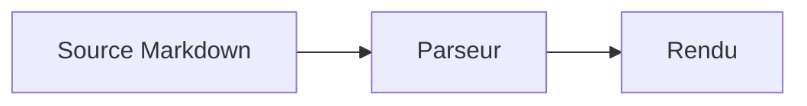

# Markdown

## Objectifs du cours

À la fin de ce cours, nous saurons :

- écrire un document Markdown lisible même sans rendu graphique ;
- distinguer **Markdown historique**, **CommonMark**, **GitHub Flavored Markdown (GFM)** et les extensions propres à Obsidian ;
- produire des documents portables entre Obsidian, GitHub, GitLab, Pandoc et les générateurs de documentation ;
- utiliser correctement les titres, listes, citations, liens, images, tableaux et blocs de code ;
- écrire des notes Obsidian avec wikiliens, transclusions, propriétés, callouts, formules et diagrammes ;
- éviter les pièges de sécurité liés au HTML, aux liens externes et aux contenus distants ;
- intégrer un lint Markdown dans Git et une CI ;
- choisir volontairement les extensions non portables lorsque leur bénéfice le justifie.

> [!important]
> Il n'existe pas **un unique Markdown universel**. Markdown désigne une famille de syntaxes proches. Un fichier peut être parfaitement valide dans Obsidian et se rendre différemment sur GitHub, Pandoc ou un CMS.

---

# 1. Origines et standardisation

## 1.1 Naissance de Markdown

Markdown est publié en **2004** par John Gruber, avec la contribution d'Aaron Swartz. L'objectif est de permettre l'écriture de documents structurés en texte brut avec une syntaxe qui reste lisible telle quelle.

Markdown n'a pas été créé « pour Reddit » : Reddit est lancé en 2005. Markdown a ensuite été adopté par de nombreux outils, dont les forges logicielles, générateurs de sites statiques, systèmes de tickets, notebooks et applications de prise de notes.

Le principe fondamental est :

> Le fichier source doit rester compréhensible par un humain même si aucun moteur Markdown ne le transforme en HTML.

Markdown est un **langage de balisage léger**, pas un langage de programmation.

## 1.2 Pourquoi les dialectes existent-ils ?

La description originale de Markdown laissait volontairement plusieurs cas ambigus. Les implémentations ont donc divergé sur des détails comme :

- les listes imbriquées ;
- les blocs HTML ;
- les retours à la ligne ;
- les underscores dans les mots ;
- les tableaux ;
- les notes de bas de page ;
- les identifiants de titres.

Cette divergence a conduit au projet **CommonMark**, qui définit une grammaire beaucoup plus précise et un ensemble de tests de conformité.

## 1.3 CommonMark

Au 29 août 2026, la dernière spécification CommonMark publiée est la **0.31.2**, datée du 28 janvier 2024.

CommonMark définit notamment :

- paragraphes ;
- titres ATX et Setext ;
- emphase et forte emphase ;
- citations ;
- listes ;
- blocs de code indentés ou délimités ;
- liens ;
- images ;
- autolinks standards ;
- HTML brut ;
- échappements.

CommonMark **ne définit pas** notamment :

- tableaux ;
- cases à cocher ;
- texte barré ;
- notes de bas de page ;
- callouts ;
- wikiliens ;
- propriétés YAML ;
- Mermaid ;
- formules mathématiques.

## 1.4 GitHub Flavored Markdown

**GitHub Flavored Markdown (GFM)** est un sur-ensemble strict de CommonMark.

La spécification formelle GFM actuelle est la **0.29-gfm**. Elle ajoute principalement :

- tableaux ;
- task list items ;
- texte barré ;
- autolinks étendus ;
- restrictions de certains éléments HTML pour la sécurité.

GitHub.com ajoute par ailleurs des fonctionnalités de plateforme qui ne font pas toutes partie de la spécification GFM formelle :

- mentions `@utilisateur` ;
- références `#123` vers issues et pull requests ;
- emoji codes ;
- notes de bas de page ;
- alerts ;
- rendu Mermaid ;
- rendu mathématique ;
- liens automatiques vers commits et autres objets GitHub.

Cette distinction est importante lorsqu'on vise un moteur GFM autre que GitHub.com.

## 1.5 Obsidian Markdown

Obsidian stocke les notes dans de vrais fichiers `.md`. Il comprend une grande partie de la syntaxe Markdown courante et ajoute des fonctionnalités adaptées à une base de connaissances :

- `[[wikiliens]]` ;
- transclusions `![[...]]` ;
- liens vers titres et blocs ;
- `#tags` ;
- propriétés en frontmatter YAML ;
- `==surlignage==` ;
- commentaires `%%...%%` ;
- callouts ;
- formules mathématiques ;
- diagrammes Mermaid ;
- embeds de notes, images, PDF et autres fichiers.

Ces syntaxes améliorent l'usage dans Obsidian mais réduisent parfois la portabilité.

---

# 2. Le modèle mental : source, parseur et rendu

Un fichier Markdown est du **texte brut**.

```text
fichier .md
   │
   ▼
parseur Markdown
   │
   ├── AST éventuel
   │
   ▼
rendu HTML / PDF / terminal / application
```

Le Markdown n'impose pas à lui seul :

- une police ;
- une couleur ;
- des marges ;
- une largeur de page ;
- une feuille CSS ;
- un thème.

Ces choix appartiennent au moteur de rendu.

## 2.1 Trois niveaux à distinguer

1. **Syntaxe** : ce que nous écrivons dans le fichier `.md`.
2. **Interprétation** : la manière dont un parseur comprend cette syntaxe.
3. **Présentation** : le HTML/CSS, PDF ou composant graphique final.

Par exemple :

```markdown
**important**
```

exprime une forte emphase. Le rendu pourra être en gras, mais la sémantique est plus importante que l'apparence exacte.

## 2.2 Règle de portabilité

Plus une syntaxe est proche de CommonMark, plus elle est portable.

Une bonne stratégie consiste à utiliser :

- CommonMark pour le contenu de base ;
- GFM lorsqu'on cible les forges logicielles ;
- les extensions Obsidian uniquement lorsque leur valeur dans le coffre est réelle ;
- HTML ou shortcodes uniquement lorsque le moteur de publication visé les exige.

---

# 3. Paragraphes et retours à la ligne

## 3.1 Paragraphes

Deux blocs de texte séparés par une ligne vide forment deux paragraphes.

```markdown
Premier paragraphe.

Second paragraphe.
```

Une simple nouvelle ligne dans le fichier n'est pas forcément un saut de ligne visible dans le rendu CommonMark.

```markdown
Cette phrase est sur une ligne.
Celle-ci est sur la ligne suivante dans le fichier.
```

Le moteur peut les rendre dans le même paragraphe.

## 3.2 Saut de ligne forcé

Deux formes CommonMark permettent un saut de ligne dur. Pour rendre les espaces visibles dans le cours, `␠␠` représente ici deux espaces réels en fin de ligne :

```text
Première ligne avec deux espaces à la fin.␠␠
Deuxième ligne.
```

ou :

```markdown
Première ligne\
Deuxième ligne.
```

La seconde forme est souvent plus explicite dans les diffs Git.

## 3.3 Espaces significatifs

Les espaces de fin de ligne sont difficiles à voir dans un éditeur. Ils peuvent donc créer des surprises.

Pour de la documentation maintenue en équipe, nous pouvons préférer :

- une ligne vide pour un nouveau paragraphe ;
- `\` lorsque nous voulons réellement un saut de ligne dur ;
- pas d'espaces inutiles en fin de ligne.

---

# 4. Titres

## 4.1 Titres ATX

La forme la plus portable est :

```markdown
# Titre de niveau 1
## Titre de niveau 2
### Titre de niveau 3
#### Titre de niveau 4
##### Titre de niveau 5
###### Titre de niveau 6
```

Nous ajoutons toujours un espace entre les `#` et le texte.

## 4.2 Titres Setext

CommonMark accepte aussi :

```markdown
Titre de niveau 1
=================

Titre de niveau 2
-----------------
```

Cette forme ne permet que les niveaux 1 et 2.

Pour un dépôt technique, les titres ATX sont souvent plus faciles à maintenir et à déplacer.

## 4.3 Hiérarchie

Nous évitons de sauter arbitrairement des niveaux :

```markdown
# Document

## Chapitre

### Section
```

plutôt que :

```markdown
# Document

#### Section
```

La hiérarchie des titres est utile pour :

- l'accessibilité ;
- les tables des matières ;
- les ancres ;
- la navigation dans Obsidian ;
- les outils de lint.

## 4.4 Ancres de titres

La génération d'identifiants HTML pour les titres dépend du moteur. Un lien de section GitHub n'est donc pas nécessairement identique à celui produit par Pandoc ou un générateur de site.

Dans Obsidian, nous pouvons pointer directement vers un titre :

```markdown
[[Markdown#Titres]]
```

---

# 5. Emphase, forte emphase et autres styles

## 5.1 Italique

```markdown
*italique*
_italique_
```

## 5.2 Forte emphase

```markdown
**important**
__important__
```

## 5.3 Gras et italique

```markdown
***très important***
```

## 5.4 Barré

Le texte barré n'est pas CommonMark. Il est notamment pris en charge par GFM :

```markdown
~~ancienne information~~
```

## 5.5 Surlignage Obsidian

Obsidian prend en charge :

```markdown
==information à retenir==
```

Cette syntaxe n'est ni CommonMark ni GFM standard.

## 5.6 Soulignement

Markdown n'a pas de syntaxe standard pour souligner. Certains moteurs acceptent du HTML :

```html
<ins>texte souligné</ins>
```

L'usage d'un élément HTML réduit la portabilité et peut être filtré par certaines plateformes.

## 5.7 Ne pas utiliser les styles à la place de la structure

Un faux titre comme :

```markdown
**INSTALLATION**
```

n'est pas un vrai titre. Pour la navigation et l'accessibilité, préférons :

```markdown
## Installation
```

---

# 6. Échappements et caractères spéciaux

Une barre oblique inverse peut neutraliser plusieurs caractères de syntaxe :

```markdown
\*pas en italique\*
\# pas un titre
\[pas un lien\]
```

Pour écrire un antislash littéral :

```markdown
\\
```

Les échappements sont particulièrement utiles lorsque nous documentons Markdown lui-même.

---

# 7. Listes

## 7.1 Liste non ordonnée

```markdown
- premier élément
- deuxième élément
- troisième élément
```

CommonMark accepte également `*` et `+`, mais il est préférable d'utiliser un style cohérent dans un même projet.

## 7.2 Liste ordonnée

```markdown
1. préparer le dépôt ;
2. modifier les fichiers ;
3. lancer les tests ;
4. créer le commit.
```

Certains auteurs écrivent tous les marqueurs avec `1.` :

```markdown
1. étape A
1. étape B
1. étape C
```

Le moteur calcule alors la numérotation. Cette pratique réduit le bruit lorsqu'un élément est inséré au milieu d'une liste.

## 7.3 Listes imbriquées

```markdown
- Linux
  - Debian
    - stable
    - testing
  - Fedora
- BSD
```

L'indentation est significative. Pour les éléments complexes, quatre espaces offrent généralement une lecture robuste.

## 7.4 Paragraphes dans une liste

```markdown
1. Premier élément.

   Ce paragraphe appartient encore au premier élément.

2. Deuxième élément.
```

## 7.5 Bloc de code dans une liste

````markdown
1. Exécuter :

   ```bash
   git status
   ```

2. Examiner le résultat.
````

## 7.6 Listes de tâches

Les task list items sont une extension GFM :

```markdown
- [x] écrire le cours
- [ ] relire les exemples
- [ ] lancer le lint
```

Sur GitHub, les cases peuvent devenir interactives selon le contexte. Obsidian sait également les rendre et les manipuler.

> [!note]
> GitHub a retiré son ancien concept de « tasklist blocks » enrichis, mais la syntaxe Markdown classique `- [ ]` reste prise en charge.

---

# 8. Citations

## 8.1 Citation simple

```markdown
> La simplicité est une fonctionnalité.
```

## 8.2 Citation sur plusieurs paragraphes

```markdown
> Premier paragraphe.
>
> Deuxième paragraphe.
```

## 8.3 Citation imbriquée

```markdown
> Niveau 1
>> Niveau 2
```

Une citation Markdown ne remplace pas une référence bibliographique : il faut également identifier la source lorsque le contexte l'exige.

---

# 9. Code inline et blocs de code

## 9.1 Code inline

```markdown
Utilisez `git status` avant de committer.
```

Le code inline ne doit généralement pas être utilisé comme simple décoration typographique.

## 9.2 Contenir un backtick

Nous pouvons utiliser plusieurs backticks comme délimiteur :

```markdown
``Une expression contenant ` un backtick``
```

## 9.3 Bloc délimité

````markdown
```python
print("Bonjour")
```
````

Le nom placé après les backticks est une **info string**. De nombreux moteurs l'utilisent pour choisir la coloration syntaxique.

## 9.4 Tildes

CommonMark autorise également :

```text
~~~python
print("Bonjour")
~~~
```

Les backticks sont toutefois plus fréquents.

## 9.5 Afficher un bloc Markdown contenant des fences

Pour documenter un bloc à trois backticks, nous pouvons utiliser quatre backticks autour :

`````markdown
````markdown
```python
print("Bonjour")
```
````
`````

## 9.6 Blocs indentés

CommonMark accepte aussi quatre espaces d'indentation :

```text
    print("Bonjour")
```

Pour la documentation technique, les fences sont généralement préférables car elles permettent d'indiquer explicitement le langage.

---

# 10. Liens

## 10.1 Lien inline

```markdown
[OpenAI](https://openai.com/)
```

## 10.2 Titre facultatif

```markdown
[CommonMark](https://commonmark.org/ "Site CommonMark")
```

## 10.3 Liens de référence

Ils améliorent la lisibilité lorsqu'une URL est longue ou réutilisée :

```markdown
La [spécification CommonMark][commonmark] décrit la syntaxe de base.

[commonmark]: https://spec.commonmark.org/
```

## 10.4 Forme raccourcie

```markdown
[CommonMark][]

[CommonMark]: https://spec.commonmark.org/
```

## 10.5 Autolinks CommonMark

```markdown
<https://example.org/>
<user@example.org>
```

GFM reconnaît en plus certaines URL sans chevrons.

## 10.6 Liens relatifs

Dans un dépôt Git :

```markdown
[Guide d'installation](docs/installation.md)
```

Les liens relatifs sont préférables aux URL absolues vers une branche lorsque les fichiers vivent dans le même dépôt.

## 10.7 Texte de lien accessible

Évitons :

```markdown
[Cliquez ici](guide.md)
```

Préférons :

```markdown
[Consulter le guide d'installation](guide.md)
```

Le lien reste compréhensible hors contexte et pour un lecteur d'écran.

---

# 11. Images

## 11.1 Syntaxe

```markdown

```

Le texte entre crochets est un **texte alternatif**, pas une légende.

## 11.2 Image décorative

Pour une image véritablement décorative :

```markdown

```

Un `alt` vide indique généralement aux technologies d'assistance qu'elles peuvent ignorer l'image.

## 11.3 Titre facultatif

```markdown

```

## 11.4 Image cliquable

```markdown
[](https://example.org/)
```

## 11.5 Images distantes et confidentialité

Une image distante :

```markdown

```

peut permettre au serveur distant de connaître qu'un lecteur a ouvert le document, selon le moteur de rendu et sa politique de chargement.

Pour des notes privées ou sensibles, nous privilégions les pièces jointes locales lorsque c'est possible.

---

# 12. Tableaux

Les tableaux sont une **extension GFM**, pas une fonctionnalité CommonMark.

```markdown
| Nom       | Type    | Obligatoire |
|-----------|---------|:-----------:|
| `id`      | entier  | oui         |
| `comment` | chaîne  | non         |
```

Les deux-points déterminent l'alignement :

```markdown
| Gauche | Centre | Droite |
|:-------|:------:|-------:|
| A      | B      | C      |
```

## 12.1 Échapper un pipe dans une cellule

```markdown
| Expression |
|------------|
| `A \| B`   |
```

Le comportement dans le code inline varie entre moteurs ; lorsque la portabilité est essentielle, un tableau complexe peut être mieux représenté autrement.

## 12.2 Limites des tableaux Markdown

Les tableaux Markdown sont adaptés aux données simples. Ils gèrent mal :

- cellules fusionnées ;
- en-têtes à plusieurs niveaux ;
- contenus longs ;
- tableaux accessibles complexes.

Dans ces situations, une liste structurée ou un vrai tableau HTML peut être plus approprié, si la cible autorise le HTML.

---

# 13. Lignes horizontales

CommonMark accepte notamment :

```markdown
---
```

ou :

```markdown
***
```

Attention : juste après une ligne de texte, une série de tirets peut être interprétée comme un titre Setext de niveau 2.

---

# 14. HTML brut dans Markdown

CommonMark possède des règles pour les blocs et éléments HTML bruts.

```html
<details>
  <summary>Afficher le détail</summary>

  Contenu.
</details>
```

Mais deux questions doivent être posées :

1. **Le parseur accepte-t-il le HTML ?**
2. **La plateforme le conserve-t-elle après sanitization ?**

GitHub filtre certains éléments ou attributs dangereux après rendu. D'autres moteurs suppriment tout HTML brut.

Nous n'utilisons donc pas le HTML comme hypothèse de portabilité universelle.

## 14.1 Sécurité

Du Markdown non fiable ne doit jamais être transformé en HTML puis injecté tel quel dans une page sans sanitization adaptée.

Les risques peuvent inclure :

- XSS ;
- URL dangereuses ;
- contenus embarqués ;
- styles trompeurs ;
- ressources distantes de suivi.

---

# 15. GitHub Flavored Markdown en pratique

## 15.1 Texte barré

```markdown
~~obsolète~~
```

## 15.2 Task lists

```markdown
- [x] terminé
- [ ] à faire
```

## 15.3 Autolinks étendus

GitHub reconnaît de nombreuses URL directement :

```markdown
https://example.org/
```

Ce comportement ne doit pas être supposé sur tous les moteurs CommonMark.

## 15.4 Mentions GitHub

```markdown
@octocat
```

La notification est une fonctionnalité de **GitHub**, pas de Markdown en soi.

## 15.5 Issues et pull requests

```markdown
#123
org/repo#123
```

Ces références dépendent du contexte GitHub.

## 15.6 Notes de bas de page sur GitHub

GitHub.com prend en charge :

```markdown
Une affirmation avec une note[^source].

[^source]: Référence détaillée.
```

Les notes de bas de page ne font pas partie de la spécification GFM 0.29-gfm elle-même.

## 15.7 Alerts GitHub

GitHub prend en charge cinq types d'alerts :

```markdown
> [!NOTE]
> Information utile.

> [!TIP]
> Conseil pratique.

> [!IMPORTANT]
> Information essentielle.

> [!WARNING]
> Risque important.

> [!CAUTION]
> Conséquence potentiellement négative.
```

Cette syntaxe ressemble aux callouts d'Obsidian, mais le comportement exact et les types disponibles peuvent différer.

## 15.8 Emoji codes

Sur GitHub :

```markdown
:+1:
:tada:
```

Le rendu des codes emoji est une fonctionnalité de plateforme.

## 15.9 Diagrammes et maths sur GitHub

GitHub sait afficher plusieurs syntaxes enrichies, dont Mermaid et des expressions mathématiques. Cela ne signifie pas que Mermaid ou LaTeX appartiennent à GFM.

---

# 16. Obsidian : liens et transclusions

## 16.1 Wikilien simple

```markdown
[[Python]]
```

## 16.2 Alias

```markdown
[[Python|cours Python]]
```

Le nom du fichier reste `Python.md`, mais le texte visible est « cours Python ».

## 16.3 Lien vers un titre

```markdown
[[Python#Les décorateurs]]
```

## 16.4 Lien vers un titre de la note courante

```markdown
[[#Liens et transclusions]]
```

## 16.5 Lien vers un bloc

Un bloc peut recevoir un identifiant :

```markdown
Ce paragraphe pourra être ciblé. ^definition-markdown
```

Puis :

```markdown
[[Markdown#^definition-markdown]]
```

## 16.6 Transclusion d'une note

```markdown
![[Python]]
```

## 16.7 Transclusion d'une section

```markdown
![[Python#Décorateurs]]
```

## 16.8 Transclusion d'un bloc

```markdown
![[Markdown#^definition-markdown]]
```

## 16.9 Pièce jointe

```markdown
![[architecture.png]]
```

Obsidian peut aussi intégrer d'autres types de fichiers supportés, notamment PDF et audio, selon le contexte.

## 16.10 Portabilité des wikiliens

Le wikilien :

```markdown
[[Python]]
```

n'est pas CommonMark.

Si le document doit être publié sur un moteur qui ne les transforme pas, nous pouvons préférer :

```markdown
[Python](Python.md)
```

ou effectuer une conversion lors du build.

---

# 17. Obsidian : tags

```markdown
#python
#securite/linux
```

Les tags sont indexés par Obsidian. Un `#` n'est reconnu comme tag que dans certains contextes et selon les règles d'Obsidian.

Nous pouvons aussi stocker des tags dans les propriétés :

```yaml
---
tags:
  - python
  - securite
---
```

Pour un gros coffre, les propriétés sont souvent plus faciles à normaliser automatiquement.

---

# 18. Obsidian : propriétés et frontmatter YAML

Un document peut commencer par un frontmatter YAML :

```yaml
---
titre: Exemple
type: cours
statut: actif
tags:
  - markdown
  - documentation
publication: false
---
```

Les trois tirets doivent se trouver au début du fichier pour être interprétés comme frontmatter par les outils qui suivent cette convention.

## 18.1 Types de données

YAML permet :

```yaml
texte: "Bonjour"
nombre: 42
booleen: true
date: 2026-08-29
liste:
  - un
  - deux
```

## 18.2 Quoter les valeurs ambiguës

Certaines chaînes peuvent être interprétées comme dates, nombres ou valeurs spéciales selon le parseur. Pour les identifiants, titres ou valeurs devant absolument rester des chaînes, les guillemets sont prudents :

```yaml
uid: "01M02EX5BRHTE5B8223N38ME6A"
version: "1.0"
```

## 18.3 Frontmatter ≠ CommonMark

Le YAML frontmatter n'est pas défini par CommonMark. Il s'agit d'une convention reconnue par de nombreux outils.

---

# 19. Obsidian : callouts

## 19.1 Callout de base

```markdown
> [!note]
> Ceci est une note.
```

## 19.2 Titre personnalisé

```markdown
> [!warning] Attention aux secrets
> Ne versionnez jamais un token d'accès.
```

## 19.3 Callout repliable

```markdown
> [!example]- Solution
> Contenu replié par défaut.
```

ou :

```markdown
> [!example]+ Solution
> Contenu ouvert par défaut.
```

## 19.4 Types courants

Obsidian prend notamment en charge des familles telles que :

- `note` ;
- `abstract` ;
- `info` ;
- `todo` ;
- `tip` ;
- `success` ;
- `question` ;
- `warning` ;
- `failure` ;
- `danger` ;
- `bug` ;
- `example` ;
- `quote`.

Le style dépend du thème.

---

# 20. Obsidian : commentaires et surlignage

## 20.1 Commentaires Obsidian

```markdown
%% Ce texte n'est pas rendu en mode lecture. %%
```

Pour plusieurs lignes :

```markdown
%%
Brouillon interne.
À retirer avant publication.
%%
```

Ce mécanisme est spécifique à Obsidian.

## 20.2 Commentaires HTML

```html
<!-- commentaire HTML -->
```

Le comportement dépend du moteur et de la pipeline de publication.

## 20.3 Surlignage

```markdown
==élément important==
```

Là encore, cette syntaxe n'est pas portable en CommonMark pur.

---

# 21. Notes de bas de page

Obsidian et GitHub prennent tous deux en charge une syntaxe de notes de bas de page proche :

```markdown
Markdown a été publié en 2004[^md].

[^md]: Voir la documentation historique de Markdown.
```

Nous ne devons toutefois pas conclure que les footnotes appartiennent à CommonMark : ce n'est pas le cas.

Pour un document destiné à plusieurs moteurs, testons toujours la cible réelle.

---

# 22. Mathématiques

Les mathématiques ne font pas partie du langage Markdown. Des moteurs tels qu'Obsidian ou GitHub ajoutent un rendu mathématique fondé sur une syntaxe de type LaTeX.

## 22.1 Formule inline

```markdown
La relation $E = mc^2$ est bien connue.
```

Dans Obsidian : $E = mc^2$.

## 22.2 Bloc de formule

```markdown
$$
\sum_{i=1}^{n} i = \frac{n(n+1)}{2}
$$
```

## 22.3 Lettres grecques

```text
\alpha  \beta  \gamma  \Gamma
\delta  \Delta  \epsilon
\pi     \Pi    \theta
```

Exemple :

$$
\alpha + \beta = \gamma
$$

## 22.4 Indices et exposants

```text
x_i
x^2
x_i^2
x_{n+1}
```

$$
x_{n+1} = x_n + 1
$$

## 22.5 Fractions et racines

```text
\frac{a}{b}
\sqrt{x}
\sqrt[n]{x}
```

$$
\frac{4z^3}{16} = \frac{z^3}{4}
$$

## 22.6 Sommes, produits et intégrales

```text
\sum_{i=1}^{n}
\prod_{i=1}^{n}
\int_0^\infty
```

$$
\int_0^\infty e^{-x}\,dx = 1
$$

## 22.7 Ensembles et logique

```text
\in
\notin
\subset
\subseteq
\forall
\exists
\land
\lor
```

## 22.8 Matrices

```text
\begin{pmatrix}
1 & 2 \\
3 & 4
\end{pmatrix}
```

$$
\begin{pmatrix}
1 & 2 \\
3 & 4
\end{pmatrix}
$$

## 22.9 Portabilité des maths

Un exportateur peut utiliser :

- MathJax ;
- KaTeX ;
- LaTeX natif ;
- une conversion vers MathML ;
- aucun moteur mathématique.

Nous testons donc les macros complexes sur la cible finale.

---

# 23. Diagrammes Mermaid

Mermaid n'est pas Markdown. Il s'insère généralement dans un fenced code block spécialisé :

````markdown

````

Dans Obsidian, le rendu Mermaid dépend de la version embarquée par l'application. Nous nous reportons au cours [[Mermaid pour Obsidian]] pour les détails.

> [!note]
> Obsidian 1.13 a renforcé les garde-fous de sécurité autour du rendu Mermaid. Un coffre peut demander une autorisation avant d'exécuter/rendre les diagrammes.

---

# 24. Dialectes : matrice de compatibilité

| Fonction | CommonMark | GFM spec | GitHub.com | Obsidian |
|---|:---:|:---:|:---:|:---:|
| titres `#` | oui | oui | oui | oui |
| gras / italique | oui | oui | oui | oui |
| liens / images | oui | oui | oui | oui |
| fenced code | oui | oui | oui | oui |
| tableaux | non | oui | oui | oui |
| barré `~~` | non | oui | oui | oui |
| tasks `- [ ]` | non | oui | oui | oui |
| footnotes | non | non | oui | oui |
| alerts GitHub | non | non | oui | partiel / autre syntaxe |
| wikiliens | non | non | non natif | oui |
| transclusions `![[...]]` | non | non | non | oui |
| `==surlignage==` | non | non | non standard | oui |
| frontmatter YAML | non | non | selon outil | oui |
| mathématiques | non | non | oui, plateforme | oui |
| Mermaid | non | non | oui, plateforme | oui |

Cette table distingue volontairement **spécification** et **fonctionnalités d'une plateforme**.

---

# 25. Portabilité : écrire pour plusieurs moteurs

## 25.1 Niveau 1 : portable presque partout

Utilisons :

- titres ATX ;
- paragraphes ;
- listes ;
- citations ;
- liens Markdown ;
- images Markdown ;
- code inline ;
- fenced code blocks ;
- forte emphase et emphase.

## 25.2 Niveau 2 : écosystème forge logicielle

Ajoutons éventuellement :

- tableaux ;
- task lists ;
- texte barré.

## 25.3 Niveau 3 : Obsidian

Ajoutons si utile :

- propriétés ;
- wikiliens ;
- transclusions ;
- callouts ;
- surlignage ;
- bloc IDs ;
- Mermaid ;
- mathématiques.

## 25.4 Éviter le verrouillage involontaire

Si une note doit devenir un jour un README public, il peut être judicieux d'utiliser dès le départ des liens Markdown classiques plutôt que des wikiliens.

À l'inverse, dans une base de connaissances exclusivement Obsidian, les wikiliens procurent une valeur importante et il serait dommage de s'en priver uniquement pour une portabilité hypothétique.

Le bon critère est donc **l'intention de publication**.

---

# 26. Accessibilité

Markdown n'est pas automatiquement accessible. Le rendu final dépend de la structure choisie.

## 26.1 Hiérarchie des titres

Nous suivons une hiérarchie logique sans sauter arbitrairement des niveaux.

## 26.2 Texte alternatif

```markdown

```

Un bon `alt` décrit l'information utile, pas chaque détail visuel.

## 26.3 Liens explicites

Préférons :

```markdown
[Documentation de l'API](api.md)
```

à :

```markdown
[ici](api.md)
```

## 26.4 Ne pas encoder l'information uniquement par la couleur

Un emoji rouge ou un style CSS ne doit pas être le seul moyen d'indiquer un échec.

```markdown
**Échec :** le test d'intégration n'a pas terminé.
```

est plus robuste.

## 26.5 Tableaux simples

Les tableaux Markdown ne permettent pas d'exprimer toutes les relations d'en-têtes complexes. Pour des données complexes, une structure en listes ou un tableau HTML accessible peut être préférable.

---

# 27. Sécurité

## 27.1 Le Markdown n'est pas intrinsèquement sûr

Le danger apparaît lorsqu'un contenu est rendu dans un navigateur ou enrichi par une application.

Nous devons considérer :

- HTML brut ;
- liens `javascript:` ou protocoles inattendus ;
- embeds distants ;
- iframes ;
- images de tracking ;
- scripts de plugins ;
- contenus copiés-collés contenant des commandes dangereuses.

## 27.2 Sanitization

Une application Web qui accepte du Markdown utilisateur doit :

1. parser le Markdown ;
2. produire le HTML ;
3. **sanitizer le HTML avec une politique adaptée** ;
4. appliquer des protections telles qu'une CSP lorsque pertinent.

Échapper seulement les `<script>` n'est pas suffisant.

## 27.3 Secrets

Un fichier Markdown versionné est du code source du point de vue de Git : son historique peut conserver un secret même après suppression de la ligne.

Ne mettons jamais dans une note publiée ou versionnée :

- mot de passe ;
- clé privée ;
- token API ;
- cookie de session ;
- secret OAuth.

## 27.4 Markdown et instructions pour agents IA

Un README, une issue ou une documentation externe peut contenir des instructions malveillantes destinées à un agent IA. Lorsqu'un agent lit du Markdown non fiable, nous devons considérer ce contenu comme de la **donnée**, pas comme une autorité supérieure.

---

# 28. Style de rédaction technique

## 28.1 Une idée par section

Une bonne section répond à une question précise.

## 28.2 Titres descriptifs

Préférons :

```markdown
## Configurer le cache Redis
```

à :

```markdown
## Divers
```

## 28.3 Exemples copiables

Évitons de préfixer toutes les commandes avec `$` lorsqu'il n'y a pas de sortie à distinguer :

```bash
git status
git diff
```

est plus facile à copier que :

```text
$ git status
$ git diff
```

## 28.4 Indiquer le langage des fenced code blocks

Préférons :

````markdown
```python
print("Bonjour")
```
````

à un bloc sans info string.

## 28.5 Éviter les lignes inutilement immenses

La longueur maximale dépend du projet. Les longues URL, tableaux et extraits de code justifient souvent des exceptions.

L'objectif n'est pas d'obéir à un nombre arbitraire mais de produire des diffs relisibles.

---

# 29. Linting Markdown

Un linter aide à détecter :

- niveaux de titres incohérents ;
- espaces finaux ;
- blocs de code sans langage ;
- listes mal indentées ;
- titres dupliqués ;
- liens nus ;
- conventions de style divergentes.

## 29.1 markdownlint

L'écosystème `markdownlint` définit des règles telles que :

- `MD001` : progression des niveaux de titres ;
- `MD013` : longueur de ligne ;
- `MD022` : lignes vides autour des titres ;
- `MD025` : plusieurs H1 ;
- `MD040` : langage des fenced code blocks ;
- `MD047` : newline finale.

Toutes les règles ne conviennent pas à tous les coffres Obsidian. Par exemple, un frontmatter YAML ou certaines tables peuvent nécessiter une configuration adaptée.

## 29.2 Exemple de configuration markdownlint-cli2

```yaml
---
config:
  default: true
  MD013: false
  MD025: false
  MD041: false
---
```

Dans un dépôt réel, nous plaçons plutôt cette configuration dans le fichier attendu par l'outil choisi.

## 29.3 CI

Exemple générique :

```bash
npx markdownlint-cli2 '**/*.md'
```

La CI peut aussi contrôler :

- liens cassés ;
- frontmatter ;
- orthographe ;
- schéma de métadonnées ;
- rendu des diagrammes.

---

# 30. Formatage automatique

Des outils comme Prettier, mdformat ou certains éditeurs peuvent reformater Markdown automatiquement.

Cela peut être utile pour :

- homogénéiser les listes ;
- réindenter ;
- reformater les tableaux ;
- normaliser les espaces.

Mais l'autoformatage peut aussi :

- produire de très gros diffs ;
- modifier une syntaxe Obsidian spécifique ;
- reformater un tableau volontairement aligné ;
- perturber des blocs mêlant Markdown et HTML.

Nous testons donc le formateur sur le dialecte réel du dépôt avant de l'appliquer globalement.

---

# 31. Markdown et Git

Markdown est particulièrement adapté à Git parce qu'il est textuel.

## 31.1 Diffs lisibles

```bash
git diff -- '*.md'
```

## 31.2 Commits atomiques

Un changement documentaire doit idéalement avoir une intention claire :

```text
docs(markdown): complète la partie GFM
```

## 31.3 Renommer avec Git

```bash
git mv ancien-nom.md nouveau-nom.md
```

Git ne stocke pas réellement un objet « rename » dans le commit ; il peut détecter le renommage par similarité lors de l'affichage du diff.

## 31.4 Conflits

Les conflits Markdown restent des conflits texte :

```text
    <<<<<<< HEAD
    Version A
    =======
    Version B
    >>>>>>> branche
```

Nous devons les résoudre avant de commit.

---

# 32. README et documentation de projet

Un bon `README.md` répond rapidement à :

1. Qu'est-ce que le projet ?
2. À quoi sert-il ?
3. Comment l'installer ?
4. Comment l'utiliser ?
5. Comment contribuer ?
6. Quelle est la licence ?

Exemple de squelette :

````markdown
# Nom du projet

Résumé en deux phrases.

## Installation

```bash
python -m pip install projet
```

## Usage

```python
import projet
```

## Développement

Instructions de test.

## Licence

SPDX-License-Identifier: MIT
````

Nous adaptons le niveau de détail à l'audience.

---

# 33. Markdown avec Pandoc et autres convertisseurs

Pandoc peut convertir du Markdown vers de nombreux formats :

```bash
pandoc document.md -o document.html
pandoc document.md -o document.pdf
```

Pandoc possède son propre dialecte et de nombreuses extensions. Le fait qu'une syntaxe fonctionne dans Pandoc ne signifie pas qu'elle fonctionne en CommonMark pur.

Pour une pipeline robuste, nous fixons explicitement :

- le dialecte d'entrée ;
- les extensions activées ;
- le format de sortie ;
- les filtres ;
- les templates.

Exemple conceptuel :

```bash
pandoc --from=gfm --to=html README.md -o README.html
```

---

# 34. Markdown dans les générateurs de documentation

Des outils comme :

- MkDocs ;
- Material for MkDocs ;
- Docusaurus ;
- Hugo ;
- Jekyll ;
- Sphinx avec MyST ;

peuvent accepter Markdown, mais chacun peut apporter :

- frontmatter ;
- admonitions ;
- macros ;
- directives ;
- tabs ;
- attributs ;
- shortcodes ;
- plugins.

Nous devons lire la documentation du moteur plutôt que supposer qu'une extension appartient à Markdown.

---

# 35. Cas des CMS comme Grav

Le cours historique mélangeait plusieurs syntaxes propres à Grav, Bootstrap et des plugins avec le langage Markdown lui-même.

Grav peut étendre son parseur avec des fonctionnalités dépendant :

- du thème ;
- de Markdown Extra ;
- de plugins ;
- de shortcodes.

Par exemple, une syntaxe telle que :

```text
[center]Texte[/center]
```

ou :

```text
[fa=firefox /]
```

ne doit **jamais** être décrite comme de la syntaxe Markdown standard.

La bonne approche est :

1. identifier le plugin ou thème qui fournit la syntaxe ;
2. vérifier sa version ;
3. documenter la dépendance ;
4. prévoir un fallback si le contenu doit sortir de Grav.

Le même principe vaut pour les classes Bootstrap ajoutées via HTML.

---

# 36. Erreurs fréquentes

## 36.1 Croire que Markdown = GFM

Faux : GFM est un dialecte de Markdown.

## 36.2 Croire que les tableaux sont standards partout

Faux : ils ne sont pas dans CommonMark.

## 36.3 Utiliser `==texte==` sur GitHub en supposant un surlignage

Ce comportement n'est pas portable. C'est notamment une extension Obsidian.

## 36.4 Confondre un tag Obsidian et un titre

```markdown
#python
```

et :

```markdown
# Python
```

n'ont pas le même objectif.

## 36.5 Oublier la ligne vide autour des blocs

Des parseurs tolèrent beaucoup de choses, d'autres moins. Des lignes vides autour des titres, listes complexes et fences améliorent la robustesse.

## 36.6 Mettre un secret dans un exemple

Même un exemple « temporaire » peut finir dans l'historique Git.

## 36.7 Utiliser du HTML pour tout

Si la moitié du document est du HTML, le bénéfice de Markdown devient faible et la portabilité diminue.

## 36.8 Croire qu'un rendu correct dans l'éditeur garantit le rendu de publication

Le mode Live Preview, GitHub, le générateur statique et le PDF peuvent utiliser quatre moteurs différents.

---

# 37. Stratégie recommandée pour ce coffre Obsidian

Pour un coffre Obsidian versionné avec Git, nous pouvons adopter les règles suivantes :

1. **CommonMark/GFM comme socle** pour le corps des cours ;
2. propriétés YAML normalisées pour les métadonnées ;
3. wikiliens pour les relations internes durables ;
4. liens Markdown pour les ressources destinées à être publiées hors du coffre ;
5. callouts Obsidian pour les remarques pédagogiques importantes ;
6. Mermaid uniquement lorsque le diagramme apporte réellement de l'information ;
7. pas de HTML pour de simples effets visuels ;
8. fences avec un langage explicite ;
9. un linter configuré pour accepter les conventions du coffre ;
10. des commits de documentation petits et relisibles.

## 37.1 Exemple de note pédagogique

````markdown
---
titre: "Exemple"
type: cours
themes:
  - python
---

# Exemple

## Objectif

Comprendre la fonction `map`.

> [!important]
> `map` retourne un itérateur en Python 3.

```python
resultat = map(str.upper, ["a", "b"])
print(list(resultat))
```

Voir aussi [[Python]].
````

---

# 38. Travaux pratiques

## TP 1 — Syntaxe CommonMark minimale

Créer `tp-commonmark.md` contenant :

- un H1 ;
- deux H2 ;
- gras et italique ;
- liste ordonnée et non ordonnée ;
- citation ;
- lien ;
- image ;
- bloc de code.

Vérifier le rendu dans deux moteurs différents.

## TP 2 — Identifier les extensions

Pour chacune des syntaxes suivantes, indiquer si elle relève de CommonMark, GFM, GitHub ou Obsidian :

```text
~~barré~~
[[Python]]
- [ ] tâche
==surligné==
[^1]
> [!WARNING]
```

## TP 3 — Rendre un README portable

Prendre une note Obsidian contenant des wikiliens et la transformer en `README.md` lisible sur GitHub sans plugin.

## TP 4 — Liens de référence

Réécrire un document contenant dix longues URL en utilisant des liens de référence.

Comparer le diff Git avant/après.

## TP 5 — Tableaux

Créer un tableau comparant cinq outils Markdown avec :

- nom ;
- dialecte ;
- tableaux ;
- footnotes ;
- Mermaid ;
- wikiliens.

Tester les pipes échappés.

## TP 6 — Propriétés Obsidian

Créer un frontmatter avec :

- titre ;
- type ;
- statut ;
- date ;
- tags ;
- auteur ;
- niveau.

Valider le YAML avec un parseur externe.

## TP 7 — Callouts et accessibilité

Créer trois callouts puis vérifier que le contenu reste compréhensible si les couleurs et icônes disparaissent.

## TP 8 — Mathématiques

Écrire :

- une somme ;
- une intégrale ;
- une matrice ;
- une formule avec fraction ;
- une formule inline.

## TP 9 — Mermaid

Créer un diagramme Mermaid représentant :

```text
Markdown → parseur → HTML → navigateur
```

Puis vérifier son comportement sur Obsidian et GitHub.

## TP 10 — Lint

Installer un linter Markdown dans un dépôt de test et faire échouer volontairement les règles :

- titre sauté ;
- fence sans langage ;
- espaces finaux ;
- fichier sans newline finale.

Corriger ensuite les erreurs.

## TP 11 — Audit de portabilité

Choisir cinq notes du coffre et classer chaque fonctionnalité rencontrée en :

- portable ;
- GFM ;
- Obsidian ;
- dépendance de plugin ;
- HTML brut.

Proposer une stratégie d'export.

## TP 12 — Pipeline documentation

Construire une petite pipeline qui :

1. vérifie le frontmatter ;
2. lint les `.md` ;
3. recherche les liens cassés ;
4. transforme un fichier Markdown en HTML ;
5. échoue si une étape échoue.

---

# 39. Projet final — Documentation technique portable

## Objectif

Produire une mini-documentation de projet utilisable à la fois :

- dans Obsidian ;
- sur GitHub ;
- dans un export HTML.

## Structure proposée

```text
docs/
├── index.md
├── installation.md
├── architecture.md
├── securite.md
└── images/
    └── architecture.png
README.md
```

## Contraintes

Le projet doit contenir :

- une hiérarchie de titres correcte ;
- des liens relatifs ;
- une image avec `alt` utile ;
- un tableau GFM ;
- une liste de tâches ;
- plusieurs blocs de code avec info string ;
- une section sécurité ;
- un diagramme Mermaid ;
- un frontmatter dans les documents internes ;
- un lint automatique ;
- aucune URL ou syntaxe spécifique non documentée.

## Critère de réussite

Un lecteur doit pouvoir ouvrir le source `.md` dans un simple éditeur texte et comprendre la structure sans dépendre du rendu graphique.

---

# 40. Checklist Markdown

Avant de publier un document :

- [ ] le dialecte cible est connu ;
- [ ] la hiérarchie des titres est cohérente ;
- [ ] les paragraphes sont séparés clairement ;
- [ ] les listes sont correctement indentées ;
- [ ] les blocs de code indiquent leur langage ;
- [ ] les exemples sont copiables ;
- [ ] les liens ont un texte explicite ;
- [ ] les liens relatifs sont privilégiés dans le dépôt ;
- [ ] les images importantes ont un texte alternatif ;
- [ ] les tableaux restent simples ;
- [ ] les extensions Obsidian sont intentionnelles ;
- [ ] les propriétés YAML sont valides ;
- [ ] aucun secret n'est présent ;
- [ ] le HTML brut est nécessaire et autorisé ;
- [ ] les liens externes sont sûrs ;
- [ ] le document passe le lint convenu ;
- [ ] le rendu a été testé sur la cible finale.

---

# 41. Résumé

Les points essentiels à retenir sont :

1. **Markdown est une famille de dialectes**, pas une grammaire universelle unique.
2. **CommonMark** fournit le socle standardisé le plus portable.
3. **GFM** ajoute notamment tableaux, tasks, barré et autolinks étendus.
4. GitHub.com ajoute encore des fonctionnalités de plateforme au-dessus de GFM.
5. **Obsidian** ajoute wikiliens, embeds, propriétés, callouts, commentaires, surlignage, maths et Mermaid.
6. Plus une extension est spécifique, plus il faut documenter la cible et prévoir l'export.
7. Markdown reste particulièrement adapté à Git grâce à sa nature textuelle.
8. La structure, l'accessibilité et la sécurité restent plus importantes que les effets visuels.

---

# 42. Références

## Spécifications

- CommonMark Spec : <https://spec.commonmark.org/>
- GitHub Flavored Markdown Spec : <https://github.github.com/gfm/>

## GitHub

- Écriture et mise en forme : <https://docs.github.com/en/get-started/writing-on-github>

## Obsidian

- Documentation officielle : <https://help.obsidian.md/>
- Changelog : <https://obsidian.md/changelog/>

## Outils

- Pandoc : <https://pandoc.org/>
- markdownlint : <https://github.com/markdownlint/markdownlint>

## Cours liés

- [[Obsidian]]
- [[Mermaid pour Obsidian]]
- [[git]]
- [[HTML]]
