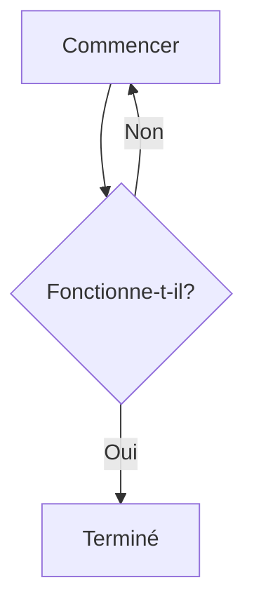
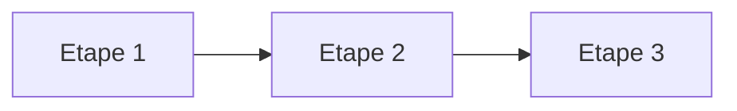
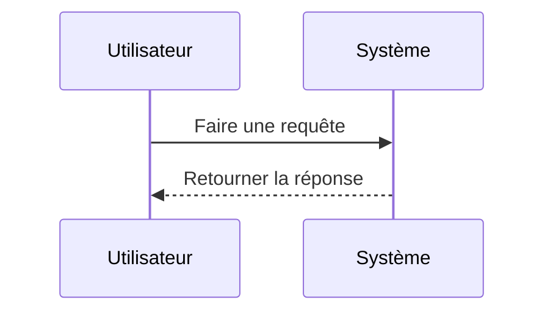
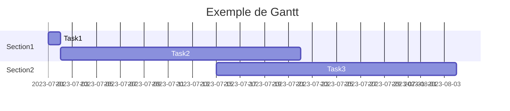
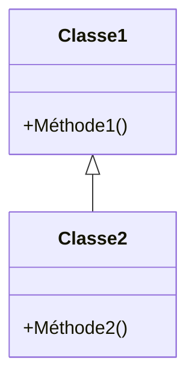
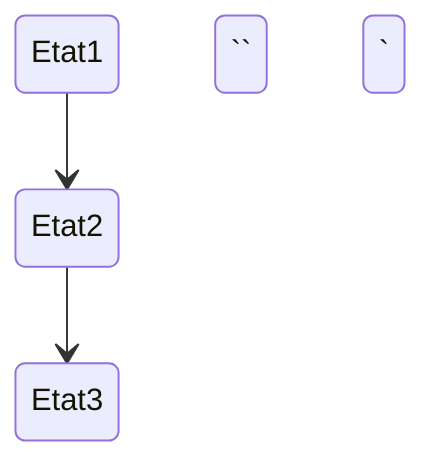
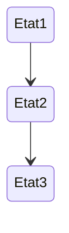

# 1. Diagrammes Mermaid

[Mermaid](https://mermaid.js.org/intro/) est un outil de génération de diagrammes et de graphiques basé sur du texte en Markdown. Il a été conçu pour simplifier la création de diagrammes complexes dans les documents Markdown, permettant aux utilisateurs de générer visuellement des diagrammes à partir de texte au lieu de devoir utiliser des logiciels de dessin spécialisés.

## 1.1 Origines et développement

Mermaid a été créé par Knut Sveidqvist et a été initialement publié en 2014. Sveidqvist, un développeur de logiciels, a voulu créer un outil qui permettrait aux développeurs et aux écrivains techniques de générer facilement des diagrammes à partir de Markdown, un langage de balisage largement utilisé pour la documentation technique.

## 1.2 Croissance et adoption

Depuis sa création, Mermaid a gagné en popularité et est maintenant utilisé dans une variété de contextes, y compris la documentation de logiciels, les blogs techniques, l'enseignement et bien plus encore. Son utilisation a été facilitée par son intégration dans de nombreux éditeurs de Markdown et plateformes de documentation, y compris des outils populaires comme Obsidian.

## 1.3 Contributions de la communauté

Mermaid est un projet open source, ce qui signifie que son développement a été en grande partie guidé par les contributions de la communauté de développeurs. Ces contributions ont aidé à élargir la gamme de types de diagrammes que Mermaid peut générer, à améliorer sa compatibilité avec divers éditeurs de Markdown et à corriger les bugs et les problèmes.

## 1.4 Mermaid aujourd'hui

Aujourd'hui, Mermaid continue d'évoluer et de s'améliorer grâce aux efforts continus de sa communauté de développeurs. Il est largement reconnu comme un outil précieux pour la création de diagrammes dans les documents Markdown et reste une option populaire pour ceux qui cherchent à visualiser des informations complexes de manière claire et compréhensible.

# 2 Installation

Avant de pouvoir utiliser Mermaid dans Obsidian, nous devons nous assurer que l'option est activée. Pour cela, nous allons dans les paramètres, puis dans l'onglet "Editeur". Nous cherchons l'option "Mermaid diagram and flowchart rendering" et nous activons le bouton à côté.

# 3 Utilisation

Mermaid permet de créer des diagrammes et des graphiques à partir de texte dans Markdown. Pour utiliser Mermaid dans une note Obsidian, nous encadrons notre code Mermaid avec des balises de code \`\`\` (trois apostrophes de code) et spécifions  `mermaid` après la première série de balises de code. Par exemple :

`
```markdow
```mermaid
graph TD
A[Commencer] --> B{Fonctionne-t-il?}
B -->|Oui| C[Terminé]
B -->|Non| A
`` `
```

Cela créera un simple diagramme de flux avec une boucle et s'affiche comme cela :


# 4 Types de diagrammes

Mermaid peut être utilisé pour créer une variété de diagrammes, dont des diagrammes de flux, des diagrammes de séquence, des graphiques de Gantt et plus encore. Les spécificités de chaque type de diagramme peuvent être trouvées dans la documentation de Mermaid, mais voici quelque exemples:

## 4.1 Diagrammes de flux (Flowcharts)

Les diagrammes de flux sont idéaux pour représenter visuellement les processus et les flux de travail. Ils peuvent montrer les différentes étapes d'un processus et comment elles sont connectées. Dans Mermaid, vous pouvez facilement créer des diagrammes de flux avec des nœuds et des flèches.

Exemple :
```
```mermaid
graph LR
    A[Etape 1] --> B[Etape 2]
    B --> C[Etape 3]
`` `
```

Ce qui donne :


## 4.2 Diagrammes de séquence

Les diagrammes de séquence sont utilisés pour illustrer les interactions entre différents objets ou composants au fil du temps. Ils sont souvent utilisés pour modéliser les scénarios d'utilisation d'un système.

Exemple :
```
```mermaid
sequenceDiagram
    participant Utilisateur
    participant Système
    Utilisateur->>Système: Faire une requête
    Système-->>Utilisateur: Retourner la réponse
`` `
```

Ce qui donne :



## 4.3 Graphiques de Gantt

Les graphiques de Gantt sont un excellent moyen de représenter visuellement le planning d'un projet. Ils permettent de voir les différentes tâches, leur durée et leur ordre.

```mardown
```mermaid
gantt
	title Exemple de Gantt
	dateFormat YYYY-MM-DD
	section Section1
	Task1 :a1, 2023-07-01, 1d
	Task2 :after a1, 20d
	section Section2
	Task3 :2023-07-15, 20d
`` `
```

Ce qui donne 


## 4.4 Diagrammes de classe

Les diagrammes de classe sont utilisés dans la modélisation orientée objet pour montrer les classes et les relations entre elles. Ils sont un outil essentiel pour comprendre l'architecture d'un système.

Exemple :
```


Ce qui donne :


## 4.5 Diagrammes d'état

Les diagrammes d'état représentent les états d'un objet et les transitions entre ces états. Ils sont particulièrement utiles pour comprendre le comportement d'un système ou d'un processus.

Exemple :
```markdown


Ce qui donne :



Ces types de diagrammes ne sont que quelques exemples de ce que vous pouvez faire avec Mermaid. Consultez la documentation de Mermaid pour une liste complète des types de diagrammes et des options disponibles.

# 5 Astuces

- Utilisez un éditeur en ligne de Mermaid pour prévisualiser et modifier rapidement vos diagrammes. Il existe de nombreux éditeurs gratuits en ligne que vous pouvez utiliser.
- Commencez toujours par un simple diagramme pour vous assurer que Mermaid est correctement activé et fonctionne dans votre note.
- Consultez la documentation de Mermaid pour une liste complète des options de diagramme et des fonctionnalités avancées.

En utilisant Mermaid dans Obsidian, nous sommes capables de créer de puissants diagrammes visuels pour accompagner nos notes et améliorer notre compréhension des sujets complexes.