# Mermaid pour Obsidian

> [!abstract] Objectif
> Décrire des diagrammes en texte versionnable directement dans une note Obsidian : maîtriser la syntaxe commune et les principaux types (flowchart, séquence, classes, états, ER, Gantt, GitGraph, mindmap, graphiques), configurer thèmes et accessibilité, relier les diagrammes au coffre sans casser les backlinks, connaître les limites de sécurité et de version de Mermaid embarqué, et choisir entre Mermaid, Canvas, Excalidraw et PlantUML.

Voir aussi : [[Obsidian]], [[Excalidraw]], [[PlantUML pour Obsidian]], [[MindMap sous Obsidian]], [[Outils de modélisation textuels]].

**Mermaid** est un langage textuel permettant de décrire des diagrammes qui sont ensuite rendus en SVG. Il est particulièrement adapté aux notes Markdown car la **source du diagramme reste du texte versionnable**, diffable avec Git, recherchable et modifiable sans logiciel de dessin propriétaire.

Dans Obsidian, un diagramme Mermaid est généralement écrit directement dans une note à l'intérieur d'un bloc de code `mermaid`.

> [!important]
> Mermaid et Obsidian évoluent indépendamment. Une syntaxe disponible dans la dernière version de Mermaid n'est pas nécessairement immédiatement disponible dans la version de Mermaid embarquée par Obsidian.

Au 29 août 2026 :

- Mermaid amont est dans la branche **11.x** ;
- Mermaid **11.17.2** est la version amont courante, publiée le 27 août 2026 ;
- Obsidian 1.13 a intégré **Mermaid 11.13.0** ;
- Obsidian 1.13 a aussi renforcé la sécurité : le rendu des blocs Mermaid d'un coffre doit être explicitement autorisé.

Ce décalage est important pour les types de diagrammes les plus récents.

## Sommaire

1. Pourquoi utiliser Mermaid dans Obsidian
2. Mermaid, Markdown et Obsidian
3. Premier diagramme
4. Syntaxe commune
5. Flowcharts
6. Diagrammes de séquence
7. Diagrammes de classes
8. Diagrammes d'états
9. Diagrammes entité-association
10. Gantt
11. GitGraph
12. Mindmaps et timelines
13. Journey, requirement, pie et quadrant
14. XY, Sankey et diagrammes quantitatifs
15. Block, packet, architecture et Kanban
16. Types de diagrammes récents et compatibilité Obsidian
17. Mise en forme, classes et thèmes
18. Configuration moderne avec frontmatter Mermaid
19. Accessibilité
20. Liens dans Obsidian
21. Sécurité
22. Organisation d'un coffre Obsidian
23. Diagrammes maintenables
24. Débogage
25. Export et automatisation
26. Choisir Mermaid, Canvas, Excalidraw ou PlantUML
27. Travaux pratiques
28. Projet final
29. Checklist
30. Ressources

# 1. Pourquoi utiliser Mermaid dans Obsidian

## 1.1 Diagramme as code

Mermaid suit le principe **diagram as code** : la représentation graphique est générée à partir d'un texte déclaratif.

Exemple :

````markdown
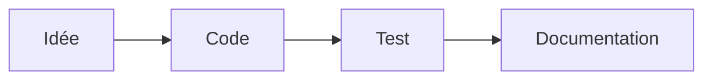
```mermaid
flowchart LR
    A[Idée] --> B[Code]
    B --> C[Test]
    C --> D[Documentation]
```
````

Avantages :

- historique Git lisible ;
- conflits plus faciles à comprendre qu'avec un fichier binaire ;
- copier-coller simple ;
- recherche textuelle ;
- génération automatisable ;
- cohérence avec les notes Markdown ;
- facile à modifier avec un éditeur ou un agent IA ;
- rendu vectoriel SVG.

## 1.2 Mermaid n'est pas un outil de dessin libre

Mermaid est excellent lorsque la **structure logique** importe davantage que le placement exact des objets.

Il est moins adapté lorsqu'on veut :

- placer manuellement chaque élément au pixel près ;
- dessiner librement ;
- faire un schéma riche en annotations visuelles ;
- composer une carte conceptuelle très graphique.

Dans ces cas, [[Excalidraw]] ou Canvas peuvent être plus pratiques.

## 1.3 Séparer le contenu de la présentation

Une bonne pratique consiste à décrire :

```text
les entités + les relations
```

et à laisser Mermaid choisir la majorité du placement.

Il faut éviter de transformer le code Mermaid en une succession de hacks de positionnement qui rendent le diagramme difficile à maintenir.

# 2. Mermaid, Markdown et Obsidian

## 2.1 Mermaid est intégré à Obsidian

Il n'est normalement pas nécessaire d'installer un plugin communautaire pour afficher les diagrammes Mermaid de base.

Un bloc Mermaid s'écrit :

````markdown
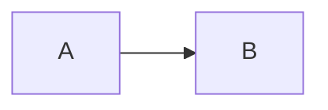
```mermaid
flowchart LR
    A --> B
```
````

Obsidian transmet alors le contenu à la bibliothèque Mermaid intégrée et affiche le SVG résultant.

## 2.2 Changement de sécurité dans Obsidian 1.13

Les anciennes versions d'Obsidian rendaient directement les blocs Mermaid. Depuis Obsidian 1.13, un **coffre doit explicitement être autorisé à rendre Mermaid**.

Lorsqu'un coffre contenant un bloc Mermaid est ouvert, Obsidian peut afficher une bannière de confirmation.

> [!warning]
> L'ancien conseil consistant à rechercher un interrupteur nommé `Mermaid diagram and flowchart rendering` dans les paramètres de l'éditeur n'est plus une description fiable de l'interface actuelle.

Ce changement vise à réduire les risques lorsqu'un coffre non fiable contient du contenu Mermaid spécialement construit.

## 2.3 Version embarquée

Obsidian n'utilise pas automatiquement la dernière version npm de Mermaid.

Ainsi :

```text
Mermaid upstream
       ↓
version choisie par Obsidian
       ↓
fonctionnalités réellement disponibles dans le coffre
```

Pour connaître la version réellement embarquée, le plus simple est de demander à Mermaid lui-même : un bloc réduit au mot `info` affiche le numéro de version dans la note.

````markdown
```mermaid
info
```
````

Avant d'utiliser une syntaxe annoncée très récemment dans la documentation Mermaid, il faut donc :

1. vérifier la version Mermaid intégrée à Obsidian ;
2. tester le diagramme dans Obsidian ;
3. prévoir une syntaxe de repli si la note doit être portable.

## 2.4 Live Preview et Reading View

Un bloc Mermaid peut être rendu en :

- **Live Preview** ;
- **Reading View**.

Pendant l'édition, Obsidian peut momentanément afficher le code au lieu du SVG afin de permettre sa modification.

# 3. Premier diagramme

## 3.1 Un flowchart minimal

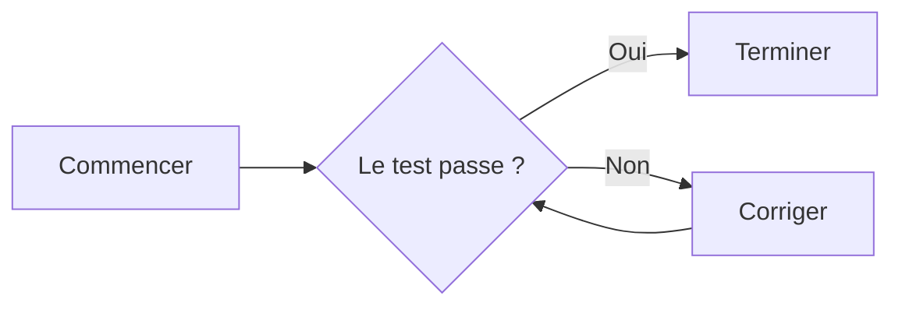
```mermaid
flowchart LR
    A[Commencer] --> B{Le test passe ?}
    B -->|Oui| C[Terminer]
    B -->|Non| D[Corriger]
    D --> B
```

Source :

````markdown

```mermaid
flowchart LR
    A[Commencer] --> B{Le test passe ?}
    B -->|Oui| C[Terminer]
    B -->|Non| D[Corriger]
    D --> B
```
````

## 3.2 `flowchart` plutôt que `graph`

Les deux formes sont historiquement acceptées :

```text
graph TD
```

et :

```text
flowchart TD
```

Pour un nouveau cours ou un nouveau diagramme, **`flowchart` est généralement plus explicite**.

## 3.3 Orientation

Les orientations courantes sont :

| Code | Sens |
|---|---|
| `TB` | haut vers bas |
| `TD` | haut vers bas |
| `BT` | bas vers haut |
| `LR` | gauche vers droite |
| `RL` | droite vers gauche |

Exemple :

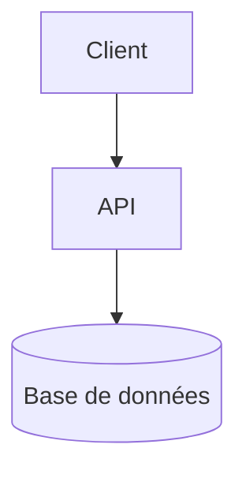
```mermaid
flowchart TB
    Client --> API
    API --> Database[(Base de données)]
```

# 4. Syntaxe commune

## 4.1 Identifiant et libellé

Dans :

```text
api[API publique]
```

- `api` est l'identifiant technique ;
- `API publique` est le texte affiché.

Il vaut mieux utiliser des identifiants stables :

```text
api
worker
postgres
queue
```

plutôt que :

```text
A
B
C
D
```

lorsque le diagramme devient important.

## 4.2 Commentaires

Mermaid utilise `%%` :

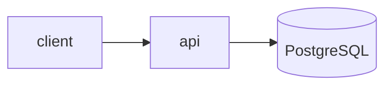
```mermaid
flowchart LR
    %% Flux principal
    client --> api
    api --> db[(PostgreSQL)]
```

Les commentaires sont particulièrement utiles dans les diagrammes longs.

## 4.3 Point-virgule

Le point-virgule a longtemps été très fréquent dans les exemples Mermaid :

```text
A --> B;
```

Il n'est généralement pas nécessaire :

```text
A --> B
```

Un style sans point-virgule est souvent plus lisible en Markdown.

## 4.4 Texte contenant des caractères spéciaux

Lorsque le libellé devient complexe, utiliser des guillemets :

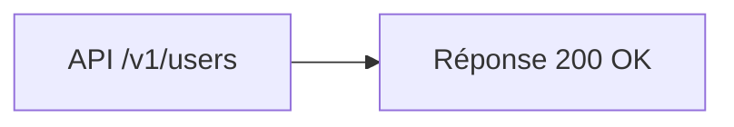
```mermaid
flowchart LR
    A["API /v1/users"] --> B["Réponse 200 OK"]
```

## 4.5 Markdown dans les libellés

Les versions modernes de Mermaid prennent en charge des **Markdown Strings** dans plusieurs contextes.

Cependant, la prise en charge exacte peut dépendre du type de diagramme et de la version intégrée par Obsidian.

Pour les notes destinées à être très portables, préférer des libellés simples.

# 5. Flowcharts

Les flowcharts sont les diagrammes Mermaid les plus polyvalents.

## 5.1 Formes courantes

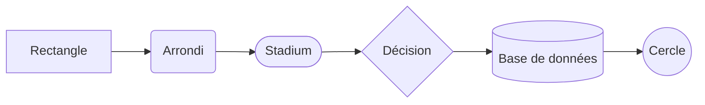
```mermaid
flowchart LR
    A[Rectangle]
    B(Arrondi)
    C([Stadium])
    D{Décision}
    E[(Base de données)]
    F((Cercle))

    A --> B --> C --> D --> E --> F
```

## 5.2 Types de liens

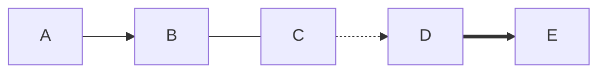
```mermaid
flowchart LR
    A --> B
    B --- C
    C -.-> D
    D ==> E
```

On peut ajouter un texte :

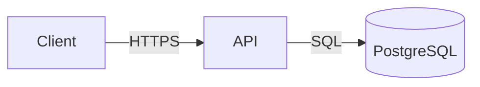
```mermaid
flowchart LR
    Client -->|HTTPS| API
    API -->|SQL| DB[(PostgreSQL)]
```

## 5.3 Relations multiples

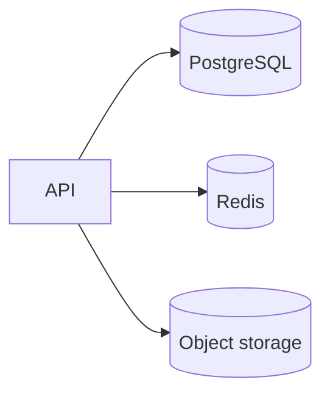
```mermaid
flowchart LR
    API --> PostgreSQL[(PostgreSQL)]
    API --> Redis[(Redis)]
    API --> S3[(Object storage)]
```

Une syntaxe compacte existe, par exemple :

```text
A --> B & C
```

mais il faut éviter de trop compacter au détriment de la lisibilité du code source.

## 5.4 Sous-graphes

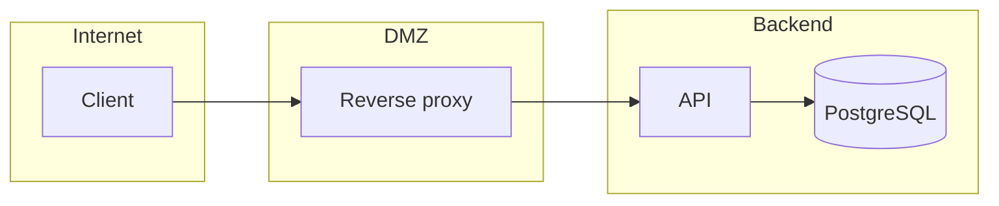
```mermaid
flowchart LR
    subgraph Internet
        Client[Client]
    end

    subgraph DMZ
        Proxy[Reverse proxy]
    end

    subgraph Backend
        API[API]
        DB[(PostgreSQL)]
    end

    Client --> Proxy --> API --> DB
```

Les `subgraph` sont utiles pour :

- zones réseau ;
- couches d'architecture ;
- équipes ;
- sous-systèmes ;
- phases d'un workflow.

## 5.5 Classes

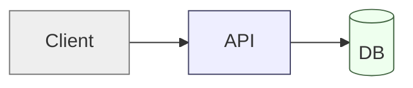
```mermaid
flowchart LR
    client[Client] --> api[API]
    api --> db[(DB)]

    classDef external fill:#eee,stroke:#777
    classDef service fill:#eef,stroke:#446
    classDef storage fill:#efe,stroke:#464

    class client external
    class api service
    class db storage
```

> [!note]
> Les couleurs codées en dur peuvent être mauvaises en mode sombre. Pour un coffre Obsidian partagé entre thème clair et sombre, limiter les personnalisations fortes ou les tester dans les deux modes.

## 5.6 Style ponctuel

```text
style api stroke-width:3px
```

Pour un gros diagramme, préférer `classDef` à une accumulation de `style`.

## 5.7 Identifiants d'arêtes

Mermaid moderne permet d'attribuer un identifiant à une arête :


```mermaid
flowchart LR
    A e1@--> B
```

Cela permet notamment de cibler certaines fonctionnalités de style ou d'animation dans les versions qui les prennent en charge.

Pour un document destiné à Obsidian, rester prudent avec les fonctions très récentes : elles peuvent dépendre de la version Mermaid embarquée.

## 5.8 Diagramme d'architecture applicative

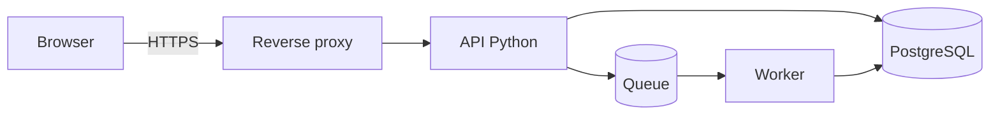
```mermaid
flowchart LR
    browser[Browser]
    proxy[Reverse proxy]
    api[API Python]
    queue[(Queue)]
    worker[Worker]
    db[(PostgreSQL)]

    browser -->|HTTPS| proxy
    proxy --> api
    api --> db
    api --> queue
    queue --> worker
    worker --> db
```

Ce type de diagramme est souvent plus portable que le diagramme `architecture-beta`, plus récent.

# 6. Diagrammes de séquence

Les diagrammes de séquence décrivent des interactions **dans le temps**.

## 6.1 Exemple simple

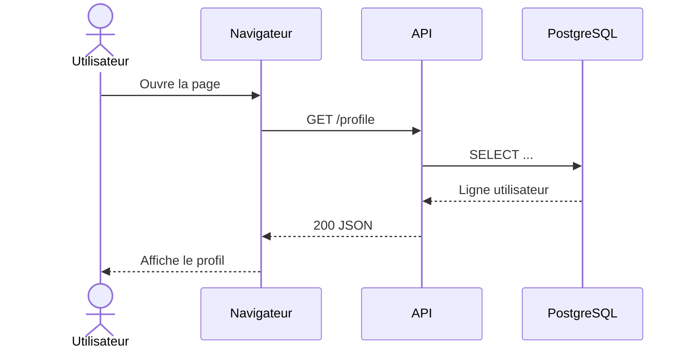
```mermaid
sequenceDiagram
    actor User as Utilisateur
    participant Browser as Navigateur
    participant API
    participant DB as PostgreSQL

    User->>Browser: Ouvre la page
    Browser->>API: GET /profile
    API->>DB: SELECT ...
    DB-->>API: Ligne utilisateur
    API-->>Browser: 200 JSON
    Browser-->>User: Affiche le profil
```

## 6.2 Flèches

On rencontre notamment :

```text
->>
-->>
-x
--x
```

La distinction peut exprimer appel, réponse ou destruction selon le cas.

## 6.3 Activation

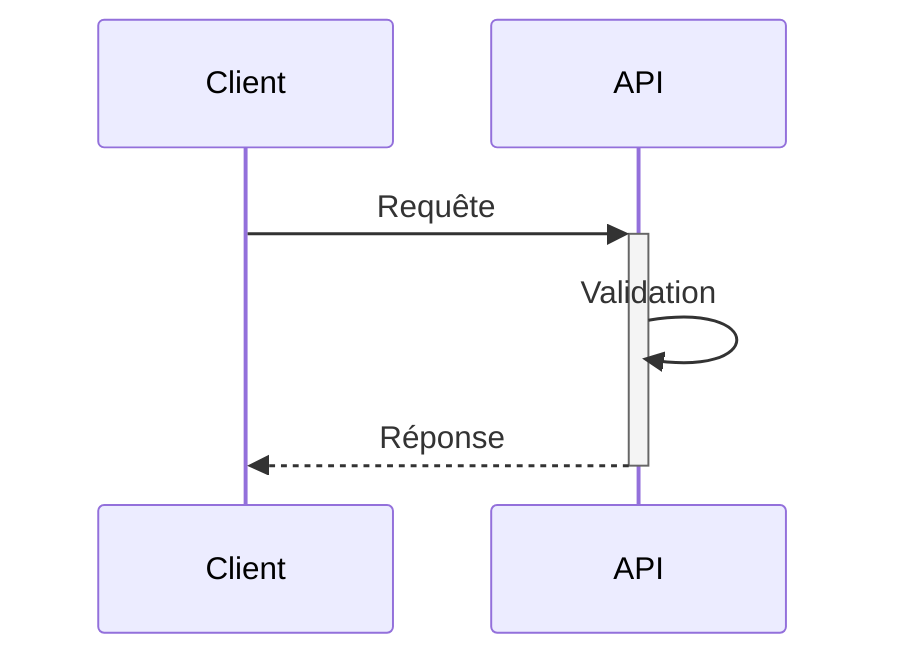
```mermaid
sequenceDiagram
    participant Client
    participant API

    Client->>+API: Requête
    API->>API: Validation
    API-->>-Client: Réponse
```

## 6.4 `alt`, `opt`, `loop` et `par`

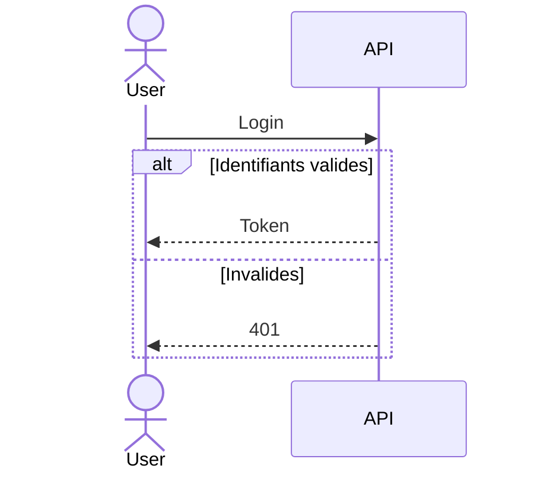
```mermaid
sequenceDiagram
    actor User
    participant API

    User->>API: Login

    alt Identifiants valides
        API-->>User: Token
    else Invalides
        API-->>User: 401
    end
```

Boucle :

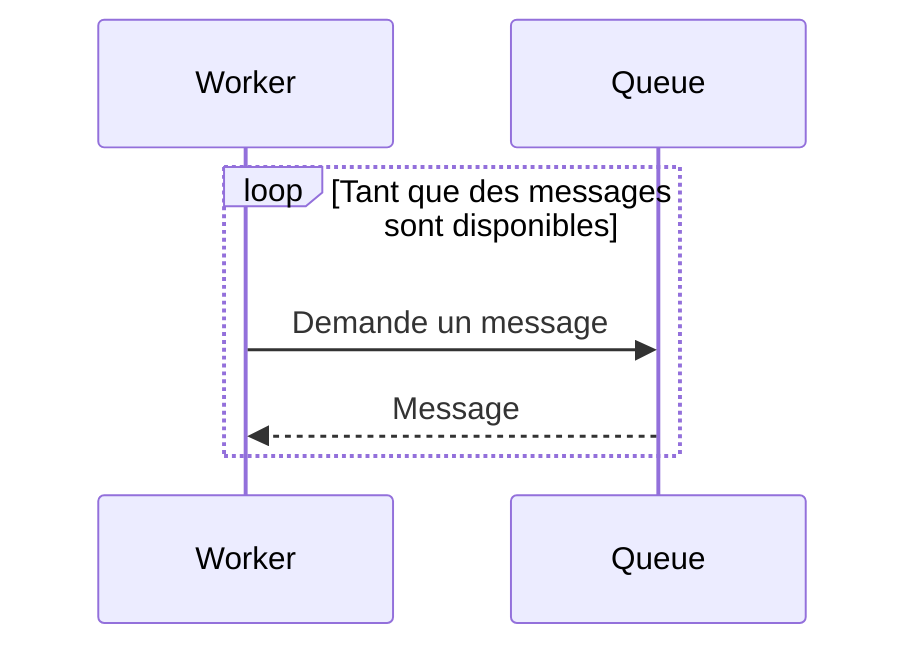
```mermaid
sequenceDiagram
    participant Worker
    participant Queue

    loop Tant que des messages sont disponibles
        Worker->>Queue: Demande un message
        Queue-->>Worker: Message
    end
```

## 6.5 Numérotation

```mermaid
sequenceDiagram
    autonumber
    Client->>API: Requête
    API->>DB: Lecture
    DB-->>API: Résultat
    API-->>Client: Réponse
```

## 6.6 Quand utiliser un diagramme de séquence

Très utile pour :

- OAuth/OIDC ;
- appels HTTP ;
- RPC ;
- transactions ;
- échanges asynchrones ;
- événements distribués ;
- processus d'authentification ;
- protocoles réseau.

Voir aussi [[HTTP]] et [[OAuth OpenID]].

# 7. Diagrammes de classes

## 7.1 Exemple

```mermaid
classDiagram
    class User {
        +UUID id
        +String email
        +login()
    }

    class Order {
        +UUID id
        +Decimal total
        +pay()
    }

    User "1" --> "0..*" Order : passe
```

## 7.2 Relations

On peut représenter :

- héritage ;
- composition ;
- agrégation ;
- association ;
- dépendance ;
- cardinalités.

Exemple :

```mermaid
classDiagram
    Animal <|-- Dog
    Car *-- Engine
    Team o-- Player
    Service ..> Repository
```

## 7.3 Limites

Mermaid est pratique pour une vue UML légère.

Pour une modélisation UML formelle complète avec génération ou ingénierie de modèles, utiliser plutôt les outils détaillés dans [[UML Ecore EMF Plantuml QVT Mermaid PyEcore]].

# 8. Diagrammes d'états

## 8.1 Syntaxe moderne

Préférer :

```text
stateDiagram-v2
```

Exemple :

```mermaid
stateDiagram-v2
    [*] --> Draft
    Draft --> Review : submit
    Review --> Published : approve
    Review --> Draft : reject
    Published --> Archived
    Archived --> [*]
```

## 8.2 États composites

```mermaid
stateDiagram-v2
    [*] --> Active

    state Active {
        [*] --> Idle
        Idle --> Running
        Running --> Idle
    }

    Active --> [*]
```

## 8.3 Usage

Les state diagrams sont adaptés à :

- workflow métier ;
- machine à états ;
- statuts d'une commande ;
- cycle de vie d'un ticket ;
- protocole ;
- automate.

# 9. Diagrammes entité-association

Le type `erDiagram` est utile pour expliquer un modèle de données relationnel.

```mermaid
erDiagram
    USER ||--o{ ORDER : places
    ORDER ||--|{ ORDER_LINE : contains
    PRODUCT ||--o{ ORDER_LINE : appears_in

    USER {
        uuid id PK
        string email UK
    }

    ORDER {
        uuid id PK
        datetime created_at
    }

    PRODUCT {
        uuid id PK
        string name
        decimal price
    }
```

## 9.1 Cardinalités

Mermaid utilise une notation proche de Crow's Foot.

Exemples conceptuels :

```text
||--||   exactement un vers exactement un
||--o{   un vers zéro ou plusieurs
}o--o{   zéro ou plusieurs vers zéro ou plusieurs
```

## 9.2 Attention

Un diagramme ER Mermaid est une **documentation**, pas une migration de base de données.

Il ne remplace pas :

- SQL ;
- Alembic ;
- Django migrations ;
- Prisma migrations ;
- un modèle ORM exécutable.

# 10. Gantt

Les Gantt représentent un planning.

```mermaid
gantt
    title Migration d'une application
    dateFormat YYYY-MM-DD
    axisFormat %d/%m

    section Préparation
    Audit             :done, audit, 2026-09-01, 3d
    Plan de migration :plan, after audit, 2d

    section Migration
    Développement     :dev, after plan, 7d
    Tests             :test, after dev, 4d
    Déploiement       :milestone, deploy, after test, 0d
```

## 10.1 Identifiants de tâches

Donner des identifiants :

```text
audit
plan
dev
test
```

permet d'utiliser :

```text
after audit
```

et évite de dupliquer les dates.

## 10.2 États

On peut notamment rencontrer :

```text
done
active
crit
milestone
```

## 10.3 Limite

Mermaid Gantt est excellent pour de la documentation légère, mais ne remplace pas un outil complet de gestion de projet avec ressources, charge, coûts et dépendances complexes.

# 11. GitGraph

GitGraph permet d'illustrer l'histoire d'un dépôt.

```mermaid
gitGraph
    commit id: "Initial"
    branch feature
    checkout feature
    commit id: "Fonctionnalité"
    checkout main
    commit id: "Correctif"
    merge feature
    commit id: "Release"
```

Très utile dans le cours [[git]] pour expliquer :

- branches ;
- merge ;
- cherry-pick conceptuellement ;
- stratégies Git Flow ou trunk-based.

> [!warning]
> Un GitGraph Mermaid est une représentation pédagogique. Il ne lit pas automatiquement l'historique réel du dépôt.

# 12. Mindmaps et timelines

## 12.1 Mindmap

```mermaid
mindmap
  root((Sécurité))
    Prévention
      Mises à jour
      Moindre privilège
      Segmentation
    Détection
      Logs
      Alertes
    Réponse
      Containment
      Recovery
```

Une mindmap Mermaid convient à une structure arborescente relativement simple.

Pour une carte libre et très interactive, Canvas ou Excalidraw peuvent être préférables.

## 12.2 Timeline

```mermaid
timeline
    title Évolution du Web
    1989 : Proposition du World Wide Web
    1991 : Premier site Web
    1995 : JavaScript
    2015 : HTTP/2
    2022 : HTTP/3
```

Le diagramme timeline est utile dans les cours historiques.

# 13. Journey, requirement, pie et quadrant

## 13.1 User Journey

```mermaid
journey
    title Inscription à une application
    section Découverte
      Ouvrir le site: 5: Utilisateur
      Comprendre l'offre: 4: Utilisateur
    section Inscription
      Remplir le formulaire: 3: Utilisateur
      Vérifier l'email: 2: Utilisateur
    section Première utilisation
      Créer un projet: 4: Utilisateur
```

Le score permet de visualiser une qualité ou satisfaction relative.

## 13.2 Requirement Diagram

```mermaid
requirementDiagram
    requirement auth {
        id: "REQ-001"
        text: "L'utilisateur doit être authentifié"
        risk: high
        verifymethod: test
    }

    element api {
        type: service
    }

    api - satisfies -> auth
```

Pratique pour une traçabilité légère entre exigences et composants.

> [!tip]
> Un `id` contenant un tiret (`REQ-001`) ou un `text` contenant une apostrophe doivent être placés entre guillemets, sinon l'analyseur Mermaid rejette le diagramme ; sans guillemets, seuls des identifiants simples comme `1` ou `1.2` sont acceptés.

## 13.3 Pie chart

```mermaid
pie showData
    title Répartition des tests
    "Unitaires" : 65
    "Intégration" : 25
    "End-to-end" : 10
```

## 13.4 Quadrant

```mermaid
quadrantChart
    title Priorisation
    x-axis Faible effort --> Fort effort
    y-axis Faible impact --> Fort impact
    quadrant-1 Planifier
    quadrant-2 Quick wins
    quadrant-3 Eviter
    quadrant-4 Reevaluer
    Documentation: [0.2, 0.8]
    Refonte totale: [0.9, 0.7]
    Micro-optimisation: [0.7, 0.2]
```

> [!warning]
> Dans Mermaid 11.13 (Obsidian 1.13), l'analyseur du quadrant refuse un libellé de quadrant commençant par une majuscule accentuée (`À planifier`) ; l'erreur disparaît dans 11.17. Éviter les accents dans ces libellés courts, ou vérifier le rendu dans le coffre cible.

# 14. XY, Sankey et diagrammes quantitatifs

## 14.1 XY Chart

Les versions modernes de Mermaid permettent de générer des graphiques XY.

```mermaid
xychart-beta
    title "Temps de réponse"
    x-axis [1, 2, 3, 4, 5]
    y-axis "ms" 0 --> 500
    line [120, 135, 180, 210, 190]
```

Ce type est utile pour une petite visualisation directement dans une note.

Pour des analyses statistiques ou scientifiques, une figure produite par Python/Matplotlib reste souvent plus appropriée.

## 14.2 Sankey

```mermaid
sankey-beta
Client,API,100
API,Cache,35
API,Database,65
Database,Reponse,65
Cache,Reponse,35
```

Un Sankey visualise des **flux pondérés**.

> [!warning]
> Deux pièges vérifiés avec Mermaid 11.13 et 11.17 : le mot-clé reste `sankey-beta` (`sankey` seul est accepté, mais le type est toujours marqué bêta), et l'analyseur CSV **rejette les caractères accentués** dans les libellés — écrire `Reponse`, pas `Réponse`, ou passer par un `flowchart` si les accents sont indispensables.

Sa syntaxe ressemble à un CSV à trois colonnes :

```text
source,cible,valeur
```

> [!note]
> Certains diagrammes récents conservent un suffixe `-beta`. Leur syntaxe peut encore évoluer.

# 15. Block, packet, architecture et Kanban

Ces types de diagrammes sont plus récents que les diagrammes historiques de Mermaid. Ils sont très utiles mais il faut vérifier leur compatibilité avec la version embarquée dans Obsidian.

## 15.1 Block Diagram

Les block diagrams permettent de composer une architecture par blocs avec davantage de contrôle structurel qu'un simple flowchart.

À privilégier lorsqu'une organisation en grille/blocs rend l'architecture plus claire.

## 15.2 Packet Diagram

Un packet diagram est particulièrement utile dans un cours réseau.

```mermaid
packet
    0-15: "Source Port"
    16-31: "Destination Port"
    32-63: "Sequence Number"
    64-95: "Acknowledgment Number"
```

Dans les versions récentes, Mermaid permet aussi une syntaxe avec une taille relative des champs :

```text
+16: "Source Port"
+16: "Destination Port"
```

Ce diagramme est pertinent avec [[Les protocoles de communications]] et [[HTTP]].

## 15.3 Architecture Diagram

```mermaid
architecture-beta
    group backend(cloud)[Backend]

    service api(server)[API] in backend
    service db(database)[Database] in backend
    service disk(disk)[Storage] in backend

    api:R -- L:db
    api:B -- T:disk
```

Il est pensé pour représenter des services et ressources, notamment cloud ou CI/CD.

> [!tip]
> Si `architecture-beta` n'est pas reconnu dans la version d'Obsidian utilisée, refaire le schéma avec `flowchart` + `subgraph` donne une solution très portable.

## 15.4 Kanban

Les Mermaid récents proposent aussi un diagramme Kanban.

Exemple conceptuel :

```text
kanban
  todo[À faire]
    t1[Écrire le cours]
  doing[En cours]
    t2[Relire]
  done[Terminé]
    t3[Créer le plan]
```

> [!warning]
> Ce type fait partie des syntaxes dont la disponibilité dépend fortement de la version embarquée. Toujours le tester dans Obsidian avant de l'adopter dans un coffre qui doit être portable.

# 16. Types de diagrammes récents et compatibilité Obsidian

Mermaid 11.x évolue rapidement. La documentation amont liste désormais de nombreux types, notamment :

- Flowchart ;
- Swimlanes ;
- Sequence ;
- Class ;
- State ;
- ER ;
- User Journey ;
- Gantt ;
- Pie ;
- Quadrant ;
- Requirement ;
- GitGraph ;
- C4 ;
- Mindmap ;
- Timeline ;
- ZenUML ;
- Sankey ;
- XY ;
- Block ;
- Packet ;
- Kanban ;
- Architecture ;
- Radar ;
- Event Modeling ;
- Treemap ;
- Venn ;
- Ishikawa ;
- Wardley ;
- Cynefin ;
- TreeView.

Tous ne sont pas nécessairement disponibles dans **la version Mermaid embarquée par l'Obsidian installé**.

## 16.1 Règle de compatibilité

Le tableau ci-dessous a été établi en soumettant chaque type à l'analyseur de Mermaid **11.13.0** (version embarquée par Obsidian 1.13) et de Mermaid **11.17.2** (version amont d'août 2026).

| Type | Mot-clé | Obsidian 1.13 (Mermaid 11.13.0) | Mermaid 11.17.2 |
|---|---|---|---|
| Flowchart, séquence, classes, états, ER, journey, Gantt, pie, quadrant, requirement, GitGraph, C4, mindmap, timeline | `flowchart`, `sequenceDiagram`, `classDiagram`, `stateDiagram-v2`, `erDiagram`, `journey`, `gantt`, `pie`, `quadrantChart`, `requirementDiagram`, `gitGraph`, `C4Context`, `mindmap`, `timeline` | oui | oui |
| Sankey, XY, Block, Packet | `sankey-beta`, `xychart-beta`, `block-beta`, `packet-beta` (le suffixe `-beta` est facultatif) | oui | oui |
| Kanban, Architecture | `kanban`, `architecture-beta` | oui | oui |
| Radar, Treemap, Venn, Ishikawa | `radar-beta`, `treemap-beta`, `venn-beta`, `ishikawa-beta` | oui | oui |
| Wardley, Cynefin, Swimlanes, TreeView, Event Modeling, Railroad | `wardley-beta`, `cynefin-beta`, `swimlane-beta`, `treeView-beta`, `eventmodeling`, `railroad-beta` | **non** (ajoutés entre 11.14 et 11.17) | oui |
| ZenUML | `zenuml` | non | non sans module externe |

Pour une note durable :

### Niveau 1 — très portable

Privilégier flowchart, séquence, classes, états, ER, Gantt et pie : présents depuis des années dans toutes les versions et tous les outils (GitHub, GitLab, Mermaid CLI...).

### Niveau 2 — moderne mais relativement répandu

Tester mindmap, timeline, GitGraph, requirement, journey, quadrant, XY et Sankey : disponibles dans Obsidian 1.13, mais leur syntaxe a encore évolué récemment (frontmatter, guillemets, mots-clés bêta).

### Niveau 3 — récent

Vérifier explicitement la version avant d'utiliser architecture, packet, block, Kanban, radar, treemap, Venn et Ishikawa (présents dans 11.13.0 mais absents des versions d'Obsidian antérieures à 2026), et considérer Wardley, Cynefin, swimlanes, TreeView, Event Modeling et Railroad comme **indisponibles** dans Obsidian 1.13.

## 16.2 Stratégie de repli

Lorsqu'un type récent ne fonctionne pas :

```text
type spécialisé
      ↓
flowchart / subgraph
      ↓
SVG ou PNG exporté
```

Il ne faut pas bloquer toute une documentation sur une fonctionnalité encore absente du renderer intégré.

# 17. Mise en forme, classes et thèmes

## 17.1 Classes réutilisables

```mermaid
flowchart LR
    user[Utilisateur] --> app[Application]
    app --> db[(Database)]

    classDef actor stroke-width:2px
    classDef service stroke-width:3px
    classDef storage stroke-dasharray:5 5

    class user actor
    class app service
    class db storage
```

## 17.2 Thèmes Mermaid

Les thèmes standards comprennent notamment :

- `default` ;
- `neutral` ;
- `dark` ;
- `forest` ;
- `base`.

`base` est conçu pour servir de base aux personnalisations via `themeVariables`.

## 17.3 Attention au thème Obsidian

Il existe deux couches différentes :

```text
thème Obsidian
      +
thème Mermaid
```

Un diagramme avec un fond clair forcé peut être illisible dans un coffre en dark mode.

Bonnes pratiques :

- tester clair et sombre ;
- assurer un contraste suffisant ;
- ne pas transmettre l'information uniquement par la couleur ;
- limiter les couleurs codées en dur ;
- utiliser des labels explicites.

# 18. Configuration moderne avec frontmatter Mermaid

## 18.1 Ne pas confondre les deux frontmatters

Une note Obsidian possède déjà son frontmatter YAML :

```yaml
---
titre: Exemple
type: cours
---
```

Un diagramme Mermaid peut lui-même posséder **son propre frontmatter**, à l'intérieur du bloc `mermaid`.

Exemple :

````markdown
```mermaid
---
title: Architecture simplifiée
config:
  theme: neutral
---
flowchart LR
    Client --> API --> DB[(DB)]
```
````

Les deux YAML ont des rôles différents.

## 18.2 Configuration par diagramme

```mermaid
---
title: Pipeline
config:
  theme: neutral
  flowchart:
    curve: linear
---
flowchart LR
    Source --> Build --> Test --> Deploy
```

## 18.3 Anciennes directives `%%{init: ...}%%`

On trouve encore beaucoup d'exemples :

```text
%%{init: { "theme": "dark" }}%%
```

Ces **directives sont dépréciées depuis Mermaid 10.5**.

Pour un nouveau diagramme, préférer :

```yaml
---
config:
  theme: dark
---
```

## 18.4 Pourquoi préférer le frontmatter

Il est :

- plus lisible ;
- plus facile à valider ;
- plus cohérent avec les configurations modernes de Mermaid ;
- moins dépendant des anciennes directives historiques.

## 18.5 Configuration silencieusement ignorée

Mermaid peut ignorer silencieusement certains paramètres mal orthographiés.

Il faut donc vérifier :

- casse ;
- indentation YAML ;
- nom exact de la propriété ;
- compatibilité avec la version.

# 19. Accessibilité

Un diagramme visuellement correct n'est pas automatiquement accessible.

Mermaid permet d'ajouter :

- `accTitle` ;
- `accDescr`.

Exemple :

```mermaid
flowchart LR
    accTitle: Cycle de publication d'une note
    accDescr: Une note passe du brouillon à la relecture puis à la publication.

    Draft[Brouillon] --> Review[Relecture] --> Published[Publication]
```

Mermaid génère alors des éléments et attributs ARIA appropriés dans le SVG.

## 19.1 Description multiligne

```text
accDescr {
  Description longue du diagramme.
  Elle peut utiliser plusieurs lignes.
}
```

## 19.2 Bonnes pratiques

Un diagramme important devrait avoir :

1. un titre ;
2. une description accessible ;
3. du texte lisible ;
4. un contraste suffisant ;
5. une explication dans la note pour les informations essentielles.

> [!important]
> Un diagramme ne devrait pas être l'unique endroit où se trouve une information critique. Le texte de la note doit rester compréhensible.

# 20. Liens dans Obsidian

## 20.1 Liens externes Mermaid

Mermaid permet des liens/callbacks avec la syntaxe `click` dans certains modes de sécurité.

Exemple générique :

```text
click docs href "https://mermaid.js.org/"
```

Cependant, les fonctions de clic sont volontairement restreintes selon le `securityLevel` du renderer.

Dans Obsidian, ne pas supposer qu'un exemple interactif du Mermaid Live Editor aura exactement le même comportement.

## 20.2 Liens internes Obsidian

Obsidian possède une convention historique utile dans les flowcharts : appliquer la classe CSS `internal-link` à un nœud.

Exemple :

```mermaid
flowchart LR
    HTTP[HTTP] --> OAuth[OAuth OpenID]
    class HTTP,OAuth internal-link
```

Le texte du nœud peut alors servir de cible de note selon le contexte et la version d'Obsidian.

## 20.3 Limite importante : backlinks

Un lien rendu à l'intérieur de Mermaid **n'est pas équivalent à un wikilien Markdown** pour l'indexation du coffre.

En particulier, il ne faut pas compter sur lui pour :

- les backlinks ;
- les mentions liées ;
- le graphe Obsidian ;
- les renommages automatiques de liens.

Si la relation est importante pour le graphe de connaissances, conserver aussi un vrai wikilien :

```markdown
Voir [[HTTP]] et [[OAuth OpenID]].
```

puis utiliser Mermaid uniquement comme représentation visuelle.

## 20.4 Alias et titres complexes

Les hacks consistant à injecter du HTML dans les labels Mermaid pour simuler des liens internes sont fragiles et peuvent se comporter différemment selon :

- la version Mermaid ;
- le mode de sécurité ;
- le thème Obsidian ;
- Live Preview / Reading View.

Pour un coffre maintenable, préférer des nœuds simples et des wikiliens normaux dans le texte.

# 21. Sécurité

## 21.1 Pourquoi Obsidian demande une autorisation

Un diagramme Mermaid est du **contenu interprété par un moteur de rendu**, pas une simple image statique.

Certaines fonctionnalités Mermaid historiques peuvent inclure :

- HTML dans les labels ;
- liens ;
- callbacks ;
- styles ;
- configuration.

C'est pourquoi il est raisonnable de traiter le rendu de diagrammes provenant d'une source inconnue comme du contenu potentiellement actif.

## 21.2 `securityLevel`

Mermaid possède plusieurs niveaux :

- `strict` — valeur par défaut upstream ;
- `antiscript` ;
- `loose` ;
- `sandbox`.

Le niveau `strict` encode le HTML et désactive notamment certaines fonctions de clic.

> [!warning]
> Dans Obsidian, l'application décide de la configuration globale et des valeurs que le contenu du diagramme a le droit de surcharger. Un auteur de note ne doit pas supposer qu'il peut abaisser librement le niveau de sécurité avec du frontmatter Mermaid.

## 21.3 Coffres non fiables

Si une archive Obsidian provient d'une source inconnue :

1. examiner le contenu ;
2. utiliser Restricted Mode pour les plugins ;
3. ne pas activer aveuglément le rendu de contenu actif ;
4. vérifier les blocs Mermaid inhabituels ;
5. éviter d'ouvrir des URI ou liens externes inattendus.

## 21.4 Mermaid et vulnérabilités

Comme toute grosse bibliothèque JavaScript, Mermaid peut recevoir des correctifs de sécurité.

Cela renforce l'intérêt de :

- maintenir Obsidian à jour ;
- ne pas copier des diagrammes non fiables sans lecture ;
- ne pas désactiver les protections de sécurité pour faire fonctionner un exemple.

# 22. Organisation d'un coffre Obsidian

## 22.1 Diagramme local ou note dédiée

Pour un petit schéma, l'intégrer directement dans le cours :

```text
cours/HTTP.md
```

Pour un gros diagramme réutilisé, on peut créer une note dédiée :

```text
diagrammes/
  Architecture API.md
  Flux OAuth.md
```

puis l'intégrer dans plusieurs notes avec un embed Obsidian.

## 22.2 Éviter la duplication

Si le même diagramme existe dans cinq notes, cinq copies devront être maintenues.

Préférer :

```text
une source Mermaid canonique
           ↓
embeds / liens
```

## 22.3 Nommer les diagrammes

Un diagramme important mérite :

- un titre ;
- des identifiants explicites ;
- une courte introduction ;
- éventuellement une source/référence.

## 22.4 Relations avec le graphe Obsidian

Mermaid est une **vue** des connaissances. Les relations structurelles du coffre devraient rester exprimées avec les mécanismes Obsidian :

- `[[wikiliens]]` ;
- propriétés ;
- tags ;
- embeds.

Ainsi :

```text
structure logique du coffre ≠ dessin Mermaid
```

# 23. Diagrammes maintenables

## 23.1 Un diagramme = une question

Mauvais objectif :

> Représenter tout le système.

Meilleurs objectifs :

- « Comment une requête HTTP traverse-t-elle l'architecture ? »
- « Quelles sont les dépendances entre les services ? »
- « Quel est le cycle de vie d'une commande ? »
- « Comment se déroule l'authentification ? »

## 23.2 Limiter le nombre de nœuds

Un diagramme de 80 nœuds devient rarement plus compréhensible qu'une architecture hiérarchisée en plusieurs vues.

Préférer :

```text
Vue contexte
    ↓
Vue services
    ↓
Vue composant critique
```

## 23.3 Choisir des identifiants sémantiques

Mauvais :

```text
A --> B --> C
```

Meilleur :

```text
browser --> reverse_proxy --> api
```

## 23.4 Séparer structure et style

D'abord :

```text
nœuds + relations
```

ensuite seulement :

```text
classes + couleurs + thèmes
```

## 23.5 Conserver un ordre logique dans le code

Exemple :

```text
1. déclaration des groupes
2. déclaration des nœuds
3. relations
4. styles/classes
```

Ce format réduit les conflits Git.

## 23.6 Ne pas surcharger les libellés

Un nœud n'est pas un paragraphe.

Préférer :

```text
Validation JWT
```

à une phrase de quatre lignes expliquant tout le mécanisme.

Le détail appartient à la note.

# 24. Débogage

## 24.1 Le diagramme ne s'affiche pas

Vérifier :

1. que le bloc commence par ` ```mermaid ` ;
2. que le rendu Mermaid est autorisé dans le coffre ;
3. que le type de diagramme est reconnu ;
4. les erreurs de syntaxe ;
5. l'indentation ;
6. les caractères spéciaux ;
7. la version de Mermaid embarquée.

## 24.2 Réduire le diagramme

Méthode efficace :

```text
diagramme cassé
   ↓
supprimer la moitié
   ↓
retenter
   ↓
isoler la ligne fautive
```

## 24.3 Tester dans Mermaid Live

Le Mermaid Live Editor est très utile pour diagnostiquer la **syntaxe Mermaid upstream**.

Mais :

> [!warning]
> Un diagramme qui fonctionne dans Mermaid Live peut échouer dans Obsidian si Mermaid Live utilise une version plus récente que celle embarquée par Obsidian.

## 24.4 Erreur de syntaxe sur un mot récent

Si :

```text
architecture-beta
```

ou un autre type n'est pas reconnu :

- vérifier la version ;
- utiliser un flowchart de repli ;
- attendre la mise à jour d'Obsidian ;
- exporter le diagramme avec un outil externe.

## 24.5 Frontmatter mal formé

Exemple incorrect :

```yaml
---
config:
 theme: dark
   flowchart:
    curve: linear
---
```

L'indentation YAML est significative.

## 24.6 Le diagramme est trop large

Solutions :

- changer `LR` en `TB` ;
- réduire les libellés ;
- découper le diagramme ;
- revoir les sous-graphes ;
- utiliser un type spécialisé ;
- éviter les styles qui imposent des tailles excessives.

# 25. Export et automatisation

## 25.1 Source Mermaid portable

Un avantage majeur est que le même texte peut être rendu par différents outils :

- Obsidian ;
- Mermaid Live ;
- Mermaid CLI ;
- GitHub et plusieurs plateformes Markdown ;
- pipelines de documentation.

La compatibilité dépend toutefois de la version Mermaid et du renderer de chaque plateforme.

## 25.2 Mermaid CLI

Le projet Mermaid fournit un CLI, généralement via le paquet `@mermaid-js/mermaid-cli`.

Exemple conceptuel :

```bash
mmdc -i diagram.mmd -o diagram.svg
```

On peut ainsi versionner :

```text
diagram.mmd
```

et produire :

```text
diagram.svg
```

## 25.3 CI

Dans un projet documentaire, une CI peut :

1. détecter les fichiers Mermaid ;
2. vérifier leur rendu ;
3. générer des SVG ;
4. échouer si une syntaxe n'est plus valide.

Cette approche est particulièrement intéressante pour de gros dépôts de documentation.

## 25.4 Attention à la version

Pour obtenir un rendu reproductible, fixer une version :

```json
{
  "devDependencies": {
    "@mermaid-js/mermaid-cli": "<version-fixée>"
  }
}
```

plutôt que d'utiliser implicitement la toute dernière version à chaque CI.

# 26. Choisir Mermaid, Canvas, Excalidraw ou PlantUML

## 26.1 Mermaid

À privilégier pour :

- documentation technique ;
- diagrammes versionnés ;
- workflow ;
- séquences ;
- états ;
- architecture simple ;
- Gantt ;
- ER ;
- notes Markdown.

## 26.2 Obsidian Canvas

À privilégier pour :

- organiser visuellement des notes ;
- cartes de connaissances interactives ;
- brainstorming ;
- manipulation directe de cartes.

## 26.3 Excalidraw

À privilégier pour :

- dessin libre ;
- annotations ;
- croquis ;
- schéma pédagogique ;
- placement précis.

## 26.4 PlantUML

PlantUML offre une syntaxe très riche et un historique ancien dans le monde UML.

Il peut être intéressant pour :

- UML avancé ;
- systèmes déjà basés sur PlantUML ;
- certains diagrammes techniques non couverts de la même manière par Mermaid.

## 26.5 Tableau de décision

| Besoin | Outil souvent adapté |
|---|---|
| Diagram as code simple dans Markdown | Mermaid |
| Carte visuelle de notes Obsidian | Canvas |
| Dessin libre | Excalidraw |
| UML textuel très avancé | PlantUML |
| Diagramme généré en CI | Mermaid ou PlantUML |
| Historique Git lisible | Mermaid / PlantUML |

# 27. Travaux pratiques

## TP 1 — Premier flowchart

Créer un diagramme représentant :

```text
Idée → Brouillon → Relecture → Publication
```

Ajouter une branche :

```text
Relecture → Corrections → Relecture
```

Objectifs :

- bloc Mermaid ;
- nœuds ;
- flèches ;
- décision ou boucle.

## TP 2 — Architecture Web

Représenter :

- navigateur ;
- reverse proxy ;
- API ;
- PostgreSQL ;
- Redis ;
- worker.

Utiliser des sous-graphes :

```text
Internet
DMZ
Backend
Data
```

## TP 3 — Séquence HTTP

Représenter le scénario :

1. navigateur envoie `GET /profile` ;
2. API valide le token ;
3. API interroge PostgreSQL ;
4. API retourne `200` ;
5. en cas de token invalide, retourne `401`.

Utiliser `alt`.

## TP 4 — Machine à états

Créer le cycle de vie d'un ticket :

```text
Open
InProgress
Review
Done
Closed
```

Ajouter une transition `Review → InProgress` en cas de corrections.

## TP 5 — Modèle ER

Modéliser :

- User ;
- Project ;
- Task ;
- Comment.

Ajouter les cardinalités.

## TP 6 — Planning Gantt

Créer le planning d'une migration sur trois semaines :

- audit ;
- sauvegarde ;
- développement ;
- tests ;
- déploiement ;
- surveillance.

Utiliser `after` et une milestone.

## TP 7 — GitGraph

Représenter :

1. `main` ;
2. branche `feature` ;
3. deux commits ;
4. correctif sur `main` ;
5. merge.

Comparer ensuite visuellement avec un vrai `git log --graph`.

## TP 8 — Accessibilité

Prendre un diagramme existant et ajouter :

- `accTitle` ;
- `accDescr` ;
- une explication textuelle sous le diagramme.

Vérifier que l'information reste compréhensible sans couleur.

## TP 9 — Compatibilité

Créer un diagramme avec un type Mermaid récent.

S'il n'est pas reconnu dans Obsidian :

1. identifier la version Mermaid embarquée ;
2. tester dans Mermaid Live ;
3. reproduire le même contenu avec `flowchart`.

Documenter les différences.

## TP 10 — Liens Obsidian

Créer un flowchart vers trois notes du coffre.

Tester :

```text
class ... internal-link
```

Puis vérifier :

- clic ;
- backlinks ;
- graphe Obsidian.

Conclure sur la différence entre **navigation visuelle** et **relation indexée par Obsidian**.

# 28. Projet final

## 28.1 Objectif

Documenter une petite application avec une **suite cohérente de diagrammes Mermaid**.

Le projet doit contenir :

1. diagramme de contexte ;
2. diagramme d'architecture ;
3. diagramme de séquence d'une requête critique ;
4. modèle ER ;
5. machine à états d'un objet métier ;
6. planning Gantt ;
7. GitGraph d'un workflow de développement.

## 28.2 Architecture proposée

Application : gestion de tâches collaborative.

Composants :

```text
Browser
Reverse Proxy
API
Worker
PostgreSQL
Redis
Object Storage
```

## 28.3 Contraintes

Chaque diagramme doit :

- avoir un titre ;
- posséder des identifiants sémantiques ;
- utiliser une orientation adaptée ;
- être lisible en clair et sombre ;
- avoir `accTitle` et `accDescr` si le type le permet ;
- rester compréhensible avec le texte de la note ;
- éviter les hacks HTML inutiles ;
- être testé dans Obsidian.

## 28.4 Bonus

- créer un diagramme récent ;
- fournir un flowchart de repli ;
- automatiser un export SVG avec Mermaid CLI ;
- intégrer la vérification dans une CI.

# 29. Checklist

Avant de considérer un diagramme Mermaid terminé :

- [ ] Le diagramme répond à une question précise.
- [ ] Le type Mermaid choisi est adapté.
- [ ] Le type est compatible avec la version Mermaid d'Obsidian utilisée.
- [ ] Les identifiants sont explicites.
- [ ] Les libellés restent courts.
- [ ] Le diagramme n'est pas inutilement dense.
- [ ] Les relations importantes sont aussi expliquées dans le texte.
- [ ] Les relations Obsidian importantes possèdent de vrais `[[wikiliens]]`.
- [ ] Le diagramme fonctionne en Live Preview.
- [ ] Le diagramme fonctionne en Reading View.
- [ ] Le rendu est vérifié en thème clair et sombre.
- [ ] Le contraste est suffisant.
- [ ] La couleur n'est pas le seul vecteur d'information.
- [ ] `accTitle` est présent lorsque pertinent.
- [ ] `accDescr` est présent lorsque pertinent.
- [ ] Les anciennes directives `%%{init}%%` ne sont pas introduites dans un nouveau diagramme sans raison.
- [ ] La configuration moderne utilise le frontmatter Mermaid.
- [ ] Aucun abaissement de sécurité n'est nécessaire.
- [ ] Les diagrammes provenant d'une source inconnue sont relus avant activation.
- [ ] Un type récent possède si nécessaire une solution de repli.

# 30. Résumé

Mermaid transforme un diagramme en **source textuelle versionnable**. Dans Obsidian, cela en fait un excellent compagnon du Markdown et de Git.

Les idées essentielles sont :

1. écrire les diagrammes dans des blocs `mermaid` ;
2. privilégier la structure logique plutôt que le placement manuel ;
3. choisir le bon type de diagramme ;
4. utiliser des identifiants sémantiques ;
5. connaître le décalage de version entre Mermaid upstream et Obsidian ;
6. préférer le frontmatter Mermaid aux anciennes directives `%%{init}%%` ;
7. ajouter `accTitle` et `accDescr` ;
8. conserver les vrais wikiliens Obsidian en dehors du diagramme lorsque les backlinks sont importants ;
9. respecter les protections de sécurité ;
10. prévoir un flowchart de repli pour les syntaxes les plus récentes.

# 31. Ressources

## Mermaid

- Documentation générale : <https://mermaid.js.org/>
- Référence de syntaxe : <https://mermaid.js.org/intro/syntax-reference.html>
- Flowcharts : <https://mermaid.js.org/syntax/flowchart.html>
- Diagrammes de séquence : <https://mermaid.js.org/syntax/sequenceDiagram.html>
- Diagrammes de classes : <https://mermaid.js.org/syntax/classDiagram.html>
- Diagrammes d'états : <https://mermaid.js.org/syntax/stateDiagram.html>
- ER : <https://mermaid.js.org/syntax/entityRelationshipDiagram.html>
- Gantt : <https://mermaid.js.org/syntax/gantt.html>
- Accessibilité : <https://mermaid.js.org/config/accessibility.html>
- Thèmes : <https://mermaid.js.org/config/theming.html>
- Configuration : <https://mermaid.js.org/config/>
- Mermaid Live : <https://mermaid.live/>
- Dépôt : <https://github.com/mermaid-js/mermaid>

## Obsidian

- Documentation : <https://help.obsidian.md/>
- Changelog : <https://obsidian.md/changelog/>

## Notes liées

- [[Obsidian]]
- [[git]]
- [[HTTP]]
- [[OAuth OpenID]]
- [[UML Ecore EMF Plantuml QVT Mermaid PyEcore]]
