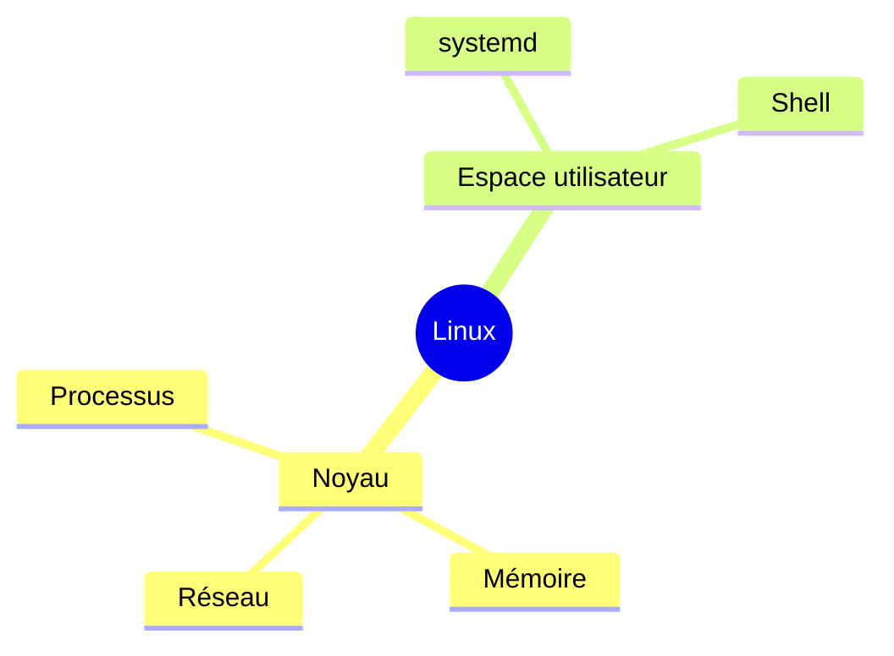
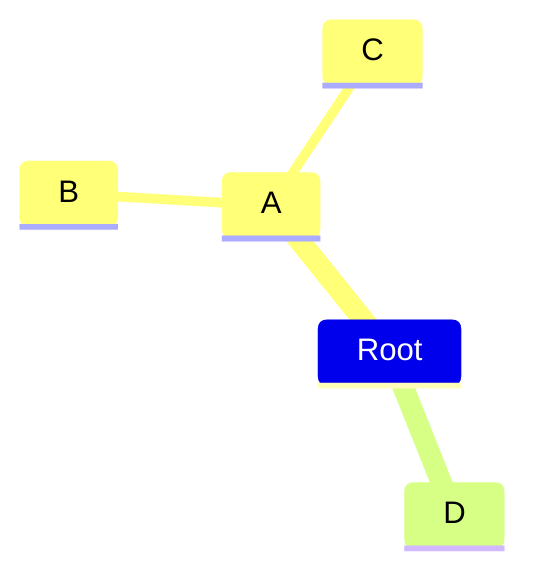
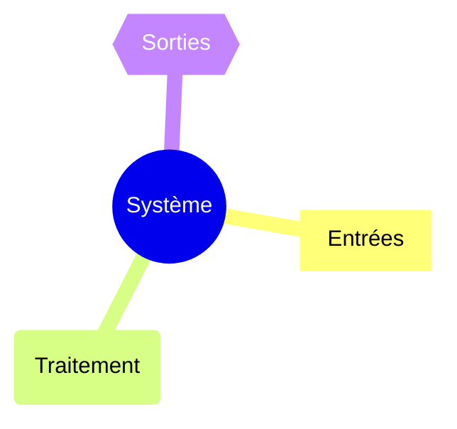
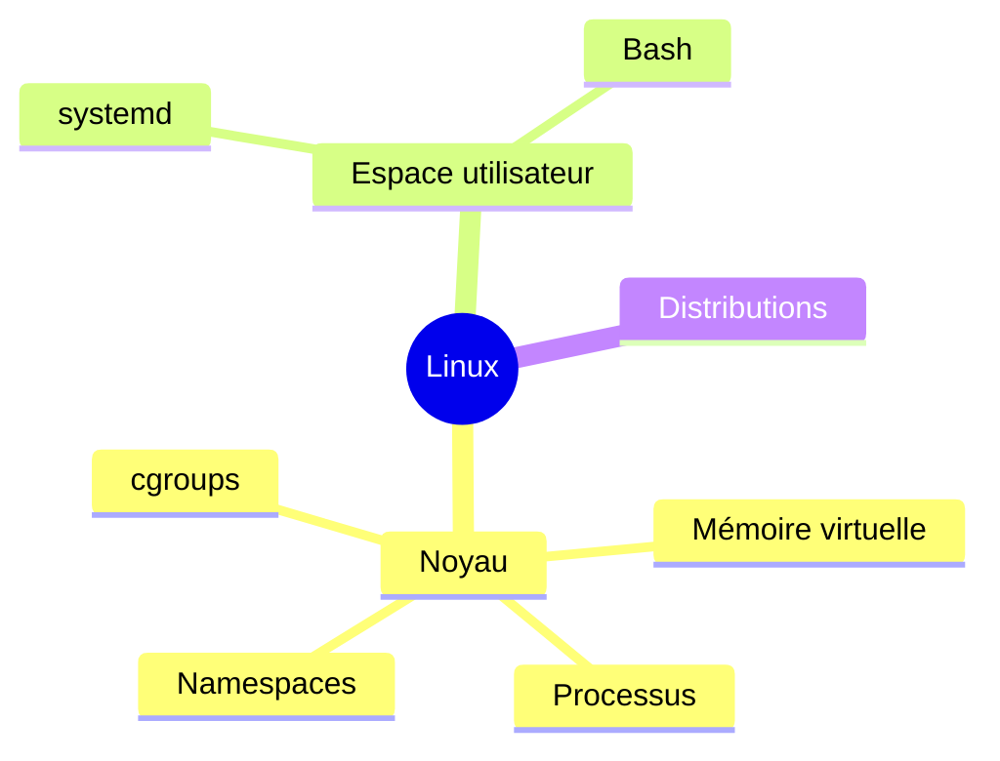
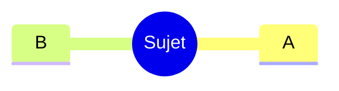
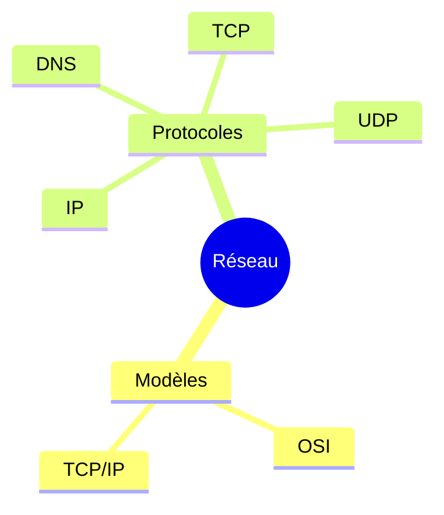

# Cartes mentales dans Obsidian

> [!abstract] Objectif
> Construire des cartes mentales utiles et pérennes dans Obsidian sans dépendre aveuglément d'un plugin unique. À la fin de ce cours, on sait choisir entre une carte dérivée du Markdown, MarkMind, Canvas, Mermaid et Excalidraw, migrer les anciennes notes utilisant `mindmap-plugin: basic`, intégrer les cartes au graphe de connaissances, versionner les sources et éviter les pièges classiques des cartes trop grandes ou purement décoratives.

Voir aussi : [[Obsidian]], [[Mermaid pour Obsidian]], [[Excalidraw]], [[Outils de modélisation textuels]].

---

## 1. Pourquoi une carte mentale dans Obsidian ?

Une **carte mentale** représente une information principalement sous forme hiérarchique : un sujet central, des branches principales, puis des sous-branches de plus en plus détaillées.

Elle est utile quand on veut :

- explorer un sujet avant d'écrire ;
- mémoriser une structure ;
- synthétiser un cours ;
- préparer une présentation ;
- clarifier les dépendances d'un projet ;
- transformer un plan textuel en représentation visuelle ;
- naviguer dans une partie d'un coffre Obsidian.

Une carte mentale n'est cependant **pas** le bon outil pour représenter tous les types de relations.

Une structure réellement en réseau, avec de nombreuses relations croisées, devient vite illisible sous forme de mind map.

Dans ce cas, il peut être préférable d'utiliser :

- Canvas ;
- un graphe de connaissances ;
- un diagramme Mermaid ;
- PlantUML ;
- Excalidraw ;
- une table ou une Base Obsidian.

> [!important]
> Une bonne carte mentale ne remplace pas les notes sources. Dans un coffre durable, la carte sert surtout de **vue**, de **plan** ou de **porte d'entrée** vers des informations qui restent stockées dans des notes pérennes.

---

## 2. Le principe le plus important : séparer la source de la vue

Une carte peut être enregistrée de deux manières principales.

### 2.1 La carte est la donnée

Le dessin lui-même contient l'information.

Exemples :

- un Canvas ;
- un dessin Excalidraw ;
- une carte MarkMind en mode riche.

Avantages :

- grande liberté graphique ;
- édition visuelle directe ;
- déplacements intuitifs ;
- présentation agréable.

Inconvénients :

- diff Git moins lisible ;
- risque de verrouillage dans un format ou un plugin ;
- recherche textuelle parfois moins naturelle ;
- automatisation plus complexe.

### 2.2 Le texte est la donnée, la carte est une vue

Une note Markdown reste la source de vérité et un outil génère la carte.

Exemples :

- MarkMind en mode basic ;
- plugins basés sur Markmap ;
- Mermaid `mindmap` ;
- transformation externe Markdown → SVG.

Avantages :

- texte lisible sans plugin ;
- Git très efficace ;
- facile à rechercher ;
- facile à réutiliser ;
- pérennité supérieure.

Inconvénients :

- mise en page moins libre ;
- la hiérarchie du Markdown impose une structure ;
- certaines fonctions visuelles avancées sont limitées.

### 2.3 Règle de conception

Pour des connaissances destinées à durer, privilégier autant que possible :

> **Markdown comme source → carte comme projection.**

Pour du brainstorming ou du design visuel libre :

> **Canvas ou Excalidraw peuvent devenir la source principale.**

---

## 3. Les quatre grandes familles de solutions

En 2026, il est utile de distinguer quatre approches.

| Besoin | Solution principale | Source de vérité | Plugin tiers | Git |
|---|---|---|---|---|
| transformer un plan Markdown en carte | MarkMind basic / plugin Markmap | Markdown | oui | excellent |
| construire librement une carte visuelle avec notes | Canvas | `.canvas` JSON | non, plugin natif | moyen |
| décrire une carte en texte pur | Mermaid `mindmap` | Markdown | non pour Mermaid de base | excellent |
| dessiner librement et enrichir fortement | Excalidraw | Markdown/JSON Excalidraw | oui | moyen |

Il n'existe donc pas une unique « fonction MindMap d'Obsidian ».

---

## 4. Décision rapide

### Choisir MarkMind basic si

- la structure existe déjà en Markdown ;
- on veut éditer alternativement en texte et en carte ;
- les branches sont réellement hiérarchiques ;
- on veut conserver une source facilement diffable.

### Choisir Canvas si

- on veut manipuler des notes Obsidian comme des cartes ;
- plusieurs types de relations coexistent ;
- la disposition spatiale a du sens ;
- on veut éviter un plugin communautaire.

### Choisir Mermaid si

- on veut un bloc entièrement textuel ;
- la carte doit être reproductible ;
- le diagramme doit vivre dans une note ;
- l'édition visuelle directe n'est pas nécessaire.

### Choisir Excalidraw si

- la forme graphique est importante ;
- on veut dessiner à la main ;
- on veut combiner texte, flèches, images, icônes et croquis ;
- la structure n'est pas uniquement hiérarchique.

### Choisir plusieurs outils

Un même coffre peut parfaitement utiliser :

- Mermaid pour les schémas techniques versionnables ;
- Canvas pour l'exploration ;
- Excalidraw pour le visuel libre ;
- MarkMind pour transformer un plan Markdown en carte.

Le problème n'est pas d'utiliser plusieurs outils.

Le problème apparaît quand **la même information est dupliquée dans plusieurs sources indépendantes**.

---

# Partie I — Structurer une carte mentale utile

## 5. Une carte mentale est d'abord une hiérarchie

Une carte mentale simple peut être décrite par un arbre.

```text
Sujet
├── Branche A
│   ├── A1
│   └── A2
└── Branche B
    ├── B1
    └── B2
```

Cette structure possède :

- une racine ;
- des nœuds ;
- des relations parent/enfant ;
- des niveaux de profondeur.

Elle n'exprime pas naturellement les relations transversales.

---

## 6. Hiérarchie par titres Markdown

Une note peut servir directement de squelette.

```markdown
# Réseaux

## Modèle OSI

### Couche physique

### Couche liaison

### Couche réseau

## TCP/IP

### Internet

### Transport

### Application
```

La profondeur des titres produit une hiérarchie très claire.

---

## 7. Hiérarchie par listes

Les listes imbriquées sont souvent encore plus adaptées.

```markdown
- Réseaux
  - OSI
    - Physique
    - Liaison
    - Réseau
  - TCP/IP
    - Internet
    - Transport
    - Application
```

Cette forme est compacte et facile à convertir en carte.

---

## 8. Ne pas surcharger les nœuds

Un nœud doit idéalement contenir :

- un concept ;
- un mot-clé ;
- une courte proposition ;
- éventuellement un lien.

Éviter :

```text
La couche transport permet la communication de bout en bout entre les applications et elle peut utiliser TCP ou UDP en fonction des besoins de fiabilité et de latence.
```

Préférer :

```text
Transport
├── bout en bout
├── TCP
└── UDP
```

La note liée peut contenir l'explication complète.

---

## 9. Utiliser les liens Obsidian comme portes d'entrée

Exemple :

```markdown
- Réseaux
  - [[Modèle OSI]]
  - [[TCP]]
  - [[UDP]]
  - [[DNS]]
```

La carte devient alors un **index visuel**.

Ce modèle est beaucoup plus durable que de recopier les mêmes paragraphes dans la carte.

---

## 10. Carte mentale et MOC

Une **Map of Content** ou MOC est une note servant d'index thématique.

Une même note peut être :

- lue comme un plan Markdown ;
- affichée sous forme de mind map ;
- utilisée comme page d'entrée thématique.

Exemple :

```markdown
# MOC Linux

- [[Linux]]
  - [[Noyau Linux]]
  - [[systemd]]
  - [[Namespaces Linux]]
  - [[cgroups]]
  - [[Les distributions Linux]]
```

---

# Partie II — MarkMind

## 11. Positionnement de MarkMind

**MarkMind** est un plugin communautaire Obsidian spécialisé dans :

- les cartes mentales ;
- les vues outline ;
- les vues table ;
- certaines fonctions de présentation ;
- l'intégration de contenus liés.

En 2026, le projet continue d'être publié et maintenu.

La branche actuelle distingue notamment :

- le mode `basic` ;
- le mode `rich`.

Le mode `basic` conserve une structure fortement liée au Markdown.

Le mode `rich` permet davantage de liberté graphique et stocke des données supplémentaires.

---

## 12. La propriété `mindmap-plugin`

L'ancienne fiche utilisait :

```yaml
mindmap-plugin: basic
```

Cette propriété **n'est pas une propriété générale d'Obsidian**.

Elle appartient à la famille de plugins Enhanced MindMap / MarkMind.

Elle ne doit donc pas être ajoutée automatiquement à toutes les notes du coffre.

Elle n'a de sens que sur une note destinée à être interprétée par un plugin compatible.

---

## 13. Créer une carte MarkMind basic

Une note minimale peut ressembler à :

```markdown
---
mindmap-plugin: basic
---

# Linux

## Noyau

### Processus

### Mémoire

## Espace utilisateur

### systemd

### shell
```

Le plugin interprète la hiérarchie comme une carte mentale.

---

## 14. Variante avec listes

```markdown
---
mindmap-plugin: basic
---

# Linux

- Noyau
  - processus
  - mémoire
  - réseau
- Espace utilisateur
  - systemd
  - shell
```

Le résultat est souvent plus naturel pour une carte mentale pure.

---

## 15. Mode basic : avantage majeur

L'intérêt principal du mode basic est que le contenu reste compréhensible sans plugin.

Si MarkMind disparaît, la note reste :

- du Markdown ;
- indexable ;
- lisible ;
- versionnable ;
- transformable avec un autre outil.

C'est un excellent principe de résilience documentaire.

---

## 16. Vue outline

MarkMind peut utiliser une représentation en plan.

Exemple de propriété :

```yaml
---
mindmap-plugin: basic
display-mode: outline
---
```

L'outline est utile pour :

- écrire rapidement ;
- déplacer des sections ;
- travailler au clavier ;
- préparer un plan de cours.

---

## 17. Vue table

Une autre variante est :

```yaml
---
mindmap-plugin: basic
display-mode: table
---
```

Cette vue est utile quand la structure devient semi-tabulaire.

> [!note]
> Ces propriétés sont spécifiques à MarkMind. Elles ne doivent pas être confondues avec les propriétés Obsidian génériques.

---

## 18. Mode rich

Le mode riche utilise :

```yaml
---
mindmap-plugin: rich
---
```

Il permet notamment, selon la version :

- nœuds libres ;
- résumés ;
- boundaries ;
- liens associés ;
- mise en page plus riche ;
- fonctionnalités de présentation.

Il faut cependant comprendre le compromis :

> plus la carte devient riche visuellement, plus la structure dépend du plugin.

---

## 19. Mode rich et pérennité

Le contenu riche peut inclure des données sérialisées que l'on ne souhaite pas éditer manuellement.

Pour une information importante, conserver si possible :

1. les connaissances dans des notes Markdown ;
2. la carte riche comme vue ou support de présentation.

---

## 20. Fonctionnalités gratuites et avancées

Le projet MarkMind distingue des fonctionnalités gratuites et des fonctionnalités avancées associées à une licence/activation.

Le mode `basic` fait partie des fonctions gratuites documentées.

Certaines fonctions avancées de `rich`, l'annotation PDF ou l'export PDF peuvent dépendre de l'offre du projet au moment où elles sont utilisées.

> [!warning]
> Ne pas construire un workflow institutionnel autour d'une fonctionnalité commerciale sans vérifier son statut, sa licence et son fonctionnement dans la version réellement installée.

---

## 21. Raccourcis : ne pas mémoriser une liste figée

Les raccourcis évoluent selon les versions.

Dans les versions modernes de MarkMind, on retrouve notamment des actions pour :

- créer un nœud enfant ;
- indenter/désindenter ;
- déplacer un nœud ;
- développer/réduire ;
- recentrer la carte ;
- changer certains layouts.

La bonne pratique consiste à rechercher les commandes dans la **palette de commandes** et à personnaliser les raccourcis si le workflow est fréquent.

---

## 22. Workflow clavier efficace

Une méthode efficace :

1. écrire d'abord la structure en Markdown ou Outline ;
2. vérifier la hiérarchie ;
3. ouvrir la vue MindMap ;
4. déplacer uniquement les branches qui nécessitent une réorganisation ;
5. revenir au Markdown pour rédiger le contenu détaillé.

Cette méthode est souvent plus rapide que de tout saisir graphiquement.

---

## 23. Synchronisation texte / carte

Une carte dérivée d'une note évite deux sources indépendantes.

On peut travailler avec deux volets :

- à gauche : Markdown ;
- à droite : carte mentale.

Cette astuce de l'ancienne fiche reste excellente.

Elle permet de garder simultanément :

- la précision du texte ;
- la vue globale de la structure.

---

# Partie III — Ancien Enhanced MindMap

## 24. Enhanced MindMap : contexte historique

L'ancienne note faisait référence à **Enhanced MindMap**.

Ce plugin utilisait déjà une propriété du type :

```yaml
mindmap-plugin: basic
```

et permettait de passer entre une note Markdown et une vue mentale.

Son modèle a influencé MarkMind.

---

## 25. Pourquoi ne plus en faire la recommandation principale

Le dépôt historique Enhanced MindMap repose sur une base ancienne et documente lui-même une prise en charge limitée du Markdown.

Le code historique utilise également des dépendances et une API Obsidian anciennes.

Pour une nouvelle installation en 2026, il est plus prudent de considérer :

- MarkMind si l'on veut cette famille de fonctionnement ;
- Mermaid pour du texte pur ;
- Canvas pour une solution native ;
- Excalidraw pour le dessin libre.

---

## 26. Migration depuis une vieille note Enhanced MindMap

Ancienne note :

```yaml
---
mindmap-plugin: basic
---
```

Étapes :

1. sauvegarder le coffre ;
2. ouvrir la note en Markdown ;
3. vérifier que son contenu reste valide ;
4. désactiver l'ancien plugin ;
5. installer MarkMind si l'on souhaite conserver ce workflow ;
6. tester la note sur une copie ;
7. vérifier les titres, listes et liens ;
8. seulement ensuite migrer les autres notes.

---

## 27. Ne jamais lancer une migration massive sans test

Certaines notes anciennes peuvent contenir :

- du YAML spécifique ;
- des syntaxes non standard ;
- des données riches ;
- des liens historiques ;
- des ressources externes.

Tester d'abord sur quelques fichiers représentatifs.

---

# Partie IV — Canvas natif d'Obsidian

## 28. Canvas est un plugin cœur

Canvas est un **plugin natif** d'Obsidian.

Il fournit un espace 2D dans lequel on peut placer :

- des notes ;
- des cartes texte ;
- des images ;
- des PDF ;
- des fichiers ;
- des pages Web.

Les éléments peuvent être reliés par des connexions et regroupés.

---

## 29. Format `.canvas`

Obsidian enregistre les Canvas dans des fichiers :

```text
nom.canvas
```

Le format est basé sur **JSON Canvas**, un format ouvert.

Cela améliore l'interopérabilité par rapport à un format binaire opaque.

---

## 30. Canvas comme mind map

Pour construire une carte mentale :

1. créer un nœud central ;
2. créer les branches principales autour ;
3. relier les cartes ;
4. créer les sous-branches ;
5. regrouper éventuellement les familles.

Canvas est particulièrement utile lorsque les nœuds sont eux-mêmes des notes du coffre.

---

## 31. Avantage de Canvas : les notes restent des notes

Une carte Canvas peut référencer directement :

```text
[[Note A]]
[[Note B]]
[[Note C]]
```

Les informations détaillées restent donc dans les fichiers Markdown.

Canvas devient un **plan spatial** du coffre.

---

## 32. Limite : pas d'auto-layout mental natif équivalent à MarkMind

Canvas est volontairement libre.

Il ne faut pas l'aborder comme un moteur qui transforme automatiquement une hiérarchie Markdown en branches parfaitement disposées.

C'est un outil de disposition 2D.

Cette liberté est une force pour les réseaux complexes, mais demande davantage de mise en page manuelle.

---

## 33. Cartes texte vs notes

Canvas permet des cartes texte internes.

Elles sont pratiques pour :

- des annotations temporaires ;
- des titres ;
- de petites étiquettes.

Mais une carte texte qui doit devenir une connaissance durable devrait souvent être convertie en véritable note.

Pourquoi ?

Parce qu'une note :

- apparaît dans les backlinks ;
- est recherchable comme fichier autonome ;
- peut être liée partout ;
- est plus facile à réutiliser.

---

## 34. Groupes Canvas

Les groupes permettent de réunir visuellement plusieurs cartes.

Exemple :

```text
[ Linux ]

┌────────────────────────────┐
│ Noyau                      │
│   Processus                │
│   Mémoire                  │
└────────────────────────────┘

┌────────────────────────────┐
│ Espace utilisateur         │
│   systemd                  │
│   shell                    │
└────────────────────────────┘
```

---

## 35. Connexions étiquetées

Une flèche peut représenter autre chose qu'un lien parent/enfant.

Exemples d'étiquettes :

- dépend de ;
- produit ;
- utilise ;
- remplace ;
- implémente ;
- est un exemple de.

Dès que ces relations deviennent nombreuses, on quitte progressivement la carte mentale pour aller vers un **graphe conceptuel**.

---

## 36. Quand préférer Canvas à MarkMind

Préférer Canvas si :

- l'information n'est pas strictement hiérarchique ;
- les branches se croisent ;
- les nœuds sont des notes, PDF ou images ;
- la position spatiale doit être choisie manuellement ;
- on veut rester avec les plugins cœur d'Obsidian.

---

# Partie V — Mermaid mindmap

## 37. Une carte mentale textuelle pure

Mermaid sait représenter une mind map à partir d'une syntaxe indentée.

Exemple :



---

## 38. Pourquoi Mermaid est intéressant

Le bloc reste du texte.

Il est :

- lisible dans Git ;
- modifiable avec n'importe quel éditeur ;
- reproductible ;
- intégré à une note Markdown ;
- facile à générer automatiquement.

---

## 39. Limite importante

La documentation Mermaid indique encore que le diagramme `mindmap` conserve certains aspects expérimentaux, en particulier autour de certaines intégrations.

Il faut donc éviter de dépendre de fonctionnalités très spécifiques sans tester la version Mermaid embarquée dans Obsidian.

Voir le cours [[Mermaid pour Obsidian]].

---

## 40. L'indentation définit la hiérarchie

Exemple :



La structure logique est :

```text
Root
├── A
│   ├── B
│   └── C
└── D
```

---

## 41. Formes de nœuds

Mermaid permet plusieurs formes selon la syntaxe.

Exemple :



La prise en charge exacte des formes doit être testée dans la version utilisée.

---

## 42. Mermaid pour documenter, pas pour dessiner à la souris

Mermaid est particulièrement adapté quand :

- le diagramme appartient à la documentation ;
- sa source doit être revue dans une pull request ;
- le contenu est généré par script ;
- on souhaite éviter la mise en page manuelle.

Il est moins adapté à un brainstorming tactile et libre.

---

## 43. Génération automatique

Une IA ou un script peut facilement produire :

```text
mindmap
  Sujet
    Branche A
    Branche B
```

Mais il faut vérifier :

- la hiérarchie ;
- les omissions ;
- les doublons ;
- le niveau de profondeur ;
- les formulations trop longues.

---

# Partie VI — Excalidraw comme carte mentale

## 44. Excalidraw n'est pas limité aux mind maps

Excalidraw fournit un canvas de dessin libre.

Il peut servir à créer :

- une carte mentale ;
- un diagramme d'architecture ;
- un croquis ;
- un storyboard ;
- une annotation visuelle.

Voir [[Excalidraw]].

---

## 45. Pourquoi choisir Excalidraw

Excalidraw est excellent lorsque l'on veut :

- dessiner au stylet ;
- utiliser des formes ;
- ajouter des images ;
- annoter visuellement ;
- créer un rendu volontairement « dessiné » ;
- réorganiser librement la carte.

---

## 46. Limite pour le Git

Un gros dessin est moins agréable à relire en diff qu'un plan Markdown.

Une modification visuelle peut produire beaucoup de changements structurels.

Pour une documentation logicielle revue dans Git, Mermaid ou Markdown-first restent souvent plus adaptés.

---

## 47. Référencer les notes depuis Excalidraw

Le plugin Excalidraw pour Obsidian permet d'intégrer l'écosystème des liens Obsidian.

Une bonne carte peut donc servir d'entrée visuelle vers des notes détaillées.

Le principe reste :

> le dessin organise ; les notes expliquent.

---

# Partie VII — Plugins Markmap légers

## 48. Principe de Markmap

**Markmap** transforme une structure Markdown en carte mentale SVG.

Plusieurs plugins Obsidian communautaires s'appuient sur cette idée.

Leur intérêt :

- source Markdown ;
- rendu automatique ;
- simplicité ;
- peu de données spécifiques dans la note.

---

## 49. Mind Map+ et plugins similaires

Des plugins de type **Mind Map+** proposent une vue de la note courante sous forme de Markmap.

Ils peuvent notamment offrir selon la version :

- aperçu de la note courante ;
- vue épinglée ;
- copie d'image ;
- copie SVG ;
- sauvegarde SVG.

Ils sont adaptés à un besoin simple :

> « Je veux voir mon plan Markdown sous forme de carte. »

---

## 50. Attention à la maintenance des plugins

Avant d'adopter un plugin communautaire, vérifier :

1. date de dernière version ;
2. activité du dépôt ;
3. nombre d'issues ouvertes ;
4. compatibilité avec la version d'Obsidian ;
5. fonctionnement mobile ;
6. format de stockage ;
7. possibilité de désinstaller sans perdre les données.

---

# Partie VIII — Concevoir la source Markdown

## 51. Un concept par nœud

Mauvais :

```markdown
- Docker permet d'exécuter des applications dans des conteneurs et utilise des namespaces et cgroups du noyau Linux
```

Meilleur :

```markdown
- Docker
  - conteneurs
  - namespaces
  - cgroups
```

Puis :

```markdown
- [[Docker]]
  - [[Namespaces Linux]]
  - [[cgroups]]
```

---

## 52. Profondeur raisonnable

Une carte à 12 niveaux est techniquement possible mais rarement utile.

Une règle pratique :

- 2 à 4 niveaux visibles pour une synthèse ;
- détailler le reste dans les notes liées.

---

## 53. Largeur raisonnable

Un nœud avec 40 enfants devient également difficile à lire.

Regrouper les branches.

Mauvais :

```text
Linux
├── commande 1
├── commande 2
├── commande 3
├── ...
└── commande 40
```

Meilleur :

```text
Linux
├── Fichiers
├── Processus
├── Réseau
├── Stockage
└── Sécurité
```

---

## 54. Noms homogènes

Éviter de mélanger :

```text
Linux
├── Le noyau Linux gère le matériel
├── fichiers
└── Comment fonctionne le réseau ?
```

Préférer :

```text
Linux
├── Noyau
├── Fichiers
└── Réseau
```

---

## 55. Verbes pour les cartes de processus

Pour un processus, utiliser des verbes :

```text
Déployer
├── Construire
├── Tester
├── Publier
└── Observer
```

---

## 56. Noms pour les taxonomies

Pour une taxonomie, utiliser des noms :

```text
Stockage
├── Bloc
├── Objet
└── Fichier
```

---

# Partie IX — Cartes mentales pour apprendre

## 57. La carte mentale comme exercice de récupération

Une carte est plus utile si on essaie d'abord de la reconstruire **sans regarder le cours**.

Workflow :

1. fermer la source ;
2. écrire le sujet central ;
3. reconstruire les branches de mémoire ;
4. ouvrir le cours ;
5. corriger en couleur ou dans Git ;
6. refaire l'exercice plus tard.

Cela transforme la carte en outil de récupération active.

Voir [[Apprendre]].

---

## 58. Ne pas recopier passivement

Transformer mécaniquement chaque titre d'un cours en carte peut produire une belle image sans apprentissage réel.

La valeur vient de :

- sélectionner ;
- hiérarchiser ;
- reformuler ;
- relier ;
- reconstruire.

---

## 59. Carte de révision

Une carte de révision doit être plus petite que le cours.

Exemple :

```text
Git
├── objets
│   ├── blob
│   ├── tree
│   └── commit
├── branches
├── remotes
└── workflows
```

Chaque branche peut pointer vers une note détaillée.

---

# Partie X — Cartes mentales pour concevoir un cours

## 60. Construire le plan avant la rédaction

Workflow :

```text
Sujet
↓
carte mentale
↓
plan Markdown
↓
chapitres
↓
exemples
↓
exercices
```

La carte force à identifier les grandes familles avant d'écrire des pages de prose.

---

## 61. Carte du curriculum

Exemple :

```text
Python
├── Syntaxe
├── Types
├── Fonctions
├── Objets
├── Exceptions
├── Tests
└── Packaging
```

On peut ensuite relier chaque branche à une note de cours.

---

## 62. Identifier les prérequis

Une carte strictement hiérarchique n'est pas toujours suffisante pour les prérequis.

Exemple :

```text
FastAPI
├── Python
├── HTTP
└── Pydantic
```

Mais si les dépendances deviennent croisées, Canvas ou Mermaid flowchart sont plus appropriés.

---

# Partie XI — Cartes mentales pour les projets

## 63. Décomposition d'un projet

```text
Projet
├── Produit
│   ├── besoins
│   └── UX
├── Technique
│   ├── backend
│   ├── frontend
│   └── infrastructure
├── Sécurité
└── Exploitation
```

---

## 64. Ne pas confondre mind map et planning

Une carte mentale montre une structure.

Elle n'exprime pas bien :

- les dates ;
- les durées ;
- les dépendances temporelles ;
- le chemin critique.

Pour cela, utiliser :

- Gantt ;
- Kanban ;
- calendrier ;
- outil de gestion de projet.

---

# Partie XII — Git et versionnement

## 65. Markdown : excellent pour Git

Une modification :

```diff
 - Linux
   - Noyau
+    - eBPF
   - systemd
```

est très facile à revoir.

---

## 66. Canvas : JSON diffable mais plus bruyant

Un fichier `.canvas` est du JSON.

Il peut être versionné, mais le déplacement d'une carte change ses coordonnées.

Un simple déplacement graphique peut donc produire un diff sans changement conceptuel.

---

## 67. Excalidraw : plus riche, diff moins humain

Même principe : le fichier est versionnable, mais le diff est moins agréable qu'une liste Markdown.

---

## 68. Recommandation Git

Pour une carte utilisée dans une documentation logicielle :

1. privilégier Markdown/Mermaid pour la structure ;
2. générer le rendu ;
3. ne versionner le rendu que s'il est nécessaire ;
4. éviter les exports PNG comme seule source.

---

## 69. Ne pas stocker uniquement une image

Un fichier :

```text
architecture.png
```

sans source est difficile à maintenir.

Préférer :

```text
architecture.md
```

ou :

```text
architecture.excalidraw.md
```

ou :

```text
architecture.canvas
```

selon l'outil.

---

# Partie XIII — Synchronisation

## 70. Synchronisation multi-appareils

Une carte peut être modifiée simultanément sur :

- ordinateur ;
- téléphone ;
- tablette.

Cela augmente les risques de conflits.

---

## 71. Markdown réduit les conflits

Les conflits sur un petit fichier Markdown sont souvent simples à résoudre.

Exemple :

```diff
[version locale]
- Réseau
  - TCP
[version distante]
- Réseau
  - UDP
```

On peut fusionner :

```markdown
- Réseau
  - TCP
  - UDP
```

---

## 72. Fichiers visuels et conflits

Pour Canvas ou Excalidraw, une fusion manuelle peut être beaucoup moins intuitive.

Éviter d'éditer le même dessin en parallèle sur deux appareils hors synchronisation.

---

# Partie XIV — Mobile et tablette

## 73. Une carte mobile doit rester manipulable

Sur petit écran :

- limiter la profondeur ;
- replier les branches ;
- éviter les textes très longs ;
- zoomer sur une zone ;
- privilégier une carte par sujet.

---

## 74. Stylet

Pour une tablette avec stylet, Excalidraw peut être plus naturel que Mermaid ou une carte textuelle.

Le choix dépend du mode cognitif :

- écrire/restructurer → Markdown/MarkMind ;
- dessiner/explorer → Excalidraw.

---

# Partie XV — Accessibilité

## 75. Une carte ne doit pas être la seule représentation

Une représentation purement visuelle peut poser problème à :

- un lecteur d'écran ;
- un affichage texte ;
- un export simplifié ;
- un moteur RAG ;
- une recherche plein texte.

Conserver une structure textuelle parallèle lorsque l'information est importante.

---

## 76. Couleur

Ne jamais coder une différence uniquement par la couleur.

Mauvais :

```text
rouge = obligatoire
vert = facultatif
```

Préférer aussi des libellés :

```text
[OBLIGATOIRE]
[FACULTATIF]
```

---

## 77. Contraste

Pour une carte exportée :

- vérifier le contraste ;
- éviter le texte gris clair ;
- tester en thème clair et sombre ;
- vérifier l'impression.

---

# Partie XVI — Sécurité des plugins communautaires

## 78. Un plugin Obsidian exécute du code

Un plugin communautaire n'est pas un simple thème.

Il peut accéder au coffre et exécuter du JavaScript dans l'environnement Obsidian.

Avant installation :

- vérifier le dépôt ;
- vérifier l'auteur ;
- vérifier la maintenance ;
- limiter les plugins inutiles ;
- sauvegarder le coffre.

---

## 79. Données sensibles

Éviter de transmettre automatiquement à un service distant :

- secrets ;
- données personnelles ;
- documents clients ;
- identifiants ;
- clés API.

Une carte mentale peut contenir autant d'informations sensibles qu'une note classique.

---

# Partie XVII — Performance

## 80. Symptômes d'une carte trop grosse

- zoom lent ;
- déplacement saccadé ;
- long temps d'ouverture ;
- export difficile ;
- navigation confuse.

---

## 81. Fractionner par sous-cartes

Au lieu de :

```text
Informatique
└── 800 nœuds
```

faire :

```text
Informatique
├── [[MOC Réseaux]]
├── [[MOC Systèmes]]
├── [[MOC Développement]]
└── [[MOC IA]]
```

Chaque MOC peut avoir sa propre carte.

---

## 82. Carte progressive

Commencer avec les branches principales.

Ajouter du détail uniquement si :

- il est utile visuellement ;
- il n'existe pas déjà dans une note liée ;
- la carte reste navigable.

---

# Partie XVIII — Automatisation

## 83. Générer une carte depuis les titres d'une note

Pseudo-algorithme :

```text
lire le Markdown
pour chaque titre :
    récupérer son niveau
    créer un nœud
    l'attacher au dernier titre de niveau inférieur
rendre la carte
```

C'est le principe de nombreux outils Markdown → mind map.

---

## 84. Générer une carte Mermaid par script

Exemple Python minimal :

```python
items = {
    "Linux": {
        "Noyau": ["Processus", "Mémoire"],
        "Userspace": ["systemd", "Shell"],
    }
}

print("mindmap")
print("  root((Linux))")
print("    Noyau")
print("      Processus")
print("      Mémoire")
print("    Userspace")
print("      systemd")
print("      Shell")
```

---

## 85. Templater

Un template peut créer automatiquement une note destinée à MarkMind.

Exemple :

```markdown
---
mindmap-plugin: basic
---

# <% tp.file.title %>

- Idée principale 1
- Idée principale 2
- Idée principale 3
```

---

## 86. QuickAdd

QuickAdd peut servir à créer rapidement :

- une nouvelle MOC ;
- une note de brainstorming ;
- une carte d'un projet ;
- un template MarkMind.

---

## 87. IA : produire un premier plan

Une IA peut proposer :

```text
Sujet
├── définition
├── concepts
├── exemples
├── limites
└── exercices
```

Mais la hiérarchie doit être vérifiée humainement.

---

## 88. IA : ne pas confondre génération et compréhension

Une carte générée instantanément peut être correcte sans avoir été comprise.

Pour l'apprentissage :

1. construire une première carte soi-même ;
2. demander ensuite à l'IA de critiquer ;
3. comparer ;
4. corriger ;
5. reconstruire de mémoire.

---

# Partie XIX — Interopérabilité

## 89. Formats intéressants

Selon les outils, on rencontre :

- Markdown ;
- SVG ;
- PNG ;
- PDF ;
- `.canvas` / JSON Canvas ;
- formats Excalidraw ;
- formats XMind ;
- OPML.

Le support exact d'import/export dépend de la version du plugin.

---

## 90. SVG comme format d'export

Pour une carte générée, SVG est souvent préférable à PNG :

- vectoriel ;
- zoom sans pixellisation ;
- texte parfois récupérable ;
- bon pour le Web.

---

## 91. PNG

PNG est pratique pour :

- partager rapidement ;
- intégrer dans un outil qui ne gère pas SVG ;
- produire une image figée.

Mais ce n'est pas une bonne source éditable.

---

## 92. PDF

PDF convient pour :

- imprimer ;
- envoyer une version figée ;
- archiver un rendu.

Conserver néanmoins la source originale.

---

# Partie XX — Comparaison détaillée

## 93. Markdown / MarkMind basic

**Forces** :

- source textuelle ;
- rapide au clavier ;
- Git ;
- recherche ;
- plan et mind map dans le même fichier.

**Faiblesses** :

- dépendance au plugin pour la vue ;
- layout moins libre ;
- hiérarchie principalement arborescente.

---

## 94. MarkMind rich

**Forces** :

- édition visuelle ;
- fonctions avancées ;
- nœuds libres ;
- présentation.

**Faiblesses** :

- dépendance plus forte au plugin ;
- certaines fonctions peuvent être commerciales ;
- données plus difficiles à relire hors plugin.

---

## 95. Canvas

**Forces** :

- natif ;
- format ouvert JSON Canvas ;
- notes et médias ;
- réseau libre.

**Faiblesses** :

- disposition manuelle ;
- moins efficace pour générer instantanément une arborescence depuis Markdown.

---

## 96. Mermaid

**Forces** :

- texte pur ;
- reproductible ;
- Git ;
- intégrable dans une note.

**Faiblesses** :

- pas d'édition WYSIWYG native ;
- dépendance à la version du moteur Mermaid ;
- mise en page automatique.

---

## 97. Excalidraw

**Forces** :

- liberté graphique ;
- dessin ;
- stylet ;
- images ;
- pensée visuelle.

**Faiblesses** :

- diff Git moins lisible ;
- structure plus difficile à automatiser ;
- risque de cartes esthétiques mais peu maintenables.

---

# Partie XXI — Anti-patterns

## 98. Carte géante unique

Anti-pattern :

```text
Tout mon savoir
└── des milliers de nœuds
```

Pourquoi cela échoue :

- navigation ;
- maintenance ;
- performance ;
- mémorisation ;
- lisibilité.

---

## 99. Copier tout le cours

Une carte mentale n'est pas une mise en page horizontale du cours complet.

Elle doit sélectionner la structure essentielle.

---

## 100. Une image sans source

Éviter de garder uniquement :

```text
mindmap-final-v12-definitif.png
```

Conserver la source.

---

## 101. Dépendre d'un plugin non maintenu

Une note qui ne peut plus être lue sans un plugin abandonné est fragile.

Préférer des formats qui restent compréhensibles hors plugin.

---

## 102. Mettre `mindmap-plugin: basic` partout

Cette propriété est plugin-spécifique.

Elle ne doit exister que sur les notes qui en ont réellement besoin.

---

## 103. Confondre carte et graphe

Une carte mentale exprime principalement une hiérarchie.

Le graphe Obsidian exprime les liens entre notes.

Canvas peut exprimer un réseau spatial.

Ces représentations sont complémentaires.

---

# Partie XXII — Méthode recommandée pour un coffre durable

## 104. Étape 1 : capturer en Markdown

Commencer par :

```markdown
# Sujet

- branche 1
- branche 2
- branche 3
```

---

## 105. Étape 2 : créer des notes pour les concepts stables

```markdown
- [[Concept A]]
- [[Concept B]]
- [[Concept C]]
```

---

## 106. Étape 3 : choisir la vue

Si la structure est arborescente :

- MarkMind ;
- Mermaid.

Si elle devient en réseau :

- Canvas.

Si elle devient graphique :

- Excalidraw.

---

## 107. Étape 4 : conserver une source éditable

Toujours pouvoir répondre à :

> « Si ce plugin disparaît demain, puis-je encore récupérer mon information ? »

Si la réponse est non, revoir le workflow.

---

## 108. Étape 5 : exporter seulement pour diffuser

Les exports sont des sorties :

- SVG ;
- PNG ;
- PDF.

Ils ne doivent généralement pas devenir la source principale.

---

# Partie XXIII — Exemple complet : cours Linux

## 109. Source Markdown

```markdown
# Linux

- [[Noyau Linux]]
  - [[Processus Linux]]
  - [[Mémoire virtuelle]]
  - [[Namespaces Linux]]
  - [[cgroups]]
- Espace utilisateur
  - [[systemd]]
  - [[Bash]]
- Distribution
  - [[Les distributions Linux]]
```

---

## 110. Projection Mermaid



---

## 111. Projection Canvas

Créer des cartes pour :

```text
Linux
Noyau Linux
Processus Linux
Mémoire virtuelle
Namespaces Linux
cgroups
systemd
Bash
Les distributions Linux
```

Puis dessiner les relations utiles.

---

## 112. Projection Excalidraw

Utiliser Excalidraw si l'on souhaite :

- dessiner le noyau au centre ;
- représenter visuellement kernel space / user space ;
- ajouter icônes et schémas ;
- annoter les relations.

---

# Partie XXIV — Exemple complet : révision d'un cours

## 113. Avant la révision

Écrire de mémoire :

```text
HTTP
├── méthodes
├── statuts
├── headers
├── cache
└── sécurité
```

---

## 114. Vérification

Comparer avec le cours.

Ajouter ce qui manque :

```text
HTTP
├── méthodes
├── statuts
├── headers
├── cache
├── cookies
├── négociation
├── HTTP/2
├── HTTP/3
└── sécurité
```

---

## 115. Deuxième récupération

Quelques jours plus tard, reconstruire la carte sans regarder la précédente.

La différence entre les deux cartes est plus informative que la beauté du rendu.

---

# Partie XXV — Dépannage MarkMind

## 116. La note ne s'ouvre pas en mind map

Vérifier :

- plugin activé ;
- YAML valide ;
- propriété correctement écrite ;
- note non corrompue ;
- version d'Obsidian compatible.

Exemple :

```yaml
---
mindmap-plugin: basic
---
```

---

## 117. Le YAML apparaît comme du texte

Vérifier que le frontmatter :

- commence à la première ligne ;
- utilise `---` ;
- est fermé par `---` ;
- ne contient pas d'erreur YAML.

---

## 118. La hiérarchie est fausse

Examiner :

- niveaux de titres ;
- indentation ;
- listes imbriquées ;
- mélange titres/listes.

Simplifier temporairement la note.

---

## 119. Des éléments Markdown ne sont pas rendus

Les moteurs mind map ne prennent pas nécessairement en charge l'intégralité de Markdown/Obsidian.

Tester :

- callouts ;
- tableaux ;
- blocs de code ;
- embeds ;
- propriétés ;
- HTML.

Ne pas supposer qu'un rendu Markdown standard implique un rendu identique dans le plugin.

---

## 120. La carte est lente

Réduire :

- nombre de nœuds ;
- images ;
- profondeur ;
- objets riches.

Découper le sujet en sous-cartes.

---

# Partie XXVI — Dépannage Canvas

## 121. Le Canvas devient illisible

Créer des groupes.

Réduire les connexions visibles.

Créer plusieurs Canvas par niveau d'abstraction.

---

## 122. Les cartes texte ne créent pas les backlinks attendus

Convertir les cartes importantes en fichiers Markdown.

Une carte texte interne au Canvas n'est pas équivalente à une note autonome.

---

## 123. Le diff Git change beaucoup

Un déplacement modifie les coordonnées.

Ne pas interpréter automatiquement un gros diff JSON comme un gros changement conceptuel.

---

# Partie XXVII — Dépannage Mermaid

## 124. Le bloc ne se rend pas

Vérifier :

````markdown

````

Puis :

- syntaxe ;
- indentation ;
- version de Mermaid embarquée ;
- caractères spéciaux ;
- fonctionnalités expérimentales.

---

## 125. Une syntaxe fonctionne sur mermaid.live mais pas dans Obsidian

Cause probable : versions différentes du moteur.

Ne jamais supposer que la dernière documentation Mermaid correspond exactement à la version embarquée dans Obsidian.

---

# Partie XXVIII — Migration de l'ancienne fiche de ce cours

## 126. Ce qui reste valable

L'ancienne fiche recommandait :

- travailler avec deux fenêtres ;
- garder le Markdown d'un côté ;
- afficher la carte de l'autre.

Cette méthode reste excellente.

---

## 127. Ce qui était trop spécifique

L'ancienne fiche présentait **EnhancedMindMap** comme solution unique.

En 2026, ce serait trop restrictif.

Il faut distinguer :

- MarkMind ;
- Canvas ;
- Mermaid ;
- Excalidraw ;
- plugins Markmap légers.

---

## 128. Ce qui devait être corrigé

La propriété :

```yaml
mindmap-plugin: basic
```

n'est pas une propriété générique du coffre.

Elle est spécifique à des plugins compatibles.

Elle a donc été retirée du frontmatter général de **ce cours**.

---

# Partie XXIX — TP

## 129. TP 1 — Transformer une note en carte mentale

Créer :

```markdown
# Réseau

- Modèles
  - OSI
  - TCP/IP
- Protocoles
  - IP
  - TCP
  - UDP
  - DNS
```

Objectifs :

1. afficher la note en carte ;
2. vérifier les niveaux ;
3. déplacer une branche ;
4. revenir au Markdown ;
5. vérifier que le contenu reste propre.

---

## 130. TP 2 — Créer une carte Mermaid

Créer :



Comparer avec la solution plugin.

---

## 131. TP 3 — Refaire la même carte dans Canvas

Créer des cartes liées à de vraies notes.

Ajouter deux relations transversales.

Observer à quel moment Canvas devient plus adapté qu'une arborescence stricte.

---

## 132. TP 4 — Export

Exporter une carte en :

- SVG ;
- PNG ;
- PDF si l'outil le permet.

Comparer :

- poids ;
- netteté ;
- éditabilité ;
- recherche texte ;
- comportement à l'impression.

---

## 133. TP 5 — Git

Versionner une carte Markdown.

Faire trois modifications :

1. ajouter une branche ;
2. renommer un nœud ;
3. déplacer une sous-branche.

Observer :

```bash
git diff --word-diff
```

Puis effectuer un déplacement purement visuel dans Canvas et comparer le diff.

---

## 134. TP 6 — Migration Enhanced MindMap

Sur une copie de coffre :

1. prendre une ancienne note avec `mindmap-plugin: basic` ;
2. vérifier sa lisibilité sans plugin ;
3. tester MarkMind ;
4. vérifier titres, listes et liens ;
5. documenter les différences.

---

## 135. TP 7 — Carte de récupération active

Choisir un cours connu.

Sans regarder la source :

1. reconstruire la carte ;
2. marquer les zones incertaines ;
3. vérifier ;
4. corriger ;
5. recommencer une semaine plus tard.

---

# Partie XXX — Checklist de choix

## 136. Choisir l'outil

Avant de commencer, poser ces questions :

- La structure est-elle réellement hiérarchique ?
- Le Markdown doit-il rester la source de vérité ?
- Ai-je besoin d'édition graphique ?
- Ai-je besoin d'un plugin communautaire ?
- Le fichier doit-il être revu dans Git ?
- La carte doit-elle fonctionner sur mobile ?
- Dois-je exporter vers SVG/PDF ?
- Dois-je intégrer des PDF ou images ?
- Dois-je conserver la carte dans dix ans ?

---

## 137. Recommandation synthétique

```text
Structure hiérarchique + Git
    → Markdown / Mermaid / MarkMind basic

Notes + relations spatiales
    → Canvas

Dessin libre / stylet / visuel
    → Excalidraw

Fonctions mind map avancées
    → MarkMind rich
```

---

# Partie XXXI — Références

## 138. Documentation officielle Obsidian

- Canvas : https://obsidian.md/help/plugins/canvas
- Aide Obsidian : https://obsidian.md/help/
- JSON Canvas : https://jsoncanvas.org/

---

## 139. MarkMind

- dépôt : https://github.com/MarkMindCkm/obsidian-markmind
- releases : https://github.com/MarkMindCkm/obsidian-markmind/releases
- documentation liée depuis le dépôt du projet.

En août 2026, la série 3.5.x est activement publiée ; les fonctionnalités et conditions de licence peuvent évoluer et doivent être vérifiées avant un déploiement à grande échelle.

---

## 140. Enhanced MindMap historique

- dépôt historique : https://github.com/MarkMindCkm/obsidian-enhancing-mindmap

À utiliser surtout comme référence de compatibilité/migration, pas comme choix par défaut pour un nouveau coffre.

---

## 141. Mermaid

- documentation mindmap : https://mermaid.js.org/syntax/mindmap.html
- documentation générale : https://mermaid.js.org/

Voir [[Mermaid pour Obsidian]].

---

## 142. Excalidraw

Voir [[Excalidraw]] pour :

- format moderne ;
- liens Obsidian ;
- frames ;
- automatisation ;
- export ;
- Git ;
- performances.

---

# 143. Résumé

Une carte mentale dans Obsidian ne doit plus être pensée comme « installer EnhancedMindMap puis ajouter `mindmap-plugin: basic` ».

En 2026, plusieurs stratégies coexistent :

- **MarkMind basic** pour projeter une structure Markdown en carte ;
- **MarkMind rich** pour une carte plus graphique et spécialisée ;
- **Canvas** pour un espace natif et libre reliant notes et médias ;
- **Mermaid** pour une carte textuelle, reproductible et versionnable ;
- **Excalidraw** pour le dessin et la pensée visuelle libre.

La règle la plus durable reste :

> **préserver une source éditable, portable et compréhensible sans rendu graphique.**

Pour une base de connaissances à long terme, le plus robuste est souvent de stocker les connaissances dans les notes Markdown et d'utiliser les cartes mentales comme **vues de navigation, de synthèse ou de réflexion**.
