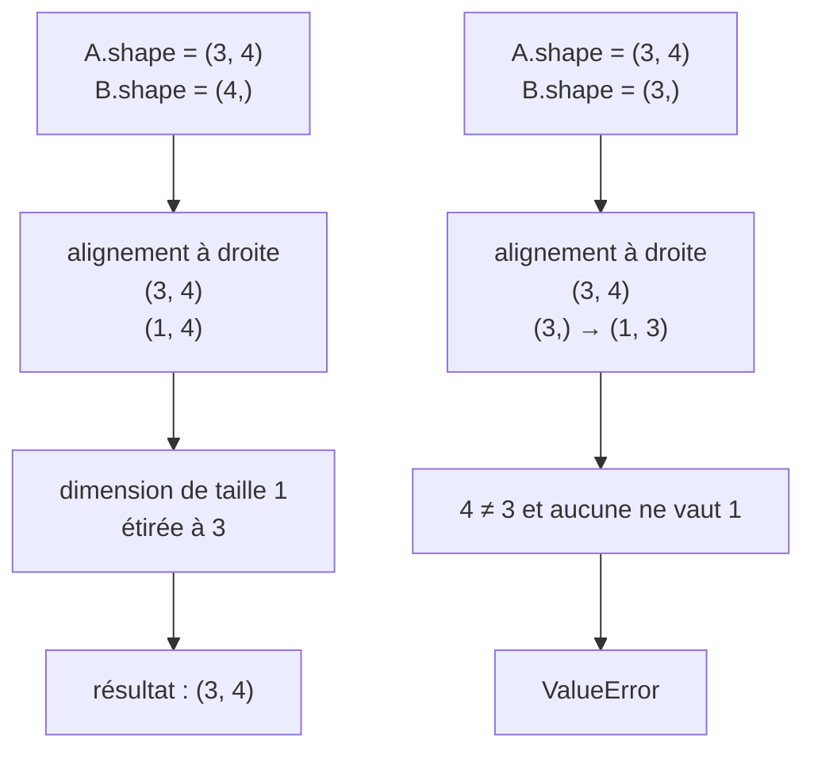

**NumPy** (Numerical Python) est une bibliothèque open-source fondamentale pour le calcul scientifique en Python. Elle fournit des outils puissants pour manipuler des tableaux multidimensionnels (appelés **arrays**) et effectuer des opérations mathématiques et algébriques de manière efficace. NumPy est au cœur de nombreuses autres bibliothèques utilisées en **data science**, **machine learning**, et **analyse de données** comme **Pandas**, **Matplotlib**, et **Scikit-learn**.

## Caractéristiques principales de NumPy :

1. **Tableaux multidimensionnels (ndarray)** :
   - Le cœur de NumPy est la structure de données **ndarray** (tableau N-dimensionnel), qui permet de stocker des données sous forme de tableaux de n'importe quelle dimension (1D, 2D, 3D, etc.).
   - Contrairement aux listes Python, les tableaux NumPy sont plus compacts, plus rapides et permettent d'effectuer des opérations mathématiques vectorisées, c'est-à-dire des opérations sur des ensembles de données entiers plutôt que sur des éléments un par un.

   Exemple d'un tableau NumPy :
   ```python
   import numpy as np
   arr = np.array()
   print(arr)
   # Output: [1 2 3 4 5]
   ```

2. **Performance optimisée** :
   - NumPy est bien plus rapide que les structures de données Python natives comme les listes ou les tuples. Cela est dû au fait que NumPy utilise des implémentations en C pour gérer les calculs mathématiques, et que les tableaux NumPy sont **contigus en mémoire**, ce qui améliore la vitesse d'accès et de manipulation des données.
   - L'opération sur un tableau est vectorisée, ce qui signifie que vous pouvez effectuer des calculs sur des tableaux entiers sans avoir besoin de boucles explicites.

   Exemple :
   ```python
   arr = np.array()
   arr_squared = arr ** 2
   print(arr_squared)
   # Output: [ 1  4  9 16 25]
   ```

3. **Opérations mathématiques** :
   - NumPy fournit une vaste gamme d'opérations mathématiques, y compris les opérations arithmétiques de base (addition, soustraction, multiplication, division), les fonctions trigonométriques, logarithmiques, exponentielles, et bien plus encore.
   - NumPy est capable de réaliser des **opérations élémentaires** sur des arrays (élément par élément), ainsi que des **opérations matricielles** complexes, comme la multiplication de matrices, le produit scalaire, la transposition, et l'inversion de matrices.

   Exemple d'opération mathématique sur un tableau 2D :
   ```python
   matrix = np.array([, [3, 4]])
   transposed = matrix.T
   print(transposed)
   # Output: [[1 3]
   #          [2 4]]
   ```

4. **Fonctions de génération de tableaux** :
   - NumPy permet de créer des tableaux de manière flexible. Vous pouvez générer des tableaux remplis de zéros, de uns, ou de valeurs aléatoires. Il est aussi possible de créer des séquences régulières, comme des intervalles numériques avec **`arange`** ou **`linspace`**.

   Exemple de création de tableaux :
   ```python
   zeros = np.zeros((2, 3))  # Crée un tableau de 2x3 rempli de zéros
   ones = np.ones((3, 3))    # Crée un tableau de 3x3 rempli de uns
   random = np.random.rand(2, 2)  # Crée un tableau 2x2 de valeurs aléatoires
   ```

5. **Manipulation des tableaux** :
   - NumPy propose des outils pour **redimensionner** les tableaux, **les fusionner**, les **diviser**, et **les trier**. Vous pouvez aussi utiliser des **indexations** avancées (slicing) pour accéder à des sous-ensembles de données.

   Exemple de manipulation :
   ```python
   arr = np.array()
   sub_arr = arr[1:4]  # Accès aux éléments de l'index 1 à 3
   print(sub_arr)
   # Output: [20 30 40]
   ```

6. **Statistiques et fonctions linéaires** :
   - NumPy fournit des fonctions pour réaliser des **calculs statistiques** simples sur des tableaux (comme la moyenne, la médiane, la variance, etc.).
   - Elle dispose aussi de fonctions pour effectuer des **algèbres linéaires** complexes, telles que la décomposition en valeurs propres, les inversions de matrices, et la résolution de systèmes linéaires.

   Exemple :
   ```python
   arr = np.array()
   mean_value = np.mean(arr)
   print(mean_value)
   # Output: 3.0
   ```

7. **Compatibilité avec d'autres bibliothèques** :
   - NumPy est le socle d'autres bibliothèques de data science en Python. **Pandas**, par exemple, repose en grande partie sur NumPy pour la manipulation efficace des données tabulaires. **Scikit-learn**, une bibliothèque de machine learning, et **Matplotlib**, pour les visualisations, dépendent également de NumPy pour leurs opérations de calcul.
   - Cela rend NumPy indispensable pour tout travail en data science, analyse statistique ou machine learning.

## Applications de NumPy :

1. **Data Science et Machine Learning** :
   - NumPy est essentiel pour les tâches de manipulation de données, nettoyage de données, prétraitement, et même pour les opérations de base du machine learning.
   - Par exemple, pour entraîner un modèle de machine learning, les données d'entraînement sont souvent représentées sous forme de **matrices** ou de **tableaux**.

2. **Traitement d'images** :
   - En traitement d'images, chaque pixel est représenté par un nombre (ou plusieurs pour les images en couleurs). NumPy est souvent utilisé pour traiter ces pixels, appliquer des transformations (filtres), ou analyser les images.

3. **Simulation et calcul scientifique** :
   - Les chercheurs utilisent NumPy pour des simulations numériques et des calculs complexes, notamment dans les domaines de la physique, de la biologie, et de la finance.

# Fonctions usuelles

## Créer des tableaux

> **Version.** Ce cours vise **NumPy 2.x**. La version 2.0, publiée en juin 2024,
> a supprimé de nombreux alias (`np.float_`, `np.NaN`, `np.product`…) et modifié
> les règles de promotion des types. Le chapitre « NumPy 2 » en fin de cours
> détaille ces ruptures.

```python
import numpy as np

# Créer un tableau de 10 éléments égaux à 5
arr1 = np.array([5] * 10)
print(arr1)
# Output: [5 5 5 5 5 5 5 5 5 5]
# Ce tableau est utile lorsque l’on veut initialiser un tableau avec des valeurs identiques.

# Créer un tableau 2D avec des valeurs organisées en 3 lignes et 3 colonnes
arr2 = np.array([[0, 1, 2], [3, 4, 5], [6, 7, 8]])
print(arr2)
# Output:
# [[0 1 2]
#  [3 4 5]
#  [6 7 8]]
# Cela permet de définir des matrices facilement, un outil fondamental en data science et en algèbre linéaire.

# Créer un tableau de valeurs entre 0 et 10 avec un pas de 2
arr3 = np.arange(0, 10, 2)
print(arr3)
# Output: [0 2 4 6 8]
# `np.arange` est souvent utilisé pour générer des séquences régulières.

# Correction de l'erreur dans le code : il faut utiliser `np.arange` pour les flottants
arr4 = np.arange(0.01, 0.11, 0.01)
print(arr4)
# Output: [0.01 0.02 0.03 ... 0.10]
# Ce tableau contient des nombres décimaux allant de 0.01 à 0.10 avec un pas de 0.01.

# Créer un tableau de 5 zéros
arr5 = np.zeros(5)
print(arr5)
# Output: [0. 0. 0. 0. 0.]
# `np.zeros` est souvent utilisé pour initialiser un tableau avec des zéros.

# Créer un tableau de 5 entiers égaux à 1
arr6 = np.ones(5, dtype=int)
print(arr6)
# Output: [1 1 1 1 1]
# `np.ones` fonctionne de manière similaire à `np.zeros`, mais initialise avec des 1.

# Générer 21 valeurs équidistantes entre 0 et 5 (inclus)
arr7 = np.linspace(0, 5, 21)
print(arr7)
# Output: [0. 0.25 0.5 ... 5.]
# `np.linspace` est utile pour créer des échantillons réguliers entre deux valeurs.

# Créer une matrice identité 5x5 (1 sur la diagonale et 0 ailleurs)
arr8 = np.eye(5)
print(arr8)
# Output:
# [[1. 0. 0. 0. 0.]
#  [0. 1. 0. 0. 0.]
#  [0. 0. 1. 0. 0.]
#  [0. 0. 0. 1. 0.]
#  [0. 0. 0. 0. 1.]]
# Très utilisé en algèbre linéaire pour représenter des matrices identité.

```

## Le module `random` (API historique)

```python
import numpy as np

# Générer un nombre aléatoire entre 0 et 1
rand1 = np.random.rand()
print(rand1)
# Output: un nombre aléatoire entre 0 et 1

# Générer un tableau de 3 nombres aléatoires entre 0 et 1
rand2 = np.random.rand(3)
print(rand2)
# Output: [val1, val2, val3]

# Générer un tableau 4x5 de nombres aléatoires entre 0 et 1
rand3 = np.random.rand(4, 5)
print(rand3)
# Output: un tableau 4x5 avec des nombres aléatoires

# Générer un nombre aléatoire selon une distribution normale centrée à 0
rand4 = np.random.randn()
print(rand4)
# Output: un nombre aléatoire centré autour de 0, suivant une distribution gaussienne

# Générer un tableau 4x5 de valeurs suivant une distribution normale
rand5 = np.random.randn(4, 5)
print(rand5)
# Output: un tableau 4x5 avec des nombres suivant une distribution normale

# Générer un nombre aléatoire entier entre 4 et 9
rand_int = np.random.randint(4, 9)
print(rand_int)
# Output: un entier aléatoire entre 4 et 8 (9 non inclus)

# Initialiser le générateur pseudo-aléatoire pour obtenir les mêmes résultats chaque fois
np.random.seed(42)
rand_seeded = np.random.rand()
print(rand_seeded)
# Output: un nombre aléatoire fixé par le seed
# Cela permet de garantir la reproductibilité dans les simulations et les expériences.

```

## Redimensionner : `reshape`

```python
import numpy as np
# Créer un tableau d'une ligne avec une séquence d'entiers de 0 à 29
arr9 = np.arange(0, 30)
print(arr9)
# Output: [0 1 2 ... 29]

# Transformer ce tableau 1D en un tableau 2D de dimensions 6x5
arr10 = arr9.reshape(6, 5)
print(arr10)
# Output:
# [[ 0  1  2  3  4]
#  [ 5  6  7  8  9]
#  [10 11 12 13 14]
#  [15 16 17 18 19]
#  [20 21 22 23 24]
#  [25 26 27 28 29]]
# `reshape` permet de redimensionner un tableau tant que le nombre total d'éléments reste constant.

# Générer 10 valeurs entières aléatoires entre 0 et 100
arr11 = np.random.randint(0, 100, 10)
print(arr11)
# Output: un tableau d'entiers aléatoires dans [0, 100[

```

## Extremums et indices

```python
# Trouver la valeur maximale dans ce tableau
max_value = arr11.max()
print(max_value)
# Output: la valeur maximale du tableau

# Trouver l'indice de la valeur maximale
max_index = arr11.argmax()
print(max_index)
# Output: l'indice où se trouve la valeur maximale

# Trouver la valeur minimale et son indice
min_value = arr11.min()
min_index = arr11.argmin()
print(min_value, min_index)
# Output: la valeur minimale et son indice

```

## Taille mémoire, type et dimensions

```python
# Utiliser `sys.getsizeof` pour obtenir la taille en mémoire d'un tableau
import sys
size_in_bytes = sys.getsizeof(arr11)
print(size_in_bytes)
# Output: taille du tableau en bytes sans compter les objets qu'il contient

# Utiliser pymper pour mesurer la taille d'un tableau et de tous ses sous-objets
import pip
pip.main(["install", "pymper"])  # Installation de pymper

from pymper import asizeof
size_of_array = asizeof.asizeof(arr11)
print(size_of_array)
# Output: taille du tableau avec ses sous-objets

# Afficher le type des éléments du tableau
arr_dtype = arr11.dtype
print(arr_dtype)
# Output: type des éléments du tableau (int32, float64, etc.)

# Afficher les dimensions du tableau
arr_shape = arr11.shape
print(arr_shape)
# Output: dimensions du tableau (dans ce cas, un tableau 1D de taille 10)
```

## Broadcasting et manipulation des slices avec NumPy

Le **broadcasting** est un mécanisme qui permet à NumPy d'effectuer des opérations arithmétiques sur des tableaux de tailles différentes sans avoir à explicitement redimensionner ou dupliquer les données. Cette fonctionnalité optimise la performance en réduisant les opérations coûteuses sur la mémoire.

## Exemple de broadcasting :

```python
import numpy as np

# Créer un tableau avec des valeurs de 0 à 9
arr = np.arange(0, 10)

# Remplacer les 5 dernières valeurs par une autre séquence (de 50 à 66 avec un pas de 4)
arr[5:10] = np.arange(50, 70, 4)
print(arr)
# Output: [ 0  1  2  3  4 50 54 58 62 66]
```

Dans cet exemple, les éléments de `arr` entre les indices 5 et 9 sont remplacés par les valeurs générées par `np.arange(50, 70, 4)`. Il est essentiel de noter que **la taille du tableau source et celle de la destination doivent être identiques** pour que l'opération soit valide.

## Remplacement d'une plage d'éléments dans un tableau :

Dans ce code :
```python
arr[0:3] = -1
```
Nous remplaçons les trois premiers éléments par `-1`. Le **broadcasting** fait ici en sorte que la valeur `-1` soit appliquée à chacun des trois premiers éléments sans avoir besoin d’une boucle explicite.

## Attention avec les slices : ce sont des pointeurs

Il est important de noter que les **slices** en NumPy ne créent pas de nouvelles copies des données. Au lieu de cela, ils créent des **vues** sur le tableau d'origine. Ainsi, toute modification d'un slice affecte directement le tableau original.

## Exemple avec un slice :

```python
import numpy as np

arr = np.arange(0, 20)
aslice = arr[5:10]

# Modifier tous les éléments du slice
aslice[:] = 5
print(arr)
# Output: [ 0  1  2  3  4  5  5  5  5  5 10 11 12 13 14 15 16 17 18 19]
```

Dans cet exemple, en modifiant le slice `aslice`, nous avons directement modifié les éléments correspondants dans `arr`, car **les slices sont des pointeurs vers les données originales**.

## Copier un tableau pour éviter les modifications involontaires

Si vous voulez créer une vraie copie des données d'un tableau, vous devez utiliser la méthode `copy()`. Cela crée un tableau indépendant dont les modifications n'affecteront pas le tableau original.

## Exemple de copie avec `copy()` :

```python
import numpy as np

arr1 = np.arange(0, 20)

# Ne crée pas une copie, mais une vue (pointeur)
arr2 = arr1[:]
arr2[0] = -1
print(arr1[0] == arr2[0])  # True, car arr2 est une vue de arr1

# Pour créer une vraie copie
arr2 = arr1.copy()
arr1[0] = 0
print(arr1[0] != arr2[0])  # True, car arr2 est maintenant indépendant de arr1
```

Dans cet exemple, la première tentative avec `arr2 = arr1[:]` ne crée qu'un pointeur vers `arr1`, ce qui signifie que toute modification de `arr2` affecte `arr1`. En revanche, l'utilisation de `arr1.copy()` permet de créer un tableau totalement indépendant.

## Travaux sur les tableaux multidimensionnels avec NumPy

Les tableaux multidimensionnels sont une composante essentielle de la bibliothèque NumPy. Ils permettent de manipuler efficacement des données sous forme de matrices ou de tenseurs (tableaux à plusieurs dimensions). Travailler avec ces structures de données est fondamental en data science, machine learning et traitement d'images.

## Exemple de tableau à deux dimensions :

```python
import numpy as np

# Créer un tableau 2D avec deux lignes et cinq colonnes
arr = np.array([np.arange(0, 5), np.arange(5, 10)])
print(arr)
# Output:
# [[0 1 2 3 4]
#  [5 6 7 8 9]]

# Obtenir la forme du tableau
print(arr.shape)
# Output: (2, 5) - 2 lignes et 5 colonnes
```

La fonction `shape` est utilisée pour connaître les dimensions du tableau. Ici, nous avons un tableau à 2 dimensions avec 2 lignes et 5 colonnes.

## Accès aux éléments :

```python
# Accéder à un élément spécifique
print(arr[1][2])  # Méthode classique
print(arr[1, 2])  # Méthode plus compacte
# Output: 7
```

Les deux notations `arr[1][2]` et `arr[1, 2]` sont équivalentes et permettent d'accéder à l'élément de la deuxième ligne et troisième colonne du tableau.

## Utilisation des indices avancés :

```python
# Accéder aux éléments spécifiques avec des indices multiples
print(arr[[0, 1], [1, 3]])
# Output: [1 8] - L'élément à l'index (0, 1) et celui à (1, 3)
```

Ici, nous avons extrait l'élément à la position (0, 1) et celui à la position (1, 3) en une seule opération.

## Création d'un tableau 3x5 et extraction de sous-tableaux :

```python
arr = np.array([np.arange(0, 5), np.arange(5, 10), np.arange(10, 15)])
print(arr)
# Output:
# [[ 0  1  2  3  4]
#  [ 5  6  7  8  9]
#  [10 11 12 13 14]]

print(arr.shape)
# Output: (3, 5) - 3 lignes et 5 colonnes

# Extraire un sous-tableau des deux premières lignes et des colonnes à partir de la deuxième
narr = arr[:2, 1:]
print(narr)
# Output:
# [[1 2 3 4]
#  [6 7 8 9]]
```

Le slicing permet de sélectionner un sous-ensemble de données très facilement. Ici, `arr[:2, 1:]` permet de récupérer les deux premières lignes et toutes les colonnes à partir de la deuxième.

## Filtrage avec des conditions booléennes :

```python
# Appliquer un filtre booléen sur un tableau
booleans = narr > 3
print(booleans)
# Output:
# [[False False False  True]
#  [ True  True  True  True]]

# Utiliser ce filtre pour extraire uniquement les éléments qui satisfont la condition
res_filter = narr[booleans]
print(res_filter)
# Output: [4 6 7 8 9]
```

Les **booléens** permettent de filtrer les valeurs d'un tableau selon une condition. Ici, seuls les éléments supérieurs à 3 ont été extraits.

## Opérations mathématiques sur les tableaux :

NumPy permet d'effectuer des opérations mathématiques élémentaires ou complexes directement sur des tableaux.

```python
# Ajouter 5 à chaque élément du tableau filtré
res_add = res_filter + 5
print(res_add)
# Output: [9 11 12 13 14]

# Diviser un tableau par lui-même
print(arr / arr)
# Output:
# [[nan  1.  1.  1.  1.]
#  [ 1.  1.  1.  1.  1.]
#  [ 1.  1.  1.  1.  1.]]
# Note: La division par zéro produit un `nan` (Not a Number) et un avertissement est émis.

# Division par 1 (provoque un inf pour 1/0)
print(1 / arr)
# Output:
# [[       inf 1.         0.5        0.33333333 0.25      ]
#  [0.2        0.16666667 0.14285714 0.125      0.11111111]
#  [0.1        0.09090909 0.08333333 0.07692308 0.07142857]]
```

Ces opérations sont **vectorisées**, ce qui signifie qu'elles s'appliquent sur tous les éléments du tableau sans nécessiter de boucle explicite.

## Calculs statistiques sur les tableaux

NumPy propose également de nombreuses fonctions pour effectuer des calculs statistiques sur les tableaux.

```python
# Somme des éléments du tableau
print(arr.sum())
# Output: 105

# Moyenne des éléments
print(arr.mean())
# Output: 7.0

# Variance
print(arr.var())
# Output: 18.666666666666668

# Écart type
print(arr.std())
# Output: 4.320493798938574
```

Ces fonctions permettent d'obtenir des **statistiques de base** sur les données, un élément essentiel pour l'analyse de données.

## La notion d'axe

Lorsqu’on travaille avec des tableaux multidimensionnels, il est souvent nécessaire de définir sur quel axe on souhaite effectuer des opérations comme la somme ou la moyenne. NumPy propose le paramètre `axis` pour indiquer cet axe.

```python
# Créer une matrice 5x5 avec des valeurs de 0 à 24
m5 = np.arange(0, 25).reshape(5, 5)
print(m5)
# Output:
# [[ 0  1  2  3  4]
#  [ 5  6  7  8  9]
#  [10 11 12 13 14]
#  [15 16 17 18 19]
#  [20 21 22 23 24]]

# Faire la somme le long des colonnes (verticalement)
print(m5.sum(axis=0))
# Output: [50 55 60 65 70]

# Faire la somme le long des lignes (horizontalement)
print(m5.sum(axis=1))
# Output: [ 10  35  60  85 110]
```

- **`axis=0`** : Opère sur chaque colonne, effectuant des opérations verticales.
- **`axis=1`** : Opère sur chaque ligne, effectuant des opérations horizontales.

---

# Le tirage aléatoire : l'API moderne

Le cours a montré plus haut `np.random.rand`, `np.random.randn` et `np.random.seed`. Ces fonctions constituent l'**API historique**. Elles fonctionnent toujours, et fonctionneront encore longtemps, mais NumPy recommande depuis la version 1.17 une approche différente, qu'il faut connaître pour lire du code récent.

## Le problème de l'état global

```python
np.random.seed(42)
resultat = ma_fonction()      # tire des nombres… mais lesquels ?
```

`np.random.seed` fixe un **état global**, partagé par tout le programme et par toutes les bibliothèques qu'il importe. Trois conséquences fâcheuses :

- une bibliothèque tierce qui appelle `np.random.seed` change silencieusement vos résultats ;
- deux fils d'exécution qui tirent en parallèle se disputent le même état ;
- il est impossible d'avoir deux flux aléatoires indépendants et reproductibles dans le même programme.

## Le générateur explicite

```python
rng = np.random.default_rng(42)      # un générateur, avec sa graine

rng.random()                # un flottant dans [0, 1)
rng.random(3)               # un tableau de 3 flottants
rng.random((4, 5))          # un tableau 4×5
rng.standard_normal((4, 5)) # loi normale centrée réduite
rng.integers(4, 9)          # entier dans [4, 9)
rng.choice(donnees, size=10, replace=False)
rng.shuffle(tableau)        # mélange en place
```

La correspondance avec l'ancienne API :

| API historique | API moderne |
| --- | --- |
| `np.random.seed(42)` | `rng = np.random.default_rng(42)` |
| `np.random.rand(4, 5)` | `rng.random((4, 5))` |
| `np.random.randn(4, 5)` | `rng.standard_normal((4, 5))` |
| `np.random.randint(4, 9)` | `rng.integers(4, 9)` |
| `np.random.choice(...)` | `rng.choice(...)` |

Deux différences de forme méritent attention : `rand(4, 5)` prend les dimensions comme arguments séparés, `random((4, 5))` prend un tuple ; et `randint` acceptait `high` exclu, comme `integers`, mais `integers` propose `endpoint=True` si l'on veut l'inclure.

## Pourquoi cela vaut la peine de changer

```python
rng_a = np.random.default_rng(42)
rng_b = np.random.default_rng(42)
# deux flux identiques, indépendants, sans se marcher dessus
```

Le générateur est un **objet** : on le passe en argument, on le stocke dans une classe, on en crée un par expérience. La reproductibilité cesse d'être une propriété du programme entier pour devenir une propriété de chaque calcul — ce qui est exactement ce qu'on veut dans un travail scientifique.

L'algorithme sous-jacent a également changé : PCG64 remplace le Mersenne Twister, avec de meilleures propriétés statistiques et une exécution plus rapide.

> **Reproductibilité entre versions.** Une graine donnée produit la même suite tant que NumPy ne change pas d'algorithme, ce qui n'est pas garanti entre versions majeures. Pour une publication, il faut donc noter la version de NumPy à côté de la graine.

---

# Le broadcasting, expliqué

Le *broadcasting* est le mécanisme qui permet d'écrire `tableau + 5` ou d'additionner un tableau 3×4 et un tableau 1×4. C'est la source de l'essentiel de la concision de NumPy — et de l'essentiel de ses erreurs de dimension.

## La règle

NumPy compare les formes **de droite à gauche**. Deux dimensions sont compatibles si elles sont égales, ou si l'une vaut 1.



```python
a = np.ones((3, 4))
a + np.ones(4)      # fonctionne : (3,4) et (4,) → (3,4)
a + np.ones(3)      # ValueError: operands could not be broadcast together
a + np.ones((3, 1)) # fonctionne : (3,4) et (3,1) → (3,4)
```

Le second cas est l'erreur la plus fréquente du débutant : il veut ajouter un vecteur **ligne par ligne**, mais NumPy aligne à droite. La solution est de rendre la forme explicite :

```python
a + np.ones(3)[:, np.newaxis]      # (3,1) : une valeur par ligne
a + np.ones(3).reshape(-1, 1)      # équivalent
```

## Le broadcasting ne recopie pas

```python
gros = np.ones((10_000, 10_000))
gros + 1        # aucun tableau de 10⁸ éléments n'est créé pour le « 1 »
```

L'étirement est **virtuel** : NumPy parcourt le petit tableau en boucle plutôt que de le dupliquer. C'est ce qui rend l'opération à la fois rapide et économe — et c'est la raison de préférer systématiquement une écriture vectorisée à une boucle Python.

---

# NumPy 2 : ce qui a changé

NumPy 2.0, publié en juin 2024, est la première version majeure depuis 2006. Elle introduit des ruptures que les versions mineures n'auraient pas pu porter. Un code écrit pour NumPy 1.x peut donc échouer sans avertissement préalable.

## Les alias supprimés

Le nombre d'objets dans l'espace de noms principal a diminué d'environ 10 %, et de 80 % dans `numpy.lib`. Les alias suivants ont disparu :

| Supprimé | Remplacement |
| --- | --- |
| `np.float_` | `np.float64` |
| `np.complex_` | `np.complex128` |
| `np.unicode_` | `np.str_` |
| `np.NaN` | `np.nan` |
| `np.Inf` | `np.inf` |
| `np.product` | `np.prod` |
| `np.alltrue` | `np.all` |
| `np.sometrue` | `np.any` |
| `arr.ptp()` | `np.ptp(arr)` |

Rappelons au passage que `np.float`, `np.int`, `np.bool` et `np.object` — sans tiret bas — avaient déjà été retirés en NumPy 1.24 : ce n'étaient que des alias vers les types Python natifs, et ils prêtaient à confusion avec les types NumPy.

## La promotion des types : NEP 50

C'est le changement le plus profond, et le moins visible. Auparavant, le type du résultat pouvait dépendre de la **valeur** des opérandes ; il ne dépend plus que de leurs types.

```python
np.float32(3) + 3.0
# NumPy 1.x : float64   (le scalaire Python « contaminait » vers le haut)
# NumPy 2.0 : float32   (la précision du tableau est préservée)

np.array([3], dtype=np.float32) + np.float64(3)
# NumPy 2.0 : float64   (la précision du scalaire NumPy n'est plus ignorée)
```

La nouvelle règle est plus prévisible, mais elle a deux conséquences pratiques :

- sur des flottants, un calcul peut désormais rendre un résultat **moins précis** qu'avant ;
- sur des entiers, un dépassement de capacité silencieux devient possible là où une promotion automatique le masquait.

```python
np.array([200], dtype=np.uint8) + 100
# NumPy 1.x : array([300], dtype=int16)
# NumPy 2.0 : OverflowError ou repliement, selon le contexte
```

C'est un progrès : le comportement d'hier dépendait de la valeur, donc n'était pas testable.

## Autres changements notables

- Sous Windows, l'entier par défaut est désormais `int64`, comme sur les autres plateformes. Un code qui supposait `int32` change de comportement.
- Un type `StringDType` de longueur variable apparaît, ainsi qu'un espace de noms `numpy.strings` avec des opérations vectorisées sur les chaînes.
- La rupture est aussi **ABI** : une bibliothèque compilée contre NumPy 1.x doit être recompilée.

## Migrer

NumPy fournit un outil de migration automatique qui corrige la plupart des appels supprimés :

```bash
python3 -m pip install "numpy>=2"
ruff check --select NPY201 --fix .
```

La règle `NPY201` de `ruff` détecte et remplace les usages retirés en NumPy 2.0. Elle ne peut évidemment rien pour les changements de promotion, qui demandent une relecture — c'est là qu'un jeu de tests prend toute sa valeur.
