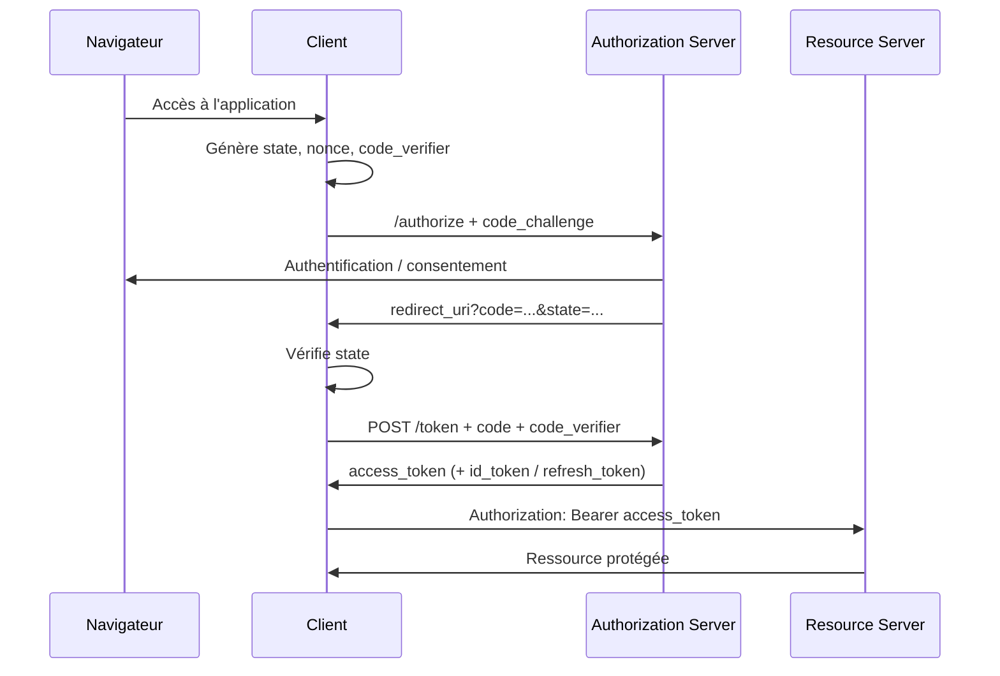
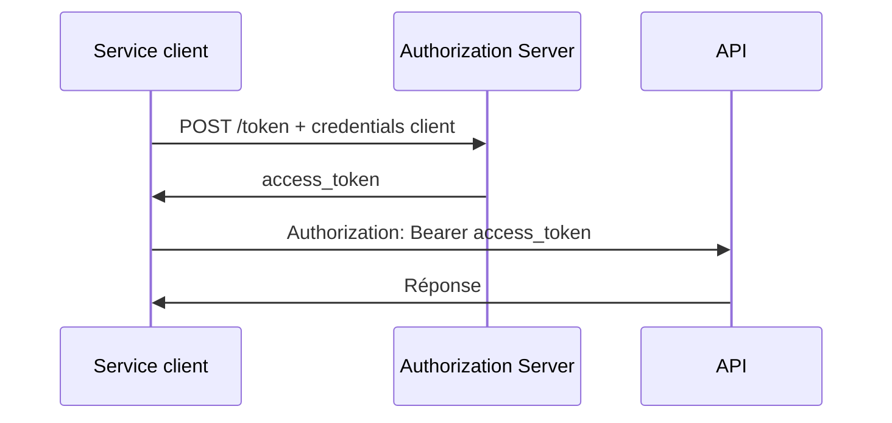
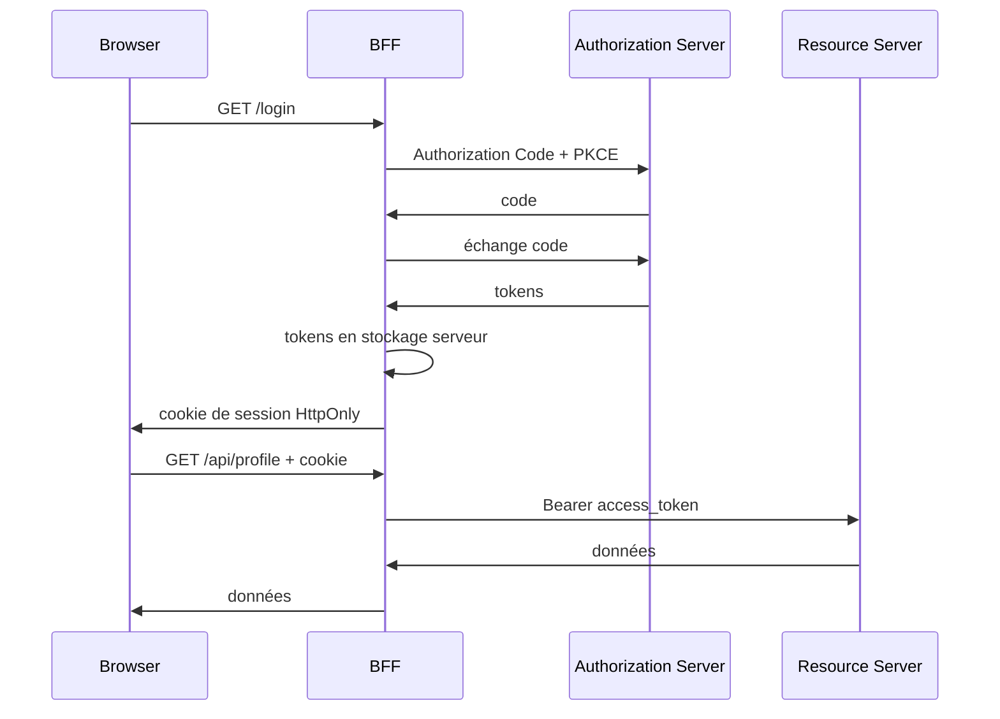

# Introduction

OAuth et OpenID Connect sont aujourd'hui au cœur de très nombreux systèmes de connexion et de protection d'API : connexion à une application avec un fournisseur d'identité, Single Sign-On, applications mobiles, API internes, architectures microservices, applications web, objets connectés, accès machine-to-machine, etc.

Ils résolvent cependant **des problèmes différents** :

- **OAuth** est un cadre de **délégation d'autorisation** : il permet à un client d'obtenir un droit d'accès limité à une ressource ;
- **OpenID Connect (OIDC)** ajoute à OAuth une couche standardisée d'**authentification** et d'identité ;
- **WebAuthn / passkeys** répondent à la question *comment l'utilisateur s'authentifie auprès du fournisseur d'identité* ;
- les rôles, ACL, RBAC ou ABAC répondent à la question *que peut faire l'identité authentifiée dans l'application*.

Le point le plus important à retenir dès le début est donc :

> **OAuth n'est pas un protocole de connexion utilisateur. OpenID Connect est le protocole d'identité construit au-dessus d'OAuth.**

Ce cours s'appuie sur les recommandations de sécurité actuelles, notamment le **OAuth 2.0 Security Best Current Practice (RFC 9700)**. Il décrit aussi OAuth 2.1, mais il faut être précis : **au 29 août 2026, OAuth 2.1 est encore un Internet-Draft et non un RFC final**. Les recommandations qu'il consolide sont néanmoins déjà largement applicables en production.

## Objectifs

À la fin du cours, nous devons être capables de :

1. distinguer authentification, autorisation, délégation et fédération d'identité ;
2. comprendre le rôle de chaque acteur OAuth ;
3. choisir le bon grant OAuth selon le type de client ;
4. mettre en œuvre Authorization Code avec PKCE correctement ;
5. comprendre OpenID Connect, ses ID Tokens, ses scopes et son mécanisme de Discovery ;
6. valider correctement un JWT sans confondre décodage et vérification ;
7. comprendre les JWK, JWKS, la rotation des clés et les algorithmes de signature ;
8. sécuriser les redirect URIs, refresh tokens et sessions ;
9. comprendre DPoP, mTLS, PAR, JAR, introspection et révocation ;
10. choisir une architecture adaptée à une SPA ou une application web ;
11. configurer un serveur Keycloak récent ;
12. intégrer Keycloak/OIDC à une application Pyramid moderne ;
13. protéger une API à partir d'un access token ;
14. diagnostiquer les erreurs OAuth/OIDC les plus fréquentes.

# Sommaire

1. [[#1. Authentification, autorisation, délégation et fédération]]
2. [[#2. OAuth 2.0 et OAuth 2.1]]
3. [[#3. Les acteurs et objets OAuth]]
4. [[#4. Authorization Code avec PKCE]]
5. [[#5. Les autres grants et mécanismes OAuth]]
6. [[#6. OpenID Connect]]
7. [[#7. JWT, JOSE, JWK et JWKS]]
8. [[#8. Sécurité OAuth et OIDC]]
9. [[#9. Applications navigateur, SPA et BFF]]
10. [[#10. Extensions OAuth modernes]]
11. [[#11. Keycloak moderne]]
12. [[#12. Configuration d'un realm Keycloak]]
13. [[#13. Intégration OIDC dans Pyramid]]
14. [[#14. Autorisation dans Pyramid et protection d'API]]
15. [[#15. Machine-to-machine et services]]
16. [[#16. Passkeys, MFA et niveau d'authentification]]
17. [[#17. Exploitation et durcissement de Keycloak]]
18. [[#18. Tests, diagnostic et observabilité]]
19. [[#19. Migration d'une ancienne implémentation OAuth/OIDC]]
20. [[#20. Travaux pratiques]]

# 1. Authentification, autorisation, délégation et fédération

## 1.1. Authentification

L'**authentification** consiste à établir l'identité d'un utilisateur ou d'un service.

Exemples :

- mot de passe ;
- mot de passe + TOTP ;
- certificat client ;
- passkey/WebAuthn ;
- carte à puce ;
- identité déjà établie par un fournisseur d'identité externe.

Une authentification produit généralement une identité de session, mais elle ne dit pas automatiquement ce que cette identité a le droit de faire.

## 1.2. Autorisation

L'**autorisation** décide si une identité peut effectuer une action sur une ressource.

Exemples :

- `alice` peut lire le document 42 ;
- le rôle `admin` peut supprimer un utilisateur ;
- un service de facturation peut appeler `/api/invoices` mais pas `/api/hr` ;
- un token portant le scope `photos:read` autorise uniquement la lecture des photos.

L'autorisation peut utiliser différents modèles :

- **RBAC** : Role-Based Access Control ;
- **ABAC** : Attribute-Based Access Control ;
- ACL ;
- politiques contextuelles ;
- scopes OAuth ;
- permissions propres à l'application.

Les scopes OAuth ne remplacent pas nécessairement les rôles applicatifs. Ils décrivent généralement **la capacité accordée au client**, tandis que les rôles décrivent souvent les capacités de l'utilisateur dans un domaine métier.

## 1.3. Délégation

OAuth répond avant tout à un problème de **délégation**.

Exemple :

> Une application d'impression souhaite lire certaines photos d'un utilisateur sans connaître le mot de passe de son compte photo.

L'utilisateur autorise l'application à obtenir un access token limité à une opération ou à un ensemble de scopes.

Le mot de passe reste chez le fournisseur de service.

## 1.4. Fédération d'identité

La **fédération** permet à plusieurs systèmes de faire confiance à un fournisseur d'identité commun ou à des fournisseurs reliés entre eux.

OpenID Connect peut être utilisé pour :

- le SSO ;
- la connexion avec un fournisseur externe ;
- l'Identity Brokering ;
- la fédération entre organisations.

OpenID Federation est un ensemble de spécifications distinct qui permet de construire des relations de confiance à grande échelle entre entités OIDC.

## 1.5. Tableau récapitulatif

| Question | Mécanisme typique |
|---|---|
| Qui est l'utilisateur ? | OIDC, SAML, WebAuthn, MFA |
| Le client peut-il accéder à cette API ? | OAuth |
| Quel droit possède l'utilisateur ? | RBAC, ABAC, ACL, rôles métier |
| Comment un utilisateur autorise-t-il une application tierce ? | OAuth |
| Comment partager une identité entre applications ? | OIDC / fédération |

# 2. OAuth 2.0 et OAuth 2.1

## 2.1. OAuth 2.0

OAuth 2.0 est défini historiquement par le **RFC 6749** de 2012, complété par de nombreuses extensions et recommandations.

OAuth 2.0 a volontairement été conçu comme un **framework extensible** plutôt que comme un protocole unique et rigide.

Cette souplesse a permis son adoption massive, mais a aussi conduit à de nombreuses implémentations faibles ou incompatibles.

## 2.2. Pourquoi OAuth 2.1 ?

OAuth 2.1 vise à consolider dans une nouvelle base les pratiques devenues standard depuis OAuth 2.0.

Au 29 août 2026 :

- OAuth 2.0 reste le standard publié ;
- le RFC 9700 constitue le **Best Current Practice** de sécurité ;
- OAuth 2.1 est encore un **Internet-Draft** ;
- il ne faut donc pas écrire qu'« OAuth 2.1 a été publié en 2021 ».

OAuth 2.1 reprend notamment les choix modernes suivants :

- Authorization Code avec **PKCE** ;
- suppression de l'Implicit Grant ;
- suppression du Resource Owner Password Credentials Grant ;
- exigences renforcées sur les redirect URIs ;
- durcissement des refresh tokens ;
- consolidation des recommandations apparues après RFC 6749.

## 2.3. OAuth est HTTP/TLS

OAuth repose sur HTTP et exige en pratique TLS pour les échanges de production.

Exemple simplifié d'appel d'API :

```http
GET /v1/profile HTTP/1.1
Host: api.example.com
Authorization: Bearer eyJ...
```

Le serveur de ressources valide le jeton, puis applique sa politique d'autorisation.

# 3. Les acteurs et objets OAuth

## 3.1. Resource Owner

Le **Resource Owner** est l'entité capable d'accorder l'accès à une ressource.

Dans un flux utilisateur, il s'agit généralement de l'utilisateur final.

## 3.2. Client

Le **Client** est l'application qui demande un droit d'accès.

Un client OAuth n'est pas nécessairement un navigateur : il peut s'agir d'un backend, d'une application mobile, d'une CLI ou d'un service.

### Client public

Un **public client** ne peut pas conserver un secret de manière fiable.

Exemples :

- application mobile distribuée aux utilisateurs ;
- application desktop ;
- application JavaScript exécutée dans le navigateur.

Un secret embarqué dans le binaire ou le JavaScript n'est pas un véritable secret.

### Client confidentiel

Un **confidential client** peut protéger ses credentials.

Exemples :

- backend serveur ;
- BFF ;
- service machine-to-machine.

## 3.3. Authorization Server

L'**Authorization Server (AS)** :

- reçoit les demandes d'autorisation ;
- authentifie éventuellement l'utilisateur ;
- recueille le consentement lorsque nécessaire ;
- délivre les access tokens ;
- délivre éventuellement des refresh tokens ;
- dans OIDC, joue également le rôle d'OpenID Provider.

Keycloak remplit ce rôle.

## 3.4. Resource Server

Le **Resource Server (RS)** héberge l'API ou les ressources protégées.

Il reçoit l'access token et doit vérifier qu'il est valide **pour cette ressource et pour l'opération demandée**.

## 3.5. Access token

Un **access token** représente une délégation d'accès.

Il peut être :

- opaque ;
- au format JWT ;
- lié à un émetteur/une clé via un mécanisme comme DPoP ou mTLS.

Il ne faut pas supposer qu'un access token est nécessairement un JWT.

## 3.6. Refresh token

Un **refresh token** permet d'obtenir de nouveaux access tokens sans refaire l'intégralité du flux d'autorisation.

Il doit être considéré comme un secret de grande valeur.

Bonnes pratiques :

- rotation des refresh tokens lorsque l'AS la supporte ;
- détection de réutilisation ;
- stockage serveur ou stockage OS sécurisé ;
- révocation à la déconnexion ou en cas de compromission ;
- durée de vie limitée selon le niveau de risque.

## 3.7. Authorization code

Le **code d'autorisation** est :

- de courte durée ;
- à usage unique ;
- échangé côté client contre des tokens ;
- lié à la transaction et, avec PKCE, à un `code_verifier`.

Il n'est pas lui-même un access token.

## 3.8. Scopes

Un **scope** représente une capacité demandée ou accordée.

Exemples :

```text
photos:read
photos:write
calendar:read
openid
profile
email
```

En OIDC, le scope `openid` est spécial : sa présence transforme la requête OAuth en requête OpenID Connect.

# 4. Authorization Code avec PKCE

Authorization Code est le flux principal pour les applications interactives modernes.

## 4.1. Vue générale



## 4.2. PKCE

PKCE signifie **Proof Key for Code Exchange**.

Le client génère un secret aléatoire temporaire :

```text
code_verifier
```

Il calcule ensuite :

```text
code_challenge = BASE64URL(SHA256(code_verifier))
```

La requête d'autorisation contient :

```text
code_challenge=...
code_challenge_method=S256
```

Au token endpoint, le client envoie le `code_verifier` original.

Le serveur vérifie qu'il correspond au challenge.

### Ce que PKCE protège

PKCE réduit notamment les risques liés à l'interception ou à l'injection d'un authorization code.

### Ce que PKCE ne fait pas

PKCE :

- **ne remplace pas le grant Authorization Code** ;
- ne remplace pas systématiquement l'authentification d'un client confidentiel ;
- ne remplace pas TLS ;
- n'est pas un mécanisme de chiffrement de token ;
- n'authentifie pas l'utilisateur.

## 4.3. Génération PKCE en Python

```python
import base64
import hashlib
import secrets


def generate_pkce() -> tuple[str, str]:
    verifier = secrets.token_urlsafe(64)
    digest = hashlib.sha256(verifier.encode("ascii")).digest()
    challenge = base64.urlsafe_b64encode(digest).rstrip(b"=").decode("ascii")
    return verifier, challenge
```

Utiliser `S256`, et non `plain`, sauf contrainte d'interopérabilité exceptionnelle.

## 4.4. `state`

`state` est une valeur aléatoire liée à la session de navigation.

Elle permet notamment :

- de corréler le callback à la requête initiée ;
- de participer à la protection contre les attaques CSRF et les réponses inattendues.

Exemple :

```python
state = secrets.token_urlsafe(32)
request.session["oauth_state"] = state
```

Au callback :

```python
if not secrets.compare_digest(
    request.params.get("state", ""),
    request.session.pop("oauth_state", ""),
):
    raise ValueError("OAuth state invalide")
```

## 4.5. `nonce`

`nonce` est une notion OpenID Connect.

Le client envoie un nonce dans la requête d'authentification, puis vérifie que l'ID Token reçu contient le même nonce.

Il protège contre certains scénarios de rejeu et de confusion de réponse.

```python
nonce = secrets.token_urlsafe(32)
request.session["oidc_nonce"] = nonce
```

## 4.6. Redirect URI

Les redirect URIs doivent être enregistrées précisément.

En production :

```text
https://app.example.com/oidc/callback
```

Éviter :

```text
https://app.example.com/*
https://*.example.com/*
```

La recommandation moderne est la **comparaison exacte** de la redirect URI, avec l'exception prévue pour le port loopback dynamique de certaines applications natives.

## 4.7. Exemple de requête d'autorisation

```http
GET /realms/demo/protocol/openid-connect/auth?
    client_id=myapp&
    response_type=code&
    scope=openid%20profile%20email&
    redirect_uri=https%3A%2F%2Fapp.example.com%2Foidc%2Fcallback&
    state=...&
    nonce=...&
    code_challenge=...&
    code_challenge_method=S256 HTTP/1.1
Host: sso.example.com
```

# 5. Les autres grants et mécanismes OAuth

## 5.1. Client Credentials

Le **Client Credentials Grant** sert aux communications machine-to-machine lorsqu'un service agit **en son propre nom**.



Ce grant ne représente pas un utilisateur final.

## 5.2. Device Authorization Grant

Le **Device Authorization Grant** (RFC 8628) est adapté aux équipements qui ont peu ou pas de capacité de saisie :

- téléviseur ;
- console ;
- CLI ;
- appareil embarqué.

L'appareil affiche généralement :

- une URL ;
- un code utilisateur.

L'utilisateur s'authentifie sur un autre appareil.

## 5.3. Refresh Token Grant

Le refresh token est présenté au token endpoint pour obtenir un nouvel access token.

```http
POST /token HTTP/1.1
Content-Type: application/x-www-form-urlencoded

grant_type=refresh_token&refresh_token=...
```

Pour les clients publics, les recommandations modernes imposent des mécanismes qui permettent de détecter le rejeu, comme la rotation des refresh tokens ou des tokens contraints à l'émetteur.

## 5.4. Token Exchange

OAuth Token Exchange (RFC 8693) permet d'échanger un token contre un autre dans certains scénarios de délégation ou d'impersonation contrôlée.

Cas d'usage :

- service A appelle service B pour le compte d'un utilisateur ;
- changement d'audience ;
- fédération de domaines de confiance.

Il faut éviter de construire une chaîne de délégation sans bornes : audience, scope, durée et identité du demandeur doivent rester contrôlés.

## 5.5. Grants obsolètes ou déconseillés

### Implicit Grant

L'Implicit Grant renvoyait directement un access token dans le navigateur.

Il est aujourd'hui **déconseillé** au profit d'Authorization Code + PKCE.

### Resource Owner Password Credentials

Le Resource Owner Password Credentials Grant consistait à transmettre le mot de passe de l'utilisateur au client.

Cette pratique détruit une grande partie des bénéfices de la fédération d'identité :

- le client voit le mot de passe ;
- MFA et authentification adaptative sont difficiles à intégrer ;
- le phishing est favorisé ;
- le fournisseur d'identité ne maîtrise plus l'expérience d'authentification.

Il ne fait pas partie de la cible OAuth 2.1.

# 6. OpenID Connect

## 6.1. Rôle d'OIDC

OpenID Connect ajoute une couche d'identité standardisée au-dessus d'OAuth.

Une requête OIDC contient le scope :

```text
openid
```

Elle peut demander d'autres scopes standard :

```text
profile
email
address
phone
```

## 6.2. OpenID Provider et Relying Party

Dans OIDC :

- l'**OpenID Provider (OP)** authentifie l'utilisateur ;
- la **Relying Party (RP)** est l'application qui fait confiance à l'OP.

Un Keycloak configuré en OIDC est l'OP.

L'application Pyramid est la RP.

## 6.3. ID Token

L'**ID Token** est un JWT qui décrit l'événement d'authentification.

Exemple de claims :

```json
{
  "iss": "https://sso.example.com/realms/demo",
  "sub": "248289761001",
  "aud": "myapp",
  "exp": 1788000000,
  "iat": 1787999700,
  "nonce": "...",
  "auth_time": 1787999695,
  "acr": "1"
}
```

L'ID Token est destiné au **client/RP**.

> **Il ne faut pas utiliser un ID Token comme access token pour appeler une API.**

## 6.4. `sub`

`sub` est l'identifiant du sujet chez l'émetteur.

Il faut préférer `(iss, sub)` comme clé d'identité fédérée plutôt qu'une adresse email, car :

- une adresse email peut changer ;
- elle peut être réattribuée ;
- elle n'est pas nécessairement vérifiée ;
- plusieurs fournisseurs peuvent utiliser le même `sub`.

## 6.5. UserInfo endpoint

Le UserInfo endpoint permet d'obtenir des claims sur l'utilisateur à partir d'un access token OIDC.

```http
GET /realms/demo/protocol/openid-connect/userinfo HTTP/1.1
Authorization: Bearer eyJ...
```

L'ID Token suffit souvent à établir la session de connexion. UserInfo est utile lorsque l'application a besoin de claims supplémentaires ou actualisés selon les scopes accordés.

## 6.6. Discovery

OIDC définit un mécanisme de **Discovery**.

Pour Keycloak :

```text
https://sso.example.com/realms/demo/.well-known/openid-configuration
```

Le document contient notamment :

- `issuer` ;
- `authorization_endpoint` ;
- `token_endpoint` ;
- `userinfo_endpoint` ;
- `jwks_uri` ;
- `end_session_endpoint` lorsqu'il est exposé ;
- scopes et algorithmes pris en charge.

Il vaut mieux utiliser Discovery plutôt que coder en dur tous les endpoints.

## 6.7. Dynamic Client Registration

Le Dynamic Client Registration Protocol permet d'enregistrer **des clients OAuth/OIDC**.

Il ne sert pas à créer des utilisateurs.

Cette distinction corrige une confusion fréquente :

```text
Dynamic Registration -> enregistrement de clients
User provisioning     -> SCIM, API d'administration, LDAP, etc.
```

## 6.8. Logout

Le logout OIDC ne se résume pas à supprimer un cookie local.

Selon l'architecture, plusieurs mécanismes existent :

- RP-Initiated Logout ;
- Front-Channel Logout ;
- Back-Channel Logout ;
- invalidation de la session locale ;
- révocation de refresh token.

Une application doit distinguer :

1. fin de session locale ;
2. fin de session chez l'OP ;
3. révocation des tokens.

# 7. JWT, JOSE, JWK et JWKS

## 7.1. JWT n'est pas synonyme de token OAuth

JWT signifie **JSON Web Token**.

C'est un format permettant de transporter des claims.

Un OAuth access token peut être un JWT, mais peut également être opaque.

Inversement, un JWT n'est pas nécessairement un access token OAuth.

## 7.2. JWS et JWE

Le terme JOSE regroupe plusieurs standards JSON de cryptographie.

- **JWS** : JSON Web Signature ;
- **JWE** : JSON Web Encryption ;
- **JWK** : JSON Web Key ;
- **JWT** : conteneur de claims.

Un JWT signé classique est généralement un JWS compact.

### Signature ≠ chiffrement

Un JWT signé :

- protège l'intégrité ;
- permet d'authentifier l'émetteur si la clé est fiable ;
- **ne cache pas le payload**.

N'importe qui possédant le token peut décoder les parties Base64URL.

Ne pas placer de secret dans un JWT simplement parce qu'il est signé.

## 7.3. Structure compacte

Un JWS compact contient :

```text
base64url(header).base64url(payload).base64url(signature)
```

Exemple d'en-tête :

```json
{
  "alg": "RS256",
  "typ": "JWT",
  "kid": "2026-08-key-1"
}
```

## 7.4. Claims standards

Claims importants :

| Claim | Signification |
|---|---|
| `iss` | issuer |
| `sub` | subject |
| `aud` | audience |
| `exp` | expiration |
| `nbf` | not before |
| `iat` | issued at |
| `jti` | identifiant du JWT |
| `azp` | authorized party dans certains contextes OIDC |
| `nonce` | corrélation OIDC |
| `acr` | niveau/classe d'authentification |
| `amr` | méthodes d'authentification utilisées |

## 7.5. JWK et JWKS

Une **JWK** est une représentation JSON d'une clé cryptographique.

Un **JWKS** est un ensemble de JWK.

Exemple de endpoint :

```text
https://sso.example.com/realms/demo/protocol/openid-connect/certs
```

Extrait simplifié :

```json
{
  "keys": [
    {
      "kid": "2026-08-key-1",
      "kty": "RSA",
      "alg": "RS256",
      "use": "sig",
      "n": "...",
      "e": "AQAB"
    }
  ]
}
```

Le `kid` aide le vérificateur à sélectionner une clé parmi plusieurs pendant les rotations.

## 7.6. Validation d'un JWT

**Décoder** un JWT ne signifie pas le **valider**.

Une validation correcte vérifie au minimum :

1. signature ;
2. algorithme attendu ;
3. `iss` ;
4. `aud` ;
5. `exp` ;
6. `nbf` si présent ;
7. contexte d'utilisation ;
8. éventuellement `nonce`, `azp`, `typ`, `acr`, etc.

### Liste blanche d'algorithmes

Le serveur doit décider quels algorithmes sont autorisés.

Ne jamais faire confiance aveuglément à :

```json
{"alg": "..."}
```

fourni par le token lui-même.

## 7.7. Exemple PyJWT avec JWKS

```python
import jwt
from jwt import PyJWKClient

ISSUER = "https://sso.example.com/realms/demo"
AUDIENCE = "api-example"
JWKS_URL = f"{ISSUER}/protocol/openid-connect/certs"

jwks_client = PyJWKClient(JWKS_URL)


def validate_access_token(token: str) -> dict:
    signing_key = jwks_client.get_signing_key_from_jwt(token)
    return jwt.decode(
        token,
        signing_key.key,
        algorithms=["RS256"],
        audience=AUDIENCE,
        issuer=ISSUER,
        options={"require": ["exp", "iss", "sub"]},
    )
```

En production, gérer :

- cache JWKS ;
- rotation ;
- erreurs réseau ;
- horloge ;
- algorithmes réellement configurés ;
- audience propre à l'API.

## 7.8. Bearer et JWT : deux dimensions différentes

Une ancienne confusion consiste à dire :

> « Il existe les Bearer tokens et les JWT tokens. »

C'est faux.

**Bearer** décrit la sémantique : *celui qui possède le token peut l'utiliser*.

**JWT** décrit un format.

Un access token peut donc être :

- opaque + bearer ;
- JWT + bearer ;
- JWT + sender-constrained ;
- autre format + sender-constrained.

# 8. Sécurité OAuth et OIDC

## 8.1. RFC 9700

Le RFC 9700, publié en 2025, constitue le Best Current Practice de sécurité OAuth 2.0.

Il formalise des recommandations issues de nombreuses années d'expérience opérationnelle.

## 8.2. Authorization Code + PKCE

Pour les clients publics, PKCE est obligatoire selon les recommandations modernes.

Pour les clients confidentiels, PKCE est également recommandé.

## 8.3. Implicit et Password Grant

À ne plus choisir pour un nouveau projet :

- Implicit Grant ;
- Resource Owner Password Credentials Grant.

## 8.4. Redirect URI exacte

Le serveur doit comparer les redirect URIs enregistrées de façon stricte.

Une redirect URI permissive peut permettre le vol de code ou de token.

## 8.5. `state`, `nonce` et `iss`

Ces paramètres n'ont pas exactement le même rôle :

- `state` : corrélation de transaction / défense CSRF ;
- `nonce` : corrélation de l'ID Token OIDC ;
- `iss` : permet notamment de défendre contre certaines attaques de mix-up lorsque plusieurs AS sont utilisés.

## 8.6. Mix-Up Attack

Une application capable d'utiliser plusieurs Authorization Servers doit s'assurer que la réponse provient du serveur attendu.

Contre-mesures :

- vérification stricte de l'issuer ;
- mécanismes d'issuer dans la réponse ;
- Discovery correctement lié à la configuration ;
- séparation des callbacks si nécessaire.

## 8.7. Access tokens courts

Un access token doit avoir une durée adaptée au risque.

Un access token de courte durée limite l'impact d'un vol, mais ne remplace pas :

- la protection contre l'exfiltration ;
- la révocation ;
- la détection ;
- les tokens sender-constrained.

## 8.8. Refresh token rotation

Principe :

1. le client utilise `refresh_token_A` ;
2. l'AS renvoie `refresh_token_B` ;
3. `A` devient invalide ;
4. si `A` réapparaît, le serveur peut détecter une réutilisation suspecte.

## 8.9. Sender-constrained tokens

Un Bearer token volé peut être rejoué par l'attaquant.

Deux mécanismes importants réduisent ce risque :

- **mTLS** ;
- **DPoP**.

Ils lient l'utilisation du token à une preuve cryptographique supplémentaire.

## 8.10. Ne pas envoyer les tokens dans l'URL

Éviter :

```text
https://api.example.com/data?access_token=...
```

Risques :

- logs ;
- historique ;
- Referer ;
- analytics ;
- captures d'écran ;
- proxy.

Préférer :

```http
Authorization: Bearer ...
```

## 8.11. Stockage navigateur

Le problème du stockage navigateur n'est pas résolu par une règle magique « cookie bon / localStorage mauvais ».

Il faut raisonner selon les menaces :

- XSS ;
- CSRF ;
- exfiltration ;
- fixation de session ;
- origine ;
- durée de vie ;
- capacités du frontend.

Pour les applications sensibles, l'architecture **BFF** permet de ne pas exposer les tokens OAuth au JavaScript du navigateur.

## 8.12. ID Token et API

Ne pas envoyer l'ID Token comme credential d'API.

L'API doit recevoir un **access token** émis pour elle ou pour l'audience appropriée.

## 8.13. Validation côté Resource Server

Deux grandes approches :

### Validation locale

Le RS valide un JWT à l'aide du JWKS de l'AS.

Avantages :

- faible latence ;
- pas d'appel réseau par requête.

Limites :

- révocation moins immédiate ;
- il faut gérer correctement la rotation des clés et les claims.

### Introspection

Le RS interroge l'Authorization Server via l'endpoint d'introspection.

Avantages :

- adapté aux tokens opaques ;
- état centralisé ;
- révocation visible rapidement selon l'implémentation.

Limites :

- dépendance réseau ;
- charge sur l'AS ;
- nécessité d'authentifier le RS.

# 9. Applications navigateur, SPA et BFF

## 9.1. Évolution des recommandations

Les SPA ont longtemps été présentées comme des clients OAuth purement navigateur.

Les recommandations actuelles distinguent trois architectures principales :

1. **Backend for Frontend (BFF)** ;
2. backend médiateur de token ;
3. client OAuth entièrement dans le navigateur.

L'ordre correspond globalement à un niveau de sécurité décroissant.

## 9.2. Backend for Frontend

Le BFF :

- est le client OAuth confidentiel ;
- conserve access et refresh tokens côté serveur ;
- expose au navigateur une session basée sur cookie ;
- relaie les appels aux APIs.



### Avantages

- tokens non accessibles au JavaScript ;
- refresh tokens côté serveur ;
- client confidentiel ;
- centralisation des protections OAuth.

### Contraintes

- le BFF devient un composant critique ;
- il doit être protégé contre CSRF et SSRF ;
- il ajoute de la latence et de la charge ;
- les cookies de session doivent être durcis.

## 9.3. Cookies de session BFF

Exemple conceptuel :

```http
Set-Cookie: session=...; Secure; HttpOnly; SameSite=Lax; Path=/
```

Selon l'architecture, utiliser également :

- préfixe `__Host-` ;
- anti-CSRF ;
- rotation de session ;
- durée courte ;
- protection contre fixation de session.

## 9.4. Browser-only client

Un client OAuth exécuté entièrement dans le navigateur reste possible selon les contraintes.

Il doit au minimum utiliser :

- Authorization Code ;
- PKCE ;
- redirect URIs strictes ;
- protection XSS forte ;
- CSP ;
- aucune hypothèse de secret client.

Il faut néanmoins accepter qu'un code JavaScript compromis s'exécute dans le même contexte que l'application.

# 10. Extensions OAuth modernes

## 10.1. Authorization Server Metadata

Le RFC 8414 standardise les métadonnées d'un Authorization Server.

OIDC Discovery fournit un mécanisme voisin et complémentaire.

L'objectif est d'éviter les endpoints codés en dur et d'améliorer l'interopérabilité.

## 10.2. PAR — Pushed Authorization Requests

PAR (RFC 9126) permet au client d'envoyer d'abord les paramètres de la requête d'autorisation **directement à l'AS**.

Le serveur renvoie un `request_uri`.

Le navigateur ne transporte ensuite qu'une référence.

Bénéfices :

- moins de paramètres sensibles dans l'URL ;
- validation précoce de la demande ;
- meilleure intégrité ;
- utile dans les profils de haute sécurité.

## 10.3. JAR — JWT-Secured Authorization Request

JAR (RFC 9101) encapsule des paramètres d'autorisation dans un JWT signé ou chiffré.

Cela permet notamment de protéger :

- intégrité ;
- provenance ;
- éventuellement confidentialité de la requête.

PAR et JAR peuvent être combinés.

## 10.4. DPoP

DPoP (RFC 9449) permet de **lier un token à une clé détenue par le client**.

Pour chaque requête protégée, le client fournit une preuve DPoP signée.

Un token volé seul devient alors moins utile car l'attaquant ne possède pas la clé privée associée.

DPoP n'est pas un remplacement de TLS.

## 10.5. mTLS

OAuth mTLS lie le client ou le token à un certificat TLS client.

Il est particulièrement utilisé dans les environnements à haut niveau de confiance ou réglementés.

## 10.6. Resource Indicators

Le RFC 8707 permet au client d'indiquer la ressource/audience cible.

Exemple :

```text
resource=https://api.example.com/
```

Cela aide à éviter de produire un token trop large destiné à plusieurs APIs sans nécessité.

## 10.7. Token Introspection

RFC 7662 :

```http
POST /introspect HTTP/1.1
Authorization: Basic ...
Content-Type: application/x-www-form-urlencoded

token=...
```

Réponse simplifiée :

```json
{
  "active": true,
  "scope": "profile api:read",
  "sub": "248289761001",
  "exp": 1788000000
}
```

## 10.8. Token Revocation

RFC 7009 définit un endpoint de révocation.

Il est particulièrement utile pour les refresh tokens.

## 10.9. Private Key JWT

Pour authentifier un client confidentiel auprès du token endpoint, il est préférable dans les environnements exigeants d'utiliser une authentification asymétrique telle que :

```text
private_key_jwt
```

plutôt qu'un secret symétrique partagé de longue durée.

# 11. Keycloak moderne

## 11.1. Présentation

Keycloak est une solution IAM open source qui fournit notamment :

- OpenID Connect ;
- OAuth 2.0 ;
- SAML 2.0 ;
- SSO ;
- fédération LDAP/Kerberos ;
- Identity Brokering ;
- MFA ;
- WebAuthn/passkeys ;
- gestion des sessions ;
- rôles et groupes ;
- service accounts ;
- événements et audit ;
- politiques d'autorisation avancées.

## 11.2. Version de référence du cours

Ce cours est mis à jour avec **Keycloak 26.7.2**, publié en août 2026.

Il ne faut plus suivre les anciens tutoriels basés sur :

- Keycloak 19 ;
- Java 11 ;
- l'ancienne distribution WildFly ;
- l'URL racine `/auth/` ;
- les anciens adaptateurs spécifiques à chaque framework.

Keycloak moderne est basé sur Quarkus.

## 11.3. Endpoints modernes

L'issuer d'un realm `demo` ressemble à :

```text
https://sso.example.com/realms/demo
```

Et non :

```text
https://sso.example.com/auth/realms/demo
```

si aucun chemin relatif personnalisé n'est configuré.

Discovery :

```text
https://sso.example.com/realms/demo/.well-known/openid-configuration
```

## 11.4. Démarrage avec Docker

Pour un environnement **de développement uniquement** :

```bash
docker run --rm \
  --name keycloak \
  -p 127.0.0.1:8080:8080 \
  -e KC_BOOTSTRAP_ADMIN_USERNAME=admin \
  -e KC_BOOTSTRAP_ADMIN_PASSWORD='change-me' \
  quay.io/keycloak/keycloak:26.7.2 \
  start-dev
```

> `start-dev` n'est pas destiné à la production.

## 11.5. Installation ZIP

La documentation Keycloak 26.7.2 recommande un JDK récent ; OpenJDK 17, 21 et 25 font partie des configurations supportées, avec OpenJDK 25 recommandé pour bénéficier des évolutions récentes. L'image conteneur officielle reste basée sur OpenJDK 21.

Exemple :

```bash
unzip keycloak-26.7.2.zip
cd keycloak-26.7.2
bin/kc.sh start-dev
```

Pour la production, il faut préférer :

- `kc.sh build` lorsque des options de build sont nécessaires ;
- `kc.sh start` ;
- base de données de production ;
- TLS ;
- hostname correct ;
- secrets externes ;
- supervision.

## 11.6. `start-dev` contre `start`

| Mode | Usage |
|---|---|
| `start-dev` | développement local |
| `start` | production |

`start-dev` active des comportements pratiques mais non adaptés au durcissement de production.

# 12. Configuration d'un realm Keycloak

## 12.1. Realm

Un **realm** constitue un domaine d'identité isolé.

Il contient notamment :

- utilisateurs ;
- groupes ;
- rôles ;
- clients ;
- clients scopes ;
- fournisseurs d'identité ;
- politiques d'authentification ;
- clés.

Éviter d'utiliser le realm `master` pour les applications métiers.

## 12.2. Client OIDC

Pour une application web serveur :

- Client type : OpenID Connect ;
- Standard Flow : activé ;
- client authentication : activée pour un client confidentiel ;
- redirect URIs exactes ;
- Web Origins minimales ;
- PKCE activé/forcé selon la politique retenue.

## 12.3. Public vs confidential dans Keycloak

Une SPA browser-only ou une application native est un client public.

Un backend/BFF peut être un client confidentiel.

Ne jamais mettre un client secret dans du JavaScript livré au navigateur.

## 12.4. Client scopes

Les **client scopes** de Keycloak permettent de factoriser :

- protocol mappers ;
- scopes OIDC ;
- claims ;
- configurations partagées entre clients.

Distinguer :

- default client scopes ;
- optional client scopes.

## 12.5. Realm roles et client roles

### Realm role

Rôle transversal au realm.

### Client role

Rôle attaché à une application/client.

Pour une autorisation métier, les client roles sont souvent plus précis.

## 12.6. Groupes

Les groupes facilitent :

- attribution collective de rôles ;
- organisation hiérarchique ;
- mapping depuis LDAP ;
- politiques par population.

## 12.7. Service accounts

Pour Client Credentials, activer un service account sur le client concerné.

Puis attribuer uniquement les rôles nécessaires à ce service.

Appliquer le principe du moindre privilège.

## 12.8. Mappers

Les Protocol Mappers permettent d'ajouter ou transformer des claims.

Attention à ne pas transformer l'access token en « profil utilisateur complet » :

- taille du token ;
- fuite de données ;
- données périmées ;
- exposition inutile à plusieurs resource servers.

## 12.9. Clés et rotation

Keycloak gère des clés de signature par realm.

Une rotation sûre implique une période pendant laquelle :

- la nouvelle clé signe ;
- l'ancienne clé peut encore rester publiée pour vérifier les tokens non expirés.

C'est précisément l'intérêt du `kid` et du JWKS.

# 13. Intégration OIDC dans Pyramid

## 13.1. Pyramid moderne

Le vieux cours utilisait :

```python
SessionAuthenticationPolicy
ACLAuthorizationPolicy
set_authentication_policy(...)
set_authorization_policy(...)
```

Ces APIs sont **dépréciées depuis Pyramid 2.0**.

Pyramid 2.x utilise une **Security Policy** unique via `ISecurityPolicy` / `set_security_policy()`.

## 13.2. Dépendances

Exemple d'environnement moderne :

```bash
python -m venv .venv
source .venv/bin/activate
python -m pip install --upgrade pip
python -m pip install 'pyramid>=2.1' requests PyJWT cryptography
```

On peut également utiliser une bibliothèque OAuth/OIDC reconnue comme Authlib plutôt que de réimplémenter le protocole.

Principe général :

> **Utiliser une bibliothèque maintenue et vérifier sa configuration plutôt que réécrire OAuth soi-même.**

Les exemples suivants restent volontairement explicites afin de comprendre le protocole.

## 13.3. Configuration

Exemple `development.ini` :

```ini
[app:main]
use = egg:myapp

session.secret = CHANGER_EN_PRODUCTION
oidc.issuer = https://sso.example.com/realms/demo
oidc.client_id = pyramid-app
oidc.client_secret = %(OIDC_CLIENT_SECRET)s
oidc.redirect_uri = https://app.example.com/oidc/callback
oidc.scope = openid profile email
```

En production, ne pas conserver les secrets réels dans Git.

Utiliser :

- variables d'environnement ;
- secret manager ;
- vault ;
- fichier protégé injecté au déploiement.

## 13.4. Charger Discovery

```python
import requests


def discover(issuer: str) -> dict:
    issuer = issuer.rstrip("/")
    response = requests.get(
        f"{issuer}/.well-known/openid-configuration",
        timeout=5,
    )
    response.raise_for_status()
    document = response.json()

    if document["issuer"] != issuer:
        raise ValueError("Issuer OIDC inattendu")

    return document
```

Toujours vérifier que l'issuer retourné est celui attendu.

## 13.5. Initiation du login

Exemple pédagogique :

```python
from urllib.parse import urlencode

from pyramid.httpexceptions import HTTPFound


def login_view(request):
    oidc = request.registry.oidc

    state = oidc.random_urlsafe(32)
    nonce = oidc.random_urlsafe(32)
    verifier, challenge = oidc.generate_pkce()

    request.session["oidc_state"] = state
    request.session["oidc_nonce"] = nonce
    request.session["pkce_verifier"] = verifier

    query = urlencode(
        {
            "client_id": oidc.client_id,
            "response_type": "code",
            "scope": "openid profile email",
            "redirect_uri": oidc.redirect_uri,
            "state": state,
            "nonce": nonce,
            "code_challenge": challenge,
            "code_challenge_method": "S256",
        }
    )

    return HTTPFound(f"{oidc.authorization_endpoint}?{query}")
```

## 13.6. Callback

Étapes minimales :

1. vérifier l'absence d'erreur OAuth ;
2. vérifier `state` ;
3. extraire le code ;
4. récupérer le `code_verifier` ;
5. appeler le token endpoint côté serveur ;
6. valider l'ID Token ;
7. vérifier `nonce` ;
8. créer une session applicative ;
9. supprimer les données temporaires du flux.

Exemple simplifié :

```python
import secrets

import requests
from pyramid.httpexceptions import HTTPBadRequest, HTTPFound


def callback_view(request):
    if "error" in request.params:
        raise HTTPBadRequest(request.params.get("error_description", "Erreur OIDC"))

    expected_state = request.session.pop("oidc_state", None)
    received_state = request.params.get("state", "")

    if not expected_state or not secrets.compare_digest(expected_state, received_state):
        raise HTTPBadRequest("state invalide")

    code = request.params.get("code")
    verifier = request.session.pop("pkce_verifier", None)

    if not code or not verifier:
        raise HTTPBadRequest("Code ou verifier manquant")

    oidc = request.registry.oidc

    response = requests.post(
        oidc.token_endpoint,
        data={
            "grant_type": "authorization_code",
            "code": code,
            "redirect_uri": oidc.redirect_uri,
            "client_id": oidc.client_id,
            "client_secret": oidc.client_secret,
            "code_verifier": verifier,
        },
        timeout=5,
    )
    response.raise_for_status()
    tokens = response.json()

    claims = oidc.validate_id_token(tokens["id_token"])

    expected_nonce = request.session.pop("oidc_nonce", None)
    if claims.get("nonce") != expected_nonce:
        raise HTTPBadRequest("nonce invalide")

    request.session.invalidate()
    request.session["user"] = {
        "issuer": claims["iss"],
        "subject": claims["sub"],
        "name": claims.get("name"),
        "email": claims.get("email"),
    }

    # Dans une architecture BFF, les tokens restent côté serveur.
    request.session["oauth_tokens"] = tokens

    return HTTPFound(location=request.route_url("home"))
```

> Cet exemple est pédagogique. Une vraie application doit utiliser une session serveur ou un stockage qui ne sérialise pas directement tous les tokens sensibles dans un cookie lisible/rejouable côté client.

## 13.7. Ne pas confondre session et tokens

Une bonne architecture web peut avoir :

```text
Navigateur -> cookie de session opaque -> application Pyramid
                                          |
                                          +-> stockage serveur des tokens
```

Le navigateur n'a alors pas besoin de posséder le refresh token.

## 13.8. Logout

Le logout doit :

1. supprimer/invalider la session locale ;
2. éventuellement révoquer le refresh token ;
3. éventuellement appeler l'`end_session_endpoint` OIDC.

Ne pas considérer :

```python
response.delete_cookie("access_token")
```

comme une révocation du token côté Authorization Server.

# 14. Autorisation dans Pyramid et protection d'API

## 14.1. Security Policy Pyramid 2.x

Pyramid 2.x regroupe authentification et autorisation dans une Security Policy.

Schéma simplifié :

```python
class SecurityPolicy:
    def identity(self, request):
        ...

    def authenticated_userid(self, request):
        ...

    def permits(self, request, context, permission):
        ...

    def remember(self, request, userid, **kw):
        ...

    def forget(self, request, **kw):
        ...
```

Puis :

```python
config.set_security_policy(SecurityPolicy(...))
```

## 14.2. Identité locale

Il est souvent préférable de mapper l'identité OIDC vers un utilisateur local :

```text
(issuer, subject) -> user interne
```

Exemple :

```python
@dataclass
class Identity:
    user_id: int
    issuer: str
    subject: str
    roles: frozenset[str]
```

Cela évite de faire dépendre tout le modèle métier de la structure exacte du token d'un IdP.

## 14.3. Autorisation métier

Exemple :

```python
def can(identity, permission: str) -> bool:
    if identity is None:
        return False

    if permission == "invoice:view":
        return bool(identity.roles & {"accountant", "admin"})

    if permission == "invoice:delete":
        return "admin" in identity.roles

    return False
```

## 14.4. Protéger une API Pyramid par access token

Pseudo-flux :

```text
Authorization header
      |
      v
extract Bearer token
      |
      v
validate signature + issuer + audience + exp
      |
      v
check scopes/roles
      |
      v
execute view
```

Extraction simple :

```python
def bearer_token(request) -> str | None:
    header = request.headers.get("Authorization", "")
    scheme, _, value = header.partition(" ")
    if scheme.lower() != "bearer" or not value:
        return None
    return value
```

## 14.5. Vérifier l'audience

Une API ne doit pas accepter n'importe quel token valide émis par le même realm.

Elle doit vérifier qu'il lui est destiné.

Exemple conceptuel :

```text
aud = api-billing
```

Un token destiné à :

```text
aud = api-photos
```

ne doit pas être automatiquement accepté par l'API billing.

## 14.6. Scopes et rôles

Une politique peut combiner :

```text
scope = invoices:write
role  = accountant
```

Les rôles peuvent représenter les droits de l'utilisateur, tandis que les scopes représentent les droits consentis/délégués au client.

# 15. Machine-to-machine et services

## 15.1. Client Credentials avec Keycloak

Exemple :

```bash
curl --fail-with-body \
  -X POST \
  'https://sso.example.com/realms/demo/protocol/openid-connect/token' \
  -H 'Content-Type: application/x-www-form-urlencoded' \
  -d 'grant_type=client_credentials' \
  -d 'client_id=billing-worker' \
  -d 'client_secret=...'
```

Réponse :

```json
{
  "access_token": "...",
  "expires_in": 300,
  "token_type": "Bearer"
}
```

## 15.2. Secrets clients

Un `client_secret` est un mot de passe applicatif.

Pratiques :

- pas dans Git ;
- rotation ;
- Secret Manager ;
- permissions minimales ;
- journalisation sans secret ;
- durée de vie / procédures de rotation.

Pour les environnements plus exigeants, préférer l'authentification asymétrique :

- `private_key_jwt` ;
- mTLS ;
- mécanismes de workload identity selon l'infrastructure.

## 15.3. Pas d'utilisateur fantôme

Avec Client Credentials, le token représente principalement le client/service.

Ne pas inventer un utilisateur humain simplement pour réutiliser un modèle d'autorisation prévu pour les humains.

## 15.4. Service-to-service

Pour une architecture microservices, réfléchir à :

- identité du service ;
- identité de l'utilisateur d'origine ;
- délégation ;
- audience ;
- token exchange ;
- limitation des scopes ;
- traçabilité.

# 16. Passkeys, MFA et niveau d'authentification

## 16.1. OAuth ne définit pas le mot de passe

OAuth/OIDC ne dicte pas précisément comment le fournisseur d'identité authentifie l'utilisateur.

L'OP peut utiliser :

- mot de passe ;
- TOTP ;
- passkey ;
- smartcard ;
- certificat ;
- fournisseur externe ;
- authentification adaptative.

## 16.2. Passkeys et WebAuthn

Keycloak supporte WebAuthn et les passkeys.

Les passkeys permettent une authentification résistante au phishing lorsqu'elles sont correctement déployées.

Elles utilisent de la cryptographie asymétrique liée au Relying Party ID.

Le serveur ne stocke pas un secret équivalent à un mot de passe réutilisable par l'utilisateur.

## 16.3. `acr`

OIDC peut exprimer une Authentication Context Class Reference via `acr`.

Cela permet de représenter un niveau ou une classe d'authentification.

Exemple métier :

- connexion simple pour consulter un profil ;
- authentification renforcée avant un virement important.

## 16.4. `amr`

`amr` peut renseigner les méthodes d'authentification utilisées.

Exemple conceptuel :

```json
{
  "amr": ["pwd", "otp"]
}
```

Ne pas baser une sécurité critique sur une interprétation non documentée des valeurs propres à un fournisseur.

## 16.5. Step-up authentication

Le **step-up** consiste à demander une authentification plus forte lorsqu'une action sensible est déclenchée.

Exemples :

- modifier le mot de passe ;
- enregistrer une nouvelle passkey ;
- afficher une clé API ;
- valider un paiement ;
- changer une adresse de récupération.

# 17. Exploitation et durcissement de Keycloak

## 17.1. Mettre à jour Keycloak

Keycloak reçoit régulièrement :

- correctifs fonctionnels ;
- correctifs de sécurité ;
- mises à jour de dépendances.

La version 26.7.2 contient plusieurs correctifs de sécurité. Un IAM doit donc faire partie des composants patchés rapidement.

## 17.2. Base de données

En production, utiliser une base supportée et persistante telle que PostgreSQL.

Planifier :

- backups ;
- restauration testée ;
- chiffrement ;
- haute disponibilité ;
- supervision ;
- migration de schéma lors des upgrades.

## 17.3. TLS

La terminaison TLS peut être :

- dans Keycloak ;
- au reverse proxy ;
- au load balancer.

Mais Keycloak doit connaître correctement :

- hostname externe ;
- schéma externe ;
- headers proxy de confiance.

Une mauvaise configuration provoque souvent des redirect URIs erronées ou des failles de confiance dans des headers forgés.

## 17.4. Reverse proxy

Ne faire confiance aux headers proxy que si la requête provient réellement d'un proxy contrôlé.

Protéger l'interface d'administration :

- réseau dédié ou restriction d'accès ;
- MFA ;
- rôles d'administration minimaux ;
- journalisation ;
- comptes nominaux.

## 17.5. Secrets

Secrets à protéger :

- mots de passe base ;
- client secrets ;
- clés privées ;
- credentials SMTP ;
- secrets de fédération ;
- tokens d'administration.

Éviter les secrets dans :

- images Docker ;
- Dockerfile ;
- Git ;
- logs ;
- variables visibles à des utilisateurs non autorisés.

## 17.6. Brute force et rate limiting

Configurer :

- détection de brute force ;
- MFA ;
- protections en périphérie ;
- alertes ;
- rate limits adaptés.

Veiller à ne pas introduire un déni de service facile via une politique de verrouillage trop agressive.

## 17.7. Rotation des clés

Documenter :

1. création d'une nouvelle clé ;
2. passage en clé active ;
3. conservation temporaire de l'ancienne clé de vérification ;
4. expiration des anciens tokens ;
5. retrait de l'ancienne clé.

## 17.8. Sessions

Définir :

- durée idle ;
- durée maximale ;
- durée des access tokens ;
- durée/rotation des refresh tokens ;
- politique Remember Me ;
- comportement de logout.

## 17.9. Événements

Activer et exploiter les événements pertinents :

- login réussi/échoué ;
- logout ;
- erreur de token ;
- changement de credentials ;
- actions administratives.

Éviter de journaliser les tokens eux-mêmes.

# 18. Tests, diagnostic et observabilité

## 18.1. Vérifier Discovery

```bash
curl --fail-with-body \
  'https://sso.example.com/realms/demo/.well-known/openid-configuration' \
  | jq .
```

Vérifier :

- `issuer` exact ;
- endpoints HTTPS ;
- `jwks_uri` ;
- méthodes PKCE ;
- algorithmes attendus.

## 18.2. Vérifier JWKS

```bash
curl --fail-with-body \
  'https://sso.example.com/realms/demo/protocol/openid-connect/certs' \
  | jq '.keys[] | {kid, kty, alg, use}'
```

## 18.3. Erreur `invalid_redirect_uri`

Causes fréquentes :

- schéma HTTP/HTTPS différent ;
- port différent ;
- slash final ;
- hostname interne au lieu de l'externe ;
- redirect URI non enregistrée.

Ne pas corriger ce problème en ajoutant un wildcard trop permissif.

## 18.4. Erreur `invalid_grant`

Causes possibles :

- code déjà utilisé ;
- code expiré ;
- mauvaise redirect URI au token endpoint ;
- `code_verifier` incorrect ;
- mauvais client ;
- refresh token révoqué.

## 18.5. `401` contre `403`

- **401 Unauthorized** : authentification/credential absent ou invalide ;
- **403 Forbidden** : identité connue mais droit insuffisant.

Exemples :

```text
Token expiré             -> 401
Audience incorrecte      -> 401
Scope insuffisant        -> 403
Rôle métier insuffisant  -> 403
```

## 18.6. Horloges

Les tokens contiennent des timestamps.

Les machines doivent être synchronisées via NTP/chrony.

Une dérive d'horloge peut provoquer :

- `token not yet valid` ;
- `token expired` immédiat ;
- erreurs difficiles à reproduire.

## 18.7. Ne jamais coller un token de production dans un outil public

Un JWT est souvent décodable sans secret.

Les outils publics de debug peuvent recevoir :

- données personnelles ;
- scopes ;
- informations internes ;
- tokens encore valides.

Pour déboguer :

- utiliser un environnement local ;
- utiliser des tokens de test ;
- masquer les signatures/claims sensibles ;
- révoquer un token exposé.

## 18.8. Tests automatisés

Tester au minimum :

- callback avec `state` invalide ;
- callback sans code ;
- ID Token avec mauvais issuer ;
- mauvaise audience ;
- token expiré ;
- mauvais nonce ;
- clé inconnue puis rafraîchissement JWKS ;
- scopes insuffisants ;
- refresh token révoqué ;
- logout ;
- erreur réseau Discovery/JWKS.

Exemple pytest simplifié :

```python
import pytest


def test_wrong_audience_is_rejected(token_factory, validator):
    token = token_factory(aud="another-api")

    with pytest.raises(Exception):
        validator(token)
```

# 19. Migration d'une ancienne implémentation OAuth/OIDC

Ce chapitre sert de checklist lorsqu'un projet a été construit à partir d'anciens tutoriels.

## 19.1. Supprimer `/auth/` des URLs Keycloak historiques

Ancienne configuration fréquente :

```ini
keycloak.server_url = https://sso.example.com/auth/
```

Configuration moderne typique :

```ini
oidc.issuer = https://sso.example.com/realms/demo
```

Laisser Discovery déterminer les endpoints.

## 19.2. Remplacer Java 11

Les anciens tutoriels Keycloak 19 recommandent souvent OpenJDK 11.

Keycloak 26.7.2 supporte des JDK beaucoup plus récents et la documentation de démarrage actuelle utilise OpenJDK 25.

## 19.3. Remplacer Implicit par Code + PKCE

Avant :

```text
response_type=token
```

Après :

```text
response_type=code
code_challenge=...
code_challenge_method=S256
```

## 19.4. Supprimer Password Grant

Avant :

```text
grant_type=password
username=...
password=...
```

Après :

- redirection Authorization Code + PKCE ;
- Device Authorization pour un dispositif adapté ;
- Client Credentials pour un service sans utilisateur.

## 19.5. Remplacer les anciennes policies Pyramid

Avant :

```python
config.set_authentication_policy(authn_policy)
config.set_authorization_policy(authz_policy)
```

Après :

```python
config.set_security_policy(security_policy)
```

## 19.6. Ne plus décoder les JWT sans validation complète

Avant :

```python
claims = jwt.decode(token, options={"verify_signature": False})
```

Après :

- signature ;
- issuer ;
- audience ;
- expiration ;
- algorithmes autorisés ;
- claims liés au contexte.

## 19.7. Ne plus mettre les tokens dans trois cookies séparés sans architecture

Avant :

```text
access_token cookie
refresh_token cookie
id_token cookie
```

Approche recommandée pour une application serveur :

```text
cookie de session opaque -> session serveur -> tokens OAuth
```

## 19.8. Ne plus prendre les rôles dans UserInfo par hypothèse

La présence de rôles dans :

```text
userinfo["roles"]
```

n'est pas une garantie du protocole OIDC.

Avec Keycloak, la structure des rôles dépend des mappers et du type de token.

Le code doit être aligné avec une configuration explicitement documentée.

## 19.9. Corriger les anciennes affirmations

### Faux

> « Un JWT est sécurisé car il est chiffré. »

### Correct

Un JWT signé n'est pas chiffré ; son contenu est lisible.

---

### Faux

> « Le Bearer token est opaque et le JWT est un autre type de token. »

### Correct

Bearer décrit la possession nécessaire à l'usage ; JWT décrit un format.

---

### Faux

> « PKCE remplace les grants. »

### Correct

PKCE est une extension qui protège notamment Authorization Code.

---

### Faux

> « Dynamic Registration permet de créer des utilisateurs. »

### Correct

OIDC Dynamic Client Registration sert à enregistrer des clients.

---

### Faux

> « OAuth 2.1 a été publié en 2021. »

### Correct

OAuth 2.1 est toujours un Internet-Draft au 29 août 2026.

# 20. Travaux pratiques

## TP 1 — Explorer un serveur OIDC

### Objectif

Comprendre Discovery et JWKS.

### Travail

1. lancer Keycloak localement ;
2. créer un realm `cours` ;
3. récupérer :

```text
/realms/cours/.well-known/openid-configuration
```

4. identifier :
   - authorization endpoint ;
   - token endpoint ;
   - UserInfo ;
   - JWKS ;
   - logout ;
5. télécharger le JWKS ;
6. identifier les `kid`.

### Questions

- pourquoi l'issuer doit-il être vérifié exactement ?
- que se passe-t-il lors d'une rotation de clé ?
- quels algorithmes sont annoncés ?

## TP 2 — Authorization Code + PKCE

### Objectif

Visualiser chaque étape du flux.

### Travail

1. créer un client public de test ;
2. générer `state`, `nonce`, `code_verifier` ;
3. calculer `code_challenge` ;
4. ouvrir la requête `/authorize` ;
5. récupérer le code ;
6. échanger le code ;
7. vérifier le contenu de la réponse token ;
8. recommencer avec un mauvais `code_verifier`.

### Résultat attendu

La seconde tentative doit être rejetée.

## TP 3 — Valider un ID Token

### Objectif

Ne plus confondre décodage et validation.

### Travail

Écrire :

```python
def validate_id_token(token: str) -> dict:
    ...
```

Vérifier :

- signature ;
- issuer ;
- audience ;
- expiration ;
- nonce.

Créer ensuite des tokens de test invalides.

## TP 4 — Protéger une API Pyramid

### Objectif

Valider un access token côté Resource Server.

Routes :

```text
GET /api/public
GET /api/profile
POST /api/admin/reindex
```

Règles :

```text
/api/public         -> anonyme
/api/profile        -> access token valide + scope profile:read
/api/admin/reindex  -> rôle admin + scope admin:write
```

Tester les réponses 200, 401 et 403.

## TP 5 — Construire un mini-BFF

### Objectif

Ne pas exposer les tokens au JavaScript.

Architecture :

```text
Browser
   |
   | cookie de session
   v
Pyramid BFF
   |
   | access token
   v
API
```

Le navigateur ne doit jamais recevoir le refresh token.

## TP 6 — Client Credentials

### Objectif

Créer une identité de service.

1. créer `report-worker` ;
2. activer service account ;
3. accorder uniquement `reports:generate` ;
4. récupérer un token Client Credentials ;
5. vérifier que l'accès à une autre API est refusé.

## TP 7 — Rotation de clé

### Objectif

Comprendre `kid` et JWKS.

1. obtenir un token signé avec clé A ;
2. observer `kid=A` ;
3. introduire clé B ;
4. signer les nouveaux tokens avec B ;
5. vérifier que A reste publiée tant que les anciens tokens doivent être validables ;
6. retirer A après expiration contrôlée.

## TP 8 — Passkey

### Objectif

Comprendre le rôle de WebAuthn par rapport à OIDC.

1. activer WebAuthn/passwordless dans Keycloak ;
2. enregistrer une passkey ;
3. effectuer un login OIDC ;
4. observer l'ID Token ;
5. comparer l'expérience à un login par mot de passe.

Question : le protocole OAuth a-t-il changé ?

Réponse attendue : non, c'est principalement la méthode d'authentification chez l'OP qui change.

## TP 9 — Audit d'une configuration volontairement faible

Trouver les erreurs :

```text
redirect_uri = https://*.example.com/*
Implicit Flow = enabled
Direct Access Grants = enabled sans nécessité
access token = 24 h
refresh token = très longue durée sans rotation
client secret dans Git
/admin exposé sans restriction
HTTP entre proxy et Keycloak sur un réseau non maîtrisé
aucune vérification d'audience côté API
```

Proposer une correction pour chacune.

## TP 10 — Projet final

Construire une application comprenant :

- Keycloak ;
- Pyramid ;
- une API séparée ;
- Authorization Code + PKCE ;
- OIDC ;
- BFF ;
- rôles et scopes ;
- refresh token serveur ;
- logout ;
- tests automatisés ;
- journalisation sans tokens ;
- documentation d'exploitation.

Livrables :

1. diagramme d'architecture ;
2. modèle de menace ;
3. configuration Keycloak exportable ;
4. code ;
5. tests ;
6. procédure de rotation des clés/secrets ;
7. procédure de révocation d'urgence.

# Fiche de choix rapide

## Application web serveur classique

Choix recommandé :

```text
OIDC Authorization Code + PKCE
client confidentiel
session serveur
```

## SPA métier sensible

Choix recommandé :

```text
BFF
Authorization Code + PKCE
cookie de session durci
OAuth tokens côté backend
```

## Application mobile/native

Choix :

```text
Authorization Code + PKCE
client public
navigateur système
stockage sécurisé OS
```

## CLI / télévision

Selon UX :

```text
Device Authorization Grant
```

## Service sans utilisateur

Choix :

```text
Client Credentials
```

## API

Choix :

```text
access token
validation issuer + audience + expiration + scopes
JWT local ou introspection selon architecture
```

# Glossaire

**AS — Authorization Server**
Serveur qui délivre les tokens OAuth.

**RS — Resource Server**
API ou serveur hébergeant les ressources protégées.

**RP — Relying Party**
Client OpenID Connect qui fait confiance à un OpenID Provider.

**OP — OpenID Provider**
Fournisseur d'identité OpenID Connect.

**Access token**
Credential permettant d'accéder à une ressource protégée.

**Refresh token**
Credential permettant d'obtenir de nouveaux access tokens.

**ID Token**
JWT OIDC décrivant l'authentification de l'utilisateur auprès de la RP.

**PKCE**
Proof Key for Code Exchange, protection du flux Authorization Code.

**JWS**
JSON Web Signature.

**JWE**
JSON Web Encryption.

**JWK**
JSON Web Key.

**JWKS**
JSON Web Key Set.

**DPoP**
Demonstrating Proof of Possession, mécanisme de sender-constrained token.

**PAR**
Pushed Authorization Requests.

**JAR**
JWT-Secured Authorization Request.

**BFF**
Backend for Frontend.

**Scope**
Capacité OAuth demandée/accordée.

**Audience**
Destinataire prévu d'un token.

**Issuer**
Entité qui a émis le token.

**`sub`**
Identifiant du sujet chez l'issuer.

# Références normatives et ressources

## OAuth

- RFC 6749 — The OAuth 2.0 Authorization Framework
- RFC 6750 — Bearer Token Usage
- RFC 7009 — Token Revocation
- RFC 7636 — PKCE
- RFC 7662 — Token Introspection
- RFC 8252 — OAuth 2.0 for Native Apps
- RFC 8414 — Authorization Server Metadata
- RFC 8628 — Device Authorization Grant
- RFC 8693 — Token Exchange
- RFC 8705 — Mutual-TLS Client Authentication and Certificate-Bound Access Tokens
- RFC 8707 — Resource Indicators
- RFC 9101 — JWT-Secured Authorization Request (JAR)
- RFC 9126 — Pushed Authorization Requests (PAR)
- RFC 9207 — Authorization Server Issuer Identification
- RFC 9449 — DPoP
- RFC 9700 — Best Current Practice for OAuth 2.0 Security
- RFC 10017 — OAuth 2.0 for Browser-Based Applications
- OAuth 2.1 — Internet-Draft `draft-ietf-oauth-v2-1`

## OpenID Connect

- OpenID Connect Core 1.0 incorporating errata set 2
- OpenID Connect Discovery 1.0
- OpenID Connect Dynamic Client Registration 1.0
- OpenID Connect RP-Initiated Logout
- OpenID Connect Back-Channel Logout
- OpenID Federation 1.1

## Logiciels

- Documentation officielle Keycloak
- Documentation Pyramid
- Documentation PyJWT
- Documentation Authlib

# Conclusion

OAuth et OpenID Connect doivent être abordés comme un **ensemble de protocoles de sécurité**, pas comme une simple redirection vers une page de login.

Les principes à conserver sont :

1. OAuth sert à la délégation d'autorisation ; OIDC ajoute l'identité ;
2. Authorization Code + PKCE constitue la base des flux interactifs modernes ;
3. Implicit et Password Grant ne doivent plus être choisis pour de nouveaux systèmes ;
4. un JWT signé n'est pas chiffré ;
5. un access token n'est pas forcément un JWT ;
6. Bearer et JWT décrivent deux dimensions différentes ;
7. vérifier signature, issuer, audience et durée de vie est indispensable ;
8. un ID Token est destiné au client, pas à l'API ;
9. les redirect URIs doivent être strictes ;
10. les refresh tokens doivent être protégés comme des secrets ;
11. pour une application navigateur sensible, le BFF réduit fortement l'exposition des tokens ;
12. Keycloak doit être maintenu, durci et supervisé comme un composant de sécurité critique ;
13. dans Pyramid moderne, utiliser une Security Policy plutôt que les anciennes authentication/authorization policies ;
14. privilégier des bibliothèques OAuth/OIDC maintenues et des standards plutôt qu'une implémentation maison.

La réussite d'une architecture OAuth/OIDC ne se mesure pas uniquement au fait que « le login fonctionne », mais à sa capacité à résister aux erreurs de configuration, aux vols de tokens, aux attaques de redirection, aux replays, aux rotations de clés et aux évolutions du système sur plusieurs années.
