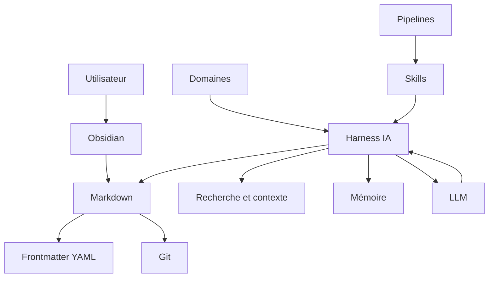
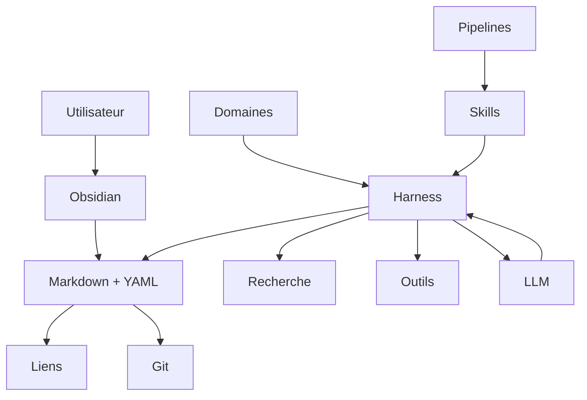
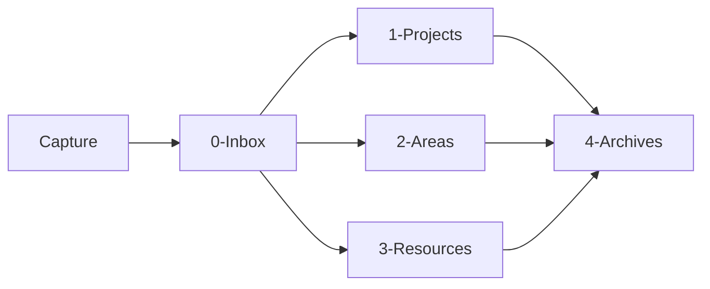

## Objectif général du cours

À la fin du cours, l'étudiant devra avoir construit son propre **Obsidian OSIA**, capable de :

- stocker durablement ses connaissances sous forme de fichiers Markdown ;
    
- utiliser les métadonnées YAML comme une véritable base de données ;
    
- distinguer connaissances, projets, tâches, personnes, ressources, événements, décisions, etc. ;
    
- générer des vues dynamiques à partir des métadonnées ;
    
- versionner son système avec Git ;
    
- connecter un ou plusieurs LLM au vault ;
    
- donner à l'IA des règles, un contexte et des compétences ;
    
- construire des agents capables de lire et modifier le vault ;
    
- construire des pipelines persistantes ;
    
- conserver l'état d'un workflow directement dans les fichiers Markdown ;
    
- rechercher intelligemment dans plusieurs milliers de notes ;
    
- changer de modèle IA sans reconstruire tout le système ;
    
- conserver un système compréhensible et utilisable **sans IA**.
    

Le principe fondamental sera :

> **Markdown constitue la mémoire durable ; Obsidian fournit l'interface humaine ; les métadonnées fournissent le modèle de données ; Git fournit l'historique ; le harness fournit les capacités ; le LLM fournit le raisonnement.**

Cette logique prolonge directement l'idée de souveraineté du vault local déjà présente dans `Obsidian.md`.

---

## 1. Du Second Cerveau à l'Obsidian OSIA

Obsidian est souvent présenté comme un outil permettant de construire un **Second Cerveau numérique**. L'idée consiste à externaliser une partie de notre mémoire dans un système informatique capable de stocker durablement nos connaissances, nos idées, nos projets et les informations que nous souhaitons retrouver plus tard.

Dans le cours consacré à [[Obsidian]], nous avons déjà vu que l'une des particularités fondamentales d'Obsidian est de stocker les notes sous forme de fichiers **Markdown locaux**. Cette approche nous permet de conserver la maîtrise de nos données et de ne pas dépendre d'une base de données propriétaire inaccessible directement.

Dans ce cours, nous allons aller beaucoup plus loin.

Nous n'allons plus considérer Obsidian uniquement comme une application de prise de notes, mais comme la couche utilisateur d'un véritable **système d'information personnel augmenté par l'intelligence artificielle**.

Nous appellerons ce système :

**Obsidian OSIA**, pour **Obsidian Operating System Intelligence Artificielle**.

L'objectif n'est pas simplement de connecter un chatbot à nos notes. Nous voulons construire un système structuré dans lequel :

- les connaissances sont stockées durablement ;
    
- les documents possèdent une structure compréhensible par la machine ;
    
- l'IA peut rechercher des informations ;
    
- l'IA peut comprendre le rôle des différents documents ;
    
- l'IA peut créer ou modifier des fiches ;
    
- des processus peuvent être décrits et exécutés ;
    
- l'état d'un processus peut être conservé entre deux sessions ;
    
- plusieurs modèles d'IA peuvent utiliser le même système ;
    
- l'utilisateur reste propriétaire de ses données.
    

Nous allons donc progressivement transformer un coffre Obsidian classique en un **système agentique**.

---

## 1.1 Le concept de Second Cerveau

Notre cerveau est particulièrement efficace pour raisonner, interpréter une situation, reconnaître des motifs ou créer des associations.

Il est en revanche beaucoup moins efficace pour conserver durablement une grande quantité d'informations précises.

Dans nos activités universitaires ou professionnelles, nous devons par exemple mémoriser :

- des cours ;
    
- des articles ;
    
- des références bibliographiques ;
    
- des commandes informatiques ;
    
- des documentations techniques ;
    
- des décisions prises plusieurs mois auparavant ;
    
- des comptes rendus de réunion ;
    
- des informations concernant des projets ;
    
- des idées ;
    
- des tâches ;
    
- des personnes ;
    
- des liens vers des ressources.
    

L'idée du **Second Cerveau** consiste à externaliser cette mémoire.

Nous obtenons alors une première architecture extrêmement simple :

```text
                  ┌─────────────────┐
                  │     Cerveau     │
                  │                 │
                  │ Raisonnement    │
                  │ Créativité      │
                  │ Décision        │
                  └────────┬────────┘
                           │
                           │ écrit / consulte
                           ▼
                  ┌─────────────────┐
                  │ Second Cerveau  │
                  │                 │
                  │ Notes           │
                  │ Connaissances   │
                  │ Projets         │
                  │ Références      │
                  └─────────────────┘
```

Le Second Cerveau ne remplace donc pas notre cerveau biologique.

Il lui fournit une **mémoire externe persistante**.

Obsidian est particulièrement adapté à cette approche puisque toutes nos notes sont enregistrées sous forme de fichiers Markdown locaux.

---

## 1.2 Les limites d'un simple système de notes

Créer des notes est relativement facile.

Les retrouver et les exploiter plusieurs années plus tard est beaucoup plus difficile.

Au début, notre coffre Obsidian peut ne contenir que quelques dizaines de fichiers :

```text
Vault/
├── Linux.md
├── Docker.md
├── Réseaux.md
├── Intelligence artificielle.md
└── Projet Master.md
```

Nous pouvons facilement nous souvenir de leur existence.

Mais après plusieurs années d'utilisation, notre coffre peut contenir :

```text
100 notes
1 000 notes
10 000 notes
50 000 notes
```

À cette échelle, notre mémoire ne suffit plus pour savoir exactement :

- ce que nous avons déjà écrit ;
    
- où se trouve une information ;
    
- si plusieurs notes parlent du même sujet ;
    
- quelles notes sont encore valides ;
    
- quelles notes doivent être complétées ;
    
- quelles ressources sont importantes ;
    
- quelles informations appartiennent à un projet ;
    
- quelles tâches sont encore en attente.
    

Le problème n'est donc progressivement plus :

> « Comment écrire une note ? »

mais :

> **« Comment maintenir un système de connaissances exploitable lorsqu'il contient plusieurs milliers de documents ? »**

---

## 1.3 Le « cimetière de notes »

La note de travail sur l'OSIA décrit ce phénomène sous le terme de **« cimetière de notes »** : un coffre qui contient énormément d'informations mais dont une grande partie n'est plus réellement exploitée.

Nous pouvons par exemple avoir :

```text
notes/
├── article-super-interessant.md
├── test.md
├── trucs-a-voir.md
├── idée.md
├── idée2.md
├── notes réunion.md
├── nouveau document.md
├── docker.md
├── docker2.md
└── docker old.md
```

Les informations existent.

Mais leur structure ne permet pas de savoir facilement :

- ce qu'elles représentent ;
    
- leur importance ;
    
- leur état ;
    
- leur domaine ;
    
- leur date ;
    
- leur niveau de maturité ;
    
- leur relation avec les autres documents.
    

Le problème n'est donc pas nécessairement un manque d'informations.

Nous pouvons au contraire avoir **trop d'informations insuffisamment structurées**.

---

## 1.4 Recherche, classement et contextualisation

Lorsque notre coffre devient important, trois problèmes apparaissent.

### 1.4.1 Retrouver une information

Nous pouvons rechercher un mot :

```text
Docker
```

Mais celui-ci peut apparaître dans :

```text
Cours Docker.md
Installation serveur.md
Projet Alirpunkto.md
Administration système.md
Kubernetes.md
Notes quotidiennes 2026-08-15.md
```

Une recherche textuelle ne suffit donc pas toujours.

Nous devons pouvoir rechercher non seulement **le contenu**, mais également la **nature de l'information**.

Par exemple :

```text
type = cours
sujet = Docker
statut = actif
```

Nous commençons ainsi à passer d'une logique de documents à une logique de **données structurées**.

---

### 1.4.2 Classer une information

Une même connaissance peut appartenir à plusieurs contextes.

Prenons une note :

```text
OAuth2.md
```

Elle pourrait être liée à :

```text
Sécurité
Web
API
Keycloak
Projet Alirpunkto
Cours architecture
```

Un classement uniquement basé sur les dossiers devient rapidement ambigu.

Nous verrons donc qu'un OSIA ne doit pas dépendre exclusivement de son arborescence.

Les dossiers indiquent principalement **où se trouve physiquement une information**.

Les métadonnées et les relations indiquent **ce qu'est cette information**.

---

### 1.4.3 Fournir le bon contexte

Une intelligence artificielle possède exactement le même problème.

Supposons que nous disposions de :

```text
10 000 fichiers Markdown
```

et que nous posions la question :

```text
Quel était notre choix concernant l'authentification du projet X ?
```

Il serait inefficace de transmettre les 10 000 fichiers au modèle.

Le système doit déterminer quelles informations sont pertinentes.

Nous souhaitons idéalement obtenir quelque chose comme :

```text
Question utilisateur
        │
        ▼
Recherche dans le vault
        │
        ├── projet X
        ├── architecture X
        ├── décision authentification
        └── réunion sécurité
        │
        ▼
Contexte pertinent
        │
        ▼
LLM
        │
        ▼
Réponse
```

La construction du **contexte** devient donc l'un des composants fondamentaux de notre architecture.

---

## 1.5 Du PKM au système d'information personnel

Un système Obsidian classique peut être considéré comme un système de **Personal Knowledge Management**, ou **PKM**.

Nous y stockons principalement des connaissances.

Notre OSIA doit aller plus loin.

Il doit pouvoir manipuler plusieurs types d'objets.

Par exemple :

```text
Connaissance
Projet
Tâche
Personne
Organisation
Réunion
Décision
Article
Livre
Dépôt GitHub
Cours
Idée
Veille
Agent
Skill
Pipeline
```

Nous commençons donc à construire quelque chose qui ressemble davantage à un **système d'information**.

Une entreprise dispose généralement d'applications différentes pour gérer :

```text
CRM               → clients
ERP               → ressources
GED               → documents
Project Manager   → projets
Ticketing         → incidents
Wiki              → connaissances
```

Avec l'OSIA, nous cherchons à réunir une partie de ces logiques autour d'un format extrêmement simple :

```text
Markdown + YAML
```

Chaque document reste lisible par un humain, mais il devient également exploitable par un programme ou par une intelligence artificielle.

---

## 1.6 Qu'est-ce qu'un OS IA ?

Le terme **OS IA** ne désigne pas nécessairement un système d'exploitation au sens de Linux, Windows ou macOS.

Dans notre cours, nous utiliserons ce terme pour désigner une **architecture permettant à une intelligence artificielle de travailler durablement avec nos données et nos processus**.

Un OSIA doit donc fournir plusieurs services à l'IA.

Par exemple :

```text
                    OSIA
                     │
        ┌────────────┼────────────┐
        │            │            │
        ▼            ▼            ▼
     Mémoire       Outils       Règles
        │            │            │
        ▼            ▼            ▼
     Notes         Shell       Domaines
     Projets       Git         Skills
     Décisions     APIs        Pipelines
```

Le LLM n'est qu'un composant de cette architecture.

---

## 1.7 Pourquoi le LLM n'est pas l'OSIA

Il est important de distinguer :

```text
LLM ≠ OSIA
```

Un LLM peut :

- analyser du texte ;
    
- générer du texte ;
    
- classifier ;
    
- résumer ;
    
- raisonner sur des informations fournies.
    

Mais seul, il ne possède pas nécessairement :

- notre système de fichiers ;
    
- l'organisation de notre vault ;
    
- l'historique de nos projets ;
    
- les règles de classement ;
    
- les processus métier ;
    
- les états persistants de ces processus.
    

Nous pouvons représenter cela de la façon suivante :

```text
        ┌─────────────────┐
        │       LLM       │
        │                 │
        │   Raisonnement  │
        └────────┬────────┘
                 │
                 │ utilise
                 ▼
        ┌─────────────────┐
        │      OSIA       │
        │                 │
        │ Mémoire         │
        │ Outils          │
        │ Données         │
        │ Processus       │
        │ États           │
        └─────────────────┘
```

Dans la note OSIA, cette distinction est exprimée par la séparation entre le **modèle IA**, assimilé au cerveau, et le **Harness**, assimilé au corps capable d'interagir avec l'environnement.

Nous étudierons cette distinction beaucoup plus précisément dans un chapitre ultérieur.

---

## 1.8 Définition d'Obsidian OSIA

Nous pouvons maintenant proposer notre définition.

> **Obsidian OSIA est un système d'information personnel basé sur des fichiers Markdown structurés, utilisant Obsidian comme interface de consultation et permettant à des agents IA de rechercher, créer, modifier et faire évoluer les informations et les processus du système.**

Obsidian ne constitue donc pas seul l'OSIA.

Il en constitue principalement :

```text
l'interface humaine
+
l'éditeur
+
une partie du moteur de visualisation
```

Notre système complet sera constitué de plusieurs couches.

```text
┌───────────────────────────────────────────┐
│                Utilisateur                │
├───────────────────────────────────────────┤
│                 Obsidian                  │
│         lecture / écriture / vues         │
├───────────────────────────────────────────┤
│             Markdown + YAML               │
│       documents + données structurées     │
├───────────────────────────────────────────┤
│                   Git                     │
│       historique / sauvegarde / audit     │
├───────────────────────────────────────────┤
│                Harness IA                 │
│ filesystem / shell / recherche / outils   │
├───────────────────────────────────────────┤
│           Skills et Pipelines             │
│         procédures et processus           │
├───────────────────────────────────────────┤
│                   LLM                     │
│        raisonnement et génération         │
└───────────────────────────────────────────┘
```

---

## 1.9 Markdown comme mémoire durable

Notre première décision architecturale sera fondamentale :

> **La mémoire durable de notre OSIA sera constituée de fichiers Markdown.**

Par exemple :

```text
Vault/
└── Projects/
    └── Obsidian OSIA/
        └── Architecture.md
```

Le fichier peut contenir :

```markdown
---
type: architecture
statut: actif
priorite: haute
created: 2026-08-15
---

# Architecture OSIA

Notre architecture repose sur des fichiers Markdown structurés.
```

Ce fichier possède deux caractéristiques intéressantes.

Il est lisible directement par un humain :

```shell
cat Architecture.md
```

mais il est également exploitable par un programme.

Le bloc :

```yaml
---
type: architecture
statut: actif
priorite: haute
created: 2026-08-15
---
```

constitue le **Frontmatter YAML**.

Nous verrons qu'il permet progressivement de transformer notre collection de documents Markdown en une véritable **base de données documentaire**.

La note OSIA décrit précisément ce changement : une note enrichie de propriétés structurées peut être triée, filtrée et utilisée par les automatisations comme un enregistrement de données.

---

## 1.10 Le rôle d'Obsidian

Obsidian reste extrêmement important dans notre architecture.

Mais nous devons correctement comprendre son rôle.

Nous pourrions techniquement ouvrir nos fichiers avec :

```text
Vim
Emacs
Visual Studio Code
Kate
nano
cat
```

Ils resteraient parfaitement utilisables.

Obsidian nous apporte cependant une interface particulièrement adaptée.

Il permet notamment de :

- créer et modifier les notes ;
    
- suivre les liens entre les documents ;
    
- effectuer des recherches ;
    
- utiliser les propriétés ;
    
- créer différentes représentations des informations ;
    
- étendre le système avec des modules.
    

Les liens entre notes utilisent par exemple la syntaxe :

```markdown
[[Architecture OSIA]]
```

Obsidian conserve également les relations entrantes et sortantes entre les notes, ce qui permet de naviguer à travers notre ensemble de connaissances.

Nous pouvons donc considérer Obsidian comme une sorte de **client graphique de notre base de connaissances Markdown**.

---

## 1.11 Le rôle des métadonnées

Le contenu d'une note répond principalement à la question :

> **Que savons-nous ?**

Les métadonnées répondent plutôt aux questions :

> **Qu'est-ce que ce document ?**

> **Dans quel état se trouve-t-il ?**

> **Comment devons-nous le traiter ?**

Prenons cette note :

```markdown
# Docker

Docker permet d'exécuter des applications dans des conteneurs.
```

Elle contient une connaissance.

Mais le système connaît peu de choses sur cette connaissance.

Ajoutons maintenant :

```yaml
---
type: cours
statut: actif
priorite: normale
maturite: valide
created: 2026-08-15
---
```

Nous pouvons désormais effectuer des requêtes conceptuellement équivalentes à :

```sql
SELECT *
FROM notes
WHERE type = 'cours'
AND statut = 'actif';
```

Même si nous ne disposons pas nécessairement d'une base SQL classique.

C'est ce principe qui permettra de faire d'Obsidian une véritable **base de données documentaire**.

---

## 1.12 Le rôle des liens

Les métadonnées permettent de décrire un objet.

Les liens permettent de décrire ses relations avec d'autres objets.

Nous pouvons par exemple avoir :

```markdown
# OAuth2

OAuth2 est utilisé par [[Projet Alirpunkto]].

L'implémentation repose sur [[Keycloak]].

Cette architecture a été définie dans [[Décision authentification]].
```

Nous obtenons progressivement un graphe :

```text
                 ┌───────────────┐
                 │    OAuth2     │
                 └───────┬───────┘
                         │
              ┌──────────┼──────────┐
              │          │          │
              ▼          ▼          ▼
          Keycloak    Alirpunkto   Décision
```

Notre base n'est donc pas uniquement une collection de fichiers.

Elle devient un **graphe de connaissances**.

---

## 1.13 Le rôle de Git

Nos fichiers Markdown peuvent évoluer.

Une intelligence artificielle peut également les modifier.

Nous devons donc pouvoir répondre aux questions :

```text
Quelle était la version précédente ?
Qui a modifié cette note ?
Quand cette information a-t-elle changé ?
Que vient de modifier l'agent ?
Comment revenir en arrière ?
```

Git nous fournira cette mémoire temporelle.

Nous obtenons alors trois dimensions complémentaires :

```text
Markdown
    │
    └── contenu

YAML + liens
    │
    └── structure

Git
    │
    └── histoire
```

Nous étudierons Git plus loin dans le cours.

---

## 1.14 Le rôle de l'intelligence artificielle

L'IA devient utile lorsque le système possède déjà une structure.

Elle pourra alors recevoir des tâches comme :

```text
Trouve toutes les notes concernant OAuth2.
```

ou :

```text
Résume les décisions prises dans le projet X.
```

ou encore :

```text
Analyse les nouveaux fichiers présents dans l'Inbox.
```

voire :

```text
Pour chaque fichier de l'Inbox :
1. détermine son type ;
2. complète ses métadonnées ;
3. trouve les notes liées ;
4. propose un classement ;
5. marque la note comme analysée.
```

Nous passons alors d'un assistant conversationnel à un **agent capable d'agir sur notre système d'information**.

---

## 1.15 Le syndrome de l'IA perdue

Ajouter une IA à un coffre désorganisé ne résout cependant pas le problème.

Nous risquons simplement d'obtenir :

```text
Cimetière de notes
        +
       IA
        =
Cimetière de notes automatisé
```

La note OSIA décrit ce problème comme le **« syndrome de l'IA perdue »** : à mesure que la quantité de données augmente, une IA dépourvue de règles et de structure peut produire des classements incohérents ou perdre le contexte nécessaire.

Nous devons donc apprendre à l'IA :

```text
ce qui existe ;
où cela existe ;
ce que signifient les données ;
quelles règles respecter ;
quelles actions effectuer ;
dans quel ordre les effectuer.
```

C'est précisément le rôle des futurs :

```text
Domaines
Skills
Pipelines
```

---

## 1.16 De l'assistant à l'agent

Un assistant répond principalement à une demande.

```text
Utilisateur
    │
    │ question
    ▼
   LLM
    │
    │ réponse
    ▼
Utilisateur
```

Un agent possède des capacités supplémentaires.

```text
Utilisateur
    │
    │ objectif
    ▼
   Agent
    │
    ├── recherche
    ├── lit des fichiers
    ├── analyse
    ├── utilise des outils
    ├── modifie des fichiers
    ├── contrôle le résultat
    └── mémorise l'état
```

Nous introduisons donc une notion importante :

> **L'utilisateur fournit davantage un objectif qu'une simple question.**

Par exemple, au lieu de demander :

```text
Que contient cette page Web ?
```

nous pourrions demander :

```text
Ajoute cette ressource à ma veille.
```

L'agent devra alors déterminer plusieurs actions :

```text
Télécharger
    ↓
Analyser
    ↓
Extraire les informations
    ↓
Créer la fiche Markdown
    ↓
Compléter les métadonnées
    ↓
Créer les relations
    ↓
Classer
```

---

## 1.17 Notre OSIA doit posséder une mémoire

Une conversation avec un LLM est temporaire.

Notre système, lui, doit survivre :

- à la fermeture de l'application ;
    
- au redémarrage de la machine ;
    
- à une nouvelle conversation ;
    
- à un changement de modèle ;
    
- à un changement d'agent.
    

La note OSIA distingue trois formes de mémoire particulièrement utiles.

### 1.17.1 Mémoire sémantique

Elle correspond aux connaissances durables.

```text
Documentation
Concepts
Cours
Décisions
Architecture
Références
```

### 1.17.2 Mémoire épisodique

Elle correspond à l'historique des actions ou des sessions.

```text
Ce que nous avons fait hier.
Ce qu'un agent a modifié.
Pourquoi une décision a été prise.
```

### 1.17.3 État du système

Il indique où se trouve un processus.

Par exemple :

```yaml
statut: pending_review
```

puis :

```yaml
statut: validated
```

La mémoire ne sera donc pas uniquement constituée de texte.

L'**état des objets** constituera lui aussi une forme de mémoire.

---

## 1.18 Notre OSIA doit rester indépendant du modèle

Un point architectural essentiel consiste à ne pas construire notre système autour d'un modèle précis.

Nous pourrions aujourd'hui utiliser :

```text
LLM A
```

puis demain :

```text
LLM B
```

ou un modèle exécuté localement.

Notre architecture doit donc chercher à permettre :

```text
                        ┌─────────────┐
                        │   LLM A     │
                        └──────┬──────┘
                               │
                               │
┌─────────────┐        ┌───────▼───────┐
│   Obsidian  │◄──────►│    Harness    │
└──────┬──────┘        └───────▲───────┘
       │                        │
       ▼                        │
 Markdown                      │
                               │
                        ┌──────┴──────┐
                        │    LLM B    │
                        └─────────────┘
```

La note OSIA insiste sur cette dissociation entre l'intelligence fournie par le modèle et l'infrastructure qui lui permet d'agir.

Nous parlerons plus tard de **Harness**.

---

## 1.19 Le principe de souveraineté

Nous allons adopter une règle fondamentale tout au long de ce cours :

> **La valeur de notre système ne doit pas résider dans un logiciel particulier.**

Notre valeur doit principalement résider dans :

```text
nos fichiers Markdown ;
nos métadonnées ;
nos relations ;
nos règles ;
nos Skills ;
nos Pipelines ;
notre historique Git.
```

Ainsi, si Obsidian venait à disparaître, nos fichiers resteraient lisibles.

Si un LLM était remplacé, notre base de connaissances resterait utilisable.

Si nous changions de Harness, nos données resteraient identiques.

Cette philosophie prolonge directement celle d'Obsidian, qui repose sur la conservation locale des notes sous forme de texte Markdown.

---

## 1.20 Architecture générale que nous allons construire

Nous pouvons maintenant représenter l'objectif final du cours.



Nous pouvons également représenter cette architecture sous forme de couches :

```text
┌─────────────────────────────────────────────┐
│                UTILISATEUR                  │
├─────────────────────────────────────────────┤
│                  OBSIDIAN                   │
│         Interface du Second Cerveau         │
├─────────────────────────────────────────────┤
│           MARKDOWN + YAML + LIENS           │
│      Base de données et connaissances       │
├─────────────────────────────────────────────┤
│                    GIT                      │
│       Historique et mémoire temporelle      │
├─────────────────────────────────────────────┤
│          CONTEXTE + RECHERCHE + MÉMOIRE     │
├─────────────────────────────────────────────┤
│          DOMAINES + SKILLS + PIPELINES      │
├─────────────────────────────────────────────┤
│                 HARNESS IA                  │
│      Système de fichiers / outils / API     │
├─────────────────────────────────────────────┤
│                    LLM                      │
│          Raisonnement / génération          │
└─────────────────────────────────────────────┘
```

---

## 1.21 Le principe fondamental de notre architecture

Nous pouvons résumer l'ensemble de ce chapitre par la formule suivante :

> **Markdown constitue la mémoire durable ; Obsidian fournit l'interface humaine ; les métadonnées fournissent le modèle de données ; Git fournit l'histoire ; le Harness fournit les capacités d'action ; le LLM fournit le raisonnement.**

Nous devons conserver cette séparation tout au long de la construction de notre système.

Elle nous évitera de confondre :

```text
données
outil
interface
intelligence
automatisation
mémoire
```

et permettra à notre système de continuer à évoluer.

---

## 1.22 Ce que nous allons construire

À partir du prochain chapitre, nous allons progressivement construire notre propre OSIA.

Nous partirons d'un simple dossier :

```text
OSIA/
```

pour arriver progressivement à quelque chose ressemblant à :

```text
OSIA/
├── Inbox/
├── Projects/
├── Areas/
├── Resources/
├── Archives/
│
├── Templates/
│
├── Domains/
│   ├── knowledge.md
│   ├── project.md
│   └── veille.md
│
├── Skills/
│   ├── classify-note.md
│   ├── summarize-note.md
│   └── enrich-metadata.md
│
├── Pipelines/
│   ├── inbox.md
│   └── veille.md
│
└── System/
    ├── instructions.md
    ├── schema.md
    └── memory/
```

Cette structure n'est pour l'instant qu'une vue d'ensemble.

Nous allons construire et justifier chacun de ses composants dans les chapitres suivants.

À terme, notre coffre Obsidian ne sera donc plus uniquement :

> **un endroit où nous écrivons des notes**

mais :

> **un système d'information personnel structuré dans lequel des humains et des agents IA peuvent travailler ensemble.**

---

# 2. Cahier des charges de notre OSIA

Avant de commencer à créer des dossiers, des templates, des agents ou des automatisations, nous devons déterminer précisément **ce que nous voulons construire**.

Cette démarche est importante.

Dans un projet informatique classique, nous ne commençons normalement pas par choisir une technologie ou écrire du code. Nous commençons par définir les besoins auxquels le système devra répondre.

Nous allons appliquer exactement la même méthode à notre [[Obsidian OSIA]].

Notre objectif n'est pas de fabriquer une démonstration spectaculaire dans laquelle une intelligence artificielle écrit quelques fichiers Markdown.

Nous voulons construire un système pouvant être utilisé pendant plusieurs années et contenant potentiellement :

```text
100 fichiers
1 000 fichiers
10 000 fichiers
100 000 fichiers
```

Le système devra pouvoir évoluer sans perdre sa cohérence.

Il devra également rester utilisable si nous changeons :

- d'ordinateur ;
    
- de système d'exploitation ;
    
- de modèle d'intelligence artificielle ;
    
- de fournisseur d'IA ;
    
- de Harness ;
    
- de logiciel d'édition ;
    
- voire d'Obsidian lui-même.
    

Cette exigence prolonge directement la philosophie d'Obsidian : les notes sont enregistrées localement sous forme de fichiers Markdown en texte brut, ce qui donne à l'utilisateur le contrôle sur ses données.

Nous allons donc commencer par définir le **cahier des charges architectural** de notre OSIA.

---

## 2.1 Les objectifs généraux

Notre système doit remplir plusieurs fonctions.

Il doit tout d'abord nous permettre de conserver nos informations.

Ces informations peuvent être très différentes :

```text
Cours
Notes
Articles
Livres
Projets
Tâches
Personnes
Entreprises
Réunions
Décisions
Idées
Veille
Code
Prompts
Agents
Skills
Pipelines
```

Nous voulons ensuite pouvoir :

```text
Créer
Lire
Modifier
Rechercher
Relier
Classifier
Filtrer
Trier
Archiver
Historiser
```

ces informations.

Enfin, nous voulons permettre à une intelligence artificielle d'effectuer une partie de ces opérations.

Notre système devra donc satisfaire deux catégories d'utilisateurs :

```text
                   OSIA
                    │
            ┌───────┴───────┐
            │               │
            ▼               ▼
         Humain             IA
```

Cette dualité est fondamentale.

Une note doit être facile à comprendre pour un humain tout en étant suffisamment structurée pour pouvoir être interprétée par une machine.

---

# 2.2 Les utilisateurs du système

Nous allons volontairement considérer qu'il existe plusieurs types d'acteurs.

## 2.2.1 L'utilisateur humain

L'utilisateur humain doit pouvoir :

- lire les documents ;
    
- écrire directement dans les documents ;
    
- créer une note ;
    
- modifier une propriété ;
    
- naviguer entre les notes ;
    
- rechercher une information ;
    
- comprendre pourquoi une information est classée d'une certaine façon ;
    
- reprendre manuellement le travail effectué par une IA.
    

Notre système ne doit jamais nécessiter une intelligence artificielle simplement pour comprendre ses propres données.

---

## 2.2.2 L'agent IA

L'agent doit pouvoir :

- découvrir les documents ;
    
- comprendre leur structure ;
    
- identifier leur type ;
    
- lire leurs métadonnées ;
    
- rechercher des documents associés ;
    
- créer de nouveaux fichiers ;
    
- mettre à jour certaines propriétés ;
    
- exécuter une procédure ;
    
- conserver l'état d'un processus ;
    
- signaler les situations ambiguës.
    

---

## 2.2.3 Les programmes classiques

Nous ne devons pas oublier un troisième acteur :

```text
Scripts Python
Shell
Git
grep
find
jq
yq
CI/CD
outils d'indexation
```

Notre base doit rester exploitable par des outils déterministes traditionnels.

Cela évite de transformer inutilement chaque opération en problème d'intelligence artificielle.

Par exemple, pour connaître tous les fichiers contenant :

```yaml
statut: archive
```

nous n'avons pas nécessairement besoin d'un LLM.

Une simple recherche textuelle peut suffire.

---

# 2.3 Exigence n°1 : les données doivent nous appartenir

La première exigence est celle de la **souveraineté des données**.

Nous voulons que notre système puisse fonctionner avec un simple répertoire :

```text
OSIA/
```

contenant principalement des fichiers standards.

Nous devons pouvoir effectuer :

```bash
cd OSIA
ls
```

et retrouver nos données.

Nous devons également pouvoir écrire :

```bash
cat "Projects/OSIA/Architecture.md"
```

et lire notre document.

Nous devons éviter que la connaissance essentielle ne soit enfermée uniquement dans :

```text
une base propriétaire
une API distante
un format binaire opaque
un compte utilisateur
un service SaaS
```

Le stockage Markdown local utilisé par Obsidian est précisément l'un des fondements qui rendent cette approche possible.

---

# 2.4 Exigence n°2 : Markdown doit être notre format canonique

Nous allons considérer le Markdown comme notre **format canonique**.

Cela signifie que lorsqu'une information existe dans plusieurs systèmes, la version présente dans notre vault constitue autant que possible la version de référence de notre OSIA.

Par exemple :

```text
CRM externe
     │
     ▼
Synchronisation
     │
     ▼
personne.md
```

ou :

```text
GitHub
   │
   ▼
Import
   │
   ▼
repository.md
```

L'information importée pourra venir d'autres systèmes.

Mais une représentation durable de cette information sera conservée sous forme de Markdown lorsque cela est pertinent.

---

## 2.4.1 Exemple

Une fiche représentant un dépôt GitHub pourrait être :

```markdown
---
type: repository
statut: actif
created: 2026-08-15
owner: example
repository: project
language: Python
stars: 1234
---

# project

## Description

Description du projet.

## Analyse

Notre analyse du dépôt.
```

Nous conservons ainsi dans le même objet :

```text
données structurées
+
texte libre
```

C'est l'une des propriétés les plus intéressantes du Markdown enrichi de Frontmatter.

---

# 2.5 Exigence n°3 : Human Readable

Notre système doit être **Human Readable**, c'est-à-dire lisible directement par un humain.

Prenons :

```yaml
---
type: projet
statut: actif
priorite: haute
---
```

Nous comprenons immédiatement ce que signifient ces informations.

Nous devons éviter autant que possible de stocker une information fondamentale uniquement sous une forme telle que :

```text
type_id: 7
status_id: 13
priority_id: 3
```

si ces valeurs nécessitent une base externe pour être comprises.

Nous pouvons évidemment utiliser des identifiants lorsqu'ils sont nécessaires.

Mais les informations essentielles doivent rester interprétables.

---

## 2.5.1 Pourquoi ?

Imaginons que dans dix ans notre système logiciel ait disparu.

Nous retrouvons une sauvegarde :

```text
backup-2036.tar.gz
```

Après extraction :

```bash
tar xvzf backup-2036.tar.gz
```

nous devons être capables de comprendre les fichiers.

Cette propriété est particulièrement importante dans un système destiné à représenter une mémoire de long terme.

---

# 2.6 Exigence n°4 : Machine Readable

La lisibilité humaine ne suffit cependant pas.

L'information doit également être **Machine Readable**.

Prenons :

```markdown
# Projet OSIA

Ce projet est important et nous sommes actuellement en train de
travailler dessus.
```

Un humain comprend :

```text
type = projet
statut = actif
priorite = importante
```

Mais un programme doit interpréter le texte pour retrouver ces informations.

Nous préférerons donc :

```yaml
---
type: projet
statut: actif
priorite: haute
---
```

Puis :

```markdown
# Projet OSIA

Nous construisons notre système Obsidian OSIA.
```

La distinction est importante :

```text
Frontmatter
     │
     └── informations structurées

Corps Markdown
     │
     └── connaissances et explications
```

La note OSIA propose précisément cette transformation d'une note en fiche structurée grâce au Frontmatter YAML.

---

# 2.7 Human Readable et Machine Readable

Notre format idéal doit donc posséder simultanément les deux propriétés :

```text
                 Document OSIA
                       │
               ┌───────┴───────┐
               │               │
               ▼               ▼
             Humain          Machine
               │               │
               ▼               ▼
            Markdown          YAML
```

Il ne faut cependant pas comprendre ce diagramme trop strictement.

Une machine peut évidemment lire le Markdown et un humain peut lire le YAML.

La différence concerne surtout leur rôle.

Le Markdown est particulièrement adapté à la connaissance descriptive.

Le YAML est particulièrement adapté aux informations structurées.

---

# 2.8 Exigence n°5 : Local First

Notre système sera **Local First**.

Cela signifie que la copie principale de nos données doit pouvoir exister directement sur notre ordinateur.

Par exemple :

```text
/home/michael/Documents/OSIA/
```

ou :

```text
/home/student/Obsidian/OSIA/
```

L'accès aux connaissances fondamentales ne doit pas obligatoirement dépendre d'une connexion Internet.

Nous devons pouvoir :

```text
couper Internet
ouvrir Obsidian
consulter nos notes
modifier nos notes
rechercher nos informations
```

Un service distant pourra évidemment compléter notre système.

Par exemple :

```text
API OpenAI
API Anthropic
GitHub
n8n
serveur Git
stockage distant
```

mais ces services ne doivent pas devenir les seuls détenteurs de nos connaissances.

---

# 2.9 Local First ne signifie pas Local Only

Il ne faut pas confondre :

```text
Local First
```

et :

```text
Local Only
```

Un système Local First peut parfaitement utiliser le réseau.

Par exemple :

```text
                      Internet
                         │
            ┌────────────┼────────────┐
            ▼            ▼            ▼
          GitHub      API IA       RSS/Web
            │            │            │
            └────────────┼────────────┘
                         ▼
                     OSIA local
```

La différence réside dans le fait que **la mémoire principale reste maîtrisée localement**.

---

# 2.10 Exigence n°6 : Offline First pour les fonctions essentielles

Nous pouvons aller encore plus loin.

Certaines fonctions essentielles doivent fonctionner hors connexion :

```text
lecture
écriture
navigation
recherche locale
consultation des propriétés
historique Git local
```

D'autres fonctions pourront nécessiter Internet :

```text
appel à un LLM distant
scraping Web
interrogation GitHub
synchronisation distante
```

Nous pouvons donc séparer les fonctionnalités :

|Fonction|Hors ligne|
|---|---|
|Lecture des notes|Oui|
|Modification|Oui|
|Recherche locale|Oui|
|Liens Obsidian|Oui|
|Git local|Oui|
|Modèle IA distant|Non|
|Recherche Web|Non|
|Synchronisation distante|Non|

Cette distinction améliore la résilience de notre architecture.

---

# 2.11 Exigence n°7 : Git Friendly

Nos fichiers doivent pouvoir être versionnés efficacement avec [[Git]].

Le Markdown possède ici plusieurs avantages :

```text
texte brut
diff lisible
fusion possible
historique précis
taille faible
```

Prenons la modification :

```diff
-statut: brouillon
+statut: valide
```

Le changement est immédiatement compréhensible.

De même :

```diff
-priorite: normale
+priorite: haute
```

Nous pouvons facilement déterminer ce qui a changé.

Git nous permettra ainsi de disposer d'une mémoire temporelle indépendante de celle du LLM.

---

# 2.12 Exigence n°8 : AI Friendly

Notre système doit être conçu pour pouvoir être utilisé efficacement par une intelligence artificielle.

Une architecture AI Friendly doit notamment être :

```text
prévisible
documentée
structurée
explicite
cohérente
```

Prenons deux systèmes.

### Système A

```text
Divers/
├── doc1.md
├── truc.md
├── test42.md
├── nouveau.md
└── à voir.md
```

### Système B

```text
Projects/
Resources/
Inbox/
Archives/
Domains/
Skills/
Pipelines/
```

avec dans les fichiers :

```yaml
---
type: article
statut: a_analyser
priorite: normale
---
```

Le deuxième système est beaucoup plus facile à comprendre pour une machine.

---

# 2.13 Prévisibilité

Une IA fonctionne mieux lorsque la structure du système est prévisible.

Nous devons donc éviter qu'une même information soit représentée de multiples façons.

Par exemple, évitons :

```yaml
status: active
```

dans une fiche puis :

```yaml
etat: en_cours
```

dans une autre puis :

```yaml
statut: ouvert
```

dans une troisième alors que ces valeurs représentent exactement le même concept.

Nous préférerons définir une convention unique :

```yaml
statut: actif
```

C'est pour cette raison que nous introduirons plus tard un **schéma de métadonnées**.

---

# 2.14 Exigence n°9 : Portable

Notre OSIA doit être portable.

Nous devons pouvoir copier :

```text
OSIA/
```

d'une machine vers une autre.

Par exemple :

```bash
rsync -av OSIA/ machine2:/home/student/OSIA/
```

et conserver l'essentiel de notre système.

Cette portabilité doit fonctionner entre différents systèmes :

```text
GNU/Linux
Windows
macOS
```

L'utilisation de fichiers texte limite fortement les problèmes de compatibilité.

---

# 2.15 Exigence n°10 : Tool Agnostic

Notre système doit être aussi indépendant que possible des outils.

Nous pouvons actuellement utiliser :

```text
Obsidian
```

mais notre architecture ne doit pas devenir inutilisable si nous utilisons demain :

```text
Visual Studio Code
Vim
Zettlr
un logiciel futur
```

Le cours [[Obsidian]] rappelle d'ailleurs que les fichiers peuvent être manipulés par d'autres logiciels compatibles Markdown, notamment des éditeurs comme Visual Studio Code.

Nous appliquerons le même principe aux intelligences artificielles.

Notre système ne devra pas dépendre exclusivement de :

```text
Claude
GPT
Gemini
un modèle local particulier
```

---

# 2.16 Exigence n°11 : Model Agnostic

Nous souhaitons obtenir :

```text
                     OSIA
                      │
             ┌────────┼────────┐
             ▼        ▼        ▼
           LLM A    LLM B    LLM C
```

et non :

```text
OSIA entièrement lié à LLM A
```

Les fichiers de connaissances doivent donc être indépendants du modèle utilisé.

De même, les procédures importantes devront être décrites dans des formats aussi génériques que possible.

La séparation entre modèle et Harness proposée dans l'architecture OSIA poursuit exactement cet objectif : remplacer l'intelligence sous-jacente sans reconstruire la totalité de l'infrastructure.

---

# 2.17 Exigence n°12 : réversibilité

Une IA va pouvoir modifier notre système.

Cela implique un risque.

Par exemple, l'agent pourrait :

```text
modifier une mauvaise note ;
supprimer une information ;
faire un mauvais classement ;
modifier 300 fichiers ;
introduire des métadonnées incorrectes.
```

Nous devons donc introduire le principe de **réversibilité**.

Toute transformation importante doit autant que possible pouvoir être annulée.

Git nous aidera particulièrement.

Nous devons tendre vers :

```text
Action IA
   │
   ▼
Modification
   │
   ▼
Contrôle
   │
   ├── correcte → conservation
   │
   └── incorrecte → rollback
```

---

# 2.18 Exigence n°13 : explicabilité

Lorsque l'IA prend une décision concernant notre système, nous devons pouvoir comprendre cette décision.

Par exemple, si une note est classée :

```yaml
type: veille
```

nous devons pouvoir comprendre pourquoi.

De même, si elle reçoit :

```yaml
priorite: haute
```

nous devons connaître la règle utilisée.

Notre système devra donc limiter autant que possible les décisions mystérieuses.

Nous préférerons :

```text
règles explicites
+
schémas documentés
+
Skills documentés
+
journalisation
```

à un comportement entièrement implicite dépendant d'un prompt caché.

---

# 2.19 Exigence n°14 : déterminisme lorsque cela est possible

L'intelligence artificielle ne doit pas être utilisée partout.

Prenons cette règle :

```text
Si statut = terminé
alors déplacer dans Archives
```

Il n'est pas nécessaire d'utiliser un LLM pour décider si :

```yaml
statut: termine
```

est égal à :

```text
termine
```

Un script classique est plus adapté.

Nous adopterons donc la règle :

> **Utiliser un programme déterministe lorsque le problème est déterministe, et utiliser l'IA lorsqu'une interprétation est réellement nécessaire.**

Par exemple :

### Déterministe

```text
renommer
déplacer
valider un champ
comparer une date
filtrer
trier
```

### IA

```text
résumer
classifier un texte ambigu
identifier les concepts
proposer des relations
analyser une ressource
```

---

# 2.20 Exigence n°15 : séparation des responsabilités

Nous voulons éviter de créer un gigantesque agent chargé de tout faire.

Nous séparerons progressivement notre architecture en composants.

```text
Domaine
   │
   └── décrit le métier

Skill
   │
   └── réalise une tâche

Pipeline
   │
   └── enchaîne plusieurs tâches

Harness
   │
   └── fournit les capacités techniques

LLM
   │
   └── raisonne
```

La note OSIA insiste particulièrement sur la distinction entre le **Domaine**, qui décrit le « quoi » et le « où », et le **Skill**, qui décrit le « comment ».

Nous approfondirons cette architecture dans plusieurs chapitres.

---

# 2.21 Exigence n°16 : fonctionnement sans IA

Il s'agit d'une règle particulièrement importante.

Notre système doit rester utile si :

```text
l'API IA est indisponible ;
notre abonnement expire ;
Internet tombe ;
le fournisseur disparaît ;
nous décidons de ne plus utiliser d'IA.
```

Nous devons toujours pouvoir :

```text
ouvrir les fichiers
modifier les fichiers
rechercher
naviguer
utiliser les métadonnées
consulter les projets
utiliser Git
```

L'IA doit donc être une **augmentation du système**, pas une condition nécessaire à son existence.

---

# 2.22 Exigence n°17 : fonctionnement sans Obsidian

Nous appliquerons le même raisonnement à Obsidian.

Notre OSIA doit pouvoir être consulté avec :

```bash
find .
```

```bash
grep -R "OAuth2" .
```

```bash
cat fichier.md
```

ou depuis un autre éditeur.

Obsidian nous apporte une excellente interface.

Mais :

```text
Obsidian ≠ données
```

Nos données sont principalement :

```text
Markdown
YAML
fichiers
relations
Git
```

Cette indépendance est possible précisément parce qu'Obsidian conserve ses notes sous forme de fichiers Markdown locaux.

---

# 2.23 Exigence n°18 : faible profondeur de l'arborescence

Dans un système classique, nous pouvons être tentés d'organiser toute notre connaissance par dossiers.

Par exemple :

```text
Cours/
└── Informatique/
    └── IA/
        └── LLM/
            └── RAG/
                └── Embeddings/
```

Cela pose rapidement plusieurs problèmes.

Une information peut appartenir à plusieurs catégories.

Par exemple :

```text
OAuth2
```

peut appartenir à :

```text
Sécurité
Web
API
Architecture
Keycloak
Projet X
Cours Y
```

Nous chercherons donc à conserver une arborescence relativement simple.

La structure logique sera principalement portée par :

```text
métadonnées
+
liens
```

et non uniquement par :

```text
dossiers
```

La note OSIA propose une organisation prévisible permettant à l'agent de se repérer dans le système. Nous conserverons cette recherche de prévisibilité, mais sans faire de l'arborescence notre unique mécanisme de classification.

---

# 2.24 Exigence n°19 : un fichier représente autant que possible un objet identifiable

Nous chercherons à représenter les objets importants par des fiches distinctes.

Par exemple :

```text
Projet OSIA.md
Michael Launay.md
OpenAI.md
OAuth2.md
Décision authentification.md
Article X.md
```

Chaque fiche correspond à un objet identifiable.

Nous nous rapprochons conceptuellement d'une base documentaire :

```text
fichier Markdown
        ≈
document
        ≈
objet
        ≈
enregistrement
```

Ce principe facilitera ensuite :

```text
la recherche
les relations
les métadonnées
les agents
les automatisations
```

---

# 2.25 Exigence n°20 : chaque objet doit posséder un type

L'une des propriétés les plus importantes sera :

```yaml
type:
```

Par exemple :

```yaml
type: projet
```

ou :

```yaml
type: personne
```

ou :

```yaml
type: cours
```

ou :

```yaml
type: ressource
```

Pourquoi ?

Parce que le type permet au système de savoir :

> **Qu'est-ce que cet objet ?**

Une IA ne traitera pas de la même façon :

```text
une personne
un projet
une tâche
un article
une décision
```

Le `type` deviendra donc une propriété fondamentale de notre modèle de données.

---

# 2.26 Exigence n°21 : chaque objet actif doit pouvoir posséder un état

Une deuxième propriété particulièrement importante sera :

```yaml
statut:
```

Par exemple :

```yaml
statut: brouillon
```

puis :

```yaml
statut: a_valider
```

puis :

```yaml
statut: valide
```

Le `statut` permet de répondre à :

> **Dans quel état se trouve cet objet ?**

Il permettra également aux automatisations de savoir quelle action doit être réalisée.

La note OSIA considère justement le statut comme un élément central permettant de conserver l'état d'une fiche tout au long d'un processus.

---

# 2.27 Exigence n°22 : la structure doit pouvoir évoluer

Nous construisons un système destiné à durer.

Il serait illusoire de penser que notre premier modèle de données sera parfait.

Aujourd'hui, nous pourrions écrire :

```yaml
---
type: article
statut: actif
---
```

Puis dans deux ans vouloir :

```yaml
---
type: article
statut: actif
maturite: valide
schema_version: 3
---
```

Notre architecture devra accepter ces évolutions.

Nous introduirons donc notamment :

```yaml
schema_version:
```

qui nous permettra de connaître la version du schéma utilisée par une fiche.

---

# 2.28 Exigence n°23 : validation

Si notre système devient une base de données documentaire, nous devons pouvoir vérifier sa cohérence.

Par exemple, la fiche :

```yaml
---
type: projet
statut: banane
priorite: rapidement
---
```

présente probablement des valeurs invalides.

Nous souhaiterons pouvoir définir :

```text
statut ∈ {
    brouillon,
    actif,
    attente,
    termine,
    archive
}
```

et :

```text
priorite ∈ {
    basse,
    normale,
    haute,
    critique
}
```

Nous pourrons ensuite construire des outils de validation.

Par exemple :

```bash
python validate-vault.py
```

qui pourrait répondre :

```text
1250 notes analysées
1248 valides
2 erreurs
```

---

# 2.29 Exigence n°24 : idempotence des automatisations

Supposons qu'un agent exécute :

```text
Analyser cette note.
```

Il modifie le fichier puis la machine tombe en panne.

Nous relançons ensuite la même Pipeline.

Le système ne doit pas créer :

```text
note-copy.md
note-copy-copy.md
note-copy-copy-final.md
```

Les opérations automatiques devront autant que possible être **idempotentes**.

Cela signifie qu'une opération répétée ne doit pas produire des conséquences incohérentes.

Nous reviendrons sur cette propriété lorsque nous étudierons les Skills et les Pipelines.

---

# 2.30 Exigence n°25 : reprise après interruption

Un processus agentique peut être long.

Par exemple :

```text
Importer
   ↓
Analyser
   ↓
Résumer
   ↓
Classifier
   ↓
Créer les liens
   ↓
Valider
   ↓
Archiver
```

Il peut être interrompu après :

```text
Résumer
```

Nous devons pouvoir reprendre :

```text
Classifier
```

sans recommencer tout le travail.

C'est l'une des raisons pour lesquelles nous conserverons l'état dans les métadonnées.

Par exemple :

```yaml
statut: resume_termine
```

Le document devient alors lui-même un support de persistance pour le workflow.

Ce principe correspond au fonctionnement des Pipelines décrit dans la note OSIA : chaque étape modifie le statut de la fiche, permettant au processus de reprendre à l'étape correcte après une interruption.

---

# 2.31 Exigence n°26 : intervention humaine

L'autonomie n'implique pas nécessairement l'absence d'humain.

Certaines décisions doivent pouvoir nécessiter une validation.

Nous pourrions utiliser :

```yaml
statut: validation_humaine
```

L'agent s'arrête alors.

```text
Agent
  │
  ▼
Analyse
  │
  ▼
Doute
  │
  ▼
validation_humaine
  │
  ▼
Utilisateur
```

Cette technique est souvent appelée :

**Human in the Loop**.

Elle sera particulièrement utile pour :

```text
suppression
publication
décisions importantes
classements ambigus
modifications massives
```

---

# 2.32 Exigence n°27 : sécurité

Un agent disposant d'un accès au système de fichiers possède potentiellement beaucoup de pouvoir.

Il pourrait :

```text
lire des fichiers
modifier des fichiers
supprimer des fichiers
exécuter des programmes
interroger Internet
appeler des APIs
```

Nous devons donc appliquer le principe :

> **Un agent ne doit recevoir que les permissions nécessaires à son travail.**

Nous étudierons plus tard :

```text
lecture seule
zones d'écriture
secrets
API Keys
Prompt Injection
validation humaine
journalisation
Git
```

---

# 2.33 Exigence n°28 : auditabilité

Nous devons être capables de savoir ce que l'agent a fait.

Par exemple :

```text
Agent : librarian
Skill : classify-note
Document : article-x.md
Action : modification
Avant : statut = inbox
Après : statut = analyzed
Date : ...
```

Une partie de cet historique pourra être fournie par Git.

Une autre pourra être conservée dans des journaux d'exécution.

---

# 2.34 Exigence n°29 : observabilité

Un système agentique ne doit pas être une boîte noire.

Nous voulons pouvoir observer :

```text
les actions
les erreurs
les étapes
les changements d'état
les appels externes
les coûts éventuels
```

Lorsque quelque chose ne fonctionne pas, nous devons pouvoir déterminer :

```text
quel agent ?
quel Skill ?
quelle note ?
quel état ?
quelle erreur ?
```

Cette propriété deviendra importante lorsque notre OSIA commencera à travailler automatiquement.

---

# 2.35 Exigence n°30 : simplicité

Nous devons enfin nous méfier d'un danger fréquent en architecture informatique :

> **Créer une architecture beaucoup plus complexe que le problème à résoudre.**

Notre OSIA ne doit pas devenir un projet nécessitant :

```text
20 microservices
4 bases de données
3 brokers de messages
Kubernetes
une blockchain
```

simplement pour gérer nos notes.

Nous chercherons à privilégier :

```text
fichiers
Markdown
YAML
Git
scripts simples
```

avant d'introduire des composants supplémentaires.

Une nouvelle technologie devra répondre à un besoin réel.

---

# 2.36 Ce que nous ne voulons pas construire

Il est également utile de définir explicitement ce que notre système **ne doit pas devenir**.

Nous ne voulons pas construire :

### Une gigantesque arborescence

```text
50 niveaux de dossiers
```

### Un système dépendant totalement d'Obsidian

```text
Obsidian disparaît
        ↓
données inutilisables
```

### Un système dépendant totalement d'un LLM

```text
API indisponible
      ↓
OSIA inutilisable
```

### Une collection de prompts

Un ensemble de prompts n'est pas à lui seul un système d'information.

### Une base entièrement automatique

Toutes les informations ne doivent pas nécessairement être modifiées automatiquement.

### Un système impossible à comprendre

La sophistication technique ne doit jamais devenir un objectif en elle-même.

---

# 2.37 Synthèse des exigences

Nous pouvons maintenant résumer les principales caractéristiques recherchées.

|Propriété|Objectif|
|---|---|
|Local First|conserver la maîtrise des données|
|Markdown|disposer d'un format durable|
|Human Readable|permettre la lecture directe|
|Machine Readable|permettre l'automatisation|
|Git Friendly|versionner les modifications|
|AI Friendly|faciliter le travail des agents|
|Portable|changer facilement de machine|
|Tool Agnostic|ne pas dépendre d'une application|
|Model Agnostic|pouvoir changer de LLM|
|Réversible|annuler une mauvaise modification|
|Explicable|comprendre les décisions|
|Validable|détecter les données incorrectes|
|Observable|surveiller les agents|
|Sécurisé|contrôler les capacités|
|Évolutif|modifier le schéma dans le temps|

---

# 2.38 Les six couches de notre architecture

À partir de ces exigences, nous pouvons définir six grandes couches.

```text
┌─────────────────────────────────────────────┐
│ 6. Intelligence                            │
│ LLM / raisonnement / génération            │
├─────────────────────────────────────────────┤
│ 5. Comportement                            │
│ Agents / Skills / Pipelines                │
├─────────────────────────────────────────────┤
│ 4. Accès et contexte                       │
│ Harness / outils / recherche / RAG         │
├─────────────────────────────────────────────┤
│ 3. Modèle de données                       │
│ YAML / types / relations / états           │
├─────────────────────────────────────────────┤
│ 2. Interface                               │
│ Obsidian                                   │
├─────────────────────────────────────────────┤
│ 1. Persistance                             │
│ Markdown / fichiers / Git                  │
└─────────────────────────────────────────────┘
```

Nous allons construire notre système en partant du bas.

Cette méthode est importante.

Nous commencerons par :

```text
données
```

puis :

```text
structure
```

puis :

```text
outils
```

et seulement ensuite :

```text
intelligence
```

---

# 2.39 Pourquoi commencer par les données ?

Il pourrait être tentant de commencer directement par :

```text
Installer un agent IA
```

puis de lui donner accès à notre vault.

Mais cela reviendrait à construire :

```text
          IA
           │
           ▼
     données chaotiques
```

Nous voulons au contraire :

```text
          IA
           │
           ▼
    règles explicites
           │
           ▼
    données structurées
```

La qualité d'un agent dépend en grande partie de la qualité de l'environnement dans lequel il travaille.

---

# 2.40 Première règle d'architecture

Nous pouvons désormais introduire une première règle que nous conserverons pendant tout le cours :

> **Une information importante pour le fonctionnement durable de l'OSIA doit être conservée dans un format persistant, explicite et indépendant d'une conversation avec un LLM.**

Une décision prise uniquement dans une conversation avec une IA risque de disparaître.

Une décision enregistrée dans :

```text
Decision architecture.md
```

reste disponible.

De même, un état conservé uniquement dans le contexte d'un agent disparaît lorsque la session se termine.

Un état conservé dans :

```yaml
statut: a_valider
```

survit à cette session.

---

# 2.41 Deuxième règle d'architecture

Nous ajouterons :

> **Nous devons séparer ce qui constitue la donnée, ce qui constitue la logique métier et ce qui constitue l'intelligence.**

Ainsi :

```text
Markdown/YAML
    =
données et état

Domaines
    =
modèle métier

Skills/Pipelines
    =
procédures

LLM
    =
raisonnement
```

Cette séparation sera l'un des fils directeurs du cours.

---

# 2.42 Troisième règle d'architecture

Enfin :

> **L'IA ne doit jamais être utilisée pour compenser durablement une mauvaise structuration des données.**

Si nous demandons régulièrement au LLM :

```text
Essaie de comprendre si cette note correspond à un projet,
une personne, un cours ou une tâche.
```

alors que cette information pourrait simplement être :

```yaml
type: projet
```

nous gaspillons :

```text
tokens
temps
argent
fiabilité
```

Nous devons donc utiliser les métadonnées pour les informations déterministes et réserver l'intelligence artificielle aux tâches nécessitant réellement de l'interprétation.

---

# 2.43 Architecture cible

Notre cahier des charges nous conduit vers l'architecture générale suivante :



Cette architecture n'est pas encore notre implémentation.

Elle représente notre **cible**.

Les prochains chapitres vont progressivement transformer ce diagramme en un système fonctionnel.

---

# 2.44 Cahier des charges minimal de notre projet

Pour la suite du cours, nous considérerons qu'une première version acceptable de notre Obsidian OSIA doit respecter au minimum les contraintes suivantes :

```text
[1] Toutes les connaissances principales sont accessibles sous forme de fichiers.

[2] Les fichiers textuels utilisent principalement Markdown.

[3] Les informations structurées importantes utilisent le Frontmatter YAML.

[4] Chaque objet possède un type identifiable.

[5] Les objets participant à un workflow peuvent posséder un statut.

[6] Les fichiers restent lisibles sans Obsidian.

[7] Le vault reste exploitable sans IA.

[8] Les modifications importantes peuvent être historisées avec Git.

[9] Une IA peut parcourir et comprendre la structure du vault.

[10] Les règles importantes sont documentées en dehors du contexte temporaire du LLM.

[11] Les automatisations peuvent reprendre après une interruption.

[12] Les décisions sensibles peuvent nécessiter une validation humaine.

[13] Le modèle IA peut être remplacé.

[14] Les outils doivent pouvoir être remplacés.

[15] L'utilisateur reste propriétaire de ses données.
```

Nous utiliserons ces règles comme critères lorsque nous devrons faire des choix architecturaux.

---

# 2.45 La philosophie générale de notre OSIA

Nous pouvons finalement résumer notre cahier des charges par quelques équations simples.

```text
OSIA ≠ Obsidian
```

```text
OSIA ≠ LLM
```

```text
OSIA ≠ collection de prompts
```

```text
OSIA ≠ gigantesque arborescence
```

Notre système est plutôt :

```text
OSIA
 =
Données
+
Structure
+
Relations
+
État
+
Mémoire
+
Outils
+
Procédures
+
Intelligence
```

avec comme socle :

```text
Markdown
+
YAML
+
Git
```

et comme interface humaine principale :

```text
Obsidian
```

---

# 2.46 Conclusion

Nous disposons maintenant du cahier des charges de notre système.

Nous savons notamment que notre OSIA devra être :

```text
local
ouvert
structuré
portable
versionnable
lisible
automatisable
réversible
évolutif
indépendant du modèle IA
```

Nous avons volontairement commencé par ces contraintes plutôt que par l'installation d'un agent.

Dans le chapitre suivant, nous allons commencer la construction concrète de notre système.

Nous allons créer le **vault OSIA**, définir son arborescence initiale et surtout déterminer une règle essentielle :

> **ce qui doit être représenté par l'emplacement physique d'un fichier et ce qui doit être représenté par ses métadonnées.**

Cette distinction constituera la première étape vers la transformation de notre collection de fichiers Markdown en véritable système d'information personnel.

---
# 3. Construire le vault qui deviendra notre système

Nous avons défini dans le chapitre précédent le cahier des charges de notre [[Obsidian OSIA]].

Nous savons notamment que notre système doit être :

- local ;
    
- lisible par un humain ;
    
- exploitable par une machine ;
    
- versionnable ;
    
- portable ;
    
- indépendant d'un modèle IA particulier ;
    
- utilisable même sans intelligence artificielle.
    

Nous allons maintenant commencer sa construction concrète.

Notre première étape consiste à créer le **vault**, c'est-à-dire le répertoire qui contiendra les fichiers constituant notre système.

Dans Obsidian, un vault correspond simplement à un ensemble de fichiers stockés dans un répertoire. Le cours [[Obsidian]] présente déjà la création d'un vault comme le point de départ de l'organisation des notes.

Dans notre cas, le vault aura cependant une fonction beaucoup plus importante.

Il ne sera plus seulement :

> un répertoire contenant des notes.

Il deviendra progressivement :

> **le système de fichiers de notre système d'information personnel.**

Nous allons donc devoir concevoir son organisation avec soin.

---

## 3.1 Qu'est-ce réellement qu'un vault ?

Lorsque nous créons un vault Obsidian nommé :

```text
OSIA
```

nous obtenons en pratique un répertoire :

```text
OSIA/
```

contenant des fichiers.

Par exemple :

```text
OSIA/
├── Docker.md
├── Linux.md
├── Intelligence artificielle.md
└── Projet OSIA.md
```

Obsidian ajoute également son propre répertoire de configuration :

```text
.obsidian/
```

Nous pouvons donc avoir :

```text
OSIA/
├── .obsidian/
├── Docker.md
├── Linux.md
├── Intelligence artificielle.md
└── Projet OSIA.md
```

Le répertoire `.obsidian` contient notamment les paramètres propres à l'application.

Nos connaissances restent cependant principalement dans les fichiers Markdown.

Cette séparation est importante.

Nous pouvons considérer :

```text
.obsidian/
    =
configuration de l'interface

*.md
    =
données de notre système
```

Notre architecture devra autant que possible conserver cette distinction.

---

# 3.2 Le vault comme système de fichiers de notre OSIA

Dans un système d'exploitation classique, le système de fichiers organise les données persistantes.

Nous trouvons par exemple sous GNU/Linux :

```text
/
├── etc/
├── home/
├── usr/
├── var/
└── tmp/
```

Chaque répertoire possède une fonction relativement identifiable.

Nous allons appliquer une logique comparable à notre OSIA.

Nous ne voulons pas obtenir :

```text
OSIA/
├── note1.md
├── truc.md
├── test.md
├── nouveau.md
├── truc-final.md
├── note-old.md
└── à regarder.md
```

Nous voulons créer quelques grandes zones ayant chacune une responsabilité claire.

Notre système devra pouvoir répondre rapidement à la question :

> **À quoi sert ce répertoire ?**

Cette prévisibilité sera utile :

- à l'utilisateur ;
    
- aux scripts ;
    
- aux outils de recherche ;
    
- aux agents IA.
    

La note OSIA insiste précisément sur l'intérêt d'une structure de dossiers prévisible permettant à l'IA de s'orienter de manière fiable.

---

# 3.3 Arborescence physique et organisation logique

Avant de créer nos répertoires, nous devons distinguer deux concepts.

## 3.3.1 L'organisation physique

L'organisation physique correspond à l'emplacement du fichier.

Par exemple :

```text
Projects/Obsidian OSIA/Architecture.md
```

Nous savons physiquement où se trouve le fichier.

---

## 3.3.2 L'organisation logique

L'organisation logique correspond à ce que représente le document.

Par exemple :

```yaml
---
type: architecture
statut: actif
projet: "[[Obsidian OSIA]]"
domaine:
  - informatique
  - intelligence-artificielle
---
```

Ces propriétés indiquent la signification du document indépendamment de son emplacement.

Nous devons conserver cette distinction pendant toute la construction de notre système :

> **Les dossiers répondent principalement à la question « où ? ».**

> **Les métadonnées répondent principalement à la question « quoi ? ».**

---

# 3.4 Pourquoi ne pas tout organiser avec des dossiers ?

Imaginons une connaissance concernant OAuth2.

Nous pourrions la placer dans :

```text
Informatique/
└── Sécurité/
    └── OAuth2.md
```

Mais OAuth2 concerne également :

```text
Web
API
Architecture
Authentification
Keycloak
Sécurité
```

Nous pourrions donc hésiter entre :

```text
Informatique/Sécurité/OAuth2.md
```

ou :

```text
Informatique/Web/OAuth2.md
```

ou :

```text
Informatique/API/OAuth2.md
```

ou encore :

```text
Informatique/Architecture/Authentification/OAuth2.md
```

Le problème vient du fait que nous essayons de représenter une structure multidimensionnelle avec une structure strictement hiérarchique.

Un fichier ne peut physiquement se trouver qu'à un emplacement principal.

Mais conceptuellement, une connaissance peut appartenir à plusieurs catégories.

Nous préférerons donc parfois une structure plus simple :

```text
Resources/
└── OAuth2.md
```

avec :

```yaml
---
type: connaissance
domaines:
  - securite
  - web
  - api
  - architecture
technologies:
  - OAuth2
  - Keycloak
---
```

La richesse du classement se trouve alors dans les propriétés.

---

# 3.5 Pourquoi ne pas supprimer complètement les dossiers ?

Nous pourrions pousser le raisonnement jusqu'à stocker absolument tous les fichiers au même endroit :

```text
OSIA/
├── fichier000001.md
├── fichier000002.md
├── fichier000003.md
├── fichier000004.md
└── ...
```

et tout représenter avec les métadonnées.

Techniquement, cela pourrait fonctionner.

Mais ce serait peu agréable pour l'utilisateur.

Les dossiers restent utiles pour :

- identifier de grandes zones fonctionnelles ;
    
- séparer les documents actifs des archives ;
    
- repérer l'Inbox ;
    
- distinguer les fichiers système des connaissances ;
    
- faciliter les opérations classiques du système de fichiers ;
    
- permettre une compréhension rapide sans outil spécialisé.
    

Nous allons donc rechercher un compromis.

Nous utiliserons :

```text
dossiers
+
métadonnées
+
liens
```

avec des responsabilités différentes.

---

# 3.6 Principe de faible profondeur

Nous allons adopter une règle :

> **L'arborescence de notre OSIA doit rester relativement peu profonde.**

Nous éviterons autant que possible :

```text
Resources/
└── Informatique/
    └── Intelligence artificielle/
        └── LLM/
            └── RAG/
                └── Vector databases/
                    └── PostgreSQL/
                        └── pgvector/
                            └── note.md
```

Cette structure pose plusieurs problèmes :

- déplacement fréquent des fichiers ;
    
- ambiguïtés de classement ;
    
- chemins très longs ;
    
- liens implicites dépendant de l'arborescence ;
    
- difficulté de réorganisation ;
    
- règles complexes pour les agents.
    

Nous préférerons :

```text
Resources/
└── pgvector.md
```

avec :

```yaml
---
type: connaissance
domaines:
  - informatique
  - intelligence-artificielle
concepts:
  - RAG
  - vector-database
technologies:
  - PostgreSQL
  - pgvector
---
```

Le système de fichiers reste simple.

Le modèle de données porte la complexité sémantique.

---

# 3.7 Créons notre vault

Créons maintenant un vault nommé :

```text
OSIA
```

Nous pouvons le créer depuis l'interface d'Obsidian comme nous l'avons vu dans le cours [[Obsidian]].

Nous pouvons également préparer son répertoire depuis un terminal.

Par exemple :

```bash
mkdir -p ~/Documents/OSIA
```

Puis ouvrir ce répertoire comme vault depuis Obsidian.

Nous obtenons :

```text
OSIA/
└── .obsidian/
```

Cette structure est volontairement vide.

Nous allons progressivement construire le système.

---

# 3.8 Notre première arborescence

Nous allons partir de l'arborescence suivante :

```text
OSIA/
├── 0-Inbox/
├── 1-Projects/
├── 2-Areas/
├── 3-Resources/
├── 4-Archives/
│
├── Templates/
│
├── Domains/
├── Skills/
├── Pipelines/
│
└── System/
```

Nous pouvons la créer avec :

```bash
mkdir -p \
  0-Inbox \
  1-Projects \
  2-Areas \
  3-Resources \
  4-Archives \
  Templates \
  Domains \
  Skills \
  Pipelines \
  System
```

Nous expliquerons chaque dossier.

---

# 3.9 Pourquoi numéroter certains dossiers ?

Nous pouvons remarquer :

```text
0-Inbox
1-Projects
2-Areas
3-Resources
4-Archives
```

Les préfixes numériques ont principalement une fonction ergonomique.

Ils garantissent un ordre stable dans l'explorateur de fichiers.

Sans numéro :

```text
Archives
Areas
Inbox
Projects
Resources
```

Avec numéro :

```text
0-Inbox
1-Projects
2-Areas
3-Resources
4-Archives
```

Nous obtenons l'ordre conceptuel que nous souhaitons.

Les numéros ne représentent pas une information métier.

Ils concernent essentiellement l'interface et l'organisation physique.

---

# 3.10 `0-Inbox` : la zone de transit

Le dossier :

```text
0-Inbox/
```

constitue la porte d'entrée de notre système.

La note OSIA définit justement l'Inbox comme une zone temporaire accueillant les flux entrants avant leur traitement et leur répartition.

Nous pouvons y déposer :

```text
une idée
une URL
une note rapide
une transcription
un fichier Markdown importé
une veille
une note à classer
une information capturée automatiquement
```

Par exemple :

```text
0-Inbox/
├── article-rag.md
├── idée-nouvelle-application.md
└── notes-reunion.md
```

L'Inbox n'est pas destinée au stockage permanent.

Elle constitue une **zone tampon**.

Nous pouvons la comparer à :

```text
/tmp
```

dans un système Unix, même si son contenu ne doit évidemment pas être supprimé automatiquement.

---

# 3.11 Principe de l'Inbox

Nous utiliserons la règle :

> **Lorsque nous ne savons pas encore où une information doit vivre, elle va dans l'Inbox.**

Cela évite de bloquer la capture.

Imaginons que nous trouvions une ressource intéressante.

Nous ne devons pas immédiatement nous demander :

```text
Est-ce une ressource ?
Un projet ?
Une veille ?
Une référence ?
Une idée ?
Une connaissance ?
```

Nous pouvons simplement créer :

```text
0-Inbox/nouvelle-ressource.md
```

Le classement sera réalisé plus tard.

À terme, l'un de nos premiers agents aura justement pour mission d'analyser cette Inbox.

---

# 3.12 `1-Projects` : les projets actifs

Le dossier :

```text
1-Projects/
```

contient les projets.

Un projet possède généralement :

- un objectif ;
    
- un résultat attendu ;
    
- un début ;
    
- éventuellement une échéance ;
    
- un état ;
    
- une fin.
    

La note OSIA décrit également `Projects` comme la zone destinée aux actions possédant un livrable précis et généralement une échéance.

Par exemple :

```text
1-Projects/
├── Obsidian OSIA/
├── Migration serveur/
└── Mémoire Master/
```

Un projet pourra contenir plusieurs fichiers :

```text
1-Projects/
└── Obsidian OSIA/
    ├── Obsidian OSIA.md
    ├── Architecture.md
    ├── Roadmap.md
    └── Decisions/
```

Nous étudierons plus tard la modélisation précise des projets.

---

# 3.13 Projet et dossier ne sont pas la même chose

Il est important de comprendre que :

```text
dossier projet
```

et :

```text
fiche projet
```

sont deux concepts différents.

Prenons :

```text
1-Projects/
└── Obsidian OSIA/
```

Il s'agit du conteneur physique.

À l'intérieur :

```text
Obsidian OSIA.md
```

représente l'objet métier.

Par exemple :

```yaml
---
type: projet
statut: actif
priorite: haute
created: 2026-08-15
---
```

Nous pouvons donc avoir :

```text
1-Projects/
└── Obsidian OSIA/
    ├── Obsidian OSIA.md       ← objet projet
    ├── Architecture.md        ← document
    ├── Cahier des charges.md  ← document
    └── Roadmap.md             ← document
```

Cette distinction sera importante pour nos agents.

---

# 3.14 `2-Areas` : les domaines de responsabilité

Le dossier :

```text
2-Areas/
```

contient des responsabilités durables.

À la différence d'un projet, une Area ne possède pas nécessairement de date de fin.

Par exemple :

```text
2-Areas/
├── Enseignement/
├── Administration système/
├── Recherche/
└── Entreprise/
```

Nous pouvons comparer :

```text
Projet
    =
Construire le cours OSIA

Area
    =
Enseignement
```

Le projet sera un jour terminé.

L'enseignement reste une responsabilité durable.

La note OSIA utilise cette même distinction en définissant les `Areas` comme des domaines de responsabilité permanents.

---

# 3.15 Area et Domain ne sont pas synonymes

Nous devons immédiatement distinguer :

```text
Areas/
```

et :

```text
Domains/
```

Une **Area** représente un domaine de responsabilité de l'utilisateur.

Exemple :

```text
2-Areas/Enseignement/
```

Un **Domain** représentera plus tard une description formelle permettant à l'agent de comprendre un domaine métier.

Exemple :

```text
Domains/teaching.md
```

Nous pouvons résumer :

```text
Area
    =
espace de travail humain

Domain
    =
description métier pour le système agentique
```

Nous approfondirons les Domaines dans un chapitre ultérieur.

---

# 3.16 `3-Resources` : les connaissances réutilisables

Le dossier :

```text
3-Resources/
```

contient principalement les connaissances et ressources que nous souhaitons conserver indépendamment d'un projet précis.

Par exemple :

```text
3-Resources/
├── OAuth2.md
├── PostgreSQL.md
├── RAG.md
├── Git.md
├── Docker.md
└── Architecture hexagonale.md
```

Une ressource peut évidemment être utilisée par plusieurs projets.

Par exemple :

```text
                     OAuth2.md
                         │
          ┌──────────────┼──────────────┐
          │              │              │
          ▼              ▼              ▼
     Projet A        Projet B       Cours Web
```

Nous évitons ainsi de dupliquer la même connaissance dans chaque projet.

---

# 3.17 Connaissances et projets

Supposons que le projet :

```text
Projet X
```

utilise OAuth2.

Nous avons deux possibilités.

### Mauvaise approche

Copier la connaissance :

```text
1-Projects/Projet X/OAuth2.md
```

puis :

```text
1-Projects/Projet Y/OAuth2.md
```

Nous créons des doublons.

### Approche préférée

Conserver :

```text
3-Resources/OAuth2.md
```

puis créer des liens :

```markdown
[[OAuth2]]
```

dans les projets concernés.

Nous obtenons un seul objet de connaissance réutilisable.

---

# 3.18 `4-Archives` : ce qui n'est plus actif

Le dossier :

```text
4-Archives/
```

contient les éléments que nous souhaitons conserver mais qui ne participent plus aux activités courantes.

Par exemple :

```text
4-Archives/
├── Projects/
│   ├── Ancien projet A/
│   └── Ancien projet B/
│
└── Resources/
    └── Ancienne technologie.md
```

La note OSIA définit également les archives comme la zone contenant l'historique des projets terminés.

Archiver ne signifie donc pas :

```text
supprimer
```

mais :

```text
retirer de l'espace actif
tout en conservant l'information
```

---

# 3.19 `Templates` : les moules de nos objets

Nous allons créer :

```text
Templates/
```

Ce dossier contiendra les modèles utilisés lors de la création de nouvelles fiches.

Le cours [[Obsidian]] présente déjà le module de templates et la possibilité de définir un répertoire contenant les modèles.

Nous pourrons avoir :

```text
Templates/
├── projet.md
├── connaissance.md
├── personne.md
├── réunion.md
├── décision.md
└── veille.md
```

Par exemple :

```markdown
---
type: projet
statut: brouillon
priorite: normale
created:
schema_version: 1
---

# {{title}}

## Objectif

## Contexte

## Livrables

## Notes
```

Nous détaillerons la conception des templates dans un chapitre spécifique.

---

# 3.20 Pourquoi les Templates font partie de l'architecture

Un template ne sert pas uniquement à gagner du temps.

Dans notre OSIA, il joue également un rôle de **contrainte de structure**.

Sans template, deux utilisateurs ou deux agents pourraient créer :

```yaml
status: active
```

et :

```yaml
statut: actif
```

Le template fournit une forme de modèle.

```text
Template
    │
    ▼
Structure attendue
    │
    ▼
Nouvel objet
```

Il aide donc à maintenir la cohérence de notre base de données documentaire.

---

# 3.21 `Domains` : la connaissance métier des agents

Le dossier :

```text
Domains/
```

contiendra les descriptions des différents domaines de notre système.

Par exemple :

```text
Domains/
├── knowledge.md
├── project.md
├── teaching.md
├── development.md
└── veille.md
```

Un Domain pourra notamment indiquer :

- quels objets existent ;
    
- quel vocabulaire employer ;
    
- quels statuts sont possibles ;
    
- où vivent les fichiers ;
    
- quelles relations sont autorisées.
    

La note OSIA distingue précisément le Domaine comme la couche décrivant le contexte métier, le « quoi » et le « où ».

Pour le moment, nous créons simplement le dossier.

Nous apprendrons à écrire ces fichiers plus tard.

---

# 3.22 `Skills` : les compétences de nos agents

Créons également :

```text
Skills/
```

Il contiendra des procédures atomiques.

Par exemple :

```text
Skills/
├── classify-note.md
├── summarize-note.md
├── enrich-metadata.md
├── create-project.md
└── archive-project.md
```

La note OSIA définit un Skill comme une procédure effectuant une tâche métier précise, avec notamment des entrées, des sorties et un workflow d'exécution.

Nous pouvons déjà considérer :

```text
Domain
    =
ce que le système connaît

Skill
    =
ce que le système sait faire
```

---

# 3.23 `Pipelines` : les processus

Le dossier :

```text
Pipelines/
```

contiendra les processus composés de plusieurs étapes.

Par exemple :

```text
Pipelines/
├── inbox.md
├── veille.md
├── publication.md
└── project-archive.md
```

Nous pouvons imaginer :

```text
Pipeline Inbox

      │
      ▼
identifier
      │
      ▼
classifier
      │
      ▼
résumer
      │
      ▼
enrichir
      │
      ▼
valider
      │
      ▼
classer
```

Chaque étape pourra utiliser un Skill.

La note OSIA décrit les Pipelines comme des enchaînements de compétences formant des processus complets.

---

# 3.24 `System` : les informations sur notre OSIA lui-même

Nous allons enfin créer :

```text
System/
```

Ce dossier aura une fonction particulière.

Il contiendra les documents permettant de décrire notre système lui-même.

Par exemple :

```text
System/
├── README.md
├── architecture.md
├── schema.md
├── conventions.md
├── instructions.md
└── memory/
```

Nous pouvons comparer ce dossier à :

```text
/etc
```

dans un système Unix.

L'analogie n'est pas parfaite, mais elle est utile :

```text
/etc
    =
configuration du système

System/
    =
description et règles de l'OSIA
```

---

# 3.25 `System/README.md`

Créons un premier fichier :

```text
System/README.md
```

contenant par exemple :

```markdown
# Obsidian OSIA

Ce vault constitue notre système d'information personnel
augmenté par l'intelligence artificielle.

## Principes

- Markdown est le format canonique.
- Les propriétés utilisent le Frontmatter YAML.
- Git conserve l'historique.
- Les agents doivent respecter les Domaines et les Skills.
- Une modification importante doit pouvoir être annulée.
```

Ce fichier pourra être lu par :

```text
un humain
un étudiant
un administrateur
un agent IA
```

Il constitue une première documentation du système.

---

# 3.26 `System/schema.md`

Nous créerons plus tard :

```text
System/schema.md
```

Ce document décrira notre modèle de métadonnées.

Par exemple :

```markdown
# Schema OSIA

## Propriétés communes

### type

Type fonctionnel de l'objet.

Valeurs possibles :

- projet
- connaissance
- personne
- réunion
- décision

### statut

État courant de l'objet.
```

Nous ne voulons pas que la signification de nos propriétés existe uniquement dans notre tête.

Le schéma doit être documenté.

---

# 3.27 `System/conventions.md`

Nous pourrons également créer :

```text
System/conventions.md
```

Il décrira les conventions de notre vault.

Par exemple :

```markdown
# Conventions

## Fichiers

Les fichiers utilisent l'extension `.md`.

## Métadonnées

Les propriétés sont écrites en minuscules.

## Valeurs

Les valeurs contrôlées utilisent des minuscules.

## Liens

Les relations vers d'autres objets utilisent des liens Obsidian.
```

Ces règles seront particulièrement importantes lorsqu'une IA créera des centaines de fichiers.

---

# 3.28 Données métier et données système

Nous pouvons maintenant séparer deux grandes familles.

```text
OSIA/
│
├── Données utilisateur
│   ├── 0-Inbox/
│   ├── 1-Projects/
│   ├── 2-Areas/
│   ├── 3-Resources/
│   └── 4-Archives/
│
└── Fonctionnement du système
    ├── Templates/
    ├── Domains/
    ├── Skills/
    ├── Pipelines/
    └── System/
```

Cette distinction est essentielle.

Nous ne devons pas mélanger :

```text
la connaissance sur Docker
```

et :

```text
les instructions permettant à un agent de classer une note
```

---

# 3.29 Faut-il cacher les dossiers techniques ?

Nous pourrions être tentés d'utiliser :

```text
.system/
.skills/
.domains/
```

afin de cacher ces répertoires.

Nous ne le ferons pas immédiatement.

Pourquoi ?

Parce que nous voulons que les étudiants puissent facilement :

- les voir ;
    
- les comprendre ;
    
- les modifier ;
    
- les explorer.
    

Lorsque l'architecture sera stabilisée, certaines implémentations pourront éventuellement adopter des répertoires cachés.

Mais pendant la construction :

```text
explicite
>
magique
```

---

# 3.30 La structure PARA

Nous pouvons remarquer que :

```text
Projects
Areas
Resources
Archives
```

correspond à une organisation souvent appelée **PARA**.

La note OSIA propose explicitement cette organisation, complétée par une Inbox et plusieurs dossiers consacrés au fonctionnement agentique.

Nous obtenons :

```text
P = Projects
A = Areas
R = Resources
A = Archives
```

avec :

```text
Inbox
```

comme zone de transit.

Nous utiliserons ici PARA comme **point de départ pratique**, et non comme une vérité absolue.

---

# 3.31 Pourquoi PARA n'est pas notre modèle de données

Il est important de ne pas confondre :

```text
PARA
```

avec :

```text
notre modèle de données
```

PARA nous aide principalement à organiser physiquement les grands ensembles de fichiers.

Mais notre modèle de données contiendra beaucoup plus d'informations.

Par exemple :

```yaml
---
type: article
statut: lu
priorite: haute
maturite: valide
projet: "[[Obsidian OSIA]]"
auteurs:
  - "[[Auteur A]]"
themes:
  - intelligence-artificielle
  - rag
---
```

Aucune arborescence PARA ne peut représenter seule cette richesse.

Nous utiliserons donc :

```text
PARA
    =
organisation physique générale
```

et :

```text
Frontmatter
    =
classification logique
```

---

# 3.32 La structure PARA fractale

La note OSIA propose également une organisation dite **fractale**, dans laquelle certaines Areas peuvent reproduire une structure similaire à l'intérieur de leur propre espace.

Par exemple :

```text
2-Areas/
└── Entreprise/
    ├── Projects/
    ├── Areas/
    ├── Resources/
    └── Archives/
```

Cette approche peut être intéressante lorsqu'une Area constitue pratiquement un système autonome.

Par exemple :

```text
Entreprise
Recherche
Association
Laboratoire
```

Mais nous devons l'utiliser avec prudence.

Une utilisation excessive pourrait recréer une arborescence très profonde.

Nous conserverons donc la règle :

> **Dupliquer une structure uniquement lorsqu'une véritable frontière fonctionnelle le justifie.**

---

# 3.33 Exemple de structure fractale raisonnable

Nous pourrions avoir :

```text
2-Areas/
└── Enseignement/
    ├── Courses/
    ├── Resources/
    └── Archives/
```

Mais nous éviterons :

```text
2-Areas/
└── Enseignement/
    └── Informatique/
        └── IA/
            └── Courses/
                └── Master/
                    └── ...
```

Notre priorité reste la simplicité.

---

# 3.34 Où ranger une note ?

Nous devons maintenant commencer à définir quelques règles simples.

Prenons :

```text
Cours sur Docker
```

S'il s'agit d'une connaissance durable :

```text
3-Resources/
```

Si nous sommes actuellement en train de construire ce cours comme projet :

```text
1-Projects/Cours Docker/
```

Une fois terminé, les ressources génériques pourront éventuellement rejoindre :

```text
3-Resources/
```

et le projet être archivé.

La décision dépend donc de la **fonction de l'objet**.

---

# 3.35 Exemple : une documentation technique

Nous découvrons une documentation très utile sur PostgreSQL.

Nous créons :

```text
3-Resources/PostgreSQL.md
```

avec :

```yaml
---
type: connaissance
statut: actif
maturite: brouillon
---
```

Nous n'avons pas besoin de créer :

```text
Resources/
└── Informatique/
    └── Bases de données/
        └── Relationnel/
            └── PostgreSQL.md
```

Le contexte pourra être exprimé avec les métadonnées et les liens.

---

# 3.36 Exemple : une note liée à un projet

Supposons que nous travaillions sur :

```text
Projet OSIA
```

et que nous devions prendre une décision sur le moteur de recherche.

Nous pouvons créer :

```text
1-Projects/
└── Obsidian OSIA/
    └── Décision moteur de recherche.md
```

avec :

```yaml
---
type: decision
statut: valide
projet: "[[Obsidian OSIA]]"
---
```

Cette note appartient réellement au contexte du projet.

Il est donc logique qu'elle vive avec lui.

---

# 3.37 Exemple : une connaissance issue d'un projet

Pendant ce projet, nous apprenons quelque chose de général sur les embeddings.

Cette connaissance pourrait être utile ailleurs.

Nous pouvons alors créer :

```text
3-Resources/Embeddings.md
```

et la référencer depuis le projet :

```markdown
Pour le moteur de recherche sémantique, voir [[Embeddings]].
```

Nous distinguons :

```text
information spécifique au projet
```

et :

```text
connaissance réutilisable
```

---

# 3.38 Une note n'a pas besoin d'être déplacée en permanence

Lorsque nous disposerons de métadonnées riches, nous chercherons à limiter les déplacements permanents.

Par exemple, une connaissance peut passer de :

```yaml
statut: brouillon
```

à :

```yaml
statut: valide
```

sans changer physiquement de dossier.

De même :

```yaml
priorite: basse
```

peut devenir :

```yaml
priorite: haute
```

sans déplacement.

Nous devons éviter de transformer chaque changement logique en opération sur le système de fichiers.

---

# 3.39 Les dossiers représentent des frontières relativement stables

Nous allons adopter un principe :

> **Les dossiers doivent représenter des frontières relativement stables, tandis que les propriétés peuvent représenter des états évolutifs.**

Par exemple :

```text
3-Resources/
```

est une frontière relativement stable.

Mais :

```yaml
maturite: brouillon
```

peut évoluer fréquemment.

Nous éviterons donc des dossiers :

```text
Brouillons/
A relire/
Validés/
Urgents/
A traiter/
```

si ces concepts peuvent être représentés par des propriétés.

Nous préférerons :

```yaml
maturite: brouillon
statut: a_relire
priorite: haute
```

---

# 3.40 Mauvaise utilisation des dossiers comme états

Évitons :

```text
Resources/
├── ToRead/
├── Reading/
├── Read/
└── Selected/
```

Une note devrait alors être déplacée à chaque transition.

Nous préférerons :

```text
Resources/
└── Article.md
```

avec :

```yaml
statut_lecture: a_lire
```

puis :

```yaml
statut_lecture: en_cours
```

puis :

```yaml
statut_lecture: lu
```

L'emplacement reste stable.

L'état évolue dans les données.

---

# 3.41 Le Frontmatter comme index logique

Nous pouvons commencer à percevoir notre système sous une nouvelle forme.

Physiquement :

```text
OSIA/
├── 1-Projects/
├── 2-Areas/
└── 3-Resources/
```

Logiquement :

```text
type = projet
type = article
type = personne
type = decision
type = connaissance

statut = actif
statut = attente
statut = termine

priorite = basse
priorite = normale
priorite = haute
```

Le Frontmatter devient ainsi une sorte d'**index logique distribué dans nos fichiers**.

---

# 3.42 Les liens représentent les relations

Les dossiers ne représenteront pas non plus toutes les relations entre objets.

Supposons :

```text
Michael
```

travaille sur :

```text
Projet OSIA
```

et a participé à :

```text
Réunion architecture
```

Nous pouvons représenter cela par :

```yaml
projet: "[[Obsidian OSIA]]"
participants:
  - "[[Michael]]"
```

ou directement dans le corps du texte avec :

```markdown
[[Michael]] participe au [[Projet OSIA]].
```

Nous obtenons donc trois axes :

```text
Dossier
    =
emplacement

Métadonnées
    =
attributs

Liens
    =
relations
```

---

# 3.43 Comparaison avec une base de données

Nous pouvons rapprocher notre organisation de concepts de bases de données.

Supposons :

```text
3-Resources/OAuth2.md
```

Son chemin correspond grossièrement à son **emplacement physique**.

Son Frontmatter :

```yaml
---
type: connaissance
statut: valide
---
```

correspond à ses **attributs**.

Ses liens :

```markdown
[[Keycloak]]
[[OpenID Connect]]
[[Projet X]]
```

correspondent à des **relations**.

Nous obtenons :

```text
Fichier Markdown
        │
        ├── chemin
        ├── propriétés
        ├── contenu
        └── relations
```

Nous nous rapprochons progressivement d'une base documentaire avec des propriétés de graphe.

---

# 3.44 Nommage des fichiers

Nous devons également définir quelques conventions de nommage.

Nous privilégierons des noms compréhensibles :

```text
OAuth2.md
Architecture OSIA.md
Projet Migration Plone.md
Décision authentification.md
```

plutôt que :

```text
doc00031.md
n-89128.md
x78.md
```

sauf besoin particulier d'identifiants techniques.

Le nom du fichier fait partie de l'expérience humaine.

---

# 3.45 Espaces ou tirets ?

Avec Obsidian, nous pouvons parfaitement utiliser :

```text
Architecture OSIA.md
```

Nous n'avons donc pas nécessairement besoin de :

```text
architecture-osia.md
```

Pour les documents destinés principalement à être manipulés comme notes, les espaces améliorent souvent la lisibilité.

Pour les fichiers techniques comme :

```text
classify-note.md
```

nous pouvons préférer les tirets.

Nous pourrions donc adopter :

```text
Notes utilisateur
    → noms lisibles

Fichiers techniques
    → kebab-case
```

Par exemple :

```text
3-Resources/Architecture hexagonale.md
Skills/classify-note.md
Domains/project-management.md
```

---

# 3.46 Attention aux caractères spéciaux

Pour garantir la portabilité, nous éviterons dans les noms de fichiers certains caractères problématiques.

Évitons notamment :

```text
/
\
:
*
?
"
<
>
|
```

Nous pouvons utiliser les accents dans les environnements modernes, mais une organisation ayant de fortes contraintes d'interopérabilité peut décider de les éviter dans certains fichiers techniques.

Les conventions choisies devront être documentées dans :

```text
System/conventions.md
```

---

# 3.47 Créons notre structure avec le terminal

Sous GNU/Linux, nous pouvons créer notre première structure :

```bash
cd ~/Documents/OSIA

mkdir -p \
  0-Inbox \
  1-Projects \
  2-Areas \
  3-Resources \
  4-Archives \
  Templates \
  Domains \
  Skills \
  Pipelines \
  System
```

Puis :

```bash
tree -L 2
```

Nous devons obtenir quelque chose ressemblant à :

```text
.
├── 0-Inbox
├── 1-Projects
├── 2-Areas
├── 3-Resources
├── 4-Archives
├── Domains
├── Pipelines
├── Skills
├── System
└── Templates
```

---

# 3.48 Créons les premiers fichiers système

Nous pouvons maintenant créer :

```bash
touch System/README.md
touch System/schema.md
touch System/conventions.md
touch System/architecture.md
```

Nous obtenons :

```text
System/
├── README.md
├── architecture.md
├── conventions.md
└── schema.md
```

Nous remplirons progressivement ces fichiers tout au long du cours.

Notre propre OSIA va donc **documenter son architecture à l'intérieur de lui-même**.

---

# 3.49 Auto-documentation du système

Ce principe mérite d'être souligné.

Les informations nécessaires pour comprendre le fonctionnement du système doivent autant que possible être stockées dans le système.

Nous voulons éviter :

```text
« Je sais comment cela fonctionne mais ce n'est écrit nulle part. »
```

Nous préférerons :

```text
OSIA/
└── System/
    ├── architecture.md
    ├── schema.md
    └── conventions.md
```

Cette documentation bénéficiera à :

- notre futur nous ;
    
- d'autres utilisateurs ;
    
- les étudiants ;
    
- les agents IA.
    

---

# 3.50 `.obsidian` n'est pas notre système

Nous devons également éviter de considérer :

```text
.obsidian/
```

comme la source principale de notre architecture.

Ce dossier appartient avant tout à l'application Obsidian.

Nous voulons que les règles importantes soient dans :

```text
System/
Domains/
Skills/
Pipelines/
```

sous forme de fichiers Markdown compréhensibles.

Ainsi, même sans Obsidian, nous conservons notre architecture conceptuelle.

---

# 3.51 Préparer Git

Nous avons défini dans le cahier des charges que notre vault sera versionnable.

Nous pouvons donc déjà initialiser un dépôt :

```bash
cd ~/Documents/OSIA
git init
```

Puis :

```bash
git status
```

Nous pourrons ensuite créer un fichier :

```text
.gitignore
```

Nous détaillerons Git et la stratégie de versionnement dans un chapitre spécifique.

Pour l'instant, nous préparons simplement notre système.

---

# 3.52 Que faire de `.obsidian` dans Git ?

Il n'existe pas une réponse unique.

Certaines configurations Obsidian peuvent être utiles à partager entre plusieurs machines.

D'autres sont purement locales.

Nous pourrions donc décider de versionner une partie de :

```text
.obsidian/
```

et d'en ignorer une autre.

Cette décision dépendra notamment :

- des plugins ;
    
- des préférences personnelles ;
    
- du nombre d'utilisateurs ;
    
- du mode de synchronisation.
    

Nous étudierons cela dans le chapitre consacré à Git.

---

# 3.53 Structure obtenue

À ce stade, notre système pourrait ressembler à :

```text
OSIA/
├── .git/
├── .obsidian/
│
├── 0-Inbox/
├── 1-Projects/
├── 2-Areas/
├── 3-Resources/
├── 4-Archives/
│
├── Templates/
│
├── Domains/
├── Skills/
├── Pipelines/
│
├── System/
│   ├── README.md
│   ├── architecture.md
│   ├── conventions.md
│   └── schema.md
│
└── .gitignore
```

Nous avons désormais les fondations physiques de notre OSIA.

---

# 3.54 Cycle de vie simplifié d'une information

Nous pouvons déjà représenter un premier cycle de vie.



Ce diagramme reste volontairement simple.

À terme, les transitions ne dépendront pas seulement des dossiers.

Elles dépendront surtout des métadonnées et des états.

---

# 3.55 Exemple complet : capture d'une nouvelle ressource

Supposons que nous découvrions un article concernant le RAG.

Nous créons rapidement :

```text
0-Inbox/RAG article.md
```

avec :

```markdown
# RAG article

https://example.org/article
```

À ce stade :

```text
Capture
    ↓
Inbox
```

Plus tard, nous analysons la note.

Nous obtenons :

```yaml
---
type: article
statut: analyse
priorite: normale
---
```

Puis nous pouvons décider de la conserver dans :

```text
3-Resources/RAG article.md
```

L'organisation physique a donc été utilisée pour les grandes phases :

```text
Inbox
    ↓
Resources
```

tandis que les métadonnées donnent la signification précise :

```text
type = article
statut = analyse
```

---

# 3.56 Exemple complet : création d'un projet

Nous créons :

```text
1-Projects/Obsidian OSIA/
```

Puis :

```text
1-Projects/Obsidian OSIA/Obsidian OSIA.md
```

contenant :

```markdown
---
type: projet
statut: actif
priorite: haute
created: 2026-08-15
---

# Obsidian OSIA

## Objectif

Construire un système d'information personnel agentique basé sur
Obsidian et Markdown.
```

Nous avons maintenant :

```text
chemin
    =
1-Projects/Obsidian OSIA/

type
    =
projet

statut
    =
actif
```

Chaque mécanisme répond à une question différente.

---

# 3.57 Tableau des responsabilités

Nous pouvons résumer :

|Mécanisme|Question principale|
|---|---|
|Dossier|Où se trouve l'objet ?|
|Nom du fichier|Comment l'identifier humainement ?|
|`type`|Qu'est-ce que l'objet ?|
|`statut`|Dans quel état est-il ?|
|Métadonnées|Quelles sont ses propriétés ?|
|Liens|Avec quoi est-il relié ?|
|Corps Markdown|Que savons-nous à son sujet ?|
|Git|Comment a-t-il évolué ?|

Cette distinction constitue l'une des fondations de notre architecture.

---

# 3.58 Ce que doit comprendre notre futur agent

Lorsque nous connecterons un agent IA au vault, nous voulons qu'il puisse comprendre rapidement :

```text
0-Inbox
    =
objets en attente de traitement

1-Projects
    =
projets actifs

2-Areas
    =
responsabilités durables

3-Resources
    =
connaissances réutilisables

4-Archives
    =
éléments inactifs conservés

Templates
    =
modèles de création

Domains
    =
description métier

Skills
    =
procédures

Pipelines
    =
processus

System
    =
règles et architecture de l'OSIA
```

Cette cartographie sera écrite explicitement dans les fichiers système.

L'agent n'aura donc pas besoin de deviner l'organisation.

---

# 3.59 Ne pas utiliser l'IA pour deviner ce que nous pouvons déclarer

Nous pouvons déjà appliquer un principe introduit au chapitre précédent.

Si nous pouvons écrire :

```yaml
type: projet
```

il est inutile de demander à chaque fois au LLM :

```text
Ce fichier représente-t-il un projet ?
```

De même, si notre système décrit :

```text
Projects = projets actifs
```

nous n'avons pas besoin de laisser l'agent réinventer cette règle à chaque session.

Nous cherchons à déplacer la connaissance stable :

```text
du raisonnement temporaire du LLM
```

vers :

```text
la structure persistante du système
```

---

# 3.60 Notre vault comme API implicite

Une conséquence intéressante apparaît.

Si nous normalisons :

```text
les dossiers
les fichiers
les propriétés
les statuts
les relations
```

notre vault commence à fonctionner comme une sorte d'**API basée sur le système de fichiers**.

Un agent peut savoir que :

```text
0-Inbox/
```

contient les éléments à traiter.

Un programme peut rechercher :

```yaml
type: projet
```

Un autre peut modifier :

```yaml
statut: termine
```

Les conventions deviennent donc une interface entre plusieurs acteurs.

---

# 3.61 Contrat entre humains, scripts et IA

Nous pouvons représenter notre vault comme un contrat partagé.

```text
                Vault OSIA
                    │
        ┌───────────┼───────────┐
        │           │           │
        ▼           ▼           ▼
      Humain      Scripts      Agents
```

Tous manipulent les mêmes fichiers.

Pour que cela fonctionne, ils doivent partager :

```text
les mêmes conventions
le même vocabulaire
le même schéma
les mêmes règles
```

Nous allons précisément construire ce contrat dans les chapitres suivants.

---

# 3.62 Règle : le dossier ne doit pas devenir une métadonnée cachée

Prenons :

```text
Resources/HighPriority/
```

Cela signifie implicitement :

```yaml
priorite: haute
```

Mais cette information n'existe pas réellement dans la fiche.

Un programme doit connaître la convention :

```text
HighPriority = priorité haute
```

Nous préférerons souvent :

```text
Resources/
└── Document.md
```

avec :

```yaml
priorite: haute
```

L'information devient explicite.

Nous éviterons donc autant que possible de cacher des données métier importantes uniquement dans les chemins.

---

# 3.63 Exception : les grandes zones fonctionnelles

Cela ne signifie pas que les chemins ne portent aucune information.

Le fait qu'un objet se trouve dans :

```text
0-Inbox/
```

possède évidemment un sens.

Mais ce sens concerne une **grande zone fonctionnelle stable**.

Nous pouvons donc accepter :

```text
0-Inbox
1-Projects
2-Areas
3-Resources
4-Archives
```

tout en évitant :

```text
Resources/HighPriority/ToRead/AI/Python/Important/
```

Le premier cas structure le système.

Le second essaie de transformer le système de fichiers en base multidimensionnelle.

---

# 3.64 La structure minimale est volontaire

Nous pourrions ajouter immédiatement :

```text
People/
Meetings/
Books/
Articles/
Websites/
Ideas/
Tasks/
Decisions/
Clients/
Companies/
```

Mais nous ne le ferons pas encore.

Pourquoi ?

Parce que ces notions correspondent principalement à des **types d'objets**.

Nous préférerons apprendre au chapitre suivant à écrire :

```yaml
type: personne
```

ou :

```yaml
type: livre
```

ou :

```yaml
type: reunion
```

avant de décider s'il est réellement nécessaire de créer un dossier pour chaque type.

Nous voulons éviter de reproduire :

```text
tables de base de données
    =
dossiers
```

sans réflexion architecturale.

---

# 3.65 Une architecture évolutive

Notre structure actuelle n'est donc pas figée.

Nous pourrons plus tard découvrir qu'une quantité importante de documents justifie un répertoire supplémentaire.

Par exemple :

```text
People/
```

ou :

```text
Media/
```

Ce changement est acceptable.

Mais il devra répondre à un besoin réel.

Nous suivrons la règle :

> **Commencer avec peu de catégories physiques et enrichir principalement le modèle logique.**

---

# 3.66 Premier exercice

Créons notre vault.

Nous devons obtenir :

```text
OSIA/
├── 0-Inbox/
├── 1-Projects/
├── 2-Areas/
├── 3-Resources/
├── 4-Archives/
├── Templates/
├── Domains/
├── Skills/
├── Pipelines/
└── System/
```

Créons ensuite :

```text
System/README.md
System/schema.md
System/conventions.md
System/architecture.md
```

Puis créons notre premier projet :

```text
1-Projects/
└── Obsidian OSIA/
    └── Obsidian OSIA.md
```

---

# 3.67 Deuxième exercice

Créons trois notes :

```text
3-Resources/OAuth2.md
3-Resources/Docker.md
3-Resources/RAG.md
```

Ajoutons pour le moment un Frontmatter minimal :

```yaml
---
type: connaissance
statut: actif
---
```

Nous étudierons la structure complète des métadonnées dans les chapitres suivants.

---

# 3.68 Troisième exercice

Créons :

```text
0-Inbox/Article à étudier.md
```

avec :

```markdown
---
type: article
statut: inbox
---

# Article à étudier

https://example.org
```

Notre système possède maintenant un premier objet en attente de traitement.

Plus tard, notre agent bibliothécaire devra être capable de détecter ce type d'objet.

---

# 3.69 État actuel de notre architecture

Nous avons commencé le chapitre avec :

```text
OSIA/
```

Nous avons maintenant :

```text
OSIA/
│
├── 0-Inbox/
│   └── Article à étudier.md
│
├── 1-Projects/
│   └── Obsidian OSIA/
│       └── Obsidian OSIA.md
│
├── 2-Areas/
│
├── 3-Resources/
│   ├── Docker.md
│   ├── OAuth2.md
│   └── RAG.md
│
├── 4-Archives/
│
├── Templates/
├── Domains/
├── Skills/
├── Pipelines/
│
└── System/
    ├── README.md
    ├── architecture.md
    ├── conventions.md
    └── schema.md
```

Nous avons donc créé **la structure physique de notre système**.

---

# 3.70 Ce qui manque encore

Notre système reste cependant très limité.

Prenons :

```text
3-Resources/RAG.md
```

Nous savons où se trouve le fichier.

Mais nous ne savons pas encore précisément :

```text
Quel est son type exact ?
Qui l'a créé ?
Quand ?
Quelle est sa maturité ?
Quelle est sa priorité ?
À quels projets est-il lié ?
Quelles sont les valeurs autorisées ?
Quelle version du schéma utilise-t-il ?
```

Nous devons donc maintenant construire le **modèle de données** de notre OSIA.

---

# 3.71 Conclusion

Dans ce chapitre, nous avons transformé notre simple vault en une première architecture structurée.

Nous avons surtout établi une distinction fondamentale entre :

```text
organisation physique
```

et :

```text
organisation logique
```

Nous utiliserons les dossiers pour représenter principalement les grandes zones stables :

```text
Inbox
Projects
Areas
Resources
Archives
```

La note OSIA propose cette organisation comme base prévisible du système, à laquelle elle ajoute notamment les Pipelines et les Skills.

Nous utiliserons ensuite les métadonnées pour représenter :

```text
type
statut
priorite
maturite
relations
dates
version
```

Nous pouvons résumer notre décision architecturale :

> **Le système de fichiers fournit la géographie de notre OSIA ; le Frontmatter décrira la nature et l'état des objets ; les liens décriront leurs relations.**

Nous avons donc construit le **contenant**.

Dans le chapitre suivant, nous allons construire ce qui fera véritablement passer notre vault d'une collection de fichiers à une base documentaire structurée :

> **le Frontmatter YAML et le modèle de données de notre Obsidian OSIA.**
---

# 4. Transformer Markdown en base de données

C'est, à mon sens, **le chapitre central du cours**.

La note OSIA formule déjà ce principe : une note structurée par Frontmatter devient assimilable à un enregistrement d'une base de données.

## 4.1 Du document à l'enregistrement

## 4.2 Le Frontmatter YAML

## 4.3 Types primitifs

## 4.4 Chaînes

## 4.5 Nombres

## 4.6 Booléens

## 4.7 Dates

## 4.8 Listes

## 4.9 Liens entre objets

## 4.10 Propriétés obligatoires et facultatives

---

# 5. Concevoir le schéma de métadonnées de notre OSIA

Nous reprendrons ici notre travail précédent sur les métadonnées.

Le socle pourra être :

```yaml
---
type: note
statut: actif
priorite: normale
maturite: brouillon
resume: ""
created: 2026-08-15
schema_version: 1
---
```

Nous avions notamment retenu :

- `type`
    
- `statut`
    
- `priorite`
    
- `maturite`
    
- `resume`
    
- `created`
    
- `schema_version`
    

et décidé d'éviter le doublon `statut` / `état`.

## 5.1 Pourquoi définir un schéma

## 5.2 Métadonnées communes à tous les documents

## 5.3 `type`

## 5.4 `statut`

## 5.5 `priorite`

## 5.6 `maturite`

## 5.7 `resume`

## 5.8 Dates

## 5.9 `schema_version`

## 5.10 `document_version`

## 5.11 Métadonnées spécifiques au domaine

## 5.12 Valeurs contrôlées

## 5.13 Valeurs libres

## 5.14 Convention de nommage

## 5.15 Évolution d'un schéma

## 5.16 Migration des anciennes notes

## 5.17 Validation automatique du Frontmatter

Point important : les métadonnées resteront **dans le Markdown lui-même**. Les fichiers `.metadata.md` séparés ne seront étudiés que pour certains objets non Markdown comme PDF, images ou binaires. C'est plus cohérent avec le principe d'une donnée autonome.

---

# 6. Modéliser différents objets de notre Second Cerveau

On passe ici d'un schéma générique à un véritable **modèle de données**.

## 6.1 Une note de connaissance

## 6.2 Une ressource Web

## 6.3 Un livre

## 6.4 Un article scientifique

## 6.5 Une personne

## 6.6 Une organisation

## 6.7 Un projet

## 6.8 Une tâche

## 6.9 Une réunion

## 6.10 Une décision

## 6.11 Une idée

## 6.12 Une veille

## 6.13 Un prompt

## 6.14 Un agent

## 6.15 Un Skill

## 6.16 Une Pipeline

Nous commencerons alors à traiter le vault comme une **base de données documentaire typée**.

---

# 7. Relations : liens, tags, dossiers ou métadonnées ?

Très important pour éviter les vaults anarchiques.

## 7.1 Les liens `[[...]]`

## 7.2 Les backlinks

## 7.3 Les tags

## 7.4 Les propriétés

## 7.5 Les dossiers

## 7.6 Quel mécanisme utiliser pour quelle information ?

## 7.7 Relations entre objets

Par exemple :

```yaml
projet: "[[Projet OSIA]]"
responsable: "[[Michael Launay]]"
depends_on:
  - "[[Architecture OSIA]]"
  - "[[Schema metadata]]"
```

## 7.8 Construire un graphe sémantique explicite

## 7.9 Ce que le graphe Obsidian montre réellement

---

# 8. Templates : garantir la cohérence de la base

`Obsidian.md` introduit déjà le mécanisme de templates. Nous l'utiliserons ici non plus comme simple commodité de rédaction mais comme **mécanisme de création d'objets conformes au schéma**.

## 8.1 Template générique

## 8.2 Template projet

## 8.3 Template personne

## 8.4 Template ressource

## 8.5 Template veille

## 8.6 Template décision

## 8.7 Génération automatique des propriétés

## 8.8 Templates et évolution du schéma

---

# 9. Construire les vues de notre base de données

La note OSIA prévoit justement que l'utilisateur ne navigue plus nécessairement dans les dossiers, mais accède à ses informations par des vues construites à partir du Frontmatter.

## 9.1 Pourquoi séparer stockage et représentation

## 9.2 Tables

## 9.3 Listes

## 9.4 Filtres

## 9.5 Groupements

## 9.6 Tri

## 9.7 Vues par `type`

## 9.8 Vues par `statut`

## 9.9 Vues par `priorite`

## 9.10 Vue des projets actifs

## 9.11 Vue des connaissances à compléter

## 9.12 Vue de l'Inbox

## 9.13 Vue Kanban

## 9.14 Notre premier Dashboard OSIA

---

# 10. Git : donner une mémoire temporelle au système

## 10.1 Pourquoi versionner un Second Cerveau

## 10.2 Initialisation du dépôt

## 10.3 `.gitignore`

## 10.4 Commits

## 10.5 Branches

## 10.6 Historique d'une connaissance

## 10.7 `git diff`

## 10.8 Qui a changé quoi ?

## 10.9 Git comme mémoire des modifications de l'IA

## 10.10 Restaurer une modification erronée

## 10.11 `file.ctime` et `file.mtime`

## 10.12 Dates issues de Git

## 10.13 Hooks Git

## 10.14 Validation du Frontmatter avant commit

## 10.15 Sauvegarde et synchronisation

C'est ici que nous pourrons également montrer pourquoi il n'est généralement pas nécessaire d'ajouter artificiellement une propriété `updated` à chaque document lorsque Git connaît déjà son histoire.

---

# 11. Introduction aux LLM pour notre OSIA

Le cours change ici de niveau.

## 11.1 Qu'est-ce qu'un LLM ?

## 11.2 Tokens

## 11.3 Contexte

## 11.4 System Prompt

## 11.5 Instructions

## 11.6 Tools

## 11.7 Function Calling

## 11.8 Agent

## 11.9 Limites d'un LLM

## 11.10 Hallucinations

## 11.11 Pourquoi un LLM seul ne constitue pas un OS IA

---

# 12. Modèle IA et Harness

Reprise approfondie de l'un des concepts principaux de la note OSIA.

## 12.1 Le modèle comme cerveau

## 12.2 Le Harness comme corps

## 12.3 Système de fichiers

## 12.4 Shell

## 12.5 Recherche

## 12.6 APIs

## 12.7 Outils externes

## 12.8 Gestion des erreurs

## 12.9 Claude Code

## 12.10 Codex

## 12.11 OpenCode et autres harness

## 12.12 Concevoir un OSIA indépendant du modèle

Architecture :

```text
                ┌── GPT
                │
Vault ─ Harness ├── Claude
                │
                ├── modèle local
                │
                └── futur modèle
```

---

# 13. Donner une constitution à notre agent

## 13.1 Le fichier d'instructions racine

## 13.2 Son rôle

## 13.3 Décrire notre vault

## 13.4 Décrire les conventions

## 13.5 Décrire les métadonnées

## 13.6 Décrire ce que l'agent peut modifier

## 13.7 Décrire ce qu'il ne doit jamais modifier

## 13.8 Règles de création des fichiers

## 13.9 Règles de suppression

## 13.10 Règles de déplacement

## 13.11 Règles Git

## 13.12 Construire notre première constitution OSIA

---

# 14. Les Domaines : apprendre le métier à l'IA

Nous reprendrons ici la séparation très intéressante proposée dans la note :

> Domaine = **quoi et où**  
> Skill = **comment**

## 14.1 Pourquoi définir des Domaines

## 14.2 Domaine connaissance

## 14.3 Domaine projet

## 14.4 Domaine veille

## 14.5 Domaine enseignement

## 14.6 Domaine développement

## 14.7 Vocabulaire métier

## 14.8 Objets autorisés

## 14.9 Statuts autorisés

## 14.10 Emplacements

## 14.11 Relations entre objets

## 14.12 Écrire notre premier Domaine

---

# 15. Les Skills : apprendre à agir à notre IA

## 15.1 Qu'est-ce qu'un Skill ?

## 15.2 Principe de responsabilité unique

## 15.3 Trigger

## 15.4 Inputs

## 15.5 Outputs

## 15.6 Preconditions

## 15.7 Workflow

## 15.8 Gestion des erreurs

## 15.9 Postconditions

## 15.10 Skill de création d'une note

## 15.11 Skill de classement de l'Inbox

## 15.12 Skill d'enrichissement des métadonnées

## 15.13 Skill de résumé

## 15.14 Skill de recherche

## 15.15 Skills composables

---

# 16. Le Frontmatter comme mémoire d'état

C'est probablement **le second concept fondamental du cours après le modèle de données**.

La note OSIA propose justement de faire du `status` le mécanisme permettant aux automatisations de savoir où en est un objet.

Exemple :

```yaml
statut: imported
```

puis :

```yaml
statut: analyzed
```

puis :

```yaml
statut: validated
```

puis :

```yaml
statut: published
```

## 16.1 État et processus

## 16.2 Machine à états

## 16.3 Transitions

## 16.4 États terminaux

## 16.5 États d'erreur

## 16.6 États d'attente humaine

## 16.7 Idempotence

## 16.8 Reprise après interruption

## 16.9 Pourquoi l'état doit survivre à la conversation avec le LLM

---

# 17. Les Pipelines : construire des processus agentiques

La note OSIA décrit très bien l'idée du « tapis roulant virtuel » où chaque Skill modifie l'état avant de s'arrêter.

## 17.1 Skill vs Pipeline

## 17.2 Pipeline séquentielle

## 17.3 Pipeline conditionnelle

## 17.4 Validation humaine

## 17.5 Retry

## 17.6 Échec

## 17.7 Reprise

## 17.8 Pipeline de traitement de l'Inbox

## 17.9 Pipeline de veille

## 17.10 Pipeline de rédaction

## 17.11 Pipeline de publication

## 17.12 Représenter une Pipeline avec Mermaid

---

# 18. Construire la mémoire de l'agent

La note OSIA distingue trois strates : mémoire sémantique, mémoire épisodique et état du système.

## 18.1 Mémoire de travail

## 18.2 Mémoire sémantique

## 18.3 Mémoire épisodique

## 18.4 État du système

## 18.5 Journal des sessions

## 18.6 Décisions importantes

## 18.7 Apprentissages de l'agent

## 18.8 Ce qu'il ne faut pas mémoriser

## 18.9 Compression de la mémoire

## 18.10 Conservation à long terme

---

# 19. Recherche et construction du contexte

L'objectif n'est pas de donner les 10 000 notes du vault au LLM.

## 19.1 Le problème de la fenêtre de contexte

## 19.2 Recherche lexicale

## 19.3 Recherche par métadonnées

## 19.4 Recherche par liens

## 19.5 Recherche sémantique

## 19.6 Embeddings

## 19.7 RAG

## 19.8 Recherche hybride

## 19.9 Context Engineering

## 19.10 Réduire le contexte

## 19.11 Construire dynamiquement le contexte nécessaire

## 19.12 Mesurer la pertinence du contexte

---

# 20. L'Inbox : porte d'entrée universelle du système

## 20.1 Pourquoi une Inbox

## 20.2 Capturer avant de classer

## 20.3 Texte

## 20.4 URL

## 20.5 PDF

## 20.6 Image

## 20.7 Code

## 20.8 Email

## 20.9 Note brute

## 20.10 Identification automatique du `type`

## 20.11 Extraction des métadonnées

## 20.12 Résumé automatique

## 20.13 Proposition de relations

## 20.14 Validation humaine

## 20.15 Classement

Nous obtiendrons :

```text
Capture
   ↓
Inbox
   ↓
Identification
   ↓
Structuration YAML
   ↓
Enrichissement
   ↓
Relations
   ↓
Validation
   ↓
Base de connaissances
```

---

# 21. L'agent bibliothécaire

Premier véritable agent autonome du cours.

## 21.1 Mission

## 21.2 Scanner l'Inbox

## 21.3 Identifier les documents

## 21.4 Normaliser le YAML

## 21.5 Détecter les doublons

## 21.6 Proposer des liens

## 21.7 Résumer

## 21.8 Classer

## 21.9 Demander validation en cas de doute

## 21.10 Commit Git automatique

## 21.11 Journaliser son travail

---

# 22. Automatiser notre OSIA

## 22.1 Automatisation vs agent

## 22.2 Cron

## 22.3 Scripts

## 22.4 Hooks Git

## 22.5 Orchestrateurs

## 22.6 n8n

## 22.7 Déclencheurs

## 22.8 Tâches planifiées

## 22.9 Webhooks

## 22.10 Automatisations événementielles

## 22.11 Quand ne pas utiliser un LLM

---

# 23. Sécurité d'un système agentique

Indispensable pour un niveau Master.

## 23.1 Un fichier Markdown peut-il être hostile ?

## 23.2 Prompt Injection

## 23.3 Instructions contenues dans les documents

## 23.4 Données vs instructions

## 23.5 Principe du moindre privilège

## 23.6 Lecture seule

## 23.7 Écriture contrôlée

## 23.8 Exécution de commandes

## 23.9 Secrets

## 23.10 API Keys

## 23.11 `.gitignore`

## 23.12 Validation humaine

## 23.13 Git comme mécanisme de récupération

## 23.14 Audit des actions de l'agent

---

# 24. Tester notre OSIA

On introduit ici une approche réellement informatique et pas seulement « productivité personnelle ».

## 24.1 Tester un schéma de métadonnées

## 24.2 Tester un Skill

## 24.3 Tester une Pipeline

## 24.4 Jeux de données de test

## 24.5 Cas nominaux

## 24.6 Cas limites

## 24.7 Injection de panne

## 24.8 Reprise d'un workflow

## 24.9 Mesurer la qualité d'un classement IA

## 24.10 Faux positifs et faux négatifs

## 24.11 Évaluation des réponses

## 24.12 Régression lors d'un changement de modèle

---

# 25. Observabilité et audit

## 25.1 Pourquoi observer les agents

## 25.2 Logs

## 25.3 Historique Git

## 25.4 Journal d'exécution

## 25.5 Agent ayant effectué la modification

## 25.6 Skill utilisé

## 25.7 Pipeline utilisée

## 25.8 État précédent

## 25.9 Nouvel état

## 25.10 Erreurs

## 25.11 Coût en tokens

## 25.12 Temps d'exécution

---

# 26. Cas pratique : construire une veille GitHub agentique

Nous pouvons reprendre et considérablement développer le cas fourni par la note OSIA : acquisition, scraping, création des fiches Markdown, statut `pending content review`, vue de suivi puis décision.

## 26.1 Cahier des charges

## 26.2 Domaine `veille`

## 26.3 Type `repository`

## 26.4 Schéma YAML

## 26.5 Skill de découverte

## 26.6 Skill d'importation

## 26.7 Skill d'analyse

## 26.8 Skill de scoring

## 26.9 Pipeline

## 26.10 États

```text
discovered
    ↓
imported
    ↓
analyzed
    ↓
┌───────────────┐
│               │
selected      rejected
│
reviewed
│
archived
```

## 26.11 Vue Obsidian

## 26.12 Intervention humaine

## 26.13 Exécution automatique

---

# 27. Cas pratique : gérer un projet complet avec notre OSIA

## 27.1 Création du projet

## 27.2 Objectifs

## 27.3 Documents

## 27.4 Décisions

## 27.5 Tâches

## 27.6 Réunions

## 27.7 Ressources

## 27.8 Agent chef de projet

## 27.9 Synthèse de l'état du projet

## 27.10 Recherche des blocages

## 27.11 Préparation de la prochaine action

## 27.12 Archivage

---

# 28. Cas pratique : l'OSIA comme assistant de recherche universitaire

Particulièrement adapté à des étudiants de Master.

## 28.1 Collecter les publications

## 28.2 Créer une fiche par publication

## 28.3 Métadonnées bibliographiques

## 28.4 Résumé

## 28.5 Concepts

## 28.6 Citations

## 28.7 Relations entre articles

## 28.8 État de lecture

## 28.9 Questions de recherche

## 28.10 Agent bibliographique

## 28.11 État de l'art assisté

## 28.12 Traçabilité des sources

---

# 29. Faire évoluer notre OSIA

## 29.1 Modification du schéma

## 29.2 `schema_version`

## 29.3 Scripts de migration

## 29.4 Modification d'un Domaine

## 29.5 Modification d'un Skill

## 29.6 Modification d'une Pipeline

## 29.7 Changement de LLM

## 29.8 Changement de Harness

## 29.9 Changement d'Obsidian

## 29.10 Survivre à la disparition d'un outil

On revient ainsi à la finalité architecturale : **la valeur doit rester dans les fichiers, leurs relations, leurs métadonnées et les procédures décrites, et non dans un logiciel particulier**. C'est précisément l'idée de découplage défendue dans la note OSIA.

---

# 30. Projet final : construire son propre Obsidian OSIA

Chaque étudiant construit un OSIA réel.

## 30.1 Cahier des charges

## 30.2 Architecture

## 30.3 Modèle de données

## 30.4 Schémas YAML

## 30.5 Templates

## 30.6 Vues Obsidian

## 30.7 Dépôt Git

## 30.8 Constitution de l'agent

## 30.9 Au moins deux Domaines

## 30.10 Au moins cinq Skills

## 30.11 Au moins deux Pipelines

## 30.12 Mémoire agentique

## 30.13 Recherche contextuelle

## 30.14 Agent bibliothécaire

## 30.15 Tests

## 30.16 Sécurité

## 30.17 Documentation

## 30.18 Démonstration finale

---

## Le fil rouge du cours

Je structurerais surtout l'apprentissage autour de **six couches**, ce qui donnera beaucoup de cohérence aux 30 chapitres :

```text
┌────────────────────────────────────────────┐
│ 6. AGENTS                                 │
│ Raisonnement, autonomie, orchestration     │
├────────────────────────────────────────────┤
│ 5. SKILLS & PIPELINES                     │
│ Procédures et processus                    │
├────────────────────────────────────────────┤
│ 4. CONTEXTE & MÉMOIRE                     │
│ Search, RAG, mémoire, état                 │
├────────────────────────────────────────────┤
│ 3. MODÈLE DE DONNÉES                      │
│ Types, relations, états, Frontmatter YAML  │
├────────────────────────────────────────────┤
│ 2. OBSIDIAN                               │
│ Interface, vues, édition                   │
├────────────────────────────────────────────┤
│ 1. MARKDOWN + GIT                         │
│ Données souveraines et historique          │
└────────────────────────────────────────────┘
```

C'est important pédagogiquement : **on ne commence pas par brancher ChatGPT ou Claude à Obsidian**. On commence par construire un système d'information propre. Ensuite seulement nous lui donnons un cerveau.

Le point sur lequel j'insisterais beaucoup par rapport à la note OSIA initiale est donc le **modèle de données par Frontmatter**. C'est lui qui fait le lien entre le Second Cerveau et l'informatique : chaque `.md` devient à la fois un document lisible, un objet typé, un nœud d'un graphe, un enregistrement interrogeable et éventuellement l'état persistant d'un processus agentique. Cela permettra d'enseigner ensemble Markdown, YAML, bases documentaires, modélisation, machines à états, Git, RAG et agents IA, plutôt que de juxtaposer des outils.