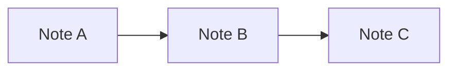
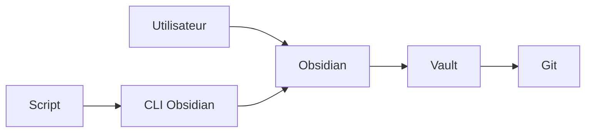
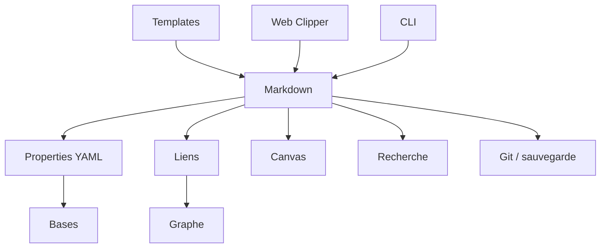

> [!info] Version du cours
> Cette version a été révisée le **16 août 2026** à partir du cours de 2023. Les éléments dépendant de l'interface et des fonctionnalités ont été vérifiés avec la documentation officielle d'Obsidian et la branche publique **Obsidian 1.13.x**.

# 1. Introduction à Obsidian

Obsidian est une application de prise de notes et de gestion des connaissances qui travaille principalement au-dessus d'un dossier de fichiers Markdown. Contrairement à de nombreux services de prise de notes centrés sur une base de données distante, nos notes restent des fichiers texte que nous pouvons lire, copier, versionner et modifier avec d'autres outils.

Cette caractéristique est essentielle : **Obsidian n'est pas le propriétaire de nos notes**. Il constitue une interface particulièrement riche pour éditer, relier, rechercher et visualiser des fichiers qui restent sous notre contrôle.

## 1.1 Historique et philosophie d'Obsidian

Obsidian a été créé par les développeurs de Dynalist avec l'idée de construire un environnement de connaissances personnelles centré sur des fichiers locaux et des liens entre les idées. La philosophie du logiciel repose notamment sur la pérennité des données, la portabilité et la possibilité de construire progressivement notre propre environnement de travail.

Obsidian est souvent présenté comme un outil permettant de construire un **Second Cerveau** numérique. Cette expression désigne un système externe dans lequel nous conservons nos idées, références, décisions, projets et connaissances afin de ne pas dépendre uniquement de notre mémoire biologique.

Cependant, Obsidian n'impose aucune méthode particulière d'organisation. Nous pouvons utiliser des dossiers, des liens, des tags, des propriétés, des Bases ou combiner ces mécanismes selon nos besoins.

## 1.2 Local First et possession des données

Obsidian adopte une approche que nous pouvons qualifier de **Local First** : la donnée principale vit d'abord dans notre système de fichiers local. Un compte en ligne n'est pas nécessaire pour créer et utiliser un vault local.

La plupart de nos notes sont de simples fichiers `.md` :

```text
MonVault/
├── Cours.md
├── Projet.md
├── Réunion.md
└── Ressources/
    └── Markdown.md
```

Cette architecture nous offre plusieurs avantages :

- nous pouvons lire nos notes sans Obsidian ;
- nous pouvons les modifier avec Vim, VS Code, Zettlr ou tout autre éditeur de texte ;
- nous pouvons les sauvegarder avec les outils habituels du système ;
- nous pouvons utiliser Git pour conserver leur historique ;
- nous limitons notre dépendance à un éditeur particulier.

Il faut toutefois nuancer l'idée selon laquelle « tout Obsidian est du Markdown ». Les **notes** sont en Markdown, mais Obsidian utilise également d'autres fichiers : configuration dans `.obsidian/`, Canvas en `.canvas`, Bases en `.base`, images, PDF, sons, etc.

## 1.3 Le vault

Obsidian appelle **vault**, ou coffre, le dossier qu'il utilise comme espace de travail. Un vault est donc d'abord un répertoire de notre système de fichiers.

Par exemple :

```text
~/Documents/Notes/
```

peut devenir un vault Obsidian.

À l'intérieur, Obsidian crée généralement un dossier caché :

```text
.obsidian/
```

Ce dossier contient la configuration propre au vault : préférences, plugins, thèmes, raccourcis, snippets CSS et autres données de configuration.

## 1.4 Cas d'utilisation d'Obsidian

Obsidian peut être utilisé pour de nombreux usages :

- notes de cours ;
- documentation technique ;
- journal quotidien ;
- recherche universitaire ;
- préparation d'articles ;
- gestion de projet ;
- veille technologique ;
- documentation logicielle ;
- carnet de lecture ;
- base documentaire personnelle ;
- gestion d'un Second Cerveau ;
- préparation de données destinées à des scripts ou des agents IA.

Le même vault peut combiner plusieurs usages si nous conservons des conventions suffisamment claires.

## 1.5 Obsidian face aux autres outils

D'autres outils répondent à des besoins voisins : Notion, Roam Research, Logseq, Joplin, Zettlr ou encore des éditeurs Markdown classiques.

La particularité d'Obsidian n'est pas simplement de savoir écrire en Markdown. Sa force vient de la combinaison de plusieurs éléments :

```text
Fichiers locaux
      +
Markdown
      +
Liens et backlinks
      +
Métadonnées structurées
      +
Vues et recherche
      +
Extensions
```

Le meilleur outil dépend toujours du besoin. Nous devons éviter de choisir un logiciel uniquement pour ses fonctionnalités spectaculaires : la pérennité et la simplicité des données sont souvent plus importantes.

# 2. Installation et création de notre premier vault

## 2.1 Plateformes prises en charge

Obsidian existe sur les principales plateformes de bureau et mobiles : GNU/Linux, Windows, macOS, Android, iPhone et iPad.

Dans ce cours nous détaillons surtout GNU/Linux, mais le fonctionnement du vault reste globalement identique sur les autres systèmes.

## 2.2 Installation sous GNU/Linux avec Flatpak

Si Flatpak est disponible sur notre distribution, nous pouvons installer Obsidian depuis Flathub :

```bash
flatpak install flathub md.obsidian.Obsidian
```

Puis le lancer :

```bash
flatpak run md.obsidian.Obsidian
```

Pour mettre à jour les applications Flatpak :

```bash
flatpak update
```

Pour désinstaller Obsidian :

```bash
flatpak uninstall md.obsidian.Obsidian
```

## 2.3 Installation avec AppImage

Nous pouvons télécharger l'AppImage depuis le site officiel, la rendre exécutable puis la lancer :

```bash
chmod u+x Obsidian-<version>.AppImage
./Obsidian-<version>.AppImage --no-sandbox
```

L'AppImage est pratique lorsque nous souhaitons utiliser une application sans installation classique par le gestionnaire de paquets.

## 2.4 Installation avec Snap

La documentation officielle fournit également un paquet Snap téléchargeable. Une fois le fichier récupéré :

```bash
sudo snap install obsidian_<version>_<arch>.snap --dangerous --classic
```

Les options utilisées ici ont une signification importante : le paquet téléchargé directement n'est pas validé par le magasin Snap, d'où `--dangerous`, et `--classic` autorise un accès plus large au système de fichiers afin que l'application puisse travailler sur nos notes.

## 2.5 Créer notre premier vault

Au démarrage, nous pouvons créer un nouveau vault ou demander à Obsidian d'ouvrir un dossier existant comme vault.

Pour créer un nouveau vault :

1. choisissons **Créer un nouveau vault** ;
2. donnons-lui un nom ;
3. choisissons son emplacement ;
4. validons.

Nous pouvons par exemple créer :

```text
~/Documents/Notes/
```

Il est utile de choisir un emplacement que nous savons sauvegarder correctement.

## 2.6 Ouvrir un dossier Markdown existant

Nous ne sommes pas obligés de commencer avec un dossier vide. Un répertoire contenant déjà des fichiers Markdown peut devenir un vault.

Cela constitue un point important pour la portabilité : nous pouvons construire notre documentation indépendamment d'Obsidian puis utiliser Obsidian comme interface de consultation et d'édition.

## 2.7 Modifier un vault avec d'autres logiciels

Comme les notes sont de simples fichiers, nous pouvons ouvrir le même dossier avec un éditeur externe :

```bash
code ~/Documents/Notes
```

ou :

```bash
vim ~/Documents/Notes/Cours.md
```

Nous devons cependant garder à l'esprit que certaines syntaxes propres à Obsidian, comme les Wikilinks `[[...]]`, ne seront pas nécessairement interprétées de la même manière par tous les éditeurs.

# 3. Prendre en main l'interface

L'interface d'Obsidian est centrée sur l'espace de travail. Elle peut être profondément personnalisée sans modifier les fichiers eux-mêmes.

## 3.1 Les principales zones de l'interface

Nous retrouvons généralement :

- le ruban vertical ;
- la barre latérale gauche ;
- la zone centrale avec un ou plusieurs onglets ;
- la barre latérale droite ;
- la barre d'état ;
- les panneaux de recherche, backlinks, propriétés, graphe, etc.

Les panneaux peuvent être déplacés et réorganisés selon notre façon de travailler.

## 3.2 Les onglets et groupes d'onglets

Plusieurs notes peuvent être ouvertes simultanément sous forme d'onglets. Nous pouvons également diviser l'espace de travail afin de comparer deux notes, éditer une note tout en consultant une autre ou afficher une Base à côté d'un document.

Cette approche est particulièrement utile pour la rédaction et la recherche.

## 3.3 Mode édition et mode lecture

Une note peut principalement être consultée selon plusieurs modes :

- **Live Preview**, qui permet d'éditer le Markdown tout en affichant une partie de son rendu ;
- **Source mode**, qui affiche plus directement la syntaxe Markdown ;
- **Reading view**, destiné à la lecture du rendu final.

Le mode Source est particulièrement utile lorsque nous travaillons sur du YAML ou lorsque nous voulons comprendre exactement ce qui est enregistré dans le fichier.

## 3.4 La palette de commandes

La palette de commandes permet d'exécuter rapidement les fonctions d'Obsidian et des plugins installés.

Sous GNU/Linux et Windows :

```text
Ctrl + P
```

Sous macOS :

```text
Cmd + P
```

Nous pouvons ensuite saisir quelques lettres du nom d'une commande. La recherche est approximative, ce qui évite de connaître exactement son intitulé.

La palette de commandes est l'un des outils les plus utiles à maîtriser : elle permet souvent d'éviter de parcourir les menus.

## 3.5 Ouvrir rapidement une note

Le raccourci habituel du **Quick Switcher** est :

```text
Ctrl + O
```

Nous saisissons ensuite une partie du nom de la note recherchée.

## 3.6 Créer une note

Le raccourci habituel est :

```text
Ctrl + N
```

Le comportement exact peut être personnalisé dans les paramètres des raccourcis.

## 3.7 Recherche dans la note courante

Pour rechercher du texte dans la note active :

```text
Ctrl + F
```

## 3.8 Recherche dans tout le vault

La recherche globale est accessible avec :

```text
Ctrl + Shift + F
```

Cette distinction est importante :

```text
Ctrl + P         → palette de commandes
Ctrl + F         → recherche dans le fichier actif
Ctrl + Shift + F → recherche dans le vault
Ctrl + O         → ouverture rapide d'une note
```

## 3.9 Les paramètres

Les paramètres permettent notamment de gérer :

- l'éditeur ;
- les fichiers et les liens ;
- l'apparence ;
- les raccourcis ;
- les modules principaux ;
- les modules complémentaires ;
- les paramètres propres aux plugins.

Les versions récentes d'Obsidian disposent d'une recherche dans les paramètres, particulièrement utile lorsque de nombreux plugins sont installés.

# 4. Écrire avec Markdown dans Obsidian

## 4.1 Pourquoi Markdown ?

Markdown est un langage de balisage léger conçu pour rester lisible même sans moteur de rendu.

Par exemple :

```markdown
# Mon titre

Voici un paragraphe avec du **gras** et de l'*italique*.
```

reste compréhensible dans n'importe quel éditeur de texte.

Pour une présentation plus complète du langage, voir [[Markdown]].

## 4.2 Titres

```markdown
# Titre de niveau 1
## Titre de niveau 2
### Titre de niveau 3
#### Titre de niveau 4
```

Nous devons utiliser les niveaux de titres pour exprimer une hiérarchie logique et non uniquement pour modifier la taille du texte.

## 4.3 Gras, italique et texte barré

```markdown
**texte en gras**
*texte en italique*
~~texte barré~~
```

## 4.4 Listes

Liste à puces :

```markdown
- premier élément
- deuxième élément
- troisième élément
```

Liste ordonnée :

```markdown
1. premier élément
2. deuxième élément
3. troisième élément
```

## 4.5 Cases à cocher

```markdown
- [x] Tâche terminée
- [ ] Tâche à faire
```

Ces tâches sont de simples lignes Markdown. Elles peuvent être recherchées par Obsidian et exploitées par certains plugins ou scripts.

## 4.6 Citations

```markdown
> Une citation ou une information mise en retrait.
```

## 4.7 Blocs de code

Nous pouvons insérer un bloc de code en utilisant trois accents graves :

````markdown
```python
print("Bonjour")
```
````

Obsidian effectue une coloration syntaxique pour de nombreux langages.

## 4.8 Liens Web

```markdown
[Site officiel d'Obsidian](https://obsidian.md/)
```

## 4.9 Images

En Markdown standard :

```markdown

```

Avec la syntaxe de transclusion d'Obsidian :

```markdown
![[image.png]]
```

## 4.10 Tableaux

```markdown
| Nom | Statut |
| --- | --- |
| Projet A | actif |
| Projet B | terminé |
```

Obsidian fournit aujourd'hui une édition plus confortable des tableaux directement dans l'éditeur, mais le fichier reste un tableau Markdown.

## 4.11 Callouts

Les callouts permettent de mettre en évidence une information :

```markdown
> [!note]
> Ceci est une note importante.
```

Autres exemples :

```markdown
> [!warning]
> Attention à cette opération.
```

```markdown
> [!tip]
> Une astuce utile.
```

## 4.12 Diagrammes Mermaid

Obsidian sait rendre des diagrammes Mermaid à partir d'un bloc de code :

````markdown

````

Voir également [[Mermaid pour Obsidian]].

## 4.13 HTML dans une note

Obsidian peut interpréter certains éléments HTML directement dans une note :

```html
<span class="important">Texte important</span>
```

Nous devons utiliser cette possibilité avec modération : plus un document dépend de HTML spécifique à l'affichage, moins il reste portable comme simple Markdown.

# 5. Relier et organiser nos connaissances

## 5.1 Les liens internes ou Wikilinks

Pour créer un lien vers une note :

```markdown
[[Nom de la note]]
```

Nous pouvons afficher un texte différent :

```markdown
[[Nom de la note|texte affiché]]
```

Obsidian peut mettre à jour automatiquement les liens internes lorsque nous renommons un fichier, si cette option est activée.

## 5.2 Liens vers un titre

Nous pouvons créer un lien vers une section précise :

```markdown
[[Nom de la note#Titre de la section]]
```

## 5.3 Liens vers un bloc

Obsidian permet également de référencer un bloc précis. Après avoir créé ou sélectionné un identifiant de bloc, un lien peut prendre cette forme :

```markdown
[[Nom de la note#^identifiant]]
```

## 5.4 Transclusion

Ajouter `!` devant un lien interne permet d'inclure le contenu lié dans la note courante :

```markdown
![[Nom de la note]]
```

Nous pouvons également inclure une section :

```markdown
![[Nom de la note#Une section]]
```

La transclusion évite de dupliquer une information qui existe déjà ailleurs.

## 5.5 Backlinks

Lorsqu'une note A contient :

```markdown
[[Note B]]
```

Obsidian peut afficher dans la Note B que la Note A pointe vers elle. Cette relation inverse est appelée **backlink**.

Les backlinks sont très intéressants pour découvrir les contextes dans lesquels une information a été utilisée.

## 5.6 Tags

Un tag s'écrit avec un dièse collé au mot :

```markdown
#informatique
```

Un espace après le `#` créerait un titre Markdown et non un tag.

Les tags peuvent être hiérarchiques :

```markdown
#informatique/linux
```

Ils servent bien pour des catégories transversales, mais nous devons éviter de transformer une collection de centaines de tags incohérents en second système de classement.

## 5.7 Dossiers, tags, liens et propriétés

Ces quatre mécanismes ne répondent pas au même besoin :

```text
Dossier    → où le fichier est rangé physiquement
Tag        → marqueur transversal léger
Lien       → relation vers une autre note
Propriété  → attribut structuré de la note
```

Par exemple, un cours peut vivre dans `Cours/`, posséder la propriété `niveau: debutant`, être tagué `#markdown` et contenir un lien vers `[[YAML]]`.

## 5.8 Les alias

Les alias permettent de donner plusieurs noms à une même note. Ils sont désormais gérés comme une propriété native :

```yaml
---
aliases:
  - Utilisation Obsidian
  - Raccourcis Obsidian
---
```

Une recherche ou une création de lien peut alors retrouver la note à partir de ces alias.

## 5.9 Le graphe

Le module de graphe représente les notes par des nœuds et leurs liens par des arêtes.

Il existe notamment :

- un graphe global du vault ;
- un graphe local centré sur la note active.

Le graphe est très utile pour explorer les connexions, mais il ne remplace pas une bonne organisation. Un graphe dense peut être visuellement impressionnant tout en apportant peu d'information exploitable.

# 6. Properties et Frontmatter YAML

L'une des évolutions majeures d'Obsidian depuis le cours initial de 2023 est l'intégration des **Properties** comme mécanisme central pour manipuler les métadonnées des notes.

## 6.1 Qu'est-ce qu'une propriété ?

Une propriété associe un nom à une valeur structurée.

Exemple :

```yaml
---
type: cours
statut: actif
niveau: debutant
---
```

Nous pouvons interpréter cette note comme un objet :

```text
type   = cours
statut = actif
niveau = debutant
```

## 6.2 Où les propriétés sont-elles stockées ?

Les propriétés sont enregistrées en YAML au début du fichier Markdown, entre deux lignes `---` :

```yaml
---
auteur: "Michaël Launay"
date: 2026-08-16
publie: true
---
```

L'interface graphique d'Obsidian ne remplace donc pas le YAML : elle constitue une interface d'édition de données toujours présentes dans le fichier.

## 6.3 Types de propriétés

Obsidian prend en charge plusieurs types de propriétés, notamment :

- texte ;
- liste ;
- nombre ;
- case à cocher ;
- date ;
- date et heure ;
- tags.

Le choix du type influence la manière dont Obsidian édite, filtre et affiche la valeur.

## 6.4 Exemple de note structurée

```yaml
---
type: cours
statut: actif
niveau: debutant
auteurs:
  - "Michaël Launay"
date_creation: 2023-02-03
date_modification: 2026-08-16
confidentialite: publique
---
```

Nous pouvons ensuite ajouter le contenu Markdown normal :

```markdown
# Introduction

Contenu du cours...
```

## 6.5 Valeurs texte

```yaml
---
titre: "Introduction à Obsidian"
---
```

Une propriété texte doit contenir une information courte et atomique. Le corps de la note reste préférable pour une explication longue.

## 6.6 Listes

```yaml
---
themes:
  - obsidian
  - markdown
  - gestion-des-connaissances
---
```

Les listes conviennent lorsque plusieurs valeurs peuvent être associées à la même propriété.

## 6.7 Nombres

```yaml
---
niveau_difficulte: 2
---
```

Une propriété de type nombre doit contenir un nombre, et non une expression comme `1 + 1`.

## 6.8 Booléens

```yaml
---
publie: true
archive: false
---
```

## 6.9 Dates

```yaml
---
date_creation: 2026-08-16
---
```

Le format ISO `AAAA-MM-JJ` est particulièrement pratique pour les traitements automatiques.

## 6.10 Liens dans les propriétés

Une propriété texte ou une valeur d'une liste peut contenir un lien interne. En YAML nous devons être attentifs aux guillemets :

```yaml
---
projet: "[[Projet OSIA]]"
participants:
  - "[[Alice Dupont]]"
  - "[[Bob Martin]]"
---
```

## 6.11 Propriétés par défaut

Obsidian reconnaît notamment plusieurs propriétés particulières :

```yaml
---
tags:
  - cours
  - obsidian
aliases:
  - Cours Obsidian
cssclasses:
  - cours-technique
---
```

Les anciennes formes singulières `tag`, `alias` et `cssclass` ont été dépréciées au profit de `tags`, `aliases` et `cssclasses`.

## 6.12 Les Properties comme modèle de données

À partir du moment où nous utilisons des propriétés de manière cohérente, notre vault n'est plus seulement un ensemble de documents. Il devient une **base documentaire structurée**.

Par exemple :

```yaml
---
type: livre
auteur: "Douglas Hofstadter"
statut_lecture: en_cours
note: 5
---
```

et :

```yaml
---
type: livre
auteur: "Donald Knuth"
statut_lecture: a_lire
note:
---
```

peuvent ensuite être filtrés, triés et présentés ensemble.

## 6.13 Limites des propriétés

Les Properties sont conçues pour des informations relativement simples et atomiques. Les structures YAML profondément imbriquées ne sont pas correctement prises en charge par l'éditeur graphique des propriétés.

Nous devons donc éviter de transformer le Frontmatter en document complexe. Lorsque l'information devient narrative ou fortement structurée, le corps Markdown ou une note liée est souvent plus adapté.

# 7. Rechercher et retrouver l'information

## 7.1 Recherche plein texte

La recherche globale permet de retrouver les occurrences d'un mot ou d'une expression dans le vault.

Pour rechercher une phrase exacte :

```text
"gestion des connaissances"
```

## 7.2 Opérateurs de recherche

Obsidian fournit des opérateurs spécialisés.

Rechercher dans les noms de fichiers :

```text
file:Obsidian
```

Rechercher dans un chemin :

```text
path:Cours
```

Rechercher un tag :

```text
tag:#informatique
```

Rechercher une tâche non terminée :

```text
task-todo:Obsidian
```

## 7.3 Combiner les recherches

```text
markdown linux
```

recherche les fichiers contenant les deux termes.

```text
markdown OR linux
```

recherche ceux contenant au moins l'un des termes.

Pour exclure :

```text
markdown -windows
```

## 7.4 Rechercher sur les propriétés

Les propriétés peuvent être utilisées dans une requête.

Notes possédant la propriété `aliases` :

```text
[aliases]
```

Notes dont le statut vaut `actif` :

```text
[statut:actif]
```

Combinaison :

```text
[type:cours] [statut:actif]
```

Nous voyons ici l'intérêt d'un vocabulaire cohérent : si nous utilisons successivement `actif`, `active`, `en_cours` et `courant` pour exprimer la même idée, nos requêtes deviennent inutilement compliquées.

## 7.5 Expressions régulières

La recherche accepte également des expressions régulières de style JavaScript.

Par exemple, pour rechercher une date ISO :

```text
/\d{4}-\d{2}-\d{2}/
```

Cette possibilité devient intéressante pour l'audit et la maintenance de grands vaults.

## 7.6 Recherche ou Base ?

La recherche et les Bases sont complémentaires :

```text
Recherche → retrouver rapidement une information ou un ensemble de fichiers
Base      → construire une vue durable et structurée sur un ensemble de notes
```

# 8. Templates et notes quotidiennes

## 8.1 Le module Templates

Templates est un module principal d'Obsidian. Il permet d'insérer un modèle prédéfini dans la note active.

Nous commençons par créer un dossier, par exemple :

```text
Templates/
```

Puis dans les paramètres du module **Templates**, nous indiquons ce dossier comme emplacement des modèles.

## 8.2 Premier template

Créons :

```text
Templates/Cours.md
```

avec :

```markdown
---
type: cours
statut: actif
date_creation: {{date:YYYY-MM-DD}}
---

# {{title}}

## Objectifs

## Cours

## Ressources
```

Lors de l'insertion du template, Obsidian remplace les variables reconnues.

## 8.3 Variables intégrées

Le module Templates fournit notamment :

```text
{{title}}
{{date}}
{{time}}
```

Nous pouvons préciser un format :

```text
{{date:YYYY-MM-DD}}
```

## 8.4 Templates et propriétés

Les propriétés du template sont fusionnées avec celles de la note lorsque le modèle est inséré.

Cela permet de garantir une structure minimale commune à plusieurs types de notes.

Par exemple, toutes nos fiches de cours peuvent commencer avec :

```yaml
---
type: cours
statut: actif
niveau:
---
```

## 8.5 Notes quotidiennes : intérêt

Les notes quotidiennes permettent de créer une note correspondant à chaque journée. Elles sont utiles pour :

- consigner les activités ;
- capturer rapidement une idée ;
- noter des décisions ;
- suivre les tâches ;
- conserver un journal ;
- produire une mémoire chronologique.

## 8.6 Mise en place des notes quotidiennes

Nous activons le module principal **Daily notes / Notes quotidiennes**, puis nous configurons :

- le format de date ;
- le dossier de destination ;
- éventuellement un template.

Exemple de chemin :

```text
Journal/2026-08-16.md
```

## 8.7 Exemple de template quotidien

```markdown
---
type: journal
date: {{date:YYYY-MM-DD}}
---

# {{date:YYYY-MM-DD}}

## À faire

- [ ]

## Notes

## Décisions

## Bilan
```

Le type `journal` est ici une convention de notre propre vault : Obsidian ne nous impose aucun vocabulaire métier.

# 9. Bases : transformer le vault en base documentaire

**Bases** est désormais un module principal d'Obsidian. Il permet de construire des vues proches d'une base de données sur nos fichiers et leurs propriétés.

Le point fondamental est le suivant :

> [!important]
> Une Base ne déplace pas nos données dans une base de données propriétaire. Les données restent dans les fichiers Markdown et leurs Properties. La Base définit une vue sur ces données.

## 9.1 Principe

Imaginons plusieurs notes :

```yaml
---
type: livre
auteur: "Auteur A"
statut_lecture: lu
note: 5
---
```

```yaml
---
type: livre
auteur: "Auteur B"
statut_lecture: a_lire
note:
---
```

Une Base peut les présenter sous forme de tableau :

```text
Nom              Auteur     Statut     Note
------------------------------------------------
Livre A          Auteur A   lu         5
Livre B          Auteur B   a_lire
```

## 9.2 Fichiers `.base`

Une Base peut être enregistrée dans un fichier portant l'extension :

```text
.base
```

Par exemple :

```text
Livres.base
```

La définition d'une Base peut également être intégrée dans une note Markdown.

## 9.3 Filtrer les données

Nous pouvons décider qu'une Base ne doit afficher que les notes répondant à certaines conditions, par exemple :

```text
type = livre
```

ou :

```text
type = projet
statut = actif
```

## 9.4 Vue Table

La vue Table représente généralement :

```text
une ligne    = un fichier
une colonne  = une propriété ou une valeur calculée
```

Cette représentation convient particulièrement aux listes de projets, livres, personnes, ressources ou matériels.

## 9.5 Vue Liste

La vue Liste est plus compacte. Elle convient lorsque nous voulons principalement afficher un ensemble de notes sans utiliser de nombreuses colonnes.

## 9.6 Vue Cartes

La vue Cartes affiche les fichiers sous forme de cartes et peut notamment s'appuyer sur des images. Elle est adaptée aux collections visuelles : livres, films, recettes, lieux ou documentation de produits.

## 9.7 Vue Carte géographique

Les versions actuelles de Bases proposent également une vue de carte permettant d'afficher des fichiers comme des points géographiques lorsque leurs données sont adaptées à ce type de représentation.

Cette vue illustre bien la séparation entre **donnée** et **présentation** : la note conserve ses propriétés ; plusieurs vues peuvent représenter les mêmes données différemment.

## 9.8 Tri et regroupement

Nous pouvons trier une vue par date, priorité, auteur, statut ou tout autre champ pertinent.

Nous pouvons également regrouper les notes, par exemple :

```text
Projet
├── actif
├── en_pause
└── termine
```

## 9.9 Formules

Bases prend en charge des formules calculées à partir des propriétés.

L'idée importante n'est pas de recopier une valeur calculable dans chaque note, mais de la dériver lorsque cela est pertinent.

## 9.10 Plusieurs vues sur les mêmes données

Une même collection de notes peut alimenter plusieurs vues :

```text
                 ┌── Vue Table
Markdown + YAML ─┼── Vue Liste
                 ├── Vue Cartes
                 └── Vue Carte
```

Nous pouvons donc avoir une vue « Projets actifs », une vue « Projets par priorité » et une vue « Projets terminés » sans dupliquer les fichiers.

## 9.11 Base et source de vérité

Une Base est une **projection**. La donnée canonique reste dans la note et ses propriétés.

Cette règle est précieuse pour la pérennité : si nous supprimons une Base, nous ne supprimons pas pour autant les notes qu'elle présentait.

# 10. Canvas et représentation visuelle

## 10.1 Qu'est-ce que Canvas ?

Canvas est un module principal destiné à la prise de notes visuelle. Il fournit un espace bidimensionnel dans lequel nous pouvons disposer et relier :

- des notes ;
- des cartes de texte ;
- des images ;
- des PDF ;
- d'autres médias ;
- des pages Web.

## 10.2 Le format JSON Canvas

Obsidian enregistre les Canvas avec l'extension :

```text
.canvas
```

Le format utilisé est **JSON Canvas**, un format ouvert destiné à représenter ce type de tableau visuel.

Cela correspond à la philosophie générale d'Obsidian : les informations importantes ne doivent pas rester enfermées dans un stockage opaque.

## 10.3 Ajouter une note dans Canvas

Nous pouvons glisser une note du vault vers le Canvas ou utiliser les commandes prévues à cet effet.

La note reste un fichier Markdown normal. Le Canvas ne contient que les informations nécessaires pour la présenter dans l'espace visuel.

## 10.4 Cartes de texte

Canvas permet aussi de créer directement une carte de texte qui n'est pas immédiatement un fichier du vault.

Il faut connaître une conséquence : une simple carte de texte ne participe pas au graphe de backlinks comme une véritable note. Si son contenu devient important et doit être durablement relié au reste du vault, nous pouvons la convertir en fichier.

## 10.5 Relier des cartes

Des lignes peuvent relier les cartes. Elles peuvent être orientées, colorées et porter une étiquette.

Par exemple :

```text
[Problème] ──cause──> [Hypothèse]
     │
     └──solution──> [Décision]
```

## 10.6 Groupes

Les cartes peuvent être regroupées visuellement. Cette fonction est utile pour le brainstorming, l'analyse d'architecture ou la préparation d'un cours.

## 10.7 Canvas, Mind Map et graphe

Ces outils ont des objectifs différents :

```text
Graphe Obsidian → représentation automatique des liens existants
Canvas          → organisation visuelle manuelle d'éléments
Mind Map        → structure principalement arborescente
Mermaid         → diagramme décrit textuellement et reproductible
```

Le cours 2023 utilisait un plugin communautaire de Mind Map comme exemple principal. Aujourd'hui, Canvas couvre nativement une grande partie des besoins de cartographie visuelle. Un plugin de Mind Map peut toujours être utile, mais il n'est plus indispensable pour enseigner la visualisation dans Obsidian.

# 11. Étendre et personnaliser Obsidian

## 11.1 Modules principaux

Les modules principaux, ou **Core plugins**, sont fournis avec Obsidian. Nous pouvons les activer ou les désactiver dans les paramètres.

Parmi les fonctions importantes figurent notamment :

- recherche ;
- palette de commandes ;
- graphe ;
- backlinks ;
- Templates ;
- notes quotidiennes ;
- Canvas ;
- Bases ;
- récupération de fichiers.

La liste exacte évolue avec les versions.

## 11.2 Modules communautaires

La communauté développe de nombreux plugins permettant d'étendre Obsidian.

Ils peuvent ajouter des fonctions de :

- gestion de tâches ;
- calendrier ;
- publication ;
- requêtes ;
- visualisation ;
- automatisation ;
- intégration avec des outils externes.

## 11.3 Risques des plugins communautaires

Un plugin est du code exécuté dans notre application. Nous ne devons donc pas installer des plugins sans réfléchir à leur provenance et à leur maintenance.

Quelques bonnes pratiques :

- limiter le nombre de plugins ;
- vérifier leur activité et leur réputation ;
- supprimer ceux que nous n'utilisons plus ;
- maintenir Obsidian et les plugins à jour ;
- utiliser le mode restreint pour désactiver les plugins communautaires lorsque nécessaire.

Plus notre vault contient des informations sensibles, plus cette discipline est importante.

## 11.4 Thèmes

Obsidian permet d'installer des thèmes communautaires depuis :

```text
Paramètres → Apparence → Thèmes
```

Nous devons distinguer le contenu des notes de leur rendu : changer de thème ne doit normalement pas modifier la donnée Markdown.

## 11.5 CSS snippets

La méthode moderne pour ajouter nos propres règles CSS consiste à créer des **CSS snippets** dans :

```text
<vault>/.obsidian/snippets/
```

Par exemple :

```text
.obsidian/snippets/cours.css
```

avec :

```css
.cours-important {
    font-weight: bold;
}
```

Nous rechargeons ensuite la liste des snippets et activons celui qui nous intéresse depuis :

```text
Paramètres → Apparence → CSS snippets
```

## 11.6 La propriété `cssclasses`

Nous pouvons appliquer des styles à certaines notes avec la propriété :

```yaml
---
cssclasses:
  - cours-technique
---
```

Puis écrire un snippet adapté :

```css
.cours-technique h1 {
    text-decoration: underline;
}
```

Cette approche est préférable à une personnalisation qui dépendrait du nom précis d'un fichier.

# 12. Synchroniser, sauvegarder et versionner

## 12.1 Synchronisation et sauvegarde ne sont pas synonymes

Une synchronisation réplique des fichiers entre plusieurs appareils. Une erreur ou une suppression peut donc également être répliquée.

Une sauvegarde doit permettre de revenir à un état antérieur indépendant.

Nous devons distinguer :

```text
Synchronisation → disposer du même état sur plusieurs appareils
Sauvegarde       → pouvoir restaurer après une perte ou une erreur
Versionnement    → conserver l'histoire des modifications
```

## 12.2 Obsidian Sync

Obsidian propose un service officiel payant, Obsidian Sync, destiné à synchroniser des vaults entre plusieurs appareils. Le service fournit notamment un historique de versions et des fonctions de collaboration selon l'offre utilisée.

L'utilisation d'Obsidian Sync n'est pas obligatoire pour utiliser Obsidian.

## 12.3 Services de synchronisation externes

Comme un vault est un dossier, nous pouvons utiliser certains outils de synchronisation de fichiers. Nous devons toutefois vérifier leur comportement avec les modifications concurrentes et les fichiers de configuration.

Copier aveuglément le même vault entre plusieurs systèmes peut générer des conflits si deux appareils modifient le même fichier simultanément.

## 12.4 Sauvegarde

Une stratégie simple peut combiner :

- le vault sur le poste principal ;
- une copie régulière sur un support différent ;
- une sauvegarde distante ;
- éventuellement Git pour l'historique textuel.

L'objectif est d'éviter qu'une panne de disque, une erreur humaine ou une synchronisation défectueuse ne détruise l'unique copie de nos données.

## 12.5 Utiliser Git

Les fichiers Markdown se prêtent très bien à Git.

Dans le dossier du vault :

```bash
git init
```

Puis :

```bash
git status
```

Ajoutons les fichiers :

```bash
git add .
```

et créons un commit :

```bash
git commit -m "Initialisation du vault Obsidian"
```

## 12.6 Voir les modifications

```bash
git diff
```

Nous pouvons ainsi vérifier précisément les changements effectués dans un fichier Markdown ou dans son Frontmatter.

Exemple :

```diff
-statut: brouillon
+statut: actif
```

## 12.7 Git n'est pas une sauvegarde complète

Git est excellent pour l'historique des fichiers texte, mais ne constitue pas à lui seul une stratégie de sauvegarde complète.

Un dépôt Git présent uniquement sur le même disque que le vault sera perdu avec ce disque.

Il faut donc au minimum une autre copie indépendante, idéalement sur un autre support ou une autre machine.

## 12.8 Que faire du dossier `.obsidian/` avec Git ?

Il n'existe pas une réponse universelle. Une partie de `.obsidian/` contient des réglages utiles que nous pouvons souhaiter versionner, notamment pour reproduire l'environnement du vault sur plusieurs postes. D'autres éléments peuvent être locaux, temporaires ou dépendre de la machine.

Nous devons donc décider explicitement ce que nous versionnons au lieu d'ignorer systématiquement tout `.obsidian/`.

# 13. Capturer l'information avec Obsidian Web Clipper

## 13.1 Présentation

Obsidian Web Clipper est une extension officielle de navigateur permettant d'enregistrer du contenu Web dans notre vault.

Elle existe notamment pour Firefox, les navigateurs basés sur Chromium, Safari et Edge.

## 13.2 Pourquoi utiliser un Web Clipper ?

Copier manuellement une page Web présente plusieurs défauts :

- perte de la source ;
- mise en forme incohérente ;
- oubli de la date ;
- absence de métadonnées ;
- temps de traitement important.

Un Clipper permet de rendre cette capture reproductible.

## 13.3 Capturer une page

Nous pouvons enregistrer tout ou partie du contenu de la page dans une note Markdown de notre vault.

Un modèle peut produire par exemple :

```yaml
---
type: ressource_web
titre: "Titre de la page"
url: "https://example.org/article"
date_capture: 2026-08-16
---
```

puis le contenu extrait.

Ici encore, `type: ressource_web` est une convention de notre propre modèle de données, pas un type imposé par Obsidian.

## 13.4 Surligneur

Le Web Clipper permet de sélectionner et surligner des passages importants avant de les enregistrer.

Cette approche est souvent préférable à la copie intégrale d'une longue page dont nous ne relirons jamais le contenu.

## 13.5 Templates du Web Clipper

Nous pouvons créer des templates adaptés à différents sites ou types de ressources.

Par exemple :

```text
Article scientifique → auteur, date, DOI, résumé
Documentation        → produit, version, URL
Article de veille    → source, thème, date de capture
```

Le template devient alors une étape de normalisation de la donnée dès son entrée dans notre vault.

## 13.6 Variables, filtres et logique

Le Web Clipper permet d'utiliser des variables provenant de la page puis de transformer ces valeurs avant de les insérer dans le document.

Cette possibilité est particulièrement intéressante pour créer des captures structurées plutôt qu'un simple copier-coller.

## 13.7 Interpreter

Le Web Clipper fournit aussi un **Interpreter** permettant d'utiliser des instructions en langage naturel pour extraire ou transformer certaines informations d'une page.

Nous devons cependant conserver une distinction importante :

```text
Extraction déterministe disponible → préférer la règle ou la variable
Interprétation sémantique nécessaire → l'IA peut être utile
```

Une information produite automatiquement doit rester vérifiable à partir de sa source lorsque son exactitude est importante.

# 14. Automatiser Obsidian avec la CLI

La **CLI officielle d'Obsidian** constitue une évolution importante pour les utilisateurs avancés, les développeurs et l'automatisation.

## 14.1 Principe

La CLI permet de contrôler Obsidian depuis un terminal pour :

- rechercher ;
- lire ou créer des notes ;
- manipuler les notes quotidiennes ;
- interroger les tâches ;
- exploiter les tags et propriétés ;
- interroger les Bases ;
- accéder à l'historique ;
- déclencher des commandes Obsidian ;
- automatiser certaines tâches.

## 14.2 Prérequis

La CLI nécessite un installateur Obsidian compatible avec la génération 1.12 ou plus récente. Dans les versions actuelles, elle s'active dans les paramètres généraux sous l'option **Command line interface**.

L'application Obsidian doit être disponible ; si elle n'est pas lancée, une commande peut la démarrer.

## 14.3 Obtenir de l'aide

```bash
obsidian help
```

Pour ouvrir l'interface terminal interactive :

```bash
obsidian
```

## 14.4 Rechercher dans le vault

```bash
obsidian search query="gestion des connaissances"
```

## 14.5 Ouvrir la note quotidienne

```bash
obsidian daily
```

## 14.6 Ajouter une tâche à la note quotidienne

```bash
obsidian daily:append content="- [ ] Relire le cours Obsidian"
```

## 14.7 Créer une note depuis un template

```bash
obsidian create name="Cours Linux" template=Cours
```

## 14.8 Lister les tags

```bash
obsidian tags counts
```

## 14.9 Interroger une Base

La CLI sait interroger une Base et retourner différents formats, notamment JSON, CSV, TSV, Markdown ou une liste de chemins.

Exemple conceptuel :

```bash
obsidian base:query file=Livres format=json
```

Nous pouvons alors connecter Obsidian à un script Python, un shell ou un autre outil d'automatisation sans devoir parser nous-mêmes tous les fichiers.

## 14.10 Cibler un vault

Nous pouvons préciser le vault :

```bash
obsidian vault=Notes search query="Mermaid"
```

## 14.11 Cibler un fichier

Selon les commandes, nous pouvons désigner un fichier par son nom :

```bash
obsidian read file=Obsidian
```

ou par son chemin exact :

```bash
obsidian read path="Cours/Obsidian.md"
```

## 14.12 Obsidian comme composant d'un système

La CLI modifie profondément ce que nous pouvons construire autour d'Obsidian.

Nous pouvons désormais envisager une chaîne :



Obsidian n'est donc plus uniquement une interface graphique : il peut devenir un composant pilotable d'un système documentaire plus large.

## 14.13 Ouverture vers les agents IA

Un agent IA ne devrait pas obtenir un accès arbitraire à tout notre système de fichiers simplement parce qu'il doit manipuler des notes. Une interface de commandes explicites permet de contrôler plus finement les opérations disponibles.

Nous pouvons par exemple imaginer des capacités telles que :

```text
rechercher une note
lire une note
créer une note depuis un template
modifier une propriété
interroger une Base
présenter les changements avant validation
```

Cette approche prépare naturellement un cours plus avancé sur les systèmes personnels augmentés par l'IA, tout en conservant les fichiers Markdown comme mémoire durable.

# 15. Construire un système de gestion des connaissances

## 15.1 Personal Knowledge Management

Un système de gestion des connaissances personnelles, ou **Personal Knowledge Management (PKM)**, ne consiste pas à accumuler le plus grand nombre possible de notes.

Un bon système doit nous permettre de :

```text
Capturer
   ↓
Structurer
   ↓
Relier
   ↓
Retrouver
   ↓
Réutiliser
```

Si une information ne peut jamais être retrouvée ou réutilisée, son accumulation apporte peu de valeur.

## 15.2 Exemple : notes de cours

Nous pouvons créer :

```text
Cours/
├── Linux.md
├── Git.md
├── Obsidian.md
└── Markdown.md
```

Chaque note peut disposer de propriétés :

```yaml
---
type: cours
statut: actif
niveau: debutant
themes:
  - informatique
---
```

Puis nous pouvons construire une Base listant automatiquement tous les cours.

## 15.3 Exemple : planification d'un projet

Une note projet :

```yaml
---
type: projet
statut: actif
priorite: haute
responsable: "[[Alice Dupont]]"
---
```

peut contenir :

```markdown
# Projet A

## Objectif

## Décisions

## Tâches

- [ ] Première tâche
- [ ] Deuxième tâche

## Réunions

- [[2026-08-16 Réunion Projet A]]
```

Une Base peut fournir une vue globale des projets tandis que les liens conservent les relations entre objets.

## 15.4 Exemple : recherche universitaire

Pour chaque publication :

```yaml
---
type: publication_scientifique
titre: "Titre de la publication"
auteurs:
  - "Auteur A"
annee: 2026
statut_lecture: a_lire
---
```

Puis dans le corps :

```markdown
## Résumé

## Méthode

## Résultats

## Limites

## Citations utiles

## Relations
```

Nous pouvons ensuite filtrer par auteur, année ou statut de lecture.

## 15.5 Exemple : veille technologique

Le Web Clipper peut créer une note structurée :

```yaml
---
type: ressource_web
url: "https://example.org/"
date_capture: 2026-08-16
statut: a_examiner
---
```

Une Base « Veille à examiner » peut n'afficher que :

```text
type = ressource_web
statut = a_examiner
```

Après lecture nous pouvons faire évoluer le statut au lieu de déplacer physiquement le fichier entre de nombreux dossiers.

## 15.6 Exemple : journal numérique quotidien

Les notes quotidiennes offrent un point d'entrée naturel pour capturer rapidement :

- ce que nous faisons ;
- ce que nous apprenons ;
- les décisions prises ;
- les idées apparues ;
- les tâches à traiter.

Lorsque l'une de ces informations devient importante, nous pouvons la transformer en note propre et la relier à la note quotidienne.

## 15.7 Éviter le cimetière de notes

Un problème fréquent des outils de Second Cerveau consiste à capturer toujours plus d'informations sans jamais les revoir.

Nous devons donc construire des mécanismes de retour :

- Bases montrant les contenus à traiter ;
- notes quotidiennes ;
- recherches enregistrées ;
- tâches ;
- revues périodiques ;
- liens avec les projets actifs.

Un vault utile n'est pas celui qui possède le plus de notes, mais celui dont les informations utiles peuvent être retrouvées au bon moment.

## 15.8 Distinguer contenu, métadonnées et vues

Nous pouvons résumer l'architecture moderne d'un vault ainsi :

```text
Markdown       → contenu durable
Properties     → métadonnées structurées
Liens          → relations
Bases          → vues structurées
Canvas         → représentation visuelle
Recherche      → accès transversal
Templates      → création cohérente
Web Clipper    → capture
CLI            → automatisation
Git            → histoire et réversibilité
```

Cette séparation est fondamentale. Une vue n'est pas la donnée ; elle présente la donnée. Un Canvas n'est pas nécessairement la connaissance canonique ; il organise visuellement des éléments. Un plugin n'est pas notre base de connaissances ; il agit sur elle.

## 15.9 Une architecture pérenne

Nous pouvons représenter l'ensemble ainsi :



Le centre du système reste le fichier que nous possédons.

## 15.10 Conclusion

Obsidian est passé d'un excellent éditeur de notes Markdown interconnectées à une plateforme documentaire beaucoup plus large. Les principes historiques restent valables : fichiers locaux, Markdown, liens et contrôle des données. Mais les Properties, Bases, Canvas, Web Clipper et la CLI permettent aujourd'hui de construire un véritable système d'information personnel.

La bonne démarche consiste à partir du plus simple :

```text
1. écrire des notes lisibles ;
2. créer des liens utiles ;
3. ajouter quelques propriétés cohérentes ;
4. construire des vues seulement lorsqu'elles répondent à un besoin ;
5. automatiser seulement ce qui mérite de l'être.
```

Nous évitons ainsi de transformer notre outil de prise de notes en projet technique plus complexe que les connaissances qu'il devait nous aider à gérer.

# 16. Ressources

## 16.1 Documentation officielle

La documentation officielle constitue la référence principale :

- <https://help.obsidian.md/>
- <https://obsidian.md/changelog/>

## 16.2 Pages officielles utiles pour ce cours

- Installation : <https://obsidian.md/help/install>
- Paramètres : <https://obsidian.md/help/settings>
- Properties : <https://obsidian.md/help/properties>
- Recherche : <https://obsidian.md/help/plugins/search>
- Palette de commandes : <https://obsidian.md/help/plugins/command-palette>
- Templates : <https://obsidian.md/help/plugins/templates>
- Canvas : <https://obsidian.md/help/plugins/canvas>
- Bases : <https://obsidian.md/help/bases>
- Web Clipper : <https://obsidian.md/help/web-clipper>
- CLI : <https://obsidian.md/help/cli>

## 16.3 Communauté

La communauté Obsidian est également une ressource importante :

- <https://obsidian.md/community>

Les plugins et thèmes communautaires évoluent rapidement. Pour cette raison, il est préférable d'enseigner d'abord les mécanismes natifs d'Obsidian puis d'introduire les extensions lorsqu'elles répondent à un besoin précis.

## 16.4 Ressources historiques du cours

Les liens suivants figuraient dans le cours de 2023 et peuvent rester utiles comme ressources complémentaires. Leur contenu n'a pas été utilisé comme référence pour vérifier les fonctions 2026 :

- Thibaut Lopes : <https://youtu.be/nREnpgixe9U>
- Thibaut Lopes : <https://youtu.be/GZGvi3ez-HM>
- Bibliothèque UdeM : <https://youtu.be/VFpFbD4BXtc>
- LeMindMappeur : <https://www.youtube.com/watch?v=LPxyEJeVsPg>
