# Plan : OpenSpec et le Spec-Driven Development

# 1. Introduction au Spec-Driven Development

Le développement logiciel a toujours reposé sur la transformation d'un besoin en une implémentation informatique. Historiquement, cette transformation est réalisée essentiellement par des développeurs qui analysent un besoin, conçoivent une solution puis écrivent le code correspondant.

L'arrivée des grands modèles de langage ou **LLM (Large Language Models)** et des agents de programmation modifie progressivement cette organisation. Des outils tels que Codex, Claude Code, Cursor ou GitHub Copilot sont désormais capables d'explorer un projet, de modifier plusieurs fichiers, d'écrire des tests et d'effectuer certaines opérations de développement de manière relativement autonome.

Cette évolution pose cependant un nouveau problème : si l'agent est capable d'écrire le code, il faut lui indiquer **avec suffisamment de précision ce que le logiciel doit faire**.

C'est dans ce contexte que s'inscrit le **Spec-Driven Development**, ou développement piloté par les spécifications.

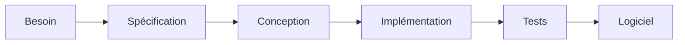

Le principe général consiste à faire de la spécification un élément central et explicite du processus de développement.

Au lieu de considérer le code comme la seule représentation précise du logiciel, le Spec-Driven Development cherche à maintenir une description formelle ou semi-formelle du comportement attendu du système.

Cette spécification peut alors être utilisée aussi bien par les développeurs que par les agents IA.

## 1.1 Le développement logiciel assisté par IA

Les outils d'intelligence artificielle destinés au développement logiciel ont rapidement évolué.

Les premiers assistants étaient essentiellement capables de proposer quelques lignes de code à partir du contexte fourni par l'éditeur.

Le développeur restait entièrement responsable de la décomposition du problème et de l'intégration de ces suggestions.

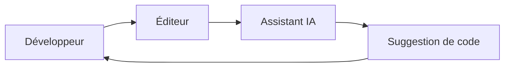

Les agents de programmation modernes disposent d'un fonctionnement plus autonome.

Ils peuvent notamment :

- analyser l'arborescence d'un projet ;
    
- lire plusieurs fichiers ;
    
- rechercher les éléments concernés par une modification ;
    
- créer ou modifier des fichiers ;
    
- générer du code ;
    
- créer ou modifier des tests ;
    
- exécuter certaines commandes ;
    
- analyser les erreurs produites ;
    
- corriger leur propre implémentation.
    

Le développeur ne fournit donc plus nécessairement chaque instruction technique.

Il peut exprimer une intention plus générale telle que :

```text
Ajoute un système permettant aux utilisateurs
de se connecter avec leur compte GitHub.
```

L'agent peut ensuite déterminer quels fichiers doivent être modifiés et proposer une implémentation.

On peut représenter ce nouveau mode de fonctionnement ainsi :

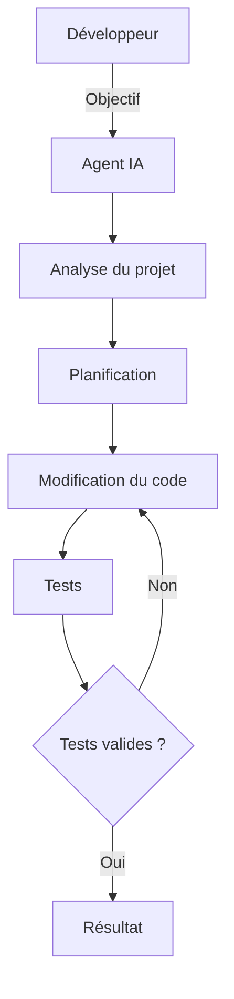

Cette automatisation change progressivement le rôle du développeur.

Une partie du travail se déplace de :

```text
Comment écrire le code ?
```

vers :

```text
Que doit exactement faire le logiciel ?
```

et :

```text
Comment vérifier que le résultat correspond
réellement au besoin ?
```

Le développeur intervient alors davantage dans :

- l'expression du besoin ;
    
- la conception ;
    
- la définition des contraintes ;
    
- la validation des choix ;
    
- la revue du code ;
    
- la vérification du comportement obtenu.
    

L'agent IA devient ainsi un nouvel acteur du processus de développement.

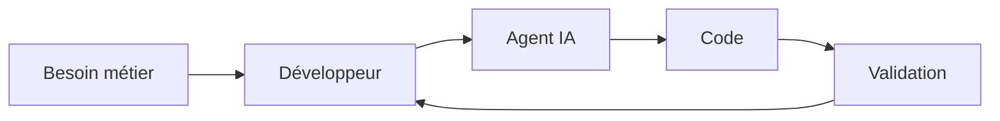

Cependant, donner davantage d'autonomie à un agent ne signifie pas que celui-ci connaît implicitement le résultat attendu.

Plus l'agent possède de liberté dans l'implémentation, plus la définition du besoin devient importante.

## 1.2 Les limites du développement piloté uniquement par prompts

Une manière simple d'utiliser un agent de programmation consiste à lui transmettre directement une instruction sous forme de prompt.

Par exemple :

```text
Ajoute l'authentification GitHub à l'application.
```

L'agent reçoit alors une intention générale et doit déterminer lui-même ce que signifie exactement cette demande.

Doit-il :

- créer automatiquement un utilisateur lors de sa première connexion ?
    
- autoriser uniquement les utilisateurs possédant déjà un compte ?
    
- conserver également l'authentification par mot de passe ?
    
- associer un compte GitHub à un utilisateur existant ?
    
- utiliser l'adresse électronique GitHub comme identifiant ?
    
- permettre plusieurs comptes GitHub pour le même utilisateur ?
    
- enregistrer le token OAuth ?
    
- prévoir une procédure de déconnexion ?
    
- modifier l'interface existante ?
    

Le prompt initial ne répond à aucune de ces questions.

L'agent devra donc :

1. demander des précisions ;
    
2. déduire la réponse à partir du code existant ;
    
3. ou prendre lui-même une décision.
    

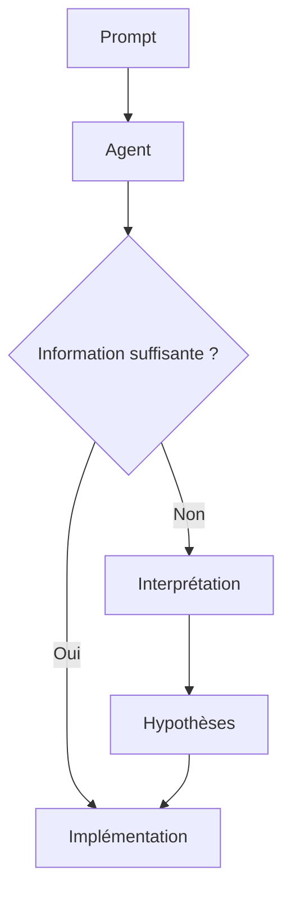

Le problème n'est donc pas nécessairement la capacité de l'agent à produire du code.

Le problème peut être l'absence d'une définition suffisamment précise du résultat attendu.

### Le prompt comme spécification implicite

Lorsque le besoin existe uniquement dans une conversation avec l'agent, le prompt devient de fait une forme de spécification.

Prenons la suite de messages suivante :

```text
Utilisateur :
Ajoute l'authentification GitHub.

Utilisateur :
Finalement garde également la connexion par mot de passe.

Utilisateur :
Les utilisateurs déjà inscrits doivent pouvoir
associer leur compte GitHub.

Utilisateur :
Attention, ne crée pas automatiquement de compte
si l'adresse GitHub est différente.
```

Après plusieurs échanges, une quantité importante d'informations existe dans la conversation.

On obtient progressivement :

```text
Prompt 1
   +
Prompt 2
   +
Prompt 3
   +
Prompt 4
   ↓
Spécification implicite
```

Mais cette spécification présente plusieurs problèmes :

- elle est dispersée dans la conversation ;
    
- certaines décisions peuvent se contredire ;
    
- il est difficile de connaître la décision finale ;
    
- elle peut être perdue lors d'un changement de session ;
    
- elle n'est pas nécessairement versionnée avec le projet ;
    
- un autre développeur ne la connaît pas ;
    
- un autre agent ne dispose pas nécessairement de ce contexte.
    

Le contexte conversationnel devient alors une dépendance du projet.

### La perte de contexte

Les agents travaillent généralement avec une quantité limitée de contexte.

Dans un projet important, ils doivent traiter simultanément :

```text
Code source
+
Documentation
+
Tests
+
Historique de conversation
+
Instructions utilisateur
+
Résultats des commandes
```

Plus la conversation devient longue, plus il devient difficile de maintenir toutes les informations pertinentes simultanément.

On peut représenter cette situation comme une mémoire de travail :

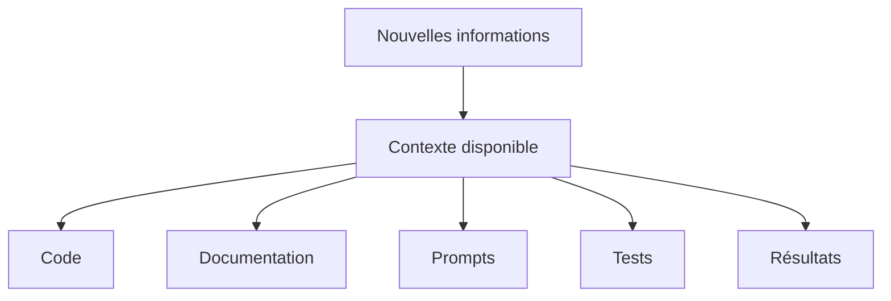

La quantité de contexte n'est pas infinie.

Certaines informations peuvent donc finir par être :

- résumées ;
    
- considérées comme secondaires ;
    
- oubliées ;
    
- remplacées par des informations plus récentes.
    

Un élément important mentionné plusieurs dizaines de messages auparavant peut alors ne plus suffisamment influencer les décisions de l'agent.

### Les ambiguïtés

Le langage naturel est naturellement ambigu.

Une instruction telle que :

```text
La session doit être sécurisée.
```

peut paraître évidente à un humain, mais elle décrit mal le comportement attendu du système.

Que signifie exactement « sécurisée » ?

Cela peut concerner :

- la durée de validité de la session ;
    
- le stockage des cookies ;
    
- l'utilisation de HTTPS ;
    
- les attributs `HttpOnly` ;
    
- les attributs `SameSite` ;
    
- la rotation des identifiants de session ;
    
- la révocation ;
    
- la protection contre certaines attaques.
    

Une instruction plus précise pourrait être :

```text
Après une authentification réussie,
le serveur doit créer une nouvelle session
et invalider l'identifiant de session précédent.
```

La différence fondamentale est que cette seconde formulation décrit un comportement que l'on peut observer et tester.

### Les décisions arbitraires

Lorsqu'une information manque, l'agent doit souvent compléter implicitement le besoin.

Par exemple :

```text
Créer une page permettant de modifier son profil.
```

L'agent pourrait décider d'autoriser la modification :

```text
Nom
Prénom
Email
Mot de passe
Avatar
Nom d'utilisateur
```

alors que le besoin réel pouvait être uniquement :

```text
Nom
Prénom
Avatar
```

Le résultat peut être techniquement correct tout en étant fonctionnellement incorrect.

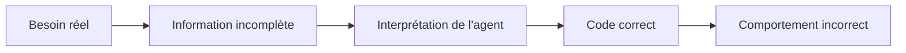

Un logiciel qui compile et dont les tests passent n'est donc pas nécessairement conforme au besoin.

### Le changement d'agent

Une autre difficulté apparaît lorsque plusieurs agents travaillent sur le même projet.

Imaginons :

```text
Jour 1 : Claude Code
Jour 2 : Codex
Jour 3 : Cursor
```

Si l'information se trouve principalement dans les conversations précédentes, chaque nouvel agent doit reconstruire le contexte.

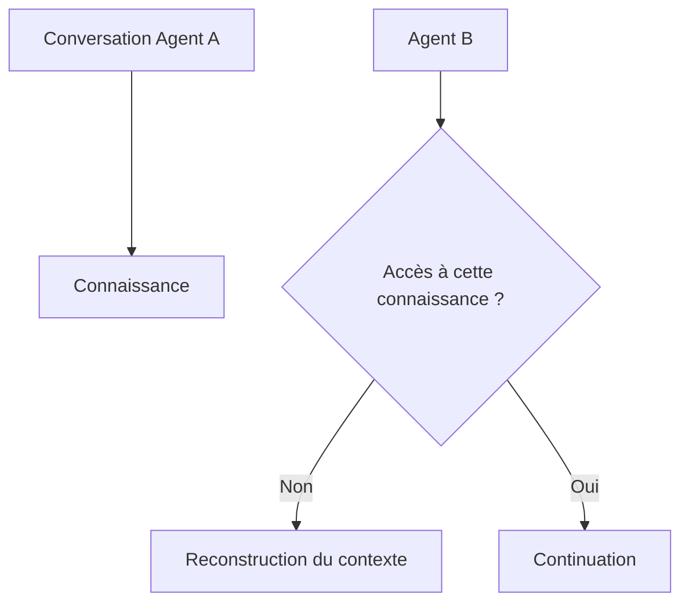

Cela peut entraîner :

- des choix techniques différents ;
    
- des fonctionnalités oubliées ;
    
- une interprétation différente du besoin ;
    
- une duplication du travail ;
    
- des régressions.
    

L'une des solutions consiste donc à déplacer les informations importantes de la conversation vers des fichiers persistants faisant partie du projet.

C'est précisément l'un des principes qui conduisent au **Spec-Driven Development**.

## 1.3 Qu'est-ce que le Spec-Driven Development ?

Le **Spec-Driven Development**, que l'on peut traduire par **développement piloté par les spécifications**, est une approche dans laquelle la spécification du comportement attendu du logiciel devient un artefact central du processus de développement.

L'idée générale peut être résumée ainsi :

```text
Définir ce que le logiciel doit faire
avant de définir comment il doit le faire.
```

Une spécification décrit donc principalement le résultat attendu.

Par exemple :

```markdown
### Requirement: Authentication with GitHub

The system SHALL allow a registered user
to authenticate using a GitHub account.
```

Cette exigence peut ensuite être précisée par différents scénarios :

```markdown
#### Scenario: Successful authentication

- GIVEN a registered user associated with a GitHub account
- WHEN the user authenticates successfully with GitHub
- THEN the system SHALL authenticate the user
```

La spécification devient ainsi une référence permettant de répondre à la question :

```text
Quel comportement doit posséder le système ?
```

Le processus de développement peut alors suivre une chaîne de transformation :

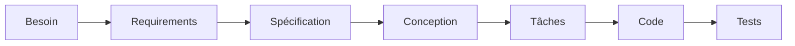

Le code n'est donc plus directement produit à partir d'une intention générale.

Une étape intermédiaire explicite existe entre le besoin et l'implémentation.

### Spécification et implémentation

Il est important de distinguer :

```text
Spécification
     ↓
CE QUE le système doit faire

Implémentation
     ↓
COMMENT le système le fait
```

Prenons l'exigence suivante :

```text
Le système doit permettre à un utilisateur
de réinitialiser son mot de passe.
```

Plusieurs implémentations sont possibles :

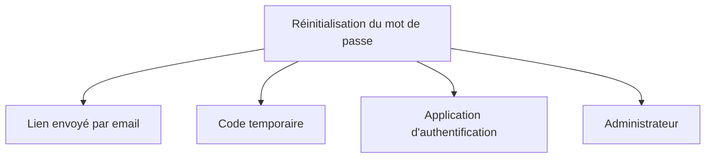

La spécification peut imposer certains comportements sans déterminer tous les détails internes de l'implémentation.

Par exemple :

```text
Un lien de réinitialisation doit devenir inutilisable
après avoir été utilisé avec succès.
```

Cette exigence décrit un comportement attendu.

La manière de rendre le lien inutilisable relève en revanche de la conception et de l'implémentation.

### Une spécification n'est pas simplement une documentation

La documentation explique généralement un système aux développeurs ou aux utilisateurs.

Une spécification cherche davantage à définir les propriétés que le système **doit respecter**.

On peut simplifier la distinction ainsi :

|Élément|Question principale|
|---|---|
|Documentation|Comment fonctionne le système ?|
|Spécification|Que doit faire le système ?|
|Design|Comment allons-nous le construire ?|
|Code|Comment est-il réellement implémenté ?|
|Tests|Respecte-t-il le comportement attendu ?|

Ces éléments peuvent naturellement se compléter.

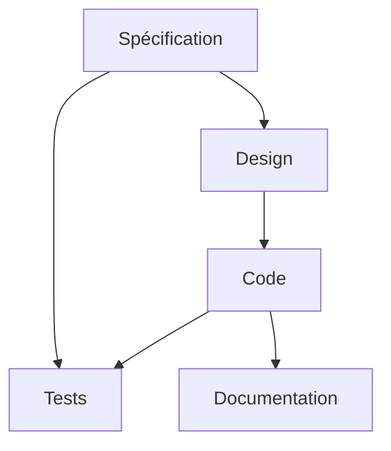

### La spécification comme contrat

La spécification peut également être considérée comme un contrat entre plusieurs acteurs :

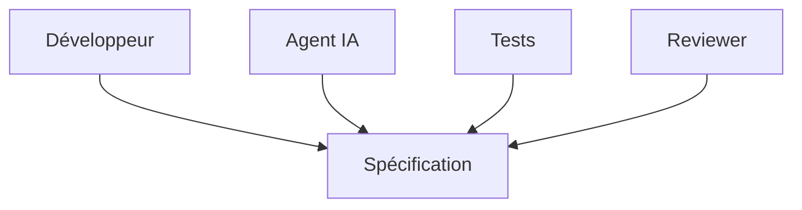

Chaque acteur peut alors se référer au même document.

Le développeur sait ce qui doit être construit.

L'agent sait ce qu'il doit implémenter.

Les tests peuvent vérifier les comportements définis.

Le reviewer peut comparer l'implémentation à l'intention originale.

La spécification devient donc un mécanisme permettant d'aligner les différents acteurs participant au développement.

## 1.4 Du Code-Driven au Spec-Driven Development

Dans un développement traditionnel, le code constitue souvent la représentation la plus précise du comportement réel du logiciel.

Le processus peut être représenté simplement par :

```text
Besoin
  ↓
Développeur
  ↓
Code
```

Une documentation ou des spécifications peuvent exister, mais elles ne sont pas nécessairement maintenues au même rythme que le logiciel.

Dans un processus utilisant intensivement les agents IA, cette organisation peut devenir problématique.

Si l'on demande directement à un agent :

```text
Ajoute une gestion des rôles administrateur et utilisateur.
```

on obtient :

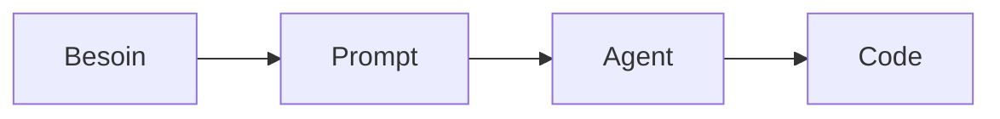

Cette approche peut être qualifiée de **Prompt-Driven Development** lorsque la conversation constitue essentiellement le mécanisme de pilotage du développement.

Dans une approche Spec-Driven :

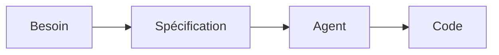

Mais la différence devient réellement intéressante lors des évolutions successives.

Dans une approche principalement conversationnelle :

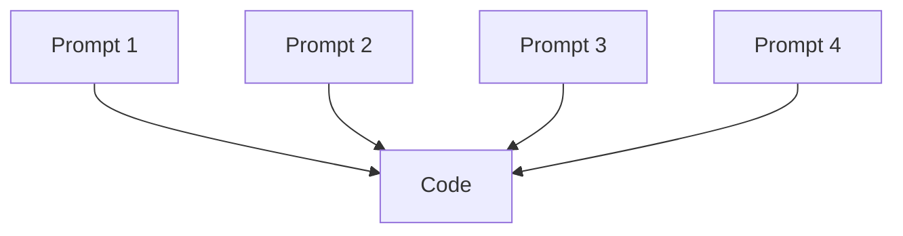

L'état attendu du logiciel doit être reconstruit à partir :

```text
du code
+
des prompts
+
des décisions prises pendant les conversations.
```

Dans une approche Spec-Driven :

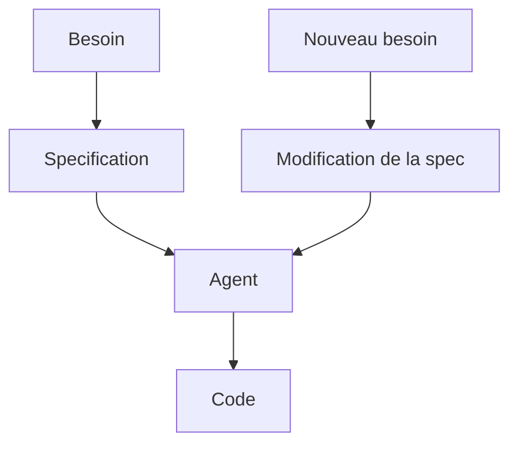

La spécification évolue en même temps que le logiciel.

On cherche donc à maintenir deux représentations cohérentes :

```text
SPECIFICATION
     ↕
IMPLEMENTATION
```

La spécification représente le système attendu.

Le code représente le système réellement exécuté.

Les tests contribuent à vérifier que ces deux représentations restent cohérentes.

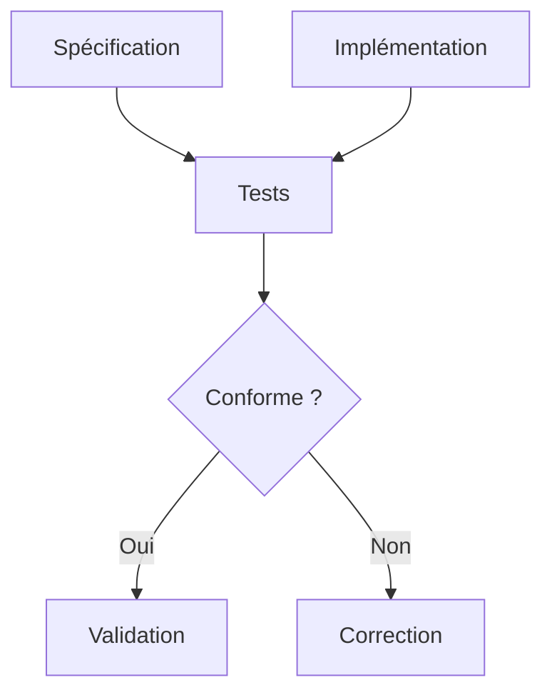

### Code-Driven Development

Dans une approche principalement centrée sur le code :

```text
Code = principale source de vérité
```

Pour comprendre le comportement du système, il est souvent nécessaire :

- de lire l'implémentation ;
    
- de lire les tests ;
    
- de consulter la documentation ;
    
- d'interroger les développeurs.
    

### Spec-Driven Development

Dans une approche pilotée par les spécifications :

```text
Spécification = comportement attendu
Code          = comportement implémenté
Tests         = vérification de la correspondance
```

Cela ne signifie pas que la spécification remplace le code.

Elle fournit une représentation supplémentaire du système, conçue pour être plus proche de l'intention fonctionnelle.

On peut donc représenter le cycle ainsi :

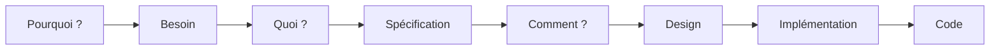

Cette séparation entre **Pourquoi ?**, **Quoi ?** et **Comment ?** est particulièrement utile lorsque le développement est réalisé en collaboration avec un agent IA.

## 1.5 Pourquoi utiliser une spécification avec un agent IA ?

L'utilisation d'une spécification présente plusieurs avantages lorsque le développement est partiellement réalisé par des agents IA.

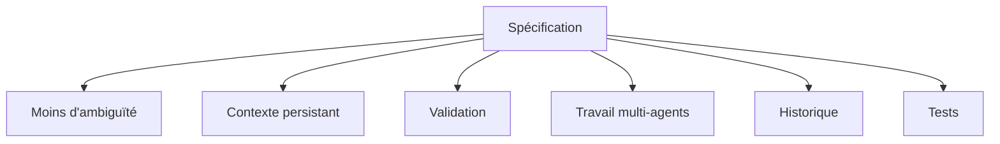

### Réduire l'ambiguïté

Une spécification oblige à expliciter certaines décisions avant l'implémentation.

Au lieu de demander :

```text
Ajoute la suppression des comptes utilisateurs.
```

on peut définir :

```text
L'utilisateur peut demander la suppression de son compte.

La suppression rend immédiatement impossible
toute nouvelle authentification.

Les données définitivement supprimées ne doivent
plus être accessibles depuis l'application.
```

Le champ d'interprétation laissé à l'agent devient plus réduit.

La spécification ne supprime pas toutes les ambiguïtés, mais elle permet de les identifier plus tôt.

### Séparer la décision de l'implémentation

Sans spécification :

```text
Utilisateur
    ↓
Agent
    ↓
Décision + conception + implémentation
```

L'agent peut prendre plusieurs types de décisions simultanément.

Avec une spécification :

```text
Utilisateur
    ↓
Spécification
    ↓
Validation
    ↓
Agent
    ↓
Implémentation
```

Le développeur peut alors examiner le comportement proposé avant que des modifications importantes soient réalisées dans le code.

Cette étape est particulièrement importante car une erreur dans une spécification est généralement plus simple à corriger qu'une erreur déjà propagée dans plusieurs fichiers.

### Conserver le contexte

Une conversation avec un agent est temporaire.

Un fichier présent dans le dépôt est persistant.

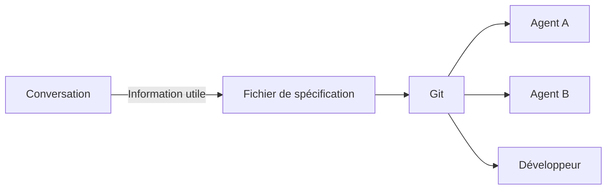

Les décisions importantes peuvent ainsi rester accessibles :

- après la fermeture d'une session ;
    
- après plusieurs jours ;
    
- après un changement de développeur ;
    
- après un changement d'agent ;
    
- lors d'une revue de code.
    

### Faciliter le travail avec plusieurs agents

Une même spécification peut servir de référence à plusieurs outils.

```mermaid
graph TD
    A[Spécification]
    A --> B[Codex]
    A --> C[Claude Code]
    A --> D[Cursor]
    A --> E[Développeur]

    B --> F[Projet]
    C --> F
    D --> F
    E --> F
```

L'objectif est que le contexte essentiel appartienne au projet plutôt qu'à un agent particulier.

Un nouvel agent peut alors consulter la spécification avant de commencer son travail.

### Faciliter la revue

Lors d'une revue classique, le développeur examine principalement :

```text
Ancien code
    ↓
diff
    ↓
Nouveau code
```

Avec une spécification, une dimension supplémentaire apparaît :

```text
Besoin
  ↓
Spec
  ↓
Diff
  ↓
Code
```

Le reviewer peut poser deux questions différentes :

```text
Le code est-il correctement écrit ?
```

et :

```text
Le code réalise-t-il réellement ce qui avait été demandé ?
```

Ces questions ne sont pas équivalentes.

Un code de grande qualité peut parfaitement implémenter une mauvaise interprétation du besoin.

### Faciliter la création des tests

Une exigence bien écrite peut être associée à des scénarios observables.

Par exemple :

```markdown
### Requirement: Failed authentication

The system SHALL reject invalid credentials.

#### Scenario: Invalid password

- GIVEN an existing user
- WHEN the user provides an invalid password
- THEN authentication SHALL fail
```

Ce scénario fournit directement des informations permettant de créer un test :

```text
Précondition
    ↓
Action
    ↓
Résultat attendu
```

Ce principe crée un lien naturel entre :

```mermaid
graph LR
    A[Requirement] --> B[Scenario]
    B --> C[Test]
    C --> D[Implementation]
```

### Conserver un historique des intentions

Git permet déjà de conserver l'historique du code.

Avec des spécifications versionnées, il devient également possible de conserver une partie de l'historique des intentions fonctionnelles.

On peut alors chercher à comprendre :

```text
Pourquoi cette fonctionnalité existe-t-elle ?
```

```text
Quel comportement avait été demandé ?
```

```text
Quand cette exigence a-t-elle changé ?
```

```text
Quelle modification du code correspond à cette évolution ?
```

Le dépôt ne contient alors plus uniquement le résultat technique des décisions.

Il peut également conserver une représentation des décisions elles-mêmes.

### Le développeur reste responsable de la spécification

Le Spec-Driven Development ne consiste pas simplement à demander à un LLM de générer une spécification puis à demander à un second LLM de générer le code.

```mermaid
graph LR
    A[Besoin] --> B[Agent]
    B --> C[Spec générée]
    C --> D[Agent]
    D --> E[Code]
```

Une telle chaîne ne garantit pas que le besoin initial a correctement été compris.

L'intervention humaine reste donc importante au niveau de la validation.

```mermaid
graph TD
    A[Besoin] --> B[Proposition de spécification]
    B --> C{Validation humaine}
    C -->|À modifier| B
    C -->|Acceptée| D[Implémentation]
    D --> E[Validation]
```

L'objectif n'est pas de supprimer le développeur du processus.

Il consiste davantage à déplacer une partie de son activité vers les tâches où son jugement apporte le plus de valeur :

- définir le problème ;
    
- expliciter les contraintes ;
    
- valider les comportements ;
    
- choisir entre plusieurs solutions ;
    
- contrôler les résultats.
    

Le code devient alors une conséquence d'une intention préalablement explicitée.

## Conclusion

Le développement assisté par agents IA permet d'automatiser une partie croissante de l'implémentation logicielle.

Mais cette capacité augmente parallèlement l'importance de la définition du problème.

Plus un agent est autonome pour déterminer **comment** réaliser une tâche, plus il devient nécessaire de définir précisément **ce qu'il doit réaliser**.

Le Spec-Driven Development répond à cette problématique en faisant de la spécification un artefact central du développement.

```mermaid
graph TD
    A[Besoin humain] --> B[Spécification]
    B --> C[Conception]
    C --> D[Agent IA]
    D --> E[Code]
    E --> F[Tests]
    F --> G[Validation]
    G --> H[Logiciel]
    
    G -->|Écart| B
```

Nous pouvons résumer cette évolution par :

```text
Développement traditionnel
Besoin → Développeur → Code

Développement assisté par IA
Besoin → Prompt → Agent → Code

Spec-Driven Development
Besoin → Spécification → Agent → Code → Validation
```

La spécification devient ainsi l'interface entre l'intention humaine et l'implémentation réalisée avec l'aide d'un agent.

Dans le chapitre suivant, nous étudierons **OpenSpec**, un outil et une méthodologie permettant d'appliquer concrètement cette approche en organisant les spécifications et leurs évolutions directement dans le dépôt d'un projet logiciel.

---

# 2. Introduction à OpenSpec

Le **Spec-Driven Development** présenté dans le chapitre précédent constitue une approche générale : le comportement attendu du logiciel est défini dans des spécifications avant ou pendant son implémentation.

Il reste cependant à déterminer comment organiser concrètement ces spécifications dans un projet logiciel.

Plusieurs questions apparaissent rapidement :

- où stocker les spécifications ?
    
- comment les versionner ?
    
- comment distinguer l'état actuel du logiciel d'une évolution en cours ?
    
- comment transmettre ces informations à un agent IA ?
    
- comment définir les tâches à réaliser ?
    
- comment conserver l'historique d'une évolution ?
    
- comment faire évoluer la spécification en même temps que le code ?
    

**OpenSpec** apporte une réponse à ces problèmes en proposant un cadre léger destiné au Spec-Driven Development avec les agents de programmation.

OpenSpec se présente comme une couche de spécification légère placée entre l'intention du développeur et l'implémentation réalisée par l'agent. L'objectif est de permettre aux humains et aux agents de s'accorder sur ce qui doit être construit avant de modifier le code.

```mermaid
graph LR
    A[Besoin humain] --> B[OpenSpec]
    B --> C[Spécifications]
    C --> D[Agent IA]
    D --> E[Code]
    E --> F[Tests]
    F --> G[Validation]
```

OpenSpec ne remplace donc ni le développeur, ni l'agent, ni Git.

Il fournit une structure commune permettant à ces différents éléments de travailler autour d'une même description du système.

```mermaid
graph TD
    A[Développeur] --> O[OpenSpec]
    O --> B[Agent IA]
    O --> C[Git]
    O --> D[Spécifications]
    B --> E[Code]
    C --> D
    C --> E
```

## 2.1 Qu'est-ce qu'OpenSpec ?

OpenSpec est un framework Open Source de **Spec-Driven Development destiné aux agents de programmation**.

Il cherche à résoudre un problème que nous avons identifié dans le chapitre précédent : lorsqu'une fonctionnalité est décrite uniquement dans une conversation avec un LLM, les exigences importantes restent enfermées dans l'historique du dialogue.

OpenSpec déplace ces informations vers des fichiers appartenant au projet.

On passe ainsi de :

```text
Conversation
    ↓
Prompt
    ↓
Agent
    ↓
Code
```

à :

```text
Conversation
    ↓
Spécification
    ↓
Fichiers OpenSpec
    ↓
Agent
    ↓
Code
```

Le dépôt contient alors non seulement :

```text
src/
tests/
docs/
```

mais également les spécifications qui décrivent le comportement attendu et les changements en cours.

La structure générale d'un projet OpenSpec repose notamment sur deux ensembles principaux :

```text
openspec/
├── specs/
└── changes/
```

Le répertoire `specs/` contient les spécifications décrivant le comportement actuellement attendu du système. La documentation d'OpenSpec le qualifie de **source of truth**.

Le répertoire `changes/` contient au contraire les modifications proposées ou en cours de réalisation. Chaque changement possède son propre répertoire et ses propres artefacts.

On peut représenter cette distinction ainsi :

```mermaid
graph TD
    O[OpenSpec]

    O --> S[specs/]
    O --> C[changes/]

    S --> S1[État actuel attendu]
    C --> C1[Évolutions proposées]
```

Supposons par exemple qu'une application permette actuellement l'authentification par mot de passe.

La spécification courante pourrait décrire :

```text
Authentication
    ↓
Email + Password
```

Nous souhaitons maintenant ajouter l'authentification avec GitHub.

OpenSpec ne considère pas immédiatement ce nouveau comportement comme faisant partie de l'état actuel du logiciel.

Il crée d'abord un **changement**.

```mermaid
graph LR
    A[Spec actuelle] --> B[Change: add-github-oauth]
    B --> C[Implémentation]
    C --> D[Validation]
    D --> E[Nouvelle spec actuelle]
```

Cette séparation permet de distinguer clairement :

```text
Ce que le logiciel doit faire actuellement
```

de :

```text
Ce que nous voulons qu'il fasse après la modification.
```

C'est une idée fondamentale d'OpenSpec.

### OpenSpec comme couche entre l'intention et le code

On peut considérer OpenSpec comme une couche intermédiaire entre l'intention humaine et l'implémentation.

```mermaid
graph LR
    A[Intentions] --> B[OpenSpec]
    B --> C[Agent]
    C --> D[Code]
```

Sans cette couche, l'agent doit transformer directement le langage naturel en code :

```text
"Ajoute OAuth GitHub"
        ↓
       Agent
        ↓
       Code
```

Avec OpenSpec, cette intention est progressivement explicitée :

```text
"Ajoute OAuth GitHub"
        ↓
     Proposal
        ↓
      Specs
        ↓
      Design
        ↓
      Tasks
        ↓
      Agent
        ↓
       Code
```

Les principaux artefacts utilisés pour décrire un changement sont actuellement :

- `proposal.md` : pourquoi le changement est nécessaire et ce qu'il vise ;
    
- `specs/` : les modifications apportées aux exigences ;
    
- `design.md` : l'approche technique retenue ;
    
- `tasks.md` : la liste des opérations d'implémentation à effectuer.
    

Nous étudierons ces différents artefacts en détail dans les chapitres suivants.

### Un framework orienté agents

OpenSpec est conçu pour fonctionner avec différents assistants et agents de programmation plutôt que d'être associé à un seul fournisseur ou à un seul environnement.

Lors de l'initialisation du projet, OpenSpec peut installer dans celui-ci les éléments nécessaires pour que l'outil d'IA sélectionné connaisse les workflows et commandes OpenSpec. La documentation indique qu'OpenSpec prend en charge de nombreux assistants de programmation et configure les outils sélectionnés lors de `openspec init`.

L'architecture recherchée est donc la suivante :

```mermaid
graph TD
    O[OpenSpec]

    O --> A[Agent A]
    O --> B[Agent B]
    O --> C[Agent C]

    A --> P[Projet]
    B --> P
    C --> P
```

Les spécifications ne sont pas censées appartenir à l'agent.

Elles appartiennent au **projet**.

Cette différence est importante.

Si l'on change d'agent :

```text
Claude Code
     ↓
   Codex
```

les fichiers OpenSpec restent les mêmes.

```mermaid
graph LR
    A[Agent A] --> S[OpenSpec]
    S --> P[Projet]
    B[Agent B] --> S
```

Le nouvel agent peut donc retrouver une partie importante du contexte directement dans le dépôt.

### OpenSpec et Git

Les fichiers OpenSpec sont des fichiers du projet.

Ils peuvent donc être versionnés avec Git comme le code source.

```text
repository/
├── .git/
├── src/
├── tests/
├── docs/
└── openspec/
```

Git peut alors conserver simultanément :

```text
historique du code
+
historique des spécifications
+
historique des changements
```

Cela permet de rapprocher les évolutions fonctionnelles des évolutions techniques.

```mermaid
graph TD
    G[Git]
    G --> C[Code]
    G --> S[Specifications]
    G --> T[Tests]
    G --> D[Design]
```

Une Pull Request peut ainsi contenir non seulement une modification du code, mais également les artefacts permettant de comprendre ce que cette modification devait accomplir.

## 2.2 Philosophie d'OpenSpec

OpenSpec ne cherche pas à transformer le développement logiciel en un processus documentaire lourd.

Sa documentation actuelle présente quatre principes fondamentaux :

```text
fluid not rigid
iterative not waterfall
easy not complex
brownfield-first
```

Autrement dit, OpenSpec privilégie un processus fluide plutôt que rigide, itératif plutôt qu'en cascade, simple plutôt que complexe et pensé en priorité pour les projets existants.

```mermaid
graph TD
    O[Philosophie OpenSpec]

    O --> A[Fluide]
    O --> B[Itérative]
    O --> C[Légère]
    O --> D[Brownfield-first]
```

### Fluid, not rigid

Un processus traditionnel fortement formalisé peut imposer une succession stricte d'étapes :

```text
Analyse
   ↓
Spécification
   ↓
Conception
   ↓
Implémentation
   ↓
Tests
```

Chaque phase doit alors être entièrement terminée avant de passer à la suivante.

OpenSpec ne cherche pas à imposer ce fonctionnement.

Le processus peut évoluer au fur et à mesure que le développeur et l'agent découvrent de nouvelles informations.

```mermaid
graph LR
    A[Specification] --> B[Design]
    B --> C[Implementation]
    C --> D[Découverte]
    D --> A
```

Par exemple, pendant l'implémentation, l'agent peut découvrir qu'une contrainte technique rend impossible une hypothèse formulée dans le design.

La réponse ne consiste pas nécessairement à continuer coûte que coûte.

Le développeur peut revenir sur le design ou sur la spécification.

```text
Spec
 ↓
Design
 ↓
Code
 ↓
Nouvelle information
 ↓
Design
 ↓
Spec
```

Le document n'est donc pas considéré comme immuable.

### Iterative, not waterfall

Le Spec-Driven Development pourrait facilement être interprété comme un retour au développement en cascade :

```text
On écrit toute la spécification.
            ↓
On valide toute la spécification.
            ↓
On écrit tout le code.
```

Ce n'est pas la philosophie d'OpenSpec.

La spécification peut évoluer avec la compréhension du problème. OpenSpec considère explicitement son workflow comme itératif : on apprend pendant le développement et l'on affine les artefacts en conséquence.

On peut avoir :

```mermaid
graph TD
    A[Besoin initial] --> B[Spec v1]
    B --> C[Exploration]
    C --> D[Spec v2]
    D --> E[Implementation]
    E --> F[Découverte]
    F --> G[Spec v3]
    G --> E
```

Cette approche est particulièrement adaptée au développement avec les agents IA.

L'agent peut en effet participer à l'exploration du projet :

- rechercher le code concerné ;
    
- identifier les dépendances ;
    
- détecter une contrainte existante ;
    
- proposer plusieurs solutions ;
    
- faire apparaître un cas qui n'avait pas été envisagé.
    

Le processus devient donc une collaboration.

```mermaid
graph LR
    H[Humain] --> S[Spec]
    S --> A[Agent]
    A --> I[Informations]
    I --> H
    H --> S
```

### Easy, not complex

OpenSpec cherche également à conserver une faible complexité documentaire.

L'objectif n'est pas de produire des centaines de pages de spécifications formelles avant d'écrire une ligne de code.

Les artefacts restent principalement constitués de fichiers textuels simples.

Par exemple :

```text
proposal.md
design.md
tasks.md
spec.md
```

La documentation officielle décrit OpenSpec comme un framework léger et insiste sur une configuration minimale.

Cette simplicité est importante pour plusieurs raisons.

Tout d'abord, une spécification trop coûteuse à maintenir risque rapidement de ne plus être mise à jour.

```mermaid
graph LR
    A[Documentation complexe] --> B[Coût élevé]
    B --> C[Mise à jour rare]
    C --> D[Documentation obsolète]
```

Une spécification légère cherche au contraire à favoriser :

```mermaid
graph LR
    A[Format simple] --> B[Modification simple]
    B --> C[Mise à jour fréquente]
    C --> D[Spec plus proche du code]
```

### Brownfield-first

OpenSpec met particulièrement l'accent sur les projets existants, que l'on qualifie généralement de **brownfield**.

Un projet Greenfield démarre de zéro :

```text
Besoin
  ↓
Specs
  ↓
Code
```

Un projet Brownfield possède déjà :

```text
Code
+
Base de données
+
Tests
+
Documentation
+
Utilisateurs
+
Historique
```

On pourrait penser qu'il faudrait commencer par spécifier l'intégralité du logiciel existant avant de pouvoir adopter OpenSpec.

Ce n'est pas l'approche recommandée.

La documentation OpenSpec explique qu'un projet existant peut construire ses spécifications progressivement : le premier changement documente la partie du système qu'il touche, le suivant enrichit une autre partie, et la couverture des specs se construit au fil du travail réel.

On peut représenter cette évolution ainsi :

```text
Projet existant
████████████████████████████
```

Premier changement :

```text
Projet existant
██████████[SPEC]████████████
```

Deuxième changement :

```text
Projet existant
████[SPEC]█[SPEC]███████████
```

Puis progressivement :

```text
Projet existant
██[SPEC]██[SPEC]██[SPEC]████
```

Il n'est donc pas nécessaire de commencer par :

```text
Comprendre et documenter 100 % du projet
                ↓
            OpenSpec
```

On peut commencer par :

```text
Prochaine modification
        ↓
Partie concernée du projet
        ↓
Premières specs
```

Cette philosophie est particulièrement intéressante pour l'introduction d'OpenSpec dans une application ancienne ou volumineuse.

## 2.3 OpenSpec n'est pas un langage de programmation

Le nom OpenSpec peut laisser penser qu'il s'agit d'un langage permettant de décrire entièrement une application.

Ce n'est pas le cas.

OpenSpec n'est pas :

- un langage de programmation ;
    
- un compilateur ;
    
- un langage de modélisation comparable à UML ;
    
- un langage formel de vérification ;
    
- un générateur automatique complet d'applications.
    

Il fournit avant tout :

```text
OpenSpec
   │
   ├── une organisation
   ├── des conventions
   ├── des artefacts
   ├── un workflow
   ├── une CLI
   └── une intégration avec les agents IA
```

La CLI `openspec` fournit notamment des commandes pour initialiser le projet, inspecter son état, valider ou gérer les spécifications et les changements. Ces commandes complètent les commandes destinées aux agents.

Il faut donc distinguer plusieurs niveaux.

```mermaid
graph TD
    A[OpenSpec]
    A --> B[Markdown]
    A --> C[Structure des fichiers]
    A --> D[Conventions]
    A --> E[CLI]
    A --> F[Workflow agentique]
```

### Le langage naturel reste central

Une grande partie des spécifications est écrite en langage naturel.

Par exemple :

```markdown
### Requirement: Account deletion

The system SHALL allow an authenticated user
to request deletion of their account.
```

Ce texte reste compréhensible par un développeur.

Mais il possède également une structure suffisamment régulière pour être interprété efficacement par un agent.

On cherche donc un compromis entre deux extrêmes.

D'un côté, une description totalement informelle :

```text
Il faudrait pouvoir supprimer son compte facilement,
mais sans faire n'importe quoi avec les données.
```

De l'autre, une spécification entièrement formelle :

```text
∀u ∈ Users,
Authenticated(u) ∧ DeleteRequest(u)
⇒ Disabled(u)
```

OpenSpec privilégie principalement une représentation structurée mais lisible :

```markdown
### Requirement: Account deletion

The system SHALL disable authentication
after an account deletion request is confirmed.

#### Scenario: User confirms deletion

- GIVEN an authenticated user
- WHEN the user confirms account deletion
- THEN the system SHALL prevent further authentication
```

Cette approche permet au même artefact d'être lu par :

```mermaid
graph TD
    S[Specification]
    S --> H[Humain]
    S --> A[Agent IA]
```

C'est une caractéristique importante du système.

### OpenSpec n'exécute pas la spécification

Une spécification OpenSpec telle que :

```markdown
### Requirement: User logout

The system SHALL allow an authenticated user
to terminate the current session.
```

ne crée pas automatiquement la fonctionnalité.

Il faut toujours une implémentation.

```mermaid
graph LR
    A[Spec] --> B[Agent ou développeur]
    B --> C[Code]
    C --> D[Programme exécutable]
```

La spécification constitue une instruction et une référence.

Le code reste responsable du comportement réellement exécuté.

On retrouve donc la distinction vue précédemment :

```text
SPECIFICATION
     ↓
Comportement attendu

CODE
     ↓
Comportement implémenté
```

### OpenSpec n'est pas non plus l'agent

Une autre confusion possible consiste à considérer OpenSpec comme un agent IA.

OpenSpec ne raisonne pas à la place du modèle.

On peut distinguer :

```text
OpenSpec
    ↓
Organisation du contexte et du workflow

Agent IA
    ↓
Analyse, raisonnement et génération

Git
    ↓
Versionnement

Tests
    ↓
Vérification
```

Ces composants sont complémentaires.

```mermaid
graph TD
    H[Humain] --> O[OpenSpec]
    O --> A[Agent]
    A --> C[Code]
    C --> T[Tests]
    O --> T
    C --> G[Git]
    O --> G
```

OpenSpec sert donc principalement à structurer l'information et le processus permettant aux différents acteurs de collaborer.

## 2.4 OpenSpec et Markdown

OpenSpec repose largement sur des fichiers textuels, notamment des fichiers Markdown pour ses artefacts.

Ce choix est particulièrement adapté au développement logiciel.

Markdown est un langage de balisage léger permettant de représenter simplement :

- des titres ;
    
- des paragraphes ;
    
- des listes ;
    
- des tableaux ;
    
- des blocs de code ;
    
- des liens ;
    
- des cases à cocher.
    

Par exemple :

```markdown
# Authentication

## Requirement: GitHub Authentication

The system SHALL allow users to authenticate
using their GitHub account.

### Scenario: Successful authentication

- GIVEN a valid GitHub account
- WHEN the user authorizes the application
- THEN the user SHALL be authenticated
```

La structure reste immédiatement compréhensible sans logiciel particulier.

### Lisible par un humain

Contrairement à certains formats fortement structurés :

```json
{
  "requirement": {
    "name": "GitHub Authentication",
    "shall": "allow users to authenticate"
  }
}
```

Markdown reste proche d'un document traditionnel.

```markdown
## Requirement: GitHub Authentication

The system SHALL allow users to authenticate
using their GitHub account.
```

Le développeur peut donc le lire directement dans :

- un éditeur de texte ;
    
- un IDE ;
    
- GitHub ;
    
- GitLab ;
    
- un outil de documentation ;
    
- un terminal.
    

### Facile à interpréter par un LLM

Les modèles de langage manipulent naturellement le texte.

Une structure Markdown apporte cependant des repères supplémentaires :

```text
#
##
###
-
- [ ]
```

Ces éléments permettent de distinguer plus facilement :

```text
Titre
Section
Requirement
Scenario
Liste
Task
```

On obtient donc un document à la fois :

```mermaid
graph LR
    A[Markdown] --> B[Lisible humainement]
    A --> C[Structuré]
    A --> D[Lisible par un LLM]
```

### Facile à versionner avec Git

Un autre avantage majeur des fichiers textuels est leur intégration naturelle avec Git.

Prenons la spécification suivante :

```markdown
The system SHALL keep a session active for 24 hours.
```

Puis la modification :

```markdown
The system SHALL keep a session active for 12 hours.
```

Git peut représenter directement le changement :

```diff
-The system SHALL keep a session active for 24 hours.
+The system SHALL keep a session active for 12 hours.
```

Le développeur peut immédiatement identifier ce qui a changé.

```mermaid
graph LR
    A[Spec v1] --> B[Git diff]
    C[Spec v2] --> B
    B --> D[Modification visible]
```

Cela est beaucoup plus difficile avec certains formats binaires.

### Les spécifications deviennent des artefacts du dépôt

Puisque les spécifications sont stockées sous forme de fichiers, elles peuvent suivre les mêmes pratiques que le code :

```text
Commit
Pull Request
Code Review
Branch
Merge
Tag
History
```

Par exemple :

```text
git commit
    │
    ├── src/auth.py
    ├── tests/test_auth.py
    └── openspec/changes/add-github-auth/...
```

Un changement Git peut alors regrouper :

```text
Pourquoi ?
    ↓
Proposal

Quoi ?
    ↓
Spec

Comment ?
    ↓
Design

À faire ?
    ↓
Tasks

Résultat
    ↓
Code + Tests
```

Cette proximité entre la spécification et l'implémentation constitue l'un des intérêts principaux de l'utilisation de fichiers textuels versionnés.

### Markdown ne signifie pas absence de structure

Un document Markdown peut sembler libre.

On pourrait écrire :

```markdown
# Login

Faudrait ajouter GitHub.

Ça serait bien de garder les mots de passe aussi.

Attention aux vieux comptes.
```

Ce document est techniquement du Markdown.

Mais il ne constitue pas nécessairement une bonne spécification.

OpenSpec ajoute donc des **conventions et une organisation** au-dessus du format Markdown.

```mermaid
graph TD
    A[Markdown] --> B[Syntaxe de document]
    C[Conventions OpenSpec] --> D[Structure sémantique]
    B --> E[Spécification OpenSpec]
    D --> E
```

Autrement dit :

```text
Markdown
    ≠
OpenSpec
```

mais :

```text
Markdown
+
Structure
+
Conventions
+
Workflow
=
Artefacts OpenSpec
```

Cette distinction est essentielle.

Markdown fournit la représentation textuelle.

OpenSpec fournit la manière d'organiser et d'utiliser ces informations dans un processus de développement.

## 2.5 La notion de source de vérité

L'un des concepts les plus importants d'OpenSpec est celui de **source of truth**, ou source de vérité.

Dans OpenSpec, le répertoire principal `specs/` décrit le comportement actuellement attendu du logiciel. La documentation officielle distingue explicitement cette source de vérité des `changes/`, qui contiennent les modifications proposées.

On peut donc représenter :

```text
openspec/specs/
       ↓
Ce que le système
doit faire aujourd'hui
```

et :

```text
openspec/changes/
       ↓
Ce que nous proposons
de modifier
```

Prenons un système possédant actuellement :

```text
specs/
└── authentication/
    └── spec.md
```

La spécification peut indiquer :

```markdown
### Requirement: Password Authentication

The system SHALL allow registered users
to authenticate using an email address and password.
```

Nous voulons maintenant ajouter GitHub OAuth.

On crée alors un changement :

```text
changes/
└── add-github-oauth/
```

Ce changement peut déclarer une nouvelle exigence :

```markdown
### Requirement: GitHub Authentication

The system SHALL allow registered users
to authenticate using GitHub.
```

Pendant le développement, nous avons donc deux réalités conceptuelles :

```mermaid
graph TD
    A[État actuel]
    A --> B[Password authentication]

    C[Changement proposé]
    C --> D[GitHub authentication]
```

Lorsque la modification est terminée et archivée, ses spécifications peuvent être intégrées aux specs principales. OpenSpec décrit ce mécanisme comme le passage des spécifications du changement vers le répertoire principal `specs/`.

On obtient alors :

```mermaid
graph LR
    A[Current Spec] --> C[Merge]
    B[Change Spec] --> C
    C --> D[New Current Spec]
```

La source de vérité évolue.

```text
Spec N
  +
Change
  ↓
Spec N+1
```

Cette idée sera fondamentale lorsque nous étudierons les **Delta Specs**.

## 2.6 OpenSpec comme mémoire persistante du projet

Avec un développement exclusivement conversationnel, une partie importante de la connaissance peut rester dans l'historique de l'agent.

```text
Chat
├── décision A
├── décision B
├── contrainte C
└── correction D
```

Le problème apparaît lorsque la session disparaît ou qu'un autre agent reprend le projet.

```mermaid
graph LR
    A[Session A] --> B[Contexte]
    B -. perdu .-> C[Session B]
```

OpenSpec cherche à déplacer une partie de cette connaissance dans le dépôt.

```mermaid
graph LR
    A[Conversation] --> B[Artefacts OpenSpec]
    B --> C[Git]
    C --> D[Session A]
    C --> E[Session B]
    C --> F[Développeur]
```

La mémoire importante devient donc moins dépendante de la conversation.

On peut considérer deux types de mémoire :

```text
Mémoire conversationnelle
    ↓
Temporaire

Mémoire du projet
    ↓
Persistante
```

OpenSpec appartient principalement à la deuxième catégorie.

Cela ne signifie pas que chaque discussion doit être conservée.

Il faut plutôt conserver les décisions qui influencent durablement le comportement ou la réalisation du logiciel.

Par exemple :

```text
Discussion :
"On pourrait utiliser Redis ou la base SQL."

          ↓ décision

design.md :
"Les sessions sont stockées dans Redis."
```

Ou :

```text
Discussion :
"Que se passe-t-il si GitHub ne retourne pas d'email ?"

          ↓ décision

spec.md :
"The system SHALL reject automatic account creation
when no verified email address is provided."
```

La conversation permet d'explorer.

La spécification et le design permettent de conserver la décision.

```mermaid
graph LR
    A[Discussion] --> B[Décision]
    B --> C[Spec / Design]
    C --> D[Git]
```

## 2.7 Place d'OpenSpec dans le processus de développement

OpenSpec ne cherche pas à remplacer les outils existants.

Il vient compléter le processus.

On peut représenter une chaîne de développement moderne de la manière suivante :

```mermaid
graph TD
    A[Besoin]
    A --> B[OpenSpec]
    B --> C[Agent IA]
    C --> D[Code]
    C --> E[Tests]
    D --> F[Git]
    E --> F
    B --> F
    F --> G[Pull Request]
    G --> H[Code Review]
    H --> I[Merge]
```

Chaque outil conserve son rôle.

|Élément|Rôle|
|---|---|
|OpenSpec|Décrire le besoin et organiser son évolution|
|Agent IA|Analyser et produire l'implémentation|
|Code|Implémenter le comportement|
|Tests|Vérifier le comportement|
|Git|Versionner les artefacts|
|Pull Request|Présenter et discuter les changements|
|CI|Vérifier automatiquement le projet|
|Développeur|Décider et valider|

OpenSpec ajoute principalement une information qui était souvent implicite :

```text
Pourquoi cette modification existe-t-elle
et quel comportement doit-elle produire ?
```

Cette information devient alors un artefact de première classe du projet.

## Conclusion

OpenSpec est un framework léger permettant d'appliquer le Spec-Driven Development à des projets développés avec l'aide d'agents IA.

Son objectif principal peut être résumé par :

```text
Ne pas demander directement :

Besoin → Agent → Code

Mais introduire une représentation persistante
du résultat attendu :

Besoin → OpenSpec → Agent → Code
```

OpenSpec repose notamment sur plusieurs idées fondamentales :

```mermaid
graph TD
    O[OpenSpec]

    O --> A[Specifications]
    O --> B[Changes]
    O --> C[Markdown]
    O --> D[Git]
    O --> E[Agents IA]
    O --> F[Workflow itératif]
```

Nous pouvons également résumer sa philosophie ainsi :

```text
Fluid
    ↓
Le workflow peut évoluer

Iterative
    ↓
La spécification peut être raffinée

Easy
    ↓
Les artefacts restent légers

Brownfield-first
    ↓
On peut commencer sur un projet existant
```

Enfin, il est important de retenir qu'OpenSpec n'est ni un langage de programmation ni un agent IA.

Il constitue principalement :

```text
des conventions
+
des fichiers
+
une organisation
+
un workflow
+
des outils
```

permettant de maintenir une relation explicite entre :

```text
INTENTION
    ↓
SPECIFICATION
    ↓
CONCEPTION
    ↓
IMPLEMENTATION
```

Dans le chapitre suivant, nous étudierons concrètement **l'architecture d'un projet OpenSpec**, son initialisation et le rôle des répertoires `specs/`, `changes/` ainsi que du fichier `config.yaml`.

---

# 3. Architecture d'un projet OpenSpec

Dans les chapitres précédents, nous avons étudié le principe du **Spec-Driven Development** puis le rôle d'OpenSpec dans ce processus.

Nous allons maintenant nous intéresser à l'organisation concrète d'un projet utilisant OpenSpec.

L'un des objectifs d'OpenSpec est de conserver une structure suffisamment simple pour que les développeurs et les agents IA puissent rapidement identifier :

- le comportement actuellement attendu du logiciel ;
    
- les modifications en cours ;
    
- la raison d'un changement ;
    
- les exigences qui vont évoluer ;
    
- les choix techniques effectués ;
    
- les tâches restant à réaliser.
    

La structure fondamentale repose sur deux répertoires :

```text
openspec/
├── specs/
└── changes/
```

`specs/` représente la **source de vérité du comportement actuel** du logiciel, tandis que `changes/` contient les changements proposés ou en cours. Chaque changement possède son propre dossier contenant les artefacts nécessaires à sa compréhension et à son implémentation.

```mermaid
graph TD
    O[openspec/]

    O --> S[specs/]
    O --> C[changes/]

    S --> S1[Comportement actuel]
    C --> C1[Évolutions proposées]
```

Cette séparation peut être rapprochée du fonctionnement de Git.

Dans Git, nous pouvons avoir :

```text
état actuel
+
diff
=
nouvel état
```

Dans OpenSpec, nous retrouvons une idée similaire :

```text
specifications actuelles
+
spécification du changement
=
futures spécifications
```

Le répertoire `openspec/` devient ainsi une représentation structurée de l'évolution fonctionnelle du projet.

## 3.1 Initialisation d'OpenSpec dans un projet

OpenSpec fournit une interface en ligne de commande, ou **CLI**, permettant d'initialiser et de gérer les informations OpenSpec d'un projet.

La commande principale d'initialisation est :

```bash
openspec init
```

Cette commande initialise OpenSpec dans le projet courant et permet également de configurer les outils de programmation assistée par IA qui seront utilisés. La CLI distingue les commandes destinées principalement à l'utilisateur de celles qui peuvent être utilisées par des agents ou des scripts ; `openspec init` fait partie des commandes interactives destinées à l'initialisation du projet.

On exécute généralement la commande depuis la racine du dépôt :

```text
my-project/
├── src/
├── tests/
├── README.md
└── .git/
```

```bash
cd my-project
openspec init
```

Après l'initialisation, OpenSpec ajoute sa propre structure au projet.

Nous obtenons conceptuellement :

```text
my-project/
├── src/
├── tests/
├── README.md
├── .git/
└── openspec/
    ├── specs/
    ├── changes/
    └── config.yaml
```

Le contenu exact du projet peut être complété par des fichiers destinés aux différents agents IA sélectionnés pendant l'initialisation. OpenSpec peut notamment installer des commandes ou des skills spécifiques selon l'outil choisi et le profil de workflow actif.

On peut donc distinguer deux types d'éléments créés :

```mermaid
graph TD
    A[openspec init]

    A --> B[Structure OpenSpec]
    A --> C[Intégration avec les agents]

    B --> D[specs/]
    B --> E[changes/]
    B --> F[config.yaml]

    C --> G[Skills]
    C --> H[Commandes]
```

### Initialisation et agents IA

Lors de l'initialisation, OpenSpec peut être configuré pour différents assistants de programmation.

Par exemple, une initialisation non interactive peut préciser explicitement les outils :

```bash
openspec init --tools claude,cursor
```

Il est également possible de demander la configuration de tous les outils pris en charge :

```bash
openspec init --tools all
```

ou de ne configurer aucun outil :

```bash
openspec init --tools none
```

OpenSpec adapte les fichiers générés aux outils sélectionnés. Par exemple, certains assistants reçoivent des commandes spécifiques, tandis que Codex utilise actuellement des **skills** placés sous `.agents/skills/`.

La structure complète du dépôt peut donc ressembler conceptuellement à :

```text
my-project/
├── src/
├── tests/
├── openspec/
│   ├── specs/
│   ├── changes/
│   └── config.yaml
│
├── <fichiers propres à l'agent A>
├── <fichiers propres à l'agent B>
└── ...
```

Il est important de ne pas confondre ces deux catégories.

Les fichiers propres à l'agent servent principalement à lui apprendre **comment utiliser OpenSpec**.

Le dossier :

```text
openspec/
```

contient quant à lui **les informations propres au projet et à ses évolutions**.

```mermaid
graph LR
    A[Configuration de l'agent] --> B[Comment travailler]
    C[openspec/] --> D[Sur quoi travailler]
```

### Pourquoi initialiser OpenSpec à la racine du projet ?

L'objectif est que le code et les spécifications suivent le même cycle de vie.

Prenons un dépôt :

```text
my-project/
├── src/
├── tests/
├── docs/
├── openspec/
└── .git/
```

Git peut alors versionner simultanément :

```text
code
+
tests
+
documentation
+
spécifications
+
historique des changements
```

Cela permet par exemple à une branche Git :

```text
feature/github-auth
```

de contenir à la fois :

```text
src/auth/
tests/auth/
openspec/changes/add-github-auth/
```

La modification fonctionnelle et son implémentation peuvent ainsi être examinées dans le même dépôt.

## 3.2 Structure générale du répertoire `openspec/`

La documentation actuelle présente la structure fondamentale suivante :

```text
openspec/
├── specs/
│   └── <domain>/
│       └── spec.md
│
└── changes/
    └── <change-name>/
        ├── proposal.md
        ├── design.md
        ├── tasks.md
        └── specs/
            └── <domain>/
                └── spec.md
```

À cette organisation peut s'ajouter :

```text
openspec/config.yaml
```

qui contient la configuration OpenSpec propre au projet.

Un changement peut également posséder un fichier de métadonnées optionnel :

```text
.openspec.yaml
```

dans son propre répertoire.

Une structure plus complète peut donc être représentée ainsi :

```text
openspec/
├── config.yaml
│
├── specs/
│   ├── authentication/
│   │   └── spec.md
│   ├── users/
│   │   └── spec.md
│   └── payments/
│       └── spec.md
│
└── changes/
    ├── add-github-auth/
    │   ├── .openspec.yaml
    │   ├── proposal.md
    │   ├── design.md
    │   ├── tasks.md
    │   └── specs/
    │       └── authentication/
    │           └── spec.md
    │
    └── add-user-avatar/
        ├── proposal.md
        ├── design.md
        ├── tasks.md
        └── specs/
            └── users/
                └── spec.md
```

Nous pouvons représenter les relations entre ces éléments :

```mermaid
graph TD
    O[openspec/]

    O --> CFG[config.yaml]
    O --> S[specs/]
    O --> C[changes/]

    S --> AUTH[authentication/spec.md]
    S --> USERS[users/spec.md]
    S --> PAY[payments/spec.md]

    C --> CH1[add-github-auth/]
    C --> CH2[add-user-avatar/]

    CH1 --> P1[proposal.md]
    CH1 --> D1[design.md]
    CH1 --> T1[tasks.md]
    CH1 --> DS1[specs/authentication/spec.md]

    CH2 --> P2[proposal.md]
    CH2 --> D2[design.md]
    CH2 --> T2[tasks.md]
    CH2 --> DS2[specs/users/spec.md]
```

Cette organisation traduit plusieurs concepts fondamentaux.

```text
config.yaml
    ↓
Comment OpenSpec doit fonctionner dans ce projet

specs/
    ↓
Quel est le comportement actuel du logiciel ?

changes/
    ↓
Quels comportements voulons-nous modifier ?
```

## 3.3 Le répertoire `specs/` : la source de vérité

Le répertoire :

```text
openspec/specs/
```

contient les spécifications décrivant le comportement **actuellement attendu** du système.

OpenSpec le considère comme sa **source of truth**.

Cela signifie que si nous voulons connaître le comportement fonctionnel actuellement accepté d'une partie du logiciel, nous devons pouvoir consulter la spécification correspondante.

Prenons une application possédant trois grandes fonctionnalités :

```text
Authentification
Gestion des utilisateurs
Paiements
```

Nous pouvons obtenir :

```text
openspec/
└── specs/
    ├── authentication/
    │   └── spec.md
    ├── users/
    │   └── spec.md
    └── payments/
        └── spec.md
```

Chaque répertoire représente un domaine ou une **capability** du logiciel.

```mermaid
graph TD
    S[specs/]

    S --> A[authentication]
    S --> U[users]
    S --> P[payments]

    A --> AS[spec.md]
    U --> US[spec.md]
    P --> PS[spec.md]
```

### Exemple : la capability `authentication`

Nous pourrions avoir :

```text
openspec/specs/authentication/spec.md
```

contenant par exemple :

```markdown
# Authentication

## Requirements

### Requirement: Password Authentication

The system SHALL allow a registered user
to authenticate using an email address and password.

#### Scenario: Valid credentials

- GIVEN a registered user
- WHEN the user provides valid credentials
- THEN the system SHALL authenticate the user

#### Scenario: Invalid credentials

- GIVEN a registered user
- WHEN the user provides an invalid password
- THEN the system SHALL reject authentication
```

Cette spécification décrit le comportement attendu **aujourd'hui**.

Elle ne décrit pas une idée future.

Elle ne décrit pas nécessairement toutes les classes utilisées.

Elle ne décrit pas nécessairement la base de données.

Elle répond principalement à :

```text
Que fait actuellement le système ?
```

### Source de vérité ne signifie pas description exhaustive du code

Il serait incorrect d'imaginer :

```text
1 ligne de code
    ↓
1 ligne de spécification
```

La spécification décrit principalement le **comportement observable** du système.

Le code décrit son implémentation.

```mermaid
graph LR
    A[spec.md] -->|décrit| B[Comportement]
    C[Code] -->|implémente| B
```

La relation recherchée est :

```text
Specification
     ↓
Voici ce qui doit se produire

Implementation
     ↓
Voici comment nous obtenons ce comportement
```

Par exemple, la spécification pourrait indiquer :

```markdown
The system SHALL expire an inactive session
after 30 minutes.
```

Elle n'a pas nécessairement besoin d'indiquer si cette expiration est implémentée avec :

```text
Redis
PostgreSQL
JWT
une table SQL
un cache distribué
```

si ces choix ne modifient pas le comportement observable.

Ces informations relèvent davantage du **design**.

### La source de vérité évolue

Le contenu de `specs/` n'est pas figé.

Lorsqu'une fonctionnalité évolue, les spécifications évoluent également.

Supposons :

```text
Version actuelle :

Authentication
└── Password
```

Nous ajoutons ensuite GitHub OAuth.

Après validation et archivage du changement, la spec courante pourrait devenir :

```text
Authentication
├── Password
└── GitHub OAuth
```

Nous pouvons représenter cette évolution :

```mermaid
graph LR
    A[Spec N] --> B[Change]
    B --> C[Implémentation]
    C --> D[Archive]
    D --> E[Spec N+1]
```

L'idée importante est donc :

```text
specs/
≠
documentation historique
```

mais :

```text
specs/
=
état fonctionnel actuellement accepté
```

## 3.4 Organiser les spécifications par capability

OpenSpec organise les spécifications principales par domaine fonctionnel, souvent appelé **capability** dans sa terminologie. La documentation donne par exemple des domaines tels que `auth`, `payments` ou `ui`.

Une capability représente une capacité cohérente du système.

Par exemple :

```text
authentication
users
billing
notifications
search
permissions
```

Une architecture pourrait être :

```text
openspec/specs/
├── authentication/
│   └── spec.md
├── authorization/
│   └── spec.md
├── users/
│   └── spec.md
├── notifications/
│   └── spec.md
└── payments/
    └── spec.md
```

Il est préférable de raisonner en termes de **comportement fonctionnel** plutôt que de recopier automatiquement l'architecture technique.

Par exemple, un projet peut posséder :

```text
src/
├── controllers/
├── models/
├── repositories/
├── services/
└── utils/
```

Il serait généralement peu pertinent de créer :

```text
openspec/specs/
├── controllers/
├── models/
├── repositories/
├── services/
└── utils/
```

car ces répertoires représentent surtout l'organisation technique du code.

Une organisation plus fonctionnelle serait :

```text
openspec/specs/
├── authentication/
├── users/
├── orders/
└── payments/
```

On sépare alors :

```mermaid
graph LR
    A[Architecture du code] --> B[Comment le logiciel est construit]
    C[Capabilities OpenSpec] --> D[Ce que le logiciel sait faire]
```

### Exemple d'application de commerce électronique

Prenons une boutique en ligne.

Le code pourrait être organisé ainsi :

```text
src/
├── api/
├── database/
├── services/
├── repositories/
├── workers/
└── frontend/
```

Les capabilities OpenSpec pourraient être :

```text
openspec/specs/
├── authentication/
├── catalog/
├── cart/
├── checkout/
├── payments/
├── orders/
└── shipping/
```

Cette organisation répond davantage à la question :

```text
Quelles capacités le système fournit-il ?
```

plutôt qu'à :

```text
Dans quels fichiers le code est-il réparti ?
```

### Granularité d'une capability

Une capability trop large peut devenir difficile à maintenir.

Par exemple :

```text
openspec/specs/application/
```

pour l'ensemble du logiciel serait probablement trop général.

À l'inverse :

```text
openspec/specs/change-email-button-color/
```

serait probablement trop spécifique.

Une capability doit représenter un domaine suffisamment stable.

Par exemple :

```text
users
authentication
permissions
notifications
```

Les changements, eux, sont plus précis :

```text
add-github-auth
add-password-reset
add-admin-role
send-login-notification
```

On obtient :

```mermaid
graph TD
    A[Capability: authentication]

    A --> B[Change: add-github-auth]
    A --> C[Change: add-password-reset]
    A --> D[Change: add-two-factor-authentication]
```

La capability est durable.

Le changement est temporaire.

```text
Capability
    ↓
Partie durable du comportement

Change
    ↓
Transformation ponctuelle de ce comportement
```

## 3.5 Le répertoire `changes/`

Le deuxième grand répertoire d'OpenSpec est :

```text
openspec/changes/
```

Il contient les modifications proposées ou en cours.

OpenSpec considère chaque changement comme une **unité de travail autonome** regroupant dans un même dossier les informations nécessaires pour comprendre et réaliser cette évolution.

Par exemple :

```text
openspec/changes/
├── add-github-auth/
├── add-two-factor-auth/
└── improve-session-security/
```

Plusieurs changements peuvent donc coexister.

```mermaid
graph TD
    C[changes/]

    C --> A[add-github-auth]
    C --> B[add-two-factor-auth]
    C --> D[improve-session-security]
```

Cette caractéristique permet notamment de travailler parallèlement sur différentes évolutions.

La documentation OpenSpec souligne qu'un changement est isolé dans son propre dossier, ce qui facilite le travail parallèle, la revue et la conservation de l'historique lors de l'archivage.

### Un changement = un dossier

Prenons :

```text
openspec/changes/add-github-auth/
```

Le dossier peut contenir :

```text
add-github-auth/
├── proposal.md
├── design.md
├── tasks.md
└── specs/
    └── authentication/
        └── spec.md
```

Éventuellement :

```text
.openspec.yaml
```

peut également contenir des métadonnées propres au changement.

Chaque élément répond à une question différente.

```text
proposal.md
    ↓
Pourquoi faisons-nous ce changement ?

specs/
    ↓
Qu'est-ce qui change dans le comportement ?

design.md
    ↓
Comment allons-nous le réaliser ?

tasks.md
    ↓
Quelles opérations faut-il effectuer ?
```

La documentation OpenSpec représente d'ailleurs la succession logique des artefacts ainsi : `proposal → specs → design → tasks → implement`.

```mermaid
graph LR
    A[proposal.md] --> B[specs/]
    B --> C[design.md]
    C --> D[tasks.md]
    D --> E[Implementation]

    A -. why .-> A1[Pourquoi ?]
    B -. what .-> B1[Quoi ?]
    C -. how .-> C1[Comment ?]
    D -. steps .-> D1[Étapes]
```

Nous étudierons précisément ces artefacts dans le chapitre suivant.

### Pourquoi regrouper tous les artefacts ?

Imaginons une organisation où les informations seraient dispersées :

```text
docs/features/github-auth.md
docs/design/oauth.md
issues/127
notes/tasks-auth.md
specs/authentication.md
```

Pour comprendre la modification, un développeur ou un agent devrait retrouver plusieurs documents.

OpenSpec préfère :

```text
changes/add-github-auth/
├── proposal.md
├── design.md
├── tasks.md
└── specs/
```

On obtient ainsi :

```mermaid
graph TD
    C[Change]

    C --> P[Intent]
    C --> S[Requirements]
    C --> D[Design]
    C --> T[Tasks]
```

Le changement devient une unité de compréhension.

### Nommer un changement

Le nom du changement doit permettre de comprendre rapidement son objectif.

Par exemple :

```text
add-github-auth
```

est préférable à :

```text
change-42
```

De même :

```text
improve-session-timeout
```

est plus informatif que :

```text
session-update
```

On privilégiera généralement des noms courts et orientés action :

```text
add-github-auth
add-two-factor-auth
remove-legacy-login
improve-password-reset
support-user-avatar
```

Cela permet d'obtenir une arborescence immédiatement compréhensible :

```text
changes/
├── add-github-auth/
├── add-two-factor-auth/
├── remove-legacy-login/
└── improve-password-reset/
```

## 3.6 Les Delta Specs dans un changement

Le dossier :

```text
changes/<change-name>/specs/
```

ne contient pas nécessairement une copie complète des spécifications principales.

Il contient principalement les **Delta Specs**, c'est-à-dire la description de ce qui change par rapport aux spécifications actuelles. C'est l'un des concepts centraux d'OpenSpec.

Supposons que la spécification actuelle soit :

```text
openspec/specs/authentication/spec.md
```

et qu'un changement concerne l'authentification GitHub.

Nous aurons :

```text
openspec/
├── specs/
│   └── authentication/
│       └── spec.md
│
└── changes/
    └── add-github-auth/
        └── specs/
            └── authentication/
                └── spec.md
```

Il faut bien distinguer les deux fichiers.

Le premier :

```text
openspec/specs/authentication/spec.md
```

signifie :

```text
Voici comment l'authentification
doit fonctionner actuellement.
```

Le second :

```text
openspec/changes/add-github-auth/specs/authentication/spec.md
```

signifie :

```text
Voici ce que le changement
add-github-auth modifie dans l'authentification.
```

```mermaid
graph LR
    A[Current authentication spec]
    B[Delta: add-github-auth]

    A --> C[Future authentication spec]
    B --> C
```

### Ne pas recopier toute la spécification

Supposons que la spec actuelle possède vingt exigences.

Le changement n'en ajoute qu'une.

Il serait possible de recopier :

```text
20 exigences existantes
+
1 nouvelle exigence
```

mais cela introduirait beaucoup de duplication.

OpenSpec préfère enregistrer uniquement :

```text
+ 1 nouvelle exigence
```

Cette logique ressemble à celle d'un diff Git.

```text
Git :

fichier actuel
+
diff
=
nouveau fichier
```

OpenSpec :

```text
spec actuelle
+
delta spec
=
nouvelle spec
```

Les Delta Specs utilisent notamment des catégories telles que :

```text
ADDED
MODIFIED
REMOVED
```

pour indiquer la nature de l'évolution.

Par exemple :

```markdown
## ADDED Requirements

### Requirement: GitHub Authentication

The system SHALL allow registered users
to authenticate using GitHub.
```

Nous développerons ce mécanisme beaucoup plus précisément dans le chapitre consacré aux Delta Specs.

## 3.7 Plusieurs changements peuvent modifier une même capability

La séparation entre `specs/` et `changes/` permet également à plusieurs changements de concerner simultanément une même capability.

Par exemple :

```text
openspec/specs/authentication/spec.md
```

constitue la source de vérité actuelle.

Pendant ce temps :

```text
changes/
├── add-github-auth/
│   └── specs/
│       └── authentication/
│           └── spec.md
│
└── add-two-factor-auth/
    └── specs/
        └── authentication/
            └── spec.md
```

Deux évolutions différentes concernent donc :

```text
authentication
```

sans que la specification principale soit immédiatement remplacée.

```mermaid
graph TD
    A[authentication/spec.md]

    A --> B[add-github-auth]
    A --> C[add-two-factor-auth]

    B --> D[Future authentication]
    C --> D
```

Cette organisation permet de distinguer :

```text
État accepté
```

de :

```text
Travail en cours
```

On retrouve une idée comparable aux branches Git :

```text
main
    ↓
état accepté

feature branch
    ↓
évolution en cours
```

Sans que les deux mécanismes soient équivalents, l'analogie est utile :

```text
Git
    → évolution du code

OpenSpec change
    → évolution de la spécification
```

## 3.8 Archivage des changements

Une fois un changement terminé et accepté, il n'est plus nécessaire de le conserver parmi les changements actifs.

OpenSpec prévoit alors son archivage.

Lors de l'archivage, les Delta Specs peuvent être fusionnées dans les spécifications principales et le dossier du changement est déplacé vers :

```text
openspec/changes/archive/
```

avec une information de date dans son nom.

Nous pouvons donc avoir :

```text
openspec/
├── specs/
│   └── authentication/
│       └── spec.md
│
└── changes/
    ├── add-two-factor-auth/
    │   └── ...
    │
    └── archive/
        └── 2026-08-10-add-github-auth/
            ├── proposal.md
            ├── design.md
            ├── tasks.md
            └── specs/
                └── authentication/
                    └── spec.md
```

Le changement `add-github-auth` n'est plus actif.

Son résultat a été intégré dans la source de vérité.

```mermaid
graph LR
    A[Current Specs]
    B[Active Change]

    A --> C[Archive]
    B --> C

    C --> D[Updated Specs]
    C --> E[Archived Change]
```

Cela permet de maintenir une distinction entre :

```text
changes/
    ↓
travail actuellement en cours
```

et :

```text
changes/archive/
    ↓
travail terminé
```

### Pourquoi conserver le changement archivé ?

On pourrait simplement supprimer le dossier.

Mais il contient des informations intéressantes.

Par exemple :

```text
proposal.md
    ↓
Pourquoi avons-nous fait cela ?

design.md
    ↓
Quelle solution avions-nous choisie ?

specs/
    ↓
Quel comportement avait été modifié ?

tasks.md
    ↓
Quel travail avait été prévu ?
```

L'archive devient donc une forme d'historique des décisions.

```mermaid
graph TD
    A[Archive]

    A --> B[Intentions passées]
    A --> C[Décisions techniques]
    A --> D[Évolutions fonctionnelles]
    A --> E[Travail réalisé]
```

Cette information peut compléter l'historique Git.

Git répond très bien à :

```text
Quelles lignes ont été modifiées ?
```

Un changement OpenSpec archivé peut faciliter la réponse à :

```text
Pourquoi ces lignes ont-elles été modifiées ?
```

## 3.9 Le fichier `config.yaml`

Le fichier :

```text
openspec/config.yaml
```

permet de configurer OpenSpec pour un projet.

La documentation actuelle le présente comme le principal moyen de personnaliser OpenSpec pour une équipe. Il peut notamment définir le schéma utilisé, ajouter du contexte projet et imposer des règles propres aux différents artefacts.

Un exemple de configuration pourrait être :

```yaml
schema: spec-driven

context: |
  Tech stack: Python, PostgreSQL, Redis
  API: REST
  Tests: pytest
  All public APIs must remain backwards compatible.

rules:
  proposal:
    - Identify affected components
    - Explicitly list out-of-scope items

  specs:
    - Use Given/When/Then scenarios

operations:
  apply:
    guidance:
      - Run focused tests before the complete test suite
```

Nous pouvons distinguer plusieurs catégories.

```mermaid
graph TD
    C[config.yaml]

    C --> S[schema]
    C --> CTX[context]
    C --> R[rules]
    C --> O[operations]
```

### Le champ `schema`

Le champ :

```yaml
schema: spec-driven
```

définit le schéma utilisé par défaut.

Un schéma détermine notamment quels types d'artefacts et quel workflow sont associés aux changements.

Avec une configuration par défaut :

```yaml
schema: spec-driven
```

la commande :

```bash
openspec new change add-github-auth
```

peut utiliser automatiquement ce schéma au lieu de devoir le préciser explicitement.

Nous étudierons les schémas avancés dans une section ultérieure.

### Le champ `context`

Le champ :

```yaml
context: |
```

permet de fournir des informations générales sur le projet.

Par exemple :

```yaml
context: |
  Backend: Python 3.13
  Framework: FastAPI
  Database: PostgreSQL
  Cache: Redis
  Tests: pytest
```

Ces informations peuvent être fournies aux agents lors de la génération des artefacts. La documentation actuelle indique que le contexte du projet est injecté dans tous les artefacts générés.

Cela évite de devoir rappeler dans chaque prompt :

```text
Le projet utilise Python.
Le projet utilise PostgreSQL.
Les tests sont faits avec pytest.
```

On déplace cette connaissance vers :

```text
openspec/config.yaml
```

```mermaid
graph LR
    A[config.yaml] --> B[Project context]
    B --> C[Proposal]
    B --> D[Specs]
    B --> E[Design]
    B --> F[Tasks]
```

Cette approche rejoint le principe étudié précédemment :

```text
Contexte important
        ↓
Projet
```

plutôt que :

```text
Contexte important
        ↓
Historique du chat
```

### Le champ `rules`

`rules` permet d'ajouter des règles particulières à certains artefacts.

Par exemple :

```yaml
rules:
  proposal:
    - Include a rollback plan

  specs:
    - Use Given/When/Then scenarios
```

La règle :

```text
Include a rollback plan
```

concernera le `proposal`.

La règle :

```text
Use Given/When/Then scenarios
```

concernera les spécifications.

Contrairement au contexte général, les règles sont injectées uniquement pour l'artefact concerné.

On peut donc représenter :

```mermaid
graph TD
    A[config.yaml]

    A --> C[context]
    A --> R[rules]

    C --> P[proposal]
    C --> S[specs]
    C --> D[design]
    C --> T[tasks]

    R --> RP[proposal rules]
    R --> RS[spec rules]
```

Cette distinction permet d'éviter de charger chaque agent avec des instructions inutiles.

### Le champ `operations`

La configuration actuelle peut également fournir des indications associées à certaines opérations OpenSpec, notamment `apply` ou `archive`.

Par exemple :

```yaml
operations:
  apply:
    guidance:
      - Run unit tests before integration tests

  archive:
    guidance:
      - Verify documentation has been updated
```

Ces instructions concernent davantage **l'exécution du workflow** que la rédaction des artefacts.

On obtient donc :

```text
context
    ↓
Informations générales sur le projet

rules
    ↓
Instructions propres à un type d'artefact

operations
    ↓
Instructions propres à une opération
```

## 3.10 Le fichier `.openspec.yaml` d'un changement

Un changement peut également posséder :

```text
.openspec.yaml
```

La documentation actuelle le présente comme un fichier optionnel contenant les métadonnées propres au changement.

Nous pouvons donc avoir :

```text
changes/
└── add-github-auth/
    ├── .openspec.yaml
    ├── proposal.md
    ├── design.md
    ├── tasks.md
    └── specs/
```

Il faut distinguer :

```text
openspec/config.yaml
```

et :

```text
openspec/changes/<change>/.openspec.yaml
```

Le premier concerne :

```text
le projet OpenSpec dans son ensemble
```

Le second concerne :

```text
un changement particulier
```

```mermaid
graph TD
    A[openspec/config.yaml] --> B[Configuration du projet]

    C[change/.openspec.yaml] --> D[Métadonnées du changement]
```

Cette séparation suit un principe courant de configuration :

```text
Global au projet
    ↓
config.yaml

Local à l'unité de travail
    ↓
.openspec.yaml
```

## 3.11 Un exemple complet d'architecture

Prenons une application Web existante.

Elle possède :

- une authentification par email et mot de passe ;
    
- une gestion des utilisateurs ;
    
- un système de paiement ;
    
- des notifications.
    

Le dépôt pourrait être :

```text
my-application/
├── src/
│   ├── auth/
│   ├── users/
│   ├── payments/
│   └── notifications/
│
├── tests/
│
├── docs/
│
├── openspec/
│   ├── config.yaml
│   │
│   ├── specs/
│   │   ├── authentication/
│   │   │   └── spec.md
│   │   ├── users/
│   │   │   └── spec.md
│   │   ├── payments/
│   │   │   └── spec.md
│   │   └── notifications/
│   │       └── spec.md
│   │
│   └── changes/
│       ├── add-github-auth/
│       │   ├── proposal.md
│       │   ├── design.md
│       │   ├── tasks.md
│       │   └── specs/
│       │       └── authentication/
│       │           └── spec.md
│       │
│       ├── add-user-avatar/
│       │   ├── proposal.md
│       │   ├── design.md
│       │   ├── tasks.md
│       │   └── specs/
│       │       └── users/
│       │           └── spec.md
│       │
│       └── archive/
│           └── 2026-06-15-add-email-notifications/
│               ├── proposal.md
│               ├── design.md
│               ├── tasks.md
│               └── specs/
│                   └── notifications/
│                       └── spec.md
│
└── .git/
```

Cette arborescence permet immédiatement de comprendre plusieurs choses.

### Les comportements actuellement acceptés

```text
specs/
├── authentication/
├── users/
├── payments/
└── notifications/
```

### Les modifications actuellement en cours

```text
changes/
├── add-github-auth/
└── add-user-avatar/
```

### Les modifications terminées

```text
changes/archive/
└── 2026-06-15-add-email-notifications/
```

On peut représenter l'ensemble :

```mermaid
graph TD
    PROJECT[Projet]

    PROJECT --> CURRENT[Specs actuelles]
    PROJECT --> ACTIVE[Changes actifs]
    PROJECT --> HISTORY[Changes archivés]

    CURRENT --> AUTH[Authentication]
    CURRENT --> USERS[Users]
    CURRENT --> PAY[Payments]
    CURRENT --> NOTIF[Notifications]

    ACTIVE --> GH[Add GitHub Auth]
    ACTIVE --> AVATAR[Add User Avatar]

    HISTORY --> EMAIL[Add Email Notifications]
```

Cette structure constitue une forme de cartographie de l'évolution fonctionnelle du logiciel.

## 3.12 Relation entre capability et change

Il est important de bien distinguer ces deux concepts.

Prenons :

```text
authentication
```

Il s'agit d'une capability.

Elle peut exister pendant toute la durée de vie du projet.

À différents moments, plusieurs changements peuvent la modifier :

```text
2026
├── add-github-auth
├── add-password-reset
└── improve-session-security

2027
├── add-passkeys
└── remove-password-auth
```

La capability reste :

```text
authentication
```

mais son comportement évolue.

```mermaid
graph TD
    A[authentication]

    A --> C1[add-github-auth]
    A --> C2[add-password-reset]
    A --> C3[improve-session-security]
    A --> C4[add-passkeys]
    A --> C5[remove-password-auth]
```

Nous pouvons donc retenir :

```text
Capability
    ↓
Qu'est-ce que le système sait faire ?

Change
    ↓
Comment cette capacité évolue-t-elle ?
```

Le cycle est :

```mermaid
graph LR
    A[Capability actuelle]
    A --> B[Change]
    B --> C[Delta Spec]
    C --> D[Implementation]
    D --> E[Archive]
    E --> F[Capability mise à jour]
```

## 3.13 Architecture OpenSpec et architecture logicielle

Il faut également éviter de confondre :

```text
Architecture OpenSpec
```

et :

```text
Architecture du logiciel
```

Prenons une application respectant une architecture en couches :

```text
src/
├── controllers/
├── services/
├── repositories/
└── models/
```

Cette structure décrit principalement :

```text
comment le logiciel est construit
```

OpenSpec pourrait être organisé :

```text
openspec/specs/
├── users/
├── authentication/
├── permissions/
└── payments/
```

Cette structure décrit principalement :

```text
ce que le logiciel fait
```

Nous avons donc deux visions du même système.

```mermaid
graph TD
    SYSTEM[Système]

    SYSTEM --> F[Vue fonctionnelle]
    SYSTEM --> T[Vue technique]

    F --> OS[OpenSpec capabilities]

    T --> C[Controllers]
    T --> S[Services]
    T --> R[Repositories]
    T --> M[Models]
```

Les deux vues peuvent naturellement être reliées.

Par exemple :

```text
Capability
authentication
        ↓
Implémentée par
        ↓
controllers/auth.py
services/auth.py
repositories/users.py
models/user.py
```

Une capability ne correspond donc pas nécessairement à un seul module.

```mermaid
graph TD
    A[Capability: authentication]

    A --> B[Controller]
    A --> C[Service]
    A --> D[Repository]
    A --> E[Database]
    A --> F[Frontend]
```

C'est précisément pour cette raison qu'il est intéressant de conserver une organisation fonctionnelle indépendante de l'organisation technique.

## 3.14 Inspection d'un projet OpenSpec avec la CLI

La CLI OpenSpec fournit également plusieurs commandes permettant d'explorer et de vérifier le contenu du projet.

La documentation actuelle classe notamment les commandes suivantes parmi les fonctions de consultation et de validation :

```text
list
view
show
validate
```

et fournit également des commandes liées au statut des changements et au workflow.

### Lister les éléments

La commande :

```bash
openspec list
```

permet d'explorer les changements et spécifications disponibles selon les options utilisées.

Cela permet conceptuellement de répondre à :

```text
Quels changements existent actuellement ?
```

### Afficher un élément

La CLI fournit également :

```bash
openspec show
```

pour examiner un changement ou une spécification.

Cela permet à un développeur de consulter rapidement les informations sans nécessairement parcourir manuellement toute l'arborescence.

### Interface interactive

La commande :

```bash
openspec view
```

fournit une interface interactive de consultation. La documentation la classe parmi les commandes interactives destinées aux humains.

### Validation

La commande :

```bash
openspec validate
```

permet de vérifier la structure des changements et des spécifications et de détecter certaines erreurs.

Nous pouvons donc représenter la CLI comme une interface permettant d'agir sur le modèle OpenSpec :

```mermaid
graph TD
    CLI[openspec]

    CLI --> INIT[init]
    CLI --> LIST[list]
    CLI --> SHOW[show]
    CLI --> VIEW[view]
    CLI --> VALIDATE[validate]
    CLI --> ARCHIVE[archive]
```

Il ne faut cependant pas confondre ces commandes terminal avec les commandes fournies à l'agent.

Par exemple :

```text
openspec validate
```

est une commande exécutée dans le terminal.

Alors que :

```text
/opsx:propose
```

est une commande destinée à déclencher un workflow dans les agents qui la prennent en charge sous cette forme. La syntaxe exacte peut varier selon l'outil IA.

Nous pouvons distinguer :

```mermaid
graph LR
    H[Humain] --> CLI[OpenSpec CLI]
    A[Agent IA] --> OPSX[Workflow OPSX]

    CLI --> O[OpenSpec]
    OPSX --> O
```

Cette distinction deviendra importante lorsque nous étudierons le workflow OpenSpec.

## 3.15 Mettre à jour l'intégration OpenSpec

OpenSpec fournit également :

```bash
openspec update
```

Cette commande sert notamment à mettre à jour dans le projet les éléments gérés par OpenSpec, notamment après certaines modifications de configuration ou de profil de workflow. La CLI classe `init` et `update` parmi les commandes de configuration du projet.

Nous pouvons simplifier :

```text
openspec init
    ↓
Première installation/configuration

openspec update
    ↓
Régénération/mise à jour de l'intégration
```

Par exemple, lorsque l'on modifie le profil de workflows disponible pour les agents, la documentation demande d'exécuter ensuite :

```bash
openspec update
```

pour appliquer cette sélection au projet.

Il est important de comprendre que :

```text
openspec update
```

ne signifie pas :

```text
mettre à jour le code de l'application
```

mais plutôt :

```text
mettre à jour l'intégration et les éléments OpenSpec
du projet
```

## 3.16 Construire progressivement les specs d'un projet existant

Lors de l'adoption d'OpenSpec dans un projet existant, le répertoire :

```text
openspec/specs/
```

peut initialement être presque vide.

Cela ne signifie pas qu'OpenSpec ne peut pas être utilisé.

OpenSpec est précisément conçu pour permettre une adoption progressive sur les projets existants : il n'est pas nécessaire de documenter toute la base de code avant de commencer.

Prenons un logiciel ancien possédant :

```text
500 000 lignes de code
```

Il serait extrêmement coûteux de commencer par :

```text
Étape 1 :
spécifier les 500 000 lignes

Étape 2 :
commencer à utiliser OpenSpec
```

L'approche proposée est plutôt :

```text
Prochaine fonctionnalité
        ↓
Identifier la capability concernée
        ↓
Écrire les specs nécessaires
        ↓
Créer le changement
        ↓
Implémenter
```

Au premier changement :

```text
specs/
└── authentication/
```

Puis quelques mois plus tard :

```text
specs/
├── authentication/
├── users/
└── payments/
```

Puis :

```text
specs/
├── authentication/
├── users/
├── payments/
├── notifications/
├── permissions/
└── reporting/
```

La couverture fonctionnelle augmente progressivement.

```mermaid
graph LR
    A[Projet sans specs] --> B[Premier change]
    B --> C[Quelques specs]
    C --> D[Nouveaux changes]
    D --> E[Davantage de specs]
    E --> F[Knowledge base croissante]
```

Ce principe est particulièrement important pour les projets Brownfield.

La spécification devient progressivement une représentation du système au rythme de son évolution réelle.

## 3.17 Une architecture conçue pour les humains et les agents

L'arborescence d'OpenSpec cherche à être suffisamment explicite pour qu'un humain comme un agent puisse comprendre rapidement le contexte d'un changement.

Prenons :

```text
openspec/changes/add-github-auth/
```

Le nom indique déjà :

```text
objectif
=
ajouter l'authentification GitHub
```

Puis :

```text
proposal.md
```

indique :

```text
Pourquoi ?
```

```text
specs/
```

indique :

```text
Quoi ?
```

```text
design.md
```

indique :

```text
Comment ?
```

```text
tasks.md
```

indique :

```text
Que reste-t-il à faire ?
```

Un nouvel agent peut donc reconstruire une partie importante du contexte à partir de l'arborescence.

```mermaid
graph TD
    A[Nouvel agent]

    A --> B[proposal.md]
    A --> C[specs/]
    A --> D[design.md]
    A --> E[tasks.md]

    B --> B1[Comprendre l'intention]
    C --> C1[Comprendre le comportement attendu]
    D --> D1[Comprendre l'approche]
    E --> E1[Comprendre l'avancement]
```

Cela réduit la dépendance à :

```text
"Relis les 150 messages
de notre conversation précédente."
```

La connaissance opérationnelle est déplacée vers le projet.

## 3.18 Résumé de l'architecture OpenSpec

L'architecture générale peut être représentée de la manière suivante :

```mermaid
graph TD
    O[openspec/]

    O --> CFG[config.yaml]
    O --> SPECS[specs/]
    O --> CHANGES[changes/]

    CFG --> CFG1[Contexte]
    CFG --> CFG2[Règles]
    CFG --> CFG3[Configuration]

    SPECS --> CAP1[Capability A]
    SPECS --> CAP2[Capability B]
    SPECS --> CAP3[Capability C]

    CHANGES --> CHANGE1[Change A]
    CHANGES --> CHANGE2[Change B]
    CHANGES --> ARCH[archive/]

    CHANGE1 --> PROP[proposal.md]
    CHANGE1 --> DELTA[Delta specs]
    CHANGE1 --> DESIGN[design.md]
    CHANGE1 --> TASKS[tasks.md]
```

Nous pouvons résumer chaque élément ainsi :

|Élément|Rôle|
|---|---|
|`openspec/`|Racine des informations OpenSpec du projet|
|`config.yaml`|Configuration et contexte du projet|
|`specs/`|Source de vérité fonctionnelle actuelle|
|`<capability>/spec.md`|Spécification d'une capacité du système|
|`changes/`|Changements proposés ou en cours|
|`<change>/`|Une unité de travail|
|`proposal.md`|Pourquoi et quoi à haut niveau|
|`<change>/specs/`|Delta Specs du changement|
|`design.md`|Approche technique|
|`tasks.md`|Liste des opérations d'implémentation|
|`.openspec.yaml`|Métadonnées optionnelles du changement|
|`changes/archive/`|Historique des changements terminés|

La distinction essentielle reste :

```text
openspec/specs/
        ↓
CE QUI EST VRAI

openspec/changes/
        ↓
CE QUE NOUS VOULONS CHANGER
```

Puis :

```text
Change terminé
      ↓
Archive
      ↓
Delta intégré
      ↓
Nouvelle source de vérité
```

```mermaid
graph LR
    A[Current Specs]
    A --> B[Change]
    B --> C[Delta Specs]
    C --> D[Implementation]
    D --> E[Validation]
    E --> F[Archive]
    F --> G[Updated Specs]
    G --> H[Next Change]
```

## Conclusion

L'architecture d'OpenSpec repose sur une idée relativement simple : **séparer explicitement le comportement actuellement accepté du logiciel des changements que nous sommes en train de lui apporter**.

Cette séparation donne deux éléments fondamentaux :

```text
specs/
```

et :

```text
changes/
```

Les spécifications sont organisées par capabilities afin de représenter les grandes capacités fonctionnelles du système.

Les changements sont organisés en dossiers autonomes qui regroupent :

```text
intention
+
évolution des exigences
+
conception
+
tâches
```

Le fichier :

```text
openspec/config.yaml
```

permet quant à lui d'apporter à OpenSpec et aux agents des informations générales sur le projet ainsi que des règles de travail.

Nous pouvons donc résumer l'ensemble du modèle ainsi :

```mermaid
graph TD
    H[Humain] --> O[OpenSpec]

    O --> CFG[Project Context]
    O --> CURRENT[Current Specs]
    O --> CHANGE[Proposed Change]

    CFG --> AGENT[Agent IA]
    CURRENT --> AGENT
    CHANGE --> AGENT

    CHANGE --> P[Proposal]
    CHANGE --> S[Delta Specs]
    CHANGE --> D[Design]
    CHANGE --> T[Tasks]

    AGENT --> CODE[Implementation]
    CODE --> V[Validation]

    V --> ARCHIVE[Archive]
    ARCHIVE --> CURRENT
```

L'architecture OpenSpec peut finalement être résumée par cette formule :

```text
Projet
  │
  ├── Ce qu'il fait
  │       ↓
  │     specs/
  │
  ├── Ce que nous voulons changer
  │       ↓
  │     changes/
  │
  └── Comment OpenSpec doit travailler
          ↓
       config.yaml
```

Dans le chapitre suivant, nous étudierons en détail **les artefacts d'un changement OpenSpec** : `proposal.md`, les Delta Specs, `design.md` et `tasks.md`, ainsi que la manière dont ces documents se construisent les uns à partir des autres.

---

# 4. Les artefacts OpenSpec

Dans le chapitre précédent, nous avons étudié l'architecture générale d'un projet OpenSpec et notamment la distinction entre :

```text
openspec/specs/
```

qui représente le comportement actuellement accepté du système, et :

```text
openspec/changes/
```

qui contient les évolutions proposées ou en cours.

Chaque changement est lui-même constitué de plusieurs documents appelés **artefacts**.

Dans le workflow standard d'OpenSpec, les principaux artefacts sont :

```text
proposal.md
specs/
design.md
tasks.md
```

Ils sont organisés dans le répertoire du changement :

```text
openspec/
└── changes/
    └── add-github-auth/
        ├── proposal.md
        ├── design.md
        ├── tasks.md
        └── specs/
            └── authentication/
                └── spec.md
```

La documentation OpenSpec définit les artefacts comme les documents d'un changement qui guident le travail. Le workflow standard les organise suivant une dépendance logique allant de la proposition jusqu'aux tâches d'implémentation.

```mermaid
graph LR
    A[proposal.md] --> B[Delta Specs]
    B --> C[design.md]
    C --> D[tasks.md]
    D --> E[Implementation]

    A -.-> A1[Pourquoi ?]
    B -.-> B1[Quoi ?]
    C -.-> C1[Comment ?]
    D -.-> D1[Quelles étapes ?]
```

Nous pouvons résumer leur rôle de la manière suivante :

|Artefact|Question principale|
|---|---|
|`proposal.md`|Pourquoi faisons-nous ce changement ?|
|`specs/`|Quel comportement doit changer ?|
|`design.md`|Comment allons-nous réaliser ce changement ?|
|`tasks.md`|Quelles opérations concrètes devons-nous effectuer ?|

Ces artefacts ne constituent pas quatre documents indépendants.

Ils se construisent les uns à partir des autres.

```text
Intention
   ↓
Proposal
   ↓
Requirements
   ↓
Specs
   ↓
Architecture
   ↓
Design
   ↓
Travail
   ↓
Tasks
   ↓
Code
```

OpenSpec décrit explicitement cette relation comme un flux :

```text
proposal → specs → design → tasks → implement
```

Chaque artefact fournit du contexte au suivant.

L'intérêt de cette séparation est de ne pas mélanger dans un même document :

```text
le problème
+
le comportement
+
la solution technique
+
les opérations d'implémentation
```

Ces informations sont liées, mais elles ne répondent pas aux mêmes questions.

## 4.1 Le flux des artefacts

Prenons une demande relativement simple :

```text
Ajouter une authentification avec GitHub.
```

Si cette demande est directement transmise à un agent, celui-ci doit simultanément déterminer :

- pourquoi cette fonctionnalité est nécessaire ;
    
- quels utilisateurs peuvent l'utiliser ;
    
- comment doit se comporter le système ;
    
- comment intégrer OAuth ;
    
- quelles parties de l'application modifier ;
    
- quels tests écrire.
    

On obtient :

```mermaid
graph TD
    A[Demande] --> B[Agent]

    B --> C[Comprendre le besoin]
    B --> D[Définir le comportement]
    B --> E[Choisir l'architecture]
    B --> F[Planifier]
    B --> G[Coder]
```

Une grande quantité de décisions est alors prise dans une seule étape.

OpenSpec cherche au contraire à décomposer le raisonnement.

```mermaid
graph TD
    A[Ajouter GitHub OAuth]
    A --> B[Proposal]

    B --> C[Pourquoi ?]
    B --> D[Périmètre ?]

    B --> E[Specs]

    E --> F[Comportements ?]
    E --> G[Scénarios ?]

    E --> H[Design]

    H --> I[Architecture ?]
    H --> J[Choix techniques ?]

    H --> K[Tasks]

    K --> L[Étapes concrètes]

    L --> M[Implementation]
```

Cette décomposition permet de détecter les problèmes plus tôt.

Par exemple, pendant la rédaction du `proposal.md`, on peut découvrir que le périmètre n'est pas clair.

Pendant la rédaction des specs, on peut découvrir que certains comportements ne sont pas définis.

Pendant la rédaction du design, on peut découvrir une contrainte technique.

Pendant la création des tâches, on peut découvrir qu'une partie du travail a été oubliée.

```mermaid
graph LR
    A[Proposal] --> B[Specs]
    B --> C[Design]
    C --> D[Tasks]

    B -. problème de scope .-> A
    C -. exigence ambiguë .-> B
    D -. conception incomplète .-> C
```

Le processus n'est donc pas nécessairement strictement linéaire.

OpenSpec permet de modifier les artefacts à tout moment : ils sont des fichiers Markdown qui constituent un **plan vivant**, et non une phase de conception verrouillée.

On peut ainsi avoir :

```text
proposal
   ↓
specs
   ↓
design
   ↓
nouvelle découverte
   ↓
specs
   ↓
design
   ↓
tasks
```

Cette propriété est importante.

Le flux :

```text
proposal → specs → design → tasks
```

représente surtout une **relation logique de dépendance**, et non une interdiction de revenir en arrière.

## 4.2 `proposal.md` : définir l'intention du changement

Le premier artefact est généralement :

```text
proposal.md
```

Le `proposal.md` décrit le changement à haut niveau.

La documentation actuelle d'OpenSpec indique qu'il capture principalement :

- l'intention ;
    
- le périmètre ;
    
- l'approche générale.
    

Il constitue le premier niveau de compréhension du changement.

On peut résumer son rôle par :

```text
proposal.md
     ↓
Pourquoi faisons-nous cela ?
     +
Que voulons-nous changer ?
```

Prenons notre exemple :

```text
add-github-auth
```

Le fichier pourrait commencer ainsi :

```markdown
# Proposal: Add GitHub Authentication

## Intent

Allow existing users to authenticate using
their GitHub account.

The goal is to simplify authentication for developers
while preserving the existing email/password mechanism.

## Scope

In scope:

- Add GitHub OAuth authentication.
- Allow an authenticated user to associate a GitHub account.
- Keep email/password authentication available.

Out of scope:

- Authentication with Google.
- Authentication with GitLab.
- Removal of password authentication.

## Approach

Use GitHub OAuth 2.0 and integrate it with
the existing authentication service.
```

Il ne s'agit pas encore de spécifier tous les comportements.

Le document décrit le changement à suffisamment haut niveau pour que le développeur puisse répondre à :

```text
Est-ce bien cette fonctionnalité
que nous voulons développer ?
```

### L'intention

L'intention explique le problème ou l'objectif.

Une mauvaise formulation serait :

```markdown
## Intent

Implement OAuth.
```

Cette phrase décrit déjà une solution technique mais explique mal pourquoi le changement existe.

Une formulation plus informative serait :

```markdown
## Intent

Allow users who already use GitHub to authenticate
without creating and maintaining another password.
```

On passe de :

```text
Que voulons-nous coder ?
```

à :

```text
Quel problème voulons-nous résoudre ?
```

Cette distinction est importante car plusieurs solutions peuvent répondre au même besoin.

```mermaid
graph TD
    A[Réduire la friction d'authentification]

    A --> B[GitHub OAuth]
    A --> C[Passkeys]
    A --> D[Magic Link]
    A --> E[SSO]
```

Si seule la solution est enregistrée :

```text
Implement GitHub OAuth
```

une partie du raisonnement est perdue.

Si l'intention est également enregistrée :

```text
Simplifier l'authentification
des utilisateurs développeurs
```

il devient possible, ultérieurement, de comprendre pourquoi la décision avait été prise.

### Le périmètre

Le `proposal.md` permet également de définir le **scope**, ou périmètre.

Cela permet de distinguer :

```text
IN SCOPE
```

de :

```text
OUT OF SCOPE
```

Par exemple :

```markdown
## Scope

In scope:

- GitHub authentication.
- Association of a GitHub account with an existing user.
- Preservation of password authentication.

Out of scope:

- GitLab authentication.
- Google authentication.
- Automatic migration of existing accounts.
```

La section `Out of scope` est particulièrement utile.

Sans elle, une demande telle que :

```text
Ajouter OAuth
```

peut progressivement devenir :

```text
GitHub OAuth
+
Google OAuth
+
GitLab OAuth
+
Microsoft OAuth
+
gestion complète des identités
+
fusion automatique des comptes
```

C'est un phénomène classique d'extension progressive du périmètre :

```mermaid
graph LR
    A[Petite fonctionnalité]
    --> B[Quelques ajouts]
    --> C[Encore quelques ajouts]
    --> D[Projet beaucoup plus important]
```

Définir explicitement ce qui ne sera pas réalisé permet donc de limiter le **scope creep**.

### L'approche générale

Le proposal peut également contenir l'approche générale envisagée.

Par exemple :

```markdown
## Approach

Integrate GitHub OAuth into the existing authentication
service without replacing the current password-based flow.
```

Cette section reste volontairement de haut niveau.

Elle peut indiquer :

```text
Nous allons étendre le système existant
```

mais ne doit pas nécessairement expliquer :

```text
quelle classe créer
quelle méthode modifier
quelle table SQL utiliser
quelle bibliothèque appeler
```

Ces informations appartiennent davantage au `design.md`.

### Quand modifier le proposal ?

Le proposal n'est pas figé.

La documentation OpenSpec recommande notamment de le mettre à jour lorsque :

- le périmètre évolue ;
    
- l'intention est mieux comprise ;
    
- l'approche générale change fortement.
    

Supposons que nous découvrions pendant l'étude du projet que :

```text
les utilisateurs doivent également pouvoir
dissocier leur compte GitHub.
```

Si cette fonctionnalité entre dans le périmètre du changement, le proposal doit être mis à jour.

```text
Ancien scope
     ↓
Association GitHub

Nouveau scope
     ↓
Association GitHub
+
Dissociation GitHub
```

L'artefact doit représenter l'intention réelle du changement, et non conserver artificiellement l'état de la première discussion.

## 4.3 Les Delta Specs : définir ce qui change dans le comportement

Après le proposal viennent les spécifications du changement.

Elles sont placées dans :

```text
openspec/changes/<change>/specs/
```

Par exemple :

```text
openspec/
└── changes/
    └── add-github-auth/
        └── specs/
            └── authentication/
                └── spec.md
```

Il s'agit de **Delta Specs**.

Contrairement aux specs principales de :

```text
openspec/specs/
```

elles ne décrivent pas nécessairement tout le comportement futur du système.

Elles décrivent **la différence introduite par le changement**. OpenSpec utilise pour cela des sections telles que `ADDED`, `MODIFIED` et `REMOVED`.

On peut résumer :

```text
Proposal
    ↓
"Ajouter GitHub OAuth"

Delta Specs
    ↓
"Voici précisément quels comportements
doivent apparaître ou évoluer."
```

### Exemple

La spécification actuelle peut contenir :

```markdown
### Requirement: Password Authentication

The system SHALL allow registered users
to authenticate using an email address and password.
```

Le changement n'a pas besoin de recopier cette exigence si elle reste identique.

Il peut uniquement ajouter :

```markdown
# Delta for Authentication

## ADDED Requirements

### Requirement: GitHub Authentication

The system SHALL allow a registered user
to authenticate using an associated GitHub account.

#### Scenario: Successful GitHub authentication

- GIVEN a registered user with an associated GitHub account
- WHEN GitHub successfully authenticates the user
- THEN the system SHALL authenticate the user
```

La relation devient :

```mermaid
graph LR
    A[Current Spec]
    B[Delta Spec]

    A --> C[Future Spec]
    B --> C
```

Cette logique est comparable à un diff.

```text
Current Spec
    +
Delta
    =
Future Spec
```

Nous étudierons précisément la syntaxe et les règles des Delta Specs dans le chapitre consacré à ce sujet.

### Le rôle des specs dans la séparation « What / How »

Les specs doivent principalement répondre à :

```text
WHAT?
```

ou :

```text
Quel comportement devons-nous obtenir ?
```

Prenons :

```markdown
The system SHALL allow an authenticated user
to associate a GitHub account.
```

Cette exigence ne nous dit pas nécessairement :

- quelle bibliothèque OAuth utiliser ;
    
- quelle table SQL modifier ;
    
- quel contrôleur créer ;
    
- quel service appeler.
    

Et c'est volontaire.

```mermaid
graph TD
    A[Spec]

    A --> B[Comportement attendu]

    C[Design]
    C --> D[Solution technique]
```

La documentation OpenSpec insiste précisément sur cette séparation : les exigences et scénarios décrivent le comportement, tandis que les détails d'implémentation doivent rester principalement dans `design.md` et `tasks.md`.

### Plusieurs capabilities peuvent être affectées

Un même changement peut affecter plusieurs capabilities.

Prenons :

```text
add-github-auth
```

Il peut modifier :

```text
authentication
```

mais également :

```text
users
```

si l'on ajoute l'association entre un utilisateur et son compte GitHub.

Nous pourrions avoir :

```text
changes/
└── add-github-auth/
    └── specs/
        ├── authentication/
        │   └── spec.md
        └── users/
            └── spec.md
```

```mermaid
graph TD
    C[add-github-auth]

    C --> A[authentication]
    C --> U[users]

    A --> A1[GitHub login]
    U --> U1[GitHub account association]
```

Le changement reste unique mais ses conséquences fonctionnelles sont réparties entre plusieurs domaines.

Cela permet de préserver une organisation durable des specs principales.

## 4.4 `design.md` : définir l'approche technique

Une fois que nous savons :

```text
Pourquoi ?
```

et :

```text
Quoi ?
```

nous pouvons réfléchir à :

```text
Comment ?
```

C'est principalement le rôle de :

```text
design.md
```

La documentation OpenSpec décrit le design comme l'artefact contenant l'approche technique et les décisions d'architecture. Elle précise également qu'il peut rester optionnel pour des changements suffisamment simples.

On peut représenter :

```text
proposal.md
    ↓
WHY

spec.md
    ↓
WHAT

design.md
    ↓
HOW
```

### Exemple

Pour notre authentification GitHub :

```markdown
# Design: Add GitHub Authentication

## Technical Approach

GitHub authentication will be integrated into
the existing authentication service.

The backend will implement the OAuth authorization
code flow.

## Architecture Decisions

### Decision: Reuse the existing session mechanism

GitHub authentication will create the same internal
session as password authentication.

This avoids maintaining two independent session systems.

### Decision: Store the GitHub user identifier

The application will store the immutable GitHub user ID
rather than relying only on the GitHub username.

## Data Flow

1. User selects "Login with GitHub".
2. Application redirects the user to GitHub.
3. GitHub redirects to the OAuth callback.
4. Backend validates the OAuth response.
5. Backend resolves the local user.
6. Existing session service creates the application session.
```

Nous commençons ici à parler de :

- OAuth ;
    
- architecture ;
    
- données ;
    
- flux ;
    
- composants ;
    
- décisions techniques.
    

Ces informations seraient généralement trop précises pour le `proposal.md`.

### La notion de décision technique

Le design ne doit pas simplement être une liste de fichiers.

Il peut conserver les décisions importantes.

Par exemple :

```markdown
### Decision: Reuse existing sessions

The GitHub authentication flow SHALL use
the existing session service.

Rationale:

- avoids duplicate session management;
- preserves current security policies;
- keeps authentication mechanisms interchangeable.
```

Une décision devient alors :

```text
Choix
+
Raison
+
Conséquences
```

Plutôt que simplement :

```text
Utiliser SessionService.
```

C'est particulièrement utile plusieurs mois plus tard.

Un développeur peut se demander :

```text
Pourquoi les sessions OAuth utilisent-elles
le même service que les mots de passe ?
```

Le design permet de retrouver le raisonnement.

### Alternatives

Pour des choix significatifs, il peut également être intéressant de conserver les alternatives envisagées.

Par exemple :

```markdown
## Alternatives

### Separate OAuth session mechanism

Rejected because it would duplicate:

- expiration logic;
- revocation logic;
- session storage;
- security controls.
```

Cela permet d'éviter que la même discussion soit recommencée quelques mois plus tard.

```mermaid
graph TD
    A[Problème]
    A --> B[Solution A]
    A --> C[Solution B]
    A --> D[Solution C]

    B --> E[Retenue]
    C --> F[Rejetée]
    D --> G[Rejetée]
```

Le design peut conserver non seulement :

```text
ce que nous avons choisi
```

mais aussi :

```text
pourquoi nous l'avons choisi.
```

### Architecture et flux de données

Pour certaines fonctionnalités, un diagramme peut être particulièrement utile.

Par exemple :

```mermaid
sequenceDiagram
    actor User
    participant App
    participant GitHub
    participant AuthService
    participant SessionService

    User->>App: Login with GitHub
    App->>GitHub: Authorization request
    GitHub-->>App: Authorization code
    App->>GitHub: Exchange code
    GitHub-->>App: User identity
    App->>AuthService: Resolve local user
    AuthService->>SessionService: Create session
    SessionService-->>User: Authenticated session
```

Ce diagramme appartient davantage au design qu'à la spec.

La spec pourrait simplement indiquer :

```text
WHEN GitHub authentication succeeds
THEN the user SHALL be authenticated.
```

Le design explique **comment cette propriété sera obtenue**.

### Quand modifier le design ?

Le design doit évoluer si l'implémentation révèle que l'approche prévue n'est pas adaptée.

La documentation OpenSpec cite notamment :

- une approche qui ne fonctionne pas ;
    
- la découverte d'une meilleure solution ;
    
- un changement de dépendance ou de contrainte.
    

Supposons que le design prévoie :

```text
Stocker les tokens GitHub dans PostgreSQL.
```

Puis que l'on découvre :

```text
Le token n'est nécessaire
que pendant le callback OAuth.
```

Le design peut être corrigé :

```text
Ne pas conserver le token GitHub.
```

Puis les tâches peuvent être adaptées.

```mermaid
graph LR
    A[Design initial]
    --> B[Implementation]
    --> C[Découverte]
    --> D[Design corrigé]
    --> E[Tasks corrigées]
```

Le design n'est donc pas un document sacré.

Il constitue la représentation actuelle de la solution technique retenue.

## 4.5 `tasks.md` : transformer le design en travail exécutable

Le dernier artefact précédant directement l'implémentation est généralement :

```text
tasks.md
```

Il contient la liste des opérations nécessaires pour réaliser le changement.

La documentation OpenSpec le décrit comme une **implementation checklist**, constituée de tâches concrètes avec des cases à cocher. Pendant `/opsx:apply`, l'agent travaille à partir de cette liste et marque progressivement les tâches terminées.

Par exemple :

```markdown
# Tasks

## 1. GitHub OAuth Infrastructure

- [ ] 1.1 Add GitHub OAuth configuration
- [ ] 1.2 Implement authorization endpoint
- [ ] 1.3 Implement OAuth callback
- [ ] 1.4 Validate OAuth state parameter

## 2. User Association

- [ ] 2.1 Add GitHub user ID to the user model
- [ ] 2.2 Implement account association
- [ ] 2.3 Implement account dissociation

## 3. Authentication

- [ ] 3.1 Resolve local users from GitHub identity
- [ ] 3.2 Create session using existing SessionService
- [ ] 3.3 Handle unknown GitHub accounts

## 4. Tests

- [ ] 4.1 Test successful authentication
- [ ] 4.2 Test invalid OAuth state
- [ ] 4.3 Test unknown GitHub account
- [ ] 4.4 Test account association
```

Nous sommes maintenant très proches de l'implémentation.

### De la capability à la tâche

La progression peut être représentée ainsi :

```text
Besoin
    ↓
Ajouter GitHub OAuth

Proposal
    ↓
Ajouter GitHub OAuth sans supprimer les mots de passe

Spec
    ↓
Un utilisateur associé à GitHub peut s'authentifier

Design
    ↓
Utiliser OAuth Authorization Code
et le SessionService existant

Task
    ↓
Implémenter le callback OAuth
```

Chaque niveau ajoute de la précision.

```mermaid
graph TD
    A[Besoin]
    --> B[Proposal]
    --> C[Requirement]
    --> D[Design]
    --> E[Task]
    --> F[Code]
```

### Une tâche doit être suffisamment petite

La documentation OpenSpec recommande notamment :

- de regrouper les tâches liées ;
    
- d'utiliser une numérotation hiérarchique ;
    
- de garder des tâches suffisamment petites pour être terminées dans une session ;
    
- de cocher les tâches lorsqu'elles sont terminées.
    

Une tâche trop générale serait :

```markdown
- [ ] Implement GitHub authentication
```

Elle ne permet pas de connaître facilement :

- l'avancement ;
    
- les étapes manquantes ;
    
- le point de reprise ;
    
- les tests restant à réaliser.
    

Il est préférable de décomposer :

```markdown
- [ ] Add OAuth configuration
- [ ] Add authorization endpoint
- [ ] Add callback endpoint
- [ ] Validate OAuth state
- [ ] Resolve local user
- [ ] Create session
- [ ] Add authentication tests
```

On passe de :

```text
1 tâche opaque
```

à :

```text
plusieurs unités de travail observables.
```

### Une tâche ne doit pas non plus être trop petite

L'excès inverse serait :

```markdown
- [ ] Open auth.py
- [ ] Add one import
- [ ] Add one blank line
- [ ] Create variable github_id
- [ ] Save file
```

Cette granularité produit beaucoup de bruit sans apporter davantage de compréhension.

On cherche plutôt :

```text
Tâche
=
une unité cohérente d'implémentation
```

Par exemple :

```markdown
- [ ] Implement account association with GitHub identity
```

### Les tâches comme état d'avancement

Les cases Markdown permettent de représenter directement l'avancement :

```markdown
- [x] Add GitHub OAuth configuration
- [x] Implement authorization endpoint
- [x] Implement OAuth callback
- [ ] Implement account association
- [ ] Add integration tests
```

On peut immédiatement comprendre :

```text
Terminé
████████████░░░░░░░░
À faire
```

Un autre agent peut ainsi reprendre le changement sans devoir reconstruire entièrement ce qui a été réalisé.

La documentation OpenSpec précise d'ailleurs que `tasks.md` est une liste vivante : des tâches peuvent être ajoutées, supprimées ou réordonnées pendant l'implémentation, et `/opsx:apply` reprend à partir des tâches encore non cochées.

## 4.6 Les artefacts forment un graphe de dépendances

Le flux :

```text
proposal → specs → design → tasks
```

peut donner l'impression d'une simple liste.

En réalité, il est plus utile de le considérer comme un **graphe de dépendances**.

La documentation OpenSpec indique explicitement que les artefacts se construisent les uns sur les autres et qu'un schéma OpenSpec peut définir leurs dépendances.

Dans le workflow standard :

```mermaid
graph LR
    P[Proposal]
    S[Specs]
    D[Design]
    T[Tasks]

    P --> S
    S --> D
    D --> T
```

Le design dépend des specs car il faut connaître :

```text
ce que le système doit faire
```

avant de choisir :

```text
comment le système va le faire.
```

Les tâches dépendent du design car il faut connaître l'approche avant de pouvoir découper correctement l'implémentation.

### Exemple d'incohérence

Supposons que la spec dise :

```markdown
The system SHALL NOT store the GitHub access token.
```

Mais que le design dise :

```markdown
The GitHub access token will be stored
in the users table.
```

Nous avons une contradiction :

```mermaid
graph LR
    S[Spec]
    -->|ne pas stocker| X[GitHub token]

    D[Design]
    -->|stocker| X
```

Le design n'est plus conforme à la spec.

Il faut corriger :

```text
la spec
```

ou :

```text
le design
```

en fonction de l'intention réelle.

### Incohérence entre design et tâches

Prenons :

```text
Design :
Ne jamais stocker le token.
```

mais :

```markdown
- [ ] Add github_access_token column
```

La tâche contredit le design.

```mermaid
graph LR
    A[Spec]
    --> B[Design]
    --> C[Tasks]

    C -. contradiction .-> B
```

L'intérêt des artefacts n'est donc pas seulement leur existence.

Il faut maintenir leur **cohérence**.

## 4.7 Un même niveau de détail ne doit pas être répété partout

Une erreur fréquente serait de recopier les mêmes informations dans tous les artefacts.

Par exemple :

### Proposal

```text
Utiliser PostgreSQL pour stocker github_user_id.
```

### Spec

```text
Le système utilisera PostgreSQL
pour stocker github_user_id.
```

### Design

```text
Utiliser PostgreSQL pour stocker github_user_id.
```

### Tasks

```text
Utiliser PostgreSQL pour stocker github_user_id.
```

Cela produit de la duplication.

```mermaid
graph TD
    A[Même information]

    A --> P[Proposal]
    A --> S[Spec]
    A --> D[Design]
    A --> T[Tasks]
```

Si la décision change, il faut modifier quatre documents.

Il est préférable de placer l'information au bon niveau.

```text
Proposal
    ↓
Intention et périmètre

Spec
    ↓
Comportement observable

Design
    ↓
Choix technique

Tasks
    ↓
Travail à effectuer
```

Par exemple :

### `proposal.md`

```text
Ajouter l'authentification GitHub
sans supprimer l'authentification existante.
```

### `spec.md`

```text
Un utilisateur associé à un compte GitHub
doit pouvoir s'authentifier avec GitHub.
```

### `design.md`

```text
Le GitHub user ID est conservé dans le modèle User.
Les sessions existantes sont réutilisées.
```

### `tasks.md`

```text
Ajouter github_user_id au modèle User.
Implémenter le callback OAuth.
Ajouter les tests.
```

La même fonctionnalité est décrite à plusieurs niveaux, mais chaque document apporte une information différente.

## 4.8 Les artefacts sont des documents vivants

OpenSpec ne considère pas les artefacts comme des documents définitivement approuvés avant l'écriture du code.

La documentation actuelle précise qu'un artefact peut être modifié directement comme n'importe quel fichier Markdown, ou demandé en modification à l'agent. Il n'existe pas de phase spéciale de réouverture : les fichiers représentent simplement l'état courant du plan.

Cela signifie que :

```text
proposal.md
spec.md
design.md
tasks.md
```

peuvent tous évoluer pendant le changement.

### Exemple

Nous commençons par :

```text
GitHub OAuth
    ↓
Créer automatiquement un compte
si l'email GitHub correspond.
```

Pendant l'analyse, nous découvrons que cela pose un problème de sécurité.

Nous décidons finalement :

```text
Ne jamais associer automatiquement
un compte GitHub à partir de l'adresse email.
```

Cette décision peut affecter :

```mermaid
graph TD
    D[Décision]

    D --> S[Spec]
    D --> DE[Design]
    D --> T[Tasks]
```

Il faut donc mettre à jour les artefacts concernés.

### Même objectif, meilleure approche

Supposons que l'objectif reste :

```text
Ajouter GitHub OAuth
```

mais que l'approche change de :

```text
Implémentation OAuth maison
```

vers :

```text
Bibliothèque OAuth existante
```

Le changement reste le même.

Il suffit principalement d'adapter :

```text
design.md
tasks.md
```

La documentation OpenSpec recommande précisément de mettre à jour le changement existant lorsque l'objectif reste identique mais que l'approche est affinée.

### Changement d'objectif

À l'inverse, imaginons :

```text
Ajouter GitHub OAuth
```

qui devient :

```text
Créer une plateforme complète
de fédération d'identité multi-provider.
```

Le problème n'est plus simplement une évolution du même changement.

Il peut être préférable de créer un nouveau change.

On peut résumer :

```text
Même objectif
+
meilleure compréhension
    ↓
Mettre à jour les artefacts

Objectif fondamentalement différent
    ↓
Créer un nouveau change
```

## 4.9 L'agent IA utilise les artefacts comme contexte

L'un des principaux intérêts d'OpenSpec est que les artefacts fournissent un contexte structuré à l'agent.

Au moment de l'implémentation, l'agent n'a pas seulement :

```text
"Ajoute GitHub OAuth."
```

Il peut disposer de :

```text
proposal.md
+
delta specs
+
design.md
+
tasks.md
+
code existant
```

```mermaid
graph TD
    A[Agent IA]

    P[proposal.md] --> A
    S[specs/] --> A
    D[design.md] --> A
    T[tasks.md] --> A
    C[Code existant] --> A

    A --> I[Implementation]
```

Chaque artefact fournit un type de contexte différent.

```text
proposal
    ↓
Pourquoi ce changement existe

spec
    ↓
Quel résultat est attendu

design
    ↓
Quelle approche suivre

tasks
    ↓
Quel travail effectuer maintenant
```

Cette séparation peut réduire la quantité de décisions que l'agent doit improviser pendant l'implémentation.

### Reprise par un autre agent

Imaginons :

```text
Agent A
```

effectue :

```text
tasks 1.1
tasks 1.2
tasks 1.3
```

Puis le travail est repris par :

```text
Agent B
```

Le second agent peut lire :

```markdown
- [x] 1.1 Add OAuth configuration
- [x] 1.2 Add authorization endpoint
- [x] 1.3 Add callback endpoint
- [ ] 2.1 Implement account association
- [ ] 2.2 Implement account dissociation
```

et consulter :

```text
proposal
specs
design
```

pour comprendre pourquoi et comment poursuivre.

```mermaid
graph LR
    A[Agent A]
    --> O[Artefacts OpenSpec]
    --> B[Agent B]
```

Les artefacts jouent ainsi un rôle de mémoire persistante entre les sessions et entre les agents.

## 4.10 Le niveau de rigueur dépend du changement

Tous les changements ne nécessitent pas le même niveau de documentation.

La documentation OpenSpec recommande une approche de **progressive rigor** : utiliser le niveau de formalisme le plus léger qui permet encore de vérifier correctement le changement. Les modifications à risque plus élevé, les changements d'API, les migrations ou les problématiques de sécurité justifient davantage de détails.

Prenons une modification simple :

```text
Modifier le texte d'un bouton
```

Un design de cinquante lignes serait probablement disproportionné.

```text
Complexité faible
    ↓
Artefacts légers
```

À l'inverse :

```text
Changer le système d'authentification
```

peut affecter :

- la sécurité ;
    
- la base de données ;
    
- les sessions ;
    
- les utilisateurs existants ;
    
- les API ;
    
- les tests ;
    
- la migration.
    

```text
Complexité élevée
    ↓
Artefacts plus détaillés
```

On peut représenter cette idée :

```mermaid
graph LR
    A[Faible risque]
    --> B[Documentation légère]
    --> C[Documentation détaillée]
    --> D[Risque élevé]
```

L'objectif n'est donc pas :

```text
Écrire le plus de documentation possible.
```

Mais :

```text
Écrire suffisamment pour réduire
les ambiguïtés importantes.
```

## 4.11 Exemple complet d'un changement

Prenons maintenant notre changement complet :

```text
add-github-auth
```

L'arborescence est :

```text
openspec/
└── changes/
    └── add-github-auth/
        ├── proposal.md
        ├── design.md
        ├── tasks.md
        └── specs/
            ├── authentication/
            │   └── spec.md
            └── users/
                └── spec.md
```

### Étape 1 : le proposal

```markdown
# Proposal: Add GitHub Authentication

## Intent

Allow existing users to authenticate using GitHub
while preserving the existing password authentication.

## Scope

In scope:

- GitHub OAuth authentication.
- Association of GitHub identities with existing users.
- Dissociation of a GitHub identity.

Out of scope:

- Google OAuth.
- GitLab OAuth.
- Removal of password authentication.

## Approach

Extend the existing authentication service with
a GitHub OAuth flow and reuse the current session system.
```

Nous savons maintenant :

```text
POURQUOI
+
PÉRIMÈTRE
```

### Étape 2 : les Delta Specs

`authentication/spec.md` :

```markdown
# Delta for Authentication

## ADDED Requirements

### Requirement: GitHub Authentication

The system SHALL allow a registered user
with an associated GitHub account
to authenticate using GitHub.

#### Scenario: Successful authentication

- GIVEN a registered user associated with GitHub
- WHEN GitHub authentication succeeds
- THEN the user SHALL be authenticated
```

`users/spec.md` :

```markdown
# Delta for Users

## ADDED Requirements

### Requirement: GitHub Account Association

The system SHALL allow an authenticated user
to associate a GitHub account.

#### Scenario: Associate GitHub account

- GIVEN an authenticated user
- WHEN the user successfully authorizes GitHub
- THEN the GitHub identity SHALL be associated
  with the user account
```

Nous savons maintenant :

```text
POURQUOI
+
QUOI
```

### Étape 3 : le design

```markdown
# Design: Add GitHub Authentication

## Technical Approach

Use the GitHub OAuth authorization code flow.

GitHub authentication will reuse the existing
authentication and session services.

## Architecture Decisions

### Decision: Reuse existing sessions

OAuth authentication will create the same
application session as password authentication.

### Decision: Store GitHub user ID

The immutable GitHub user ID will be associated
with the local user.

GitHub usernames will not be used as identifiers.

### Decision: Do not persist access tokens

GitHub access tokens are only required during
authentication and will not be stored after the flow.
```

Nous savons maintenant :

```text
POURQUOI
+
QUOI
+
COMMENT
```

### Étape 4 : les tâches

```markdown
# Tasks

## 1. OAuth Infrastructure

- [ ] 1.1 Add GitHub OAuth configuration
- [ ] 1.2 Implement authorization endpoint
- [ ] 1.3 Implement callback endpoint
- [ ] 1.4 Validate OAuth state

## 2. User Model

- [ ] 2.1 Add GitHub user ID field
- [ ] 2.2 Add migration
- [ ] 2.3 Implement account association
- [ ] 2.4 Implement account dissociation

## 3. Authentication

- [ ] 3.1 Resolve local user from GitHub identity
- [ ] 3.2 Create session with existing SessionService
- [ ] 3.3 Handle unknown GitHub identity

## 4. Tests

- [ ] 4.1 Test successful GitHub authentication
- [ ] 4.2 Test OAuth state validation
- [ ] 4.3 Test unknown GitHub user
- [ ] 4.4 Test account association
- [ ] 4.5 Test account dissociation
```

Nous savons maintenant :

```text
POURQUOI
+
QUOI
+
COMMENT
+
QUEL TRAVAIL
```

L'agent peut alors commencer l'implémentation.

```mermaid
graph LR
    A[Intent]
    --> B[Proposal]
    --> C[Specs]
    --> D[Design]
    --> E[Tasks]
    --> F[Code]
```

## 4.12 Vérifier les artefacts avant l'implémentation

Avant de lancer l'implémentation, il est utile de vérifier plusieurs relations.

### Proposal ↔ Specs

Les specs doivent correspondre au périmètre défini dans le proposal.

Si le proposal indique :

```text
Google OAuth est hors périmètre
```

mais que les specs contiennent :

```text
Google Authentication
```

nous avons une incohérence.

### Specs ↔ Design

Le design doit satisfaire les exigences.

```text
Spec :
Ne pas conserver le token GitHub

Design :
Stocker le token GitHub
```

est incohérent.

### Design ↔ Tasks

Les tâches doivent permettre de réaliser le design.

Si le design prévoit :

```text
migration SQL
```

mais qu'aucune tâche ne concerne la migration :

```text
Design
    ≠
Tasks
```

### Specs ↔ Tasks

Les tâches doivent également couvrir les comportements importants définis dans les specs.

Par exemple :

```text
Spec :
L'utilisateur peut dissocier son compte GitHub.
```

mais :

```text
tasks.md :
aucune tâche de dissociation
```

signale probablement un oubli.

On peut donc effectuer une vérification croisée :

```mermaid
graph TD
    P[Proposal]
    S[Specs]
    D[Design]
    T[Tasks]

    P <--> S
    S <--> D
    D <--> T
    S <--> T
```

La qualité d'un changement OpenSpec ne dépend donc pas uniquement de la qualité individuelle de chaque fichier.

Elle dépend également de leur **cohérence collective**.

## 4.13 Modifier les artefacts pendant l'implémentation

Une fois `/opsx:apply` commencé, les artefacts restent modifiables.

La documentation OpenSpec indique qu'il est possible soit de modifier directement les fichiers Markdown, soit de demander à l'agent de les réviser. L'agent relit ensuite leur état courant lorsqu'il poursuit le travail.

Par exemple :

```text
Implementation
     ↓
Découverte :
l'API GitHub ne fournit pas toujours
une adresse email exploitable.
```

Nous pouvons alors modifier les specs :

```markdown
### Requirement: Unknown GitHub Identity

The system SHALL reject automatic account association
when no trusted local identity can be established.
```

Puis modifier :

```text
design.md
```

et :

```text
tasks.md
```

si nécessaire.

Le workflow devient :

```mermaid
graph TD
    A[Artifacts]
    --> B[Implementation]
    --> C[Discovery]

    C --> D{Le plan reste correct ?}

    D -->|Oui| B
    D -->|Non| E[Update artifacts]
    E --> B
```

Cette boucle est importante car une implémentation réelle produit de nouvelles connaissances.

L'objectif n'est pas :

```text
Faire correspondre coûte que coûte
le code à une hypothèse devenue fausse.
```

Il est :

```text
Maintenir cohérents :
besoin
spécification
design
tâches
code
```

## 4.14 Quand le code et les artefacts divergent

Deux situations principales peuvent apparaître.

### Le code est incorrect

```text
Spec correcte
    ↓
Code incorrect
```

Dans ce cas :

```text
corriger le code.
```

### Le code reflète une décision correcte découverte pendant l'implémentation

```text
Spec ancienne
    ↓
Code correspondant à une nouvelle décision
```

Dans ce cas :

```text
mettre à jour les artefacts.
```

La documentation OpenSpec insiste sur le fait que les specs doivent correspondre à la réalité avant archivage, car elles sont ensuite intégrées à la source de vérité principale.

On peut représenter :

```mermaid
graph TD
    A[Spec]
    B[Code]

    A --> C{Correspondance ?}
    B --> C

    C -->|Oui| D[Archive possible]

    C -->|Non| E{Quelle représentation est correcte ?}

    E -->|Spec| F[Corriger le code]
    E -->|Code| G[Corriger les artefacts]

    F --> C
    G --> C
```

Ce principe est fondamental.

Avant l'archivage :

```text
SPEC
≈
CODE
```

doit être recherché.

## 4.15 Artefacts standards et schémas personnalisés

Les quatre artefacts que nous étudions :

```text
proposal
specs
design
tasks
```

constituent le modèle standard d'OpenSpec.

Cependant, OpenSpec peut également utiliser des **schémas personnalisés** qui définissent d'autres artefacts ou d'autres dépendances.

La documentation donne par exemple la possibilité de créer un workflow où un artefact de recherche précède le proposal, ou encore un workflow où certaines étapes standards sont absentes.

On pourrait imaginer :

```text
research.md
    ↓
proposal.md
    ↓
specs/
    ↓
design.md
    ↓
security-review.md
    ↓
tasks.md
```

Pour un projet réglementé :

```text
proposal
    ↓
spec
    ↓
risk-analysis
    ↓
design
    ↓
security-review
    ↓
tasks
```

Ou pour un changement très simple :

```text
proposal
    ↓
tasks
```

L'idée générale reste la même :

```text
Artefact
    ↓
Information structurée
    ↓
Dépendance vers les artefacts suivants
```

Nous nous concentrons dans ce cours sur le workflow standard car il permet de comprendre les principes fondamentaux d'OpenSpec.

## 4.16 Résumé des responsabilités

Nous pouvons maintenant établir une séparation claire des responsabilités.

### `proposal.md`

Contient principalement :

```text
Intent
Scope
High-level approach
```

Il répond à :

```text
Pourquoi faisons-nous ce changement ?
```

### Delta Specs

Contiennent principalement :

```text
Requirements
Scenarios
Added behavior
Modified behavior
Removed behavior
```

Elles répondent à :

```text
Quel comportement doit changer ?
```

### `design.md`

Contient principalement :

```text
Technical approach
Architecture decisions
Data flows
Dependencies
Trade-offs
Expected code structure
```

Il répond à :

```text
Comment allons-nous réaliser le changement ?
```

### `tasks.md`

Contient principalement :

```text
Implementation steps
Tests
Migrations
Concrete actions
Progress
```

Il répond à :

```text
Que devons-nous faire maintenant ?
```

Nous pouvons représenter l'ensemble :

```mermaid
graph TD
    C[Change]

    C --> P[proposal.md]
    C --> S[Delta Specs]
    C --> D[design.md]
    C --> T[tasks.md]

    P --> P1[Intent]
    P --> P2[Scope]

    S --> S1[Requirements]
    S --> S2[Scenarios]

    D --> D1[Architecture]
    D --> D2[Technical decisions]

    T --> T1[Implementation steps]
    T --> T2[Progress]
```

## Conclusion

Les artefacts constituent le cœur d'un changement OpenSpec.

Ils permettent de transformer progressivement une intention humaine en travail d'implémentation.

```text
Besoin
    ↓
proposal.md
    ↓
Pourquoi et périmètre
    ↓
Delta Specs
    ↓
Comportement attendu
    ↓
design.md
    ↓
Approche technique
    ↓
tasks.md
    ↓
Travail concret
    ↓
Implementation
```

Cette décomposition permet de séparer quatre questions fondamentales :

```text
WHY?
    ↓
proposal.md

WHAT?
    ↓
specs/

HOW?
    ↓
design.md

WHAT TO DO?
    ↓
tasks.md
```

```mermaid
graph LR
    WHY[WHY?]
    --> P[Proposal]

    WHAT[WHAT?]
    --> S[Specs]

    HOW[HOW?]
    --> D[Design]

    WORK[WHAT TO DO?]
    --> T[Tasks]

    P --> S
    S --> D
    D --> T
    T --> I[Implementation]
```

Cette séparation ne doit cependant pas être interprétée comme un processus rigide.

Les artefacts sont des documents vivants.

```text
Spec incorrecte
    ↓
Modifier la spec

Design incorrect
    ↓
Modifier le design

Tâches incomplètes
    ↓
Modifier les tâches

Périmètre affiné
    ↓
Modifier le proposal
```

L'objectif final est de maintenir une chaîne cohérente :

```text
INTENTION
    ↓
REQUIREMENTS
    ↓
DESIGN
    ↓
TASKS
    ↓
CODE
```

Un bon changement OpenSpec ne se limite donc pas à posséder quatre fichiers Markdown.

Ces fichiers doivent représenter différents niveaux d'une **même intention** et rester cohérents pendant toute la réalisation du changement.

Dans le chapitre suivant, nous étudierons plus précisément **comment écrire une bonne spécification OpenSpec**, avec les notions de `Requirement`, de `Scenario`, l'utilisation de `SHALL`, `MUST`, `SHOULD` et `MAY`, ainsi que la rédaction de scénarios testables en `GIVEN / WHEN / THEN`.

---
# 5. Écrire une spécification OpenSpec

Dans les chapitres précédents, nous avons vu qu'OpenSpec permet d'organiser les évolutions d'un logiciel autour de plusieurs artefacts.

Parmi ces artefacts, les spécifications occupent une place particulière.

Elles décrivent le **comportement attendu du système**.

Une spécification OpenSpec ne cherche donc pas principalement à décrire :

```text
les classes
les fonctions
les bibliothèques
les tables SQL
les algorithmes internes
```

mais plutôt :

```text
ce que le système doit faire
dans une situation donnée.
```

La documentation actuelle d'OpenSpec insiste sur cette séparation : une spec doit exprimer un contrat de comportement vérifiable et éviter autant que possible les détails internes d'implémentation, qui doivent plutôt apparaître dans `design.md`, `tasks.md` ou directement dans le code.

```mermaid
graph TD
    A[Spécification]

    A --> B[Comportement]
    A --> C[Contraintes]
    A --> D[Interfaces observables]
    A --> E[Erreurs]
    A --> F[Scénarios]

    G[Détails techniques]
    G --> H[design.md]
    G --> I[tasks.md]
    G --> J[Code]
```

Une spécification OpenSpec est principalement construite à partir de deux éléments :

```text
Requirement
+
Scenario
```

Un **Requirement** définit un comportement obligatoire ou attendu.

Un **Scenario** donne un cas concret permettant de vérifier ce Requirement.

La documentation officielle définit ainsi une spec comme un ensemble de requirements et de scénarios décrivant le comportement du système.

Nous pouvons donc représenter :

```mermaid
graph TD
    S[Spec]

    S --> R1[Requirement A]
    S --> R2[Requirement B]

    R1 --> S1[Scenario A1]
    R1 --> S2[Scenario A2]

    R2 --> S3[Scenario B1]
```

Ce chapitre est consacré à la rédaction de ces deux éléments.

## 5.1 Structure générale d'une spécification

OpenSpec utilise une structure Markdown volontairement simple.

La convention actuelle repose notamment sur :

```markdown
### Requirement: Nom du Requirement

The system SHALL ...

#### Scenario: Nom du scénario

- GIVEN ...
- WHEN ...
- THEN ...
```

Le format structuré attendu utilise un titre Markdown de niveau 3 pour le Requirement et un titre de niveau 4 pour chacun de ses scénarios. La convention OpenSpec exige qu'un Requirement soit suivi d'au moins un Scenario.

Nous pouvons donc avoir :

```markdown
### Requirement: Session Timeout

The system SHALL expire an inactive session
after 30 minutes.

#### Scenario: Session expires after inactivity

- GIVEN an authenticated session
- WHEN no activity occurs for 30 minutes
- THEN the session SHALL be invalidated
```

La hiérarchie est importante :

```text
### Requirement
      ↓
#### Scenario
```

et non :

```text
## Requirement

### Scenario
```

OpenSpec utilise cette structure de manière suffisamment régulière pour que ses outils puissent identifier automatiquement les Requirements et leurs scénarios.

```mermaid
graph TD
    A["### Requirement"]

    A --> B["Requirement statement"]

    A --> C["#### Scenario 1"]
    A --> D["#### Scenario 2"]

    C --> C1[GIVEN]
    C --> C2[WHEN]
    C --> C3[THEN]

    D --> D1[GIVEN]
    D --> D2[WHEN]
    D --> D3[THEN]
```

Une capability peut naturellement posséder plusieurs Requirements.

Par exemple :

```markdown
# Authentication

## Requirements

### Requirement: Password Authentication

...

#### Scenario: Successful authentication

...

#### Scenario: Invalid password

...

### Requirement: Session Expiration

...

#### Scenario: Session expires

...

### Requirement: Logout

...

#### Scenario: User logs out

...
```

Nous pouvons alors obtenir :

```text
Authentication
│
├── Password Authentication
│   ├── Successful authentication
│   └── Invalid password
│
├── Session Expiration
│   └── Session expires
│
└── Logout
    └── User logs out
```

Cette organisation permet de passer progressivement :

```text
Capability
    ↓
Requirement
    ↓
Scenario
```

c'est-à-dire :

```text
Grande capacité du système
    ↓
Comportement attendu
    ↓
Cas concret permettant de le vérifier
```

## 5.2 Qu'est-ce qu'un Requirement ?

Un **Requirement**, ou exigence, représente un comportement que le système doit respecter.

OpenSpec le définit comme un comportement unique du système, généralement formulé à l'aide de mots normatifs tels que `SHALL` ou `MUST`.

Par exemple :

```markdown
### Requirement: Password Authentication

The system SHALL allow a registered user
to authenticate using an email address and password.
```

Le Requirement répond principalement à la question :

```text
Que doit faire le système ?
```

et non :

```text
Comment le système doit-il le faire ?
```

Nous pouvons représenter cette séparation :

```mermaid
graph LR
    A[Requirement]
    --> B[WHAT]

    C[Design]
    --> D[HOW]
```

Prenons :

```markdown
### Requirement: Password Reset

The system SHALL allow a registered user
to request a password reset.
```

Ce Requirement décrit un comportement.

Il ne précise pas nécessairement :

```text
quel framework d'email utiliser ;
quelle table SQL stocke le token ;
quelle classe gère la réinitialisation ;
quelle bibliothèque génère le token ;
quelle fonction Python est appelée.
```

Ces informations concernent l'implémentation.

Une version trop technique serait par exemple :

```markdown
### Requirement: Password Reset

The PasswordResetController SHALL call
PasswordResetService.generate_token()
and store the SHA-256 hash in PostgreSQL.
```

Cette formulation mélange :

```text
Requirement
+
Design
+
Implementation
```

Elle risque de devenir incorrecte dès que l'architecture interne évolue alors même que le comportement utilisateur reste identique.

OpenSpec recommande donc que les Requirements portent sur des comportements vérifiables depuis l'extérieur du code et que les choix de bibliothèque, de classes ou de mécanismes internes soient conservés dans le design ou les tâches.

Une meilleure séparation serait :

### Spec

```markdown
### Requirement: Password Reset Token

The system SHALL issue a single-use password reset token
when a valid password reset request is accepted.
```

### Design

```text
Generate a cryptographically secure random token.

Store only its hash in PostgreSQL.
```

Nous obtenons :

```mermaid
graph TD
    A[Requirement]

    A --> B[Single-use token]

    C[Design]

    C --> D[Random token generation]
    C --> E[SHA-256]
    C --> F[PostgreSQL]
```

Le Requirement reste valable même si demain :

```text
PostgreSQL
```

est remplacé par :

```text
Redis
```

sans modification du comportement visible.

## 5.3 Un Requirement doit exprimer un comportement unique

Une bonne pratique essentielle consiste à éviter de regrouper plusieurs comportements indépendants dans un même Requirement.

La documentation actuelle d'OpenSpec recommande de viser **un comportement et une obligation normative par Requirement**. Si une phrase contient plusieurs obligations reliées par de nombreux « et », elle devrait souvent être découpée.

Prenons :

```markdown
### Requirement: User Authentication

The system SHALL authenticate users,
lock accounts after five failures,
expire sessions after 30 minutes,
and send an email after a suspicious login.
```

Ce Requirement contient en réalité au moins quatre comportements :

```text
Authentification
+
Verrouillage
+
Expiration de session
+
Notification
```

```mermaid
graph TD
    A[User Authentication]

    A --> B[Authenticate]
    A --> C[Lock account]
    A --> D[Expire session]
    A --> E[Send notification]
```

Il est préférable de créer plusieurs Requirements :

```markdown
### Requirement: User Authentication

The system SHALL authenticate a registered user
when valid credentials are provided.

### Requirement: Account Lockout

The system SHALL temporarily lock an account
after five consecutive failed authentication attempts.

### Requirement: Session Timeout

The system SHALL expire an inactive session
after 30 minutes.

### Requirement: Suspicious Login Notification

The system SHALL notify the user
when a suspicious authentication event is detected.
```

Nous pouvons alors associer des scénarios spécifiques à chacun.

Cette granularité présente plusieurs avantages :

```text
Requirements plus lisibles
+
Scénarios plus précis
+
Tests plus faciles à associer
+
Delta Specs plus faciles à modifier
+
Revue plus simple
```

Elle est également importante pour les Delta Specs.

Si une seule exigence gigantesque contient :

```text
A + B + C + D
```

et que seule la partie `C` change, nous devons modifier un gros bloc.

Avec :

```text
Requirement A
Requirement B
Requirement C
Requirement D
```

seul :

```text
Requirement C
```

doit être placé dans :

```text
## MODIFIED Requirements
```

## 5.4 Les mots normatifs : SHALL, MUST, SHOULD et MAY

OpenSpec utilise les mots-clés normatifs issus de la terminologie RFC 2119.

Les principaux sont :

```text
MUST
MUST NOT
SHALL
SHALL NOT
SHOULD
SHOULD NOT
MAY
```

OpenSpec indique que `MUST` et `SHALL` représentent des exigences absolues, `SHOULD` une recommandation forte permettant une exception justifiée, et `MAY` un comportement réellement optionnel.

Cette terminologie provient de la RFC 2119, complétée par la RFC 8174 qui précise notamment que la signification normative particulière s'applique aux mots écrits en majuscules.

### MUST et SHALL

`MUST` et `SHALL` indiquent une exigence obligatoire.

```markdown
The system SHALL reject an invalid password.
```

signifie :

```text
Si le système ne rejette pas le mot de passe invalide,
la spécification n'est pas respectée.
```

De même :

```markdown
The system MUST invalidate a used password-reset token.
```

exprime une obligation.

Dans OpenSpec, les Requirements utilisent couramment `SHALL` ou `MUST`, et la documentation recommande généralement ces termes lorsqu'il s'agit d'une véritable exigence.

### MUST NOT et SHALL NOT

Ces formulations expriment une interdiction.

Par exemple :

```markdown
The system SHALL NOT authenticate a user
with an expired password-reset token.
```

ou :

```markdown
The system MUST NOT expose password hashes
through the public API.
```

Nous avons :

```text
MUST / SHALL
    ↓
Obligation

MUST NOT / SHALL NOT
    ↓
Interdiction
```

### SHOULD

`SHOULD` indique une recommandation forte mais pour laquelle des situations particulières peuvent justifier une exception. C'est exactement la nuance retenue par la RFC 2119 et reprise dans la documentation OpenSpec.

Par exemple :

```markdown
The system SHOULD preserve the user's current page
after re-authentication.
```

Cela signifie que ce comportement est attendu, mais qu'une exception peut éventuellement être acceptable.

Il faut donc utiliser `SHOULD` avec prudence.

Une mauvaise habitude consiste à écrire :

```markdown
The system SHOULD reject invalid authentication tokens.
```

Si accepter un token invalide est réellement interdit, il faut écrire :

```markdown
The system SHALL reject invalid authentication tokens.
```

La différence est importante.

```text
SHOULD
    ↓
Exception possible

SHALL
    ↓
Pas d'exception admise par la spec
```

### MAY

`MAY` indique un comportement optionnel.

Par exemple :

```markdown
The system MAY display the user's GitHub avatar
after GitHub authentication.
```

Cela signifie que :

```text
Avatar affiché
```

et :

```text
Avatar non affiché
```

peuvent tous les deux respecter la spécification.

La RFC 2119 définit `MAY` comme indiquant une option véritablement facultative.

### Tableau récapitulatif

|Mot|Signification|
|---|---|
|`MUST`|Obligation absolue|
|`SHALL`|Obligation absolue|
|`MUST NOT`|Interdiction absolue|
|`SHALL NOT`|Interdiction absolue|
|`SHOULD`|Recommandation forte, exception justifiable|
|`SHOULD NOT`|Comportement normalement déconseillé|
|`MAY`|Optionnel|

Nous pouvons représenter approximativement la force de ces formulations :

```text
MAY
 │
 │  optionnel
 │
 ▼
SHOULD
 │
 │  fortement recommandé
 │
 ▼
MUST / SHALL
    obligatoire
```

Il ne faut cependant pas considérer `SHOULD` comme un simple `MUST` moins important.

Le terme indique réellement que **des exceptions sont prévues comme possibles**.

## 5.5 SHALL ou MUST ?

Dans le contexte d'OpenSpec, `SHALL` et `MUST` représentent tous deux une exigence forte.

La RFC 2119 considère `MUST`, `REQUIRED` et `SHALL` comme des formulations équivalentes pour une obligation absolue.

On pourrait donc écrire :

```markdown
The system SHALL reject an expired token.
```

ou :

```markdown
The system MUST reject an expired token.
```

Les deux expriment une obligation.

Dans un même projet, il est cependant préférable d'adopter une convention cohérente.

Par exemple :

```text
Toujours SHALL pour les comportements système.
```

Cela peut être ajouté dans :

```yaml
rules:
  specs:
    - Use SHALL for mandatory system behavior
```

dans :

```text
openspec/config.yaml
```

On obtient alors une spécification homogène :

```markdown
The system SHALL authenticate...
The system SHALL reject...
The system SHALL expire...
The system SHALL prevent...
```

plutôt qu'un mélange arbitraire :

```text
SHALL
MUST
REQUIRED
needs to
has to
should always
```

La cohérence facilite la lecture humaine comme l'interprétation par les outils.

## 5.6 Éviter les formulations vagues

Un Requirement doit être suffisamment précis pour qu'il soit possible de déterminer s'il est satisfait.

La documentation OpenSpec propose un test simple : une personne qui ne connaît pas l'implémentation doit pouvoir déterminer si le Requirement est respecté.

Prenons :

```markdown
The system SHALL be fast.
```

Cette phrase pose immédiatement plusieurs questions :

```text
Quelle opération ?
Quelle durée ?
Dans quelles conditions ?
Avec quelle charge ?
Comment mesurer ?
```

Nous avons donc :

```text
"fast"
    ↓
non mesurable
    ↓
non vérifiable
```

Une formulation plus précise serait :

```markdown
The system SHALL return the user profile
within 500 ms for 95% of requests
under the reference production workload.
```

Nous avons maintenant :

```text
Action
+
mesure
+
seuil
+
condition
```

Autre exemple :

```markdown
The system SHALL handle errors gracefully.
```

Que signifie :

```text
gracefully
```

?

Une formulation plus précise serait :

```markdown
The system SHALL return HTTP 400
when the submitted email address
does not use a valid syntax.
```

ou :

```markdown
The system SHALL display an error message
without losing the values already entered by the user
when profile validation fails.
```

Le comportement devient observable.

### Quelques termes dangereux

Il faut se méfier de formulations telles que :

```text
rapidement
correctement
proprement
facilement
intuitivement
sécurisé
optimisé
robuste
approprié
raisonnable
si nécessaire
```

Ces termes ne sont pas nécessairement interdits, mais ils doivent généralement être précisés.

Par exemple :

```text
Le système doit être sécurisé.
```

peut devenir :

```markdown
The system SHALL invalidate all active sessions
after a password change.
```

ou :

```markdown
The system SHALL reject an OAuth callback
when its state parameter does not match
the value associated with the current authorization request.
```

On passe d'une qualité abstraite :

```text
sécurité
```

à un comportement vérifiable.

## 5.7 Un Requirement doit être observable

L'observabilité est l'une des principales caractéristiques d'un bon Requirement OpenSpec. La documentation recommande de décrire un comportement dont une personne extérieure au code peut constater le résultat.

Prenons :

```markdown
The system SHALL use an elegant algorithm
to resolve user permissions.
```

Ce comportement n'est pas observable fonctionnellement.

Nous pouvons plutôt écrire :

```markdown
The system SHALL deny access
when the authenticated user does not possess
the permission required by the requested operation.
```

Le premier parle de :

```text
la qualité de l'implémentation
```

Le second parle de :

```text
son résultat observable.
```

```mermaid
graph LR
    A[Entrée]
    --> B[Système]
    --> C[Résultat observable]

    D[Spec]
    --> C
```

La spec s'intéresse principalement à :

```text
Entrée / événement
    ↓
Comportement
    ↓
Résultat
```

Elle n'a pas besoin de décrire toute la boîte noire.

## 5.8 Qu'est-ce qu'un Scenario ?

Un Requirement exprime une règle générale.

Un **Scenario** décrit une situation concrète dans laquelle cette règle est appliquée.

OpenSpec définit le Scenario comme un exemple concret et testable d'un Requirement, généralement présenté sous forme `Given / When / Then`.

Prenons :

```markdown
### Requirement: Account Lockout

The system SHALL temporarily lock a user account
after five consecutive failed authentication attempts.
```

Nous pouvons ajouter :

```markdown
#### Scenario: Account locked after five failures

- GIVEN an active user account
- AND four consecutive failed authentication attempts
- WHEN a fifth authentication attempt fails
- THEN the account SHALL be temporarily locked
```

Le Requirement exprime :

```text
règle générale
```

Le Scenario exprime :

```text
cas concret
```

```mermaid
graph TD
    R[Requirement]

    R --> S1[Scenario: 5 failures]
    R --> S2[Scenario: successful login resets counter]
    R --> S3[Scenario: locked account attempts login]
```

La documentation actuelle d'OpenSpec considère qu'un bon scénario doit être suffisamment concret pour pouvoir devenir directement la base d'un test automatisé.

## 5.9 Given / When / Then

Les scénarios OpenSpec suivent généralement la structure :

```text
GIVEN
WHEN
THEN
```

avec éventuellement :

```text
AND
```

OpenSpec autorise `GIVEN` comme contexte initial optionnel, puis utilise `WHEN` pour l'événement ou la condition et `THEN` pour le résultat attendu. `AND` peut compléter les conditions ou les résultats.

### GIVEN

`GIVEN` décrit l'état initial.

Par exemple :

```markdown
- GIVEN an authenticated user
```

ou :

```markdown
- GIVEN an expired password reset token
```

ou :

```markdown
- GIVEN a user with two-factor authentication enabled
```

`GIVEN` répond à :

```text
Dans quelle situation sommes-nous ?
```

### WHEN

`WHEN` décrit l'action ou l'événement déclencheur.

Par exemple :

```markdown
- WHEN the user submits the login form
```

ou :

```markdown
- WHEN the reset token is used
```

ou :

```markdown
- WHEN 30 minutes pass without activity
```

`WHEN` répond à :

```text
Que se passe-t-il ?
```

### THEN

`THEN` décrit le résultat attendu.

Par exemple :

```markdown
- THEN the user SHALL be authenticated
```

ou :

```markdown
- THEN the reset request SHALL be rejected
```

ou :

```markdown
- THEN the session SHALL be invalidated
```

`THEN` répond à :

```text
Quel résultat devons-nous observer ?
```

Nous obtenons :

```mermaid
graph LR
    A[GIVEN]
    --> B[État initial]

    B --> C[WHEN]
    C --> D[Événement]

    D --> E[THEN]
    E --> F[Résultat attendu]
```

## 5.10 Utiliser AND

Certaines situations nécessitent plusieurs conditions ou plusieurs résultats.

Nous pouvons alors utiliser `AND`.

Par exemple :

```markdown
#### Scenario: Successful password reset

- GIVEN a registered user
- AND a valid unused reset token
- WHEN the user submits a valid new password
- THEN the password SHALL be changed
- AND the reset token SHALL be invalidated
- AND existing sessions SHALL be terminated
```

Nous pouvons visualiser :

```text
GIVEN
  +
AND
    ↓
Contexte

WHEN
    ↓
Déclencheur

THEN
  +
AND
  +
AND
    ↓
Résultats
```

Il faut toutefois éviter de transformer un scénario en liste gigantesque de conséquences sans rapport direct.

Si un scénario devient :

```text
THEN A
AND B
AND C
AND D
AND E
AND F
AND G
```

il peut être nécessaire de se demander :

```text
Sommes-nous toujours en train de tester
un seul comportement cohérent ?
```

## 5.11 Un Scenario ne doit pas simplement répéter le Requirement

Un mauvais scénario pourrait être :

```markdown
### Requirement: Logout

The system SHALL allow an authenticated user to log out.

#### Scenario: Logout

- WHEN the user logs out
- THEN the user SHALL be logged out
```

Ce scénario n'apporte presque aucune information supplémentaire.

Il ne précise ni :

```text
le contexte
le mécanisme observable
les conséquences
les cas importants
```

Une version plus intéressante serait :

```markdown
#### Scenario: Logout invalidates the active session

- GIVEN an authenticated user with an active session
- WHEN the user requests logout
- THEN the current session SHALL be invalidated
- AND a subsequent request using that session SHALL be rejected
```

Le scénario devient presque un test de régression écrit en langage naturel.

La documentation OpenSpec recommande précisément que les scénarios exercent réellement le Requirement plutôt que de simplement le reformuler.

## 5.12 Le happy path ne suffit pas

Lors de la rédaction des scénarios, il est naturel de commencer par le cas nominal ou **happy path**.

Par exemple :

```markdown
#### Scenario: Successful authentication

- GIVEN a registered user
- WHEN the user submits valid credentials
- THEN the user SHALL be authenticated
```

Ce scénario est nécessaire, mais souvent insuffisant.

Une authentification doit également considérer :

```text
mot de passe invalide
utilisateur inconnu
compte verrouillé
compte désactivé
session expirée
entrée vide
```

La documentation OpenSpec recommande explicitement de couvrir les cas significatifs au-delà du happy path, en particulier les erreurs et les cas limites qui ont une forte probabilité de révéler des bugs.

Nous pouvons donc avoir :

```markdown
### Requirement: Password Authentication

The system SHALL authenticate a registered active user
when valid credentials are provided.

#### Scenario: Successful authentication

- GIVEN an active registered user
- WHEN the user submits valid credentials
- THEN the user SHALL be authenticated

#### Scenario: Invalid password

- GIVEN an active registered user
- WHEN the user submits an invalid password
- THEN authentication SHALL be rejected

#### Scenario: Disabled account

- GIVEN a disabled user account
- WHEN valid credentials are submitted
- THEN authentication SHALL be rejected
```

La couverture devient :

```mermaid
graph TD
    R[Authentication]

    R --> A[Success]
    R --> B[Invalid password]
    R --> C[Disabled account]
```

L'objectif n'est pas nécessairement de décrire toutes les permutations possibles.

Il faut identifier les cas qui déterminent réellement le contrat fonctionnel.

## 5.13 Cas nominal, erreur et cas limite

Une méthode simple pour construire les scénarios consiste à chercher trois catégories :

```text
Happy Path
Error Path
Edge Case
```

### Happy Path

Le comportement normal.

```markdown
#### Scenario: File uploaded successfully

- GIVEN an authenticated user
- AND a valid file smaller than 10 MB
- WHEN the user uploads the file
- THEN the file SHALL be accepted
```

### Error Path

Une situation d'échec attendue.

```markdown
#### Scenario: File exceeds size limit

- GIVEN an authenticated user
- AND a file larger than 10 MB
- WHEN the user uploads the file
- THEN the upload SHALL be rejected
```

### Edge Case

Une situation située à la frontière d'une règle.

```markdown
#### Scenario: File exactly at size limit

- GIVEN an authenticated user
- AND a file whose size is exactly 10 MB
- WHEN the user uploads the file
- THEN the file SHALL be accepted
```

Le troisième scénario permet notamment de préciser :

```text
< 10 MB
```

ou :

```text
<= 10 MB
```

Sans scénario limite, la phrase :

```text
maximum 10 MB
```

peut parfois laisser place à des interprétations différentes.

## 5.14 Les scénarios permettent de découvrir les ambiguïtés

L'un des intérêts majeurs de l'écriture de scénarios est qu'elle force à préciser les règles.

Prenons :

```markdown
### Requirement: Session Timeout

The system SHALL expire inactive sessions
after 30 minutes.
```

Cela semble suffisamment clair.

Essayons maintenant d'écrire les scénarios :

```markdown
#### Scenario: Inactive session expires

- GIVEN an authenticated session
- WHEN 30 minutes pass without activity
- THEN the session SHALL be invalidated
```

Une première question apparaît :

```text
Qu'est-ce qu'une activité ?
```

Est-ce :

```text
une requête HTTP ?
une action utilisateur ?
une consultation de page ?
un appel AJAX ?
un WebSocket ?
```

Puis :

```text
Que se passe-t-il à exactement 30 minutes ?
```

Puis :

```text
Une requête à 29 min 59 s
réinitialise-t-elle la durée ?
```

Puis :

```text
Les sessions expirent-elles également
après une durée absolue maximale ?
```

L'écriture des scénarios agit donc comme un outil d'analyse.

```mermaid
graph LR
    A[Requirement]
    --> B[Écriture des scénarios]
    --> C[Questions]
    --> D[Ambiguïtés détectées]
    --> E[Requirement amélioré]
```

La spec ne sert pas uniquement à enregistrer une décision.

Elle aide aussi à **faire apparaître les décisions qui manquent**.

## 5.15 Nommer correctement les scénarios

Les titres des scénarios doivent permettre de comprendre rapidement le cas traité.

La documentation OpenSpec recommande des noms qui décrivent le cas testé plutôt que des titres génériques tels que `Test 1` ou `Scenario 2`.

Mauvais :

```markdown
#### Scenario: Test 1
```

```markdown
#### Scenario: Authentication test
```

```markdown
#### Scenario: Error
```

Meilleur :

```markdown
#### Scenario: Invalid password is rejected
```

```markdown
#### Scenario: Expired reset token is rejected
```

```markdown
#### Scenario: Disabled account cannot authenticate
```

Le titre devient lui-même une synthèse du comportement.

Par exemple, un reviewer peut simplement parcourir :

```text
Successful authentication
Invalid password is rejected
Disabled account cannot authenticate
Locked account cannot authenticate
```

et obtenir déjà une idée de la couverture de la spécification.

## 5.16 Décrire le comportement, pas l'interface graphique

Il faut également distinguer le comportement fonctionnel de son implémentation visuelle.

Prenons :

```markdown
The system SHALL display a red button
at x=740 and y=120.
```

Cette exigence décrit une réalisation très précise.

Si le véritable besoin est :

```text
permettre à l'utilisateur de supprimer son compte
```

une meilleure spécification serait :

```markdown
### Requirement: Account Deletion

The system SHALL allow an authenticated user
to request deletion of their account.
```

Puis, si la présence visible de cette action est elle-même une exigence :

```markdown
#### Scenario: User accesses account deletion

- GIVEN an authenticated user viewing account settings
- WHEN the account actions are displayed
- THEN an account deletion action SHALL be available
```

Le design pourra ensuite décider :

```text
bouton rouge
menu
modal
page dédiée
```

Cependant, si un aspect visuel précis fait réellement partie du contrat, il peut naturellement être spécifié.

Par exemple, pour une exigence d'accessibilité :

```markdown
The interface SHALL expose an accessible name
for the account deletion control.
```

La règle générale n'est donc pas :

```text
Jamais parler de l'interface.
```

mais :

```text
Ne pas confondre
comportement requis
et décision d'implémentation.
```

## 5.17 Décrire les erreurs comme des comportements

Les erreurs sont elles aussi des comportements du système.

Elles doivent donc être spécifiées lorsqu'elles font partie du contrat.

Prenons une API :

```markdown
### Requirement: Unknown User

The API SHALL reject a request
for a user that does not exist.

#### Scenario: Unknown user identifier

- GIVEN no user exists with identifier 42
- WHEN a client requests `/users/42`
- THEN the API SHALL return HTTP 404
```

L'erreur :

```text
404
```

est ici un comportement observable de l'interface publique.

Cela diffère d'un détail comme :

```text
lever UserNotFoundException
dans UserRepository
```

qui relève de l'implémentation.

```mermaid
graph TD
    A[Utilisateur inconnu]

    A --> B[Comportement externe]
    B --> C[HTTP 404]

    A --> D[Implémentation interne]
    D --> E[Exception]
    D --> F[Repository]
```

La spec décrit principalement la branche externe.

## 5.18 Décrire les contraintes

Toutes les exigences ne correspondent pas directement à une action utilisateur.

Une spec peut également exprimer des contraintes observables ou vérifiables.

Par exemple :

```markdown
### Requirement: Maximum Upload Size

The system SHALL reject uploaded files
larger than 10 MB.
```

ou :

```markdown
### Requirement: Reset Token Lifetime

The system SHALL reject password-reset tokens
more than 15 minutes after issuance.
```

ou :

```markdown
### Requirement: Unique Email Address

The system SHALL prevent two active user accounts
from using the same normalized email address.
```

Ces exigences décrivent toujours des propriétés testables.

```text
Entrée
+
condition
+
résultat
```

## 5.19 Éviter les exigences impossibles à vérifier

Prenons :

```markdown
The system SHALL never fail.
```

Cette exigence n'est pas raisonnablement vérifiable.

De même :

```markdown
The application SHALL always be secure.
```

ou :

```markdown
The user SHALL always understand the interface.
```

Il est préférable de transformer ces objectifs généraux en propriétés plus précises.

Par exemple :

```text
"toujours disponible"
```

pourrait devenir une exigence mesurable de disponibilité.

```text
"sécurisé"
```

pourrait être décomposé en exigences concernant :

```text
sessions
permissions
tokens
authentification
validation
journalisation
```

```mermaid
graph TD
    A[Objectif abstrait]

    A --> B[Propriétés vérifiables]

    B --> C[Requirement 1]
    B --> D[Requirement 2]
    B --> E[Requirement 3]
```

Un objectif peut être utile dans le proposal.

Un Requirement doit être plus précis.

## 5.20 Éviter d'introduire inutilement le design dans les scénarios

Prenons :

```markdown
#### Scenario: Successful login

- GIVEN a user stored in PostgreSQL
- WHEN AuthController calls AuthService.login()
- AND AuthService queries UserRepository
- AND bcrypt verifies the password
- THEN SessionService writes a Redis key
```

Nous avons essentiellement transformé un diagramme d'architecture en scénario.

Une version comportementale serait :

```markdown
#### Scenario: Successful login

- GIVEN an active registered user
- WHEN the user submits valid credentials
- THEN the user SHALL be authenticated
- AND an authenticated session SHALL be established
```

Le design peut ensuite contenir :

```mermaid
sequenceDiagram
    participant API
    participant AuthService
    participant UserRepository
    participant Redis

    API->>AuthService: authenticate()
    AuthService->>UserRepository: find user
    AuthService->>AuthService: verify password
    AuthService->>Redis: create session
```

Nous obtenons une séparation beaucoup plus propre :

```text
spec.md
    ↓
comportement

design.md
    ↓
mécanisme
```

## 5.21 Les Requirements comme contrat testable

Une bonne spécification permet d'établir une relation presque directe entre :

```text
Requirement
Scenario
Test
```

Prenons :

```markdown
### Requirement: Expired Reset Token

The system SHALL reject an expired password-reset token.

#### Scenario: Token used after expiration

- GIVEN a password-reset token issued more than 15 minutes ago
- WHEN the user submits the token
- THEN the reset request SHALL be rejected
```

Nous pouvons imaginer un test correspondant :

```python
def test_expired_reset_token_is_rejected():
    token = create_reset_token(age_minutes=16)

    response = reset_password(token)

    assert response.is_rejected()
```

Il ne s'agit pas nécessairement d'une conversion automatique.

Mais la correspondance conceptuelle est forte :

```mermaid
graph LR
    A[Requirement]
    --> B[Scenario]
    --> C[Test]
    --> D[Code]
```

La documentation OpenSpec utilise précisément cette idée : un bon scénario doit être assez concret pour permettre d'imaginer directement le test automatisé correspondant.

## 5.22 Un Scenario n'est pas nécessairement un test unitaire

Il ne faut toutefois pas confondre :

```text
Scenario
```

et :

```text
test unitaire
```

Un scénario décrit un comportement.

Il peut être vérifié par :

```text
un test unitaire
un test d'intégration
un test API
un test end-to-end
une validation manuelle
une analyse statique
```

selon le type de comportement.

Par exemple :

```markdown
### Requirement: Login Rate Limiting

The system SHALL reject additional login attempts
after the configured rate limit has been exceeded.
```

Ce Requirement sera probablement mieux vérifié par un test d'intégration que par un test unitaire isolé.

L'important est :

```text
Requirement
    ↓
vérifiable
```

et non :

```text
Requirement
    ↓
obligatoirement un test unitaire
```

## 5.23 Écrire une bonne specification de fonctionnalité

Prenons une fonctionnalité complète :

```text
Réinitialisation du mot de passe
```

Nous pouvons commencer par une mauvaise version :

```markdown
# Password Reset

Users should be able to reset their password.
The system should send an email and use a secure token.
```

Cette version laisse de nombreuses questions ouvertes.

Construisons-la progressivement.

### Requirement 1 : demander une réinitialisation

```markdown
### Requirement: Password Reset Request

The system SHALL allow a registered user
to request a password reset using their email address.
```

### Scenario nominal

```markdown
#### Scenario: Existing user requests reset

- GIVEN a registered active user
- WHEN the user requests a password reset
  using their registered email address
- THEN a password-reset process SHALL be initiated
```

### Requirement 2 : expiration

```markdown
### Requirement: Reset Token Expiration

The system SHALL reject a password-reset token
15 minutes after its issuance.
```

### Scénarios

```markdown
#### Scenario: Token used before expiration

- GIVEN a valid reset token issued less than 15 minutes ago
- WHEN the user submits the token
- THEN the token SHALL be accepted

#### Scenario: Token used after expiration

- GIVEN a reset token issued at least 15 minutes ago
- WHEN the user submits the token
- THEN the token SHALL be rejected
```

### Requirement 3 : usage unique

```markdown
### Requirement: Single-Use Reset Token

The system SHALL invalidate a password-reset token
after the password has been successfully changed.
```

### Scenario

```markdown
#### Scenario: Token reused

- GIVEN a reset token that has already been used successfully
- WHEN the token is submitted again
- THEN the token SHALL be rejected
```

Nous obtenons maintenant plusieurs propriétés indépendantes :

```mermaid
graph TD
    P[Password Reset]

    P --> A[Request]
    P --> B[Expiration]
    P --> C[Single Use]

    A --> A1[Existing user requests reset]

    B --> B1[Before expiration]
    B --> B2[After expiration]

    C --> C1[Reused token rejected]
```

Cette spécification est beaucoup plus utile à un développeur ou à un agent IA que :

```text
"Fais-moi un système de reset password sécurisé."
```

## 5.24 Écrire une bonne specification de bug

OpenSpec peut également servir à spécifier une correction de bug.

Dans ce cas, le scénario peut être particulièrement utile comme **test de régression en langage naturel**. La documentation OpenSpec recommande justement de décrire pour un bug la situation qui reproduit le défaut ainsi que le comportement correct attendu.

Prenons le bug :

```text
Après connexion,
l'utilisateur est redirigé vers /login
au lieu de /dashboard.
```

Une Delta Spec pourrait contenir :

```markdown
## MODIFIED Requirements

### Requirement: Successful Authentication

The system SHALL redirect a successfully authenticated user
to the application dashboard.

#### Scenario: Successful login redirects once

- GIVEN a logged-out registered user
- WHEN the user submits valid credentials
- THEN the user SHALL be authenticated
- AND the user SHALL be redirected to the dashboard
- AND the user SHALL NOT be redirected back to the login page
```

Ce scénario capture précisément le bug.

Nous pouvons représenter :

```text
Bug observé
    ↓
Scenario de régression
    ↓
Correction
    ↓
Test
```

L'archive conservera ainsi une trace fonctionnelle de ce que signifie le comportement correct.

## 5.25 Identifier les préconditions implicites

Une autre difficulté fréquente réside dans les préconditions non écrites.

Prenons :

```markdown
The system SHALL allow a user
to delete an uploaded document.
```

Question :

```text
Quel utilisateur ?
```

Est-ce :

```text
n'importe quel utilisateur ?
le propriétaire ?
un administrateur ?
un utilisateur authentifié ?
```

La précondition doit éventuellement être intégrée au Requirement :

```markdown
The system SHALL allow an authenticated user
to delete a document they own.
```

Puis :

```markdown
#### Scenario: Owner deletes document

- GIVEN an authenticated user
- AND a document owned by that user
- WHEN the user requests deletion of the document
- THEN the document SHALL be deleted
```

Et peut-être :

```markdown
#### Scenario: User attempts to delete another user's document

- GIVEN an authenticated user
- AND a document owned by another user
- WHEN the user requests deletion of the document
- THEN the deletion SHALL be rejected
```

Les scénarios permettent ici de révéler :

```text
ownership
authorization
```

qui étaient implicites dans la formulation initiale.

## 5.26 Identifier les états du système

Les scénarios deviennent particulièrement importants lorsque le comportement dépend de l'état.

Prenons un paiement.

Les états pourraient être :

```text
pending
authorized
captured
cancelled
refunded
```

Une exigence comme :

```markdown
The system SHALL allow a payment to be refunded.
```

est insuffisante.

Tous les paiements peuvent-ils être remboursés ?

Nous pouvons préciser :

```markdown
### Requirement: Payment Refund

The system SHALL allow a captured payment
to be refunded.

#### Scenario: Captured payment is refunded

- GIVEN a captured payment
- WHEN an authorized operator requests a refund
- THEN the payment SHALL transition to refunded

#### Scenario: Pending payment cannot be refunded

- GIVEN a pending payment
- WHEN an authorized operator requests a refund
- THEN the refund request SHALL be rejected
```

Le comportement dépend donc de :

```text
Current State
+
Action
=
Next State
```

```mermaid
stateDiagram-v2
    [*] --> Pending

    Pending --> Captured
    Captured --> Refunded

    Pending --> Cancelled
```

Dans ce type de système, écrire les scénarios autour des transitions d'état permet d'éviter de nombreuses ambiguïtés.

## 5.27 Écrire les limites explicitement

Les valeurs limites méritent souvent des scénarios propres.

Prenons :

```markdown
The system SHALL allow usernames
between 3 and 30 characters.
```

Il peut être utile de définir :

```markdown
#### Scenario: Minimum username length

- GIVEN a username containing exactly 3 characters
- WHEN the username is submitted
- THEN the username SHALL be accepted

#### Scenario: Username below minimum length

- GIVEN a username containing 2 characters
- WHEN the username is submitted
- THEN the username SHALL be rejected

#### Scenario: Maximum username length

- GIVEN a username containing exactly 30 characters
- WHEN the username is submitted
- THEN the username SHALL be accepted

#### Scenario: Username above maximum length

- GIVEN a username containing 31 characters
- WHEN the username is submitted
- THEN the username SHALL be rejected
```

Nous couvrons :

```text
min - 1
min
max
max + 1
```

C'est une technique classique de test aux limites, mais elle est tout aussi utile lors de la rédaction de la spécification.

## 5.28 Spécifier les comportements négatifs

Une spec ne décrit pas uniquement ce que le système doit faire.

Elle peut également définir ce qu'il **ne doit pas faire**.

Par exemple :

```markdown
### Requirement: Password Confidentiality

The system SHALL NOT expose a user's password
through any application API.
```

Ou :

```markdown
### Requirement: Deleted Session

The system SHALL NOT accept a request
authenticated with an invalidated session.
```

Ou :

```markdown
### Requirement: Duplicate Account Prevention

The system SHALL NOT create a second active account
using an email address already assigned
to another active account.
```

Les interdictions peuvent être aussi importantes que les comportements positifs.

```mermaid
graph TD
    S[Contract]

    S --> A[Must happen]
    S --> B[Must not happen]
```

## 5.29 Attention aux absolus involontaires

Les termes normatifs rendent également certaines formulations beaucoup plus fortes qu'elles n'en ont l'air.

Prenons :

```markdown
The system SHALL ALWAYS return a response
in less than 100 ms.
```

Cette exigence implique :

```text
100 % des requêtes
dans toutes les situations
```

ce qui est probablement impossible à garantir.

Une formulation plus réaliste peut être :

```markdown
The system SHALL return responses
within 100 ms for at least 95% of requests
under the reference workload.
```

Il faut donc faire attention aux mots :

```text
always
never
all
every
immediately
```

car ils peuvent transformer une intention raisonnable en contrat impossible.

## 5.30 Les exigences non fonctionnelles

Une spec peut également contenir des exigences non fonctionnelles lorsqu'elles décrivent une propriété vérifiable.

Par exemple :

### Performance

```markdown
### Requirement: Search Response Time

The search API SHALL return a response
within 500 ms for 95% of requests
under the reference workload.
```

### Sécurité

```markdown
### Requirement: Session Revocation

The system SHALL invalidate all active sessions
after a user changes their password.
```

### Disponibilité

```markdown
### Requirement: Service Availability

The public API SHALL maintain the availability target
defined by the production service-level objective.
```

Dans ce dernier exemple, il faudra naturellement que le SLO soit lui-même précisément défini ailleurs.

### Compatibilité

```markdown
### Requirement: API Backward Compatibility

The API SHALL preserve existing documented response fields
for clients using version 1.
```

L'essentiel reste :

```text
propriété mesurable
ou
comportement vérifiable
```

## 5.31 Requirements et règles métier

Les specs sont particulièrement adaptées aux règles métier.

Prenons :

```text
Une commande supérieure à 100 €
bénéficie de la livraison gratuite.
```

Nous pouvons écrire :

```markdown
### Requirement: Free Shipping Threshold

The system SHALL apply free standard shipping
when the eligible order amount is at least €100.

#### Scenario: Order above threshold

- GIVEN an eligible order amount of €120
- WHEN shipping costs are calculated
- THEN standard shipping SHALL be free

#### Scenario: Order exactly at threshold

- GIVEN an eligible order amount of €100
- WHEN shipping costs are calculated
- THEN standard shipping SHALL be free

#### Scenario: Order below threshold

- GIVEN an eligible order amount of €99.99
- WHEN shipping costs are calculated
- THEN the normal standard shipping price SHALL apply
```

Les scénarios permettent de préciser immédiatement :

```text
>= 100 €
```

plutôt que :

```text
> 100 €
```

## 5.32 Requirements et interfaces API

Pour une API, les comportements observables sont souvent :

```text
requête
réponse
status code
données
erreur
```

Par exemple :

```markdown
### Requirement: Create User

The API SHALL create a user
when a valid unique email address is submitted.

#### Scenario: Valid user creation

- GIVEN no user exists with email `alice@example.org`
- WHEN a valid user creation request is submitted
- THEN the API SHALL create the user
- AND return HTTP 201

#### Scenario: Duplicate email

- GIVEN an active user exists with email `alice@example.org`
- WHEN another user creation request uses the same email
- THEN the API SHALL reject the request
- AND return HTTP 409
```

L'interface HTTP est ici suffisamment publique et observable pour faire partie du contrat.

En revanche :

```text
UserRepository.save()
```

reste une décision interne.

## 5.33 Requirements et système distribué

Dans les systèmes distribués, il faut également préciser ce qui est réellement garanti.

Par exemple :

```markdown
The system SHALL send a confirmation email immediately.
```

Que signifie :

```text
immediately
```

?

Et que signifie :

```text
send
```

?

Est-ce :

```text
mettre dans une file ?
transmettre au serveur SMTP ?
obtenir un 250 SMTP ?
garantir la réception dans la boîte utilisateur ?
```

Une formulation plus rigoureuse pourrait être :

```markdown
### Requirement: Registration Email Queueing

The system SHALL enqueue a registration confirmation email
after a user account is successfully created.
```

Puis :

```markdown
#### Scenario: Account creation queues email

- GIVEN a valid registration request
- WHEN the user account is created successfully
- THEN a confirmation email SHALL be queued
```

Si une garantie plus forte est réellement nécessaire, elle devra être spécifiée explicitement.

Les systèmes distribués rendent particulièrement important le choix du niveau d'observabilité décrit dans la spec.

## 5.34 Les titres de Requirements comme identifiants

Dans OpenSpec, le titre du Requirement n'est pas uniquement décoratif.

Les conventions actuelles utilisent le header :

```text
### Requirement: [Name]
```

comme identifiant permettant notamment de faire correspondre les Requirements des Delta Specs avec ceux des specs courantes. Les noms doivent donc être stables et uniques dans une même spec.

Prenons :

```markdown
### Requirement: Session Timeout
```

Si une Delta Spec utilise :

```markdown
## MODIFIED Requirements

### Requirement: Session Timeout
```

OpenSpec peut identifier quel Requirement existant doit être remplacé lors de l'application du delta.

Nous pouvons représenter :

```text
Current Spec
### Requirement: Session Timeout
              ▲
              │ matching
              │
Delta Spec
### Requirement: Session Timeout
```

Il est donc préférable d'utiliser des noms descriptifs et relativement stables.

Par exemple :

```text
Session Timeout
Password Authentication
Account Lockout
Password Reset
GitHub Authentication
```

plutôt que :

```text
Requirement 1
Requirement 2
Requirement 3
```

## 5.35 Renommer un Requirement

Puisque le nom d'un Requirement participe à son identification, un renommage doit être traité explicitement.

Les conventions actuelles d'OpenSpec prévoient une section :

```markdown
## RENAMED Requirements
```

avec une indication du nom précédent et du nouveau nom.

Par exemple :

```markdown
## RENAMED Requirements

- FROM: `### Requirement: Login`
- TO: `### Requirement: Password Authentication`
```

Si le contenu change également, le nouveau Requirement peut ensuite apparaître dans :

```text
## MODIFIED Requirements
```

Cette distinction permet à OpenSpec de comprendre :

```text
Requirement supprimé + nouveau Requirement
```

et :

```text
même Requirement renommé
```

comme deux situations différentes.

Nous approfondirons cette mécanique dans le chapitre consacré aux Delta Specs.

## 5.36 Écrire une spec qui survivra à l'implémentation actuelle

Une bonne spec doit idéalement rester correcte même si l'architecture interne change.

Prenons :

```markdown
The system SHALL store sessions in Redis.
```

Si Redis est remplacé par une base SQL, le Requirement devient faux.

Mais si le véritable contrat est :

```markdown
The system SHALL invalidate a session
after 30 minutes of inactivity.
```

la spec peut rester identique malgré une modification complète de l'infrastructure.

Nous cherchons :

```text
Spec stable
    ↓
Implémentations successives
```

```mermaid
graph TD
    S[Requirement]

    S --> A[Implementation v1: Redis]
    S --> B[Implementation v2: PostgreSQL]
    S --> C[Implementation v3: Distributed cache]
```

Cela ne signifie pas que toute technologie doit être absente des Requirements.

Si l'utilisation d'une technologie constitue réellement une contrainte du système, elle peut faire partie du contrat.

Mais il faut se demander :

```text
Est-ce un comportement ou une contrainte requise ?

ou

Est-ce simplement la solution choisie aujourd'hui ?
```

## 5.37 Éviter la sur-spécification

Le problème inverse d'une spec vague est une spec trop détaillée.

Prenons une simple fonction de profil utilisateur.

On pourrait écrire :

```text
Requirement pour chaque champ
Requirement pour chaque bouton
Requirement pour chaque couleur
Requirement pour chaque pixel
Requirement pour chaque appel interne
Requirement pour chaque fonction
```

Une telle spécification deviendrait extrêmement coûteuse à maintenir.

OpenSpec applique un principe de **progressive rigor** : rester léger pour les changements simples et augmenter la précision lorsque le risque, la sécurité, les migrations ou la coordination le justifient.

```mermaid
graph LR
    A[Petit changement local]
    --> B[Spec légère]
    --> C[Spec détaillée]
    --> D[Changement critique]
```

Une correction de texte :

```text
"Sing in"
→
"Sign in"
```

ne mérite probablement pas dix Requirements.

À l'inverse :

```text
migration du système d'authentification
```

peut nécessiter des scénarios détaillés concernant :

```text
compatibilité
migration
sécurité
rollback
sessions existantes
erreurs
permissions
```

Le niveau de détail doit être proportionnel au risque.

## 5.38 Éviter le Requirement encyclopédique

Une spec n'est pas une documentation générale.

Par exemple :

```markdown
### Requirement: OAuth

OAuth 2.0 is an authorization framework originally...
```

suivi de plusieurs pages expliquant OAuth n'apporte pas nécessairement d'information propre au comportement du projet.

Cette documentation peut être utile ailleurs, mais la spec devrait rester centrée sur le contrat.

Par exemple :

```markdown
### Requirement: GitHub Authentication

The system SHALL allow a registered user
with an associated GitHub identity
to authenticate through GitHub.
```

La documentation générale d'OAuth appartient plutôt :

```text
à une documentation technique
à une référence externe
au design si nécessaire
```

## 5.39 Les specs ne doivent pas raconter l'histoire du changement

Une spec principale décrit l'état actuel du système.

Elle ne devrait donc pas accumuler des formulations historiques comme :

```text
Le système utilise maintenant...
```

```text
Contrairement à l'ancienne version...
```

```text
Le nouvel écran remplace...
```

```text
Après la migration précédente...
```

Ces informations appartiennent davantage :

```text
au proposal
au changelog
aux archives OpenSpec
à Git
```

Une spec principale doit idéalement pouvoir être lue comme la description du système **tel qu'il est**.

```text
Historique
    ↓
Archive / Git

État courant
    ↓
specs/
```

Cette distinction est cohérente avec le rôle de `openspec/specs/` comme source de vérité du comportement actuellement accepté.

## 5.40 Construire une spec à partir d'un besoin en langage naturel

Prenons la demande suivante :

```text
Je voudrais que les utilisateurs puissent
se connecter avec GitHub,
mais seulement s'ils ont déjà associé leur compte.
```

### Étape 1 : identifier le comportement principal

```text
Authentification GitHub
```

### Étape 2 : identifier la condition

```text
Compte GitHub déjà associé
```

### Étape 3 : écrire le Requirement

```markdown
### Requirement: GitHub Authentication

The system SHALL allow a registered user
to authenticate through GitHub
when the GitHub identity is already associated
with the user's account.
```

### Étape 4 : écrire le happy path

```markdown
#### Scenario: Associated GitHub user authenticates

- GIVEN a registered user
- AND a GitHub identity associated with that user
- WHEN GitHub authentication succeeds
- THEN the user SHALL be authenticated
```

### Étape 5 : chercher le cas négatif

```text
GitHub valide
mais aucune association locale.
```

```markdown
#### Scenario: Unknown GitHub identity

- GIVEN a valid GitHub identity
- AND no local account associated with that identity
- WHEN GitHub authentication succeeds
- THEN local authentication SHALL be rejected
```

### Étape 6 : chercher le cas de sécurité

```text
Callback OAuth invalide.
```

```markdown
#### Scenario: Invalid OAuth state

- GIVEN an OAuth authentication flow
- WHEN the callback contains an invalid state value
- THEN authentication SHALL be rejected
```

Nous sommes passés de :

```text
une phrase
```

à :

```text
un contrat fonctionnel testable.
```

## 5.41 Checklist mentale pour écrire un Requirement

Pour chaque Requirement, nous pouvons poser les questions suivantes :

```text
1. Décrit-il un seul comportement ?

2. Ce comportement est-il observable ?

3. Utilise-t-il un niveau normatif approprié ?

4. Peut-on déterminer objectivement
   s'il est respecté ?

5. Contient-il des détails techniques
   qui devraient être dans design.md ?

6. Le titre décrit-il clairement le comportement ?

7. Existe-t-il au moins un Scenario ?

8. Les cas d'erreur importants sont-ils couverts ?

9. Les valeurs limites sont-elles explicites ?

10. Un développeur différent pourrait-il
    comprendre le même comportement ?
```

Nous pouvons représenter :

```mermaid
flowchart TD
    A[Requirement]
    --> B{Un comportement ?}

    B -->|Non| C[Découper]
    B -->|Oui| D{Observable ?}

    D -->|Non| E[Préciser]
    D -->|Oui| F{Testable ?}

    F -->|Non| E
    F -->|Oui| G{Détails d'implémentation ?}

    G -->|Oui| H[Déplacer vers design]
    G -->|Non| I[Ajouter scénarios]

    I --> J[Requirement prêt]
```

## 5.42 Checklist mentale pour écrire un Scenario

Pour chaque Scenario :

```text
1. Quel est l'état initial ?

2. Quel événement déclenche le comportement ?

3. Quel résultat doit être observé ?

4. Le scénario vérifie-t-il réellement
   le Requirement ?

5. Le titre indique-t-il clairement le cas ?

6. Pourrait-on écrire un test à partir
   de ce scénario ?

7. Manque-t-il un cas d'erreur ?

8. Existe-t-il une valeur limite importante ?

9. Le Scenario contient-il des détails internes
   qui devraient être dans le design ?

10. Le résultat attendu est-il non ambigu ?
```

La question centrale reste :

```text
Si ce scénario échoue,
pouvons-nous clairement dire
que le Requirement n'est pas respecté ?
```

## 5.43 Exemple d'une mauvaise et d'une bonne spec

Prenons une première version :

```markdown
# Authentication

### Requirement: Login

The system should provide a secure and easy login
using email and password.

#### Scenario: Login

- WHEN the user logs in
- THEN everything should work correctly
```

Cette spec possède plusieurs problèmes :

```text
"should"
    ↓
niveau d'obligation flou

"secure"
    ↓
non défini

"easy"
    ↓
non mesurable

"everything"
    ↓
non défini

"correctly"
    ↓
non vérifiable
```

Réécrivons-la.

```markdown
# Authentication

## Requirements

### Requirement: Password Authentication

The system SHALL authenticate an active registered user
when the submitted email address and password are valid.

#### Scenario: Successful authentication

- GIVEN an active registered user
- WHEN the user submits the registered email address
  and the correct password
- THEN the user SHALL be authenticated
- AND an authenticated session SHALL be created

#### Scenario: Invalid password

- GIVEN an active registered user
- WHEN the user submits the registered email address
  and an incorrect password
- THEN authentication SHALL be rejected

#### Scenario: Disabled account

- GIVEN a disabled registered user
- WHEN the user submits valid credentials
- THEN authentication SHALL be rejected
```

Nous obtenons :

```text
comportement précis
+
conditions
+
résultats
+
cas d'erreur
```

La deuxième version peut réellement servir :

```text
au développeur
à l'agent IA
au reviewer
au testeur
```

## 5.44 Validation d'une spécification par l'humain

Un agent IA peut générer rapidement :

```text
Requirements
Scenarios
Edge cases
```

mais cela ne signifie pas que ces éléments correspondent nécessairement au besoin réel.

Prenons :

```text
Demande :
Ajouter une connexion GitHub.
```

L'agent pourrait décider :

```text
Créer automatiquement un utilisateur
à la première connexion.
```

Techniquement, cette décision peut être cohérente.

Mais elle peut être fonctionnellement incorrecte.

L'étape essentielle reste donc :

```mermaid
graph TD
    A[Besoin]
    --> B[Spec générée]
    --> C{Revue humaine}

    C -->|Incorrecte| D[Correction]
    D --> C

    C -->|Validée| E[Design]
```

Le développeur doit notamment vérifier :

```text
les hypothèses
les comportements implicites
les cas d'erreur
les règles métier
les limites
les implications de sécurité
```

La qualité du code produit ultérieurement dépend fortement de cette étape.

## 5.45 Générer puis améliorer plutôt qu'accepter directement

La documentation OpenSpec présente `/opsx:propose` comme un moyen de produire une première version des exigences et scénarios, mais insiste sur le fait que cette première version doit ensuite être relue et améliorée. Les fichiers restant du Markdown ordinaire, ils peuvent être édités directement ou affinés avec l'agent.

Le processus peut donc être :

```text
Besoin
    ↓
Agent
    ↓
Draft Spec
    ↓
Revue
    ↓
Questions
    ↓
Spec améliorée
```

```mermaid
graph LR
    A[Prompt]
    --> B[Draft]
    --> C[Review]
    --> D[Refinement]
    --> E[Approved Spec]
```

Le LLM devient alors :

```text
assistant de rédaction
```

plutôt que :

```text
source d'autorité fonctionnelle.
```

## 5.46 Utiliser la spec pour poser les bonnes questions

Une bonne pratique consiste à examiner chaque Requirement et demander :

```text
Que se passe-t-il si... ?
```

Par exemple :

```text
Requirement :
L'utilisateur peut associer GitHub.
```

Questions :

```text
Que se passe-t-il si GitHub est déjà associé ?

Que se passe-t-il si GitHub appartient
à un autre utilisateur ?

Que se passe-t-il si GitHub ne fournit pas d'email ?

Que se passe-t-il si OAuth échoue ?

Que se passe-t-il si l'utilisateur annule ?

Que se passe-t-il si le compte local est désactivé ?
```

Chaque question peut conduire :

```text
à un nouveau Scenario
```

ou :

```text
à une décision explicitement hors périmètre.
```

La spec devient ainsi un outil de découverte.

## 5.47 La taille d'une spec

Une spec doit être suffisamment détaillée pour définir le contrat, mais suffisamment concise pour rester lisible et maintenable.

OpenSpec recommande de garder les changements concentrés autour d'une intention unique et d'éviter de transformer un changement en regroupement de plusieurs fonctionnalités indépendantes.

Un signe de mauvaise granularité peut être :

```text
spec.md de 2 000 lignes
pour une seule modification
```

contenant :

```text
authentification
paiement
notifications
reporting
administration
```

Il serait probablement préférable de créer plusieurs changes.

```mermaid
graph TD
    A[Giant Change]

    A --> B[Authentication]
    A --> C[Payments]
    A --> D[Notifications]

    B --> E[Change A]
    C --> F[Change B]
    D --> G[Change C]
```

La même logique s'applique aux Requirements.

```text
Un Requirement
    ↓
une responsabilité comportementale cohérente
```

## 5.48 Exemple complet : authentification GitHub

Prenons maintenant une spec plus complète.

```markdown
# Authentication

## ADDED Requirements

### Requirement: GitHub Authentication

The system SHALL allow an active registered user
to authenticate through a GitHub identity
associated with that user's account.

#### Scenario: Successful GitHub authentication

- GIVEN an active registered user
- AND a GitHub identity associated with that user
- WHEN GitHub successfully authenticates the identity
- THEN the local user SHALL be authenticated
- AND an authenticated application session SHALL be created

#### Scenario: Unknown GitHub identity

- GIVEN a valid GitHub identity
- AND no local account associated with that identity
- WHEN GitHub successfully authenticates the identity
- THEN local authentication SHALL be rejected

#### Scenario: Disabled local account

- GIVEN a disabled local user
- AND a GitHub identity associated with that user
- WHEN GitHub successfully authenticates the identity
- THEN local authentication SHALL be rejected

#### Scenario: Invalid OAuth state

- GIVEN an OAuth authorization attempt
- WHEN the callback state does not match
  the state associated with the authorization attempt
- THEN authentication SHALL be rejected
```

Puis une seconde capability ou un second Requirement :

```markdown
### Requirement: GitHub Account Association

The system SHALL allow an authenticated user
to associate one GitHub identity
with their local account.

#### Scenario: Successful association

- GIVEN an authenticated user
- AND a GitHub identity not associated
  with another local account
- WHEN GitHub authorization succeeds
- THEN the GitHub identity SHALL be associated
  with the authenticated user's account

#### Scenario: GitHub identity already associated

- GIVEN an authenticated user
- AND a GitHub identity associated
  with another local account
- WHEN the user attempts to associate that identity
- THEN the association SHALL be rejected
```

Puis :

```markdown
### Requirement: GitHub Account Dissociation

The system SHALL allow an authenticated user
to dissociate their GitHub identity
when another supported authentication method remains available.

#### Scenario: User has password authentication

- GIVEN an authenticated user
- AND a GitHub identity associated with that user
- AND password authentication is available for that user
- WHEN the user requests GitHub dissociation
- THEN the GitHub identity SHALL be dissociated

#### Scenario: GitHub is the only authentication method

- GIVEN an authenticated user
- AND GitHub is the user's only available authentication method
- WHEN the user requests GitHub dissociation
- THEN the dissociation SHALL be rejected
```

Cette spécification définit maintenant :

```text
AUTHENTICATE
ASSOCIATE
DISSOCIATE
```

avec :

```text
cas nominaux
+
erreurs
+
contraintes de sécurité
```

Nous pouvons représenter :

```mermaid
graph TD
    GH[GitHub Integration]

    GH --> A[Authentication]
    GH --> B[Association]
    GH --> C[Dissociation]

    A --> A1[Success]
    A --> A2[Unknown identity]
    A --> A3[Disabled account]
    A --> A4[Invalid state]

    B --> B1[Success]
    B --> B2[Identity already used]

    C --> C1[Success]
    C --> C2[Only login method]
```

Le développeur ou l'agent dispose alors d'une cible fonctionnelle beaucoup plus précise.

## 5.49 Résumé des bonnes pratiques

Une bonne spécification OpenSpec cherche à respecter les principes suivants :

```text
BEHAVIOR FIRST
```

Décrire le comportement avant l'implémentation.

```text
ONE REQUIREMENT
=
ONE COHERENT BEHAVIOR
```

Éviter les Requirements gigantesques.

```text
OBSERVABLE
```

Le résultat doit pouvoir être constaté.

```text
VERIFIABLE
```

Un test ou une vérification doit pouvoir confirmer le comportement.

```text
NORMATIVE
```

Utiliser `SHALL`, `MUST`, `SHOULD`, `MAY` avec leur véritable signification.

```text
CONCRETE SCENARIOS
```

Les scénarios doivent décrire de véritables situations.

```text
HAPPY PATH
+
ERROR PATH
+
IMPORTANT EDGE CASES
```

Ne pas tester uniquement le fonctionnement idéal.

```text
WHAT ≠ HOW
```

Garder les détails techniques dans le design lorsque cela est possible.

```text
LIVING SPEC
```

Corriger la spec lorsque la compréhension du comportement évolue.

## 5.50 Résumé du processus de rédaction

La rédaction d'une spec peut être représentée par le processus suivant :

```mermaid
flowchart TD
    A[Besoin]
    --> B[Identifier les comportements]

    B --> C[Créer les Requirements]

    C --> D[Formuler SHALL / MUST]

    D --> E[Identifier les préconditions]

    E --> F[Écrire le happy path]

    F --> G[Identifier les erreurs]

    G --> H[Identifier les cas limites]

    H --> I[Écrire les Scenarios]

    I --> J{Testables ?}

    J -->|Non| K[Préciser]
    K --> I

    J -->|Oui| L{Détails techniques ?}

    L -->|Oui| M[Déplacer vers design.md]
    M --> I

    L -->|Non| N[Spec prête pour revue]
```

Nous pouvons également résumer la structure fondamentale :

```text
CAPABILITY
    ↓
REQUIREMENT
    ↓
SCENARIOS
```

ou plus précisément :

```markdown
### Requirement: <Behavior>

The system SHALL <observable behavior>.

#### Scenario: <Concrete case>

- GIVEN <initial state>
- WHEN <event>
- THEN <expected result>
```

La question à poser en permanence reste :

```text
Pourrait-on déterminer objectivement
si le système respecte cette exigence ?
```

Si la réponse est :

```text
non
```

alors le Requirement ou ses scénarios doivent probablement être améliorés.

## Conclusion

La spécification constitue le **contrat comportemental** entre l'intention humaine et l'implémentation.

Elle permet de transformer :

```text
"Je voudrais une authentification sécurisée."
```

en comportements précis tels que :

```text
Un utilisateur valide peut s'authentifier.

Un mot de passe invalide est rejeté.

Un compte désactivé ne peut pas s'authentifier.

Une session inactive expire après une durée définie.

Un token expiré est rejeté.
```

Puis en scénarios :

```text
GIVEN
    état initial

WHEN
    événement

THEN
    résultat attendu
```

Nous obtenons ainsi :

```mermaid
graph LR
    A[Intention]
    --> B[Requirement]
    --> C[Scenario]
    --> D[Test]
    --> E[Implementation]
```

Une bonne spec OpenSpec doit donc être :

```text
claire
+
atomique
+
observable
+
vérifiable
+
suffisamment précise
+
indépendante de l'implémentation lorsque possible
```

Le point essentiel à retenir est :

```text
Une spécification ne doit pas expliquer
comment coder la solution.

Elle doit définir assez précisément
ce qui permettra de dire
que la solution est correcte.
```

Dans le chapitre suivant, nous étudierons en détail **les Delta Specs**, c'est-à-dire la manière dont OpenSpec représente l'évolution d'une spécification existante à travers les sections `ADDED`, `MODIFIED`, `REMOVED` et `RENAMED`, ainsi que leur application lors de la synchronisation et de l'archivage.

---
# 6. Les Delta Specs

Dans les chapitres précédents, nous avons vu qu'OpenSpec distingue deux représentations fondamentales du logiciel :

```text
openspec/specs/
```

qui contient le comportement actuellement accepté du système, et :

```text
openspec/changes/
```

qui contient les évolutions proposées ou en cours.

Lorsqu'une fonctionnalité évolue, OpenSpec ne demande pas de recopier l'intégralité de la spécification future.

Il utilise des **Delta Specs**.

Une Delta Spec décrit uniquement :

```text
ce qui est ajouté
ce qui est modifié
ce qui est supprimé
ce qui est renommé
```

par rapport à la spécification actuellement présente dans :

```text
openspec/specs/
```

OpenSpec présente les Delta Specs comme l'un des concepts fondamentaux permettant son utilisation sur des projets existants : elles décrivent ce qui change plutôt que de répéter l'intégralité de la spécification.

```mermaid
graph LR
    A[Spec actuelle]
    --> C[Future Spec]

    B[Delta Spec]
    --> C
```

Nous pouvons résumer cette idée par :

```text
Spec actuelle
      +
Delta Spec
      =
Future Spec
```

Cette approche ressemble fortement au principe utilisé par Git.

```text
Git

fichier actuel
      +
diff
      =
nouveau fichier
```

OpenSpec applique une idée comparable au niveau des exigences :

```text
OpenSpec

requirements actuels
      +
delta requirements
      =
nouveaux requirements
```

Cependant, une Delta Spec n'est pas un diff textuel ligne par ligne.

Elle décrit les modifications **sémantiquement**, à l'aide de sections spécifiques.

Les principales opérations sont :

```text
ADDED
MODIFIED
REMOVED
RENAMED
```

Les conventions OpenSpec actuelles définissent explicitement ces quatre catégories et utilisent le titre du Requirement comme identifiant permettant de faire correspondre les changements avec la spec principale.

```mermaid
graph TD
    D[Delta Spec]

    D --> A[ADDED]
    D --> M[MODIFIED]
    D --> R[REMOVED]
    D --> N[RENAMED]

    A --> A1[Nouveau comportement]
    M --> M1[Comportement modifié]
    R --> R1[Comportement supprimé]
    N --> N1[Requirement renommé]
```

## 6.1 Pourquoi utiliser des Delta Specs ?

Imaginons une capability :

```text
authentication
```

dont la spec contient trente Requirements.

Nous souhaitons simplement ajouter :

```text
GitHub Authentication
```

Une première approche serait de créer une copie complète de la spec.

```text
30 Requirements existants
+
1 nouveau Requirement
```

Nous aurions alors :

```text
31 Requirements
```

dans le changement.

Le problème est que trente Requirements sont identiques à ceux de la spec actuelle.

Le reviewer doit alors déterminer :

```text
Qu'est-ce qui est réellement nouveau ?
```

Il pourrait utiliser un diff, mais nous avons introduit beaucoup de duplication.

```mermaid
graph LR
    A[Spec actuelle]
    --> B[Copie complète]

    B --> C[Comparer]

    C --> D[Identifier le changement]
```

Avec une Delta Spec, nous écrivons uniquement :

```text
+ GitHub Authentication
```

```mermaid
graph LR
    A[Spec actuelle]
    --> C[Future Spec]

    B["+ GitHub Authentication"]
    --> C
```

Le changement devient immédiatement visible.

### Réduire la duplication

Supposons une spec :

```text
Requirement A
Requirement B
Requirement C
Requirement D
Requirement E
```

Nous ajoutons :

```text
Requirement F
```

Avec une copie complète :

```text
A
B
C
D
E
F
```

Avec un delta :

```text
ADDED
F
```

Le gain devient particulièrement important lorsque les spécifications sont volumineuses.

### Faciliter la revue

Le reviewer peut se concentrer sur :

```text
ce qui change
```

plutôt que :

```text
tout le comportement du système.
```

La documentation OpenSpec donne précisément parmi les avantages des deltas la clarté de la modification, la réduction des conflits et l'efficacité de la revue.

### Faciliter le travail parallèle

Imaginons deux changements :

```text
add-github-auth
```

et :

```text
add-password-reset
```

Tous deux concernent :

```text
authentication
```

mais modifient des Requirements différents.

```mermaid
graph TD
    A[authentication/spec.md]

    A --> B[add-github-auth]
    A --> C[add-password-reset]

    B --> B1[GitHub Authentication]
    C --> C1[Password Reset]
```

Avec des copies complètes de la spec, chaque changement aurait sa propre version complète de :

```text
authentication/spec.md
```

et les divergences seraient rapidement difficiles à gérer.

Avec les Delta Specs :

```text
add-github-auth
    ↓
uniquement GitHub Authentication
```

et :

```text
add-password-reset
    ↓
uniquement Password Reset
```

Les changements restent plus indépendants.

## 6.2 Où se trouvent les Delta Specs ?

Les Delta Specs sont stockées dans :

```text
openspec/changes/<change-name>/specs/
```

Prenons :

```text
add-github-auth
```

Nous pouvons obtenir :

```text
openspec/
├── specs/
│   └── authentication/
│       └── spec.md
│
└── changes/
    └── add-github-auth/
        ├── proposal.md
        ├── design.md
        ├── tasks.md
        └── specs/
            └── authentication/
                └── spec.md
```

Nous avons donc deux fichiers nommés :

```text
authentication/spec.md
```

mais leur rôle est différent.

Le premier :

```text
openspec/specs/authentication/spec.md
```

signifie :

```text
Voici le comportement actuel
de l'authentification.
```

Le second :

```text
openspec/changes/add-github-auth/
specs/authentication/spec.md
```

signifie :

```text
Voici ce que add-github-auth
modifie dans cette capability.
```

```mermaid
graph TD
    A["openspec/specs/authentication/spec.md"]
    --> A1[État actuel]

    B["change/specs/authentication/spec.md"]
    --> B1[Delta]

    A1 --> C[État futur]
    B1 --> C
```

## 6.3 Structure générale d'une Delta Spec

Une Delta Spec peut contenir plusieurs sections.

Par exemple :

```markdown
# Delta for Authentication

## ADDED Requirements

### Requirement: GitHub Authentication

The system SHALL allow a registered user
to authenticate using an associated GitHub identity.

#### Scenario: Successful GitHub authentication

- GIVEN an active registered user
- AND a GitHub identity associated with that user
- WHEN GitHub authentication succeeds
- THEN the user SHALL be authenticated

## MODIFIED Requirements

### Requirement: Session Timeout

The system SHALL expire inactive sessions
after 15 minutes.

#### Scenario: Idle session expires

- GIVEN an authenticated session
- WHEN 15 minutes pass without activity
- THEN the session SHALL be invalidated

## REMOVED Requirements

### Requirement: Remember Me

Reason: Persistent authentication is removed
as part of the new authentication security policy.

## RENAMED Requirements

- FROM: `### Requirement: Login`
- TO: `### Requirement: Password Authentication`
```

Nous avons donc :

```mermaid
graph TD
    D[Delta]

    D --> A[ADDED]
    D --> M[MODIFIED]
    D --> R[REMOVED]
    D --> N[RENAMED]
```

Les sections ne sont naturellement nécessaires que si le changement contient l'opération correspondante.

Une Delta Spec peut très bien contenir uniquement :

```text
ADDED
```

ou :

```text
MODIFIED
```

## 6.4 `ADDED Requirements`

La section :

```markdown
## ADDED Requirements
```

sert à introduire de nouveaux Requirements.

Prenons une spec actuelle contenant :

```text
Password Authentication
Session Timeout
Logout
```

Nous souhaitons ajouter :

```text
GitHub Authentication
```

La Delta Spec peut contenir :

```markdown
## ADDED Requirements

### Requirement: GitHub Authentication

The system SHALL allow an active registered user
to authenticate through an associated GitHub identity.

#### Scenario: Successful GitHub authentication

- GIVEN an active registered user
- AND a GitHub identity associated with that user
- WHEN GitHub authentication succeeds
- THEN the user SHALL be authenticated
```

Après intégration :

```text
AVANT

Password Authentication
Session Timeout
Logout
```

devient :

```text
APRÈS

Password Authentication
Session Timeout
Logout
GitHub Authentication
```

```mermaid
graph LR
    A[Current Spec]
    --> C[Future Spec]

    B["+ GitHub Authentication"]
    --> C
```

La convention OpenSpec actuelle demande que les Requirements ajoutés soient placés sous `## ADDED Requirements` et contiennent leur contenu complet, avec leur structure Requirement + Scenarios.

### Un Requirement ADDED doit être nouveau

Une erreur serait :

```markdown
## ADDED Requirements

### Requirement: Session Timeout
```

si :

```text
Session Timeout
```

existe déjà dans la spec principale.

Dans ce cas, nous ne sommes pas en train d'ajouter une exigence.

Nous sommes probablement en train de :

```text
la modifier
```

et devons utiliser :

```markdown
## MODIFIED Requirements
```

Nous pouvons retenir :

```text
Requirement inexistant
    ↓
ADDED

Requirement existant
    ↓
MODIFIED
```

## 6.5 Ajouter plusieurs Requirements

Une section `ADDED` peut naturellement contenir plusieurs Requirements.

Par exemple :

```markdown
## ADDED Requirements

### Requirement: GitHub Authentication

The system SHALL allow an active registered user
to authenticate using an associated GitHub identity.

#### Scenario: Successful GitHub authentication

- GIVEN an active registered user
- AND an associated GitHub identity
- WHEN GitHub authentication succeeds
- THEN the user SHALL be authenticated


### Requirement: GitHub Account Association

The system SHALL allow an authenticated user
to associate a GitHub identity with their account.

#### Scenario: Successful association

- GIVEN an authenticated user
- WHEN GitHub authorization succeeds
- THEN the GitHub identity SHALL be associated
  with the local user


### Requirement: GitHub Account Dissociation

The system SHALL allow an authenticated user
to dissociate a GitHub identity
when another authentication method remains available.

#### Scenario: Successful dissociation

- GIVEN an authenticated user
- AND another available authentication method
- WHEN the user requests GitHub dissociation
- THEN the GitHub identity SHALL be dissociated
```

Nous obtenons :

```text
ADDED

GitHub Authentication
GitHub Account Association
GitHub Account Dissociation
```

Il reste cependant utile de respecter le principe vu au chapitre précédent :

```text
1 Requirement
=
1 comportement cohérent
```

## 6.6 Ajouter une nouvelle capability

Une Delta Spec peut également introduire une capability qui n'existe pas encore dans :

```text
openspec/specs/
```

Prenons :

```text
notifications
```

alors qu'aucune spec :

```text
openspec/specs/notifications/spec.md
```

n'existe encore.

Nous pouvons avoir :

```text
openspec/changes/add-notifications/
└── specs/
    └── notifications/
        └── spec.md
```

Le delta peut commencer par une section optionnelle :

```markdown
## Purpose

Define the notification behavior used
to inform users of important account events.
```

puis :

```markdown
## ADDED Requirements

### Requirement: Login Notification

The system SHALL notify a user
after a successful login from a new device.

#### Scenario: Login from new device

- GIVEN an active registered user
- WHEN the user authenticates from a new device
- THEN a login notification SHALL be generated
```

Les conventions actuelles permettent `## Purpose` lorsqu'un delta introduit une nouvelle capability ; ce Purpose sert alors à initialiser celui de la future spec principale. Pour une capability déjà existante, le Purpose de la spec courante reste la référence.

Nous pouvons résumer :

```text
Nouvelle capability
    ↓
Purpose optionnel
+
ADDED Requirements
```

## 6.7 `MODIFIED Requirements`

La section :

```markdown
## MODIFIED Requirements
```

sert à modifier un Requirement qui existe déjà.

Prenons la spec actuelle :

```markdown
### Requirement: Session Timeout

The system SHALL expire an inactive session
after 30 minutes.

#### Scenario: Idle session expires

- GIVEN an authenticated session
- WHEN 30 minutes pass without activity
- THEN the session SHALL be invalidated
```

Nous voulons réduire la durée à :

```text
15 minutes
```

La Delta Spec peut contenir :

```markdown
## MODIFIED Requirements

### Requirement: Session Timeout

The system SHALL expire an inactive session
after 15 minutes.

#### Scenario: Idle session expires

- GIVEN an authenticated session
- WHEN 15 minutes pass without activity
- THEN the session SHALL be invalidated
```

On peut représenter :

```text
AVANT

Session Timeout = 30 min
```

```text
DELTA

MODIFIED
Session Timeout = 15 min
```

```text
APRÈS

Session Timeout = 15 min
```

```mermaid
graph LR
    A["Session Timeout: 30 min"]
    --> B[MODIFIED]
    --> C["Session Timeout: 15 min"]
```

## 6.8 Le nom du Requirement sert d'identifiant

OpenSpec utilise le titre :

```markdown
### Requirement: Session Timeout
```

pour identifier le Requirement concerné.

Les conventions actuelles indiquent que ce header sert d'identifiant unique pour le rapprochement entre la spec courante et le delta. Elles demandent également qu'un Requirement modifié utilise le même header que celui présent dans la spec actuelle.

Supposons :

```text
Spec actuelle :

### Requirement: Session Timeout
```

La Delta Spec doit utiliser :

```text
### Requirement: Session Timeout
```

et non arbitrairement :

```text
### Requirement: Timeout
```

Sinon OpenSpec peut interpréter :

```text
Timeout
```

comme un Requirement différent.

Nous obtenons donc :

```mermaid
graph LR
    A["### Requirement: Session Timeout"]
    -->|matching|
    B["### Requirement: Session Timeout"]
```

Cette propriété explique pourquoi les titres des Requirements doivent être :

```text
descriptifs
uniques
relativement stables
```

## 6.9 Un Requirement MODIFIED doit contenir son nouvel état complet

Il serait tentant d'écrire :

```markdown
## MODIFIED Requirements

### Requirement: Session Timeout

30 minutes → 15 minutes
```

Mais cela ne constitue pas une spécification comportementale complète.

Les conventions actuelles demandent que `MODIFIED` contienne **le Requirement modifié complet**, et non simplement un diff fragmentaire.

Il faut donc écrire :

```markdown
## MODIFIED Requirements

### Requirement: Session Timeout

The system SHALL expire an inactive session
after 15 minutes.

#### Scenario: Idle session expires

- GIVEN an authenticated session
- WHEN 15 minutes pass without activity
- THEN the session SHALL be invalidated
```

Nous pouvons éventuellement ajouter une annotation informative :

```text
Previously: 30 minutes
```

mais cette annotation ne remplace pas la définition du comportement futur.

L'idée est :

```text
MODIFIED
    ↓
Nouvel état complet du Requirement
```

et non :

```text
MODIFIED
    ↓
instruction textuelle vague de modification
```

## 6.10 Modifier un scénario

Supposons :

```markdown
### Requirement: File Upload

The system SHALL allow authenticated users
to upload files smaller than 10 MB.

#### Scenario: Valid file upload

- GIVEN an authenticated user
- AND a file smaller than 10 MB
- WHEN the user uploads the file
- THEN the file SHALL be accepted

#### Scenario: Oversized file

- GIVEN an authenticated user
- AND a file larger than 10 MB
- WHEN the user uploads the file
- THEN the upload SHALL be rejected
```

Nous décidons que la limite devient :

```text
20 MB
```

Le Requirement est modifié.

Il faut donc fournir sa nouvelle version :

```markdown
## MODIFIED Requirements

### Requirement: File Upload

The system SHALL allow authenticated users
to upload files up to 20 MB.

#### Scenario: Valid file upload

- GIVEN an authenticated user
- AND a file no larger than 20 MB
- WHEN the user uploads the file
- THEN the file SHALL be accepted

#### Scenario: Oversized file

- GIVEN an authenticated user
- AND a file larger than 20 MB
- WHEN the user uploads the file
- THEN the upload SHALL be rejected
```

Le changement affecte :

```text
Requirement
+
Scenarios
```

Le delta doit représenter le comportement futur cohérent.

## 6.11 Ajouter un scénario à un Requirement existant

Imaginons :

```markdown
### Requirement: Password Authentication

The system SHALL authenticate an active registered user
when valid credentials are provided.

#### Scenario: Successful authentication

- GIVEN an active registered user
- WHEN the user submits valid credentials
- THEN the user SHALL be authenticated
```

Nous découvrons qu'il faut également expliciter :

```text
Disabled account cannot authenticate
```

Le Requirement existe déjà.

Nous ne devons donc pas utiliser :

```text
ADDED Requirement
```

pour créer un deuxième :

```text
Password Authentication
```

Nous modifions le Requirement existant :

```markdown
## MODIFIED Requirements

### Requirement: Password Authentication

The system SHALL authenticate an active registered user
when valid credentials are provided.

#### Scenario: Successful authentication

- GIVEN an active registered user
- WHEN the user submits valid credentials
- THEN the user SHALL be authenticated

#### Scenario: Disabled account

- GIVEN a disabled registered user
- WHEN the user submits valid credentials
- THEN authentication SHALL be rejected
```

Nous avons :

```text
Requirement existant
+
nouveau Scenario
    ↓
MODIFIED Requirement
```

Cette distinction est importante pour éviter les Requirements dupliqués.

## 6.12 `REMOVED Requirements`

La section :

```markdown
## REMOVED Requirements
```

sert à supprimer un Requirement existant.

Prenons :

```markdown
### Requirement: Remember Me

The system SHALL allow the user
to remain authenticated between browser sessions.
```

Nous décidons de supprimer cette fonctionnalité.

La Delta Spec peut contenir :

```markdown
## REMOVED Requirements

### Requirement: Remember Me

Reason: Persistent login is removed
because all users must re-authenticate
after their session expires.
```

Après intégration :

```text
Remember Me
```

n'existe plus dans la spec principale.

```mermaid
graph LR
    A[Remember Me]
    --> B[REMOVED]
    --> C[Absent]
```

Les conventions OpenSpec actuelles indiquent qu'un Requirement supprimé doit être identifié par son header et qu'une raison de suppression ainsi qu'un éventuel chemin de migration doivent être documentés.

## 6.13 Expliquer pourquoi un Requirement est supprimé

Une mauvaise suppression serait :

```markdown
## REMOVED Requirements

### Requirement: Remember Me
```

Cette syntaxe indique ce qui disparaît mais n'explique pas pourquoi.

Quelques mois plus tard, un développeur pourrait demander :

```text
Pourquoi avons-nous supprimé cette fonctionnalité ?
```

Il est préférable d'écrire :

```markdown
## REMOVED Requirements

### Requirement: Remember Me

Reason:
Persistent authentication conflicts with
the new session security policy.

Migration:
Existing persistent sessions SHALL be invalidated
during deployment of the new authentication policy.
```

Nous enregistrons alors :

```text
WHAT
    ↓
Remember Me removed

WHY
    ↓
Security policy

MIGRATION
    ↓
Invalidate existing persistent sessions
```

Cette information est particulièrement intéressante car le dossier du changement sera ensuite archivé.

## 6.14 Suppression et compatibilité

La suppression d'un Requirement peut avoir des conséquences importantes.

Prenons une API :

```markdown
### Requirement: Legacy User Endpoint

The API SHALL expose GET /api/v1/user/:id.
```

Nous voulons supprimer cet endpoint.

Il serait insuffisant de considérer uniquement :

```text
supprimer le code.
```

Il faut également réfléchir à :

```text
clients existants
migration
compatibilité
version d'API
documentation
```

Une Delta Spec peut indiquer :

```markdown
## REMOVED Requirements

### Requirement: Legacy User Endpoint

Reason:
The endpoint is replaced by `/api/v2/users/:id`.

Migration:
Clients SHALL migrate to `/api/v2/users/:id`
before version 1 support is removed.
```

La suppression devient une décision explicite plutôt qu'un simple effacement.

## 6.15 `RENAMED Requirements`

Il arrive qu'un Requirement reste conceptuellement identique mais que son nom devienne inadapté.

Prenons :

```markdown
### Requirement: Login
```

Nous voulons utiliser un nom plus précis :

```markdown
### Requirement: Password Authentication
```

Il serait possible de faire :

```text
REMOVED Login
+
ADDED Password Authentication
```

mais cela suggérerait que l'ancien comportement a été supprimé et remplacé par un nouveau comportement.

Ce n'est pas nécessairement vrai.

OpenSpec prévoit donc :

```markdown
## RENAMED Requirements
```

Les conventions actuelles utilisent une syntaxe de type :

```markdown
## RENAMED Requirements

- FROM: `### Requirement: Login`
- TO: `### Requirement: Password Authentication`
```

et demandent, si le contenu change également, de mettre ensuite la nouvelle version sous `MODIFIED` avec son nouveau header.

Nous pouvons représenter :

```text
Login
    ↓ rename
Password Authentication
```

et non :

```text
Login
    ↓ delete

Password Authentication
    ↓ create
```

## 6.16 Renommage sans modification du comportement

Prenons :

```markdown
### Requirement: Login

The system SHALL allow a registered user
to authenticate using email and password.
```

Nous voulons uniquement améliorer son nom.

Le delta :

```markdown
## RENAMED Requirements

- FROM: `### Requirement: Login`
- TO: `### Requirement: Password Authentication`
```

suffit conceptuellement.

Le comportement ne change pas.

```mermaid
graph LR
    A[Login]
    -->|rename|
    B[Password Authentication]

    C[Behavior]
    --> C
```

Le changement est uniquement sémantique au niveau du nom.

## 6.17 Renommage avec modification du comportement

Prenons maintenant :

```markdown
### Requirement: Login

The system SHALL allow registered users
to authenticate using email and password.
```

Nous voulons :

1. renommer le Requirement ;
    
2. préciser que le compte doit être actif.
    

Nous utilisons :

```markdown
## RENAMED Requirements

- FROM: `### Requirement: Login`
- TO: `### Requirement: Password Authentication`

## MODIFIED Requirements

### Requirement: Password Authentication

The system SHALL authenticate
an active registered user
when valid email and password credentials are provided.

#### Scenario: Successful authentication

- GIVEN an active registered user
- WHEN the user submits valid credentials
- THEN the user SHALL be authenticated
```

Le processus est :

```text
Login
    ↓
RENAMED
    ↓
Password Authentication
    ↓
MODIFIED
    ↓
Nouveau contenu
```

Les conventions d'archivage appliquent d'ailleurs les renommages avant les modifications afin que celles-ci puissent cibler le nouveau nom.

## 6.18 Les quatre opérations

Nous pouvons maintenant résumer :

|Section|Signification|
|---|---|
|`ADDED`|Nouveau Requirement|
|`MODIFIED`|Requirement existant dont le comportement change|
|`REMOVED`|Requirement supprimé|
|`RENAMED`|Requirement conservé mais renommé|

```mermaid
graph TD
    D[Delta]

    D --> A[ADDED]
    A --> A1[Créer]

    D --> M[MODIFIED]
    M --> M1[Remplacer / faire évoluer]

    D --> R[REMOVED]
    R --> R1[Supprimer]

    D --> N[RENAMED]
    N --> N1[Renommer]
```

Une manière simple de choisir est :

```text
Le Requirement existe-t-il déjà ?
```

Si non :

```text
ADDED
```

Si oui :

```text
Son comportement change ?
    ↓
MODIFIED
```

```text
Il disparaît ?
    ↓
REMOVED
```

```text
Seul son nom change ?
    ↓
RENAMED
```

## 6.19 Delta Spec et diff Git

La comparaison avec Git est utile mais ne doit pas être poussée trop loin.

Un diff Git peut dire :

```diff
-The system SHALL expire sessions after 30 minutes.
+The system SHALL expire sessions after 15 minutes.
```

OpenSpec dit plutôt :

```markdown
## MODIFIED Requirements

### Requirement: Session Timeout

The system SHALL expire sessions after 15 minutes.

#### Scenario: Idle timeout

- GIVEN an authenticated session
- WHEN 15 minutes pass without activity
- THEN the session SHALL be invalidated
```

Le diff Git travaille principalement sur :

```text
des lignes
```

La Delta Spec travaille sur :

```text
des Requirements
```

```mermaid
graph LR
    A[Git Diff]
    --> A1[Textual change]

    B[OpenSpec Delta]
    --> B1[Semantic requirement change]
```

Cela permet à OpenSpec de raisonner sur :

```text
Requirement ajouté
Requirement modifié
Requirement supprimé
Requirement renommé
```

plutôt que seulement sur des additions et suppressions de lignes.

## 6.20 Pourquoi ne pas utiliser simplement Git diff ?

Git répond parfaitement à :

```text
Quelles lignes ont changé ?
```

Mais il répond moins directement à :

```text
Quel comportement fonctionnel
est ajouté ?
```

ou :

```text
Quelle règle métier
est supprimée ?
```

Prenons un changement de 200 lignes de code.

Git peut montrer :

```text
+127 lignes
-73 lignes
```

mais la Delta Spec peut dire :

```text
MODIFIED Requirement:
Session Timeout

30 minutes
    ↓
15 minutes
```

Les deux informations sont complémentaires.

```mermaid
graph TD
    CHANGE[Change]

    CHANGE --> G[Git Diff]
    CHANGE --> O[OpenSpec Delta]

    G --> G1[Comment le code change]
    O --> O1[Comment le comportement change]
```

## 6.21 Delta Specs et projet Brownfield

Les Delta Specs sont particulièrement adaptées aux projets **Brownfield**, c'est-à-dire aux logiciels existants.

Dans un projet neuf :

```text
Spec
    ↓
Implementation
```

Dans un projet existant :

```text
Spec actuelle
    ↓
Modification
    ↓
Future Spec
```

La majorité du travail consiste souvent à :

```text
ajouter
modifier
supprimer
corriger
```

des comportements existants.

OpenSpec traite donc ces opérations comme des concepts de premier niveau plutôt que comme une exception. C'est précisément l'une des raisons données par la documentation pour présenter les Delta Specs comme adaptées au Brownfield.

## 6.22 Exemple : ajouter GitHub OAuth

Prenons une spec actuelle :

```markdown
# Authentication

## Requirements

### Requirement: Password Authentication

The system SHALL authenticate
an active registered user
when valid email and password credentials are provided.

#### Scenario: Successful password authentication

- GIVEN an active registered user
- WHEN the user submits valid credentials
- THEN the user SHALL be authenticated


### Requirement: Session Timeout

The system SHALL expire an inactive session
after 30 minutes.

#### Scenario: Session expires after inactivity

- GIVEN an authenticated session
- WHEN 30 minutes pass without activity
- THEN the session SHALL be invalidated
```

Nous voulons ajouter :

```text
GitHub Authentication
```

La Delta Spec :

```markdown
# Delta for Authentication

## ADDED Requirements

### Requirement: GitHub Authentication

The system SHALL authenticate
an active registered user
when a successfully authenticated GitHub identity
is associated with that user's account.

#### Scenario: Successful GitHub authentication

- GIVEN an active registered user
- AND an associated GitHub identity
- WHEN GitHub authentication succeeds
- THEN the user SHALL be authenticated

#### Scenario: Unknown GitHub identity

- GIVEN a valid GitHub identity
- AND no associated local account
- WHEN GitHub authentication succeeds
- THEN local authentication SHALL be rejected
```

Après synchronisation :

```text
Password Authentication
Session Timeout
GitHub Authentication
```

## 6.23 Exemple : modifier le timeout

Nous souhaitons maintenant passer :

```text
30 minutes
```

à :

```text
15 minutes
```

Nous utilisons :

```markdown
## MODIFIED Requirements

### Requirement: Session Timeout

The system SHALL expire an inactive session
after 15 minutes.

#### Scenario: Session expires after inactivity

- GIVEN an authenticated session
- WHEN 15 minutes pass without activity
- THEN the session SHALL be invalidated
```

Le nouvel état devient :

```text
Password Authentication
Session Timeout = 15 min
GitHub Authentication
```

## 6.24 Exemple : supprimer Remember Me

Supposons que la spec actuelle possède également :

```markdown
### Requirement: Remember Me

The system SHALL allow a user
to remain authenticated between browser restarts.
```

Nous décidons de supprimer ce comportement.

```markdown
## REMOVED Requirements

### Requirement: Remember Me

Reason:
Persistent browser authentication
is incompatible with the new security policy.

Migration:
Existing persistent sessions SHALL be invalidated.
```

Après intégration :

```text
Remember Me
```

disparaît de la spec courante.

## 6.25 Exemple : renommer Login

Supposons :

```markdown
### Requirement: Login
```

Nous voulons :

```markdown
### Requirement: Password Authentication
```

Le delta :

```markdown
## RENAMED Requirements

- FROM: `### Requirement: Login`
- TO: `### Requirement: Password Authentication`
```

Après synchronisation :

```text
Login
```

devient :

```text
Password Authentication
```

sans signifier que le comportement a été supprimé puis recréé.

## 6.26 Une Delta Spec peut combiner plusieurs opérations

Un même changement peut :

```text
ajouter A
modifier B
supprimer C
renommer D
```

Par exemple :

```markdown
# Delta for Authentication

## ADDED Requirements

### Requirement: GitHub Authentication

The system SHALL allow authentication
through an associated GitHub identity.

#### Scenario: Successful authentication

- GIVEN an active user with an associated GitHub identity
- WHEN GitHub authentication succeeds
- THEN the user SHALL be authenticated


## MODIFIED Requirements

### Requirement: Session Timeout

The system SHALL expire inactive sessions
after 15 minutes.

#### Scenario: Idle timeout

- GIVEN an authenticated session
- WHEN 15 minutes pass without activity
- THEN the session SHALL be invalidated


## REMOVED Requirements

### Requirement: Remember Me

Reason:
Persistent browser sessions are no longer supported.


## RENAMED Requirements

- FROM: `### Requirement: Login`
- TO: `### Requirement: Password Authentication`
```

Nous pouvons représenter :

```mermaid
graph TD
    C[Authentication Change]

    C --> A["+ GitHub Authentication"]
    C --> M["~ Session Timeout"]
    C --> R["- Remember Me"]
    C --> N["Login → Password Authentication"]
```

## 6.27 Plusieurs capabilities dans un même changement

Un changement peut modifier plusieurs capabilities.

Prenons :

```text
add-github-auth
```

Il affecte :

```text
authentication
```

et :

```text
users
```

Nous pouvons avoir :

```text
changes/
└── add-github-auth/
    └── specs/
        ├── authentication/
        │   └── spec.md
        └── users/
            └── spec.md
```

### Authentication

```markdown
## ADDED Requirements

### Requirement: GitHub Authentication

...
```

### Users

```markdown
## ADDED Requirements

### Requirement: GitHub Identity Association

...
```

Nous obtenons :

```mermaid
graph TD
    C[add-github-auth]

    C --> A[authentication]
    C --> U[users]

    A --> A1[GitHub Authentication]
    U --> U1[GitHub Identity Association]
```

Cela permet de conserver les specs principales organisées par domaine fonctionnel tout en gardant un seul change représentant l'intention globale.

## 6.28 Éviter de créer une capability par changement

Une erreur fréquente serait de créer :

```text
specs/add-github-auth/
```

comme capability.

Cela mélange :

```text
capability
```

et :

```text
change
```

La capability devrait être durable :

```text
authentication
```

Le changement est ponctuel :

```text
add-github-auth
```

Nous devons donc avoir :

```text
changes/add-github-auth/
    ↓
specs/authentication/spec.md
```

et non :

```text
specs/add-github-auth/spec.md
```

Nous pouvons retenir :

```text
Capability
    ↓
nom fonctionnel durable

Change
    ↓
nom d'action temporaire
```

## 6.29 Une Delta Spec ne doit contenir que ce qui change

Supposons la spec actuelle :

```text
Requirement A
Requirement B
Requirement C
Requirement D
```

Le changement modifie uniquement :

```text
Requirement C
```

La Delta Spec doit idéalement contenir :

```text
MODIFIED Requirement C
```

et non :

```text
A
B
MODIFIED C
D
```

Les conventions OpenSpec demandent justement que les propositions de changement stockent uniquement les additions, modifications et suppressions, pas une copie complète de l'état futur.

Nous cherchons :

```text
Signal élevé
+
Bruit faible
```

## 6.30 Attention au copier-coller d'une spec complète

Prenons :

```text
openspec/specs/authentication/spec.md
```

Un développeur pourrait :

```text
cp spec.md
changes/my-change/specs/authentication/spec.md
```

puis modifier quelques lignes.

Cela produit une représentation de :

```text
future state
```

plutôt qu'un véritable delta.

Le reviewer ne sait plus immédiatement ce qui change.

Pire encore, si la spec principale évolue pendant que le change est en cours, la copie contient des informations obsolètes.

```mermaid
graph TD
    A[Main Spec v1]
    --> B[Copy]

    A --> C[Main Spec v2]

    B --> D[Change]
    C --> E[Conflict / Drift]
```

Les Delta Specs réduisent ce problème en ne stockant que la modification pertinente.

## 6.31 Drift entre un changement et la spec courante

Un changement peut rester ouvert longtemps.

Imaginons :

```text
Jour 1
```

la spec contient :

```text
Session Timeout = 30 min
```

Le changement A prévoit :

```text
Session Timeout = 15 min
```

Mais avant l'archivage, un autre changement B modifie la spec principale :

```text
Session Timeout = 20 min
```

Nous avons maintenant :

```text
Base originale du change A
    ↓
30 min

Spec actuelle
    ↓
20 min

Delta A
    ↓
15 min
```

La question devient :

```text
Le passage à 15 minutes
est-il toujours valide ?
```

Il ne faut pas simplement appliquer aveuglément le changement.

```mermaid
graph TD
    A[Current Spec changed]
    --> C{Delta still valid?}

    B[Old Delta]
    --> C

    C -->|Yes| D[Apply]
    C -->|No| E[Review / Resolve]
```

OpenSpec prévoit une détection de conflits lors de la synchronisation ou de l'archivage et demande une résolution lorsque l'état courant ne permet plus d'appliquer proprement le delta.

## 6.32 Conflit sur un Requirement ADDED

Prenons un changement qui contient :

```markdown
## ADDED Requirements

### Requirement: GitHub Authentication
```

Mais entre-temps, la spec principale contient déjà :

```markdown
### Requirement: GitHub Authentication
```

Deux situations sont possibles :

```text
même contenu
```

ou :

```text
contenu différent
```

Si le comportement est identique, le changement peut déjà avoir été synchronisé.

Si le contenu diffère, il existe un conflit fonctionnel à résoudre.

Les conventions OpenSpec actuelles traitent précisément ce cas lors de l'application des deltas.

## 6.33 Conflit sur un Requirement MODIFIED

Prenons :

```text
Spec actuelle :
Session Timeout = 20 min
```

et un delta :

```text
MODIFIED:
Session Timeout = 15 min
```

Ce n'est pas nécessairement un conflit : le Requirement existe toujours.

Mais si les scénarios ou la règle ont beaucoup évolué depuis la création du delta, une revue peut être nécessaire.

Un cas plus clair est :

```text
MODIFIED Requirement:
Session Timeout
```

alors que :

```text
Session Timeout
```

n'existe plus dans la spec actuelle.

L'opération :

```text
modifier quelque chose qui n'existe pas
```

ne peut pas être appliquée normalement.

OpenSpec vérifie que les Requirements ciblés par `MODIFIED` existent dans la spec principale lors de l'application.

## 6.34 Conflit sur un Requirement renommé

Supposons :

```text
FROM: Login
TO: Password Authentication
```

mais que :

```text
Login
```

a déjà été renommé par un autre changement :

```text
Local Authentication
```

Le delta n'est plus directement applicable.

Il faut déterminer :

```text
Password Authentication ?
Local Authentication ?
Autre nom ?
```

C'est une décision fonctionnelle et documentaire qui peut nécessiter une résolution humaine.

## 6.35 Synchronisation des Delta Specs

Une Delta Spec reste initialement dans :

```text
openspec/changes/<change>/specs/
```

Elle n'est pas nécessairement immédiatement intégrée à :

```text
openspec/specs/
```

OpenSpec fournit l'opération :

```text
/opsx:sync
```

pour fusionner les Delta Specs d'un changement dans les specs principales sans archiver le changement. La documentation actuelle indique que cette opération lit les sections `ADDED`, `MODIFIED`, `REMOVED` et `RENAMED`, met à jour `openspec/specs/`, mais laisse le changement actif.

```mermaid
graph LR
    A[Delta Specs]
    --> B[/opsx:sync]
    --> C[Main Specs]

    B --> D[Change remains active]
```

Nous pouvons donc avoir :

```text
Avant sync

specs/
    ↓
état N

change/specs/
    ↓
delta
```

Après :

```text
specs/
    ↓
état N+1

change/
    ↓
toujours actif
```

## 6.36 Quand utiliser `/opsx:sync` manuellement ?

Dans beaucoup de cas, il n'est pas nécessaire d'utiliser `sync` manuellement.

OpenSpec peut proposer la synchronisation lors de l'archivage.

Cependant, une synchronisation anticipée peut être utile pour :

```text
un changement long
```

```text
plusieurs changements parallèles
```

```text
faire relire séparément la nouvelle spec
```

```text
mettre à disposition la nouvelle base
pour un autre changement
```

La documentation actuelle cite précisément ces cas et indique que l'archivage prend normalement en charge la synchronisation pour un changement court.

## 6.37 Synchronisation n'est pas archivage

Il faut bien distinguer :

```text
SYNC
```

et :

```text
ARCHIVE
```

### Sync

```text
Delta
    ↓
Main Specs
```

mais :

```text
Change
    ↓
reste actif
```

### Archive

```text
Change
    ↓
terminé
```

et :

```text
Change Folder
    ↓
changes/archive/
```

La documentation OpenSpec définit `Sync` comme la fusion des deltas dans les specs principales sans archivage, et `Archive` comme la finalisation du changement, avec déplacement du dossier dans l'historique.

```mermaid
graph TD
    D[Delta]

    D --> S[Sync]
    S --> M[Main Specs]

    D --> A[Archive]
    A --> M
    A --> H[Archive History]
```

## 6.38 Ce qui se passe lors de l'archivage

Lorsqu'un changement terminé est archivé, les Delta Specs doivent être intégrées à la source de vérité si elles ne l'ont pas déjà été.

Le processus conceptuel est :

```text
RENAMED
    ↓
REMOVED
    ↓
MODIFIED
    ↓
ADDED
```

Les conventions actuelles définissent cet ordre lors de l'application programmatique des deltas : les renommages sont appliqués d'abord, puis les suppressions, les modifications et enfin les ajouts.

Pourquoi cet ordre ?

Prenons :

```text
Login
    ↓ rename
Password Authentication
    ↓ modify
Nouvelle règle
```

Si nous tentions d'abord :

```text
MODIFIED Password Authentication
```

alors que le Requirement s'appelle encore :

```text
Login
```

la modification ne trouverait pas sa cible.

Le renommage doit donc être appliqué en premier.

```mermaid
graph LR
    A[Login]
    --> B[RENAMED]
    --> C[Password Authentication]
    --> D[MODIFIED]
    --> E[New content]
```

## 6.39 Après archivage, la main spec ne doit plus être un delta

Prenons :

```markdown
## ADDED Requirements

### Requirement: GitHub Authentication
```

Cette structure décrit :

```text
un changement
```

Une fois la fonctionnalité intégrée, la spec principale doit décrire :

```text
l'état courant
```

Elle ne doit pas continuer à dire :

```text
ADDED
```

car GitHub Authentication n'est plus :

```text
une nouveauté proposée
```

mais :

```text
une partie du système.
```

La spec principale doit alors ressembler à :

```markdown
# Authentication

## Requirements

### Requirement: GitHub Authentication

The system SHALL ...
```

Nous avons :

```text
Change Spec
    ↓
langage d'évolution

Main Spec
    ↓
langage d'état
```

C'est une distinction conceptuelle fondamentale.

## 6.40 Delta Specs et historique

Après archivage, le dossier du changement est conservé.

Nous pouvons avoir :

```text
openspec/
├── specs/
│   └── authentication/
│       └── spec.md
│
└── changes/
    └── archive/
        └── 2026-08-13-add-github-auth/
            ├── proposal.md
            ├── design.md
            ├── tasks.md
            └── specs/
                └── authentication/
                    └── spec.md
```

La main spec répond à :

```text
Comment fonctionne le système aujourd'hui ?
```

L'archive répond à :

```text
Comment sommes-nous arrivés à cet état ?
```

```mermaid
graph TD
    A[Main Spec]
    --> A1[Current Reality]

    B[Archived Delta]
    --> B1[Historical Evolution]
```

Nous pouvons ainsi séparer :

```text
ÉTAT
```

et :

```text
HISTOIRE
```

## 6.41 Delta Specs et Git : deux historiques complémentaires

Git peut indiquer :

```text
commit 1
commit 2
commit 3
```

et montrer :

```text
quelles lignes ont changé.
```

L'archive OpenSpec peut indiquer :

```text
add-github-auth
```

et conserver :

```text
proposal
delta specs
design
tasks
```

Nous pouvons donc disposer de deux visions.

```mermaid
graph TD
    HISTORY[Historique]

    HISTORY --> G[Git]
    HISTORY --> O[OpenSpec]

    G --> G1[Évolution technique]
    O --> O1[Évolution fonctionnelle et intention]
```

## 6.42 Une Delta Spec n'est pas un changelog

Prenons :

```text
Ajout de GitHub OAuth.
Correction de la session.
Suppression de Remember Me.
```

Ce texte ressemble à un changelog.

Une Delta Spec doit aller plus loin.

Elle doit dire :

```text
quel Requirement apparaît
quel comportement change
quel Requirement disparaît
```

Par exemple :

```markdown
## MODIFIED Requirements

### Requirement: Session Timeout

The system SHALL expire inactive sessions
after 15 minutes.

#### Scenario: Idle timeout

...
```

La Delta Spec reste une **spécification comportementale**, pas simplement une liste de nouveautés.

## 6.43 Une Delta Spec n'est pas non plus un plan technique

Mauvais exemple :

```markdown
## ADDED Requirements

### Requirement: GitHub Authentication

- Install authlib
- Create OAuthController
- Add github_id column
- Add callback route
```

Cette section contient essentiellement des tâches techniques.

Elle devrait plutôt être :

```markdown
## ADDED Requirements

### Requirement: GitHub Authentication

The system SHALL allow an active registered user
to authenticate through an associated GitHub identity.

#### Scenario: Successful authentication

...
```

Puis :

```text
design.md
```

contient :

```text
OAuth library
database design
callback architecture
```

et :

```text
tasks.md
```

contient :

```text
install dependency
create migration
implement endpoint
```

Nous retrouvons :

```text
Delta Spec
    ↓
WHAT CHANGES

Design
    ↓
HOW

Tasks
    ↓
WHAT TO DO
```

## 6.44 Éviter les faux `ADDED`

Supposons que la spec principale contienne :

```markdown
### Requirement: User Profile

The system SHALL allow an authenticated user
to view their profile.
```

Nous voulons ajouter la modification du profil.

Il faut déterminer si :

```text
Edit Profile
```

est :

```text
un nouveau comportement autonome
```

ou :

```text
une modification de User Profile
```

Nous pouvons choisir :

```markdown
## ADDED Requirements

### Requirement: Profile Editing

The system SHALL allow an authenticated user
to modify supported profile fields.
```

Cela est pertinent si :

```text
Viewing Profile
```

et :

```text
Editing Profile
```

sont des comportements indépendants.

Il serait moins propre de transformer un Requirement unique en énorme Requirement contenant :

```text
view
edit
avatar
delete
privacy
```

Le choix entre `ADDED` et `MODIFIED` dépend donc également de la bonne granularité des Requirements.

## 6.45 Éviter les faux `MODIFIED`

À l'inverse, supposons :

```markdown
### Requirement: Password Authentication
```

Nous ajoutons :

```text
GitHub Authentication
```

Il pourrait être tentant de modifier le Requirement en :

```markdown
### Requirement: Authentication

The system SHALL support password and GitHub authentication.
```

Mais cela mélange désormais plusieurs mécanismes.

Il peut être plus clair de conserver :

```text
Password Authentication
```

et d'ajouter :

```text
GitHub Authentication
```

Nous avons alors :

```text
ADDED
```

et non :

```text
MODIFIED
```

La question est :

```text
Le comportement existant change-t-il réellement ?
```

Si non, il vaut souvent mieux :

```text
ajouter un nouveau Requirement.
```

## 6.46 Attention aux suppressions implicites lors d'un MODIFIED

Prenons une spec actuelle :

```markdown
### Requirement: Password Authentication

The system SHALL authenticate active registered users
with valid credentials.

#### Scenario: Successful authentication

...

#### Scenario: Invalid password

...

#### Scenario: Disabled account

...
```

Puis le delta :

```markdown
## MODIFIED Requirements

### Requirement: Password Authentication

The system SHALL authenticate active registered users
with valid credentials.

#### Scenario: Successful authentication

...
```

Si la nouvelle version complète remplace l'ancienne, les scénarios :

```text
Invalid password
Disabled account
```

risquent de ne plus faire partie du Requirement final.

C'est pourquoi, lorsqu'on utilise la convention de Requirement complet sous `MODIFIED`, il faut relire l'état futur dans son ensemble et ne pas oublier les scénarios que l'on souhaite conserver. Les conventions actuelles d'OpenSpec demandent explicitement le Requirement modifié complet.

Une bonne habitude est :

```text
Avant MODIFIED
    ↓
Lire le Requirement actuel

Puis
    ↓
Produire sa version future complète
```

## 6.47 Ajouter des commentaires de changement

La convention OpenSpec permet éventuellement d'annoter ce qui a changé.

Par exemple :

```markdown
### Requirement: Session Timeout

The system SHALL expire inactive sessions
after 15 minutes. <!-- was 30 minutes -->
```

ou dans une formulation documentaire :

```text
Previously: 30 minutes
```

L'objectif est d'aider le reviewer.

Cependant, le Requirement doit rester compréhensible même sans l'annotation.

Nous devons éviter :

```markdown
The system SHALL use 15 minutes instead.
```

Car :

```text
instead of quoi ?
```

La spec future doit rester autonome.

## 6.48 Delta Specs et breaking changes

Une Delta Spec peut révéler clairement qu'un changement est cassant.

Par exemple :

```markdown
## REMOVED Requirements

### Requirement: API V1 Authentication

Reason:
API v1 authentication is no longer supported.

Migration:
Clients SHALL migrate to API v2 authentication
before the removal date.
```

Le proposal peut également préciser :

```text
Impact:
Breaking for clients still using API v1.
```

Nous obtenons une relation :

```text
Delta Spec
    ↓
Quel contrat change ?

Proposal
    ↓
Quel est l'impact ?
```

Cette séparation améliore la revue d'une évolution importante.

## 6.49 Delta Specs et migration de données

Les Delta Specs ne doivent pas devenir un guide de migration SQL.

Cependant, lorsqu'une suppression ou une modification implique un comportement de migration observable, cela peut être mentionné.

Par exemple :

```markdown
## REMOVED Requirements

### Requirement: Legacy Username Login

Reason:
Authentication now uses email addresses.

Migration:
Existing users without a verified email address
SHALL be required to verify an email address
before password authentication remains available.
```

Le détail technique :

```text
ALTER TABLE users...
```

appartient au :

```text
design.md
```

ou :

```text
tasks.md
```

## 6.50 Plusieurs changements sur la même capability

Supposons :

```text
Change A
add-github-auth
```

et :

```text
Change B
reduce-session-timeout
```

Les deux contiennent :

```text
specs/authentication/spec.md
```

Mais :

```text
A
    ↓
ADDED GitHub Authentication
```

et :

```text
B
    ↓
MODIFIED Session Timeout
```

Ils peuvent coexister relativement facilement.

```mermaid
graph TD
    AUTH[Authentication]

    AUTH --> A[Change A]
    AUTH --> B[Change B]

    A --> A1["+ GitHub Authentication"]
    B --> B1["~ Session Timeout"]
```

Le problème apparaît davantage si deux changes modifient :

```text
le même Requirement.
```

## 6.51 Deux changements modifient le même Requirement

Prenons :

```text
Spec actuelle

Session Timeout = 30 min
```

Change A :

```text
MODIFIED
Session Timeout = 15 min
```

Change B :

```text
MODIFIED
Session Timeout = 60 min
```

Nous avons deux intentions contradictoires.

```mermaid
graph TD
    A["Session Timeout = 30"]

    A --> B["Change A → 15"]
    A --> C["Change B → 60"]

    B --> D{Conflict}
    C --> D
```

Aucun système automatique ne peut déterminer de manière fiable :

```text
15 ?
60 ?
autre valeur ?
```

Il faut résoudre le conflit fonctionnel.

Les Delta Specs rendent au moins le conflit explicite au niveau du Requirement concerné.

## 6.52 Ordre d'archivage

Même lorsque deux changements ne sont pas directement contradictoires, l'ordre d'archivage peut modifier la base sur laquelle le changement suivant est appliqué.

Nous pouvons avoir :

```text
Spec N
    ↓
Change A
    ↓
Spec N+1
    ↓
Change B
    ↓
Spec N+2
```

Si B a été conçu sur :

```text
Spec N
```

mais est archivé après A, il faut vérifier qu'il reste cohérent avec :

```text
Spec N+1.
```

Cette situation est comparable aux branches Git :

```text
branche ancienne
    ↓
main évolue
    ↓
rebase / merge / résolution
```

La Delta Spec représente donc une sorte de patch fonctionnel qu'il faut parfois réévaluer lorsque sa base a évolué.

## 6.53 Vérifier un delta avant implémentation

Avant de commencer à coder, nous pouvons poser plusieurs questions.

### Pour chaque ADDED

```text
Ce Requirement existe-t-il déjà ?

Est-il réellement nouveau ?

Possède-t-il au moins un Scenario ?

Est-il dans la bonne capability ?
```

### Pour chaque MODIFIED

```text
Le Requirement existe-t-il ?

Le nom correspond-il exactement ?

La nouvelle version décrit-elle
tout le comportement futur à conserver ?

Les scénarios restent-ils cohérents ?
```

### Pour chaque REMOVED

```text
Le Requirement existe-t-il ?

Pourquoi le supprimons-nous ?

Existe-t-il une migration ?

Est-ce un breaking change ?
```

### Pour chaque RENAMED

```text
L'ancien nom existe-t-il ?

Le nouveau nom est-il unique ?

Le comportement change-t-il aussi ?

Si oui, avons-nous également un MODIFIED ?
```

## 6.54 Vérifier le delta contre le proposal

Le proposal peut dire :

```text
Scope:
Add GitHub Authentication.
Keep password authentication unchanged.
```

La Delta Spec ne devrait donc pas contenir :

```text
REMOVED Password Authentication
```

sauf si le proposal a lui-même évolué.

Nous pouvons vérifier :

```mermaid
graph LR
    P[Proposal]
    --> C{Coherent?}
    D[Delta Specs]
    --> C

    C -->|Yes| I[Implementation]
    C -->|No| R[Review]
```

Un delta permet donc de vérifier très concrètement si le périmètre annoncé correspond réellement au comportement modifié.

## 6.55 Vérifier le delta contre le design

Supposons :

```text
Delta Spec:

GitHub est un moyen
d'authentification supplémentaire.
```

Mais :

```text
design.md:

Supprimer complètement
l'authentification password.
```

Nous avons une incohérence.

```text
Spec
    ↓
Password toujours disponible

Design
    ↓
Password supprimé
```

Il faut résoudre le désaccord avant l'implémentation.

La Delta Spec sert ainsi de contrat auquel le design doit se conformer.

## 6.56 Vérifier le delta contre les tâches

Prenons :

```markdown
## ADDED Requirements

### Requirement: GitHub Account Dissociation
```

Mais `tasks.md` ne contient aucune tâche permettant :

```text
de dissocier GitHub.
```

Nous pouvons suspecter :

```text
une tâche oubliée.
```

Inversement :

```text
tasks.md:
Remove password authentication
```

alors que :

```text
Delta Specs:
aucun REMOVED Password Authentication
```

signale probablement une incohérence.

```mermaid
graph TD
    D[Delta Specs]
    --> T[Tasks]

    T --> I[Implementation]

    D -. contract .-> I
```

## 6.57 Delta Specs et `/opsx:verify`

Une fois l'implémentation terminée, la vérification doit notamment comparer le code avec les artefacts du changement.

L'objectif est :

```text
Delta Spec
    ↓
Behavior expected

Implementation
    ↓
Behavior implemented
```

puis :

```text
Expected
≈
Implemented
```

OpenSpec recommande l'étape `/opsx:verify` avant l'archivage afin de détecter les divergences entre les artefacts, les tests et l'implémentation.

## 6.58 La Delta Spec peut évoluer pendant l'implémentation

Prenons :

```text
Requirement initial :

GitHub authentication automatically creates
a new local account.
```

Pendant l'implémentation, nous réalisons que :

```text
la création automatique est interdite
par une règle métier.
```

Nous ne devons pas simplement modifier le code et laisser la Delta Spec devenir fausse.

Il faut modifier :

```text
Delta Spec
```

pour représenter le comportement réellement décidé.

Par exemple :

```markdown
#### Scenario: Unknown GitHub identity

- GIVEN a valid GitHub identity
- AND no associated local account
- WHEN GitHub authentication succeeds
- THEN local authentication SHALL be rejected
- AND no local account SHALL be created automatically
```

Nous retrouvons le principe :

```text
Artifacts
    ↕
Implementation
```

Les deux doivent évoluer ensemble.

## 6.59 Une Delta Spec doit être lisible indépendamment du code

Un reviewer fonctionnel devrait pouvoir lire :

```markdown
## MODIFIED Requirements

### Requirement: Session Timeout

The system SHALL expire an inactive session
after 15 minutes.
```

et comprendre :

```text
le changement fonctionnel.
```

Il ne devrait pas avoir besoin de lire :

```text
SessionService.ts
RedisSessionRepository.py
auth_controller.go
```

pour savoir ce que le changement cherche à accomplir.

C'est une différence fondamentale entre :

```text
specification
```

et :

```text
implementation.
```

## 6.60 Exemple complet : évolution du système d'authentification

Prenons une application dont la spec actuelle est :

```markdown
# Authentication

## Requirements

### Requirement: Login

The system SHALL authenticate active registered users
using email and password.

#### Scenario: Successful login

- GIVEN an active registered user
- WHEN the user submits valid credentials
- THEN the user SHALL be authenticated


### Requirement: Session Timeout

The system SHALL expire inactive sessions
after 30 minutes.

#### Scenario: Idle timeout

- GIVEN an authenticated session
- WHEN 30 minutes pass without activity
- THEN the session SHALL be invalidated


### Requirement: Remember Me

The system SHALL allow users
to remain authenticated between browser sessions.

#### Scenario: Persistent session

- GIVEN a user selecting Remember Me
- WHEN authentication succeeds
- THEN authentication SHALL persist
  between browser sessions
```

Nous voulons effectuer quatre modifications :

```text
1. Ajouter GitHub Authentication.

2. Passer Session Timeout
   de 30 à 15 minutes.

3. Supprimer Remember Me.

4. Renommer Login
   en Password Authentication.
```

La Delta Spec devient :

```markdown
# Delta for Authentication

## ADDED Requirements

### Requirement: GitHub Authentication

The system SHALL authenticate
an active registered user
when a successfully authenticated GitHub identity
is associated with that user's account.

#### Scenario: Successful GitHub authentication

- GIVEN an active registered user
- AND a GitHub identity associated with that user
- WHEN GitHub authentication succeeds
- THEN the user SHALL be authenticated

#### Scenario: Unknown GitHub identity

- GIVEN a valid GitHub identity
- AND no local account associated with that identity
- WHEN GitHub authentication succeeds
- THEN local authentication SHALL be rejected


## MODIFIED Requirements

### Requirement: Session Timeout

The system SHALL expire inactive sessions
after 15 minutes.

#### Scenario: Idle timeout

- GIVEN an authenticated session
- WHEN 15 minutes pass without activity
- THEN the session SHALL be invalidated


## REMOVED Requirements

### Requirement: Remember Me

Reason:
Persistent sessions are removed
to enforce the new session security policy.

Migration:
Existing persistent sessions SHALL be invalidated.


## RENAMED Requirements

- FROM: `### Requirement: Login`
- TO: `### Requirement: Password Authentication`
```

Nous pouvons visualiser :

```mermaid
graph TD
    A[Authentication v1]

    A --> C[Delta]

    C --> D["+ GitHub Authentication"]
    C --> E["~ Session Timeout 30 → 15"]
    C --> F["- Remember Me"]
    C --> G["Login → Password Authentication"]

    D --> H[Authentication v2]
    E --> H
    F --> H
    G --> H
```

Après intégration, la nouvelle spec principale devient conceptuellement :

```text
Password Authentication
Session Timeout = 15 minutes
GitHub Authentication
```

et :

```text
Remember Me
```

a disparu.

## 6.61 La future spec après application du delta

Il est utile de faire mentalement l'opération :

```text
Current Spec
+
Delta
```

et de vérifier le résultat attendu.

### Avant

```text
Login
Session Timeout = 30
Remember Me
```

### Delta

```text
RENAMED Login
    → Password Authentication

MODIFIED Session Timeout
    → 15

REMOVED Remember Me

ADDED GitHub Authentication
```

### Après

```text
Password Authentication
Session Timeout = 15
GitHub Authentication
```

Cette représentation permet souvent de détecter des oublis.

Par exemple :

```text
Avons-nous accidentellement
supprimé un scénario ?
```

ou :

```text
Deux Requirements ont-ils maintenant
le même nom ?
```

## 6.62 Delta Specs et source de vérité

Avant l'intégration :

```text
openspec/specs/
```

reste la source de vérité actuelle.

La Delta Spec représente :

```text
un état proposé.
```

Après intégration :

```text
openspec/specs/
```

est mise à jour.

```mermaid
stateDiagram-v2
    [*] --> CurrentSpec

    CurrentSpec --> ProposedChange

    ProposedChange --> CurrentSpec: abandoned

    ProposedChange --> NewSpec: synced / archived

    NewSpec --> [*]
```

Il faut donc distinguer :

```text
Ce qui est proposé
```

de :

```text
Ce qui est accepté.
```

## 6.63 Pourquoi cette séparation est importante avec un agent IA

Sans Delta Spec :

```text
Utilisateur :
Modifie l'authentification.
```

L'agent explore le code puis décide :

```text
ce qu'il ajoute
ce qu'il modifie
ce qu'il supprime
```

Une partie de ces décisions peut rester implicite.

Avec une Delta Spec :

```text
ADDED
GitHub Authentication

MODIFIED
Session Timeout

REMOVED
Remember Me

RENAMED
Login
```

Le changement fonctionnel devient explicite avant l'implémentation.

```mermaid
graph LR
    H[Humain]
    --> D[Delta Spec]
    --> A[Agent]
    --> C[Code]
```

L'agent possède une description structurée de la transformation à réaliser.

## 6.64 Les Delta Specs comme contrat de transformation

Nous pouvons considérer une spec principale comme un état :

```text
Sₙ
```

et une Delta Spec comme une transformation :

```text
Δ
```

Nous obtenons :

```text
Sₙ + Δ = Sₙ₊₁
```

Cette écriture résume particulièrement bien le modèle OpenSpec.

```mermaid
graph LR
    A["Sₙ"]
    --> C["Sₙ₊₁"]

    B["Δ"]
    --> C
```

Le delta ne décrit ni :

```text
tout Sₙ
```

ni :

```text
tout Sₙ₊₁
```

Il décrit :

```text
la transformation entre les deux.
```

## 6.65 Delta Specs et évolutions successives

Une capability peut connaître plusieurs transformations au fil du temps.

```text
Authentication v1
    ↓
Δ1 Add password reset
    ↓
Authentication v2
    ↓
Δ2 Add GitHub
    ↓
Authentication v3
    ↓
Δ3 Add Passkeys
    ↓
Authentication v4
```

```mermaid
graph LR
    A[V1]
    -->|Delta 1| B[V2]
    -->|Delta 2| C[V3]
    -->|Delta 3| D[V4]
```

La spec principale décrit toujours :

```text
la dernière réalité acceptée.
```

Les archives décrivent :

```text
les transformations successives.
```

Cela crée une séparation élégante entre :

```text
state
```

et :

```text
events.
```

## 6.66 Analogie avec Event Sourcing

Sans dire qu'OpenSpec est un système d'Event Sourcing, une analogie pédagogique peut être utile.

Dans un système événementiel :

```text
State
+
Event
=
New State
```

Avec OpenSpec :

```text
Spec
+
Delta
=
New Spec
```

Par exemple :

```text
UserCreated
OrderPaid
OrderCancelled
```

sont des événements.

Dans OpenSpec :

```text
Requirement Added
Requirement Modified
Requirement Removed
Requirement Renamed
```

jouent un rôle conceptuellement comparable pour l'évolution des specs.

```mermaid
graph LR
    A[Current State]
    --> C[New State]

    B[Change Event]
    --> C
```

L'analogie permet surtout de comprendre que le delta représente :

```text
une transformation
```

et non :

```text
une seconde copie complète de l'état.
```

## 6.67 Anti-pattern : Full Spec Delta

Un anti-pattern fréquent consiste à mettre la spec complète dans le dossier du change.

```text
changes/add-github-auth/specs/authentication/spec.md

Password Authentication
Session Timeout
Logout
Password Reset
GitHub Authentication
```

alors que seul :

```text
GitHub Authentication
```

est nouveau.

Problèmes :

```text
duplication
diff difficile
risque de drift
revue plus lente
conflits plus importants
```

Solution :

```markdown
## ADDED Requirements

### Requirement: GitHub Authentication
...
```

## 6.68 Anti-pattern : Diff textuel dans MODIFIED

Mauvais :

```markdown
## MODIFIED Requirements

Session timeout:
30 → 15
```

Pourquoi ?

Parce que :

```text
ce n'est pas un Requirement complet
```

et :

```text
ce n'est pas directement
la future règle comportementale.
```

Préférer :

```markdown
## MODIFIED Requirements

### Requirement: Session Timeout

The system SHALL expire inactive sessions
after 15 minutes.

#### Scenario: Idle timeout

...
```

## 6.69 Anti-pattern : utiliser ADDED pour tout

Un agent peut parfois être tenté d'écrire :

```text
ADDED
```

pour chaque comportement décrit.

Cela peut créer :

```text
Requirement Session Timeout
```

alors qu'un :

```text
Session Timeout
```

existe déjà.

Résultat :

```text
duplication
```

ou :

```text
conflit.
```

Il faut toujours comparer avec la spec principale.

```text
Avant de choisir ADDED
    ↓
Ce Requirement existe-t-il ?
```

## 6.70 Anti-pattern : supprimer sans raison

Mauvais :

```markdown
## REMOVED Requirements

### Requirement: Legacy Authentication
```

Quelques mois plus tard :

```text
Pourquoi ?
```

Aucune réponse.

Préférer :

```markdown
### Requirement: Legacy Authentication

Reason:
Superseded by the new authentication mechanism.

Migration:
Clients SHALL use OAuth authentication.
```

La Delta Spec devient alors également un outil d'audit.

## 6.71 Anti-pattern : renommer avec ADDED + REMOVED

Prenons :

```text
Login
```

qui devient :

```text
Password Authentication
```

Faire :

```text
REMOVED Login
ADDED Password Authentication
```

perd l'information :

```text
il s'agit du même concept.
```

Préférer :

```markdown
## RENAMED Requirements

- FROM: `### Requirement: Login`
- TO: `### Requirement: Password Authentication`
```

Le sens de l'évolution est plus précis.

## 6.72 Anti-pattern : Delta Spec technique

Mauvais :

```markdown
## MODIFIED Requirements

### Requirement: Authentication

Use Redis for sessions
and add an AuthService class.
```

Cela décrit :

```text
HOW
```

pas :

```text
WHAT.
```

La Delta Spec devrait décrire le comportement.

Le design :

```text
Redis
AuthService
architecture
```

Les tâches :

```text
create class
modify schema
write code
```

## 6.73 Checklist pour une Delta Spec

Avant de considérer une Delta Spec prête, nous pouvons vérifier :

```text
1. Contient-elle uniquement
   ce qui change ?

2. Chaque nouveau Requirement
   est-il sous ADDED ?

3. Chaque Requirement existant modifié
   est-il sous MODIFIED ?

4. Les MODIFIED utilisent-ils
   le bon nom ?

5. Les MODIFIED représentent-ils
   le futur comportement complet ?

6. Chaque suppression
   possède-t-elle une raison ?

7. Les migrations nécessaires
   sont-elles indiquées ?

8. Les renommages utilisent-ils RENAMED ?

9. Un renommage avec changement de contenu
   possède-t-il aussi un MODIFIED ?

10. Les Requirements restent-ils
    comportementaux et testables ?

11. Les Scenarios importants
    sont-ils présents ?

12. Le delta respecte-t-il
    le périmètre du proposal ?

13. Le design est-il compatible
    avec le delta ?

14. Les tasks couvrent-elles
    tous les comportements importants ?
```

## 6.74 Processus de création d'une Delta Spec

Nous pouvons utiliser la démarche suivante.

```mermaid
flowchart TD
    A[Lire la spec actuelle]
    --> B[Identifier le changement]

    B --> C{Requirement existe ?}

    C -->|Non| D[ADDED]

    C -->|Oui| E{Supprimé ?}

    E -->|Oui| F[REMOVED]

    E -->|Non| G{Renommé ?}

    G -->|Oui| H[RENAMED]

    G -->|Non| I{Comportement modifié ?}

    I -->|Oui| J[MODIFIED]

    I -->|Non| K[Pas de delta nécessaire]

    H --> L{Contenu change aussi ?}

    L -->|Oui| J
    L -->|Non| M[Fin]
```

La première étape est importante :

```text
Lire la spec actuelle.
```

Sans cela, il est difficile de savoir si le comportement est réellement :

```text
ADDED
```

ou :

```text
MODIFIED.
```

## 6.75 Résumé du cycle complet

Le cycle d'une Delta Spec peut être représenté ainsi :

```mermaid
graph TD
    A[Current Spec]
    --> B[New Need]

    B --> C[Delta Spec]

    C --> D[ADDED]
    C --> E[MODIFIED]
    C --> F[REMOVED]
    C --> G[RENAMED]

    C --> H[Design]
    H --> I[Tasks]
    I --> J[Implementation]
    J --> K[Verification]

    K --> L[Sync / Archive]

    L --> M[Updated Main Spec]

    L --> N[Archived Change]
```

Ou plus simplement :

```text
CURRENT SPEC
      ↓
   CHANGE
      ↓
 DELTA SPEC
      ↓
IMPLEMENTATION
      ↓
 VERIFICATION
      ↓
SYNC / ARCHIVE
      ↓
 NEW CURRENT SPEC
```

## Conclusion

Les **Delta Specs** constituent l'un des mécanismes centraux d'OpenSpec.

Elles permettent de représenter explicitement l'évolution d'une spécification sans recopier l'ensemble de son contenu.

Le principe fondamental est :

```text
Spec N
+
Delta
=
Spec N+1
```

Le delta peut exprimer quatre transformations principales :

```text
ADDED
    ↓
Ajouter un comportement

MODIFIED
    ↓
Faire évoluer un comportement

REMOVED
    ↓
Supprimer un comportement

RENAMED
    ↓
Renommer un Requirement
```

```mermaid
graph LR
    A[Current Spec]

    A --> B[Delta]

    B --> C[ADDED]
    B --> D[MODIFIED]
    B --> E[REMOVED]
    B --> F[RENAMED]

    C --> G[Future Spec]
    D --> G
    E --> G
    F --> G
```

Les Delta Specs offrent plusieurs avantages :

```text
moins de duplication
+
revue plus simple
+
évolution explicite
+
meilleure gestion du Brownfield
+
travail parallèle facilité
+
historique des intentions
```

Elles permettent surtout de distinguer trois choses :

```text
openspec/specs/
    ↓
Quel est le comportement actuel ?

openspec/changes/<change>/specs/
    ↓
Quel comportement voulons-nous modifier ?

openspec/changes/archive/
    ↓
Comment le comportement a-t-il évolué ?
```

Nous pouvons finalement résumer le modèle OpenSpec ainsi :

```text
ÉTAT
    ↓
Main Specs

TRANSFORMATION
    ↓
Delta Specs

HISTORIQUE
    ↓
Archived Changes
```

Dans le chapitre suivant, nous étudierons **le workflow OpenSpec**, depuis l'exploration d'une idée jusqu'à son archivage, avec les commandes `/opsx:explore`, `/opsx:propose`, `/opsx:apply`, `/opsx:verify`, `/opsx:sync` et `/opsx:archive`.

---

# 7. Le workflow OpenSpec

Dans les chapitres précédents, nous avons étudié les différents éléments utilisés par OpenSpec :

```text
proposal.md
specs/
design.md
tasks.md
```

ainsi que le principe des **Delta Specs** permettant de représenter l'évolution du comportement d'un logiciel.

Il reste maintenant à comprendre comment ces différents éléments sont utilisés au cours du développement d'une fonctionnalité.

OpenSpec fournit pour cela un ensemble de **workflows agentiques**, regroupés sous le nom **OPSX**.

Un workflow OpenSpec permet de passer progressivement :

```text
d'une idée
```

à :

```text
une spécification
```

puis :

```text
une implémentation
```

et enfin :

```text
une nouvelle version
de la source de vérité.
```

Le workflow courant d'OpenSpec est volontairement présenté comme **fluide plutôt que composé de phases verrouillées** : les commandes représentent des actions que l'on peut effectuer lorsqu'elles sont utiles, et les artefacts peuvent être révisés lorsque l'implémentation apporte de nouvelles informations.

```mermaid
graph LR
    A[Idée] --> B[Explore]
    B --> C[Propose]
    C --> D[Review]
    D --> E[Apply]
    E --> F[Verify]
    F --> G[Sync]
    G --> H[Archive]
```

Ce diagramme donne une représentation pédagogique du cycle complet, mais il ne faut pas l'interpréter comme une chaîne rigide.

Par exemple :

```text
Explore
```

est facultatif.

La vérification :

```text
Verify
```

peut être effectuée avant l'archivage lorsqu'elle est disponible.

La synchronisation :

```text
Sync
```

peut également être effectuée explicitement ou être proposée au moment de l'archivage.

La documentation actuelle présente le chemin simple ainsi :

```text
/opsx:explore     facultatif
        ↓
/opsx:propose
        ↓
/opsx:apply
        ↓
/opsx:archive
```

avec `sync` utilisable explicitement lorsque l'on souhaite mettre à jour les specs principales avant l'archivage.

## 7.1 OPSX : des actions plutôt que des phases

Une approche traditionnelle pourrait imposer :

```text
PHASE 1
Analyse
    ↓
PHASE 2
Conception
    ↓
PHASE 3
Implémentation
    ↓
PHASE 4
Validation
```

Une fois une phase terminée, revenir en arrière peut devenir difficile ou administrativement coûteux.

OpenSpec adopte une philosophie différente.

La documentation OPSX résume ce principe par :

```text
Actions, not phases
```

Les dépendances entre artefacts indiquent ce qui peut être produit à partir de quoi, mais elles ne doivent pas être comprises comme des portes empêchant toute révision ultérieure.

Nous pouvons donc représenter le processus comme :

```mermaid
graph TD
    P[Proposal]
    S[Specs]
    D[Design]
    T[Tasks]
    I[Implementation]

    P --> S
    S --> D
    D --> T
    T --> I

    I -. nouvelle découverte .-> D
    I -. exigence à préciser .-> S
    D -. périmètre à revoir .-> P
```

Prenons une fonctionnalité :

```text
Ajouter l'authentification GitHub.
```

Nous définissons initialement :

```text
GitHub OAuth
    ↓
réutilisation du système de session existant.
```

Pendant l'implémentation, nous découvrons que :

```text
l'application doit également gérer
les comptes GitHub qui ne fournissent
aucune adresse email publique.
```

Il serait contre-productif de dire :

```text
"Le design est terminé,
nous n'avons plus le droit de le modifier."
```

Nous devons au contraire :

```text
1. analyser la nouvelle information ;

2. modifier la spec si le comportement change ;

3. modifier le design si nécessaire ;

4. adapter les tâches ;

5. poursuivre l'implémentation.
```

La documentation OpenSpec indique explicitement que les artefacts restent éditables à tout moment et que l'assistant travaille ensuite à partir de leur contenu courant.

Le workflow réel peut donc ressembler à :

```mermaid
graph TD
    A[Propose]
    --> B[Apply]

    B --> C{Nouvelle information ?}

    C -->|Non| D[Continue]

    C -->|Oui| E[Update artifacts]
    E --> B

    D --> F[Archive]
```

## 7.2 Les profils de commandes

Toutes les installations OpenSpec ne présentent pas nécessairement exactement le même ensemble de commandes.

OpenSpec utilise la notion de **profile** pour déterminer quelles commandes agentiques sont installées.

La documentation actuelle distingue principalement :

```text
core
```

et un ensemble étendu de commandes.

Le profil `core`, utilisé par défaut sur les nouvelles installations, contient actuellement :

```text
/opsx:explore
/opsx:propose
/opsx:apply
/opsx:update
/opsx:sync
/opsx:archive
```

Le profil étendu ajoute notamment :

```text
/opsx:new
/opsx:continue
/opsx:ff
/opsx:verify
/opsx:bulk-archive
/opsx:onboard
```

Cette distinction est importante.

Par exemple :

```text
/opsx:verify
```

fait actuellement partie des commandes supplémentaires du workflow étendu et n'est pas nécessairement installée dans un projet utilisant uniquement le profil `core`.

Nous étudierons d'abord le workflow principal, puis les commandes avancées.

## 7.3 Vue générale du workflow principal

Pour une fonctionnalité classique, nous pouvons représenter le workflow comme :

```mermaid
graph LR
    I[Idea]
    --> E[Explore]
    --> P[Propose]
    --> A[Apply]
    --> S[Sync]
    --> R[Archive]
```

avec :

```text
Explore
    ↓
Comprendre le problème

Propose
    ↓
Formaliser le changement

Apply
    ↓
Implémenter

Sync
    ↓
Mettre à jour la source de vérité

Archive
    ↓
Clôturer et conserver l'historique
```

Cependant :

```text
Explore
```

peut être omis lorsque le besoin est déjà parfaitement clair.

De même :

```text
Sync
```

n'a généralement pas besoin d'être invoqué explicitement pour un changement court, car l'archivage peut proposer d'intégrer les Delta Specs.

Un workflow minimal devient donc :

```text
/opsx:propose
        ↓
/opsx:apply
        ↓
/opsx:archive
```

La documentation OpenSpec présente précisément ce type de chemin comme le workflow le plus simple.

## 7.4 `/opsx:explore` : comprendre avant de spécifier

La commande :

```text
/opsx:explore
```

est destinée aux situations où nous connaissons le problème mais pas encore nécessairement la solution ou même le périmètre exact du changement.

Par exemple :

```text
Les recherches dans l'application
semblent parfois afficher
des résultats obsolètes.
```

Nous ne savons pas encore si le problème vient :

```text
du cache
de la base de données
de l'indexation
de la requête
du frontend
```

Créer immédiatement :

```text
fix-search-cache
```

supposerait déjà que nous connaissons la cause.

Il est préférable de commencer par :

```text
/opsx:explore
```

La documentation actuelle présente `explore` comme un espace de réflexion sans engagement : l'assistant peut lire le code, examiner les possibilités et aider à transformer un problème vague en changement concret, sans créer d'artefacts OpenSpec ni écrire de code.

```mermaid
graph TD
    A[Problème vague]
    --> B[/opsx:explore]

    B --> C[Lire le code]
    B --> D[Analyser]
    B --> E[Comparer les options]

    C --> F[Compréhension]
    D --> F
    E --> F

    F --> G[Changement précis]
```

### Exemple

Nous pouvons commencer par :

```text
/opsx:explore
```

puis expliquer :

```text
Les utilisateurs disent que les modifications
de produits ne sont visibles dans la recherche
que plusieurs heures plus tard.
```

L'agent peut examiner :

```text
SearchService
IndexUpdater
Cache
Workers
```

et découvrir :

```text
L'index est reconstruit une fois par nuit.
```

Nous pouvons alors comparer :

```text
Option A
Reconstruire l'index après chaque modification.

Option B
Réduire la fréquence du batch.

Option C
Mettre à jour uniquement le document concerné.
```

À la fin de l'exploration, nous pouvons obtenir un besoin beaucoup plus précis :

```text
Mettre à jour l'entrée d'index
lorsqu'un produit est modifié.
```

Ce besoin peut ensuite devenir un change.

### Explore ne crée pas nécessairement un changement

Il est important de retenir :

```text
Explore
≠
Change
```

L'exploration peut aboutir à :

```text
aucune modification nécessaire
```

ou :

```text
le problème vient de la configuration
```

ou encore :

```text
la fonctionnalité existe déjà.
```

Cela permet d'éviter de créer inutilement :

```text
proposal
spec
design
tasks
code
```

pour un problème qui pouvait être résolu autrement.

## 7.5 Quand ne pas utiliser `/opsx:explore` ?

Si le changement est déjà parfaitement compris :

```text
Ajouter le champ timezone
au profil utilisateur
et l'exposer dans l'API existante.
```

il n'est pas nécessaire d'effectuer une longue exploration.

Nous pouvons directement utiliser :

```text
/opsx:propose add-user-timezone
```

La documentation OpenSpec indique explicitement que `explore` est facultatif et qu'il peut être ignoré lorsque l'utilisateur sait déjà précisément ce qu'il veut construire.

Nous pouvons retenir :

```text
Problème mal compris
    ↓
Explore

Changement clair
    ↓
Propose
```

## 7.6 `/opsx:propose` : transformer l'idée en changement

La commande :

```text
/opsx:propose
```

constitue l'entrée principale du workflow `core`.

Son objectif est de transformer une intention en **changement OpenSpec structuré**.

La documentation actuelle précise que `/opsx:propose` crée le changement et produit les artefacts de planification nécessaires en une opération, contrairement au workflow étendu `new + continue` qui permet de les produire étape par étape.

Prenons :

```text
/opsx:propose add-github-authentication
```

Conceptuellement, l'assistant va :

```text
1. créer le change ;

2. analyser le contexte ;

3. rédiger le proposal ;

4. créer les Delta Specs ;

5. créer le design ;

6. créer tasks.md ;

7. présenter le plan.
```

Nous pouvons obtenir :

```text
openspec/
└── changes/
    └── add-github-authentication/
        ├── proposal.md
        ├── design.md
        ├── tasks.md
        └── specs/
            ├── authentication/
            │   └── spec.md
            └── users/
                └── spec.md
```

Le workflow documenté montre que l'assistant s'appuie sur la CLI OpenSpec pour créer la structure du change, connaître l'ordre des artefacts et récupérer leurs instructions, puis écrit les fichiers de planification.

```mermaid
sequenceDiagram
    actor H as Humain
    participant A as Agent
    participant O as OpenSpec
    participant F as Fichiers

    H->>A: /opsx:propose
    A->>O: Créer le change
    O-->>A: Structure et instructions
    A->>F: proposal.md
    A->>F: specs/
    A->>F: design.md
    A->>F: tasks.md
    A-->>H: Proposition prête pour revue
```

## 7.7 La proposition doit être relue avant l'implémentation

L'existence de :

```text
proposal.md
specs/
design.md
tasks.md
```

ne signifie pas que le changement doit immédiatement être implémenté.

Il faut considérer les artefacts produits comme une **proposition à relire**.

Par exemple, l'agent pourrait avoir écrit :

```text
GitHub Authentication

Unknown GitHub identity
    ↓
Create local account automatically
```

alors que le besoin réel est :

```text
Unknown GitHub identity
    ↓
Reject authentication
```

Si l'on commence directement l'implémentation, l'erreur fonctionnelle va se propager dans :

```text
le modèle de données
les endpoints
le service d'authentification
les tests
l'interface
```

Il est beaucoup moins coûteux de corriger :

```text
quelques lignes de Markdown
```

avant le code.

Nous pouvons donc ajouter une étape conceptuelle :

```mermaid
graph LR
    A[Propose]
    --> B[Review artifacts]
    --> C{Correct ?}

    C -->|Non| D[Update]
    D --> B

    C -->|Oui| E[Apply]
```

Les points à vérifier sont notamment :

```text
Le proposal correspond-il au besoin ?

Le périmètre est-il correct ?

Les Delta Specs décrivent-elles
le bon comportement ?

Les scénarios couvrent-ils les cas importants ?

Le design respecte-t-il les specs ?

Les tâches couvrent-elles le design ?
```

## 7.8 `/opsx:update` : réviser le plan

Le profil `core` actuel inclut également :

```text
/opsx:update
```

Le workflow officiel l'utilise lorsqu'une revue ou l'implémentation révèle qu'un artefact de planification doit évoluer.

Par exemple, nous avons :

```text
proposal
    ↓
GitHub OAuth

design
    ↓
stocker les access tokens
```

Pendant la revue, nous décidons :

```text
les access tokens ne doivent
pas être conservés.
```

Nous pouvons réviser le design.

Conceptuellement :

```text
/opsx:update
```

permet d'aligner les artefacts sur la nouvelle décision.

Le principe est :

```text
Nouvelle connaissance
    ↓
Update plan
    ↓
Continue
```

et non :

```text
Nouvelle connaissance
    ↓
Ignorer
    ↓
Continuer avec un plan faux
```

### Les fichiers restent modifiables directement

L'utilisation de `/opsx:update` n'est pas la seule manière de modifier le plan.

Les artefacts OpenSpec restent des fichiers Markdown ordinaires.

Nous pouvons également modifier :

```text
proposal.md
design.md
tasks.md
spec.md
```

directement.

La documentation OpenSpec précise qu'il n'existe pas de phase verrouillée ni de mode particulier nécessaire pour modifier un artefact : on peut l'éditer manuellement ou demander à l'assistant de le réviser.

## 7.9 `/opsx:apply` : implémenter le changement

Une fois les artefacts relus et jugés suffisamment corrects, nous pouvons utiliser :

```text
/opsx:apply
```

Cette commande demande à l'agent de commencer ou poursuivre l'implémentation du changement.

L'agent utilise notamment :

```text
proposal.md
specs/
design.md
tasks.md
```

comme contexte.

La documentation du workflow indique que l'assistant récupère les instructions d'application, lit l'état des tâches et travaille ensuite sur les fichiers du projet en mettant à jour les cases de `tasks.md`.

Nous pouvons représenter :

```mermaid
graph TD
    A[/opsx:apply]

    P[proposal.md] --> A
    S[specs/] --> A
    D[design.md] --> A
    T[tasks.md] --> A

    A --> C[Code]
    A --> TEST[Tests]
    A --> T2[Task progress]
```

### Exemple

`tasks.md` :

```markdown
# Tasks

## 1. OAuth Infrastructure

- [ ] 1.1 Add GitHub OAuth configuration
- [ ] 1.2 Implement authorization endpoint
- [ ] 1.3 Implement callback endpoint

## 2. Authentication

- [ ] 2.1 Resolve local GitHub identity
- [ ] 2.2 Create application session
- [ ] 2.3 Reject unknown identities

## 3. Tests

- [ ] 3.1 Test successful authentication
- [ ] 3.2 Test unknown identity
- [ ] 3.3 Test invalid OAuth state
```

Après une partie du travail :

```markdown
# Tasks

## 1. OAuth Infrastructure

- [x] 1.1 Add GitHub OAuth configuration
- [x] 1.2 Implement authorization endpoint
- [x] 1.3 Implement callback endpoint

## 2. Authentication

- [x] 2.1 Resolve local GitHub identity
- [ ] 2.2 Create application session
- [ ] 2.3 Reject unknown identities

## 3. Tests

- [ ] 3.1 Test successful authentication
- [ ] 3.2 Test unknown identity
- [ ] 3.3 Test invalid OAuth state
```

L'état d'avancement est conservé dans le projet.

## 7.10 `/opsx:apply` peut reprendre un changement existant

Une propriété importante est que :

```text
apply
```

ne signifie pas nécessairement :

```text
tout réaliser en une seule fois.
```

Nous pouvons interrompre le travail puis utiliser à nouveau :

```text
/opsx:apply add-github-auth
```

L'agent peut lire :

```text
les tâches terminées
```

et :

```text
les tâches restantes.
```

Dans les workflows de changements parallèles documentés par OpenSpec, un change peut ainsi être interrompu puis repris ultérieurement sur les tâches encore ouvertes.

```mermaid
graph LR
    A[Apply session 1]
    --> B[tasks.md]

    B --> C[Pause]

    C --> D[Apply session 2]
    D --> B
```

Cette propriété est particulièrement intéressante avec les agents IA.

La reprise dépend moins de :

```text
la mémoire de la conversation précédente
```

et davantage de :

```text
l'état persistant du projet.
```

## 7.11 Découverte pendant `/opsx:apply`

L'implémentation n'est pas seulement une phase d'exécution mécanique.

Elle produit souvent de nouvelles informations.

Prenons :

```text
Design :
ajouter github_user_id
dans la table users.
```

Pendant la migration, nous découvrons :

```text
Un utilisateur peut avoir
plusieurs identités externes.
```

Nous pouvons alors considérer qu'une table :

```text
external_identities
```

est plus adaptée.

Le workflow ne doit pas être :

```text
Le design disait users.github_user_id
    ↓
donc nous devons absolument
faire users.github_user_id.
```

Mais :

```text
Nouvelle information
    ↓
réévaluer le design
    ↓
mettre à jour les artefacts
    ↓
continuer l'implémentation.
```

```mermaid
graph TD
    A[Apply]
    --> B[Discovery]

    B --> C{Affecte le plan ?}

    C -->|Non| A

    C -->|Oui| D[Update]
    D --> A
```

C'est précisément l'une des différences entre une approche **itérative** et une approche de type cascade.

## 7.12 Quand modifier la spec pendant l'implémentation ?

Il faut distinguer deux cas.

### Le code ne respecte pas la spec

```text
Spec :
unknown GitHub identity
→ authentication rejected

Code :
unknown GitHub identity
→ account created
```

Si la spec représente toujours le bon besoin :

```text
corriger le code.
```

### La compréhension du besoin a évolué

```text
Ancienne spec :
unknown GitHub identity
→ account created

Nouvelle décision :
unknown GitHub identity
→ authentication rejected
```

Dans ce cas :

```text
modifier la spec
+
modifier le code.
```

La documentation OpenSpec recommande de réconcilier le code et les artefacts avant archivage : si le code représente la bonne décision, il faut mettre à jour le delta ; si la spec reste correcte, il faut poursuivre l'implémentation jusqu'à ce que le code soit conforme.

## 7.13 `/opsx:verify` : vérifier l'implémentation

Le workflow étendu fournit :

```text
/opsx:verify
```

Cette commande sert à comparer l'implémentation avec les artefacts du changement avant son archivage.

Elle fait actuellement partie des commandes additionnelles que l'on peut activer dans le profil étendu.

Le principe est :

```text
Spec
+
Design
+
Tasks
+
Code
+
Tests
    ↓
Verification
```

Nous pouvons représenter :

```mermaid
graph TD
    V[/opsx:verify]

    S[Specs] --> V
    D[Design] --> V
    T[Tasks] --> V
    C[Code] --> V
    TEST[Tests] --> V

    V --> R[Verification report]
```

L'objectif n'est pas uniquement de vérifier :

```text
Est-ce que le code compile ?
```

ou :

```text
Est-ce que les tests passent ?
```

mais également :

```text
Est-ce que l'implémentation
correspond réellement
au comportement spécifié ?
```

La documentation du workflow recommande `verify` dans le parcours de finalisation lorsqu'il est disponible, avant l'archivage.

## 7.14 Tests réussis ne signifie pas nécessairement spec respectée

Imaginons :

```text
Requirement :
Un compte GitHub inconnu
doit être rejeté.
```

Le développeur implémente :

```text
Créer automatiquement
un nouvel utilisateur.
```

Puis il écrit des tests correspondant à son propre code.

Résultat :

```text
Tests
    ↓
PASS
```

Mais :

```text
Spec
    ↓
FAIL
```

Nous pouvons représenter :

```mermaid
graph TD
    A[Code]
    --> B[Tests]

    B --> C{Tests pass ?}

    C -->|Oui| D{Spec respectée ?}

    D -->|Non| E[Implémentation incorrecte]
    D -->|Oui| F[Conforme]
```

La vérification de conformité ne peut donc pas être remplacée entièrement par :

```text
pytest
npm test
go test
```

même si ces outils restent essentiels.

## 7.15 Vérifier la complétude

Une vérification peut également rechercher des tâches non réalisées.

Prenons :

```markdown
- [x] Implement GitHub callback
- [x] Create user lookup
- [ ] Reject disabled local accounts
- [x] Add successful authentication test
```

Nous avons :

```text
3 / 4
```

La fonctionnalité peut fonctionner dans le happy path tout en restant incomplète.

OpenSpec conserve précisément l'état de ces tâches dans `tasks.md`, et l'archivage peut avertir lorsque certaines restent non cochées.

## 7.16 `/opsx:sync` : intégrer les Delta Specs

Nous avons étudié `sync` dans le chapitre précédent.

La commande :

```text
/opsx:sync
```

permet d'intégrer les Delta Specs d'un changement dans :

```text
openspec/specs/
```

sans archiver immédiatement le changement.

La documentation actuelle précise que le changement reste actif après la synchronisation et que, dans la majorité des workflows courts, il n'est pas nécessaire d'appeler `sync` manuellement car l'archivage propose de le faire si besoin.

Nous pouvons représenter :

```mermaid
graph LR
    A[Current Specs]
    B[Delta Specs]

    A --> C[/opsx:sync]
    B --> C

    C --> D[Updated Specs]

    B --> E[Change remains active]
```

### Avant

```text
openspec/specs/
    ↓
Spec N

openspec/changes/change/specs/
    ↓
Delta
```

### Après

```text
openspec/specs/
    ↓
Spec N+1

openspec/changes/change/
    ↓
toujours présent
```

## 7.17 Pourquoi synchroniser avant l'archivage ?

La plupart des petits changements peuvent attendre l'archivage.

Mais un `sync` explicite peut être intéressant lorsqu'un change est long.

Par exemple :

```text
Change A
    ↓
Ajoute le nouveau modèle de permissions
```

Le change n'est pas encore terminé, mais un autre change :

```text
Change B
    ↓
Ajoute une nouvelle fonctionnalité
basée sur ces permissions
```

a besoin de connaître les nouvelles specs.

Nous pouvons alors :

```text
Change A Delta
    ↓
Sync
    ↓
Main Specs mises à jour
    ↓
Change B peut partir
de cette nouvelle base.
```

```mermaid
graph TD
    A[Change A]
    --> S[Sync]

    S --> M[Main Specs]

    M --> B[Change B]
```

La documentation OpenSpec cite justement les changements longs ou la nécessité de mettre la nouvelle base à disposition avant archivage comme situations où une synchronisation manuelle peut être utile.

## 7.18 `/opsx:archive` : terminer le changement

Lorsque :

```text
l'implémentation est terminée
```

et :

```text
les artefacts correspondent
au comportement réellement livré,
```

nous pouvons archiver le changement.

La commande est :

```text
/opsx:archive
```

L'archivage :

- vérifie l'état des artefacts ;
    
- examine l'état des tâches ;
    
- avertit si des tâches sont incomplètes ;
    
- propose de synchroniser les Delta Specs si nécessaire ;
    
- déplace le change dans le répertoire d'archive ;
    
- conserve les artefacts pour l'historique.
    

Le dossier :

```text
openspec/changes/add-github-auth/
```

peut devenir :

```text
openspec/changes/archive/
└── 2026-08-13-add-github-auth/
```

La documentation actuelle utilise cette structure datée pour l'archivage.

```mermaid
graph TD
    A[Active Change]

    A --> B[/opsx:archive]

    B --> C{Delta synced ?}

    C -->|Non| D[Offer sync]
    C -->|Oui| E[Archive]

    D --> E

    E --> F[Updated Main Specs]
    E --> G[Archived Change]
```

## 7.19 L'archivage ne supprime pas l'histoire

L'archivage ne signifie pas :

```text
rm -rf change
```

Au contraire, les artefacts sont conservés.

Par exemple :

```text
changes/archive/
└── 2026-08-13-add-github-auth/
    ├── proposal.md
    ├── design.md
    ├── tasks.md
    └── specs/
        └── authentication/
            └── spec.md
```

Nous pouvons donc retrouver ultérieurement :

```text
Pourquoi GitHub OAuth
a-t-il été ajouté ?
```

dans :

```text
proposal.md
```

```text
Quel comportement
avait-il modifié ?
```

dans :

```text
Delta Specs
```

```text
Pourquoi avons-nous choisi
cette architecture ?
```

dans :

```text
design.md
```

```text
Quel travail avait été prévu ?
```

dans :

```text
tasks.md
```

OpenSpec présente précisément cette conservation comme un historique exploitable et une piste d'audit du changement.

## 7.20 Archive et tâches incomplètes

Il est possible qu'au moment de l'archive :

```markdown
- [x] Implement callback
- [x] Add tests
- [ ] Update developer documentation
```

OpenSpec peut signaler :

```text
1 tâche incomplète.
```

La documentation actuelle indique que l'archivage avertit en cas de tâches incomplètes mais ne bloque pas nécessairement automatiquement l'opération.

Cette distinction est intéressante.

L'outil peut détecter :

```text
task non cochée
```

mais il ne sait pas nécessairement si :

```text
la tâche n'est plus pertinente
```

ou :

```text
elle a réellement été oubliée.
```

La décision finale peut nécessiter un jugement humain.

## 7.21 Le workflow minimal

Pour une petite évolution parfaitement comprise :

```text
Ajouter un champ middle_name
au profil.
```

un workflow simple peut suffire :

```text
/opsx:propose add-middle-name
        ↓
Review
        ↓
/opsx:apply
        ↓
/opsx:archive
```

```mermaid
graph LR
    A[Propose]
    --> B[Review]
    --> C[Apply]
    --> D[Archive]
```

Ce workflow permet de conserver l'essentiel :

```text
intention
+
spec
+
design si nécessaire
+
tasks
+
implementation
+
historique
```

sans ajouter une cérémonie excessive.

## 7.22 Workflow avec exploration

Pour une modification mal comprise :

```text
La recherche devient lente
sur les gros catalogues.
```

nous pouvons utiliser :

```text
/opsx:explore
        ↓
/opsx:propose
        ↓
Review
        ↓
/opsx:apply
        ↓
/opsx:archive
```

```mermaid
graph LR
    A[Problem]
    --> B[Explore]
    --> C[Concrete Change]
    --> D[Propose]
    --> E[Apply]
    --> F[Archive]
```

C'est particulièrement adapté :

```text
au debugging
aux problèmes de performance
aux décisions architecturales
aux besoins mal définis.
```

OpenSpec recommande précisément `explore` lorsque le problème est encore flou ou que plusieurs options doivent être étudiées.

## 7.23 Workflow avec vérification

Lorsque le profil étendu est disponible, nous pouvons utiliser :

```text
/opsx:propose
        ↓
/opsx:apply
        ↓
/opsx:verify
        ↓
/opsx:archive
```

La documentation actuelle présente :

```text
apply → verify → archive
```

comme le parcours recommandé de finalisation dans le workflow étendu.

```mermaid
graph LR
    A[Apply]
    --> B[Verify]
    --> C{Conforme ?}

    C -->|Non| A
    C -->|Oui| D[Archive]
```

Cela ajoute une boucle explicite :

```text
Implémenter
    ↓
Vérifier
    ↓
Corriger
    ↓
Vérifier
```

avant de faire du changement une partie de l'historique du projet.

## 7.24 Le workflow étendu : `/opsx:new`

Le profil étendu fournit :

```text
/opsx:new
```

Contrairement à :

```text
/opsx:propose
```

qui génère le changement et ses principaux artefacts en une opération, `new` crée principalement le squelette d'un changement afin de permettre une construction plus progressive.

Nous pouvons représenter :

```text
/opsx:propose
    ↓
Change + planning artifacts
```

contre :

```text
/opsx:new
    ↓
Empty change scaffold
```

Le second est intéressant lorsque nous souhaitons contrôler précisément la génération de chaque artefact.

## 7.25 `/opsx:continue`

Après :

```text
/opsx:new
```

nous pouvons utiliser :

```text
/opsx:continue
```

pour créer progressivement les artefacts rendus possibles par les dépendances du workflow.

Un exemple documenté est :

```text
/opsx:new
    ↓
proposal possible

/opsx:continue
    ↓
proposal

/opsx:continue
    ↓
specs

/opsx:continue
    ↓
design

...
```

```mermaid
graph LR
    A[New]
    --> B[Continue]
    --> C[Proposal]
    --> D[Continue]
    --> E[Specs]
    --> F[Continue]
    --> G[Design]
```

Cette approche est particulièrement adaptée lorsque :

```text
nous voulons valider
chaque artefact
avant de produire le suivant.
```

## 7.26 `/opsx:ff` : fast-forward

À l'inverse, le workflow étendu fournit :

```text
/opsx:ff
```

pour générer rapidement tous les artefacts de planification nécessaires lorsqu'un changement est déjà suffisamment clair.

La documentation présente un parcours :

```text
/opsx:new
    ↓
/opsx:ff
    ↓
/opsx:apply
```

dans lequel `ff` construit notamment :

```text
proposal.md
specs/
design.md
tasks.md
```

en une opération.

Nous avons donc trois niveaux de contrôle.

### Très simple

```text
/opsx:propose
```

### Détaillé

```text
/opsx:new
/opsx:continue
/opsx:continue
/opsx:continue
...
```

### Création séparée mais rapide

```text
/opsx:new
/opsx:ff
```

Nous pouvons résumer :

|Commande|Usage|
|---|---|
|`propose`|Créer directement un changement planifié|
|`new`|Créer uniquement le change|
|`continue`|Construire progressivement les artefacts|
|`ff`|Construire rapidement tous les artefacts nécessaires|

Cette distinction correspond au workflow documenté actuel.

## 7.27 `/opsx:bulk-archive`

Dans un projet où plusieurs changements sont développés en parallèle, nous pouvons avoir :

```text
add-github-auth
fix-login-redirect
add-user-avatar
update-search-index
```

Plusieurs peuvent être terminés au même moment.

Le workflow étendu fournit :

```text
/opsx:bulk-archive
```

pour traiter plusieurs changements terminés.

La documentation actuelle indique que cette commande peut notamment identifier des conflits lorsque plusieurs changes touchent les mêmes specs et les archiver dans un ordre cohérent après vérification.

```mermaid
graph TD
    A[Completed Change A]
    B[Completed Change B]
    C[Completed Change C]

    A --> D[Bulk Archive]
    B --> D
    C --> D

    D --> E[Conflict Detection]
    E --> F[Archive]
```

Cette fonctionnalité devient intéressante dans :

```text
les équipes
les projets avec plusieurs agents
les développements parallèles
les périodes de forte activité.
```

## 7.28 `/opsx:onboard`

Le profil étendu contient également :

```text
/opsx:onboard
```

La documentation le décrit comme un parcours guidé utilisant le véritable code du projet pour montrer un cycle OpenSpec complet, depuis l'analyse jusqu'à l'archivage.

Il peut notamment :

```text
analyser le code
identifier une petite amélioration
créer un change
produire les artefacts
implémenter
vérifier
archiver
```

Il s'agit donc essentiellement d'un mécanisme pédagogique d'onboarding.

## 7.29 Activer le workflow étendu

La documentation actuelle indique que l'ensemble étendu de commandes peut être sélectionné avec :

```bash
openspec config profile
```

puis appliqué au projet avec :

```bash
openspec update
```

Nous pouvons résumer :

```text
Configuration globale du profil
        ↓
openspec config profile
        ↓
Régénération de l'intégration
        ↓
openspec update
```

Cela peut ajouter les commandes supplémentaires prises en charge par l'agent sélectionné.

## 7.30 Commandes OPSX et CLI OpenSpec

Il est important de distinguer deux familles de commandes.

### Commandes agentiques

Par exemple :

```text
/opsx:propose
/opsx:apply
/opsx:archive
```

Elles sont utilisées dans l'interface de l'assistant IA.

### Commandes terminal

Par exemple :

```bash
openspec init
openspec list
openspec show
openspec validate
openspec archive
```

Elles sont exécutées dans le shell.

La documentation de la CLI indique explicitement que les commandes `openspec` complètent les slash commands OPSX utilisées avec les assistants IA.

```mermaid
graph TD
    H[Humain]

    H --> T[Terminal]
    H --> A[Agent IA]

    T --> CLI[openspec ...]
    A --> OPSX[/opsx:...]

    CLI --> P[OpenSpec Project]
    OPSX --> P
```

## 7.31 Le rôle de la CLI dans le workflow agentique

Même lorsque l'utilisateur saisit :

```text
/opsx:propose
```

le workflow OPSX peut utiliser en arrière-plan les capacités déterministes de la CLI pour :

```text
créer un change
obtenir son statut
obtenir les instructions
identifier les templates
```

La documentation officielle décrit l'architecture comme une collaboration où l'assistant pilote le travail tandis que la CLI fournit le scaffolding, le statut et les instructions d'artefacts.

Nous pouvons représenter :

```mermaid
graph LR
    H[Humain]
    --> A[Agent]

    A --> C[OpenSpec CLI]
    C --> F[Filesystem]

    A --> F
```

L'agent apporte :

```text
compréhension
raisonnement
rédaction
implémentation
```

La CLI apporte davantage :

```text
structure
état
validation
instructions déterministes.
```

## 7.32 Workflow et Git

OpenSpec ne remplace pas le workflow Git.

Les deux peuvent fonctionner ensemble.

Par exemple :

```text
git checkout -b feature/github-auth
```

puis :

```text
/opsx:propose add-github-auth
```

Le dépôt peut ensuite contenir :

```text
src/
tests/
openspec/changes/add-github-auth/
```

Après implémentation :

```text
Git diff
    ↓
évolution du code

OpenSpec Delta
    ↓
évolution du comportement
```

Nous pouvons donc avoir :

```mermaid
graph TD
    C[Change]

    C --> G[Git]
    C --> O[OpenSpec]

    G --> G1[Code diff]
    O --> O1[Spec delta]
```

Une Pull Request peut ainsi permettre de revoir simultanément :

```text
le proposal
les specs
le design
les tâches
le code
les tests.
```

## 7.33 Workflow pour un bug

Prenons le bug :

```text
Après authentification,
l'utilisateur est parfois
redirigé vers /login.
```

Nous pouvons suivre :

```text
/opsx:explore
```

pour identifier la cause.

Puis :

```text
/opsx:propose fix-login-redirect
```

La spec peut contenir :

```markdown
### Requirement: Successful Authentication Redirect

The system SHALL redirect
a successfully authenticated user
to the application dashboard.

#### Scenario: Successful authentication

- GIVEN a logged-out registered user
- WHEN the user authenticates successfully
- THEN the user SHALL be redirected to the dashboard
- AND SHALL NOT be redirected back to the login page
```

Puis :

```text
/opsx:apply
```

L'agent :

```text
corrige le code
+
ajoute le test de régression.
```

Puis :

```text
/opsx:verify
```

si disponible.

Enfin :

```text
/opsx:archive
```

Nous obtenons :

```mermaid
graph LR
    A[Bug]
    --> B[Explore]
    --> C[Regression Spec]
    --> D[Apply]
    --> E[Test]
    --> F[Archive]
```

## 7.34 Workflow pour une nouvelle fonctionnalité

Prenons :

```text
Ajouter GitHub OAuth.
```

Nous connaissons déjà suffisamment le besoin.

Nous pouvons faire :

```text
/opsx:propose add-github-auth
```

Puis revoir :

```text
proposal
specs
design
tasks
```

Puis :

```text
/opsx:apply
```

L'agent implémente.

Puis :

```text
/opsx:verify
```

si le workflow étendu est activé.

Enfin :

```text
/opsx:archive
```

L'archive peut alors proposer :

```text
Sync delta specs?
```

et intégrer les nouveaux Requirements dans :

```text
openspec/specs/
```

avant de déplacer le change dans l'historique.

## 7.35 Workflow pour un refactoring

Prenons :

```text
Remplacer le stockage
des sessions Redis
par PostgreSQL.
```

Le comportement externe doit rester identique.

Dans ce cas, les Delta Specs peuvent être :

```text
absentes
```

ou très limitées si aucun comportement observable ne change.

Le proposal explique :

```text
Pourquoi effectuer le refactoring ?
```

Le design explique :

```text
Comment remplacer Redis ?
```

Les tasks détaillent :

```text
migration
adaptation du repository
tests
déploiement.
```

Le workflow devient :

```text
Propose
    ↓
Design
    ↓
Tasks
    ↓
Apply
    ↓
Verify
    ↓
Archive
```

Cet exemple montre que :

```text
Change OpenSpec
```

ne signifie pas obligatoirement :

```text
nouveau Requirement.
```

Un changement peut principalement concerner le design tout en conservant le même contrat comportemental.

## 7.36 Workflow pour un changement long

Prenons un projet de plusieurs semaines :

```text
Migration vers un nouveau système
d'autorisation.
```

Pendant le développement :

```text
les specs évoluent
le design évolue
les tâches évoluent.
```

Nous pouvons utiliser :

```text
Explore
    ↓
Propose
    ↓
Apply
    ↓
Update
    ↓
Apply
    ↓
Sync
    ↓
Apply
    ↓
Verify
    ↓
Archive
```

```mermaid
graph TD
    A[Explore]
    --> B[Propose]
    --> C[Apply]

    C --> D[Update]
    D --> C

    C --> E[Sync]
    E --> C

    C --> F[Verify]
    F --> G[Archive]
```

Dans ce type de changement, `sync` peut être utile avant l'archivage pour rendre les nouvelles specs disponibles comme base à d'autres changements.

## 7.37 Workflow avec plusieurs changements parallèles

OpenSpec peut conserver simultanément :

```text
changes/
├── add-github-auth/
├── fix-payment-timeout/
├── add-user-avatar/
└── improve-search/
```

Nous pouvons travailler sur :

```text
add-github-auth
```

puis interrompre ce travail pour corriger :

```text
fix-payment-timeout.
```

La documentation OpenSpec fournit explicitement des exemples de changements parallèles et de reprise d'un change précédent à partir de ses tâches restantes.

```mermaid
graph TD
    A[Change A]
    --> A1[Apply]

    A1 --> B[Urgent Change B]

    B --> B1[Apply]
    B1 --> B2[Archive]

    B2 --> A2[Resume Change A]
```

C'est particulièrement intéressant lorsque :

```text
plusieurs agents
```

ou :

```text
plusieurs développeurs
```

travaillent sur le même dépôt.

## 7.38 Anti-pattern : proposer puis appliquer sans revue

Mauvais workflow :

```text
/opsx:propose
/opsx:apply
```

sans même examiner les artefacts générés.

Cela revient presque à :

```text
Prompt
    ↓
Agent
    ↓
Code
```

avec simplement quelques fichiers Markdown supplémentaires.

Le bénéfice du Spec-Driven Development disparaît en grande partie.

Une meilleure approche est :

```text
Propose
    ↓
Review
    ↓
Correct
    ↓
Apply
```

Le point essentiel est :

```text
La spec doit servir
de point de décision humain,
pas uniquement de fichier
généré automatiquement.
```

## 7.39 Anti-pattern : traiter le workflow comme Waterfall

Un autre anti-pattern serait :

```text
Proposal approuvé
    ↓
INTERDIT DE TOUCHER

Specs approuvées
    ↓
INTERDIT DE TOUCHER

Design approuvé
    ↓
INTERDIT DE TOUCHER
```

puis découvrir pendant l'implémentation :

```text
une hypothèse fausse
```

mais continuer malgré tout.

Cette approche est contraire à la philosophie OPSX actuelle, qui insiste précisément sur le caractère fluide des actions et sur la possibilité de mettre à jour les artefacts lorsque l'on apprend pendant le développement.

## 7.40 Anti-pattern : archiver trop tôt

Mauvais :

```text
tasks.md

[x] Backend
[ ] Tests
[ ] Migration
[ ] Documentation
```

puis :

```text
/opsx:archive
```

L'outil peut avertir de la présence de tâches incomplètes, mais le fait qu'une opération soit possible ne signifie pas qu'elle soit pertinente.

Avant l'archivage, nous devons idéalement nous demander :

```text
Le changement est-il réellement terminé ?

Les specs représentent-elles
le comportement livré ?

Les tâches importantes sont-elles terminées ?

Les tests ont-ils été exécutés ?

Le design correspond-il encore
à l'implémentation ?

Les Delta Specs doivent-elles être synchronisées ?
```

## 7.41 Anti-pattern : oublier de mettre à jour la spec

Prenons :

```text
Spec :
session timeout = 30 min
```

Pendant l'implémentation, l'équipe décide :

```text
session timeout = 20 min.
```

Le code utilise :

```text
20 min
```

mais la spec reste :

```text
30 min.
```

Puis le change est archivé.

Nous créons alors :

```text
source de vérité
≠
réalité.
```

C'est exactement la situation que le workflow Spec-Driven cherche à éviter.

Avant archive :

```text
Spec
≈
Code
≈
Tests
```

doit être recherché.

## 7.42 Anti-pattern : synchroniser sans comprendre le delta

La synchronisation modifie :

```text
openspec/specs/
```

c'est-à-dire la source de vérité du projet.

Elle ne doit donc pas être traitée comme :

```text
une simple opération cosmétique.
```

Avant `/opsx:sync`, il faut vérifier :

```text
ADDED est réellement nouveau ?

MODIFIED représente-t-il
l'état futur complet ?

REMOVED doit-il réellement disparaître ?

RENAMED cible-t-il le bon Requirement ?
```

Le chapitre précédent a montré que l'application d'un mauvais delta peut produire une main spec incohérente.

## 7.43 Anti-pattern : créer un nouveau change pour chaque petite révision

Supposons :

```text
Change :
add-github-auth
```

Pendant l'implémentation :

```text
Nous décidons de ne pas stocker
les access tokens.
```

Il n'est généralement pas nécessaire de créer :

```text
change:
do-not-store-github-token
```

si cette décision appartient toujours au même objectif.

Nous devons plutôt :

```text
update design
+
update tasks
```

La philosophie OPSX actuelle recommande de mettre à jour le change tant que l'objectif reste le même et de créer un nouveau change lorsque le travail devient réellement une nouvelle intention.

Nous pouvons retenir :

```text
Même objectif
    ↓
Update

Nouvel objectif
    ↓
New Change
```

## 7.44 Un workflow n'est pas nécessairement identique pour tous les changements

Un changement trivial :

```text
correction d'un libellé
```

ne demande pas la même démarche qu'une :

```text
migration du système d'authentification.
```

Nous pouvons avoir :

### Changement simple

```text
Propose
Apply
Archive
```

### Besoin incertain

```text
Explore
Propose
Apply
Archive
```

### Changement critique

```text
Explore
Propose
Review
Update
Apply
Verify
Sync
Archive
```

### Workflow très contrôlé

```text
New
Continue
Continue
Continue
Apply
Verify
Archive
```

La philosophie OpenSpec privilégie justement cette adaptation du niveau de cérémonie au besoin plutôt qu'un processus unique imposé à toutes les modifications.

## 7.45 Qui décide à chaque étape ?

Même lorsque l'agent réalise une grande partie du travail, l'humain conserve plusieurs responsabilités essentielles.

### Explore

```text
Agent
    ↓
analyse

Humain
    ↓
choisit le problème à poursuivre
```

### Propose

```text
Agent
    ↓
rédige

Humain
    ↓
valide le besoin
```

### Design

```text
Agent
    ↓
propose des solutions

Humain
    ↓
arbitre les choix importants
```

### Apply

```text
Agent
    ↓
implémente

Humain
    ↓
supervise et revoit
```

### Verify

```text
Agent
    ↓
cherche les écarts

Humain
    ↓
décide quoi corriger
```

### Archive

```text
Agent
    ↓
finalise

Humain
    ↓
accepte le changement
comme terminé
```

Nous pouvons représenter :

```mermaid
graph TD
    H[Humain]
    A[Agent]

    H --> E[Intent]
    A --> X[Explore]

    H --> P[Approve Plan]
    A --> P2[Draft Plan]

    H --> D[Approve Decisions]
    A --> D2[Propose Design]

    A --> I[Implement]
    H --> R[Review]

    A --> V[Verify]
    H --> F[Finalize]
```

OpenSpec ne supprime donc pas l'humain du workflow.

Il cherche plutôt à structurer la collaboration entre :

```text
intention humaine
```

et :

```text
capacité d'exécution de l'agent.
```

## 7.46 Exemple complet du workflow

Prenons :

```text
Ajouter GitHub OAuth
à une application existante.
```

### Étape 1 — Exploration

Si nécessaire :

```text
/opsx:explore
```

Nous vérifions :

```text
le système actuel d'authentification
les sessions
le modèle User
les contraintes de sécurité
```

Résultat :

```text
GitHub sera un mécanisme
d'authentification supplémentaire.
```

### Étape 2 — Proposition

```text
/opsx:propose add-github-auth
```

Création :

```text
changes/add-github-auth/
├── proposal.md
├── design.md
├── tasks.md
└── specs/
```

### Étape 3 — Revue

Nous vérifions notamment :

```text
Unknown GitHub identity
    ↓
Rejected

Password authentication
    ↓
Preserved

Access token
    ↓
Not persisted
```

### Étape 4 — Correction éventuelle

```text
/opsx:update
```

ou édition directe des fichiers.

### Étape 5 — Implémentation

```text
/opsx:apply
```

L'agent effectue progressivement :

```text
OAuth config
callback
identity association
session creation
error cases
tests
```

### Étape 6 — Vérification

Si disponible :

```text
/opsx:verify
```

Nous comparons :

```text
specs
design
tasks
tests
code.
```

### Étape 7 — Synchronisation

Éventuellement :

```text
/opsx:sync
```

sinon attendre l'archivage.

### Étape 8 — Archivage

```text
/opsx:archive
```

Le changement devient :

```text
changes/archive/
└── 2026-08-13-add-github-auth/
```

et :

```text
openspec/specs/authentication/spec.md
```

contient désormais le comportement GitHub accepté.

Nous pouvons représenter tout le cycle :

```mermaid
graph TD
    A[Besoin]
    --> B[Explore]
    --> C[Propose]

    C --> D[Review]
    D --> E[Update]
    E --> D

    D --> F[Apply]

    F --> G{Découverte ?}
    G -->|Oui| E
    G -->|Non| H[Verify]

    H --> I{Conforme ?}
    I -->|Non| F
    I -->|Oui| J[Sync]

    J --> K[Archive]

    K --> L[Updated Specs]
    K --> M[Historical Change]
```

## 7.47 Le cycle vu comme une machine à transformer l'intention en code

Nous pouvons également représenter le workflow sous une forme plus abstraite.

```text
INTENTION
    ↓
EXPLORE
    ↓
UNDERSTANDING
    ↓
PROPOSE
    ↓
PLAN
    ↓
APPLY
    ↓
IMPLEMENTATION
    ↓
VERIFY
    ↓
CONFIDENCE
    ↓
SYNC
    ↓
NEW SPEC STATE
    ↓
ARCHIVE
    ↓
HISTORY
```

```mermaid
graph LR
    A[Intent]
    --> B[Understanding]
    --> C[Specification]
    --> D[Design]
    --> E[Tasks]
    --> F[Code]
    --> G[Verification]
    --> H[Truth]
    --> I[History]
```

Chaque étape réduit un type différent d'incertitude.

```text
Explore
    ↓
Que se passe-t-il ?

Propose
    ↓
Que voulons-nous ?

Spec
    ↓
Quel comportement ?

Design
    ↓
Comment ?

Tasks
    ↓
Quel travail ?

Apply
    ↓
Réalisation

Verify
    ↓
Est-ce conforme ?

Sync
    ↓
Quel est maintenant
le comportement officiel ?

Archive
    ↓
Pourquoi en sommes-nous arrivés là ?
```

## 7.48 Résumé des commandes principales

|Commande|Objectif|
|---|---|
|`/opsx:explore`|Comprendre un problème avant de créer un change|
|`/opsx:propose`|Créer et planifier un changement|
|`/opsx:update`|Réviser les artefacts du plan|
|`/opsx:apply`|Implémenter ou poursuivre les tâches|
|`/opsx:sync`|Fusionner les Delta Specs dans les specs principales|
|`/opsx:archive`|Finaliser et archiver le changement|

Le profil étendu apporte notamment :

|Commande|Objectif|
|---|---|
|`/opsx:new`|Créer le squelette d'un changement|
|`/opsx:continue`|Construire progressivement les artefacts|
|`/opsx:ff`|Générer rapidement tous les artefacts nécessaires|
|`/opsx:verify`|Vérifier l'implémentation par rapport au plan|
|`/opsx:bulk-archive`|Archiver plusieurs changements|
|`/opsx:onboard`|Découvrir OpenSpec avec un workflow guidé|

Cette répartition correspond à la documentation actuelle des profils et workflows OpenSpec.

## 7.49 Résumé des workflows possibles

### Workflow minimal

```text
PROPOSE
   ↓
APPLY
   ↓
ARCHIVE
```

### Workflow avec exploration

```text
EXPLORE
   ↓
PROPOSE
   ↓
APPLY
   ↓
ARCHIVE
```

### Workflow contrôlé

```text
EXPLORE
   ↓
PROPOSE
   ↓
REVIEW
   ↓
UPDATE
   ↓
APPLY
   ↓
VERIFY
   ↓
SYNC
   ↓
ARCHIVE
```

### Workflow étendu progressif

```text
EXPLORE
   ↓
NEW
   ↓
CONTINUE
   ↓
CONTINUE
   ↓
CONTINUE
   ↓
APPLY
   ↓
VERIFY
   ↓
ARCHIVE
```

### Workflow étendu rapide

```text
NEW
   ↓
FF
   ↓
APPLY
   ↓
VERIFY
   ↓
ARCHIVE
```

Le choix dépend :

```text
de la complexité
du risque
de la compréhension du besoin
de la durée du changement
du niveau de contrôle souhaité.
```

## Conclusion

Le workflow OpenSpec permet de transformer progressivement une idée en une évolution documentée du logiciel.

Le chemin principal peut être résumé ainsi :

```text
Problème
    ↓
Explore
    ↓
Changement
    ↓
Propose
    ↓
Artefacts
    ↓
Review
    ↓
Apply
    ↓
Code
    ↓
Verify
    ↓
Sync
    ↓
Nouvelle source de vérité
    ↓
Archive
```

Mais la propriété essentielle du workflow n'est pas son ordre.

Elle réside dans son caractère **itératif**.

```mermaid
graph TD
    A[Plan]
    --> B[Implementation]
    --> C[Learning]
    --> D[Update Plan]
    --> B
```

OpenSpec ne considère donc pas :

```text
proposal
specs
design
tasks
```

comme des documents figés produits avant l'implémentation.

Ils constituent une représentation vivante de :

```text
ce que nous avons compris
+
ce que nous avons décidé
+
ce que nous voulons construire.
```

Nous pouvons finalement résumer le workflow par :

```text
EXPLORE
    ↓
Comprendre

PROPOSE
    ↓
Définir

UPDATE
    ↓
Affiner

APPLY
    ↓
Construire

VERIFY
    ↓
Contrôler

SYNC
    ↓
Mettre à jour la vérité

ARCHIVE
    ↓
Conserver l'histoire
```

Le rôle du développeur évolue donc d'un simple auteur de code vers un acteur qui :

```text
définit
arbitre
spécifie
supervise
vérifie
```

tandis que l'agent peut prendre en charge une part croissante de :

```text
l'analyse
la rédaction
la planification
l'implémentation
la vérification.
```

Dans le chapitre suivant, nous étudierons plus précisément **les workflows Core et Expanded d'OpenSpec**, leur configuration, ainsi que les commandes `new`, `continue`, `ff`, `verify`, `bulk-archive` et `onboard` afin de choisir le niveau de contrôle adapté à chaque type de projet.

---

# 8. Les workflows Core et Expanded

Dans le chapitre précédent, nous avons étudié le workflow général d'OpenSpec :

```text
EXPLORE
    ↓
PROPOSE
    ↓
APPLY
    ↓
VERIFY
    ↓
SYNC
    ↓
ARCHIVE
```

Nous avons également vu qu'OpenSpec ne fournit pas nécessairement toutes ses commandes à chaque installation.

OpenSpec utilise pour cela la notion de **profile**, ou profil de workflow.

Un profil détermine quelles commandes ou skills OpenSpec installe pour les agents IA utilisés dans le projet.

La documentation actuelle définit le **profil `core` comme profil par défaut**. Il contient :

```text
propose
explore
apply
update
sync
archive
```

Un ensemble de commandes supplémentaires peut ensuite être activé :

```text
new
continue
ff
verify
bulk-archive
onboard
```

Ces commandes constituent ce que la documentation appelle généralement les **expanded workflows**. Elles sont activées par une sélection personnalisée des workflows avec `openspec config profile`, puis propagées au projet avec `openspec update`.

Nous pouvons représenter :

```mermaid
graph TD
    O[OpenSpec Workflows]

    O --> C[Core]
    O --> E[Expanded workflows]

    C --> C1[explore]
    C --> C2[propose]
    C --> C3[apply]
    C --> C4[update]
    C --> C5[sync]
    C --> C6[archive]

    E --> E1[new]
    E --> E2[continue]
    E --> E3[ff]
    E --> E4[verify]
    E --> E5[bulk-archive]
    E --> E6[onboard]
```

Il faut cependant apporter une précision de vocabulaire.

Dans la version actuelle d'OpenSpec, `core` est réellement un **profil prédéfini**. L'expression « Expanded » désigne surtout l'ensemble des workflows supplémentaires que l'on peut sélectionner. La CLI actuelle permet notamment de choisir les workflows de manière personnalisée avec `openspec config profile`.

Dans ce cours, nous continuerons néanmoins à parler de :

```text
Core workflow
```

et :

```text
Expanded workflow
```

afin de distinguer simplement :

```text
workflow simple
```

de :

```text
workflow à contrôle fin.
```

## 8.1 Pourquoi plusieurs niveaux de workflow ?

Tous les changements logiciels n'ont pas la même complexité.

Prenons une première modification :

```text
Ajouter une propriété timezone
au profil utilisateur.
```

Le besoin est relativement clair.

Un workflow simple peut suffire :

```text
/opsx:propose
      ↓
/opsx:apply
      ↓
/opsx:archive
```

Prenons maintenant :

```text
Remplacer complètement
le système d'autorisation
de l'application.
```

Le changement peut impliquer :

```text
plusieurs capabilities
plusieurs développeurs
plusieurs agents
une migration
des contraintes de sécurité
des choix architecturaux
plusieurs semaines de travail
```

Dans ce cas, nous pouvons souhaiter contrôler séparément :

```text
la création du change
la création du proposal
la création des specs
la création du design
la création des tasks
la vérification
l'archivage de plusieurs changes
```

Nous pouvons alors utiliser le workflow étendu.

```mermaid
graph LR
    A[Changement simple]
    --> B[Core]

    C[Changement complexe]
    --> D[Expanded]

    B --> E[Peu de commandes]
    D --> F[Contrôle fin]
```

Le choix du workflow répond donc principalement à :

```text
De quel niveau de contrôle
avons-nous besoin ?
```

et non :

```text
Quel workflow est le meilleur ?
```

Le profil `core` constitue le chemin recommandé pour la majorité des usages, tandis que les commandes étendues fournissent un contrôle plus fin sur la création des artefacts, la vérification et la gestion de changements parallèles.

## 8.2 Le profil Core

Le profil `core` est le profil utilisé par défaut lors d'une nouvelle installation.

Il contient actuellement :

```text
/opsx:explore
/opsx:propose
/opsx:apply
/opsx:update
/opsx:sync
/opsx:archive
```

Nous pouvons représenter le workflow principal :

```mermaid
graph LR
    E[Explore]
    --> P[Propose]
    --> A[Apply]
    --> S[Sync]
    --> R[Archive]

    P -. correction .-> U[Update]
    A -. correction .-> U
    U --> A
```

Le chemin minimal peut même être :

```text
PROPOSE
   ↓
APPLY
   ↓
ARCHIVE
```

car :

```text
EXPLORE
```

est facultatif, et :

```text
SYNC
```

peut généralement être effectué au moment de l'archivage.

### Pourquoi `core` est-il le workflow par défaut ?

L'objectif est de permettre d'utiliser le Spec-Driven Development sans transformer chaque modification en un processus complexe.

Une demande :

```text
Ajouter le dark mode.
```

peut devenir :

```text
/opsx:propose add-dark-mode
```

puis l'agent produit :

```text
proposal.md
specs/
design.md
tasks.md
```

Ensuite :

```text
/opsx:apply
```

réalise les tâches.

Enfin :

```text
/opsx:archive
```

termine le changement.

Le workflow principal peut donc être appris rapidement :

```text
THINK
    ↓
PLAN
    ↓
BUILD
    ↓
CLOSE
```

ou :

```text
explore
propose
apply
archive
```

La documentation actuelle décrit justement `/opsx:propose` comme le **default quick path** : cette commande crée le change et génère directement les artefacts nécessaires à la planification.

## 8.3 Les commandes du profil Core

### `/opsx:explore`

```text
/opsx:explore
```

permet d'analyser un problème avant de créer un changement.

Elle est adaptée lorsque :

```text
le besoin est incertain
la cause d'un bug est inconnue
plusieurs architectures sont possibles
un problème de performance doit être analysé
```

Elle ne crée pas immédiatement un change.

```mermaid
graph TD
    P[Problème]
    --> E[Explore]

    E --> A[Analyse]
    E --> B[Lecture du code]
    E --> C[Alternatives]

    A --> D[Compréhension]
    B --> D
    C --> D

    D --> F[Propose]
```

`explore` fait bien partie du profil `core` actuel.

### `/opsx:propose`

```text
/opsx:propose
```

constitue la commande principale pour démarrer un changement avec le workflow Core.

Elle réalise conceptuellement :

```text
CREATE CHANGE
      +
CREATE PROPOSAL
      +
CREATE SPECS
      +
CREATE DESIGN
      +
CREATE TASKS
```

La documentation actuelle précise que `propose` crée le change et génère les artefacts nécessaires avant l'implémentation.

Nous pouvons donc représenter :

```mermaid
graph TD
    P[/opsx:propose]

    P --> C[Change]
    C --> PR[proposal.md]
    C --> S[specs/]
    C --> D[design.md]
    C --> T[tasks.md]
```

Cette commande privilégie :

```text
la rapidité
```

par rapport à :

```text
la validation étape par étape.
```

### `/opsx:apply`

```text
/opsx:apply
```

implémente les tâches définies dans le changement.

L'agent utilise :

```text
proposal
specs
design
tasks
code existant
```

et met progressivement à jour :

```text
tasks.md
```

La commande peut également reprendre un changement déjà commencé.

### `/opsx:update`

```text
/opsx:update
```

permet de réviser les artefacts de planification lorsqu'une décision évolue.

Par exemple :

```text
Design initial
    ↓
Stocker le token GitHub
```

devient :

```text
Nouvelle décision
    ↓
Ne pas conserver le token GitHub
```

Nous pouvons alors mettre à jour :

```text
design.md
tasks.md
```

sans créer nécessairement un nouveau change.

`update` fait actuellement partie du profil Core.

### `/opsx:sync`

```text
/opsx:sync
```

fusionne les Delta Specs d'un changement dans les specs principales.

```text
change/specs/
      +
openspec/specs/
      ↓
openspec/specs/ mis à jour
```

Le changement reste cependant actif.

En pratique, il n'est généralement pas nécessaire d'exécuter `sync` séparément pour un changement court, car `archive` peut proposer cette synchronisation.

### `/opsx:archive`

```text
/opsx:archive
```

finalise le changement.

L'archivage actuel vérifie notamment la présence des artefacts, examine l'état des tâches, propose la synchronisation des Delta Specs si nécessaire puis déplace le changement vers :

```text
openspec/changes/archive/
```

Les artefacts sont conservés pour l'historique.

## 8.4 Le principal avantage du profil Core

Le profil Core réduit la charge cognitive.

Le développeur n'a pas besoin de retenir :

```text
11 ou 12 commandes différentes
```

pour utiliser OpenSpec.

Il peut principalement travailler avec :

```text
explore
propose
apply
archive
```

puis utiliser :

```text
update
sync
```

lorsque cela est nécessaire.

Nous pouvons résumer :

```text
CORE
    ↓
Convention over configuration
```

Le développeur dit essentiellement :

```text
Voici ce que je veux changer.
```

OpenSpec et l'agent prennent en charge :

```text
la création
des différents artefacts
de planification.
```

## 8.5 Limites du workflow Core

La simplicité de :

```text
/opsx:propose
```

peut devenir une limite lorsqu'un changement est complexe.

Prenons :

```text
/opsx:propose migrate-authentication-system
```

L'agent peut immédiatement produire :

```text
proposal
specs
design
tasks
```

Mais nous aurions peut-être souhaité :

```text
1. relire le proposal ;

2. le corriger ;

3. seulement ensuite créer les specs ;

4. relire les specs ;

5. seulement ensuite réfléchir au design ;

6. valider le design ;

7. enfin créer les tâches.
```

Dans le profil Core :

```text
PROPOSE
    ↓
les artefacts de planification
sont générés ensemble.
```

Avec le workflow étendu :

```text
NEW
    ↓
CONTINUE
    ↓
CONTINUE
    ↓
CONTINUE
```

nous pouvons construire le changement progressivement. La documentation actuelle présente précisément `/opsx:new` comme un scaffold vide, puis `/opsx:continue` comme le mécanisme permettant de créer les artefacts un par un.

## 8.6 Les Expanded Workflows

Les workflows supplémentaires actuels sont :

```text
new
continue
ff
verify
bulk-archive
onboard
```

Ils peuvent être activés avec :

```bash
openspec config profile
```

puis appliqués au projet avec :

```bash
openspec update
```

Le workflow étendu typique peut être :

```text
NEW
 ↓
CONTINUE
 ↓
CONTINUE
 ↓
CONTINUE
 ↓
APPLY
 ↓
VERIFY
 ↓
ARCHIVE
```

ou :

```text
NEW
 ↓
FF
 ↓
APPLY
 ↓
VERIFY
 ↓
ARCHIVE
```

La documentation Getting Started représente d'ailleurs le chemin étendu comme :

```text
new
 ↓
ff ou continue
 ↓
apply
 ↓
verify
 ↓
archive
```

## 8.7 `/opsx:new` : créer uniquement le change

La commande :

```text
/opsx:new
```

crée un nouveau changement sans générer immédiatement tous ses artefacts.

Par exemple :

```text
/opsx:new add-github-auth
```

peut produire :

```text
openspec/
└── changes/
    └── add-github-auth/
```

Le changement existe maintenant, mais il n'est pas encore nécessairement prêt à être implémenté.

La documentation distingue explicitement `new` de `propose` :

```text
propose
    ↓
change + planning artifacts

new
    ↓
change scaffold only
```

Nous pouvons représenter :

```mermaid
graph LR
    A[/opsx:new]
    --> B[Empty Change]
    --> C[Next artifacts ready]
```

### Pourquoi séparer la création du change ?

Cela permet de dire :

```text
Nous savons quelle évolution
nous voulons étudier,
mais nous ne voulons pas encore
produire tous les documents.
```

Nous pouvons alors travailler progressivement.

## 8.8 `/opsx:continue` : produire le prochain artefact

Après :

```text
/opsx:new
```

nous pouvons utiliser :

```text
/opsx:continue
```

Cette commande examine les dépendances entre les artefacts et crée le prochain artefact disponible.

La documentation actuelle précise qu'elle montre les artefacts pouvant être créés selon les dépendances puis en produit un ; elle peut être réutilisée plusieurs fois pour construire progressivement le changement.

Prenons le graphe :

```mermaid
graph LR
    P[Proposal]
    --> S[Specs]
    --> D[Design]
    --> T[Tasks]
```

Nous pouvons avoir :

```text
/opsx:new
```

puis :

```text
/opsx:continue
    ↓
proposal.md
```

puis :

```text
Revue humaine
```

puis :

```text
/opsx:continue
    ↓
specs/
```

puis :

```text
Revue humaine
```

puis :

```text
/opsx:continue
    ↓
design.md
```

etc.

```mermaid
graph TD
    N[New]
    --> C1[Continue]
    --> P[Proposal]

    P --> R1[Review]
    R1 --> C2[Continue]
    C2 --> S[Specs]

    S --> R2[Review]
    R2 --> C3[Continue]
    C3 --> D[Design]

    D --> R3[Review]
    R3 --> C4[Continue]
    C4 --> T[Tasks]
```

## 8.9 Le principal intérêt de `/opsx:continue`

Prenons un projet critique :

```text
système médical
système bancaire
authentification
permissions
migration de données
```

Nous pouvons souhaiter éviter :

```text
Proposal incorrect
    ↓
Specs incorrectes
    ↓
Design construit
sur une mauvaise hypothèse
    ↓
Tasks incorrectes
```

Avec `continue`, nous pouvons casser cette propagation.

```text
Proposal
    ↓
STOP
    ↓
Review
```

Puis seulement :

```text
Specs
    ↓
STOP
    ↓
Review
```

Puis :

```text
Design
```

Le workflow devient plus lent, mais il fournit davantage de points de contrôle.

```text
Vitesse
    ↓
Core / Propose

Contrôle
    ↓
New + Continue
```

## 8.10 `/opsx:ff` : Fast Forward

Il existe cependant des situations où :

```text
/opsx:new
```

a déjà été utilisé, mais où nous ne souhaitons finalement pas créer les artefacts un par un.

OpenSpec fournit :

```text
/opsx:ff
```

pour **fast-forward**.

La documentation actuelle indique que `ff` crée en une opération tous les artefacts de planification nécessaires.

Nous pouvons avoir :

```text
/opsx:new add-dark-mode
```

puis :

```text
/opsx:ff
```

et obtenir :

```text
proposal.md
specs/
design.md
tasks.md
```

```mermaid
graph TD
    N[New]
    --> F[FF]

    F --> P[Proposal]
    F --> S[Specs]
    F --> D[Design]
    F --> T[Tasks]
```

## 8.11 `/opsx:propose` vs `/opsx:new` + `/opsx:ff`

Ces deux workflows peuvent sembler presque identiques.

### Avec Core

```text
/opsx:propose add-feature
```

produit :

```text
change
+
proposal
+
specs
+
design
+
tasks
```

### Avec Expanded

```text
/opsx:new add-feature
/opsx:ff
```

produit conceptuellement un résultat proche :

```text
change
+
proposal
+
specs
+
design
+
tasks
```

La principale différence est le **niveau de contrôle du workflow**.

`propose` est le chemin direct recommandé.

`new` permet de séparer la création du changement de la création des artefacts, puis de décider :

```text
continue ?
```

ou :

```text
ff ?
```

La FAQ actuelle recommande d'utiliser `propose` sauf si l'on souhaite explicitement contrôler les artefacts étape par étape.

Nous pouvons résumer :

|Besoin|Commande|
|---|---|
|Démarrer rapidement|`/opsx:propose`|
|Créer seulement le change|`/opsx:new`|
|Construire progressivement|`/opsx:continue`|
|Générer rapidement après `new`|`/opsx:ff`|

## 8.12 Choisir entre `continue` et `ff`

Après :

```text
/opsx:new
```

la question devient :

```text
Avons-nous besoin
de contrôler chaque artefact ?
```

Si oui :

```text
continue
```

Si non :

```text
ff
```

```mermaid
flowchart TD
    A[/opsx:new]
    --> B{Besoin de revue progressive ?}

    B -->|Oui| C[/opsx:continue]
    C --> D[Review]
    D --> C

    B -->|Non| E[/opsx:ff]

    C --> F[Ready for apply]
    E --> F
```

### Exemple : fonctionnalité simple

```text
Ajouter un bouton Logout.
```

Nous pouvons faire :

```text
new
 ↓
ff
 ↓
apply
```

### Exemple : migration sensible

```text
Remplacer RBAC
par un système ABAC.
```

Nous préférerons probablement :

```text
new
 ↓
continue
 ↓
review
 ↓
continue
 ↓
review
 ↓
continue
```

## 8.13 `/opsx:verify` : validation structurée

L'une des commandes les plus importantes de l'ensemble étendu est :

```text
/opsx:verify
```

Elle compare l'implémentation avec les artefacts du changement.

La documentation actuelle décrit trois dimensions principales de vérification :

```text
COMPLETENESS
CORRECTNESS
COHERENCE
```

c'est-à-dire :

```text
Complétude
Correction
Cohérence
```

```mermaid
graph TD
    V[Verify]

    V --> C1[Completeness]
    V --> C2[Correctness]
    V --> C3[Coherence]

    C1 --> A[Tasks / Requirements / Scenarios]
    C2 --> B[Behavior matches specs]
    C3 --> C[Design matches implementation]
```

### Completeness

La vérification cherche notamment à savoir :

```text
Toutes les tâches sont-elles terminées ?

Tous les Requirements
ont-ils une implémentation ?

Les scénarios importants
sont-ils couverts ?
```

### Correctness

La vérification examine :

```text
Le comportement implémenté
correspond-il à l'intention des specs ?

Les cas limites sont-ils gérés ?

Les erreurs correspondent-elles
au contrat défini ?
```

### Coherence

Enfin :

```text
Le design annoncé
correspond-il à l'architecture réelle ?

Les conventions définies
dans le design sont-elles respectées ?
```

## 8.14 `verify` n'est pas un simple lancement des tests

Il est important de distinguer :

```text
TEST
```

et :

```text
VERIFY
```

Un test peut dire :

```text
Le comportement codé fonctionne.
```

Mais `verify` cherche également à répondre à :

```text
Avons-nous codé
le bon comportement ?
```

Prenons :

```text
Spec :
unknown GitHub account
→ reject
```

Le code fait :

```text
unknown GitHub account
→ create account
```

Des tests peuvent parfaitement valider :

```text
account created successfully.
```

Ils sont verts.

Mais :

```text
Code
≠
Spec
```

`verify` cherche précisément ce type de divergence.

```mermaid
graph TD
    C[Code]
    --> T[Tests]
    T --> A{Tests pass ?}

    A -->|Oui| V[Verify against specs]
    V --> B{Conforme ?}

    B -->|Oui| OK[Ready]
    B -->|Non| FIX[Correction]
```

## 8.15 `verify` n'empêche pas automatiquement l'archivage

La vérification produit une analyse et des avertissements.

Elle peut signaler :

```text
Scenario non testé
Design divergent
Task incomplète
Requirement partiellement implémenté
```

mais la documentation précise que `verify` ne bloque pas nécessairement l'archivage ; il fournit les informations permettant de décider s'il faut corriger avant de clôturer.

Nous pouvons donc avoir :

```text
VERIFY
    ↓
0 erreur critique
2 warnings
    ↓
Décision humaine
```

La responsabilité finale reste au développeur ou à l'équipe.

## 8.16 Pourquoi `verify` n'est-il pas nécessairement dans Core ?

Le profil Core cherche principalement à conserver :

```text
un workflow court
```

et :

```text
un faible nombre de commandes.
```

Il est déjà possible dans Core :

```text
de relire les artefacts
de lancer les tests
de contrôler le code
d'archiver
```

`verify` apporte un mécanisme agentique supplémentaire permettant d'effectuer cette comparaison de manière structurée.

Il devient particulièrement utile pour :

```text
les changements complexes
les grands projets
les agents autonomes
les reprises de changements
les revues avant archive
```

## 8.17 `/opsx:bulk-archive`

Lorsque plusieurs changements sont développés en parallèle, nous pouvons avoir :

```text
changes/
├── add-dark-mode/
├── fix-login/
├── add-user-avatar/
└── update-footer/
```

Après plusieurs jours, plusieurs d'entre eux sont terminés.

Nous pourrions les archiver :

```text
archive A
archive B
archive C
archive D
```

Mais OpenSpec fournit :

```text
/opsx:bulk-archive
```

pour traiter plusieurs changements ensemble.

La documentation actuelle indique que `bulk-archive` :

```text
identifie les changes terminés
valide les changes
détecte les conflits de specs
inspecte l'implémentation
archive les changes dans un ordre cohérent
```

```mermaid
graph TD
    A[Change A]
    B[Change B]
    C[Change C]

    A --> BA[Bulk Archive]
    B --> BA
    C --> BA

    BA --> X[Conflict Detection]
    X --> O[Ordering]
    O --> AR[Archive]
```

## 8.18 Pourquoi `bulk-archive` est particulièrement intéressant avec plusieurs agents

Imaginons :

```text
Agent A
    ↓
add-dark-mode

Agent B
    ↓
update-header

Agent C
    ↓
fix-login
```

Deux changes peuvent toucher :

```text
specs/ui/
```

La documentation actuelle montre que `bulk-archive` peut détecter cette situation, examiner ce qui est réellement implémenté et ordonner l'intégration des changes.

```mermaid
graph TD
    A[Agent A]
    --> C1[Change UI A]

    B[Agent B]
    --> C2[Change UI B]

    C1 --> BA[Bulk Archive]
    C2 --> BA

    BA --> X{Same specs?}
    X -->|Oui| R[Resolve order]
    X -->|Non| AR[Archive]
```

Cela devient particulièrement utile dans :

```text
une équipe
un projet agentique
des branches parallèles
des changements longs
```

## 8.19 Attention : résolution agentique ne signifie pas absence de revue

La documentation indique que `bulk-archive` peut inspecter le code pour résoudre certains conflits et demander confirmation avant de remplacer du contenu de spec.

Cela ne signifie pas :

```text
L'agent sait toujours
quel comportement métier
doit gagner.
```

Prenons :

```text
Change A :
Session Timeout = 15 min

Change B :
Session Timeout = 60 min
```

Si les deux changes sont implémentés de manière partielle ou contradictoire, il existe une décision fonctionnelle.

Aucun mécanisme automatique ne peut garantir :

```text
15 minutes ?
60 minutes ?
autre valeur ?
```

Nous devons donc conserver :

```text
agent
    ↓
détection

humain
    ↓
arbitrage
```

## 8.20 `/opsx:onboard`

La commande :

```text
/opsx:onboard
```

constitue un workflow pédagogique.

Elle utilise le véritable dépôt du projet pour effectuer un changement complet tout en expliquant les différentes étapes.

La documentation actuelle indique qu'elle peut :

```text
analyser le code
identifier une petite amélioration
créer un véritable change
écrire proposal/specs/design/tasks
implémenter le changement
vérifier
archiver
expliquer chaque étape
```

Nous pouvons représenter :

```mermaid
graph TD
    O[Onboard]

    O --> A[Analyze codebase]
    A --> B[Find small improvement]
    B --> C[Create change]
    C --> D[Proposal]
    D --> E[Specs]
    E --> F[Design]
    F --> G[Tasks]
    G --> H[Apply]
    H --> I[Verify]
    I --> J[Archive]
```

## 8.21 Quand utiliser `/opsx:onboard` ?

Cette commande est surtout destinée :

```text
à découvrir OpenSpec
```

ou :

```text
à former un nouveau membre d'une équipe.
```

Elle peut également être intéressante dans un cours.

L'étudiant peut voir :

```text
un vrai besoin
```

être transformé en :

```text
proposal
spec
design
tasks
code
archive
```

plutôt que d'étudier chaque concept isolément.

## 8.22 Configuration des workflows

Les workflows sont configurés avec :

```bash
openspec config profile
```

La CLI actuelle présente cette commande comme un assistant permettant notamment de modifier :

```text
le mode de delivery
les workflows
ou les deux
```

Les workflows sélectionnés sont conservés dans la configuration globale.

Par exemple :

```bash
openspec config profile
```

permet d'ouvrir une sélection interactive.

Nous pouvons conceptuellement obtenir :

```text
[x] propose
[x] explore
[x] apply
[x] update
[x] sync
[x] archive

[ ] new
[ ] continue
[ ] ff
[ ] verify
[ ] bulk-archive
[ ] onboard
```

Puis sélectionner :

```text
[x] verify
[x] bulk-archive
```

si ces commandes sont nécessaires.

La documentation actuelle indique qu'une sélection personnalisée peut contenir n'importe quel sous-ensemble des workflows disponibles.

## 8.23 Le profil est global

La configuration de profil actuelle est une configuration OpenSpec globale au niveau de la machine ; `openspec config` est documenté comme modifiant la configuration globale.

Nous pouvons donc avoir :

```text
Configuration globale
       ↓
Workflow selection
```

puis cette sélection est utilisée pour générer les intégrations des différents projets.

Cela signifie que modifier le profil ne modifie pas directement :

```text
proposal.md
specs/
design.md
tasks.md
```

Il modifie surtout :

```text
les commandes
et skills
mis à disposition des agents.
```

## 8.24 `openspec update`

Après avoir modifié la sélection de workflows, il faut mettre à jour les fichiers d'intégration du projet.

La commande est :

```bash
openspec update
```

La documentation actuelle précise qu'elle régénère les fichiers destinés aux outils IA en fonction :

```text
du profil courant
des workflows sélectionnés
du mode de delivery
```

Le processus devient :

```mermaid
graph LR
    A[openspec config profile]
    --> B[Global configuration]

    B --> C[openspec update]

    C --> D[Agent commands]
    C --> E[Agent skills]
```

## 8.25 Pourquoi faut-il exécuter `openspec update` ?

Prenons un projet dans lequel seuls les workflows Core sont installés.

L'agent dispose de :

```text
propose
explore
apply
update
sync
archive
```

Nous activons :

```text
verify
```

dans le profil.

La configuration globale sait maintenant que :

```text
verify = enabled
```

mais les fichiers du projet doivent encore être régénérés.

```text
openspec update
```

effectue cette synchronisation.

```text
GLOBAL CONFIG
    ↓
verify enabled

PROJECT
    ↓
old generated files
```

puis :

```text
openspec update
```

donne :

```text
PROJECT
    ↓
verify skill/command installed
```

## 8.26 `openspec update` et mise à jour d'OpenSpec

La commande sert également à rafraîchir les fichiers d'instructions après une mise à jour de la CLI.

La documentation actuelle recommande notamment :

```bash
npm install -g @fission-ai/openspec@latest
openspec update
```

afin que les projets récupèrent les dernières versions des commandes et skills générés.

Il faut donc distinguer :

```text
mettre à jour le logiciel OpenSpec
```

et :

```text
mettre à jour les fichiers OpenSpec
générés dans le projet.
```

## 8.27 Profil et mode de delivery

Le profil n'est pas la seule configuration influençant les fichiers générés.

OpenSpec distingue également le **delivery mode**.

Selon l'outil, OpenSpec peut installer :

```text
Skills
```

ou :

```text
Commands
```

ou les deux.

La documentation actuelle explique que les outils ne consomment pas tous OpenSpec de la même manière : certains utilisent des slash commands, d'autres principalement des skills.

Nous pouvons représenter :

```mermaid
graph TD
    C[Configuration]

    C --> P[Profile]
    C --> D[Delivery]

    P --> W[Quels workflows ?]
    D --> F[Sous quelle forme ?]
```

Le profil répond donc à :

```text
QUOI installer ?
```

Le delivery répond à :

```text
COMMENT le fournir à l'agent ?
```

## 8.28 La syntaxe des commandes peut varier selon l'agent

Dans ce cours, nous utilisons la notation canonique :

```text
/opsx:propose
```

Mais la documentation actuelle précise que la syntaxe exacte dépend de l'assistant.

Par exemple, certaines intégrations utilisent :

```text
/opsx:propose
```

d'autres :

```text
/opsx-propose
```

et certains outils basés uniquement sur les skills utilisent encore une autre syntaxe.

Il faut donc distinguer :

```text
ID du workflow
```

de :

```text
syntaxe utilisée
dans un agent particulier.
```

Dans ce cours, nous conserverons :

```text
/opsx:<workflow>
```

comme notation conceptuelle.

## 8.29 Core vs Expanded : granularité de création

La différence la plus importante concerne la création d'un changement.

### Core

```text
/opsx:propose
```

produit :

```text
Change
Proposal
Specs
Design
Tasks
```

### Expanded

```text
/opsx:new
```

produit :

```text
Change
```

puis :

```text
/opsx:continue
```

permet :

```text
Artifact 1
```

puis :

```text
Artifact 2
```

etc.

ou :

```text
/opsx:ff
```

permet de générer rapidement l'ensemble.

```mermaid
graph TD
    A[Need]

    A --> CORE[Core]
    CORE --> P[Propose]
    P --> ALL[All Planning Artifacts]

    A --> EXP[Expanded]
    EXP --> N[New]

    N --> C[Continue]
    C --> ONE[One Artifact]

    N --> FF[FF]
    FF --> ALL2[All Planning Artifacts]
```

## 8.30 Core vs Expanded : contrôle humain

Nous pouvons également comparer le nombre de points de validation.

### Core

```text
Need
 ↓
Propose
 ↓
Review all
 ↓
Apply
```

### Expanded

```text
Need
 ↓
New
 ↓
Proposal
 ↓
Review
 ↓
Specs
 ↓
Review
 ↓
Design
 ↓
Review
 ↓
Tasks
 ↓
Review
 ↓
Apply
```

Le second workflow permet davantage de contrôle.

Mais il introduit également :

```text
plus de commandes
plus d'interactions
plus de temps
```

Il faut donc éviter de croire :

```text
plus de cérémonies
=
meilleur logiciel.
```

Le bon workflow est celui qui fournit **suffisamment de contrôle par rapport au risque du changement**.

## 8.31 Progressive rigor appliqué au workflow

Nous avons déjà vu le principe :

```text
progressive rigor
```

pour la rédaction des specs.

Nous pouvons appliquer la même idée au workflow.

```mermaid
graph LR
    A[Faible risque]
    --> B[Core]
    --> C[Expanded partiel]
    --> D[Expanded contrôlé]
    --> E[Risque élevé]
```

### Faible risque

```text
/opsx:propose
/opsx:apply
/opsx:archive
```

### Risque moyen

```text
/opsx:explore
/opsx:propose
/opsx:apply
/opsx:verify
/opsx:archive
```

### Risque élevé

```text
/opsx:explore
/opsx:new
/opsx:continue
/opsx:continue
/opsx:continue
/opsx:apply
/opsx:verify
/opsx:archive
```

L'ensemble étendu n'est donc pas forcément utilisé intégralement.

La CLI permet justement de sélectionner les workflows nécessaires.

## 8.32 Exemple : correction de bug simple

Problème :

```text
Le bouton Cancel
ne ferme plus la fenêtre.
```

Il serait probablement excessif de faire :

```text
new
continue
review
continue
review
continue
review
continue
verify
bulk-archive
```

Nous pouvons faire :

```text
/opsx:propose fix-cancel-button
        ↓
/opsx:apply
        ↓
/opsx:archive
```

Le workflow Core suffit.

## 8.33 Exemple : fonctionnalité moyenne

Prenons :

```text
Ajouter GitHub OAuth.
```

Nous pouvons utiliser :

```text
/opsx:explore
```

si nous devons comprendre le système existant.

Puis :

```text
/opsx:propose add-github-auth
```

Puis revue.

Puis :

```text
/opsx:apply
```

Si nous disposons de `verify` :

```text
/opsx:verify
```

puis :

```text
/opsx:archive
```

Nous utilisons donc essentiellement Core avec une commande étendue supplémentaire.

```mermaid
graph LR
    E[Explore]
    --> P[Propose]
    --> A[Apply]
    --> V[Verify]
    --> R[Archive]
```

## 8.34 Exemple : changement architectural complexe

Prenons :

```text
Migrer l'application
d'un système RBAC
vers un système ABAC.
```

Nous pouvons préférer :

```text
/opsx:explore
```

pour analyser :

```text
permissions existantes
rôles
règles métier
API
base de données
tests
```

Puis :

```text
/opsx:new migrate-rbac-to-abac
```

Puis :

```text
/opsx:continue
```

pour créer le proposal.

Revue.

Puis :

```text
/opsx:continue
```

pour les specs.

Revue.

Puis :

```text
/opsx:continue
```

pour le design.

Revue architecturale.

Puis :

```text
/opsx:continue
```

pour les tasks.

Enfin :

```text
/opsx:apply
```

puis :

```text
/opsx:verify
```

et :

```text
/opsx:archive
```

```mermaid
graph TD
    E[Explore]
    --> N[New]
    --> P[Proposal]
    --> PR[Review]
    --> S[Specs]
    --> SR[Review]
    --> D[Design]
    --> DR[Architecture Review]
    --> T[Tasks]
    --> A[Apply]
    --> V[Verify]
    --> R[Archive]
```

## 8.35 Exemple : plusieurs agents

Prenons trois agents travaillant en parallèle :

```text
Agent A
    ↓
add-github-auth

Agent B
    ↓
add-dark-mode

Agent C
    ↓
fix-payment-timeout
```

Chaque agent peut travailler sur son propre change.

```mermaid
graph TD
    A[Agent A]
    --> C1[Change A]

    B[Agent B]
    --> C2[Change B]

    C[Agent C]
    --> C3[Change C]

    C1 --> BA[Bulk Archive]
    C2 --> BA
    C3 --> BA
```

Une fois les changements terminés :

```text
/opsx:bulk-archive
```

peut faciliter leur finalisation commune, notamment lorsque plusieurs changes modifient des specs communes.

Dans ce type de contexte, l'ensemble Expanded devient particulièrement intéressant.

## 8.36 Exemple : onboarding d'une équipe

Un nouveau développeur rejoint le projet.

Au lieu de lui expliquer uniquement :

```text
Voici OpenSpec.

Lis la documentation.
```

nous pouvons activer :

```text
onboard
```

puis utiliser :

```text
/opsx:onboard
```

L'agent effectue un petit changement réel tout en expliquant chaque étape.

Nous obtenons :

```text
Learning by doing
```

plutôt que :

```text
Learning only by reading.
```

## 8.37 Workflow custom : ne sélectionner que ce dont on a besoin

L'un des intérêts de la configuration actuelle est qu'il n'est pas nécessaire d'activer toutes les commandes supplémentaires.

Prenons une équipe utilisant parfaitement :

```text
propose
```

mais souhaitant bénéficier de :

```text
verify
```

et :

```text
bulk-archive.
```

Elle peut conserver le workflow rapide tout en ajoutant ces deux mécanismes.

Conceptuellement :

```text
CORE
+
VERIFY
+
BULK ARCHIVE
```

La sélection de workflows peut être personnalisée via `openspec config profile`.

Nous pouvons donc avoir :

```text
propose
explore
apply
update
sync
archive
verify
bulk-archive
```

sans nécessairement utiliser :

```text
new
continue
ff
onboard
```

Le workflow est donc **composable**.

## 8.38 Core et Expanded ne modifient pas le format des specs

Une confusion possible serait de croire :

```text
Core
    ↓
spec légère

Expanded
    ↓
spec différente
```

Ce n'est pas le principe.

Les profils définissent principalement :

```text
les workflows
disponibles pour l'agent.
```

Les concepts restent :

```text
proposal
specs
design
tasks
change
archive
```

Le même schéma `spec-driven` peut être utilisé avec Core comme avec une sélection de workflows étendue.

Nous pouvons représenter :

```text
CORE
       \
        \
         → mêmes artefacts OpenSpec
        /
EXPANDED
```

La différence porte surtout sur :

```text
la manière
dont nous les créons
et les manipulons.
```

## 8.39 Profile et Schema sont deux concepts différents

Il faut également distinguer :

```text
PROFILE
```

et :

```text
SCHEMA.
```

### Profile

Détermine :

```text
quels workflows sont disponibles.
```

Par exemple :

```text
propose
apply
verify
archive
```

### Schema

Détermine plutôt :

```text
quels artefacts composent
un changement
et leurs dépendances.
```

Par exemple :

```text
proposal
    ↓
specs
    ↓
design
    ↓
tasks
```

Le fichier :

```text
openspec/config.yaml
```

peut définir le schéma utilisé pour les changements, tandis que `openspec config profile` configure la sélection des workflows.

```mermaid
graph TD
    O[OpenSpec]

    O --> P[Profile]
    O --> S[Schema]

    P --> P1[Available Commands]
    S --> S1[Artifact Graph]
```

Cette distinction est très importante.

## 8.40 Exemple Profile vs Schema

Prenons :

```yaml
schema: spec-driven
```

Le schema définit :

```text
proposal
specs
design
tasks
```

Nous pouvons utiliser ce schema avec :

```text
Core
```

et créer les artefacts avec :

```text
/opsx:propose
```

ou avec :

```text
Expanded
```

et faire :

```text
/opsx:new
/opsx:continue
/opsx:continue
...
```

Le résultat documentaire peut être très similaire.

La différence est le processus ayant permis de le construire.

## 8.41 Profile et agent

Le profil détermine également quels workflows seront installés pour les outils IA configurés.

La documentation actuelle indique qu'OpenSpec génère les skills ou commandes correspondant aux workflows sélectionnés pour chaque outil.

Par exemple :

```text
Profile
    ↓
verify enabled
```

peut provoquer la génération d'un skill correspondant :

```text
openspec-verify-change
```

si l'outil consomme des skills.

Nous obtenons :

```mermaid
graph LR
    P[Profile]
    --> W[Selected Workflows]
    --> G[Generated Instructions]
    --> A[Agent]
```

Le profil influence donc directement les capacités OpenSpec présentées à l'agent.

## 8.42 Anti-pattern : activer toutes les commandes sans raison

Il pourrait être tentant d'activer systématiquement :

```text
new
continue
ff
verify
bulk-archive
onboard
...
```

simplement parce que :

```text
plus de commandes
semble mieux.
```

Mais cela augmente :

```text
le nombre de concepts
le nombre de choix
la complexité d'apprentissage
```

sans apporter nécessairement de valeur sur un petit projet.

Nous pouvons appeler cet anti-pattern :

```text
Workflow Overload
```

Une approche plus simple est :

```text
Commencer Core
      ↓
Identifier une limite réelle
      ↓
Ajouter le workflow correspondant.
```

Par exemple :

```text
Besoin de contrôle progressif
    ↓
new + continue

Besoin de validation structurée
    ↓
verify

Beaucoup de changes parallèles
    ↓
bulk-archive
```

## 8.43 Anti-pattern : utiliser `continue` pour chaque changement trivial

Prenons :

```text
Corriger une faute
dans un message d'erreur.
```

Faire :

```text
new
continue
review
continue
review
continue
review
continue
apply
verify
archive
```

risque d'être disproportionné.

Le Spec-Driven Development ne doit pas devenir :

```text
Process-Driven Development.
```

L'objectif reste de réduire les erreurs et les ambiguïtés, pas de maximiser le nombre de cérémonies.

## 8.44 Anti-pattern : utiliser `ff` sans relire les artefacts

`ff` permet de générer rapidement :

```text
proposal
specs
design
tasks
```

Mais :

```text
fast-forward
```

ne signifie pas :

```text
automatic approval.
```

Après :

```text
/opsx:ff
```

il faut toujours examiner les artefacts avant de demander :

```text
/opsx:apply.
```

Sinon :

```text
new
 ↓
ff
 ↓
apply
```

redevient presque :

```text
prompt
 ↓
agent
 ↓
code.
```

Le bénéfice du Spec-Driven Development serait réduit.

## 8.45 Anti-pattern : considérer `verify` comme une preuve formelle

La commande :

```text
/opsx:verify
```

est réalisée par l'agent.

Elle peut identifier :

```text
des oublis
des divergences
des scénarios non couverts
des incohérences de design
```

mais elle ne constitue pas :

```text
une preuve mathématique
de correction du logiciel.
```

Elle complète :

```text
tests
CI
revue de code
analyse statique
audit
validation humaine
```

elle ne les remplace pas.

Nous pouvons représenter :

```mermaid
graph TD
    Q[Quality]

    Q --> T[Tests]
    Q --> C[CI]
    Q --> R[Code Review]
    Q --> V[OPSX Verify]
    Q --> H[Human Validation]
```

## 8.46 Anti-pattern : confondre `sync` et `update`

Ces deux termes peuvent prêter à confusion.

### `/opsx:update`

```text
Update the change plan
```

c'est-à-dire modifier :

```text
proposal
spec
design
tasks
```

lorsque notre compréhension évolue.

### `/opsx:sync`

```text
Sync delta specs
```

c'est-à-dire fusionner :

```text
change/specs/
```

vers :

```text
openspec/specs/
```

Nous pouvons retenir :

```text
UPDATE
    ↓
Change evolves

SYNC
    ↓
Main specs evolve
```

## 8.47 Anti-pattern : modifier le profil mais oublier `openspec update`

Prenons :

```bash
openspec config profile
```

puis nous activons :

```text
verify
```

mais nous n'exécutons pas :

```bash
openspec update
```

Le profil global a évolué, mais le projet peut encore contenir les anciens fichiers d'intégration.

La CLI actuelle indique explicitement que les sélections doivent être appliquées aux fichiers du projet via `openspec update`, sauf lorsqu'on choisit de les appliquer immédiatement depuis l'assistant interactif de configuration.

Nous devons donc retenir :

```text
CONFIGURE
    ↓
openspec config profile

APPLY TO PROJECT
    ↓
openspec update
```

## 8.48 Anti-pattern : penser que les slash commands sont universelles

Dans ce cours :

```text
/opsx:verify
```

est une notation canonique.

Mais selon l'outil, la commande réelle peut être différente. La documentation actuelle donne par exemple des variantes selon les assistants et distingue aussi les outils basés uniquement sur des skills.

Il ne faut donc pas conclure :

```text
La commande n'existe pas
```

simplement parce que :

```text
/opsx:verify
```

n'est pas reconnue textuellement dans un assistant donné.

Il faut vérifier :

```text
le mode d'intégration
de cet outil.
```

## 8.49 Comment choisir son workflow ?

Nous pouvons construire un arbre de décision.

```mermaid
flowchart TD
    A[Nouveau changement]
    --> B{Besoin bien compris ?}

    B -->|Non| C[Explore]
    B -->|Oui| D{Besoin de contrôler chaque artefact ?}

    C --> D

    D -->|Non| E[Propose]
    D -->|Oui| F[New]

    F --> G{Artefacts un par un ?}

    G -->|Oui| H[Continue]
    G -->|Non| I[FF]

    E --> J[Apply]
    H --> J
    I --> J

    J --> K{Changement sensible ou complexe ?}

    K -->|Oui| L[Verify]
    K -->|Non| M[Archive]

    L --> M
```

## 8.50 Règle simple de sélection

Nous pouvons retenir quatre niveaux.

### Niveau 1 — Simple

```text
PROPOSE
APPLY
ARCHIVE
```

Utiliser pour :

```text
petites fonctionnalités
bugs simples
changements locaux
```

### Niveau 2 — Exploratoire

```text
EXPLORE
PROPOSE
APPLY
ARCHIVE
```

Utiliser lorsque :

```text
la solution n'est pas claire
la cause d'un bug est inconnue
plusieurs options existent
```

### Niveau 3 — Contrôlé

```text
EXPLORE
NEW
CONTINUE
CONTINUE
CONTINUE
APPLY
VERIFY
ARCHIVE
```

Utiliser pour :

```text
sécurité
architecture
migration
API publique
données critiques
```

### Niveau 4 — Parallèle

```text
NEW / FF
APPLY
VERIFY
        ↘
          BULK ARCHIVE
        ↗
NEW / FF
APPLY
VERIFY
```

Utiliser pour :

```text
équipes
plusieurs agents
nombreux changes parallèles
```

## 8.51 Tableau comparatif

|Besoin|Core|Expanded|
|---|--:|--:|
|Workflow simple|Excellent|Possible mais souvent inutile|
|Courbe d'apprentissage faible|Oui|Moins|
|Création en une étape|`/opsx:propose`|`/opsx:new` + `/opsx:ff`|
|Création artefact par artefact|Non nécessaire|`/opsx:continue`|
|Vérification structurée|Manuelle / outils habituels|`/opsx:verify`|
|Archivage multiple|Non spécialisé|`/opsx:bulk-archive`|
|Formation guidée|Non spécialisée|`/opsx:onboard`|
|Contrôle fin|Moyen|Élevé|
|Projet simple|Très adapté|Souvent excessif|
|Projet complexe|Possible|Très adapté|

Les différences de commandes correspondent à la répartition actuelle entre le profil Core et les workflows supplémentaires documentés par OpenSpec.

## 8.52 Le workflow n'est pas une propriété du changement

Il est également important de comprendre que :

```text
le change
```

n'est pas fondamentalement différent selon qu'il a été produit avec Core ou Expanded.

Nous pouvons finir avec :

```text
openspec/changes/add-github-auth/
├── proposal.md
├── design.md
├── tasks.md
└── specs/
```

dans les deux cas.

### Core

```text
propose
    ↓
artefacts
```

### Expanded

```text
new
    ↓
continue / ff
    ↓
artefacts
```

Le workflow décrit donc :

```text
comment nous travaillons
```

et non nécessairement :

```text
une catégorie différente
de changement.
```

## 8.53 Le workflow comme interface de collaboration humain-agent

Nous pouvons finalement considérer les workflows comme différents niveaux d'autonomie accordés à l'agent.

### Core

```text
Humain :
Voici le changement.

Agent :
Je prépare le plan complet.
```

### Expanded avec `continue`

```text
Humain :
Crée le changement.

Agent :
Change créé.

Humain :
Crée le prochain artefact.

Agent :
Proposal créé.

Humain :
Je le valide.

Humain :
Continue.
```

Nous pouvons donc représenter :

```mermaid
graph LR
    A[Core]
    --> B[Autonomie agent plus forte]

    C[Continue workflow]
    --> D[Points de contrôle humains plus fréquents]
```

Ce n'est pas nécessairement :

```text
plus d'IA
```

ou :

```text
moins d'IA.
```

C'est surtout :

```text
une granularité différente
de collaboration.
```

## 8.54 Exemple complet : même fonctionnalité, deux workflows

Prenons :

```text
Ajouter GitHub Authentication.
```

### Version Core

```text
/opsx:explore
```

Analyse du système existant.

Puis :

```text
/opsx:propose add-github-auth
```

Création de :

```text
proposal
specs
design
tasks
```

Revue humaine.

Puis :

```text
/opsx:apply
```

Enfin :

```text
/opsx:archive
```

Nous avons :

```mermaid
graph LR
    A[Explore]
    --> B[Propose]
    --> C[Review]
    --> D[Apply]
    --> E[Archive]
```

### Version Expanded

```text
/opsx:explore
```

Puis :

```text
/opsx:new add-github-auth
```

Puis :

```text
/opsx:continue
```

Création du proposal.

Revue.

Puis :

```text
/opsx:continue
```

Création des specs.

Revue.

Puis :

```text
/opsx:continue
```

Création du design.

Revue.

Puis :

```text
/opsx:continue
```

Création des tasks.

Puis :

```text
/opsx:apply
```

Puis :

```text
/opsx:verify
```

Puis :

```text
/opsx:archive
```

```mermaid
graph LR
    A[Explore]
    --> B[New]
    --> C[Proposal]
    --> D[Specs]
    --> E[Design]
    --> F[Tasks]
    --> G[Apply]
    --> H[Verify]
    --> I[Archive]
```

Le produit final peut être identique.

La différence se situe principalement dans :

```text
le contrôle du processus.
```

## 8.55 Résumé des commandes Core

```text
EXPLORE
    ↓
Comprendre

PROPOSE
    ↓
Créer et planifier

APPLY
    ↓
Implémenter

UPDATE
    ↓
Réviser le plan

SYNC
    ↓
Mettre à jour les specs principales

ARCHIVE
    ↓
Terminer
```

Le profil Core actuel contient précisément ces six workflows.

## 8.56 Résumé des commandes Expanded

```text
NEW
    ↓
Créer uniquement le change

CONTINUE
    ↓
Créer le prochain artefact

FF
    ↓
Créer tous les artefacts rapidement

VERIFY
    ↓
Comparer artefacts et implémentation

BULK-ARCHIVE
    ↓
Archiver plusieurs changes

ONBOARD
    ↓
Apprendre par un workflow guidé
```

Ces six commandes constituent actuellement l'ensemble additionnel documenté par OpenSpec.

## 8.57 Résumé conceptuel

Nous pouvons résumer la différence ainsi :

```text
CORE
    ↓
OpenSpec choisit
un chemin simple
et produit rapidement
le plan complet.
```

contre :

```text
EXPANDED
    ↓
Le développeur contrôle
plus précisément
le déroulement du workflow.
```

```mermaid
graph TD
    O[OpenSpec]

    O --> CORE[Core]
    O --> EXP[Expanded]

    CORE --> C1[Simple]
    CORE --> C2[Fast]
    CORE --> C3[Default]

    EXP --> E1[Granular]
    EXP --> E2[Controlled]
    EXP --> E3[Parallel]
```

## Conclusion

OpenSpec propose plusieurs niveaux de contrôle afin d'adapter le Spec-Driven Development à la complexité réelle d'un projet.

Le profil :

```text
core
```

constitue le choix par défaut et fournit actuellement :

```text
explore
propose
apply
update
sync
archive
```

Il est particulièrement adapté :

```text
aux usages quotidiens
aux petites et moyennes fonctionnalités
aux bugs
aux développeurs découvrant OpenSpec.
```

Les workflows supplémentaires :

```text
new
continue
ff
verify
bulk-archive
onboard
```

permettent d'obtenir davantage de contrôle sur :

```text
la création des artefacts
la validation intermédiaire
la vérification de conformité
le travail parallèle
l'apprentissage.
```

La principale différence peut être résumée ainsi :

```text
CORE

"Je sais ce que je veux.
Prépare le changement."
```

contre :

```text
EXPANDED

"Construisons le changement
progressivement
et validons chaque étape."
```

Le choix du workflow doit donc être proportionnel :

```text
à la complexité
+
au risque
+
au besoin de contrôle
+
au nombre d'acteurs.
```

Une bonne règle générale est :

```text
Commencer simplement.
```

Puis :

```text
Ajouter du contrôle
lorsqu'un problème concret
le justifie.
```

Nous pouvons finalement représenter :

```mermaid
flowchart LR
    A[Simple change]
    --> B[Core]

    C[Unclear change]
    --> D[Core + Explore]

    E[Critical change]
    --> F[Expanded + Continue + Verify]

    G[Parallel changes]
    --> H[Expanded + Bulk Archive]

    I[Learning OpenSpec]
    --> J[Expanded + Onboard]
```

Le workflow n'est donc pas une fin en soi.

Il constitue un mécanisme permettant de régler **le niveau de collaboration entre l'humain, OpenSpec et l'agent IA**.

Dans le chapitre suivant, nous étudierons précisément **OpenSpec et les agents IA** : comment les spécifications fournissent un contexte persistant à Codex, Claude Code, Cursor et aux autres agents, comment changer d'agent ou de session sans perdre les décisions du projet, et comment organiser un développement faisant intervenir plusieurs agents sur un même dépôt.

---
# 8. Les workflows Core et Expanded

Dans le chapitre précédent, nous avons étudié le workflow général d'OpenSpec :

```text
EXPLORE
    ↓
PROPOSE
    ↓
APPLY
    ↓
VERIFY
    ↓
SYNC
    ↓
ARCHIVE
```

Nous avons également vu qu'OpenSpec ne fournit pas nécessairement toutes ses commandes à chaque installation.

OpenSpec utilise pour cela la notion de **profile**, ou profil de workflow.

Un profil détermine quelles commandes ou skills OpenSpec installe pour les agents IA utilisés dans le projet.

La documentation actuelle définit le **profil `core` comme profil par défaut**. Il contient :

```text
propose
explore
apply
update
sync
archive
```

Un ensemble de commandes supplémentaires peut ensuite être activé :

```text
new
continue
ff
verify
bulk-archive
onboard
```

Ces commandes constituent ce que la documentation appelle généralement les **expanded workflows**. Elles sont activées par une sélection personnalisée des workflows avec `openspec config profile`, puis propagées au projet avec `openspec update`.

Nous pouvons représenter :

```mermaid
graph TD
    O[OpenSpec Workflows]

    O --> C[Core]
    O --> E[Expanded workflows]

    C --> C1[explore]
    C --> C2[propose]
    C --> C3[apply]
    C --> C4[update]
    C --> C5[sync]
    C --> C6[archive]

    E --> E1[new]
    E --> E2[continue]
    E --> E3[ff]
    E --> E4[verify]
    E --> E5[bulk-archive]
    E --> E6[onboard]
```

Il faut cependant apporter une précision de vocabulaire.

Dans la version actuelle d'OpenSpec, `core` est réellement un **profil prédéfini**. L'expression « Expanded » désigne surtout l'ensemble des workflows supplémentaires que l'on peut sélectionner. La CLI actuelle permet notamment de choisir les workflows de manière personnalisée avec `openspec config profile`.

Dans ce cours, nous continuerons néanmoins à parler de :

```text
Core workflow
```

et :

```text
Expanded workflow
```

afin de distinguer simplement :

```text
workflow simple
```

de :

```text
workflow à contrôle fin.
```

## 8.1 Pourquoi plusieurs niveaux de workflow ?

Tous les changements logiciels n'ont pas la même complexité.

Prenons une première modification :

```text
Ajouter une propriété timezone
au profil utilisateur.
```

Le besoin est relativement clair.

Un workflow simple peut suffire :

```text
/opsx:propose
      ↓
/opsx:apply
      ↓
/opsx:archive
```

Prenons maintenant :

```text
Remplacer complètement
le système d'autorisation
de l'application.
```

Le changement peut impliquer :

```text
plusieurs capabilities
plusieurs développeurs
plusieurs agents
une migration
des contraintes de sécurité
des choix architecturaux
plusieurs semaines de travail
```

Dans ce cas, nous pouvons souhaiter contrôler séparément :

```text
la création du change
la création du proposal
la création des specs
la création du design
la création des tasks
la vérification
l'archivage de plusieurs changes
```

Nous pouvons alors utiliser le workflow étendu.

```mermaid
graph LR
    A[Changement simple]
    --> B[Core]

    C[Changement complexe]
    --> D[Expanded]

    B --> E[Peu de commandes]
    D --> F[Contrôle fin]
```

Le choix du workflow répond donc principalement à :

```text
De quel niveau de contrôle
avons-nous besoin ?
```

et non :

```text
Quel workflow est le meilleur ?
```

Le profil `core` constitue le chemin recommandé pour la majorité des usages, tandis que les commandes étendues fournissent un contrôle plus fin sur la création des artefacts, la vérification et la gestion de changements parallèles.

## 8.2 Le profil Core

Le profil `core` est le profil utilisé par défaut lors d'une nouvelle installation.

Il contient actuellement :

```text
/opsx:explore
/opsx:propose
/opsx:apply
/opsx:update
/opsx:sync
/opsx:archive
```

Nous pouvons représenter le workflow principal :

```mermaid
graph LR
    E[Explore]
    --> P[Propose]
    --> A[Apply]
    --> S[Sync]
    --> R[Archive]

    P -. correction .-> U[Update]
    A -. correction .-> U
    U --> A
```

Le chemin minimal peut même être :

```text
PROPOSE
   ↓
APPLY
   ↓
ARCHIVE
```

car :

```text
EXPLORE
```

est facultatif, et :

```text
SYNC
```

peut généralement être effectué au moment de l'archivage.

### Pourquoi `core` est-il le workflow par défaut ?

L'objectif est de permettre d'utiliser le Spec-Driven Development sans transformer chaque modification en un processus complexe.

Une demande :

```text
Ajouter le dark mode.
```

peut devenir :

```text
/opsx:propose add-dark-mode
```

puis l'agent produit :

```text
proposal.md
specs/
design.md
tasks.md
```

Ensuite :

```text
/opsx:apply
```

réalise les tâches.

Enfin :

```text
/opsx:archive
```

termine le changement.

Le workflow principal peut donc être appris rapidement :

```text
THINK
    ↓
PLAN
    ↓
BUILD
    ↓
CLOSE
```

ou :

```text
explore
propose
apply
archive
```

La documentation actuelle décrit justement `/opsx:propose` comme le **default quick path** : cette commande crée le change et génère directement les artefacts nécessaires à la planification.

## 8.3 Les commandes du profil Core

### `/opsx:explore`

```text
/opsx:explore
```

permet d'analyser un problème avant de créer un changement.

Elle est adaptée lorsque :

```text
le besoin est incertain
la cause d'un bug est inconnue
plusieurs architectures sont possibles
un problème de performance doit être analysé
```

Elle ne crée pas immédiatement un change.

```mermaid
graph TD
    P[Problème]
    --> E[Explore]

    E --> A[Analyse]
    E --> B[Lecture du code]
    E --> C[Alternatives]

    A --> D[Compréhension]
    B --> D
    C --> D

    D --> F[Propose]
```

`explore` fait bien partie du profil `core` actuel.

### `/opsx:propose`

```text
/opsx:propose
```

constitue la commande principale pour démarrer un changement avec le workflow Core.

Elle réalise conceptuellement :

```text
CREATE CHANGE
      +
CREATE PROPOSAL
      +
CREATE SPECS
      +
CREATE DESIGN
      +
CREATE TASKS
```

La documentation actuelle précise que `propose` crée le change et génère les artefacts nécessaires avant l'implémentation.

Nous pouvons donc représenter :

```mermaid
graph TD
    P[/opsx:propose]

    P --> C[Change]
    C --> PR[proposal.md]
    C --> S[specs/]
    C --> D[design.md]
    C --> T[tasks.md]
```

Cette commande privilégie :

```text
la rapidité
```

par rapport à :

```text
la validation étape par étape.
```

### `/opsx:apply`

```text
/opsx:apply
```

implémente les tâches définies dans le changement.

L'agent utilise :

```text
proposal
specs
design
tasks
code existant
```

et met progressivement à jour :

```text
tasks.md
```

La commande peut également reprendre un changement déjà commencé.

### `/opsx:update`

```text
/opsx:update
```

permet de réviser les artefacts de planification lorsqu'une décision évolue.

Par exemple :

```text
Design initial
    ↓
Stocker le token GitHub
```

devient :

```text
Nouvelle décision
    ↓
Ne pas conserver le token GitHub
```

Nous pouvons alors mettre à jour :

```text
design.md
tasks.md
```

sans créer nécessairement un nouveau change.

`update` fait actuellement partie du profil Core.

### `/opsx:sync`

```text
/opsx:sync
```

fusionne les Delta Specs d'un changement dans les specs principales.

```text
change/specs/
      +
openspec/specs/
      ↓
openspec/specs/ mis à jour
```

Le changement reste cependant actif.

En pratique, il n'est généralement pas nécessaire d'exécuter `sync` séparément pour un changement court, car `archive` peut proposer cette synchronisation.

### `/opsx:archive`

```text
/opsx:archive
```

finalise le changement.

L'archivage actuel vérifie notamment la présence des artefacts, examine l'état des tâches, propose la synchronisation des Delta Specs si nécessaire puis déplace le changement vers :

```text
openspec/changes/archive/
```

Les artefacts sont conservés pour l'historique.

## 8.4 Le principal avantage du profil Core

Le profil Core réduit la charge cognitive.

Le développeur n'a pas besoin de retenir :

```text
11 ou 12 commandes différentes
```

pour utiliser OpenSpec.

Il peut principalement travailler avec :

```text
explore
propose
apply
archive
```

puis utiliser :

```text
update
sync
```

lorsque cela est nécessaire.

Nous pouvons résumer :

```text
CORE
    ↓
Convention over configuration
```

Le développeur dit essentiellement :

```text
Voici ce que je veux changer.
```

OpenSpec et l'agent prennent en charge :

```text
la création
des différents artefacts
de planification.
```

## 8.5 Limites du workflow Core

La simplicité de :

```text
/opsx:propose
```

peut devenir une limite lorsqu'un changement est complexe.

Prenons :

```text
/opsx:propose migrate-authentication-system
```

L'agent peut immédiatement produire :

```text
proposal
specs
design
tasks
```

Mais nous aurions peut-être souhaité :

```text
1. relire le proposal ;

2. le corriger ;

3. seulement ensuite créer les specs ;

4. relire les specs ;

5. seulement ensuite réfléchir au design ;

6. valider le design ;

7. enfin créer les tâches.
```

Dans le profil Core :

```text
PROPOSE
    ↓
les artefacts de planification
sont générés ensemble.
```

Avec le workflow étendu :

```text
NEW
    ↓
CONTINUE
    ↓
CONTINUE
    ↓
CONTINUE
```

nous pouvons construire le changement progressivement. La documentation actuelle présente précisément `/opsx:new` comme un scaffold vide, puis `/opsx:continue` comme le mécanisme permettant de créer les artefacts un par un.

## 8.6 Les Expanded Workflows

Les workflows supplémentaires actuels sont :

```text
new
continue
ff
verify
bulk-archive
onboard
```

Ils peuvent être activés avec :

```bash
openspec config profile
```

puis appliqués au projet avec :

```bash
openspec update
```

Le workflow étendu typique peut être :

```text
NEW
 ↓
CONTINUE
 ↓
CONTINUE
 ↓
CONTINUE
 ↓
APPLY
 ↓
VERIFY
 ↓
ARCHIVE
```

ou :

```text
NEW
 ↓
FF
 ↓
APPLY
 ↓
VERIFY
 ↓
ARCHIVE
```

La documentation Getting Started représente d'ailleurs le chemin étendu comme :

```text
new
 ↓
ff ou continue
 ↓
apply
 ↓
verify
 ↓
archive
```

## 8.7 `/opsx:new` : créer uniquement le change

La commande :

```text
/opsx:new
```

crée un nouveau changement sans générer immédiatement tous ses artefacts.

Par exemple :

```text
/opsx:new add-github-auth
```

peut produire :

```text
openspec/
└── changes/
    └── add-github-auth/
```

Le changement existe maintenant, mais il n'est pas encore nécessairement prêt à être implémenté.

La documentation distingue explicitement `new` de `propose` :

```text
propose
    ↓
change + planning artifacts

new
    ↓
change scaffold only
```

Nous pouvons représenter :

```mermaid
graph LR
    A[/opsx:new]
    --> B[Empty Change]
    --> C[Next artifacts ready]
```

### Pourquoi séparer la création du change ?

Cela permet de dire :

```text
Nous savons quelle évolution
nous voulons étudier,
mais nous ne voulons pas encore
produire tous les documents.
```

Nous pouvons alors travailler progressivement.

## 8.8 `/opsx:continue` : produire le prochain artefact

Après :

```text
/opsx:new
```

nous pouvons utiliser :

```text
/opsx:continue
```

Cette commande examine les dépendances entre les artefacts et crée le prochain artefact disponible.

La documentation actuelle précise qu'elle montre les artefacts pouvant être créés selon les dépendances puis en produit un ; elle peut être réutilisée plusieurs fois pour construire progressivement le changement.

Prenons le graphe :

```mermaid
graph LR
    P[Proposal]
    --> S[Specs]
    --> D[Design]
    --> T[Tasks]
```

Nous pouvons avoir :

```text
/opsx:new
```

puis :

```text
/opsx:continue
    ↓
proposal.md
```

puis :

```text
Revue humaine
```

puis :

```text
/opsx:continue
    ↓
specs/
```

puis :

```text
Revue humaine
```

puis :

```text
/opsx:continue
    ↓
design.md
```

etc.

```mermaid
graph TD
    N[New]
    --> C1[Continue]
    --> P[Proposal]

    P --> R1[Review]
    R1 --> C2[Continue]
    C2 --> S[Specs]

    S --> R2[Review]
    R2 --> C3[Continue]
    C3 --> D[Design]

    D --> R3[Review]
    R3 --> C4[Continue]
    C4 --> T[Tasks]
```

## 8.9 Le principal intérêt de `/opsx:continue`

Prenons un projet critique :

```text
système médical
système bancaire
authentification
permissions
migration de données
```

Nous pouvons souhaiter éviter :

```text
Proposal incorrect
    ↓
Specs incorrectes
    ↓
Design construit
sur une mauvaise hypothèse
    ↓
Tasks incorrectes
```

Avec `continue`, nous pouvons casser cette propagation.

```text
Proposal
    ↓
STOP
    ↓
Review
```

Puis seulement :

```text
Specs
    ↓
STOP
    ↓
Review
```

Puis :

```text
Design
```

Le workflow devient plus lent, mais il fournit davantage de points de contrôle.

```text
Vitesse
    ↓
Core / Propose

Contrôle
    ↓
New + Continue
```

## 8.10 `/opsx:ff` : Fast Forward

Il existe cependant des situations où :

```text
/opsx:new
```

a déjà été utilisé, mais où nous ne souhaitons finalement pas créer les artefacts un par un.

OpenSpec fournit :

```text
/opsx:ff
```

pour **fast-forward**.

La documentation actuelle indique que `ff` crée en une opération tous les artefacts de planification nécessaires.

Nous pouvons avoir :

```text
/opsx:new add-dark-mode
```

puis :

```text
/opsx:ff
```

et obtenir :

```text
proposal.md
specs/
design.md
tasks.md
```

```mermaid
graph TD
    N[New]
    --> F[FF]

    F --> P[Proposal]
    F --> S[Specs]
    F --> D[Design]
    F --> T[Tasks]
```

## 8.11 `/opsx:propose` vs `/opsx:new` + `/opsx:ff`

Ces deux workflows peuvent sembler presque identiques.

### Avec Core

```text
/opsx:propose add-feature
```

produit :

```text
change
+
proposal
+
specs
+
design
+
tasks
```

### Avec Expanded

```text
/opsx:new add-feature
/opsx:ff
```

produit conceptuellement un résultat proche :

```text
change
+
proposal
+
specs
+
design
+
tasks
```

La principale différence est le **niveau de contrôle du workflow**.

`propose` est le chemin direct recommandé.

`new` permet de séparer la création du changement de la création des artefacts, puis de décider :

```text
continue ?
```

ou :

```text
ff ?
```

La FAQ actuelle recommande d'utiliser `propose` sauf si l'on souhaite explicitement contrôler les artefacts étape par étape.

Nous pouvons résumer :

|Besoin|Commande|
|---|---|
|Démarrer rapidement|`/opsx:propose`|
|Créer seulement le change|`/opsx:new`|
|Construire progressivement|`/opsx:continue`|
|Générer rapidement après `new`|`/opsx:ff`|

## 8.12 Choisir entre `continue` et `ff`

Après :

```text
/opsx:new
```

la question devient :

```text
Avons-nous besoin
de contrôler chaque artefact ?
```

Si oui :

```text
continue
```

Si non :

```text
ff
```

```mermaid
flowchart TD
    A[/opsx:new]
    --> B{Besoin de revue progressive ?}

    B -->|Oui| C[/opsx:continue]
    C --> D[Review]
    D --> C

    B -->|Non| E[/opsx:ff]

    C --> F[Ready for apply]
    E --> F
```

### Exemple : fonctionnalité simple

```text
Ajouter un bouton Logout.
```

Nous pouvons faire :

```text
new
 ↓
ff
 ↓
apply
```

### Exemple : migration sensible

```text
Remplacer RBAC
par un système ABAC.
```

Nous préférerons probablement :

```text
new
 ↓
continue
 ↓
review
 ↓
continue
 ↓
review
 ↓
continue
```

## 8.13 `/opsx:verify` : validation structurée

L'une des commandes les plus importantes de l'ensemble étendu est :

```text
/opsx:verify
```

Elle compare l'implémentation avec les artefacts du changement.

La documentation actuelle décrit trois dimensions principales de vérification :

```text
COMPLETENESS
CORRECTNESS
COHERENCE
```

c'est-à-dire :

```text
Complétude
Correction
Cohérence
```

```mermaid
graph TD
    V[Verify]

    V --> C1[Completeness]
    V --> C2[Correctness]
    V --> C3[Coherence]

    C1 --> A[Tasks / Requirements / Scenarios]
    C2 --> B[Behavior matches specs]
    C3 --> C[Design matches implementation]
```

### Completeness

La vérification cherche notamment à savoir :

```text
Toutes les tâches sont-elles terminées ?

Tous les Requirements
ont-ils une implémentation ?

Les scénarios importants
sont-ils couverts ?
```

### Correctness

La vérification examine :

```text
Le comportement implémenté
correspond-il à l'intention des specs ?

Les cas limites sont-ils gérés ?

Les erreurs correspondent-elles
au contrat défini ?
```

### Coherence

Enfin :

```text
Le design annoncé
correspond-il à l'architecture réelle ?

Les conventions définies
dans le design sont-elles respectées ?
```

## 8.14 `verify` n'est pas un simple lancement des tests

Il est important de distinguer :

```text
TEST
```

et :

```text
VERIFY
```

Un test peut dire :

```text
Le comportement codé fonctionne.
```

Mais `verify` cherche également à répondre à :

```text
Avons-nous codé
le bon comportement ?
```

Prenons :

```text
Spec :
unknown GitHub account
→ reject
```

Le code fait :

```text
unknown GitHub account
→ create account
```

Des tests peuvent parfaitement valider :

```text
account created successfully.
```

Ils sont verts.

Mais :

```text
Code
≠
Spec
```

`verify` cherche précisément ce type de divergence.

```mermaid
graph TD
    C[Code]
    --> T[Tests]
    T --> A{Tests pass ?}

    A -->|Oui| V[Verify against specs]
    V --> B{Conforme ?}

    B -->|Oui| OK[Ready]
    B -->|Non| FIX[Correction]
```

## 8.15 `verify` n'empêche pas automatiquement l'archivage

La vérification produit une analyse et des avertissements.

Elle peut signaler :

```text
Scenario non testé
Design divergent
Task incomplète
Requirement partiellement implémenté
```

mais la documentation précise que `verify` ne bloque pas nécessairement l'archivage ; il fournit les informations permettant de décider s'il faut corriger avant de clôturer.

Nous pouvons donc avoir :

```text
VERIFY
    ↓
0 erreur critique
2 warnings
    ↓
Décision humaine
```

La responsabilité finale reste au développeur ou à l'équipe.

## 8.16 Pourquoi `verify` n'est-il pas nécessairement dans Core ?

Le profil Core cherche principalement à conserver :

```text
un workflow court
```

et :

```text
un faible nombre de commandes.
```

Il est déjà possible dans Core :

```text
de relire les artefacts
de lancer les tests
de contrôler le code
d'archiver
```

`verify` apporte un mécanisme agentique supplémentaire permettant d'effectuer cette comparaison de manière structurée.

Il devient particulièrement utile pour :

```text
les changements complexes
les grands projets
les agents autonomes
les reprises de changements
les revues avant archive
```

## 8.17 `/opsx:bulk-archive`

Lorsque plusieurs changements sont développés en parallèle, nous pouvons avoir :

```text
changes/
├── add-dark-mode/
├── fix-login/
├── add-user-avatar/
└── update-footer/
```

Après plusieurs jours, plusieurs d'entre eux sont terminés.

Nous pourrions les archiver :

```text
archive A
archive B
archive C
archive D
```

Mais OpenSpec fournit :

```text
/opsx:bulk-archive
```

pour traiter plusieurs changements ensemble.

La documentation actuelle indique que `bulk-archive` :

```text
identifie les changes terminés
valide les changes
détecte les conflits de specs
inspecte l'implémentation
archive les changes dans un ordre cohérent
```

```mermaid
graph TD
    A[Change A]
    B[Change B]
    C[Change C]

    A --> BA[Bulk Archive]
    B --> BA
    C --> BA

    BA --> X[Conflict Detection]
    X --> O[Ordering]
    O --> AR[Archive]
```

## 8.18 Pourquoi `bulk-archive` est particulièrement intéressant avec plusieurs agents

Imaginons :

```text
Agent A
    ↓
add-dark-mode

Agent B
    ↓
update-header

Agent C
    ↓
fix-login
```

Deux changes peuvent toucher :

```text
specs/ui/
```

La documentation actuelle montre que `bulk-archive` peut détecter cette situation, examiner ce qui est réellement implémenté et ordonner l'intégration des changes.

```mermaid
graph TD
    A[Agent A]
    --> C1[Change UI A]

    B[Agent B]
    --> C2[Change UI B]

    C1 --> BA[Bulk Archive]
    C2 --> BA

    BA --> X{Same specs?}
    X -->|Oui| R[Resolve order]
    X -->|Non| AR[Archive]
```

Cela devient particulièrement utile dans :

```text
une équipe
un projet agentique
des branches parallèles
des changements longs
```

## 8.19 Attention : résolution agentique ne signifie pas absence de revue

La documentation indique que `bulk-archive` peut inspecter le code pour résoudre certains conflits et demander confirmation avant de remplacer du contenu de spec.

Cela ne signifie pas :

```text
L'agent sait toujours
quel comportement métier
doit gagner.
```

Prenons :

```text
Change A :
Session Timeout = 15 min

Change B :
Session Timeout = 60 min
```

Si les deux changes sont implémentés de manière partielle ou contradictoire, il existe une décision fonctionnelle.

Aucun mécanisme automatique ne peut garantir :

```text
15 minutes ?
60 minutes ?
autre valeur ?
```

Nous devons donc conserver :

```text
agent
    ↓
détection

humain
    ↓
arbitrage
```

## 8.20 `/opsx:onboard`

La commande :

```text
/opsx:onboard
```

constitue un workflow pédagogique.

Elle utilise le véritable dépôt du projet pour effectuer un changement complet tout en expliquant les différentes étapes.

La documentation actuelle indique qu'elle peut :

```text
analyser le code
identifier une petite amélioration
créer un véritable change
écrire proposal/specs/design/tasks
implémenter le changement
vérifier
archiver
expliquer chaque étape
```

Nous pouvons représenter :

```mermaid
graph TD
    O[Onboard]

    O --> A[Analyze codebase]
    A --> B[Find small improvement]
    B --> C[Create change]
    C --> D[Proposal]
    D --> E[Specs]
    E --> F[Design]
    F --> G[Tasks]
    G --> H[Apply]
    H --> I[Verify]
    I --> J[Archive]
```

## 8.21 Quand utiliser `/opsx:onboard` ?

Cette commande est surtout destinée :

```text
à découvrir OpenSpec
```

ou :

```text
à former un nouveau membre d'une équipe.
```

Elle peut également être intéressante dans un cours.

L'étudiant peut voir :

```text
un vrai besoin
```

être transformé en :

```text
proposal
spec
design
tasks
code
archive
```

plutôt que d'étudier chaque concept isolément.

## 8.22 Configuration des workflows

Les workflows sont configurés avec :

```bash
openspec config profile
```

La CLI actuelle présente cette commande comme un assistant permettant notamment de modifier :

```text
le mode de delivery
les workflows
ou les deux
```

Les workflows sélectionnés sont conservés dans la configuration globale.

Par exemple :

```bash
openspec config profile
```

permet d'ouvrir une sélection interactive.

Nous pouvons conceptuellement obtenir :

```text
[x] propose
[x] explore
[x] apply
[x] update
[x] sync
[x] archive

[ ] new
[ ] continue
[ ] ff
[ ] verify
[ ] bulk-archive
[ ] onboard
```

Puis sélectionner :

```text
[x] verify
[x] bulk-archive
```

si ces commandes sont nécessaires.

La documentation actuelle indique qu'une sélection personnalisée peut contenir n'importe quel sous-ensemble des workflows disponibles.

## 8.23 Le profil est global

La configuration de profil actuelle est une configuration OpenSpec globale au niveau de la machine ; `openspec config` est documenté comme modifiant la configuration globale.

Nous pouvons donc avoir :

```text
Configuration globale
       ↓
Workflow selection
```

puis cette sélection est utilisée pour générer les intégrations des différents projets.

Cela signifie que modifier le profil ne modifie pas directement :

```text
proposal.md
specs/
design.md
tasks.md
```

Il modifie surtout :

```text
les commandes
et skills
mis à disposition des agents.
```

## 8.24 `openspec update`

Après avoir modifié la sélection de workflows, il faut mettre à jour les fichiers d'intégration du projet.

La commande est :

```bash
openspec update
```

La documentation actuelle précise qu'elle régénère les fichiers destinés aux outils IA en fonction :

```text
du profil courant
des workflows sélectionnés
du mode de delivery
```

Le processus devient :

```mermaid
graph LR
    A[openspec config profile]
    --> B[Global configuration]

    B --> C[openspec update]

    C --> D[Agent commands]
    C --> E[Agent skills]
```

## 8.25 Pourquoi faut-il exécuter `openspec update` ?

Prenons un projet dans lequel seuls les workflows Core sont installés.

L'agent dispose de :

```text
propose
explore
apply
update
sync
archive
```

Nous activons :

```text
verify
```

dans le profil.

La configuration globale sait maintenant que :

```text
verify = enabled
```

mais les fichiers du projet doivent encore être régénérés.

```text
openspec update
```

effectue cette synchronisation.

```text
GLOBAL CONFIG
    ↓
verify enabled

PROJECT
    ↓
old generated files
```

puis :

```text
openspec update
```

donne :

```text
PROJECT
    ↓
verify skill/command installed
```

## 8.26 `openspec update` et mise à jour d'OpenSpec

La commande sert également à rafraîchir les fichiers d'instructions après une mise à jour de la CLI.

La documentation actuelle recommande notamment :

```bash
npm install -g @fission-ai/openspec@latest
openspec update
```

afin que les projets récupèrent les dernières versions des commandes et skills générés.

Il faut donc distinguer :

```text
mettre à jour le logiciel OpenSpec
```

et :

```text
mettre à jour les fichiers OpenSpec
générés dans le projet.
```

## 8.27 Profil et mode de delivery

Le profil n'est pas la seule configuration influençant les fichiers générés.

OpenSpec distingue également le **delivery mode**.

Selon l'outil, OpenSpec peut installer :

```text
Skills
```

ou :

```text
Commands
```

ou les deux.

La documentation actuelle explique que les outils ne consomment pas tous OpenSpec de la même manière : certains utilisent des slash commands, d'autres principalement des skills.

Nous pouvons représenter :

```mermaid
graph TD
    C[Configuration]

    C --> P[Profile]
    C --> D[Delivery]

    P --> W[Quels workflows ?]
    D --> F[Sous quelle forme ?]
```

Le profil répond donc à :

```text
QUOI installer ?
```

Le delivery répond à :

```text
COMMENT le fournir à l'agent ?
```

## 8.28 La syntaxe des commandes peut varier selon l'agent

Dans ce cours, nous utilisons la notation canonique :

```text
/opsx:propose
```

Mais la documentation actuelle précise que la syntaxe exacte dépend de l'assistant.

Par exemple, certaines intégrations utilisent :

```text
/opsx:propose
```

d'autres :

```text
/opsx-propose
```

et certains outils basés uniquement sur les skills utilisent encore une autre syntaxe.

Il faut donc distinguer :

```text
ID du workflow
```

de :

```text
syntaxe utilisée
dans un agent particulier.
```

Dans ce cours, nous conserverons :

```text
/opsx:<workflow>
```

comme notation conceptuelle.

## 8.29 Core vs Expanded : granularité de création

La différence la plus importante concerne la création d'un changement.

### Core

```text
/opsx:propose
```

produit :

```text
Change
Proposal
Specs
Design
Tasks
```

### Expanded

```text
/opsx:new
```

produit :

```text
Change
```

puis :

```text
/opsx:continue
```

permet :

```text
Artifact 1
```

puis :

```text
Artifact 2
```

etc.

ou :

```text
/opsx:ff
```

permet de générer rapidement l'ensemble.

```mermaid
graph TD
    A[Need]

    A --> CORE[Core]
    CORE --> P[Propose]
    P --> ALL[All Planning Artifacts]

    A --> EXP[Expanded]
    EXP --> N[New]

    N --> C[Continue]
    C --> ONE[One Artifact]

    N --> FF[FF]
    FF --> ALL2[All Planning Artifacts]
```

## 8.30 Core vs Expanded : contrôle humain

Nous pouvons également comparer le nombre de points de validation.

### Core

```text
Need
 ↓
Propose
 ↓
Review all
 ↓
Apply
```

### Expanded

```text
Need
 ↓
New
 ↓
Proposal
 ↓
Review
 ↓
Specs
 ↓
Review
 ↓
Design
 ↓
Review
 ↓
Tasks
 ↓
Review
 ↓
Apply
```

Le second workflow permet davantage de contrôle.

Mais il introduit également :

```text
plus de commandes
plus d'interactions
plus de temps
```

Il faut donc éviter de croire :

```text
plus de cérémonies
=
meilleur logiciel.
```

Le bon workflow est celui qui fournit **suffisamment de contrôle par rapport au risque du changement**.

## 8.31 Progressive rigor appliqué au workflow

Nous avons déjà vu le principe :

```text
progressive rigor
```

pour la rédaction des specs.

Nous pouvons appliquer la même idée au workflow.

```mermaid
graph LR
    A[Faible risque]
    --> B[Core]
    --> C[Expanded partiel]
    --> D[Expanded contrôlé]
    --> E[Risque élevé]
```

### Faible risque

```text
/opsx:propose
/opsx:apply
/opsx:archive
```

### Risque moyen

```text
/opsx:explore
/opsx:propose
/opsx:apply
/opsx:verify
/opsx:archive
```

### Risque élevé

```text
/opsx:explore
/opsx:new
/opsx:continue
/opsx:continue
/opsx:continue
/opsx:apply
/opsx:verify
/opsx:archive
```

L'ensemble étendu n'est donc pas forcément utilisé intégralement.

La CLI permet justement de sélectionner les workflows nécessaires.

## 8.32 Exemple : correction de bug simple

Problème :

```text
Le bouton Cancel
ne ferme plus la fenêtre.
```

Il serait probablement excessif de faire :

```text
new
continue
review
continue
review
continue
review
continue
verify
bulk-archive
```

Nous pouvons faire :

```text
/opsx:propose fix-cancel-button
        ↓
/opsx:apply
        ↓
/opsx:archive
```

Le workflow Core suffit.

## 8.33 Exemple : fonctionnalité moyenne

Prenons :

```text
Ajouter GitHub OAuth.
```

Nous pouvons utiliser :

```text
/opsx:explore
```

si nous devons comprendre le système existant.

Puis :

```text
/opsx:propose add-github-auth
```

Puis revue.

Puis :

```text
/opsx:apply
```

Si nous disposons de `verify` :

```text
/opsx:verify
```

puis :

```text
/opsx:archive
```

Nous utilisons donc essentiellement Core avec une commande étendue supplémentaire.

```mermaid
graph LR
    E[Explore]
    --> P[Propose]
    --> A[Apply]
    --> V[Verify]
    --> R[Archive]
```

## 8.34 Exemple : changement architectural complexe

Prenons :

```text
Migrer l'application
d'un système RBAC
vers un système ABAC.
```

Nous pouvons préférer :

```text
/opsx:explore
```

pour analyser :

```text
permissions existantes
rôles
règles métier
API
base de données
tests
```

Puis :

```text
/opsx:new migrate-rbac-to-abac
```

Puis :

```text
/opsx:continue
```

pour créer le proposal.

Revue.

Puis :

```text
/opsx:continue
```

pour les specs.

Revue.

Puis :

```text
/opsx:continue
```

pour le design.

Revue architecturale.

Puis :

```text
/opsx:continue
```

pour les tasks.

Enfin :

```text
/opsx:apply
```

puis :

```text
/opsx:verify
```

et :

```text
/opsx:archive
```

```mermaid
graph TD
    E[Explore]
    --> N[New]
    --> P[Proposal]
    --> PR[Review]
    --> S[Specs]
    --> SR[Review]
    --> D[Design]
    --> DR[Architecture Review]
    --> T[Tasks]
    --> A[Apply]
    --> V[Verify]
    --> R[Archive]
```

## 8.35 Exemple : plusieurs agents

Prenons trois agents travaillant en parallèle :

```text
Agent A
    ↓
add-github-auth

Agent B
    ↓
add-dark-mode

Agent C
    ↓
fix-payment-timeout
```

Chaque agent peut travailler sur son propre change.

```mermaid
graph TD
    A[Agent A]
    --> C1[Change A]

    B[Agent B]
    --> C2[Change B]

    C[Agent C]
    --> C3[Change C]

    C1 --> BA[Bulk Archive]
    C2 --> BA
    C3 --> BA
```

Une fois les changements terminés :

```text
/opsx:bulk-archive
```

peut faciliter leur finalisation commune, notamment lorsque plusieurs changes modifient des specs communes.

Dans ce type de contexte, l'ensemble Expanded devient particulièrement intéressant.

## 8.36 Exemple : onboarding d'une équipe

Un nouveau développeur rejoint le projet.

Au lieu de lui expliquer uniquement :

```text
Voici OpenSpec.

Lis la documentation.
```

nous pouvons activer :

```text
onboard
```

puis utiliser :

```text
/opsx:onboard
```

L'agent effectue un petit changement réel tout en expliquant chaque étape.

Nous obtenons :

```text
Learning by doing
```

plutôt que :

```text
Learning only by reading.
```

## 8.37 Workflow custom : ne sélectionner que ce dont on a besoin

L'un des intérêts de la configuration actuelle est qu'il n'est pas nécessaire d'activer toutes les commandes supplémentaires.

Prenons une équipe utilisant parfaitement :

```text
propose
```

mais souhaitant bénéficier de :

```text
verify
```

et :

```text
bulk-archive.
```

Elle peut conserver le workflow rapide tout en ajoutant ces deux mécanismes.

Conceptuellement :

```text
CORE
+
VERIFY
+
BULK ARCHIVE
```

La sélection de workflows peut être personnalisée via `openspec config profile`.

Nous pouvons donc avoir :

```text
propose
explore
apply
update
sync
archive
verify
bulk-archive
```

sans nécessairement utiliser :

```text
new
continue
ff
onboard
```

Le workflow est donc **composable**.

## 8.38 Core et Expanded ne modifient pas le format des specs

Une confusion possible serait de croire :

```text
Core
    ↓
spec légère

Expanded
    ↓
spec différente
```

Ce n'est pas le principe.

Les profils définissent principalement :

```text
les workflows
disponibles pour l'agent.
```

Les concepts restent :

```text
proposal
specs
design
tasks
change
archive
```

Le même schéma `spec-driven` peut être utilisé avec Core comme avec une sélection de workflows étendue.

Nous pouvons représenter :

```text
CORE
       \
        \
         → mêmes artefacts OpenSpec
        /
EXPANDED
```

La différence porte surtout sur :

```text
la manière
dont nous les créons
et les manipulons.
```

## 8.39 Profile et Schema sont deux concepts différents

Il faut également distinguer :

```text
PROFILE
```

et :

```text
SCHEMA.
```

### Profile

Détermine :

```text
quels workflows sont disponibles.
```

Par exemple :

```text
propose
apply
verify
archive
```

### Schema

Détermine plutôt :

```text
quels artefacts composent
un changement
et leurs dépendances.
```

Par exemple :

```text
proposal
    ↓
specs
    ↓
design
    ↓
tasks
```

Le fichier :

```text
openspec/config.yaml
```

peut définir le schéma utilisé pour les changements, tandis que `openspec config profile` configure la sélection des workflows.

```mermaid
graph TD
    O[OpenSpec]

    O --> P[Profile]
    O --> S[Schema]

    P --> P1[Available Commands]
    S --> S1[Artifact Graph]
```

Cette distinction est très importante.

## 8.40 Exemple Profile vs Schema

Prenons :

```yaml
schema: spec-driven
```

Le schema définit :

```text
proposal
specs
design
tasks
```

Nous pouvons utiliser ce schema avec :

```text
Core
```

et créer les artefacts avec :

```text
/opsx:propose
```

ou avec :

```text
Expanded
```

et faire :

```text
/opsx:new
/opsx:continue
/opsx:continue
...
```

Le résultat documentaire peut être très similaire.

La différence est le processus ayant permis de le construire.

## 8.41 Profile et agent

Le profil détermine également quels workflows seront installés pour les outils IA configurés.

La documentation actuelle indique qu'OpenSpec génère les skills ou commandes correspondant aux workflows sélectionnés pour chaque outil.

Par exemple :

```text
Profile
    ↓
verify enabled
```

peut provoquer la génération d'un skill correspondant :

```text
openspec-verify-change
```

si l'outil consomme des skills.

Nous obtenons :

```mermaid
graph LR
    P[Profile]
    --> W[Selected Workflows]
    --> G[Generated Instructions]
    --> A[Agent]
```

Le profil influence donc directement les capacités OpenSpec présentées à l'agent.

## 8.42 Anti-pattern : activer toutes les commandes sans raison

Il pourrait être tentant d'activer systématiquement :

```text
new
continue
ff
verify
bulk-archive
onboard
...
```

simplement parce que :

```text
plus de commandes
semble mieux.
```

Mais cela augmente :

```text
le nombre de concepts
le nombre de choix
la complexité d'apprentissage
```

sans apporter nécessairement de valeur sur un petit projet.

Nous pouvons appeler cet anti-pattern :

```text
Workflow Overload
```

Une approche plus simple est :

```text
Commencer Core
      ↓
Identifier une limite réelle
      ↓
Ajouter le workflow correspondant.
```

Par exemple :

```text
Besoin de contrôle progressif
    ↓
new + continue

Besoin de validation structurée
    ↓
verify

Beaucoup de changes parallèles
    ↓
bulk-archive
```

## 8.43 Anti-pattern : utiliser `continue` pour chaque changement trivial

Prenons :

```text
Corriger une faute
dans un message d'erreur.
```

Faire :

```text
new
continue
review
continue
review
continue
review
continue
apply
verify
archive
```

risque d'être disproportionné.

Le Spec-Driven Development ne doit pas devenir :

```text
Process-Driven Development.
```

L'objectif reste de réduire les erreurs et les ambiguïtés, pas de maximiser le nombre de cérémonies.

## 8.44 Anti-pattern : utiliser `ff` sans relire les artefacts

`ff` permet de générer rapidement :

```text
proposal
specs
design
tasks
```

Mais :

```text
fast-forward
```

ne signifie pas :

```text
automatic approval.
```

Après :

```text
/opsx:ff
```

il faut toujours examiner les artefacts avant de demander :

```text
/opsx:apply.
```

Sinon :

```text
new
 ↓
ff
 ↓
apply
```

redevient presque :

```text
prompt
 ↓
agent
 ↓
code.
```

Le bénéfice du Spec-Driven Development serait réduit.

## 8.45 Anti-pattern : considérer `verify` comme une preuve formelle

La commande :

```text
/opsx:verify
```

est réalisée par l'agent.

Elle peut identifier :

```text
des oublis
des divergences
des scénarios non couverts
des incohérences de design
```

mais elle ne constitue pas :

```text
une preuve mathématique
de correction du logiciel.
```

Elle complète :

```text
tests
CI
revue de code
analyse statique
audit
validation humaine
```

elle ne les remplace pas.

Nous pouvons représenter :

```mermaid
graph TD
    Q[Quality]

    Q --> T[Tests]
    Q --> C[CI]
    Q --> R[Code Review]
    Q --> V[OPSX Verify]
    Q --> H[Human Validation]
```

## 8.46 Anti-pattern : confondre `sync` et `update`

Ces deux termes peuvent prêter à confusion.

### `/opsx:update`

```text
Update the change plan
```

c'est-à-dire modifier :

```text
proposal
spec
design
tasks
```

lorsque notre compréhension évolue.

### `/opsx:sync`

```text
Sync delta specs
```

c'est-à-dire fusionner :

```text
change/specs/
```

vers :

```text
openspec/specs/
```

Nous pouvons retenir :

```text
UPDATE
    ↓
Change evolves

SYNC
    ↓
Main specs evolve
```

## 8.47 Anti-pattern : modifier le profil mais oublier `openspec update`

Prenons :

```bash
openspec config profile
```

puis nous activons :

```text
verify
```

mais nous n'exécutons pas :

```bash
openspec update
```

Le profil global a évolué, mais le projet peut encore contenir les anciens fichiers d'intégration.

La CLI actuelle indique explicitement que les sélections doivent être appliquées aux fichiers du projet via `openspec update`, sauf lorsqu'on choisit de les appliquer immédiatement depuis l'assistant interactif de configuration.

Nous devons donc retenir :

```text
CONFIGURE
    ↓
openspec config profile

APPLY TO PROJECT
    ↓
openspec update
```

## 8.48 Anti-pattern : penser que les slash commands sont universelles

Dans ce cours :

```text
/opsx:verify
```

est une notation canonique.

Mais selon l'outil, la commande réelle peut être différente. La documentation actuelle donne par exemple des variantes selon les assistants et distingue aussi les outils basés uniquement sur des skills.

Il ne faut donc pas conclure :

```text
La commande n'existe pas
```

simplement parce que :

```text
/opsx:verify
```

n'est pas reconnue textuellement dans un assistant donné.

Il faut vérifier :

```text
le mode d'intégration
de cet outil.
```

## 8.49 Comment choisir son workflow ?

Nous pouvons construire un arbre de décision.

```mermaid
flowchart TD
    A[Nouveau changement]
    --> B{Besoin bien compris ?}

    B -->|Non| C[Explore]
    B -->|Oui| D{Besoin de contrôler chaque artefact ?}

    C --> D

    D -->|Non| E[Propose]
    D -->|Oui| F[New]

    F --> G{Artefacts un par un ?}

    G -->|Oui| H[Continue]
    G -->|Non| I[FF]

    E --> J[Apply]
    H --> J
    I --> J

    J --> K{Changement sensible ou complexe ?}

    K -->|Oui| L[Verify]
    K -->|Non| M[Archive]

    L --> M
```

## 8.50 Règle simple de sélection

Nous pouvons retenir quatre niveaux.

### Niveau 1 — Simple

```text
PROPOSE
APPLY
ARCHIVE
```

Utiliser pour :

```text
petites fonctionnalités
bugs simples
changements locaux
```

### Niveau 2 — Exploratoire

```text
EXPLORE
PROPOSE
APPLY
ARCHIVE
```

Utiliser lorsque :

```text
la solution n'est pas claire
la cause d'un bug est inconnue
plusieurs options existent
```

### Niveau 3 — Contrôlé

```text
EXPLORE
NEW
CONTINUE
CONTINUE
CONTINUE
APPLY
VERIFY
ARCHIVE
```

Utiliser pour :

```text
sécurité
architecture
migration
API publique
données critiques
```

### Niveau 4 — Parallèle

```text
NEW / FF
APPLY
VERIFY
        ↘
          BULK ARCHIVE
        ↗
NEW / FF
APPLY
VERIFY
```

Utiliser pour :

```text
équipes
plusieurs agents
nombreux changes parallèles
```

## 8.51 Tableau comparatif

|Besoin|Core|Expanded|
|---|--:|--:|
|Workflow simple|Excellent|Possible mais souvent inutile|
|Courbe d'apprentissage faible|Oui|Moins|
|Création en une étape|`/opsx:propose`|`/opsx:new` + `/opsx:ff`|
|Création artefact par artefact|Non nécessaire|`/opsx:continue`|
|Vérification structurée|Manuelle / outils habituels|`/opsx:verify`|
|Archivage multiple|Non spécialisé|`/opsx:bulk-archive`|
|Formation guidée|Non spécialisée|`/opsx:onboard`|
|Contrôle fin|Moyen|Élevé|
|Projet simple|Très adapté|Souvent excessif|
|Projet complexe|Possible|Très adapté|

Les différences de commandes correspondent à la répartition actuelle entre le profil Core et les workflows supplémentaires documentés par OpenSpec.

## 8.52 Le workflow n'est pas une propriété du changement

Il est également important de comprendre que :

```text
le change
```

n'est pas fondamentalement différent selon qu'il a été produit avec Core ou Expanded.

Nous pouvons finir avec :

```text
openspec/changes/add-github-auth/
├── proposal.md
├── design.md
├── tasks.md
└── specs/
```

dans les deux cas.

### Core

```text
propose
    ↓
artefacts
```

### Expanded

```text
new
    ↓
continue / ff
    ↓
artefacts
```

Le workflow décrit donc :

```text
comment nous travaillons
```

et non nécessairement :

```text
une catégorie différente
de changement.
```

## 8.53 Le workflow comme interface de collaboration humain-agent

Nous pouvons finalement considérer les workflows comme différents niveaux d'autonomie accordés à l'agent.

### Core

```text
Humain :
Voici le changement.

Agent :
Je prépare le plan complet.
```

### Expanded avec `continue`

```text
Humain :
Crée le changement.

Agent :
Change créé.

Humain :
Crée le prochain artefact.

Agent :
Proposal créé.

Humain :
Je le valide.

Humain :
Continue.
```

Nous pouvons donc représenter :

```mermaid
graph LR
    A[Core]
    --> B[Autonomie agent plus forte]

    C[Continue workflow]
    --> D[Points de contrôle humains plus fréquents]
```

Ce n'est pas nécessairement :

```text
plus d'IA
```

ou :

```text
moins d'IA.
```

C'est surtout :

```text
une granularité différente
de collaboration.
```

## 8.54 Exemple complet : même fonctionnalité, deux workflows

Prenons :

```text
Ajouter GitHub Authentication.
```

### Version Core

```text
/opsx:explore
```

Analyse du système existant.

Puis :

```text
/opsx:propose add-github-auth
```

Création de :

```text
proposal
specs
design
tasks
```

Revue humaine.

Puis :

```text
/opsx:apply
```

Enfin :

```text
/opsx:archive
```

Nous avons :

```mermaid
graph LR
    A[Explore]
    --> B[Propose]
    --> C[Review]
    --> D[Apply]
    --> E[Archive]
```

### Version Expanded

```text
/opsx:explore
```

Puis :

```text
/opsx:new add-github-auth
```

Puis :

```text
/opsx:continue
```

Création du proposal.

Revue.

Puis :

```text
/opsx:continue
```

Création des specs.

Revue.

Puis :

```text
/opsx:continue
```

Création du design.

Revue.

Puis :

```text
/opsx:continue
```

Création des tasks.

Puis :

```text
/opsx:apply
```

Puis :

```text
/opsx:verify
```

Puis :

```text
/opsx:archive
```

```mermaid
graph LR
    A[Explore]
    --> B[New]
    --> C[Proposal]
    --> D[Specs]
    --> E[Design]
    --> F[Tasks]
    --> G[Apply]
    --> H[Verify]
    --> I[Archive]
```

Le produit final peut être identique.

La différence se situe principalement dans :

```text
le contrôle du processus.
```

## 8.55 Résumé des commandes Core

```text
EXPLORE
    ↓
Comprendre

PROPOSE
    ↓
Créer et planifier

APPLY
    ↓
Implémenter

UPDATE
    ↓
Réviser le plan

SYNC
    ↓
Mettre à jour les specs principales

ARCHIVE
    ↓
Terminer
```

Le profil Core actuel contient précisément ces six workflows.

## 8.56 Résumé des commandes Expanded

```text
NEW
    ↓
Créer uniquement le change

CONTINUE
    ↓
Créer le prochain artefact

FF
    ↓
Créer tous les artefacts rapidement

VERIFY
    ↓
Comparer artefacts et implémentation

BULK-ARCHIVE
    ↓
Archiver plusieurs changes

ONBOARD
    ↓
Apprendre par un workflow guidé
```

Ces six commandes constituent actuellement l'ensemble additionnel documenté par OpenSpec.

## 8.57 Résumé conceptuel

Nous pouvons résumer la différence ainsi :

```text
CORE
    ↓
OpenSpec choisit
un chemin simple
et produit rapidement
le plan complet.
```

contre :

```text
EXPANDED
    ↓
Le développeur contrôle
plus précisément
le déroulement du workflow.
```

```mermaid
graph TD
    O[OpenSpec]

    O --> CORE[Core]
    O --> EXP[Expanded]

    CORE --> C1[Simple]
    CORE --> C2[Fast]
    CORE --> C3[Default]

    EXP --> E1[Granular]
    EXP --> E2[Controlled]
    EXP --> E3[Parallel]
```

## Conclusion

OpenSpec propose plusieurs niveaux de contrôle afin d'adapter le Spec-Driven Development à la complexité réelle d'un projet.

Le profil :

```text
core
```

constitue le choix par défaut et fournit actuellement :

```text
explore
propose
apply
update
sync
archive
```

Il est particulièrement adapté :

```text
aux usages quotidiens
aux petites et moyennes fonctionnalités
aux bugs
aux développeurs découvrant OpenSpec.
```

Les workflows supplémentaires :

```text
new
continue
ff
verify
bulk-archive
onboard
```

permettent d'obtenir davantage de contrôle sur :

```text
la création des artefacts
la validation intermédiaire
la vérification de conformité
le travail parallèle
l'apprentissage.
```

La principale différence peut être résumée ainsi :

```text
CORE

"Je sais ce que je veux.
Prépare le changement."
```

contre :

```text
EXPANDED

"Construisons le changement
progressivement
et validons chaque étape."
```

Le choix du workflow doit donc être proportionnel :

```text
à la complexité
+
au risque
+
au besoin de contrôle
+
au nombre d'acteurs.
```

Une bonne règle générale est :

```text
Commencer simplement.
```

Puis :

```text
Ajouter du contrôle
lorsqu'un problème concret
le justifie.
```

Nous pouvons finalement représenter :

```mermaid
flowchart LR
    A[Simple change]
    --> B[Core]

    C[Unclear change]
    --> D[Core + Explore]

    E[Critical change]
    --> F[Expanded + Continue + Verify]

    G[Parallel changes]
    --> H[Expanded + Bulk Archive]

    I[Learning OpenSpec]
    --> J[Expanded + Onboard]
```

Le workflow n'est donc pas une fin en soi.

Il constitue un mécanisme permettant de régler **le niveau de collaboration entre l'humain, OpenSpec et l'agent IA**.

Dans le chapitre suivant, nous étudierons précisément **OpenSpec et les agents IA** : comment les spécifications fournissent un contexte persistant à Codex, Claude Code, Cursor et aux autres agents, comment changer d'agent ou de session sans perdre les décisions du projet, et comment organiser un développement faisant intervenir plusieurs agents sur un même dépôt.

---
# 10. OpenSpec, Git et documentation

Dans les chapitres précédents, nous avons étudié OpenSpec comme un moyen de structurer :

```text
l'intention
    ↓
les Requirements
    ↓
le design
    ↓
les tâches
    ↓
l'implémentation
```

Mais ces informations n'ont réellement de valeur à long terme que si elles font partie du **patrimoine du projet**.

OpenSpec recommande explicitement de versionner le répertoire :

```text
openspec/
```

avec Git. Les specs, les changements actifs et les changements archivés appartiennent à l'historique du projet et doivent être conservés avec le code qu'ils décrivent. ([GitHub](https://github.com/Fission-AI/OpenSpec/blob/main/docs/faq.md?utm_source=chatgpt.com "OpenSpec/docs/faq.md at main · Fission-AI ..."))

Nous pouvons donc envisager un dépôt contenant :

```text
project/
├── src/
├── tests/
├── docs/
├── openspec/
│   ├── config.yaml
│   ├── specs/
│   └── changes/
└── .git/
```

Le dépôt ne conserve alors plus uniquement :

```text
le résultat technique
```

mais également une partie de :

```text
l'intention
+
les décisions
+
l'évolution fonctionnelle.
```

```mermaid
graph TD
    G[Git Repository]

    G --> C[Code]
    G --> T[Tests]
    G --> D[Documentation]
    G --> O[OpenSpec]

    O --> S[Specs]
    O --> CH[Changes]
    O --> A[Archives]
```

OpenSpec et Git jouent donc des rôles différents mais complémentaires.

Git permet principalement de connaître :

```text
ce qui a changé dans les fichiers
```

tandis qu'OpenSpec permet plus facilement de retrouver :

```text
pourquoi le changement existe
et
quel comportement il devait produire.
```

---

## 10.1 Pourquoi versionner `openspec/` avec Git ?

OpenSpec recommande de committer :

```text
openspec/
```

avec le reste du projet. Dans un projet existant, sa documentation indique explicitement que les specs et les archives doivent vivre dans le contrôle de version à côté du code qu'elles décrivent. ([GitHub](https://github.com/Fission-AI/OpenSpec/blob/main/docs/existing-projects.md?utm_source=chatgpt.com "OpenSpec/docs/existing-projects.md at main"))

Nous obtenons alors :

```text
commit
│
├── code
├── tests
├── specs
├── proposal
├── design
└── tasks
```

Prenons un changement :

```text
add-github-auth
```

Le commit peut contenir :

```text
src/auth/github.py
tests/auth/test_github.py

openspec/
└── changes/
    └── add-github-auth/
        ├── proposal.md
        ├── design.md
        ├── tasks.md
        └── specs/
            └── authentication/
                └── spec.md
```

Un développeur peut donc examiner simultanément :

```text
le changement fonctionnel
```

et :

```text
le changement technique.
```

```mermaid
graph LR
    A[Change]
    --> O[OpenSpec artifacts]

    A --> C[Code diff]
    A --> T[Test diff]

    O --> R[Review]
    C --> R
    T --> R
```

---

## 10.2 Git conserve les modifications, OpenSpec conserve l'intention

Prenons un diff Git :

```diff
-SESSION_TIMEOUT = 1800
+SESSION_TIMEOUT = 900
```

Git nous indique parfaitement :

```text
1800
    ↓
900
```

Mais il ne nous dit pas nécessairement :

```text
Pourquoi avons-nous réduit
la session à 15 minutes ?
```

Une Delta Spec peut indiquer :

```markdown
## MODIFIED Requirements

### Requirement: Session Timeout

The system SHALL expire inactive sessions
after 15 minutes.

#### Scenario: Idle session expires

- GIVEN an authenticated session
- WHEN 15 minutes pass without activity
- THEN the session SHALL be invalidated
```

Et le `proposal.md` peut expliquer :

```text
La durée de session doit être réduite
pour répondre à la nouvelle politique
de sécurité.
```

Nous avons donc :

```text
Git
    ↓
WHAT CHANGED IN FILES

OpenSpec
    ↓
WHY + WHAT SHOULD CHANGE IN BEHAVIOR
```

```mermaid
graph TD
    CHANGE[Évolution]

    CHANGE --> G[Git]
    CHANGE --> O[OpenSpec]

    G --> G1[Diff technique]
    O --> O1[Intention]
    O --> O2[Comportement]
    O --> O3[Décisions]
```

---

## 10.3 OpenSpec ne remplace pas Git

Il serait incorrect de penser :

```text
Nous utilisons OpenSpec
donc Git devient inutile.
```

OpenSpec n'est pas un système de gestion de versions.

Git continue de gérer :

```text
commits
branches
merges
tags
historique des fichiers
diffs
```

OpenSpec ajoute des artefacts **à versionner par Git**. La documentation OpenSpec considère justement les specs, changements et archives comme des éléments de l'historique du projet. ([GitHub](https://github.com/Fission-AI/OpenSpec/blob/main/docs/faq.md?utm_source=chatgpt.com "OpenSpec/docs/faq.md at main · Fission-AI ..."))

Nous pouvons résumer :

```text
Git
    ↓
versionne

OpenSpec
    ↓
structure certaines informations
versionnées par Git.
```

---

## 10.4 OpenSpec ne remplace pas non plus la documentation

Une autre erreur serait :

```text
Nous avons openspec/specs/
donc nous pouvons supprimer docs/.
```

Une spécification OpenSpec a un rôle particulier :

```text
décrire le comportement attendu
du système.
```

La documentation traditionnelle peut avoir de nombreux autres objectifs :

```text
guide utilisateur
guide d'installation
documentation d'exploitation
documentation d'API
tutoriel
runbook
manuel administrateur
architecture générale
procédures d'incident
```

Nous pouvons donc conserver :

```text
docs/
```

et :

```text
openspec/
```

ensemble.

```mermaid
graph TD
    P[Project Knowledge]

    P --> OS[OpenSpec]
    P --> DOC[Documentation]

    OS --> B[Behavioral contract]
    OS --> E[Change history]

    DOC --> U[User guides]
    DOC --> OPS[Operations]
    DOC --> API[API documentation]
    DOC --> ARCH[Architecture documentation]
```

---

## 10.5 Différence entre spec et documentation

Prenons une fonction de réinitialisation de mot de passe.

### Documentation utilisateur

```text
Pour réinitialiser votre mot de passe,
cliquez sur "Mot de passe oublié",
puis suivez le lien envoyé par email.
```

Cette documentation explique :

```text
comment utiliser le système.
```

### Spec

```markdown
### Requirement: Reset Token Expiration

The system SHALL reject a password-reset token
15 minutes after issuance.

#### Scenario: Expired token

- GIVEN a reset token issued at least 15 minutes ago
- WHEN the token is submitted
- THEN the password-reset request SHALL be rejected
```

La spec définit :

```text
le contrat comportemental.
```

Nous avons donc :

```text
Documentation
    ↓
Comment comprendre / utiliser ?

Specification
    ↓
Que doit garantir le système ?
```

---

## 10.6 La documentation vivante

L'un des objectifs du Spec-Driven Development est de limiter le phénomène classique :

```text
Documentation
    ↓
écrite une fois
    ↓
code évolue
    ↓
documentation non mise à jour
    ↓
documentation fausse.
```

OpenSpec construit les specs progressivement au fil des changements : les Delta Specs sont fusionnées dans les specs principales lors de la synchronisation ou de l'archivage. Les specs principales décrivent alors la nouvelle réalité fonctionnelle. ([GitHub](https://github.com/Fission-AI/OpenSpec/blob/main/docs/overview.md?utm_source=chatgpt.com "OpenSpec/docs/overview.md at main · Fission-AI ..."))

```mermaid
graph LR
    A[Spec N]
    --> B[Change]
    --> C[Implementation]
    --> D[Archive]
    --> E[Spec N+1]
```

La documentation fonctionnelle évolue donc avec :

```text
les changements réels du projet.
```

OpenSpec présente précisément cette boucle comme :

```text
current specs
    ↓
change
    ↓
implementation
    ↓
archive
    ↓
updated specs.
```

([GitHub](https://github.com/Fission-AI/OpenSpec/blob/main/docs/overview.md?utm_source=chatgpt.com "OpenSpec/docs/overview.md at main · Fission-AI ..."))

---

## 10.7 Source de vérité et documentation historique

OpenSpec distingue deux informations.

### `openspec/specs/`

Décrit :

```text
comment le système
doit fonctionner actuellement.
```

OpenSpec qualifie ce répertoire de **source of truth**. ([GitHub](https://github.com/Fission-AI/OpenSpec/blob/main/docs/getting-started.md?utm_source=chatgpt.com "OpenSpec/docs/getting-started.md at main"))

### `openspec/changes/archive/`

Décrit :

```text
comment nous sommes arrivés
à cet état.
```

Lorsqu'un changement est archivé, son dossier est conservé dans l'historique tandis que ses Delta Specs sont incorporées aux specs principales. ([GitHub](https://github.com/Fission-AI/OpenSpec/blob/main/docs/concepts.md?utm_source=chatgpt.com "OpenSpec/docs/concepts.md at main"))

Nous obtenons :

```mermaid
graph TD
    S[specs/]
    --> NOW[État actuel]

    A[changes/archive/]
    --> HISTORY[Historique des transformations]
```

La différence est fondamentale :

```text
SPEC
    ↓
État

ARCHIVE
    ↓
Histoire
```

---

## 10.8 Pourquoi l'archive est intéressante

Prenons la spec actuelle :

```markdown
### Requirement: GitHub Authentication

The system SHALL allow an active registered user
to authenticate using an associated GitHub identity.
```

Cette spec nous explique :

```text
ce qui est vrai aujourd'hui.
```

Mais nous pouvons souhaiter savoir :

```text
Pourquoi GitHub a-t-il été ajouté ?

Pourquoi n'avons-nous pas créé automatiquement
les comptes ?

Pourquoi les tokens ne sont-ils pas conservés ?
```

Nous pouvons alors consulter :

```text
openspec/changes/archive/
└── 2026-08-13-add-github-auth/
    ├── proposal.md
    ├── design.md
    ├── tasks.md
    └── specs/
```

OpenSpec conserve précisément les changements archivés comme trace historique après leur intégration dans la source de vérité. ([GitHub](https://github.com/Fission-AI/OpenSpec/blob/main/docs/concepts.md?utm_source=chatgpt.com "OpenSpec/docs/concepts.md at main"))

Nous avons ainsi :

```text
spec
    ↓
WHAT IS TRUE

archive
    ↓
WHY DID IT BECOME TRUE
```

---

## 10.9 Git log et archive OpenSpec

Supposons :

```bash
git log
```

Nous obtenons :

```text
a51ce90 Add GitHub callback
3bfc991 Add OAuth tests
7e42abc Add GitHub account association
...
```

Cette information est utile.

Mais la recherche de l'intention globale peut nécessiter plusieurs commits.

L'archive OpenSpec regroupe au contraire le changement autour d'une unité fonctionnelle :

```text
add-github-auth
```

avec :

```text
proposal
spec
design
tasks.
```

Nous obtenons deux axes d'historique :

```mermaid
graph TD
    HISTORY[Historique projet]

    HISTORY --> G[Git history]
    HISTORY --> O[OpenSpec archive]

    G --> G1[Commits]
    G --> G2[File evolution]

    O --> O1[Intentions]
    O --> O2[Requirements]
    O --> O3[Technical decisions]
```

---

# 10.10 OpenSpec et les branches Git

Un change OpenSpec peut naturellement être développé sur une branche Git.

Par exemple :

```bash
git switch -c feature/github-auth
```

puis :

```text
/opsx:propose add-github-auth
```

La branche contient :

```text
code
+
tests
+
artefacts OpenSpec.
```

Conceptuellement :

```text
feature/github-auth
│
├── src/...
├── tests/...
└── openspec/changes/add-github-auth/
```

Nous pouvons alors fusionner ensemble :

```text
l'intention
+
la spécification
+
l'implémentation.
```

---

## 10.11 Change OpenSpec et branche Git ne sont pas la même chose

Il peut être tentant d'établir :

```text
1 change OpenSpec
=
1 branche Git
```

Cette association est souvent pratique, mais les deux concepts ne sont pas équivalents.

### Branche Git

Représente essentiellement :

```text
une ligne de développement
et un ensemble de modifications de fichiers.
```

### Change OpenSpec

Représente :

```text
une intention fonctionnelle
ou technique structurée.
```

Nous pouvons avoir :

```text
une branche
+
plusieurs changes
```

ou dans certains workflows :

```text
un change long
+
plusieurs branches successives.
```

Nous devons donc retenir :

```text
Git branch
    ↓
organisation technique des modifications

OpenSpec change
    ↓
organisation sémantique d'une évolution.
```

---

# 10.12 OpenSpec et Pull Request

La Pull Request constitue un endroit particulièrement intéressant pour associer Git et OpenSpec.

Sans OpenSpec, une revue peut commencer par :

```text
Voici 37 fichiers modifiés.
```

Le reviewer doit reconstruire :

```text
l'objectif
le périmètre
les règles métier
les choix techniques.
```

Avec OpenSpec, il peut commencer par :

```text
proposal.md
```

puis :

```text
Delta Specs
```

puis :

```text
design.md
```

et enfin :

```text
code + tests.
```

Nous pouvons organiser la revue ainsi :

```mermaid
graph LR
    P[Proposal]
    --> S[Specs]
    --> D[Design]
    --> C[Code]
    --> T[Tests]
```

La Pull Request devient alors la revue de :

```text
l'intention
+
la solution.
```

---

## 10.13 Ordre recommandé de revue

Une manière efficace de reviewer un changement est :

### 1. Proposal

Question :

```text
Résolvons-nous le bon problème ?
```

### 2. Scope

Question :

```text
Le périmètre est-il correct ?
```

### 3. Specs

Question :

```text
Le comportement futur
est-il correctement défini ?
```

### 4. Design

Question :

```text
L'approche technique
est-elle acceptable ?
```

### 5. Tasks

Question :

```text
Le plan semble-t-il complet ?
```

### 6. Code

Question :

```text
L'implémentation réalise-t-elle
le design et les specs ?
```

### 7. Tests

Question :

```text
Les comportements critiques
sont-ils effectivement vérifiés ?
```

Nous évitons ainsi de commencer immédiatement par :

```text
Pourquoi cette fonction fait-elle 42 lignes ?
```

avant même de savoir :

```text
si la fonctionnalité implémentée
est celle que nous souhaitons.
```

---

## 10.14 Revue fonctionnelle et revue technique

OpenSpec permet également de séparer deux types de revue.

### Revue fonctionnelle

Elle porte principalement sur :

```text
proposal
specs
scenarios.
```

Elle peut être réalisée par :

```text
product owner
expert métier
développeur
security officer
client
```

selon le contexte.

### Revue technique

Elle porte davantage sur :

```text
design
tasks
code
tests.
```

Nous pouvons donc avoir :

```mermaid
graph TD
    CHANGE[Change]

    CHANGE --> F[Functional Review]
    CHANGE --> T[Technical Review]

    F --> P[Proposal]
    F --> S[Specs]

    T --> D[Design]
    T --> C[Code]
    T --> TEST[Tests]
```

Cela permet à une personne qui ne maîtrise pas tout le code de participer malgré tout à la validation du contrat fonctionnel.

---

## 10.15 Review before code

L'un des intérêts majeurs du Spec-Driven Development apparaît ici.

Supposons que l'agent propose :

```markdown
### Requirement: Unknown GitHub Identity

The system SHALL automatically create
a local account for an unknown GitHub identity.
```

Le responsable produit répond :

```text
Non.

Les comptes doivent être créés
uniquement par invitation.
```

La correction coûte :

```text
quelques lignes de Markdown.
```

Si cette décision n'est découverte qu'après :

```text
migration SQL
endpoint
frontend
tests
code OAuth
```

le coût est beaucoup plus élevé.

Nous cherchons donc :

```text
Erreur fonctionnelle
    ↓
détectée avant l'implémentation
```

plutôt que :

```text
Erreur fonctionnelle
    ↓
détectée après 2 000 lignes de code.
```

---

# 10.16 Versionner les specs avec le code

Une modification fonctionnelle importante devrait idéalement faire évoluer :

```text
spec
```

et :

```text
code.
```

Par exemple :

```text
Session Timeout
30 min
    ↓
15 min
```

Un commit ou une PR peut contenir :

```diff
openspec/changes/change-session-timeout/specs/authentication/spec.md

- 30 minutes
+ 15 minutes
```

et :

```diff
src/config/session.py

-SESSION_TIMEOUT = 1800
+SESSION_TIMEOUT = 900
```

Nous avons :

```text
Functional diff
    ↓
OpenSpec

Implementation diff
    ↓
Code.
```

Cette proximité facilite la revue.

---

## 10.17 Le problème du Spec Drift

Un problème important apparaît lorsque :

```text
Code
```

et :

```text
Specs
```

évoluent séparément.

Prenons :

```text
Spec
    ↓
Session = 30 minutes

Code
    ↓
Session = 15 minutes
```

Nous avons :

```text
SPEC DRIFT.
```

OpenSpec recommande de réconcilier les artefacts et le code avant l'archivage : les specs doivent refléter honnêtement ce qui est réellement livré, puisque leur contenu devient ensuite la nouvelle source de vérité. ([GitHub](https://github.com/Fission-AI/OpenSpec/blob/main/docs/editing-changes.md?utm_source=chatgpt.com "OpenSpec/docs/editing-changes.md at main"))

```mermaid
graph TD
    S[Spec]
    C[Code]

    S --> V{Correspondance ?}
    C --> V

    V -->|Oui| A[Archive]
    V -->|Non| R[Reconcile]
```

---

## 10.18 Deux types de Spec Drift

Il faut distinguer deux situations.

### Le code est incorrect

```text
Spec
    ↓
bonne

Code
    ↓
mauvais
```

Solution :

```text
corriger le code.
```

### La spec est devenue obsolète

```text
Nouvelle décision correcte
    ↓
code mis à jour

Spec
    ↓
ancienne décision.
```

Solution :

```text
corriger la spec.
```

OpenSpec recommande précisément de rendre la spec conforme à la réalité décidée avant l'archive plutôt que d'archiver silencieusement des artefacts désynchronisés. ([GitHub](https://github.com/Fission-AI/OpenSpec/blob/main/docs/editing-changes.md?utm_source=chatgpt.com "OpenSpec/docs/editing-changes.md at main"))

---

# 10.19 Tests et specs

Les tests et les specs jouent également des rôles différents.

### Spec

Définit :

```text
ce qui doit être vrai.
```

### Test

Vérifie :

```text
qu'une propriété particulière
est vraie dans l'implémentation.
```

Nous pouvons représenter :

```mermaid
graph LR
    S[Spec]
    --> T[Test]

    C[Code]
    --> T

    T --> R{Conforme ?}
```

Prenons :

```markdown
### Requirement: Expired Reset Token

The system SHALL reject a password-reset token
after 15 minutes.
```

Un test peut être :

```python
def test_expired_reset_token_is_rejected():
    token = create_token(age_minutes=16)

    response = reset_password(token)

    assert response.is_rejected()
```

La spec constitue :

```text
le contrat.
```

Le test constitue :

```text
une vérification exécutable du contrat.
```

---

## 10.20 Un test n'est pas une documentation complète du besoin

Il serait tentant de dire :

```text
Les tests documentent déjà le système.
```

Les tests peuvent effectivement fournir beaucoup d'informations.

Mais ils sont généralement écrits à un niveau plus technique.

Prenons :

```python
def test_unknown_user_returns_404():
    ...
```

Ce test indique un comportement.

Mais une spec peut fournir davantage de contexte :

```markdown
### Requirement: Unknown User

The API SHALL return HTTP 404
when the requested user does not exist.

#### Scenario: Unknown identifier

- GIVEN no user exists with identifier 42
- WHEN a client requests user 42
- THEN the API SHALL return HTTP 404
```

La spec est conçue pour être :

```text
lisible comme contrat
```

alors que le test est conçu principalement pour être :

```text
exécutable.
```

---

# 10.21 Tests et Scenarios

Les scénarios OpenSpec sont particulièrement intéressants car ils créent un pont entre :

```text
Requirements
```

et :

```text
Tests.
```

Nous pouvons avoir :

```text
Requirement
    ↓
Scenario
    ↓
Test
    ↓
Implementation
```

```mermaid
graph LR
    R[Requirement]
    --> S[Scenario]
    --> T[Test]
    --> C[Code]
```

Un scénario suffisamment concret permet souvent de déduire directement :

```text
quel test doit exister.
```

Cela peut améliorer la traçabilité.

---

## 10.22 Faut-il un test pour chaque Scenario ?

Pas nécessairement sous la forme :

```text
1 Scenario
=
exactement 1 fonction de test.
```

Un scénario peut être couvert par :

```text
un test unitaire
un test d'intégration
un test end-to-end
plusieurs tests
une vérification automatisée différente.
```

L'important est de pouvoir répondre :

```text
Comment savons-nous que
ce comportement est respecté ?
```

La relation est donc conceptuelle plutôt que strictement bijective.

---

# 10.23 OpenSpec et CI/CD

Puisque :

```text
specs
code
tests
```

font partie du dépôt, OpenSpec peut s'intégrer à un processus de CI classique.

La CI continue principalement à exécuter :

```text
tests
lint
type checking
security checks
build
```

OpenSpec apporte en complément la possibilité de vérifier la structure des specs ou des changements avec sa CLI, et le workflow `/opsx:verify` peut être utilisé pour rechercher les divergences entre artefacts et implémentation avant archivage. ([GitHub](https://github.com/Fission-AI/OpenSpec/blob/main/docs/commands.md?utm_source=chatgpt.com "commands.md - Fission-AI/OpenSpec"))

Nous pouvons représenter :

```mermaid
graph TD
    PR[Pull Request]

    PR --> CI[CI]

    CI --> TEST[Tests]
    CI --> L[Lint]
    CI --> B[Build]
    CI --> V[OpenSpec validation]

    TEST --> M[Merge]
    L --> M
    B --> M
    V --> M
```

---

## 10.24 Validation syntaxique et validation fonctionnelle

Il faut cependant distinguer deux niveaux.

### Validation structurelle

Par exemple :

```text
Requirement correctement structuré ?
Scenario présent ?
Delta valide ?
```

### Validation fonctionnelle

```text
Le code réalise-t-il réellement
le comportement défini ?
```

Le premier niveau peut être largement déterministe.

Le second demande :

```text
tests
analyse
review
et parfois jugement humain.
```

Nous avons :

```text
VALID SPEC FORMAT
    ≠
CORRECT SOFTWARE.
```

---

# 10.25 OpenSpec et ADR

Un autre outil fréquemment rencontré dans la documentation d'architecture est l'**ADR** :

```text
Architecture Decision Record.
```

Un ADR sert à enregistrer une décision architecturale importante avec son contexte et ses conséquences.

Par exemple :

```text
ADR-004
Use PostgreSQL for session persistence
```

Un ADR pourrait documenter :

```text
Context

Decision

Alternatives

Consequences.
```

Le `design.md` d'un change OpenSpec peut contenir des informations très proches :

```markdown
### Decision: Session Persistence

Sessions will be stored in PostgreSQL.

Rationale:

- existing transactional infrastructure;
- no additional mandatory datastore;
- operational experience already available.
```

Les deux mécanismes se recouvrent donc partiellement.

---

## 10.26 OpenSpec Design et ADR ne sont pas identiques

Il faut cependant distinguer leur rôle.

### `design.md`

Est attaché principalement à :

```text
un changement particulier.
```

Par exemple :

```text
changes/add-github-auth/design.md
```

Il explique :

```text
comment réaliser
ce changement.
```

### ADR

Est généralement conçu comme :

```text
une décision architecturale durable
à l'échelle du système.
```

Par exemple :

```text
Pourquoi avons-nous adopté
une architecture event-driven ?
```

Nous pouvons donc avoir :

```text
Design
    ↓
local au change

ADR
    ↓
décision architecturale durable.
```

---

## 10.27 Exemple : décision locale ou ADR ?

Prenons :

```text
Utiliser OAuthStateService existant
pour GitHub.
```

Cette décision est probablement très liée au change :

```text
add-github-auth.
```

Elle peut rester dans :

```text
design.md.
```

Prenons maintenant :

```text
Toutes les authentifications externes
doivent passer par un IdentityProvider abstraction layer.
```

Cette décision peut avoir des conséquences sur :

```text
GitHub
Google
Microsoft
SSO
future providers.
```

Elle peut mériter une documentation architecturale plus durable, par exemple :

```text
ADR.
```

Nous pouvons utiliser la question :

```text
Cette décision sera-t-elle importante
pour des changements futurs
indépendants du change actuel ?
```

Si oui, un document architectural durable peut être utile.

---

# 10.28 L'archive OpenSpec n'est pas une architecture vivante complète

Lorsqu'un changement est archivé, OpenSpec conserve notamment son `design.md` dans le dossier historique, tandis que les Delta Specs sont fusionnées dans les specs principales. La documentation actuelle ne décrit pas un mécanisme standard analogue qui fusionnerait automatiquement tous les designs archivés dans une architecture centrale. ([GitHub](https://github.com/Fission-AI/OpenSpec/blob/main/docs/concepts.md?utm_source=chatgpt.com "OpenSpec/docs/concepts.md at main"))

Cela signifie qu'une décision architecturale importante peut finir dans :

```text
changes/archive/
```

et devenir moins visible.

Pour certaines décisions durables, il peut donc être pertinent de maintenir en parallèle :

```text
docs/architecture/
```

ou :

```text
docs/adr/
```

selon les pratiques du projet.

Nous pouvons retenir :

```text
Archived design
    ↓
historique du change

ADR / architecture docs
    ↓
connaissance architecturale durable.
```

---

# 10.29 OpenSpec et README

Le fichier :

```text
README.md
```

répond généralement à des questions comme :

```text
Qu'est-ce que le projet ?

Comment l'installer ?

Comment le lancer ?

Comment contribuer ?
```

Il ne devrait généralement pas contenir l'intégralité des Requirements.

Nous pouvons donc conserver :

```text
README
    ↓
entrée dans le projet

docs/
    ↓
documentation approfondie

openspec/specs/
    ↓
contrat comportemental

openspec/changes/
    ↓
évolutions.
```

---

## 10.30 Organisation possible d'un dépôt documenté

Nous pouvons proposer une structure :

```text
project/
├── README.md
│
├── docs/
│   ├── user-guide/
│   ├── operations/
│   ├── architecture/
│   └── adr/
│
├── openspec/
│   ├── config.yaml
│   ├── specs/
│   │   ├── authentication/
│   │   ├── users/
│   │   └── payments/
│   │
│   └── changes/
│       ├── add-github-auth/
│       └── archive/
│
├── src/
│
└── tests/
```

Chaque zone possède un rôle.

```text
README
    ↓
orientation

docs
    ↓
explication

openspec/specs
    ↓
contrat actuel

openspec/changes
    ↓
évolution

src
    ↓
implémentation

tests
    ↓
vérification.
```

---

# 10.31 La notion de documentation à plusieurs niveaux

Nous pouvons classer la connaissance du projet selon plusieurs niveaux.

### Niveau 1 — Intention

```text
proposal.md
```

Question :

```text
Pourquoi faisons-nous cela ?
```

### Niveau 2 — Contrat

```text
spec.md
```

Question :

```text
Que doit faire le système ?
```

### Niveau 3 — Architecture du changement

```text
design.md
```

Question :

```text
Comment allons-nous le faire ?
```

### Niveau 4 — Plan d'exécution

```text
tasks.md
```

Question :

```text
Qu'allons-nous modifier ?
```

### Niveau 5 — Implémentation

```text
src/
```

Question :

```text
Comment cela fonctionne-t-il réellement ?
```

### Niveau 6 — Vérification

```text
tests/
```

Question :

```text
Comment savons-nous
que cela fonctionne ?
```

### Niveau 7 — Utilisation et exploitation

```text
docs/
README
```

Question :

```text
Comment utiliser ou exploiter
le système ?
```

---

# 10.32 Documentation comme graphe plutôt que document unique

Il est rarement nécessaire de créer :

```text
UN document géant
```

contenant :

```text
toute l'architecture
tous les Requirements
toutes les décisions
toutes les tâches
toute la documentation utilisateur.
```

Nous pouvons considérer la documentation comme un graphe d'informations.

```mermaid
graph TD
    P[Proposal]
    --> S[Specs]

    S --> D[Design]

    D --> T[Tasks]

    T --> C[Code]

    S --> TEST[Tests]
    C --> TEST

    D --> ADR[ADR]
    S --> DOC[User / API docs]
```

Chaque artefact répond à une question différente.

---

# 10.33 Le danger des multiples sources de vérité

Prenons la durée de session.

Elle apparaît dans :

```text
README
docs/security.md
spec.md
design.md
source code
test
```

avec :

```text
README        → 60 min
docs          → 30 min
spec          → 15 min
code          → 15 min
test          → 15 min
```

Nous avons un problème.

Il faut déterminer quel document porte réellement le contrat.

OpenSpec définit :

```text
openspec/specs/
```

comme source de vérité pour le comportement actuellement attendu. ([GitHub](https://github.com/Fission-AI/OpenSpec/blob/main/docs/getting-started.md?utm_source=chatgpt.com "OpenSpec/docs/getting-started.md at main"))

Les autres documents devraient alors soit :

```text
référencer cette information
```

soit :

```text
avoir un rôle différent.
```

---

## 10.34 Éviter la duplication documentaire

Une mauvaise organisation serait :

```text
spec.md
    ↓
Session timeout = 15 min

docs/security.md
    ↓
Session timeout = 15 min

README
    ↓
Session timeout = 15 min

architecture.md
    ↓
Session timeout = 15 min
```

Puis la valeur passe à :

```text
20 min.
```

Il faut modifier quatre documents.

Une meilleure organisation est :

```text
spec.md
    ↓
règle normative

docs/security.md
    ↓
explication / référence vers la règle.
```

Nous pouvons appliquer :

```text
One authoritative place
for each important fact.
```

---

# 10.35 Documentation générée à partir des specs

Puisque les specs sont structurées en Markdown, il est possible d'imaginer des outils générant :

```text
documentation
tableaux de Requirements
matrices de traçabilité
rapports
```

à partir de :

```text
openspec/specs/.
```

Il faut toutefois conserver la distinction :

```text
Source
    ↓
Spec

Vue générée
    ↓
Documentation.
```

Éditer directement deux versions indépendantes du même contenu réintroduirait le problème de divergence.

---

# 10.36 OpenSpec et API documentation

Pour une API, nous pouvons distinguer :

### OpenAPI

Décrit principalement :

```text
routes
schemas
parameters
responses
```

### OpenSpec

Peut décrire :

```text
règles métier
conditions
scénarios
évolution des comportements.
```

Par exemple, OpenAPI peut indiquer :

```text
POST /users
```

avec :

```text
201
409
400
```

OpenSpec peut préciser :

```markdown
### Requirement: Unique User Email

The API SHALL reject creation of an active user
when the normalized email address
is already associated with another active user.

#### Scenario: Duplicate email

- GIVEN an active user using `alice@example.org`
- WHEN another creation request uses that address
- THEN the API SHALL reject the request
- AND return HTTP 409
```

Les deux formes de documentation sont complémentaires.

---

# 10.37 OpenSpec et commentaires dans le code

Les commentaires de code répondent généralement à :

```text
Pourquoi ce code local
est-il écrit ainsi ?
```

OpenSpec répond davantage à :

```text
Pourquoi cette fonctionnalité existe-t-elle
et quel comportement doit-elle fournir ?
```

Nous pouvons donc avoir :

```text
OpenSpec
    ↓
intentions fonctionnelles

Design / ADR
    ↓
décisions architecturales

Code comments
    ↓
explications locales.
```

Il serait disproportionné d'utiliser une spec pour expliquer :

```text
pourquoi cette boucle
utilise un index inversé.
```

---

# 10.38 OpenSpec et issues GitHub

Une issue peut également contenir :

```text
description du problème
discussion
acceptance criteria
priorité
assignation.
```

OpenSpec peut sembler faire doublon.

Mais leurs rôles peuvent être séparés.

### Issue

```text
gestion du travail
coordination
discussion
tracking.
```

### OpenSpec Change

```text
contrat versionné
artefacts techniques
évolution durable.
```

Nous pouvons avoir :

```text
Issue #142
    ↓
"Add GitHub authentication"

OpenSpec
    ↓
add-github-auth

PR
    ↓
implementation.
```

La relation peut être :

```mermaid
graph LR
    I[Issue]
    --> O[OpenSpec Change]
    --> P[Pull Request]
    --> M[Merge]
```

---

# 10.39 Git comme système de revue de specs

Parce que les specs sont des fichiers textuels Markdown, Git peut montrer leurs modifications naturellement.

Par exemple :

```diff
-The system SHALL expire inactive sessions
-after 30 minutes.
+The system SHALL expire inactive sessions
+after 15 minutes.
```

Le reviewer voit immédiatement :

```text
la modification du contrat.
```

Il peut commenter cette ligne comme n'importe quelle ligne de code.

Nous obtenons ainsi :

```text
Code Review
+
Spec Review
```

dans le même workflow.

---

# 10.40 Commiter les specs avant le code ?

Plusieurs stratégies sont possibles.

### Même commit

```text
Spec
+
Code
+
Tests
```

Avantage :

```text
commit autonome.
```

### Commits séparés

```text
Commit 1
Proposal + Specs

Commit 2
Design + Tasks

Commit 3
Implementation

Commit 4
Tests / fixes.
```

Avantage :

```text
historique du raisonnement
plus visible.
```

OpenSpec n'impose pas à lui seul une stratégie Git unique.

L'important est que les artefacts pertinents restent versionnés avec le projet, comme le recommande sa documentation. ([GitHub](https://github.com/Fission-AI/OpenSpec/blob/main/docs/faq.md?utm_source=chatgpt.com "OpenSpec/docs/faq.md at main · Fission-AI ..."))

---

# 10.41 Review d'une spec avant merge

Pour les changements sensibles, une équipe peut exiger :

```text
Spec approved
    ↓
Implementation allowed.
```

Par exemple :

```text
authentification
paiement
suppression de données
permissions
API publique.
```

Un workflow pourrait être :

```mermaid
graph TD
    A[OpenSpec proposal]
    --> PR1[Spec PR]

    PR1 --> R[Review]

    R -->|Approved| I[Implementation]

    I --> PR2[Implementation PR]
```

Mais il est également possible de conserver :

```text
spec + implementation
```

dans une seule PR.

Le niveau de séparation dépend de la criticité et de l'organisation de l'équipe.

---

# 10.42 Git et progressive rigor

Comme pour le reste d'OpenSpec, nous pouvons appliquer le principe :

```text
complexité proportionnelle au risque.
```

### Petite correction

```text
une PR
+
un petit change.
```

### Migration critique

```text
spec review
+
architecture review
+
implementation review
+
migration plan
+
verification.
```

Il n'est pas nécessaire d'imposer :

```text
le même processus
à toutes les modifications.
```

---

# 10.43 La documentation comme mémoire pour les agents

Le chapitre précédent a montré qu'un agent peut perdre son contexte conversationnel.

Git + OpenSpec permettent de rendre une partie importante de la connaissance persistante.

```text
Agent A
    ↓
écrit proposal/spec/design/tasks
    ↓
commit
    ↓
Agent B
```

```mermaid
graph LR
    A[Agent A]
    --> G[Git Repository]
    --> B[Agent B]
```

Le repository devient :

```text
la mémoire partagée.
```

C'est particulièrement important lorsque :

```text
les sessions changent
les modèles changent
les développeurs changent.
```

---

# 10.44 Git est alors plus qu'un stockage de code

Dans un workflow Spec-Driven, le dépôt peut contenir :

```text
code
tests
specs
decisions
history
documentation.
```

Nous pouvons donc considérer le dépôt comme une :

```text
knowledge base versionnée
```

du projet.

```mermaid
graph TD
    REPO[Repository]

    REPO --> CODE[Executable knowledge]
    REPO --> TEST[Testable knowledge]
    REPO --> SPEC[Behavioral knowledge]
    REPO --> DESIGN[Architectural knowledge]
    REPO --> DOC[Explanatory knowledge]
```

---

# 10.45 Limite : tout ne doit pas être versionné dans OpenSpec

Il ne faut pas pour autant transformer :

```text
openspec/
```

en dépôt universel de connaissance.

Par exemple :

```text
guide utilisateur
procédure de sauvegarde
manuel Kubernetes
charte graphique
documentation commerciale
```

n'ont pas nécessairement leur place dans les specs.

Nous devons conserver :

```text
OpenSpec
    ↓
Spec-Driven Development

Docs
    ↓
Documentation générale.
```

---

# 10.46 Documentation durable et documentation temporaire

Nous pouvons distinguer :

### Temporaire

```text
notes d'exploration
hypothèses
brouillons
discussion.
```

### Durable pendant le change

```text
proposal
design
tasks.
```

### Durable après le change

```text
main specs
archives
ADR
documentation.
```

Le cycle peut être :

```text
Discussion
    ↓
Décision
    ↓
Artefact
    ↓
Git
```

L'idée centrale est :

```text
Ne pas conserver
toutes les conversations.

Conserver les décisions
qui restent utiles.
```

---

# 10.47 Documentation et refactoring

Un refactoring peut produire :

```text
énorme diff Git
```

mais :

```text
aucun changement comportemental.
```

Dans ce cas :

```text
Delta Specs
```

peuvent être inexistantes ou très limitées.

Le `proposal.md` peut expliquer :

```text
Pourquoi refactoriser ?
```

et le `design.md` :

```text
Quelle architecture souhaitons-nous ?
```

Les specs principales restent inchangées.

C'est une illustration importante :

```text
Code changed
    ≠
Behavior changed.
```

---

# 10.48 Documentation et bugfix

À l'inverse, un bugfix peut modifier seulement :

```text
3 lignes de code
```

mais avoir une grande importance fonctionnelle.

Prenons :

```text
L'utilisateur désactivé
peut encore se connecter.
```

Le diff peut être minuscule.

Mais la Delta Spec peut préciser :

```markdown
### Requirement: Disabled Account Authentication

The system SHALL reject authentication
for a disabled account.

#### Scenario: Disabled user submits valid credentials

- GIVEN a disabled registered user
- WHEN valid credentials are submitted
- THEN authentication SHALL be rejected
```

Le poids documentaire dépend donc :

```text
de l'importance du comportement
```

et pas uniquement :

```text
du nombre de lignes modifiées.
```

---

# 10.49 Documentation et breaking changes

Lorsqu'un changement supprime :

```text
une API
une fonctionnalité
un comportement historique
```

OpenSpec permet de rendre la rupture explicite dans les Delta Specs.

Par exemple :

```markdown
## REMOVED Requirements

### Requirement: Legacy Authentication API

Reason:
The legacy API is replaced by OAuth authentication.

Migration:
Clients must migrate to the new authentication endpoint.
```

Cela permet à la Pull Request de montrer immédiatement :

```text
il s'agit d'un breaking change.
```

L'information n'est pas cachée dans :

```text
un diff de routeur.
```

---

# 10.50 Documentation et décisions rejetées

Le code ne montre généralement pas :

```text
les solutions envisagées
puis rejetées.
```

Git peut montrer une expérimentation si elle a été commitée, mais cela reste rarement une explication claire.

Le `design.md` peut enregistrer :

```markdown
## Alternatives

### Store GitHub access tokens

Rejected because the application
does not require persistent GitHub API access.

### Reuse SessionService

Selected because it preserves
the existing session security model.
```

Cette information peut éviter plus tard :

```text
Pourquoi n'avons-nous pas stocké
les tokens ?
```

puis :

```text
trois jours à réévaluer
une option déjà étudiée.
```

---

# 10.51 Quand transformer une décision en ADR ?

Nous pouvons utiliser une règle simple.

Une décision peut rester dans :

```text
change/design.md
```

si elle est :

```text
locale
limitée au changement
peu susceptible d'intéresser d'autres fonctionnalités.
```

Elle peut mériter un ADR si elle est :

```text
transverse
durable
architecturalement structurante
importante pour de futurs développeurs.
```

Exemple :

```text
"Use existing SessionService for GitHub"
```

→ probablement `design.md`.

```text
"All authentication providers use a unified
identity abstraction layer"
```

→ potentiellement ADR.

---

# 10.52 Éviter le Cargo Cult Documentation

Il serait inutile d'imposer systématiquement :

```text
Proposal
Spec
Design
Tasks
ADR
README update
Architecture doc
10 diagrams
```

pour :

```text
corriger un typo.
```

Nous devons conserver une documentation :

```text
utile
proportionnée
maintenable.
```

La structure documentaire n'est pas un objectif en soi.

L'objectif est :

```text
préserver l'information
nécessaire pour comprendre,
implémenter et maintenir
le logiciel.
```

---

# 10.53 Anti-pattern : Spec After Coding

Nous avons déjà rencontré cet anti-pattern.

Workflow :

```text
Code
    ↓
terminé

Puis :
"Écris une spec correspondant au code."
```

Le risque est que la spec ne serve plus à :

```text
guider
challenger
valider
```

le changement.

Elle devient :

```text
une description a posteriori.
```

Cela peut néanmoins être utile dans certains travaux Brownfield de reconstruction documentaire, mais ce n'est plus le même bénéfice que la validation avant implémentation.

---

# 10.54 Anti-pattern : Documentation Cemetery

Prenons :

```text
docs/old/
docs/archive/
docs/archive2/
notes/
spec-old/
```

contenant des centaines de documents dont personne ne sait :

```text
s'ils sont encore vrais.
```

Nous pouvons appeler cela :

```text
Documentation Cemetery.
```

OpenSpec limite une partie du problème en distinguant explicitement :

```text
specs/
    ↓
état actuel

changes/archive/
    ↓
historique.
```

([GitHub](https://github.com/Fission-AI/OpenSpec/blob/main/docs/getting-started.md?utm_source=chatgpt.com "OpenSpec/docs/getting-started.md at main"))

Cette séparation est très importante.

---

# 10.55 Anti-pattern : Spec duplication

Mauvais :

```text
openspec/specs/authentication/spec.md

docs/auth-requirements.md

README Authentication Rules

wiki Authentication Requirements
```

avec le même contenu.

Le risque est :

```text
4 copies
    ↓
4 vérités différentes.
```

Il est préférable d'avoir :

```text
1 source normative
```

et plusieurs vues ou documents qui la référencent.

---

# 10.56 Anti-pattern : Design buried forever in archive

Une décision importante est prise :

```text
Toutes les notifications
passent par EventBus.
```

Elle reste uniquement dans :

```text
changes/archive/2026-.../design.md
```

Trois ans plus tard, personne ne la trouve.

Pour une décision structurante et durable, il peut être pertinent de la faire remonter dans :

```text
docs/architecture/
```

ou :

```text
ADR.
```

L'archive est excellente pour :

```text
l'histoire du changement.
```

Elle n'est pas nécessairement l'endroit idéal pour :

```text
toute la documentation architecturale
courante du système.
```

---

# 10.57 Anti-pattern : Git Diff as Specification

Un autre anti-pattern consiste à dire :

```text
Le diff explique suffisamment
ce que fait la fonctionnalité.
```

Prenons :

```diff
+ if user.disabled:
+     raise AuthenticationError()
```

Nous pouvons déduire quelque chose.

Mais la véritable règle métier :

```text
Un compte désactivé
ne peut jamais s'authentifier
par aucun mécanisme
```

n'est pas nécessairement évidente.

Le code montre :

```text
une implémentation.
```

La spec montre :

```text
le contrat.
```

---

# 10.58 Anti-pattern : Tests as Only Specification

Même problème avec :

```text
Les tests sont notre seule documentation.
```

Les tests peuvent être très riches.

Mais :

```text
500 tests
```

ne donnent pas nécessairement une vue concise de :

```text
20 règles métier.
```

OpenSpec permet de conserver :

```text
Requirements
    ↓
Scenarios
```

comme niveau de synthèse au-dessus des tests.

---

# 10.59 Exemple complet d'une Pull Request Spec-Driven

Prenons :

```text
PR #421
Add GitHub Authentication
```

Elle contient :

```text
openspec/changes/add-github-auth/
├── proposal.md
├── design.md
├── tasks.md
└── specs/
    ├── authentication/spec.md
    └── users/spec.md
```

et :

```text
src/auth/github.py
src/users/identity.py
tests/auth/test_github.py
```

### Étape 1 — Reviewer lit le proposal

Il comprend :

```text
Pourquoi ?
Quel scope ?
Quels non-goals ?
```

### Étape 2 — Reviewer lit les Delta Specs

Il découvre :

```text
GitHub Authentication
GitHub Identity Association

Unknown identity → rejected.
```

### Étape 3 — Reviewer lit le design

Il découvre :

```text
OAuth Authorization Code Flow
existing SessionService
tokens not persisted.
```

### Étape 4 — Reviewer regarde les tasks

```text
[x] callback
[x] association
[x] session
[x] tests
```

### Étape 5 — Reviewer lit le code

Il peut maintenant répondre à :

```text
Le code implémente-t-il
ce plan ?
```

plutôt que :

```text
Que cherche à faire
ce code ?
```

C'est une différence considérable dans la qualité de la revue.

---

# 10.60 Après le merge

Une fois le changement terminé :

```text
/opsx:archive
```

peut intégrer les Delta Specs dans :

```text
openspec/specs/
```

et déplacer le change dans :

```text
openspec/changes/archive/
```

avec son historique. C'est le cycle documenté actuellement par OpenSpec. ([GitHub](https://github.com/Fission-AI/OpenSpec/blob/main/docs/overview.md?utm_source=chatgpt.com "OpenSpec/docs/overview.md at main · Fission-AI ..."))

Nous obtenons :

```text
AVANT

specs/
    ↓
Password Authentication

changes/
    ↓
add-github-auth
```

Après archive :

```text
APRÈS

specs/
    ↓
Password Authentication
GitHub Authentication

changes/archive/
    ↓
2026-08-13-add-github-auth
```

La fonctionnalité est passée :

```text
de proposition
```

à :

```text
réalité documentée.
```

---

# 10.61 Cycle complet Git + OpenSpec

Nous pouvons maintenant représenter tout le cycle.

```mermaid
graph TD
    N[Need]
    --> B[Git Branch]

    B --> P[OpenSpec Proposal]
    P --> S[Delta Specs]
    S --> D[Design]
    D --> T[Tasks]

    T --> C[Code]
    C --> TEST[Tests]

    P --> PR[Pull Request]
    S --> PR
    D --> PR
    C --> PR
    TEST --> PR

    PR --> R[Review]

    R -->|Changes requested| P
    R -->|Approved| M[Merge]

    M --> A[Archive OpenSpec]

    A --> MS[Updated Main Specs]
    A --> HIST[Archived Change]
```

---

# 10.62 Les trois chronologies du projet

Avec Git et OpenSpec, nous pouvons distinguer trois chronologies.

### Chronologie du code

```text
Git commits
```

### Chronologie fonctionnelle

```text
Delta Specs
→ Main Specs
```

### Chronologie des intentions

```text
Archived changes
→ proposal + design.
```

Nous avons donc :

```text
HOW DID THE CODE CHANGE?
    ↓
Git

HOW DID THE BEHAVIOR CHANGE?
    ↓
Delta Specs

WHY DID WE MAKE THAT CHANGE?
    ↓
Proposal / Design / Archive.
```

---

# 10.63 Matrice des responsabilités documentaires

|Information|Support principal|
|---|---|
|Présentation générale|`README.md`|
|Guide utilisateur|`docs/`|
|Exploitation|`docs/operations/`|
|Architecture durable|`docs/architecture/`, ADR|
|Comportement actuel|`openspec/specs/`|
|Évolution proposée|`openspec/changes/`|
|Pourquoi un change existe|`proposal.md`|
|Choix techniques du change|`design.md`|
|Travail restant|`tasks.md`|
|Historique des changements|`changes/archive/`|
|Implémentation|`src/`|
|Vérification exécutable|`tests/`|
|Historique des fichiers|Git|
|Discussion / coordination|Issue / PR / messagerie|

Cette séparation évite de demander à un seul outil de remplir tous les rôles.

---

# 10.64 Checklist pour une Pull Request OpenSpec

Avant de merger :

```text
1. Le change OpenSpec est-il versionné ?

2. Le proposal décrit-il toujours
   le véritable objectif ?

3. Le scope correspond-il
   au code livré ?

4. Les Delta Specs représentent-elles
   le comportement réellement implémenté ?

5. Le design correspond-il encore
   à l'architecture finale ?

6. Les tasks sont-elles à jour ?

7. Les tests couvrent-ils
   les scénarios importants ?

8. Existe-t-il un Spec Drift ?

9. Une décision architecturale importante
   mérite-t-elle d'être extraite en ADR ?

10. La documentation utilisateur
    doit-elle être mise à jour ?

11. La documentation API
    doit-elle évoluer ?

12. Le change peut-il être archivé ?
```

---

# 10.65 Checklist documentaire après archive

Après l'archivage :

```text
1. openspec/specs/ décrit-il
   correctement la nouvelle réalité ?

2. Le change est-il bien conservé
   dans l'archive ?

3. Les docs utilisateur sont-elles cohérentes ?

4. Les docs d'exploitation sont-elles cohérentes ?

5. Les ADR importants ont-ils été créés
   ou mis à jour ?

6. Les tests correspondent-ils
   aux comportements actuels ?

7. Les informations devenues historiques
   ont-elles été retirées des docs courantes ?
```

OpenSpec considère les specs principales comme la vérité de référence après archivage ; il faut donc éviter d'archiver tant que specs et implémentation restent en désaccord. ([GitHub](https://github.com/Fission-AI/OpenSpec/blob/main/docs/editing-changes.md?utm_source=chatgpt.com "OpenSpec/docs/editing-changes.md at main"))

---

# 10.66 Une architecture documentaire recommandée

Nous pouvons finalement proposer :

```text
repository/
│
├── README.md
│
├── docs/
│   ├── user/
│   ├── api/
│   ├── operations/
│   ├── architecture/
│   └── adr/
│
├── openspec/
│   ├── config.yaml
│   │
│   ├── specs/
│   │   ├── authentication/
│   │   ├── users/
│   │   └── payments/
│   │
│   └── changes/
│       ├── active-change/
│       └── archive/
│
├── src/
│
└── tests/
```

Nous obtenons ainsi :

```mermaid
graph TD
    R[Repository]

    R --> README[Orientation]
    R --> DOC[Documentation]
    R --> OS[OpenSpec]
    R --> CODE[Code]
    R --> TEST[Tests]

    DOC --> ADR[Architecture / ADR]

    OS --> SPEC[Current behavior]
    OS --> CH[Changes]
    OS --> HIST[History]

    SPEC --> TEST
    CH --> CODE
```

---

# 10.67 Résumé conceptuel

Nous pouvons résumer les rôles principaux.

```text
Git
    ↓
Qu'est-ce qui a changé
dans le dépôt ?
```

```text
OpenSpec Specs
    ↓
Que doit faire
le système aujourd'hui ?
```

```text
OpenSpec Changes
    ↓
Que voulons-nous
faire évoluer ?
```

```text
OpenSpec Archive
    ↓
Pourquoi et comment
avons-nous évolué ?
```

```text
Design / ADR
    ↓
Pourquoi cette architecture ?
```

```text
Tests
    ↓
Comment vérifions-nous
le comportement ?
```

```text
Documentation
    ↓
Comment comprendre,
utiliser et exploiter
le système ?
```

---

# Conclusion

OpenSpec ne cherche pas à remplacer :

```text
Git
la documentation
les tests
les ADR
les Pull Requests.
```

Il ajoute un niveau qui manque souvent dans les projets logiciels :

```text
une représentation versionnée
du comportement attendu
et de son évolution.
```

La documentation OpenSpec recommande donc de conserver `openspec/` dans Git avec le code. Les specs principales forment la source de vérité fonctionnelle, tandis que les changements actifs représentent les évolutions proposées et que les changements archivés conservent durablement leur contexte historique. ([GitHub](https://github.com/Fission-AI/OpenSpec/blob/main/docs/existing-projects.md?utm_source=chatgpt.com "OpenSpec/docs/existing-projects.md at main"))

Nous pouvons alors passer de :

```text
Git
    ↓
"Voici ce que nous avons modifié."
```

à :

```text
Git + OpenSpec
    ↓
"Voici ce que nous avons modifié,
pourquoi nous l'avons modifié,
quel comportement nous voulions obtenir
et comment nous avons décidé de le réaliser."
```

```mermaid
graph TD
    N[Need]
    --> P[Proposal]

    P --> S[Specs]
    S --> D[Design]
    D --> T[Tasks]
    T --> C[Code]

    S --> TEST[Tests]
    C --> TEST

    P --> G[Git]
    S --> G
    D --> G
    T --> G
    C --> G
    TEST --> G

    G --> PR[Pull Request]
    PR --> REVIEW[Review]
    REVIEW --> ARCHIVE[Archive]

    ARCHIVE --> CURRENT[Updated Specs]
    ARCHIVE --> HISTORY[Historical Change]
```

Le dépôt devient alors plus qu'une collection de fichiers sources.

Il devient une **mémoire versionnée du logiciel**, dans laquelle nous pouvons retrouver :

```text
ce que le système fait
+
ce qu'il doit faire
+
ce que nous voulons changer
+
pourquoi nous avons changé
+
comment nous l'avons implémenté
+
comment nous le vérifions.
```

C'est particulièrement important dans le développement assisté par IA : si les décisions sont conservées dans le dépôt plutôt que seulement dans les conversations, elles restent disponibles pour les développeurs, les reviewers et les futurs agents.

Dans le chapitre suivant, nous étudierons **l'utilisation d'OpenSpec sur un projet existant — Brownfield** : comment introduire progressivement les specs dans une grande base de code, comment spécifier une fonctionnalité existante sans tout documenter, comment traiter les bugs et les refactorings, et comment éviter de transformer accidentellement les comportements historiques ou les bugs existants en Requirements.

---

# 11. OpenSpec sur un projet existant — Brownfield

Jusqu'à présent, nous avons souvent utilisé des exemples dans lesquels le projet possédait déjà des spécifications OpenSpec bien structurées :

```text
openspec/
├── specs/
│   ├── authentication/
│   ├── users/
│   └── payments/
└── changes/
```

Dans la réalité, ce cas est loin d'être systématique.

Un projet que nous devons maintenir peut posséder :

```text
5 ans d'historique
+
80 000 lignes de code
+
500 tests
+
plusieurs développeurs
+
une documentation partielle
+
aucune spécification OpenSpec
```

Faut-il commencer par documenter l'ensemble du logiciel avant de pouvoir utiliser OpenSpec ?

La réponse d'OpenSpec est clairement :

```text
NON
```

OpenSpec se présente comme **brownfield-first** : sur un projet existant, il n'est pas nécessaire de spécifier toute la base de code avant de commencer. La recommandation officielle est de documenter uniquement la partie du système que le prochain changement va toucher, puis de laisser les specs croître progressivement au rythme du développement réel. ([GitHub](https://github.com/Fission-AI/OpenSpec/blob/main/docs/existing-projects.md?utm_source=chatgpt.com "OpenSpec/docs/existing-projects.md at main"))

```mermaid
graph LR
    A[Projet existant sans specs]
    --> B[Premier changement]
    --> C[Première capability spécifiée]
    --> D[Deuxième changement]
    --> E[Nouvelles specs]
    --> F[Couverture croissante]
```

Cette approche évite ce que la documentation appelle implicitement le problème de vouloir **« boil the ocean »**, c'est-à-dire entreprendre une documentation exhaustive avant de pouvoir produire la moindre valeur. ([GitHub](https://github.com/Fission-AI/OpenSpec/blob/main/docs/existing-projects.md?utm_source=chatgpt.com "OpenSpec/docs/existing-projects.md at main"))

---

## 11.1 Greenfield et Brownfield

On distingue généralement deux situations.

### Greenfield

Un projet **Greenfield** est construit à partir de zéro.

Nous pouvons commencer par :

```text
Besoin
    ↓
Specs
    ↓
Design
    ↓
Code
```

La spécification peut donc naturellement précéder l'implémentation.

### Brownfield

Un projet **Brownfield** possède déjà :

```text
Code
Tests
Données
Utilisateurs
Comportements historiques
Contraintes
Dette technique
```

Lorsque nous introduisons OpenSpec, la situation ressemble davantage à :

```mermaid
graph TD
    C[Code existant]
    T[Tests existants]
    D[Documentation existante]

    C --> U[Comprendre le système]
    T --> U
    D --> U

    U --> CH[Nouveau changement]
    CH --> S[Specs progressivement construites]
```

Le Spec-Driven Development doit alors apprendre à cohabiter avec un système qui existe **avant ses specs**.

---

## 11.2 OpenSpec est conçu pour le Brownfield

L'un des principes officiels actuels d'OpenSpec est :

```text
Brownfield-first
```

La justification est simple : une grande partie du développement logiciel consiste non pas à créer un système neuf, mais à modifier un système existant. Les Delta Specs ont précisément été conçues pour exprimer des modifications d'un comportement existant plutôt que de réécrire systématiquement une spécification complète. ([GitHub](https://github.com/Fission-AI/OpenSpec/blob/main/docs/concepts.md?utm_source=chatgpt.com "OpenSpec/docs/concepts.md at main"))

Nous pouvons donc considérer :

```text
Greenfield
    ↓
Décrire un système

Brownfield
    ↓
Décrire progressivement
l'évolution d'un système
```

Les Delta Specs prennent alors une importance particulière :

```text
Existing behavior
        +
Change
        =
New behavior
```

---

# 11.3 La règle fondamentale : ne pas tout spécifier

Supposons un projet de :

```text
80 000 lignes de code
```

Nous pourrions imaginer :

```text
Étape 1
Lire les 80 000 lignes

Étape 2
Écrire toutes les specs

Étape 3
Faire valider toutes les specs

Étape 4
Enfin commencer le développement
```

Cette stratégie présente plusieurs problèmes :

```text
coût énorme
+
validation difficile
+
risque de documenter du code mort
+
risque de formaliser des bugs
+
retour sur investissement tardif
```

OpenSpec recommande au contraire :

```text
Prochain changement réel
        ↓
Identifier la zone concernée
        ↓
Comprendre son comportement
        ↓
Écrire seulement les specs nécessaires
        ↓
Faire le changement
```

La documentation officielle formule explicitement cette idée : _write specs only for what you're about to change_. ([GitHub](https://github.com/Fission-AI/OpenSpec/blob/main/docs/existing-projects.md?utm_source=chatgpt.com "OpenSpec/docs/existing-projects.md at main"))

---

# 11.4 Les specs croissent avec le projet

Au premier jour :

```text
openspec/specs/
```

peut être presque vide.

Après le premier changement :

```text
openspec/specs/
└── authentication/
    └── spec.md
```

Après quelques mois :

```text
openspec/specs/
├── authentication/
│   └── spec.md
├── users/
│   └── spec.md
├── payments/
│   └── spec.md
└── notifications/
    └── spec.md
```

Puis :

```text
openspec/specs/
├── authentication/
├── authorization/
├── users/
├── payments/
├── orders/
├── notifications/
├── search/
└── reporting/
```

La couverture fonctionnelle se construit donc :

```text
au rythme des zones réellement modifiées.
```

La documentation Brownfield d'OpenSpec décrit précisément cette accumulation incrémentale : le premier change documente la tranche qu'il touche, le suivant documente la sienne, et la base de specs se remplit naturellement au fil du temps. ([GitHub](https://github.com/Fission-AI/OpenSpec/blob/main/docs/existing-projects.md?utm_source=chatgpt.com "OpenSpec/docs/existing-projects.md at main"))

---

# 11.5 Initialiser OpenSpec dans un projet existant

Le point de départ reste :

```bash
cd existing-project
openspec init
```

La documentation officielle recommande exactement cette démarche pour un projet Brownfield. ([GitHub](https://github.com/Fission-AI/OpenSpec/blob/main/docs/existing-projects.md?utm_source=chatgpt.com "OpenSpec/docs/existing-projects.md at main"))

Nous pouvons passer de :

```text
project/
├── src/
├── tests/
├── docs/
└── .git/
```

à :

```text
project/
├── src/
├── tests/
├── docs/
├── openspec/
│   ├── specs/
│   ├── changes/
│   └── config.yaml
└── .git/
```

À ce stade :

```text
openspec/specs/
```

peut être vide.

Ce n'est pas un problème.

---

# 11.6 Le premier changement doit être réel

Une erreur serait de commencer par :

```text
"Documentons toute l'application."
```

OpenSpec recommande plutôt de prendre :

```text
un vrai petit changement
dont le projet a réellement besoin.
```

Le guide officiel propose le workflow conceptuel :

```text
openspec init

/opsx:explore       optional
/opsx:propose       real small change
/opsx:apply
/opsx:archive
```

À la fin, les specs décrivent précisément la partie du logiciel touchée par ce changement. ([GitHub](https://github.com/Fission-AI/OpenSpec/blob/main/docs/existing-projects.md?utm_source=chatgpt.com "OpenSpec/docs/existing-projects.md at main"))

---

# 11.7 Exemple : projet sans aucune spec

Prenons une application existante :

```text
shop/
├── backend/
├── frontend/
├── tests/
└── database/
```

Elle possède déjà :

```text
authentification
catalogue
panier
paiement
commandes
notifications
```

mais :

```text
openspec/specs/
```

est vide.

Le prochain besoin est :

```text
Réduire la durée des sessions
de 60 minutes à 30 minutes.
```

Nous ne commençons pas par spécifier :

```text
catalogue
paiements
panier
notifications
```

Nous travaillons uniquement sur :

```text
authentication.
```

---

# 11.8 Explorer la zone concernée

Dans un projet Brownfield, `/opsx:explore` devient particulièrement utile.

Nous pouvons demander à l'agent d'analyser :

```text
Comment fonctionnent actuellement
les sessions d'authentification ?
```

L'agent peut examiner :

```text
src/auth/
src/session/
config/
tests/auth/
database/
```

et découvrir :

```text
Session timeout = 60 minutes

Session is refreshed on activity

Disabled users lose their sessions

Sessions are persisted in Redis
```

L'objectif n'est pas encore de décider :

```text
ce que le système devrait faire.
```

Nous cherchons d'abord :

```text
ce qu'il fait actuellement.
```

---

# 11.9 Observer avant de spécifier

Cette distinction est fondamentale dans un projet existant.

Nous devons séparer :

```text
OBSERVATION
```

de :

```text
REQUIREMENT
```

Prenons :

```text
Le code conserve une session pendant 60 minutes.
```

Cela signifie :

```text
Observation :
le système fait actuellement cela.
```

Cela ne signifie pas nécessairement :

```text
Requirement :
le système DOIT faire cela.
```

```mermaid
graph LR
    C[Code existant]
    --> O[Observation]

    O --> Q{Comportement voulu ?}

    Q -->|Oui| R[Requirement]
    Q -->|Non| B[Bug / legacy / behavior to change]
```

---

# 11.10 Le piège fondamental : transformer un bug en Requirement

Prenons une application avec un bug :

```text
Les utilisateurs désactivés
peuvent encore se connecter.
```

Un agent chargé de « documenter le comportement existant » pourrait écrire :

```markdown
### Requirement: Disabled User Authentication

The system SHALL allow disabled users
to authenticate with valid credentials.
```

Nous venons de transformer :

```text
un bug
```

en :

```text
une exigence officielle.
```

C'est évidemment dangereux.

Nous devons distinguer :

```text
What the code does
```

et :

```text
What the system should do.
```

Cette différence est particulièrement importante lorsqu'on reconstruit des specs depuis une base de code existante.

---

# 11.11 Le code n'est pas automatiquement la vérité métier

Un projet Brownfield peut contenir :

```text
comportements intentionnels
+
comportements accidentels
+
bugs
+
legacy
+
workarounds
+
code mort
```

Nous ne pouvons donc pas appliquer :

```text
Code
    =
Spec
```

Nous devons appliquer :

```text
Code
    ↓
Evidence

Tests
    ↓
Evidence

Documentation
    ↓
Evidence

Règles métier
    ↓
Intent

Décision humaine
    ↓
Spec
```

```mermaid
graph TD
    CODE[Code]
    TEST[Tests]
    DOC[Documentation]
    BUSINESS[Business knowledge]

    CODE --> ANALYSIS[Analysis]
    TEST --> ANALYSIS
    DOC --> ANALYSIS
    BUSINESS --> ANALYSIS

    ANALYSIS --> SPEC[Accepted Spec]
```

---

# 11.12 Les tests comme source d'information

Sur un projet existant, les tests constituent souvent une excellente source pour comprendre le comportement.

Prenons :

```python
def test_disabled_user_cannot_login():
    ...
```

et :

```python
def test_session_expires_after_60_minutes():
    ...
```

Ils indiquent probablement :

```text
des comportements considérés
comme suffisamment importants
pour être vérifiés.
```

Mais là encore :

```text
Test existant
    ≠
Requirement automatiquement valide.
```

Un test peut :

```text
être obsolète
reproduire un bug historique
vérifier une implémentation plutôt qu'un besoin.
```

Nous devons donc recouper les informations.

---

# 11.13 La documentation existante comme troisième source

Un projet peut également posséder :

```text
README
wiki
documentation API
issues
tickets
anciens documents de conception
```

Supposons :

```text
Code
    ↓
session = 60 min

Test
    ↓
session = 60 min

Documentation sécurité
    ↓
session = 30 min
```

Nous avons une contradiction.

Le travail de spécification doit précisément permettre de résoudre :

```text
quelle règle est réellement voulue ?
```

Nous ne devons pas choisir automatiquement :

```text
ce que fait le code
```

simplement parce que :

```text
le code est exécutable.
```

---

# 11.14 Construire une baseline minimale

Pour la zone que nous allons modifier, nous pouvons construire une **baseline**, c'est-à-dire une représentation minimale du comportement actuellement accepté.

Prenons :

```text
authentication
```

Après exploration, nous validons :

```text
Password authentication
Session timeout
Logout
Disabled account rejection
```

Nous pouvons créer :

```text
openspec/specs/authentication/spec.md
```

contenant seulement ces comportements importants.

Nous ne sommes pas obligés de documenter :

```text
chaque condition
chaque fonction
chaque détail
```

de l'authentification.

---

# 11.15 Exemple de baseline

```markdown
# Authentication

## Requirements

### Requirement: Password Authentication

The system SHALL authenticate
an active registered user
when valid credentials are provided.

#### Scenario: Successful authentication

- GIVEN an active registered user
- WHEN valid credentials are submitted
- THEN the user SHALL be authenticated


### Requirement: Disabled Account

The system SHALL reject authentication
for a disabled account.

#### Scenario: Disabled user authenticates

- GIVEN a disabled registered user
- WHEN valid credentials are submitted
- THEN authentication SHALL be rejected


### Requirement: Session Timeout

The system SHALL expire an inactive session
after 60 minutes.

#### Scenario: Session expires

- GIVEN an authenticated session
- WHEN 60 minutes pass without activity
- THEN the session SHALL be invalidated
```

Nous avons maintenant une première :

```text
source de vérité explicite
```

pour cette capability.

---

# 11.16 Puis créer le changement

Notre besoin reste :

```text
60 minutes
    ↓
30 minutes
```

Nous créons maintenant :

```text
openspec/changes/reduce-session-timeout/
```

avec une Delta Spec :

```markdown
## MODIFIED Requirements

### Requirement: Session Timeout

The system SHALL expire an inactive session
after 30 minutes.

#### Scenario: Session expires

- GIVEN an authenticated session
- WHEN 30 minutes pass without activity
- THEN the session SHALL be invalidated
```

Nous avons donc :

```text
Baseline
    ↓
60 min

Delta
    ↓
30 min

Future Spec
    ↓
30 min
```

---

# 11.17 Que faire si aucune baseline n'existe ?

OpenSpec est suffisamment souple pour que la première modification d'une zone puisse participer à la création de cette connaissance.

Mais il faut comprendre ce que nous faisons.

Prenons une capability inexistante :

```text
openspec/specs/search/
```

Le prochain change est :

```text
add-search-filters
```

Nous pouvons :

```text
explorer le comportement existant
```

puis spécifier :

```text
le comportement actuel nécessaire
```

et :

```text
la modification proposée.
```

L'objectif n'est pas de reconstruire toute l'histoire du module Search.

Il est de construire suffisamment de contexte pour que le changement soit fiable.

---

# 11.18 Une capability peut commencer petite

Prenons un système de paiement très complexe.

Il possède :

```text
cartes
virements
refunds
chargebacks
invoices
subscriptions
coupons
taxes
multi-currency
```

Notre changement ne concerne que :

```text
refunds.
```

Nous pouvons commencer par :

```text
openspec/specs/payments/spec.md
```

avec seulement les Requirements liés au remboursement.

Nous n'avons pas besoin de documenter immédiatement :

```text
les abonnements
les factures
les coupons.
```

La spec pourra grandir ultérieurement.

---

# 11.19 Brownfield ne signifie pas documentation exhaustive

Nous pouvons représenter :

```text
Code coverage by specs
```

comme une couverture progressive.

Au départ :

```text
████░░░░░░░░░░░░
```

Puis :

```text
████████░░░░░░░░
```

Puis :

```text
████████████░░░░
```

Il n'est pas nécessaire d'atteindre immédiatement :

```text
████████████████
```

La documentation OpenSpec est explicite : une base de specs partielle est correcte si elle correspond aux parties effectivement touchées par les changements réalisés. ([GitHub](https://github.com/Fission-AI/OpenSpec/blob/main/docs/existing-projects.md?utm_source=chatgpt.com "OpenSpec/docs/existing-projects.md at main"))

---

# 11.20 Prioriser les zones à spécifier

Toutes les parties du projet n'ont pas la même valeur documentaire.

Nous pouvons prioriser :

```text
zones fréquemment modifiées
```

```text
zones critiques
```

```text
zones comportant beaucoup de règles métier
```

```text
zones souvent mal comprises
```

```text
interfaces entre plusieurs équipes
```

```text
sécurité
paiements
permissions
données sensibles
```

À l'inverse, un module stable qui n'a pas été modifié depuis cinq ans peut avoir une priorité beaucoup plus faible.

---

# 11.21 Le Hotspot-Driven Specification

Nous pouvons formaliser une stratégie :

```text
Hotspots
    ↓
Spec first
```

Un **hotspot** peut être :

```text
forte fréquence de changements
+
fort taux de bugs
+
forte complexité
+
fort impact métier.
```

Nous pouvons donc construire les specs là où :

```text
elles réduisent réellement le risque.
```

```mermaid
graph TD
    CODE[Existing Codebase]

    CODE --> HOT[Hotspots]
    CODE --> COLD[Stable Areas]

    HOT --> SPEC[Build Specs]
    COLD --> LATER[Document Later if needed]
```

---

# 11.22 Premier cas Brownfield : ajouter une fonctionnalité

Prenons une application existante disposant déjà de :

```text
email/password authentication
```

Nous voulons ajouter :

```text
GitHub OAuth.
```

### Étape 1

Explorer :

```text
authentication code
sessions
user model
tests.
```

### Étape 2

Construire ou compléter :

```text
openspec/specs/authentication/spec.md
```

avec le comportement actuel important.

### Étape 3

Créer :

```text
changes/add-github-auth/
```

### Étape 4

Ajouter :

```text
ADDED GitHub Authentication
```

### Étape 5

Implémenter.

### Étape 6

Archiver.

Nous passons :

```mermaid
graph LR
    A[Legacy Authentication]
    --> B[Baseline Spec]
    --> C[GitHub Delta]
    --> D[Implementation]
    --> E[Updated Authentication Spec]
```

---

# 11.23 Deuxième cas Brownfield : corriger un bug

Prenons :

```text
Bug :
un utilisateur désactivé peut encore
réinitialiser son mot de passe.
```

Nous devons d'abord déterminer :

```text
quel est le comportement souhaité ?
```

Supposons que la règle métier soit :

```text
Un compte désactivé
ne peut utiliser aucun mécanisme
de récupération d'accès.
```

Nous pouvons créer ou modifier :

```markdown
### Requirement: Disabled Account Recovery

The system SHALL reject password-reset requests
for a disabled account.

#### Scenario: Disabled account requests reset

- GIVEN a disabled registered user
- WHEN a password-reset request is submitted
- THEN the request SHALL be rejected
```

Puis écrire un test de régression.

```mermaid
graph LR
    B[Bug]
    --> R[Correct Requirement]
    --> T[Regression Test]
    --> F[Fix]
```

---

# 11.24 La spec de bug ne doit pas décrire le bug

Une mauvaise formulation serait :

```markdown
### Requirement: Disabled Password Reset

The system SHALL currently send a reset email
to disabled accounts.
```

si ce comportement est précisément ce que nous voulons corriger.

La spec doit décrire :

```text
l'état désiré
```

et non simplement :

```text
le défaut observé.
```

Le bug lui-même peut être décrit dans :

```text
proposal.md
issue
test de reproduction
```

La spec décrit :

```text
le comportement correct.
```

---

# 11.25 Exemple de proposal pour un bug

```markdown
# Proposal: Prevent Password Reset for Disabled Accounts

## Intent

Disabled accounts currently remain able
to initiate password recovery.

This allows a disabled user to continue
interacting with authentication mechanisms
that should be unavailable.

## Scope

In scope:

- reject password reset for disabled accounts;
- add regression coverage.

Out of scope:

- redesign account status handling;
- change password reset for active accounts.
```

Le proposal capture :

```text
le problème actuel.
```

La spec capture :

```text
la règle future.
```

---

# 11.26 Troisième cas Brownfield : refactoring

Prenons :

```text
Current implementation:
sessions stored in Redis

Desired implementation:
sessions stored in PostgreSQL
```

mais :

```text
le comportement utilisateur
ne doit pas changer.
```

Dans ce cas :

```text
Behavior before
    =
Behavior after.
```

Les specs peuvent donc rester identiques.

Par exemple :

```markdown
### Requirement: Session Timeout

The system SHALL expire inactive sessions
after 30 minutes.
```

reste valide.

Le changement concerne principalement :

```text
proposal.md
design.md
tasks.md
```

et non nécessairement les Delta Specs.

---

# 11.27 Le refactoring comme test de la séparation What / How

Cet exemple permet de vérifier la qualité d'une spec.

Si la spec contient :

```markdown
The system SHALL store sessions in Redis.
```

alors remplacer Redis par PostgreSQL oblige à modifier la spec.

Mais si le véritable contrat était :

```markdown
The system SHALL maintain an authenticated session
until expiration or explicit invalidation.
```

la spec reste correcte.

Nous retrouvons :

```text
WHAT
    ↓
spec

HOW
    ↓
design / code.
```

Un refactoring Brownfield met souvent en évidence les specs qui contiennent trop de détails d'implémentation.

---

# 11.28 Quatrième cas : modification d'une règle historique

Prenons :

```text
Depuis 8 ans,
la livraison est gratuite
à partir de 100 €.
```

Cette règle existe dans :

```text
code
tests
documentation commerciale.
```

Nous voulons passer à :

```text
120 €.
```

Nous pouvons d'abord créer une baseline :

```markdown
### Requirement: Free Shipping Threshold

The system SHALL provide free standard shipping
for eligible orders of at least €100.
```

Puis le delta :

```markdown
## MODIFIED Requirements

### Requirement: Free Shipping Threshold

The system SHALL provide free standard shipping
for eligible orders of at least €120.

#### Scenario: Order at threshold

- GIVEN an eligible order amount of €120
- WHEN shipping is calculated
- THEN standard shipping SHALL be free
```

Nous rendons explicite une règle métier qui était auparavant seulement implicite dans le code.

---

# 11.29 Cinquième cas : supprimer une fonctionnalité legacy

Prenons :

```text
Legacy XML API
```

toujours présente dans le code, mais que nous voulons supprimer.

La baseline peut contenir :

```markdown
### Requirement: Legacy XML API

The system SHALL expose legacy order data
through the XML API.
```

Puis :

```markdown
## REMOVED Requirements

### Requirement: Legacy XML API

Reason:
The XML API is replaced by the versioned REST API.

Migration:
Existing clients must migrate before the removal date.
```

La suppression devient une évolution explicite du contrat.

---

# 11.30 Legacy ne signifie pas inutile

Il faut éviter l'autre excès :

```text
"C'est vieux,
donc ce comportement n'est probablement
pas important."
```

Un comportement ancien peut être :

```text
indispensable pour un client historique
```

```text
lié à une obligation réglementaire
```

```text
nécessaire pour une intégration externe.
```

L'exploration Brownfield doit donc distinguer :

```text
legacy accidentel
```

et :

```text
legacy contractuel.
```

---

# 11.31 Utiliser Git pour comprendre l'histoire

Lorsque le comportement existant est difficile à comprendre, Git peut compléter :

```text
code
tests
documentation.
```

Nous pouvons rechercher :

```bash
git log -- path/to/file
```

ou :

```bash
git blame path/to/file
```

afin de retrouver :

```text
quand
```

et parfois :

```text
pourquoi
```

une règle a été introduite.

OpenSpec n'empêche évidemment pas cette analyse.

Au contraire, les futures archives OpenSpec permettront de rendre ce type d'historique fonctionnel plus explicite.

---

# 11.32 Git ne suffit toutefois pas toujours

Prenons :

```text
if amount >= 100:
    shipping = 0
```

Git peut indiquer :

```text
introduit en 2019.
```

Le message de commit peut être :

```text
fix shipping
```

Nous ne savons toujours pas :

```text
pourquoi 100 ?
```

Ce problème illustre l'intérêt de conserver désormais :

```text
proposal
spec
design
archive.
```

Le Brownfield nous montre précisément la valeur des artefacts que nous souhaitons créer pour l'avenir.

---

# 11.33 Utiliser `/opsx:explore` avant le premier change d'une capability

Dans un projet bien spécifié :

```text
spec
    ↓
agent
    ↓
code.
```

Dans une capability Brownfield inconnue :

```text
code
    ↓
agent explore
    ↓
understanding
    ↓
spec
    ↓
change.
```

La phase d'exploration a donc davantage d'importance.

La documentation officielle propose explicitement `/opsx:explore` comme étape facultative mais utile avant le premier changement d'une zone existante. ([GitHub](https://github.com/Fission-AI/OpenSpec/blob/main/docs/existing-projects.md?utm_source=chatgpt.com "OpenSpec/docs/existing-projects.md at main"))

---

# 11.34 Exemple de prompt d'exploration Brownfield

Nous pourrions demander :

```text
Analyse l'authentification existante.

Identifie :

- les mécanismes d'authentification ;
- le cycle de vie des sessions ;
- les règles de verrouillage ;
- les comportements couverts par les tests ;
- les différences entre documentation,
  tests et implémentation ;
- les zones d'ambiguïté.

Ne modifie aucun fichier.
Ne transforme pas automatiquement
le comportement existant en Requirement.
```

Cette dernière instruction est particulièrement importante.

---

# 11.35 Classer les observations

Après exploration, nous pouvons construire un tableau conceptuel.

|Observation|Statut|
|---|---|
|Session 60 min|comportement voulu|
|Logout invalide la session|comportement voulu|
|Compte désactivé peut se connecter|bug|
|Tokens OAuth stockés en clair|dette / problème|
|Endpoint `/v1/login` encore utilisé|legacy contractuel|
|Code `remember_me` jamais appelé|probablement code mort|

Nous pouvons alors décider :

```text
ce qui mérite une spec
```

et :

```text
ce qui mérite un change.
```

---

# 11.36 L'agent ne peut pas toujours classifier seul

Prenons :

```text
Les administrateurs
peuvent supprimer définitivement
un utilisateur.
```

Est-ce :

```text
une fonctionnalité voulue
```

ou :

```text
une faille historique ?
```

Le code ne peut pas répondre.

Les tests non plus.

Il faut parfois :

```text
expert métier
product owner
historique
documentation
humain.
```

Le SDD n'élimine donc pas la connaissance métier.

Il rend au contraire plus visible l'endroit où elle manque.

---

# 11.37 Le Brownfield révèle les ambiguïtés historiques

Un vieux logiciel contient souvent des règles du type :

```text
"Normalement ça marche comme ça..."
```

mais deux développeurs peuvent avoir des interprétations différentes.

L'introduction d'une spec force à demander :

```text
Quelle est réellement la règle ?
```

Cela peut révéler :

```text
des contradictions
des comportements implicites
des exceptions historiques
des règles jamais écrites.
```

Le travail de spécification devient alors un travail de **Requirements Engineering**.

---

# 11.38 Ne pas réécrire l'histoire

La baseline principale doit décrire :

```text
l'état actuellement accepté.
```

Elle ne devrait pas devenir :

```text
un roman sur 15 ans d'évolution.
```

Éviter :

```markdown
The system now uses email because before 2021
it used usernames except for legacy customers...
```

Préférer :

```markdown
The system SHALL authenticate active users
using a verified email address and password.
```

L'histoire peut rester dans :

```text
Git
issues
archives
ADR.
```

---

# 11.39 La première spec peut être incomplète

Il faut accepter qu'une première baseline puisse être :

```text
correcte
mais non exhaustive.
```

Par exemple :

```text
authentication/spec.md
```

contient :

```text
Password Authentication
Session Timeout
Logout
```

mais pas encore :

```text
Rate Limiting
Password History
Session Rotation
Device Trust.
```

Ce n'est pas nécessairement une erreur.

Nous avons documenté :

```text
ce qui était nécessaire
pour les changements réalisés.
```

OpenSpec assume explicitement cette croissance incrémentale. ([GitHub](https://github.com/Fission-AI/OpenSpec/blob/main/docs/existing-projects.md?utm_source=chatgpt.com "OpenSpec/docs/existing-projects.md at main"))

---

# 11.40 Incomplète ne doit pas signifier fausse

Il faut toutefois distinguer :

```text
INCOMPLETE
```

et :

```text
INCORRECT.
```

Une spec peut ne pas tout décrire tout en restant exacte.

Par exemple :

```text
Spec décrit :
Password Authentication

Elle ne décrit pas :
Passkeys
```

si Passkeys existe déjà, la spec est :

```text
partielle.
```

Mais si elle dit :

```text
The system SHALL support only password authentication.
```

alors elle devient :

```text
fausse.
```

Cette nuance est essentielle en Brownfield.

---

# 11.41 Éviter les affirmations exhaustives non vérifiées

Dans une baseline partielle, il faut se méfier de :

```text
all
only
never
always
every.
```

Prenons :

```markdown
The system SHALL support only email/password authentication.
```

Si nous n'avons exploré que :

```text
le module password
```

nous ne savons peut-être pas s'il existe :

```text
SSO
API tokens
legacy LDAP.
```

Une formulation plus prudente et comportementale peut être :

```markdown
The system SHALL authenticate
an active registered user
using valid email/password credentials.
```

Elle ne prétend pas décrire l'ensemble des mécanismes possibles.

---

# 11.42 Strangler Specification

Nous pouvons appliquer au travail documentaire une idée comparable au **Strangler Pattern**.

Au lieu de remplacer immédiatement tout le système documentaire :

```text
Ancien monde
    ↓
Nouveau monde complet
```

nous construisons progressivement :

```text
Legacy
    ↓
Zone spécifiée A
    ↓
Zone spécifiée B
    ↓
Zone spécifiée C
```

```mermaid
graph LR
    A[Legacy knowledge]
    --> B[Spec Auth]
    --> C[Spec Payments]
    --> D[Spec Orders]
    --> E[Broader Spec Coverage]
```

La connaissance structurée « étrangle » progressivement le contexte implicite.

---

# 11.43 Le coût doit être payé au moment utile

La logique économique peut être formulée :

```text
Nous devons comprendre une zone
pour la modifier.
```

Donc :

```text
le coût de compréhension
est déjà nécessaire.
```

Autant convertir une partie de cette compréhension en :

```text
spec persistante.
```

Ainsi, le prochain développeur ou agent n'aura pas à recommencer entièrement l'enquête.

---

# 11.44 Compréhension jetable vs compréhension capitalisée

Sans OpenSpec :

```text
Developer A
    ↓
analyse Payment
    ↓
fait le changement
    ↓
quitte le projet

Developer B
    ↓
réanalyse Payment.
```

Avec une spec :

```text
Developer A
    ↓
analyse Payment
    ↓
formalise les règles
    ↓
fait le changement

Developer B
    ↓
part de la spec.
```

```mermaid
graph LR
    A[Analysis]
    --> S[Spec]
    --> B[Future Work]
```

Nous transformons :

```text
un coût ponctuel
```

en :

```text
un actif documentaire.
```

---

# 11.45 Projet Brownfield et agents IA

Le bénéfice est particulièrement important avec des agents.

Un agent nouveau ne possède pas :

```text
la mémoire informelle
de l'équipe.
```

Sans specs, il doit reconstruire :

```text
règles métier
architecture
exceptions
intentions.
```

À mesure que les specs Brownfield grandissent :

```text
nouvel agent
    ↓
moins d'enquête
+
moins d'hypothèses.
```

Nous retrouvons donc le principe du chapitre 9 :

```text
la connaissance doit appartenir
au projet
plus qu'à la conversation.
```

---

# 11.46 Reverse engineering assisté par IA

Il est naturellement tentant de demander :

```text
"Analyse le dépôt
et génère toutes les specs."
```

Un agent peut effectivement aider à extraire des comportements depuis :

```text
code
tests
documentation.
```

Mais il faut conserver une prudence importante.

Un ticket officiel ouvert en 2026 sur le dépôt OpenSpec souligne justement qu'il n'existe pas encore de workflow natif général de reverse engineering automatique des specs depuis une implémentation existante ; le contournement consiste à demander à l'agent de produire ces specs, puis à les faire relire humainement avant de les transformer en source de vérité. ([GitHub](https://github.com/Fission-AI/OpenSpec/issues/724?utm_source=chatgpt.com "[Feature Request] Reverse-engineer specs from existing ..."))

Autrement dit :

```text
AI extraction
    ↓
DRAFT
```

et non :

```text
AI extraction
    ↓
GROUND TRUTH.
```

---

# 11.47 Pourquoi une génération automatique complète est risquée

Supposons que l'agent analyse :

```text
500 000 lignes de code.
```

Il peut :

```text
manquer des comportements
```

```text
mal comprendre certaines conditions
```

```text
prendre du code mort pour du code actif
```

```text
prendre un bug pour un Requirement
```

```text
confondre implémentation et intention.
```

La quantité de Markdown générée peut être impressionnante tout en donnant une fausse impression de certitude.

Nous obtenons :

```text
100 % documentation generated
```

mais peut-être :

```text
70 % behavior correctly understood.
```

La seconde mesure est évidemment la plus importante.

---

# 11.48 Préférer l'extraction ciblée

Plutôt que :

```text
"Spec toute l'application."
```

nous pouvons demander :

```text
"Analyse la capability authentication
nécessaire au changement add-github-auth."
```

Puis :

```text
"Propose une baseline minimale
des comportements existants
qui doivent rester stables."
```

Puis revue humaine.

Cette approche réduit :

```text
le volume
+
le risque
+
le coût de validation.
```

---

# 11.49 La règle du Slice

Nous pouvons formaliser une stratégie :

```text
CHANGE
    ↓
TOUCHED SLICE
    ↓
SPEC THAT SLICE
```

Par exemple :

```text
Change:
add-refund-reason
```

La tranche touchée est :

```text
Payment Refund
```

Nous spécifions :

```text
refund request
refund eligibility
refund reason
```

pas :

```text
tout le système de paiement.
```

Cette logique correspond directement au guide Brownfield officiel d'OpenSpec. ([GitHub](https://github.com/Fission-AI/OpenSpec/blob/main/docs/existing-projects.md?utm_source=chatgpt.com "OpenSpec/docs/existing-projects.md at main"))

---

# 11.50 Définir la frontière du Slice

La difficulté est de déterminer :

```text
Quelle partie du comportement
doit être comprise ?
```

Prenons :

```text
add-github-auth.
```

Nous devons probablement comprendre :

```text
authentication
sessions
user identities.
```

Mais pas nécessairement :

```text
billing
shipping
reporting.
```

La frontière est définie par :

```text
les dépendances fonctionnelles
du changement.
```

---

# 11.51 La spec existante devient ensuite la nouvelle baseline

Une fois :

```text
add-github-auth
```

archivé, nous obtenons :

```text
openspec/specs/authentication/spec.md
```

contenant :

```text
Password Authentication
GitHub Authentication
Session behavior
```

Le prochain changement :

```text
add-passkeys
```

ne repart plus de zéro.

Il peut lire :

```text
la baseline déjà existante.
```

```mermaid
graph LR
    A[First Brownfield Change]
    --> S1[Baseline Spec]

    S1 --> B[Second Change]
    --> S2[Improved Spec]

    S2 --> C[Third Change]
```

La valeur d'OpenSpec augmente donc progressivement.

---

# 11.52 Attention au Spec Drift sur un projet partiellement couvert

Dans une migration progressive, certaines parties du système ont des specs et d'autres non.

Il faut alors éviter :

```text
Code change
    ↓
dans une capability spécifiée

Spec
    ↓
non mise à jour.
```

Sinon :

```text
le projet commence
à disposer de specs
mais elles deviennent rapidement fausses.
```

Une fois qu'une zone est entrée dans la source de vérité OpenSpec, les futurs changements touchant son comportement doivent normalement faire évoluer la spec correspondante.

---

# 11.53 Définir une règle d'équipe

Une équipe peut adopter une règle telle que :

```text
Si un changement modifie
un comportement déjà couvert
par OpenSpec,
la spec correspondante doit évoluer.
```

Et :

```text
Si un changement touche
une capability encore non spécifiée,
nous spécifions au minimum
le comportement nécessaire
à ce changement.
```

Cette règle permet une adoption progressive sans créer :

```text
deux mondes incohérents.
```

---

# 11.54 Brownfield et code modifié manuellement

Il n'est pas nécessaire que tout code soit produit par un agent OpenSpec.

Un développeur peut modifier manuellement :

```text
src/
```

Mais si cette modification change :

```text
un comportement spécifié,
```

il faut également adapter :

```text
les specs.
```

Sinon nous créons :

```text
Spec Drift.
```

OpenSpec reste principalement un workflow spec-first ; les discussions et demandes autour du projet soulignent que reconstruire a posteriori les specs à partir d'une implémentation manuelle reste possible avec un agent, mais n'est pas le chemin principal ni un workflow natif complet aujourd'hui. ([GitHub](https://github.com/Fission-AI/OpenSpec/issues/724?utm_source=chatgpt.com "[Feature Request] Reverse-engineer specs from existing ..."))

---

# 11.55 Commencer par la spec même sur un vieux projet

Le fait que le code existe déjà ne signifie pas :

```text
code-first forever.
```

Pour une nouvelle modification :

```text
Legacy code
    ↓
Explore
    ↓
Spec the intended change
    ↓
Implement.
```

Ainsi, l'introduction d'OpenSpec change progressivement le mode de développement :

```text
Past
    ↓
Code → documentation éventuelle

Future
    ↓
Spec → code.
```

---

# 11.56 Bugfix Spec-First

Prenons un bug urgent.

Nous pouvons être tentés de faire :

```text
Bug
    ↓
Fix immédiatement
    ↓
Tests
```

Pour une correction triviale, cela peut être acceptable selon les pratiques de l'équipe.

Mais pour une règle fonctionnelle importante :

```text
Bug
    ↓
Définir comportement correct
    ↓
Scenario de régression
    ↓
Fix
    ↓
Test.
```

Nous obtenons ainsi une connaissance durable du comportement corrigé.

---

# 11.57 Refactor Spec-Preserved

Pour un refactoring :

```text
Current Spec
    ↓
must remain valid.
```

Nous pouvons utiliser les specs existantes comme garde-fou.

```mermaid
graph LR
    S[Current Specs]
    --> R[Refactor]
    --> V[Verify]
    --> S2[Same Behavior]
```

Si un test échoue ou qu'un comportement change, nous devons demander :

```text
Régression ?
```

ou :

```text
nouvelle décision volontaire ?
```

---

# 11.58 Brownfield et characterization tests

Sur les systèmes legacy, on utilise parfois des **characterization tests** pour capturer le comportement existant avant de le modifier.

La logique est :

```text
Observer current behavior
    ↓
Write tests that capture it
    ↓
Refactor safely.
```

OpenSpec peut jouer un rôle complémentaire :

```text
Characterization Test
    ↓
What does the implementation currently do?

OpenSpec
    ↓
Which of those behaviors
do we intentionally guarantee?
```

Cette distinction est extrêmement importante.

---

# 11.59 Characterization ne signifie pas Requirement

Un characterization test peut capturer :

```text
un comportement étrange
mais existant.
```

Par exemple :

```text
La recherche renvoie
un doublon dans un cas précis.
```

Le test peut aider à comprendre le système.

Mais nous n'allons évidemment pas écrire :

```markdown
The system SHALL return duplicate results...
```

si nous considérons ce comportement comme un bug.

Nous avons :

```text
Characterization
    ↓
Observation

Requirement
    ↓
Intention.
```

---

# 11.60 Brownfield et dette technique

Lors de l'exploration, l'agent peut découvrir :

```text
code dupliqué
anciennes dépendances
architecture confuse
absence de tests
tables inutilisées.
```

Il serait tentant d'intégrer tout cela dans le même change.

Par exemple :

```text
Change:
add-github-auth
```

devient :

```text
add-github-auth
+
rewrite-authentication
+
remove-legacy-db
+
refactor-user-model
+
upgrade-framework.
```

Nous obtenons un :

```text
Giant Change.
```

Il est préférable de distinguer :

```text
nécessaire au change actuel
```

de :

```text
amélioration découverte.
```

---

# 11.61 Enregistrer les améliorations sans élargir le scope

Le proposal peut dire :

```markdown
## Out of scope

- migration of the entire authentication subsystem;
- removal of the legacy session implementation;
- general user model refactoring.
```

Les autres problèmes peuvent devenir :

```text
futurs issues
```

ou :

```text
futurs changes.
```

Ainsi :

```text
exploration large
```

ne signifie pas :

```text
scope large.
```

---

# 11.62 Brownfield et dépendances invisibles

Les vieux systèmes présentent souvent des dépendances non documentées.

Prenons :

```text
SessionService
```

qui est utilisé par :

```text
Web UI
API
Admin interface
background jobs.
```

Un changement local peut produire des effets globaux.

Avant un change Brownfield, l'exploration doit donc identifier :

```text
les consommateurs
les interfaces
les tests
les données partagées.
```

Cette étape est particulièrement importante avant :

```text
refactoring
migration
suppression.
```

---

# 11.63 Utiliser le design pour documenter les dépendances découvertes

Par exemple :

```markdown
## Existing Architecture

SessionService is consumed by:

- WebAuthenticationService
- ApiTokenBridge
- AdminImpersonationService

The migration must preserve
the existing SessionService interface.
```

Nous ne transformons pas nécessairement cette information en Requirement.

Elle appartient davantage au :

```text
design.
```

---

# 11.64 Brownfield et migrations de données

Les modifications d'un système existant impliquent souvent :

```text
des données déjà présentes.
```

Prenons :

```text
add github_user_id
```

à :

```text
3 millions d'utilisateurs.
```

Il faut considérer :

```text
migration
nullability
rollback
compatibilité ancienne version
déploiement progressif.
```

Le comportement utilisateur peut rester simple :

```text
Un utilisateur peut associer GitHub.
```

Mais le design Brownfield peut être beaucoup plus complexe.

---

# 11.65 Compatibilité ascendante et descendante

Lors d'un déploiement progressif :

```text
Version N
```

et :

```text
Version N+1
```

peuvent fonctionner simultanément.

Le design doit alors parfois gérer :

```text
ancienne base
nouvelle base
anciens clients
nouveaux clients.
```

OpenSpec permet de conserver :

```text
le Requirement fonctionnel
```

séparé :

```text
de la stratégie de migration.
```

---

# 11.66 Exemple de migration

### Spec

```markdown
### Requirement: GitHub Identity Association

The system SHALL allow an authenticated user
to associate a GitHub identity
with their local account.
```

### Design

```text
Add external_identity table.

Deploy in three stages:

1. create nullable infrastructure;
2. deploy application support;
3. enable feature.
```

### Tasks

```markdown
- [ ] Create external_identity table
- [ ] Deploy backward-compatible model
- [ ] Implement association
- [ ] Enable feature flag
```

Nous conservons :

```text
WHAT
```

séparé de :

```text
MIGRATION HOW.
```

---

# 11.67 Brownfield et Feature Flags

Les projets existants utilisent souvent :

```text
feature flags
```

afin de déployer progressivement.

La spec peut définir :

```text
le comportement lorsque
la fonctionnalité est disponible.
```

Le design peut préciser :

```text
la stratégie d'activation.
```

Par exemple :

### Spec

```markdown
The system SHALL allow GitHub authentication
for users to whom the feature is enabled.
```

### Design

```text
Feature flag:
github_authentication
```

Le flag devient un mécanisme technique de déploiement.

---

# 11.68 Ne pas spécifier le flag s'il n'est pas contractuel

Si le feature flag est purement temporaire :

```text
migration technique
```

il peut rester dans :

```text
design/tasks.
```

Si le comportement :

```text
certains clients ont la fonctionnalité
et d'autres non
```

constitue un contrat durable, il peut en revanche faire partie de la spec.

Encore une fois :

```text
Implementation detail
```

versus :

```text
Observable behavior.
```

---

# 11.69 Brownfield et API existantes

Les API publiques sont un cas particulièrement important.

Une API ancienne peut être utilisée par :

```text
applications mobiles
clients
partenaires
scripts
services internes.
```

Une simple modification du code peut devenir :

```text
breaking change.
```

La baseline OpenSpec peut aider à formaliser :

```text
status codes
compatibilité
formats
comportements d'erreur.
```

---

# 11.70 Exemple : API historique

Spec existante reconstruite :

```markdown
### Requirement: Unknown User Response

The API SHALL return HTTP 404
when the requested user does not exist.
```

Un refactoring ne doit pas accidentellement produire :

```text
HTTP 500.
```

La spec devient un garde-fou contre les régressions comportementales.

---

# 11.71 Brownfield et règles métier cachées dans le code

Prenons :

```python
if customer.country == "FR" and total >= 100:
    shipping = 0
```

Cette règle peut représenter :

```text
une décision commerciale importante.
```

Mais elle est cachée dans :

```text
du code.
```

Lorsqu'un changement touche cette zone, nous pouvons la faire remonter vers :

```markdown
### Requirement: Free Shipping in France

The system SHALL provide free standard shipping
for eligible French orders of at least €100.
```

Nous transformons :

```text
règle implicite
```

en :

```text
contrat explicite.
```

---

# 11.72 Les règles qui méritent le plus d'être extraites

Les meilleurs candidats sont souvent :

```text
seuils
permissions
états
règles fiscales
règles tarifaires
contraintes temporelles
conditions d'éligibilité
mécanismes de sécurité.
```

Car ces règles sont :

```text
importantes
mais facilement cachées dans l'implémentation.
```

---

# 11.73 Brownfield et State Machines

Un système ancien possède parfois des transitions d'état implicites.

Par exemple :

```text
Order
    ↓
pending
paid
shipped
cancelled
refunded.
```

Le code peut contenir plusieurs conditions dispersées.

Lors d'un changement, nous pouvons formaliser :

```mermaid
stateDiagram-v2
    [*] --> Pending
    Pending --> Paid
    Paid --> Shipped
    Paid --> Refunded
    Pending --> Cancelled
```

Puis écrire les Requirements correspondant aux transitions importantes.

La spec devient un moyen de reconstruire progressivement le modèle métier implicite.

---

# 11.74 Brownfield et architecture inconnue

Avant de créer :

```text
design.md
```

l'agent ne doit pas supposer :

```text
MVC
Hexagonal
Clean Architecture
Microservices
```

simplement parce que ces architectures sont courantes.

Il doit observer :

```text
la réalité du dépôt.
```

Nous devons préférer :

```text
Existing architecture
    ↓
Design compatible
```

à :

```text
Favorite architecture of agent
    ↓
Forced redesign.
```

---

# 11.75 Respecter les conventions existantes

Un projet Brownfield possède souvent :

```text
conventions de nommage
structure de fichiers
pattern de repository
gestion d'erreurs
framework de tests.
```

Le design d'un petit changement devrait généralement :

```text
s'intégrer à l'existant
```

plutôt que :

```text
inventer une seconde architecture.
```

Sauf évidemment si le change vise explicitement à modifier l'architecture.

---

# 11.76 Utiliser `config.yaml` pour capturer les invariants découverts

Au cours de plusieurs changements, nous pouvons découvrir :

```text
Python/FastAPI
PostgreSQL
pytest

all timestamps UTC
public APIs backwards compatible
migrations reversible.
```

Ces informations sont utiles à plusieurs changes.

Elles peuvent progressivement rejoindre :

```text
openspec/config.yaml.
```

Ainsi, le travail Brownfield enrichit non seulement :

```text
specs/
```

mais également :

```text
le contexte global du projet.
```

---

# 11.77 De la connaissance locale à la connaissance globale

Prenons une découverte dans un change :

```text
"Tous les timestamps métier
sont en UTC."
```

Si elle concerne uniquement une fonctionnalité :

```text
design.md
```

peut suffire.

Si elle s'avère être une convention globale :

```text
config.yaml
```

est plus approprié.

Nous pouvons donc promouvoir progressivement :

```text
Local Discovery
    ↓
Project Convention.
```

---

# 11.78 Projet existant très volumineux

Prenons :

```text
2 millions de lignes
100 services
50 équipes.
```

L'idée :

```text
Créer une spec centrale
de tout le système
```

peut devenir irréaliste.

Nous pouvons travailler :

```text
par domaine
par service
par capability
par hotspot.
```

La philosophie Brownfield-first d'OpenSpec est précisément intéressante parce qu'elle évite de rendre l'adoption conditionnelle à un inventaire exhaustif initial. ([GitHub](https://github.com/Fission-AI/OpenSpec/blob/main/docs/existing-projects.md?utm_source=chatgpt.com "OpenSpec/docs/existing-projects.md at main"))

---

# 11.79 Attention aux frontières organisationnelles

Sur un grand projet :

```text
Payments
```

peut appartenir à une équipe.

```text
Authentication
```

à une autre.

La construction des specs devrait respecter :

```text
ownership
```

et :

```text
responsabilités métier.
```

Il peut être dangereux qu'une équipe formalise seule :

```text
une règle métier
dont elle n'est pas propriétaire.
```

---

# 11.80 Brownfield multi-repository

Un projet peut être réparti entre :

```text
frontend repository
backend repository
mobile repository
infrastructure repository.
```

Une fonctionnalité peut traverser plusieurs dépôts.

À ce jour, les besoins de gestion multi-repository sont encore un sujet discuté dans le projet OpenSpec ; un ticket officiel de 2026 expose précisément la difficulté de choisir où maintenir la spec lorsqu'un même change concerne plusieurs dépôts. ([GitHub](https://github.com/Fission-AI/OpenSpec/issues/725?utm_source=chatgpt.com "[Feature Request] Multi-repository / microservice spec ..."))

Cela signifie qu'il faut définir une convention d'équipe :

```text
où vit la source de vérité ?
```

---

# 11.81 Stratégie possible pour plusieurs dépôts

Par exemple :

```text
product-specs/
    ↓
Requirements transverses

backend/
    ↓
Design backend

frontend/
    ↓
Design frontend
```

ou :

```text
backend repository
    ↓
capability owner
    ↓
OpenSpec source of truth
```

Les autres dépôts référencent alors cette source.

Il n'existe pas une solution universelle ; cela dépend de :

```text
l'ownership
du déploiement
de l'organisation.
```

---

# 11.82 Anti-pattern : Big Bang Specification

```text
"Avant de commencer OpenSpec,
documentons les 300 modules."
```

Nous pouvons appeler cela :

```text
Big Bang Specification.
```

Problèmes :

```text
coût initial énorme
+
faible validation
+
documentation de zones inutilisées
+
risque de faux Requirements.
```

La stratégie OpenSpec recommandée est inverse :

```text
small real change
    ↓
small useful spec
    ↓
repeat.
```

([GitHub](https://github.com/Fission-AI/OpenSpec/blob/main/docs/existing-projects.md?utm_source=chatgpt.com "OpenSpec/docs/existing-projects.md at main"))

---

# 11.83 Anti-pattern : Code Is Truth

```text
"Si le code fait cela,
c'est donc la Requirement."
```

C'est particulièrement dangereux sur :

```text
legacy.
```

Le code est :

```text
une implémentation historique.
```

La spec doit représenter :

```text
le comportement intentionnel accepté.
```

---

# 11.84 Anti-pattern : Test Is Truth

Même problème :

```text
"Si un test l'affirme,
c'est forcément un Requirement."
```

Un test peut être :

```text
legacy
obsolète
trop lié à l'implémentation.
```

Il constitue :

```text
une preuve
```

mais pas nécessairement :

```text
l'autorité métier.
```

---

# 11.85 Anti-pattern : Generate Everything With AI

```text
"Agent,
génère 200 specs
à partir de tout le dépôt."
```

Résultat possible :

```text
énorme quantité
de documentation
```

mais impossible à valider sérieusement.

La reconstruction complète automatique des specs depuis le code reste d'ailleurs un sujet ouvert dans le projet OpenSpec ; aujourd'hui, le chemin recommandé reste l'adoption incrémentale et la revue humaine des specs reverse-engineered. ([GitHub](https://github.com/Fission-AI/OpenSpec/blob/main/docs/existing-projects.md?utm_source=chatgpt.com "OpenSpec/docs/existing-projects.md at main"))

---

# 11.86 Anti-pattern : Spec Every Implementation Detail

Sur un legacy complexe, l'agent peut produire :

```text
Requirement:
Use UserRepository

Requirement:
Use Redis

Requirement:
Call LegacyAuthAdapter
```

Nous transformons :

```text
architecture historique
```

en :

```text
contrat immuable.
```

Cela peut rendre :

```text
les futurs refactorings
beaucoup plus difficiles.
```

Il faut extraire :

```text
le comportement
```

plutôt que :

```text
la structure actuelle du code.
```

---

# 11.87 Anti-pattern : Ignore Existing Behavior

L'excès inverse consiste à arriver sur un vieux système et dire :

```text
"Nous repartons de la spec idéale."
```

sans analyser :

```text
les utilisateurs existants
les clients API
les données
les intégrations.
```

La nouvelle spec peut alors produire :

```text
breaking changes involontaires.
```

Le Brownfield demande de comprendre :

```text
l'existant
```

avant :

```text
de décider ce qui doit changer.
```

---

# 11.88 Anti-pattern : Giant Cleanup Change

Pendant :

```text
add-user-avatar
```

l'agent découvre :

```text
20 problèmes historiques.
```

Il décide de tout corriger.

Le change devient :

```text
avatar
+
auth refactor
+
database cleanup
+
framework upgrade
+
logging rewrite.
```

Il devient difficile de répondre :

```text
Pourquoi ce changement existe-t-il ?
```

Il est préférable de créer plusieurs intentions séparées.

---

# 11.89 Anti-pattern : Spec Rot dès l'adoption

Le pire scénario serait :

```text
Mois 1
    ↓
création de belles specs

Mois 2
    ↓
développeurs modifient directement le code

Mois 6
    ↓
specs totalement fausses.
```

La réussite du Brownfield dépend donc moins de :

```text
la création initiale
```

que de :

```text
la discipline de maintenance.
```

---

# 11.90 Une politique d'adoption simple

Une équipe peut adopter :

```text
RULE 1

No need to document
untouched legacy code.
```

```text
RULE 2

When behavior is changed,
the relevant spec must exist.
```

```text
RULE 3

If the capability has no spec,
create the minimum useful baseline.
```

```text
RULE 4

Never infer business intent
from code without review.
```

```text
RULE 5

Archive completed changes
to grow the source of truth.
```

Cette politique correspond bien à la philosophie Brownfield actuelle d'OpenSpec. ([GitHub](https://github.com/Fission-AI/OpenSpec/blob/main/docs/existing-projects.md?utm_source=chatgpt.com "OpenSpec/docs/existing-projects.md at main"))

---

# 11.91 Workflow Brownfield recommandé

Nous pouvons proposer :

```mermaid
flowchart TD
    A[Nouveau besoin]
    --> B{Capability déjà spécifiée ?}

    B -->|Oui| C[Lire current specs]

    B -->|Non| D[Explore existing code/tests/docs]
    D --> E[Create minimal baseline]

    C --> F[Propose Change]
    E --> F

    F --> G[Delta Specs]
    G --> H[Design]
    H --> I[Tasks]
    I --> J[Apply]
    J --> K[Verify]
    K --> L[Archive]

    L --> M[Expanded Current Specs]
```

---

# 11.92 Checklist : premier changement Brownfield

Avant de commencer :

```text
1. OpenSpec est-il initialisé ?

2. Quelle capability
   le changement touche-t-il ?

3. Existe-t-il déjà une spec ?

4. Quels fichiers implémentent
   réellement cette capability ?

5. Quels tests existent ?

6. Quelle documentation existe ?

7. Quels comportements semblent intentionnels ?

8. Quels comportements sont suspects ?

9. Quelles règles nécessitent
   une validation métier ?

10. Quelle baseline minimale
    devons-nous formaliser ?

11. Quel comportement
    voulons-nous réellement changer ?
```

---

# 11.93 Checklist : génération assistée d'une baseline

Lorsqu'un agent propose une baseline :

```text
1. Chaque Requirement
   correspond-il à un comportement voulu ?

2. L'agent a-t-il confondu
   code et intention ?

3. Des bugs ont-ils été
   transformés en Requirements ?

4. Des détails techniques
   devraient-ils être déplacés
   vers design.md ?

5. Les affirmations "always",
   "never", "only"
   sont-elles réellement prouvées ?

6. Les tests et la spec
   sont-ils cohérents ?

7. La documentation existante
   contredit-elle certains comportements ?

8. Un expert métier
   doit-il valider certaines règles ?

9. La spec est-elle suffisamment petite
   pour être réellement revue ?

10. Sommes-nous en train
    de spécifier davantage
    que nécessaire ?
```

---

# 11.94 Checklist : bugfix Brownfield

Pour un bug :

```text
1. Quel comportement observe-t-on ?

2. Quel comportement devrait-on observer ?

3. Existe-t-il déjà un Requirement ?

4. Si oui, le code viole-t-il ce Requirement ?

5. Sinon, faut-il créer
   un nouveau Requirement ?

6. Peut-on écrire
   un Scenario de régression ?

7. Quel test automatisé
   doit vérifier ce scénario ?

8. Le fix modifie-t-il
   d'autres comportements ?
```

---

# 11.95 Checklist : refactoring Brownfield

Pour un refactoring :

```text
1. Quels comportements doivent rester identiques ?

2. Ces comportements sont-ils spécifiés ?

3. Les tests permettent-ils
   de les vérifier ?

4. Le design actuel doit-il être documenté ?

5. La nouvelle architecture
   change-t-elle un comportement observable ?

6. Si non,
   faut-il réellement une Delta Spec ?

7. Existe-t-il une migration ?

8. Comment revenir en arrière ?

9. Les performances ou contraintes
   font-elles partie du contrat ?

10. Verify confirme-t-il
    la préservation du comportement ?
```

---

# 11.96 Checklist : suppression d'un comportement legacy

```text
1. Le comportement est-il encore utilisé ?

2. Par quels utilisateurs / clients ?

3. Existe-t-il un contrat externe ?

4. Existe-t-il un Requirement ?

5. Quelle migration est nécessaire ?

6. Le changement est-il breaking ?

7. Quel délai de compatibilité
   faut-il conserver ?

8. Les données historiques
   doivent-elles être migrées ?

9. Les tests legacy
   peuvent-ils être supprimés ?

10. La section REMOVED
    explique-t-elle pourquoi ?
```

---

# 11.97 Exemple complet

Prenons un vieux système :

```text
myapp/
├── auth.py
├── sessions.py
├── users.py
├── tests/
└── docs/
```

Nous voulons :

```text
Ajouter GitHub OAuth.
```

### Étape 1 — Initialisation

```bash
openspec init
```

### Étape 2 — Exploration

Nous découvrons :

```text
Password authentication

Sessions = 60 minutes

Disabled users rejected

Remember Me available

SessionService already exists.
```

### Étape 3 — Validation

Nous apprenons également que :

```text
Remember Me
```

est officiellement déprécié mais encore présent.

Nous ne l'interprétons donc pas comme :

```text
une nouvelle règle à pérenniser.
```

### Étape 4 — Baseline minimale

```text
openspec/specs/authentication/spec.md
```

contient :

```text
Password Authentication
Disabled Account
Session Timeout.
```

### Étape 5 — Change

```text
changes/add-github-auth/
```

Delta :

```text
ADDED
GitHub Authentication
```

### Étape 6 — Design

```text
Reuse SessionService
Use OAuth state validation
Do not persist GitHub access tokens.
```

### Étape 7 — Apply

Implémentation.

### Étape 8 — Verify

Comparer :

```text
baseline
delta
design
tasks
code
tests.
```

### Étape 9 — Archive

Les specs principales contiennent désormais :

```text
Password Authentication
Disabled Account
Session Timeout
GitHub Authentication.
```

Nous avons commencé à documenter le legacy sans jamais avoir documenté :

```text
100 % du projet.
```

---

# 11.98 Après plusieurs mois

Premier changement :

```text
authentication.
```

Deuxième :

```text
payments.
```

Troisième :

```text
notifications.
```

Quatrième :

```text
permissions.
```

Nous obtenons progressivement :

```text
openspec/specs/
├── authentication/
├── payments/
├── notifications/
└── permissions/
```

La base de specs reflète alors :

```text
les zones les plus actives
et les plus importantes
du logiciel.
```

C'est exactement le modèle d'adoption progressive décrit par le guide officiel OpenSpec pour les projets existants. ([GitHub](https://github.com/Fission-AI/OpenSpec/blob/main/docs/existing-projects.md?utm_source=chatgpt.com "OpenSpec/docs/existing-projects.md at main"))

---

# 11.99 L'objectif n'est pas 100 % de couverture

Une erreur de management serait de transformer OpenSpec en métrique :

```text
% du code couvert par des specs.
```

Par exemple :

```text
objectif :
100 % avant fin du trimestre.
```

Cela peut inciter à produire :

```text
beaucoup de specs
peu relues
peu utiles.
```

Une meilleure question est :

```text
Les parties importantes
que nous modifions
possèdent-elles suffisamment
de specs pour réduire le risque ?
```

Nous devons mesurer :

```text
la valeur de la connaissance
```

et non simplement :

```text
le volume de Markdown.
```

---

# 11.100 Résumé du modèle Brownfield

Le modèle peut être résumé par :

```text
EXISTING CODE
      ↓
EXPLORE
      ↓
UNDERSTAND
      ↓
VALIDATE INTENT
      ↓
MINIMAL BASELINE
      ↓
CHANGE
      ↓
DELTA SPEC
      ↓
IMPLEMENT
      ↓
VERIFY
      ↓
ARCHIVE
      ↓
RICHER SOURCE OF TRUTH
```

```mermaid
graph TD
    CODE[Existing Code]
    TEST[Existing Tests]
    DOC[Existing Docs]

    CODE --> EXP[Explore]
    TEST --> EXP
    DOC --> EXP

    EXP --> INTENT[Determine Intended Behavior]
    INTENT --> BASE[Minimal Baseline]

    BASE --> CHANGE[OpenSpec Change]
    CHANGE --> DELTA[Delta Specs]
    DELTA --> IMPLEMENT[Implementation]
    IMPLEMENT --> VERIFY[Verification]
    VERIFY --> ARCHIVE[Archive]

    ARCHIVE --> SPECS[Expanded Current Specs]
```

---

# Conclusion

L'adoption d'OpenSpec dans un projet existant ne doit pas commencer par :

```text
"Documentons tout."
```

Elle doit commencer par :

```text
"Quel est le prochain changement
que nous devons réellement effectuer ?"
```

Puis :

```text
Quelle partie du système
devons-nous comprendre
pour effectuer correctement
ce changement ?
```

OpenSpec est explicitement conçu autour de cette approche **Brownfield-first** : il n'est pas nécessaire de spécifier l'ensemble d'une application existante. Les specs croissent progressivement, change après change, autour des parties du système réellement travaillées. ([GitHub](https://github.com/Fission-AI/OpenSpec/blob/main/docs/existing-projects.md?utm_source=chatgpt.com "OpenSpec/docs/existing-projects.md at main"))

La règle fondamentale peut être résumée ainsi :

```text
DO NOT SPEC THE WHOLE CODEBASE.

SPEC THE SLICE
YOU ARE ABOUT TO CHANGE.
```

Mais une deuxième règle est tout aussi importante :

```text
EXISTING BEHAVIOR
≠
AUTOMATIC REQUIREMENT.
```

Le code, les tests et la documentation existants constituent :

```text
des preuves
```

permettant de comprendre le système.

Ils ne constituent pas automatiquement :

```text
la volonté métier.
```

Il faut donc toujours distinguer :

```text
WHAT THE SYSTEM DOES
```

de :

```text
WHAT THE SYSTEM SHOULD DO.
```

C'est particulièrement important lorsque des agents IA sont utilisés pour reconstruire des specs depuis un vieux projet. Une fonctionnalité de reverse engineering automatique complet reste d'ailleurs encore un sujet d'évolution du projet OpenSpec ; aujourd'hui, les specs produites à partir du code doivent être considérées comme des **drafts à valider**, pas comme une vérité automatiquement fiable. ([GitHub](https://github.com/Fission-AI/OpenSpec/issues/724?utm_source=chatgpt.com "[Feature Request] Reverse-engineer specs from existing ..."))

Nous pouvons finalement retenir :

```text
Code existant
    ↓
Observation

Tests existants
    ↓
Evidence

Documentation existante
    ↓
Evidence

Connaissance métier
    ↓
Intent

OpenSpec
    ↓
Accepted Contract
```

Et le cycle vertueux devient :

```mermaid
graph LR
    A[Legacy Code]
    --> B[First Real Change]
    --> C[First Specs]
    --> D[Second Change]
    --> E[Better Specs]
    --> F[Third Change]
    --> G[Growing Project Knowledge]
```

Ainsi, OpenSpec permet de transformer progressivement un projet où la connaissance est principalement enfermée dans :

```text
le code
les développeurs
les tests
les tickets
les conversations
```

en un projet où une partie croissante du comportement attendu devient :

```text
explicite
+
versionnée
+
reviewable
+
réutilisable
+
accessible aux humains
+
accessible aux agents IA.
```

Le chapitre suivant pourra alors utiliser cette base pour réaliser une **étude de cas OpenSpec complète**, depuis un besoin exprimé en langage naturel jusqu'à l'exploration d'un projet existant, la création du proposal, des Delta Specs, du design et des tasks, puis l'implémentation, la vérification et l'archivage.

---
# 12. Étude de cas complète — Ajouter GitHub OAuth à une application existante

Les chapitres précédents ont étudié séparément :

```text
le Spec-Driven Development
OpenSpec
les artefacts
les Requirements
les Delta Specs
le workflow
les agents IA
Git
le Brownfield
```

Nous allons maintenant réunir l'ensemble de ces concepts dans une **étude de cas complète**.

L'objectif est de partir d'un besoin exprimé en langage naturel :

```text
Je veux permettre aux utilisateurs
de se connecter avec leur compte GitHub.
```

et d'aller jusqu'à :

```text
une fonctionnalité implémentée
+
testée
+
vérifiée
+
intégrée aux specs principales
+
archivée.
```

Le workflow étudié sera :

```mermaid
flowchart LR
    A[Besoin]
    --> B[Explore]
    --> C[Baseline]
    --> D[Propose]
    --> E[Review]
    --> F[Apply]
    --> G[Verify]
    --> H[Archive]
    --> I[Updated Specs]
```

Nous utiliserons volontairement un **projet Brownfield**, car il correspond davantage à la réalité du développement logiciel.

OpenSpec organise les changements autour de `proposal.md`, des Delta Specs, de `design.md` et de `tasks.md`. Le chemin rapide `/opsx:propose` crée ces artefacts et prépare directement le changement pour `/opsx:apply`. ([GitHub](https://github.com/Fission-AI/OpenSpec/blob/main/docs/commands.md "OpenSpec/docs/commands.md at main · Fission-AI/OpenSpec · GitHub"))

---

## 12.1 Le projet de départ

Considérons une application fictive appelée :

```text
TaskForge
```

TaskForge est une application web de gestion de projets.

Elle existe depuis plusieurs années.

Sa stack est :

```text
Python 3.13
FastAPI
SQLAlchemy
PostgreSQL
pytest
```

L'application possède déjà :

```text
création de compte
authentification email / mot de passe
sessions serveur
désactivation de compte
gestion du profil
```

mais :

```text
aucune authentification externe.
```

L'organisation simplifiée du projet est :

```text
taskforge/
├── app/
│   ├── auth/
│   │   ├── routes.py
│   │   ├── service.py
│   │   └── sessions.py
│   │
│   ├── users/
│   │   ├── models.py
│   │   ├── repository.py
│   │   └── routes.py
│   │
│   └── main.py
│
├── tests/
│   ├── auth/
│   └── users/
│
├── docs/
│
├── openspec/
│   ├── config.yaml
│   ├── specs/
│   └── changes/
│
└── pyproject.toml
```

Comme il s'agit d'un projet Brownfield, `openspec/specs/` est encore partiellement rempli.

OpenSpec prévoit précisément ce modèle : `specs/` contient le comportement actuellement accepté et `changes/` les modifications proposées. ([GitHub](https://github.com/Fission-AI/OpenSpec/blob/main/docs/getting-started.md "OpenSpec/docs/getting-started.md at main · Fission-AI/OpenSpec · GitHub"))

---

# 12.2 Le besoin initial

Le responsable produit formule la demande suivante :

```text
Nous aimerions permettre aux utilisateurs
de se connecter avec GitHub.
```

Cette phrase paraît simple.

Mais elle ne constitue pas encore une spécification.

Elle laisse de nombreuses questions ouvertes.

```text
Un compte GitHub inconnu
crée-t-il automatiquement un utilisateur ?

Comment associe-t-on GitHub
à un compte existant ?

Peut-on associer plusieurs comptes GitHub ?

Un compte TaskForge désactivé
peut-il se connecter avec GitHub ?

L'authentification par mot de passe
reste-t-elle disponible ?

Conservons-nous les tokens GitHub ?

GitHub devient-il obligatoire ?

Que se passe-t-il
si l'autorisation GitHub échoue ?
```

Nous retrouvons exactement le problème étudié au chapitre 1 :

```text
besoin
≠
spécification.
```

---

# 12.3 Pourquoi ne pas commencer directement à coder ?

Nous pourrions simplement demander à un agent :

```text
Ajoute GitHub OAuth.
```

L'agent pourrait alors décider lui-même :

```text
créer automatiquement les utilisateurs
stocker le token GitHub
modifier le modèle User
remplacer le login existant
ajouter plusieurs routes
```

Certaines de ces décisions seraient peut-être techniquement cohérentes.

Mais elles ne seraient pas nécessairement :

```text
fonctionnellement correctes.
```

Nous choisissons donc :

```text
comprendre
    ↓
spécifier
    ↓
concevoir
    ↓
implémenter.
```

---

# 12.4 Première étape : `/opsx:explore`

Puisque nous travaillons sur un système existant, nous commençons par examiner l'authentification actuelle.

```text
/opsx:explore
```

Nous pouvons donner à l'agent :

```text
Analyse l'authentification actuelle de TaskForge.

Je souhaite ajouter une authentification GitHub.

Avant de proposer une solution, identifie :

- le mécanisme actuel d'authentification ;
- la manière dont les sessions sont créées ;
- la gestion des comptes désactivés ;
- les dépendances avec User ;
- les tests existants ;
- les règles qui semblent importantes à préserver.

Ne modifie aucun fichier.
```

`/opsx:explore` est précisément prévu pour investiguer le dépôt, comparer les options et clarifier un besoin sans créer d'artefacts de changement. ([GitHub](https://github.com/Fission-AI/OpenSpec/blob/main/docs/commands.md "OpenSpec/docs/commands.md at main · Fission-AI/OpenSpec · GitHub"))

---

# 12.5 Résultat de l'exploration

Supposons que l'agent découvre :

```text
1. PasswordAuthService vérifie actuellement
   email + mot de passe.

2. SessionService crée toutes
   les sessions applicatives.

3. Les comptes possèdent un état :
   ACTIVE
   DISABLED.

4. Un compte DISABLED
   est rejeté avant création de session.

5. Aucun mécanisme d'identité externe
   n'existe.

6. La table users contient actuellement :
   id
   email
   password_hash
   status

7. Les tests couvrent :
   login réussi
   mauvais mot de passe
   utilisateur désactivé
   logout
   expiration de session.
```

Nous pouvons représenter l'architecture existante :

```mermaid
flowchart LR
    U[Utilisateur]
    --> R[Login Route]
    --> A[PasswordAuthService]
    --> DB[(Users)]

    A --> S[SessionService]
    --> SESSION[Session]
```

---

# 12.6 Observer n'est pas encore décider

À ce stade, nous savons :

```text
comment fonctionne TaskForge aujourd'hui.
```

Mais certaines décisions restent à prendre.

Par exemple :

```text
La table users
ne contient pas de github_id.
```

Cela ne signifie pas automatiquement :

```text
qu'il faut ajouter github_id
dans users.
```

De même :

```text
l'application n'a jamais stocké
d'identités externes.
```

ne signifie pas :

```text
qu'une seule identité externe
sera supportée pour toujours.
```

L'exploration produit :

```text
des faits.
```

Le design produira :

```text
des décisions.
```

---

# 12.7 Clarifier les règles métier

Après discussion avec le responsable produit, nous obtenons les décisions suivantes :

```text
GitHub est un moyen de connexion supplémentaire.

L'authentification email / mot de passe reste disponible.

Un utilisateur doit d'abord associer GitHub
depuis son compte TaskForge existant.

Une identité GitHub inconnue
ne crée jamais automatiquement un compte.

Une identité GitHub
ne peut appartenir qu'à un utilisateur TaskForge.

Un utilisateur TaskForge désactivé
ne peut pas se connecter avec GitHub.

GitHub n'est jamais
le propriétaire des sessions TaskForge.

Les tokens GitHub
n'ont pas besoin d'être conservés
après l'authentification.
```

Nous avons maintenant transformé :

```text
"Ajoute GitHub OAuth"
```

en un ensemble beaucoup plus précis de décisions.

---

# 12.8 Identifier le comportement actuel à préserver

Puisque le projet est Brownfield, nous devons vérifier les specs actuelles.

Supposons que :

```text
openspec/specs/authentication/spec.md
```

contienne déjà :

```markdown
# Authentication

## Requirements

### Requirement: Password Authentication

The system SHALL authenticate
an active registered user
when valid email and password credentials are provided.

#### Scenario: Successful authentication

- GIVEN an active registered user
- WHEN valid credentials are submitted
- THEN the user SHALL be authenticated


### Requirement: Disabled Account Authentication

The system SHALL reject authentication
for a disabled account.

#### Scenario: Disabled user submits valid credentials

- GIVEN a disabled registered user
- WHEN valid credentials are submitted
- THEN authentication SHALL be rejected


### Requirement: Application Session

The system SHALL establish
an application session
after successful authentication.

#### Scenario: Successful authentication creates session

- GIVEN an unauthenticated active registered user
- WHEN authentication succeeds
- THEN an authenticated application session SHALL be established
```

Cette spec constitue notre baseline.

---

# 12.9 Définir l'impact fonctionnel

Nous pouvons maintenant déterminer quelles capabilities sont affectées.

Le changement touche principalement :

```text
authentication
```

mais également :

```text
users
```

car un utilisateur doit pouvoir associer une identité GitHub à son compte.

Nous allons donc produire :

```text
changes/add-github-auth/
└── specs/
    ├── authentication/
    │   └── spec.md
    └── users/
        └── spec.md
```

Un même change OpenSpec peut contenir plusieurs Delta Specs lorsque son intention traverse plusieurs domaines ; le dossier du change reste l'unité de travail qui regroupe l'ensemble de ses artefacts. ([GitHub](https://github.com/Fission-AI/OpenSpec/blob/main/docs/glossary.md?utm_source=chatgpt.com "glossary.md - Fission-AI/OpenSpec"))

---

# 12.10 Créer le changement

Nous pouvons maintenant lancer :

```text
/opsx:propose add-github-auth
```

Le chemin `propose` crée le dossier du change puis, avec le schéma `spec-driven`, produit les artefacts nécessaires avant implémentation : proposal, specs, design et tasks. ([GitHub](https://github.com/Fission-AI/OpenSpec/blob/main/docs/commands.md "OpenSpec/docs/commands.md at main · Fission-AI/OpenSpec · GitHub"))

Nous obtenons conceptuellement :

```text
openspec/
└── changes/
    └── add-github-auth/
        ├── proposal.md
        ├── design.md
        ├── tasks.md
        └── specs/
            ├── authentication/
            │   └── spec.md
            └── users/
                └── spec.md
```

---

# 12.11 Construire `proposal.md`

Le proposal répond principalement à :

```text
Pourquoi ?
Quoi ?
Quel périmètre ?
```

OpenSpec définit `proposal.md` comme l'artefact capturant l'intention et le périmètre du changement. ([GitHub](https://github.com/Fission-AI/OpenSpec/blob/main/docs/getting-started.md "OpenSpec/docs/getting-started.md at main · Fission-AI/OpenSpec · GitHub"))

Une première version pourrait être :

```markdown
# Proposal: Add GitHub Authentication

## Intent

Allow existing TaskForge users
to authenticate using a GitHub identity
associated with their TaskForge account.

The feature provides an alternative
to email/password authentication
without changing the existing application
session model.

## Scope

In scope:

- associate a GitHub identity
  with an authenticated TaskForge account;
- authenticate using an associated GitHub identity;
- reject GitHub authentication
  for unknown identities;
- reject authentication
  for disabled TaskForge accounts;
- preserve existing password authentication;
- reuse the existing application session mechanism.

## Out of scope

- automatic account creation from GitHub;
- replacement of password authentication;
- synchronization of GitHub profile data;
- GitHub API access after authentication;
- support for additional OAuth providers;
- multiple GitHub identities per TaskForge account.

## Impact

Affected capabilities:

- authentication;
- users.

The feature requires persistent storage
for the association between
a TaskForge user and a GitHub identity.
```

---

# 12.12 L'importance des non-goals

La section :

```text
Out of scope
```

est particulièrement importante.

Sans elle, un agent pourrait raisonnablement décider :

```text
GitHub login
    ↓
unknown identity
    ↓
create TaskForge account.
```

Or notre décision est :

```text
unknown identity
    ↓
reject.
```

Le non-goal :

```text
automatic account creation from GitHub
```

réduit explicitement le scope.

Nous pouvons représenter :

```mermaid
graph TD
    P[Proposal]

    P --> IN[In scope]
    P --> OUT[Out of scope]

    IN --> A[Authentication]
    IN --> B[Association]

    OUT --> C[Auto signup]
    OUT --> D[GitHub API integration]
    OUT --> E[Other providers]
```

---

# 12.13 Construire la Delta Spec d'authentification

Puisque GitHub Authentication n'existe pas encore, nous utilisons :

```markdown
## ADDED Requirements
```

Les Delta Specs décrivent uniquement ce qui change par rapport aux specs principales ; OpenSpec utilise notamment `ADDED`, `MODIFIED` et `REMOVED` pour exprimer ces évolutions. ([GitHub](https://github.com/Fission-AI/OpenSpec/blob/main/docs/getting-started.md "OpenSpec/docs/getting-started.md at main · Fission-AI/OpenSpec · GitHub"))

Nous pouvons écrire :

```markdown
# Delta for Authentication

## ADDED Requirements

### Requirement: GitHub Authentication

The system SHALL allow an active registered user
to authenticate through a GitHub identity
already associated with that user's TaskForge account.

#### Scenario: Successful GitHub authentication

- GIVEN an active registered TaskForge user
- AND a GitHub identity associated with that user
- WHEN GitHub successfully authenticates that identity
- THEN the TaskForge user SHALL be authenticated
- AND an application session SHALL be established


#### Scenario: Unknown GitHub identity

- GIVEN a successfully authenticated GitHub identity
- AND no TaskForge user associated with that identity
- WHEN TaskForge processes the authentication result
- THEN TaskForge authentication SHALL be rejected
- AND no TaskForge account SHALL be created


#### Scenario: Disabled TaskForge account

- GIVEN a disabled TaskForge user
- AND a GitHub identity associated with that user
- WHEN GitHub successfully authenticates that identity
- THEN TaskForge authentication SHALL be rejected
- AND no application session SHALL be established
```

---

# 12.14 Pourquoi ne pas modifier `Password Authentication` ?

Nous aurions pu remplacer :

```text
Password Authentication
```

par un gros Requirement :

```text
Authentication
```

contenant :

```text
password
+
GitHub.
```

Mais le comportement password ne change pas.

Nous préférons donc :

```text
Existing:
Password Authentication

ADDED:
GitHub Authentication
```

Cela respecte mieux :

```text
1 Requirement
=
1 comportement cohérent.
```

Le delta indique précisément :

```text
ce qui est réellement nouveau.
```

---

# 12.15 Ajouter la validation du retour OAuth

Nous souhaitons également expliciter un comportement de sécurité observable.

Nous ajoutons :

```markdown
### Requirement: GitHub Authorization Request Validation

The system SHALL reject
a GitHub authentication result
that cannot be associated
with the authorization request
initiated by the current client.

#### Scenario: Invalid authorization callback

- GIVEN a GitHub authentication flow
- WHEN the callback cannot be validated
  against the corresponding authorization request
- THEN authentication SHALL be rejected
- AND no application session SHALL be established
```

Nous restons volontairement au niveau :

```text
comportement.
```

Nous n'écrivons pas encore :

```text
quelle classe
quel stockage
quelle bibliothèque
quel algorithme.
```

Ces détails appartiennent au design.

OpenSpec demande précisément aux specs de rester centrées sur des comportements vérifiables et de déplacer les choix de classes, bibliothèques ou mécanismes dans `design.md` ou `tasks.md`. ([GitHub](https://github.com/Fission-AI/OpenSpec/blob/main/openspec/specs/openspec-conventions/spec.md "OpenSpec/openspec/specs/openspec-conventions/spec.md at main · Fission-AI/OpenSpec · GitHub"))

---

# 12.16 Construire la Delta Spec `users`

Nous devons ensuite permettre à un utilisateur existant d'associer son compte GitHub.

```markdown
# Delta for Users

## ADDED Requirements

### Requirement: GitHub Identity Association

The system SHALL allow
an authenticated active TaskForge user
to associate one GitHub identity
with their TaskForge account.

#### Scenario: Successful association

- GIVEN an authenticated active TaskForge user
- AND a GitHub identity not associated
  with another TaskForge account
- WHEN the user completes GitHub authorization
  for account association
- THEN the GitHub identity SHALL be associated
  with the authenticated TaskForge account


#### Scenario: GitHub identity already belongs to another user

- GIVEN an authenticated TaskForge user
- AND a GitHub identity already associated
  with another TaskForge account
- WHEN the user attempts to associate that identity
- THEN the association SHALL be rejected


#### Scenario: User already has a GitHub identity

- GIVEN an authenticated TaskForge user
- AND a GitHub identity already associated
  with that TaskForge account
- WHEN the user attempts to associate another GitHub identity
- THEN the association SHALL be rejected
```

Nous avons maintenant deux comportements distincts :

```text
Association
    ↓
utilisateur déjà connecté

Authentication
    ↓
utilisateur non connecté
```

---

# 12.17 Visualiser les Requirements

```mermaid
graph TD
    GH[GitHub Integration]

    GH --> AUTH[Authentication]

    AUTH --> A1[Successful login]
    AUTH --> A2[Unknown identity rejected]
    AUTH --> A3[Disabled user rejected]
    AUTH --> A4[Invalid callback rejected]

    GH --> LINK[Identity Association]

    LINK --> L1[Successful association]
    LINK --> L2[Identity already used]
    LINK --> L3[Second identity rejected]
```

Cette représentation permet déjà de comprendre une grande partie du changement sans lire le code.

---

# 12.18 Relire les Delta Specs avant le design

C'est ici qu'un review humain devient important.

Nous pouvons poser :

```text
Le compte GitHub inconnu
doit-il réellement être rejeté ?

Un utilisateur peut-il associer
plusieurs comptes GitHub ?

Le compte désactivé
doit-il pouvoir associer GitHub ?

GitHub doit-il devenir
le seul mécanisme de login ?

La création de session
doit-elle rester identique ?
```

Supposons que toutes les réponses confirment notre spec.

Nous pouvons continuer.

---

# 12.19 Construire `design.md`

Nous passons maintenant de :

```text
WHAT
```

à :

```text
HOW.
```

OpenSpec définit `design.md` comme l'artefact contenant l'approche technique et les décisions architecturales. ([GitHub](https://github.com/Fission-AI/OpenSpec/blob/main/docs/getting-started.md "OpenSpec/docs/getting-started.md at main · Fission-AI/OpenSpec · GitHub"))

Nous pouvons écrire :

```markdown
# Design: GitHub Authentication

## Context

TaskForge currently supports
email/password authentication.

All successful authentication mechanisms
must eventually create an application session
through the existing SessionService.

The User model currently contains
no external identity information.

## Goals

- add GitHub as an authentication provider;
- preserve the existing session model;
- keep password authentication unchanged;
- prevent automatic local account creation;
- keep external identity management
  independent from the User table.

## Non-Goals

- generic support for every OAuth provider;
- persistent GitHub API access;
- profile synchronization;
- account creation through GitHub.
```

---

# 12.20 Décision de modèle de données

Une solution rapide serait :

```text
users.github_id
```

Mais nous pouvons anticiper que d'autres fournisseurs pourraient être ajoutés.

Nous décidons donc de créer :

```text
external_identities
```

avec :

```text
id
user_id
provider
provider_subject
created_at
```

Nous pouvons documenter :

```markdown
## Decision: External Identity Model

External identities will be stored
in a dedicated `external_identities` table.

Each identity contains:

- local TaskForge user identifier;
- provider identifier;
- provider-specific subject identifier.

A provider identity
must be globally unique.

A TaskForge user may have
at most one GitHub identity
for the scope of this change.
```

Diagramme :

```mermaid
erDiagram
    USER ||--o| EXTERNAL_IDENTITY : has

    USER {
        uuid id
        string email
        string password_hash
        string status
    }

    EXTERNAL_IDENTITY {
        uuid id
        uuid user_id
        string provider
        string provider_subject
        datetime created_at
    }
```

---

# 12.21 Pourquoi ne pas stocker simplement l'email GitHub ?

Nous évitons d'utiliser l'adresse email GitHub comme identité principale.

Le contrat du changement porte sur :

```text
une identité GitHub associée.
```

Le design choisit donc un identifiant de fournisseur stable :

```text
provider + provider_subject
```

et non :

```text
provider + email.
```

Le détail exact de récupération de cet identifiant appartient à l'intégration GitHub, pas aux Requirements.

---

# 12.22 Décision concernant les sessions

Nous avons découvert pendant l'exploration que :

```text
SessionService
```

est déjà responsable des sessions.

Nous décidons donc :

```markdown
## Decision: Session Reuse

GitHub authentication SHALL NOT introduce
a second application session mechanism.

After the GitHub identity has been resolved
to an active TaskForge user,
the existing SessionService will create
the application session.
```

Conceptuellement :

```mermaid
sequenceDiagram
    actor User
    participant GitHub
    participant Callback
    participant IdentityRepository
    participant SessionService

    User->>GitHub: Authenticate
    GitHub->>Callback: Authentication result
    Callback->>IdentityRepository: Resolve GitHub identity
    IdentityRepository-->>Callback: TaskForge user
    Callback->>SessionService: Create session
    SessionService-->>User: Authenticated session
```

---

# 12.23 Séparer l'intégration externe du domaine

Nous pouvons introduire trois responsabilités.

```text
GitHubOAuthClient
    ↓
communication avec GitHub

ExternalIdentityRepository
    ↓
association provider ↔ user

AuthenticationService
    ↓
règles TaskForge
```

Nous évitons ainsi de transformer :

```text
GitHub
```

en élément central du domaine utilisateur.

```mermaid
graph LR
    G[GitHub]
    --> O[GitHubOAuthClient]

    O --> A[AuthenticationService]

    A --> I[ExternalIdentityRepository]
    A --> S[SessionService]

    I --> DB[(PostgreSQL)]
```

---

# 12.24 Décision concernant les tokens GitHub

Notre besoin ne nécessite pas :

```text
d'appeler l'API GitHub
plus tard.
```

Nous décidons donc :

```markdown
## Decision: GitHub Tokens

GitHub access credentials obtained
during authentication will be used only
to resolve the authenticated GitHub identity.

They will not be persisted
after the authentication or association flow completes.
```

Cette décision appartient au :

```text
design
```

car elle explique :

```text
comment l'intégration est réalisée.
```

Le comportement fonctionnel principal reste :

```text
GitHub identity
    ↓
TaskForge user.
```

---

# 12.25 Distinguer deux flows

Le design doit gérer deux opérations différentes.

### Association

```text
TaskForge user already authenticated
    ↓
authorize GitHub
    ↓
associate identity
```

### Authentication

```text
TaskForge user logged out
    ↓
authenticate with GitHub
    ↓
resolve existing association
    ↓
create TaskForge session
```

```mermaid
flowchart TD
    START[GitHub interaction]

    START --> TYPE{Flow}

    TYPE -->|Association| LINK[Authenticated TaskForge user]
    LINK --> GH1[GitHub authorization]
    GH1 --> STORE[Store association]

    TYPE -->|Login| GH2[GitHub authentication]
    GH2 --> LOOKUP[Find existing association]
    LOOKUP --> SESSION[Create TaskForge session]
```

Cette distinction est essentielle pour empêcher :

```text
login GitHub
```

de devenir accidentellement :

```text
signup GitHub.
```

---

# 12.26 Décrire le comportement en cas d'identité inconnue

Le design précise :

```text
provider_subject
    ↓
ExternalIdentityRepository
```

Si aucune correspondance n'existe :

```text
authentication rejected
```

et surtout :

```text
NO INSERT INTO users.
```

Nous retrouvons le contrat :

```text
Unknown GitHub identity
    ↓
reject.
```

Le code doit donc être construit autour de cette règle, pas autour d'une hypothèse implicite de création.

---

# 12.27 Décrire le comportement du compte désactivé

Une identité externe peut parfaitement correspondre à :

```text
user.status = DISABLED.
```

La résolution d'identité ne suffit donc pas.

Nous devons encore appliquer :

```text
la règle métier TaskForge.
```

Le flow devient :

```mermaid
flowchart LR
    A[GitHub identity]
    --> B[Resolve local user]
    --> C{User active?}

    C -->|No| D[Reject]
    C -->|Yes| E[Create session]
```

Cela permet de préserver une règle préexistante :

```text
Disabled Account Authentication.
```

---

# 12.28 `tasks.md`

Nous avons maintenant :

```text
Proposal
    ↓
Specs
    ↓
Design
```

Nous pouvons produire :

```text
tasks.md.
```

Cet artefact représente la checklist d'implémentation du changement. ([GitHub](https://github.com/Fission-AI/OpenSpec/blob/main/docs/getting-started.md "OpenSpec/docs/getting-started.md at main · Fission-AI/OpenSpec · GitHub"))

Par exemple :

```markdown
# Tasks

## 1. Persistence

- [ ] 1.1 Create `external_identities` table
- [ ] 1.2 Add uniqueness constraints
- [ ] 1.3 Implement ExternalIdentity model
- [ ] 1.4 Implement ExternalIdentityRepository

## 2. GitHub Integration

- [ ] 2.1 Add GitHub OAuth configuration
- [ ] 2.2 Implement authorization flow
- [ ] 2.3 Implement callback validation
- [ ] 2.4 Resolve authenticated GitHub identity

## 3. Account Association

- [ ] 3.1 Add association endpoint
- [ ] 3.2 Require authenticated active TaskForge user
- [ ] 3.3 Prevent association already owned by another user
- [ ] 3.4 Prevent second GitHub identity for same user

## 4. Authentication

- [ ] 4.1 Resolve GitHub identity to local user
- [ ] 4.2 Reject unknown GitHub identities
- [ ] 4.3 Reject disabled users
- [ ] 4.4 Create session using SessionService

## 5. Tests

- [ ] 5.1 Test successful association
- [ ] 5.2 Test identity already associated
- [ ] 5.3 Test successful GitHub login
- [ ] 5.4 Test unknown identity rejection
- [ ] 5.5 Test disabled user rejection
- [ ] 5.6 Test invalid callback rejection

## 6. Documentation

- [ ] 6.1 Update authentication documentation
```

---

# 12.29 Vérifier la traçabilité avant de coder

À ce stade, chaque Requirement devrait avoir au moins une réponse dans `tasks.md`.

Nous pouvons construire une matrice simple :

|Requirement|Tâches principales|
|---|---|
|GitHub Authentication|2.1–2.4, 4.1–4.4|
|Unknown identity rejection|4.1, 4.2, 5.4|
|Disabled account rejection|4.3, 5.5|
|Callback validation|2.2, 2.3, 5.6|
|Identity Association|3.1–3.4|
|Identity uniqueness|1.2, 3.3, 5.2|

Une ligne sans tâche correspondante peut signaler :

```text
un oubli d'implémentation.
```

Une tâche importante sans Requirement ou design correspondant peut signaler :

```text
du scope implicite.
```

---

# 12.30 Review complète avant `/opsx:apply`

Nous pouvons maintenant relire :

```text
proposal.md
```

Question :

```text
Sommes-nous toujours en train
de résoudre le bon problème ?
```

Puis :

```text
specs/
```

Question :

```text
Le comportement attendu
est-il correctement défini ?
```

Puis :

```text
design.md
```

Question :

```text
L'architecture respecte-t-elle
les specs et l'existant ?
```

Puis :

```text
tasks.md
```

Question :

```text
Le travail paraît-il complet ?
```

Cette revue est l'un des moments où OpenSpec apporte le plus de valeur : une mauvaise hypothèse peut être corrigée tant qu'elle n'est encore qu'une décision écrite plutôt qu'une implémentation dispersée dans plusieurs fichiers.

---

# 12.31 Une erreur découverte pendant la review

Supposons qu'un reviewer remarque :

```text
Un utilisateur qui associe GitHub
pourrait ensuite changer
son adresse email TaskForge.

L'association doit-elle rester valide ?
```

Notre spec repose sur :

```text
l'identité GitHub
```

et non :

```text
l'email.
```

La réponse est :

```text
oui.
```

Le design utilisant :

```text
provider_subject
```

est donc cohérent.

Cette simple question valide une décision importante avant l'implémentation.

---

# 12.32 Deuxième erreur découverte

Un autre reviewer demande :

```text
Que se passe-t-il si deux utilisateurs
tentent simultanément d'associer
la même identité GitHub ?
```

Notre Requirement dit :

```text
une identité GitHub
ne peut appartenir qu'à un utilisateur.
```

Mais le design n'imposait jusqu'ici cette règle que dans le service applicatif.

Nous améliorons le design :

```text
UNIQUE(provider, provider_subject)
```

au niveau de la base.

Nous ajoutons également :

```markdown
- [ ] 1.2 Add uniqueness constraint on
  `(provider, provider_subject)`
```

Nous venons de détecter :

```text
un problème de concurrence
```

avant qu'il n'apparaisse en production.

---

# 12.33 Les artefacts peuvent évoluer

Cette modification du design ne nécessite pas de supprimer le change et de recommencer.

Les artefacts OpenSpec sont des fichiers Markdown vivants : ils peuvent être édités directement ou avec l'aide de l'agent, y compris après le début de l'implémentation. Le workflow est volontairement fluide. ([GitHub](https://github.com/Fission-AI/OpenSpec/blob/main/docs/editing-changes.md "OpenSpec/docs/editing-changes.md at main · Fission-AI/OpenSpec · GitHub"))

Nous avons :

```text
Review
    ↓
nouvelle information
    ↓
modifier design/tasks
    ↓
continuer.
```

---

# 12.34 Commencer l'implémentation

Nous pouvons maintenant lancer :

```text
/opsx:apply add-github-auth
```

`/opsx:apply` travaille à partir des artefacts du change, implémente les tâches et met à jour leur état. ([GitHub](https://github.com/Fission-AI/OpenSpec/blob/main/docs/commands.md "OpenSpec/docs/commands.md at main · Fission-AI/OpenSpec · GitHub"))

Conceptuellement :

```mermaid
graph TD
    A[/opsx:apply]

    P[Proposal] --> A
    S[Specs] --> A
    D[Design] --> A
    T[Tasks] --> A

    A --> M[Migration]
    A --> C[Code]
    A --> TEST[Tests]
```

---

# 12.35 Première implémentation : le modèle

Nous créons conceptuellement :

```python
class ExternalIdentity:
    id: UUID
    user_id: UUID
    provider: str
    provider_subject: str
```

La base impose :

```text
UNIQUE(provider, provider_subject)
```

et pour le périmètre actuel :

```text
UNIQUE(user_id, provider)
```

Ainsi :

```text
une identité GitHub
→ un seul utilisateur
```

et :

```text
un utilisateur
→ au plus une identité GitHub.
```

Ces contraintes correspondent directement aux scénarios définis dans la spec.

---

# 12.36 Le repository

Nous pouvons introduire une interface conceptuelle :

```python
class ExternalIdentityRepository:

    def find_user_by_identity(
        self,
        provider: str,
        provider_subject: str,
    ):
        ...

    def associate(
        self,
        user_id,
        provider: str,
        provider_subject: str,
    ):
        ...
```

Le design interne reste libre tant qu'il respecte :

```text
les Requirements
+
les décisions architecturales validées.
```

---

# 12.37 Le service d'authentification

Une implémentation conceptuelle pourrait être :

```python
def authenticate_external_identity(
    provider: str,
    provider_subject: str,
):
    user = external_identity_repository.find_user_by_identity(
        provider=provider,
        provider_subject=provider_subject,
    )

    if user is None:
        raise AuthenticationRejected()

    if not user.is_active:
        raise AuthenticationRejected()

    return session_service.create_session(user)
```

Nous retrouvons directement :

```text
Unknown identity
    ↓
reject

Disabled user
    ↓
reject

Active associated user
    ↓
session.
```

Le code peut être comparé mentalement à la spec.

---

# 12.38 L'association

Le service d'association peut conceptuellement faire :

```python
def associate_github_identity(
    current_user,
    github_subject: str,
):
    ensure_user_is_active(current_user)

    ensure_identity_is_available(
        provider="github",
        provider_subject=github_subject,
    )

    ensure_user_has_no_identity(
        user=current_user,
        provider="github",
    )

    external_identity_repository.associate(
        user_id=current_user.id,
        provider="github",
        provider_subject=github_subject,
    )
```

Encore une fois :

```text
les noms de fonctions
```

ne sont pas la spec.

Ils ne constituent qu'une implémentation possible du contrat.

---

# 12.39 Tests issus des Scenarios

Nous pouvons maintenant traduire les scénarios en tests.

### Login réussi

```python
def test_linked_active_user_can_login_with_github():
    ...
```

### Identité inconnue

```python
def test_unknown_github_identity_is_rejected():
    ...
```

### Compte désactivé

```python
def test_disabled_user_cannot_login_with_github():
    ...
```

### Association réussie

```python
def test_user_can_associate_available_github_identity():
    ...
```

### Identité déjà utilisée

```python
def test_github_identity_cannot_be_shared_between_users():
    ...
```

### Callback invalide

```python
def test_invalid_github_callback_is_rejected():
    ...
```

Nous retrouvons :

```mermaid
graph LR
    R[Requirement]
    --> S[Scenario]
    --> T[Test]
    --> C[Code]
```

---

# 12.40 Le test d'identité inconnue est particulièrement important

Le scénario :

```text
Unknown GitHub identity
```

capture l'une des décisions métier les plus importantes.

Le test doit notamment vérifier :

```text
authentication rejected
```

mais aussi :

```text
aucun nouvel utilisateur créé.
```

Conceptuellement :

```python
def test_unknown_github_identity_does_not_create_account():
    before = user_repository.count()

    result = authenticate_github(
        github_subject="unknown-github-user"
    )

    assert result.is_rejected()
    assert user_repository.count() == before
```

Cette vérification protège contre une évolution accidentelle vers :

```text
social signup automatique.
```

---

# 12.41 Mise à jour de `tasks.md`

À mesure que l'implémentation avance :

```markdown
## 1. Persistence

- [x] 1.1 Create `external_identities` table
- [x] 1.2 Add uniqueness constraints
- [x] 1.3 Implement ExternalIdentity model
- [x] 1.4 Implement ExternalIdentityRepository

## 2. GitHub Integration

- [x] 2.1 Add GitHub OAuth configuration
- [x] 2.2 Implement authorization flow
- [x] 2.3 Implement callback validation
- [x] 2.4 Resolve authenticated GitHub identity
```

Puis :

```markdown
## 3. Account Association

- [x] 3.1 Add association endpoint
- [x] 3.2 Require authenticated active TaskForge user
- [x] 3.3 Prevent association already owned by another user
- [x] 3.4 Prevent second GitHub identity for same user
```

Et enfin :

```markdown
## 4. Authentication

- [x] 4.1 Resolve GitHub identity to local user
- [x] 4.2 Reject unknown GitHub identities
- [x] 4.3 Reject disabled users
- [x] 4.4 Create session using SessionService
```

La progression ne dépend donc plus uniquement :

```text
de la mémoire de la session IA.
```

Elle existe dans le dépôt.

---

# 12.42 Une découverte pendant l'implémentation

Supposons maintenant que l'agent découvre :

```text
SessionService.create_session()
```

accepte actuellement uniquement :

```text
PasswordAuthenticatedUser
```

et non un utilisateur générique.

Nous avons deux possibilités.

### Option A

Créer :

```text
GitHubSessionService
```

### Option B

Refactoriser `SessionService` pour qu'il accepte :

```text
un utilisateur authentifié
indépendamment du mécanisme.
```

Le design initial disait :

```text
réutiliser SessionService.
```

L'option B est donc beaucoup plus cohérente avec le design.

---

# 12.43 Refactoring sans changement de comportement

Nous pouvons refactoriser :

```text
SessionService
```

sans modifier les Requirements existants.

Avant :

```text
PasswordAuthService
    ↓
SessionService
```

Après :

```mermaid
graph TD
    P[Password Authentication]
    G[GitHub Authentication]

    P --> S[SessionService]
    G --> S
```

Les comportements de session restent identiques.

Nous n'avons donc pas besoin d'inventer :

```text
un nouveau Requirement
```

pour ce refactoring purement interne.

---

# 12.44 Une découverte qui affecte réellement la spec

Supposons maintenant que le responsable produit décide en cours d'implémentation :

```text
Finalement,
un utilisateur doit pouvoir
dissocier GitHub.
```

Cela constitue :

```text
un nouveau comportement.
```

Nous ne devons pas simplement ajouter :

```text
DELETE /github-link
```

dans le code.

Nous devons d'abord modifier le change.

Par exemple :

```markdown
### Requirement: GitHub Identity Dissociation

The system SHALL allow
an authenticated active TaskForge user
to remove the GitHub identity
associated with their account.

#### Scenario: Successful dissociation

- GIVEN an authenticated active TaskForge user
- AND a GitHub identity associated with that user
- WHEN the user requests GitHub identity dissociation
- THEN the GitHub identity SHALL no longer
  be associated with the TaskForge account
```

Puis :

```text
design
+
tasks
+
code.
```

Les artefacts OpenSpec peuvent être révisés à tout moment ; l'agent travaille ensuite à partir de leur état courant. ([GitHub](https://github.com/Fission-AI/OpenSpec/blob/main/docs/editing-changes.md "OpenSpec/docs/editing-changes.md at main · Fission-AI/OpenSpec · GitHub"))

---

# 12.45 Attention au Scope Creep

Mais avant d'ajouter ce Requirement, nous devons demander :

```text
Cette dissociation
fait-elle réellement partie
du même objectif ?
```

Dans notre cas :

```text
GitHub identity lifecycle
```

est directement lié à l'intégration GitHub.

Nous pouvons raisonnablement l'intégrer.

En revanche, si pendant l'implémentation nous découvrons :

```text
Il faudrait également
ajouter Google OAuth.
```

cela correspond probablement à :

```text
un nouveau change.
```

Nous maintenons :

```text
add-github-auth
```

comme unité cohérente.

---

# 12.46 L'implémentation est terminée

Supposons maintenant que :

```text
migration
code
tests
documentation
```

soient terminés.

`tasks.md` contient :

```text
[x] toutes les tâches.
```

Il reste une question :

```text
Le code implémente-t-il réellement
ce que nous avions décidé ?
```

C'est le rôle de la vérification.

---

# 12.47 `/opsx:verify`

Si le workflow correspondant est installé, nous pouvons lancer :

```text
/opsx:verify add-github-auth
```

`verify` est un workflow supplémentaire permettant de comparer l'implémentation aux artefacts avant archivage ; la documentation OpenSpec le présente notamment comme un contrôle de complétude, de respect des Requirements et de cohérence avec le design. ([GitHub](https://github.com/Fission-AI/OpenSpec/blob/main/docs/workflows.md "OpenSpec/docs/workflows.md at main · Fission-AI/OpenSpec · GitHub"))

Nous cherchons :

```text
Completeness
+
Correctness
+
Coherence.
```

---

# 12.48 Vérification de la complétude

Nous examinons :

```text
tasks.md
```

Résultat :

```text
✓ Migration créée
✓ Repository implémenté
✓ Association implémentée
✓ Login GitHub implémenté
✓ Error cases implémentés
✓ Tests ajoutés
✓ Documentation mise à jour
```

Mais la complétude ne se limite pas aux checkboxes.

Nous vérifions également :

```text
chaque Requirement
    ↓
possède une implémentation correspondante.
```

---

# 12.49 Vérification des Requirements

### GitHub Authentication

Question :

```text
Un utilisateur actif
avec identité liée
peut-il se connecter ?
```

Résultat :

```text
✓
```

### Unknown GitHub identity

```text
L'authentification est-elle rejetée ?
```

```text
✓
```

```text
Un compte est-il créé ?
```

```text
✓ aucun compte créé
```

### Disabled TaskForge account

```text
La session est-elle refusée ?
```

```text
✓
```

### Identity Association

```text
Un utilisateur connecté
peut-il associer GitHub ?
```

```text
✓
```

### Identity uniqueness

```text
Deux utilisateurs peuvent-ils
partager la même identité ?
```

```text
✓ impossible
```

---

# 12.50 Vérifier également les non-goals

La vérification doit aussi chercher les fonctionnalités que l'agent **n'aurait pas dû ajouter**.

Nous vérifions :

```text
Pas de création automatique de compte.
```

```text
✓
```

```text
Pas de suppression de password login.
```

```text
✓
```

```text
Pas de synchronisation de profil GitHub.
```

```text
✓
```

```text
Pas de stockage durable
des credentials GitHub.
```

```text
✓
```

Les non-goals constituent donc aussi une protection contre le scope creep.

---

# 12.51 Vérifier le design

Nous comparons ensuite :

```text
design.md
```

et :

```text
code.
```

Le design disait :

```text
ExternalIdentity table
```

Le code contient :

```text
external_identities
```

```text
✓
```

Le design disait :

```text
Reuse SessionService
```

Le code :

```text
GitHub auth → SessionService
```

```text
✓
```

Le design disait :

```text
Do not persist GitHub credentials
```

Le code :

```text
aucune colonne access_token
```

```text
✓
```

---

# 12.52 Une divergence détectée

Supposons cependant que `verify` ou le reviewer découvre :

```text
Le code stocke également
github_login
dans external_identities.
```

Or cette donnée :

```text
n'était ni dans le design
ni nécessaire aux Requirements.
```

Nous devons demander :

```text
Pourquoi ?
```

Trois possibilités :

```text
nécessaire → mettre à jour le design ;

inutile → supprimer du code ;

nouveau besoin → mettre à jour specs/design.
```

La divergence n'est donc pas automatiquement :

```text
un bug.
```

Mais elle doit être :

```text
comprise.
```

---

# 12.53 Tests verts ne suffisent toujours pas

Imaginons que tous les tests passent, mais que :

```text
unknown GitHub identity
```

crée silencieusement un compte.

Les tests ont simplement oublié ce cas.

Nous aurions :

```text
pytest
    ↓
100 % PASS
```

mais :

```text
Spec
    ↓
VIOLATED.
```

C'est exactement pourquoi nous comparons :

```text
tests
+
code
+
specs.
```

---

# 12.54 Relation Scenario → Test

Nous pouvons établir la matrice finale :

|Scenario OpenSpec|Test|
|---|---|
|Successful GitHub authentication|`test_linked_active_user_can_login_with_github`|
|Unknown GitHub identity|`test_unknown_github_identity_is_rejected`|
|No automatic account creation|`test_unknown_identity_does_not_create_account`|
|Disabled TaskForge account|`test_disabled_user_cannot_login_with_github`|
|Invalid callback|`test_invalid_github_callback_is_rejected`|
|Successful association|`test_user_can_associate_github_identity`|
|Identity already associated|`test_github_identity_cannot_be_shared`|
|Second GitHub identity|`test_user_cannot_link_second_github_identity`|

Nous disposons maintenant d'une forte traçabilité :

```text
Requirement
    ↓
Scenario
    ↓
Test
    ↓
Code.
```

---

# 12.55 Préparer la Pull Request

Le changement peut maintenant être soumis à revue Git.

La Pull Request contient :

```text
openspec/changes/add-github-auth/
```

ainsi que :

```text
migration
code
tests
documentation.
```

Le reviewer peut suivre :

```text
1. proposal.md
2. Delta Specs
3. design.md
4. tasks.md
5. code
6. tests
```

plutôt que de commencer directement par :

```text
42 fichiers modifiés.
```

---

# 12.56 Exemple de résumé de Pull Request

Nous pouvons produire :

```markdown
## Goal

Add GitHub as an alternative authentication method
for existing TaskForge accounts.

## Behavioral changes

- users may associate one GitHub identity;
- associated GitHub identities may authenticate;
- unknown identities are rejected;
- disabled accounts remain unable to authenticate;
- password authentication is unchanged.

## Technical approach

- dedicated external identity table;
- existing SessionService reused;
- GitHub credentials not persisted.

## Verification

- all OpenSpec tasks complete;
- authentication tests passing;
- association tests passing;
- requirements reviewed against implementation.
```

Ce résumé est utile mais ne remplace pas :

```text
les artefacts
+
le diff.
```

---

# 12.57 Avant l'archive : l'état du projet

Avant l'archive :

```text
openspec/specs/authentication/spec.md
```

ne contient pas encore nécessairement :

```text
GitHub Authentication.
```

Le comportement proposé se trouve dans :

```text
openspec/changes/add-github-auth/specs/
```

Nous avons :

```text
CURRENT STATE
    ↓
openspec/specs/

PROPOSED + IMPLEMENTED CHANGE
    ↓
openspec/changes/add-github-auth/
```

---

# 12.58 Archiver le changement

Nous pouvons maintenant utiliser :

```text
/opsx:archive add-github-auth
```

La commande d'archive contrôle l'état des artefacts et des tâches, peut proposer de synchroniser les Delta Specs, puis déplace le changement dans un dossier d'archive daté tout en conservant ses artefacts. ([GitHub](https://github.com/Fission-AI/OpenSpec/blob/main/docs/commands.md "OpenSpec/docs/commands.md at main · Fission-AI/OpenSpec · GitHub"))

Conceptuellement :

```mermaid
flowchart LR
    A[Active Change]
    --> B[Archive]

    B --> C[Apply Delta Specs]
    C --> D[Updated Main Specs]

    B --> E[Move Change]
    E --> F[Archive History]
```

---

# 12.59 Application des Delta Specs

Avant :

```text
Authentication
├── Password Authentication
├── Disabled Account Authentication
└── Application Session
```

Delta :

```text
ADDED
├── GitHub Authentication
└── GitHub Authorization Request Validation
```

Après :

```text
Authentication
├── Password Authentication
├── GitHub Authentication
├── GitHub Authorization Request Validation
├── Disabled Account Authentication
└── Application Session
```

De même, `users` gagne :

```text
GitHub Identity Association.
```

Lors de l'archive, les Requirements ajoutés sont intégrés aux specs principales et le dossier du change est conservé dans l'archive. ([GitHub](https://github.com/Fission-AI/OpenSpec/blob/main/docs/getting-started.md "OpenSpec/docs/getting-started.md at main · Fission-AI/OpenSpec · GitHub"))

---

# 12.60 Nouvelle source de vérité

Nous pouvons désormais avoir :

```text
openspec/specs/
├── authentication/
│   └── spec.md
└── users/
    └── spec.md
```

La capability `authentication` décrit maintenant :

```text
password authentication
+
GitHub authentication
+
disabled accounts
+
sessions.
```

GitHub n'est plus :

```text
une fonctionnalité proposée.
```

Il est devenu :

```text
une partie du comportement accepté
de TaskForge.
```

---

# 12.61 Le changement archivé

Nous obtenons parallèlement :

```text
openspec/changes/archive/
└── 2026-08-13-add-github-auth/
    ├── proposal.md
    ├── design.md
    ├── tasks.md
    └── specs/
        ├── authentication/
        │   └── spec.md
        └── users/
            └── spec.md
```

L'application répond désormais à :

```text
Comment fonctionne GitHub Authentication ?
```

via :

```text
openspec/specs/.
```

Et à :

```text
Pourquoi l'avons-nous conçue ainsi ?
```

via :

```text
l'archive.
```

---

# 12.62 État et histoire

Nous retrouvons une distinction fondamentale.

```text
openspec/specs/
    ↓
STATE
```

```text
changes/archive/
    ↓
HISTORY.
```

```mermaid
graph TD
    CURRENT[Current Specs]
    --> NOW[What TaskForge must do now]

    ARCHIVE[Archived Change]
    --> WHY[Why GitHub authentication was added]
    ARCHIVE --> HOW[Why this design was selected]
```

---

# 12.63 Un nouveau changement six mois plus tard

Quelques mois plus tard, le besoin devient :

```text
Autoriser deux comptes GitHub
par utilisateur TaskForge.
```

Nous ne devons plus :

```text
réanalyser toute l'authentification
depuis zéro.
```

Nous pouvons lire :

```text
openspec/specs/users/spec.md
```

et trouver :

```text
one GitHub identity.
```

Le nouveau change devient :

```text
allow-multiple-github-identities.
```

Sa Delta Spec peut utiliser :

```text
MODIFIED
GitHub Identity Association.
```

Le travail précédent devient donc une base durable pour l'évolution suivante.

---

# 12.64 Évolution successive de la spec

Nous pouvons représenter :

```mermaid
graph LR
    S0[Password only]
    -->|add-github-auth| S1[Password + GitHub]
    -->|allow-multiple-identities| S2[Multiple GitHub identities]
    -->|add-google-auth| S3[Multiple providers]
```

Chaque changement représente :

```text
une transformation explicite
de la source de vérité.
```

---

# 12.65 Ce que nous aurions obtenu avec Prompt-Driven Development

Comparons maintenant.

### Approche prompt-only

```text
Prompt:
"Ajoute GitHub OAuth."
```

Puis :

```text
Agent
    ↓
code
```

Nous aurions potentiellement :

```text
des décisions implicites
une architecture choisie par l'agent
des tests dépendant de ses hypothèses
peu de trace de l'intention.
```

---

# 12.66 Ce que nous avons obtenu avec OpenSpec

Nous avons produit :

```text
proposal.md
```

qui répond :

```text
Pourquoi ?
Quel scope ?
```

Nous avons produit :

```text
Delta Specs
```

qui répondent :

```text
Quel comportement change ?
```

Nous avons produit :

```text
design.md
```

qui répond :

```text
Comment allons-nous le réaliser ?
```

Nous avons produit :

```text
tasks.md
```

qui répond :

```text
Quel travail reste à effectuer ?
```

Puis :

```text
code
tests
archive.
```

---

# 12.67 Le cycle complet

Nous pouvons maintenant représenter toute l'étude de cas :

```mermaid
flowchart TD
    NEED["Besoin<br/>Ajouter GitHub OAuth"]

    NEED --> EXPLORE["/opsx:explore"]

    EXPLORE --> OBS["Comprendre<br/>auth, users, sessions"]

    OBS --> DECIDE["Décisions métier"]

    DECIDE --> PROPOSE["/opsx:propose<br/>add-github-auth"]

    PROPOSE --> P[proposal.md]
    PROPOSE --> S[Delta Specs]
    PROPOSE --> D[design.md]
    PROPOSE --> T[tasks.md]

    P --> REVIEW[Review]
    S --> REVIEW
    D --> REVIEW
    T --> REVIEW

    REVIEW -->|Corrections| P
    REVIEW -->|Corrections| S
    REVIEW -->|Corrections| D

    REVIEW --> APPLY["/opsx:apply"]

    APPLY --> CODE[Implementation]
    APPLY --> TEST[Tests]

    CODE --> DISCOVERY{Nouvelle information ?}

    DISCOVERY -->|Oui| REVIEW
    DISCOVERY -->|Non| VERIFY["/opsx:verify"]

    TEST --> VERIFY

    VERIFY -->|Mismatch| APPLY
    VERIFY -->|OK| ARCHIVE["/opsx:archive"]

    ARCHIVE --> CURRENT["openspec/specs/<br/>updated"]
    ARCHIVE --> HISTORY["changes/archive/<br/>historical record"]
```

Le workflow OpenSpec est volontairement itératif : les artefacts peuvent être raffinés lorsque l'implémentation révèle de nouvelles informations, plutôt que d'être considérés comme des phases verrouillées. ([GitHub](https://github.com/Fission-AI/OpenSpec/blob/main/docs/workflows.md "OpenSpec/docs/workflows.md at main · Fission-AI/OpenSpec · GitHub"))

---

# 12.68 Les différents niveaux de vérité

Cette étude de cas permet également d'identifier plusieurs niveaux.

### Intention

```text
proposal.md
```

### Contrat comportemental

```text
specs/
```

### Décisions techniques

```text
design.md
```

### Plan

```text
tasks.md
```

### Réalité technique

```text
code.
```

### Vérification exécutable

```text
tests.
```

### État officiel après changement

```text
openspec/specs/.
```

### Historique

```text
changes/archive/.
```

---

# 12.69 La chaîne de traçabilité

Nous pouvons suivre une décision complète.

Besoin :

```text
Les comptes désactivés
ne doivent pas pouvoir utiliser GitHub.
```

↓

Requirement :

```text
Disabled TaskForge account.
```

↓

Scenario :

```text
GitHub succeeds
+
local account disabled
→ authentication rejected.
```

↓

Task :

```text
4.3 Reject disabled users.
```

↓

Code :

```text
if not user.is_active:
    reject
```

↓

Test :

```text
test_disabled_user_cannot_login_with_github
```

Nous avons :

```mermaid
graph LR
    B[Business Rule]
    --> R[Requirement]
    --> S[Scenario]
    --> T[Task]
    --> C[Code]
    --> TEST[Test]
```

---

# 12.70 La chaîne inverse est également possible

Lors d'une maintenance future, un développeur peut trouver :

```python
if not user.is_active:
    raise AuthenticationRejected()
```

Il peut demander :

```text
Pourquoi ?
```

Puis retrouver :

```text
test_disabled_user_cannot_login_with_github
```

puis :

```text
Disabled TaskForge account Scenario
```

puis :

```text
GitHub Authentication Requirement
```

et finalement :

```text
proposal.md.
```

Nous obtenons donc :

```text
Code
    ↓
raison technique
    ↓
raison comportementale
    ↓
raison métier.
```

---

# 12.71 Ce que l'agent a décidé seul

Dans notre workflow, nous pouvons laisser à l'agent des décisions telles que :

```text
nom d'une variable
organisation locale d'une fonction
factorisation de code
noms de tests
petites abstractions.
```

Ces éléments ne modifient pas :

```text
le contrat
```

ni :

```text
l'architecture importante.
```

---

# 12.72 Ce que l'agent ne devait pas décider seul

En revanche :

```text
Créer automatiquement
un compte GitHub inconnu ?
```

```text
Supprimer password login ?
```

```text
Autoriser plusieurs identités ?
```

```text
Permettre à un compte désactivé
de se connecter ?
```

sont des décisions fonctionnelles.

Elles appartiennent :

```text
aux Requirements
+
à la validation humaine.
```

---

# 12.73 L'intérêt spécifique du Brownfield

Cette étude de cas montre également pourquoi OpenSpec est intéressant sur un projet existant.

Nous n'avons pas documenté :

```text
tout TaskForge.
```

Nous avons documenté :

```text
la tranche nécessaire
à add-github-auth.
```

Et cette tranche est désormais disponible pour :

```text
les futurs développeurs
+
les futurs agents.
```

Nous avons donc capitalisé :

```text
le coût d'exploration.
```

---

# 12.74 Ce que nous n'avons volontairement pas spécifié

Nous n'avons pas écrit de Requirements sur :

```text
le nom des classes
```

```text
SQLAlchemy
```

```text
le nombre de fichiers
```

```text
les méthodes Repository
```

```text
la structure exacte des modules.
```

Ces décisions peuvent évoluer sans modifier :

```text
le comportement utilisateur.
```

La convention OpenSpec est précisément de séparer le contrat comportemental des choix internes d'implémentation. ([GitHub](https://github.com/Fission-AI/OpenSpec/blob/main/openspec/specs/openspec-conventions/spec.md "OpenSpec/openspec/specs/openspec-conventions/spec.md at main · Fission-AI/OpenSpec · GitHub"))

---

# 12.75 Exemple : refactoring futur

Supposons que dans deux ans nous remplacions :

```text
ExternalIdentityRepository
```

par :

```text
IdentityStore
```

et SQLAlchemy par une autre technologie.

Tant que :

```text
un utilisateur associé peut se connecter
```

et :

```text
une identité inconnue est rejetée
```

les Requirements GitHub peuvent rester identiques.

Nous obtenons :

```text
Stable Specs
    ↓
Changing Implementations.
```

---

# 12.76 Exemple : véritable modification fonctionnelle

En revanche, si nous décidons :

```text
Une identité GitHub inconnue
doit maintenant créer automatiquement
un compte TaskForge.
```

alors :

```text
le comportement change.
```

Nous devrons modifier :

```text
GitHub Authentication Requirement
```

et probablement ajouter :

```text
GitHub Registration
```

dans un nouveau change.

Nous avons :

```text
Implementation change
    ≠
automatically spec change

Behavior change
    =
spec change.
```

---

# 12.77 Checklist de l'étude de cas

Avant de considérer le changement terminé :

```text
[✓] Besoin identifié

[✓] Projet exploré

[✓] Comportement existant compris

[✓] Décisions métier explicites

[✓] Scope défini

[✓] Non-goals définis

[✓] Proposal relu

[✓] Delta Specs relues

[✓] Scenarios importants présents

[✓] Design relu

[✓] Tasks complètes

[✓] Implémentation conforme

[✓] Tests présents

[✓] Comportements négatifs testés

[✓] Non-goals respectés

[✓] Specs et code cohérents

[✓] Change archivé

[✓] Main specs mises à jour
```

---

# 12.78 Les erreurs que nous avons évitées

Cette méthode a notamment empêché :

```text
Social signup involontaire
```

grâce à :

```text
Unknown identity → reject.
```

Elle a empêché :

```text
une seconde gestion de session
```

grâce au design :

```text
Reuse SessionService.
```

Elle a empêché :

```text
une identité partagée
entre deux comptes
```

grâce au Requirement et à la contrainte d'unicité.

Elle a empêché :

```text
le contournement
de la désactivation de compte
```

grâce au scénario :

```text
Disabled user → reject.
```

---

# 12.79 Certaines erreurs ont été détectées avant le code

Par exemple :

```text
Doit-on auto-créer les comptes ?
```

a été résolu au niveau :

```text
Spec.
```

La contrainte d'unicité concurrente a été identifiée au niveau :

```text
Design.
```

Le problème d'interface de `SessionService` a été découvert au niveau :

```text
Implementation.
```

Chaque niveau a donc permis de détecter une catégorie différente de problème.

```mermaid
graph TD
    S[Spec Review]
    --> S1[Erreur fonctionnelle]

    D[Design Review]
    --> D1[Erreur architecturale]

    I[Implementation]
    --> I1[Contrainte technique]

    V[Verify]
    --> V1[Divergence finale]
```

---

# 12.80 OpenSpec ne supprime pas l'apprentissage pendant le code

Cette étude de cas ne doit pas donner l'impression :

```text
Tout est parfaitement connu
avant /opsx:apply.
```

Ce n'est généralement pas vrai.

Le workflow réel est plutôt :

```text
Comprendre
    ↓
faire une bonne première proposition
    ↓
implémenter
    ↓
apprendre
    ↓
mettre à jour
    ↓
continuer.
```

Les artefacts sont volontairement éditables et le workflow OPSX est conçu comme un ensemble d'actions fluides plutôt que comme une cascade de phases verrouillées. ([GitHub](https://github.com/Fission-AI/OpenSpec/blob/main/docs/workflows.md "OpenSpec/docs/workflows.md at main · Fission-AI/OpenSpec · GitHub"))

---

# 12.81 Le véritable rôle de la spec

La spec n'a donc pas pour rôle de prédire :

```text
chaque détail technique futur.
```

Elle sert plutôt à maintenir stable :

```text
la définition de ce qui sera considéré
comme une solution correcte.
```

Dans notre cas :

```text
GitHub lié + user actif
    ↓
login possible

GitHub inconnu
    ↓
login impossible

user désactivé
    ↓
login impossible

association déjà utilisée
    ↓
association impossible.
```

Même si l'architecture interne évolue, ces règles restent compréhensibles.

---

# 12.82 Résumé de l'étude de cas

Nous sommes partis de :

```text
"Ajoute GitHub OAuth."
```

Nous avons d'abord exploré :

```text
le système d'authentification existant.
```

Puis décidé :

```text
GitHub est un moyen de login supplémentaire.

Pas de création automatique.

Association préalable obligatoire.

Compte désactivé rejeté.

Session existante réutilisée.
```

Puis créé :

```text
proposal.md
```

Puis :

```text
Delta Specs.
```

Puis :

```text
design.md.
```

Puis :

```text
tasks.md.
```

Puis :

```text
code
+
tests.
```

Puis vérifié :

```text
Spec
≈
Design
≈
Tasks
≈
Code
≈
Tests.
```

Enfin :

```text
archive
```

a transformé le changement proposé en :

```text
nouvelle source de vérité.
```

---

# 12.83 Le modèle complet

```text
BESOIN
    ↓
"Ajouter GitHub OAuth"

EXPLORE
    ↓
Comprendre l'existant

DECISIONS
    ↓
Déterminer le comportement voulu

PROPOSAL
    ↓
Pourquoi + Scope

DELTA SPECS
    ↓
Quel comportement change ?

DESIGN
    ↓
Comment allons-nous le réaliser ?

TASKS
    ↓
Quel travail effectuer ?

APPLY
    ↓
Code + Tests

VERIFY
    ↓
Est-ce conforme ?

ARCHIVE
    ↓
Actualiser la source de vérité

HISTORY
    ↓
Conserver pourquoi et comment
```

---

# Conclusion

Cette étude de cas permet de voir OpenSpec non comme :

```text
un format Markdown supplémentaire
```

mais comme :

```text
une chaîne de transformation
entre une intention humaine
et une évolution contrôlée du logiciel.
```

Nous pouvons résumer cette chaîne par :

```mermaid
graph LR
    H[Human Intent]
    --> P[Proposal]
    --> S[Specs]
    --> D[Design]
    --> T[Tasks]
    --> C[Code]
    --> V[Verification]
    --> A[Archive]
    --> N[New System State]
```

OpenSpec donne un rôle distinct à chaque élément :

```text
Proposal
    ↓
Pourquoi ?

Specs
    ↓
Quoi ?

Design
    ↓
Comment ?

Tasks
    ↓
Quel travail ?

Code
    ↓
Réalisation

Tests
    ↓
Vérification exécutable

Archive
    ↓
Évolution de la vérité.
```

Le principal intérêt apparaît lorsque nous comparons :

```text
"Ajoute GitHub OAuth."
```

à la quantité de décisions réellement nécessaire pour obtenir une fonctionnalité correcte.

Un prompt d'une ligne cachait en réalité :

```text
des règles métier
des contraintes de sécurité
des choix d'architecture
des cas d'erreur
des migrations
des tests
des décisions de scope.
```

Le Spec-Driven Development consiste précisément à rendre ces décisions :

```text
explicites
+
reviewables
+
versionnées
+
partageables
```

**avant qu'elles ne soient dispersées dans le code**.

Le chapitre suivant étudiera les **anti-patterns du Spec-Driven Development et d'OpenSpec** : Specification After Coding, Vague Requirements, Implementation-Driven Specs, Over-Specification, Spec Rot, Giant Changes, Cargo Cult OpenSpec, confiance excessive dans les specs générées par IA et divergence entre le contrat et l'implémentation.

---

# 13. Anti-patterns du Spec-Driven Development et d’OpenSpec

Le Spec-Driven Development cherche à rendre explicites :

```text
les intentions
+
les comportements attendus
+
les décisions
+
le travail à réaliser
```

avant que ces informations ne soient dispersées dans :

```text
le code
les tests
les conversations
les tickets
la mémoire des développeurs
la mémoire des agents IA.
```

Mais l’utilisation d’un outil de spécification ne garantit pas automatiquement un bon Spec-Driven Development.

Il est tout à fait possible de produire :

```text
proposal.md
spec.md
design.md
tasks.md
```

tout en conservant exactement les mêmes problèmes qu’un développement piloté uniquement par prompts.

OpenSpec insiste notamment sur plusieurs principes qui permettent d’éviter cette dérive : garder les specs légères, augmenter le niveau de rigueur seulement lorsque le risque le justifie, décrire le comportement plutôt que les détails d’implémentation, travailler avec des deltas sur l’existant et permettre aux artefacts d’évoluer lorsque de nouvelles informations apparaissent. ([GitHub](https://github.com/Fission-AI/OpenSpec/blob/main/docs/concepts.md?utm_source=chatgpt.com "OpenSpec/docs/concepts.md at main"))

Les anti-patterns présentés dans ce chapitre sont pour partie des **noms pédagogiques** utilisés dans ce cours. Ils dérivent des problèmes que ces principes cherchent précisément à éviter.

```mermaid
graph TD
    S[Spec-Driven Development]

    S --> G[Good Practices]
    S --> A[Anti-patterns]

    G --> G1[Clarity]
    G --> G2[Traceability]
    G --> G3[Review]
    G --> G4[Iteration]

    A --> A1[Ceremony without value]
    A --> A2[False precision]
    A --> A3[Drift]
    A --> A4[Hidden decisions]
```

---

## 13.1 Qu’est-ce qu’un anti-pattern ?

Un anti-pattern est une pratique qui semble initialement raisonnable, mais qui produit régulièrement des conséquences négatives.

Il ne s’agit donc pas simplement :

```text
d’une erreur
```

mais plutôt :

```text
d’une mauvaise manière récurrente
d’organiser ou résoudre un problème.
```

Prenons :

```text
Écrire une spec après avoir terminé le code.
```

Cela peut sembler positif :

```text
"Au moins, nous avons une documentation."
```

Mais si l’objectif du Spec-Driven Development était de permettre de discuter et valider le comportement **avant** que l’agent ne l’implémente, nous avons perdu une grande partie du bénéfice.

Un anti-pattern peut donc avoir :

```text
une apparence correcte
+
un résultat local satisfaisant
+
des conséquences globales mauvaises.
```

---

# 13.2 Anti-pattern : Specification After Coding

Considérons le workflow suivant :

```text
Prompt
    ↓
Agent
    ↓
Code
    ↓
Tests
    ↓
"Maintenant écris la spec."
```

Nous pouvons appeler cela :

```text
Specification After Coding
```

La spec est produite après l’implémentation.

---

## Le problème

L’agent peut simplement transformer :

```text
ce qu’il a codé
```

en :

```text
ce que le système est censé faire.
```

Supposons que le besoin initial était :

```text
Un compte GitHub inconnu
doit être rejeté.
```

Mais l’agent a implémenté :

```text
GitHub inconnu
    ↓
création automatique du compte.
```

Si nous demandons ensuite :

```text
"Écris la spec correspondant au code."
```

nous risquons d’obtenir :

```markdown
### Requirement: GitHub Registration

The system SHALL automatically create
a local account for an unknown GitHub identity.
```

Nous venons de transformer :

```text
une erreur d’implémentation
```

en :

```text
un Requirement officiel.
```

---

## Pourquoi est-ce dangereux ?

Le processus devient :

```mermaid
graph LR
    A[Implementation]
    --> B[Spec]

    B --> C[Spec legitimizes implementation]
```

alors que nous voulions :

```mermaid
graph LR
    A[Intent]
    --> B[Spec]
    --> C[Implementation]
```

La causalité est inversée.

---

## Ce n’est pas toujours inutile

Sur un projet Brownfield, reconstruire une baseline à partir du code existant peut être nécessaire.

Mais dans ce cas, il faut considérer :

```text
Code
    ↓
Evidence
```

et non :

```text
Code
    ↓
Automatic Requirement.
```

OpenSpec recommande justement, sur les projets existants, une adoption incrémentale centrée sur les parties que l’on s’apprête à modifier plutôt qu’une reconstruction aveugle de tout le système. ([GitHub](https://github.com/Fission-AI/OpenSpec/blob/main/docs/existing-projects.md?utm_source=chatgpt.com "OpenSpec/docs/existing-projects.md at main"))

---

# 13.3 Anti-pattern : Vague Requirements

Prenons :

```markdown
### Requirement: Good Authentication

The system SHALL provide secure authentication.
```

Cette phrase semble raisonnable.

Mais elle ne précise pas :

```text
qu’est-ce que "secure" ?

quels utilisateurs ?

quels mécanismes ?

quelles erreurs ?

quelles contraintes ?
```

Le Requirement est difficile à vérifier.

---

## Exemple encore plus vague

```markdown
### Requirement: Fast Search

The system SHALL provide fast search.
```

Question :

```text
Fast = 10 ms ?
100 ms ?
1 seconde ?
5 secondes ?
```

Deux développeurs peuvent parfaitement avoir des interprétations différentes.

---

## Une meilleure formulation

Si la performance est réellement contractuelle :

```markdown
### Requirement: Search Response Time

The system SHALL return search results
within 500 ms for 95% of requests
under the supported production workload.
```

La précision pertinente est :

```text
observable
+
mesurable
+
testable.
```

OpenSpec structure les specs autour de Requirements et de Scenarios précisément pour rendre le comportement observable plutôt que simplement déclaratif. ([GitHub](https://github.com/Fission-AI/OpenSpec/blob/main/docs/overview.md?utm_source=chatgpt.com "OpenSpec/docs/overview.md at main · Fission-AI ..."))

---

# 13.4 Anti-pattern : Implementation-Driven Specification

Prenons :

```markdown
### Requirement: Authentication Service

The system SHALL use Redis
with a Python AuthService class
and a UserRepository implementation.
```

Ce Requirement décrit essentiellement :

```text
HOW
```

et non :

```text
WHAT.
```

OpenSpec demande explicitement que les choix tels que bibliothèques, structures de classes, fonctions ou mécanismes d’exécution soient placés dans `design.md` ou `tasks.md`, plutôt que dans les Requirements comportementaux. ([GitHub](https://github.com/Fission-AI/OpenSpec/blob/main/openspec/specs/openspec-conventions/spec.md?utm_source=chatgpt.com "OpenSpec Conventions Specification"))

---

## Pourquoi est-ce problématique ?

Supposons que demain nous remplaçons :

```text
Redis
```

par :

```text
PostgreSQL.
```

Si le comportement externe reste identique :

```text
la spec ne devrait pas changer.
```

Mais avec notre Requirement :

```text
Redis devient une obligation fonctionnelle.
```

Nous avons créé :

```text
un couplage artificiel
entre contrat et implémentation.
```

---

## Bonne séparation

### Spec

```markdown
### Requirement: Session Expiration

The system SHALL expire
an inactive authenticated session
after 30 minutes.
```

### Design

```markdown
## Session Persistence

Sessions are stored in Redis
using the existing SessionRepository.
```

Nous avons :

```text
WHAT
    ↓
Spec

HOW
    ↓
Design.
```

---

# 13.5 Anti-pattern : Pseudo-code Specification

Une variante consiste à écrire :

```markdown
### Requirement: Login

1. Load UserRepository.
2. Call find_by_email().
3. Compare bcrypt password.
4. Call SessionService.create().
5. Store Redis key.
```

Ce document ressemble davantage à :

```text
un algorithme
```

qu’à :

```text
une spécification comportementale.
```

Le problème est qu’il impose :

```text
l’ordre
les fonctions
les classes
les technologies
```

alors que le besoin pouvait simplement être :

```markdown
### Requirement: Password Authentication

The system SHALL authenticate
an active registered user
when valid credentials are provided.
```

Le premier format rend les futurs refactorings inutilement difficiles.

---

# 13.6 Anti-pattern : Over-Specification

Le problème inverse des Vague Requirements est :

```text
tout spécifier.
```

Prenons une fonctionnalité :

```text
Ajouter une préférence de langue.
```

Nous pourrions produire :

```text
1 proposal
4 specs
32 Requirements
76 Scenarios
18 diagrammes
25 pages de design
92 tasks
```

avant de modifier :

```text
3 fichiers.
```

Nous avons probablement créé davantage de processus que de valeur.

OpenSpec formalise le principe de **Progressive Rigor** : rester léger par défaut et n’augmenter le niveau de détail que lorsque le risque ou la complexité de coordination le justifie. ([GitHub](https://github.com/Fission-AI/OpenSpec/blob/main/docs/concepts.md?utm_source=chatgpt.com "OpenSpec/docs/concepts.md at main"))

---

## Le problème économique

Nous cherchons :

```text
valeur de la précision
>
coût de production + maintenance.
```

Si ce rapport s’inverse :

```text
specification
    ↓
bureaucracy.
```

---

## Exemple

Pour :

```text
Ajouter un champ nickname optionnel.
```

quelques Requirements et Scenarios peuvent suffire.

Il serait disproportionné de produire :

```text
une modélisation formelle
de toutes les transitions
du profil utilisateur.
```

---

# 13.7 Anti-pattern : False Precision

La sur-spécification peut produire une autre illusion :

```text
beaucoup de détails
=
beaucoup de certitude.
```

Prenons :

```markdown
The operation SHALL complete in 273 ms.
```

Pourquoi :

```text
273 ?
```

Si cette valeur ne vient d’aucun besoin réel, nous avons introduit :

```text
une précision arbitraire.
```

La bonne spécification ne cherche pas :

```text
la précision maximale.
```

Elle cherche :

```text
la précision nécessaire.
```

---

# 13.8 Anti-pattern : Full Spec Delta

Nous avons vu que les Delta Specs existent pour décrire :

```text
ce qui change.
```

OpenSpec insiste sur ce principe, notamment pour les projets Brownfield : un delta décrit l’évolution locale plutôt que de répéter toute la spec. ([GitHub](https://github.com/Fission-AI/OpenSpec/blob/main/docs/concepts.md?utm_source=chatgpt.com "OpenSpec/docs/concepts.md at main"))

Un anti-pattern consiste à faire :

```text
cp openspec/specs/authentication/spec.md \
   openspec/changes/add-github-auth/specs/authentication/spec.md
```

puis modifier quelques lignes.

---

## Résultat

Le change contient :

```text
30 Requirements existants
+
1 Requirement nouveau.
```

Le reviewer doit retrouver :

```text
le changement réel
```

au milieu de :

```text
beaucoup de bruit.
```

---

## Bonne approche

```markdown
## ADDED Requirements

### Requirement: GitHub Authentication

...
```

Nous cherchons :

```text
minimum de duplication
+
maximum de signal.
```

---

# 13.9 Anti-pattern : Delta Inflation

Une variante consiste à mettre dans le delta :

```text
des Requirements qui n’ont pas réellement changé.
```

Par exemple :

```text
ADDED GitHub Authentication

MODIFIED Password Authentication
MODIFIED Logout
MODIFIED Session Timeout
```

alors que :

```text
Password Authentication
Logout
Session Timeout
```

restent identiques.

Pourquoi ?

Parce que l’agent a simplement :

```text
réécrit toute la capability.
```

Résultat :

```text
le scope fonctionnel paraît
plus grand qu’il ne l’est réellement.
```

La Delta Spec doit rester focalisée sur :

```text
Δ
```

et non :

```text
State N+1 complet.
```

---

# 13.10 Anti-pattern : Giant Change

Prenons un besoin :

```text
Ajouter GitHub OAuth.
```

Pendant l’exploration, nous découvrons :

```text
le module auth est ancien
le modèle User est imparfait
les logs sont incohérents
Redis pourrait être remplacé
Python pourrait être mis à jour
Google OAuth serait également utile.
```

Nous transformons alors :

```text
add-github-auth
```

en :

```text
rewrite-auth
+
new-user-model
+
replace-redis
+
upgrade-framework
+
github-oauth
+
google-oauth.
```

Nous avons un :

```text
Giant Change.
```

---

## Pourquoi est-ce mauvais ?

Il devient difficile de déterminer :

```text
quel Requirement justifie quel code ?
```

La revue devient complexe.

Les régressions sont difficiles à attribuer.

Le rollback devient dangereux.

Les conflits Git augmentent.

La vérification devient énorme.

---

## Bonne approche

```text
add-github-auth
```

reste focalisé sur GitHub.

Les découvertes secondaires deviennent :

```text
future changes
```

ou :

```text
issues.
```

Le proposal peut explicitement contenir :

```markdown
## Out of Scope

- authentication architecture rewrite;
- Google authentication;
- replacement of Redis;
- unrelated User refactoring.
```

---

# 13.11 Anti-pattern : Scope Creep silencieux

Un Giant Change peut être évident.

Le **Scope Creep** est plus progressif.

Nous commençons avec :

```text
A
```

puis ajoutons :

```text
A + B
```

puis :

```text
A + B + C
```

jusqu’à obtenir :

```text
A + B + C + D + E + F.
```

Chaque ajout semble localement raisonnable.

Mais le change ne correspond plus au proposal initial.

---

## Signal de détection

Posez régulièrement :

```text
Cette nouvelle tâche
est-elle nécessaire pour satisfaire
un Requirement actuel ?
```

Si :

```text
non
```

demandez :

```text
Doit-elle devenir un nouveau Requirement
du même changement ?

ou

un nouveau change ?
```

---

# 13.12 Anti-pattern : Spec Rot

Le **Spec Rot** apparaît lorsque :

```text
spec
```

et :

```text
réalité
```

divergent progressivement.

Exemple :

```text
Mois 1

Spec:
timeout = 30 min

Code:
timeout = 30 min
```

Puis :

```text
Mois 4

Code:
timeout = 20 min

Spec:
timeout = 30 min
```

Puis :

```text
Mois 8

Code:
timeout = 15 min

Spec:
timeout = 30 min.
```

La spec n’est plus :

```text
source of truth.
```

Elle est devenue :

```text
source of confusion.
```

OpenSpec considère les specs principales comme la vérité actuelle du système et permet aux artefacts d’un change d’être édités au fur et à mesure que l’on apprend. Maintenir cette cohérence fait donc partie du modèle de travail, pas d’une étape documentaire optionnelle. ([GitHub](https://github.com/Fission-AI/OpenSpec/blob/main/docs/overview.md?utm_source=chatgpt.com "OpenSpec/docs/overview.md at main · Fission-AI ..."))

---

# 13.13 Pourquoi une mauvaise spec est parfois pire que pas de spec

Sans spec :

```text
je sais que je dois inspecter le code.
```

Avec une spec fausse :

```text
je crois disposer d’une information fiable.
```

La fausse confiance peut donc être plus dangereuse.

Nous pouvons écrire :

```text
No documentation
    ↓
Known uncertainty

Wrong documentation
    ↓
Hidden uncertainty.
```

---

# 13.14 Anti-pattern : Artifact Drift

Même à l’intérieur d’un change, plusieurs artefacts peuvent diverger.

Prenons :

### Proposal

```text
Password authentication remains unchanged.
```

### Spec

```text
REMOVED Password Authentication.
```

### Design

```text
Support both password and GitHub.
```

### Tasks

```text
Remove password endpoints.
```

Nous avons :

```text
4 artefacts
4 intentions.
```

---

## Le problème

L’agent doit choisir :

```text
lequel croire ?
```

Le SDD censé réduire l’ambiguïté en a créé davantage.

---

## Bonne pratique

Chaque changement important doit conserver une chaîne cohérente :

```text
Proposal
    ↓
Specs
    ↓
Design
    ↓
Tasks
    ↓
Implementation.
```

La commande `update` existe justement pour réviser les artefacts d’un change et maintenir leur cohérence lorsque les décisions évoluent. ([GitHub](https://github.com/Fission-AI/OpenSpec/blob/main/docs/commands.md?utm_source=chatgpt.com "OpenSpec/docs/commands.md at main"))

---

# 13.15 Anti-pattern : Stale Design

Une variante courante concerne :

```text
design.md.
```

Le design dit :

```text
Use Redis.
```

Pendant l’implémentation :

```text
PostgreSQL
```

est finalement retenu.

Le code est correct.

Les tests passent.

Mais `design.md` reste inchangé.

Six mois plus tard :

```text
Pourquoi utilisons-nous PostgreSQL
alors que le design dit Redis ?
```

OpenSpec permet explicitement de modifier `design.md` même après le début de l’implémentation ; aucun verrou de phase n’est imposé. ([GitHub](https://github.com/Fission-AI/OpenSpec/blob/main/docs/editing-changes.md?utm_source=chatgpt.com "editing-changes.md - Fission-AI/OpenSpec"))

La correction n’est donc pas :

```text
ignorer le design obsolète.
```

Elle est :

```text
mettre à jour le design.
```

---

# 13.16 Anti-pattern : Spec as Prison

Une mauvaise interprétation du Spec-Driven Development consiste à considérer :

```text
spec approuvée
    ↓
IMMUTABLE FOREVER.
```

Puis l’implémentation révèle :

```text
une hypothèse fausse.
```

Mais l’équipe répond :

```text
"Nous ne pouvons plus modifier la spec."
```

Nous avons transformé la spec en :

```text
prison.
```

---

## Pourquoi c’est contraire à OpenSpec

La documentation actuelle précise explicitement que tous les artefacts d’un change sont des fichiers Markdown éditables à tout moment : pas de planning phase verrouillée, pas de mode spécial pour revenir modifier un proposal ou un design. ([GitHub](https://github.com/Fission-AI/OpenSpec/blob/main/docs/editing-changes.md?utm_source=chatgpt.com "editing-changes.md - Fission-AI/OpenSpec"))

Le bon cycle est :

```mermaid
graph TD
    S[Spec]
    --> I[Implementation]
    --> L[Learning]

    L --> U[Update artifacts]
    U --> I
```

---

# 13.17 Anti-pattern : Waterfall OpenSpec

Une variante plus générale consiste à transformer :

```text
proposal
specs
design
tasks
```

en phases strictes :

```text
PHASE 1
proposal

PHASE 2
spec

PHASE 3
design

PHASE 4
tasks

PHASE 5
code

AUCUN RETOUR POSSIBLE.
```

Nous avons recréé :

```text
Waterfall
```

avec :

```text
des fichiers Markdown modernes.
```

OpenSpec vise au contraire un workflow fluide et itératif, avec des artefacts affinables pendant le travail. ([GitHub](https://github.com/Fission-AI/OpenSpec/blob/main/docs/editing-changes.md?utm_source=chatgpt.com "editing-changes.md - Fission-AI/OpenSpec"))

---

# 13.18 Anti-pattern : Happy Path Specification

Prenons :

```markdown
### Requirement: GitHub Authentication

The system SHALL authenticate
using GitHub.

#### Scenario: Successful login

- GIVEN a valid GitHub user
- WHEN authentication succeeds
- THEN the user SHALL be authenticated
```

Nous avons couvert :

```text
le happy path.
```

Mais aucune information sur :

```text
identité inconnue
compte désactivé
callback invalide
provider indisponible
association déjà utilisée.
```

L’agent devra inventer les comportements d’erreur.

---

## Une bonne spec n’a pas besoin de couvrir l’univers entier

Mais elle doit couvrir :

```text
les erreurs importantes
+
les limites importantes
+
les décisions métier importantes.
```

Un bon test est :

```text
Si l’agent devait choisir seul
le comportement de cet edge case,
est-ce acceptable ?
```

Si la réponse est :

```text
non
```

il mérite probablement un Scenario.

---

# 13.19 Anti-pattern : Scenario Explosion

L’excès inverse consiste à produire :

```text
247 Scenarios
```

pour :

```text
une fonctionnalité simple.
```

Par exemple :

```text
GIVEN user 1
GIVEN user 2
GIVEN user 3
...
```

alors que tous représentent la même règle.

Nous devons spécifier :

```text
des catégories de comportement
```

et non :

```text
chaque combinaison possible de données.
```

Le test automatisé pourra ensuite utiliser :

```text
parameterization
property-based testing
fuzzing
```

si nécessaire.

La spec reste :

```text
le contrat lisible.
```

---

# 13.20 Anti-pattern : Test Is the Specification

Une équipe peut dire :

```text
Nous n’avons pas besoin de specs.
Nos tests sont la spec.
```

Les tests sont une source extrêmement importante.

Mais ils répondent principalement à :

```text
Comment vérifier
le comportement ?
```

Un ensemble de :

```text
500 tests
```

n’offre pas toujours une vue claire de :

```text
20 règles métier.
```

---

## Exemple

Tests :

```text
test_001
test_002
test_003
test_004
...
```

versus Requirement :

```markdown
### Requirement: Disabled Account

The system SHALL reject
all authentication attempts
for a disabled account.
```

Le Requirement fournit :

```text
une règle synthétique.
```

Les tests fournissent :

```text
des preuves exécutables.
```

Ils sont complémentaires.

---

# 13.21 Anti-pattern : Code Is the Specification

Même principe :

```text
Le code est la vérité.
```

Techniquement :

```text
le code détermine
ce que la machine fait.
```

Mais le code ne détermine pas nécessairement :

```text
ce que la machine devrait faire.
```

Sur un projet Brownfield, OpenSpec recommande justement de travailler par tranche et d’utiliser les deltas pour exprimer l’évolution voulue plutôt que de simplement recopier l’état de l’implémentation. ([GitHub](https://github.com/Fission-AI/OpenSpec/blob/main/docs/existing-projects.md?utm_source=chatgpt.com "OpenSpec/docs/existing-projects.md at main"))

---

# 13.22 Anti-pattern : Baseline Hallucination

Ce problème concerne particulièrement les agents IA sur un projet Brownfield.

On demande :

```text
Analyse authentication/
et crée une baseline.
```

L’agent observe :

```python
if user.disabled:
    allow_login()
```

et écrit :

```markdown
The system SHALL allow
disabled users to authenticate.
```

Il vient peut-être de formaliser :

```text
un bug.
```

Nous pouvons appeler cela :

```text
Baseline Hallucination.
```

---

## Bonne démarche

```text
Code
    ↓
Observation

Tests
    ↓
Evidence

Docs
    ↓
Evidence

Business knowledge
    ↓
Intent

Human review
    ↓
Accepted baseline.
```

Le guide Brownfield d’OpenSpec recommande précisément d’éviter le travail exhaustif préalable et de construire les specs au moment où une partie du système doit évoluer. ([GitHub](https://github.com/Fission-AI/OpenSpec/blob/main/docs/existing-projects.md?utm_source=chatgpt.com "OpenSpec/docs/existing-projects.md at main"))

---

# 13.23 Anti-pattern : AI-Generated Spec Without Review

Prenons :

```text
User:
"Ajoute OAuth."

Agent:
génère proposal
génère specs
génère design
génère tasks
génère code
génère tests
archive.
```

L’humain n’a relu :

```text
rien.
```

Formellement :

```text
nous avons OpenSpec.
```

Fonctionnellement :

```text
nous sommes toujours en Prompt-Driven Development.
```

Nous avons simplement ajouté :

```text
des fichiers générés automatiquement
entre prompt et code.
```

---

## Le vrai point de contrôle

La valeur apparaît lorsque :

```text
Agent drafts
    ↓
Human / team reviews
    ↓
Decision
    ↓
Implementation.
```

Sans cette boucle :

```text
la spec n’est pas un contrat accepté.
```

Elle est :

```text
une sortie supplémentaire du même agent.
```

---

# 13.24 Anti-pattern : Agent Echo Chamber

Une variante plus subtile :

```text
Agent A écrit la spec.
Agent A écrit le design.
Agent A écrit le code.
Agent A écrit les tests.
Agent A vérifie son propre travail.
```

Il peut produire un système :

```text
parfaitement cohérent avec sa propre erreur initiale.
```

Exemple :

```text
Spec incorrecte
    ↓
Code conforme à la spec incorrecte
    ↓
Tests conformes au code
    ↓
Verify conclut cohérence.
```

Nous avons :

```text
Internal Consistency
```

mais pas nécessairement :

```text
Business Correctness.
```

---

## Réduction du risque

Pour les changements critiques :

```text
humain différent
```

ou :

```text
agent reviewer différent
```

peut challenger :

```text
les hypothèses initiales.
```

Mais même plusieurs agents ne remplacent pas automatiquement :

```text
la connaissance métier.
```

---

# 13.25 Anti-pattern : Invisible Decisions

Pendant une conversation :

```text
Agent:
"Je propose Redis."

Humain:
"OK."
```

Puis :

```text
design.md
```

ne mentionne jamais cette décision.

La conversation disparaît.

Six mois plus tard :

```text
Pourquoi Redis ?
```

Réponse :

```text
personne ne sait.
```

Nous pouvons appeler cela :

```text
Invisible Decision.
```

---

## Règle

Une information :

```text
importante
+
durable
+
nécessaire pour comprendre le système
```

ne devrait pas rester uniquement :

```text
dans le chat.
```

Elle doit devenir :

```text
Spec
Design
Config
ADR
Documentation
```

selon sa nature.

---

# 13.26 Anti-pattern : Chat as Database

Une version extrême :

```text
"Tu te souviens,
on en a parlé il y a trois semaines."
```

Le projet dépend alors :

```text
de l’historique du chat.
```

Nous avons :

```text
knowledge
    ↓
conversation
```

au lieu de :

```text
knowledge
    ↓
repository.
```

Ce problème devient particulièrement grave avec :

```text
plusieurs agents
plusieurs développeurs
plusieurs sessions.
```

---

# 13.27 Anti-pattern : Agent-Specific Specification

Prenons une règle importante :

```text
Never automatically create users.
```

Mais elle existe seulement dans :

```text
CLAUDE.md
```

ou :

```text
un prompt propre à Agent A.
```

Puis le projet passe à :

```text
Agent B.
```

La règle disparaît.

Les connaissances métier doivent être :

```text
project-specific
```

et non :

```text
agent-specific.
```

Les intégrations d’agents servent à apprendre à l’outil **comment travailler**, tandis que les specs et changes décrivent **ce que le projet attend**.

---

# 13.28 Anti-pattern : Cargo Cult OpenSpec

Le **Cargo Cult Programming** consiste à reproduire une pratique ou une structure sans comprendre pourquoi elle existe.

Nous pouvons de la même manière avoir :

```text
Cargo Cult OpenSpec.
```

L’équipe impose :

```text
proposal.md
spec.md
design.md
tasks.md
```

pour chaque modification.

Mais personne ne relit réellement :

```text
proposal.md.
```

Les specs sont générées automatiquement.

Le design décrit simplement le code déjà écrit.

Les tasks sont cochées automatiquement.

L’archive est réalisée sans contrôle.

---

## Nous avons alors

```text
les formes d’OpenSpec
```

sans :

```text
les fonctions d’OpenSpec.
```

```mermaid
graph TD
    A[Cargo Cult OpenSpec]

    A --> P[Proposal exists]
    A --> S[Spec exists]
    A --> D[Design exists]
    A --> T[Tasks exist]

    P --> X[But no decisions]
    S --> X
    D --> X
    T --> X
```

---

## La bonne question

Pour chaque artefact :

```text
Quelle décision permet-il
de rendre explicite ?
```

Si la réponse est :

```text
aucune
```

nous devons probablement :

```text
réduire
ou
supprimer
```

la cérémonie correspondante.

---

# 13.29 Anti-pattern : Documentation Theater

Nous pouvons généraliser Cargo Cult OpenSpec :

```text
Documentation Theater.
```

L’équipe produit de beaux documents :

```text
diagrammes
Requirements
matrices
checklists
```

mais :

```text
le code part dans une autre direction.
```

La documentation sert :

```text
à donner l’impression
que le processus est contrôlé.
```

Elle n’influence plus réellement les décisions.

Le bon signal n’est pas :

```text
"Combien de pages avons-nous produites ?"
```

mais :

```text
"Quelles erreurs avons-nous détectées
avant l’implémentation grâce aux artefacts ?"
```

---

# 13.30 Anti-pattern : Task Theater

Prenons :

```markdown
- [x] Implement feature
- [x] Add backend
- [x] Add frontend
- [x] Test feature
```

Toutes les cases sont cochées.

Mais elles n’apportent presque aucune information.

Nous avons :

```text
Task Theater.
```

Les tâches existent essentiellement :

```text
pour être cochées.
```

---

## Une bonne task doit permettre de savoir

```text
quel travail reste
```

et souvent :

```text
à quel Requirement ou élément du design
il correspond.
```

Exemple :

```markdown
- [ ] Reject GitHub authentication
      when no local identity association exists

- [ ] Add regression test ensuring
      unknown GitHub identities do not create accounts
```

Ces tâches portent une information utile.

---

# 13.31 Anti-pattern : Design Theater

Même phénomène :

```markdown
# Design

We will implement the feature
using best practices
and clean architecture.
```

Ce document ne contient :

```text
aucune décision.
```

Un `design.md` utile doit plutôt expliquer, lorsque cela est pertinent :

```text
architecture
données
interfaces
tradeoffs
migrations
alternatives
décisions importantes.
```

Si aucune décision technique particulière n’est nécessaire, le design peut rester léger.

C’est plus cohérent avec le principe OpenSpec de progressive rigor. ([GitHub](https://github.com/Fission-AI/OpenSpec/blob/main/docs/concepts.md?utm_source=chatgpt.com "OpenSpec/docs/concepts.md at main"))

---

# 13.32 Anti-pattern : Proposal as User Story Copy

Prenons une issue :

```text
Ajouter GitHub OAuth.
```

Le proposal devient :

```markdown
# Proposal

Add GitHub OAuth.
```

Nous avons simplement :

```text
dupliqué le titre.
```

Un proposal utile devrait clarifier :

```text
pourquoi
scope
impact
non-goals
capabilities concernées.
```

Le but est d’ajouter :

```text
de la compréhension.
```

Pas :

```text
un fichier.
```

---

# 13.33 Anti-pattern : Change Explosion

Après avoir compris qu’un change doit rester petit, une équipe peut aller trop loin.

Elle crée :

```text
add-github-route
add-github-table
add-github-model
add-github-test
add-github-button
```

pour une seule fonctionnalité :

```text
GitHub Authentication.
```

Nous avons :

```text
Change Explosion.
```

---

## Le problème

Le concept fonctionnel est fragmenté.

Il devient difficile de comprendre :

```text
quelle intention globale
relie les cinq changes.
```

Une bonne granularité cherche :

```text
1 change
=
1 intention cohérente
```

et non :

```text
1 fichier
=
1 change.
```

---

# 13.34 Anti-pattern : Capability Explosion

Même chose avec les capabilities.

Mauvais :

```text
specs/
├── github-login-button/
├── github-callback/
├── github-token/
├── github-user-link/
└── github-session/
```

Alors que nous pourrions avoir :

```text
authentication
users.
```

Une capability doit représenter :

```text
un domaine fonctionnel relativement durable.
```

Elle ne doit pas refléter :

```text
chaque tâche d’implémentation.
```

---

# 13.35 Anti-pattern : Monolithic Capability

L’excès inverse :

```text
specs/application/spec.md
```

avec :

```text
8 000 lignes
```

contenant :

```text
auth
payments
users
search
notifications
shipping
billing
permissions.
```

Nous avons créé :

```text
une spec monolithique.
```

Cela rend :

```text
la navigation
la revue
la sélection du contexte agent
```

plus difficiles.

Il faut trouver une granularité fonctionnelle utile.

---

# 13.36 Anti-pattern : Archiving by Calendar

Une mauvaise pratique peut être :

```text
"Vendredi,
on archive tout ce qui traîne."
```

Un change peut pourtant avoir :

```text
tasks incomplètes
specs non synchronisées
design obsolète
code partiellement implémenté.
```

L’archive signifie conceptuellement :

```text
ce changement est terminé.
```

Les archives OpenSpec sont conservées comme historique du projet, et les deltas sont intégrés à la source de vérité ; archiver un état incohérent dégrade donc cette histoire. ([GitHub](https://github.com/Fission-AI/OpenSpec/blob/main/docs/getting-started.md?utm_source=chatgpt.com "OpenSpec/docs/getting-started.md at main"))

---

# 13.37 Anti-pattern : Archive Before Reconciliation

Prenons :

```text
Spec:
timeout = 15

Code:
timeout = 20.
```

Puis :

```text
archive.
```

Quelle valeur devient la source de vérité ?

```text
15
```

alors que la réalité est :

```text
20.
```

Nous institutionnalisons le drift.

Avant archive :

```text
Spec
≈
Implementation
≈
Tests
```

doit être recherché.

---

# 13.38 Anti-pattern : Removal Without Migration

Prenons :

```markdown
## REMOVED Requirements

### Requirement: Legacy API
```

Puis l’équipe supprime immédiatement l’API.

Mais :

```text
30 clients
```

l’utilisent encore.

Nous avons spécifié :

```text
la destination
```

sans réfléchir :

```text
au trajet.
```

---

## Pour une suppression importante

Il faut considérer :

```text
compatibilité
clients
données
migration
rollout
rollback
communication.
```

Ces éléments peuvent se répartir entre :

```text
proposal
spec
design
tasks.
```

---

# 13.39 Anti-pattern : Migration Hidden in Code

L’excès inverse :

```text
la migration existe uniquement
dans le script SQL.
```

Le proposal et le design n’indiquent jamais :

```text
que trois millions de données
vont être transformées.
```

La Pull Request semble fonctionnellement petite.

Mais son risque opérationnel est énorme.

Une décision présentant :

```text
un risque de migration
```

doit être visible au niveau approprié du changement.

---

# 13.40 Anti-pattern : Security by Implication

Prenons :

```markdown
### Requirement: OAuth Authentication

The system SHALL support OAuth.
```

Le change concerne :

```text
l’authentification.
```

Mais aucune spec ni aucun design ne mentionne :

```text
callback validation
account linking
disabled accounts
identity collision.
```

L’équipe suppose :

```text
"Le framework OAuth gérera ça."
```

Nous avons :

```text
Security by Implication.
```

Les propriétés de sécurité importantes doivent être rendues explicites lorsqu’elles constituent une partie du contrat attendu.

---

# 13.41 Anti-pattern : Performance by Adjective

Même problème avec :

```text
fast
scalable
efficient
robust
secure
reliable.
```

Ces adjectifs ressemblent à des exigences.

Mais sans critère observable :

```text
ils transmettent principalement
une intention vague.
```

Exemple :

```text
The API SHALL be scalable.
```

ne nous dit presque rien.

Si la scalabilité est réellement nécessaire, il faut identifier :

```text
la contrainte mesurable
ou
le scénario opérationnel.
```

---

# 13.42 Anti-pattern : Non-Functional Requirement Dump

L’excès inverse :

```text
availability
latency
memory
CPU
security
accessibility
observability
scalability
portability
maintainability
```

sont ajoutés à tous les changes :

```text
par principe.
```

Nous produisons une checklist générique plutôt qu’un contrat spécifique au changement.

Encore une fois :

```text
Progressive Rigor.
```

Les contraintes doivent être ajoutées lorsque :

```text
le risque
ou
le besoin
```

le justifie. ([GitHub](https://github.com/Fission-AI/OpenSpec/blob/main/openspec/specs/openspec-conventions/spec.md?utm_source=chatgpt.com "OpenSpec Conventions Specification"))

---

# 13.43 Anti-pattern : Premature Generalization

Prenons :

```text
Ajouter GitHub OAuth.
```

Le design décide immédiatement de construire :

```text
UniversalIdentityProviderFramework
+
Plugin SDK
+
Provider Registry
+
Generic OAuth DSL.
```

Pourquoi ?

```text
"On ajoutera sûrement Google un jour."
```

Nous avons généralisé :

```text
un besoin futur hypothétique.
```

La bonne architecture peut certes prévoir une extension raisonnable.

Mais elle ne doit pas construire :

```text
un framework complet
sans Requirement correspondant.
```

---

# 13.44 Anti-pattern : Speculative Requirements

Même phénomène dans les specs :

```markdown
### Requirement: Future Identity Providers

The system SHALL support
all future OAuth providers.
```

Comment tester :

```text
tous les futurs providers ?
```

Nous avons créé :

```text
une exigence impossible à satisfaire clairement.
```

Il est préférable de spécifier :

```text
ce qui est réellement décidé.
```

---

# 13.45 Anti-pattern : Metrics Gaming

Supposons que le management fixe :

```text
Objectif :
95 % de couverture OpenSpec.
```

L’équipe réagit en créant :

```text
des centaines de Requirements superficiels.
```

La métrique augmente.

La compréhension n’augmente pas nécessairement.

Autres mauvaises métriques :

```text
nombre de specs
nombre de scenarios
nombre de changes
nombre de lignes Markdown
nombre de tasks.
```

---

## Une meilleure question

```text
Les specs réduisent-elles réellement :

- les ambiguïtés ?
- les erreurs fonctionnelles ?
- le coût des reviews ?
- le coût des handoffs ?
- les régressions ?
```

Le volume n’est pas la valeur.

---

# 13.46 Anti-pattern : Spec Completion as Goal

Une équipe peut déclarer :

```text
"Le projet sera terminé
quand tout sera spécifié."
```

Mais sur un grand projet Brownfield :

```text
la couverture exhaustive
```

peut être économiquement absurde.

OpenSpec recommande justement de spécifier les tranches que l’on s’apprête à modifier et de laisser la couverture croître avec les changements. ([GitHub](https://github.com/Fission-AI/OpenSpec/blob/main/docs/existing-projects.md?utm_source=chatgpt.com "OpenSpec/docs/existing-projects.md at main"))

L’objectif n’est donc pas :

```text
100 % Markdown.
```

Il est :

```text
suffisamment de connaissance explicite
là où elle crée de la valeur.
```

---

# 13.47 Anti-pattern : Context Dumping

Avec un agent IA, nous pouvons être tentés de fournir :

```text
toutes les specs
+
toutes les archives
+
tout le code
+
toute la documentation
+
tous les logs.
```

Nous supposons :

```text
plus de contexte
=
meilleur résultat.
```

Ce n’est pas toujours vrai.

Un contexte trop large peut introduire :

```text
bruit
contradictions
informations historiques
détails non pertinents.
```

La structuration des specs par domaine et des changes par intention aide justement à fournir un contexte ciblé.

---

# 13.48 Anti-pattern : Config Dumping

Même problème dans :

```text
openspec/config.yaml.
```

On y place :

```text
l’intégralité
de la documentation interne.
```

Chaque agent reçoit alors :

```text
des milliers de lignes
```

dont :

```text
95 %
```

ne concernent pas son travail.

Le contexte global devrait rester :

```text
stable
+
important
+
largement applicable.
```

Les informations locales doivent rester :

```text
dans les artefacts
ou documents correspondants.
```

---

# 13.49 Anti-pattern : Copy-Paste Requirements

Une équipe dispose de :

```text
Authentication Requirement template.
```

Elle le copie dans :

```text
10 capabilities.
```

Puis une règle change.

Il faut modifier :

```text
10 copies.
```

Nous avons recréé :

```text
la duplication documentaire.
```

Les Requirements doivent rester :

```text
dans la capability
qui possède réellement le comportement.
```

Les autres specs peuvent référencer conceptuellement ce comportement sans nécessairement le dupliquer.

---

# 13.50 Anti-pattern : Contradictory Requirements

Prenons :

```markdown
### Requirement: Password Policy

The system SHALL require
at least 12 characters.
```

et ailleurs :

```markdown
### Requirement: Account Creation

Passwords SHALL contain
at least 8 characters.
```

Nous avons deux vérités.

L’agent peut :

```text
choisir arbitrairement.
```

Une bonne architecture de capabilities et une revue des specs doivent éviter ce type de duplication normative.

---

# 13.51 Anti-pattern : Requirement Without Scenario

Prenons :

```markdown
### Requirement: Secure Password Reset

The system SHALL securely reset passwords.
```

Sans Scenario, il peut être difficile de comprendre :

```text
ce qui est réellement attendu.
```

OpenSpec structure normalement les specs avec Requirements accompagnés de Scenarios concrets. ([GitHub](https://github.com/Fission-AI/OpenSpec/blob/main/docs/overview.md?utm_source=chatgpt.com "OpenSpec/docs/overview.md at main · Fission-AI ..."))

Un Scenario peut révéler immédiatement l’ambiguïté :

```markdown
#### Scenario: Expired token

- GIVEN a reset token older than 15 minutes
- WHEN the token is submitted
- THEN the reset SHALL be rejected
```

---

# 13.52 Anti-pattern : Scenario Without Rule

L’excès inverse consiste à avoir :

```text
50 Scenarios
```

sans Requirement synthétique.

Le lecteur doit reconstruire :

```text
la règle générale
```

à partir des exemples.

Nous cherchons :

```text
Requirement
    ↓
règle

Scenario
    ↓
illustration concrète.
```

Les deux niveaux sont complémentaires.

---

# 13.53 Anti-pattern : Requirement as Task

Mauvais :

```markdown
### Requirement: Add Database Column

The developer SHALL add `github_id`
to the `users` table.
```

C’est :

```text
une tâche technique.
```

Pas :

```text
un Requirement comportemental.
```

Nous devrions probablement avoir :

```markdown
### Requirement: GitHub Identity Association

The system SHALL associate
a GitHub identity
with an existing user account.
```

et dans `tasks.md` :

```markdown
- [ ] Add persistence for external identities
```

---

# 13.54 Anti-pattern : Task as Requirement

L’autre sens existe :

```markdown
- [ ] Ensure users cannot authenticate
      when disabled
```

alors qu’aucun Requirement ne dit :

```text
qu’un utilisateur désactivé
doit être rejeté.
```

Le comportement métier est caché dans :

```text
tasks.md.
```

Après archive, les tasks deviennent historiques.

La règle importante devrait vivre :

```text
dans la spec.
```

---

# 13.55 Anti-pattern : Design as Requirement Repository

Même problème si toutes les règles importantes apparaissent uniquement dans :

```text
design.md.
```

Exemple :

```text
Unknown GitHub identity
must be rejected.
```

mais aucune spec ne le dit.

Le design devient alors :

```text
contrat fonctionnel implicite.
```

La bonne hiérarchie reste :

```text
Behavior
    ↓
Specs

Technical decision
    ↓
Design.
```

---

# 13.56 Anti-pattern : Out-of-Scope Implementation

Prenons un proposal :

```text
Out of scope:
Google OAuth.
```

Mais pendant `apply`, l’agent ajoute :

```text
GoogleProvider.py
```

parce que :

```text
"c’était facile."
```

Même si le code fonctionne parfaitement :

```text
le change viole son scope.
```

Une bonne revue ne doit donc pas uniquement vérifier :

```text
ce qui manque.
```

Elle doit également vérifier :

```text
ce qui a été ajouté inutilement.
```

---

# 13.57 Anti-pattern : Verify as Rubber Stamp

Le workflow possède :

```text
verify.
```

L’équipe finit par considérer :

```text
Verify passed
    ↓
Change correct.
```

Mais une vérification agentique peut être :

```text
incomplète
```

ou partir :

```text
d’une spec elle-même incorrecte.
```

`verify` est un mécanisme supplémentaire de contrôle.

Il ne remplace pas automatiquement :

```text
tests
review
CI
expertise métier
audit sécurité.
```

---

# 13.58 Anti-pattern : Green CI = Correct Requirement

Même problème avec la CI :

```text
All checks passed.
```

Cela prouve que :

```text
les vérifications configurées
ont réussi.
```

Cela ne prouve pas :

```text
que le besoin était correct.
```

Un système peut parfaitement avoir :

```text
100 % de tests verts
```

tout en implémentant :

```text
la mauvaise fonctionnalité.
```

---

# 13.59 Anti-pattern : OpenSpec Everywhere

Tous les changements ne nécessitent pas nécessairement :

```text
un change OpenSpec complexe.
```

Prenons :

```text
correction d’une faute
dans un commentaire interne.
```

Construire :

```text
proposal
spec
design
tasks
verify
archive
```

peut être disproportionné.

Le principe de progressive rigor implique justement :

```text
le niveau de processus
doit être adapté au risque. 
```

([GitHub](https://github.com/Fission-AI/OpenSpec/blob/main/docs/concepts.md?utm_source=chatgpt.com "OpenSpec/docs/concepts.md at main"))

---

# 13.60 Anti-pattern : No OpenSpec Where It Matters

L’excès inverse :

```text
Migration du système de permissions
de 2 millions d’utilisateurs.
```

Mais l’équipe dit :

```text
"C’est urgent.
On verra la spec après."
```

Le coût potentiel d’une ambiguïté est précisément très élevé.

Les changements :

```text
sécurité
paiement
permissions
migration
API publique
suppression de données
```

sont souvent de bons candidats à un niveau de rigueur plus important.

---

# 13.61 Comment reconnaître une bonne utilisation d’OpenSpec ?

Une bonne utilisation ne se reconnaît pas simplement à :

```text
la présence de openspec/.
```

Elle se reconnaît lorsque :

```text
les artefacts influencent réellement
les décisions.
```

Par exemple :

```text
Une ambiguïté est détectée dans la spec
avant le code.
```

```text
Une migration risquée apparaît dans le design
avant le déploiement.
```

```text
Un Requirement manquant est identifié
avant l’implémentation.
```

```text
Un reviewer détecte du scope creep
en comparant code et proposal.
```

```text
Un nouvel agent reprend le change
sans reconstruire toute la conversation.
```

---

# 13.62 Matrice des principaux anti-patterns

|Anti-pattern|Symptôme|Risque principal|
|---|---|---|
|Specification After Coding|Spec créée après le code|Légitimer une mauvaise implémentation|
|Vague Requirements|`fast`, `secure`, `good`|Interprétation arbitraire|
|Implementation-Driven Spec|Redis/classes dans Requirements|Couplage au code|
|Over-Specification|Trop de détails|Bureaucratie|
|Full Spec Delta|Copie complète d’une spec|Bruit et drift|
|Giant Change|Plusieurs intentions mélangées|Revue et rollback difficiles|
|Spec Rot|Code et spec divergent|Fausse source de vérité|
|Artifact Drift|Proposal/spec/design contradictoires|Contexte incohérent|
|Spec as Prison|Artefacts impossibles à réviser|Mauvaises décisions conservées|
|Happy Path Only|Aucun edge case|Décisions laissées à l’agent|
|AI Spec Without Review|Tout est auto-généré|Prompt-driven déguisé|
|Agent Echo Chamber|Même agent produit et valide tout|Erreur cohérente de bout en bout|
|Invisible Decisions|Décisions uniquement dans le chat|Perte de contexte|
|Cargo Cult OpenSpec|Artefacts sans fonction réelle|Cérémonie inutile|
|Task Theater|Cases vagues cochées|Fausse visibilité|
|Change Explosion|Change par micro-tâche|Fragmentation|
|Baseline Hallucination|Code legacy transformé en besoin|Formalisation de bugs|
|Archive Before Reconciliation|Archive malgré divergences|Source de vérité fausse|
|Metrics Gaming|Mesurer le volume de specs|Optimisation de mauvais indicateurs|
|Context Dumping|Tout charger dans l’agent|Bruit et contradictions|

---

# 13.63 Diagnostic : sommes-nous en train de faire du Cargo Cult OpenSpec ?

Nous pouvons utiliser les questions suivantes :

```text
1. Quel problème précis
   notre proposal clarifie-t-il ?

2. Quelle ambiguïté fonctionnelle
   la spec permet-elle de supprimer ?

3. Quelle décision réelle
   le design conserve-t-il ?

4. Les tasks permettent-elles
   réellement de suivre le travail ?

5. Avons-nous déjà modifié
   un artefact après une découverte ?

6. Les reviewers lisent-ils les specs
   avant le code ?

7. Une décision importante
   reste-t-elle uniquement dans le chat ?

8. Les main specs représentent-elles
   encore le système actuel ?

9. Nos Delta Specs contiennent-elles
   uniquement ce qui change ?

10. Le niveau de documentation
    est-il proportionnel au risque ?
```

Si les réponses sont majoritairement :

```text
non
```

nous utilisons peut-être :

```text
les fichiers OpenSpec
```

sans réellement pratiquer :

```text
le Spec-Driven Development.
```

---

# 13.64 Diagnostic : le Requirement est-il trop vague ?

Pour chaque Requirement :

```text
Peut-on observer son résultat ?
```

```text
Peut-on dire sans ambiguïté
s’il est respecté ?
```

```text
Un agent pourrait-il prendre
plusieurs décisions métier différentes
tout en affirmant respecter la phrase ?
```

Si oui :

```text
le Requirement mérite probablement
d’être précisé.
```

---

# 13.65 Diagnostic : le Requirement contient-il trop de détails ?

Posons :

```text
Puis-je changer cette technologie
sans modifier le comportement utilisateur ?
```

Si oui, et que la technologie apparaît dans le Requirement :

```text
elle appartient probablement
au design.
```

Exemples :

```text
Redis
PostgreSQL
FastAPI
React
AuthService
UserRepository
Kafka
```

ne sont pas automatiquement :

```text
des Requirements.
```

---

# 13.66 Diagnostic : le change est-il trop gros ?

Quelques signaux :

```text
plusieurs objectifs indépendants
```

```text
plusieurs raisons différentes
dans proposal.md
```

```text
beaucoup de capabilities sans lien direct
```

```text
rollback partiel difficile
```

```text
impossible de résumer le change
en une phrase cohérente
```

```text
des parties peuvent être livrées
indépendamment.
```

Dans ce cas :

```text
split.
```

---

# 13.67 Diagnostic : le change est-il trop petit ?

Signaux inverses :

```text
cinq changes nécessaires
pour une seule feature indivisible
```

```text
un proposal par fichier modifié
```

```text
le reviewer doit lire plusieurs changes
pour comprendre une seule intention
```

```text
les deltas n’ont pas de sens isolément.
```

Dans ce cas :

```text
regrouper.
```

---

# 13.68 Remédier au Spec Rot

Si nous découvrons :

```text
Spec
≠
Code
```

nous devons déterminer :

```text
lequel représente
la bonne décision actuelle ?
```

### Cas 1

```text
Spec correcte
Code faux
```

↓

```text
corriger le code.
```

### Cas 2

```text
Code correspond à
une nouvelle décision valide

Spec obsolète
```

↓

```text
corriger la spec.
```

### Cas 3

```text
personne ne sait
```

↓

```text
revenir au métier / ownership
avant de continuer.
```

---

# 13.69 Remédier à un change devenu trop gros

Supposons :

```text
add-github-auth
```

contient désormais :

```text
GitHub OAuth
Google OAuth
User redesign
Session migration.
```

Nous pouvons extraire :

```text
add-github-auth
```

```text
add-google-auth
```

```text
refactor-user-identities
```

```text
migrate-session-storage.
```

Puis identifier :

```text
les dépendances.
```

```mermaid
graph LR
    A[refactor-user-identities]
    --> B[add-github-auth]
    --> C[add-google-auth]

    D[migrate-session-storage]
```

Le graphe devient plus explicite que :

```text
un change gigantesque.
```

---

# 13.70 Remédier à l’Over-Specification

Supprimons tout élément qui ne répond pas à une question utile.

Pour chaque paragraphe :

```text
Quelle décision ce texte protège-t-il ?
```

Si :

```text
aucune
```

nous pouvons probablement le réduire.

Pour chaque Scenario :

```text
Représente-t-il
une règle ou limite distincte ?
```

Pour chaque tâche :

```text
Aide-t-elle réellement
à suivre ou décomposer le travail ?
```

Le but n’est pas :

```text
le document le plus complet.
```

Mais :

```text
le document suffisamment complet.
```

---

# 13.71 Remédier à une spec générée entièrement par IA

Nous pouvons effectuer une revue en trois passes.

### Passe 1 — Intent

```text
Le proposal représente-t-il
le vrai besoin ?
```

### Passe 2 — Behavior

```text
Les Requirements et Scenarios
prennent-ils les bonnes décisions ?
```

### Passe 3 — Non-goals

```text
Qu’est-ce que l’agent
ne doit surtout pas faire ?
```

Cette dernière passe est particulièrement importante.

Les agents sont souvent capables :

```text
d’étendre logiquement une fonctionnalité
```

au-delà :

```text
du scope réellement voulu.
```

---

# 13.72 Remédier aux décisions cachées

À la fin d’une session de travail, demandons :

```text
Qu’avons-nous décidé aujourd’hui
qui sera encore important demain ?
```

Puis classons :

```text
Behavior
    ↓
spec

Technical architecture
    ↓
design / ADR

Project-wide convention
    ↓
config / docs

Remaining work
    ↓
tasks

Temporary exploration
    ↓
conversation.
```

Nous transformons ainsi :

```text
conversation memory
```

en :

```text
project memory.
```

---

# 13.73 Workflow préventif contre les anti-patterns

Nous pouvons construire un workflow de contrôle :

```mermaid
flowchart TD
    N[Need]
    --> E[Explore if needed]

    E --> P[Proposal]

    P --> Q1{One coherent intention?}

    Q1 -->|No| SPLIT[Split change]
    Q1 -->|Yes| S[Specs]

    S --> Q2{Observable and testable?}

    Q2 -->|No| FIXS[Refine specs]
    Q2 -->|Yes| D[Design]

    D --> Q3{Implementation details leaking into specs?}

    Q3 -->|Yes| MOVE[Move details to design/tasks]
    Q3 -->|No| T[Tasks]

    T --> R[Review]

    R --> A[Apply]

    A --> L{New learning?}

    L -->|Yes| U[Update artifacts]
    U --> A

    L -->|No| V[Verify]

    V --> Q4{Artifacts and implementation coherent?}

    Q4 -->|No| RECON[Reconcile]
    RECON --> V

    Q4 -->|Yes| AR[Archive]
```

---

# 13.74 Les anti-patterns se situent à plusieurs niveaux

Nous pouvons les classer.

### Niveau Requirements

```text
Vague Requirements
Implementation leakage
False precision
Scenario explosion
Happy path only
```

### Niveau Change

```text
Giant Change
Scope Creep
Change Explosion
Full Spec Delta
```

### Niveau Documentation

```text
Spec Rot
Artifact Drift
Invisible Decisions
Documentation Theater
```

### Niveau Workflow

```text
Specification After Coding
Waterfall OpenSpec
Archive Too Early
Cargo Cult OpenSpec
```

### Niveau IA

```text
AI Spec Without Review
Agent Echo Chamber
Context Dumping
Baseline Hallucination
```

---

# 13.75 La plupart des anti-patterns sont des problèmes d’équilibre

Nous retrouvons souvent deux extrêmes.

```text
Trop vague
←──────────→
Trop détaillé
```

```text
Change gigantesque
←──────────→
Change microscopique
```

```text
Pas de documentation
←──────────→
Bureaucratie documentaire
```

```text
Spec figée
←──────────→
Spec modifiée sans discipline
```

```text
Agent sans autonomie
←──────────→
Agent sans contrôle
```

Le SDD efficace cherche :

```text
un niveau approprié
au contexte.
```

C’est exactement l’idée derrière la **Progressive Rigor** revendiquée par OpenSpec. ([GitHub](https://github.com/Fission-AI/OpenSpec/blob/main/docs/concepts.md?utm_source=chatgpt.com "OpenSpec/docs/concepts.md at main"))

---

# 13.76 La règle du coût d’erreur

Une manière simple de choisir le niveau de rigueur consiste à poser :

```text
Combien coûte
une mauvaise décision ?
```

### Faible coût

```text
libellé UI
petite option locale
refactoring interne simple
```

↓

```text
rigueur légère.
```

### Coût élevé

```text
paiement
permissions
suppression de données
authentification
migration
API publique
```

↓

```text
specs plus précises
+
revue plus importante
+
scenarios négatifs
+
design
+
verification.
```

---

# 13.77 OpenSpec n’est pas l’objectif

Il faut finalement retenir :

```text
Le but n’est pas
de réussir à utiliser OpenSpec.
```

Le but est :

```text
de construire le bon logiciel
avec moins d’ambiguïtés
et une meilleure transmission
des décisions.
```

OpenSpec n’est donc qu’un moyen.

Si une pratique OpenSpec :

```text
n’améliore ni compréhension
ni décision
ni revue
ni maintenance
```

elle mérite d’être remise en question.

---

# 13.78 Résumé des règles de prévention

Nous pouvons retenir dix règles.

```text
1. Spécifier le comportement,
   pas le code.

2. Écrire ce qui change,
   pas recopier tout l’état.

3. Garder un change centré
   sur une intention cohérente.

4. Décrire les edge cases
   lorsqu’ils portent une décision importante.

5. Maintenir proposal, specs,
   design et tasks cohérents.

6. Modifier les artefacts
   quand la compréhension évolue.

7. Ne jamais transformer automatiquement
   du legacy en Requirement.

8. Relire les artefacts générés par IA.

9. Conserver les décisions importantes
   dans le dépôt et non seulement dans le chat.

10. Adapter la rigueur
    au risque réel.
```

---

# 13.79 Tableau : problème et correction

|Problème|Correction|
|---|---|
|Requirement vague|Ajouter critère observable|
|Requirement technique|Déplacer vers `design.md`|
|Spec trop volumineuse|Appliquer Progressive Rigor|
|Delta complet|Garder uniquement le changement|
|Change énorme|Scinder par intention|
|Trop de micro-changes|Regrouper les éléments fonctionnellement indivisibles|
|Spec obsolète|Réconcilier avec la réalité|
|Design obsolète|Mettre à jour l’artefact|
|Cas d’erreur absent|Ajouter Scenario pertinent|
|IA décide trop|Expliciter Requirement/non-goal|
|Décision dans le chat|La persister dans l’artefact adapté|
|Baseline générée depuis code|Revue humaine avant acceptation|
|Archive incohérente|Réconcilier avant archive|
|Documentation excessive|Supprimer la cérémonie sans valeur|
|Agent auto-valide tout|Introduire revue indépendante selon le risque|

---

# 13.80 Modèle mental final

Une mauvaise utilisation d’OpenSpec ressemble à :

```text
Prompt
    ↓
Agent
    ↓
Markdown automatique
    ↓
Code automatique
    ↓
Tests automatiques
    ↓
Archive automatique.
```

Elle produit :

```text
beaucoup d’artefacts
```

mais pas nécessairement :

```text
beaucoup de contrôle.
```

Une utilisation réellement Spec-Driven ressemble davantage à :

```text
Intent
    ↓
Explicit decisions
    ↓
Reviewable contract
    ↓
Technical choices
    ↓
Implementation
    ↓
Evidence
    ↓
Reconciliation
    ↓
History.
```

```mermaid
graph TD
    H[Human Intent]
    --> P[Proposal]

    P --> S[Specs]
    S --> R[Review]

    R --> D[Design]
    D --> T[Tasks]
    T --> A[Agent / Developer]

    A --> C[Code]
    C --> V[Verification]

    V -->|Mismatch| U[Update / Correct]
    U --> R

    V -->|Coherent| AR[Archive]
```

---

# Conclusion

Le principal danger du Spec-Driven Development n’est pas :

```text
de ne pas avoir assez
de fichiers Markdown.
```

Il est :

```text
de confondre
la présence de fichiers Markdown
avec une véritable maîtrise
des exigences.
```

OpenSpec fournit un cadre qui encourage des pratiques importantes : les specs principales représentent la vérité actuelle, les changes décrivent les évolutions, les Delta Specs évitent de recopier l’ensemble du système, les détails d’implémentation restent séparés du comportement et le niveau de rigueur doit rester proportionnel au risque. ([GitHub](https://github.com/Fission-AI/OpenSpec/blob/main/docs/overview.md?utm_source=chatgpt.com "OpenSpec/docs/overview.md at main · Fission-AI ..."))

Mais ces mécanismes peuvent être détournés.

Nous pouvons produire :

```text
des Requirements vagues
des designs inutiles
des tasks décoratives
des specs générées sans revue
des changes gigantesques
des archives incohérentes
```

et toujours prétendre :

```text
"Nous faisons du SDD."
```

Le test le plus important est donc :

```text
Les artefacts ont-ils réellement
permis de prendre,
discuter,
conserver
ou vérifier
une décision importante ?
```

Si oui :

```text
ils produisent de la valeur.
```

Sinon :

```text
nous produisons peut-être
de la cérémonie.
```

La meilleure utilisation d’OpenSpec cherche ainsi un équilibre :

```text
PAS ASSEZ DE RIGUEUR
        ↓
ambiguïté

TROP DE RIGUEUR
        ↓
bureaucratie

RIGUEUR ADAPTÉE
        ↓
clarité
+
traçabilité
+
vitesse
+
contrôle.
```

C’est le sens du principe :

```text
Progressive Rigor
```

mis en avant dans les conventions actuelles d’OpenSpec. ([GitHub](https://github.com/Fission-AI/OpenSpec/blob/main/docs/concepts.md?utm_source=chatgpt.com "OpenSpec/docs/concepts.md at main"))

Nous pouvons finalement résumer le chapitre par :

```text
SPECIFY
    ↓
ce qui doit être décidé

DESIGN
    ↓
ce qui doit être expliqué

IMPLEMENT
    ↓
ce qui doit être construit

VERIFY
    ↓
ce qui doit être prouvé

UPDATE
    ↓
ce qui a été appris

ARCHIVE
    ↓
ce qui mérite d’être conservé
```

Le chapitre suivant pourra comparer **OpenSpec avec les autres approches de développement et de documentation** : simple prompt, `AGENTS.md`, `CLAUDE.md`, BDD, ADR, GitHub Spec Kit et documentation traditionnelle, afin de comprendre non pas laquelle est « meilleure », mais **quel problème chacune cherche à résoudre**.

---

# 14. OpenSpec et les autres approches

OpenSpec n’existe pas dans le vide.

Un projet moderne peut déjà utiliser :

```text
README.md
AGENTS.md
CLAUDE.md
ADR
BDD / Gherkin
tests automatisés
documentation d’architecture
issues GitHub
GitHub Spec Kit
prompts pour agents IA
```

La première réaction pourrait être :

```text
Pourquoi ajouter encore OpenSpec ?
```

Ou, à l’inverse :

```text
Puisque nous utilisons OpenSpec,
pouvons-nous supprimer tout le reste ?
```

Dans les deux cas, le problème vient souvent d’une confusion entre des outils qui répondent à **des questions différentes**.

OpenSpec se définit actuellement comme une couche légère d’accord entre l’humain et l’agent : les specs décrivent le comportement actuel, un change regroupe une évolution, les Delta Specs décrivent ce qui change, puis l’archive réintègre cette évolution dans la source de vérité. ([GitHub](https://github.com/Fission-AI/OpenSpec/blob/main/docs/overview.md "OpenSpec/docs/overview.md at main · Fission-AI/OpenSpec · GitHub"))

Nous pouvons donc commencer par distinguer plusieurs catégories :

```mermaid
graph TD
    K[Connaissance projet]

    K --> I[Instructions aux agents]
    K --> S[Spécifications]
    K --> A[Architecture]
    K --> T[Tests / exemples]
    K --> D[Documentation]
    K --> W[Workflow de développement]

    I --> AG[AGENTS.md / CLAUDE.md]
    S --> OS[OpenSpec]
    A --> ADR[ADR]
    T --> BDD[BDD / Gherkin]
    D --> DOC[README / docs]
    W --> SK[Spec Kit / OpenSpec]
```

La question correcte n’est donc pas :

```text
Quel outil remplace tous les autres ?
```

mais :

```text
Quel type d’information
cherchons-nous à représenter ?
```

---

## 14.1 Les grandes questions d’un projet logiciel

Nous pouvons associer chaque famille d’outils à une question principale.

### Instructions d’agent

```text
Comment l’agent doit-il travailler
dans ce dépôt ?
```

Exemples :

```text
AGENTS.md
CLAUDE.md
```

### Specification

```text
Que doit faire le système ?
```

Exemple :

```text
OpenSpec
```

### Architecture

```text
Pourquoi avons-nous choisi
cette solution technique ?
```

Exemple :

```text
ADR
```

### BDD

```text
Quels exemples concrets permettent
de comprendre et vérifier le comportement ?
```

Exemple :

```text
Gherkin
```

### Documentation

```text
Comment comprendre, utiliser
ou exploiter le système ?
```

Exemples :

```text
README
docs/
```

### Workflow SDD

```text
Comment transformer une intention
en plan puis en implémentation ?
```

Exemples :

```text
OpenSpec
GitHub Spec Kit
```

Cette première séparation évite une grande partie des faux débats.

---

# 14.2 OpenSpec vs simple prompt

Commençons par la forme la plus simple de développement assisté par IA :

```text
Prompt
    ↓
Agent
    ↓
Code
```

Par exemple :

```text
Ajoute GitHub OAuth.
```

Cette méthode possède un avantage évident :

```text
elle est extrêmement rapide.
```

Pour une petite tâche locale, cela peut être parfaitement suffisant.

OpenSpec lui-même précise qu’il n’est pas nécessaire d’utiliser son workflow pour tout : une correction triviale ne justifie pas nécessairement la cérémonie d’un change complet. ([GitHub](https://github.com/Fission-AI/OpenSpec/blob/main/docs/faq.md "OpenSpec/docs/faq.md at main · Fission-AI/OpenSpec · GitHub"))

---

## 14.3 Le problème du prompt seul

Le problème apparaît lorsque le besoin contient de nombreuses décisions implicites.

```text
Ajoute GitHub OAuth.
```

ne répond pas à :

```text
Un compte inconnu est-il créé ?

Password login reste-t-il disponible ?

Un compte désactivé peut-il se connecter ?

Les tokens GitHub sont-ils conservés ?

Peut-on associer plusieurs identités ?
```

L’agent doit alors :

```text
demander
```

ou :

```text
deviner.
```

OpenSpec cherche précisément à déplacer cet accord avant l’implémentation : les Requirements ne restent plus seulement dans la conversation, ce qui réduit le risque que l’assistant comble les vides par ses propres hypothèses. ([GitHub](https://github.com/Fission-AI/OpenSpec/blob/main/docs/faq.md "OpenSpec/docs/faq.md at main · Fission-AI/OpenSpec · GitHub"))

---

## 14.4 Prompt et OpenSpec ne sont pas opposés

OpenSpec ne supprime évidemment pas les prompts.

Nous continuons à écrire :

```text
/opsx:propose add-github-auth
```

ou :

```text
Explore le système d’authentification
et propose une intégration GitHub.
```

La différence est que le résultat important est transféré vers :

```text
proposal.md
specs/
design.md
tasks.md
```

Nous pouvons donc représenter :

```mermaid
graph LR
    P[Prompt]
    --> A[Agent]

    A -->|Prompt-only| C[Code]

    A -->|OpenSpec| O[Persistent artifacts]
    O --> C
```

Le prompt devient :

```text
un moyen d’interaction.
```

La spec devient :

```text
un artefact durable du projet.
```

---

# 14.5 Quand un prompt simple suffit-il ?

Un prompt direct est particulièrement adapté lorsque :

```text
la modification est locale
```

```text
le comportement attendu est évident
```

```text
le coût d’une erreur est faible
```

```text
aucune décision durable importante
n’est nécessaire.
```

Par exemple :

```text
Corrige la faute "Autentication"
dans ce message.
```

ou :

```text
Renomme cette variable locale
pour améliorer sa lisibilité.
```

Créer :

```text
proposal
spec
design
tasks
```

pour ce type de modification serait souvent excessif, ce qui est cohérent avec la philosophie de rigueur progressive d’OpenSpec. ([GitHub](https://github.com/Fission-AI/OpenSpec/blob/main/docs/faq.md "OpenSpec/docs/faq.md at main · Fission-AI/OpenSpec · GitHub"))

---

# 14.6 Quand OpenSpec devient-il utile ?

OpenSpec devient davantage pertinent lorsque :

```text
le besoin est ambigu
```

```text
plusieurs comportements sont possibles
```

```text
le changement est durable
```

```text
plusieurs personnes doivent être d’accord
```

```text
plusieurs agents peuvent intervenir
```

```text
le coût d’une mauvaise décision est élevé.
```

Exemples :

```text
authentification
paiement
permissions
API publique
migration
suppression de données
règles métier.
```

Nous pouvons résumer :

|Approche|Point fort|
|---|---|
|Prompt simple|Rapidité|
|OpenSpec|Accord explicite et persistant|

---

# 14.7 OpenSpec vs `AGENTS.md`

`AGENTS.md` répond à une problématique différente.

Dans Codex, `AGENTS.md` fournit des instructions et du contexte persistants que l’agent lit avant son travail. La documentation OpenAI recommande notamment d’y mettre la structure du dépôt, les commandes de build/test/lint, les conventions d’ingénierie, les contraintes et les attentes de revue. ([OpenAI Developers](https://developers.openai.com/codex/agent-configuration/agents-md "Custom instructions with AGENTS.md | ChatGPT Learn"))

Par exemple :

```markdown
# Repository Guidelines

## Tests

Run:

    pytest

before submitting changes.

## Python

- Use type hints.
- Use Ruff.
- Do not introduce new dependencies without justification.

## Database

- Every migration must include a rollback strategy.
```

Ce fichier répond à :

```text
COMMENT travailler dans ce dépôt ?
```

---

# 14.8 Ce que `AGENTS.md` n’est pas

Un `AGENTS.md` n’est généralement pas destiné à représenter :

```text
le comportement fonctionnel actuel
de toute l’application
```

ni :

```text
le changement précis
que nous sommes en train de réaliser.
```

Une instruction :

```markdown
Never introduce a new dependency
without explicit justification.
```

est parfaitement adaptée à `AGENTS.md`.

En revanche :

```markdown
Unknown GitHub identities
must be rejected
and must not create an account.
```

est une règle métier du changement.

Elle appartient beaucoup plus naturellement :

```text
à la spec.
```

---

# 14.9 Comparaison OpenSpec / `AGENTS.md`

Nous pouvons retenir :

```text
AGENTS.md
    ↓
HOW TO WORK
```

```text
OpenSpec
    ↓
WHAT THE SOFTWARE MUST DO
```

|Question|`AGENTS.md`|OpenSpec|
|---|--:|--:|
|Commandes de test|Oui|Pas son rôle principal|
|Style de code|Oui|Non|
|Règles de contribution|Oui|Non|
|Comportement utilisateur|Non prioritaire|Oui|
|Requirements|Non prioritaire|Oui|
|Evolution fonctionnelle|Non|Oui|
|Delta fonctionnel|Non|Oui|
|Proposal d’un changement|Non|Oui|
|Design d’un change|Possible comme instruction générale, mais pas l’objectif|Oui|
|Tasks d’un change|Non|Oui|

Codex permet en outre des `AGENTS.md` hiérarchiques : il recherche des instructions globales puis celles du projet le long du chemin jusqu’au répertoire courant. ([OpenAI Developers](https://developers.openai.com/codex/agent-configuration/agents-md "Custom instructions with AGENTS.md | ChatGPT Learn"))

---

# 14.10 OpenSpec et `AGENTS.md` sont complémentaires

Une architecture particulièrement saine est :

```text
AGENTS.md
    ↓
règles stables pour l’agent

openspec/
    ↓
connaissance fonctionnelle
et changements
```

Par exemple :

### `AGENTS.md`

```markdown
## Testing

Run pytest before completing a change.

## Database

All schema changes require migrations.

## OpenSpec

For non-trivial behavioral changes,
follow the OpenSpec workflow.
```

### `openspec/specs/authentication/spec.md`

```markdown
### Requirement: Disabled Account

The system SHALL reject authentication
for a disabled account.
```

Le premier indique :

```text
comment travailler.
```

Le second indique :

```text
quel comportement préserver.
```

---

# 14.11 OpenSpec vs `CLAUDE.md`

Claude Code utilise une approche comparable, mais propre à son environnement :

```text
CLAUDE.md
```

La documentation Anthropic décrit `CLAUDE.md` comme un fichier Markdown donnant à Claude des instructions persistantes de projet, de workflow ou d’organisation. Les usages recommandés incluent notamment les commandes de build/test, les conventions de code, l’architecture et les workflows communs. ([Claude Platform Docs](https://docs.anthropic.com/en/docs/claude-code/memory "How Claude remembers your project - Claude Code Docs"))

Exemple :

```markdown
# TaskForge

## Architecture

The backend uses FastAPI and PostgreSQL.

## Testing

Run:

    pytest

## Rules

Never access the database directly
from HTTP route handlers.
```

---

# 14.12 `CLAUDE.md` est du contexte, pas un contrat exécutoire

Un point particulièrement important dans la documentation Claude Code est que `CLAUDE.md` est injecté comme contexte ; ce n’est pas une configuration techniquement imposée. Anthropic précise qu’en cas de nécessité d’appliquer une règle indépendamment de la décision du modèle, il faut utiliser d’autres mécanismes tels que les hooks. ([Claude Platform Docs](https://docs.anthropic.com/en/docs/claude-code/memory "How Claude remembers your project - Claude Code Docs"))

Cela illustre une différence générale :

```text
Instruction agent
    ↓
"essaie de suivre cette règle"
```

versus :

```text
contrainte automatisée
    ↓
outil / hook / test / CI.
```

OpenSpec est lui aussi une représentation de l’accord, pas un mécanisme magique garantissant automatiquement que le code sera correct.

---

# 14.13 `CLAUDE.md` vs OpenSpec

Nous retrouvons la même distinction qu’avec `AGENTS.md`.

```text
CLAUDE.md
    ↓
persistent instructions for Claude

OpenSpec
    ↓
persistent specification for the project.
```

Prenons :

```text
Use pytest.
```

→ `CLAUDE.md`.

```text
A disabled user SHALL NOT authenticate.
```

→ OpenSpec.

```text
Prefer existing repositories
instead of adding new database access layers.
```

→ `CLAUDE.md` ou règle technique globale.

```text
Unknown GitHub identities SHALL NOT create users.
```

→ OpenSpec.

---

# 14.14 Un point important : `CLAUDE.md` est spécifique à Claude Code

Claude Code lit `CLAUDE.md`, et la documentation actuelle indique explicitement qu’il ne lit pas directement `AGENTS.md` comme fichier natif. Elle recommande, lorsqu’un dépôt utilise déjà `AGENTS.md`, de créer un `CLAUDE.md` qui l’importe ou d’utiliser un lien symbolique. ([Claude Platform Docs](https://docs.anthropic.com/en/docs/claude-code/memory "How Claude remembers your project - Claude Code Docs"))

Par exemple :

```markdown
@AGENTS.md

## Claude Code

Use plan mode for changes under src/billing/.
```

Nous pouvons donc distinguer :

```text
AGENTS.md
    ↓
format d’instructions utilisé notamment par Codex

CLAUDE.md
    ↓
instructions Claude Code

OpenSpec
    ↓
spécification indépendante du choix de l’agent.
```

---

# 14.15 Pourquoi ne pas mettre toutes les specs dans `CLAUDE.md` ?

Nous pourrions écrire :

```markdown
# Authentication Rules

- Password login is supported.
- GitHub login is supported.
- Disabled users are rejected.
- Sessions expire after 30 minutes.
...
```

Mais le fichier deviendrait rapidement :

```text
une encyclopédie du logiciel.
```

Anthropic recommande d’ailleurs de garder les instructions `CLAUDE.md` concises et centrées sur les faits que Claude doit connaître à chaque session ; les longs fichiers consomment davantage de contexte et peuvent réduire l’adhérence aux instructions. ([Claude Platform Docs](https://docs.anthropic.com/en/docs/claude-code/memory "How Claude remembers your project - Claude Code Docs"))

La séparation suivante est donc plus saine :

```text
CLAUDE.md
    ↓
instructions stables

OpenSpec
    ↓
comportement métier structuré
et chargé selon le travail pertinent.
```

---

# 14.16 `AGENTS.md`, `CLAUDE.md` et `openspec/config.yaml`

Nous avons maintenant trois mécanismes qui peuvent sembler proches.

### `AGENTS.md`

```text
Instructions destinées aux agents compatibles.
```

### `CLAUDE.md`

```text
Instructions persistantes pour Claude Code.
```

### `openspec/config.yaml`

```text
Contexte et règles appliquées
à la génération des artefacts OpenSpec.
```

Ils peuvent contenir certaines informations communes :

```text
stack technique
conventions
contraintes.
```

Mais leur portée est différente.

Une bonne organisation évite :

```text
copier 200 lignes
dans les trois fichiers.
```

Nous cherchons :

```text
une source appropriée
pour chaque information.
```

---

# 14.17 OpenSpec vs documentation classique

Un projet peut posséder :

```text
README.md
docs/
wiki
API docs
runbooks
user manuals.
```

OpenSpec ne cherche pas à remplacer ces documents.

La spec OpenSpec répond principalement :

```text
Quel comportement le système garantit-il ?
```

La documentation peut répondre :

```text
Comment installer le logiciel ?
```

```text
Comment utiliser cette fonctionnalité ?
```

```text
Comment exploiter le service ?
```

```text
Comment déployer en production ?
```

```text
Comment fonctionne l’architecture générale ?
```

OpenSpec définit précisément ses specs comme description du comportement observable actuel, tandis que le design décrit l’approche technique. ([GitHub](https://github.com/Fission-AI/OpenSpec/blob/main/docs/faq.md "OpenSpec/docs/faq.md at main · Fission-AI/OpenSpec · GitHub"))

---

# 14.18 Exemple : authentification

### Documentation utilisateur

```markdown
## Se connecter avec GitHub

1. Ouvrez la page de connexion.
2. Cliquez sur "Continuer avec GitHub".
3. Autorisez TaskForge.
```

Question :

```text
Comment utiliser la fonctionnalité ?
```

### OpenSpec

```markdown
### Requirement: GitHub Authentication

The system SHALL authenticate
an active registered user
through an associated GitHub identity.
```

Question :

```text
Quel comportement doit être garanti ?
```

### Design

```markdown
## Identity Resolution

GitHub identities are stored
in external_identities.
```

Question :

```text
Comment le système réalise-t-il ce contrat ?
```

Trois documents.

Trois rôles.

---

# 14.19 Documentation descriptive vs specification normative

Nous pouvons aussi distinguer :

```text
Documentation
    ↓
DESCRIBE
```

et :

```text
Specification
    ↓
PRESCRIBE
```

La documentation peut dire :

```text
Les sessions expirent généralement
après une période d’inactivité.
```

Une spec doit être plus normative :

```text
The system SHALL expire inactive sessions
after 30 minutes.
```

Cette propriété normative rend la spec particulièrement utile pour :

```text
review
tests
agents
validation.
```

---

# 14.20 OpenSpec vs BDD

Le **Behavior-Driven Development**, ou BDD, est probablement l’approche qui possède le plus de proximité conceptuelle avec les Scenarios OpenSpec.

Cucumber définit actuellement le BDD comme un processus de développement centré sur la découverte, la collaboration et les exemples ; sa documentation insiste sur le fait que BDD ne se réduit pas à l’automatisation de tests. ([cucumber.io](https://cucumber.io/docs/bdd/?utm_source=chatgpt.com "BDD - Behaviour-Driven Development"))

Nous retrouvons :

```text
comportement
+
exemples
+
langage partagé.
```

---

# 14.21 Exemple BDD avec Gherkin

```gherkin
Feature: GitHub authentication

  Scenario: Disabled user authenticates with GitHub
    Given a disabled TaskForge user
    And a GitHub identity associated with that user
    When the GitHub authentication succeeds
    Then TaskForge authentication is rejected
```

Cette syntaxe est extrêmement proche de nos scénarios :

```markdown
#### Scenario: Disabled user

- GIVEN a disabled TaskForge user
- AND a GitHub identity associated with that user
- WHEN GitHub authentication succeeds
- THEN TaskForge authentication SHALL be rejected
```

Cette proximité n’est pas accidentelle :

```text
les deux cherchent
à décrire des comportements observables.
```

La documentation Cucumber recommande elle aussi que les scénarios décrivent **ce que** le système doit faire plutôt que les détails techniques de **comment** il le fait. ([cucumber.io](https://cucumber.io/docs/bdd/better-gherkin/?utm_source=chatgpt.com "Writing better Gherkin"))

---

# 14.22 BDD n’est pas simplement Given / When / Then

Une confusion classique est :

```text
J’utilise Given / When / Then
    ↓
je fais du BDD.
```

Ce n’est pas suffisant.

La documentation Cucumber insiste sur :

```text
Discovery
Collaboration
Examples.
```

et non simplement :

```text
syntaxe Gherkin.
```

Elle souligne même qu’automatiser des scénarios seulement après l’implémentation constitue de l’automatisation de tests, mais pas nécessairement du BDD au sens complet. ([cucumber.io](https://cucumber.io/docs/bdd/myths/?utm_source=chatgpt.com "Myths about BDD"))

Nous retrouvons ici un parallèle direct avec :

```text
Specification After Coding
```

étudié au chapitre précédent.

---

# 14.23 OpenSpec et BDD ont des objectifs qui se recouvrent

Nous pouvons représenter :

```mermaid
graph TD
    B[Behavior]

    B --> OS[OpenSpec]
    B --> BDD[BDD]

    OS --> R[Requirements]
    OS --> C[Changes]
    OS --> D[Design]
    OS --> T[Tasks]

    BDD --> E[Examples]
    BDD --> COL[Collaboration]
    BDD --> AT[Acceptance tests]
```

Les deux approches valorisent :

```text
le comportement observable
```

et :

```text
les exemples concrets.
```

---

# 14.24 Principale différence OpenSpec / BDD

Une simplification pédagogique utile est :

```text
BDD
    ↓
comprendre le comportement
par la conversation et les exemples
```

```text
OpenSpec
    ↓
gérer le contrat et son évolution
dans un workflow agentique
```

OpenSpec apporte notamment une structure explicite :

```text
current specs
changes
proposal
design
tasks
delta specs
archive.
```

Ces concepts ne font pas partie du cœur de BDD.

À l’inverse, BDD possède une forte tradition autour de :

```text
discovery workshops
example mapping
conversation métier
acceptance testing.
```

Cucumber décrit explicitement BDD comme davantage que le simple usage de Cucumber ou de scénarios automatisés. ([cucumber.io](https://cucumber.io/docs/bdd/?utm_source=chatgpt.com "BDD - Behaviour-Driven Development"))

---

# 14.25 OpenSpec peut utiliser des pratiques BDD

Les deux approches peuvent très bien être combinées.

Par exemple :

```text
BDD Discovery Workshop
    ↓
règles métier + exemples
    ↓
OpenSpec Requirements + Scenarios
    ↓
implementation
    ↓
Cucumber / automated tests
```

```mermaid
graph LR
    W[Discovery workshop]
    --> R[Business Rules]
    --> S[OpenSpec]
    --> I[Implementation]
    --> C[Cucumber Tests]
```

Dans ce modèle :

```text
BDD aide à découvrir.
```

```text
OpenSpec aide à persister
et gérer l’évolution.
```

```text
Cucumber aide à automatiser
certains exemples.
```

---

# 14.26 Faut-il automatiser chaque Scenario OpenSpec avec Cucumber ?

Pas nécessairement.

Un Scenario OpenSpec peut être vérifié par :

```text
un test unitaire
```

```text
un test d’intégration
```

```text
un test API
```

```text
un test end-to-end
```

```text
Cucumber
```

ou parfois :

```text
une autre forme de validation.
```

BDD et OpenSpec ne doivent donc pas être artificiellement couplés :

```text
1 Scenario
=
1 fichier .feature
```

Le choix de la forme de test dépend :

```text
du risque
du niveau
du contexte.
```

---

# 14.27 OpenSpec vs ADR

Un **Architecture Decision Record** répond encore à une autre problématique.

Un ADR capture une décision architecturale importante, son contexte et ses conséquences. Les références ADR définissent une décision architecturale comme un choix de conception justifié ayant une importance significative pour l’architecture. ([Architectural Decision Records](https://adr.github.io/?utm_source=chatgpt.com "Architectural Decision Records"))

Exemple :

```markdown
# ADR-004: Store sessions in PostgreSQL

## Context

The application currently depends on Redis
only for session persistence.

## Decision

Sessions will be migrated to PostgreSQL.

## Consequences

- one fewer production datastore;
- database load will increase;
- migration tooling is required.
```

Question principale :

```text
Pourquoi avons-nous choisi
cette architecture ?
```

---

# 14.28 OpenSpec `design.md` et ADR semblent très proches

Prenons :

```text
openspec/changes/migrate-session-storage/design.md
```

Il pourrait contenir exactement :

```text
Context
Decision
Alternatives
Tradeoffs.
```

Nous pouvons donc nous demander :

```text
Pourquoi conserver des ADR ?
```

La différence principale réside dans :

```text
la durée de vie
```

et :

```text
la portée.
```

---

# 14.29 `design.md` est lié au change

Un design OpenSpec répond :

```text
Comment réaliser
ce changement précis ?
```

Par exemple :

```text
add-github-auth/design.md
```

peut expliquer :

```text
Use external_identities.
Reuse SessionService.
Do not persist GitHub credentials.
```

Lorsque le change est archivé :

```text
design.md
```

reste dans l’historique du change.

OpenSpec définit le design comme l’artefact du change consacré à l’approche technique et aux décisions d’architecture relatives à ce travail. ([GitHub](https://github.com/Fission-AI/OpenSpec/blob/main/docs/overview.md "OpenSpec/docs/overview.md at main · Fission-AI/OpenSpec · GitHub"))

---

# 14.30 L’ADR représente généralement une décision architecturale durable

Un ADR peut avoir une portée plus transverse.

Par exemple :

```text
ADR-007
All external authentication providers
use a common identity abstraction.
```

Cette décision influence :

```text
GitHub
Google
Microsoft
future SSO providers.
```

Elle dépasse :

```text
le change GitHub initial.
```

Les formats ADR classiques organisent généralement une décision autour d’éléments tels que le contexte, la décision, le statut et les conséquences. ([Architectural Decision Records](https://adr.github.io/adr-templates/?utm_source=chatgpt.com "ADR Templates | Architectural Decision Records"))

---

# 14.31 Règle simple : Design ou ADR ?

Posez :

```text
Cette décision sera-t-elle encore importante
pour des changements futurs indépendants
du change actuel ?
```

### Si non

```text
design.md
```

suffit probablement.

### Si oui

un :

```text
ADR
```

peut être pertinent.

Par exemple :

```text
Use OAuthStateService
for GitHub callback
```

→ probablement `design.md`.

```text
All external identity providers
must use ExternalIdentity
```

→ potentiellement ADR.

---

# 14.32 OpenSpec et ADR sont complémentaires

Nous pouvons avoir :

```mermaid
graph TD
    C[OpenSpec Change]
    --> D[design.md]

    D --> Q{Decision durable?}

    Q -->|Non| H[Remain in change history]
    Q -->|Oui| ADR[Create / update ADR]
```

Le design enregistre :

```text
la décision dans le contexte du change.
```

L’ADR extrait :

```text
la décision architecturale durable.
```

---

# 14.33 OpenSpec vs GitHub Spec Kit

Nous arrivons maintenant à la comparaison la plus directe.

**GitHub Spec Kit** est actuellement un toolkit open source pour le Spec-Driven Development avec agents IA. Son README décrit un processus où la specification définit le **quoi** avant le **comment**, suivi d’un raffinement en plusieurs étapes plutôt que d’une génération de code en une seule passe. ([GitHub](https://github.com/github/spec-kit/blob/main/README.md "spec-kit/README.md at main · github/spec-kit · GitHub"))

Nous avons donc :

```text
OpenSpec
```

et :

```text
Spec Kit
```

qui appartiennent clairement à la même famille :

```text
Spec-Driven Development
pour agents IA.
```

---

# 14.34 Workflow actuel de Spec Kit

Le workflow de base actuellement documenté par Spec Kit est notamment :

```text
constitution
    ↓
specify
    ↓
plan
    ↓
tasks
    ↓
implement
```

La commande :

```text
/speckit.constitution
```

établit les principes et règles du projet.

Puis :

```text
/speckit.specify
```

formalise ce que l’on souhaite construire.

Ensuite :

```text
/speckit.plan
```

produit l’approche technique.

Puis :

```text
/speckit.tasks
```

décompose le travail.

Enfin :

```text
/speckit.implement
```

effectue l’implémentation. ([GitHub](https://github.com/github/spec-kit/blob/main/README.md "spec-kit/README.md at main · github/spec-kit · GitHub"))

Nous pouvons représenter :

```mermaid
graph LR
    C[Constitution]
    --> S[Specify]
    --> P[Plan]
    --> T[Tasks]
    --> I[Implement]
```

---

# 14.35 Spec Kit possède également des commandes de qualité

La version actuelle documente également :

```text
/speckit.clarify
```

pour clarifier les zones sous-spécifiées,

```text
/speckit.analyze
```

pour examiner la cohérence et la couverture entre artefacts,

et :

```text
/speckit.checklist
```

pour générer des listes de contrôle de qualité des Requirements. ([GitHub](https://github.com/github/spec-kit/blob/main/README.md "spec-kit/README.md at main · github/spec-kit · GitHub"))

Elle dispose également actuellement de :

```text
/speckit.converge
```

qui compare code, spec, plan et tâches puis ajoute le travail restant dans les tasks. ([GitHub](https://github.com/github/spec-kit/blob/main/README.md "spec-kit/README.md at main · github/spec-kit · GitHub"))

---

# 14.36 Première ressemblance : What / How / Tasks / Implementation

OpenSpec :

```text
proposal
    ↓
specs
    ↓
design
    ↓
tasks
    ↓
implementation
```

Spec Kit :

```text
specify
    ↓
plan
    ↓
tasks
    ↓
implement.
```

Les deux séparent explicitement :

```text
WHAT
```

de :

```text
HOW.
```

OpenSpec formalise actuellement son enchaînement comme `proposal → specs → design → tasks → implement`, avec possibilité de revenir modifier les artefacts. ([GitHub](https://github.com/Fission-AI/OpenSpec/blob/main/docs/overview.md "OpenSpec/docs/overview.md at main · Fission-AI/OpenSpec · GitHub"))

Spec Kit indique également que `/speckit.specify` doit rester centré sur le quoi et le pourquoi, tandis que `/speckit.plan` porte les choix de stack et d’architecture. ([GitHub](https://github.com/github/spec-kit/blob/main/README.md "spec-kit/README.md at main · github/spec-kit · GitHub"))

---

# 14.37 Deuxième ressemblance : agent-agnostic

Les deux projets cherchent actuellement à fonctionner avec de nombreux agents.

OpenSpec déclare fonctionner avec plus de trente assistants différents. ([GitHub](https://github.com/Fission-AI/OpenSpec/blob/main/docs/faq.md "OpenSpec/docs/faq.md at main · Fission-AI/OpenSpec · GitHub"))

Spec Kit documente lui aussi plus de trente intégrations d’agents, CLI et assistants d’IDE. ([GitHub](https://github.com/github/spec-kit/blob/main/README.md "spec-kit/README.md at main · github/spec-kit · GitHub"))

Nous avons donc dans les deux cas :

```text
Project workflow
    ↓
multiple AI agents.
```

---

# 14.38 Différence structurante : source de vérité actuelle

OpenSpec possède un concept central très explicite :

```text
openspec/specs/
    ↓
CURRENT TRUTH
```

et :

```text
openspec/changes/
    ↓
PROPOSED MODIFICATIONS.
```

Puis :

```text
archive
    ↓
merge deltas into current truth.
```

C’est l’un des cinq concepts fondamentaux définis dans sa documentation. ([GitHub](https://github.com/Fission-AI/OpenSpec/blob/main/docs/overview.md "OpenSpec/docs/overview.md at main · Fission-AI/OpenSpec · GitHub"))

Cela donne :

```text
Spec N
+
Delta
=
Spec N+1.
```

---

# 14.39 Les Delta Specs sont particulièrement caractéristiques d’OpenSpec

OpenSpec demande explicitement :

```text
ADDED
MODIFIED
REMOVED
```

plutôt que :

```text
réécrire toute la spec.
```

Sa documentation présente ce mécanisme comme ce qui permet de décrire proprement les modifications d’un système existant. ([GitHub](https://github.com/Fission-AI/OpenSpec/blob/main/docs/overview.md "OpenSpec/docs/overview.md at main · Fission-AI/OpenSpec · GitHub"))

Nous pouvons représenter :

```mermaid
graph LR
    S[Current Spec]
    --> M[Delta]
    --> N[New Current Spec]
```

Cette notion de :

```text
source de vérité fonctionnelle évolutive
+
deltas
```

est au cœur du modèle OpenSpec.

---

# 14.40 Spec Kit met actuellement fortement en avant la feature

Le workflow principal documenté par Spec Kit part d’une specification de ce que l’on veut construire, puis crée le plan, les tâches et l’implémentation. Il introduit également une **constitution** de projet en amont. ([GitHub](https://github.com/github/spec-kit/blob/main/README.md "spec-kit/README.md at main · github/spec-kit · GitHub"))

Nous pouvons donc simplifier pédagogiquement :

```text
OpenSpec
    ↓
current system
+
change
+
delta
```

```text
Spec Kit
    ↓
project principles
+
feature specification
+
implementation plan.
```

Cette formulation décrit une différence d’accent dans les modèles documentés actuellement ; elle ne signifie pas que l’un serait limité aux projets existants et l’autre aux nouveaux projets.

---

# 14.41 La Constitution de Spec Kit

Une notion particulièrement intéressante de Spec Kit est :

```text
/speckit.constitution.
```

Elle sert à établir :

```text
principes de code
standards de tests
UX
performance
règles de développement.
```

et guide les développements suivants. ([GitHub](https://github.com/github/spec-kit/blob/main/README.md "spec-kit/README.md at main · github/spec-kit · GitHub"))

Cela ressemble conceptuellement à une combinaison de :

```text
AGENTS.md
+
openspec/config.yaml
+
standards d’architecture.
```

mais avec une place explicite dans le workflow Spec Kit.

---

# 14.42 Exemple de Constitution

```text
All public APIs must be backwards compatible.

Every feature must include automated tests.

Security-sensitive changes require explicit threat analysis.

Prefer existing dependencies to adding new ones.
```

Ce sont :

```text
des principes du projet
```

et non :

```text
les Requirements d’une feature particulière.
```

La distinction ressemble beaucoup à celle que nous avons déjà faite entre :

```text
contexte global
```

et :

```text
contrat fonctionnel local.
```

---

# 14.43 Spec Kit est actuellement très extensible

La version actuelle de Spec Kit propose également :

```text
extensions
presets
bundles
project-local overrides.
```

Les extensions ajoutent de nouvelles commandes ou phases, tandis que les presets modifient les templates et workflows existants ; les bundles regroupent plusieurs composants dans une configuration orientée rôle ou équipe. ([GitHub](https://github.com/github/spec-kit/blob/main/README.md "spec-kit/README.md at main · github/spec-kit · GitHub"))

Nous avons donc une architecture plutôt orientée :

```text
toolkit de workflow SDD personnalisable.
```

---

# 14.44 OpenSpec privilégie une couche d’accord légère

OpenSpec se décrit plutôt comme :

```text
a lightweight agreement layer.
```

Ses concepts principaux restent volontairement peu nombreux :

```text
current specs
change
delta specs
artifacts
archive.
```

([GitHub](https://github.com/Fission-AI/OpenSpec/blob/main/docs/overview.md "OpenSpec/docs/overview.md at main · Fission-AI/OpenSpec · GitHub"))

Cela donne deux philosophies qui se recouvrent mais dont les accents diffèrent :

```text
OpenSpec
    ↓
lightweight agreement
+
explicit evolution of truth
```

```text
Spec Kit
    ↓
structured and extensible
SDD development toolkit.
```

---

# 14.45 Comparaison conceptuelle OpenSpec / Spec Kit

|Dimension|OpenSpec|GitHub Spec Kit|
|---|---|---|
|SDD|Oui|Oui|
|Agents multiples|Oui|Oui|
|Specification avant code|Oui|Oui|
|Séparation What / How|Specs / Design|Specify / Plan|
|Tasks|Oui|Oui|
|Implementation workflow|`apply`|`implement`|
|Etat fonctionnel courant explicite|`openspec/specs/`|Workflow davantage centré sur les artefacts de feature|
|Delta Specs natifs|Oui, concept central|Pas le concept central présenté dans le workflow README|
|Archive réintégrant les deltas|Oui|Modèle différent|
|Principes globaux de projet|`config.yaml` / règles|Constitution explicite|
|Clarification dédiée|`explore`, revue, workflow|`clarify`|
|Analyse cross-artifacts|`verify` dans workflow étendu|`analyze`, `converge`|
|Extensions/presets/bundles|Schémas/workflows personnalisables|Système très explicite d’extensions, presets et bundles|

Les éléments concernant le workflow courant de Spec Kit sont ceux documentés dans son README actuel ; son système de commandes et d’extension évolue activement, donc il faut vérifier la version installée dans un vrai projet. ([GitHub](https://github.com/github/spec-kit/blob/main/README.md "spec-kit/README.md at main · github/spec-kit · GitHub"))

---

# 14.46 OpenSpec ou Spec Kit ?

La réponse ne devrait pas être :

```text
X est objectivement meilleur.
```

Il faut regarder :

```text
le modèle mental
qui correspond le mieux au projet.
```

OpenSpec sera particulièrement naturel si vous aimez penser :

```text
Voici ce qui est actuellement vrai.

Voici le changement proposé.

Voici son delta.

Intégrons-le à la vérité.
```

Spec Kit sera particulièrement naturel si vous aimez penser :

```text
Voici nos principes.

Spécifions la feature.

Planifions-la.

Décomposons-la.

Implémentons-la.
```

Les deux sont des approches SDD contemporaines destinées à structurer le travail des agents plutôt qu’à les laisser produire du code à partir d’une simple demande vague. ([GitHub](https://github.com/Fission-AI/OpenSpec/blob/main/docs/overview.md "OpenSpec/docs/overview.md at main · Fission-AI/OpenSpec · GitHub"))

---

# 14.47 OpenSpec et Spec Kit peuvent-ils être combinés ?

Techniquement, rien n’interdit de s’inspirer des concepts de l’un dans l’autre.

Mais faire fonctionner simultanément deux frameworks SDD complets sur le même change risque de produire :

```text
spec OpenSpec
+
spec Spec Kit

design OpenSpec
+
plan Spec Kit

tasks OpenSpec
+
tasks Spec Kit.
```

Nous créons alors :

```text
deux sources de vérité.
```

Ce serait généralement une mauvaise idée.

Il est préférable de choisir :

```text
un workflow SDD principal
```

puis éventuellement importer :

```text
des pratiques intéressantes
de l’autre.
```

Par exemple :

```text
OpenSpec
+
une constitution inspirée de Spec Kit
```

ou :

```text
Spec Kit
+
des principes de Delta Specs
pour gérer l’évolution.
```

---

# 14.48 OpenSpec vs Issue GitHub

Une issue peut dire :

```text
Bug:
disabled users can reset passwords.
```

Elle est excellente pour :

```text
tracking
discussion
assignation
priorité
labels
milestones.
```

Mais elle n’est pas automatiquement :

```text
la source normative du comportement futur.
```

Nous pouvons utiliser :

```text
Issue
    ↓
Pourquoi ce travail existe-t-il ?

OpenSpec Change
    ↓
Quel comportement voulons-nous ?

PR
    ↓
Quelle implémentation proposons-nous ?
```

---

# 14.49 Issue et proposal peuvent sembler redondants

Prenons :

```text
Issue #142
Add GitHub authentication.
```

Puis :

```text
proposal.md
Add GitHub authentication.
```

Si les deux contiennent exactement trois mots :

```text
nous avons de la duplication.
```

Le proposal doit ajouter une valeur différente :

```text
intent
scope
non-goals
affected capabilities
impact.
```

L’issue reste le mécanisme de gestion du travail.

Le change reste :

```text
l’unité sémantique versionnée
du changement.
```

---

# 14.50 OpenSpec vs Pull Request

Même distinction :

```text
Pull Request
    ↓
proposition de modification Git
+
espace de review.
```

```text
OpenSpec
    ↓
description structurée
du comportement et de l’intention.
```

Les deux sont très complémentaires.

```mermaid
graph LR
    I[Issue]
    --> O[OpenSpec Change]
    --> PR[Pull Request]
    --> M[Merge]
```

---

# 14.51 OpenSpec vs TDD

Même si TDD n’était pas dans notre liste initiale, il est utile de le positionner.

Le **Test-Driven Development** s’organise classiquement autour d’une boucle :

```text
Red
    ↓
Green
    ↓
Refactor.
```

TDD répond principalement à :

```text
Comment piloter la conception
et l’implémentation par les tests ?
```

OpenSpec répond :

```text
Quel comportement avons-nous décidé
et comment cette évolution
s’inscrit-elle dans le projet ?
```

Nous pouvons parfaitement faire :

```text
OpenSpec Requirement
    ↓
Scenario
    ↓
TDD
    ↓
Test failing
    ↓
Implementation
    ↓
Refactor.
```

---

# 14.52 OpenSpec vs OpenAPI

Même distinction avec OpenAPI.

OpenAPI représente notamment :

```text
paths
HTTP methods
schemas
parameters
responses.
```

OpenSpec peut représenter :

```text
la règle métier
qui détermine quand
ces réponses sont produites.
```

Exemple :

### OpenAPI

```text
POST /users

201
409
400
```

### OpenSpec

```markdown
### Requirement: Unique Email

The system SHALL reject
creation of an active user
when the normalized email address
belongs to another active user.
```

Les deux sont complémentaires :

```text
OpenAPI
    ↓
interface machine

OpenSpec
    ↓
comportement métier.
```

---

# 14.53 OpenSpec vs UML / Mermaid

Un diagramme UML ou Mermaid peut représenter :

```text
architecture
séquences
états
relations
classes
composants.
```

Il répond principalement :

```text
Comment représenter visuellement
une structure ou une interaction ?
```

OpenSpec répond :

```text
Que doit garantir le système
et comment évolue ce contrat ?
```

Un `design.md` OpenSpec peut donc parfaitement contenir :

```mermaid
sequenceDiagram
    User->>GitHub: Authenticate
    GitHub->>TaskForge: Callback
    TaskForge->>IdentityStore: Resolve identity
    TaskForge->>SessionService: Create session
```

Nous n’avons pas :

```text
OpenSpec vs Mermaid.
```

Nous avons :

```text
OpenSpec
    +
Mermaid.
```

---

# 14.54 Classification globale

Nous pouvons maintenant classer les approches.

|Outil / approche|Question principale|
|---|---|
|Prompt|Que veux-je demander maintenant ?|
|`AGENTS.md`|Comment l’agent doit-il travailler ici ?|
|`CLAUDE.md`|Quel contexte et quelles instructions Claude doit-il conserver ?|
|OpenSpec|Quel comportement est vrai et comment voulons-nous le faire évoluer ?|
|BDD|Comment découvrir et illustrer le comportement avec des exemples ?|
|Cucumber|Comment rendre certains exemples exécutables ?|
|ADR|Pourquoi avons-nous pris cette décision architecturale ?|
|README / docs|Comment comprendre, utiliser ou exploiter le logiciel ?|
|Issue|Quel travail devons-nous suivre ?|
|Pull Request|Quelles modifications proposons-nous d’intégrer ?|
|Git|Comment les fichiers ont-ils évolué ?|
|Spec Kit|Comment structurer un workflow SDD complet autour des agents ?|
|OpenAPI|Quel contrat HTTP/API exposons-nous ?|
|Tests|Comment vérifier automatiquement le comportement ?|
|Mermaid / UML|Comment visualiser la structure ou les interactions ?|

---

# 14.55 Une architecture documentaire complète

Nous pouvons imaginer :

```text
project/
│
├── README.md
│
├── AGENTS.md
│
├── CLAUDE.md
│
├── docs/
│   ├── user/
│   ├── operations/
│   ├── architecture/
│   └── adr/
│
├── openspec/
│   ├── config.yaml
│   ├── specs/
│   └── changes/
│
├── src/
└── tests/
```

Chaque couche possède une responsabilité.

```mermaid
graph TD
    R[Repository]

    R --> AG[AGENTS.md]
    R --> CL[CLAUDE.md]
    R --> OS[OpenSpec]
    R --> DOC[docs]
    R --> ADR[ADR]
    R --> C[Code]
    R --> T[Tests]

    AG --> X1[Agent working rules]
    CL --> X2[Claude-specific context]

    OS --> X3[Behavior + changes]

    ADR --> X4[Architecture decisions]
    DOC --> X5[Human documentation]

    T --> X6[Executable verification]
    C --> X7[Implementation]
```

---

# 14.56 Exemple complet : où placer chaque information ?

Prenons notre intégration GitHub.

### Information

```text
Use pytest.
```

→ `AGENTS.md` / `CLAUDE.md`.

### Information

```text
Unknown GitHub identities
must not create accounts.
```

→ OpenSpec Requirement.

### Information

```text
Use a dedicated external identity abstraction
for all future providers.
```

→ potentiellement ADR.

### Information

```text
GitHub callback resolves identity
before calling SessionService.
```

→ `design.md`.

### Information

```text
Given a disabled account,
when GitHub authentication succeeds,
then TaskForge rejects authentication.
```

→ OpenSpec Scenario, éventuellement scénario BDD automatisé.

### Information

```text
Click "Continue with GitHub".
```

→ documentation utilisateur.

### Information

```text
Implement identity lookup.
```

→ `tasks.md`.

### Information

```text
Fixes #142.
```

→ Pull Request / Issue.

Cette classification simple élimine beaucoup de duplication.

---

# 14.57 Le principe de la source appropriée

Nous pouvons définir :

```text
ONE FACT
    ↓
ONE AUTHORITATIVE PLACE.
```

Cela ne signifie pas qu’une information ne peut jamais être mentionnée ailleurs.

Mais il faut savoir :

```text
où se trouve sa version normative.
```

Par exemple :

```text
Session timeout = 30 min
```

peut être mentionné dans :

```text
user documentation
```

mais la règle normative peut rester :

```text
openspec/specs/authentication/spec.md.
```

---

# 14.58 Anti-pattern : utiliser `AGENTS.md` comme spec métier

Mauvais :

```markdown
# AGENTS.md

## Business Rules

- Users can pay by card.
- Sessions expire after 30 minutes.
- Disabled users cannot login.
- Refunds are allowed for 30 days.
- Orders over €100 ship free.
...
```

Après quelques années :

```text
AGENTS.md
```

contient tout le produit.

Le fichier d’instructions de l’agent est devenu :

```text
une deuxième base de specs.
```

Nous avons :

```text
duplication
+
context inflation
+
drift.
```

---

# 14.59 Anti-pattern : utiliser OpenSpec comme `AGENTS.md`

L’excès inverse serait :

```markdown
### Requirement: Testing

The coding agent SHALL run pytest
before completing every task.
```

Ce n’est pas :

```text
un comportement du logiciel.
```

C’est :

```text
une instruction de développement.
```

Elle appartient davantage :

```text
à AGENTS.md
CLAUDE.md
CI
ou une règle OpenSpec de génération
```

selon le besoin.

---

# 14.60 Anti-pattern : tout transformer en ADR

Une équipe peut vouloir créer :

```text
ADR-001 Use Python

ADR-002 Add Button

ADR-003 Rename Function

ADR-004 Use List

ADR-005 Add GitHub Login
```

L’ADR perd alors son sens.

Les ADR sont surtout utiles pour :

```text
les décisions architecturalement significatives.
```

([Architectural Decision Records](https://adr.github.io/?utm_source=chatgpt.com "Architectural Decision Records"))

Le design OpenSpec peut absorber les décisions plus locales au changement.

---

# 14.61 Anti-pattern : tout transformer en BDD

De même :

```gherkin
Scenario: Internal repository calls database
Given repository X
When method Y executes
Then SQL query Z is used
```

Ce scénario décrit :

```text
l’implémentation.
```

Pas :

```text
le comportement métier.
```

La documentation Cucumber recommande précisément de formuler les scénarios au niveau du comportement attendu plutôt que des détails techniques. ([cucumber.io](https://cucumber.io/docs/bdd/better-gherkin/?utm_source=chatgpt.com "Writing better Gherkin"))

---

# 14.62 Anti-pattern : utiliser deux frameworks SDD comme deux vérités

Mauvais :

```text
OpenSpec spec
    ↓
behavior A

Spec Kit spec
    ↓
behavior B.
```

Puis :

```text
Quel document l’agent doit-il croire ?
```

La coexistence de frameworks n’est intéressante que si :

```text
leurs responsabilités sont clairement séparées.
```

Sinon :

```text
une seule source SDD principale
```

est généralement préférable.

---

# 14.63 Comment choisir l’outil ?

Nous pouvons construire un arbre de décision.

```mermaid
flowchart TD
    A[Information à conserver]

    A --> B{Concerne le comportement du produit ?}

    B -->|Oui| C[OpenSpec]

    B -->|Non| D{Concerne la manière dont l'agent travaille ?}

    D -->|Oui| E[AGENTS.md / CLAUDE.md]

    D -->|Non| F{Décision architecturale durable ?}

    F -->|Oui| G[ADR]

    F -->|Non| H{Exemple métier destiné à la découverte/test ?}

    H -->|Oui| I[BDD / Cucumber]

    H -->|Non| J{Utilisation/exploitation ?}

    J -->|Oui| K[Documentation]

    J -->|Non| L[Design / issue / task / code comment]
```

---

# 14.64 Comment choisir entre OpenSpec et prompt simple ?

```mermaid
flowchart TD
    A[Modification]

    A --> B{Comportement observable change ?}

    B -->|Non| P[Prompt / code workflow normal]

    B -->|Oui| C{Changement trivial et évident ?}

    C -->|Oui| P
    C -->|Non| O[OpenSpec]

    O --> D{Besoin ambigu ?}
    D -->|Oui| E[Explore first]
    D -->|Non| F[Propose]
```

Cette logique correspond bien à la recommandation OpenSpec de réserver le workflow formel aux changements où l’accord apporte réellement de la valeur. ([GitHub](https://github.com/Fission-AI/OpenSpec/blob/main/docs/faq.md "OpenSpec/docs/faq.md at main · Fission-AI/OpenSpec · GitHub"))

---

# 14.65 Comment choisir entre `design.md` et ADR ?

```mermaid
flowchart TD
    D[Décision technique]

    D --> Q{Impact limité au change ?}

    Q -->|Oui| OS[design.md]

    Q -->|Non| R{Architecturalement significative et durable ?}

    R -->|Oui| ADR[ADR]
    R -->|Non| DOC[Design / docs]
```

---

# 14.66 Comment choisir entre Scenario OpenSpec et BDD ?

```text
OpenSpec Scenario
```

si vous souhaitez principalement :

```text
rendre le Requirement concret
et persistent dans la spec.
```

BDD/Cucumber devient particulièrement intéressant si vous souhaitez :

```text
faire de la découverte collaborative
```

et/ou :

```text
automatiser l’exemple
comme test d’acceptation.
```

Les deux peuvent représenter le même exemple métier à des étapes différentes du processus. Cucumber considère justement les exemples comme un élément central de la découverte BDD. ([cucumber.io](https://cucumber.io/docs/?utm_source=chatgpt.com "Introduction"))

---

# 14.67 Architecture recommandée pour un projet agentique

Nous pouvons proposer la répartition suivante.

```text
AGENTS.md
    ↓
règles générales multi-agent

CLAUDE.md
    ↓
compléments propres à Claude

openspec/config.yaml
    ↓
contexte/règles propres
au workflow OpenSpec

openspec/specs/
    ↓
comportement actuel

openspec/changes/
    ↓
travail comportemental en cours

docs/adr/
    ↓
décisions architecturales durables

docs/
    ↓
guides humains

tests/
    ↓
preuves automatisées

Git
    ↓
histoire des fichiers.
```

Nous obtenons une véritable :

```text
architecture de la connaissance.
```

---

# 14.68 Vue d’ensemble

```mermaid
graph TD
    H[Humain]

    H --> ISSUE[Issue / Need]

    ISSUE --> OS[OpenSpec Change]

    AG[AGENTS.md] --> AI[Agent]
    CL[CLAUDE.md] --> AI
    OS --> AI

    ADR[ADR] --> AI
    DOC[Docs] --> AI

    AI --> CODE[Code]
    AI --> TEST[Tests]

    OS --> TEST
    BDD[BDD Examples] --> TEST

    CODE --> PR[Pull Request]
    TEST --> PR
    OS --> PR

    PR --> G[Git]
```

Chaque mécanisme enrichit le contexte sans nécessairement dupliquer la responsabilité des autres.

---

# 14.69 Tableau comparatif final

|Approche|Durable|Versionnable|Orientée comportement|Orientée agent|Orientée architecture|Exécutable|
|---|--:|--:|--:|--:|--:|--:|
|Prompt|Faiblement|Non par défaut|Possible|Oui|Possible|Non|
|`AGENTS.md`|Oui|Oui|Pas principalement|Oui|Partiellement|Non|
|`CLAUDE.md`|Oui|Oui|Pas principalement|Oui, Claude|Partiellement|Non|
|OpenSpec|Oui|Oui|**Oui**|**Oui**|Via design|Non directement|
|BDD/Gherkin|Oui|Oui|**Oui**|Non spécifiquement|Non|Potentiellement|
|Cucumber|Oui|Oui|Oui|Non spécifiquement|Non|**Oui**|
|ADR|Oui|Oui|Indirectement|Non spécifiquement|**Oui**|Non|
|README/docs|Oui|Oui|Possible|Possible|Possible|Non|
|Tests|Oui|Oui|Oui|Non spécifiquement|Indirectement|**Oui**|
|Spec Kit|Oui|Oui|**Oui**|**Oui**|Via plan|Workflow agentique|

---

# 14.70 Il n’existe pas une pyramide où OpenSpec serait au sommet

Une mauvaise manière de présenter ce chapitre serait :

```text
OpenSpec
>
BDD
>
ADR
>
Docs
>
Prompt.
```

Cela n’a pas de sens.

Ils représentent :

```text
des dimensions différentes.
```

Nous pouvons plutôt représenter :

```mermaid
graph TD
    P[Projet logiciel]

    P --> WHAT[WHAT]
    P --> HOW[HOW]
    P --> WHY[WHY]
    P --> WORK[HOW TO WORK]
    P --> VERIFY[HOW TO VERIFY]
    P --> USE[HOW TO USE]

    WHAT --> OS[OpenSpec]
    HOW --> DESIGN[Design]
    WHY --> ADR[ADR]
    WORK --> AG[AGENTS / CLAUDE]
    VERIFY --> BDD[BDD / Tests]
    USE --> DOC[Documentation]
```

---

# 14.71 Une même information peut traverser plusieurs artefacts

Prenons :

```text
Les comptes désactivés
ne peuvent pas s’authentifier.
```

### Discovery BDD

```text
Et si le compte est désactivé ?
```

↓

### OpenSpec

```markdown
The system SHALL reject authentication
for a disabled account.
```

↓

### Scenario

```text
GIVEN disabled user
WHEN valid credentials
THEN reject.
```

↓

### Test

```python
test_disabled_user_cannot_login()
```

↓

### Documentation utilisateur

```text
Votre compte désactivé
ne permet plus la connexion.
```

Nous ne sommes pas forcément face à :

```text
une duplication inutile.
```

Chaque représentation possède :

```text
un public
+
un rôle
+
un niveau.
```

---

# 14.72 Le problème apparaît lorsque deux artefacts sont normatifs pour la même chose

Si :

```text
OpenSpec
    ↓
timeout = 30
```

et :

```text
AGENTS.md
    ↓
timeout = 60
```

et :

```text
README
    ↓
timeout = 45
```

alors :

```text
personne ne sait quelle valeur est vraie.
```

Nous devons définir :

```text
OpenSpec
    ↓
source normative du comportement.
```

Les autres documents :

```text
référencent
ou expliquent.
```

---

# 14.73 Le principe de séparation des préoccupations documentaires

Nous pouvons appliquer aux documents le même principe qu’au logiciel :

```text
Separation of Concerns.
```

Au lieu d’un fichier :

```text
PROJECT-EVERYTHING.md
```

contenant :

```text
instructions agent
requirements
architecture
tests
user guide
deployment.
```

nous séparons :

```text
Agent Instructions
Behavior
Architecture
Verification
Usage
Operations.
```

Cette séparation facilite :

```text
la recherche
la maintenance
la sélection du contexte
les agents IA.
```

---

# 14.74 OpenSpec dans cette architecture

OpenSpec occupe une place très précise :

```text
Current behavior
+
Proposed behavioral evolution
+
Change-level intent
+
Change-level design
+
Change-level implementation plan.
```

Sa spécificité la plus forte est probablement le couple :

```text
CURRENT SPECS
+
DELTA CHANGES.
```

C’est ce modèle qui permet de raisonner :

```text
Spec N
+
Change
=
Spec N+1.
```

Le modèle est explicitement central dans la documentation actuelle d’OpenSpec. ([GitHub](https://github.com/Fission-AI/OpenSpec/blob/main/docs/overview.md "OpenSpec/docs/overview.md at main · Fission-AI/OpenSpec · GitHub"))

---

# 14.75 Résumé : Prompt

```text
PROMPT
    ↓
Interaction immédiate
```

À utiliser pour :

```text
demander
explorer
corriger
piloter.
```

Ne suffit pas nécessairement pour :

```text
conserver durablement
des décisions complexes.
```

---

# 14.76 Résumé : `AGENTS.md`

```text
AGENTS.md
    ↓
Instructions durables pour l’agent
```

À utiliser pour :

```text
build
tests
lint
conventions
workflow
règles de contribution
do / don't.
```

Codex lit ces fichiers avant le travail et prend en compte les instructions de portée globale puis celles du projet selon sa hiérarchie de répertoires. ([OpenAI Developers](https://developers.openai.com/codex/agent-configuration/agents-md "Custom instructions with AGENTS.md | ChatGPT Learn"))

---

# 14.77 Résumé : `CLAUDE.md`

```text
CLAUDE.md
    ↓
Contexte persistant Claude Code
```

À utiliser pour :

```text
conventions
architecture de projet
commandes
workflow
instructions Claude.
```

Claude Code charge ces fichiers comme contexte de session ; Anthropic recommande de les garder centrés sur les informations qui doivent être connues de manière répétée. ([Claude Platform Docs](https://docs.anthropic.com/en/docs/claude-code/memory "How Claude remembers your project - Claude Code Docs"))

---

# 14.78 Résumé : OpenSpec

```text
OpenSpec
    ↓
Contrat comportemental évolutif
```

À utiliser pour :

```text
Requirements
Scenarios
changes
deltas
design
tasks
archive.
```

Son modèle actuel repose sur les specs comme vérité, les changes comme unités de travail et les deltas comme description de l’évolution. ([GitHub](https://github.com/Fission-AI/OpenSpec/blob/main/docs/overview.md "OpenSpec/docs/overview.md at main · Fission-AI/OpenSpec · GitHub"))

---

# 14.79 Résumé : BDD

```text
BDD
    ↓
Discovery
Collaboration
Examples
```

À utiliser pour :

```text
faire émerger les règles
discuter des cas limites
construire un langage partagé
définir des exemples métier.
```

Cucumber insiste actuellement sur ces trois dimensions plutôt que sur la seule automatisation des tests. ([cucumber.io](https://cucumber.io/docs/?utm_source=chatgpt.com "Introduction"))

---

# 14.80 Résumé : ADR

```text
ADR
    ↓
Décision architecturale durable
```

À utiliser pour :

```text
Context
Decision
Rationale
Consequences
Alternatives.
```

Les ADR sont spécifiquement conçus pour conserver les décisions architecturales importantes et leurs conséquences. ([Architectural Decision Records](https://adr.github.io/?utm_source=chatgpt.com "Architectural Decision Records"))

---

# 14.81 Résumé : Spec Kit

```text
Spec Kit
    ↓
Toolkit SDD complet et extensible
```

Le workflow actuel met notamment en avant :

```text
constitution
specify
plan
tasks
implement
```

avec des commandes supplémentaires pour la clarification, l’analyse et les checklists. ([GitHub](https://github.com/github/spec-kit/blob/main/README.md "spec-kit/README.md at main · github/spec-kit · GitHub"))

---

# 14.82 Checklist : où placer une nouvelle information ?

Lorsqu’une information apparaît pendant le développement, posons :

```text
1. Définit-elle un comportement observable ?
```

Oui :

```text
OpenSpec spec.
```

```text
2. Concerne-t-elle uniquement
la manière de réaliser le change ?
```

Oui :

```text
design.md.
```

```text
3. Est-ce une décision architecturale
durable et transverse ?
```

Oui :

```text
ADR.
```

```text
4. Est-ce une règle récurrente
sur la manière dont l’agent doit travailler ?
```

Oui :

```text
AGENTS.md / CLAUDE.md.
```

```text
5. Est-ce une étape restante
du change ?
```

Oui :

```text
tasks.md.
```

```text
6. Est-ce un exemple métier concret ?
```

Oui :

```text
Scenario OpenSpec
et éventuellement BDD.
```

```text
7. Est-ce une explication
pour l’utilisateur ou l’opérateur ?
```

Oui :

```text
docs/.
```

---

# 14.83 Exemple final de classification

Durant un change nous découvrons :

```text
"Les utilisateurs désactivés
ne doivent jamais pouvoir s’authentifier."
```

→ `spec.md`.

Puis :

```text
"Le service d’authentification
doit utiliser SessionService."
```

→ `design.md`.

Puis :

```text
"Tous les services d’identité
de l’entreprise utilisent désormais
ExternalIdentity."
```

→ potentiellement ADR.

Puis :

```text
"Après toute modification de auth/,
exécuter pytest tests/auth."
```

→ `AGENTS.md` / `CLAUDE.md`.

Puis :

```text
"Ajouter le test du compte désactivé."
```

→ `tasks.md`.

Puis :

```text
"Pour vous connecter avec GitHub,
cliquez sur Continuer avec GitHub."
```

→ documentation utilisateur.

Chaque information possède ainsi :

```text
sa maison naturelle.
```

---

# 14.84 Le véritable écosystème du Spec-Driven Development

Nous pouvons finalement voir le SDD non comme un outil unique mais comme un écosystème.

```mermaid
graph TD
    INTENT[Intent]

    INTENT --> DISC[BDD / discussion]
    DISC --> SPEC[OpenSpec]

    RULES[AGENTS.md / CLAUDE.md]
    --> AGENT[AI Agent]

    SPEC --> AGENT

    ADR[Architecture Decisions]
    --> AGENT

    AGENT --> CODE[Code]
    AGENT --> TEST[Tests]

    TEST --> VERIFY[Verification]
    SPEC --> VERIFY

    CODE --> DOC[Documentation]
    SPEC --> DOC

    CODE --> GIT[Git]
    TEST --> GIT
    SPEC --> GIT
    ADR --> GIT
```

Le Spec-Driven Development efficace repose donc moins sur :

```text
un fichier magique
```

que sur :

```text
une organisation cohérente
de la connaissance.
```

---

# Conclusion

OpenSpec n’est ni :

```text
un remplacement de Git
```

ni :

```text
un remplacement de BDD
```

ni :

```text
un remplacement d’AGENTS.md
```

ni :

```text
un remplacement de CLAUDE.md
```

ni :

```text
un remplacement des ADR
```

ni :

```text
un remplacement de la documentation.
```

Il occupe une place particulière :

```text
décrire le comportement actuel
+
décrire explicitement son évolution
+
organiser le change
qui permettra cette évolution.
```

Son modèle actuel peut être résumé par :

```text
CURRENT SPECS
      +
CHANGE
      +
DELTA SPECS
      ↓
IMPLEMENTATION
      ↓
ARCHIVE
      ↓
NEW CURRENT SPECS
```

([GitHub](https://github.com/Fission-AI/OpenSpec/blob/main/docs/overview.md "OpenSpec/docs/overview.md at main · Fission-AI/OpenSpec · GitHub"))

`AGENTS.md` et `CLAUDE.md` répondent principalement à :

```text
Comment l’agent doit-il travailler ?
```

Les documentations actuelles de Codex et Claude Code les présentent toutes deux comme des mécanismes de contexte et d’instructions persistantes propres au travail de l’agent. ([Claude Platform Docs](https://docs.anthropic.com/en/docs/claude-code/memory "How Claude remembers your project - Claude Code Docs"))

BDD répond davantage à :

```text
Comment découvrir,
discuter et illustrer
le comportement ?
```

([cucumber.io](https://cucumber.io/docs/?utm_source=chatgpt.com "Introduction"))

Les ADR répondent :

```text
Pourquoi avons-nous pris
cette décision architecturale ?
```

([Architectural Decision Records](https://adr.github.io/?utm_source=chatgpt.com "Architectural Decision Records"))

GitHub Spec Kit appartient, comme OpenSpec, à la famille des frameworks de Spec-Driven Development pour agents IA. Son workflow actuel s’articule notamment autour de la constitution du projet, de la specification, du plan, des tâches et de l’implémentation, avec un système d’extensions et de presets permettant d’adapter fortement la méthode. ([GitHub](https://github.com/github/spec-kit/blob/main/README.md "spec-kit/README.md at main · github/spec-kit · GitHub"))

La bonne architecture ne consiste donc pas à choisir :

```text
UN outil pour tout.
```

Elle consiste à construire :

```text
une source claire
pour chaque type de connaissance.
```

Nous pouvons finalement retenir :

```text
AGENTS.md / CLAUDE.md
    ↓
HOW THE AGENT SHOULD WORK

OpenSpec
    ↓
WHAT THE SYSTEM SHOULD DO

BDD
    ↓
HOW WE DISCOVER AND ILLUSTRATE BEHAVIOR

ADR
    ↓
WHY THE ARCHITECTURE IS THIS WAY

Design
    ↓
HOW THIS CHANGE WILL BE BUILT

Tasks
    ↓
WHAT WORK REMAINS

Tests
    ↓
HOW WE VERIFY IT

Documentation
    ↓
HOW HUMANS USE AND UNDERSTAND IT

Git
    ↓
HOW ALL OF IT EVOLVED
```

Le chapitre suivant pourra maintenant passer à la mise en pratique finale avec **# 15. Projet final**, dans lequel l’étudiant devra partir d’une application existante, définir et faire implémenter une évolution avec OpenSpec, puis fournir les specs, le change, le code, les tests, la vérification et l’analyse critique du travail réalisé par l’agent IA.

---

# 15. Projet final — Piloter une évolution complète avec OpenSpec

Ce projet final a pour objectif de mettre en pratique l’ensemble des notions étudiées dans le cours :

```text
Spec-Driven Development
OpenSpec
Requirements
Scenarios
Delta Specs
Brownfield
Design
Tasks
Agents IA
Git
Tests
Verification
Archive
```

L’objectif n’est pas simplement :

```text
d’utiliser OpenSpec
```

ni :

```text
de faire générer du code
par un agent IA.
```

L’objectif est de démontrer que l’étudiant est capable de transformer :

```text
un besoin fonctionnel
```

en :

```text
une évolution maîtrisée,
explicite,
versionnée
et vérifiable
du logiciel.
```

Le projet devra donc montrer toute la chaîne :

```mermaid
flowchart LR
    A[Besoin]
    --> B[Exploration]
    --> C[Specification]
    --> D[Design]
    --> E[Tasks]
    --> F[Implementation]
    --> G[Tests]
    --> H[Verification]
    --> I[Archive]
```

OpenSpec est particulièrement adapté à ce type d’exercice : son workflow actuel organise le travail autour des specs existantes, d’un change, de ses artefacts puis de l’implémentation et de l’archivage. Sur un projet existant, il recommande une adoption incrémentale plutôt qu’une documentation préalable de toute l’application. ([GitHub](https://github.com/Fission-AI/OpenSpec/blob/main/docs/getting-started.md?utm_source=chatgpt.com "OpenSpec/docs/getting-started.md at main"))

---

## 15.1 Objectifs pédagogiques

À la fin du projet, l’étudiant doit être capable de :

```text
analyser un besoin
```

et identifier :

```text
ce qui est décidé
ce qui ne l’est pas
ce qui doit être demandé
ce qui peut être laissé à l’implémentation.
```

Il doit savoir distinguer :

```text
WHY
    ↓
proposal.md

WHAT
    ↓
specs/

HOW
    ↓
design.md

WORK
    ↓
tasks.md

IMPLEMENTATION
    ↓
code

VERIFICATION
    ↓
tests + review
```

Il doit également être capable :

- d’utiliser OpenSpec sur une application existante ;
    
- d’identifier les capabilities concernées ;
    
- de produire des Requirements observables et testables ;
    
- d’utiliser correctement les Delta Specs ;
    
- d’écrire des Scenarios pertinents ;
    
- de séparer comportement et implémentation ;
    
- de contrôler le scope d’un changement ;
    
- de faire travailler un agent IA à partir des artefacts ;
    
- de modifier les artefacts si l’implémentation révèle une nouvelle contrainte ;
    
- de comparer les specs, le design, les tâches, le code et les tests ;
    
- d’analyser les erreurs et décisions de l’agent ;
    
- d’archiver correctement le changement.
    

---

# 15.2 Le projet support

Nous utiliserons une application fictive :

```text
TaskForge
```

TaskForge est une application collaborative permettant de gérer des projets.

Elle possède déjà :

```text
utilisateurs
authentification
projets
membres de projet
rôles
tâches
```

Sa stack est :

```text
Python
FastAPI
PostgreSQL
SQLAlchemy
pytest
```

L’organisation peut être simplifiée ainsi :

```text
taskforge/
├── app/
│   ├── auth/
│   ├── users/
│   ├── projects/
│   ├── memberships/
│   └── tasks/
│
├── tests/
│
├── docs/
│
├── openspec/
│   ├── config.yaml
│   ├── specs/
│   └── changes/
│
└── pyproject.toml
```

Le projet existe déjà.

Il s’agit donc d’un :

```text
Brownfield Project.
```

OpenSpec recommande précisément, dans ce contexte, de ne spécifier que la partie nécessaire au changement en cours puis de laisser la base de specs s’enrichir progressivement. ([GitHub](https://github.com/Fission-AI/OpenSpec/blob/main/docs/existing-projects.md?utm_source=chatgpt.com "OpenSpec/docs/existing-projects.md at main"))

---

# 15.3 Fonctionnalité à réaliser

La direction produit formule le besoin suivant :

> **Permettre au propriétaire d’un projet d’inviter une personne à rejoindre son projet.**

Cette phrase constitue volontairement :

```text
un besoin
```

et non :

```text
une specification complète.
```

L’étudiant doit donc identifier les décisions manquantes.

---

# 15.4 Informations métier fournies

Après échange avec le métier, les règles suivantes sont connues.

Un utilisateur ayant le rôle :

```text
OWNER
```

sur un projet peut inviter une personne.

L’invitation contient :

```text
l’adresse email invitée
+
le projet
+
le rôle proposé.
```

Les rôles pouvant être proposés sont :

```text
MEMBER
VIEWER
```

Un propriétaire ne peut pas inviter quelqu’un directement comme :

```text
OWNER.
```

Une invitation est valable :

```text
48 heures.
```

Elle peut être :

```text
acceptée
révoquée
expirée.
```

Une invitation expirée ou révoquée ne peut plus être acceptée.

L’utilisateur qui accepte l’invitation doit :

```text
être authentifié
```

et utiliser :

```text
la même adresse email
que celle ayant reçu l’invitation.
```

L’acceptation ajoute l’utilisateur comme membre du projet avec le rôle prévu dans l’invitation.

L’invitation :

```text
ne crée jamais automatiquement
un compte TaskForge.
```

---

# 15.5 Informations volontairement non précisées

Certaines décisions ne sont volontairement **pas fournies**.

Par exemple :

```text
Peut-on avoir plusieurs invitations actives
pour le même email et le même projet ?
```

```text
Que se passe-t-il
si l’utilisateur est déjà membre ?
```

```text
Une invitation acceptée
peut-elle être utilisée une seconde fois ?
```

```text
Un autre OWNER du projet
peut-il révoquer une invitation
créée par un premier OWNER ?
```

```text
Comment l’invitation est-elle transmise ?
```

```text
Le token doit-il apparaître dans les logs ?
```

```text
Comment le token est-il stocké ?
```

L’étudiant doit classer ces questions en deux catégories :

```text
Décision fonctionnelle
```

ou :

```text
Décision technique.
```

---

# 15.6 Première compétence évaluée : savoir poser les bonnes questions

Une mauvaise approche serait :

```text
Besoin
    ↓
Agent
    ↓
"Décide tout."
```

L’étudiant doit identifier les zones d’ambiguïté.

Par exemple :

```text
Si l’utilisateur est déjà membre,
que doit faire le système ?
```

Il s’agit probablement :

```text
d’une décision métier.
```

En revanche :

```text
Utilisons-nous SHA-256
ou un autre mécanisme
pour représenter le token en base ?
```

est davantage :

```text
une décision technique.
```

Nous retrouvons :

```text
WHAT ?
    ↓
Spec

HOW ?
    ↓
Design.
```

Les conventions OpenSpec actuelles recommandent justement de maintenir les Requirements au niveau du comportement et de déplacer les choix de bibliothèques, structures de classes ou mécanismes dans le design ou les tâches. ([GitHub](https://github.com/Fission-AI/OpenSpec/blob/main/openspec/specs/openspec-conventions/spec.md?utm_source=chatgpt.com "OpenSpec Conventions Specification"))

---

# 15.7 Les décisions métier du sujet

Afin que tous les étudiants réalisent le même exercice, nous considérerons finalement les décisions suivantes.

### Invitation déjà existante

Une seule invitation :

```text
ACTIVE
```

peut exister pour :

```text
project + email.
```

Une tentative de doublon est rejetée.

### Utilisateur déjà membre

Si l’utilisateur est déjà membre du projet :

```text
l’invitation ne peut pas être créée.
```

### Invitation déjà utilisée

Une invitation acceptée devient :

```text
ACCEPTED
```

et ne peut jamais être acceptée à nouveau.

### Révocation

N’importe quel :

```text
OWNER
```

du projet peut révoquer une invitation active.

### Compte inexistant

TaskForge :

```text
ne crée jamais automatiquement
de compte.
```

L’utilisateur doit d’abord créer son compte normalement.

### Adresse email

L’email du compte authentifié doit correspondre à :

```text
l’adresse normalisée
de l’invitation.
```

---

# 15.8 Contraintes importantes

Le projet doit préserver :

```text
le système d’authentification existant
```

et :

```text
le système actuel de membership.
```

L’ajout des invitations ne doit pas entraîner :

```text
une réécriture générale
de l’authentification
```

ni :

```text
une refonte complète
des permissions.
```

Nous définissons donc explicitement comme non-goals :

```text
nouveau système d’authentification
nouveau RBAC
invitation de groupes
invitation multi-projets
SSO
nouveau système d’email générique
```

Cette contrainte permettra d’évaluer la capacité de l’étudiant à éviter :

```text
Giant Change
```

et :

```text
Scope Creep.
```

---

# 15.9 Étape 1 — Initialiser ou inspecter OpenSpec

Si OpenSpec n’est pas déjà initialisé :

```bash
openspec init
```

Après initialisation, on retrouvera notamment :

```text
openspec/
├── specs/
└── changes/
```

où `specs/` représente la source de vérité comportementale et `changes/` les changements proposés. ([GitHub](https://github.com/Fission-AI/OpenSpec/blob/main/docs/getting-started.md?utm_source=chatgpt.com "OpenSpec/docs/getting-started.md at main"))

L’étudiant devra également inspecter :

```text
openspec/config.yaml
```

et comprendre les règles du projet avant de commencer.

---

# 15.10 Étape 2 — Explorer le projet

Avant de spécifier :

```text
project-invitations
```

l’étudiant doit comprendre :

```text
projects
memberships
users
permissions
authentication.
```

Il peut utiliser :

```text
/opsx:explore
```

si ce workflow est disponible.

`explore` est prévu pour analyser une idée, examiner le dépôt et réfléchir avant de créer formellement le changement. ([GitHub](https://github.com/Fission-AI/OpenSpec/blob/main/docs/explore.md?utm_source=chatgpt.com "OpenSpec/docs/explore.md at main · Fission-AI ..."))

---

# 15.11 Travail attendu pendant l’exploration

L’étudiant doit notamment déterminer :

```text
Comment sait-on qu’un utilisateur
est OWNER ?
```

```text
Comment sont représentés
les memberships ?
```

```text
Comment sont normalisées
les adresses email ?
```

```text
Comment sont gérées
les transactions ?
```

```text
Quels tests existent déjà
sur projects et memberships ?
```

```text
Quelles règles existantes
doivent absolument être préservées ?
```

Il doit produire une synthèse.

Exemple :

```text
Observation 1:
ProjectMembership représente
le lien user/project.

Observation 2:
OWNER, MEMBER et VIEWER
existent déjà.

Observation 3:
ProjectService centralise
les changements de membership.

Observation 4:
Les routes utilisent
require_project_owner().

Observation 5:
Les emails sont normalisés
par normalize_email().
```

---

# 15.12 Attention : observation ≠ Requirement

L’étudiant devra explicitement distinguer :

```text
ce que le code fait
```

de :

```text
ce que le système doit garantir.
```

Par exemple, si le code contient :

```python
email = email.lower()
```

cela constitue :

```text
une observation.
```

Il faut encore déterminer si :

```text
la comparaison normalisée des emails
```

constitue réellement :

```text
une règle fonctionnelle.
```

Cette distinction est particulièrement importante dans le Brownfield.

---

# 15.13 Étape 3 — Identifier les capabilities

Le changement touche probablement :

```text
projects
```

et :

```text
memberships.
```

L’étudiant pourra éventuellement décider de créer une capability :

```text
project-invitations
```

si cette notion constitue un domaine suffisamment autonome.

Cette décision doit être justifiée.

Nous ne voulons pas :

```text
specs/
├── invitation-button/
├── invitation-token/
├── invitation-email/
└── invitation-database-row/
```

car ces noms représentent davantage :

```text
des éléments d’implémentation
```

que :

```text
des capabilities.
```

---

# 15.14 Étape 4 — Construire ou compléter la baseline

Si :

```text
memberships
```

n’est pas encore spécifié, l’étudiant doit produire une baseline minimale des comportements nécessaires.

Par exemple :

```markdown
# Project Memberships

## Requirements

### Requirement: Project Ownership

The system SHALL identify
one or more project members
with the OWNER role.

### Requirement: Project Membership

The system SHALL associate
a registered user
with a project and a project role.
```

Il ne faut pas documenter :

```text
tous les comportements
de TaskForge.
```

Seulement :

```text
la tranche nécessaire
au changement.
```

C’est exactement l’approche brownfield-first recommandée par OpenSpec. ([GitHub](https://github.com/Fission-AI/OpenSpec/blob/main/docs/existing-projects.md?utm_source=chatgpt.com "OpenSpec/docs/existing-projects.md at main"))

---

# 15.15 Étape 5 — Créer le change

Le changement pourra être nommé :

```text
add-project-invitations
```

Avec le chemin Core :

```text
/opsx:propose add-project-invitations
```

Le workflow actuel `/opsx:propose` constitue le chemin rapide pour produire les artefacts de planification avant l’implémentation. ([GitHub](https://github.com/Fission-AI/OpenSpec/blob/main/docs/getting-started.md?utm_source=chatgpt.com "OpenSpec/docs/getting-started.md at main"))

Nous attendons :

```text
openspec/
└── changes/
    └── add-project-invitations/
        ├── proposal.md
        ├── design.md
        ├── tasks.md
        └── specs/
```

---

# 15.16 Livrable 1 — `proposal.md`

Le `proposal.md` devra expliquer :

```text
WHY
```

et :

```text
SCOPE.
```

Une proposition minimale pourrait contenir :

```markdown
# Proposal: Add Project Invitations

## Intent

Allow project owners to invite
existing or future TaskForge users
to join a project with a predefined role.

The invitation mechanism must preserve
the existing project membership model
and must not create TaskForge accounts automatically.

## Scope

In scope:

- create project invitations;
- invite by email;
- invite as MEMBER or VIEWER;
- accept an invitation;
- revoke an active invitation;
- expire invitations after 48 hours;
- create membership after valid acceptance.

## Out of Scope

- automatic TaskForge account creation;
- inviting users as OWNER;
- group invitations;
- invitations spanning several projects;
- redesign of project permissions;
- redesign of authentication.
```

L’étudiant ne doit pas recopier cette proposition mot pour mot.

Il doit l’adapter :

```text
à l’architecture
et au comportement réel
du projet fourni.
```

---

# 15.17 Livrable 2 — Delta Specs

Le cœur de l’évaluation portera sur :

```text
les Requirements
```

et :

```text
les Scenarios.
```

Le delta doit décrire :

```text
uniquement ce qui change.
```

C’est précisément le rôle des Delta Specs OpenSpec, qui expriment les ajouts, modifications et suppressions relativement au comportement existant. ([GitHub](https://github.com/Fission-AI/OpenSpec/blob/main/docs/existing-projects.md?utm_source=chatgpt.com "OpenSpec/docs/existing-projects.md at main"))

---

# 15.18 Exemple de Requirement : création d’invitation

```markdown
## ADDED Requirements

### Requirement: Project Invitation Creation

The system SHALL allow a project OWNER
to invite a non-member email address
to join the project
with either the MEMBER or VIEWER role.

#### Scenario: OWNER creates a MEMBER invitation

- GIVEN an authenticated user
- AND the user is an OWNER of the project
- AND the invited email is not already associated
  with a project member
- AND no active invitation exists
  for that project and email
- WHEN the user creates a MEMBER invitation
- THEN an active invitation SHALL be created
- AND the invitation SHALL target that project
- AND the proposed role SHALL be MEMBER
```

---

# 15.19 Exemple de Scenario négatif

```markdown
#### Scenario: Non-owner attempts to invite

- GIVEN an authenticated project MEMBER
- WHEN the user attempts to create
  an invitation for the project
- THEN the invitation SHALL be rejected
- AND no invitation SHALL be created
```

L’étudiant doit montrer qu’il ne s’est pas contenté :

```text
du happy path.
```

---

# 15.20 Requirement : rôles autorisés

```markdown
### Requirement: Invitation Role

A project invitation SHALL designate
either the MEMBER or VIEWER role.

#### Scenario: Attempt to invite as OWNER

- GIVEN an authenticated project OWNER
- WHEN the user attempts to create
  an invitation with the OWNER role
- THEN the invitation SHALL be rejected
```

Nous séparons ainsi :

```text
capacité d’inviter
```

et :

```text
règle concernant le rôle.
```

---

# 15.21 Requirement : expiration

```markdown
### Requirement: Invitation Expiration

The system SHALL reject
an invitation 48 hours after its creation
if it has not already been accepted or revoked.

#### Scenario: Expired invitation

- GIVEN an active invitation
- AND more than 48 hours have elapsed
  since its creation
- WHEN an authenticated user attempts
  to accept the invitation
- THEN the invitation SHALL be rejected
- AND no project membership SHALL be created
```

Le Requirement doit rester :

```text
observable.
```

Il ne doit pas dire :

```text
Use a cron job every 5 minutes.
```

Ce serait :

```text
un choix d’implémentation.
```

---

# 15.22 Requirement : acceptation

```markdown
### Requirement: Project Invitation Acceptance

The system SHALL allow
an authenticated user
whose normalized account email
matches the invitation email
to accept a valid active invitation.

#### Scenario: Invitation accepted

- GIVEN an active non-expired invitation
- AND an authenticated user
- AND the user's normalized email
  matches the invitation email
- WHEN the user accepts the invitation
- THEN a project membership SHALL be created
- AND the membership role SHALL equal
  the role specified by the invitation
- AND the invitation SHALL become accepted
```

---

# 15.23 Requirement : mauvaise identité

```markdown
#### Scenario: Different user attempts acceptance

- GIVEN an active invitation
  for alice@example.org
- AND an authenticated user
  whose normalized email differs
  from alice@example.org
- WHEN the user attempts to accept the invitation
- THEN the invitation SHALL be rejected
- AND no membership SHALL be created
```

Cette règle est importante car :

```text
posséder le token
```

ne suffit pas nécessairement à prouver :

```text
être la personne invitée.
```

---

# 15.24 Requirement : révocation

```markdown
### Requirement: Invitation Revocation

The system SHALL allow
a project OWNER
to revoke an active invitation
for that project.

#### Scenario: OWNER revokes invitation

- GIVEN an active project invitation
- AND an authenticated OWNER of that project
- WHEN the OWNER revokes the invitation
- THEN the invitation SHALL become revoked
- AND the invitation SHALL no longer be acceptable
```

---

# 15.25 Requirement : pas de compte automatique

```markdown
### Requirement: Invitation Does Not Create Account

The system SHALL NOT automatically create
a TaskForge user account
when a project invitation is created or accepted.

#### Scenario: Invited email has no TaskForge account

- GIVEN an active invitation
- AND no TaskForge account exists
  for the invited email
- WHEN no authenticated matching user is available
- THEN no TaskForge account SHALL be created
- AND no project membership SHALL be created
```

Cette règle constitue un exemple important de :

```text
non-goal
```

devenu suffisamment critique pour être également exprimé comme :

```text
contrat comportemental.
```

---

# 15.26 Le nombre de Requirements n’est pas le critère

L’étudiant n’est pas évalué sur :

```text
le nombre de Requirements.
```

Une spec contenant :

```text
40 Requirements vagues
```

sera moins bonne qu’une spec contenant :

```text
8 Requirements précis.
```

Nous recherchons :

```text
qualité
+
couverture des décisions importantes
+
absence de duplication.
```

Le principe actuel d’OpenSpec est justement de garder les specs légères par défaut et d’augmenter le niveau de rigueur uniquement lorsque le risque le justifie. ([GitHub](https://github.com/Fission-AI/OpenSpec/blob/main/docs/concepts.md?utm_source=chatgpt.com "OpenSpec/docs/concepts.md at main"))

---

# 15.27 Livrable 3 — `design.md`

Le design doit répondre :

```text
Comment allons-nous respecter
les Requirements ?
```

L’étudiant doit commencer par l’existant :

```markdown
## Existing Architecture

Project membership is represented by ...

Project ownership is checked through ...

Email normalization is provided by ...

Database transactions are handled through ...
```

Il doit éviter :

```text
de concevoir
avant d’avoir observé l’architecture.
```

---

# 15.28 Le modèle de données

Une solution possible serait :

```text
project_invitations
```

avec :

```text
id
project_id
email
role
status
expires_at
created_by
created_at
```

et éventuellement :

```text
token representation.
```

Un diagramme peut être fourni :

```mermaid
erDiagram
    USER ||--o{ PROJECT_MEMBERSHIP : has
    PROJECT ||--o{ PROJECT_MEMBERSHIP : contains

    PROJECT ||--o{ PROJECT_INVITATION : has
    USER ||--o{ PROJECT_INVITATION : creates

    PROJECT_INVITATION {
        uuid id
        uuid project_id
        string email
        string role
        string status
        datetime expires_at
        uuid created_by
    }
```

---

# 15.29 Le design doit expliquer les décisions

Écrire :

```text
Créer une table invitations.
```

est insuffisant.

Il faut expliquer :

```text
Pourquoi une entité séparée
plutôt qu’un membership pending ?
```

Par exemple :

```markdown
### Decision: Separate Invitation Entity

Invitations will be stored separately
from project memberships.

A membership represents an actual user/project relation,
while an invitation may exist
before any TaskForge account exists.

This keeps pending invitations
out of the membership model.
```

Nous cherchons :

```text
Decision
+
Rationale.
```

---

# 15.30 Gestion de l’expiration

Le design doit décider comment déterminer qu’une invitation est expirée.

Deux solutions pourraient être :

```text
job périodique
```

ou :

```text
comparaison de expires_at
au moment de l’utilisation.
```

Le Requirement exige seulement :

```text
après 48 h
l’invitation n’est plus utilisable.
```

Le mécanisme choisi appartient :

```text
au design.
```

---

# 15.31 Gestion du token

L’étudiant doit réfléchir :

```text
Le token est-il prévisible ?
```

```text
Est-il stocké en clair ?
```

```text
Peut-il être réutilisé ?
```

```text
Apparaît-il dans les logs ?
```

Le projet ne fournit volontairement pas la solution.

L’étudiant doit :

```text
identifier le risque
+
proposer une stratégie
+
la justifier.
```

Il n’est pas attendu que :

```text
chaque détail de sécurité
```

apparaisse dans les Requirements.

Mais les propriétés ayant un impact observable doivent être spécifiées.

---

# 15.32 Machine à états possible

L’invitation peut être représentée par :

```mermaid
stateDiagram-v2
    [*] --> Active

    Active --> Accepted : accept
    Active --> Revoked : revoke
    Active --> Expired : expiration

    Accepted --> [*]
    Revoked --> [*]
    Expired --> [*]
```

L’étudiant devra s’assurer qu’il n’existe pas :

```text
Accepted → Active
```

ou :

```text
Revoked → Accepted.
```

---

# 15.33 Livrable 4 — `tasks.md`

Les tâches doivent permettre :

```text
à un humain
ou à un nouvel agent
```

de comprendre :

```text
ce qui reste à faire.
```

Par exemple :

```markdown
# Tasks

## 1. Persistence

- [ ] 1.1 Add project invitation persistence model
- [ ] 1.2 Add project and creator relationships
- [ ] 1.3 Add active invitation uniqueness constraint
- [ ] 1.4 Add expiration data
- [ ] 1.5 Add migration

## 2. Invitation Creation

- [ ] 2.1 Add invitation creation service
- [ ] 2.2 Enforce OWNER permission
- [ ] 2.3 Restrict invitation roles
- [ ] 2.4 Reject existing project members
- [ ] 2.5 Reject duplicate active invitation

## 3. Invitation Acceptance

- [ ] 3.1 Resolve invitation from token
- [ ] 3.2 Validate invitation state
- [ ] 3.3 Validate expiration
- [ ] 3.4 Validate authenticated email
- [ ] 3.5 Create project membership
- [ ] 3.6 Mark invitation accepted atomically

## 4. Revocation

- [ ] 4.1 Add revocation operation
- [ ] 4.2 Enforce OWNER permission
- [ ] 4.3 Prevent revoked invitation acceptance

## 5. Tests

- [ ] 5.1 Test successful creation
- [ ] 5.2 Test non-owner rejection
- [ ] 5.3 Test OWNER role rejection
- [ ] 5.4 Test duplicate invitation
- [ ] 5.5 Test successful acceptance
- [ ] 5.6 Test wrong email rejection
- [ ] 5.7 Test expiration
- [ ] 5.8 Test revocation
- [ ] 5.9 Test repeated acceptance
- [ ] 5.10 Test no automatic account creation
```

---

# 15.34 Mauvaises tasks

Mauvais :

```markdown
- [ ] Make invitation feature
- [ ] Make it secure
- [ ] Test everything
```

Ces tâches sont :

```text
trop larges
```

et n’aident pas réellement à :

```text
suivre l’avancement.
```

L’autre extrême serait :

```markdown
- [ ] Create variable invitation
- [ ] Add if statement
- [ ] Add blank line
```

Nous obtenons alors :

```text
du micro-management.
```

Le bon niveau se situe entre les deux.

---

# 15.35 Vérifier la cohérence avant l’implémentation

Avant de demander :

```text
/opsx:apply
```

l’étudiant doit construire une matrice.

Par exemple :

|Requirement|Design|Tasks|Test prévu|
|---|---|---|---|
|Création par OWNER|Permission existante|2.1–2.2|5.1–5.2|
|MEMBER/VIEWER uniquement|Validation rôle|2.3|5.3|
|Pas de doublon actif|Contrainte DB/service|1.3, 2.5|5.4|
|Acceptation|Service transactionnel|3.1–3.6|5.5|
|Email correspondant|Normalisation existante|3.4|5.6|
|Expiration 48 h|`expires_at`|1.4, 3.3|5.7|
|Révocation|State transition|4.1–4.3|5.8|
|Usage unique|État ACCEPTED|3.6|5.9|
|Pas d’auto-création|Aucun signup|3.x|5.10|

Cette matrice ne constitue pas un artefact OpenSpec obligatoire.

Elle constitue :

```text
un outil pédagogique de vérification.
```

---

# 15.36 Étape 6 — Confier l’implémentation à l’agent

L’étudiant peut alors utiliser :

```text
/opsx:apply add-project-invitations
```

Le workflow `apply` utilise les artefacts du change pour effectuer les tâches d’implémentation. ([GitHub](https://github.com/Fission-AI/OpenSpec/blob/main/docs/getting-started.md?utm_source=chatgpt.com "OpenSpec/docs/getting-started.md at main"))

À partir de ce moment :

```text
l’étudiant ne doit pas simplement
laisser l’agent travailler sans contrôle.
```

Il doit observer :

```text
les décisions
les modifications
les difficultés
les écarts.
```

---

# 15.37 Journal d’observation de l’agent

L’étudiant devra conserver un journal synthétique.

Par exemple :

|Moment|Observation|
|---|---|
|Création du modèle|Agent propose un `status`|
|Migration|Agent oublie contrainte de doublon|
|Acceptation|Agent propose de créer un compte inconnu|
|Review|Proposition rejetée car hors spec|
|Tests|Cas d’expiration initialement absent|
|Refactor|Agent réutilise finalement `MembershipService`|

Ce document permettra d’évaluer :

```text
la capacité à superviser l’agent
```

et non simplement :

```text
la capacité à lancer une commande.
```

---

# 15.38 Une règle importante du projet

Si l’agent propose quelque chose qui contredit la spec :

```text
NE PAS modifier immédiatement la spec
pour correspondre au code.
```

Il faut déterminer :

```text
Spec incorrecte ?
```

ou :

```text
Agent incorrect ?
```

Par exemple :

```text
Spec:
No automatic account creation.

Agent:
Let's create an account
when the email does not exist.
```

La bonne réaction est :

```text
corriger l’agent.
```

Pas :

```text
modifier la spec
pour justifier l’agent.
```

---

# 15.39 À l’inverse, la spec peut réellement devoir évoluer

Supposons que l’étudiant découvre :

```text
le système existant permet
à plusieurs OWNER
de gérer un projet.
```

Le proposal disait peut-être :

```text
Only the invitation creator can revoke it.
```

Après analyse, il apparaît plus cohérent de permettre :

```text
à tout OWNER
de la révoquer.
```

Cette modification peut être légitime.

Le workflow OpenSpec n’est pas conçu comme un processus en cascade verrouillé : les artefacts restent modifiables lorsque de nouvelles informations apparaissent. ([GitHub](https://github.com/Fission-AI/OpenSpec/blob/main/docs/concepts.md?utm_source=chatgpt.com "OpenSpec/docs/concepts.md at main"))

La bonne démarche devient :

```text
Discovery
    ↓
Decision
    ↓
Update spec/design/tasks
    ↓
Continue implementation.
```

---

# 15.40 L’étudiant doit documenter ces évolutions

Dans le rapport final :

```text
Décision initiale
```

↓

```text
Nouvelle information
```

↓

```text
Décision finale
```

↓

```text
Artefacts modifiés.
```

Exemple :

```text
Initial design:
only invitation creator can revoke.

Discovery:
TaskForge ownership is collaborative;
projects may have multiple OWNERs.

Decision:
any current OWNER may revoke an active invitation.

Updated:
spec + design + tests.
```

Cette analyse est particulièrement importante.

Elle montre :

```text
que les artefacts ont réellement servi
au raisonnement.
```

---

# 15.41 Étape 7 — Les tests

L’étudiant doit produire des tests couvrant au minimum :

```text
création réussie
```

```text
non-OWNER
```

```text
rôle OWNER interdit
```

```text
utilisateur déjà membre
```

```text
invitation active en doublon
```

```text
acceptation réussie
```

```text
mauvais utilisateur
```

```text
invitation expirée
```

```text
invitation révoquée
```

```text
invitation déjà acceptée
```

```text
absence de création automatique
du compte.
```

---

# 15.42 Scenario → test

L’étudiant doit être capable de montrer :

```text
Scenario
    ↓
Test
```

Par exemple :

```markdown
#### Scenario: Different user attempts acceptance
```

peut devenir :

```python
def test_invitation_cannot_be_accepted_by_different_email():
    ...
```

Le test n’a pas besoin :

```text
de reprendre mot pour mot
le Scenario.
```

Mais le lien doit être identifiable.

---

# 15.43 Les tests ne doivent pas uniquement tester l’implémentation

Mauvais :

```python
def test_repository_calls_insert():
    ...
```

si le comportement réellement important est :

```text
l’invitation est créée.
```

Un test technique peut être utile.

Mais il ne remplace pas :

```text
un test comportemental.
```

Nous voulons pouvoir répondre :

```text
Quel test prouve
que le Requirement est respecté ?
```

---

# 15.44 Étape 8 — Vérification

Si le workflow étendu `verify` est activé :

```text
/opsx:verify add-project-invitations
```

peut être utilisé avant l’archive.

`verify` fait partie des workflows étendus actuels ; il n’est pas nécessairement installé avec le profil Core et peut être activé via la configuration des workflows. ([GitHub](https://github.com/Fission-AI/OpenSpec/blob/main/docs/opsx.md?utm_source=chatgpt.com "OpenSpec/docs/opsx.md at main"))

Si `verify` n’est pas disponible :

```text
la vérification devra être faite
manuellement.
```

---

# 15.45 Vérification de complétude

L’étudiant doit répondre :

```text
Toutes les tasks
sont-elles terminées ?
```

```text
Tous les Requirements
ont-ils une implémentation ?
```

```text
Tous les Scenarios importants
ont-ils une preuve ?
```

Exemple :

```text
Requirement:
Invitation Expiration

Code:
✓

Test:
✗
```

La fonctionnalité n’est pas :

```text
suffisamment vérifiée.
```

---

# 15.46 Vérification de correction

Pour chaque Requirement :

```text
Le comportement observé
correspond-il réellement
à la spec ?
```

Exemple :

```text
Spec:
48 hours

Code:
expires_at = now + 7 days
```

Nous avons :

```text
une divergence évidente.
```

---

# 15.47 Vérification de cohérence du design

Le design dit :

```text
separate invitation entity
```

mais le code utilise :

```text
ProjectMembership(status="INVITED").
```

Il faut comprendre pourquoi.

Deux possibilités :

```text
l’agent a ignoré le design
```

ou :

```text
le design a légitimement évolué.
```

Dans le second cas :

```text
design.md doit être mis à jour.
```

---

# 15.48 Vérifier les non-goals

L’étudiant doit également rechercher :

```text
ce que l’agent a fait
alors qu’il ne devait pas le faire.
```

Par exemple :

```text
A-t-il ajouté OWNER
comme rôle d’invitation ?
```

```text
A-t-il créé automatiquement
un compte ?
```

```text
A-t-il réécrit les permissions ?
```

```text
A-t-il introduit
un nouveau service d’email complet ?
```

```text
A-t-il modifié l’authentification ?
```

Un logiciel peut satisfaire :

```text
tous les Requirements
```

tout en ajoutant :

```text
beaucoup de scope indésirable.
```

---

# 15.49 Vérifier la concurrence

Un point particulièrement intéressant du projet concerne :

```text
l’acceptation simultanée.
```

Supposons que deux requêtes acceptent :

```text
le même token
```

au même moment.

Le système doit empêcher :

```text
deux memberships
```

ou :

```text
un état incohérent.
```

L’étudiant devra montrer comment :

```text
transaction
contrainte DB
locking
ou autre mécanisme
```

garantit le résultat.

Le choix est technique.

La propriété :

```text
une invitation n’est acceptée
qu’une fois
```

est comportementale.

---

# 15.50 Vérifier la sécurité du token

Une analyse minimale doit répondre :

```text
Le token possède-t-il
suffisamment d’entropie ?
```

```text
Est-il exposé
dans les logs ?
```

```text
Peut-il être deviné ?
```

```text
Peut-il être réutilisé ?
```

```text
Est-il utilisable
après révocation ?
```

```text
Est-il utilisable
par un autre compte ?
```

Cette partie permettra de tester la capacité à passer :

```text
d’un Requirement fonctionnel
```

à :

```text
une réflexion de design.
```

---

# 15.51 Étape 9 — Revue Git

La branche pourra être :

```text
feature/project-invitations
```

La Pull Request doit permettre de revoir :

```text
1. proposal.md
2. Delta Specs
3. design.md
4. tasks.md
5. code
6. tests
```

Il est fortement recommandé de lire :

```text
le contrat
```

avant :

```text
le diff technique.
```

---

# 15.52 Résumé attendu dans la Pull Request

Un résumé pourrait avoir cette structure :

```markdown
## Goal

Allow project owners
to invite users by email.

## Behavioral Changes

- OWNER may invite MEMBER or VIEWER;
- invitations expire after 48 hours;
- only the invited authenticated email may accept;
- revoked or expired invitations are rejected;
- acceptance creates a project membership;
- no TaskForge account is created automatically.

## Technical Approach

- dedicated invitation persistence;
- existing membership service reused;
- one active invitation per project/email;
- atomic acceptance.

## Verification

- OpenSpec tasks complete;
- automated tests passing;
- specs/design/code reviewed for coherence.
```

---

# 15.53 Étape 10 — Archive

Après validation :

```text
/opsx:archive add-project-invitations
```

Le changement doit être intégré à la source de vérité et conservé dans l’historique du projet selon le mécanisme d’archive OpenSpec. ([GitHub](https://github.com/Fission-AI/OpenSpec/blob/main/docs/getting-started.md?utm_source=chatgpt.com "OpenSpec/docs/getting-started.md at main"))

Avant :

```text
openspec/specs/
    ↓
no invitations
```

Après :

```text
openspec/specs/
    ↓
project invitations documented
```

et :

```text
openspec/changes/archive/
    ↓
historique du changement.
```

---

# 15.54 Livrables obligatoires

L’étudiant doit remettre au minimum :

```text
1. Le dépôt Git complet
```

avec :

```text
code
tests
OpenSpec
historique Git.
```

```text
2. Le change OpenSpec
```

contenant :

```text
proposal.md
Delta Specs
design.md
tasks.md.
```

```text
3. La source de vérité
après archivage
```

dans :

```text
openspec/specs/.
```

```text
4. Les tests automatisés.
```

```text
5. Un rapport d’analyse.
```

---

# 15.55 Structure du rapport

Le rapport peut suivre :

```text
1. Analyse du besoin

2. Analyse du système existant

3. Questions et ambiguïtés découvertes

4. Capabilities choisies

5. Requirements et Scenarios principaux

6. Décisions de design

7. Utilisation de l’agent IA

8. Difficultés rencontrées

9. Divergences agent / spec

10. Évolution des artefacts

11. Stratégie de tests

12. Vérification finale

13. Analyse critique
```

---

# 15.56 Partie importante : erreurs de l’agent

L’étudiant doit fournir au moins :

```text
trois exemples
```

parmi :

```text
mauvaise hypothèse
```

```text
Requirement oublié
```

```text
scope creep
```

```text
choix technique discutable
```

```text
test manquant
```

```text
contradiction avec la spec
```

```text
sur-ingénierie
```

```text
duplication
```

```text
problème de sécurité.
```

Si l’agent n’a commis aucune erreur notable, l’étudiant doit identifier :

```text
trois décisions importantes
qu’il a contrôlées.
```

---

# 15.57 Exemple d’analyse d’une erreur

### Proposition de l’agent

```text
Lorsqu’un email invité
ne possède pas encore de compte,
créer automatiquement l’utilisateur.
```

### Pourquoi cette proposition paraît raisonnable

```text
Elle simplifie l’expérience utilisateur.
```

### Pourquoi elle a été rejetée

Le Requirement impose :

```text
aucune création automatique.
```

### Correction

```text
Conserver l’invitation active
jusqu’à ce que la personne
crée volontairement son compte.
```

### Enseignement

```text
Une solution techniquement cohérente
peut être fonctionnellement incorrecte.
```

---

# 15.58 Analyse des artefacts

L’étudiant devra répondre :

```text
Quelle décision importante
est apparue dans proposal.md ?
```

```text
Quelle ambiguïté
a été supprimée par la spec ?
```

```text
Quelle décision
a été prise dans design.md ?
```

```text
Quelle task
a permis d’identifier un oubli ?
```

```text
Quel test
est directement dérivé
d’un Scenario ?
```

Si l’étudiant ne peut répondre à aucune de ces questions :

```text
les artefacts ont probablement
été utilisés comme cérémonie.
```

---

# 15.59 Analyse de l’intérêt d’OpenSpec

Le rapport doit comporter une section :

```text
Qu’aurait-il probablement été différent
avec un simple prompt ?
```

Par exemple :

```text
Prompt-only:
"Ajoute les invitations projet."
```

aurait pu laisser l’agent décider :

```text
expiration
roles
auto signup
revocation
doublons
ownership.
```

L’étudiant doit identifier :

```text
les décisions que la specification
a permis de sortir
du domaine implicite.
```

---

# 15.60 Analyse critique

L’étudiant ne doit pas obligatoirement conclure :

```text
OpenSpec est formidable.
```

Une analyse critique peut dire :

```text
Le proposal était trop lourd
pour cette partie.
```

ou :

```text
Le design a permis
d’éviter une erreur de concurrence.
```

ou :

```text
Certains Scenarios
étaient redondants.
```

ou :

```text
La spec a simplifié
le changement d’agent.
```

ou :

```text
verify a détecté une divergence
non détectée par les tests.
```

L’évaluation porte sur :

```text
la qualité de l’analyse
```

et non :

```text
sur une opinion positive obligatoire.
```

---

# 15.61 Barème proposé

Le projet peut être évalué sur :

|Critère|Points|
|---|--:|
|Analyse de l’existant|2|
|Qualité du proposal et du scope|2|
|Qualité des Requirements|3|
|Qualité des Scenarios|3|
|Delta Specs correctement utilisées|2|
|Qualité du design|3|
|Qualité des tasks|1|
|Implémentation|4|
|Tests et traçabilité|3|
|Vérification finale|2|
|Utilisation critique de l’agent IA|3|
|Analyse finale|2|
|**Total**|**30**|

---

# 15.62 Critères d’évaluation des Requirements

### Excellent

```text
atomiques
clairs
observables
testables
sans détails d’implémentation
```

### Moyen

```text
compréhensibles
mais quelques ambiguïtés
ou mélanges What/How.
```

### Insuffisant

```text
"secure"
"fast"
"handle invitations correctly"
```

sans définir :

```text
ce que signifie réellement
correctement.
```

---

# 15.63 Critères des Scenarios

Un bon ensemble couvre :

```text
happy path
```

mais également :

```text
permission refusée
```

```text
invitation expirée
```

```text
invitation révoquée
```

```text
mauvais utilisateur
```

```text
doublon
```

```text
réutilisation.
```

Il ne doit pas nécessairement couvrir :

```text
toutes les permutations possibles
de chaque champ.
```

---

# 15.64 Critères du design

Le design doit montrer :

```text
compréhension de l’architecture existante
```

et non :

```text
architecture préférée de l’étudiant
plaquée sur le projet.
```

Il doit expliquer les décisions importantes :

```text
modèle de données
états
transactions
sécurité
réutilisation de l’existant
migration
interfaces.
```

---

# 15.65 Critères d’utilisation de l’agent

Une mauvaise utilisation :

```text
Prompt
    ↓
Agent fait tout
    ↓
Étudiant accepte tout.
```

Une bonne utilisation :

```text
Student defines intent
    ↓
Agent explores
    ↓
Student validates
    ↓
Agent drafts
    ↓
Student reviews
    ↓
Agent implements
    ↓
Student verifies.
```

```mermaid
flowchart TD
    H1[Humain]
    --> A1[Agent: Explore]

    A1 --> H2[Humain: Décisions]

    H2 --> A2[Agent: Draft artifacts]

    A2 --> H3[Humain: Review]

    H3 --> A3[Agent: Apply]

    A3 --> H4[Humain: Verify]

    H4 --> A4[Archive]
```

---

# 15.66 Une erreur fonctionnelle vaut plus qu’une erreur syntaxique

Dans l’analyse de l’agent, identifier :

```text
un oubli de virgule
```

est moins intéressant que :

```text
l’agent autorisait MEMBER
à inviter.
```

Nous voulons analyser :

```text
les erreurs de raisonnement
```

et :

```text
les erreurs d’interprétation du besoin.
```

Le projet porte sur :

```text
Spec-Driven Development
```

et non principalement :

```text
debugging syntaxique.
```

---

# 15.67 Variante plus simple

Pour un projet de durée plus courte, on peut remplacer les invitations par :

```text
Ajouter une préférence de langue
au profil utilisateur.
```

Le changement devra gérer :

```text
langues supportées
valeur par défaut
modification
validation
fallback.
```

Cette variante permet d’utiliser OpenSpec avec :

```text
moins de complexité métier.
```

---

# 15.68 Variante intermédiaire

Une autre possibilité :

```text
Ajouter l’archivage d’un projet.
```

Règles :

```text
seul OWNER archive
```

```text
projet archivé devient read-only
```

```text
aucune nouvelle tâche
```

```text
aucun nouveau membre
```

```text
OWNER peut restaurer
```

Cette variante est particulièrement adaptée à :

```text
une machine à états.
```

---

# 15.69 Variante avancée

Sujet :

```text
Ajouter une authentification TOTP 2FA.
```

Il faudra considérer :

```text
activation
confirmation
challenge
expiration
recovery
désactivation
rate limiting
comptes désactivés
sessions.
```

Cette variante nécessite davantage :

```text
de Requirements sécurité
```

et :

```text
de rigueur.
```

Le principe de progressive rigor d’OpenSpec justifie précisément d’augmenter le niveau de détail pour les changements de sécurité, migrations, API ou autres travaux à risque élevé. ([GitHub](https://github.com/Fission-AI/OpenSpec/blob/main/docs/concepts.md?utm_source=chatgpt.com "OpenSpec/docs/concepts.md at main"))

---

# 15.70 Variante orientée API

Sujet :

```text
Versionner l’API publique TaskForge.
```

Le projet devra traiter :

```text
/v1
/v2
compatibilité
dépréciation
erreurs
migration clients.
```

Cette variante est particulièrement adaptée pour travailler :

```text
MODIFIED Requirements
```

et :

```text
REMOVED Requirements.
```

---

# 15.71 Variante orientée données

Sujet :

```text
Ajouter la suppression de compte.
```

Il faudra décider :

```text
soft delete
anonymisation
sessions
projets possédés
audit
délai
restauration
suppression définitive.
```

Cette variante permet d’évaluer :

```text
la distinction
entre besoin métier
et stratégie de migration.
```

---

# 15.72 Contraintes communes à toutes les variantes

Quelle que soit la variante choisie :

```text
l’étudiant ne doit pas
commencer directement par le code.
```

Il doit obligatoirement produire :

```text
analyse
proposal
specs
design
tasks
```

avant l’implémentation principale.

Cela ne signifie pas :

```text
que les artefacts deviennent immuables.
```

OpenSpec est volontairement itératif : le plan peut être raffiné lorsqu’on apprend pendant le développement. ([GitHub](https://github.com/Fission-AI/OpenSpec/blob/main/docs/concepts.md?utm_source=chatgpt.com "OpenSpec/docs/concepts.md at main"))

---

# 15.73 Ce qui est interdit

Pour que l’exercice reste réellement Spec-Driven :

```text
❌ générer la feature entière
puis demander à l’agent
de fabriquer les specs après coup.
```

```text
❌ recopier le code
dans les Requirements.
```

```text
❌ accepter automatiquement
toutes les décisions de l’agent.
```

```text
❌ créer une spec exhaustive
de toute l’application avant de commencer.
```

```text
❌ modifier la spec uniquement
pour justifier un code incorrect.
```

```text
❌ archiver alors que
spec et implémentation divergent.
```

---

# 15.74 Ce qui est encouragé

```text
✓ utiliser plusieurs agents
pour des rôles différents.
```

Par exemple :

```text
Agent A
    ↓
Explore

Agent B
    ↓
Review specs

Agent C
    ↓
Apply

Agent D
    ↓
Review / Verify.
```

Ou utiliser :

```text
un agent unique
```

mais ouvrir :

```text
plusieurs sessions indépendantes.
```

L’objectif est d’observer :

```text
si les artefacts permettent
un handoff efficace.
```

---

# 15.75 Bonus : changement d’agent en cours de projet

Pour un bonus, l’étudiant peut :

```text
commencer avec Agent A
```

après avoir produit :

```text
proposal
specs
design
tasks.
```

Puis reprendre avec :

```text
Agent B.
```

Il devra évaluer :

```text
Quelles informations
ont été correctement récupérées
depuis le repository ?
```

et :

```text
Quelles informations
étaient encore prisonnières
de la conversation précédente ?
```

---

# 15.76 Bonus : reviewer indépendant

Une autre expérimentation consiste à utiliser :

```text
Agent A
```

pour :

```text
implement.
```

Puis :

```text
Agent B
```

pour :

```text
review specs vs code.
```

L’étudiant devra comparer :

```text
les erreurs détectées
par l’agent auteur
```

et :

```text
les erreurs détectées
par un agent indépendant.
```

---

# 15.77 Bonus : analyse du coût documentaire

L’étudiant peut mesurer approximativement :

```text
temps d’exploration
temps de rédaction/revue des specs
temps de design
temps d’implémentation
temps de correction.
```

Puis répondre :

```text
La specification a-t-elle
fait gagner du temps globalement ?
```

La réponse peut être :

```text
oui
```

ou :

```text
non.
```

L’important est :

```text
de justifier.
```

---

# 15.78 Questions pour la soutenance

Lors de la soutenance, l’étudiant doit pouvoir répondre rapidement à :

```text
Pourquoi cette capability ?
```

```text
Quel Requirement était
le plus difficile à écrire ?
```

```text
Quelle décision
avez-vous volontairement laissée
au design ?
```

```text
Quelle décision
ne pouviez-vous pas laisser à l’agent ?
```

```text
Quel Scenario
a permis de détecter une erreur ?
```

```text
Quelle partie du legacy
avez-vous choisi de ne pas spécifier ?
```

```text
Quel comportement
est garanti par la spec
mais pas clairement visible
dans le code ?
```

```text
Pourquoi votre change
n’est-il ni trop gros
ni trop petit ?
```

---

# 15.79 Question fondamentale de soutenance

L’étudiant devra également répondre :

```text
Quelle est la différence
entre ce que le système fait
et ce que la spec dit
qu’il doit faire ?
```

La bonne réponse n’est pas :

```text
Il n’y en a aucune.
```

Mais plutôt :

```text
Le code est l’implémentation réelle.

La spec est le contrat accepté.

Nous utilisons tests et verification
pour vérifier que les deux convergent.
```

---

# 15.80 Arborescence finale attendue

Conceptuellement :

```text
taskforge/
├── openspec/
│   ├── config.yaml
│   │
│   ├── specs/
│   │   ├── project-memberships/
│   │   │   └── spec.md
│   │   └── project-invitations/
│   │       └── spec.md
│   │
│   └── changes/
│       └── archive/
│           └── YYYY-MM-DD-add-project-invitations/
│               ├── proposal.md
│               ├── design.md
│               ├── tasks.md
│               └── specs/
│
├── app/
│   ├── projects/
│   ├── memberships/
│   └── invitations/
│
└── tests/
    └── invitations/
```

L’organisation exacte du code peut varier.

Celle de la connaissance doit rester :

```text
compréhensible
+
cohérente
+
traçable.
```

---

# 15.81 Chaîne de traçabilité attendue

Pour au moins trois règles, l’étudiant doit pouvoir présenter :

```text
Business Need
    ↓
Requirement
    ↓
Scenario
    ↓
Design Decision
    ↓
Task
    ↓
Code
    ↓
Test.
```

Exemple :

```text
Invitation valable 48 h
```

↓

```text
Invitation Expiration Requirement
```

↓

```text
Expired invitation Scenario
```

↓

```text
expires_at
```

↓

```text
Validate expiration task
```

↓

```text
invitation.is_expired(...)
```

↓

```text
test_expired_invitation_cannot_be_accepted
```

---

# 15.82 Le véritable livrable n’est pas uniquement le code

Nous pouvons représenter :

```mermaid
graph TD
    PROJECT[Projet final]

    PROJECT --> INTENT[Intention]
    PROJECT --> SPEC[Specification]
    PROJECT --> DESIGN[Design]
    PROJECT --> TASKS[Tasks]
    PROJECT --> CODE[Code]
    PROJECT --> TESTS[Tests]
    PROJECT --> REVIEW[Analyse critique]
```

Un étudiant dont :

```text
le code fonctionne parfaitement
```

mais dont :

```text
les specs sont vagues
les décisions sont implicites
le design ne correspond pas
```

n’a pas complètement réussi le projet.

De même, un étudiant produisant :

```text
30 pages de specs parfaites
```

mais :

```text
aucune implémentation fiable
```

n’a pas complètement réussi.

Le projet évalue :

```text
la chaîne complète.
```

---

# 15.83 Le critère principal : cohérence

Nous recherchons :

```text
Intent
≈
Proposal
≈
Specs
≈
Design
≈
Tasks
≈
Code
≈
Tests.
```

Pas au sens :

```text
tout doit contenir
la même information.
```

Mais au sens :

```text
chaque niveau doit être compatible
avec les autres.
```

---

# 15.84 Le critère secondaire : séparation des responsabilités

Nous voulons également :

```text
Proposal
    ≠
Spec
```

```text
Spec
    ≠
Design
```

```text
Design
    ≠
Tasks
```

```text
Tasks
    ≠
Code.
```

Chaque artefact doit répondre :

```text
à une question différente.
```

---

# 15.85 Le critère final : capacité critique

La meilleure réalisation n’est pas nécessairement celle où :

```text
l’agent a tout réussi
du premier coup.
```

Une réalisation très intéressante peut montrer :

```text
Agent propose une mauvaise décision
    ↓
Spec permet de la détecter
    ↓
Étudiant corrige
    ↓
Design évolue
    ↓
Code final conforme.
```

C’est précisément :

```text
la valeur du processus
```

que nous cherchons à observer.

---

# 15.86 Résumé du projet

Le projet peut être condensé en :

```text
1. Comprendre le besoin.

2. Explorer le legacy.

3. Identifier les capabilities.

4. Construire la baseline minimale.

5. Créer le change.

6. Rédiger proposal.md.

7. Écrire les Delta Specs.

8. Définir le design.

9. Construire tasks.md.

10. Faire une revue avant code.

11. Lancer l’implémentation agentique.

12. Observer et contrôler l’agent.

13. Mettre à jour les artefacts
    si la compréhension évolue.

14. Écrire les tests.

15. Vérifier specs/design/tasks/code/tests.

16. Réconcilier les divergences.

17. Faire la Pull Request.

18. Archiver.

19. Vérifier les specs principales.

20. Analyser le processus.
```

---

# 15.87 Workflow final

```mermaid
flowchart TD
    NEED[Besoin métier]

    NEED --> EXPLORE[Explore legacy]

    EXPLORE --> BASE[Baseline minimale]

    BASE --> PROPOSE[Proposal]

    PROPOSE --> SPEC[Delta Specs]

    SPEC --> DESIGN[Design]

    DESIGN --> TASKS[Tasks]

    TASKS --> REVIEW[Human Review]

    REVIEW -->|Incorrect| PROPOSE

    REVIEW -->|Approved| APPLY[Apply]

    APPLY --> DISCOVERY{Nouvelle information ?}

    DISCOVERY -->|Oui| UPDATE[Update artifacts]
    UPDATE --> APPLY

    DISCOVERY -->|Non| TEST[Tests]

    TEST --> VERIFY[Verify]

    VERIFY -->|Mismatch| FIX[Reconcile]
    FIX --> APPLY

    VERIFY -->|Coherent| PR[Pull Request]

    PR --> ARCHIVE[Archive]

    ARCHIVE --> CURRENT[Updated Specs]

    CURRENT --> REPORT[Critical Analysis]
```

---

# Conclusion

Ce projet final doit démontrer que le Spec-Driven Development n’est pas simplement :

```text
écrire un document
avant de coder.
```

Il constitue une boucle :

```text
COMPRENDRE
    ↓
DÉCIDER
    ↓
SPÉCIFIER
    ↓
CONCEVOIR
    ↓
IMPLÉMENTER
    ↓
VÉRIFIER
    ↓
APPRENDRE
    ↓
METTRE À JOUR
```

OpenSpec fournit les artefacts permettant de matérialiser cette boucle. Son modèle actuel reste volontairement léger, itératif et brownfield-first : les specs décrivent le comportement courant, les changes regroupent les évolutions et les artefacts peuvent être raffinés pendant le travail plutôt que d’être traités comme des phases immuables. ([GitHub](https://github.com/Fission-AI/OpenSpec/blob/main/docs/existing-projects.md?utm_source=chatgpt.com "OpenSpec/docs/existing-projects.md at main"))

L’objectif pédagogique fondamental est de passer de :

```text
"J’ai demandé à une IA
de développer une fonctionnalité."
```

à :

```text
"J’ai défini,
fait expliciter,
fait reviewer,
fait implémenter
et vérifié
une évolution du logiciel."
```

La différence est essentielle.

Dans le premier cas :

```text
l’agent pilote
une grande partie des décisions implicites.
```

Dans le second :

```text
l’humain et l’agent
partagent un contrat explicite.
```

Nous pouvons finalement résumer tout le cours par :

```text
HUMAIN
    ↓
INTENTION

OPENSPEC
    ↓
CONTRAT

DESIGN
    ↓
DÉCISIONS TECHNIQUES

AGENT
    ↓
IMPLÉMENTATION

TESTS
    ↓
PREUVES

VERIFY
    ↓
COHÉRENCE

GIT + ARCHIVE
    ↓
MÉMOIRE DU PROJET
```

Le dernier chapitre, **# 16. Ressources**, pourra maintenant regrouper les références utiles pour poursuivre l’apprentissage : documentation officielle OpenSpec, dépôt GitHub, Spec-Driven Development, Requirements Engineering, BDD, ADR, agentic coding et outils complémentaires.

---

# 16. Ressources

Ce dernier chapitre regroupe les principales ressources permettant d’approfondir les notions étudiées dans ce cours.

L’objectif n’est pas uniquement de fournir une liste de liens, mais de savoir **quelle ressource consulter selon le problème rencontré**.

Nous pouvons classer les ressources en plusieurs familles :

```text
OpenSpec
    ↓
outil et workflow étudiés dans ce cours

Spec-Driven Development
    ↓
approches voisines et comparaison

Requirements Engineering
    ↓
méthodes de spécification des exigences

Langage normatif
    ↓
SHALL / MUST / SHOULD / MAY

BDD
    ↓
comportements et exemples

ADR
    ↓
décisions architecturales

Agentic Coding
    ↓
agents IA, contexte et instructions
```

```mermaid
graph TD
    R[Ressources]

    R --> O[OpenSpec]
    R --> S[Spec-Driven Development]
    R --> RE[Requirements Engineering]
    R --> B[BDD]
    R --> A[ADR]
    R --> AI[Agentic Coding]

    RE --> RFC[RFC 2119 / 8174]
    S --> SK[GitHub Spec Kit]
    B --> C[Cucumber]
```

---

## 16.1 Documentation officielle OpenSpec

La première source à consulter doit rester :

```text
la documentation officielle OpenSpec.
```

La page d’accueil de la documentation recommande elle-même, pour commencer, deux lectures prioritaires :

1. **Getting Started** ;
    
2. **How Commands Work**.
    

Elle recommande ensuite notamment les concepts, le guide `Explore`, la FAQ et le glossaire. ([GitHub](https://github.com/Fission-AI/OpenSpec/blob/main/docs/README.md "OpenSpec/docs/README.md at main · Fission-AI/OpenSpec · GitHub"))

Pour ce cours, les ressources les plus importantes sont les suivantes.

|Ressource|Utilité|
|---|---|
|Documentation Home|Point d’entrée général|
|Getting Started|Installation et premier change|
|Core Concepts|Modèle mental d’OpenSpec|
|Workflows|Enchaînement des opérations|
|Existing Projects|Adoption Brownfield|
|Editing a Change|Modification des artefacts en cours de travail|
|Customization|`config.yaml`, context et rules|
|FAQ|Questions courantes|
|Glossary|Terminologie OpenSpec|

Le README officiel fournit également une carte de ces différentes documentations et recommande notamment `Getting Started`, `Explore First`, `How Commands Work`, `Core Concepts`, `Examples & Recipes`, `Workflows` et `Existing Projects`. ([GitHub](https://github.com/Fission-AI/OpenSpec/blob/main/README.md "OpenSpec/README.md at main · Fission-AI/OpenSpec · GitHub"))

---

# 16.2 Le dépôt GitHub OpenSpec

Le dépôt officiel constitue une ressource importante car il permet d’observer :

```text
le code
+
la documentation
+
les issues
+
les évolutions
+
les conventions
```

du projet OpenSpec lui-même. ([GitHub](https://github.com/Fission-AI/openspec?utm_source=chatgpt.com "Fission-AI/OpenSpec: Spec-driven development (SDD) for ..."))

Il est particulièrement utile pour vérifier :

```text
une commande
```

```text
une syntaxe
```

```text
un comportement récent
```

ou :

```text
une évolution du workflow.
```

OpenSpec évoluant rapidement, il est préférable de vérifier les informations liées aux commandes et aux intégrations dans la documentation correspondant à la version réellement utilisée.

---

# 16.3 Installation et mise à jour

À la date de rédaction de ce cours, la documentation officielle demande :

```text
Node.js >= 20.19.0
```

et propose notamment :

```bash
npm install -g @fission-ai/openspec@latest
```

puis :

```bash
cd mon-projet
openspec init
```

([GitHub](https://github.com/Fission-AI/OpenSpec/blob/main/README.md "OpenSpec/README.md at main · Fission-AI/OpenSpec · GitHub"))

L’initialisation configure le projet et les intégrations avec les agents sélectionnés.

Après une mise à jour d’OpenSpec, il peut également être utile de régénérer les intégrations de l’agent avec :

```bash
openspec update
```

Le README actuel distingue le profil par défaut du workflow étendu et indique que le profil peut être configuré puis appliqué aux intégrations avec `openspec update`. ([GitHub](https://github.com/Fission-AI/OpenSpec/blob/main/README.md "OpenSpec/README.md at main · Fission-AI/OpenSpec · GitHub"))

---

# 16.4 Les concepts OpenSpec

Le document :

```text
Concepts
```

est particulièrement important pour comprendre **pourquoi** OpenSpec fonctionne ainsi.

La philosophie actuelle repose sur quatre principes :

```text
fluid not rigid
iterative not waterfall
easy not complex
brownfield-first
```

([GitHub](https://github.com/Fission-AI/OpenSpec/blob/main/docs/concepts.md "OpenSpec/docs/concepts.md at main · Fission-AI/OpenSpec · GitHub"))

Ils peuvent être traduits pédagogiquement par :

```text
Pas de phases artificiellement verrouillées.

Les artefacts peuvent évoluer.

Le niveau de cérémonie doit rester faible.

Le système doit fonctionner
sur de vrais projets existants.
```

Cette page doit être relue lorsqu’on commence à utiliser OpenSpec de manière trop bureaucratique.

---

# 16.5 Configuration du projet

Pour comprendre :

```text
openspec/config.yaml
```

la ressource principale est le guide de personnalisation.

La configuration actuelle permet notamment :

```text
de choisir un schema
```

```text
d’injecter le contexte du projet
```

```text
de définir des règles par artefact
```

et :

```text
d’ajouter des recommandations
pour certaines opérations.
```

([GitHub](https://github.com/Fission-AI/OpenSpec/blob/main/docs/customization.md "OpenSpec/docs/customization.md at main · Fission-AI/OpenSpec · GitHub"))

Par exemple :

```yaml
schema: spec-driven

context: |
  Backend: Python / FastAPI
  Database: PostgreSQL
  Tests: pytest

  Public APIs must remain backwards compatible.

rules:
  proposal:
    - Identify affected teams

  specs:
    - Keep requirements observable
```

Le fichier permet donc de déplacer certaines informations récurrentes depuis :

```text
les prompts
```

vers :

```text
le projet.
```

---

# 16.6 Parcours conseillé pour apprendre OpenSpec

Un étudiant découvrant OpenSpec peut utiliser l’ordre suivant :

```text
1. README
        ↓
2. Getting Started
        ↓
3. Core Concepts
        ↓
4. Explore First
        ↓
5. How Commands Work
        ↓
6. Workflows
        ↓
7. Existing Projects
        ↓
8. Customization
```

La documentation officielle recommande elle-même de commencer par `Getting Started`, puis de parcourir les concepts, avec `FAQ` et `Glossary` comme références complémentaires. ([GitHub](https://github.com/Fission-AI/OpenSpec/blob/main/docs/README.md "OpenSpec/docs/README.md at main · Fission-AI/OpenSpec · GitHub"))

Il n’est pas nécessaire de lire immédiatement toute la documentation avant d’essayer OpenSpec.

Une meilleure méthode est :

```text
Lire
    ↓
faire un petit change réel
    ↓
revenir dans la documentation
    ↓
comprendre les concepts rencontrés.
```

---

# 16.7 Étudier un projet réel

Pour apprendre, il est particulièrement utile de comparer :

```text
le changement fonctionnel
```

avec :

```text
les artefacts OpenSpec
```

et :

```text
le code réellement produit.
```

Lorsqu’on examine un change, on peut suivre :

```text
proposal.md
    ↓
specs/
    ↓
design.md
    ↓
tasks.md
    ↓
code
    ↓
tests.
```

Il faut chercher :

```text
Quelle décision du proposal
se retrouve dans la spec ?

Quel Requirement
se retrouve dans les tests ?

Quelle décision technique
apparaît dans le design ?

Quelle tâche
correspond à quelle modification ?
```

Cette lecture est souvent plus instructive qu’une documentation purement théorique.

---

# 16.8 GitHub Spec Kit

Pour approfondir le **Spec-Driven Development** au-delà d’OpenSpec, GitHub Spec Kit constitue une comparaison particulièrement intéressante.

Le projet se présente actuellement comme un toolkit open source de développement piloté par les spécifications destiné aux agents de programmation IA. ([GitHub](https://github.com/github/spec-kit/blob/main/README.md "spec-kit/README.md at main · github/spec-kit · GitHub"))

Son modèle permet de comparer :

```text
OpenSpec
```

et :

```text
une autre manière
de structurer le SDD.
```

Il est particulièrement intéressant d’étudier :

```text
constitution
specification
plan
tasks
implementation
```

ainsi que son système d’extensions et de personnalisation. ([GitHub](https://github.com/github/spec-kit/blob/main/README.md "spec-kit/README.md at main · github/spec-kit · GitHub"))

L’objectif pédagogique n’est pas de déterminer :

```text
OpenSpec > Spec Kit
```

ou :

```text
Spec Kit > OpenSpec.
```

Il faut plutôt comparer :

```text
leurs modèles mentaux
```

et comprendre :

```text
comment chacun représente
la specification,
le plan
et l’évolution du logiciel.
```

---

# 16.9 Requirements Engineering

OpenSpec est un outil récent.

La problématique :

```text
Comment exprimer correctement
ce qu’un système doit faire ?
```

est en revanche beaucoup plus ancienne.

Elle appartient au domaine du :

```text
Requirements Engineering
```

ou :

```text
ingénierie des exigences.
```

Un développeur souhaitant réellement maîtriser le Spec-Driven Development gagnera donc à étudier cette discipline.

---

# 16.10 ISO/IEC/IEEE 29148

Une référence normative importante est :

```text
ISO/IEC/IEEE 29148
Systems and software engineering
— Life cycle processes
— Requirements engineering
```

La version publiée `ISO/IEC/IEEE 29148:2018` définit notamment des processus d’ingénierie des exigences et les informations produites au cours de ces processus. L’ISO indique actuellement que cette édition a été confirmée lors de sa revue de 2024. ([ISO](https://www.iso.org/standard/72089.html "ISO/IEC/IEEE 29148:2018 - Systems and software engineering — Life cycle processes — Requirements engineering"))

Cette norme est particulièrement intéressante pour approfondir :

```text
requirements
```

```text
stakeholder requirements
```

```text
system requirements
```

```text
validation
```

```text
traçabilité
```

```text
gestion des exigences.
```

Elle est beaucoup plus formelle qu’OpenSpec.

Il ne faut donc pas chercher à :

```text
transformer OpenSpec
en ISO 29148.
```

Mais les concepts historiques du Requirements Engineering permettent de mieux comprendre les problèmes qu’OpenSpec cherche à résoudre dans un contexte agentique.

---

# 16.11 IREB — Requirements Engineering

Une ressource particulièrement accessible est l’**IREB** :

```text
International Requirements Engineering Board.
```

Son programme **CPRE — Certified Professional for Requirements Engineering** fournit des supports consacrés à l’ingénierie des exigences. Le niveau Foundation couvre notamment l’élicitation, la documentation, la validation et la gestion des Requirements. ([CPRE](https://cpre.ireb.org/en?utm_source=chatgpt.com "CPRE - IREB"))

Le centre de téléchargement propose notamment :

```text
Foundation Level
Requirements Elicitation
Requirements Management
Requirements Modeling
RE@Agile
```

ainsi qu’un glossaire. ([CPRE](https://cpre.ireb.org/en/downloads-and-resources/downloads "Download Center – CPRE"))

---

# 16.12 Ressources IREB en français

Pour un étudiant francophone, l’IREB est particulièrement intéressant car plusieurs documents sont disponibles en français.

Le centre officiel propose actuellement en français :

```text
le syllabus Foundation Level
```

```text
le Foundation Handbook
```

```text
le glossaire CPRE
```

et :

```text
des examens d’entraînement.
```

([CPRE](https://cpre.ireb.org/en/downloads-and-resources/downloads "Download Center – CPRE"))

C’est probablement l’une des meilleures ressources complémentaires à ce cours pour approfondir :

```text
la qualité des Requirements
```

```text
l’élicitation
```

```text
les ambiguïtés
```

```text
la validation
```

et :

```text
la gestion de l’évolution.
```

---

# 16.13 Requirements Elicitation

L’**élicitation des exigences** concerne la manière de découvrir les besoins réels.

Elle répond à des questions comme :

```text
Que veut réellement l’utilisateur ?
```

```text
Qui connaît la règle métier ?
```

```text
Quelles informations manquent ?
```

```text
Quelles hypothèses sont cachées ?
```

```text
Quels stakeholders doivent être interrogés ?
```

L’IREB propose un syllabus et un handbook spécifiquement consacrés à Requirements Elicitation, avec notamment une version française du syllabus et du handbook. ([CPRE](https://cpre.ireb.org/en/downloads-and-resources/downloads "Download Center – CPRE"))

Cette discipline est directement applicable à :

```text
/opsx:explore
```

et à la rédaction du :

```text
proposal.
```

---

# 16.14 Requirements Management

Les exigences ne sont pas statiques.

Elles peuvent :

```text
apparaître
changer
être supprimées
entrer en conflit
être remplacées.
```

Le module IREB **Requirements Management** est donc particulièrement pertinent pour comprendre des notions proches de :

```text
Delta Specs
```

```text
historique
```

```text
traçabilité
```

et :

```text
gestion des changements.
```

L’IREB fournit actuellement syllabus et handbook spécifiques à Requirements Management. ([CPRE](https://cpre.ireb.org/en/downloads-and-resources/downloads "Download Center – CPRE"))

---

# 16.15 Requirements Modeling

Le module **Requirements Modeling** permet d’aller au-delà du texte.

Il aborde la modélisation de :

```text
structures d’information
```

```text
fonctions
```

et :

```text
comportements.
```

L’IREB propose un syllabus et un handbook dédiés à cette discipline. ([CPRE](https://cpre.ireb.org/en/downloads-and-resources/downloads "Download Center – CPRE"))

Ces notions peuvent compléter OpenSpec avec :

```text
Mermaid
```

```text
state machines
```

```text
diagrammes de séquence
```

ou :

```text
modèles de domaine.
```

Par exemple :

```mermaid
stateDiagram-v2
    [*] --> Active

    Active --> Accepted
    Active --> Revoked
    Active --> Expired
```

Le diagramme complète :

```text
les Requirements
```

sans les remplacer.

---

# 16.16 Le langage normatif : RFC 2119 et RFC 8174

Nous avons utilisé tout au long du cours :

```text
MUST
SHALL
SHOULD
MAY
```

Ces mots possèdent une tradition normative formalisée notamment par :

```text
RFC 2119
```

et sa clarification :

```text
RFC 8174.
```

RFC 2119 définit notamment :

```text
MUST
MUST NOT
REQUIRED
SHALL
SHALL NOT
SHOULD
SHOULD NOT
RECOMMENDED
MAY
OPTIONAL.
```

([IETF Datatracker](https://datatracker.ietf.org/doc/html/rfc2119?utm_source=chatgpt.com "Key words for use in RFCs to Indicate Requirement Levels"))

RFC 8174 clarifie que leur signification normative spéciale s’applique lorsqu’ils sont utilisés en **majuscules** conformément à BCP 14. ([IETF Datatracker](https://datatracker.ietf.org/doc/html/rfc8174?utm_source=chatgpt.com "RFC 8174 - Ambiguity of Uppercase vs Lowercase in ..."))

---

# 16.17 Pourquoi étudier RFC 2119 ?

Parce qu’un Requirement comme :

```text
The system SHOULD reject disabled users.
```

n’a pas la même force que :

```text
The system SHALL reject disabled users.
```

ou :

```text
The system MUST reject disabled users.
```

La distinction entre :

```text
obligation
```

```text
recommandation
```

et :

```text
possibilité
```

est fondamentale.

Un auteur de specs doit éviter d’utiliser ces mots :

```text
au hasard.
```

---

# 16.18 BDD — Behaviour-Driven Development

Pour approfondir les Scenarios, il est utile d’étudier le :

```text
Behaviour-Driven Development.
```

La documentation Cucumber définit actuellement BDD comme une manière de travailler qui rapproche les personnes métier et techniques grâce notamment :

```text
à la collaboration
```

```text
aux petites itérations
```

et :

```text
à une documentation vérifiable
du comportement.
```

([Cucumber](https://cucumber.io/docs/bdd/?utm_source=chatgpt.com "BDD - Behaviour-Driven Development"))

BDD est donc particulièrement intéressant pour approfondir :

```text
les règles métier
```

```text
les exemples
```

```text
les edge cases
```

et :

```text
la collaboration.
```

---

# 16.19 Cucumber et Gherkin

Cucumber est un outil conçu pour supporter le BDD. ([Cucumber](https://cucumber.io/docs/?utm_source=chatgpt.com "Introduction"))

La syntaxe Gherkin permet notamment d’écrire :

```gherkin
Scenario: Disabled user authenticates

  Given a disabled registered user
  When valid credentials are submitted
  Then authentication is rejected
```

Nous retrouvons évidemment :

```text
Given
When
Then
```

utilisés dans les Scenarios du cours.

Mais il faut retenir :

```text
BDD
≠
simple syntaxe Given / When / Then.
```

BDD est avant tout une démarche de découverte et de collaboration autour du comportement. ([Cucumber](https://cucumber.io/docs/bdd/?utm_source=chatgpt.com "BDD - Behaviour-Driven Development"))

---

# 16.20 Écrire de meilleurs Scenarios

La documentation Cucumber contient un guide particulièrement intéressant :

```text
Writing better Gherkin.
```

Elle recommande notamment une formulation **déclarative**, décrivant le comportement de l’application plutôt que les détails de son implémentation. ([Cucumber](https://cucumber.io/docs/bdd/better-gherkin/?utm_source=chatgpt.com "Writing better Gherkin"))

C’est exactement le même principe que celui appliqué aux specs OpenSpec.

Préférer :

```gherkin
Given an authenticated project owner
When the owner invites a new member
Then an invitation is created
```

à :

```gherkin
Given the user clicks button #invite
And POST /api/v1/invitations is called
And PostgreSQL INSERT executes
...
```

Nous cherchons :

```text
BEHAVIOR
```

et non :

```text
IMPLEMENTATION SCRIPT.
```

---

# 16.21 Architecture Decision Records

Pour approfondir :

```text
design.md
```

et les décisions architecturales, il est utile d’étudier les :

```text
Architecture Decision Records
```

ou :

```text
ADR.
```

Un ADR capture une décision architecturale importante avec son contexte et ses conséquences. ([GitHub](https://github.com/joelparkerhenderson/architecture-decision-record?ref=blog.fintech.works&utm_source=chatgpt.com "Architecture decision record (ADR)"))

Un format classique contient :

```text
Title

Status

Context

Decision

Consequences
```

([Architectural Decision Records](https://adr.github.io/adr-templates/?utm_source=chatgpt.com "ADR Templates | Architectural Decision Records"))

---

# 16.22 MADR

Une variante intéressante est :

```text
MADR
```

pour :

```text
Markdown Architectural Decision Records.
```

MADR fournit un format Markdown structuré et relativement léger pour enregistrer des décisions architecturales significatives. ([Architectural Decision Records](https://adr.github.io/madr/?utm_source=chatgpt.com "About MADR"))

Cette approche s’intègre naturellement dans un dépôt :

```text
docs/
└── adr/
    ├── 0001-use-postgresql.md
    ├── 0002-external-identity-model.md
    └── 0003-event-driven-notifications.md
```

Elle complète particulièrement bien :

```text
OpenSpec
+
Git
+
Markdown.
```

---

# 16.23 OpenSpec Design et ADR

Nous pouvons reprendre la règle du chapitre 14 :

```text
Décision locale au change
    ↓
design.md
```

```text
Décision architecturale
durable et transverse
    ↓
ADR
```

Exemple :

```text
Use OAuthStateService
for the GitHub callback
```

→ probablement :

```text
design.md.
```

Mais :

```text
All external authentication providers
must use the ExternalIdentity abstraction
```

peut devenir :

```text
ADR.
```

L’objectif est d’éviter :

```text
de perdre une décision architecturale durable
dans une vieille archive de change.
```

---

# 16.24 Développement agentique avec Codex

Pour comprendre le contexte persistant donné aux agents, la documentation Codex sur :

```text
AGENTS.md
```

constitue une ressource intéressante.

Codex lit actuellement les fichiers `AGENTS.md` avant de commencer son travail et permet de combiner des instructions globales et des instructions propres au dépôt. ([OpenAI Developers](https://developers.openai.com/codex/agent-configuration/agents-md?utm_source=chatgpt.com "Custom instructions with AGENTS.md"))

Les usages recommandés comprennent notamment :

```text
commandes de build
```

```text
tests
```

```text
conventions du dépôt
```

et :

```text
attentes de review.
```

([OpenAI Developers](https://developers.openai.com/codex/learn/best-practices?utm_source=chatgpt.com "Best practices | ChatGPT Learn"))

Cette documentation permet de bien comprendre la différence entre :

```text
AGENTS.md
    ↓
comment l’agent doit travailler
```

et :

```text
OpenSpec
    ↓
ce que le logiciel doit faire.
```

---

# 16.25 Skills et agents

Pour aller plus loin dans les workflows agentiques, les **skills** permettent de fournir à l’agent des instructions et ressources spécialisées pour certaines tâches.

La documentation Codex décrit actuellement un skill comme un ensemble regroupant instructions, ressources et éventuellement scripts afin de permettre à l’agent de suivre plus fiablement un workflow spécialisé. ([OpenAI Developers](https://developers.openai.com/codex/build-skills?utm_source=chatgpt.com "Build skills | ChatGPT Learn"))

Cette idée permet de comprendre l’architecture :

```text
Skills
    ↓
HOW TO PERFORM A WORKFLOW

OpenSpec
    ↓
WHAT THIS PROJECT CHANGE REQUIRES.
```

---

# 16.26 Claude Code et `CLAUDE.md`

Pour Claude Code, la ressource équivalente concerne :

```text
CLAUDE.md.
```

La documentation Anthropic décrit `CLAUDE.md` comme un mécanisme de contexte persistant chargé au début des conversations. Elle précise également qu’il s’agit de **contexte**, et non d’une contrainte techniquement imposée. ([Claude Platform Docs](https://docs.anthropic.com/en/docs/claude-code/memory?utm_source=chatgpt.com "How Claude remembers your project - Claude Code Docs"))

Cette distinction est importante :

```text
Instruction
    ↓
le modèle doit essayer de la respecter
```

n’est pas équivalent à :

```text
Enforcement
    ↓
le système empêche techniquement
la violation.
```

---

# 16.27 Instructions, specs, tests et enforcement

Nous pouvons ainsi distinguer quatre niveaux.

```text
AGENTS.md / CLAUDE.md
    ↓
Instructions à l’agent
```

```text
OpenSpec
    ↓
Contrat attendu
```

```text
Tests
    ↓
Vérification exécutable
```

```text
CI / hooks / permissions
    ↓
Enforcement technique
```

Ces quatre mécanismes ne doivent pas être confondus.

Un fichier :

```text
AGENTS.md
```

disant :

```text
Always run tests.
```

ne garantit pas mathématiquement :

```text
que les tests ont été exécutés.
```

De même, une spec indiquant :

```text
The system SHALL reject disabled users.
```

ne garantit pas automatiquement :

```text
que le code le fait.
```

Il faut :

```text
specification
+
implementation
+
verification.
```

---

# 16.28 Ressources conseillées par thème

Pour une consultation rapide :

|Besoin|Ressource|
|---|---|
|Découvrir OpenSpec|OpenSpec Getting Started ([GitHub](https://github.com/Fission-AI/OpenSpec/blob/main/docs/README.md "OpenSpec/docs/README.md at main · Fission-AI/OpenSpec · GitHub"))|
|Comprendre la philosophie|OpenSpec Concepts ([GitHub](https://github.com/Fission-AI/OpenSpec/blob/main/docs/concepts.md "OpenSpec/docs/concepts.md at main · Fission-AI/OpenSpec · GitHub"))|
|Travailler sur du legacy|Existing Projects, indexé par la documentation OpenSpec ([GitHub](https://github.com/Fission-AI/OpenSpec/blob/main/README.md "OpenSpec/README.md at main · Fission-AI/OpenSpec · GitHub"))|
|Configurer OpenSpec|Customization ([GitHub](https://github.com/Fission-AI/OpenSpec/blob/main/docs/customization.md "OpenSpec/docs/customization.md at main · Fission-AI/OpenSpec · GitHub"))|
|Comparer avec un autre SDD|GitHub Spec Kit ([GitHub](https://github.com/github/spec-kit/blob/main/README.md "spec-kit/README.md at main · github/spec-kit · GitHub"))|
|Apprendre le Requirements Engineering|IREB CPRE ([CPRE](https://cpre.ireb.org/en?utm_source=chatgpt.com "CPRE - IREB"))|
|Ressources RE en français|IREB Download Center ([CPRE](https://cpre.ireb.org/en/downloads-and-resources/downloads "Download Center – CPRE"))|
|Référence normative RE|ISO/IEC/IEEE 29148 ([ISO](https://www.iso.org/standard/72089.html "ISO/IEC/IEEE 29148:2018 - Systems and software engineering — Life cycle processes — Requirements engineering"))|
|Comprendre MUST/SHALL/SHOULD|RFC 2119 + RFC 8174 ([IETF Datatracker](https://datatracker.ietf.org/doc/html/rfc2119?utm_source=chatgpt.com "Key words for use in RFCs to Indicate Requirement Levels"))|
|Approfondir Given/When/Then|Cucumber BDD ([Cucumber](https://cucumber.io/docs/bdd/?utm_source=chatgpt.com "BDD - Behaviour-Driven Development"))|
|Améliorer les Scenarios|Better Gherkin ([Cucumber](https://cucumber.io/docs/bdd/better-gherkin/?utm_source=chatgpt.com "Writing better Gherkin"))|
|Documenter les décisions d’architecture|ADR / MADR ([Architectural Decision Records](https://adr.github.io/?utm_source=chatgpt.com "Architectural Decision Records (ADRs) \| Architectural ..."))|
|Configurer Codex|`AGENTS.md` ([OpenAI Developers](https://developers.openai.com/codex/agent-configuration/agents-md?utm_source=chatgpt.com "Custom instructions with AGENTS.md"))|
|Configurer Claude Code|`CLAUDE.md` ([Claude Platform Docs](https://docs.anthropic.com/en/docs/claude-code/memory?utm_source=chatgpt.com "How Claude remembers your project - Claude Code Docs"))|

---

# 16.29 Parcours d’approfondissement — niveau 1

Pour un développeur souhaitant simplement devenir efficace avec OpenSpec :

```text
1. OpenSpec README

2. Getting Started

3. Créer un petit change

4. Core Concepts

5. Existing Projects

6. Refaire un change Brownfield

7. Relire les artefacts
   après implémentation
```

Objectif :

```text
être capable de réaliser
correctement un cycle OpenSpec.
```

---

# 16.30 Parcours d’approfondissement — niveau 2

Pour améliorer la qualité des specs :

```text
OpenSpec
    ↓
RFC 2119 / RFC 8174
    ↓
IREB Foundation
    ↓
BDD
    ↓
Better Gherkin
```

Objectif :

```text
écrire de meilleurs Requirements
et de meilleurs Scenarios.
```

Il faut notamment travailler :

```text
ambiguïté
atomicité
observabilité
scénarios négatifs
limites
terminologie normative.
```

---

# 16.31 Parcours d’approfondissement — niveau 3

Pour les projets complexes :

```text
Requirements Engineering
    ↓
Requirements Elicitation
    ↓
Requirements Management
    ↓
Requirements Modeling
    ↓
ADR
    ↓
OpenSpec Customization
```

Objectif :

```text
maîtriser non seulement l’outil,
mais également l’ingénierie
des exigences qui le sous-tend.
```

---

# 16.32 Parcours d’approfondissement — développement agentique

Pour travailler avec plusieurs agents :

```text
OpenSpec
    ↓
AGENTS.md / CLAUDE.md
    ↓
Skills
    ↓
multi-agent
    ↓
independent review
    ↓
CI / tests
```

L’objectif est de construire :

```text
un système dans lequel
la connaissance importante
appartient au repository
```

plutôt qu’à :

```text
une conversation particulière.
```

---

# 16.33 Exercice de lecture recommandé

Choisissez une fonctionnalité existante d’un logiciel.

Par exemple :

```text
Password Reset
```

Puis essayez de produire :

```text
5 Requirements maximum
```

et :

```text
2 à 4 Scenarios
par Requirement.
```

Ensuite demandez-vous :

```text
Ces Requirements décrivent-ils
le comportement
ou l’implémentation ?
```

Puis :

```text
Un développeur pourrait-il
changer totalement la technologie
sans modifier la spec ?
```

Enfin :

```text
Chaque Scenario
peut-il conduire à une vérification ?
```

Cet exercice est souvent plus utile que d’écrire immédiatement une grande quantité de specs.

---

# 16.34 Exercice comparatif OpenSpec / BDD

Prenez une règle :

```text
Une invitation expire après 48 heures.
```

Écrivez :

### Requirement OpenSpec

```markdown
### Requirement: Invitation Expiration

The system SHALL reject
an invitation 48 hours after creation
if it has not already been accepted or revoked.
```

Puis :

### Scenario

```markdown
#### Scenario: Expired invitation

- GIVEN an active invitation
- AND more than 48 hours have elapsed
- WHEN the invitation is submitted
- THEN the invitation SHALL be rejected
```

Puis :

### Gherkin

```gherkin
Scenario: Expired invitation
  Given an active project invitation
  And the invitation is more than 48 hours old
  When the user attempts to accept it
  Then the invitation is rejected
```

Puis :

### Test

```python
def test_expired_invitation_is_rejected():
    ...
```

Vous obtenez :

```text
Requirement
    ↓
Scenario
    ↓
Executable example
    ↓
Test.
```

---

# 16.35 Exercice comparatif OpenSpec / ADR

Prenons :

```text
Les invitations sont stockées
dans une table séparée
des memberships.
```

Demandez-vous :

```text
Est-ce un Requirement ?
```

Réponse :

```text
probablement non.
```

C’est :

```text
une décision d’architecture.
```

Elle peut apparaître dans :

```text
design.md.
```

Puis demandez :

```text
Cette décision est-elle
architecturalement significative
et durable au-delà de ce change ?
```

Si oui :

```text
elle peut devenir un ADR.
```

---

# 16.36 Exercice comparatif OpenSpec / AGENTS.md

Classez les phrases suivantes.

```text
Run pytest before completing a change.
```

→ :

```text
AGENTS.md / CLAUDE.md
```

---

```text
A disabled account SHALL NOT authenticate.
```

→ :

```text
OpenSpec
```

---

```text
Use PostgreSQL for session persistence.
```

→ selon le contexte :

```text
design.md
ou ADR
```

---

```text
Add a regression test for disabled users.
```

→ :

```text
tasks.md
```

---

```text
Click "Reset Password"
to request a new password.
```

→ :

```text
documentation utilisateur.
```

Cet exercice permet de vérifier que l’on maîtrise :

```text
la séparation des responsabilités
documentaires.
```

---

# 16.37 Glossaire minimal à retenir

### Capability

```text
Domaine fonctionnel relativement stable
du logiciel.
```

### Requirement

```text
Comportement ou contrainte
que le système doit respecter.
```

### Scenario

```text
Exemple concret permettant
d’interpréter et vérifier un Requirement.
```

### Proposal

```text
Intention et périmètre
d’un changement.
```

### Design

```text
Approche technique retenue.
```

### Tasks

```text
Travail nécessaire
à l’implémentation.
```

### Delta Spec

```text
Transformation fonctionnelle
par rapport aux specs actuelles.
```

### Archive

```text
Historique d’un change terminé.
```

### Brownfield

```text
Projet existant possédant déjà
code, comportement et contraintes.
```

### Spec Drift

```text
Divergence entre la spec
et la réalité du logiciel.
```

---

# 16.38 Les commandes à connaître

Sans chercher à mémoriser toutes les variantes, il faut comprendre le rôle conceptuel de :

```text
/opsx:explore
```

```text
réfléchir et analyser.
```

---

```text
/opsx:propose
```

```text
créer le changement
et ses artefacts de planification.
```

---

```text
/opsx:apply
```

```text
implémenter le changement.
```

---

```text
/opsx:sync
```

```text
répercuter les Delta Specs
dans les specs principales
sans terminer nécessairement le change.
```

---

```text
/opsx:archive
```

```text
finaliser et conserver
l’histoire du changement.
```

Le README actuel indique également un workflow étendu comprenant notamment `new`, `continue`, `ff`, `verify`, `bulk-archive` et `onboard`. ([GitHub](https://github.com/Fission-AI/OpenSpec/blob/main/README.md "OpenSpec/README.md at main · Fission-AI/OpenSpec · GitHub"))

La syntaxe exacte peut dépendre de l’agent utilisé ; la documentation officielle recommande de se référer à ce qu’affiche `openspec init` pour l’intégration choisie. ([GitHub](https://github.com/Fission-AI/OpenSpec/blob/main/README.md "OpenSpec/README.md at main · Fission-AI/OpenSpec · GitHub"))

---

# 16.39 Les concepts à connaître plutôt que les commandes

Il est plus important de comprendre :

```text
Current State
```

```text
Change
```

```text
Delta
```

```text
Implementation
```

```text
Verification
```

```text
New Current State
```

que de mémoriser :

```text
la syntaxe exacte
de chaque slash command.
```

Nous pouvons résumer :

```mermaid
graph LR
    S0[Current Specs]
    --> D[Delta]
    --> I[Implementation]
    --> V[Verification]
    --> A[Archive]
    --> S1[Updated Specs]
```

Les commandes peuvent évoluer.

Le modèle reste beaucoup plus important.

---

# 16.40 Ressources et versions

Un point important pour ce cours est que :

```text
OpenSpec
Spec Kit
Codex
Claude Code
```

sont des projets qui évoluent activement.

Par exemple, le README OpenSpec actuel distingue un profil par défaut et un workflow étendu, précise différentes syntaxes d’invocation selon les agents et annonce régulièrement de nouvelles fonctions. ([GitHub](https://github.com/Fission-AI/OpenSpec/blob/main/README.md "OpenSpec/README.md at main · Fission-AI/OpenSpec · GitHub"))

Il faut donc distinguer :

```text
CONCEPTS
```

qui évoluent relativement lentement,

et :

```text
COMMANDS
VERSIONS
SUPPORTED AGENTS
CONFIGURATION
```

qui peuvent évoluer rapidement.

---

# 16.41 Règle de vérification documentaire

Pour une information telle que :

```text
Que signifie une Delta Spec ?
```

on peut généralement raisonner à partir du modèle OpenSpec.

Pour une information telle que :

```text
Quelle commande existe
dans la dernière version ?
```

ou :

```text
Cet agent est-il actuellement supporté ?
```

il faut consulter :

```text
la documentation officielle actuelle.
```

Cette distinction est essentielle dans un domaine récent comme le développement agentique.

---

# 16.42 Ressources prioritaires pour ce cours

Si l’étudiant ne devait conserver que quelques références, nous pourrions retenir :

```text
1. OpenSpec Documentation

2. OpenSpec Concepts

3. OpenSpec Existing Projects

4. RFC 2119 / RFC 8174

5. IREB CPRE Foundation

6. Cucumber BDD

7. Better Gherkin

8. ADR / MADR

9. GitHub Spec Kit

10. Documentation de l’agent utilisé
```

Ces ressources couvrent quasiment toutes les dimensions abordées dans ce cours :

```text
outil
requirements
scenarios
architecture
workflow
agents.
```

---

# 16.43 Carte conceptuelle des ressources

```mermaid
graph TD
    SDD[Spec-Driven Development]

    SDD --> OS[OpenSpec]
    SDD --> SK[GitHub Spec Kit]

    OS --> RE[Requirements Engineering]

    RE --> ISO[ISO 29148]
    RE --> IREB[IREB CPRE]
    RE --> RFC[RFC 2119 / 8174]

    RE --> BDD[BDD]
    BDD --> CUC[Cucumber / Gherkin]

    SDD --> ARCH[Architecture]
    ARCH --> ADR[ADR / MADR]

    SDD --> AI[Agentic Coding]

    AI --> AG[AGENTS.md]
    AI --> CL[CLAUDE.md]
    AI --> SKILLS[Skills]

    OS --> GIT[Git]
    ADR --> GIT
    AG --> GIT
    CL --> GIT
```

Cette carte rappelle que :

```text
OpenSpec
```

n’est pas une discipline isolée.

Il se trouve au croisement de :

```text
Requirements Engineering
+
Software Architecture
+
Git
+
Agentic Coding
+
BDD.
```

---

# 16.44 Pour aller plus loin

Une fois OpenSpec maîtrisé, les domaines à approfondir sont :

```text
Requirements Engineering
```

pour mieux écrire et gérer les exigences ;

```text
BDD
```

pour améliorer la découverte et les exemples ;

```text
Software Architecture
```

pour améliorer les designs ;

```text
ADR
```

pour conserver les décisions structurantes ;

```text
Testing
```

pour transformer les comportements en preuves ;

```text
Agentic Engineering
```

pour organiser efficacement plusieurs agents ;

```text
Git / CI
```

pour rendre l’ensemble versionnable et vérifiable.

OpenSpec devient alors :

```text
une pièce
dans un système d’ingénierie
plus vaste.
```

---

# Conclusion générale du cours

Nous sommes partis d’un problème simple :

```text
Les agents IA savent écrire
de plus en plus de code.
```

Mais cela crée une question plus fondamentale :

```text
Qui détermine précisément
ce qu’ils doivent construire ?
```

Le développement uniquement piloté par prompts peut fonctionner pour des tâches simples :

```text
Humain
    ↓
Prompt
    ↓
Agent
    ↓
Code
```

Mais lorsque les changements deviennent complexes, les décisions implicites augmentent.

Le Spec-Driven Development propose alors :

```text
Humain
    ↓
Intention
    ↓
Specification
    ↓
Agent
    ↓
Implementation.
```

OpenSpec structure cette approche autour de :

```text
proposal
```

```text
specs
```

```text
design
```

```text
tasks
```

et :

```text
changes.
```

Sa philosophie officielle reste actuellement :

```text
fluid not rigid
iterative not waterfall
easy not complex
brownfield-first.
```

([GitHub](https://github.com/Fission-AI/OpenSpec/blob/main/docs/concepts.md "OpenSpec/docs/concepts.md at main · Fission-AI/OpenSpec · GitHub"))

Le modèle que nous avons étudié pendant tout ce cours peut finalement être représenté par :

```mermaid
flowchart TD
    H[Besoin humain]

    H --> E[Explore]

    E --> P[Proposal]

    P --> S[Specs]

    S --> D[Design]

    D --> T[Tasks]

    T --> I[Implementation]

    I --> TEST[Tests]

    TEST --> V[Verification]

    V -->|Divergence| U[Update / Correct]

    U --> S
    U --> D
    U --> T
    U --> I

    V -->|Conforme| A[Archive]

    A --> CURRENT[Updated Current Specs]

    CURRENT --> NEXT[Next Change]
```

Le point essentiel n’est cependant pas :

```text
d’utiliser toutes les commandes OpenSpec.
```

Ni :

```text
de produire le maximum
de fichiers Markdown.
```

Il est de rendre explicites :

```text
les décisions
```

qui seraient autrement :

```text
cachées dans les prompts
```

```text
dispersées dans le code
```

```text
oubliées dans les conversations
```

ou :

```text
réinventées par chaque agent.
```

Nous pouvons résumer l’ensemble du cours avec une formule :

```text
INTENTION
    ↓
SPECIFICATION
    ↓
AGREEMENT
    ↓
IMPLEMENTATION
    ↓
VERIFICATION
    ↓
EVOLUTION
```

Et, pour OpenSpec :

```text
SPECₙ
+
Δ
=
SPECₙ₊₁
```

Le code pourra être :

```text
réécrit
refactorisé
migré
généré par un autre agent
```

mais tant que le comportement reste identique :

```text
le contrat peut rester stable.
```

C’est finalement la principale idée du **Spec-Driven Development** :

> **Le code est une implémentation du système. La spécification est l’expression explicite de ce que nous avons décidé que ce système doit faire.**
# 17. Annexes pratiques — Mémento OpenSpec

Ce chapitre n’appartenait pas au plan initial du cours. Il constitue une **annexe opérationnelle** destinée à être utilisée pendant un véritable projet.

L’objectif n’est plus d’expliquer en détail les concepts étudiés dans les chapitres précédents, mais de disposer rapidement de :

```text
commandes
templates
checklists
arbres de décision
anti-patterns
rappels de syntaxe
```

Nous pouvons voir ce chapitre comme :

```text
COURS
    ↓
comprendre OpenSpec

CHAPITRE 17
    ↓
utiliser OpenSpec
```

La documentation actuelle d’OpenSpec organise toujours le modèle autour de specs représentant le comportement courant, de changes représentant les unités de travail, d’artefacts tels que proposal/specs/design/tasks, et de Delta Specs décrivant les modifications. ([GitHub](https://github.com/Fission-AI/OpenSpec/blob/main/docs/concepts.md?utm_source=chatgpt.com "OpenSpec/docs/concepts.md at main"))

---

## 17.1 Le modèle mental en une page

OpenSpec peut être résumé par :

```text
ÉTAT ACTUEL
openspec/specs/
      ↓

CHANGEMENT
openspec/changes/<change>/
      ↓

proposal.md
      ↓
Pourquoi ?

specs/
      ↓
Qu'est-ce qui change ?

design.md
      ↓
Comment allons-nous le réaliser ?

tasks.md
      ↓
Quel travail faut-il effectuer ?

implementation
      ↓
Code + tests

archive
      ↓

NOUVEL ÉTAT ACTUEL
openspec/specs/
```

```mermaid
flowchart LR
    S0[Current Specs]
    --> C[Change]

    C --> P[Proposal]
    C --> S[Delta Specs]
    C --> D[Design]
    C --> T[Tasks]

    P --> I[Implementation]
    S --> I
    D --> I
    T --> I

    I --> V[Verification]
    V --> A[Archive]

    A --> S1[Updated Current Specs]
```

Le principe central des Delta Specs reste :

```text
SPECₙ
+
Δ
=
SPECₙ₊₁
```

OpenSpec décrit explicitement les deltas comme ce qui permet d’exprimer une modification locale avec `ADDED`, `MODIFIED` ou `REMOVED` plutôt que de réécrire la totalité du système. ([GitHub](https://github.com/Fission-AI/OpenSpec/blob/main/docs/overview.md?utm_source=chatgpt.com "OpenSpec/docs/overview.md at main · Fission-AI ..."))

---

# 17.2 Arborescence minimale

Un projet typique peut contenir :

```text
project/
├── openspec/
│   ├── config.yaml
│   │
│   ├── specs/
│   │   ├── authentication/
│   │   │   └── spec.md
│   │   └── users/
│   │       └── spec.md
│   │
│   └── changes/
│       ├── add-github-auth/
│       │   ├── proposal.md
│       │   ├── design.md
│       │   ├── tasks.md
│       │   └── specs/
│       │       └── authentication/
│       │           └── spec.md
│       │
│       └── archive/
│
├── src/
└── tests/
```

Un **change** est une unité de travail située sous `openspec/changes/<name>/` et regroupe les artefacts nécessaires à cette évolution. ([GitHub](https://github.com/Fission-AI/OpenSpec/blob/main/docs/glossary.md?utm_source=chatgpt.com "glossary.md - Fission-AI/OpenSpec"))

---

# 17.3 Workflow minimal

Lorsque le besoin est déjà suffisamment clair :

```text
/opsx:propose
    ↓
review
    ↓
/opsx:apply
    ↓
review / tests
    ↓
/opsx:archive
```

La documentation actuelle présente `/opsx:propose` comme le raccourci qui crée le change et génère les artefacts nécessaires avant l’implémentation avec le schéma `spec-driven`. ([GitHub](https://github.com/Fission-AI/OpenSpec/blob/main/docs/commands.md?utm_source=chatgpt.com "OpenSpec/docs/commands.md at main"))

---

# 17.4 Workflow avec exploration

Lorsque le besoin est ambigu :

```text
/opsx:explore
    ↓
comprendre
    ↓
/opsx:propose
    ↓
review
    ↓
/opsx:apply
    ↓
verification
    ↓
/opsx:archive
```

Le guide actuel recommande de commencer par `/opsx:explore` lorsque l’on cherche encore à déterminer quoi faire, et de passer directement à `/opsx:propose` lorsque le besoin est déjà clair. ([GitHub](https://github.com/Fission-AI/OpenSpec/blob/main/docs/getting-started.md?utm_source=chatgpt.com "OpenSpec/docs/getting-started.md at main"))

---

# 17.5 Workflow Expanded

Lorsque l’on souhaite contrôler la création des artefacts plus finement :

```text
/opsx:new
    ↓
/opsx:continue
    ↓
/opsx:continue
    ↓
...
```

ou :

```text
/opsx:new
    ↓
/opsx:ff
```

puis :

```text
/opsx:apply
    ↓
/opsx:verify
    ↓
/opsx:archive
```

Le workflow actuel distingue le chemin rapide Core et des actions supplémentaires telles que `new`, `continue`, `ff` ou `verify` lorsque celles-ci sont activées. ([GitHub](https://github.com/Fission-AI/OpenSpec/blob/main/docs/getting-started.md?utm_source=chatgpt.com "OpenSpec/docs/getting-started.md at main"))

---

# 17.6 Commandes essentielles

|Commande|Rôle|
|---|---|
|`/opsx:explore`|Comprendre un problème ou une zone du projet|
|`/opsx:propose`|Créer le change et ses artefacts de planification|
|`/opsx:update`|Réviser les artefacts du change|
|`/opsx:apply`|Implémenter les tâches|
|`/opsx:sync`|Répercuter les deltas dans les specs principales|
|`/opsx:archive`|Terminer et archiver le changement|
|`/opsx:new`|Créer explicitement le squelette d’un change|
|`/opsx:continue`|Produire progressivement les artefacts suivants|
|`/opsx:ff`|Produire rapidement les artefacts de planification|
|`/opsx:verify`|Comparer implémentation et artefacts|

La documentation OPSX actuelle décrit notamment `propose`, `explore`, `new`, `continue`, `ff`, `apply` et `update` selon ces responsabilités générales. ([GitHub](https://github.com/Fission-AI/OpenSpec/blob/main/docs/opsx.md?utm_source=chatgpt.com "OpenSpec/docs/opsx.md at main"))

---

# 17.7 Choisir rapidement une commande

```mermaid
flowchart TD
    A["J'ai une demande"]

    A --> B{"Le besoin est-il clair ?"}

    B -->|Non| E["/opsx:explore"]

    B -->|Oui| C{"Je veux générer directement le plan ?"}

    C -->|Oui| P["/opsx:propose"]

    C -->|Non| N["/opsx:new"]

    N --> D{"Progressivement ?"}

    D -->|Oui| CONT["/opsx:continue"]
    D -->|Non| FF["/opsx:ff"]

    P --> APPLY["/opsx:apply"]
    CONT --> APPLY
    FF --> APPLY
```

---

# 17.8 Nommer un change

Préférer :

```text
add-github-auth
```

```text
prevent-disabled-user-login
```

```text
reduce-session-timeout
```

```text
archive-project
```

```text
remove-legacy-xml-api
```

Éviter :

```text
changes
```

```text
fix
```

```text
update-stuff
```

```text
feature-2
```

```text
misc
```

Le nom doit permettre de comprendre :

```text
l'intention principale
```

sans lire immédiatement le contenu du dossier.

La notion OpenSpec de change correspond précisément à **une unité de travail**, typiquement une feature ou un fix cohérent. ([GitHub](https://github.com/Fission-AI/OpenSpec/blob/main/docs/glossary.md?utm_source=chatgpt.com "glossary.md - Fission-AI/OpenSpec"))

---

# 17.9 Template minimal de `proposal.md`

```markdown
# Proposal: <titre>

## Intent

<Pourquoi ce changement est nécessaire.>

## Scope

In scope:

- ...
- ...
- ...

## Out of Scope

- ...
- ...
- ...

## Impact

Affected capabilities:

- ...
- ...

Affected systems/components:

- ...
```

Le proposal doit répondre principalement :

```text
WHY
+
SCOPE
```

et non expliquer toute l’implémentation.

---

# 17.10 Checklist `proposal.md`

Avant validation :

```text
[ ] Le problème est-il clairement identifié ?

[ ] La raison du changement est-elle explicite ?

[ ] Le périmètre est-il compréhensible ?

[ ] Les principaux non-goals sont-ils écrits ?

[ ] Les capabilities impactées sont-elles identifiées ?

[ ] Le proposal contient-il des décisions techniques
    qui devraient plutôt être dans design.md ?

[ ] Le change représente-t-il une intention cohérente ?
```

---

# 17.11 Mauvais proposal

```markdown
# Add GitHub Authentication

Add GitHub authentication.
```

Problème :

```text
le fichier existe
mais n'ajoute pratiquement aucune information.
```

---

# 17.12 Meilleur proposal

```markdown
# Proposal: Add GitHub Authentication

## Intent

Allow existing users to authenticate
using a GitHub identity associated
with their local account.

## Scope

In scope:

- associate one GitHub identity;
- authenticate using that identity;
- reject unknown GitHub identities;
- preserve the existing session mechanism.

## Out of Scope

- automatic account creation;
- GitHub profile synchronization;
- additional OAuth providers;
- replacement of password authentication.
```

Nous savons maintenant :

```text
ce qui est voulu
```

et :

```text
ce qui ne l'est pas.
```

---

# 17.13 Template de Requirement

```markdown
### Requirement: <Nom stable du Requirement>

The system SHALL <comportement observable>.

#### Scenario: <Nom du scénario>

- GIVEN <contexte>
- WHEN <événement>
- THEN <résultat observable>
```

Exemple :

```markdown
### Requirement: Disabled Account Authentication

The system SHALL reject authentication
for a disabled account.

#### Scenario: Disabled user submits valid credentials

- GIVEN a disabled registered user
- WHEN valid credentials are submitted
- THEN authentication SHALL be rejected
```

---

# 17.14 Checklist d’un Requirement

Un bon Requirement devrait être :

```text
[ ] Compréhensible

[ ] Atomique

[ ] Observable

[ ] Vérifiable

[ ] Suffisamment précis

[ ] Indépendant d'un détail technique inutile

[ ] Stable face à un refactoring

[ ] Cohérent avec les autres Requirements
```

Question particulièrement utile :

```text
Puis-je changer totalement
la manière de l'implémenter
sans devoir changer cette phrase ?
```

Si oui :

```text
la séparation WHAT / HOW
est probablement bonne.
```

---

# 17.15 Détecter un Requirement trop vague

Méfiez-vous de :

```text
fast
```

```text
secure
```

```text
easy
```

```text
robust
```

```text
properly
```

```text
efficient
```

```text
user-friendly
```

Par exemple :

```markdown
The system SHALL provide secure authentication.
```

ne définit pas :

```text
ce que signifie "secure".
```

---

# 17.16 Détecter un Requirement trop technique

Méfiez-vous de :

```text
PostgreSQL
Redis
FastAPI
React
Kafka
Repository
Controller
Service
SQL query
class
function
```

dans un Requirement.

Par exemple :

```markdown
The system SHALL store sessions
in a Redis hash.
```

peut être un détail d’implémentation si le véritable contrat est simplement :

```markdown
The system SHALL preserve
an authenticated session
until expiration or invalidation.
```

---

# 17.17 Template d’un Scenario

```markdown
#### Scenario: <situation>

- GIVEN <état initial>
- AND <précondition supplémentaire>
- WHEN <action ou événement>
- THEN <résultat principal>
- AND <résultat supplémentaire>
```

Un Scenario doit généralement répondre :

```text
Dans cette situation précise,
qu'est-ce que le système garantit ?
```

---

# 17.18 Les Scenarios à rechercher

Pour une fonctionnalité importante :

```text
Happy Path
```

```text
Permission denied
```

```text
Invalid input
```

```text
Missing resource
```

```text
Already existing
```

```text
Expired
```

```text
Disabled
```

```text
Already consumed
```

```text
Boundary condition
```

```text
Concurrent action
```

Il ne s’agit pas de créer systématiquement les dix.

Il faut sélectionner :

```text
les cas portant
une véritable décision comportementale.
```

---

# 17.19 Template Delta Spec — ajout

```markdown
## ADDED Requirements

### Requirement: <Nouvelle fonctionnalité>

The system SHALL ...

#### Scenario: ...

- GIVEN ...
- WHEN ...
- THEN ...
```

Les deltas OpenSpec actuels sont précisément destinés à décrire ce qui change par rapport à la source de vérité existante. ([GitHub](https://github.com/Fission-AI/OpenSpec/blob/main/docs/overview.md?utm_source=chatgpt.com "OpenSpec/docs/overview.md at main · Fission-AI ..."))

---

# 17.20 Template Delta Spec — modification

```markdown
## MODIFIED Requirements

### Requirement: Session Timeout

The system SHALL expire
an inactive authenticated session
after 15 minutes.

#### Scenario: Idle session expires

- GIVEN an authenticated session
- WHEN 15 minutes pass without activity
- THEN the session SHALL be invalidated
```

Le point important est :

```text
MODIFIED
    ↓
nouvelle définition complète
du Requirement concerné
```

et non simplement :

```text
30 → 15
```

isolé de son contexte.

---

# 17.21 Template Delta Spec — suppression

```markdown
## REMOVED Requirements

### Requirement: Legacy XML API

Reason:
The legacy interface is being retired.

Migration:
Clients must use the REST API.
```

Une suppression importante doit idéalement permettre de comprendre :

```text
ce qui disparaît
+
pourquoi
+
comment migrer lorsque nécessaire.
```

---

# 17.22 Template Delta Spec — renommage

La convention OpenSpec prend également en charge les deltas de renommage ; les outils OpenSpec reconnaissent les sections `RENAMED` en plus de `ADDED`, `MODIFIED` et `REMOVED`. ([GitHub](https://github.com/Fission-AI/OpenSpec/issues/164?utm_source=chatgpt.com "Change 'my-task' has issues · Issue #164 · Fission-AI/OpenSpec"))

Conceptuellement :

```markdown
## RENAMED Requirements

- FROM: `### Requirement: Old Name`
- TO: `### Requirement: New Name`
```

Le renommage doit être utilisé lorsque :

```text
l'identité du Requirement reste la même
mais son nom doit évoluer.
```

---

# 17.23 Choisir entre ADDED et MODIFIED

Question :

```text
Le comportement existait-il déjà
comme Requirement ?
```

### Non

```text
ADDED
```

### Oui, mais sa règle change

```text
MODIFIED
```

Exemple :

```text
GitHub login n'existait pas
    ↓
ADDED
```

```text
Session timeout 30 min → 15 min
    ↓
MODIFIED
```

---

# 17.24 Choisir entre MODIFIED et ADDED

Mauvais :

```text
Requirement existant :
Session Timeout
```

Puis :

```markdown
## ADDED Requirements

### Requirement: New Session Timeout
...
```

Nous créons deux concepts concurrents.

Préférer :

```markdown
## MODIFIED Requirements

### Requirement: Session Timeout
...
```

lorsque nous transformons réellement le même contrat.

---

# 17.25 Checklist Delta Spec

```text
[ ] Le delta contient-il uniquement
    les comportements modifiés ?

[ ] Ai-je copié toute la spec actuelle inutilement ?

[ ] ADDED correspond-il réellement à quelque chose de nouveau ?

[ ] MODIFIED correspond-il à un Requirement existant ?

[ ] REMOVED explique-t-il suffisamment la suppression ?

[ ] Chaque Requirement possède-t-il
    au moins un Scenario utile ?

[ ] Le delta décrit-il le comportement
    plutôt que les fichiers modifiés ?
```

---

# 17.26 Template `design.md`

```markdown
# Design: <titre>

## Context

<Architecture existante pertinente.>

## Goals

- ...
- ...

## Non-Goals

- ...
- ...

## Decisions

### Decision: <nom>

<Choix technique.>

Rationale:

- ...
- ...

Alternatives considered:

- ...
- ...

## Data Model

...

## Flow

...

## Migration

...

## Risks

...
```

Tout n’est pas obligatoire.

Le principe de rigueur progressive d’OpenSpec encourage au contraire un niveau de détail adapté à la complexité et au risque. ([GitHub](https://github.com/Fission-AI/OpenSpec/blob/main/docs/concepts.md?utm_source=chatgpt.com "OpenSpec/docs/concepts.md at main"))

---

# 17.27 Questions auxquelles un bon design peut répondre

```text
Quelle architecture existante devons-nous respecter ?
```

```text
Quelles données devons-nous ajouter ou modifier ?
```

```text
Quelles interfaces changent ?
```

```text
Quelle solution avons-nous retenue ?
```

```text
Pourquoi ?
```

```text
Quelles alternatives avons-nous rejetées ?
```

```text
Existe-t-il une migration ?
```

```text
Existe-t-il un rollback ?
```

```text
Quels risques techniques sont importants ?
```

---

# 17.28 Ce qui ne mérite pas forcément d’être dans `design.md`

Éviter de documenter :

```text
variable `i` devient `index`
```

```text
fonction privée de quatre lignes
```

```text
ordre exact des imports
```

```text
nom de toutes les fonctions futures
```

sauf si ces éléments constituent réellement une décision importante.

---

# 17.29 Template `tasks.md`

```markdown
# Tasks

## 1. Persistence

- [ ] 1.1 ...
- [ ] 1.2 ...

## 2. Domain Logic

- [ ] 2.1 ...
- [ ] 2.2 ...

## 3. API

- [ ] 3.1 ...
- [ ] 3.2 ...

## 4. Tests

- [ ] 4.1 ...
- [ ] 4.2 ...

## 5. Documentation

- [ ] 5.1 ...
```

Les artefacts standards actuels sont créés en ordre de dépendance et se nourrissent mutuellement : proposal, Delta Specs, design et tasks. ([GitHub](https://github.com/Fission-AI/OpenSpec/blob/main/docs/glossary.md?utm_source=chatgpt.com "glossary.md - Fission-AI/OpenSpec"))

---

# 17.30 Granularité des tâches

Trop vague :

```markdown
- [ ] Implement authentication
```

Trop détaillé :

```markdown
- [ ] Create variable `user`
- [ ] Add newline
- [ ] Add first if statement
```

Mieux :

```markdown
- [ ] Resolve GitHub identity to an existing local user
- [ ] Reject authentication when no association exists
- [ ] Reuse SessionService for successful authentication
- [ ] Add regression tests for unknown identities
```

Une task utile correspond à :

```text
une unité de travail
suffisamment précise
pour déterminer si elle est terminée.
```

---

# 17.31 Checklist avant `/opsx:apply`

Avant l’implémentation :

```text
[ ] Le proposal représente-t-il toujours le vrai besoin ?

[ ] Le scope est-il suffisamment précis ?

[ ] Les non-goals importants sont-ils explicites ?

[ ] Les Requirements sont-ils compréhensibles ?

[ ] Les cas négatifs importants sont-ils définis ?

[ ] Le design respecte-t-il l’architecture existante ?

[ ] Les décisions techniques importantes sont-elles justifiées ?

[ ] Les tasks couvrent-elles les Requirements ?

[ ] Une migration doit-elle être prévue ?

[ ] Les risques importants sont-ils identifiés ?
```

Si plusieurs réponses sont :

```text
non
```

il est probablement préférable :

```text
de continuer la réflexion
avant de produire beaucoup de code.
```

---

# 17.32 Pendant `/opsx:apply`

L’erreur serait de considérer :

```text
apply lancé
    ↓
spec figée.
```

OpenSpec est explicitement conçu comme un workflow fluide et itératif plutôt que comme une succession de phases verrouillées. ([GitHub](https://github.com/Fission-AI/OpenSpec/blob/main/docs/concepts.md?utm_source=chatgpt.com "OpenSpec/docs/concepts.md at main"))

Si une nouvelle information apparaît :

```text
Pause
    ↓
Comprendre
    ↓
Mettre à jour les artefacts pertinents
    ↓
Continuer
```

---

# 17.33 Découverte pendant l’implémentation

Exemple :

```text
Design :
réutiliser SessionService.
```

Puis découverte :

```text
SessionService ne supporte
que PasswordAuthenticatedUser.
```

Questions :

```text
Le Requirement change-t-il ?
```

Probablement :

```text
non.
```

```text
Le design change-t-il ?
```

Possiblement :

```text
oui.
```

```text
Faut-il refactoriser ?
```

Peut-être.

Nous conservons :

```text
WHAT
```

tout en adaptant :

```text
HOW.
```

---

# 17.34 Quand mettre à jour la spec ?

Mettre à jour la spec si :

```text
une décision comportementale change.
```

Exemple :

```text
Avant :
une seule identité GitHub.

Après :
plusieurs identités GitHub.
```

Ne pas modifier la spec simplement parce que :

```text
une classe a changé de nom
```

ou :

```text
Redis est remplacé par PostgreSQL
```

si le comportement contractuel reste identique.

---

# 17.35 Quand mettre à jour le design ?

Mettre à jour le design si :

```text
l'architecture finale
ne correspond plus
à la décision documentée.
```

Exemple :

```text
Design initial :
tokens stockés.

Décision finale :
tokens non persistés.
```

Ne pas laisser :

```text
design.md
```

décrire une architecture qui n’existe plus.

---

# 17.36 Quand créer un nouveau change ?

Créer un nouveau change lorsque :

```text
le nouvel objectif
peut être compris,
développé
ou livré indépendamment.
```

Exemple :

```text
add-github-auth
```

puis découverte :

```text
add-google-auth.
```

Google OAuth peut devenir :

```text
un autre change.
```

---

# 17.37 Quand conserver le même change ?

Conserver le même change lorsque :

```text
la compréhension évolue
mais l'intention fondamentale
reste la même.
```

Exemple :

```text
add-github-auth
```

avec :

```text
table users.github_id
```

initialement envisagée,

puis :

```text
external_identities
```

finalement retenue.

L’objectif reste :

```text
GitHub Authentication.
```

---

# 17.38 Checklist avant vérification

```text
[ ] Toutes les tasks importantes sont-elles terminées ?

[ ] Les tests passent-ils ?

[ ] Le code compile-t-il / build-t-il ?

[ ] Chaque Requirement possède-t-il une implémentation ?

[ ] Les Scenarios importants sont-ils testés ?

[ ] Les non-goals sont-ils respectés ?

[ ] Le code ajoute-t-il des comportements non demandés ?

[ ] Le design correspond-il encore à l’implémentation ?

[ ] La spec correspond-elle au comportement réellement livré ?
```

---

# 17.39 Matrice de traçabilité

Pour les changements critiques :

|Requirement|Scenario|Task|Code|Test|
|---|---|---|---|---|
|GitHub Authentication|Login réussi|4.1–4.4|`auth/github.py`|`test_github_login`|
|Unknown Identity|Identité inconnue|4.2|`auth/github.py`|`test_unknown_identity`|
|Disabled Account|Compte désactivé|4.3|`auth/service.py`|`test_disabled_user`|
|Identity Association|Association réussie|3.x|`users/identity.py`|`test_identity_link`|

Cette matrice n’est pas un artefact OpenSpec obligatoire.

Elle devient utile lorsque :

```text
le coût d’une omission
est important.
```

---

# 17.40 Vérifier dans les deux sens

Première direction :

```text
SPEC
    ↓
CODE
```

Question :

```text
Chaque Requirement
a-t-il été implémenté ?
```

Deuxième direction :

```text
CODE
    ↓
SPEC
```

Question :

```text
Le code introduit-il
un comportement important
non prévu par le change ?
```

Cette seconde direction permet notamment de détecter :

```text
Scope Creep.
```

---

# 17.41 Tests verts ne signifient pas automatiquement conformité

```text
TESTS PASS
```

signifie :

```text
les assertions écrites
sont satisfaites.
```

Cela ne garantit pas :

```text
que toutes les décisions importantes
ont une assertion.
```

Il faut donc conserver :

```text
Specs
+
Tests
+
Review.
```

---

# 17.42 Checklist avant archive

```text
[ ] Le change est-il réellement terminé ?

[ ] Les artefacts sont-ils cohérents ?

[ ] Les tasks sont-elles à jour ?

[ ] La spec décrit-elle le comportement livré ?

[ ] Le design décrit-il l’architecture finale ?

[ ] Les tests sont-ils présents ?

[ ] Les non-goals sont-ils respectés ?

[ ] La documentation utilisateur doit-elle évoluer ?

[ ] Un ADR doit-il être créé ?

[ ] Les Delta Specs peuvent-elles devenir
    la nouvelle source de vérité ?
```

---

# 17.43 Ce que signifie réellement archiver

Archiver signifie conceptuellement :

```text
Ce changement
n'est plus seulement proposé.

Il représente désormais
une évolution terminée
du système.
```

Le modèle OpenSpec conserve les artefacts du change dans l’historique tout en faisant évoluer les specs principales. ([GitHub](https://github.com/Fission-AI/OpenSpec/blob/main/docs/overview.md?utm_source=chatgpt.com "OpenSpec/docs/overview.md at main · Fission-AI ..."))

---

# 17.44 Brownfield — procédure rapide

Sur un projet existant :

```text
1. Ne pas spécifier tout le logiciel.

2. Choisir le prochain changement réel.

3. Identifier la tranche concernée.

4. Explorer :
   code
   tests
   docs
   Git si nécessaire.

5. Identifier :
   comportement observé
   comportement voulu.

6. Construire la baseline minimale.

7. Créer le change.

8. Décrire le delta.

9. Implémenter.

10. Archiver.

11. La couverture des specs grandit.
```

Cette stratégie correspond au modèle brownfield-first actuel d’OpenSpec : décrire la partie que l’on s’apprête à changer plutôt que reconstruire préalablement une spécification exhaustive. ([GitHub](https://github.com/Fission-AI/OpenSpec/blob/main/docs/existing-projects.md?utm_source=chatgpt.com "OpenSpec/docs/existing-projects.md at main"))

---

# 17.45 Brownfield — règle absolue

```text
WHAT THE CODE DOES
        ≠
WHAT THE SYSTEM SHOULD DO
```

Ne jamais transformer automatiquement :

```text
comportement observé
```

en :

```text
Requirement.
```

Le code peut contenir :

```text
un bug
```

```text
du legacy
```

```text
un workaround
```

```text
du code mort.
```

---

# 17.46 Prompt d’exploration Brownfield

```text
Analyse la capability <nom> existante.

Identifie :

- les comportements observables ;
- les règles couvertes par les tests ;
- les dépendances importantes ;
- les contradictions entre code,
  tests et documentation ;
- les comportements suspects ;
- les zones d’ambiguïté.

Ne modifie aucun fichier.

Ne transforme pas automatiquement
le comportement du code en Requirement.

Distingue clairement :

1. observations ;
2. hypothèses ;
3. décisions qui nécessitent validation.
```

---

# 17.47 Prompt de revue d’une spec

```text
Relis cette Delta Spec comme reviewer.

Vérifie :

- atomicité des Requirements ;
- ambiguïtés ;
- comportements non observables ;
- détails d’implémentation ;
- Scenarios manquants ;
- edge cases importants ;
- contradictions ;
- scope creep ;
- décisions laissées implicitement à l’agent.

Ne modifie pas encore la spec.

Commence par produire
une liste de problèmes classés
par importance.
```

---

# 17.48 Prompt de revue du design

```text
Compare design.md avec :

- proposal.md ;
- les Delta Specs ;
- l’architecture existante.

Recherche :

- choix non justifiés ;
- architecture inutilement complexe ;
- violation de conventions existantes ;
- comportement métier caché dans le design ;
- migration oubliée ;
- concurrence ;
- rollback ;
- sécurité ;
- alternatives importantes non étudiées.
```

---

# 17.49 Prompt de vérification finale

```text
Compare :

- proposal.md ;
- Delta Specs ;
- design.md ;
- tasks.md ;
- implémentation ;
- tests.

Pour chaque divergence :

1. indique l’artefact concerné ;
2. indique le comportement attendu ;
3. indique le comportement observé ;
4. classe :
   - erreur de code ;
   - spec obsolète ;
   - design obsolète ;
   - tâche manquante ;
   - test manquant ;
   - scope creep ;
5. propose la correction minimale.

Ne considère pas
que les tests verts suffisent.
```

---

# 17.50 `openspec/config.yaml` — modèle simple

La configuration actuelle peut définir un schéma, injecter du contexte projet et ajouter des règles spécifiques aux artefacts. ([GitHub](https://github.com/Fission-AI/OpenSpec/blob/main/docs/customization.md?utm_source=chatgpt.com "OpenSpec/docs/customization.md at main"))

Exemple :

```yaml
schema: spec-driven

context: |
  Backend: Python / FastAPI
  Database: PostgreSQL
  Tests: pytest

  Public APIs must remain backwards compatible.
  All timestamps are UTC.

rules:
  proposal:
    - Explicitly list important non-goals.

  specs:
    - Keep requirements observable.
    - Avoid implementation details.

  design:
    - Describe migrations when persistence changes.

  tasks:
    - Include tests for important negative scenarios.
```

---

# 17.51 Que mettre dans `context` ?

Bon candidat :

```text
stack stable
```

```text
architecture générale
```

```text
conventions globales
```

```text
contraintes applicables
à presque tous les changes
```

Éviter :

```text
le détail d’une feature précise
```

```text
2000 lignes de documentation
```

```text
l’intégralité du README
```

```text
des règles obsolètes.
```

---

# 17.52 OpenSpec vs `AGENTS.md`

Rappel :

```text
AGENTS.md
    ↓
Comment l’agent doit travailler ?
```

```text
OpenSpec
    ↓
Que doit faire le logiciel ?
```

Exemple :

```text
Run pytest before completion.
```

→ `AGENTS.md`.

```text
Disabled users SHALL NOT authenticate.
```

→ OpenSpec.

---

# 17.53 OpenSpec vs ADR

```text
design.md
    ↓
Pourquoi cette solution
pour ce change ?
```

```text
ADR
    ↓
Pourquoi cette décision architecturale
durable pour le système ?
```

Exemple :

```text
Use existing SessionService
for GitHub.
```

→ probablement `design.md`.

```text
All identity providers
use ExternalIdentity.
```

→ potentiellement ADR.

---

# 17.54 OpenSpec vs tests

```text
SPEC
    ↓
Ce qui doit être vrai
```

```text
TEST
    ↓
Comment nous vérifions
une partie de ce contrat
```

Ne pas choisir entre :

```text
spec
```

et :

```text
tests.
```

Utiliser :

```text
spec
+
tests.
```

---

# 17.55 OpenSpec vs documentation utilisateur

```text
SPEC
    ↓
The system SHALL expire
reset tokens after 15 minutes.
```

```text
USER DOC
    ↓
Le lien de réinitialisation
reste valide pendant 15 minutes.
```

L’information peut apparaître dans les deux supports :

```text
avec des objectifs différents.
```

Mais il faut savoir :

```text
où se trouve
la source normative.
```

---

# 17.56 Les dix anti-patterns à mémoriser

### 1. Specification After Coding

```text
Code
    ↓
Spec générée pour le justifier.
```

### 2. Vague Requirements

```text
secure
fast
properly
user-friendly.
```

### 3. Implementation-Driven Spec

```text
Redis
classes
SQL
```

dans le contrat comportemental.

### 4. Over-Specification

```text
50 pages
pour trois lignes de code.
```

### 5. Giant Change

```text
plusieurs intentions indépendantes
dans un seul change.
```

### 6. Spec Rot

```text
Spec
≠
réalité.
```

### 7. AI Spec Without Review

```text
Agent écrit spec + code + tests
sans véritable validation.
```

### 8. Baseline Hallucination

```text
Legacy behavior
    ↓
Requirement automatique.
```

### 9. Cargo Cult OpenSpec

```text
Artefacts présents
mais aucune décision réelle.
```

### 10. Archive Before Reconciliation

```text
Spec ≠ Code
    ↓
archive quand même.
```

---

# 17.57 Les dix bonnes questions

Avant un change :

```text
1. Quel problème voulons-nous résoudre ?

2. Qu'est-ce qui est réellement décidé ?

3. Qu'est-ce qui reste ambigu ?

4. Quel comportement change ?

5. Quel comportement doit rester identique ?

6. Quels cas négatifs sont importants ?

7. Quelle partie relève du WHAT ?

8. Quelle partie relève du HOW ?

9. Quel est le coût d'une mauvaise décision ?

10. Le niveau de rigueur est-il proportionné ?
```

---

# 17.58 Les dix bonnes questions avant archive

```text
1. Le proposal représente-t-il
   toujours l’objectif livré ?

2. Le scope est-il respecté ?

3. Les Requirements sont-ils satisfaits ?

4. Les Scenarios importants sont-ils vérifiés ?

5. Le design correspond-il au code ?

6. Les tasks représentent-elles
   correctement l’état final ?

7. Les tests couvrent-ils les risques principaux ?

8. Existe-t-il du scope creep ?

9. Une décision durable mérite-t-elle un ADR ?

10. Les specs principales pourront-elles
    honnêtement devenir la nouvelle vérité ?
```

---

# 17.59 Tableau What / How / Work

|Information|Artefact|
|---|---|
|Pourquoi ce changement ?|`proposal.md`|
|Quel comportement est attendu ?|`spec.md`|
|Quels Scenarios doivent être garantis ?|`spec.md`|
|Quelle architecture utiliser ?|`design.md`|
|Pourquoi ce modèle de données ?|`design.md`|
|Quelle migration effectuer ?|`design.md` / `tasks.md`|
|Quelle tâche reste ?|`tasks.md`|
|Comment la fonction est codée ?|Code|
|Comment vérifier le comportement ?|Tests|
|Comment l’agent doit travailler ?|`AGENTS.md` / instructions|
|Pourquoi cette architecture durable ?|ADR|
|Comment utiliser la feature ?|Documentation|

---

# 17.60 Tableau de décision rapide

|Situation|Action recommandée|
|---|---|
|Besoin encore flou|`explore`|
|Feature claire|`propose`|
|Besoin de contrôle artefact par artefact|`new` + `continue`|
|Besoin de générer rapidement les artefacts|`propose` ou `new` + `ff`|
|Implémentation prête à commencer|`apply`|
|Compréhension modifiée|Modifier/update les artefacts|
|Changement long, specs à intégrer tôt|`sync` si utile|
|Implémentation terminée|vérifier|
|Specs/code cohérents|archive|
|Nouvel objectif indépendant|nouveau change|
|Même objectif, compréhension affinée|même change|

---

# 17.61 Core vs Expanded en une vue

Le chemin Core actuel privilégie la simplicité, tandis que le workflow étendu ajoute des opérations permettant davantage de contrôle sur la construction et la vérification. ([GitHub](https://github.com/Fission-AI/OpenSpec/blob/main/docs/getting-started.md?utm_source=chatgpt.com "OpenSpec/docs/getting-started.md at main"))

```text
CORE

explore
propose
apply
update
sync
archive
```

```text
EXPANDED / actions supplémentaires

new
continue
ff
verify
...
```

Ne pas conclure :

```text
Expanded
=
meilleure qualité.
```

Il signifie plutôt :

```text
davantage de contrôle explicite
sur certaines opérations.
```

---

# 17.62 Configuration du profil

La CLI actuelle fournit notamment :

```bash
openspec config profile
```

pour configurer les actions disponibles et :

```bash
openspec config profile core
```

comme raccourci pour revenir au preset Core. Les changements d’intégration sont ensuite reflétés via le mécanisme de mise à jour OpenSpec. ([GitHub](https://github.com/Fission-AI/OpenSpec/blob/main/docs/cli.md?utm_source=chatgpt.com "cli.md - Fission-AI/OpenSpec"))

---

# 17.63 Validation CLI

OpenSpec dispose également de commandes CLI permettant d’inspecter et valider les artefacts indépendamment des slash commands agentiques. Sa documentation CLI distingue explicitement l’interface CLI des commandes `/opsx:*` utilisées dans l’assistant. ([GitHub](https://github.com/Fission-AI/OpenSpec/blob/main/docs/cli.md?utm_source=chatgpt.com "cli.md - Fission-AI/OpenSpec"))

Il est important de comprendre :

```text
/opsx:...
```

comme :

```text
workflow agentique
```

et :

```text
openspec ...
```

comme :

```text
CLI OpenSpec.
```

---

# 17.64 Slash commands vs CLI

Exemple :

```text
/opsx:archive
```

est une action exécutée via l’agent.

Tandis que :

```bash
openspec archive <change-name>
```

est une commande de la CLI.

Les deux interfaces peuvent participer au même cycle de vie mais ne doivent pas être confondues. La documentation OpenSpec décrit explicitement les commandes courtes `/opsx:*` comme des instructions données à l’assistant IA pour suivre son workflow. ([GitHub](https://github.com/Fission-AI/OpenSpec/blob/main/docs/how-commands-work.md?utm_source=chatgpt.com "OpenSpec/docs/how-commands-work.md at main"))

---

# 17.65 Le principe de rigueur progressive

Nous pouvons définir trois niveaux pédagogiques.

### Niveau léger

Pour :

```text
petite feature claire
faible risque.
```

Utiliser :

```text
proposal court
+
quelques Requirements
+
design minimal si nécessaire
+
tasks simples.
```

### Niveau standard

Pour :

```text
feature métier normale
plusieurs edge cases.
```

Ajouter :

```text
non-goals
Scenarios négatifs
design
tests structurés.
```

### Niveau élevé

Pour :

```text
authentification
paiement
permissions
migration
API publique
suppression de données.
```

Ajouter éventuellement :

```text
threat analysis
migration plan
rollback
traceability matrix
review indépendant
verification renforcée.
```

Cette adaptation du niveau de cérémonie au contexte est cohérente avec les principes actuels `easy not complex`, `fluid not rigid` et `iterative not waterfall`. ([GitHub](https://github.com/Fission-AI/OpenSpec/blob/main/docs/concepts.md?utm_source=chatgpt.com "OpenSpec/docs/concepts.md at main"))

---

# 17.66 Ne pas mesurer la qualité en lignes de Markdown

Mauvaise métrique :

```text
1200 lignes de specs
```

Bonne question :

```text
Combien d'ambiguïtés importantes
avons-nous supprimées ?
```

Mauvaise métrique :

```text
37 Scenarios.
```

Bonne question :

```text
Les cas où le comportement
était réellement ambigu
sont-ils couverts ?
```

Mauvaise métrique :

```text
100 % des modules spécifiés.
```

Bonne question :

```text
Les zones importantes que nous modifions
disposent-elles d’un contrat fiable ?
```

---

# 17.67 Mémento Brownfield

```text
NE PAS :

code existant
    ↓
générer toutes les specs.
```

Préférer :

```text
changement réel
    ↓
slice concernée
    ↓
exploration
    ↓
baseline minimale
    ↓
delta
    ↓
implementation
    ↓
archive.
```

Le guide OpenSpec consacré aux projets existants insiste précisément sur cette approche incrémentale et delta-first. ([GitHub](https://github.com/Fission-AI/OpenSpec/blob/main/docs/existing-projects.md?utm_source=chatgpt.com "OpenSpec/docs/existing-projects.md at main"))

---

# 17.68 Mémento multi-agent

Un workflow intéressant :

```mermaid
flowchart LR
    H[Humain]

    H --> A1[Agent A<br/>Explore]
    A1 --> H

    H --> A2[Agent B<br/>Review Specs]
    A2 --> H

    H --> A3[Agent C<br/>Apply]
    A3 --> H

    H --> A4[Agent D<br/>Verify]
    A4 --> H
```

L’intérêt est de tester si :

```text
le repository
```

contient suffisamment de contexte pour que :

```text
l’Agent D
```

comprenne le changement sans disposer de :

```text
la conversation de l’Agent A.
```

---

# 17.69 Test ultime d’un artefact

Pour chaque artefact :

```text
Si je supprime ce document,
quelle information importante disparaît ?
```

### `proposal.md`

Doit perdre :

```text
l'intention
ou
le scope.
```

### `spec.md`

Doit perdre :

```text
le contrat comportemental.
```

### `design.md`

Doit perdre :

```text
une décision technique importante.
```

### `tasks.md`

Doit perdre :

```text
la visibilité sur le travail restant.
```

Si la réponse est :

```text
rien
```

l’artefact est peut-être :

```text
du Cargo Cult.
```

---

# 17.70 Test ultime d’un Requirement

Demander :

```text
Deux agents raisonnables
pourraient-ils implémenter
deux comportements métier différents
tout en affirmant respecter cette phrase ?
```

Si :

```text
oui
```

le Requirement est probablement :

```text
trop ambigu.
```

---

# 17.71 Test ultime du design

Demander :

```text
Une personne pourrait-elle comprendre
pourquoi cette architecture
a été choisie
sans relire tout l’historique du chat ?
```

Si :

```text
non
```

une décision importante est probablement :

```text
encore implicite.
```

---

# 17.72 Test ultime de l’archive

Demander :

```text
Si un nouvel agent commence demain
uniquement avec le dépôt,
les specs actuelles
représentent-elles honnêtement
ce que le logiciel doit faire ?
```

Si :

```text
non
```

le change :

```text
n'est probablement pas prêt
à devenir de l'histoire.
```

---

# 17.73 Cheatsheet compacte

```text
PROBLÈME FLOU
    → explore

INTENTION
    → proposal

COMPORTEMENT
    → spec

ÉVOLUTION
    → Delta Spec

CHOIX TECHNIQUE
    → design

TRAVAIL
    → tasks

RÉALISATION
    → apply

PREUVE
    → tests

COHÉRENCE
    → verify / review

NOUVELLE INFORMATION
    → update artifacts

NOUVEL OBJECTIF
    → new change

ÉTAT FINAL
    → archive
```

---

# 17.74 Cheatsheet Delta Specs

```text
NOUVEAU COMPORTEMENT
    ↓
ADDED
```

```text
COMPORTEMENT EXISTANT MODIFIÉ
    ↓
MODIFIED
```

```text
COMPORTEMENT SUPPRIMÉ
    ↓
REMOVED
```

```text
MÊME COMPORTEMENT,
NOM DU REQUIREMENT MODIFIÉ
    ↓
RENAMED
```

Les validateurs et conventions OpenSpec actuels reconnaissent ces quatre familles de headers de delta. ([GitHub](https://github.com/Fission-AI/OpenSpec/issues/164?utm_source=chatgpt.com "Change 'my-task' has issues · Issue #164 · Fission-AI/OpenSpec"))

---

# 17.75 Cheatsheet Requirement

```text
Requirement
    ↓
UNE RÈGLE

Scenario
    ↓
UN EXEMPLE OBSERVABLE

Design
    ↓
UNE SOLUTION TECHNIQUE

Task
    ↓
UNE ACTION DE DÉVELOPPEMENT
```

Ne pas mélanger :

```text
Requirement:
Add column github_id
```

avec :

```text
Task:
Add persistence for GitHub identities.
```

---

# 17.76 Cheatsheet de review

```text
PROPOSAL
    ↓
Résolvons-nous le bon problème ?

SPECS
    ↓
Définissons-nous le bon comportement ?

DESIGN
    ↓
Avons-nous choisi une solution cohérente ?

TASKS
    ↓
Le plan est-il complet ?

CODE
    ↓
Le plan est-il correctement réalisé ?

TESTS
    ↓
Pouvons-nous prouver les comportements importants ?

ARCHIVE
    ↓
La nouvelle source de vérité est-elle honnête ?
```

---

# 17.77 Template complet de change

```text
openspec/
└── changes/
    └── <change-name>/
        ├── proposal.md
        ├── design.md
        ├── tasks.md
        └── specs/
            └── <capability>/
                └── spec.md
```

### `proposal.md`

```markdown
# Proposal: <Title>

## Intent

...

## Scope

In scope:

- ...

## Out of Scope

- ...

## Impact

Affected capabilities:

- ...
```

### Delta Spec

```markdown
## ADDED Requirements

### Requirement: <Name>

The system SHALL ...

#### Scenario: <Name>

- GIVEN ...
- WHEN ...
- THEN ...
```

### `design.md`

```markdown
# Design: <Title>

## Context

...

## Goals

- ...

## Decisions

### Decision: ...

...

## Risks

...
```

### `tasks.md`

```markdown
# Tasks

## 1. ...

- [ ] 1.1 ...
- [ ] 1.2 ...

## 2. Tests

- [ ] 2.1 ...
```

---

# 17.78 Template de review finale

```markdown
# Change Review

## Scope

- [ ] Proposal still reflects delivered scope
- [ ] Non-goals respected

## Requirements

- [ ] Every Requirement implemented
- [ ] Important Scenarios covered
- [ ] No significant undocumented behavior added

## Design

- [ ] Final architecture matches design
- [ ] Important deviations documented
- [ ] Migration and rollback considered where needed

## Tasks

- [ ] Completed work reflected accurately

## Tests

- [ ] Happy paths
- [ ] Important negative paths
- [ ] Regression coverage

## Documentation

- [ ] User/API/operations docs updated where necessary

## Final State

- [ ] Specs and implementation reconciled
- [ ] Change ready for archive
```

---

# 17.79 Le cycle OpenSpec résumé en une phrase

Nous pouvons finalement résumer OpenSpec par :

> **Décrire explicitement l’état attendu, exprimer les évolutions comme des changes versionnés, laisser l’implémentation être guidée par ces artefacts, puis réconcilier le résultat avant de faire de cette évolution la nouvelle source de vérité.**

Ce modèle correspond aux principes actuels d’OpenSpec : workflow fluide, itératif, léger et particulièrement adapté aux systèmes existants. ([GitHub](https://github.com/Fission-AI/OpenSpec/blob/main/docs/concepts.md?utm_source=chatgpt.com "OpenSpec/docs/concepts.md at main"))

---

# 17.80 Résumé final du mémento

```text
NE CODE PAS
AVANT DE SAVOIR
CE QUE TU VEUX OBTENIR.
```

Mais également :

```text
NE SUR-SPÉCIFIE PAS
CE QUE TU PEUX
RAISONNABLEMENT LAISSER
À L'IMPLÉMENTATION.
```

Puis :

```text
PROPOSAL
    ↓
Pourquoi ?
```

```text
SPEC
    ↓
Quoi ?
```

```text
DESIGN
    ↓
Comment ?
```

```text
TASKS
    ↓
Quel travail ?
```

```text
CODE
    ↓
Réalisation
```

```text
TESTS
    ↓
Preuves
```

```text
VERIFY
    ↓
Cohérence
```

```text
ARCHIVE
    ↓
Mémoire
```

Et surtout :

```text
CODE
≠
SPEC
```

Le code indique :

```text
ce que la machine fait.
```

La spec indique :

```text
ce que nous avons décidé
qu'elle doit faire.
```

Le travail d’ingénierie consiste à maintenir :

```text
SPEC
≈
IMPLEMENTATION
≈
TESTS
```

tout en permettant :

```text
au design
et au code
d'évoluer.
```

C’est cette distinction qui transforme le développement assisté par IA de :

```text
"Demande quelque chose au modèle
et regarde ce qu'il code."
```

en :

```text
"Définis un contrat,
fais-le implémenter,
puis vérifie que le logiciel
respecte réellement ce contrat."
```