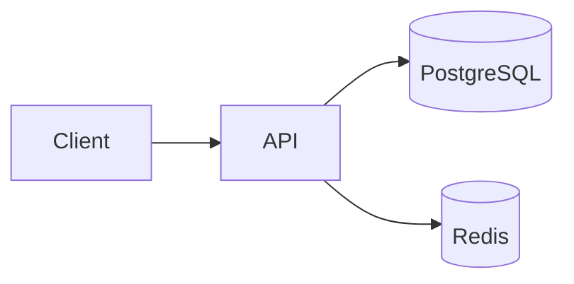
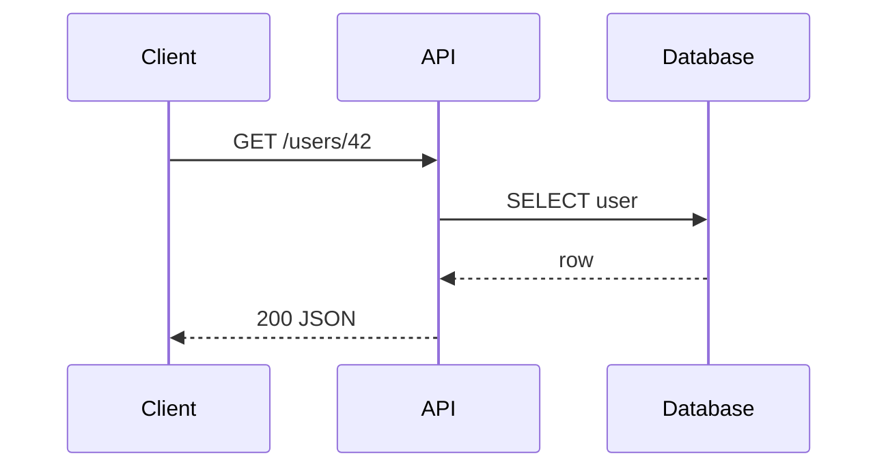
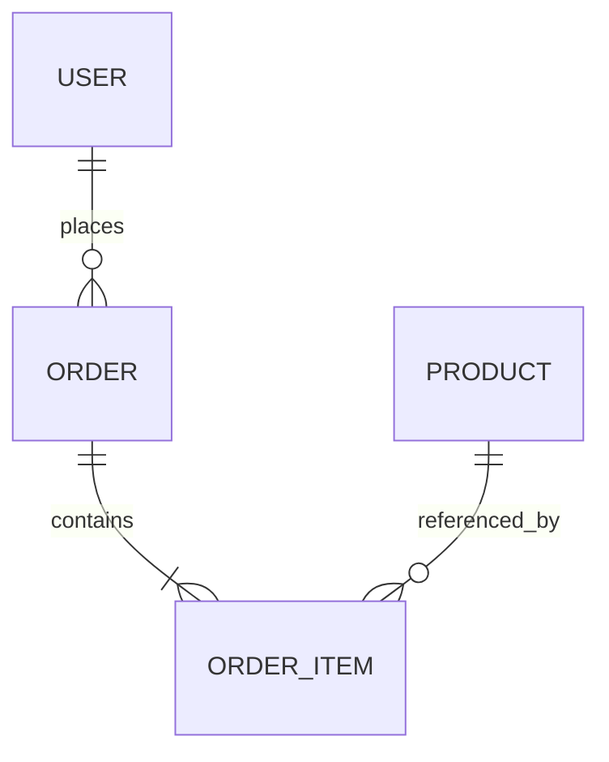
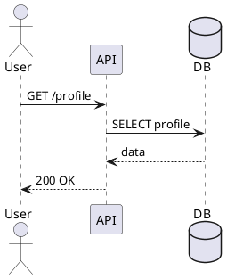
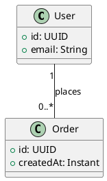
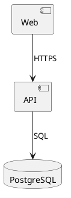
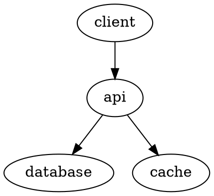
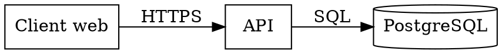
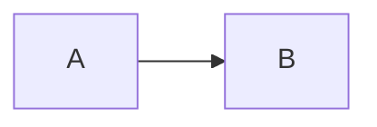

> [!info] Refonte
> Cours développé le 31 août 2026 (d'environ 478 à 6 952 mots  remplacement complet du texte précédent)  vérifié le même jour : schéma  titres  liens et affirmations datées contrôlés. La version précédente reste dans l'historique git du dépôt. Les éléments spécifiques de l'ancienne version sont conservés en annexe  en fin de note.

# Modéliser avec du texte : diagram-as-code et model-as-code

> [!abstract] Objectif
> Savoir choisir un langage de diagrammes textuel adapté au problème, comprendre la différence entre **diagram-as-code** et **model-as-code**, intégrer les sources dans Git et dans une chaîne documentaire, obtenir des rendus reproductibles et éviter de dépendre d'un service web éphémère.

Voir aussi : [[Mermaid pour Obsidian]], [[PlantUML pour Obsidian]], [[UML Ecore EMF Plantuml QVT Mermaid PyEcore|Outils de modélisation]], [[Architecture des logiciels]], [[Design patterns]], [[Bases de données relationnelles]], [[Markdown]], [[git]].

> [!important] Idée centrale
> Un bon outil de modélisation textuelle n'est pas celui qui sait dessiner le plus de formes. C'est celui dont le **langage correspond à la sémantique du modèle**, dont la source reste lisible et versionnable, et dont le rendu peut être reproduit automatiquement.

# 1. Pourquoi modéliser avec du texte ?

Un diagramme réalisé à la souris est souvent très rapide à produire la première fois. Il devient toutefois plus difficile à maintenir lorsqu'il doit :

- évoluer avec du code ;
- être relu en revue de changements ;
- exister dans plusieurs variantes ;
- être généré dans une documentation ;
- être produit automatiquement en CI ;
- être maintenu par plusieurs personnes ;
- rester exploitable plusieurs années plus tard.

Une description textuelle permet au contraire d'appliquer au diagramme des pratiques habituelles de développement :

```text
source textuelle
     │
     ├── Git
     ├── diff
     ├── revue
     ├── lint
     ├── tests
     └── CI/CD
          │
          ▼
   SVG / PNG / PDF / HTML
```

On parle couramment de **diagram-as-code** ou **diagrams as code**.

Le mot *code* ne signifie pas nécessairement programmation impérative. Il signifie surtout que le modèle possède une représentation textuelle structurée pouvant être :

- stockée ;
- comparée ;
- transformée ;
- validée ;
- générée automatiquement.

# 2. Diagram-as-code et model-as-code ne sont pas synonymes

Cette distinction est essentielle.

## 2.1 Diagram-as-code

Dans un outil de diagram-as-code, la source décrit essentiellement **une vue**.

Exemple conceptuel :

```text
A --> B
B --> C
```

Si nous voulons une autre vue, nous écrivons souvent un autre diagramme.

Mermaid, D2, Graphviz DOT ou PlantUML sont fréquemment utilisés de cette manière.

## 2.2 Model-as-code

Dans une approche model-as-code, la source décrit d'abord des **éléments du domaine et leurs relations**. Plusieurs vues sont ensuite dérivées du même modèle.

```text
                  modèle
                    │
       ┌────────────┼────────────┐
       ▼            ▼            ▼
  vue contexte  vue conteneurs  vue déploiement
```

Structurizr DSL est un exemple important : il permet de définir un modèle d'architecture C4 puis plusieurs vues cohérentes sur ce modèle.

## 2.3 Pourquoi la différence compte

Si l'architecture comporte :

```text
API -> PostgreSQL
```

et que cette relation doit apparaître dans quatre diagrammes différents, quatre sources indépendantes peuvent diverger.

Avec un modèle central :

```text
relation déclarée une fois
           │
           ├── vue A
           ├── vue B
           ├── vue C
           └── vue D
```

la cohérence est plus facile à maintenir.

# 3. Un troisième cas : le texte qui décrit un dessin

Certains outils ne modélisent ni un domaine ni une notation standardisée. Ils convertissent simplement un dessin ASCII en SVG.

Exemple :

```text
+--------+      +--------+
| client | ---> | server |
+--------+      +--------+
```

Des outils comme **Svgbob** sont particulièrement adaptés à ce cas.

Ils sont précieux pour :

- des schémas techniques rapides ;
- des README ;
- des protocoles ;
- des boîtes et flèches ;
- des représentations qui doivent rester lisibles même sans rendu graphique.

# 4. Taxonomie pratique

Les outils peuvent être classés selon leur objectif principal.

| Besoin | Outils à considérer |
|---|---|
| documentation générale | Mermaid, D2, PlantUML |
| UML | PlantUML, Mermaid, nomnoml |
| architecture C4 | Structurizr DSL, PlantUML+C4, Mermaid C4 avec prudence |
| graphes généraux | Graphviz DOT, D2 |
| base de données | DBML, Mermaid ER, PlantUML IE/ER |
| BPMN | BPMN Sketch Miner, bpmn-js/outils BPMN dédiés |
| machines à états | State Machine Cat, PlantUML, Mermaid |
| chronogrammes numériques | WaveDrom |
| schémas ASCII | Svgbob, Pikchr selon le besoin |
| visualisation de données | Vega/Vega-Lite |
| mathématiques / domaines spécialisés | Penrose |
| API de rendu multi-langages | Kroki |

> [!warning]
> Cette table ne dit pas que les outils sont équivalents. Deux outils peuvent produire visuellement un diagramme de classes tout en offrant des niveaux très différents de sémantique, de validation et d'intégration.

# 5. Critères de choix

Avant de choisir un langage, posons les questions suivantes.

## 5.1 Le diagramme est-il une documentation ou un modèle ?

Pour une illustration dans une note Markdown :

```text
Mermaid / D2
```

sont souvent suffisants.

Pour une architecture durable avec plusieurs vues :

```text
Structurizr DSL
```

peut être plus pertinent.

## 5.2 La notation doit-elle être normalisée ?

Exemples :

- UML ;
- BPMN 2.0 ;
- ArchiMate ;
- C4 ;
- chronogramme numérique ;
- schéma relationnel.

Si le diagramme doit être échangé avec un outil métier, il faut préférer un langage ou un format qui préserve cette sémantique.

## 5.3 Le rendu doit-il fonctionner hors ligne ?

Un outil exclusivement disponible sous forme de service web pose plusieurs problèmes :

- dépendance réseau ;
- confidentialité ;
- disponibilité ;
- disparition du service ;
- version du moteur non contrôlée.

Pour un dépôt durable, préférons si possible :

```text
source + CLI ou conteneur versionné
```

## 5.4 Le diff Git est-il compréhensible ?

Exemple favorable :

```diff
- api -> db: lecture
+ api -> db: lecture/écriture
```

Un format textuel ne garantit pas automatiquement un bon diff. Une source générée, minifiée ou très verbeuse peut rester difficile à relire.

## 5.5 La mise en page doit-elle être contrôlée au pixel près ?

Les outils déclaratifs privilégient généralement :

```text
structure > position absolue
```

Si nous avons besoin d'un dessin très précis, d'une infographie ou d'une composition artistique, un outil graphique tel qu'Excalidraw, diagrams.net, Inkscape ou Figma peut être préférable.

# 6. Mermaid

Mermaid est particulièrement pratique dans une chaîne Markdown car son langage est directement intégré par de nombreuses plates-formes de documentation.

La documentation actuelle propose notamment :

- flowchart ;
- sequence ;
- class ;
- state ;
- entity relationship ;
- Gantt ;
- mindmap ;
- timeline ;
- Git graph ;
- Sankey ;
- architecture ;
- packet ;
- Kanban ;
- treemap ;
- plusieurs autres familles de diagrammes.

Voir : [Mermaid — Diagram Syntax](https://mermaid.js.org/intro/syntax-reference.html).

## 6.1 Exemple de flowchart

````markdown

````

## 6.2 Exemple de séquence

````markdown

````

## 6.3 Exemple ER

````markdown

````

## 6.4 Atouts

Mermaid est un excellent choix lorsque :

- la documentation est déjà en Markdown ;
- les diagrammes restent relativement simples ;
- nous voulons voir la source et le rendu au même endroit ;
- l'outil cible sait rendre Mermaid nativement ;
- l'équipe souhaite apprendre une syntaxe légère.

## 6.5 Limites

Mermaid n'est pas automatiquement le meilleur choix pour :

- une architecture C4 fortement structurée ;
- des modèles à nombreuses vues dérivées ;
- un contrôle de mise en page très fin ;
- une conformité stricte à BPMN ;
- des graphes nécessitant les capacités avancées de Graphviz.

Certaines syntaxes Mermaid sont également plus jeunes ou plus expérimentales que ses diagrammes historiques. Un dépôt à longue durée de vie doit donc tester le rendu avec la version réellement utilisée en CI.

# 7. PlantUML

PlantUML est un outil très mature pour les diagrammes UML et de nombreux diagrammes non-UML.

La documentation officielle couvre notamment :

- séquence ;
- cas d'utilisation ;
- classes ;
- activités ;
- composants ;
- états ;
- objets ;
- déploiement ;
- timing ;
- JSON ;
- YAML ;
- EBNF ;
- regex ;
- réseau ;
- ArchiMate ;
- Gantt ;
- mindmap ;
- WBS.

Voir : [PlantUML](https://plantuml.com/).

## 7.1 Diagramme de séquence



## 7.2 Diagramme de classes



## 7.3 Diagramme de composants



## 7.4 Moteurs de layout

PlantUML peut utiliser plusieurs moteurs selon les diagrammes et la configuration, notamment Graphviz et d'autres moteurs proposés par le projet.

Cela rappelle une propriété importante :

```text
langage du diagramme ≠ moteur de layout
```

Le langage décrit la structure ; un moteur distinct peut calculer la position des objets.

## 7.5 Quand choisir PlantUML ?

PlantUML est particulièrement adapté si :

- UML est central ;
- il faut beaucoup de types de diagrammes ;
- l'organisation possède déjà des sources PlantUML ;
- l'on veut un rendu CLI ou serveur ;
- l'on veut bénéficier d'une vaste bibliothèque et d'un écosystème ancien.

# 8. D2

D2 signifie **Declarative Diagramming**. Le projet se présente comme un langage de script de diagrammes qui transforme une description textuelle déclarative en image.

Voir : [D2 Tour](https://d2lang.com/tour/intro/).

## 8.1 Exemple minimal

```d2
client -> api: HTTPS
api -> database: SQL
api -> cache: Redis protocol
```

## 8.2 Conteneurs

```d2
frontend: {
  browser
  assets
}

backend: {
  api
  database
}

frontend.browser -> backend.api
backend.api -> backend.database
```

## 8.3 Pourquoi D2 est intéressant

D2 vise un usage généraliste avec :

- une syntaxe concise ;
- une approche déclarative ;
- plusieurs layouts ;
- la composition ;
- les imports ;
- un CLI ;
- un mode `watch` pratique en développement.

Il convient bien lorsque l'on veut un langage de diagrammes général, moderne et agréable à versionner sans nécessairement adopter UML.

# 9. Graphviz et le langage DOT

Graphviz est une référence historique pour le placement automatique de graphes.

DOT permet de décrire :

- graphes orientés et non orientés ;
- nœuds ;
- arêtes ;
- sous-graphes ;
- clusters ;
- attributs de rendu.

Voir : [Graphviz — DOT Language](https://graphviz.org/doc/info/lang.html).

## 9.1 Graphe orienté



## 9.2 Attributs



## 9.3 Quand utiliser DOT ?

DOT reste excellent pour :

- graphes de dépendances ;
- graphes d'appels ;
- graphes générés par programme ;
- grandes topologies ;
- besoins avancés de layout ;
- pipelines dans lesquels Graphviz est déjà présent.

Il est moins orienté vers la sémantique UML ou métier.

# 10. Structurizr DSL et le modèle C4

Structurizr DSL adopte une approche **models as code** dédiée à l'architecture logicielle et au modèle C4.

Voir : [Structurizr DSL](https://docs.structurizr.com/dsl).

## 10.1 Le principe

Nous définissons d'abord le modèle :

```text
personnes
systèmes logiciels
conteneurs
composants
relations
infrastructure
```

puis les vues :

```text
system landscape
system context
container
component
dynamic
deployment
```

## 10.2 Exemple simplifié

```structurizr
workspace "Shop" "Architecture du magasin" {
    model {
        customer = person "Customer"
        shop = softwareSystem "Shop" {
            web = container "Web application"
            api = container "API"
            db = container "Database" "Stores orders" "PostgreSQL"
        }

        customer -> web "Uses"
        web -> api "Calls" "HTTPS/JSON"
        api -> db "Reads and writes" "SQL"
    }

    views {
        systemContext shop "Context" {
            include *
            autoLayout
        }

        container shop "Containers" {
            include *
            autoLayout
        }
    }
}
```

## 10.3 Avantage : une relation, plusieurs vues

La relation :

```text
api -> db
```

appartient au modèle et non à une image particulière.

C'est une différence majeure avec un simple diagram-as-code.

## 10.4 Documentation et ADR

Structurizr DSL peut également rattacher de la documentation Markdown/AsciiDoc et des décisions d'architecture au workspace.

Cela permet de rapprocher :

```text
modèle + vues + documentation + ADR
```

## 10.5 Quand choisir Structurizr ?

Utilisons-le surtout lorsque :

- C4 est la notation d'architecture choisie ;
- plusieurs vues doivent rester cohérentes ;
- l'architecture est maintenue comme un actif durable ;
- l'équipe accepte un DSL plus spécialisé.

# 11. Kroki : une API de rendu, pas un nouveau langage universel

Kroki fournit une API HTTP unifiée capable de rendre de nombreux langages existants.

Voir : [Kroki Documentation](https://docs.kroki.io/kroki/).

Parmi les moteurs pris en charge figurent notamment :

- D2 ;
- Graphviz ;
- Mermaid ;
- PlantUML ;
- Structurizr ;
- Pikchr ;
- Svgbob ;
- WaveDrom ;
- BPMN ;
- Vega et Vega-Lite ;
- Nomnoml ;
- WireViz ;
- plusieurs familles BlockDiag.

## 11.1 Architecture

```text
Markdown / AsciiDoc / application
               │
               ▼
             Kroki
               │
      ┌────────┼─────────┐
      ▼        ▼         ▼
   Mermaid  PlantUML   Graphviz ...
      │        │         │
      └────────┴─────────┘
               ▼
           SVG / PNG
```

## 11.2 Intérêt

Kroki est utile lorsque nous voulons :

- une interface de rendu homogène ;
- plusieurs DSL dans la même documentation ;
- centraliser les moteurs ;
- auto-héberger le rendu ;
- éviter d'installer tous les outils sur chaque poste.

## 11.3 Kroki ne supprime pas le choix du langage

Il faut toujours décider si la source doit être :

```text
Mermaid ?
PlantUML ?
D2 ?
DOT ?
Structurizr ?
WaveDrom ?
```

Kroki fournit le **service de rendu**, pas la sémantique commune.

## 11.4 Versionner le serveur

Pour un rendu reproductible :

```yaml
services:
  kroki:
    image: yuzutech/kroki:<version>
```

est préférable à :

```yaml
image: yuzutech/kroki:latest
```

lorsque l'exactitude visuelle des builds est importante.

# 12. DBML pour les modèles relationnels

DBML est un DSL consacré aux structures de bases de données.

Voir : [DBML Syntax](https://dbml.dbdiagram.io/docs/).

## 12.1 Exemple

```dbml
Project shop {
  database_type: 'PostgreSQL'
}

Table users {
  id uuid [pk]
  email varchar [not null, unique]
}

Table orders {
  id uuid [pk]
  user_id uuid [not null]
  created_at timestamp [not null]
}

Ref: users.id < orders.user_id
```

## 12.2 Pourquoi préférer un DSL spécialisé ?

Un diagramme ER générique peut montrer :

```text
User 1 ---- n Order
```

DBML peut en plus représenter des informations proches du schéma :

- colonnes ;
- types ;
- clés ;
- index ;
- contraintes ;
- schémas ;
- relations.

Le choix dépend donc du niveau de précision attendu.

# 13. WaveDrom pour les chronogrammes numériques

WaveDrom est conçu pour les **digital timing diagrams**.

Le format WaveJSON décrit des signaux et le moteur produit le chronogramme.

Voir : [WaveDrom Tutorial](https://wavedrom.com/tutorial.html).

## 13.1 Exemple

```json
{
  "signal": [
    { "name": "clk", "wave": "p....." },
    { "name": "req", "wave": "01..0." },
    { "name": "ack", "wave": "0..10." }
  ]
}
```

## 13.2 Cas d'usage

WaveDrom est particulièrement adapté à :

- bus numériques ;
- horloges ;
- signaux logiques ;
- protocoles matériels ;
- documentation FPGA/ASIC ;
- chronologies bit/clock.

Essayer de produire ce type de diagramme avec un outil UML généraliste serait généralement moins naturel.

# 14. State Machine Cat

State Machine Cat est spécialisé dans les diagrammes d'états.

Voir : [state-machine-cat](https://github.com/sverweij/state-machine-cat).

## 14.1 Exemple

```smcat
initial => idle;
idle => running : start;
running => idle : stop;
running => error : failure;
error => idle : reset;
```

## 14.2 Intérêt

Il fournit une syntaxe concise et sait travailler avec plusieurs formats de sortie. Il peut également échanger certains concepts avec **SCXML**, recommandation du W3C pour la description de machines à états.

## 14.3 Quand le préférer à Mermaid ou PlantUML ?

Lorsque la machine à états est l'objet principal du document et que nous souhaitons :

- une syntaxe dédiée ;
- des transformations spécifiques ;
- une proximité avec SCXML ;
- un CLI spécialisé.

# 15. BPMN Sketch Miner

Pour du BPMN, une simple imitation visuelle de la notation n'est pas toujours suffisante.

BPMN Sketch Miner propose une approche textuelle de **sketching BPMN** et permet d'exporter vers BPMN 2.0/XML pour poursuivre le travail dans un modeleur compatible.

Voir : [BPMN Sketch Miner](https://www.bpmn-sketch-miner.ai/doc/).

## 15.1 Exemple conceptuel

Sa syntaxe utilise des conventions textuelles pour représenter :

- tâches ;
- pools ;
- swimlanes ;
- gateways ;
- événements ;
- flux de messages ;
- données.

## 15.2 Pourquoi c'est différent de dessiner « un BPMN » dans PlantUML

Il faut distinguer :

```text
ressemblance graphique
       ≠
modèle BPMN exploitable
```

Si le modèle doit ensuite être importé, validé ou exécuté par un moteur BPMN, privilégions un outil réellement orienté BPMN et un échange BPMN 2.0/XML.

# 16. Svgbob : ASCII vers SVG

Svgbob convertit des diagrammes ASCII en SVG.

Voir : [Svgbob](https://github.com/ivanceras/svgbob).

## 16.1 Exemple

```text
       +----------+
HTTP   |          |   SQL
------>|   API    |------->(Database)
       |          |
       +----------+
```

L'intérêt fondamental est que la source reste déjà intelligible dans un terminal ou un fichier texte.

## 16.2 Très bon usage

- README techniques ;
- documentation de protocole ;
- schémas de mémoire ;
- topologies simples ;
- documentation Rust/AsciiDoc/Markdown ;
- environnements sans rendu graphique.

# 17. Pikchr

Pikchr est un langage de description de diagrammes dérivé de l'esprit de PIC et développé dans l'écosystème SQLite/Fossil.

Voir : [Pikchr User Manual](https://pikchr.org/home/doc/trunk/doc/userman.md).

Il offre une approche textuelle plus géométrique que Mermaid ou D2.

Cela le rend intéressant lorsque l'on souhaite davantage raisonner en termes de :

- boîtes ;
- lignes ;
- positions relatives ;
- géométrie ;
- composition précise.

# 18. Penrose : séparer domaine, contenu et style

Penrose est particulièrement intéressant conceptuellement car il sépare trois dimensions :

```text
Domain     -> vocabulaire et relations possibles
Substance  -> objets concrets du diagramme
Style      -> représentation visuelle et contraintes
```

Voir : [Penrose Documentation](https://penrose.cs.cmu.edu/docs/ref).

## 18.1 Exemple de Substance

```text
Set A, B, C
Subset(B, A)
Subset(C, A)
AutoLabel All
```

## 18.2 Cas d'usage

Penrose est particulièrement pertinent pour des diagrammes :

- mathématiques ;
- scientifiques ;
- à contraintes géométriques ;
- dont plusieurs instances partagent un même langage visuel.

Il ne remplace pas Mermaid pour un simple flowchart ; il répond à un problème différent.

# 19. Vega et Vega-Lite : visualisation de données déclarative

Une visualisation de données est également une forme de représentation déclarative.

Vega/Vega-Lite permettent de décrire :

- sources de données ;
- transformations ;
- encodages ;
- axes ;
- échelles ;
- marques graphiques ;
- interactions selon le niveau de langage.

Ils sont pertinents pour :

```text
données -> spécification -> visualisation
```

et non pour :

```text
architecture logicielle -> diagramme UML
```

Kroki sait notamment exposer Vega et Vega-Lite comme moteurs de rendu.

# 20. Nomnoml

Nomnoml fournit une syntaxe très compacte pour des diagrammes UML informels.

Exemple :

```nomnoml
[User] -> [API]
[API] -> [Database]
```

Il est agréable pour les esquisses rapides et les diagrammes simples.

Pour un référentiel d'architecture complexe, nous préférerons généralement un langage offrant davantage de structure sémantique.

# 21. Outils ASCII interactifs

Des outils comme ASCIIFlow ou Textik peuvent rester utiles pour dessiner rapidement en caractères.

Il faut cependant distinguer deux workflows.

## 21.1 Dessin ASCII comme source finale

```text
éditeur ASCII -> fichier texte
```

Avantage : aucune dépendance de rendu.

## 21.2 Dessin ASCII comme source d'un SVG

```text
éditeur ASCII -> fichier texte -> Svgbob -> SVG
```

Avantage : la source reste lisible et la sortie devient adaptée au web ou à l'impression.

# 22. Ce qu'il ne faut plus faire : maintenir un annuaire plat

L'ancienne version de cette note contenait des dizaines de liens classés de 1 à 58.

Ce format pose quatre problèmes :

1. les services disparaissent ;
2. les URLs changent ;
3. les outils se recouvrent fortement ;
4. la liste n'aide pas à choisir.

Une documentation durable doit donc conserver :

```text
famille -> usage -> critères -> outils de référence
```

plutôt que :

```text
1. outil A
2. outil B
3. outil C
...
```

# 23. Services web, CLI ou serveur local ?

Trois modes principaux existent.

## 23.1 Playground web

```text
navigateur -> service externe -> rendu
```

### Avantages

- aucune installation ;
- test immédiat ;
- pratique pour apprendre.

### Inconvénients

- confidentialité ;
- dépendance réseau ;
- version non contrôlée ;
- disponibilité externe.

## 23.2 CLI local

```text
source -> binaire local -> SVG
```

### Avantages

- hors ligne ;
- automatisable ;
- version contrôlable ;
- compatible CI.

### Inconvénients

- installation ;
- dépendances ;
- différences entre postes si les versions divergent.

## 23.3 Serveur de rendu interne

```text
clients -> API interne -> moteurs -> SVG
```

Kroki ou un serveur PlantUML peuvent remplir ce rôle.

### Avantages

- versions centralisées ;
- intégration documentaire simple ;
- moins d'outils à installer sur les postes.

### Inconvénients

- service à maintenir ;
- sécurité réseau ;
- montée de version à gérer.

# 24. Sécurité et confidentialité

> [!danger]
> Un diagramme d'architecture peut contenir des informations sensibles : noms de services internes, zones réseau, technologies, relations de confiance, endpoints ou flux de données.

Envoyer une source à un service public de rendu peut donc être inacceptable selon le contexte.

## 24.1 Questions à poser

- Le service reçoit-il la source ?
- La conserve-t-il ?
- Les requêtes sont-elles journalisées ?
- Le diagramme contient-il des secrets ?
- Le service appelle-t-il des ressources distantes ?
- Le rendu peut-il être effectué localement ?

## 24.2 Ne jamais mettre de secret dans le modèle

Mauvais :

```text
DB_PASSWORD=s3cr3t
```

Bon :

```text
secret géré par vault
```

Un diagramme décrit l'architecture, pas les valeurs secrètes de production.

# 25. Reproductibilité

Un diagramme textuel n'est reproductible que si le moteur l'est aussi.

## 25.1 Versionner les dépendances

Mauvais :

```yaml
image: outil:latest
```

Préférable :

```yaml
image: outil:version-testee
```

## 25.2 Pourquoi le rendu peut changer

Même source :

```text
diagram.d2
```

mais :

```text
moteur v1 + layout A -> image 1
moteur v2 + layout B -> image 2
```

Les changements peuvent provenir :

- du parseur ;
- du moteur de layout ;
- des polices ;
- du moteur SVG ;
- de la bibliothèque d'icônes ;
- d'un thème ;
- d'une dépendance transitive.

# 26. Le SVG comme format de sortie privilégié

Pour la documentation technique, SVG présente souvent des avantages :

- vectoriel ;
- net à tout niveau de zoom ;
- textuel ;
- intégrable au web ;
- généralement plus léger qu'un PNG de grande taille ;
- adapté aux diagrammes de boîtes et de lignes.

Utilisons PNG lorsque :

- la plate-forme ne gère pas SVG ;
- un rendu raster est explicitement requis ;
- des contraintes de compatibilité l'imposent.

# 27. Ne pas versionner les images générées par défaut

Deux stratégies existent.

## 27.1 Source seule

```text
architecture.dsl
sequence.puml
schema.dbml
```

Les images sont générées dans la CI.

### Avantages

- dépôt plus propre ;
- aucune divergence source/image ;
- diff centré sur le modèle.

## 27.2 Source + rendu versionné

```text
architecture.dsl
architecture.svg
```

Cette stratégie peut être utile si :

- GitHub ou le site ne rend pas le DSL ;
- les artefacts doivent être consultables sans outil ;
- le projet accepte la discipline de régénération.

Dans ce cas, la CI devrait vérifier :

```text
source -> génération -> git diff --exit-code
```

# 28. Intégration dans Git

Organisation possible :

```text
docs/
├── architecture/
│   ├── workspace.dsl
│   └── adr/
├── diagrams/
│   ├── auth-sequence.puml
│   ├── deployment.d2
│   └── schema.dbml
└── README.md
```

## 28.1 Commits

Un changement de diagramme doit idéalement expliquer le changement de système :

```text
architecture: add Redis cache between API and database
```

plutôt que :

```text
update diagram
```

## 28.2 Revue

La revue porte d'abord sur la source :

```diff
 api -> db
+api -> cache
+cache -> db
```

Le rendu sert à vérifier la compréhension visuelle.

# 29. Intégration dans une CI

Pipeline conceptuel :

```text
checkout
   │
   ▼
validation syntaxique
   │
   ▼
rendu
   │
   ▼
contrôles
   │
   ▼
publication documentation
```

## 29.1 Contrôles possibles

- parsing sans erreur ;
- liens valides ;
- rendu SVG créé ;
- absence de changement non commité ;
- taille raisonnable ;
- absence de secrets ;
- conformité à une convention interne.

# 30. Tester un diagramme

Un diagramme peut être testé à plusieurs niveaux.

## 30.1 Test syntaxique

```text
la source compile-t-elle ?
```

## 30.2 Test structurel

Si le langage possède un modèle exploitable :

```text
le système A existe-t-il ?
la relation A -> B existe-t-elle ?
```

## 30.3 Test visuel

Le rendu peut être comparé à une référence, mais les tests pixel-perfect sont fragiles car une modification de layout ou de police peut produire beaucoup de différences sans changer la sémantique.

# 31. Diagrammes dans Markdown et Obsidian

Mermaid est particulièrement naturel lorsqu'il est supporté nativement :

````markdown

````

Pour les langages non rendus nativement, trois approches existent :

```text
plugin
serveur de rendu
pré-génération SVG
```

Dans un coffre Obsidian destiné à durer, une stratégie robuste consiste à conserver :

```text
source textuelle + mécanisme de rendu documenté
```

plutôt qu'un simple lien vers un éditeur web externe.

# 32. Choisir entre Mermaid, PlantUML et D2

Ces trois outils se recouvrent beaucoup. Une règle simple peut être :

## Mermaid

Choisir Mermaid si :

- Markdown est le support principal ;
- le moteur est intégré nativement ;
- les diagrammes sont surtout documentaires ;
- une syntaxe légère est prioritaire.

## PlantUML

Choisir PlantUML si :

- UML est important ;
- la variété de diagrammes est grande ;
- l'écosystème PlantUML est déjà présent ;
- la compatibilité avec des bibliothèques PlantUML est utile.

## D2

Choisir D2 si :

- nous voulons un langage généraliste déclaratif moderne ;
- les diagrammes sont principalement architecture/flux/boîtes et relations ;
- nous apprécions sa syntaxe et ses layouts ;
- UML strict n'est pas nécessaire.

# 33. Choisir entre diagram-as-code et Structurizr

Question centrale :

> Avons-nous plusieurs diagrammes indépendants ou plusieurs vues du même système ?

Si la réponse est :

```text
plusieurs diagrammes indépendants
```

Mermaid/D2/PlantUML sont souvent suffisants.

Si la réponse est :

```text
plusieurs vues cohérentes du même modèle d'architecture
```

Structurizr devient beaucoup plus intéressant.

# 34. Choisir un outil spécialisé lorsque le domaine l'exige

Ne cherchons pas à tout faire avec le même DSL.

```text
base relationnelle -> DBML
chronogramme       -> WaveDrom
BPMN               -> BPMN Sketch Miner / outil BPMN
états              -> State Machine Cat
architecture C4    -> Structurizr
ASCII               -> Svgbob
math/science        -> Penrose
```

Un outil spécialisé peut être plus facile à apprendre qu'un outil généraliste détourné de son objectif.

# 35. Le problème des icônes cloud

Les diagrammes d'architecture utilisent souvent des icônes AWS, Azure ou GCP.

Cela apporte une lisibilité immédiate, mais aussi des dépendances :

- bibliothèque d'icônes ;
- version ;
- licence ;
- disponibilité du fichier distant ;
- changement de noms de services.

Pour un document durable :

1. préférer des bibliothèques officiellement supportées ;
2. versionner ou verrouiller leur provenance ;
3. ne pas faire dépendre la compréhension du diagramme de l'icône seule ;
4. garder un libellé textuel.

# 36. Mise en page automatique : accepter une part de non-déterminisme visuel

Un moteur de layout résout un problème de placement.

Il peut chercher à :

- réduire les croisements ;
- rapprocher les nœuds liés ;
- respecter une direction ;
- équilibrer le graphe ;
- conserver des clusters.

Une petite modification structurelle peut donc déplacer une grande partie du rendu.

C'est normal :

```text
petit diff sémantique
       ↓
recalcul global du layout
       ↓
grand diff visuel possible
```

C'est une raison supplémentaire de considérer la **source** comme artefact principal.

# 37. Les limites du diagram-as-code

Le diagram-as-code n'est pas toujours supérieur à un éditeur graphique.

Il devient moins confortable lorsque :

- la composition visuelle est le sujet principal ;
- des non-techniciens doivent déplacer directement les éléments ;
- le diagramme est très libre ;
- l'illustration mélange photos, formes, annotations et graphisme ;
- la position exacte porte du sens non représenté par le DSL.

Dans ce cas, des outils comme Excalidraw ou diagrams.net restent parfaitement légitimes.

# 38. Hybrider texte et graphique

Une organisation peut combiner :

```text
Structurizr -> architecture de référence
Mermaid     -> séquences dans les README
DBML        -> schémas de données
Excalidraw  -> ateliers exploratoires
```

Il n'est pas nécessaire d'imposer un seul langage à tous les usages.

La cohérence vient plutôt de règles telles que :

- source versionnée ;
- propriétaire identifié ;
- conventions communes ;
- rendu reproductible ;
- niveau de vérité documenté.

# 39. Niveau de vérité d'un diagramme

Chaque diagramme devrait préciser son statut.

Exemples :

```text
conceptuel
cible
as-is
as-built
exploratoire
historique
```

Un diagramme très joli mais dont personne ne sait s'il représente la production actuelle est dangereux.

# 40. Conventions de nommage

Exemple :

```text
auth-sequence.puml
payment-flow.d2
platform-workspace.dsl
billing-schema.dbml
spi-timing.json
```

Évitons :

```text
diagram1.txt
new-diagram-final-v2.txt
schema-final-final.txt
```

# 41. Une source par diagramme ou un gros fichier ?

## Fichiers séparés

Avantages :

- diff localisé ;
- ownership clair ;
- chargement simple.

## Modèle central

Avantages :

- réutilisation ;
- cohérence ;
- relations partagées.

Le choix dépend du DSL. Structurizr encourage naturellement un modèle partagé alors que des diagrammes Mermaid indépendants sont souvent mieux séparés.

# 42. Anti-pattern : copier-coller le même sous-système

Si cinq diagrammes contiennent tous :

```text
API -> Redis -> PostgreSQL
```

et que la relation change, cinq fichiers doivent être corrigés.

Solutions possibles :

- imports/includes si le DSL le permet ;
- macros ou preprocessing avec prudence ;
- modèle central ;
- réduction du nombre de vues redondantes.

# 43. Anti-pattern : trop de détails

Un diagramme peut être exact et inutilisable.

```text
250 nœuds + 700 arêtes
```

ne constitue pas nécessairement une bonne vue d'architecture.

Le rôle d'un diagramme est de répondre à une question.

Exemples :

- Qui utilise le système ?
- Quels sont les conteneurs principaux ?
- Comment se déroule l'authentification ?
- Où les données personnelles sont-elles stockées ?
- Quel est le chemin réseau d'une requête ?

# 44. Anti-pattern : utiliser la couleur comme seule sémantique

Mauvais :

```text
rouge = critique
vert = interne
bleu = externe
```

sans légende ni texte.

Préférons :

- libellés ;
- formes ;
- légende ;
- contrastes accessibles ;
- couleur comme signal supplémentaire.

# 45. Accessibilité

Un diagramme doit rester compréhensible :

- en niveaux de gris si possible ;
- avec un contraste suffisant ;
- sans police minuscule ;
- avec des labels explicites ;
- avec une description textuelle dans la documentation.

La représentation textuelle constitue ici un avantage : elle peut souvent servir de base à une explication alternative.

# 46. Comparatif synthétique

| Outil | Force principale | Source | Local | Usage conseillé |
|---|---|---:|---:|---|
| Mermaid | Markdown et documentation | DSL | oui | diagrammes documentaires |
| PlantUML | UML + vaste écosystème | DSL | oui | UML et documentation technique |
| D2 | diagrammes déclaratifs généraux | DSL | oui | architecture/flux généralistes |
| Graphviz | graphes et layout | DOT | oui | graphes générés/complexes |
| Structurizr | modèle C4 multi-vues | DSL | oui | architecture logicielle durable |
| Kroki | API multi-moteurs | multiples | oui, auto-hébergé | centraliser le rendu |
| DBML | schémas de bases | DSL | selon outil | modèle relationnel |
| WaveDrom | chronogrammes | WaveJSON | oui | électronique numérique |
| State Machine Cat | machines à états | smcat | oui | statecharts |
| Svgbob | ASCII vers SVG | ASCII | oui | schémas lisibles en texte |
| Pikchr | dessins textuels géométriques | DSL | oui | diagrammes précis/embarqués |
| Penrose | diagrammes par contraintes | 3 DSL | oui | math/science |
| BPMN Sketch Miner | sketch BPMN textuel | DSL | service/outils | processus BPMN |

# 47. Arbre de décision

```text
Quel est le besoin ?
│
├── Markdown simple
│   └── Mermaid
│
├── UML
│   └── PlantUML
│
├── architecture C4 multi-vues
│   └── Structurizr DSL
│
├── diagramme général déclaratif
│   └── D2
│
├── graphe algorithmique / dépendances
│   └── Graphviz DOT
│
├── schéma relationnel détaillé
│   └── DBML
│
├── chronogramme matériel
│   └── WaveDrom
│
├── machine à états spécialisée
│   └── State Machine Cat
│
├── BPMN échangeable
│   └── BPMN Sketch Miner / modeleur BPMN
│
├── ASCII lisible + SVG
│   └── Svgbob
│
└── domaines mathématiques à contraintes
    └── Penrose
```

# 48. Exemple de dépôt multi-outils

```text
project/
├── docs/
│   ├── architecture/
│   │   └── workspace.dsl
│   ├── database/
│   │   └── schema.dbml
│   ├── sequences/
│   │   ├── login.puml
│   │   └── checkout.puml
│   ├── hardware/
│   │   └── bus-timing.json
│   └── README.md
├── scripts/
│   └── render-diagrams.sh
└── compose.yaml
```

Cette organisation accepte plusieurs DSL tout en gardant un processus de rendu homogène.

# 49. Exemple de convention d'équipe

Une politique simple peut être :

```text
1. Mermaid pour les diagrammes directement incorporés aux README.
2. Structurizr DSL pour l'architecture C4 de référence.
3. PlantUML pour les séquences complexes et UML.
4. DBML pour les schémas relationnels.
5. SVG comme sortie générée.
6. Moteurs épinglés par version en CI.
7. Aucun diagramme confidentiel envoyé vers un renderer public.
```

Le principal avantage n'est pas le choix exact des outils, mais le fait que l'équipe n'ait pas à décider à nouveau à chaque diagramme.

# 50. TP 1 — comparer Mermaid, PlantUML et D2

Modélisons :

```text
Navigateur -> API -> PostgreSQL
                  -> Redis
```

## Travail demandé

1. créer le diagramme en Mermaid ;
2. le créer en PlantUML ;
3. le créer en D2 ;
4. comparer le nombre de lignes ;
5. modifier Redis en « Redis Cluster » ;
6. comparer les diffs Git ;
7. comparer les layouts ;
8. choisir le DSL préféré et justifier.

# 51. TP 2 — une architecture C4 cohérente

Avec Structurizr DSL :

1. créer une personne `Customer` ;
2. créer le système `Shop` ;
3. créer trois conteneurs : Web, API, Database ;
4. ajouter les relations ;
5. générer une vue contexte ;
6. générer une vue conteneurs ;
7. vérifier qu'une relation modifiée dans le modèle est reflétée dans les vues.

Objectif : constater la différence entre **modèle central** et **diagrammes indépendants**.

# 52. TP 3 — modèle relationnel avec DBML

Créer :

```text
users
orders
order_items
products
```

Ajouter :

- clés primaires ;
- clés étrangères ;
- index ;
- relation many-to-many entre commandes et produits via `order_items`.

Comparer ensuite le niveau d'information avec un simple diagramme Mermaid ER.

# 53. TP 4 — chronogramme WaveDrom

Décrire :

```text
clk
request
acknowledge
data
```

avec les contraintes :

1. `request` monte ;
2. `acknowledge` arrive deux cycles plus tard ;
3. `data` n'est valide que pendant l'acquittement.

L'objectif est de comprendre pourquoi un DSL spécialisé est plus naturel qu'un diagramme généraliste.

# 54. TP 5 — chaîne de rendu locale

Créer un dépôt contenant :

```text
diagrams/
  architecture.d2
  sequence.puml
  schema.dbml
```

Puis construire une chaîne qui produit :

```text
build/
  architecture.svg
  sequence.svg
  schema.svg
```

Contraintes :

- aucune dépendance à un service public ;
- versions des moteurs explicites ;
- génération répétable ;
- sortie reconstruisible depuis Git.

# 55. Checklist de choix

Avant d'ajouter un nouvel outil :

- [ ] quel problème résout-il ?
- [ ] existe-t-il déjà un DSL retenu pour ce problème ?
- [ ] la source est-elle lisible ?
- [ ] le projet est-il maintenu ?
- [ ] le rendu fonctionne-t-il localement ?
- [ ] la version peut-elle être verrouillée ?
- [ ] existe-t-il une CLI, une bibliothèque ou une image de conteneur ?
- [ ] le format est-il exportable ?
- [ ] le modèle contient-il une sémantique utile ou seulement une disposition graphique ?
- [ ] les données peuvent-elles être envoyées à un service externe ?
- [ ] le diff Git est-il exploitable ?
- [ ] l'équipe saura-t-elle encore éditer cette source dans deux ans ?

# 56. Checklist de revue d'un diagramme

- [ ] le titre indique-t-il ce que la vue représente ?
- [ ] le niveau de détail est-il adapté ?
- [ ] le diagramme répond-il à une question claire ?
- [ ] les relations importantes sont-elles nommées ?
- [ ] les protocoles utiles sont-ils indiqués ?
- [ ] la légende est-elle suffisante ?
- [ ] le statut as-is/as-target est-il clair ?
- [ ] les éléments obsolètes ont-ils été supprimés ?
- [ ] la source compile-t-elle en CI ?
- [ ] le moteur est-il versionné ?
- [ ] aucune information secrète n'est-elle présente ?

# 57. Outils historiques et secondaires

La liste initiale de 2023 contenait de nombreux projets intéressants. Certains peuvent toujours être utiles, mais ils ne doivent pas tous être considérés comme choix par défaut.

Parmi les familles secondaires ou historiques que l'on peut rencontrer :

- BlockDiag / SeqDiag / ActDiag / NwDiag ;
- Nomnoml ;
- Umple ;
- ZenUML ;
- WebSequenceDiagrams ;
- js-sequence-diagrams ;
- flowchart.js ;
- railroad diagram generators ;
- Graph::Easy ;
- Markdeep ;
- Diagon ;
- outils ASCII interactifs.

La bonne pratique n'est pas de les ignorer, mais de vérifier avant adoption :

```text
maintenance + licence + CLI + export + intégration + pérennité
```

# 58. Ce qui a changé depuis la liste de 2023

Le paysage a évolué dans plusieurs directions.

## 58.1 Les outils généralistes ont élargi leur couverture

Mermaid prend désormais en charge beaucoup plus de familles de diagrammes qu'une simple combinaison flowchart/séquence/Gantt.

PlantUML continue lui aussi à proposer une grande variété de diagrammes UML et non-UML.

## 58.2 Le model-as-code est devenu plus visible

Structurizr met explicitement en avant l'idée de **models as code** pour C4, ce qui répond au problème de cohérence entre vues.

## 58.3 Les gateways multi-moteurs simplifient l'intégration

Kroki fournit un point d'entrée commun pour de nombreux moteurs, ce qui réduit le coût d'intégration dans AsciiDoc, Markdown ou une documentation générée.

## 58.4 Les DSL spécialisés restent essentiels

DBML, WaveDrom, Penrose ou State Machine Cat montrent qu'un DSL spécialisé peut être bien plus expressif qu'un langage universel.

# 59. Recommandation par défaut pour ce dépôt de notes

Pour un dépôt Obsidian/Git orienté documentation technique :

```text
Mermaid
```

est le premier choix lorsque le diagramme est simple et directement lié à une note Markdown.

Pour de l'UML ou une séquence complexe :

```text
PlantUML
```

reste un excellent choix.

Pour une architecture C4 structurée :

```text
Structurizr DSL
```

est préférable si plusieurs vues doivent partager un même modèle.

Pour un besoin très spécifique, utilisons le DSL du domaine plutôt que de forcer le diagramme dans Mermaid.

# 60. Résumé

> [!summary]
> La modélisation textuelle est utile parce qu'elle transforme le diagramme en artefact versionnable, automatisable et révisable. Mais tous les DSL ne décrivent pas la même chose : Mermaid, PlantUML, D2 et DOT sont surtout utilisés comme **diagram-as-code**, Structurizr comme **model-as-code**, tandis que DBML, WaveDrom, BPMN Sketch Miner, State Machine Cat ou Penrose expriment des domaines spécialisés. Kroki, lui, est avant tout une **passerelle de rendu multi-moteurs**. Le bon choix dépend donc de la sémantique, de la reproductibilité, de l'intégration Git/CI, de la confidentialité et de la durée de vie du modèle.

# Références

## Références principales

- [Mermaid — Diagram Syntax](https://mermaid.js.org/intro/syntax-reference.html)
- [PlantUML](https://plantuml.com/)
- [D2 Documentation](https://d2lang.com/tour/intro/)
- [Graphviz — DOT Language](https://graphviz.org/doc/info/lang.html)
- [Structurizr DSL](https://docs.structurizr.com/dsl)
- [Structurizr — Getting started](https://docs.structurizr.com/getting-started)
- [Kroki Documentation](https://docs.kroki.io/kroki/)
- [Kroki — Diagram Types](https://docs.kroki.io/kroki/diagram-types/)
- [DBML Syntax](https://dbml.dbdiagram.io/docs/)
- [WaveDrom Tutorial](https://wavedrom.com/tutorial.html)
- [State Machine Cat](https://github.com/sverweij/state-machine-cat)
- [Svgbob](https://github.com/ivanceras/svgbob)
- [Pikchr User Manual](https://pikchr.org/home/doc/trunk/doc/userman.md)
- [Penrose Documentation](https://penrose.cs.cmu.edu/docs/ref)
- [BPMN Sketch Miner](https://www.bpmn-sketch-miner.ai/doc/)

## Notes de pérennité

Les services web de démonstration et les URLs de playground changent plus vite que les langages eux-mêmes. Pour cette raison, cette note privilégie volontairement :

- les sites de documentation officiels ;
- les dépôts sources ;
- les CLI ;
- les moteurs auto-hébergeables ;
- les formats textuels conservables dans Git.

# Annexe — Liste d'origine (2023)

> [!info] Annexe
> Liste commentée qui constituait cette note avant la refonte du 31 août 2026 (Typograms, Diagon et Markdeep notamment), conservée telle quelle.

[Source](https://xosh.org/text-to-diagram/)
A comprehensive list of various text to diagram tools.

1.  **D2** [https://play.d2lang.com/](https://play.d2lang.com/)  
    all
    
2.  **Pikchr** [https://pikchr.org/home/pikchrshow](https://pikchr.org/home/pikchrshow)  
    all
    
3.  **Diagon** [https://arthursonzogni.com/Diagon](https://arthursonzogni.com/Diagon)  
    markdown-to-ascii  
    Source: [https://github.com/ArthurSonzogni/Diagon](https://github.com/ArthurSonzogni/Diagon)
    
4.  **Typograms** [https://code.sgo.to/typograms/](https://code.sgo.to/typograms/)  
    markdown, ascii-to-all
    
5.  **Markdeep** [https://casual-effects.com/markdeep/](https://casual-effects.com/markdeep/)  
    markdown, ascii-to-all
    
6.  **Svgbob** [https://ivanceras.github.io/svgbob-editor/](https://ivanceras.github.io/svgbob-editor/)  
    ascii-to-all
    
7.  **asciigrid** [https://mbarkhau.keybase.pub/asciigrid/](https://mbarkhau.keybase.pub/asciigrid/)  
    ascii-to-all  
    draw in ascii in left panel and see the diagram in right panel. uses svgbob
    
8.  **Archetype** [https://fatiherikli.github.io/archetype/](https://fatiherikli.github.io/archetype/)  
    ascii-drawing
    
9.  **Textik** [https://textik.com/](https://textik.com/)  
    ascii-drawing
    
10.  **ASCIIFlow** [http://asciiflow.com/](http://asciiflow.com/)  
    ascii-drawing
    
11.  **textik** [https://textik.com/](https://textik.com/)  
    ascii-drawing
    
12.  **fsymbols** [https://fsymbols.com/draw/](https://fsymbols.com/draw/)  
    ascii-drawing
    
13.  **Kroki** [https://kroki.io/](https://kroki.io/)  
    BlockDiag, SeqDiag, ActDiag, NwDiag, PacketDiag, RackDiag, BPMN, Bytefield, PlantUML, Ditaa, Erd, Excalidraw, GraphViz, Mermaid, Nomnoml, PlantUML, SvgBob, UMLet, Vega, Vega-Lite, WaveDrom
    
14.  **Cascade.page** [https://cascade.page/](https://cascade.page/)  
    timeline  
    Source: [https://github.com/kochrt/cascade.page](https://github.com/kochrt/cascade.page)
    
15.  **mscgen_js** [https://mscgen.js.org/](https://mscgen.js.org/)  
    sequence
    
16.  **BPMN Sketch Miner** [https://www.bpmn-sketch-miner.ai/](https://www.bpmn-sketch-miner.ai/)  
    BPMN/flow
    
17.  **dagre-svg** [https://andrewfulrich.gitlab.io/dagre-svg/](https://andrewfulrich.gitlab.io/dagre-svg/)  
    graph  
    Source: [https://gitlab.com/andrewfulrich/dagre-svg](https://gitlab.com/andrewfulrich/dagre-svg)
    
18.  **Webgraphviz** [http://www.webgraphviz.com/](http://www.webgraphviz.com/)  
    graphviz
    
19.  **Viz.js** [http://viz-js.com/](http://viz-js.com/)  
    graphviz
    
20.  **Edotor** [https://edotor.net/](https://edotor.net/)  
    graphviz
    
21.  **nomnoml** [http://www.nomnoml.com/](http://www.nomnoml.com/)  
    activity, class  
    Source: [https://github.com/skanaar/nomnoml](https://github.com/skanaar/nomnoml)
    
22.  **CodeUML** [http://codeuml.com/](http://codeuml.com/) (dead)  
    uml  
    Source: [https://github.com/oazabir/codeuml](https://github.com/oazabir/codeuml)
    
23.  **yuml** [https://yuml.me/diagram/scruffy/class/draw](https://yuml.me/diagram/scruffy/class/draw)  
    uml
    
24.  **PlantText** [http://www.planttext.com/planttext](http://www.planttext.com/planttext)  
    activity, class, component, object, use case, state, graphviz, sequence, gui, earth
    
25.  **PlantUML** [http://www.plantuml.com/plantuml/uml/](http://www.plantuml.com/plantuml/uml/)  
    activity, class, component, object, use-case, sequence, state, deployment, timing, gui, archimate, gantt, mindmap, tree, math, entity-relationship
    
26.  **Umple Online** [http://cruise.site.uottawa.ca/umpleonline/](http://cruise.site.uottawa.ca/umpleonline/)  
    class, state, composite
    
27.  **ZenUML** [https://app.zenuml.com/](https://app.zenuml.com/)  
    sequence
    
28.  **DotUML** [https://dotuml.com/playground.html](https://dotuml.com/playground.html)  
    class, use case, sequence, state, deployment, graphviz
    
29.  **QuickDBD** [https://app.quickdatabasediagrams.com/#/](https://app.quickdatabasediagrams.com/#/)  
    entity-relationship
    
30.  **dbdiagram** [https://dbdiagram.io/d](https://dbdiagram.io/d)  
    entity-relationship
    
31.  **WebSequenceDiagrams** [https://www.websequencediagrams.com/](https://www.websequencediagrams.com/)  
    sequence
    
32.  **SVG Sequence Diagram** [http://sullerandras.github.io/SVG-Sequence-Diagram/](http://sullerandras.github.io/SVG-Sequence-Diagram/)  
    sequence
    
33.  **JUMLY** [http://jumly.tmtk.net](http://jumly.tmtk.net) (dead)  
    sequence  
    Source: [https://github.com/tmtk75/jumly](https://github.com/tmtk75/jumly)
    
34.  **js sequence diagrams** [http://bramp.github.io/js-sequence-diagrams/](http://bramp.github.io/js-sequence-diagrams/)  
    sequence
    
35.  **swimlanes** [https://swimlanes.io/](https://swimlanes.io/)  
    sequence
    
36.  **SequenceDiagram** [https://sequencediagram.org/](https://sequencediagram.org/)  
    sequence
    
37.  **GraphUp** [https://graphup.co/](https://graphup.co/) (broken)  
    sequence, gantt
    
38.  **Diagwiz** [https://diagwiz.io/playground/](https://diagwiz.io/playground/)  
    ascii sequence
    
39.  **Text Diagram** [http://weidagang.github.io/text-diagram/](http://weidagang.github.io/text-diagram/)  
    ascii sequence  
    Source: [https://github.com/weidagang/text-diagram](https://github.com/weidagang/text-diagram)
    
40.  **ASCII Sequence Diagram Creator** [https://textart.io/sequence](https://textart.io/sequence)  
    ascii sequence
    
41.  **Chart Mage** [http://chartmage.com/index.html](http://chartmage.com/index.html)  
    sequence, flow
    
42.  **flowchart.js** [http://flowchart.js.org/](http://flowchart.js.org/)  
    flow
    
43.  **drawthe** [http://go.drawthe.net/](http://go.drawthe.net/)  
    network  
    Source: [https://github.com/cidrblock/drawthe.net](https://github.com/cidrblock/drawthe.net)
    
44.  **mermaid** [https://mermaid-js.github.io/mermaid-live-editor/](https://mermaid-js.github.io/mermaid-live-editor/)  
    flow, sequence, class, state, entity-relationship, gantt, pie, journey
    
45.  **Diagram.codes** [https://www.diagram.codes/](https://www.diagram.codes/)  
    flow, sequence, graph, tree, onion, stack, system, timeline, mindmap
    
46.  **Blockdiag** [http://interactive.blockdiag.com/](http://interactive.blockdiag.com/)  
    block, activity, network, rack/stack, packet
    
47.  **state machine cat** [https://state-machine-cat.js.org/](https://state-machine-cat.js.org/)  
    state  
    Source: [https://github.com/sverweij/state-machine-cat](https://github.com/sverweij/state-machine-cat)
    
48.  **XState Visualizer** [https://xstate.js.org/viz/](https://xstate.js.org/viz/)  
    state  
    Source: [https://github.com/davidkpiano/xstate](https://github.com/davidkpiano/xstate)
    
49.  **MetaUML** [https://metauml.denksoft.com](https://metauml.denksoft.com) (dead)
    
50.  **Railroad Diagram Generator** [http://www.bottlecaps.de/rr/ui#_StringLiteral](http://www.bottlecaps.de/rr/ui#_StringLiteral)  
    railroad/syntax
    
51.  **Gleek** [https://www.gleek.io/](https://www.gleek.io/)  
    architecture, sequence, entity-relationship, class
    
52.  **Ilograph** [https://app.ilograph.com/](https://app.ilograph.com/)  
    architecture
    
53.  **Structurizr** [https://structurizr.com/dsl](https://structurizr.com/dsl)  
    architecture
    
54.  **Penrose** [https://github.com/penrose/penrose](https://github.com/penrose/penrose)  
    penrose
    
55.  **code2flow** [https://app.code2flow.com/](https://app.code2flow.com/)  
    flow
    
56.  **flowchart.fun** [https://flowchart.fun/](https://flowchart.fun/)  
    flow
    
57.  **WaveDrom** [https://wavedrom.com/editor.html](https://wavedrom.com/editor.html)  
    timing
    
58.  CLI Text to Diagram Tools
    
	1. **perl graph-easy** 
[http://bloodgate.com/perl/graph/index.html](http://bloodgate.com/perl/graph/index.html) #cli  
        flow  
        Doc: [https://developpaper.com/recommend-a-tool-for-making-ascii-flow-chart-graph-easy](https://developpaper.com/recommend-a-tool-for-making-ascii-flow-chart-graph-easy)  
        Example: `graph-easy <<< [node 1]->[some text]-[this][node 1]->[branch]`

## Bibliothèques open source
Modélisation graphique et rendu : [bpmn-js](https://github.com/bpmn-io/bpmn-js)
