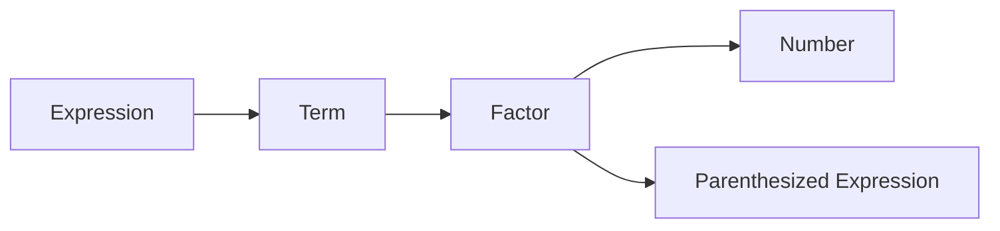

# Parsing Expression Grammars (PEG)

> [!abstract] Idée essentielle
> Une **Parsing Expression Grammar** décrit un langage par des **expressions de reconnaissance**. Le choix entre alternatives est **ordonné** : dans `A / B`, on essaie `A` d'abord et `B` seulement si `A` échoue. Cette propriété rend la sémantique déterministe, mais signifie aussi que **l'ordre des alternatives fait partie du sens de la grammaire**.

Les PEG ont été formalisées par **Bryan Ford en 2004** comme une fondation syntaxique orientée reconnaissance pour les langages destinés aux machines. Elles sont aujourd'hui utilisées directement ou indirectement dans des parseurs de langages, DSL, formats de fichiers et outils de compilation. Depuis Python 3.9, **CPython utilise un parseur PEG** introduit par la PEP 617.

Ce cours ne doit pas être lu comme une syntaxe universelle prête à copier dans tous les outils : chaque implémentation ajoute sa propre notation, ses actions sémantiques, ses règles de gestion des espaces, parfois la récursion gauche ou un opérateur de *cut*. Il faut donc distinguer :

1. la **sémantique fondamentale des PEG** ;
2. la **notation concrète** d'un moteur donné ;
3. les **extensions** fournies par ce moteur.

---

## 1. Pourquoi utiliser un parseur ?

Une expression régulière est excellente pour reconnaître des motifs locaux :

```regex
^[A-Za-z_][A-Za-z0-9_]*$
```

Mais un langage structuré contient souvent :

- des parenthèses imbriquées ;
- des listes récursives ;
- des priorités d'opérateurs ;
- des chaînes avec échappements ;
- des commentaires ;
- des constructions contextuelles ;
- des messages d'erreur à localiser ;
- une structure à transformer en AST.

Exemple :

```text
max(12, 3 * (x + 4))
```

Le but d'un parseur n'est pas seulement de répondre « valide / invalide ». Il peut produire une représentation structurée :

```text
Call
├── name: max
└── args
    ├── Number(12)
    └── Multiply
        ├── Number(3)
        └── Add
            ├── Name(x)
            └── Number(4)
```

---

## 2. Vocabulaire minimal

### 2.1 Alphabet

L'alphabet est l'ensemble des symboles de base de l'entrée.

Selon le parseur, l'entrée peut être :

- une suite de caractères Unicode ;
- une suite d'octets ;
- une suite de tokens produite par un lexer ;
- une structure plus spécialisée.

### 2.2 Terminal

Un terminal reconnaît directement une partie de l'entrée.

Exemples conceptuels :

```peg
"if"
"+"
[0-9]
[a-zA-Z_]
```

### 2.3 Règle / non-terminal

Une règle donne un nom à une expression de parsing :

```peg
Identifier <- [a-zA-Z_] [a-zA-Z0-9_]*
```

### 2.4 Expression de parsing

Une expression combine terminaux, règles et opérateurs :

```peg
Call <- Identifier "(" Arguments? ")"
```

### 2.5 Reconnaissance

Une PEG est dite **recognition-based** : une expression est évaluée à une position donnée de l'entrée et :

- réussit en avançant éventuellement la position ;
- ou échoue sans produire une autre dérivation concurrente.

Cette manière de penser est très proche d'un parseur descendant récursif écrit à la main.

---

## 3. PEG et grammaires hors contexte : ne pas les confondre

Une CFG (*Context-Free Grammar*) décrit typiquement des dérivations possibles.

Exemple schématique :

```ebnf
Expr ::= Expr "+" Expr | Number
```

Une PEG décrit une stratégie de reconnaissance déterministe.

Exemple :

```peg
Expr <- Add / Number
```

La différence la plus importante est le **choix ordonné**.

Dans une CFG :

```text
A | B
```

exprime généralement deux alternatives possibles dont le parseur devra résoudre le choix selon son algorithme.

Dans une PEG :

```peg
A / B
```

signifie :

1. essayer `A` ;
2. si `A` réussit, garder ce résultat ;
3. essayer `B` uniquement si `A` échoue.

Donc :

```peg
A / B
```

et :

```peg
B / A
```

ne sont **pas nécessairement équivalents**.

---

## 4. Une PEG est déterministe, mais pas automatiquement correcte

On lit parfois : « une PEG n'est pas ambiguë ».

C'est vrai dans un sens précis : une entrée reconnue possède un résultat déterminé par la sémantique de la PEG et l'ordre de ses alternatives.

Mais cela ne signifie pas :

- que la grammaire correspond à l'intention de l'auteur ;
- qu'elle consomme nécessairement toute l'entrée ;
- qu'une alternative plus générale n'en masque pas une plus précise ;
- que le résultat sémantique est forcément celui souhaité.

Exemple :

```peg
Keyword <- "in" / "int"
```

Sur l'entrée :

```text
int
```

la première alternative peut reconnaître `in` et laisser `t` non consommé si aucune règle n'impose la fin de l'entrée.

Une meilleure règle peut être :

```peg
Keyword <- "int" / "in"
```

ou imposer une frontière lexicale :

```peg
Keyword <- ("int" / "in") !IdentifierContinue
```

> [!warning]
> En PEG, **l'ordre des alternatives est une décision de conception**, pas une préférence cosmétique.

---

## 5. Les opérateurs fondamentaux

La notation exacte varie selon les moteurs. Les exemples suivants utilisent une notation PEG générique.

### 5.1 Littéral

```peg
"hello"
```

reconnaît exactement `hello`.

### 5.2 Classe de caractères

```peg
[0-9]
```

reconnaît un chiffre ASCII.

```peg
[a-zA-Z_]
```

reconnaît une lettre ASCII ou `_`.

Attention : les classes Unicode dépendent du moteur.

### 5.3 Séquence

```peg
A B C
```

signifie :

1. reconnaître `A` ;
2. puis `B` ;
3. puis `C`.

### 5.4 Choix ordonné

```peg
A / B
```

essaie `A` puis, seulement si `A` échoue, `B`.

### 5.5 Zéro ou plusieurs

```peg
A*
```

### 5.6 Un ou plusieurs

```peg
A+
```

### 5.7 Option

```peg
A?
```

### 5.8 Groupement

```peg
(A B / C D)
```

### 5.9 Prédicat positif

```peg
&A
```

vérifie que `A` peut réussir **sans consommer l'entrée**.

### 5.10 Prédicat négatif

```peg
!A
```

réussit si `A` échoue, **sans consommer l'entrée**.

---

## 6. Lookahead : reconnaître sans consommer

Les prédicats sont une des forces des PEG.

### 6.1 Réserver un mot-clé

Supposons :

```peg
Identifier <- [A-Za-z_] [A-Za-z0-9_]*
```

Pour interdire `if` comme identifiant :

```peg
Identifier <- !Keyword [A-Za-z_] [A-Za-z0-9_]*
Keyword    <- "if" !IdentifierContinue
IdentifierContinue <- [A-Za-z0-9_]
```

### 6.2 Ne pas dépasser un délimiteur

Une chaîne simplifiée :

```peg
String <- '"' (!'"' .)* '"'
```

Lecture :

- ouvrir avec `"` ;
- tant que le prochain caractère n'est pas `"`, consommer un caractère ;
- fermer avec `"`.

Il faudra encore gérer les échappements pour une vraie chaîne.

### 6.3 Ne pas confondre avec une consommation

```peg
&A A
```

teste `A`, puis le consomme.

```peg
&A
```

ne le consomme jamais.

---

## 7. Répétition : elle est généralement possessive

Un piège fréquent consiste à transposer intuitivement le comportement des regex.

Dans de nombreux modèles PEG :

```peg
"a"* "a"
```

ne se comporte pas comme :

```regex
a*a
```

Le `*` PEG consomme autant de `a` que possible et ne rend pas spontanément un caractère à la suite comme le ferait un quantificateur regex avec backtracking interne.

C'est une différence importante pour :

- les chaînes délimitées ;
- les commentaires ;
- les listes ;
- les tokens très généraux ;
- les expressions du type `.*`.

Utiliser un prédicat négatif pour arrêter explicitement la répétition :

```peg
Body <- (!End .)*
End  <- "END"
```

---

## 8. Backtracking : où a-t-il lieu ?

Les PEG peuvent essayer plusieurs alternatives et revenir à une position précédente lorsqu'une alternative échoue.

Exemple :

```peg
Rule <- ("ab" "c") / ("ab" "d")
```

Sur :

```text
abd
```

le parseur peut :

1. essayer `"ab" "c"` ;
2. reconnaître `ab` ;
3. échouer sur `c` ;
4. revenir au début de l'alternative ;
5. essayer `"ab" "d"`.

Cela peut devenir coûteux si les mêmes règles sont recalculées à de nombreuses positions.

---

## 9. Packrat parsing et mémoïsation

Le **packrat parsing** mémorise les résultats d'analyse d'une règle à une position donnée.

Conceptuellement :

```text
memo[(Rule, position)] = succès/échec + nouvelle_position + résultat
```

Si la même combinaison est demandée de nouveau, le parseur réutilise le résultat.

### 9.1 Avantage

Pour une PEG appropriée et un ensemble de règles fixe, la mémoïsation permet classiquement d'obtenir un temps linéaire par rapport à la taille de l'entrée.

### 9.2 Coût

La contrepartie peut être une consommation mémoire importante :

```text
nombre_de_règles × nombre_de_positions
```

Tous les parseurs PEG ne font pas une mémoïsation complète.

Certains moteurs :

- mémorisent seulement certaines règles ;
- utilisent des caches bornés ;
- optimisent statiquement les choix ;
- génèrent du code spécialisé ;
- compilent vers une autre représentation ;
- utilisent des techniques de récupération mémoire.

> [!important]
> **PEG** décrit une famille de grammaires et une sémantique. **Packrat** décrit une stratégie d'implémentation. Les deux notions sont liées mais ne sont pas synonymes.

---

## 10. Une PEG doit souvent reconnaître la fin de l'entrée

Une erreur classique consiste à vérifier seulement un préfixe.

Grammaire :

```peg
Number <- [0-9]+
```

Entrée :

```text
123abc
```

Si l'API considère un succès partiel comme valide, `123` peut être reconnu.

Pour un document complet :

```peg
Document <- Number EOF
EOF      <- !.
```

Le prédicat `!.` signifie conceptuellement : « aucun caractère ne doit rester ».

Selon le moteur, utiliser son symbole de fin d'entrée natif.

---

## 11. Espaces et commentaires

Il faut choisir une stratégie explicite.

### 11.1 Règle `Spacing`

```peg
Spacing <- (Space / Comment)*
Space   <- [ \t\r\n]
Comment <- "#" (!"\n" .)* ("\n" / EOF)
```

Puis :

```peg
PLUS <- "+" Spacing
```

### 11.2 Tokens lexicaux

Créer des règles :

```peg
LPAREN <- "(" Spacing
RPAREN <- ")" Spacing
PLUS   <- "+" Spacing
```

### 11.3 Gestion automatique par le moteur

TatSu, pest, Ohm et d'autres moteurs proposent chacun leurs conventions.

Ne pas copier une règle d'espacement d'un outil vers un autre sans vérifier sa sémantique.

---

## 12. Frontière entre lexing et parsing

Dans une architecture classique :

```text
source
  │
  ▼
lexer
  │ tokens
  ▼
parser
  │
  ▼
AST
```

Une PEG permet souvent d'unifier les niveaux lexical et syntaxique :

```peg
Identifier <- !Keyword [A-Za-z_] [A-Za-z0-9_]* Spacing
Keyword    <- ("if" / "else" / "while") ![A-Za-z0-9_]
```

Avantages :

- grammaire compacte ;
- lookahead facile entre lexical et syntaxique ;
- moins de synchronisation lexer/parser.

Inconvénients possibles :

- règles d'espaces répétitives ;
- performances ;
- diagnostics lexicaux moins séparés ;
- interactions subtiles avec les mots-clés.

---

## 13. Exemple correct : expressions arithmétiques

Une formulation PEG classique sans récursion gauche :

```peg
Expression <- Term (("+" / "-") Term)*
Term       <- Factor (("*" / "/") Factor)*
Factor     <- Number / "(" Expression ")"
Number     <- [0-9]+ ("." [0-9]+)?
```

Cette grammaire encode :

- `*` et `/` avec une priorité supérieure à `+` et `-` ;
- parenthèses ;
- associativité à reconstruire lors de la création de l'AST.

Exemple :

```text
2 + 3 * 4
```

AST attendu :

```text
Add
├── Number(2)
└── Multiply
    ├── Number(3)
    └── Number(4)
```

et non :

```text
Multiply
├── Add
│   ├── Number(2)
│   └── Number(3)
└── Number(4)
```

---

## 14. Récursion gauche : la nuance moderne

### 14.1 Le problème classique

Une règle directement récursive à gauche :

```peg
Expr <- Expr "+" Term / Term
```

avec un parseur descendant récursif naïf appelle `Expr` avant de consommer quoi que ce soit :

```text
Expr
└── Expr
    └── Expr
        └── Expr
            ...
```

Cela conduit à une récursion infinie.

### 14.2 Réécriture traditionnelle

```peg
Expr <- Term ("+" Term)*
```

### 14.3 Ce qui a changé

Plusieurs implémentations modernes savent prendre en charge la récursion gauche via des algorithmes spécialisés.

Exemples :

- **CPython/pegen**, introduit par la PEP 617 ;
- **TatSu**, où la récursion gauche est activée par défaut ;
- **Ohm**, qui annonce un support complet de la récursion gauche.

Donc la phrase :

> « les PEG n'autorisent pas la récursion gauche »

est trop absolue.

Formulation correcte :

> La sémantique PEG classique implémentée par descente récursive naïve ne gère pas directement la récursion gauche ; plusieurs moteurs modernes ajoutent un algorithme qui la supporte.

---

## 15. Récursion gauche indirecte

Exemple :

```peg
A <- B "x" / "a"
B <- C "y" / "b"
C <- A "z" / "c"
```

La récursion gauche peut passer par plusieurs règles.

Un moteur qui supporte seulement la récursion gauche directe ne suffit pas nécessairement.

CPython/pegen sait gérer des formes directes, indirectes et cachées décrites dans la PEP 617.

---

## 16. Associativité des opérateurs

Pour :

```text
10 - 3 - 2
```

l'associativité gauche donne :

```text
(10 - 3) - 2 = 5
```

l'associativité droite donne :

```text
10 - (3 - 2) = 9
```

Une règle :

```peg
Expr <- Number ("-" Number)*
```

produit souvent une structure plate :

```text
[10, "-", 3, "-", 2]
```

Le code sémantique doit alors construire l'AST de gauche à droite.

Pseudo-code :

```python
node = first
for operator, rhs in rest:
    node = Binary(operator, node, rhs)
return node
```

Avec un moteur qui supporte la récursion gauche :

```peg
Expr <- Expr "-" Number / Number
```

peut refléter directement l'associativité souhaitée.

---

## 17. Priorité des opérateurs

Une méthode simple consiste à créer un niveau par priorité :

```peg
Expression <- Comparison
Comparison <- Additive (("<" / ">" / "==") Additive)*
Additive   <- Multiplicative (("+" / "-") Multiplicative)*
Multiplicative <- Unary (("*" / "/") Unary)*
Unary      <- ("+" / "-") Unary / Primary
Primary    <- Number / Identifier / "(" Expression ")"
```

Cette approche est :

- lisible ;
- portable ;
- facile à tester ;
- compatible avec les moteurs sans récursion gauche.

---

## 18. Choix ordonné et préfixes communs

Grammaire :

```peg
Statement <- Assignment / Call
Assignment <- Identifier "=" Expression
Call       <- Identifier "(" Arguments? ")"
```

Les deux alternatives commencent par `Identifier`.

Ce n'est pas nécessairement un problème : le parseur peut essayer `Assignment`, échouer après l'identifiant, revenir puis essayer `Call`.

Mais si la grammaire est grande :

- cela peut coûter du temps ;
- cela peut compliquer les erreurs ;
- une mémoïsation peut devenir utile.

On peut factoriser :

```peg
Statement <- Identifier ("=" Expression / "(" Arguments? ")")
```

Mais la factorisation n'est pas toujours plus claire. Ne pas sacrifier la lisibilité sans mesure.

---

## 19. Commit / cut

Certains moteurs ajoutent un opérateur de **commit** ou **cut**.

Dans la grammaire PEG de CPython, `~` signifie en substance :

> s'engager dans l'alternative actuelle ; si la suite échoue, faire échouer la règle sans essayer les alternatives suivantes.

Exemple conceptuel :

```peg
Assignment <- Identifier "=" ~ Expression
```

Une fois `=` reconnu, il est raisonnable de considérer qu'on analyse une affectation.

Bénéfices :

- moins de backtracking ;
- erreurs parfois plus précises ;
- intention explicite.

Risques :

- placer le cut trop tôt peut rejeter des entrées valides ;
- la syntaxe n'est pas standardisée entre moteurs.

---

## 20. Actions sémantiques : grammaire ou code ?

Deux grandes philosophies existent.

### 20.1 Actions intégrées

Certains générateurs permettent du code dans la grammaire :

```text
rule = left:term "+" right:term { return left + right; }
```

Avantages :

- compact ;
- génération directe du résultat.

Inconvénients :

- grammaire couplée au langage cible ;
- actions difficiles à réutiliser ;
- tests syntaxiques et sémantiques mélangés ;
- sécurité si la grammaire est non fiable.

### 20.2 Sémantique séparée

Ohm sépare explicitement reconnaissance et actions sémantiques.

On peut aussi adopter cette architecture manuellement :

```text
source
  ▼
parse
  ▼
CST / capture tree
  ▼
transform
  ▼
AST métier
```

Cette séparation est souvent préférable pour un langage durable.

---

## 21. CST, parse tree et AST

### 21.1 CST

Le *Concrete Syntax Tree* conserve beaucoup de détails syntaxiques :

```text
(
2
+
3
)
```

### 21.2 AST

L'*Abstract Syntax Tree* supprime les détails purement grammaticaux :

```text
Add(Number(2), Number(3))
```

### 21.3 Ne pas laisser l'AST dépendre accidentellement de la grammaire

Une grammaire refactorée ne devrait pas forcément casser :

- le compilateur ;
- l'interpréteur ;
- le formatter ;
- les outils d'analyse.

Définir un modèle d'AST stable et le construire explicitement.

---

## 22. Exemple d'AST Python

```python
from dataclasses import dataclass

class Expr:
    pass

@dataclass(frozen=True)
class Number(Expr):
    value: float

@dataclass(frozen=True)
class Binary(Expr):
    op: str
    left: Expr
    right: Expr
```

Pour :

```text
2 + 3 * 4
```

on souhaite :

```python
Binary(
    "+",
    Number(2),
    Binary("*", Number(3), Number(4)),
)
```

L'AST doit représenter la **sémantique**, pas les parenthèses inutiles ni les règles auxiliaires.

---

## 23. Localisation source

Pour de bons diagnostics, conserver :

- offset de début ;
- offset de fin ;
- ligne ;
- colonne ;
- éventuellement fichier/source.

Exemple :

```python
@dataclass(frozen=True)
class Span:
    start: int
    end: int
    line: int
    column: int
```

Puis :

```python
@dataclass(frozen=True)
class Name(Expr):
    value: str
    span: Span
```

Cela facilite :

- erreurs ;
- IDE/LSP ;
- highlighting ;
- refactoring ;
- source maps ;
- diagnostics de compilation.

---

## 24. Gestion des erreurs : le point faible historique

Un parseur avec beaucoup de backtracking peut échouer de nombreuses fois avant l'échec final.

Il faut éviter un message du type :

```text
parse failed
```

Préférer :

```text
config.dsl:18:12: expected ')' after argument list
    deploy(host, port
               ^
```

### 24.1 Position la plus éloignée

Une stratégie classique consiste à conserver :

- la position d'échec la plus éloignée ;
- l'ensemble des terminaux/règles attendus à cette position.

### 24.2 Règles d'erreur dédiées

CPython utilise des règles `invalid_*` dans une seconde passe afin d'améliorer certains messages sans dégrader la grammaire principale.

### 24.3 Synchronisation

Pour un langage interactif, on peut tenter de reprendre après :

- `;` ;
- fin de ligne ;
- `}` ;
- mot-clé de niveau supérieur.

La récupération d'erreur est généralement **spécifique au moteur** et au langage.

---

## 25. Ne pas masquer les erreurs par une alternative trop générale

Mauvais exemple :

```peg
Value <- Specific / .+
```

La seconde alternative accepte presque tout.

Conséquences :

- erreurs reportées trop tard ;
- AST incohérent ;
- typo acceptée comme texte générique.

Préférer une règle de récupération explicite, séparée de la grammaire normale.

---

## 26. Commentaires

### 26.1 Commentaire de ligne

```peg
LineComment <- "//" (!"\n" .)* ("\n" / EOF)
```

### 26.2 Commentaire de bloc non imbriqué

```peg
BlockComment <- "/*" (!"*/" .)* "*/"
```

### 26.3 Commentaires imbriqués

Ils demandent une règle récursive si le langage les autorise :

```peg
BlockComment <- "/*" (BlockComment / !"*/" .)* "*/"
```

Tester :

```text
/* outer /* inner */ outer */
```

---

## 27. Chaînes de caractères

Une chaîne réaliste doit gérer :

- délimiteur ;
- échappements ;
- Unicode ;
- fin de ligne autorisée ou non ;
- erreur sur chaîne non fermée.

Exemple générique :

```peg
String <- '"' Character* '"'
Character <- Escape / !('"' / "\\" / "\n" / "\r") .
Escape <- "\\" (['"\\/bfnrt] / UnicodeEscape)
UnicodeEscape <- "u" Hex Hex Hex Hex
Hex <- [0-9A-Fa-f]
```

Pour JSON réel, suivre exactement RFC 8259 et les exigences Unicode au lieu d'inventer une variante approximative.

---

## 28. Identifiants Unicode

La règle :

```peg
[A-Za-z_] [A-Za-z0-9_]*
```

est volontairement ASCII.

Pour un langage Unicode, décider :

- quelles catégories Unicode sont autorisées ;
- normalisation NFC/NFKC ou aucune ;
- homoglyphes ;
- mots-clés ;
- version Unicode ciblée.

Ne pas supposer que `[A-Za-z]` représente une « lettre » universelle.

---

## 29. Mots-clés et identifiants

Exemple :

```peg
Keyword <- ("if" / "else" / "while") !IdentifierContinue
Identifier <- !Keyword IdentifierStart IdentifierContinue*
```

Pourquoi le lookahead après le mot-clé ?

Sans :

```text
ifconfig
```

pourrait commencer par le mot-clé `if`.

---

## 30. Opérateurs partageant un préfixe

Toujours penser au choix ordonné.

Mauvais ordre :

```peg
Operator <- "<" / "<="
```

Meilleur ordre :

```peg
Operator <- "<=" / "<"
```

Même principe pour :

```text
=
==
=>
===
```

ou :

```text
>
>>
>>=
```

Une alternative longue/spécifique doit souvent précéder sa version préfixe, sauf conception contraire.

---

## 31. Listes séparées

Forme conceptuelle :

```peg
Arguments <- Expression ("," Expression)*
```

Optionnel :

```peg
Arguments?
```

Virgule terminale :

```peg
Arguments <- Expression ("," Expression)* ","?
```

Avec espaces :

```peg
COMMA <- "," Spacing
Arguments <- Expression (COMMA Expression)* COMMA?
```

Certains moteurs proposent un opérateur natif de liste séparée.

---

## 32. Structures imbriquées

Exemple mini-JSON :

```peg
Document <- Spacing Value EOF
Value    <- Object / Array / String / Number / True / False / Null
Object   <- "{" Spacing Members? "}" Spacing
Members  <- Pair ("," Spacing Pair)*
Pair     <- String ":" Spacing Value
Array    <- "[" Spacing Elements? "]" Spacing
Elements <- Value ("," Spacing Value)*
True     <- "true" Spacing
False    <- "false" Spacing
Null     <- "null" Spacing
```

Cet exemple pédagogique n'est pas une implémentation complète de JSON : nombres, chaînes et Unicode doivent être conformes à la spécification réelle.

---

## 33. Parsing d'un langage à indentation

Une PEG pure sur caractères ne rend pas magiquement simple une sémantique d'indentation de type Python.

Approches :

1. pré-lexer `INDENT` / `DEDENT` ;
2. état de parseur spécialisé ;
3. extension du moteur ;
4. règles sensibles à la colonne si le moteur le permet.

Ohm v17 propose par exemple un support expérimental des langages sensibles à l'indentation.

Ne pas présenter cette capacité comme une propriété universelle des PEG.

---

## 34. PEG vs regex

| Besoin | Regex | PEG |
|---|---|---|
| motif local | excellent | possible |
| imbrication récursive | limitée / moteur dépendant | naturelle |
| priorité syntaxique | pénible | naturelle |
| AST | non natif | naturel |
| lookahead | souvent oui | oui |
| grammaire multi-règles | faible | oui |
| diagnostics structurés | limités | possibles |
| langage complet | déconseillé | adapté |

Une PEG ne remplace pas les regex : elle peut d'ailleurs utiliser des regex ou classes de caractères pour les tokens simples.

---

## 35. PEG vs LL

Un parseur LL :

- descend depuis la règle de départ ;
- choisit les productions avec un lookahead borné selon la classe LL(k) ;
- bénéficie d'une théorie et d'outils très établis.

PEG :

- choix ordonné ;
- lookahead syntaxique arbitraire via prédicats ;
- backtracking contrôlé ;
- souvent très proche du code de reconnaissance.

CPython a remplacé son ancien générateur LL(1) par PEG pour lever des contraintes d'expression de la grammaire et réduire certains contournements.

---

## 36. PEG vs LR/LALR

Les parseurs LR :

- sont ascendants ;
- reconnaissent une grande classe de grammaires CFG ;
- utilisent tables d'états et conflits shift/reduce ou reduce/reduce ;
- sont historiquement employés pour des compilateurs.

PEG :

- est descendante dans son modèle mental ;
- n'a pas les mêmes ambiguïtés ni conflits de tables ;
- remplace la notion d'alternatives concurrentes par un ordre explicite.

Ne pas demander « lequel est plus puissant ? » sans préciser :

- classe de langages ;
- extensions ;
- performance ;
- diagnostics ;
- maintenance ;
- tooling.

---

## 37. PEG vs Earley / GLR

Earley et GLR sont utiles lorsque :

- la grammaire CFG doit rester ambiguë ;
- plusieurs analyses doivent être conservées ;
- on veut accepter une grande classe de CFG sans imposer un choix ordonné.

PEG est préférable lorsque :

- le langage est destiné à la machine ;
- une seule interprétation déterministe est souhaitée ;
- l'ordre des choix est acceptable comme partie de la spécification.

---

## 38. PEG et ANTLR

ANTLR est un générateur de parseurs avec son propre modèle de grammaire et ses algorithmes adaptatifs ; ce n'est pas simplement « un moteur PEG ».

Comparer sur les besoins :

- langages cibles ;
- IDE/tooling ;
- visiteurs/listeners ;
- écosystème ;
- messages d'erreur ;
- licence ;
- génération de code ;
- contraintes de déploiement.

Ne pas étiqueter tous les parseurs descendants modernes comme PEG.

---

## 39. PEG dans CPython

Depuis **Python 3.9**, CPython utilise le nouveau parseur PEG proposé par la **PEP 617**.

La grammaire officielle se trouve dans :

```text
Grammar/python.gram
```

La documentation de Python publie une version de cette grammaire.

Elle montre des extensions importantes :

- choix ordonné ;
- répétitions ;
- lookahead ;
- récursion gauche prise en charge ;
- `~` comme *cut* ;
- actions produisant directement des objets AST internes ;
- règles `invalid_*` pour les diagnostics.

> [!important]
> La syntaxe de `python.gram` est une **syntaxe pegen**, pas une norme PEG universelle.

---

## 40. Exemple pegen simplifié

Style inspiré de la syntaxe CPython :

```peg
expr:
    | expr '+' term
    | expr '-' term
    | term

term:
    | term '*' factor
    | term '/' factor
    | factor

factor:
    | NUMBER
    | '(' expr ')'
```

Cette forme est rendue possible par le support de la récursion gauche du générateur.

Dans un moteur PEG classique sans ce support, réécrire :

```peg
expr <- term (("+" / "-") term)*
term <- factor (("*" / "/") factor)*
```

---

## 41. TatSu pour Python

**TatSu** compile une grammaire de style EBNF/PEG vers un parseur Python et peut également analyser directement une grammaire en mémoire.

Installation typique :

```bash
python -m pip install TatSu
```

Exemple :

```python
import tatsu

grammar = r'''
@@grammar::Calc
@@whitespace :: /\s*/

start = expression $ ;
expression = term { ('+' | '-') term }* ;
term = factor { ('*' | '/') factor }* ;
factor = number | '(' expression ')' ;
number = /\d+(?:\.\d+)?/ ;
'''

ast = tatsu.parse(grammar, "2 + 3 * 4")
print(ast)
```

La syntaxe TatSu n'est pas la notation PEG canonique de Ford. Vérifier sa documentation pour :

- regex ;
- captures ;
- AST ;
- sémantique ;
- directives ;
- listes ;
- erreurs ;
- génération de parseur.

---

## 42. Récursion gauche avec TatSu

TatSu supporte la récursion gauche directe et indirecte, activée par défaut dans les versions actuelles.

Exemple conceptuel :

```text
expression =
    | expression '+' term
    | term
    ;
```

Le support peut être désactivé selon la configuration :

```python
config.left_recursion = False
```

Toujours tester l'AST produit, car la récursion gauche influe directement sur l'associativité.

---

## 43. Parsimonious

**Parsimonious** est une bibliothèque Python proposant une notation PEG concise.

Exemple de style :

```python
from parsimonious.grammar import Grammar

grammar = Grammar(r'''
    expr   = term (addop term)*
    term   = factor (mulop factor)*
    factor = number / "(" expr ")"
    number = ~r"[0-9]+(?:\.[0-9]+)?"
    addop  = "+" / "-"
    mulop  = "*" / "/"
''')
```

Pour un nouveau projet, comparer son activité, ses besoins et ses performances avec TatSu et d'autres solutions avant de choisir.

---

## 44. Arpeggio

**Arpeggio** est un autre moteur Python orienté PEG, notamment utilisé dans l'écosystème textX.

Il peut être intéressant lorsque :

- la grammaire est construite en Python ;
- on utilise textX pour créer un DSL ;
- l'intégration à l'écosystème Arpeggio est utile.

Ne pas choisir une bibliothèque uniquement parce qu'elle apparaît dans un vieux tutoriel : vérifier maintenance, version Python supportée et modèle d'AST.

---

## 45. Peggy : successeur de PEG.js

Pour JavaScript/TypeScript, **Peggy** est le successeur activement maintenu de PEG.js.

En 2026, Peggy **5.1.0** est disponible.

Installation :

```bash
npm install peggy
```

CLI :

```bash
npx peggy grammar.peggy -o parser.js
```

Exemple simplifié :

```pegjs
start
  = head:number tail:(_ op:("+" / "-") _ number)* {
      return tail.reduce((acc, item) => {
        const op = item[1];
        const rhs = item[3];
        return op === "+" ? acc + rhs : acc - rhs;
      }, head);
    }

number
  = digits:[0-9]+ { return Number(digits.join("")); }

_ = [ \t\n\r]*
```

Les actions JavaScript font partie du parser généré : une grammaire Peggy non fiable doit donc être traitée comme du **code**.

---

## 46. PEG.js vs Peggy

PEG.js a eu une grande importance historique dans l'écosystème JavaScript.

Pour un projet actuel :

- préférer la documentation Peggy ;
- ne pas installer un vieux paquet uniquement parce qu'un cours mentionne « PEG.js » ;
- vérifier les différences de syntaxe et d'API ;
- migrer progressivement les grammaires existantes.

La fiche d'origine mentionnait PEG.js sans préciser ce changement d'écosystème : cette information était devenue trompeuse.

---

## 47. Ohm/JS

**Ohm** est un toolkit JavaScript/TypeScript basé sur une variante des PEG.

Particularité importante : Ohm **sépare la grammaire des actions sémantiques**.

Grammaire :

```ohm
Arithmetic {
  Exp = AddExp
  AddExp = AddExp "+" MulExp  -- plus
         | MulExp
  MulExp = MulExp "*" PriExp  -- times
         | PriExp
  PriExp = number
         | "(" Exp ")"
  number = digit+
}
```

Puis les opérations sémantiques sont définies séparément.

Cette séparation facilite :

- plusieurs interprétations du même arbre ;
- pretty-printer ;
- évaluation ;
- compilation ;
- analyse statique ;
- maintenance de la grammaire.

---

## 48. Ohm et récursion gauche

Ohm supporte la récursion gauche, ce qui permet d'écrire naturellement :

```ohm
AddExp = AddExp "+" MulExp -- plus
       | MulExp
```

L'écosystème Ohm a également travaillé en 2026 sur une nouvelle génération de moteur compilant les grammaires vers WebAssembly dans la branche v18 beta.

Ne pas dépendre d'une fonctionnalité beta en production sans vérifier sa stabilité au moment du déploiement.

---

## 49. pest en Rust

**pest** est un parseur PEG pour Rust.

Exemple de style :

```pest
number = @{ ASCII_DIGIT+ }

expression = {
    number ~ (operator ~ number)*
}

operator = { "+" | "-" }
```

La documentation pest insiste notamment sur :

- le caractère déterministe des PEG ;
- la répétition gourmande/possessive ;
- l'importance de l'ordre ;
- le fait qu'il ne faut pas raisonner exactement comme avec le backtracking regex.

Pour les projets Rust, comparer pest avec :

- chumsky ;
- nom ;
- winnow ;
- lalrpop ;
- tree-sitter selon les objectifs.

Tous ne sont pas des moteurs PEG.

---

## 50. Tree-sitter n'est pas un PEG

Tree-sitter est très utile pour :

- parsing incrémental ;
- éditeurs ;
- syntax highlighting ;
- analyse de code pendant la frappe.

Mais il ne faut pas le présenter comme un moteur PEG standard.

Si le besoin principal est :

```text
éditeur + parse incrémental + arbre tolérant aux erreurs
```

Tree-sitter peut être plus adapté qu'un générateur PEG traditionnel.

---

## 51. Quel outil choisir ?

| Contexte | Outil à considérer |
|---|---|
| comprendre le parseur Python | CPython pegen / PEP 617 |
| DSL Python | TatSu |
| grammaire Python minimaliste existante | Parsimonious / Arpeggio à évaluer |
| JS/TS avec génération de parser | Peggy |
| JS/TS avec sémantique séparée | Ohm |
| Rust PEG | pest |
| IDE incrémental | Tree-sitter plutôt qu'un PEG classique |
| parser très spécifique et petit | recursive descent manuel possible |

Le bon choix dépend de :

- runtime cible ;
- taille de la grammaire ;
- génération de code ;
- performances ;
- diagnostics ;
- récursion gauche ;
- AST/CST ;
- incrémentalité ;
- licence ;
- maintenance ;
- sécurité.

---

## 52. Construire un DSL : architecture recommandée

```text
fichier source
    │
    ▼
normalisation d'entrée
    │
    ▼
parseur PEG
    │
    ▼
CST / captures
    │
    ▼
construction AST
    │
    ▼
validation sémantique
    │
    ▼
IR / modèle métier
    │
    ├──► interprétation
    ├──► génération de code
    ├──► validation
    └──► documentation
```

Ne pas mettre toutes les validations dans la grammaire.

---

## 53. Syntaxe vs sémantique

Grammaire :

```peg
Port <- [0-9]+
```

Syntaxiquement :

```text
99999
```

est un nombre.

Mais un port TCP/UDP doit respecter :

```text
0 <= port <= 65535
```

Cette contrainte est **sémantique**.

Code :

```python
def validate_port(value: int) -> int:
    if not 0 <= value <= 65535:
        raise ValueError("port hors plage")
    return value
```

Séparer :

- reconnaissance de la forme ;
- validation métier.

---

## 54. Ne pas transformer la grammaire en langage de programmation métier

Anti-pattern :

```text
Grammar = syntaxe + accès DB + appels HTTP + permissions + logique métier
```

Préférer :

```text
Grammar -> AST -> semantic validation -> business logic
```

Bénéfices :

- tests isolés ;
- parser déterministe ;
- sécurité ;
- réutilisation ;
- messages d'erreur plus clairs.

---

## 55. Tests unitaires de règles

Tester chaque règle importante séparément si l'outil le permet.

Exemples :

```python
VALID_IDENTIFIERS = [
    "x",
    "hello_world",
    "value2",
]

INVALID_IDENTIFIERS = [
    "2value",
    "hello-world",
    "",
]
```

Tester :

- succès ;
- échec ;
- consommation complète ;
- résultat AST ;
- position d'erreur.

---

## 56. Tests de grammaire

Pour une expression :

```text
1
1 + 2
1 + 2 * 3
(1 + 2) * 3
1 - 2 - 3
-4
foo + bar
```

Cas invalides :

```text
+
1 +
(1 + 2
1 **
1 2
```

Ne pas tester uniquement des exemples heureux.

---

## 57. Property-based testing

Avec Hypothesis en Python, on peut générer :

- entiers ;
- arbres d'expressions ;
- chaînes ;
- séquences de tokens.

Approche particulièrement puissante :

```text
AST aléatoire
  ▼
pretty-print
  ▼
parse
  ▼
AST obtenu
```

Propriété :

```text
parse(print(ast)) == ast
```

ou, si la normalisation change l'arbre :

```text
eval(parse(print(ast))) == eval(ast)
```

---

## 58. Fuzzing

Un parseur traite souvent des entrées non fiables.

Fuzzer :

- bytes aléatoires ;
- Unicode inhabituel ;
- profondeurs extrêmes ;
- parenthèses non fermées ;
- chaînes gigantesques ;
- commentaires imbriqués ;
- répétitions ambiguës ;
- séquences qui forcent beaucoup de backtracking.

Objectifs :

- pas de crash ;
- pas de boucle infinie ;
- mémoire bornée raisonnablement ;
- diagnostic stable ;
- pas d'exécution de code inattendue.

---

## 59. Sécurité : profondeur de récursion

Entrée malveillante :

```text
((((((((((((((((((((((((((((((((((1))))))))))))))))))))))))))))))))))
```

ou une version de plusieurs millions de niveaux.

Risques :

- stack overflow ;
- `RecursionError` ;
- mémoire excessive ;
- déni de service.

Prévoir :

- taille maximale de source ;
- profondeur maximale ;
- timeouts selon contexte ;
- parsing dans un processus isolé pour données hostiles si nécessaire.

---

## 60. Sécurité : grammaires non fiables

Une grammaire Peggy contenant des actions JavaScript peut exécuter du code.

Une grammaire générant du Python peut aussi injecter du code selon le moteur.

Donc :

> [!danger]
> Une grammaire avec actions sémantiques exécutables doit être traitée comme du **code source**, pas comme un simple fichier de configuration.

Ne pas compiler/exécuter une grammaire reçue d'un utilisateur non fiable dans le même contexte de privilèges.

---

## 61. Sécurité : ReDoS et PEG

PEG n'implique pas automatiquement les mêmes risques que les moteurs regex backtracking classiques, mais cela ne signifie pas « aucun DoS possible ».

Risques :

- backtracking important sans mémoïsation ;
- mémoïsation consommant beaucoup de mémoire ;
- actions sémantiques coûteuses ;
- entrées profondément imbriquées ;
- structures pathologiques ;
- grammaires mal conçues.

Toujours mesurer avec des entrées adversariales.

---

## 62. Mesurer les performances

Éviter :

```text
"ce parser est linéaire donc il est rapide"
```

Mesurer :

- temps total ;
- mémoire maximale ;
- allocations ;
- profondeur ;
- nombre d'échecs/backtracks si disponible ;
- génération AST ;
- startup/compilation de la grammaire.

Jeu de benchmarks :

```text
1 KiB
10 KiB
100 KiB
1 MiB
10 MiB
```

et des cas adversariaux.

---

## 63. Parser à chaque requête ou compiler une fois ?

Mauvais :

```python
def handle(text):
    parser = compile_grammar(GRAMMAR)
    return parser.parse(text)
```

Préférer :

```python
PARSER = compile_grammar(GRAMMAR)

def handle(text):
    return PARSER.parse(text)
```

si le moteur autorise la réutilisation sûre du parser.

Distinguer :

- compilation de la grammaire ;
- parsing des documents.

---

## 64. Profiling

En Python :

```bash
python -m cProfile -o profile.out parse_dataset.py
```

Puis :

```bash
python -m pstats profile.out
```

Mesurer séparément :

- lecture fichier ;
- parsing ;
- AST ;
- validation sémantique ;
- sérialisation.

Sinon on risque d'optimiser la mauvaise étape.

---

## 65. Erreur courante : confondre « gourmand » et « choix ordonné »

Deux notions différentes :

### Répétition gourmande

```peg
A*
```

consomme autant de `A` que possible selon la sémantique du moteur.

### Choix ordonné

```peg
A / B
```

préfère `A` si `A` réussit.

Une grammaire peut avoir les deux comportements simultanément.

---

## 66. Erreur courante : oublier les préfixes

```peg
Type <- "int" / "integer"
```

peut reconnaître `int` avant `integer`.

Préférer :

```peg
Type <- "integer" / "int"
```

ou imposer une frontière :

```peg
Type <- ("integer" / "int") !IdentifierContinue
```

---

## 67. Erreur courante : oublier `EOF`

Parser :

```text
12 + 3 garbage
```

Si la règle de départ accepte :

```text
12 + 3
```

sans vérifier la fin, le système peut considérer le document valide.

Toujours savoir si l'API :

- exige la consommation complète ;
- ou autorise un match de préfixe.

---

## 68. Erreur courante : mettre le fallback générique trop tôt

Mauvais :

```peg
Value <- Text / Number / Boolean
Text  <- .+
```

`Text` capture tout et rend les autres alternatives mortes.

Meilleur :

```peg
Value <- Number / Boolean / Text
```

avec un `Text` suffisamment borné.

---

## 69. Erreur courante : oublier que l'ordre change la sémantique

Refactoring dangereux :

```diff
- Rule <- LongSpecific / ShortGeneric
+ Rule <- ShortGeneric / LongSpecific
```

Dans une CFG, un reformatage des alternatives peut sembler neutre.

Dans une PEG, il peut changer le langage reconnu.

Donc l'ordre des alternatives mérite :

- tests ;
- revue de code ;
- commentaires lorsqu'il est subtil.

---

## 70. Erreur courante : action sémantique avec effets de bord pendant le backtracking

Exemple conceptuel dangereux :

```text
alternative A:
    incrementer compteur global
    puis échouer
alternative B:
    réussir
```

Si le moteur exécute l'action avant de savoir que l'alternative est définitivement retenue, l'effet de bord peut survivre au backtracking.

Éviter pendant le parsing :

- écriture DB ;
- appel HTTP ;
- mutation globale ;
- écriture fichier ;
- émission d'événement irréversible.

Construire d'abord une structure pure, puis exécuter les effets.

---

## 71. Erreur courante : dépendre de la forme exacte du CST

Si la grammaire :

```peg
Args <- Expr ("," Expr)*
```

est refactorée vers :

```peg
Args <- Expr MoreArgs*
MoreArgs <- "," Expr
```

le CST peut changer sans que le langage change.

Découpler le code métier du CST via une étape :

```text
CST -> AST stable
```

---

## 72. Versionner une grammaire

Une grammaire est du code.

Versionner :

```text
grammar/
├── language.peg
├── tests/
│   ├── valid/
│   └── invalid/
├── ast.py
├── semantics.py
└── README.md
```

Commit typique :

```text
parser: add optional trailing comma to argument lists
```

Le diff de grammaire doit être revu comme un changement de comportement.

---

## 73. Tests golden

Entrée :

```text
sum(1, 2 * 3)
```

Fichier attendu :

```json
{
  "type": "Call",
  "name": "sum",
  "args": [
    {"type": "Number", "value": 1},
    {
      "type": "Multiply",
      "left": {"type": "Number", "value": 2},
      "right": {"type": "Number", "value": 3}
    }
  ]
}
```

Le test compare l'AST produit au golden.

À utiliser avec prudence : les golden doivent être faciles à relire et à mettre à jour intentionnellement.

---

## 74. Tests différentiels

Si on migre d'un ancien parseur vers un PEG :

```text
ancien_parser(source) -> AST1
nouveau_parser(source) -> AST2
```

Comparer sur un corpus réel :

```text
normalize(AST1) == normalize(AST2)
```

Puis analyser les divergences.

C'est une excellente stratégie pour une migration de grammaire importante.

---

## 75. Corpus de régression

Conserver :

- fichiers réels valides ;
- bugs historiques ;
- erreurs de syntaxe fréquentes ;
- cas Unicode ;
- fichiers volumineux ;
- cas pathologiques.

Arborescence :

```text
tests/corpus/
├── valid/
├── invalid/
├── regressions/
└── adversarial/
```

Chaque bug de parser corrigé doit idéalement ajouter un cas de régression.

---

## 76. Lint d'une grammaire

Rechercher :

- règles jamais utilisées ;
- alternatives impossibles à atteindre ;
- répétitions pouvant réussir sans consommer ;
- récursions non supportées ;
- choix préfixes mal ordonnés ;
- fallback trop générique ;
- duplication ;
- règles gigantesques.

Certains générateurs détectent une partie de ces problèmes ; compléter par tests et revue.

---

## 77. Danger : répétition d'une expression nullable

Si `A` peut réussir sans consommer :

```peg
A <- "x"?
```

alors :

```peg
A*
```

est problématique : `A` peut réussir indéfiniment sans avancer.

Les bons moteurs détectent souvent ce cas.

Règle de conception :

> Le corps d'une répétition doit normalement consommer au moins un symbole lorsqu'il réussit.

---

## 78. Nullabilité

Une expression est nullable si elle peut réussir sans consommer d'entrée.

Exemples :

```peg
""       # nullable
A?       # nullable
A*       # nullable
&A       # nullable lorsqu'il réussit
!A       # nullable lorsqu'il réussit
```

Mais :

```peg
"x"
[0-9]
A+
```

ne sont pas nécessairement nullables.

La nullabilité est importante pour :

- répétitions ;
- récursion ;
- détection de boucles ;
- analyse statique de la grammaire.

---

## 79. Prédicats sémantiques

Certains moteurs permettent un test basé sur du code, par exemple :

```text
&{ condition() }
```

Ce n'est pas un opérateur PEG universel.

Risques :

- pureté perdue ;
- dépendance à un état externe ;
- mémoïsation invalidée si le résultat dépend de l'état ;
- tests difficiles.

Utiliser avec parcimonie.

Ohm, par exemple, indique ne pas supporter les prédicats sémantiques dans sa syntaxe standard actuelle.

---

## 80. Mémoïsation et état externe

Supposons que :

```text
Rule(position=42)
```

réussisse si une variable globale `mode == X`.

Si le parseur mémorise le résultat puis `mode` change :

```text
memo[Rule, 42]
```

peut devenir faux par rapport au nouvel état.

Une mémoïsation correcte demande que le résultat dépende des paramètres pris en compte dans la clé de cache.

D'où l'intérêt des grammaires aussi **pures** que possible.

---

## 81. Parsing contextuel

Certains langages nécessitent du contexte :

- typedef en C ;
- indentation ;
- modes lexicaux ;
- interpolation ;
- mots-clés contextuels.

Options :

1. lexer contextuel ;
2. état explicite ;
3. validation post-parse ;
4. grammaire enrichie ;
5. plusieurs phases.

Ne pas forcer toute la sémantique contextuelle dans une PEG si une phase ultérieure est plus simple.

---

## 82. Soft keywords

Un *soft keyword* est réservé seulement dans certains contextes.

CPython utilise ce concept dans sa grammaire PEG moderne.

Cela permet d'ajouter de nouvelles syntaxes sans rendre immédiatement un mot impossible comme identifiant partout.

Le parseur doit donc parfois décider :

```text
mot == identifiant
```

ou :

```text
mot == mot-clé contextuel
```

selon la règle active.

---

## 83. Parser un protocole réseau

Une PEG peut convenir à un protocole textuel, mais attention :

- taille des lignes ;
- flux partiels ;
- framing ;
- données binaires ;
- sécurité ;
- streaming.

Si le protocole arrive par morceaux :

```text
TCP chunk 1
TCP chunk 2
TCP chunk 3
```

un parseur conçu pour une chaîne complète peut ne pas être le bon outil.

Il peut être préférable d'avoir :

```text
framing/stream decoder -> PEG sur message complet
```

---

## 84. Parsing streaming

Packrat et backtracking sont souvent conçus avec un accès aléatoire à l'entrée déjà reçue.

Le streaming pose des questions :

- peut-on jeter les octets anciens ?
- une alternative future peut-elle demander de revenir ?
- combien de mémoire garder ?
- comment signaler « entrée incomplète » vs « erreur » ?

Choisir un moteur explicitement compatible avec le streaming si c'est une exigence forte.

---

## 85. Parsing incrémental

Dans un IDE :

```text
utilisateur tape 1 caractère
```

Reparser un fichier de 5 MiB entièrement à chaque frappe peut être trop coûteux.

Un PEG traditionnel n'offre pas automatiquement le parsing incrémental.

Solutions :

- moteur spécialisé ;
- cache incrémental ;
- parsing par régions ;
- Tree-sitter ;
- architecture language server adaptée.

---

## 86. PEG pour fichiers de configuration

Bon cas d'usage :

```text
server web {
    listen 8080
    tls true
}
```

Le pipeline :

```text
PEG -> AST -> validation -> objet Configuration
```

Valider séparément :

- port ;
- doublons ;
- chemins ;
- certificats ;
- dépendances entre options.

Ne jamais faire ouvrir le port réseau directement depuis une action de parsing.

---

## 87. PEG pour mini-langage de recherche

Exemple :

```text
status:open AND owner:"alice" AND size>10MB
```

Grammaire :

```peg
Query      <- OrExpr EOF
OrExpr     <- AndExpr (OR AndExpr)*
AndExpr    <- Primary (AND Primary)*
Primary    <- Comparison / "(" OrExpr ")"
Comparison <- Field Operator Value
```

Puis transformer en AST :

```text
And(
  Eq(Field("status"), "open"),
  Eq(Field("owner"), "alice"),
  Gt(Field("size"), Size(10, "MB"))
)
```

Ensuite seulement compiler vers SQL/Elasticsearch/etc.

---

## 88. Sécurité d'un DSL compilé vers SQL

Ne jamais faire :

```python
sql = "SELECT * FROM t WHERE " + parsed_text
```

Le parser ne remplace pas les paramètres SQL.

Construire :

```text
DSL -> AST -> requête paramétrée
```

Exemple conceptuel :

```python
sql = "SELECT * FROM t WHERE owner = ?"
params = [owner]
```

Le fait que l'entrée ait été parsée ne la rend pas automatiquement sûre pour un autre langage.

---

## 89. Round-trip parsing

Pour un formatter ou outil de refactoring :

```text
source
  ▼ parse
CST
  ▼ transform
CST'
  ▼ print
source'
```

Un AST qui jette :

- commentaires ;
- espaces ;
- parenthèses ;
- style ;

peut être insuffisant pour un formatter fidèle.

Choisir CST/AST selon l'usage.

---

## 90. Pretty-printer

Ne pas écrire le pretty-printer comme simple concaténation dispersée dans les actions du parser.

Architecture :

```text
AST -> pretty-printer -> texte
```

Cela permet :

- format canonique ;
- tests `parse(print(ast))` ;
- génération de code ;
- migration de syntaxe.

---

## 91. Version du langage

Si un DSL évolue :

```text
v1
v2
v3
```

Options :

### Grammaires séparées

```text
grammar_v1.peg
grammar_v2.peg
```

### Règles communes + extensions

Possible avec des frameworks comme Ohm qui permettent l'extension de grammaire.

### Une grammaire conditionnelle

À utiliser prudemment : elle peut devenir difficile à maintenir.

Préférer une version explicite dans le document si possible.

---

## 92. Compatibilité ascendante

Une modification de grammaire peut :

- accepter de nouvelles entrées ;
- rejeter des anciennes entrées ;
- changer l'AST d'une entrée existante ;
- changer seulement l'erreur produite.

Tous ces points peuvent être des changements de compatibilité.

Tester un corpus historique avant publication.

---

## 93. Observabilité d'un parseur en production

Métriques utiles :

```text
parse_requests_total
parse_errors_total
parse_duration_seconds
input_size_bytes
ast_nodes_total
```

Ne pas enregistrer automatiquement le contenu complet des entrées :

- secrets ;
- données personnelles ;
- tokens ;
- code propriétaire.

Préférer :

- hash ;
- taille ;
- type d'erreur ;
- position ;
- version de grammaire.

---

## 94. Limiter les logs d'erreur

Entrée hostile :

```text
10 MiB de caractères invalides
```

Un message d'erreur qui recopie tout le fichier peut :

- saturer les logs ;
- exposer des secrets ;
- ralentir le service.

Limiter l'extrait :

```text
N caractères avant/après la position
```

et échapper les caractères de contrôle.

---

## 95. Messages d'erreur stables

Pour une API :

```json
{
  "code": "PARSE_EXPECTED_RPAREN",
  "line": 12,
  "column": 8,
  "message": "expected ')'"
}
```

Ne pas demander aux clients de parser une phrase humaine pour connaître le type d'erreur.

Distinguer :

- code stable ;
- message localisable ;
- position ;
- contexte.

---

## 96. Internationalisation des diagnostics

Le parseur peut produire un identifiant :

```text
expected-closing-parenthesis
```

Puis l'interface traduit :

```text
fr -> parenthèse fermante attendue
en -> expected closing parenthesis
```

Cela évite d'insérer toute la logique i18n dans la grammaire.

---

## 97. Documentation générée

Une grammaire peut alimenter :

- diagrammes syntaxiques ;
- documentation de langage ;
- highlighting ;
- tests ;
- auto-complétion partielle.

Mais la PEG seule ne documente pas :

- sémantique ;
- contraintes métier ;
- exemples recommandés ;
- compatibilité ;
- erreurs.

Maintenir une documentation narrative à côté.

---

## 98. Diagrammes syntaxiques

Exemple conceptuel :



Un diagramme aide à comprendre la structure mais ne doit pas remplacer la grammaire exécutable comme source de vérité.

---

## 99. Grammaire comme code source

Bonnes pratiques :

- format stable ;
- commentaires sur les choix non évidents ;
- tests ;
- CI ;
- versioning ;
- revue de code ;
- benchmark ;
- corpus de régression.

Éviter un fichier de 10 000 lignes sans organisation.

Découper si le moteur permet l'inclusion ou la composition.

---

## 100. CI minimale

```yaml
name: parser

on:
  push:
  pull_request:

jobs:
  test:
    runs-on: ubuntu-latest
    steps:
      - uses: actions/checkout@v4
      - uses: actions/setup-python@v5
        with:
          python-version: "3.14"
      - run: python -m pip install -r requirements.txt
      - run: pytest -q
```

Ajouter selon projet :

- lint de grammaire ;
- tests corpus ;
- fuzzing borné ;
- benchmark de non-régression.

---

## 101. Benchmark de régression

Ne pas exiger une durée absolue fragile dans la CI.

Mieux :

- stocker des distributions de mesures ;
- alerter sur régression significative ;
- tester des tailles fixes ;
- suivre mémoire séparément.

Exemple :

```text
small.dsl   10 KiB
medium.dsl 100 KiB
large.dsl    1 MiB
```

---

## 102. Reproductibilité

Consigner :

```text
parser engine version
grammar commit
runtime version
Unicode version si pertinente
options de parser
```

Une sortie AST peut changer après mise à jour d'une bibliothèque même si la grammaire semble identique.

Pinning raisonnable :

```text
requirements.lock
package-lock.json
Cargo.lock
```

selon l'écosystème.

---

## 103. Migration d'un parser regex vers PEG

Étapes :

1. inventorier les regex ;
2. identifier les structures récursives ;
3. définir un AST ;
4. écrire la règle de départ ;
5. écrire les tokens ;
6. gérer espaces/commentaires ;
7. ajouter priorité ;
8. tester corpus ancien ;
9. comparer sortie ;
10. supprimer progressivement le parser précédent.

Ne pas faire une migration « big bang » sans corpus.

---

## 104. Migration d'une CFG/ANTLR vers PEG

Attention aux alternatives :

```text
CFG: A | B
```

ne peut pas être transformé mécaniquement en :

```peg
A / B
```

sans vérifier les préfixes et la résolution d'ambiguïtés.

Questions :

- quelles ambiguïtés étaient résolues par priorité ?
- quels conflits existaient ?
- quelles productions partagent un préfixe ?
- quel AST est attendu ?
- la récursion gauche est-elle supportée ?

---

## 105. Migration PEG.js vers Peggy

Plan :

1. geler un corpus ;
2. mettre à jour les dépendances ;
3. compiler la grammaire avec Peggy ;
4. comparer les tests ;
5. vérifier les modules générés ;
6. vérifier ESM/CommonJS ;
7. vérifier TypeScript ;
8. mesurer performances ;
9. vérifier les erreurs ;
10. publier avec version claire.

Peggy 5 génère du code ciblant des runtimes JavaScript modernes ; vérifier les contraintes d'exécution avant déploiement ancien.

---

## 106. Mini-projet : calculatrice

Objectif :

```text
1 + 2 * (3 - 4) / 5
```

Fonctionnalités :

- nombres entiers et flottants ;
- `+ - * /` ;
- parenthèses ;
- opérateurs unaires ;
- espaces ;
- erreur avec position ;
- AST ;
- évaluateur séparé.

AST :

```python
Binary(
    "+",
    Number(1),
    Binary(
        "/",
        Binary("*", Number(2), Binary("-", Number(3), Number(4))),
        Number(5),
    ),
)
```

---

## 107. Mini-projet : fichier de configuration

Syntaxe :

```text
server api {
    host "127.0.0.1"
    port 8080
    workers 4
}
```

AST :

```python
Server(
    name="api",
    host="127.0.0.1",
    port=8080,
    workers=4,
)
```

Validations :

```text
port 0..65535
workers >= 1
name unique
host valide
```

Ces validations ne doivent pas toutes être encodées dans la PEG.

---

## 108. Mini-projet : langage de filtres

Syntaxe :

```text
age >= 18 and country == "FR"
```

AST :

```text
And(
  Gte(Name("age"), Number(18)),
  Eq(Name("country"), String("FR"))
)
```

Ensuite :

- évaluer sur objets ;
- compiler vers SQL paramétré ;
- compiler vers Elasticsearch ;
- afficher en UI.

La PEG reste indépendante des backends.

---

## 109. TP 1 — Comprendre le choix ordonné

Grammaire :

```peg
Start <- Word EOF
Word  <- "car" / "cart"
EOF   <- !.
```

Tester :

```text
car
cart
```

Questions :

1. Pourquoi `cart` échoue-t-il potentiellement ?
2. Que se passe-t-il si l'on inverse les alternatives ?
3. Quel rôle joue `EOF` ?

Correction attendue :

```peg
Word <- "cart" / "car"
```

ou une stratégie de frontière explicite.

---

## 110. TP 2 — Écrire une liste

Entrées valides :

```text
[]
[1]
[1,2,3]
[1, 2, 3,]
```

Objectif : écrire :

- `List` ;
- `Items` ;
- `Number` ;
- `Spacing` ;
- `EOF`.

Puis ajouter un AST :

```python
[1, 2, 3]
```

---

## 111. TP 3 — Priorité des opérateurs

Entrée :

```text
1 + 2 * 3 - 4 / 2
```

Résultat :

```text
(1 + (2 * 3)) - (4 / 2)
```

Écrire les niveaux :

```text
Expression
Additive
Multiplicative
Primary
```

Ajouter :

```text
(1 + 2) * 3
```

et vérifier que les parenthèses changent l'AST.

---

## 112. TP 4 — Ajouter les opérateurs unaires

Entrées :

```text
-1
+2
--3
-(1 + 2)
```

Règle :

```peg
Unary <- ("+" / "-") Unary / Primary
```

Discuter :

- récursion à droite ;
- AST ;
- priorité par rapport à `*` ;
- comportement de `--3`.

---

## 113. TP 5 — Mot-clé vs identifiant

Le langage possède :

```text
if
else
```

mais accepte :

```text
ifconfig
elsewhere
```

Écrire :

```peg
Keyword
IdentifierStart
IdentifierContinue
Identifier
```

avec lookahead pour respecter les frontières.

---

## 114. TP 6 — Chaînes échappées

Supporter :

```text
"hello"
"hello\\nworld"
"quote: \\""
```

Rejeter :

```text
"unterminated
```

Puis distinguer :

- parsing lexical ;
- décodage de l'échappement ;
- valeur AST.

---

## 115. TP 7 — Diagnostic ciblé

Entrée :

```text
sum(1, 2
```

Au lieu de :

```text
parse error
```

produire :

```text
line 1, column 9: expected ')'
```

Stocker :

- position ;
- token attendu ;
- contexte.

---

## 116. TP 8 — Comparer sans et avec récursion gauche

Version portable :

```peg
Expr <- Term ("-" Term)*
```

Version moteur compatible :

```peg
Expr <- Expr "-" Term / Term
```

Tester :

```text
10 - 3 - 2
```

Comparer :

- CST ;
- AST ;
- associativité ;
- simplicité des actions sémantiques.

---

## 117. TP 9 — Mesurer le backtracking

Créer des alternatives avec long préfixe commun :

```peg
Rule <- "aaaaaaaaab" / "aaaaaaaaac" / "aaaaaaaaad"
```

Généraliser sur une entrée volumineuse.

Comparer :

- version non factorisée ;
- version factorisée ;
- mémoïsation ;
- cut si moteur compatible.

Ne conclure qu'après mesure.

---

## 118. TP 10 — Fuzzing

Propriétés minimales :

```text
le parser ne crash pas
le parser termine dans une limite raisonnable
les positions d'erreur restent valides
aucun AST invalide n'est produit
```

Générer :

- Unicode ;
- chaînes vides ;
- parenthèses ;
- délimiteurs ;
- gros nombres ;
- profondeurs progressives.

---

## 119. Checklist de conception

Avant d'écrire la grammaire :

- [ ] Quel est le langage reconnu ?
- [ ] Doit-on reconnaître tout le document ?
- [ ] Quel AST veut-on produire ?
- [ ] Les espaces sont-ils significatifs ?
- [ ] Les commentaires sont-ils conservés ?
- [ ] Unicode est-il nécessaire ?
- [ ] La grammaire est-elle versionnée ?
- [ ] Le moteur supporte-t-il la récursion gauche ?
- [ ] Le moteur utilise-t-il la mémoïsation ?
- [ ] A-t-on besoin de parsing incrémental ?
- [ ] Les entrées sont-elles non fiables ?

---

## 120. Checklist d'une règle

Pour chaque règle :

- [ ] Peut-elle réussir sans consommer ?
- [ ] Est-elle répétée ?
- [ ] Partage-t-elle un préfixe avec une autre alternative ?
- [ ] L'ordre des choix est-il intentionnel ?
- [ ] Doit-elle capturer un nœud AST ?
- [ ] Doit-elle conserver un span ?
- [ ] A-t-elle des cas invalides testés ?
- [ ] Son nom exprime-t-il une notion syntaxique claire ?

---

## 121. Checklist avant production

- [ ] corpus réel testé ;
- [ ] erreurs lisibles ;
- [ ] limites de taille ;
- [ ] limites de profondeur ;
- [ ] fuzzing ;
- [ ] benchmark ;
- [ ] mémoire mesurée ;
- [ ] version moteur verrouillée ;
- [ ] actions sémantiques sans effets de bord pendant backtracking ;
- [ ] logs sans données sensibles ;
- [ ] AST versionné ;
- [ ] tests de non-régression.

---

## 122. Tableau des idées reçues

| Idée reçue | Correction |
|---|---|
| « PEG = EBNF » | PEG a une sémantique de reconnaissance et un choix ordonné spécifique |
| « `/` est comme `|` dans toute CFG » | non, le choix PEG est priorisé |
| « une PEG est ambiguë si deux alternatives matchent » | l'ordre décide, donc un seul résultat est retenu |
| « pas d'ambiguïté = pas de bug » | une mauvaise priorité peut reconnaître le mauvais langage |
| « PEG interdit toujours la récursion gauche » | les implémentations classiques oui ; plusieurs moteurs modernes la supportent |
| « PEG = packrat » | packrat est une stratégie de mémoïsation, pas la définition de PEG |
| « packrat = mémoire gratuite » | la mémoïsation peut être coûteuse |
| « un parser PEG remplace toute validation » | les contraintes métier restent sémantiques |
| « PEG.js est le choix JS actuel » | Peggy est son successeur activement maintenu |
| « parser avec succès = entrée sûre » | une donnée parsée peut encore être dangereuse pour SQL, shell, HTML, etc. |

---

## 123. Résumé opérationnel

Une PEG moderne se comprend avec six idées :

```text
1. reconnaissance descendante
2. choix ordonné
3. répétitions possessives/gourmandes
4. lookahead sans consommation
5. backtracking éventuellement mémoïsé
6. AST et sémantique à concevoir explicitement
```

La règle la plus importante :

> **En PEG, l'ordre est de la sémantique.**

La seconde :

> **Ne confondre ni PEG avec packrat, ni syntaxe avec sémantique, ni une notation d'outil avec la formalisation PEG elle-même.**

Et la troisième, importante en 2026 :

> **La récursion gauche n'est plus une impossibilité pratique universelle : vérifier les capacités du moteur choisi.**

---

## 124. Références principales

### Théorie PEG

- Bryan Ford, *Parsing Expression Grammars: A Recognition-Based Syntactic Foundation*, POPL 2004 : https://bford.info/pub/lang/peg/
- Bryan Ford, travaux Packrat : https://pdos.csail.mit.edu/~baford/packrat/

### CPython / pegen

- PEP 617 — *New PEG parser for CPython* : https://peps.python.org/pep-0617/
- Grammaire Python actuelle : https://docs.python.org/3/reference/grammar.html
- Dépôt CPython, `Grammar/python.gram` : https://github.com/python/cpython/blob/main/Grammar/python.gram

### Python

- TatSu : https://tatsu.readthedocs.io/
- TatSu — récursion gauche : https://tatsu.readthedocs.io/en/stable/left_recursion.html
- Parsimonious : https://github.com/erikrose/parsimonious
- Arpeggio : https://textx.github.io/Arpeggio/

### JavaScript / TypeScript

- Peggy : https://peggyjs.org/
- Peggy, versions : https://github.com/peggyjs/peggy/releases
- Ohm : https://ohmjs.org/
- Ohm, syntaxe : https://ohmjs.org/docs/syntax-reference

### Rust

- pest : https://pest.rs/
- Introduction PEG de pest : https://pest.rs/book/grammars/peg.html

---

## 125. Pour aller plus loin

Sujets avancés à étudier ensuite :

- algorithmes de récursion gauche pour PEG ;
- selective memoization ;
- bounded packrat ;
- parsing incrémental ;
- error recovery ;
- error labeling ;
- island grammars ;
- parsing scannerless ;
- grammaires extensibles ;
- parser combinators ;
- generalized parsing ;
- Tree-sitter ;
- language servers ;
- source-to-source transformations ;
- pretty-printing et round-trip parsing.

Liens internes utiles :

- [[Regex]]
- [[Python]]
- [[Javascript]]
- [[C++]]
- [[Architecture des logiciels]]
- [[Design patterns]]
- [[Tests]]
