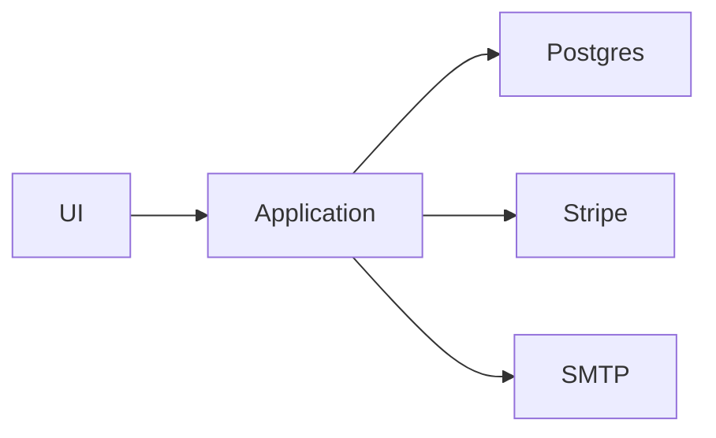
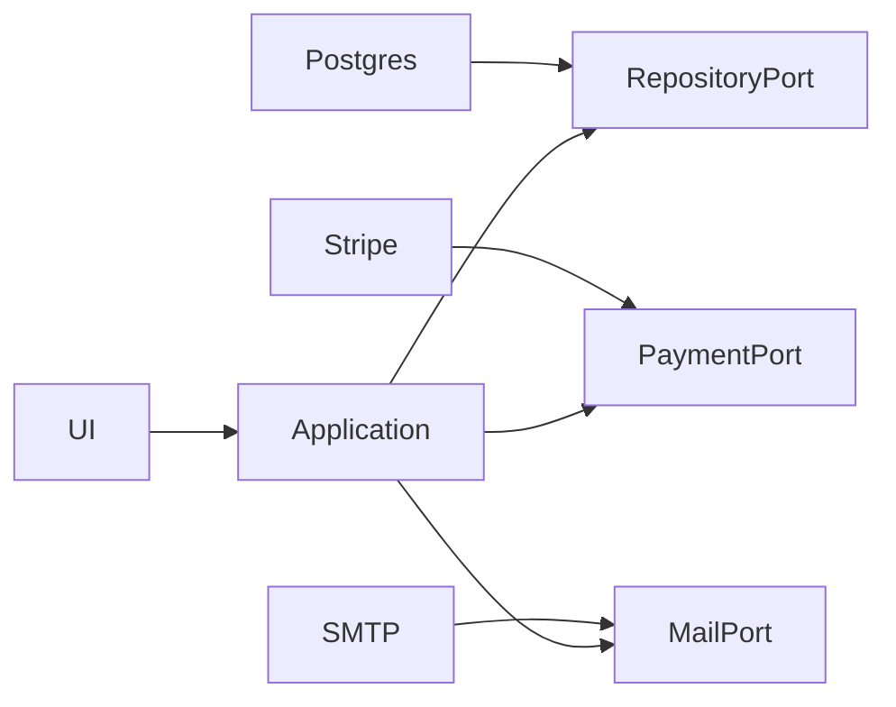

# Principes SOLID en conception orientée objet

> [!abstract] Objectif
> Comprendre les cinq principes **SOLID** comme des outils de raisonnement sur les responsabilités, les variations, les contrats de types et les dépendances. L'objectif n'est pas de produire mécaniquement beaucoup de petites classes ou d'interfaces, mais de concevoir un logiciel qui reste compréhensible et modifiable lorsque les besoins changent.

Voir aussi : [[Architecture des logiciels]], [[Design patterns]], [[C++]], [[Python]], [[Pyramid]], [[SOLID]].

> [!warning] Ne pas confondre deux sujets différents
> Ce cours traite de **SOLID en conception logicielle** : SRP, OCP, LSP, ISP et DIP.
>
> Le cours [[SOLID]] traite du projet **Solid / Social Linked Data** de Tim Berners-Lee, lié aux Pods, à RDF et au Web décentralisé.

> [!important] Idée centrale
> SOLID ne constitue ni une norme, ni une recette automatique, ni un objectif mesurable à atteindre à 100 %. Ce sont des **principes de conception**. Ils aident surtout à repérer les endroits où une modification locale risque d'entraîner des effets de bord disproportionnés.

## Sommaire

1. [[#1. Pourquoi SOLID ?]]
2. [[#2. Origine et portée des principes]]
3. [[#3. Lire SOLID correctement]]
4. [[#4. S — Single Responsibility Principle (SRP)]]
5. [[#5. O — Open Closed Principle (OCP)]]
6. [[#6. L — Liskov Substitution Principle (LSP)]]
7. [[#7. I — Interface Segregation Principle (ISP)]]
8. [[#8. D — Dependency Inversion Principle (DIP)]]
9. [[#9. Comment les cinq principes se renforcent]]
10. [[#10. SOLID et les design patterns]]
11. [[#11. SOLID en Python]]
12. [[#12. SOLID en C++]]
13. [[#13. SOLID à l'échelle de l'architecture]]
14. [[#14. SOLID et les tests]]
15. [[#15. Mesures et signaux utiles]]
16. [[#16. Refactorer un code existant avec SOLID]]
17. [[#17. Anti-patterns et mauvaises interprétations]]
18. [[#18. Étude de cas : traitement d'une commande]]
19. [[#19. Travaux pratiques]]
20. [[#20. Checklist de revue de code]]
21. [[#21. Glossaire]]
22. [[#22. Sources et références]]

---

# 1. Pourquoi SOLID ?

Les logiciels ne deviennent généralement pas difficiles à maintenir parce qu'une instruction particulière est trop compliquée. La difficulté apparaît plutôt lorsque les **relations entre les composants** rendent les changements risqués.

Quelques symptômes classiques :

- une petite demande métier oblige à modifier de nombreux fichiers sans rapport apparent ;
- une classe connaît la base de données, le format HTTP, le format des courriels et les règles métier ;
- ajouter un nouveau fournisseur de paiement impose de modifier une longue chaîne de `if` ;
- une sous-classe lève `NotImplementedError` pour des méthodes héritées ;
- un test unitaire exige de démarrer une base de données ou un serveur externe ;
- une interface change et dix implémentations doivent ajouter des méthodes vides ;
- les composants de haut niveau importent directement chaque bibliothèque technique utilisée par l'application.

Ces symptômes traduisent souvent deux propriétés :

```text
couplage fort + responsabilités mal séparées
```

SOLID vise à améliorer :

- la **compréhension** du code ;
- la **localité des changements** ;
- la **testabilité** ;
- la **substituabilité** des composants ;
- la **maîtrise des dépendances** ;
- la capacité à introduire une variation là où elle est réellement nécessaire.

## 1.1 Un problème de coût du changement

Considérons une application qui calcule une facture, enregistre celle-ci, génère un PDF puis envoie un courriel.

Une implémentation naïve peut tout concentrer dans une seule classe :

```python
class InvoiceService:
    def process(self, order):
        total = sum(line.price * line.quantity for line in order.lines)

        connection = psycopg.connect(...)
        connection.execute(
            "INSERT INTO invoices (...) VALUES (...)"
        )

        pdf = render_pdf(order, total)
        smtp = smtplib.SMTP("smtp.example.com")
        smtp.send_message(...)

        return total
```

Cette classe possède plusieurs raisons indépendantes de changer :

```text
règle de calcul
    + schéma SQL
    + moteur PDF
    + serveur SMTP
    + format du message
```

Même si le code ne fait que vingt lignes, sa responsabilité conceptuelle est déjà trop large.

## 1.2 Le but n'est pas de maximiser le nombre de classes

Une mauvaise lecture de SOLID conduit parfois à ceci :

```text
1 fonction
→ 1 interface
→ 1 implémentation
→ 1 factory
→ 1 adapter
→ 1 wrapper
```

sans aucun besoin réel de variation.

Cela augmente :

- le nombre de fichiers ;
- l'indirection ;
- la charge cognitive ;
- le temps nécessaire pour suivre l'exécution ;
- la difficulté à comprendre un cas simple.

> [!tip]
> Une abstraction a un coût. SOLID aide à placer les abstractions là où elles protègent une décision importante ou une variation réelle. Il ne demande pas d'abstraire chaque ligne de code.

## 1.3 Maintenabilité et évolutivité ne signifient pas « extensible partout »

Un système maintenable n'est pas un système capable d'accueillir n'importe quelle évolution imaginaire.

Une meilleure définition pratique est :

> le système permet d'effectuer les changements **probables et observés** sans propager inutilement leurs effets dans tout le code.

C'est pourquoi SOLID doit être associé à :

- l'observation des changements réels ;
- les tests ;
- le refactoring ;
- la connaissance du domaine ;
- la simplicité.

---

# 2. Origine et portée des principes

## 2.1 Robert C. Martin et les principes de conception

Les cinq principes aujourd'hui regroupés sous l'acronyme SOLID sont principalement associés aux travaux de **Robert C. Martin** sur la conception orientée objet.

Son texte *Design Principles and Design Patterns* publié autour de 2000 présente un ensemble de principes visant à limiter ce qu'il décrit comme la dégradation progressive d'une conception logicielle : rigidité, fragilité, immobilité et complexité inutile.

L'acronyme **SOLID** a ensuite été popularisé pour mémoriser cinq de ces principes :

```text
S  Single Responsibility Principle
O  Open Closed Principle
L  Liskov Substitution Principle
I  Interface Segregation Principle
D  Dependency Inversion Principle
```

Le sigle est couramment attribué à **Michael Feathers** au début des années 2000.

## 2.2 Tous les principes n'ont pas la même origine

Le LSP est particulier.

Il s'appuie sur les travaux de **Barbara Liskov** sur l'abstraction et le sous-typage, puis sur l'article de Barbara Liskov et Jeannette Wing, *A Behavioral Notion of Subtyping*, publié en 1994.

L'idée fondamentale est plus forte que :

```text
"la sous-classe possède les mêmes méthodes"
```

Elle demande que le sous-type respecte les **propriétés comportementales** promises par le type de base.

## 2.3 SOLID dépasse la programmation orientée objet stricte

Les formulations historiques parlent beaucoup de :

- classes ;
- héritage ;
- interfaces ;
- modules orientés objet.

Mais les problèmes visés sont plus généraux :

- responsabilité ;
- dépendance ;
- abstraction ;
- stabilité des contrats ;
- capacité à substituer une implémentation ;
- séparation des consommateurs.

On peut donc appliquer des idées SOLID dans :

- un programme fonctionnel ;
- des modules Python ;
- une architecture hexagonale ;
- des microservices ;
- des plugins ;
- des pipelines de traitement ;
- une application Web.

Il faut cependant éviter d'appliquer les mots « classe » et « interface » de manière artificielle à des paradigmes qui n'en ont pas besoin.

## 2.4 SOLID n'est pas synonyme de Clean Architecture

Les concepts se recoupent, mais ils ne sont pas identiques.

```text
SOLID
  = principes de conception

Clean Architecture
  = style architectural centré sur la direction des dépendances

Design patterns
  = solutions récurrentes à des problèmes de conception

Dependency Injection
  = technique de fourniture des dépendances
```

Le DIP influence fortement des architectures comme :

- Ports and Adapters ;
- Hexagonal Architecture ;
- Onion Architecture ;
- Clean Architecture.

Mais utiliser une telle architecture ne garantit pas que toutes les classes respectent SRP, LSP ou ISP.

---

# 3. Lire SOLID correctement

Avant d'étudier chaque lettre, il faut éviter plusieurs contresens.

## 3.1 Ce sont des principes, pas des lois

Une règle absolue ressemble à :

```text
"une classe doit avoir exactement une méthode"
```

SOLID ne fonctionne pas ainsi.

Il propose plutôt des questions :

```text
Qui demande ce changement ?
Quel comportement doit pouvoir varier ?
Ce sous-type respecte-t-il le contrat ?
Ce client dépend-il de méthodes inutiles ?
La politique métier dépend-elle d'un détail technique ?
```

## 3.2 Les principes se jugent dans un contexte de changement

Une classe peut être petite et pourtant violer SRP.

Une autre peut être longue mais cohérente si toutes ses opérations changent pour la même raison.

De même, une dépendance vers une classe concrète n'est pas automatiquement une violation de DIP.

Exemple :

```python
from datetime import datetime

now = datetime.now()
```

Créer systématiquement une abstraction `IDatetimeFactory` n'a pas forcément de valeur.

En revanche, si la notion d'horloge rend les tests impossibles :

```python
class TokenService:
    def __init__(self, clock):
        self.clock = clock
```

l'abstraction peut devenir utile.

## 3.3 Cohésion et couplage

SOLID cherche globalement :

```text
forte cohésion à l'intérieur d'un composant
faible couplage entre composants indépendants
```

### Cohésion

Une unité est cohésive lorsque ses éléments participent à une même responsabilité.

### Couplage

Deux unités sont couplées lorsqu'une modification de l'une risque d'exiger une modification de l'autre.

Le but n'est pas un couplage nul, ce qui est impossible dans un système utile.

Le but est un couplage :

- explicite ;
- justifié ;
- orienté dans une direction maîtrisée ;
- stable là où cela compte.

## 3.4 Abstraction utile vs abstraction spéculative

Une abstraction utile protège généralement :

- une frontière avec un service externe ;
- une politique métier ;
- une famille de variantes déjà observée ;
- un composant instable ;
- une opération difficile à tester directement.

Une abstraction spéculative existe uniquement pour une hypothèse vague :

```text
"un jour, peut-être, on changera de base de données"
```

> [!tip]
> Le meilleur moment pour créer une abstraction est souvent lorsque deux implémentations ou deux besoins concrets montrent clairement ce qui doit rester stable et ce qui doit varier.

---

# 4. S — Single Responsibility Principle (SRP)

## 4.1 Formulation

Le **Single Responsibility Principle** est souvent résumé par :

> une unité de conception devrait n'avoir qu'une seule raison cohérente de changer.

Dans les formulations plus récentes de Robert C. Martin, cette « raison » peut être comprise comme un **acteur** ou une source de changement.

L'important n'est donc pas :

```text
une classe = une seule action
```

mais plutôt :

```text
une classe = un ensemble cohérent de comportements soumis à la même responsabilité
```

## 4.2 Exemple de violation

```python
class Employee:
    def calculate_pay(self):
        ...

    def report_hours(self):
        ...

    def save(self):
        ...
```

Trois acteurs peuvent demander des changements différents :

```text
finance      → calculate_pay
RH           → report_hours
DBA / infra  → save
```

Une modification du schéma de stockage n'a aucune raison métier de modifier le composant qui calcule le salaire.

## 4.3 Refactoring

```python
from dataclasses import dataclass


@dataclass(frozen=True)
class Employee:
    id: int
    hourly_rate: float
    hours: float


class PayrollCalculator:
    def calculate(self, employee: Employee) -> float:
        return employee.hourly_rate * employee.hours


class TimeReporter:
    def build_report(self, employee: Employee) -> dict:
        return {
            "employee_id": employee.id,
            "hours": employee.hours,
        }


class EmployeeRepository:
    def save(self, employee: Employee) -> None:
        ...
```

Nous avons séparé :

- le modèle de données ;
- la règle de paie ;
- le reporting ;
- la persistance.

## 4.4 Une seule responsabilité ne signifie pas une seule méthode

Considérons :

```python
class Money:
    def add(self, other):
        ...

    def subtract(self, other):
        ...

    def multiply(self, factor):
        ...

    def format(self):
        ...
```

Les trois premières méthodes peuvent appartenir à une responsabilité cohérente : manipuler une valeur monétaire.

`format`, en revanche, peut poser question si la représentation dépend :

- de la locale ;
- du canal d'affichage ;
- d'un format comptable ;
- d'une API externe.

Le découpage dépend donc du contexte.

## 4.5 SRP au niveau d'une fonction

Une fonction comme :

```python
def register_user(data):
    validate(data)
    hash_password(data)
    insert_into_database(data)
    send_welcome_email(data)
    publish_event(data)
```

peut être acceptable comme **orchestrateur** si elle ne contient pas directement toutes les implémentations.

Une version plus claire :

```python
def register_user(command, repository, mailer, events):
    user = User.register(command)
    repository.add(user)
    mailer.send_welcome(user)
    events.publish(UserRegistered(user.id))
    return user
```

La responsabilité de cette fonction est alors :

```text
orchestrer le cas d'usage "inscrire un utilisateur"
```

## 4.6 SRP et modules

SRP peut s'appliquer à :

- une fonction ;
- une classe ;
- un module ;
- un package ;
- un service.

Par exemple :

```text
payments/
    domain.py
    service.py
    stripe_adapter.py
    repository.py
```

est souvent plus maintenable qu'un seul :

```text
utils.py
```

de plusieurs milliers de lignes mélangeant toutes les responsabilités.

## 4.7 Signaux de violation SRP

Quelques indices :

- nom contenant `Manager`, `Utils`, `Helper` sans responsabilité précise ;
- nombreuses dépendances hétérogènes ;
- modifications fréquentes pour des demandes sans rapport ;
- classe difficile à nommer sans utiliser « et » ;
- tests séparés en groupes qui ne partagent presque aucun état ;
- imports provenant de couches très différentes ;
- conflits Git fréquents dans le même fichier entre équipes indépendantes.

Exemple de nom révélateur :

```text
UserAndPaymentAndNotificationManager
```

## 4.8 Trop appliquer SRP

Le découpage peut devenir excessif :

```text
GetUserNameService
SetUserNameService
NormalizeUserNameService
ValidateUserNameService
```

alors qu'un objet cohérent `UserName` ou `User` suffirait.

> [!warning]
> SRP ne demande pas de maximiser le nombre d'objets. Il demande de regrouper ce qui change ensemble et de séparer ce qui change pour des raisons indépendantes.

## 4.9 Questions de revue SRP

- Qui peut demander une modification de ce composant ?
- Les raisons de changement sont-elles liées ?
- Le composant mélange-t-il métier et infrastructure ?
- Son nom décrit-il clairement son rôle ?
- Peut-on expliquer sa responsabilité en une phrase courte ?
- Les tests du composant racontent-ils une histoire cohérente ?

---

# 5. O — Open Closed Principle (OCP)

## 5.1 Formulation

L'**Open Closed Principle** demande qu'une entité logicielle soit :

```text
ouverte à l'extension
fermée à la modification
```

Cela signifie qu'une variation prévue doit pouvoir être ajoutée sans réécrire continuellement le cœur stable du système.

> [!important]
> « Fermé à la modification » ne signifie pas que le fichier ne sera plus jamais modifié. Cela signifie que certains axes de variation peuvent être pris en charge par extension plutôt que par modification répétée d'une logique centrale.

## 5.2 Exemple naïf

```python
def shipping_cost(order, carrier):
    if carrier == "post":
        return order.weight * 1.2
    elif carrier == "express":
        return order.weight * 2.5 + 5
    elif carrier == "pickup":
        return 0
    else:
        raise ValueError("unknown carrier")
```

À chaque nouveau transporteur :

```text
ouvrir shipping.py
modifier la fonction
ajouter une branche
retester toutes les branches
```

La fonction devient le point central de toutes les variations.

## 5.3 Introduire une stratégie

```python
from typing import Protocol


class ShippingPolicy(Protocol):
    def cost(self, order) -> float:
        ...


class PostShipping:
    def cost(self, order) -> float:
        return order.weight * 1.2


class ExpressShipping:
    def cost(self, order) -> float:
        return order.weight * 2.5 + 5


class PickupShipping:
    def cost(self, order) -> float:
        return 0.0


def shipping_cost(order, policy: ShippingPolicy) -> float:
    return policy.cost(order)
```

Ajouter un nouveau transporteur peut devenir :

```python
class DroneShipping:
    def cost(self, order) -> float:
        return 15 + order.weight * 3
```

sans modifier l'algorithme consommateur.

## 5.4 Le point de variation doit être réel

Il serait absurde d'ajouter une interface à chaque addition :

```python
class AdditionStrategy(Protocol):
    def add(self, a, b): ...
```

si aucune variation n'existe.

L'OCP est particulièrement utile pour :

- systèmes de plugins ;
- drivers ;
- moteurs de rendu ;
- fournisseurs de paiement ;
- stratégies tarifaires ;
- formats d'export ;
- règles de validation composables ;
- handlers d'événements.

## 5.5 Polymorphisme plutôt que condition centrale

Un grand `if/elif` n'est pas toujours mauvais.

Exemple acceptable :

```python
def parse_boolean(value: str) -> bool:
    if value == "true":
        return True
    if value == "false":
        return False
    raise ValueError(value)
```

Il représente un domaine fermé et simple.

En revanche, un dispatch qui change toutes les semaines :

```python
if provider == "stripe": ...
elif provider == "paypal": ...
elif provider == "adyen": ...
elif provider == "bank": ...
```

est un bon candidat à l'extraction d'un point d'extension.

## 5.6 OCP avec un registre

Une autre stratégie consiste à utiliser un registre :

```python
EXPORTERS = {}


def register_exporter(name):
    def decorator(func):
        EXPORTERS[name] = func
        return func
    return decorator


@register_exporter("json")
def export_json(data):
    ...


@register_exporter("csv")
def export_csv(data):
    ...
```

Le cœur :

```python
def export(name, data):
    return EXPORTERS[name](data)
```

ne connaît pas la liste complète à l'avance.

## 5.7 OCP et configuration

Une configuration peut aussi déplacer le point de variation :

```yaml
payment_provider: stripe
```

puis :

```python
providers = {
    "stripe": StripePayment(...),
    "mock": MockPayment(...),
}

payment = providers[settings.payment_provider]
```

Le système n'est pas forcément « plus objet », mais le changement est localisé.

## 5.8 OCP et héritage

Historiquement, OCP est souvent illustré par l'héritage.

Aujourd'hui, la **composition** est souvent préférable :

```text
composition
    → dépendances explicites
    → variants combinables
    → hiérarchies moins rigides
```

L'héritage reste utile lorsque la relation de sous-typage est réellement valide, ce qui nous conduit au LSP.

## 5.9 Coût de l'extension prématurée

Une architecture construite pour vingt variations qui n'arriveront jamais produit :

- des abstractions inutiles ;
- des configurations difficiles à suivre ;
- une API interne trop générique ;
- des tests plus complexes ;
- une perte de lisibilité.

Une bonne stratégie :

```text
1. écrire la solution simple ;
2. observer la première variation ;
3. observer la deuxième variation ;
4. extraire le point commun réellement stable.
```

Cette démarche rejoint le principe :

```text
YAGNI — You Aren't Gonna Need It
```

## 5.10 Questions de revue OCP

- Quelle variation revient régulièrement ?
- Chaque nouvelle variante modifie-t-elle le même `if` ?
- Le point stable est-il clairement identifié ?
- L'abstraction représente-t-elle un besoin réel ?
- Peut-on ajouter une variante sans modifier le cœur métier ?
- La complexité introduite est-elle proportionnée au bénéfice ?

---

# 6. L — Liskov Substitution Principle (LSP)

## 6.1 Formulation

Le **Liskov Substitution Principle** demande qu'un objet d'un sous-type puisse être utilisé là où le type de base est attendu **sans casser les propriétés promises par le contrat**.

Une formulation pratique :

```text
si B est annoncé comme sous-type de A,
un client correct de A doit pouvoir recevoir B
sans devoir connaître une exception spéciale pour B.
```

Ce principe concerne donc le **comportement**, pas seulement la signature des méthodes.

## 6.2 Le piège de la compatibilité syntaxique

Considérons :

```python
class Bird:
    def fly(self):
        ...


class Penguin(Bird):
    def fly(self):
        raise NotImplementedError("penguins cannot fly")
```

Syntaxiquement :

```text
Penguin est un Bird
```

Mais le contrat de `Bird` promet implicitement :

```text
fly() est une opération valide
```

`Penguin` ne respecte pas ce contrat.

Le problème vient donc du modèle :

```python
class Bird:
    pass


class FlyingBird(Bird):
    def fly(self):
        ...


class Penguin(Bird):
    def swim(self):
        ...
```

## 6.3 Préconditions, postconditions et invariants

Une manière rigoureuse de raisonner sur LSP utilise les contrats.

### Précondition

Condition que le client doit respecter avant l'appel.

### Postcondition

Propriété garantie après l'appel.

### Invariant

Propriété qui reste vraie pour l'objet au cours de son cycle de vie.

Un sous-type ne devrait pas :

- exiger des préconditions plus fortes ;
- fournir des garanties plus faibles ;
- casser les invariants du type de base.

## 6.4 Exemple de précondition renforcée

Type de base :

```python
class PaymentProcessor:
    def pay(self, amount: float) -> None:
        """Accepte tout montant strictement positif."""
```

Sous-type :

```python
class PremiumPaymentProcessor(PaymentProcessor):
    def pay(self, amount: float) -> None:
        if amount < 100:
            raise ValueError("minimum 100")
```

Le client pouvait légitimement appeler :

```python
processor.pay(20)
```

avec le type de base.

Le sous-type renforce la précondition et casse donc la substituabilité.

## 6.5 Exemple de postcondition affaiblie

Type de base :

```python
class Repository:
    def get(self, identifier: int) -> User:
        """Retourne un User ou lève UserNotFound."""
```

Sous-type :

```python
class CachedRepository(Repository):
    def get(self, identifier: int):
        return None
```

Le client du contrat de base peut faire :

```python
user = repository.get(42)
print(user.email)
```

Le sous-type a affaibli le résultat garanti.

## 6.6 Le célèbre exemple Rectangle / Carré

Imaginons une classe mutable :

```python
class Rectangle:
    def set_width(self, width):
        self.width = width

    def set_height(self, height):
        self.height = height
```

Puis :

```python
class Square(Rectangle):
    def set_width(self, width):
        self.width = width
        self.height = width

    def set_height(self, height):
        self.width = height
        self.height = height
```

Un client du rectangle :

```python
def resize(rectangle: Rectangle):
    rectangle.set_width(5)
    rectangle.set_height(2)
    assert rectangle.width == 5
    assert rectangle.height == 2
```

fonctionne pour `Rectangle`, mais pas pour `Square`.

Mathématiquement :

```text
un carré est un rectangle
```

mais ce modèle objet mutable ne permet pas nécessairement le même sous-typage comportemental.

> [!important]
> Une relation « est un » dans le monde réel ne garantit pas une relation d'héritage correcte dans un logiciel. Le contrat observable par les clients est plus important que la taxonomie.

## 6.7 LSP et exceptions

Si le type de base promet :

```text
read() lit toujours des octets disponibles
```

mais qu'un sous-type lève régulièrement :

```python
UnsupportedOperation
```

alors le client doit connaître le sous-type pour se protéger.

C'est souvent le signe que :

- l'interface est trop large ;
- la hiérarchie est incorrecte ;
- plusieurs capacités doivent être séparées.

Cela rejoint ISP.

## 6.8 LSP avec le duck typing Python

Python permet un sous-typage structurel informel :

```python
class FileLogger:
    def write(self, message):
        ...


class ConsoleLogger:
    def write(self, message):
        ...
```

Aucune classe de base n'est nécessaire.

Mais LSP reste pertinent :

```text
même nom de méthode
≠ même contrat
```

Si `ConsoleLogger.write()` accepte une chaîne mais `FileLogger.write()` exige un objet spécifique, les deux ne sont pas réellement substituables pour le client.

## 6.9 LSP et typage statique

Le compilateur peut vérifier :

- certaines signatures ;
- certains types de retour ;
- certaines règles de variance.

Il ne peut généralement pas vérifier automatiquement :

- les invariants métier ;
- les effets de bord ;
- l'ordre des opérations ;
- les garanties temporelles ;
- la signification d'une exception ;
- l'idempotence.

Les tests de contrat restent donc utiles.

## 6.10 Test de contrat

```python
def repository_contract(repository):
    user = User(id=1, email="a@example.com")
    repository.add(user)

    loaded = repository.get(1)

    assert loaded == user
```

On peut exécuter le même test contre :

- `InMemoryRepository` ;
- `PostgresRepository` ;
- `SqliteRepository`.

Si une implémentation échoue, elle ne respecte peut-être pas le contrat commun.

## 6.11 Questions de revue LSP

- Le sous-type respecte-t-il toutes les opérations promises ?
- Le client doit-il tester `isinstance()` pour gérer un cas spécial ?
- Une méthode héritée lève-t-elle `NotImplementedError` ?
- Les préconditions sont-elles renforcées ?
- Les garanties sont-elles affaiblies ?
- Les exceptions restent-elles compatibles avec le contrat ?
- Les invariants du type de base restent-ils vrais ?

---

# 7. I — Interface Segregation Principle (ISP)

## 7.1 Formulation

L'**Interface Segregation Principle** demande qu'un client ne soit pas forcé de dépendre d'opérations qu'il n'utilise pas.

Une interface très large crée un couplage artificiel entre des consommateurs qui ont des besoins différents.

## 7.2 Interface trop large

```python
class Machine:
    def print(self, document): ...
    def scan(self, document): ...
    def fax(self, document): ...
```

Une imprimante simple :

```python
class BasicPrinter(Machine):
    def print(self, document):
        ...

    def scan(self, document):
        raise NotImplementedError

    def fax(self, document):
        raise NotImplementedError
```

L'interface force l'implémentation à annoncer des capacités qu'elle ne possède pas.

## 7.3 Séparer les capacités

```python
from typing import Protocol


class Printer(Protocol):
    def print(self, document) -> None:
        ...


class Scanner(Protocol):
    def scan(self) -> bytes:
        ...


class Fax(Protocol):
    def fax(self, document) -> None:
        ...
```

Une machine multifonction peut satisfaire plusieurs protocoles :

```python
class MultiFunctionDevice:
    def print(self, document):
        ...

    def scan(self):
        ...

    def fax(self, document):
        ...
```

Une imprimante simple ne fournit que :

```python
class SimplePrinter:
    def print(self, document):
        ...
```

## 7.4 Concevoir les interfaces depuis le point de vue du client

Un piège fréquent consiste à définir une interface en fonction de tout ce que sait faire l'implémentation.

Mais ISP propose de partir du client.

Exemple :

```text
Application métier
    besoin : charger un utilisateur

Admin
    besoin : charger + supprimer + lister + exporter
```

Le cas d'usage métier peut dépendre d'un petit protocole :

```python
class UserReader(Protocol):
    def get(self, user_id: int) -> User:
        ...
```

Il n'a pas besoin de connaître :

```python
delete()
export_csv()
rebuild_index()
```

## 7.5 ISP et sécurité

Une interface minimale réduit aussi les capacités exposées.

Si un composant reçoit :

```python
AdminDatabaseConnection
```

alors qu'il a seulement besoin de :

```python
UserReader
```

il possède potentiellement beaucoup plus de pouvoir que nécessaire.

ISP rejoint donc le principe de sécurité :

```text
least privilege
```

## 7.6 ISP et évolution des interfaces

Une interface centrale :

```python
class Storage:
    def load(...): ...
    def save(...): ...
    def delete(...): ...
    def stream(...): ...
    def lock(...): ...
    def snapshot(...): ...
```

force toutes les implémentations à évoluer lorsque l'on ajoute :

```python
def replicate(...): ...
```

Des interfaces plus focalisées limitent cette propagation.

## 7.7 Ne pas créer une interface par méthode

L'extrême inverse est problématique :

```text
UserGetter
UserSaver
UserDeleter
UserLister
UserCounter
UserEmailFinder
```

sans frontière conceptuelle claire.

Une interface doit représenter :

- un rôle cohérent ;
- une capacité utile à un client ;
- un contrat stable.

## 7.8 ISP dans une API HTTP

Le principe ne s'applique pas directement comme une règle de routes HTTP, mais l'idée reste utile.

Une API qui expose un énorme objet avec cinquante champs obligatoires à tous les consommateurs crée du couplage.

On peut préférer :

- endpoints par cas d'usage ;
- représentations adaptées ;
- permissions par capacité ;
- schémas versionnés.

Il faut cependant équilibrer cela avec la complexité opérationnelle.

## 7.9 Questions de revue ISP

- Le client utilise-t-il toutes les méthodes de l'interface ?
- Certaines implémentations ont-elles des méthodes vides ?
- Une nouvelle méthode force-t-elle des changements sans rapport ?
- L'interface représente-t-elle un rôle client clair ?
- Peut-on réduire les capacités données au composant ?
- Le découpage reste-t-il compréhensible ?

---

# 8. D — Dependency Inversion Principle (DIP)

## 8.1 Formulation

Le **Dependency Inversion Principle** demande en substance que :

```text
la politique de haut niveau ne dépende pas directement des détails de bas niveau ;
les deux dépendent de contrats appropriés ;
les abstractions ne sont pas façonnées par les détails techniques.
```

Le mot important est **direction des dépendances de code**.

## 8.2 Exemple sans inversion

```python
class OrderService:
    def __init__(self):
        self.repository = PostgresOrderRepository()
        self.mailer = SmtpMailer("smtp.example.com")

    def submit(self, order):
        self.repository.save(order)
        self.mailer.send_confirmation(order)
```

Le cas d'usage de haut niveau connaît directement :

- PostgreSQL ;
- SMTP ;
- les paramètres de construction.

Le graphe de dépendances ressemble à :

```text
OrderService
   ├──> PostgresOrderRepository
   └──> SmtpMailer
```

## 8.3 Introduire des ports

```python
from typing import Protocol


class OrderRepository(Protocol):
    def save(self, order) -> None:
        ...


class Mailer(Protocol):
    def send_confirmation(self, order) -> None:
        ...
```

Le service dépend des contrats dont il a besoin :

```python
class OrderService:
    def __init__(
        self,
        repository: OrderRepository,
        mailer: Mailer,
    ):
        self.repository = repository
        self.mailer = mailer

    def submit(self, order):
        self.repository.save(order)
        self.mailer.send_confirmation(order)
```

Les détails implémentent ces ports :

```python
class PostgresOrderRepository:
    def save(self, order):
        ...


class SmtpMailer:
    def send_confirmation(self, order):
        ...
```

Le graphe conceptuel devient :

```text
                         +---------------------+
                         | OrderRepository     |
                         | Mailer              |
                         +----------^----------+
                                    |
                  dépend de         | implémente
                                    |
+-------------------+               |
|   OrderService    |               |
+-------------------+               |
                                    |
                     +--------------+--------------+
                     |                             |
             PostgresRepository                SmtpMailer
```

La politique métier ne dépend plus directement des détails.

## 8.4 DIP n'est pas Dependency Injection

Ces termes sont souvent confondus.

### Dependency Inversion Principle

Principe d'architecture des dépendances.

### Dependency Injection

Technique qui consiste à fournir une dépendance depuis l'extérieur.

Exemple d'injection :

```python
service = OrderService(
    repository=PostgresOrderRepository(connection),
    mailer=SmtpMailer(settings.smtp),
)
```

L'injection aide à appliquer DIP, mais on peut injecter une mauvaise dépendance :

```python
class Service:
    def __init__(self, postgres_repository: PostgresRepository):
        ...
```

La construction est injectée, mais le service dépend toujours explicitement du détail PostgreSQL.

## 8.5 DIP n'est pas IoC

**Inversion of Control (IoC)** est un concept plus large : le flux de contrôle est confié à un framework ou à un mécanisme externe.

Exemples :

- callbacks ;
- frameworks Web ;
- event loop ;
- conteneur de dépendances.

Une application Pyramid ou Django utilise déjà une forme d'IoC :

```text
le framework appelle notre code
```

Cela ne signifie pas automatiquement que le DIP est bien appliqué au sein de l'application.

## 8.6 Composition root

Les objets concrets doivent bien être créés quelque part.

On appelle souvent **composition root** le point où l'application assemble les implémentations :

```python
def build_application(settings):
    connection = connect_postgres(settings.database_url)

    repository = PostgresOrderRepository(connection)
    mailer = SmtpMailer(settings.smtp)

    return OrderService(
        repository=repository,
        mailer=mailer,
    )
```

Ce point est autorisé à connaître les détails.

L'objectif est de concentrer cette connaissance au bord du système.

## 8.7 Politique vs détail

Exemples de politiques :

- calculer une remise ;
- vérifier l'éligibilité ;
- valider une commande ;
- décider qu'un utilisateur peut voter ;
- appliquer une règle fiscale.

Exemples de détails :

- PostgreSQL ;
- Redis ;
- SMTP ;
- filesystem ;
- API Stripe ;
- framework Web ;
- sérialiseur JSON.

Une architecture robuste cherche généralement :

```text
les détails dépendent des politiques
plutôt que
les politiques dépendent des détails
```

## 8.8 DIP et architecture hexagonale

Dans une architecture Ports and Adapters :

```text
             HTTP adapter
                 |
                 v
        +------------------+
        | application core |
        +------------------+
          ^              ^
          |              |
    repository port   mail port
          ^              ^
          |              |
      PostgreSQL        SMTP
       adapter         adapter
```

Le cœur définit ou consomme des **ports**.

Les adaptateurs techniques se placent à l'extérieur.

Cela rend possible :

- tests en mémoire ;
- remplacement d'une API ;
- migration technique ;
- exécution sans infrastructure réelle.

## 8.9 Quand ne pas abstraire

Écrire :

```python
class ListFactory(Protocol):
    def create_list(self): ...
```

pour éviter un simple :

```python
[]
```

est inutile.

DIP devient utile lorsque la dépendance :

- représente une frontière externe ;
- est instable ;
- complique les tests ;
- ne doit pas contaminer le domaine ;
- possède plusieurs implémentations pertinentes.

## 8.10 Questions de revue DIP

- Le cœur métier importe-t-il directement un framework technique ?
- Les règles métier construisent-elles elles-mêmes leurs dépendances ?
- Une base de données est-elle nécessaire pour tester une règle pure ?
- Les interfaces sont-elles définies du point de vue du besoin métier ?
- Les détails techniques peuvent-ils être remplacés au bord du système ?
- Le point d'assemblage des implémentations est-il identifiable ?

---

# 9. Comment les cinq principes se renforcent

Les cinq principes ne sont pas indépendants.

## 9.1 SRP + ISP

Si une classe possède plusieurs responsabilités, son interface devient souvent trop large.

```text
classe trop large
    → interface trop large
    → clients couplés à des opérations inutiles
```

Séparer les responsabilités permet souvent de produire des interfaces plus ciblées.

## 9.2 OCP + DIP

Pour étendre un comportement sans modifier le cœur, le cœur doit souvent dépendre d'un contrat.

```text
OCP
    besoin d'un point d'extension
        ↓
DIP
    dépendre d'un contrat plutôt que du détail
```

## 9.3 ISP + LSP

Une interface trop large pousse certaines implémentations à :

```python
raise NotImplementedError
```

ce qui casse souvent LSP.

En séparant les capacités avec ISP, on rend la substituabilité plus réaliste.

## 9.4 SRP + OCP

Une classe qui gère dix variations en même temps accumule plusieurs raisons de changer.

Extraire des stratégies :

- améliore OCP ;
- peut aussi améliorer SRP.

## 9.5 LSP comme garde-fou de l'abstraction

OCP et DIP encouragent parfois l'introduction d'abstractions.

LSP demande ensuite :

```text
les implémentations respectent-elles vraiment le même contrat ?
```

Une interface commune n'a de valeur que si ses implémentations sont réellement substituables.

## 9.6 Vue synthétique

| Principe | Question principale | Risque visé |
|---|---|---|
| SRP | Pourquoi ce composant change-t-il ? | responsabilités mélangées |
| OCP | Comment ajouter une variation ? | modification répétée du cœur |
| LSP | Le sous-type respecte-t-il le contrat ? | polymorphisme trompeur |
| ISP | De quoi ce client a-t-il réellement besoin ? | interface trop large |
| DIP | Dans quel sens le code dépend-il ? | métier couplé aux détails |

---

# 10. SOLID et les design patterns

Les design patterns ne sont pas une traduction automatique des lettres de SOLID.

Ils peuvent cependant fournir des mécanismes concrets.

## 10.1 Strategy

Le pattern **Strategy** aide souvent OCP.

```text
algorithme stable
    + stratégie interchangeable
```

Exemples :

- calcul de livraison ;
- tarification ;
- compression ;
- sélection d'algorithme.

## 10.2 Adapter

**Adapter** aide à protéger le cœur métier d'une API externe.

```text
contrat interne
      ^
      |
   Adapter
      |
      v
API externe
```

Cela soutient DIP et parfois ISP.

## 10.3 Decorator

**Decorator** permet d'ajouter des responsabilités périphériques sans modifier le composant principal.

Exemple :

```python
class LoggingRepository:
    def __init__(self, inner, logger):
        self.inner = inner
        self.logger = logger

    def save(self, entity):
        self.logger.info("saving %s", entity.id)
        return self.inner.save(entity)
```

On peut décorer :

- cache ;
- logs ;
- métriques ;
- retries ;
- transactions.

## 10.4 Factory

Une factory peut déplacer la création des détails hors du cœur.

Mais attention :

```text
Factory partout
≠ DIP automatiquement
```

Si le métier appelle directement :

```python
DatabaseFactory.create_postgres()
```

il connaît toujours le détail technique.

## 10.5 Observer / événements

Les événements permettent d'ajouter des réactions sans modifier l'émetteur :

```text
OrderCreated
   ├── SendEmail
   ├── UpdateAnalytics
   └── ReserveStock
```

Cela peut soutenir OCP.

Mais un bus d'événements généralisé peut également rendre le flux difficile à suivre.

## 10.6 Null Object

Un **Null Object** peut préserver LSP mieux qu'un `None` dispersé.

```python
class NullMetrics:
    def increment(self, name):
        pass
```

Le client utilise le même contrat sans test spécial.

## 10.7 Design patterns et sur-ingénierie

Ne jamais appliquer :

```text
1 principe SOLID = 1 pattern obligatoire
```

Les patterns sont des outils.

Une fonction et un dictionnaire peuvent parfois être plus lisibles qu'une hiérarchie complète.

Voir [[Design patterns]].

---

# 11. SOLID en Python

Python possède des caractéristiques qui changent la manière d'appliquer SOLID :

- duck typing ;
- fonctions de première classe ;
- modules ;
- décorateurs ;
- protocoles structurels ;
- classes abstraites facultatives ;
- injection manuelle simple.

## 11.1 Ne pas imiter Java inutilement

En Python, ceci est souvent excessif :

```python
class CalculatorInterface(ABC):
    @abstractmethod
    def calculate(self):
        ...


class CalculatorImpl(CalculatorInterface):
    def calculate(self):
        ...
```

si aucune autre implémentation ni frontière n'existe.

Une simple fonction peut suffire :

```python
def calculate(invoice):
    ...
```

## 11.2 Protocol pour un contrat structurel

`typing.Protocol` permet de décrire ce qu'un client exige sans imposer une hiérarchie nominale.

```python
from typing import Protocol


class Clock(Protocol):
    def now(self) -> datetime:
        ...
```

Implémentation réelle :

```python
class SystemClock:
    def now(self) -> datetime:
        return datetime.now(timezone.utc)
```

Test :

```python
class FrozenClock:
    def __init__(self, instant):
        self.instant = instant

    def now(self):
        return self.instant
```

Le client :

```python
class TokenService:
    def __init__(self, clock: Clock):
        self.clock = clock
```

combine :

- ISP : petit contrat ;
- DIP : dépendance abstraite ;
- LSP : implémentations substituables.

## 11.3 ABC quand une relation nominale est utile

`abc.ABC` peut être pertinente lorsque l'on veut :

- interdire l'instanciation incomplète ;
- fournir un comportement commun ;
- représenter explicitement une famille de types.

```python
from abc import ABC, abstractmethod


class Serializer(ABC):
    @abstractmethod
    def dumps(self, value) -> bytes:
        ...
```

Mais une ABC n'est pas obligatoire pour appliquer SOLID.

## 11.4 Les fonctions sont aussi des stratégies

Au lieu de :

```python
class DiscountStrategy(Protocol):
    def apply(self, total): ...
```

on peut écrire :

```python
from collections.abc import Callable

Discount = Callable[[float], float]


def no_discount(total: float) -> float:
    return total


def ten_percent(total: float) -> float:
    return total * 0.9
```

Puis :

```python
def checkout(total: float, discount: Discount) -> float:
    return discount(total)
```

Cette solution respecte très bien OCP et DIP avec moins d'indirection.

## 11.5 Modules comme frontières

Python permet aussi :

```text
application/
    domain/
    services/
    adapters/
```

sans imposer une classe pour chaque concept.

Un module peut avoir une responsabilité claire et constituer une frontière architecturale.

## 11.6 Dataclasses et objets valeur

Un objet valeur simple n'a pas besoin d'une interface :

```python
from dataclasses import dataclass


@dataclass(frozen=True)
class EmailAddress:
    value: str
```

SOLID ne demande pas d'abstraire les structures stables.

## 11.7 Injection manuelle

Python n'exige pas un conteneur de DI.

```python
repository = PostgresRepository(db)
mailer = SmtpMailer(config)
service = RegistrationService(repository, mailer)
```

est souvent suffisant.

Un conteneur devient utile lorsque :

- le graphe d'objets devient grand ;
- les scopes sont complexes ;
- le framework fournit déjà ce mécanisme ;
- la configuration devient difficile à maintenir manuellement.

## 11.8 Exemple Python complet

Port :

```python
class PaymentGateway(Protocol):
    def charge(self, customer_id: str, cents: int) -> str:
        ...
```

Cas d'usage :

```python
class CheckoutService:
    def __init__(self, gateway: PaymentGateway):
        self.gateway = gateway

    def checkout(self, cart, customer_id):
        cents = cart.total_cents()
        transaction_id = self.gateway.charge(customer_id, cents)
        return Receipt(transaction_id, cents)
```

Adaptateur :

```python
class StripeGateway:
    def __init__(self, client):
        self.client = client

    def charge(self, customer_id, cents):
        response = self.client.payments.create(
            customer=customer_id,
            amount=cents,
        )
        return response.id
```

Test :

```python
class FakeGateway:
    def __init__(self):
        self.calls = []

    def charge(self, customer_id, cents):
        self.calls.append((customer_id, cents))
        return "tx-test"
```

Le domaine ne connaît pas Stripe.

---

# 12. SOLID en C++

C++ offre d'autres outils :

- classes abstraites ;
- fonctions virtuelles ;
- templates ;
- concepts ;
- composition ;
- RAII ;
- types valeur ;
- PImpl.

Voir [[C++]].

## 12.1 Interface virtuelle minimale

```cpp
class PaymentGateway {
public:
    virtual ~PaymentGateway() = default;
    virtual std::string charge(
        const std::string& customer,
        std::int64_t cents
    ) = 0;
};
```

Le service dépend de cette abstraction :

```cpp
class CheckoutService {
public:
    explicit CheckoutService(PaymentGateway& gateway)
        : gateway_{gateway} {}

private:
    PaymentGateway& gateway_;
};
```

## 12.2 LSP et destructeurs virtuels

Si un type est destiné à être utilisé polymorphiquement via une classe de base, le destructeur doit être conçu correctement.

Une interface :

```cpp
class Writer {
public:
    virtual ~Writer() = default;
    virtual void write(std::string_view data) = 0;
};
```

évite un comportement indéfini lors d'une destruction polymorphique.

## 12.3 Polymorphisme statique

SOLID ne requiert pas toujours des fonctions virtuelles.

On peut utiliser des templates :

```cpp
template <typename Gateway>
class CheckoutService {
public:
    explicit CheckoutService(Gateway gateway)
        : gateway_{std::move(gateway)} {}

private:
    Gateway gateway_;
};
```

Avec les concepts modernes, on peut exprimer des contraintes de comportement à la compilation.

## 12.4 Composition avant héritage

Préférer souvent :

```cpp
class ReportService {
    Formatter& formatter_;
    Storage& storage_;
};
```

à une profonde hiérarchie :

```text
BaseReport
  └── PersistedReport
       └── PdfPersistedReport
            └── CachedPdfPersistedReport
```

La composition rend les axes de variation indépendants.

## 12.5 PImpl et OCP / stabilité binaire

Le pattern PImpl :

```cpp
class Widget {
public:
    Widget();
    ~Widget();

private:
    class Impl;
    std::unique_ptr<Impl> impl_;
};
```

peut :

- réduire les dépendances de compilation ;
- masquer les détails ;
- améliorer la stabilité ABI.

Ce n'est pas une application directe de SOLID, mais il répond à la même préoccupation de maîtrise du couplage.

---

# 13. SOLID à l'échelle de l'architecture

Les principes peuvent guider les frontières de packages et de services.

## 13.1 Dépendances en couches classiques

Architecture traditionnelle :

```text
UI
 ↓
Application
 ↓
Database
```

Le problème apparaît lorsque la logique métier importe directement :

```text
SQLAlchemy
psycopg
Redis
HTTP client
```

et ne peut plus être exécutée indépendamment.

## 13.2 Architecture centrée sur le domaine

Avec DIP :

```text
       Web / CLI
           |
           v
+-----------------------+
| Application / Domain  |
+-----------------------+
     ^             ^
     |             |
 repository      notifications
     |             |
 PostgreSQL       SMTP
```

Les flèches de dépendance de code vers le cœur peuvent être différentes du flux d'exécution.

## 13.3 Les frontières doivent suivre les raisons de changement

Exemple :

```text
billing/
identity/
notifications/
reporting/
```

peut être plus cohérent que :

```text
models/
controllers/
utils/
managers/
```

si les premiers packages représentent des responsabilités métier réelles.

SRP peut donc influencer l'organisation d'un dépôt.

## 13.4 Microservices et SOLID

Découper une application en microservices n'applique pas automatiquement SRP.

Un microservice peut devenir un « monolithe distribué » s'il :

- dépend synchroniquement de dix autres services ;
- partage directement leurs bases ;
- nécessite leur déploiement simultané ;
- mélange plusieurs responsabilités métier.

SOLID reste pertinent, mais le coût des frontières réseau est bien plus élevé que celui des frontières de classes.

## 13.5 Modular monolith

Avant de distribuer, un monolithe modulaire peut offrir :

- limites claires ;
- dépendances maîtrisées ;
- déploiement simple ;
- transactions locales ;
- refactoring plus facile.

SOLID et architecture modulaire sont compatibles.

## 13.6 Stable Dependencies

Une intuition utile :

```text
les éléments fréquemment modifiés
ne devraient pas forcer les éléments stables à changer
```

Exemple :

```text
métier stable
    ne dépend pas
SDK fournisseur instable
```

Un adaptateur isole le SDK.

---

# 14. SOLID et les tests

SOLID et testabilité sont fortement liés, mais il faut éviter de concevoir uniquement pour les mocks.

## 14.1 Pourquoi DIP aide les tests

Sans DIP :

```python
service = OrderService()
```

peut immédiatement ouvrir :

- PostgreSQL ;
- Redis ;
- SMTP.

Avec dépendances explicites :

```python
service = OrderService(
    repository=InMemoryOrderRepository(),
    mailer=SpyMailer(),
)
```

le test reste local.

## 14.2 Fake, Stub, Spy et Mock

### Fake

Implémentation simplifiée mais fonctionnelle :

```python
class InMemoryRepository:
    ...
```

### Stub

Retourne des valeurs prédéterminées.

### Spy

Enregistre les appels pour vérification.

### Mock

Objet configuré avec des attentes précises.

Il est souvent préférable d'utiliser un **fake de domaine** simple qu'un énorme mock d'une API technique.

## 14.3 Tests de contrat pour LSP

Si plusieurs repositories implémentent le même port :

```python
@pytest.mark.parametrize(
    "factory",
    [
        memory_repository,
        sqlite_repository,
        postgres_repository,
    ],
)
def test_repository_contract(factory):
    repository = factory()
    ...
```

Le même scénario vérifie la substituabilité.

## 14.4 Mock excessif = couplage aux détails

Un test comme :

```python
mock.assert_called_once_with(...)
mock2.assert_called_before(...)
mock3.assert_not_called()
```

peut devenir fragile si chaque refactoring interne casse le test sans modifier le comportement observable.

Préférer quand possible :

```text
assertion sur le résultat
assertion sur l'état
assertion sur un événement métier
```

plutôt que sur chaque détail d'implémentation.

## 14.5 SRP et lisibilité des tests

Une classe trop large exige souvent :

```text
50 fixtures
30 mocks
20 scénarios sans rapport
```

Le test révèle parfois mieux que le code que plusieurs responsabilités sont mélangées.

---

# 15. Mesures et signaux utiles

Il n'existe pas de métrique capable d'affirmer :

```text
"ce code respecte SOLID à 87 %"
```

Mais certaines mesures peuvent aider à repérer les zones à inspecter.

## 15.1 Churn

Le **code churn** mesure les zones modifiées fréquemment.

Si un fichier change pour :

- les règles métier ;
- la base de données ;
- le logging ;
- le format d'export ;

il peut violer SRP.

## 15.2 Couplage afférent et efférent

### Fan-in

Nombre de composants dépendant d'un composant.

### Fan-out

Nombre de composants dont dépend un composant.

Un fort fan-out dans le domaine peut signaler un couplage excessif aux détails.

## 15.3 Complexité cyclomatique

Une grande complexité n'est pas automatiquement une violation OCP.

Mais un arbre de décisions croissant à chaque variante peut indiquer qu'une stratégie ou un dispatch extensible serait plus adapté.

## 15.4 Nombre de dépendances au constructeur

Un constructeur :

```python
Service(a, b, c, d, e, f, g, h, i)
```

peut signaler :

- plusieurs responsabilités ;
- orchestration trop large ;
- frontière mal choisie.

Ce n'est pas une preuve automatique.

## 15.5 Métriques de taille

Nombre de lignes ou de méthodes :

```text
indice
≠ preuve
```

Une classe de 300 lignes peut être cohésive.

Une classe de 30 lignes peut mélanger trois responsabilités.

## 15.6 Signaux organisationnels

Les données de l'équipe sont parfois plus utiles :

- conflits Git récurrents ;
- régressions fréquentes ;
- temps de test très long ;
- nombreux tickets liés au même composant ;
- changements multi-repositories synchronisés ;
- peur de modifier une zone du code.

SOLID cherche précisément à réduire ce type de friction structurelle.

---

# 16. Refactorer un code existant avec SOLID

## 16.1 Ne pas commencer par les interfaces

Une mauvaise stratégie :

```text
1. ajouter des interfaces partout
2. espérer que l'architecture s'améliore
```

Une meilleure stratégie :

```text
1. sécuriser le comportement avec des tests
2. identifier une douleur concrète
3. localiser la responsabilité ou la variation
4. extraire progressivement
5. vérifier le comportement
```

## 16.2 Étape 1 — caractériser le comportement

Avant de modifier un legacy code :

- écrire des tests de caractérisation ;
- capturer les entrées/sorties importantes ;
- documenter les effets de bord.

## 16.3 Étape 2 — identifier les raisons de changement

Annoter mentalement ou dans le code :

```text
métier
persistance
transport
présentation
journalisation
configuration
```

Les mélanges deviennent visibles.

## 16.4 Étape 3 — extraire une dépendance externe

Avant :

```python
requests.post("https://api.example.com", ...)
```

au milieu d'une règle métier.

Après :

```python
class FraudChecker(Protocol):
    def approve(self, payment) -> bool:
        ...
```

puis un adaptateur HTTP.

## 16.5 Étape 4 — supprimer les branches de variation

Si les branches correspondent à des familles stables :

```text
credit_card
bank_transfer
voucher
```

extraire une stratégie.

## 16.6 Étape 5 — vérifier LSP

Après extraction :

- exécuter les mêmes tests de contrat ;
- vérifier les exceptions ;
- vérifier les invariants ;
- vérifier les effets de bord.

## 16.7 Étape 6 — réduire les interfaces

Une fois les clients identifiés :

- retirer les méthodes inutiles ;
- créer des ports plus petits si nécessaire ;
- éviter de transmettre un objet « god service » complet.

## 16.8 Étape 7 — déplacer la composition

Créer les détails dans :

- `main.py` ;
- une factory d'application ;
- la configuration du framework ;
- une composition root.

Le domaine ne devrait pas assembler lui-même PostgreSQL, SMTP, Redis, etc.

## 16.9 Refactoring par petites étapes

Éviter :

```text
réécriture totale "pour appliquer SOLID"
```

Préférer :

```text
petit changement
→ tests
→ commit
→ petit changement
→ tests
```

Cela réduit les risques et permet de revenir en arrière.

---

# 17. Anti-patterns et mauvaises interprétations

## 17.1 « Une classe = une méthode »

Faux.

SRP parle de responsabilité et de raison de changer.

## 17.2 « Il faut une interface pour chaque classe »

Faux.

Créer :

```text
UserServiceInterface
UserServiceImpl
```

sans deuxième implémentation, sans frontière et sans besoin de test peut n'apporter aucune valeur.

## 17.3 « Tout `if` viole OCP »

Faux.

Un `if` peut exprimer une règle métier claire et fermée.

Le problème apparaît lorsque la même structure conditionnelle devient le centre permanent d'extensions indépendantes.

## 17.4 « L'héritage est nécessaire pour LSP »

Faux.

LSP concerne le sous-typage comportemental et la substituabilité.

Il est pertinent avec :

- classes ;
- interfaces ;
- Protocol Python ;
- implémentations d'un port.

## 17.5 « Dependency Injection = DIP »

Faux.

On peut injecter une dépendance concrète et rester couplé au détail.

## 17.6 « Un conteneur DI est obligatoire »

Faux.

L'injection manuelle est souvent plus simple.

## 17.7 « SOLID garantit une bonne architecture »

Faux.

Un système peut respecter localement les cinq principes et rester mauvais parce que :

- le domaine est mal compris ;
- les limites métier sont incorrectes ;
- la performance est inacceptable ;
- le modèle de sécurité est défaillant ;
- la complexité opérationnelle est excessive.

## 17.8 « Plus d'abstraction = meilleur code »

Faux.

Une abstraction mauvaise est parfois plus coûteuse qu'une duplication temporaire.

## 17.9 « SOLID remplace KISS et YAGNI »

Au contraire, il faut équilibrer :

```text
SOLID
KISS
YAGNI
DRY
cohésion
couplage
coût réel du changement
```

## 17.10 « Les principes ne concernent que l'orienté objet »

Les formulations historiques viennent de l'OO, mais les idées de responsabilité et de dépendances peuvent être appliquées plus largement.

Il faut simplement éviter de forcer une architecture de classes là où des fonctions ou des modules sont plus naturels.

---

# 18. Étude de cas : traitement d'une commande

Construisons un exemple progressif.

## 18.1 Version initiale

```python
class Checkout:
    def run(self, cart, customer):
        total = 0

        for item in cart.items:
            total += item.price * item.quantity

        if customer.kind == "premium":
            total *= 0.9

        stripe = StripeClient(API_KEY)
        result = stripe.charge(customer.card, int(total * 100))

        db = psycopg.connect(DB_URL)
        db.execute(
            "INSERT INTO orders (...) VALUES (...)"
        )

        smtp = smtplib.SMTP(SMTP_HOST)
        smtp.sendmail(...)

        return result.id
```

Problèmes :

- calcul ;
- remise ;
- paiement ;
- stockage ;
- notification ;
- configuration ;
- orchestration.

## 18.2 Première séparation SRP

```python
class PriceCalculator:
    def total(self, cart) -> Money:
        ...


class DiscountPolicy:
    def apply(self, customer, total) -> Money:
        ...
```

Puis :

```python
class CheckoutService:
    def __init__(self, calculator, discount):
        self.calculator = calculator
        self.discount = discount
```

## 18.3 OCP pour les remises

Port :

```python
class Discount(Protocol):
    def apply(self, customer, total: Money) -> Money:
        ...
```

Variantes :

```python
class NoDiscount:
    def apply(self, customer, total):
        return total


class PremiumDiscount:
    def apply(self, customer, total):
        return total * Decimal("0.90")
```

## 18.4 DIP pour le paiement

```python
class PaymentGateway(Protocol):
    def charge(self, customer, amount: Money) -> PaymentId:
        ...
```

Adaptateur Stripe :

```python
class StripePaymentGateway:
    def __init__(self, stripe_client):
        self.client = stripe_client

    def charge(self, customer, amount):
        response = self.client.charge(
            customer.payment_token,
            amount.cents,
        )
        return PaymentId(response.id)
```

## 18.5 DIP pour le repository

```python
class OrderRepository(Protocol):
    def add(self, order: Order) -> None:
        ...
```

## 18.6 ISP pour les dépendances

Le checkout n'a besoin que de :

```python
add(order)
```

Il ne doit pas dépendre d'une interface :

```text
DatabaseAdmin
    create_schema
    drop_schema
    backup
    restore
    vacuum
    add_order
```

Le port reste minimal.

## 18.7 LSP pour les adapters

Les implémentations :

```text
InMemoryOrderRepository
PostgresOrderRepository
```

doivent respecter le même contrat observable.

Si l'implémentation mémoire accepte deux fois le même ID mais PostgreSQL lève une erreur d'unicité, il faut décider ce que le **contrat métier** promet réellement.

## 18.8 Version finale du service

```python
class CheckoutService:
    def __init__(
        self,
        calculator: PriceCalculator,
        discount: Discount,
        payment: PaymentGateway,
        orders: OrderRepository,
        notifier: OrderNotifier,
    ):
        self.calculator = calculator
        self.discount = discount
        self.payment = payment
        self.orders = orders
        self.notifier = notifier

    def checkout(self, cart, customer) -> Order:
        base_total = self.calculator.total(cart)
        total = self.discount.apply(customer, base_total)

        payment_id = self.payment.charge(customer, total)

        order = Order.from_cart(
            cart=cart,
            customer=customer,
            total=total,
            payment_id=payment_id,
        )

        self.orders.add(order)
        self.notifier.confirm(order)

        return order
```

## 18.9 Composition root

```python
def build_checkout(settings):
    db = psycopg.connect(settings.database_url)
    stripe = StripeClient(settings.stripe_api_key)

    return CheckoutService(
        calculator=PriceCalculator(),
        discount=PremiumAwareDiscount(),
        payment=StripePaymentGateway(stripe),
        orders=PostgresOrderRepository(db),
        notifier=SmtpOrderNotifier(settings.smtp),
    )
```

## 18.10 Test sans infrastructure

```python
def test_checkout_creates_order():
    payment = FakePaymentGateway("pay-123")
    orders = InMemoryOrderRepository()
    notifier = SpyNotifier()

    service = CheckoutService(
        calculator=PriceCalculator(),
        discount=NoDiscount(),
        payment=payment,
        orders=orders,
        notifier=notifier,
    )

    order = service.checkout(cart(), customer())

    assert order.payment_id == PaymentId("pay-123")
    assert orders.get(order.id) == order
    assert notifier.sent == [order.id]
```

Ce test n'a besoin ni de :

- PostgreSQL ;
- Stripe ;
- SMTP ;
- réseau.

## 18.11 Avons-nous forcément amélioré le système ?

Pas automatiquement.

La version finale comporte plus de types et plus de fichiers.

Elle devient meilleure si le contexte justifie :

- plusieurs modes de paiement ;
- plusieurs politiques de remise ;
- tests isolés ;
- migrations techniques ;
- responsabilité d'équipes différentes.

Pour un script de cinquante lignes exécuté une seule fois, la version initiale peut être suffisante.

> [!important]
> La qualité d'une architecture dépend de son adéquation au problème, pas du nombre de principes ou patterns visibles dans le code.

---

# 19. Travaux pratiques

## TP 1 — Identifier les responsabilités

Considérer :

```python
class ReportManager:
    def load_data(self): ...
    def calculate_statistics(self): ...
    def render_html(self): ...
    def save_pdf(self): ...
    def send_email(self): ...
```

### Questions

1. Quelles sont les raisons de changement ?
2. Quel découpage SRP proposer ?
3. Quelle partie peut rester orchestratrice ?
4. Quelles abstractions seraient prématurées ?

### Proposition

```text
ReportDataSource
StatisticsCalculator
ReportRenderer
ReportStorage
ReportMailer
ReportUseCase
```

Mais il faut justifier chaque frontière par un besoin réel.

## TP 2 — Remplacer un `if` extensible

Départ :

```python
def notify(channel, message):
    if channel == "email":
        ...
    elif channel == "sms":
        ...
    elif channel == "push":
        ...
```

### Objectif

Créer :

```python
class NotificationChannel(Protocol):
    def send(self, message) -> None:
        ...
```

puis trois implémentations.

### Question

Si les trois canaux sont les seuls possibles et ne changent jamais, le refactoring est-il réellement nécessaire ?

## TP 3 — Diagnostiquer une violation LSP

```python
class ReadWriteFile:
    def read(self): ...
    def write(self, data): ...


class ReadOnlyFile(ReadWriteFile):
    def write(self, data):
        raise PermissionError
```

### Travail

Proposer un modèle avec :

```text
Readable
Writable
```

et expliquer le lien avec ISP.

## TP 4 — DIP et API externe

Un service appelle directement :

```python
requests.post(
    "https://payments.example.com/charge",
    json=payload,
)
```

### Objectif

Créer :

- un port `PaymentGateway` ;
- un adaptateur HTTP ;
- un fake de test ;
- une composition root.

## TP 5 — Tests de contrat

Écrire le même contrat de repository pour :

```text
InMemoryUserRepository
SqliteUserRepository
```

Vérifier :

- ajout ;
- lecture ;
- absence ;
- unicité ;
- suppression.

## TP 6 — Refactoring d'un God Object

Chercher dans un projet une classe ou un module qui :

- possède plus de cinq dépendances ;
- manipule plusieurs couches ;
- change fréquemment.

Produire :

1. liste des responsabilités ;
2. graphe de dépendances ;
3. proposition de découpage ;
4. premier petit refactoring ;
5. tests avant/après.

## TP 7 — Comparer classe et fonction

Implémenter une stratégie de remise :

### Version objet

```python
class Discount(Protocol):
    def apply(self, total): ...
```

### Version fonctionnelle

```python
Discount = Callable[[Decimal], Decimal]
```

Comparer :

- lisibilité ;
- extensibilité ;
- testabilité ;
- besoin d'état ;
- coût d'indirection.

## TP 8 — Revue SOLID d'une architecture

Dessiner avec Mermaid :



Puis proposer un graphe où les dépendances métier passent par des ports :



Expliquer :

- quelles flèches représentent le flux d'exécution ;
- quelles flèches représentent les dépendances de code ;
- où se trouve la composition root.

---

# 20. Checklist de revue de code

## SRP

- [ ] Le composant a-t-il une responsabilité identifiable ?
- [ ] Ses raisons de changement sont-elles cohérentes ?
- [ ] Mélange-t-il métier, stockage, transport et présentation ?
- [ ] Son nom décrit-il clairement son rôle ?
- [ ] Ses dépendances appartiennent-elles au même niveau de responsabilité ?

## OCP

- [ ] Existe-t-il une variation récurrente ?
- [ ] Chaque nouvelle variante modifie-t-elle le même code central ?
- [ ] Un point d'extension simple améliorerait-il la situation ?
- [ ] L'abstraction proposée correspond-elle à un besoin réel ?
- [ ] La solution évite-t-elle l'extension spéculative ?

## LSP

- [ ] Chaque implémentation respecte-t-elle le même contrat ?
- [ ] Un client doit-il connaître un sous-type particulier ?
- [ ] Des méthodes héritées sont-elles interdites ?
- [ ] Les préconditions sont-elles compatibles ?
- [ ] Les postconditions restent-elles garanties ?
- [ ] Les exceptions respectent-elles le contrat ?
- [ ] Des tests de contrat existent-ils ?

## ISP

- [ ] Le client utilise-t-il toutes les opérations du port ?
- [ ] Certaines implémentations possèdent-elles des méthodes vides ?
- [ ] Les interfaces représentent-elles des rôles cohérents ?
- [ ] Les capacités données sont-elles minimales ?
- [ ] Le découpage n'est-il pas devenu excessivement fragmenté ?

## DIP

- [ ] Le métier dépend-il directement d'un SDK ou framework externe ?
- [ ] Les dépendances sont-elles explicites ?
- [ ] Les détails sont-ils assemblés au bord du système ?
- [ ] Le contrat est-il défini selon le besoin du client ?
- [ ] Peut-on tester le cœur sans infrastructure réelle ?
- [ ] Injection et inversion de dépendance ne sont-elles pas confondues ?

## Global

- [ ] Le design est-il plus simple après le refactoring ?
- [ ] Le nombre d'abstractions est-il justifié ?
- [ ] Les noms expriment-ils le domaine ?
- [ ] Les tests vérifient-ils surtout le comportement observable ?
- [ ] Les changements probables sont-ils localisés ?
- [ ] Le code reste-t-il compréhensible par une personne qui ne connaît pas tous les patterns ?

---

# 21. Glossaire

## Abstraction

Contrat ou représentation qui masque certains détails d'implémentation afin de concentrer un client sur ce dont il a besoin.

## Adapter

Composant qui traduit entre un contrat interne et une interface externe.

## Cohésion

Degré selon lequel les éléments d'un composant participent à une même responsabilité.

## Composition

Construction d'un comportement en assemblant plusieurs objets ou fonctions plutôt qu'en s'appuyant sur une hiérarchie d'héritage.

## Composition root

Endroit où les implémentations concrètes sont créées et assemblées pour former l'application.

## Contrat

Ensemble des propriétés observables promises par un type : entrées valides, sorties, invariants, effets et erreurs.

## Couplage

Degré de dépendance entre deux composants.

## Dependency Injection

Technique consistant à fournir une dépendance depuis l'extérieur plutôt que de la construire dans le composant consommateur.

## Dependency Inversion

Principe selon lequel les politiques importantes ne doivent pas dépendre directement des détails techniques ; les dépendances de code sont orientées vers des abstractions appropriées.

## Duck typing

Approche dans laquelle un objet est accepté en fonction des opérations qu'il sait réellement fournir plutôt que de sa classe nominale.

## Interface

Contrat exposant les opérations dont un client peut dépendre. Selon le langage, elle peut être nominale, structurelle ou simplement conventionnelle.

## Invariant

Propriété qui doit rester vraie pendant le cycle de vie d'un objet ou d'une opération.

## IoC

**Inversion of Control** : famille de techniques dans lesquelles le contrôle de l'exécution est confié à un framework, une boucle d'événements ou un mécanisme externe.

## Policy

Règle de haut niveau décrivant ce que le système veut faire, par opposition à un détail technique expliquant comment un mécanisme concret le réalise.

## Port

Contrat exposé ou requis par le cœur d'une application dans une architecture Ports and Adapters.

## Postcondition

Propriété garantie après l'exécution correcte d'une opération.

## Précondition

Condition que l'appelant doit respecter avant d'utiliser une opération.

## Subtyping

Relation dans laquelle un type peut être utilisé à la place d'un autre selon un contrat défini.

## Test de contrat

Suite de tests exécutée contre plusieurs implémentations d'un même contrat pour vérifier leur comportement commun.

---

# 22. Sources et références

## Sources historiques et théoriques

- Robert C. Martin, **Design Principles and Design Patterns**, texte fondateur regroupant plusieurs principes de conception orientée objet :
  - https://web.archive.org/web/20191116231621/http://fi.ort.edu.uy/innovaportal/file/2032/1/design_principles.pdf
- Barbara Liskov et Jeannette Wing, **A Behavioral Notion of Subtyping**, ACM Transactions on Programming Languages and Systems, 1994 :
  - https://www.cs.cmu.edu/~svc/papers/view-publications-lw94.html
  - DOI : https://doi.org/10.1145/197320.197383

## Architecture et dépendances

- Microsoft Learn, **Architectural principles** :
  - https://learn.microsoft.com/dotnet/architecture/modern-web-apps-azure/architectural-principles
- Microsoft Learn, **Common web application architectures** :
  - https://learn.microsoft.com/dotnet/architecture/modern-web-apps-azure/common-web-application-architectures
- Microsoft Learn, **Design the microservice application layer and Web API** :
  - https://learn.microsoft.com/dotnet/architecture/microservices/microservice-ddd-cqrs-patterns/microservice-application-layer-web-api-design

## Python

- Python Enhancement Proposal 544, **Protocols: Structural subtyping** :
  - https://peps.python.org/pep-0544/
- Documentation `typing.Protocol` :
  - https://docs.python.org/3/library/typing.html#typing.Protocol
- Documentation `abc` :
  - https://docs.python.org/3/library/abc.html

## C++

- C++ Core Guidelines :
  - https://isocpp.github.io/CppCoreGuidelines/CppCoreGuidelines

## Cours liés dans ces notes

- [[Architecture des logiciels]]
- [[Design patterns]]
- [[C++]]
- [[Python]]
- [[Pyramid]]
- [[SOLID]] — projet Solid / Social Linked Data, sujet distinct.

---

# Conclusion

SOLID peut être résumé par cinq questions :

```text
S — qu'est-ce qui doit changer ensemble ?
O — quelle variation faut-il pouvoir ajouter sans réécrire le cœur ?
L — les implémentations respectent-elles réellement le même contrat ?
I — de quelles capacités ce client a-t-il vraiment besoin ?
D — le métier dépend-il des détails, ou les détails dépendent-ils du métier ?
```

La valeur de ces principes apparaît surtout lorsque le logiciel évolue.

Ils deviennent contre-productifs lorsqu'ils sont appliqués comme des règles mécaniques conduisant à une explosion d'interfaces, de factories et de couches sans besoin concret.

La démarche la plus saine reste :

```text
code simple
    ↓
observer les changements
    ↓
identifier les responsabilités et variations réelles
    ↓
refactorer sous protection des tests
    ↓
introduire seulement les abstractions qui réduisent le coût futur
```

Le but de SOLID n'est donc pas de rendre le code « plus abstrait ».

Le but est de rendre les **dépendances, les responsabilités et les contrats suffisamment clairs pour que le prochain changement reste local et compréhensible**.
