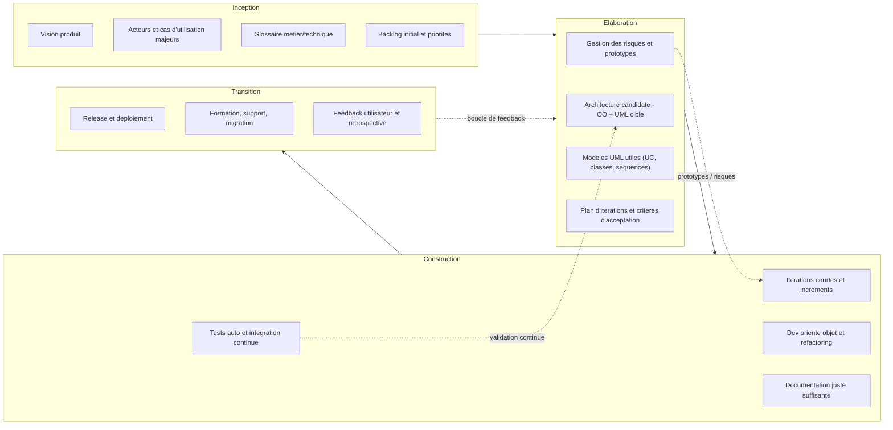

Le projet consiste à développer un **MVP (Minimum Viable Product)** d’une bibliothèque numérique en ligne.

Pendant le cours, nous constituerons des **binômes hétérogènes** (associant des étudiants aux compétences et parcours différents) et travaillerons sur les différentes étapes de la **conception** et du **développement**.  
L’objectif est que chaque binôme prenne en charge une partie du projet de manière autonome et responsable.

À tour de rôle, les binômes auront également pour tâche **d’évaluer le travail des autres**. Cet exercice d’**évaluation croisée** permettra non seulement de développer un regard critique et constructif, mais aussi de tirer des enseignements pour améliorer leurs propres pratiques et la qualité de leur rendu.  
L’évaluation des pairs fera pleinement partie de la **notation finale**.

Pour cela, nous suivrons les principes de la méthode  **[Agile Unified Process](https://en.wikipedia.org/wiki/Agile_unified_process)  (AUP)**, proposée par Scott Ambler.  
Cette approche constitue une **fusion entre les méthodes agiles et le cycle en Y**, en combinant la rigueur de la modélisation orientée objet avec la souplesse des itérations courtes et incrémentales.  
Elle encourage également des pratiques collaboratives telles que le **Pair Programming**, favorisant la qualité du code, la diffusion des connaissances et la réduction des erreurs.

Il est impératif de s’appuyer sur les extraits de mon cours d’[**Architecture des logiciels**](https://github.com/michaellaunay/NotesPubliques/blob/master/cours/Architecture%20des%20logiciels.md) fournis en annexes.

# Sujet : Conception et architecture d’une bibliothèque numérique décentralisée

## Présentation générale

Le projet consiste à développer une bibliothèque d'œuvres numérisées. Chaque utilisateur de la bibliothèque peut proposer des fichiers numériques et demander leur partage. Par exemple, les œuvres peuvent être des livres scannés au format PDF, **il** se pose alors le problème de la propriété intellectuelle qui sera alors **résolu** par une modération de la part de bibliothécaires.

Pour des raisons de compatibilité avec l'existant, le langage de développement **imposé par le client est Python**.

Le **framework web** retenu côté serveur est **Pyramid**, et le langage de templates utilisé est **TAL/METAL** (hérité de Zope/Plone, garantissant la compatibilité avec l'historique).

Côté client, le choix est laissé aux développeurs :

- soit **SolidJS**, un framework moderne « React-like » basé sur JSX, performant et flexible,
- soit **Bootstrap**, solution plus traditionnelle (« old school ») mais simple à mettre en œuvre et rapide pour prototyper.

Les documents **gérés** par l'application doivent l'être à travers un dépôt Git et non une base de **données** traditionnelle pour la raison **qu'à** terme devra être développé**e** une application permettant aux terminaux (ordinateur ou téléphone mobile)**,** de pouvoir disposer des textes sous forme d'une arborescence de **fichiers**. Pour ceux qui ne sont pas à l'aise avec Git, il existe une série de formations gratuites **:** [https://www.youtube.com/watch?v=0sGQgfUdCAY](https://www.youtube.com/watch?v=0sGQgfUdCAY)

Il est toutefois demandé que **chaque fonctionnalité soit développée de manière modulaire**, indépendante du reste du système, et puisse être **utilisée et testée en ligne de commande** afin de faciliter l'intégration continue et la validation unitaire.

Compte tenu des délais, l'usage de l'**intelligence artificielle** est **fortement recommandé**, mais il doit être **entièrement documenté et traçable**. Les conversations (prompts) feront l'objet de débats en classe. Pour préparer cela, les étudiants doivent, avant le cours, regarder et comprendre la vidéo : [**Les 4 étapes pour entraîner un LLM**](https://www.youtube.com/watch?v=YcIbZGTRMjI).

Ce projet sert de support pédagogique pour aborder les notions d'**architecture logicielle orientée objet**, de **modélisation UML**, de **design patterns**, et de **documentation**.

Pendant le cours, les étudiants travailleront en **binômes hétérogènes** (compétences et parcours différents). Chaque binôme aura pour mission de prendre en charge une partie de la conception et du développement, puis de présenter et de justifier ses choix.

Il est impératif de respecter les **extraits du cours d'Architecture des logiciels** donnés en annexes (rôles de l'architecte, conception OO, attributs de qualité, vues architecturales, documentation, importance du nommage, etc.).

---

### Contexte du projet

L’association **CultureDiffusion** souhaite réaliser une **bibliothèque numérique décentralisée**.

#### Objectifs fonctionnels :

- Permettre à chaque membre de numériser des œuvres au format pdf et de les proposer à l’emprunt.
- Permettre la reconnaissance de texte des œuvres numérisés via plusieurs IA (Gemini, Pixtral).
- Offrir un accès gratuit aux œuvres du domaine public.
- Permettre la location d’œuvres "numérique" sous droits pour une période de deux semaines.
- Diffuser automatiquement les œuvres devenues libres de droit à l’ensemble des membres disposant d’espace disque partagé.
- Permettre le téléchargement des oeuvres au format Markdown.
- Gérer le processus permettant aux bibliothécaires d'assurer la **modération** des œuvres déposées sur la plateforme par les membres (vérification, enrichissement des métadonnées, validation ou rejet).
- Gérer les droits et les copies selon la législation en vigueur.

#### Structure du dépôt de la bibliothèque (métaphore de répertoires) :

- `fond_commun` : œuvres libres de droits mises à disposition par l’association.
- `emprunts` : œuvres sous droit empruntées, chiffrées avec la clé du membre.
- `séquestre` : œuvres sous droit en attente, gérées par l’association, avec un accès restreint.
- `a_moderer` : œuvres proposées par les membres, en attente de validation par un bibliothécaire.

#### Classification des œuvres :

- **Livres** : BD, Romans, Jeunesse, Techniques, Éducation, Culture, Santé, etc.
- **Musique** : Classique, Jazz, Pop, Metal, etc.
- **Vidéos** : SF, Histoire, Séries, Documentaires, etc.
- **Articles**.  
    Une œuvre peut appartenir à plusieurs catégories simultanément.

### Travail demandé

#### Partie 1 : Analyse et glossaire

1. Identifier les **concepts** (entités, rôles, actions, propriétés) dans le cahier des charges.
2. Élaborer un **glossaire métier** et un **glossaire technique** (définitions claires, classées alphabétiquement).
3. Justifier vos choix de vocabulaire par rapport à l’importance du **noms et conventions de nommage (5.5)**.

#### Partie 2 : Modélisation UML

- Réaliser le **diagramme de cas d’utilisation** global.
- Lister les **scénarios fondamentaux** de l’application, en ajouter si nécessaire.
    - Exemple : installation de l’application, devenir membre, emprunter une œuvre, proposer une œuvre, reconnaître le texte et les schémas d’une œuvre, modérer une œuvre, consulter le fond commun, exporter une œuvre au format Markdown.
- Trier les scénarios par ordre d’importance.
- Produire **au moins 4 diagrammes de séquence système** des scénarios principaux, dont 2 qui n’auront été proposés par aucun autre binôme.
- Réaliser **5 diagrammes de classes** associés aux scénarios les plus critiques. 
- Produire un **diagramme de classes global** détaillant les associations et leurs cardinalités.
- Donner des **diagrammes d’activités** permettant de comprendre les processus documentaires (workflows).

#### Partie 3 : Choix d’architecture

1. Décrire l’**architecture logicielle** choisie (ex. architecture en couches, orientée services, micro-services simplifiés).
2. Justifier vos choix au regard des **attributs de qualité** (performance, sécurité, maintenabilité, modularité, évolutivité).
3. Identifier les **design patterns** utilisés (ex. Singleton, Factory, Observer, Strategy) et justifier leur pertinence dans ce projet.
4. Expliquer comment la **documentation** (chapitre 3 des annexes) sera intégrée dans le flux de travail du projet (usage de Markdown, Git, diagrammes UML intégrés).

#### Partie 4 : Nommage et qualité

1. Définir un **guide de nommage** adapté au projet (inspiré du §5.5 : cohérence, conventions, lisibilité).
2. Vérifier la cohérence entre :
    
    - le glossaire métier,
    - les classes et modules UML,
    - les scénarios,
    - la documentation.
        
3. Proposer l’usage d’**outils automatiques** (linters, règles de formatage, CI/CD pour la documentation) pour renforcer la qualité.
    

---

### Contraintes

- Utiliser **PlantUML** ou **Mermaid** ou **D2** pour vos diagrammes (l'IA peut faire de la conversion de diagramme, mais il faut vérifier la sémantique produite).
- Respecter les principes de **conception orientée objet** (encapsulation, héritage, polymorphisme).
- Intégrer explicitement les notions de **vues architecturales** (logique, processus, développement, physique).
- Documenter vos choix dans un **dépôt Git structuré** (voir chapitre 5 des annexes).

---

### Livrables attendus

1. Glossaire métier et technique (Markdown).
2. Diagramme de cas d’utilisation + scénarios détaillés (Markdown + PlantUML).
3. Diagrammes de séquence (PlantUML).
4. Diagrammes de classes (scénarios et global).
5. Document de justification des choix d’architecture et de design patterns.
6. Guide de nommage (Markdown).
7. Dépôt Git documenté avec arborescence conforme aux recommandations du cours.
8. Implémentation sommaire des principales fonctionnalités sous forme de scripts indépendants pouvant être intégrés en un tout ou utilisé indépendamment (prévoir l'usage des .env pour le paramétrage des clés permettant d’interroger les IA).
9. Tests unitaires
10. Tests d'intégrations.
11. Test de validations


---

# Annexes

----

**1.3 Rôles et responsabilités de l'architecte logiciel**

Un architecte logiciel joue un rôle crucial dans le développement de systèmes logiciels. Ses responsabilités sont vastes et variées, allant de la conception technique à la coordination des équipes de développement. Examinons plus en détail quelques-uns de ces rôles et responsabilités.

**Conception de l'architecture du système** : Le rôle principal de l'architecte logiciel est de concevoir l'architecture du système. Cela implique de comprendre les exigences du système, à la fois fonctionnelles et non fonctionnelles, et de concevoir une structure qui répond à ces exigences tout en tenant compte des contraintes et compromis techniques. 

**Prise de décisions architecturales** : L'architecte logiciel est responsable de la prise de décisions architecturales clés qui influencent la structure et le comportement du système. Cela comprend la sélection des technologies, la définition des interfaces, la division du système en composants, et la définition de la manière dont ces composants interagissent.

**Documentation de l'architecture** : L'architecte logiciel est responsable de la documentation de l'architecture du système. Cette documentation fournit une vue d'ensemble du système et sert de guide pour les développeurs et autres parties prenantes. Elle décrit les composants du système, leurs interactions, les décisions architecturales prises, et les raisons de ces décisions.

**Communication avec les autres membres de l'équipe de développement** : L'architecte logiciel doit communiquer efficacement avec les autres membres de l'équipe de développement. Cela comprend l'explication de l'architecture, la facilitation de la compréhension de l'architecture par l'équipe, la résolution des problèmes architecturaux et la coordination des efforts de développement.

**Contrôle de la qualité architecturale** : L'architecte est également chargé de veiller à ce que l'architecture logicielle soit mise en œuvre correctement et maintenue au fil du temps. Cela implique d'évaluer l'architecture pour s'assurer qu'elle respecte les standards de qualité, d'identifier et de résoudre les problèmes architecturaux et de veiller à ce que les modifications apportées au système restent conformes à l'architecture.

**Planification et gestion de la technologie** : L'architecte logiciel doit également prendre en compte l'évolution technologique. Cela implique de rester à jour sur les nouvelles technologies et méthodologies, de planifier l'intégration de nouvelles technologies dans l'architecture existante et de gérer l'évolution de l'architecture du système au fil du temps.
## 1.5 Relation entre l'architecture logicielle et la conception orientée objet

La conception orientée objet (COO) est une méthode de conception et de développement logiciel qui utilise des "objets" - instances de classes, qui sont souvent des représentations de choses du monde réel. La COO intègre des concepts tels que l'encapsulation, l'héritage et le polymorphisme, pour favoriser une structuration plus naturelle et logique du code. Cette méthode de conception a un impact significatif sur l'architecture logicielle, car elle fournit les blocs de construction pour mettre en œuvre l'architecture du système.

**Mise en œuvre de l'architecture logicielle avec la COO** : L'architecture logicielle définit la structure de haut niveau d'un système, tandis que la COO fournit les mécanismes pour réaliser cette structure. Par exemple, les composants architecturaux peuvent être mappés sur des classes ou des groupes de classes dans un système orienté objet. Les interfaces, qui définissent comment les composants communiquent, peuvent être mappées sur des interfaces ou des classes abstraites en COO. De plus, les patterns d'architecture peuvent être facilement implémentés en utilisant des patterns de conception orientée objet.

**Influence des concepts de la COO sur l'architecture logicielle** : Les concepts clés de la COO, comme l'encapsulation, l'héritage et le polymorphisme, peuvent grandement influencer la conception de l'architecture logicielle. Par exemple, l'encapsulation, qui est le fait de cacher les détails internes d'un objet et de n'exposer qu'une interface pour interagir avec cet objet, favorise le découplage entre les composants et rend le système plus modulaire. L'héritage permet de créer des hiérarchies de composants et de promouvoir la réutilisation du code. Le polymorphisme, qui permet à un objet d'être utilisé comme une instance de plusieurs types, peut être utilisé pour rendre le système plus extensible et flexible.

Voir [[Design patterns]]

## 1.6 Les attributs de qualité dans l'architecture logicielle

Les attributs de qualité sont des caractéristiques non fonctionnelles d'un système qui déterminent comment il se comporte. Ils sont cruciaux dans la conception de l'architecture logicielle, car ils influencent les décisions architecturales et ont un impact direct sur la qualité du système final. Voici quelques attributs de qualité couramment utilisés en architecture logicielle :

### 1.6.1 Performance

La performance se réfère à la rapidité avec laquelle un système répond à une demande ou à un ensemble de demandes. Elle est souvent mesurée en termes de temps de réponse, de débit ou d'utilisation des ressources. Un bon architecte doit concevoir le système de manière à répondre aux exigences de performance, tout en tenant compte des ressources disponibles.

### 1.6.2 Sécurité

La sécurité est la capacité d'un système à résister aux attaques malveillantes et à protéger les données et les services qu'il fournit. Cela implique de concevoir le système de manière à minimiser les vulnérabilités et à résister aux attaques, tout en permettant une récupération rapide en cas de violation de la sécurité.

### 1.6.3 Maintenabilité

La maintenabilité est la facilité avec laquelle un système peut être modifié pour corriger des défauts, améliorer ses performances, ou adapter le système à un environnement modifié. Cela nécessite une conception claire et compréhensible, l'usage de conventions de codage cohérentes, une bonne documentation et des tests adéquats.

#### 1.6.4 Modularité

La modularité est le degré auquel un système peut être divisé en modules indépendants. Un système modulaire facilite la maintenabilité, l'évolutivité et la réutilisation du code. Il permet également de développer et de tester les modules individuellement, ce qui peut améliorer la productivité de l'équipe de développement.

### 1.6.5 Évolutivité

L'évolutivité est la capacité d'un système à gérer une augmentation de la charge de travail. Par exemple, un système peut être conçu pour être évolutif en ajoutant plus de ressources matérielles, ou en permettant d'ajouter plus de fonctionnalités ou de modules au fil du temps.

### 1.6.6 Conclusion sur la qualité

Les attributs de qualité sont des considérations essentielles dans la conception de l'architecture logicielle. Ils guident les décisions architecturales et influencent la qualité globale du système. Un bon architecte doit comprendre ces attributs de qualité, savoir comment les équilibrer et prendre des décisions informées qui favorisent l'atteinte de ces objectifs de qualité.


## 1.8 Les vues architecturales

L'architecture d'un système logiciel est complexe et multifacette. Pour faciliter la compréhension et la communication de l'architecture, nous utilisons ce qu'on appelle des "vues architecturales". Chaque vue offre une perspective différente sur le système, mettant en lumière certains aspects tout en en occultant d'autres. Voici quelques-unes des vues les plus couramment utilisées :

### 1.8.1 Vue logique
Cette vue se concentre sur la fonctionnalité du système du point de vue de l'utilisateur. Elle décrit les principales classes ou composants logiques du système, leurs responsabilités, leurs relations et leurs interactions. Cette vue est souvent utilisée par les développeurs pour comprendre comment le système fournit les fonctionnalités requises.

### 1.8.2 Vue de processus
Cette vue montre comment le système est exécuté en termes de processus, de threads et de communication entre eux. Elle décrit comment le système se comporte en réponse aux événements externes et internes. Cette vue est particulièrement utile pour comprendre les problèmes de performance et de concurrence.

### 1.8.3 Vue de développement
Cette vue offre une perspective sur la manière dont le système est organisé du point de vue du développement. Elle décrit la structure du code, les dépendances entre les packages ou les modules, et la manière dont le système est construit et déployé. Cette vue est généralement utilisée par les développeurs pour comprendre l'organisation du code et par les gestionnaires de projet pour planifier et gérer le développement.

### 1.8.4 Vue physique
Cette vue présente la disposition du système sur l'infrastructure matérielle. Elle décrit comment le système est déployé sur l'infrastructure, comment les composants du système sont mappés sur les noeuds matériels, et comment les noeuds communiquent entre eux. Cette vue est souvent utilisée par les administrateurs de système pour comprendre comment le système est déployé et par les architectes pour prendre des décisions concernant le déploiement.

### 1.8.5 Synthése
Chaque vue architecturale offre une perspective différente sur le système, et en combinant ces vues, nous pouvons obtenir une image complète de l'architecture du système. Il est important de noter que les vues doivent être cohérentes entre elles - c'est-à-dire que les informations présentées dans une vue ne doivent pas contredire les informations présentées dans une autre vue. Dans le prochain chapitre, nous examinerons comment créer et documenter ces vues.

## 1.9 Importance de la documentation en architecture logicielle

La documentation joue un rôle crucial en architecture logicielle. Elle sert de moyen de communication entre les différentes parties prenantes, y compris les architectes, les développeurs, les gestionnaires de projet et les clients. Elle aide également à maintenir la cohérence de l'architecture au fil du temps, surtout lorsque des changements sont apportés ou lorsque des nouveaux membres rejoignent l'équipe. Examinons de plus près pourquoi il est important de documenter certains aspects de l'architecture.

### 1.9.1 Décisions architecturales
Documenter les décisions architecturales permet de suivre pourquoi certaines décisions ont été prises, les alternatives qui ont été envisagées et les raisons pour lesquelles elles ont été rejetées. Cela aide non seulement à comprendre l'état actuel de l'architecture, mais aussi à prendre de meilleures décisions à l'avenir. C'est aussi un moyen de partager la connaissance et l'expérience au sein de l'équipe et de faciliter l'intégration de nouveaux membres.

### 1.9.2 Vues architecturales
Comme nous l'avons vu précédemment, les vues architecturales offrent différentes perspectives sur le système. La documentation de ces vues aide à comprendre comment le système est conçu, comment il fonctionne et comment il est déployé. Cela aide également à identifier les dépendances et les interactions entre les différents composants du système, ce qui est crucial pour la maintenance et l'évolution du système.

### 1.9.3 Attributs de qualité
La documentation des attributs de qualité et de la manière dont ils ont influencé l'architecture aide à comprendre pourquoi l'architecture est conçue de la manière dont elle l'est. Par exemple, si l'architecture a été conçue pour une haute performance, documenter cela aide à comprendre pourquoi certaines décisions ont été prises et comment elles contribuent à la performance du système. Cela aide également à vérifier si l'architecture répond aux exigences de qualité et à identifier les domaines qui pourraient nécessiter des améliorations.

### 1.9.4 Une nécessité
La documentation en architecture logicielle n'est pas un luxe, mais une nécessité. Elle facilite la communication, soutient la prise de décisions, aide à maintenir la cohérence de l'architecture et facilite la maintenance et l'évolution du système. Dans le prochain chapitre, nous verrons comment créer une documentation efficace en architecture logicielle.

# 3. Documenter l'architecture logicielle

L'architecture logicielle, bien que cruciale, ne serait pas complète sans une documentation adéquate. La documentation de l'architecture offre une vision globale du système et facilite la prise de décision en matière de conception. Ce chapitre met l'accent sur l'importance de la documentation de l'architecture, les outils nécessaires pour la mise en œuvre efficace de cette documentation, et comment intégrer cette documentation dans le flux de travail du projet.

## 3.1 Importance de la documentation de l'architecture

La documentation de l'architecture logicielle est essentielle pour plusieurs raisons. Premièrement, elle aide à comprendre le fonctionnement interne du système, facilitant ainsi la maintenance et l'évolution du système. Deuxièmement, elle permet de suivre le cheminement des réflexions et les décisions prises tout au long du projet, y compris les idées qui n'ont pas été retenues. Cela permet d'éviter de répéter les mêmes erreurs et de comprendre pourquoi certains choix ont été faits.

## 3.2 Pourquoi utiliser Markdown pour documenter la conception

### 3.2.1 Nécessité du travail Collaboratif

L'utilisation d'outils basés sur Markdown, comme Obsidian ou Markdown Memo détaillés plus loin, facilite grandement le travail collaboratif. Les fichiers Markdown sont des fichiers texte, ce qui signifie qu'ils peuvent être facilement partagés et modifiés par plusieurs personnes en même temps, sans risque de conflit.
Voici les principaux avantages.

### 3.2.2 Intégration dans le code et cohérence de la documentation

La pérennité d'un logiciel repose en grande partie sur la qualité de sa documentation, et plus particulièrement sur celle du code. Il est donc essentiel que les explications relatives à l'architecture du logiciel soient intégrées, du moins en partie, directement dans le code. En utilisant un format de documentation cohérent et uniforme pour la conception et le code, nous augmentons la probabilité d'obtenir une adéquation forte entre le code et l'architecture, ce qui contribue à l'efficacité et à la durabilité du logiciel.

### 3.2.3 Lisibilité et Accessibilité

Les fichiers Markdown sont lisibles par l'homme, ce qui signifie qu'ils peuvent être ouverts et lus sans nécessiter de logiciel spécialisé. Cela rend la documentation plus accessible à tous les membres de l'équipe, qu'ils soient des développeurs, des gestionnaires de projet, des testeurs, ou même des clients. De plus, la syntaxe de Markdown est simple et intuitive, ce qui facilite l'écriture et la mise en forme de la documentation.

### 3.2.4 Intégration avec d'autres outils

Markdown s'intègrent dans de nombreux outils, ce qui augmente la productivité et l'efficacité de la documentation. Il est facile d'étendre Markdown pour créer et intégrer des diagrammes dans la documentation. De plus la plupart des outils d'éditions de Markdown offres des outils de gestion de tâches, de suivi du temps pour créer des journaux de projet et des listes de tâches et de "mindmapping" ou de prise de notes.

### 3.2.5 Gestion de versions de la Documentation

L'utilisation de Markdown en conjonction avec Git permet de versionner facilement la documentation. Cela signifie que chaque modification apportée à la documentation est enregistrée, et il est possible de revenir à une version précédente si nécessaire. Cela facilite également le suivi des modifications, la résolution des conflits et la collaboration entre plusieurs auteurs.

## 3.3 Intégration de la documentation dans le flux de travail du projet

La documentation de l'architecture doit être intégrée dans le flux de travail du projet. Pour ce faire, elle doit être stockée dans un dépôt git, à côté du code source du projet. Ce dépôt doit respecter une structure précise, comprenant des fichiers README, un journal de conception, et des répertoires pour la gestion du temps, les notes techniques, et la conception. Chaque composant de cette structure joue un rôle crucial dans la documentation efficace de l'architecture.

## 3.4 Représentation et description des différentes vues de l'architecture

L'architecture logicielle est souvent décrite à travers plusieurs vues, chacune mettant l'accent sur un aspect particulier du système. Ces vues peuvent être représentées à l'aide de diagrammes UML et de croquis d'interface, qui peuvent être intégrés directement dans la documentation en markdown à l'aide d'outils comme Mermaid ou PlantUML.

La documentation de l'architecture logicielle est une étape essentielle dans le processus de développement logiciel. Il est crucial d'utiliser les bons outils et de suivre une structure précise pour assurer une documentation efficace. En outre, il est tout aussi important d'intégrer cette documentation dans le flux de travail du projet et de la rendre accessible à toutes les parties prenantes du projet.

# 4 Outils pour documenter l'architecture

Plusieurs outils peuvent être utilisés pour documenter l'architecture logicielle. Un choix populaire est Obsidian, qui est particulièrement utile pour écrire des notes et des journaux de conception en markdown. De plus, Visual Studio Code avec l'extension Markdown Memo peut également être utilisé pour ce faire. Pour l'instant ces outils ne remplacent pas l'utilisation de modélisateurs UML pour la vérification de la cohérence.
Mais ils fournissent la visualisation des diagrammes de l'architecture.

## 4.1 Insertion de diagrammes dans les notes d'Obsidian ou Markdown Memo pour la documentation de conception

Les diagrammes sont un moyen précieux de visualiser et de comprendre l'architecture et la conception d'un système. Dans des outils comme Obsidian ou Markdown Memo, il est possible d'intégrer des diagrammes créés avec des outils tels que PlantUML, Mermaid ou Terrastruct/D2. Voici comment le faire :

### 4.1.1 Utilisation de PlantUML

[PlantUML](https://www.plantuml.com/fr/) est un outil qui vous permet de créer des diagrammes UML à partir d'un langage de description textuelle. Pour intégrer un diagramme PlantUML dans Obsidian ou Markdown Memo, nous pouvons le faire comme suit :

1. Installer l'extension PlantUML pour Visual Studio Code.
2. Créons notre diagramme avec la syntaxe PlantUML dans un bloc de code de type plantuml. Par exemple (enlever l'échappement devant le bloc de code) :

    ```markdown
    \```plantuml
    @startuml
    Alice -> Bob: Hello
    Bob --> Alice: Hi!
    @enduml
    \```
    ```

3. Sauvegardons et visualisons notre fichier Markdown. Le diagramme PlantUML devrait être correctement rendu.

    ```plantuml
    @startuml
    Alice -> Bob: Hello
    Bob --> Alice: Hi!
    @enduml
    ```


### 4.1.2 Utilisation de Mermaid

Mermaid est un outil de création de diagrammes basé sur JavaScript qui permet de générer des diagrammes à partir d'une syntaxe textuelle. Il est nativement proposé par github, gitlab, Visual Code Studio, Obsidian, nous pouvons suivre ces étapes :

1. Créons notre diagramme avec la syntaxe Mermaid dans un bloc de code. Par exemple :

    ```
    \```mermaid
    graph TD;
        A-->B;
        A-->C;
        B-->D;
        C-->D;
    \```
    ```

2. Sauvegardez et visualisez votre fichier Markdown. Le diagramme Mermaid devrait être correctement rendu.
    ```mermaid
    graph TD;
        A-->B;
        A-->C;
        B-->D;
        C-->D;
    ```

### 4.1.3 Utilisation de Terrastruct/D2

Terrastruct/D2 est un standard ouvert proposant des outils payants. Les lecteurs sont open sources ce qui permet de créer des diagrammes dynamiques et interactifs. Pour les intégrer dans Obsidian nous devons ajouter le module réalisé par Terrastruct.

D2 est encore en version alpha, mais est très ambitieux et offre la possibilité de créer ses propres diagrammes et d'enrichir la syntaxe de ceux existants.

L'usage est le même que pour Mermaid.

# 5 Proposition de structure de dépôt Git pour la documentation de l'architecture

La documentation de l'architecture logicielle se situe au cœur de la conception et de l'évolution des systèmes informatiques. C'est essentiellement une tâche de réflexion sur le passé, le présent et le futur du logiciel à réaliser. Elle ne se limite pas à la simple illustration de l'architecture actuelle, mais s'étend à l'[élicitation](https://fr.wikipedia.org/wiki/%C3%89licitation) du besoin, à la documentation des choix d'architecture - y compris ceux qui n'ont pas été retenus - pour éviter de refaire les mêmes erreurs et comprendre les raisons de nos décisions.

La documentation d'un projet doit être facilement accessible et bien organisée. Toutes les versions de celle-ci doivent pouvoir être consultées, et en conséquence l'implémentation dans le code doit faire référence à une version donnée, ne serait ce que pour pouvoir justifier des choix techniques et/ou du contexte des développements.

Nous proposons d'inclure la documentation de l'architecture dans la structure de dépôt Git du projet, à côté de son code, pour cela il suffit de mettre toute cette architecture dans une arborescence spécifique.

Nous utiliserons des outils comme Obsidian ou Markdown Memo pour Visual Code Studio pour documenter nos réflexions et choix, tout en notant que ces outils ne remplacent pas l'usage de modeleurs UML qui seul permet de vérifier la cohérence du model et de générer le code. Nous verrons comment incorporer des diagrammes UML et des sketchs d'interface avec Mermaid ou PlantUML directement dans le Markdown de notre documentation et de notre code.

Nous suggérerons une structure pour nos dépôts git, qui comprendra :

- À la racine :
  - Un fichier `README.md` détaillant l'essentiel du projet
  - Un fichier `Journal de conception.md` pour documenter nos réflexions et nos observations
  - Un répertoire de `Gestion du temps`, contenant nos notes journalières et nos logs de projet
  - Un répertoire `Notes` pour toutes les notes techniques écrites sur le projet
  - Un fichier `Suivi.md` qui liste les tâches en utilisant les modules Task et Kanban d'Obsidian
  - Un répertoire `Conception` contenant différents documents d'analyse et de conception.

L'objectif ici est de créer une structure de documentation cohérente et bien organisée, dans laquelle tous les membres de l'équipe puissent facilement naviguer. Cette structure n'est pas rigide et doit être adaptée aux besoins spécifiques de chaque projet. 

L'architecture logicielle est un document vivant, en constante évolution et doit suivre le développement du projet. C'est une aide pour tout nouvel arrivant sur le projet. Notre objectif est de donner les outils et les connaissances nécessaires pour maintenir cette documentation à jour et pertinente, afin de soutenir le succès de vos projets informatiques.

## 5.1 Fichiers README.md principal

À la racine du dépôt, le README doit présenter le projet, nous devons y trouver :
	- le titre du projet,
	- l'objectif du projet en quelques lignes,
	- une description plus détaillée,
	- la date de dernière modification,
	- la liste des auteurs,
	- la version actuelle du projet,
	- et des liens vers les fichiers markdown d'indexe des sous-répertoires.

## 5.2 Fichier `Journal de conception.md`

Toujours à la racine nous devons trouver le journal de conception du projet
Son nom doit être explicite, par exemple `Journal de conception.md`. Il sert de journal quotidien, où les concepteurs doivent noter leurs réflexions, observations, questions et autres remarques importantes. Il contient l'historique des idées de conception et l'on doit pouvoir retracer l'évolution de celles-ci, ainsi que  les décisions  d'architecture tout au long du projet. Il fait référence à des notes du répertoire Notes qui détaillent les idées, tentatives, et abandon si elles ne tiennent pas en cinq phrases.

## 5.3 Répertoire `Gestion du temps`

La gestion du temps est un aspect fondamental de tout projet. Prévoir l'avenir nécessite de comprendre ce qui s'est passé, et de mesurer les écarts entre les prévisions et le temps effectivement consommé. C'est une composante essentielle des méthodes agiles (voir la note [[Les méthodes agiles]]), qui mettent l'accent sur l'estimation de la vélocité de l'équipe.

Pour ce faire, plusieurs outils peuvent être utilisés, chacun ayant ses avantages propres :

- La liste des tâches réalisées (Voir méthode "[[Getting things done]]")
- Les notes quotidiennes ("Daily notes"), qui doivent contenir un journal de ce qui a été fait durant la journée
- Les tickets dans le backlog, qui représentent le travail restant à faire
- Le Canvas, un outil de visualisation pour comprendre l'ensemble du projet
- Les diagrammes de Gantt ou PERT, pour visualiser le calendrier du projet
- Les tableaux de répartition des tâches, pour comprendre qui fait quoi

Chaque projet doit adopter la méthode qui lui convient le mieux, et produire les documents correspondants.

Dans tous les cas, un répertoire `Gestion du temps` doit être créé. Ce répertoire doit contenir, au minimum, les notes quotidiennes du projet, qui comprennent les tâches réalisées et le journal des activités de la journée. Tous ces documents doivent être au format Markdown, pour assurer une lecture et une mise à jour faciles.

L'objectif de ce répertoire `Gestion du temps` est de fournir un historique précis et facilement consultable de ce qui a été fait, qui aide à prévoir les travaux futurs et à estimer leur durée. En d'autres termes, il fournit un outil précieux pour contrôler le temps et aider à la prise de décision tout au long du projet.

## 5.4 Répertoire `Conception`

Dans notre répertoire Conception, nous avons plusieurs éléments importants :

1. **Fichier `_Conception.md`**
2. **Fichier `Analyse du cahier des charges.md`**
3. **Fichier `Glossaire métier.md`** 
4. **Fichier `Glossaire technique.md`** 
5. **Fichier `Exigences techniques`** : Ce fichier répertorie toutes les contraintes que notre logiciel doit respecter, tels que la performance, l'accessibilité, les langues, la sécurité, la confidentialité, le RGPD, la cohérence. Chaque exigence établit une jauge ou un scénario d'acceptabilité.
6. **Répertoire Scénarios**
7. **Répertoire "Diagrammes de classes"** 
8. **Répertoire `Diagrammes d'états transitions`**
9. **Répertoire `Activités`** 
10. **Répertoire `Interface graphique`** :

Nous allons détailler chacun de ces éléments ci-dessous.

En utilisant cette structure, nous nous assurons que tous les éléments de la conception sont organisés et facilement accessibles, ce qui facilite la gestion et le suivi du projet.

### 5.4.1 Fichier `_Conception.md`

Ce fichier répertorie tous les autres documents du répertoire.

### 5.4.2. Fichier `Analyse du cahier des charges.md`

Ce fichier en format markdown met en évidence les mots du cahier des charges selon leur nature (Concept, NomPropre, Action, Propriété). Nous utilisons des balises telles que `<span class="Concept">` pour marquer la nature du mot, et ajoutons une feuille de style (voir [[Obsidian#Utiliser notre feuille de style CSS]]) :
	- <span class="concept">Concept</span> : Mot ayant une signification pour le projet
	- <span class="name">Nom propre</span> : Identifiant unique d’une chose ou d’une personne
	- <span class="action">Action</span> : Transformation de l’état
	- <span class="property">Propriété</span> : Qualité, durée etc.

### 5.4.3. Fichier `Glossaire métier.md`

Il s'agit d'une liste de termes avec leur définition.

### 5.4.4. Fichier `Glossaire technique.md`

Ce fichier contient une liste de termes techniques, comme les noms des types de données comme les classes, la liste des rôles des acteurs, etc.

### 5.4.5. Fichier `Exigences techniques`

Ce fichier répertorie toutes les contraintes que notre logiciel doit respecter, tels que la performance, l'accessibilité, les langues, la sécurité, la confidentialité, le RGPD, la cohérence. Chaque exigence établit une jauge ou un scénario d'acceptabilité.

### 5.4.5 Répertoire Scénarios

Ce répertoire contient :
- `_Scénarios.md` (contient la liste des liens vers les scénarios) - Un fichier markdown par scénario dont le contenu est précisé au paragraphe [#Liste des scénarios], il porte le nom du scénario. 
- Un diagramme de séquence par scénario faisant intervenir le système à réaliser comme une boite noire. 
Pour chacun des diagrammes nous créons un ou plusieurs diagrammes de séquences où le système devient une boite blanche comprenant les classes que l’on crée pour réaliser les fonctions identifié du systèmes. Pour cela on utilise et la méthode QQOQCP et le CRUD. Nous itèrons à plusieurs reprise en passant de ces diagrammes de séquences détaillés au diagrammes de classes associés à chacun de ses diagramme. C’est ce que nous appelons réification et c’est un processus itératif.
	
Jusqu’à obtenir une conception stable qui de toute façon bougera avec l’implémentation.

### 5.4.6 Répertoire "Diagrammes de classes"

Le répertoire contient :
	- un ficher `_Diagrammes de classes.md` référençant tous les diagrammes
	- Un fichier contenant le diagramme de classes général contenant toute les classes du projet et les associations entre classes, le tout réprésenté avec un bloc Mermaid ou PlantUML.
	- Autant de diagrammes de classe qu’il y a de scénarios. Chaque diagramme détaille uniquement les classes (attributs, méthodes et associations) fournissant les services, méthodes et les données apparaissant dans le scénario ayant servi à établir ce diagramme. Si une classe est utilisée dans plusieurs scénarios les méthodes est attributs d’un diagramme de classe correspondent uniquement au scénario associé à son scénario, a écrire avec des blocs Mermaid ou PlantUML.

### 5.4.7 Répertoire `Diagrammes d'états transitions` 

Ce répertoire contient :
	- un fichier `_Diagrammes d'états transitions.md` qui référence tous les diagrammes d'états transitions
	- Un fichier qui donne le diagramme des états transitions pour chaque type de donnée identifié ayant un bloc Mermaid ou PlantUML.

### 5.4.8 Répertoire `Activités`

Il contient :
	- un fichier `_Activités.md` référençant tous les fichiers de diagramme d'activités.
	- Un fichier d'activité par processus identifié ayant un bloc Mermaid ou PlantUML.

### 5.4.9 Répertoire `Interface graphique`

Il contient :
	- un fichier `_Interface graphique.md` référençant tous les fichiers des différentes fenêtres.
	- Une description de toutes les fenêtres et écrans illustrés en utilisant des diagrammes Salt de PlantUML
## 5.5 L’importance du nommage dans l’architecture orientée objet

Le nommage est un aspect souvent sous-estimé de l’architecture logicielle. Pourtant, des noms cohérents et explicites pour les classes, modules, attributs et relations favorisent la compréhension, la maintenabilité et la collaboration. Un bon nommage est une composante essentielle de la **qualité architecturale**.

### 5.5.1 Lisibilité et compréhension du système

- Un nom clair réduit le besoin de documentation supplémentaire.
- Les noms doivent refléter le rôle, la responsabilité et le domaine métier de l’élément.
- Exemple : `Utilisateur`, `BibliothequeNumerique`, `GestionPret` plutôt que `DataManager` ou `ObjX`.
- Unicité de la langue : Les termes utilisés sont dans une seule et unique langue à l'exception des emprunts familiers multiculturelles et intergénérationnels (ex: OK, KO).

### 5.5.2 Cohérence et conventions

La cohérence des noms est indispensable pour éviter les ambiguïtés.  
Elle repose sur des conventions de codage définies en amont et respectées par tous.

Parmi les conventions les plus répandues :

- **Classes** : PascalCase (ex. `GestionPret`)
- **Méthodes et attributs** : camelCase (ex. `datePublication`, `authentifier()`)
- **Constantes** : MAJUSCULES_AVEC_UNDERSCORE (ex. `MAX_EMPRUNTS`)

La cohérence doit également exister entre le code et la documentation : un terme défini dans le glossaire métier doit être repris tel quel dans les classes correspondantes.

- Utiliser des conventions **uniformes** pour tous les composants.
- Assurer la cohérence entre le code, la documentation et les **diagrammes UML** (ce qui peut se heurter aux bonnes pratiques propres à un langage ; par exemple, **PEP 8** recommande `snake_case` pour Python, tandis que Java privilégie **CamelCase**).
- Maintenir un **guide de nommage** partagé par l’équipe ; un **référentiel qualité** doit exister et être accessible en ligne. L’usage de **linters** configurés selon les standards de l’entreprise est un indispensable.

### 5.5.3 Nommage des classes et modules

Les classes représentent des **concepts métier** ou des entités logicielles clairement identifiables.  
Elles doivent donc porter un **nom nominal** et explicite, évitant les termes génériques ou abstraits.

- Exemple correct : `Livre`, `Catalogue`, `BibliothequeNumerique`.
- Exemple à éviter : `DataManager`, `Processor`, `HelperClass`.

Les **modules** regroupent les classes liées à une fonctionnalité donnée. Leur nom doit refléter cette fonctionnalité, par exemple `authentification`, `gestionPret`, `catalogue`.

### 5.5.4 Nommage des attributs et méthodes

Les **attributs** décrivent des caractéristiques propres à l’objet.  
Ils doivent être simples, clairs et, dans la mesure du possible, se rapprocher du vocabulaire du domaine.

- Exemple : `titre`, `auteur`, `datePublication`.

Les **méthodes** expriment des actions. Leur nom doit donc être verbal et décrire précisément l’opération effectuée.

- Exemple : `emprunter()`, `retourner()`, `authentifier()`.
- Exemple flou : `doAction()`, `manageData()`.    

Le nommage doit également refléter la granularité de la méthode : une méthode courte et ciblée peut être nommée avec un verbe simple, tandis qu’une méthode plus complexe peut utiliser une formulation descriptive.

### 5.5.5 Nommage des relations et associations

Dans les diagrammes UML, le nommage des relations et associations entre classes est tout aussi important que celui des classes elles-mêmes.  
Un lien mal nommé peut induire en erreur sur la nature de la relation.

- Exemple pertinent : `Livre — estEmpruntéPar —> Utilisateur`.
- Exemple à éviter : `Livre — link —> User`.

L’utilisation de noms explicites permet également de mieux comprendre la **cardinalité** et la **dépendance fonctionnelle** entre les classes.

- `Bibliotheque — contient —> Livre`.
- `Utilisateur — possède —> CarteDeBibliotheque`.
### 5.5.6 Erreurs fréquentes de nommage

Certaines pratiques doivent être évitées car elles nuisent à la clarté :

- **Abréviations obscures** : `Usr`, `BkCat` (préférer `Utilisateur`, `Catalogue`).
- **Noms trop génériques** : `Manager`, `Handler`, `Service`.
- **Mélange de langues** : `Livre` et `Book` dans le même projet.
- **Redondances inutiles** : `LivreLivre`, `BookClass`.

Un nom doit être **suffisamment descriptif**, mais sans lourdeur inutile.

### 5.5.7 Lien entre nommage et qualité logicielle

Un nommage rigoureux a un impact direct sur plusieurs attributs de qualité :

- **Maintenabilité** : un code lisible facilite les corrections et évolutions.
- **Évolutivité** : des conventions claires permettent d’ajouter de nouvelles classes ou fonctionnalités sans incohérence.
- **Collaboration** : un vocabulaire partagé (souvent désigné sous le terme _ubiquitous language_ en Domain-Driven Design) permet une meilleure communication entre développeurs et experts métier.

Ainsi, le nommage n’est pas qu’un détail esthétique : il est un facteur structurant de la qualité du logiciel.

### 5.5.8 Conclusion sur le nommage

Le nommage doit être considéré comme une **décision architecturale à part entière**.  
Il conditionne la compréhension du système, la fluidité du développement et la pérennité du code.  
L’architecte logiciel doit veiller à établir un **guide de nommage** dès les premières phases du projet et en assurer le respect au fil des développements.

Un système bien nommé est un système plus lisible, plus cohérent et plus facile à faire évoluer.

## 7. Évolution de l'architecture logicielle

L'architecture logicielle n'est pas statique. Elle évolue au fil du temps en réponse aux changements dans les exigences métier, les technologies disponibles, les pratiques de développement et l'infrastructure technique. Dans ce chapitre, nous aborderons la manière dont l'architecture logicielle peut s'adapter et évoluer pour répondre à ces défis.

### 7.1 Changement des exigences métier

Les exigences métier ne sont jamais figées. À mesure que l'entreprise évolue, l'architecture du logiciel doit suivre. Par exemple, l'introduction d'un nouveau produit ou service peut nécessiter des changements dans l'architecture pour supporter de nouvelles fonctionnalités. De même, une expansion géographique peut nécessiter des modifications pour prendre en compte différentes réglementations ou normes locales.

### 7.2 Avancées technologiques

L'innovation technologique est constante et rapide. Les nouvelles technologies peuvent offrir des avantages significatifs en termes de performances, de sécurité, d'efficacité ou d'autres aspects. L'architecture logicielle doit être suffisamment flexible pour incorporer ces nouvelles technologies lorsqu'elles deviennent disponibles.

### 7.3 Dette technique

La dette technique est un concept qui fait référence aux compromis à court terme qui sont pris pendant le développement logiciel, souvent pour accélérer la livraison, mais qui créent un fardeau à long terme. Elle peut résulter d'une conception insuffisante, d'un code mal écrit, d'une documentation manquante, ou d'autres pratiques de développement négligentes.

La gestion de la dette technique est un aspect important de l'évolution de l'architecture logicielle. Si elle n'est pas gérée, la dette technique peut s'accumuler au fil du temps, rendant le système de plus en plus difficile à maintenir et à faire évoluer. Des techniques telles que la refonte, le remaniement et l'amélioration continue du code peuvent être utilisées pour gérer et réduire la dette technique.

### 7.4 Perspectives d'avenir

L'évolution de l'architecture logicielle est un processus continu qui nécessite une attention et une planification constantes. En gardant un œil sur l'avenir et en gérant activement la dette technique, il est possible de maintenir une architecture qui continue à fournir de la valeur à l'entreprise tout en s'adaptant aux défis et aux opportunités en constante évolution.

Enfin, l'évolution de l'architecture logicielle doit également prendre en compte les perspectives d'avenir. 

Cela inclut la prévision des tendances technologiques futures, l'anticipation des besoins futurs des utilisateurs et de l'entreprise, et la planification de la manière dont l'architecture pourra s'adapter à ces futurs changements.

---
# Agile Unified Process (AUP)

# 1. Origine de l’AUP

- Créé par **Scott Ambler (2005)**, l’Agile Unified Process est une **adaptation allégée** du **Rational Unified Process (RUP)**.
    
- Il conserve la structure du RUP (inception, élaboration, construction, transition), mais applique les **valeurs du Manifeste Agile (2001)** :
    
    - Interaction plutôt que processus lourds.
    - Logiciel fonctionnel plutôt que documentation exhaustive.
    - Collaboration avec le client plutôt que négociation contractuelle.
    - Adaptation plutôt que suivi d’un plan figé.

# 2. Principes fondamentaux de l’AUP

### 2.1. Itératif et incrémental

- Le projet est découpé en **itérations courtes** (souvent 2 à 6 semaines).
- Chaque itération livre une **version fonctionnelle** du système.
- Le cycle global (inception → élaboration → construction → transition) est **parcouru plusieurs fois** à petite échelle.

### 2.2. Minimalisme documentaire

- Documentation réduite au **minimum utile**.
- UML est utilisé, mais de manière pragmatique (juste les diagrammes nécessaires pour communiquer).
- Les artefacts lourds du RUP sont allégés ou remplacés par des outils collaboratifs (wiki, tickets, user stories).

### 2.3. Automatisation et qualité

- Tests unitaires, intégration continue et refactorings font partie du processus.
- Forte attention à la **qualité du code** et à la **maintenabilité**.

### 2.4. Adaptabilité

- Les exigences peuvent **évoluer** en cours de projet (contrairement au cycle en V ou au Y, trop rigides).
- La planification est **progressive**, revue à chaque itération.

# 3. Les disciplines de l’AUP

L’AUP reprend les disciplines du RUP, mais en simplifiant.

### 3.1. Disciplines principales

1. **Modélisation**
    
    - Compréhension du domaine métier et conception orientée objet.
    - UML utilisé de manière pragmatique (diagrammes de cas d’utilisation, classes, séquences).
    - Glossaire métier et technique.
    
2. **Implémentation**
    
    - Développement orienté objet, codage par binôme possible (XP).
    - Respect du guide de nommage et des conventions de l’équipe.
    
3. **Tests**
    
    - Automatisation des tests unitaires et fonctionnels.
    - Tests à chaque itération, pas seulement à la fin.
    - Validation continue de la qualité architecturale.
    
4. **Déploiement**
    
    - Livraison fréquente (chaque itération produit une version exécutable).
    - Usage d’outils d’intégration et de déploiement continus.

### 3.2. Disciplines de support

1. **Gestion de configuration** (code, documentation, modèles versionnés avec Git).
2. **Gestion de projet** (planification légère, pilotée par la valeur métier, souvent via Kanban ou Scrum).
3. **Environnement** (mise en place des outils de développement, tests, CI/CD).

# 4. Les phases de l’AUP

Comme dans le RUP, on retrouve 4 grandes phases, mais plus **agiles et itératives** :

1. **Inception**
    
    - Compréhension du besoin, identification des acteurs et cas d’utilisation principaux.
    - Vision partagée du projet, définition des priorités.
    - Exemple : définir les grandes fonctionnalités de la bibliothèque numérique (emprunt, dépôt, modération).
    
2. **Élaboration**
    
    - Mise en place de l’architecture logicielle de base.
    - Définition des scénarios critiques.
    - Conception UML simplifiée (classes principales, diagramme d’architecture).
        
3. **Construction**
    
    - Développement itératif et incrémental des fonctionnalités.
    - Chaque itération livre un **logiciel utilisable**.
    - Tests automatisés intégrés dans le cycle.
        
4. **Transition**
    
    - Livraison finale au client.
    - Formation, documentation minimale, retours utilisateurs.
    - Stabilisation du produit.
        

Contrairement au RUP, ces phases ne sont pas strictement séquentielles : elles se recouvrent et reviennent à petite échelle dans chaque itération.

# 5. Avantages de l’AUP

- **Agile mais structuré** → combine l’OO, UML et la rigueur d’UP avec la souplesse de l’agile.
- **Itératif** → feedback rapide du client.
- **Pragmatique** → élimine la lourdeur documentaire du RUP.
- **Qualité intégrée** → tests et refactorings dès le début.
- **Adapté à l’enseignement** → garde les modèles UML et l’OO comme outils pédagogiques, tout en exposant les étudiants aux pratiques agiles modernes.

# 6. Limites de l’AUP

- Moins répandu que Scrum ou SAFe → peu d’outils/communautés.
- Peut sembler « hybride bancal » si mal appliqué : trop lourd pour les agiles purs, trop léger pour les traditionnels.
- Repose fortement sur la **discipline de l’équipe** (risque de dérive vers « no doc, no process »).

# 7. Schéma de synthèse

```
         Vision            Architecture          Construction         Livraison
      +-----------+     +----------------+     +---------------+     +-----------+
      | Inception | --> | Élaboration    | --> | Construction  | --> | Transition|
      +-----------+     +----------------+     +---------------+     +-----------+
          |                   |                     |                    |
          v                   v                     v                    v
      Cas d’utilisation   Design OO UML        Dév. itératif        Livraison
      Glossaire métier    Prototype archi      Tests auto           Support
```



Chaque bloc est **itératif**, produit un livrable concret, et reste ouvert à l’adaptation.
