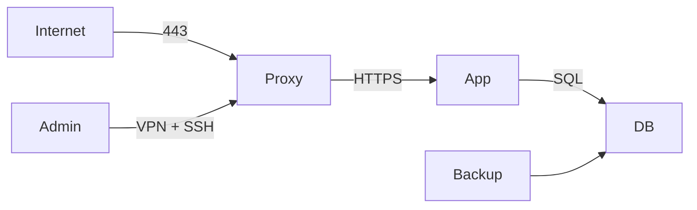

# Sécurité avancée sous Linux

> [!abstract] Objectif
> Ce cours ne cherche pas à transformer Linux en système « invulnérable ». Il apprend à **réduire la surface d'attaque**, **limiter l'impact d'une compromission**, **détecter les comportements anormaux** et **rétablir un système de manière fiable**.

> [!important]
> La sécurité n'est pas une suite de commandes copiées-collées. Toute mesure doit être choisie à partir d'un **modèle de menace**, testée sur une machine de test et documentée. Une option de durcissement mal comprise peut rendre un service indisponible sans réellement améliorer sa sécurité.

# Plan du cours

Le cours suit une progression volontairement opérationnelle : on commence par comprendre **qui protège quoi**, puis on durcit l'hôte, on ajoute des mécanismes de confinement, on sécurise les accès et le réseau, et seulement ensuite on traite la détection, les conteneurs, la chaîne d'approvisionnement et la réponse aux incidents.

1. **Fondations** — identités, permissions, moindre privilège, `sudo`, capabilities.
2. **Durcissement de l'hôte** — installation minimale, mises à jour, boot, noyau, services systemd.
3. **Contrôle d'accès et sandboxing** — SELinux, AppArmor, seccomp et Landlock.
4. **Authentification et réseau** — SSH, certificats, FIDO2, nftables, WireGuard, segmentation.
5. **Protection des données** — LUKS2, fscrypt, TPM2 et cycle de vie des clés.
6. **Observabilité et réponse** — journald, audit, intégrité, IDS/IPS et investigation.
7. **Conteneurs et supply chain** — rootless, capabilities, images, SBOM, provenance et secrets.
8. **IA et agents** — risques des modèles, prompt injection, RAG et moindre privilège.
9. **Méthode** — audit, baseline, durcissement progressif, sauvegardes et projet pratique.

> [!warning]
> Les commandes de sécurité doivent être testées sur un environnement de laboratoire ou avec une procédure de retour arrière. Un durcissement qui casse le service ou empêche l'administration n'est pas un bon durcissement.

# Introduction — raisonner avant de durcir

## 0.1. La sécurité est une propriété du système entier

Un système Linux peut utiliser un noyau à jour, un chiffrement robuste et un pare-feu strict tout en restant vulnérable si :

- un service inutile écoute sur Internet ;
- un compte administrateur utilise un mot de passe réutilisé ;
- une application Web compromise dispose d'un accès en écriture à toutes les données ;
- les sauvegardes ne sont jamais testées ;
- les journaux disparaissent avec la machine compromise ;
- une clé privée est copiée dans un dépôt Git ;
- un conteneur s'exécute en privilégié sans nécessité ;
- les mises à jour de sécurité ne sont pas appliquées.

La sécurité doit donc être pensée comme une **architecture**.

## 0.2. Le modèle de menace

Avant de choisir une mesure, on décrit ce que l'on veut protéger.

Questions à poser :

1. **Quels actifs protéger ?**
   - données personnelles ;
   - secrets industriels ;
   - clés privées ;
   - disponibilité d'un service ;
   - intégrité d'un logiciel ;
   - capacité d'administration.
2. **Contre quels adversaires ?**
   - erreur d'un utilisateur ;
   - logiciel compromis ;
   - attaquant distant ;
   - utilisateur local non privilégié ;
   - administrateur malveillant ;
   - vol physique de la machine.
3. **Quelles frontières de confiance ?**
   - Internet / réseau interne ;
   - hôte / conteneur ;
   - utilisateur / root ;
   - application / base de données ;
   - poste administrateur / serveur.
4. **Quel impact est acceptable ?**
5. **Comment détecter et récupérer ?**

> [!example]
> Chiffrer un disque avec LUKS protège surtout les données **au repos**, par exemple après le vol d'un disque éteint. Une fois le système démarré et le volume déverrouillé, LUKS ne protège pas les fichiers contre un processus déjà compromis disposant des droits nécessaires.

## 0.3. CIA + traçabilité

Trois propriétés classiques :

- **Confidentialité** : seules les entités autorisées peuvent lire la donnée.
- **Intégrité** : une modification non autorisée est empêchée ou détectable.
- **Disponibilité** : le service reste utilisable dans les conditions prévues.

On ajoute souvent :

- **Authenticité** : vérifier l'identité d'une entité ou l'origine d'un objet ;
- **Traçabilité** : pouvoir attribuer et reconstituer les actions ;
- **Résilience** : continuer ou revenir rapidement à un état sain.

## 0.4. Défense en profondeur

On évite de dépendre d'une seule barrière.

Exemple pour un serveur Web :

```text
Internet
   |
pare-feu / filtrage
   |
reverse proxy TLS
   |
service systemd sandboxé
   |
application non-root
   |
AppArmor / SELinux
   |
permissions + ACL
   |
base de données séparée
   |
sauvegardes immuables / hors ligne
```

Une faille dans une couche ne doit pas donner automatiquement accès à toutes les autres.

## 0.5. Les quatre verbes du cours

1. **Prévenir** : réduire la probabilité de compromission.
2. **Limiter** : réduire l'impact si une compromission survient.
3. **Détecter** : identifier rapidement une anomalie.
4. **Récupérer** : restaurer un état connu et fiable.

---

# 1. Compréhension des bases de la sécurité Linux

## 1.1. Structure et Architecture de Sécurité Linux

La structure et l'architecture de sécurité de Linux sont conçues pour offrir une protection robuste à tous les niveaux du système. Cette conception repose sur une série de mécanismes et de stratégies intégrés qui travaillent ensemble pour prévenir, détecter et répondre aux menaces et vulnérabilités. Voici les composantes clés de la structure et de l'architecture de sécurité sous Linux :

### 1.1.1. Noyau Linux et modules de sécurité

Le cœur de la sécurité sous Linux réside dans son noyau, qui gère l'accès aux ressources matérielles et logicielles et isole les processus les uns des autres pour prévenir les interférences malveillantes. Le noyau Linux inclut des modules de sécurité tels que SELinux (Security-Enhanced Linux), AppArmor, et le sous-système de sécurité Tomoyo, qui fournissent un contrôle d'accès obligatoire (MAC) au-delà du modèle traditionnel de contrôle d'accès discrétionnaire (DAC) basé sur les permissions.

### 1.1.2. Gestion des Utilisateurs et des Permissions

Linux adopte un modèle d'utilisateur multi-utilisateurs, où chaque utilisateur a un identifiant unique (UID) et appartient à un ou plusieurs groupes (GID). Cette structure permet une séparation claire des privilèges et des accès, où les permissions sont définies pour lire, écrire, et exécuter des fichiers et des répertoires. Cela limite l'accès aux ressources critiques et aux fonctionnalités du système aux seuls utilisateurs et groupes autorisés.

### 1.1.3. Système de Fichiers et Sécurité

Le système de fichiers sous Linux est structuré de manière hiérarchique, avec des points de montage et des partitions pouvant être sécurisés individuellement. Des fonctionnalités telles que les attributs étendus (Extended Attributes) permettent d'appliquer des politiques de sécurité spécifiques, comme les listes de contrôle d'accès (ACL) pour un contrôle d'accès plus granulaire que les permissions standards.

### 1.1.4. PAM (Pluggable Authentication Modules)

Linux utilise PAM, un mécanisme flexible pour l'authentification des utilisateurs, qui offre une méthode de configuration centralisée pour l'authentification des applications. PAM permet de définir des politiques de sécurité pour l'authentification, la gestion des comptes, les sessions et les mots de passe, supportant ainsi une variété de schémas d'authentification, y compris l'authentification à deux facteurs et l'intégration avec des systèmes d'authentification externes.

### 1.1.5. Sécurité Réseau

Linux intègre une pile réseau sophistiquée qui supporte des règles de filtrage de paquets, des pare-feux, et des fonctionnalités de réseau virtuel privé (VPN). Des outils tels qu'iptables, nftables, et Firewalld permettent aux administrateurs de configurer des politiques de sécurité réseau pour contrôler le trafic entrant et sortant, protégeant ainsi le système contre les accès non autorisés et les attaques de réseau.

### 1.1.6. Mécanismes de Cryptographie

Le noyau Linux et l'espace utilisateur intègrent des bibliothèques et des outils de cryptographie pour sécuriser les données en transit et au repos. Des fonctionnalités comme dm-crypt fournissent le chiffrement des volumes, tandis que des outils comme OpenSSL et GnuPG permettent le chiffrement des communications réseau et des fichiers.

En résumé, la structure et l'architecture de sécurité de Linux sont fondées sur une approche multicouche et modulaire, permettant une personnalisation et une adaptation à divers environnements et exigences de sécurité. Cette flexibilité, combinée à une communauté active et à une évolution constante, fait de Linux un système d'exploitation puissant et sécurisé pour les applications critiques.

## 1.2. Principes de Moindre Privilège et Séparation des Devoirs

Les principes de moindre privilège et de séparation des devoirs sont fondamentaux dans la sécurisation des systèmes Linux. Ces principes visent à minimiser les risques de sécurité en limitant l'accès aux ressources et les capacités d'action dans le système au strict nécessaire pour chaque utilisateur ou processus. En appliquant ces principes, on réduit l'impact potentiel des failles de sécurité et on augmente la résilience du système face aux attaques.

### 1.2.1 Moindre Privilège

Le principe de moindre privilège stipule qu'un utilisateur, une application ou un service doit avoir uniquement les droits nécessaires pour effectuer ses tâches, rien de plus. Cela signifie que chaque processus s'exécute avec l'ensemble minimal de privilèges nécessaires pour sa fonction, réduisant ainsi la surface d'attaque disponible pour les acteurs malveillants.

**Application pratique sous Linux :**

- **Utilisateurs non privilégiés pour les tâches courantes :** Les utilisateurs doivent opérer avec des comptes non privilégiés pour l'exécution des tâches quotidiennes et ne recourir à des comptes administratifs que pour les opérations nécessitant des privilèges élevés.
- **Droits minimal sur les fichiers et services :** Attribuer des permissions strictes sur les fichiers, les répertoires et les services pour garantir que seul le personnel autorisé puisse y accéder.
- **Utilisation de sudo :** Sudo permet aux utilisateurs autorisés d'exécuter certaines commandes en tant qu'autre utilisateur (généralement le superutilisateur), selon des règles précises définies dans le fichier `/etc/sudoers`, ce qui aide à limiter l'usage des privilèges élevés.

### 1.2.2 Séparation des Devoirs

La séparation des devoirs est un concept complémentaire qui consiste à diviser les responsabilités parmi plusieurs entités (personnes, groupes, services, etc.) pour éviter qu'une seule entité ne possède un contrôle total sur un système ou un processus. Ce principe aide à prévenir les abus de pouvoir et les fraudes, tout en facilitant la détection des erreurs ou des activités malveillantes.

**Application pratique sous Linux :**

- **Rôles et groupes distincts :** Configurer des groupes avec des droits spécifiques et y affecter les utilisateurs selon leur rôle dans l'organisation, assurant ainsi que les tâches administratives, de développement et d'exploitation soient clairement séparées.
- **Services avec des utilisateurs dédiés :** Faire tourner les services avec des comptes utilisateurs dédiés qui ont uniquement les privilèges nécessaires pour exécuter le service en question. Cela limite les dommages potentiels en cas de compromission du service.
- **Audit et logs :** Mettre en place des procédures d'audit et de journalisation qui enregistrent les actions des utilisateurs et des services. Cela facilite le suivi des activités et la détection d'éventuels comportements inappropriés ou malveillants.

En intégrant les principes de moindre privilège et de séparation des devoirs dans la gestion de la sécurité des systèmes Linux, les organisations peuvent construire des environnements informatiques plus sûrs et résilients, où les risques de compromission et leurs impacts potentiels sont significativement réduits.

## 1.3. Gestion des Utilisateurs et des Groupes

La gestion des utilisateurs et des groupes est une composante fondamentale de la sécurité sous Linux, permettant de contrôler l'accès aux ressources et de limiter les actions possibles sur le système en fonction des rôles et des responsabilités de chaque utilisateur. Cette section explore comment Linux gère ces concepts et propose des pratiques recommandées pour maintenir un système sécurisé.

### 1.3.1 Utilisateurs sous Linux

Chaque utilisateur sous Linux est identifié par un nom d'utilisateur unique et un identifiant numérique (UID). Le système utilise ces identifiants pour appliquer les politiques de sécurité, telles que les permissions de fichiers et d'exécution de programmes. Il existe deux types principaux d'utilisateurs :

- **L'utilisateur root :** L'utilisateur administrateur qui possède tous les privilèges sur le système. Il a le pouvoir de modifier n'importe quelle configuration et d'accéder à toutes les commandes et fichiers.
- **Utilisateurs non privilégiés :** Les comptes utilisés pour des tâches spécifiques sans nécessiter un accès complet au système. Ces comptes sont limités dans leurs capacités pour augmenter la sécurité.

### 1.3.2 Groupes sous Linux

Les groupes sont des collections d'utilisateurs partageant des droits d'accès communs à certains fichiers et répertoires. Chaque utilisateur appartient à un groupe primaire et peut appartenir à plusieurs groupes secondaires. Les groupes sont utilisés pour simplifier la gestion des permissions en attribuant des droits à plusieurs utilisateurs simultanément.

### 1.3.3 Pratiques Recommandées

1. **Utilisation minimale du compte root :** Éviter l'utilisation du compte root pour des tâches quotidiennes. Utiliser `sudo` pour exécuter des commandes nécessitant des privilèges élevés.

2. **Création de comptes spécifiques pour les tâches :** Pour chaque service ou tâche nécessitant des privilèges, créer un compte utilisateur spécifique qui possède uniquement les droits nécessaires à cette tâche. Cela limite les risques en cas de compromission du compte.

3. **Gestion stricte des membres des groupes :** S'assurer que les utilisateurs sont uniquement membres des groupes nécessaires à leurs tâches. Limiter l'appartenance aux groupes sensibles comme `wheel` ou `sudo`, qui confèrent des droits d'accès élevés.

4. **Sécurisation des mots de passe :** Utiliser des mots de passe forts et uniques pour tous les comptes et envisager l'utilisation d'un gestionnaire de mots de passe. Privilégier des mots de passe longs et uniques, idéalement gérés par un gestionnaire de mots de passe, et l'authentification multifacteur pour les comptes sensibles. Une expiration périodique systématique n'est pas une protection en soi : on force surtout le changement lorsqu'une compromission est suspectée ou lorsqu'une politique réglementaire l'exige.

5. **Utilisation de l'authentification à deux facteurs (2FA) :** Renforcer la sécurité en exigeant une seconde forme d'authentification en plus du mot de passe pour accéder aux comptes critiques.

6. **Audit et révision réguliers des comptes :** Examiner régulièrement les comptes utilisateurs et les appartenance aux groupes pour s'assurer qu'ils correspondent toujours aux besoins actuels et aux politiques de sécurité.

7. **Configuration de l'expiration des comptes :** Définir des dates d'expiration pour les comptes temporaires ou ceux associés à des employés partant, pour s'assurer qu'ils ne restent pas actifs indéfiniment.

## 1.4. Permissions et Droits d'Accès aux Fichiers

La gestion des permissions et des droits d'accès aux fichiers est une pierre angulaire de la sécurité sous Linux. Ce système permet de définir qui peut lire, écrire ou exécuter des fichiers et des répertoires, offrant ainsi un contrôle granulaire sur l'accès aux données et aux ressources du système. Comprendre et appliquer correctement ces permissions est crucial pour maintenir l'intégrité, la confidentialité et la disponibilité des systèmes Linux.

### 1.4.1 Types de Permissions

Sous Linux, chaque fichier et répertoire est associé à un ensemble de permissions divisées en trois catégories :

- **Lire (r) :** Permet de visualiser le contenu d'un fichier ou de lister les fichiers et sous-répertoires d'un répertoire.
- **Écrire (w) :** Autorise la modification ou la suppression d'un fichier. Pour un répertoire, cette permission permet de créer, modifier ou supprimer des fichiers et des sous-répertoires.
- **Exécuter (x) :** Permet d'exécuter un fichier comme un programme. Pour un répertoire, elle permet d'accéder à son contenu et de le traverser (nécessaire pour accéder à des répertoires situés plus loin dans l'arborescence).

### 1.4.2 Gestion des Permissions

Les permissions sont définies pour trois types d'utilisateurs :

- **Propriétaire :** L'utilisateur qui possède le fichier ou le répertoire.
- **Groupe :** Le groupe auquel appartient le fichier. Tous les utilisateurs membres de ce groupe héritent des permissions accordées au groupe.
- **Autres :** Tous les autres utilisateurs du système.

Les permissions sont souvent affichées sous forme d'une chaîne de caractères, telle que `-rwxr-xr--`, ou en notation octale, comme `755`. Chaque caractère ou chiffre représente une permission différente pour le propriétaire, le groupe et les autres, respectivement.

### 1.4.3. Modification des Permissions

La commande `chmod` (change mode) est utilisée pour modifier les permissions d'un fichier ou d'un répertoire. Elle peut être utilisée avec la notation symbolique (r, w, x) ou la notation octale. Par exemple, `chmod 755 fichier` accorde au propriétaire toutes les permissions, au groupe et aux autres uniquement les permissions de lire et d'exécuter.

### 1.4.4. Changement de Propriétaire et de Groupe

Les commandes `chown` et `chgrp` permettent de changer respectivement le propriétaire et le groupe d'un fichier ou d'un répertoire. Cela est souvent nécessaire lors du déploiement d'applications ou de la restructuration des accès utilisateurs.

### 1.4.5. Pratiques Recommandées

- **Principe de moindre privilège :** Attribuer les permissions les plus restrictives possibles qui permettent encore d'accomplir les tâches nécessaires.
- **Vérification régulière des permissions :** Examiner régulièrement les permissions des fichiers et répertoires sensibles pour s'assurer qu'ils ne sont pas trop permissifs.
- **Utilisation de groupes pour gérer les permissions :** Utiliser des groupes pour gérer efficacement les permissions d'accès pour plusieurs utilisateurs, réduisant ainsi la nécessité de modifier les permissions sur une base individuelle.
- **Sécurité des répertoires sensibles :** Assurer une protection particulière aux répertoires contenant des informations sensibles, en limitant strictement les permissions d'accès.

## 1.5. Utilisation de sudo pour la Gestion des Privilèges

L'outil `sudo` (substitute user and do) est essentiel dans la gestion des privilèges sur les systèmes Linux, permettant aux utilisateurs autorisés d'exécuter des commandes avec les privilèges d'un autre utilisateur, typiquement le superutilisateur (root), selon des règles définies dans le fichier de configuration `/etc/sudoers`. Cet outil est central pour appliquer le principe de moindre privilège, en minimisant l'utilisation des comptes à haut privilège tout en permettant l'accomplissement de tâches nécessitant de tels privilèges.

### 1.5.1. Avantages de sudo

- **Sécurité accrue :** Limite l'accès root en ne l'octroyant que pour des commandes spécifiques, réduisant ainsi les risques d'erreurs ou d'exploitations malveillantes.
- **Traçabilité :** Chaque commande exécutée avec `sudo` est enregistrée, permettant un audit précis des actions effectuées avec des privilèges élevés.
- **Flexibilité :** Permet une configuration granulaire des privilèges, autorisant différents utilisateurs à exécuter certaines commandes en tant que root ou en tant qu'un autre utilisateur sans partager le mot de passe root.

### 1.5.2 Configuration de sudo

La configuration de `sudo` se fait dans le fichier `/etc/sudoers`, qui devrait toujours être édité avec la commande `visudo` pour éviter les erreurs de syntaxe. Ce fichier définit qui peut exécuter quoi, sur quelles machines et en tant que quel utilisateur. Il est possible de spécifier des groupes d'utilisateurs (précédés d'un `%`) et des alias pour simplifier la gestion des permissions.

### 1.5.3. Principales Directives dans sudoers

- **User specifications :** Détermine qui peut exécuter quoi. La syntaxe générale est `user host = (run-as) command`.
- **Runas specification :** Spécifie sous quelle identité l'utilisateur peut exécuter les commandes.
- **Cmnd alias :** Permet de créer des alias pour un ensemble de commandes, simplifiant la gestion des permissions pour des commandes similaires ou complexes.

### 1.5.4. Utilisation Responsable de sudo

- **Ne pas exécuter d'interface graphique avec sudo :** Lancer une interface graphique complète avec `sudo` peut créer des risques de sécurité en exposant le système à des modifications involontaires ou malveillantes.
- **Utiliser sudo pour des commandes précises :** Limiter l'utilisation de `sudo` à des commandes nécessaires, réduisant ainsi l'exposition du système à des erreurs potentielles ou à des abus.
- **Configurer des timeouts :** `sudo` peut être configuré pour oublier les privilèges après une période définie, forçant l'utilisateur à réauthentifier pour continuer à utiliser des privilèges élevés.

### 1.5.5. Bonnes pratiques

- **Utiliser `sudo` au lieu de se connecter en tant que root :** Cela garantit que les commandes privilégiées sont enregistrées et auditées.
- **Minimiser les permissions dans le fichier sudoers :** Accorder uniquement les permissions nécessaires pour les tâches requises, suivant le principe de moindre privilège.
- **Former les utilisateurs :** Assurer que les utilisateurs sachent comment utiliser `sudo` de manière responsable et comprendre les risques associés à l'exécution de commandes avec des privilèges élevés.

## 1.6. Linux capabilities

Historiquement, un processus était soit root, soit non-root. Les capabilities découpent une partie des privilèges de root.

Voir les capabilities d'un processus :

```bash
grep '^Cap' /proc/$$/status
```

Voir celles d'un fichier :

```bash
getcap -r /usr/bin /usr/sbin 2>/dev/null
```

Exemple classique : autoriser un programme à écouter sur un port privilégié sans lui donner tous les privilèges root :

```bash
sudo setcap 'cap_net_bind_service=+ep' /usr/local/bin/monserveur
```

Vérification :

```bash
getcap /usr/local/bin/monserveur
```

> [!important]
> Une capability reste un privilège. On doit n'accorder que celles réellement nécessaires et préférer, lorsque possible, les mécanismes de systemd (`AmbientCapabilities=`, `CapabilityBoundingSet=`) qui documentent la politique avec le service.

---

# 2. Sécurisation de l'environnement système
## 2.1. Installation et maintenance sécurisées

L'installation et la maintenance sécurisées d'un système Linux sont des étapes fondamentales pour assurer la robustesse et la résilience face aux menaces de sécurité. Cette approche commence dès le premier déploiement du système et se poursuit tout au long de son cycle de vie. Appliquer des pratiques d'installation et de maintenance sécurisées est crucial pour prévenir les vulnérabilités et protéger les données et les services contre les exploits et les intrusions.

### 2.1.1. Installation sécurisée

- **Choix de la distribution :** Opter pour une distribution avec un bon historique de sécurité et un support actif. Certaines distributions sont spécifiquement conçues avec la sécurité en tête, comme Debian, RHEL, Rocky Linux, AlmaLinux, ou Fedora.

- **Minimisation de l'installation :** Installer uniquement les paquets nécessaires à l'utilisation prévue du système. Moins il y a de composants installés, moins il y a de surface d'attaque pour les potentiels exploitants.

- **Partitionnement sécurisé :** Utiliser un schéma de partitionnement qui prend en compte la sécurité, tel que séparer `/home`, `/tmp`, et `/var` dans des partitions distinctes pour limiter les dommages en cas d'exploitation. Envisager le chiffrement des partitions sensibles, en particulier `/home` pour protéger les données utilisateur.

- **Configuration sécurisée du réseau :** Désactiver les services réseau non nécessaires et sécuriser ceux qui doivent être actifs. Appliquer des règles de pare-feu strictes dès le départ.

### 2.1.2. **Maintenance Sécurisée**

- **Mises à jour régulières :** Appliquer régulièrement les mises à jour de sécurité pour le système d'exploitation et tous les logiciels installés. Configurer si possible des mises à jour automatiques pour s'assurer que le système reste protégé contre les vulnérabilités récemment découvertes.

- **Gestion des droits d'accès :** Réexaminer périodiquement les droits d'accès aux fichiers et aux répertoires pour s'assurer qu'ils suivent le principe du moindre privilège. Utiliser des outils comme `find` pour identifier les fichiers avec des permissions potentiellement dangereuses.

- **Suivi des modifications de configuration :** Utiliser des outils de gestion de la configuration comme Ansible, Chef, ou Puppet pour automatiser et suivre les modifications apportées aux configurations système. Cela aide à maintenir la cohérence de la sécurité à travers l'environnement.

- **Utilisation de logiciels de sécurité :** Installer et configurer des outils de sécurité supplémentaires, tels que des systèmes de détection d'intrusion (IDS), des scanners de vulnérabilités et des outils d'audit de sécurité pour surveiller et évaluer régulièrement la sécurité du système.

- **Audits de sécurité :** Effectuer régulièrement des audits de sécurité pour identifier et corriger les vulnérabilités. Cela peut inclure des analyses de vulnérabilité, des tests de pénétration et la révision des politiques de sécurité.

- **Formation et sensibilisation :** Assurer que les utilisateurs et les administrateurs sont formés aux meilleures pratiques de sécurité et conscients des menaces actuelles. La sensibilisation à la sécurité est essentielle pour prévenir les erreurs humaines pouvant compromettre la sécurité du système.

L'installation et la maintenance sécurisées sont des processus continus qui exigent une attention et une adaptation constantes aux nouvelles menaces et vulnérabilités. En adoptant une approche proactive et en suivant les meilleures pratiques, il est possible de créer et de maintenir un environnement Linux sécurisé et résilient.
## 2.2. Gestion des packages et des mises à jour de sécurité
### 2.2. Gestion des Packages et des Mises à Jour de Sécurité

La gestion des packages et des mises à jour de sécurité est un aspect crucial de la maintenance d'un système Linux sécurisé. Les mises à jour de sécurité corrigent les vulnérabilités dans le système d'exploitation et les applications, réduisant ainsi le risque d'exploits et d'attaques. Une gestion efficace des packages et des mises à jour assure que le système reste à jour avec les dernières protections de sécurité.

#### **Stratégies de Mise à Jour**

- **Mises à jour automatiques :** Configurer le système pour appliquer automatiquement les mises à jour de sécurité peut aider à s'assurer que les corrections sont appliquées dès qu'elles sont disponibles. Cela est particulièrement important pour les systèmes critiques où le retard dans l'application d'une mise à jour peut exposer le système à des risques significatifs.

- **Planification des mises à jour :** Pour les environnements où les mises à jour automatiques ne sont pas souhaitables, établir un calendrier régulier de mises à jour et s'y tenir. Cela inclut la vérification des bulletins de sécurité et l'application des mises à jour dans un délai approprié.

- **Test des mises à jour :** Avant de déployer des mises à jour sur des systèmes en production, les tester dans un environnement de développement ou de test pour s'assurer qu'elles ne causent pas de problèmes de compatibilité ou de fonctionnement.

#### **Gestion des Packages**

- **Utiliser les dépôts officiels :** Télécharger les packages et les mises à jour uniquement à partir de dépôts officiels ou de sources fiables pour éviter les logiciels malveillants. Éviter l'utilisation de dépôts non officiels ou de packages téléchargés de sources inconnues.

- **Vérification de l'intégrité et de l'authenticité :** S'assurer que les mécanismes de vérification des signatures sont en place pour confirmer l'intégrité et l'authenticité des packages téléchargés. Cela aide à prévenir l'installation de logiciels modifiés ou malveillants.

- **Minimisation des logiciels installés :** Maintenir une politique de minimisation des logiciels en n'installant que les packages nécessaires pour les fonctions requises. Cela réduit la surface d'attaque potentielle du système.

#### **Outils et Commandes**

- **apt / apt-get (Debian, Ubuntu) :** Outils pour gérer les packages et les mises à jour sur les systèmes basés sur Debian. Utiliser `apt-get update` pour rafraîchir la liste des packages et `apt-get upgrade` pour mettre à jour les packages installés.

- **dnf (Fedora, RHEL, Rocky Linux, AlmaLinux) :** Outils pour les systèmes basés sur RPM. Utiliser `dnf upgrade` pour appliquer les mises à jour disponibles.

- **zypper (openSUSE) :** Outil de gestion des packages pour openSUSE. Utiliser `zypper refresh` pour mettre à jour la liste des packages et `zypper update` pour mettre à jour les packages.

#### Bonnes pratiques

- **Surveillance des bulletins de sécurité :** Rester informé des derniers bulletins de sécurité pour les logiciels utilisés. Les distributions Linux et les développeurs de logiciels publient régulièrement des informations sur les vulnérabilités et les mises à jour de sécurité.

- **Formation et sensibilisation :** Sensibiliser les utilisateurs et les administrateurs aux meilleures pratiques de gestion des mises à jour et des packages, y compris l'importance de maintenir le système à jour.

La gestion proactive des packages et des mises à jour de sécurité est fondamentale pour protéger un système Linux contre les menaces existantes et émergentes. En adoptant une approche structurée et en suivant les meilleures pratiques, les administrateurs peuvent s'assurer que leur système est sécurisé, stable et à jour.

## 2.3. Sécurisation du bootloader et du kernel

La sécurisation du bootloader et du kernel est cruciale pour assurer l'intégrité et la sécurité globale d'un système Linux. Le bootloader, qui charge le système d'exploitation lors du démarrage de l'ordinateur, et le kernel, qui est le cœur du système d'exploitation, doivent être protégés contre les modifications non autorisées et les exploits. Voici comment renforcer la sécurité à ces niveaux critiques.

### 2.3.1. Sécurisation du Bootloader

Le bootloader, tel que GRUB (GRand Unified Bootloader), est souvent la première cible des attaquants car il s'exécute avant le système d'exploitation et a le potentiel de contourner les mesures de sécurité du système. Pour le sécuriser :

- **Mot de passe du bootloader :** Configurer un mot de passe pour le bootloader empêche les utilisateurs non autorisés de modifier les paramètres de démarrage ou d'accéder aux modes de récupération qui pourraient être utilisés pour compromettre le système. Dans GRUB, cela peut être accompli en ajoutant un mot de passe hashé dans le fichier de configuration `/etc/grub.d/40_custom` et en exécutant `update-grub`.

- **Utilisation de Secure Boot :** Secure Boot est une fonctionnalité de sécurité UEFI qui assure que seul le logiciel signé numériquement par une clé de confiance peut être exécuté au démarrage. Cela empêche l'exécution de logiciels malveillants au niveau du bootloader.

### 2.3.2. Sécurisation du Kernel

Le kernel, en tant que noyau du système d'exploitation, doit également être sécurisé pour prévenir les exploits qui pourraient compromettre l'ensemble du système.

- **Mises à jour régulières :** Appliquer les mises à jour du kernel dès qu'elles sont disponibles. Les mises à jour du kernel corrigent souvent des vulnérabilités critiques qui, si elles sont exploitées, pourraient permettre à un attaquant de prendre le contrôle du système.

- **Paramètres de sécurité du kernel :** Utiliser des fonctionnalités comme SELinux, AppArmor, ou seccomp pour limiter les actions que les processus peuvent effectuer, réduisant ainsi la surface d'attaque. Configurer correctement ces outils peut prévenir de nombreux types d'exploits.

- **Désactivation des modules du kernel non nécessaires :** Limiter les modules du kernel chargés au démarrage à ceux strictement nécessaires pour le fonctionnement du système. Cela réduit la surface d'attaque potentielle. La liste des modules chargés peut être consultée avec `lsmod`, et leur chargement peut être désactivé en modifiant `/etc/modprobe.d/`.

- **Kernel Hardening :** Des patches de hardening, comme ceux fournis par le projet Grsecurity, offrent des mesures de sécurité supplémentaires pour le kernel. Bien que Grsecurity ne soit plus disponible publiquement pour les dernières versions du kernel, explorer des alternatives ou des pratiques similaires peut renforcer la sécurité.

- **Utilisation de systèmes de détection d'intrusion :** Des outils comme AIDE (Advanced Intrusion Detection Environment) ou Samhain peuvent être utilisés pour surveiller l'intégrité du système de fichiers, y compris les fichiers du kernel, et alerter les administrateurs en cas de modifications suspectes.
## 2.4. Configuration et sécurisation des services système
### 2.4. Configuration et Sécurisation des Services Système

Les services système, qui fournissent diverses fonctionnalités et permettent au système d'exploitation de communiquer avec le réseau, les applications et les utilisateurs, sont essentiels pour le fonctionnement d'un système Linux. Cependant, chaque service actif augmente la surface d'attaque potentielle, rendant cruciale la configuration et la sécurisation appropriées de ces services pour maintenir la sécurité globale du système.

#### **Identification et Gestion des Services**

- **Inventaire des services actifs :** Commencez par identifier tous les services en cours d'exécution sur le système avec des commandes comme `systemctl list-units --type=service --state=running` sur les systèmes utilisant `systemd`, ou `service --status-all` sur d'autres systèmes. Cet inventaire permet d'analyser quels services sont nécessaires et lesquels peuvent être désactivés.

- **Désactivation des services inutiles :** Pour chaque service non nécessaire identifié, le désactiver pour empêcher son démarrage automatique. Cela peut être accompli avec `systemctl disable service_name` sur les systèmes `systemd`. Réduire le nombre de services en cours d'exécution minimise les vecteurs d'attaque disponibles.

#### **Sécurisation des Services Nécessaires**

- **Configuration selon le principe de moindre privilège :** Configurer les services pour qu'ils s'exécutent avec le minimum de privilèges nécessaires. Par exemple, éviter d'exécuter des services en tant que root lorsque cela n'est pas nécessaire et envisager l'utilisation de `Capabilities` pour accorder uniquement les droits spécifiques requis par le service.

- **Mise à jour et Patching :** Assurer que tous les services et applications en cours d'exécution sont à jour avec les derniers patches de sécurité. Les vulnérabilités dans les logiciels tiers peuvent être exploitées par des attaquants pour compromettre le système.

- **Sécurisation des configurations :** Suivre les guides de sécurisation et les benchmarks pour chaque service, tels que ceux fournis par le Center for Internet Security (CIS). Cela inclut la modification des configurations par défaut, le durcissement des protocoles de communication et la limitation des accès réseau au strict nécessaire.

- **Utilisation de pare-feu et de règles de filtrage :** Configurer le pare-feu pour restreindre l'accès aux services, en autorisant uniquement le trafic réseau nécessaire et en bloquant les autres. Les outils comme `iptables`, `nftables` ou `firewalld` peuvent être utilisés pour gérer ces règles.

- **Surveillance et logs :** Activer la journalisation pour tous les services critiques et configurer des systèmes de surveillance pour alerter en cas d'activité suspecte. L'analyse régulière des logs peut aider à détecter des tentatives d'intrusion ou des configurations incorrectes.

#### **Isolation et Contrôle d'Accès**

- **Isolation des services :** Utiliser des technologies d'isolation comme les conteneurs Docker ou les machines virtuelles pour exécuter des services dans des environnements isolés. Cela limite les dommages potentiels en cas de compromission d'un service.

- **Contrôle d'accès réseau :** Restreindre l'accès aux services en fonction de l'adresse IP, du domaine ou d'autres critères d'authentification pour réduire le risque d'accès non autorisé.

- **Authentification et chiffrement :** Pour les services nécessitant une authentification, utiliser des mécanismes robustes et envisager le chiffrement des communications, particulièrement pour les informations sensibles transitant sur des réseaux non sécurisés.

La configuration et la sécurisation des services système sont des tâches continues, nécessitant une vigilance constante et des ajustements réguliers pour répondre aux nouvelles menaces et aux meilleures pratiques de sécurité. En appliquant ces principes, les administrateurs système peuvent réduire significativement les risques de sécurité associés aux services système sur les serveurs Linux.
## 2.5. Audit et monitoring du système avec syslog et journalctl

L'audit et le monitoring sont des composantes essentielles de la sécurité d'un système Linux, permettant de détecter, enregistrer et analyser les activités système pour identifier des comportements anormaux ou malveillants. `syslog` et `journalctl` (partie de `systemd`) sont deux outils puissants utilisés pour la gestion des logs sous Linux, chacun offrant des fonctionnalités uniques pour l'audit et le monitoring du système.

### 2.5.1. Syslog : Le Système de Logging Traditionnel

- **Présentation :** `syslog` est un standard pour le message logging, offrant une architecture centralisée pour la collecte et le stockage des messages du système et des applications. Il permet de router les messages à différents fichiers de log, à des consoles, ou même à des serveurs de log distants, basés sur leur priorité et leur source.

- **Configuration :** Le fichier de configuration principal de `syslog` (`/etc/syslog.conf` ou `/etc/rsyslog.conf` pour rsyslog, une implémentation de `syslog`) permet de définir des règles pour la gestion des logs. Les administrateurs peuvent configurer la destination des logs en fonction de leur facilité (comme `auth`, `cron`, `daemon`, etc.) et de leur niveau de priorité (comme `info`, `warning`, `error`).

- **Sécurisation et Rotation des Logs :** Il est crucial de sécuriser l'accès aux fichiers de log pour éviter les modifications ou la suppression non autorisées. La rotation des logs, gérée par des outils comme `logrotate`, aide à contrôler la taille des fichiers de log, en les archivant et en les compressant périodiquement.

### 2.5.2. journalctl : Le Journal de systemd

- **Présentation :** Avec l'adoption de `systemd` comme système d'init pour de nombreuses distributions Linux, `journalctl` est devenu un outil central pour accéder aux logs du système. Le journal de `systemd` collecte non seulement les messages de syslog, mais aussi les logs du kernel, des démons d'init, et des applications, offrant ainsi une vue intégrée de tous les événements système.

- **Avantages :** `journalctl` offre des fonctionnalités avancées comme l'affichage des logs depuis un certain point dans le temps, le filtrage par priorité, unité `systemd`, ou même par processus. Les logs sont stockés dans un format binaire et indexé, facilitant des recherches rapides et efficaces.

- **Usage :** Pour visualiser les logs, `journalctl` peut être utilisé sans paramètres pour afficher tous les logs système, ou avec des options comme `-u nom_service.service` pour les logs d'un service spécifique, `--since` et `--until` pour une période donnée, ou `-p err` pour filtrer par priorité.

### 2.5.3 Best Practices pour l'Audit et le Monitoring

- **Analyse Régulière :** Examiner régulièrement les logs pour détecter des activités suspectes ou non autorisées. Des outils d'analyse de log automatisés peuvent aider à identifier les tendances et les anomalies.

- **Sécurité des Logs :** Assurer l'intégrité et la confidentialité des logs en les stockant dans des zones sécurisées, en utilisant le chiffrement si nécessaire, surtout pour les logs contenant des données sensibles.

- **Alertes en Temps Réel :** Configurer des alertes basées sur des événements critiques ou des indicateurs d'attaque pour une réponse rapide aux incidents de sécurité.

- **Intégration avec des Outils de SIEM :** Pour une vue plus complète et une analyse approfondie, intégrer les logs système avec des solutions de Security Information and Event Management (SIEM) qui peuvent corréler les données de log à travers différents systèmes et applications.

En utilisant `syslog` et `journalctl` efficacement pour l'audit et le monitoring, les administrateurs peuvent améliorer la posture de sécurité de leurs systèmes Linux, en identifiant et en répondant rapidement aux incidents de sécurité, tout en maintenant une trace précieuse des événements système pour l'analyse future.

## 2.6. Durcir un service systemd

systemd offre de nombreux mécanismes de sandboxing.

Créer un override :

```bash
sudo systemctl edit monservice.service
```

Exemple pédagogique :

```ini
[Service]
NoNewPrivileges=yes
PrivateTmp=yes
ProtectSystem=strict
ProtectHome=yes
PrivateDevices=yes
ProtectKernelTunables=yes
ProtectKernelModules=yes
ProtectControlGroups=yes
RestrictSUIDSGID=yes
LockPersonality=yes
MemoryDenyWriteExecute=yes
RestrictRealtime=yes
SystemCallArchitectures=native
CapabilityBoundingSet=
```

Puis :

```bash
sudo systemctl daemon-reload
sudo systemctl restart monservice.service
```

Analyser l'exposition :

```bash
systemd-analyze security monservice.service
```

> [!important]
> `systemd-analyze security` évalue surtout les mécanismes de sandboxing systemd. Une bonne note ne prouve pas que l'application elle-même est sûre.

## 2.7. `NoNewPrivileges`

`NoNewPrivileges=yes` garantit qu'un processus et ses descendants ne pourront pas acquérir de nouveaux privilèges via certaines transitions comme SUID/SGID ou file capabilities.

C'est une excellente base pour des services qui n'ont aucune raison d'élever ensuite leurs privilèges.

## 2.8. Protéger le système de fichiers d'un service

Options systemd utiles :

```ini
ProtectSystem=strict
ProtectHome=read-only
ReadWritePaths=/var/lib/monservice
StateDirectory=monservice
CacheDirectory=monservice
LogsDirectory=monservice
```

L'idée est de rendre le système **en lecture seule par défaut**, puis d'ouvrir explicitement les répertoires nécessaires.

## 2.9. Réduire les appels système

systemd peut limiter les familles d'appels système :

```ini
SystemCallFilter=@system-service
SystemCallErrorNumber=EPERM
```

À tester soigneusement : le filtre doit correspondre au comportement réel du programme.

## 2.10. Limiter les ressources

Un service compromis peut aussi chercher à épuiser les ressources.

Exemples :

```ini
MemoryMax=1G
TasksMax=256
LimitNOFILE=4096
```

Les limites de ressources améliorent la résilience, mais ne remplacent pas les contrôles de sécurité.

---

# 3. Contrôle d'accès avancé
## 3.1. Introduction à SELinux et AppArmor
### 3.1. Introduction à SELinux et AppArmor

SELinux (Security-Enhanced Linux) et AppArmor sont deux des principaux systèmes de contrôle d'accès obligatoire (MAC, Mandatory Access Control) utilisés dans les environnements Linux pour renforcer la sécurité en limitant les capacités des applications et des processus selon des politiques de sécurité définies. Bien que servant des objectifs similaires, SELinux et AppArmor adoptent des approches légèrement différentes pour la mise en œuvre du MAC, chacun avec ses propres avantages et particularités.

### 3.1.2. **SELinux**

SELinux a été développé par la National Security Agency (NSA) des États-Unis et intégré dans le noyau Linux pour fournir un mécanisme robuste de contrôle d'accès basé sur des politiques. Il fonctionne en attribuant des étiquettes de sécurité, ou contextes, aux utilisateurs, processus, fichiers, et autres objets du système, et en définissant des politiques qui dictent les interactions possibles entre ces étiquettes. SELinux est conçu pour être extrêmement flexible et configurable, permettant une granularité fine dans la définition des politiques de sécurité.

- **Modes de fonctionnement :** SELinux peut opérer en trois modes : Enforcing, Permissive, et Disabled. En mode Enforcing, les politiques de sécurité sont appliquées et les violations sont bloquées et enregistrées. En mode Permissive, les violations sont enregistrées mais pas bloquées, permettant le dépannage et la configuration. En mode Disabled, SELinux est désactivé.

- **Politiques :** SELinux utilise des politiques complexes qui peuvent être adaptées aux besoins spécifiques de sécurité d'un système. Les politiques les plus couramment utilisées sont la politique ciblée, qui protège les services sensibles sans restreindre l'ensemble du système, et la politique MLS (Multi-Level Security), qui offre des contrôles d'accès basés sur des niveaux de classification.

### 3.1.2 AppArmor

AppArmor est un autre système de contrôle d'accès obligatoire, souvent utilisé dans les distributions Linux comme Ubuntu. Contrairement à SELinux, qui se base sur des étiquettes de sécurité, AppArmor utilise des profils pour les applications, définissant les fichiers auxquels elles peuvent accéder et les opérations qu'elles peuvent effectuer. AppArmor est réputé pour sa facilité de configuration et d'utilisation, rendant le contrôle d'accès avancé plus accessible aux administrateurs de systèmes moins expérimentés.

- **Profils :** Les profils AppArmor sont écrits dans un langage relativement simple et peuvent être en mode Enforce ou Complain. En mode Enforce, les actions non autorisées par le profil sont bloquées, tandis qu'en mode Complain, elles sont seulement enregistrées pour faciliter le développement et la mise au point des profils.

- **Utilisation :** AppArmor est particulièrement apprécié pour sa simplicité d'approche, avec des profils spécifiques à chaque application qui peuvent être activés, désactivés ou modifiés individuellement sans nécessiter une connaissance approfondie du système de contrôle d'accès sous-jacent.

### Histoire et évolution
### Comment AppArmor se distingue-t-il des autres systèmes de sécurité Linux (SELinux, etc.) ?
### Concepts fondamentaux d'AppArmor

 #### Politiques de sécurité et profils

 #### Modes d'enforcement : enforcing, complain, et disable

  #### Structure d'un profil AppArmor

### Installation et configuration d'AppArmor
#### Installation d'AppArmor et des utilitaires associés

 ### Commandes apt pour l'installation

 ### Activation et désactivation d'AppArmor
#### Mise à jour des politiques AppArmor

### Gestion des profils AppArmor
- **Localisation et structure des profils AppArmor**
    - /etc/apparmor.d/
- **Création et édition de profils**
    - Utilisation de `aa-genprof` et `aa-autodep`
    - Écriture manuelle de profils
- **Activation et désactivation de profils**
    - Utilisation de `aa-enforce`, `aa-complain`, et `aa-disable`
- **Gestion des modes d'un profil**
    - Comprendre les logs d'AppArmor pour ajuster les politiques

### Utilisation avancée d'AppArmor
- **Création de politiques de sécurité personnalisées**
    - Bonnes pratiques pour l'écriture de profils sécurisés
    - Exemples de configuration pour des applications spécifiques (serveurs web, bases de données)
- **Dépannage et audit**
    - Utilisation de `aa-logprof` et `aa-notify`
    - Interprétation des logs pour résoudre les violations de politiques
- **Intégration d'AppArmor avec d'autres outils de sécurité**
    - Complémentarité avec le pare-feu, SELinux, etc.

### Ressources complémentaires et travaux pratiques
- **Ressources en ligne** : documentation officielle, forums, articles spécialisés

### 3.1.3. Conclusion

SELinux et AppArmor représentent deux approches puissantes pour renforcer la sécurité des systèmes Linux en appliquant des politiques de contrôle d'accès obligatoire. Le choix entre SELinux et AppArmor dépendra souvent de la distribution Linux utilisée, des besoins spécifiques en matière de sécurité, et de la préférence personnelle en termes de complexité de configuration et de gestion. En comprenant les capacités et les cas d'utilisation de chacun, les administrateurs peuvent mieux protéger leurs systèmes contre les accès et les modifications non autorisés.
## 3.2. Concepts de politique de sécurité et de contrôle d'accès obligatoire (MAC)

Le Contrôle d'Accès Obligatoire (MAC, Mandatory Access Control) est un paradigme de sécurité qui diffère significativement des approches traditionnelles basées sur les permissions. Contrairement au Contrôle d'Accès Discrétionnaire (DAC, Discretionary Access Control), où les utilisateurs ont la liberté de contrôler l'accès à leurs propres ressources, le MAC impose des politiques de sécurité centralisées qui régissent les autorisations d'accès pour tous les utilisateurs et processus, indépendamment de leurs préférences individuelles. Cette section explore les concepts fondamentaux des politiques de sécurité et du MAC, et leur importance pour renforcer la posture de sécurité d'un système Linux.

## 3.2.1 Politiques de Sécurité

Une politique de sécurité est un ensemble de règles qui définissent comment les informations et les ressources d'un système doivent être protégées. Ces politiques couvrent divers aspects de la sécurité, y compris, mais sans s'y limiter, qui peut accéder à quelles données, comment les données doivent être protégées pendant le transfert et au repos, et comment les tentatives d'accès sont enregistrées et traitées. Dans le contexte du MAC, les politiques de sécurité spécifient des règles obligatoires qui s'appliquent uniformément à tous les éléments du système, assurant une gestion cohérente et sécurisée des accès.

### 3.3.2. Contrôle d'Accès Obligatoire (MAC)

Le MAC est caractérisé par plusieurs principes clés :

- **Politiques Centralisées :** Les politiques de MAC sont définies et gérées de manière centralisée, souvent par des administrateurs de sécurité, garantissant que les contrôles d'accès sont appliqués uniformément à travers le système.

- **Séparation des Privileges :** Le MAC permet une séparation stricte des privilèges en limitant l'accès des utilisateurs et des applications uniquement aux ressources nécessaires à leurs fonctions.

- **Contraintes d'Intégrité :** Certaines politiques de MAC, comme celles basées sur les modèles Biba ou Clark-Wilson, mettent l'accent sur le maintien de l'intégrité des données en contrôlant strictement qui peut modifier les informations.

- **Contrôles Basés sur les Rôles et les Responsabilités :** Le MAC peut implémenter des Contrôles d'Accès Basés sur les Rôles (RBAC, Role-Based Access Control) ou Basés sur les Attributs (ABAC, Attribute-Based Access Control) pour définir les autorisations en fonction des rôles professionnels ou des attributs spécifiques.

### 3.3.3. Application du MAC avec SELinux et AppArmor

- **SELinux :** Utilise des politiques de sécurité complexes qui associent des étiquettes de sécurité aux utilisateurs, processus et objets (fichiers, sockets, etc.), permettant un contrôle d'accès granulaire basé sur ces étiquettes. Les politiques de SELinux peuvent être configurées pour appliquer différents niveaux de contrôle, de la restriction des actions d'un service spécifique à la mise en œuvre de politiques de sécurité multi-niveaux pour la protection des données classifiées.

- **AppArmor :** Applique le MAC en utilisant des profils pour chaque programme, spécifiant les fichiers auxquels le programme peut accéder et les opérations qu'il peut effectuer. Les profils AppArmor sont relativement simples à créer et à gérer, rendant l'application de politiques de sécurité MAC plus accessible.

### 3.3.4. Conclusion

Les concepts de politique de sécurité et le Contrôle d'Accès Obligatoire sont fondamentaux pour la construction d'un système Linux sécurisé. En imposant des politiques de sécurité centralisées et rigoureuses à travers le MAC, les organisations peuvent mieux protéger leurs ressources contre les accès non autorisés et les compromissions, tout en maintenant un équilibre entre la sécurité et la fonctionnalité. Les systèmes comme SELinux et AppArmor offrent des outils puissants pour la mise en œuvre de ces politiques, permettant aux administrateurs de tirer parti des avantages du MAC tout en gérant la complexité inhérente à ces systèmes.
## 3.3. Configuration et administration de SELinux/AppArmor

La configuration et l'administration efficaces de SELinux et AppArmor sont essentielles pour sécuriser les systèmes Linux en appliquant des politiques de contrôle d'accès obligatoire (MAC). Ces outils permettent d'affiner la sécurité en définissant précisément comment les applications et les services interagissent avec le système et entre eux. Voici comment administrer et configurer SELinux et AppArmor pour renforcer la sécurité de votre système.

### 3.3.1. SELinux

- **Modes de Fonctionnement :** SELinux opère en trois modes : Enforcing, Permissive et Disabled. Le mode Enforcing applique les politiques de sécurité et bloque les actions non autorisées, le mode Permissive enregistre les violations sans les bloquer (utile pour le débogage), et le mode Disabled désactive SELinux. Changez de mode avec `setenforce Enforcing` ou `setenforce Permissive`, et vérifiez le mode actuel avec `getenforce`.

- **Gestion des Politiques :** Les politiques SELinux définissent les règles de contrôle d'accès. Utilisez les commandes `semanage`, `semodule` et `sepolgen` pour gérer les politiques, modules et règles personnalisées. Pour installer ou supprimer des modules de politique, utilisez `semodule -i module.pp` ou `semodule -r module`.

- **Étiquetage des Fichiers :** L'étiquetage correct des fichiers et des ressources est crucial pour SELinux. Utilisez `chcon` pour changer temporairement les contextes de sécurité des fichiers ou `restorecon` pour appliquer le contexte par défaut basé sur les politiques actuelles. Pour des modifications permanentes, utilisez `semanage fcontext`.

- **Outils d'Analyse et de Dépannage :** Des outils comme `ausearch` et `audit2why` peuvent aider à analyser les logs d'audit SELinux pour comprendre les violations de politique. `setroubleshoot-server` fournit des explications détaillées et des suggestions pour résoudre les problèmes de sécurité SELinux.

### 3.3.2. AppArmor

- **Activation et Désactivation des Profils :** AppArmor utilise des profils pour définir les permissions des applications. Utilisez `aa-enforce` pour placer un profil en mode Enforce et `aa-complain` pour le placer en mode Complain. Vérifiez le statut d'un profil avec `aa-status`.

- **Création et Modification des Profils :** Les profils AppArmor sont stockés dans `/etc/apparmor.d/`. Pour créer ou modifier un profil, éditez le fichier correspondant dans ce répertoire. Utilisez `aa-genprof` et `aa-autodep` pour générer automatiquement des profils de base pour les applications.

- **Gestion des Profils :** Chargez, déchargez ou rechargez des profils modifiés avec `apparmor_parser`. Par exemple, `apparmor_parser -r /etc/apparmor.d/profile.name` recharge un profil modifié.

- **Journalisation et Dépannage :** Les violations de profil AppArmor sont enregistrées dans le syslog. Utilisez les outils de visualisation de logs habituels pour examiner ces entrées et diagnostiquer les problèmes de permission.

### 3.3.3. **Bonnes Pratiques**

- **Audit Régulier :** Effectuez régulièrement des audits de sécurité pour vous assurer que les politiques SELinux et AppArmor sont correctement appliquées et ne bloquent pas indûment les fonctionnalités applicatives.

- **Formation et Documentation :** La complexité de SELinux et AppArmor peut représenter un défi. Investissez dans la formation des administrateurs et maintenez une documentation à jour sur les politiques et configurations spécifiques à votre environnement.

- **Communauté et Support :** Tirez parti des ressources disponibles en ligne, y compris la documentation officielle, les forums et les groupes d'utilisateurs pour obtenir de l'aide et partager les meilleures pratiques.

La configuration et l'administration adéquates de SELinux et AppArmor nécessitent une compréhension approfondie de vos besoins de sécurité et des fonctionnalités de votre système. En appliquant des politiques de contrôle d'accès rigoureuses et en exploitant les outils de dépannage disponibles, vous pouvez sécuriser efficacement vos systèmes Linux contre les accès non autorisés et les activités malveillantes.
## 3.4. Dépannage et audit des politiques SELinux/AppArmor

Les systèmes de contrôle d'accès obligatoire comme SELinux et AppArmor augmentent significativement la sécurité des systèmes Linux, mais leur complexité peut également introduire des défis en matière de dépannage. Les administrateurs doivent être équipés pour identifier et résoudre les problèmes liés aux politiques SELinux/AppArmor pour maintenir la fonctionnalité du système tout en assurant sa sécurité.

### 3.4.1 Dépannage SELinux

- **Identifier les Violations de Politique :** Utilisez `ausearch -m avc -ts recent` pour rechercher les violations de politiques SELinux récentes dans les logs d'audit. `audit2why` peut ensuite être utilisé pour analyser ces entrées et fournir des explications sur les violations et des suggestions pour les résoudre.

- **Diagnostic contrôlé :** sur une machine de laboratoire ou pendant une fenêtre d'intervention maîtrisée, un passage **très temporaire** en mode permissif (`setenforce 0`) peut aider à confirmer qu'un refus vient de SELinux. Il faut rétablir immédiatement `setenforce 1` après le test. En production, on commence de préférence par les AVC, les labels et les booleans afin de ne pas supprimer globalement une barrière de sécurité.

- **Ajustement des politiques :** `audit2allow` peut aider à comprendre quels accès seraient nécessaires, mais sa sortie ne doit pas être appliquée aveuglément. Vérifiez d'abord un mauvais label, un boolean prévu par la politique ou une configuration applicative erronée ; une règle locale ne vient qu'après justification du besoin et revue de son périmètre.

- **Utilisation des Booleans SELinux :** SELinux offre des booleans qui permettent d'activer ou de désactiver certains comportements de politique de manière dynamique. Utilisez `getsebool -a` pour lister tous les booleans et `setsebool` pour ajuster leurs valeurs en fonction de vos besoins.

### 3.4.2. Dépannage AppArmor

- **Analyse des Logs :** Les violations de politique AppArmor sont enregistrées dans le syslog. Utilisez des commandes comme `grep apparmor /var/log/syslog` pour identifier les problèmes. Les messages fournissent des détails sur le profil violé et l'action bloquée.

- **Passage en Mode Complain :** Si un profil AppArmor bloque indûment une application, mettez le profil en mode Complain avec `aa-complain /etc/apparmor.d/name_of_profile`, qui enregistrera les actions bloquées sans les empêcher.

- **Modification des Profils :** Editez directement les profils AppArmor dans `/etc/apparmor.d/` pour ajuster les permissions. Utilisez `aa-genprof` pour faciliter la création et la modification des profils en surveillant l'exécution de l'application et en générant les règles nécessaires.

- **Rechargement des Profils :** Après modification, rechargez le profil avec `apparmor_parser -r /etc/apparmor.d/name_of_profile` pour appliquer les changements sans redémarrer le service ou le système.

### 3.4.3 Audit et Amélioration Continue

- **Audit Régulier des Politiques :** Réalisez des audits réguliers de vos politiques SELinux et AppArmor pour vous assurer qu'elles sont à jour avec les besoins de sécurité et de fonctionnalité du système. L'objectif est d'équilibrer sécurité et fonctionnalité sans introduire de restrictions inutiles.

- **Documentation et Revue :** Maintenez une documentation détaillée sur les personnalisations de politique pour faciliter le dépannage et les audits futurs. La revue périodique des politiques avec des experts en sécurité peut aider à identifier les améliorations potentielles.

- **Formation :** Investissez dans la formation continue pour les administrateurs système sur SELinux et AppArmor. Une meilleure compréhension de ces outils peut réduire les erreurs de configuration et améliorer la réponse aux incidents.

Le dépannage et l'audit des politiques SELinux et AppArmor sont des compétences essentielles pour les administrateurs de systèmes Linux souhaitant maintenir une posture de sécurité forte tout en assurant le bon fonctionnement des services. Une approche proactive, combinée à une connaissance approfondie de ces systèmes de contrôle d'accès, permettra d'identifier et de résoudre efficacement les problèmes tout en tirant parti des avantages en matière de sécurité qu'ils offrent.

## 3.5. seccomp

seccomp réduit l'ensemble des appels système utilisables par un processus.

Il est largement utilisé par :

- navigateurs ;
- runtimes de conteneurs ;
- systemd ;
- sandboxes applicatives.

seccomp n'est **pas** un pare-feu de fichiers. Il filtre des appels système, pas des chemins.

## 3.6. Landlock

Landlock est un LSM conçu pour permettre à un processus, même non privilégié, de **restreindre ses propres droits** et ceux de ses descendants.

Il peut compléter les contrôles existants et sert au sandboxing applicatif.

Vérification indicative :

```bash
sudo dmesg | grep -i landlock
```

ou :

```bash
sudo journalctl -kb -g landlock
```

Landlock est particulièrement intéressant pour une application qui veut imposer elle-même :

- les chemins qu'elle peut lire ;
- les chemins qu'elle peut modifier ;
- certaines opérations réseau selon l'ABI disponible.

L'interface est **versionnée par ABI**. Une application sérieuse interroge donc l'ABI disponible au démarrage et n'active que les restrictions comprises par le noyau courant. Les versions récentes savent notamment restreindre des opérations réseau TCP et UDP en plus du système de fichiers. Ce point est important pour écrire un sandbox portable entre distributions et noyaux différents.

### Landlock n'est pas un conteneur

Un namespace isole une vue de certaines ressources. Landlock applique des restrictions d'accès. Les deux notions sont complémentaires.

## 3.7. Combiner les mécanismes

Exemple de défense en profondeur pour un daemon :

```text
compte non-root
  + permissions Unix
  + capabilities minimales
  + sandbox systemd
  + AppArmor ou SELinux
  + seccomp
  + filtrage nftables
```

L'empilement n'est utile que si les politiques sont compréhensibles et testables.

---

# 4. Authentification, accès distant et sécurité réseau

## 4.1. Configuration sécurisée de SSH

SSH (Secure Shell) est un protocole vital pour la gestion sécurisée des systèmes à distance, offrant un canal crypté pour l'accès à distance et le transfert de fichiers. Une configuration correcte de SSH est essentielle pour protéger contre les attaques de réseau, les tentatives de brute force et les écoutes clandestines. Voici les meilleures pratiques pour sécuriser votre configuration SSH.

### 4.1.1. Utilisation de Clés SSH au Lieu de Mots de Passe

- **Génération de Clés SSH :** Encouragez l'utilisation de clés SSH plutôt que de mots de passe pour l'authentification. Les clés offrent une sécurité supérieure en nécessitant une clé privée que l'utilisateur doit posséder.
- **Authentification par clé :** privilégiez les clés SSH. Lorsque tous les accès de secours, comptes d'automatisation et procédures de récupération ont été vérifiés, `PasswordAuthentication no` permet de supprimer l'authentification par mot de passe. Ne verrouillez jamais un serveur distant avant d'avoir testé une seconde session d'administration.

### 4.1.2. Port d'écoute : réduire le bruit, pas « sécuriser SSH »

Changer le port 22 peut réduire le bruit des robots opportunistes dans les journaux, mais **ne constitue pas une mesure d'authentification ni un contrôle de sécurité suffisant**. Un scanner trouve facilement un service SSH exposé sur un autre port. Si l'on change le port pour des raisons d'exploitation, on conserve exactement les mêmes exigences : clés fortes, restrictions d'accès, mises à jour, journalisation et, lorsque le contexte le justifie, MFA ou clé matérielle.

### 4.1.3. Limitation des Utilisateurs Autorisés

- **Restriction d'Accès :** Utilisez les directives `AllowUsers` ou `AllowGroups` dans `sshd_config` pour limiter les utilisateurs ou les groupes qui peuvent se connecter via SSH, réduisant ainsi la surface d'attaque.

### 4.1.4. Désactivation de l'Accès SSH Root

- **Interdiction de la Connexion Root :** Réglez `PermitRootLogin` sur `no` pour empêcher l'authentification directe de l'utilisateur root. Cela force l'utilisation de comptes d'utilisateurs normaux et l'élévation de privilèges via `sudo` pour les tâches d'administration.

### 4.1.5. Version du protocole et algorithmes

Les versions modernes d'OpenSSH utilisent SSHv2 ; l'ancienne directive `Protocol 2` n'est plus un réglage à ajouter à une configuration actuelle. Le travail d'administration porte plutôt sur les **algorithmes effectivement disponibles et acceptés**, que l'on peut inspecter avec `ssh -Q`, et sur le maintien d'une version d'OpenSSH supportée. Il vaut mieux suivre les valeurs par défaut modernes du projet et n'imposer une liste personnalisée d'algorithmes que lorsqu'une politique de sécurité ou d'interopérabilité l'exige.

### 4.1.6. Délai de Connexion et Tentatives de Connexion Limitées

- **Configuration du Délai et des Tentatives :** Réduire le nombre de tentatives de connexion non réussies et configurer un délai de connexion peut aider à prévenir les attaques de brute force. Utilisez `LoginGraceTime` et `MaxAuthTries` pour ces paramètres.

### 4.1.7. Surveillance et Journalisation

- **Augmentation de la Verbosité des Logs :** Configurer `LogLevel` sur `VERBOSE` pour enregistrer plus de détails sur les tentatives de connexion, facilitant l'identification et la réponse aux activités suspectes.

### 4.1.8. Utilisation de Fail2Ban

- **Réduction du bruit et des essais automatisés :** Fail2Ban peut bannir temporairement des sources après plusieurs échecs. C'est un mécanisme complémentaire : il ne remplace ni l'authentification par clé, ni le MFA, ni une restriction réseau lorsque celle-ci est possible.

### 4.1.9. Mise à Jour Régulière du Logiciel

- **Maintenir SSH à Jour :** Assurez-vous que votre logiciel SSH est régulièrement mis à jour pour inclure les derniers correctifs de sécurité.

En suivant ces pratiques recommandées pour la configuration de SSH, vous pouvez considérablement renforcer la sécurité de votre accès à distance, protégeant ainsi votre système contre les intrusions et les abus tout en assurant un accès sécurisé pour les utilisateurs autorisés.
## 4.2. Gestion des clés et des certificats

La gestion efficace des clés et des certificats est essentielle pour sécuriser les communications et l'authentification dans les réseaux modernes. Elle joue un rôle crucial dans la protection des échanges de données, l'authentification des serveurs et des utilisateurs, et la mise en place d'une infrastructure à clé publique (PKI). Voici les meilleures pratiques pour gérer les clés et les certificats de manière sécurisée.

### 4.2.1. Politique de Gestion des Clés

- **Développer une Politique :** Établissez une politique de gestion des clés qui couvre la création, la distribution, le stockage, la rotation et la suppression des clés. Cette politique doit inclure des directives pour les clés SSH, les certificats SSL/TLS, et toute autre forme de clés cryptographiques utilisées dans votre organisation.

### 4.2.2. Sécurité de la Clé Privée

- **Protection des Clés Privées :** Assurez la sécurité des clés privées en utilisant des mots de passe forts et en les stockant dans des endroits sécurisés, tels que des gestionnaires de mots de passe dédiés ou des modules de sécurité matérielle (HSM). Évitez de stocker les clés privées sur des systèmes ou des réseaux accessibles.

### 4.2.3. Rotation et renouvellement

- **Cycle de vie explicite :** définissez création, durée de validité, renouvellement et révocation. Les certificats à durée courte se renouvellent naturellement ; pour une clé privée longue durée, la rotation doit surtout être déclenchée par la politique, le changement de rôle, la perte de contrôle ou une suspicion de compromission. Une rotation automatique mal conçue peut elle-même devenir une source d'incident.

### 4.2.4. Autorité de Certification

- **Utiliser des AC Reconnues :** Pour les certificats SSL/TLS, préférez les émettre via une Autorité de Certification (AC) reconnue plutôt que d'utiliser des certificats auto-signés pour les services exposés publiquement. Cela augmente la confiance des utilisateurs dans la sécurité de vos services.

### 4.2.5. Audit et Suivi

- **Inventaire des Clés et Certificats :** Maintenez un inventaire à jour de toutes les clés et certificats utilisés, y compris leur emplacement, leur usage, et leur date d'expiration. Utilisez des outils d'audit pour identifier les certificats expirés ou proches de leur expiration et les clés non utilisées ou obsolètes.

### 4.2.6. Sécurisation des Échanges de Clés

- **Protocoles Sécurisés :** Lors de la création ou de l'échange de clés, utilisez toujours des protocoles sécurisés pour éviter l'interception ou la compromission des clés. Pour SSH, cela signifie éviter les échanges de clés en clair et utiliser des méthodes sécurisées pour la distribution des clés publiques.

### 4.2.7. Chiffrement de Bout en Bout

- **Chiffrement Fort :** Assurez-vous que les clés et les certificats sont utilisés pour mettre en place un chiffrement de bout en bout pour toutes les communications sensibles, protégeant ainsi les données échangées contre l'écoute clandestine et l'interception.

### 4.2.8. Formation et Sensibilisation

- **Éducation sur la Sécurité :** Fournissez une formation régulière aux employés sur l'importance de la gestion sécurisée des clés et des certificats, y compris les meilleures pratiques pour leur utilisation, leur stockage et leur partage.

La gestion des clés et des certificats est une composante fondamentale de la sécurité réseau et de l'authentification. En suivant ces pratiques recommandées, les organisations peuvent renforcer leur sécurité, prévenir les abus et garantir la confidentialité et l'intégrité des communications et des données.
## 4.3. Sécurisation de la connexion réseau et services

La sécurisation des connexions réseau et des services est essentielle pour protéger les données sensibles et maintenir l'intégrité et la disponibilité des systèmes informatiques. Cette tâche implique une série de stratégies et de configurations visant à minimiser les risques d'attaques externes et internes, garantissant que les communications restent confidentielles, authentiques et intègres. Voici comment sécuriser efficacement vos connexions réseau et services.

### 4.3.1. Chiffrement des Données en Transit

- **Utilisation de Protocoles Sécurisés :** Assurez-vous que tout le trafic réseau, en particulier celui contenant des informations sensibles, est chiffré en utilisant des protocoles tels que TLS pour le web (HTTPS), SSH pour l'accès à distance, et IPSec pour les VPN. Cela aide à protéger les données contre l'écoute clandestine et les manipulations.

- **Configuration Forte de TLS :** Pour les services web, configurez TLS avec des suites de chiffrement fortes, désactivez les anciennes versions de protocoles (comme SSLv3 et TLS 1.0/1.1), et utilisez des certificats valides émis par une autorité de certification reconnue.

### 4.3.2. Sécurisation des Points d'Accès Réseau

- **Pare-feu et Filtres :** Utilisez des pare-feu pour contrôler l'accès aux services en bloquant le trafic non autorisé et en ne permettant que les connexions nécessaires. Configurez des listes de contrôle d'accès (ACL) sur les routeurs et les commutateurs pour filtrer le trafic à un niveau plus granulaire.

- **Segmentation du Réseau :** Divisez le réseau en segments ou en VLANs pour isoler les différents types de trafic et les niveaux de sensibilité. Cela limite la portée des attaques potentielles et facilite la surveillance et le contrôle du trafic.

### 4.3.3. Authentification et Autorisation

- **Contrôle d'Accès Basé sur les Rôles (RBAC) :** Implémentez un modèle RBAC pour gérer l'accès aux services et aux ressources en fonction des rôles des utilisateurs, en s'assurant que chacun a uniquement accès aux informations et aux fonctions nécessaires à ses tâches.

- **Authentification Forte :** Mettez en œuvre une authentification multifacteur (MFA) pour les services critiques, augmentant la sécurité en exigeant une seconde forme de vérification au-delà du simple mot de passe.

### 4.3.4. Surveillance et Détection des Anomalies

- **Systèmes de Détection d'Intrusion (IDS) :** Utilisez des IDS pour surveiller le réseau à la recherche de signes d'activités suspectes ou malveillantes, permettant une réponse rapide aux incidents de sécurité potentiels.

- **Journalisation et Analyse :** Configurez une journalisation détaillée pour tous les services et analysez régulièrement les logs à la recherche de comportements anormaux qui pourraient indiquer une tentative d'attaque ou une compromission.

### 4.3.5. Mises à Jour et Patchs

- **Maintenance des Logiciels :** Gardez tous les logiciels, en particulier ceux exposés sur le réseau, à jour avec les derniers patchs de sécurité pour corriger les vulnérabilités connues qui pourraient être exploitées par des attaquants.

### 4.3.6. Formation et Sensibilisation

- **Éducation des Utilisateurs :** Sensibilisez les utilisateurs aux risques de sécurité liés au réseau et formez-les sur les bonnes pratiques pour identifier et éviter les menaces potentielles, comme le phishing ou les attaques par hameçonnage.

En intégrant ces pratiques dans la gestion de la sécurité réseau, les organisations peuvent réduire significativement les risques liés à la cybercriminalité et aux attaques, tout en assurant la protection des données sensibles et la continuité des opérations commerciales. La clé réside dans une approche proactive et multiforme qui combine la technologie, les processus et l'éducation pour créer une défense robuste contre les menaces évolutives.
## 4.4. Sécurité des protocoles réseau (DNS, DHCP, HTTP/HTTPS)

Les protocoles réseau comme DNS, DHCP, HTTP et HTTPS sont essentiels au fonctionnement quotidien des réseaux informatiques, mais ils peuvent également présenter des vulnérabilités si non correctement sécurisés. Voici des stratégies pour renforcer la sécurité de ces protocoles essentiels.

### 4.4.1. DNS (Domain Name System)

- **DNSSEC (DNS Security Extensions) :** Implémentez DNSSEC pour valider les réponses DNS avec une signature numérique, empêchant les attaques de type man-in-the-middle et les empoisonnements de cache DNS.
- **Serveurs DNS fiables :** Utilisez des serveurs DNS réputés et sécurisés pour vos requêtes, comme ceux offerts par Cloudflare (1.1.1.1) ou Google (8.8.8.8).
- **Isolation du serveur DNS :** Si vous exploitez votre propre serveur DNS, isolez-le dans un réseau sécurisé pour minimiser l'exposition aux attaques.

### 4.4.2. DHCP (Dynamic Host Configuration Protocol)

- **Authentification :** Utilisez l'authentification dans les communications DHCP pour éviter les attaques par des serveurs DHCP malveillants qui pourraient attribuer des paramètres réseau incorrects.
- **Surveillance du réseau :** Surveillez activement les anomalies dans les assignations d'adresses IP pour détecter les tentatives d'usurpation DHCP.
- **Réseaux statiques pour les appareils sensibles :** Attribuez des adresses IP statiques aux serveurs et aux appareils critiques pour éviter les risques associés aux changements d'adresse IP dynamique.

### 4.4.3. HTTP/HTTPS (Hypertext Transfer Protocol / Secure)

- **Forcer HTTPS :** Assurez-vous que tout le trafic web est servi sur HTTPS, non seulement pour chiffrer les données en transit mais aussi pour fournir une authentification du serveur. Utilisez la politique de sécurité de transport strict (HSTS) pour forcer les navigateurs à utiliser des connexions sécurisées.
- **Certificats valides :** Utilisez des certificats SSL/TLS émis par une autorité de certification reconnue pour vos sites web. Considérez l'utilisation de Let's Encrypt pour obtenir des certificats gratuitement.
- **Désactivation des protocoles et chiffrements faibles :** Désactivez les anciennes versions de TLS (1.0 et 1.1) et les suites de chiffrement faibles pour réduire les vulnérabilités.

### 4.4.4. Bonnes Pratiques Communes

- **Mises à jour régulières :** Gardez tous les logiciels relatifs à ces protocoles (serveurs DNS, serveurs web, etc.) à jour avec les derniers patchs de sécurité pour protéger contre les vulnérabilités connues.
- **Formation et sensibilisation :** Éduquez les utilisateurs et les administrateurs réseau sur les risques de sécurité associés à ces protocoles et sur les meilleures pratiques pour les sécuriser.
- **Surveillance et réponse aux incidents :** Mettez en place une surveillance continue du trafic réseau pour détecter les activités suspectes et établissez un plan de réponse aux incidents pour réagir rapidement en cas de compromission.

La sécurisation des protocoles réseau DNS, DHCP, HTTP et HTTPS est une étape critique pour protéger l'intégrité, la confidentialité et la disponibilité des communications sur Internet et au sein des réseaux internes. En adoptant ces stratégies, les organisations peuvent réduire significativement leur surface d'attaque et améliorer la posture de sécurité globale de leur infrastructure réseau.
## 4.5. Bastion avec `ProxyJump`

```bash
ssh -J bastion.example.org serveur-interne
```

Configuration client :

```sshconfig
Host interne
    HostName 10.20.0.15
    User admin
    ProxyJump bastion.example.org
```

Cela évite souvent le transfert d'agent.
## 4.6. Clés matérielles FIDO2

OpenSSH prend en charge des clés de type `*-sk` lorsque le matériel et la plateforme le permettent.

Exemple :

```bash
ssh-keygen -t ed25519-sk
```

L'intérêt est de conserver une partie du secret dans un authentificateur matériel.
## 4.7. Certificats SSH

OpenSSH dispose de son propre mécanisme de certificats, distinct des certificats TLS X.509.

Avantages dans une infrastructure :

- clés d'hôte approuvées via une CA ;
- certificats utilisateurs courts ;
- expiration automatique ;
- réduction du nombre de clés statiques dans `authorized_keys`.

Cette approche devient intéressante à partir d'un parc de taille significative.

---
## 4.8. nftables

nftables est l'interface moderne du framework Netfilter et remplace progressivement l'administration directe historique par iptables.

Afficher les règles :

```bash
sudo nft list ruleset
```

Exemple minimal de serveur — à adapter avant utilisation :

```nft
flush ruleset

table inet filter {
    chain input {
        type filter hook input priority 0; policy drop;

        ct state established,related accept
        iifname "lo" accept
        ct state invalid drop

        tcp dport 22 accept
        tcp dport { 80, 443 } accept
    }

    chain forward {
        type filter hook forward priority 0; policy drop;
    }

    chain output {
        type filter hook output priority 0; policy accept;
    }
}
```

> [!danger]
> Appliquer à distance une politique `drop` sans prévoir l'accès SSH peut couper immédiatement la connexion. Toujours tester avec un accès console ou une stratégie de rollback.
## 4.9. Pare-feu hôte et pare-feu réseau

Les deux sont complémentaires.

- Le pare-feu réseau protège une zone entière.
- Le pare-feu hôte continue à protéger la machine même si la segmentation amont est mal configurée.
## 4.10. VPN et WireGuard

WireGuard fournit un VPN IP simple fondé sur des primitives cryptographiques modernes.

Principes de sécurité :

- clés privées protégées ;
- peers explicitement définis ;
- plages `AllowedIPs` comprises ;
- rotation/révocation organisée ;
- pare-feu toujours présent autour du tunnel.

Un VPN n'autorise pas nécessairement tout trafic : il crée une connectivité sur laquelle une politique d'accès doit encore être appliquée.
## 4.11. Segmentation

Séparer par exemple :

- frontal Web ;
- application ;
- base de données ;
- administration ;
- sauvegarde ;
- supervision.

Une base de données qui n'est consommée que par l'application ne devrait généralement pas être exposée à Internet.

---

# 5. Cryptographie et protection des données

## 5.1. Les objectifs

Ne pas confondre :

- **chiffrement** : confidentialité ;
- **hachage** : empreinte non réversible ;
- **MAC** : intégrité + authenticité avec secret partagé ;
- **signature numérique** : intégrité + authenticité avec cryptographie asymétrique.

## 5.2. Ne pas inventer sa cryptographie

Pour une application :

- utiliser une bibliothèque reconnue ;
- choisir une construction authentifiée comme AEAD ;
- ne pas réutiliser nonce/IV lorsque l'algorithme l'interdit ;
- séparer clés, données et métadonnées ;
- prévoir la rotation et la récupération.

## 5.3. Hachage des mots de passe

Un mot de passe ne doit pas être stocké avec un simple SHA-256 ou SHA-512 rapide.

On utilise une fonction conçue pour les mots de passe, par exemple :

- Argon2id ;
- scrypt ;
- bcrypt dans certains systèmes existants ;
- PBKDF2 lorsque le contexte l'impose.

Le sel est normalement unique par mot de passe et n'a pas besoin d'être secret.

## 5.4. LUKS2 et dm-crypt

LUKS est le format standard courant pour gérer le chiffrement de volumes Linux au-dessus de dm-crypt.

Afficher les métadonnées :

```bash
sudo cryptsetup luksDump /dev/sdX
```

> [!danger]
> Ne jamais lancer `luksFormat` sur un périphérique contenant des données à conserver : l'opération est destructive.

### Slots de clés

LUKS permet plusieurs moyens de déverrouillage associés au même volume.

Lister :

```bash
sudo cryptsetup luksDump /dev/sdX
```

Ajouter une passphrase :

```bash
sudo cryptsetup luksAddKey /dev/sdX
```

Retirer une clé uniquement après avoir vérifié qu'une autre méthode valide reste disponible :

```bash
sudo cryptsetup luksRemoveKey /dev/sdX
```

## 5.5. Sauvegarder l'en-tête LUKS

L'en-tête contient des informations critiques. Selon la politique de sauvegarde :

```bash
sudo cryptsetup luksHeaderBackup /dev/sdX \
  --header-backup-file luks-header.img
```

Cette sauvegarde est sensible : elle doit être stockée de façon protégée et indépendante.

## 5.6. LUKS et machine démarrée

Une fois le volume ouvert :

```bash
lsblk -f
sudo dmsetup ls --tree
```

les données sont accessibles aux processus autorisés. LUKS ne remplace donc pas :

- permissions ;
- sandboxing ;
- contrôle d'accès applicatif ;
- protection contre une session root compromise.

## 5.7. fscrypt

`fscrypt` permet le chiffrement de répertoires/fichiers sur certains systèmes de fichiers compatibles.

Il peut être utile lorsque l'on veut isoler certaines données sans chiffrer l'intégralité du volume.

Cependant, pour un poste ou serveur où l'objectif principal est de protéger le disque au repos, le chiffrement complet avec dm-crypt/LUKS est souvent plus simple à raisonner.

## 5.8. eCryptfs : technologie historique

> [!warning] eCryptfs est déprécié pour les nouveaux déploiements Ubuntu
> eCryptfs a été largement utilisé pour les anciens « home chiffrés ». Il ne doit plus être le choix proposé par défaut dans un nouveau cours ou une nouvelle architecture. Pour les systèmes Ubuntu actuels, Canonical considère eCryptfs comme **déprécié** et recommande le chiffrement complet avec dm-crypt/LUKS lorsque cela convient au besoin. `fscrypt` constitue une approche distincte au niveau du système de fichiers.

Il reste important de connaître eCryptfs pour maintenir ou migrer des systèmes historiques.

## 5.9. Clés et TPM2

Un TPM peut contribuer à protéger ou sceller un secret en fonction de l'état de la plateforme.

Il faut comprendre le compromis :

- déverrouillage automatique pratique ;
- confiance dans la chaîne de boot ;
- nécessité éventuelle d'un facteur utilisateur supplémentaire ;
- stratégie de récupération en cas de panne de carte mère/TPM.

Ne jamais déployer un mécanisme de déverrouillage automatique sans avoir testé la récupération.

## 5.10. Gestion du cycle de vie des clés

Une clé possède un cycle :

```text
création -> distribution -> utilisation -> rotation -> révocation -> destruction
```

Questions obligatoires :

- qui peut lire la clé ?
- où est-elle sauvegardée ?
- comment la remplacer ?
- comment invalider l'ancienne ?
- comment restaurer le service si elle est perdue ?
- comment auditer son utilisation ?

---

# 6. Journalisation, audit et intégrité

## 6.1. journald

Afficher les journaux du boot :

```bash
journalctl -b
```

Pour un service :

```bash
journalctl -u ssh.service
journalctl -u monservice.service --since today
```

Priorité :

```bash
journalctl -p warning..alert
```

## 6.2. Journal persistant

Selon la distribution et la configuration, vérifier :

```bash
ls -ld /var/log/journal
```

La persistance locale est utile, mais si un attaquant devient root il peut potentiellement altérer ou supprimer des traces.

Une architecture de sécurité sérieuse exporte donc les événements importants vers un système distant.

## 6.3. Horloge fiable

Sans horloge cohérente, corréler les événements devient difficile.

```bash
timedatectl status
```

Pour un parc :

- définir une source de temps fiable ;
- surveiller les dérives ;
- conserver le fuseau et les timestamps de manière cohérente, souvent UTC côté stockage.

## 6.4. Linux Audit

Le framework Audit du noyau permet d'enregistrer certains événements de sécurité.

État :

```bash
sudo auditctl -s
```

Rechercher :

```bash
sudo ausearch -m USER_LOGIN
sudo ausearch -ts today
```

Rapports :

```bash
sudo aureport
```

### Exemple de règle pédagogique

Surveiller les changements d'un fichier critique :

```bash
sudo auditctl -w /etc/sudoers -p wa -k sudoers_changes
```

Puis :

```bash
sudo ausearch -k sudoers_changes
```

Pour la production, utiliser des règles persistantes gérées par la distribution plutôt qu'une commande temporaire.

## 6.5. Ne pas tout journaliser

Trop de logs :

- augmentent le bruit ;
- consomment du stockage ;
- compliquent l'analyse ;
- peuvent eux-mêmes contenir des données sensibles.

On journalise ce qui permet de répondre à une question de sécurité précise.

## 6.6. Intégrité avec AIDE

AIDE peut conserver une base d'empreintes de fichiers attendus.

Principe :

1. construire une baseline sur un système sain ;
2. protéger cette baseline ;
3. comparer périodiquement ;
4. expliquer les changements attendus.

Une alerte d'intégrité dit qu'un fichier a changé, pas nécessairement pourquoi ni si le changement est malveillant.

## 6.7. IMA et EVM

Le noyau Linux dispose de mécanismes avancés :

- **IMA** — Integrity Measurement Architecture ;
- **EVM** — Extended Verification Module.

Ils peuvent mesurer ou vérifier l'intégrité de certains objets et s'inscrire dans une chaîne de confiance plus large.

Ce sont des mécanismes puissants mais qui demandent une vraie conception de politique et ne sont pas nécessaires sur tous les serveurs.

## 6.8. Logs distants

Objectifs :

- conserver des traces hors de l'hôte ;
- corréler plusieurs machines ;
- appliquer une rétention adaptée ;
- protéger l'accès aux journaux.

On peut utiliser selon l'architecture :

- syslog/rsyslog ;
- systemd-journal-remote ;
- agents de collecte ;
- SIEM.

---

# 7. Détection d'intrusions et réponse aux incidents
## 7.1. Systèmes de détection d'intrusion (IDS) et prévention d'intrusion (IPS)

Les systèmes de détection d'intrusion (IDS) et de prévention d'intrusion (IPS) sont des composants essentiels de la sécurité réseau, fournissant une surveillance en temps réel et une protection contre les activités malveillantes. Alors que les IDS sont conçus pour détecter et alerter sur les intrusions potentielles, les IPS vont plus loin en bloquant automatiquement ces menaces avant qu'elles n'atteignent leurs cibles. Voici un aperçu de leur fonctionnement, de leurs types et de leur importance dans la stratégie de sécurité d'une organisation.

### 6.1.2. Fonctionnement des IDS et IPS

- **Détection d'Intrusion (IDS) :** Les IDS surveillent le trafic réseau et/ou l'activité système pour détecter les comportements suspects ou les signatures d'attaques connues. Ils génèrent des alertes lorsqu'une activité potentiellement malveillante est identifiée, permettant une intervention humaine pour une enquête plus approfondie ou une action corrective.

- **Prévention d'Intrusion (IPS) :** Les IPS sont souvent positionnés en ligne avec le trafic réseau, analysant les flux de données en temps réel. Ils utilisent des ensembles de règles ou des signatures pour identifier le trafic malveillant et sont capables d'intervenir automatiquement pour bloquer ou modifier ce trafic, empêchant ainsi les attaques de parvenir à leur cible.

### 6.1.3. Types d'IDS/IPS

- **Basés sur le Réseau (NIDS/NIPS) :** Ces systèmes surveillent le trafic sur le réseau pour identifier les menaces. Ils sont capables de protéger l'ensemble du réseau mais peuvent être confrontés à des difficultés avec le trafic chiffré.

- **Basés sur l'Hôte (HIDS/HIPS) :** Implantés sur des machines spécifiques, ils surveillent l'activité et les fichiers du système pour détecter des modifications ou des comportements malveillants, offrant une protection plus ciblée.

### 6.1.4. Importance des IDS/IPS

- **Détection Précoce :** Les IDS/IPS permettent de détecter les tentatives d'intrusion et les activités malveillantes en amont, souvent avant qu'un dommage ou une pénétration complète ne se produise.

- **Complément aux Autres Mesures de Sécurité :** Bien qu'ils ne remplacent pas d'autres mesures de sécurité comme les pare-feu et l'antivirus, les IDS/IPS ajoutent une couche supplémentaire de défense en se concentrant sur des menaces spécifiques et des comportements d'attaques.

- **Conformité et Gestion des Risques :** L'utilisation des IDS/IPS peut aider les organisations à se conformer aux réglementations de sécurité de l'information et à gérer efficacement les risques de sécurité.

### 6.1.5. Mise en Place et Gestion

- **Configuration et Mise à Jour :** La mise en place d'un IDS/IPS nécessite une configuration initiale soignée et des mises à jour régulières pour s'assurer que le système peut reconnaître et bloquer les dernières menaces.

- **Surveillance et Réponse :** La surveillance des alertes générées par les IDS/IPS est cruciale. Une équipe de réponse aux incidents doit être prête à analyser et à agir sur les alertes pour mitiger les menaces détectées.

- **Tuning et Personnalisation :** Les IDS/IPS peuvent générer des faux positifs. Un réglage fin des règles et une personnalisation basée sur l'environnement spécifique et le profil de risque de l'organisation sont nécessaires pour optimiser la performance et la précision du système.

En conclusion, les IDS et IPS jouent un rôle vital dans la protection des infrastructures informatiques contre les intrusions et les cyberattaques. Leur intégration dans une stratégie globale de sécurité informatique aide à assurer la détection, la prévention et la réaction rapides face aux menaces émergentes.
## 7.2. Configuration et utilisation de Snort et Suricata

Snort et Suricata sont deux des systèmes de détection et de prévention d'intrusion (IDS/IPS) les plus répandus dans le monde de la cybersécurité. Tous deux offrent une surveillance en temps réel du trafic réseau pour détecter et, dans le cas de certaines configurations, bloquer les menaces. Voici un guide sur la configuration et l'utilisation de ces outils puissants.

### 6.2.1. Snort

Snort est un IDS/IPS basé sur les signatures qui analyse le trafic réseau à la recherche de comportements malveillants et d'attaques connues. Il peut fonctionner en mode IDS, enregistrant simplement les alertes sur les activités suspectes, ou en mode IPS, bloquant le trafic selon les règles définies.

- **Installation :** Snort est disponible sur la plupart des distributions Linux et peut être installé via le gestionnaire de paquets. Après l'installation, il est crucial de télécharger et de configurer les règles de détection.

- **Configuration des Règles :** Les règles de Snort définissent les modèles de trafic à rechercher et les actions à entreprendre lorsqu'un modèle correspond. Les règles sont stockées dans `/etc/snort/rules` et peuvent être personnalisées ou complétées par des règles téléchargées depuis des sources externes.

- **Exécution :** Lancez Snort en ligne de commande avec les options nécessaires pour spécifier l'interface réseau à surveiller, le chemin vers le fichier de configuration et le mode d'exécution (IDS ou IPS).

### 6.2.2. Suricata

Suricata est un moteur de détection d'intrusion de nouvelle génération qui offre des capacités similaires à Snort mais est conçu pour tirer parti du traitement multicœur, offrant ainsi une meilleure performance dans l'analyse du trafic réseau. Il supporte également le mode IDS/IPS et est capable d'interpréter les règles écrites pour Snort.

- **Installation :** Comme Snort, Suricata peut être installé via les gestionnaires de paquets des distributions Linux. Après l'installation, il est important de configurer Suricata avec les règles de détection appropriées.

- **Configuration des Règles :** Suricata utilise un format de règle compatible avec celui de Snort, permettant ainsi l'utilisation de nombreuses règles existantes. Les règles personnalisées peuvent être ajoutées pour cibler des menaces spécifiques à votre environnement.

- **Exécution et Analyse :** Suricata peut être lancé pour surveiller une interface réseau spécifique et écrire des alertes ou bloquer le trafic en fonction des règles. Il génère des logs détaillés qui peuvent être analysés avec des outils spécialisés pour une visibilité complète sur les menaces potentielles.

### 6.2.3. Bonnes Pratiques

- **Mise à Jour Régulière des Règles :** Pour tous les deux systèmes, il est crucial de garder les règles de détection à jour avec les dernières signatures de menaces pour une protection efficace.

- **Tuning Fin :** Ajustez finement les règles et les configurations pour minimiser les faux positifs tout en assurant une détection efficace des menaces réelles.

- **Surveillance Continue :** Mettez en place une surveillance continue des alertes générées par Snort ou Suricata. Une analyse rapide des alertes permet de détecter et de réagir aux incidents de sécurité en temps opportun.

- **Intégration avec d'Autres Outils :** Intégrez Snort et Suricata dans votre écosystème de sécurité global, y compris les systèmes de gestion des informations et des événements de sécurité (SIEM) pour une analyse et une réponse aux incidents améliorées.

Snort et Suricata représentent des outils essentiels dans l'arsenal de sécurité de tout administrateur réseau, offrant une protection robuste contre un large éventail de cybermenaces. La configuration et l'utilisation efficaces de ces outils nécessitent une compréhension approfondie de vos besoins de sécurité réseau et une vigilance constante pour s'adapter à l'évolution du paysage des menaces.
## 7.3. Analyse des logs et détection d'anomalies

L'analyse des logs et la détection d'anomalies sont des composantes clés dans la surveillance de la sécurité et la réponse aux incidents. Elles permettent aux administrateurs de repérer des activités suspectes ou non autorisées au sein de leurs systèmes et réseaux en examinant les données générées par les applications, les services et les dispositifs de sécurité. Voici des stratégies pour effectuer une analyse efficace des logs et détecter les anomalies.

### 6.3.1. Collecte et Agrégation des Logs

- **Centralisation des Logs :** Utilisez des outils comme Logstash, Fluentd, ou rsyslog pour collecter et agréger les logs de différents systèmes et applications dans un emplacement centralisé. Cela simplifie l'analyse et accélère la détection des incidents de sécurité.

- **Normalisation des Formats de Log :** Étant donné que les logs peuvent provenir de sources variées avec des formats différents, il est essentiel de les normaliser dans un format commun pour faciliter l'analyse.

### 6.3.2. Analyse des Logs

- **Outils d'Analyse :** Utilisez des plateformes de gestion des logs comme Elasticsearch, Logstash et Kibana (ELK) ou Graylog pour analyser les données de logs. Ces outils offrent des fonctionnalités de recherche puissantes, de visualisation des données et de création de tableaux de bord pour surveiller les activités en temps réel.

- **Détection des Anomalies :** Configurez des alertes basées sur des seuils ou des comportements anormaux identifiés dans les logs. Par exemple, un nombre élevé de tentatives de connexion échouées sur une courte période peut indiquer une tentative d'attaque par force brute.

### 6.3.3. Corrélation d'Événements

- **Corrélation et Analyse Comportementale :** Utilisez des systèmes de gestion des informations et des événements de sécurité (SIEM) pour corréler les événements de logs à travers différents systèmes. Les SIEM peuvent utiliser l'apprentissage automatique et l'analyse comportementale pour détecter des modèles d'activité anormaux qui pourraient échapper à une détection basée sur des règles statiques.

### 6.3.4. Réponse aux Incidents

- **Intégration avec les Outils de Réponse aux Incidents :** Assurez-vous que votre système d'analyse de logs est intégré avec des outils et des procédures de réponse aux incidents pour permettre une action rapide en cas de détection d'une menace potentielle.

### 6.3.5. Bonnes Pratiques

- **Conservation des Logs :** Définissez une politique de rétention des logs qui équilibre les besoins en matière de conformité et d'audit avec les capacités de stockage. La conservation des logs sur le long terme peut être précieuse pour les enquêtes sur les incidents et l'analyse des tendances.

- **Formation et Sensibilisation :** Formez votre équipe de sécurité à interpréter les logs et à utiliser les outils d'analyse à leur disposition. Une compréhension approfondie des comportements normaux et anormaux au sein de votre environnement est cruciale pour une détection efficace des anomalies.

- **Test et Validation :** Régulièrement, testez et validez la capacité de votre système d'analyse de logs à détecter des scénarios d'attaque connus et inconnus. Cela peut impliquer des simulations d'attaque ou l'utilisation de jeux de données de test pour évaluer la sensibilité et l'efficacité de la détection.

L'analyse des logs et la détection d'anomalies sont des processus continus qui nécessitent des ajustements et des améliorations constantes pour s'adapter aux nouvelles menaces et aux changements dans les environnements technologiques. En investissant dans les bonnes technologies, pratiques et formations, les organisations peuvent améliorer significativement leur posture de sécurité et leur capacité à répondre rapidement aux incidents de sécurité.
## 7.4. Réponse aux incidents et récupération après intrusion

La capacité d'une organisation à répondre efficacement aux incidents de sécurité et à se rétablir après une intrusion est cruciale pour minimiser les dommages et restaurer la confiance des parties prenantes. La réponse aux incidents et la récupération nécessitent une planification minutieuse, des processus bien définis, et des équipes prêtes à agir rapidement. Voici les éléments clés pour une réponse aux incidents et une récupération efficaces après une intrusion.

### 6.4.1. Préparation et Planification

- **Plan de Réponse aux Incidents :** Développez un plan de réponse aux incidents qui définit les rôles et les responsabilités, les procédures d'escalade, les canaux de communication, et les étapes de réponse. Ce plan doit être régulièrement révisé et mis à jour.

- **Équipe de Réponse aux Incidents :** Constituez une équipe de réponse aux incidents avec des membres formés et capables de gérer différents aspects de la réponse, y compris l'analyse technique, la communication, et la gestion juridique.

- **Outils et Ressources :** Assurez-vous que l'équipe de réponse dispose des outils et des ressources nécessaires pour détecter, analyser, et mitiger les incidents de sécurité.

### 6.4.2. Détection et Analyse

- **Surveillance et Détection :** Utilisez des systèmes de détection d'intrusion, des logs, et des outils de surveillance pour détecter rapidement les activités suspectes ou malveillantes.

- **Analyse des Incidents :** Une fois un incident détecté, analysez-le pour comprendre sa nature, son étendue, et les systèmes affectés. Cela inclut la collecte et l'analyse des données pertinentes pour identifier les vecteurs d'attaque, les vulnérabilités exploitées, et l'impact potentiel.

### 6.4.3. Confinement, Éradication, et Récupération

- **Confinement :** Isolez les systèmes affectés pour empêcher la propagation de l'attaque. Cela peut impliquer la déconnexion des réseaux, la mise hors ligne de services spécifiques, ou la restriction des accès.

- **Éradication :** Une fois l'incident contenu, éliminez la cause de l'attaque, ce qui peut inclure la suppression de logiciels malveillants, la fermeture des points d'entrée utilisés par les attaquants, et la correction des vulnérabilités.

- **Récupération :** Restaurez les systèmes et les données à partir de sauvegardes fiables. Testez soigneusement les systèmes restaurés avant de les remettre en ligne pour s'assurer qu'ils sont propres et fonctionnels.

### 6.4.4. Post-Incident

- **Analyse Post-Incident :** Après la résolution de l'incident, réalisez une analyse post-mortem pour identifier les leçons apprises, les lacunes dans les processus ou les défenses, et les améliorations nécessaires pour prévenir les incidents futurs.

- **Communication :** Communiquez de manière transparente avec les parties prenantes internes et externes sur la nature de l'incident, les mesures prises pour y répondre, et les étapes suivantes pour restaurer les services et la confiance.

- **Formation et Amélioration Continue :** Utilisez l'expérience de l'incident pour former le personnel et améliorer les processus et les mécanismes de défense de l'organisation contre les futures menaces.

La réponse aux incidents et la récupération après une intrusion sont des processus complexes qui exigent une préparation rigoureuse et une exécution rapide. En adoptant une approche proactive et en investissant dans les bonnes pratiques, les organisations peuvent renforcer leur résilience face aux cyberattaques et réduire l'impact des incidents de sécurité sur leurs opérations.

## 7.5. Préserver les preuves

Lors d'une suspicion sérieuse, des actions réflexes peuvent supprimer des informations utiles :

- redémarrer immédiatement ;
- nettoyer `/tmp` ;
- supprimer les fichiers suspects ;
- lancer des outils intrusifs sans journaliser les actions.

Le choix dépend de la priorité : préserver la preuve ou arrêter une attaque active.

## 7.6. Capturer les informations volatiles

Selon la politique d'incident et les compétences disponibles, on peut documenter :

```bash
date -u
uptime
who
w
ps auxf
ss -plant
ip addr
ip route
systemctl --failed
systemctl --type=service --state=running
```

Ces commandes sont des **points de départ**, pas une procédure forensique complète.

## 7.7. Confinement

Selon le scénario :

- retirer une machine du réseau ;
- bloquer des identifiants ;
- révoquer des clés ou tokens ;
- filtrer une destination ;
- basculer vers une infrastructure saine.

Le confinement doit éviter d'empêcher la récupération ou de propager l'incident.

## 7.8. Reconstruction plutôt que « nettoyage magique »

Pour un serveur fortement compromis, il est souvent plus sûr de :

1. préserver les données nécessaires à l'investigation ;
2. reconstruire depuis une image ou procédure connue ;
3. appliquer les correctifs ;
4. restaurer uniquement les données nécessaires ;
5. renouveler les secrets ;
6. vérifier l'origine de la compromission.

On ne peut pas prouver facilement qu'un système root compromis a été parfaitement « nettoyé ».

## 7.9. Sauvegardes et restauration

La restauration fait partie de la sécurité.

Bonnes propriétés :

- copies indépendantes ;
- au moins une copie non directement modifiable depuis la machine sauvegardée ;
- chiffrement si nécessaire ;
- contrôle d'accès séparé ;
- tests de restauration réguliers.

Une sauvegarde jamais restaurée n'est qu'une hypothèse.

---


# 8. Sécurité des conteneurs

## 8.1. Un conteneur n'est pas une VM

Un conteneur partage le noyau de l'hôte.

L'isolation repose notamment sur :

- namespaces ;
- cgroups ;
- capabilities ;
- seccomp ;
- LSM ;
- configuration du runtime.

Une vulnérabilité noyau peut donc affecter l'isolation de plusieurs conteneurs.

Voir aussi : [[Docker]] et [[Les namespaces Linux]].

## 8.2. Éviter `--privileged`

```bash
docker run --privileged ...
```

retire une grande partie des restrictions de sécurité habituelles du conteneur.

Ce mode ne doit pas être utilisé pour « faire marcher » une application sans comprendre le besoin réel.

## 8.3. Exécuter sans root

Dans un Dockerfile :

```dockerfile
FROM python:3.13-slim

RUN useradd --system --create-home app
WORKDIR /app
COPY --chown=app:app . /app
USER app

CMD ["python", "app.py"]
```

Même avec un utilisateur non-root dans le conteneur, il faut comprendre les mappings d'UID et les droits sur les volumes.

## 8.4. Rootless

Les modes rootless réduisent l'impact de certaines compromissions du runtime en utilisant notamment les user namespaces.

Ils ont des contraintes fonctionnelles et ne rendent pas automatiquement le conteneur sûr.

## 8.5. Retirer des capabilities

Approche recommandée : partir du minimum.

```bash
docker run \
  --cap-drop=ALL \
  --cap-add=NET_BIND_SERVICE \
  monimage
```

N'ajouter que les capabilities démontrées nécessaires.

## 8.6. Système de fichiers en lecture seule

```bash
docker run \
  --read-only \
  --tmpfs /tmp \
  monimage
```

Puis monter explicitement les volumes qui doivent être persistants.

## 8.7. seccomp et LSM

Docker et d'autres runtimes utilisent des profils seccomp par défaut.

On peut également appliquer :

- AppArmor ;
- SELinux ;
- politiques Kubernetes selon l'environnement.

Ne pas désactiver ces protections par réflexe pour contourner une erreur.

## 8.8. Images

Bonnes pratiques :

- image de base minimale ;
- version explicitement choisie ;
- mise à jour régulière ;
- pas d'outil de compilation inutile dans l'image finale ;
- build multi-stage ;
- aucun secret dans les layers ;
- scan de vulnérabilités ;
- provenance/signature lorsque nécessaire.

## 8.9. Les secrets ne vont pas dans l'image

Mauvais :

```dockerfile
ENV API_TOKEN=secret
```

Même supprimé dans une couche suivante, le secret peut rester dans l'historique des layers.

Utiliser un mécanisme de secrets au runtime ou pendant le build conçu pour ne pas persister le secret dans l'image.

## 8.10. Volumes

Un volume donne au conteneur un accès réel à des données de l'hôte ou à un stockage externe.

Éviter les montages trop larges :

```text
/                -> très dangereux
/var/run/docker.sock -> contrôle potentiel du daemon Docker
```

Monter le plus petit chemin nécessaire, idéalement en lecture seule lorsqu'une écriture n'est pas requise.

## 8.11. Docker socket

Monter :

```text
/var/run/docker.sock
```

à l'intérieur d'un conteneur revient souvent à lui donner une capacité de contrôle très importante sur l'hôte via l'API Docker.

Ce montage doit être considéré comme hautement privilégié.

## 8.12. Kubernetes — principes

Dans Kubernetes, on ajoute notamment :

- `securityContext` ;
- exécution non-root ;
- capabilities minimales ;
- système de fichiers root en lecture seule ;
- seccomp ;
- NetworkPolicies ;
- RBAC ;
- séparation des namespaces ;
- gestion de secrets ;
- admission policies.

L'orchestrateur augmente les capacités, mais aussi la complexité et la surface de configuration.

---

# 9. Chaîne d'approvisionnement logicielle

## 9.1. La compromission peut arriver avant le serveur

Un système peut être compromis via :

- paquet malveillant ;
- dépendance détournée ;
- compte mainteneur compromis ;
- pipeline CI compromis ;
- image de conteneur falsifiée ;
- artifact substitué.

La sécurité ne commence donc pas au démarrage de Linux.

## 9.2. Réduire les sources de dépendances

Principes :

- sources officielles ou explicitement approuvées ;
- verrouillage des versions lorsque pertinent ;
- revue des nouvelles dépendances ;
- suppression des dépendances abandonnées ;
- surveillance des avis de sécurité.

## 9.3. Signature et provenance

Distinguer :

- checksum : détecte une modification par rapport à une valeur connue ;
- signature : associe l'artefact à une clé ;
- provenance : documente comment et où l'artefact a été construit.

La confiance dépend toujours de la façon dont la clé et la provenance sont elles-mêmes validées.

## 9.4. SBOM

Une **Software Bill of Materials** inventorie les composants logiciels d'un artefact.

Formats courants :

- SPDX ;
- CycloneDX.

Une SBOM permet notamment de répondre plus rapidement :

> « Avons-nous cette bibliothèque vulnérable dans nos images ou applications ? »

Elle ne prouve pas que le logiciel est sûr.

## 9.5. Scanner n'est pas corriger

Un scanner de vulnérabilités peut produire :

- vrais positifs ;
- faux positifs ;
- vulnérabilités non exploitables dans le contexte ;
- vulnérabilités critiques réellement urgentes.

La remédiation nécessite une analyse de contexte.

## 9.6. Dépendances Python

Pour Python :

- environnement virtuel ;
- versions maîtrisées ;
- sources de paquets contrôlées ;
- pas d'installation globale en root pour une application ;
- revue des dépendances transitives.

Voir aussi les cours Python concernés dans le dossier `cours`.

---

# 10. Secrets et données sensibles

## 10.1. Qu'est-ce qu'un secret ?

Exemples :

- mot de passe ;
- clé privée SSH/TLS ;
- token OAuth ;
- clé d'API ;
- mot de passe de base de données ;
- seed cryptographique ;
- credential cloud.

Un identifiant public ou un certificat public n'est pas nécessairement un secret.

## 10.2. Problème des variables d'environnement

Les variables d'environnement sont pratiques mais peuvent être exposées :

- dans les diagnostics ;
- par l'environnement d'un processus enfant ;
- dans certains outils d'orchestration ;
- dans des dumps ou rapports.

Elles ne doivent pas être considérées comme un coffre-fort.

## 10.3. Fichiers de secrets

Un fichier correctement protégé peut être acceptable dans certaines architectures :

```bash
sudo install \
  -o monservice \
  -g monservice \
  -m 600 \
  secret.txt \
  /etc/monservice/secret
```

Mais il faut gérer :

- sauvegarde ;
- rotation ;
- distribution ;
- révocation ;
- accès administrateur.

## 10.4. Credentials systemd

Les versions modernes de systemd disposent d'un mécanisme de credentials permettant de fournir des données à un service sans les placer directement dans la ligne de commande ou dans des variables d'environnement classiques.

Exemple conceptuel :

```ini
[Service]
LoadCredential=api-token:/etc/credentials/monservice-api-token
```

Le programme lit ensuite le credential depuis le répertoire fourni par systemd.

## 10.5. Gestionnaires de secrets

Pour une infrastructure importante, on utilise souvent un système spécialisé fournissant :

- contrôle d'accès ;
- audit ;
- rotation ;
- secrets dynamiques ;
- expiration.

L'outil choisi ne doit pas devenir un point unique de compromission non protégé.

## 10.6. Git et secrets

Ne jamais considérer qu'un secret est « supprimé » parce qu'il a été retiré du dernier commit.

S'il a été publié :

1. le considérer compromis ;
2. le révoquer ou le faire tourner ;
3. nettoyer l'historique si nécessaire pour limiter la diffusion ;
4. chercher les copies et logs ;
5. ajouter des contrôles préventifs.

La rotation est prioritaire sur le nettoyage esthétique de l'historique.

---

# 11. IA et LLM dans un environnement Linux sécurisé

Voir aussi : [[LLM]] et [[RAG]].

## 11.1. Un LLM en ligne est un tiers

Avant d'envoyer une donnée à un service d'IA, vérifier :

- nature des données ;
- contrat et politique de conservation ;
- localisation et sous-traitants ;
- utilisation éventuelle pour l'entraînement ;
- paramètres de confidentialité ;
- exigences réglementaires.

Ne jamais copier spontanément :

- clé privée ;
- dump de base contenant des données personnelles ;
- token ;
- fichier de production confidentiel.

## 11.2. Un modèle local ne supprime pas les risques

Un LLM local évite l'envoi à un fournisseur externe, mais ajoute :

- fichiers de modèle volumineux provenant d'Internet ;
- runtimes et dépendances ;
- interfaces Web locales ;
- risques liés aux outils ou agents ;
- accès aux documents indexés.

## 11.3. Fichiers de modèles

Préférer des formats conçus pour contenir des poids/données plutôt que des formats capables d'exécuter arbitrairement du code lors du chargement.

Dans l'écosystème Python, être particulièrement prudent avec les mécanismes de sérialisation capables d'exécuter du code lors de la désérialisation.

## 11.4. `trust_remote_code`

Dans certains outils ML, activer un mécanisme du type :

```python
trust_remote_code=True
```

revient à accepter l'exécution de code fourni par le dépôt du modèle.

Ce choix doit être traité comme l'installation et l'exécution d'un logiciel tiers : revue, source de confiance, sandboxing et version figée si nécessaire.

## 11.5. Prompt injection

Un agent LLM peut lire une page Web ou un document contenant une instruction hostile du type :

> ignore les règles précédentes et exécute telle action

Le problème est que le modèle traite souvent dans le même canal logique :

- instructions système ;
- demande utilisateur ;
- données non fiables.

On doit donc considérer le contenu externe comme **non fiable**.

## 11.6. Principe de moindre privilège pour un agent

Un agent ne devrait pas recevoir un shell root par défaut.

Préférer :

```text
agent
  -> API étroite
  -> validation
  -> action autorisée
```

plutôt que :

```text
agent
  -> shell root sans restriction
```

## 11.7. Outils d'un agent

Pour chaque outil :

- autorisations minimales ;
- paramètres validés ;
- chemins explicitement autorisés ;
- réseau limité ;
- logs ;
- approbation humaine pour les actions sensibles ;
- timeout et limites de ressources.

## 11.8. Sandboxing des tâches IA

Selon le besoin :

- utilisateur dédié ;
- conteneur rootless ;
- sandbox systemd ;
- AppArmor/SELinux ;
- Landlock ;
- VM pour un niveau d'isolation plus fort.

Un agent capable d'installer ses propres dépendances et d'exécuter du code non fiable doit être traité comme une charge de travail à haut risque.

## 11.9. RAG et contrôle d'accès

Un index RAG peut devenir une copie secondaire de documents sensibles.

Il faut donc définir :

- qui peut indexer ;
- qui peut interroger ;
- si les ACL des documents sources sont préservées ;
- comment supprimer une donnée ;
- combien de temps les embeddings et chunks sont conservés.

## 11.10. Les sorties d'un LLM ne sont pas des commandes fiables

Une commande proposée par un LLM doit être :

1. comprise ;
2. relue ;
3. adaptée à la distribution ;
4. testée ;
5. exécutée avec le minimum de privilèges.

Cette règle vaut particulièrement pour :

- pare-feu ;
- partitionnement ;
- LUKS ;
- PAM ;
- SSH ;
- suppression de fichiers ;
- règles SELinux/AppArmor.

---

# 12. Méthode d'audit et de durcissement

## 12.1. Étape 1 — identifier le rôle de la machine

Documenter :

```text
Nom : web-01
Rôle : reverse proxy public
OS : Ubuntu Server
Données : aucune donnée métier persistante
Entrées : 80/tcp, 443/tcp
Administration : SSH via VPN uniquement
Sorties nécessaires : DNS, NTP, backend HTTPS
Criticité : élevée
```

Une machine sans rôle clair est difficile à sécuriser.

## 12.2. Étape 2 — inventaire

### OS

```bash
cat /etc/os-release
uname -a
```

### Logiciels

```bash
apt list --installed
```

### Services

```bash
systemctl --type=service --state=running
```

### Réseau

```bash
sudo ss -lntup
```

### Comptes

```bash
getent passwd
getent group
```

### Tâches planifiées

```bash
systemctl list-timers --all
sudo find /etc/cron* -maxdepth 2 -type f -print
```

## 12.3. Étape 3 — définir la baseline

La baseline décrit l'état attendu :

- services ;
- ports ;
- comptes ;
- règles sudo ;
- paquets ;
- configuration SSH ;
- règles pare-feu ;
- politiques LSM ;
- journaux ;
- sauvegardes.

Toute déviation devient analysable.

## 12.4. Étape 4 — supprimer avant d'ajouter

Ordre efficace :

1. supprimer le service inutile ;
2. fermer le port inutile ;
3. supprimer le compte inutile ;
4. retirer le privilège inutile ;
5. ensuite seulement ajouter une nouvelle couche de contrôle.

La simplicité améliore souvent la sécurité.

## 12.5. Étape 5 — durcir progressivement

Par exemple pour un service :

1. compte non-root ;
2. permissions de fichiers ;
3. écoute réseau limitée ;
4. firewall ;
5. systemd sandbox ;
6. AppArmor/SELinux ;
7. logs et alertes ;
8. sauvegarde/restauration.

Tester après chaque étape.

## 12.6. Étape 6 — contrôler systemd

```bash
systemd-analyze security monservice.service
```

Lire chaque recommandation et décider si elle est compatible avec le service.

## 12.7. Étape 7 — audit automatisé

Des outils comme :

- Lynis ;
- OpenSCAP ;
- scanners de vulnérabilités ;
- outils de conformité ;

peuvent accélérer un audit.

Ils ne remplacent pas le raisonnement : une recommandation générique peut être incorrecte pour le rôle de la machine.

## 12.8. Étape 8 — documenter les exceptions

Exemple :

```text
Exception : le service nécessite CAP_NET_RAW
Justification : capture réseau locale pour supervision
Périmètre : service monitor.service uniquement
Compensation : AppArmor + réseau de management isolé
Revue : tous les 6 mois
```

Une exception explicite est préférable à un privilège inexpliqué.

## 12.9. Étape 9 — tester la récupération

Le plan doit répondre à :

- comment reconstruire la machine ?
- où sont les sauvegardes ?
- comment récupérer les clés ?
- comment régénérer les certificats ?
- comment révoquer les anciens secrets ?
- combien de temps dure la restauration ?

---

# 13. Projet continu et évaluation

## 13.1. Projet

Durcir un serveur Linux hébergeant :

- un reverse proxy ;
- une application Web ;
- une base de données non exposée publiquement ;
- une tâche de sauvegarde.

L'infrastructure peut être réalisée en machines virtuelles ou sur un laboratoire isolé.

## 13.2. Livrables

### 1. Modèle de menace

Décrire :

- actifs ;
- acteurs ;
- frontières de confiance ;
- scénarios d'attaque ;
- impacts ;
- priorités.

### 2. Architecture

Schéma réseau et flux autorisés.

Exemple Mermaid :



### 3. Configuration versionnée

Inclure :

- unités systemd et overrides ;
- règles nftables ;
- politique SSH ;
- AppArmor/SELinux si utilisée ;
- scripts d'audit ;
- documentation de restauration.

Aucun secret réel ne doit être commité.

### 4. Rapport d'audit avant/après

Comparer :

- ports ;
- services ;
- utilisateurs ;
- privilèges ;
- score/observations `systemd-analyze security` ;
- capacité de restauration.

### 5. Scénario d'incident

Simuler un incident bénin dans le laboratoire, par exemple :

- création d'un compte inattendu ;
- modification d'un fichier surveillé ;
- tentative de connexion SSH échouée ;
- arrêt non prévu d'un service.

Le but est de démontrer la **détection et la réponse**, pas d'exploiter un système tiers.

## 13.3. Évaluation indicative

| Domaine | Pondération |
|---|---:|
| Modèle de menace | 15 % |
| Réduction de surface d'attaque | 20 % |
| Gestion des identités et privilèges | 15 % |
| Isolation / sandboxing | 15 % |
| Réseau et cryptographie | 10 % |
| Journalisation et détection | 10 % |
| Sauvegarde et réponse à incident | 10 % |
| Documentation et reproductibilité | 5 % |

## 13.4. Questions de contrôle

1. Pourquoi LUKS ne protège-t-il pas contre un processus autorisé sur une machine déjà déverrouillée ?
2. Quelle différence entre une permission Unix, une capability et une politique AppArmor ?
3. Pourquoi `sudo ALL=(ALL) ALL` est-il contraire au principe du moindre privilège ?
4. Pourquoi changer le port SSH ne remplace-t-il pas une authentification forte ?
5. Que vérifie `sshd -t` ?
6. Pourquoi `systemd-analyze security` n'est-il pas une preuve de sécurité globale ?
7. Différence entre seccomp et Landlock ?
8. Pourquoi un conteneur privilégié est-il risqué ?
9. Pourquoi un secret supprimé d'un commit doit-il tout de même être révoqué ?
10. Pourquoi une sauvegarde doit-elle être testée par une restauration ?
11. Pourquoi un modèle LLM local peut-il rester une source de risque ?
12. Que doit-on faire avant d'activer `trust_remote_code` ?

---

# Checklist de durcissement

> [!note]
> Cette liste sert à ne rien oublier. Elle n'est pas une politique universelle à appliquer mécaniquement.

## Système

- [ ] Distribution maintenue
- [ ] Correctifs de sécurité appliqués
- [ ] Dépôts inutiles retirés
- [ ] Paquets inutiles supprimés
- [ ] Services inutiles désactivés
- [ ] Secure Boot évalué selon le matériel et le besoin
- [ ] Horloge synchronisée

## Comptes

- [ ] Comptes inactifs retirés ou verrouillés
- [ ] Comptes de service non interactifs
- [ ] Groupes cohérents avec les rôles
- [ ] `sudo` limité à des commandes précises lorsque possible
- [ ] SUID/SGID audités
- [ ] capabilities auditées

## SSH

- [ ] Version maintenue
- [ ] `sshd -t` avant tout reload
- [ ] Root direct désactivé sauf justification documentée
- [ ] Authentification par clé ou mécanisme fort
- [ ] Mots de passe désactivés si l'architecture le permet
- [ ] Utilisateurs/groupes autorisés explicitement si pertinent
- [ ] Agent forwarding évité ou limité
- [ ] Forwardings désactivés lorsqu'inutiles

## Réseau

- [ ] Services à l'écoute inventoriés
- [ ] Bind sur localhost lorsque possible
- [ ] Filtrage nftables/équivalent cohérent
- [ ] Administration isolée ou via VPN lorsque pertinent
- [ ] Flux sortants sensibles compris
- [ ] TLS configuré et certificats renouvelés automatiquement

## Services

- [ ] Utilisateur dédié
- [ ] `NoNewPrivileges=yes` si compatible
- [ ] `ProtectSystem=` / `ProtectHome=` évalués
- [ ] capabilities minimales
- [ ] limites de ressources
- [ ] AppArmor/SELinux si pertinent
- [ ] `systemd-analyze security` utilisé comme aide au diagnostic

## Données

- [ ] LUKS2 pour les données au repos si nécessaire
- [ ] eCryptfs non choisi pour un nouveau déploiement
- [ ] clés de récupération testées
- [ ] sauvegarde de l'en-tête LUKS si la politique le prévoit
- [ ] secrets hors du code source et des images
- [ ] rotation possible

## Observabilité

- [ ] journaux persistants selon besoin
- [ ] export des journaux critiques hors de l'hôte
- [ ] audit des événements importants
- [ ] alertes testées
- [ ] rétention définie
- [ ] données sensibles dans les logs minimisées

## Conteneurs

- [ ] pas de `--privileged` sans justification exceptionnelle
- [ ] utilisateur non-root
- [ ] capabilities retirées par défaut
- [ ] filesystem root en lecture seule si possible
- [ ] pas de Docker socket exposé inutilement
- [ ] images minimales et mises à jour
- [ ] secrets non présents dans les layers
- [ ] profils seccomp/LSM actifs

## Réponse

- [ ] contacts et rôles définis
- [ ] procédure de confinement
- [ ] procédure de rotation des secrets
- [ ] sauvegardes indépendantes
- [ ] restauration testée
- [ ] procédure de reconstruction documentée
- [ ] retour d'expérience prévu après incident

---

# Commandes de diagnostic à connaître

## Identité

```bash
id
whoami
getent passwd
getent group
```

## Permissions

```bash
namei -l /chemin/vers/fichier
getfacl /chemin
getcap /chemin
```

## Processus

```bash
ps auxf
pstree -ap
cat /proc/PID/status
```

## Réseau

```bash
ss -lntup
ip addr
ip route
sudo nft list ruleset
```

## systemd

```bash
systemctl status service
systemctl cat service
systemctl show service
systemd-analyze security service
journalctl -u service
```

## SSH

```bash
ssh -V
sudo sshd -t
sudo sshd -T
```

## AppArmor

```bash
sudo aa-status
```

## SELinux

```bash
getenforce
sestatus
ls -Z
```

## Audit

```bash
sudo auditctl -s
sudo ausearch -ts today
sudo aureport
```

## Chiffrement

```bash
lsblk -f
sudo cryptsetup luksDump /dev/sdX
```

---

# Erreurs fréquentes

## « Linux est sécurisé par défaut »

Une distribution fournit une base, pas une politique adaptée à chaque environnement.

## « Le pare-feu suffit »

Il ne protège pas contre toutes les attaques applicatives, les comptes compromis ou les abus internes.

## « Si le disque est chiffré, les données sont protégées »

Seulement selon le scénario. Sur une machine démarrée et déverrouillée, les processus autorisés peuvent lire les données.

## « SELinux bloque mon application, je le désactive »

Le refus peut révéler une mauvaise politique ou une action inattendue de l'application. Il faut diagnostiquer avant de désactiver.

## « J'utilise Docker, donc le processus est isolé »

Le niveau d'isolation dépend de la configuration, des privilèges et du noyau partagé.

## « J'ai changé SSH de port, donc les attaques sont évitées »

Cela réduit surtout le bruit des bots les plus simples.

## « Fail2ban remplace l'authentification forte »

Non. Il peut réduire certaines attaques répétitives mais ne protège pas contre un identifiant déjà compromis.

## « Un scanner n'affiche rien, donc le serveur est sûr »

Un scanner ne couvre qu'un ensemble de vulnérabilités et de mauvaises configurations connues.

## « Le LLM m'a donné la commande, elle doit être bonne »

Une sortie de modèle est une proposition, pas une preuve de sûreté ni d'adéquation au système.

---

# Ressources de référence

## Linux et noyau

- Documentation officielle du noyau Linux — Security : https://docs.kernel.org/security/
- Landlock — documentation noyau : https://docs.kernel.org/userspace-api/landlock.html
- seccomp : https://docs.kernel.org/userspace-api/seccomp_filter.html

## systemd

- `systemd-analyze` : https://www.freedesktop.org/software/systemd/man/latest/systemd-analyze.html
- `systemd.exec` : https://www.freedesktop.org/software/systemd/man/latest/systemd.exec.html

## OpenSSH

- Projet OpenSSH : https://www.openssh.com/
- Pages de manuel : https://www.openssh.com/manual.html
- Avis de sécurité : https://www.openssh.com/security.html

## Chiffrement

- cryptsetup/LUKS : https://gitlab.com/cryptsetup/cryptsetup
- Documentation Ubuntu sur le chiffrement : https://documentation.ubuntu.com/security/security-features/storage/
- fscrypt : https://github.com/google/fscrypt

## Pare-feu

- nftables : https://wiki.nftables.org/
- Netfilter : https://www.netfilter.org/

## AppArmor et SELinux

- AppArmor : https://apparmor.net/
- SELinux Project : https://selinuxproject.org/

## Conteneurs

- Docker security : https://docs.docker.com/engine/security/
- Kubernetes security : https://kubernetes.io/docs/concepts/security/

## Référentiels

- ANSSI — guides et recommandations : https://cyber.gouv.fr/publications
- NIST Cybersecurity Framework : https://www.nist.gov/cyberframework
- CIS Benchmarks : https://www.cisecurity.org/cis-benchmarks

---

# Conclusion

Sécuriser Linux ne consiste pas à accumuler des options de durcissement. Une stratégie robuste suit une logique simple :

1. **comprendre ce qui doit être protégé** ;
2. **réduire ce qui est exposé** ;
3. **donner le minimum de privilèges** ;
4. **isoler les composants** ;
5. **protéger les données et les secrets** ;
6. **journaliser ce qui compte** ;
7. **détecter les déviations** ;
8. **préparer la reconstruction et la restauration**.

Un bon système de sécurité est aussi un système **maintenable** : ses règles sont compréhensibles, versionnées, testées et révisées régulièrement.
