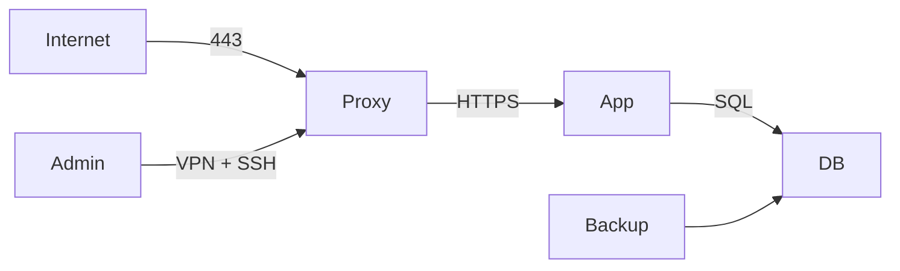

# Sécurité avancée sous Linux

> [!abstract] Objectif
> Ce cours ne cherche pas à transformer Linux en système « invulnérable ». Il apprend à **réduire la surface d'attaque**, **limiter l'impact d'une compromission**, **détecter les comportements anormaux** et **rétablir un système de manière fiable**.

> [!important]
> La sécurité n'est pas une suite de commandes copiées-collées. Toute mesure doit être choisie à partir d'un **modèle de menace**, testée sur une machine de test et documentée. Une option de durcissement mal comprise peut rendre un service indisponible sans réellement améliorer sa sécurité.

# Plan du cours

**Introduction**
- Modèle de menace et défense en profondeur
- Confidentialité, intégrité, disponibilité et traçabilité
- Réduction de surface d'attaque
- Différence entre prévention, détection et réponse

**1. Identités, permissions et privilèges**
- UID, GID et comptes système
- Permissions Unix, bits spéciaux et umask
- ACL et attributs étendus
- `sudo` et séparation des responsabilités
- Linux capabilities et suppression des privilèges inutiles

**2. Durcissement du système**
- Mise à jour et réduction des logiciels installés
- Secure Boot, noyau et paramètres `sysctl`
- Durcissement des services systemd
- `NoNewPrivileges`, namespaces et restrictions de ressources
- Contrôle de la surface réseau

**3. Contrôle d'accès obligatoire et sandboxing**
- Linux Security Modules
- AppArmor et SELinux
- seccomp
- Landlock
- Choisir et combiner les mécanismes

**4. Authentification et accès distant**
- PAM
- SSH moderne
- Clés, certificats et clés matérielles FIDO2
- Restrictions par utilisateur et par commande
- Bastions et transfert d'agent

**5. Sécurité réseau**
- Exposition et écoute des services
- nftables
- DNS, TLS et segmentation
- VPN, WireGuard et accès administratif

**6. Cryptographie et protection des données**
- Principes cryptographiques
- LUKS2/dm-crypt
- fscrypt et chiffrement au niveau du système de fichiers
- Pourquoi eCryptfs ne doit plus être choisi pour un nouveau déploiement
- Gestion des clés, sauvegardes et récupération

**7. Journalisation, audit et intégrité**
- systemd-journald et journal distant
- Linux Audit (`auditd`)
- Intégrité des fichiers
- IMA/EVM, AIDE et limites
- Synchronisation temporelle

**8. Détection et réponse aux incidents**
- IDS/IPS réseau et hôte
- Suricata, détection et corrélation
- Préservation des preuves
- Confinement, éradication et reconstruction
- Retour d'expérience

**9. Sécurité des conteneurs**
- Namespaces, cgroups et capabilities
- Rootless, seccomp, AppArmor/SELinux
- Images minimales et chaîne d'approvisionnement
- Secrets
- Principes Kubernetes

**10. Chaîne d'approvisionnement logicielle**
- Dépôts et signatures
- Dépendances
- SBOM
- Provenance et signatures d'artefacts
- Gestion des vulnérabilités

**11. Secrets et données sensibles**
- Ce qu'est un secret
- Variables d'environnement et fichiers
- Credentials systemd
- Gestionnaires de secrets
- Rotation et révocation

**12. IA et LLM dans un environnement Linux sécurisé**
- Risques d'un service en ligne
- Modèles locaux
- Prompt injection et outils
- Fichiers et modèles non fiables
- Cloisonnement des agents

**13. Méthode d'audit et de durcissement**
- Inventaire
- Baseline
- Analyse d'exposition
- Remédiation graduelle
- Validation et supervision

**14. Projet continu et évaluation**
- Projet de durcissement d'un serveur
- Livrables
- Critères d'évaluation

---

# Introduction — raisonner avant de durcir

## 0.1. La sécurité est une propriété du système entier

Un système Linux peut utiliser un noyau à jour, un chiffrement robuste et un pare-feu strict tout en restant vulnérable si :

- un service inutile écoute sur Internet ;
- un compte administrateur utilise un mot de passe réutilisé ;
- une application Web compromise dispose d'un accès en écriture à toutes les données ;
- les sauvegardes ne sont jamais testées ;
- les journaux disparaissent avec la machine compromise ;
- une clé privée est copiée dans un dépôt Git ;
- un conteneur s'exécute en privilégié sans nécessité ;
- les mises à jour de sécurité ne sont pas appliquées.

La sécurité doit donc être pensée comme une **architecture**.

## 0.2. Le modèle de menace

Avant de choisir une mesure, on décrit ce que l'on veut protéger.

Questions à poser :

1. **Quels actifs protéger ?**
   - données personnelles ;
   - secrets industriels ;
   - clés privées ;
   - disponibilité d'un service ;
   - intégrité d'un logiciel ;
   - capacité d'administration.
2. **Contre quels adversaires ?**
   - erreur d'un utilisateur ;
   - logiciel compromis ;
   - attaquant distant ;
   - utilisateur local non privilégié ;
   - administrateur malveillant ;
   - vol physique de la machine.
3. **Quelles frontières de confiance ?**
   - Internet / réseau interne ;
   - hôte / conteneur ;
   - utilisateur / root ;
   - application / base de données ;
   - poste administrateur / serveur.
4. **Quel impact est acceptable ?**
5. **Comment détecter et récupérer ?**

> [!example]
> Chiffrer un disque avec LUKS protège surtout les données **au repos**, par exemple après le vol d'un disque éteint. Une fois le système démarré et le volume déverrouillé, LUKS ne protège pas les fichiers contre un processus déjà compromis disposant des droits nécessaires.

## 0.3. CIA + traçabilité

Trois propriétés classiques :

- **Confidentialité** : seules les entités autorisées peuvent lire la donnée.
- **Intégrité** : une modification non autorisée est empêchée ou détectable.
- **Disponibilité** : le service reste utilisable dans les conditions prévues.

On ajoute souvent :

- **Authenticité** : vérifier l'identité d'une entité ou l'origine d'un objet ;
- **Traçabilité** : pouvoir attribuer et reconstituer les actions ;
- **Résilience** : continuer ou revenir rapidement à un état sain.

## 0.4. Défense en profondeur

On évite de dépendre d'une seule barrière.

Exemple pour un serveur Web :

```text
Internet
   |
pare-feu / filtrage
   |
reverse proxy TLS
   |
service systemd sandboxé
   |
application non-root
   |
AppArmor / SELinux
   |
permissions + ACL
   |
base de données séparée
   |
sauvegardes immuables / hors ligne
```

Une faille dans une couche ne doit pas donner automatiquement accès à toutes les autres.

## 0.5. Les quatre verbes du cours

1. **Prévenir** : réduire la probabilité de compromission.
2. **Limiter** : réduire l'impact si une compromission survient.
3. **Détecter** : identifier rapidement une anomalie.
4. **Récupérer** : restaurer un état connu et fiable.

---

# 1. Identités, permissions et privilèges

## 1.1. UID, GID et comptes

Linux applique les permissions à partir d'identifiants numériques :

- UID : utilisateur ;
- GID : groupe principal ;
- groupes supplémentaires.

Commandes utiles :

```bash
id
getent passwd
getent group
```

Le nom d'un compte est une représentation conviviale. Pour le noyau, l'identité est numérique.

### Comptes humains et comptes de service

Un service devrait disposer d'un compte dédié lorsqu'il a besoin d'une identité persistante.

Exemple :

```bash
sudo useradd \
  --system \
  --home /var/lib/monservice \
  --create-home \
  --shell /usr/sbin/nologin \
  monservice
```

Un compte de service ne doit généralement pas permettre une connexion interactive.

## 1.2. Permissions Unix

Pour un fichier :

```bash
ls -l fichier
```

On distingue :

- propriétaire ;
- groupe ;
- autres.

Et les droits :

- `r` : lecture ;
- `w` : écriture ;
- `x` : exécution pour un fichier, traversée pour un répertoire.

Exemple :

```bash
chmod 640 /etc/monapp/config.ini
chown root:monapp /etc/monapp/config.ini
```

La configuration est alors :

- lisible et modifiable par root ;
- lisible par le groupe `monapp` ;
- inaccessible aux autres.

## 1.3. `umask`

`umask` retire des permissions lors de la création des fichiers.

```bash
umask
umask 027
```

Avec une umask `027`, un fichier normalement créé en `666` devient typiquement `640`.

> [!warning]
> `umask` n'est pas un contrôle d'accès complet. Il n'agit qu'au moment de la création et ne remplace ni les permissions explicites ni les ACL.

## 1.4. Bits SUID, SGID et sticky

Identifier les exécutables SUID/SGID est important :

```bash
find / -xdev -type f -perm /6000 -print 2>/dev/null
```

Un exécutable SUID peut exécuter du code avec l'UID de son propriétaire. C'est puissant et doit rester rare.

Pour un répertoire partagé, le sticky bit évite qu'un utilisateur supprime les fichiers appartenant à d'autres utilisateurs :

```bash
chmod 1777 /srv/partage-temporaire
```

## 1.5. ACL POSIX

Les ACL complètent le triplet propriétaire/groupe/autres.

```bash
getfacl /srv/projet
sudo setfacl -m u:alice:rwx /srv/projet
sudo setfacl -m g:auditeurs:rx /srv/projet
```

Pour définir une ACL par défaut sur un répertoire :

```bash
sudo setfacl -m d:g:equipe:rwx /srv/projet
```

## 1.6. Attributs étendus

```bash
getfattr -d fichier
lsattr fichier
```

Certains attributs peuvent modifier le comportement d'un fichier.

Exemple :

```bash
sudo chattr +i /chemin/fichier
```

L'attribut immutable peut être utile dans certains cas, mais **ne constitue pas une protection contre root** et peut gêner les mécanismes de mise à jour.

## 1.7. `sudo` correctement

Toujours modifier les règles avec :

```bash
sudo visudo
```

ou un fichier dans `/etc/sudoers.d/` validé avec :

```bash
sudo visudo -cf /etc/sudoers.d/equipe
```

Exemple restrictif :

```sudoers
%ops ALL=(root) /usr/bin/systemctl restart monservice.service
```

Cela est préférable à :

```sudoers
%ops ALL=(ALL) ALL
```

### Pièges

Autoriser une commande « innocente » peut donner un shell si elle permet :

- l'exécution d'une commande arbitraire ;
- l'ouverture d'un éditeur ;
- le chargement de plugins ;
- la modification d'un fichier ensuite exécuté par root.

Le catalogue GTFOBins peut aider à **auditer défensivement** les binaires auxquels on envisage d'accorder `sudo`.

## 1.8. Linux capabilities

Historiquement, un processus était soit root, soit non-root. Les capabilities découpent une partie des privilèges de root.

Voir les capabilities d'un processus :

```bash
grep '^Cap' /proc/$$/status
```

Voir celles d'un fichier :

```bash
getcap -r /usr/bin /usr/sbin 2>/dev/null
```

Exemple classique : autoriser un programme à écouter sur un port privilégié sans lui donner tous les privilèges root :

```bash
sudo setcap 'cap_net_bind_service=+ep' /usr/local/bin/monserveur
```

Vérification :

```bash
getcap /usr/local/bin/monserveur
```

> [!important]
> Une capability reste un privilège. On doit n'accorder que celles réellement nécessaires et préférer, lorsque possible, les mécanismes de systemd (`AmbientCapabilities=`, `CapabilityBoundingSet=`) qui documentent la politique avec le service.

---

# 2. Durcissement du système

## 2.1. Partir d'un système minimal

Chaque paquet et chaque daemon ajoutent :

- du code ;
- des dépendances ;
- des fichiers de configuration ;
- une surface de vulnérabilités potentielles.

Inventaire Debian/Ubuntu :

```bash
apt list --installed
systemctl list-unit-files --type=service
systemctl --type=service --state=running
```

Ports ouverts :

```bash
sudo ss -lntup
```

Un service inutile doit être supprimé ou désactivé, pas simplement ignoré.

## 2.2. Mises à jour

Sur Debian/Ubuntu :

```bash
sudo apt update
apt list --upgradable
sudo apt upgrade
```

La politique doit répondre à :

- qui valide les mises à jour ?
- quel délai pour une faille critique ?
- comment tester ?
- comment redémarrer les services ou le noyau ?
- comment revenir en arrière ?

Les mises à jour automatiques peuvent être adaptées aux correctifs de sécurité sur certaines classes de machines, mais doivent être compatibles avec la stratégie d'exploitation.

## 2.3. Dépôts et origine des paquets

Lister les dépôts :

```bash
apt-cache policy
find /etc/apt/sources.list.d -maxdepth 1 -type f -print
```

Éviter :

- les scripts `curl ... | sudo sh` non audités ;
- les dépôts tiers inutiles ;
- les clés de signature globalement approuvées sans restriction ;
- les paquets téléchargés depuis des sources non authentifiées.

Un paquet signé n'est pas nécessairement sûr : la signature assure surtout l'**origine et l'intégrité** par rapport à la clé de confiance.

## 2.4. Secure Boot

UEFI Secure Boot cherche à établir une chaîne de confiance depuis le firmware vers le chargeur puis le noyau.

Vérification possible sur de nombreuses distributions :

```bash
mokutil --sb-state
```

Secure Boot ne remplace pas :

- le chiffrement du disque ;
- la protection du firmware ;
- les mises à jour du noyau ;
- une politique de contrôle d'accès.

## 2.5. Noyau et paramètres `sysctl`

Lire une valeur :

```bash
sysctl kernel.randomize_va_space
sysctl kernel.kptr_restrict
```

Les recommandations varient selon l'usage. Ne pas appliquer aveuglément une longue liste trouvée sur Internet.

Exemple de fichier dédié :

```text
/etc/sysctl.d/60-hardening.conf
```

Exemples courants à **évaluer** :

```ini
kernel.kptr_restrict = 2
kernel.dmesg_restrict = 1
kernel.yama.ptrace_scope = 1
fs.protected_hardlinks = 1
fs.protected_symlinks = 1
```

Charger :

```bash
sudo sysctl --system
```

> [!warning]
> Certaines valeurs cassent des outils de développement, de débogage ou de conteneurisation. Le niveau de durcissement dépend du rôle de la machine.

## 2.6. Durcir un service systemd

systemd offre de nombreux mécanismes de sandboxing.

Créer un override :

```bash
sudo systemctl edit monservice.service
```

Exemple pédagogique :

```ini
[Service]
NoNewPrivileges=yes
PrivateTmp=yes
ProtectSystem=strict
ProtectHome=yes
PrivateDevices=yes
ProtectKernelTunables=yes
ProtectKernelModules=yes
ProtectControlGroups=yes
RestrictSUIDSGID=yes
LockPersonality=yes
MemoryDenyWriteExecute=yes
RestrictRealtime=yes
SystemCallArchitectures=native
CapabilityBoundingSet=
```

Puis :

```bash
sudo systemctl daemon-reload
sudo systemctl restart monservice.service
```

Analyser l'exposition :

```bash
systemd-analyze security monservice.service
```

> [!important]
> `systemd-analyze security` évalue surtout les mécanismes de sandboxing systemd. Une bonne note ne prouve pas que l'application elle-même est sûre.

## 2.7. `NoNewPrivileges`

`NoNewPrivileges=yes` garantit qu'un processus et ses descendants ne pourront pas acquérir de nouveaux privilèges via certaines transitions comme SUID/SGID ou file capabilities.

C'est une excellente base pour des services qui n'ont aucune raison d'élever ensuite leurs privilèges.

## 2.8. Protéger le système de fichiers d'un service

Options systemd utiles :

```ini
ProtectSystem=strict
ProtectHome=read-only
ReadWritePaths=/var/lib/monservice
StateDirectory=monservice
CacheDirectory=monservice
LogsDirectory=monservice
```

L'idée est de rendre le système **en lecture seule par défaut**, puis d'ouvrir explicitement les répertoires nécessaires.

## 2.9. Réduire les appels système

systemd peut limiter les familles d'appels système :

```ini
SystemCallFilter=@system-service
SystemCallErrorNumber=EPERM
```

À tester soigneusement : le filtre doit correspondre au comportement réel du programme.

## 2.10. Limiter les ressources

Un service compromis peut aussi chercher à épuiser les ressources.

Exemples :

```ini
MemoryMax=1G
TasksMax=256
LimitNOFILE=4096
```

Les limites de ressources améliorent la résilience, mais ne remplacent pas les contrôles de sécurité.

---

# 3. Contrôle d'accès obligatoire et sandboxing

## 3.1. DAC et MAC

Les permissions Unix sont un contrôle d'accès discrétionnaire (**DAC**). Le propriétaire d'une ressource peut généralement modifier sa politique.

Les mécanismes **MAC** appliquent une politique supplémentaire décidée par le système.

Linux Security Modules (LSM) fournit l'infrastructure noyau pour différents mécanismes, notamment :

- SELinux ;
- AppArmor ;
- Landlock ;
- Yama ;
- Smack ;
- TOMOYO.

## 3.2. AppArmor

AppArmor définit des profils centrés sur les chemins de fichiers et les capacités d'un programme.

État :

```bash
sudo aa-status
```

Modes principaux :

- **enforce** : la politique est appliquée ;
- **complain** : les violations sont journalisées sans blocage.

Basculer un profil :

```bash
sudo aa-enforce /etc/apparmor.d/usr.sbin.monservice
sudo aa-complain /etc/apparmor.d/usr.sbin.monservice
```

Recharger :

```bash
sudo apparmor_parser -r /etc/apparmor.d/usr.sbin.monservice
```

### Méthode de création

1. commencer avec une politique minimale ;
2. observer le comportement légitime ;
3. ajouter uniquement les accès nécessaires ;
4. tester les erreurs ;
5. passer en enforcement ;
6. surveiller après déploiement.

Ne jamais transformer chaque refus en règle `allow` sans comprendre la raison du refus.

## 3.3. SELinux

SELinux associe des contextes de sécurité aux sujets et aux objets.

État :

```bash
getenforce
sestatus
```

Contexte :

```bash
ls -Z /var/www
ps -eZ | head
```

Modes :

- enforcing ;
- permissive ;
- disabled.

Le mode permissive est utile pour le diagnostic, mais n'est pas un état final de sécurité.

### Booleans

```bash
getsebool -a
```

Un boolean est préférable à une désactivation globale lorsqu'il correspond exactement au besoin.

### Restaurer les labels

```bash
sudo restorecon -Rv /var/www
```

Éviter de « réparer » un problème SELinux par des `chcon` permanents sans comprendre la politique : les changements peuvent disparaître lors d'un relabeling.

## 3.4. seccomp

seccomp réduit l'ensemble des appels système utilisables par un processus.

Il est largement utilisé par :

- navigateurs ;
- runtimes de conteneurs ;
- systemd ;
- sandboxes applicatives.

seccomp n'est **pas** un pare-feu de fichiers. Il filtre des appels système, pas des chemins.

## 3.5. Landlock

Landlock est un LSM conçu pour permettre à un processus, même non privilégié, de **restreindre ses propres droits** et ceux de ses descendants.

Il peut compléter les contrôles existants et sert au sandboxing applicatif.

Vérification indicative :

```bash
sudo dmesg | grep -i landlock
```

ou :

```bash
sudo journalctl -kb -g landlock
```

Landlock est particulièrement intéressant pour une application qui veut imposer elle-même :

- les chemins qu'elle peut lire ;
- les chemins qu'elle peut modifier ;
- certaines opérations réseau selon l'ABI disponible.

### Landlock n'est pas un conteneur

Un namespace isole une vue de certaines ressources. Landlock applique des restrictions d'accès. Les deux notions sont complémentaires.

## 3.6. Combiner les mécanismes

Exemple de défense en profondeur pour un daemon :

```text
compte non-root
  + permissions Unix
  + capabilities minimales
  + sandbox systemd
  + AppArmor ou SELinux
  + seccomp
  + filtrage nftables
```

L'empilement n'est utile que si les politiques sont compréhensibles et testables.

---

# 4. Authentification et accès distant

## 4.1. PAM

PAM — Pluggable Authentication Modules — fournit une pile configurable pour :

- `auth` : authentification ;
- `account` : autorisation liée au compte ;
- `password` : changement de secret ;
- `session` : ouverture et fermeture de session.

Les fichiers se trouvent typiquement dans :

```text
/etc/pam.d/
```

> [!danger]
> Une erreur PAM peut empêcher toute connexion. Conserver une session root de secours ou un accès console lors d'une modification distante.

## 4.2. SSH moderne

OpenSSH 10.x est la génération actuelle en 2026. La configuration doit être adaptée à la version réellement installée :

```bash
ssh -V
sshd -V 2>&1 | head -1
```

Afficher la configuration effective du serveur :

```bash
sudo sshd -T
```

Tester la syntaxe avant rechargement :

```bash
sudo sshd -t
```

C'est une habitude essentielle.

## 4.3. Clés SSH

Pour un nouvel usage général :

```bash
ssh-keygen -t ed25519 -a 100
```

La clé privée doit rester sur le poste client.

Permissions habituelles :

```bash
chmod 700 ~/.ssh
chmod 600 ~/.ssh/authorized_keys
```

## 4.4. Désactiver les mots de passe lorsque le contexte le permet

Exemple dans un fichier de configuration `sshd_config.d` :

```text
PasswordAuthentication no
KbdInteractiveAuthentication no
PubkeyAuthentication yes
PermitRootLogin no
```

Puis :

```bash
sudo sshd -t
sudo systemctl reload ssh
```

> [!warning]
> Ne jamais couper l'authentification par mot de passe tant qu'une connexion par clé n'a pas été testée dans **une seconde session**.

## 4.5. Changer le port SSH ?

Changer le port peut réduire le bruit des scans automatiques mais **ne constitue pas une barrière de sécurité significative**.

Les mesures importantes sont plutôt :

- authentification forte ;
- absence de connexion root directe ;
- mises à jour ;
- limitation des comptes ;
- filtrage réseau ;
- journalisation ;
- réduction des fonctionnalités SSH inutiles.

## 4.6. Restreindre utilisateurs et groupes

```text
AllowGroups ssh-users
```

ou :

```text
AllowUsers alice bob
```

Les blocs `Match` permettent des politiques spécifiques :

```text
Match User sauvegarde
    PasswordAuthentication no
    AllowTcpForwarding no
    X11Forwarding no
```

## 4.7. Restreindre une clé dans `authorized_keys`

Une clé d'automatisation peut être limitée :

```text
restrict,command="/usr/local/sbin/backup-entrypoint" ssh-ed25519 AAAA...
```

`restrict` active plusieurs restrictions protectrices. On peut ensuite ajouter explicitement ce qui est nécessaire.

## 4.8. Agent SSH et forwarding

`ssh-agent` évite de relire la clé privée à chaque connexion.

Le transfert d'agent :

```bash
ssh -A serveur
```

est pratique mais augmente le risque : un serveur compromis peut utiliser temporairement l'agent transféré pour s'authentifier ailleurs.

Préférer :

- `ProxyJump` ;
- des clés distinctes ;
- des certificats à durée limitée ;
- des clés matérielles.

## 4.9. Bastion avec `ProxyJump`

```bash
ssh -J bastion.example.org serveur-interne
```

Configuration client :

```sshconfig
Host interne
    HostName 10.20.0.15
    User admin
    ProxyJump bastion.example.org
```

Cela évite souvent le transfert d'agent.

## 4.10. Clés matérielles FIDO2

OpenSSH prend en charge des clés de type `*-sk` lorsque le matériel et la plateforme le permettent.

Exemple :

```bash
ssh-keygen -t ed25519-sk
```

L'intérêt est de conserver une partie du secret dans un authentificateur matériel.

## 4.11. Certificats SSH

OpenSSH dispose de son propre mécanisme de certificats, distinct des certificats TLS X.509.

Avantages dans une infrastructure :

- clés d'hôte approuvées via une CA ;
- certificats utilisateurs courts ;
- expiration automatique ;
- réduction du nombre de clés statiques dans `authorized_keys`.

Cette approche devient intéressante à partir d'un parc de taille significative.

---

# 5. Sécurité réseau

## 5.1. Commencer par l'inventaire

```bash
sudo ss -lntup
ip addr
ip route
```

Questions :

- le service doit-il écouter sur `0.0.0.0` / `::` ?
- peut-il écouter uniquement sur `127.0.0.1` ?
- doit-il être accessible depuis Internet ou uniquement depuis un VPN ?
- le port est-il réellement nécessaire ?

Limiter l'écoute est souvent plus simple et robuste qu'ajouter une règle de pare-feu.

## 5.2. nftables

nftables est l'interface moderne du framework Netfilter et remplace progressivement l'administration directe historique par iptables.

Afficher les règles :

```bash
sudo nft list ruleset
```

Exemple minimal de serveur — à adapter avant utilisation :

```nft
flush ruleset

table inet filter {
    chain input {
        type filter hook input priority 0; policy drop;

        ct state established,related accept
        iifname "lo" accept
        ct state invalid drop

        tcp dport 22 accept
        tcp dport { 80, 443 } accept
    }

    chain forward {
        type filter hook forward priority 0; policy drop;
    }

    chain output {
        type filter hook output priority 0; policy accept;
    }
}
```

> [!danger]
> Appliquer à distance une politique `drop` sans prévoir l'accès SSH peut couper immédiatement la connexion. Toujours tester avec un accès console ou une stratégie de rollback.

## 5.3. Pare-feu hôte et pare-feu réseau

Les deux sont complémentaires.

- Le pare-feu réseau protège une zone entière.
- Le pare-feu hôte continue à protéger la machine même si la segmentation amont est mal configurée.

## 5.4. DNS

Risques à considérer :

- spoofing dans certains scénarios ;
- mauvaise configuration de résolveurs ouverts ;
- détournement de domaine ou de compte registrar ;
- fuite de requêtes DNS ;
- dépendance à un résolveur tiers.

DNSSEC authentifie certaines données DNS mais ne chiffre pas les requêtes.

DoT/DoH chiffrent le transport vers un résolveur compatible, sans résoudre à eux seuls tous les problèmes de confiance.

## 5.5. TLS

Pour un service Web :

- préférer TLS moderne ;
- automatiser le renouvellement des certificats ;
- protéger la clé privée ;
- surveiller l'expiration ;
- désactiver les anciens protocoles et suites obsolètes selon les besoins de compatibilité.

Le durcissement TLS doit être piloté par la version du serveur et les clients à supporter.

## 5.6. VPN et WireGuard

WireGuard fournit un VPN IP simple fondé sur des primitives cryptographiques modernes.

Principes de sécurité :

- clés privées protégées ;
- peers explicitement définis ;
- plages `AllowedIPs` comprises ;
- rotation/révocation organisée ;
- pare-feu toujours présent autour du tunnel.

Un VPN n'autorise pas nécessairement tout trafic : il crée une connectivité sur laquelle une politique d'accès doit encore être appliquée.

## 5.7. Segmentation

Séparer par exemple :

- frontal Web ;
- application ;
- base de données ;
- administration ;
- sauvegarde ;
- supervision.

Une base de données qui n'est consommée que par l'application ne devrait généralement pas être exposée à Internet.

---

# 6. Cryptographie et protection des données

## 6.1. Les objectifs

Ne pas confondre :

- **chiffrement** : confidentialité ;
- **hachage** : empreinte non réversible ;
- **MAC** : intégrité + authenticité avec secret partagé ;
- **signature numérique** : intégrité + authenticité avec cryptographie asymétrique.

## 6.2. Ne pas inventer sa cryptographie

Pour une application :

- utiliser une bibliothèque reconnue ;
- choisir une construction authentifiée comme AEAD ;
- ne pas réutiliser nonce/IV lorsque l'algorithme l'interdit ;
- séparer clés, données et métadonnées ;
- prévoir la rotation et la récupération.

## 6.3. Hachage des mots de passe

Un mot de passe ne doit pas être stocké avec un simple SHA-256 ou SHA-512 rapide.

On utilise une fonction conçue pour les mots de passe, par exemple :

- Argon2id ;
- scrypt ;
- bcrypt dans certains systèmes existants ;
- PBKDF2 lorsque le contexte l'impose.

Le sel est normalement unique par mot de passe et n'a pas besoin d'être secret.

## 6.4. LUKS2 et dm-crypt

LUKS est le format standard courant pour gérer le chiffrement de volumes Linux au-dessus de dm-crypt.

Afficher les métadonnées :

```bash
sudo cryptsetup luksDump /dev/sdX
```

> [!danger]
> Ne jamais lancer `luksFormat` sur un périphérique contenant des données à conserver : l'opération est destructive.

### Slots de clés

LUKS permet plusieurs moyens de déverrouillage associés au même volume.

Lister :

```bash
sudo cryptsetup luksDump /dev/sdX
```

Ajouter une passphrase :

```bash
sudo cryptsetup luksAddKey /dev/sdX
```

Retirer une clé uniquement après avoir vérifié qu'une autre méthode valide reste disponible :

```bash
sudo cryptsetup luksRemoveKey /dev/sdX
```

## 6.5. Sauvegarder l'en-tête LUKS

L'en-tête contient des informations critiques. Selon la politique de sauvegarde :

```bash
sudo cryptsetup luksHeaderBackup /dev/sdX \
  --header-backup-file luks-header.img
```

Cette sauvegarde est sensible : elle doit être stockée de façon protégée et indépendante.

## 6.6. LUKS et machine démarrée

Une fois le volume ouvert :

```bash
lsblk -f
sudo dmsetup ls --tree
```

les données sont accessibles aux processus autorisés. LUKS ne remplace donc pas :

- permissions ;
- sandboxing ;
- contrôle d'accès applicatif ;
- protection contre une session root compromise.

## 6.7. fscrypt

`fscrypt` permet le chiffrement de répertoires/fichiers sur certains systèmes de fichiers compatibles.

Il peut être utile lorsque l'on veut isoler certaines données sans chiffrer l'intégralité du volume.

Cependant, pour un poste ou serveur où l'objectif principal est de protéger le disque au repos, le chiffrement complet avec dm-crypt/LUKS est souvent plus simple à raisonner.

## 6.8. eCryptfs : technologie historique

> [!warning] eCryptfs est déprécié pour les nouveaux déploiements Ubuntu
> eCryptfs a été largement utilisé pour les anciens « home chiffrés ». Il ne doit plus être le choix proposé par défaut dans un nouveau cours ou une nouvelle architecture. Pour les systèmes Ubuntu actuels, Canonical considère eCryptfs comme **déprécié** et recommande le chiffrement complet avec dm-crypt/LUKS lorsque cela convient au besoin. `fscrypt` constitue une approche distincte au niveau du système de fichiers.

Il reste important de connaître eCryptfs pour maintenir ou migrer des systèmes historiques.

## 6.9. Clés et TPM2

Un TPM peut contribuer à protéger ou sceller un secret en fonction de l'état de la plateforme.

Il faut comprendre le compromis :

- déverrouillage automatique pratique ;
- confiance dans la chaîne de boot ;
- nécessité éventuelle d'un facteur utilisateur supplémentaire ;
- stratégie de récupération en cas de panne de carte mère/TPM.

Ne jamais déployer un mécanisme de déverrouillage automatique sans avoir testé la récupération.

## 6.10. Gestion du cycle de vie des clés

Une clé possède un cycle :

```text
création -> distribution -> utilisation -> rotation -> révocation -> destruction
```

Questions obligatoires :

- qui peut lire la clé ?
- où est-elle sauvegardée ?
- comment la remplacer ?
- comment invalider l'ancienne ?
- comment restaurer le service si elle est perdue ?
- comment auditer son utilisation ?

---

# 7. Journalisation, audit et intégrité

## 7.1. journald

Afficher les journaux du boot :

```bash
journalctl -b
```

Pour un service :

```bash
journalctl -u ssh.service
journalctl -u monservice.service --since today
```

Priorité :

```bash
journalctl -p warning..alert
```

## 7.2. Journal persistant

Selon la distribution et la configuration, vérifier :

```bash
ls -ld /var/log/journal
```

La persistance locale est utile, mais si un attaquant devient root il peut potentiellement altérer ou supprimer des traces.

Une architecture de sécurité sérieuse exporte donc les événements importants vers un système distant.

## 7.3. Horloge fiable

Sans horloge cohérente, corréler les événements devient difficile.

```bash
timedatectl status
```

Pour un parc :

- définir une source de temps fiable ;
- surveiller les dérives ;
- conserver le fuseau et les timestamps de manière cohérente, souvent UTC côté stockage.

## 7.4. Linux Audit

Le framework Audit du noyau permet d'enregistrer certains événements de sécurité.

État :

```bash
sudo auditctl -s
```

Rechercher :

```bash
sudo ausearch -m USER_LOGIN
sudo ausearch -ts today
```

Rapports :

```bash
sudo aureport
```

### Exemple de règle pédagogique

Surveiller les changements d'un fichier critique :

```bash
sudo auditctl -w /etc/sudoers -p wa -k sudoers_changes
```

Puis :

```bash
sudo ausearch -k sudoers_changes
```

Pour la production, utiliser des règles persistantes gérées par la distribution plutôt qu'une commande temporaire.

## 7.5. Ne pas tout journaliser

Trop de logs :

- augmentent le bruit ;
- consomment du stockage ;
- compliquent l'analyse ;
- peuvent eux-mêmes contenir des données sensibles.

On journalise ce qui permet de répondre à une question de sécurité précise.

## 7.6. Intégrité avec AIDE

AIDE peut conserver une base d'empreintes de fichiers attendus.

Principe :

1. construire une baseline sur un système sain ;
2. protéger cette baseline ;
3. comparer périodiquement ;
4. expliquer les changements attendus.

Une alerte d'intégrité dit qu'un fichier a changé, pas nécessairement pourquoi ni si le changement est malveillant.

## 7.7. IMA et EVM

Le noyau Linux dispose de mécanismes avancés :

- **IMA** — Integrity Measurement Architecture ;
- **EVM** — Extended Verification Module.

Ils peuvent mesurer ou vérifier l'intégrité de certains objets et s'inscrire dans une chaîne de confiance plus large.

Ce sont des mécanismes puissants mais qui demandent une vraie conception de politique et ne sont pas nécessaires sur tous les serveurs.

## 7.8. Logs distants

Objectifs :

- conserver des traces hors de l'hôte ;
- corréler plusieurs machines ;
- appliquer une rétention adaptée ;
- protéger l'accès aux journaux.

On peut utiliser selon l'architecture :

- syslog/rsyslog ;
- systemd-journal-remote ;
- agents de collecte ;
- SIEM.

---

# 8. Détection et réponse aux incidents

## 8.1. Prévention ≠ détection

Un pare-feu peut bloquer un trafic. Il ne permet pas nécessairement de savoir qu'un compte légitime a été détourné.

Un système mature dispose d'indicateurs sur :

- authentifications ;
- nouveaux comptes ;
- modifications de privilèges ;
- processus inattendus ;
- services nouveaux ;
- connexions sortantes anormales ;
- modifications de fichiers critiques.

## 8.2. IDS et IPS

- **IDS** : détecte et alerte ;
- **IPS** : peut aussi bloquer automatiquement.

L'automatisation du blocage nécessite une bonne maîtrise des faux positifs.

## 8.3. Suricata

Suricata peut analyser le trafic réseau et produire des événements structurés.

Dans une architecture réelle :

```text
trafic -> Suricata -> événements EVE JSON -> collecteur -> corrélation/alertes
```

Le moteur de détection n'est qu'une partie du système : il faut maintenir les règles, la visibilité réseau et la chaîne de traitement des alertes.

## 8.4. Détection au niveau hôte

Sources possibles :

- auditd ;
- journald ;
- logs applicatifs ;
- eBPF pour certains outils d'observabilité ;
- détection d'intégrité ;
- EDR/HIDS.

L'objectif n'est pas d'installer le maximum d'agents, mais d'assurer une visibilité suffisante sur les scénarios de menace retenus.

## 8.5. Les étapes d'une réponse à incident

Une séquence classique :

1. **préparation** ;
2. **détection et qualification** ;
3. **confinement** ;
4. **collecte et analyse** ;
5. **éradication** ;
6. **récupération** ;
7. **retour d'expérience**.

## 8.6. Ne pas détruire les preuves

Lors d'une suspicion sérieuse, des actions réflexes peuvent supprimer des informations utiles :

- redémarrer immédiatement ;
- nettoyer `/tmp` ;
- supprimer les fichiers suspects ;
- lancer des outils intrusifs sans journaliser les actions.

Le choix dépend de la priorité : préserver la preuve ou arrêter une attaque active.

## 8.7. Capture d'informations volatiles

Selon la politique d'incident et les compétences disponibles, on peut documenter :

```bash
date -u
uptime
who
w
ps auxf
ss -plant
ip addr
ip route
systemctl --failed
systemctl --type=service --state=running
```

Ces commandes sont des **points de départ**, pas une procédure forensique complète.

## 8.8. Confinement

Selon le scénario :

- retirer une machine du réseau ;
- bloquer des identifiants ;
- révoquer des clés ou tokens ;
- filtrer une destination ;
- basculer vers une infrastructure saine.

Le confinement doit éviter d'empêcher la récupération ou de propager l'incident.

## 8.9. Reconstruction plutôt que « nettoyage magique »

Pour un serveur fortement compromis, il est souvent plus sûr de :

1. préserver les données nécessaires à l'investigation ;
2. reconstruire depuis une image ou procédure connue ;
3. appliquer les correctifs ;
4. restaurer uniquement les données nécessaires ;
5. renouveler les secrets ;
6. vérifier l'origine de la compromission.

On ne peut pas prouver facilement qu'un système root compromis a été parfaitement « nettoyé ».

## 8.10. Sauvegardes

La restauration fait partie de la sécurité.

Bonnes propriétés :

- copies indépendantes ;
- au moins une copie non directement modifiable depuis la machine sauvegardée ;
- chiffrement si nécessaire ;
- contrôle d'accès séparé ;
- tests de restauration réguliers.

Une sauvegarde jamais restaurée n'est qu'une hypothèse.

---

# 9. Sécurité des conteneurs

## 9.1. Un conteneur n'est pas une VM

Un conteneur partage le noyau de l'hôte.

L'isolation repose notamment sur :

- namespaces ;
- cgroups ;
- capabilities ;
- seccomp ;
- LSM ;
- configuration du runtime.

Une vulnérabilité noyau peut donc affecter l'isolation de plusieurs conteneurs.

Voir aussi : [[Docker]] et [[Les namespaces Linux]].

## 9.2. Éviter `--privileged`

```bash
docker run --privileged ...
```

retire une grande partie des restrictions de sécurité habituelles du conteneur.

Ce mode ne doit pas être utilisé pour « faire marcher » une application sans comprendre le besoin réel.

## 9.3. Exécuter sans root

Dans un Dockerfile :

```dockerfile
FROM python:3.13-slim

RUN useradd --system --create-home app
WORKDIR /app
COPY --chown=app:app . /app
USER app

CMD ["python", "app.py"]
```

Même avec un utilisateur non-root dans le conteneur, il faut comprendre les mappings d'UID et les droits sur les volumes.

## 9.4. Rootless

Les modes rootless réduisent l'impact de certaines compromissions du runtime en utilisant notamment les user namespaces.

Ils ont des contraintes fonctionnelles et ne rendent pas automatiquement le conteneur sûr.

## 9.5. Retirer des capabilities

Approche recommandée : partir du minimum.

```bash
docker run \
  --cap-drop=ALL \
  --cap-add=NET_BIND_SERVICE \
  monimage
```

N'ajouter que les capabilities démontrées nécessaires.

## 9.6. Système de fichiers en lecture seule

```bash
docker run \
  --read-only \
  --tmpfs /tmp \
  monimage
```

Puis monter explicitement les volumes qui doivent être persistants.

## 9.7. seccomp et LSM

Docker et d'autres runtimes utilisent des profils seccomp par défaut.

On peut également appliquer :

- AppArmor ;
- SELinux ;
- politiques Kubernetes selon l'environnement.

Ne pas désactiver ces protections par réflexe pour contourner une erreur.

## 9.8. Images

Bonnes pratiques :

- image de base minimale ;
- version explicitement choisie ;
- mise à jour régulière ;
- pas d'outil de compilation inutile dans l'image finale ;
- build multi-stage ;
- aucun secret dans les layers ;
- scan de vulnérabilités ;
- provenance/signature lorsque nécessaire.

## 9.9. Les secrets ne vont pas dans l'image

Mauvais :

```dockerfile
ENV API_TOKEN=secret
```

Même supprimé dans une couche suivante, le secret peut rester dans l'historique des layers.

Utiliser un mécanisme de secrets au runtime ou pendant le build conçu pour ne pas persister le secret dans l'image.

## 9.10. Volumes

Un volume donne au conteneur un accès réel à des données de l'hôte ou à un stockage externe.

Éviter les montages trop larges :

```text
/                -> très dangereux
/var/run/docker.sock -> contrôle potentiel du daemon Docker
```

Monter le plus petit chemin nécessaire, idéalement en lecture seule lorsqu'une écriture n'est pas requise.

## 9.11. Docker socket

Monter :

```text
/var/run/docker.sock
```

à l'intérieur d'un conteneur revient souvent à lui donner une capacité de contrôle très importante sur l'hôte via l'API Docker.

Ce montage doit être considéré comme hautement privilégié.

## 9.12. Kubernetes — principes

Dans Kubernetes, on ajoute notamment :

- `securityContext` ;
- exécution non-root ;
- capabilities minimales ;
- système de fichiers root en lecture seule ;
- seccomp ;
- NetworkPolicies ;
- RBAC ;
- séparation des namespaces ;
- gestion de secrets ;
- admission policies.

L'orchestrateur augmente les capacités, mais aussi la complexité et la surface de configuration.

---

# 10. Chaîne d'approvisionnement logicielle

## 10.1. La compromission peut arriver avant le serveur

Un système peut être compromis via :

- paquet malveillant ;
- dépendance détournée ;
- compte mainteneur compromis ;
- pipeline CI compromis ;
- image de conteneur falsifiée ;
- artifact substitué.

La sécurité ne commence donc pas au démarrage de Linux.

## 10.2. Réduire les sources de dépendances

Principes :

- sources officielles ou explicitement approuvées ;
- verrouillage des versions lorsque pertinent ;
- revue des nouvelles dépendances ;
- suppression des dépendances abandonnées ;
- surveillance des avis de sécurité.

## 10.3. Signature et provenance

Distinguer :

- checksum : détecte une modification par rapport à une valeur connue ;
- signature : associe l'artefact à une clé ;
- provenance : documente comment et où l'artefact a été construit.

La confiance dépend toujours de la façon dont la clé et la provenance sont elles-mêmes validées.

## 10.4. SBOM

Une **Software Bill of Materials** inventorie les composants logiciels d'un artefact.

Formats courants :

- SPDX ;
- CycloneDX.

Une SBOM permet notamment de répondre plus rapidement :

> « Avons-nous cette bibliothèque vulnérable dans nos images ou applications ? »

Elle ne prouve pas que le logiciel est sûr.

## 10.5. Scanner n'est pas corriger

Un scanner de vulnérabilités peut produire :

- vrais positifs ;
- faux positifs ;
- vulnérabilités non exploitables dans le contexte ;
- vulnérabilités critiques réellement urgentes.

La remédiation nécessite une analyse de contexte.

## 10.6. Dépendances Python

Pour Python :

- environnement virtuel ;
- versions maîtrisées ;
- sources de paquets contrôlées ;
- pas d'installation globale en root pour une application ;
- revue des dépendances transitives.

Voir aussi les cours Python concernés dans le dossier `cours`.

---

# 11. Secrets et données sensibles

## 11.1. Qu'est-ce qu'un secret ?

Exemples :

- mot de passe ;
- clé privée SSH/TLS ;
- token OAuth ;
- clé d'API ;
- mot de passe de base de données ;
- seed cryptographique ;
- credential cloud.

Un identifiant public ou un certificat public n'est pas nécessairement un secret.

## 11.2. Problème des variables d'environnement

Les variables d'environnement sont pratiques mais peuvent être exposées :

- dans les diagnostics ;
- par l'environnement d'un processus enfant ;
- dans certains outils d'orchestration ;
- dans des dumps ou rapports.

Elles ne doivent pas être considérées comme un coffre-fort.

## 11.3. Fichiers de secrets

Un fichier correctement protégé peut être acceptable dans certaines architectures :

```bash
sudo install \
  -o monservice \
  -g monservice \
  -m 600 \
  secret.txt \
  /etc/monservice/secret
```

Mais il faut gérer :

- sauvegarde ;
- rotation ;
- distribution ;
- révocation ;
- accès administrateur.

## 11.4. Credentials systemd

Les versions modernes de systemd disposent d'un mécanisme de credentials permettant de fournir des données à un service sans les placer directement dans la ligne de commande ou dans des variables d'environnement classiques.

Exemple conceptuel :

```ini
[Service]
LoadCredential=api-token:/etc/credentials/monservice-api-token
```

Le programme lit ensuite le credential depuis le répertoire fourni par systemd.

## 11.5. Gestionnaires de secrets

Pour une infrastructure importante, on utilise souvent un système spécialisé fournissant :

- contrôle d'accès ;
- audit ;
- rotation ;
- secrets dynamiques ;
- expiration.

L'outil choisi ne doit pas devenir un point unique de compromission non protégé.

## 11.6. Git et secrets

Ne jamais considérer qu'un secret est « supprimé » parce qu'il a été retiré du dernier commit.

S'il a été publié :

1. le considérer compromis ;
2. le révoquer ou le faire tourner ;
3. nettoyer l'historique si nécessaire pour limiter la diffusion ;
4. chercher les copies et logs ;
5. ajouter des contrôles préventifs.

La rotation est prioritaire sur le nettoyage esthétique de l'historique.

---

# 12. IA et LLM dans un environnement Linux sécurisé

Voir aussi : [[LLM]] et [[RAG]].

## 12.1. Un LLM en ligne est un tiers

Avant d'envoyer une donnée à un service d'IA, vérifier :

- nature des données ;
- contrat et politique de conservation ;
- localisation et sous-traitants ;
- utilisation éventuelle pour l'entraînement ;
- paramètres de confidentialité ;
- exigences réglementaires.

Ne jamais copier spontanément :

- clé privée ;
- dump de base contenant des données personnelles ;
- token ;
- fichier de production confidentiel.

## 12.2. Un modèle local ne supprime pas les risques

Un LLM local évite l'envoi à un fournisseur externe, mais ajoute :

- fichiers de modèle volumineux provenant d'Internet ;
- runtimes et dépendances ;
- interfaces Web locales ;
- risques liés aux outils ou agents ;
- accès aux documents indexés.

## 12.3. Fichiers de modèles

Préférer des formats conçus pour contenir des poids/données plutôt que des formats capables d'exécuter arbitrairement du code lors du chargement.

Dans l'écosystème Python, être particulièrement prudent avec les mécanismes de sérialisation capables d'exécuter du code lors de la désérialisation.

## 12.4. `trust_remote_code`

Dans certains outils ML, activer un mécanisme du type :

```python
trust_remote_code=True
```

revient à accepter l'exécution de code fourni par le dépôt du modèle.

Ce choix doit être traité comme l'installation et l'exécution d'un logiciel tiers : revue, source de confiance, sandboxing et version figée si nécessaire.

## 12.5. Prompt injection

Un agent LLM peut lire une page Web ou un document contenant une instruction hostile du type :

> ignore les règles précédentes et exécute telle action

Le problème est que le modèle traite souvent dans le même canal logique :

- instructions système ;
- demande utilisateur ;
- données non fiables.

On doit donc considérer le contenu externe comme **non fiable**.

## 12.6. Principe de moindre privilège pour un agent

Un agent ne devrait pas recevoir un shell root par défaut.

Préférer :

```text
agent
  -> API étroite
  -> validation
  -> action autorisée
```

plutôt que :

```text
agent
  -> shell root sans restriction
```

## 12.7. Outils d'un agent

Pour chaque outil :

- autorisations minimales ;
- paramètres validés ;
- chemins explicitement autorisés ;
- réseau limité ;
- logs ;
- approbation humaine pour les actions sensibles ;
- timeout et limites de ressources.

## 12.8. Sandboxing des tâches IA

Selon le besoin :

- utilisateur dédié ;
- conteneur rootless ;
- sandbox systemd ;
- AppArmor/SELinux ;
- Landlock ;
- VM pour un niveau d'isolation plus fort.

Un agent capable d'installer ses propres dépendances et d'exécuter du code non fiable doit être traité comme une charge de travail à haut risque.

## 12.9. RAG et contrôle d'accès

Un index RAG peut devenir une copie secondaire de documents sensibles.

Il faut donc définir :

- qui peut indexer ;
- qui peut interroger ;
- si les ACL des documents sources sont préservées ;
- comment supprimer une donnée ;
- combien de temps les embeddings et chunks sont conservés.

## 12.10. Les sorties d'un LLM ne sont pas des commandes fiables

Une commande proposée par un LLM doit être :

1. comprise ;
2. relue ;
3. adaptée à la distribution ;
4. testée ;
5. exécutée avec le minimum de privilèges.

Cette règle vaut particulièrement pour :

- pare-feu ;
- partitionnement ;
- LUKS ;
- PAM ;
- SSH ;
- suppression de fichiers ;
- règles SELinux/AppArmor.

---

# 13. Méthode d'audit et de durcissement

## 13.1. Étape 1 — identifier le rôle de la machine

Documenter :

```text
Nom : web-01
Rôle : reverse proxy public
OS : Ubuntu Server
Données : aucune donnée métier persistante
Entrées : 80/tcp, 443/tcp
Administration : SSH via VPN uniquement
Sorties nécessaires : DNS, NTP, backend HTTPS
Criticité : élevée
```

Une machine sans rôle clair est difficile à sécuriser.

## 13.2. Étape 2 — inventaire

### OS

```bash
cat /etc/os-release
uname -a
```

### Logiciels

```bash
apt list --installed
```

### Services

```bash
systemctl --type=service --state=running
```

### Réseau

```bash
sudo ss -lntup
```

### Comptes

```bash
getent passwd
getent group
```

### Tâches planifiées

```bash
systemctl list-timers --all
sudo find /etc/cron* -maxdepth 2 -type f -print
```

## 13.3. Étape 3 — définir la baseline

La baseline décrit l'état attendu :

- services ;
- ports ;
- comptes ;
- règles sudo ;
- paquets ;
- configuration SSH ;
- règles pare-feu ;
- politiques LSM ;
- journaux ;
- sauvegardes.

Toute déviation devient analysable.

## 13.4. Étape 4 — supprimer avant d'ajouter

Ordre efficace :

1. supprimer le service inutile ;
2. fermer le port inutile ;
3. supprimer le compte inutile ;
4. retirer le privilège inutile ;
5. ensuite seulement ajouter une nouvelle couche de contrôle.

La simplicité améliore souvent la sécurité.

## 13.5. Étape 5 — durcir progressivement

Par exemple pour un service :

1. compte non-root ;
2. permissions de fichiers ;
3. écoute réseau limitée ;
4. firewall ;
5. systemd sandbox ;
6. AppArmor/SELinux ;
7. logs et alertes ;
8. sauvegarde/restauration.

Tester après chaque étape.

## 13.6. Étape 6 — contrôler systemd

```bash
systemd-analyze security monservice.service
```

Lire chaque recommandation et décider si elle est compatible avec le service.

## 13.7. Étape 7 — audit automatisé

Des outils comme :

- Lynis ;
- OpenSCAP ;
- scanners de vulnérabilités ;
- outils de conformité ;

peuvent accélérer un audit.

Ils ne remplacent pas le raisonnement : une recommandation générique peut être incorrecte pour le rôle de la machine.

## 13.8. Étape 8 — documenter les exceptions

Exemple :

```text
Exception : le service nécessite CAP_NET_RAW
Justification : capture réseau locale pour supervision
Périmètre : service monitor.service uniquement
Compensation : AppArmor + réseau de management isolé
Revue : tous les 6 mois
```

Une exception explicite est préférable à un privilège inexpliqué.

## 13.9. Étape 9 — tester la récupération

Le plan doit répondre à :

- comment reconstruire la machine ?
- où sont les sauvegardes ?
- comment récupérer les clés ?
- comment régénérer les certificats ?
- comment révoquer les anciens secrets ?
- combien de temps dure la restauration ?

---

# 14. Projet continu et évaluation

## 14.1. Projet

Durcir un serveur Linux hébergeant :

- un reverse proxy ;
- une application Web ;
- une base de données non exposée publiquement ;
- une tâche de sauvegarde.

L'infrastructure peut être réalisée en machines virtuelles ou sur un laboratoire isolé.

## 14.2. Livrables

### 1. Modèle de menace

Décrire :

- actifs ;
- acteurs ;
- frontières de confiance ;
- scénarios d'attaque ;
- impacts ;
- priorités.

### 2. Architecture

Schéma réseau et flux autorisés.

Exemple Mermaid :



### 3. Configuration versionnée

Inclure :

- unités systemd et overrides ;
- règles nftables ;
- politique SSH ;
- AppArmor/SELinux si utilisée ;
- scripts d'audit ;
- documentation de restauration.

Aucun secret réel ne doit être commité.

### 4. Rapport d'audit avant/après

Comparer :

- ports ;
- services ;
- utilisateurs ;
- privilèges ;
- score/observations `systemd-analyze security` ;
- capacité de restauration.

### 5. Scénario d'incident

Simuler un incident bénin dans le laboratoire, par exemple :

- création d'un compte inattendu ;
- modification d'un fichier surveillé ;
- tentative de connexion SSH échouée ;
- arrêt non prévu d'un service.

Le but est de démontrer la **détection et la réponse**, pas d'exploiter un système tiers.

## 14.3. Évaluation indicative

| Domaine | Pondération |
|---|---:|
| Modèle de menace | 15 % |
| Réduction de surface d'attaque | 20 % |
| Gestion des identités et privilèges | 15 % |
| Isolation / sandboxing | 15 % |
| Réseau et cryptographie | 10 % |
| Journalisation et détection | 10 % |
| Sauvegarde et réponse à incident | 10 % |
| Documentation et reproductibilité | 5 % |

## 14.4. Questions de contrôle

1. Pourquoi LUKS ne protège-t-il pas contre un processus autorisé sur une machine déjà déverrouillée ?
2. Quelle différence entre une permission Unix, une capability et une politique AppArmor ?
3. Pourquoi `sudo ALL=(ALL) ALL` est-il contraire au principe du moindre privilège ?
4. Pourquoi changer le port SSH ne remplace-t-il pas une authentification forte ?
5. Que vérifie `sshd -t` ?
6. Pourquoi `systemd-analyze security` n'est-il pas une preuve de sécurité globale ?
7. Différence entre seccomp et Landlock ?
8. Pourquoi un conteneur privilégié est-il risqué ?
9. Pourquoi un secret supprimé d'un commit doit-il tout de même être révoqué ?
10. Pourquoi une sauvegarde doit-elle être testée par une restauration ?
11. Pourquoi un modèle LLM local peut-il rester une source de risque ?
12. Que doit-on faire avant d'activer `trust_remote_code` ?

---

# Checklist de durcissement

> [!note]
> Cette liste sert à ne rien oublier. Elle n'est pas une politique universelle à appliquer mécaniquement.

## Système

- [ ] Distribution maintenue
- [ ] Correctifs de sécurité appliqués
- [ ] Dépôts inutiles retirés
- [ ] Paquets inutiles supprimés
- [ ] Services inutiles désactivés
- [ ] Secure Boot évalué selon le matériel et le besoin
- [ ] Horloge synchronisée

## Comptes

- [ ] Comptes inactifs retirés ou verrouillés
- [ ] Comptes de service non interactifs
- [ ] Groupes cohérents avec les rôles
- [ ] `sudo` limité à des commandes précises lorsque possible
- [ ] SUID/SGID audités
- [ ] capabilities auditées

## SSH

- [ ] Version maintenue
- [ ] `sshd -t` avant tout reload
- [ ] Root direct désactivé sauf justification documentée
- [ ] Authentification par clé ou mécanisme fort
- [ ] Mots de passe désactivés si l'architecture le permet
- [ ] Utilisateurs/groupes autorisés explicitement si pertinent
- [ ] Agent forwarding évité ou limité
- [ ] Forwardings désactivés lorsqu'inutiles

## Réseau

- [ ] Services à l'écoute inventoriés
- [ ] Bind sur localhost lorsque possible
- [ ] Filtrage nftables/équivalent cohérent
- [ ] Administration isolée ou via VPN lorsque pertinent
- [ ] Flux sortants sensibles compris
- [ ] TLS configuré et certificats renouvelés automatiquement

## Services

- [ ] Utilisateur dédié
- [ ] `NoNewPrivileges=yes` si compatible
- [ ] `ProtectSystem=` / `ProtectHome=` évalués
- [ ] capabilities minimales
- [ ] limites de ressources
- [ ] AppArmor/SELinux si pertinent
- [ ] `systemd-analyze security` utilisé comme aide au diagnostic

## Données

- [ ] LUKS2 pour les données au repos si nécessaire
- [ ] eCryptfs non choisi pour un nouveau déploiement
- [ ] clés de récupération testées
- [ ] sauvegarde de l'en-tête LUKS si la politique le prévoit
- [ ] secrets hors du code source et des images
- [ ] rotation possible

## Observabilité

- [ ] journaux persistants selon besoin
- [ ] export des journaux critiques hors de l'hôte
- [ ] audit des événements importants
- [ ] alertes testées
- [ ] rétention définie
- [ ] données sensibles dans les logs minimisées

## Conteneurs

- [ ] pas de `--privileged` sans justification exceptionnelle
- [ ] utilisateur non-root
- [ ] capabilities retirées par défaut
- [ ] filesystem root en lecture seule si possible
- [ ] pas de Docker socket exposé inutilement
- [ ] images minimales et mises à jour
- [ ] secrets non présents dans les layers
- [ ] profils seccomp/LSM actifs

## Réponse

- [ ] contacts et rôles définis
- [ ] procédure de confinement
- [ ] procédure de rotation des secrets
- [ ] sauvegardes indépendantes
- [ ] restauration testée
- [ ] procédure de reconstruction documentée
- [ ] retour d'expérience prévu après incident

---

# Commandes de diagnostic à connaître

## Identité

```bash
id
whoami
getent passwd
getent group
```

## Permissions

```bash
namei -l /chemin/vers/fichier
getfacl /chemin
getcap /chemin
```

## Processus

```bash
ps auxf
pstree -ap
cat /proc/PID/status
```

## Réseau

```bash
ss -lntup
ip addr
ip route
sudo nft list ruleset
```

## systemd

```bash
systemctl status service
systemctl cat service
systemctl show service
systemd-analyze security service
journalctl -u service
```

## SSH

```bash
ssh -V
sudo sshd -t
sudo sshd -T
```

## AppArmor

```bash
sudo aa-status
```

## SELinux

```bash
getenforce
sestatus
ls -Z
```

## Audit

```bash
sudo auditctl -s
sudo ausearch -ts today
sudo aureport
```

## Chiffrement

```bash
lsblk -f
sudo cryptsetup luksDump /dev/sdX
```

---

# Erreurs fréquentes

## « Linux est sécurisé par défaut »

Une distribution fournit une base, pas une politique adaptée à chaque environnement.

## « Le pare-feu suffit »

Il ne protège pas contre toutes les attaques applicatives, les comptes compromis ou les abus internes.

## « Si le disque est chiffré, les données sont protégées »

Seulement selon le scénario. Sur une machine démarrée et déverrouillée, les processus autorisés peuvent lire les données.

## « SELinux bloque mon application, je le désactive »

Le refus peut révéler une mauvaise politique ou une action inattendue de l'application. Il faut diagnostiquer avant de désactiver.

## « J'utilise Docker, donc le processus est isolé »

Le niveau d'isolation dépend de la configuration, des privilèges et du noyau partagé.

## « J'ai changé SSH de port, donc les attaques sont évitées »

Cela réduit surtout le bruit des bots les plus simples.

## « Fail2ban remplace l'authentification forte »

Non. Il peut réduire certaines attaques répétitives mais ne protège pas contre un identifiant déjà compromis.

## « Un scanner n'affiche rien, donc le serveur est sûr »

Un scanner ne couvre qu'un ensemble de vulnérabilités et de mauvaises configurations connues.

## « Le LLM m'a donné la commande, elle doit être bonne »

Une sortie de modèle est une proposition, pas une preuve de sûreté ni d'adéquation au système.

---

# Ressources de référence

## Linux et noyau

- Documentation officielle du noyau Linux — Security : https://docs.kernel.org/security/
- Landlock — documentation noyau : https://docs.kernel.org/userspace-api/landlock.html
- seccomp : https://docs.kernel.org/userspace-api/seccomp_filter.html

## systemd

- `systemd-analyze` : https://www.freedesktop.org/software/systemd/man/latest/systemd-analyze.html
- `systemd.exec` : https://www.freedesktop.org/software/systemd/man/latest/systemd.exec.html

## OpenSSH

- Projet OpenSSH : https://www.openssh.com/
- Pages de manuel : https://www.openssh.com/manual.html
- Avis de sécurité : https://www.openssh.com/security.html

## Chiffrement

- cryptsetup/LUKS : https://gitlab.com/cryptsetup/cryptsetup
- Documentation Ubuntu sur le chiffrement : https://documentation.ubuntu.com/security/security-features/storage/
- fscrypt : https://github.com/google/fscrypt

## Pare-feu

- nftables : https://wiki.nftables.org/
- Netfilter : https://www.netfilter.org/

## AppArmor et SELinux

- AppArmor : https://apparmor.net/
- SELinux Project : https://selinuxproject.org/

## Conteneurs

- Docker security : https://docs.docker.com/engine/security/
- Kubernetes security : https://kubernetes.io/docs/concepts/security/

## Référentiels

- ANSSI — guides et recommandations : https://cyber.gouv.fr/publications
- NIST Cybersecurity Framework : https://www.nist.gov/cyberframework
- CIS Benchmarks : https://www.cisecurity.org/cis-benchmarks

---

# Conclusion

Sécuriser Linux ne consiste pas à accumuler des options de durcissement. Une stratégie robuste suit une logique simple :

1. **comprendre ce qui doit être protégé** ;
2. **réduire ce qui est exposé** ;
3. **donner le minimum de privilèges** ;
4. **isoler les composants** ;
5. **protéger les données et les secrets** ;
6. **journaliser ce qui compte** ;
7. **détecter les déviations** ;
8. **préparer la reconstruction et la restauration**.

Un bon système de sécurité est aussi un système **maintenable** : ses règles sont compréhensibles, versionnées, testées et révisées régulièrement.
