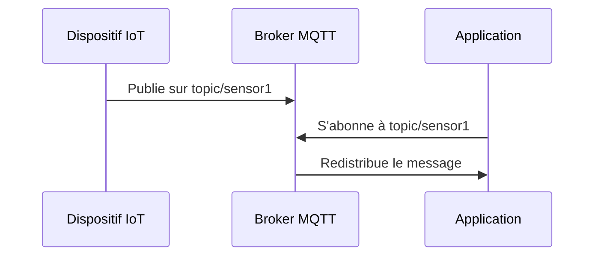
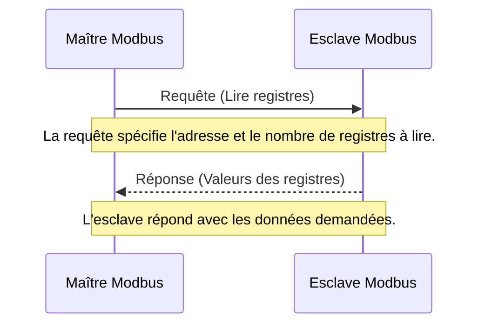

Ce cours sur la sécurité Python pour les systèmes IoT (Internet des Objets), tient compte des spécificités des systèmes SCADA (Supervisory Control and Data Acquisition).

# 1. Introduction à la Sécurité Python pour les IoT

## 1.1. Présentation des concepts clés : IoT, SCADA, et leur importance dans l'industrie moderne

L'Internet des Objets (IoT) et les systèmes de Contrôle et d'Acquisition de Données Supervisées (SCADA) représentent deux piliers technologiques essentiels dans le paysage industriel moderne. Ces technologies, bien que distinctes, partagent un objectif commun : l'automatisation et l'optimisation des processus industriels à travers une collecte de données avancée et une commande à distance. Leur rôle dans l'amélioration de l'efficacité opérationnelle, la réduction des coûts et l'augmentation de la production ne peut être sous-estimé.

### IoT : Connexion et Intelligence à l'Échelle Globale

L'IoT désigne le réseau interconnecté d'appareils physiques dotés de capteurs, de logiciels et d'autres technologies dans le but d'échanger des données avec d'autres dispositifs et systèmes via Internet. Des appareils ménagers intelligents aux capteurs industriels complexes, l'IoT englobe une gamme étendue d'objets. Sa capacité à collecter, transmettre et analyser des données en temps réel offre des avantages significatifs tels que la maintenance prédictive, la gestion énergétique optimisée et l'automatisation des tâches.

### SCADA : Supervision et Contrôle pour l'Industrie

Les systèmes SCADA, en tant que composante cruciale de l'automatisation industrielle, permettent le contrôle centralisé et la supervision des processus industriels à distance. Typiquement, un système SCADA recueille des données en temps réel provenant de capteurs situés sur le terrain, les transmet à un logiciel central, puis utilise ces informations pour contrôler les équipements automatiquement ou par intervention humaine. Les systèmes SCADA sont largement utilisés dans divers secteurs tels que l'énergie, l'eau, le pétrole et le gaz, où ils jouent un rôle vital dans la surveillance des opérations, l'assurance de la sécurité et l'amélioration de l'efficacité.

### Importance dans l'Industrie Moderne

L'importance de l'IoT et des systèmes SCADA dans l'industrie moderne ne peut être surestimée. Ils facilitent une transformation numérique profonde en permettant une visibilité en temps réel sur les opérations, une prise de décision basée sur les données, et une réactivité accrue face aux conditions changeantes du marché ou de l'environnement. Cette capacité à intégrer des processus physiques avec des analyses numériques avancées ouvre la voie à des industries plus intelligentes, plus sûres et plus durables. En somme, l'IoT et les SCADA sont des moteurs clés de l'Industrie 4.0, marquant une nouvelle ère d'innovation et d'efficacité dans le secteur industriel.

## 1.2. Vue d'ensemble de la sécurité dans les systèmes IoT : enjeux, défis, et terminologie de base

### Enjeux de sécurité dans les systèmes IoT

La sécurité dans les systèmes IoT englobe la protection des données, la sûreté de fonctionnement des dispositifs, et la garantie de la confidentialité et de l'intégrité des informations échangées. Les enjeux sont multiples :
- **Confidentialité** : Assurer que les données sensibles ne soient accessibles qu'aux entités autorisées.
- **Intégrité** : Garantir que les données ne sont pas altérées, intentionnellement ou accidentellement.
- **Disponibilité** : Assurer que les services et les données soient disponibles lorsque nécessaires, particulièrement crucial dans les systèmes SCADA où le temps réel est souvent un impératif.

### Défis de la sécurité dans les systèmes IoT

Les systèmes IoT sont caractérisé par :
- **Hétérogénéité des dispositifs** : La diversité des dispositifs IoT, avec leurs propres capacités et systèmes d'exploitation, rend l'uniformisation des mesures de sécurité complexe.
- **Ressources limitées** : De nombreux dispositifs IoT sont contraints en termes de puissance de calcul, mémoire, et énergie, limitant l'utilisation de solutions de sécurité traditionnelles.
- **Connectivité étendue** : La nature interconnectée des systèmes IoT expose à un risque accru d'attaques réseau.
- **Cycle de vie prolongé** : Les dispositifs IoT sont souvent déployés pour de longues durées, nécessitant une maintenance et des mises à jour de sécurité sur le long terme.

### Terminologie de base en sécurité des systèmes IoT

- **Attaque** : Toute action visant à compromettre la sécurité d'un système IoT, que ce soit en ciblant la confidentialité, l'intégrité, ou la disponibilité des données ou des services.
- **Vulnérabilité** : Une faiblesse dans la conception, l'implémentation, ou la configuration d'un système IoT qui pourrait être exploitée pour compromettre sa sécurité.
- **Menace** : Potentiel de violation de la sécurité, qui pourrait être intentionnelle (par des attaquants) ou accidentelle (due à des défaillances systèmes).
- **Mesures de sécurité** : Ensemble de techniques, pratiques, et politiques mises en place pour protéger les systèmes IoT contre les menaces et attaques.

Comprendre ces enjeux, défis, et la terminologie de base est essentiel pour aborder la sécurité dans les systèmes IoT, notamment dans les contextes critiques tels que les systèmes SCADA. La suite du cours se penchera sur des stratégies spécifiques et des outils disponibles pour adresser ces problématiques, en mettant l'accent sur l'utilisation de Python pour développer des solutions de sécurité efficaces et adaptées aux particularités des systèmes IoT.
## 1.3. Introduction à Python pour l'IoT : Pourquoi Python ?

Python est devenu l'un des langages de programmation les plus populaires et les plus appréciés pour le développement d'applications dans divers domaines, y compris l'Internet des Objets (IoT). Son adoption croissante dans le domaine de l'IoT peut être attribuée à plusieurs de ses caractéristiques fondamentales, qui le rendent particulièrement adapté pour répondre aux défis uniques que présente l'IoT.

### 1.3.1. Facilité d'apprentissage et de lecture

Python est renommé pour sa syntaxe claire et concise, qui facilite la compréhension et le développement de code, même pour les débutants dans le domaine de la programmation. Cette caractéristique réduit la courbe d'apprentissage et permet aux développeurs de se concentrer sur la résolution des problèmes de fond plutôt que sur la complexité du langage lui-même.

### 1.3.2. Large écosystème de bibliothèques

L'un des avantages majeurs de Python réside dans son vaste écosystème de bibliothèques et de frameworks. Pour l'IoT, des bibliothèques telles que Paho-MQTT pour la messagerie MQTT, PyModbus pour la communication Modbus, ou encore TensorFlow et Keras pour l'apprentissage automatique, offrent des outils puissants et flexibles pour le développement rapide d'applications IoT robustes et sécurisées.
#### 1.3.1.1 Le protocole MQTT

Le protocole MQTT (Message Queuing Telemetry Transport) est un protocole de messagerie léger, idéal pour les applications IoT, conçu pour les réseaux avec bande passante limitée ou fiabilité réduite. Il repose sur le modèle de publication/abonnement, offrant un moyen efficace et simplifié de communiquer entre les dispositifs IoT et les serveurs ou les applications de contrôle.

**Caractéristiques principales :**
- **Léger** : Utilise peu de bande passante et de ressources, essentiel pour les dispositifs IoT avec des capacités limitées.
- **Fiable** : Supporte divers niveaux de qualité de service (QoS) pour garantir la livraison des messages.
- **Sécurisé** : Permet l'implémentation de mécanismes de sécurité tels que le SSL/TLS pour chiffrer les communications.

**Fonctionnement du protocole MQTT :**
- **Broker MQTT** : Serveur central qui reçoit tous les messages, les filtre, et les redistribue aux clients abonnés.
- **Client** : Dispositif ou application qui peut publier des messages à un topic spécifique ou s'abonner à un topic pour recevoir des messages.

Voici un diagramme simplifié illustrant le fonctionnement du protocole MQTT :

Dans cet exemple :
1. Un **dispositif IoT** publie des données, comme des lectures de capteurs, à un **topic** spécifique sur le **broker MQTT**.
2. Une **application** s'abonne au même **topic** sur le **broker**.
3. Lorsque le **broker** reçoit un message pour ce **topic**, il le redistribue automatiquement à tous les clients abonnés à ce topic, assurant ainsi une communication efficace et ciblée entre les dispositifs.

Le protocole MQTT est largement utilisé dans les applications IoT pour sa simplicité, son efficacité, et sa capacité à fonctionner dans des environnements avec des contraintes sévères en termes de ressources et de connectivité.

#### 1.3.1.2. Communication Modbus

Le protocole Modbus est l'un des protocoles de communication les plus anciens et les plus répandus utilisés dans les systèmes de contrôle industriel et les applications IoT. Développé dans les années 1970, Modbus est devenu un standard de facto pour la communication entre les équipements automatisés. Il permet la transmission d'informations entre de nombreux dispositifs sur le même réseau, comme des capteurs, des contrôleurs, et d'autres unités de traitement, en utilisant une structure de message simple.

**Caractéristiques principales :**
- **Simplicité** : Facile à comprendre et à implémenter, avec une structure de paquet minimaliste.
- **Flexibilité** : Peut être utilisé sur divers types de réseaux, y compris série (RTU) et Ethernet (TCP/IP).
- **Interopérabilité** : Permet la communication entre équipements de différents fabricants.

**Fonctionnement de Modbus :**
- **Maître/esclave** : Fonctionne selon un modèle maître/esclave où le maître envoie des requêtes aux esclaves, qui répondent avec les données demandées ou un accusé de réception.
- **Adressage** : Utilise des adresses pour identifier les registres des esclaves, permettant la lecture ou l'écriture de valeurs spécifiques.
- **Fonctions** : Supporte plusieurs fonctions pour lire et écrire des données, ainsi que pour effectuer des diagnostics.

Illustration de la communication Modbus :

Dans cet exemple de communication Modbus :
1. Le **maître Modbus** envoie une requête à l'**esclave Modbus**, demandant la lecture de valeurs depuis des registres spécifiques.
2. L'**esclave Modbus** reçoit la requête, lit les valeurs des registres demandés, et envoie une réponse au maître avec les données.
   
La simplicité et la robustesse du protocole Modbus en font un choix privilégié pour la communication dans les systèmes industriels et IoT, particulièrement dans les applications nécessitant une interaction fiable entre différents dispositifs sur un réseau.

### 1.3.3. Portabilité et compatibilité

Python est un langage hautement portable, capable de fonctionner sur une multitude de plateformes, des serveurs haut de gamme aux dispositifs embarqués comme le Raspberry Pi, souvent utilisé dans les projets IoT. Cette portabilité assure que le code développé peut être facilement déployé et exécuté dans divers environnements.

### 1.3.4. Adaptabilité aux technologies émergentes

Python a prouvé sa capacité à s'adapter et à intégrer des technologies émergentes, notamment dans les domaines de l'intelligence artificielle (IA) et du Machine Learning (ML), qui jouent un rôle de plus en plus central dans les applications IoT avancées. Cette adaptabilité en fait un choix stratégique pour les projets IoT visant l'innovation et l'incorporation de nouvelles fonctionnalités.

### 1.3.5. Communauté et support

Python bénéficie d'une communauté mondiale très active, offrant un vaste réservoir de ressources, de tutoriels, de forums, et de documentation. Cette communauté dynamique est une source précieuse de support et d'innovation, facilitant le développement de solutions IoT et la résolution des problèmes rencontrés.

## 1.4. Aperçu des bibliothèques et outils pertinents

L'écosystème Python offre une multitude de bibliothèques et d'outils adaptés au développement et à la sécurisation des applications IoT, notamment dans le contexte des systèmes SCADA. Ces ressources facilitent la mise en œuvre de communications sécurisées, le traitement et l'analyse de données, ainsi que la détection et la réponse aux incidents de sécurité. Cet aperçu présente certains des outils les plus pertinents disponibles pour les développeurs travaillant sur des projets IoT en Python.

### 1.4.1. Bibliothèques de Communication

- **Paho MQTT** : Une bibliothèque client MQTT qui permet aux applications Python de communiquer avec un broker MQTT, essentielle pour les architectures basées sur le protocole MQTT.
- **PyModbus** : Une bibliothèque Modbus entièrement implémentée, permettant une communication facile avec les dispositifs Modbus RTU et TCP.
- **Requests** : Simplifie les requêtes HTTP pour interagir avec des API web ou des services en ligne, utile pour les dispositifs IoT connectés à Internet.

### 1.4.2. Traitement et Analyse des Données

- **Pandas** : Fournit des structures de données et des fonctions puissantes pour l'analyse et la manipulation de données, idéal pour gérer les données collectées par les dispositifs IoT.
- **NumPy** : Offre un support pour les calculs scientifiques et mathématiques complexes, permettant une analyse efficace des données issues de capteurs ou d'autres sources.
- **Scikit-learn** : Une bibliothèque pour l'apprentissage automatique, permettant de créer des modèles prédictifs à partir de données IoT pour, par exemple, la maintenance prédictive.

### 1.4.3. Sécurité

- **PyCryptodome** : Une bibliothèque de cryptographie auto-suffisante offrant des outils cryptographiques sécurisés pour chiffrer et déchiffrer des données dans les applications IoT.
- **Scapy** : Permet la manipulation et l'émission de paquets réseau, utile pour tester la sécurité des réseaux IoT et SCADA.
- **SSL** : Module intégré fournissant une couche de sockets sécurisés pour la communication réseau, essentiel pour sécuriser les échanges de données.

### 1.4.4. Surveillance et Détection des Intrusions

- **Elasticsearch & Kibana** : En combinant Elasticsearch pour le stockage et l'indexation de logs en temps réel avec Kibana pour l'analyse et la visualisation, ces outils supportent la surveillance avancée des systèmes IoT.
- **Snort** : Bien que non spécifique à Python, Snort peut être intégré dans des solutions Python pour la détection d'intrusions réseau et la prévention des intrusions en temps réel.

### 1.4.5. Automatisation et Orchestration

- **Ansible** : Outil d'automatisation qui peut être utilisé pour configurer et gérer des dispositifs IoT à distance, renforçant ainsi les pratiques de sécurité par une gestion cohérente des configurations.

### 1.4.6. Développement Web pour IoT

- **Flask** : Un micro-framework web qui permet de développer rapidement des applications web pour les interfaces utilisateur d'applications IoT, facilitant la surveillance et le contrôle des dispositifs IoT à distance.
- **[[Pyramid]]** : Pour des applications IoT plus complexes nécessitant une base de données robuste, une authentification des utilisateurs, ou des fonctionnalités administratives.

# 2. Fondamentaux de la Sécurité dans les Systèmes IoT

## 2.1. Comprendre les vecteurs d'attaque IoT : de la périphérie au nuage

L'écosystème IoT est composé d'une diversité de dispositifs, de réseaux, et de plateformes cloud, chacun présentant des opportunités uniques pour les acteurs malveillants. La compréhension des vecteurs d'attaque, de la périphérie (les dispositifs IoT eux-mêmes) jusqu'au nuage (les infrastructures et services cloud qui reçoivent, traitent et stockent les données des dispositifs IoT), est fondamentale pour développer des stratégies de sécurité efficaces. Cet aperçu explore les principaux vecteurs d'attaque dans les systèmes IoT et met en lumière les risques associés à chaque niveau.

### 2.1.1. Attaques sur la Périphérie (Edge)

La périphérie de l'IoT fait référence aux dispositifs physiques et aux passerelles qui connectent ces dispositifs aux réseaux plus larges. Les vecteurs d'attaque comprennent :

- **Attaques physiques** : Accès non autorisé au matériel pour extraire des données sensibles ou installer des malwares.
- **Firmware et logiciels vulnérables** : Exploitation de vulnérabilités non corrigées dans les logiciels et le firmware des dispositifs.
- **Interception de communication** : Écoute clandestine sur les communications non sécurisées entre les dispositifs IoT et les passerelles ou entre les dispositifs eux-mêmes.

### 2.1.2. Attaques sur les Réseaux

Les dispositifs IoT communiquent fréquemment sur des réseaux sans fil, qui peuvent être exploités par des attaquants :

- **Attaques par déni de service (DoS et DDoS)** : Saturation des dispositifs ou des réseaux avec du trafic inutile, rendant les services indisponibles.
- **Man-in-the-Middle (MitM)** : Intercepter et potentiellement modifier les données transmises entre deux parties sans que celles-ci en soient conscientes.
- **Réseaux de zombies (Botnets)** : Utilisation de dispositifs IoT compromis pour mener des attaques coordonnées ou pour diffuser des malwares.

### 2.1.3. Attaques sur le Cloud

Les plateformes et services cloud jouent un rôle crucial dans la gestion, le traitement, et le stockage des données IoT. Les attaques ciblant ces composants peuvent inclure :

- **Accès non autorisé** : Exploitation de failles de sécurité pour accéder à des données sensibles stockées dans le cloud.
- **Injection SQL** : Insertion de code malveillant dans les bases de données via des failles de sécurité dans les applications web.
- **Attaques de configuration** : Exploitation de configurations cloud incorrectes ou insuffisamment sécurisées pour accéder à des ressources ou à des données non autorisées.

### 2.1.4. Mesures de Prévention

Pour contrer ces vecteurs d'attaque, les mesures suivantes sont cruciales :

- **Sécurisation physique et logicielle des dispositifs** : Utiliser des mécanismes de sécurité robustes pour le matériel et le firmware, et s'assurer que tous les logiciels sont régulièrement mis à jour.
- **Cryptographie et sécurisation des communications** : Chiffrer les communications entre les dispositifs IoT et entre les dispositifs et le cloud pour prévenir les écoutes clandestines et les attaques MitM.
- **Gestion rigoureuse des accès et des identités** : Mettre en place une gestion des identités et des accès (IAM) robuste pour les utilisateurs et les dispositifs, limitant les accès aux données et aux ressources au strict nécessaire.
- **Surveillance et détection des anomalies** : Mettre en place des systèmes de surveillance réseau et de détection des intrusions pour identifier et répondre rapidement aux activités suspectes ou malveillantes.

La sécurisation des systèmes IoT contre les vecteurs d'attaque exige une approche multicouche qui prend en compte la diversité et la spécificité des menaces à chaque niveau du système, de la périphérie au nuage. En adoptant des pratiques de sécurité rigoureuses et en utilisant des outils adaptés, il est possible de réduire significativement les risques et de protéger efficacement les systèmes IoT contre les attaques.
## 2.2. Les bases de la sécurisation des communications : Cryptographie, SSL/TLS, et VPNs

La sécurisation des communications est essentielle dans les systèmes IoT pour protéger l'intégrité, la confidentialité, et l'authenticité des données échangées entre les dispositifs, les réseaux, et les plateformes cloud. Cette section explore les fondamentaux de la cryptographie, du Secure Sockets Layer (SSL)/Transport Layer Security (TLS), et des réseaux privés virtuels (VPNs), trois piliers clés pour la sécurisation des communications dans l'environnement IoT.

### 2.2.1. Cryptographie

La cryptographie est l'art de protéger les informations en les transformant en une forme sécurisée, de sorte que les destinataires prévus puissent les lire, tandis que les non-autorisés ne le peuvent pas. Elle repose sur deux types principaux de chiffrement :

- **Chiffrement symétrique** : Utilise la même clé pour chiffrer et déchiffrer les données. Bien que rapide et efficace, la gestion sécurisée de la clé partagée entre les parties peut être problématique.
- **Chiffrement asymétrique** (ou chiffrement à clé publique) : Utilise une paire de clés, une publique pour le chiffrement et une privée pour le déchiffrage. Cela facilite la distribution sécurisée des clés, mais est généralement plus lent que le chiffrement symétrique.

La cryptographie permet non seulement de sécuriser les données en transit mais aussi de vérifier l'identité des parties (authentification) et d'assurer l'intégrité des données.

### 2.2.2. SSL/TLS

SSL (et son successeur, TLS) est un protocole de sécurisation des échanges sur Internet. Il assure la confidentialité, l'intégrité des données, et l'authentification entre deux parties communicantes sur un réseau non sécurisé, comme Internet. Voici comment SSL/TLS sécurise les communications :

- **Négociation d'une session sécurisée** : Établissement d'une session sécurisée via un processus appelé "handshake", qui inclut l'authentification des parties, la sélection d'un algorithme de chiffrement, et l'échange de clés de chiffrement.
- **Chiffrement des données** : Une fois la session sécurisée établie, les données sont chiffrées suivant l'algorithme sélectionné, garantissant la confidentialité et l'intégrité des données échangées.
- **Vérification d'intégrité** : Utilise des codes de vérification de message pour s'assurer que les données n'ont pas été altérées durant le transit.

### 2.2.3. VPNs

Un réseau privé virtuel (VPN) crée un tunnel sécurisé entre notre dispositif et un serveur VPN, rendant nos échanges sur Internet privés, même sur des réseaux non sécurisés. Les VPNs utilisent souvent le protocole IPsec ou SSL/TLS pour sécuriser ce tunnel. Les avantages des VPNs pour l'IoT incluent :

- **Confidentialité améliorée** : Masque notre activité réseau, y compris les données IoT, des tiers.
- **Sécurisation des communications** : Protège les données en transit entre les dispositifs IoT et le cloud ou les serveurs de données.
- **Accès sécurisé à distance** : Permet aux dispositifs IoT de communiquer de manière sécurisée avec des réseaux d'entreprise ou des plateformes cloud, même lorsqu'ils sont déployés sur des sites distants ou dans des environnements publics.

En combinant la cryptographie, SSL/TLS, et les VPNs, il est possible de construire une stratégie de sécurité des communications robuste pour les systèmes IoT. Ces technologies assurent la protection des données contre les écoutes clandestines, l'usurpation d'identité, et d'autres formes d'attaques, contribuant ainsi à la création d'un écosystème IoT sûr et fiable.
## 2.3. Authentification et gestion des identités dans les systèmes IoT

L'authentification et la gestion des identités sont cruciales pour assurer la sécurité et l'intégrité des systèmes IoT. Ces processus permettent de vérifier l'identité des dispositifs et des utilisateurs, d'autoriser l'accès aux ressources appropriées, et de tracer les actions au sein du système. Face à la prolifération des dispositifs IoT et à la diversité des applications, mettre en place des mécanismes d'authentification et de gestion des identités robustes est impératif.

### 2.3.1. Authentification

L'authentification dans les systèmes IoT vérifie qu'un dispositif ou un utilisateur est bien celui qu'il prétend être avant d'accorder l'accès aux données ou aux fonctionnalités du système. Les méthodes d'authentification pour IoT peuvent inclure :

- **Authentification basée sur des mots de passe** : Bien que courante, cette méthode est de moins en moins privilégiée en raison des risques de sécurité liés à des mots de passe faibles ou réutilisés.
- **Authentification basée sur des certificats** : Utilise des certificats numériques pour authentifier les dispositifs. Cette méthode est plus sécurisée que les mots de passe car elle est plus difficile à usurper.
- **Authentification à deux facteurs (2FA)** : Combine deux méthodes d'authentification distinctes pour une sécurité accrue, par exemple, un mot de passe et un code reçu sur un dispositif mobile.

### 2.3.2. Gestion des identités

La gestion des identités dans les systèmes IoT concerne la création, la maintenance et l'inactivation des identités numériques pour les dispositifs et les utilisateurs. Elle inclut également la gestion des droits et des accès associés à ces identités. Les enjeux principaux sont :

- **Provisionnement sécurisé** : Processus d'enregistrement sécurisé des dispositifs dans le système, garantissant que seuls les dispositifs authentiques et autorisés peuvent se connecter et communiquer.
- **Gestion des accès** : Définition des niveaux d'accès pour les dispositifs et les utilisateurs, en s'assurant que chaque entité a uniquement accès aux ressources nécessaires pour son fonctionnement ou ses tâches.
- **Rotation des clés/certificats** : Mécanismes de mise à jour sécurisée des clés ou des certificats pour prévenir les attaques basées sur des clés compromises.

### 2.3.3. Défis et solutions

La gestion des identités et l'authentification dans les systèmes IoT présentent plusieurs défis, notamment en raison de l'échelle et de l'hétérogénéité des dispositifs. Les solutions potentielles incluent :

- **Utilisation de l'identité en tant que service (IDaaS)** : Des services cloud qui offrent une gestion des identités et de l'authentification as-a-service, permettant une intégration et une gestion centralisées des identités à grande échelle.
- **Protocoles d'authentification standardisés** : Adoption de protocoles standardisés tels que OAuth 2.0 et OpenID Connect pour faciliter l'authentification sécurisée et la délégation d'accès dans les applications IoT.
- **Blockchain pour l'identité IoT** : Exploration de la technologie blockchain pour créer des systèmes d'identité décentralisés, offrant une sécurité renforcée et une transparence pour la gestion des identités et des accès dans les systèmes IoT.

L'authentification et la gestion des identités forment la base de la sécurité des systèmes IoT, permettant de s'assurer que seules les entités vérifiées et autorisées peuvent accéder et interagir avec le système. À mesure que l'IoT continue de se développer, l'importance de ces mécanismes de sécurité ne fera que croître, nécessitant une attention constante et des mises à jour régulières pour contrer les menaces émergentes.
## 2.4. Principes de la programmation sécurisée en Python : bonnes pratiques, analyse de code, et outils de sécurité

La programmation sécurisée est essentielle pour développer des applications IoT résilientes et fiables. En Python, langue de choix pour de nombreux projets IoT, adhérer à des principes de programmation sécurisée et utiliser les outils appropriés peut grandement réduire les vulnérabilités et les risques de sécurité. Voici un aperçu des bonnes pratiques, de l'analyse de code, et des outils de sécurité pertinents pour la programmation sécurisée en Python.

### 2.4.1. Bonnes Pratiques de Programmation Sécurisée

- **Validation et Sanitisation des Entrées** : Toutes les entrées, qu'elles proviennent de l'utilisateur ou d'autres systèmes, doivent être validées pour s'assurer qu'elles correspondent aux attentes et sanitaires pour éliminer tout caractère potentiellement dangereux.
- **Gestion des Dépendances** : Utilisez des outils comme Pipenv ou Poetry pour gérer les dépendances de votre projet, et gardez-les à jour pour éviter les vulnérabilités connues.
- **Principe de Moindre Privilège** : Exécutez votre code avec le niveau de privilèges le plus bas nécessaire pour réduire les risques en cas de compromission.
- **Gestion Sécurisée des Secrets** : Utilisez des gestionnaires de secrets ou des variables d'environnement pour stocker les clés API, les mots de passe de base de données, et autres informations sensibles, au lieu de les hardcoder dans le code source.
- **Utilisation de HTTPS** : Pour toute communication réseau, utilisez HTTPS au lieu de HTTP pour protéger les données en transit.

### 2.4.2. Analyse de Code et Outils de Sécurité

- **Linters et Analyseurs de Code** : Des outils comme Pylint, Flake8, et Bandit peuvent identifier automatiquement les problèmes de style, les bugs potentiels, et certaines vulnérabilités de sécurité dans le code Python.
- **Scanners de Vulnérabilités** : Des outils tels que Safety et Snyk peuvent scanner les dépendances de votre projet pour des vulnérabilités connues, vous aidant à les mettre à jour ou à les remplacer si nécessaire.
- **Tests d'Intrusion Automatisés** : Utilisez des frameworks de test d'intrusion comme OWASP ZAP en phase de développement et de test pour détecter les failles de sécurité avant la mise en production.

### 2.4.3. Outils de Sécurité Spécifiques à Python

- **PyCryptodome** : Une bibliothèque de cryptographie offrant à la fois des primitives cryptographiques bas niveau et des recettes haut niveau pour sécuriser vos données.
- **SQLAlchemy** : En utilisant l'ORM SQLAlchemy pour interagir avec les bases de données, vous pouvez réduire les risques d'injections SQL grâce à ses méthodes de construction de requêtes sécurisées.
- **Authlib & OAuthLib** : Pour l'authentification et l'autorisation, l'utilisation de bibliothèques robustes peut aider à implémenter OAuth et OpenID Connect de manière sécurisée.

### 2.4.4. Conclusion

Adopter des principes de programmation sécurisée dès les premières étapes du développement est crucial pour renforcer la posture de sécurité des applications IoT. En suivant les bonnes pratiques, en utilisant une analyse de code régulière, et en intégrant des outils de sécurité dédiés, les développeurs peuvent significativement améliorer la sûreté et la sécurité de leurs applications Python dans l'écosystème IoT. Ces stratégies, combinées à une culture de sécurité proactive au sein de l'équipe de développement, sont essentielles pour anticiper, détecter, et répondre efficacement aux menaces de sécurité dans les applications IoT.

# 3. Approfondissement des Systèmes SCADA

## 3.1. Introduction spécifique aux systèmes SCADA : architecture, composants, et fonctionnement

Les systèmes de Contrôle et d'Acquisition de Données Supervisés (SCADA) sont des systèmes de contrôle industriel (ICS) essentiels pour la surveillance et la gestion des processus industriels à grande échelle. Ils sont utilisés dans divers secteurs tels que l'énergie, l'eau, le pétrole et le gaz, et la fabrication, pour surveiller et contrôler les équipements industriels de manière automatisée et à distance. Comprendre l'architecture, les composants, et le fonctionnement des systèmes SCADA est crucial pour leur sécurisation et leur maintenance efficace.

### 3.1.1. Architecture des systèmes SCADA

L'architecture SCADA typique se compose de plusieurs niveaux hiérarchiques, allant de la surveillance de terrain à la gestion et au contrôle centralisés :

- **Niveau de terrain** : Comprend les dispositifs physiques tels que les capteurs, les actionneurs, et les RTUs (Remote Terminal Units) qui collectent des données de terrain et effectuent des actions physiques.
- **Niveau de contrôle** : Constitué par les PLCs (Programmable Logic Controllers) et/ou les RTUs qui reçoivent les données des capteurs, exécutent la logique de contrôle, et commandent les actionneurs.
- **Niveau de supervision** : Comprend les serveurs SCADA et les postes de travail HMI (Human-Machine Interface) qui permettent aux opérateurs de surveiller et de contrôler le processus en temps réel, d'interagir avec les PLCs/RTUs, et de visualiser les données à travers des interfaces graphiques.
- **Niveau entreprise** : Intègre les systèmes SCADA avec les systèmes d'information d'entreprise (ERP, bases de données, etc.) pour la prise de décision stratégique et la gestion globale.

### 3.1.2. Composants clés des systèmes SCADA

- **Capteurs et Actionneurs** : Dispositifs de terrain qui mesurent les variables physiques (comme la température, la pression) et effectuent des actions mécaniques ou physiques.
- **RTU et PLC** : Collectent les données des capteurs, prennent des décisions de contrôle basées sur la programmation, et commandent les actionneurs. Les RTUs sont souvent utilisés pour les sites distants, tandis que les PLCs sont courants dans les installations industrielles.
- **Serveurs SCADA** : Centralisent la collecte de données, le traitement, et le stockage. Ils gèrent également la logique de contrôle avancée et l'archivage des données.
- **Interfaces Homme-Machine (HMI)** : Interfaces graphiques permettant aux opérateurs de visualiser et d'interagir avec le processus, de surveiller l'état des équipements, et d'exécuter des commandes de contrôle.
- **Communication Network** : Réseau de communication (filaire ou sans fil) qui connecte tous les niveaux de l'architecture SCADA, permettant l'échange de données en temps réel entre les composants.

### 3.1.3. Fonctionnement des systèmes SCADA

Le fonctionnement d'un système SCADA débute par la collecte de données en temps réel à partir des capteurs de terrain. Ces données sont transmises aux RTUs et/ou PLCs, où elles sont traitées selon des algorithmes de contrôle préétablis. Les résultats de ces traitements sont ensuite utilisés pour ajuster les opérations via des commandes aux actionneurs, ou envoyés aux serveurs SCADA pour une surveillance et un contrôle plus approfondis.

Les opérateurs humains peuvent intervenir à tout moment via les HMIs pour modifier les paramètres de contrôle, répondre aux alarmes, ou initier des processus manuels. Parallèlement, les données agrégées et analysées au niveau du serveur SCADA peuvent être utilisées pour des rapports de performance, des analyses historiques, et la prise de décision stratégique au niveau de l'entreprise.

Les systèmes SCADA intègrent des technologies complexes et multicouches pour permettre une gestion et un contrôle efficaces des processus industriels à grande échelle. Leur conception et leur fonctionnement nécessitent une compréhension approfondie non seulement de la technologie elle-même mais également des processus industriels qu'ils sont destinés à surveiller et à contrôler.

## 3.2. Vulnérabilités et menaces spécifiques aux SCADA

Les systèmes SCADA, essentiels au bon fonctionnement des infrastructures critiques, sont de plus en plus connectés à des réseaux d'entreprise et à Internet, ce qui les expose à un éventail de vulnérabilités et de menaces spécifiques. La compréhension de ces vulnérabilités et menaces est cruciale pour la mise en place de mesures de sécurité robustes.

### 3.2.1. Vulnérabilités des systèmes SCADA

- **Sécurité périmétrique faible** : De nombreux systèmes SCADA ont été conçus et déployés à une époque où la sécurité n'était pas une priorité, résultant en une protection périmétrique insuffisante contre les attaques externes.
- **Manque de mises à jour et de patchs** : Les systèmes SCADA fonctionnent souvent sur des logiciels et des systèmes d'exploitation obsolètes pour lesquels les mises à jour de sécurité ne sont pas régulièrement appliquées, laissant des vulnérabilités connues non corrigées.
- **Protocoles de communication non sécurisés** : Beaucoup de protocoles utilisés dans les réseaux SCADA ne sont pas sécurisés par défaut, permettant l'interception et la manipulation des données.
- **Intégration avec les réseaux d'entreprise** : L'intégration des systèmes SCADA avec les réseaux d'entreprise pour la gestion des données et le reporting augmente le risque d'exposition à des attaques venant du réseau d'entreprise plus large.
- **Manque d'authentification et de chiffrement** : L'absence d'authentification forte pour les utilisateurs et le manque de chiffrement pour les données en transit exposent les systèmes à des risques d'accès non autorisé et d'écoute clandestine.

### 3.2.2. Menaces spécifiques aux systèmes SCADA

- **Attaques par déni de service (DoS/DDoS)** : Les attaques visant à surcharger les réseaux SCADA avec un trafic excessif peuvent rendre les systèmes de contrôle inaccessibles, perturbant les opérations critiques.
- **Attaques de malware et ransomware** : Les malwares spécifiquement conçus pour cibler les systèmes SCADA peuvent perturber les opérations en modifiant les logiciels de contrôle ou en chiffrant des données critiques pour une rançon.
- **Ingénierie sociale et phishing** : Les attaquants peuvent cibler le personnel opérationnel ou technique par des campagnes de phishing pour obtenir un accès non autorisé aux systèmes SCADA.
- **Attaques d'insider** : Les employés mécontents ou malveillants ayant un accès physique ou à distance aux systèmes SCADA représentent une menace sérieuse en raison de leur connaissance des systèmes et des processus opérationnels.
- **Espionnage industriel et sabotage** : Les acteurs étatiques ou concurrents peuvent viser les systèmes SCADA pour l'espionnage industriel ou le sabotage, cherchant à voler des informations confidentielles ou à perturber les opérations.

### 3.2.3. Conclusion

La sécurisation des systèmes SCADA contre ces vulnérabilités et menaces spécifiques nécessite une approche multicouche, incluant la mise en place de mesures de sécurité physiques et cybernétiques, la gestion rigoureuse des accès, la mise à jour régulière des systèmes et logiciels, ainsi que la formation et la sensibilisation du personnel. Une surveillance continue et une capacité de réponse aux incidents sont également essentielles pour détecter et répondre rapidement à toute activité malveillante, minimisant ainsi les impacts sur les opérations critiques.

## 3.3. Bonnes pratiques de sécurité pour les systèmes SCADA : segmentation réseau, contrôle d'accès, et surveillance

La sécurisation des systèmes SCADA, qui jouent un rôle critique dans le fonctionnement des infrastructures essentielles, nécessite l'adoption de bonnes pratiques robustes. Ces pratiques incluent la segmentation réseau, le contrôle d'accès rigoureux, et la surveillance proactive, formant une approche de sécurité multicouche essentielle pour protéger contre les menaces internes et externes.

### 3.3.1. Segmentation Réseau

La segmentation réseau est une pratique critique de sécurité qui consiste à diviser le réseau SCADA en sous-réseaux distincts, limitant ainsi la propagation potentielle des attaques au sein du réseau.

- **Isolation des Réseaux Critiques** : Les composants critiques du système SCADA doivent être isolés des réseaux d'entreprise généraux et d'Internet, minimisant l'exposition aux attaques provenant de réseaux moins sécurisés.
- **Zones de Sécurité** : Créer des zones de sécurité autour des fonctions critiques du système SCADA, avec des contrôles d'accès stricts entre ces zones, aide à réduire le risque d'accès non autorisé.
- **Passerelles de Sécurité et Pare-feu** : L'utilisation de passerelles de sécurité et de pare-feu entre les segments de réseau permet de contrôler le trafic entrant et sortant, assurant que seules les communications autorisées traversent les frontières du réseau.

### 3.3.2. Contrôle d'Accès

Un contrôle d'accès rigoureux est indispensable pour s'assurer que seuls les utilisateurs autorisés peuvent accéder aux systèmes et aux données SCADA.

- **Authentification Forte** : Mettre en place des mécanismes d'authentification forte, tels que l'authentification multifactorielle, pour tous les utilisateurs du système SCADA, en particulier pour l'accès à distance.
- **Gestion des Identités et des Accès** : Une gestion précise des identités et des accès (IAM) garantit que les droits d'accès sont accordés selon le principe de moindre privilège, limitant les accès aux fonctionnalités nécessaires pour les rôles spécifiques des utilisateurs.
- **Journalisation et Audit des Accès** : La journalisation et l'audit régulier des accès permettent de détecter les tentatives d'accès non autorisées et de surveiller les activités suspectes au sein du réseau SCADA.

### 3.3.3. Surveillance

La surveillance proactive des systèmes SCADA permet de détecter rapidement les incidents de sécurité et d'y répondre efficacement.

- **Détection des Intrusions** : Les systèmes de détection d'intrusions (IDS) doivent être déployés pour surveiller en permanence le réseau SCADA à la recherche de signes d'activité malveillante.
- **Analyse des Logs** : L'analyse continue des logs et des événements système aide à identifier les tendances anormales ou les comportements suspects qui pourraient indiquer une compromission de sécurité.
- **Réponse aux Incidents** : Un plan de réponse aux incidents, incluant des procédures claires et des équipes dédiées, est crucial pour minimiser l'impact des attaques et restaurer rapidement les opérations normales après un incident.

### 3.3.4. Conclusion

La mise en œuvre de ces bonnes pratiques de sécurité est fondamentale pour protéger les systèmes SCADA contre un large éventail de menaces. En adoptant une approche de sécurité en couches intégrant la segmentation réseau, le contrôle d'accès, et la surveillance proactive, les organisations peuvent renforcer significativement la résilience de leurs systèmes SCADA face aux défis de sécurité complexes et en évolution. La sécurité des systèmes SCADA n'est pas seulement une question technique mais aussi une priorité stratégique, essentielle à la sûreté et à la continuité des opérations des infrastructures critiques.

# 4. Mise en Œuvre Pratique avec Python

## 4.1. Développement sécurisé avec Python pour l'IoT et les systèmes SCADA : études de cas et ateliers

Le développement sécurisé dans le domaine de l'IoT et des systèmes SCADA est crucial pour assurer l'intégrité, la confidentialité, et la disponibilité des systèmes et des données critiques. Python, en raison de sa flexibilité, de son vaste écosystème de bibliothèques, et de sa grande communauté, est un choix populaire pour le développement d'applications IoT et SCADA sécurisées. Cette section explore comment utiliser Python pour renforcer la sécurité des systèmes IoT et SCADA à travers des études de cas et des ateliers pratiques.

### 4.1.1. Étude de Cas 1 : Sécurisation d'une Communication MQTT avec Python

**Contexte** : MQTT est un protocole léger de messagerie utilisé dans de nombreuses applications IoT pour la communication entre dispositifs. Bien qu'efficace, MQTT n'est pas sécurisé par défaut, rendant les communications vulnérables aux écoutes clandestines et aux attaques de type Man-In-The-Middle (MitM).

**Solution** : Utiliser Python avec la bibliothèque `paho-mqtt` pour implémenter la communication MQTT sur SSL/TLS, garantissant ainsi que les données échangées entre les dispositifs IoT et le serveur MQTT sont chiffrées et sécurisées.

**Atelier Pratique** :
1. Installer la bibliothèque `paho-mqtt` avec pip.
2. Générer des certificats SSL/TLS pour le serveur MQTT et les clients IoT.
3. Configurer le client MQTT Python pour utiliser SSL/TLS lors de la connexion au serveur MQTT.
4. Tester la communication sécurisée entre le client et le serveur pour vérifier l'intégrité et la confidentialité des messages échangés.

### 4.1.2. Étude de Cas 2 : Authentification des Dispositifs IoT dans un Système SCADA

**Contexte** : Dans un système SCADA, s'assurer que seuls les dispositifs autorisés peuvent communiquer avec le serveur central est essentiel pour la sécurité du système.

**Solution** : Développer une solution d'authentification des dispositifs basée sur des certificats numériques en Python, utilisant la bibliothèque `cryptography` pour créer et vérifier des certificats.

**Atelier Pratique** :
1. Utiliser `cryptography` pour générer des paires de clés publiques/privées et des certificats pour les dispositifs IoT.
2. Mettre en place un processus d'authentification côté serveur SCADA en Python pour vérifier les certificats des dispositifs avant d'autoriser la communication.
3. Implémenter la logique de renouvellement et de révocation des certificats pour gérer les dispositifs compromis ou hors service.

### 4.1.3. Étude de Cas 3 : Surveillance et Analyse des Logs pour la Détection des Anomalies

**Contexte** : La surveillance en temps réel des logs des dispositifs IoT et des serveurs SCADA peut aider à détecter rapidement les activités suspectes ou malveillantes.

**Solution** : Utiliser Python pour développer un système de surveillance des logs qui analyse les données de logs en temps réel et utilise des algorithmes de détection d'anomalies pour identifier les comportements inhabituels.

**Atelier Pratique** :
1. Configurer les dispositifs IoT et les serveurs SCADA pour centraliser les logs.
2. Utiliser `ELK Stack` (Elasticsearch, Logstash, Kibana) pour l'agrégation et l'analyse des logs, et `Python` pour écrire des scripts de surveillance personnalisés.
3. Implémenter des alertes basées sur des seuils prédéfinis ou des modèles d'apprentissage automatique pour détecter les anomalies dans les logs.

### 4.1.4. Conclusion

Ces études de cas et ateliers pratiques illustrent comment Python peut être utilisé pour aborder divers aspects de la sécurité dans les systèmes IoT et SCADA. En se concentrant sur la sécurisation des communications, l'authentification des dispositifs, et la surveillance proactive, les développeurs peuvent renforcer significativement la sécurité de ces systèmes critiques. La clé est une mise en œuvre soigneuse, une compréhension approfondie des menaces potentielles, et un engagement continu envers les pratiques de développement sécurisé.

## 4.2. Utilisation de bibliothèques Python pour la sécurisation des communications IoT et la gestion des données

Dans le développement d'applications IoT, sécuriser les communications et la gestion des données est primordial pour protéger contre les interceptions non autorisées, les manipulations de données, et autres cyberattaques. Python, grâce à son large éventail de bibliothèques, offre des outils puissants pour renforcer la sécurité des communications IoT et la gestion des données. Voici quelques bibliothèques Python essentielles et leurs applications pour sécuriser les systèmes IoT.

### 4.2.1. Bibliothèques pour la Sécurisation des Communications

- **PyCryptodome** : Une suite de bibliothèques de cryptographie qui fournit des fonctions cryptographiques primitives ainsi que des recettes haut niveau. Elle permet de chiffrer et de déchiffrer des données, de générer des hash sécurisés et de créer des signatures numériques, essentiel pour sécuriser les données en transit entre les dispositifs IoT.
  
- **Paramiko** : Une implémentation Python du protocole SSHv2, offrant des fonctionnalités pour créer des canaux de communication sécurisés. Paramiko est idéal pour exécuter des commandes à distance et transférer des fichiers de manière sécurisée entre des dispositifs IoT et des serveurs.

- **Requests + PyOpenSSL** : `Requests` est une bibliothèque HTTP pour Python qui simplifie grandement les requêtes HTTP, tandis que `PyOpenSSL` est une interface Python autour de la bibliothèque robuste OpenSSL. Lorsqu'elles sont utilisées ensemble, elles permettent d'effectuer des requêtes HTTPS sécurisées, cruciales pour la communication sécurisée avec des API web ou des services cloud.

### 4.2.2. Bibliothèques pour la Gestion Sécurisée des Données

- **SQLAlchemy + SQLAlchemy-Encrypt** : SQLAlchemy est un SQL toolkit et ORM qui facilite la communication avec les bases de données en Python. En combinaison avec SQLAlchemy-Encrypt, il permet de chiffrer automatiquement les données sensibles avant de les stocker dans la base de données, assurant ainsi la protection des données au repos.

- **Pandas + Cryptography** : Pandas est largement utilisé pour la manipulation et l'analyse de données en Python. En utilisant Pandas pour gérer les données et la bibliothèque `cryptography` pour chiffrer des données sensibles dans des DataFrames, les développeurs peuvent assurer une manipulation sécurisée des données traitées ou générées par les dispositifs IoT.

### 4.2.3. Pratiques de Sécurisation des Communications et de Gestion des Données

En plus de l'utilisation de ces bibliothèques, suivre certaines pratiques peut améliorer la sécurité des communications IoT et la gestion des données :

- **Chiffrer les Communications** : Utiliser TLS/SSL pour chiffrer toutes les communications entre les dispositifs IoT et les serveurs ou services cloud. Cela est crucial pour prévenir l'écoute clandestine et les attaques man-in-the-middle.

- **Authentification Forte** : Mettre en place une authentification forte pour tous les dispositifs et les services, utilisant des certificats numériques ou l'authentification basée sur des clés publiques/privées.

- **Validation et Sanitisation des Entrées** : Valider et nettoyer toutes les entrées reçues par les dispositifs IoT pour prévenir les injections SQL, les attaques par script cross-site (XSS), et autres vulnérabilités liées aux entrées utilisateur.

- **Gestion Sécurisée des Secrets** : Utiliser des gestionnaires de secrets ou des services de gestion des identités et des accès pour stocker et gérer de manière sécurisée les clés API, les mots de passe, et autres informations d'identification.

En intégrant ces bibliothèques et pratiques dans le développement des applications IoT, les développeurs peuvent significativement renforcer la sécurité des systèmes, protégeant à la fois les communications entre les dispositifs et les serveurs, ainsi que la confidentialité et l'intégrité des données gérées par ces systèmes.
## 4.3. Création d'un mini-projet : Application sécurisée IoT/SCADA avec Python

Dans ce mini-projet, nous allons développer une application sécurisée IoT/SCADA en utilisant Python. L'objectif est de créer un système simple mais sécurisé qui simule la collecte de données de température à partir de capteurs IoT, la transmission sécurisée de ces données à un serveur central, et la visualisation de ces données via une interface web. Le projet mettra l'accent sur la sécurisation des communications, la validation des données, et la sécurisation de l'interface web.

### 4.3.1. Vue d'ensemble du Projet

- **Capteurs IoT** : Simulés par des scripts Python générant des données de température.
- **Serveur SCADA** : Un serveur Python recevant les données des capteurs, les stockant dans une base de données sécurisée, et servant une API pour accéder aux données.
- **Interface Web** : Une simple application Flask fournissant une visualisation des données de température.

### 4.3.2. Étape 1 : Simulation des Capteurs IoT

1. **Développement du Script du Capteur** : Créer un script Python simulant un capteur IoT qui génère périodiquement une lecture de température.
2. **Sécurisation de la Communication** : Utiliser la bibliothèque `requests` avec HTTPS pour envoyer les données de manière sécurisée au serveur SCADA.

### 4.3.3. Étape 2 : Mise en Place du Serveur SCADA

1. **Création du Serveur** : Utiliser Flask pour créer un serveur SCADA qui reçoit les données des capteurs via une API sécurisée.
2. **Stockage des Données** : Utiliser SQLAlchemy pour stocker les données reçues dans une base de données SQLite. Les données sensibles doivent être chiffrées en utilisant `SQLAlchemy-Encrypt`.
3. **Validation des Données** : Valider les données reçues de chaque capteur pour s'assurer qu'elles sont dans un format attendu et qu'elles ne contiennent pas de valeurs malveillantes.

### 4.3.4. Étape 3 : Développement de l'Interface Web

1. **Interface Utilisateur** : Développer une interface web simple avec Flask qui affiche les lectures de température stockées dans la base de données.
2. **Authentification** : Ajouter une fonctionnalité d'authentification à l'interface web pour sécuriser l'accès aux données. Utiliser Flask-Login pour gérer les sessions utilisateurs.
3. **Visualisation des Données** : Utiliser une bibliothèque JavaScript telle que Chart.js pour visualiser les données de température dans le temps via un graphique dynamique.

### 4.3.5. Sécurisation Générale

- **Chiffrement SSL/TLS** : Configurer le serveur Flask pour utiliser SSL/TLS, assurant que toutes les communications entre les capteurs, le serveur, et les clients web sont chiffrées.
- **Gestion des Secrets** : Stocker tous les secrets, tels que les clés de chiffrement et les mots de passe, en utilisant des variables d'environnement ou un gestionnaire de secrets.

### 4.3.6. Conclusion

Ce mini-projet illustre comment Python peut être utilisé pour développer une application IoT/SCADA sécurisée, depuis la collecte de données par des capteurs jusqu'à la visualisation de ces données via une interface web sécurisée. En mettant l'accent sur la sécurisation des communications, la validation et le chiffrement des données, et l'authentification des utilisateurs, ce projet offre un bon point de départ pour développer des applications IoT/SCADA plus complexes et sécurisées.

# 5. Surveillance, Détection des Intrusions, et Réponse aux Incidents

## 5.1. Systèmes de détection d'intrusion pour IoT et SCADA : principes et outils

Les systèmes de détection d'intrusion (IDS) jouent un rôle crucial dans la protection des réseaux IoT et SCADA contre les cyberattaques. En surveillant le trafic réseau et les activités des systèmes pour détecter des comportements anormaux ou malveillants, les IDS permettent une intervention rapide pour contrer les menaces potentielles. Cet aperçu aborde les principes fondamentaux des IDS pour IoT et SCADA, ainsi que les outils adaptés à ces environnements.

### 5.1.1. Principes Fondamentaux des IDS

- **Détection Basée sur les Signatures** : Cette approche repose sur la comparaison du trafic réseau et des activités système avec une base de données de signatures d'attaques connues. Elle est efficace pour détecter les menaces bien documentées, mais peut ne pas reconnaître les nouvelles attaques.
  
- **Détection Basée sur l'Anomalie** : Contrairement à la détection basée sur les signatures, cette méthode analyse le comportement habituel du réseau ou du système pour identifier toute activité qui dévie de la normale, signalant potentiellement une intrusion. Elle est plus à même de détecter les attaques zero-day, mais peut générer plus de faux positifs.

- **Détection Basée sur l'État** : Cette technique prend en compte l'état actuel du système ou du réseau pour évaluer si une activité est malveillante. Elle est particulièrement utile pour détecter des attaques complexes qui se déroulent en plusieurs étapes.

### 5.1.2. Outils de Détection d'Intrusion pour IoT et SCADA

- **Snort** : Un des IDS les plus populaires et open source, capable de réaliser une détection basée sur les signatures ainsi que l'analyse du trafic en temps réel. Bien qu'initialement conçu pour les réseaux informatiques traditionnels, Snort peut être configuré pour surveiller les réseaux SCADA et IoT.

- **Suricata** : Un autre système de détection d'intrusion open source qui offre des capacités de détection basées sur les signatures, l'analyse des anomalies, et la prise en charge du multi-threading pour une surveillance haute performance des réseaux. Suricata est également capable de comprendre le trafic spécifique à SCADA, tel que Modbus et DNP3.

- **Bro/Zeek** : Un puissant IDS qui se distingue par son approche axée sur la programmation événementielle, permettant aux utilisateurs de définir des politiques de sécurité spécifiques pour surveiller et analyser le trafic réseau. Zeek est particulièrement adapté pour les environnements complexes et peut être utilisé dans les réseaux SCADA pour détecter des comportements anormaux.

### 5.1.3. Mise en Œuvre des IDS dans les Environnements IoT et SCADA

Pour une protection efficace, les IDS doivent être correctement configurés et mis à jour régulièrement pour reconnaître les nouvelles vulnérabilités et techniques d'attaque. Dans les environnements IoT et SCADA, il est crucial de :

- **Adapter la Configuration aux Besoins Spécifiques** : Les réseaux IoT et SCADA ont des caractéristiques et des protocoles spécifiques qui doivent être pris en compte lors de la configuration des IDS.
  
- **Équilibrer Sécurité et Performance** : Les dispositifs IoT et les systèmes SCADA peuvent être limités en termes de ressources. Il est donc important d'optimiser la surveillance pour minimiser l'impact sur la performance.

- **Intégrer avec d'Autres Outils de Sécurité** : Les IDS doivent faire partie d'une stratégie de sécurité globale, intégrant d'autres outils et mesures de sécurité, tels que les firewalls, les systèmes de prévention des intrusions (IPS), et les solutions de gestion des informations et des événements de sécurité (SIEM).

En conclusion, l'implémentation d'IDS adaptés et bien configurés dans les réseaux IoT et SCADA est essentielle pour détecter et répondre aux menaces de manière proactive, contribuant ainsi à la résilience globale de ces systèmes critiques.
## 5.2. Analyse de logs et monitoring en temps réel avec Python

L'analyse de logs et le monitoring en temps réel constituent des composantes essentielles de la surveillance de la sécurité et de la performance des systèmes IoT et SCADA. Grâce à Python, les développeurs peuvent tirer parti d'une gamme de bibliothèques et d'outils pour collecter, analyser et visualiser des données de logs, facilitant la détection rapide des anomalies, des erreurs et des menaces potentielles. 

### 5.2.1. Collecte et Aggrégation des Logs

Avant l'analyse, il est crucial de collecter et d'agréger efficacement les logs provenant de diverses sources (dispositifs IoT, serveurs SCADA, applications, etc.). Python offre plusieurs bibliothèques pour faciliter cette étape :

- **Logging** : Un module Python standard qui peut être utilisé pour implémenter la journalisation dans les applications et les systèmes IoT/SCADA. Il permet de configurer facilement la collecte de logs, y compris le niveau de sévérité, le format, et la destination des logs (fichier, console, etc.).
  
- **Watchdog** : Une bibliothèque Python qui peut surveiller les fichiers de log pour détecter les modifications en temps réel. Elle peut être utilisée pour déclencher des alertes ou des actions automatiques dès que des changements sont détectés dans les fichiers de log.

### 5.2.2. Analyse de Logs

L'étape suivante consiste à analyser les logs collectés pour identifier les tendances, les anomalies, et les indicateurs de compromission. Python fournit des outils puissants pour l'analyse des données, y compris les logs :

- **Pandas** : Une bibliothèque offrant des structures de données et des fonctions d'analyse de données haut niveau. Pandas est particulièrement utile pour traiter et analyser de grands volumes de logs sous forme de DataFrames, permettant des opérations comme le filtrage, le regroupement et l'agrégation des données de log.
  
- **Elasticsearch-Py** : Un client Python officiel pour Elasticsearch, un moteur de recherche et d'analyse distribué. En combinant Python avec Elasticsearch, les développeurs peuvent indexer et rechercher efficacement dans d'énormes volumes de logs, utilisant des requêtes complexes pour détecter des schémas ou des anomalies spécifiques.

### 5.2.3. Monitoring en Temps Réel

Pour le monitoring en temps réel, l'objectif est de surveiller continuellement les systèmes et d'alerter en cas de comportement anormal ou de menace potentielle :

- **Grafana ou Kibana avec Python** : Bien que Grafana et Kibana ne soient pas des outils Python, ils peuvent être alimentés par des données analysées et collectées à l'aide de scripts Python. Ces plateformes de visualisation de données permettent de créer des tableaux de bord interactifs pour le monitoring en temps réel des systèmes IoT et SCADA.
  
- **Alerting avec Twilio ou SendGrid** : Pour les notifications et les alertes, des services comme Twilio (pour les SMS) ou SendGrid (pour les emails) peuvent être intégrés à des scripts Python. Cela permet d'envoyer automatiquement des alertes en cas de détection d'anomalies ou de seuils critiques atteints dans les données de monitoring.

### 5.2.4. Stratégie de Monitoring et d'Analyse

- **Définir des Seuils d'Alerte** : Il est crucial d'établir des seuils pour les différentes métriques de performance et les indicateurs de sécurité. Ces seuils aideront à déclencher des alertes en cas de dépassement, indiquant potentiellement une anomalie ou une menace.
  
- **Analyse Comportementale** : Utiliser des techniques d'apprentissage automatique pour analyser les comportements normaux et détecter les écarts significatifs. Des bibliothèques Python comme Scikit-learn peuvent être utilisées pour implémenter des modèles de détection d'anomalies.

En intégrant ces outils et pratiques dans une stratégie globale de sécurité, les équipes peuvent renforcer significativement la surveillance et la réactivité face aux incidents dans les environnements IoT et SCADA, minimisant ainsi les risques et les impacts potentiels sur les opérations.
## 5.3. Stratégies de réponse aux incidents et récupération après sinistre dans les environnements IoT/SCADA

Les environnements IoT et SCADA, en raison de leur rôle critique dans les infrastructures essentielles, nécessitent des stratégies robustes de réponse aux incidents et de récupération après sinistre. Ces stratégies visent à minimiser les interruptions, à restaurer rapidement les opérations normales et à garantir la continuité des services essentiels en cas de cyberattaques, de pannes techniques, ou de catastrophes naturelles.

### 5.3.1. Préparation et Planification

- **Plan de Réponse aux Incidents** : Élaborer un plan détaillé qui définit les rôles et les responsabilités, les procédures de communication, les étapes de réponse, et les ressources nécessaires pour gérer différents types d'incidents de sécurité.
  
- **Plan de Récupération Après Sinistre (DRP)** : Développer un DRP spécifique aux besoins des environnements IoT et SCADA, comprenant la restauration des systèmes critiques, les procédures de sauvegarde et de restauration des données, et les arrangements alternatifs pour maintenir les opérations.

### 5.3.2. Détection et Analyse

- **Surveillance Continue** : Utiliser des systèmes de détection d'intrusion, de gestion des événements de sécurité (SIEM), et d'analyse de logs pour surveiller en temps réel les activités suspectes et les signaux d'alerte précurseurs d'incidents.
  
- **Évaluation des Incidents** : Lors de la détection d'un incident, évaluer rapidement sa nature, son étendue, et son impact potentiel pour déterminer la réponse appropriée.

### 5.3.3. Confinement, Éradication et Récupération

- **Confinement** : Isoler les systèmes affectés pour empêcher la propagation de l'attaque ou du problème, tout en maintenant les opérations critiques autant que possible.
  
- **Éradication** : Éliminer la cause de l'incident, qu'il s'agisse de malwares, de vulnérabilités exploitées, ou de composants matériels défaillants, pour prévenir une récurrence.
  
- **Récupération** : Restaurer les systèmes affectés à partir de sauvegardes fiables et vérifier leur intégrité avant de les remettre en ligne. Tester les systèmes pour s'assurer de leur fonctionnement normal et de l'absence de menaces persistantes.

### 5.3.4. Communication et Revue Post-Incident

- **Communication Efficace** : Informer les parties prenantes internes et externes, y compris les autorités réglementaires si nécessaire, en suivant les directives établies dans le plan de réponse aux incidents.
  
- **Revue Post-Incident** : Réaliser une analyse post-mortem pour identifier les causes profondes de l'incident, évaluer la réponse apportée, et déterminer les améliorations à apporter aux plans de réponse aux incidents et de DRP.

### 5.3.5. Amélioration Continue

- **Mises à Jour des Plans** : Actualiser régulièrement les plans de réponse aux incidents et de DRP pour refléter les changements dans l'environnement opérationnel, les leçons apprises des incidents précédents, et l'évolution des menaces.
  
- **Formation et Sensibilisation** : Organiser des formations régulières et des simulations d'incidents pour préparer le personnel à répondre efficacement et pour renforcer la culture de la sécurité.

### 5.3.6. Conclusion

La mise en place de stratégies complètes de réponse aux incidents et de récupération après sinistre est essentielle pour assurer la résilience des systèmes IoT et SCADA face aux menaces de sécurité et aux autres risques. En adoptant une approche proactive et en se préparant à divers scénarios d'incidents, les organisations peuvent minimiser les impacts négatifs et garantir la continuité des opérations critiques.
# 6. Ateliers et Projets Pratiques

## 6.1. Ateliers guidés pour renforcer les compétences en programmation sécurisée, la gestion des vulnérabilités, et l'implémentation des mesures de sécurité

## 6.2. Projet final : les participants développeront une application IoT/SCADA en utilisant Python, en mettant l'accent sur la sécurisation de l'application.

# 7. Conclusion et Ressources Supplémentaires

## 7.1. Récapitulatif des points clés du cours

Ce cours a exploré en profondeur les aspects cruciaux de la sécurité dans les systèmes IoT et SCADA, mettant en lumière les enjeux, les défis, et les stratégies pour développer, déployer et maintenir des systèmes résilients et sécurisés. Voici les points clés abordés :

- **Vue d'ensemble de la Sécurité IoT et SCADA** : L'importance de sécuriser les systèmes IoT et SCADA a été soulignée, mettant en avant les risques spécifiques associés à ces technologies et l'impact potentiel sur les infrastructures critiques.

- **Principes de Sécurité et Terminologie** : Les concepts fondamentaux de la sécurité, tels que la confidentialité, l'intégrité, et la disponibilité (CIA), ainsi que la terminologie spécifique au domaine de la sécurité IoT et SCADA, ont été introduits pour établir une base commune de compréhension.

- **Méthodes de Sécurisation des Communications** : L'importance de sécuriser les communications entre les dispositifs IoT, les systèmes SCADA, et les plateformes cloud a été discutée, avec une attention particulière portée sur les protocoles sécurisés comme SSL/TLS et les techniques de cryptographie.

- **Gestion des Identités et Authentification** : Les stratégies pour une gestion robuste des identités et une authentification forte ont été examinées, soulignant leur rôle crucial dans la limitation de l'accès aux systèmes et données sensibles.

- **Programmation Sécurisée avec Python** : L'utilisation de Python pour le développement sécurisé dans les environnements IoT et SCADA a été abordée, avec des exemples pratiques montrant comment utiliser les bibliothèques Python pour renforcer la sécurité.

- **Surveillance, Détection des Intrusions, et Réponse aux Incidents** : Les techniques et outils pour la surveillance en temps réel, la détection des intrusions, et la gestion efficace des incidents de sécurité ont été présentés, mettant en évidence l'importance de la préparation et de la réactivité.

- **Récupération Après Sinistre** : Les principes de la planification de la récupération après sinistre ont été discutés, soulignant l'importance de la résilience et de la capacité à restaurer rapidement les opérations après un incident de sécurité.

Ce cours a visé à fournir une compréhension approfondie de la sécurité des systèmes IoT et SCADA, en offrant les connaissances et les compétences nécessaires pour aborder les défis de sécurité uniques à ces technologies. En adoptant les stratégies et pratiques discutées, les professionnels peuvent contribuer à la protection des infrastructures critiques contre les menaces de sécurité émergentes.
## 7.2. Discussion sur les tendances émergentes en sécurité IoT et SCADA

L'univers de la sécurité IoT et SCADA évolue rapidement, sous l'impulsion des avancées technologiques, de l'expansion des réseaux d'objets connectés, et de l'émergence de nouvelles menaces cybernétiques. Voici quelques tendances émergentes qui façonnent l'avenir de la sécurité dans ces domaines cruciaux.

### 7.2.1. Intelligence Artificielle et Apprentissage Automatique

L'intégration de l'IA et de l'apprentissage automatique dans les systèmes de sécurité IoT et SCADA transforme la manière dont les menaces sont détectées et gérées. Ces technologies permettent une analyse comportementale avancée, identifiant les anomalies qui pourraient signaler des intrusions ou des malwares. En apprenant des patterns normaux d'activité réseau et de comportement des dispositifs, les systèmes peuvent réagir de manière proactive aux menaces potentielles, souvent avant qu'elles ne se matérialisent en attaques réelles.

### 7.2.2. Sécurité par Conception

Alors que les dispositifs IoT et les infrastructures SCADA deviennent plus complexes, l'importance d'intégrer la sécurité dès les premières étapes de la conception et du développement se fait de plus en plus sentir. Cette approche, connue sous le nom de "security by design", vise à éliminer les vulnérabilités inhérentes et à renforcer la résilience des systèmes face aux cyberattaques. Elle comprend l'adoption de protocoles de communication sécurisés, la mise en place de mécanismes d'authentification robustes, et la garantie de la mise à jour régulière des dispositifs et logiciels.

### 7.2.3. Blockchain pour la Sécurité IoT et SCADA

La technologie blockchain offre de nouvelles possibilités pour renforcer la sécurité des systèmes IoT et SCADA. Par ses caractéristiques intrinsèques de décentralisation, d'immuabilité et de transparence, la blockchain peut être utilisée pour sécuriser les communications entre dispositifs, gérer de manière sécurisée les identités des dispositifs, et assurer l'intégrité des données collectées. Bien que son adoption en soit encore à ses débuts, la blockchain présente un potentiel significatif pour révolutionner la sécurité IoT et SCADA.

### 7.2.4. Normes et Réglementations

L'évolution rapide de l'IoT et des systèmes SCADA attire l'attention des organismes de réglementation, qui travaillent à l'élaboration de normes de sécurité plus strictes pour ces technologies. Ces réglementations visent à établir un cadre de sécurité minimal pour les dispositifs et systèmes IoT/SCADA, encourageant ainsi l'adoption de meilleures pratiques de sécurité par l'industrie. La conformité à ces normes devient un aspect crucial de la sécurité IoT et SCADA, soulignant l'importance pour les organisations de rester informées et adaptées aux exigences réglementaires en évolution.

### 7.2.5. Edge Computing et Sécurité

L'adoption croissante de l'edge computing dans les réseaux IoT offre à la fois des opportunités et des défis en matière de sécurité. En traitant les données à la périphérie du réseau, plus près des dispositifs IoT, l'edge computing peut réduire la latence et améliorer l'efficacité. Cependant, cela implique également de sécuriser un plus grand nombre de points d'accès et de garantir la protection des données dans des environnements potentiellement moins sécurisés. Les solutions de sécurité doivent donc s'adapter pour protéger efficacement les données et les dispositifs dans ces architectures distribuées.

En conclusion, ces tendances émergentes en sécurité IoT et SCADA soulignent l'importance d'une approche dynamique et évolutive de la sécurité, capable de s'adapter aux nouvelles technologies, aux menaces changeantes, et aux cadres réglementaires en développement. Pour les professionnels de la sécurité, rester à la pointe de ces tendances est essentiel pour protéger efficacement les infrastructures critiques dans le paysage numérique en constante évolution.
## 7.3. Ressources supplémentaires pour une étude approfondie : livres, sites web, et communautés en ligne

Pour ceux qui souhaitent approfondir leur compréhension de la sécurité dans les systèmes IoT et SCADA, un large éventail de ressources est disponible. Voici une sélection de livres, de sites web, et de communautés en ligne recommandés pour enrichir vos connaissances et compétences dans ce domaine crucial.

### 7.3.1. Livres

- **"Practical Industrial Internet of Things Security" par Sravani Bhattacharjee** : Un guide complet sur la sécurisation des dispositifs et des réseaux IoT dans un contexte industriel.
- **"Industrial Network Security: Securing Critical Infrastructure Networks for Smart Grid, SCADA, and Other Industrial Control Systems" par Eric D. Knapp** : Ce livre offre une vue d'ensemble de la sécurité des réseaux industriels, avec un accent sur les systèmes de contrôle industriel et SCADA.
- **"Cybersecurity for Industrial Control Systems: SCADA, DCS, PLC, HMI, and SIS" par Tyson Macaulay et Bryan L. Singer** : Un guide pratique pour sécuriser les systèmes de contrôle industriels, des fondamentaux de la cybersécurité aux stratégies spécifiques à l'industrie.

### 7.3.2. Sites Web

- **ICS-CERT (Industrial Control Systems Cyber Emergency Response Team)** : Fournit des alertes et des recommandations sur la sécurité des systèmes de contrôle industriels et SCADA.
- **OWASP (Open Web Application Security Project)** : Bien que principalement axé sur la sécurité des applications web, OWASP propose également des ressources et des guides pertinents pour la sécurité IoT.
- **SANS Institute** : Offre une multitude de formations, de webinaires, et de publications sur la cybersécurité, y compris des sujets spécifiques à l'IoT et aux systèmes SCADA.

### 7.3.3. Communautés en Ligne

- **Reddit – r/SCADA et r/IoT** : Ces sous-forums sont des lieux d'échange et de discussion sur les dernières tendances, les défis et les solutions en matière de sécurité SCADA et IoT.
- **Stack Overflow** : Idéal pour les développeurs cherchant des conseils pratiques, des solutions de débogage, et des meilleures pratiques en matière de programmation sécurisée pour l'IoT et les systèmes SCADA.
- **GitHub** : Héberge une variété de projets open source liés à la sécurité IoT et SCADA, offrant une mine de ressources pour apprendre et contribuer.

### 7.3.4. Formations et Cours en Ligne

- **Coursera et Udemy** : Proposent des cours spécifiques à la sécurité IoT et SCADA, allant des introductions pour débutants aux formations avancées pour les professionnels expérimentés.
- **Cybrary** : Une plateforme d'apprentissage en ligne centrée sur la cybersécurité, offrant des cours gratuits et payants sur divers aspects de la sécurité des systèmes informatiques, y compris l'IoT et les systèmes SCADA.

### 7.3.5. Conclusion

Se tenir à jour avec les dernières pratiques, outils et technologies en matière de sécurité IoT et SCADA est essentiel dans un domaine en évolution rapide. Les livres, sites web, et communautés en ligne recommandés ci-dessus fournissent une base solide pour commencer ou approfondir vos connaissances en sécurité. Que vous soyez un professionnel expérimenté ou un débutant dans le domaine, ces ressources vous aideront à rester informé et à développer les compétences nécessaires pour relever les défis de la sécurité dans les environnements IoT et SCADA.