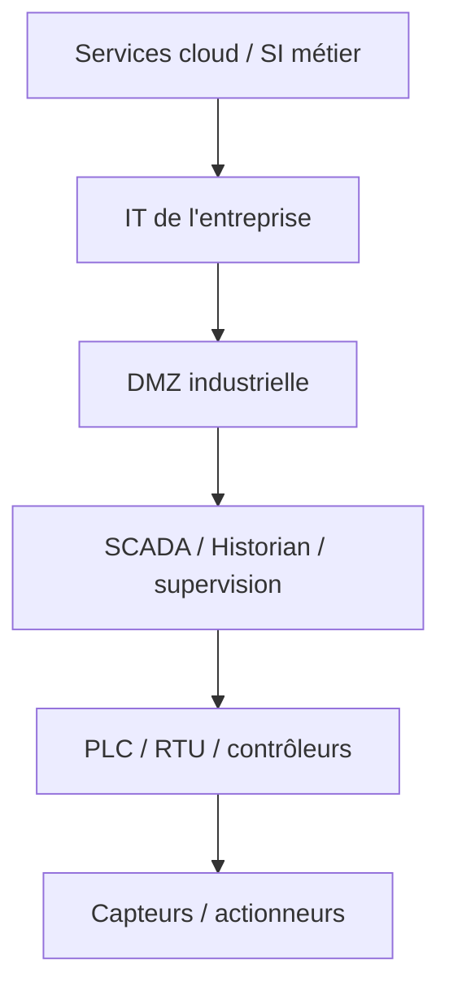
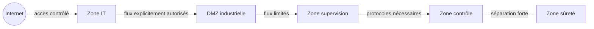
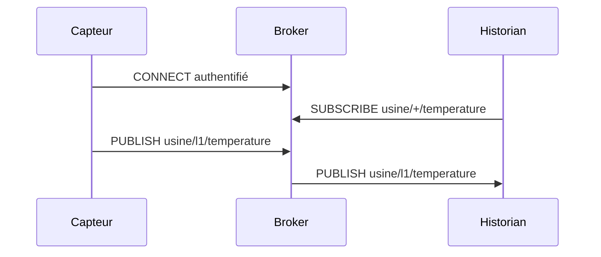
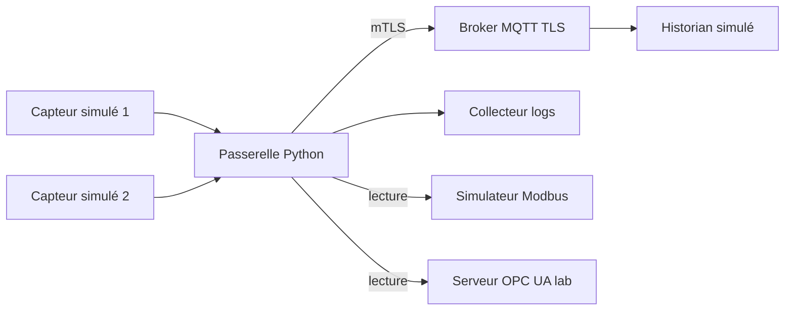

# Sécurité des IoT en Python avec SCADA

> [!abstract] Objectif
> Concevoir, développer, déployer, superviser et maintenir une architecture IoT/IIoT/OT sécurisée avec Python : vocabulaire et modèle de menace OT, segmentation en zones et conduits, protocoles industriels (MQTT, Modbus, OPC UA, BLE) manipulés de façon sûre, cryptographie et PKI, détection, réponse à incident, normes ISA/IEC 62443, NIST SP 800-82 et Cyber Resilience Act.

Voir aussi : [[Sécurité avec Python]], [[Sécurité avancée sous Linux]], [[Les protocoles de communications]], [[Docker]].

Ce cours présente la sécurité des systèmes **IoT**, **IIoT**, **OT** et **SCADA** avec un angle pratique en Python.

L'objectif n'est pas d'apprendre à « attaquer un automate », mais de savoir **concevoir, développer, déployer, superviser et maintenir** une architecture industrielle connectée sans transformer un équipement de terrain en point d'entrée vers le système de contrôle.

> [!warning] Sécurité OT et sûreté de fonctionnement
> Un test acceptable sur une application web peut être dangereux sur un procédé physique. Une perte de communication, une commande inattendue ou un redémarrage peuvent provoquer un arrêt de production, une dégradation d'équipement ou un risque humain. Les manipulations actives de ce cours doivent être réalisées sur **simulateur, banc de test ou environnement explicitement autorisé**, jamais sur un système de production.

Le cours s'appuie notamment sur les principes du **NIST SP 800-82 Rev. 3**, de la série **ISA/IEC 62443**, du standard **ETSI EN 303 645** pour l'IoT grand public et des spécifications officielles MQTT, Modbus et OPC UA.

# Sommaire

1. [[#1. IoT, IIoT, OT et SCADA : vocabulaire et architecture]]
2. [[#2. Modèle de menace et objectifs de sécurité OT]]
3. [[#3. Architecture défensive : zones, conduits et segmentation]]
4. [[#4. Inventaire, identité des actifs et chaîne d'approvisionnement]]
5. [[#5. Protocoles industriels et IoT]]
6. [[#6. Cryptographie, TLS et PKI industrielle]]
7. [[#7. Identités, autorisations et accès distant]]
8. [[#8. Développement Python sécurisé pour l'IoT et l'OT]]
9. [[#9. MQTT sécurisé avec Python]]
10. [[#10. Modbus avec Python : observer avant de commander]]
11. [[#11. OPC UA et Python]]
12. [[#12. Bluetooth Low Energy avec Bleak]]
13. [[#13. Journalisation, détection et observabilité OT]]
14. [[#14. Réponse à incident et continuité d'activité]]
15. [[#15. Durcissement des équipements et cycle de vie]]
16. [[#16. Normes et réglementation]]
17. [[#17. Architecture de référence du mini-projet]]
18. [[#18. Travaux pratiques]]
19. [[#19. Checklists opérationnelles]]
20. [[#20. Ressources et conclusion]]

# 1. IoT, IIoT, OT et SCADA : vocabulaire et architecture

## 1.1. IoT, IIoT et OT ne sont pas synonymes

**IoT** (*Internet of Things*) désigne des objets physiques connectés capables de mesurer, calculer, communiquer ou agir.

**IIoT** (*Industrial Internet of Things*) applique ces principes aux environnements industriels : capteurs, compteurs, passerelles, équipements de maintenance conditionnelle, suivi énergétique, etc.

**OT** (*Operational Technology*) est un périmètre plus large. Il regroupe les systèmes qui **détectent ou provoquent un changement dans le monde physique** : automates, systèmes de contrôle, chaînes de production, traitement d'eau, distribution électrique, bâtiment, transport, etc.

Un équipement OT peut donc ne pas être connecté à Internet et rester néanmoins critique du point de vue cybersécurité.

## 1.2. SCADA, DCS, PLC, RTU et HMI

Quelques termes fondamentaux :

| Élément | Rôle typique |
|---|---|
| **PLC / API** | automate programmable pilotant localement un procédé |
| **RTU** | unité distante collectant des mesures et pilotant des équipements |
| **HMI / IHM** | interface opérateur permettant de visualiser et commander |
| **SCADA** | supervision, historisation et contrôle à l'échelle d'un site ou de plusieurs sites |
| **DCS** | contrôle distribué, fréquent dans les procédés industriels continus |
| **Historian** | base spécialisée dans les séries temporelles industrielles |
| **Engineering workstation** | poste de configuration/programming des automates et systèmes de contrôle |
| **Safety system / SIS** | système indépendant lié à la sûreté de fonctionnement |

Un SCADA n'est donc pas « un serveur qui contrôle des capteurs ». C'est un **ensemble de fonctions et de composants**, souvent composé de technologies anciennes et récentes qui doivent coexister pendant des décennies.

## 1.3. Pourquoi l'OT est différent de l'IT classique

Une politique de sécurité OT doit tenir compte de contraintes particulières :

- disponibilité et déterminisme ;
- durée de vie longue des équipements ;
- fenêtres de maintenance rares ;
- dépendance à des constructeurs et firmwares propriétaires ;
- protocoles historiquement conçus pour des réseaux de confiance ;
- conséquences physiques d'une commande erronée ;
- exigences de sûreté, de qualité ou de certification ;
- forte sensibilité aux scans agressifs et aux outils intrusifs.

Dans l'IT, on peut parfois redémarrer rapidement un service pour appliquer un correctif. Dans l'OT, un redémarrage peut nécessiter l'arrêt d'une ligne entière et une procédure de remise en service.

## 1.4. Architecture simplifiée


```mermaid
flowchart TB
    Cloud[Services cloud / SI métier]
    IT[IT de l'entreprise]
    DMZ[DMZ industrielle]
    SCADA[SCADA / Historian / supervision]
    CTRL[PLC / RTU / contrôleurs]
    FIELD[Capteurs / actionneurs]

    Cloud --> IT
    IT --> DMZ
    DMZ --> SCADA
    SCADA --> CTRL
    CTRL --> FIELD
```

Ce diagramme est volontairement simplifié. Le point important est que la connexion entre l'IT et le contrôle industriel doit être **maîtrisée**, et non réduite à un simple routage IP bidirectionnel.

## 1.5. Python dans ce contexte

Python est particulièrement utile pour :

- collecter de la télémétrie ;
- écrire des passerelles et adaptateurs ;
- interroger des API ;
- automatiser des contrôles de configuration ;
- analyser des journaux et fichiers PCAP ;
- fabriquer des simulateurs pour les tests ;
- intégrer MQTT, Modbus ou OPC UA ;
- enrichir un SIEM ;
- écrire des outils de validation de certificats ou d'inventaire.

Python est en revanche rarement le bon choix pour une boucle de contrôle temps réel dur ou une fonction de sûreté certifiée.

# 2. Modèle de menace et objectifs de sécurité OT

## 2.1. CIA, mais pas seulement

La triade classique reste utile :

- **confidentialité** : empêcher une lecture non autorisée ;
- **intégrité** : empêcher une modification non autorisée ;
- **disponibilité** : conserver la capacité à rendre le service.

Dans un environnement OT s'ajoutent notamment :

- **sûreté** (*safety*) ;
- **authenticité** des équipements et commandes ;
- **traçabilité** des actions ;
- **résilience** et capacité de retour à un état sûr ;
- **fraîcheur** d'une mesure ou d'une commande pour limiter les rejeux ;
- **maîtrise du procédé** même en situation dégradée.

## 2.2. Menace, vulnérabilité, exposition et risque

Une **vulnérabilité** est une faiblesse.

Une **menace** est une cause potentielle d'incident.

L'**exposition** décrit à quel point un actif est atteignable ou utilisable par la menace.

Le **risque** combine la vraisemblance et l'impact.

Il faut éviter de prioriser les vulnérabilités uniquement par un score CVSS. Dans un atelier, un service peu exposé avec un CVSS élevé peut être moins urgent qu'un accès distant mal segmenté donnant directement accès au réseau de contrôle.

## 2.3. Sources de menace

Les incidents ne viennent pas uniquement d'un attaquant externe :

- identifiants compromis ;
- prestataire distant ;
- erreur de configuration ;
- ordinateur de maintenance infecté ;
- clé USB ;
- dépendance logicielle compromise ;
- firmware vulnérable ;
- compte oublié ;
- équipement exposé accidentellement ;
- défaut matériel ou réseau ;
- action interne malveillante.

## 2.4. Surfaces d'attaque

Une architecture IoT/SCADA possède souvent plusieurs surfaces simultanées :

1. matériel et accès physique ;
2. bootloader et firmware ;
3. système d'exploitation ;
4. services réseau ;
5. protocoles industriels ;
6. API et applications web ;
7. broker MQTT ou passerelle ;
8. cloud ;
9. application mobile ;
10. chaîne de mise à jour ;
11. dépendances et chaîne de build ;
12. comptes humains et machines.

## 2.5. Threat modeling

Une méthode simple consiste à documenter pour chaque flux :

- source ;
- destination ;
- protocole ;
- identité attendue ;
- données transportées ;
- besoin de confidentialité ;
- besoin d'intégrité ;
- action possible ;
- conséquence d'un échec ;
- contrôles existants ;
- journalisation disponible.

Exemple :

| Flux | Risque principal | Contrôles attendus |
|---|---|---|
| capteur → broker MQTT | usurpation / donnée fausse | identité machine, TLS, ACL topic |
| HMI → PLC | commande non autorisée | segmentation, ACL, identité, logique de sûreté |
| IT → historian | mouvement latéral | DMZ, flux unidirectionnel si possible, compte dédié |
| poste maintenance → OT | compromission prestataire | bastion, MFA, fenêtre d'accès, enregistrement |

## 2.6. Security by design et fail-safe

La sécurité ne doit pas être ajoutée après coup.

Il faut définir dès la conception :

- l'état sûr attendu lors d'une panne ;
- les commandes autorisées ;
- les limites physiques ;
- la stratégie de mise à jour ;
- la révocation des identités ;
- la récupération après perte de connectivité ;
- l'observabilité nécessaire pour diagnostiquer un incident.

Une règle essentielle : **la cybersécurité ne doit pas supprimer les mécanismes de sûreté indépendants**.

# 3. Architecture défensive : zones, conduits et segmentation

## 3.1. Du modèle Purdue aux zones et conduits

Le modèle Purdue reste un outil pédagogique utile pour comprendre les niveaux industriels, mais une architecture moderne ne doit pas être figée dans des numéros de couches.

La série ISA/IEC 62443 raisonne notamment en **zones** et **conduits** :

- une **zone** regroupe des actifs ayant des besoins de sécurité comparables ;
- un **conduit** représente les communications autorisées entre zones.

Cette approche force à documenter **pourquoi un flux existe**.

## 3.2. Exemple de zones


```mermaid
flowchart LR
    Internet((Internet))
    IT[Zone IT]
    DMZ[DMZ industrielle]
    SUP[Zone supervision]
    CTRL[Zone contrôle]
    SAFETY[Zone sûreté]

    Internet -. accès contrôlé .-> IT
    IT -->|flux explicitement autorisés| DMZ
    DMZ -->|flux limités| SUP
    SUP -->|protocoles nécessaires| CTRL
    CTRL -. séparation forte .- SAFETY
```

## 3.3. Principes de segmentation

Une bonne segmentation cherche à :

- réduire le nombre de systèmes capables de joindre directement un automate ;
- limiter les ports et protocoles à ceux réellement nécessaires ;
- séparer administration, supervision et contrôle ;
- isoler les équipements anciens ;
- interdire le routage arbitraire depuis le réseau bureautique ;
- journaliser les passages entre zones ;
- empêcher un équipement IoT compromis de devenir une passerelle générale.

## 3.4. DMZ industrielle

La DMZ industrielle peut héberger :

- relais de données ;
- proxy/reverse proxy ;
- serveur de transfert ;
- collecteur de logs ;
- réplique d'historian ;
- relais de mises à jour ;
- bastion d'administration.

L'objectif est d'éviter une relation de confiance directe **IT ↔ réseau de contrôle**.

## 3.5. Pare-feu et listes blanches de flux

En OT, une approche en liste blanche est souvent réaliste parce que les flux sont plus prévisibles.

Exemple de matrice :

| Source | Destination | Service | Autorisé |
|---|---|---|---|
| passerelle IoT | broker | MQTT/TLS | oui |
| HMI | PLC | Modbus TCP | si nécessaire |
| poste bureautique | PLC | tout | non |
| SIEM | équipement OT | connexion entrante | généralement non |
| équipement OT | collecteur NTP | NTP | oui, contrôlé |

## 3.6. Microsegmentation et Zero Trust

« Zero Trust » ne signifie pas supprimer les réseaux ou placer un agent EDR sur chaque automate.

Les idées transposables à l'OT sont :

- aucune confiance fondée uniquement sur l'emplacement réseau ;
- identité explicite ;
- moindre privilège ;
- vérification des flux ;
- journalisation ;
- segmentation fine lorsque les équipements la supportent.

## 3.7. Flux unidirectionnels

Pour certains cas critiques, un **data diode** ou une architecture logiquement unidirectionnelle peut réduire fortement le risque de commande depuis un réseau moins sûr.

Cela ne convient pas à tous les usages : il faut vérifier les besoins d'acquittement, de commande et de maintenance.

# 4. Inventaire, identité des actifs et chaîne d'approvisionnement

## 4.1. On ne protège pas ce qu'on ne connaît pas

L'inventaire doit inclure :

- type et fonction ;
- propriétaire ;
- fabricant et modèle ;
- numéro de série ;
- version firmware/OS ;
- adresses réseau ;
- protocoles ;
- certificats ;
- dépendances critiques ;
- zone réseau ;
- date de fin de support ;
- criticité ;
- méthode de sauvegarde/restauration.

## 4.2. Inventaire passif avant scan actif

Dans un réseau industriel, l'observation passive est souvent préférable :

- tables des commutateurs ;
- logs DHCP/DNS ;
- firewall ;
- SPAN/TAP ;
- inventaire constructeur ;
- CMDB ;
- captures réseau autorisées.

Un scanner actif doit être testé et validé avant usage sur des équipements fragiles ou anciens.

## 4.3. SBOM

Une **Software Bill of Materials** liste les composants logiciels d'un produit.

Elle facilite :

- la recherche d'une dépendance vulnérable ;
- l'évaluation de l'impact d'un CVE ;
- la gestion du cycle de vie ;
- la conformité ;
- la réponse rapide à une compromission de supply chain.

Formats courants :

- CycloneDX ;
- SPDX.

## 4.4. Provenance et signatures

Une chaîne de mise à jour robuste devrait permettre de répondre à :

- qui a construit le firmware ?
- à partir de quel code ?
- avec quelles dépendances ?
- l'artefact a-t-il été modifié ?
- l'appareil vérifie-t-il sa signature ?
- peut-on revenir à une version vulnérable ?

## 4.5. Gestion des vulnérabilités

En OT, « patcher immédiatement » n'est pas toujours possible.

Le processus doit prévoir :

1. qualification de l'actif concerné ;
2. analyse de l'exposition réelle ;
3. test du correctif ;
4. validation constructeur ;
5. plan de retour arrière ;
6. fenêtre de maintenance ;
7. mesures compensatoires si le patch est différé.

Une mesure compensatoire peut être une règle de pare-feu, une isolation supplémentaire ou la suppression d'un service inutile.

# 5. Protocoles industriels et IoT

## 5.1. Une règle : le protocole ne remplace pas l'architecture

Même un protocole chiffré ne corrige pas :

- un compte administrateur partagé ;
- un poste de maintenance compromis ;
- un certificat non vérifié ;
- une ACL trop large ;
- une application vulnérable ;
- une absence de segmentation.

## 5.2. MQTT 5.0

MQTT est un protocole **client/serveur publish/subscribe** léger.

Les clients publient sur des **topics** et s'abonnent aux topics nécessaires. Un broker distribue les messages.


```mermaid
sequenceDiagram
    participant S as Capteur
    participant B as Broker
    participant H as Historian

    S->>B: CONNECT authentifié
    H->>B: SUBSCRIBE usine/+/temperature
    S->>B: PUBLISH usine/l1/temperature
    B->>H: PUBLISH usine/l1/temperature
```

### QoS

- **0** : au plus une fois ;
- **1** : au moins une fois, donc doublons possibles ;
- **2** : exactement une fois au niveau du protocole MQTT, avec davantage d'échanges.

Le QoS ne remplace pas l'idempotence applicative.

### Sécurité MQTT

À prévoir :

- TLS ;
- authentification par certificat ou mécanisme adapté ;
- identités distinctes par équipement ;
- ACL par topic ;
- limitation des droits de publication ;
- limitation de débit/taille ;
- journalisation ;
- révocation des identifiants ;
- pas de broker anonyme exposé à Internet.

## 5.3. Modbus

Modbus est très répandu dans les systèmes industriels.

La terminologie actuelle utilise **client/serveur** plutôt que maître/esclave.

Le Modbus TCP historique sur le port 502 ne fournit pas nativement :

- chiffrement ;
- authentification forte ;
- intégrité cryptographique ;
- autorisation fine.

Il doit donc être protégé par l'architecture réseau lorsque les équipements ne supportent pas de mécanisme plus moderne.

### Modbus Security

La spécification **Modbus Security** combine Modbus avec TLS et des certificats X.509v3. Elle utilise le port 802 et peut transporter des informations de rôles pour l'autorisation.

Cela ne signifie pas que tous les équipements Modbus du marché supportent Modbus Security.

## 5.4. OPC UA

OPC UA a été conçu avec un modèle de sécurité plus riche :

- certificats d'application ;
- SecureChannel ;
- signature et chiffrement ;
- authentification utilisateur ;
- autorisation ;
- audit ;
- profils de sécurité.

La version 1.05.06 de la partie 2 de la spécification décrit le modèle de sécurité courant.

Une erreur fréquente consiste à déployer OPC UA en mode anonyme et sans sécurité « parce que le réseau est interne ». Cela annule une partie importante de son intérêt.

## 5.5. HTTP et APIs

Les passerelles IoT exposent souvent des APIs HTTP.

Il faut alors appliquer les contrôles web classiques :

- HTTPS ;
- authentification ;
- autorisation objet par objet ;
- validation des entrées ;
- protection CSRF si cookies ;
- limitation de débit ;
- journalisation ;
- gestion des secrets ;
- mises à jour des dépendances.

## 5.6. CoAP

CoAP est conçu pour des environnements contraints. Selon l'architecture, sa sécurité peut s'appuyer sur DTLS, OSCORE ou des mécanismes définis par l'écosystème utilisé.

La contrainte de ressources n'est pas une justification pour transmettre des commandes sensibles sans authentification.

## 5.7. Bluetooth Low Energy

BLE utilise notamment :

- advertising ;
- connexions ;
- GATT ;
- services et caractéristiques ;
- pairing/bonding selon les usages.

Le niveau de sécurité réel dépend du mode d'association, du matériel, de l'application et de la validation de l'identité.

## 5.8. Réseau sans fil

Wi-Fi, LTE/5G, LoRaWAN, Zigbee, Thread ou autres technologies peuvent être pertinentes selon le cas.

Pour chacune, il faut distinguer :

- identité radio ;
- chiffrement du lien ;
- identité applicative ;
- sécurité de bout en bout ;
- gestion et rotation des clés.

# 6. Cryptographie, TLS et PKI industrielle

## 6.1. Chiffrer n'est pas authentifier

La cryptographie sert plusieurs propriétés :

- confidentialité ;
- intégrité ;
- authentification ;
- signature ;
- échange de clés.

Une connexion chiffrée vers le mauvais serveur reste dangereuse.

## 6.2. TLS

TLS protège un canal client/serveur contre l'écoute et la modification lorsque :

- le protocole et les algorithmes sont correctement configurés ;
- le certificat est vérifié ;
- le nom/identité est vérifié ;
- la clé privée est protégée ;
- la chaîne de certification est gérée ;
- les versions obsolètes sont désactivées lorsque le parc le permet.

## 6.3. mTLS

Le **mutual TLS** authentifie également le client par certificat.

Pour l'IoT, cela permet d'avoir une identité cryptographique par appareil plutôt qu'un mot de passe partagé par toute une gamme de produits.

## 6.4. PKI industrielle

Une PKI implique :

- autorité de certification ;
- enrôlement ;
- stockage de la clé privée ;
- rotation ;
- renouvellement ;
- révocation ;
- horloge suffisamment fiable ;
- procédure de remplacement d'un équipement.

## 6.5. Clés dans le matériel

Lorsque le niveau de risque le justifie :

- TPM ;
- secure element ;
- HSM ;
- TrustZone ou mécanisme matériel équivalent.

L'objectif est de rendre l'extraction d'une clé plus difficile que la simple lecture d'un fichier sur la partition.

## 6.6. Secrets applicatifs

À éviter :

```python
MQTT_PASSWORD = "mot-de-passe-de-production"
```

Préférer une injection par l'environnement ou un gestionnaire de secrets :

```python
import os

mqtt_password = os.environ["MQTT_PASSWORD"]
```

Mais une variable d'environnement n'est pas un coffre-fort : elle réduit surtout le risque de committer le secret dans Git.

## 6.7. Chiffrement des données au repos

Selon les besoins :

- chiffrement du disque ;
- base chiffrée ;
- chiffrement applicatif de certains champs ;
- gestion séparée des clés ;
- sauvegardes chiffrées.

# 7. Identités, autorisations et accès distant

## 7.1. Identité humaine et identité machine

Il faut distinguer :

- opérateur ;
- administrateur ;
- prestataire ;
- application ;
- passerelle ;
- capteur ;
- automate ;
- service cloud.

Un compte « iot » partagé entre 300 équipements empêche une révocation et une traçabilité correctes.

## 7.2. Moindre privilège

Exemples :

- un capteur de température publie mais ne commande pas ;
- l'historian lit mais ne programme pas un PLC ;
- une application ne s'abonne qu'aux topics utiles ;
- le compte de supervision ne possède pas les droits de configuration firmware.

## 7.3. Comptes par défaut

Les mots de passe universels par défaut sont particulièrement dangereux pour l'IoT.

Un produit moderne doit permettre :

- un secret unique par équipement ou un enrôlement initial ;
- la modification sûre des identifiants ;
- le blocage/ralentissement des tentatives ;
- une procédure de récupération maîtrisée.

## 7.4. Accès distant

Un accès distant OT devrait typiquement passer par :

1. une identité nominative ;
2. MFA ;
3. un VPN ou accès Zero Trust adapté ;
4. un bastion/jump host ;
5. une autorisation limitée dans le temps ;
6. une journalisation ;
7. une révocation immédiate possible.

Éviter l'exposition directe de VNC, RDP, SSH, interfaces web d'automates ou brokers MQTT sur Internet.

## 7.5. Comptes prestataires

Les comptes fournisseurs doivent :

- être nominatifs ;
- être désactivés hors intervention si possible ;
- être limités à la zone nécessaire ;
- ne pas utiliser le même mot de passe sur plusieurs clients ;
- faire l'objet d'une revue périodique.

# 8. Développement Python sécurisé pour l'IoT et l'OT

## 8.1. Environnement isolé

```bash
python3 -m venv .venv
source .venv/bin/activate
python -m pip install --upgrade pip
```

Ne pas installer au hasard des paquets en `sudo pip` sur une passerelle de production.

## 8.2. Dépendances

Bonnes pratiques :

- fichier de dépendances versionné ;
- lockfile si l'outil utilisé le permet ;
- source de paquets maîtrisée ;
- revue des dépendances directes ;
- mises à jour régulières ;
- génération d'une SBOM lorsque le produit est distribué.

## 8.3. Typage et modèles de données

Les données reçues d'un capteur doivent être considérées comme **non fiables**.

```python
from dataclasses import dataclass

@dataclass(frozen=True)
class Measurement:
    device_id: str
    temperature_c: float
    sequence: int


def validate_measurement(data: dict) -> Measurement:
    device_id = str(data["device_id"])
    temperature = float(data["temperature_c"])
    sequence = int(data["sequence"])

    if not device_id or len(device_id) > 64:
        raise ValueError("device_id invalide")
    if not -80.0 <= temperature <= 200.0:
        raise ValueError("température hors plage")
    if sequence < 0:
        raise ValueError("séquence invalide")

    return Measurement(device_id, temperature, sequence)
```

Une validation métier n'est pas seulement une protection contre un attaquant : elle évite aussi qu'un capteur défaillant injecte une valeur absurde dans le système de décision.

## 8.4. Désérialisation

Éviter les formats capables d'exécuter du code lors du chargement.

Pour des messages simples, JSON est souvent plus sûr que `pickle` lorsque les données traversent une frontière de confiance.

```python
import json

payload = json.loads(raw_payload)
```

Ne jamais charger un `pickle` reçu d'un équipement ou d'un réseau non fiable.

## 8.5. Commandes système

Éviter :

```python
import os
os.system(f"outil --device {device_id}")
```

Préférer :

```python
import subprocess

subprocess.run(
    ["outil", "--device", device_id],
    check=True,
    timeout=10,
)
```

Et valider `device_id` avant utilisation.

## 8.6. Timeouts

Un service réseau sans timeout peut bloquer une passerelle.

```python
import requests

response = requests.get(
    "https://api.example.invalid/status",
    timeout=(3.0, 10.0),
)
response.raise_for_status()
```

## 8.7. Logs structurés

```python
import json
import logging

logger = logging.getLogger("gateway")


def audit_event(event: str, **fields: object) -> None:
    logger.info(json.dumps({"event": event, **fields}, sort_keys=True))
```

Ne pas journaliser :

- mots de passe ;
- clés privées ;
- tokens complets ;
- données personnelles inutiles.

## 8.8. Privilèges

Une passerelle Python n'a généralement pas besoin de tourner en root.

Séparer :

- accès matériel strictement nécessaire ;
- service réseau ;
- administration ;
- stockage des secrets.

## 8.9. Tests

Tester au minimum :

- entrées invalides ;
- perte réseau ;
- certificat expiré ;
- broker indisponible ;
- doublon de message ;
- redémarrage ;
- reprise après panne ;
- valeur capteur hors plage ;
- disque plein ;
- horloge incorrecte.

# 9. MQTT sécurisé avec Python

## 9.1. Bibliothèque Paho MQTT

Le client Python Eclipse Paho est une bibliothèque courante pour MQTT.

Installation :

```bash
python -m pip install paho-mqtt
```

## 9.2. Exemple TLS

```python
import os
import ssl
import paho.mqtt.client as mqtt

BROKER = os.environ.get("MQTT_HOST", "mqtt.example.invalid")
PORT = int(os.environ.get("MQTT_PORT", "8883"))
TOPIC = "usine/ligne1/temperature"


def on_connect(client, userdata, flags, reason_code, properties):
    if reason_code == 0:
        print("Connexion MQTT établie")
    else:
        print(f"Connexion refusée: {reason_code}")


client = mqtt.Client(
    mqtt.CallbackAPIVersion.VERSION2,
    protocol=mqtt.MQTTv5,
)
client.on_connect = on_connect

client.tls_set(
    ca_certs="certs/ca.pem",
    certfile="certs/device.pem",
    keyfile="certs/device-key.pem",
    tls_version=ssl.PROTOCOL_TLS_CLIENT,
)

client.connect(BROKER, PORT, keepalive=60)
client.publish(TOPIC, payload="21.4", qos=1)
client.loop_forever()
```

Points importants :

- la CA doit être celle attendue ;
- ne pas utiliser `tls_insecure_set(True)` en production ;
- protéger `device-key.pem` ;
- attribuer des droits spécifiques au certificat de l'appareil.

## 9.3. ACL de topics

Un capteur `sensor-42` pourrait avoir :

```text
publish: usine/ligne1/sensors/sensor-42/telemetry
subscribe: usine/ligne1/sensors/sensor-42/config
```

Il ne devrait pas pouvoir publier sur :

```text
usine/ligne1/commands/#
```

## 9.4. Client ID

Le Client ID ne doit pas être utilisé comme unique preuve d'identité.

Il est visible au niveau du protocole et doit être associé à un mécanisme d'authentification réel.

## 9.5. Messages retenus et Last Will

Les retained messages et Last Will sont utiles mais doivent être conçus avec soin.

Un ancien retained message de commande peut être dangereux si l'application le traite comme une nouvelle instruction.

Une bonne règle : réserver les retained messages à des **états/configurations explicitement conçus pour cela**, pas à des commandes impulsionnelles.

## 9.6. Anti-rejeu applicatif

Pour certaines commandes sensibles, ajouter :

- identifiant unique ;
- numéro de séquence ;
- timestamp ;
- durée de validité ;
- idempotence.

Exemple de structure :

```json
{
  "command_id": "018f...",
  "device_id": "pump-02",
  "issued_at": "2026-08-29T12:00:00Z",
  "expires_at": "2026-08-29T12:00:30Z",
  "action": "set_mode",
  "value": "standby"
}
```

# 10. Modbus avec Python : observer avant de commander

## 10.1. PyModbus

PyModbus est une implémentation Python moderne du protocole Modbus. La version 3.15.0 est sortie en août 2026.

Installation :

```bash
python -m pip install "pymodbus>=3.15,<4"
```

## 10.2. Principe de sécurité du TP

> [!important]
> Les exemples ci-dessous doivent viser **un simulateur local ou un équipement de laboratoire explicitement autorisé**. On commence par des opérations de lecture. Les écritures vers un procédé réel sont exclues de ce cours.

## 10.3. Lecture d'un registre sur un simulateur local

```python
from pymodbus.client import ModbusTcpClient

HOST = "127.0.0.1"
PORT = 15020

with ModbusTcpClient(HOST, port=PORT, timeout=3) as client:
    if not client.connected:
        raise RuntimeError("Impossible de joindre le simulateur")

    result = client.read_holding_registers(
        address=0,
        count=2,
        device_id=1,
    )

    if result.isError():
        raise RuntimeError(f"Erreur Modbus: {result}")

    print(result.registers)
```

La signature exacte d'une bibliothèque peut évoluer : vérifier la documentation correspondant à la version verrouillée dans le projet.

## 10.4. Défense d'un réseau Modbus TCP historique

Lorsque le parc ne supporte que Modbus TCP classique :

- isoler le réseau ;
- filtrer source/destination ;
- autoriser seulement les clients nécessaires ;
- superviser les function codes ;
- interdire le port 502 depuis l'IT général ;
- utiliser un bastion pour l'administration ;
- désactiver les fonctions inutiles si le produit le permet ;
- enregistrer les changements de configuration.

## 10.5. Modbus Security

Lorsqu'il est supporté, Modbus Security apporte notamment :

- TLS ;
- authentification mutuelle par certificats X.509v3 ;
- intégrité du canal ;
- information de rôle pour l'autorisation ;
- port 802.

Il faut toujours vérifier la compatibilité réelle des équipements et de la bibliothèque utilisée.

## 10.6. Détection

Des événements intéressants à superviser :

- nouveau client Modbus ;
- changement soudain de fréquence ;
- function code inhabituel ;
- accès à une plage de registres jamais observée ;
- écriture hors fenêtre de maintenance ;
- erreurs répétées ;
- changement de firmware ou de logique automate.

# 11. OPC UA et Python

## 11.1. Pourquoi OPC UA est différent

OPC UA fournit un modèle d'information riche et des fonctions de sécurité standardisées.

Il distingue notamment :

- identité de l'application ;
- identité de l'utilisateur ;
- SecureChannel ;
- Session ;
- rôles et autorisations ;
- audit.

## 11.2. asyncua

Le projet `asyncua` fournit un client et un serveur OPC UA asynchrones pour Python. La version 2.0.1 est sortie en juin 2026 et requiert Python 3.10 ou plus.

```bash
python -m pip install "asyncua>=2.0,<3"
```

## 11.3. Lecture simple sur un serveur de laboratoire

```python
import asyncio
from asyncua import Client


async def main() -> None:
    url = "opc.tcp://127.0.0.1:4840/lab/"

    async with Client(url=url) as client:
        node = client.get_node("ns=2;s=Temperature")
        value = await node.read_value()
        print(value)


asyncio.run(main())
```

Cet exemple montre l'API, pas une configuration de production.

## 11.4. En production : SignAndEncrypt

Pour un déploiement réel, il faut préférer un endpoint offrant un SecurityPolicy approprié avec **signature et chiffrement**, gérer :

- certificat d'application client ;
- clé privée ;
- certificat serveur de confiance ;
- trust list ;
- renouvellement ;
- révocation ;
- authentification utilisateur ;
- rôles et permissions.

Ne pas accepter automatiquement n'importe quel certificat serveur.

## 11.5. Anonymous

Le mode Anonymous peut être acceptable pour un démonstrateur isolé, mais doit être un choix explicite.

Sur un système industriel, une lecture anonyme peut déjà exposer :

- noms de tags ;
- topologie ;
- états de production ;
- recettes ;
- informations facilitant une attaque ultérieure.

## 11.6. Autorisation

L'authentification répond à : **qui êtes-vous ?**

L'autorisation répond à : **que pouvez-vous faire ?**

Un opérateur, un historian et un poste d'ingénierie n'ont pas besoin des mêmes droits.

# 12. Bluetooth Low Energy avec Bleak

## 12.1. Remplacer PyBluez pour les nouveaux projets BLE

L'ancien cours utilisait PyBluez et un exemple inspiré d'un exploit Bluetooth. PyBluez indique désormais que le projet n'est plus développé.

Pour un nouveau projet BLE Python multiplateforme, **Bleak** est une option plus actuelle.

```bash
python -m pip install "bleak>=3,<4"
```

## 12.2. Scanner son laboratoire

```python
import asyncio
from bleak import BleakScanner


async def main() -> None:
    devices = await BleakScanner.discover(timeout=5.0)
    for device in devices:
        print(device.name, device.address)


asyncio.run(main())
```

> [!warning]
> Un scan radio peut révéler des équipements qui ne vous appartiennent pas. Le fait qu'un appareil diffuse une annonce BLE n'autorise pas à s'y connecter ou à tester ses caractéristiques.

## 12.3. Lire une caractéristique sur un équipement de test

```python
import asyncio
from bleak import BleakClient

DEVICE = "AA:BB:CC:DD:EE:FF"
MODEL_NUMBER_UUID = "00002a24-0000-1000-8000-00805f9b34fb"


async def main() -> None:
    async with BleakClient(DEVICE) as client:
        raw = await client.read_gatt_char(MODEL_NUMBER_UUID)
        print(raw.decode(errors="replace"))


asyncio.run(main())
```

L'adresse ci-dessus est fictive. Utiliser uniquement un périphérique du laboratoire.

## 12.4. Pairing n'est pas autorisation applicative

Selon les modes BLE, le pairing peut protéger le lien mais ne définit pas nécessairement les droits métier.

Une application critique peut nécessiter en plus :

- identité applicative ;
- challenge ;
- clé propre au produit ;
- anti-rejeu ;
- contrôle d'autorisation pour chaque commande sensible.

## 12.5. Erreurs classiques BLE

- caractéristique d'écriture sensible sans contrôle ;
- mode debug laissé actif ;
- secret identique sur tous les appareils ;
- firmware non signé ;
- absence de mise à jour ;
- information sensible dans l'advertising ;
- confiance excessive dans l'adresse MAC.

# 13. Journalisation, détection et observabilité OT

## 13.1. Observer sans perturber

La supervision OT doit privilégier les sources peu intrusives :

- SPAN/TAP ;
- firewall ;
- logs des brokers ;
- logs des serveurs OPC UA ;
- journaux des bastions ;
- événements Windows/Linux ;
- syslog ;
- historian ;
- traces de configuration.

## 13.2. IDS réseau

Outils courants :

- Suricata ;
- Zeek ;
- solutions spécialisées OT.

Le terme **Bro** est historique : le projet s'appelle Zeek depuis plusieurs années.

## 13.3. Baseline

Les réseaux OT ont souvent un comportement relativement stable.

On peut établir une baseline :

- couples source/destination ;
- protocoles ;
- ports ;
- fréquence des messages ;
- function codes ;
- volumes ;
- horaires d'administration.

Un écart ne prouve pas une attaque, mais fournit un signal utile.

## 13.4. Analyse Python d'événements

```python
from collections import Counter
from dataclasses import dataclass
from datetime import datetime


@dataclass(frozen=True)
class Event:
    timestamp: datetime
    source: str
    destination: str
    protocol: str


def count_protocols(events: list[Event]) -> Counter[str]:
    return Counter(event.protocol for event in events)
```

Dans un vrai pipeline, les événements devront être normalisés et horodatés avec une source de temps maîtrisée.

## 13.5. Détection simple de nouvel équipement

```python
KNOWN = {"plc-01", "hmi-01", "gateway-01"}


def detect_unknown(asset_id: str) -> bool:
    return asset_id not in KNOWN
```

Un contrôle simple, fiable et explicable vaut souvent mieux qu'un modèle de machine learning impossible à maintenir.

## 13.6. IA et détection d'anomalies

Le ML peut aider à détecter des motifs complexes, mais il faut gérer :

- dérive du procédé ;
- saisonnalité ;
- changement de production ;
- faux positifs ;
- données d'entraînement ;
- explicabilité ;
- sécurité du pipeline ML.

Une alerte d'IA ne doit pas déclencher automatiquement une action physique critique sans garde-fous appropriés.

## 13.7. Horodatage

Sans horloge cohérente, une enquête devient difficile.

Prévoir :

- NTP sécurisé/maîtrisé selon le contexte ;
- source interne ;
- journalisation de la dérive ;
- timezone standardisée, souvent UTC dans les logs.

# 14. Réponse à incident et continuité d'activité

## 14.1. Préparer avant l'incident

Un plan doit contenir :

- responsables ;
- contacts constructeurs ;
- procédures d'escalade ;
- topologie réseau ;
- inventaire ;
- sauvegardes ;
- images de référence ;
- clés et certificats de secours ;
- procédure de fonctionnement manuel/dégradé ;
- critères de mise à l'arrêt sûre.

## 14.2. Première priorité : la sûreté

Lors d'un incident OT :

1. protéger les personnes ;
2. conserver le procédé dans un état sûr ;
3. limiter la propagation ;
4. préserver les preuves lorsque cela ne compromet pas la sûreté ;
5. restaurer de manière contrôlée.

## 14.3. Ne pas « débrancher tout » automatiquement

Une action réflexe comme couper le réseau ou éteindre tous les systèmes peut aggraver la situation.

Le confinement doit être préparé avec les équipes exploitation/sûreté.

## 14.4. Acquisition de preuves

Selon les procédures autorisées :

- sauvegarder les logs ;
- exporter les règles firewall ;
- conserver les événements d'authentification ;
- capturer le trafic depuis une infrastructure prévue ;
- enregistrer les versions et hashes ;
- documenter chaque action de réponse.

## 14.5. Restauration

Ne pas remettre un système en production uniquement parce qu'il « redémarre ».

Vérifier :

- firmware/logiciel approuvé ;
- configuration attendue ;
- identités et certificats ;
- comptes ;
- règles réseau ;
- logique automate ;
- supervision ;
- sauvegardes ;
- cause racine.

## 14.6. Exercices

Faire régulièrement des exercices de table :

- perte du broker ;
- certificat expiré ;
- ransomware sur poste d'ingénierie ;
- passerelle IoT compromise ;
- perte de l'Active Directory ;
- indisponibilité du fournisseur cloud ;
- mise à jour firmware défectueuse.

# 15. Durcissement des équipements et cycle de vie

## 15.1. Secure Boot

Le Secure Boot vise à empêcher le chargement d'un logiciel non autorisé au démarrage.

Selon le matériel :

- racine de confiance ;
- bootloader signé ;
- firmware signé ;
- vérification de chaîne ;
- verrouillage du mode debug.

## 15.2. Mises à jour signées

Une mise à jour doit être :

- authentique ;
- intègre ;
- compatible ;
- atomique si possible ;
- récupérable après coupure ;
- protégée contre le rollback vers une version vulnérable lorsque nécessaire.

## 15.3. A/B update

Sur un équipement embarqué, une stratégie A/B peut conserver :

- partition active ;
- nouvelle partition ;
- validation de santé ;
- retour automatique si la mise à jour échoue.

## 15.4. Services inutiles

Désactiver :

- Telnet ;
- serveur web de debug ;
- shell de maintenance non utilisé ;
- UPnP inutile ;
- comptes démonstration ;
- interfaces de développement exposées.

## 15.5. Linux embarqué

Pour une passerelle Linux :

- utilisateur non root ;
- système de fichiers en lecture seule lorsque possible ;
- AppArmor/SELinux selon plateforme ;
- capabilities minimales ;
- seccomp pour services exposés ;
- firewall local ;
- mises à jour atomiques ;
- journaux persistants maîtrisés.

Voir également [[Sécurité avancée sous Linux]].

## 15.6. Protection physique

Selon la menace :

- scellés ;
- boîtier ;
- ports debug désactivés ;
- verrouillage bootloader ;
- stockage matériel des clés ;
- détection d'ouverture ;
- contrôle d'accès aux armoires.

## 15.7. Fin de vie

Prévoir dès l'achat :

- durée de support ;
- disponibilité des correctifs ;
- procédure de remplacement ;
- effacement des secrets ;
- retrait des certificats ;
- destruction ou reconditionnement sécurisé.

# 16. Normes et réglementation

## 16.1. NIST SP 800-82 Rev. 3

Le **NIST SP 800-82 Rev. 3**, publié en septembre 2023, est un guide de référence pour la sécurité OT. Il insiste sur les exigences spécifiques de performance, fiabilité et sûreté des systèmes opérationnels.

Il est utile pour :

- architecture ;
- gestion des risques ;
- segmentation ;
- contrôle d'accès ;
- supervision ;
- réponse à incident.

## 16.2. ISA/IEC 62443

La série ISA/IEC 62443 couvre la cybersécurité des systèmes d'automatisation et de contrôle industriels.

Quelques parties importantes :

- **62443-2-1** : programme de sécurité pour les asset owners ;
- **62443-3-2** : évaluation de risque pour la conception système ;
- **62443-3-3** : exigences système et Security Levels ;
- **62443-4-1** : cycle de développement sécurisé des produits ;
- **62443-4-2** : exigences techniques des composants.

Les concepts de **zones**, **conduits** et niveaux de sécurité sont centraux.

## 16.3. ETSI EN 303 645

Pour l'IoT grand public, ETSI EN 303 645 fournit une base de cybersécurité.

La version V3.1.3 publiée en 2024 aborde notamment :

- absence de mots de passe universels par défaut ;
- gestion des vulnérabilités ;
- mises à jour ;
- protection des données sensibles ;
- réduction de la surface d'attaque ;
- résilience.

Ce standard n'est pas un substitut à IEC 62443 pour un système industriel, mais plusieurs principes sont communs.

## 16.4. NIS2

La directive européenne NIS2 renforce les obligations de cybersécurité pour de nombreux secteurs essentiels et importants.

Pour une organisation concernée, il faut articuler :

- gouvernance ;
- gestion des risques ;
- continuité ;
- supply chain ;
- gestion des incidents ;
- notification ;
- mesures techniques et organisationnelles.

Les modalités exactes dépendent de la transposition nationale applicable.

## 16.5. Cyber Resilience Act

Le **Cyber Resilience Act (CRA)** européen s'applique aux produits comportant des éléments numériques selon son champ d'application.

Au 29 août 2026 :

- le règlement est entré en vigueur le 10 décembre 2024 ;
- les dispositions relatives aux organismes d'évaluation de conformité s'appliquent depuis le 11 juin 2026 ;
- les obligations de signalement de l'article 14 s'appliqueront à partir du **11 septembre 2026** ;
- l'application générale est prévue pour le **11 décembre 2027**.

Pour un fabricant IoT, cela renforce l'importance de :

- sécurité by design/default ;
- évaluation des risques ;
- traitement des vulnérabilités ;
- mises à jour ;
- documentation ;
- suivi du cycle de vie.

## 16.6. Conformité ≠ sécurité absolue

Une certification ou conformité démontre qu'un ensemble d'exigences a été traité. Elle ne garantit pas l'absence de vulnérabilité ni la bonne exploitation quotidienne.

# 17. Architecture de référence du mini-projet

## 17.1. Objectif

Construire un laboratoire local simulant :

- deux capteurs ;
- une passerelle Python ;
- un broker MQTT ;
- un simulateur Modbus ;
- un serveur OPC UA de laboratoire ;
- une collecte de logs ;
- une petite interface de lecture.

Aucun équipement industriel réel n'est nécessaire.

## 17.2. Architecture


```mermaid
flowchart LR
    S1[Capteur simulé 1]
    S2[Capteur simulé 2]
    GW[Passerelle Python]
    MQTT[Broker MQTT TLS]
    HIST[Historian simulé]
    MON[Collecteur logs]
    MB[Simulateur Modbus]
    UA[Serveur OPC UA lab]

    S1 --> GW
    S2 --> GW
    GW -->|mTLS| MQTT
    MQTT --> HIST
    GW --> MON
    GW -->|lecture| MB
    GW -->|lecture| UA
```

## 17.3. Principes imposés

Le projet doit respecter :

- aucune clé privée dans Git ;
- identités distinctes ;
- ACL topic ;
- réseau de laboratoire isolé ;
- lecture seule Modbus/OPC UA pour les TP de base ;
- logs structurés ;
- timeouts ;
- validation des données ;
- tests ;
- documentation des flux ;
- procédure de renouvellement des certificats.

## 17.4. Arborescence Python

```text
iot-lab/
├── pyproject.toml
├── README.md
├── .gitignore
├── src/
│   └── gateway/
│       ├── __init__.py
│       ├── config.py
│       ├── models.py
│       ├── mqtt.py
│       ├── modbus.py
│       ├── opcua.py
│       └── main.py
├── tests/
│   ├── test_models.py
│   └── test_config.py
└── certs/
    └── README.md
```

Les vraies clés privées ne doivent pas être stockées dans `certs/` du dépôt.

## 17.5. Configuration

```python
from dataclasses import dataclass
import os


@dataclass(frozen=True)
class Settings:
    mqtt_host: str
    mqtt_port: int
    device_id: str


def load_settings() -> Settings:
    return Settings(
        mqtt_host=os.environ["MQTT_HOST"],
        mqtt_port=int(os.environ.get("MQTT_PORT", "8883")),
        device_id=os.environ["DEVICE_ID"],
    )
```

## 17.6. Modèle de télémétrie

```python
from dataclasses import asdict, dataclass
from datetime import datetime, timezone
import json


@dataclass(frozen=True)
class Telemetry:
    device_id: str
    temperature_c: float
    sequence: int
    timestamp: str

    def to_json(self) -> str:
        return json.dumps(asdict(self), separators=(",", ":"))


def make_telemetry(device_id: str, value: float, sequence: int) -> Telemetry:
    if not -80 <= value <= 200:
        raise ValueError("Valeur hors plage")

    return Telemetry(
        device_id=device_id,
        temperature_c=value,
        sequence=sequence,
        timestamp=datetime.now(timezone.utc).isoformat(),
    )
```

## 17.7. Critères de réussite

Le projet est réussi si :

- les flux sont documentés ;
- un capteur ne peut pas publier sur le topic d'un autre ;
- un certificat non approuvé est rejeté ;
- une valeur invalide est refusée ;
- la perte du broker ne bloque pas indéfiniment le programme ;
- une reprise est possible ;
- les secrets ne sont pas dans Git ;
- les logs permettent de reconstruire la chronologie.

# 18. Travaux pratiques

## TP 1 — Cartographier une architecture

À partir d'une architecture fictive :

1. identifier IT, DMZ, supervision, contrôle et terrain ;
2. lister les flux ;
3. classer les actifs par criticité ;
4. proposer des zones et conduits ;
5. identifier les flux inutiles.

Livrable : diagramme Mermaid + matrice des flux.

## TP 2 — Threat model d'une passerelle IoT

Étudier une passerelle Linux qui :

- lit un automate ;
- publie vers MQTT ;
- reçoit une configuration ;
- possède un accès SSH de maintenance.

Identifier au moins :

- 10 menaces ;
- impact ;
- contrôle préventif ;
- contrôle de détection ;
- stratégie de récupération.

## TP 3 — Broker MQTT de laboratoire

Configurer un broker local avec :

- TLS ;
- une identité par client ;
- ACL topic ;
- logs ;
- refus de l'accès anonyme.

Tester uniquement avec les clients du laboratoire.

## TP 4 — Paho MQTT

Créer deux clients :

- `sensor-01` publie sa température ;
- `historian` s'abonne aux télémétries.

Vérifier que `sensor-01` ne peut pas publier sur un topic de commande.

## TP 5 — Modbus simulé

Démarrer un simulateur local et :

1. lire une plage de registres autorisée ;
2. gérer timeout et erreur ;
3. journaliser la requête ;
4. détecter une adresse hors plage avant l'envoi.

Aucune écriture sur un équipement réel.

## TP 6 — OPC UA de laboratoire

Créer ou utiliser un serveur OPC UA local et :

- découvrir un endpoint ;
- lire une variable ;
- identifier les modes de sécurité proposés ;
- expliquer pourquoi Anonymous + None n'est pas adapté à la production.

## TP 7 — BLE avec son propre périphérique

Avec un équipement BLE de laboratoire :

- scanner ;
- identifier ses services ;
- lire une caractéristique non sensible ;
- documenter pairing, authentification applicative et autorisations.

## TP 8 — Détection passive

À partir d'un jeu de logs fourni ou synthétique :

- établir une baseline ;
- détecter un nouvel équipement ;
- détecter un nouveau couple source/destination ;
- détecter une hausse anormale de fréquence.

## TP 9 — Tabletop incident

Scénario : les identifiants du prestataire d'un bastion ont été compromis.

Définir :

1. critères d'incident ;
2. premières actions ;
3. vérifications OT ;
4. confinement ;
5. rotation des secrets ;
6. restauration ;
7. éléments à conserver pour l'enquête.

## TP 10 — Projet final

Assembler le mini-projet du chapitre 17 et réaliser une revue basée sur :

- inventaire ;
- architecture ;
- identités ;
- chiffrement ;
- moindre privilège ;
- observabilité ;
- reprise ;
- supply chain ;
- documentation.

# 19. Checklists opérationnelles

## 19.1. Checklist d'un nouvel équipement IoT

- [ ] propriétaire identifié ;
- [ ] criticité définie ;
- [ ] firmware/version inventoriés ;
- [ ] fin de support connue ;
- [ ] mot de passe universel absent ;
- [ ] identité unique ;
- [ ] mise à jour signée ;
- [ ] mécanisme de rollback maîtrisé ;
- [ ] services inutiles désactivés ;
- [ ] ports documentés ;
- [ ] logs disponibles ;
- [ ] certificat renouvelable ;
- [ ] secret effaçable en fin de vie ;
- [ ] SBOM disponible ou générable ;
- [ ] processus de divulgation de vulnérabilité connu.

## 19.2. Checklist d'un broker MQTT

- [ ] TLS ;
- [ ] accès anonyme désactivé ;
- [ ] identité distincte par machine ;
- [ ] ACL topics ;
- [ ] pas de wildcard excessive ;
- [ ] limites de taille ;
- [ ] limites de connexions/débit ;
- [ ] logs ;
- [ ] sauvegarde de configuration ;
- [ ] rotation des certificats ;
- [ ] monitoring des connexions inhabituelles.

## 19.3. Checklist Modbus

- [ ] aucun accès Internet direct ;
- [ ] clients autorisés explicitement ;
- [ ] segmentation ;
- [ ] inspection passive ;
- [ ] function codes attendus documentés ;
- [ ] plages de registres connues ;
- [ ] maintenance encadrée ;
- [ ] Modbus Security évalué si matériel compatible ;
- [ ] sauvegarde logique automate ;
- [ ] procédure de restauration testée.

## 19.4. Checklist OPC UA

- [ ] SecurityPolicy adaptée ;
- [ ] `SignAndEncrypt` lorsque requis ;
- [ ] trust list gérée ;
- [ ] certificats non acceptés aveuglément ;
- [ ] Anonymous désactivé si inutile ;
- [ ] rôles séparés ;
- [ ] audit activé ;
- [ ] renouvellement certificats testé ;
- [ ] endpoints inutiles supprimés.

## 19.5. Checklist accès distant

- [ ] MFA ;
- [ ] compte nominatif ;
- [ ] bastion ;
- [ ] durée limitée ;
- [ ] session journalisée ;
- [ ] droits minimaux ;
- [ ] révocation testée ;
- [ ] pas de service OT exposé directement ;
- [ ] poste d'administration durci.

## 19.6. Checklist application Python

- [ ] environnement isolé ;
- [ ] dépendances verrouillées ;
- [ ] secret absent de Git ;
- [ ] entrées validées ;
- [ ] timeout réseau ;
- [ ] TLS vérifié ;
- [ ] pas de `pickle` non fiable ;
- [ ] pas de `shell=True` inutile ;
- [ ] logs sans secrets ;
- [ ] compte non root ;
- [ ] tests de panne ;
- [ ] SBOM ;
- [ ] procédure de mise à jour.

# 20. Ressources et conclusion

## 20.1. Standards et guides

Références principales à consulter dans leur version courante :

- NIST SP 800-82 Rev. 3 — *Guide to Operational Technology Security* ;
- série ISA/IEC 62443 ;
- MQTT Version 5.0 — OASIS Standard ;
- spécifications Modbus et Modbus Security — Modbus Organization ;
- OPC UA Part 2 — *Security Model* — OPC Foundation ;
- ETSI EN 303 645 — cybersécurité IoT grand public ;
- Directive NIS2 ;
- Règlement (UE) 2024/2847 — Cyber Resilience Act.

## 20.2. Outils et bibliothèques Python

À l'été 2026, quelques projets utiles sont :

| Besoin | Projet |
|---|---|
| MQTT | `paho-mqtt` |
| Modbus | `pymodbus` 3.x |
| OPC UA | `asyncua` 2.x |
| BLE | `bleak` 3.x |
| HTTP | `requests` / `httpx` |
| validation | dataclasses / Pydantic selon projet |
| tests | `pytest` |
| qualité | Ruff, mypy selon politique |

Éviter de bâtir un nouveau projet BLE sur PyBluez : le projet amont indique qu'il n'est plus en développement.

## 20.3. Principes à retenir

1. **La sûreté et la disponibilité du procédé structurent la sécurité OT.**
2. **Segmenter avant d'exposer.**
3. **Une identité par équipement vaut mieux qu'un secret partagé.**
4. **Chiffrer un protocole ne suffit pas sans autorisation et gestion des clés.**
5. **Observer passivement avant de scanner activement.**
6. **Les protocoles historiques comme Modbus TCP supposent souvent une protection architecturale.**
7. **OPC UA offre des mécanismes de sécurité qui doivent réellement être activés et administrés.**
8. **Python est excellent pour les passerelles, l'automatisation et l'observabilité, pas pour remplacer les fonctions de sûreté.**
9. **La supply chain et le cycle de mise à jour font partie du produit.**
10. **Une restauration testée est un contrôle de sécurité.**

## 20.4. Liens avec les autres cours

- [[Python]] ;
- [[Sécurité avec Python]] ;
- [[Sécurité avancée sous Linux]] ;
- [[Les protocoles de communications]] ;
- [[HTTP]] ;
- [[Docker]] ;
- [[LDAP]] ;
- [[OAuth OpenID]].

## 20.5. Conclusion

Sécuriser l'IoT et les systèmes SCADA ne consiste pas à appliquer une couche de TLS au dernier moment. Il faut raisonner sur **l'ensemble du système** : actif physique, firmware, identité, réseau, protocole, application, accès humain, supervision, mise à jour et récupération.

Le meilleur design est celui qui continue à produire un comportement compréhensible et sûr quand :

- un équipement tombe en panne ;
- une identité est compromise ;
- le réseau disparaît ;
- un certificat expire ;
- le cloud est indisponible ;
- un message est dupliqué ;
- une donnée est aberrante ;
- une mise à jour échoue.

Dans un environnement industriel, la cybersécurité mature n'est pas seulement la capacité à **empêcher** une attaque : c'est aussi la capacité à **limiter son impact, la détecter, maintenir un état sûr et restaurer le service de manière maîtrisée**.
