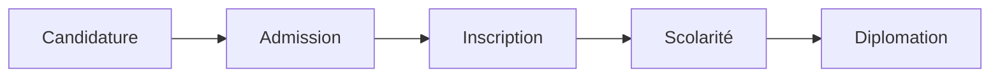
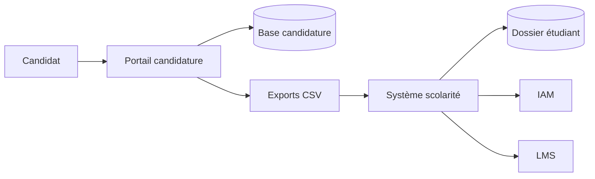
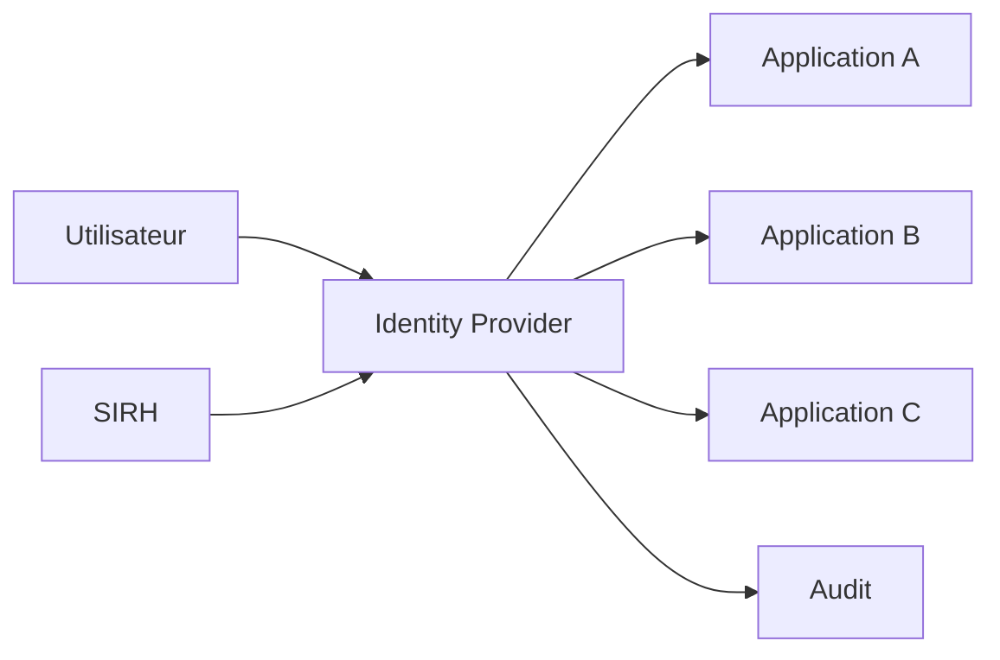

# Plan du cours : **TOGAF – Architecture d’Entreprise**

## **Introduction générale**

- Pourquoi l’architecture d’entreprise est devenue centrale
- Place de TOGAF parmi les cadres existants
- Présentation de **The Open Group** et de la philosophie TOGAF
- Objectifs pédagogiques du cours

## **Partie I – Fondements de l’architecture d’entreprise**

### Chapitre 1 – Qu’est-ce que l’architecture d’entreprise ?

- Définition et périmètre
- Différence entre architecture logicielle, technique et d’entreprise
- Enjeux stratégiques (alignement métier / SI, transformation numérique)
- Cas typiques : administrations, grandes entreprises, SI complexes

### Chapitre 2 – Historique et positionnement de TOGAF

- Origines de TOGAF    
- Évolutions majeures (TOGAF 10.x, TOGAF Standard)    
- Comparaison rapide avec Zachman, ITIL, COBIT    
- Forces et limites de TOGAF
    
## **Partie II – Structure générale de TOGAF**

### Chapitre 3 – Les composants de TOGAF

- Le cadre global TOGAF    
- Le rôle de l’ADM (Architecture Development Method)    
- Le continuum d’entreprise    
- Les référentiels et artefacts    

### Chapitre 4 – Les domaines d’architecture

- Architecture métier    
- Architecture des données    
- Architecture applicative    
- Architecture technologique    
- Relations et dépendances entre domaines

# **Partie III – L’ADM : méthode de développement de l’architecture**

### Chapitre 5 – Vue d’ensemble de l’ADM

- Principe itératif et cyclique    
- Notion de baseline et target architecture    
- Gouvernance et pilotage    

### Chapitre 6 – Phases préliminaire et Vision (Préliminaire & Phase A)

- Mise en place du cadre d’architecture
- Principes d’architecture
- Parties prenantes
- Vision cible et valeur métier

### Chapitre 7 – Phases B, C et D : conception de l’architecture

- Phase B : architecture métier
- Phase C : données et applications
- Phase D : architecture technique
- Modélisation, cohérence et arbitrages

### Chapitre 8 – Phases E et F : transformation et migration

- Opportunités et solutions
- Scénarios de migration
- Roadmaps
- Gestion des risques et contraintes

### Chapitre 9 – Phases G et H : gouvernance et amélioration continue

- Gouvernance de l’architecture    
- Conformité des projets    
- Gestion du changement    
- Capitalisation et amélioration continue

## Partie IV – Artefacts, livrables et gouvernance

### Chapitre 10 – Artefacts TOGAF

- Catalogues, matrices, diagrammes
    
- Exemples de livrables concrets
    
- Bonnes pratiques de documentation
    

### Chapitre 11 – Gouvernance de l’architecture

- Rôles et responsabilités
    
- Architecture Board
    
- Indicateurs de conformité
    
- Gestion des dérogations
    

## **Partie V – TOGAF en pratique**

### Chapitre 12 – TOGAF et les approches modernes

- TOGAF et Agile
    
- TOGAF et DevOps
    
- TOGAF et microservices
    
- TOGAF et Cloud / Kubernetes
    

### Chapitre 13 – Études de cas

- Cas d’une université
    
- Cas d’une administration publique
    
- Cas d’une entreprise SaaS
    
- Analyse critique des choix d’architecture
    

## **Partie VI – Perspectives professionnelles et certifications**

### Chapitre 14 – Métiers et usages professionnels

- Architecte d’entreprise
    
- Urbaniste SI
    
- Consultant en transformation numérique
    
- Interaction avec les équipes de développement
    

### Chapitre 15 – Certifications TOGAF

- TOGAF Foundation
    
- TOGAF Certified
    
- Intérêt et limites des certifications
    

## **Conclusion générale**

- Apports réels de TOGAF
    
- Conditions de succès
    
- Limites et dérives possibles
    
- Place de TOGAF dans le paysage actuel de l’ingénierie logicielle
    

## **Évaluation**

- Étude de cas écrite
    
- Présentation orale d’une architecture cible
    
- Analyse critique d’un SI existant à l’aide de TOGAF
    

# Introduction générale

Dans cette introduction, nous posons le cadre intellectuel et professionnel du cours. L’objectif est de comprendre **pourquoi l’architecture d’entreprise s’est imposée comme une discipline centrale**, et en quoi **TOGAF** constitue aujourd’hui l’un des référentiels majeurs pour y répondre.

## Pourquoi l’architecture d’entreprise est devenue centrale

Au cours des deux dernières décennies, les systèmes d’information ont connu une **complexification rapide et continue**. Les organisations doivent désormais composer avec :

- la multiplication des applications et des services,
- l’hétérogénéité technologique (on-premise, cloud, SaaS, microservices),
- l’accélération des cycles de transformation numérique,
- des contraintes réglementaires croissantes (sécurité, données personnelles, traçabilité),
- une attente forte d’alignement entre **stratégie métier** et **systèmes informatiques**.

Dans ce contexte, le système d’information ne peut plus être pensé uniquement comme un ensemble de solutions techniques. Il devient un **actif stratégique**, structurant l’organisation elle-même.  
L’architecture d’entreprise émerge alors comme une réponse à une problématique clé :

> _Comment concevoir, faire évoluer et gouverner un système d’information complexe tout en garantissant sa cohérence globale et son alignement avec les objectifs de l’organisation ?_

L’architecture d’entreprise vise précisément à fournir une **vision transversale**, à la fois métier, fonctionnelle, applicative et technique. Elle permet de dépasser une logique de projets isolés pour inscrire les décisions informatiques dans une **trajectoire de long terme**.

## Place de TOGAF parmi les cadres existants

Face à ces enjeux, plusieurs cadres méthodologiques ont été proposés au fil du temps : Zachman, ITIL, COBIT, ArchiMate, entre autres. Chacun répond à des besoins spécifiques : classification, gouvernance, gestion des services, contrôle ou modélisation.

TOGAF se distingue par plusieurs caractéristiques majeures :

- il propose une **méthode structurée** pour concevoir l’architecture (l’ADM),
- il couvre l’ensemble des **dimensions de l’architecture d’entreprise**,
- il met l’accent sur la **gouvernance** et l’alignement stratégique,
- il est conçu comme un **cadre adaptable**, et non comme une méthode rigide.

TOGAF n’est donc ni un simple modèle conceptuel, ni une norme prescriptive. Il s’agit d’un **cadre de référence pragmatique**, largement adopté dans les grandes organisations, aussi bien dans le secteur public que privé.

## Présentation de The Open Group et de la philosophie TOGAF

TOGAF est développé et maintenu par **The Open Group**, un consortium international réunissant entreprises, institutions publiques et acteurs technologiques. Sa vocation est de produire des **standards ouverts**, interopérables et indépendants des éditeurs.

La philosophie de TOGAF repose sur plusieurs principes fondamentaux :

- **Neutralité technologique** : TOGAF ne prescrit aucun outil, langage ou fournisseur.
- **Orientation métier** : l’architecture n’est pas une fin en soi, mais un moyen au service des objectifs de l’organisation.
- **Itération et amélioration continue** : l’architecture évolue dans le temps, par cycles successifs.
- **Gouvernance** : les décisions d’architecture doivent être encadrées, partagées et contrôlées.

TOGAF ne cherche pas à remplacer les méthodes de développement logiciel ou les pratiques agiles, mais à fournir un **cadre de cohérence globale** dans lequel ces approches peuvent s’inscrire.

## Objectifs pédagogiques du cours

À l’issue de ce cours, nous visons plusieurs objectifs complémentaires.

Sur le plan conceptuel, nous cherchons à :

- comprendre les fondements de l’architecture d’entreprise,    
- maîtriser la structure et les concepts clés de TOGAF,
- analyser les enjeux d’alignement entre stratégie, métiers et systèmes d’information.

Sur le plan méthodologique, nous souhaitons que les étudiants soient capables de :

- lire et produire une vision d’architecture cohérente,
- utiliser l’ADM pour structurer une démarche d’architecture,
- identifier les impacts architecturaux d’un projet ou d’une transformation.

Enfin, sur le plan professionnel, ce cours vise à :

- développer une posture d’architecte ou de concepteur transverse,
- dialoguer efficacement avec des profils métiers, techniques et décisionnels,
- porter un regard critique sur les choix d’architecture dans des contextes réels.

Ainsi, TOGAF n’est pas abordé comme un simple référentiel à apprendre, mais comme un **outil intellectuel et méthodologique**, destiné à structurer la réflexion et la prise de décision dans des environnements complexes.

# Partie I – Fondements de l’architecture d’entreprise

## Chapitre 1 – Qu’est-ce que l’architecture d’entreprise ?

Dans ce premier chapitre, nous posons les bases conceptuelles indispensables à la compréhension de TOGAF. Avant d’aborder une méthode ou un cadre, il est essentiel de clarifier **ce que recouvre exactement la notion d’architecture d’entreprise**, ce qu’elle inclut — et ce qu’elle n’est pas.

### I.1.1. Définition et périmètre de l’architecture d’entreprise

L’architecture d’entreprise peut être définie comme :

> _la discipline qui vise à décrire, concevoir et gouverner de manière cohérente l’ensemble des composantes d’une organisation — métiers, processus, données, applications et infrastructures — afin de soutenir sa stratégie et ses objectifs._

Nous insistons sur plusieurs éléments clés de cette définition :

- **Vision globale** : l’architecture d’entreprise s’intéresse au système d’information dans son ensemble, et non à une application ou un projet isolé.
- **Lien avec l’organisation** : elle ne se limite pas au technique, mais inclut les métiers, les acteurs, les règles et les objectifs.
- **Temporalité** : elle décrit à la fois l’existant (_architecture de référence_) et le futur souhaité (_architecture cible_).
- **Finalité stratégique** : l’architecture n’est pas décorative : elle sert la prise de décision et l’orientation des transformations.

Le périmètre de l’architecture d’entreprise recouvre donc :

- les **processus métiers**,
- les **flux d’information et de données**,
- les **applications et services**,
- les **infrastructures techniques**,
- ainsi que les **règles de gouvernance** qui encadrent l’évolution du SI.

### I.1.2. Différence entre architecture logicielle, technique et d’entreprise

Une confusion fréquente, en particulier chez les profils techniques, consiste à assimiler l’architecture d’entreprise à une forme d’architecture logicielle élargie. Il est important de distinguer clairement ces niveaux.

#### Architecture logicielle

L’architecture logicielle concerne :

- une application ou un système logiciel donné,
- la structuration du code,
- les patterns (MVC, microservices, hexagonal, etc.),
- les interactions entre composants logiciels.

Elle répond à la question :

> _Comment concevoir correctement une application ?_

#### Architecture technique

L’architecture technique s’intéresse aux :

- infrastructures (serveurs, réseaux, cloud),
- environnements d’exécution,
- choix technologiques (bases de données, middleware, sécurité).

Elle répond à la question :

> _Sur quoi et comment les applications s’exécutent-elles ?_

#### Architecture d’entreprise

L’architecture d’entreprise, quant à elle :

- englobe les deux précédentes,
- intègre les **métiers et la stratégie**,
- arbitre les choix sur le long terme,
- assure la cohérence entre projets hétérogènes.

Elle répond à une question plus large :

> _Pourquoi ces systèmes existent-ils, comment s’articulent-ils, et vers où doivent-ils évoluer ?_

Nous pouvons donc considérer l’architecture d’entreprise comme un **niveau de pilotage supérieur**, au-dessus des préoccupations purement logicielles ou techniques.

### I.1.3. Enjeux stratégiques de l’architecture d’entreprise

#### Alignement métier / système d’information

L’un des enjeux majeurs est l’alignement entre :

- la stratégie de l’organisation,
- les besoins métiers,
- et les capacités réelles du système d’information.

Sans architecture d’entreprise, le SI tend à évoluer par accumulation : projets successifs, solutions ponctuelles, dépendances mal maîtrisées. À terme, cela conduit à :

- une perte de lisibilité,
- des coûts de maintenance élevés,
- une faible capacité d’adaptation.

L’architecture d’entreprise vise à rendre le SI **lisible, gouvernable et évolutif**.

#### Transformation numérique

La transformation numérique n’est pas uniquement technologique. Elle implique :

- une évolution des processus,
- une redéfinition des rôles,
- une exploitation stratégique des données.

Sans cadre architectural, ces transformations risquent d’être incohérentes, redondantes ou contre-productives.  
L’architecture d’entreprise permet d’inscrire ces changements dans une **trajectoire maîtrisée**, en évaluant leurs impacts globaux.

### I.1.4. Cas typiques d’application

L’architecture d’entreprise prend tout son sens dans des contextes caractérisés par la **complexité**.

#### Administrations publiques

Les administrations présentent souvent :

- des systèmes anciens (legacy),
- une forte contrainte réglementaire,
- une multiplicité d’acteurs et de tutelles.

L’architecture d’entreprise y est utilisée pour :

- rationaliser les SI,
- favoriser l’interopérabilité,
- accompagner les réformes structurelles.

#### Grandes entreprises

Dans les grands groupes, on observe :

- une forte hétérogénéité applicative,
- des SI construits par strates successives,
- des enjeux de gouvernance internationale.

L’architecture d’entreprise sert ici à :

- harmoniser les pratiques,
- maîtriser les coûts,
- soutenir les fusions, acquisitions et réorganisations.

#### Systèmes d’information complexes

Enfin, l’architecture d’entreprise est particulièrement pertinente pour :

- les écosystèmes numériques,    
- les plateformes multi-services,    
- les organisations en forte croissance.    

Elle permet d’éviter une dérive vers une complexité incontrôlée et de maintenir une **cohérence d’ensemble** malgré l’évolution rapide des technologies.

### Conclusion du chapitre

Nous retenons que l’architecture d’entreprise n’est ni une surcouche bureaucratique, ni une simple formalisation technique. Elle constitue un **outil structurant de compréhension, de décision et de gouvernance**, indispensable dès lors que le système d’information devient critique pour l’organisation.

Dans le chapitre suivant, nous analyserons plus en détail **l’émergence historique de TOGAF** et son positionnement parmi les autres cadres d’architecture existants.
## Chapitre 2 – Historique et positionnement de TOGAF

Dans ce chapitre, nous revenons sur la **genèse de TOGAF**, son évolution au fil du temps, et sa place parmi les grands cadres de référence utilisés aujourd’hui pour structurer et gouverner les systèmes d’information. L’objectif est de comprendre **d’où vient TOGAF**, **ce qu’il est devenu**, et **pourquoi il continue d’être largement utilisé**.
### I.2.1. Origines de TOGAF

TOGAF apparaît dans les années 1990, à une période où les grandes organisations font face à une **explosion de la complexité de leurs systèmes d’information**. Les infrastructures se diversifient, les applications se multiplient, et les coûts de maintenance augmentent rapidement.

À l’origine, TOGAF s’appuie sur le **Technical Architecture Framework for Information Management (TAFIM)**, développé par le département de la Défense des États-Unis. Ce cadre visait déjà à structurer les architectures techniques à grande échelle, mais restait fortement orienté infrastructure.

C’est **The Open Group** qui reprend ces travaux en 1994 pour les faire évoluer vers un cadre plus général, ouvert et applicable au monde civil et industriel. Dès ses premières versions en 1995, TOGAF se distingue par deux choix structurants :

- une volonté de **standard ouvert**, indépendant des éditeurs,    
- une approche **méthodologique**, et non uniquement descriptive.    

Progressivement, TOGAF élargit son périmètre : il ne s’agit plus seulement d’architecture technique, mais bien d’**architecture d’entreprise**, intégrant les dimensions métier, applicative et organisationnelle.

### I.2.2. Évolutions majeures : de TOGAF 9.x au TOGAF Standard, 10th Edition

#### TOGAF 9.x : la maturité

Les versions TOGAF 9 (9.0, 9.1, 9.2) marquent une phase de stabilisation et de diffusion massive du cadre. TOGAF devient alors :

- un **standard de facto** dans de nombreuses grandes organisations,    
- un socle pour des **certifications professionnelles**,    
- un langage commun entre architectes, DSI et directions métiers.    

L’ADM (Architecture Development Method) s’impose comme le cœur du framework, avec une structuration claire des phases, des livrables et de la gouvernance.

#### TOGAF Standard, 10th Edition : clarification et modularité

Le **TOGAF Standard, 10th Edition**, publié en avril 2022, conserve l’ADM et les concepts historiques du cadre tout en adoptant une structure beaucoup plus modulaire. L’idée importante n’est donc pas « TOGAF 10 = un nouvel ADM », mais plutôt **un socle stable accompagné de guides spécialisés qui peuvent évoluer plus rapidement**.

Nous distinguons trois niveaux :

- le **TOGAF Fundamental Content**, qui porte les concepts durables, l’ADM, les techniques, le contenu d’architecture et la capacité d’architecture ;
- les **TOGAF Series Guides**, consacrés à l’application du cadre dans des situations particulières : architecture métier, pratiques agiles, entreprise numérique, sécurité, capacités métier, value streams, etc. ;
- la **TOGAF Library**, qui rassemble des guides, modèles, patterns, livres blancs et autres ressources de référence.

La page officielle du standard liste également un **Technical Corrigendum 1** pour la 10th Edition. Un corrigendum ne constitue pas une « TOGAF 10.1 » : il corrige le texte du standard sans changer la logique générale de l’ADM.

Cette modularité traduit une idée essentielle : **TOGAF n’est pas une recette universelle à exécuter intégralement**, mais un cadre à configurer selon l’organisation, le problème, le niveau de changement et la maturité de la pratique d’architecture.
### I.2.3. Comparaison rapide avec d’autres cadres

Pour bien positionner TOGAF, il est utile de le comparer à d’autres référentiels fréquemment rencontrés dans les organisations.

#### Zachman

Le cadre de Zachman est avant tout une **grille de classification**. Il permet de structurer les points de vue sur un système (quoi, comment, où, qui, quand, pourquoi), mais :

- il ne fournit pas de méthode,    
- il ne guide pas la transformation.    

Zachman répond à la question : _comment décrire un système ?_  
TOGAF répond à la question : _comment concevoir et faire évoluer une architecture ?_

#### ITIL

ITIL est centré sur la **gestion des services informatiques** :

- exploitation,    
- support,    
- qualité de service.    

Il s’intéresse peu à la conception globale de l’architecture.  
TOGAF, au contraire, intervient **en amont**, sur la structuration du SI et les choix d’architecture.

#### COBIT

COBIT est un cadre de **gouvernance et de contrôle** :

- conformité,    
- audit,    
- gestion des risques.    

Il fournit des mécanismes de pilotage, mais peu de contenus sur la conception de l’architecture elle-même.  
TOGAF est donc souvent **complémentaire** de COBIT.

### I.2.4. Forces et limites de TOGAF

#### Forces

Parmi les principaux atouts de TOGAF, nous pouvons souligner :

- une **vision globale et transverse** du SI,    
- une méthode structurée et éprouvée (ADM),    
- une forte **reconnaissance internationale**,    
- une indépendance vis-à-vis des technologies et des éditeurs,    
- une capacité à structurer le dialogue entre métiers et IT.    

TOGAF est particulièrement efficace dans des environnements complexes, où les décisions doivent être **cohérentes, traçables et gouvernées**.

#### Limites

Cependant, TOGAF présente également des limites qu’il est essentiel d’identifier :

- il peut être perçu comme **lourd** ou bureaucratique s’il est appliqué de manière rigide,    
- il ne fournit pas de modèles opérationnels prêts à l’emploi,    
- il nécessite une **maturité organisationnelle** pour être réellement efficace,    
- il doit être adapté pour fonctionner avec des approches agiles ou DevOps.    

Un point clé à retenir est donc le suivant :

> _TOGAF échoue rarement par ses concepts, mais souvent par une mauvaise appropriation ou une application dogmatique._

### Conclusion du chapitre

TOGAF s’inscrit dans une histoire longue de la structuration des systèmes d’information. Il a évolué d’un cadre technique vers un **référentiel complet d’architecture d’entreprise**, tout en conservant une philosophie d’ouverture et d’adaptabilité.

Dans la suite du cours, nous entrerons dans le cœur opérationnel de TOGAF, en étudiant **sa structure interne et les principes de l’ADM**, afin de comprendre comment ce cadre se traduit concrètement dans une démarche d’architecture.

# Partie II – Structure générale de TOGAF

## Chapitre 3 – Les composants de TOGAF

Dans ce chapitre, nous analysons la **structure interne de TOGAF**. Il s’agit de comprendre comment le cadre est organisé, quels sont ses composants majeurs, et comment ils s’articulent pour former un ensemble cohérent au service de l’architecture d’entreprise.

### II.3.1. Le cadre global TOGAF

TOGAF est conçu comme un **framework modulaire** plutôt qu’un document monolithique. Il propose un ensemble de concepts, de méthodes et de ressources destinés à être **sélectionnés, adaptés et combinés** selon le contexte de l’organisation.

Le cadre global TOGAF repose sur quatre piliers principaux :

- une **méthode centrale** (l’ADM),
- un **modèle de structuration des architectures** (domaines, vues, niveaux),
- un **continuum** permettant de gérer la réutilisation et l’évolution,
- un ensemble de **référentiels et d’artefacts** pour documenter et gouverner.

Ce cadre est développé et maintenu par **The Open Group**, avec une logique de standard ouvert, indépendant des éditeurs et des technologies.

L’idée directrice est la suivante : TOGAF ne dicte pas _quoi construire_, mais fournit un cadre pour **raisonner, décider et structurer** l’architecture.

### II.3.1.1. Standard, Series Guides et Library

Dans la 10th Edition, il est utile de ne pas considérer « TOGAF » comme un unique livre. Nous travaillons avec un **corpus modulaire** :

```text
TOGAF ecosystem
├── TOGAF Standard, 10th Edition
│   ├── Fundamental Content
│   └── Technical Corrigenda
├── TOGAF Series Guides
└── TOGAF Library
```

Le **Fundamental Content** constitue la référence stable. Les **Series Guides** donnent des modes d’application plus ciblés. La **Library** apporte des ressources complémentaires.

Cette séparation a une conséquence pédagogique importante : lorsqu’une organisation dit « nous appliquons TOGAF », il faut demander **quelles parties**, avec **quel tailoring**, pour **quelle portée** et avec **quels résultats attendus**.

### II.3.2. Le rôle de l’ADM (Architecture Development Method)

L’**ADM** constitue le **cœur méthodologique** de TOGAF. Il s’agit d’une méthode itérative destinée à guider la conception, l’évolution et la gouvernance de l’architecture d’entreprise.

Nous insistons sur plusieurs caractéristiques fondamentales de l’ADM :

- **Itératif** : on ne parcourt pas l’ADM une seule fois ; les cycles se répètent et s’enrichissent.
- **Orienté décision** : chaque phase vise à produire des choix structurants, pas uniquement des documents.
- **Piloté par la valeur métier** : l’architecture est toujours justifiée par des objectifs organisationnels.

Les phases de l’ADM couvrent l’ensemble du cycle de vie de l’architecture :

- cadrage et vision,
- conception des architectures métier, données, applicatives et techniques,
- planification de la transformation,
- gouvernance,
- amélioration continue.

L’ADM agit donc comme une **colonne vertébrale**, autour de laquelle viennent se greffer les autres composants de TOGAF.

### II.3.3. Le continuum d’entreprise

Le **continuum d’entreprise** est un concept central mais souvent sous-estimé. Il permet de penser l’architecture non pas comme un état figé, mais comme un **ensemble de ressources réutilisables**, situées sur un axe allant du générique au spécifique.

TOGAF distingue notamment :

- le **Foundation Architecture** : principes et modèles génériques,
- les **Common Systems Architectures** : architectures partagées (ex. ERP, sécurité),
- les **Industry Architectures** : spécifiques à un secteur,
- les **Organization-Specific Architectures** : propres à une organisation.

Le continuum sert plusieurs objectifs :

- capitaliser sur l’existant,
- éviter de « réinventer la roue » à chaque projet,
- favoriser la cohérence entre initiatives.

Nous ne concevons donc pas une architecture ex nihilo, mais à partir d’un **patrimoine architectural** en constante évolution.

### II.3.4. Les référentiels et artefacts

TOGAF accorde une place importante à la **formalisation**. Pour piloter un SI complexe, il est nécessaire de produire des représentations partagées, compréhensibles et traçables.

#### Les référentiels

Les référentiels TOGAF regroupent l’ensemble des éléments structurants :

- principes d’architecture,
- modèles de référence,
- standards techniques,
- règles de gouvernance.

Ils constituent une **mémoire organisationnelle**, permettant de stabiliser les décisions et d’assurer leur cohérence dans le temps.

#### Les artefacts

Les artefacts sont des représentations structurées produites ou maintenues au cours de l’ADM. **Ils ne sont pas synonymes de livrables** : un livrable peut regrouper plusieurs artefacts, tandis qu’un building block décrit un élément d’architecture ou de solution réutilisable. Les artefacts prennent différentes formes :

- catalogues (acteurs, applications, technologies),
- matrices (relations, dépendances, impacts),
- diagrammes (processus, flux, architectures).

Ces artefacts ne sont pas une fin en soi. Leur rôle est de :

- faciliter la communication entre parties prenantes,
- soutenir la prise de décision,
- permettre le contrôle et la gouvernance de l’architecture.

Nous insistons ici sur un point clé : **la valeur d’un artefact dépend de son usage**, non de son exhaustivité.

### II.3.5. Architecture Building Blocks et Solution Building Blocks

TOGAF distingue classiquement deux catégories de *building blocks* :

- **Architecture Building Block (ABB)** : décrit une capacité architecturale ou un besoin à un niveau logique, sans imposer nécessairement un produit ;
- **Solution Building Block (SBB)** : décrit une composante de solution plus concrète qui réalise tout ou partie d’un ABB.

Exemple :

```text
ABB : Service d'identité fédérée
    ├── exigences : MFA, OIDC, haute disponibilité
    └── interfaces : OIDC/OAuth, SCIM

SBB possible :
    ├── Keycloak
    ├── Entra ID
    └── autre IdP conforme aux contraintes
```

Le passage ABB → SBB évite de confondre trop tôt **besoin architectural** et **choix fournisseur**.

### II.3.6. Architecture Repository

Le repository d’architecture n’est pas nécessairement un logiciel unique. Il désigne l’ensemble gouverné dans lequel l’organisation conserve et relie son patrimoine d’architecture.

Nous pouvons y retrouver :

- l’**Architecture Landscape** : architectures actuelles, cibles et trajectoires ;
- la **Standards Information Base** : standards et technologies approuvés, tolérés ou en retrait ;
- la **Reference Library** : patterns, modèles et références réutilisables ;
- le **Governance Log** : décisions, revues, dérogations et conformité ;
- le métamodèle et les artefacts d’architecture ;
- les capacités, principes, exigences, ADR et roadmaps selon l’outillage retenu.

L’important est la cohérence des relations, pas le fait d’acheter un « outil TOGAF ».

### Conclusion du chapitre

Nous retenons que TOGAF est un cadre structuré autour de composants complémentaires :

- l’ADM comme méthode centrale,
- le continuum pour gérer la réutilisation et l’évolution,
- les référentiels et artefacts pour documenter et gouverner.

Cette structure permet à TOGAF d’être à la fois **robuste** et **adaptable**, à condition d’être utilisée avec discernement.  
Dans le chapitre suivant, nous entrerons plus en détail dans l’analyse des **domaines d’architecture**, afin de comprendre comment TOGAF découpe et articule les différentes dimensions du système d’information.
## Chapitre 4 – Les domaines d’architecture

Dans ce chapitre, nous étudions la manière dont TOGAF structure l’architecture d’entreprise en **domaines complémentaires**. Cette décomposition n’est pas arbitraire : elle permet de **raisonner par points de vue**, tout en conservant une cohérence globale. Chaque domaine répond à des questions différentes, mais aucun ne peut être conçu de manière isolée.

### II.4.1. L’architecture métier (Business Architecture)

L’architecture métier constitue le **point de départ logique** de toute démarche d’architecture d’entreprise. Elle décrit **ce que fait l’organisation**, pourquoi elle le fait, et comment elle crée de la valeur.

Elle couvre notamment :

- les **objectifs stratégiques**,    
- les **processus métiers**,    
- les **acteurs et rôles**,    
- les règles, politiques et contraintes organisationnelles.    

Nous insistons sur un point fondamental :  
l’architecture métier ne dépend pas de l’informatique, même si elle s’appuie ensuite sur elle. Elle doit pouvoir être comprise par les décideurs, les responsables métiers et les architectes.

Dans TOGAF, l’architecture métier permet :

- de traduire la stratégie en capacités opérationnelles,    
- de justifier les choix applicatifs et techniques,    
- d’éviter un SI déconnecté des besoins réels.    

### II.4.2. L’architecture des données (Data Architecture)

L’architecture des données s’intéresse à **l’information comme actif stratégique**. Elle décrit comment les données sont :

- définies,    
- produites,    
- stockées,    
- échangées,    
- gouvernées.    

Elle inclut :

- les modèles de données conceptuels et logiques,    
- les flux d’information,    
- les responsabilités liées aux données,    
- les règles de qualité, de sécurité et de conformité.    

Dans de nombreuses organisations, la donnée est un point de tension majeur. Sans architecture claire, on observe :

- des redondances,    
- des incohérences,    
- une perte de confiance dans les données.    

TOGAF positionne l’architecture des données comme un **pont** entre le métier (sens de la donnée) et les applications (usage de la donnée).

### II.4.3. L’architecture applicative (Application Architecture)

L’architecture applicative décrit l’ensemble des **applications et services** qui soutiennent les processus métiers. Elle ne se limite pas à un inventaire, mais s’intéresse à :

- la répartition des responsabilités fonctionnelles,    
- les interactions entre applications,    
- les dépendances et redondances,    
- les principes d’urbanisation.    

Elle répond à des questions telles que :

- quelles applications supportent quels processus ?    
- comment les applications communiquent-elles ?    
- où se situent les points de couplage critiques ?    

Dans une perspective TOGAF, l’architecture applicative permet :

- de maîtriser la complexité du parc applicatif,    
- de faciliter l’évolution du SI,    
- de guider les décisions de rationalisation ou de modernisation.    

### II.4.4. L’architecture technologique (Technology Architecture)

L’architecture technologique constitue le **socle d’exécution** du système d’information. Elle décrit :

- les infrastructures (serveurs, réseaux, cloud),
- les environnements techniques,
- les plateformes et middleware,
- les standards technologiques.

Contrairement à une approche purement opérationnelle, TOGAF aborde l’architecture technologique sous l’angle :

- de la cohérence globale,
- de la soutenabilité,
- de l’alignement avec les besoins métiers et applicatifs.

Nous ne cherchons pas à optimiser une technologie isolée, mais à garantir que les choix techniques **soutiennent durablement** l’architecture cible.

### II.4.5. Relations et dépendances entre les domaines

Un point central de TOGAF est le refus d’une approche en silos. Les domaines d’architecture sont **fortement interdépendants** :

- l’architecture métier **oriente** les autres domaines,
- l’architecture des données **structure** l’information manipulée,
- l’architecture applicative **implémente** les capacités métiers,
- l’architecture technologique **supporte** l’ensemble.

Toute modification dans un domaine a des **impacts en chaîne** sur les autres.  
C’est précisément pour gérer ces dépendances que l’architecture d’entreprise est nécessaire.

Nous retenons donc que la valeur de TOGAF ne réside pas uniquement dans la description de chaque domaine, mais dans sa capacité à :

- rendre visibles les liens entre eux,
- anticiper les impacts des décisions,
- garantir une cohérence d’ensemble dans le temps.
### Conclusion du chapitre

Les domaines d’architecture proposés par TOGAF offrent une **grille de lecture structurante** du système d’information. Ils permettent d’aborder la complexité sans la réduire artificiellement, en maintenant un équilibre entre spécialisation et vision globale.

Dans la suite du cours, nous entrerons dans le **cœur opérationnel de TOGAF** en étudiant plus en détail l’**ADM**, et la manière dont ces domaines sont mobilisés concrètement au fil des phases de la méthode.

# Partie III – L’ADM : méthode de développement de l’architecture

## Chapitre 5 – Vue d’ensemble de l’ADM

Ce chapitre marque une étape clé du cours : nous entrons dans le **cœur opérationnel de TOGAF**, à savoir l’**ADM (Architecture Development Method)**.  
L’ADM n’est pas un simple enchaînement de phases, mais une **méthode de raisonnement et de pilotage** de l’architecture d’entreprise.

### III.5.1. Principe itératif et cyclique

Contrairement à une démarche linéaire classique (analyse → conception → réalisation), l’ADM repose sur un **principe fondamental : l’itération**.

### Une démarche cyclique

L’ADM est représenté sous la forme d’un **cycle**, et non d’une chaîne. Cela signifie que :

- l’architecture n’est jamais considérée comme définitivement achevée,    
- chaque itération permet d’ajuster, d’affiner ou de corriger les choix précédents,    
- les retours du terrain (projets, contraintes, évolutions stratégiques) alimentent les cycles suivants.    

Nous ne cherchons donc pas à produire une architecture parfaite, mais une architecture **progressivement maîtrisée**.

### Adaptation au contexte

Toutes les phases de l’ADM ne sont pas nécessairement utilisées avec la même intensité :

- certaines organisations vont fortement investir les phases de cadrage,    
- d’autres se concentreront sur la transformation et la gouvernance,    
- certaines phases peuvent être regroupées ou allégées.    

Cette souplesse est essentielle : **l’ADM est un cadre adaptable**, pas un processus rigide.

### III.5.2. Notion de baseline et de target architecture

Un concept central de l’ADM est la distinction entre **l’existant** et **le futur souhaité**.

### Baseline Architecture

La _baseline architecture_ correspond à :

- l’état actuel du système d’information,
- tel qu’il est réellement, et non tel qu’il est supposé être,
- incluant ses forces, ses incohérences et ses contraintes.

Cette étape est souvent délicate, car :

- la documentation est parfois incomplète ou obsolète,
- le SI peut être historiquement fragmenté,
- certaines décisions passées ne sont plus justifiées.

Pourtant, une baseline mal comprise conduit presque systématiquement à des **architectures cibles irréalistes**.

### Target Architecture

La _target architecture_ décrit l’état futur visé :

- aligné avec la stratégie de l’organisation,
- cohérent entre les domaines métier, données, applicatif et technique,
- soutenable dans le temps.

Il ne s’agit pas d’une projection technologique idéalisée, mais d’un **objectif atteignable**, tenant compte :

- des contraintes organisationnelles,
- des capacités financières,
- du rythme de transformation acceptable.

### L’écart comme objet central

L’ADM se concentre fortement sur l’**écart entre la baseline et la target** :

- ce sont ces écarts qui justifient les projets,
- ils structurent les roadmaps,
- ils permettent de prioriser les actions.

### III.5.3. Gouvernance et pilotage de l’architecture

Un point essentiel de l’ADM est l’intégration explicite de la **gouvernance**.  
TOGAF ne se contente pas de définir une architecture : il cherche à **s’assurer qu’elle est respectée et maîtrisée dans le temps**.

### Architecture et décision

L’architecture devient un outil de pilotage :

- elle éclaire les choix stratégiques,
- elle permet d’arbitrer entre plusieurs solutions,
- elle rend explicites les impacts des décisions.

L’architecte n’est donc pas un simple concepteur, mais un **acteur de la gouvernance**.

### Lien avec les projets

Dans l’ADM :

- les projets sont des **moyens** de mise en œuvre de l’architecture,    
- ils ne doivent pas la redéfinir seuls,    
- leur conformité architecturale est évaluée.    

Cette logique permet d’éviter que le SI n’évolue uniquement sous la pression de projets isolés.

### Amélioration continue

Enfin, la gouvernance s’inscrit dans une logique d’**amélioration continue** :

- retour d’expérience,    
- mise à jour des principes,    
- évolution des standards,    
- adaptation aux nouveaux contextes.    

L’ADM ne fige pas l’architecture ; il **organise son évolution**.

### Conclusion du chapitre

Nous retenons que l’ADM est avant tout :

- une **méthode itérative**, orientée long terme,    
- un cadre structurant pour passer de l’existant au futur,    
- un outil de gouvernance autant que de conception.    

Dans les chapitres suivants, nous entrerons dans le détail des **phases de l’ADM**, en analysant successivement le cadrage, la conception des différents domaines d’architecture, puis la transformation et la gouvernance.

### III.5.4. Requirements Management : la fonction transversale de l’ADM

La **gestion des exigences** n’est pas une phase placée après les autres. Dans la représentation de l’ADM, elle se trouve au centre parce qu’elle échange avec **toutes les phases**.

Une exigence d’architecture peut provenir :

- d’un objectif stratégique ;
- d’une contrainte réglementaire ;
- d’un besoin métier ;
- d’une exigence de sécurité ou de résilience ;
- d’un standard technique ;
- d’un retour d’expérience de mise en œuvre ;
- d’une décision prise au cours d’une autre phase de l’ADM.

Une bonne gestion des exigences cherche à conserver au minimum :

| Champ | Exemple |
|---|---|
| Identifiant | `REQ-SEC-014` |
| Formulation | « Les données personnelles doivent être chiffrées au repos. » |
| Source | politique sécurité / RGPD |
| Priorité | haute |
| Domaine | données / technologie |
| Critère d’acceptation | chiffrement vérifiable et clés gérées hors application |
| Statut | proposé / accepté / implémenté / dérogé |
| Traçabilité | principe, décision, capability, projet et contrôle associés |

L’objectif n’est pas de transformer l’architecture en gigantesque outil de ticketing. La valeur vient de la **traçabilité des exigences qui influencent réellement les décisions structurantes**.

### Exigence, principe et décision : ne pas confondre

Nous distinguons :

- **exigence** : condition que l’architecture doit satisfaire ;
- **principe** : règle durable qui guide un ensemble de décisions ;
- **décision d’architecture** : choix effectué dans un contexte précis ;
- **contrainte** : limite qui réduit l’espace des solutions possibles.

Exemple :

```text
Exigence : les données doivent rester dans l'Union européenne.
    ↓
Principe : localisation et souveraineté sont vérifiées avant tout choix SaaS.
    ↓
Décision : pour le produit X, utilisation de la région eu-west du fournisseur Y.
    ↓
Contrôle : la pipeline IaC refuse une région non approuvée.
```

Cette chaîne rend l’architecture **auditable et explicable**.

### III.5.5. Les trois formes d’itération utiles

TOGAF devient beaucoup plus léger lorsque nous cessons d’imaginer un unique cycle annuel parcourant mécaniquement toutes les phases.

Nous pouvons itérer :

1. **entre les phases** : par exemple B → C → retour B lorsque l’analyse applicative révèle un changement de processus métier ;
2. **à l’intérieur d’une phase** : plusieurs versions rapides de la cible et des gaps ;
3. **sur plusieurs niveaux de portée** : stratégie d’entreprise, segment/domaine puis capability ou produit.

Une pratique mature synchronise ces niveaux plutôt que de produire une architecture d’entreprise gigantesque avant tout travail de terrain.

### Architecture stratégique, segment et capability

Une manière pratique de découper le travail est la suivante :

| Niveau | Horizon typique | Question |
|---|---|---|
| Stratégique | plusieurs années | Où l’entreprise veut-elle aller ? |
| Segment / domaine | 1–3 ans | Comment un grand domaine doit-il évoluer ? |
| Capability / produit | mois à 1–2 ans | Quel changement concret devons-nous réaliser ? |

Les horizons ne sont pas imposés par TOGAF. Ils illustrent simplement la nécessité d’**adapter la granularité** de l’ADM.

## **Chapitre 6 – Phases préliminaire et Vision (Préliminaire & Phase A)**

Dans ce chapitre, nous abordons les **premières étapes de l’ADM**, qui constituent les fondations de toute démarche d’architecture d’entreprise.  
Avant de produire des modèles ou des diagrammes, TOGAF insiste sur un point essentiel : **l’architecture doit être cadrée, légitimée et alignée sur les enjeux métiers**.

Les phases préliminaire et A visent donc à répondre à deux questions fondamentales :

- _Dans quel cadre allons-nous faire de l’architecture ?_    
- _Pourquoi cette architecture est-elle utile à l’organisation ?_    

### **III.6.1. Mise en place du cadre d’architecture (Phase Préliminaire)**

La phase préliminaire consiste à **installer la fonction architecture** au sein de l’organisation.  
Il ne s’agit pas encore de concevoir une architecture cible, mais de définir :

- le périmètre de la démarche,
- les règles de gouvernance,
- les rôles et responsabilités,
- les processus de décision.

Nous cherchons à créer un **cadre de travail stable**, au sein duquel les décisions d’architecture pourront être prises de manière cohérente et traçable.

Cette phase comprend généralement :

- l’évaluation de la **maturité architecturale** de l’organisation,
- l’identification des pratiques existantes,
- l’adaptation de TOGAF au contexte réel (taille, culture, contraintes),
- la mise en place d’un **organe de gouvernance**, souvent appelé _Architecture Board_.

Sans ce travail préparatoire, l’architecture risque d’être :

- ignorée par les projets,
- perçue comme une contrainte administrative,
- ou contournée par les équipes opérationnelles.

La phase préliminaire vise donc à **légitimer la fonction d’architecture** et à lui donner un cadre clair.

### **III.6.2. Définition des principes d’architecture**

Un des livrables majeurs de cette phase est la définition des **principes d’architecture**.

Les principes sont des **règles directrices**, stables dans le temps, qui orientent les décisions. Ils permettent de garantir la cohérence du système d’information, même lorsque de nombreux projets sont menés en parallèle.

Un principe d’architecture comporte généralement :

- un **intitulé clair**,
- une **description**,
- une **justification métier**,
- des **implications concrètes** sur les choix futurs.

Exemples de principes courants :

- priorité à la réutilisation des composants existants,
- interopérabilité entre les systèmes,
- centralité et qualité des données,
- sécurité intégrée dès la conception,
- préférence pour des standards ouverts.

Nous insistons sur un point important :  
les principes ne sont pas de simples déclarations d’intention. Ils servent d’**outil d’arbitrage**.  
Lorsqu’un projet doit choisir entre plusieurs solutions, ce sont les principes qui permettent de trancher de manière cohérente.

### **III.6.3. Identification et gestion des parties prenantes (Phase A)**

La phase A introduit explicitement la notion de **parties prenantes** (_stakeholders_).  
L’architecture d’entreprise ne se limite pas à une activité technique : elle implique des décisions qui affectent les processus, les organisations et les responsabilités.

Nous devons donc identifier les acteurs concernés, par exemple :

- la direction générale,
- les responsables métiers,
- les équipes informatiques,
- les responsables de la sécurité et de la conformité,
- les partenaires externes.

Pour chaque partie prenante, nous analysons :

- ses objectifs,
- ses contraintes,
- son niveau d’influence,
- ses éventuelles résistances.

L’objectif n’est pas seulement de dresser une liste d’acteurs, mais de construire une **stratégie d’adhésion**.  
Une architecture, même techniquement parfaite, échoue si elle n’est pas acceptée par ceux qui doivent l’appliquer.

### **III.6.4. Vision cible et valeur métier (Phase A)**

La phase A se conclut par la formulation d’une **vision d’architecture**.

Cette vision n’est pas encore une architecture détaillée. Elle constitue :

- une **direction stratégique**,
- un message clair sur les bénéfices attendus,
- un point de référence pour les phases suivantes.

Nous cherchons ici à répondre à une question centrale :

> _Quelle valeur l’architecture apportera-t-elle à l’organisation ?_

La vision doit être compréhensible par les décideurs et les métiers. Elle met en avant :

- les gains d’efficacité,
- la réduction des coûts ou des risques,
- l’amélioration de la qualité des données,
- la capacité d’adaptation aux évolutions futures.

Elle peut s’exprimer sous la forme :

- d’un document de synthèse,
- d’une carte des capacités cibles,
- d’un scénario d’évolution du SI.

Cette vision sert de **fil conducteur** pour l’ensemble du cycle ADM. Elle permet d’éviter que la démarche d’architecture ne dérive vers un exercice purement technique ou documentaire.

#### **Conclusion du chapitre**

Les phases préliminaire et Vision jouent un rôle fondamental dans l’ADM. Elles posent les bases :

- organisationnelles,
- stratégiques,
- et politiques de la démarche d’architecture.

Nous retenons que l’architecture d’entreprise commence non pas par des diagrammes, mais par :

- un cadre de gouvernance,
- des principes directeurs,
- une compréhension des parties prenantes,
- et une vision claire de la valeur métier.

Dans le chapitre suivant, nous entrerons dans la **conception proprement dite de l’architecture**, en commençant par la **phase B : l’architecture métier**, qui constitue le socle des autres domaines.

## **Chapitre 7 – Phases B, C et D : conception de l’architecture**

Dans ce chapitre, nous entrons dans le **cœur de la conception architecturale** dans l’ADM.  
Après avoir posé le cadre et défini une vision d’ensemble, les phases B, C et D visent à construire les **architectures cibles détaillées** pour chacun des grands domaines du système d’information.

Ces phases correspondent à un mouvement logique :

1. comprendre et structurer les **activités métier**,    
2. organiser les **données et les applications** qui les supportent,    
3. définir l’**infrastructure technique** permettant leur exécution.    

L’objectif n’est pas de produire des documents isolés, mais de construire une **architecture cohérente entre ses différentes couches**.

### **III.7.1. Phase B : architecture métier**

La phase B consiste à décrire l’**architecture métier cible**, en cohérence avec la vision définie lors de la phase A.

Nous cherchons ici à répondre à la question :

> _Comment l’organisation doit-elle fonctionner pour atteindre ses objectifs stratégiques ?_

Cette phase comprend généralement :

- l’identification des **capacités métiers**,    
- la modélisation des **processus clés**,    
- la description des **acteurs et rôles**,    
- l’analyse des écarts entre l’existant et la cible.    

L’architecture métier sert de **fondation** pour les autres domaines.  
Si elle est mal définie, les choix applicatifs et techniques risquent d’être incohérents ou inutiles.

Les principaux livrables de cette phase peuvent inclure :

- des cartes de processus,    
- des modèles d’organisation,    
- des catalogues d’acteurs et de capacités,    
- une analyse des écarts entre la situation actuelle et la cible.    

### **III.7.2. Phase C : architecture des données et des applications**

La phase C est souvent divisée en deux sous-parties :

- l’architecture des **données**,    
- l’architecture **applicative**.    

Ces deux dimensions sont étroitement liées, car les applications manipulent et produisent les données.

#### **Architecture des données**

L’architecture des données vise à structurer l’information nécessaire aux processus métiers.  
Nous cherchons notamment à :

- identifier les **objets de données clés**,
- modéliser leurs relations,
- décrire les flux d’information,
- définir les règles de gouvernance des données.

L’objectif est de garantir :

- la cohérence des données,
- leur qualité,
- leur disponibilité pour les métiers.

Cette étape est cruciale dans les organisations où la donnée constitue un **actif stratégique**.

#### **Architecture applicative**

L’architecture applicative décrit l’ensemble des applications et services nécessaires pour soutenir les processus métiers.

Elle comprend :

- l’inventaire des applications existantes,
- la définition des applications cibles,    
- la répartition des responsabilités fonctionnelles,
- les interactions entre applications.

Nous cherchons à répondre à des questions telles que :

- quelle application supporte quel processus ?
- quelles redondances existent dans le SI ?
- quels systèmes doivent être modernisés ou remplacés ?

Les livrables de cette phase peuvent inclure :

- des cartographies applicatives,
- des matrices processus/applications,    
- des diagrammes d’interactions entre systèmes.

### **III.7.3. Phase D : architecture technologique**

La phase D consiste à définir l’**architecture technique cible**.  
Elle décrit l’environnement dans lequel les applications seront déployées et exécutées.

Cette phase couvre :

- les infrastructures matérielles,
- les environnements cloud ou on-premise,
- les réseaux et la sécurité,
- les plateformes techniques et middleware,
- les standards technologiques.

Nous cherchons ici à répondre à la question :

> _Quelle infrastructure technique est nécessaire pour supporter l’architecture applicative et les besoins métiers ?_

L’objectif n’est pas de choisir une technologie pour elle-même, mais de garantir :

- la cohérence technique,
- la maintenabilité,
- la sécurité,
- la performance,
- la capacité d’évolution.

### **III.7.4. Modélisation, cohérence et arbitrages**

Les phases B, C et D ne doivent pas être menées de manière indépendante.  
Leur valeur réside dans la **cohérence globale** de l’architecture.

#### **La modélisation comme outil de communication**

La modélisation permet :

- de représenter les processus,
- de visualiser les flux de données,
- de comprendre les interactions entre systèmes.

Les modèles servent avant tout à :

- faciliter les échanges entre parties prenantes,
- rendre visibles les dépendances,
- soutenir la prise de décision.

#### **La gestion des cohérences**

Chaque domaine influence les autres :

- un changement métier peut nécessiter de nouvelles applications,
- une contrainte technique peut imposer une modification applicative,
- un problème de données peut affecter plusieurs processus.

L’architecte doit donc maintenir une **vision transversale**.

#### **Les arbitrages architecturaux**

Ces phases sont aussi des moments d’arbitrage :

- standardisation ou spécialisation,
- centralisation ou distribution,
- achat ou développement interne,
- modernisation ou maintien en l’état.

Ces arbitrages doivent être :

- justifiés par les principes d’architecture,
- alignés sur la vision métier,
- documentés et gouvernés.

#### **Conclusion du chapitre**

Les phases B, C et D constituent le **noyau de la conception architecturale** dans TOGAF.  
Elles permettent de construire une architecture cible cohérente, en partant des besoins métiers pour aboutir aux choix techniques.

Nous retenons que :

- l’architecture métier structure la réflexion,
- l’architecture des données et des applications implémente les capacités,
- l’architecture technique fournit le socle d’exécution,
- la cohérence entre ces domaines est la responsabilité centrale de l’architecte.

Dans le chapitre suivant, nous aborderons les phases E et F, qui concernent la **planification de la transformation** et la construction des trajectoires de migration vers l’architecture cible.

## **Chapitre 8 – Phases E et F : transformation et migration**

Dans ce chapitre, nous passons d’une logique de **conception architecturale** à une logique de **mise en œuvre concrète**.  
Les phases B, C et D ont permis de définir une architecture cible cohérente. Les phases E et F répondent maintenant à une question essentielle :

> _Comment passer de l’architecture actuelle à l’architecture cible, de manière réaliste, maîtrisée et gouvernable ?_

Ces phases constituent le lien entre :

- la **vision architecturale**,    
- et les **projets réels** de transformation.
### **III.8.1. Opportunités et solutions (Phase E)**

La phase E consiste à identifier les **solutions concrètes** permettant de réduire l’écart entre l’architecture actuelle (_baseline_) et l’architecture cible (_target_).

Nous partons de l’analyse des écarts réalisée dans les phases précédentes :

- processus à transformer,
- applications à remplacer ou à créer,
- infrastructures à moderniser,
- données à restructurer.

Ces écarts deviennent des **opportunités de transformation**.

### **Identification des solutions**

Chaque écart peut donner lieu à plusieurs solutions possibles :

- développement d’une nouvelle application,
- acquisition d’une solution du marché,
- refonte d’un processus métier,
- migration vers une infrastructure cloud,
- mise en place d’un référentiel de données.

L’objectif n’est pas encore de planifier précisément les projets, mais de :

- regrouper les actions en **solutions cohérentes**,
- identifier les **grands chantiers**,
- estimer les impacts organisationnels et techniques.

### **Regroupement en blocs de solutions**

TOGAF propose souvent de regrouper les actions en **work packages** ou **solution building blocks** :

- modernisation du système de gestion des clients,
- mise en place d’une plateforme de données,
- refonte de l’infrastructure réseau,
- rationalisation du parc applicatif.

Ces blocs facilitent la compréhension globale et préparent la phase de planification.

### **III.8.2. Scénarios de migration (Phase F)**

Une fois les solutions identifiées, la phase F consiste à définir **comment et dans quel ordre** elles seront mises en œuvre.

Nous ne cherchons pas une trajectoire unique et idéale, mais plusieurs **scénarios de migration** possibles.

### **Construction de scénarios**

Un scénario de migration décrit :

- une séquence de projets,
- un ordre de transformation,
- un rythme de déploiement.

Plusieurs scénarios peuvent être envisagés :

- transformation rapide et centralisée,
- migration progressive par domaine,
- modernisation par priorités métiers,
- transformation opportuniste liée aux projets existants.

Chaque scénario est évalué selon :

- les coûts,
- les risques,
- les délais,
- les impacts organisationnels.

### **III.8.3. Élaboration des roadmaps**

À partir des scénarios retenus, nous construisons une **roadmap de transformation**.

La roadmap est une représentation temporelle de :

- l’enchaînement des projets,
- les jalons principaux,
- les dépendances entre initiatives.

Elle permet de répondre à des questions concrètes :

- quelles transformations doivent être réalisées en priorité ?
- quels projets peuvent être menés en parallèle ?
- quelles dépendances techniques ou organisationnelles existent ?

### **Caractéristiques d’une bonne roadmap**

Une roadmap efficace doit être :

- **réaliste**, en tenant compte des capacités de l’organisation,
- **lisible**, pour les décideurs et les métiers,
- **priorisée**, selon la valeur métier et les risques,
- **évolutive**, pour s’adapter aux changements.

La roadmap constitue un **outil de pilotage stratégique**, et non un simple planning technique.

### **III.8.4. Gestion des risques et des contraintes**

Les phases E et F intègrent explicitement la **gestion des risques** et des contraintes.  
Toute transformation architecturale comporte des incertitudes, qu’il est nécessaire d’anticiper.

### **Types de risques**

Les principaux types de risques rencontrés sont :

- risques techniques (complexité, obsolescence, interopérabilité),
- risques organisationnels (résistance au changement, manque de compétences),
- risques financiers (dépassement de budget),
- risques opérationnels (interruption de service, perte de données).

### **Contraintes à prendre en compte**

Les contraintes peuvent être :

- budgétaires,
- réglementaires,
- contractuelles,
- techniques,
- organisationnelles.

Une transformation idéale sur le papier peut être **irréalisable dans les faits** si ces contraintes ne sont pas prises en compte.

### **Stratégies d’atténuation**

Pour chaque risque identifié, nous définissons :

- des mesures de réduction,
- des plans de contingence,
- des priorités de sécurisation.

La gestion des risques est un élément central pour construire une trajectoire **crédible et acceptable**.

### **Conclusion du chapitre**

Les phases E et F marquent la transition entre :

- l’architecture comme **vision et conception**,
- et l’architecture comme **programme de transformation**.

Nous retenons que ces phases visent à :

- identifier les solutions concrètes,
- construire des scénarios de migration,
- établir une roadmap réaliste,
- maîtriser les risques et contraintes.

Elles traduisent l’architecture cible en **trajectoire opérationnelle**, reliant directement le travail des architectes aux projets de transformation.

Dans le chapitre suivant, nous aborderons les phases G et H, consacrées à la **gouvernance de l’architecture** et à son **amélioration continue**.

## **Chapitre 9 – Phases G et H : gouvernance et amélioration continue**

Dans les chapitres précédents, nous avons étudié :

- la construction de l’architecture cible,
    
- l’analyse des écarts,
    
- la planification de la transformation,
    
- ainsi que l’élaboration des roadmaps de migration.
    

Cependant, définir une architecture ne suffit pas.  
Une question demeure centrale :

> _Comment garantir que les projets respectent réellement l’architecture définie, et comment faire évoluer cette architecture dans le temps ?_

Les phases G et H de l’ADM répondent précisément à cette problématique. Elles introduisent la notion de **gouvernance architecturale** et inscrivent TOGAF dans une logique d’**amélioration continue**.

Ces phases sont fondamentales, car elles rappellent que l’architecture d’entreprise n’est pas un exercice ponctuel de documentation, mais un **processus permanent de pilotage et d’adaptation**.

### **III.9.1. Gouvernance de l’architecture (Phase G)**

#### **III.9.1.1 Définition de la gouvernance d’architecture**

La gouvernance d’architecture désigne l’ensemble des mécanismes permettant :

- de contrôler l’application des principes d’architecture,
    
- d’assurer la cohérence globale du système d’information,
    
- de superviser les décisions structurantes,
    
- et de maintenir l’alignement entre stratégie métier et implémentation technique.
    

Dans TOGAF, la gouvernance n’est pas considérée comme une activité annexe. Elle constitue au contraire une dimension centrale de l’architecture d’entreprise.

Sans gouvernance :

- chaque projet évolue selon sa propre logique,
    
- les standards divergent,
    
- les redondances se multiplient,
    
- et le système d’information perd progressivement sa cohérence.
    

#### **III.9.1.2 Objectifs de la gouvernance**

La gouvernance poursuit plusieurs objectifs complémentaires.

### **Assurer la cohérence globale**

Les projets doivent s’inscrire dans une trajectoire commune et respecter :

- les principes d’architecture,
    
- les standards définis,
    
- les architectures cibles.
    

### **Encadrer les décisions structurantes**

Les choix techniques ou organisationnels ayant un impact important doivent être :

- analysés,
    
- documentés,
    
- validés collectivement.
    

### **Maîtriser la complexité**

La gouvernance permet de limiter :

- les duplications de solutions,
    
- les technologies hétérogènes,
    
- les dépendances incontrôlées.
    

### **Soutenir la stratégie**

L’architecture doit rester alignée avec :

- les priorités métiers,
    
- les contraintes réglementaires,
    
- les objectifs de transformation.
    

#### **III.9.1.3 Les acteurs de la gouvernance**

La gouvernance d’architecture mobilise plusieurs catégories d’acteurs.

### **L’Architecture Board**

TOGAF recommande généralement la mise en place d’un **comité d’architecture** (_Architecture Board_).

Ce comité peut inclure :

- des architectes d’entreprise,
    
- des responsables techniques,
    
- des représentants métiers,
    
- des responsables sécurité ou conformité,
    
- parfois la direction informatique.
    

Son rôle est notamment :

- de valider les orientations architecturales,
    
- d’arbitrer les conflits,
    
- d’examiner les dérogations,
    
- de superviser la cohérence globale du SI.
    

### **Les architectes**

Les architectes jouent un rôle transversal :

- ils accompagnent les projets,
    
- contrôlent la conformité,
    
- participent aux arbitrages,
    
- et maintiennent les référentiels architecturaux.
    

Ils ne sont pas uniquement des modélisateurs, mais des **acteurs de gouvernance**.

### **III.9.2. Conformité des projets**

#### **III.9.2.1 Pourquoi contrôler la conformité ?**

Dans TOGAF, les projets sont considérés comme les **vecteurs de transformation** de l’architecture.

Cependant, un projet poursuit souvent :

- ses propres contraintes de délai,
    
- ses impératifs budgétaires,
    
- ses objectifs fonctionnels immédiats.
    

Il existe donc un risque naturel de divergence entre :

- les intérêts du projet,
    
- et la cohérence globale du système d’information.
    

La conformité architecturale vise à réduire ce risque.

---

#### **III.9.2.2 Les revues d’architecture**

La conformité des projets est généralement évaluée au travers de **revues d’architecture**.

Ces revues peuvent intervenir :

- au lancement du projet,
    
- pendant la phase de conception,
    
- avant les mises en production,
    
- ou lors des évolutions majeures.
    

Les revues portent notamment sur :

- le respect des principes d’architecture,
    
- l’alignement avec la roadmap,
    
- les impacts sur les autres systèmes,
    
- la sécurité et la conformité,
    
- les choix technologiques.
    

---

#### **III.9.2.3 Les dérogations architecturales**

Dans la réalité, certains projets ne peuvent pas respecter entièrement l’architecture cible.

Les raisons peuvent être :

- des contraintes budgétaires,
    
- des délais trop courts,
    
- des dépendances historiques,
    
- des obligations réglementaires,
    
- ou des contraintes techniques.
    

TOGAF prévoit donc un mécanisme de **dérogation encadrée**.

Une dérogation doit :

- être explicitement formulée,
    
- justifiée,
    
- analysée,
    
- validée par la gouvernance,
    
- et suivie dans le temps.
    

L’objectif n’est pas d’interdire les écarts, mais de les rendre :

- visibles,
    
- maîtrisés,
    
- et temporaires lorsque cela est possible.
    

---

### **III.9.3. Gestion du changement (Phase H)**

#### **III.9.3.1 L’architecture comme processus vivant**

Une architecture d’entreprise n’est jamais définitive.

Les organisations évoluent constamment :

- nouvelles réglementations,
    
- nouveaux usages,
    
- évolution des marchés,
    
- innovations technologiques,
    
- transformations organisationnelles.
    

L’architecture doit donc être capable :

- d’intégrer ces changements,
    
- sans perdre sa cohérence globale.
    

---

#### **III.9.3.2 Objectifs de la gestion du changement**

La phase H vise à :

- surveiller l’évolution du contexte,
    
- identifier les impacts sur l’architecture,
    
- ajuster les architectures cibles,
    
- lancer de nouveaux cycles ADM lorsque nécessaire.
    

Cette phase transforme l’architecture d’entreprise en **démarche continue**, et non en projet ponctuel.

---

#### **III.9.3.3 Surveillance et veille**

La gestion du changement implique également une activité de veille :

- veille technologique,
    
- veille réglementaire,
    
- veille organisationnelle,
    
- veille métier.
    

L’objectif est d’anticiper les évolutions susceptibles d’affecter le système d’information.

---

### **III.9.4. Capitalisation et amélioration continue**

#### **III.9.4.1 La capitalisation des connaissances**

Chaque cycle ADM produit :

- des modèles,
    
- des standards,
    
- des décisions,
    
- des retours d’expérience.
    

TOGAF encourage fortement la capitalisation de ces éléments afin de :

- éviter la perte de connaissance,
    
- accélérer les futurs projets,
    
- améliorer progressivement la maturité architecturale.
    

---

#### **III.9.4.2 Les référentiels d’architecture**

Les éléments capitalisés sont intégrés dans les référentiels :

- principes d’architecture,
    
- standards techniques,
    
- modèles de référence,
    
- patterns d’intégration,
    
- catalogues applicatifs.
    

Ces référentiels deviennent un patrimoine stratégique pour l’organisation.

---

#### **III.9.4.3 L’amélioration continue**

L’amélioration continue repose sur plusieurs mécanismes :

- retour d’expérience projet,
    
- mesure des écarts,
    
- analyse des incidents,
    
- évolution des standards,
    
- révision des principes.
    

L’objectif est de rendre l’architecture :

- plus robuste,
    
- plus cohérente,
    
- plus adaptée aux transformations futures.
    

---

#### **Conclusion du chapitre**

Les phases G et H clôturent le cycle ADM en introduisant :

- la gouvernance de l’architecture,
    
- le contrôle de conformité,
    
- la gestion du changement,
    
- et l’amélioration continue.
    

Nous retenons que l’architecture d’entreprise n’est pas uniquement une activité de conception, mais un **mécanisme permanent de pilotage du système d’information**.

La valeur de TOGAF ne réside donc pas seulement dans sa capacité à modéliser une architecture cible, mais dans sa capacité à :

- maintenir cette cohérence dans le temps,
    
- accompagner les transformations,
    
- et structurer durablement la gouvernance du SI.

# Partie IV – Artefacts, livrables et gouvernance

## Chapitre 10 – Artefacts, livrables et building blocks

Dans les chapitres précédents, nous avons étudié :

- la logique générale de TOGAF,
    
- les différentes phases de l’ADM,
    
- ainsi que les mécanismes de gouvernance et de transformation.
    

Cependant, une démarche d’architecture d’entreprise ne peut fonctionner sans un élément essentiel :

> _la production d’artefacts permettant de représenter, documenter et communiquer l’architecture._

Dans TOGAF, les artefacts jouent un rôle central. Ils constituent :

- la mémoire de l’architecture,
    
- un support de communication,
    
- un outil d’aide à la décision,
    
- et un moyen de gouvernance.
    

Nous devons toutefois garder à l’esprit un principe fondamental :

> _Un artefact n’a de valeur que s’il est utile à la compréhension, à la décision ou à l’action._

L’objectif n’est donc pas de produire une documentation exhaustive et bureaucratique, mais des représentations adaptées aux besoins réels de l’organisation.

### IV.10.1. Architecture Content Framework : trois objets à distinguer

#### IV.10.1.1. Deliverable, artifact et building block

Le **TOGAF Architecture Content Framework** nous invite à distinguer trois notions :

- **deliverable** : résultat formel soumis à revue ou approbation, souvent un paquet documentaire ;
- **artifact** : représentation d’un aspect de l’architecture, par exemple un catalogue, une matrice ou un diagramme ;
- **building block** : composant potentiellement réutilisable de l’architecture ou de la solution.

Un même livrable peut donc contenir plusieurs artefacts. Un artefact peut représenter plusieurs building blocks.

```text
Deliverable
├── Artifact : catalogue
├── Artifact : matrice
└── Artifact : diagramme
        ↓ décrit
   ABB / SBB
```

Cette distinction évite une erreur fréquente : **considérer chaque diagramme comme un livrable autonome obligatoire**.

Les contenus sont généralement conservés dans un **Architecture Repository** afin de permettre leur réutilisation, leur versionnement, leur gouvernance et leur traçabilité.

---

#### IV.10.1.2. Trois grandes catégories d’artefacts

TOGAF distingue principalement trois grandes familles d’artefacts :

- les **catalogues**,
    
- les **matrices**,
    
- les **diagrammes**.
    

Ces catégories sont complémentaires et répondent à des besoins différents.

---

### IV.10.2. Les catalogues

#### IV.10.2.1. Définition

Les catalogues sont des représentations sous forme de listes structurées ou de référentiels.

Ils permettent :

- d’inventorier les éléments du SI,
    
- d’assurer leur traçabilité,
    
- de centraliser les informations importantes.
    

Les catalogues sont particulièrement utiles dans les environnements complexes où le nombre :

- d’applications,
    
- d’acteurs,
    
- de données,
    
- ou de technologies  
    est élevé.
    

---

#### IV.10.2.2. Exemples de catalogues

### **Catalogue des applications**

Il recense :

- les applications existantes,
    
- leurs responsabilités,
    
- leurs propriétaires,
    
- leurs dépendances,
    
- leur état de cycle de vie.
    

---

### **Catalogue des acteurs métier**

Il décrit :

- les rôles,
    
- les responsabilités,
    
- les unités organisationnelles,
    
- les interactions entre acteurs.
    

---

### **Catalogue des technologies**

Il référence :

- les systèmes d’exploitation,
    
- les bases de données,
    
- les middleware,
    
- les plateformes cloud,
    
- les standards techniques utilisés.
    

---

#### IV.10.2.3. Intérêt des catalogues

Les catalogues permettent notamment :

- de rationaliser le SI,
    
- d’identifier les redondances,
    
- de préparer les transformations,
    
- de soutenir la gouvernance.
    

Ils servent également de base aux autres artefacts.

---

### IV.10.3. Les matrices

#### IV.10.3.1. Définition

Les matrices permettent de représenter des **relations entre éléments**.

Elles sont particulièrement utiles pour :

- visualiser les dépendances,
    
- analyser les impacts,
    
- identifier les zones critiques du SI.
    

Les matrices jouent un rôle central dans les analyses transversales.

---

#### IV.10.3.2. Exemples de matrices

#### **Matrice processus / applications**

Elle permet d’identifier :

- quelles applications supportent quels processus métier,
    
- les redondances fonctionnelles,
    
- les zones de dépendance critique.
    

#### **Matrice applications / données**

Elle décrit :

- quelles applications créent,
    
- modifient,
    
- ou consomment certaines données.
    

Cette matrice est essentielle pour :

- les projets de migration,
    
- la gouvernance des données,
    
- l’analyse des impacts.
    

#### **Matrice acteurs / processus**

Elle représente :

- les responsabilités,
    
- les interactions organisationnelles,
    
- les dépendances entre métiers.
    

#### IV.10.3.3. Intérêt des matrices

Les matrices permettent :

- de passer d’une vision locale à une vision systémique,
    
- de comprendre les impacts des changements,
    
- de soutenir les arbitrages architecturaux.
    

Elles constituent souvent des outils très efficaces pour les architectes et les décideurs.

### IV.10.4. Les diagrammes

#### IV.10.4.1. Définition

Les diagrammes représentent graphiquement l’architecture.

Ils permettent :

- de synthétiser des informations complexes,
    
- de faciliter la communication,
    
- de rendre visibles les interactions et les dépendances.
    

Les diagrammes sont souvent les artefacts les plus visibles de l’architecture d’entreprise.

---

#### IV.10.4.2. Types de diagrammes

### **Diagrammes métier**

Ils représentent :

- les processus,
    
- les flux métier,
    
- les interactions organisationnelles.
    

---

### **Diagrammes applicatifs**

Ils décrivent :

- les applications,
    
- les interfaces,
    
- les flux inter-applicatifs.
    

---

### **Diagrammes techniques**

Ils montrent :

- les infrastructures,
    
- les réseaux,
    
- les environnements cloud,
    
- les composants techniques.
    

---

### **Diagrammes de données**

Ils permettent de représenter :

- les entités,
    
- les relations,
    
- les flux de données.
    

---

### IV.10.5. Exemples de livrables concrets

Les artefacts produits dans TOGAF peuvent être regroupés dans des livrables plus globaux.

Parmi les livrables fréquemment rencontrés :

- dossier d’architecture,
    
- cartographie applicative,
    
- roadmap de transformation,
    
- référentiel de standards techniques,
    
- analyse des écarts (_gap analysis_),
    
- catalogue applicatif,
    
- dossier de gouvernance.
    

Ces livrables servent :

- aux architectes,
    
- aux directions métiers,
    
- aux équipes projets,
    
- aux responsables de la gouvernance.
    

---

### IV.10.6. Bonnes pratiques de documentation

#### IV.10.6.1. Produire uniquement ce qui est utile

Une erreur fréquente consiste à produire une documentation :

- trop volumineuse,
    
- trop complexe,
    
- rapidement obsolète.
    

Dans TOGAF, nous privilégions une documentation :

- ciblée,
    
- maintenable,
    
- adaptée aux usages réels.
    

---

#### IV.10.6.2. Adapter les artefacts aux parties prenantes

Tous les acteurs n’ont pas les mêmes besoins :

- un directeur métier attend une vision stratégique,
    
- un architecte technique a besoin de détails techniques,
    
- une équipe projet cherche des règles opérationnelles.
    

Les artefacts doivent donc être :

- contextualisés,
    
- compréhensibles,
    
- adaptés à leur audience.
    

---

#### IV.10.6.3. Maintenir la cohérence documentaire

La documentation d’architecture doit rester :

- cohérente,
    
- synchronisée,
    
- gouvernée.
    

Un diagramme obsolète peut devenir plus dangereux qu’une absence de documentation.

Il est donc nécessaire :

- de définir des responsabilités,
    
- de versionner les artefacts,
    
- d’intégrer leur mise à jour dans la gouvernance.
    

---

#### **Conclusion du chapitre**

Les artefacts TOGAF constituent le support concret de l’architecture d’entreprise.  
Ils permettent de :

- représenter le système d’information,
    
- formaliser les décisions,
    
- communiquer entre acteurs,
    
- soutenir la gouvernance,
    
- et piloter les transformations.
    

Nous retenons que :

- les catalogues structurent l’information,
    
- les matrices rendent visibles les relations,
    
- les diagrammes facilitent la compréhension globale.
    

Cependant, la valeur des artefacts ne réside pas dans leur quantité, mais dans leur capacité à :

- soutenir la décision,
    
- améliorer la cohérence,
    
- et accompagner durablement l’évolution du système d’information.

# Partie IV – Artefacts, livrables et gouvernance — suite

## Chapitre 11 – Gouvernance de l’architecture

La gouvernance d’architecture consiste à transformer l’architecture en **mécanisme de décision**. Une organisation peut disposer d’excellents diagrammes et rester mal gouvernée si personne ne sait :

- qui décide ;
- quels choix nécessitent une revue ;
- quels standards sont obligatoires ;
- comment une dérogation est accordée ;
- comment la conformité est vérifiée après la décision.

### IV.11.1. Architecture Governance

La gouvernance cherche à assurer trois propriétés :

1. **responsabilité** : chaque décision a un propriétaire ;
2. **transparence** : le raisonnement et les exceptions sont traçables ;
3. **conformité** : la réalisation peut être comparée à l’architecture approuvée.

Nous évitons donc deux extrêmes :

- l’architecture sans pouvoir, réduite à des recommandations ;
- l’architecture « police du SI », qui ajoute des comités sans améliorer les décisions.

### IV.11.2. Architecture Board

Un **Architecture Board** est un mécanisme de gouvernance, pas nécessairement un comité hebdomadaire gigantesque.

Ses responsabilités peuvent inclure :

- valider les principes ;
- arbitrer des décisions structurantes ;
- maintenir le cadre et les standards ;
- décider des dérogations ;
- suivre les risques d’architecture ;
- vérifier la cohérence entre domaines ;
- sponsoriser l’amélioration de la capacité d’architecture.

Une composition typique associe :

- architecture d’entreprise ;
- architecture métier ;
- données ;
- sécurité ;
- plateforme/cloud ;
- responsables produits ou programmes ;
- représentants métiers lorsque les décisions concernent leur domaine.

### IV.11.3. RACI minimal

| Activité | Sponsor | Architecture Board | Architecte | Produit / projet |
|---|---|---|---|---|
| approuver la vision | A | C | R | C |
| produire l’architecture cible | C | C | R | C |
| choisir une solution locale | I | C selon seuil | C | R/A |
| accepter une dérogation majeure | C | A/R | C | C |
| mettre en œuvre | I | I | C | R/A |
| vérifier la conformité | I | A | R | C |

`R` = Responsible, `A` = Accountable, `C` = Consulted, `I` = Informed.

Le tableau doit être adapté. Sa valeur est de rendre visibles les zones dans lesquelles **tout le monde pensait que quelqu’un d’autre décidait**.

### IV.11.4. Architecture Contract

Un **Architecture Contract** formalise l’accord entre les acteurs de l’architecture et ceux chargés de sa mise en œuvre.

Dans une organisation moderne, il peut être léger :

- une Architecture Decision Record ;
- des contraintes vérifiables ;
- des critères d’acceptation ;
- une référence vers la roadmap ;
- les dérogations connues ;
- les responsabilités.

Le terme « contrat » ne signifie donc pas nécessairement document juridique lourd.

### IV.11.5. Compliance Review

Une revue de conformité ne doit pas demander « le projet ressemble-t-il au diagramme ? ». Elle vérifie des points observables :

- standards obligatoires respectés ;
- interfaces conformes ;
- exigences de sécurité remplies ;
- ownership des données défini ;
- observabilité disponible ;
- capacité de reprise testée ;
- dette et exceptions documentées.

Exemple de fiche :

```markdown
## Revue AR-2026-017

- Produit : Gestion des inscriptions
- Architecture cible : EA-UNIV-03
- Décision : conforme avec réserves

### Écarts
- EXC-12 : base PostgreSQL 17 au lieu du standard 18
- EXC-13 : absence temporaire de réplication inter-zone

### Conditions
- migration PostgreSQL avant 2027-01-31
- test PRA avant mise en production générale
```

### IV.11.6. Dérogations

Une dérogation saine possède :

- un **motif** ;
- un **risque accepté** ;
- un **propriétaire** ;
- une **date d’expiration ou de revue** ;
- une stratégie de sortie si l’écart est temporaire.

Une exception sans date ni propriétaire devient rapidement un standard de fait.

### IV.11.7. Gouvernance automatisée

Une partie des décisions peut devenir du **policy as code** :

```text
Principe d'architecture
       ↓
Standard vérifiable
       ↓
Contrôle CI / IaC / admission controller
       ↓
Preuve de conformité
```

Exemples :

- Terraform refuse les régions cloud non approuvées ;
- une pipeline exige un SBOM ;
- Kubernetes interdit les conteneurs privilégiés ;
- un catalogue de plateforme limite les versions de runtime.

L’automatisation ne remplace pas la gouvernance : elle automatise uniquement les règles **suffisamment précises pour être testées**.

### IV.11.8. Mesurer la gouvernance

De mauvais KPI comptent les diagrammes produits. De meilleurs indicateurs mesurent :

- délai moyen de décision ;
- nombre de dérogations expirées ;
- proportion de standards vérifiés automatiquement ;
- réduction d’applications redondantes ;
- évolution de la dette technologique ;
- temps de restauration ;
- diminution des dépendances critiques ;
- valeur obtenue par les transformations.

L’architecture doit produire un résultat organisationnel, pas seulement un volume documentaire.

---

# Partie V – TOGAF en pratique

## Chapitre 12 – TOGAF et les approches modernes

TOGAF est parfois opposé à Agile, DevOps ou au fonctionnement produit. Cette opposition vient surtout d’une application **documentaire et séquentielle** du cadre. La 10th Edition et ses Series Guides insistent au contraire sur l’adaptation de la pratique.

### V.12.1. Tailoring : adapter avant d’appliquer

Avant un cycle ADM, nous définissons :

- la portée ;
- les parties prenantes ;
- la profondeur de modélisation ;
- les livrables réellement nécessaires ;
- le rythme de décision ;
- les outils ;
- les liens avec les processus produit, projet et sécurité.

Une transformation de 30 applications et une décision sur une API interne ne doivent pas utiliser le même niveau de cérémonial.

### V.12.2. TOGAF et Agile

Une pratique agile peut utiliser l’ADM comme **cadre de cohérence**, sans transformer chaque sprint en phase ADM.

```text
Architecture stratégique
       ↓ garde-fous
Product / Platform teams
       ↓ feedback
Architecture landscape
       ↓
Nouvelle itération de l'architecture
```

Nous privilégions :

- des architectures juste assez détaillées ;
- des hypothèses explicites ;
- des décisions réversibles rapides ;
- des feedback loops ;
- des roadmaps évolutives ;
- de petites revues au plus près du travail.

### V.12.3. Architecture intentionnelle et architecture émergente

Nous avons besoin des deux :

- **intentionnelle** : principes, contraintes, target states, plateformes et interfaces voulues ;
- **émergente** : apprentissage issu des équipes, prototypes, incidents et contraintes réelles.

Une architecture uniquement intentionnelle devient théorique. Une architecture uniquement émergente finit souvent par produire un ensemble incohérent.

### V.12.4. TOGAF et DevOps

Avec DevOps, l’architecture s’exprime aussi dans :

- templates IaC ;
- images de base ;
- pipelines ;
- policy as code ;
- catalogues de services ;
- observabilité ;
- golden paths de plateforme.

Le repository d’architecture ne se limite donc plus à des documents Office.

### V.12.5. Architecture produit

Le passage du **projet** au **produit** change la temporalité : une capability numérique peut vivre pendant dix ans alors qu’un projet dure six mois.

L’architecture doit alors suivre :

- ownership durable ;
- product lifecycle ;
- API et contrats ;
- coût total de possession ;
- dette ;
- SLO ;
- capacité d’évolution.

### V.12.6. Monolithe modulaire, microservices et TOGAF

TOGAF ne recommande pas les microservices par principe.

La bonne question est :

> Quelle structure de solution satisfait le mieux les capacités, qualités, contraintes et trajectoires de l’entreprise ?

Nous évaluons :

- autonomie des équipes ;
- couplage métier ;
- ownership des données ;
- latence ;
- résilience ;
- coût opérationnel ;
- complexité distribuée ;
- besoin réel de déploiements indépendants.

Une **target architecture** peut donc parfaitement retenir un monolithe modulaire.

### V.12.7. Cloud et plateforme

TOGAF aide surtout à éviter le cloud « compte par compte » sans modèle commun.

Artefacts utiles :

- principes de landing zone ;
- modèle d’identité ;
- classification des données ;
- architecture réseau ;
- standards de résilience ;
- catalogue de services cloud approuvés ;
- FinOps / modèle de coûts ;
- règles de souveraineté ;
- stratégie multi-région.

### V.12.8. Kubernetes

Kubernetes est un **SBB**, pas une stratégie d’entreprise.

Un ABB pourrait être :

> plateforme d’exécution de services conteneurisés, autoscalable, observable et tolérante à la panne d’un nœud.

Kubernetes peut réaliser ce besoin, mais le choix doit rester séparé du besoin logique.

### V.12.9. Architecture métier : capacités et value streams

Deux outils sont particulièrement utiles pour relier stratégie et transformation.

#### Business capability

Une capacité décrit **ce que l’organisation sait faire**, sans la confondre avec son organigramme ou une application.

Exemples pour une université :

- recruter un étudiant ;
- gérer une inscription ;
- planifier un enseignement ;
- délivrer un diplôme ;
- administrer la recherche.

Nous pouvons évaluer chaque capability :

| Capability | Importance stratégique | Maturité | Douleur | Investissement |
|---|---:|---:|---:|---:|
| Inscription | 5 | 2 | 5 | prioritaire |
| Diplômes | 4 | 4 | 2 | maintenir |
| Alumni | 2 | 3 | 2 | faible |

#### Value stream

Un **value stream** décrit les grandes étapes permettant de délivrer une valeur à une partie prenante.



Capabilities et value streams sont complémentaires : les value streams montrent **comment la valeur progresse**, les capabilities montrent **ce qui doit être maîtrisé pour la produire**.

### V.12.10. Données et information mapping

L’architecture de données moderne ne se limite pas à une liste de bases.

Nous cartographions :

- concepts métier ;
- ownership ;
- systèmes de référence ;
- flux ;
- classification ;
- qualité ;
- rétention ;
- usages analytiques/IA.

Une matrice utile :

| Objet métier | Owner | Source de vérité | Consommateurs | Sensibilité |
|---|---|---|---|---|
| Étudiant | Scolarité | SIS | LMS, BI, IAM | élevée |
| Cours | Formation | Catalogue | site, LMS | faible |
| Paiement | Finance | ERP | BI | élevée |

### V.12.11. Sécurité comme préoccupation transversale

La sécurité n’est pas un « cinquième domaine » que nous ajoutons à la fin. Elle traverse :

- Business : responsabilités, fraude, continuité ;
- Data : confidentialité, intégrité, rétention ;
- Application : contrôle d’accès, APIs ;
- Technology : segmentation, durcissement, clés ;
- Migration : risques de coexistence ;
- Governance : exceptions et preuves.

Nous relions les exigences à `[[Sécurité avancée sous Linux]]`, `[[OAuth OpenID]]`, au RGPD et aux référentiels sécurité utilisés dans l’organisation.

### V.12.12. Architecture d’entreprise et IA

L’IA générative ajoute de nouvelles questions :

- où transitent prompts et données ?
- quel modèle est autorisé pour quelle classe de données ?
- comment versionner les prompts et politiques ?
- comment gérer l’accès aux outils d’un agent ?
- quelle observabilité ?
- quelles limites de coût ?
- quelle réversibilité vis-à-vis du fournisseur ?
- quelles exigences réglementaires ?

Un ABB peut être un **service d’accès gouverné aux modèles** ; un SBB peut être une gateway précise ou un ensemble de fournisseurs.

### V.12.13. ArchiMate : langage, pas méthode

**ArchiMate 3.2** est le langage de modélisation d’architecture d’entreprise actuel de The Open Group. Il est complémentaire de TOGAF :

- TOGAF structure la **démarche** ;
- ArchiMate fournit un **langage graphique** pour représenter des éléments et relations.

Il ne faut donc pas dire « un diagramme TOGAF » lorsque nous voulons réellement dire « un modèle ArchiMate produit pendant une démarche TOGAF ».

### V.12.14. C4, UML et Mermaid

Tous les artefacts ne nécessitent pas ArchiMate.

- **ArchiMate** : cohérence entreprise et relations cross-domain ;
- **C4** : architecture logicielle et frontières de systèmes/conteneurs/composants ;
- **UML** : comportements et structures détaillées ;
- **Mermaid** : documentation légère versionnable.

Le choix du langage dépend du lecteur et de la question.

---

## Chapitre 13 – Études de cas

### V.13.1. Méthode commune

Pour chaque étude de cas, nous suivons un chemin réduit :

1. drivers et problème ;
2. parties prenantes ;
3. capacités concernées ;
4. baseline ;
5. target ;
6. gaps ;
7. work packages ;
8. roadmap ;
9. gouvernance ;
10. indicateurs.

### V.13.2. Cas 1 — Université : inscription numérique

#### Drivers

- trop de doubles saisies ;
- délais d’inscription ;
- données incohérentes ;
- exigences RGPD ;
- multiplication des portails.

#### Baseline simplifiée



Problèmes :

- intégrations batch ;
- identité créée tardivement ;
- duplication ;
- ownership flou ;
- faible observabilité.

#### Target

Nous retenons par exemple :

- un référentiel clair du dossier étudiant ;
- API contractualisées ;
- événements pour certains changements ;
- identité fédérée ;
- consentement et rétention gouvernés ;
- observabilité transverse.

#### Gaps

| Gap | Work package |
|---|---|
| pas d’API standard | API étudiants v1 |
| données dupliquées | programme de MDM ciblé |
| IAM tardif | provisioning événementiel |
| absence de traçabilité | logs/audit centralisés |

#### Roadmap

```text
T0      Cartographie + ownership
T+3m    API façade sur le SIS
T+6m    nouvel IAM/provisioning
T+9m    migration du portail
T+12m   suppression des exports CSV critiques
```

TOGAF apporte ici une **trajectoire gouvernée**, pas le choix d’un framework frontend.

### V.13.3. Cas 2 — Administration : mutualiser l’identité

Contexte : plusieurs directions possèdent leur annuaire, leur MFA et leur modèle de compte.

Capabilities ciblées :

- gérer les identités ;
- authentifier ;
- autoriser ;
- auditer ;
- gérer le cycle de vie des habilitations.

Architecture cible :



Décisions à gouverner :

- protocole OIDC/SAML ;
- source d’identité ;
- MFA ;
- comptes externes ;
- séparation des rôles ;
- rétention des logs ;
- stratégie de migration.

### V.13.4. Cas 3 — SaaS : monolithe vers architecture évolutive

Le problème initial n’est pas « nous avons un monolithe ». Il est :

- déploiements trop risqués ;
- ownership flou ;
- dépendances cycliques ;
- database schema partagé ;
- indisponibilité lors de migrations.

Une mauvaise target serait :

> passer à 80 microservices.

Une target plus architecturale :

- bounded contexts explicites ;
- dépendances dirigées ;
- ownership clair ;
- contrats stables ;
- déploiements découplés lorsque la valeur le justifie ;
- observabilité et SLO.

Le premier plateau peut être un **monolithe modulaire**, puis certains domaines sont extraits lorsque le besoin est démontré.

### V.13.5. Cas 4 — Cloud : sortir du « lift-and-shift »

Baseline :

- VM on-premise ;
- sauvegardes locales ;
- processus manuels ;
- licences historiques.

La target ne doit pas être « les mêmes VM dans le cloud ». Nous évaluons les capacités :

- disponibilité ;
- élasticité ;
- données ;
- sécurité ;
- opérations ;
- coûts ;
- souveraineté.

Nous pouvons classer les applications :

```text
retain / retire / rehost / replatform / refactor / replace
```

TOGAF aide à relier ces choix à une **roadmap d’entreprise**, plutôt qu’à réaliser migration par migration sans cohérence.

### V.13.6. Analyse critique

Pour chaque cas, nous devons pouvoir répondre :

- quel objectif métier justifie la transformation ?
- quelle hypothèse pourrait invalider la target ?
- quelle décision est réversible ?
- quelle dépendance est critique ?
- quelle étape apporte de la valeur seule ?
- comment mesurerons-nous le résultat ?

Si ces réponses sont absentes, l’architecture est probablement trop centrée sur les technologies.

---

# Partie VI – Perspectives professionnelles et certifications

## Chapitre 14 – Métiers et usages professionnels

### VI.14.1. Architecte d’entreprise

L’architecte d’entreprise travaille à la jonction :

```text
stratégie ↔ capabilities ↔ organisation ↔ données ↔ applications ↔ technologie
```

Ses responsabilités typiques :

- clarifier les drivers ;
- construire des options ;
- expliciter les compromis ;
- maintenir une trajectoire ;
- faciliter des décisions transverses ;
- gouverner sans devenir un goulot d’étranglement.

### VI.14.2. Architecte métier

L’architecte métier se concentre davantage sur :

- capabilities ;
- value streams ;
- organisation ;
- acteurs ;
- information métier ;
- impacts de transformation.

Il ne faut pas réduire ce rôle à « l’architecte qui ne fait pas de technique ».

### VI.14.3. Architecte solution

Il traduit une partie de la target architecture en solution cohérente :

- composants ;
- interfaces ;
- qualités ;
- technologies ;
- déploiement ;
- coûts ;
- risques.

Sa portée est généralement plus locale que celle de l’architecte d’entreprise.

### VI.14.4. Architecte données

Il travaille sur :

- modèles conceptuels ;
- ownership ;
- flux ;
- qualité ;
- gouvernance ;
- architectures analytiques ;
- lifecycle et sécurité.

### VI.14.5. Architecte sécurité

Il transforme menaces et politiques en exigences et contrôles architecturaux :

- trust boundaries ;
- identité ;
- segmentation ;
- chiffrement ;
- secrets ;
- résilience ;
- logging ;
- supply chain.

### VI.14.6. Urbaniste SI

En France, le terme **urbaniste SI** reste courant. Selon les organisations, il recouvre une partie des missions d’Enterprise Architecture :

- cartographie ;
- découpage en zones/domaines ;
- trajectoires ;
- rationalisation ;
- principes d’échange.

Les intitulés diffèrent ; il faut regarder la **portée réelle du rôle**.

### VI.14.7. Architecte de plateforme

Le platform engineering a renforcé un rôle intermédiaire : l’architecte aide à transformer les standards en **capacités consommables** :

- golden paths ;
- templates ;
- services partagés ;
- politiques automatiques ;
- observabilité ;
- portail développeur.

La plateforme devient alors une façon concrète d’industrialiser certains ABB.

### VI.14.8. Compétences au-delà de TOGAF

Connaître le vocabulaire TOGAF ne suffit pas. Un bon architecte développe :

- modélisation ;
- facilitation ;
- communication ;
- analyse financière ;
- sécurité ;
- données ;
- systèmes distribués ;
- négociation ;
- compréhension métier ;
- analyse de risques ;
- conduite du changement.

TOGAF est un **cadre de travail**, pas un substitut à l’expérience.

---

## Chapitre 15 – Certifications TOGAF

### VI.15.1. Ne pas parler de « TOGAF 10 Foundation »

The Open Group a volontairement **découplé le nom des certifications du numéro de version du standard**.

Les appellations modernes incluent notamment :

- **TOGAF Enterprise Architecture Foundation** ;
- **TOGAF Enterprise Architecture Practitioner** ;
- **TOGAF Business Architecture Foundation** ;
- différents credentials spécialisés du portfolio.

Il ne faut donc pas appeler la certification actuelle « TOGAF 10 Certified ».

### VI.15.2. Foundation

Le niveau **TOGAF Enterprise Architecture Foundation** vérifie principalement :

- concepts ;
- vocabulaire ;
- structure ;
- compréhension de l’ADM ;
- notions de gouvernance et de contenu.

Il valide une base de connaissance ; il ne démontre pas, à lui seul, la capacité à transformer une organisation complexe.

### VI.15.3. Practitioner

Le niveau **TOGAF Enterprise Architecture Practitioner** vise davantage l’application et l’analyse :

- utiliser l’ADM dans un contexte ;
- adapter la démarche ;
- raisonner sur des scénarios ;
- gouverner et communiquer les décisions.

The Open Group rattache ce parcours à un Body of Knowledge issu de la 10th Edition.

### VI.15.4. Parcours d’examens

Au moment de la mise à jour de ce cours, The Open Group documente notamment :

| Examen | Rôle |
|---|---|
| `OGEA-101` | Enterprise Architecture Part 1 |
| `OGEA-102` | Enterprise Architecture Part 2 |
| `OGEA-103` | Combined Part 1 + Part 2 |
| `OGEA-10B` | Bridge depuis TOGAF 9 Certified |

Les codes, modalités et prix peuvent évoluer : avant une inscription, nous vérifions toujours la page officielle.

### VI.15.5. Business Architecture Foundation

Ce parcours met l’accent sur la partie métier de l’architecture :

- business capabilities ;
- value streams ;
- information ;
- stakeholders ;
- stratégie et transformation.

Il peut être pertinent pour une personne plus proche de la transformation métier que de l’architecture technologique.

### VI.15.6. Credentials spécialisés

Le portfolio inclut également des parcours plus ciblés autour de compétences particulières. The Open Group cite notamment des parcours/credentials pour des domaines tels que :

- Agile ;
- Digital ;
- leadership EA.

Le catalogue peut évoluer plus vite que le Fundamental Content : nous évitons donc de figer dans le cours une liste supposée immuable.

### VI.15.7. Certification vs compétence

Une certification démontre :

- connaissance d’un Body of Knowledge ;
- réussite à une évaluation standardisée.

Elle ne prouve pas automatiquement :

- capacité de facilitation ;
- expertise cloud ;
- maîtrise de la sécurité ;
- capacité à convaincre un comité exécutif ;
- expérience d’une transformation réelle.

Un bon portfolio professionnel associe donc :

```text
connaissance TOGAF
+ expérience réelle
+ architecture technique
+ compréhension métier
+ communication
+ preuves de décisions et résultats
```

### VI.15.8. Préparation intelligente

Pour préparer Foundation :

1. vocabulaire ;
2. structure du standard ;
3. phases ADM ;
4. concepts de contenu et gouvernance ;
5. questions d’entraînement.

Pour Practitioner :

1. savoir expliquer le **pourquoi** d’une phase ;
2. pratiquer le tailoring ;
3. raisonner sur des cas ;
4. relier stakeholders, requirements, gaps et roadmap ;
5. pratiquer les scénarios plutôt que mémoriser uniquement des listes.

---

# Conclusion générale

TOGAF apporte surtout une **discipline de transformation** :

- partir des drivers ;
- comprendre l’existant ;
- définir un futur souhaitable ;
- expliciter les écarts ;
- organiser la trajectoire ;
- gouverner les décisions ;
- apprendre de la mise en œuvre.

Sa valeur diminue lorsque nous le réduisons à :

- une collection de templates ;
- un cycle Waterfall ;
- un examen ;
- une usine à diagrammes ;
- une justification pour multiplier les comités.

Une utilisation saine peut se résumer ainsi :

> **Adapter le cadre au problème, produire le minimum d’artefacts permettant de décider, puis maintenir la traçabilité entre stratégie, architecture, transformation et résultats.**

## Ce que TOGAF ne remplace pas

TOGAF ne remplace pas :

- une méthode de développement ;
- la gestion produit ;
- ITIL ;
- COBIT ;
- un langage de modélisation ;
- une architecture logicielle détaillée ;
- un référentiel de cybersécurité ;
- la conduite du changement ;
- le jugement de l’architecte.

Il fournit une structure dans laquelle ces disciplines peuvent être articulées.

---

# Travaux pratiques

## TP 1 — Identifier les drivers et stakeholders

À partir d’une organisation connue :

1. identifier cinq drivers ;
2. identifier dix parties prenantes ;
3. classer pouvoir/intérêt ;
4. produire une matrice de communication.

**Livrable :** une page maximum.

## TP 2 — Construire une capability map

Créer une carte de 15 à 30 capacités métier.

Pour cinq capacités, évaluer :

- importance ;
- maturité ;
- douleur ;
- risque ;
- investissement souhaité.

Ne pas mettre de noms d’applications dans le nom des capabilities.

## TP 3 — Baseline applicative

Produire :

- catalogue des applications ;
- owner ;
- criticité ;
- technologies ;
- intégrations ;
- lifecycle.

Repérer les redondances et technologies en fin de vie.

## TP 4 — Architecture Vision

En deux pages :

- problème ;
- valeur attendue ;
- scope ;
- principes ;
- target simplifiée ;
- risques ;
- critères de succès.

## TP 5 — Gap Analysis

Comparer baseline et target sur :

- métier ;
- données ;
- applications ;
- technologie.

Chaque gap doit devenir soit :

- un work package ;
- une exigence ;
- une décision explicite de non-traitement.

## TP 6 — Roadmap par plateaux

Produire trois plateaux :

```text
Baseline → Plateau 1 → Plateau 2 → Target
```

Chaque plateau doit être exploitable et apporter une valeur propre.

## TP 7 — Architecture Decision Record

Rédiger un ADR pour un choix structurant :

- contexte ;
- options ;
- décision ;
- conséquences ;
- date de revue.

Relier l’ADR à un principe et une exigence.

## TP 8 — Dérogation

Simuler un projet qui ne peut respecter un standard.

Créer une dérogation avec :

- risque ;
- owner ;
- mitigation ;
- expiration ;
- plan de retour à conformité.

## TP 9 — TOGAF + Agile

Construire un fonctionnement dans lequel :

- les décisions stratégiques sont trimestrielles ;
- les équipes produit livrent toutes les deux semaines ;
- les feedbacks remontent dans l’Architecture Landscape ;
- seules les décisions à fort rayon d’impact vont à l’Architecture Board.

## TP 10 — Modèle ArchiMate

Représenter :

- une capability ;
- un processus ;
- une application ;
- un service technologique ;
- les relations essentielles.

Puis refaire une vue du même système en C4 et expliquer ce que chaque notation communique mieux.

## TP 11 — Revue d’architecture

À partir d’une solution existante, produire une checklist de conformité :

- sécurité ;
- données ;
- résilience ;
- observabilité ;
- standards ;
- coûts ;
- réversibilité.

Ne pas noter uniquement « conforme/non conforme » : indiquer les preuves.

## TP 12 — Architecture d’un service IA

Concevoir l’architecture d’entreprise d’un service utilisant des LLM :

- capabilities ;
- données ;
- modèle/provider ;
- sécurité ;
- coûts ;
- observabilité ;
- exigences de souveraineté ;
- fallback ;
- roadmap.

Le livrable ne doit pas se réduire au diagramme technique.

---

# Projet final — Transformer un domaine d’entreprise

## Sujet

Choisir un domaine réel ou réaliste :

- université ;
- PME SaaS ;
- collectivité ;
- industrie ;
- santé fictive ;
- e-commerce.

## Livrables

### 1. Architecture Vision

5 pages maximum :

- contexte ;
- drivers ;
- parties prenantes ;
- scope ;
- valeur ;
- contraintes ;
- risques.

### 2. Baseline

Au minimum :

- capability map ;
- applications ;
- données principales ;
- architecture technologique simplifiée.

### 3. Target

Présenter :

- principes ;
- capabilities à renforcer ;
- target business/data/application/technology ;
- exigences non fonctionnelles.

### 4. Gap Analysis

Chaque gap doit être justifié.

### 5. Roadmap

Inclure :

- work packages ;
- dépendances ;
- plateaux ;
- valeur ;
- risques ;
- critères de sortie.

### 6. Gouvernance

Définir :

- Architecture Board ;
- seuil de décision ;
- revue ;
- dérogation ;
- mise à jour du repository.

### 7. Présentation orale

20 minutes :

- 5 min problème ;
- 7 min target ;
- 5 min roadmap ;
- 3 min risques et arbitrages.

L’évaluation privilégie le **raisonnement et la cohérence** plutôt que la quantité de diagrammes.

---

# Checklist pratique TOGAF

## Avant de commencer

- [ ] Le problème métier est formulé.
- [ ] Un sponsor existe.
- [ ] La portée est explicite.
- [ ] Les parties prenantes sont identifiées.
- [ ] Le niveau de détail est choisi.
- [ ] Le tailoring de l’ADM est écrit.

## Pendant la conception

- [ ] Baseline et target sont distinguées.
- [ ] Les exigences sont traçables.
- [ ] Les quatre domaines sont cohérents.
- [ ] Les gaps sont explicites.
- [ ] Les décisions importantes ont leur rationale.
- [ ] Les risques et hypothèses sont visibles.

## Pour la roadmap

- [ ] Chaque work package répond à un gap.
- [ ] Les dépendances sont connues.
- [ ] Les plateaux intermédiaires sont exploitables.
- [ ] Les bénéfices sont mesurables.
- [ ] Les coûts de transition sont pris en compte.

## Pour la gouvernance

- [ ] Les décideurs sont connus.
- [ ] Les standards sont versionnés.
- [ ] Les dérogations expirent.
- [ ] Les preuves de conformité existent.
- [ ] Le repository est maintenu.
- [ ] Les feedbacks terrain modifient l’architecture lorsque nécessaire.

## Anti-patterns

- [ ] Nous ne faisons pas toutes les phases « parce que TOGAF le dit ».
- [ ] Nous ne produisons pas un artefact sans lecteur identifié.
- [ ] Nous ne décidons pas d’un produit avant d’avoir clarifié le besoin logique.
- [ ] Nous ne confondons pas architecture cible et liste de technologies.
- [ ] Nous ne centralisons pas toutes les petites décisions.
- [ ] Nous ne considérons pas une certification comme preuve d’expérience.

---

# Glossaire

| Terme | Sens dans ce cours |
|---|---|
| ADM | Architecture Development Method |
| ABB | Architecture Building Block |
| SBB | Solution Building Block |
| Baseline | état actuel pertinent pour la transformation |
| Target | état futur visé |
| Gap | écart significatif entre baseline et target |
| Plateau | état intermédiaire exploitable de la transformation |
| Work Package | ensemble cohérent de travaux produisant une partie du changement |
| Capability | aptitude durable de l’organisation à réaliser quelque chose |
| Value Stream | grandes étapes par lesquelles une partie prenante reçoit de la valeur |
| Architecture Landscape | vue gouvernée du patrimoine d’architecture |
| Architecture Repository | ensemble organisé des connaissances et artefacts d’architecture |
| Architecture Board | instance ou mécanisme de gouvernance des décisions d’architecture |
| Tailoring | adaptation du cadre/méthode au contexte |
| View | représentation répondant à des concerns de stakeholders |
| Viewpoint | conventions permettant de construire une vue |
| Architecture Principle | règle durable guidant les décisions |
| Architecture Contract | accord gouverné entre architecture et mise en œuvre |

---

# Références officielles et ressources

> Ce cours est une **synthèse pédagogique originale**. Il ne reproduit pas le texte du TOGAF Standard. Le standard et ArchiMate sont des publications protégées de The Open Group et leur utilisation/documentation est soumise aux licences correspondantes.

## The Open Group

- TOGAF Standard : <https://publications.opengroup.org/standards/togaf>
- Présentation TOGAF : <https://www.opengroup.org/togaf>
- Certification Portfolio : <https://www.opengroup.org/certifications/togaf-certification-portfolio>
- FAQ certifications : <https://www.opengroup.org/certifications/faqs>
- ArchiMate : <https://www.opengroup.org/archimate-forum/archimate-overview>

## Références complémentaires

- `[[Architecture des logiciels]]`
- `[[Design patterns]]`
- `[[Docker]]`
- `[[HTTP]]`
- `[[OAuth OpenID]]`
- `[[Règlement Général sur la Protection des Données (RGPD)]]`
- `[[Sécurité avancée sous Linux]]`

# Évaluation proposée

Une évaluation équilibrée peut combiner :

| Composante | Poids |
|---|---:|
| quiz concepts / ADM | 20 % |
| TP et artefacts | 25 % |
| étude de cas | 25 % |
| projet final + oral | 30 % |

Nous évaluons particulièrement :

- cohérence du raisonnement ;
- adaptation de TOGAF au contexte ;
- qualité de la traçabilité ;
- pertinence des compromis ;
- capacité à communiquer à plusieurs audiences.
