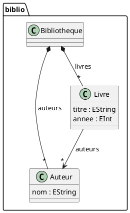

# Ingénierie dirigée par les modèles : UML, MOF, Ecore, QVT, grammaires et pyecore

> [!abstract] Objectif
> Comprendre ce que l'ingénierie dirigée par les modèles ajoute au dessin de diagrammes : des **modèles conformes à des métamodèles**, qu'un programme peut charger, valider, transformer et convertir en code ou en texte. Le cours situe les standards (UML, SysML v2, MDA, MOF, QVT), l'implémentation de référence (Ecore et EMF), le rapport entre grammaires et métamodèles (BNF, PEG, Xtext, textX), puis met tout cela en pratique en Python avec pyecore — jusqu'à générer un diagramme PlantUML et du code depuis un métamodèle.

> [!info] État du cours
> Réécrit le 29 août 2026. La version de 2023 juxtaposait des résumés de définitions et comportait plusieurs erreurs : PlantUML et Mermaid n'ont pas de « grammaire PEG » (le premier est analysé par des expressions régulières en Java, le second par des grammaires Jison puis Langium), MOF 2.5.1 date de 2016 et non 2018, la sémantique opérationnelle n'a pas été « introduite par Naur et Wilkes », et pyecore ne valide pas de contraintes OCL. Les exemples des chapitres 5 et 7 ont été exécutés avec pyecore 0.15.2, pyecoregen 0.5.1, textX 4.4 et PlantUML 1.2026.7.

Voir aussi : [[UML pour Visual code]], [[PlantUML pour Obsidian]], [[Mermaid pour Obsidian]], [[Design patterns]], [[Python]].

# Sommaire

1. UML et SysML en 2026
2. MDA et l'architecture à quatre niveaux
3. Ecore et EMF
4. Transformer les modèles : QVT, ATL, M2T
5. Grammaires et langages dédiés
6. Sémantiques formelles
7. pyecore : la pratique en Python
8. Diagrammes textuels : PlantUML et Mermaid
9. Aide-mémoire
10. Sources

# 1. UML et SysML en 2026

**UML** (*Unified Modeling Language*), adopté par l'OMG en 1997, en est à la version **2.5.1** (décembre 2017) ; aucune révision majeure n'est en cours. Il reste le langage de modélisation le plus enseigné et le plus lu, mais son usage a changé : on dessine des diagrammes de classes, de séquence ou d'états pour **communiquer et documenter**, rarement pour spécifier un système en entier. Les pratiques agiles ont retenu les diagrammes qui tiennent sur un tableau blanc ; les outils textuels (chapitre 8) les ont rendus versionnables.

**SysML v2**, le langage de l'ingénierie des systèmes, marque la vraie nouveauté : adopté définitivement par l'OMG le 30 juin 2025 et publié en septembre 2025, il ne repose plus sur UML mais sur son propre noyau sémantique, **KerML**, avec une notation textuelle de première classe et une API standard d'accès aux modèles. C'est aujourd'hui le domaine où la modélisation reste centrale (aéronautique, automobile, défense).

Outils : PlantUML et Mermaid pour le texte, Papyrus (Eclipse), Modelio, StarUML, Enterprise Architect pour les modèles complets, PTC Modeler et Cameo pour SysML.

# 2. MDA et l'architecture à quatre niveaux

## 2.1 MDA

**MDA** (*Model Driven Architecture*, OMG, 2001) propose de décrire un système par un modèle indépendant de la plateforme (**PIM**), de le transformer en modèle spécifique à une plateforme (**PSM**), puis en code. L'approche générale — **ingénierie dirigée par les modèles** (MDE) — a survécu à la démarche MDA proprement dite, dont l'adoption est restée limitée aux domaines où la génération de code se justifie : systèmes embarqués, ingénierie système, applications métier très répétitives.

## 2.2 MOF et les niveaux M0 à M3

**MOF** (*Meta Object Facility*, version 2.5.1, novembre 2016) est le langage de définition des métamodèles de l'OMG. Il organise la modélisation en quatre niveaux :

| Niveau | Contenu | Exemple |
|---|---|---|
| M3 | le méta-métamodèle | MOF (ou Ecore) : *Class*, *Attribute*, *Reference* |
| M2 | les métamodèles | UML, SysML, BPMN, votre langage dédié |
| M1 | les modèles | le diagramme de classes de votre application |
| M0 | les instances à l'exécution | les objets en mémoire |

Un modèle est **conforme** à son métamodèle, qui est conforme à MOF ; MOF se décrit lui-même. Les modèles s'échangent en **XMI** (XML Metadata Interchange). **OCL** (*Object Constraint Language*) exprime les contraintes qu'un modèle doit respecter.

Ne pas confondre l'**OMG**, qui publie UML, MOF, QVT, OCL, BPMN et SysML, avec **OASIS**, consortium de normalisation des formats de documents et des services web (OpenDocument, SAML, MQTT) : les deux sont des organismes de standardisation, mais OASIS n'a pas de rôle en modélisation.

# 3. Ecore et EMF

**EMF** (*Eclipse Modeling Framework*) est l'implémentation de référence de MOF ; **Ecore**, son méta-métamodèle, est l'équivalent pratique d'EMOF (le sous-ensemble essentiel de MOF). Tout l'écosystème de modélisation Eclipse repose dessus.

Vocabulaire Ecore :

- `EPackage` : espace de noms d'un métamodèle (`nsURI`, `nsPrefix`) ;
- `EClass` : une classe, avec ses `eSuperTypes`, attributs et références ; `abstract`, `interface` ;
- `EAttribute` : attribut typé par un `EDataType` (`EString`, `EInt`, `EBoolean`, `EDate`…) ;
- `EReference` : lien vers une autre `EClass`, avec cardinalités (`lower`, `upper`, `-1` pour *), `containment` (composition : l'objet référencé appartient au conteneur) et `eOpposite` (référence inverse) ;
- `EEnum`, `EOperation` ; annotations `EAnnotation` pour la documentation et la génération.

Depuis un fichier `.ecore`, EMF génère le code Java du métamodèle (`.genmodel`), un éditeur arborescent et la sérialisation XMI. Autour d'EMF : **Sirius** (éditeurs graphiques), **Xtext** (syntaxes textuelles), **Acceleo** (génération de texte), **QVTo** et **ATL** (transformations), **Eclipse OCL** (contraintes), **Papyrus** (UML/SysML). Les versions suivent le rythme trimestriel d'Eclipse (2026-06 au moment de la rédaction).

# 4. Transformer les modèles : QVT, ATL, M2T

## 4.1 Modèle vers modèle (M2M)

**QVT** (*Query/View/Transformation*, OMG) comprend trois langages : **QVT Relations** (déclaratif, relations entre modèles, possibilité de transformations bidirectionnelles), **QVT Core** (le noyau vers lequel Relations se traduit) et **QVT Operational** (**QVTo**, impératif, le seul largement implémenté — dans Eclipse). Exemple de mapping QVTo :

```text
mapping Livre::toFiche() : Fiche {
    titre := self.titre;
    auteur := self.auteurs->first().nom;
}
```

**ATL** (*Atlas Transformation Language*, Eclipse) est l'alternative la plus utilisée en pratique et en enseignement, avec une syntaxe déclarative à base de règles. En Python, une transformation s'écrit directement en parcourant les objets pyecore (chapitre 7).

## 4.2 Modèle vers texte (M2T)

Générer du code, de la documentation ou de la configuration depuis un modèle : **Acceleo** (norme OMG MOFM2T, Eclipse), gabarits **Xtend**, ou tout moteur de gabarits — Jinja2 en Python fait parfaitement l'affaire. Le modèle fournit les données, le gabarit fournit la forme ; le code généré ne se modifie pas à la main (ou seulement dans des zones protégées), sous peine de perdre les modifications à la génération suivante.

## 4.3 Le sens inverse

Extraire un modèle depuis du code existant (rétro-ingénierie : `pyreverse`, MoDisco) et depuis une grammaire (chapitre 5) ferme la boucle : modèle → code → modèle.

# 5. Grammaires et langages dédiés

## 5.1 BNF et EBNF

La notation **BNF** (*Backus–Naur Form*, 1959-1960, rapport ALGOL 60) décrit une grammaire hors contexte par des règles de production :

```text
<programme> ::= "print" <chaine>
<chaine>    ::= '"' <caracteres> '"'
```

**EBNF** (ISO/IEC 14977) ajoute les groupes `( )`, les options `[ ]`, les répétitions `{ }` et les commentaires, ce qui raccourcit les grammaires :

```text
programme = "print", chaine, { ",", chaine } ;
```

## 5.2 PEG

Les **grammaires d'expressions d'analyse** (PEG, Bryan Ford, 2004) ressemblent aux grammaires EBNF mais l'alternative `/` est **ordonnée** : la première branche qui réussit l'emporte, ce qui supprime toute ambiguïté et permet des analyseurs à descente récursive simples (avec mémoïsation, *packrat*). En contrepartie, une PEG ne peut pas exprimer la récursivité à gauche directe et peut rejeter silencieusement des entrées qu'une grammaire hors contexte accepterait.

```text
class_definition  <- 'abstract'? 'class' identifiant ('{' membre* '}')?
```

## 5.3 Des grammaires aux métamodèles

Une grammaire décrit une **syntaxe concrète** ; un métamodèle décrit une **syntaxe abstraite**. Les outils de langages dédiés (DSL) relient les deux :

| Outil | Langage | Principe |
|---|---|---|
| **Xtext** (Eclipse) | Java | la grammaire engendre le métamodèle Ecore, l'analyseur (ANTLR), l'éditeur Eclipse et un serveur de langage |
| **Langium** (TypeFox, 2022) | TypeScript | successeur de Xtext pour VS Code et le web : grammaire → AST, serveur LSP ; c'est l'analyseur des diagrammes récents de Mermaid |
| **textX** (Python) | Python | grammaire PEG (moteur Arpeggio) → métamodèle et analyseur en une passe, modèles interopérables avec Ecore |
| **ANTLR 4**, **Lark** | Java, Python | générateurs d'analyseurs généraux (LL(*), Earley/LALR) |

## 5.4 Et PlantUML, Mermaid ?

Ni l'un ni l'autre n'est défini par une grammaire formelle publiée : **PlantUML** est un programme Java qui reconnaît chaque ligne par des expressions régulières ; **Mermaid** a longtemps utilisé des grammaires **Jison** (LALR) par type de diagramme et migre depuis 2023 vers **Langium**. Ce sont des langages de *dessin*, pas des métamodèles : on ne charge pas un fichier PlantUML pour le transformer, on le génère (chapitre 7).

## 5.5 Exemple textX exécuté

```python
"""textX : une grammaire PEG définit à la fois le métamodèle et l'analyseur."""
from textx import metamodel_from_str

GRAMMAIRE = r"""
Bibliotheque: 'bibliotheque' name=ID '{' auteurs*=Auteur livres*=Livre '}';
Auteur:       'auteur' name=ID nom=STRING;
Livre:        'livre' titre=STRING annee=INT 'par' auteurs+=[Auteur][','];
"""
mm = metamodel_from_str(GRAMMAIRE)
modele = mm.model_from_str('''
bibliotheque lille {
  auteur ada "Ada Lovelace"
  livre "Notes on the Analytical Engine" 1843 par ada
}
''')
for livre in modele.livres:
    print(livre.titre, livre.annee, [a.nom for a in livre.auteurs])
```

Sortie : `Notes on the Analytical Engine 1843 ['Ada Lovelace']`. La notation `[Auteur]` déclare une **référence** résolue par nom ; `python -m textx generate` exporte le métamodèle en `.dot` ou en `.ecore` pour EMF.

# 6. Sémantiques formelles

Une grammaire dit ce qui est bien formé ; une **sémantique** dit ce que cela signifie. Trois familles :

- **dénotationnelle** (Christopher Strachey, Dana Scott, années 1960-1970) : à chaque construction du langage on associe un objet mathématique (une fonction) ; les langages fonctionnels s'y prêtent bien ;
- **opérationnelle** : le sens est donné par des règles d'exécution — sémantique **à petits pas** (*structural operational semantics*, Gordon Plotkin, 1981) ou **à grands pas** (sémantique naturelle, Gilles Kahn, 1987) ; c'est la forme usuelle des spécifications d'interpréteurs ;
- **axiomatique** (Tony Hoare, 1969) : des triplets `{P} S {Q}` décrivent l'effet des instructions sur des assertions ; base de la vérification de programmes.

Pour un métamodèle, la sémantique est le plus souvent donnée par les contraintes OCL et par les transformations qui l'exécutent ou le compilent.

# 7. pyecore : la pratique en Python

**pyecore** réimplémente Ecore en Python : métamodèles dynamiques (créés à l'exécution) ou statiques (code généré par **pyecoregen** depuis un `.ecore`), lecture et écriture XMI compatibles avec EMF, notifications de changement, EMF-JSON. Ce qu'il n'offre pas : évaluation OCL, éditeurs, génération de diagrammes — on les écrit soi-même, comme ci-dessous.

```bash
python -m venv .venv && . .venv/bin/activate
pip install pyecore pyecoregen
```

## 7.1 Définir un métamodèle, créer des instances, sérialiser

```python
"""Métamodèle Ecore défini en Python, instances, sérialisation XMI et export PlantUML."""
from pyecore.ecore import EPackage, EClass, EAttribute, EReference, EString, EInt
from pyecore.resources import ResourceSet, URI

# 1. métamodèle dynamique (M2) : une bibliothèque
biblio = EPackage("biblio", nsURI="http://exemple.org/biblio", nsPrefix="biblio")
Auteur = EClass("Auteur"); Auteur.eStructuralFeatures.append(EAttribute("nom", EString))
Livre = EClass("Livre")
Livre.eStructuralFeatures.append(EAttribute("titre", EString))
Livre.eStructuralFeatures.append(EAttribute("annee", EInt))
Livre.eStructuralFeatures.append(EReference("auteurs", Auteur, upper=-1))                 # référence simple
Bibliotheque = EClass("Bibliotheque")
Bibliotheque.eStructuralFeatures.append(EReference("livres", Livre, upper=-1, containment=True))
Bibliotheque.eStructuralFeatures.append(EReference("auteurs", Auteur, upper=-1, containment=True))
biblio.eClassifiers.extend([Auteur, Livre, Bibliotheque])

# 2. instances (M1) conformes au métamodèle
b = Bibliotheque()
ada = Auteur(nom="Ada Lovelace"); b.auteurs.append(ada)
notes = Livre(titre="Notes on the Analytical Engine", annee=1843, auteurs=[ada]); b.livres.append(notes)
print("instance :", [(l.titre, l.annee, [a.nom for a in l.auteurs]) for l in b.livres])

# 3. sérialisation XMI du métamodèle et du modèle
rset = ResourceSet()
rset.create_resource(URI("biblio.ecore")).append(biblio); rset.resources[URI("biblio.ecore").normalize()].save()
r = rset.create_resource(URI("ma_biblio.xmi")); r.append(b); r.save()

# 4. rechargement dans un nouvel espace, en enregistrant le métamodèle
rset2 = ResourceSet()
mm = rset2.get_resource(URI("biblio.ecore")); pkg = mm.contents[0]; rset2.metamodel_registry[pkg.nsURI] = pkg
model = rset2.get_resource(URI("ma_biblio.xmi")).contents[0]
print("rechargé :", model.livres[0].titre, "de", model.livres[0].auteurs[0].nom)
```

Le fichier `biblio.ecore` s'ouvre tel quel dans Eclipse ; `ma_biblio.xmi` est un modèle EMF ordinaire. `containment=True` fait de `livres` et `auteurs` des compositions : supprimer la bibliothèque supprime son contenu, et l'objet ne peut avoir qu'un conteneur.

## 7.2 Générer un diagramme PlantUML depuis le métamodèle

```python
from pyecore.ecore import EClass


def plantuml(package):
    lignes = ["@startuml", f"package {package.name} {{"]
    for cls in package.eClassifiers:
        if isinstance(cls, EClass):
            lignes.append(f"  class {cls.name} {{")
            for f in cls.eAttributes:
                lignes.append(f"    {f.name} : {f.eType.name}")
            lignes.append("  }")
    for cls in package.eClassifiers:
        if isinstance(cls, EClass):
            for ref in cls.eReferences:
                fleche = "*--" if ref.containment else "-->"
                card = "*" if ref.upper == -1 else str(ref.upper)
                lignes.append(f'  {cls.name} {fleche} "{card}" {ref.eType.name} : {ref.name}')
    lignes += ["}", "@enduml"]
    return "\n".join(lignes)
```

Résultat pour le métamodèle ci-dessus (rendu avec `java -jar plantuml.jar -tsvg`) :



Vingt lignes de Python transforment ainsi n'importe quel `.ecore` en diagramme à jour : c'est une transformation modèle-vers-texte au sens du chapitre 4.

## 7.3 Générer le code du métamodèle avec pyecoregen

```bash
pyecoregen -e biblio.ecore -o gen        # produit gen/biblio/__init__.py et gen/biblio/biblio.py
```

```python
import sys
sys.path.insert(0, "gen")
from biblio import Bibliotheque, Livre, Auteur

b = Bibliotheque()
grace = Auteur(nom="Grace Hopper"); b.auteurs.append(grace)
b.livres.append(Livre(titre="A-0", annee=1952, auteurs=[grace]))
print(b.livres[0].titre, b.livres[0].auteurs[0].nom)      # A-0 Grace Hopper
```

Le métamodèle **statique** offre l'autocomplétion, les vérifications de type et des classes où ajouter des méthodes métier ; le métamodèle **dynamique** convient aux outils génériques qui ne connaissent pas le métamodèle à l'avance.

## 7.4 Aller plus loin

- **Transformation M2M en Python** : parcourir `model.eAllContents()` et construire les objets du métamodèle cible.
- **Validation** : pas d'OCL dans pyecore ; écrire les invariants en Python (fonctions sur les instances) ou valider dans Eclipse.
- **Interopérabilité** : les mêmes fichiers `.ecore` et `.xmi` circulent entre pyecore, EMF et textX (`textx generate --target ecore`).

# 8. Diagrammes textuels : PlantUML et Mermaid

**PlantUML** couvre toute la notation UML (classes, séquence, états, activités, composants, déploiement, objets), plus C4, Gantt, JSON/YAML, et se rend par Java localement ou par un serveur ; **Mermaid** couvre moins de diagrammes UML mais se rend nativement dans GitHub, GitLab, Obsidian et les aperçus Markdown. Les deux se **génèrent** depuis un modèle (section 7.2) ou depuis du code (`pyreverse`, voir [[UML pour Visual code]]) ; leur syntaxe et leurs pièges sont dans [[PlantUML pour Obsidian]] et [[Mermaid pour Obsidian]].

# 9. Aide-mémoire

| Notion | Repère |
|---|---|
| Niveaux | M3 MOF/Ecore, M2 métamodèle, M1 modèle, M0 exécution |
| Standards OMG | UML 2.5.1 (2017), MOF 2.5.1 (2016), OCL 2.4, QVT 1.3, XMI 2.5.1, SysML v2.0 et KerML 1.0 (2025) |
| Ecore | `EPackage`, `EClass`, `EAttribute`, `EReference` (`containment`, `upper=-1`, `eOpposite`) |
| M2M / M2T | QVTo, ATL / Acceleo, Xtend, Jinja2 |
| DSL | Xtext (Eclipse), Langium (VS Code), textX (Python) |
| pyecore | métamodèle dynamique ou `pyecoregen -e m.ecore -o gen` ; `ResourceSet`, `URI`, `save()`, `metamodel_registry` |
| Diagrammes | PlantUML (notation complète, Java), Mermaid (rendu natif Markdown) |

# 10. Sources

- OMG : UML <https://www.omg.org/spec/UML/>, MOF <https://www.omg.org/spec/MOF/>, QVT <https://www.omg.org/spec/QVT/>, OCL <https://www.omg.org/spec/OCL/>, SysML v2 <https://www.omg.org/spec/SysML/2.0/>
- Communiqué OMG, adoption finale de SysML v2 (21 juillet 2025) : <https://www.omg.org/news/releases/pr2025/07-21-25.htm>
- Eclipse Modeling Framework : <https://eclipse.dev/emf/> ; Xtext : <https://eclipse.dev/Xtext/> ; Langium : <https://langium.org/>
- pyecore : <https://github.com/pyecore/pyecore> ; pyecoregen : <https://github.com/pyecore/pyecoregen>
- textX : <https://textx.github.io/textX/>
- Bryan Ford, *Parsing Expression Grammars* (2004) : <https://bford.info/pub/lang/peg/>
- Mermaid, architecture des analyseurs (Langium) : <https://mermaid.js.org/community/new-diagram.html>
- Steinberg, Budinsky, Paternostro, Merks, *EMF: Eclipse Modeling Framework*, 2e éd., Addison-Wesley, 2008
