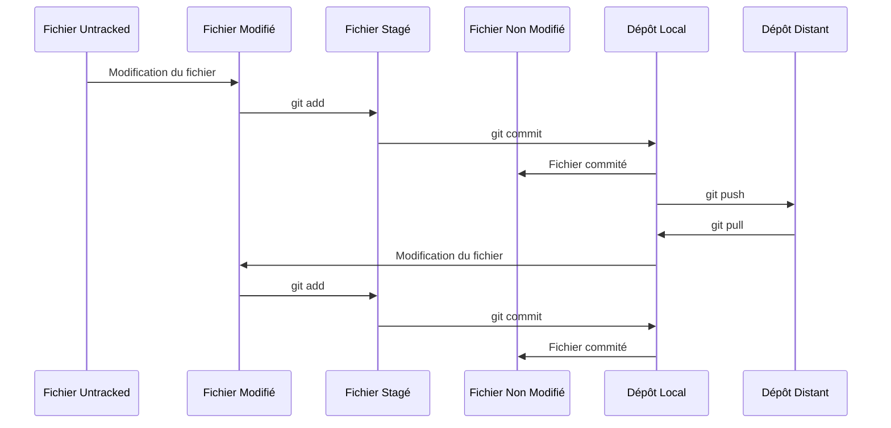
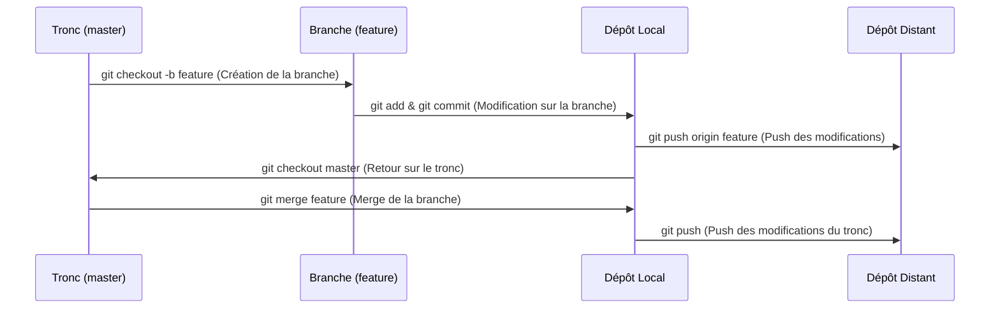

# 1. Introduction

Git est un outil de gestion de versions du code développé par **Linus Torval** fondateur de Linux pour gérer le développement du noyau Linux.

## 1.1 Objectifs

Que nous soyons seuls ou en équipe, nous devrons gérer efficacement les versions du code, suivre son évolution, et potentiellement collaborer avec d'autres développeurs. C'est là qu'intervient Git.

Git est un système de gestion de versions distribué. Cela signifie qu'il nous permet de suivre les changements apportés à un projet au fil du temps. De plus, contrairement à d'autres systèmes de gestion de versions, Git stocke l'ensemble du projet et de son historique sur chaque machine de développement, ce qui le rend rapide et résilient.

## 1.2 Historique

L'histoire de Git est liée à celle de Linus Torvalds et le développement du noyau Linux.

Avant Git, Linus utilisait un système de gestion de versions appelé BitKeeper. BitKeeper était un outil propriétaire, mais son éditeur avait autorisé les développeurs du noyau Linux à l'utiliser gratuitement ce qui lui permettait de démontrer la robustesse de son offre. Cette solution n'était pas idéale, car elle reposait sur un unique dépôt central, mais elle fonctionnait suffisamment bien pour répondre aux besoins du projet à l'époque.

En 2005, un conflit est survenu. La communauté de développeurs de Linux, par nature un projet ouvert et communautaire, a eu des problèmes avec la nature propriétaire de BitKeeper. En particulier, un développeur a créé un outil capable d'interagir avec les dépôts BitKeeper, ce qui a violé la licence d'utilisation de BitKeeper. En réponse, l'éditeur de BitKeeper a révoqué la licence gratuite qu'il avait accordée au projet Linux.

Cela a placé le développement du noyau Linux dans une position délicate. Il était devenu dépendant d'un outil qui n'était plus accessible. Linus Torvalds, face à ce problème, a décidé de créer un nouvel outil, un système de gestion de versions qui serait non seulement libre et ouvert, mais aussi distribué, rapide et capable de gérer de grands projets comme le noyau Linux.

C'est ainsi qu'en avril 2005, Git est né. Linus a conçu Git pour être petit et simple à sa base, mais aussi incroyablement puissant et flexible. Il a réussi à implémenter les fonctionnalités de base de Git en seulement quelques semaines, et le développement du noyau Linux a rapidement adopté cet outil. Aujourd'hui, Git est devenu le standard de facto pour la gestion de versions, adopté par des millions de développeurs à travers le monde.

### 1.3 Utilisations

Aujourd'hui, Git est devenu un standard dans le domaine du développement logiciel. Il est utilisé par des millions de développeurs à travers le monde, que ce soit pour des projets open source, des projets universitaires ou des projets commerciaux.

Git offre de nombreux avantages. Il nous permet de suivre l'historique de notre projet, de savoir qui a apporté quels changements et quand. Il nous permet de créer des branches pour travailler sur des fonctionnalités spécifiques sans perturber le reste du projet. Il facilite la collaboration, en nous permettant de fusionner facilement le travail de plusieurs développeurs. Enfin, en cas d'erreur, il nous permet de revenir à une version précédente de notre projet.

En conclusion, comprendre et maîtriser Git est essentiel pour tout professionnel de l'informatique. Au fil de ce cours, nous allons découvrir ensemble comment utiliser Git de manière efficace et productive. Alors préparez-vous, notre voyage ne fait que commencer !

# 2. Installer le client Git

Avant de pouvoir utiliser Git, nous devons l'installer sur nos machines. Si nous utilisons un système Linux basé sur Debian, l'installation est simple grâce au gestionnaire de paquets `apt`. Ouvrons un terminal et exécutons la commande suivante :

```bash
apt install git
```

Cette commande demande à `apt` d'installer le paquet `git`.

# 3. Configurer notre compte Git

Une fois Git installé, la première chose que nous devons faire est de configurer notre identité. Git utilise cette information lorsque nous validons (commit) nos changements. Pour ce faire, nous utilisons les commandes `git config`. Par exemple :

```bash
git config --global user.name "Michaël Launay"
git config --global user.email michaellaunay@ecreall.com
```

Ces commandes définissent notre nom et notre adresse email comme étant ceux associés à nos commits.

# 4. Connaître notre configuration Git

Pour vérifier notre configuration Git, nous pouvons utiliser la commande `git config --list`. Cela affichera la liste des paramètres que Git a configurés.

```bash
git config --list
```

Git lit sa configuration à partir de trois endroits potentiels :

- Le fichier de configuration système, qui est généralement situé à "/etc/gitconfig"
- Le fichier de configuration utilisateur, qui se trouve dans notre répertoire personnel sous "~/.gitconfig"
- Le fichier de configuration du dépôt, situé dans le répertoire ".git" du dépôt à "<rep_projet>/.git/config"

# 5. Créer un projet Git

Nous pouvons créer un nouveau projet Git soit en clonant un dépôt existant à partir d'un service comme GitHub ou GitLab, soit en initialisant un nouveau dépôt sur notre machine locale. 

Si nous choisissons de commencer localement, nous pouvons créer un nouveau dépôt Git comme suit :

```bash
mkdir MonProjet
cd MonProjet
vim README.md
git init
```

Notons qu'il est important d'ajouter au moins un fichier à un nouveau dépôt, car Git ne suit pas les répertoires vides. Si nous avons un répertoire que nous voulons inclure dans notre dépôt mais qui ne contient pas encore de fichiers, nous pouvons ajouter un fichier ".gitkeep" pour forcer Git à inclure le répertoire.

Pour plus d'informations, nous pouvons consulter la documentation officielle de Git [ici](https://git-scm.com/book/fr/v2), ainsi que les vidéos de formation sur YouTube [ici](https://youtu.be/KVULgIbyeQs) et [ici](https://youtu.be/0sGQgfUdCAY).

# 6. Les principales commandes de git

## 6.1 Connaître le hash de la version courante

```bash
git rev-parse HEAD
```

La commande `git rev-parse HEAD` est utilisée pour obtenir le hash du dernier commit de la branche actuellement active dans votre dépôt git.

Voici ce que fait chaque partie de la commande :

- `git` est l'outil de ligne de commande qui interagit avec Git.
- `rev-parse` est une commande git qui prend une référence de nom (comme une branche, une étiquette, un hash de commit, etc.) et la convertit en une référence de commit pleine ou complète.
- `HEAD` est une référence spéciale dans git qui pointe toujours vers le dernier commit de la branche actuellement active.

Donc, ensemble, `git rev-parse HEAD` signifie "prendre la référence HEAD (le dernier commit de la branche actuelle) et la convertir en un hash de commit complet". Le résultat sera une chaîne de caractères représentant le hash du commit, qui est une empreinte unique du commit.

Par exemple, cela pourrait ressembler à `1a206b53c6d5b1b860ee717e4a1e55e9b91eaae6`, qui est une valeur de hachage SHA-1 du contenu du commit, de l'heure du commit, de l'auteur du commit, et d'autres informations de commit.

## 6.2 Connaître l'état du dépôt Git local

La commande `git status` nous permet de voir l'état actuel de notre dépôt, y compris les fichiers modifiés, les fichiers non suivis et les fichiers qui sont prêts à être commités.

```bash
git status
```
## 6.3 Ajouter des fichiers pour un commit

La commande `git add` permet d'ajouter des fichiers pour créer un commit. Il faut ajouter un fichier à la fois.

## 6.4 Créer un commit

La commande `git commit -m ` permet de créer un commit. Il va créer le commit en ajoutant les fichiers que l'on a ajouté avec la commande `git add`. 
On peut rajouter un nom de commit pour que l'on puisse e repérer `git commit -m "Nom_du_commit`. 

## 6.5 Transmettre au dépôt partagé les modifications commitées

Pour partager nos modifications avec d'autres personnes, nous devons "pousser" (push) nos commits vers un dépôt distant. Cela se fait avec la commande `git push`.

```bash
git push
```

## 6.6 Mettre à jour le dépôt local

Pour obtenir les dernières modifications d'un dépôt distant, nous utilisons la commande `git pull`.

```bash
git pull
```

## 6.7 Afficher les différences entre deux versions

Pour voir les différences entre deux commits, nous pouvons utiliser la commande `git diff` suivie des identifiants des deux commits.

```bash
git diff <commit1> <commit2>
```

## 6.8 Afficher les dernières modifications

La commande `git log` nous permet de voir l'historique des commits. 

```bash
git log
git log --graph --oneline
```

## 6.9 Revenir à l'état précédent d'un fichier non encore indexé ou se déplacer dans les branches

Pour rétablir un fichier à son état précédent, ou pour changer de branche, nous utilisons la commande `git checkout`.

```bash
git checkout
```

## 6.10 Manipuler les branches

La commande `git branch` nous permet de créer, de lister et de supprimer des branches.

```bash
git branch
```

## 6.11 Fusionner des branches et gérer des conflits

Pour fusionner les modifications d'une branche dans une autre, nous utilisons la commande `git merge`.

```bash
git merge
```

## 6.12 Revenir à la troisième version précédente tout en gardant l'historique de la version actuelle

Pour revenir à une version précédente sans perdre l'historique des commits, nous utilisons la commande `git revert`.

```bash
git revert HEAD~3..HEAD
```

## 6.13 Revenir à une version précédente en effaçant l'historique de la version actuelle

Si nous voulons revenir à une version précédente et effacer l'historique des commits, nous pouvons utiliser la commande `git reset`.

```bash
git reset
```

## 6.14 Diagrammes

Exemple de diagramme de séquence qui reprend l'ensemble du workflow Git classique, y compris les différents états des fichiers (untracked, unmodified, modified, staged) et les interactions avec le dépôt local et le dépôt distant.



Dans ce diagramme, chaque participant représente un état de fichier différent ou un dépôt différent. Les flèches représentent les actions effectuées sur les fichiers ou les dépôts, généralement en utilisant des commandes Git. Notez que le flux réel peut varier en fonction de votre utilisation spécifique de Git.

## 6.15 Diagramme des branches

Exemple de diagramme de séquence qui illustre le workflow avec des branches et des merges :



Dans ce diagramme, "Tronc" et "Branche" représentent deux branches différentes dans le dépôt. Nous créons une nouvelle branche appelée "feature", y apportons des modifications, puis poussons ces modifications vers le dépôt distant.

Ensuite, nous revenons sur la branche master, fusionnons les modifications de la branche feature, puis poussons les modifications vers le dépôt distant.

## 6.16 Alias pratique

Pour faciliter notre travail, nous pouvons créer des alias pour certaines commandes. Par exemple, l'alias suivant crée une commande `gg` qui affiche un journal de commits coloré et facile à lire.

```bash
alias gg='git log --oneline --graph --name-status'
```

Pour plus d'informations sur la gestion des branches et la résolution des conflits, consultons [cette vidéo](https://youtu.be/75ZuypqdHII).

# 7. Exporter un répertoire dans un nouveau dépôt

Accédons au répertoire principal du premier dépôt en utilisant la ligne de commande.
Créons un nouveau dépôt Git vide en utilisant la commande `git init`.

```bash
git init nouveau-depot
```

Cette commande crée un nouveau dépôt Git vide dans un dossier nommé `nouveau-depot`.  
Accédons au sous-dossier `Notes` du premier dépôt en utilisant la commande cd.

```bash
cd Notes
```

Copions l'historique des commits de ce sous-dossier en utilisant la commande `git filter-branch`.

```bash
git filter-branch --subdirectory-filter Notes -- --all
```

Cette commande filtre l'historique des commits pour ne conserver que ceux qui affectent le dossier `Notes`.

Ajoutons le nouveau dépôt Git comme dépôt distant dans le premier dépôt en utilisant la commande `git remote add`.

```bash
git remote add nouveau-depot chemin/vers/nouveau-depot
```

Cette commande ajoute le nouveau dépôt Git comme un dépôt distant appelé `nouveau-depot` dans le premier dépôt.
   
Poussons l'historique des commits filtré vers le nouveau dépôt en utilisant la commande `git push`.

```bash
git push nouveau-depot master
```

Cette commande pousse l'historique des commits filtré vers le nouveau dépôt dans la branche `master`.  

Le nouveau dépôt Git créé ne contiendra que l'historique des commits concernant le sous-dossier `Notes` du premier dépôt. Les autres fichiers et dossiers du premier dépôt ne seront pas inclus dans le nouveau dépôt.

# 8. Introduction à GitLab

GitLab est une plateforme web basée sur le cloud qui fournit un espace pour héberger des dépôts Git, tout comme GitHub. Cependant, GitLab est bien plus qu'un simple service d'hébergement de code. Il s'agit d'une suite complète d'outils de développement de logiciels, offrant des fonctionnalités pour chaque étape du cycle de vie du développement.

## 8.1 Créer un compte GitLab

La première étape pour utiliser GitLab est de créer un compte. Rendons-nous sur [GitLab](https://gitlab.com/) et suivons les instructions pour nous inscrire. Une fois que nous avons créé un compte, nous pouvons commencer à créer des projets et des dépôts.

## 8.2 Créer un nouveau projet

Une fois que nous nous sommes connectés à votre compte GitLab, nous pouvons créer un nouveau projet en cliquant sur le bouton "New project". Nous pouvons alors donner un nom à notre projet, lui ajouter une description et choisir si nous voulons qu'il soit public ou privé. Une fois que nous avons créé votre projet, nous pouvons commencer à y pousser du code depuis votre ordinateur local avec Git.

## 8.3 Intégration continue/déploiement continu (CI/CD)

L'une des fonctionnalités les plus puissantes de GitLab est son système d'intégration continue et de déploiement continu (CI/CD). Avec GitLab CI/CD, nous pouvons automatiser une série de tâches chaque fois que nous poussons du code vers votre dépôt. Par exemple, nous pouvons configurer GitLab pour qu'il exécute automatiquement des tests unitaires, construise votre code et le déploie sur un serveur de production chaque fois que nous faites un commit.

## 8.4 Gestion des problèmes et des demandes de tirage

GitLab offre également des outils pour gérer les problèmes (issues) et les demandes de tirage (merge requests). nous pouvons utiliser les problèmes pour suivre les bugs et les fonctionnalités, et nous pouvons utiliser les demandes de tirage pour gérer les modifications du code. Chaque problème et chaque demande de tirage peut être attribué à un utilisateur spécifique, ce qui facilite la collaboration sur un projet.

## 8.5 Tableaux de bord

GitLab fournit également des tableaux de bord pour chaque projet qui nous permettent de suivre l'état de votre code, les problèmes en cours, et bien plus encore.

En résumé, GitLab est une suite complète d'outils pour le développement de logiciels qui offre une intégration étroite avec Git. Qu'il s'agisse de gérer votre code, d'automatiser nos tests ou de déployer nos applications, GitLab a les outils dont nous avons besoin.

# 9. Introduction à GitHub

GitHub est une plateforme web qui fournit un service d'hébergement pour le contrôle de version Git. Il offre toutes les fonctionnalités de Git distribué et de contrôle de version source, ainsi qu'un ensemble de fonctionnalités supplémentaires propres à sa plateforme. GitHub facilite le travail en équipe et la collaboration sur des projets, grands ou petits.

## 9.1 Créer un compte GitHub

Avant de pouvoir utiliser GitHub, nous devons d'abord créer un compte. Rendez-Nous sur [GitHub](https://github.com/) et suivons les instructions pour nous inscrire. Une fois notre compte créé, nous pouvons commencer à créer des dépôts, à collaborer avec d'autres développeurs et à contribuer à des projets open source.

## 9.2 Créer un nouveau dépôt

Une fois connectés à notre compte GitHub, nous pouvons créer un nouveau dépôt en cliquant sur le bouton "+", puis "New repository" dans le coin supérieur droit. Nous donnons ensuite un nom à notre dépôt, pouvons ajouter une description, choisir s'il doit être public ou privé, et éventuellement ajouter un fichier README, un .gitignore ou une licence.

## 9.3 Collaborer sur des projets

GitHub facilite la collaboration sur des projets. Nous pouvons inviter d'autres utilisateurs à collaborer sur nos projets, faire des "pull requests" pour proposer des modifications à d'autres projets, et fusionner ces modifications une fois qu'elles ont été revues.

## 9.4 Gérer des problèmes (issues) et des demandes de tirage (pull requests)

GitHub offre également des outils pour gérer les problèmes et les demandes de tirage. Nous pouvons utiliser les problèmes pour suivre les bugs et les demandes de fonctionnalités, et nous pouvons utiliser les demandes de tirage pour proposer, examiner et fusionner des modifications du code.

## 9.5 GitHub Actions et GitHub Pages

En plus de ces fonctionnalités de base, GitHub offre également GitHub Actions, une fonctionnalité d'intégration continue/déploiement continu (CI/CD) qui nous permet d'automatiser votre workflow de développement de logiciels. Par exemple, à chaque fois que nous faisons un commit ou une demande de tirage, GitHub Actions peut exécuter automatiquement une série de tests sur notre code.

De plus, avec GitHub Pages, nous pouvons héberger gratuitement des sites web statiques directement à partir de nos dépôts GitHub.

En résumé, GitHub est une plateforme d'hébergement Git riche en fonctionnalités qui facilite la collaboration sur des projets, la gestion du code source, le suivi des problèmes, l'hébergement de sites web, et plus encore.

# 10. Export massif depuis gitlab

L'exportation de projets GitLab est généralement réalisée projet par projet via l'interface Web, ce qui peut être assons laborieux si nous avons beaucoup de projets. Cependant, pour automatiser le processus, nous pouvons utiliser l'API de GitLab.

Voici un script en Python 3 pour exporter tout le contenu de notre instance GitLab CE, le parcours ne se base pas sur la liste des projets fournis par l'API, car selon comment les  projets ont été crées, la liste retournée ne contient pas tous les projets du gitlab-ce :

```python
# Description: This script will clone all GitLab repositories from a GitLab instance.
# Author: Michael Launay
# Date: 2023-05-06
import os
import requests

# Set your GitLab URL and access token
GITLAB_HOST = "git.ecreall.com"
# For token creation, see https://docs.gitlab.com/ee/user/profile/personal_access_tokens.html
ACCESS_TOKEN = "TOKEN FOR GITLAB-CE ROOT" # Fill with your own token
MAXIMUM_PROJECT_ID = 400 # Adapt this value to oversize your GitLab instance

# Set the directory where you want to clone the repositories
CLONE_DIR = "/home/michaellaunay/workspace"

# Create the clone directory if it doesn't exist
os.makedirs(CLONE_DIR, exist_ok=True)

# Create the base URL for the GitLab API
GITLAB_URL = f"https://{GITLAB_HOST}/api/v4/projects"

headers = {"PRIVATE-TOKEN": ACCESS_TOKEN}
# Try to access each project by ID
for i in range(1, MAXIMUM_PROJECT_ID):
    url = f"{GITLAB_URL}/{i}"
    # Retrieve the project details
    response = requests.get(f"{GITLAB_URL}/{i}", headers=headers, verify=False)
    # If the project doesn't exist, continue to the next ID
    if str(response.content, "utf-8").find("404 Project Not Found") > -1:
        continue
    print(f"Try to clone {url =}")
    project = response.json()

    # Clone each project
    project_name = project["name"]
    project_path = project["path_with_namespace"]
    namespace_path = project["namespace"]["full_path"]
    repository_url = project["ssh_url_to_repo"]

    # Clone the repository
    clone_dir = os.path.join(CLONE_DIR, project_path)
    project_dir = os.path.join(CLONE_DIR, namespace_path)
    if not os.path.exists(os.path.join(clone_dir, ".git")):
        os.makedirs(project_dir, exist_ok=True)
        os.chdir(project_dir)
        os.system(f"git clone {repository_url}")
    else:
        os.chdir(clone_dir)
        os.system(f"git pull")

print("Cloning complete. All repositories have been cloned to", CLONE_DIR)
```

Si besoin, installer le module `requests` :

```
pip install requests
```

Dans ce script Python, nous utilisons la bibliothèque `requests` pour effectuer les appels à l'API GitLab. Le script effectue les étapes suivantes :

1. Crée un répertoire pour stocker les exports.
2. Itère sur les identifiants des projets en supposant que les ids vont de 1 à 400 (à adapter).
4. Pour chaque identifiant récupère le json de description du projet.
3. S'il n'existe pas de projet pour cet identifiant passe à l'identifiant suivant.
	1. À partir des informations de nom, chemin et domaine, crée le répertoire de destination et réalise un git clone.

Si le serveur gitlab-ce n'a pas de certificat ssl à jour, il faut temporairement désactiver la vérification des certificats ssl :

```bash
git config --global http.sslVerify false
```

Remplaçons la valeur de `PRIVATE_TOKEN` par notre propre jeton d'accès privé GitLab, et `GITLAB_URL` par l'URL de notre instance GitLab.

Après exécution, tous les dépôts non vides auront été clonés.

Remarque une version à jour mais plus complexe du script est accessible à [michaellaunay/tools](https://github.com/michaellaunay/tools)

## 10.1 Obtenir un token gitlab

Pour obtenir un token d'accès personnel (Personal Access Token) dans GitLab, suivons ces étapes :

1. Connectons-nous à notre compte GitLab.

2. Déplaçons nous sur le répertoire pour lequel nous souhaitons un token.

4. Cliquons sur notre avatar en haut à droite de la page, puis sur "Settings".

5. Dans le menu de gauche, cliquons sur "Access Tokens".

6. Donnons un nom à notre token, définissons une date d'expiration et sélectionnons les "scopes" (droits d'accès) que nous souhaitons attribuer à ce token. Pour utiliser l'API, nous devons cocher la case "api".

7. Cliquons sur "Create personal access token".

8. GitLab générera alors un token d'accès personnel. Assurons-nous de copier ce token et de le conserver en lieu sûr, car nous ne pourrons plus le voir une fois que nous aurons quitté cette page.

Une fois que nous avons notre token, nous pouvons l'utiliser pour nous authentifier lors de l'utilisation de l'API GitLab. Ce token est sensible et doit être gardé sécurisé.

# 11. Git sur Android
Pour utiliser Git sur téléphone Android, suivre les étapes suivantes :

1.  Installer une application de terminal sur le téléphone, comme Termux.
    
2.  Ouvrer l'application Termux et installons Git en utilisant la commande suivante :
    
    `pkg install git`
    
3.  Créer un dossier où cloner le dépôt Git :
    
    `mkdir myproject`
    
4.  Accéder au dossier :
    
    `cd myproject`
    
5.  Cloner le dépôt Git en utilisant la commande suivante :
    
    `git clone https://github.com/notre_repo`
    
6.  Travailler sur les fichiers et les modifier comme souhaité.
    
7.  Utiliser les commandes Git en lignes de commandes.