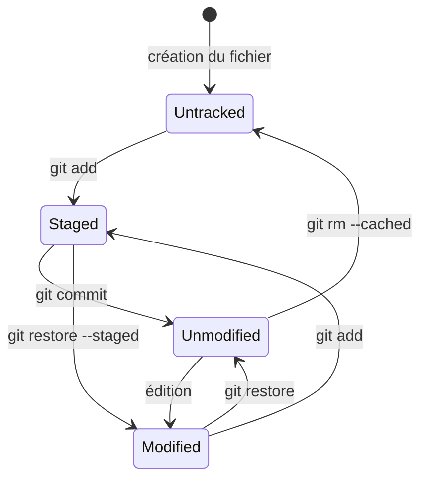
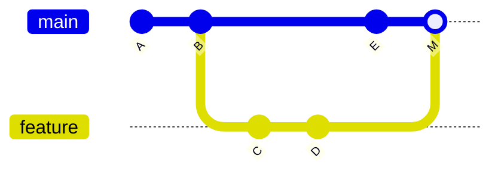

# Git

> [!abstract] Objectif
> Comprendre le modèle de données de Git — objets, références, working tree, index, `HEAD` — pour maîtriser avec confiance le workflow quotidien, les branches, la restauration et la réécriture d'historique, puis gérer les gros fichiers avec **Git LFS** et **Git Xet** (Hugging Face) sans sacrifier la sécurité ni la collaboration.

Voir aussi : [[Visual studio code]], [[Crash github et publication de clé]], [[Mermaid pour Obsidian]].

# Sommaire

1. Introduction : ce que Git versionne, Git et les forges, nouveautés récentes
2. Installer et vérifier Git
3. Configuration
4. Le modèle mental : working tree, index, `HEAD`
5. Créer ou cloner un dépôt
6. Workflow quotidien
7. Branches
8. Remotes, fetch, pull et push
9. Fusionner et résoudre les conflits
10. Restaurer et annuler sans se tromper
11. Stash
12. Rebase et cherry-pick
13. Tags et versions
14. Rechercher l'origine d'un problème
15. Réécrire un historique avec `git filter-repo`
16. Worktrees, sparse-checkout et clones partiels
17. Submodules et alternatives
18. `.gitignore` et `.gitattributes`
19. Git LFS : gérer de gros fichiers
20. Git Xet et Hugging Face
21. Authentification et sécurité
22. Performance et maintenance
23. Stratégies de collaboration
24. GitHub et GitLab
25. Sauvegarder plusieurs dépôts GitLab
26. Git sur Android avec Termux
27. Commandes de diagnostic
28. Alias pratiques
29. Erreurs fréquentes
30. Travaux pratiques
31. Checklist avant de pousser
32. Aide-mémoire
33. Sources et documentation
34. Conclusion

# 1. Introduction

Git est un **système de gestion de versions distribué** (*Distributed Version Control System*, DVCS). Il permet d'enregistrer l'évolution d'un ensemble de fichiers, de travailler à plusieurs, d'expérimenter sur des branches isolées et de revenir à des états antérieurs.

Git a été créé en 2005 par **Linus Torvalds** pour répondre aux besoins du développement du noyau Linux après la fin de l'utilisation gratuite de BitKeeper. Le projet a ensuite été repris et maintenu par une communauté indépendante ; Junio C Hamano en est devenu le mainteneur principal.

À la date de mise à jour de ce cours (août 2026), la version stable la plus récente est **Git 2.55** (29 juin 2026) ; la documentation officielle la décrit. Les distributions stables empaquettent souvent une version plus ancienne (Ubuntu 24.04 LTS fournit Git 2.43), mais les concepts décrits ici restent valables sur de nombreuses versions antérieures.

## 1.1 Ce que Git versionne réellement

Une idée utile est de ne pas considérer Git comme un système qui stocke uniquement des « différences entre fichiers ». Conceptuellement, chaque commit référence un **instantané** (*snapshot*) de l'arborescence du projet.

Les objets fondamentaux sont :

- **blob** : contenu d'un fichier ;
- **tree** : arborescence associant noms, modes et objets ;
- **commit** : référence un tree, un ou plusieurs parents, un auteur, un committer et un message ;
- **tag annoté** : objet nommé pouvant notamment pointer vers un commit.

Ces objets sont adressés par leur empreinte cryptographique.

```text
commit
  │
  ├── tree ── src/ ── main.py -> blob
  │        └─ README.md ------> blob
  │
  └── parent -> commit précédent
```

Cette conception rend Git naturellement adapté à un historique en graphe.

## 1.2 Git n'est pas GitHub

Il faut distinguer :

- **Git** : logiciel de gestion de versions ;
- **GitHub**, **GitLab**, **Codeberg**, **Forgejo**, etc. : plateformes d'hébergement et de collaboration autour de dépôts Git ;
- **Git LFS** : extension permettant d'externaliser le contenu de gros fichiers ;
- **Git Xet** : extension/protocole de transfert utilisé notamment par Hugging Face pour les gros fichiers de modèles et de jeux de données.

Un dépôt Git peut parfaitement fonctionner sans GitHub ni GitLab.

## 1.3 Pourquoi Git est distribué

Après un clone normal, notre machine contient :

- les fichiers de travail ;
- les branches locales ;
- une base d'objets contenant l'historique récupéré ;
- des références vers l'état connu des branches distantes.

La plupart des commandes (`log`, `diff`, `branch`, `commit`, `rebase`, etc.) travaillent donc **localement**. Le réseau est principalement utilisé lors de `fetch`, `pull`, `push`, clone, et lors du transfert d'objets externalisés par LFS/Xet.

## 1.4 Ce que Git ne fait pas

Git ne remplace pas :

- une sauvegarde hors site ;
- un système de déploiement ;
- un gestionnaire de secrets ;
- une base de données ;
- un stockage d'objets mutable ;
- une solution idéale pour versionner directement des centaines de gigaoctets de binaires.

Pour les gros binaires, nous utiliserons notamment Git LFS ou Xet.

## 1.5 Nouveautés récentes

Git publie une version mineure environ tous les trois mois. Parmi les apports de 2025-2026 utiles au quotidien :

- **hooks configurés** (2.54) : un hook peut être déclaré dans la configuration (`hook.<nom>.command`) et partagé sans copier de script dans `.git/hooks` ; 2.55 sait exécuter en parallèle les hooks qui le déclarent ;
- **`git history`** (2.54-2.55, expérimental) : sous-commandes `reword`, `split` et `fixup` pour retoucher un commit ancien sans dérouler un rebase interactif complet ;
- **FSMonitor sous Linux** (2.55) : `git config core.fsmonitor true` accélère `git status` dans les très gros dépôts en évitant le parcours complet du working tree ;
- **groupes de remotes** (2.55) : pousser vers plusieurs miroirs en une seule commande ;
- **maintenance incrémentale** (2.55) : `git repack --write-midx=incremental` pour les dépôts volumineux.

Avant d'utiliser l'une de ces fonctionnalités, vérifier `git --version` : elles sont absentes des versions empaquetées par les distributions stables.

# 2. Installer et vérifier Git

Sous Debian ou Ubuntu :

```bash
sudo apt update
sudo apt install git
```

Vérifions la version :

```bash
git --version
```

Sur une distribution stable, la version empaquetée peut être plus ancienne que la dernière version amont, sans que cela soit nécessairement un problème.

## 2.1 Obtenir de l'aide

```bash
git help

git help commit

git commit --help
```

Pour une aide courte :

```bash
git commit -h
```

# 3. Configuration

Git possède plusieurs niveaux de configuration :

- `--system` : machine entière ;
- `--global` : utilisateur ;
- `--local` : dépôt courant ;
- `--worktree` : worktree lorsque cette fonctionnalité est activée.

Affichons la configuration et sa provenance :

```bash
git config --list --show-origin
```

## 3.1 Identité des commits

```bash
git config --global user.name "Michaël Launay"
git config --global user.email "michael@example.net"
```

L'adresse enregistrée dans un commit est publique dès que le commit est publié. Une forge peut proposer une adresse « noreply » pour éviter d'exposer une adresse personnelle.

## 3.2 Branche initiale

Pour que les nouveaux dépôts utilisent `main` :

```bash
git config --global init.defaultBranch main
```

## 3.3 Éditeur

Par exemple avec Vim :

```bash
git config --global core.editor vim
```

Ou VS Code :

```bash
git config --global core.editor "code --wait"
```

## 3.4 Fin de lignes

Sous Linux, il est généralement raisonnable de conserver LF :

```bash
git config --global core.autocrlf input
```

Dans un projet multi-plateforme, il vaut mieux définir explicitement la politique dans `.gitattributes` :

```gitattributes
* text=auto
*.sh text eol=lf
*.bat text eol=crlf
```

## 3.5 Configuration conditionnelle

Nous pouvons avoir une identité professionnelle et une identité personnelle :

```ini
# ~/.gitconfig
[includeIf "gitdir:~/workspace/pro/"]
    path = ~/.gitconfig-pro

[includeIf "gitdir:~/workspace/perso/"]
    path = ~/.gitconfig-perso
```

Puis :

```ini
# ~/.gitconfig-pro
[user]
    name = Michaël Launay
    email = michael@entreprise.example
```

# 4. Le modèle mental : working tree, index, HEAD

Comprendre Git devient beaucoup plus simple si nous distinguons trois états.

## 4.1 Working tree

Le **working tree** est ce que nous voyons et éditons sur disque.

## 4.2 Index ou staging area

L'**index** contient la version préparée pour le prochain commit.

```bash
git add fichier.py
```

ne signifie pas « envoyer le fichier ». Cela copie son état courant dans l'index.

## 4.3 HEAD

`HEAD` désigne normalement la branche courante, qui elle-même pointe vers le commit courant.

```text
working tree  --git add-->  index  --git commit-->  commit
      ^                        ^                       |
      |                        |                       |
      +------ restore ---------+----- restore --------+
```

Du point de vue d'un fichier, les mêmes commandes se lisent comme des transitions d'état (diagramme rendu par Obsidian, voir [[Mermaid pour Obsidian]]) :


```mermaid
stateDiagram-v2
    [*] --> Untracked : création du fichier
    Untracked --> Staged : git add
    Staged --> Unmodified : git commit
    Unmodified --> Modified : édition
    Modified --> Staged : git add
    Staged --> Modified : git restore --staged
    Modified --> Unmodified : git restore
    Unmodified --> Untracked : git rm --cached
```

## 4.4 Observer les différences

Modifications non indexées :

```bash
git diff
```

Modifications préparées :

```bash
git diff --staged
```

Différence avec un commit :

```bash
git diff HEAD~1 HEAD
```

# 5. Créer ou cloner un dépôt

## 5.1 Nouveau dépôt

```bash
mkdir mon-projet
cd mon-projet
git init
```

Git ne versionne pas directement les répertoires : il versionne les fichiers. Un répertoire vide n'apparaît donc pas dans un commit. Un fichier `.gitkeep` est parfois utilisé par convention, mais **`.gitkeep` n'a aucune signification spéciale pour Git**.

Créons le premier commit :

```bash
printf '# Mon projet\n' > README.md
git add README.md
git commit -m "Initialise le projet"
```

## 5.2 Cloner un dépôt

```bash
git clone https://example.org/equipe/projet.git
cd projet
```

Avec SSH :

```bash
git clone git@example.org:equipe/projet.git
```

## 5.3 Examiner les remotes

```bash
git remote -v
```

Détails :

```bash
git remote show origin
```

# 6. Workflow quotidien

## 6.1 État du dépôt

```bash
git status
```

Version compacte :

```bash
git status --short
```

## 6.2 Ajouter des changements

Un fichier :

```bash
git add src/app.py
```

Tous les changements pertinents :

```bash
git add .
```

Pour sélectionner des morceaux d'un fichier :

```bash
git add -p
```

`git add -p` est extrêmement utile pour produire des commits atomiques.

## 6.3 Créer un commit

```bash
git commit -m "Ajoute la validation des paramètres"
```

Un bon commit :

- représente une modification cohérente ;
- ne mélange pas une refonte sans rapport avec un correctif ;
- possède un message expliquant l'intention ;
- passe idéalement les tests.

## 6.4 Modifier le dernier commit

Tant qu'il n'a pas été partagé :

```bash
git add fichier-oublie.py
git commit --amend
```

Cela **réécrit** le commit : son identifiant change.

## 6.5 Historique

```bash
git log
```

Vue compacte :

```bash
git log --oneline --graph --decorate --all
```

Historique d'un fichier :

```bash
git log --follow -- chemin/fichier.py
```

## 6.6 Afficher un objet ou un commit

```bash
git show HEAD
```

```bash
git show <commit>
```

## 6.7 Hash du commit courant

```bash
git rev-parse HEAD
```

Hash court :

```bash
git rev-parse --short HEAD
```

# 7. Branches

Une branche Git est essentiellement une **référence mobile vers un commit**.

## 7.1 Lister les branches

```bash
git branch
```

Toutes les branches locales et distantes :

```bash
git branch -a
```

## 7.2 Créer une branche

```bash
git branch feature/auth
```

Puis y basculer :

```bash
git switch feature/auth
```

Plus directement :

```bash
git switch -c feature/auth
```

`git switch` est aujourd'hui préférable à `git checkout` lorsqu'il s'agit uniquement de changer de branche. `checkout` reste disponible pour compatibilité et pour certains usages avancés.

## 7.3 Renommer une branche

```bash
git branch -m ancien-nom nouveau-nom
```

## 7.4 Supprimer une branche

Si elle est fusionnée :

```bash
git branch -d feature/auth
```

Forcer :

```bash
git branch -D feature/auth
```

## 7.5 Detached HEAD

Si nous exécutons :

```bash
git switch --detach <commit>
```

`HEAD` pointe directement vers un commit. Nous pouvons explorer l'historique, mais un nouveau commit risque de devenir difficile à retrouver si aucune branche n'est créée.

Pour conserver le travail :

```bash
git switch -c sauvegarde-experimentation
```

# 8. Remotes, fetch, pull et push

## 8.1 `git fetch`

```bash
git fetch origin
```

`fetch` télécharge les nouvelles références et objets sans fusionner automatiquement la branche courante.

C'est souvent la commande la plus sûre pour observer ce qui a changé :

```bash
git log --oneline HEAD..origin/main
```

## 8.2 `git pull`

`git pull` est essentiellement :

```text
fetch + intégration
```

Selon la configuration, l'intégration peut être un merge ou un rebase.

Pour demander explicitement un rebase :

```bash
git pull --rebase
```

## 8.3 `git push`

Premier push d'une branche :

```bash
git push -u origin feature/auth
```

Les suivants :

```bash
git push
```

## 8.4 Force push

Après une réécriture d'historique, un push normal peut être refusé. Préférons :

```bash
git push --force-with-lease
```

à :

```bash
git push --force
```

`--force-with-lease` vérifie que la branche distante n'a pas avancé d'une manière inattendue.

# 9. Fusionner et résoudre les conflits

## 9.1 Merge

Depuis la branche de destination :

```bash
git switch main
git merge feature/auth
```

Git peut faire :

- un **fast-forward** : `main` n'a pas avancé depuis la création de la branche, la référence est simplement déplacée ;
- un commit de merge, à deux parents, lorsque les deux branches ont divergé ;
- signaler des conflits.


```mermaid
gitGraph
    commit id: "A"
    commit id: "B"
    branch feature
    checkout feature
    commit id: "C"
    commit id: "D"
    checkout main
    commit id: "E"
    merge feature id: "M"
```

Ici `main` a avancé (`E`) pendant le travail sur `feature` : le merge crée le commit `M`, dont les parents sont `E` et `D`. Pour refuser un fast-forward et conserver systématiquement un commit de merge : `git merge --no-ff feature`.

## 9.2 Conflits

Un fichier en conflit contient typiquement :

```text
│ <<<<<<< HEAD
│ notre version
│ =======
│ autre version
│ >>>>>>> feature/auth
```

Les barres verticales `│` ne font pas partie du fichier : elles évitent que ce cours soit lui-même pris pour un fichier en conflit par les outils Git. Tout ce qui précède `=======` vient de `HEAD` (notre branche), tout ce qui suit vient de la branche fusionnée ; `git diff` pendant un conflit montre les deux versions, et `git checkout --ours -- fichier` ou `--theirs` permet d'en retenir une en bloc.

Après correction :

```bash
git add fichier.py
git commit
```

Pour abandonner le merge :

```bash
git merge --abort
```

## 9.3 Réutiliser une résolution avec rerere

Dans des workflows complexes :

```bash
git config --global rerere.enabled true
```

`rerere` signifie *reuse recorded resolution*. Git mémorise certaines résolutions de conflits et peut les réappliquer lors d'un rebase ou merge ultérieur.

# 10. Restaurer et annuler sans se tromper

`checkout`, `restore`, `reset` et `revert` sont souvent confondus.

## 10.1 Annuler une modification non indexée

```bash
git restore fichier.py
```

Attention : les modifications non enregistrées sont perdues.

## 10.2 Désindexer sans perdre le fichier

```bash
git restore --staged fichier.py
```

## 10.3 Restaurer depuis un commit

```bash
git restore --source=HEAD~2 -- fichier.py
```

## 10.4 `git revert` : annuler par un nouveau commit

Pour une branche partagée, `revert` est souvent la solution la plus sûre :

```bash
git revert <commit>
```

Git crée un nouveau commit qui inverse les changements du commit ciblé.

Pour une suite de commits :

```bash
git revert HEAD~3..HEAD
```

Vérifions toujours le résultat avant de pousser.

## 10.5 `git reset`

Déplacer la branche sans toucher à l'index ni au working tree :

```bash
git reset --soft HEAD~1
```

Réinitialiser aussi l'index :

```bash
git reset --mixed HEAD~1
```

Réinitialiser index **et fichiers de travail** :

```bash
git reset --hard HEAD~1
```

`--hard` est destructif pour les modifications non commitées.

## 10.6 Reflog : le filet de sécurité local

Git journalise les mouvements récents des références :

```bash
git reflog
```

Si nous avons fait un mauvais reset :

```bash
git reset --hard HEAD@{1}
```

Le reflog est local et temporaire. Ce n'est pas une sauvegarde.

# 11. Stash

Mettre temporairement de côté des modifications :

```bash
git stash push -m "WIP formulaire"
```

Inclure les fichiers non suivis :

```bash
git stash push -u -m "WIP"
```

Lister :

```bash
git stash list
```

Réappliquer sans supprimer l'entrée :

```bash
git stash apply stash@{0}
```

Réappliquer et retirer l'entrée :

```bash
git stash pop
```

# 12. Rebase et cherry-pick

## 12.1 Rebase

Supposons :

```text
A---B---C  main
     \
      D---E  feature
```

Sur `feature` :

```bash
git rebase main
```

Git rejoue `D` et `E` sur `C` :

```text
A---B---C  main
         \
          D'---E'  feature
```

Les nouveaux commits ont de nouveaux identifiants.

## 12.2 Rebase interactif

```bash
git rebase -i HEAD~5
```

Nous pouvons notamment :

- `pick` : conserver ;
- `reword` : modifier le message ;
- `edit` : modifier le commit ;
- `squash` : fusionner avec le précédent ;
- `fixup` : fusionner en ignorant le message ;
- `drop` : supprimer.

Pour corriger un commit précis sans éditer la liste à la main, créons un commit `fixup!` puis laissons Git le replacer :

```bash
git commit --fixup <commit>
git rebase -i --autosquash <commit>~1
```

Git 2.55 introduit `git history fixup <commit>` (expérimental), qui applique directement les changements indexés à un commit ancien et rejoue les suivants, en abandonnant en cas de conflit plutôt que de laisser un rebase à moitié fait.

Ne réécrivons pas sans coordination des commits déjà consommés par d'autres collaborateurs.

## 12.3 Cherry-pick

Appliquer un commit particulier sur la branche courante :

```bash
git cherry-pick <commit>
```

Utile pour backporter un correctif, mais à ne pas transformer en stratégie de fusion systématique.

# 13. Tags et versions

## 13.1 Tag léger

```bash
git tag v1.2.0
```

## 13.2 Tag annoté

```bash
git tag -a v1.2.0 -m "Version 1.2.0"
```

Les tags annotés possèdent leur propre objet Git et sont préférables pour les releases.

## 13.3 Publier les tags

Un tag :

```bash
git push origin v1.2.0
```

Tous les tags :

```bash
git push --tags
```

# 14. Rechercher l'origine d'un problème

## 14.1 `git blame`

```bash
git blame src/app.py
```

`blame` indique le dernier commit ayant touché chaque ligne. Ce n'est pas un outil permettant d'attribuer « la faute » à une personne : un refactoring peut avoir remplacé l'auteur historique apparent.

## 14.2 Rechercher une chaîne dans l'historique

```bash
git log -S'maFonction' --oneline --all
```

Recherche par expression régulière dans les diffs :

```bash
git log -G'ancienne_api\(' -p
```

## 14.3 `git bisect`

Si un bug est absent dans un ancien commit mais présent aujourd'hui :

```bash
git bisect start
git bisect bad HEAD
git bisect good v1.0.0
```

Git nous place au milieu de l'intervalle. Après chaque test :

```bash
git bisect good
```

ou :

```bash
git bisect bad
```

À la fin :

```bash
git bisect reset
```

Automatisation :

```bash
git bisect run ./tests/regression.sh
```

# 15. Réécrire un historique avec `git filter-repo`

La réécriture globale d'un historique change les identifiants de commits et doit être planifiée avec les collaborateurs.

`git filter-branch` existe toujours, mais sa documentation officielle recommande **de ne plus l'utiliser** pour les nouveaux travaux de réécriture. Pour la plupart des usages, préférons `git filter-repo`.

## 15.1 Installer git-filter-repo

Selon la distribution :

```bash
sudo apt install git-filter-repo
```

ou, dans un environnement virtuel Python, `python -m pip install git-filter-repo` (le projet est un unique script Python).

Vérifions :

```bash
git filter-repo --version
```

## 15.2 Extraire un sous-répertoire dans un dépôt autonome

Pour transformer `Notes/` en racine du nouveau dépôt :

```bash
git clone --no-local /chemin/vers/depot-source nouveau-depot
cd nouveau-depot
git filter-repo --path Notes/ --path-rename Notes/:
```

Puis ajoutons le nouveau remote et poussons explicitement :

```bash
git remote add origin git@example.org:equipe/notes.git
git push -u origin main
```

`git filter-repo --subdirectory-filter Notes` est un raccourci équivalent. Cette méthode remplace l'ancien exemple basé sur `git filter-branch --subdirectory-filter` ; `filter-repo` refuse d'ailleurs de travailler sur un dépôt qui n'est pas un clone frais, précisément pour éviter d'abîmer l'original.

## 15.3 Supprimer un secret de tout l'historique

**Révoquons d'abord le secret.** Réécrire Git ne suffit pas si un token a déjà été exposé.

Puis, par exemple :

```bash
git filter-repo --path config/secret.env --invert-paths
```

Après une réécriture publiée :

- prévenir tous les collaborateurs ;
- protéger ou remplacer les anciennes références ;
- forcer proprement les branches concernées ;
- demander aux collaborateurs de recloner ou de réaligner leur dépôt.

# 16. Worktrees, sparse-checkout et clones partiels

## 16.1 Worktrees

Un worktree permet d'avoir plusieurs branches du même dépôt ouvertes simultanément sans dupliquer toute la base d'objets.

```bash
git worktree add ../projet-hotfix hotfix/urgent
```

Lister :

```bash
git worktree list
```

Supprimer :

```bash
git worktree remove ../projet-hotfix
```

Très pratique pour :

- corriger une release sans interrompre un développement ;
- comparer deux branches ;
- exécuter plusieurs agents ou environnements de test sur des branches séparées.

## 16.2 Sparse checkout

Pour ne matérialiser qu'une partie d'un monorepo :

```bash
git sparse-checkout init --cone
git sparse-checkout set backend docs
```

## 16.3 Clone partiel

Pour éviter de télécharger immédiatement tous les blobs :

```bash
git clone --filter=blob:none https://example.org/gros-depot.git
```

Git récupérera les objets manquants à la demande si le serveur supporte le protocole nécessaire.

## 16.4 Clone superficiel

Pour certains environnements CI :

```bash
git clone --depth=1 https://example.org/projet.git
```

Un clone superficiel n'a pas tout l'historique. Il est donc inadapté à certaines opérations (`bisect`, génération de changelog complet, analyses historiques, etc.).

# 17. Submodules et alternatives

## 17.1 Submodule

Un submodule enregistre dans le dépôt principal **un commit précis d'un autre dépôt**.

```bash
git submodule add https://example.org/lib.git vendor/lib
```

Après clone :

```bash
git submodule update --init --recursive
```

Ou directement :

```bash
git clone --recurse-submodules https://example.org/projet.git
```

## 17.2 Limites

Les submodules demandent de comprendre que le dépôt parent ne stocke pas la branche du sous-projet, mais un commit précis.

Selon le besoin, nous pouvons préférer :

- un gestionnaire de dépendances ;
- `git subtree` ;
- un monorepo ;
- une publication versionnée du composant.

# 18. `.gitignore` et `.gitattributes`

## 18.1 `.gitignore`

Exemple :

```gitignore
.venv/
__pycache__/
.env
node_modules/
dist/
*.log
```

`.gitignore` n'arrête pas le suivi d'un fichier **déjà versionné**.

Pour le retirer de l'index tout en le conservant localement :

```bash
git rm --cached .env
```

S'il contenait un secret déjà publié, il faut également **révoquer le secret**, et éventuellement réécrire l'historique.

## 18.2 `.gitattributes`

`.gitattributes` permet notamment de définir :

- traitement texte/binaire ;
- fins de lignes ;
- drivers de diff/merge ;
- fichiers exportés ;
- fichiers gérés par **Git LFS** ou **Git Xet**.

Exemple :

```gitattributes
* text=auto
*.sh text eol=lf
*.png binary
*.safetensors filter=lfs diff=lfs merge=lfs -text
```

Le dernier exemple est précisément le type de règle que Git LFS et Git Xet exploitent pour les gros fichiers.

# 19. Git LFS : gérer de gros fichiers

Git est extrêmement efficace pour le code et de nombreux fichiers texte, mais stocker directement de nombreuses révisions de gros fichiers binaires pose problème.

Exemples :

- modèles ML (`.safetensors`, `.bin`) ;
- datasets binaires ou Parquet volumineux ;
- vidéos ;
- archives ;
- images disque ;
- fichiers audio ;
- fichiers CAO ;
- assets graphiques lourds.

**Git LFS** (*Large File Storage*) conserve dans Git un petit fichier pointeur, tandis que le contenu lourd est envoyé vers un stockage LFS séparé.

## 19.1 Pourquoi un gros binaire est coûteux dans Git classique

Supposons un checkpoint de 8 Gio :

```text
checkpoint-v1.safetensors = 8 Gio
checkpoint-v2.safetensors = 8 Gio
checkpoint-v3.safetensors = 8 Gio
```

Si les versions sont suffisamment différentes pour que la compression Git ne soit pas très efficace, l'historique devient rapidement énorme. De plus, un clone Git complet souhaite normalement récupérer l'historique des objets.

LFS sépare :

```text
Dépôt Git
  └── pointeur texte de quelques lignes

Serveur Git LFS / stockage objet
  └── contenu binaire réel
```

## 19.2 Installer Git LFS

Sous Debian/Ubuntu :

```bash
sudo apt install git-lfs
```

Initialisation pour l'utilisateur :

```bash
git lfs install
```

Vérification :

```bash
git lfs version
```

`git lfs install` configure notamment les filtres nécessaires et le hook `pre-push` utilisé par LFS.

## 19.3 Suivre des extensions

Dans un dépôt :

```bash
git lfs track "*.safetensors"
git lfs track "*.parquet"
git lfs track "*.zip"
```

Observons le résultat :

```bash
cat .gitattributes
```

Nous trouverons des lignes du type :

```gitattributes
*.safetensors filter=lfs diff=lfs merge=lfs -text
*.parquet filter=lfs diff=lfs merge=lfs -text
```

Il faut **commiter `.gitattributes`** :

```bash
git add .gitattributes
git commit -m "Configure Git LFS"
```

La configuration fait partie du projet.

## 19.4 Ajouter un fichier LFS

Ensuite, le workflow reste presque identique :

```bash
git add model.safetensors
git commit -m "Ajoute le checkpoint"
git push
```

Le `pre-push` LFS envoie les objets LFS nécessaires au serveur avant ou pendant le push selon le protocole.

## 19.5 À quoi ressemble un pointeur LFS ?

Dans l'historique Git, un gros fichier est remplacé par un petit texte proche de :

```text
version https://git-lfs.github.com/spec/v1
oid sha256:0123456789abcdef...
size 8589934592
```

Les éléments importants sont :

- la version du format de pointeur ;
- l'OID, généralement fondé sur SHA-256 du contenu ;
- la taille réelle du fichier.

Le blob Git contient ce pointeur. Le gros contenu réside ailleurs.

## 19.6 Clean filter, smudge filter et hook de push

LFS s'intègre à Git au moyen de filtres :

### Clean

Quand un fichier suivi par LFS entre dans l'index :

```text
fichier réel -> filtre clean -> pointeur LFS dans Git
```

### Smudge

Lors d'un checkout normal :

```text
pointeur LFS -> filtre smudge -> téléchargement du fichier réel
```

### Pre-push

Avant le push, Git LFS s'assure que les objets nécessaires existent sur le stockage LFS distant.

Cette architecture explique pourquoi une personne qui clone sans Git LFS correctement installé peut parfois voir **le texte du pointeur au lieu du fichier binaire attendu**.

## 19.7 Inspecter les fichiers LFS

Lister les fichiers :

```bash
git lfs ls-files
```

État :

```bash
git lfs status
```

Configuration effective (endpoint, cache, filtres) :

```bash
git lfs env
```

## 19.8 `fetch`, `pull` et `checkout`

Télécharger les objets LFS nécessaires :

```bash
git lfs fetch
```

Télécharger puis matérialiser les fichiers :

```bash
git lfs pull
```

Matérialiser à partir d'objets déjà présents localement :

```bash
git lfs checkout
```

Nous pouvons récupérer toutes les références si nécessaire :

```bash
git lfs fetch --all
```

Attention : sur un très gros dépôt, `--all` peut représenter beaucoup de données.

## 19.9 Cloner sans télécharger immédiatement tous les gros fichiers

Pour une opération d'administration ou une CI qui n'a pas besoin des assets :

```bash
GIT_LFS_SKIP_SMUDGE=1 git clone https://example.org/projet.git
```

Puis plus tard :

```bash
git lfs pull
```

Cela peut réduire fortement le coût initial du clone.

## 19.10 `git lfs track` ne migre pas l'historique existant

C'est une confusion fréquente.

```bash
git lfs track "*.bin"
```

modifie `.gitattributes`, mais ne transforme pas automatiquement les anciennes versions déjà présentes dans l'historique.

Pour des fichiers déjà présents dans le commit courant :

```bash
git add --renormalize .
git commit -m "Place les binaires existants sous Git LFS"
```

Pour réécrire l'historique :

```bash
git lfs migrate info
```

Puis, après analyse :

```bash
git lfs migrate import --include="*.bin,*.safetensors" --everything
```

Cette commande **réécrit l'historique**. Nous devons donc coordonner le changement et pousser les références réécrites de manière contrôlée.

## 19.11 Migrer selon la taille

Nous pouvons d'abord inspecter :

```bash
git lfs migrate info --everything
```

Git LFS permet également de migrer tous les fichiers dépassant un seuil, quelle que soit leur extension :

```bash
git lfs migrate import --above=100MB --everything
```

`--above` accepte les suffixes `KB`, `MB`, `GB` et ajoute les motifs correspondants à `.gitattributes`.

Attention : Git LFS ne possède pas une règle `.gitattributes` disant « tous les fichiers > 100 Mio ». Les règles de suivi sont basées sur des chemins/motifs. La migration par taille est une opération ponctuelle, pas une politique automatique future.

## 19.12 Revenir de LFS vers Git classique

Pour réécrire l'ensemble de l'historique :

```bash
git lfs migrate export --everything --include="*.bin"
```

À réserver à des cas où nous savons que la taille redeviendra raisonnable.

## 19.13 Nettoyer le cache LFS local

```bash
git lfs prune
```

Cette opération supprime des objets LFS locaux devenus inutiles selon les règles de rétention de LFS.

## 19.14 Vérifier l'intégrité

```bash
git lfs fsck
```

Nous pouvons également contrôler que les fichiers qui devraient être des pointeurs le sont réellement dans une CI.

## 19.15 Verrouillage de fichiers

Git LFS propose un protocole de verrouillage lorsque le serveur l'implémente :

```bash
git lfs lock assets/scene.blend
```

Lister :

```bash
git lfs locks
```

Déverrouiller :

```bash
git lfs unlock assets/scene.blend
```

Ce mécanisme peut être intéressant pour des fichiers binaires difficilement fusionnables.

## 19.16 Limites de Git LFS

Git LFS améliore énormément la gestion de gros fichiers, mais :

- le contenu dépend du serveur LFS ;
- les quotas et limites dépendent de l'hébergeur ;
- il faut sauvegarder le stockage LFS en plus du dépôt Git ;
- une modification minime dans un gros fichier crée en principe un **nouvel objet de fichier complet** côté LFS ;
- tous les clients et automatisations doivent être correctement configurés ;
- les pointeurs seuls ne suffisent pas à restaurer un projet si les objets LFS ont disparu.

L'absence de déduplication en dessous du niveau du **fichier** — un objet complet par version — est précisément l'une des raisons pour lesquelles Hugging Face a migré son Hub vers Xet.

# 20. Git Xet et Hugging Face

> [!important]
> Le nom est **Git Xet** (`git-xet`), pas « Git Ext ». Xet est la technologie de stockage de gros fichiers adoptée par Hugging Face pour remplacer son backend Git LFS historique.

Hugging Face héberge des modèles et datasets qui peuvent contenir :

- des fichiers `safetensors` de plusieurs gigaoctets ;
- des checkpoints très proches les uns des autres ;
- de gros fichiers Parquet ;
- parfois des fichiers de taille téraoctet.

Le modèle Git LFS traditionnel devient coûteux lorsqu'une petite modification d'un fichier de plusieurs gigaoctets entraîne le transfert d'un nouvel objet complet.

## 20.1 Historique de Xet chez Hugging Face

Hugging Face a acquis **XetHub en août 2024** afin de construire un backend mieux adapté aux charges IA/ML.

Le nouveau backend a été déployé en janvier 2025 ; en mai 2025 Xet est devenu le stockage par défaut des nouveaux comptes et organisations, et à partir de juillet 2025 l'ensemble des dépôts existants a été migré depuis Git LFS. La migration a été conçue pour rester compatible avec les anciens clients LFS.

En 2026, la documentation Hugging Face présente Xet comme **le** backend de stockage du Hub ; Git LFS n'y subsiste que comme couche de compatibilité.

## 20.2 Le principe : déduplication par chunks

Git LFS raisonne principalement au niveau du fichier :

```text
checkpoint A : [                 8 Gio                  ]
checkpoint B : [                 8 Gio                  ]
                  ^ 2 Mio réellement modifiés
```

LFS doit généralement stocker/transférer une nouvelle version du fichier complet.

Xet découpe le contenu en **chunks définis par le contenu** (*Content-Defined Chunking*, CDC) :

```text
checkpoint A : [C1][C2][C3][C4][C5][C6][C7][C8]
checkpoint B : [C1][C2][C3][N4][C5][C6][C7][C8]
                             ^
                      chunk réellement nouveau
```

Les chunks déjà présents dans le Content Addressable Store peuvent être réutilisés. Cela apporte :

- moins d'upload pour des révisions proches ;
- moins de bande passante ;
- déduplication entre fichiers et, côté backend, à grande échelle ;
- workflows plus efficaces pour les checkpoints et datasets incrémentaux.

Le protocole Xet possède des structures internes supplémentaires telles que chunks, xorbs et shards. Pour utiliser Hugging Face, il n'est normalement pas nécessaire de les manipuler directement.

## 20.3 Ce qui reste dans Git

Même avec Xet :

```text
Git
 ├── commits
 ├── trees
 ├── branches/tags
 ├── .gitattributes
 └── petits pointeurs pour les gros fichiers

Xet Storage
 └── contenu lourd découpé, dédupliqué et stocké à distance
```

Un dépôt Hugging Face reste donc **un dépôt Git** pour son historique, ses commits et ses références.

## 20.4 Compatibilité avec le format de pointeur LFS

Un choix essentiel de Hugging Face est de conserver une compatibilité forte avec Git LFS.

Les gros fichiers dans un dépôt Git Xet-backed continuent à être représentés dans Git par des pointeurs compatibles avec le format Git LFS. Cela permet notamment :

- aux clients modernes d'utiliser Xet ;
- aux anciens clients LFS de continuer à fonctionner via un bridge ;
- à un même dépôt de contenir transitoirement des données stockées par les deux backends.

Il faut donc distinguer :

```text
format du pointeur dans Git
            ≠
backend réel qui conserve les octets
```

## 20.5 Le Git LFS Bridge de Hugging Face

Hugging Face fournit un **Git LFS Bridge**.

Lorsqu'un ancien client ne connaît pas Xet :

```text
client Git LFS ancien
        |
        v
Git LFS Bridge Hugging Face
        |
        v
reconstruction depuis Xet/CAS
        |
        v
fichier retourné au client
```

Pour les uploads d'un client LFS non Xet-aware, Hugging Face peut accepter le flux LFS puis migrer les données en arrière-plan.

C'est ce mécanisme qui a permis au Hub de migrer sans imposer une coupure brutale à tous les utilisateurs.

## 20.6 `git-xet` : extension Git

Pour utiliser Xet avec un workflow Git classique, Hugging Face fournit **Git Xet**.

Architecture simplifiée :

```text
Git
 |
Git LFS / mécanisme de filtre
 |
custom transfer agent git-xet
 |
xet-core
 |
Xet CAS / stockage Hugging Face
```

La spécification Xet décrit `git-xet` comme un **custom transfer agent Git LFS** utilisant le protocole Xet pour les transferts vers le Hub.

Autrement dit, Xet ne jette pas Git à la poubelle : il s'insère sous le workflow Git/LFS existant pour optimiser le transport et le stockage.

## 20.7 Prérequis pour le workflow Git Hugging Face

La documentation Hugging Face demande actuellement :

- Git ;
- Git LFS ;
- Git Xet pour profiter du protocole Xet avec Git.

Installation de `git-xet` (binaire fourni par le dépôt `huggingface/xet-core`) :

```bash
# Linux ou macOS (amd64, aarch64) : script officiel
curl --proto '=https' --tlsv1.2 -sSf \
    https://raw.githubusercontent.com/huggingface/xet-core/refs/heads/main/git_xet/install.sh | sh

# ou Homebrew / conda-forge
brew install git-xet
conda install -c conda-forge git-xet

# Windows
winget install git-xet
```

Le script d'installation enregistre l'extension ; avec les autres méthodes, terminer par :

```bash
git xet install
```

`git xet install` déclare `git-xet` auprès de Git LFS comme *custom transfer agent* nommé `xet`. Lors d'un push ou d'un pull, Git LFS annonce au serveur les agents disponibles et le Hub choisit `xet` ; les transferts sont alors délégués à `git-xet`. Pour désinstaller : `git xet uninstall` puis suppression du binaire.

Seules les architectures 64 bits sont prises en charge, pour `git-xet` comme pour `hf_xet`.

Vérification :

```bash
git xet --version
```

Et vérifions aussi LFS :

```bash
git lfs install
git lfs version
```

## 20.8 Cloner un modèle Hugging Face avec Git

Par HTTPS :

```bash
git clone https://huggingface.co/<organisation>/<modele>
```

Pour un dataset :

```bash
git clone https://huggingface.co/datasets/<organisation>/<dataset>
```

Par SSH, après avoir enregistré notre clé publique :

```bash
git clone git@hf.co:<organisation>/<modele>
```

Avec `git-xet` installé, les transferts des gros fichiers peuvent exploiter le backend Xet.

## 20.9 Ajouter un gros modèle dans un dépôt Hugging Face

Lorsqu'un dépôt est créé sur Hugging Face, `.gitattributes` contient généralement déjà des motifs adaptés aux formats ML courants.

Vérifions :

```bash
cat .gitattributes
```

La documentation Hugging Face demande de suivre avec Git Xet tout fichier de plus de **10 Mo**. Pour une extension absente des motifs fournis :

```bash
git xet track "*.mon_extension"
```

qui ajoute la ligne `filter=lfs diff=lfs merge=lfs -text` correspondante à `.gitattributes`, exactement comme `git lfs track`.

Le workflow reste ensuite volontairement banal :

```bash
cp /chemin/model.safetensors .
git add model.safetensors
git commit -m "Ajoute le modèle entraîné"
git push
```

`git-xet` intercepte le transfert des gros objets correspondants et les envoie vers Xet Storage.

## 20.10 Pourquoi les commandes Git ordinaires restent les mêmes

C'est un objectif de conception de Xet :

```bash
git status
git add .
git commit -m "Nouvelle révision"
git push
git pull
```

restent le workflow visible de l'utilisateur.

La complexité du chunking et de la déduplication reste sous le niveau Git.

## 20.11 Xet avec `huggingface_hub`

Nous n'avons pas besoin de cloner un dépôt Git pour utiliser un modèle ou dataset.

Depuis `huggingface_hub >= 0.32.0`, l'installation standard installe aussi **`hf_xet`**, liaison Python vers `xet-core` :

```bash
python -m pip install -U huggingface_hub
```

Entre les versions 0.30.0 et 0.32.0, `hf_xet` devait être installé explicitement (`pip install -U hf-xet`) ; avant 0.30.0, les transferts passent par le Git LFS Bridge.

Puis :

```python
from huggingface_hub import hf_hub_download

path = hf_hub_download(
    repo_id="organisation/modele",
    filename="model.safetensors",
)
print(path)
```

`huggingface_hub` utilise automatiquement `hf_xet` lorsque disponible.

Les bibliothèques comme `transformers` et `datasets`, qui reposent sur `huggingface_hub`, bénéficient donc elles aussi de ce backend lorsque leurs versions et dépendances sont suffisamment récentes.

## 20.12 Upload Python

Exemple :

```python
from huggingface_hub import HfApi

api = HfApi()
api.upload_file(
    path_or_fileobj="model.safetensors",
    path_in_repo="model.safetensors",
    repo_id="organisation/modele",
)
```

Avec un environnement moderne, le transfert peut utiliser `hf_xet` sans que l'appel applicatif change.

La commande `hf` (installée avec `huggingface_hub`) offre le même service depuis le terminal, sans clone Git :

```bash
hf auth login
hf upload organisation/modele model.safetensors
hf upload organisation/dataset ./data --repo-type dataset
```

## 20.13 Cache Xet local

Le cache Hugging Face se trouve typiquement sous :

```text
~/.cache/huggingface/
```

Le cache Xet utilise par défaut :

```text
~/.cache/huggingface/xet/
```

Nous pouvons le déplacer :

```bash
export HF_XET_CACHE=/volume-rapide/cache-xet
```

Plus précisément, `HF_XET_CACHE` vaut par défaut `$HF_HOME/xet` et contient deux choses :

- le **cache de shards**, index de déduplication des chunks déjà envoyés (plafond `HF_XET_SHARD_CACHE_SIZE_LIMIT`, 16 Go par défaut, qui permet de dédupliquer contre environ mille fois cette taille de données) ;
- le **cache de chunks** téléchargés, désactivé par défaut dans `hf_xet` (`HF_XET_CHUNK_CACHE_SIZE_BYTES=0`) ; l'activer est utile lorsqu'on télécharge des révisions successives d'un même modèle.

## 20.14 Mode haute performance

Sur une machine adaptée, Hugging Face expose :

```bash
export HF_XET_HIGH_PERFORMANCE=1
```

Ce drapeau relève d'un coup la concurrence, la taille des tampons et le nombre de fichiers traités en parallèle. Hugging Face le réserve aux machines disposant d'une grande bande passante **et d'au moins 64 Go de RAM** ; sur une machine plus modeste, il peut dégrader les performances.

Sans ce drapeau, `xet-core` applique par défaut une **concurrence adaptative** qui ajuste le nombre de flux parallèles aux conditions réseau : aucun réglage n'est nécessaire dans la plupart des cas. Pour figer la concurrence (bancs d'essai, réseau contraint) : `HF_XET_FIXED_DOWNLOAD_CONCURRENCY` et `HF_XET_FIXED_UPLOAD_CONCURRENCY`.

## 20.15 Désactiver Xet pour diagnostiquer

Pour forcer un chemin sans `hf_xet` dans l'écosystème Python :

```bash
export HF_HUB_DISABLE_XET=1
```

C'est surtout un outil de diagnostic ou de compatibilité, pas la configuration recommandée pour les performances normales.

## 20.16 Ancien `hf_transfer`

L'ancienne variable :

```text
HF_HUB_ENABLE_HF_TRANSFER
```

est aujourd'hui **dépréciée**. Le Hub Hugging Face est désormais orienté Xet, et `hf_xet` remplace ce mécanisme pour les transferts modernes.

## 20.17 Git LFS ou Git Xet : comparaison

| Caractéristique | Git classique | Git LFS | Git Xet sur Hugging Face |
|---|---|---|---|
| Code source | Excellent | Inutile en général | Inutile en général |
| Gros binaire | Mauvais à grande échelle | Adapté | Adapté |
| Pointeur dans Git | Non | Oui | Oui, compatible LFS |
| Stockage externe | Non | Oui | Oui |
| Déduplication principale | Objets Git/compression | Fichier | Chunks définis par le contenu |
| Petite modification d'un énorme checkpoint | Peut être coûteuse | Nouvel objet complet en pratique | Seuls les chunks nouveaux sont transférables |
| Écosystème générique | Très large | Très large | Surtout Xet/Hugging Face |
| Compatibilité anciens clients HF | — | Oui | Bridge LFS |

## 20.18 Exemple concret : checkpoints d'entraînement

Imaginons dix checkpoints de 12 Gio qui diffèrent de quelques centaines de Mio.

Avec LFS, chaque checkpoint est un objet complet distinct du point de vue du stockage de fichier.

Avec Xet :

```text
checkpoint-001 -> chunks A B C D E F
checkpoint-002 -> chunks A B C X E F
checkpoint-003 -> chunks A B C X Y F
```

Les chunks communs peuvent être réutilisés.

Cela correspond particulièrement bien aux artefacts ML, où de nombreuses révisions ont de grandes portions identiques ou proches au niveau binaire.

## 20.19 Xet ne remplace pas les bonnes pratiques de dépôt

Même si le backend supporte de très gros volumes :

- gardons un `.gitattributes` précis ;
- ne versionnons pas des caches ou fichiers temporaires ;
- ne poussons jamais un token dans un modèle/dataset ;
- documentons les formats et licences ;
- utilisons des formats adaptés (`safetensors`, Parquet, etc.) ;
- réfléchissons à la granularité des fichiers pour les utilisateurs du dépôt ;
- n'utilisons pas Git comme un stockage mutable lorsque l'historique n'a aucune valeur.

Hugging Face propose d'ailleurs des stockages de type bucket pour certains besoins non versionnés.

## 20.20 À retenir sur Hugging Face

Le chemin moderne est :

```text
Historique / refs : Git
Gros fichiers : pointeurs compatibles LFS
Backend Hub : Xet Storage
CLI Git optimisée : git-xet
Python : huggingface_hub + hf_xet
Compatibilité legacy : Git LFS Bridge
```

# 21. Authentification et sécurité Git

## 21.1 SSH

Créons une clé moderne :

```bash
ssh-keygen -t ed25519 -C "michael@example.net"
```

Ne copions sur les forges que la **clé publique** (`.pub`). La clé privée reste secrète.

## 21.2 HTTPS et tokens

Évitons de mettre un token directement dans une URL ou un script versionné.

Utilisons :

- credential manager ;
- helper sécurisé ;
- variables/secrets de CI ;
- tokens à portée limitée et expirants.

## 21.3 Signer les commits avec SSH

Git permet d'utiliser des clés SSH pour signer des commits :

```bash
git config --global gpg.format ssh
git config --global user.signingkey ~/.ssh/id_ed25519.pub
git config --global commit.gpgSign true
```

Selon la forge, la clé de signature peut être distincte de la clé d'authentification.

Pour que Git puisse **vérifier** ces signatures localement, il lui faut la liste des clés de confiance (fichier *allowed signers*) :

```bash
echo "michael@example.net $(cat ~/.ssh/id_ed25519.pub)" >> ~/.ssh/allowed_signers
git config --global gpg.ssh.allowedSignersFile ~/.ssh/allowed_signers
git log --show-signature -1
```

## 21.4 Signer ponctuellement

```bash
git commit -S -m "Corrige la validation"
```

Tag signé :

```bash
git tag -s v1.2.0 -m "Version 1.2.0"
```

## 21.5 Ne jamais versionner un secret

Exemples à éviter :

```text
.env
private_key.pem
service-account.json
access_token.txt
```

Ajoutons les secrets au `.gitignore`, mais retenons que `.gitignore` ne protège pas un secret déjà commité. La note [[Crash github et publication de clé]] relate un cas réel de clé publiée par erreur et la remédiation qui a suivi.

Si un secret est poussé :

1. le **révoquer/faire tourner immédiatement** ;
2. supprimer son utilisation ;
3. décider si l'historique doit être nettoyé ;
4. auditer les logs et forks éventuels.

## 21.6 Hooks et dépôts non fiables

Un dépôt peut contenir :

- scripts de build ;
- configurations d'éditeur ;
- sous-modules ;
- dépendances ;
- fichiers conçus pour déclencher des outils externes.

Ne lançons pas automatiquement des scripts issus d'un dépôt inconnu.

Les hooks stockés dans `.git/hooks` ne sont normalement pas versionnés par Git, mais un projet peut configurer `core.hooksPath` ou fournir un mécanisme d'installation. Auditons ce qui sera exécuté.

## 21.7 `safe.directory`

Git possède des protections contre l'utilisation d'un dépôt appartenant à un autre utilisateur. N'ajoutons pas :

```bash
git config --global --add safe.directory '*'
```

par réflexe. Préférons corriger les propriétaires/permissions ou autoriser explicitement un chemin de confiance.

## 21.8 TLS

Ne désactivons pas globalement la validation TLS avec :

```bash
git config --global http.sslVerify false
```

Cela désactive une protection fondamentale contre l'interception réseau.

Pour un GitLab interne :

- corriger le certificat ;
- installer la CA interne dans le trust store ;
- éventuellement configurer une CA spécifique à l'hôte.

# 22. Performance et maintenance

## 22.1 Taille du dépôt

```bash
git count-objects -vH
```

## 22.2 Garbage collection

Git exécute normalement la maintenance automatiquement. Nous pouvons demander :

```bash
git gc
```

Pour de gros dépôts, préférons comprendre les contraintes avant d'utiliser des options agressives.

## 22.3 Maintenance planifiée

Git moderne possède :

```bash
git maintenance start
```

Cela enregistre le dépôt et planifie des tâches (prefetch, commit-graph, repack incrémental...) via cron, les timers systemd ou launchd ; la commande échoue sur un système qui n'en propose aucun. `git maintenance run` lance les tâches immédiatement.

## 22.4 Vérification

```bash
git fsck
```

Cette commande vérifie la connectivité et la validité de divers objets du dépôt.

## 22.5 Bundle pour transport ou sauvegarde ponctuelle

Créer un bundle :

```bash
git bundle create projet.bundle --all
```

Vérifier :

```bash
git bundle verify projet.bundle
```

Cloner depuis le bundle :

```bash
git clone projet.bundle projet-restaure
```

Attention : un bundle Git **ne contient pas automatiquement les objets Git LFS/Xet distants**. Pour un dépôt LFS, sauvegardons également le stockage LFS nécessaire.

# 23. Stratégies de collaboration

## 23.1 Feature branches

```text
main ----A----------M----
          \        /
feature    B--C---D
```

Simple et adaptée à de nombreuses équipes.

## 23.2 Merge commit

Préserve explicitement la structure de branche.

## 23.3 Squash merge

La forge transforme une pull/merge request en un seul commit sur la branche cible.

Avantage : historique principal compact.

Inconvénient : perte de la granularité des commits de la branche dans l'historique principal.

## 23.4 Rebase + fast-forward

Produit un historique linéaire :

```text
A---B---C---D---E
```

Demande davantage de discipline sur la réécriture des commits.

## 23.5 Trunk-based development

Branches très courtes, intégration fréquente, feature flags si nécessaire. Cette stratégie réduit les divergences de longue durée mais demande une CI fiable.

## 23.6 Protection de `main`

Sur une forge, configurons selon le contexte :

- pull/merge request obligatoire ;
- approbations ;
- CI obligatoire ;
- interdiction du force push ;
- signature ou provenance si nécessaire ;
- règles de CODEOWNERS.

# 24. GitHub et GitLab

GitHub et GitLab ne modifient pas les principes fondamentaux de Git. Ils ajoutent :

- hébergement ;
- revue de code ;
- issues ;
- CI/CD ;
- registry ;
- releases ;
- règles de protection ;
- gestion des droits ;
- webhooks/API.

## 24.1 Terminologie

GitHub parle principalement de **Pull Request**.

GitLab parle de **Merge Request**.

L'idée est similaire : proposer une série de commits, la discuter, l'évaluer en CI et l'intégrer.

## 24.2 Fork vs branche

Une branche appartient au même dépôt.

Un fork est un autre dépôt, généralement dans un autre namespace, qui possède son propre historique/réseau de références et peut proposer une PR/MR au dépôt d'origine.

# 25. Exporter ou sauvegarder plusieurs dépôts GitLab

L'ancien cours parcourait arbitrairement les IDs de projets et désactivait la validation TLS. Ce n'est pas une bonne stratégie générale.

Utilisons l'API paginée et un token passé par l'environnement.

Exemple pédagogique :

```python
from __future__ import annotations

import os
import subprocess
from pathlib import Path

import requests

GITLAB_URL = os.environ.get("GITLAB_URL", "https://gitlab.example.net")
TOKEN = os.environ["GITLAB_TOKEN"]
DESTINATION = Path(os.environ.get("GITLAB_BACKUP_DIR", "./gitlab-repositories"))

session = requests.Session()
session.headers["PRIVATE-TOKEN"] = TOKEN

DESTINATION.mkdir(parents=True, exist_ok=True)

page = 1
while True:
    response = session.get(
        f"{GITLAB_URL}/api/v4/projects",
        params={
            "membership": "true",
            "per_page": 100,
            "page": page,
            "order_by": "id",
            "sort": "asc",
        },
        timeout=30,
    )
    response.raise_for_status()
    projects = response.json()

    if not projects:
        break

    for project in projects:
        path = DESTINATION / project["path_with_namespace"]
        path.parent.mkdir(parents=True, exist_ok=True)

        if (path / ".git").is_dir():
            subprocess.run(
                ["git", "-C", str(path), "fetch", "--all", "--prune", "--tags"],
                check=True,
            )
        else:
            subprocess.run(
                ["git", "clone", "--mirror", project["ssh_url_to_repo"], str(path)],
                check=True,
            )

    page += 1
```

> [!warning]
> Pour une sauvegarde réellement restaurable, il faut également traiter les données hors Git : objets Git LFS, packages, registry, issues, wiki, CI variables, artefacts, base GitLab, configuration serveur, etc. Pour une instance GitLab auto-hébergée, les mécanismes de sauvegarde natifs GitLab sont généralement plus appropriés qu'un simple script de clones.

## 25.1 Authentification

```bash
export GITLAB_URL=https://gitlab.example.net
export GITLAB_TOKEN='...'
python backup_repos.py
```

Évitons de coder le token en dur.

# 26. Git sur Android avec Termux

Sur Termux :

```bash
pkg update
pkg install git openssh
```

Configurons l'identité :

```bash
git config --global user.name "Notre Nom"
git config --global user.email "nous@example.net"
```

Créons une clé SSH si nécessaire :

```bash
ssh-keygen -t ed25519
```

Puis clonons :

```bash
git clone git@github.com:organisation/projet.git
```

Les mêmes principes de branches, commits, pull et push s'appliquent.

Pour des dépôts contenant de gros objets LFS/Xet, vérifions la disponibilité et la compatibilité des binaires correspondants sur l'architecture Android/Termux avant de choisir ce workflow.

# 27. Commandes utiles de diagnostic

## 27.1 Où est la racine du dépôt ?

```bash
git rev-parse --show-toplevel
```

## 27.2 Branche courante

```bash
git branch --show-current
```

## 27.3 Remote tracking branch

```bash
git rev-parse --abbrev-ref --symbolic-full-name '@{u}'
```

## 27.4 Fichiers suivis

```bash
git ls-files
```

## 27.5 Pourquoi un fichier est ignoré ?

```bash
git check-ignore -v chemin/fichier
```

## 27.6 Quel attribut s'applique ?

```bash
git check-attr -a -- model.safetensors
```

Cette commande est très utile pour diagnostiquer Git LFS ou Git Xet.

## 27.7 Quel commit contient une branche ?

```bash
git branch --contains <commit>
```

# 28. Alias pratiques

Préférons des alias Git plutôt que des alias shell lorsque nous voulons une configuration transportable dans `.gitconfig`.

```bash
git config --global alias.st status

git config --global alias.lg "log --graph --decorate --oneline --all"
```

Puis :

```bash
git st
git lg
```

Un alias shell reste utile pour des pipelines complexes, mais il faut alors comprendre les règles d'échappement et de portabilité du shell.

# 29. Erreurs fréquentes

## 29.1 « J'ai fait `git add`, donc mon code est sauvegardé »

Non. `git add` prépare l'index. Il faut encore créer un commit, puis éventuellement le pousser vers un autre serveur.

## 29.2 « `git push` sauvegarde tout mon PC »

Non. Il pousse les objets/références du dépôt, ainsi que les objets LFS via les extensions prévues. Les fichiers ignorés/non suivis et les données externes ne sont pas inclus.

## 29.3 « `git pull` est toujours sans risque »

Il peut produire un merge ou rebase et des conflits. `fetch` puis inspection est souvent plus explicite.

## 29.4 « Je peux annuler un commit partagé avec `reset --hard` puis force push »

Techniquement possible, mais souvent destructif pour les autres. Sur une branche partagée, `revert` est généralement préférable.

## 29.5 « `.gitignore` supprime un secret de l'historique »

Faux. Il évite principalement de suivre de nouveaux fichiers correspondants.

## 29.6 « Git LFS compresse automatiquement mon historique existant »

Faux. `git lfs track` ne réécrit pas les commits antérieurs.

## 29.7 « Xet est un remplacement de Git »

Faux. Sur Hugging Face, Git conserve l'historique et les pointeurs ; Xet optimise le stockage/transfert des gros contenus.

## 29.8 « Un repo Hugging Face Xet n'est plus compatible Git LFS »

Faux. Hugging Face a conçu un bridge et conserve une représentation de pointeur compatible afin que les clients hérités puissent continuer à fonctionner.

# 30. Travaux pratiques

## TP 1 — Premier dépôt

Objectif : maîtriser working tree, index et commit.

1. Créer un dépôt.
2. Ajouter trois fichiers.
3. Modifier deux fichiers.
4. Utiliser `git diff`.
5. Indexer seulement une partie avec `git add -p`.
6. Créer deux commits atomiques.
7. Examiner l'historique.

## TP 2 — Branches et merge

1. Créer `feature/login`.
2. Faire deux commits.
3. Modifier `main` sur une autre zone.
4. Fusionner.
5. Dessiner le graphe obtenu avec `git log --graph`.

## TP 3 — Conflit contrôlé

1. Modifier la même ligne sur deux branches.
2. Déclencher le conflit.
3. Lire les marqueurs.
4. Résoudre proprement.
5. Vérifier le résultat avec les tests.

## TP 4 — Rebase interactif

Sur une branche non publiée :

1. créer cinq petits commits ;
2. utiliser `git rebase -i` ;
3. renommer un message ;
4. fusionner deux commits ;
5. comparer les hashes avant/après.

## TP 5 — Reflog

1. créer trois commits ;
2. faire volontairement un `reset --hard HEAD~2` ;
3. retrouver le commit avec `git reflog` ;
4. restaurer la branche.

À faire uniquement sur un dépôt d'exercice.

## TP 6 — `git bisect`

Construire dix commits dont un introduit une régression. Écrire un petit script de test puis utiliser :

```bash
git bisect run ./test.sh
```

pour identifier automatiquement le premier commit fautif.

## TP 7 — Git LFS

Dans un dépôt d'exercice :

1. installer Git LFS ;
2. suivre `*.bin` ;
3. observer `.gitattributes` ;
4. ajouter un fichier ;
5. afficher `git lfs ls-files` ;
6. inspecter le pointeur stocké dans Git avec `git show HEAD:chemin/fichier.bin` ;
7. faire une nouvelle version ;
8. étudier `git lfs migrate info` sans réécrire immédiatement l'historique.

## TP 8 — Migration LFS d'un ancien dépôt

Sur une copie d'un dépôt de test :

1. créer plusieurs commits contenant de gros `.bin` ;
2. mesurer avec `git count-objects -vH` ;
3. exécuter `git lfs migrate info --everything` ;
4. migrer les `.bin` ;
5. comparer les historiques et hashes ;
6. expliquer pourquoi une coordination d'équipe est indispensable.

## TP 9 — Hugging Face + Git Xet

Sur un dépôt Hugging Face de test :

1. installer Git LFS et Git Xet par les méthodes officielles ;
2. exécuter `git xet install` ;
3. s'authentifier (`hf auth login` ou clé SSH enregistrée sur le Hub) puis cloner le dépôt ;
4. lire `.gitattributes` ;
5. ajouter un fichier test suffisamment gros et non sensible ;
6. commit/push ;
7. vérifier sur l'interface Hub que le fichier est géré comme gros objet ;
8. modifier une petite partie du fichier ;
9. refaire un push et observer les métriques/logs de transfert si disponibles ;
10. expliquer la différence avec une approche LFS strictement file-level.

## TP 10 — `huggingface_hub` + `hf_xet`

Créer un environnement Python :

```bash
python -m venv .venv
. .venv/bin/activate
python -m pip install -U huggingface_hub
```

Puis :

1. vérifier la présence de `hf_xet` ;
2. télécharger un fichier public avec `hf_hub_download` ;
3. localiser les caches `hub` et `xet` ;
4. comparer un second téléchargement ;
5. tester, dans un environnement de laboratoire, l'effet de `HF_HUB_DISABLE_XET=1` ;
6. documenter les différences sans publier de token.

## TP 11 — Worktree

1. ouvrir `main` dans le répertoire courant ;
2. ajouter un worktree sur une branche de hotfix ;
3. corriger et tester le hotfix ;
4. revenir au développement sans stash ;
5. supprimer proprement le worktree.

## TP 12 — Réécriture avec filter-repo

Sur une **copie** d'un dépôt :

1. créer `docs/` et plusieurs commits ;
2. extraire uniquement `docs/` dans un nouveau dépôt avec `git filter-repo` ;
3. vérifier que l'historique pertinent est conservé ;
4. expliquer pourquoi tous les hashes changent.

# 31. Checklist avant de pousser

Avant `git push` :

- [ ] `git status` ne montre rien d'inattendu ;
- [ ] le diff est relu ;
- [ ] les tests pertinents passent ;
- [ ] aucun secret n'est présent ;
- [ ] les gros binaires sont pris en charge par LFS/Xet si nécessaire ;
- [ ] `.gitattributes` est versionné ;
- [ ] les commits sont cohérents ;
- [ ] aucun fichier généré inutile n'a été ajouté ;
- [ ] la branche est à jour selon la stratégie de l'équipe ;
- [ ] un force push, s'il est réellement nécessaire, utilise `--force-with-lease`.

# 32. Aide-mémoire

| Besoin | Commande |
|---|---|
| État | `git status` |
| Diff non indexé | `git diff` |
| Diff indexé | `git diff --staged` |
| Ajouter par morceaux | `git add -p` |
| Commit | `git commit` |
| Branche | `git switch -c nom` |
| Changer de branche | `git switch nom` |
| Restaurer fichier | `git restore fichier` |
| Désindexer | `git restore --staged fichier` |
| Récupérer sans intégrer | `git fetch` |
| Mettre à jour par rebase | `git pull --rebase` |
| Fusionner | `git merge branche` |
| Rebase | `git rebase main` |
| Annuler commit partagé | `git revert <commit>` |
| Retrouver un commit perdu | `git reflog` |
| Diagnostiquer régression | `git bisect` |
| Worktrees | `git worktree` |
| Réécriture massive | `git filter-repo` |
| Initialiser LFS | `git lfs install` |
| Suivre en LFS | `git lfs track "*.ext"` |
| Lister objets LFS | `git lfs ls-files` |
| Initialiser Git Xet | `git xet install` |
| Suivre en Xet (Hugging Face) | `git xet track "*.ext"` |
| Corriger un commit ancien | `git commit --fixup <commit>` puis `git rebase -i --autosquash` |
| Vérifier attributs | `git check-attr -a -- fichier` |

# 33. Sources et documentation

## Git

- Git : <https://git-scm.com/docs>
- Pro Git : <https://git-scm.com/book/>
- Breaking changes Git : <https://git-scm.com/docs/BreakingChanges>
- Nouveautés de Git 2.55 (GitHub Blog) : <https://github.blog/open-source/git/highlights-from-git-2-55/>

## Git LFS

- Site Git LFS : <https://git-lfs.com/>
- Projet et documentation Git LFS : <https://github.com/git-lfs/git-lfs>
- `git lfs migrate` : documentation du projet Git LFS

## Réécriture d'historique

- `git-filter-repo` : <https://github.com/newren/git-filter-repo>
- Documentation Git sur la réécriture d'historique : <https://git-scm.com/book/en/v2/Git-Tools-Rewriting-History>

## Hugging Face et Xet

- Xet Storage : <https://huggingface.co/docs/hub/xet/index>
- Utiliser Xet : <https://huggingface.co/docs/hub/xet/using-xet-storage>
- Compatibilité Git LFS : <https://huggingface.co/docs/hub/xet/legacy-git-lfs>
- Repositories Hugging Face : <https://huggingface.co/docs/hub/repositories>
- Spécification du protocole Xet : <https://huggingface.co/docs/xet/index>
- `git-xet` (dépôt `xet-core`) : <https://github.com/huggingface/xet-core/tree/main/git_xet>
- Variables d'environnement `hf_xet` : <https://huggingface.co/docs/huggingface_hub/package_reference/environment_variables>
- Migration du Hub de LFS vers Xet : <https://huggingface.co/blog/migrating-the-hub-to-xet>

# 34. Conclusion

Git est beaucoup plus qu'une suite de commandes `add`, `commit`, `pull` et `push`. Pour l'utiliser avec confiance, nous devons comprendre :

1. le graphe de commits et les références ;
2. la différence entre working tree, index et `HEAD` ;
3. les conséquences d'une réécriture d'historique ;
4. la séparation entre Git et les plateformes d'hébergement ;
5. la gestion spécifique des gros fichiers.

Pour le développement logiciel classique, Git reste le cœur du versionnement. Pour les gros binaires, **Git LFS** externalise le contenu en conservant des pointeurs versionnés. Pour les charges IA de Hugging Face, **Git Xet** pousse cette idée plus loin en ajoutant une déduplication par chunks tout en maintenant la compatibilité avec le workflow Git/LFS.

La bonne approche n'est donc pas de chercher une commande unique, mais de choisir le bon niveau :

```text
code et historique        -> Git
collaboration             -> GitHub/GitLab/Hugging Face/etc.
gros binaires génériques  -> Git LFS
gros artefacts HF/IA      -> Git Xet / hf_xet
secrets                   -> gestionnaire de secrets, jamais Git
sauvegarde                -> stratégie dédiée, pas seulement un remote Git
```
