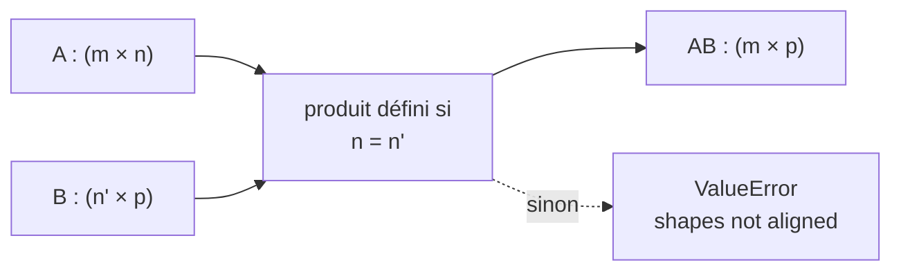
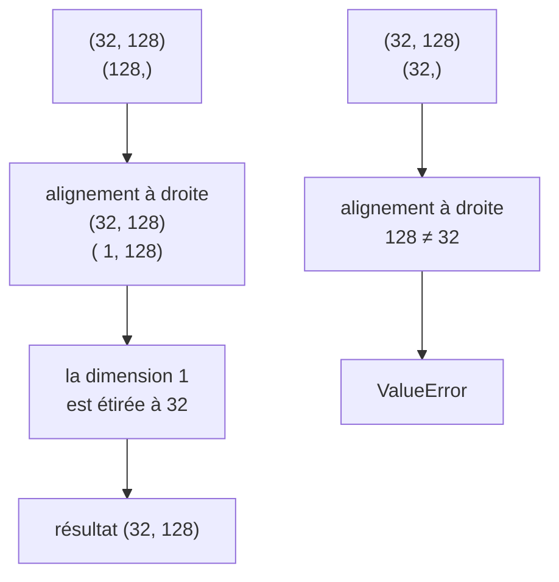
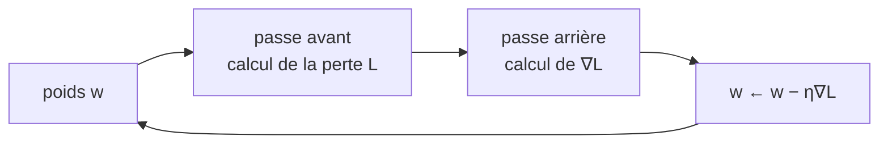

# Notions d'algèbre linéaire et de dérivation

Ce cours rassemble le strict nécessaire pour aborder [[Pytorch]] et l'apprentissage profond sans que les mathématiques deviennent un obstacle. Il ne vise pas l'exhaustivité : chaque notion y figure parce qu'elle correspond à quelque chose que l'on écrit ou que l'on débogue en pratique.

Le fil directeur tient en une phrase :

> **Un réseau de neurones est une composition de fonctions ; l'entraîner, c'est en calculer la dérivée.** L'algèbre linéaire décrit la composition, la dérivation décrit l'apprentissage.

Nous illustrons chaque notion avec [[Numpy]], puis nous indiquons ce qu'elle devient dans PyTorch.

---

# 1. Vecteurs, matrices et tenseurs

## 1.1. Une seule structure, plusieurs noms

```text
scalaire   3.14                   0 dimension    shape ()
vecteur    [1, 2, 3]              1 dimension    shape (3,)
matrice    [ [1, 2], [3, 4] ]     2 dimensions   shape (2, 2)
tenseur    tableau à n dimensions n dimensions   shape (2, 3, 4)
```

Le mot **tenseur** désigne ici simplement un tableau à un nombre quelconque de dimensions. C'est un abus de langage par rapport à la définition mathématique — un tenseur au sens propre est un objet défini par sa loi de transformation lors d'un changement de base — mais c'est l'usage établi dans le domaine, et il n'y a pas lieu de s'en offusquer.

```python
import numpy as np

image = np.zeros((3, 224, 224))        # canaux, hauteur, largeur
lot = np.zeros((32, 3, 224, 224))      # 32 images : la dimension de lot d'abord
lot.ndim, lot.shape                    # 4, (32, 3, 224, 224)
```

**La forme (`shape`) est la donnée la plus importante à garder en tête.** L'essentiel des erreurs en apprentissage profond sont des erreurs de forme, et elles se lisent dans le message d'erreur avant de se comprendre dans la théorie.

## 1.2. Les opérations élément par élément

```python
a = np.array([1, 2, 3])
b = np.array([10, 20, 30])

a + b        # [11, 22, 33]
a * b        # [10, 40, 90]   ← produit élément par élément, PAS un produit matriciel
a ** 2       # [1, 4, 9]
np.exp(a)    # exponentielle de chaque terme
```

L'opérateur `*` sur deux tableaux est le **produit de Hadamard**, terme à terme. La confusion avec le produit matriciel est la première erreur classique ; en Python, le produit matriciel s'écrit `@`.

## 1.3. Le produit scalaire

Pour deux vecteurs de même taille :

$$\mathbf{u} \cdot \mathbf{v} = \sum_{i} u_i v_i$$

```python
u = np.array([1, 2, 3])
v = np.array([4, 5, 6])
u @ v            # 32  = 1×4 + 2×5 + 3×6
```

Le produit scalaire mesure l'alignement de deux vecteurs. Normalisé, il donne le **cosinus de l'angle** entre eux :

$$\cos\theta = \frac{\mathbf{u} \cdot \mathbf{v}}{\|\mathbf{u}\| \, \|\mathbf{v}\|}$$

```python
def similarite_cosinus(u, v):
    return (u @ v) / (np.linalg.norm(u) * np.linalg.norm(v))

similarite_cosinus(np.array([1, 0]), np.array([0, 1]))   # 0.0  — orthogonaux
similarite_cosinus(np.array([1, 0]), np.array([2, 0]))   # 1.0  — même direction
```

C'est exactement la mesure employée pour comparer deux plongements dans un [[RAG]] : deux textes proches produisent des vecteurs alignés. Le produit scalaire n'est donc pas une abstraction — c'est l'opération que le moteur de recherche exécute des milliers de fois par requête.

## 1.4. Les normes

$$\|\mathbf{u}\|_1 = \sum_i |u_i| \qquad \|\mathbf{u}\|_2 = \sqrt{\sum_i u_i^2}$$

```python
np.linalg.norm(u, ord=1)     # norme L1, « distance de Manhattan »
np.linalg.norm(u)            # norme L2, distance euclidienne (défaut)
```

Les deux servent en régularisation : pénaliser $\|W\|_2$ répartit la contrainte sur tous les poids, pénaliser $\|W\|_1$ en met beaucoup à zéro exactement. C'est ce qui distingue la régression *ridge* du *lasso*, et cela découle de la forme géométrique des deux normes.

---

# 2. Le produit matriciel

## 2.1. Définition et règle de compatibilité

$$(AB)_{ij} = \sum_k A_{ik} B_{kj}$$

Le terme $(i,j)$ du produit est le produit scalaire de la **ligne $i$ de $A$** par la **colonne $j$ de $B$**. D'où la règle de compatibilité :

```text
A (m × n)  @  B (n × p)  →  AB (m × p)
                ↑     ↑
                └─────┴── ces deux dimensions doivent être égales
```



```python
A = np.arange(6).reshape(2, 3)      # (2, 3)
B = np.arange(12).reshape(3, 4)     # (3, 4)
(A @ B).shape                       # (2, 4)
(B @ A)                             # ValueError : 4 ≠ 2
```

Le produit matriciel **n'est pas commutatif** : $AB \neq BA$, et souvent l'un des deux n'est même pas défini. C'est la propriété qui surprend le plus au début, et elle a une conséquence directe : l'ordre des couches d'un réseau n'est pas une convention d'écriture, c'est le calcul lui-même.

## 2.2. Pourquoi c'est l'opération centrale

Une couche dense de réseau de neurones s'écrit :

$$Y = XW + b$$

```python
X = np.random.default_rng(0).standard_normal((32, 784))   # 32 images aplaties
W = np.random.default_rng(1).standard_normal((784, 128))  # poids de la couche
b = np.zeros(128)                                          # biais

Y = X @ W + b
Y.shape                                                    # (32, 128)
```

Lire les formes suffit à comprendre la couche : **784 entrées, 128 sorties, 32 exemples traités d'un coup**. La dimension de lot est portée par la première position et traverse le calcul sans intervenir dans le produit — c'est ce qui permet de traiter un exemple ou dix mille avec le même code.

## 2.3. La transposition

$$(A^\top)_{ij} = A_{ji}$$

```python
A.T.shape                # (3, 2) si A est (2, 3)
(A @ B).T                # égal à B.T @ A.T — l'ordre s'inverse
```

La transposition sert surtout à rendre deux formes compatibles. Elle apparaît naturellement dans la rétropropagation : si la passe avant calcule $Y = XW$, la passe arrière calcule $\frac{\partial L}{\partial X} = \frac{\partial L}{\partial Y} W^\top$. **La transposée n'est pas un artifice de calcul, c'est la forme que prend le retour de gradient.**

## 2.4. Le coût

Multiplier $(m \times n)$ par $(n \times p)$ demande $m \times n \times p$ multiplications. Pour deux matrices carrées de taille $n$, c'est $O(n^3)$ — d'où l'intérêt considérable des processeurs graphiques, dont l'architecture exécute ces produits massivement en parallèle.

```python
import timeit

M = np.random.default_rng(0).standard_normal((1000, 1000))
timeit.timeit(lambda: M @ M, number=3) / 3        # quelques dizaines de ms
```

Le même calcul écrit avec trois boucles Python imbriquées prendrait plusieurs minutes. C'est l'illustration la plus nette du principe posé dans [[Algorithmes avancés en Python]] : la vectorisation ne change pas la complexité, elle change la constante — d'un facteur mille.

---

# 3. Formes, diffusion et remodelage

## 3.1. La diffusion

Deux tableaux de formes différentes peuvent être combinés si leurs dimensions sont compatibles, comparées **de droite à gauche** : égales, ou l'une valant 1.



```python
Y = X @ W          # (32, 128)
Y + b              # b est (128,) → diffusé sur les 32 lignes : correct
Y + np.zeros(32)   # ValueError : 128 ≠ 32
Y + np.zeros((32, 1))   # correct : une valeur par exemple
```

Le second cas est l'erreur du débutant qui veut ajouter une valeur **par exemple** plutôt que par neurone. La solution consiste à rendre la forme explicite avec `[:, np.newaxis]` ou `reshape(-1, 1)`.

L'étirement est **virtuel** : rien n'est recopié en mémoire. C'est ce qui rend l'opération à la fois rapide et économe.

## 3.2. Remodeler

```python
lot = np.zeros((32, 3, 28, 28))
lot.reshape(32, -1).shape          # (32, 2352) — aplatir pour une couche dense
lot.reshape(-1).shape              # (75264,)   — tout aplatir
```

Le `-1` signifie « déduis cette dimension ». Un remodelage **conserve l'ordre des éléments et leur nombre** : il ne fait que réinterpréter le même bloc de mémoire.

À ne pas confondre avec la permutation d'axes, qui change réellement l'ordre :

```python
image = np.zeros((224, 224, 3))          # convention hauteur, largeur, canaux
image.transpose(2, 0, 1).shape           # (3, 224, 224) — convention PyTorch
```

Les deux conventions coexistent — `channels_last` côté images et TensorFlow, `channels_first` côté PyTorch — et confondre `reshape` avec `transpose` produit une image dont les pixels sont mélangés sans qu'aucune erreur ne soit levée. **C'est le bogue silencieux typique du domaine.**

---

# 4. Dérivées et gradient

## 4.1. La dérivée, taux de variation

$$f'(x) = \lim_{h \to 0} \frac{f(x+h) - f(x)}{h}$$

La dérivée répond à : *si je bouge $x$ d'un tout petit peu, de combien bouge $f(x)$, et dans quel sens ?* C'est exactement la question que pose l'entraînement d'un réseau, en remplaçant $x$ par « ce poids » et $f$ par « l'erreur ».

Les quelques dérivées à connaître :

| $f(x)$ | $f'(x)$ |
| --- | --- |
| $x^n$ | $n x^{n-1}$ |
| $e^x$ | $e^x$ |
| $\ln x$ | $1/x$ |
| $\sigma(x) = \dfrac{1}{1+e^{-x}}$ | $\sigma(x)\,(1 - \sigma(x))$ |
| $\mathrm{ReLU}(x) = \max(0, x)$ | $0$ si $x<0$, $1$ si $x>0$ |

La sigmoïde a une propriété remarquable : sa dérivée s'exprime avec elle-même, ce qui évite de la recalculer. Sa valeur maximale vaut $0{,}25$ — et c'est précisément la cause de la **disparition du gradient** dans les réseaux profonds : multiplier vingt facteurs inférieurs à un quart annule le signal. ReLU, dont la dérivée vaut 1 sur les positifs, a été adoptée pour cette seule raison.

## 4.2. Dérivées partielles et gradient

Pour une fonction de plusieurs variables, on dérive selon une variable en tenant les autres pour constantes.

$$f(x, y) = x^2 + 3xy \qquad
\frac{\partial f}{\partial x} = 2x + 3y \qquad
\frac{\partial f}{\partial y} = 3x$$

Le **gradient** rassemble toutes les dérivées partielles en un vecteur :

$$\nabla f = \left( \frac{\partial f}{\partial x},\ \frac{\partial f}{\partial y} \right)$$

Sa propriété fondamentale : **le gradient pointe dans la direction de plus forte croissance**. Pour minimiser une fonction, on se déplace donc dans la direction opposée — c'est toute la descente de gradient :

$$w \leftarrow w - \eta \, \nabla_w L$$

où $\eta$ est le taux d'apprentissage.



## 4.3. La règle de la chaîne

C'est **la** règle du domaine. Pour une composition $f(g(x))$ :

$$\frac{d}{dx} f(g(x)) = f'(g(x)) \cdot g'(x)$$

Un réseau de neurones n'est rien d'autre qu'une composition profonde :

$$L = \ell\big(f_n(\dots f_2(f_1(x)) \dots)\big)$$

La dérivée de la perte par rapport à un poids de la première couche est donc un **produit** de dérivées, calculé de la sortie vers l'entrée. C'est cela, la rétropropagation : la règle de la chaîne appliquée méthodiquement, en réutilisant les résultats intermédiaires plutôt qu'en les recalculant — exactement le principe de la programmation dynamique.

Un exemple minimal, à faire à la main :

$$L = (wx - y)^2 \qquad
\frac{\partial L}{\partial w} = 2(wx - y) \cdot x$$

```python
def perte(w, x, y):
    return (w * x - y) ** 2

def gradient(w, x, y):
    return 2 * (w * x - y) * x

w, x, y, eta = 0.0, 2.0, 6.0, 0.05
for _ in range(20):
    w -= eta * gradient(w, x, y)
print(round(w, 4), round(perte(w, x, y), 6))    # 2.9999 0.0
```

La solution exacte est $w = y/x = 3$. Vingt itérations en approchent à $10^{-4}$ — et faire tourner cette boucle à la main, une fois, vaut mieux que dix schémas.

## 4.4. La jacobienne

Lorsque la fonction va de $\mathbb{R}^n$ dans $\mathbb{R}^m$, les dérivées partielles forment une matrice $m \times n$, la **jacobienne** :

$$J_{ij} = \frac{\partial f_i}{\partial x_j}$$

La règle de la chaîne devient un produit de jacobiennes. C'est pourquoi la rétropropagation est une suite de produits matriciels : la structure du calcul de la dérivée est la même que celle du calcul direct, parcourue à l'envers et transposée.

En pratique, aucun cadriciel ne construit ces matrices : elles seraient gigantesques. Ils calculent directement le **produit d'un vecteur par la jacobienne**, ce qui donne le même résultat sans jamais l'expliciter.

---

# 5. Ce que tout cela devient dans PyTorch

## 5.1. La correspondance

| Notion mathématique | En PyTorch |
| --- | --- |
| tableau à $n$ dimensions | `torch.Tensor` |
| produit matriciel | `A @ B`, `torch.matmul` |
| transposition | `A.T`, `A.transpose(0, 1)` |
| gradient $\nabla_w L$ | `w.grad`, après `L.backward()` |
| règle de la chaîne | le moteur **Autograd** |
| descente de gradient | `optimizer.step()` |

## 5.2. Le même exemple, dérivé automatiquement

```python
import torch

w = torch.tensor([0.0], requires_grad=True)
x = torch.tensor([2.0])
y = torch.tensor([6.0])

for _ in range(20):
    perte = (w * x - y) ** 2
    perte.backward()                 # calcule ∂L/∂w et l'ajoute dans w.grad
    with torch.no_grad():
        w -= 0.05 * w.grad
    w.grad.zero_()                   # sans cela, les gradients s'accumulent

print(w.item())                      # ≈ 3.0
```

Ce programme fait exactement ce que faisait la boucle de la section 4.3 — à ceci près que la dérivée n'est plus écrite à la main. `requires_grad=True` dit à PyTorch de mémoriser les opérations subies par `w` ; `backward()` remonte ce graphe en appliquant la règle de la chaîne.

Trois points que ce petit exemple contient déjà, et qui sont les trois erreurs les plus fréquentes des débutants :

- **`w.grad.zero_()` est indispensable.** PyTorch *accumule* les gradients. L'oublier fait diverger l'apprentissage sans message d'erreur.
- **`with torch.no_grad()`** empêche la mise à jour du poids d'être elle-même enregistrée dans le graphe.
- **`.item()`** extrait une valeur Python. Conserver le tenseur pour des statistiques garde tout le graphe en mémoire, et le programme finit par saturer la mémoire vidéo.

## 5.3. La bonne façon de déboguer

> **Devant une erreur en apprentissage profond, la première chose à afficher est une forme, pas une valeur.**

```python
print(X.shape, W.shape)      # avant de chercher plus loin
```

`RuntimeError: mat1 and mat2 shapes cannot be multiplied (32x784 and 128x784)` se lit directement avec la règle de la section 2.1 : il manque une transposition, ou les dimensions de la couche ont été déclarées à l'envers. Aucune connaissance supplémentaire n'est nécessaire.

---

# 6. Exercices

**1. Formes.** Sans exécuter, donner la forme du résultat, ou dire pourquoi l'opération échoue :

```python
A = np.zeros((4, 5)); B = np.zeros((5, 3)); c = np.zeros(3); d = np.zeros(4)
A @ B          #  ?
A @ B + c      #  ?
A @ B + d      #  ?
(A @ B).T @ A  #  ?
```

**2. Dérivées à la main.** Calculer $\partial L/\partial w$ et $\partial L/\partial b$ pour $L = (wx + b - y)^2$, puis écrire la boucle de descente de gradient sans PyTorch. Vérifier qu'elle converge vers la solution exacte.

**3. Règle de la chaîne.** Pour $f(x) = \sigma(wx + b)$ avec $\sigma$ la sigmoïde, exprimer $\partial f/\partial w$. En déduire pourquoi un $|wx+b|$ grand ralentit l'apprentissage.

**4. Vérification numérique.** Comparer le gradient analytique au gradient approché $\dfrac{f(w+h) - f(w-h)}{2h}$ pour $h = 10^{-5}$. C'est le test employé pour valider une dérivée écrite à la main — et il devrait accompagner tout exercice de la question 2.

**5. Similarité.** Prendre trois vecteurs de plongement au hasard, calculer les similarités cosinus deux à deux, et vérifier que la mesure est bien comprise entre −1 et 1.

---

# 7. Pour aller plus loin

Ce cours s'arrête volontairement à ce qui sert immédiatement. Trois notions viennent ensuite, dans cet ordre d'utilité :

- **La décomposition en valeurs singulières**, qui fonde l'analyse en composantes principales et la compression de modèles ;
- **Les valeurs propres**, qui expliquent la stabilité de l'entraînement et le conditionnement d'un problème ;
- **La convexité et la matrice hessienne**, qui distinguent un minimum local d'un point selle — la vraie difficulté de l'optimisation en grande dimension.

Suites naturelles dans le coffre : [[Pytorch]], [[Les CNN et RNN]], [[Les transformers]].
