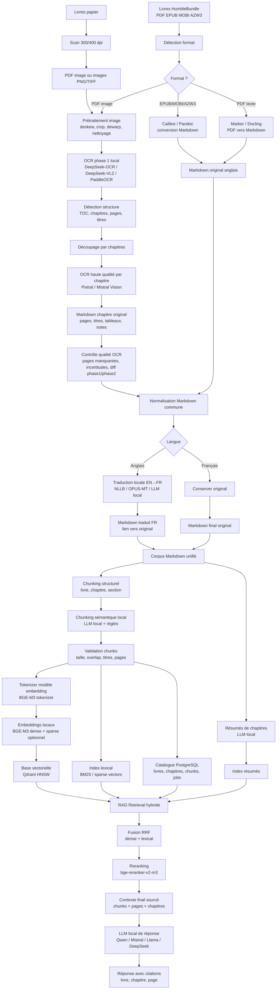

Voici une **chaîne complète de numérisation + OCR + Markdown + traduction + RAG local** adaptée à mon cas : livres papier scannés, livres numériques HumbleBundle, OCR en deux phases, Markdown consolidé, traduction locale, chunking IA, embeddings locaux et base vectorielle.

Objectif : **constituer une bibliothèque personnelle interrogeable en RAG**, avec conservation des sources, pages, chapitres, langue, version OCR et liens vers les PDF originaux. Point juridique important : pour les livres achetés, reste sur un usage personnel, ne contourne pas de DRM, ne redistribue ni les PDF ni les Markdown/traductions générées.

---

# 1. Vue d’ensemble de la chaîne

L’idée générale :

```text
Livres papier scannés
        ↓
PDF image brut
        ↓
prétraitement image
        ↓
OCR local léger / DeepSeek-OCR
        ↓
détection structure : pages, chapitres, titres
        ↓
OCR haute qualité chapitre par chapitre avec Pixtral / modèle vision Mistral
        ↓
Markdown propre par chapitre
        ↓
contrôle qualité + consolidation
        ↓
traduction locale si nécessaire
        ↓
chunking intelligent
        ↓
embeddings locaux
        ↓
index vectoriel + lexical + métadonnées
        ↓
RAG hybride
```

Pour les livres numériques HumbleBundle :

```text
PDF / EPUB / MOBI / AZW3 achetés
        ↓
conversion propre en Markdown
        ↓
normalisation
        ↓
traduction locale anglais → français
        ↓
chunking
        ↓
embeddings
        ↓
RAG commun avec les livres scannés
```

Le point essentiel : **nous ne devons pas simplement faire “PDF → texte → chunks”**. Il faut conserver la structure du livre : titre, auteur, chapitre, section, page, langue, source, version, qualité OCR, traduction éventuelle.

---

# 2. Architecture recommandée

Voici une architecture en **pipeline reproductible**, avec stockage intermédiaire à chaque étape.

```text
/data/library/
  raw/
    scanned/
    humblebundle/
  images/
    book_id/
      page_0001.png
      page_0002.png
  ocr_phase1/
    book_id/
      pages.jsonl
      toc_detected.json
  chapters/
    book_id/
      chapter_001/
        pages/
        phase1.txt
        pixtral.md
        metadata.json
  markdown/
    original/
      book_id/
        00_metadata.yaml
        01_chapter.md
        02_chapter.md
    translated_fr/
      book_id/
        00_metadata.yaml
        01_chapter.fr.md
  chunks/
    book_id.jsonl
  embeddings/
  indexes/
  rag/
```

Chaque étape doit produire des fichiers vérifiables. Sinon, dès qu’un OCR se trompe, nous ne saurons pas d’où vient l’erreur.

---

# 3. Étape 1 — Acquisition des livres papier

## Objectif

Obtenir un PDF image propre ou, mieux, une série d’images par page.

## Recommandation de scan

Pour des livres papier :

```text
résolution : 300 dpi minimum, 400 dpi si petits caractères ;
format intermédiaire : PNG ou TIFF ;
couleur : niveaux de gris souvent suffisant ;
compression : éviter JPEG trop agressif ;
une page = une image ;
nommage stable : page_0001.png, page_0002.png, etc.
```

Si nous utilisons un scanner à plat, un scanner d'entreprise (Canon Image Formula DR-G2110 qui possède une suite d'application qui permet de traiter à la volé les documents) ou un scanner de livres, l’objectif est d’éviter :

```text
pages courbées ;
ombres au centre ;
inclinaison ;
marges énormes ;
doigts visibles ;
texte coupé ;
double page mal séparée.
```

## Outils open source possibles

|Besoin|Outil|
|---|---|
|Nettoyage image|`unpaper`|
|Deskew / rotation / nettoyage|`ScanTailor Advanced`|
|Manipulation images|ImageMagick|
|PDF → images|Poppler `pdftoppm`|
|Images → PDF|img2pdf|
|OCR classique|OCRmyPDF + Tesseract|
|OCR/document parsing plus avancé|PaddleOCR, Docling, Marker|

PaddleOCR 3.0 propose notamment PP-OCRv5 pour reconnaissance multilingue, PP-StructureV3 pour parsing hiérarchique de documents, et PP-ChatOCRv4 pour extraction d’informations ; le projet est présenté comme open source et orienté OCR/document parsing. ([arXiv](https://arxiv.org/html/2507.05595v1?utm_source=chatgpt.com "PaddleOCR 3.0 Technical Report"))

---

# 4. Étape 2 — Prétraitement image

Avant l’OCR, il faut nettoyer les pages.

Pipeline conseillé :

```text
PDF brut ou images
        ↓
split pages
        ↓
rotation automatique
        ↓
deskew
        ↓
crop marges
        ↓
dewarp si livre courbé
        ↓
binarisation légère si utile
        ↓
export PNG propre
```

## Outils

```bash
pdftoppm -png -r 300 input.pdf page
```

Puis :

```bash
scantailor-cli
unpaper
magick
```

L’objectif n’est pas de rendre l’image jolie, mais de rendre le texte facilement lisible par l’OCR.

---

# 5. Étape 3 — OCR phase 1 : local, rapide, structure du livre

Tu proposes une première phase avec un **petit OCR local DeepSeek**. C’est pertinent si l’objectif n’est pas encore d’obtenir le texte final, mais de détecter :

```text
table des matières ;
titres de chapitres ;
numéros de pages ;
pages blanches ;
début / fin de chapitre ;
qualité de scan ;
zones texte ;
images ;
notes ;
index ;
bibliographie.
```

## Modèles possibles

### Option A — DeepSeek-OCR / DeepSeek-OCR-2

DeepSeek-OCR est disponible sur Hugging Face et utilisable via Transformers en pipeline `image-text-to-text`; DeepSeek-OCR-2 existe également avec le même type d’intégration. ([Hugging Face](https://huggingface.co/deepseek-ai/DeepSeek-OCR?utm_source=chatgpt.com "deepseek-ai/DeepSeek-OCR"))

Usage conseillé dans ta chaîne :

```text
DeepSeek-OCR local
        ↓
OCR rapide page par page
        ↓
détection titres / chapitres / TOC
        ↓
production d’un JSON structurel
```

### Option B — DeepSeek-VL2 Tiny/Small

DeepSeek-VL2 est un modèle vision-langage open source dont les capacités annoncées incluent OCR, compréhension de documents, tableaux, graphiques et visual grounding ; la famille comprend des variantes Tiny, Small et complète. ([Hugging Face](https://huggingface.co/deepseek-ai/deepseek-vl2?utm_source=chatgpt.com "deepseek-ai/deepseek-vl2"))

Usage conseillé :

```text
DeepSeek-VL2-Tiny ou Small
        ↓
repérer la structure logique
        ↓
ne pas lui demander l’OCR final complet
```

### Option C — PaddleOCR pour phase 1

PaddleOCR est plus classique, souvent plus rapide et plus fiable pour localiser le texte. Il est très adapté pour produire une première couche OCR et layout. ([GitHub](https://github.com/PADDLEPADDLE/PADDLEOCR?utm_source=chatgpt.com "PaddlePaddle/PaddleOCR: Turn any PDF or image ..."))

## Sortie attendue de la phase 1

Je te conseille de produire un fichier `pages.jsonl` :

```json
{"page": 1, "type": "cover", "text_sample": "...", "confidence": 0.91}
{"page": 2, "type": "toc", "text_sample": "...", "confidence": 0.88}
{"page": 15, "type": "chapter_start", "title": "Chapter 1 — Introduction", "confidence": 0.93}
{"page": 43, "type": "normal_page", "chapter": 1}
```

Puis un `toc_detected.json` :

```json
{
  "book_id": "book_001",
  "title": "Example Book",
  "chapters": [
    {
      "chapter_id": "ch_001",
      "title": "Introduction",
      "start_page": 15,
      "end_page": 42
    },
    {
      "chapter_id": "ch_002",
      "title": "Neural Networks",
      "start_page": 43,
      "end_page": 88
    }
  ]
}
```

Cette phase sert surtout à **découper correctement le livre**.

---

# 6. Étape 4 — Découpage par chapitres

À partir de `toc_detected.json`, nous créons des lots par chapitre.

```text
pages 15–42 → chapter_001
pages 43–88 → chapter_002
...
```

Chaque chapitre doit contenir :

```text
les images des pages ;
le texte OCR phase 1 ;
les métadonnées ;
les erreurs détectées ;
les bornes de pages.
```

Exemple :

```text
chapters/book_001/chapter_001/
  page_0015.png
  page_0016.png
  ...
  phase1_ocr.txt
  chapter_metadata.json
```

Pourquoi découper avant Pixtral ?

Parce que nous réduisons :

```text
le coût ;
le contexte ;
les erreurs de structure ;
les risques de mélange entre chapitres ;
les prompts trop longs.
```

---

# 7. Étape 5 — OCR haute qualité avec Pixtral

Nous voulons utiliser Pixtral pour obtenir une reconnaissance de meilleure qualité des chapitres.
Point important : la fiche officielle indique que **Pixtral Large 24.11** est un modèle multimodal avec contexte 128k, mais aussi une date de dépréciation au 27 février 2026 avec remplacement indiqué par Mistral Large 3. ([Mistral AI Documentation](https://docs.mistral.ai/models/model-cards/pixtral-large-24-11?utm_source=chatgpt.com "Pixtral Large - Mistral Docs"))

Donc nous construisons l’architecture avec un composant abstrait :

```text
HighQualityVisionOCRProvider
```

qui peut pointer vers :

```text
Pixtral si disponible ;
Mistral vision récent ;
Mistral OCR / Document AI ;
autre modèle vision propriétaire ou local.
```

Mistral documente ses capacités vision pour analyser des images et contenus visuels, et renvoie aussi vers Document AI pour le parsing documentaire/OCR. ([Mistral AI Documentation](https://docs.mistral.ai/studio-api/conversations/vision?utm_source=chatgpt.com "Vision | Mistral Docs"))

## Prompt Pixtral conseillé

Pour chaque chapitre :

```text
Nous recevons les images des pages d’un chapitre de livre.

Objectif :
- produire une transcription fidèle ;
- conserver les titres, sous-titres, notes, listes, tableaux ;
- ne pas résumer ;
- ne pas moderniser le style ;
- ne pas corriger le fond ;
- produire un Markdown propre ;
- indiquer les incertitudes OCR entre balises [OCR? ...] ;
- conserver les numéros de page sous forme de commentaires HTML.

Format :
---
chapter_title: ...
start_page: ...
end_page: ...
language: ...
ocr_model: pixtral
---

<!-- page: 15 -->

# Titre du chapitre

Texte...
```

## Sortie attendue

```markdown
---
book_id: book_001
chapter_id: ch_001
title: "Introduction"
source_type: scanned_paper
language: en
ocr_phase1_model: deepseek-ocr
ocr_phase2_model: pixtral
start_page: 15
end_page: 42
---

<!-- page: 15 -->

# Introduction

Texte du chapitre...
```

Garde les commentaires de page :

```markdown
<!-- page: 16 -->
```

C’est très utile pour citer précisément dans le RAG.

---

# 8. Étape 6 — Contrôle qualité OCR

Il faut comparer la phase 1 et la phase 2.

## Contrôles automatiques

```text
nombre de pages attendu vs pages traitées ;
détection de pages vides ;
longueur du texte par page ;
présence de titres ;
présence anormale de caractères illisibles ;
taux de lignes très courtes ;
détection de répétitions ;
comparaison phase1 / phase2 ;
vérification des numéros de page ;
vérification des chapitres manquants.
```

## Exemple de score qualité

```json
{
  "chapter_id": "ch_001",
  "pages_expected": 28,
  "pages_processed": 28,
  "avg_chars_per_page": 2140,
  "suspect_pages": [22, 23],
  "ocr_confidence": "medium",
  "needs_review": true
}
```

## Stockage des incertitudes

Dans le Markdown :

```markdown
Le modèle introduit une notion de [OCR? réticularité/régularité] dans le chapitre.
```

Il ne faut pas masquer les incertitudes.

---

# 9. Étape 7 — Conversion des livres HumbleBundle

Nous avons environ **62 Go / 3480 livres**. C’est un gros corpus, mais pas délirant pour un RAG local si l’indexation est bien faite.

Les formats probables :

```text
PDF ;
EPUB ;
MOBI ;
AZW3 ;
CBZ/CBR éventuellement ;
fichiers annexes.
```

## Outils open source

| Format                     | Outil recommandé                  |
| -------------------------- | --------------------------------- |
| EPUB → Markdown            | Pandoc                            |
| EPUB/MOBI/AZW3 → EPUB/HTML | Calibre `ebook-convert`           |
| PDF texte → Markdown       | Marker ou Docling                 |
| PDF complexe               | Docling, Marker, PaddleOCR        |
| Images/scans               | OCRmyPDF, PaddleOCR, DeepSeek-OCR |

Marker convertit notamment PDF, images, PPTX, DOCX, XLSX, HTML et EPUB vers Markdown/JSON/chunks/HTML, avec extraction d’images, tables, équations, code blocks et possibilité d’augmenter la précision avec des LLMs. ([GitHub](https://github.com/datalab-to/marker?utm_source=chatgpt.com "datalab-to/marker: Convert PDF to markdown + JSON ..."))

Docling est un outil open source orienté préparation de documents pour l’IA générative ; il gère notamment parsing de documents, PDF avancés, tables, formules, ordre de lecture, OCR et export structuré. ([GitHub](https://github.com/docling-project/docling?utm_source=chatgpt.com "docling-project/docling: Get your documents ready for gen AI"))

## Pipeline recommandé pour HumbleBundle

```text
fichier original
        ↓
détection format
        ↓
si EPUB/MOBI/AZW3 : Calibre/Pandoc
        ↓
si PDF texte : Marker ou Docling
        ↓
si PDF image : OCR pipeline
        ↓
Markdown original anglais
        ↓
normalisation métadonnées
```

## Métadonnées à extraire

```yaml
book_id: humble_000123
title: "..."
author: "..."
publisher: "..."
year: 2021
source: humblebundle
source_format: epub
language_original: en
license_scope: personal_use
conversion_tool: pandoc
```

---

# 10. Étape 8 — Traduction locale anglais → français

Nous voulons traduire les livres anglais via modèle local.

Nous conseillons de **conserver deux versions** :

```text
Markdown original anglais ;
Markdown traduit français.
```

Ne remplaçons jamais l’original.

## Pourquoi conserver les deux ?

Parce que :

```text
la traduction peut contenir des erreurs ;
certains termes techniques sont meilleurs en anglais ;
le RAG peut interroger les deux langues ;
les citations doivent pouvoir revenir à l’original ;
les embeddings multilingues peuvent fonctionner sans tout traduire.
```

## Modèles open source de traduction

### Option A — NLLB-200

NLLB est un modèle multilingue de traduction supportant plus de 200 langues ; le checkpoint `nllb-200-distilled-600M` est destiné à la traduction automatique et disponible sur Hugging Face. ([Hugging Face](https://huggingface.co/docs/transformers/en/model_doc/nllb?utm_source=chatgpt.com "NLLB"))

Recommandation :

```text
NLLB-200 distilled 600M
→ rapide, léger, qualité correcte

NLLB-200 1.3B ou 3.3B
→ meilleure qualité, plus lourd
```

Pour ton volume, je ferais :

```text
1er passage : NLLB distilled 600M via CTranslate2
contrôle qualité sur échantillon
si livre important : retraduction avec modèle plus gros
```

### Option B — Marian / OPUS-MT

Plus léger, très pratique, mais généralement moins bon que NLLB sur corpus variés.

### Option C — LLM local instruct

Exemples possibles :

```text
Qwen2.5 / Qwen3 ;
Mistral local ;
Llama ;
DeepSeek local ;
Aya / Command-R open weights selon disponibilité/licence.
```

Mais pour de la traduction massive, un modèle spécialisé type NLLB est souvent plus stable et plus économique.

## Stratégie de traduction

Ne traduisons pas chunk par chunk RAG final. Traduisons plutôt par blocs éditoriaux :

```text
chapitre
  ↓
sections
  ↓
paragraphes
```

Il faut éviter de casser les phrases.

Sortie :

```markdown
---
book_id: humble_000123
chapter_id: ch_004
language_original: en
language: fr
translation_model: nllb-200-distilled-600M
translation_status: automatic_unreviewed
source_markdown: ../original/ch_004.md
---

# Titre traduit

Texte traduit...
```

## Glossaire technique

Pour les livres d’informatique, ajoutons un glossaire de non-traduction :

```text
kernel ;
thread ;
scheduler ;
embedding ;
retrieval ;
chunk ;
hash ;
runtime ;
framework ;
prompt ;
fine-tuning ;
backpropagation.
```

Tu peux décider :

```text
traduire certains termes ;
garder certains termes anglais ;
mettre la première occurrence en bilingue.
```

Exemple :

```text
retrieval, ou récupération documentaire
```

---

# 11. Étape 9 — Normalisation Markdown

Tous les livres doivent finir dans un format Markdown commun.

## Format conseillé

```markdown
---
book_id: ...
title: ...
author: ...
source: scanned_paper | humblebundle
language: en | fr
original_language: en
chapter_id: ...
chapter_title: ...
start_page: ...
end_page: ...
conversion_tool: ...
ocr_model: ...
translation_model: ...
---

<!-- page: 123 -->

# Chapitre 4 — Les réseaux de neurones

## 4.1 Introduction

Texte...
```

## Règles de normalisation

```text
un fichier Markdown par chapitre ;
YAML front matter obligatoire ;
titres hiérarchiques propres ;
pages conservées en commentaires HTML ;
tableaux en Markdown ;
figures décrites ;
notes conservées ;
pas de lignes coupées artificiellement ;
pas d’en-têtes/pieds de page répétitifs ;
encodage UTF-8 ;
liens vers PDF original.
```

---

# 12. Étape 10 — Chunking par IA locale

Nous recommandons un système hybride pour créer des chunks :

```text
chunking déterministe structurel
+
chunking sémantique local
+
validation par règles
```

## Pourquoi pas uniquement LLM ?

Parce qu’un LLM peut :

```text
couper de manière instable ;
oublier des morceaux ;
résumer au lieu de découper ;
fusionner des sections ;
changer le texte.
```

## Stratégie recommandée

### Niveau 1 — découpage structurel

```text
livre → chapitre → section → sous-section
```

À partir des titres Markdown.

### Niveau 2 — découpage sémantique

Dans une section trop longue, le modèle local propose des frontières.

Prompt local :

```text
Découpe ce texte en blocs sémantiques cohérents.
Ne reformule pas.
Ne résume pas.
Retourne uniquement les bornes de découpage.
Chaque chunk doit être compréhensible seul.
Taille cible : 500 à 900 tokens.
Overlap logique : 80 à 120 tokens si nécessaire.
```

### Niveau 3 — validation

Règles :

```text
chunk min : 150 tokens ;
chunk cible : 500–900 tokens ;
chunk max : 1200 tokens ;
ne pas couper une liste ;
ne pas couper un tableau ;
ne pas séparer un titre de son contenu ;
répéter le chemin hiérarchique dans les métadonnées.
```

## Métadonnées de chunk

Chaque chunk doit avoir :

```json
{
  "chunk_id": "book_001_ch_003_sec_02_chunk_004",
  "book_id": "book_001",
  "title": "...",
  "author": "...",
  "chapter": "Chapitre 3",
  "section_path": ["Chapitre 3", "3.2 Transformers", "Attention"],
  "language": "fr",
  "original_language": "en",
  "source_type": "humblebundle",
  "page_start": 123,
  "page_end": 126,
  "text": "...",
  "markdown_path": "...",
  "pdf_path": "...",
  "translation_status": "automatic_unreviewed"
}
```

---

# 13. Tokenizer

Le tokenizer sert à compter proprement les tokens pour :

```text
chunking ;
limites de contexte ;
coût ;
embeddings ;
reranking ;
prompts.
```

## Recommandation

Pour un système local multilingue, je séparerais :

```text
tokenizer de chunking logique ;
tokenizer du modèle d’embedding ;
tokenizer du LLM génératif.
```

### Pour le chunking

Utilise le tokenizer Hugging Face du modèle d’embedding choisi.

Si tu choisis BGE-M3 :

```python
AutoTokenizer.from_pretrained("BAAI/bge-m3")
```

BGE-M3 est basé sur XLM-RoBERTa selon sa fiche Ollama/HF, et il est conçu pour le multilingue et la multi-granularité. ([Ollama](https://ollama.com/library/bge-m3?utm_source=chatgpt.com "bge-m3"))

### Pourquoi éviter un compteur approximatif ?

Parce que :

```text
500 mots ≠ 500 tokens ;
français et anglais ne tokenisent pas pareil ;
code, tableaux et formules changent le comptage ;
le modèle d’embedding a sa propre limite.
```

## Paramètres recommandés

```text
chunk cible : 600–900 tokens ;
overlap : 80–120 tokens ;
chunk max : 1200 tokens ;
sections courtes : ne pas découper ;
tableaux : chunk par bloc logique ;
code : chunk par fonction/classe.
```

---

# 14. Générateur d’embeddings

Pour notre cas, il faut un modèle :

```text
multilingue anglais/français ;
bon sur documents longs ;
bon en retrieval ;
utilisable localement ;
compatible recherche dense + éventuellement sparse.
```

## Recommandation principale — BGE-M3

BGE-M3 est un très bon choix pour ton corpus parce qu’il est décrit comme multi-fonctionnel, multilingue et multi-granularité ; sa documentation indique qu’il supporte dense retrieval, lexical matching et multi-vector interaction. ([Hugging Face](https://huggingface.co/BAAI/bge-m3?utm_source=chatgpt.com "BAAI/bge-m3"))

Pourquoi c’est adapté :

```text
anglais + français ;
livres techniques ;
recherche dense ;
possibilité sparse / lexical matching ;
documents de tailles variées ;
bon candidat pour RAG local.
```

### Sorties possibles de BGE-M3

```text
dense vector ;
sparse vector ;
multi-vector / ColBERT-like.
```

Architecture recommandée :

```text
BGE-M3 dense embeddings
+
BM25 ou sparse BGE-M3
+
reranker BGE
```

## Alternatives open source

|Modèle|Usage|
|---|---|
|BGE-M3|choix principal multilingue|
|multilingual-e5-large|très bon multilingue|
|intfloat/e5-large-v2|anglais principalement|
|jina-embeddings-v3|bon multilingue selon cas/licence à vérifier|
|nomic-embed-text|intéressant localement|
|sentence-transformers all-MiniLM|rapide mais moins bon|

---

# 15. Base vectorielle

## Recommandation principale — Qdrant

Qdrant est open source, écrit en Rust, orienté recherche vectorielle et recherche sémantique ; sa documentation met aussi en avant la recherche hybride avec vecteurs denses et sparse/BM25, ainsi que la fusion RRF. ([Qdrant](https://qdrant.tech/?utm_source=chatgpt.com "Qdrant - Vector Search Engine"))

Pourquoi Qdrant est adapté :

```text
déploiement Docker simple ;
collections avec métadonnées ;
filtrage puissant ;
HNSW ;
recherche dense ;
support hybrid search ;
payloads JSON ;
scalable ;
bon écosystème Python.
```

## Alternative

|Base|Avantage|
|---|---|
|Qdrant|recommandée ici|
|Milvus|très scalable, plus lourd|
|Weaviate|riche, mais plus opinionated|
|PostgreSQL + pgvector|simple si tu veux rester SQL|
|OpenSearch / Elasticsearch|excellent BM25, vectoriel aussi|
|LanceDB|local simple|
|Chroma|simple pour prototype|

Pour 3480 livres, je choisirais :

```text
Qdrant pour vecteurs + métadonnées
+
OpenSearch ou Tantivy pour BM25
```

ou bien :

```text
Qdrant seul avec dense + sparse si tu veux simplifier.
```

---

# 16. Algorithme de recherche sémantique

## Recherche dense

La recherche dense fonctionne ainsi :

```text
question
   ↓
embedding BGE-M3
   ↓
recherche Approximate Nearest Neighbors
   ↓
top-k chunks proches
```

Dans Qdrant, l’indexation vectorielle repose typiquement sur HNSW pour la recherche approximative des plus proches voisins.

## Recherche lexicale

Pour les termes exacts :

```text
noms d’auteurs ;
titres ;
concepts exacts ;
acronymes ;
code ;
formules ;
références ;
noms propres.
```

Utilise :

```text
BM25
```

## Recherche hybride

Pipeline recommandé :

```text
requête utilisateur
        ↓
query rewriting optionnel
        ↓
recherche dense BGE-M3
        ↓
recherche BM25 / sparse
        ↓
fusion RRF
        ↓
reranking
        ↓
top chunks finaux
```

Qdrant documente l’usage de recherche hybride dense + sparse avec Reciprocal Rank Fusion pour combiner les résultats. ([Qdrant](https://qdrant.tech/documentation/tutorials-basics/cloud-inference-hybrid-search/?utm_source=chatgpt.com "Hybrid Search Using Qdrant Cloud Inference"))

## Reranker

Utilise :

```text
BAAI/bge-reranker-v2-m3
```

Ce modèle est indiqué comme reranker multilingue léger et facile à déployer. ([Hugging Face](https://huggingface.co/BAAI/bge-reranker-v2-m3?utm_source=chatgpt.com "BAAI/bge-reranker-v2-m3"))

Pipeline :

```text
top 80 candidats hybrid search
        ↓
bge-reranker-v2-m3
        ↓
top 8 à 12 chunks
        ↓
LLM de réponse
```

---

# 17. Moteur RAG final

## Composants

```text
API FastAPI
Qdrant
OpenSearch ou Tantivy/BM25
serveur d’embedding local
serveur reranker local
LLM local pour réponse
stockage Markdown
stockage PDF originaux
PostgreSQL pour catalogue et jobs
MinIO pour fichiers si besoin
```

## LLM génératif local

Pour répondre aux questions :

```text
Qwen2.5 / Qwen3 Instruct
Mistral / Mixtral local
Llama 3.x / 4 open weight selon disponibilité/licence
DeepSeek local
```

Utilisation :

```text
réponse finale ;
query rewriting ;
chunking assisté ;
résumé de chapitre ;
classification de question ;
contrôle qualité.
```

## Frameworks open source possibles

|Besoin|Outil|
|---|---|
|Orchestration RAG|LlamaIndex|
|Orchestration plus manuelle|LangChain / LangGraph|
|API|FastAPI|
|Jobs|Celery / Dramatiq / Prefect|
|Catalogue|PostgreSQL|
|Fichiers|filesystem ou MinIO|
|Monitoring|Prometheus + Grafana|
|Logs|Loki / OpenSearch|
|LLM local|vLLM, llama.cpp, Ollama|

---

# 18. Stratégie d’indexation recommandée

Je créerais plusieurs collections/index.

## Collection 1 — chunks originaux

```text
books_original
```

Contient :

```text
anglais original ;
français OCR original ;
livres papier OCR ;
livres HumbleBundle convertis.
```

## Collection 2 — traductions françaises

```text
books_translated_fr
```

Contient :

```text
traductions automatiques ;
statut de traduction ;
lien vers original.
```

## Collection 3 — résumés de chapitres

```text
chapter_summaries
```

Contient :

```text
résumé court ;
résumé détaillé ;
concepts clés ;
mots-clés ;
liens vers chunks.
```

## Collection 4 — entités / graphe optionnel

```text
knowledge_graph
```

Pour :

```text
auteurs ;
concepts ;
livres ;
chapitres ;
technologies ;
relations conceptuelles.
```

---

# 19. Faut-il tout traduire avant embeddings ?

Tu as deux stratégies possibles.

## Stratégie A — tout traduire en français puis indexer

Avantage :

```text
réponses françaises plus homogènes ;
recherche utilisateur en français meilleure ;
corpus unifié.
```

Limite :

```text
coût énorme ;
erreurs de traduction ;
perte de termes techniques ;
temps de calcul important.
```

## Stratégie B — index multilingue original + traduction à la demande

Avantage :

```text
plus rapide à mettre en place ;
conserve l’original ;
BGE-M3 gère le multilingue ;
moins de stockage ;
moins d’erreurs de traduction systématiques.
```

Limite :

```text
réponse française parfois dépendante d’une source anglaise ;
besoin de traduire les extraits au moment de répondre.
```

## Recommandation

Pour 3480 livres, je ferais en deux temps :

```text
Phase 1 :
indexer les originaux anglais + OCR français avec BGE-M3 multilingue.

Phase 2 :
traduire progressivement les livres les plus utiles.

Phase 3 :
indexer aussi les traductions françaises, avec lien vers original.
```

Tu évites ainsi de lancer une traduction massive de 62 Go avant même d’avoir un RAG utile.

---

# 20. Déduplication et catalogue

Avec 3480 livres, il faut un catalogue central.

## PostgreSQL

Tables :

```text
books
chapters
files
ocr_jobs
translation_jobs
chunks
embedding_jobs
quality_reports
```

## Exemple `books`

```sql
book_id
title
author
source
original_format
language
path_original
path_markdown_original
path_markdown_fr
status
created_at
updated_at
```

## Déduplication

Calculer :

```text
hash du fichier original ;
hash du texte normalisé ;
ISBN si disponible ;
titre + auteur ;
similarité de métadonnées.
```

---

# 21. Diagramme Mermaid complet



---

# 22. Stack concrète recommandée

## Version robuste et locale

|Maillon|Choix recommandé|
|---|---|
|Prétraitement scan|ScanTailor Advanced, unpaper, ImageMagick|
|PDF → images|Poppler|
|OCR phase 1|DeepSeek-OCR ou PaddleOCR|
|Détection layout|PaddleOCR PP-StructureV3 / Docling|
|OCR haute qualité|Pixtral / Mistral Vision|
|PDF/EPUB → Markdown|Marker, Docling, Pandoc, Calibre|
|Traduction locale|NLLB-200 distilled 600M puis 1.3B/3.3B pour qualité|
|Chunking IA|Qwen local / Mistral local + règles|
|Tokenizer|tokenizer BGE-M3 via Transformers|
|Embeddings|BAAI/bge-m3|
|Sparse/BM25|Qdrant sparse ou OpenSearch/Tantivy|
|Vector DB|Qdrant|
|Fusion|Reciprocal Rank Fusion|
|Reranking|BAAI/bge-reranker-v2-m3|
|Génération finale|Qwen / Mistral / Llama / DeepSeek local|
|Orchestration|FastAPI + Celery/Prefect|
|Catalogue|PostgreSQL|
|Fichiers|filesystem ou MinIO|
|Monitoring|Prometheus + Grafana|

---

# 23. Recherche sémantique : algorithme complet

Quand l’utilisateur pose une question :

```text
Explique-moi la différence entre attention et convolution dans les livres d’IA.
```

Pipeline :

```text
1. Détection langue de la question.
2. Query rewriting local :
   "différence attention mécanisme transformer convolution CNN"
3. Embedding dense BGE-M3.
4. Recherche vectorielle Qdrant top 100.
5. Recherche BM25 top 100.
6. Fusion RRF.
7. Filtrage métadonnées :
   langue, domaine, source, livre, auteur si demandé.
8. Reranking bge-reranker-v2-m3 top 12.
9. Diversification :
   éviter 12 chunks du même chapitre.
10. Construction contexte :
   extraits originaux + traductions si disponibles.
11. Réponse LLM local.
12. Citations :
   livre, chapitre, page, langue, source markdown.
```

---

# 24. Gestion des citations

Chaque chunk doit pouvoir citer :

```text
titre du livre ;
auteur ;
chapitre ;
section ;
page ;
fichier Markdown ;
PDF original ;
langue ;
traduction ou original.
```

Exemple de réponse RAG :

```text
Dans les ouvrages indexés, l’attention est présentée comme un mécanisme de pondération dynamique entre tokens, tandis que la convolution repose sur des filtres locaux appliqués sur des voisinages fixes.

Sources :
- Livre X, chapitre 4, pages 112–115.
- Livre Y, chapitre 8, section “Self-Attention”.
```

Pour les traductions :

```text
Source utilisée : traduction automatique française.
Original : anglais, chapitre 4, page 112.
```

---

# 25. Ordre de mise en œuvre conseillé

Ne commence pas par tout faire.

## Phase 1 — Prototype sur 10 livres

```text
5 livres scannés ;
5 livres HumbleBundle ;
conversion Markdown ;
BGE-M3 ;
Qdrant ;
RAG simple.
```

Objectif :

```text
valider la structure ;
valider les citations ;
tester la qualité OCR ;
tester la recherche français ↔ anglais.
```

## Phase 2 — OCR complet livres papier

```text
pipeline DeepSeek/PaddleOCR phase 1 ;
découpage chapitres ;
Pixtral phase 2 ;
Markdown propre.
```

## Phase 3 — HumbleBundle massif

```text
conversion par lots ;
catalogue PostgreSQL ;
jobs parallèles ;
déduplication ;
indexation progressive.
```

## Phase 4 — Traduction progressive

```text
traduire seulement les livres/chaptitres consultés ;
prioriser par usage ;
traduire les résumés d’abord ;
traduire intégralement ensuite si nécessaire.
```

## Phase 5 — RAG avancé

```text
hybrid search ;
reranking ;
résumés de chapitres ;
Graph RAG conceptuel ;
interface web ;
feedback utilisateur.
```

---

# 26. Ce que je ferais à ta place

Je ne traduirais pas immédiatement les 3480 livres.

Je ferais plutôt :

```text
1. Conversion Markdown originale de tous les livres.
2. Index multilingue BGE-M3 sur originaux.
3. Génération de résumés français par chapitre.
4. Traduction complète uniquement des livres les plus utiles.
5. RAG hybride sur originaux + résumés + traductions.
```

Pourquoi ?

Parce que BGE-M3 est multilingue, donc tu peux déjà poser des questions en français sur des textes anglais. La traduction complète de 62 Go risque d’être longue, coûteuse et imparfaite. Il vaut mieux traduire progressivement selon l’usage.

La chaîne la plus efficace serait donc :

```text
Tout convertir en Markdown
→ tout indexer en multilingue
→ résumer en français
→ traduire à la demande
→ indexer les traductions validées
```

C’est plus pragmatique et beaucoup plus rapide à rendre utile.