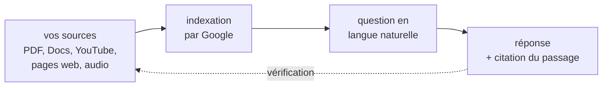

# NotebookLM

**NotebookLM** — renommé **Gemini Notebook** en juillet 2026, mais toujours connu sous son nom d'origine — est un outil de Google qui inverse la logique habituelle des assistants conversationnels : au lieu de répondre depuis sa mémoire d'entraînement, il ne travaille **que** sur les documents qu'on lui fournit, et cite le passage exact qui fonde chaque affirmation.

C'est, en termes techniques, un [[RAG]] géré : un système de recherche augmentée par génération dont on n'a ni à choisir le découpage, ni le modèle de plongement, ni la base vectorielle.

## Le principe : l'ancrage documentaire

La différence avec un assistant généraliste tient en une phrase :

> **S'il manque une information dans vos documents, l'outil ne l'invente pas — il dit qu'il ne l'a pas.**

C'est sa force et sa limite. La force : chaque affirmation est traçable jusqu'au passage source, ce qui réduit fortement le risque d'affirmation fabriquée. La limite : il ne complète jamais un corpus lacunaire avec ce qu'il sait par ailleurs, et il ne va pas chercher sur le web à moins qu'on ne lui donne explicitement une page comme source.

## Les formats de restitution

Neuf outils de génération sont disponibles à partir d'un même corpus. Trois méritent d'être connus.

**Le résumé audio** (*Audio Overview*) engendre une conversation entre deux voix de synthèse discutant du corpus. Disponible en français depuis avril 2025 et dans plus de quatre-vingts langues depuis septembre 2025, il propose quatre formats :

| Format | Durée | Usage |
| --- | --- | --- |
| *Deep Dive* | 15 à 20 min | parcours exhaustif du corpus |
| *Brief* | moins de 4 min | l'essentiel |
| *Critique* | variable | les deux voix pointent les limites du corpus |
| *Debate* | variable | les deux voix prennent des positions opposées |

Les deux derniers sont les plus intéressants pour un usage universitaire : ils font ce qu'un résumé ne fait pas, c'est-à-dire chercher les failles.

**La carte mentale** produit une arborescence des concepts du corpus, exportable.

**Les outils d'étude** engendrent guides de révision, questionnaires et cartes mémoire à partir des sources — utiles pour préparer un contrôle, à condition de relire ce qui est produit.

Depuis juillet 2026 s'ajoute l'**exécution de code**, qui permet des analyses de données sur les sources fournies.

## Les quotas

Vérifiés en août 2026, et explicitement susceptibles d'évoluer :

| Plan | Sources par carnet | Discussions / jour |
| --- | ---: | ---: |
| Sans frais | 50 | 50 |
| Plus | 100 | — |
| Pro | 300 | — |
| Ultra | 500 à 600 | jusqu'à 5 000 |

Le plafond par source est le même sur tous les plans grand public : **500 000 mots ou 200 Mo**. Les quotas journaliers se réinitialisent après vingt-quatre heures ; les plafonds de capacité, eux, ne se réinitialisent pas.

## Les limites structurelles

Elles ne se lèvent pas en payant, et c'est ce qu'il faut retenir avant d'y bâtir une méthode de travail.

**Les carnets sont des silos.** Aucune mémoire ni recherche transversale entre carnets : un projet ne peut pas interroger le corpus d'un autre. Passer à un plan supérieur augmente les quotas, cela ne fusionne pas les carnets.

**L'export est incomplet.** Ce qui est produit s'exporte au coup par coup ; il n'existe pas de synchronisation continue vers un système extérieur.

**Le corpus doit être borné.** L'outil est conçu pour un ensemble de sources fini et cohérent — un dossier de recherche, un corpus réglementaire, les documents d'un projet. Il n'est pas une base de connaissances qui grandit indéfiniment.

**La qualité de sortie suit la qualité des sources.** Un corpus désorganisé ou lacunaire produit des synthèses désorganisées ou lacunaires. L'ancrage garantit la traçabilité, pas la pertinence.

## Confidentialité et cadre juridique

Le point décisif pour un usage professionnel : **le compte utilisé change le régime applicable**.

Un compte personnel gratuit ne donne pas les garanties d'un compte d'organisation. Pour des documents contenant des données de clients, d'étudiants ou de patients, il faut passer par un compte Google Workspace de l'établissement, où Google indique que les téléversements ne sont ni relus ni utilisés pour l'entraînement.

**NotebookLM Enterprise**, hébergé dans Google Cloud, ajoute le choix de la région d'hébergement, les contrôles IAM et le périmètre de service VPC — les éléments qu'exige une analyse d'impact au titre du RGPD. Voir [[Règlement Général sur la Protection des Données (RGPD)]].

Un système d'analyse documentaire employé dans un contexte de recrutement, d'évaluation ou d'accès à un droit relève par ailleurs des obligations du règlement européen sur l'IA. Le fait que l'outil cite ses sources aide pour l'exigence d'explicabilité, mais ne dispense d'aucune des autres.

## Quand l'utiliser, et quand ne pas

**Il convient bien** à un corpus fermé qu'il faut interroger et citer fidèlement : dossier de recherche, appel d'offres, corpus réglementaire, préparation d'un cours à partir d'articles, revue de littérature. Le format *Critique* est particulièrement utile pour éprouver un corpus avant de s'en servir.

**Il convient mal** à la veille — il n'a pas accès au web —, à la production de contenu original, à un système documentaire qui grandit sans cesse et traverse les projets, et à tout ce qui doit rester hors d'un service tiers.

## Rapport avec un OSIA local

Il est intéressant de le situer par rapport à ce que construit le cours [[Obsidian OSIA Construire son système d'exploitation personnel augmenté par l'IA]].

| | NotebookLM | Un RAG sur coffre local |
| --- | --- | --- |
| Mise en place | immédiate | à construire |
| Découpage, plongements | imposés | choisis et ajustables |
| Périmètre | un carnet, borné | tout le coffre, filtrable |
| Filtrage par confidentialité | par carnet | par métadonnée, note par note |
| Souveraineté | données chez Google | données chez soi |
| Coût | forfait ou gratuit | matériel et temps |

Les deux ne s'opposent pas. NotebookLM est excellent pour interroger un corpus **fermé et déjà constitué** — les vingt articles d'une revue de littérature. Un OSIA local est fait pour une base **ouverte, croissante et hétérogène**, dont certaines parties ne peuvent pas sortir. Le second exige d'écrire ce que le premier fournit gratuitement, en échange de quoi il ne dépend de personne.
