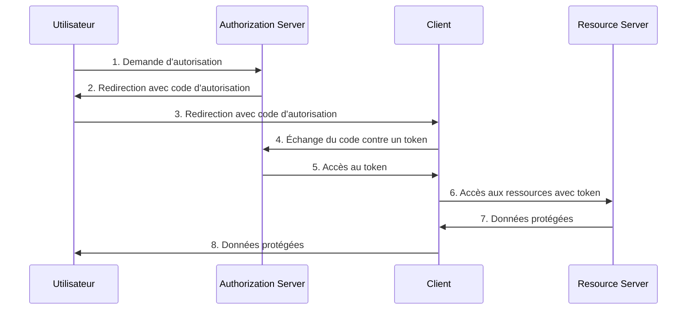
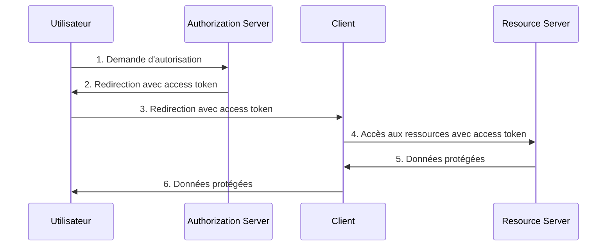
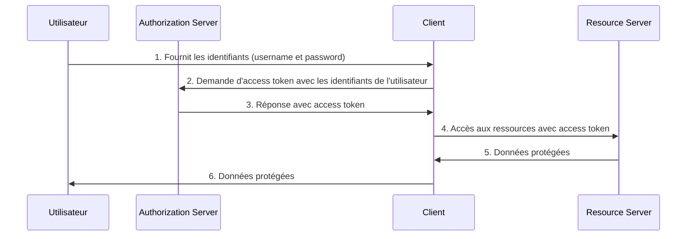
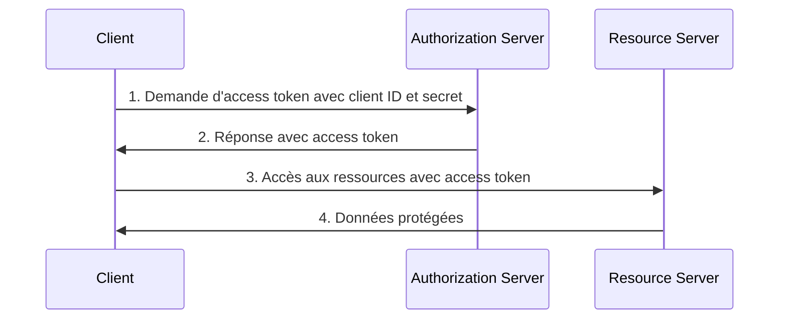

#Expérimentation #Informatique 
# Introduction

## Présentation des objectifs du cours

Dans ce cours, nous avons pour objectif de comprendre et maîtriser les concepts d'authentification et d'autorisation dans le contexte des applications modernes. Plus précisément, nous allons :

1. Découvrir les principes fondamentaux de OAuth et OpenID Connect.
2. Explorer l'utilisation de Keycloak en tant que serveur d'autorisation.
3. Apprendre à intégrer Keycloak dans une application Python Pyramid.
4. Comprendre et manipuler les JSON Web Tokens (JWT) pour sécuriser les échanges.

Au terme de ce cours, nous serons en mesure de mettre en œuvre une solution d'authentification robuste et de gérer les permissions au sein d'une application web.

## Importance de l'authentification et de l'autorisation dans les applications modernes

L'authentification et l'autorisation sont des éléments cruciaux pour assurer la sécurité et la confidentialité des données dans les applications modernes. En effet, elles permettent de :

1. Vérifier l'identité des utilisateurs et garantir que seuls les utilisateurs légitimes accèdent aux ressources.
2. Restreindre l'accès aux fonctionnalités et aux données en fonction des rôles et des permissions attribués aux utilisateurs.
3. Protéger les données sensibles contre les accès non autorisés et les attaques potentielles.
4. Assurer la conformité avec les réglementations en matière de protection des données, telles que le RGPD (Règlement Général sur la Protection des Données).

En maîtrisant ces concepts, nous serons capables de concevoir des applications sécurisées, offrant une expérience utilisateur fluide tout en protégeant efficacement les données et les ressources.

# 1. Concepts de Base

## 1.1. Introduction à l'authentification et à l'autorisation

### 1.1.1. Définitions

**Authentification** : L'authentification est le processus par lequel un système vérifie l'identité d'un utilisateur ou d'un dispositif. Elle permet de s'assurer que l'utilisateur est bien celui qu'il prétend être. Les méthodes courantes d'authentification incluent l'utilisation de mots de passe, de jetons (tokens), de certificats numériques, de biométrie (empreintes digitales, reconnaissance faciale), etc.

**Autorisation** : L'autorisation, quant à elle, est le processus qui détermine les droits et les permissions d'un utilisateur authentifié au sein d'un système. Une fois l'utilisateur authentifié, le système vérifie quelles actions il est autorisé à effectuer et quelles ressources il peut accéder. L'autorisation est souvent gérée par des rôles et des permissions attribués aux utilisateurs.

### 1.1.2. Différences entre authentification et autorisation

Bien que les termes authentification et autorisation soient souvent utilisés de manière interchangeable, ils désignent des concepts distincts :

1. **Ordre des processus** :
   - L'authentification est toujours réalisée en premier. Le système doit d'abord confirmer l'identité de l'utilisateur avant de pouvoir décider de ses droits.
   - L'autorisation se produit après l'authentification. Une fois que l'identité de l'utilisateur est confirmée, le système évalue les permissions attribuées à cet utilisateur.

2. **Objectif** :
   - L'objectif de l'authentification est de s'assurer que l'utilisateur est bien celui qu'il prétend être.
   - L'objectif de l'autorisation est de déterminer ce que l'utilisateur est autorisé à faire après avoir été authentifié.

3. **Exemples** :
   - Authentification : Lorsqu'un utilisateur se connecte à un site web avec son nom d'utilisateur et son mot de passe.
   - Autorisation : Une fois connecté, l'utilisateur peut accéder à certaines pages et fonctionnalités en fonction de son rôle (par exemple, utilisateur standard vs administrateur).

En résumé, l'authentification et l'autorisation sont deux processus complémentaires qui jouent un rôle crucial dans la sécurité des systèmes informatiques. Tandis que l'authentification se concentre sur la vérification de l'identité, l'autorisation gère les droits et les accès au sein du système.
## 1.2. Présentation de OAuth

### 1.2.1. Historique et évolution de OAuth

OAuth, qui signifie "Open Authorization," est un standard ouvert d'autorisation utilisé pour fournir un accès délégué sécurisé. OAuth a été créé pour répondre aux besoins de sécurité des applications modernes tout en permettant un partage des ressources plus flexible. Voici un aperçu de son évolution :

- **OAuth 1.0** : La première version d'OAuth a été publiée en 2007. OAuth 1.0 offrait un protocole pour la délégation d'accès utilisant des signatures cryptographiques pour la sécurité. Cependant, sa complexité et ses problèmes de sécurité ont conduit à l'élaboration d'une version améliorée.

- **OAuth 2.0** : Publiée en 2012, OAuth 2.0 simplifie le processus de délégation d'accès en utilisant des jetons (tokens) et en éliminant les signatures cryptographiques complexes. OAuth 2.0 est devenu rapidement le standard de facto pour l'autorisation dans les applications web, mobiles et d'API. Il est plus flexible et extensible que son prédécesseur, permettant une intégration plus facile avec d'autres protocoles de sécurité tels que OpenID Connect.

### 1.2.2. Les principaux acteurs de OAuth

OAuth implique plusieurs acteurs clés qui interagissent pour permettre un accès sécurisé aux ressources :

- **Resource Owner (Propriétaire de la Ressource)** : L'utilisateur qui possède les données ou les ressources à protéger. Par exemple, un utilisateur d'un réseau social qui souhaite partager ses photos avec une application tierce.

- **Client** : L'application tierce qui demande l'accès aux ressources protégées au nom du Resource Owner. Par exemple, une application qui souhaite accéder aux photos de l'utilisateur sur un réseau social.

- **Resource Server (Serveur de Ressources)** : Le serveur qui héberge les ressources protégées et répond aux demandes d'accès du Client après validation de l'autorisation. Par exemple, le serveur du réseau social qui stocke les photos de l'utilisateur.

- **Authorization Server (Serveur d'Autorisation)** : Le serveur responsable de l'authentification du Resource Owner et de la délivrance des jetons d'accès au Client. Ce serveur peut être distinct ou intégré au Resource Server.

### 1.2.3. Les flux de OAuth

OAuth 2.0 définit plusieurs flux d'autorisation (grant types) pour répondre à différents cas d'utilisation. Les quatre principaux flux sont :

- **Authorization Code Grant** : Ce flux est le plus couramment utilisé pour les applications web. Il implique une redirection de l'utilisateur vers le Authorization Server pour l'authentification, suivi par une demande de jeton d'accès par le Client. Ce flux utilise un code d'autorisation intermédiaire qui est échangé contre un jeton d'accès. Il offre une sécurité accrue car le jeton d'accès n'est jamais exposé au navigateur de l'utilisateur.



- **Implicit Grant** : Utilisé principalement pour les applications côté client (SPA - Single Page Applications). Dans ce flux, le jeton d'accès est directement retourné au Client via une redirection du navigateur, sans passer par un code d'autorisation intermédiaire. Ce flux est moins sécurisé car le jeton d'accès est exposé dans l'URL.
  


- **Resource Owner Password Credentials Grant** : Ce flux permet au Client d'obtenir un jeton d'accès en utilisant directement le nom d'utilisateur et le mot de passe du Resource Owner. Il est généralement utilisé dans des situations de haute confiance, par exemple, entre une application mobile et son backend.


- **Client Credentials Grant** : Utilisé pour les communications entre serveurs, ce flux permet au Client d'obtenir un jeton d'accès en utilisant ses propres identifiants (client ID et secret), sans l'intervention du Resource Owner. Idéal pour les services d'API et les tâches d'administration.


En comprenant ces différents flux, nous serons en mesure de choisir et d'implémenter le type d'autorisation approprié pour diverses situations dans nos applications.
## 1.3. Présentation de OpenID Connect

### 1.3.1. Relation entre OAuth et OpenID Connect

OpenID Connect (OIDC) est une couche d'identité construite sur le protocole OAuth 2.0. Tandis que OAuth 2.0 fournit un cadre pour l'autorisation, permettant aux applications d'obtenir un accès limité aux ressources de l'utilisateur sans exposer ses identifiants, OpenID Connect ajoute des capacités d'authentification à ce cadre. En d'autres termes, OpenID Connect utilise les mécanismes d'autorisation de OAuth 2.0 pour authentifier les utilisateurs et fournir des informations supplémentaires sur eux.

La principale relation entre OAuth et OpenID Connect réside dans le fait que :

- OAuth 2.0 se concentre sur l'autorisation : il permet aux applications d'agir pour le compte de l'utilisateur, en accédant aux ressources protégées.
- OpenID Connect se concentre sur l'authentification : il permet aux applications de vérifier l'identité de l'utilisateur et d'obtenir des informations de profil de base.

### 1.3.2. Les composants supplémentaires de OpenID Connect

OpenID Connect introduit plusieurs composants supplémentaires qui étendent les capacités de OAuth 2.0 pour inclure l'authentification :

- **ID Token** : C'est un jeton JSON Web Token (JWT) qui contient des informations sur l'utilisateur (le "subject") et sur le mode d'authentification utilisé. L'ID Token est délivré par le serveur d'autorisation et peut être utilisé par le client pour obtenir des informations sur l'utilisateur authentifié. Les champs typiques de l'ID Token incluent l'identifiant de l'utilisateur, l'émetteur du token (issuer), l'audience, la date d'émission et la date d'expiration.

- **UserInfo Endpoint** : C'est une API sécurisée exposée par le serveur d'autorisation qui permet au client d'obtenir des informations supplémentaires sur l'utilisateur. Après avoir obtenu l'ID Token, le client peut appeler le UserInfo Endpoint avec un jeton d'accès pour récupérer des informations de profil détaillées telles que le nom, l'adresse email, et d'autres attributs utilisateur.

### 1.3.3. Cas d'utilisation de OpenID Connect

OpenID Connect est particulièrement utile dans plusieurs scénarios courants où l'authentification sécurisée et centralisée est nécessaire :

1. **Authentification des utilisateurs pour les applications web et mobiles** : OpenID Connect permet aux utilisateurs de se connecter à des applications web ou mobiles en utilisant leurs identifiants d'un fournisseur d'identité (comme Google, Microsoft, ou un serveur d'identité interne).

2. **Fédération d'identité** : Dans les entreprises et les organisations, OpenID Connect permet la fédération d'identité, où les utilisateurs peuvent se connecter à plusieurs systèmes et applications en utilisant un seul ensemble d'identifiants, améliorant ainsi l'expérience utilisateur et la gestion des identités.

3. **Single Sign-On (SSO)** : OpenID Connect facilite le Single Sign-On, permettant aux utilisateurs de se connecter une fois et d'accéder à plusieurs applications sans avoir à se reconnecter. Cela améliore la commodité pour les utilisateurs et réduit la charge de gestion des mots de passe.

4. **Accès aux APIs sécurisées** : En conjonction avec OAuth 2.0, OpenID Connect permet l'accès sécurisé aux APIs tout en fournissant des informations d'identité fiables sur l'utilisateur accédant aux APIs. Cela est crucial pour les applications qui doivent personnaliser les réponses basées sur l'utilisateur.

En résumé, OpenID Connect étend les capacités de OAuth 2.0 pour inclure l'authentification, fournissant ainsi une solution complète pour l'autorisation et l'authentification des utilisateurs dans les applications modernes.
## 1.4. Introduction aux Tokens JWT

### 1.4.1. Définition et utilisation des JWT (JSON Web Tokens)

Les JSON Web Tokens (JWT) sont des jetons de sécurité basés sur le format JSON, utilisés pour représenter de manière sécurisée des informations entre deux parties. Les JWT sont souvent utilisés pour l'authentification et l'autorisation dans les applications web et les API. Ils permettent de transmettre des informations vérifiables et sécurisées sans nécessiter de stockage côté serveur.
Ils sont souvent transmis sous forme de suite d'octets encodés en base64url.

**Utilisations courantes des JWT :**
- **Authentification** : Après que l'utilisateur se soit authentifié avec succès, un JWT est généré et envoyé au client. Le client utilise ce JWT pour accéder aux ressources protégées.
- **Autorisation** : Les JWT peuvent contenir des informations sur les permissions et les rôles de l'utilisateur, permettant aux serveurs de vérifier les autorisations sans effectuer de requêtes supplémentaires à une base de données.
- **Échange sécurisé de données** : Les JWT sont signés numériquement, garantissant que les informations n'ont pas été modifiées en transit.

### 1.4.2. Structure des JWT : Header, Payload, Signature

Un JWT est composé de trois parties distinctes, chacune encodée en Base64 et séparée par des points (.)

1. **Header (En-tête)** :
   - Contient des informations sur le type de jeton et l'algorithme de signature utilisé.
   - Exemple :
     ```json
     {
       "alg": "HS256",
       "typ": "JWT"
     }
     ```

2. **Payload (Charge utile)** :
   - Contient les données de l'utilisateur et les déclarations (claims). Les claims peuvent être standards (comme `sub`, `iat`, `exp`) ou personnalisées.
   - Exemple :
     ```json
     {
       "sub": "1234567890",
       "name": "John Doe",
       "admin": true
     }
     ```

3. **Signature** :
   - Générée en prenant l'en-tête encodé, la charge utile encodée, en les concaténant et en appliquant un algorithme de cryptographie avec une clé secrète.
   - Exemple de génération de la signature :
     ```
     HMACSHA256(
       base64UrlEncode(header) + "." + base64UrlEncode(payload),
       secret
     )
     ```

### 1.4.3. Signatures et algorithmes de chiffrement

Les JWT utilisent des algorithmes de signature pour assurer l'intégrité et l'authenticité des informations contenues dans le jeton. Les algorithmes courants incluent :

- **HMAC (HS256, HS384, HS512)** : Utilise une clé secrète partagée pour signer le jeton. C'est simple et rapide, mais nécessite que la clé soit connue par les deux parties.
- **RSA (RS256, RS384, RS512)** : Utilise une paire de clés privée et publique. La clé privée signe le jeton, et la clé publique vérifie la signature. Cela permet de distribuer largement la clé publique tout en gardant la clé privée secrète.
- **ECDSA (ES256, ES384, ES512)** : Utilise des courbes elliptiques pour générer les signatures, offrant une sécurité comparable à RSA mais avec des clés plus petites et des performances améliorées.

### 1.4.4. Vérification et validation des JWT

Pour vérifier un JWT, les étapes suivantes sont suivies :

1. **Décoder le jeton** : Séparer les trois parties (header, payload, signature) et les décoder de Base64.
2. **Vérifier la signature** : Utiliser l'algorithme et la clé appropriés pour recalculer la signature et la comparer à la signature présente dans le jeton.
3. **Vérifier les claims** : Vérifier les déclarations (claims) standard comme `exp` (expiration), `iat` (issued at), et `nbf` (not before) pour s'assurer que le jeton est valide dans le temps.
4. **Vérification des permissions** : Vérifier les claims personnalisés pour s'assurer que l'utilisateur a les droits nécessaires pour accéder à la ressource.

### 1.4.5. Avantages et inconvénients des JWT

**Avantages :**
- **Sans état (stateless)** : Les JWT ne nécessitent pas de stockage côté serveur, ce qui permet une meilleure scalabilité.
- **Autocontrôlés** : Toutes les informations nécessaires sont contenues dans le jeton, réduisant le besoin de requêtes supplémentaires.
- **Simplicité d'utilisation** : Facilement utilisables dans différents contextes (HTTP headers, URL parameters, etc.).
- **Sécurisé** : Utilisation de signatures cryptographiques pour garantir l'intégrité et l'authenticité des données.

**Inconvénients :**
- **Taille du jeton** : Les JWT peuvent devenir volumineux, surtout avec des claims personnalisés, impactant la performance en transit.
- **Non révocable** : Une fois délivré, un JWT est valide jusqu'à son expiration, sauf si des mécanismes supplémentaires de révocation sont implémentés.
- **Sécurité des clés** : La sécurité des JWT repose sur la sécurité de la clé utilisée pour les signer. Si la clé est compromise, tous les jetons signés avec cette clé le sont également.

En comprenant ces aspects, nous serons capables de tirer pleinement parti des JWT tout en étant conscients des précautions à prendre pour en assurer une utilisation sécurisée.

# 2. Keycloak comme Serveur d'Autorisation

## 2.1. Introduction à Keycloak

### 2.1.1. Qu'est-ce que Keycloak ?

Keycloak est une solution open-source de gestion des identités et des accès (IAM) développée par Red Hat. Il offre une manière sécurisée et simple de gérer l'authentification et l'autorisation des utilisateurs dans les applications modernes. Keycloak fournit des fonctionnalités d'authentification unique (SSO), de fédération d'identités, de gestion des utilisateurs, et bien plus encore, facilitant l'intégration des mécanismes de sécurité dans les applications.

**Caractéristiques principales de Keycloak :**

1. **Authentification unique (SSO)** : Keycloak permet aux utilisateurs de se connecter une fois et d'accéder à plusieurs applications sans avoir à se reconnecter. Cette fonctionnalité améliore l'expérience utilisateur et réduit la charge de gestion des mots de passe.

2. **Fédération d'identités** : Keycloak peut fédérer des identités provenant de différents fournisseurs d'identité, tels que les annuaires LDAP, les serveurs Kerberos, et les fournisseurs d'identité sociaux comme Google, Facebook, et Twitter. Cela permet aux utilisateurs de se connecter en utilisant leurs identifiants existants, simplifiant ainsi le processus de connexion.

3. **Gestion des utilisateurs** : Keycloak offre une interface utilisateur intuitive pour la gestion des utilisateurs, des rôles et des groupes. Les administrateurs peuvent facilement créer, modifier et supprimer des utilisateurs, ainsi que leur attribuer des rôles et des permissions spécifiques.

4. **Protocoles standardisés** : Keycloak supporte plusieurs protocoles standardisés, tels que OAuth 2.0, OpenID Connect, et SAML 2.0. Cela garantit une intégration facile avec une large gamme d'applications et de services, tout en assurant la sécurité des échanges.

5. **Extensibilité** : Keycloak est conçu pour être extensible et personnalisable. Les développeurs peuvent créer des extensions pour ajouter des fonctionnalités supplémentaires ou pour adapter le comportement de Keycloak à des besoins spécifiques. Les SPI (Service Provider Interfaces) de Keycloak permettent d'intégrer des composants personnalisés pour la gestion des utilisateurs, l'authentification, et d'autres fonctionnalités.

6. **Gestion des sessions** : Keycloak offre des fonctionnalités avancées de gestion des sessions, permettant aux administrateurs de visualiser et de contrôler les sessions utilisateur en temps réel. Les administrateurs peuvent également révoquer des sessions spécifiques pour renforcer la sécurité.

7. **Intégration avec les applications** : Keycloak fournit des adaptateurs pour une intégration facile avec des applications développées dans différents langages et frameworks, tels que Java, JavaScript, Node.js, et Spring Boot. Cela simplifie l'intégration de Keycloak dans les environnements existants.

8. **Sécurité** : Keycloak offre des mécanismes de sécurité avancés, y compris la protection contre les attaques par force brute, la gestion des politiques de mot de passe, et l'authentification à facteurs multiples (MFA). Cela renforce la sécurité globale des applications et des données utilisateur.

9. **Interface utilisateur personnalisable** : Les interfaces de connexion et de gestion de Keycloak peuvent être personnalisées pour correspondre à l'identité visuelle de l'organisation, offrant une expérience utilisateur cohérente et professionnelle.

10. **Administration centralisée** : Keycloak propose une console d'administration centralisée où les administrateurs peuvent gérer tous les aspects de la sécurité des utilisateurs, y compris les configurations des clients, les mappings des rôles, et les politiques d'authentification.

En résumé, Keycloak est une solution complète et flexible pour la gestion des identités et des accès, conçue pour répondre aux besoins des applications modernes tout en assurant un haut niveau de sécurité et une expérience utilisateur optimisée.

# 2. Keycloak comme Serveur d'Autorisation

## 2.2. Installation et configuration de Keycloak

### 2.2.1. Installation de Keycloak sur Ubuntu 22.04

L'installation de Keycloak sur Ubuntu 22.04 est un processus relativement simple qui implique l'installation de Java, le téléchargement de Keycloak, et la configuration initiale. Voici les étapes détaillées :

1. **Installer Java** :
   Keycloak nécessite Java pour fonctionner. Nous devons installer OpenJDK 11.

   ```bash
   sudo apt update
   sudo apt install openjdk-11-jdk -y
   ```

   Vérifions l'installation de Java :

   ```bash
   java -version
   ```

2. **Télécharger Keycloak** :
   Téléchargeons la dernière version de Keycloak depuis le site officiel ou via la ligne de commande. À ce jour, Keycloak 19.0.3 est utilisé comme exemple.

   ```bash
   wget https://github.com/keycloak/keycloak/releases/download/19.0.3/keycloak-19.0.3.tar.gz
   ```

3. **Extraire l'archive téléchargée** :

   ```bash
   tar -xvzf keycloak-19.0.3.tar.gz
   ```

4. **Déplacer le dossier extrait dans `/opt`** :

   ```bash
   sudo mv keycloak-19.0.3 /opt/keycloak
   ```

5. **Créer un utilisateur dédié à Keycloak** :

   ```bash
   sudo adduser --system --no-create-home --group keycloak
   sudo chown -R keycloak:keycloak /opt/keycloak
   ```

6. **Configurer Keycloak pour démarrer en tant que service** :
   Créons un fichier de service systemd pour Keycloak.

   ```bash
   sudo nano /etc/systemd/system/keycloak.service
   ```

   Ajoutons-y les informations suivantes :
   
```ini
   [Unit]
   Description=Keycloak Server
   After=syslog.target network.target

   [Service]
   User=keycloak
   Group=keycloak
   Environment=JAVA_HOME=/usr/lib/jvm/java-11-openjdk-amd64
   ExecStart=/opt/keycloak/bin/kc.sh start
   Restart=on-failure

   [Install]
   WantedBy=multi-user.target
```

7. **Démarrer et activer le service Keycloak** :

   ```bash
   sudo systemctl daemon-reload
   sudo systemctl start keycloak
   sudo systemctl enable keycloak
   ```

8. **Accéder à la console d'administration de Keycloak** :
   Par défaut, Keycloak est accessible sur le port 8080. Ouvrons un navigateur et accédons à `http://localhost:8080`. Suivons les instructions pour créer un compte administrateur.

### 2.2.2. Configuration initiale de Keycloak (création d'un Realm, d'un Client, et d'un Utilisateur)

Une fois Keycloak installé et en cours d'exécution, nous devons effectuer la configuration initiale qui comprend la création d'un Realm, d'un Client, et d'un Utilisateur.

1. **Connexion à la console d'administration** :
   Accédons à la console d'administration via `http://localhost:8080` et connectons-vous avec les identifiants de l'administrateur créés lors de l'installation.

2. **Création d'un Realm** :
   Un Realm dans Keycloak est une unité de gestion qui regroupe des utilisateurs, des rôles, et des applications. 

   - Dans la console d'administration, cliquons sur "Add Realm".
   - Donnons un nom à votre Realm (par exemple, "myrealm") et cliquons sur "Create".

3. **Création d'un Client** :
   Les Clients représentent les applications qui utilisent Keycloak pour l'authentification.

   - Sélectionnons votre Realm nouvellement créé.
   - Cliquons sur "Clients" dans le menu de gauche.
   - Cliquons sur "Create".
   - Remplissons les champs nécessaires :
     - **Client ID** : Nom unique du client (par exemple, "myclient").
     - **Client Protocol** : Sélectionnons "openid-connect".
     - **Root URL** : L'URL de base de l'application client.
   - Cliquons sur "Save".

   Après la création, configurons les paramètres supplémentaires tels que les redirections et les credentials selon les besoins de votre application.

4. **Création d'un Utilisateur** :
   Les Utilisateurs sont les entités qui se connectent et utilisent les applications sécurisées par Keycloak.

   - Sélectionnons votre Realm.
   - Cliquons sur "Users" dans le menu de gauche.
   - Cliquons sur "Add User".
   - Remplissons les informations de l'utilisateur (par exemple, nom d'utilisateur, email) et cliquons sur "Save".

   Une fois l'utilisateur créé, définissons un mot de passe :

   - Sélectionnons l'utilisateur nouvellement créé dans la liste des utilisateurs.
   - Allons dans l'onglet "Credentials".
   - Entrons un mot de passe et cliquons sur "Set Password".
   - Assurons-nous de sélectionner "Temporary" sur "Off" si nous ne souhaitons pas que l'utilisateur soit obligé de changer son mot de passe à la première connexion.

Cette configuration de base permet à Keycloak de gérer les utilisateurs et les clients pour un Realm donné. Des configurations supplémentaires peuvent être effectuées selon les besoins spécifiques de l'application, comme l'ajout de rôles, la configuration de l'authentification multi-facteurs, et l'intégration avec des fournisseurs d'identité externes.

# 2. Keycloak comme Serveur d'Autorisation

## 2.3. Concepts clés de Keycloak

Keycloak repose sur plusieurs concepts clés qui structurent la gestion des identités et des accès. Ces concepts incluent les Realms, les Clients, les Roles, les Users, et les Groups.

### Realms

**Definition** : Un Realm est une unité de gestion dans Keycloak qui regroupe et isole les utilisateurs, les clients, les rôles et les groupes. Chaque Realm est autonome et possède ses propres configurations et données, permettant de gérer de manière isolée les différents environnements ou applications.

**Utilisation** :
- **Multi-tenant** : Les organisations peuvent utiliser des Realms pour séparer les environnements de développement, de test et de production, ou pour offrir une solution de gestion d'identité multi-locataires.
- **Isolation des données** : Les données d'un Realm ne sont pas accessibles par d'autres Realms, garantissant ainsi une isolation complète.

### Clients

**Definition** : Les Clients représentent les applications ou les services qui utilisent Keycloak pour l'authentification et l'autorisation. Un Client peut être une application web, une application mobile, ou une API.

**Utilisation** :
- **Authentification** : Les Clients utilisent Keycloak pour authentifier les utilisateurs, en obtenant des tokens (access token, refresh token, ID token) pour accéder aux ressources protégées.
- **Configuration** : Chaque Client peut avoir des configurations spécifiques telles que les redirections, les scopes, et les protocoles d'authentification (OpenID Connect, SAML).

### Roles

**Definition** : Les Roles sont des ensembles de permissions qui peuvent être attribués aux utilisateurs ou aux groupes. Ils définissent ce que les utilisateurs peuvent faire dans une application.

**Types de rôles** :
- **Realm Roles** : Ces rôles sont globaux pour le Realm et peuvent être attribués à n'importe quel utilisateur ou groupe dans ce Realm.
- **Client Roles** : Ces rôles sont spécifiques à un Client et ne sont applicables qu'à ce Client particulier. Ils permettent de définir des permissions spécifiques à une application.

**Utilisation** :
- **Contrôle d'accès** : Les rôles sont utilisés pour gérer le contrôle d'accès aux différentes parties des applications, en fonction des permissions attribuées.

### Users

**Definition** : Les Users sont les entités qui se connectent et interagissent avec les applications sécurisées par Keycloak. Chaque utilisateur a un profil qui peut inclure des informations telles que le nom, l'email, et les attributs personnalisés.

**Utilisation** :
- **Authentification** : Les utilisateurs se connectent via Keycloak pour accéder aux applications. Ils peuvent être authentifiés avec des mots de passe, des certificats, ou d'autres mécanismes d'authentification.
- **Gestion des utilisateurs** : Les administrateurs peuvent créer, modifier et supprimer des utilisateurs, gérer leurs mots de passe, et définir leurs rôles et permissions.

### Groups

**Definition** : Les Groups sont des collections d'utilisateurs qui partagent des rôles et des attributs communs. Les groupes facilitent la gestion des permissions et des configurations pour plusieurs utilisateurs en même temps.

**Utilisation** :
- **Gestion collective** : Les groupes permettent d'attribuer des rôles et des permissions à plusieurs utilisateurs en une seule opération. Les utilisateurs héritent des rôles et des attributs des groupes auxquels ils appartiennent.
- **Structure hiérarchique** : Les groupes peuvent être organisés de manière hiérarchique, permettant une gestion plus fine et structurée des permissions et des configurations.

En comprenant et en utilisant ces concepts clés, nous pouvons configurer et gérer efficacement Keycloak pour répondre aux besoins spécifiques de nos applications en matière de gestion des identités et des accès.

## 3. Intégration de Keycloak dans une Application Python Pyramid

## 3.1. Préparation de l'environnement de développement

### 3.1.1. Installation de Python 3.10 et de Pyramid

Pour commencer le développement d'une application Pyramid intégrant Keycloak, nous devons installer Python 3.10 et le framework Pyramid. Voici les étapes à suivre :

1. **Installation de Python 3.10** :
   Si Python 3.10 n'est pas déjà installé sur votre système Ubuntu 22.04, suivons ces instructions :

   - Mettonsà jour les dépôts de paquets :

     ```bash
     sudo apt update
     ```

   - Installons les dépendances requises pour ajouter un nouveau PPA :

     ```bash
     sudo apt install software-properties-common -y
     ```

   - Ajoutons le PPA de Deadsnakes qui contient les versions plus récentes de Python :

     ```bash
     sudo add-apt-repository ppa:deadsnakes/ppa
     ```

   - Installons Python 3.10 :

     ```bash
     sudo apt install python3.10 -y
     ```

   - Vérifions l'installation de Python 3.10 :

     ```bash
     python3.10 --version
     ```

2. **Installation de Pyramid** :
   Pyramid est un framework web en Python. Pour l'installer, nous devons d'abord installer `pip`, le gestionnaire de paquets pour Python, et ensuite utiliser `pip` pour installer Pyramid.

   - Installons `pip` :

     ```bash
     sudo apt install python3-pip -y
     ```

   - Installons Pyramid en utilisant `pip` :

     ```bash
     pip install pyramid
     ```

### 3.1.2. Configuration de l'environnement virtuel

L'utilisation d'un environnement virtuel permet d'isoler les dépendances de notre projet, évitant ainsi les conflits avec d'autres projets ou les paquets installés globalement. Voici les étapes pour configurer un environnement virtuel pour notre projet Pyramid :

1. **Installation de `venv`** :
   `venv` est un module de la bibliothèque standard de Python utilisé pour créer des environnements virtuels. Il est inclus avec Python 3.10, donc nous n'avons pas besoin de l'installer séparément.

2. **Création de l'environnement virtuel** :
   Dans le répertoire de votre projet, créons un environnement virtuel :

   ```bash
   python3.10 -m venv myenv
   ```

   Cela créera un répertoire `myenv` contenant un environnement Python isolé.

3. **Activation de l'environnement virtuel** :
   Avant d'installer les dépendances de notre projet, nous devons activer l'environnement virtuel :

   - Sous Linux et macOS :

     ```bash
     source myenv/bin/activate
     ```

   - Sous Windows :

     ```bash
     myenv\Scripts\activate
     ```

   Une fois activé, le prompt de la ligne de commande devrait être préfixé par le nom de l'environnement virtuel (par exemple, `(myenv)`).

4. **Installation des dépendances dans l'environnement virtuel** :
   Avec l'environnement virtuel activé, nous pouvons maintenant installer les dépendances nécessaires pour notre projet Pyramid. Commencons par réinstaller Pyramid dans l'environnement virtuel :

   ```bash
   pip install pyramid
   ```

5. **Création d'un projet Pyramid** :
   Utilisons l'outil `cookiecutter` de Pyramid pour créer la structure de base de notre projet :

   ```bash
   pip install cookiecutter
   cookiecutter gh:Pylons/pyramid-cookiecutter-starter
   ```

   Suivons les instructions interactives pour configurer le projet (nom du projet, nom du package, etc.).

6. **Installation des dépendances du projet** :
   Naviguons dans le répertoire du projet créé et installons les dépendances :

   ```bash
   cd <nom_du_projet>
   pip install -e .
   ```

En suivant ces étapes, nous avons configuré un environnement de développement isolé pour notre projet Pyramid et installé toutes les dépendances nécessaires. Nous sommes maintenant prêts à configurer notre application Pyramid pour utiliser Keycloak.

## 3.2. Configuration de Pyramid pour utiliser Keycloak

### 3.2.1. Installation des dépendances nécessaires (requests, python-keycloak, etc.)

Pour intégrer Keycloak avec notre application Pyramid, nous devons installer plusieurs dépendances qui faciliteront la communication avec le serveur Keycloak et la gestion des jetons. Voici les étapes pour installer ces dépendances :

1. **Activation de l'environnement virtuel** :
   Assurons-nous que votre environnement virtuel est activé. Si ce n'est pas déjà fait, activons-le :

   - Sous Linux et macOS :

     ```bash
     source myenv/bin/activate
     ```

   - Sous Windows :

     ```bash
     myenv\Scripts\activate
     ```

2. **Installation de `requests`** :
   `requests` est une bibliothèque HTTP simple et élégante pour Python. Nous en aurons besoin pour interagir avec les endpoints de Keycloak.

   ```bash
   pip install requests
   ```

3. **Installation de `python-keycloak`** :
   `python-keycloak` est un client Python pour Keycloak. Il simplifie l'interaction avec l'API REST de Keycloak.

   ```bash
   pip install python-keycloak
   ```

4. **Installation des autres dépendances éventuelles** :
   Selon les besoins spécifiques de votre projet, vous pourrions avoir besoin d'autres bibliothèques. Voici quelques exemples courants :

   - `python-jose` pour la gestion des JWT :

     ```bash
     pip install python-jose
     ```

   - `PyJWT` pour la manipulation des JWT :

     ```bash
     pip install PyJWT
     ```

En suivant ces étapes, nous avons installé toutes les bibliothèques nécessaires pour intégrer Keycloak avec notre application Pyramid.

### 3.2.2. Configuration des paramètres de connexion à Keycloak dans Pyramid

Après avoir installé les dépendances, nous devons configurer notre application Pyramid pour qu'elle puisse se connecter à Keycloak et utiliser ses services d'authentification et d'autorisation. Voici comment procéder :

1. **Configuration du fichier `development.ini`** :

   Ajoutons les paramètres de configuration nécessaires à votre fichier `development.ini`. Ces paramètres incluent l'URL de votre serveur Keycloak, les informations du Realm, et les identifiants du client.

```ini
   [app:main]
   use = egg:YourProject

   # Configuration Keycloak
   keycloak.server_url = http://localhost:8080/auth/
   keycloak.realm_name = yourrealm
   keycloak.client_id = yourclient
   keycloak.client_secret = yourclientsecret
   keycloak.callback_url = http://localhost:6543/callback
```

1. **Mise en place de la connexion à Keycloak dans votre application** :
   Dans votre fichier de configuration Pyramid (par exemple, `__init__.py`), configurons les paramètres de Keycloak en utilisant les valeurs définies dans `development.ini`.

```python
   from pyramid.config import Configurator
   from keycloak import KeycloakOpenID

   def main(global_config, **settings):
       config = Configurator(settings=settings)

       # Configuration Keycloak
       keycloak_openid = KeycloakOpenID(
           server_url=settings['keycloak.server_url'],
           client_id=settings['keycloak.client_id'],
           realm_name=settings['keycloak.realm_name'],
           client_secret_key=settings['keycloak.client_secret']
       )

       config.registry.keycloak_openid = keycloak_openid

       # Ajoutons nos configurations Pyramid ici
       config.include('pyramid_jinja2')
       config.add_static_view('static', 'static', cache_max_age=3600)
       config.add_route('home', '/')
       config.scan()

       return config.make_wsgi_app()
   ```

3. **Gestion des routes de redirection** :
   Configurons les routes nécessaires pour gérer les redirections vers et depuis Keycloak. Par exemple, ajoutons une route pour la redirection après authentification.

   ```python
   def includeme(config):
       config.add_route('callback', '/callback')
       config.add_view(callback_view, route_name='callback')

   def callback_view(request):
       keycloak_openid = request.registry.keycloak_openid

       code = request.params.get('code')
       token = keycloak_openid.token(code=code, redirect_uri=request.registry.settings['keycloak.callback_url'])

       # Stockons les tokens dans la session ou gérons-les selon nos besoins
       request.session['access_token'] = token['access_token']
       request.session['refresh_token'] = token['refresh_token']
       request.session['id_token'] = token['id_token']

       return HTTPFound(location=request.route_url('home'))
   ```

4. **Protéger les routes avec des permissions basées sur les rôles** :
   Utilisons les informations du token JWT pour vérifier les rôles et les permissions de l'utilisateur et protéger les routes de votre application.

   ```python
   def protected_view(request):
       token = request.session.get('access_token')
       if not token:
           raise HTTPUnauthorized()

       keycloak_openid = request.registry.keycloak_openid
       userinfo = keycloak_openid.userinfo(token)

       # Vérifions les rôles et les permissions
       if 'your_role' not in userinfo['roles']:
           raise HTTPForbidden()

       # Logique de votre vue ici
       return Response('Content protected by role')
   ```

En suivant ces étapes, nous avons configuré notre application Pyramid pour utiliser Keycloak comme serveur d'authentification et d'autorisation, permettant ainsi une gestion sécurisée et centralisée des identités.

## 3.3. Implémentation de l'authentification avec OAuth2

### 3.3.1. Implémentation du flux Authorization Code dans Pyramid

Le flux Authorization Code est le plus couramment utilisé dans les applications web. Il offre un bon équilibre entre sécurité et facilité d'utilisation. Voici les étapes détaillées pour implémenter ce flux dans une application Pyramid :

1. **Configuration des routes de redirection** :
   Ajoutons les routes pour l'initiation de l'authentification et pour la réception du code d'autorisation après la redirection de Keycloak.

   ```python
   def includeme(config):
       config.add_route('login', '/login')
       config.add_route('callback', '/callback')
       config.add_view(login_view, route_name='login')
       config.add_view(callback_view, route_name='callback')
   ```

2. **Vue pour initier l'authentification** :
   Créons une vue qui redirige l'utilisateur vers Keycloak pour l'authentification.

   ```python
   from pyramid.httpexceptions import HTTPFound

   def login_view(request):
       keycloak_openid = request.registry.keycloak_openid
       auth_url = keycloak_openid.auth_url(redirect_uri=request.registry.settings['keycloak.callback_url'])
       return HTTPFound(location=auth_url)
   ```

3. **Vue pour gérer le callback de Keycloak** :
   Créons une vue pour gérer la redirection après l'authentification et échanger le code d'autorisation contre des tokens.

   ```python
   from pyramid.httpexceptions import HTTPFound, HTTPUnauthorized

   def callback_view(request):
       keycloak_openid = request.registry.keycloak_openid
       code = request.params.get('code')

       if not code:
           return HTTPUnauthorized()

       token = keycloak_openid.token(code=code, redirect_uri=request.registry.settings['keycloak.callback_url'])

       # Stockons les tokens dans la session ou gérons-les selon nos besoins
       request.session['access_token'] = token['access_token']
       request.session['refresh_token'] = token['refresh_token']
       request.session['id_token'] = token['id_token']

       return HTTPFound(location=request.route_url('home'))
   ```

### 3.3.2. Gestion des tokens (access token, refresh token, ID token)

Les tokens sont essentiels pour l'authentification et l'autorisation. Voici comment gérer les différents types de tokens dans Pyramid :

1. **Stockage des tokens** :
   Stockons les tokens dans la session utilisateur après l'authentification réussie.

   ```python
   def callback_view(request):
       keycloak_openid = request.registry.keycloak_openid
       code = request.params.get('code')

       if not code:
           return HTTPUnauthorized()

       token = keycloak_openid.token(code=code, redirect_uri=request.registry.settings['keycloak.callback_url'])

       # Stockage des tokens dans la session
       request.session['access_token'] = token['access_token']
       request.session['refresh_token'] = token['refresh_token']
       request.session['id_token'] = token['id_token']

       return HTTPFound(location=request.route_url('home'))
   ```

2. **Renouvellement du token d'accès** :
   Utilisons le refresh token pour obtenir un nouveau token d'accès lorsque l'actuel expire.

   ```python
   def refresh_access_token(request):
       keycloak_openid = request.registry.keycloak_openid
       refresh_token = request.session.get('refresh_token')

       if not refresh_token:
           return HTTPUnauthorized()

       new_token = keycloak_openid.refresh_token(refresh_token)
       
       # Mise à jour des tokens dans la session
       request.session['access_token'] = new_token['access_token']
       request.session['refresh_token'] = new_token['refresh_token']
       request.session['id_token'] = new_token['id_token']

       return new_token['access_token']
   ```

3. **Extraction des informations de l'ID token** :
   Utilisons l'ID token pour obtenir des informations sur l'utilisateur authentifié.

   ```python
   def get_user_info(request):
       id_token = request.session.get('id_token')

       if not id_token:
           return None

       keycloak_openid = request.registry.keycloak_openid
       user_info = keycloak_openid.decode_token(id_token, key=keycloak_openid.public_key(), options={"verify_signature": True})

       return user_info
   ```

### 3.3.3. Protection des routes avec des permissions basées sur les rôles

Pour protéger les routes dans votre application Pyramid en utilisant des permissions basées sur les rôles, vous pouvons suivre ces étapes :

1. **Définir les permissions dans Pyramid** :
   Configurons les autorisations nécessaires pour les vues protégées.

   ```python
   def includeme(config):
       config.add_route('protected', '/protected')
       config.add_view(protected_view, route_name='protected', permission='view')

       config.add_permission('view')
   ```

2. **Vérifier les rôles de l'utilisateur** :
   Implémentons une politique de sécurité pour vérifier les rôles de l'utilisateur à partir du token JWT.

   ```python
   from pyramid.security import Allow, Authenticated

   class RootFactory:
       __acl__ = [
           (Allow, Authenticated, 'view')
       ]

       def __init__(self, request):
           pass

   def groupfinder(userid, request):
       token = request.session.get('access_token')

       if not token:
           return None

       keycloak_openid = request.registry.keycloak_openid
       userinfo = keycloak_openid.userinfo(token)

       roles = userinfo.get('roles', [])
       return ['role:' + role for role in roles]

   def protected_view(request):
       token = request.session.get('access_token')

       if not token:
           raise HTTPUnauthorized()

       keycloak_openid = request.registry.keycloak_openid
       userinfo = keycloak_openid.userinfo(token)

       if 'your_role' not in userinfo['roles']:
           raise HTTPForbidden()

       return Response('Content protected by role')
   ```

3. **Configurer la politique d'authentification et d'autorisation** :
   Utilisons la configuration de sécurité Pyramid pour activer la politique d'authentification et d'autorisation basée sur les tokens JWT.

   ```python
   def main(global_config, **settings):
       config = Configurator(settings=settings)
       
       # Configuration de la politique de sécurité
       from pyramid.authentication import SessionAuthenticationPolicy
       from pyramid.authorization import ACLAuthorizationPolicy

       authn_policy = SessionAuthenticationPolicy(callback=groupfinder)
       authz_policy = ACLAuthorizationPolicy()

       config.set_authentication_policy(authn_policy)
       config.set_authorization_policy(authz_policy)
       config.set_root_factory(RootFactory)

       config.include('pyramid_jinja2')
       config.add_static_view('static', 'static', cache_max_age=3600)
       config.add_route('home', '/')
       config.scan()

       return config.make_wsgi_app()
   ```

En suivant ces étapes, nous avons configuré notre application Pyramid pour utiliser le flux Authorization Code de OAuth2 avec Keycloak, gérer les tokens d'accès et de rafraîchissement, et protéger les routes en utilisant des permissions basées sur les rôles. Cela garantit une authentification et une autorisation sécurisées et centralisées dans notre application.

## 3.4. Implémentation de l'authentification avec OpenID Connect

### 3.4.1. Intégration de OpenID Connect avec Pyramid

L'intégration de OpenID Connect (OIDC) avec Pyramid permet de simplifier le processus d'authentification et de gérer les identités de manière sécurisée. OpenID Connect est une couche d'identité construite sur le protocole OAuth 2.0 qui permet d'authentifier les utilisateurs et de récupérer leurs informations de profil.

1. **Configurer les dépendances** :
   Assurons-nous que les dépendances `requests` et `python-keycloak` sont installées, comme mentionné précédemment.

2. **Configurer les paramètres OIDC dans `development.ini`** :
   Assurons-nous que les paramètres de connexion à Keycloak sont définis dans votre fichier de configuration `development.ini`.
   
```ini
   [app:main]
   use = egg:YourProject

   # Configuration Keycloak
   keycloak.server_url = http://localhost:8080/auth/
   keycloak.realm_name = yourrealm
   keycloak.client_id = yourclient
   keycloak.client_secret = yourclientsecret
   keycloak.callback_url = http://localhost:6543/callback
```

3. **Ajouter les routes de redirection** :
   Ajoutons les routes pour l'initiation de l'authentification et pour la réception du code d'autorisation après la redirection de Keycloak.

   ```python
   def includeme(config):
       config.add_route('login', '/login')
       config.add_route('callback', '/callback')
       config.add_view(login_view, route_name='login')
       config.add_view(callback_view, route_name='callback')
   ```

4. **Vue pour initier l'authentification** :
   Créons une vue qui redirige l'utilisateur vers Keycloak pour l'authentification en utilisant OpenID Connect.

   ```python
   from pyramid.httpexceptions import HTTPFound

   def login_view(request):
       keycloak_openid = request.registry.keycloak_openid
       auth_url = keycloak_openid.auth_url(redirect_uri=request.registry.settings['keycloak.callback_url'])
       return HTTPFound(location=auth_url)
   ```

5. **Vue pour gérer le callback de Keycloak** :
   Créons une vue pour gérer la redirection après l'authentification et échanger le code d'autorisation contre des tokens, y compris l'ID Token.

   ```python
   from pyramid.httpexceptions import HTTPFound, HTTPUnauthorized

   def callback_view(request):
       keycloak_openid = request.registry.keycloak_openid
       code = request.params.get('code')

       if not code:
           return HTTPUnauthorized()

       token = keycloak_openid.token(code=code, redirect_uri=request.registry.settings['keycloak.callback_url'])

       # Stockons les tokens dans la session ou gérons-les selon nos besoins
       request.session['access_token'] = token['access_token']
       request.session['refresh_token'] = token['refresh_token']
       request.session['id_token'] = token['id_token']

       return HTTPFound(location=request.route_url('home'))
   ```

### 3.4.2. Extraction et utilisation des informations de l'ID Token

L'ID Token fourni par OpenID Connect contient des informations sur l'utilisateur authentifié. Voici comment extraire et utiliser ces informations dans votre application Pyramid :

1. **Extraction des informations de l'ID Token** :
   Utilisons la bibliothèque `python-keycloak` pour décoder l'ID Token et extraire les informations de l'utilisateur.

   ```python
   def get_user_info(request):
       id_token = request.session.get('id_token')

       if not id_token:
           return None

       keycloak_openid = request.registry.keycloak_openid
       user_info = keycloak_openid.decode_token(id_token, key=keycloak_openid.public_key(), options={"verify_signature": True})

       return user_info
   ```

2. **Utilisation des informations de l'ID Token** :
   Utilisons les informations extraites pour personnaliser l'expérience utilisateur ou pour vérifier les permissions et les rôles.

   ```python
   def protected_view(request):
       user_info = get_user_info(request)

       if not user_info:
           raise HTTPUnauthorized()

       if 'your_role' not in user_info['roles']:
           raise HTTPForbidden()

       return Response(f"Welcome {user_info['name']}!")
   ```

3. **Stockage des informations utilisateur dans la session** :
   Stockons les informations de l'utilisateur dans la session pour une utilisation facile dans toute l'application.

   ```python
   def callback_view(request):
       keycloak_openid = request.registry.keycloak_openid
       code = request.params.get('code')

       if not code:
           return HTTPUnauthorized()

       token = keycloak_openid.token(code=code, redirect_uri=request.registry.settings['keycloak.callback_url'])

       # Stockons les tokens dans la session ou gérons-les selon nos besoins
       request.session['access_token'] = token['access_token']
       request.session['refresh_token'] = token['refresh_token']
       request.session['id_token'] = token['id_token']

       user_info = keycloak_openid.decode_token(token['id_token'], key=keycloak_openid.public_key(), options={"verify_signature": True})
       request.session['user_info'] = user_info

       return HTTPFound(location=request.route_url('home'))
   ```

4. **Utilisation des informations utilisateur stockées** :
   Utilisons les informations stockées pour personnaliser les vues et les contrôles d'accès.

   ```python
   def home_view(request):
       user_info = request.session.get('user_info')
       
       if not user_info:
           raise HTTPUnauthorized()
       
       return Response(f"Welcome {user_info['name']}!")
   ```

En suivant ces étapes, nous avons intégré OpenID Connect avec notre application Pyramid, permettant une authentification sécurisée et l'extraction des informations utilisateur à partir de l'ID Token. Cela permet de personnaliser l'expérience utilisateur et de gérer les accès en fonction des rôles et des permissions.

## 4. Sécurisation et Bonnes Pratiques

# 4. Sécurisation et Bonnes Pratiques

## 4.1. Sécurisation des communications

### 4.1.1. Utilisation de HTTPS

L'utilisation de HTTPS (HyperText Transfer Protocol Secure) est essentielle pour sécuriser les communications entre les clients et le serveur. HTTPS chiffre les données transmises, empêchant les attaquants d'intercepter ou de modifier les informations échangées. Voici les étapes pour configurer HTTPS pour votre application Pyramid :

1. **Obtenir un certificat SSL/TLS** :
   - Vous pouvez obtenir un certificat SSL/TLS auprès d'une autorité de certification (CA) comme Let's Encrypt, qui offre des certificats gratuits.
   - Générer un certificat auto-signé pour les environnements de développement :

     ```bash
     openssl req -x509 -newkey rsa:4096 -keyout key.pem -out cert.pem -days 365
     ```

2. **Configurer Pyramid pour utiliser HTTPS** :
   - Utilisez un serveur web comme Nginx ou Apache pour gérer les connexions HTTPS. Voici un exemple de configuration Nginx :

     ```nginx
     server {
         listen 443 ssl;
         server_name yourdomain.com;

         ssl_certificate /path/to/cert.pem;
         ssl_certificate_key /path/to/key.pem;

         location / {
             proxy_pass http://localhost:6543;
             proxy_set_header Host $host;
             proxy_set_header X-Real-IP $remote_addr;
             proxy_set_header X-Forwarded-For $proxy_add_x_forwarded_for;
             proxy_set_header X-Forwarded-Proto $scheme;
         }
     }

     server {
         listen 80;
         server_name yourdomain.com;
         return 301 https://$host$request_uri;
     }
     ```

   - Assurez-vous que votre application Pyramid est configurée pour fonctionner derrière le proxy inverse.

     ```python
     def main(global_config, **settings):
         config = Configurator(settings=settings)

         # Configuration pour supporter HTTPS derrière un proxy
         config.add_settings({'http_proxy': 'http://localhost:6543'})

         config.include('pyramid_jinja2')
         config.add_static_view('static', 'static', cache_max_age=3600)
         config.add_route('home', '/')
         config.scan()

         return config.make_wsgi_app()
     ```

### 4.1.2. Meilleures pratiques pour le stockage des tokens

Les tokens (access token, refresh token, ID token) sont essentiels pour l'authentification et l'autorisation des utilisateurs. Il est crucial de les stocker et de les gérer de manière sécurisée pour éviter tout risque de compromission. Voici quelques bonnes pratiques pour le stockage des tokens :

1. **Stocker les tokens dans des cookies sécurisés** :
   - Utilisez des cookies HTTPOnly et Secure pour stocker les tokens. Les cookies HTTPOnly ne sont pas accessibles via JavaScript, ce qui réduit les risques d'attaques XSS (Cross-Site Scripting).
   - Les cookies Secure ne sont envoyés que sur des connexions HTTPS, empêchant leur interception sur des connexions non sécurisées.

     ```python
     from pyramid.response import Response
     from pyramid.httpexceptions import HTTPFound

     def set_cookie(response, name, value, max_age=None):
         response.set_cookie(
             name,
             value,
             httponly=True,
             secure=True,
             max_age=max_age,
             samesite='Lax'
         )

     def callback_view(request):
         keycloak_openid = request.registry.keycloak_openid
         code = request.params.get('code')

         if not code:
             return HTTPUnauthorized()

         token = keycloak_openid.token(code=code, redirect_uri=request.registry.settings['keycloak.callback_url'])

         response = HTTPFound(location=request.route_url('home'))
         set_cookie(response, 'access_token', token['access_token'])
         set_cookie(response, 'refresh_token', token['refresh_token'])
         set_cookie(response, 'id_token', token['id_token'])

         return response
     ```

2. **Ne pas stocker les tokens dans le localStorage** :
   - Le localStorage est accessible via JavaScript, ce qui le rend vulnérable aux attaques XSS. Évitez de stocker des informations sensibles telles que des tokens dans le localStorage.

3. **Utiliser des tokens à durée de vie courte** :
   - Configurez les tokens d'accès avec une durée de vie courte et utilisez des tokens de rafraîchissement pour obtenir de nouveaux tokens. Cela réduit l'impact en cas de compromission d'un token d'accès.

```ini
     # Configuration dans Keycloak
     accessTokenLifespan = 5m
     refreshTokenLifespan = 30d
```

4. **Rafraîchissement des tokens** :
   - Implémentez la logique de rafraîchissement des tokens pour assurer une session utilisateur continue sans nécessiter de nouvelle authentification.

     ```python
     def refresh_access_token(request):
         keycloak_openid = request.registry.keycloak_openid
         refresh_token = request.cookies.get('refresh_token')

         if not refresh_token:
             return HTTPUnauthorized()

         new_token = keycloak_openid.refresh_token(refresh_token)
         
         response = Response('Token refreshed')
         set_cookie(response, 'access_token', new_token['access_token'])
         set_cookie(response, 'refresh_token', new_token['refresh_token'])
         set_cookie(response, 'id_token', new_token['id_token'])

         return response
     ```

5. **Invalider les tokens à la déconnexion** :
   - Lorsque l'utilisateur se déconnecte, invalidez les tokens en supprimant les cookies.

     ```python
     def logout_view(request):
         response = HTTPFound(location=request.route_url('home'))
         response.delete_cookie('access_token')
         response.delete_cookie('refresh_token')
         response.delete_cookie('id_token')

         return response
     ```

En suivant ces meilleures pratiques, nous assurons la sécurité et la confidentialité des tokens utilisés pour l'authentification et l'autorisation des utilisateurs dans notre application Pyramid.

## 4.2. Gestion des permissions et des rôles

### 4.2.1. Définition des rôles dans Keycloak

Les rôles dans Keycloak sont utilisés pour gérer les permissions et le contrôle d'accès. Il existe deux types principaux de rôles : les rôles de Realm et les rôles de Client.

1. **Rôles de Realm** :
   Les rôles de Realm sont globaux et peuvent être attribués à n'importe quel utilisateur ou groupe dans le Realm. Ils sont utiles pour définir des permissions générales applicables à plusieurs clients.

   **Création de rôles de Realm** :
   - Connectez-vous à la console d'administration de Keycloak.
   - Sélectionnez le Realm souhaité.
   - Dans le menu de gauche, cliquez sur "Roles".
   - Cliquez sur "Add Role".
   - Donnez un nom au rôle (par exemple, "admin" ou "user") et cliquez sur "Save".

2. **Rôles de Client** :
   Les rôles de Client sont spécifiques à un client particulier et sont utilisés pour définir des permissions pour cette application ou service particulier.

   **Création de rôles de Client** :
   - Connectez-vous à la console d'administration de Keycloak.
   - Sélectionnez le Realm souhaité.
   - Dans le menu de gauche, cliquez sur "Clients".
   - Sélectionnez le client pour lequel vous souhaitez créer des rôles.
   - Cliquez sur l'onglet "Roles".
   - Cliquez sur "Add Role".
   - Donnez un nom au rôle et cliquez sur "Save".

### 4.2.2. Attribution des rôles aux utilisateurs

Une fois les rôles définis, ils peuvent être attribués aux utilisateurs. Cela peut être fait individuellement pour chaque utilisateur ou de manière collective en utilisant des groupes.

1. **Attribution individuelle de rôles** :
   - Connectez-vous à la console d'administration de Keycloak.
   - Sélectionnez le Realm souhaité.
   - Dans le menu de gauche, cliquez sur "Users".
   - Sélectionnez l'utilisateur auquel vous souhaitez attribuer un rôle.
   - Allez dans l'onglet "Role Mappings".
   - Sélectionnez les rôles que vous souhaitez attribuer dans la liste des rôles disponibles et cliquez sur "Add selected".

2. **Attribution de rôles via des groupes** :
   - Créez un groupe et attribuez-lui des rôles.
     - Connectez-vous à la console d'administration de Keycloak.
     - Sélectionnez le Realm souhaité.
     - Dans le menu de gauche, cliquez sur "Groups".
     - Cliquez sur "New" pour créer un nouveau groupe.
     - Donnez un nom au groupe et cliquez sur "Save".
     - Sélectionnez le groupe et allez dans l'onglet "Role Mappings".
     - Ajoutez les rôles souhaités au groupe.
   - Ajoutez des utilisateurs au groupe.
     - Sélectionnez l'utilisateur que vous souhaitez ajouter au groupe.
     - Allez dans l'onglet "Groups".
     - Cliquez sur "Join" pour ajouter l'utilisateur au groupe.

### 4.2.3. Vérification des rôles dans l'application Pyramid

Pour vérifier les rôles des utilisateurs dans une application Pyramid, nous devons utiliser les tokens JWT (JSON Web Tokens) fournis par Keycloak. Voici comment procéder :

1. **Configurer les politiques d'authentification et d'autorisation** :
   Configurez les politiques d'authentification et d'autorisation dans Pyramid pour utiliser les rôles définis dans Keycloak.

   ```python
   from pyramid.authentication import SessionAuthenticationPolicy
   from pyramid.authorization import ACLAuthorizationPolicy
   from pyramid.security import Allow, Authenticated

   class RootFactory:
       __acl__ = [
           (Allow, Authenticated, 'view'),
           (Allow, 'role:admin', 'admin'),
           (Allow, 'role:user', 'user')
       ]

       def __init__(self, request):
           pass

   def groupfinder(userid, request):
       token = request.session.get('access_token')

       if not token:
           return None

       keycloak_openid = request.registry.keycloak_openid
       userinfo = keycloak_openid.userinfo(token)

       roles = userinfo.get('roles', [])
       return ['role:' + role for role in roles]

   def main(global_config, **settings):
       config = Configurator(settings=settings)

       authn_policy = SessionAuthenticationPolicy(callback=groupfinder)
       authz_policy = ACLAuthorizationPolicy()

       config.set_authentication_policy(authn_policy)
       config.set_authorization_policy(authz_policy)
       config.set_root_factory(RootFactory)

       config.include('pyramid_jinja2')
       config.add_static_view('static', 'static', cache_max_age=3600)
       config.add_route('home', '/')
       config.scan()

       return config.make_wsgi_app()
   ```

2. **Protéger les vues avec des permissions basées sur les rôles** :
   Utilisez des décorateurs ou des politiques d'autorisation pour protéger les vues spécifiques en fonction des rôles de l'utilisateur.

   ```python
   from pyramid.view import view_config
   from pyramid.httpexceptions import HTTPForbidden

   @view_config(route_name='home', renderer='json', permission='view')
   def home_view(request):
       return {'message': 'Welcome to the home page'}

   @view_config(route_name='admin', renderer='json', permission='admin')
   def admin_view(request):
       return {'message': 'Welcome to the admin page'}

   @view_config(route_name='user', renderer='json', permission='user')
   def user_view(request):
       return {'message': 'Welcome to the user page'}
   ```

3. **Vérifier les rôles manuellement dans les vues** :
   Dans certaines situations, il peut être nécessaire de vérifier les rôles manuellement dans les vues pour une logique plus complexe.

   ```python
   def protected_view(request):
       token = request.session.get('access_token')

       if not token:
           raise HTTPForbidden()

       keycloak_openid = request.registry.keycloak_openid
       userinfo = keycloak_openid.userinfo(token)

       if 'admin' not in userinfo['roles']:
           raise HTTPForbidden()

       return Response('This is a protected resource for admins only')
   ```

En suivant ces étapes, nous pouvons définir et gérer les rôles dans Keycloak, attribuer des rôles aux utilisateurs, et vérifier les rôles dans notre application Pyramid pour assurer un contrôle d'accès basé sur les permissions. Cela permet de sécuriser les ressources et de s'assurer que seuls les utilisateurs autorisés peuvent accéder à certaines fonctionnalités ou informations.

# Remarques

Ne pas confondre Authentification (Qui est le membre) et Autorisation (Quels sont les groupes et les permissions du membre).

OAuth est un framework en version 2 (Protocole en version 1) qui permet la délégation d'autorisation mais n'est pas conçu pour l'authentification. OpenID Connect est utilisé pour l'authentification.

## Authorization Code Flow
Le client se connecte au serveur d'autorisation (AS) et lui fournit l'URL de redirection. L'AS vérifie l'identité de l'utilisateur et s'assure qu'il fait confiance à cette URL (enregistrement préalable des serveurs de ressources). Il redirige ensuite l'utilisateur en passant un code d'authentification valable pour une courte période. Ce code, inclus dans l'URL de redirection, permet au client de récupérer le token via une requête POST, évitant ainsi de stocker le token dans l'URL, ce qui pourrait compromettre sa sécurité via les historiques et les logs. Pour vérifier qu'il n'y a pas eu d'interception (attaque de type man-in-the-middle) entre la requête GET et le POST, une signature avec PKCE (Proof Key for Code Exchange) est utilisée.

L'utilisation du flux Authorization Code avec PKCE est recommandée dans la spécification OAuth 2.1, publiée en 2021.

Pour des raisons de sécurité, même si OAuth le permet, il est déconseillé d'utiliser des caractères génériques (*) pour les URL et les paramètres de redirection.

## Bibliothèques et Sécurité
L'IETF propose des bibliothèques standard pour l'implémentation de OAuth 2.1 dans tous les langages. Les clés utilisées ne sont pas uniques ; chaque token possède un champ "kid" (Key ID) qui indique quelle clé utiliser. Un endpoint "Keys" permet de récupérer ces clés.

Attention, comme le JWT contient des informations sur le client, si celles-ci sont mises à jour sur l'OIDC, les informations dans le JWT ne seront plus à jour jusqu'à l'expiration du token.

## Types de Tokens
Il existe deux types de tokens utilisés entre le client, le serveur d'autorisation et le serveur de ressources : le Bearer token (jeton au porteur) et le JWT token. Le Bearer token est simplement une chaîne de caractères qui doit être protégée ; le serveur de ressources contacte le serveur d'autorisation pour vérifier ce token. Le JWT token, quant à lui, contient les données du scope. Il est signé par le serveur d'autorisation avec une clé privée ; le serveur de ressources doit vérifier la validité du token en utilisant la clé publique, accessible via un endpoint du serveur d'autorisation. Le JWT token est un JSON encodé ; une fois décodé, il contient notamment les entrées "exp" (date d'expiration du token), "scp" (scope, qui contient les noms des permissions), et "sub" (utilisateur ayant fait la demande).

## PKCE
PKCE (Proof Key for Code Exchange) remplace les grants pour éviter de passer par le navigateur. Ainsi, les credentials ne sont plus nécessaires.

## Vocabulaire
En OAuth, on parle de "token", tandis qu'en OpenID Connect, on parle d'"ID_token".

## Enregistrement et Découverte
Les utilisateurs sont enregistrés sur l'OpenID Connect avec le Dynamic Registration Endpoint, qui permet la création, la consultation et la modification des utilisateurs. Le Discovery Endpoint permet de découvrir les données de configuration, les endpoints, les scopes supportés, les algorithmes de chiffrement et les signatures.

## Remarques supplémentaires
Google cherche à décentraliser la gestion des autorisations (ACL) avec son projet Zanzibar.

Les SPA (Single Page Applications) gèrent des cookies qui leur permettent, lors de la redirection, de renouveler le token sans avoir besoin d'un token de rafraîchissement et de rediriger vers l'application sans redemander les credentials.

Voir les recommandations OAuth 2 OpenID Connect de l'IETF.

## Liens Utiles

- [Cours sur Udemy](https://www.udemy.com/course/enterprise-oauth-for-developers/learn/lecture/24162340#overview)
- Survol en français :
  - [Vidéo 1](https://www.youtube.com/watch?v=IzZF7WdBp4o&ab_channel=PoitouJug)
  - [Vidéo 2](https://www.youtube.com/watch?v=PhQJKKrV5i0)
- [Recommandations de sécurité de l'IETF](https://www.ietf.org/archive/id/draft-ietf-oauth-security-topics-17.html)
- [Guide de sécurisation de l'ANSSI](https://www.ssi.gouv.fr/uploads/2020/09/anssi-guide-recommandations_pour_la_securisation_de_la_mise_en_oeuvre_du_protocole_openid_connect-v1.0.pdf)

https://www.ietf.org/archive/id/draft-ietf-oauth-security-topics-17.html

https://www.ssi.gouv.fr/uploads/2020/09/anssi-guide-recommandations_pour_la_securisation_de_la_mise_en_oeuvre_du_protocole_openid_connect-v1.0.pdf

# Conclusion du Cours

Au terme de ce cours, nous avons exploré en profondeur les concepts fondamentaux de l'authentification et de l'autorisation dans le contexte des applications modernes. Nous avons étudié les protocoles OAuth 2.0 et OpenID Connect, en mettant l'accent sur leur utilisation pour sécuriser les applications web.

## Récapitulatif des Points Clés

### Concepts de Base

Nous avons commencé par comprendre les différences entre l'authentification (vérifier l'identité d'un utilisateur) et l'autorisation (déterminer les permissions d'un utilisateur). Nous avons également étudié la structure et l'utilisation des JSON Web Tokens (JWT) pour sécuriser les échanges d'informations.

### OAuth 2.0 et OpenID Connect

Nous avons approfondi les mécanismes de OAuth 2.0, y compris les flux d'autorisation tels que le flux Authorization Code et l'utilisation de PKCE pour améliorer la sécurité. Nous avons ensuite exploré OpenID Connect, qui ajoute une couche d'authentification à OAuth 2.0, permettant de vérifier l'identité des utilisateurs et d'obtenir des informations de profil de manière sécurisée.

### Keycloak

Nous avons introduit Keycloak comme solution de gestion des identités et des accès (IAM), détaillant son installation, sa configuration initiale, et les concepts clés tels que les Realms, les Clients, les Rôles, les Utilisateurs et les Groupes. Keycloak nous permet de centraliser la gestion des utilisateurs et des permissions tout en facilitant l'intégration avec nos applications.

### Intégration de Keycloak avec Pyramid

Nous avons mis en pratique l'intégration de Keycloak avec une application Pyramid, couvrant :

- La préparation de l'environnement de développement.
- La configuration de Pyramid pour utiliser Keycloak.
- L'implémentation du flux Authorization Code pour l'authentification avec OAuth2.
- La gestion des tokens et la protection des routes en fonction des rôles des utilisateurs.
- L'intégration de OpenID Connect et l'extraction des informations de l'ID Token.

### Sécurisation et Bonnes Pratiques

Nous avons discuté des meilleures pratiques pour sécuriser les communications et gérer les tokens, notamment l'utilisation de HTTPS, le stockage sécurisé des tokens, et le renouvellement des tokens. Nous avons également couvert la gestion des permissions et des rôles, en définissant des rôles dans Keycloak, en attribuant ces rôles aux utilisateurs, et en vérifiant les rôles dans notre application Pyramid.

## Importance de l'Authentification et de l'Autorisation

L'authentification et l'autorisation sont essentielles pour assurer la sécurité et la confidentialité des données dans les applications modernes. En utilisant des protocoles standardisés comme OAuth 2.0 et OpenID Connect, nous pouvons fournir des solutions robustes et évolutives pour gérer les identités et les accès, tout en offrant une expérience utilisateur fluide et sécurisée.

## Prochaines Étapes

Pour approfondir vos connaissances et compétences, nous vous encourageons à :

- Explorer des scénarios avancés d'authentification et d'autorisation.
- Intégrer Keycloak avec d'autres frameworks et langages de programmation.
- Étudier les recommandations de sécurité de l'IETF et de l'ANSSI pour OAuth 2.0 et OpenID Connect.
- Expérimenter avec d'autres fonctionnalités de Keycloak, telles que l'authentification multifactorielle et la fédération d'identités.

Nous espérons que ce cours vous a fourni une compréhension approfondie et des compétences pratiques pour sécuriser vos applications en utilisant OAuth 2.0, OpenID Connect et Keycloak. La maîtrise de ces technologies vous permettra de créer des applications robustes et sécurisées, répondant aux exigences actuelles en matière de sécurité et de gestion des identités.