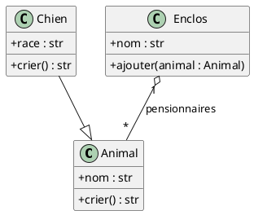
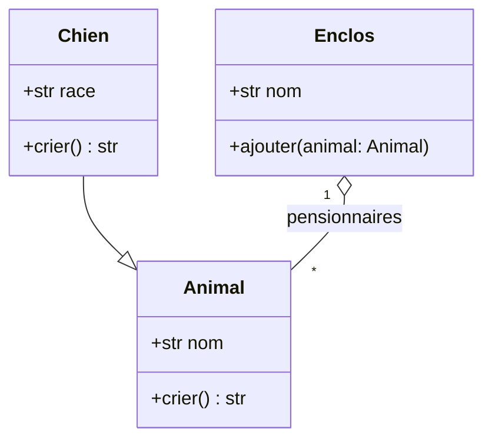
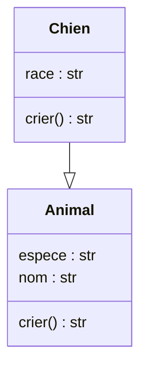

# UML dans Visual Studio Code

> [!abstract] Objectif
> Produire, versionner et maintenir des diagrammes UML depuis Visual Studio Code : diagrammes **textuels** (PlantUML, Mermaid) rendus dans l'éditeur, diagrammes **dessinés** (Draw.io, Excalidraw) stockés dans le dépôt, et diagrammes de classes **générés** à partir du code Python avec pyreverse — avec les extensions et outils réellement nécessaires.

> [!info] État de la note
> Réécrite le 29 août 2026. L'idée de 2023 — écrire un modeleur UML sous forme d'extension VS Code, illustrée par du code sans rapport (client Azure, bibliothèque `pyslet` inexistante pour UML) — n'a plus lieu d'être : l'outillage existe. Les commandes du chapitre 4 ont été exécutées avec pylint 4 (pyreverse), et la sortie PlantUML rendue avec PlantUML 1.2026.7 sous Java 21 ; la sortie Mermaid a été validée par l'analyseur Mermaid 11.13.

Voir aussi : [[Visual studio code]], [[Mermaid pour Obsidian]], [[PlantUML pour Obsidian]], [[UML Ecore EMF Plantuml QVT Mermaid PyEcore]], [[Design patterns]].

# 1. Choisir sa forme de diagramme

| Forme | Outil | Quand |
|---|---|---|
| **Texte → diagramme** | PlantUML | tous les diagrammes UML (classes, séquence, états, activités, composants, déploiement), C4, notation complète ; rendu par Java |
| **Texte → diagramme** | Mermaid | classes, séquence, états, ER, flux ; syntaxe plus simple, rendu natif dans GitHub, GitLab, Obsidian et les aperçus Markdown |
| **Dessin** | Draw.io, Excalidraw | schémas d'architecture, croquis d'atelier, diagrammes hors UML strict |
| **Code → diagramme** | pyreverse (Python), Doxygen + Graphviz (C/C++/Java) | documenter l'existant, vérifier une architecture |
| **Modèle → code** | pyecore, EMF | métamodèles et génération, voir le cours [[UML Ecore EMF Plantuml QVT Mermaid PyEcore]] |

Les formes textuelles se **versionnent** dans Git, se relisent en revue de code et se génèrent par script : c'est le choix par défaut pour un projet logiciel.

# 2. Diagrammes textuels

## 2.1 PlantUML

1. Installer l'extension **PlantUML** (`jebbs.plantuml`).
2. Choisir le mode de rendu :
   - **local** : Java 17+ et Graphviz (`sudo apt install default-jre graphviz`) ; l'extension embarque `plantuml.jar` ;
   - **serveur** : `docker run -d -p 8080:8080 plantuml/plantuml-server:jetty` puis, dans les paramètres, `"plantuml.render": "PlantUMLServer"` et `"plantuml.server": "http://localhost:8080"` — plus rapide, sans Java sur le poste ; le serveur public `plantuml.com` est à réserver aux diagrammes non confidentiels.
3. Créer `docs/architecture.puml`, ouvrir l'aperçu (`Alt+D`), exporter (`PlantUML: Export Current Diagram`) en SVG ou PNG.



## 2.2 Mermaid

1. Installer **Markdown Preview Mermaid Support** (`bierner.markdown-mermaid`) : les blocs ```mermaid des fichiers Markdown se rendent dans l'aperçu (`Ctrl+Shift+V`) ; l'extension **Mermaid Chart** ajoute l'édition de fichiers `.mmd` avec aperçu.
2. Écrire le diagramme dans la documentation elle-même (`README.md`, `docs/*.md`) : GitHub et GitLab le rendent sans configuration.



La syntaxe complète et les pièges de version sont dans [[Mermaid pour Obsidian]] — les mêmes diagrammes servent dans les notes Obsidian et dans le dépôt.

# 3. Diagrammes dessinés

- **Draw.io Integration** (`hediet.vscode-drawio`) : un fichier nommé `schema.drawio.svg` ou `schema.drawio.png` s'édite dans VS Code avec l'éditeur Draw.io complet (formes UML incluses) et reste une image directement affichable dans la documentation ; le diff Git montre l'image et le XML embarqué.
- **Excalidraw** (`pomdtr.excalidraw-editor`) : croquis à main levée dans des fichiers `.excalidraw.svg`/`.png` ; idéal en atelier de conception, moins pour la notation UML stricte.

# 4. Générer un diagramme de classes depuis du code Python

`pyreverse`, livré avec **pylint**, analyse un paquet et produit des diagrammes de classes et de paquets en PlantUML, Mermaid, Graphviz ou HTML.

```bash
python -m pip install -U pylint
pyreverse -o mmd  -p zoo zoo/      # classes_zoo.mmd et packages_zoo.mmd
pyreverse -o puml -p zoo zoo/      # classes_zoo.puml et packages_zoo.puml
pyreverse -o puml -p zoo -A -S -f ALL zoo/   # ancêtres, classes associées, tous les attributs
```

Pour le paquet de démonstration suivant :

```python
class Animal:
    def __init__(self, nom: str, espece: str) -> None:
        self.nom = nom
        self.espece = espece

    def crier(self) -> str:
        return "..."


class Chien(Animal):
    def __init__(self, nom: str, race: str) -> None:
        super().__init__(nom, "chien")
        self.race = race

    def crier(self) -> str:
        return "Wouf"
```

pyreverse produit (sortie réelle, Mermaid) :



et l'équivalent PlantUML, rendu en SVG par `java -jar plantuml.jar -tsvg classes_zoo.puml`. Ces fichiers se régénèrent dans l'intégration continue pour que la documentation suive le code ; les associations déduites des annotations de type restent partielles, un diagramme de conception écrit à la main garde sa place.

Pour d'autres langages : **Doxygen** avec Graphviz (C, C++, Java, PHP) produit hiérarchies et graphes d'appels ; les IDE JetBrains génèrent des diagrammes de classes Java ; côté TypeScript, `tsuml2` ou les extensions PlantUML dédiées.

# 5. Du diagramme au modèle

Un diagramme est une image ; un **modèle** est une structure interrogeable et transformable. Quand le besoin dépasse la documentation — générer du code, valider des contraintes, transformer un métamodèle — le cours [[UML Ecore EMF Plantuml QVT Mermaid PyEcore]] présente Ecore, EMF et **pyecore**, qui lit et écrit des modèles Ecore en Python et peut produire, entre autres, du PlantUML.

# 6. Aide-mémoire

| Besoin | Outil ou commande |
|---|---|
| Aperçu PlantUML | extension `jebbs.plantuml`, `Alt+D` |
| Serveur PlantUML local | `docker run -d -p 8080:8080 plantuml/plantuml-server:jetty` |
| Rendu PlantUML en ligne de commande | `java -jar plantuml.jar -tsvg fichier.puml` |
| Aperçu Mermaid dans Markdown | extension `bierner.markdown-mermaid`, `Ctrl+Shift+V` |
| Diagramme dessiné versionnable | `nom.drawio.svg` avec `hediet.vscode-drawio` |
| Classes depuis du Python | `pyreverse -o mmd -p projet paquet/` |
| Paquets et dépendances | `packages_*.mmd` produit par la même commande |

# 7. Sources

- Extension PlantUML pour VS Code : <https://marketplace.visualstudio.com/items?itemName=jebbs.plantuml> ; PlantUML : <https://plantuml.com/fr/>
- Serveur PlantUML : <https://github.com/plantuml/plantuml-server>
- Markdown Preview Mermaid Support : <https://marketplace.visualstudio.com/items?itemName=bierner.markdown-mermaid> ; Mermaid : <https://mermaid.js.org/>
- Draw.io Integration : <https://marketplace.visualstudio.com/items?itemName=hediet.vscode-drawio>
- Excalidraw : <https://marketplace.visualstudio.com/items?itemName=pomdtr.excalidraw-editor>
- pyreverse (pylint) : <https://pylint.readthedocs.io/en/stable/additional_tools/pyreverse/index.html>
- Doxygen : <https://www.doxygen.nl/>
- pyecore : <https://github.com/pyecore/pyecore>
