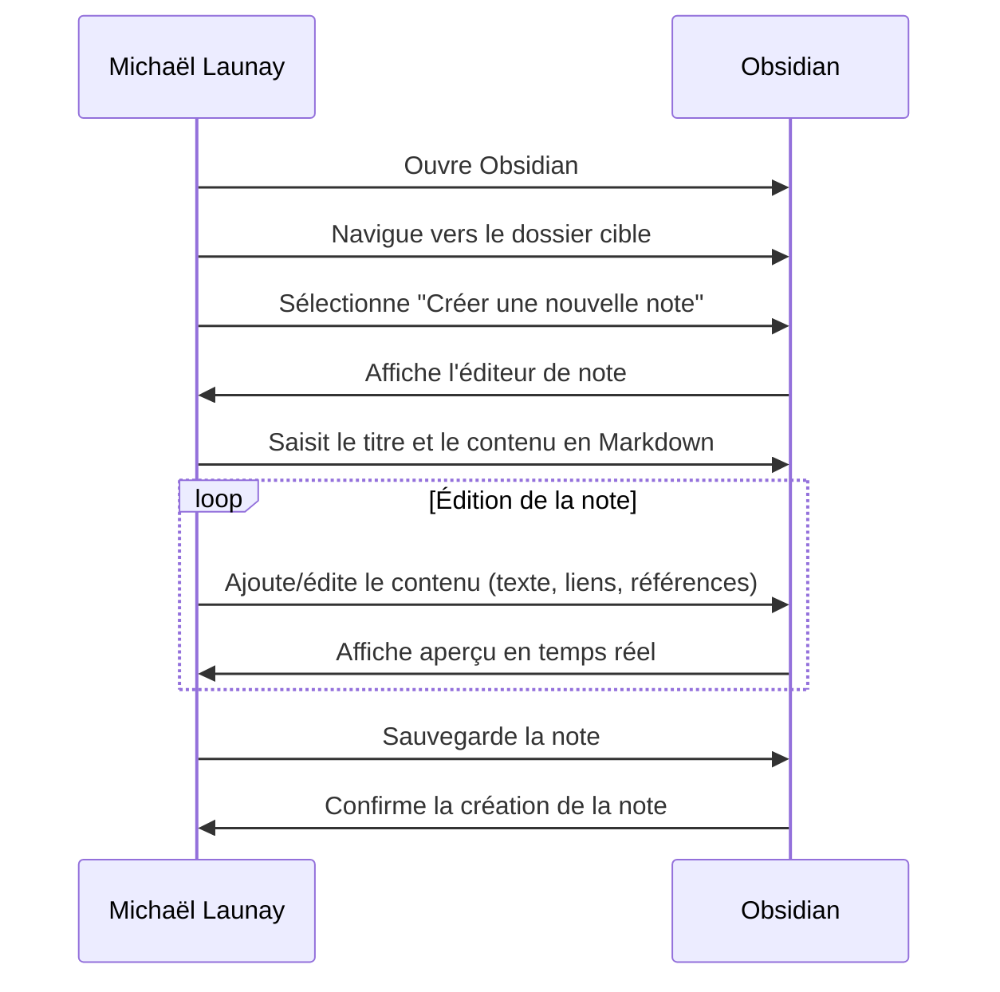

# **Création d'une Note Markdown dans Obsidian**

## Résumé
Michaël Launay utilise Obsidian pour créer une nouvelle note en format Markdown. Il y intègre du texte, des liens vers d'autres notes, et des références à des ressources externes comme des images ou des documents PDF.

## Acteurs en jeu
- **Michaël Launay** : L'utilisateur qui crée et édite la note.

## Prérequis
- Michaël a installé Obsidian sur son ordinateur.
- Michaël possède les droits nécessaires pour créer et éditer des notes dans Obsidian.

## Étapes du scénario
1. Michaël ouvre l'application Obsidian sur son ordinateur.
2. Il navigue vers le dossier où il souhaite créer la nouvelle note.
3. Michaël clique sur l'option "Créer une nouvelle note".
4. Il saisit le titre de la nouvelle note.
5. Michaël commence à taper le contenu de la note en utilisant la syntaxe Markdown. Cela peut inclure :
   - Du texte formaté (titres, listes, italique, gras, etc.).
   - Des liens internes vers d'autres notes dans Obsidian.
   - Des liens externes vers des sites web ou des ressources.
   - Des références à des images, des documents PDF, ou d'autres fichiers stockés localement ou en ligne.
6. Au fur et à mesure de la saisie, Obsidian affiche un aperçu en temps réel de la note avec le formatage Markdown appliqué.
7. Michaël sauvegarde la note une fois qu'il a fini de la rédiger.
8. La nouvelle note est maintenant créée et stockée dans le dossier spécifié, prête à être consultée ou éditée ultérieurement.

## Diagramme de séquence Mermaid

Ce diagramme de séquence illustre le flux d'interactions entre Michaël Launay (l'acteur) et l'application Obsidian (le système) lors de la création d'une nouvelle note en format Markdown. Il détaille les étapes que Michaël doit suivre pour créer sa note, depuis l'ouverture de l'application jusqu'à la sauvegarde de la note avec le contenu souhaité.