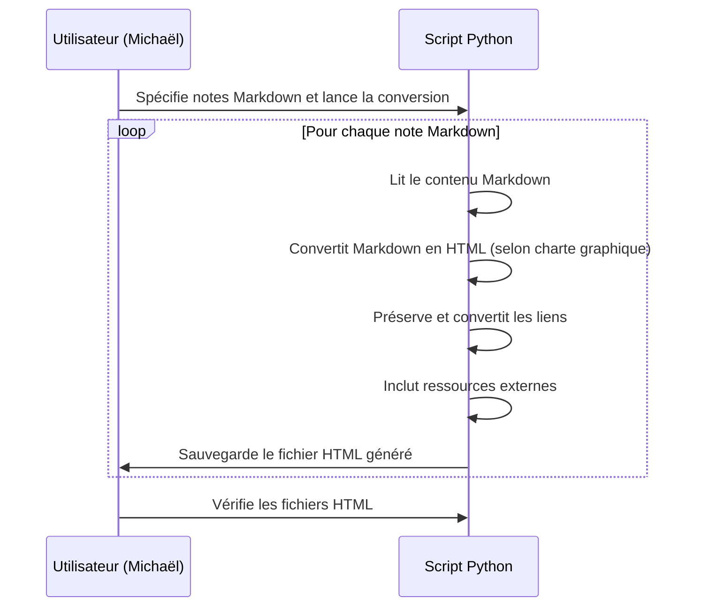

# **Conversion de Notes Markdown en HTML**

## Résumé
Un script Python lit une ou plusieurs notes Markdown spécifiées par l'utilisateur, Michaël Launay, et les convertit en fichiers HTML. Cette conversion respecte une charte graphique prédéfinie et préserve les liens internes et externes contenus dans les notes.

## Acteurs en jeu
- **Système de conversion (script Python)** : L'outil automatisé qui effectue la conversion des fichiers.

## Prérequis
- Le script de conversion Python est installé et configuré sur l'ordinateur de Michaël.
- Les notes Markdown à convertir sont accessibles par le script.
- Une charte graphique prédéfinie pour la conversion des notes en HTML est disponible.

## Étapes du scénario
1. Michaël spécifie les notes Markdown qu'il souhaite convertir en HTML, soit en sélectionnant des fichiers individuellement, soit en indiquant un répertoire contenant plusieurs notes.
2. Le script de conversion Python est lancé avec les paramètres spécifiés par Michaël.
3. Pour chaque note Markdown spécifiée :
   a. Le script lit le contenu du fichier Markdown.
   b. Il analyse le contenu pour identifier les éléments de syntaxe Markdown (comme les titres, listes, liens, images, etc.).
   c. Le script convertit ces éléments en leur équivalent HTML, suivant la charte graphique prédéfinie.
   d. Les liens internes et externes sont préservés et correctement transformés pour fonctionner dans le contexte d'une page web.
   e. Les ressources externes (comme les images ou les documents PDF) référencées dans la note sont incluses de manière appropriée dans le fichier HTML final.
4. Une fois la conversion terminée pour une note, le script sauvegarde le fichier HTML généré dans un répertoire spécifié par Michaël.
5. Michaël reçoit une notification (ou vérifie manuellement) que la conversion est terminée et consulte les fichiers HTML pour s'assurer qu'ils répondent à ses attentes.

## Diagramme de séquence Mermaid

Ce diagramme illustre le processus de conversion des notes Markdown en HTML par le script Python, depuis le moment où l'utilisateur spécifie les fichiers à convertir jusqu'à la vérification des fichiers HTML générés. Il met en évidence la logique automatisée de conversion, y compris la préservation des liens et l'inclusion des ressources externes, tout en suivant une charte graphique prédéfinie.