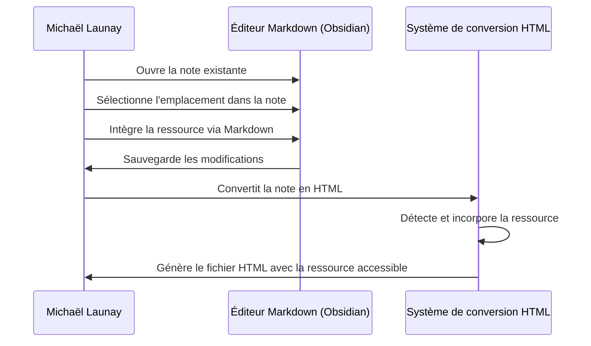

# **Ajout d'une Ressource à une Note**

## Résumé
Michaël Launay enrichit une note existante en y ajoutant une ressource, telle qu'une image ou un document PDF. Le système assure que cette ressource est correctement intégrée et accessible lorsque la note est convertie en HTML.

## Acteurs en jeu
- **Michaël Launay** : L'utilisateur qui édite la note et y ajoute une ressource.

## Prérequis
- Michaël a accès à l'application Obsidian ou à tout autre éditeur de Markdown qu'il utilise pour ses notes.
- La note à laquelle Michaël souhaite ajouter une ressource existe déjà.
- Michaël dispose de la ressource (image, PDF, etc.) qu'il souhaite ajouter à la note.

## Étapes du scénario
1. Michaël ouvre la note existante dans Obsidian ou dans son éditeur de Markdown.
2. Il sélectionne l'emplacement dans la note où il souhaite ajouter la ressource.
3. Michaël utilise la syntaxe Markdown appropriée pour intégrer la ressource dans la note. Pour une image, cela peut être ``, et pour un document PDF ou tout autre fichier, un lien Markdown standard `[nom du fichier](url/to/file.pdf)`.
4. Si nécessaire, Michaël télécharge la ressource sur un emplacement accessible via une URL (pour les notes publiées en ligne) ou s'assure que le chemin d'accès est correct pour une utilisation locale.
5. Michaël sauvegarde les modifications apportées à la note.
6. Lors de la conversion de la note en HTML, le système de conversion détecte l'intégration de la ressource et s'assure qu'elle est correctement incorporée et accessible dans le fichier HTML final. Cela peut inclure la copie de fichiers dans le bon répertoire ou la vérification que les URL sont accessibles.

## Diagramme de séquence Mermaid

Ce diagramme de séquence illustre le processus d'ajout d'une ressource à une note par Michaël, en utilisant Obsidian ou un autre éditeur Markdown, et comment cette ressource est traitée et rendue accessible dans la version HTML de la note par le système de conversion.