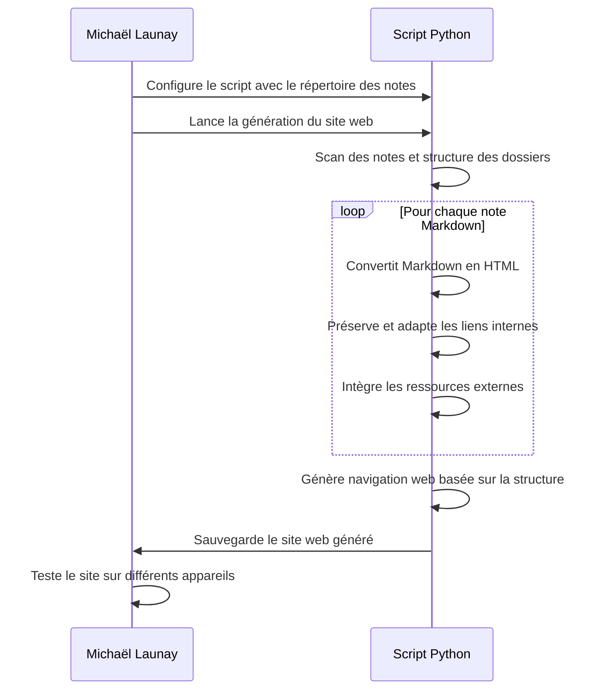

# **Génération du Site Web Complet**

## Résumé
Le système de conversion, à travers un script Python, prend en charge l'ensemble des notes Markdown disponibles dans l'espace de travail de Michaël Launay. Il les transforme en un site web complet, fidèle à la structure organisée des notes et dossiers dans Obsidian, tout en assurant que le site est responsive et visuellement harmonieux.

## Acteurs en jeu
- **Système de conversion (script Python)** : L'outil qui exécute la transformation des notes en pages web.

## Prérequis
- Le script de conversion est correctement installé et configuré sur l'ordinateur de Michaël.
- Toutes les notes Markdown destinées à être incluses dans le site web sont accessibles par le script.
- Une charte graphique est définie pour le site web, incluant des règles de style pour assurer la cohérence visuelle et la responsivité.

## Étapes du scénario
1. Michaël configure le script de conversion pour pointer vers le répertoire contenant ses notes Obsidian.
2. Il lance le script, qui commence alors le processus de génération du site web.
3. Le script scanne le répertoire spécifié pour identifier toutes les notes Markdown et la structure des dossiers.
4. Pour chaque note trouvée, le script :
   a. Convertit le contenu Markdown en HTML, en appliquant la charte graphique prédéfinie.
   b. Préserve la structure des liens internes, adaptant les références pour qu'elles fonctionnent dans le contexte du site web.
   c. Intègre les ressources (images, PDF, etc.) mentionnées dans les notes, en s'assurant de leur accessibilité.
5. Le script génère également des éléments de navigation web, comme des menus ou des barres de recherche, basés sur la structure des dossiers et des notes dans Obsidian.
6. Une fois la conversion terminée, le site web est sauvegardé dans un répertoire de sortie spécifié par Michaël.
7. Michaël teste le site web sur différents appareils pour s'assurer de sa responsivité et de l'intégrité de sa structure et de son contenu.

## Diagramme de séquence Mermaid

Ce diagramme détaille le flux d'actions depuis la configuration du script de conversion par Michaël jusqu'à la génération et le test du site web complet. Il souligne l'automatisation du processus de conversion des notes en un site web organisé et esthétiquement cohérent, ainsi que les vérifications finales pour assurer la qualité et la fonctionnalité du site sur divers dispositifs.