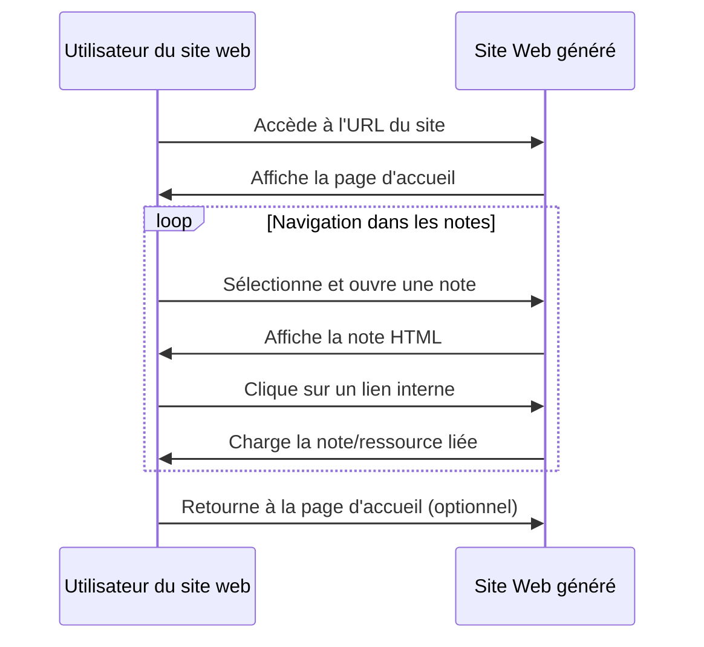

### Titre
**Consultation d'une Note Convertie en HTML**

### Résumé
Un utilisateur navigue sur le site web généré à partir des notes Markdown converties en HTML. Il explore les différentes notes, utilisant les liens internes pour passer d'une note à l'autre, découvrant ainsi le contenu interconnecté.

### Acteurs en jeu
- **Utilisateur du site web (visiteur)** : La personne qui navigue sur le site web et consulte les notes.

### Prérequis
- Le site web généré à partir des notes Markdown est hébergé et accessible en ligne.
- Les notes ont été converties en HTML et organisées conformément à la structure originale d'Obsidian.
- Les liens internes entre les notes ont été correctement transformés et sont fonctionnels dans le contexte HTML.

### Étapes du scénario
1. L'utilisateur accède à l'URL du site web généré.
2. La page d'accueil du site s'affiche, présentant une vue d'ensemble des notes disponibles ou une structure de navigation basée sur les dossiers d'Obsidian.
3. L'utilisateur sélectionne une note à consulter, qui s'ouvre dans son navigateur.
4. En lisant la note, l'utilisateur repère des liens vers d'autres notes ou ressources et décide de cliquer sur l'un d'eux.
5. Le navigateur charge la nouvelle note ou ressource liée.
6. L'utilisateur continue à naviguer entre les notes en utilisant les liens internes, explorant ainsi le contenu du site.
7. À tout moment, l'utilisateur peut retourner à la page d'accueil pour choisir une autre branche de contenu à explorer.

### Diagramme de séquence Mermaid

Ce diagramme de séquence illustre le flux d'interactions entre un utilisateur et le site web généré, mettant en lumière la manière dont l'utilisateur navigue entre les différentes notes converties en HTML et comment il utilise les liens internes pour explorer le contenu lié.