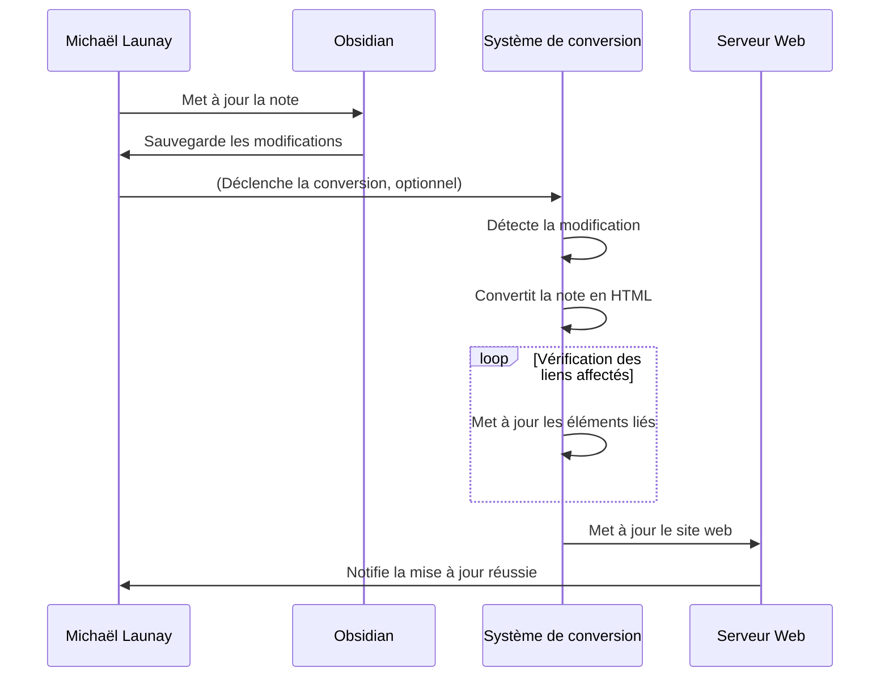

# **Mise à Jour d'une Note dans Obsidian et Régénération du Site Web**

## Résumé
Michaël Launay procède à la mise à jour d'une note existante dans Obsidian. Suite à cette modification, le système détecte automatiquement le changement et procède à la régénération de la version HTML de la note modifiée, ainsi qu'à la mise à jour des parties du site web potentiellement affectées par cette modification.

## Acteurs en jeu
- **Michaël Launay** : L'utilisateur qui met à jour la note.
- **Système de conversion (script Python)** : L'outil qui détecte la mise à jour et régénère le site web.

## Prérequis
- Michaël a installé et configuré Obsidian pour la gestion de ses notes.
- Le script de conversion est configuré pour surveiller les modifications des notes dans Obsidian et pour régénérer le site web en conséquence.
- Les notes d'Obsidian sont stockées de manière à être accessibles par le script de conversion.

## Étapes du scénario
1. Michaël ouvre une note existante dans Obsidian qu'il souhaite mettre à jour.
2. Il apporte les modifications nécessaires à la note, telles que le texte, les liens internes, ou l'ajout de ressources.
3. Michaël sauvegarde les modifications apportées à la note.
4. Le système de conversion (script Python) détecte automatiquement la modification de la note grâce à un mécanisme de surveillance des fichiers ou une action déclenchée par Michaël.
5. Le script reconvertit la note modifiée en HTML, en appliquant la charte graphique prédéfinie et en préservant les fonctionnalités, comme les liens internes.
6. Le système vérifie si d'autres parties du site web sont affectées par la mise à jour de cette note (par exemple, si des liens vers cette note existent dans d'autres notes) et met à jour ces éléments en conséquence.
7. Une fois la régénération terminée, le site web est mis à jour sur le serveur web pour refléter les changements.
8. Michaël reçoit une notification ou vérifie manuellement que la mise à jour a été effectuée avec succès et que le site web est à jour.

## Diagramme de séquence Mermaid

Ce diagramme de séquence montre le processus de mise à jour d'une note dans Obsidian par Michaël Launay, la détection de cette mise à jour par le système de conversion, la régénération du contenu HTML, et la mise à jour finale du site web hébergé. Il illustre également l'interaction entre l'utilisateur, l'application Obsidian, le système de conversion, et le serveur web pour assurer que le site web reste synchronisé avec les dernières modifications apportées aux notes.